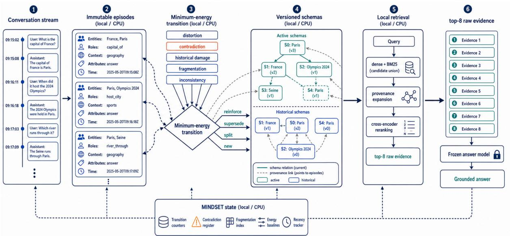

# MINDSET: Energy-based Schema Evolution for Long Conversational Agent Memory

Sujato Dutta, Sreekruthy Tummala, Shashank Vanga & Ayushmi Pavani Mahindra University

## Abstract

Long conversational agents have become essential in our daily lives. They must remember what was said long back in order to help us efficiently complete a task without needing the user to repeat instructions and context repeatedly. However, the main issue is that instructions and context change over time and so the agents must be able to adapt accordingly. A useful memory system should preserve both current and historical states, distinguish stale information from active knowledge, retrieve evidence appropriate to the query and avoid repeatedly invoking a large language model to rewrite prior interactions. We introduce MINDSET, a memory controller that stores a conversation as immutable episodes and or ganizes them into versioned schemas through minimum-energy state transitions. Each incoming episode may reinforce, supersede, split or create a schema. The transition decision balances representation distortion, contradiction, historical damage, fragmentation and internal inconsistency, while hysteresis prevents isolated contradictions from prematurely rewriting stable memory.

We evaluate MINDSET against 5 memory systems on a reproducible sample of 850 questions (700 LoCoMo + 150 MemoryAgentBench). MINDSET obtains the highest observed Lo-CoMo answer F1 while significantly improving retrieval ranking (Recall@8, MRR and nDCG@8) over the second best method Light-Mem (p<0.01 after Holm correction). It obtains the highest observed scores on MemoryAgent-Bench although the relative difference is low. Ablations identify controlled fragmentation and schema-aware assignment as the largest contributors to answer quality. Additionally, a 700- question cross-model evaluation with GLM-4.7 and Gemma-4-31B supported model independence. These results show that long-term memory can be better handled as constrained state management rather than continual summarization.

## 1 Introduction

A conversational agent must remember not only what was said, but also what changed over time. With changing preferences, retaining only the original preference will produce stale answers, while retaining only the latest statement erases the context required to answer questions about the transition. Storing both in an undifferentiated vector index leaves the model to resolve the contradiction repeatedly. Full-history prompting preserves the complete record, but incurs recurring inference cost and remains vulnerable to context limits and the “lost in the middle” effect (Liu et al., 2024). Summarization reduces context length but may blur the context needed to verify an answer.

This problem is common in agent memory. Retrieval-augmented generation (RAG) (Lewis et al., 2021) provides language models with external evidence, while dense passage retrieval (Karpukhin et al., 2020) and sentence embeddings (Reimers and Gurevych, 2019) make semantic access efficient. Memory-based agents have introduced reflection (Park et al., 2023; Shinn et al., 2023), virtual context management (Packer et al., 2024), forgetting (Zhong et al., 2023), graph-based organization (Gutiérrez et al., 2025), learned memory operations (Yu et al., 2026) and benchmarkspecific consolidation (Zhang et al., 2026; Ma et al., 2026). These systems show the importance of memory but lack in a core area. The central challenge in long conversational agents is state evolution under contradiction i.e. deciding whether new evidence should update an existing one, coexist as a contextual branch or be stored as a new memory.

MINDSET addresses this problem directly. It maintains immutable conversational episodes and a compact layer of versioned schemas. A schema is not a generated summary; it is a structured index over supporting and exceptional episodes, with temporal validity, active or historical status and predecessor-successor links. For each incoming episode, MINDSET evaluates four possible actions - REINFORCE, SUPERSEDE, SPLIT and NEW under a local energy function. The energy penalizes representation distortion, unresolved contradiction, historical damage, unnecessary fragmentation, and internal inconsistency. Temporal and contextual signals determine action feasibility, while hysteresis prevents isolated contradictions from prematurely rewriting stable memory. This design separates two responsibilities that are often conflated. The memory controller determines how experience should be organized and which episodes are relevant, while the language model receives a bounded evidence packet and produces the final answer.

Our main contributions are:

1. We formulate conversational memory evolution as minimum-energy selection over explicit statetransition actions.

2. We introduce provenance-preserving versioned schemas that distinguish active states, historical states, contextual branches and exceptions without replacing the underlying episodes.

3. We provide a thorough and fair evaluation across LoCoMo and MemoryAgentBench, covering six memory systems, ablations and 3 answer models to show generalization.

Our results show that MINDSET achieves the best retrieval-ranking performance along with best overall answer F1. It also lowers token usage by upto 10 times when compared with long context.

## 2 Related Work

## 2.1 Retrieval and Long-Context Answering

Retrieval-augmented generation (RAG) combines parametric generation with non-parametric evidence (Lewis et al., 2021). Dense passage retrieval (Karpukhin et al., 2020) established a widely used neural retrieval paradigm, Sentence-BERT (Reimers and Gurevych, 2019) made efficient semantic matching practical, and BM25 (Robertson and Zaragoza, 2009) remains competitive when exact entities, dates, or rare lexical cues are important. Reciprocal rank fusion (Cormack et al., 2009) combines heterogeneous rankings without requiring score calibration, while maximal marginal relevance (Carbonell and Stewart, 1999) balances relevance and diversity. MINDSET builds on this and modifies the memory index: raw episodes are supplemented with versioned schema routes, historicalstate access and provenance expansion back to the

original evidence.

Long-context prompting provides an alternative to explicit memory management. However, evaluations such as LongBench (Bai et al., 2024), RULER (Hsieh et al., 2024), and Lost in the Middle (Liu et al., 2024) show that larger context windows do not guarantee reliable evidence use. Long inputs also incur recurring inference cost.

## 2.2 Memory for Language-Model Agents

Early agent-memory systems demonstrated several complementary strategies. Generative Agents stores observations, generates reflections, and retrieves memories to support behavior (Park et al., 2023); ReAct interleaves reasoning with environment-facing actions (Yao et al., 2023); MemGPT treats context management as a virtualmemory problem (Packer et al., 2024); and Reflexion stores linguistic feedback as episodic memory rather than modifying model weights (Shinn et al., 2023). MemoryBank combines dialogue memories, summaries and personality descriptions (Zhong et al., 2023).

More recent work explores increasingly structured forms of memory control. A-MEM dynamically organizes agent-generated notes (Xu et al., 2025), MemoryOS introduces an operating-system abstraction (Kang et al., 2025), Mem0 emphasizes scalable extraction and consolidation (Chhikara et al., 2025), HippoRAG uses graph-based associative retrieval (Gutiérrez et al., 2025), and AgeMem learns unified memory operations (Yu et al., 2026).

Among systems closest to our experimental setting, LightMem separates short, mid and long-term memory while emphasizing lightweight memory operations (Zhang et al., 2026), whereas Nemori organizes experience through episodic boundaries, aligned representations, and predict-calibrate updates (Ma et al., 2026).

## 2.3 Evolving and Temporal Memory

Temporal change is central to several recent benchmarks. LoCoMo evaluates single-hop, temporal, multi-hop, open-domain, and adversarial reasoning over long conversations (Maharana et al., 2024). LongMemEval studies retention, multi-session reasoning, temporal reasoning, knowledge updates, and abstention across extended interaction histories (Wu et al., 2025). Beyond Goldfish Memory introduced long-running multi-session dialogue (Xu et al., 2022), LOCCO measures chronological degradation (Jia et al., 2025), and MemBench broadens evaluation across effectiveness, efficiency, and capacity (Tan et al., 2025a). Keep Me Updated targets changed world knowledge (Bae et al., 2022), while systems such as RMM (Tan et al., 2025b), THEANINE (Ong et al., 2025), Associa (Zhang et al., 2025), EMG-RAG (Wang et al., 2024), Hi-Agent (Hu et al., 2025), MemoryOS (Kang et al., 2025), and MemInsight (Salama et al., 2025) explore reflective, hierarchical, associative, graph, and diagnostic views of memory. MemoryAgent-Bench evaluates factual retrieval, in-context learning, long-range understanding, and recommendation (Hu et al., 2026).

MINDSET makes memory evolution an explicit choice among four state transitions: reinforcing an existing schema, superseding a historical state, creating a contextual branch and starting a new schema. This formulation is related in spirit to event segmentation in cognition (Zacks et al., 2007), complementary learning systems (Mcclelland et al., 1995), and energy-based learning (Le-Cun et al., 2006). We do not claim a biologically faithful model. Instead, they motivate the engineering principle behind MINDSET.

## 3 Method

## 3.1 Problem formulation

Let a conversation produce an ordered stream of episodes

$$
\mathcal { E } _ { t } = ( e _ { 1 } , e _ { 2 } , \ldots , e _ { t } ) ,
$$

where each episode stores a conversation identifier, session, timestamp, speaker, raw text and locally extracted entity, role, context, attribute, and changecue features. The memory controller maintains a set of schemas $S _ { t }$ . A schema groups compatible episodes into a versioned state; it records support and exception identifiers, a centroid and medoid, validity bounds, active or historical status and predecessor/successor links.

For each incoming episode $e _ { t } ,$ the controller chooses an action

$$
a _ { t } \in \{ \mathrm { R E I N F O R C E } , \mathrm { S U P E R S E D E } , \mathrm { S P L I T } , \mathrm { N E W } \}
$$

Reinforce adds evidence to a compatible active schema. Supersede closes an active schema and creates its temporally linked successor. Split creates a coexisting contextual branch. New starts an independent schema. Raw episodes are immutable under every action.

## 3.2 Compatibility and transition signals

MINDSET first retrieves at most $k _ { s }$ nearby active schemas. Let x be the unit embedding of incoming episode e, $\pmb { \mu } _ { s }$ the unit centroid of schema s, and $n _ { s }$ its number of supporting episodes. Dense similarity is $d = \operatorname* { m a x } ( 0 , \cos ( \mathbf { x } , \pmb { \mu } _ { s } ) )$ . For a schema feature counter $n _ { g } ( v )$ and the incoming set $X _ { g } ( e )$ the implementation uses

$$
O _ { g } ( s , e ) = \left\{ \begin{array} { l l } { o _ { \emptyset } , \quad \sum _ { v } n _ { g } ( v ) = 0 \mathrm { o r } X _ { g } ( e ) = \emptyset , } \\ { \displaystyle \frac { \sum _ { v \in \mathrm { u n i q } ( X _ { g } ( e ) ) } n _ { g } ( v ) } { \sum _ { v } n _ { g } ( v ) } , \quad \mathrm { o t h e r w i s e . } } \end{array} \right.
$$

Entity, role, and context matches are $o _ { e } = O _ { \mathrm { e n t i t y } } ,$ $o _ { r } = O _ { \mathrm { r o l e } }$ , and $m _ { c } =  { \mathcal { O } } _ { \mathrm { c o n t e x t } }$ . The topic indicator m<sub>t</sub> is one when the episode’s primary extracted attribute slot is not discourse and equals the schema topic suffix, and zero otherwise. Compatibility is exactly

$$
\begin{array} { c } { { K ( e , s ) = \mathrm { c l i p } _ { [ 0 , 1 ] } \big ( \alpha _ { d } d + \alpha _ { e } o _ { e } + \alpha _ { r } o _ { r } } } \\ { { + \left. \alpha _ { c } m _ { c } + \alpha _ { t } m _ { t } \right) . } } \end{array}
$$

Contradiction is computed only for incoming single-valued slots already present in the schema. Let $V _ { s } ( q )$ and $V _ { e } ( q )$ be the existing and incoming values for slot $q ,$ and let $J ( u , v )$ be Jaccard similarity between their normalized non-stopword token sets (exact string equality is used when either set is empty). With preference, plan, possession, experience, ability, and dislike treated as multi-valued and excluded,

$$
p = \operatorname* { m a x } _ { \boldsymbol { q } } \left[ 1 - \operatorname* { m a x } _ { \boldsymbol { u } \in V _ { s } ( \boldsymbol { q } ) , \boldsymbol { v } \in V _ { e } ( \boldsymbol { q } ) } J ( \boldsymbol { u } , \boldsymbol { v } ) \right] ,
$$

with $p = 0$ when no eligible slot exists. Recurrence is

$$
r = \operatorname* { m i n } \left( 1 , \frac { M } { m _ { r } } \right) ,
$$

where M is the number of stored exception episodes containing a same-slot value with $J \geq \theta _ { r }$ Let ℓ indicate that the incoming timestamp is no earlier than the latest support timestamp, and let x indicate an explicit lexical change cue. The implemented temporal and contextual potentials are

$$
\begin{array} { r } { \tau = p \operatorname* { m i n } \bigr \{ 1 , \beta _ { c } m _ { c } + \beta _ { \ell } \ell } \\ { + \beta _ { x } x + \beta _ { r } r \bigr \} , } \end{array}
$$

$$
\begin{array} { c } { \kappa = \operatorname* { m a x } ( p , \gamma _ { t } m _ { t } ) } \\ { \times \operatorname* { m i n } \bigl \{ 1 , \gamma _ { c } ( 1 - m _ { c } ) } \\ { + \gamma _ { r } ( 1 - o _ { r } ) + \gamma _ { d } ( 1 - d ) \bigr \} . } \end{array}
$$

  
Figure 1: MINDSET stores immutable episodes, chooses minimum-energy transitions over versioned schemas, expands retrieved schemas back to provenance, and sends a bounded raw-evidence packet to the answer model.

These signals determine action feasibility before energy comparison: SUPERSEDE requires $p \geq$ $\theta _ { \mathrm { s u p } } .$ , SPLIT requires $\begin{array} { r l r } { \kappa } & { { } \ge } & { \theta _ { \mathrm { s p l i t } } } \end{array}$ , and NEW is removed when $K \ \geq \ \theta _ { \mathrm { n e w } } . \quad \mathrm { A }$ hard new-topic guard selects NEW when $K \ < \ \theta _ { \mathrm { n e w } } , \ m _ { t } \ =$ $0 ,$ and $d \mathrm { ~  ~ { ~ < ~ } ~ } \theta _ { d }$ The implementation uses $k _ { s } ~ = ~ 6 , ~ o _ { \emptyset } ~ = ~ 0 . 5 0 , ~ \left( \alpha _ { d } , \alpha _ { e } , \alpha _ { r } , \alpha _ { c } , \alpha _ { t } \right) ~ = ~$ $( 0 . 5 2 , 0 . 1 8 , 0 . 1 2 , 0 . 1 0 , 0 . 0 8 ) , \ m _ { r } \ = \ 2 , \ \theta _ { r } \ =$ $0 . 8 0 , \ ( \beta _ { c } , \beta _ { \ell } , \beta _ { x } , \beta _ { r } ) \ = \ ( 0 . 3 5 , 0 . 2 0 , 0 . 4 0 , 0 . 2 5 )$ $\begin{array} { c c l } { ( \gamma _ { t } , \gamma _ { c } , \gamma _ { r } , \gamma _ { d } ) } & { = } & { ( 0 . 6 5 , 0 . 4 5 , 0 . 2 0 , 0 . 3 5 ) } \end{array}$ , and $( \theta _ { \mathrm { s u p } } , \theta _ { \mathrm { s p l i t } } , \theta _ { \mathrm { n e w } } , \theta _ { d } ) = ( 0 . 3 5 , 0 . 1 2 , 0 . 4 3 , 0 . 3 5 )$

All compatibility coefficients, transition thresholds, energy weights and hysteresis margins were selected through coarse calibration on a held-out development set with no question overlap with LoCoMo-700. MAB is fully dataset-disjoint from this calibration. They were frozen before test execution and were not optimized against test-answer F1.

## 3.3 Minimum-energy schema evolution

For every feasible action, MINDSET computes

$$
\begin{array} { c } { { E ( a ) = w _ { d } D _ { a } + w _ { c } C _ { a } + w _ { h } H _ { a } } } \\ { { + w _ { f } F _ { a } + w _ { i } I _ { a } . } } \end{array}
$$

Every term below is the quantity computed by the released implementation. Define

$$
\begin{array} { c } { { \pmb { \mu } ^ { + } = \mathrm { u n i t } \left( n _ { s } { \pmb \mu } _ { s } + { \bf x } \right) , } } \\ { { \delta _ { s } = 1 - \cos \left( { \pmb \mu } _ { s } , { \pmb \mu } ^ { + } \right) , } } \\ { { d _ { e } ^ { + } = 1 - \cos \left( { \bf x } , { \pmb \mu } ^ { + } \right) . } } \end{array}
$$

If $\bar { D } _ { s }$ is the schema’s running mean distortion,

$$
\begin{array} { r l } { { \cal D } _ { a } = \mathbb { I } [ a = \mathrm { R E I N F O R C E } ] } & { } \\ { \times \frac { n _ { s } ( \bar { D } _ { s } + \delta _ { s } ) + d _ { e } ^ { + } } { n _ { s } + 1 } . } \end{array}
$$

Unresolved contradiction and historical damage are

$$
\begin{array} { r l } & { C _ { a } = \mathbb { I } [ a = \mathrm { R E I N F O R C E } ] p , } \\ & { H _ { a } = \mathbb { I } [ a = \mathrm { R E I N F O R C E } ] ( \delta _ { s } + \lambda _ { h } p ) . } \end{array}
$$

Contradiction is therefore charged when incompatible evidence is merged; superseding or branching preserves the old state rather than paying this merge cost. For fragmentation, let A be the activeschema count, $T$ the count with fewer than $m _ { \mathrm { m i n } }$ support episodes, N the registered episode count including e at transition evaluation,

$$
\begin{array} { r l } & { q _ { a } = \mathbb { I } [ a \in \left\{ \mathrm { S P L I T } , \mathrm { N E W } \right\} ] , } \\ & { b _ { a } = \mathbb { I } [ a = \mathrm { R E I N F O R C E } ] \mathbb { I } [ n _ { s } < m _ { \operatorname* { m i n } } \leq n _ { s } + 1 ] . } \end{array}
$$

Then

$$
F _ { a } = \frac { A + q _ { a } + \eta ( T + q _ { a } - b _ { a } ) } { \operatorname* { m a x } ( 1 , \sqrt { N + 1 } ) } .
$$

Here η is a coefficient on projected tiny schemas, not an exponent. Let $\mathcal { G } _ { s }$ contain every nonempty attribute, role, and context counter in $s ,$ and define

$$
U ( s ) = \frac { 1 } { \vert \mathcal { G } _ { s } \vert } \sum _ { g \in \mathcal { G } _ { s } } \left( 1 - \frac { \operatorname* { m a x } _ { v } n _ { g } ( v ) } { \sum _ { v } n _ { g } ( v ) } \right) ,
$$

<table><tr><td>Episode</td><td>Conversation excerpt</td><td>K</td><td>p</td><td>T</td><td>κ</td><td>Relevant feasible energies</td><td>Decision</td></tr><tr><td>D3:16</td><td>“Setting small goals and tracking my progress...&quot;</td><td>.535</td><td>.000</td><td>.000</td><td>.000</td><td>reinforce .587</td><td>reinforce</td></tr><tr><td>D3:18</td><td>“I&#x27;m getting into different types of games now...&quot;</td><td>.622</td><td>1.000</td><td>.775</td><td>.378</td><td>reinforce 2.482; supersede .094; split .534</td><td>supersede</td></tr><tr><td>D14:2</td><td>&quot;Last week, I started my blog about coding.&quot;</td><td>.418</td><td>.000</td><td>.000</td><td>.000</td><td>reinforce .631; new .549</td><td>new</td></tr><tr><td>D18:1</td><td>&quot;Recently left my IT job...now with this new  $\mathrm { j o b . . . } ^ { \mathrm { ~ \tiny ~ \textnormal ~ { ~ j ~ o ~ b ~ . ~ . ~ } ~ } }$ </td><td>.480</td><td>.000</td><td>.000</td><td>.351</td><td>reinforce .625; split .181</td><td>split</td></tr></table>

Table 1: Audited transitions from one frozen LoCoMo conversation. Energies are shown only for feasible actions.

with $U ( s ) = 0$ when $\mathcal { G } _ { s }$ is empty. The actionspecific inconsistency term is

$$
\begin{array} { r } { I _ { a } = \left\{ \begin{array} { l l } { U ( s ) + \lambda _ { i } \operatorname* { m a x } ( \tau , \kappa ) , } & { a = \mathrm { R E I N F O R C E } , } \\ { \operatorname* { m a x } ( 0 , \kappa - \tau ) , } & { a = \mathrm { S U P E R S E D E } , } \\ { \operatorname* { m a x } ( 0 , \tau - \kappa ) , } & { a = \mathrm { S P L I T } , } \\ { K ( e , s ) , } & { a = \mathrm { N E W } . } \end{array} \right. } \end{array}
$$

The final weights are represented by

$$
\mathbf { w } = ( w _ { d } , w _ { c } , w _ { h } , w _ { f } , w _ { i } ) .
$$

The implementation uses $\lambda _ { h } = 0 . 3 5 , m _ { \mathrm { m i n } } = 2 .$ $\eta = 0 . 7 5 , \lambda _ { i } = 0 . 5 0 .$ , and

$$
\mathbf { w } = ( 1 . 0 0 , 1 . 2 5 , 0 . 7 5 , 0 . 2 2 , 1 . 0 0 ) .
$$

These are hand-tuned coefficients, not a proven optimal fit. Distortion and inconsistency define unit scale; contradiction receives modest priority so a detected single-valued conflict can outweigh moderate semantic fit; historical damage is discounted; and fragmentation is a weaker global regularizer because its count-based term accumulates throughout a conversation. The development set is question disjoint from test LoCoMo 700. There is no gradient fitting or test-answer F1 optimization. All parameters are frozen before the final paper runs.

Two shortcuts precede general comparison. Easy reinforcement applies when $p < \theta _ { p } ^ { \mathrm { e a s y } } , \kappa < \theta _ { \kappa } ^ { \mathrm { e a s y } }$ and $K \ge \theta _ { K } ^ { \mathrm { e a s y } }$ . An isolated strong contradiction $( p \geq \theta _ { p } ^ { \mathrm { i s o } } , r = 0 , x = 0 )$ is also assigned to RE-INFORCE. Whenever the final action is reinforce and $p \geq \theta _ { \mathrm { e x c } }$ , the episode is stored as an exception rather than support. Otherwise let b be the lowest-energy feasible alternative and

$$
\Delta = E \big ( \mathrm { R E I N F O R C E } \big ) - E ( b ) .
$$

The effective switch margin is

$$
\begin{array} { l } { m _ { \mathrm { e f f } } = m _ { \mathrm { s w i t c h } } ( 1 - \lambda _ { r } r ) } \\ { \qquad \times \left\{ \begin{array} { l l } { \rho , } & { \tau > \kappa \mathrm { a n d } \tau > \theta _ { \tau } , } \\ { 1 , } & { \mathrm { o t h e r w i s e } . } \end{array} \right. } \end{array}
$$

$$
\begin{array} { r l r } { \mathrm { W e } \quad \quad \mathrm { u s e } } & { { } ( \theta _ { p } ^ { \mathrm { e a s y } } , \theta _ { \kappa } ^ { \mathrm { e a s y } } , \theta _ { K } ^ { \mathrm { e a s y } } ) } & { = } \\ { ( 0 . 1 5 , 0 . 1 2 , 0 . 5 8 ) , ~ \theta _ { p } ^ { \mathrm { i s o } } } & { { } = } & { 0 . 6 0 , ~ \theta _ { \mathrm { e x c } } } & { = } & { 0 . 4 5 , } \end{array}
$$

$m _ { \mathrm { s w i t c h } } = 0 . 1 8 , \lambda _ { r } = 0 . 6 0 , \rho = 0 . 5 5 , \theta _ { \tau } = 0 . 4 5$ and $m _ { \mathrm { s t a y } } = 0 . 0 6$

These thresholds and margins were included in the same hand-tuned development protocol. The controller selects b when $\Delta > m _ { \mathrm { e f f } }$ , retains reinforce when $\Delta \le m _ { \mathrm { { s t a y } } }$ , and selects b in the intermediate region. Thus the stay margin is the final action boundary; the switch margin records whether a transition clears the stronger evidence threshold but does not change the action once the stay margin is crossed.

## 3.4 An audited transition sequence

Table 1 follows four real episodes from the frozen LoCoMo conversation conv-47. At D3:16, only REINFORCE remains feasible. At D3:18, “now” marks an explicit change and a single-valued conflict; SUPERSEDE costs 0.094, compared with 2.482 for REINFORCE. D14:2 introduces a coding blog below the 0.43 new-schema threshold, and NEW beats REINFORCE by 0.083. D18:1 has contextual potential 0.351 but no eligible attribute contradiction, so SPLIT preserves the earlier state while adding a branch. Feasibility and hysteresis are part of the policy: the lowest-energy action among all four alternatives is not necessarily feasible.

## 3.5 Retrieval from versions without summarizing away evidence

At query time, a local router labels the information need as current, historical, contextual or generic. Three candidate channels are then combined:

• direct retrieval, a dense-BM25 union over raw episodes;

• schema-mediated retrieval, which finds relevant schemas and expands them back to their support, exception, medoid and continuity episodes;

• version retrieval, which exposes medoids from active and historical schema states.

The candidate pool is reranked with ms-marco-MiniLM-L6-v2 and embeddings use all-MiniLM-L6-v2. We use a candidate pool of 40 and return eight pieces of evidence. The answer model receives the original provenance-bearing episodes.

<table><tr><td>Method</td><td>Answer F1</td><td>Recall@8</td><td>Precision@8</td><td>MRR</td><td>nDCG@8</td><td>Evidence recall</td><td>Total tokens</td></tr><tr><td>MINDSET</td><td>0.4280</td><td>0.6280</td><td>0.1056</td><td>0.5572</td><td>0.5453</td><td>0.6302</td><td>403,978</td></tr><tr><td>LightMem</td><td>0.4024</td><td>0.4522</td><td>0.0783</td><td>0.4365</td><td>0.4092</td><td>0.4554</td><td>313,522</td></tr><tr><td>Vector RAG</td><td>0.3807</td><td>0.3904</td><td>0.0670</td><td>0.2675</td><td>0.2779</td><td>0.3939</td><td>356,368</td></tr><tr><td>Nemori</td><td>0.3733</td><td>0.4198</td><td>0.0682</td><td>0.2527</td><td>0.2729</td><td>0.6321</td><td>1,536,928</td></tr><tr><td>MemoryBank</td><td>0.2975</td><td>0.0634</td><td>0.0106</td><td>0.0438</td><td>0.0463</td><td>0.6104</td><td>1,724,495</td></tr><tr><td>Long Context</td><td>0.2791</td><td>0.0153</td><td>0.0036</td><td>0.0082</td><td>0.0082</td><td>0.2190</td><td>4,310,788</td></tr></table>

Table 2: Main LoCoMo-700 results with GPT-OSS-120B. Total tokens are provider-recorded input plus output tokens. Exact cache hits add zero provider tokens in the run ledger; MemoryBank includes both memory-construction and answer-generation tokens.

## 3.6 Common evidence budget

Retrieval methods can emit memory units of very different size. We therefore normalize them before generation. Up to 20 candidate memories are segmented into 768-token passages with 96-token overlap, rescored against the question using the same local embedding model and greedily selected under a maximum of eight passages - 8,000 evidence tokens and three passages per original memory. Every passage retains its source memory ID, source event IDs, passage index, and character/- token offsets. Long Context is the sole structural exception because full history defines the baseline; it uses deterministic recency truncation at 20,000 UTF-8 bytes.

## 3.7 Computational efficiency

MINDSET performs no gradient training and makes no provider call during ingestion or retrieval. Its learned components are frozen off-the-shelf local encoders. If n episodes have already been stored, insertion compares a bounded set of nearby active schemas; retrieval constructs bounded direct and schema pools before reranking. The implementation therefore avoids both an unbounded prompt at answer time and repeated generative rewriting at write time.

## 4 Experimental Setup

## 4.1 Datasets

We use a frozen manifest of 700 questions from Lo-CoMo (Maharana et al., 2024), 70 from each of ten conversations. The category counts are 151 singlehop, 151 temporal, 96 multi-hop, 151 open-domain, and 151 adversarial questions. As a secondary dataset, we use MemoryAgentBench (MAB) (Hu et al., 2026). We use 150 samples from benchmarkinstance files: 125 in-context-learning examples and 25 recommendation examples. The five ICL source groups contribute 25 instances each, and the recommender contributes 25. We therefore use 850 questions in total. This is done intentionally to keep API costs manageable while also providing sufficient breadth for fair evaluation. The exact IDs and order are stored in the manifest and will be released with the codebase for reproducibility. Model transfer is evaluated on the complete frozen LoCoMo benchmark used by the primary experiment.

## 4.2 Baselines

We compare MINDSET against 5 methods:

• Vector RAG: flat normalized MiniLM embeddings over timestamped dialogue turns with cosine top-k retrieval.

• Long Context Memory: chronological full history, with deterministic oldest-turn removal only beyond 20,000 UTF-8 bytes.

• MemoryBank: adapted from the official architecture (Zhong et al., 2023). GPT-OSS replaces the original GPT-3.5 summarizer so the backbone remains same.

• LightMem: a reproduction preserving key design choices from the paper (Zhang et al., 2026).

• Nemori: a reproduction of the official implementation (Ma et al., 2026).

## 4.3 Answer models and generation

The primary model is gpt-oss-120b from Cerebras. All six methods use the same answer instructions, deterministic temperature 0, a maximum output reservation of 4,096 tokens, structured JSON validation, and completeness retries. Primary Lo-CoMo batching uses eight questions where supported; Long Context uses one question per request because histories are question-specific and large. The cross-backbone experiment uses zai-glm-4.7 and gemma-4-31b from Cerebras, 1 question per request, a 1,024-token output cap and a 160,000-byte prompt guard.

<table><tr><td>Method</td><td>ICL exact match</td><td>Recommender Recall@5</td><td>ICL token F1</td><td>Recommender F1@5</td></tr><tr><td>MINDSET (Ours)</td><td>0.0240</td><td>0.1400</td><td>0.0526</td><td>0.0587</td></tr><tr><td>MemoryBank</td><td>0.0000</td><td>0.1000</td><td>0.0409</td><td>0.0427</td></tr><tr><td>LightMem</td><td>0.0160</td><td>0.0400</td><td>0.0414</td><td>0.0160</td></tr><tr><td>Long Context Memory</td><td>0.0080</td><td>0.0400</td><td>0.0275</td><td>0.0133</td></tr><tr><td>Vector RAG</td><td>0.0000</td><td>0.0400</td><td>0.0183</td><td>0.0133</td></tr><tr><td>Nemori</td><td>0.0240</td><td>0.0000</td><td>0.0506</td><td>0.0000</td></tr></table>

Table 3: GPT-OSS-120B on the frozen MAB-150 manifest.
<table><tr><td>Variant</td><td>Answer F1</td><td>Recall@8</td><td>Precision@8</td><td>MRR</td><td>nDCG@8</td><td>Evidence recall</td></tr><tr><td>Full MINDSET</td><td>0.4280</td><td>0.6280</td><td>0.1056</td><td>0.5572</td><td>0.5453</td><td>0.6302</td></tr><tr><td>Nearest-schema merge</td><td>0.4080</td><td>0.6296</td><td>0.1060</td><td>0.5547</td><td>0.5445</td><td>0.6318</td></tr><tr><td>No contextual term</td><td>0.4194</td><td>0.6280</td><td>0.1056</td><td>0.5572</td><td>0.5453</td><td>0.6302</td></tr><tr><td>No temporal term</td><td>0.4237</td><td>0.6266</td><td>0.1054</td><td>0.5556</td><td>0.5437</td><td>0.6287</td></tr><tr><td>No hysteresis</td><td>0.4237</td><td>0.6280</td><td>0.1060</td><td>0.5549</td><td>0.5442</td><td>0.6302</td></tr><tr><td>No fragmentation penalty</td><td>0.4043</td><td>0.6256</td><td>0.1052</td><td>0.5567</td><td>0.5437</td><td>0.6278</td></tr><tr><td>No provenance expansion</td><td>0.4274</td><td>0.6158</td><td>0.1029</td><td>0.5508</td><td>0.5369</td><td>0.6180</td></tr></table>

Table 4: LoCoMo-700 ablations with GPT-OSS-120B.

## 4.4 Metrics

For LoCoMo we report answer F1 and retrieval Recall@8, Precision@8, mean reciprocal rank (MRR), nDCG@8 (Järvelin and Kekäläinen, 2002) and evidence recall. Text normalization removes punctuation and articles and applies Porter stemming. Temporal, multi-hop, and open-domain questions use token F1; single-hop questions admit multiple reference answers; adversarial questions are correct only when the response abstains with "No information available" or equivalent benchmarkrecognized wording. MAB uses its native metrics: first-line exact match for ICL and Recall@5 for recommendation. We additionally report deterministic normalized token F1 for ICL and set F1@5 for recommendation.

## 5 Results

In all tables, bold marks the best result and blue underlining marks the second-best. Ties receive the same rank formatting.

## 5.1 Main results on LoCoMo

MINDSET obtains the best observed answer F1 although the gap between LightMem stays close. In ranking metrics, MINDSET stays clear of other methods. Its MRR exceeds the runner-up by 0.1207 and its nDCG@8 by 0.1361. Only in evidence recall, it trails behind Nemori but that evidence is less concentrated at useful ranks and yields lower answer F1. In terms of token consumption, MIND-

SET uses almost 10x less tokens as compared to long context while trailing behind LightMem and Vector RAG.

## 5.2 Statistical tests

On the ten LoCoMo conversation clusters, MIND-SET significantly improves Recall@8, MRR and nDCG@8 over LightMem, the closest method across our study (mean differences +0.1758, +0.1207, and +0.1361, respectively; Holmcorrected $\begin{array} { l l l } { p } & { = } & { 0 . 0 0 9 7 7 } \end{array}$ for each). Against Nemori, the gains in Recall@8 (+0.2082), MRR (+0.3045) and nDCG@8 (+0.2724) are also significant (Holm-corrected $p = 0 . 0 0 9 7 7$ for each). Thus, the tests support a significant retrievalranking advantage over both strongest baselines. For answer F1, MINDSET obtains the highest observed value. Its gain over long context is significant (mean difference +0.1489, 95% clusterbootstrap CI [+0.1094, +0.1857], Holm-corrected $p = 0 . 0 0 9 7 7 )$ . Gains over Vector RAG, Nemori, and MemoryBank are also significant at $p \_ <$ 0.05 (Holm-corrected $p = 0 . 0 4 2 9 7$ , 0.02930, and 0.01562, respectively). The gain over LightMem remains directionally positive but is not statistically confirmed $( + 0 . 0 2 5 6 , p = 0 . 2 4 0 2 3 )$ . We use twosided exact paired sign-flip permutation tests over all $2 ^ { 1 0 } = 1 { , } 0 2 4$ conversation-cluster sign assignments and cluster bootstrapping at the conversation level, with Holm correction within each metric family. This design accounts for non-independence among questions drawn from the same history.

<table><tr><td>Method</td><td>Answer F1 ↑</td><td>Recall@8↑</td><td>Precision@8↑</td><td>MRR↑</td><td>nDCG@8↑</td><td>Total Tokens ↓</td></tr><tr><td>MINDSET</td><td>0.4080</td><td>0.4293</td><td>0.0745</td><td>0.2806</td><td>0.2957</td><td>507,238</td></tr><tr><td>LightMem</td><td>0.4005</td><td>0.4130</td><td>0.0718</td><td>0.2744</td><td>0.2875</td><td>708,450</td></tr><tr><td>Nemori</td><td>0.3961</td><td>0.3085</td><td>0.0510</td><td>0.1794</td><td>0.1937</td><td>955,224</td></tr><tr><td>Vector RAG</td><td>0.3815</td><td>0.3904</td><td>0.0670</td><td>0.2675</td><td>0.2779</td><td>609,491</td></tr><tr><td>Long Context</td><td>0.2975</td><td>0.0153</td><td>0.0036</td><td>0.0082</td><td>0.0082</td><td>4,360,926</td></tr><tr><td>MemoryBank</td><td>0.2659</td><td>0.0671</td><td>0.0115</td><td>0.0501</td><td>0.0494</td><td>831,244</td></tr></table>

Table 5: GLM-4.7 on the frozen LoCoMo-700 manifest. Total tokens is the provider-recorded sum of input and output tokens.
<table><tr><td>Method</td><td>Answer F1 ↑</td><td>Recall@8↑</td><td>Precision@8↑</td><td>MRR↑</td><td>nDCG@8↑</td><td>Total Tokens ↓</td></tr><tr><td>LightMem</td><td>0.3308</td><td>0.4130</td><td>0.0718</td><td>0.2744</td><td>0.2875</td><td>825,896</td></tr><tr><td>MINDSET</td><td>0.3306</td><td>0.4293</td><td>0.0745</td><td>0.2806</td><td>0.2957</td><td>768,173</td></tr><tr><td>Nemori</td><td>0.3295</td><td>0.3085</td><td>0.0510</td><td>0.1794</td><td>0.1937</td><td>1,440,066</td></tr><tr><td>Vector RAG</td><td>0.3226</td><td>0.3904</td><td>0.0670</td><td>0.2675</td><td>0.2779</td><td>705,867</td></tr><tr><td>Long Context</td><td>0.2739</td><td>0.0153</td><td>0.0036</td><td>0.0082</td><td>0.0082</td><td>5,000,182</td></tr><tr><td>MemoryBank</td><td>0.2582</td><td>0.0678</td><td>0.0115</td><td>0.0453</td><td>0.0488</td><td>979,396</td></tr></table>

Table 6: Gemma-4-31B on the same complete LoCoMo-700 manifest.

## 5.3 Main results on MemoryAgentBench

MAB appears difficult for every evaluated system, the leading ICL exact-match score stays only 0.024. MINDSET ties/leads all four reported measures. Its recommendation Recall@5 is 0.14 compared with MemoryBank’s 0.10 and a softer ICL token F1. The subset contains only 25 recommendation cases, and the five ICL groups remain challenging for all methods with MINDSET and Nemori getting the best results. We view MAB as evidence suggesting transfer across task type.

## 5.4 Ablating MINDSET

Replacing energy-based assignment with nearestschema merging and removing fragmentation pressure drop F1 by 0.0200 and 0.0237 respectively, showing the most impact. They support the central proposal: it matters not only whether relevant episodes can be found, but whether memory evolves into a useful number of coherent states. The other terms show smaller individual effects. Their retrieval columns except provenance expansion almost tie the full system as they affect how evidence is organized more than the presence of candidate episodes.

## 5.5 Cross-backbone transfer

We additionally evaluate MINDSET using GLM-4.7 and Gemma-4-31B to show generalization across models. MINDSET remains best with GLM-4.7. With Gemma, LightMem leads by only 0.0002 F1 (0.3308 versus 0.3306), while MINDSET remains first on retrieval metrics. These results support model-agnostic operation - the memory layer runs without retraining and preserves its retrieval behavior although every generator does not convert that evidence into identical answers.

## 6 Conclusion

Long-term conversational memory is not always about preserving the most text. We show that it can be handled by maintaining a changing state without erasing the path by which that state changed. MINDSET achieves this using immutable episodes, versioned schemas and minimum-energy transitions (reinforcement, supersession, contextual splitting and new memory).

Across the frozen GPT-OSS experiments, this design produces the best observed LoCoMo answer and way better retrieval-ranking results. It also transfers to MAB results, although absolute metrics stay lower and difference is not significant. Ablations connect the gain to the structure of the proposal: energy-based assignment and controlled fragmentation matter more than simply increasing retrieval coverage. The cross-model backbone experiments across GLM and Gemma showed generalization without needing retraining.

## Limitations

1. Absolute MAB ICL scores are low and the recommendation split contains only 25 examples. These results therefore indicate relative performance under the evaluated protocol rather than broad MAB competence.

2. LightMem is evaluated through documented reproductions because all upstream trained artifacts were unavailable. MemoryBank additionally uses GPT-OSS in place of its original summarization model.

3. The transition coefficients and thresholds are hand-tuned engineering choices calibrated on held-out development data rather than scientifically proven optimal values.

## References

Sanghwan Bae, Donghyun Kwak, Soyoung Kang, Min Young Lee, Sungdong Kim, Yuin Jeong, Hyeri Kim, Sang-Woo Lee, Woomyoung Park, and Nako Sung. 2022. Keep me updated! memory management in long-term conversations. In Findings of the Association for Computational Linguistics: EMNLP 2022, pages 3769–3787, Abu Dhabi, United Arab Emirates. Association for Computational Linguistics.

Yushi Bai, Xin Lv, Jiajie Zhang, Hongchang Lyu, Jiankai Tang, Zhidian Huang, Zhengxiao Du, Xiao Liu, Aohan Zeng, Lei Hou, Yuxiao Dong, Jie Tang, and Juanzi Li. 2024. LongBench: A bilingual, multitask benchmark for long context understanding. In Proceedings of the 62nd Annual Meeting of the Association for Computational Linguistics (Volume 1: Long Papers), pages 3119–3137, Bangkok, Thailand. Association for Computational Linguistics.

Jaime Carbonell and Jade Stewart. 1999. The use of mmr, diversity-based reranking for reordering documents and producing summaries. SIGIR Forum (ACM Special Interest Group on Information Retrieval).

Prateek Chhikara, Dev Khant, Saket Aryan, Taranjeet Singh, and Deshraj Yadav. 2025. Mem0: Building production-ready ai agents with scalable long-term memory. Preprint, arXiv:2504.19413.

Gordon V. Cormack, Charles L. A. Clarke, and Stefan Büttcher. 2009. Reciprocal rank fusion outperforms condorcet and individual rank learning methods. Proceedings of the 32nd international ACM SIGIR conference on Research and development in information retrieval.

Bernal Jiménez Gutiérrez, Yiheng Shu, Yu Gu, Michihiro Yasunaga, and Yu Su. 2025. Hipporag: Neurobiologically inspired long-term memory for large language models. Preprint, arXiv:2405.14831.

Cheng-Ping Hsieh, Simeng Sun, Samuel Kriman, Shantanu Acharya, Dima Rekesh, Fei Jia, Yang Zhang, and Boris Ginsburg. 2024. Ruler: What’s the real context size of your long-context language models? Preprint, arXiv:2404.06654.

Mengkang Hu, Tianxing Chen, Qiguang Chen, Yao Mu, Wenqi Shao, and Ping Luo. 2025. HiAgent: Hierarchical working memory management for solving long-horizon agent tasks with large language model. In Proceedings of the 63rd Annual Meeting of the Association for Computational Linguistics (Volume 1: Long Papers), pages 32779–32798, Vienna, Austria. Association for Computational Linguistics.

Yuanzhe Hu, Yu Wang, and Julian McAuley. 2026. Evaluating memory in llm agents via incremental multiturn interactions. Preprint, arXiv:2507.05257.

Kalervo Järvelin and Jaana Kekäläinen. 2002. Cumulated gain-based evaluation of ir techniques. ACM Trans. Inf. Syst., 20:422–446.

Zixi Jia, Qinghua Liu, Hexiao Li, Yuyan Chen, and Jiqiang Liu. 2025. Evaluating the long-term memory of large language models. In Findings of the Association for Computational Linguistics: ACL 2025, pages 19759–19777, Vienna, Austria. Association for Computational Linguistics.

Jiazheng Kang, Mingming Ji, Zhe Zhao, and Ting Bai. 2025. Memory OS of AI agent. In Proceedings of the 2025 Conference on Empirical Methods in Natural Language Processing, pages 25961–25970, Suzhou, China. Association for Computational Linguistics.

Vladimir Karpukhin, Barlas Oguz, Sewon Min, Patrick Lewis, Ledell Wu, Sergey Edunov, Danqi Chen, and Wen-tau Yih. 2020. Dense passage retrieval for opendomain question answering. In Proceedings of the 2020 Conference on Empirical Methods in Natural Language Processing (EMNLP), pages 6769–6781, Online. Association for Computational Linguistics.

Yann LeCun, Sumit Chopra, Raia Hadsell, Aurelio Ranzato, and Fu Jie Huang. 2006. A tutorial on energybased learning.

Patrick Lewis, Ethan Perez, Aleksandra Piktus, Fabio Petroni, Vladimir Karpukhin, Naman Goyal, Heinrich Küttler, Mike Lewis, Wen tau Yih, Tim Rocktäschel, Sebastian Riedel, and Douwe Kiela. 2021. Retrieval-augmented generation for knowledgeintensive nlp tasks. Preprint, arXiv:2005.11401.

Nelson F. Liu, Kevin Lin, John Hewitt, Ashwin Paranjape, Michele Bevilacqua, Fabio Petroni, and Percy Liang. 2024. Lost in the middle: How language models use long contexts. Transactions of the Association for Computational Linguistics, 12:157– 173.

Wenquan Ma, Jiayan Nan, and WenLong Wu. 2026. What deserves memory: Adaptive memory distillation for LLM agents. In Proceedings of the 64th Annual Meeting of the Association for Computational Linguistics (Volume 1: Long Papers), pages 34789–34812, San Diego, California, United States. Association for Computational Linguistics.

Adyasha Maharana, Dong-Ho Lee, Sergey Tulyakov, Mohit Bansal, Francesco Barbieri, and Yuwei Fang. 2024. Evaluating very long-term conversational memory of LLM agents. In Proceedings of the 62nd Annual Meeting of the Association for Computational Linguistics (Volume 1: Long Papers), pages 13851–13870, Bangkok, Thailand. Association for Computational Linguistics.

James Mcclelland, Bruce Mcnaughton, and Randall O’Reilly. 1995. Why there are complementary learning systems in the hippocampus and neocortex: Insights from the successes and failures of connectionist models of learning and memory. Psychological Review, 102:419–457.

Kai Tzu-iunn Ong, Namyoung Kim, Minju Gwak, Hyungjoo Chae, Taeyoon Kwon, Yohan Jo, Seungwon Hwang, Dongha Lee, and Jinyoung Yeo. 2025. Towards lifelong dialogue agents via timeline-based memory management. In Proceedings of the 2025 Conference of the Nations of the Americas Chapter of the Association for Computational Linguistics: Human Language Technologies (Volume 1: Long Papers), pages 8631–8661, Albuquerque, New Mexico. Association for Computational Linguistics.

Charles Packer, Sarah Wooders, Kevin Lin, Vivian Fang, Shishir G. Patil, Ion Stoica, and Joseph E. Gonzalez. 2024. Memgpt: Towards llms as operating systems. Preprint, arXiv:2310.08560.

Joon Sung Park, Joseph C. O’Brien, Carrie J. Cai, Meredith Ringel Morris, Percy Liang, and Michael S. Bernstein. 2023. Generative agents: Interactive simulacra of human behavior. Preprint, arXiv:2304.03442.

Nils Reimers and Iryna Gurevych. 2019. Sentence-BERT: Sentence embeddings using Siamese BERTnetworks. In Proceedings of the 2019 Conference on Empirical Methods in Natural Language Processing and the 9th International Joint Conference on Natural Language Processing (EMNLP-IJCNLP), pages 3982–3992, Hong Kong, China. Association for Computational Linguistics.

Stephen Robertson and Hugo Zaragoza. 2009. The probabilistic relevance framework: Bm25 and beyond. Found. Trends Inf. Retr., 3(4):333–389.

Rana Salama, Jason Cai, Michelle Yuan, Anna Currey, Monica Sunkara, Yi Zhang, and Yassine Benajiba. 2025. MemInsight: Autonomous memory augmentation for LLM agents. In Proceedings of the 2025 Conference on Empirical Methods in Natural Language Processing, pages 33136–33152, Suzhou, China. Association for Computational Linguistics.

Noah Shinn, Federico Cassano, Edward Berman, Ash win Gopinath, Karthik Narasimhan, and Shunyu Yao. 2023. Reflexion: Language agents with verbal reinforcement learning. Preprint, arXiv:2303.11366.

Haoran Tan, Zeyu Zhang, Chen Ma, Xu Chen, Quanyu Dai, and Zhenhua Dong. 2025a. MemBench: Towards more comprehensive evaluation on the memory of LLM-based agents. In Findings of the Association for Computational Linguistics: ACL 2025, pages 19336–19352, Vienna, Austria. Association for Computational Linguistics.

Zhen Tan, Jun Yan, I-Hung Hsu, Rujun Han, Zifeng Wang, Long Le, Yiwen Song, Yanfei Chen, Hamid Palangi, George Lee, Anand Rajan Iyer, Tianlong Chen, Huan Liu, Chen-Yu Lee, and Tomas Pfister. 2025b. In prospect and retrospect: Reflective memory management for long-term personalized dialogue agents. In Proceedings of the 63rd Annual Meeting of the Association for Computational Linguistics (Volume 1: Long Papers), pages 8416–8439, Vienna, Austria. Association for Computational Linguistics.

Zheng Wang, Zhongyang Li, Zeren Jiang, Dandan Tu, and Wei Shi. 2024. Crafting personalized agents through retrieval-augmented generation on editable memory graphs. In Proceedings of the 2024 Conference on Empirical Methods in Natural Language Processing, pages 4891–4906, Miami, Florida, USA. Association for Computational Linguistics.

Di Wu, Hongwei Wang, Wenhao Yu, Yuwei Zhang, Kai-Wei Chang, and Dong Yu. 2025. Longmemeval: Benchmarking chat assistants on long-term interactive memory. Preprint, arXiv:2410.10813.

Jing Xu, Arthur Szlam, and Jason Weston. 2022. Beyond goldfish memory: Long-term open-domain conversation. In Proceedings of the 60th Annual Meeting of the Association for Computational Linguistics (Volume 1: Long Papers), pages 5180– 5197, Dublin, Ireland. Association for Computational Linguistics.

Wujiang Xu, Zujie Liang, Kai Mei, Hang Gao, Juntao Tan, and Yongfeng Zhang. 2025. A-mem: Agentic memory for llm agents. Preprint, arXiv:2502.12110.

Shunyu Yao, Jeffrey Zhao, Dian Yu, Nan Du, Izhak Shafran, Karthik Narasimhan, and Yuan Cao. 2023. React: Synergizing reasoning and acting in language models. Preprint, arXiv:2210.03629.

Yi Yu, Liuyi Yao, Yuexiang Xie, Qingquan Tan, Jiaqi Feng, Yaliang Li, and Libing Wu. 2026. Agentic memory: Learning unified long-term and shortterm memory management for large language model agents. In Proceedings of the 64th Annual Meeting of the Association for Computational Linguistics (Volume 1: Long Papers), pages 21457–21483, San Diego, California, United States. Association for Computational Linguistics.

J. M. Zacks et al. 2007. Event Perception: A Mind-Brain Perspective. Psychological Bulletin 133(2).

Jiaquan Zhang, Chaoning Zhang, Shuxu Chen, Zhenzhen Huang, Pengcheng Zheng, Zhicheng Wang, Ping Guo, Fan Mo, Sung-Ho Bae, Jie Zou, Jiwei

Wei, and Yang Yang. 2026. Lightweight LLM agent memory with small language models. In Proceedings of the 64th Annual Meeting of the Association for Computational Linguistics (Volume 1: Long Papers), pages 12914–12929, San Diego, California, United States. Association for Computational Linguistics.

Yujie Zhang, Weikang Yuan, and Zhuoren Jiang. 2025. Bridging intuitive associations and deliberate recall: Empowering LLM personal assistant with graphstructured long-term memory. In Findings of the Association for Computational Linguistics: ACL 2025, pages 17533–17547, Vienna, Austria. Association for Computational Linguistics.

Wanjun Zhong, Lianghong Guo, Qiqi Gao, He Ye, and Yanlin Wang. 2023. Memorybank: Enhancing large language models with long-term memory. Preprint, arXiv:2305.10250.

## A Appendix

## A.1 Reproducibility controls

The random seed is 0. MINDSET uses nearestschema k = 6, minimum schema size 2, direct and schema pools of 24 each, version-schema k = 4, continuity radius 2 with up to 16 anchors, newschema threshold 0.43, reinforce threshold 0.58, stay margin 0.06, and switch margin 0.18. Common retrieval uses candidate k = 40, top-8 final evidence, and cross-encoder-only final selection. The shared bounded-evidence adapter uses (20, 768, 96, 8, 8000, 3) for candidate memories, chunk size, overlap, selected chunks, token budget and per-memory chunk cap.

## A.2 Full statistical results

We show complete statistical tests computed on our primary dataset, LoCoMo. All tests use paired perquestion scores from frozen run artifacts. Answer F1 and evidence recall use all 700 questions; ranking metrics use the 696 questions with nonempty gold evidence, matching the aggregation used in the main results table. Both the bootstrap and the twosided exact sign-flip permutation test operate on the ten conversation clusters, preserving all questions from a conversation as one dependent unit. We report 95% bootstrap confidence intervals and Holmadjusted p-values within each metric family. Positive differences favor MINDSET. W-T-L denotes per-question wins, ties and losses. Mean differences are computed from unrounded per-question values. The cluster-level design guards against artificially narrow uncertainty estimates caused by treating questions from the same conversation as independent.

Interpretation. The strongest inferential result is retrieval ranking on LoCoMo. MINDSET significantly improves Recall@8, MRR and nDCG@8 over every baseline after Holm correction, including LightMem and Nemori. Its answer-F1 advantage is significant at p < 0.05 against Vector RAG, Long Context, Nemori and MemoryBank. However, the positive gain over LightMem is not statistically confirmed.

## A.3 Parameter sensitivity

The frozen LoCoMo-700 MINDSET run ingests 5,882 dialogue episodes from the ten histories needed by those 700 questions. These episodes are memory input, not additional evaluation questions. The controller produces 179 schemas: 168 active and 11 historical. A schema contains 32.26 support episodes on average, or 32.86 provenance episodes when exceptions are included.

We vary one parameter at a time around its frozen value while keeping the exact 700-question manifest and all retrieval settings fixed. As in the main table, retrieval metrics average the 696 questions with annotated gold evidence; the four unannotated questions remain in the manifest but are excluded from ranked retrieval aggregation. This diagnostic is local and makes no answer-model or judge calls. Because these parameters act during memory construction, we report retrieval and structural behavior rather than reuse answers generated from a different evidence set.

The neighborhood is flat. Across all rows, Recall@8 spans 0.0015, Precision@8 0.0002, MRR 0.0014, and nDCG@8 0.0012. Contradictionweight and switch-margin changes do not alter a transition in this range; fragmentation moves at most one episode between new and split and changes the schema count by at most one. This supports local robustness, not uniqueness

## A.4 Answer prompt

The system template is:

Answer every question using only the supplied memory evidence.   
Return one strict JSON object with an ‘answers‘ array. Each   
array item must contain   
exactly ‘question\_id‘ and a concise ‘answer‘. Preserve every   
question ID exactly.   
Each question contains its own isolated ‘evidence‘ array;   
evidence from another   
question is out of scope. Exact names, numbers, dates, colors   
, attributes, and   
list members must be explicitly supported by that question’s   
grounding evidence.   
If the evidence does not support an answer, answer exactly   
‘No information available.‘; do not guess.

The user payload is canonical compact JSON with an array of objects containing question\_id, question, and that question’s isolated ranked evidence. Keys are sorted. Responses must parse as one JSON object and preserve every ID; missing or malformed items trigger bounded retries.

## A.5 MINDSET transition pseudocode

```ini
for episode e in chronological conversation:
if no active schema exists:
create_new(e); continue
target = max_compatibility(nearest_active_schemas(e, k=6)
)
signals = K, p, temporal tau, contextual kappa,
recurrence r, explicit_change x
energies = exact terms defined in Sections 3.2--3.3
if K < 0.43 and topic_match == 0 and dense < 0.35:
action = new
else:
feasible = {reinforce, new}
```

<table><tr><td>Baseline</td><td>Metric</td><td>Mean ∆</td><td>95% CI</td><td>W-T-L</td><td>Permutation p</td><td>Holm p</td></tr><tr><td rowspan="5">Vector RAG Long Context Nemori LightMem</td><td>Answer F1</td><td>+0.0473</td><td>[+0.0178,+0.0783]</td><td>202-367-131</td><td>0.02148</td><td>0.04297</td></tr><tr><td>Answer F1</td><td>+0.1489</td><td>[+0.1094,+0.1857]</td><td>295-313-92</td><td>0.00195</td><td>0.00977</td></tr><tr><td>Answer F1</td><td>+0.0547</td><td>[+0.0188,+0.1074]</td><td>217-325-158</td><td>0.00977</td><td>0.02930</td></tr><tr><td>Answer F1</td><td>+0.0256</td><td>[-0.0118,+0.0636]</td><td>175-380-145</td><td>0.24023</td><td>0.24023</td></tr><tr><td>MemoryBank Answer F1</td><td>+0.1305</td><td>[+0.0786,+0.1822]</td><td>284-318-98</td><td>0.00391</td><td>0.01562</td></tr><tr><td rowspan="5">Vector RAG Long Context Nemori LightMem</td><td>Recall@8</td><td>+0.2377</td><td>[+0.1970,+0.2815]</td><td>220-453-23</td><td>0.00195</td><td>0.00977</td></tr><tr><td>Recall@8</td><td>+0.6127</td><td>[+0.5745,+0.6489]</td><td>485-202-9</td><td>0.00195</td><td>0.00977</td></tr><tr><td>Recall@8</td><td>+0.2082</td><td>[+0.1788,+0.2363]</td><td>243-384-69</td><td>0.00195</td><td>0.00977</td></tr><tr><td>Recall@8</td><td>+0.1758</td><td>[+0.1345,+0.2227]</td><td>173-488-35</td><td>0.00195</td><td>0.00977</td></tr><tr><td>MemoryBank Recall@8</td><td>+0.5646</td><td>[+0.5189,+0.6030]</td><td>460-221-15</td><td>0.00195</td><td>0.00977</td></tr><tr><td rowspan="4">Vector RAG Long Context Nemori</td><td>Precision@8</td><td>+0.0386</td><td>[+0.0324,+0.0451]</td><td>220-453-23</td><td>0.00195</td><td>0.00977</td></tr><tr><td>Precision@8</td><td>+0.1020</td><td>[+0.0946,+0.1088]</td><td>485-202-9</td><td>0.00195</td><td>0.00977</td></tr><tr><td>Precision@8</td><td>+0.0374</td><td>[+0.0301,+0.0437]</td><td>243-384-69</td><td>0.00195</td><td>0.00977</td></tr><tr><td>Precision@8</td><td>+0.0273</td><td>[+0.0205,+0.0350]</td><td>173-488-35</td><td>0.00195</td><td>0.00977</td></tr><tr><td rowspan="4">MemoryBank Vector RAG Long Context</td><td>Precision@8</td><td>+0.0950</td><td>[+0.0899,+0.0996]</td><td>460-221-15</td><td>0.00195</td><td>0.00977</td></tr><tr><td>MRR</td><td>+0.2897</td><td>[+0.2594,+0.3218]</td><td>348-299-49</td><td>0.00195</td><td>0.00977</td></tr><tr><td>MRR</td><td>+0.5491</td><td>[+0.5211,+0.5796]</td><td>492-193-11</td><td>0.00195</td><td>0.00977</td></tr><tr><td>MRR MRR</td><td>+0.3045 +0.1207</td><td>[+0.2725,+0.3327]</td><td>368-238-90</td><td>0.00195</td><td>0.00977</td></tr><tr><td rowspan="4">MemoryBank Vector RAG Long Context</td><td>MRR</td><td>+0.5134</td><td>[+0.0915,+0.1500] [+0.4823,+0.5439]</td><td>155-492-49 475-211-10</td><td>0.00195 0.00195</td><td>0.00977 0.00977</td></tr><tr><td></td><td></td><td></td><td></td><td></td><td></td></tr><tr><td>nDCG@8</td><td>+0.2674</td><td>[+0.2356,+0.3023]</td><td>364-281-51</td><td>0.00195</td><td>0.00977</td></tr><tr><td>nDCG@8 nDCG@8</td><td>+0.5371 +0.2724</td><td>[+0.5067,+0.5674]</td><td>492-193-11</td><td>0.00195</td><td>0.00977</td></tr><tr><td rowspan="4">LightMem MemoryBank Vector RAG</td><td>nDCG@8</td><td>+0.1361</td><td>[+0.2517,+0.2944]</td><td>383-216-97</td><td>0.00195</td><td>0.00977</td></tr><tr><td></td><td></td><td>[+0.1029,+0.1710]</td><td>183-454-59</td><td>0.00195</td><td>0.00977</td></tr><tr><td>nDCG@8</td><td>+0.4990</td><td>[+0.4647,+0.5312]</td><td>474-205-17</td><td>0.00195</td><td>0.00977</td></tr><tr><td>Evidence recall</td><td>+0.2363</td><td>[+0.1959,+0.2797]</td><td>220-457-23</td><td>0.00195</td><td>0.00977</td></tr><tr><td rowspan="4">Long Context Nemori</td><td>Evidence recall</td><td>+0.4111</td><td>[+0.3673,+0.4575]</td><td>374-264-62</td><td>0.00195</td><td>0.00977</td></tr><tr><td></td><td></td><td></td><td></td><td></td><td></td></tr><tr><td>Evidence recall</td><td>-0.0019</td><td>[-0.0303,+0.0272]</td><td>131-426-143</td><td>0.91602</td><td>1.00000</td></tr><tr><td>Evidence recall MemoryBank Evidence recall</td><td>+0.1748 +0.0198</td><td>[+0.1343,+0.2202] [-0.0882,+0.1254]</td><td>173-492-35 190-317-193</td><td>0.00195 0.73242</td><td>0.00977 1.00000</td></tr></table>

Table 7: Complete main LoCoMo significance tests: MINDSET minus each baseline. Ranking metrics use the 696 questions with nonempty gold evidence; answer F1 and evidence recall use all 700 questions. Mean differences are computed before rounding. Bold adjusted values satisfy p < 0.01.

<table><tr><td>Structural quantity</td><td>Count</td><td>Share / mean</td></tr><tr><td>Ingested dialogue episodes</td><td>5,882</td><td></td></tr><tr><td>Schemas</td><td>179</td><td></td></tr><tr><td>Active schemas</td><td>168</td><td>93.85%</td></tr><tr><td>Historical schemas</td><td>11</td><td>6.15%</td></tr><tr><td>Support memberships</td><td>5,775</td><td>32.26/schema</td></tr><tr><td>Exception memberships</td><td>107</td><td>0.60/schema</td></tr><tr><td>All provenance memberships</td><td>5,882</td><td>32.86/schema</td></tr></table>

Table 8: Frozen MINDSET structure for the exact LoCoMo-700 paper run.

if p >= 0.35: feasible += {supersede}   
if kappa >= 0.12: feasible += {split}   
if K >= 0.43: feasible -= {new}   
if p < 0.15 and kappa < 0.12 and K >= 0.58:   
action = reinforce   
elif p >= 0.60 and r == 0 and x == 0:   
action = reinforce\_as\_exception   
elif feasible == {reinforce}:   
action = reinforce   
else:   
b = lowest\_energy(feasible - {reinforce})   
margin = 0.18 \* (1 - 0.6\*r)   
if tau > kappa and tau > 0.45: margin \*= 0.55   
delta = E(reinforce) - E(b)   
if delta > margin: action = b   
elif delta <= 0.06: action = reinforce   
else: action = b   
apply(action); retain raw episode provenance

## A.6 Retrieval and evidence construction

question   
-> classify current / historical / contextual / generic   
-> direct dense + BM25 episode candidates   
-> relevant active/historical schemas   
-> provenance and continuity expansion   
-> local MiniLM cross-encoder reranking   
-> up to 20 memory candidates   
-> 768-token passages, 96-token overla   
-> local dense passage scoring   
-> greedy top-8 under 8,000 tokens and <=3 passages/source   
-> provenance-preserving evidence JSON   
-> frozen answer model

## A.7 Ablation definitions

• Nearest-schema merge: replace minimumenergy action selection with assignment to the nearest schema.

• No contextual term: remove contextual transition potential.

• No temporal term: remove temporal transition potential.

• No hysteresis: remove stay/switch stabilization and isolated-contradiction holding behavior.

• No fragmentation penalty: set the fragmentation energy contribution to zero.

• No provenance expansion: retrieve through the selected memory units without expanding schema provenance and continuity anchors.

## A.8 Metric implementation notes

LoCoMo answer F1 is deterministic and category aware. MAB ICL exact match parses the first answer line and removes an Answer: prefix. Recommendation scoring canonicalizes movie entities with the benchmark entity map and edit distance before Recall@5. Supplementary MAB ICL F1 selects the best normalized-token match among valid references; supplementary recommender F1 uses the canonicalized top-five set. No LLM judge is used for any number in the tables.

## A.9 Disclosure of unavailable and substituted components

LightMem’s unpublished LoRA selector and offline consolidation model are substituted to support reproduction. MemoryBank uses the shared GPT-OSS model for its summary calls. These choices preserve experimental control but mean the corresponding rows should be read as results for documented reproductions, not exact reruns of every upstream software dependency.

## A.10 Development set

We reserve a separate 300-question LoCoMo development set for hand-tuning MINDSET’s compatibility coefficients, energy weights, transition thresholds, hysteresis margins and retrieval-coverage parameters before the primary evaluation. The set is disjoint from the frozen LoCoMo-700 manifest at the question-ID level and contains 75 examples from each available category (categories 1, 2, 4, and 5); category 3 has no remaining examples because it is fully represented in the primary manifest. Selection is done after excluding every question in the primary 700 LoCoMo samples used for the main paper. Questions are sorted by the SHA-256 key, the first 75 questions in each available category are selected and the selected records are sorted globally by the same key. No primary-test question is used for parameter selection. The complete manifest, including exact question IDs, source indices, category labels and source-manifest hashes will be released alongside the codebase upon publication to make development selection and parameter tuning fully reproducible.