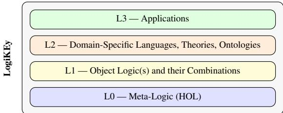
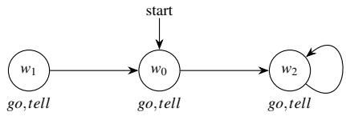

# Mathematical Proof Assistants for Teaching Logic: The LogiKEy Methodology

Christoph Benzmüller, David Fuenmayor, and Luca Pasetto

Abstract We report on an approach to teaching logic to mixed groups of computer science, mathematics, and philosophy students, based on the logico-pluralistic LogiKEy methodology, used for more than a decade in courses, summer schools, and tutorials. LogiKEy uses classical higher-order logic (HOL) as a universal metalogic in which object logics, classical and non-classical alike, are encoded by defining their semantics; through these semantical embeddings a single proof assistant (e.g. Isabelle/HOL), with its automated theorem provers and (counter-)model finders, becomes one environment in which students learn, experiment with, and compare logics. After making the pedagogical case for proof assistants in the logic classroom, we present a graded sequence of classroom examples, each transition motivated by a limitation of the preceding representation, by a need for more explicit modelling resources, or by a new application. A liars-and-truth-tellers puzzle leads from propositional to modal logic; the Wise Men puzzle leads on to dynamic epistemic logic; Boolos’s curious inference illustrates what a higher-order meta-logic buys, even for automated proof search; Chisholm’s paradox takes the sequence into deontic logic, and from standard to dyadic deontic logic; and Gödel’s ontological argument brings it to a research-level metaphysical argument. We then rebut the objection that embedding everything in classical HOL is monism rather than pluralism, reflect on three years of teaching such a course, and sketch the portability of the approach beyond Isabelle.

## 1 The Logic Pluralism Challenge in Logic Education

Logic is a mandatory, and notoriously demanding, subject in the curricula of several disciplines at once. In computer science it underpins verification, knowledge representation, and the theory of computation; in mathematics it supplies the language of proof; in linguistics it underpins the formal semantics of natural language; and in philosophy it is at once a tool and an object of study. Yet these audiences arrive with very different backgrounds, motivations, and tolerances for formalism. Teaching logic well is therefore, first of all, an interdisciplinary challenge: the same room may hold a student who programs fluently but has never written a proof, one who writes rigorous proofs but has never seen them checked by a machine, and one who argues subtly in natural language but freezes at a quantifier [72, 14].

A second challenge concerns content. The applications that make logic attractive today (artificial intelligence, natural-language semantics, the formal analysis of law and ethics) routinely require reasoning beyond classical first-order logic: modal, deontic, epistemic, temporal, and many further non-classical logics, often in combination. The traditional response is to teach each such logic with its own syntax, its own proof calculus, and, where tool support exists at all, its own software. For a mixed and time-limited student audience this fragmentation is costly: every new logic looks like a fresh start, and the conceptual thread (what all these logics have in common, and how they differ) is easily lost.

This chapter reports on an approach that addresses both challenges together. Its guiding idea is to fix a single, sufficiently expressive meta-logic, classical higherorder logic (HOL), and to obtain the many object logics of interest inside it, by means of semantical embeddings: encodings that define, within HOL, the semantics of each object logic.1 A single proof assistant, in our courses Isabelle/HOL, then provides one uniform working environment, complete with automated theorem provers and (counter-)model finders, in which a heterogeneous student group can learn, experiment with, and, crucially, compare logics. This is the pedagogical face of the LogiKEy methodology for logic and knowledge engineering [20, 15, 6, 14].

Our thesis is that such a platform lets a mixed cohort learn many logics uniformly, with immediate machine-checked feedback, along a single path that runs from elementary logic puzzles up to research-grade arguments in ethics and metaphysics. In the vocabulary of this volume, the approach answers its three organising questions at once. How to teach logic: by machine-supported, exploratory practice. What tools to use: a general-purpose proof assistant repurposed for teaching. What to teach: a plurality of logics, presented uniformly rather than in isolation. The last point connects our proposal to the broader case, made elsewhere in this volume, for teaching logic in a pluralistic and application-aware spirit;2 what we add is a concrete, executable way to realise it in the classroom.

In sum, this chapter contributes (i) a pedagogical case for teaching many logics uniformly within a proof assistant; (ii) a graded sequence of classroom examples, from a liars-and-truth-tellers puzzle to Gödel’s ontological argument, in which each transition is motivated by a limitation exposed in the preceding representation, by a need for more explicit modelling resources, or by a new application, so that students examine different reasons for changing a logic or its formalisation. It further contributes (iii) an account of the supporting tools, including automated assessment and a Kripke-model visualiser, and (iv) a reflection on three years of teaching such a course to a mixed audience.

A word on what is, and is not, new. LogiKEy itself is an established research programme, and a two-page abstract under the same title [14] already sketched the idea of teaching with it. What is new here is the worked course and its rationale (Sect. 4), the tools that make it usable by non-specialists (Sect. 5), the positioning of the meta-logical stance against the charge of monism (Sect. 2.4), and a sketch of portability to other proof assistants (Sect. 7). Underlying all of these is one thread we ask the reader to follow: what is gained is not simply that a proof assistant is used, but that a single expressive meta-logic is. Its expressiveness buys an economy of formalisation, since each further object logic is a set of definitions rather than a new system; that economy in turn buys automation, since every embedded logic inherits the same provers and model finders; and only on top of these does the teaching application rest. Boolos’s inference (Sect. 4.3) shows that the first of these steps can pay off even where one would least expect it. The chapter belongs to the Programmes part of this volume: it describes a methodological infrastructure and a concrete teaching application, not an empirical study of learning.

We write for logic educators and for readers from philosophy, mathematics, and computer science who have not necessarily used a proof assistant. A basic acquaintance with propositional and modal logic suffices. The Isabelle/HOL listings are illustrative and can be read as annotated pseudo-code; no knowledge of Isabelle, type theory, or programming is assumed, and the same holds for the students in the course described below. Adopting the infrastructure is a different matter: instructors will find the complete, machine-checked sources openly available (Sect. 7), but putting them to work does require an initial investment in the tools.

## 2 The LogiKEy Idea in One Picture

The whole approach rests on one central idea, which we now explain once so that the later sections can take it for granted. The idea has three ingredients: a metalogic, an embedding technique, and a layered architecture. We keep the treatment

deliberately light, introducing only what the classroom examples of Sect. 4 require: enough to follow the proofs and countermodels that follow.

## 2.1 Higher-order logic as a universal meta-logic

Classical higher-order logic, Church’s simple type theory [9], is ordinary classical logic with two decisive additions. One may quantify not only over individuals but also over functions and predicates, which makes HOL expressive enough to talk about other logics: their formulas, their notions of truth, their models. And one may form functions on the fly by λ-abstraction, which makes encodings compositional and elegant and gives them the flavour of elementary functional programming: a modal connective, for instance, simply becomes a function on world-dependent propositions (Sect. 2.2). LogiKEy exploits both, using HOL as a universal metalogic [6]. Students need no prior acquaintance with type theory to use it; in practice they meet HOL simply as the language of the proof assistant, and its higher-order features appear exactly when, and only when, a particular object logic calls for them.

## 2.2 Semantical embeddings, by example

The technique by which LogiKEy turns HOL into a host for other logics is shallow semantical embedding (SSE) [6, 7]; a deep alternative is discussed in Sect. 2.4. The idea is best seen on propositional modal logic. Read a modal formula not as an opaque symbol but as a predicate on possible worlds: “ϕ holds” becomes “ϕ holds at a world $w ^ { \prime \prime }$ . Necessity is then nothing but truth at all accessible worlds. Writing σ for the type of such world-predicates (the listings use the same name) and R for the accessibility relation, the modal connectives are defined in HOL by

$$
\begin{array} { r l r l } & { \neg \varphi : = \lambda w . \neg ( \varphi w ) , \qquad } & & { \varphi \to \psi : = \lambda w . \varphi w \longrightarrow \psi w , } \\ & { \sqsubseteq \varphi : = \lambda w . \forall \nu . R w \nu \longrightarrow \varphi \nu , \qquad } & & { \lfloor \varphi \rfloor : = \forall w . \varphi w , } \end{array}\tag{1}
$$

where ⌊ϕ⌋ (“ϕ is valid”) abbreviates truth at every world. Wherever the two levels meet in one formula, as they do here, we set the object-level connectives in bold: the ¬ and □ on the left are being defined, the ¬, −→ and ∀ on the right are HOL’s own. The notation $\lambda w .$ ... denotes the function that assigns to each world w the truth value described after the dot; so ¬ϕ, for instance, is the proposition that is true at exactly those worlds at which ϕ is false. That is the entire definition of the modal logic K: everything else (the axiom K, the necessitation rule, and all theorems) is a consequence of these definitions, obtained by ordinary reasoning in HOL rather than stipulated. In Isabelle/HOL the definitions of (1) are a handful of lines, after which one can already state and prove modal facts (Fig. 1).3 Because the embedding is so direct, an off-the-shelf HOL prover reasons in the modal logic for free; just as importantly, a HOL (counter-)model finder produces modal countermodels when a conjecture fails. (What such a countermodel looks like, first as the model finder prints it and then as a picture, is shown in Figs. 9 and 7 below.)

( axiom K holds in everyframe (a consequence ofthe definitions): )   
lemma K: "⌊□(p→ q)→ (□p→ □q)⌋" by simp   
( correspondence: the ’T’ schema holds exactly on reflexiveframes: )   
lemma Tc: "(∀ p. ⌊□p→ p⌋) = (∀ x. R x x)" by metis   
(\* without reflexivity, Nitpick refutes the schema: \*)   
lemma "⌊□p→ p⌋" nitpick  
Fig. 1 Working with the embedding (1). Axiom K is proved in every frame. The schema □ϕ → ϕ is shown to correspond exactly to reflexivity of the accessibility relation, and without reflexivity Nitpick returns a countermodel: proof and refutation are the same one-line gesture. (The plain ∀ and R are meta-level; the bold □ and → are the embedded object connectives. simp and metis are automatic proof methods; they do construct proofs, which Isabelle checks but does not normally display, and any of them can be replaced by a step-by-step proof in Isabelle’s Isar language.)

The pedagogical dividend appears the moment one varies the frame. Imposing a condition on R selects a stronger logic: reflexivity yields KT, seriality yields KD (the base of deontic logic, of which more in Sect. 4), transitivity yields K4, and so on up to S5. Students do not take these correspondences on faith: they test them, and watch the same machinery deliver a different logic each time. One meta-logic, many object logics: this refrain returns throughout the chapter.

## 2.3 A layered architecture—and why it helps

LogiKEy organises this idea into four layers (Fig. 2). At the base (L0) sits the metalogic, HOL. On top of it one encodes object logics and their combinations (L1). Using those logics one formulates domain-specific languages, theories, and ontologies (L2). With these in hand one models and assesses concrete application scenarios (L3) [20, 59].4 For teaching, the layering has a pleasant consequence. Students can enter at the layer that suits their background, a philosopher at L2/L3 with an ethical scenario, a computer scientist at L0/L1 with the embedding machinery, and still meet on the same platform and speak the same underlying language. The architecture thus doubles as a map of an interdisciplinary division of labour.

  
Fig. 2 The four layers of the LogiKEy methodology. Object logics are embedded in HOL (L0→L1), used to build domain theories (L2), and applied to concrete scenarios (L3). Students may enter at the layer matching their discipline.

The tools the student actually touches are few. Isabelle/HOL [58] is the surface: a mature, well-documented proof assistant with a modern editor. Behind a single command, Sledgehammer [32] invokes external automated theorem provers to find proofs, while Nitpick [33] searches for (counter-)models. For the learner these are a proof-finding and a refutation companion (Sect. 5). For interactive proof, Isabelle offers, among various other proof languages, Isar: a declarative language modelled on the way mathematicians argue, in which a machine-checked proof reads like a structured argument.

## 2.4 Semantical embeddings and logical pluralism

The embedding technique is not new. Shallow semantical embeddings grew out of the automation of multimodal and quantified multimodal logics in simple type theory [21, 22]; for an overview see [6]. A companion deep style, in which the object syntax is represented as a datatype with an explicit interpretation function, has been worked out alongside it. For simple logics such as propositional modal logic it has been proved by machine that the two styles arefaithful: they prove exactly the same formulas, so the object logic is captured correctly [7]. (That paper was itself written with logic education in mind.) For teaching, the shallow style is the natural default: it is short, readable, and lets the prover work directly on object-level formulas (Fig. 3 shows the difference on the box). A further dividend of embedding a logic, rather than hard-coding it, is that one reasons at two levels at once. The same machinery that proves object-level theorems also establishes facts about the logic, such as the frame correspondences of Sect. 2.2, and finds countermodels when either fails.

Conceptually, the method turns logical pluralism from a slogan into a practice. Instead of treating each logic as a self-contained system with its own calculus, one exhibits many logics as definitional variants within a single framework, and can compare them, combine them, and move between them without changing tools. This computational pluralism sits naturally beside the philosophical case, made elsewhere in this volume, for teaching logic as formal philosophy and for taking a plurality of logics seriously in the curriculum; it offers a concrete, executable counterpart to those arguments.

(\* shallow: the box is a HOL definition on world−predicates (type σ = i ⇒ bool) \*)   
definition box :: "σ ⇒ σ" ("□") where "□ p = (λw. ∀ v. R w v −→ p v)"   
( deep:formulas are a datatype, evaluated by an explicit interpretationfunction )   
datatype form = Atom nat | Neg form | Imp form form | Box form   
consts val :: "nat ⇒ i ⇒ bool" ( valuation ofthe atoms, a constant like R )   
fun eval :: "form ⇒ i ⇒ bool" where   
"eval (Atom n) w = val n w"   
| "eval (Box f) w = (∀ v. R w v −→ eval f v)" | ...  
Fig. 3 The two styles of embedding, on the box (schematic; the deep evaluation function is shown for the atom and box cases only). In the shallow style the object connective simply is a HOL function on world-predicates, so the prover works on object formulas directly. In the deep style object formulas are data, and a separate evaluation function assigns them a meaning; this makes the syntax itself an object of study, at the price of one more level of indirection. Faithfulness means that both styles validate exactly the same formulas [7].

A philosopher will rightly press the obvious objection: if every object logic is interpreted in classical HOL, is this not in truth a classical monism in disguise, and the “pluralism” merely cosmetic? The reply we and others give [19] distinguishes a methodology from a foundation. LogiKEy does not enthrone HOL as the one true logic in which all reasoning must be conducted: the choice of HOL rests on pragmatic grounds (its expressiveness and its mature automation) and is not constitutive of the method. What is constitutive is that the object logic, and to some extent even the meta-logic, are kept negotiable and made objects of study. A single rich foundation, by contrast, silently embeds commitments, such as excluded middle, the axiom of choice, existential import, or extensionality, that remain opaque to the user and against which any dissenter must work: a foundation forecloses, whereas a methodology explores [19]. This exploration pays off in practice: when Zalta’s object theory was encoded as an object logic in HOL, the interaction with Isabelle/HOL brought to light a paradox that had been inadvertently reintroduced and had previously gone undetected [52, 19]. A smaller example, taken from Rung 4 below, shows how such a commitment enters a formalisation. Do the quantifiers of the object logic range over all possible individuals, or only over those that actually exist at a world? This choice between a possibilist and an actualist reading is invisible in the informal text of Gödel’s ontological argument. In the encoding it is a single definitional decision, and which results remain provable, and under which frame conditions, depends on it [42, 26]. Making the choice explicit is what allows it to be varied and discussed in class. The stance is thus pluralism set deliberately against a logical imperialism (the term is from [19]) that would impose one logic on every problem. In the classroom it has a welcome corollary: no student’s “home” logic is crowned the winner, and the differences between logics, not one orthodoxy, become the subject matter.

## 3 Why a Proof Assistant in the Logic Classroom

Before turning to concrete classroom material, we set out the pedagogical case for using an interactive proof assistant to teach logic. Our experience builds on an earlier line of work on theorem provers in teaching [72], and our courses follow the Humboldtian ideal of a unity of research and teaching: they aim at a research-oriented education that can culminate in students reproducing current research results [72].

A word on the status of the claims that follow. Three kinds of claim run through this chapter. Formal results (that a given formula is provable or refutable) are machine-checked and reported as such in Sect. 4. Methodological claims (that one framework can carry all of these logics uniformly) are borne out by the worked examples. The pedagogical claims of this section, and the classroom observations of Sect. 6, rest on our own teaching experience: three runs of one course with small, self-selected cohorts, and earlier courses in the same line. We offer them as considered impressions and as hypotheses worth testing, not as findings of a controlled study.

Immediate, machine-checked feedback—no hidden gaps. On paper, the reasoning steps a student finds “obvious” are often the ones that hide errors, and feedback arrives days later, if at all. In a proof assistant every step is checked as it is made; a gap cannot be waved away, because the system will not accept it. The effect, in our experience, is not punitive but clarifying: students learn where an inference’s real content lies.

Logic as an experimental subject. With proof search and model finding one command away, students can try things: Does this formula hold on this class of frames? What happens if I drop seriality? Which axioms separate modal logic S4 from S5? The proof assistant turns questions that would otherwise be rhetorical into experiments with immediate answers, encouraging a habit of conjecture-and-test that is closer to mathematical practice than to rote calculation [14].

What students actually do. Sessions begin with small, complete, runnable theories that students execute and modify rather than read passively: change an axiom and watch a theorem turn into a countermodel; strengthen a frame condition and watch the countermodel turn back into a proof. The core task is formalisation: rendering an informal statement (a puzzle, a philosophical principle, a legal rule) in a chosen object logic and asking the machine whether the intended conclusions follow. This targets the skill a mixed audience most needs and most lacks, namely moving carefully between natural language and formal notation, now with an oracle to catch mistakes (and, more recently, with language models to draft a first attempt; see Sect. 5). Assignments are correspondingly open-ended (“model this scenario and decide whether. . . ”, “find a countermodel showing that. . . ”) rather than narrow calculations, because automatic checking makes such tasks tractable both to set and to assess. This iterative loop of formalising, testing, and revising has a philosophical side as well: it is a form of computational hermeneutics, in which the meaning of an informal concept is made explicit precisely by the succession of formalisations the machine accepts and rejects [44].

A dialogical style of learning. Used this way, the system becomes a partner in a dialogue between the learner and the material: pose a claim, attempt a proof, inspect a countermodel, revise. This fits the model of dialogical learning of Ruf and Gallin, in which a core idea, an open-ended commission, a learning journal, and feedback chain production and reception into an iterative loop [72]. A proof assistant is unusually well suited to play the machine side of this dialogue. An Isabelle theory accumulated over a term is a formally verified learning journal: a record of a student’s reasoning in which every accepted step is guaranteed correct, and in which even unsuccessful attempts can be preserved and annotated for later reflection. Exemplary passages from such journals can be curated into a shared collection and fed back to the class as new learning material [72], and since Isabelle typesets a theory into a PDF, a journal doubles as a publishable, machine-checked document. The division of labour in this dialogue is worth stating plainly: the assistant supplies reliable formal feedback, and interpreting that feedback, connecting it to the logical or philosophical question behind it, remains the student’s work.

Lowering the barrier—and the affective payoff. A recurring worry about formal methods in teaching is that the tooling itself becomes the obstacle. Two features mitigate this. First, one starts from very small, self-contained examples and grows them; nothing must be built from scratch. Second, the machine’s willingness to refute a plausible conjecture, and to reward a second or third attempt at a proof, seems to us to encourage the dispositions that a virtue-oriented view of logic education prizes: open-mindedness, humility, persistence. It may also help defuse the “logic anxiety” that formal notation provokes in humanities-trained students. Both are impressions from our courses rather than measured effects.5

## 4 A Course Walkthrough: The Graded Ladder

We now show the methodology in action, as a graded progression of classroom examples that students climb like the rungs of a ladder: each rung is a new logic, reached from the one below it. The concrete setting is a lecture course with tutorial, Universal Logic and Universal Reasoning (AISE-UL), taught by two of us at the University of Bamberg in three successive winter terms (2022/23, 2023/24, 2024/25). It is a 2+2 SWS, 6 ECTS course for computer-science students, offered to philosophy students as a 3 ECTS seminar variant [14]. It continues a line of teaching that runs through the first author’s Universal Logical Reasoning course at the Freie Universität Berlin (from winter 2018/19) back to the Computational Metaphysics course, which won the university’s central teaching prize for 2015 and ran in the summer of 2016 [28].6 That course was designed and taught together with Max Wisniewski and Alexander Steen [28, 72]; Steen went on to become a contributor to and developer of LogiKEy, and he now pursues the same line, with a stronger emphasis on proof automation, as junior professor at the University of Greifswald. The course has also yielded what this chapter hopes for: two of its participants went on to write their theses, up to the doctoral level, in the same line. One began with a master’s thesis mechanising Zalta’s Principia Logico-Metaphysica, the work in which the paradox recounted in Sect. 2.4 came to light [50, 52], and completed a doctorate on computer-verified foundations of metaphysics [51]. The other is the second author of this chapter. He began with a bachelor’s thesis that applied the method to Lowe’s modal ontological argument [40, 43]. A series of publications followed, on the ontological argument, on computational hermeneutics, and on the normative applications and the Boolos example on which this chapter draws [42, 44, 45, 15, 16], before a doctorate on a universal formal language for argumentative reasoning agents [41]. The name LogiKEy, and the methodology’s international spread, date from the first author’s years at the University of Luxembourg, where Xavier Parent and Leendert van der Torre became convinced of its virtues and joined its development [20]. The methodology reaches well beyond this one course: it has been used in graduate courses on computational metaphysics and on intelligent agents (the latter at the University of Luxembourg), in invited courses and an ongoing research collaboration at Zhejiang University in China,7 at summer schools (from a first tutorial on higher-order modal logics, given with Bruno Woltzenlogel Paleo at the Reasoning Web Summer School and the ANU Logic Summer School in 2015, to the ESSLLI 2026 course Experimenting with the LogiKEy Framework & Methodology in Prague8), and in numerous invited tutorials and lecture courses over the past decade, among them at the Berkeley–Stanford Circle in Logic and Philosophy, at the CIMI thematic trimester in Toulouse, and in Brazil.9 Enrolments in such advanced courses are naturally small, and the audience is genuinely mixed: in Bamberg a handful of computer-science and philosophy students, in the earlier Berlin courses also mathematics students, working side by side on the same platform.

A semester follows the ladder. The first weeks establish HOL and the proof assistant and settle the propositional warm-up, alongside small exercises (such as a compact HOL proof of Cantor’s theorem [13]) that build fluency with the tool. The middle of the course introduces the embedding technique and works through modal, then epistemic and deontic logics. The final weeks are given to the capstone and to student projects. Prerequisites are deliberately light: a basic acquaintance with propositional and a little modal logic, and no programming experience. This is what makes a genuinely mixed enrolment possible.

Table 1 The graded ladder at a glance: for each example, the object logic, the problem that motivates it, the ingredient it adds, and the kind of step it represents: a limitation exposed in the preceding representation, a need for more explicit modelling resources, or a new application.
<table><tr><td>Example</td><td>Object logic</td><td>Motivating problem</td><td>New ingredient</td><td>Kind of step</td></tr><tr><td>Rung 1: Liars Street</td><td>propositional (HOL itself)</td><td>who lives where?; then: “knows&quot; as a truth-function</td><td>machine-checked reasoning; the layers L1-L3</td><td>first contact</td></tr><tr><td>Rung 2: modal cube</td><td>modal K to S5</td><td>collapses the extensional collapse</td><td>possible worlds, accessibility, frame</td><td>limitation ex- posed</td></tr><tr><td>Sequel: Wise Men</td><td>multi-agent S5 + PAL</td><td>announcements change what is</td><td>conditions announcement as model restriction</td><td>new modelling resources</td></tr><tr><td>Interlude: Boolos</td><td>HOL vs. FOL (meta-level)</td><td>known what does higher- order buy?</td><td>comprehension as a cut</td><td>illustrates the meta-logic&#x27;s virtues</td></tr><tr><td>Rung 3: Chisholm</td><td>SDL (KD), then dyadic DL obligations</td><td>contrary-to-duty</td><td>deontic reading; countermodels as pictures; preference</td><td>new application; then limitation exposed</td></tr><tr><td>Rung 4: Gödel</td><td>higher-order modal logic</td><td>necessary existence</td><td>relations quantification over properties; frame conditions per theo- rem</td><td>extension to a research argument</td></tr></table>

Each transition is motivated by a limitation exposed in the preceding representation, by a need for more explicit modelling resources, or by a new application: the student moves to a new logic not because the syllabus prescribes it, but because an experiment, or a new question, shows what the old one cannot do. The sequence thus lets students examine different reasons for changing a logic or its formalisation, and each example exposes a different facet of the methodology. Table 1 lays the path out at a glance. It is the actual backbone of the Bamberg course, but we present it as an exemplary path rather than a prescribed curriculum: the steps differ in kind, and an instructor may enter, leave, or branch at any rung. Throughout, the refrain “one meta-logic, many object logics, always machine-checked” becomes a matter of necessity rather than of sightseeing.

consts says :: "person ⇒ bool ⇒ bool" ("\_ says \_") (\* what an inhabitant asserts \*)   
axiomatization where   
Liars: "p lives\_in Liars =⇒ (p says X) = (¬X)" (\* liars invert the truth \*)   
Truth: "p lives\_in Road =⇒ (p says X) = X " ( truth−tellers preserve it )   
( Nilda and Carla each vouch that the other tells the truth. Which worldsfit? )   
lemma   
assumes "Nilda says (Carla lives\_in Road)"   
and "Carla says (Nilda lives\_in Road)"   
shows "Nilda lives\_in s1 ∧ Carla lives\_in s2"   
nitpick [satisfy] ( Nitpick returns the models consistent with the story )  
Fig. 4 The warm-up “liars and truth-tellers” puzzle, in outline (the declarations of the types and of lives\_in are omitted). Rather than work the knight-and-knave cases by hand, the student has nitpick[satisfy] find the configurations consistent with what Nilda and Carla say: the “answer models”, read off the free variables s1 and s2. Here two survive (both tell the truth, or both lie); enumerating that solution space is exactly the machine’s job.

## 4.1 Rung 1—A logic puzzle, and its limits

The course opens with a puzzle of the “liars and truth-tellers” kind. Two children, Nilda and Carla, each live either in Liars Street (whose inhabitants always lie) or on Truth-tellers’ Road (whose inhabitants always tell the truth); from what they say about one another, the student asks the machine which worlds fit the story. The scenario is encoded directly in HOL, and the first aim is purely experiential: to feel what it is like to reason with a partner that checks every step. The partner answers either “yes, and here is why” (Sledgehammer finds a proof) or “no, and here is a counter-scenario” (Nitpick exhibits a model or a countermodel). The encoding (Fig. 4) is instructive in a second way, too: it is laid out in exactly the LogiKEy layers of Sect. 2.3. The object logic is just HOL’s own propositional connectives (L1); the vocabulary “\_ says \_” and “\_ lives\_in \_”, together with the two bridge axioms, forms a small domain-specific language (L2); and the concrete question about Nilda and Carla is the application (L3). The puzzle is thus also a first, painless glimpse of the architecture.

So far, so propositional. The turn comes when we ask what “\_ says \_” and “ knows \_” actually mean. In the first encoding they are ordinary truth-functions: “X says ϕ” is simply a truth value that depends only on the truth value of ϕ. That suffices for the basic puzzle, but it conceals a trap, and the course springs it deliberately (Fig. 5, upper listing). Because such an operator sees only the truth value of its argument, any two propositions that merely happen to be true become interchangeable inside it: the moment Carla “knows” one truth, the machine proves that she “knows” every other truth as well. This extensional collapse (the crudest member of the family of hyperintensionality problems, of which the well-known logical-omniscience problem is a subtler relative) is not a caveat to be issued in a lecture but a theorem the students derive from their own encoding. The lesson is inescapable: a truthfunctional, propositional reading of “says”, “knows”, and “believes” is untenable, and something more expressive is required.

consts knows :: "person ⇒ bool ⇒ bool" ("\_ knows $- ^ { " ) }$ ( a plain truth−function )   
( P and Q are both true, and Carla knows P; then she ’knows’ Q as well: )   
lemma "[[ P; Q; Carla knows P ]] =⇒ Carla knows Q" by simp   
typedecl i ( the type ofpossible worlds )   
type\_synonym σ = "i ⇒ bool" ( a proposition now depends on worlds )   
consts R :: "person ⇒ i ⇒ i ⇒ bool" ( each agent’s accessibility relation )   
definition Knows :: "person ⇒ σ ⇒ σ" ("\_ knows \_")   
where "a knows p = (λw. ∀ v. R a w v −→ p v)" (\* box, per agent \*)   
( the same premises as above, now at a world w: the entailmentfails )   
lemma "[[ P w; Q w; (Carla knows P) w ]] =⇒ (Carla knows Q) w" nitpick

Fig. 5 The extensional collapse, and its modal repair. Above: because “knows” sees only the truth value of its argument, and P and Q are both true, Isabelle proves that knowing P forces knowing Q; any two truths become interchangeable, a reductio the students derive for themselves. Below: a proposition becomes world-dependent, and “knows” becomes a box over the worlds the agent considers possible (frame conditions, such as those of S5, are added afterwards). The collapse is gone: for the very same premises Nitpick now finds a world w at which P and Q both hold and P is known, yet Q is not, because Q fails at some other world Carla considers possible. Logical omniscience proper, knowledge closed under consequence, survives and motivates finer logics.

## 4.2 Rung 2—Modal logic, and the modal-logic cube

The repair is modal logic. A proposition ceases to be a bare truth value and becomes a function from possible worlds to truth values; its type changes from bool to σ (which abbreviates i ⇒ bool, for i the type of possible worlds). “X knows $\varphi ^ { , \dag }$ is then read as “ϕ holds at every world X considers possible”: the box operator of Sect. 2.2, now indexed by the agent (Fig. 5, lower listing). Two propositions that happen to agree in truth value at the current world need no longer be interchangeable inside a modality, since they may differ at other worlds; the extensional collapse is undone, and Nitpick confirms that the very same entailment now fails. Here modal logic is not introduced, it is needed: the limitation that ended Rung 1 is what motivates the move.

Honesty compels a caveat, and the caveat itself makes the pluralist point. The modal reading removes the crude, extensional collapse, but not the finer logicalomniscience problem: according to modal logic S5 a knower still knows every logical consequence of what they know, and every valid formula. Faithfully modelling resource-bounded, non-omniscient agents calls for yet further logics (hyperintensional, awareness-based, or impossible-worlds accounts), each of which the same meta-logical framework can host in turn. Every repair exposes the next question, and none of them forces us to leave the platform: that, in a sentence, is the pedagogical case for logical pluralism.

With one modality in hand, the natural next question is which principles it obeys, and here the framework pays a further dividend. Using the embedding of Sect. 2.2, students explore the “modal-logic cube” [10]: they impose conditions on the accessibility relation one at a time and watch the logic change under their hands. Reflexivity validates □ϕ → ϕ (axiom T: what is known is true). Seriality validates □ϕ → ♢ϕ (axiom D), and transitivity □ϕ → □□ϕ (axiom 4: positive introspection). Reflexivity together with the Euclidean condition (any two worlds accessible from a given world are accessible from each other) yields S5, a familiar logic of idealised knowledge.10 Each correspondence is proved when it holds and refuted by an explicit countermodel when it does not—the same button, opposite verdicts. (The systematic development behind the cube machine-verifies all 15 of its logics and the 25 inclusions among them [10].) The refrain is now concrete: the object logic is selected by adding a single line, and the meta-logic never changes. The frame condition behind axiom D is seriality, which is characteristic of the deontic logic taken up in Rung 3.

Even this, the course is careful to add, is not the last word. Reading “says” as a static box still mishandles the dynamics of announcement (what changes when something is publicly said), and nested announcements soon outrun plain modal K. That is the doorway to dynamic epistemic logic, which we take up in the worked example that follows.

## 4.3 An epistemic sequel: the Wise Men

The gap left open by Rung 1 was the dynamics of communication, and the classic vehicle for it is the Wise Men puzzle (equivalently, the “muddy children”). A king marks each of three wise men with a spot on the forehead, white or black—in fact all three white; each sees the others’ spots but not his own. The king announces publicly that at least one spot is white, and then asks, in turn, whether each wise man knows the colour of his own. The first two answer “no”; on hearing them, the third answers “yes”—correctly. The puzzle is a staple precisely because the decisive information is carried not by what is said about the spots but by the announcements themselves: each “I do not know” is a public event that changes what everyone knows.

Static modal logic has no direct way to capture this: a fixed accessibility relation cannot represent the update an announcement performs, so each announcement would have to be handled by re-encoding the model by hand. Public-announcement logic (PAL) supplies an operator for exactly this.11 On top of multi-agent epistemic logic (one knowledge operator per agent, whose accessible worlds are those the agent cannot tell apart from the actual one), PAL adds an operator [!ϕ]ψ, read “after ϕ is truthfully announced, ψ holds”. Its meaning is simple: after the announcement, only the worlds in which ϕ was true remain in play. In LogiKEy this is once more a shallow embedding: knowledge is the box of Sect. 2.2, and an announcement restricts all subsequent evaluation to the surviving worlds. Technically this changes the type of a proposition once more: where a modal proposition was a function from worlds to truth values, $\sigma = i \Rightarrow b o o l ,$ a dynamic proposition takes one further argument, the set of worlds currently in play, $\tau = ( i \Rightarrow b o o l ) \Rightarrow i \Rightarrow$ bool; it is this extra argument that lets the same formula be evaluated before and after an announcement. The treatment extends to common knowledge, and the embedding has been proven sound in HOL [24] (Fig. 6).

<table><tr><td>type_synonym</td><td></td><td></td><td></td><td> $\tau ~ = ~ " ~ ( \mathrm { ~ i ~ } \Rightarrow \mathrm { ~ b o o l } ) ~ \Rightarrow \mathrm { ~ i ~ } \Rightarrow \mathrm { ~ b o o l } "$ </td><td></td><td></td><td>(* dynamic proposition: worlds in play, world *)</td><td></td><td></td><td></td><td></td><td></td><td></td><td></td></tr><tr><td>consts K</td><td></td><td></td><td></td><td></td><td></td><td> $: : \mathrm { ~ " a g e n t ~ } \Rightarrow \tau \Rightarrow \tau " ( { \mathrm { ~ " K } } _ { - } \mathrm { ~ \Gamma } _ { - } " )$ </td><td></td><td></td><td></td><td></td><td></td><td>(* K_a p : agent a knows p (S5) *)</td><td></td><td></td></tr><tr><td>consts C</td><td></td><td></td><td>:: &quot;τ ⇒ τ&quot;</td><td></td><td></td><td></td><td></td><td></td><td></td><td></td><td></td><td>(* common knowledge among a, b, c *)</td><td></td><td></td></tr><tr><td>consts ann</td><td></td><td></td><td></td><td></td><td></td><td> $: : \quad " \tau \Rightarrow \tau \Rightarrow \tau " \quad ( " [ ! \bigsqcup _ { - } " ) \bigstar )$ </td><td></td><td></td><td></td><td></td><td></td><td>(* [!phi]psi : after announcing phi, psi *)</td><td></td><td></td></tr><tr><td></td><td>consts ws ::</td><td></td><td> $" \mathsf { a g e n t } \Rightarrow \tau "$ </td><td></td><td></td><td></td><td></td><td></td><td></td><td></td><td></td><td>(* ws x : x has a white spot *)</td><td></td><td></td></tr><tr><td></td><td>axiomatization where</td><td></td><td></td><td></td><td> ${ \mathrm { ~ w M 1 : ~ } } " \lfloor C$ </td><td></td><td></td><td></td><td></td><td></td><td></td><td>(ws aV ws bV ws c)|&quot; (* at least one white *)</td><td></td><td></td></tr><tr><td></td><td></td><td></td><td></td><td></td><td></td><td></td><td></td><td></td><td></td><td></td><td>(* WM2: if x has no white spot, the other two know it (common knowledge; six axioms) *)</td><td></td><td></td><td></td></tr><tr><td></td><td></td><td></td><td></td><td></td><td></td><td>theorem &quot;|[!¬Ka (ws a)] [!¬Kb (ws b)] (Kc (ws c))|&quot;</td><td></td><td></td><td></td><td></td><td></td><td></td><td></td><td></td></tr><tr><td></td><td></td><td></td><td></td><td></td><td></td><td></td><td></td><td></td><td></td><td></td><td></td><td></td><td></td><td></td></tr></table>

Fig. 6 Public-announcement logic in LogiKEy, in outline (the encoding of [24], entered into the Archive of Formal Proofs). The operator K is an S5 box and stands for individual knowledge, while C stands for common knowledge in a group; the announcement [!ϕ] restricts the model to the worlds where ϕ held. The king’s statement is common knowledge (WM1), as is that each wise man sees the others’ spots (WM2). The puzzle is then the single theorem shown: after a announces that he does not know his colour, and b, having heard him, announces the same, c knows that he has a white spot.

With the embedding in place, the puzzle becomes a single theorem: given the common knowledge that at least one hat is white, after the first wise man announces that he does not know his colour and the second, having heard him, announces the same, the third knows his spot is white. The automated provers discharge it, and, just as instructive for students, Nitpick can display the intermediate epistemic states, showing how each announcement prunes possibilities until only one survives. The same machinery settles variants (two wise men, black spots, a false announcement) by proof or by countermodel.

This closes the loop opened in Rung 1. The single escalation propositional → modal → dynamic epistemic (each step motivated by a demonstrated limitation of the previous logic in modelling “says” and “knows”) is, in miniature, the whole argument of the chapter: many logics, one meta-logic, each one earned rather than presented.

## Interlude—The virtues of higher-order logic: Boolos’s inference

By now a sharp student will be asking what is gained by taking the meta-logic to be higher-order rather than ordinary first-order logic. One example illustrates it memorably, and does so in a domain where one might least expect expressiveness to help: automated proof search [16]. Boolos’s “curious inference” [34] is a small, valid argument (five axioms in all: three characterising a fast-growing, Ackermann-style function, plus a base case and an induction-like step for a predicate) whose conclusion, that this predicate holds of a particular term, genuinely follows. Three claims should be kept apart here. First, a theorem about proof length: Boolos showed that in a cut-free first-order calculus the shortest derivation has on the order of f(5,5) steps, for f the Ackermann function, so that no such proof could be found, or even written down, in this universe [34]. The restriction to cut-free calculi is not an idealisation but the practically relevant case, since the resolution, superposition and tableau calculi on which automated provers are built are analytic. Nor would admitting cuts rescue the first-order case: the cut formula one would need is an instance of second-order comprehension, which quantifies over properties and is therefore not expressible in first-order logic at all. Second, a theorem about expressiveness: Boolos also gave a short proof in second-order logic, using particular instances of the comprehension schema [34]. Third, an observation about today’s provers: they are built around cut elimination and do (generally) not introduce the comprehension instances that would be needed. Higher-order provers are not quite in the firstorder predicament here, since λ-abstraction together with primitive substitution addresses cut introduction in part, but in general this remains far too weak. Once a single higher-order definition is supplied by hand (the notion of a property being “inductive”, which quantifies over predicates), the provers synthesise the remaining lemmas and dispatch the theorem in milliseconds [16]. The moral cuts against the grain of what a theoretical-computer-science course tends to instil. Complexity results teach that greater expressiveness must be paid for, with undecidability or higher complexity; yet here the more expressive logic affords an incomparably shorter proof. Expressive power is not merely a luxury; for some problems it is what brings a proof within reach at all.

This proof-theoretic bonus is, however, only the most dramatic reason for choosing HOL as the base layer, not the primary one. The primary reason is that higherorder logic is the natural home for the semantical embeddings approach. The λ- abstraction of (1) lifts each connective to a world-dependent function, and quantification over predicates lets one speak directly about properties and accessibility relations. HOL’s mature provers and model finders then serve every embedded logic for free.

## 4.4 Rung 3—Reasoning about norms: Chisholm’s paradox

With one modality in hand, we reinterpret it deontically (□ as “it ought to be that”) and arrive at so-called “standard deontic logic” (SDL), the modal logic KD. The vehicle is Chisholm’s contrary-to-duty paradox [39], a small set of intuitively consistent obligations that classical SDL formalisations render inconsistent or redundant [46]. Two things make this rung pedagogically decisive. First, it shows nonclassical logic doing genuine work on a problem philosophers care about. Second, it is where countermodels become pictures: a raw Nitpick countermodel, all but unreadable as text, is rendered automatically as a labelled Kripke graph by a lightweight visualiser developed within LogiKEy [59] (Sect. 5). The student does not merely read “not valid”; she gets a visual explanation of why the formula fails.

  
Fig. 7 The Nitpick countermodel of the text, rendered automatically as a labelled Kripke graph by the LogiKEy visualiser [59]: every world satisfies g and t $( { } ^ {  } g o , t e l l { } ^ { \because } ) .$ , the arrows are the deontic accessibility relation, and start marks the world of evaluation. Reading the picture beats reading Nitpick’s raw text—that is the point of the visualiser.

In ordinary language the four sentences are: (1) it ought to be that Jones goes to assist his neighbours; (2) it ought to be that if he goes, he tells them he is coming; (3) if he does not go, he ought not to tell them he is coming; (4) he does not go. The four textbook SDL renderings of these sentences differ only in whether each obligation takes wide (W) or narrow (N) scope over the conditional; we take the four Isabelle/HOL encodings from the LogiKEy Workbench [31, 59]:

<table><tr><td></td><td>WN</td><td>WW</td><td>NN</td><td>NW</td></tr><tr><td>F1</td><td> $\mathbf { O } g$ </td><td>0g</td><td>0g</td><td> $\mathbf { O } g$ </td></tr><tr><td>F2</td><td> $\mathbf { O } ( g \to t )$ </td><td> $\mathbf { O } ( g \to t )$ </td><td> $g \to \mathbf { O } t$ </td><td> $g \to \mathbf { O } t$ </td></tr><tr><td>F3</td><td> $\lnot g \to \mathbf { 0 } \lnot t$ </td><td> $\mathbf { O } ( \neg g \to \neg t )$ </td><td> $\lnot g \to \mathbf { 0 } \lnot t$ </td><td> $\mathbf { 0 } ( \lnot g \to \lnot t )$ </td></tr><tr><td>F4</td><td>¬g</td><td>¬g</td><td> $\neg g$ </td><td>¬g</td></tr></table>

where $g$ reads “Jones goes to help” and t “Jones tells them he is coming”. None of these renderings captures the intended meaning (each either makes the four sentences jointly inconsistent or makes one a consequence of the others), and students probe them by experiment. One such check asks whether the fact $F _ { 4 }$ (that Jones does not go) already follows from the three obligations $F _ { 1 } { - } F _ { 3 } { \mathrm { : } }$ it does not, and Nitpick returns a model in which $F _ { 1 } , F _ { 2 } , F _ { 3 }$ all hold yet Jones in fact goes. That model, rendered by the LogiKEy visualiser [59], is Fig. 7; because $g$ and t hold at every world, each node carries the label $^ { * } g o , t e l l ^ { * }$ , and the world marked start is where the conjectured entailment $F _ { 1 } \wedge F _ { 2 } \wedge F _ { 3 } \to F _ { 4 }$ fails.

The machine’s verdicts diagnose the four renderings precisely: at the designated world, WN is inconsistent; WW makes $F _ { 3 }$ follow from $F _ { 1 }$ ; NN makes $F _ { 2 }$ follow from $F _ { 4 } ;$ ; and NW exhibits both redundancies. This systematic failure of SDL on Chisholm’s scenario is, moreover, precisely what motivates the move to more expressive deontic logics. Dyadic deontic logics use a conditional obligation $\mathbf { O } ( t \mid g )$ “t is obligatory given $g ^ { , , }$ . In Åqvist’s systems [2] it is interpreted over a preference (betterness) relation on worlds rather than a mere accessibility relation; in the system of Carmo and Jones [38], over a semantics designed expressly for contrary-to-duty scenarios. In LogiKEy this upgrade is one further embedding, not a new tool: the LogiKEy Workbench provides ready encodings of both traditions [11, 12, 31], and the visualiser of Sect. 5 displays preference relations just as it does accessibility relations [59]. The failed formalisations thus do double duty in class: they diagnose SDL, and they justify its successors.

consts posProp :: "(e ⇒ σ) ⇒ σ" ("P") ( ’P A’: A is positive )   
definition God :: "e ⇒ σ" ("G") (\* God−like: has every positive property \*)   
where "G x = (∀A. P A→A x)"   
(\* also Ess (essence), NE (necessary existence), and Scott’s axioms A1..A5 \*)  
Fig. 8 The core of Scott’s variant of Gödel’s argument: one primitive (the positive-property operator P) and the definition of God-likeness (the bold ∀,→ are the embedded object connectives). From this base—three definitions and five axioms—the provers derive ⌊□ ∃x. Godx⌋, “a God-like being necessarily exists”, while Nitpick confirms the axioms are consistent by exhibiting a model.

Chisholm’s puzzle is a doorway, not a destination. The same deontic machinery scales to substantial applications in AI and law, and the course points to them. LogiKEy has been used to model value-oriented legal reasoning, where competing legal values are weighed to justify a decision [15]. Closer to this chapter’s authors, it has served to formalise epistemic rights, such as the “power-right to know” [54], or mental privacy [61, 60], whose formalisation combines the logics used for the right to privacy and freedom of thought. The very contrary-to-duty pattern of Chisholm’s puzzle even recurs in real regulation: one such structure in the GDPR is singled out, in the LogiKEy literature, as instructive “also from an educational viewpoint” [20]. In the classroom these connect a small paradox to live questions in machine ethics and AI & law, and let a project-minded student move from a textbook example to a fragment of a genuine normative theory.

## 4.5 Rung 4—Gödel’s ontological argument

The capstone lifts everything to higher-order modal logic and applies it to a famous philosophical argument with roots in Leibniz and Anselm: Gödel’s modal ontological proof. The encoding is remarkably compact: a single primitive, “positive property”, and three definitions (God-like, essence, necessary existence) on top of the higher-order modal embedding, followed by five axioms (Fig. 8).

Encoded this way, the argument becomes an object of experiment. Automated provers reconstruct Scott’s chain of results (positive properties are possibly instantiated, hence a God-like being is possible; being God-like is an essential property; and hence a God-like being necessarily exists), while Nitpick confirms at each stage that the axioms remain consistent by exhibiting a model [26]. Turned instead on Gödel’s original axioms, the very same tools expose a hidden inconsistency, from which everything would follow: a discovery first made by the first author’s higherorder prover LEO-II [27], and repaired in Scott’s variant [30]. The machine refutation even admits a human-readable reconstruction: an “empty essence” lemma from which a contradiction follows in a few steps, an issue that had gone unnoticed before [30]. The encoding likewise makes the modal frame conditions explicit per result: the final theorem needs a symmetric accessibility relation, whereas the inconsistency already bites in the base logic K [26]. We show only the headers and report the machine’s verdicts; the point is not to grind through a proof but to witness the same platform that ran the hour-one puzzle now adjudicating a twentieth-century metaphysical argument.

For students this capstone does real pedagogical work beyond spectacle. It shows that the tools they first met on a logic puzzle are the very ones now used in research; the automated analysis of Gödel’s argument was itself a noted episode of “AI in metaphysics” [30]. And it makes vivid that formalisation can clarify a famous argument, exposing assumptions and errors that centuries of informal scrutiny had passed over. That a mixed group of undergraduates can, by the end of a term, replay and interrogate such a result is, in our experience, the course’s most persuasive advertisement for logic itself.

Taken as a whole, the ladder is itself the argument for pluralism-in-teaching: one environment, a family of logics of increasing expressiveness, continuous machine checking, and students from different disciplines meeting on one platform.

The ladder is, moreover, not a fixed track, and student projects can reach genuine research material, because the same platform carries the teaching examples and the research encodings. A few examples from this line of courses show how far that can go. A project on public-announcement logic grew, by way of a thesis, into the embedding with common knowledge used in Sect. 4.3, published in the Journal of Logic and Computation [24] and entered into the Archive of Formal Proofs [23]. A project on epistemic rights became the dynamic logic of the “right to know” mentioned in Rung 3 [54] and an analysis of the logical modalities in the European AI Act [53]. Doctoral work at the University of Luxembourg produced the embeddings of dyadic deontic logics [11, 12] that form much of the LogiKEy Workbench [31] on which Rung 3 draws. A mathematics-leaning branch is open as well: one project embedded positivefree higher-order logic in HOL [57], and another built on such a free logic to develop category theory in Isabelle/HOL with Dana Scott [25, 5]. The rungs shown here are one instructive path through a much larger space of examples.

## 5 Tool Support That Lowers the Barrier

Several of the tools have already appeared in passing; together they are what makes the approach usable by students who are not, and need not become, specialists in interactive theorem proving.

Proof and refutation companions. Sledgehammer [32] and Nitpick [33] address the beginner’s “blank page” problem from both sides: one looks for a proof, the other for a counterexample (Isabelle’s try command even invokes both at once).

Nitpick found a counterexample for card i = 3:   
Skolem constant: w = i1 ( the world marked ’start’ )   
Constants:   
go = (λx. \_)(i1 := True, i2 := True, i3 := True)   
tell = (λx. \_)(i1 := True, i2 := True, i3 := True)   
(R) = (λx. \_)((i1,i3):=True, (i2,i1):=True, (i3,i3):=True, ...)  
Fig. 9 The raw Nitpick text (abridged) of the very model that Fig. 7 displays: Nitpick’s worlds i1,i2,i3 become w0,w1,w2, the Skolem constant w=i1 is the world marked start, the (R) pairs become the arrows, and go/tell (i.e. g and t) hold at every world. What the visualiser adds is legibility: the same content, but readable by a student of law or philosophy.

A student who does not yet know whether a statement is true can simply ask and, whatever the answer, receive something to inspect and learn from.

From countermodel text to a picture. Nitpick reports its (counter-)models as textual assignments (Fig. 9). These are readable enough once one is used to them, but they become inconvenient when large, and they use a function-update notation that newcomers rarely know. The LogiKEy Kripke-model visualiser [59] closes this gap: it parses a Nitpick model and emits a labelled graph of worlds, valuations, and accessibility or preference edges, ready for slides or papers. It lets students of law and philosophy see where obligations clash, and it is freely available.12 Related infrastructure is emerging in the TPTP world, independent of any one prover: a standard format for interpretations that covers Kripke models [69], tools that verify and visualise such interpretations [68], and finite model finding for first-order modal logics [63].

Automated assessment. Because an Isabelle proof either checks or does not, submissions can be graded by machine. In larger deployments this has been realised by coupling Isabelle with the DOMjudge online judge, software originally written for programming contests [72]. A student uploads a proof document, it is checked against the lecturer’s specification, and a verdict is returned within minutes; unsuccessful attempts are retained and annotated inside the verified document. This matters most where hand-marking runs out. In a large course a student might otherwise receive only a single, final comment, whereas the machine’s verdict arrives before submission and can steer the work rather than merely grade it. Even in the small cohorts of our own courses, where grading is done by hand, the same automatic checking sustains a rapid conjecture–attempt–feedback loop during class.

Autoformalisation with language models. A more recent aid addresses the hardest step for most students, the passage from an informal statement to a formal one. Large language models now produce serviceable first drafts of a formalisation from a natural-language description, and we already include a small in-class demonstration. What makes this usable rather than hazardous is the setting: a draft is not accepted on trust but handed to the proof assistant, and Sledgehammer and Nitpick report whether it proves what was intended or admits an unintended countermodel. Students must still judge whether the definitions and assumptions capture the intended meaning. The formalise–test–revise loop of Sect. 3 thus absorbs the language model as one more, fallible, participant, and connects the course to current questions about neuro-symbolic AI. The same technology also lets students outsource assignments, a difficulty shared with computer science and mathematics at large. In our setting, this shifts assessment towards students’ own understanding, assessed through discussion: explaining why a formalisation admits a given countermodel, comparing two formalisations of the same text, and defending a modelling choice. At Bamberg this connection is now taught deliberately: the undergraduate logic course Logical Knowledge Representation and Reasoning (AISE-LKR-B) is paired with a course on DevOps for AI systems (AISE-DO-B) that introduces agentic infrastructure and builds bridges between theorem provers, wrapped as agents, and generative AI tools. Together the two courses have become a starting point for ambitious student projects and thesis topics.

One honest caveat. Using a general-purpose research proof assistant, rather than a purpose-built teaching applet, buys power and continuity with research practice (students work with the very tools used in current research), at the price of a steeper initial interface. Section 6 weighs this trade-off against the alternatives.

## 6 Experience, and Related Approaches

What we observed. Of the three kinds of claim distinguished in Sect. 3, the classroom observations are the softest. Over the three Bamberg runs a few things stood out. Exploration engaged students across disciplines. Being able to ask the machine (does this hold, and what breaks it?) and to receive an immediate proof or an explicit countermodel turned otherwise abstract questions into something students could probe. The mixed groups often taught one another: the computer-science students were typically quicker with the tool, the philosophy students quicker to see what was at stake in an example. The capstone motivated the climb. Announcing at the outset that the course would end by having the computer scrutinise Gödel’s argument gave the earlier, drier material a visible purpose. The mainfriction was the tool itself. Isabelle’s syntax, the gap betweenfinding a proof with Sledgehammer and understanding it, and installation across heterogeneous laptops were recurring hurdles, especially for students without a programming background; starting from very small, editable examples was the most effective remedy. Automation reshaped what we could ask. Because the system checks every step, assignments could be genuinely open-ended (“find a model in which. . . ”, “decide whether. . . and justify your answer formally”) rather than restricted to what is convenient to mark by hand. Students became reviewers. We have discussed research-level, work-in-progress Isabelle theories in class, and more than once a student’s difficulty or question uncovered a genuine issue, leading to a corrected definition or a missing premise being added.

Relation to other tool-based approaches. Tool support for teaching logic is by now a lively area with a survey of its own [70], and this volume itself gathers several complementary tool-based proposals; we leave their comparison to the editors’ introduction and confine ourselves here to a selection of work published elsewhere, with no claim to completeness. Interactive proof assistants are increasingly used in the teaching of mathematics and of program verification: Coq in the Software Foundations series [62] and, for many years, in Smolka’s Introduction to Computational Logic at Saarland University [67], Lean in Avigad, Lewis and van Doorn’s Logic and Proof [3], and Isabelle in dedicated logic and automated-reasoning courses [71]. A range of browser-based tutors, such as Carnap [55] and ProofWeb [47], supports the learning of natural deduction through a gentle, purpose-built interface. Philosophy departments in particular have a long tradition of such software for classical logic, from Barwise and Etchemendy’s Language, Proof and Logic with its Tarski’s World and Fitch programs [4] and Allen and Hand’s Logic Primer with the Logic Daemon [1] to the Jape proof calculator [35]; at the largest scale, Sieg’s Logic & Proofs course at Carnegie Mellon, built on the AProS proof-search engine and its Proof Lab, has taught natural deduction to many thousands of students over two decades [66, 65]. Closer to the boundary between informal and formal that our language-model aid addresses (Sect. 5), the Naproche system developed at Bonn checks proofs written in a controlled natural language, and its didactic variant Diproche has been used in introduction-to-proof classes [56, 37]. ProofBuddy takes a middle road, placing a simplified web front end with restricted syntax in front of Isabelle itself [49, 48]. A further strand gamifies the assistant outright: Buzzard’s Natural Number Game walks students into Lean through a sequence of levels, and a dedicated game server now hosts a growing family of such games [36], a format that ties this chapter to the games discussed elsewhere in the present volume. Ontology tools in the style of Protégé introduce logic through applications; even that terrain is not foreign to our course, since the basic description logic ALC is, by Schild’s classic observation [64], propositional multimodal logic in another notation. In their semantical embedding this correspondence becomes a one-line exercise, and the soundness of the usual ALC tableau rules a small verification task, as we showed in an earlier tutorial [29]; its concepts thus fall out of the modal embedding of Rung 2, a connection we make explicit in the lecture when time permits. LogiKEy’s place in this landscape is characterised by two choices. First, where most such tools fix a single logic or calculus, LogiKEy is semantics-based and logic-pluralistic: many, mostly non-classical, object logics are obtained by embedding their semantics, so that each of them comes with both proof search and countermodel search. Second, it deliberately repurposes a general-purpose research proof assistant, accepting a steeper learning curve in exchange for greater reach: the same environment carries a first logic puzzle and a research-grade metaphysical argument, and it does so for a mixed audience of computer science, mathematics, and philosophy students. The trade-off is better described as an exchange than as a loss: the aim is not to eliminate formal overhead, but to exchange the repeated, ad-hoc formalisation costs of teaching one logic at a time for a single reusable infrastructure. A purpose-built tutor is an excellent first encounter with formal proof, and a LogiKEy-style course is a natural follow-up for students who want to go further.

## 7 Conclusion and Outlook

We have argued that a single expressive meta-logic, hosted in a modern proof assistant, lets a mixed student cohort learn many logics uniformly and experimentally: one meta-logic, many object logics, always machine-checked. We have illustrated the claim with a graded ladder of classroom examples and with the tools that make it workable.

It is worth being precise about what the chapter establishes and what it proposes. Established, in the sense of machine-checked and reproducible from the openly available sources, are the formal results of the ladder and the methodological claim that one meta-logic carries all of them. Documented, but only by our own experience, is that a course built this way can be run with a mixed cohort and that students engage with it in the ways described in Sect. 6. Open are the questions a pedagogical study would have to settle: whether the approach improves particular skills, whether it lowers or raises barriers for particular groups, how it compares with purpose-built tutors on a common task, and how learning is best assessed now that large language models can draft formalisations. We regard the chapter as an invitation to such studies, not as a substitute for them.

Several directions look promising. Language-model assistance with formalisation (Sect. 5) suggests a future in which students move still more fluently between informal argument and machine-checked proof. Richer interactive and visual tooling, in particular interactive exploration of Kripke models extending the visualiser of [59], promises to make non-classical semantics more tangible yet.

A further direction concerns portability across proofassistants. Because LogiKEy is defined at the level of a meta-logic rather than of a particular tool [6, 14], the approach is not wedded to Isabelle: any proof assistant whose logic extends higherorder logic can host the same semantical embeddings. We have explored this by porting the ontological-argument material of Rung 4 to the Lean 4 proof assistant [8]. The translation is structure-preserving, reproducing the same embeddings, definitions, and theorems (down to the inconsistency of Gödel’s original axioms and the individual frame conditions on which each result depends), and the complete Lean sources are available with the preprint. Such portability matters pedagogically: it lets a course meet students on whichever proof assistant their programme already uses.

The ceiling, moreover, is high. Recent work carries the embedding technique, with machine-checkedfaithfulness, to monadic second-order logic [18] and even to a deep embedding of HOL within HOL whose soundness, completeness, and consistency are themselves verified [17], so that a graduate course can treat metatheory itself formally. A growing library of openly available, verified developments offers instructors ready-made, machine-checked material at whatever level they teach.13

Finally, the same platform that carries our teaching also carries current research on normative and epistemic reasoning, which points towards a natural extension of the approach to the teaching of AI ethics. All of the course materials are openly available,14 in the hope that others may adapt them, in keeping with the mission of the Commission on Logic Education from which this volume grows.

Acknowledgements We are grateful to the LogiKEy contributors mentioned in this chapter and listed at https://logikey.org, and to the students of the courses reported here, whose questions shaped much of the material. The work of Luca Pasetto was supported by the Luxembourg National Research Fund (FNR) through the project Logical methods for Deontic Explanations (INTER/DFG/23/17415164/LODEX).

## References

[1] C. Allen and M. Hand. Logic Primer. 2nd ed. Cambridge, MA: MIT Press, 2001.

[2] L. Åqvist. “Deontic Logic”. In: Handbook of Philosophical Logic. Ed. by D. M. Gabbay and F. Guenthner. 2nd ed. Vol. 8. Dordrecht: Kluwer, 2002, pp. 147–264.

[3] J. Avigad, R. Y. Lewis, and F. van Doorn. Logic and Proof. Electronic textbook (Lean). 2024.

[4] J. Barwise and J. Etchemendy. Language, Proof and Logic. Stanford: CSLI Publications, 1999.

[5] J. Bayer, A. Gonus, C. Benzmüller, and D. S. Scott. “Category Theory in Isabelle/HOL as a Basis for Meta-logical Investigation”. In: Intelligent Computer Mathematics - International Conference, CICM 2023, September 4–8, 2023, Cambridge, UK, Proceedings. Ed. by C. Dubois and M. Kerber. Vol. 14101. Lecture Notes in Computer Science. Springer, 2023, pp. 69–83.

[6] C. Benzmüller. “Universal (Meta-)Logical Reasoning: Recent Successes”. In: Science ofComputer Programming 172 (2019), pp. 48–62.

[7] C. Benzmüller. “Faithful Logic Embeddings in HOL — Deep and Shallow”. In: Automated Deduction – CADE-30 – 30th International Conference on Automated Deduction, Stuttgart, Germany, July 28-31, 2025, Proceedings. Ed. by C. Barrett and U. Waldmann. Vol. 15943. Lecture Notes in Computer Science. Springer, 2025, pp. 280–302.

[8] C. Benzmüller. Gödel’s and Scott’s Variants of the Ontological Argument in Lean 4 and TPTP THF. arXiv:2609.26806. 2026.

[9] C. Benzmüller and P. Andrews. “Church’s Type Theory”. In: The Stanford Encyclopedia of Philosophy. Ed. by E. N. Zalta and U. Nodelman. Spring 2024. Metaphysics Research Lab, Stanford University, 2024. (substantive revision Jan 2024).

[10] C. Benzmüller, M. Claus, and N. Sultana. “Systematic Verification of the Modal Logic Cube in Isabelle/HOL”. In: PxTP 2015. Ed. by C. Kaliszyk and A. Paskevich. Vol. 186. Berlin, Germany: EPTCS, 2015, pp. 27–41.

[11] C. Benzmüller, A. Farjami, and X. Parent. “Åqvist’s Dyadic Deontic Logic E in HOL”. In: Journal ofApplied Logics – IfCoLoG Journal of Logics and their Applications (Special Issue: Reasoningfor Legal AI) 6.5 (2019). Ed. by L. Robaldo and L. van der Torre, pp. 733–755.

[12] C. Benzmüller, A. Farjami, and X. Parent. “Dyadic Deontic Logic in HOL: Faithful Embedding and Meta-Theoretical Experiments”. In: New Developments in Legal Reasoning and Logic: From Ancient Law to Modern Legal Systems. Ed. by S. Rahman, M. Armgardt, N. Kvernenes, and H. Christian. Vol. 23. Logic, Argumentation & Reasoning. Springer Nature Switzerland AG, 2022, pp. 353–377.

[13] C. Benzmüller and D. Fuenmayor. Cantor’s Theorem without Reductio Ad Absurdum. Tech. rep. University of Bamberg, 2021.

[14] C. Benzmüller and D. Fuenmayor. “Mathematical Proof Assistants for Teaching Logic: The LogiKEy Methodology”. In: Book ofAbstracts — V Congress Toolsfor Teaching Logic. Madrid, Spain, March 23-24 2023, 2023.

[15] C. Benzmüller, D. Fuenmayor, and B. Lomfeld. “Modelling Value-oriented Legal Reasoning in LogiKEy”. In: Logics 2.1 (2024), pp. 31–78.

[16] C. Benzmüller, D. Fuenmayor, A. Steen, and G. Sutcliffe. “Who Finds the Short Proof?” In: Logic Journal ofthe IGPL 32.3 (2024), pp. 442–464.

[17] C. Benzmüller and D. Kirchner. “A Deep Embedding of HOL in HOL: Soundness, Completeness, Consistency (Isabelle/HOL dataset)”. In: Archive ofFormal Proofs (data publication) (2026), pp. 1–96.

[18] C. Benzmüller and D. Kirchner. “Monadic Second-Order Logic in HOL: Deep and Shallow with Automated Faithfulness”. In: 2026, pp. 1–19. forthcoming (extended preprint arXiv:2609.07345).

[19] C. Benzmüller, D. Kirchner, and L. Pasetto. “Many Logics, One Methodology: A Plea for Logical Pluralism in Formalised Reasoning”. In: 2026. forthcoming (preprint arXiv:2605.27246).

[20] C. Benzmüller, X. Parent, and L. van der Torre. “Designing Normative Theories for Ethical and Legal Reasoning: LogiKEy Framework, Methodology, and Tool Support”. In: Artificial Intelligence 287 (2020), p. 103348.

[21] C. Benzmüller and L. C. Paulson. “Exploring Properties of Normal Multimodal Logics in Simple Type Theory with LEO-II”. In: Reasoning in Simple Type Theory — Festschrift in Honor of Peter B. Andrews on His 70th Birthday. Ed. by C. Benzmüller, C. Brown, J. Siekmann, and R. Statman. Studies in Logic, Mathematical Logic and Foundations. College Publications, 2008, pp. 386–406.

[22] C. Benzmüller and L. C. Paulson. “Quantified Multimodal Logics in Simple Type Theory”. In: Logica Universalis (Special Issue on Multimodal Logics) 7.1 (2013), pp. 7–20.

[23] C. Benzmüller and S. Reiche. “Automating Public Announcement Logic and the Wise Men Puzzle in Isabelle/HOL”. In: Archive of Formal Proofs (data publication) (2021), pp. 1–5.

[24] C. Benzmüller and S. Reiche. “Automating Public Announcement Logic with Relativized Common Knowledge as a Fragment of HOL in LogiKEy”. In: Journal ofLogic and Computation 33.6 (2023), pp. 1243–1269.

[25] C. Benzmüller and D. S. Scott. “Automating Free Logic in HOL, with an Experimental Application in Category Theory”. In: Journal ofAutomated Reasoning 64.1 (2020), pp. 53–72.

[26] C. Benzmüller and D. S. Scott. “Notes on Gödel’s and Scott’s Variants of the Ontological Argument”. In: Monatshefte für Mathematik 208 (2025), pp. 569–611.

[27] C. Benzmüller, N. Sultana, L. C. Paulson, and F. Theiss. “The Higher-Order Prover LEO-II”. In: Journal ofAutomated Reasoning 55.4 (2015), pp. 389– 404.

[28] C. Benzmüller, M. Wisniewski, and A. Steen. Computational Metaphysics. Tech. rep. Freie Universität Berlin, 2015.

[29] C. Benzmüller and B. Woltzenlogel Paleo. “Higher-Order Modal Logics: Automation and Applications”. In: Reasoning Web 2015. Ed. by A. Paschke and W. Faber. LNCS 9203. Berlin, Germany: Springer, 2015, pp. 32–74.

[30] C. Benzmüller and B. Woltzenlogel Paleo. “The Inconsistency in Gödel’s Ontological Argument: A Success Story for AI in Metaphysics”. In: IJCAI 2016. Ed. by S. Kambhampati. Vol. 1-3. AAAI Press, 2016, pp. 936–942.

[31] C. Benzmüller et al. “LogiKEy Workbench: Deontic Logics, Logic Combinations and Expressive Ethical and Legal Reasoning (Isabelle/HOL Dataset)”. In: Data in Brief(data publication) 33.106409 (2020), pp. 1–10.

[32] J. C. Blanchette, C. Kaliszyk, L. C. Paulson, and J. Urban. “Hammering Towards QED”. In: Journal ofFormalized Reasoning 9.1 (2016), pp. 101–148.

[33] J. C. Blanchette and T. Nipkow. “Nitpick: A Counterexample Generator for Higher-Order Logic Based on a Relational Model Finder”. In: Interactive Theorem Proving (ITP 2010). Ed. by M. Kaufmann and L. C. Paulson. Vol. 6172. Lecture Notes in Computer Science. Springer, 2010, pp. 131–146.

[34] G. Boolos. “A Curious Inference”. In: Journal of Philosophical Logic 16.1 (1987), pp. 1–12.

[35] R. Bornat and B. Sufrin. “Animating Formal Proof at the Surface: The Jape Proof Calculator”. In: The Computer Journal 42.3 (1999), pp. 177–192.

[36] K. Buzzard and M. Pedramfar. The Natural Number Game. Interactive Lean tutorial, hosted on the Lean game server, https://adam.math.hhu. de/. 2021.

[37] M. Carl, H. Lorenzen, and M. Schmitz. “Natural Language Proof Checking in Introduction to Proof Classes – First Experiences with Diproche”. In: Proceedings of the 10th International Workshop on Theorem Proving Compo-

nents for Educational Software (ThEdu’21). Vol. 354. EPTCS. 2022, pp. 59– 70.

[38] J. Carmo and A. J. I. Jones. “Deontic Logic and Contrary-to-Duties”. In: Handbook of Philosophical Logic. Ed. by D. M. Gabbay and F. Guenthner. 2nd ed. Vol. 8. Dordrecht: Kluwer, 2002, pp. 265–343.

[39] R. M. Chisholm. “Contrary-to-Duty Imperatives and Deontic Logic”. In: Analysis 24.2 (1963), pp. 33–36.

[40] D. Fuenmayor. “Computational Hermeneutics: Using Computers to Understand Philosophical Arguments”. Bachelor’s thesis. Institut für Philosophie, Freie Universität Berlin, 2018.

[41] D. Fuenmayor. “A Universal Mathematical Language for Argumentative Reasoning Agents”. PhD thesis. Fachbereich Mathematik und Informatik, Freie Universität Berlin, 2025.

[42] D. Fuenmayor and C. Benzmüller. “Automating Emendations of the Ontological Argument in Intensional Higher-Order Modal Logic”. In: KI 2017: Advances in Artificial Intelligence, 40th Annual German Conference on AI, Dortmund, Germany, September 25-29, 2017, Proceedings. Vol. 10505. LNAI. Springer, 2017, pp. 114–127.

[43] D. Fuenmayor and C. Benzmüller. “A Case Study On Computational Hermeneutics: E. J. Lowe’s Modal Ontological Argument”. In: Journal of Applied Logic - IfCoLoG Journal of Logics and their Applications (special issue on Formal Approaches to the Ontological Argument) 5.7 (2018). Ed. by R. Silvestre and J.-Y. Béziau, pp. 1567–1603.

[44] D. Fuenmayor and C. Benzmüller. “A Computational-Hermeneutic Approach for Conceptual Explicitation”. In: Model-Based Reasoning in Science and Technology. Inferential Modelsfor Logic, Language, Cognition and Computation. Ed. by A. Nepomuceno, L. Magnani, F. Salguero, C. Bares, and M. Fontaine. Vol. 49. SAPERE. Springer, 2019, pp. 441–469.

[45] D. Fuenmayor and C. Benzmüller. “Normative Reasoning with Expressive Logic Combinations”. In: ECAI 2020 – 24th European Conference on Artificial Intelligence, June 8-12, Santiago de Compostela, Spain. Ed. by G. De Giacomo et al. Vol. 325. Frontiers in Artificial Intelligence and Applications. IOS Press, 2020, pp. 2903–2904.

[46] D. Gabbay, J. Horty, X. Parent, R. van der Meyden, and L. van der Torre, eds. Handbook ofDeontic Logic and Normative Systems, Volume 1. London: College Publications, 2013.

[47] M. Hendriks, C. Kaliszyk, F. van Raamsdonk, and F. Wiedijk. “Teaching Logic Using a State-of-the-Art Proof Assistant”. In: Acta Didactica Napocensia 3.2 (2010), pp. 35–48.

[48] N. Karsten, K. J. Eiken, and U. Nestmann. “ProofBuddy: How it Started, How it’s Going”. In: Proceedings of the 13th International Workshop on Theorem Proving Components for Educational Software (ThEdu’24). Vol. 419. EPTCS. 2025, pp. 90–111.

[49] N. Karsten, F. K. Jacobsen, K. J. Eiken, U. Nestmann, and J. Villadsen. “ProofBuddy: A Proof Assistant for Learning and Monitoring”. In: Proceed-

ings of the 12th International Workshop on Theorem Proving Components for Educational Software (ThEdu’23). Vol. 382. EPTCS. 2023, pp. 1–21.

[50] D. Kirchner. “Representation and Partial Automation of the Principia Logico-Metaphysica in Isabelle/HOL”. Master’s thesis. Institut für Mathematik, Freie Universität Berlin, 2017.

[51] D. Kirchner. “Computer-Verified Foundations of Metaphysics and an Ontology of Natural Numbers in Isabelle/HOL”. PhD thesis. Freie Universität Berlin, 2022.

[52] D. Kirchner, C. Benzmüller, and E. N. Zalta. “Mechanizing Principia Logico-Metaphysica in Functional Type Theory”. In: Review ofSymbolic Logic 13.1 (2020), pp. 206–218.

[53] L. Lawniczak and C. Benzmüller. “Logical Modalities within the European AI Act: An Analysis”. In: ICAIL ’25: Proceedings of the Twentieth International Conference on Artificial Intelligence and Law. Ed. by J. Maranhão. ACM, New York, NY, USA, 2025, pp. 348–353.

[54] L. Lawniczak, L. Pasetto, C. Benzmüller, X. Li, and R. Markovich. “Reasoning with Epistemic Rights and Duties: Automating a Dynamic Logic of the Right to Know in LogiKEy”. In: ECAI 2025 - 28th European Conference on Artificial Intelligence. Ed. by I. Lynce et al. Vol. 413. IOS Press, 2025, pp. 1623–1630.

[55] G. Leach-Krouse. “Carnap: An Open Framework for Formal Reasoning in the Browser”. In: Proceedings of the 6th International Workshop on Theorem Proving Componentsfor Educational Software (ThEdu 2017). Vol. 267. EPTCS. 2018, pp. 70–88.

[56] A. D. Lon et al. “The Isabelle/Naproche Natural Language Proof Assistant”. In: Automated Deduction – CADE 28. LNCS. Springer, 2021, pp. 614–624.

[57] I. Makarenko and C. Benzmüller. “Positive Free Higher-Order Logic and its Automation via a Semantical Embedding”. In: KI 2020: Advances in Artificial Intelligence – 43rd German Conference on Artificial Intelligence, Bamberg, Germany, September 21–25, 2020, Proceedings. Ed. by U. Schmid, F. Klügl, and D. Wolter. Vol. 12352. Lecture Notes in Artificial Intelligence. Springer, Cham, 2020, pp. 116–131.

[58] T. Nipkow, L. C. Paulson, and M. Wenzel. Isabelle/HOL: A Proof Assistant for Higher-Order Logic. Vol. 2283. Lecture Notes in Computer Science. Springer, 2002.

[59] L. Pasetto and C. Benzmüller. “Visualizing Kripke Models in LogiKEy: the Case of SDL”. In: Joint Proceedings of the Workshops and Doctoral Consortium of the 41st International Conference on Logic Programming, September 9–13, 2025, Rende, Italy. Ed. by D. Azzolini et al. Vol. 4117. CEUR Workshop Proceedings (CEUR-WS.org, ISSN 1613-0073), 2025, pp. 1–9.

[60] L. Pasetto, C. Benzmüller, and R. Markovich. “Right on Thought, Left Private: Reasoning about Mental Privacy in LogiKEy”. In: Proceedings of the 10th International Joint Conference on Rules and Reasoning (RuleML+RR 2026). Ed. by D. Lanti and A. Paschke. LNCS. Springer, 2026.

[61] L. Pasetto, C. Benzmüller, and R. Markovich. “Formalizing Mental Privacy in LogiKEy”. In: Proceedings of the 25th International Conference on Autonomous Agents and Multiagent Systems (AAMAS 2026), May 25 – 29, 2026, Paphos, Cyprus. Ed. by C. Amato, L. Dennis, V. Mascardi, and J. Thangarajah. International Foundation for Autonomous Agents and Multiagent Systems (www.ifaamas.org), 2026, pp. 3643–3645.

[62] B. C. Pierce et al. Software Foundations. Electronic textbook (Coq). 2024.

[63] H. K. Sariyanto, A. Steen, and G. Sutcliffe. “Finite Model Finding in First-Order Modal Logics”. In: Automated Reasoning – 13th International Joint Conference, IJCAR 2026. Ed. by A. Biere, C. Lutz, and S. Negri. LNCS. Springer, 2026, pp. 317–335.

[64] K. Schild. “A Correspondence Theory for Terminological Logics: Preliminary Report”. In: Proceedings of the 12th International Joint Conference on Artificial Intelligence (IJCAI-91). Morgan Kaufmann, 1991, pp. 466–471.

[65] W. Sieg. Logic & Proofs. Online course, Open Learning Initiative, Carnegie Mellon University, taught since 2004, https : / / oli . cmu . edu / courses/logic-proofs/. 2004.

[66] W. Sieg. “The AProS Project: Strategic Thinking & Computational Logic”. In: Logic Journal of the IGPL 15.4 (2007), pp. 359–368.

[67] G. Smolka. Modeling and Proving in Computational Type Theory Using the Rocq Prover. Textbook draft accompanying the course Introduction to Computational Logic, Saarland University, https : / / www . ps . uni - saarland.de/\~smolka/drafts/mpctt.pdf. 2026.

[68] A. Steen, G. Sutcliffe, P. Fontaine, and J. McKeown. “Representation, Verification, and Visualization of Tarskian Interpretations for Typed First-order Logic”. In: LPAR 2023: 24th International Conference on Logic for Programming, Artificial Intelligence and Reasoning. Vol. 94. EPiC Series in Computing. EasyChair, 2023, pp. 351–369.

[69] G. Sutcliffe, A. Steen, P. Fontaine, and L. Kondylidou. The TPTP Format for Interpretations. arXiv:2406.06108. 2024.

[70] F. Tran Minh, L. Gonnord, and J. Narboux. ProofAssistants for Teaching: a Survey. Preprint. 2025.

[71] J. Villadsen and F. K. Jacobsen. “Using Isabelle in Two Courses on Logic and Automated Reasoning”. In: Formal Methods Teaching (FMTea 2021). Vol. 13122. Lecture Notes in Computer Science. Springer, 2021, pp. 117– 132.

[72] M. Wisniewski, A. Steen, and C. Benzmüller. “Einsatz von Theorembeweisern in der Lehre”. In: Hochschuldidaktik der Informatik: 7. Fachtagung des GI-Fachbereichs Informatik und Ausbildung/Didaktik der Informatik; 13.- 14. September 2016 an der Universität Potsdam. Ed. by A. Schwill and U. Lucke. Commentarii informaticae didacticae (CID). Potsdam, Germany: Universitätsverlag Potsdam, 2016, pp. 81–92.