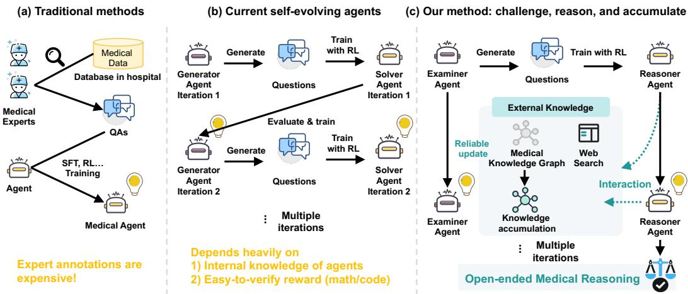
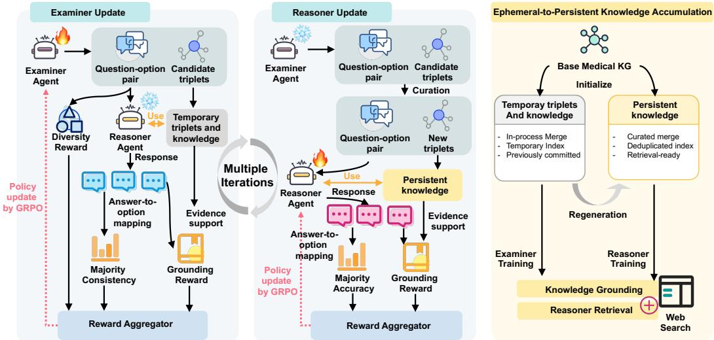
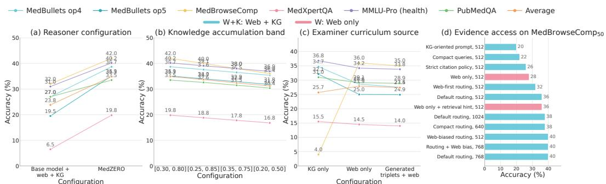
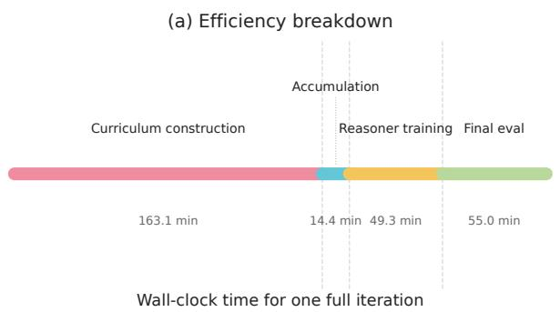
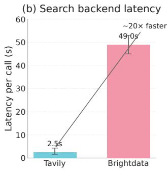
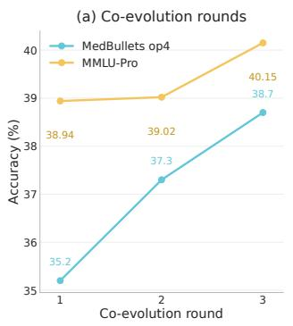
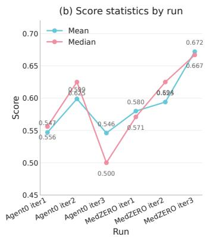
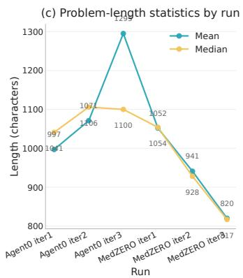
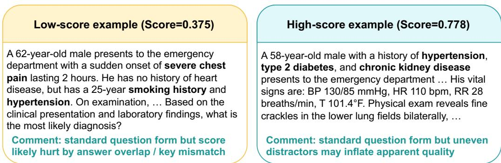

# MedZERO: Self-Evolving Agents for Open-Ended Medical Reasoning Through Controlled Knowledge Accumulation

Xilin Dang1 Weilin Ruan1 Xue Yang2 Jinghao Wang1 Xiaowei Hu3∗ Jinpeng Li4∗ Pheng-Ann Heng1

1Department of Computer Science and Engineering, The Chinese University of Hong Kong 2Department of Hematology, Zhongshan Hospital, Fudan University 3School of Future Technology, South China University of Technology 4Center for Artificial Intelligence and Robotics, Hong Kong Institute of Science and Innovation, Chinese Academy of Sciences

## Abstract

Large language models (LLMs) have shown promise in medical question answering and clinical reasoning, yet their improvement remains constrained by static parametric knowledge and costly expert supervision. Self-evolving agents offer a promising alternative by enabling models to improve through iterative task generation and problem-solving. However, most existing self-evolving methods are designed for easily verifiable domains such as mathematics and coding, where solutions can be checked by exact answers or executable programs. Medical reasoning is fundamentally different: it is open-ended, knowledge-intensive, and often only partially verifiable. We present MedZERO, a self-evolving framework for open-ended medical reasoning. MedZERO couples an Examiner that generates frontier medical question-option pairs with a Reasoner that solves them through evidence-grounded multi-turn reasoning with external knowledge tools. To support reliable, continual improvement, MedZERO adopts controlled knowledge accumulation, which maintains temporary exploratory knowledge and curated persistent knowledge in reasoning. We evaluate MedZERO on five public medical reasoning benchmarks using 4B- and 8B-scale base models under open-ended evaluation. Across all settings, MedZERO consistently outperforms the underlying base models and prior self-evolving baselines, achieving up to 13.7 average accuracy-point gains over the next-best self-evolving baseline.

## 1 Introduction

Large language models (LLMs) have shown strong potential in medical question answering, evidence synthesis, and complex clinical reasoning [29, 11, 22]. However, their medical reasoning ability remains limited by two practical bottlenecks: static parametric knowledge and expensive expert supervision. In medicine, obtaining high-quality supervision is particularly costly because it often requires domain experts, careful quality control, and substantial time for adjudicating difficult cases [13]. These constraints make it difficult to scale supervised fine-tuning and reinforcement learning pipelines for advanced medical reasoning [21, 7].

Recent self-evolving frameworks offer a promising alternative by allowing models to generate tasks, explore solution strategies, and improve through iterative self-improvement [20, 28, 39, 37]. Yet their strongest results have so far been concentrated in domains such as mathematics and coding, where candidate solutions can be checked by exact answers or executable programs [40, 18, 33, 8]. Medical reasoning is fundamentally different. First, medical questions often admit free-form explanations, differential diagnoses, or evidence-dependent conclusions, so semantically correct answers may differ substantially in wording. Second, unlike math or coding, many medical reasoning steps do not have an exact executable verifier; automatic correctness signals are therefore weak, partial, or dependent on imperfect judges. Third, medical progress often requires acquiring, organizing, and reusing external evidence, such as biomedical facts, clinical guidelines, or recently retrieved information, rather than only recombining knowledge already stored in model parameters [31]. As a result, extending self-evolution from easily verifiable domains to medicine is not a straightforward transfer, but a distinct problem setting.

  
Figure 1: (a) Conventional medical reasoning pipelines rely on expensive expert supervision and static knowledge. (b) Prior self-evolving methods have shown their strongest results in easily verifiable domains such as mathematics and coding. (c) MedZERO extends self-evolution to openended medical reasoning through Examiner–Reasoner co-evolution, evidence-grounded tool use, and controlled knowledge accumulation.

These task properties create three algorithmic challenges for self-evolution. First, self-generated questions often remain too close to the model’s existing comfort zone, making it hard to sustain a useful frontier curriculum over time [27, 1]. This problem is especially severe in medicine, where new progress often requires bringing in external knowledge rather than simply resampling familiar reasoning patterns. Second, medical reasoning rarely admits exact automatic verification, so self-consistency alone is not a reliable training signal for open-ended answers [41, 5]. Third, useful knowledge discovered during self-evolution is difficult to preserve safely: naively feeding all self-generated facts, intermediate hypotheses, or retrieved snippets back into future reasoning can accumulate unsupported artifacts and reinforce errors. Although retrieval-augmented and searchbased medical agents improve evidence access and answer grounding [10, 2, 15], they do not by themselves solve these challenges of curriculum construction, partial verifiability, and controlled knowledge reuse.

To address this gap, we present MedZERO, a self-evolving framework for open-ended medical reasoning. MedZERO consists of two co-evolving agents. An Examiner generates medical questionoption pairs near the current capability frontier of the learner, providing a weak but usable frontier signal under partial verifiability. A Reasoner then solves these questions through multi-turn reasoning with external knowledge tools, including structured retrieval and optional web search. To stabilize learning in this open-ended setting, MedZERO contains three ingredients: frontier curriculum generation, joint majority-consistency and evidence-grounded supervision, and controlled knowledge accumulation. In particular, MedZERO distinguishes transient exploratory knowledge produced during problem solving from curated persistent knowledge that is admitted into the visible retrieval substrate. This separation allows broad exploration while reducing the risk that unsupported selfgenerated artifacts directly contaminate future reasoning and training.

We evaluate MedZERO on five public benchmarks for open-ended, knowledge-intensive medical reasoning, reporting MedBullets under two option settings and averaging over all six reported metrics, using both 4B- and 8B-scale base models. Across all settings, MedZERO consistently outperforms the underlying base models and prior self-evolving baselines, achieving up to 22.0 average-point gains over the base model and up to 13.7 average-point gains over previous self-evolving methods. These results show that self-evolution can be extended beyond easily verifiable domains when curriculum construction, supervision, and knowledge accumulation are explicitly designed for partial verifiability and continual knowledge acquisition.

Our contributions are summarized as follows:

• We propose MedZERO, a dual-agent framework in which an Examiner generates frontier medical question-option pairs and a Reasoner improves through evidence-grounded multi-turn reasoning with external knowledge tools.

• We introduce controlled knowledge accumulation, which separates transient exploratory knowledge from curated persistent knowledge visible to the Reasoner, enabling continual improvement while mitigating contamination from unsupported self-generated artifacts.

• We validate MedZERO on five medical reasoning benchmarks across 4B- and 8B-scale backbones under open-ended evaluation, obtaining up to 22.0 average-point gains over the base model and 13.7 points over prior self-evolving baselines.

## 2 Related Work

## 2.1 Self-Evolution from Zero Data

Recent work has explored self-evolving or self-improving language model frameworks that reduce reliance on curated supervision by generating training tasks and trajectories autonomously [39, 20, 28]. These approaches have shown the strongest results in verifiable domains such as coding and mathematics [7, 25], where learning can be guided by execution feedback, deterministic answers, confidence, or consistency-based proxy rewards [37]. More recent work extends self-evolution to fully autonomous systems that generate and solve their own problems from scratch [35, 40, 8, 33, 19]. However, such signals become much less reliable in open-ended settings for reinforcement learning techniques such as Group Relative Policy Optimization (GRPO) [25], where correctness is ambiguous and self-generated supervision can reinforce existing errors [31, 32, 38]. Context0 targets this gap in the medical domain. Unlike prior self-evolving methods designed for easily verifiable tasks, Context0 addresses open-ended medical reasoning under partial verifiability.

## 2.2 Interactive Medical Reasoning

Most prior work on medical language models focuses on static question answering benchmarks [29, 12, 22, 3, 42], where the full clinical context is given in a single prompt. More recent work studies interactive medical reasoning, in which models must decide what information to acquire or what questions to ask before answering. MediQ [17] and KnowGuard [5] evaluate question-asking LLMs for interactive clinical reasoning. AgentClinic [24] tests agents in simulated clinical environments. CRAFT-MD [13] assesses conversational diagnosis through doctor-patient interaction. Multi-agent medical architectures such as MedAgents [30] and MDAgents [14] demonstrate that collaboration structures can improve medical reasoning without additional training data. Agent Hospital [16] explores an alternative where doctor agents evolve through simulated patient interactions without labeled data. While these settings better reflect clinical reasoning, they still typically rely on curated datasets or fixed environments rather than autonomous self-improvement. Context0 complements this line of work by introducing a self-evolving framework for interactive, knowledge-intensive medical reasoning.

## 3 Methodology

## 3.1 Framework Overview

MedZERO is a dual-agent self-evolving framework for open-ended medical reasoning. It consists of an Examiner, which generates training questions with local candidate option sets and candidate medical knowledge triplets, and a Reasoner, which answers them using multi-turn reasoning with external knowledge tools. MedZERO trains the two agents through alternating self-evolution rounds, where each round consists of an Examiner update and a Reasoner update.

  
Figure 2: Overview of MedZERO. MedZERO is a self-evolving framework for open-ended medical reasoning that couples frontier curriculum generation, evidence-grounded reasoning, and controlled knowledge accumulation. An Examiner generates medical question-option pairs and candidate knowledge triplets near the current capability frontier of the Reasoner. The Reasoner solves these questions with structured retrieval and optional web search. MedZERO separates exploratory triplets from curated persistent knowledge, enabling knowledge accumulation without directly reinforcing unverified self-generated artifacts.

At round t, MedZERO first updates the Examiner while freezing the Reasoner. The frozen Reasoner evaluates Examiner-generated question-option pairs to optimize the Examiner. During this stage, the Examiner also generates candidate triplets, which may be used as temporary exploration-time knowledge but are not directly promoted to the persistent retrieval knowledge base. MedZERO then freezes the updated Examiner. The Examiner regenerates candidate question-option-triplet samples, and only samples with valid answers and frontier-range scores are retained. Their question-option pairs form the Reasoner training curriculum, while their associated triplets are deduplicated and accumulated into the persistent generated knowledge graph. Finally, MedZERO updates the Reasoner while freezing the Examiner. Repeating these stages over multiple rounds yields co-evolution: a stronger Reasoner shifts the frontier used to train the Examiner, and the improved Examiner produces harder and better-grounded data for subsequent Reasoner training.

## 3.2 Frontier Curriculum Generation

A useful self-evolving curriculum should concentrate on questions near the Reasoner’s current capability frontier. In open-ended medical reasoning, however, difficulty cannot be estimated by exact answer matching because free-form answers may be semantically equivalent but lexically diverse. MedZERO addresses this by letting the Examiner generate a question together with a local option set, which partially canonicalizes the answer space and enables option-level agreement to serve as a weak frontier signal.

Let $\pi _ { X }$ denote the Examiner policy. Given the current Reasoner, the Examiner generates a questionoption pair and associated candidate triplets,

$$
( q , O , T ) \sim \pi _ { X } ( \cdot ) ,\tag{1}
$$

where $O = \{ o _ { 1 } , \dots , o _ { M } \}$ is a local option set and $T$ is a set of generated medical knowledge triplets. The Examiner receives the reward

$$
r _ { \mathrm { e x a m } } ( q , O ) = \lambda _ { \mathrm { f r o n t } } r _ { \mathrm { f r o n t } } ( q , O ) + \lambda _ { \mathrm { d i v } } r _ { \mathrm { d i v } } ( q , O ) + \lambda _ { \mathrm { g r o u n d } } r _ { \mathrm { g r o u n d } } ( q ) ,\tag{2}
$$

, which will be introduced next, and is optimized by GRPO

$$
\operatorname* { m a x } _ { \pi _ { X } } \mathbb { E } _ { ( q , O , T ) \sim \pi _ { X } } \left[ r _ { \mathrm { e x a m } } ( q , O ) \right] .\tag{3}
$$

Option-level frontier reward. For each generated question $q ,$ the Reasoner optionally performs knowledge retrieval, and samples K independent free-form responses $\{ y _ { k } ( q ) \} _ { k = 1 } ^ { K }$ . Each response is projected into the examiner-induced local option space:

$$
m ( y _ { k } ( q ) , O ) \in \{ o _ { 1 } , \dots , o _ { M } , \emptyset \} ,\tag{4}
$$

where $m ( \cdot , \cdot )$ is implemented using SentenceTransformer [23], and ∅ denotes an abstention state when no option is sufficiently aligned with the response.

Let $n _ { j } ( q )$ be the number of responses mapped to option $o _ { j }$ , and let

$$
n _ { \mathrm { v a l i d } } ( q ) = \sum _ { j = 1 } ^ { M } n _ { j } ( q )\tag{5}
$$

be the number of non-abstained mappings. The option-level agreement score is

$$
s _ { \mathrm { a g r } } ( q , O ) = \left\{ \begin{array} { l l } { \displaystyle \operatorname* { m a x } _ { j \in \{ 1 , \dots , M \} } \frac { n _ { j } ( q ) } { n _ { \mathrm { v a l i d } } ( q ) } , } & { n _ { \mathrm { v a l i d } } ( q ) > 0 , } \\ { 0 , } & { n _ { \mathrm { v a l i d } } ( q ) = 0 . } \end{array} \right.\tag{6}
$$

We define the frontier reward as

$$
r _ { \mathrm { f r o n t } } ( q , O ) = - \left| s _ { \mathrm { a g r } } ( q , O ) - \gamma \right| ,\tag{7}
$$

where $\gamma \in ( 0 , 1 )$ is the target agreement level. Very high agreement indicates that the question is likely too easy, whereas very low agreement often indicates that the question is either too difficult or poorly specified. The reward therefore favors intermediate option-level agreement near the Reasoner’s capability frontier.

Diversity reward. To avoid repeatedly generating near-duplicate questions, following [8, 35], $r _ { \mathrm { d i v } }$ rewards question-option pairs that are dissimilar to previously retained high-reward samples in the curriculum buffer. This term serves as a standard anti-collapse regularizer.

Grounding reward. Frontier difficulty alone does not ensure medically meaningful supervision. Let $\tau ( q )$ denote the Reasoner’s trajectory for question $q ,$ and let $\mathcal { E } ( q )$ denote the Reasoner’s retrieved evidence, such as structured facts and web references. We define

$$
r _ { \mathrm { g r o u n d } } ( q ) = s _ { \mathrm { s u p } } ( \tau ( q ) , \mathcal { E } ( q ) ) ,\tag{8}
$$

where $s _ { \mathrm { s u p } }$ measures how well the trajectory is supported by retrieved evidence.

## 3.3 Ephemeral-to-Persistent Knowledge Accumulation

A central risk in medical self-evolution is uncontrolled knowledge feedback: if every Examinergenerated triplet is immediately stored as persistent retrieval knowledge, noisy or reward-hacking artifacts may be repeatedly retrieved and reinforced in later Reasoner training. MedZERO therefore separates optimization-time ephemeral triplets from post-optimization persistent knowledge.

Let $\mathcal { G } _ { 0 }$ denote the base medical knowledge graph, and let $\mathcal { G } _ { t } ^ { \mathrm { p e r s } }$ denote the persistent generated KG after round t. During Examiner optimization round t, candidate triplets produced by the Examiner are stored in a temporary buffer ${ \mathcal { G } } _ { t } ^ { \mathrm { { t m p } } }$ . To avoid using information generated by the current instance as its own evidence, MedZERO applies a causal visibility rule. When processing step or batch i, the Reasoner can retrieve from the base KG and previously committed temporary triplets, but not from triplets generated by the current step or batch:

$$
\mathcal { G } _ { t , i } ^ { \mathrm { c u r } } = \mathcal { G } _ { 0 } \cup \mathcal { G } _ { t - 1 } ^ { \mathrm { p e r s } } \cup \bigcup _ { j < i } T _ { t , j } ^ { \mathrm { t m p } } .\tag{9}
$$

After Examiner optimization finishes, ${ \mathcal { G } } _ { t } ^ { \mathrm { t m p } }$ is discarded and is not directly promoted to the persistent KG.

Persistent accumulation is performed only through a separate post-optimization generation-andcuration pass. The optimized Examiner from round t regenerates candidate samples

$$
x = ( q , O , T ) ,\tag{10}
$$

where $T$ denotes the associated generated triplets. The current Reasoner evaluates each generated question-option pair and assigns a score s(x). We retain only samples with non-empty answers and frontier-range scores:

$$
{ \mathcal D } _ { t } = \{ x = ( q , O , T ) \ : \ s _ { \operatorname* { m i n } } \leq s ( x ) \leq s _ { \operatorname* { m a x } } , \ a ( x ) \neq \emptyset \} .\tag{11}
$$

In our experiments, $s _ { \mathrm { m i n } } = 0 . 3$ and $s _ { \mathrm { m a x } } = 0 . 8$ . The retained question-option pairs in $\mathcal { D } _ { t }$ are used as Reasoner RL training data.

Triplets associated with retained samples are deduplicated and appended to the persistent generated KG:

$$
\mathcal G _ { t } ^ { \mathrm { p e r s } } = \mathcal G _ { t - 1 } ^ { \mathrm { p e r s } } \cup \mathrm { D e d u p } \left( \bigcup _ { x \in \mathcal D _ { t } } T ( x ) \right) .\tag{12}
$$

The retrieval-visible KG for subsequent Reasoner training and evaluation is therefore

$$
\mathcal { G } _ { t } ^ { \mathrm { v i s } } = \mathcal { G } _ { 0 } \cup \mathcal { G } _ { t } ^ { \mathrm { p e r s } } .\tag{13}
$$

Thus, Examiner optimization may use generated triplets as ephemeral exploration-time memory, but only regenerated triplets that pass post-optimization filtering become persistent retrieval-visible knowledge.

## 3.4 Reasoner Training

The Reasoner is trained on the retained curriculum $\mathcal { D } _ { t }$ using a reward that combines option-level majority consistency with evidence grounding. The former provides a weak self-consistency signal in the examiner-induced answer space, while the latter constrains the trajectory to be supported by retrieved medical evidence.

Let $\pi _ { R }$ denote the Reasoner policy. For each training instance $( q , O , T ) \in \mathcal { D } _ { t }$ , the Reasoner samples $K$ trajectories, optionally using the retrieval-visible KG $\mathcal { G } _ { t } ^ { \mathrm { v i s } }$ and web search:

$$
\tau _ { k } \sim \pi _ { R } ( \cdot \mid q , \mathcal { G } _ { t } ^ { \mathrm { v i s } } , \mathrm { w e b \_ s e a r c h } ) , \qquad k = 1 , \ldots , K .\tag{14}
$$

Each trajectory produces a free-form final answer $y _ { k }$ , which is mapped into the local option space:

$$
m ( y _ { k } , O ) \in \{ o _ { 1 } , \dots , o _ { M } , \emptyset \} .\tag{15}
$$

The majority option among valid mapped responses is

$$
o ^ { \star } ( q ) = \arg \operatorname* { m a x } _ { o _ { j } \in O } \sum _ { k = 1 } ^ { K } \mathbf { 1 } [ m ( y _ { k } , O ) = o _ { j } ] .\tag{16}
$$

If no valid mapped response exists, the majority-consistency reward is set to zero. Otherwise, for each trajectory $\tau _ { k }$ ,

$$
r _ { \mathrm { m a j } } ( \tau _ { k } ) = { \bf 1 } [ m ( y _ { k } , O ) = o ^ { \star } ( q ) ] .\tag{17}
$$

The Reasoner is jointly optimized by the majority accuracy reward and the grounding reward:

$$
\operatorname* { m a x } _ { \pi _ { R } } \mathbb { E } _ { ( q , O , T ) \sim \mathcal { D } _ { t } , \tau _ { k } \sim \pi _ { R } } \left[ r _ { \mathrm { m a j } } ( \tau _ { k } ) + \beta r _ { \mathrm { g r o u n d } } ( \tau _ { k } ) \right] .\tag{18}
$$

## 3.5 Open-ended Evaluation

Since MedZERO is trained to produce free-form medical answers, evaluation preserves the openended inference setting rather than directly decoding benchmark options.

For multiple-choice medical benchmarks, we use a two-stage protocol. Given context c and question stem x without answer options, the Reasoner first produces an open-ended response

$$
y = \pi _ { R } ^ { \mathrm { o p e n } } ( c , x ) .\tag{19}
$$

Table 1: Main results on Qwen3-4B-scale backbones under open-ended evaluation.
<table><tr><td>Method</td><td>MedBullets op4 / op5</td><td>MedBrowse Comp</td><td>MedXpertQA</td><td>MMLU-Pro (health)</td><td>PubMedQA</td><td>Average</td></tr><tr><td>4B Base</td><td>19.8% / 14.3%</td><td>0.0%</td><td>13.3%</td><td>12.4%</td><td>17.6%</td><td>12.9%</td></tr><tr><td>+ Agent0</td><td>25.3% / 18.8%</td><td>0.0%</td><td>10.2%</td><td>15.2%</td><td>13.7%</td><td>13.9%</td></tr><tr><td>+ SPIRAL</td><td>25.6% / 20.5%</td><td>4.0%</td><td>10.2%</td><td>24.6%</td><td>24.5%</td><td>18.2%</td></tr><tr><td>+ Absolute Zero</td><td>29.3% / 24.8%</td><td>0.0%</td><td>13.2%</td><td>32.4%</td><td>27.6%</td><td>21.2%</td></tr><tr><td>MedZERO (ours)</td><td>38.7% / 35.1%</td><td>42.0%</td><td>19.8%</td><td>40.2%</td><td>33.5%</td><td>34.9%</td></tr></table>

Table 2: Main results on Qwen3-8B-scale backbones under open-ended evaluation.
<table><tr><td>Method</td><td>MedBullets op4 / op5</td><td>MedBrowse Comp</td><td>MedXpertQA</td><td>MMLU-Pro (health)</td><td>PubMedQA</td><td>Average</td></tr><tr><td>8B Base</td><td>32.1% / 23.7%</td><td>4.0%</td><td>14.5%</td><td>57.8%</td><td>77.5%</td><td>34.9%</td></tr><tr><td>+ Agent0</td><td>52.4% / 49.2%</td><td>4.0%</td><td>18.0%</td><td>57.6%</td><td>81.0%</td><td>43.7%</td></tr><tr><td>+ SPIRAL</td><td>51.0% / 50.2%</td><td>4.0%</td><td>17.2%</td><td>53.9%</td><td>77.6%</td><td>42.3%</td></tr><tr><td>+ Absolute Zero</td><td>45.1% / 38.6%</td><td>0.0%</td><td>12.5%</td><td>49.4%</td><td>76.1%</td><td>37.0%</td></tr><tr><td>MedZERO (ours)</td><td>58.3% / 49.8%</td><td>45.5%</td><td>20.8%</td><td>61.2%</td><td>85.2%</td><td>53.5%</td></tr></table>

A separate judge maps y to one option in the benchmark option set $\mathcal { O } \mathrm { : }$

$$
\hat { \ell } = J ( y , { \mathcal { O } } ) .\tag{20}
$$

Accuracy is computed against the gold label ℓ⋆:

$$
\operatorname { A c c } = \frac { 1 } { N } \sum _ { i = 1 } ^ { N } \mathbf { 1 } \Big [ \hat { \ell } _ { i } = \ell _ { i } ^ { \star } \Big ] .\tag{21}
$$

For open-ended task MedBrowseComp [4], we use rule-based extraction and normalized matching.

## 4 Experiments

## 4.1 Experimental Settings

Setup. Following prior work [8], we adopt Qwen3-4B-Base and Qwen3-8B-Base [36] as the base models to study scaling effects within the same model family. Our framework is built on VeRL [26]. In the co-evolutionary loop, for each task $x _ { i } ,$ we sample k = 4 responses from the Reasoner to estimate uncertainty, and retain tasks with $p ( x ) \in [ 0 . 3 , 0 . 8 ]$ . For the Examiner, the grounding reward weight is set to $\beta = 0 . 0 5$ . For the Reasoner, we use VeRL-Tool [9] to support retrieval via the output tags <kg\_search> and <web\_search>, corresponding to KG retrieval and web search, respectively.

Comparison Methods We compare MedZERO against several state-of-the-art self-improvement methods. 1) Base Model: The pre-trained base model without any fine-tuning. 2) Self-Evolving Methods: Absolute Zero [40], SPIRAL [18], and Agent0 [35].

Datasets and Metrics MedZERO requires no human-annotated data for training. We evaluate MedZERO on five public medical reasoning benchmarks in an open-ended setting, on two suites of benchmarks: 1) Traditional medical reasoning: PubMedQA [12], MMLU-Pro (health) [34]; 2) Expert-level medical reasoning: MedBullets [3], MedBrowseComp [4], MedXpertQA [42], with MedBullets reported under two option settings, op4 and op5. We report the accuracy (pass@1) across all benchmarks. Because MedBullets is evaluated under both op4 and op5 settings, the overall average is computed across six reported scores.

## 4.2 Results

Tables 1 and 2 report the main results under the open-ended evaluation protocol. MedZERO achieves the best overall performance at both model scales. At the 4B scale, MedZERO obtains the highest average score of 34.9%, outperforming Absolute Zero (21.2%), SPIRAL (18.2%), Agent0 (13.9%), and the base model (12.9%). The same trend holds at the 8B scale, where MedZERO again ranks first with an average score of 53.5%, ahead of Agent0 (43.7%), SPIRAL (42.3%), Absolute Zero (37.0%), and the base model (34.9%). Overall, these results show that MedZERO provides the strongest gains over both the base model and prior self-improving baselines for open-ended medical reasoning.

  
Figure 3: Component analysis across (a) Reasoner configuration, (b) ephemeral-to-persistent accumulation band, and (c) Examiner curriculum source. (d) MedBrowseComp50 evidence-access ablations. W+K = web\_search+kg\_search; W = Web only.

## 5 Analysis

## 5.1 Component analysis

We study MedZERO along three axes: Reasoner configuration, ephemeral-to-persistent knowledge accumulation, and Examiner curriculum construction. We highlight two findings.

(i) Strong performance requires coordinated curriculum construction, knowledge admission, and Reasoner optimization. Figure 3(a)-(c) shows that the strongest results are obtained only when frontier curriculum construction, controlled knowledge accumulation, and Reasoner optimization are combined. Weakening any one of these components degrades performance, indicating that MedZERO benefits from coordination across the full self-evolution pipeline rather than from a single dominant module. In particular, Figure 3(b) shows that the default frontier-range admission band [0.30, 0.80] performs best on average, supporting the use of a curated generation-and-accumulation pass rather than indiscriminate persistence.

(ii) Effective evidence-grounded reasoning depends on coordinated retrieval sources and prompt routing. Figure 3(d) shows that using both KG retrieval and web retrieval is generally stronger than using web retrieval alone, suggesting that structured and unstructured evidence provide complementary support. We also find that prompt routing has a large effect even under the same checkpoint and retrieval setup, while increasing the observation budget yields smaller but consistent gains.

## 5.2 Systems efficiency

We next evaluate whether MedZERO introduces substantial systems overhead.

(i) Controlled knowledge accumulation is not the main runtime bottleneck. Figure 4(a) shows that Examiner-side curriculum construction dominates wall-clock time in a full self-evolution iteration, while controlled knowledge accumulation accounts for only a small fraction of the total runtime. Within accumulation, the main cost comes from scoring candidate questions rather than from generation or output materialization.

(ii) The evidence-access stack has practical benchmark-scale latency. Figure 4(b) shows that the current FAISS- [6] and tool-server-based setup substantially reduces latency relative to earlier search configurations. Replacing slower web-search backends with Tavily improves end-to-end latency by roughly an order of magnitude and yields a tighter latency distribution, making evidence-augmented evaluation more predictable at scale.

  
Figure 4: (a) Wall-time breakdown for a full MedZERO self-evolution iteration. (b) Web search latency per call (end-to-end wall time, measured in the same execution environment across 5 consecutive calls).

  
Figure 5: (a) Number of rounds. (b)-(c) Per-run generated supervision corpus statistics, including scale and score/problem-length summaries. Earlier generic runs have much shorter prompts than medical runs. Score range is 0.333–0.800.

## 5.3 Iterative self-evolution

Additional rounds continue to improve performance. We ask whether MedZERO continues to improve over additional rounds. Figure 5(a) shows that moving beyond a single round yields further gains on both medical and general benchmarks. On MedBullets op4, accuracy increases from 35.2% after the first round to 38.7% after the third round, while MMLU-Pro improves from 38.94% to 40.15%. These gains indicate that the first round does not merely provide a one-time adaptation effect; instead, the Examiner–Reasoner interaction continues to provide useful training signal as the Reasoner’s capability changes.

This trend is consistent with the intended frontier-curriculum mechanism. As the Reasoner improves, previously frontier-level questions may become easier, and the updated Examiner can shift the curriculum toward harder or better-grounded samples. Meanwhile, the persistent knowledge store grows only through filtered admission, allowing later rounds to reuse accumulated evidence without exposing the Reasoner to all exploratory artifacts. The continued improvement over three rounds therefore suggests that MedZERO’s curriculum and knowledge accumulation remain coupled over time rather than collapsing to repetitive self-generated data.

## 5.4 Supervision distribution analysis

Self-evolution changes the retained supervision profile. We analyze the generated supervision corpus to understand how MedZERO changes the training distribution. Figure 5 (b)&(c) show that generated medical curricula differ from earlier generic runs in both score distribution and prompt length, with medical runs producing longer and more elaborate prompts. Later medical runs shift toward higher average scores, showing that self-evolution changes the supervision profile over time.

## 6 Conclusion

We presented MedZERO, a self-evolving framework for open-ended medical reasoning under partial verifiability. MedZERO co-evolves an Examiner for frontier medical challenge generation and a Reasoner for evidence-grounded reasoning, while using ephemeral-to-persistent knowledge accumulation to separate exploratory self-generated triplets from curated reusable knowledge. Across five medical reasoning benchmarks and two model scales, MedZERO consistently improves over both base models and self-evolving baselines. These results suggest that explicitly designing curriculum construction, supervision, and knowledge reuse for partial verifiability is important for extending self-evolution beyond easily verifiable domains and toward more realistic medical reasoning settings.

## References

[1] Sanghwan Bae, Jiwoo Hong, Min Young Lee, Hanbyul Kim, JeongYeon Nam, and Donghyun Kwak. Online difficulty filtering for reasoning oriented reinforcement learning. arXiv preprint arXiv:2504.03380, 2025.

[2] Payal Chandak, Kexin Huang, and Marinka Zitnik. Building a knowledge graph to enable precision medicine. Scientific data, 10(1):67, 2023.

[3] Hanjie Chen, Zhouxiang Fang, Yash Singla, and Mark Dredze. Benchmarking large language models on answering and explaining challenging medical questions. In Proceedings of the 2025 Conference ofthe Nations ofthe Americas Chapter ofthe Associationfor Computational Linguistics: Human Language Technologies (Volume 1: Long Papers), pages 3563–3599, 2025.

[4] Shan Chen, Pedro Moreira, Yuxin Xiao, Sam Schmidgall, Jeremy Warner, Hugo Aerts, Thomas Hartvigsen, Jack Gallifant, and Danielle S Bitterman. Medbrowsecomp: Benchmarking medical deep research and computer use. arXiv preprint arXiv:2505.14963, 2025.

[5] Xilin Dang, Kexin Chen, Xiaorui Su, Ayush Noori, Iñaki Arango, Lucas Vittor, Xinyi Long, Yuyang Du, Marinka Zitnik, and Pheng Ann Heng. Knowguard: Knowledge-driven abstention for multi-round clinical reasoning. arXiv preprint arXiv:2509.24816, 2025.

[6] Matthijs Douze, Alexandr Guzhva, Chengqi Deng, Jeff Johnson, Gergely Szilvasy, Pierre-Emmanuel Mazaré, Maria Lomeli, Lucas Hosseini, and Hervé Jégou. The faiss library. IEEE Transactions on Big Data, 2025.

[7] Daya Guo, Dejian Yang, Haowei Zhang, Junxiao Song, Peiyi Wang, Qihao Zhu, Runxin Xu, Ruoyu Zhang, Shirong Ma, Xiao Bi, et al. Deepseek-r1: Incentivizing reasoning capability in llms via reinforcement learning. arXiv preprint arXiv:2501.12948, 2025.

[8] Chengsong Huang, Wenhao Yu, Xiaoyang Wang, Hongming Zhang, Zongxia Li, Ruosen Li, Jiaxin Huang, Haitao Mi, and Dong Yu. R-zero: Self-evolving reasoning llm from zero data. 2025.

[9] Dongfu Jiang, Yi Lu, Zhuofeng Li, Zhiheng Lyu, Ping Nie, Haozhe Wang, Alex Su, Hui Chen, Kai Zou, Chao Du, et al. Verltool: Towards holistic agentic reinforcement learning with tool use. arXiv preprint arXiv:2509.01055, 2025.

[10] Bowen Jin, Hansi Zeng, Zhenrui Yue, Jinsung Yoon, Sercan Arik, Dong Wang, Hamed Zamani, and Jiawei Han. Search-r1: Training llms to reason and leverage search engines with reinforcement learning. arXiv preprint arXiv:2503.09516, 2025.

[11] Di Jin, Eileen Pan, Nassim Oufattole, Wei-Hung Weng, Hanyi Fang, and Peter Szolovits. What disease does this patient have? a large-scale open domain question answering dataset from medical exams. Applied Sciences, 11(14):6421, 2021.

[12] Qiao Jin, Bhuwan Dhingra, Zhengping Liu, William Cohen, and Xinghua Lu. Pubmedqa: A dataset for biomedical research question answering. In Proceedings ofthe 2019 conference on empirical methods in natural language processing and the 9th international joint conference on natural language processing (EMNLP-IJCNLP), pages 2567–2577, 2019.

[13] Shreya Johri, Jaehwan Jeong, Benjamin A Tran, Daniel I Schlessinger, Shannon Wongvibulsin, Leandra A Barnes, Hong-Yu Zhou, Zhuo Ran Cai, Eliezer M Van Allen, David Kim, et al. An evaluation framework for clinical use of large language models in patient interaction tasks. Nature medicine, 31(1):77–86, 2025.

[14] Yubin Kim, Chanwoo Park, Hyewon Jeong, Yik S Chan, Xuhai Xu, Daniel McDuff, Hyeonhoon Lee, Marzyeh Ghassemi, Cynthia Breazeal, and Hae W Park. Mdagents: An adaptive collaboration of llms for medical decision-making. Advances in Neural Information Processing Systems, 37:79410–79452, 2024.

[15] Patrick Lewis, Ethan Perez, Aleksandra Piktus, Fabio Petroni, Vladimir Karpukhin, Naman Goyal, Heinrich Küttler, Mike Lewis, Wen-tau Yih, Tim Rocktäschel, et al. Retrieval-augmented generation for knowledge-intensive nlp tasks. Advances in neural information processing systems, 33:9459–9474, 2020.

[16] Junkai Li, Yunghwei Lai, Weitao Li, Jingyi Ren, Meng Zhang, Xinhui Kang, Siyu Wang, Peng Li, Ya-Qin Zhang, Weizhi Ma, et al. Agent hospital: A simulacrum of hospital with evolvable medical agents. arXiv preprint arXiv:2405.02957, 2024.

[17] Shuyue S Li, Vidhisha Balachandran, Shangbin Feng, Jonathan S Ilgen, Emma Pierson, Pang W Koh, and Yulia Tsvetkov. Mediq: Question-asking llms and a benchmark for reliable interactive clinical reasoning. Advances in Neural Information Processing Systems, 37:28858–28888, 2024.

[18] Bo Liu, Leon Guertler, Simon Yu, Zichen Liu, Penghui Qi, Daniel Balcells, Mickel Liu, Cheston Tan, Weiyan Shi, Min Lin, Wee Sun Lee, and Natasha Jaques. Spiral: Self-play on zero-sum games incentivizes reasoning via multi-agent multi-turn reinforcement learning. arXiv preprint arXiv:2506.24119, 2025.

[19] Hongliang Lu, Yuhang Wen, Pengyu Cheng, Ruijin Ding, Haotian Xu, Jiaqi Guo, Chutian Wang, Haonan Chen, Xiaoxi Jiang, and Guanjun Jiang. Search self-play: Pushing the frontier of agent capability without supervision. arXiv preprint arXiv:2510.18821, 2025.

[20] Aman Madaan, Niket Tandon, Prakhar Gupta, Skyler Hallinan, Luyu Gao, Sarah Wiegreffe, Uri Alon, Nouha Dziri, Shrimai Prabhumoye, Yiming Yang, et al. Self-refine: Iterative refinement with self-feedback. Advances in neural information processing systems, 36:46534–46594, 2023.

[21] Long Ouyang, Jeffrey Wu, Xu Jiang, Diogo Almeida, Carroll Wainwright, Pamela Mishkin, Chong Zhang, Sandhini Agarwal, Katarina Slama, Alex Ray, et al. Training language models to follow instructions with human feedback. Advances in neural information processing systems, 35:27730–27744, 2022.

[22] Ankit Pal, Logesh Kumar Umapathi, and Malaikannan Sankarasubbu. Medmcqa: A large-scale multi-subject multi-choice dataset for medical domain question answering. In Conference on health, inference, and learning, pages 248–260. PMLR, 2022.

[23] Nils Reimers and Iryna Gurevych. Sentence-bert: Sentence embeddings using siamese bertnetworks. In Proceedings ofthe 2019 conference on empirical methods in natural language processing and the 9th international joint conference on natural language processing (EMNLP-IJCNLP), pages 3982–3992, 2019.

[24] Samuel Schmidgall, Rojin Ziaei, Carl Harris, Eduardo Reis, Jeffrey Jopling, and Michael Moor. Agentclinic: a multimodal agent benchmark to evaluate ai in simulated clinical environments. arXiv preprint arXiv:2405.07960, 2024.

[25] Zhihong Shao, Peiyi Wang, Qihao Zhu, Runxin Xu, Junxiao Song, Xiao Bi, Haowei Zhang, Mingchuan Zhang, YK Li, Yang Wu, et al. Deepseekmath: Pushing the limits of mathematical reasoning in open language models. arXiv preprint arXiv:2402.03300, 2024.

[26] Guangming Sheng, Chi Zhang, Zilingfeng Ye, Xibin Wu, Wang Zhang, Ru Zhang, Yanghua Peng, Haibin Lin, and Chuan Wu. Hybridflow: A flexible and efficient rlhf framework. In Proceedings ofthe Twentieth European Conference on Computer Systems, pages 1279–1297, 2025.

[27] Taiwei Shi, Yiyang Wu, Linxin Song, Tianyi Zhou, and Jieyu Zhao. Efficient reinforcement finetuning via adaptive curriculum learning. arXiv preprint arXiv:2504.05520, 2025.

[28] Noah Shinn, Federico Cassano, Ashwin Gopinath, Karthik Narasimhan, and Shunyu Yao. Reflexion: Language agents with verbal reinforcement learning. Advances in neural information processing systems, 36:8634–8652, 2023.

[29] Karan Singhal, Tao Tu, Juraj Gottweis, Rory Sayres, Ellery Wulczyn, Mohamed Amin, Le Hou, Kevin Clark, Stephen R Pfohl, Heather Cole-Lewis, et al. Toward expert-level medical question answering with large language models. Nature medicine, 31(3):943–950, 2025.

[30] Xiangru Tang, Anni Zou, Zhuosheng Zhang, Ziming Li, Yilun Zhao, Xingyao Zhang, Arman Cohan, and Mark Gerstein. Medagents: Large language models as collaborators for zero-shot medical reasoning. In Findings of the Association for Computational Linguistics: ACL 2024, pages 599–621, 2024.

[31] Zhengwei Tao, Ting-En Lin, Xiancai Chen, Hangyu Li, Yuchuan Wu, Yongbin Li, Zhi Jin, Fei Huang, Dacheng Tao, and Jingren Zhou. A survey on self-evolution of large language models. arXiv preprint arXiv:2404.14387, 2024.

[32] Aaron Tu, Weihao Xuan, Heli Qi, Xu Huang, Qingcheng Zeng, Shayan Talaei, Yijia Xiao, Peng Xia, Xiangru Tang, Yuchen Zhuang, et al. Position: The hidden costs and measurement gaps of reinforcement learning with verifiable rewards. arXiv preprint arXiv:2509.21882, 2025.

[33] Shaobo Wang, Zhengbo Jiao, Zifan Zhang, Yilang Peng, Xu Ze, Boyu Yang, Wei Wang, Hu Wei, and Linfeng Zhang. Socratic-zero: Bootstrapping reasoning via data-free agent co-evolution. arXiv preprint arXiv:2509.24726, 2025.

[34] Yubo Wang, Xueguang Ma, Ge Zhang, Yuansheng Ni, Abhranil Chandra, Shiguang Guo, Weiming Ren, Aaran Arulraj, Xuan He, Ziyan Jiang, et al. Mmlu-pro: A more robust and challenging multi-task language understanding benchmark. Advances in Neural Information Processing Systems, 37:95266–95290, 2024.

[35] Peng Xia, Kaide Zeng, Jiaqi Liu, Can Qin, Fang Wu, Yiyang Zhou, Caiming Xiong, and Huaxiu Yao. Agent0: Unleashing self-evolving agents from zero data via tool-integrated reasoning. arXiv preprint arXiv:2511.16043, 2025.

[36] An Yang, Anfeng Li, Baosong Yang, Beichen Zhang, Binyuan Hui, Bo Zheng, Bowen Yu, Chang Gao, Chengen Huang, Chenxu Lv, et al. Qwen3 technical report. arXiv preprint arXiv:2505.09388, 2025.

[37] Weizhe Yuan, Richard Yuanzhe Pang, Kyunghyun Cho, Xian Li, Sainbayar Sukhbaatar, Jing Xu, and Jason Weston. Self-rewarding language models. arXiv preprint arXiv:2401.10020, 2024.

[38] Yang Yue, Zhiqi Chen, Rui Lu, Andrew Zhao, Zhaokai Wang, Shiji Song, and Gao Huang. Does reinforcement learning really incentivize reasoning capacity in llms beyond the base model? arXiv preprint arXiv:2504.13837, 2025.

[39] Eric Zelikman, Yuhuai Wu, Jesse Mu, and Noah Goodman. Star: Bootstrapping reasoning with reasoning. Advances in Neural Information Processing Systems, 35:15476–15488, 2022.

[40] Andrew Zhao, Yiran Wu, Yang Yue, Tong Wu, Quentin Xu, Yang Yue, Matthieu Lin, Shenzhi Wang, Qingyun Wu, Zilong Zheng, and Gao Huang. Absolute zero: Reinforced self-play reasoning with zero data, 2025.

[41] Lianmin Zheng, Wei-Lin Chiang, Ying Sheng, Siyuan Zhuang, Zhanghao Wu, Yonghao Zhuang, Zi Lin, Zhuohan Li, Dacheng Li, Eric Xing, et al. Judging llm-as-a-judge with mt-bench and chatbot arena. Advances in neural information processing systems, 36:46595–46623, 2023.

[42] Yuxin Zuo, Shang Qu, Yifei Li, Zhangren Chen, Xuekai Zhu, Ermo Hua, Kaiyan Zhang, Ning Ding, and Bowen Zhou. Medxpertqa: Benchmarking expert-level medical reasoning and understanding. arXiv preprint arXiv:2501.18362, 2025.

Table 3: Evaluation datasets used in this work. Sizes refer to the evaluation/test split only.
<table><tr><td>Dataset</td><td>Split</td><td>Size</td><td>Answer format</td><td>Source</td></tr><tr><td>PubMedQA (PQA labeled)</td><td>train</td><td>1000</td><td>3-option MCQ</td><td>qiaojin/PubMedQA</td></tr><tr><td>MedXpertQA (Text)</td><td>test</td><td>2450</td><td>10-option MCQ</td><td>TsinghuaC3I/MedXpertQA</td></tr><tr><td>MMLU-Pro (Health)</td><td>test</td><td>818</td><td>10-option MCQ</td><td>TIGER-Lab/MMLU-Pro</td></tr><tr><td>MedBullets (op4)</td><td>op4_test</td><td>308</td><td>4-option MCQ</td><td>mkieffer/Medbullets</td></tr><tr><td>MedBullets (op5)</td><td>op5_test</td><td>308</td><td>5-option MCQ</td><td>mkieffer/Medbullets</td></tr><tr><td>MedBrowseComp</td><td>test</td><td>50</td><td>open-ended</td><td>AIM-Harvard/MedBrowseComp</td></tr></table>

## A Ethics Statement

This work studies a research framework for open-ended medical reasoning and evaluates it only on academic benchmarks. It is not intended for direct clinical use. Any real-world deployment would require prospective clinical validation across diverse patient populations, regulatory review, continuous monitoring for bias and safety, and mandatory oversight by licensed medical professionals. In particular, errors in retrieval, reasoning, or abstention behavior could cause disproportionate harm in high-stakes settings. Accordingly, MedZERO should not be used for medical diagnosis or treatment decisions, and any future clinical application must comply with applicable medical, legal, and ethical requirements.

## B Limitations

MedZERO has several important limitations. First, although the framework is designed for partially verifiable medical reasoning, verification remains incomplete. In many cases, the correctness of a response cannot be established by exact matching alone, and supervision still depends on imperfect signals such as retrieved evidence, consistency checks, and judge-based evaluation. As a result, some reasoning errors may remain undetected during self-evolution.

Second, while MedZERO explicitly separates exploratory knowledge from curated persistent knowledge, this design does not eliminate the risk of error accumulation. Incorrect retrieved evidence, noisy self-generated rationales, or biased curation decisions may still introduce persistent mistakes into future reasoning. The framework reduces this risk but does not fully solve it.

Third, our evaluation is limited to benchmark-based settings and does not establish clinical utility. Academic medical QA benchmarks capture only part of real clinical reasoning, and they do not fully reflect longitudinal patient care, multi-modal evidence, workflow constraints, or the consequences of incorrect recommendations in practice.

Fourth, MedZERO depends on the quality of its external tools and evaluation protocol. Retrieval quality, prompt design, observation budget, and judge behavior can all materially affect outcomes. Although we report controlled settings where possible, some benchmark conditions remain sensitive to implementation choices.

These limitations suggest several directions for future work, including stronger verification mechanisms for open-ended reasoning, more reliable knowledge curation strategies, prospective human evaluation, and broader testing in realistic clinical decision-support settings.

## C Additional Experimental Details and Extended Results

This appendix provides supplementary experimental details, additional ablations, benchmark-specific breakdowns, and qualitative case studies that complement the main text. Unless otherwise noted, appendix tables should be interpreted only within their own evaluation protocol, since tool availability, prompting strategy, observation budget, and scoring format may differ across settings.

## D Datasets

See Table 3 for details.

Table 4: MedBrowseComp\_50 ablations with a fixed post-trained 4B MedZERO Reasoner, varying retrieval tools, prompt profile, and observation budget. T+K denotes tavily\_search + kg\_search; T denotes Tavily only. Results should be compared only within this table.
<table><tr><td>Tag</td><td>Tools</td><td>prompt_profile</td><td>max_obs</td><td>Correct</td><td>Acc.</td></tr><tr><td>r1_obs512</td><td>T+K</td><td>default</td><td>512</td><td>18/50</td><td>36.00%</td></tr><tr><td>r1_obs1024</td><td>T+K</td><td>default</td><td>1024</td><td>19/50</td><td>38.00%</td></tr><tr><td>r2_route_web</td><td>T+K</td><td>route_web_first</td><td>512</td><td>16/50</td><td>32.00%</td></tr><tr><td>r2_tav_bias</td><td>T+K</td><td>tavily_bias</td><td>512</td><td>20/50</td><td>40.00%</td></tr><tr><td>r3_strict</td><td>T+K</td><td>strict_citations</td><td>512</td><td>13/50</td><td>26.00%</td></tr><tr><td>r3_compact</td><td>T+K</td><td>compact_queries</td><td>512</td><td>11/50</td><td>22.00%</td></tr><tr><td>r4_kg_note</td><td>T+K</td><td>kg_curriculum_note</td><td>512</td><td>10/50</td><td>20.00%</td></tr><tr><td>r4_route_tav</td><td>T+K</td><td>route_plus_tavily_bias</td><td>768</td><td>20/50</td><td>40.00%</td></tr><tr><td>r5_tavily_only</td><td>T</td><td>default</td><td>512</td><td>14/50</td><td>28.00%</td></tr><tr><td>r5_tavily_userhint</td><td>T</td><td>user_reminder_web</td><td>512</td><td>18/50</td><td>36.00%</td></tr><tr><td>r6_route_compact</td><td>T+K</td><td>route_compact</td><td>640</td><td>19/50</td><td>38.00%</td></tr><tr><td>r6_obs768_def</td><td>T+K</td><td>default</td><td>768</td><td>20/50</td><td>40.00%</td></tr></table>

## E Experimental details

Compute. We run MedZERO on Linux servers with 2 NVIDIA L20X GPUs. For the medical-KG reward, we optionally host two vLLM workers on separate GPUs with consecutive ports to avoid memory contention when scaling base models (e.g., 8B).

Curriculum RL (verl). Unless otherwise noted, we follow the repository defaults: training with GRPO [25], global batch size 8, rollout width 4, max batched tokens 6144, max response length 512, trainer.max\_steps=6, and vLLM memory fraction 0.2 with max\_model\_len=6144.

Reasoner RL. Reasoner training uses GRPO technique with a learning rate 10−6, FSDP, TP size 1, default train batch size 64, and PPO mini-batch 64, rollout n = 4, validation batch size 256, max\_num\_seqs=256 for rollout, vLLM GPU memory utilization 0.35, and log\_prob\_micro\_batch\_size\_per\_gpu=4. We set max\_prompt\_length=1024 and max\_response\_length=2048 by default, with up to two agent turns unless overridden.

Judge. The judge model is implemented as Qwen/Qwen3-4B-Base.

## F Tool-Use and Retrieval Ablations

## MedBrowseComp ablations with a fixed post-trained Reasoner

Table 4 shows that tool-use quality depends on more than tool access alone. Combining web and KG retrieval is generally stronger than web-only retrieval, but prompting strategy and observation budget also materially affect performance. In particular, permissive retrieval-oriented prompting performs better than restrictive profiles such as strict citation formatting or overly compact querying.

Several observations follow from Table 4. First, combining Tavily and KG retrieval tends to outperform Tavily alone under similar prompt settings: the default T+K configuration at max\_obs=512 reaches 36.0%, versus 28.0% for Tavily-only. Second, prompt profile materially affects performance: tavily\_bias, route\_plus\_tavily\_bias, and default with larger observation budgets perform best, while more restrictive profiles such as strict\_citations, compact\_queries, and kg\_curriculum\_note perform substantially worse. Third, increasing observation budget helps modestly but does not dominate prompt/profile effects. Within the default T+K configuration, moving from 512 to 768 or 1024 tokens raises accuracy from 36.0% to 38–40%.

Overall, these results suggest that tool-use quality depends on a coordinated combination of retrieval source, prompt profile, and observation budget, rather than on tool availability alone.

  
Figure 6: Failure cases under controlled knowledge accumulation. Curation score does not always align with perceived supervision quality, illustrating that filtering improves the retained distribution only imperfectly.

## G Failure Cases

## Failure case: score does not always align with perceived supervision quality

At the same time, the curation score is not a perfect proxy for human-perceived example quality. Figure 6 shows representative cases where score and perceived usefulness do not fully align. Some lower-scoring examples still contain meaningful clinical structure, while some higher-scoring examples may appear cleaner mainly because they better match the reward signal or evaluation heuristic. This failure mode highlights an important limitation of controlled knowledge accumulation: it can reshape the retained supervision distribution in useful ways, but it can also inherit biases or blind spots from the scoring and filtering procedure.

## NeurIPS Paper Checklist

The checklist is designed to encourage best practices for responsible machine learning research, addressing issues of reproducibility, transparency, research ethics, and societal impact. Do not remove the checklist: The papers not including the checklist will be desk rejected. The checklist should follow the references and follow the (optional) supplemental material. The checklist does NOT count towards the page limit.

Please read the checklist guidelines carefully for information on how to answer these questions. For each question in the checklist:

• You should answer [Yes], [No], or [N/A].

• [N/A] means either that the question is Not Applicable for that particular paper or the relevant information is Not Available.

• Please provide a short (1–2 sentence) justification right after your answer (even for [N/A]).

The checklist answers are an integral part of your paper submission. They are visible to the reviewers, area chairs, senior area chairs, and ethics reviewers. You will also be asked to include it (after eventual revisions) with the final version of your paper, and its final version will be published with the paper.

The reviewers of your paper will be asked to use the checklist as one of the factors in their evaluation. While [Yes] is generally preferable to [No], it is perfectly acceptable to answer [No] provided a proper justification is given (e.g., error bars are not reported because it would be too computationally expensive” or “we were unable to find the license for the dataset we used”). In general, answering [No] or [N/A] is not grounds for rejection. While the questions are phrased in a binary way, we acknowledge that the true answer is often more nuanced, so please just use your best judgment and write a justification to elaborate. All supporting evidence can appear either in the main paper or the supplemental material, provided in appendix. If you answer [Yes] to a question, in the justification please point to the section(s) where related material for the question can be found.

IMPORTANT, please:

• Delete this instruction block, but keep the section heading “NeurIPS Paper Checklist",

• Keep the checklist subsection headings, questions/answers and guidelines below.

• Do not modify the questions and only use the provided macros for your answers.

## 1. Claims

Question: Do the main claims made in the abstract and introduction accurately reflect the paper’s contributions and scope?

Answer: [Yes]

Justification: Abstract and Introduction.

Guidelines:

• The answer [N/A] means that the abstract and introduction do not include the claims made in the paper.

• The abstract and/or introduction should clearly state the claims made, including the contributions made in the paper and important assumptions and limitations. A [No] or [N/A] answer to this question will not be perceived well by the reviewers.

• The claims made should match theoretical and experimental results, and reflect how much the results can be expected to generalize to other settings.

• It is fine to include aspirational goals as motivation as long as it is clear that these goals are not attained by the paper.

## 2. Limitations

Question: Does the paper discuss the limitations of the work performed by the authors?

Answer: [Yes]

Justification: Appendix. B

## Guidelines:

• The answer [N/A] means that the paper has no limitation while the answer [No] means that the paper has limitations, but those are not discussed in the paper.

• The authors are encouraged to create a separate “Limitations” section in their paper.

• The paper should point out any strong assumptions and how robust the results are to violations of these assumptions (e.g., independence assumptions, noiseless settings, model well-specification, asymptotic approximations only holding locally). The authors should reflect on how these assumptions might be violated in practice and what the implications would be.

• The authors should reflect on the scope of the claims made, e.g., if the approach was only tested on a few datasets or with a few runs. In general, empirical results often depend on implicit assumptions, which should be articulated.

• The authors should reflect on the factors that influence the performance of the approach. For example, a facial recognition algorithm may perform poorly when image resolution is low or images are taken in low lighting. Or a speech-to-text system might not be used reliably to provide closed captions for online lectures because it fails to handle technical jargon.

• The authors should discuss the computational efficiency of the proposed algorithms and how they scale with dataset size.

• If applicable, the authors should discuss possible limitations of their approach to address problems of privacy and fairness.

• While the authors might fear that complete honesty about limitations might be used by reviewers as grounds for rejection, a worse outcome might be that reviewers discover limitations that aren’t acknowledged in the paper. The authors should use their best judgment and recognize that individual actions in favor of transparency play an important role in developing norms that preserve the integrity of the community. Reviewers will be specifically instructed to not penalize honesty concerning limitations.

## 3. Theory assumptions and proofs

Question: For each theoretical result, does the paper provide the full set of assumptions and a complete (and correct) proof?

Answer: [N/A]

Justification: We do not provide theoretical results in this paper.

Guidelines:

• The answer [N/A] means that the paper does not include theoretical results.

• All the theorems, formulas, and proofs in the paper should be numbered and crossreferenced.

• All assumptions should be clearly stated or referenced in the statement of any theorems.

• The proofs can either appear in the main paper or the supplemental material, but if they appear in the supplemental material, the authors are encouraged to provide a short proof sketch to provide intuition.

• Inversely, any informal proof provided in the core of the paper should be complemented by formal proofs provided in appendix or supplemental material.

• Theorems and Lemmas that the proof relies upon should be properly referenced.

## 4. Experimental result reproducibility

Question: Does the paper fully disclose all the information needed to reproduce the main experimental results of the paper to the extent that it affects the main claims and/or conclusions of the paper (regardless of whether the code and data are provided or not)?

Answer: [Yes]

Justification: Experiments section 1. 4.1. Experimental Settings

Guidelines:

• The answer [N/A] means that the paper does not include experiments.

• If the paper includes experiments, a [No] answer to this question will not be perceived well by the reviewers: Making the paper reproducible is important, regardless of whether the code and data are provided or not.

• If the contribution is a dataset and/or model, the authors should describe the steps taken to make their results reproducible or verifiable.

• Depending on the contribution, reproducibility can be accomplished in various ways. For example, if the contribution is a novel architecture, describing the architecture fully might suffice, or if the contribution is a specific model and empirical evaluation, it may be necessary to either make it possible for others to replicate the model with the same dataset, or provide access to the model. In general. releasing code and data is often one good way to accomplish this, but reproducibility can also be provided via detailed instructions for how to replicate the results, access to a hosted model (e.g., in the case of a large language model), releasing of a model checkpoint, or other means that are appropriate to the research performed.

• While NeurIPS does not require releasing code, the conference does require all submissions to provide some reasonable avenue for reproducibility, which may depend on the nature of the contribution. For example

(a) If the contribution is primarily a new algorithm, the paper should make it clear how to reproduce that algorithm.

(b) If the contribution is primarily a new model architecture, the paper should describe the architecture clearly and fully.

(c) If the contribution is a new model (e.g., a large language model), then there should either be a way to access this model for reproducing the results or a way to reproduce the model (e.g., with an open-source dataset or instructions for how to construct the dataset).

(d) We recognize that reproducibility may be tricky in some cases, in which case authors are welcome to describe the particular way they provide for reproducibility. In the case of closed-source models, it may be that access to the model is limited in some way (e.g., to registered users), but it should be possible for other researchers to have some path to reproducing or verifying the results.

## 5. Open access to data and code

Question: Does the paper provide open access to the data and code, with sufficient instructions to faithfully reproduce the main experimental results, as described in supplemental material?

Answer: [No]

Justification: The datasets are publicly available and listed in Appendix D. We do not release code at submission time to preserve anonymity/time constraints, but provide implementation details and plan to release code upon publication.

Guidelines:

• The answer [N/A] means that paper does not include experiments requiring code.

• Please see the NeurIPS code and data submission guidelines (https://neurips.cc/ public/guides/CodeSubmissionPolicy) for more details.

• While we encourage the release of code and data, we understand that this might not be possible, so [No] is an acceptable answer. Papers cannot be rejected simply for not including code, unless this is central to the contribution (e.g., for a new open-source benchmark).

• The instructions should contain the exact command and environment needed to run to reproduce the results. See the NeurIPS code and data submission guidelines (https: //neurips.cc/public/guides/CodeSubmissionPolicy) for more details.

• The authors should provide instructions on data access and preparation, including how to access the raw data, preprocessed data, intermediate data, and generated data, etc.

• The authors should provide scripts to reproduce all experimental results for the new proposed method and baselines. If only a subset of experiments are reproducible, they should state which ones are omitted from the script and why.

• At submission time, to preserve anonymity, the authors should release anonymized versions (if applicable).

• Providing as much information as possible in supplemental material (appended to the paper) is recommended, but including URLs to data and code is permitted.

## 6. Experimental setting/details

Question: Does the paper specify all the training and test details (e.g., data splits, hyperparameters, how they were chosen, type of optimizer) necessary to understand the results?

Answer: [Yes]

Justification: Experiment section 1, 4.1. Experimental Settings.

Guidelines:

• The answer [N/A] means that the paper does not include experiments.

• The experimental setting should be presented in the core of the paper to a level of detail that is necessary to appreciate the results and make sense of them.

• The full details can be provided either with the code, in appendix, or as supplemental material.

## 7. Experiment statistical significance

Question: Does the paper report error bars suitably and correctly defined or other appropriate information about the statistical significance of the experiments?

Answer: [No]

Justification: We do not report error bars because full self-evolution runs are computationally expensive; however, we use the same evaluation protocol across methods and provide detailed ablations.

Guidelines:

• The answer [N/A] means that the paper does not include experiments.

• The authors should answer [Yes] if the results are accompanied by error bars, confidence intervals, or statistical significance tests, at least for the experiments that support the main claims of the paper.

• The factors of variability that the error bars are capturing should be clearly stated (for example, train/test split, initialization, random drawing of some parameter, or overall run with given experimental conditions).

• The method for calculating the error bars should be explained (closed form formula, call to a library function, bootstrap, etc.)

• The assumptions made should be given (e.g., Normally distributed errors).

• It should be clear whether the error bar is the standard deviation or the standard error of the mean.

• It is OK to report 1-sigma error bars, but one should state it. The authors should preferably report a 2-sigma error bar than state that they have a 96% CI, if the hypothesis of Normality of errors is not verified.

• For asymmetric distributions, the authors should be careful not to show in tables or figures symmetric error bars that would yield results that are out of range (e.g., negative error rates).

• If error bars are reported in tables or plots, the authors should explain in the text how they were calculated and reference the corresponding figures or tables in the text.

## 8. Experiments compute resources

Question: For each experiment, does the paper provide sufficient information on the computer resources (type of compute workers, memory, time of execution) needed to reproduce the experiments?

Answer: [Yes]

Justification: Appendix E. Experimental Details.

Guidelines:

• The answer [N/A] means that the paper does not include experiments.

• The paper should indicate the type of compute workers CPU or GPU, internal cluster, or cloud provider, including relevant memory and storage.

• The paper should provide the amount of compute required for each of the individual experimental runs as well as estimate the total compute.

• The paper should disclose whether the full research project required more compute than the experiments reported in the paper (e.g., preliminary or failed experiments that didn’t make it into the paper).

## 9. Code of ethics

Question: Does the research conducted in the paper conform, in every respect, with the NeurIPS Code of Ethics https://neurips.cc/public/EthicsGuidelines?

Answer: [Yes]

Justification: Yes.

Guidelines:

• The answer [N/A] means that the authors have not reviewed the NeurIPS Code of Ethics.

• If the authors answer [No], they should explain the special circumstances that require a deviation from the Code of Ethics.

• The authors should make sure to preserve anonymity (e.g., if there is a special consideration due to laws or regulations in their jurisdiction).

## 10. Broader impacts

Question: Does the paper discuss both potential positive societal impacts and negative societal impacts of the work performed?

Answer: [Yes]

Justification: Appendix A. Ethics Statement

Guidelines:

• The answer [N/A] means that there is no societal impact of the work performed.

• If the authors answer [N/A] or [No], they should explain why their work has no societal impact or why the paper does not address societal impact.

• Examples of negative societal impacts include potential malicious or unintended uses (e.g., disinformation, generating fake profiles, surveillance), fairness considerations (e.g., deployment of technologies that could make decisions that unfairly impact specific groups), privacy considerations, and security considerations.

• The conference expects that many papers will be foundational research and not tied to particular applications, let alone deployments. However, if there is a direct path to any negative applications, the authors should point it out. For example, it is legitimate to point out that an improvement in the quality of generative models could be used to generate Deepfakes for disinformation. On the other hand, it is not needed to point out that a generic algorithm for optimizing neural networks could enable people to train models that generate Deepfakes faster.

• The authors should consider possible harms that could arise when the technology is being used as intended and functioning correctly, harms that could arise when the technology is being used as intended but gives incorrect results, and harms following from (intentional or unintentional) misuse of the technology.

• If there are negative societal impacts, the authors could also discuss possible mitigation strategies (e.g., gated release of models, providing defenses in addition to attacks, mechanisms for monitoring misuse, mechanisms to monitor how a system learns from feedback over time, improving the efficiency and accessibility of ML).

## 11. Safeguards

Question: Does the paper describe safeguards that have been put in place for responsible release of data or models that have a high risk for misuse (e.g., pre-trained language models, image generators, or scraped datasets)?

Answer: [N/A]

Justification: We poses no such risks.

Guidelines:

• The answer [N/A] means that the paper poses no such risks.

• Released models that have a high risk for misuse or dual-use should be released with necessary safeguards to allow for controlled use of the model, for example by requiring that users adhere to usage guidelines or restrictions to access the model or implementing safety filters.

• Datasets that have been scraped from the Internet could pose safety risks. The authors should describe how they avoided releasing unsafe images.

• We recognize that providing effective safeguards is challenging, and many papers do not require this, but we encourage authors to take this into account and make a best faith effort.

## 12. Licenses for existing assets

Question: Are the creators or original owners of assets (e.g., code, data, models), used in the paper, properly credited and are the license and terms of use explicitly mentioned and properly respected?

Answer: [Yes]

Justification: We have cite all related used datasets in this work.

Guidelines:

• The answer [N/A] means that the paper does not use existing assets.

• The authors should cite the original paper that produced the code package or dataset.

• The authors should state which version of the asset is used and, if possible, include a URL.

• The name of the license (e.g., CC-BY 4.0) should be included for each asset.

• For scraped data from a particular source (e.g., website), the copyright and terms of service of that source should be provided.

• If assets are released, the license, copyright information, and terms of use in the package should be provided. For popular datasets, paperswithcode.com/datasets has curated licenses for some datasets. Their licensing guide can help determine the license of a dataset.

• For existing datasets that are re-packaged, both the original license and the license of the derived asset (if it has changed) should be provided.

• If this information is not available online, the authors are encouraged to reach out to the asset’s creators.

## 13. New assets

Question: Are new assets introduced in the paper well documented and is the documentation provided alongside the assets?

Answer: [N/A]

Justification: We do not release new assets.

Guidelines:

• The answer [N/A] means that the paper does not release new assets.

• Researchers should communicate the details of the dataset/code/model as part of their submissions via structured templates. This includes details about training, license, limitations, etc.

• The paper should discuss whether and how consent was obtained from people whose asset is used.

• At submission time, remember to anonymize your assets (if applicable). You can either create an anonymized URL or include an anonymized zip file.

## 14. Crowdsourcing and research with human subjects

Question: For crowdsourcing experiments and research with human subjects, does the paper include the full text of instructions given to participants and screenshots, if applicable, as well as details about compensation (if any)?

Answer: [N/A]

Justification: The paper does not involve crowdsourcing nor research with human subjects. Guidelines:

• The answer [N/A] means that the paper does not involve crowdsourcing nor research with human subjects.

• Including this information in the supplemental material is fine, but if the main contribution of the paper involves human subjects, then as much detail as possible should be included in the main paper.

• According to the NeurIPS Code of Ethics, workers involved in data collection, curation, or other labor should be paid at least the minimum wage in the country of the data collector.

## 15. Institutional review board (IRB) approvals or equivalent for research with human subjects

Question: Does the paper describe potential risks incurred by study participants, whether such risks were disclosed to the subjects, and whether Institutional Review Board (IRB) approvals (or an equivalent approval/review based on the requirements of your country or institution) were obtained?

Answer: [N/A]

Justification: The paper does not involve crowdsourcing nor research with human subjects. Guidelines:

• The answer [N/A] means that the paper does not involve crowdsourcing nor research with human subjects.

• Depending on the country in which research is conducted, IRB approval (or equivalent) may be required for any human subjects research. If you obtained IRB approval, you should clearly state this in the paper.

• We recognize that the procedures for this may vary significantly between institutions and locations, and we expect authors to adhere to the NeurIPS Code of Ethics and the guidelines for their institution.

• For initial submissions, do not include any information that would break anonymity (if applicable), such as the institution conducting the review.

## 16. Declaration of LLM usage

Question: Does the paper describe the usage of LLMs if it is an important, original, or non-standard component of the core methods in this research? Note that if the LLM is used only for writing, editing, or formatting purposes and does not impact the core methodology, scientific rigor, or originality of the research, declaration is not required.

Answer: [Yes]

Justification: 4.1. Experimental Settings.

Guidelines:

• The answer [N/A] means that the core method development in this research does not involve LLMs as any important, original, or non-standard components.

• Please refer to our LLM policy in the NeurIPS handbook for what should or should not be described.