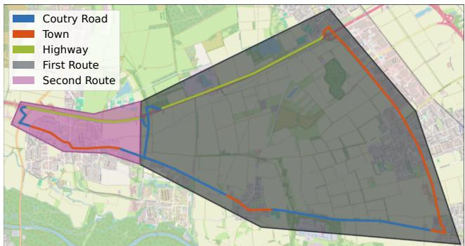
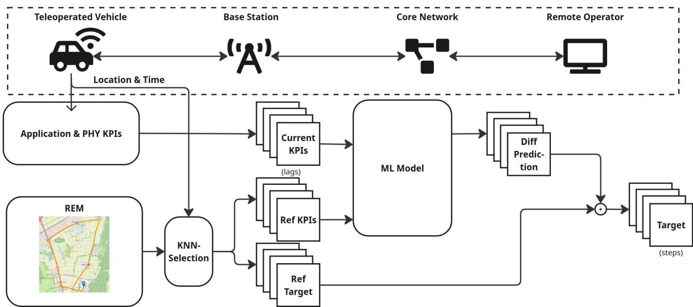
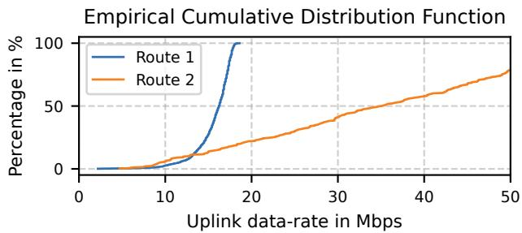
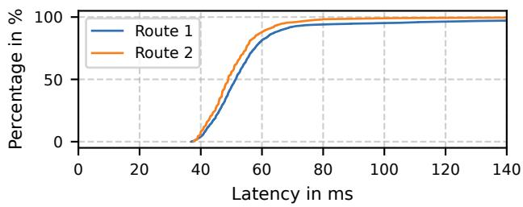
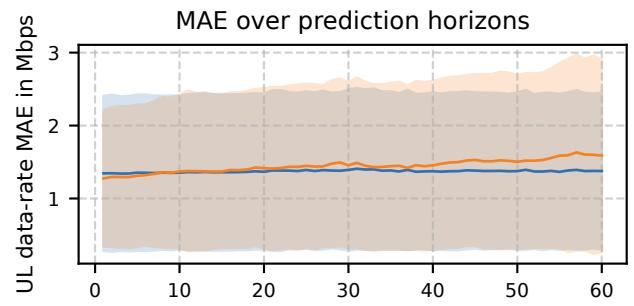
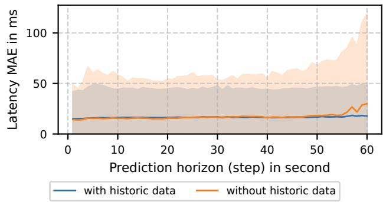
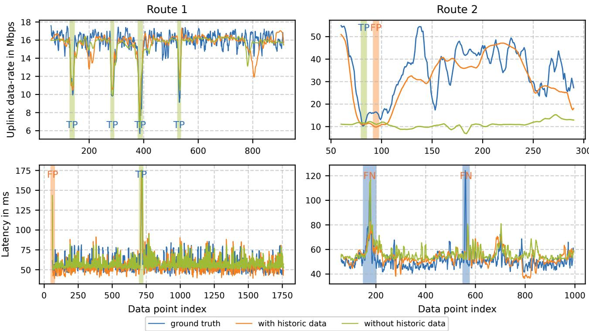

# Mitigating Concept Drift in QoS Prediction for Teleoperation of Autonomous Vehicles Using Historic Data

Xiyan Su∗1, Jianning Gao∗, Mahmoud Ashri∗, and Frank Diermeyer∗

Abstract— Teleoperation serves as the fallback solution to autonomous driving but reliable functions of the teleoperation require a certain amount of mobile network resources, which cannot be guaranteed at all times. Therefore, predictive quality of service (pQoS) is introduced as a concept to increase the resilience of the teleoperation. In this paper, based on a data measurement campaign, we propose a prediction framework to prediction two important network KPIs of teleoperation: uplink data-rate and round-trip latency. Furthermore, we introduce a method to alleviate the performance degradation of machinelearning-based prediction models on previously unseen data due to concept drift by incorporating historic data into the prediction pipeline. Additionally, we introduce the metric of critical scenario detection to evaluate the prediction performance specifically for teleoperation.

## I. INTRODUCTION

## A. Teleoperation

Teleoperation serves as the fallback solution in the level-4 Autonomous Driving (AD) defined by SAE [1]. In teleoperation, the vehicle sends sensor data to the operator and the operator sends control commands to the vehicle over mobile network. The mobile network is proven to be sufficient for teleoperation in general [2]. However, reliable functions require a certain amount of network resources, which the mobile network is not able to provide at all times currently. For example, 5G Automotive Association (5GAA) defines in its technical report that it requires 32 Mbps Uplink (UL) data-rate and 99% reliability for a safe teleoperation scenario [3]. However, the current measured commercial mobile network cannot provide such resources at all times.

In the latest version of [4], some efforts have gone into reducing the data-rate usage of teleoperation, such as using the state-of-the-art video codec to reduce the data-rate of the video streams while maintaining the same video quality, and using multiple links to increase the available bandwidth. However, these efforts still cannot guarantee a safe operation through the network at all times. It is worth noticing that, in most critical scenarios, the vehicle can still be teleoperated with degraded quality, e.g., with lower video quality due to limited UL data-rate, or with velocity restrictions due to high speed latency [5].

B. Predictive Quality of Service

In this context, the concept of Predictive Quality of Service (pQoS) is put forward by 5GAA [6]. pQoS allows AD vehicles to predict the upcoming network quality and adapt to it proactively. This particularly increases the resilience of the teleoperation against the fluctuating mobile network quality.

As described in [6], pQoS can be deployed either at the Mobile Network Operator (MNO), or be provided as an Over-the-Top (OTT) solution by a third party. The 3rd Generation Partnership Project also introduced the Network Data Analytics Function that defines the data exchange between different parties to enable the functionality of pQoS [7]. However, the functionality of pQoS is still not supported ubiquitously by the MNO. Therefore, we focus on the OTT deployment in this paper, i.e., the pQoS is provided as a service on the vehicle by a third-party service provider, e.g., vehicle manufacturer.

## C. Related Works

Predicting the Quality of Service (QoS) of mobile network per se is a complex problem, as it is affected by different aspects of the network, e.g., Radio Access Network (RAN), core network, and routing. Some works have gone into analyzing the QoS data. The results in [8] show the temporal and spatial variance of the Long-Term Evolution (LTE) Downlink (DL) data-rate as well as the influence of signal quality and main transport protocol on it. In [9], it discusses the cause of the asymmetry of modern LTE technology in detail and shows that the DL channel indicators, such as Reference Signal Received Power (RSRP), Signal-Interference-to-Noise-Ratio (SINR), and Reference Signal Received Quality (RSRQ) are suitable indicators for UL performance. Therefore, the similar Physical Layer (PHY) Key Perfomrance Indicators (KPIs) are considered for the prediction in this paper.

Some works try to tackle this problem as a spatialagnostic problem, usually with classic Machine Learning (ML) or Deep Neural Network (DNN) algorithms. In [10], the authors train a Long Short-Term Memory (LSTM) model to predict throughput. To compensate for the lack of position information, low-level mobile network parameters and abstracted location information, e.g., surrounding building size and street type, are used. In [11], an architecture using bi-directional LSTM is proposed to predict DL data-rate for multiple prediction horizons. In [12], the authors investigate the performance as well as the interpretability and explainability of ML models systematically and conclude that they can capture the underlying principles of the QoS without being explicitly programmed, which defends the usage of ML and DNN models for pQoS. Furthermore, they show that gradient-boosted decision tree models can even outperform DNNs. More importantly, the authors discuss the problem of data splitting and data distribution in depth and reveal the fundamental problem of ML usage in pQoS: the models only try to generalize the data distribution based on the training data. This implies that the prediction performance of such trained models can degrade when deployed without explicit retraining in another area due to the difference in data distribution. The phenomenon is often referred to as concept drift. To deal with it, the ML and DNN models need to be retrained with new data, which can be time and resourceconsuming. The results in [13] confirm the same problem, but disagree upon the generalization capability of the ML methods.

The ML and DNN models excel in capturing the temporal and inter-feature dependency of the data, while downplaying the static spatial features. The spatial dependency is often depicted as a Radio Environmental Map (REM) [13], [14]. Other works, such as [15]–[17] also use the name connectivity map. The REM stores the historic data about the mobile network, including PHY KPIs, such as RSRP, RSRQ, SINR, as well as application layer KPIs, such as throughput, data-rate, round-trip latency, etc. In [18], the authors use the historic data recorded by another vehicle, which was previously driven by the adjacent location, to predict the QoS for the current vehicle, proving the feasibility of pQoS using historic data.

In this paper, we intend to incorporate the two different methods. To achieve that, we first launch a data measurement campaign to generate a dataset. Then, we propose a framework that predicts two important KPIs of the mobile network for teleoperation: the UL data-rate and the round-trip latency. We introduce a method that incorporates the historic data in the form of a REM into the prediction framework by training the ML model to learn the difference between the target value and the reference values from the historic data, which alleviates the prediction performance degradation due to concept drift without explicit retraining.

This paper is structured as follows: Chapter II describes the data measurement campaign and the static analysis of the data. Chapter III introduces the prediction framework. Chapter IV shows the performance of the proposed framework and method based on our dataset. Chapter V concludes the paper and discusses future research directions.

## II. DATA MEASUREMENT

## A. Measurement Setup

To investigate the QoS of mobile network for teleoperation, we first launch a data measurement campaign to collect data for network condition of teleoperation in realworld, which is made publicly available online [19], [20]. We use the research vehicle EDGAR for the data measurement campaign [21].

For data measurement, we designed two routes that consist of different Operational Design Domains (ODDs) for teleoperation, as shown in Fig 1. For the training data, we have also taken the temporal factor into consideration. The data are measured at different times on a day and on different days in a week, with a focus on Thursday morning and Sunday afternoon, representing weekdays and weekends. The ML model is only trained with data from the first route. The second route represents data outside the area where the training data are collected. The ML model is not trained with any data from the second route at all.

  
Fig. 1. Data measurement routes with different ODDs

The data measurement includes two types of KPIs of the mobile network of teleoperation, i.e., the PHY KPIs and the application layer KPIs. The PHY KPIs are recorded using the Milesight UR75 Industrial 5G Router on board. The application layer KPIs are recorded between the teleoperated vehicle and the remote operator PC located on campus. The round-trip latency is measured using ping by sending an icmp packet. During the latency measurement, a set of constant video streams with 4500 Kbps is sent from the teleoperated vehicle to the remote operator PC to simulate realistic teleoperation. The UL data-rate is measured using iperf3 by sending UDP packets from the teleoperated vehicle to the remote operator PC [22]. The latency and UL datarate are measured in different runs, since the UL datarate measurement will use practically all UL bandwidth and therefore render the latency unrealistically high.

The measured data are synchronized into data frames between different data sources using the timestamps. The data recorded on the first route are also split by runs for the model performance evaluation. The data recorded on the second route are split as historic data to generate a REM.

TABLE I  
CORRELATION BETWEEN APPLICATION LAYER AND PHY KPIS
<table><tr><td></td><td>RSRQ</td><td>RSRP</td><td>SINR</td><td colspan="2">Throughput Lat.</td><td>Long.</td></tr><tr><td>UL</td><td>0.32</td><td>0.45</td><td>0.34</td><td>1</td><td>0.23</td><td>0.15</td></tr><tr><td>Latency</td><td>-0.06</td><td>-0.04</td><td>-0.04</td><td>0.02</td><td>-0.03</td><td>0.02</td></tr></table>

## B. Static Data Analysis

Based on the measured data, we first analyze the correlation between the PHY KPIs and the application layer KPIs. The correlation shown in Tab. I shows that RSRP,

  
Fig. 2. pQoS framework for teleoperation that uses historic data from REM and real-time measurement from teleoperated vehicles

RSRQ, and SINR show higher correlation to UL data-rate. However, our results do not show a monotonically increasing relationship between the three PHY KPIs and the UL datarate. It is shown it is unlikely to have low UL data-rate with good RSRP, RSRQ, or SINR. However, it is not a necessary condition for a high UL data-rate. Similar correlation is not observed for latency.

  
Fig. 3. Empirical Cumulative Distribution Function (ECDF) for the UL data-rate and round-trip latency of the two routes

We also compare the Empirical Cumulative Distribution Function (ECDF) of the UL data-rate and the latency between the two routes in Fig. 3. The results show that the UL is more susceptible to changes. This suggests that the UL data-rate is more likely to undergo a concept drift. This indicates that the prediction performance of the ML model can degrade when deployed on unseen data without explicit retraining.

## III. QUALITY OF SERVICE PREDICTION

## A. Prediction Framework

As an OTT solution for pQoS, the prediction framework is deployed on the teleoperated vehicle, as shown in Fig. 2. The current measurements for PHY KPIs and application layer KPIs are taken online on the vehicle and used for prediction. Unlike many recent works, we focus on predicting the UL data-rate and the round-trip latency for teleoperation, as our experience suggests that the UL is more critical than the DL for teleoperation. However, we cannot actually measure the UL data-rate during run-time, as the measurement will spam the UL and therefore render it unusable for teleoperation. Thus, it is not included as an input feature for prediction.

The main difference of the proposed framework is that the ML model is trained to predict the difference between the target values and the reference values from the historic data. The historic data stored in the REM is selected by a K-Nearst-Neighbor (KNN) algorithm and the reference values are calculated based on the selected historic data. The historic data also contains reference values for the input feature KPIs, as shown in Tab. II. After inference, the predicted difference and the reference values add up to the actual target values.

To capture the temporal relation between different timestamps, we not only use the data measurement for the current timestamp but also the data measurement from the last couple of timestamps. The number of past timestamps are denoted as lag. Considering different use cases, such as video stream bit-rate adaptation due to data-rate and velocity restriction due to high latency, we also predict further into the future. The number of frames that predict into the future is denoted as step. Both lag and step are hyper-parameters of the

TABLE II  
INPUT FEATURE KPIS FOR ONLINE INFERENCE
<table><tr><td colspan="2">PHY</td></tr><tr><td>RSRP</td><td>Reference Signal Received Power - indicates the strength of the received signal from the base station.</td></tr><tr><td>RSRQ</td><td>Reference Signal Received Quality - reflects the quality of the received reference signal and accounts for interference.</td></tr><tr><td>SINR</td><td>Signal to Interference plus Noise Ratio - measures the signal quality considering both interference and noise. Channel Quality Indicator - measures the quality factors of</td></tr><tr><td>CQI</td><td>the radio signal and the radio channel between the end user equipment and the base station</td></tr><tr><td>Application Layer</td><td></td></tr><tr><td>Throughput</td><td>Actual UL throughput that are used by the software on vehicle</td></tr><tr><td>Latency</td><td>Round-trip latency between the teleoperated vehicle and the remote operator measured by ping</td></tr></table>

ML model used in the framework and can be fine-tuned according to the actual use case of the prediction.

In our framework, we use a combination of XGBRegressor [23] and MultiOutputRegressor [24] as the ML model to enable the multi-step and multihead prediction. Before sending the current measurements to the ML model, they are first standardized using mean and standard deviation. In addition, the outliers in the data measurements are eliminated.

## B. Usage of Historic Data

The historic data are selected based on their relevance to the current prediction location and time, which is represented as a distance function in the KNN. The distance function is modified to consider both spatial and temporal ”distance”, as shown in Eq. (1). The first term considers only the Euclidean distance between the two data measurements using Haversine formula. The second term and the third term both consider the temporal distance between the measurements with a different focus. In [8], the data measurements suggest a regular pattern of mobile network condition fluctuation on a weekly basis. Therefore, we assume the data measurements follow the same weekly pattern. The second term calculates the time difference between two data measurements within a week, while the third term calculates the week difference. Each distance is normalized and weighted. Based on the distance, the nearest neighbors are then selected based on hyper-parameter k and averaged as the reference.

$$
D ( x , y ) = \alpha \cdot \mathcal { N } \big ( d _ { \mathrm { e u c l i d } } ( x , y ) \big ) + \beta \cdot \mathcal { N } \big ( d _ { \mathrm { w e e k } } ( t _ { x } , t _ { y } ) \big )
$$

$$
+ \gamma \cdot \mathcal { N } \big ( d _ { \mathrm { i n w e e k } } ( t _ { x } , t _ { y } ) \big )\tag{1}
$$

$$
d _ { \mathrm { { e u c l i d } } } ( x , y ) = \| \mathbf { x } - \mathbf { y } \| _ { 2 }\tag{2}
$$

$$
d _ { \mathrm { i n w e e k } } ( t _ { x } , t _ { y } ) = | ( t _ { x } \bmod s _ { w } ) - ( t _ { y } \bmod s _ { w } ) |\tag{3}
$$

$$
d _ { \mathrm { w e e k } } ( t _ { x } , t _ { y } ) = \left| \left[ \frac { t _ { x } } { s _ { w } } \right] - \left[ \frac { t _ { y } } { s _ { w } } \right] \right|\tag{4}
$$

Where:

$\alpha , \beta , \gamma$ are the weights for each term.

$\mathcal { N } ( \cdot )$ denotes a normalization function applied to each distance component.

$\mathbf x , \mathbf y$ are location represented in latitude and longitude.

$t _ { x } , t _ { y }$ are timestamps (in seconds).

$s _ { w } = 6 0 4 8 0 0$ is the number of seconds in a week.

The hyper-parameters used for the ML model and the KNN algorithm are shown in Tab. III. The hyper-parameters are chosen through parameter searches.

TABLE III  
HYPER-PARAMETERS FOR ONLINE INFERENCE
<table><tr><td>ML Model</td><td>Value</td><td>Description</td></tr><tr><td>lag</td><td>60</td><td>Number of past data frames in- cluded in the prediction frame- work</td></tr><tr><td>step</td><td>60</td><td>Number of time horizons pre- dicted into the future</td></tr><tr><td>max depth</td><td>4</td><td>Maximum tree depth for base learners</td></tr><tr><td>number of estimators</td><td>100</td><td>Number of gradient boosted trees</td></tr><tr><td>REM</td><td>Value</td><td>Description</td></tr><tr><td>distance weights</td><td>[0.8, 0.2, 0.6]</td><td>The weight vector for the three distances in KNN algorithm</td></tr><tr><td>k</td><td>20</td><td>Number of nearest neighbors se- lected in KNN algorithm</td></tr></table>

  
Fig. 4. Mean absolute error (MAE) for uplink data-rate and round-trip latency prediction over prediction horizons for route 1

## IV. RESULTS

## A. General Prediction Performance

To demonstrate the problem with traditional prediction pipeline, we trained the same ML model to directly predict UL data-rate and round-trip latency. The data recorded on the first route are split into training data and testing data based on measurement runs. The data recorded on the second route are not included in the training data. The results shown in Fig. 5 show the traditional prediction model without using historic data can predict well for the first route, but its performance quickly degrades on the unseen data in the second route, since the distribution of the unseen data varies drastically from its training data. To cope with this, the model usually needs retraining, which is time and resource consuming.

  
Fig. 5. Comparison of UL data-rate and round-trip latency prediction between with historic data and without historic data for route 1 (same route as where the training data are recorded) and route 2 (completely unseen data). The prediction horizon is for the next step, i.e., second. The data are smoothed with a window of 5 seconds and the outliers are removed for better visualization. True positive (TP), false positive (FP), and false negative (FN) showcase the performance of critical scenario detection.

However, by using historic data as reference points, the prediction of the ML model can be greatly improved for unseen data, while maintaining similar performance for the first route. The results indicate that the ML model can learn the difference between the target values and the reference values based on the current and reference KPIs. It is worth noticing that the prediction performance of proposed framework does rely on the accuracy of the historic data, but the model does not necessarily have to undergo retraining as the improvement on the accuracy of the historic data will also in turn improve the performance of the prediction.

A slight degradation for higher prediction horizons for the first route is observed in Fig 4. By using historic data, the prediction error reduces for higher prediction horizons, as the historic data act as anchor point for the prediction. A similar relationship for the second route is however not observed.

## B. Critical Scenario Detection for Teleoperation

For teleoperation, the general prediction performance does not fully represent its use case for pQoS, since minor network fluctuation does not affect the teleoperation. It will only become critical, when the data-rate and the latency surpass certain thresholds. Therefore, we introduce the metric for detecting critical scenarios to evaluate the prediction performance specifically for teleoperation, as demonstrated in Fig. 5. In this paper, we take the emprical values of 14 Mbps for UL data-rate and 100 ms for round-trip latency as thresholds, as we notice that the performance of teleoperation tends to become instable under or above such values. Furthermore, we calculate the F1 score to evaluate the performance by taking both False Negative and False Positive into consideration, as shown in Tab. IV. For the first route, the F1 scores are slightly higher for UL data-rate without the historic data, but actually lower for latency. For the unseen data in the second route, F1 scores are higher for both UL data-rate and latency with historic data. The results also show the difficulty in predicting latency for unseen data in general.

TABLE IV  
F1, PRECISION, AND RECALL FOR CRITICAL SCENARIO DETECTION FOR TELEOPERATION
<table><tr><td>Route 1</td><td>Condition</td><td>F1</td><td>Precision</td><td>Recall</td></tr><tr><td>UL with historic data</td><td>&lt;14 Mbps</td><td>0.467</td><td>0.549</td><td>0.406</td></tr><tr><td>UL without</td><td>&lt;14 Mbps</td><td>0.505</td><td>0.688</td><td>0.399</td></tr><tr><td>Latency with historic data</td><td>&gt;100 ms</td><td>0.503</td><td>0.465</td><td>0.548</td></tr><tr><td>Latency without</td><td>&gt;100 ms</td><td>0.471</td><td>0.456</td><td>0.488</td></tr><tr><td>Route 2</td><td>Condition</td><td>F1</td><td>Precision</td><td>Recall</td></tr><tr><td>UL with historic data</td><td>&lt;14 Mbps</td><td>0.489</td><td>0.333</td><td>0.917</td></tr><tr><td>UL without</td><td>&lt;14 Mbps</td><td>0.102</td><td>0.054</td><td>1.000</td></tr><tr><td>Latency with historic data</td><td>&gt;100 ms</td><td>0.167</td><td>0.500</td><td>0.100</td></tr><tr><td>Latency without</td><td>&gt;100 ms</td><td>0.000</td><td>0.000</td><td>0.000</td></tr></table>

## V. CONCLUSION

In this paper, we first launch a data measurement campaign to record the QoS-related KPIs of commercial mobile network with an experimental teleoperated vehicle, including PHY KPIs and application layer KPIs. Based on the data, we conduct a static analysis between the two routes used for evaluation. Then, as an OTT solution to pQoS, we propose a framework to predict two crucial KPIs of teleoperation, i.e., UL data-rate and round-trip latency. A method is introduced to incorporated historic data measurements into the online prediction pipeline by training the ML model to predict the difference to the reference target values from the historic data. This reduces the prediction error on previously unseen data due to concept drift. At last, we evaluate the prediction performance using mean absolute error. The results show that the method is able to reduce the prediction error compared to the traditional approach. In addition, we evaluate the ability of proposed pQoS framework to detect critical scenarios in teleoperation. We show that the framework is able to detect more UL data-rate related critical scenarios.

However, stemming from results of this work, some questions still need to be answered for this topic. First, the proposed approach needs to be evaluated on more routes and devices with a wider range of data distribution, as the historic data or REM are likely to be shared between different end devices. Second, the concrete usage of the QoS prediction for teleoperation needs to be addressed. More specifically, the counter-measurement of a teleoperation software to critical network scenarios need to be defined and investigated.

## ACKNOWLEDGMENT

Xiyan Su is the first author of the paper and main contributor to the presented work. As second authors, Jianning Gao and Mahmoud Ashri contributed to the development and implementation of the ML model and historic data approach respectively and revised the paper critically. Frank Diermeyer made contributions to the conception of the research project and revised the paper critically.

## REFERENCES

[1] SAE International, Taxonomy and Definitions for Terms Related to Driving Automation Systems for On-Road Motor Vehicles, SAE International Std., Rev. J3016 202104, April 2021. [Online]. Available: https://doi.org/10.4271/J3016 202104

[2] S. Neumeier, E. A. Walelgne, V. Bajpai, J. Ott, and C. Facchi, “Measuring the feasibility of teleoperated driving in mobile networks,” in 2019 Network Traffic Measurement and Analysis Conference (TMA), 2019, pp. 113–120.

[3] 5GAA, “C-v2x use cases volume ii:examples and service levelrequirements,” 5G Automotive Association, Tech. Rep., Oct. 2020, [Online]. Available: https://5gaa.org/ c-v2x-use-cases-and-service-level-requirements-volume-ii/.

[4] T. Kerbl and et al., “Tum teleoperation: Open source software for remote driving and assistance of automated vehicles,” https://arxiv. org/abs/2506.13933, 2025, preprint; presented in 36th IEEE Intelligent Vehicles Symposium (IV 2025).

[5] D. F. Kulzer and et al., “Ai4mobile: Use cases and challenges of ai-¨ based qos prediction for high-mobility scenarios,” in 2021 IEEE 93rd Vehicular Technology Conference (VTC2021-Spring), 2021, pp. 1–7.

[6] 5GAA, “Making 5g proactive and predictive for the autonomous industry,” 5G Automotive Association, Tech. Rep., Dec. 2019, [Online]. Available: https://5gaa.org/5gaa-releases-white-paper-onmaking-5g-proactive-and-predictive-for-the-automotive-industry/.

[7] ETSI, ETSI TS 129 520 V17.14.0: 5G System (5GS); Network Data Analytics Services; Stage 3 (3GPP TS 29.520), Std. TS 129 520, Sep. 2024, [Online]. Available: https://www.etsi.org/deliver/etsi ts/129500 129599/129520/17.14.00 60/ts 129520v171400p.pdf.

[8] M. Akselrod, N. Becker, M. Fidler, and R. Luebben, “4g lte on the road - what impacts download speeds most?” in 2017 IEEE 86th Vehicular Technology Conference (VTC-Fall), 2017, pp. 1–6.

[9] C. Ide, R. Falkenberg, D. Kaulbars, and C. Wietfeld, “Empirical analysis of the impact of lte downlink channel indicators on the uplink connectivity,” in 2016 IEEE 83rd Vehicular Technology Conference (VTC Spring), 2016, pp. 1–5.

[10] J. Schmid, M. Schneider, A. HoB, and B. Schuller, “A deep learning ¨ approach for location independent throughput prediction,” in 2019 IEEE International Conference on Connected Vehicles and Expo (ICCVE), 2019, pp. 1–5.

[11] B. Denizer and O. Landsiedel, “Bandseer: Bandwidth prediction for cellular networks,” in 2024 IEEE 49th Conference on Local Computer Networks (LCN), 2024, pp. 1–8.

[12] A. Palaios and et al., “Machine learning for qos prediction in vehicular communication: Challenges and solution approaches,” IEEE Access, vol. 11, pp. 92 459–92 477, 2023.

[13] H. Schippers, S. Bocker, and C. Wietfeld, “System for continuous¨ multi-dimensional mobile network kpi tracking and prediction in drifting environments,” in 2023 IEEE International Systems Conference (SysCon), 2023, pp. 1–6.

[14] H. Schippers, C. Schuler, B. Sliwa, and C. Wietfeld, “System modeling¨ and performance evaluation of predictive qos for future tele-operated driving,” in 2022 IEEE International Systems Conference (SysCon), 2022, pp. 1–8.

[15] J. Schmid, P. Heß, A. Hoß, and B. W. Schuller, “Passive monitoring¨ and geo-based prediction of mobile network vehicle-to-server communication,” in 2018 14th International Wireless Communications & Mobile Computing Conference (IWCMC), 2018, pp. 1483–1488.

[16] J. Schmid, M. Schneider, A. Hoß, and B. Schuller, “A comparison ¨ of ai-based throughput prediction for cellular vehicle-to-server communication,” in 2019 15th International Wireless Communications & Mobile Computing Conference (IWCMC), 2019, pp. 471–476.

[17] F. Jomrich and et al., “Cellular bandwidth prediction for highly automated driving - evaluation of machine learning approaches based on real-world data,” in Proceedings ofthe 4th International Conference on Vehicle Technology and Intelligent Transport Systems - VEHITS, INSTICC. SciTePress, 2018, pp. 121–132.

[18] N. U. Ain, R. Hernangomez, A. Palaios, M. Kasparick, and´ S. Stanczak, “Qos prediction in radio vehicular environments via prior´ user information,” 2024.

[19] X. Su and M. Ashri, “FTM Vehicular Network Data,” https://doi.org/ 10.14459/2025mp1776662, 2025.

[20] X. Su, “pQoS: Predictive Quality of Service,” https://github.com/ TUMFTM/pQoS, 2025, gitHub repository.

[21] P. Karle and et al., “Edgar: An autonomous driving research platform – from feature development to real-world application,” 2024. [Online]. Available: https://arxiv.org/abs/2309.15492

[22] Esnet, “iPerf3: A TCP, UDP, and SCTP network bandwidth measurement tool,” [Online]. Available: https://github.com/esnet/iperf, 2019, accessed: 2025-04-13.

[23] T. Chen and C. Guestrin, “Xgboost: A scalable tree boosting system,” in Proceedings of the 22nd ACM SIGKDD International Conference on Knowledge Discovery and Data Mining, ser. KDD ’16. New York, NY, USA: Association for Computing Machinery, 2016, p. 785–794. [Online]. Available: https://doi.org/10.1145/2939672.2939785

[24] F. Pedregosa and et al., “Scikit-learn: Machine learning in python,” J. Mach. Learn. Res., vol. 12, no. null, p. 2825–2830, Nov. 2011.