# MoF: Preference-Aware Mixture Modeling for Black-Box LLM Personalization

Hun Park Department of Artificial Intelligence Korea University Seoul, Republic of Korea hunbag98@korea.ac.kr

## Abstract

Proprietary Large Language Models (LLMs) have demonstrated remarkable capabilities across a wide range of tasks, yet aligning their outputs with diverse user preferences remains challenging. Existing personalization approaches for black-box LLMs often rely on user-specific scoring heads, causing the num ber of personalized parameters to grow linearly with the number of users and requiring additional adaptation for unseen users. To address these limitations, we propose Mixtureof-Facets (MoF)1, a scalable personalization framework for black-box LLMs that models user preferences as compositions of shared latent preference facets rather than dedicated user-specific parameters. MoF performs personalization through history-conditioned routing over shared facet heads, enabling personalization for users unseen during training without additional parameter updates. Across diverse personalization tasks, MoF delivers stronger personalization performance while maintaining a more scalable and parameter-efficient design than prior approaches. Additional analysis indicates strong generalization to unseen users.

## 1 Introduction

Large Language Models (LLMs) have demonstrated strong performance across a wide range of tasks, from general natural language processing to complex reasoning (OpenAI, 2022; OpenAI et al., 2024; Comanici et al., 2025). As LLM-based personal assistants become increasingly widespread (Mok et al., 2025; Li et al., 2025; Anthropic, 2026), there has been growing interest in LLM personalization, i.e., tailoring model responses to individual user preferences (Zhang et al., 2025b; Salemi et al., 2024). Such personalization is motivated by the observation that users may prefer different responses to the same query depending on their preferences (Kirk et al., 2024a,b; Chen et al., 2024). In this work, we view user preference as a relative tendency to favor one response over another for a given query and aim to steer LLM outputs toward responses that better align with such preferences.

Despite their strong capabilities, most LLMs are trained using a one-size-fits-all paradigm through next-token prediction (Brown et al., 2020; Chung et al., 2024) and are subsequently aligned with general human preferences during posttraining (Ouyang et al., 2022). As a result, LLMs tend to generate outputs that reflect dominant or average preferences, which creates a fundamental challenge in aligning LLM outputs with diverse human preferences (Jang et al., 2023; Sorensen et al., 2024; Feng et al., 2024; Zhou et al., 2024).

To address this challenge, prior work has explored parameter-efficient fine-tuning (PEFT) approaches, such as training user-specific LoRA (Hu et al., 2022) modules (Tan et al., 2024b; QI et al., 2024) or incorporating user embeddings into model inputs (Liu et al., 2025; Qiu et al., 2025). While effective, these methods require direct access to model parameters and are therefore not applicable to black-box LLMs, which are increasingly deployed through APIs (Sun et al., 2024). To enable personalization for black-box settings, recent work has explored retrieval- and prompting-based approaches (Salemi et al., 2024; Richardson et al., 2023; Shi et al., 2025), which avoid model adaptation but remain vulnerable to irrelevant information. To provide more robust personalization, HY-DRA (Zhuang et al., 2024) introduces a reranker & adapter framework that personalizes black-box LLM outputs by selecting useful historical items and ranking candidate responses according to user preferences. However, HYDRA relies on userspecific scoring heads, causing the number of personalized parameters to grow linearly with the number of users and requiring additional adaptation for unseen users. These limitations become increasingly problematic in practical deployments with large user populations.

To overcome these limitations, we propose Mixture-of-Facets (MoF), a preference-aware mixture architecture inspired by the Mixture-of-Experts (MoE) framework (Jacobs et al., 1991; Shazeer et al., 2017; Fedus et al., 2022). Rather than modeling user preferences through userspecific parameters, MoF assumes that user preferences can be represented as compositions of shared latent preference facets. Based on this idea, MoF shifts from user-specific scoring heads to shared facet heads, with personalization performed through history-conditioned routing. To encourage the router to focus on preference-related signals, MoF leverages a sparse autoencoder (SAE) (Huben et al., 2024; Qiu et al., 2025) over user histories. This design allows scalable personalization with a fixed number of shared parameters and generalizes to users unseen during training without additional parameter updates. To further promote facet specialization, we introduce a cluster-based sampling (CBS) strategy that exposes facet heads to diverse preference signals during training.

Experimental results across multiple personalization tasks demonstrate that MoF achieves the best overall performance in terms of average rank, while improving scalability and parameter efficiency. Additional analysis shows that MoF maintains competitive performance even without additional adaptation, indicating strong generalization to unseen users. Our key contributions are summarized as follows:

• We propose MoF, a scalable black-box LLM personalization framework that models user preferences as compositions of shared latent preference facets.

• We introduce a history-conditioned routing mechanism that enables personalization for unseen users without requiring user-specific adaptation.

• We analyze the generalization and scalability of MoF, showing competitive performance on unseen users and constant personalizationparameter storage overhead as the number of users increases.

## 2 Related Work

White-Box LLM Personalization. LLM personalization is defined as the process of adapting a model’s responses to individual users based on their profiles, characteristics, preferences, and interaction history (Zhang et al., 2025b). To achieve this, PEFT-based personalization methods commonly utilize techniques such as LoRA (Hu et al., 2022). OPPU (Tan et al., 2024b) assigns each user a personalized LoRA module to capture user-specific preferences. PROPER (Zhang et al., 2025a) further improves personalization by combining parameter composition with MoE-style routing. However, maintaining separate adapters for individual users can introduce substantial parameter and storage overhead. To improve parameter sharing, PER-PCS (Tan et al., 2024a) decomposes personalized PEFT modules into reusable parameter pieces and constructs user-specific adapters by composing components from a shared parameter pool.

Although PROPER and PER-PCS employ compositional parameterization, their components differ from the preference facets considered in MoF. PROPER models group-level user adaptations, while PER-PCS composes reusable PEFT parameter pieces to construct personalized adapters. In contrast, MoF represents individual preferences as weighted compositions of jointly learned shared latent preference facets, with routing weights derived from user history. More importantly, both PROPER and PER-PCS require access to backbone parameters and are thus limited to white-box settings, whereas MoF operates without such access and is applicable to black-box LLMs.

Black-Box LLM Personalization. To address this challenge, prior work has explored promptingbased personalization methods. LaMP (Salemi et al., 2024) introduces retrieval augmentation for personalization by retrieving personal items from user profiles. CFRAG (Shi et al., 2025) extends this direction by incorporating collaborative filtering and retrieving histories from similar users. PAG (Richardson et al., 2023) combines retrieval with task-aware user summaries generated by LLMs to improve personalization. Fermi (Kim and Yang, 2025) learns personalized prompts for each user by iteratively refining prompts using user profiles. Although these methods improve personalization without modifying model parameters, their effectiveness can be affected by irrelevant or noisy contextual signals.

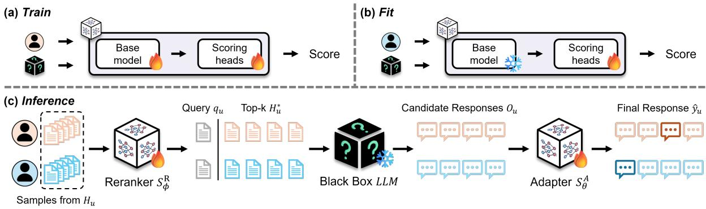  
Figure 1: Overview of the training and inference pipeline. (a) Train stage: the shared base model and scoring heads are jointly trained using data collected from multiple users. (b) Fit stage: the base model is frozen while only the scoring heads are updated for unseen users. (c) Inference stage: the reranker selects useful history items, the black-box LLM generates candidate responses, and the adapter scores the candidates to produce the final response.

To further advance black-box LLM personalization, HYDRA (Zhuang et al., 2024) reranks user histories and selects preference-aligned responses via a personalized adapter. However, HYDRA relies on user-specific scoring heads (Fig. 2 (a)), causing personalized parameters to grow linearly with the number of users and requiring an additional adaptation stage for unseen users (Fig. 1 (b)). In contrast, MoF enables scalable personalization through shared facet heads and historyconditioned routing, supporting personalization for unseen users without additional adaptation while requiring no dedicated user-specific parameters.

## 3 Methodology

## 3.1 Preliminary

Given a user set $M = \{ u _ { 1 } , \ldots , u _ { N } \}$ , the goal of LLM personalization is to generate a response $\hat { y } _ { u }$ aligned with user preferences for a query qu. For each user $u ,$ the behavior history is defined as $H _ { u } = \{ h _ { u } ^ { 1 } , \ldots , h _ { u } ^ { T } \}$ , where each history item $h _ { u } ^ { t } = ( q _ { u } ^ { t } , y _ { u } ^ { t } )$ consists of a past query $q _ { u } ^ { t }$ and the corresponding user-preferred response $y _ { u } ^ { t }$ . Since different users may prefer different responses to the same query, personalized response generation requires leveraging user-specific preference information extracted from historical interactions.

Following prior work (Zhuang et al., 2024), we adopt a reranker & adapter personalization framework for black-box LLMs. Given a target query $q _ { u } ,$ relevant history items $H _ { u } ^ { \prime } = \{ h _ { u , 1 } ^ { \prime } , \ldots , h _ { u , M } ^ { \prime } \}$ are retrieved from $H _ { u }$ and then reranked by a reranker $s _ { \phi } ^ { \mathrm { R } }$ to construct a personalized context set $H _ { u } ^ { * }$ . Conditioned on $H _ { u } ^ { * }$ , the black-box LLM generates a set of candidate responses ${ { O } _ { u } } \ = \ \{ { { o } _ { u } ^ { 1 } } , \ldots , { { o } _ { u } ^ { B } } \}$

An adapter $s _ { \theta } ^ { \mathrm { A } }$ scores the $O _ { u }$ according to their alignment with user preferences, and the highestscoring response is selected as the final output $\hat { y } _ { u }$ An overview of the framework is illustrated in Figure 1 (c). Detailed formulations of the reranker and adapter objectives are provided in Appendix A.

## 3.2 Mixture-of-Facets (MoF)

Building on the reranker & adapter framework introduced above, we apply Mixture-of-Facets (MoF) to both the reranker and adapter (Fig. 2). MoF consists of two key components: (1) the Facet Heads, which estimate facet-specific scores (§3.2.1), and (2) the Preference-Aware Router, which computes routing weights based on user preferences (§3.2.3). To encourage facet specialization during training, we further introduce a clusterbased sampling (CBS) strategy (§3.3).

## 3.2.1 Facet Heads

Each facet head is implemented as a two-layer perceptron. We intentionally use lightweight two-layer MLPs to isolate the effect of shared-facet composition while preserving parameter and computational efficiency. Given an input pair $x ^ { R } = ( q _ { u } , h _ { u , m } ^ { \prime } )$ for the reranker or $x ^ { A } = ( q _ { u } , o _ { u } ^ { b } )$ for the adapter, each facet head produces a preference logit. As illustrated in Figure 2 (b), the input x is first encoded by a BERT (Devlin et al., 2019)-based encoder $\delta ,$ which is jointly trained with the facet heads. We denote the final hidden representation of the [CLS] token as ${ \bf z } _ { x } = \delta ( x ) _ { [ \mathsf { C L S } ] }$ . Each facet head $\psi _ { f }$ takes $\mathbf { z } _ { x }$ as input and computes the corresponding preference logit:

$$
\psi _ { f } ( \mathbf { z } _ { x } ) = \mathbf { W } _ { f } ^ { ( 2 ) } \operatorname { t a n h } \left( \mathbf { W } _ { f } ^ { ( 1 ) } \mathbf { z } _ { x } + \mathbf { b } _ { f } ^ { ( 1 ) } \right) + \mathbf { b } _ { f } ^ { ( 2 ) } .\tag{1}
$$

Here, ${ \bf W } _ { f } ^ { ( 1 ) } \in \mathbb { R } ^ { d \times d }$ and $\mathbf { W } _ { f } ^ { ( 2 ) } \in \mathbb { R } ^ { o \times d }$ denote the learnable weight matrices, where d is the hidden representation dimension and o denotes the dimension of the output logits.

The model contains a total of F facet heads, each encouraged to specialize in different latent preference patterns during training. The outputs of all facet heads are aggregated into the following facet logit matrix:

$$
\boldsymbol { \Psi } ( \boldsymbol { x } ) = [ \psi _ { 1 } ( \mathbf { z } _ { x } ) , \ldots , \psi _ { F } ( \mathbf { z } _ { x } ) ] \in \mathbb { R } ^ { F \times o } .\tag{2}
$$

Each row of $\Psi ( x )$ represents the output logits generated by a corresponding facet head.

## 3.2.2 Sparse User Representation

Independently of computing $\Psi ( x )$ , the router constructs a user-specific preference representation from $H _ { u }$ in order to estimate routing weights for aggregating $\Psi ( x )$ . We intentionally exclude query representations from the router input so that routing decisions focus on persistent user preference characteristics rather than query-specific semantics. Each history item is encoded using the shared encoder δ, which is kept frozen during router training. For each history item $h _ { u } ^ { t }$ , we obtain the corresponding history embedding as ${ \mathbf e } _ { u } ^ { t } = \delta ( h _ { u } ^ { t } ) _ { [ \mathsf { C L S ] } }$ . The resulting historical embedding set for user u is defined as $\mathbf { E } _ { u } = \{ \mathbf { e } _ { u } ^ { 1 } , \ldots , \mathbf { e } _ { u } ^ { T } \}$ . To capture patterns within the user history, we apply a Transformer encoder over $\mathbf { E } _ { u }$ and compute the user representation via mean pooling:

$$
\mathbf { e } _ { u } ^ { \prime } = \mathrm { M e a n } \left( \mathrm { E n c o d e r } ( \mathbf { E } _ { u } ) \right) .\tag{3}
$$

The dense user representation ${ \bf e } _ { u } ^ { \prime }$ contains general semantic and syntactic information that is not directly relevant to user preferences. To facilitate the router’s focus on preference-related signals, we further transform the dense representation into a sparse latent representation using a Sparse Autoencoder (SAE) (Huben et al., 2024). The SAE projects the dense user representation into a higher-dimensional sparse latent space, encouraging preference-related activation patterns to be selectively represented across different latent dimensions. The sparse latent representation is computed as

$$
{ \bf e } _ { u } ^ { e n c } = \mathrm { R e L U } \left( { \bf W } _ { \mathrm { e n c } } { \bf e } _ { u } ^ { \prime } + { \bf b } _ { \mathrm { e n c } } \right) ,\tag{4}
$$

where ${ \bf e } _ { u } ^ { e n c } \in \mathbb { R } ^ { \tau d }$ and $\mathbf { W } _ { \mathrm { e n c } } \in \mathbb { R } ^ { \tau d \times d }$ . Here, $\tau$ denotes the latent expansion factor that controls the dimensionality of the sparse representation. This latent space provides additional capacity for sparse activations, facilitating the selective representation of preference-related signals. The resulting sparse representation ${ \bf e } _ { u } ^ { e n c }$ is used as the router input representation.

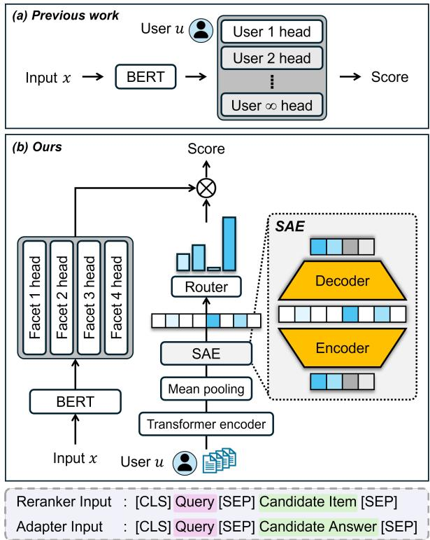  
Figure 2: Comparison between (a) user-specific head personalization and (b) the proposed MoF framework. Unlike previous work, MoF combines shared facet heads through preference-aware routing.

The SAE decoder reconstructs the original dense representation from the sparse latent representation:

$$
\mathbf { e } _ { u } ^ { d e c } = \mathbf { W } _ { \mathrm { d e c } } \mathbf { e } _ { u } ^ { e n c } + \mathbf { b } _ { \mathrm { d e c } } ,\tag{5}
$$

where $\mathbf { e } _ { u } ^ { d e c } \in \mathbb { R } ^ { d }$ and $\mathbf { W } _ { \mathrm { d e c } } \in \mathbb { R } ^ { d \times \tau d }$ . The SAE is optimized using the following objective:

$$
\mathcal { L } _ { \mathrm { S A E } } = \left. \mathbf { e } _ { u } ^ { d e c } - \mathbf { e } _ { u } ^ { \prime } \right. _ { 2 } ^ { 2 } + \lambda _ { 1 } \left. \mathbf { e } _ { u } ^ { e n c } \right. _ { 1 } .\tag{6}
$$

The reconstruction objective preserves preferencerelevant information encoded in the user-history representation, while the $L _ { 1 }$ regularization promotes sparsity in the latent representation.

## 3.2.3 User Preference-Aware Router

Using the sparse user representation ${ \bf e } _ { u } ^ { e n c }$ , the router determines which facet heads are more relevant for a particular user. The router is implemented as a linear projection layer that produces routing logits over the F facet heads:

$$
\mathbf { g } _ { u } = \mathbf { W } _ { r } \mathbf { e } _ { u } ^ { e n c } + \mathbf { b } _ { r } ,\tag{7}
$$

where ${ \mathbf W } _ { r } \in \mathbb { R } ^ { F \times \tau d }$ denotes the routing projection matrix and $\mathbf { g } _ { u } \in \mathbb { R } ^ { F }$ represents the routing logits over all facet heads. To encourage sparse activation of facet heads, we apply top-k routing over $\mathbf { g } _ { u } \mathbf { . }$

$$
( \tilde { \bf g } _ { u } , { \cal K } _ { u } ) = \mathrm { t o p } { - \cal k } ( { \bf g } _ { u } , { \cal K } ) ,\tag{8}
$$

where $\tilde { \mathbf { g } } _ { u } \in \mathbb { R } ^ { K }$ denotes the selected top-k routing logits and $\kappa _ { u }$ represents the corresponding facet indices. The routing weights are then computed using a softmax over the selected routing logits:

$$
\alpha _ { u , k } = \frac { \exp ( \tilde { g } _ { u , k } ) } { \sum _ { j = 1 } ^ { K } \exp ( \tilde { g } _ { u , j } ) } .\tag{9}
$$

The final MoF prediction is obtained as a weighted sum of the selected facet outputs using the routing weights:

$$
\operatorname { M o F } ( x , H _ { u } ) = \sum _ { k = 1 } ^ { K } \alpha _ { u , k } \psi _ { K _ { u , k } } ( x ) .\tag{10}
$$

This sparse routing mechanism enables the model to represent user-specific preference patterns as compositions of shared facet heads, allowing personalization without dedicated user-specific heads.

## 3.2.4 Objective

The model is trained using a binary classification objective over the MoF prediction and the corresponding supervision label $r _ { i } ^ { u }$ . The labeling strategy is described in Appendix A. For a user u and training instance $( x _ { i } ^ { u } , r _ { i } ^ { u } )$ , the prediction probability is computed as

$$
p _ { i } ^ { u } = \sigma ( \mathrm { M o F } ( x _ { i } ^ { u } , H _ { u } ) ) .\tag{11}
$$

The MoF objective is defined as

$$
\begin{array} { r } { \mathcal { L } _ { \mathrm { M o F } } = - r _ { i } ^ { u } \log p _ { i } ^ { u } - \left( 1 - r _ { i } ^ { u } \right) \log ( 1 - p _ { i } ^ { u } ) . } \end{array}\tag{12}
$$

The final training objective jointly optimizes the MoF objective and the sparse autoencoder objective:

$$
\begin{array} { r } { \mathcal { L } = \mathcal { L } _ { \mathrm { M o F } } + \lambda \mathcal { L } _ { \mathrm { S A E } } . } \end{array}\tag{13}
$$

Here, λ controls the contribution of the SAE regularization objective during training.

## 3.3 Cluster-Based Sampling (CBS)

In HYDRA, training instances are constructed by retrieving history items based on relevance to the target query. However, retrieval relevance often emphasizes lexical or semantic similarity, which may fail to reflect the diverse aspects of user preferences.

As a result, the sampled training instances may be concentrated on a limited subset of preference patterns. To encourage facet specialization in MoF, we introduce a cluster-based sampling (CBS) strategy over $H _ { u } .$ . Specifically, we first partition history items into multiple clusters using k-means clustering over the history embedding set $\mathbf { E } _ { u }$ . CBS is applied when constructing training instances for both the reranker and adapter. Rather than sampling history items from a single global retrieval pool, CBS samples them separately from each cluster. This strategy increases the diversity of preference signals observed during training and encourages the facet heads to capture diverse preference patterns rather than focusing on semantically similar history items.

## 4 Experiment

## 4.1 Experimental Setup

Datasets. We evaluate MoF on two personalization classification tasks and two personalization generation tasks from the LaMP benchmark (Salemi et al., 2024). Specifically, we use Movie Tagging Classification (LaMP-2) and Product Rating Classification (LaMP-3) for classification, and News Headline Generation (LaMP-4) and Scholarly Title Generation (LaMP-5) for generation. Further details on the datasets are provided in Appendix C.

Baselines. We compare MoF against both prompt-based and reranker & adapter-based personalization methods. Zero-Shot uses only the input query without any personalization cues. ICL augments the input with randomly selected k items from the user history. RAG (Salemi et al., 2024) retrieves relevant history items using BM25 (Robertson and Zaragoza, 2009) and augments them into the input. PAG (Richardson et al., 2023) further enhances personalization by incorporating LLMgenerated user profile summaries together with retrieved history items. CFRAG (Shi et al., 2025) incorporates collaborative information by retrieving similar users and relevant items from their histories, followed by personalized reranking for LLM generation. HYDRA (Zhuang et al., 2024) is a reranker & adapter-based personalization framework. We additionally report HYDRA-Reranker, which uses only the reranker for personalization, and HYDRA-Adapter, which applies only the adapter over candidate responses generated from the zero-shot setting.

Table 1: Main results on the LaMP benchmark. Results are averaged over three runs with different sampled user sets. k denotes the number of retrieved user-history items. For HYDRA and MoF, we use k = 4. ↑ and ↓ indicate that higher and lower values are better, respectively. Bold and underline indicate the best and second-best scores, respectively. Avg. Rank denotes the average rank of each method across all metrics.
<table><tr><td rowspan="2">Dataset (→) Method (↓)</td><td colspan="2">LaMP-2</td><td colspan="2">LaMP-3</td><td colspan="3">LaMP-4</td><td colspan="3">LaMP-5</td><td rowspan="2">Avg. Rank↓</td></tr><tr><td>Acc ↑</td><td>F1↑</td><td>MAE↓</td><td>RMSE↓</td><td>R-1↑</td><td>R-L↑</td><td>BLEU↑</td><td>R-1 ↑</td><td>R-L↑</td><td>BLEU↑</td></tr><tr><td>Zero-Shot</td><td>0.420</td><td>0.257</td><td>0.500</td><td>0.777</td><td>0.147</td><td>0.129</td><td>0.891</td><td>0.446</td><td>0.375</td><td>5.822</td><td>13.5</td></tr><tr><td>ICL (k=1)</td><td>0.393</td><td>0.252</td><td>0.727</td><td>1.163</td><td>0.158</td><td>0.140</td><td>0.977</td><td>0.444</td><td>0.373</td><td>6.098</td><td>13.6</td></tr><tr><td>ICL (k=2)</td><td>0.467</td><td>0.387</td><td>0.520</td><td>0.879</td><td>0.167</td><td>0.143</td><td>0.837</td><td>0.448</td><td>0.381</td><td>6.032</td><td>11.3</td></tr><tr><td>ICL (k=4)</td><td>0.513</td><td>0.403</td><td>0.433</td><td>0.762</td><td>0.161</td><td>0.140</td><td>1.240</td><td>0.447</td><td>0.384</td><td>5.511</td><td>10.0</td></tr><tr><td>RAG (k=1)</td><td>0.433</td><td>0.276</td><td>0.613</td><td>0.978</td><td>0.165</td><td>0.145</td><td>0.889</td><td>0.452</td><td>0.385</td><td>5.961</td><td>12.0</td></tr><tr><td>RAG (k=2)</td><td>0.493</td><td>0.346</td><td>0.500</td><td>0.812</td><td>0.167</td><td>0.150</td><td>1.273</td><td>0.459</td><td>0.387</td><td>5.388</td><td>9.5</td></tr><tr><td>RAG (k=4)</td><td>0.547</td><td>0.409</td><td>0.440</td><td>0.765</td><td>0.176</td><td>0.148</td><td>1.456</td><td>0.457</td><td>0.395</td><td>5.888</td><td>6.9</td></tr><tr><td>PAG (k=0)</td><td>0.507</td><td>0.366</td><td>0.333</td><td>0.663</td><td>0.162</td><td>0.140</td><td>0.873</td><td>0.436</td><td>0.361</td><td>5.659</td><td>10.5</td></tr><tr><td>PAG (k=1)</td><td>0.473</td><td>0.337</td><td>0.400</td><td>0.739</td><td>0.181</td><td>0.157</td><td>1.040</td><td>0.454</td><td>0.371</td><td>6.063</td><td>8.0</td></tr><tr><td>CFRAG (k=4)</td><td>0.593</td><td>0.447</td><td>0.440</td><td>0.780</td><td>0.176</td><td>0.151</td><td>0.966</td><td>0.456</td><td>0.392</td><td>5.748</td><td>7.4</td></tr><tr><td>HYDRA-Reranker</td><td>0.567</td><td>0.383</td><td>0.480</td><td>0.830</td><td>0.168</td><td>0.152</td><td>1.517</td><td>0.465</td><td>0.390</td><td>6.281</td><td>6.8</td></tr><tr><td>HYDRA-Adapter</td><td>0.447</td><td>0.271</td><td>0.380</td><td>0.735</td><td>0.159</td><td>0.140</td><td>0.852</td><td>0.467</td><td>0.394</td><td>6.059</td><td>9.3</td></tr><tr><td>HYDRA</td><td>0.593</td><td>0.417</td><td>0.393</td><td>0.761</td><td>0.183</td><td>0.163</td><td>1.849</td><td>0.459</td><td>0.396</td><td>6.652</td><td>3.5</td></tr><tr><td>MoF-Reranker (ours)</td><td>0.600</td><td>0.451</td><td>0.407</td><td>0.724</td><td>0.177</td><td>0.154</td><td>1.502</td><td>0.456</td><td>0.390</td><td>7.421</td><td>4.2</td></tr><tr><td>MoF-Adapter (ours)</td><td>0.467</td><td>0.308</td><td>0.327</td><td>0.682</td><td>0.161</td><td>0.142</td><td>1.275</td><td>0.477</td><td>0.400</td><td>6.515</td><td>6.5</td></tr><tr><td>MoF (ours)</td><td>0.627</td><td>0.438</td><td>0.300</td><td>0.605</td><td>0.199</td><td>0.176</td><td>1.662</td><td>0.481</td><td>0.413</td><td>6.967</td><td>1.4</td></tr></table>

Evaluation Metrics. Following LaMP (Salemi et al., 2024), we use Accuracy (Acc) and F1 score (F1) for LaMP-2, MAE and RMSE for LaMP-3, and ROUGE-1 (R-1), ROUGE-L (R-L), and BLEU for LaMP-4 and LaMP-5. Higher scores indicate better performance for all metrics except MAE and RMSE.

Implementation Details. Following prior work (Zhuang et al., 2024), we conduct training and evaluation using subsets of the original datasets, where we sample 100 users for training and 50 users for testing. For robustness, results are averaged over 3 runs with different randomly sampled user sets. We use bge-base-en-v1.5 (Xiao et al., 2024) (110M parameters) as the base model for both the reranker and adapter modules. As the black-box LLM, we employ gpt-3.5-turbo-1106 (OpenAI, 2022). Additional implementation details are provided in Appendix F.

## 4.2 Main Results

Table 1 presents the main experimental results on the LaMP benchmark. We observe that promptbased personalization methods do not consistently improve over the zero-shot setting and in some cases even degrade performance. One possible explanation is that prompt-based methods are sensitive to history selection and context coverage because randomly selected or limited histories may fail to represent the user’s preferences while introducing distracting context. The extent of this effect also varies across tasks and retrieval sizes. In contrast, reranker & adapter-based approaches generally provide more consistent gains across tasks, suggesting that aligning the output distribution of a black-box LLM with user preferences can be more effective than relying solely on prompt-level personalization.

Compared with HYDRA, which relies on userspecific scoring heads, MoF achieves better overall performance despite eliminating user-specific parameters. For example, MoF improves accuracy from 0.593 to 0.627 on LaMP-2 and reduces MAE from 0.393 to 0.300 on LaMP-3.

MoF achieves the strongest average performance across the tasks with an average rank of 1.4, demonstrating stronger overall performance than existing prompt-based and reranker & adapter-based baselines. Specifically, MoF achieves the best performance on most evaluation metrics across LaMP-2, LaMP-3, LaMP-4, and LaMP-5, with competitive results on the remaining metrics. These results demonstrate the effectiveness of preference-aware mixture modeling for black-box LLM personalization.

Table 2: Evaluation of unseen user generalization: performance with and without the fit stage. – indicates that the method cannot be applied without a fit stage.
<table><tr><td colspan="2">Dataset (→)</td><td>LaMP-2</td><td></td><td>LaMP-3</td><td colspan="2">LaMP-4</td></tr><tr><td colspan="2">Method (↓)</td><td>Fit</td><td>Acc ↑</td><td>MAE↓</td><td>R-1 ↑</td><td>R-L↑</td></tr><tr><td colspan="2">HYDRA</td><td>X</td><td></td><td></td><td></td><td></td></tr><tr><td colspan="2">HYDRA</td><td>√</td><td>0.593</td><td>0.393</td><td>0.183</td><td>0.163</td></tr><tr><td colspan="2">MoF MoF</td><td>X</td><td>0.620 0.627</td><td>0.333 0.300</td><td>0.200 0.199</td><td>0.179 0.176</td></tr><tr><td colspan="2">HYDRA-Reranker</td><td>X</td><td></td><td></td><td></td><td></td></tr><tr><td colspan="2">HYDRA-Reranker</td><td></td><td>0.567</td><td>0.480</td><td>0.168</td><td>0.152</td></tr><tr><td colspan="2">MoF-Reranker</td><td>X</td><td>0.547</td><td>0.440</td><td>0.178</td><td>0.158</td></tr><tr><td colspan="2">MoF-Reranker</td><td></td><td>0.600</td><td>0.407</td><td>0.177</td><td>0.154</td></tr><tr><td colspan="2">HYDRA-Adapter</td><td>X</td><td></td><td></td><td></td><td></td></tr><tr><td colspan="2">HYDRA-Adapter</td><td></td><td>0.447</td><td>0.380</td><td>0.159</td><td>0.140</td></tr><tr><td colspan="2">MoF-Adapter</td><td>X</td><td>0.440</td><td>0.347</td><td>0.153</td><td>0.137</td></tr><tr><td colspan="2"></td><td></td><td>0.467</td><td></td><td></td><td></td></tr><tr><td colspan="2">MoF-Adapter</td><td></td><td></td><td>0.327</td><td>0.161</td><td>0.142</td></tr></table>

We further observe that both MoF-Reranker and MoF-Adapter individually achieve competitive performance. This suggests that preference-aware retrieval and personalized candidate selection provide complementary benefits. Additional experimental results on other black-box LLMs are provided in Appendix G, suggesting that the proposed framework generalizes across different proprietary blackbox LLMs.

## 4.3 Generalization to Unseen Users

Unlike HYDRA, which requires an additional fit stage for unseen users because of its user-specific heads, MoF can perform personalization without additional training for new users. Table 2 presents the generalization performance on unseen users with and without the fit stage. MoF maintains competitive performance even without the fit stage, with only minor degradation across datasets. Notably, MoF without the fit stage outperforms HY-DRA with the fit stage on all metrics reported in Table 2, demonstrating strong generalization to unseen users. While MoF-Adapter does not outperform its fitted counterpart in every case, it remains competitive without additional training. These findings suggest that MoF can effectively generalize to unseen users without requiring user-specific adaptation.

## 4.4 Scalability Analysis

Figure 3 (a) and (b) show the effect of the number of training users. Across both datasets, MoF achieves competitive performance with substantially fewer training users than HYDRA. For example, MoF trained with only 30 users in (a) and 50 users in (b) already surpasses HYDRA trained with 100 users, suggesting that MoF can achieve strong personalization performance with fewer training users. Furthermore, performance remains stable as the number of training users increases up to 300, suggesting that the learned shared facets remain effective as the training user population grows.

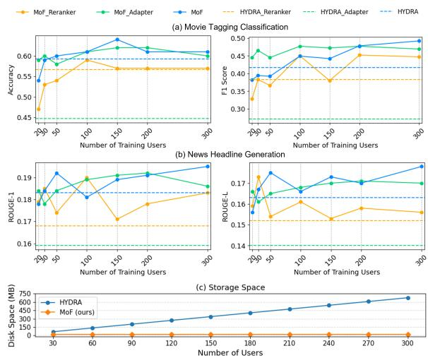  
Figure 3: Scalability analysis with increasing user populations. (a), (b) show personalization performance as the number of training users increases, while (c) compares storage growth across methods.

Table 3: Large-scale evaluation on 1,000 unseen users without user-specific fitting.
<table><tr><td rowspan="2">Dataset (→) Method (↓)</td><td>LaMP-2</td><td>LaMP-3</td><td colspan="2">LaMP-4</td></tr><tr><td>Acc ↑</td><td>MAE↓</td><td>R-1↑</td><td>R-L↑</td></tr><tr><td>Zero-Shot</td><td>0.391</td><td>0.515</td><td>0.143</td><td>0.124</td></tr><tr><td>RAG (k = 1)</td><td>0.409</td><td>0.676</td><td>0.155</td><td>0.135</td></tr><tr><td>RAG (k = 2)</td><td>0.480</td><td>0.521</td><td>0.160</td><td>0.141</td></tr><tr><td>RAG (k = 4)</td><td>0.508</td><td>0.449</td><td>0.164</td><td>0.146</td></tr><tr><td>MoF (ours)</td><td>0.577</td><td>0.354</td><td>0.175</td><td>0.156</td></tr></table>

Figure 3 (c) compares storage growth as the number of users increases. While HYDRA requires user-specific scoring heads, causing storage cost to grow linearly with the user population (approximately 2.26 MB per user in our implementation), MoF maintains constant personalizationparameter storage cost through shared facet heads. Appendix B further presents a theoretical analysis showing that MoF exhibits constant personalization complexity with respect to the number of users.

To assess scalability to a larger user population, we evaluate MoF, trained on 100 users, on 1,000 unseen users without additional user-specific fitting. As shown in Table 3, MoF consistently outperforms the zero-shot and RAG baselines on LaMP-2, LaMP-3, and LaMP-4. These results provide further evidence of inference-time scalability and unseen-user generalization to a substantially larger user population.

Table 4: Controlled comparison of HYDRA and MoF with and without CBS.
<table><tr><td rowspan="2">Dataset (→) Method (↓) CBS</td><td>LaMP-2</td><td>LaMP-3</td><td colspan="2">LaMP-4</td></tr><tr><td>Acc ↑</td><td>MAE↓</td><td>R-1 ↑</td><td>R-L↑</td></tr><tr><td>HYDRA X</td><td></td><td>0.593</td><td>0.393</td><td>0.183 0.163</td></tr><tr><td>HYDRA √</td><td>0.560</td><td></td><td>0.373</td><td>0.170 0.149</td></tr><tr><td>MoF X</td><td>0.587</td><td></td><td>0.380</td><td>0.183 0.168</td></tr><tr><td>MoF L</td><td></td><td>0.627</td><td>0.300</td><td>0.199 0.176</td></tr></table>

Table 5: Effect of applying CBS to different components of MoF. R and A denote the reranker and adapter, respectively.
<table><tr><td rowspan="2"></td><td colspan="2">CBS</td><td>LaMP-2</td><td>LaMP-3</td><td colspan="2">LaMP-4</td></tr><tr><td>R</td><td>A</td><td>Acc ↑</td><td>MAE↓</td><td>R-1↑</td><td>R-L↑</td></tr><tr><td rowspan="2">MoF</td><td>X</td><td>X</td><td>0.587</td><td>0.380</td><td>0.183</td><td>0.168</td></tr><tr><td>√</td><td>X</td><td>0.613</td><td>0.327</td><td>0.179</td><td>0.155</td></tr><tr><td></td><td></td><td>J</td><td>0.627</td><td>0.300</td><td>0.199</td><td>0.176</td></tr></table>

## 4.5 Controlled Analysis of CBS

To disentangle the effect of CBS from that of the MoF architecture, we conduct controlled comparisons with and without CBS. As shown in Table 4, applying CBS to HYDRA degrades performance on most reported metrics, whereas combining CBS with MoF improves performance across the reported metrics. Notably, MoF without CBS remains competitive with HYDRA, suggesting that CBS alone does not account for the gains of MoF. Rather, CBS complements the shared-facet architecture by exposing facet heads to diverse preference signals, encouraging specialization across facets.

We further examine where CBS contributes within MoF by selectively applying it to the reranker and adapter. As shown in Table 5, applying CBS to the reranker improves performance on LaMP-2 and LaMP-3 but slightly decreases the ROUGE metrics on LaMP-4. Extending CBS to both the reranker and adapter further improves LaMP-3 and recovers and improves the ROUGE metrics on LaMP-4. These results suggest that extending CBS to both components can provide additional benefits within the MoF framework.

Table 6: Ablation study of MoF.
<table><tr><td>Dataset (→)</td><td>LaMP-2</td><td>LaMP-3</td><td colspan="2">LaMP-4</td></tr><tr><td>Method (↓)</td><td>Acc ↑</td><td>MAE↓</td><td>R-1 ↑</td><td>R-L↑</td></tr><tr><td>MoF</td><td>0.627</td><td>0.300</td><td>0.199</td><td>0.176</td></tr><tr><td>w/o SAE</td><td>0.607</td><td>0.333</td><td>0.188</td><td>0.165</td></tr><tr><td>w/o Router</td><td>0.600</td><td>0.360</td><td>0.184</td><td>0.161</td></tr><tr><td>w/o Multi-Facet</td><td>0.607</td><td>0.353</td><td>0.183</td><td>0.160</td></tr><tr><td>w/o CBS</td><td>0.587</td><td>0.380</td><td>0.183</td><td>0.168</td></tr></table>

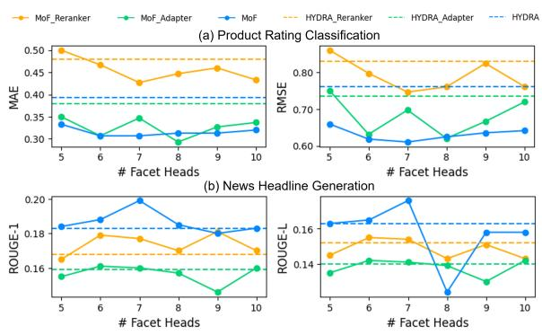  
Figure 4: Impact of the number of facet heads under top-3 routing. (a) and (b) show results on LaMP-3 and LaMP-4, respectively. A moderate number of facet heads generally provides the strongest performance.

## 4.6 Ablation Studies

Table 6 presents an ablation study evaluating the contribution of each component in MoF. Removing CBS results in the largest performance degradation in most settings, indicating the importance of exposing the model to diverse training samples during preference learning. We also observe substantial performance drops when removing the router, demonstrating the benefit of adaptively combining shared preference facets. Replacing multiple shared facet heads with a single head also degrades performance, suggesting that user preferences are better captured by combinations of multiple latent preference patterns. Finally, removing SAE results in smaller but consistent performance degradation across datasets, indicating that sparse representations provide complementary benefits for personalization.

## 4.7 Impact of Number of Facet Heads

Figure 4 presents the impact of varying the number of facet heads under top-3 routing. We observe that performance generally improves as the number of facet heads increases up to a moderate range, while further increasing the number of heads does not consistently provide additional gains. For LaMP-3 in Figure 4 (a), MoF generally achieves favorable performance when using 6–8 facet heads and performs competitively against the corresponding HYDRA variants across most settings. Similarly, for LaMP-4 in Figure 4 (b), performance tends to improve up to around 6–7 facet heads before showing limited additional gains. These observations suggest that increasing the number of facet heads alone does not necessarily improve personalization performance. Additional results and analyses are presented in Appendix H.

Table 7: Qualitative analysis of user groups identified from routing patterns. Representative n-grams are obtained using BERTopic on user histories within each group.
<table><tr><td>ID</td><td>Representative n-grams</td><td>Interpretation</td></tr><tr><td></td><td>“17th century salem hester prynne&quot;; “years old daughter maddy&quot;; Threat-, escape-, and conflict-centered narra- G1 “abuse fanatically pious mother&quot;; “wormhole surpass limitations hu- tives spanning historical, familial, supernatu- man space&quot;</td><td>ral, and speculative settings</td></tr><tr><td></td><td>“zion defends massive invasion machines&quot;; “young wizards harry dis- Genre-driven action/fantasy narratives empha- G2 covers trio&quot;; “11th birthday learns powerful wizard&quot;; “zombies per- sizing adventure, large-scale conflict, and sur- fectly evolved survivors&quot;</td><td>vival</td></tr><tr><td>G3</td><td>“actively opposed hitler nazis convictions&quot;; “young prince life threat- Character-centered dramatic narratives involv- ened evil&quot;; “adventures lion witch wardrobe&quot;; “young writer elizabeth ing moral conviction, family/romance, youth wurtzel earns&quot;; “suddenly single cal adrift&quot;</td><td>vulnerability, and emotional struggle</td></tr></table>

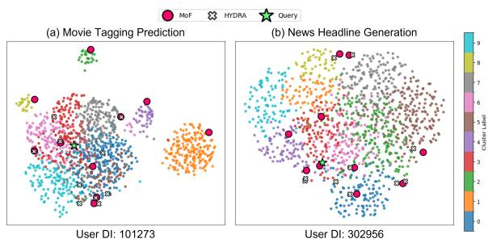  
Figure 5: Visualization of CBS for two example users. Colors indicate clusters of user-history embeddings. Red circles and white crosses denote training samples selected using CBS in MoF and BM25 retrieval in HY-DRA, respectively, and the green star denotes the query.

## 4.8 Visualization

Figure 5 visualizes the history items selected for two example users, illustrating how CBS in MoF retrieves samples from multiple preference clusters compared with the standard retrieval used in HYDRA. The visualization is obtained by projecting k-means-clustered history embeddings (K=10) using UMAP (McInnes et al., 2018). Compared with HYDRA, which tends to retrieve histories concentrated within specific regions, MoF selects items across multiple clusters, exposing the model to more diverse preference signals. We further observe that user histories often span multiple regions in the latent space (Figure 5 (a)) rather than forming a single concentrated pattern. Such heterogeneous preference distributions motivate CBS to provide richer signals for learning facet representations. This observation is consistent with the ablation results, where removing CBS causes the largest performance degradation.

## 4.9 Qualitative Analysis

To investigate whether the learned router captures meaningful preference-related structures, we group users according to their routing-weight distributions and perform BERTopic (Grootendorst, 2022) analysis on their historical interactions. As illustrated in Figure 10, users exhibit distinct routing patterns rather than being assigned uniformly. We analyze the corresponding user groups in Table 7, where users with similar routing patterns also show coherent narrative tendencies. For example, G1 is associated with threat- and conflict-centered narratives, whereas G2 focuses on action and fantasy themes, while G3 emphasizes character-driven and emotional narratives. These findings provide qualitative evidence that routing weights reflect meaningful preference-related structures rather than arbitrary assignment patterns.

## 5 Conclusion

In this paper, we introduced MoF, a personalization framework for black-box LLMs based on shared preference facets and preference-aware routing. By replacing user-specific heads with a fixed number of shared facet heads, MoF achieves scalable personalization while maintaining constant personalization-parameter storage overhead as the number of users increases. Experimental results further show that preference-aware routing supports effective personalization and generalization to users unseen during training without additional parameter updates.

## Limitations

While MoF achieves a substantially stronger average rank across tasks, it does not outperform HY-DRA on every individual metric (e.g., BLEU on LaMP-4). Thus, our results support strong overall personalization performance under a more scalable parameterization, rather than uniform superiority over HYDRA on every metric.

Although MoF generalizes to a substantially larger set of unseen users, our primary experiments train the model on a relatively limited number of users. Therefore, the current results demonstrate inference-time scalability to larger user populations but do not fully characterize training behavior under substantially larger and more heterogeneous user populations.

MoF also employs a fixed number of shared facet heads for all users. While this design provides parameter-efficient personalization, a fixed facet capacity may become restrictive as user preferences become increasingly diverse. Future work could explore adaptive facet allocation or routing mechanisms that dynamically adjust model capacity while preserving parameter efficiency.

Finally, our evaluation is limited to the LaMP benchmark and does not include LongLaMP or a direct comparison with FERMI. LongLaMP involves long-form personalization with task-specific profile structures that may require adapting the current MoF formulation, while FERMI performs iterative per-user prompt optimization under a different personalization paradigm. Extending MoF to long-form settings and comparing it with such optimization-based approaches remain important directions for future work.

## Ethical Considerations

MoF performs personalization based on user interaction histories, which may contain sensitive information reflecting individual preferences and behavioral patterns. Although MoF eliminates userspecific scoring heads and reduces the need for storing personalized parameters, the preference inference process may still capture sensitive behavioral patterns from historical interactions. In addition, personalization systems may unintentionally reinforce existing user tendencies or reduce exposure to diverse content. Practical deployments should therefore consider privacy-preserving mechanisms such as anonymization, secure handling of user histories, and user-controlled personalization settings.

We use publicly available artifacts according to their respective licenses and terms of use. The LaMP benchmark code and data creation methods are licensed under CC BY-NC-SA 4.0, and we follow the corresponding licenses and usage conditions of the datasets included in the benchmark. We use bge-base-en-v1.5 (FlagEmbedding) under the MIT License. We additionally use OpenAI models (e.g., gpt-3.5-turbo-1106 and gpt-4o-mini-2024-07-18) according to OpenAI’s API terms of use and service policies.

All artifacts were used in a manner consistent with their intended use and access conditions. Public benchmarks, pretrained models, and APIs were used only for research and evaluation purposes and in accordance with their specified usage policies.

## References

Anthropic. 2026. Claude code overview. Claude Code documentation.

Tom Brown, Benjamin Mann, Nick Ryder, Melanie Subbiah, Jared D Kaplan, Prafulla Dhariwal, Arvind Neelakantan, Pranav Shyam, Girish Sastry, Amanda Askell, Sandhini Agarwal, Ariel Herbert-Voss, Gretchen Krueger, Tom Henighan, Rewon Child, Aditya Ramesh, Daniel Ziegler, Jeffrey Wu, Clemens Winter, and 12 others. 2020. Language models are few-shot learners. In Proceedings ofthe Advances in Neural Information Processing Systems (NeurIPS), pages 1877–1901.

Jin Chen, Zheng Liu, Xu Huang, Chenwang Wu, Qi Liu, Gangwei Jiang, Yuanhao Pu, Yuxuan Lei, Xiaolong Chen, Xingmei Wang, Kai Zheng, Defu Lian, and Enhong Chen. 2024. When large language models meet personalization: Perspectives of challenges and opportunities. World wide web, 27:42.

Hyung Won Chung, Le Hou, Shayne Longpre, Barret Zoph, Yi Tai, William Fedus, Yunxuan Li, Xuezhi Wang, Mostafa Dehghani, Siddhartha Brahma, Albert Webson, Shixiang Shane Gu, Zhuyun Dai, Mirac Suzgun, Xinyun Chen, Aakanksha Chowdhery, Alex Castro-Ros, Marie Pellat, Kevin Robinson, and 16 others. 2024. Scaling instruction-finetuned language models. Journal of Machine Learning Research (JMLR), 25.

Gheorghe Comanici, Eric Bieber, Mike Schaekermann, Ice Pasupat, Noveen Sachdeva, Inderjit Dhillon, Marcel Blistein, Ori Ram, Dan Zhang, Evan Rosen, Luke Marris, Sam Petulla, Colin Gaffney, Asaf Aharoni, Nathan Lintz, Tiago Cardal Pais, Henrik Jacobsson, Idan Szpektor, Nan-Jiang Jiang, and 3416 others. 2025. Gemini 2.5: Pushing the frontier with advanced reasoning, multimodality, long context, and next generation agentic capabilities. arXiv preprint arXiv:2507.06261.

Jacob Devlin, Ming-Wei Chang, Kenton Lee, and Kristina Toutanova. 2019. BERT: Pre-training of deep bidirectional transformers for language understanding. In Proceedings of the North American Chapter of the Association for Computational Linguistics: Human Language Technologies (NAACL), pages 4171–4186.

William Fedus, Barret Zoph, and Noam Shazeer. 2022. Switch transformers: Scaling to trillion parameter models with simple and efficient sparsity. Journal of Machine Learning Research (JMLR), 23:1–39.

Shangbin Feng, Taylor Sorensen, Yuhan Liu, Jillian Fisher, Chan Young Park, Yejin Choi, and Yulia Tsvetkov. 2024. Modular pluralism: Pluralistic alignment via multi-LLM collaboration. In Proceedings of the Conference on Empirical Methods in Natural Language Processing (EMNLP), pages 4151–4171.

Maarten Grootendorst. 2022. BERTopic: Neural topic modeling with a class-based tf-idf procedure. arXiv preprint arXiv:2203.05794.

Edward J Hu, Yelong Shen, Phillip Wallis, Zeyuan Allen-Zhu, Yuanzhi Li, Shean Wang, Lu Wang, and Weizhu Chen. 2022. LoRA: Low-rank adaptation of large language models. In Proceedings ofthe In ternational Conference on Learning Representations (ICLR).

Robert Huben, Hoagy Cunningham, Logan Riggs Smith, Aidan Ewart, and Lee Sharkey. 2024. Sparse autoencoders find highly interpretable features in language models. In Proceedings ofthe International Conference on Learning Representations (ICLR).

Robert A Jacobs, Michael I Jordan, Steven J Nowlan, and Geoffrey E Hinton. 1991. Adaptive mixtures of local experts. Neural computation, 3:79–87.

Joel Jang, Seungone Kim, Bill Yuchen Lin, Yizhong Wang, Jack Hessel, Luke Zettlemoyer, Hannaneh Hajishirzi, Yejin Choi, and Prithviraj Ammanabrolu. 2023. Personalized soups: Personalized large language model alignment via post-hoc parameter merging. arXiv preprint arXiv:2310.11564.

Wang-Cheng Kang and Julian McAuley. 2018. Selfattentive sequential recommendation. In Proceedings of the IEEE international conference on data mining (ICDM), pages 197–206.

Jaehyung Kim and Yiming Yang. 2025. Few-shot personalization of LLMs with mis-aligned responses. In Proceedings of the Nations of the Americas Chapter of the Association for Computational Linguistics (NAACL), pages 11943–11974.

Hannah Rose Kirk, Bertie Vidgen, Paul Röttger, and Scott A. Hale. 2024a. The benefits, risks and bounds of personalizing the alignment of large language models to individuals. Nature Machine Intelligence, 6:383–392.

Hannah Rose Kirk, Alexander Whitefield, Paul Röttger, Andrew Michael Bean, Katerina Margatina, Rafael Mosquera, Juan Manuel Ciro, Max Bartolo, Adina Williams, He He, Bertie Vidgen, and Scott A. Hale. 2024b. The PRISM alignment dataset: What participatory, representative and individualised human feedback reveals about the subjective and multicultural alignment of large language models. In Proceedings of the Advances in Neural Information Processing Systems (NeurIPS).

Hao Li, Chenghao Yang, An Zhang, Yang Deng, Xiang Wang, and Tat-Seng Chua. 2025. Hello again! LLMpowered personalized agent for long-term dialogue. In Proceedings ofthe Nations ofthe Americas Chapter of the Association for Computational Linguistics (NAACL), pages 5259–5276.

Jiongnan Liu, Yutao Zhu, Shuting Wang, Xiaochi Wei, Erxue Min, Yu Lu, Shuaiqiang Wang, Dawei Yin, and Zhicheng Dou. 2025. Llms + persona-plug = personalized llms. In Proceedings ofthe Annual Meeting of the Association for Computational Linguistics (ACL), pages 9373–9385.

Ilya Loshchilov and Frank Hutter. 2019. Decoupled weight decay regularization. In Proceedings of the International Conference on Learning Representations (ICLR).

Leland McInnes, John Healy, and James Melville. 2018. Umap: Uniform manifold approximation and projection for dimension reduction. arXiv preprint arXiv:1802.03426.

Jisoo Mok, Ik-hwan Kim, Sangkwon Park, and Sungroh Yoon. 2025. Exploring the potential of LLMs as personalized assistants: Dataset, evaluation, and analysis. In Findings of the Association for Computational Linguistics: ACL, pages 10212–10239.

OpenAI. 2022. Introducing chatgpt. OpenAI Blog.

OpenAI. 2024. Gpt-4o mini: Advancing cost-efficient intelligence. OpenAI Blog.

OpenAI, Josh Achiam, Steven Adler, Sandhini Agarwal, Lama Ahmad, Ilge Akkaya, Florencia Leoni Aleman, Diogo Almeida, Janko Altenschmidt, Sam Altman, Shyamal Anadkat, Red Avila, Igor Babuschkin, Suchir Balaji, Valerie Balcom, Paul Baltescu, Haiming Bao, Mohammad Bavarian, Jeff Belgum, and 262 others. 2024. Gpt-4 technical report. arXiv preprint arXiv:2303.08774.

Long Ouyang, Jeffrey Wu, Xu Jiang, Diogo Almeida, Carroll Wainwright, Pamela Mishkin, Chong Zhang, Sandhini Agarwal, Katarina Slama, Alex Ray, John Schulman, Jacob Hilton, Fraser Kelton, Luke Miller, Maddie Simens, Amanda Askell, Peter Welinder, Paul F Christiano, Jan Leike, and Ryan Lowe. 2022. Training language models to follow instructions with human feedback. In Proceedings of the Advances in Neural Information Processing Systems (NeurIPS).

Jiaxing QI, Zhongzhi Luan, Shaohan Huang, Carol Fung, Hailong Yang, and Depei Qian. 2024. FD-LoRA: Personalized federated learning of large language model via dual lora tuning. arXiv preprint arXiv:2406.07925.

Yilun Qiu, Tianhao Shi, Xiaoyan Zhao, Fengbin Zhu, Yang Zhang, and Fuli Feng. 2025. Latent inter-user difference modeling for llm personalization. In Proceedings of the Conference on Empirical Methods in Natural Language Processing (EMNLP), pages 10599–10617.

Chris Richardson, Yao Zhang, Kellen Gillespie, Sudipta Kar, Arshdeep Singh, Zeynab Raeesy, Omar Zia Khan, and Abhinav Sethy. 2023. Integrating summarization and retrieval for enhanced personalization via large language models. arXiv preprint arXiv:2310.20081.

Stephen Robertson and Hugo Zaragoza. 2009. The probabilistic relevance framework: BM25 and beyond. Now Publishers Inc.

Alireza Salemi, Sheshera Mysore, Michael Bendersky, and Hamed Zamani. 2024. Lamp: When large language models meet personalization. In Proceedings of the Annual Meeting of the Association for Computational Linguistics (ACL), pages 7370–7392.

Noam Shazeer, Azalia Mirhoseini, Krzysztof Maziarz, Andy Davis, Quoc Le, Geoffrey Hinton, and Jeff Dean. 2017. Outrageously large neural networks: The sparsely-gated mixture-of-experts layer. In Proceedings of the International Conference on Learning Representations (ICLR).

Teng Shi, Jun Xu, Xiao Zhang, Xiaoxue Zang, Kai Zheng, Yang Song, and Han Li. 2025. Retrieval augmented generation with collaborative filtering for personalized text generation. In Proceedings of the International ACM SIGIR Conference on Research and Development in Information Retrieval (SIGIR), pages 1294–1304.

Taylor Sorensen, Liwei Jiang, Jena D. Hwang, Sydney Levine, Valentina Pyatkin, Peter West, Nouha Dziri, Ximing Lu, Kavel Rao, Chandra Bhagavatula, Maarten Sap, John Tasioulas, and Yejin Choi. 2024. Value kaleidoscope: Engaging ai with pluralistic human values, rights, and duties. Proceedings of the AAAI Conference on Artificial Intelligence (AAAI), 38:19937–19947.

Haotian Sun, Yuchen Zhuang, Wei Wei, Chao Zhang, and Bo Dai. 2024. Bbox-adapter: Lightweight adapting for black-box large language models. In Proceedings ofthe International Conference on Machine Learning (ICML), pages 47280–47304.

Zhaoxuan Tan, Zheyuan Liu, and Meng Jiang. 2024a. Personalized pieces: Efficient personalized large language models through collaborative efforts. In Proceedings of the Conference on Empirical Methods in Natural Language Processing (EMNLP), pages 6459–6475.

Zhaoxuan Tan, Qingkai Zeng, Yijun Tian, Zheyuan Liu, Bing Yin, and Meng Jiang. 2024b. Democratizing large language models via personalized parameterefficient fine-tuning. In Proceedings of the Conference on Empirical Methods in Natural Language Processing (EMNLP), pages 6476–6491.

Shitao Xiao, Zheng Liu, Peitian Zhang, Niklas Muennighoff, Defu Lian, and Jian-Yun Nie. 2024. C-pack: Packed resources for general chinese embeddings. In Proceedings ofthe International ACM SIGIR Conference on Research and Development in Information Retrieval (SIGIR), pages 641–649.

Linhai Zhang, Jialong Wu, Deyu Zhou, and Yulan He. 2025a. PROPER: A progressive learning framework for personalized large language models with grouplevel adaptation. In Proceedings ofthe Annual Meeting of the Association for Computational Linguistics (ACL), pages 16399–16411.

Zhehao Zhang, Ryan A. Rossi, Branislav Kveton, Yijia Shao, Diyi Yang, Hamed Zamani, Franck Dernoncourt, Joe Barrow, Tong Yu, Sungchul Kim, Ruiyi Zhang, Jiuxiang Gu, Tyler Derr, Hongjie Chen, Junda Wu, Xiang Chen, Zichao Wang, Subrata Mitra, Nedim Lipka, and 2 others. 2025b. Personalization of large language models: A survey. Transactions on Machine Learning Research (TMLR).

Yanqi Zhou, Tao Lei, Hanxiao Liu, Nan Du, Yanping Huang, Vincent Zhao, Andrew Dai, Zhifeng Chen, Quoc Le, and James Laudon. 2022. Mixture-ofexperts with expert choice routing. In Proceedings of the Advances in Neural Information Processing Systems (NeurIPS), pages 7103–7114.

Zhanhui Zhou, Jie Liu, Jing Shao, Xiangyu Yue, Chao Yang, Wanli Ouyang, and Yu Qiao. 2024. Beyond one-preference-fits-all alignment: Multi-objective direct preference optimization. In Findings ofthe Associationfor Computational Linguistics: ACL, pages 10586–10613.

Yuchen Zhuang, Haotian Sun, Yue Yu, Rushi Qiang, Qifan Wang, Chao Zhang, and Bo Dai. 2024. Hydra: Model factorization framework for black-box llm personalization. In Proceedings ofthe Advances in Neural Information Processing Systems (NeurIPS).

## A Detailed Preliminary Framework

## A.1 Reranker

The reranker $s _ { \phi } ^ { \mathrm { R } }$ takes the current query $q _ { u }$ and retrieved history candidates as input, and outputs a score indicating the usefulness of each history item for generating a user-preferred response. For each user $u ,$ , we first retrieve a set of $M$ history candidates $H _ { u } ^ { \prime } = \{ h _ { u , 1 } ^ { \prime } , h _ { u , 2 } ^ { \prime } , . . . , h _ { u , M } ^ { \prime } \}$ from the full user history $H _ { u }$ based on their relevance to the target query $q _ { u }$ . To construct the reranker training dataset $\dot { D } ^ { \mathrm { R } }$ , we randomly sample M history items from $H _ { u }$ and treat the query in each sampled history item as a target query for retrieval-based training instance construction. We create a binary supervision label $r _ { u , m } ^ { R } \in \{ 0 , 1 \}$ indicating whether the history item $h _ { u , m } ^ { \prime }$ helps generate a user-preferred response. For classification tasks, a positive label is assigned when the model output matches the ground-truth label. For generation tasks, a positive label is assigned when the evaluation score exceeds the average score across candidate responses. The reranker is optimized using the following binary classification objective:

$$
\mathcal { L } _ { \mathrm { R } } ( \phi ) = \sum _ { u \in \mathcal { U } } \sum _ { m = 1 } ^ { M } \ell _ { \mathrm { B C E } } \Bigl ( s _ { \phi } ^ { \mathrm { R } } ( q _ { u } , h _ { u , m } ^ { \prime } ) , r _ { u , m } ^ { R } \Bigr ) .\tag{14}
$$

Based on the reranker scores, the top-k history items are selected to construct the personalized context set:

$$
H _ { u } ^ { * } = \arg \mathrm { t o p } { - k _ { h _ { u , m } ^ { \prime } \in H _ { u } ^ { \prime } } s _ { \phi } ^ { \mathrm { R } } ( q _ { u } , h _ { u , m } ^ { \prime } ) }\tag{15}
$$

## A.2 Adapter

Given the query $q _ { u }$ and the personalized context set $H _ { u } ^ { * }$ , we sample a set of B candidate responses $O _ { u } = \mathsf { \bar { \{ } }  o _ { u } ^ { 1 } , \mathsf { \_ { \cdot } } . . . , o _ { u } ^ { B } \}$ from the black-box LLM. The adapter $s _ { \theta } ^ { \mathrm { A } }$ acts as a lightweight selection module that scores candidate responses without modifying the black-box LLM parameters, thereby aligning the output distribution with user preferences. The adapter assigns a preference score to each candidate response in $O _ { u }$ based on its alignment with user preferences. To build the adapter training dataset $D ^ { \mathrm { A } }$ , we generate candidate response sets $O _ { u }$ for all history items in $H _ { u }$ . We assign a binary supervision label $r _ { u , b } ^ { A } \in \{ 0 , 1 \}$ to each candidate response $o _ { u } ^ { b }$ where $r _ { u , b } ^ { A } = 1$ indicates that the response aligns with user preferences. Following the labeling strategy used for reranker training, positive labels are assigned based on exact matching for classification tasks and relative evaluation scores for generation tasks. The adapter is optimized using the following binary classification objective:

$$
\mathcal { L } _ { \mathrm { A } } ( \theta ) = \sum _ { u \in \mathcal { U } } \sum _ { b = 1 } ^ { B } \ell _ { \mathrm { B C E } } \Big ( s _ { \theta } ^ { \mathrm { A } } \big ( q _ { u } , o _ { u } ^ { b } \big ) , r _ { u , b } ^ { A } \Big ) .\tag{16}
$$

The final personalized response is selected as the candidate with the highest adapter score:

$$
\hat { y } _ { u } = \arg \operatorname* { m a x } _ { b } s _ { \theta } ^ { \mathrm { A } } ( q _ { u } , o _ { u } ^ { b } ) .\tag{17}
$$

## A.3 Training & Inference

As illustrated in Figure 1, both the reranker $s _ { \phi } ^ { \mathrm { R } }$ and the adapter $s _ { \theta } ^ { \mathrm { A } }$ are trained in two stages: a train stage and a fit stage. During the train stage, the base model and scoring heads are jointly trained using data collected from a large number of users. This enables the model to capture shared preference signals across users while learning user-specific preference patterns through separate heads. During the fit stage, only the heads are updated for unseen users while the shared base model remains frozen. This stage adapts the personalization modules to the preference patterns of new users without modifying the shared parameters.

During inference, retrieved history items are first reranked to select the more useful historical items $H _ { u } ^ { * }$ for the current query, as defined in Eq. (15). Conditioned on $H _ { u } ^ { * }$ , the black-box LLM generates a set of candidate responses $O _ { u }$ . The adapter then assigns preference scores to the candidate responses in $O _ { u }$ , and the response with the highest score is selected as the final personalized response ${ \hat { y } } _ { u } ,$ as defined in Eq. (17).

## B Parameter Scalability Analysis

We analyze how the number of trainable personalization parameters scales with the number of users. Let N denote the number of users, F the number of facet heads. For user-specific personalization approaches such as HYDRA, each user maintains an independent scoring head. The trainable personalization parameters can therefore be expressed as

$$
P _ { \mathrm { H Y D R A } } ( N ) = N P _ { \mathrm { h e a d } } ,\tag{18}
$$

where $P _ { \mathrm { h e a d } }$ denotes the parameter count of a single user-specific head. Consequently, introducing one additional user increases the parameter count by

$$
P _ { \mathrm { H Y D R A } } ( N + 1 ) - P _ { \mathrm { H Y D R A } } ( N ) = P _ { \mathrm { h e a d } } .\tag{19}
$$

Thus, the personalization parameter complexity grows linearly with the number of users:

$$
{ \cal P } _ { \mathrm { H Y D R A } } ( N ) = { \cal O } ( N ) .\tag{20}
$$

In contrast, MoF employs a fixed set of shared facet heads coupled with a shared routing module. The trainable personalization parameters become

$$
P _ { \mathrm { M o F } } = F P _ { \psi } + P _ { \mathrm { r o u t e r } } + P _ { \mathrm { S A E } } ,\tag{21}
$$

where $P _ { \psi }$ denotes the parameter count of a single facet head, and $P _ { \mathrm { r o u t e r } }$ and $P _ { \mathrm { S A E } }$ denote the parameters of the shared routing and sparse autoencoder modules, respectively. Since all terms in $P _ { \mathrm { M o F } }$ are independent of the number of users, introducing a new user does not increase the parameter count:

$$
P _ { \mathrm { M o F } } ( N + 1 ) - P _ { \mathrm { M o F } } ( N ) = 0 .\tag{22}
$$

Therefore, MoF exhibits constant parameter complexity with respect to the number of users:

$$
P _ { \mathrm { M o F } } = O ( 1 ) .\tag{23}
$$

This result indicates that personalization for unseen users can be achieved solely through historyderived routing weights without introducing additional user-specific parameters. Consequently, MoF can scale to large and dynamically evolving user populations without increasing the number of trainable personalization parameters.

## C Task Details

We evaluate LLM personalization using the LaMP benchmark (Salemi et al., 2024). The benchmark consists of seven personalized NLP tasks spanning both classification and generation settings. We exclude LaMP-1 and LaMP-7 because these tasks involve task-specific input structures that are not directly compatible with the reranker & adapter formulation adopted in our framework and prior black-box personalization methods. This exclusion reflects a limitation of the current reranker & adapter instantiation rather than an inherent restriction of the MoF framework. Since our goal is to evaluate personalized preference modeling under a unified black-box personalization setting, we focus on tasks that share comparable interaction structures and evaluation protocols. In addition, LaMP-6 is not publicly available and therefore cannot be included in our experiments. This evaluation setting is consistent with the evaluation setting used in prior black-box personalization work (Zhuang et al., 2024).

LaMP-2: Movie Tagging Classification. LaMP-2 evaluates whether a model can predict a user’s tagging behavior for movies. Each user’s history consists of a sequence of movie description–tag pairs, where the descriptions correspond to previously viewed movies and the tags represent the user’s assigned labels. The task requires the model to capture personalized preference patterns from the sequential interaction history and predict the appropriate tag for a target movie description. Following prior work, we evaluate performance using Accuracy (Acc) and F1 score (F1).

Table 8: Size of training data used in the train and fit stages of MoF across different LaMP datasets.
<table><tr><td>Method</td><td>Module</td><td>Stage</td><td>LaMP-2</td><td>LaMP-3</td><td>LaMP-4</td><td>LaMP-5</td></tr><tr><td rowspan="4">MoF</td><td>Reranker</td><td>Train</td><td>10,228</td><td>10,852</td><td>10,816</td><td>10,998</td></tr><tr><td></td><td>Fit</td><td>4,468</td><td>4,926</td><td>4,841</td><td>4,999</td></tr><tr><td>Adapter</td><td>Train</td><td>167,979</td><td>140,195</td><td>289,368</td><td>71,226</td></tr><tr><td></td><td>Fit</td><td>45,401</td><td>76,336</td><td>128,871</td><td>39,294</td></tr></table>

Table 9: Training and fitting time of MoF across different LaMP datasets.
<table><tr><td>Method</td><td>Module</td><td>Stage</td><td>LaMP-2</td><td>LaMP-3</td><td>LaMP-4</td><td>LaMP-5</td></tr><tr><td rowspan="4">MoF</td><td>Reranker</td><td>Train</td><td>00:04:40</td><td>00:09:37</td><td>00:03:36</td><td>00:09:52</td></tr><tr><td></td><td>Fit</td><td>00:00:56</td><td>00:01:14</td><td>00:00:58</td><td>00:01:19</td></tr><tr><td rowspan="2">Adapter</td><td>Train</td><td>00:57:53</td><td>01:53:06</td><td>01:24:06</td><td>00:50:08</td></tr><tr><td>Fit</td><td>00:31:42</td><td>00:21:19</td><td>00:25:03</td><td>00:08:21</td></tr></table>

LaMP-3: Product Rating Classification. LaMP-3 evaluates personalized rating prediction based on users’ product reviews. User history is represented as a sequence of review–rating pairs generated by the same user. Given a target review, the model predicts the rating score that the user would assign. Although LaMP-3 is formulated as an ordinal classification task in the original benchmark, following prior work we report MAE and RMSE as evaluation metrics.

LaMP-4: News Headline Generation. LaMP-4 evaluates personalized text generation by requiring the model to generate headlines for news articles. User history consists of article–headline pairs written by the same journalist. The task requires extracting the journalist’s writing characteristics and stylistic patterns from historical interactions and generating a personalized headline for a target article. We evaluate generation quality using ROUGE-1 (R-1), ROUGE-L (R-L), and BLEU.

LaMP-5: Scholarly Title Generation. LaMP-5 focuses on generating titles for academic papers based on their abstracts. Similar to LaMP-4, each user’s history consists of abstract–title pairs written by the same author. The model is expected to infer the author’s writing style and title construction patterns from historical data and generate a personalized title for a target abstract. We evaluate performance using ROUGE-1 (R-1), ROUGE-L (R-L), and BLEU.

Table 10: Performance on the LaMP benchmark using gpt-4o-mini-2024-07-18 as the underlying proprietary black-box LLM. Experimental settings follow Table 1, while replacing the black-box LLM used in the main experiments. Results indicate that MoF maintains strong overall performance, demonstrating robustness beyond a specific black-box model.
<table><tr><td rowspan="2">Dataset (→) Method (↓)</td><td colspan="2">LaMP-2</td><td colspan="2">LaMP-3</td><td colspan="3">LaMP-4</td><td colspan="3">LaMP-5</td><td rowspan="2">Avg. Rank↓</td></tr><tr><td>Acc ↑</td><td>F1↑</td><td>MAE↓</td><td>RMSE↓</td><td>R-1 ↑</td><td>R-L↑</td><td>BLEU↑</td><td>R-1↑</td><td>R-L↑</td><td>BLEU↑</td></tr><tr><td>Zero-Shot</td><td>0.467</td><td>0.281</td><td>0.320</td><td>0.639</td><td>0.150</td><td>0.134</td><td>0.849</td><td>0.422</td><td>0.343</td><td>3.113</td><td>12.0</td></tr><tr><td>ICL (k=1)</td><td>0.513</td><td>0.344</td><td>0.413</td><td>0.757</td><td>0.150</td><td>0.129</td><td>0.908</td><td>0.434</td><td>0.364</td><td>4.525</td><td>12.0</td></tr><tr><td>ICL (k=2)</td><td>0.493</td><td>0.365</td><td>0.393</td><td>0.716</td><td>0.152</td><td>0.135</td><td>1.250</td><td>0.433</td><td>0.364</td><td>4.043</td><td>11.2</td></tr><tr><td>ICL (k=4)</td><td>0.520</td><td>0.388</td><td>0.327</td><td>0.648</td><td>0.156</td><td>0.140</td><td>1.681</td><td>0.440</td><td>0.375</td><td>5.230</td><td>7.9</td></tr><tr><td>RAG (k=1)</td><td>0.520</td><td>0.349</td><td>0.340</td><td>0.647</td><td>0.157</td><td>0.141</td><td>0.806</td><td>0.432</td><td>0.359</td><td>4.204</td><td>10.4</td></tr><tr><td>RAG (k=2)</td><td>0.527</td><td>0.361</td><td>0.367</td><td>0.651</td><td>0.165</td><td>0.145</td><td>1.425</td><td>0.461</td><td>0.385</td><td>5.934</td><td>7.6</td></tr><tr><td>RAG (k=4)</td><td>0.573</td><td>0.405</td><td>0.327</td><td>0.594</td><td>0.163</td><td>0.147</td><td>1.304</td><td>0.466</td><td>0.410</td><td>6.078</td><td>4.4</td></tr><tr><td>PAG (k=0)</td><td>0.507</td><td>0.370</td><td>0.287</td><td>0.572</td><td>0.127</td><td>0.109</td><td>0.183</td><td>0.402</td><td>0.329</td><td>2.631</td><td>12.0</td></tr><tr><td>PAG (k=1)</td><td>0.567</td><td>0.470</td><td>0.280</td><td>0.566</td><td>0.142</td><td>0.123</td><td>0.354</td><td>0.399</td><td>0.340</td><td>2.890</td><td>10.2</td></tr><tr><td>CFRAG (k=4)</td><td>0.673</td><td>0.533</td><td>0.347</td><td>0.642</td><td>0.171</td><td>0.148</td><td>1.441</td><td>0.445</td><td>0.383</td><td>5.137</td><td>5.3</td></tr><tr><td>HYDRA-Reranker</td><td>0.613</td><td>0.417</td><td>0.347</td><td>0.635</td><td>0.160</td><td>0.140</td><td>1.331</td><td>0.464</td><td>0.401</td><td>5.362</td><td>6.4</td></tr><tr><td>HYDRA-Adapter</td><td>0.527</td><td>0.343</td><td>0.307</td><td>0.610</td><td>0.143</td><td>0.126</td><td>0.728</td><td>0.410</td><td>0.328</td><td>3.127</td><td>11.5</td></tr><tr><td>HYDRA</td><td>0.653</td><td>0.448</td><td>0.347</td><td>0.632</td><td>0.168</td><td>0.147</td><td>1.230</td><td>0.468</td><td>0.405</td><td>5.603</td><td>5.0</td></tr><tr><td>MoF-Reranker (ours)</td><td>0.587</td><td>0.452</td><td>0.320</td><td>0.611</td><td>0.169</td><td>0.148</td><td>1.459</td><td>0.462</td><td>0.403</td><td>5.252</td><td>4.2</td></tr><tr><td>MoF-Adapter (ours)</td><td>0.507</td><td>0.336</td><td>0.300</td><td>0.604</td><td>0.152</td><td>0.132</td><td>1.116</td><td>0.419</td><td>0.345</td><td>2.985</td><td>10.5</td></tr><tr><td>MoF (ours)</td><td>0.653</td><td>0.504</td><td>0.327</td><td>0.627</td><td>0.180</td><td>0.157</td><td>1.109</td><td>0.472</td><td>0.405</td><td>5.643</td><td>3.6</td></tr></table>

## D Data Statistics

Table 8 reports the number of training instances used in the train and fit stages for the reranker and adapter modules across different LaMP datasets.

## E Computational Cost

Table 9 reports the training and fitting runtime of the reranker and adapter modules across different LaMP datasets.

## F Implementation Details

All experiments are conducted on a machine equipped with an AMD Ryzen Threadripper 1950X CPU and a single NVIDIA GeForce RTX 3090 GPU. For black-box LLM generation, we set the temperature to 1.0. For training, we employ AdamW (Loshchilov and Hutter, 2019) with a learning rate of $5 . 0 \times 1 0 ^ { - 5 }$ , a batch size of 64, and a weight decay of 0.01. All models are trained for 2 epochs. We set $\lambda = 0 . 5 , \lambda _ { 1 } = 8 . 6 \times 1 0 ^ { - 4 }$ and $\tau = 2$ . For the reranker, we partition each user’s history into 10 clusters and retrieve one item from each cluster using BM25, yielding M = 10 sampled candidates. For the adapter, we set the number of candidate responses B to 8. Based on validation performance, we set the number of facet heads to $F = 7$ and use top-3 sparse routing across all experiments. To construct user embeddings, we use up to the most recent 128 history items for each user. Additional sensitivity analyses are provided in Appendix H.

## G Generalization Across LLMs

Table 10 presents additional experimental results using gpt-4o-mini-2024-07-18 (OpenAI, 2024) as the underlying proprietary black-box LLM while keeping all other experimental settings identical to those in the main experiments. We observe that the overall trends remain largely consistent with those in Table 1. Similar to the main results, prompt-based personalization methods do not consistently improve performance across tasks, whereas reranker & adapter-based approaches generally provide stronger and more stable gains. MoF maintains the strongest overall performance with the best average rank of $3 . 6 ,$ demonstrating strong performance across multiple tasks under a different black-box model setting. Specifically, MoF achieves the best performance on several evaluation metrics while remaining competitive on the remaining settings. For example, MoF improves F1 from 0.448 to 0.504 on LaMP-2 compared with HY-DRA and also achieves stronger performance on

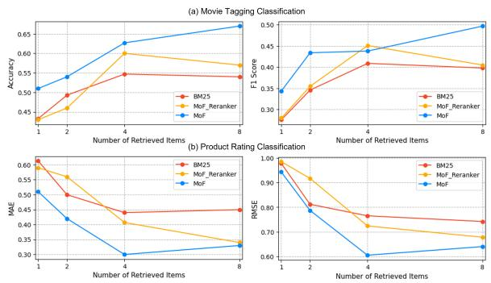  
Figure 6: Impact of the number of retrieved user-history items on personalization performance. (a) shows results on LaMP-2 and (b) shows results on LaMP-3. MoF generally benefits from additional retrieved information up to moderate retrieval sizes and maintains strong performance across different retrieval sizes.

LaMP-4, improving R-1 from 0.168 to 0.180 and R-L from 0.147 to 0.157. Although absolute performance differs from the main experimental setting, the relative advantage of MoF remains largely preserved. These results suggest that the proposed framework can generalize across different proprietary black-box LLMs.

## H Sensitivity Analysis

## H.1 Impact of Number of Retrieved Items

Figure 6 presents the impact of varying the number of retrieved items on personalization performance. We observe that increasing the number of retrieved items generally improves performance in both LaMP-2 and LaMP-3 up to a moderate retrieval size, while larger retrieval sizes may provide diminishing returns. For LaMP-2 in Figure 6 (a), MoF shows consistent performance improvements as the number of retrieved items increases, whereas BM25 and MoF-Reranker exhibit weaker gains or performance saturation. This trend suggests that the proposed framework benefits more from additional retrieved information. A similar trend can be observed for LaMP-3 in Figure 6 (b). Although performance slightly degrades at larger retrieval sizes, MoF maintains lower MAE and RMSE values than the baselines across different retrieval settings. These observations suggest that the proposed framework remains relatively robust under larger retrieval sizes while benefiting from richer user-history information.

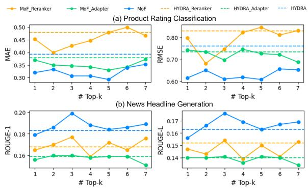  
Figure 7: Impact of top-k routing on personalization performance while fixing the total number of facet heads to 7. (a) and (b) present results on LaMP-3 and LaMP-4, respectively. Performance varies with the number of activated facet heads, indicating the importance of routing selection in preference aggregation.

## H.2 Impact of Top-k Routing

Figure 7 presents the impact of varying the number of selected facet heads under top-k routing while fixing the total number of facet heads to 7. We observe that performance generally improves up to a moderate routing size, while larger routing sizes provide limited additional benefits. For LaMP-3 in Figure 7 (a), MoF achieves its best performance around k=2, obtaining lower MAE and RMSE values than the corresponding HYDRA variants across all settings. Similarly, for LaMP-4 in Figure 7 (b), performance reaches its highest values around k=3 for both R-1 and R-L metrics. In addition, MoF achieves stronger performance than HYDRA across most routing settings. These observations suggest that selecting a moderate routing size provides a better balance between utilizing diverse preference signals and maintaining focused preference representations, which is consistent with prior MoE studies emphasizing sparse expert activation and effective expert specialization (Zhou et al., 2022). While activating additional facet heads may incorporate richer preference information, excessively large routing sizes may reduce the effectiveness of preference aggregation by introducing redundant or less relevant preference signals.

## H.3 Impact of User Embedding History Length

Figure 8 presents the impact of varying the number of recent user interactions used for constructing user embeddings. We observe that increasing the history length does not consistently improve personalization performance. For LaMP-3 in Figure 8 (a), MoF achieves its strongest performance at relatively short-to-moderate history lengths, with the best results observed around 128 recent interactions. Similarly, for LaMP-4 in Figure 8 (b), performance also peaks around moderate history lengths before showing limited additional gains. Across both tasks, MoF generally maintains stronger performance than the corresponding HYDRA variants. These observations suggest that incorporating additional historical interactions does not necessarily provide proportional benefits. Prior work on sequential recommendation has shown that user representations benefit from focusing on behavior signals that are more relevant to current preferences rather than uniformly aggregating long interaction histories (Kang and McAuley, 2018). Our results exhibit a similar trend, suggesting that moderate history lengths may provide a favorable balance between preserving relevant preference information and limiting the influence of older interactions.

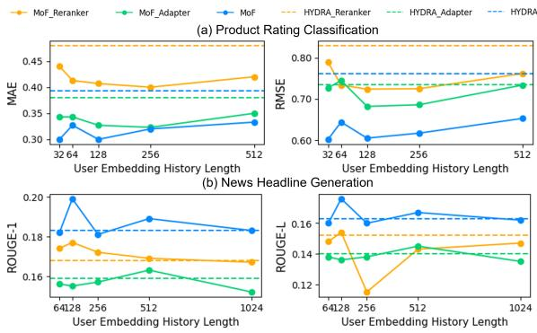  
Figure 8: Impact of the number of recent user interactions used for user embedding construction on personalization performance. (a) and (b) present results on LaMP-3 and LaMP-4, respectively. Moderate history lengths generally provide stronger performance across tasks.

## I Case Study

Figure 9 presents qualitative examples from LaMP-2 to illustrate how MoF performs preference-aware personalization under the same input query. In this task, the model is asked to predict the movie tag for the same target movie from a candidate tag set, while each user provides a different interaction history. Although the target query is identical, MoF retrieves different user-history samples and assigns different preference alignment scores depending on the user’s past tagging behavior.

For User 101291, MoF selects historical movies that are mostly associated with the tag “based on a book.” The selected examples are distributed across multiple regions in the history embedding space, indicating that MoF does not simply rely on local semantic similarity, but instead gathers preferencerelevant evidence from diverse historical clusters. As a result, the model assigns the highest scores to the “based on a book” candidates, suggesting that the user’s previous tagging patterns provide strong evidence for this preference.

In contrast, for User 10497, MoF retrieves a different set of historical examples under the same target query. The selected histories include multiple examples associated with “comedy,” and the resulting preference scores are highest for the “comedy” candidates. This shows that MoF can adapt its prediction behavior to a different user’s preference pattern even when the input movie is unchanged. The comparison demonstrates that MoF personalizes the decision process by conditioning on user-specific historical preferences rather than producing a single globally preferred prediction.

Overall, this case study highlights two important properties of MoF. First, the cluster-based history selection encourages the model to use diverse evidence from the user’s interaction history, which helps capture heterogeneous preference signals. Second, the preference-aware routing mechanism enables different users to emphasize different latent facets, leading to user-specific score distributions and final predictions. These qualitative results support the main experimental findings that MoF can effectively model personalized preferences while avoiding user-specific scoring heads.

## J Prompt Templates

Following prior work (Zhuang et al., 2024; Salemi et al., 2024), we employ prompt templates throughout the framework, including black-box LLM generation and the construction of training instances for both the reranker and adapter modules. The prompts combine task-specific instructions with personalized contextual information derived from user histories. The complete prompt templates used in our experiments are illustrated in Figures 11, 12, 13, and 14.

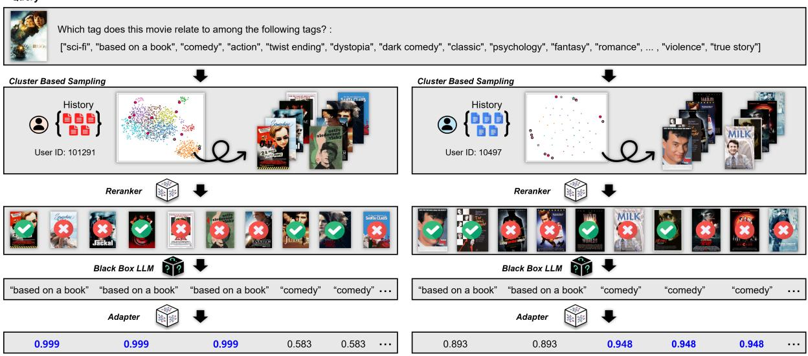  
Figure 9: Case study on LaMP-2 illustrating how MoF personalizes prediction behavior for the same query. MoF selects different user-history examples and assigns distinct preference alignment scores according to each user’s tagging patterns, resulting in user-specific evidence selection and predictions.

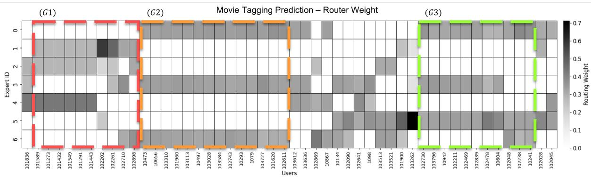  
Figure 10: Heatmap of routing weight distributions across users. Users with similar routing patterns are grouped together.

Figure 11: Prompt template used for Movie Tagging Classification (LaMP-2). The prompt incorporates retrieved user history examples together with task instructions and the target movie description.  
Movie Tagging Classification (LaMP-2)   
The tag for the movie: "in the town of blithe hollow, norman babcock can speak to the dead, but no one other than his   
eccentric new friend believes his ability is real. one day, norman's eccentric uncle tells him of a ritual he must perform   
to protect the town from a curse cast by a witch centuries ago." is "fantasy"   
and The tag for the movie: "in the futuristic action thriller looper, time travel will be invented but it will be illegal and   
only available on the black market. when the mob wants to get rid of someone, they will send their target 30 years into   
the past where a looper, a hired gun, like joe is waiting to mop up. joe is getting rich and life is good until the day the   
mob decides to close the loop, sending back joe's future self for assassination." is "sci-fi"   
and The tag for the movie: "wallace rents out gromit's former bedroom to a penguin, who takes up an interest in the   
techno pants created by wallace. however, gromit later learns that the penguin is a wanted criminal." is "comedy"   
and The tag for the movie: "a scientist in a surrealist society kidnaps children to steal their dreams, hoping that they   
slow his aging process." is "dystopia"   
Which tag does this movie relate to among the following tags? Just answer with the tag name without further   
explanation.   
tags:   
[sci-fi, based on a book, comedy, action, twist ending, dystopia, dark comedy, classic, psychology, fantasy, romance,   
thought-provoking, social commentary, violence, true story]   
description:   
Kuzco is a self-centered emperor who summons Pacha from a village and to tell him that his home will be destroyed to   
make room for Kuzco's new summer home. Kuzco's advisor, Yzma, tries to poison Kuzco and accidentally turns him   
into a llama, who accidentally ends up in Pacha's village. Pacha offers to help Kuzco if he doesn't destroy his house,   
and so they form an unlikely partnership.

Figure 12: Prompt template used for Product Rating Classification (LaMP-3). The prompt incorporates retrieved user history examples together with task instructions and the target review.  
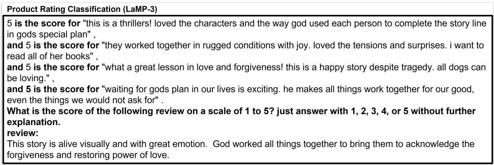

Figure 13: Prompt template used for News Headline Generation (LaMP-4). The prompt incorporates retrieved user history examples together with task instructions and the target news article.  
News Headline Generation (LaMP-4)   
"Black Panther' Expected To Have Enormous \$165 Million-Plus Opening Weekend" is the title for "the film, which   
comes out feb. 16, has already been breaking records.",   
and "Rosé Chocolate Exists, And We've Officially Gone Too Far" is the title for "we wonder if it tastes different if   
you eat it in the hamptons..."   
and "The Weather Channel Is Not Holding Back When It Comes To Climate Change" is the title for "and if you   
don't care about it, they'll convince you otherwise."   
and "24 Times J.K. Rowling Wrote Or Said Something That Hit All The Feels" is the title for "warning : this will   
make you want to curl up with all her books and disappear."   
Generate a headline for the following article:   
But if you want to make one, Twitter suggests breaking out the Manischewitz

Figure 14: Prompt template used for Scholarly Title Generation (LaMP-5). The prompt incorporates retrieved user history examples together with task instructions and the target paper abstract.
<table><tr><td>Scholarly Title Generation (LaMP-5) &quot;Lectures on Jacques Herbrand as a Logician&quot; is a title for &quot;we give some lectures on the work on formal logic of</td></tr><tr><td>jacques herbrand, and sketch his life and his influence on automated theorem proving. the intended audience ranges from students interested in logic over historians to logicians. besides the well - known correction of herbrand&#x27;s false lemma by goedel and dreben, we also present the hardly known unpublished correction of heijenoort and its consequences on herbrand&#x27;s modus ponens elimination. besides herbrand&#x27;s fundamental theorem and its relation to the loewenheim - skolem - theorem, we carefully investigate herbrand&#x27;s notion of intuitionism in connection with his notion of falsehood in an infinite domain. we sketch herbrand&#x27;s two proofs of the consistency of arithmetic and his notion of a recursive function, and last but not&quot; and &quot;THF0 --- The Core of the TPTP Language for Higher-Order Logic&quot; is a title for &quot;one of the keys to the success of the thousands of problems for theorem provers (tptp) problem library and related infrastructure is the</td></tr><tr><td>consistent use of the tptp language. this paper introduces the core of the tptp language for higher - order logic - - - thf0, based on church&#x27;s simple type theory. thf0 is a syntactically conservative extension of the untyped first - order tptp language.&quot; and &quot;DiaWOz-Il: a tool for wizard-of-Oz experiments in mathematics&quot; is a title for &quot;we present diawoz - ii, a</td></tr><tr><td>configurable software environment for wizard - of - oz studies in mathematics and engineering. its interface is based on a structural wysiwyg editor which allows the input of complex mathematical formulae. this allows the</td></tr><tr><td>collection of dialog corpora consisting of natural language interleaved with non - trivial mathematical expressions, which is not offered by other wizard - of - oz tools in the field. we illustrate the application of diawoz - ii in an empirical study on tutorial dialogs about mathematical proofs, summarize our experience with diawoz - ii and briefly present some preliminary observations on the collected dialogs.&quot;,</td></tr></table>