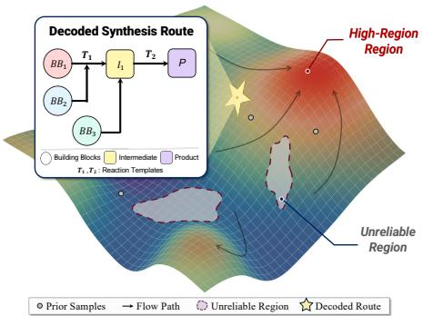
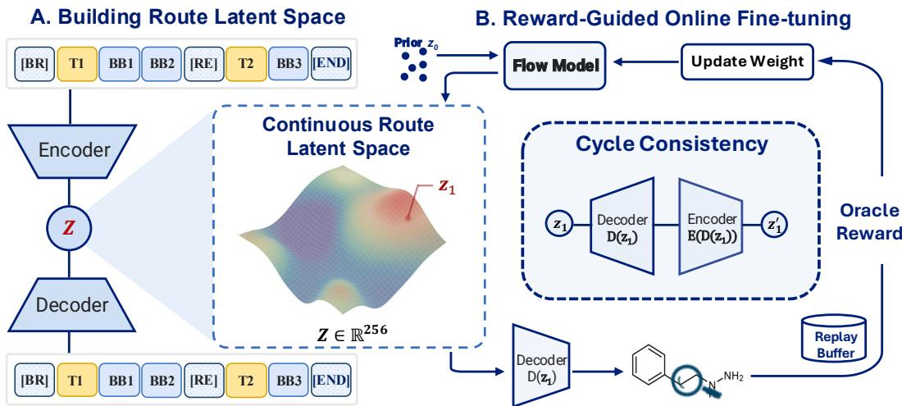
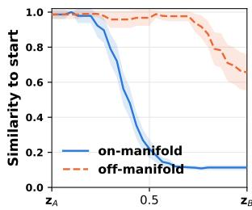
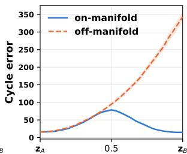
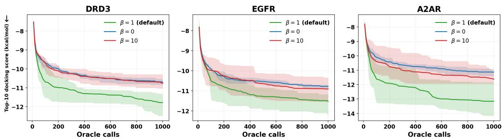
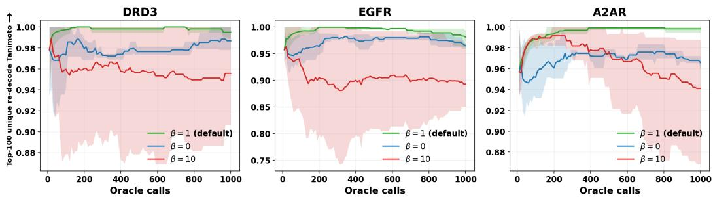
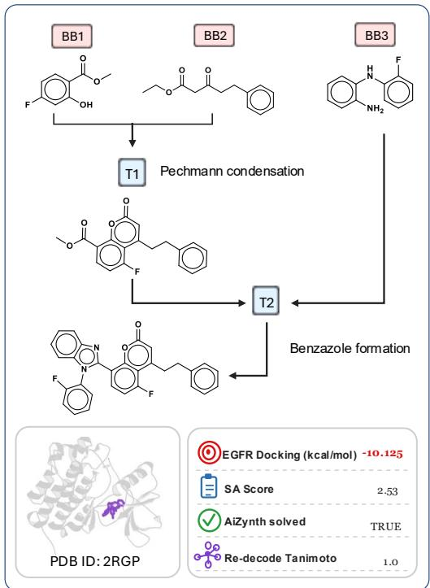
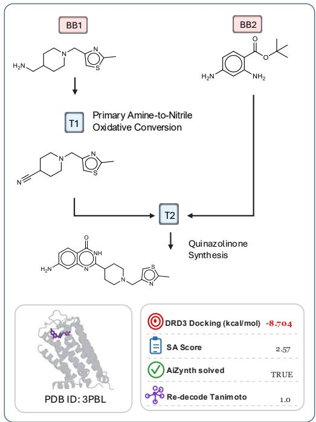
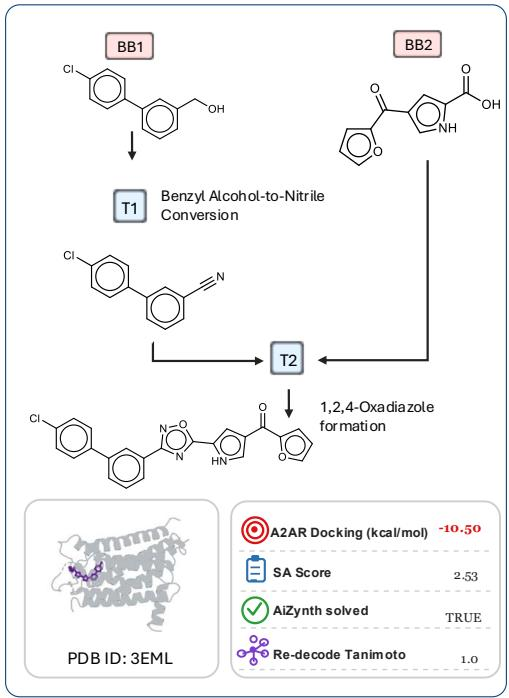

# NAVIGATING ROUTE LATENT SPACE FOR SYNTHESIZ-ABLE MOLECULAR DESIGN

Tao Li1, Tuan Vinh2, Monika Raj3, Yuan Fang4, Zhichun Guo5, and Carl Yang1†

1Department of Computer Science, Emory University

2MRC Brain Network Dynamics Unit, University of Oxford

3Department of Chemistry, Emory University

4Department of Computer Science, Singapore Management University

5Independent Researcher

## ABSTRACT

Goal-directed molecular design has advanced rapidly, yet a substantial proportion of designed molecules remain difficult to synthesize in practice, limiting their real-world utility. Prior synthesizability-aware methods either project generated molecules back to synthesizable analogs that deviate from the intended target, or optimize directly in discrete synthesis spaces that lack a continuous landscape for efficient search. We argue that this limitation mainly comes from the search space rather than the optimizer. To address this, we propose ROUTEFLOW, a framework that reformulates synthesizable molecular design as a search over a continuous route latent space, where each latent maps back to a complete synthesis route and synthesizability is inherently preserved. To navigate this space, we adopt reward-guided flow matching as an efficient sampler that steers toward highproperty regions. Since reward optimization may push latents off the manifold of real synthesis routes, where decoding becomes unreliable, we further introduce a cycle-consistency mechanism to stabilize fine-tuning. Across 16 optimization tasks from Therapeutic Data Commons, ROUTEFLOW achieves the best sample efficiency among synthesizability-aware baselines, with the best synthetic accessibility and the highest retrosynthesis success rate. Our results also confirm that the proposed cycle-consistency reliably keeps optimization on-manifold while improving target properties, supporting effective synthesizable molecular discovery.

## 1 INTRODUCTION

Generative models for goal-directed molecular design have achieved strong benchmark performance (Jensen, 2019; Gao et al., 2022; Ghugare et al., 2024; Hu et al., 2023; Sun et al., 2022; Park et al., 2025; Wang et al., 2025; Zhu et al., 2023; Chang & Ye, 2025). Yet a substantial fraction of these generated candidates lie beyond the reach of practical synthesis (Papidocha et al., 2026). Given this gap, designing a computational pipeline that produces both promising and synthesizable molecules has drawn increasing research attention.

Recent synthesizability-aware methods address this gap from two lines. One line projects generated molecules onto synthesizable analogs (Luo et al., 2024; Gao et al., 2025; Lee et al., 2026). However, as the analog drifts from the reference molecule, it also deviates from the original optimization objective. The other line builds molecules step by step within a discrete synthesizable action space, using GFlowNet (Cretu et al., 2025; Seo et al., 2025) or Monte Carlo tree search (Swanson et al., 2024). These methods guarantee synthesizability at each step, yet the search remains confined to a large combinatorial set without a smooth landscape for continuous optimization. Both directions thus demand a method that builds synthesizability directly into the molecular optimization process while improving search efficiency.

  
Figure 1: Illustration of the route latent space. Each point decodes into a synthesis route.

We argue that the core difficulty lies in the choice of the search space rather than the optimizer (see Section 4.4). Instead of searching directly over molecular space, we reformulate the problem as a search over synthesis routes. This formulation makes synthesizability an inherent property of the search space, since every route assembles purchasable building blocks through chemically valid reaction templates. To make this search efficient, we embed complete routes into a continuous latent space, turning the original discrete problem into a smooth optimization landscape (Figure 1). The remaining challenge is therefore to navigate this landscape effectively toward high-property regions.

Once optimization is formulated in the route latent space, reward-guided generative models such as diffusion and flow matching (Black et al., 2024; Fan et al., 2025) naturally provide a strategy for exploring high-property regions. However, reward optimization may gradually push latents away from the manifold of real synthesis routes. In these off-manifold regions, the decoder becomes unreliable and even nearby latents decode into unrelated molecules, resulting in an unstable optimization process. To address this, we further introduce a cycle-consistency mechanism that effectively downweights off-manifold latent exploration, enabling more stable and reliable route-space optimization.

Taken together, we propose ROUTEFLOW, a framework that reformulates synthesizable molecular design as a search over a continuous route latent space. Unlike prior methods that optimize over molecules or discrete synthesis actions, our formulation builds synthesizability directly into the search space while enabling continuous optimization. To build this space, we design structural tokens that serialize divergent synthesis routes into sequences, and train a route autoencoder that embeds them into a continuous latent space from which each latent can be decoded back into a route. We then navigate this space with reward-guided flow matching (Fan et al., 2025). Since reward optimization may drift away from the manifold of real synthesis routes, we further introduce a cycle-consistency mechanism that preserves the route manifold throughout fine-tuning. Across 16 molecular optimization tasks from Therapeutic Data Commons, ROUTEFLOW achieves the best average sample efficiency of 0.746, while producing molecules with the best synthetic accessibility and the highest retrosynthesis success rate. Additionally, quantitative evidence confirms that the introduced cycle-consistency mechanism raises re-decode similarity and further improves the docking scores by about 12%, highlighting its benefit for reliable route-space optimization. Thus, these results establish ROUTEFLOW as an effective framework for synthesizable molecular discovery.

## 2 RELATED WORK

## 2.1 SYNTHESIZABLE MOLECULE OPTIMIZATION

Goal-directed molecular optimization seeks molecules maximizing a target property within a fixed oracle budget (Gao et al., 2022). Many high-performing methods search molecular structure space without considering synthesizability, including graph-based genetic algorithms (Jensen, 2019), reinforcement learning with transformers (Ghugare et al., 2024; Hu et al., 2023), and evolutionary search (Wang et al., 2025; Dey et al., 2025). A large fraction of their outputs are synthetically inaccessible (Papidocha et al., 2026), leaving the optimization without practical value in drug discovery.

Recent work constrains search to synthesizable molecules by directly assembling candidates from purchasable building blocks and reaction templates. SynFormer (Gao et al., 2025) and ReaSyn (Lee et al., 2026) train autoregressive models to generate structurally similar synthesizable analogs of target molecules. SynFlowNet (Cretu et al., 2025) and RxnFlow (Seo et al., 2025) train GFlowNets over large combinatorial reaction spaces. SyntheMol (Swanson et al., 2024) and ClickGen (Wang et al., 2024) respectively use Monte Carlo tree search and modular reinforcement learning in structured discrete spaces. While DoG-Gen (Bradshaw et al., 2020) explores route space through generator fine-tuning, this limits flexibility across optimization strategies. In our work, RouteFlow instead constructs a continuous route latent space as a shared optimization landscape for diverse optimizers.

## 2.2 REWARD-GUIDED FINE-TUNING

Reward-guided fine-tuning steers a pre-trained generative model toward target objectives, and has been studied extensively on diffusion and flow matching, the two dominant continuous paradigms.

  
Figure 2: Overview of ROUTEFLOW: (A) building route latent space, (B) reward-guided fine-tuning.

Most existing methods fine-tune diffusion models via policy gradients (Black et al., 2024), reward backpropagation (Clark et al., 2024), or stochastic optimal control (Domingo i Enrich et al., 2025). Relative to diffusion, flow matching (Lipman et al., 2023; Tong et al., 2024) offers straighter sampling paths and more efficient generation (Li et al., 2026). Especially in molecular design, it has been applied to 3D conformer generation (Hong et al., 2025; Zhou et al., 2025), multi-objective op timization (Yuan et al., 2025), and joint molecule and pathway co-design (Shen et al., 2025). While in molecular optimization, property oracles are black-box and their budget is fixed, so updates must be online and sample-efficient. ORW-CFM-W2 (Fan et al., 2025) meets both needs, requiring only scalar rewards through reward-weighted training, and pairing it with Wasserstein-2 regularization to prevent mode collapse. Meanwhile, latent-space Bayesian optimization addresses unreliable decoding by constraining the search, either to the distribution through weighted retraining (Tripp et al., 2020) or to a local trust region (Maus et al., 2022). RouteFlow instead augments ORW-CFM-W2 with a proposed cycle-consistency mechanism to explore the synthesizable space built from routes.

## 3 METHODOLOGY

## 3.1 PROBLEM DEFINITION

RouteFlow formulates synthesizable molecular optimization over the space of real synthesis routes. Following ReaSyn and SynFormer (Lee et al., 2026; Gao et al., 2025), let B denote a set of |B| ≈ 270K purchasable building blocks from the Enamine catalog, and R a set of $| \mathcal { R } | = 1 1 5$ reaction templates. The synthesizable space S(B, R) collects all reachable molecules assembled by composing blocks in B through templates in R, with combinatorial size exceeding 1060. Given a property oracle function r(·), the goal is to efficiently find a molecule in $s ( B , \mathcal { R } )$ maximizing r(·).

## 3.2 ROUTE LATENT SPACE DESIGN

We build the route latent space in two steps, first designing a structural token encoding-decoding scheme explicitly grounded on valid chemistry, then training a route autoencoder on these sequences.

Token vocabulary. Existing route generation methods often operate at the character or atom level (Lee et al., 2026; Gao et al., 2025), where each token has a small vocabulary but the entire sequence must capture SMILES validity and route correctness over a long context, making training difficult and computationally expensive. Predicting building blocks directly is the natural alternative, yet a direct search over B is prohibitive. An intuitive approach is to let the sequence restrict the next token to a small, chemically feasible candidate set.

Table 1: Tokens per head.
<table><tr><td>Head</td><td>Choices</td><td>Size</td></tr><tr><td>Action</td><td>BR, RE, [END]</td><td>3</td></tr><tr><td></td><td>Reaction reaction template</td><td>e 115</td></tr><tr><td>Source</td><td>e PoP or block</td><td>1+|B|</td></tr></table>

Specifically, our encoding maintains a running stack of available intermediate molecules that tracks the synthesis context as decoding proceeds. At every step, the next token is sampled by one of three classifier heads summarized in Table 1, each restricted at runtime to the candidates compatible with the route built so far. BRANCH starts a fresh subtree whose reactants all come directly from B, while REACT consumes the stack top as the implicit first reactant of the next reaction. At source positions, POP appears as an extra choice alongside the compatible building blocks whenever the stack top itself substructure-matches the reactant template for the slot. Based on these tokens, a single flat sequence can express convergent synthesis trees by reusing previously produced intermediates.

Stack-based encoding and decoding. A synthesis tree is flattened into a token sequence under a stack discipline. For example, the convergent synthesis $b _ { a } , b _ { b } \ { \overset { r _ { 1 } } { \longrightarrow } } \ I _ { 1 } , b _ { c } , b _ { d } \ { \overset { r _ { 2 } } { \longrightarrow } } \ I _ { 2 } , I _ { 1 } , I _ { 2 } \ { \overset { r _ { 3 } } { \longrightarrow } } \ P$ becomes [START] [BR] $r _ { 1 } b _ { a } b _ { b }$ [BR] r b b [RE] r [POP] [END]. Here two BRANCH steps push $I _ { 1 }$ and $I _ { 2 }$ onto the stack, and the closing REACT merges the two intermediates, using $I _ { 2 }$ as the implicit first reactant of $r _ { 3 }$ and POP to retrieve $I _ { 1 }$ as the second. During decoding, the stacktop molecule is matched against template reactant patterns, and feasible candidates are retrieved from a precomputed building-block compatibility matrix. The predicted reaction and building block are then executed to generate the next intermediate and update the synthesis state. Unlike openloop decoders in token space (Lee et al., 2026), this closed loop grounds every step in an executed reaction, guarantees structural validity, and terminates when all intermediates merge into a product.

Route Autoencoder. Routes are enumerated offline by random sampling over B and R, keeping those that close the loop. These form the training set, alongside held-out validation and test sets.

The encoder maps a route token sequence into a latent vector $\mathbf { z } \in \mathbb { R } ^ { 2 5 6 }$ , while the decoder autoregressively recovers a candidate route. The objective sums three cross-entropy losses over action, reaction, and source positions, with the source softmax restricted to feasible building blocks rather than all |B| candidates. In this latent space, points can be decoded into valid routes for navigation.

## 3.3 REWARD-GUIDED FLOW IN ROUTE SPACE

To navigate the route latent space toward high-reward regions, we build upon ORW-CFM-W2 (Fan et al., 2025) with an explicit cycle-consistency penalty, training the flow in two sequential stages.

Pre-training. The flow model is a time-conditioned MLP $v _ { \theta } ( \mathbf { z } _ { t } , t )$ predicting the velocity field, abbreviated $v _ { \theta }$ in the equations. With the autoencoder frozen, the training set of routes is encoded once into a cached latent matrix, on which the flow is trained from scratch in latent space with the standard conditional flow matching (CFM) objective (Lipman et al., 2023; Tong et al., 2024),

$$
\begin{array} { r } { \mathcal { L } _ { \mathrm { C F M } } ( \boldsymbol { \theta } ) = \mathbb { E } _ { t , { \mathbf { z } _ { 1 } } , { \mathbf { z } _ { 0 } } } \left\| v _ { \boldsymbol { \theta } } - ( { \mathbf { z } _ { 1 } } - { \mathbf { z } _ { 0 } } ) \right\| ^ { 2 } , } \end{array}
$$

along the linear interpolant ${ \bf z } _ { t } = \left( 1 - t \right) { \bf z } _ { 0 } + t { \bf z } _ { 1 }$ with $\mathbf { z } _ { 0 } \sim \mathcal { N } ( 0 , I )$ and $\mathbf { z } _ { 1 }$ a training-route latent.

Online fine-tuning with cycle-consistency. After pre-training, the reference field $v _ { \theta _ { \mathrm { r e f } } }$ (abbreviated $v _ { \mathrm { r e f } } )$ both initializes the velocity network for online fine-tuning and anchors the Wasserstein-2 regularizer below, preventing mode collapse under reward pressure. The combined objective is

$$
\begin{array} { r } { \mathcal { L } _ { \mathrm { O R W - W 2 } } ( \theta ) = \mathbb { E } \big [ w ( \mathbf { z } _ { 1 } ) \lVert v _ { \theta } - ( \mathbf { z } _ { 1 } - \mathbf { z } _ { 0 } ) \rVert ^ { 2 } + \alpha \lVert v _ { \theta } - v _ { \mathrm { r e f } } \rVert ^ { 2 } \big ] , } \end{array}
$$

where the per-sample weight w $( { \bf z } _ { 1 } ) = \exp \bigl ( \tau \cdot \tilde { r } ( { \bf z } _ { 1 } ) - \beta \cdot \tilde { e } _ { \mathrm { c y c } } ( { \bf z } _ { 1 } ) \bigr )$ combines a reward term with a $\mathrm { c y - }$ cle penalty $e _ { \mathrm { c y c } } ( \mathbf { z } _ { 1 } ) = \| \mathbf { z } _ { 1 } - E ( D ( \mathbf { z } _ { 1 } ) ) \| ^ { 2 }$ (default $\beta = 1 )$ , and α controls the Wasserstein-2 anchor. Both $\tilde { r }$ and $\tilde { e } _ { \mathrm { c y c } }$ are batch-normalized to share a comparable scale. The cycle term downweights samples whose latent drifts from its re-encoding $E ( D ( \mathbf { z } _ { 1 } ) )$ , progressively concentrating fine-tuning on on-manifold latents. Meanwhile, the $L ^ { 2 }$ term anchors vθ to the reference $v _ { \mathrm { r e f } }$ by bounding the Wasserstein-2 distance between their induced flows (Fan et al., 2025), preventing overfitting to a few latents under reward pressure. In contrast to penalties on latent distance or the training distribution (Tripp et al., 2020; Maus et al., 2022), the cycle penalty uses the frozen route autoencoder to measure round-trip inconsistency, providing a decoder-aware signal of whether a latent maps back to a valid synthesis route, thereby concentrating fine-tuning more on latents that decode reliably.

In each iteration (Figure 2), a batch of latents $\mathbf { z } _ { 1 }$ is sampled via Euler integration, decoded into routes by the frozen autoencoder, and re-encoded into $\mathbf { z } ^ { \prime } \overset { \cdot } { = } E ( D ( \mathbf { z } _ { 1 } ) ,$ ). Each sample then carries an oracle reward and a cycle error measuring its drift from the manifold. The combined weight $w ( \mathbf { z } _ { 1 } )$ drives updates toward high-reward, on-manifold latents that decode into valid synthesis routes.

Search dynamics. During online fine-tuning, successfully decoded (latent, reward) pairs enter a replay buffer of the highest-scoring molecules under a Tanimoto-based insertion policy. A nearduplicate (≥ 0.85 Morgan similarity) replaces its cluster’s lowest-reward entry, while a novel sample is inserted, or replaces the global lowest-reward entry once the buffer fills. Each iteration then mixes a random 20% of the buffer with fresh samples, anchoring updates to the best molecules so far.

## 4 EXPERIMENTS

## 4.1 EXPERIMENTAL SETUP

Synthesis data. The synthesizable space is defined by $| B | = 2 7 0 , 4 2 3$ purchasable building blocks from the Enamine US catalog (Enamine, 2026) and $| \mathcal { R } | = 1 1 5$ reaction templates following (Gao et al., 2025; Lee et al., 2026). Routes are enumerated offline by random bottom-up sampling over B and R, restricted to at most 5 reaction steps to limit accumulated side reactions. This yields 300K training routes, 10K validation routes, and two 10K held-out test sets with drug-likeness (QED) $> 0 . 5$ , one with synthetic accessibility $( \mathrm { S A } ) < 2 . 5$ and the other with $\mathrm { S A } > \mathrm { 3 . 5 }$ , representing high- and low-synthesizability sets, respectively. Since these routes share the training enumeration procedure, we also evaluate on the patent-derived routes PaRoutes (Genheden & Bjerrum, 2022) for external evaluation. We retain 1,418 routes compatible with our building blocks and templates. To provide a reference for route reconstruction, we train molecule autoencoders on the final products of the same routes using SMILES and SELFIES tokenization. This allows us to directly compare the reconstruction quality of route and molecule latent representations under the same data setting.

Optimization tasks. Following ReaSyn (Lee et al., 2026), evaluation covers 13 tasks from the Therapeutic Data Commons PMO benchmark (Huang et al., 2021), together with three proteintarget docking tasks against the DRD3 (PDB 3PBL), EGFR (PDB 2RGP), and A2AR (PDB 3EML) receptors (Wang et al., 2025), whose docking scores are normalized by TDC to the same scale as PMO properties, where higher is better. Each method is given a fixed budget of 10,000 oracle calls per PMO task and 1,000 per docking task (Wang et al., 2025), reflecting realistic experimental cost.

Baselines. For route latent space evaluation, we directly compare its reconstruction performance against the corresponding molecule latent space under the same data setting. For molecular optimization, we compare against synthesis-constrained baselines in three categories. Methods that project molecules into synthesizable space include SynthesisNet (Sun et al., 2025), SynFormer (Gao et al., 2025), and ReaSyn (Lee et al., 2026). These methods are initialized with random ZINC250K molecules (Irwin et al., 2012). GFlowNet-based methods that directly construct complete synthesis routes in a discrete action space include SynFlowNet (Cretu et al., 2025) and RxnFlow (Seo et al., 2025). TRACER (Nakamura et al., 2025) serves as Monte Carlo tree search optimization baseline.

Evaluation metrics. For the autoencoder, we report decoding validity, reconstruction rate, and three similarity metrics between the decoded product and the held-out target based on Morgan fin gerprints, Bemis–Murcko scaffolds, and Gobbi pharmacophore vectors (Lee et al., 2026). Validity measures whether a latent can be successfully decoded. For route latents, this means producing an executable reaction sequence, while for molecule latents it means generating a SMILES string that can be parsed by RDKit (Landrum et al., 2026). For optimization, we report $\mathrm { A U C } _ { 1 0 } ,$ the area under the curve of the top-10 molecular scores versus oracle calls, to measure sample efficiency while considering both optimization quality and oracle usage (Gao et al., 2025). We also evaluate the overall quality of the top-100 molecules using synthetic accessibility, AiZynthFinder success rate, diversity (1 minus mean pairwise Morgan-fingerprint Tanimoto similarity), and average molecular weight.

Online fine-tuning configuration. For each task, RouteFlow performs online fine-tuning over the latent space until the oracle budget is exhausted. Latents that fail to decode into executable routes (average 5.2%) are resampled and therefore do not affect the overall optimization process. Sampling continues until a fixed number of valid routes is obtained, keeping the per-iteration oracle budget strictly constant throughout. Full implementation details are provided in Supplementary Section A.

## 4.2 ROUTE LATENT SPACE EVALUATION

We first evaluate the properties of the route latent space along two dimensions, focusing on reconstruction fidelity and latent continuity.

Reconstruction fidelity. We encode each held-out route into a latent representation and decode it to measure reconstruction fidelity. For comparison, we perform the same evaluation using a SMILES-based molecule autoencoder. Table 2 shows comparable reconstruction on the highsynthesizability set, but a substantial gap on harder targets, including low-synthesizability and patent routes. One possible explanation is the validity of decoded SMILES. We therefore also train a SELFIES-based molecule autoencoder, whose outputs are valid by construction. However, its reconstruction remains far below the route space, showing that validity alone does not close the gap. The difference instead lies in what each

Table 2: Route versus molecular reconstruction. Validity indicates executable routes or parseable molecular strings.
<table><tr><td>Latent space Held-out set Validity ↑ Recon. ↑ Morgan ↑</td><td></td><td></td><td></td><td></td><td>Scaffold↑</td><td>Gobbi↑</td></tr><tr><td rowspan="3">Route</td><td>High synth.</td><td>0.867</td><td>0.855</td><td>0.996</td><td>0.997</td><td>0.994</td></tr><tr><td>Low synth.</td><td>0.811</td><td>0.671</td><td>0.885</td><td>0.886</td><td>0.872</td></tr><tr><td>PaRoutes</td><td>0.960</td><td>0.657</td><td>0.851</td><td>0.895</td><td>0.832</td></tr><tr><td rowspan="3">Molecule (SMILES)</td><td>High synth.</td><td>0.979</td><td>0.868</td><td>0.957</td><td>0.954</td><td>0.947</td></tr><tr><td>Low synth.</td><td>0.432</td><td>0.061</td><td>0.481</td><td>0.507</td><td>0.405</td></tr><tr><td>PaRoutes</td><td>0.761</td><td>0.487</td><td>0.849</td><td>0.859</td><td>0.820</td></tr><tr><td rowspan="3">Molecule (SELFIES)</td><td>High synth.</td><td>1.000</td><td>0.823</td><td>0.901</td><td>0.895</td><td>0.887</td></tr><tr><td>Low synth.</td><td>1.000</td><td>0.121</td><td>0.324</td><td>0.294</td><td>0.279</td></tr><tr><td>PaRoutes</td><td>1.000</td><td>0.407</td><td>0.593</td><td>0.582</td><td>0.562</td></tr></table>

  
(a) Similarity to starting route.

  
(b) Cycle consistency.  
Figure 3: Latent-space continuity on held-out routes, comparing on-manifold and equal-length off-manifold paths.

decoder represents. The route decoder primarily models the composition and ordering of feasible building blocks and reactions across synthesis steps. This route-level formulation therefore makes reconstruction easier by reducing decoding complexity while preserving synthesizability by design.

Latent-space continuity. We evaluate the geometry of the route latent space by linearly interpolating between real-route latent pairs ${ \bf z } _ { A } \to { \bf z } _ { B }$ in 30 steps. For each pair, we construct a matched random direction of equal length $( \| \pmb { \delta } \| = \| \mathbf { z } _ { B } - \mathbf { z } _ { A } \| )$ , so the two trajectories differ only in direction. At each step, we decode the latent and measure similarity to the starting molecule together with the cycle error $e _ { \mathrm { c y c } } .$ Aggregated over 10K randomly sampled pairs from the held-out high-synthesizability routes, Figure 3 reveals a consistent pattern. Along directions connecting real-route representations, decoded molecules change progressively from the starting molecule, while $e _ { \mathrm { c y c } }$ decreases as the trajectory approaches a real-route latent. In contrast, matched random directions produce little systematic change in the decoded molecule, while $e _ { \mathrm { c y c } }$ rises rapidly as the trajectory moves away from regions supported by real-route representations. These trends reveal structured continuity between real-route representations over a broad sample, whereas random directions increasingly depart from the empirical route manifold, motivating cycle consistency to stabilize route-space optimization.

## 4.3 GOAL-DIRECTED MOLECULAR OPTIMIZATION

We benchmark RouteFlow against synthesis-constrained baselines on 13 PMO and 3 docking tasks under each task’s oracle budget, evaluating both sample efficiency and overall molecular quality.

Sample efficiency. Table 3 reports per-task $\mathbf { A U C } _ { 1 0 }$ across 13 PMO oracles and 3 docking tasks. RouteFlow achieves the highest average $\mathbf { A U C } _ { 1 0 }$ of 0.746 among all synthesis-constrained methods, outperforming the strongest baselines ReaSyn (0.687). RouteFlow performs especially well on the 3 docking tasks, ranking first on all of them and achieving $\mathrm { { A U C } _ { 1 0 } }$ scores above 0.95 in each case. Across the 10 name-based PMO tasks, RouteFlow ranks first on 8, showing strong performance across diverse objectives. Paired Wilcoxon signed-rank tests show that RouteFlow significantly outperforms all other baselines $( p < 0 . 0 1 )$ , with full results provided in Supplementary Section B.

Table 3: Goal-directed molecular optimization on 13 PMO oracles and 3 docking tasks, measured by $\mathbf { A U C } _ { 1 0 }$ under 10K/1K oracle budgets over 3 seeds. Best in bold, second best underlined.
<table><tr><td rowspan="2">Task type</td><td rowspan="2">Method objective</td><td colspan="3">Genetic Algorithm</td><td>MCTS</td><td colspan="2">GFlowNet</td><td>Ours</td></tr><tr><td>ReaSyn</td><td> $\mathbf { S y n F o r m e r }$ </td><td> $\mathrm { S y n t h e s i s N e t }$ </td><td>TRACER</td><td> $\mathbf { S y n F l o w N e t }$ </td><td>RxnFlow</td><td>RouteFlow</td></tr><tr><td rowspan="3">Bioactivity Optimization</td><td>JNK3</td><td> $0 . 7 0 1 \pm 0 . 0 0 8$ </td><td> $0 . 4 3 0 { \scriptstyle \pm 0 . 3 1 1 }$ </td><td> $\mathbf { 0 . 7 2 8 \bot 0 . 0 0 1 }$ </td><td> $0 . 2 9 0 { \scriptstyle \pm 0 . 0 3 6 }$ </td><td> $0 . 1 6 2 \pm 0 . 0 3 6$ </td><td> $0 . 3 3 7 \pm 0 . 0 0 1$ </td><td> $0 . 7 2 6 \pm 0 . 0 0 7$ </td></tr><tr><td>DRD2</td><td> $\underline { { 0 . 9 7 8 \pm 0 . 0 0 5 } }$ </td><td> $0 . 9 4 4 \pm 0 . 0 1 8$ </td><td> $0 . 9 3 3 { \scriptstyle \pm 0 . 0 0 8 }$ </td><td> $0 . 7 6 2 \pm 0 . 0 3 1$ </td><td> $0 . 2 4 7 \pm \mathbf { 0 . 1 4 2 }$ </td><td> $0 . 8 7 5 { \scriptstyle \pm 0 . 0 3 7 }$ </td><td> $\mathbf { 0 . 9 8 7 \mathop { \pm 0 . 0 0 9 } }$ </td></tr><tr><td>GSK3_beta</td><td> $0 . 8 3 1 { \scriptstyle \pm 0 . 1 3 3 }$ </td><td> $0 . 7 6 7 \pm \mathrm { 0 . 0 2 9 }$ </td><td> $\underline { { 0 . 8 4 7 \pm 0 . 0 1 6 } }$ </td><td> $0 . 4 5 0 { \scriptstyle \pm 0 . 0 2 8 }$ </td><td> $0 . 3 0 8 \pm 0 . 0 1 6$ </td><td> $0 . 5 5 1 \pm 0 . 0 1 2$ </td><td> $\mathbf { 0 . 9 7 6 \substack { \pm 0 . 0 1 5 } }$ </td></tr><tr><td rowspan="10">Name-based Optimization</td><td>amlodipine_mpo</td><td> $\underline { { 0 . 7 0 3 \pm 0 . 0 6 6 } }$ </td><td> $0 . 5 4 8 \pm 0 . 0 0 7$ </td><td> $0 . 6 2 6 \pm 0 . 0 3 0$ </td><td> $0 . 4 9 3 \pm \mathrm { 0 . 0 0 2 }$ </td><td> $0 . 4 7 8 \pm \mathbf { 0 . 0 0 3 }$ </td><td> $0 . 5 0 3 \pm 0 . 0 0 5$ </td><td> $\mathbf { 0 . 8 3 1 \Pi _ { \pm 0 . 0 0 9 } }$ </td></tr><tr><td>fexofenadine_mpo</td><td> $\underline { { 0 . 7 6 8 \pm 0 . 0 0 2 } }$ </td><td> $0 . 7 2 0 { \scriptstyle \pm 0 . 0 0 6 }$ </td><td> $\mathbf { 0 . 7 7 1 \pm 0 . 0 0 6 }$ </td><td> $0 . 6 9 4 \pm 0 . 0 0 2$ </td><td> $0 . 6 4 6 \pm \mathbf { 0 . 0 3 1 }$ </td><td> $0 . 6 9 9 { \scriptstyle \pm 0 . 0 0 0 }$ </td><td> $0 . 7 5 8 \pm 0 . 0 5 8$ </td></tr><tr><td>osimertinib_mpo</td><td> $\underline { { 0 . 8 2 1 \pm 0 . 0 0 7 } }$ </td><td> $0 . 7 9 2 { \scriptstyle \pm 0 . 0 0 3 }$ </td><td> $0 . 8 1 4 \pm \mathbf { 0 . 0 0 4 }$ </td><td> $0 . 7 7 3 \pm \mathrm { 0 . 0 0 2 }$ </td><td> $0 . 7 2 1 \pm 0 . 0 0 6$ </td><td> $0 . 7 8 3 \pm 0 . 0 0 2$ </td><td> $\mathbf { 0 . 8 3 7 \mathop { \pm 0 . 0 0 9 } }$ </td></tr><tr><td>perindopril_mpo</td><td> $\overline { { 0 . 5 7 0 \pm 0 . 0 3 3 } }$ </td><td> $0 . 4 9 5 \pm 0 . 0 0 2$ </td><td> $0 . 5 3 2 { \scriptstyle \pm 0 . 0 1 2 }$ </td><td> $0 . 4 4 4 \pm 0 . 0 0 2$ </td><td> $0 . 4 0 2 \scriptstyle \pm \mathbf { 0 . 0 0 5 }$ </td><td> $0 . 4 7 3 { \scriptstyle \pm 0 . 0 0 0 }$ </td><td> $\mathbf { 0 . 7 1 1 \pm 0 . 0 0 1 }$ </td></tr><tr><td>ranolazine_mpo</td><td> $\underline { { 0 . 7 5 8 \pm 0 . 0 0 4 } }$ </td><td> $0 . 7 4 2 \scriptstyle \pm 0 . 0 0 1$ </td><td> $0 . 7 3 3 \pm \bf { 0 . 0 0 4 }$ </td><td> $0 . 7 0 5 \pm \mathrm { 0 . 0 1 9 }$ </td><td> $0 . 6 3 5 \pm \mathrm { { 0 . 0 7 9 } }$ </td><td> $0 . 7 0 3 \pm 0 . 0 0 2$ </td><td> $\mathbf { 0 . 8 0 1 \Pi _ { \pm 0 . 0 1 1 } }$ </td></tr><tr><td>sitagliptin_mpo</td><td> $0 . 3 1 5 \pm 0 . 0 2 1$ </td><td> $0 . 3 2 2 { \scriptstyle \pm 0 . 0 4 0 }$ </td><td> $\underline { { 0 . 3 4 8 \pm 0 . 0 0 3 } }$ </td><td> $0 . 2 6 9 \pm \mathrm { 0 . 0 0 5 }$ </td><td> $0 . 1 5 3 { \scriptstyle \pm 0 . 0 5 6 }$ </td><td> $0 . 2 4 7 \pm 0 . 0 2 6$ </td><td> $\mathbf { 0 . 4 6 8 \substack { \pm 0 . 0 6 2 } }$ </td></tr><tr><td>zaleplon_mpo</td><td> $0 . 4 7 2 { \scriptstyle \pm 0 . 0 1 4 }$ </td><td> $0 . 4 5 1 \pm 0 . 0 0 2$ </td><td> $0 . 5 0 6 { \scriptstyle \pm 0 . 0 0 3 }$ </td><td> $0 . 4 1 0 \pm \mathrm { 0 . 0 0 6 }$ </td><td> $0 . 3 7 5 \pm 0 . 0 1 1$ </td><td> $0 . 3 7 8 \pm \mathrm { 0 . 0 0 5 }$ </td><td> $\mathbf { 0 . 5 4 4 \neq 0 . 0 2 9 }$ </td></tr><tr><td>median_1</td><td> $\mathbf { 0 . 3 2 6 \bot 0 . 0 0 5 }$ </td><td> $0 . 2 7 4 \pm \mathbf { 0 . 0 0 5 }$ </td><td> $0 . 2 9 8 \pm \mathbf { 0 . 0 0 4 }$ </td><td> $0 . 1 6 3 \pm 0 . 0 0 7$ </td><td> $0 . 1 5 1 \pm 0 . 0 1 2$ </td><td> $0 . 1 8 7 \pm 0 . 0 0 9$ </td><td> $\underline { { 0 . 3 1 0 \pm 0 . 0 2 1 } }$ </td></tr><tr><td>median_2</td><td> $0 . 2 5 1 \pm 0 . 0 1 4$ </td><td> $0 . 2 2 8 \pm \mathbf { 0 . 0 0 6 }$ </td><td> $\underline { { 0 . 2 5 9 \pm 0 . 0 1 4 } }$ </td><td> $0 . 1 9 0 { \scriptstyle \pm 0 . 0 0 0 }$ </td><td> $0 . 1 6 1 \pm 0 . 0 0 5$ </td><td> $0 . 1 7 1 { \scriptstyle \pm 0 . 0 0 1 }$ </td><td> $\mathbf { 0 . 3 0 1 \Pi _ { \pm 0 . 0 5 5 } }$ </td></tr><tr><td>celecoxib_redisc</td><td> $\underline { { 0 . 7 9 1 \pm 0 . 0 2 9 } }$ </td><td> $0 . 4 6 9 \pm \mathbf { 0 . 0 1 3 }$ </td><td> $0 . 5 9 2 { \scriptstyle \pm 0 . 0 0 2 }$ </td><td> $0 . 3 4 2 \pm 0 . 0 2 8$ </td><td> $0 . 2 9 9 \pm \mathrm { 0 . 0 3 9 }$ </td><td> $0 . 3 2 0 { \scriptstyle \pm 0 . 0 0 4 }$ </td><td> $\mathbf { 0 . 8 0 6 \pm 0 . 0 2 4 }$ </td></tr><tr><td rowspan="3">Docking-based Optimization</td><td>DRD3 (3PBL)</td><td> $0 . 8 9 8 \pm \mathrm { 0 . 0 1 5 }$ </td><td> $0 . 8 8 8 \pm \mathbf { 0 . 0 0 1 }$ </td><td> $\underline { { 0 . 9 0 2 \pm 0 . 0 0 4 } }$ </td><td> $0 . 8 5 7 { \scriptstyle \pm 0 . 0 3 9 }$ </td><td> $0 . 9 0 0 { \scriptstyle \pm 0 . 0 1 6 }$ </td><td> $0 . 8 7 8 \pm \mathrm { 0 . 0 0 5 }$ </td><td> $\mathbf { 0 . 9 5 6 \substack { \pm 0 . 0 0 4 } }$ </td></tr><tr><td>EGFR (2RGP)</td><td> $0 . 8 9 9 { \scriptstyle \pm 0 . 0 1 7 }$ </td><td> $0 . 8 9 1 { \scriptstyle \pm 0 . 0 1 4 }$ </td><td> $\underline { { 0 . 9 0 0 \pm 0 . 0 1 3 } }$ </td><td> $0 . 8 7 4 \pm 0 . 0 0 6$ </td><td> $0 . 8 9 5 \pm 0 . 0 0 9$ </td><td> $0 . 8 7 8 \pm \mathrm { 0 . 0 1 8 }$ </td><td> $\mathbf { 0 . 9 6 1 \pm 0 . 0 0 6 }$ </td></tr><tr><td>A2AR (3EML)</td><td> $0 . 9 0 7 \pm 0 . 0 0 1$ </td><td> $0 . 8 8 1 \pm \mathbf { 0 . 0 0 4 }$ </td><td> $\underline { { 0 . 9 1 2 \pm 0 . 0 0 5 } }$ </td><td> $0 . 8 7 2 { \scriptstyle \pm 0 . 0 2 5 }$ </td><td> $0 . 9 0 7 \pm \mathbf { 0 . 0 1 5 }$ </td><td> $0 . 8 8 9 \pm \mathrm { { 0 . 0 0 1 } }$ </td><td> $\mathbf { 0 . 9 6 8 \bot 0 . 0 0 9 }$ </td></tr><tr><td> $\mathrm { R a n k } \left( \downarrow \right)$ </td><td> $\mathbf { A v g } \left( \uparrow \right)$ </td><td>0.687 2</td><td>0.615 4</td><td>0.669 3</td><td>0.537 6</td><td>0.465 7</td><td>0.554 5</td><td>0.746 1</td></tr></table>

Table 4: Top-100 overall molecular quality on docking tasks over 3 seeds. Best in bold, second best underlined.

Molecular quality. A high reward alone does not guarantee usable molecules, since practical utility also depends on molecular quality. Table 4 therefore reports molecular weight alongside synthesizability and diversity for the top-100 molecules aggregated across the 3 docking tasks. RouteFlow attains the best synthetic accessibility $( \mathrm { S A } ~ = ~ 2 . 3 4 )$ and the highest retrosynthesis success rate $( \mathrm { A i Z y n t h } ~ = ~ 0 . 9 1 )$ among all methods, while remaining competitive on diversity (0.79 versus the best 0.87). RouteFlow also maintains the lowest molecular weight at 395 Da, indicating that its overall performance is not driven by molecular size

<table><tr><td>Method</td><td>SA↓</td><td>AiZynth ↑</td><td>Diversity ↑</td><td>MW↓</td></tr><tr><td> $\operatorname { R e a S y n }$ </td><td> $2 . 6 5 0 \pm \mathrm { 0 . 0 4 4 }$ </td><td> $0 . 6 3 3 \pm 0 . 0 2 8$ </td><td> $0 . 8 0 7 \pm 0 . 0 2 4$ </td><td> $4 1 4 . 6 \pm 0 . 3$ </td></tr><tr><td>SynFormer</td><td> $2 . 8 2 0 \pm 0 . 0 0 8$ </td><td> $0 . 5 7 7 \pm 0 . 0 3 3$ </td><td> $0 . 8 4 7 \pm 0 . 0 0 3$ </td><td> $4 2 0 . 3 \pm 8 . 0$ </td></tr><tr><td>SynthesisNet</td><td> $\underline { { 2 . 3 8 3 \pm 0 . 0 0 3 } }$ </td><td> $0 . 7 4 8 \pm 0 . 0 0 2$ </td><td> $0 . 8 2 7 \pm 0 . 0 1 0$ </td><td> $\underline { { 4 0 4 . 3 \pm 7 . 7 } }$ </td></tr><tr><td>TRACER</td><td> $2 . 5 1 8 \pm 0 . 0 2 9$ </td><td> $0 . 8 4 2 \pm 0 . 0 3 5$ </td><td>0.721 ±0.092</td><td> $\overline { { 4 3 0 . 1 \pm 9 . 1 } }$ </td></tr><tr><td>SynFlowNet</td><td> $3 . 0 7 0 \pm 0 . 1 9 6$ </td><td> $\overline { { 0 . 4 2 0 \pm 0 . 1 1 8 } }$ </td><td> $\underline { { 0 . 8 5 5 \pm 0 . 0 2 8 } }$ </td><td> $4 5 3 . 8 \pm 2 1 . 5$ </td></tr><tr><td>RxnFlow</td><td> $3 . 8 7 0 \pm \mathrm { 0 . 0 4 3 }$ </td><td> $0 . 1 8 5 \pm 0 . 0 2 6$ </td><td> $\mathbf { 0 . 8 7 0 \pm 0 . 0 0 3 }$ </td><td> $4 3 7 . 5 \pm 2 . 5$ </td></tr><tr><td>RouteFlow</td><td> $\mathbf { 2 . 3 4 0 \pm 0 . 0 6 3 }$ </td><td> $\mathbf { 0 . 9 0 8 \pm 0 . 0 4 9 }$ </td><td> $0 . 7 9 2 \pm 0 . 0 2 1$ </td><td> $\mathbf { 3 9 5 . 3 \pm 7 . 6 }$ </td></tr></table>

Table 5: Search space crossed with optimizer on docking over 3 seeds. Best in bold, second best underlined.
<table><tr><td>Setting</td><td> $\operatorname { A i Z y n t h } \uparrow$ </td><td> $\mathbf { A U C } _ { 1 0 } \uparrow$ </td><td>Diversity ↑</td></tr><tr><td>TR-BO (molecule)</td><td> $0 . 2 3 6 \pm 0 . 1 6 0$ </td><td> $0 . 9 2 3 \pm 0 . 0 0 6$ </td><td> $0 . 6 4 0 \pm 0 . 0 4 0$ </td></tr><tr><td>Flow (molecule)</td><td> $0 . 2 8 3 \pm 0 . 2 1 3$ </td><td> $\underline { { 0 . 9 4 1 \pm 0 . 0 0 9 } }$ </td><td> $\mathbf { 0 . 8 1 9 \pm 0 . 0 3 3 }$ </td></tr><tr><td>TR-BO (route)</td><td> $0 . 8 8 9 \pm 0 . 1 9 2$ </td><td> $0 . 9 0 7 \pm 0 . 0 0 7$ </td><td> $0 . 5 8 9 \pm 0 . 0 0 6$ </td></tr><tr><td>Flow (route)</td><td> $\mathbf { 0 . 9 0 8 \pm 0 . 0 4 9 }$ </td><td> $\mathbf { 0 . 9 6 2 \pm 0 . 0 0 6 }$ </td><td> $\underline { { 0 . 7 9 2 \pm 0 . 0 2 1 } }$ </td></tr></table>

## 4.4 THE SEARCH SPACE DETERMINES SYNTHESIZABILITY

Every baseline in Table 3 differs from ROUTEFLOW in both search space and optimizer, so neither factor can be credited on its own. We separate them by crossing the two on three docking tasks under the same 1K oracle budget. We evaluate the SMILES molecule latent space from Section 4.2 and trust-region latent Bayesian optimization (LOL-BO) (Maus et al., 2022) as the alternative optimizer.

Table 5 shows that the two factors control different aspects of optimization. The search space determines synthesizability. Switching from the molecule space to the route space substantially improves AiZynth scores under both optimizers. The optimizer instead determines optimization effectiveness and molecular quality. The flow model improves molecular properties while maintaining strong di versity in both spaces. ROUTEFLOW combines both advantages, achieving the highest reward with competitive diversity while ensuring that generated molecules come with complete synthesis routes.

## 4.5 CYCLE-CONSISTENCY STABILIZES FINE-TUNING

To more directly verify the anchoring effect of our proposed cycle-consistency mechanism, we test whether the cycle penalty keeps fine-tuning close to the latent manifold of real synthesis routes, and whether that stability in turn improves overall optimization performance under a fixed oracle budget.

(a) Top-10 docking score over oracle calls (lower is better).  
  
(b) Top-100 unique re-decode Tanimoto similarity over oracle calls (higher is better).  
Figure 4: Cycle-penalty strength sensitivity study on three protein-target docking tasks.

Setup. We sweep the cycle-penalty strength β under a 1,000-call budget on the three docking tasks, tracking two metrics at every iteration of fine-tuning throughout optimization. One is the Top-10 docking score (raw kcal/mol), which measures overall optimization performance; the other is the Top-100 re-decode Tanimoto similarity $T ( \mathbf { z } )$ between Morgan( $D ( \mathbf { z } ) )$ and Morgan $( D ( E ( { \dot { D } } ( \mathbf { z } ) ) ) ) ,$ ), which directly measures manifold anchoring, thereby reflecting whether both z and its re-encoding $E ( D ( \bar { \mathbf { z } } ) )$ decode to closely similar molecules.

Re-decode similarity. Figure 4b shows that the default $\beta \ : = \ : 1$ maintains near-perfect redecode similarity throughout fine-tuning, confirming that sampled latents remain on the route

Table 6: Component ablation on EGFR docking over 3 seeds. Default (Full RouteFlow) in bold; the value exceeding default per variant is underlined, exposing reward-diversity trade-off.

<table><tr><td>Setting</td><td> $\mathbf { A U C } _ { 1 0 } \uparrow$ </td><td>Diversity ↑</td></tr><tr><td>Full RouteFlow</td><td>0.961 ±0.006</td><td>0.708 ±0.075</td></tr><tr><td>Wasserstein-2 anchor α</td><td></td><td></td></tr><tr><td>α = 0 (w/o anchor)</td><td>0.955 ±0.002</td><td>0.639 ±0.083</td></tr><tr><td>α = 20 (strong anchor)</td><td>0.942 ±0.003</td><td>0.809 ±0.083</td></tr><tr><td>Reward temperature τ</td><td></td><td></td></tr><tr><td>τ = 0 (w/o weighting)</td><td>0.928 ±0.006</td><td>0.865 ±0.001</td></tr><tr><td>τ = 20 (strong weighting)</td><td>0.947 ±0.006</td><td>0.515 ±0.202</td></tr><tr><td>Replay buffer</td><td></td><td></td></tr><tr><td>w/o replay (exploration)</td><td> $0 . 9 3 2 \pm 0 . 0 0 7$ </td><td> $\underline { { 0 . 8 2 8 \pm 0 . 1 7 2 } }$ </td></tr><tr><td>full replay (exploitation)</td><td> $0 . 9 4 9 \pm \mathrm { 0 . 0 0 3 }$ </td><td> $\overline { { 0 . 4 9 9 \pm 0 . 1 4 7 } }$ </td></tr></table>

manifold. In contrast, removing the penalty $( \beta = 0 )$ lowers similarity, indicating that the flow drifts into regions where the autoencoder is inconsistent. Increasing the penalty to $\beta \stackrel { - } { = } 1 0$ over-confines the flow and collapses the Top-100 pool onto the repeated molecules, lowering similarity further.

Optimization performance. Figure 4a shows that the default $\beta = 1$ also achieves the best Top-10 docking score on all three targets, improving the average by about 12%. Without the penalty $( \beta = 0 )$ , the flow chases reward on off-manifold latents where decoded molecules vary across nearby samples, and the score plateaus early. With excessive penalty $( \beta = 1 0 )$ , the flow stays too close to the pre-trained reference and severely underexploits the reward landscape. Together, these results show cycle-consistency raises re-decode similarity, which in turn lifts optimization performance.

## 4.6 COMPONENT ABLATION

Beyond cycle-consistency, RouteFlow’s fine-tuning also relies on a Wasserstein-2 anchor, reward weighting, and a replay buffer to balance diversity and reward. To assess each contribution, we ablate on EGFR docking over 3 seeds by removing or strengthening each component while keeping the others at the default. Table 6 reports $\bf { A U C } _ { 1 0 }$ and diversity for each single-component variant.

Full RouteFlow achieves a Pareto-optimal balance between reward and diversity. The Wasserstein-2 anchor constrains how far the flow drifts from the pre-trained reference. Removing it $( \alpha = 0 )$ leaves $\mathrm { { A U C } _ { 1 0 } }$ unchanged but collapses diversity, while strengthening it $( \alpha ~ = ~ 2 0 )$ over-constrains the flow and limits exploitation of the reward landscape. The reward weighting τ controls the exploration– exploitation balance. Removing it $\begin{array} { r l } { ( \tau } & { { } = } \end{array}$ 0) reduces the loss to vanilla flow matching over a reward-selected replay buffer, yielding the highest diversity but limited reward gain, whereas increasing it $( \tau = 2 0 )$ lowers $\bf { A U C } _ { 1 0 }$ and collapses diversity. Finally, the replay buffer preserves high-reward samples across iterations. Removing it reduces $\bf { A U C } _ { 1 0 }$ , while full replay limits fresh exploration and lowers diversity with no gain in $\mathrm { { A U C } _ { 1 0 } }$ Together, the anchoring preserves diversity at no reward cost, while reward weighting and replay improve sample efficiency, allowing the default RouteFlow to retain both benefits overall.

## 4.7 CASE STUDY

Figure 5 shows a molecule RouteFlow generates on the EGFR docking task. Starting from three purchasable building blocks (BB1–BB3),

Figure 5: RouteFlow generates a benzimidazolecoumarin hybrid via 2-step synthesis on EGFR.

a Pechmann condensation followed by a benzazole formation assembles a benzimidazole-coumarin hybrid scoring −10.125 kcal/mol against EGFR (PDB 2RGP), ranking in the top 5% of RouteFlowgenerated molecules. The final molecule has a low SA (2.53), is AiZynthFinder-solved, and exactly recovered under the encode-decode round trip $( T ( \mathbf { z } ) = 1 . 0 )$ . Two additional routes on DRD3 and A2AR are provided in the supplementary material C. Together, these three cases show that Route-Flow generates high-property molecules with synthesis routes while remaining on route manifold.

## 5 CONCLUSION AND DISCUSSION

This paper introduces ROUTEFLOW, a framework for synthesizable molecular design that reformulates molecular optimization as a search over a continuous route latent space, where reward-guided flow matching with cycle consistency steers the search more reliably toward high-property regions.

Despite these results, RouteFlow has several limitations. Complex chemistries such as stereochemistry and reaction conditions fall outside this scope. Furthermore, all results are purely computational, and while the external patent routes probe generalization beyond our own enumeration, the findings remain to be validated experimentally. Separately, following prior work (Lee et al., 2026; Gao et al., 2025), the synthesizable space is bounded by fixed reaction templates and building blocks. Although RouteFlow already outperforms most synthesis-constrained baselines within this setting, expanding beyond the Enamine catalog and the 115 templates could further broaden the accessible chemical space and is left for future work. Moreover, following standard benchmarking practice (Huang et al., 2021), RouteFlow optimizes against computational property oracles, so the quality of discovered molecules ultimately depends on the accuracy of these surrogate objectives. In addition, the route autoencoder is trained offline on a fixed pool of enumerated routes, so the learned latent space may cover only a subset of the routes permitted by this reaction space, despite its strong reconstruction on held-out and patent routes. Future work could expand the training corpus to include a broader and more diverse set of routes across an even wider range of chemistries.

## REFERENCES

Kevin Black, Michael Janner, Yilun Du, Ilya Kostrikov, and Sergey Levine. Training diffusion models with reinforcement learning. In The Twelfth International Conference on Learning Representations, pp. 4965–4987, 2024. URL https://proceedings.iclr.cc/paper\_files/paper/2024/hash/ 14f75513f0f1ca01de1e826b52e6b840-Abstract-Conference.html.

John Bradshaw, Brooks Paige, Matt J. Kusner, Marwin H. S. Segler, and Jose Miguel Hern ´ andez-´ Lobato. Barking up the right tree: an approach to search over molecule synthesis DAGs. In Advances in Neural Information Processing Systems, volume 33, pp. 6852–6866. Curran Associates Inc., 2020.

Jinho Chang and Jong Chul Ye. LDMol: A text-to-molecule diffusion model with structurally informative latent space surpasses AR models. In Proceedings of the 42nd International Conference on Machine Learning, volume 267 of Proceedings of Machine Learning Research, pp. 7374–7392. PMLR, 2025. URL https://proceedings.mlr.press/v267/chang25d.html.

Kevin Clark, Paul Vicol, Kevin Swersky, and David J. Fleet. Directly fine-tuning diffusion models on differentiable rewards. In The Twelfth International Conference on Learning Representations, pp. 4793–4822, 2024. URL https://proceedings.iclr.cc/paper\_files/paper/ 2024/hash/13e8be77982beb73d7ed0bbf122f9f3c-Abstract-Conference. html.

Miruna Cretu, Charles Harris, Ilia Igashov, Arne Schneuing, Marwin Segler, Bruno Correia, Julien Roy, Emmanuel Bengio, and Pietro Lio. Synflownet: Design of diverse and novel molecules with synthesis constraints. In The Thirteenth International Conference on Learning Representations, pp. 47101–47126, 2025. URL https://proceedings.iclr.cc/paper\_files/paper/2025/hash/ 7495fa446f10e9edef6e47b2d327596e-Abstract-Conference.html.

Vishal Dey, Xiao Hu, and Xia Ning. GeLLM³O: Generalizing large language models for multiproperty molecule optimization. In Wanxiang Che, Joyce Nabende, Ekaterina Shutova, and Mohammad Taher Pilehvar (eds.), Proceedings of the 63rd Annual Meeting of the Association for Computational Linguistics (Volume 1: Long Papers), pp. 25192–25221, Vienna, Austria, July 2025. Association for Computational Linguistics. ISBN 979-8-89176-251-0. doi: 10.18653/v1/ 2025.acl-long.1225. URL https://aclanthology.org/2025.acl-long.1225/.

Carles Domingo i Enrich, Michal Drozdzal, Brian Karrer, and Ricky T. Q. Chen. Adjoint matching: Fine-tuning flow and diffusion generative models with memoryless stochastic optimal con trol. In The Thirteenth International Conference on Learning Representations, pp. 53791–53846, 2025. URL https://proceedings.iclr.cc/paper\_files/paper/2025/hash/ 852f50969a9e523ec41d26f2f68bd456-Abstract-Conference.html.

Enamine. Building blocks catalog, 2026. URL https://enamine.net/ building-blocks/building-blocks-catalog. Undated online catalog. Accessed 10 September 2026.

Jiajun Fan, Shuaike Shen, Chaoran Cheng, Yuxin Chen, Chumeng Liang, and Ge Liu. Online reward-weighted fine-tuning of flow matching with wasserstein regularization. In The Thirteenth International Conference on Learning Representations, pp. 60053–60113, 2025. URL https://proceedings.iclr.cc/paper\_files/paper/2025/hash/ 9690d4746230cfea3d067fca695ba648-Abstract-Conference.html.

Wenhao Gao, Tianfan Fu, Jimeng Sun, and Connor W. Coley. Sample efficiency matters: a benchmark for practical molecular optimization. In Advances in Neural Information Processing Systems, volume 35, pp. 21342–21357, Red Hook, NY, USA, 2022. Curran Associates Inc. doi: 10.52202/068431-1551. URL https://proceedings.neurips.cc/paper\_files/paper/2022/hash/ 8644353f7d307baaf29bc1e56fe8e0ec-Abstract-Datasets\_and\_ Benchmarks.html.

Wenhao Gao, Shitong Luo, and Connor W. Coley. Generative AI for navigating synthesizable chemical space. Proceedings of the National Academy of Sciences, 122(41):e2415665122, 2025. doi: 10.1073/pnas.2415665122. URL https://doi.org/10.1073/pnas.2415665122.

Samuel Genheden and Esben Bjerrum. Paroutes: towards a framework for benchmarking retrosynthesis route predictions. Digital Discovery, 1(4):527–539, 08 2022. ISSN 2635-098X. doi: 10.1039/d2dd00015f. URL https://doi.org/10.1039/d2dd00015f.

Raj Ghugare, Santiago Miret, Adriana Hugessen, Mariano Phielipp, and Glen Berseth. Searching for high-value molecules using reinforcement learning and transformers. In The Twelfth International Conference on Learning Representations, pp. 28331–28360, 2024. URL https://proceedings.iclr.cc/paper\_files/paper/2024/hash/ 792a4eb351b014e1d61bcfaab0ddd555-Abstract-Conference.html.

Haokai Hong, Wanyu Lin, and K. C. Tan. Accelerating 3D molecule generation via jointly geometric optimal transport. In The Thirteenth International Conference on Learning Representations, pp. 30435–30455, 2025. URL https://proceedings.iclr.cc/paper\_files/paper/ 2025/hash/4b4f1272c73d5afd222b6dd3391c3f77-Abstract-Conference. html.

Xiuyuan Hu, Guoqing Liu, Yang Zhao, and Hao Zhang. De novo drug design using reinforcement learning with multiple GPT agents. In Advances in Neural Information Processing Systems, volume 36, pp. 7405–7418. Curran Associates, Inc., 2023. doi: 10.52202/075280-0325. URL https://proceedings.neurips.cc/paper\_files/paper/2023/hash/ 1737656c4dc65027939e47e4587ce95e-Abstract-Conference.html.

Kexin Huang, Tianfan Fu, Wenhao Gao, Yue Zhao, Yusuf H Roohani, Jure Leskovec, Connor W. Coley, Cao Xiao, Jimeng Sun, and Marinka Zitnik. Therapeutics data commons: Machine learning datasets and tasks for drug discovery and development. In Proceedings of the Neural Information Processing Systems Track on Datasets and Benchmarks, volume 1, 2021. URL https://datasets-benchmarks-proceedings.neurips.cc/paper/2021/ hash/4c56ff4ce4aaf9573aa5dff913df997a-Abstract-round1.html.

John J. Irwin, Teague Sterling, Michael M. Mysinger, Erin S. Bolstad, and Ryan G. Coleman. ZINC: A free tool to discover chemistry for biology. Journal of Chemical Information and Modeling, 52(7):1757–1768, 2012. doi: 10.1021/ci3001277. URL https://doi.org/10.1021/ ci3001277.

Jan H. Jensen. A graph-based genetic algorithm and generative model/monte carlo tree search for the exploration of chemical space. Chemical Science, 10(12):3567–3572, 2019. doi: 10.1039/ C8SC05372C. URL https://doi.org/10.1039/C8SC05372C.

Greg Landrum, Paolo Tosco, Brian Kelley, Ricardo Rodriguez, David Cosgrove, Riccardo Vianello, sriniker, Peter Gedeck, Gareth Jones, Eisuke Kawashima, NadineSchneider, Dan Nealschneider, tadhurst cdd, Andrew Dalke, Matt Swain, Brian Cole, Samo Turk, Aleksandr Savelev, Niels Maeder, Alain Vaucher, Maciej Wojcikowski, Hussein Faara, Ichiru Take, Rachel Walker, Vin-´ cent F. Scalfani, Daniel Probst, Kazuya Ujihara, Axel Pahl, guillaume godin, and Juuso Lehtivarjo. rdkit/rdkit: 2025 09 5 (q3 2025) release. Zenodo, 2026. URL https://doi.org/ 10.5281/zenodo.18428170. Software release issued 30 January 2026.

Seul Lee, Karsten Kreis, Srimukh Prasad Veccham, Meng Liu, Danny Reidenbach, Saee Gopal Paliwal, Weili Nie, and Arash Vahdat. Exploring synthesizable chemical space with iterative pathway refinements. In The Fourteenth International Conference on Learning Representations, pp. 7497– 7519, 2026. URL https://proceedings.iclr.cc/paper\_files/paper/2026/ hash/0d0ca4fad5c2646349fc161047e06411-Abstract-Conference.html.

Zihao Li, Zhichen Zeng, Xiao Lin, Feihao Fang, Yanru Qu, Zhe Xu, Zhining Liu, Xuying Ning, Tianxin Wei, Ge Liu, Hanghang Tong, and Jingrui He. Flow matching meets biology and life science: a survey. npj Artificial Intelligence, 2(1):17, 2026. doi: 10.1038/s44387-025-00066-y. URL https://doi.org/10.1038/s44387-025-00066-y.

Yaron Lipman, Ricky T. Q. Chen, Heli Ben-Hamu, Maximilian Nickel, and Matthew Le. Flow matching for generative modeling. In The Eleventh International Conference on Learning Representations, 2023. URL https://openreview.net/forum?id=PqvMRDCJT9t.

Shitong Luo, Wenhao Gao, Zuofan Wu, Jian Peng, Connor W. Coley, and Jianzhu Ma. Projecting molecules into synthesizable chemical spaces. In Proceedings of the 41st International Conference on Machine Learning, volume 235 of Proceedings of Machine Learning Research, pp. 33289–33304. PMLR, 2024. URL https://proceedings.mlr.press/ v235/luo24a.html.

Natalie T. Maus, Haydn T. Jones, Juston S. Moore, Matt J. Kusner, John Bradshaw, and Jacob R. Gardner. Local latent space bayesian optimization over structured inputs. In Advances in Neural Information Processing Systems, volume 35, pp. 34505–34518. Curran Associates, Inc., 2022. doi: 10.52202/068431-2500.

Shogo Nakamura, Nobuaki Yasuo, and Masakazu Sekijima. Molecular optimization using a conditional transformer for reaction-aware compound exploration with reinforcement learning. Communications Chemistry, 8(1):40, 2025. doi: 10.1038/s42004-025-01437-x. URL https: //doi.org/10.1038/s42004-025-01437-x.

Sven M Papidocha, Andreas Burger, Varinia Bernales, and Alan Aspuru-Guzik. The elephant in the´ lab: synthesizability in generative small-molecule design. Current Opinion in Chemical Engi neering, 51:101217, 2026. ISSN 2211-3398. doi: 10.1016/j.coche.2025.101217. URL https: //www.sciencedirect.com/science/article/pii/S2211339825001297.

Jinyeong Park, Jaegyoon Ahn, Jonghwan Choi, and Jibum Kim. Mol-air: Molecular reinforcement learning with adaptive intrinsic rewards for goal-directed molecular generation. Journal of Chemical Information and Modeling, 65(5):2283–2296, 02 2025. ISSN 1549-9596. doi: 10.1021/acs.jcim.4c01669. URL https://doi.org/10.1021/acs.jcim.4c01669.

Seonghwan Seo, Minsu Kim, Tony Shen, Martin Ester, Jinkyoo Park, Sungsoo Ahn, and Woo Youn Kim. Generative flows on synthetic pathway for drug design. In The Thirteenth International Conference on Learning Representations, pp. 14029–14060, 2025. URL https://proceedings.iclr.cc/paper\_files/paper/2025/hash/ 24d36eee157559e0d2549455fba28f6a-Abstract-Conference.html.

Tony Shen, Seonghwan Seo, Ross Irwin, Kieran Didi, Simon Olsson, Woo Youn Kim, and Martin Ester. Compositional flows for 3d molecule and synthesis pathway co-design. In Proceedings of the 42nd International Conference on Machine Learning, volume 267 of Proceedings of Machine Learning Research, pp. 54381–54409. PMLR, 2025. URL https://proceedings.mlr. press/v267/shen25b.html.

Mengying Sun, Jing Xing, Han Meng, Huijun Wang, Bin Chen, and Jiayu Zhou. Molsearch: Search-based multi-objective molecular generation and property optimization. In Proceedings of the 28th ACM SIGKDD Conference on Knowledge Discovery and Data Mining, pp. 4724– 4732. Association for Computing Machinery, 2022. doi: 10.1145/3534678.3542676. URL https://doi.org/10.1145/3534678.3542676.

Michael Sun, Alston Lo, Minghao Guo, Jie Chen, Connor W. Coley, and Wojciech Matusik. Procedural synthesis of synthesizable molecules. In The Thirteenth International Conference on Learning Representations, pp. 653–667, 2025. URL https://proceedings.iclr.cc/paper\_files/paper/2025/hash/ 0280d6f1f6ec31076c4560e3a476cac3-Abstract-Conference.html.

Kyle Swanson, Gary Liu, Denise B. Catacutan, Autumn Arnold, James Zou, and Jonathan M. Stokes. Generative ai for designing and validating easily synthesizable and structurally novel antibiotics. Nature Machine Intelligence, 6(3):338–353, 2024. doi: 10.1038/s42256-024-00809-7. URL https://doi.org/10.1038/s42256-024-00809-7.

Alexander Tong, Kilian Fatras, Nikolay Malkin, Guillaume Huguet, Yanlei Zhang, Jarrid Rector-Brooks, Guy Wolf, and Yoshua Bengio. Improving and generalizing flow-based generative models with minibatch optimal transport. Transactions on Machine Learning Research, pp. 1–34, 2024.

ISSN 2835-8856. URL https://openreview.net/forum?id=CD9Snc73AW. Expert Certification.

Austin Tripp, Erik Daxberger, and Jose Miguel Hern´ andez-Lobato. Sample-efficient optimization in´ the latent space of deep generative models via weighted retraining. In H. Larochelle, M. Ranzato, R. Hadsell, M.F. Balcan, and H. Lin (eds.), Advances in Neural Information Processing Systems, volume 33, pp. 11259–11272. Curran Associates, Inc., 2020.

Haorui Wang, Marta Skreta, Cher Tian Ser, Wenhao Gao, Lingkai Kong, Felix Strieth-Kalthoff, Chenru Duan, Yuchen Zhuang, Yue Yu, Yanqiao Zhu, Yuanqi Du, Alan Aspuru-Guzik, Kirill Neklyudov, and Chao Zhang. Efficient evolutionary search over chemical space with large language models. In The Thirteenth International Conference on Learning Representations, pp. 51694– 51727, 2025. URL https://proceedings.iclr.cc/paper\_files/paper/2025/ hash/804b5e300c9ed4e3ea3b073f186f4adc-Abstract-Conference.html.

Mingyang Wang, Shuai Li, Jike Wang, Odin Zhang, Hongyan Du, Dejun Jiang, Zhenxing Wu, Yafeng Deng, Yu Kang, Peichen Pan, Dan Li, Xiaorui Wang, Xiaojun Yao, Tingjun Hou, and Chang-Yu Hsieh. Clickgen: Directed exploration of synthesizable chemical space via modular reactions and reinforcement learning. Nature Communications, 15(1):10127, 2024. doi: 10.1038/ s41467-024-54456-y. URL https://doi.org/10.1038/s41467-024-54456-y.

Ye Yuan, Can Chen, Christopher Pal, and Xue Liu. Paretoflow: Guided flows in multi-objective optimization. In The Thirteenth International Conference on Learning Representations, pp. 72594– 72620, 2025. URL https://proceedings.iclr.cc/paper\_files/paper/2025/ hash/b4a9d138ff496b3fe2f386dcf278f10c-Abstract-Conference.html.

Jingyuan Zhou, Hao Qian, Shikui Tu, and Lei Xu. Prior-guided flow matching for target-aware molecule design with learnable atom number. In Advances in Neural Information Processing Systems, volume 38, pp. 121513–121543, 2025.

Yiheng Zhu, Jialu Wu, Chaowen Hu, Jiahuan Yan, Chang-Yu Hsieh, Tingjun Hou, and Jian Wu. Sample-efficient multi-objective molecular optimization with GFlownets. In Advances in Neural Information Processing Systems, volume 36, pp. 79667– 79684. Curran Associates, Inc., 2023. doi: 10.52202/075280-3487. URL https://proceedings.neurips.cc/paper\_files/paper/2023/hash/ fbc9981dd6316378aee7fd5975250f21-Abstract-Conference.html.

## A IMPLEMENTATION DETAILS

This section collects supplementary details that supplement the main text and aid full reproducibility, covering all architectures, training, oracles, and compute setup used throughout our experiments.

## A.1 ROUTE AUTOENCODER

Architecture. Both encoder and decoder are Transformers with embedding dimension 256, 8 attention heads, a 1024-dim feed-forward block, and 0.1 dropout. The encoder has 6 layers and produces a latent vector $\mathbf { z } \in \mathbb { R } ^ { 2 5 6 }$ by mean-pooling over non-padded positions. The decoder has 8 layers, takes z as a single-vector cross-attention memory, and drives three classifier heads at every position: action (|{BRANCH, REACT, [END]}| = 3), reaction $( | \mathcal { R } | = 1 1 5 )$ , and source $( 1 + | B |$ candidates). Building-block embeddings are obtained by passing a frozen 2048-bit Morgan fingerprint (radius 2) through a 3-layer MLP $( \bar { 2 } 0 4 8 \to 1 0 2 4 \to \bar { 5 } \bar { 1 } 2 \to \bar { 2 } 5 6 )$ with LayerNorm after each layer.

Training. The autoencoder is trained for 50 epochs with Adam (learning rate $1 0 ^ { - 4 }$ , weight decay $1 0 ^ { - 5 } )$ , batch size 256, and gradient clipping at 1.0. The learning rate is halved on validation plateau (patience 5). The loss is the unweighted sum of three cross-entropy terms over the action, reaction, and source heads, with the source loss restricted to the feasible building blocks at each step.

## A.2 FLOW MODEL

Velocity network. $v _ { \theta } ( \mathbf { z } _ { t } , t )$ is a 6-layer MLP with hidden dimension 1024 and a 256-dim velocity output. The time index t is encoded by a 2-layer MLP into a 128-dim embedding.

Stage 1 pre-training. The frozen autoencoder encodes training routes into a cached latent matrix on which $v _ { \theta }$ is trained for 500 epochs with Adam (learning rate $1 0 ^ { - 4 }$ , weight decay $1 0 ^ { - 5 }$ , batch size 32) and the standard CFM objective along the conditional optimal-transport interpolant $\mathbf { z } _ { t } ~ =$ $( 1 - t ) { \bf z } _ { 0 } + t { \bf z } _ { 1 }$ with target velocity ${ \bf z } _ { 1 } - { \bf z } _ { 0 }$ , where $\mathbf { z } _ { 0 } \sim \mathcal { N } ( 0 , I )$ and $t \sim \mathcal { U } ( 0 , 1 )$

Stage 2 online fine-tuning. At each iteration, a batch of $K = 5 0$ latents is sampled by a 30-step Euler ODE, decoded by the frozen autoencoder, scored by the oracle, and merged into a replay buffer of capacity 500 through Tanimoto-based deduplication (threshold 0.85). A random 20% of the buffer is concatenated with the fresh batch to form the training batch, on which 20 gradient steps are taken per iteration (learning rate $1 0 ^ { - 4 } )$ . Default ORW-CFM-W2 weights are $\alpha = 0 . 0 5$ (Wasserstein-2 anchor) and $\tau = 5$ (reward temperature). The 10K PMO oracle budget corresponds to 200 iterations of $K = 5 0$ samples each, while the 1K docking budget corresponds to $2 0 \times 5 0$

## A.3 DOCKING ORACLE

The three protein-target docking tasks are evaluated through the TDC oracle interface with receptor identifiers 3pbl docking normalize (DRD3), 2rgp docking normalize (EGFR), and 3eml docking normalize (A2AR). TDC applies a min-max normalization to map raw docking scores into the unit interval, with higher values denoting stronger predicted binding affinity. Identical oracle calls are used across all baselines and seeds to ensure fair comparison.

## A.4 COMPUTE

The autoencoder is trained on 4 NVIDIA RTX 6000 GPUs with distributed data parallelism and takes about 18 hours. Both flow stages run on a single NVIDIA RTX 6000 GPU. Stage 1 pretraining takes about 4 hours, while one online fine-tuning run on a PMO task takes less than 2 hours for 200 iterations. Most of the per-iteration time is spent on RDKit reaction execution and validity checking during decoding, which accounts for about half of the total runtime across all iterations.

  
(a) Case study on DRD3 (PDB 3PBL). ROUTEFLOW generates a quinazolinone bearing a piperidinylmethylthiazole substituent via a 2-step route.

  
(b) Case study on A2AR (PDB 3EML). ROUTE-FLOW generates a 1,2,4-oxadiazole linking a chlorobiphenyl and a furoyl-pyrrole via a 2-step route.  
Figure 6: Additional case studies on the DRD3 and A2AR docking tasks.

## B STATISTICAL SIGNIFICANCE

This section reports paired Wilcoxon signed-rank tests for the main $\bf { A U C } _ { 1 0 }$ results of RouteFlow versus baselines. Each method contributes one per-task mean $\mathbf { A U C } _ { 1 0 }$ value, and a twosided paired Wilcoxon signed-rank test is applied to the per-task mean values from RouteFlow and each baseline across the 16 tasks. Table 7 reports the p-value for each comparison. Route-Flow significantly outperforms every baseline at $p < 0 . 0 1$

Table 7: Paired Wilcoxon test of RouteFlow versus each baseline.
<table><tr><td>Baseline</td><td>p-value</td></tr><tr><td>ReaSyn</td><td> $1 . 5 \times 1 0 ^ { - 3 }$ </td></tr><tr><td>RxnFlow</td><td> $3 . 1 \times 1 0 ^ { - 5 }$ </td></tr><tr><td>SynFlowNet</td><td> $3 . 1 \times 1 0 ^ { - 5 }$ </td></tr><tr><td>SynFormer</td><td> $3 . 1 \times 1 0 ^ { - 5 }$ </td></tr><tr><td>SynthesisNet</td><td> $9 . 3 \times 1 0 ^ { - 4 }$ </td></tr><tr><td>TRACER</td><td> $3 . 1 \times 1 0 ^ { - 5 }$ </td></tr></table>

## C ADDITIONAL CASE STUDIES

Beyond the EGFR example in the main text, Figures 6a and 6b show two additional high-scoring molecules from ROUTEFLOW on the DRD3 and A2AR docking tasks. Both use two-step convergent routes from purchasable Enamine building blocks and share the main-text profile: a strong docking score, low synthetic accessibility, an AiZynthFinder-solved, and an exact encode–decode round trip.

DRD3 (PDB 3PBL). Starting from two purchasable blocks, the route converts an amine to a nitrile and forms a quinazolinone, yielding a quinazolin-4(3H)-one bearing a piperidinyl-methylthiazole substituent (Figure 6a). The molecule reaches a docking score of −8.704 kcal/mol against DRD3, with SA = 2.57, an AiZynthFinder-solved retrosynthesis, and a re-decode Tanimoto of 1.0.

A2AR (PDB 3EML). From two purchasable blocks, the route converts a benzyl alcohol to a nitrile and forms a 1,2,4-oxadiazole, linking a 4-chlorobiphenyl to a furoyl-pyrrole fragment through the ring (Figure 6b). The molecule reaches a docking score of −10.50 kcal/mol against A2AR, with $\mathrm { S A } = 2 . 5 3$ , an AiZynthFinder-solved retrosynthesis, and a re-decode Tanimoto of 1.0.

Together with the main-text example, these cases show ROUTEFLOW’s high-scoring molecules come with complete, low-SA, retrosynthetically valid routes across three targets.