# NeMo-DCR: Bit-Exact Delta-Compressed Refit for Scalable Agentic RL at Trillion-Parameter Scale

Songlin Jiang<sup>1,2\*</sup>, Zhiyu Li<sup>2</sup>, Terry Kong<sup>2</sup>, Yu Yao<sup>2</sup>, Youngeun Kwon<sup>2</sup>, Bernard Nguyen<sup>2</sup>, Ashwath Aithal<sup>2</sup> and Mario Di Francesco<sup>1</sup> 1<sub>Aalto University,</sub> 2<sub>NVIDIA</sub>

Abstract. Agentic reinforcement learning (RL) disaggregates training from rollout, so each policy update must reach the rollout clusters before the next batch. Transferring a full 1T checkpoint for such weight synchronization (refit) takes 87.5 min between two AWS regions. Measurements of BF16 training show that about 1% of weights change their stored values per step. Recent systems exploit this sparsity but fall short on placement, exactness, or eficiency: they reimplement placement rules, assemble full tensors, rebuild values arithmetically, or use a cross-cluster collective, and none fully recovers from mid-refit failures.

We present NeMo-DCR (Delta-Compressed Refit), which sends only changes yet is bit-exact: receivers obtain the same parameter and bufer bits as a dense refit. For placement, fixed afine mappings project changes from training shards into the checkpoint’s canonical coordinates, residual conversion covers the other changes, and the serving runtime’s native loader places all changes in receiver storage. For exactness, compressible XOR masks carry afine changes whose projection and loader preserve stored bits, and overwrites carry the others. Receivers apply both in place, retries overwrite partial writes, and a joint commit binds the policy to the baseline for the next delta. For eficiency, object storage or a relay tree streams payloads during delta construction, without a cross-cluster collective. Even at 3% and 5% change rates, NeMo-DCR refits of 30B–1T models are 12–40× faster than a transport-only full-checkpoint reference. A 1T relay-tree refit at 3% takes 150 s instead of 87.5 min, making refits practical for cross-cluster agentic RL at trillion-parameter scale.

\_ Documentation: NeMo RL weight refit guide § Code: NeMo RL pull request #2444

## 1. Introduction

Agentic reinforcement learning (RL) spends over 70% of its wall-clock time in rollout, so rollout is disaggregated from training and runs on serving clusters with suitable hardware and parallel layouts [6, 7]. Before the next rollout batch, a refit must deliver the updated policy to the receivers, the rollout ranks that generate responses with a serving runtime [15]. Disaggregation also lets rollout run on idle serving GPUs [6] or in other datacenters [40, 41], where every refit must cross a wide-area network.

A cross-cluster transfer of a 120B model’s 247.2 GB checkpoint through object storage takes 750 s, and at the 1T scale of models like Kimi K2 [14], such a transfer takes 87.5 min (Figure 1). Yet in the six models of Figure 2, only 0.6–1.2% of training-side source elements change their bfloat16 (BF16) values per step. We call this fraction the element change rate. With only 8 significant bits, BF16 rounds most optimizer updates away. Other reports give element change rates of 1.5–2.0% in Qwen3 RL [26] and average deltas of 1.98% of a 1,024 GiB checkpoint [5]. A full-checkpoint transfer thus spends 98–99% of its bytes on unchanged elements.

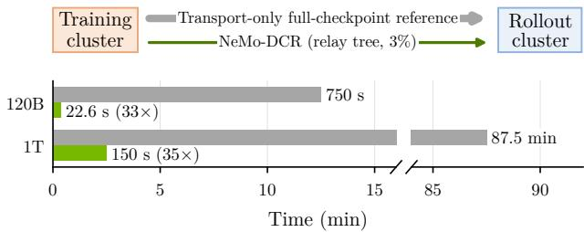  
Figure 1 | NeMo-DCR relay-tree refit at a 3% element change rate versus the transport-only full-checkpoint reference: 22.6 s instead of 750 s at 120B and 150 s instead of 87.5 min at 1T (§§ 8.5 and 8.6).

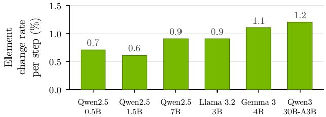  
Figure 2 | Element change rate per optimizer step, averaged over each model’s first five steps with the setup of Appendix E: at most 1.2% in every model.

A refit that sends only the changed 1% faces three challenges: placement, exactness, and eficiency.

First, placement: sparse source changes do not tell receivers where or what to write. A training-shard location does not map directly to a receiver’s storage location: refitting may gather, split, or permute tensors between training and rollout layouts [26]. A change to a shared scale factor can also alter converted values even when other source values stay unchanged [25]. Some systems reimplement the serving runtime’s placement rules [6, 26], and others extract a delta after full-tensor assembly and conversion, which handles both problems but pays for both steps [11].

Second, exactness: a smaller transfer must still deliver the exact updated bits, because rollout–training mismatch is known to destabilize RL [28]. Arithmetic reconstruction can introduce floating-point rounding errors [26], while absolute overwrites avoid rounding [19] but resend unchanged bits within changed values. Failures also threaten exactness: applying updates in place avoids a separate receiver-side baseline copy, but an interrupted refit can leave a mixture of old and updated values that matches neither policy version. Because a delta applies only to the version it was computed from [19], recovery must complete the interrupted refit before rollout resumes and keep receivers aligned with the source baseline that the next refit compares against.

Third, eficiency: delivery must overlap the other refit stages without a cross-cluster collective. The next rollout batch waits for the complete update, so without overlap, delta construction and application can ofset the transfer savings. A cross-cluster collective couples receiver membership to the training cluster and introduces timeouts upon failure [23]. Some deployments share weights only through object storage [3], and others have direct links between clusters [40], so delivery must support both.

Existing systems meet these challenges only in part: they either send every weight or lack exactness, native placement, decoupled delivery, or recovery, so none meets all five requirements in Table 1. We present NeMo-DCR, a system for bit-exact delta refit that meets all five: it sends only changes, yet every receiver obtains the same parameter and bufer bits as a dense refit that sends every weight. The key idea is to describe changes in canonical coordinates, the tensor names and indices of the Hugging Face checkpoint format that both training and serving already support. Fixed afine index mappings project changes directly into these coordinates and cover over 96% of the weight bytes in the mixture-of-experts (MoE) checkpoints. The serving runtime’s native loader then maps these coordinates to receiver storage, much as a page table maps virtual to physical addresses. Building on canonical coordinates, this paper makes four contributions that address these three challenges:

1. Direct projection and residual conversion. One training rank per shard acts as its owner, which detects changes in stored values and projects afine changes into canonical coordinates. Residual conversion compares converted tensors with a distributed residual baseline to cover the other changes, including those from shared scale factors. Avoiding full-tensor assembly and conversion for afine changes makes Qwen3 delta construction 1.08–1.16× faster at 3% and 5% element change rates (§§ 4 and 8.3).

2. Mixed XOR/overwrite encoding with compression. XOR encodes non-overlapping afine changes whose projection and loader preserve stored bits, while overwrites encode all others. Both are exact, and mixed encoding cuts Qwen3 payload bytes by 38–40% versus overwrites (§§ 5, 8.2, and 8.3).

3. Recoverable in-place refits. Receivers leave placement to the native loader and apply updates in place, keeping no separate receiver-side baseline copy. Retries overwrite the complete changed set, repairing partial writes. After all current receivers apply the updates, a joint commit binds the policy to its source baseline, which owners then update in place. Proposition 1 guarantees bit-exactness. With receivers killed mid-refit, both NeMo-DCR transports follow the mean reward and KL trajectories of dense NCCL refits (§§ 6, 8.1, and 8.4).

4. Pipelined delivery without a cross-cluster collective. Payloads travel over object storage or a relay tree as the delta is built and, in synchronous RL, applied. In asynchronous RL, rollout continues serving requests until the delta has been transferred and staged, then pauses while receivers apply it. At 3% and 5%, relaytree transport overlaps delta construction, and the transport lower bound accounts for 77–94% of the refit latency (§§ 7 and 8.7).

Together, these contributions make NeMo-DCR refits of 30B–1T models 12–40× faster than the transportonly full-checkpoint reference (§§ 8.5 and 8.6), even in stress cases whose 3% and 5% element change rates exceed every rate in Figure 2. The same code handles Qwen3 and hybrid Mamba-Transformer Nemotron models without model-specific logic. At 1T and 3%, the relay tree takes 150 s instead of 87.5 min (Figure 1), making refits practical for cross-cluster agentic RL at trillion-parameter scale.

Table 1 | Refit approaches scored against the five requirements of § 2.3. Only NeMo-DCR meets all five.
<table><tr><td>Approach</td><td>Systems</td><td>Bit-exact Delta Native Decoupled Recovery G1</td><td>G2</td><td>G3</td><td>G4</td><td>G5</td></tr><tr><td rowspan="2">A Dense collective refit</td><td>NCCL-Reshard [23]</td><td>√</td><td></td><td>(√)</td><td></td><td>(√)</td></tr><tr><td>checkpoint-engine [20]</td><td>√</td><td></td><td>√</td><td>1</td><td>(√)</td></tr><tr><td>(B Full-checkpoint transfer</td><td>TensorHub [40]</td><td>√</td><td></td><td>(√)</td><td>√</td><td>(√)</td></tr><tr><td rowspan="3">C )Arithmetic reconstruction</td><td>ROSE [6]</td><td></td><td>√</td><td></td><td>√</td><td></td></tr><tr><td>AReaL-DTE [26]</td><td></td><td>√</td><td>(√)</td><td>√</td><td>(√)</td></tr><tr><td>AuroraRL [30]</td><td></td><td>√</td><td></td><td>√</td><td>(v)</td></tr><tr><td rowspan="3">D) Absolute overwrites</td><td>PULSE [19]</td><td>(√)</td><td>√</td><td>一</td><td>√</td><td>(√)</td></tr><tr><td>SparseRL-Sync [11]</td><td>(√)</td><td>√</td><td>√</td><td></td><td></td></tr><tr><td>verl [36]</td><td>(√)</td><td>√</td><td>√</td><td></td><td></td></tr><tr><td>Bit-exact delta refit</td><td>NeMo-DCR</td><td>√</td><td>√</td><td>√</td><td>√</td><td>√</td></tr></table>

✓ means met, (✓) partly met, and – not met or not described in the cited source. Details: Appendix F.

## 2. Motivation and Requirements

## 2.1. Refit across layouts and versions

Training systems and serving runtimes store the same policy in diferent layouts. Training systems shard parameters, gradients, and optimizer state to fit into GPU memory while maximizing update throughput [21, 29]. Serving runtimes organize weights for inference and maintain request state such as a paged key-value (KV) cache [15]. RL systems that coordinate the training and rollout sides must bridge the two layouts [10, 13, 32]. The two sides choose their parallel degrees independently, so one training shard can overlap several rank-local slices on receivers, and one slice can combine parts of several shards (Figure 3).

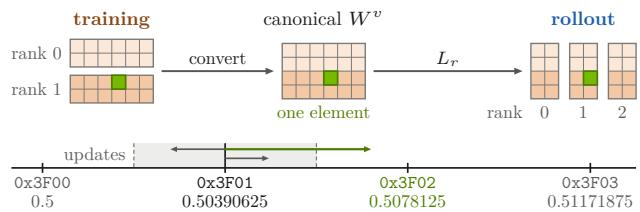  
Figure 3 | Top: one tensor in the training, canonical, and rollout layouts. Bottom: BF16 values near 0.5, labeled by their stored bits in hexadecimal. Values in the shaded interval round to 0x3F01, and only an update crossing its boundary changes the stored bits.

Both layouts map to canonical tensors: the model’s tensors in the Hugging Face checkpoint’s naming and layout, independent of either cluster’s sharding. Let $W ^ { v }$ denote the canonical tensors at version �, includ ing versioned bufers. A receiver � does not store �� directly. Its native loader $L _ { r }$ is the serving runtime’s own weight loader and may split, combine, skip, transpose, or cast tensors before writing rank-local storage $P _ { r } ^ { v } = L _ { r } ( W ^ { v } )$ . For example, vLLM fuses the query, key, and value projections and splits routed experts across ranks. Each sequence of such operations is a loader path, and we consider loader paths whose output elements each come from one canonical element.

A refit must bring each receiver to $P _ { r } ^ { v + 1 } = L _ { r } ( W ^ { v + 1 } )$ the result of a dense refit. Dense collective refit and full-checkpoint transfer produce this result by sending every weight, and Table 1 lists them as approaches A and B. We call the update to version �+1 a transition, which may take several attempts. Each attempt updates the current receivers, called its required receivers.

## 2.2. Few BF16 values change per step

How many values a refit must update depends on training: an update changes a stored BF16 value only when it crosses a rounding boundary (Figure 3), so larger learning rates and early training steps change more stored values. Yet even in the first five steps of Group Relative Policy Optimization (GRPO) [31], the six models in Figure 2 show only 0.6–1.2% average element change rates, counting each unique source element once. Appendix E details the setup, which follows an agentic software-engineering (SWE) RL recipe with a constant $1 0 ^ { - 6 }$ learning rate.

## 2.3. Requirements and related work

To exploit this sparsity, a refit must meet five requirements that make placement (G3), exactness (G1 and G5), and eficiency (G2 and G4) concrete (Table 1). G1 Bit-exact: starting from receiver storage $P _ { r } ^ { v }$ , a delta refit must produce the same parameter and bufer bits as a dense refit. G2 Delta: transfer volume must scale with the emitted changed values, their locations, and payload metadata. G3 Native: the native loader must determine placement, with no model-specific placement rules in the refit system. G4 Decoupled: no collective may span the training and rollout clusters. G5 Recovery: receivers must suppress duplicate payloads, partial writes must be recoverable, and one authoritative commit record must bind each new policy version to its source baseline after every required receiver holds its new storage ��<sup>+1</sup><sub>�</sub> . No existing system in Table 1 fully meets G5, and each fully meets at most two of the five requirements.

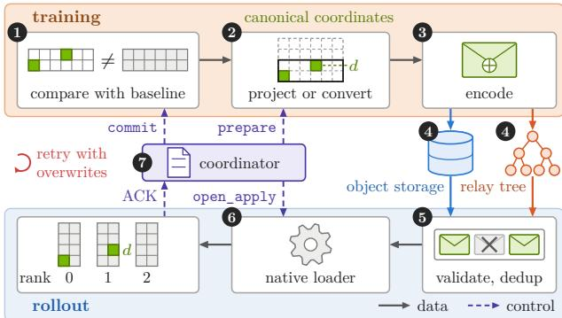  
Figure 4 | NeMo-DCR architecture and the numbered steps of a refit. The coordinator calls prepare to start an attempt and open\_apply to let receivers apply payloads and then acknowledge (ACK).

Other systems that ship policy weights to serving runtimes are limited in scalability or eficiency: they send full checkpoints, rebuild full weights from deltas, or support only unsharded runtimes. INTELLECT-2’s SHARDCAST relays checksummed full checkpoints in pipelined shards [27]. In Composer 2 and Fireworks, trainers upload per-step deltas to shared storage, from which inference clusters rebuild full weights [3, 5]. TRL’s delta sync likewise rebuilds full tensors from a CPU snapshot [12], and the slime framework applies XOR or overwrite deltas to a full local checkpoint and reloads it at every refit [33]. vLLM patches runtime parameters in place, but doesn’t support any parallelism [37].

Related techniques target training trafic, fine-tuning, file transfers, or storage rather than policy refits: gradient compression [17, 38], low-rank adaptation [9], delta file transfer and lossless weight compression [8, 34], and compression of fine-tuning deltas and checkpoints [4, 16, 18, 39].

## 3. Design Overview

Canonical coordinates split a refit into delta construction and receiver-side placement. Figure 4 numbers the seven steps: owners construct deltas, a transport delivers them, receivers apply them, and the coordinator, which drives each attempt, publishes the policy with a joint commit. The next four sections (§§ 4–7) explain these steps in detail and develop the four contributions in turn: projection and conversion, encoding, application and recovery, and delivery.

Projection and conversion (❶–❷, §4). Shard owners compare their weights with the source baseline and directly project changes covered by afine mappings, which are fixed and convert each source element independently. The rest are residual: their canonical tensors must be constructed first (contribution 1).

Encoding (❸, §5). The codec encodes a change as an XOR entry when projection and the loader path preserve stored bits and no other write overlaps it, and as an overwrite entry otherwise (contribution 2). The first three steps together meet G1 and G2.

Application and recovery (❺–❼, §6). Each receiver validates and deduplicates payloads, then applies their XOR or overwrite entries in place through the native loader. Failed attempts are retried with overwrites. After every required receiver acknowledges, the coordinator’s joint commit binds the policy version to its source baseline (contribution 3). These steps together meet G1, G3, and G5.

Delivery (❹, §7). Object storage or the relay tree delivers the entries in payloads without a crosscluster collective (G4). Streaming overlaps delivery with delta construction and, in synchronous RL, also with application (contribution 4).

Example. Suppose that a BF16 element changes its stored bits from 0x3F01 to 0x3F02 in a matrix sharded by rows in training and by columns in rollout. Its owner detects the change (❶), projects it to its canonical destination � (❷), and emits the XOR mask 0x0003 in a compressed payload (❸). The payload reaches every rollout node (❹), and each node’s receivers validate it (❺). Each receiver whose column slice holds � intercepts the loader’s final storage copy in order to XOR 0x0003 into 0x3F01 (❻). The joint commit publishes the updated policy, and the owner’s baseline becomes 0x3F02 (❼).

Implementation. NeMo-DCR is about 7K lines of Python. It builds on Megatron Bridge conversion [25] and the vLLM native loader [15].

## 4. Direct Projection and Residual Conversion

In ❶–❷ of Figure 4, NeMo-DCR compares each training shard with its source baseline in place, on the shard owners: direct projection avoids full-tensor assembly and conversion for afine changes, and residual conversion covers the other changes.

The changes that an owner can directly project depend on the conversion tasks through which the Megatron Bridge library converts training shards to canonical tensors [25]. Afine tasks convert each source element independently and deterministically with the fixed afine index mappings of supported mapping classes, such as those for replicated and row- or column-split shards. Tasks for fused query/key/value $\mathrm { ( Q / K / V ) }$ source tensors and other tasks outside the supported mapping classes are residual and require constructing canonical tensors. Afine mappings cover 96.3% of the weight bytes in the Qwen3-30B-A3B checkpoint and 97.0% in the Nemotron-3-Ultra-550B-A55B checkpoint, both MoE models, as Appendix D details.

## 4.1. Ownership and change detection

In ❶, only one owner compares each unique source element against the source baseline, because dataparallel training keeps its replicas bitwise identical. A stable name hash balances ownership across dataparallel ranks (Figure A.2) and keeps it fixed across the attempts of a transition.

Owners detect changes against the committed source baseline $B ^ { v }$ . It contains a task tracker for each con version task, holding the version-� values of the task’s source shard, and a distributed residual baseline of canonical tensors for residual tasks. Because each unique source element has one owner, the trackers together hold one copy of the source weights. For task $T ,$ let $S _ { T } ^ { v + 1 }$ be the candidate shard, $A _ { T } ^ { v }$ its tracker, and $J _ { T }$ its owned indices. Let $I ( X ) _ { j }$ denote the stored bit pattern of � at $j .$ . The changed indices are

$$
C _ { T } = \{ j \in J _ { T } \mid I ( S _ { T } ^ { v + 1 } ) _ { j } \neq I ( A _ { T } ^ { v } ) _ { j } \} .
$$

Comparing stored bits detects all changes, even those that floating-point equality would miss (Figure A.2).

Baseline memory. The baseline uses host memory, not GPU memory. Beyond one copy of the source weights in the trackers, it holds the canonical tensors of residual tasks, which are 3.69% of the Qwen3-30B-A3B checkpoint and 3.01% of the Nemotron-3-Ultra-550B-A55B checkpoint. It thus totals about 1.04× and 1.03× the respective checkpoint. Balanced ownership spreads it across the training ranks: for the 1,121 GB Nemotron-3-Ultra-550B-A55B checkpoint, each of the 32 training ranks of § 8.1 holds about 36 GB.

## 4.2. Direct projection

In ❷, fixed shard geometry and index mappings let an owner compute the canonical destination of each change locally. For a changed index � of afine task $T ,$ the index mapping $\pi _ { T }$ identifies the canonical destination, and the source projection $Q _ { T }$ produces its updated value:

$$
d = \pi _ { T } ( j ) , \qquad o _ { T } ^ { v + 1 } ( j ) = I ( Q _ { T } ( S _ { T } ^ { v + 1 } ) ) _ { d } .\tag{1}
$$

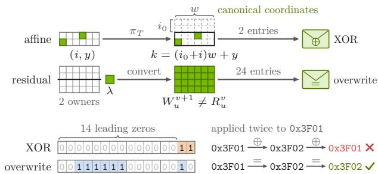  
Figure 5 | Top: afine and residual changes. Bottom: XOR and overwrite entries of the example, each applied twice to 0x3F01.

Here, $d = ( n , k )$ identifies a canonical tensor name and flat index, and $o _ { T } ^ { v + 1 } ( j )$ is the updated stored value.

The owner emits each change once for all receivers without knowing their storage ofsets. In the example of $\ S \ 3 ,$ , a changed local element $( i , y )$ in a row shard that begins at row $i _ { 0 }$ maps to canonical destination $( n , k )$ , where $k = ( i _ { 0 } + i ) w + y$ for � columns (Figure 5). Each receiver’s native loader then selects its own column slice.

## 4.3. Residual conversion

In ❷, residual conversion covers residual tasks, which fall outside direct projection because they lack a supported mapping, can spread a source change across several outputs, or combine inputs from several owners. Examples include stacking, padding, tied weights, adapters, custom postprocessing, and quantization scales. For these tasks, NeMo-DCR constructs the afected canonical tensors and compares their bits with the committed residual baseline (Figure 5).

Change detection covers every input of a conversion because a change in a shared scale factor � can alter many converted values even when the other source values stay unchanged. For example, a fixed conversion rule may multiply each source value by � and cast the product. Owners set a flag when a residual task’s shard changes (Figure A.4). Combined with known conversion dependencies, the flags select every canonical tensor afected directly or indirectly. The selected tensors form the required tensor set $\mathcal { U } _ { \mathrm { r e q } }$ The delta omits outputs whose converted bits remain unchanged.

For each selected tensor $u ,$ the owners convert their parts, and a canonical-name hash selects the residual-baseline owner that assembles these parts (Figure A.4). The parts must jointly cover every element of �, and overlapping parts must agree bitfor-bit. Comparing the assembled result $W _ { u } ^ { v + 1 }$ with its committed residual baseline $R _ { u } ^ { v }$ gives

$$
D _ { u } = \{ ( n _ { u } , k ) \mid I ( W _ { u } ^ { v + 1 } ) _ { k } \neq I ( R _ { u } ^ { v } ) _ { k } \} ,
$$

where $n _ { u }$ is the canonical name. Residual tensors outside $\mathcal { U } _ { \mathrm { r e q } }$ keep their committed values.

Both paths feed one changed set: the emitted destinations combine direct projections � $\left( C _ { T } \right)$ and residual changes $D _ { u }$ . Each emitted destination has a delta record with its updated value, and these records form the complete changed set ℰ that the codec encodes.

## 5. Mixed XOR/Overwrite Encoding with Compression

In ❸, the XOR/overwrite encoding keeps reconstruction exact, and XOR also improves compression. Delta records in canonical coordinates share one codec and one payload format: the afine/residual path decides how a record is built, and the XOR/overwrite encoding decides how it is applied.

Exact encoding rules out arithmetic reconstruction, which can fail to recover the updated stored values: for an old value � and an updated value $\beta ,$ rounding can make $\alpha + ( \beta - \alpha )$ difer from $\beta ,$ and such errors can accumulate across versions. NeMo-DCR instead sends either XOR masks of stored values or absolute overwrites. Both reproduce the new bits exactly: a mask flips only the bits that difer, and an overwrite replaces the whole stored value.

For direct projection, the mask of changed index $j$ i

$$
\begin{array} { r } { x _ { T } ^ { v + 1 } ( j ) = I ( S _ { T } ^ { v + 1 } ) _ { j } \oplus I ( A _ { T } ^ { v } ) _ { j } . } \end{array}\tag{2}
$$

However, the mask yields the target bits only on a representation-preserving path, where the source projection $Q _ { T }$ and native loader preserve dtype and stored bits. In the shared-scale example of § 4.3, multiplication and casting change stored bits, so a source mask does not carry over to the converted values (Figure D.1). Comparison with the residual baseline finds such changes after conversion, and absolute overwrites carry the converted bits.

To exploit unchanged bits within changed values, the default mixed mode uses XOR entries $( d , x )$ wherever an afine path is representation-preserving and no other write touches the same bytes. These conditions are decided in advance for each mapping class and loader path (Figure D.1). All other records become overwrite entries $( d , o )$ . In the two MoE checkpoints of $\ S \ 4 ,$ , most conversions are afine and preserve stored bits, so XOR covers more than 96% of the weight bytes, as Appendix D details.

XOR entries also compress well: small updates often leave high-order bits unchanged, so XOR masks contain many leading zeros. In the example of § 3, the XOR mask 0x0003 has 14 leading zero bits (Fig ure 5). Run-length and gap coding shrink location bytes, and level-1 zstd [2] then compresses both values and locations in each payload.

Yet XOR makes duplicate delivery unsafe: applying a mask twice restores the old bits (Figure 5), so receivers suppress duplicate payloads by their identifiers. For the same reason, retries repair partial writes with overwrites.

## 6. Recoverable In-Place Refits

In ❺–❼, native-loader placement and overwrite recovery allow in-place refits from canonical coordinates without a receiver-side baseline copy. Reimplementing placement would duplicate the rules for fused $\mathrm { Q / K / V } ,$ , routed experts, slicing, padding, transposition, and tied weights. NeMo-DCR instead lets the native loader apply these rules, intercepts the loader’s final storage copies, and specifies loader conditions that guarantee dense-refit bits. Overwrite recovery repairs partial writes, and a joint commit keeps receiver storage and the source baseline in version alignment: each transition starts with every required receiver at the committed version.

## 6.1. Applying deltas through the native loader

Receivers apply payloads through the native loader one item at a time, where an item holds one owner’s entries for one tensor. After validating and deduplicating payloads (Figure B.2), each receiver scatters each item into a reusable host scratch bufer with the canonical tensor’s shape and dtype. Positions without an entry are inactive and hold a placeholder � (Figure $6 ,$ top). The loader resolves names and transforms the scratch, while a PyTorch dispatch hook updates only active positions at the loader’s final storage copies.

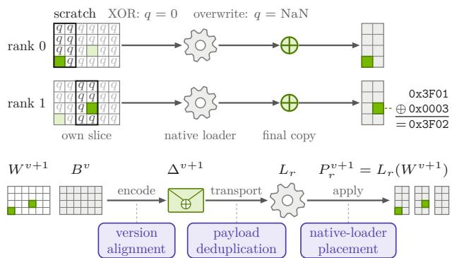  
Figure 6 | Top: applying one item in ❻ of Figure 4. Bottom: the chain of Proposition 1 and the property used at each arrow.

XOR path. Scratch holds the placeholder $q = 0$ except for masks at changed positions, such as 0x0003 at � in the example. The intercepted copy XORs each mask into the matching resident element, and the copy’s input must share storage with scratch so the masks arrive unchanged. XOR with $q ~ = ~ 0$ leaves inactive positions unchanged.

Overwrite path. Scratch holds overwrite values and a placeholder that must stay distinct from these values until the first intercepted copy into each destination view. At that copy, non-placeholder positions form the view’s boolean active mask of positions to update (Figure A.10). NaN is the default placeholder.

Receiver memory. Beyond resident weights, receivers keep only the scratch, staged payloads, and temporary bufers for active masks and optional post-apply checks of intercepted copies (Figures C.2 and A.12). A prewarm call reserves scratch for the largest canonical tensor and identifies the tensors that the native loader skips on each rank, such as routed experts held by other ranks.

Loader conditions. Exact delta application requires intercepting every storage write: the tensors the loader reports as loaded must match the intercepted copies, and an item without an intercepted copy requires an explicit native skip (Figure A.8). The loader must transform each canonical value independently and deterministically throughout the transition. XOR byte ranges must be disjoint from all other writes, and overlapping overwrites must yield the same bits as a dense refit. NeMo-DCR rejects unsupported loader paths in advance and fails any attempt whose copy breaks these conditions (Table A.2).

## 6.2. Equivalence to a dense refit

Under these conditions, a NeMo-DCR refit is bitexact. Let $\Delta ^ { v + 1 }$ encode $\mathcal { E } _ { : }$ and let apply apply $\Delta ^ { v + 1 }$ at required receiver $r ,$ starting from its storage $P _ { r } ^ { v }$

Proposition 1 (Dense-refit equivalence). If a first attempt passes every check before its commit and the assumptions of Table A.3 hold, including fixed candidate weights $W ^ { v + 1 }$ , committed baseline, source ownership, conversion rules, and loader settings until the commit, then

$$
\mathrm { b i t s } \big ( \mathrm { a p p l y } _ { r } ( \Delta ^ { v + 1 } , P _ { r } ^ { v } ) \big ) = \mathrm { b i t s } \big ( L _ { r } ( W ^ { v + 1 } ) \big ) \forall r ,\tag{3}
$$

where bits reads all rank-local parameter and bufer storage but excludes request state such as the KV cache, which each transition invalidates.

Proof sketch. XOR reconstructs each new value from the resident version-� bits (Figure A.13, top). Overwrite supplies the value itself. Every changed destination has a record, and destinations without a record keep their version-� bits, which already match a dense refit because their canonical elements did not change. The bottom of Figure 6 outlines the argument, and Appendix A gives the full statement and proof.

## 6.3. Overwrite recovery and joint commit

Overwrite retries extend Proposition 1 to transitions whose first attempt fails. Partial writes from a failed attempt leave receivers with a mixture of old and updated values. NeMo-DCR stops the failed attempt and waits until its writes can no longer take efect, then recomputes the complete changed set from the same candidate weights and unchanged $B ^ { v }$ . Every record becomes an absolute overwrite, supplying the target bits regardless of which earlier writes completed (Figure A.14). The retry thus yields $L _ { r } ( W ^ { v + 1 } )$ . Receiver membership changes take efect only between attempts, and new or restarted receivers restore the committed version through a dense refit before joining.

At the end of an attempt, the joint commit publishes the updated policy and binds it to its source baseline in a durable, versioned commit record that a control plane holds and changes only by compare-and-set. The coordinator commits after all required receivers have received every expected payload and finished application, device synchronization, and optional postapply checks. A commit succeeds only if the commit record still equals the version-� record $K ^ { v }$ . Owners then update the task trackers and residual baseline in place (Figure B.3). This update finishes before the transition ends or change detection resumes, so the next delta uses the committed baseline.

The commit record also makes coordinator failover safe: a new coordinator reads the same commit record before deciding whether to retry. Appendix B specifies the protocol as Algorithm B.2, with commit deadlines and the control-plane conditions for failover.

## 7. Pipelined Delivery without a Cross-Cluster Collective

In ❹, pipelined delivery over object storage or a relay tree overlaps other refit stages without a cross-cluster collective. Owners emit the payloads, and both transports share the refit protocol of Appendix B.

## 7.1. Object-storage and relay-tree delivery

Payload bytes scale with emitted values, locations, and metadata, but transport topology and retries determine how often payloads cross the cluster boundary.

Let $V _ { \mathrm { p a y l o a d } }$ be the total bytes in unique compressed payloads before replication to receivers, and $V _ { \mathrm { c r o s s } }$ the bytes crossing that boundary.

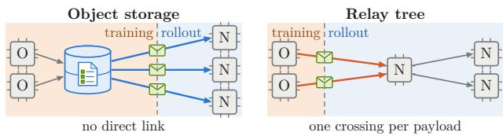  
Figure 7 | Logical payload movement per attempt in ❹ of Figure 4, with owners O, rollout nodes N, and the object-storage manifest of expected payloads.

Object storage. This transport separates uploading from downloading (Figure 7, left). Owners upload each payload once and list it in a per-attempt manifest of expected payloads. Rollout nodes fetch every listed payload without a direct link. One stored copy in canonical coordinates serves every rollout node, but each download crosses the cluster boundary, so �<sub>cross</sub> grows with the number of rollout nodes. A retry uploads the complete changed set again.

Relay tree. Where direct links exist, this transport streams each owner’s payloads to one root in the rollout cluster (Figure 7, right). The root forwards payloads through a balanced tree over local links, and each node’s receivers apply them. Without retransmission, each payload crosses the cluster boundary once per attempt, so �<sub>cross</sub> ≈ �<sub>payload</sub>. Appendix B details both transports.

## 7.2. Overlapping refit stages

Overlap matters because payload volume scales with the changed set, whereas delta construction cost scales with model size: construction scans source shards and converts required residual tensors. To overlap delta construction and delivery, owners group whole tensors into chunks for comparison and pack the resulting records into buckets, each compressed into one payload (Figure 8, top). Buckets amortize the overhead of metadata, compression, and transfer.

In Figure 8 bottom, owners construct bucket ℓ+1 while payload ℓ is sent. After open\_apply, receivers in synchronous RL apply ℓ while ℓ+1 arrives. Bounded queues slow upstream stages when receivers fall behind, limiting the number of decoded payloads held in memory. Pipeline startup and drain leave stages idle.

A request gate shields requests from partially applied weights and closes at diferent times in synchronous and asynchronous RL. In synchronous RL, the coordinator closes it when the first attempt starts, and receivers apply payloads during delivery (Figure 8, bottom). In asynchronous RL, receivers stage the compressed delta in host memory while rollout keeps serving version �. After the last payload arrives, the coordinator closes the gate, and receivers apply the delta in place once current requests finish. The gate reopens when the transition ends.

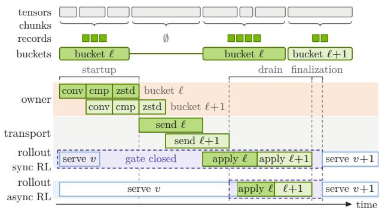  
Figure 8 | Top: chunks group whole tensors, and buckets pack their records. An unchanged chunk has none (∅) and adds nothing to bucket ℓ, which continues past it. Bottom: stage timeline of residualtask buckets in ❷–❼ of Figure 4 with conversion (conv), comparison (cmp), and the request gate.

## 8. Evaluation

Research questions (RQs) 1–3 and 6 test the four contributions, and each subsection names the contributions it tests. RQs 4–5 test their combined efect.

RQ1. How much smaller are XOR masks than overwrite values after compression? (§ 8.2) RQ2. How do direct projection and XOR encoding change construction time and bytes? (§ 8.3) RQ3. Are refits bit-exact, and does training under kills follow dense NCCL? (§ 8.4) RQ4. How much faster is a NeMo-DCR refit than the reference at 120B? (§ 8.5) RQ5. How do latency and speedup change as models grow from 30B to 1T? (§ 8.6) RQ6. How much of refit latency do relay-tree transport and delta construction occupy? (§ 8.7)

## 8.1. Experimental setup and bit-exactness

Testbed. The latency testbed has 32 NVIDIA GB300 GPUs on eight training nodes in one AWS region and 64 H100 GPUs on eight rollout nodes in another. The object-storage transport uses Amazon S3. Each node’s cross-cluster flow was measured at up to 5 Gbps. The latency runs use the BF16 Nemotron and Qwen3-235B-A22B checkpoints of Table C.1, with sizes from 63.2 to 2,242 GB, where 1 GB is 10<sup>9</sup> bytes. The 1T checkpoint doubles the layers of Nemotron-3-Ultra-550B-A55B. We run five warm-up refits and then ten timed refits for each training-side configuration of parallel layout and replica count. The ten timings of each configuration span less than 1 s from minimum to maximum. We average them, then average these means with equal weight.

Refit settings. Both transports use direct projection and the same mixed-mode codec and boundedqueue policy, with the chunk, bucket, and queue sizes of Appendix C. The latency runs use synchronous RL, the training runs use asynchronous RL, and neither uses model-specific logic.

Element change rates. Latency and delta construction runs use 3% or 5% element change rates as stress cases, since both exceed every rate in Figure 2. Changed source elements are chosen uniformly from each owner’s shards and updated with a relative amplitude of about $1 0 ^ { - 2 }$ . Replicated copies receive the same changes.

Timed window. Refit latency covers comparison and projection, residual conversion, encoding and zstd, transport, receiver staging, loader application, device synchronization, ACK, joint commit, and the in-place baseline update (Figure C.5). It excludes benchmark change injection, post-apply checks, and one-time work such as model loading, initial baseline construction, and receiver prewarm.

Reference. The two clusters share no InfiniBand or Elastic Fabric Adapter (EFA) route for NCCL. Of approaches A–D in Table 1, only full-checkpoint transfer meets both G1 and G4. We therefore use a transport-only full-checkpoint reference: each training node uploads an eighth of the checkpoint to shared object storage, and each rollout node then downloads all of it (Figure C.5). The reference excludes checkpoint save and load, to its advantage, whereas NeMo-DCR refit latency includes every stage of the timed window. Speedup is reference time divided by refit latency.

Bit-exactness. Comparisons with dense refits from the same candidate weights confirmed bitwise equality of every parameter and bufer element, including unchanged elements, in the evaluated BF16 receiver configurations. Every measured NeMo-DCR refit also passed its post-apply checks over all written parameter and bufer bits.

## 8.2. XOR masks are 1.7–2.2× smaller

XOR masks are 1.7–2.2× smaller than overwrite values after zstd level-1 compression (contribution 2, Table 2). We generate 20 million standard-normal values directly in BF16 and add independent Gaussian noise with standard deviation $a \in \{ \bar { 1 } 0 ^ { - 4 } , 1 0 ^ { - 3 } , 1 0 ^ { - 2 } \}$ in FP32. We round each result to the nearest BF16 value, as BF16 training does. The comparison isolates value encoding: XOR and overwrite streams encode the same changed words in input order, without locations or metadata, as Appendix C details.

Table 2 | Compressed changed-value sizes for 20 million synthetic BF16 inputs, where 1 MB is $1 0 ^ { 6 }$ bytes.
<table><tr><td>deviation a</td><td>Noise standard Overwrite ↓ XOR ↓ Reduction ↑ (MB) (MB)</td><td></td></tr><tr><td> $1 0 ^ { - 4 }$ </td><td>0.74</td><td>0.33 2.21×</td></tr><tr><td> $1 0 ^ { - 3 }$ </td><td>7.02</td><td>3.23 2.18×</td></tr><tr><td> $1 0 ^ { - 2 }$ </td><td>25.70</td><td>14.93 1.72×</td></tr></table>

## 8.3. Projection saves time, XOR saves bytes

Direct projection makes Qwen3 delta construction 1.08–1.16× faster than full conversion, and XOR encoding cuts payload bytes by 38–40% versus overwrites only (contributions 1 and 2, Table 3). We compare three delta construction modes in the 3% and 5% stress cases on Qwen3-30B-A3B and Qwen3-235B-A22B, which use the same mapping classes. Mode X uses direct projection with mixed XOR/overwrite encoding, P uses direct projection with overwrites only, and F uses full conversion, which assembles and converts full tensors, with overwrites only. P versus F isolates direct projection, and X versus P isolates XOR encoding. Mode X spends 7–13% more construction time than P, yet it is the default because transport dominates relay-tree refit latency (§ 8.7).

## 8.4. Training follows dense NCCL under receiver kills

With receivers killed mid-refit, both NeMo-DCR transports follow dense NCCL’s mean reward and KL trajectories (contribution 3, Figure 9). To exercise in-place application and overwrite retries on receivers that survive a kill, we train Qwen3-30B-A3B on agentic tool calls for 50 GRPO steps with the settings of Appendix E. Training and rollout each use four H100 nodes on a second testbed. We compare three methods: a dense NCCL refit that sends every weight, object-storage NeMo-DCR, and relay-tree NeMo-DCR. These runs use real training updates, which change 1.2% of elements per step on average. KL is the estimated per-token KL divergence between rollout and training policies.

Every five steps in each NeMo-DCR run, we pick a vLLM instance uniformly at random, kill it mid-refit, and restart it five steps later (Figure E.1). Each kill fails the in-flight attempt, and the overwrite retry repairs any partial writes on the other receivers. Restarted receivers restore the committed version before rejoining. We run each method five times, and each NeMo-DCR run uses independent random choices. In these runs, every NeMo-DCR refit and overwrite retry passed all of its configured post-apply checks. Over the 50 steps, mean reward is 0.41 for dense NCCL and both NeMo-DCR transports.

BF16 checkpoint size (GB)  
Table 3 | Qwen3 delta construction time and payload size before replication. An arrow names the only diference between its modes.
<table><tr><td colspan="4">direct projection mixed XOR/overwrite</td></tr><tr><td rowspan="2"></td><td>X</td></tr><tr><td>↓XOR projection P</td></tr><tr><td>overwrites only</td><td></td><td>F P=F (GB)</td></tr><tr><td>Qwen3 Change rate X</td><td>(s) P (s) F (s) X (GB)</td></tr><tr><td>3%</td><td>2.96 2.77</td></tr><tr><td>30B</td><td>3.20 1.49 2.44 2.99 3.29</td></tr><tr><td>30B 5% 3.23</td><td>2.29 3.80</td></tr><tr><td>235B 3% 20.23</td><td>18.38 19.87 11.37 18.42</td></tr></table>

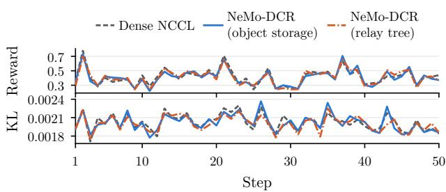  
Figure 9 | Qwen3-30B-A3B reward and per-token KL, averaged over five runs. Mid-refit receiver kills occur only in NeMo-DCR runs.

## 8.5. 15–33× faster refits at 120B

Including delta construction and loader application, 120B refits on both transports take 22.6–49.7 s and are 15.1–33.2× faster than the reference (Table 4). Before replication, compressed payloads including locations total 2.4–3.8% of the 247.2 GB checkpoint, 21–24% less than the uncompressed changed values alone, about 3% or 5% of the checkpoint.

Table 4 | Mean 120B refit latency versus the transportonly full-checkpoint reference. Volume is $V _ { \mathrm { p a y l o a d } }$ for NeMo-DCR and the checkpoint size for the reference, both measured before replication.
<table><tr><td>Method</td><td>Change rate</td><td colspan="3">Latency ↓ Volume ↓ Speedup ↑</td></tr><tr><td>Object storage</td><td>3%</td><td>24.5 s</td><td>5.86 GB</td><td>30.6×</td></tr><tr><td>Relay tree</td><td>3%</td><td>22.6 s</td><td>5.82 GB</td><td>33.2×</td></tr><tr><td>Object storage</td><td>5%</td><td>49.7 s</td><td>9.38 GB</td><td>15.1×</td></tr><tr><td>Relay tree</td><td>5%</td><td>41.6 s</td><td>9.35 GB</td><td>18.0×</td></tr><tr><td>Reference</td><td>N/A</td><td>750 s</td><td>247.2 GB</td><td>1×</td></tr></table>

## 8.6. 12–40× faster from 30B to 1T

With either transport, refits of 30B–1T models stay 12–40× faster than the reference in the 3% and 5% stress cases, although refit latency grows with checkpoint size, from 8.3–14.5 s at 30B to 150–300 s at 1T (Figure 10). At 5%, the relay tree beats object storage at every size, and its advantage grows from 1.13× at 30B to 1.36× at 1T.

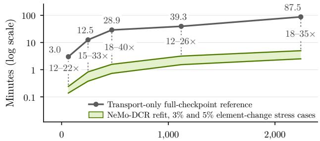  
BF16 checkpoint size (GB)

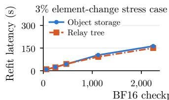

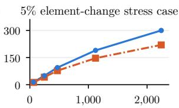  
Figure 10 | Top: reference time and mean NeMo-DCR refit latency. The band spans both transports and change rates, labels give reference minutes, and speedups sit on the dotted lines. Bottom: mean refit latency of each transport.

## 8.7. Relay-tree transport dominates latency

Nsight Systems traces show that relay-tree transport dominates refit latency and overlaps delta construction (contribution 4, Figure 11). The construction lower bound covers comparison, projection, residual conversion, encoding, and zstd. The transport lower bound covers intervals from payload submission until the sending endpoint receives the rollout node’s queueing acknowledgment. Each lower bound is the time its intervals cover on the busiest owner or sending endpoint, counting overlaps once (Figure C.5). No transport interval includes the staging or application of its own payload.

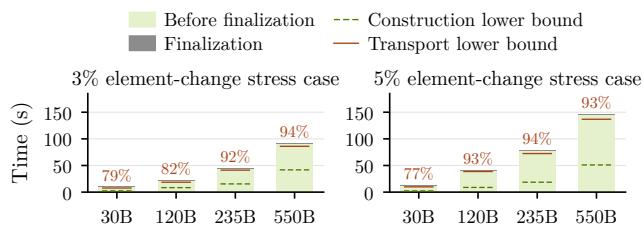  
Figure 11 | Relay-tree refit latency and lower bounds. The percentages give the transport lower bound’s share of mean refit latency.

In the stress cases, the transport lower bound accounts for 77–94% of refit latency, versus 18–45% for the construction lower bound. Pipelined delivery lets delta construction overlap relay-tree transport.

Neither lower bound covers finalization (Figure 8, bottom), which takes 0.2–1.7 s after application and covers device synchronization, ACK, the joint commit, and the in-place baseline update. Refit latency exceeds the larger bound plus finalization by 1.8–9.2 s, spent in startup, drain, and stage handofs.

## 9. Conclusion

Because only about 1% of BF16 values change per step, a delta refit can be much cheaper than a fullcheckpoint transfer if it addresses placement, exactness, and eficiency, which NeMo-DCR does in canonical coordinates through four contributions. Direct projection avoids full-tensor assembly and conversion for afine changes, residual conversion covers the rest, and mixed XOR/overwrite encoding cuts Qwen3 payload bytes by 38–40% versus overwrites. Recoverable in-place refits match dense refits bitwise without a receiver-side baseline copy, and both transports follow dense NCCL’s mean reward and KL trajectories despite receiver kills. The source baseline stays in host memory and totals about one checkpoint across training ranks. Pipelined delivery without a cross-cluster collective overlaps delta construction with relay-tree transport, and the transport lower bound accounts for 77–94% of refit latency.

In the cross-cluster 3% and 5% stress cases for 30B–1T models, refits are 12–40× faster than the transportonly full-checkpoint reference, and the relay tree takes 150 s instead of 87.5 min at 1T and 3%. These results make per-update refits practical for cross-cluster agentic RL at trillion-parameter scale. NeMo-DCR is open source as part of NeMo RL [22].

## References

[1] J.-P. Aumasson, S. Neves, Z. Wilcox-O’Hearn, and C. Winnerlein. BLAKE2: Simpler, smaller, fast as MD5. In Proceedings of the 11th International Conference on Applied Cryptography and Network Security, volume 7954 of Lecture Notes in Computer Science, pages 119–135. Springer, 2013. doi: 10.1007/978-3-642-38980-1\_8.

[2] Y. Collet and M. S. Kucherawy. Zstandard compression and the ‘application/zstd’ media type. RFC 8878, Internet Engineering Task Force, 2021. URL https://www.rfc-editor.org/rfc/rfc8878.

[3] Cursor Research Team. Composer 2 technical report. arXiv preprint arXiv:2603.24477, 2026.

[4] A. Eisenman, K. K. Matam, S. Ingram, D. Mudigere, R. Krishnamoorthi, K. Nair,

M. Smelyanskiy, and M. Annavaram. Check-N-Run: A checkpointing system for training deep learning recommendation models. In Proceedings of the 19th USENIX Symposium on Networked Systems Design and Implementation, pages 929–943. USENIX Association, 2022.

[5] Fireworks AI. Frontier RL is cheaper than you think. Blog post, archived copy, 2026. Accessed August 2026.

[6] W. Gao, Y. Zhao, D. Muhtar, D. An, X. Shang, T. Wu, L. Cao, S. Xiong, W. Wang, J. Huang, T. Ma, S. Yang, J. Wang, L. Qu, B. Zheng, and W. Wang. ROSE: Rollout on serving GPUs via cooperative elasticity for agentic RL. arXiv preprint arXiv:2605.06534, 2026.

[7] W. Gao, Y. Zhao, T. Wu, S. Xiong, W. Wang, D. An, L. Cao, D. Muhtar, Z. Liu, H. Zhao, J. Huang, S. Yang, Y. Li, W. Su, J. Wang, L. Qu, B. Zheng, and W. Wang. RollArt: Disaggregated multi-task agentic RL training at scale. In Proceedings of the 20th USENIX Symposium on Operating Systems Design and Implementation, pages 863–881. USENIX Association, 2026.

[8] M. Hershcovitch, A. Wood, L. Choshen, G. Girmonsky, R. Leibovitz, O. Ozeri, I. Ennmouri, M. Malka, P. Chin, S. Sundararaman, and D. Harnik. ZipNN: Lossless compression for AI models. In Proceedings of the 18th IEEE International Conference on Cloud Computing, pages 186–198. IEEE, 2025. doi: 10.1109/CLOUD67622.2025.00028.

[9] E. J. Hu, Y. Shen, P. Wallis, Z. Allen-Zhu, Y. Li, S. Wang, L. Wang, and W. Chen. LoRA: Low-rank adaptation of large language models. In Proceedings of the 10th International Conference on Learning Representations, 2022. URL https://openreview.net/forum?id=nZeVKeeFYf9.

[10] J. Hu, X. Wu, W. Shen, J. K. Liu, W. Wang, S. Jiang, H. Wang, H. Chen, B. Chen, W. Fang, Xianyu, Y. Cao, H. Xu, and Y. Liu. OpenRLHF: A Ray-based easy-to-use, scalable and high-performance RLHF framework. In Proceedings of the 2025 Conference on Empirical Methods in Natural Language Processing: System Demonstrations, pages 656–666. Association for Computational Linguistics, 2025. doi: 10.18653/v1/2025.emnlp-demos.48.

[11] L. Hu, R. Zhao, I. Zhu, Z. Zhang, H. Zhang, H. Yin, and J. Zhao. SparseRL-Sync: Lossless weight synchronization with ∼100× less communication. arXiv preprint arXiv:2605.07330, 2026.

[12] Hugging Face. Shipping a trillion parameters with a Hub bucket: Delta weight sync in TRL. Blog post, 2026. Accessed September 2026.

[13] S. Jiang, T. Shi, S. Zhang, Z. Wang, M. Di Francesco, and B. Zhao. Nereus: Adaptive parallelism for LLM post-training. arXiv preprint arXiv:2609.34645, 2026.

[14] Kimi Team. Kimi K2: Open agentic intelligence. arXiv preprint arXiv:2507.20534, 2025.

[15] W. Kwon, Z. Li, S. Zhuang, Y. Sheng, L. Zheng, C. H. Yu, J. E. Gonzalez, H. Zhang, and I. Stoica. Eficient memory management for large language model serving with PagedAttention. In Proceedings of the 29th Symposium on Operating Systems Principles, pages 611–626. ACM, 2023. doi: 10.1145/3600006.3613165.

[16] W. Li, X. Chen, H. Shu, Y. Tang, and Y. Wang. ExCP: Extreme LLM checkpoint compression via weight-momentum joint shrinking. In Proceedings of the 41st International Conference on Machine Learning, volume 235 of Proceedings of Machine Learning Research, pages 27575–27588, 2024. URL https://proceedings.mlr.press/v235/li24m.html.

[17] Y. Lin, S. Han, H. Mao, Y. Wang, and W. J. Dally. Deep gradient compression: Reducing the communication bandwidth for distributed training. In Proceedings of the 6th International Conference on Learning Representations, 2018. URL https://openreview.net/forum?id=SkhQHMW0W.

[18] J. Liu, G. Xiao, K. Li, J. D. Lee, S. Han, T. Dao, and T. Cai. BitDelta: Your fine-tune may only be worth one bit. In Advances in Neural Information Processing Systems 37, pages 13579–13600. Curran Associates, 2024. doi: 10.52202/079017-0434.

[19] E. Miahi and E. Belilovsky. Understanding and exploiting weight update sparsity for communication-eficient distributed RL. arXiv preprint arXiv:2602.03839v2, 2026.

[20] Moonshot AI. Checkpoint Engine: A simple middleware to update model weights in LLM inference engines. GitHub repository, commit d1de07b3, 2026. Accessed August 2026.

[21] D. Narayanan, M. Shoeybi, J. Casper, P. LeGresley, M. Patwary, V. Korthikanti, D. Vainbrand, P. Kashinkunti, J. Bernauer, B. Catanzaro, A. Phanishayee, and M. Zaharia. Eficient large-scale language model training on GPU clusters using Megatron-LM. In Proceedings of the International Conference for High Performance Computing, Networking, Storage and Analysis, pages 1–15. ACM, 2021. doi: 10.1145/3458817.3476209.

[22] NVIDIA. NeMo RL: A scalable and eficient post-training library. GitHub repository, commit 72149d09, 2026. Accessed August 2026.

[23] NVIDIA. NCCL-Reshard refit. NeMo RL pull request #2971, 2026. Accessed August 2026.

[24] NVIDIA. Two-stage SWE RL for Qwen3-30B-A3B-Thinking. NeMo RL guide, commit b7a4d95d, 2026. Accessed September 2026.

[25] NVIDIA. NeMo Megatron Bridge: Training library for Megatron-based models with bidirectional Hugging Face conversion capability. GitHub repository, commit 554c7b93, 2026. Accessed August 2026.

[26] Y. Peng, J. Zhang, W. Zhou, R. Xu, R. Yan, W. Dong, Y. Gao, Z. Ding, T. Yang, and B. Yuan. AReaL-DTE: Sparse policy-weight transfer for online agentic reinforcement learning. arXiv preprint arXiv:2608.00455, 2026.

[27] Prime Intellect Team, S. Jaghouar, J. Mattern, J. M. Ong, J. Straube, M. Basra, A. Pazdera, K. Thaman, M. Di Ferrante, F. Gabriel, F. Obeid, K. Erdem, M. Keiblinger, and J. Hagemann. INTELLECT-2: A reasoning model trained through globally decentralized reinforcement learning. arXiv preprint arXiv:2505.07291, 2025.

[28] P. Qi, Z. Liu, X. Zhou, T. Pang, C. Du, W. S. Lee, and M. Lin. Defeating the training-inference mismatch via FP16. arXiv preprint arXiv:2510.26788, 2025.

[29] S. Rajbhandari, J. Rasley, O. Ruwase, and Y. He. ZeRO: Memory optimizations toward training trillion parameter models. In Proceedings of the International Conference for High Performance Computing, Networking, Storage and Analysis, pages 1–16. IEEE, 2020. doi: 10.1109/SC41405.2020.00024.

[30] C. Ruan, G. Luo, X. Wan, L. Zhao, Q. Wang, J. Zhu, D. Xu, G. Xu, D. Wei, X. Liu, C. Li, H. Sun, L. Luo, C. Miao, and J. Li. AuroraRL: Fast, fault-tolerant, and cost-eficient reinforcement learning over decentralized network. arXiv preprint arXiv:2602.11456, 2026.

[31] Z. Shao, P. Wang, Q. Zhu, R. Xu, J. Song, X. Bi, H. Zhang, M. Zhang, Y. K. Li, Y. Wu, and D. Guo. DeepSeekMath: Pushing the limits of mathematical reasoning in open language models. arXiv preprint arXiv:2402.03300, 2024.

[32] G. Sheng, C. Zhang, Z. Ye, X. Wu, W. Zhang, R. Zhang, Y. Peng, H. Lin, and C. Wu. HybridFlow: A flexible and eficient RLHF framework. In Proceedings of the 20th European Conference on Computer Systems, pages 1279–1297. ACM, 2025. doi: 10.1145/3689031.3696075.

[33] THUDM. Delta weight sync. slime documentation, commit 474861aa, 2026. Accessed September 2026.

[34] A. Tridgell and P. Mackerras. The rsync algorithm. Technical Report TR-CS-96-05, Australian National University, 1996. URL https://rsync.samba.org/tech\_report/.

[35] verl. EP-aware sharded delta export (fused expert stacks). GitHub pull request #7085, 2026. Accessed September 2026.

[36] verl. Sharded delta weight sync over NCCL for disaggregated rollout. GitHub pull request $\# 6 9 7 4 .$ 2026. Accessed September 2026.

[37] vLLM. Add sparse NCCL weight transfer support for in-place updates. GitHub pull request #40096, 2026. Accessed September 2026.

[38] T. Vogels, S. P. Karimireddy, and M. Jaggi. PowerSGD: Practical low-rank gradient compression for distributed optimization. In Advances in Neural Information Processing Systems 32, pages 14259–14268. Curran Associates, 2019.

[39] X. Yao, Q. Hu, and A. Klimovic. DeltaZip: Eficient serving of multiple full-model-tuned LLMs. In Proceedings of the 20th European Conference on Computer Systems, pages 110–127. ACM, 2025. doi: 10.1145/3689031.3717468.

[40] C. Ye, H. Zhang, M. Han, B. Zhong, X. Li, Q. Chen, X. Zhang, W. Zhang, K. Jiang, W. Zhang, H. Sun, W. Xiao, A. C. Arpaci-Dusseau, and R. H. Arpaci-Dusseau. TensorHub: Scalable and elastic weight transfer for LLM RL training. In Proceedings of the 32nd Symposium on Operating Systems Principles, pages 882–897. ACM, 2026. doi: 10.1145/3830418.3843859.

[41] Y. Zhong, Z. Zhang, X. Song, H. Hu, C. Jin, B. Wu, N. Chen, Y. Chen, Y. Zhou, C. Wan, H. Zhou, Y. Jiang, Y. Zhu, and D. Jiang. StreamRL: Scalable, heterogeneous, and elastic RL for LLMs with disaggregated stream generation. arXiv preprint arXiv:2504.15930, 2025.

## Appendices

Appendix A states the source and native-loader conditions and proves the dense-refit equivalence. $\mathrm { A p - }$ pendix B specifies the refit protocol and its failure handling. Appendix C gives integration and measurement details, Appendix D the afine and XOR coverage and the payload format, Appendix E the GRPO settings, and Appendix F the evidence behind Table 1. Table A.1 summarizes the main notation, and Figure A.1 places it on the refit path.

## A. Dense-Refit Equivalence

This appendix states the conditions of Proposition 1 and proves it. Appendix A.1 also lists the directprojection mapping classes of § 4.

Table A.1 | Main notation. Other symbols are defined in the sections where they are used.
<table><tr><td>Symbol</td><td>Meaning</td><td>Where</td></tr><tr><td> $W ^ { v }$ </td><td>Canonical tensors at version v, including versioned buffers</td><td>2.1</td></tr><tr><td> $L _ { r } , P _ { r } ^ { v }$ </td><td>Receiver r&#x27;s native loader and rank-local storage  $L _ { r } ( W ^ { v } )$ </td><td>2.1</td></tr><tr><td> $B ^ { v }$ </td><td>Committed source baseline: task trackers and residual baseline</td><td>4.1</td></tr><tr><td> $J _ { T } , C _ { T }$ </td><td>Owned and changed source indices of 4.1</td><td></td></tr><tr><td> $S _ { T } ^ { v + 1 } , A _ { T } ^ { v }$ </td><td>task T Candidate shard and tracker of task T 4.1</td><td></td></tr><tr><td> $\bar { I ( X ) } _ { \mathcal { I } }$ </td><td>Stored bit pattern of X at index j</td><td>4.1</td></tr><tr><td> $\pi _ { T } , Q _ { T }$ </td><td>Index mapping and source projection 4.2 of an affine task</td><td></td></tr><tr><td> $d = ( n , k )$ </td><td>Canonical destination: tensor name and flat index</td><td>4.2</td></tr><tr><td> $R _ { u } ^ { v } , D _ { u }$ </td><td>Residual baseline and changed destinations of tensor u</td><td>4.3</td></tr><tr><td> $\mathcal { U } _ { \mathrm { r e q } }$ </td><td>Required tensor set of an attempt</td><td>4.3</td></tr><tr><td>ε</td><td>Complete changed set of delta records 4.3</td><td></td></tr><tr><td> $( d , x ) , ( d , o )$ </td><td>XOR entry and overwrite entry</td><td>5</td></tr><tr><td>q</td><td>Placeholder at inactive scratch</td><td>6.1</td></tr><tr><td> $\Delta ^ { v + 1 }$ </td><td>positions Encoding of E applied at each receiver 6.2</td><td></td></tr><tr><td> $\mathrm { a p p l y } _ { r } ,$  bits</td><td>Delta application at receiver r and stored bits of rank-local parameters</td><td>6.2</td></tr><tr><td> $K ^ { v }$ </td><td>and buffers Commit record naming version v and 6.3 its baseline</td><td></td></tr><tr><td>Vpayload</td><td>Compressed payload bytes before</td><td>7.1</td></tr><tr><td> $V _ { \mathrm { c r o s s } }$ </td><td>replication Bytes crossing the cluster boundary</td><td>7.1</td></tr><tr><td>e</td><td>Delta record: destination, overwrite value, XOR mask, and path tag</td><td>A.1</td></tr><tr><td> $\tau _ { \mathrm { a f f } } , \tau _ { \mathrm { r e s } } , \mathcal { U }$ </td><td>Affine tasks, residual tasks, and residual-baseline tensors</td><td>A.1</td></tr><tr><td> $g , { \mathcal { M } }$ </td><td>Candidate-baseline identifier and integration setup</td><td>A.1</td></tr><tr><td> $\rho _ { r } ( e )$ </td><td>Destination byte ranges written on receiver r for record e</td><td>A.2</td></tr><tr><td>T</td><td>Attempt identifier, returned by</td><td>B</td></tr><tr><td>m</td><td>prepare Encoding mode: mixed or overwrite</td><td>B</td></tr></table>

## A.1. Source conditions and version state

This subsection states the source-side conditions and version state of Proposition 1: each unique source element has one owner and one conversion task, the committed baseline stays fixed until the joint commit, and version alignment keeps every required receiver at the committed version.

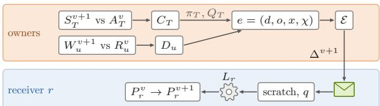  
Figure A.1 | Main notation of Table A.1 on the refit path. Owners compare the candidate shard $S _ { T } ^ { v + 1 }$ with its tracker $A _ { T } ^ { v }$ , or a converted tensor $W _ { u } ^ { v + 1 }$ with its residual baseline $R _ { u } ^ { v }$ , and emit records � into $\mathcal { E } .$ whose encoding $\Delta ^ { v + 1 }$ each receiver applies through scratch and its native loader $L _ { r }$

Ownership. Replication adds copies but not owners. The parallel layout identifies replica groups, which include the data-, context-, and expert-dataparallel replicas and the tensor-parallel copies of replicated parameters. Every training step keeps the copies within each replica group bitwise identical, so a stable name hash selects one owner among the copies of each shard (Figure A.2). Tied weights likewise have one owner and one task.

Change detection. As in § 4.1, owners compare stored bit patterns, not floating-point values. Floating-point equality treats +0.0 and −0.0 as equal although their BF16 patterns 0x0000 and 0x8000 difer. A zero that changes sign would then get no record, and receivers would keep the old sign bit. The bitdiff call of Table B.1 compares the stored patterns, so it detects this change (Figure A.2).

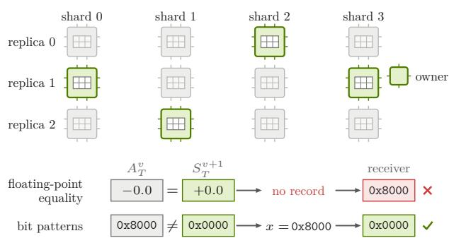  
Figure A.2 | Top: ownership across data-parallel replicas. Each replica holds a copy of every shard, and a stable name hash picks one owner per shard and spreads the owners across the replicas, so each unique source element is compared once. Bottom: change detection at a signed zero. Floating-point equality treats −0.0 and +0.0 as equal, so the change gets no record and the receiver keeps 0x8000. Comparing bit patterns finds the change, and the XOR mask 0x8000 flips the receiver’s sign bit, which gives 0x0000, the value a dense refit writes.

Afine tasks. The mapping classes Direct, Replicated, ColumnParallel, RowParallel, and GatedMLP of Megatron Bridge determine canonical coordinates from local indices, shard geometry, parallel ranks, and global expert indices [25]. Figure A.3 shows each class for two tensor-parallel ranks. For direct projection, the Megatron Bridge integration supports only these afine mapping classes and Auto mappings that permute no dimensions and act as ColumnParallel, RowParallel, or Replicated mappings. All of them use Bridge metadata for shard axes, ofsets, and gate/up splitting. A custom export hook postprocesses converted tensors, so it disables direct projection.

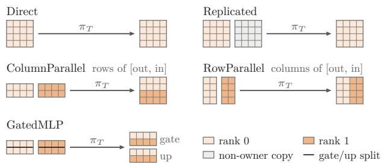  
Figure A.3 | Afine mapping classes for two tensorparallel ranks. Each rank’s shard maps through �<sub>�</sub> to fixed canonical coordinates, and only the owner’s copy of a replicated tensor is projected.

Residual tasks. Change flags select the residual tensors that each attempt converts. Tied embeddings, the output head that depends on them, and any source tensor that also feeds a residual conversion always use residual tasks. For residual tasks, the training cluster’s all\_reduce\_flags collective combines the change flags of § 4.3 by task identifier over all owners, and each owner contributes zero for tasks it does not hold (Figure A.4). Before assembly, the flags and conversion dependencies fix the required tensor set $\mathcal { U } _ { \mathrm { r e q } } \subseteq \mathcal { U }$ for the attempt, where � indexes the residual-baseline tensors. A custom export hook leaves conversion dependencies unknown, so any flagged task selects every residual tensor.

Residual assembly. Residual tasks whose outputs form one canonical tensor are converted together when any of their shards changes. For example, per-expert tasks are converted together when the checkpoint stores all experts as one stacked tensor. A canonical-name hash selects the residual-baseline owner of each residual tensor � from the fixed owners. Each owner’s part of � carries the tensor name, shape, dtype, and canonical indices it covers. Figure A.4 shows one such assembly, and Figure 5 contrasts this path with direct projection.

Records. The afine and residual paths both emit records $e = ( d , o , x , \chi )$ in ℰ (Figure A.5), with destination �, overwrite value �, XOR mask �, and path tag � ∈ {afine, residual}. For residual records, � = ⊥.

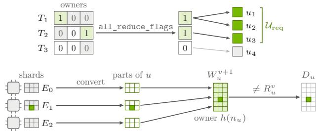  
Figure A.4 | Top: residual change flags. Each owner sets 1 for its residual tasks whose shards changed, 0 for its other tasks, and a gray 0 for tasks it does not hold. The combined flags and the conversion dependencies select $\mathcal { U } _ { \mathrm { r e q } }$ . Bottom: residual assembly of a stacked expert tensor �. One changed element in expert $E _ { 1 }$ makes every owner convert its part. The owner selected by a hash ℎ of the canonical name $n _ { u }$ assembles $W _ { u } ^ { v + 1 }$ , and the comparison with $R _ { u } ^ { v }$ puts only the changed element into the set $D _ { u }$

<table><tr><td rowspan="2">e =</td><td>d</td><td>0</td><td>x</td><td>X</td></tr><tr><td>(n, k)</td><td>0x3F02</td><td>0x0003</td><td>affine</td></tr><tr><td>e =</td><td colspan="4">(nu , k) 0x4080</td></tr></table>

Figure A.5 | Delta records, one per path. The afine record of the example carries the destination, the overwrite value 0x3F02, and the XOR mask 0x0003, while a residual record has no XOR mask $( x = \perp )$ and carries only its overwrite value.

Version state. For afine tasks $\mathcal { T } _ { \mathrm { a f f } }$ and residual tasks $\mathcal { T } _ { \mathrm { r e s } } .$ , the committed source baseline is

$$
\begin{array} { r } { B ^ { v } = \{ A _ { T } ^ { v } \} _ { T \in \mathcal { T } _ { \mathrm { a f f } } \cup \mathcal { T } _ { \mathrm { r e s } } } \cup \{ R _ { u } ^ { v } \} _ { u \in \mathcal { U } } . } \end{array}
$$

The baseline $B ^ { v }$ reconstructs $W ^ { v } { \mathrm { : } }$ : the source projections $Q _ { T }$ map the afine-task trackers into canonical coordinates, and the residual-baseline tensors supply the rest. The authoritative commit record $K ^ { v } = ( v , g _ { v } )$ names version � and the identifier $g _ { v }$ of its baseline $B ^ { v }$ . With $W ^ { v + 1 }$ and $B ^ { v }$ fixed, the prepare call of Table B.1 binds a fresh candidatebaseline identifier � to the attempt. The logical candidate baseline $B ( g ) = \{ A _ { T } ^ { g } \} \cup \{ R _ { u } ^ { g } \}$ is defined by $A _ { T } ^ { g } = S _ { T } ^ { v + 1 }$ for every task and $R _ { u } ^ { g } = W _ { u } ^ { v + 1 }$ for every required residual tensor, with $R _ { u } ^ { g } = R _ { u } ^ { v }$ for every other residual tensor. Likewise, $B ( g )$ reconstructs $W ^ { v + 1 }$ when every changed residual tensor is in $\mathcal { U } _ { \mathrm { r e q } } .$ as Figure A.6 shows for both baselines.

Fixed state. The candidate weights $W ^ { v + 1 }$ , source ownership and membership, and integration setup ℳ remain fixed across the attempts of the transition, and $B ^ { v }$ remains fixed until commit. The integration setup ℳ contains the conversion rules with their mapping and dependency metadata, the native loaders with their settings and XOR/overwrite/skip classifications, and the transport adapter of Figure C.1. To keep $W ^ { v + 1 }$ fixed, training takes its next optimizer step only after the transition ends (Figure A.7). Source membership is the set of training ranks, and changing it requires redistributing or reinitializing the baseline before another transition.

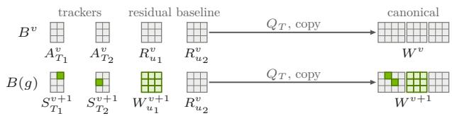  
Figure A.6 | Committed and candidate baselines. Each row shows a baseline and the canonical tensors it reconstructs through the projections $Q _ { T }$ and the residual tensors. $B ( g )$ replaces every tracker by its candidate shard and the required residual tensor $u _ { 1 }$ by its converted value, while $u _ { 2 }$ keeps $R _ { u _ { 2 } } ^ { v }$

Version alignment. The protocol preserves version alignment between the source baseline and receiver storage: when a transition starts, every required receiver holds $P _ { r } ^ { v }$ for the version � that the commit record names. Receivers obtain $P _ { r } ^ { v }$ from the committed transition to version � or from a dense refit, which also restores new or restarted receivers. Resident weights change only through refits. To keep this alignment, a commit requires completion acknowledgments from every required receiver, and a new or restarted receiver joins only after restoring the committed version. Figure A.7 follows one transition, and Appendix B.2 specifies both rules.

## A.2. Native-loader conditions

For each source and loader path, Table A.2 lists the operations it allows, the rules the integration enforces, and the required assumptions. Loader paths whose required assumptions do not hold are rejected in advance, and a copy that breaks an integration rule at run time fails the attempt.

Native skips. The prewarm call runs the loader with tensor metadata to discover which tensors the loader skips on each receiver rank. Any reported load without an intercepted copy fails the attempt, as Figure A.8 shows.

Loader properties. Beyond the conditions of § 6.1, the integration must establish two loader properties: scratch bits remain unchanged before an XOR copy, and model parameters and bufers keep their existing storage (Figure A.9). Because runtime checks at intercepted copies cannot establish these properties alone, the integration also validates the configured loader in advance.

Table A.2 | Operations, integration rules, and assumptions for the default BF16 source and loader paths.
<table><tr><td>Path</td><td>Operations</td><td>Integration rule</td><td>Required assumptions</td></tr><tr><td>Source</td><td>Direct, Replicated,</td><td></td><td>Fixed deterministic</td></tr><tr><td>Affine</td><td>ColumnParallel, RowParallel, GatedMLP, and qualifying Auto</td><td>Supported mapping classes; no custom export hook</td><td>Bridge mappings; stored bits preserved for XOR entries</td></tr><tr><td>Residual</td><td>Other mapping classes, stacking, padding, tied weights, adapters, and custom postprocessing</td><td>Residual conversion; forced overwrite</td><td>Complete dependency metadata, or every residual tensor selected when unknown</td></tr><tr><td>Loader</td><td></td><td></td><td></td></tr><tr><td>XOR</td><td>Identity, views, slices, splits, fusions</td><td>Copy input shares scratch storage; same dtype; no within-item overlap</td><td>Stored bits preserved; no overlap across items</td></tr><tr><td>Overwrite</td><td>Identity, views, slices, splits, fusions, casts, pointwise transforms such as — exp(·)</td><td>Copy input is floating-point; non-NaN active values; active mask remains valid</td><td>Placeholders preserved until each view&#x27;s first copy; each output depends only on its input</td></tr><tr><td>Native skip</td><td>Rank-local skips</td><td>Explicit skip report; reported loads match intercepted copies</td><td>Accurate reports; interception of every storage write</td></tr></table>

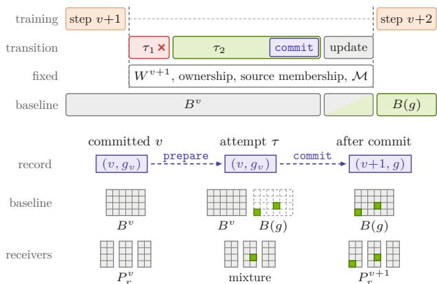  
Figure $\mathrm { A . 7 } \ |$ | Top: what stays fixed during a transition. Training takes its next optimizer step only after the transition ends. The candidate weights $W ^ { v + 1 }$ source ownership and membership, and the integration setup ℳ stay fixed across the failed attempt �<sub>1</sub> and its retry $\tau _ { 2 } ,$ and $B ^ { v }$ stays fixed until the commit. Bottom: version state at three points of the transition. During an attempt, the commit record and $B ^ { v }$ stay fixed, the dashed candidate baseline $B ( g )$ exists only logically, and receivers may hold a mixture of old and updated values. After the commit, owners update the baseline in place to $B ( g )$

XOR copies. The loader must preserve every bit pattern an XOR mask can contain at its dtype width, including NaN, infinity, subnormal, and signedzero patterns (Figure A.9). Operations such as nan\_to\_num, clipping, and casts therefore use overwrite only. An XOR copy fails the attempt if its input no longer shares scratch storage, its input and destination dtypes difer, or its destination byte range overlaps another copy within the item.

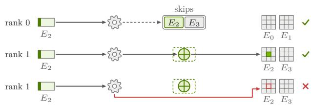  
Figure A.8 | Native skips for one routed-expert item $E _ { 2 } ,$ , which every receiver gets. The loader on rank 0 skips $E _ { 2 } ,$ as prewarm recorded, and writes nothing. On rank 1 it writes $E _ { 2 }$ through the final storage copy inside the dashed dispatch hook. In the bottom lane, a write bypasses the hook, so a reported load has no intercepted copy and the attempt fails.

Overwrite copies. The default overwrite paths require a floating-point copy input, whose non-NaN positions form each destination view’s active mask. An active value indistinguishable from the placeholder fails the attempt before the item is written. Active values are cast to the destination dtype. Later intercepted writes to the same destination view by a pointwise loader transform may reuse that active mask. The ordered writes of that transform must preserve the active mask and produce the same final bits as a dense refit (Figure A.10). Transforms that erase the placeholder require another validated placeholder scheme satisfying the conditions below.

Placeholder schemes. To validate a placeholder scheme for an overwrite path, the integration traces placeholders and active values through nan\_to\_num, clipping, casts, quantization, and other loader operations. Outputs must be deterministic and depend only on their corresponding inputs across supported shapes, dtypes, and value ranges, under fixed loader settings and cast behavior. The transformed placeholder must remain distinct from all active values until the active mask is formed. Overwrite retries keep the integration setup ℳ fixed but may choose another of the integration’s validated placeholder schemes. Figure A.10 contrasts a cast with nan\_to\_num.

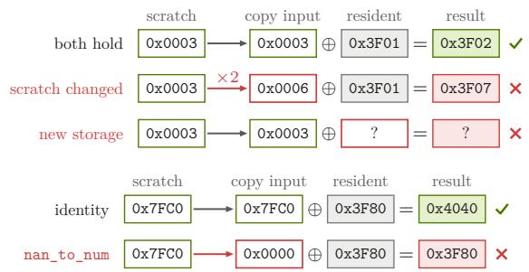  
Figure A.9 | Top: loader properties on the XOR path of the example. With unchanged scratch bits and existing parameter storage, the intercepted copy XORs the mask into the resident version-� bits and yields 0x3F02. An in-place loader operation on scratch alters the mask, and new parameter storage lacks the resident bits, so both give wrong bits. Bottom: XOR masks on two loader paths. The mask between the resident 1.0 (0x3F80) and the updated 3.0 (0x4040) is the BF16 NaN pattern 0x7FC0. An identity path keeps the mask and yields 3.0, whereas nan\_to\_num turns the mask into 0x0000 and leaves 1.0 unchanged.

Write overlap. Let $\rho _ { r } ( e )$ denote the set of destination byte ranges written on receiver � when applying the entry encoded from record �. The overlap rules of § 6.1 apply to these ranges across entries, items, payloads, and loader calls. Runtime checks for XOR overlap are reset at each item, so the integration validates in advance that XOR writes do not overlap writes from other items. A loader change requires another prewarm call and revalidation of these rules and the loader properties. Figure A.11 shows $\rho _ { r } ( e )$ on a fused path.

Post-apply checks. For an XOR copy, the optional post-apply check saves the destination’s precopy bits and verifies that XORing the mask into the updated bits restores the pre-copy bits (Figure A.12). For an overwrite copy, the check compares the written bits with the overwrite values transformed by the native loader.

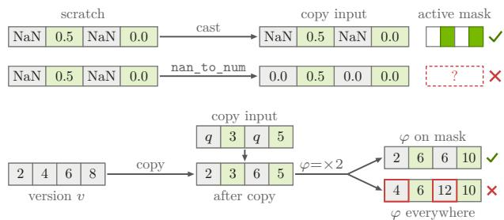

Figure A.10 | Top: the NaN placeholder on two overwrite paths, with placeholders in gray and active values in green. A cast keeps the NaN placeholders, so the non-NaN positions of the copy input form the active mask. nan\_to\_num maps the placeholders to 0.0, which is also an active value, so the mask cannot be formed and the path needs another validated placeholder scheme. Bottom: ordered writes to one destination view. The first intercepted copy forms the active mask from the non-placeholder positions of its input. The intercepted write of a later pointwise transform � reuses that mask and yields the same bits as a dense refit. Applied everywhere, the doubling � would transform the inactive positions a second time, because their version-� values are already transformed.

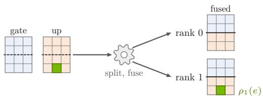  
Figure A.11 | A default loader path. The native loader splits the canonical gate and up projections across two tensor-parallel ranks at the dashed lines and fuses them per rank at the solid lines. Each output element has one canonical source, so a changed element of the up projection has one destination range $\rho _ { 1 } ( e )$ on rank 1.

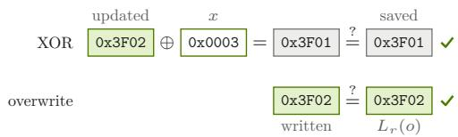  
Figure A.12 | Optional post-apply checks on the example. For an XOR copy, XORing the mask into the updated bits must restore the saved pre-copy bits. For an overwrite copy, the written bits must equal the overwrite value � transformed by the native loader.

## A.3. Equivalence proof

The argument combines complete change detection and the XOR/overwrite encoding with the three properties of Figure 6: version alignment between the source baseline and receiver storage, payload deduplication at ingestion, and native-loader placement at the receiver.

Full statement of Proposition 1. For a first attempt that passes every check up to and including the flush call of Table B.1, receiver storage satisfies (3) under the following assumptions (Table A.3). The candidate weights $\bar { W } ^ { v + 1 }$ , baseline $B ^ { v }$ , source ownership and membership, and integration setup ℳ remain fixed until commit, and ℳ includes the conversion rules and loader settings. Each required receiver initially holds $P _ { r } ^ { v }$ , and receiver membership stays fixed during the attempt. Replicated source copies agree bit-for-bit, and the owners cover each unique source element exactly once. Every required residual tensor is fully assembled, with overlapping parts agreeing bit-for-bit. Projected values and overwrite values are computed deterministically, and every XOR-encoded record uses a representation-preserving path. The residual dependency metadata is complete, or unknown dependencies select every residual tensor, so that $W _ { u } ^ { v + 1 }$ equals $R _ { u } ^ { v }$ bit-for-bit for every � $\not \in \mathcal { U } _ { \mathrm { r e q } } .$ . The value written to each destination byte range depends only on its corresponding canonical element. The loader classification covers every final storage copy, and the loader conditions of $\ S \ 6 . 1$ and Appendix A.2 hold.

Table A.3 | Assumptions of Proposition 1, how each is established, and the figures that illustrate it.
<table><tr><td>Assumption</td><td>Established by</td><td>Figure</td></tr><tr><td>Wv+1, Bv, source ownership and membership, and M</td><td>Training waits for the transition; owners update  $B ^ { v }$  only after commit</td><td>A.7</td></tr><tr><td>fixed until commit Receivers start from  $P _ { r } ^ { v } ;$  receiver membership fixed per</td><td>Version alignment; receiver A.7, B.5 membership changes only between attempts</td><td></td></tr><tr><td>attempt Copies agree; one owner per source</td><td>Identical replica updates; A.2 name-hash ownership</td><td></td></tr><tr><td>element Residual tensors fully assembled and</td><td>Checks of build_complete A.4 in Table B.1</td><td></td></tr><tr><td>consistent Deterministic values; XOR only on representation-</td><td>Fixed conversion rules; encoding decided per</td><td>D.1</td></tr><tr><td>preserving paths Dependencies complete, or every</td><td>mapping class and loader path Change flags with dependency metadata</td><td>A.4</td></tr><tr><td>residual tensor selected Each written value depends only on its</td><td>Supported loader paths</td><td>A.11</td></tr><tr><td>canonical element Every final storage copy classified; loader conditions hold</td><td>prewarm skip discovery, copy interception, and advance validation</td><td>A.8, A.9</td></tr></table>

XOR invariant. For each XOR-encoded record � from afine task $T$ and source index $j ,$ the XOR invariant states that every range $\rho \in \rho _ { r } ( e )$ holds the matching source-baseline bits until its XOR copy:

$$
\left. \mathrm { b i t s } ( P _ { r } ^ { v } ) \right| _ { \rho } = I ( A _ { T } ^ { v } ) _ { j } , \qquad e = ( \pi _ { T } ( j ) , o , x , \mathsf { a f f i n e } ) ,
$$

where each range $\rho$ spans one stored value. Version alignment ensures that the receiver holds these bits: its resident weights are at version �, the baseline version used to compute the XOR mask. Under the proposition’s assumptions, the projection $Q _ { T }$ and loader preserve dtype and stored bits, and no other entry writes to that range, so the invariant holds without transmitting baseline values (Figure A.13).

Proof. Under the assumptions of the proposition, owners compare every unique source element and required residual tensor bitwise, afine outputs depend only on their source elements, and residual tensors outside $\mathcal { U } _ { \mathrm { r e q } }$ keep their committed bits. Hence every changed canonical destination has a record, and the conflict checks leave it exactly one record or several overwrite records with identical value bits. For an XOR-encoded record � from afine task $T$ and source index �, the mask is $x = I ( S _ { T } ^ { v + 1 } ) _ { j } \oplus I ( A _ { T } ^ { v } ) _ { j }$ . Scratch carries the item’s XOR masks at changed positions and zeros elsewhere. Payload deduplication, together with the arrival check and queue draining of flush in Appendix B.1, ensures that the receiver applies every XOR and overwrite entry exactly once. For every $\rho \in$ $\rho _ { r } ( e )$ , the invariant and the representation-preserving path give bits $( P _ { r } ^ { v } ) | _ { \rho } \oplus x = \mathrm { b i t s } ( L _ { r } ( W ^ { v + 1 } ) \bar { ) } | _ { \rho } ,$

For overwrite entries, a validated placeholder scheme establishes the active mask, and the loader conditions require the ordered writes of every pointwise loader transform to preserve it. Because each written value depends only on its canonical element, the complete overwrite sequence writes bits $\left( L _ { r } ( W ^ { v + 1 } ) \right)$ at active positions and nowhere else.

Every byte range written for an emitted destination therefore holds its target bits, and every remaining byte range keeps its version-� bits (Figure A.13). The canonical element of each remaining range did not change, and the value a dense refit writes there depends only on that element, so these bits already equal bits $\left( L _ { r } ( W ^ { v + 1 } ) \right)$ ). This establishes (3).

Retries. After the stop\_and\_wait call of Table B.1 completes for a failed attempt, a retry that passes every check up to and including flush has written every byte range of an emitted destination as an absolute overwrite. Every attempt recomputes $\mathcal { E }$ deterministically from the same $W ^ { v + 1 } , B ^ { v } .$ , ownership, and ℳ. If every write of the earlier attempts passed the dispatch hook, those attempts wrote only these ranges, and such a retry turns any mixture they left into bits $\left( L _ { r } ( W ^ { v + 1 } ) \right)$ before commit (Figure A.14). Retries are therefore safe to repeat. A write that bypasses the hook can reach bytes outside these ranges. Its attempt fails (Figure A.8), as does every retry with that receiver, since the loader repeats the write. After retirement or the operator abort of Appendix B.2, a dense refit restores the receiver.

## B. Refit Protocol

This appendix specifies the protocol operations behind the two transports of $\ S 7$ and the commit and recovery rules of § 6.3.

The active coordinator runs one transition at a time. Each attempt has a fresh attempt identifier � and candidate-baseline identifier �, under which the complete changed set ℰ is streamed. Appendix A.1 defines the committed and candidate baselines and the state

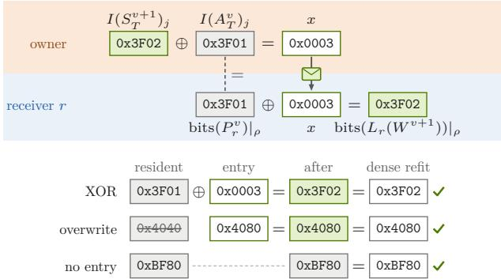

Figure A.13 | Top: XOR invariant for the changed element of the example. Version alignment keeps the receiver’s resident bits equal to the owner’s baseline bits, marked by the dashed equality, so the owner sends only the mask � across the cluster boundary. Bottom: the three kinds of receiver byte ranges in the proof. An XOR entry turns the resident version-� bits into the target bits, an overwrite entry replaces the resident bits, and a range without an entry keeps its version-� bits, which equal the dense-refit bits because its canonical element did not change.

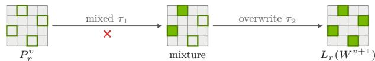  
Figure A.14 | Overwrite retry on one receiver, with emitted ranges outlined and updated bits in green. Every attempt emits the same ranges and writes nowhere else. The mixed-mode attempt $\tau _ { 1 }$ fails after writing two of them, and the overwrite retry �<sub>2</sub> writes all four, which turns the mixture of old and updated values into the dense-refit result $L _ { r } ( W ^ { v + 1 } )$ ).

that remains fixed across retries.

In the signatures of Table B.1, ℳ is the fixed integration setup of Appendix A.1. Mode � is mixed or overwrite, and overwrite mode encodes every record as an absolute overwrite. The symbols �, id, ack, and � denote a payload, its identifier, an acknowledgment, and a success or failed status, and � is a commit outcome as defined in Appendix B.2. Task �’s change flag is $f _ { T }$ . Inside build\_complete, bitdiff detects changes, owners project afine changes into canonical coordinates, all\_reduce\_flags fixes $\mathcal { U } _ { \mathrm { r e q } } ,$ and convert produces the residual parts.

Failure model. Owners, receivers, transports, and coordinators may crash or lose messages (Table B.2), but they do not act maliciously, and channels are trusted or encrypted. A control plane, assumed available and clock-synchronized with coordinators, holds the durable commit record, accepts prepare only from the active coordinator, and raises a conflict exception for any later prepare or commit of a replaced coordinator. An attempt’s payloads, control calls, and gate operations carry the attempt identifier � that its prepare returned, and receiver and transport endpoints ignore them once a later prepare has replaced that attempt, except that its stop\_and\_wait returns at once. If retries cannot repair a failure, operator intervention is required.

## B.1. Admission and delivery

Each attempt runs prepare, then streams, checks, applies, and flushes its payloads as in Algorithm B.1.

Admission. The prepare call checks the metadata and loader classifications in ℳ, then binds �, mode �, and the set of required receivers to the fresh attempt. The first successful prepare admits the transition. A failed prepare check raises reject, and any other failure raises failed. Before admission, a rejection ends the transition. Any other failure before admission retries the first prepare in mixed mode. After admission, every reject or failed exception triggers overwrite recovery, wherever in the attempt the failure occurs. Algorithm B.2 starts in mixed mode, or in overwrite mode when it takes over an admitted transition after coordinator failover (Figure B.1).

Streaming. Receivers validate and deduplicate payloads as they arrive. In synchronous RL, they decode them into the bounded queue but apply them only after the coordinator closes the gate with wait\_for\_requests and then calls open\_apply, so version-� requests finish before any payload is applied. In asynchronous RL, they retain validated compressed payloads in a separate host staging area. After the coordinator confirms that every expected payload has arrived, closes the gate, and calls open\_apply, a decoder feeds the bounded queue in declared order while the application drains it in that order.

Table B.1 | Protocol operations. Operations that take an attempt identifier � act only on that attempt. Appendix B.2 defines commit outcomes and the recovery rules.
<table><tr><td>Operation</td><td>Effect</td></tr><tr><td colspan="2">Source and coordinator</td></tr><tr><td> $\mathbf { r e f i t } ( W ^ { v + 1 } , B ^ { v } , K ^ { v } , \mathcal { M } )$ </td><td>Run a transition with overwrite recovery</td></tr><tr><td> $\mathtt { p r e p a r e } ( v + 1 , \mathcal { M } , g , m ) \to \tau$ </td><td>Validate M  $\mathcal { M } ,$  then bind g, m, and required receivers to a fresh attempt Stream changed-set buckets under g and check each for completeness</td></tr><tr><td> $\mathtt { b u i l d \_ c o m p l e t e } ( W ^ { v + 1 } , B ^ { v } , \mathcal { M } , g ) \to \{ \mathcal { E } _ { \ell } \} _ { \ell }$ </td><td>and conflicting canonical values</td></tr><tr><td> $\mathtt { b i t d i f f } ( X , Y )$   $\mathtt { a l l \_ r e d u c e \_ f l a g s } ( \{ ( T , f _ { T } ) \} ) \to \mathcal { U } _ { \mathrm { r e q } }$ </td><td>Compare equal-width stored values and return changed indices</td></tr><tr><td> $\mathsf { c o n v e r t } ( T , u )$ </td><td>Reduce flags within the training cluster to find all affected tensors Produce task  $T \ ' _ { \mathrm { s } }$  part of canonical tensor u</td></tr><tr><td> $\mathtt { e n c o d e } ( { \mathcal { E } } _ { \ell } , m ) \to ( p _ { \ell } , \sigma _ { \ell } )$ </td><td>Encode bucket  $\varepsilon _ { \ell }$  as compressed XOR or overwrite entries</td></tr><tr><td> $\mathtt { s e n d } ( \tau , p _ { \ell } )$ </td><td>Send identified payload  $p _ { \ell }$  under τ</td></tr><tr><td>wait_for_requests  $\scriptstyle ( \tau , v )$ </td><td>Close the request gate if open, then drain version-v requests</td></tr><tr><td>open_apply(τ)</td><td>Let receivers decode staged payloads and apply queued payloads</td></tr><tr><td> $\mathtt { f l u s h } ( \tau ) \to ( a c k , \sigma )$ </td><td>Check arrivals, drain receiver queues, synchronize devices, report any</td></tr><tr><td></td><td>configured post-apply checks, acknowledge</td></tr><tr><td> $\mathsf { c o m m i t } ( \tau ) \to c$  read_commit  $\mathsf { \Omega } ^ { \mathsf { \Omega } } ( \tau ) \to K$ </td><td>Conditionally replace 4  $K ^ { v }$  with (v+1, g) after flush</td></tr><tr><td>mark_obsolete(τ)</td><td>Return the record once no commit of τ can change it</td></tr><tr><td></td><td>Invalidate τ for later payloads, open_apply, and commit</td></tr><tr><td> ${ \mathbf s } \ t o { \mathbf p } _ { - } { \mathbf a } { \mathbf n } { \mathbf d } _ { - } { \mathbf w } { \mathbf a } { \mathbf i } \ t ( \tau ) \to a c k$ </td><td>Stop delivery, then wait for writes and acknowledgments</td></tr><tr><td>cleanup(τ)</td><td>Release the payloads and, on failure, the delta records</td></tr><tr><td>Receiver and transport endpoints</td><td></td></tr><tr><td>prewarm  $( \mathcal { M } )  \sigma$ </td><td>Reserve scratch and discover native skips</td></tr><tr><td> $\mathtt { i n g e s t } ( \tau , i d , p )$ </td><td>Validate and deduplicate, then queue decoded payloads in</td></tr><tr><td>apply(p)</td><td>synchronous RL or stage compressed payloads in asynchronous RL Scatter into scratch, then call the native loader</td></tr></table>

Table B.2 | Failures and how the protocol handles them, with the figures that illustrate each case.
<table><tr><td>Failure</td><td>Handling</td><td>Figure</td></tr><tr><td>Rejected</td><td>Before admission, ends the transition; after admission,</td><td>B.1</td></tr><tr><td>prepare</td><td>triggers overwrite recovery</td><td>B.2</td></tr><tr><td>Payload of an obsolete attempt Invalid payload</td><td>Dropped at reception The attempt fails before the</td><td>B.2</td></tr><tr><td>Duplicate</td><td>payload is applied Ignored if its bytes match;</td><td>B.2</td></tr><tr><td>payload Missing payload</td><td>otherwise the attempt fails The arrival check fails, followed</td><td>B.4</td></tr><tr><td>Receiver killed</td><td>by an overwrite retry Retired by stop_and_wait and</td><td>B.5,</td></tr><tr><td>mid-attempt</td><td>rejoins after a dense refit; the overwrite retry updates the</td><td>A.14</td></tr><tr><td>Lost commit reply</td><td>others After the deadline, read_commit B.4 decides the outcome</td><td></td></tr><tr><td>Coordinator failure</td><td>Takeover drains the attempt, calls read_commit, then retries</td><td>B.6</td></tr><tr><td></td><td>or ends with a conflict</td><td></td></tr><tr><td></td><td>Persistent failure Operator abort; a closed gate stays closed until a dense refit</td><td>B.6</td></tr></table>

Transports. Both transports follow Algorithm B.1 but carry payloads diferently. On object storage, each payload is uploaded as a multipart object. Payloads and the manifest remain in storage until cleanup, which follows commit or a completed stop\_and\_wait. The relay tree streams payloads over ZeroMQ DEALER/ROUTER sockets.

Reception checks. Receivers learn the version and identifier of the active attempt at prepare. Before queueing, they check that each payload belongs to the active attempt, so they drop late payloads from obsolete attempts. Receivers then check each payload’s compressed-body digest, tensor names, shapes,

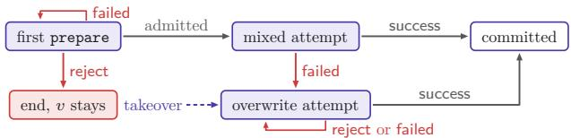

Figure B.1 | Admission and attempt modes. A rejected first prepare ends the transition with version � still committed, and a failed one is retried. After admission, any reject or failed exception leads to overwrite attempts, which repeat until commit, a conflict, or an operator abort. A coordinator that takes over an admitted transition starts in overwrite mode.

Algorithm B.1 Concurrent streaming schedule of   
one attempt. Failures propagate to Algorithm B.2.   
<sub>Require: Prepared �, �, �, �, �</sub>�+1<sub>, �</sub>�<sub>, ℳ,</sub>   
bounded queues   
Ensure: (ack, success) or (⊥, failed)   
1: spawn owners   
2: for all buckets $\varepsilon _ { \ell }$ streamed by build\_complete do   
3: $( p _ { \ell } , \sigma _ { \ell } )$ ← encode(ℰ , �)   
4: if � ̸= success then   
5: raise failed   
6: end if   
7: send $. ( \tau , p _ { \ell } )$   
8: end for   
9: spawn receiver ingestion   
10: for all arriving $( i d , p )$ do   
11: ingest $( \tau , i d , p )$   
12: end for   
13: spawn receiver application   
14: wait until the coordinator calls open\_apply(�)   
15: if asynchronous RL then   
16: spawn a decoder for staged payloads in declared   
order   
17: end if   
18: for all � yielded by the bounded queue in declared   
order do   
19: apply(�)   
20: end for   
21: if asynchronous RL then   
22: await all sends   
23: wait for delivery and forwarding   
24: raise failed if any expected payload is missing   
25: end if   
26: wait\_for\_requests $( \tau , v )$   
27: open\_apply(�)   
28: await all sends   
29: return flush(�)

dtypes, schema, and loader classification. If any of these checks fails, the attempt fails before that payload is applied. Receivers key each payload by its attempt, owner, and payload identifiers, apply it at most once, and ignore identical duplicates. Reusing an identifier with diferent bytes fails the attempt. Figure B.2 summarizes these checks and their outcomes.

Application order. After these reception checks, all receivers apply payloads in the single order that the payload identifiers declare for the attempt rather than in arrival order (Figure B.2). The staging queue reserves a slot for the next payload to apply, so later payloads cannot fill it first. Receivers may reorder only independent loader operations that have no crossrank collectives or cross-payload side efects. Invalid payloads, conflicting canonical values, or conflicting destination writes stop application and fail the attempt, whether it is the first attempt or a retry.

Flush. The flush call closes the attempt to new sends, waits for delivery and relay-tree forwarding, and checks that every expected payload arrived: every payload in the manifest on object storage, or every

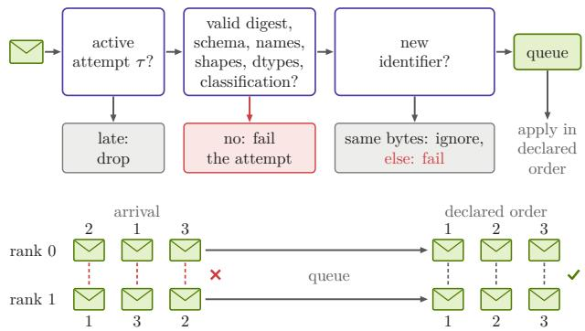

Figure B.2 | Top: checks on each received payload. An obsolete attempt’s payload is dropped, a failed check fails the attempt, and a duplicate payload is ignored when its bytes match and fails the attempt otherwise. Bottom: application order on two receiver ranks, with a loader collective per payload drawn as a dashed link. Payloads arrive in diferent orders, so applying them on arrival would pair diferent payloads in a collective. Applying them in the attempt’s declared order pairs the same payload on both ranks.

payload the owners sent on the relay tree. In asynchronous RL, the same arrival check also runs before the request gate closes, and flush repeats it afterward. Relay-tree queueing acknowledgments and the immediate responses to control calls confirm only queueing or registration, so flush also drains the receiver queues, synchronizes devices, and collects completion acknowledgments that report the configured postapply checks. Figure B.3 contrasts the two kinds of acknowledgments. A failed flush returns (⊥, failed), which Algorithm B.2 treats as a failed exception.

## B.2. Joint commit and recovery

Version � stays committed through every failure and retry until a joint commit publishes version �+1 after every required receiver acknowledges completion.

Commit and end of the transition. After flush succeeds with completion acknowledgments from every required receiver, commit may atomically replace �� with (�+1, �), provided the commit record still equals ��. Owners start the in-place baseline update of § 6.3 when they read the commit record (�+1, �), even when the commit is confirmed late or after failover. Each owner then reports completion to the coordinator, which ends the transition only after every owner has reported (Figure B.3). Receivers invalidate their KV caches before the coordinator reopens the request gate (Figure 8, bottom).

Commit outcomes. Commit outcome � is success, failed, unknown, or conflict. If the coordinator cannot

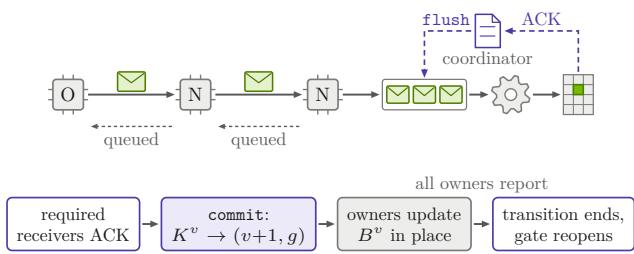

Figure B.3 | Top: acknowledgments on the relay tree of Figure 7. Each hop only acknowledges that it queued a payload. After flush drains the receiver queues and synchronizes devices, each receiver sends its completion acknowledgment, the ACK of Figure 4. Bottom: the end of a transition. After every required receiver acknowledges, commit replaces $K ^ { v }$ with (�+1, �). Owners read the new record, update their baselines in place, and report. Once all owners have reported, the transition ends and the request gate reopens.

confirm the outcome, commit returns unknown. Before the coordinator decides whether to retry after an unknown outcome or a failover, read\_commit(�) waits until no commit of � can change the commit record. Each commit carries a deadline set by its coordinator. The control plane accepts it only before then and never after its attempt is marked obsolete, which bounds this wait (Figure B.4, bottom). The commit record (�+1, �) confirms success, unchanged $K ^ { v }$ confirms failure, and any other value signals a commit conflict, meaning that another coordinator committed the transition first. A conflict that read\_commit reveals after the coordinator’s own commit can reach only a replaced coordinator. It stops its attempt, cleans up, and returns without retrying, leaving the gate to the coordinator that committed. Of these outcomes, only a confirmed failure takes the retry path in Figure B.4, top.

Stopping an attempt. Before recovery, the coordinator calls mark\_obsolete, after which endpoints ignore the attempt’s later payloads and open\_apply, and the control plane refuses the attempt’s commit (Figure B.5). Then stop\_and\_wait stops delivery and relay-tree forwarding, waits for pending transport work and receiver writes to finish, synchronizes devices, and collects acknowledgments from all surviving endpoints. A terminated endpoint is retired from the failed attempt only after its process and pending writes are confirmed unable to resume. Receiver membership changes take efect only between attempts, so a retired receiver is not a required receiver of the retry (Figure B.5, bottom). After stop\_and\_wait returns, cleanup releases the attempt’s payloads and delta records, leaving $B ^ { v }$ unchanged. A failure before a successful prepare leaves nothing to stop or clean up.

Algorithm B.2 Refit with overwrite recovery. Re  
tries stop at commit success, a conflict, an operator   
abort, or a rejection before admission.   
<sub>Require: �</sub>�+1<sub>, �</sub>�<sub>, �</sub>�<sub>, fixed ℳ and source membership,</sub>   
and $\tau _ { \mathrm { o l d } }$ on takeover   
Ensure: �+1 satisfying (3), or reject / conflict   
1: � ← mixed; admitted ← false   
2: if taking over an admitted transition then   
3: mark\_obsolete(�old); stop\_and\_wait(�old)   
4: � ← read\_commit(�old)   
5: if $K \neq K ^ { v }$ then   
6: await baseline update named by �   
7: cleanup $( \tau _ { \mathrm { o l d } } ) ;$ reopen the gate under $\tau _ { \mathrm { o l d } }$   
8: return conflict   
9: end if   
10: cleanup( $\left( \tau _ { \mathrm { o l d } } \right)$   
11: admitted ← true; � ← overwrite   
12: end if   
13: loop   
14: � ← ⊥; � ← failed   
15: try   
16: � ← new identifier; � ← prepare(�+1, ℳ, �, �)   
17: admitted ← true   
18: (ack, �) ← concurrent schedule in Algorithm B.1   
19: if $\sigma \ne$ success then   
20: raise failed   
21: end if   
22: � ← commit(�)   
23: catch reject   
24: if ¬admitted then return reject   
25: catch conflict: return conflict   
26: catch failed: pass   
27: end try   
28: if � = unknown then   
29: � ← read\_commit(�)   
success $K = ( v + 1 , g ) ;$   
30: � ← failed � = �<sup>�</sup>,   
conflict otherwise.   
31: end if   
32: if � = success then   
33: await baseline update named by $( v + 1 , g )$   
34: cleanup(�); reopen the gate under �; return �+1   
35: end if   
36: if $\tau \neq \bot$ then   
37: mark\_obsolete(�); stop\_and\_wait(�)   
38: cleanup(�)   
39: if � = conflict then   
40: return conflict   
41: end if   
42: end if   
43: if admitted then � ← overwrite   
44: end loop

Failover and conflicts. Commit conflicts arise only from coordinator failover (Figure B.6): the coordinator that committed first is either a new coordinator started after failover or the old coordinator whose pending commit took efect. On takeover, the new coordinator first stops and drains writes from the old attempt $\tau _ { \mathrm { o l d } } .$ then waits with read\_commit until no commit of $\tau _ { \mathrm { o l d } }$ can change the record. If such a commit took efect, the new coordinator waits for the baseline update named by the record, cleans up, reopens the gate under $\tau _ { \mathrm { o l d } }$ , and returns conflict. If the record remains $K ^ { v } .$ the new coordinator cleans up and retries in overwrite mode from the unchanged $K ^ { v }$ repairing any partial writes before its own commit replaces $K ^ { v }$ . Its prepare replaces $\tau _ { \mathrm { o l d } }$ , so endpoints then ignore whatever the old coordinator still sends. The control plane also raises a conflict exception for any later prepare or commit of the old coordinator, which then returns without retrying or touching the request gate. An old coordinator whose commit outcome was unknown learns of the conflict from read\_commit, stops and cleans up its attempt, and also leaves the gate alone. Owners hold their candidate shards and their baselines in memory, so they can finish the in-place baseline update after a coordinator failover. Because the update writes absolute values derived from the fixed $W ^ { v + 1 }$ , an owner that reads the commit record again can safely repeat it. Failover therefore needs no durable record of which owners have finished.

Joining receivers. A new or restarted receiver restores the committed version through a dense refit, runs prewarm, and joins at the next prepare if the commit record still names that version. Otherwise, it first restores the newer committed version with another dense refit before joining.

Operator intervention. Some persistent failures fall outside the automatic recovery of Algorithm B.2 and require operator intervention: conflicting canonical values or destination writes, a write that bypasses the dispatch hook, a receiver that never acknowledges, or an owner that loses its candidate shards or its baseline in a crash. The operator aborts the transition: the coordinator stops and drains the attempt and

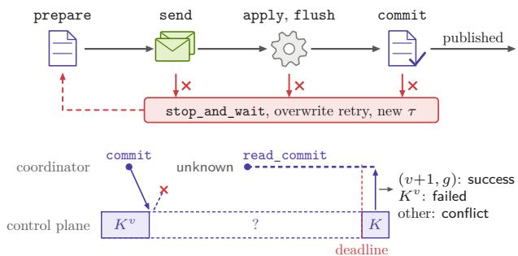  
Figure B.4 | Top: the commit sequence. Version � stays committed until success, and a failure after prepare leads to stop\_and\_wait and an overwrite retry under a new �. Bottom: resolving an unknown commit outcome, which takes the retry path only after read\_commit confirms failure. The reply to commit is lost, so the record may hold $K ^ { v }$ , (�+1, �), or another value. read\_commit waits until the deadline, after which the control plane accepts no commit of � , so the record � it returns decides the outcome.

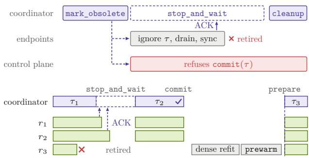  
Figure B.5 | Top: the steps that stop a failed attempt � . Once the coordinator calls mark\_obsolete, the endpoints ignore the later payloads and the open\_apply of � , and the control plane refuses its commit. Then stop\_and\_wait waits until the surviving endpoints drain pending work, synchronize devices, and acknowledge, and it retires a terminated endpoint that cannot resume. cleanup then releases the attempt’s payloads and delta records, leaving $B ^ { v }$ unchanged. Bottom: receiver membership across attempts. Receiver $r _ { 3 }$ fails during �<sub>1</sub> and is retired, so it is not required in the retry $\tau _ { 2 } .$ After a dense refit and prewarm, �<sub>3</sub> joins the next attempt �<sub>3</sub> at prepare.

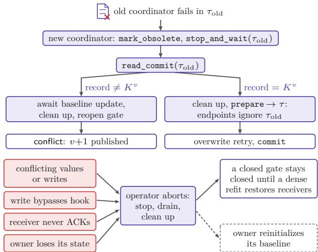  
Figure B.6 | Top: coordinator takeover. After draining the old attempt, the new coordinator waits with read\_commit until no commit of $\tau _ { \mathrm { o l d } }$ can change the record. It then retries in overwrite mode or ends the transition with a conflict. Bottom: operator intervention. Each persistent failure on the left makes the operator abort the transition, and a closed gate stays closed until a dense refit restores every required receiver to the committed version. An owner that lost its state also reinitializes its baseline, drawn dashed.

cleans up, and a closed request gate stays closed until a dense refit restores every required receiver to the committed version (Figure B.6). An owner that lost its state also reinitializes its baseline, as after a source membership change.

## C. Integration and Measurement

This appendix describes the implementation behind § 3 and gives the pipeline settings for § 7.2 and measurement details for § 8. The cited NeMo RL commit [22] contains the Megatron Bridge and vLLM integration used in the experiments. Figure C.1 sketches the integration. Each transport adapter implements only send, stop\_and\_wait, and cleanup of Table B.1, and Appendix A.1 lists the training-side conversion tasks and mapping classes.

Rollout side. The rollout side adds three pieces to the native loader: a prewarm call, a dispatch hook, and a staging queue. For prewarm, receivers obtain canonical names, shapes, and dtypes from the training side. The dispatch hook intercepts the loader’s final storage copies, which are aten.copy\_ operations. The receiver reserves 32 resident groups of at most eight decoded payloads, plus one separate group of at most eight payloads under assembly, for at most 264 decoded payload slots in all (Figure C.2, bottom). In asynchronous RL, a separate host staging area holds compressed payloads until open\_apply. A decoder then feeds this queue in declared order while the application drains it. Figure C.2 also shows the memory that a receiver keeps beyond its resident weights.

Pipeline settings. Owners compare source shards and convert required residual tensors in chunks, with targets of 64 MiB for object storage and 256 MiB for the relay tree, and both transports use a 512 MiB bucket target. The diferent chunk targets shift bucket boundaries, so the payload volumes of the two transports difer slightly in Table 4. These targets are measured in bytes of local source tensors for afine tasks and of converted canonical tensors for residual tasks, before unchanged elements are dropped. A bucket counts the full input size of each chunk that emits records. Tensors and chunks are never split, so a chunk or bucket can exceed its target. At 120B, the bucket target yields 482 payloads across 32 owners. Figure 8 illustrates both units on one owner, and Figure C.3 shows how their sizes count toward the targets.

Synthetic codec benchmark. The benchmark of § 8.2 runs PyTorch 2.14.0 on four CPU threads, with random seed 42 for the BF16 inputs and 44 for the FP32 noise. The same input and noise vectors serve all three values of �. Scaling the noise by � and adding it to the input are separate FP32 operations, and rounding precedes the bitwise comparison that selects changed words (Figure C.4). Each stream holds only little-endian 16-bit words compressed with zstd 1.5.5 at level 1. The overwrite stream decodes to the updated BF16 words, and XORing the decoded masks into the inputs gives the same words. The reduction ratios of Table 2 use exact byte counts.

Table C.1 | Checkpoints of the latency runs.
<table><tr><td>Size</td><td>Checkpoint</td><td>GB</td></tr><tr><td>30B</td><td>Nemotron-3-Nano-30B-A3B</td><td>63.2</td></tr><tr><td>120B</td><td>Nemotron-3-Super-120B-A12B</td><td>247.2</td></tr><tr><td>235B</td><td>Qwen3-235B-A22B</td><td>470.2</td></tr><tr><td>550B</td><td>Nemotron-3-Ultra-550B-A55B</td><td>1,121</td></tr><tr><td>1T</td><td>Nemotron-3-Ultra-550B-A55B with twice the layers</td><td>2,242</td></tr></table>

Latency runs. Table C.1 lists the BF16 checkpoints behind the 30B–1T latency points, where the 30B point is Nemotron-3-Nano-30B-A3B, not the Qwen3-30B-A3B of §§ 8.3 and 8.4. Figure C.5 shows the testbed and the transport-only full-checkpoint reference of § 8.1.

Timed window and intervals. Each refit’s timed window runs from $t _ { 0 }$ to $t _ { 1 }$ . At $t _ { 0 } ,$ the first owner begins delta construction, and at $t _ { 1 }$ , the last owner finishes its baseline update after the joint commit. Refit latency is $t _ { 1 } - t _ { 0 }$ minus the post-apply check time. For the lower bounds of § 8.7, each compute interval runs from an operation’s start until its output is ready: change flags or locations for comparison, mapped indices and values for projection, canonical tensors for residual conversion, location and value bufers for encoding, and compressed bytes for zstd. For nonblocking operations, the interval ends when execution completes. Each relay-tree transport interval runs from payload submission until the sending endpoint, the owner’s transport endpoint, receives its queueing acknowledgment. On the relay tree, receivers stage and apply a payload only after their rollout node acknowledges its queueing, so no transport interval waits for its own payload’s staging or application. In the relay-tree latency runs, the staging queue never filled, so no interval waited for queue space either. Finalization runs from the end of the last loader application to $t _ { 1 } .$ . The prepare call precedes $t _ { 0 }$ , and cleanup and the gate reopening follow $t _ { 1 }$

Lower bounds. Each lower bound is the longest union of intervals on one owner or sending endpoint: the construction lower bound takes the union of each owner’s compute intervals, and the transport lower bound takes the union of each sending endpoint’s transport intervals. Before taking unions, we map Nsight Systems trace timestamps onto a common time axis and clip each interval to $[ t _ { 0 } , t _ { 1 } ]$ , discarding empty intersections. Each union lies within the refit’s timed window, so both bounds are at most $t _ { 1 } ~ - ~ t _ { 0 }$ We compute bounds per refit and average them as § 8.1 averages refit latency. Mean refit latency, which already excludes the post-apply check time, exceeds both mean bounds at every traced size. Figure C.5 illustrates both bounds in

```python
# Transport adapter: three calls
class ObjectStorage: class RelayTree:
def send(self, tau, p): def send(self, tau, p):
put(key(tau, p.id), p) root.push(tau, p)
post_manifest(tau, p.id) def stop_and_wait(self, tau):
def stop_and_wait(self, tau): stop_forwarding(tau)
stop(tau) return collect_acks(tau)
return wait_until_done(tau) def cleanup(self, tau):
def cleanup(self, tau): release(tau)
delete(tau)
# Training side: conversion tasks # Rollout side: native loader
for T in conversion_tasks(model): prewarm(M) # scratch, skips
track(T) # every task on payload p: # either transport
if affine(T, M): ingest(tau, p.id, p)
# direct projection def apply(p):
project(T) for name, idx, vals in p.items:
else: scratch[:] = q
# residual path scratch[idx] = vals
residual(T) with dispatch_hook():
# Mapping metadata gives shard loader(name, scratch)
# axes and offsets. # No model-specific placement code.
# No model-specific refit code.
```  
Figure C.1 | Integration sketch. The codec, receiver checks, commit, and recovery of Algorithms B.1 and B.2 form a shared core with three interfaces: a transport adapter with three calls, conversion tasks with mapping metadata on the training side, and the serving runtime’s native loader with a dispatch hook on its final storage copies.

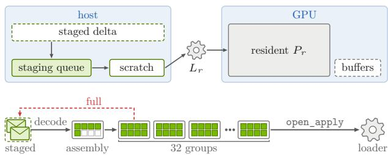

Figure C.2 | Top: receiver memory beyond the resident weights �<sub>�</sub>. The host holds the decoded staging queue and the reusable scratch that prewarm sizes for the largest canonical tensor. Dashed boxes are temporary: the compressed delta staged in asynchronous RL, and GPU bufers for active masks and optional post-apply checks. Bottom: in synchronous RL, arriving payloads are decoded into a separate group under assembly, which then joins the queue of 32 resident groups of at most eight decoded payloads, the green cells. Thus the queue plus the assembly group holds at most 264 decoded payloads. After open\_apply, the receiver applies queued payloads through the native loader. A full queue makes ingestion wait and slows upstream stages. In asynchronous RL, compressed payloads wait in the dashed host staging area until open\_apply. A decoder then feeds the queue while the application drains it in declared order.

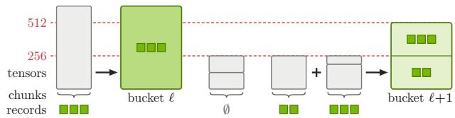  
Figure C.3 | Chunk and bucket sizes, with heights proportional to input bytes and dashed lines at the relaytree chunk target of 256 MiB and the bucket target of 512 MiB. A tensor larger than both targets forms its own chunk and bucket, since tensors and chunks are never split. Arrows lead from chunks with records to the bucket that counts their full input sizes, so the unchanged chunk (∅) adds nothing to either bucket.

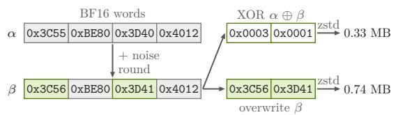  
Figure C.4 | Synthetic codec benchmark. FP32 noise and rounding turn the BF16 inputs � into $\beta ,$ and only the changed words enter the XOR and overwrite streams. Sizes are those of Table 2 at $a = 1 0 ^ { - 4 }$

synchronous RL, and its receivers row shows the loader applications before finalization.

## D. Coverage and Payload Format

For §§ 4, 5, and 7.1, this appendix details coverage, the payload format, and payload volume.

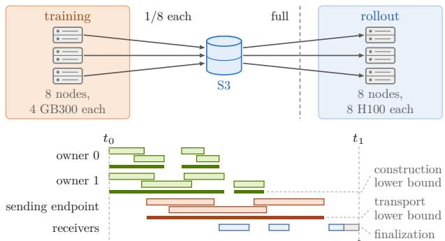

Figure C.5 | Top: latency testbed and transport-only full-checkpoint reference of § 8.1, with three of the eight nodes on each side drawn. Every training node uploads an eighth of the checkpoint to S3 concurrently, and every rollout node then downloads all of it in parallel across the dashed cluster boundary. Each node’s cross-cluster flow is up to 5 Gbps. Bottom: timed window of one refit. Thin boxes are intervals, and thick strips are their unions, which count overlaps once and exclude gaps. The longest union over owners gives the construction lower bound, and the longest union over sending endpoints gives the transport lower bound.

XOR and afine coverage. The XOR/overwrite split follows the mapping classes of Appendix A.1 and the loader paths of Appendix A.2. On the default BF16 paths, each owned shard of an afine tensor contributes one XOR item when it has changed elements and its path is representation-preserving with no overlapping writes. Each required residual tensor emits an overwrite item when its converted bits change. Figure D.1 summarizes the rule and shows why scaled and cast values need overwrites.

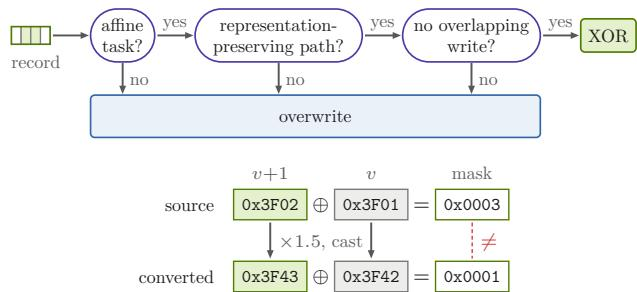  
Figure D.1 | Top: encoding of a record in the default mixed mode. All conditions are decided in advance for each mapping class and loader path. Bottom: a source XOR mask under a conversion that scales by 1.5 and casts to BF16. The example element’s mask is 0x0003, but the mask of its converted values 0x3F42 and 0x3F43 is 0x0001, so the source mask cannot update the converted bits, which need an overwrite.

Direct-projection coverage. Table D.1 shows that afine mappings cover all but 185 canonical tensors of the Nemotron-3-Ultra-550B-A55B checkpoint, which has no custom export hook. Routed experts use qualifying per-expert Auto mappings. Of the 185 residual tensors, 183 have mappings outside the supported classes: the Mamba input projections and convolutions, and attention Q/K/V, including those of the multi-token-prediction layer. The remaining two residual tensors are the embedding and output head. For Qwen3-30B-A3B, Table D.2 counts 18,721 of the 18,867 canonical tensors as afine. Its residual tensors are attention Q/K/V and the embedding and output head.

For the Qwen3-30B-A3B checkpoint of Table D.2, when every tensor and shard changes, XOR covers 18,721 of 18,867 items at tensor-parallel and experttensor-parallel degree one, 74,161 of 74,307 at degree four, and 148,081 of 148,227 at degree eight. Each of the 18,432 expert tensors and 48 attention output projections splits into � shards at degree �, while the 48 router and 193 normalization tensors stay whole, giving 18,480� + 241 XOR items (Figure D.2). The XOR share of weight bytes stays 96.3% because a higher degree only splits the same weights into more shards.

For the Nemotron-3-Ultra-550B-A55B checkpoint of Table D.1, when every tensor and shard changes,

Table D.1 | Afine and residual canonical tensors in Nemotron-3-Ultra-550B-A55B. The Bytes column gives shares of the 1,121 GB checkpoint, with one share for the three residual rows together. Other afine weights include shared experts, routers, latent-MoE projections, attention output projections, normalization, and the output projections and state parameters of Mamba.

<table><tr><td>Weight type</td><td>Tensors</td><td>Bytes</td></tr><tr><td>Affine</td><td></td><td></td></tr><tr><td>Routed expert up/down</td><td></td><td>50,176 93.86%</td></tr><tr><td>Other affine weights</td><td>662</td><td>3.13%</td></tr><tr><td>Residual</td><td></td><td>3.01%</td></tr><tr><td>Attention Q/K/V</td><td>39</td><td></td></tr><tr><td>Mamba input projection</td><td>144</td><td></td></tr><tr><td>and convolution</td><td></td><td></td></tr><tr><td>Embedding and output head</td><td>2</td><td></td></tr></table>

Table D.2 | Afine and residual canonical tensors in Qwen3-30B-A3B. The Bytes column gives each weight type’s share of the 61.06 GB checkpoint.
<table><tr><td>Weight type</td><td>Tensors</td><td>Bytes</td></tr><tr><td>Affine</td><td></td><td></td></tr><tr><td>Expert gate/up/down</td><td>18,432</td><td>94.95%</td></tr><tr><td>Attention output projection</td><td>48</td><td>1.32%</td></tr><tr><td>Router</td><td>48</td><td>0.04%</td></tr><tr><td>Normalization</td><td>193</td><td>&lt;0.01%</td></tr><tr><td>Residual</td><td></td><td></td></tr><tr><td>Attention Q/K/V</td><td>144</td><td>1.65%</td></tr><tr><td>Embedding and output head</td><td>2</td><td>2.04%</td></tr></table>

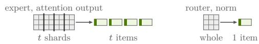  
Figure D.2 | XOR items of Qwen3-30B-A3B at tensor-parallel and expert-tensor-parallel degree �, drawn for $t \ = \ 4 .$ Each expert tensor and attention output projection splits into � shards, one item each, while each router and normalization tensor stays whole as one item.

403,869 of the 404,054 items are afine at tensorparallel and expert-tensor-parallel degree eight. Each of the 50,176 routed expert up/down tensors splits into $t _ { \mathrm { e } }$ shards at expert-tensor-parallel degree $t _ { \mathrm { e } } ,$ and 257 of the 662 other afine tensors split into � shards at tensor-parallel degree $t ,$ while the remaining 405 stay whole, giving $5 0 , 1 7 6 t _ { \mathrm { e } } + 2 5 7 t + 4 0 5$ afine items and 185 residual items. Every afine item takes the XOR path except those of the few Mamba state parameters that the native loader transforms, so the XOR share of weight bytes still rounds to the 97.0% afine share.

Payload format. Each payload carries attempt, owner, and payload identifiers, flat location and value bufers, and per-item metadata: tensor name, shape, dtype, encoding, location type, and ofsets into both bufers. Contiguous locations use a start index, and the number of values gives the run length. Scattered locations use gaps in the smallest suitable integer type. A BLAKE2b-128 digest [1] covers each compressed payload body.

Figure D.3 illustrates the payload format with two tensors. The changed elements of tensor A form one contiguous run, so its metadata row stores a start index instead of location ofsets and adds nothing to the location bufer. Tensor B’s scattered positions are stored as gaps. Both rows index the shared value bufer.

Payload volume. To relate payload bytes to the element change rate (Figure D.3), let Ω be the full canonical index set and $N = | \Omega |$ . Because ownership is disjoint, $\begin{array} { r } { N _ { \mathrm { s r c } } = \sum _ { T } | J _ { T } | } \end{array}$ counts unique source elements and $\begin{array} { r } { N _ { \mathrm { c h g } } = \sum _ { T } | C _ { T } | } \end{array}$ counts unique changes. The element change rate is $s _ { \mathrm { s r c } } = N _ { \mathrm { c h g } } / N _ { \mathrm { s r c } }$ . The emitted destinations form $\begin{array} { r } { D \ = \ \bigcup _ { T \in { \mathcal T } _ { \mathrm { a } \oplus } } { \pi } _ { T } ( C _ { T } ) } \end{array}$ ∪ $\textstyle \bigcup _ { u \in { \mathcal { U } } _ { \mathrm { r e q } } } D _ { u }$ . The destinations with changed canonical bits form $D _ { \mathrm { c h g } } = \{ d \in \Omega \mid I ( W ^ { v + 1 } ) _ { d } \neq I ( W ^ { v } ) _ { d } \}$ , and complete change detection makes it a subset of �. The canonical change density is $s = | D _ { \mathrm { c h g } } | / N$ . The element change rate and the canonical change density are equal when a representation-preserving bijection maps source elements to canonical elements.

Before zstd, the payloads of one attempt together carry metadata, run- and gap-coded locations, and one value per record. Let $\begin{array} { r } { H = \sum _ { d \in \Omega } b _ { d } } \end{array}$ be the canonical checkpoint size, where $b _ { d }$ is the width of element � in bytes. With one record per emitted destination, the value bytes total $\sum { } _ { d \in D } b _ { d } .$ , which at uniform width is $| D | H / N ,$ , or �� when $D = D _ { \mathrm { c h g } }$ . Here � counts unique destinations. Each additional overwrite record for a destination adds another $b _ { d }$ bytes. More scattered changes need more location bytes, and more items need more metadata. After zstd compresses the locations and values, the attempt’s payloads total $V _ { \mathrm { p a y l o a d } }$ . On the object-storage transport, each attempt moves about $( 1 + N _ { \mathrm { n o d e } } ) V _ { \mathrm { p a y } }$ load of upload and download trafic when $N _ { \mathrm { n o d e } }$ rollout nodes download every payload. On the relay tree without retransmission, each payload crosses the cluster boundary once per attempt, so cross-cluster trafic is about $V _ { \mathrm { p a y l o a d } }$ , and the root forwards each payload over local links to every rollout node.

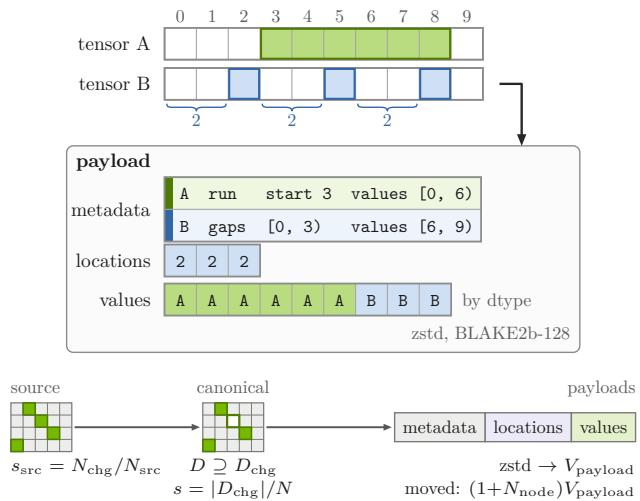  
Figure D.3 | Top: payload format. To decode gaps, start at −1 and add each gap plus one: gaps 2, 2, 2 yield positions 2, 5, 8. Values have the width of their tensor’s dtype. Bottom: quantities behind payload volume. Owners find $N _ { \mathrm { c h g } }$ changes among $N _ { \mathrm { s r c } }$ source elements, which gives the element change rate $s _ { \mathrm { s r c } }$ . The emitted destinations � contain the changed destinations $D _ { \mathrm { c h g } } ,$ whose share of the � canonical elements is the canonical change density �. When a mapping is not a representation-preserving bijection, � can also hold an unchanged destination, drawn outlined. Payloads carry metadata, locations, and values, and with $N _ { \mathrm { n o d e } }$ rollout nodes, object storage moves about $( 1 + N _ { \mathrm { n o d e } } ) V _ { \mathrm { p a y l o a d } }$ per attempt in uploads and downloads.

## E. GRPO Experiment Settings

This appendix details the GRPO settings for the element-change measurements in § 2.2 and for the training runs in § 8.4.

Element-change measurements. These measurements follow the agentic SWE RL recipe for Qwen3 [24]: BF16 weights, FP32 AdamW state, constant learning rate $1 0 ^ { - 6 }$ , and no warmup, weight decay, or KL penalty. The six measured models are Qwen3-30B-A3B, Llama-3.2-3B, Gemma-3-4B, and Qwen2.5 at 0.5B, 1.5B, and 7B.

Training runs. These runs use the first stage of the same recipe, with swe1.jsonl from the Nemotron-RL-Super-Training-Blends dataset. This stage rewards single-step tool calls for matching the arguments of the expert action. Each GRPO step uses 64 prompts with 8 responses each and a batch size of 512. With ratio\_clip\_min=0.2 and ratio\_clip\_ max=0.28, probability ratios are clipped to [0.8, 1.28]. The logged train/gen\_kl\_error estimates the pertoken KL divergence between rollout and training policies. Figure E.1 shows the receiver kills.

## F. System Comparison

This appendix gives the evidence behind each mark of Table 1 under requirements G1–G5 of § 2.3, and the same analysis for the slime framework.

NeMo-DCR. The design meets all five requirements. § 6.2 and Appendix A establish G1, and the dense-refit comparisons of § 8.1 confirm it. For G2, the payload volumes of Tables 3 and 4 scale with the changed set. For G3, placement stays in the native loader with no model-specific logic, as §§ 6.1 and 8.1 describe. For G4, both transports deliver without a cross-cluster collective, as § 7 describes, and the latency runs of § 8.1 use them between clusters that share no InfiniBand or EFA route. Payload deduplication, overwrite recovery, and joint commit meet G5, as § 6.3 and Appendix B describe, and with receivers killed mid-refit, both transports follow dense NCCL’s mean reward and KL trajectories in Figure 9.

Bit-exact (G1). Approaches A and B fully meet G1, and approach D avoids arithmetic reconstruction but meets G1 only partly. NCCL-Reshard and checkpoint-engine send every weight rather than a delta, so they preserve the target bits [20, 23]. TensorHub copies its published bufers into the serving runtime’s registered tensors, which yields exact target bits because the published bufers hold the weights in the layout and dtype of the registered tensors [40]. PULSE’s Appendix H.6 proves exact reconstruction of a tensor from a correct base [19], but extending the proof through a native loader requires conditions on the loader’s transformations and storage writes. In verl, NaN masks in intercepted copies protect unchanged positions, and a round-trip test checks that the model’s generated outputs are bit-identical [36], but the loader’s supported transformations are not stated. SparseRL-Sync patches the loader’s copy with a NaN-masked sparse scatter and reports tensor-by-tensor bitwise agreement with a dense refit, but does not specify supported transformations or interception of every storage write [11]. NeMo-DCR specifies both in the loader conditions of § 6.1 and Appendix A.2, and Appendix A proves that under these conditions its refits produce the same bits as a dense refit.

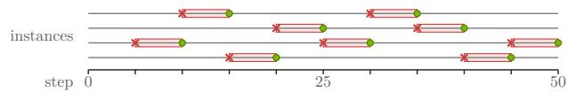  
Figure E.1 | Receiver kills in one NeMo-DCR run of § 8.4, with an illustrative choice of instances. Every five steps, a randomly chosen vLLM instance is killed mid-refit at a cross and restarted five steps later, at a dot, where it restores the committed version.

In approach C, arithmetic reconstruction of updated or pre-update values can introduce rounding errors. ROSE sends arithmetic diferences [6]. AuroraRL reports lossless reconstruction by scatter-adding deltas but does not state when this reconstruction is bitexact [30]. AReaL-DTE [26] reconstructs pre-update weights by inverting AdamW and compares BF16 bit patterns after aligning them to a common layout. Its authors note rounding in fused AdamW implementations, so comparison against these reconstructed preupdate weights can miss a changed element. NeMo-DCR instead compares against stored values retained in the committed source baseline.

Delta (G2). Approaches A and B move every weight byte, while the delta schemes in approaches C and D scale with the changed set. PULSE, SparseRL-Sync, and verl in approach D send absolute overwrites as indices and values of changed elements, with BF16 values in PULSE and verl. The verl framework detects changes on each training rank’s shard and maps them to full-tensor coordinates through block placements, and it supports conversions only when they permute elements [35, 36]. AReaL-DTE sends target values of detected changes, and AuroraRL packages each step as a BF16 delta checkpoint.

Native (G3). The serving runtime performs all weight placement in checkpoint-engine, SparseRL-Sync, and verl, and only part of it in NCCL-Reshard and TensorHub. In checkpoint-engine, the serving runtime also chooses which weights to copy. NCCL-Reshard copies expert feed-forward shards directly into vLLM parameters using its own placement metadata and hooks. Only the remaining parameters pass through the native loader, so native placement is partial. TensorHub copies its published bufers into the serving runtime’s registered tensors without interpreting their layout. Yet weights are converted to the rollout layout before publication, not by the native loader, so native placement is only partial [40].

Most delta systems place updates themselves. ROSE uses shard-aware routing to receiver shards, and AuroraRL writes directly into parameter storage. PULSE writes values at the transmitted indices into receiver tensors that share the sender’s layout. AReaL-DTE remaps updates into rollout layouts at the receiver and uses the native loader only as a fallback, so its native placement is partial.

Decoupled (G4). NCCL-Reshard, SparseRL-Sync, and verl each use a collective that spans training and rollout. The checkpoint-engine system runs alongside serving runtimes, loads full weights onto GPUs from disk or the training engine, and broadcasts them among its workers. Its description mentions no crosscluster transport [20]. PULSE, AReaL-DTE, ROSE, AuroraRL, and TensorHub transfer weights through replication, relays, or shared storage without a crosscluster collective. TensorHub pipelines its full-weight replication, placing one replica in each remote datacenter before replicating locally. AuroraRL streams each delta checkpoint through one seed actor per region.

Recovery (G5). No existing system in Table 1 fully meets G5. ROSE, SparseRL-Sync, and verl describe no recovery protocol, although verl does checksum each broadcast payload. For NCCL-Reshard and checkpoint-engine, repeating a dense refit can restore weights, but the cited descriptions do not specify a complete protocol for partial failures and policy commit. TensorHub provides transactions, invalidates incomplete replicas, and recovers transfers from another source [40], but it coordinates version selection within each model-parallel group rather than committing across all required receivers. AReaL-DTE commits a version manifest and leaves partially applied versions to its control plane, without describing their repair. AuroraRL checks the version a delta applies to, uses leases for fault handling, stages deltas before activation, and lets lagging actors replay the delta chain, but does not describe repair after partial writes.

PULSE receivers advance independently, without committing the source baseline and the required receivers policy version together. PULSE’s Algorithm 5 checks the local version before decoding [19], and a receiver applies consecutive deltas directly. PULSE also keeps periodic full checkpoints called anchors. After missed versions, the receiver restores a ready anchor and replays subsequent deltas in order. Ready markers prevent use of incomplete uploads, and a full-state hash checks each reconstruction before the new weights are returned. A mismatch triggers anchor recovery. Absolute overwrites can be repeated safely, and anchor restoration replaces a partially applied state.

slime. The slime framework’s delta weight sync publishes byte-level XOR or overwrite deltas of the gathered Hugging Face tensors to a shared filesystem [33]. Each rollout node patches a full local checkpoint, verifies per-tensor checksums, and reloads the checkpoint from disk through the native loader. This design meets G1–G4, but every refit reads the full model. It does not fully meet G5: the trainer advances its source baseline before any rollout node applies the published version, and no commit ties the baseline to the version that the rollout nodes hold.