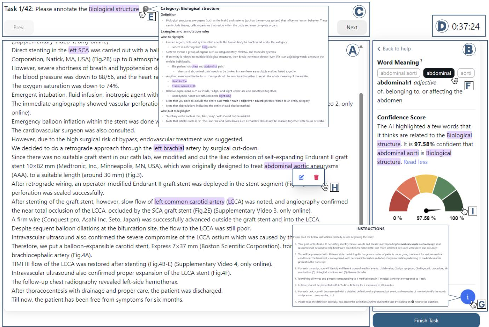
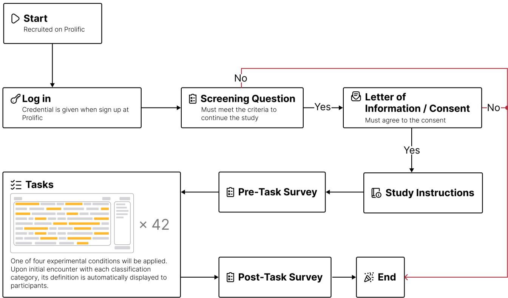
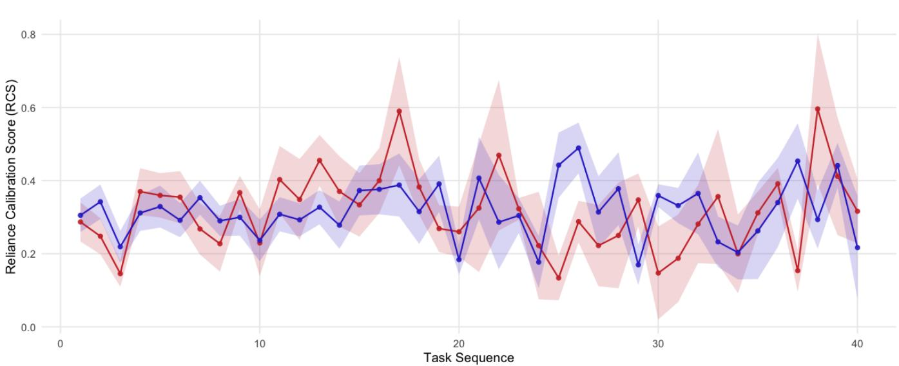
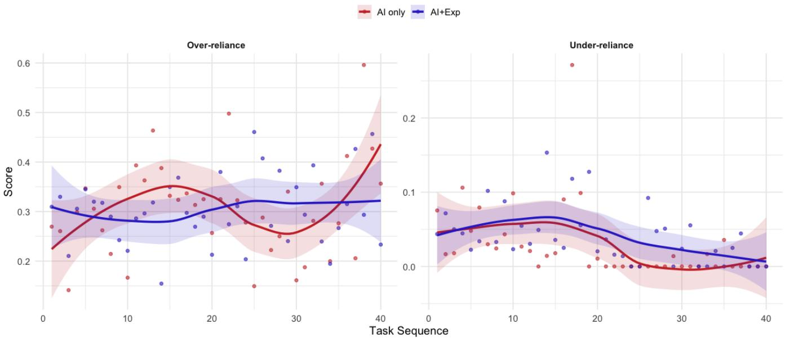
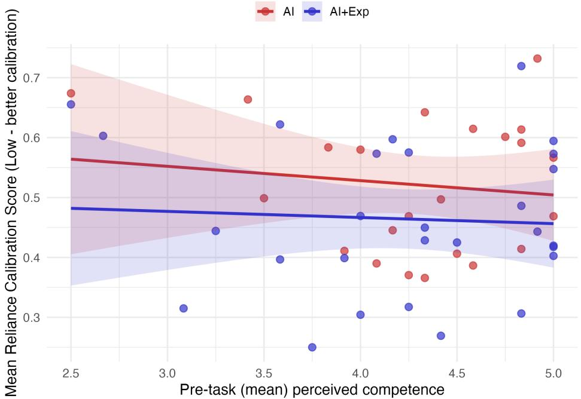
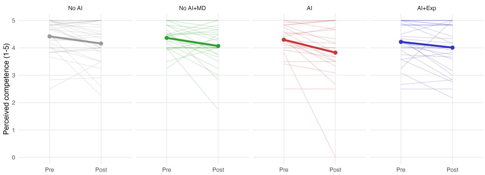
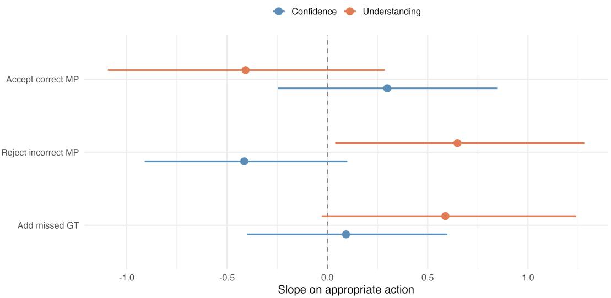

# Novice Reliance Calibration in AI-Assisted Decision Making: The Role of Explanations and Self-Assessment

Eun Jeong Kang   
eunkang@infosci.cornell.edu   
Cornell University   
Ithaca, NY, USA

Peter (Xianpi) Duan duanx14@mcmaster.ca McMaster University Hamilton, Ontario, Canada

Swati Mishra   
swati@mcmaster.ca   
McMaster University   
Hamilton, Ontario, Canada

## Abstract

Artificial Intelligence (AI) tools are widely used to support decision making in tasks and domains where no immediate performance feedback is available. In these settings, users cannot learn to adjust their reliance behavior over time through trial and error. However, little is known about how novice users calibrate reliance on AI when external feedback is unavailable, or whether AI explanations can support calibration in its absence. We introduce reliance calibration as an organizing construct for studying how novice users dynamically adjust reliance behavior, and examine how AI explanations and meta-cognitive self-assessment shape it. Through a between-subjects study with 110 participants completing a clinical entity extraction task with AI assistance and limited performance feedback, we observe that novice users exhibit systematic drift toward over-reliance in the presence of explanations, while higher self-reported task understanding is associated with more selective reliance behavior. These results extend reliance calibration research into human-AI collaboration contexts without real-time performance signals and present actionable guidelines on designing AI tools that must support appropriate reliance in these settings.

## CCS Concepts

• Human-centered computing → Laboratory experiments;   
Empirical studies in HCI.

## Keywords

Human-AI interaction, AI Reliance Calibration, Explainable AI

## 1 Introduction

A central challenge to the adoption of Artificial Intelligence (AI) systems in complex decision making tasks is achieving appropriate human reliance on AI. For a productive human-AI collaboration, users of these systems must continue to accept accurate AI recommendations and override incorrect ones, a behavior known as appropriate reliance[4, 35, 53]. However, appropriate reliance is not a fixed state that can be characterized by a single decision on a single recommendation. As people interact with an AI system over repeated tasks, they continuously update how much they defer to or deviate from its suggestions [29, 56]. A user who initially accepts most AI recommendations may begin to reject more of them after encountering patterns that suggest errors. Conversely, a user who starts skeptically may gradually defer to the system as its suggestions prove reliable. We define this process as reliance calibration – the degree to which a user’s acceptance or rejection ofAI suggestions aligns with the actual correctness of those suggestions over the course of an interaction session. A well-calibrated user frequently accepts suggestions when the AI is correct and rejects them when it is not. A miscalibrated user, on the other hand, frequently over- or under-relies for their decision making.

Prior research has examined how users with varying levels of task expertise learn to calibrate their reliance over time[29, 56, 58, 59], and how design interventions such as AI explanations influence this calibration behavior [11, 26, 66]. These studies, however, primarily focus on the setting where users receive explicit performance feedback, defined by task-level signals that inform users whether their judgment (or the AI’s suggestion) was correct after each decision[8, 44, 56]. In such settings, both performance feedback and explanations serve as learning signals that enable users to update their mental model of AI reliability and adjust subsequent actions accordingly.

However, in most real-world deployments where AI is useful, it is challenging (and even redundant) to provide users with tailored signals about the correctness of their reliance decisions during or immediately after task completion. For instance, a clinician using an AI diagnostic tool, a quality control inspector using AI to detect surface defects in steel sheets, or an analyst labeling medical text to categorize them, may complete an entire interaction session without knowing whether their acceptance or rejection of AI suggestions was appropriate. In such no-feedback environments, users draw on internal meta-cognitive resources to guide reliance decisions [2, 21, 24], reflecting on what they know and how confident they are in that knowledge, to determine whether to accept or override an AI suggestion. Explanations also may not uniformly improve reliance calibration in these settings, as their efectiveness depends on the meta-cognitive resources users bring to the task [43, 63]. For instance, expert users may use their task understanding and confidence as an internal calibration signal and verify their reasoning using explanations even when external feedback is absent [55]. However, this mechanism breaks down among novice users, whose domain expertise is insuficient to independently verify AI outputs and interpret explanations, which is also where AI assistance is quite useful [19, 44].

In this research, we investigate metacognitive mechanisms that drive reliance calibration in human-AI collaborative environments with novice users and no explicit performance feedback and the role of explanations in these settings. We specifically focus on perceived competence as the meta-cognitive factor and measure it as an aggregate of a user’s perceived understanding of the task and their perceived confidence in their ability to perform the task[48]. This is important to study for novice users, who often hold miscalibrated and unstable perceptions about their own competence, and may be systematically misaligned with their actual ability to evaluate AI outputs [33]. We predict that novice users with higher perceived competence may engage more critically with AI suggestions and their explanations, while those with lower perceived competence may defer to the AI by default.

Through a between-subjects study with 110 participants working on a clinical entity extraction task, we collected fine-grained interaction logs including acceptance, rejection, and editing of AI suggestions. Participants completed a sequence of annotation tasks with AI assistance and explanations but received no performance feedback during the session. We operationalize reliance calibration as a Brier-like miscalibration score [25], adapting this well-validated probabilistic scoring framework to measure the alignment between reliance decisions and AI correctness. We decompose this score into over- and under-reliance components, to support directional diag nosis of miscalibration in feedback-free environments. Using these scores derived from participants’ interaction logs, and pre-session and post-session self-report measures of perceived competence, we examine (1) how novice users’ reliance calibration evolves across a session without performance feedback, (2) whether AI explanations improve calibration, and (3) how perceived competence predicts and moderates these efects. Our results show that AI explanations were inefective for improving reliance calibration when participants received no signals about the correctness of their current work. Instead, when participants perceived that they understood the clinical category entities, they demonstrated better reliance calibration. This work contributes to the study of reliance calibration in no-feedback human-AI collaborative environments and provides a practical measurement framework and empirical evidence on the role of meta-cognitive factors such as perceived competence in reliance miscalibration among novice users.

## 2 Related Work

In this research, we build upon a growing body of literature across three primary areas. We first examine how reliance calibration has been conceptualized and measured in human-AI interaction. We then review studies on explanations and their impact on reliance behavior. Finally, we discuss the role of meta-cognition and selfassessment as individual-level predictors of how users engage with AI systems.

## 2.1 Reliance Calibration in Human-AI Interaction

Reliance is a behavioral construct captured through the actions users take in response to AI suggestions [12, 46, 47], distinct from trust, which reflects a subjective psychological disposition rather than observable action [31, 62]. Existing behavioral measures such as Agreement Score [6, 27] and Switch Fraction [38] have been used to study reliance across a range of factors including explanation usability [44], cognitive load [1], and prior beliefs [45]. Studies on reliance calibration further examine how users optimize reliance in response to AI accuracy and accumulated experience, with the goal of achieving appropriate reliance [29, 53, 65, 66]. However, existing research operates under three limiting assumptions. First, that users receive immediate correctness feedback after each decision; second, that users possess suficient task knowledge to evaluate AI recommendations; and third, that reliance decisions are binary outcomes, overlooking partial reliance behaviors such as editing or augmenting AI suggestions. We address these gaps by proposing a session-level Reliance Calibration Score (RCS), adapted from the Brier Score [25], a validated probabilistic scoring framework that quantifies the mean squared diference between predicted probabilities and observed outcomes. Our adaptation treats reliance decisions as continuous inputs, accommodates partial reliance actions, and enables regression-based analysis of calibration trajectories without requiring real-time feedback. We further decompose RCS into overand under-reliance components to support directional diagnosis of miscalibration. We elaborate on this measure in Section 4.6.

## 2.2 AI Explanations and Their Efect on Reliance

Research in explainable AI has proposed various mechanisms for supporting reliance with some evidence suggesting that presenting the reasoning behind an AI recommendation can help users evaluate whether to accept or reject it [40, 43, 54]. Explanations have been shown to reduce uncertainty in interpreting AI recommendations and may be presented as highlighted text or data features [52], visual cues [5], and concepts from task domain [41]. However, the evidence that explanations improve reliance calibration is mixed [43, 63]. Several studies find that explanations do not meaningfully improve user performance and can even cause users to overlook their own judgment when AI output is present [37, 44, 64, 66], while others demonstrate that when explanations are designed to promote engagement and active evaluation, they can reduce overreliance [7, 8]. A consistent finding across this literature is that the efect of explanations depends on whether users can meaningfully interpret them [32]. This condition is hardest to meet for novice users working on domain-specific tasks, who lack the expertise needed to evaluate explanation quality [22, 34]. Additionally, in the absence of performance feedback, users cannot learn from errors to recalibrate how they use explanations over time, or rely on AI recommendations. Our study directly investigates this intersection by examining how explanations afect reliance calibration among novice annotators working without feedback on a complex task.

## 2.3 Meta-Cognition and Self-Assessment in Human-AI Interaction

Meta-cognition refers to an individual’s ability to monitor and evaluate their own knowledge and performance, and has been widely studied as a determinant of decision-making quality [20, 21]. In human-AI interaction, meta-cognitive factors such as selfassessment of domain knowledge and perceived competence shape reliance behaviors in distinct ways. Self-assessed domain knowledge influences whether users approach AI suggestions critically or deferentially, where users who believe they understand the subject matter are more likely to scrutinize AI output, while those with lower knowledge beliefs tend to defer [16, 27]. Perceived competence, linked to task self-eficacy, governs willingness to exercise independent judgment, with higher competence beliefs associated with more active and critical engagement [3, 15]. For novice users, both factors are prone to miscalibration [30, 33]. Overconfidence can lead to unwarranted rejection of correct AI suggestions, while underconfidence can produce uncritical acceptance of incorrect ones. Recent HCI research confirms that these factors moderate how users update reliance across interactions [36, 44, 49], with self-confidence shown to shift in response to AI-expressed confidence rather than actual task performance [36]. In the absence of performance feedback, these meta-cognitive factors may serve as the primary regulators of reliance behavior, making them especially consequential in the feedback-free settings we study here.

## 3 Research Questions

In this study we investigate how novice users calibrate reliance on AI suggestions in a clinical annotation task where no immediate performance feedback is provided. We specifically focus on how AI explanations and meta-cognitive factors such as perceived competence shape reliance calibration over time, through the following research questions:

• RQ1: How does reliance calibration evolve across a task session among novice users in the absence of performance feedback?

– H1: Reliance calibration will deteriorate across the session, reflected in increasing RC scores over time.

• RQ2: Do AI explanations improve reliance calibration relative to AI suggestions alone?

– H2: Users who receive explanations alongside AI suggestions will demonstrate better reliance calibration, reflected in lower RC scores, compared to those receiving suggestions without explanations.

• RQ3: In the absence of feedback, does users’ perceived competence predict reliance calibration, and does it moderate the efect of AI explanations?

– H3a: Users with higher perceived competence will exhibit lower RC scores, reflecting more accurate alignment between their reliance decisions and the correctness of AI suggestions.

– H3b: The calibrating efect of AI explanations will be moderated by perceived competence, with greater calibration expected in users with higher perceived competence.

• RQ4: Within perceived competence, does self-reported confidence in task ability predict better reliance calibration independently of task understanding?

– H4: Self-reported task confidence will predict better reliance calibration over and above task understanding, such that users who feel more capable of performing the task will show lower RC scores even after controlling for their self-reported understanding.

## 4 Methodology

We selected a clinical entity extraction task that (1) requires specialized domain knowledge to accomplish accurately, (2) remains achievable with efort, stimulating participants’ desire for challenge, and (3) is suficiently complex to warrant AI recommendations. To support this task we developed an interactive tool that provides AI suggestions alongside explanations for diferent entities across multiple clinical documents. We implemented a between-subjects experimental design, where participants completed a series of con tinuous entity extraction tasks, and manipulated the level of AI support across conditions. All study procedures were reviewed and approved by the Institution’s Research Ethics Board.

## 4.1 Task

Participants extracted clinical words and phrases corresponding to six diferent (6) categories (Signs & Symptoms, Diagnostic Procedures, Lab Value, Medication, Disease Disorder, and Biological Structures) from anonymized patient discharge summary documents [14]. The task was to identify and highlight text spans that correspond to the clinical category, for instance, highlighting “brachial artery” for the “biological structure” category for a given document. For accurate entity extraction, the participants must first understand the clinical categories and then correctly identify and highlight terms from the summary.

In conditions with AI support, the model’s predictions were presented as highlighted text spans as recommendations. Participants could then accept, reject, or edit these suggestions, or add new highlights for terms they believed the AI had missed. To simulate real-world scenarios, the interface provided no immediate feedback, requiring participants to independently assess the AI’s accuracy. We used a BERT model fine-tuned for the Named Entity Recognition (NER) task on the MACCROBAT 2018 dataset comprising 200 documents annotated by clinical experts across 24 clinical categories [14]. Participants performed the task on 20 documents from the MACCROBAT 2020 dataset that were not used in fine-tuning the BERT model.

In the condition where AI explanations are provided, the AI explanation comprised (1) a Medical Dictionary [39], that provided accurate definitions of all clinical terms in the document, and (2) Confidence Score [42, 66] that indicated the probability of a highlighted word belonging to a clinical category, as identified by the AI model.

## 4.2 Interface

We developed an interactive system for collaborating with the AI model on the entity extraction task (Figure 1), with embedded task instructions (Figure 1-(G)). The interface presents one document and clinical category at a time (Figure 1-(A)) alongside any AI recommendations as highlighted text. Participants can accept AI-highlighted text, delete it or edit it via the Delete and Edit buttons (Figure 1-(H)), or highlight additional words they believe to be missed. If newly added text overlaps with existing highlights, the system automatically merges the regions and retains the most recent selection.

To support task comprehension, the interface provides category definitions (Figure 1-(E)) describing each clinical category with examples of qualifying and non-qualifying words and phrases, for instance, explaining what constitutes a “biological structure” in a medical context. These definitions were curated from guidelines used in prior medical dataset curation studies [17, 23, 57, 60, 61]. The task instructions (Figure 1-(G)) and category definitions (Figure 1- (E)) windows opened automatically when each new category was first presented to the user, ensuring exposure to participants at least once, and remained accessible throughout the task. Participants navigated task sequences using Next and Prev buttons (Figure 1- (C)) and submitted completed tasks via the Submit button. The explanation dashboard included a confidence score (CS) (Figure 1-(I)) and a medical dictionary (MD) (Figure 1-(F)) to help participants look up definitions of unfamiliar words and interpret the CS scores [39,

  
Figure 1: Interface to collaborate with the AI model; AI highlights words and phrases corresponding to a presented clinical category. In the No AI condition, no highlights are presented. In the AI + EXP condition, the AI confidence score is displayed when the user clicks on AI suggestions. In both the AI + EXP and No AI + MD conditions, a medical dictionary lookup tool (B) appears when the user clicks on words or AI suggestions.

42]. The interface was built using Next.js and Flask, with all user interactions recorded in a MySQL database.

## 4.3 Experimental Conditions

We employed four (4) between-subjects conditions to examine how AI recommendations and explanations independently afect reliance calibration. These included (1) No AI baseline, (2) No AI + Medical Dictionary to isolate the efect of domain support without AI recommendations, (3) AI Only providing recommendations without explanations, and (4) AI + Explanation providing both recommendations and explanations. We did not include an AI + Confidence Score only condition, as interpreting confidence scores without the contextual support of a medical dictionary would place unreasonable cognitive demands on novice users and confound reliance efects with task dificulty. All conditions included task instructions and category definitions (see Table 1).

## 4.4 Study Design

Participants were randomly assigned to one of four (4) conditions and completed a pre-task survey rating their familiarity with annotation and medical tasks on a 7-point Likert scale. They were then presented with definitions and examples of all six (6) clinical categories. After reading the definitions, they rated their perceived competence on a 5-point Likert scale (1 = not at all, 5 = extremely) based on two criteria — their understanding ofeach medical category and their confidence in completing the annotation task for that category.

In the main task, participants identified and highlighted words and phrases corresponding to a presented clinical category in clinical discharge summary documents, with one document and one category presented at a time. In AI conditions, recommendations appeared as highlighted text, alongside explanations (in the explanation condition). We randomly selected 20 discharge summaries from the MACCROBAT 2020 dataset [14], out of which 7 random documents were selected for each participant, yielding up to 42 possible tasks per participant (7 × 6 = 42). A document size larger than this resulted in increased participant fatigue, as observed during pilot studies. The underlying NER model achieves 81.01% precision, 80.04% F1, and 79.10% recall on this dataset [50, 51]. Participants were allocated an initial 20 minutes per session, with the option to continue or conclude afterward. Upon finishing, participants completed a post-task survey on demographics, task experience, and re-rated their understanding of the clinical categories and confidence in their ability on a 5-point Likert scale.

<table><tr><td></td><td>Category Definition 1</td><td>AI Recommendation</td><td>AI Confidence Score</td><td>Medical Dictionary</td></tr><tr><td>No AI</td><td>√</td><td>一</td><td></td><td>一</td></tr><tr><td>No AI + MD</td><td>√</td><td></td><td></td><td>√</td></tr><tr><td>AI</td><td>√</td><td>√</td><td></td><td></td></tr><tr><td>AI + Explanation</td><td>V</td><td>√</td><td>√</td><td>V</td></tr></table>

Table 1: Experimental conditions treated by AI and explanations.

  
Figure 2: Overview of study procedure participants followed in our study

## 4.5 Participants

We recruited 121 participants (71 female, 45 male, 3 non-binary, 2 undisclosed) via Prolific, requiring a minimum age of 18 and selfreported high English fluency. Participants were compensated at £9/hour (approx. 11.9 USD), with bonus pay at the same rate for time beyond 20 minutes. Across the 4 experimental conditions, they completed an average of 13.84 tasks $( M i n = 1 . 0 0 , M a x = 1 0 2 . 0 0 , S D =$ 13.93), on an average of 3 documents and 6 categories for each document $( M i n = 1 . 0 0 , M a x = 2 0 . 0 0 , S D = 2 . 9 9 )$ . We excluded 11 participants from the analysis who either did not complete the task, or performed only one action on a single task instance (refer to Table 2).

## 4.6 Measures

To measure reliance calibration, we draw on the Brier Score framework [25], which computes calibration as the mean squared diference between predicted probabilities and observed outcomes. We adapt this framework to the reliance setting by treating the per-item reliance indicator $( r _ { i j } )$ as the predicted probability and AI correctness as the observed binary outcome $( c _ { i j } )$ , thereby preserving the scoring logic. In this setting, lower RCS values indicate better calibration suggesting closer alignment between reliance behavior and actual AI correctness. We further decompose RCS into its overand under-reliance components using Equations 3 and 4. We compute the task-level Reliance Calibration Score (RCS) by aggregating the per-item reliance indicator (Equation 1) and corresponding AI correctness over each task (Equation 2), and measured perceived competence through aggregated self-reported measures.

(a) Sample composition
<table><tr><td>Characteristic</td><td> Value</td><td>Characteristic</td><td>Value</td></tr><tr><td>Gender (of 121 recruited)</td><td></td><td></td><td></td></tr><tr><td>Female</td><td>71</td><td>Tasks completed</td><td>13.84 (SD 13.93)</td></tr><tr><td>Male</td><td>45</td><td>Documents</td><td>3 (SD 2.63)</td></tr><tr><td>Non-binary</td><td>3</td><td>Categories</td><td>6 (mean 4.74 engaged)</td></tr><tr><td>Undisclosed</td><td>2</td><td>Pre-survey self-report (M, SD)</td><td></td></tr><tr><td>Condition (N, analyzed)</td><td></td><td>Prior annotation experience (1-7)</td><td>2.36 (1.77)</td></tr><tr><td>No AI</td><td>31</td><td>Healthcare domain knowledge (1-7)</td><td>1.80 (1.40)</td></tr><tr><td> ${ \mathrm { N o - A I } } + { \mathrm { M D } }$ </td><td>28</td><td>Task understanding (1-5)</td><td>4.42 (0.76)</td></tr><tr><td>AI</td><td>23</td><td>Task confidence (1-5)</td><td>4.23 (0.89)</td></tr><tr><td> $\operatorname { A I } + \operatorname { E x p }$ </td><td>28</td><td></td><td></td></tr></table>

(b) Engagement and pre-survey  
Table 2: Sample characteristics. Gender counts are over all 121 recruited participants; condition sample sizes and pre-survey statistics are for the final analyzed sample (� = 110).

4.6.1 Per-item reliance indicator. For every AI-suggested annotation � presented to participant �, we computed a per-item reliance indicator $( r _ { i j } )$ and AI correctness $( c _ { i j } )$ . The interface logged three types of user interactions: (1) accepting the suggestion as is (taking no action on the highlighted span), (2) modifying it (editing its boundaries or label), or (3) deleting it. We map these actions onto a per-item reliance indicator $( r _ { i j } )$ as:

$$
r _ { i j } = \left\{ \begin{array} { l l } { 1 } & { \mathrm { i f } a _ { i j } = \mathrm { a c c e p t } , } \\ { 0 . 5 } & { \mathrm { i f } a _ { i j } = \mathrm { m o d i f y } , } \\ { 0 } & { \mathrm { i f } a _ { i j } = \mathrm { d e l e t e } , } \end{array} \right.\tag{1}
$$

$r _ { i j } = 1$ reflects complete reliance on the AI suggestion, $r _ { i j } = 0$ reflects complete rejection, and $r _ { i j } = 0 . 5$ reflects partial reliance where the participant retained the suggestion but overrode part of its content.

$c _ { i j } \in \{ 0 , 1 \}$ is a binary indicator of whether AI suggestion � is correct, as determined by matching against the ground-truth annotations (1 if correct, 0 if incorrect). Using established spanmatching conventions from NER evaluation [28], we measured AI suggestion correctness across three criteria, exact boundary alignment, Intersection over Union (IoU) for span indices (threshold $\ge ~ 0 . 5 )$ , and token-level Jaccard similarity (threshold≥ 0.8), and computed the overall AI correctness rate of 58.79% on the given tested set of documents across the 6 clinical categories.

4.6.2 Reliance Calibration Score (RCS). We computed reliance calibration as the degree to which a participant’s reliance aligns with AI correctness across predicted items. A well-calibrated participant accepts an AI suggestion when it is correct and rejects it when it is not. We define Reliance Calibration score for a task as the mean squared diference between reliance and AI correctness over the � AI-suggested items in that task.

$$
R C S = \frac { 1 } { N } \sum _ { j = 1 } ^ { N } \left( r _ { i j } - c _ { i j } \right) ^ { 2 } .\tag{2}
$$

The Reliance Calibration Score, RCS is an error score bounded in [0, 1] [25]. Low values indicate that reliance closely aligns with AI correctness suggesting good calibration, whereas high values indicate miscalibration in either direction. We compute RCS at the task level per participant, where a task consists of annotating one document for one category.

4.6.3 Over- and Under-reliance Decomposition. Alongside RCS, we computed two separate linear measures that decompose calibration by direction. Over-reliance captures the extent to which a participant relied on incorrect AI suggestions, including completely accepted or edited suggestions that did not match the ground truth. Under-reliance captures the extent to which a participant rejected correct AI suggestions, including edited and deleted suggestions that did match the ground truth.

$$
O R = \frac { 1 } { N } \sum _ { j = 1 } ^ { N } r _ { i j } \left( 1 - c _ { i j } \right) ,\tag{3}
$$

$$
U R = \frac { 1 } { N } \sum _ { j = 1 } ^ { N } \left( 1 - r _ { i j } \right) c _ { i j } .\tag{4}
$$

Both scores are bounded in [0, 1] and computed at the task level, using the same $r _ { i j }$ and $c _ { i j }$ as RCS (Equation 2). OR is high when a participant frequently accepts AI suggestions that are incorrect, while UR is high when a participant frequently rejects or edits suggestions that are correct. Because $r _ { i j }$ is linear, a modified suggestion $( r _ { i j } = 0 . 5 )$ contributes $0 . 5 ( 1 - c _ { i j } )$ to OR and $0 . 5 c _ { i j }$ to UR, reflecting partial calibration rather than a binary outcome. These two measures inform the direction of miscalibration for each participant.

4.6.4 Perceived Competence (PC). Perceived competence (PC) is a meta-cognitive construct reflecting individuals’ self-assessment of their own abilities [20, 21]. We operationalized it using preand post-task surveys in which participants rated (i) their understanding of each clinical category and (ii) their confidence in annotating it, after reading the corresponding definitions and ex amples. Pre-task perceived competence $( P C _ { p r e } )$ and post-task perceived competence $( P C _ { p o s t } )$ were each computed as the mean of understanding and confidence ratings across the six categories. The shift $\Delta P C = P C _ { p o s t } - P C _ { p r e }$ captures how self-assessed competence changed following task completion. These measures are used to address RQ3 and RQ4 (Sections 5.3 and 5.4).

## 4.7 Data Analysis

We analyzed reliance calibration using Bayesian mixed-efects regression, estimated with the brms package in R [10, 13]. We specified models we fit in each section. By default, each model included a byparticipant random intercept to account for repeated tasks within annotators; models testing change across the session additionally included a by-participant random slope for task order, allowing individual trajectories to vary. For each model we ran four sampling chains for 2,000 iterations with a 1,000-iteration warm-up, yielding 4,000 posterior draws per parameter. We specified weakly informative priors: a Student’s �-distribution $( \nu = 3 , \mu = 0 , \sigma = 2 . 5 )$ for the intercept, a Student’s �-distribution $( \nu = 3 , \mu = 0 , \sigma = 2 . 5 )$ for the residual and random-efect standard deviations, a normal prior $( \mu = 0 , \sigma = 1 0 )$ for the regression coeficients, and an LKJ(2) prior for the correlation between random intercepts and slopes.

We report posterior means and 95% credible intervals (CIs) for each parameter, and consider an efect credible when its 95% CI excludes zero. For directional hypotheses, we additionally report the posterior probability that the efect lies in the predicted direction $\left( P ( \beta > 0 ) \right)$ or $P ( \beta < 0 ) )$ . For hypotheses of no efect, we assess practical equivalence by reporting the proportion of the posterior falling within a region of practical equivalence (ROPE) of ±0.05 RC units.

## 5 Results

Across 4 experimental conditions, 110 participants provided 26,460 decision points in the form of annotated text. The overall task accuracy varied across experimental conditions; participants in AIassisted conditions achieved higher total accuracy $( A I \colon M = 0 . 4 2 9 .$ $S D = 0 . 2 5 7 ; A I + E x p ; M = 0 . 4 5 4 , S D = 0 . 2 6 0 )$ compared to non-AI conditions $( N o A I \colon M = 0 . 2 1 1 , S D = 0 . 2 2 6 ; N o A I + M D \colon M = 0 . 1 8 0 ,$ $S D = 0 . 2 1 2 )$

## 5.1 RQ1: Session Trajectory of Reliance Calibration

We compute the reliance indicator $( r _ { i j } ; { \mathrm { E q u a t i o n } } 1 ) ,$ ) across all tasks in the AI and AI + Exp conditions, yielding a mean of 0.85 $( S D = 0 . 2 8 )$ Participants accepted AI suggestions 75.0% of the time, modified them 20.2% of the time, and rejected them 4.8% of the time across these two conditions. Acceptance was lower when explanations accompanied predictions $( A I + E x p ; 7 2 . 0 \% )$ compared to predictions alone $( A I \colon 7 9 . 0 \% )$ . We observed a mean RCS of $0 . 3 2 4 \ : ( S D = 0 . 2 4 7 )$ with over-reliance substantially higher than under-reliance (OR: $M = 0 . 3 1 , S D = 0 . 2 4 ; \mathrm { U R } \colon M = 0 . 0 4 , S D = 0 . 1 2 )$

To examine whether miscalibration changed across the session, we fit a Bayesian linear mixed-efects model regressing RCS on task sequence with random intercepts and slopes for participants. We observed that the RCS tended to increase over the session, though the efect was not significant. Over-reliance increased as the session progressed $( { \mathrm { E s t i m a t e } } = 0 . 0 4 , 9 5 \% { \mathrm { C I } } [ - 0 . 0 1 , 0 . 0 9 ] ; P ( \beta > 0 ) = 0 . 9 4 )$ while under-reliance decreased significantly (Estimate = −0.01, 95% $\mathrm { C I } \left[ - 0 . 0 3 , 0 . 0 0 \right] ; P ( \beta < 0 ) = 0 . 9 7 )$ , suggesting a drift towards uncritical acceptance of AI suggestions over time. Random-slope variance exceeded the average slope, indicating substantial individual variation in this trajectory. A paired one-sided Wilcoxon signed-rank test confirmed that participants over-relied significantly more than they under-relied $( V = 1 2 0 5 , p \ll . 0 0 1 )$

We further fit a series of Bayesian mixed-efects models on RCS. The intercept-only model (M0) estimated a grand mean RCS of 0.32 (95% CI [0.30, 0.34]) with negligible between-participant variance $( S D = 0 . 0 2 ; I C C \approx 0 . 0 0 6 )$ . Adding the clinical category as a fixed efect (M1) revealed substantial variation across annotation types where tasks related to the Lab Value category produced the highest miscalibration (estimated mean ≈ 0.60, $\beta = 0 . 3 3 , 9 5 \% \mathrm { C I } \left[ 0 . 2 8 , 0 . 3 8 \right] )$ while Diagnostic Procedure showed moderate miscalibration $( \beta =$ 0.07, 95% CI [0.02, 0.13]). Category reduced residual variance from 0.25 to 0.21. Adding document ID (M3) as a predictor yielded no evidence $( \beta \approx 0 . 0 0 , 9 5 \% \mathrm { C I } [ 0 . 0 0 , 0 . 0 0 ] )$ , with category coeficients and residual variance unchanged.

## 5.2 RQ2: Efect of AI Explanations on Reliance Calibration

We examined whether AI explanations afected reliance calibration (H2) using a Bayesian linear mixed-efects model with participant random intercepts and explanation condition and clinical category as fixed efects. The explanation coeficient was negligible and non-credible $( \beta = - 0 . 0 2 , 9 5 \% \mathrm { C I } [ - 0 . 0 5 , 0 . 0 2 ] )$ , with the posterior centered near zero and residual variance unchanged from M1 (� = 0.21). The category-level miscalibration pattern was similar to M1, indicating that explanation condition did not attenuate dificulty diferences across clinical category types.

Within the AI + Exp condition, we tested whether active engagement with the confidence score and medical dictionary, measured by dwell time and number of clicks to access these, predicted better reliance calibration. Neither confidence score dwell time $( \beta = 0 . 0 0$ 95% $\mathrm { C I } \left[ - 0 . 0 1 , 0 . 0 2 \right] ,$ ) nor dictionary dwell time $( \beta = - 0 . 0 1 , 9 5 \% \mathrm { C I }$ $[ - 0 . 0 3 , 0 . 0 1 ] )$ was associated with lower RCS. We further modeled over- and under-reliance separately, with clinical category as a fixed efect and by-participant random intercepts. While explanations had no significant efect on over-reliance or under-reliance, the per-item reliance indicator $( r _ { i j } )$ was positively associated with AI correctness in both conditions. The relationship was weak in AI Only $( \rho = 0 . 2 0 , p < . 0 0 1 )$ and slightly stronger in $A I + E x p ( \rho = 0 . 2 7 ;$ $\textstyle p < . 0 0 1 )$ . A Fisher �-to-� test confirmed these correlations difered significantly $( z = - 2 . 5 2 , p = . 0 1 2 )$ , suggesting that explanations modestly improved annotators’ sensitivity to AI correctness.

  
Figure 3: Comparison of changes in ��� (lower = better calibrated) across sequential tasks for each AI condition (AI and AI + Exp), presenting average calibration scores with standard errors. Single outlier data from the 41st task sequence was excluded.

  
Figure 4: Comparison of changes in �� and �� across sequential tasks for each AI condition (AI and AI + Exp), presenting average calibration scores with standard errors. Lower OR and higher UR denote better-calibrated over- and under- reliance. Single outlier data from the 41st task sequence was excluded.

## 5.3 RQ3: Perceived Competence and Reliance Calibration

We observed that the pre-session perceived competence was uniformly high across all conditions $( \mathrm { P C } _ { \mathrm { p r e } } \colon M = 4 . 3 3 , S D = 0 . 6 1 )$ and declined slightly by session end $( \mathrm { P C } _ { \mathrm { p o s t } } \colon M = 4 . 0 3 , S D = 0 . 8 6 )$ The drop was largest in the AI condition $( M = - 0 . 4 7 , S D = 0 . 8 8 )$

  
Figure 5: Per-participant mean RCS (lower = better calibrated) against pre-task perceived competence (1–5).

compared to $A I + E x p ( M = - 0 . 2 1 , S D = 0 . 5 9 ) , N o A I ( M = - 0 . 2 6 ,$ $S D = 0 . 6 1 )$ , and No $A I + M D \left( M = - 0 . 3 0 , S D = 0 . 7 3 \right) . \mathrm { A }$ Bayesian mixed-efects model with explanation and $\mathrm { P C _ { \mathrm { p r e } } }$ as fixed efects and participant as a random intercept showed a small negative point estimate for $\mathrm { P C } _ { \mathrm { p r e } } \left( \beta = - 0 . 0 3 , 9 5 \% \mathrm { C I } \left[ - 0 . 0 8 , 0 . 0 2 \right] \right)$ , with the interval crossing zero. We used $\mathrm { P C _ { \mathrm { p r e } } }$ as the moderator to ensure temporal precedence over the experimental manipulation, given that post-session scores were likely shaped by explanation exposure. A directional hypothesis test provided moderate support for H3a where the posterior probability that higher perceived competence predicted lower RCS was 0.88 $( E R = 7 . 0 8 )$ , suggesting a negative relationship between $\mathrm { P C _ { \mathrm { p r e } } }$ and reliance miscalibration. The interaction model revealed a credible negative main efect of $\mathrm { P C _ { \mathrm { p r e } } }$ on $\operatorname { R C S } { ( \beta = - 0 . 0 3 , 9 5 \% \mathrm { C I } [ - 0 . 1 4 , - 0 . 0 8 ] ) }$ , suggesting that participants with higher pre-session perceived competence showed lower miscalibration in the AI condition (H3a). The explanation × $\mathrm { P C _ { \mathrm { p r e } } }$ interaction was positive but non-credible $( \beta = 0 . 0 5 ,$ , 95% $\operatorname { C I } { \left[ - 0 . 0 2 , 0 . 1 3 \right] } ;$ ), with posterior mass predominantly in the posi tive direction, suggesting that contrary to H3b, explanations may have narrowed rather than amplified the calibration advantage of high-competence participants. Finally, $\mathrm { P C _ { \mathrm { p r e } } }$ showed a consistent directional efect on over-reliance $( \beta = - 0 . 0 3 ,$ , 95% CI [−0.07, 0.01]; $P ( \beta ~ < ~ 0 ) ~ = ~ 0 . 9 1 ; E R ~ = ~ 9 . 5 5 )$ , while the under-reliance model yielded null efects for both $\mathrm { P C } _ { \mathrm { p r e } } \left( \beta = 0 . 0 0 , 9 5 \% \mathrm { C I } \left[ - 0 . 0 1 , 0 . 0 2 \right] \right)$ and explanation condition $( \beta = 0 . 0 0$ , 95% $\operatorname { C I } \left[ - 0 . 0 2 , 0 . 0 2 \right] )$ ).

## 5.4 RQ4: Confidence vs. Understanding and Reliance Calibration

We tested whether self-reported confidence in task ability predicted better-calibrated reliance independently of task understanding. For (H4), we operationalized better calibration as a stronger positive coupling between AI suggestion correctness and user actions (accept, reject, and edit). A well-calibrated annotator accepts the AI more readily when it is correct than when it is wrong, as well as rejects or modifies the AI more readily when it is incorrect. Pre-session confidence and understanding were high in both AI conditions and declined modestly after the task (AI: Confidencepre $= 4 . 2 1$ , Understandin $\mathrm { g _ { p r e } = 4 . 3 8 ; } A I \cdot$ Exp: Confidenc $\mathsf { \Pi } _ { \mathrm { - p r e } } ^ { \mathrm { 3 } } = 4 . 1 1$ Understandi $\lg _ { \mathrm { p r e } } = 4 . 3 2 )$ . We estimated separate confidence and understanding slopes for each action channel in a Bayesian logistic mixed model $( N = 1 2 , 7 9 8$ items). While Confiden $\cdot \mathrm { e } _ { \mathrm { p r e } }$ did not predict appropriate reliance in either acceptance channel effects on accepting correct suggestions, there was a small efect on adding missed entities $( \beta = 0 . 0 3 , 9 5 \% \mathrm { C I } [ - 0 . 3 6 , 0 . 4 2 ] )$ ). For incorrect suggestions, more confident participants were less likely to reject or edit wrong suggestions $( \beta = - 0 . 3 3 , 9 5 \% \mathrm { C I } [ - 0 . 7 3 , 0 . 0 5 ]$ $P ( \beta < 0 ) = 0 . 9 5 )$ , suggesting that confidence may increase overreliance on incorrect AI output.

Understandingpre behaved oppositely, in the sense that higher understanding increased both rejection and editing of incorrect suggestions $( \beta = 0 . 5 1$ , 95% CI $\big [ 0 . 0 9 , 0 . 9 4 \big ] ; P ( \beta > 0 ) = 0 . 9 9 \big )$ and addition of missed entities (� = 0.47, 95% CI [0.05, 0.89]; $P ( \beta > 0 ) = 0 . 9 9 )$ while showing no credible efect on accepting correct suggestions $( \beta = - 0 . 3 1$ , 95% $\operatorname { C I } { \big [ } [ - 0 . 7 5 , 0 . 1 4 ] ; P ( \beta > 0 ) = 0 . 0 9 { \big ) }$ . These results suggest that within perceived competence, understanding drives appropriate rejection of incorrect AI suggestions, while confidence alone does not improve calibration and may marginally increase over-reliance.

  
Figure 6: Participant pre→post change in mean perceived competence by condition. Thin lines are individual annotators. Thick lines are condition means.

  
Figure 7: Task Confidence (Pre) vs Task Understanding, per appropriate reliance behavior

## 6 Discussion

Our findings reveal that reliance calibration in feedback-free environments is shaped by the interplay of task knowledge structure, explanation design, and users’ meta-cognitive beliefs. In this section, we discuss the implications of these findings for the design of human-AI collaborative systems.

## 6.1 Designing Meta-Cognitive Functions for Sustaining Appropriate Reliance

We observed that reliance miscalibration varied substantially across clinical categories and the same user working with the same AI system, exhibited diferent reliance behavior depending on the task. For instance, task category of Lab Value produced significantly higher miscalibration than all other categories. This was likely because numeric values are visually salient and easy to identify, leading users to over-rely on AI suggestions without evaluating whether the AI recommendation meets the clinical definition of a lab value in context [18]. One of the participants in AI confirmed this rationale (P81: ‘For tasks that were easy to understand (medication and lab value), I simply skimmed through the text to find the appropriate text without taking the AI highlighted text into account’. These observations suggest that reliance calibration shifts in response to the knowledge demands of specific task types. Instead of studying reliance as a global user characteristic, designers of human-AI collaborative systems may monitor knowledge-specific reliance patterns.

One way to do this is to embed meta-cognitive monitoring functions in AI-assisted tools that model knowledge-specific reliance patterns and use them to scafold user reasoning. Unlike performance feedback, which requires ground truth to be available during the task, such functions can operate on behavioral signals by monitoring shifts in acceptance rates, editing frequency, and dwell time on explanations. For instance, a spike in acceptance rate within a knowledge domain, or a collapse in post-recommendation edit ing behavior relative to a user’s interaction baseline, could trigger appropriate interventions. These interventions could include reflection prompts that draw the user’s attention to their reliance patterns, or a nudge to use explanations as validation tools. This approach is particularly valuable in human-AI collaborative environments that do not provide immediate feedback on user performance. Future explainable AI systems could thus shift from outcome-oriented transparency towards process-oriented meta-cognitive support, treating knowledge-specific behavioral patterns as real-time signals to be monitored and scafolded.

## 6.2 Alternate role of Explanations as Meta-Cognitive Scafolds

Our results showed that neither the presence of AI explanations nor active engagement with them improved reliance calibration, contradicting prior research in which explanation support reliance behavior in feedback-rich settings [7, 53, 63]. This failure reflects a mismatch between how explanations are designed and the role they are expected to play. Presented uniformly with every suggestion, they place the burden of evaluation on users, compounding cognitive fatigue across sequential tasks, especially for those lacking the epistemic resources to use them accurately. Our finding that perceived understanding, and not confidence, predicted appropri ate rejection of incorrect suggestions points to an alternative role for explanations in improving domain comprehension and critical evaluation.

Explanations can serve as meta-cognitive scafolds that support users in monitoring and regulating their own reasoning rather than verifying AI output. This also means, that designers of human-AI collaborative systems must also rethink how and when explanations are delivered. One strategy is to deliver explanations when a user’s trust level changes [56]. While helpful, it may not always work, especially in settings where the AI is more accurate than the user and high trust is warranted. Another strategy is to deliver explanations when a calibration discrepancy occurs, where a user’s reliance behavior in a specific knowledge domain diverges from the AI’s estimated correctness in that domain. For instance, if a user consistently accepts AI suggestions for Lab Value annotations at a rate of 90% across a session, while the AI’s precision for that category is 65%, the system can infer a likely calibration discrepancy. In feedback-free environments, such explanations could serve as a proxy for the corrective signal that performance feedback would otherwise provide [9, 24].

## 6.3 Capturing User Rationale to Support Meta-Cognitive Monitoring

The participants developed informal strategies for self-verification. For instance, in post-task reflection, participants stated that they tried to recognize emerging patterns from the content in task instances (P3 (No AI):‘I looked for patterns as I moved on to new texts, and [...] compare the ways in which the texts were formatted or structured similarly [...]’, P51 (AI): ‘Most tasks end with a y, most medications are compound words, most values are numerical’). These behaviors represent spontaneous meta-cognitive monitoring in the absence of external feedback which modern AI systems fail to capture or reinforce. Designers of future human-AI collaborative systems should treat user rationale as a resource for supporting appropriate reliance calibration. For instance, asking users to tag whether an acceptance was pattern-based or definition-grounded could help identify superficial reasoning before it consolidates into systematic over-reliance. These micro-rationales build a behavioral profile of why a user relies as they do, not just how much. At natural breakpoints (e.g., after completing all categories for a document), the system could show users a brief summary of their decision rationales alongside their pre-category acceptance rates. This can create moments of reflection that approximate performance feedback without requiring ground truth.

## 7 Limitations

We acknowledge several limitations regarding our task, participant population and prototype. First, we selected the task of annotating clinical concepts, because they are easily distinguishable and con tain expressive knowledge across categories. If the categories are indistinguishable and dificult to identify, even with instructions and AI explanations, misunderstandings on the information may bias the results. Secondly, we recruited participants via Prolific, a research-purposed crowd-sourcing platform, which does not represent a wide demographic. Finally, while we provided motivation in terms of monetary reward, we did not account for variables such as cognitive load and implicit motivation that play a key role in system usage.

## 8 Conclusion

We investigated how novice users calibrate their reliance on AI in a clinical entity annotation task when no external feedback is available, and how their meta-cognitive beliefs shape this process. We found that reliance calibration in this setting was neither improved by AI explanations nor reliably guided by users’ confidence in their own competence; instead, it depended on their genuine understanding of the task domain and varied with the kind of knowledge involved. These findings suggest that supporting appropriate reliance for novices without feedback calls for scafolding meta-cognitive engagement rather than surfacing AI confidence, and motivate further study of reliance calibration in the many real-world settings where feedback is absent.

## References

[1] Ashraf Abdul, Christian Von Der Weth, Mohan Kankanhalli, and Brian Y Lim. 2020. COGAM: measuring and moderating cognitive load in machine learning model explanations. In Proceedings ofthe 2020 CHI conference on human factors in computing systems. 1–14.

[2] Rakefet Ackerman and Valerie A Thompson. 2017. Meta-reasoning: Monitoring and control of thinking and reasoning. Trends in cognitive sciences 21, 8 (2017), 607–617.

[3] Albert Bandura and Sebastian Wessels. 1997. Self-eficacy. Vol. 10. Cambridge University Press Cambridge.

[4] Gagan Bansal, Besmira Nushi, Ece Kamar, Walter S Lasecki, Daniel S Weld, and Eric Horvitz. 2019. Beyond accuracy: The role of mental models in human-AI team performance. In Proceedings ofthe AAAI conference on human computation and crowdsourcing, Vol. 7. 2–11.

[5] Gagan Bansal, Tongshuang Wu, Joyce Zhou, Raymond Fok, Besmira Nushi, Ece Kamar, Marco Tulio Ribeiro, and Daniel Weld. 2021. Does the whole exceed its parts? the efect of ai explanations on complementary team performance. In Proceedings of the 2021 CHI conference on human factors in computing systems. 1–16.

[6] Zana Buçinca, Phoebe Lin, Krzysztof Z Gajos, and Elena L Glassman. 2020. Proxy tasks and subjective measures can be misleading in evaluating explainable AI systems. In Proceedings ofthe 25th international conference on intelligent user interfaces. 454–464.

[7] Zana Buçinca, Maja Barbara Malaya, and Krzysztof Z Gajos. 2021. To trust or to think: cognitive forcing functions can reduce overreliance on AI in AI-assisted decision-making. Proceedings ofthe ACM on Human-Computer Interaction 5, CSCW1 (2021), 1–21.

[8] Zana Buçinca, Siddharth Swaroop, Amanda E Paluch, Finale Doshi-Velez, and Krzysztof Z Gajos. 2024. Contrastive explanations that anticipate human misconceptions can improve human decision-making skills. arXiv preprint arXiv:2410.04253 (2024).

[9] Zana Buçinca, Siddharth Swaroop, Amanda E Paluch, Susan A Murphy, and Krzysztof Z Gajos. 2026. Ofline Reinforcement Learning for Adaptive Support in AI-Assisted Decision-Making. ACM Transactions on Computer-Human Interaction (2026).

[10] Paul-Christian Bürkner. 2017. brms: An R package for Bayesian multilevel models using Stan. Journal ofstatistical software 80 (2017), 1–28.

[11] Adrian Bussone, Simone Stumpf, and Dympna O’Sullivan. 2015. The role of explanations on trust and reliance in clinical decision support systems. In 2015 international conference on healthcare informatics. IEEE, 160–169.

[12] Shiye Cao and Chien-Ming Huang. 2022. Understanding user reliance on AI in assisted decision-making. Proceedings ofthe ACMon Human-ComputerInteraction 6, CSCW2 (2022), 1–23.

[13] Bob Carpenter, Andrew Gelman, Matthew D Hofman, Daniel Lee, Ben Goodrich, Michael Betancourt, Marcus Brubaker, Jiqiang Guo, Peter Li, and Allen Riddell. 2017. Stan: A probabilistic programming language. Journal of statistical software 76 (2017), 1–32.

[14] J. Harry Caufield. 2020. MACCROBAT. (Jan. 2020). doi:10.6084/m9.figshare. 9764942.v2

[15] Chun-Wei Chiang and Ming Yin. 2022. Exploring the efects of machine learning literacy interventions on laypeople’s reliance on machine learning models. In Proceedings of the 27th International Conference on Intelligent User Interfaces. 148–161.

[16] Leah Chong, Guanglu Zhang, Kosa Goucher-Lambert, Kenneth Kotovsky, and Jonathan Cagan. 2022. Human confidence in artificial intelligence and in them selves: The evolution and impact of confidence on adoption of AI advice. Computers in Human Behavior 127 (2022), 107018.

[17] Google Cloud. 2020. Healthcare Text Annotation Guidelines. https://github.com/ google/healthcare-text-annotation.

[18] Mary L Cummings. 2017. Automation bias in intelligent time critical decision support systems. In Decision making in aviation. Routledge, 289–294.

[19] Murat Dikmen and Catherine Burns. 2022. The efects of domain knowledge on trust in explainable AI and task performance: A case of peer-to-peer lending. International Journal ofHuman-Computer Studies 162 (2022), 102792.

[20] David Dunning. 2011. The Dunning–Kruger efect: On being ignorant of one’s own ignorance. In Advances in experimental social psychology. Vol. 44. Elsevier, 247–296.

[21] John H Flavell. 1979. Metacognition and cognitive monitoring: A new area of cognitive–developmental inquiry. American psychologist 34, 10 (1979), 906.

[22] Raymond Fok and Daniel S Weld. 2023. In search of verifiability: Explanations rarely enable complementary performance in AI-advised decision making. AI Magazine (2023).

[23] William K Funkhouser. 2020. Pathology: the clinical description of human disease. In Essential Concepts in Molecular Pathology. Elsevier, 177–190.

[24] Krzysztof Z Gajos and Lena Mamykina. 2022. Do people engage cognitively with AI? Impact of AI assistance on incidental learning. In Proceedings ofthe 27th International Conference on Intelligent User Interfaces. 794–806.

[25] W Brier Glenn et al. 1950. Verification of forecasts expressed in terms of proba bility. Monthly weather review 78, 1 (1950), 1–3.

[26] David Gunning, Mark Stefik, Jaesik Choi, Timothy Miller, Simone Stumpf, and Guang-Zhong Yang. 2019. XAI—Explainable artificial intelligence. Science robotics 4, 37 (2019), eaay7120.

[27] Gaole He, Lucie Kuiper, and Ujwal Gadiraju. 2023. Knowing about knowing: An illusion of human competence can hinder appropriate reliance on AI systems. In Proceedings of the 2023 CHI Conference on Human Factors in Computing Systems. 1–18.

[28] Ridong Jiang, Rafael E Banchs, and Haizhou Li. 2016. Evaluating and combining name entity recognition systems. In Proceedings of the sixth named entity

workshop. 21–27.

[29] Patricia K Kahr, Gerrit Rooks, Martijn C Willemsen, and Chris CP Snijders. 2024. Understanding trust and reliance development in ai advice: Assessing model accuracy, model explanations, and experiences from previous interactions. ACM Transactions on Interactive Intelligent Systems 14, 4 (2024), 1–30.

[30] Gideon Keren. 1991. Calibration and probability judgements: Conceptual and methodological issues. Acta psychologica 77, 3 (1991), 217–273.

[31] Sunnie SY Kim, Elizabeth Anne Watkins, Olga Russakovsky, Ruth Fong, and Andrés Monroy-Hernández. 2023. Humans, ai, and context: Understanding end users’ trust in a real-world computer vision application. In Proceedings of the 2023 ACM Conference on Fairness, Accountability, and Transparency. 77–88.

[32] Sunnie S. Y. Kim, Elizabeth Anne Watkins, Olga Russakovsky, Ruth Fong, and Andrés Monroy-Hernández. 2023. "Help Me Help the AI": Understanding How Explainability Can Support Human-AI Interaction. In Proceedings ofthe 2023 CHI Conference on Human Factors in Computing Systems (New York, NY, USA, 2023-04-19) (CHI ’23). Association for Computing Machinery, 1–17. doi:10.1145/ 3544548.3581001

[33] Justin Kruger and David Dunning. 1999. Unskilled and unaware of it: how difi culties in recognizing one’s own incompetence lead to inflated self-assessments. Journal ofpersonality and social psychology 77, 6 (1999), 1121.

[34] Markus Langer, Tim Hunsicker, Tina Feldkamp, Cornelius J König, and Nina Grgić-Hlača. 2022. “Look! It’sa computer program! It’s an algorithm! It’s AI!”: Does terminology afect human perceptions and evaluations of algorithmic decision-making systems?. In Proceedings ofthe 2022 CHI Conference on Human Factors in Computing Systems. 1–28.

[35] John D Lee and Katrina A See. 2004. Trust in automation: Designing for appropriate reliance. Human factors 46, 1 (2004), 50–80.

[36] Jingshu Li, Yitian Yang, Q Vera Liao, Junti Zhang, and Yi-Chieh Lee. 2025. As Confidence Aligns: Exploring the Efect of AI Confidence on Human Self-confidence in Human-AI Decision Making. arXiv preprint arXiv:2501.12868 (2025).

[37] Zhuoran Lu, Dakuo Wang, and Ming Yin. 2024. Does more advice help? the efects of second opinions in AI-assisted decision making. Proceedings ofthe ACM on Human-Computer Interaction 8, CSCW1 (2024), 1–31.

[38] Zhuoran Lu and Ming Yin. 2021. Human reliance on machine learning models when performance feedback is limited: Heuristics and risks. In Proceedings of the 2021 CHI Conference on Human Factors in Computing Systems. 1–16.

[39] Merriam-Webster. 2024. Merriam-Webster medical dictionary. https://www. merriam-webster.com/medica

[40] Tim Miller. 2019. Explanation in artificial intelligence: Insights from the social sciences. Artificial intelligence 267 (2019), 1–38.

[41] Swati Mishra and Jefrey M. Rzeszotarski. 2021. Crowdsourcing and Evaluating Concept-driven Explanations of Machine Learning Models. Proc. ACM Hum.- Comput. Interact. 5, CSCW1, Article 139 (April 2021), 26 pages. doi:10.1145/ 3449213

[42] Swati Mishra and Jefrey M Rzeszotarski. 2023. Human Expectations and Percep tions of Learning in Machine Teaching. In Proceedings ofthe 31st ACM Conference on User Modeling, Adaptation and Personalization. 13–24.

[43] Meike Nauta, Jan Trienes, Shreyasi Pathak, Elisa Nguyen, Michelle Peters, Yasmin Schmitt, Jörg Schlötterer, Maurice Van Keulen, and Christin Seifert. 2023. From anecdotal evidence to quantitative evaluation methods: A systematic review on evaluating explainable ai. Comput. Surveys 55, 13s (2023), 1–42.

[44] Mahsan Nourani, Joanie King, and Eric Ragan. 2020. The role of domain expertise in user trust and the impact of first impressions with intelligent systems. In Proceedings of the AAAI Conference on Human Computation and Crowdsourcing, Vol. 8. 112–121.

[45] Mahsan Nourani, Chiradeep Roy, Jeremy E Block, Donald R Honeycutt, Tahrima Rahman, Eric Ragan, and Vibhav Gogate. 2021. Anchoring bias afects mental model formation and user reliance in explainable AI systems. In Proceedings of the 26th International Conference on Intelligent User Interfaces. 340–350.

[46] Andrea Papenmeier, Dagmar Kern, Gwenn Englebienne, and Christin Seifert. 2022. It’s complicated: The relationship between user trust, model accuracy and explanations in AI. ACM Transactions on Computer-Human Interaction (TOCHI) 29, 4 (2022), 1–33.

[47] Raja Parasuraman and Victor Riley. 1997. Humans and automation: Use, misuse, disuse, abuse. Human factors 39, 2 (1997), 230–253.

[48] Scott G Paris and Peter Winograd. 2013. How metacognition can promote academic learning and instruction. In Dimensions of thinking and cognitive instruction. Routledge, 15–51.

[49] Pat Pataranutaporn, Ruby Liu, Ed Finn, and Pattie Maes. 2023. Influencing human– AI interaction by priming beliefs about AI can increase perceived trustworthiness, empathy and efectiveness. Nature Machine Intelligence 5, 10 (2023), 1076–1086.

[50] Christopher J Pinard, Andrew C Poon, Andrew Lagree, Kuan-Chuen Wu, Jiaxu Li, and William T Tran. 2025. Precision in Parsing: Evaluation of an Open-Source Named Entity Recognizer (NER) in Veterinary Oncology. Veterinary and Comparative Oncology 23, 1 (2025), 102–108.

[51] Shaina Raza, Deepak John Reji, Femi Shajan, and Syed Raza Bashir. 2022. Largescale application of named entity recognition to biomedicine and epidemiology. PLOS Digital Health 1, 12 (2022), e0000152.

[52] Vincent Robbemond, Oana Inel, and Ujwal Gadiraju. 2022. Understanding the Role of Explanation Modality in AI-assisted Decision-making. In Proceedings ofthe 30th ACM Conference on User Modeling, Adaptation and Personalization. 223–233.

[53] Max Schemmer, Niklas Kuehl, Carina Benz, Andrea Bartos, and Gerhard Satzger. 2023. Appropriate reliance on AI advice: Conceptualization and the efect of explanations. In Proceedings ofthe 28th International Conference on Intelligent User Interfaces. 410–422.

[54] Jakob Schoefer, Maria De-Arteaga, and Niklas Kuehl. 2024. Explanations, Fairness, and Appropriate Reliance in Human-AI Decision-Making. In Proceedings of the CHI Conference on Human Factors in Computing Systems. 1–18.

[55] Philipp Spitzer, Niklas Kühl, and Marc Goutier. 2022. Training novices: The role of human-ai collaboration and knowledge transfer. arXiv preprint arXiv:2207.00497 (2022).

[56] Tejas Srinivasan and Jesse Thomason. 2026. Adjust for trust: Mitigating trustinduced inappropriate reliance on ai assistance. In Proceedings ofthe 31st International Conference on Intelligent User Interfaces. 1883–1900.

[57] Weiyi Sun, Anna Rumshisky, and Ozlem Uzuner. 2013. Evaluating temporal relations in clinical text: 2012 i2b2 challenge. Journal ofthe American Medical Informatics Association 20, 5 (2013), 806–813.

[58] Monica Tatasciore and Shayne Loft. 2025. Calibrating reliance on automated advice: transparency and trust calibration feedback. International Journal of Human–Computer Interaction 41, 23 (2025), 14723–14733.

[59] Amy Turner, Meena Kaushik, Mu-Ti Huang, and Srikar Varanasi. [n. d.]. Calibrating Trust in AI-Assisted Decision Making. ([n. d.]).

[60] National Cancer Institute (U.S.). 2024. disorder. https://www.cancer.gov/ publications/dictionaries/cancer-terms/def/disorder

[61] Özlem Uzuner, Brett R South, Shuying Shen, and Scott L DuVall. 2011. 2010 i2b2/VA challenge on concepts, assertions, and relations in clinical text. Journal ofthe American Medical Informatics Association 18, 5 (2011), 552–556.

[62] Ibo Van de Poel. 2020. Embedding values in artificial intelligence (AI) systems. Minds and machines 30, 3 (2020), 385–409.

[63] Helena Vasconcelos, Matthew Jörke, Madeleine Grunde-McLaughlin, Tobias Gerstenberg, Michael S Bernstein, and Ranjay Krishna. 2023. Explanations can reduce overreliance on ai systems during decision-making. Proceedings ofthe ACM on Human-Computer Interaction 7, CSCW1 (2023), 1–38.

[64] Xinru Wang and Ming Yin. 2021. Are explanations helpful? a comparative study of the efects of explanations in ai-assisted decision-making. In Proceedings of the 26th International Conference on Intelligent User Interfaces. 318–328.

[65] Ming Yin, Jennifer Wortman Vaughan, and Hanna Wallach. 2019. Understanding the efect of accuracy on trust in machine learning models. In Proceedings of the 2019 chi conference on human factors in computing systems. 1–12.

[66] Yunfeng Zhang, Q Vera Liao, and Rachel KE Bellamy. 2020. Efect of confidence and explanation on accuracy and trust calibration in AI-assisted decision making. In Proceedings ofthe 2020 conference on fairness, accountability, and transparency. 295–305.