# ONE FOR ALL, ALL FOR ONE: COORDINATED MULTI-AGENT DIFFUSION STEERING VIA STOCHASTIC OPTIMAL CONTROL

Riccardo Barbano<sup>\*</sup>   
UCL   
George Webber   
KCL   
Stefan Bauer   
TUM & MCML & CIFAR

Vincent Pauline TUM & MCML

Alexander Denker   
DESY   
Francisco Vargas   
Proxima Bio   
Runchang Li<sup>\*</sup>   
CUHK   
Zeljko Kereta<sup>ˇ</sup>   
UCL   
Esmeralda S. Whitammer   
University of Edinburgh &   
CIFAR

## ABSTRACT

Deep generative models often produce structured outputs composed of interacting components. Modelling these outputs with a single model requires learning both the component distributions and their interactions. We pursue a modular alternative: reuse independently trained component generators and learn only how to coordinate them to produce coherent structured outputs. Our framework, Coordinated Multi-Agent Diffusion Steering (CMDS), treats frozen pretrained diffusion models as reusable generative primitives and coordinates their reverse processes through a learned control. We formulate coordination as a stochastic optimal control problem, balancing an assembly-level reward that specifies the desired properties of the combined output against deviations from the pretrained dynamics. The learned control amortises this optimisation, allowing reuse across new task instances. Experiments show that CMDS can recover a known target distribution, satisfy different spatial constraints with the same trained control, and recover individual sources from degraded mixtures. Across multi-agent maze navigation, articulated robot planning, and text-conditioned human motion, CMDS turns frozen models into coordinated multi-agent generators.

## 1 INTRODUCTION

Producing coherent structured outputs involves two distinct problems: modelling individual components and coordinating them when they are used together. End-to-end generative models absorb both into a single generative distribution. We instead build on a long-standing tradition of modular and compositional generative modelling (Grenander, 1978; Bienenstock et al., 1996; Williams, 2025; Du & Kaelbling, 2024). Component generators, pretrained without joint-system supervision, capture component-level variability, while coordination is learned separately at the level of the structured output. Diffusion models (Ho et al., 2020; Song et al., 2021; Lai et al., 2025) are well suited to this decomposition, as each pretrained reverse process provides a reusable component generative prior whose dynamics can be steered via a learned control while the underlying model remains fixed. Prior work on compositional diffusion generation typically resolves the required coordination at sampling time for each generated instance (Liu et al., 2022; Yang et al., 2023; Cao et al., 2025). This is sensible for one-off tasks, but becomes costly when related coordination problems recur across many instances. In settings where related coordination problems recur across many instances–for example, across relational design specifications, source-separation observations, or multi-agent start-goal configurations–the associated computation can instead be amortised into a reusable control. Building on recent work showing how controls or amortised samplers can steer pretrained diffusion processes towards task-specific target distributions (Domingo-Enrich et al., 2024; 2025; Venkatraman et al., 2024), we thus ask:

How can we learn an amortised control that coordinates frozen component diffusion models using a reward on their assembled output, while remaining close to their pretrained dynamics?

A framework for coordinated generation. The proposed framework begins with independently trained component generators, whose distributions form a reference product distribution over component configurations. An assembly map combines their outputs into a candidate, while an assembly-level reward evaluates the candidate. A learned control then coordinates the component generators towards high-reward joint outputs. To make this concrete, consider planning the movements of several agents through a shared environment. Each frozen copy of a single-agent trajectory model generates a path through the environment, using an agent-specific start and end as conditioning inputs. Stacking these paths produces a candidate multi-agent plan. Although each path may avoid walls in isolation, the assembled plan may still be invalid if agents collide. This illustrates the role of the assembly-level reward. It expresses requirements not captured by the independently trained component models and provides the signal used to coordinate their generation. Generally, the framework requires no training examples of valid structured outputs, only (i) component-level data or pretrained component generators; (ii) an assembly map; and (iii) an assembly-level reward.

Continuous-time generative modelling. For each component i, let $G ^ { i }$ denote the generator induced by the reverse-time sampling process of a pretrained diffusion model (Anderson, 1982; Haussmann & Pardoux, 1986; Song et al., 2021). We write $\hat { X } _ { s } ^ { i } ~ \in ~ \mathbb { R } ^ { d }$ for component i’s state and $\hat { X } _ { s } = ( \hat { X } _ { s } ^ { 1 } , \ldots , \hat { X } _ { s } ^ { N } ) \in \mathbb { R } ^ { D } , D = N d \mathrm { . }$ , for the joint state; hats denote reverse-time quantities. We use $s \in [ 0 , 1 ]$ for reverse (generative) time with $s = 0$ corresponding to the noise state and $s = 1$ to the generated sample. The reverse process for component i starts from $\hat { X } _ { 0 } ^ { i } \sim \hat { p } _ { 0 } ^ { i }$ , where $\hat { p } _ { 0 } ^ { i }$ is a standard Gaussian, and terminates at $\hat { X } _ { 1 } ^ { i } \sim \tilde { \pi } ^ { i }$ , where $\tilde { \pi } ^ { i }$ denotes the learned component distribution. Suppressing the index i, we write the reference reverse-time diffusion as,

$$
\mathrm { d } \hat { X } _ { s } = \hat { f } _ { s } ( \hat { X } _ { s } ) \mathrm { d } s + \hat { \sigma } _ { s } \mathrm { d } \bar { W } _ { s } , \qquad \hat { X } _ { 0 } \sim \hat { p } _ { 0 } .\tag{1}
$$

Here, $\hat { f } _ { s }$ denotes the learned reverse drift, $\hat { \sigma } _ { s }$ is the reverse-time diffusion scale, and $\hat { W } _ { s }$ is a Brownian motion in reverse time. The terminal law of $\hat { X } _ { 1 }$ is the learned model distribution $\tilde { \pi }$ , which approximates the corresponding exact terminal law π. For N pretrained component samplers, their independent reference processes form the joint product reverse process $\hat { X } _ { s } \overset { \vartriangle } { = } ( \hat { X } _ { s } ^ { 1 } , \ldots , \hat { X } _ { s } ^ { N } )$ , with $\hat { X } _ { 0 } ^ { i } \sim \hat { p } _ { 0 } ^ { i }$ and $\hat { X } _ { 1 } ^ { i } \sim \tilde { \pi } ^ { i }$ . Its terminal marginal is therefore the product law $\rho = \tilde { \pi } ^ { 1 } \otimes \cdots \otimes \tilde { \pi } ^ { N }$

Controlled diffusion and stochastic optimal control (SOC). The connection between stochastic control, path-space relative entropy, and exponential tilting is well established (Chetrite & Touchette, 2015). Diffusion sampling admits a SOC interpretation in which a reward tilt is realised by controlling a reference diffusion under a quadratic path-action penalty (Nusken & Richter, 2021¨ ; Berner et al., 2024; Uehara et al., 2024; Domingo-Enrich et al., 2025); see section 2.2. For a single diffusion model $( N = 1 )$ , the problem can be written as,

$$
\begin{array} { r l } { \displaystyle \operatorname* { m i n } _ { u \in \mathcal { U } } } & { \mathbb { E } _ { \hat { \mathbb { P } } ^ { u } } \left[ \displaystyle \int _ { 0 } ^ { 1 } \frac { 1 } { 2 } \| u _ { s } ( \hat { X } _ { s } ^ { u } ) \| ^ { 2 } \mathrm { d } s - \lambda r ( \hat { X } _ { 1 } ^ { u } ) \right] , } \\ { \mathrm { s . t . } } & { \mathrm { d } \hat { X } _ { s } ^ { u } = \Big [ \hat { f } _ { s } ( \hat { X } _ { s } ^ { u } ) + \hat { \sigma } _ { s } u _ { s } \big ( \hat { X } _ { s } ^ { u } \big ) \Big ] \mathrm { d } s + \hat { \sigma } _ { s } \mathrm { d } \bar { W } _ { s } , \qquad \hat { X } _ { 0 } ^ { u } \sim \hat { p } _ { 0 } . } \end{array}\tag{2}
$$

Here, $u \in \mathcal { U }$ is an admissible control field, ${ \hat { \mathbb { P } } } ^ { u }$ is the path measure induced by the controlled process $\hat { X } ^ { u } , \lambda > 0$ controls the reward strength, $\hat { f } _ { s }$ and $\hat { \sigma } _ { s }$ denote the reverse-time drift and diffusion scale of the pretrained model, respectively, $\varlimsup _ { s } ^ { \mathbf { \varTheta } }$ is a Brownian motion, and $\hat { p } _ { 0 }$ is the initial noise distribution. Under the Girsanov conditions and a shared initial law, the expected accumulated quadratic control cost equals the relative entropy between the controlled and reference path measures (Nusken &¨ Richter, 2021; Berner et al., 2024). We apply this SOC formulation to the joint state $\hat { X } _ { s }$ of multiple frozen pretrained component diffusion models, using an assembly-level reward.

Contributions. Our contributions can be summarised as follows:

Coordinated Multi-Agent Diffusion Steering  
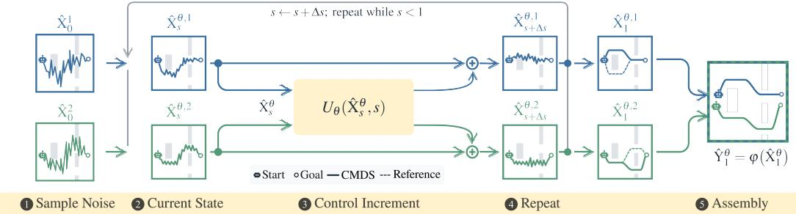  
Figure 1: Overview of CMDS. Frozen component diffusion models are sampled concurrently, while a joint control conditions on the multi-agent state and applies component-wise controls throughout the reverse process, yielding a coordinated assembled output.

• Coordination as modular post-training. We formulate compositional generation as stochastic optimal control over the joint reverse dynamics of frozen pretrained component diffusion models. The independent component processes define a reference product law, while an assembly-level reward can induce cross-component dependencies, realised by a learned control that couples their reverse dynamics.

• Comprehensive empirical validation. We demonstrate target-law recovery, amortised relational assembly, and source separation. In PointMaze, CMDS coordinates up to four agents and generalises to unseen start–goal regions. Using off-the-shelf KUKA and MDM checkpoints, it turns frozen single-agent models into coordinated multi-agent generators without joint training data. The learned KUKA control transfers to new geometries and additional arms without retraining. In four-person motion generation, CMDS achieves 90% joint success versus 75% for PCD++, with over 250× faster sampling.

Further discussion on relevant background concepts can be found in Appendix A.

## 2 COORDINATED MULTI-AGENT DIFFUSION STEERING (CMDS)

We consider N pretrained diffusion agents, each generating one component of a structured output. Using the joint state $\hat { X } _ { s }$ defined above, the assembled state is $\hat { Y } _ { s } ~ = ~ \varphi ( \hat { X } _ { s } ) ~ \in \mathbb { R } ^ { m }$ , where $\varphi :$ $\mathbb { R } ^ { D } \stackrel { \smile } { \to } \mathbb { R } ^ { \breve { m } }$ is a fixed assembly operator. Without coordination, the component processes evolve independently and need not produce a globally consistent assembly. We extend the single-process SOC formulation in eq. (2) to the joint state, with $u _ { s } : \mathbb { R } ^ { D }  \mathbb { R } ^ { D }$ , denoting the coordination control.

Importantly, CMDS is non-autoregressive across components. All N reverse processes evolve concurrently along the same generative-time axis, and at each time s, the control $u _ { s } ^ { i } ( \hat { X } _ { s } )$ applied to agent i may depend on the current state of every agent. No component is therefore generated and fixed before the others. This avoids imposing an arbitrary ordering over components and enables corrections throughout generation, which is particularly important when the assembly-level criterion depends on their joint configuration. The component updates may also be evaluated in parallel, subject to the cost of the coordination modules.

With this joint representation, coordination amounts to steering the combined reverse process so that its assembled terminal sample satisfies an assembly-level criterion while remaining close to the independent pretrained dynamics. Writing $x \ : = \ : ( \check { x } ^ { 1 } , \cdot \cdot \cdot , x ^ { N } ) \in \mathbb { R } ^ { D }$ , we denote the joint reference reverse drift by $\hat { f } _ { s } ( x ) = ( \hat { f } _ { s } ^ { 1 } ( x ^ { 1 } ) , \ldots , \hat { f } _ { s } ^ { N } ( x ^ { N } ) )$ . The controlled terminal assembly is $\hat { Y } _ { 1 } ^ { u } = \varphi ( \hat { X } _ { 1 } ^ { u } ) = \varphi ( \hat { X } _ { 1 } ^ { u , 1 } , \ldots , \hat { X } _ { 1 } ^ { u , N } )$ , and we apply the SOC objective in eq. (2) to the reference product process, using the assembly-level reward $r \circ \varphi$

$$
\operatorname* { m i n } _ { u \in \mathcal { U } } \quad \mathbb { E } _ { \hat { \mathbb { P } } ^ { u } } \left[ \int _ { 0 } ^ { 1 } \frac { 1 } { 2 } \sum _ { i = 1 } ^ { N } \left. u _ { s } ^ { i } ( \hat { X } _ { s } ^ { u } ) \right. ^ { 2 } \mathrm { d } s - \lambda r \Big ( \varphi ( \hat { X } _ { 1 } ^ { u } ) \Big ) \right] ,\tag{3}
$$

where the reward of the assembled terminal output measures the global consistency, and the quadratic control cost penalises deviation from the pretrained agents’ distribution. The central hypothesis of CMDS is that locally valid components can be learned, while the dependencies required for global validity can be introduced through an assembly-level criterion. Further details on the forward noising process, its time reversal, the associated score-based parameterisation, and the controlled reverse-time SDE are provided in Appendices B.1 and B.2.

## 2.1 LEARNING COORDINATED REVERSE DYNAMICS

The exact optimal path distribution $\hat { \mathbb { P } } ^ { u ^ { \star } }$ is generally intractable. We therefore approximate the nonparametric optimal control $u _ { s } ^ { \star } ( x )$ by learning $\mathrm { a }$ parametrised neural control field,

$$
U _ { \theta } ( x , s ) = \bigl ( U _ { \theta } ^ { 1 } ( x , s ) , \ldots , U _ { \theta } ^ { N } ( x , s ) \bigr ) .
$$

The component controls may either share parameters across agents or use agent-specific parameters; in both cases, each $U _ { \theta } ^ { i }$ conditions on the full joint state. The resulting controlled reverse diffusion implicitly defines a stochastic generator $G _ { \theta } = ( G _ { \theta } ^ { 1 } , \dots , G _ { \theta } ^ { N } )$ , with component dynamics,

$$
\mathrm { d } \hat { X } _ { s } ^ { \theta , i } = \left[ \hat { f } _ { s } ^ { i } ( \hat { X } _ { s } ^ { \theta , i } ) + \hat { \sigma } _ { s } U _ { \theta } ^ { i } ( \hat { X } _ { s } ^ { \theta } , s ) \right] \mathrm { d } s + \hat { \sigma } _ { s } \mathrm { d } \bar { W } _ { s } ^ { i } , \qquad i = 1 , \dots , N .\tag{4}
$$

We denote the corresponding assembled process by $\hat { Y } _ { s } ^ { \theta } : = \varphi ( \hat { X } _ { s } ^ { \theta } )$ . Equivalently, $G _ { \theta } ^ { i } : \hat { X } _ { 0 } \mapsto \hat { X } _ { 1 } ^ { \theta , i }$ denotes the stochastic solution map induced by the controlled reverse dynamics, with $\hat { X } _ { 0 } ^ { i } \sim \hat { p } _ { 0 } ^ { i }$ . The corresponding training objective balances control cost and global reward,

$$
\mathcal { I } ( \theta ) = \mathbb { E } _ { \hat { \mathbb { P } } ^ { \theta } } \left[ \int _ { 0 } ^ { 1 } \frac { 1 } { 2 } \sum _ { i = 1 } ^ { N } \| U _ { \theta } ^ { i } ( \hat { X } _ { s } ^ { \theta } , s ) \| ^ { 2 } \mathrm { d } s - \lambda r ( \varphi ( \hat { X } _ { 1 } ^ { \theta } ) ) \right] ,\tag{5}
$$

where ${ \hat { \mathbb { P } } } ^ { \theta }$ is the path distribution induced by the parametrised controlled process.

Adjoint matching CMDS instantiation (Domingo-Enrich et al., 2025). To train the control efficiently, we use an adjoint matching (AM) version of the original objective. Along sampled controlled trajectories, an adjoint variable estimates the direction in which each component should move to improve the final global reward. The control is trained to match this optimal correction,

$$
\mathcal { L } _ { \mathrm { A M } } ( \theta ) = \frac { 1 } { 2 } \mathbb { E } _ { \hat { \mathbb { P } } ^ { \bar { \theta } } } \left[ \int _ { 0 } ^ { 1 } \left. U _ { \theta } ( \hat { X } _ { s } ^ { \bar { \theta } } , s ) + \hat { \sigma } _ { s } a _ { s } ^ { \bar { \theta } } \right. ^ { 2 } \mathrm { d } s \right] , \qquad \bar { \theta } = \mathrm { s t o p g r a d } ( \theta )\tag{6}
$$

where $a _ { s } ^ { \bar { \theta } }$ denotes the adjoint along the sampled controlled trajectory ${ \hat { X } } ^ { { \bar { \theta } } }$ , obtained by solving the following terminal-value problem backwards from $s = 1$ to $s = 0$

$$
\frac { \mathrm { d } } { \mathrm { d } s } a _ { s } ^ { \bar { \theta } } = - D _ { x } \left( \hat { f } _ { s } ( \hat { X } _ { s } ^ { \bar { \theta } } ) + \hat { \sigma } _ { s } U _ { \bar { \theta } } ( \hat { X } _ { s } ^ { \bar { \theta } } , s ) \right) ^ { \top } a _ { s } ^ { \bar { \theta } } - \frac { 1 } { 2 } \nabla _ { x } \sum _ { i = 1 } ^ { N } \| U _ { \bar { \theta } } ^ { i } ( \hat { X } _ { s } ^ { \bar { \theta } } , s ) \| ^ { 2 } ,
$$

$$
a _ { 1 } ^ { \bar { \theta } } = - \lambda D _ { x } \varphi ( { \hat { X } } _ { 1 } ^ { \bar { \theta } } ) ^ { \top } \nabla _ { y } r ( { \hat { Y } } _ { 1 } ^ { \bar { \theta } } ) ,
$$

where $D _ { x }$ denotes the Jacobian with respect to $x .$ . The full pathwise adjoint, its block-wise multiagent form, and the corresponding adjoint matching surrogate are derived in Appendix C.

Strategies for learning the coordination control. CMDS is defined by jointly controlling the reference product process under the SOC objective in eq. (3), whereas AM is one possible strategy for learning the coordination control $U _ { \theta }$ , rather than part of the framework. When the reverse solver and assembly-level reward are differentiable, $U _ { \theta }$ may instead be learned by directly optimising the discretised SOC objective; we refer to reverse-mode differentiation through the solver transitions as discrete-adjoint optimisation (Domingo-Enrich, 2024). Alternatively, path-space objectives such as relative trajectory balance (Venkatraman et al., 2024) could be adapted to the joint controlled reverse process to target the same reward-tilted law, provided that the corresponding controlled-to-reference trajectory-density ratio is tractable. We adopt AM since it propagates gradient information without backpropagating through the complete computational graph of the sampling rollout.

## 2.2 PATH-SPACE INTERPRETATION OF COORDINATION

The SOC objective in eq. (3) admits a path-space interpretation. Let $\hat { \mathbb { P } }$ denote the reference path law induced by the independent pretrained reverse diffusion processes, and let ${ \hat { \mathbb { P } } } ^ { u }$ denote the controlled path law. By Girsanov’s theorem (Øksendal, 2003), under the usual change-of-measure conditions and a shared initial law, the quadratic control cost equals the path-space relative entropy, $\begin{array} { r } { D _ { \mathrm { K L } } \bigl ( \hat { \mathbb { P } } ^ { u } \parallel \hat { \mathbb { P } } \bigr ) = \frac { 1 } { 2 } \mathbb { E } _ { \hat { \mathbb { P } } ^ { u } } [ \int _ { 0 } ^ { 1 } \| u _ { s } ( \hat { X } _ { s } ^ { u } ) \| ^ { 2 } \mathrm { d } s ] } \end{array}$ . The control problem admits the path-space form,

$$
u ^ { \star } \in \arg \operatorname* { m i n } _ { u \in \mathcal { U } } \left\{ D _ { \mathrm { K L } } \big ( \hat { \mathbb { P } } ^ { u } \| \hat { \mathbb { P } } \big ) - \lambda { \mathbb { E } } _ { \hat { \mathbb { P } } ^ { u } } \left[ r \Big ( \varphi ( \hat { X } _ { 1 } ^ { u } ) \Big ) \right] \right\} .\tag{7}
$$

This formulation makes explicit that coordination balances the assembly-level reward of the assembled terminal object against deviation from the pretrained product process. By the standard variational identity for KL-regularised stochastic control (Chetrite & Touchette, 2015), the optimal controlled path law is an exponential tilt of the reference law. Conditionally on the initial noise state,

$$
\frac { \mathrm { d } \hat { \mathbb { P } } ^ { u ^ { \star } } \big ( \cdot | \hat { X } _ { 0 } \big ) } { \mathrm { d } \hat { \mathbb { P } } \big ( \cdot | \hat { X } _ { 0 } \big ) } \big ( \hat { X } . \big ) \propto \exp \Big ( \lambda r \big ( \varphi ( \hat { X } _ { 1 } ) \big ) \Big ) .\tag{8}
$$

Thus, optimal coordination re-weights joint trajectories by the assembly-level reward; see Appendix B.3 for the change of measure and Remark 2 for the induced dependencies.

## 3 EXPERIMENTAL EVALUATION

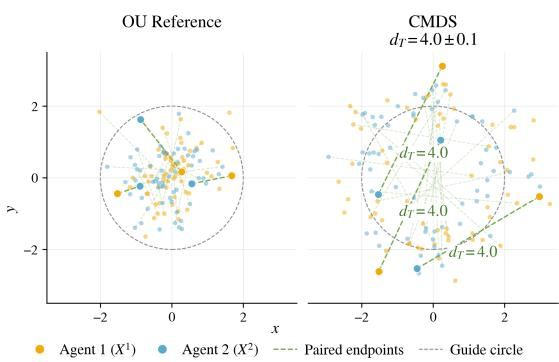  
Figure 2: Two-agent OU problem. Terminal samples from the independent OU reference process and the rotation-equivariant CMDS control for a prescribed separation $d _ { T } = 4$ . Yellow and blue points denote the two agents, and each line joins the terminal states belonging to the same sample.

We evaluate CMDS along three axes: (i) a tractable stochastic-control problem with a known optimal solution, to assess recovery of the target distribution rather than constraint satisfaction alone; (ii) source separation, to assess posterior inference from blurred mixtures when paired source–mixture training data are unavailable; and (iii) multiagent motion, to assess scalability to larger models and more agents using off-the-shelf pretrained checkpoints, including zero-shot transfer to changed geometry and additional agents without retraining the control. Additionally, we study constraint satisfaction and amortised coordination across relational specifications in Appendix D.2. These constrained visual-assembly experiments provide a controlled test-bed to isolate the effects of component factorisation, reward design, amortisation, and optimisation.

## 3.1 TWO-AGENT OU COORDINATION

Setup. We test target-law recovery in a two-agent SOC problem with a computable value function, i.e., the minimum expected remaining cost, whose gradient determines the optimal control, providing a numerical oracle. We consider two independent Ornstein–Uhlenbeck (OU) reference processes $X _ { t } ^ { 1 } , X _ { t } ^ { 2 } \in \mathbb { R } ^ { 2 }$ , with joint state $X _ { t } = ( X _ { t } ^ { \hat { 1 } } , X _ { t } ^ { 2 } ) \in \mathbb R ^ { 4 }$ . The agents are initialised and evolve according to

$$
X _ { 0 } ^ { 1 } , X _ { 0 } ^ { 2 } \overset { \mathrm { i i d } } { \sim } \mathcal { N } ( 0 , I _ { 2 } ) , \qquad d X _ { t } ^ { i } = - X _ { t } ^ { i } d t + d W _ { t } ^ { i } , \qquad t \in [ 0 , 1 ] , \quad i \in \{ 1 , 2 \} ,
$$

where $W ^ { 1 }$ and $W ^ { 2 }$ are independent two-dimensional Brownian motions. Consequently, the joint initial law is $X _ { 0 } \sim { \mathcal { N } } ( 0 , I _ { 4 } )$ . The reference components evolve independently, while coordination is induced by the terminal reward $r _ { \mathrm { O U } } ( x ^ { 1 } , x ^ { 2 } ) = - ( \| x ^ { 2 } - x ^ { 1 } \| _ { 2 } - d _ { T } ^ { \star } ) ^ { 2 }$ , with $d _ { T } = 4$ , and realised through the resulting joint optimal control. Because the problem reduces to the relative coordinate

$R _ { t } = X _ { t } ^ { 2 } - X _ { t } ^ { 1 }$ , we can compute a value-function oracle for the optimal stochastic control (refer to Appendix D.1). We also include importance sampling (IS) (Robert & Casella, 2004), using samples from the (uncontrolled) OU reference process re-weighted according to the terminal reward.

Constraint satisfaction. The reference OU process yields a terminal separation of 1.3 ± 0.7, whereas the rotation-equivariant CMDS control achieves $4 . 0 \pm 0 . 1$ , see fig. 2. The equivariant control is used only to respect a known symmetry of the oracle target; it is not a requirement of CMDS.

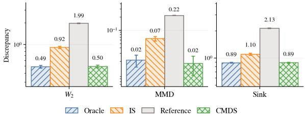  
Figure 3: Recovery of the SOC target.

Distributional recovery. We compare terminal samples against the oracle’s joint terminal law, i.e., the t = 1 marginal of the optimal path law characterised in eq. (8), using the 2-Wasserstein distance $( W _ { 2 } )$ , maximum mean discrepancy (MMD), and Sinkhorn (Sink) transport cost over five seeds. As reported in fig. 3, CMDS achieves discrepancies comparable to oracle self-comparisons and outperforms importance sampling (IS). These results show that CMDS does more than reach the prescribed separation as it also recovers the distributional structure of the reward-tilted target law. Appendix D.1 shows that an unconstrained control can satisfy the scalar distance constraint while failing to recover angular structure of the target distribution.

## 3.2 SOURCE SEPARATION

Compositional posterior formulation. We consider posterior inference in which N frozen pretrained diffusion samplers independently define component priors through their reverse processes, with reference terminal samples $\hat { X } _ { 1 } ^ { i } \sim \tilde { \pi } ^ { i }$ . Let $\boldsymbol { X } = ( X ^ { 1 } , \ldots , X ^ { N } )$ denote the unknown component state, whose non-injective additive assembly is $Y = \varphi ( X ) : = \textstyle \sum _ { i = 1 } ^ { N } X ^ { i }$ , and suppose that we observe a blurred mixture $b = \operatorname { A } _ { \tau } ( Y ) + \varepsilon .$ , where $\mathrm { A } _ { \tau }$ is a known Gaussian blurring operator with standard deviation $\tau _ { \ast }$ , and $\varepsilon \sim \mathcal { N } ( 0 , \sigma _ { \varepsilon } ^ { 2 } I )$ . Since the additive assembly $\varphi$ is non-injective, the observation does not uniquely identify its constituent sources; the independently pretrained component priors therefore regularise the resulting compositional posterior over valid decompositions. Assuming Gaussian observation noise, we define the assembly-level reward $\begin{array} { r } { r _ { b } ( y ) : = - \frac { \frac { 1 } { 2 } } { \Vert \mathbf { A } _ { \tau } ( y ) - b \Vert ^ { 2 } } } \end{array}$ The pretrained diffusion models define the reference product law $\rho = \tilde { \pi } ^ { 1 } \otimes \cdots \otimes \tilde { \pi } ^ { \bar { N } }$ , while CMDS performs compositional posterior inference by coordinating their reverse dynamics, producing controlled terminal components $\hat { X } _ { 1 } ^ { \theta } = ( \hat { X } _ { 1 } ^ { \theta , 1 } , \cdot \cdot \cdot , \hat { X } _ { 1 } ^ { \theta , N } )$ whose assembly $\hat { Y } _ { 1 } ^ { \theta } = \varphi ( \hat { X } _ { 1 } ^ { \theta } )$ jointly explains the observation $b ,$ without requiring training samples from the joint source distribution. For comparison, we adapt diffusion posterior sampling (DPS) (Chung et al., 2023) to the product prior, paralleling the posterior-sampling construction of Luan et al. (2025). At each reverse step, we evaluate the observation likelihood on the Tweedie estimates (Efron, 2011) of both processes and apply the resulting component-wise gradients to their reverse updates; details are given in Appendix D.3.

Recovery under ambiguity. As shown in fig. 4, CMDS achieves the strongest overall recovery under the challenging $\tau = 1$ blur. It yields the lowest clean-mixture reconstruction error and the highest source intersection over union (IoU), while maintaining the low shape distortion induced by the frozen component priors. DPS substantially improves source localisation over independent reference sampling, but markedly distorts the components and yields a larger reconstruction error than CMDS. This localisation–distortion trade-off reflects the non-identifiability of the problem. The likelihood depends only on the assembled mixture $X ^ { 1 } + X ^ { 2 }$ , through $\mathrm { A } _ { \tau } \mathrm { ( } X ^ { 1 } + \bar { X } ^ { 2 } )$ , and therefore contains no direct information about the differential mode $\bar { X } ^ { 1 } - \bar { X } ^ { 2 }$ that distinguishes the individual sources. Consequently, the step-wise likelihood corrections used by DPS can improve the reward by redistributing or deforming mass in ways that are poorly aligned with the pretrained component distributions. By contrast, rather than applying step-wise likelihood guidance, CMDS learns joint feedback over the product of the pretrained reverse processes, while the quadratic pathaction penalty favours small coordinated deviations from the frozen dynamics, helping preserve component structure. Quantitative results under milder blur are provided in Appendix D.3.

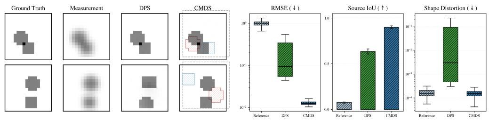  
Figure 4: Source separation from a blurred mixture (τ = 1). Left: circle–square reconstructions for two held-out mixtures; red and blue hatching behind the CMDS reconstructions shows sameseed matched reference sources. Right: comparison of the reference, DPS, and CMDS over 1,024 held-out mixtures, measuring clean-mixture recovery (RMSE, ↓), labelled-source overlap (IoU, ↑), and shape distortion (↓). Full metric definitions are in Appendix D.3; aggregate results and representative reconstructions under milder blur (τ = 0.5) are shown in figs. 15 and 16.

<table><tr><td></td><td colspan="4">Medium</td><td colspan="4">Large</td></tr><tr><td></td><td colspan="2">N = 2</td><td colspan="2">N = 4</td><td colspan="2">N = 2</td><td colspan="2">N = 4</td></tr><tr><td>Method</td><td>Pool 1 ↑</td><td>Pool 2 ↑</td><td>Pool 1 ↑</td><td>Pool 2 ↑</td><td>Pool 1 ↑</td><td>Pool 2 ↑</td><td>Pool 1 ↑</td><td>Pool 2 ↑</td></tr><tr><td>Reference</td><td> $0 . 1 7 4 \pm 0 . 0 0 5$ </td><td>0.195 ±0.008</td><td>0.068 ±0.005</td><td>0.010±0.005</td><td>0.195 ±0.016</td><td>0.219±0.000</td><td> $0 . 0 3 9 \pm \mathrm { 0 . 0 0 0 }$ </td><td>0.049 ±0.005</td></tr><tr><td>Best-of-256</td><td>0.216±0.005</td><td>0.263 ±0.016</td><td>0.076±0.005</td><td>0.044±0.005</td><td>0.232 ±0.009</td><td>0.328±0.021</td><td>0.076±0.005</td><td>0.070±0.000</td></tr><tr><td>FK-Steering</td><td>0.797 ±0.028</td><td>0.820 ±0.034</td><td>0.398 ±0.036</td><td>0.331 ±0.016</td><td>0.924±0.030</td><td>0.953±0.008</td><td>0.622 ±0.009</td><td>0.729 ±0.023</td></tr><tr><td>DPS</td><td>0.964±0.024</td><td>0.956±0.016</td><td>0.958 ±0.025</td><td>0.919±0.033</td><td>0.984±0.016</td><td>0.977±0.000</td><td>0.880±0.030</td><td>0.927 ±0.009</td></tr><tr><td>CMDS</td><td>0.990 ±0.012</td><td>0.919 ±0.016</td><td>0.701 ±0.009</td><td>0.669 ±0.005</td><td>0.911 ±0.016</td><td>0.831 ±0.016</td><td>0.880 ±0.012</td><td>0.753 ±0.027</td></tr><tr><td>CMDS + TRG</td><td>0.995 ±0.005</td><td>0.992 ±0.000</td><td>0.974±0.012</td><td>0.935 ±0.005</td><td>0.966±0.005</td><td>0.898 ±0.016</td><td>0.966±0.012</td><td>0.977 ±0.000</td></tr></table>

Table 1: PointMaze joint success. Mean ± standard deviation (std) across sampling seeds. Training-seed variability is reported separately in Appendix D.4.8. Each pool contains 128 instances per layout and agent count. For CMDS and CMDS+TRG, we train five independent seeds and report the seed with median Pool 1 success for each setting, breaking ties using Pool 2.

## 3.3 FROM SINGLE-AGENT PRIORS TO COORDINATED MULTI-AGENT MOTION

Coordination across motion domains. We investigate multi-agent navigation problems where agents move through a shared environment, between prescribed start- and end-points, while satisfying task-specific constraints and avoiding collisions. We consider planar navigation (PointMaze) (Fu et al., 2020), articulated robot planning (KUKA) (Luo et al., 2024), and text-conditioned human motion (MDM) (Tevet et al., 2023). Pretrained single-agent priors generate component trajectories, the assembly operator combines them, and an assembly-level reward coordinates their movement. Throughout, the component priors remain frozen and only the coordination control is learned. Point-Maze and KUKA condition the component models on prescribed start and end points. For

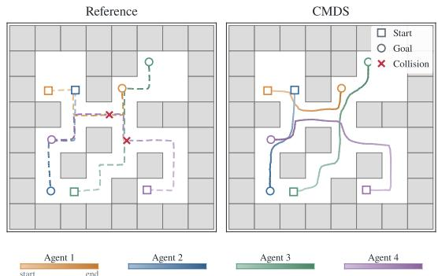  
Figure 5: PointMaze (Medium) coordination. Dashed ( ) and solid ( ) paths use the same initial noise. Reference (uncontrolled) process trajectories collide, whereas CMDS steers to avoid collisions while preserving their start–end pairs.

MDM, component models are text-conditioned and end points are supplied to the coordination control. Success requires every agent to satisfy the task-specific goal, avoid collisions, and pass taskspecific feasibility checks. Further details are in Appendices D.4 to D.6.

PointMaze: amortised multi-agent navigation. We pretrain one conditional single-agent trajectory prior for each of the “Medium” and “Large” layouts (Fu et al., 2020), then coordinate two or four copies. The reward penalises insufficient wall clearance, inter-agent collisions, path length, and trajectory acceleration. We evaluate on two sets of unseen start–end instances. Pool 1 places starts and goals in navigable grid squares used during control training, whereas Pool 2 uses squares excluded from control training (Appendix D.4.3). Table 1 and fig. 5 compare independent reference sampling, Best-of-256, FK-Steering (Singhal et al., 2025), DPS (Chung et al., 2022), and our learned control. We evaluate two parameterisations of the coordination control: CMDS uses an attentionbased control conditioned on the joint multi-agent state, while CMDS+TRG additionally incorporates the Tweedie reward gradient (TRG), namely the reward gradient evaluated at the Tweedie estimate, inspired by prior work (Denker et al., 2024; Venkatraman et al., 2024). CMDS+TRG improves or matches the reported base-CMDS rates, achieving Pool 2 success between 89.8% and 99.2% across the reported settings; DPS is the best performing on “Large” with two agents. Across five independent training seeds per setting, CMDS+TRG achieves mean Pool 2 success between 90.6% and 98.3%, with training-seed standard deviations no larger than 1.5 percentage points (Appendix D.4.8). To stabilise adjoint-matching training against large residuals, we use a pseudo-Huber regression loss in place of the squared loss; details are in Appendix D.4.7.

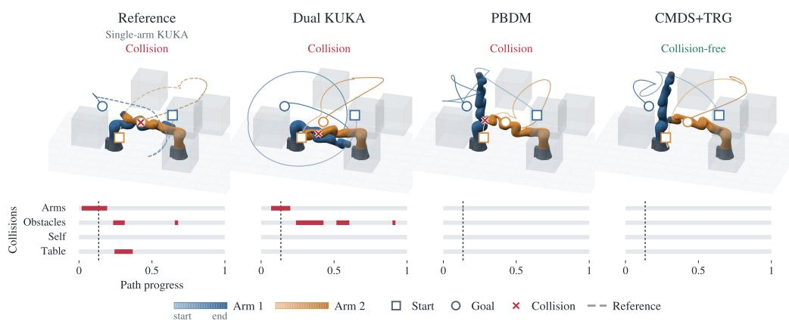  
Figure 6: A dual-arm coordination example. Poses share normalised path progress $s = 0 . 1 3 5 ;$ crosses mark arm–arm contact, and red intervals mark strict mesh collisions. PBDM uses $n _ { \mathrm { c a n d } } = 6$ with up to five repair attempts per candidate, versus $n _ { \mathrm { c a n d } } = 1$ for the other methods; its modified, native-accepted path fails strict checking between knots. This outcome-selected illustration is not a matched-budget comparison. Additional poses and clearance traces are provided in Appendix D.5.

KUKA: multi-arm planning from single-arm priors. We coordinate two seven-joint robot arms in a shared environment containing obstacles. Each task specifies the obstacle layout and the start and goal configurations of both arms. A shared CMDS+TRG control coordinates frozen pretrained single-arm diffusion models to generate their paths jointly.

Publicly released checkpoints (Luo et al., 2024) predict noise as an energy gradient, $\epsilon _ { \psi } ~ = ~ \nabla _ { x } E _ { \psi }$ . Adjoint propagation therefore requires Hessian–vector products through the energy, while the checkpoint parameters remain frozen. Strict success requires both arms to reach their goals, remain within the allowed angular range of every robot joint, and pass checks for inter-arm collisions, selfcollisions, and collisions with the obstacles and worktable. We evaluate on the test layouts released by Luo et al. (2024), unseen by both the priors and the controller

<table><tr><td>Method</td><td>Strict success (%, ↑) Planning time (s, ↓)</td><td></td></tr><tr><td>PBDM</td><td> $6 0 . 9 \pm 8 . 0$ </td><td>0.427 ±0.003</td></tr><tr><td>Dual KUKA + guidance</td><td> $7 4 . 3 \pm 5 . 7$ </td><td>0.356±0.002</td></tr><tr><td>Dual KUKA prior</td><td> $3 6 . 3 \pm 8 . 7$ </td><td>0.274±0.033</td></tr><tr><td>Single-arm priors + guidance</td><td> $5 1 . 0 { \scriptstyle \pm 0 . 6 }$ </td><td>0.355 ±0.001</td></tr><tr><td>Reference single-arm priors</td><td> $1 1 . 4 \pm 1 . 5$ </td><td>0.193 ±0.002</td></tr><tr><td>CMDS+TRG</td><td> $7 7 . 3 \pm 0 . 7$ </td><td>0.368 ±0.002</td></tr></table>

Table 2: Dual KUKA planning with one initial joint candidate. Mean ± sample std. strict successes on 413 held-out test tasks. Planning time is the median value and includes scene setup, generation, verification and optional refinement.

(Appendix D.5.1), and denote by $n _ { \mathrm { c a n d } }$ the number of initial candidate multi-arm plans generated per task. With one candidate plan, CMDS+TRG achieves 77.3% strict success, compared with 11.4% for the reference independent single-arm sampling and 51.0% when adding collision guidance (see table 2). Using the separately pretrained two-arm diffusion prior, guided Dual KUKA achieves 74.3%, while Potential Based Diffusion Motion Planning (PBDM; Luo et al., 2024) achieves 60.9% using the same prior within its native candidate-selection and refinement procedure. We also apply the learned control without retraining to shifted or enlarged obstacles, wider arm-base spacing, and additional arms (table 3). On a separate set of tasks with five arms and four candidates per task $( n _ { \mathrm { c a n d } } = 4 )$ , CMDS + TRG achieves 68.3% strict success, compared with 48.3% for guided single-arm priors. Additional information is provided in Appendix D.5.

<table><tr><td rowspan="2">Method</td><td rowspan="2">Ncand</td><td colspan="3">Geometry transfer</td><td colspan="3">Number of arms</td></tr><tr><td>Shifted</td><td>Larger obstacles obstacles</td><td>Wider bases</td><td>3</td><td>4</td><td>5</td></tr><tr><td rowspan="2">Single-arm KUKA + guidance</td><td>1</td><td></td><td></td><td></td><td>53.4 ±4.0 14.3 ±1.3 49.2 ±2.4 33.8 ±0.7 28.4 ±1.7 19.3 ±2.0</td><td></td><td></td></tr><tr><td>4</td><td></td><td></td><td></td><td></td><td>83.2 ±2.8 42.1 ±4.1 84.0 ±0.7 69.1 ±1.5 55.7 ±3.5 48.3 ±2.4</td><td></td></tr><tr><td rowspan="2">Dual KUKA + guidance</td><td>1</td><td>68.9 ±3.9 31.1 ±10.0 58.2 ±8.1</td><td></td><td></td><td></td><td></td><td>一</td></tr><tr><td>4</td><td> $8 9 . 7 \pm 0 . 8 6 6 . 9 \pm 3 . 8 8 7 . 8 \pm 2 . 8$ </td><td></td><td></td><td></td><td></td><td>1</td></tr><tr><td rowspan="2">CMDS + TRG</td><td>1</td><td></td><td></td><td></td><td></td><td> ${ \bf 7 4 . 0 \pm 1 . 7 4 2 . 7 \pm 3 . 7 \cdot 7 2 . 1 \pm 2 . 2 5 9 . 5 \pm 0 . 3 5 2 . 3 \pm 3 . 4 4 1 . 9 \pm 1 . 7 }$ </td><td></td></tr><tr><td>4</td><td></td><td></td><td></td><td></td><td>91.6 ±0.5 73.0 ±1.0 91.8 ±0.8 86.8 ±1.0 76.2 ±2.6 68.3 ±1.2</td><td></td></tr></table>

Table 3: Zero-shot KUKA generalisation. Strict success (%), mean ± sample std. across three sampling seeds, for $n _ { \mathrm { c a n d } } = 1 , 4 .$ . The left block reports geometry transfer; the right block reports transfer to larger numbers of arms.
<table><tr><td>Method</td><td>Success (%)↑</td><td>Collision free (%) ↑</td><td>Goal err. (m) ↓</td><td>Time (s) ↓</td></tr><tr><td>Best-of-256</td><td> $0 . 0 \pm 0 . 0$ </td><td> $1 6 . 7 \pm 5 . 9$ </td><td>2.456 ±0.146</td><td> $6 9 . 9 0 \pm 0 . 2 9$ </td></tr><tr><td>DPS</td><td> $0 . 0 \pm 0 . 0$ </td><td> $6 1 . 7 \pm 1 0 . 8$ </td><td>3.751 ±0.284</td><td> $8 . 5 7 \pm 0 . 0 2$ </td></tr><tr><td>PCD</td><td> $4 . 2 \pm 2 . 9$ </td><td> $8 . 3 \pm 2 . 9$ </td><td>0.500 ±0.000</td><td> $9 . 9 9 \pm 0 . 0 6$ </td></tr><tr><td>PCD++</td><td> $7 5 . 0 \pm 6 . 6$ </td><td> ${ \bf 9 8 . 3 \pm 2 . 3 }$ </td><td>0.487 ±0.001</td><td> $1 4 5 . 3 4 \pm 4 . 4 6$ </td></tr><tr><td>CMDS</td><td> ${ \bf 9 0 . 0 \pm } 6 . 3$ </td><td>90.0 ±6.3</td><td>0.158 ±0.008</td><td>0.54 ±0.00</td></tr></table>

Table 4: Four-person motion coordination. Mean ± sample std. across five sampling seeds on 24 scenes; CMDS uses one trained control. Failures count as zero successes. Full metrics appear in table 15.

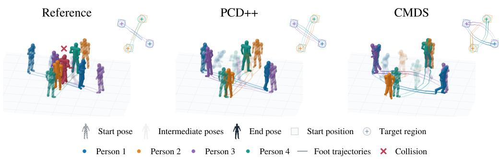  
Figure 7: Four-person motion coordination. We compare reference MDM, PCD++, and CMDS on the four-person coordination task. Solid curves show left- and right-foot trajectories, with intermediate poses faded; the top-down insets summarise the trajectories and target completion. Here, the reference produces collisions and misses targets, whereas PCD++ and CMDS reach all targets without collisions. Figure 22 in Appendix D.6 compares all methods.

MDM: from single-person motion to coordinated crowds. We use the 50-step MDM checkpoint (Tevet et al., 2023) to coordinate four independently text-conditioned people over six-second motions (see Appendix D.6). A generated scene is successful when all four people move from their starting positions to their targets, shown in the top-down insets of fig. 7, and their motions pass both the inter-person collision and kinematic-validity checks. Baselines include Best-of-256, DPS, PCD (Luan et al., 2025), and our PCD++ extension, which jointly optimises noisy motions through the frozen denoiser for goal attainment and clearance (see Algorithm 2). Table 4 and fig. 7 report 90% joint success for CMDS versus 75% for PCD++. PCD++ has a higher collision-free rate, but lower joint success and longer sampling time.

## 4 CONCLUSION

We introduced CMDS, a modular post-training framework for coordinating frozen pretrained dif fusion models through stochastic optimal control. An assembly-level reward specifies joint requirements, while an amortised control couples the component reverse processes under a quadratic pathaction penalty. Experiments demonstrate target-law recovery in a tractable setting, amortised relational assembly, and source recovery, while released KUKA and MDM priors extend coordination to multi-arm planning and multi-person motion. Transfer to additional robot arms further illustrates the reuse enabled by learning coordination separately from component generation. Together, these results show that frozen component models can support structured tasks beyond their individual training settings through learned interactions. Future work includes improving reward design, characterising how robust matching and control parameterisation affect target-law approximation, and extending coordination to larger, more heterogeneous generative models.

## AI USE STATEMENT

In this work, we used generative AI tools to assist with text editing, reformatting, and polishing; LAT<sub>E</sub>X formatting and styling; and software-code review, debugging, and editing. We also used generative AI to generate code for visualisation and presentation of results; all such code was reviewed by the authors and was not used to implement the methods or produce the experimental results reported in this paper. All AI-assisted text and code were reviewed and edited by the authors. AI-assisted code was manually inspected and tested before use.

We did not use generative AI tools to generate synthetic datasets, help develop theoretical models or conceptual frameworks, formulate mathematical claims, provide critical ingredients for proving mathematical claims, assist in the writing of proofs, propose or refine hypotheses, clean and reformat datasets, support qualitative and thematic data analysis, or interpret results; assisting with translation is not applicable to this work.

We take responsibility for the final content of this work, including text, claims, code, and artifacts produced with the aid of generative AI.

## ACKNOWLEDGMENTS

RB acknowledges support from the EPSRC (EP/V026259/1). GW acknowledges support from the EPSRC CDT in Smart Medical Imaging [EP/S022104/1] and by a GSK Studentship. AD acknowledges support from DESY (Hamburg, Germany), a member of the Helmholtz Association HGF. VP acknowledges the financial support from the Munich Center for Machine Learning (MCML). The authors gratefully acknowledge the Gauss Centre for Supercomputing e. V. (https://www. gauss-centre.eu) for funding this project by providing computing time through the John von Neumann Institute for Computing (NIC) on the GCS Supercomputer JUPITER—JUWELS at Julich¨ Supercomputing Centre (JSC). Furthermore, the authors appreciate the computational resources provided by the National High Performance Computing Centre (https://www.nhr.kit.edu). Finally, the authors would also like to acknowledge the fruitful discussions with Lourdes de Agapito Vicente, Simon Arridge, Mirgahney Mohammed, Marcelo Pereyra, and Neill Campbell.

## REFERENCES

Brian D. O. Anderson. Reverse-time diffusion equation models. Stochastic Processes and their Applications, 12(3):313–326, 1982. doi: 10.1016/0304-4149(82)90051-5. URL https:// doi.org/10.1016/0304-4149(82)90051-5.

Omer Bar-Tal, Lior Yariv, Yaron Lipman, and Tali Dekel. Multidiffusion: Fusing diffusion paths for controlled image generation. In Proceedings of the 40th International Conference on Machine Learning, volume 202 of Proceedings of Machine Learning Research, pp. 1737–1752. PMLR, 2023. URL https://proceedings.mlr.press/v202/bar-tal23a.html.

Riccardo Barbano, Alexander Denker, Zeljko Kereta, Runchang Li, and Francisco Vargas. CMAD: Cooperative multi-agent diffusion via stochastic optimal control. arXiv preprint arXiv:2602.10933, 2026. doi: 10.48550/arXiv.2602.10933. URL https://arxiv.org/ abs/2602.10933.

Jonathan T. Barron. A general and adaptive robust loss function. In Proceedings of the IEEE/CVF Conference on Computer Vision and Pattern Recognition, pp. 4331–4339, 2019. URL https://openaccess.thecvf.com/content\_CVPR\_2019/html/Barron\_ A\_General\_and\_Adaptive\_Robust\_Loss\_Function\_CVPR\_2019\_paper.html.

Julius Berner, Lorenz Richter, and Karen Ullrich. An optimal control perspective on diffusionbased generative modeling. Transactions on Machine Learning Research, 2024. URL https: //arxiv.org/abs/2211.01364.

Elie Bienenstock, Stuart Geman, and Daniel Potter. Compositionality, MDL priors, and object recognition. In Advances in Neural Information Processing Systems, volume 9, 1996. URL https://proceedings.neurips.cc/paper/1996/hash/ 17fafe5f6ce2f1904eb09d2e80a4cbf6-Abstract.html.

Denis Blessing, Julius Berner, Lorenz Richter, Carles Domingo-Enrich, Yuanqi Du, Arash Vahdat, and Gerhard Neumann. Trust region constrained measure transport in path space for stochastic optimal control and inference. arXiv preprint arXiv:2508.12511, 2025. URL https: //arxiv.org/abs/2508.12511.

Gerard Brunick and Steven Shreve. Mimicking an ito process by a solution of a stochas- ˆ tic differential equation. The Annals of Applied Probability, 23(4):1584–1628, 2013. doi: 10.1214/12-AAP881. URL https://doi.org/10.1214/12-AAP881.

Jiahang Cao, Qiang Zhang, Hanzhong Guo, Jiaxu Wang, Hao Cheng, and Renjing Xu. Modalitycomposable diffusion policy via inference-time distribution-level composition, 2025. URL https://arxiv.org/abs/2503.12466.

Pierre Charbonnier, Laure Blanc-Feraud, Gilles Aubert, and Michel Barlaud. Two determinis-´ tic half-quadratic regularization algorithms for computed imaging. In Proceedings of the 1st International Conference on Image Processing, volume 2, pp. 168–172. IEEE, 1994. doi: 10.1109/ICIP.1994.413553. URL https://doi.org/10.1109/ICIP.1994.413553.

Raphael Chetrite and Hugo Touchette. Variational and optimal control representations of conditioned and driven processes. Journal of Statistical Mechanics: Theory and Experiment, 2015 (12):P12001, 2015. doi: 10.1088/1742-5468/2015/12/P12001. URL https://arxiv.org/ abs/1506.05291.

Hyungjin Chung, Jeongsol Kim, Michael T. Mccann, Marc L. Klasky, and Jong Chul Ye. Diffusion posterior sampling for general noisy inverse problems. arXiv preprint arXiv:2209.14687, 2022. URL https://arxiv.org/abs/2209.14687.

Hyungjin Chung, Jeongsol Kim, Michael T. Mccann, Marc L. Klasky, and Jong Chul Ye. Diffusion posterior sampling for general noisy inverse problems. In International Conference on Learning Representations, 2023. URL https://openreview.net/forum?id=OnD9zGAGT0k.

Alexander Denker, Francisco Vargas, Shreyas Padhy, Kieran Didi, Simon Mathis, Vincent Dutordoir, Riccardo Barbano, Emile Mathieu, Urszula J. Komorowska, and Pietro Lio. DEFT: Efficient fine-tuning of diffusion models by learning the generalised htransform. In Advances in Neural Information Processing Systems, volume 37, pp. 19636–19682. Curran Associates, Inc., 2024. doi: 10.52202/079017-0620. URL https://proceedings.neurips.cc/paper\_files/paper/2024/hash/ 22d258dfbdf840ccbf266bbc545dd95f-Abstract-Conference.html.

Carles Domingo-Enrich. A taxonomy of loss functions for stochastic optimal control. arXiv preprint arXiv:2410.00345, 2024. URL https://arxiv.org/abs/2410.00345.

Carles Domingo-Enrich, Jiequn Han, Brandon Amos, Joan Bruna, and Ricky T. Q. Chen. Stochastic optimal control matching. In Advances in Neural Information Processing Systems, volume 37, pp. 112459–112504. Curran Associates, Inc., 2024. doi: 10.52202/079017-3573. URL https://proceedings.neurips.cc/paper\_files/paper/2024/hash/ cc32ec39a5073f61d38c338d963df30d-Abstract-Conference.html.

Carles Domingo-Enrich, Michal Drozdzal, Brian Karrer, and Ricky T. Q. Chen. Adjoint matching: Fine-tuning flow and diffusion generative models with memoryless stochastic optimal control. In International Conference on Learning Representations, 2025. URL https://openreview. net/forum?id=xQBRrtQM8u.

Yilun Du and Leslie Pack Kaelbling. Position: Compositional generative modeling: A single model is not all you need. In Proceedings of the 41st International Conference on Machine Learning, volume 235 of Proceedings ofMachine Learning Research, pp. 11721–11732. PMLR, 2024. URL https://proceedings.mlr.press/v235/du24d.html.

Yilun Du, Conor Durkan, Robin Strudel, Joshua B. Tenenbaum, Sander Dieleman, Rob Fergus, Jascha Sohl-Dickstein, Arnaud Doucet, and Will Sussman Grathwohl. Reduce, reuse, recycle: Compositional generation with energy-based diffusion models and MCMC. In Proceedings of the 40th International Conference on Machine Learning, volume 202 of Proceedings of Machine Learning Research, pp. 8489–8510. PMLR, 2023. URL https://proceedings. mlr.press/v202/du23a.html.

Bradley Efron. Tweedie’s formula and selection bias. Journal of the American Statistical Association, 106(496):1602–1614, 2011. doi: 10.1198/jasa.2011.tm11181. URL https://doi. org/10.1198/jasa.2011.tm11181.

Justin Fu, Aviral Kumar, Ofir Nachum, George Tucker, and Sergey Levine. D4RL: Datasets for deep data-driven reinforcement learning. arXiv preprint arXiv:2004.07219, 2020. URL https: //arxiv.org/abs/2004.07219.

Ulf Grenander. Lectures in Pattern Theory: Volume 2: Pattern Analysis, volume 24 of Applied Mathematical Sciences. Springer, 1978. doi: 10.1007/978-1-4684-9354-2. URL https:// doi.org/10.1007/978-1-4684-9354-2.

Ulrich G. Haussmann and Etienne Pardoux. Time reversal of diffusions. The Annals of Probabil ity, 14(4):1188–1205, 1986. doi: 10.1214/aop/1176992362. URL https://doi.org/10. 1214/aop/1176992362.

Akio Hayakawa, Masato Ishii, Takashi Shibuya, and Yuki Mitsufuji. MMDisCo: Multi-modal discriminator-guided cooperative diffusion for joint audio and video generation. In International Conference on Learning Representations, 2025. URL https://openreview.net/forum? id=VZ1DqfYqUw.

Jonathan Ho, Nal Kalchbrenner, Dirk Weissenborn, and Tim Salimans. Axial attention in multidimensional transformers. arXiv preprint arXiv:1912.12180, 2019. URL https://arxiv. org/abs/1912.12180.

Jonathan Ho, Ajay Jain, and Pieter Abbeel. Denoising diffusion probabilistic models. Advances in neural information processing systems, 33:6840–6851, 2020.

Peter J. Huber. Robust estimation of a location parameter. In Breakthroughs in Statistics: Methodology and Distribution, pp. 492–518. Springer, 1992. doi: 10.1007/978-1-4612-4380-9 35. URL https://doi.org/10.1007/978-1-4612-4380-9\_35.

Michael Janner, Yilun Du, Joshua B. Tenenbaum, and Sergey Levine. Planning with diffusion for flexible behavior synthesis. In Proceedings of the 39th International Conference on Machine Learning, volume 162 of Proceedings of Machine Learning Research, pp. 9902–9915. PMLR, 2022. URL https://proceedings.mlr.press/v162/janner22a.html.

Thomas G. Kurtz. Martingale problems for conditional distributions of markov processes. Electronic Journal ofProbability, 3:1–29, 1998. doi: 10.1214/EJP.v3-31. URL https://doi.org/10. 1214/EJP.v3-31.

Chieh-Hsin Lai, Yang Song, Dongjun Kim, Yuki Mitsufuji, and Stefano Ermon. The principles of diffusion models. arXiv preprint arXiv:2510.21890, 2025. URL https://arxiv.org/abs/ 2510.21890.

Juho Lee, Yoonho Lee, Jungtaek Kim, Adam Kosiorek, Seungjin Choi, and Yee Whye Teh. Set transformer: A framework for attention-based permutation-invariant neural networks. In Proceedings of the 36th International Conference on Machine Learning, volume 97 of Proceedings of Machine Learning Research, pp. 3744–3753. PMLR, 2019. URL https://proceedings. mlr.press/v97/lee19d.html.

Yuseung Lee, Kunho Kim, Hyunjin Kim, and Minhyuk Sung. Syncdiffusion: Coherent montage via synchronized joint diffusions. In Advances in Neural Information Processing Systems, volume 36, 2023. URL https://proceedings.neurips.cc/paper\_files/paper/2023/ hash/9ee3a664ccfeabc0da16ac6f1f1cfe59-Abstract-Conference.html.

Nan Liu, Shuang Li, Yilun Du, Antonio Torralba, and Joshua B. Tenenbaum. Compositional visual generation with composable diffusion models. In European Conference on Computer Vision, pp. 423–439. Springer, 2022. URL https://www.ecva.net/papers/eccv\_ 2022/papers\_ECCV/html/6940\_ECCV\_2022\_paper.php.

Haofei Lu, Dongqi Han, Yifei Shen, and Dongsheng Li. What makes a good diffusion planner for decision making? In International Conference on Learning Representations, 2025. URL https://openreview.net/forum?id=7BQkXXM8Fy.

Hao Luan, Yi Xian Goh, See-Kiong Ng, and Chun Kai Ling. Projected coupled diffusion for testtime constrained joint generation. arXiv preprint arXiv:2508.10531, 2025. URL https:// arxiv.org/abs/2508.10531.

Yunhao Luo, Chen Sun, Joshua B. Tenenbaum, and Yilun Du. Potential based diffusion motion planning. arXiv preprint arXiv:2407.06169, 2024. URL https://arxiv.org/abs/2407. 06169.

Luigi Negro. Sample distribution theory using coarea formula. Communications in Statistics – Theory and Methods, 53(5):1864–1889, 2024. URL https://doi.org/10.1080/ 03610926.2022.2112507.

Edward Nelson. Dynamical Theories of Brownian Motion. Princeton University Press, 1967. doi: 10.1515/9780691219615. URL https://doi.org/10.1515/9780691219615.

Nikolas Nusken and Lorenz Richter. Solving high-dimensional hamilton–jacobi–bellman pdes us-¨ ing neural networks: Perspectives from the theory of controlled diffusions and measures on path space. Partial Differential Equations and Applications, 2(4):48, 2021. doi: 10.1007/ s42985-021-00102-x. URL https://doi.org/10.1007/s42985-021-00102-x.

Bernt Øksendal. Stochastic Differential Equations: An Introduction with Applications. Springer, 6 edition, 2003. doi: 10.1007/978-3-642-14394-6. URL https://doi.org/10.1007/ 978-3-642-14394-6.

Lasse Peters, Laura Ferranti, Andrea Bajcsy, and Javier Alonso-Mora. Coordinated diffusion: Generating multi-agent behavior without multi-agent demonstrations. arXiv preprint arXiv:2605.11485, 2026. URL https://arxiv.org/abs/2605.11485.

Christian P. Robert and George Casella. Monte Carlo Statistical Methods. Springer, 2 edition, 2004. doi: 10.1007/978-1-4757-4145-2. URL https://doi.org/10.1007/ 978-1-4757-4145-2.

Yorai Shaoul, Itamar Mishani, Shivam Vats, Jiaoyang Li, and Maxim Likhachev. Multi-robot motion planning with diffusion models. In International Conference on Learning Representations, 2025. URL https://openreview.net/forum?id=AUCYptvAf3.

Guni Sharon, Roni Stern, Ariel Felner, and Nathan R. Sturtevant. Conflict-based search for optimal multi-agent pathfinding. Artificial Intelligence, 219:40–66, 2015. doi: 10.1016/j.artint.2014.11. 006. URL https://doi.org/10.1016/j.artint.2014.11.006.

Raghav Singhal, Zachary Horvitz, Ryan Teehan, Mengye Ren, Zhou Yu, Kathleen Mckeown, and Rajesh Ranganath. A general framework for inference-time scaling and steering of diffusion models. In Proceedings ofthe 42nd International Conference on Machine Learning, volume 267 of Proceedings ofMachine Learning Research, pp. 55810–55827. PMLR, 2025. URL https: //proceedings.mlr.press/v267/singhal25b.html.

Yang Song, Jascha Sohl-Dickstein, Diederik P Kingma, Abhishek Kumar, Stefano Ermon, and Ben Poole. Score-based generative modeling through stochastic differential equations. In International Conference on Learning Representations, 2021.

Guy Tevet, Sigal Raab, Brian Gordon, Yoni Shafir, Daniel Cohen-Or, and Amit Haim Bermano. Human motion diffusion model. In The Eleventh International Conference on Learning Representations, 2023. URL https://openreview.net/forum?id=SJ1kSyO2jwu.

Masatoshi Uehara, Yulai Zhao, Kevin Black, Ehsan Hajiramezanali, Gabriele Scalia, Nathaniel Lee Diamant, Alex M. Tseng, Tommaso Biancalani, and Sergey Levine. Fine-tuning of continuoustime diffusion models as entropy-regularized control. arXiv preprint arXiv:2402.15194, 2024. URL https://arxiv.org/abs/2402.15194.

Siddarth Venkatraman, Moksh Jain, Luca Scimeca, Minsu Kim, Marcin Sendera, Mohsin Hasan, Luke Rowe, Sarthak Mittal, Pablo Lemos, Emmanuel Bengio, Alexandre Adam, Jarrid Rector-Brooks, Yoshua Bengio, Glen Berseth, and Nikolay Malkin.

Amortizing intractable inference in diffusion models for vision, language, and control. In Advances in Neural Information Processing Systems, volume 37, pp. 76080–76114. Curran Associates, Inc., 2024. doi: 10.52202/079017-2422. URL https://proceedings.neurips.cc/paper\_files/paper/2024/hash/ 8b21a7ea42cbcd1c29a7a88c444cce45-Abstract-Conference.html.

Lirui Wang, Jialiang Zhao, Yilun Du, Edward H. Adelson, and Russ Tedrake. PoCo: Policy composition from and for heterogeneous robot learning. In Proceedings of Robotics: Science and Systems, Delft, Netherlands, July 2024. doi: 10.15607/RSS.2024.XX.127. URL https://www.roboticsproceedings.org/rss20/p127.html.

Christopher K. I. Williams. Structured generative models for scene understanding. International Journal of Computer Vision, 133:2845–2867, 2025. doi: 10.1007/s11263-024-02316-z. URL https://doi.org/10.1007/s11263-024-02316-z.

Zhutian Yang, Jiayuan Mao, Yilun Du, Jiajun Wu, Joshua B. Tenenbaum, Tomas Lozano-P ´ erez,´ and Leslie Pack Kaelbling. Compositional diffusion-based continuous constraint solvers. In Proceedings of The 7th Conference on Robot Learning, volume 229 of Proceedings of Machine Learning Research, pp. 3242–3265. PMLR, 06–09 Nov 2023.

Zhengbang Zhu, Minghuan Liu, Liyuan Mao, Bingyi Kang, Minkai Xu, Yong Yu, Stefano Ermon, and Weinan Zhang. MADiff: Offline multi-agent learning with diffusion models. In Advances in Neural Information Processing Systems, volume 37, 2024. doi: 10.52202/079017-0136. URL https://proceedings.neurips.cc/paper\_files/paper/2024/hash/ 07e278a120830b10aae20cc600a8c07b-Abstract-Conference.html.

## APPENDIX OVERVIEW

A Related Work 15   
B Diffusion and Path-Space Formulation of CMDS 17   
B.1 Forward and Reverse Diffusion Processes 17   
B.2 Controlled Reverse Diffusions and the Assembled Process 19   
B.3 Path-Space Change of Measure and KL Cost . 20   
B.4 Optimal Coordinated Path and Terminal Laws 21   
B.5 Pushforward to the Assembled Process 23   
C Adjoint Matching Optimisation 25   
C.1 Full Pathwise Adjoint . 25   
C.2 Adjoint Matching Instantiation of CMDS 26   
D Experiments 31   
D.1 Two-Agent OU Coordination: A Stochastic-Control Sanity Check . 31   
D.2 Relational Visual Assembly . 35   
D.3 Source Separation . 40   
D.4 PointMaze Collision Coordination 43   
D.5 Multi-Arm KUKA Coordination from Frozen Single-Arm Priors . 50   
D.6 Goal-Directed Multi-Person Motion Coordination 55

## A RELATED WORK

Modular and compositional generative modelling. Modular generative modelling has a long history in pattern theory and structured scene representations (Grenander, 1978; Bienenstock et al., 1996; Williams, 2025), and recent work advocates composing specialised generators rather than learning every combination within a single model (Du & Kaelbling, 2024). For diffusion models, this perspective has motivated compositional visual generation through combinations of conditional scores (Liu et al., 2022) and sampling methods for composed energy-based models (Du et al., 2023). Related approaches compose learned constraint factors (Yang et al., 2023) or diffusion policies across skills, domains, and input modalities (Wang et al., 2024; Cao et al., 2025). CMDS follows this modular perspective while explicitly distinguishing component states from their assembled output. Each frozen generator supplies a component, and an assembly-level reward specifies the interactions introduced through learned joint control.

Joint generation with pretrained diffusion models. A related line of work coordinates multiple pretrained diffusion processes directly during generation. MultiDiffusion binds multiple denoising paths through shared image-generation constraints (Bar-Tal et al., 2023), while SyncDiffusion synchronises image patches using perceptual-similarity gradients (Lee et al., 2023). MMDisCo coordinates frozen single-modal diffusion models using a discriminator trained on paired audio–video examples (Hayakawa et al., 2025). In contrast to paired-data supervision, CMDS learns coordination from an assembly-level reward under a path-space control objective, without requiring training examples of valid joint outputs.

Cost-based coordination of diffusion processes. Coordinated Diffusion (CoDi; Peters et al., 2026) and Projected Coupled Diffusion (PCD; Luan et al., 2025) are particularly close to our setting. CoDi constructs a KL-regularised cooperative objective relative to single-agent base policies and guides their diffusion processes simultaneously. Its sampling-based guidance estimator uses online cost evaluations without requiring cost gradients. PCD likewise introduces interactions between pretrained diffusion processes at test time, combining cost-based guidance with projections onto prescribed constraint sets. CMDS shares the use of separately pretrained generators and a joint criterion, but learns a reusable control across task instances under a quadratic path-action penalty. Coordination is therefore amortised into a joint-state control, rather than reconstructed solely through inference-time guidance. The approaches also differ in their constraint treatment: PCD explicitly projects onto supplied constraint sets, whereas the finite reward penalties used in our experiments do not guarantee hard constraint satisfaction. Our current adjoint-based implementation additionally assumes differentiable rewards, unlike CoDi’s cost estimator. Since CoDi and PCD act at inference time, they are complementary to amortised coordination: their guidance or projection mechanisms could in principle be applied on top of a learned CMDS control when additional instance-specific constraints must be imposed at sampling time.

Diffusion-based multi-agent planning. Diffuser formulates planning as guided generation of trajectories (Janner et al., 2022). Multi-agent extensions such as MADiff learn coordinated behaviour from offline multi-agent trajectories (Zhu et al., 2024). Closer to our data assumptions, Multi-robot Multi-model planning Diffusion (MMD) combines single-agent diffusion priors with constraint based search and replanning (Shaoul et al., 2025). Our motion experiments similarly begin from frozen component priors, but learn coordination separately from component generation. In Point-Maze, we coordinate copies of a single-agent trajectory prior across start–goal instances; in KUKA, we coordinate copies of a released single-arm energy-based prior for multi-arm planning; and in the MDM experiment, we coordinate copies of a released text-conditioned single-person motion diffu sion prior to generate collision-aware multi-person motion. Across these settings, the component models are not trained on the corresponding multi-agent task, while coordination is amortised into a reusable joint control rather than resolved solely through instance-specific search or guidance.

Inference-time steering and compositional posterior inference. Diffusion posterior sampling (DPS) conditions pretrained diffusion models on observations through approximate likelihood guidance evaluated using denoised estimates (Chung et al., 2023). FK-Steering instead uses rewarddependent particle reweighting and resampling during generation (Singhal et al., 2025); its particles represent alternative complete candidates, rather than the components of one assembled output. Our source-separation experiment places the observation model after an additive assembly and performs inference over the constituent sources. We compare against DPS adapted to the same product prior, while learning observation-dependent joint feedback under a path-action penalty. Amortisation is compatible with additional test-time information: our Tweedie reward-gradient parameterisation retains explicit reward-gradient features within the learned control. The test-time coordination mechanisms of PCD (Luan et al., 2025) and CoDi (Peters et al., 2026) are closely related to the cooperative DPS (CDPS) baseline introduced in earlier work (Barbano et al., 2026). CDPS replaces a learned cooperative control with per-step guidance obtained from a joint cost evaluated on the agents’ Tweedie estimates. PCD explicitly derives an analogous posterior-sampling variant, in which a coupling cost evaluated on Tweedie-denoised component estimates is differentiated through each diffusion process. CoDi follows the same general principle of augmenting the product of single-agent diffusion scores with an online joint cost-guidance term, but estimates this correction gradient-free. These methods therefore provide non-amortised, inference-time alternatives to CMDS, whereas CMDS learns a reusable joint feedback control across task instances.

Stochastic control and amortised diffusion steering. Optimal-control perspectives connect diffusion generation and reward-based fine-tuning to controlled dynamics and relative-entropy regularisation (Berner et al., 2024; Uehara et al., 2024). Stochastic optimal control matching and adjoint matching develop regression-based approaches for learning such controls (Domingo-Enrich et al., 2024; 2025). DEFT learns a generalised h-transform correction while keeping the pretrained diffusion model frozen (Denker et al., 2024), and relative trajectory balance amortises posterior sampling through a path-space balance objective (Venkatraman et al., 2024). Building on these foundations, CMDS coordinates a reference product process through an assembly-level reward and joint-state feedback, with the component generators remaining frozen. Adjoint matching is one learning strategy within this framework; our discrete implementation uses the full controlled-transition adjoint, rather than the lean-adjoint variant of Domingo-Enrich et al. (2025).

## B DIFFUSION AND PATH-SPACE FORMULATION OF CMDS

Key Takeaways: The pretrained models define an independent reference process. The N component diffusion models form a product reverse process, and because the reference density factorises across agents, its reverse drift acts agent-wise. Cross-agent dependence is introduced only by the coordination control (Appendix B.1). The assembled process has well-defined marginal dynamics, but itself need not be Markov. CMDS controls the full component state ${ \hat { X } } _ { s } ,$ while the assembled state $\hat { Y } _ { s } ~ = ~ \varphi ( \hat { X } _ { s } )$ is obtained through the assembly map. Its fixed-time law is the pushforward of the joint-component-state law, and its instantaneous marginals satisfy an exact projected Fokker-Planck equation, but $\hat { Y }$ need not be Markovian when $\varphi$ discards information about dynamics (Appendix B.2). Coordination is a minimum-KL change of controls in path measure. The quadratic control action equals the relative entropy from the independent pretrained product process eq. (34), so CMDS trades assembly reward against the smallest path-space deviation from the component priors (Appendix B.3). The optimal law is reward tilting. The SOC optimum satisfies

$$
\frac { \mathrm { d } \hat { \mathbb { P } } ^ { \star } } { \mathrm { d } \hat { \mathbb { P } } } ( \hat { X } . ) = \frac { \exp \Bigl ( \lambda r ( \varphi ( \hat { X } _ { 1 } ) ) \Bigr ) } { Z ( \hat { X } _ { 0 } ) } ,
$$

where the X<sup>ˆ</sup><sub>0</sub>-dependent normaliser preserves the prescribed initial marginal. In the complete-noising limit, $\hat { X } _ { 1 }$ is independent of $\hat { X } _ { 0 }$ , and this reduces to the terminal reward tilt in $\mathrm { e q . }$ (41). The reward-tilting formulation holds for general assembly-level rewards. In the particularly relevant and interesting case in which $r \circ \varphi$ is non-separable across components, the exponential tilt generally no longer factorises, so the resulting target law introduces intended dependencies between components that have no intended dependencies under the reference product law (Appendix B.4). The change of measure can be transferred to the assembled process. $\operatorname { I f } \varphi$ is injective, the assembled path-density ratio can be written directly through $\varphi ^ { - 1 } . \mathrm { ~ H ~ } \varphi$ is non-injective, the assembled density ratio is instead obtained by conditionally averaging the component-space likelihood ratio over all trajectories mapping to the same assembly (Appendix B.5).

We use the notation summarised in table 5. Particularly, $s \in \ [ 0 , 1 ]$ denotes reverse, generative time; hatted variables denote reverse-time quantities; $i \in \{ 1 , \ldots , N \}$ is an agent index; and $\hat { X } _ { s } =$ $( \hat { X } _ { s } ^ { 1 } , \ldots , \hat { X } _ { s } ^ { N } ) \ \in \ \mathbb { R } ^ { D }$ , with $D \ = \ N d .$ . The fixed assembly map $\varphi : \mathbb { R } ^ { D }  \mathbb { R } ^ { m }$ differs from experiment to experiment, and $\hat { Y } _ { s } = \varphi ( \hat { X } _ { s } )$ . The system-level reward is r and $\lambda > 0$ is its strength.

We use reference to denote independent sampling from the component reference processes, without additional assembly-level steering. In discrete-time algorithms and implementation descriptions, $X _ { \ell }$ denotes the reverse-rollout state with its hat and control superscript suppressed; $\hat { X } _ { 1 | \ell }$ denotes the clean-state estimate (in discrete time).

Standing assumptions. Throughout the Appendix, we work under the following convenient suffi cient assumptions. For each $i \in \{ 1 , \ldots , N \}$ , the drift $( t , x ^ { i } ) \mapsto f _ { t } ^ { i } ( x ^ { i } )$ is jointly measurable, locally Lipschitz in $x ^ { i } .$ , uniformly on compact time intervals, and has at most linear growth. The diffusion scale $\sigma : [ 0 , 1 ]  [ 0 , \infty )$ is continuous and satisfies $\sigma _ { t } > 0$ for $t \in ( 0 , 1 )$ . The joint forward process admits strictly positive one-time densities $p _ { t } ,$ and the map $p : ( 0 , 1 ) \times \mathbb { R } ^ { D }  ( 0 , \infty )$ , defined by $p ( t , x ) : = p _ { t } ( x )$ , belongs to $C ^ { 1 , 2 } ( ( 0 , 1 ) \times \dot { \mathbb { R } } ^ { \dot { D } } )$ and satisfies the integrability conditions required for the time-reversal identities below.

## B.1 FORWARD AND REVERSE DIFFUSION PROCESSES

For clarity, we present the derivation for $N$ component processes, each taking values in $\mathbb { R } ^ { d }$ and driven by a common scalar diffusion schedule, so that the full component state is their concatenation,

$$
X _ { t } = ( X _ { t } ^ { 1 } , \ldots , X _ { t } ^ { N } ) \in \mathbb R ^ { D } , \qquad D = N d .\tag{9}
$$

Under the standing assumptions stated above, we define $\{ X _ { t } \} _ { t \in [ 0 , 1 ] }$ by the time-forward SDE in a general form

$$
\mathrm { d } X _ { t } = f _ { t } ( X _ { t } ) \mathrm { d } t + \sigma _ { t } \mathrm { d } W _ { t } , \qquad W _ { t } \mathrm { i s } D \mathrm { - d i m e n s i o n a l , } \quad X _ { t } \in \mathbb { R } ^ { D } .\tag{10}
$$

$X _ { t }$ is the expanded process corresponding to the concatenation of the N agents, with $X _ { t } ^ { i } \in \mathbb { R } ^ { d }$ Here $W _ { t } = \bar { ( } ( W _ { t } ^ { 1 } ) ^ { \top } , \dots , ( W _ { t } ^ { N } ) ^ { \top } \bar { ) } ^ { \top }$ , where $W ^ { 1 } , \ldots , W ^ { N }$ are independent d-dimensional Wiener processes, and the initial component states are sampled independently. We have $D = N \times d$ and

<table><tr><td>Quantity</td><td>Notation</td></tr><tr><td>Variables and processes</td></tr><tr><td>Abstract component &amp; assembly  $X ^ { i } , X , Y = \varphi ( X )$ </td></tr><tr><td>(Uncontrolled) reference reverse process  $\hat { X } _ { s } ^ { i } , ~ \hat { X } _ { s } , ~ \hat { Y } _ { s }$ </td></tr><tr><td>Generic controlled reverse process  $\hat { X } _ { s } ^ { u , i } , \ \hat { X } _ { s } ^ { u } , \ \hat { Y } _ { s } ^ { u }$ </td></tr><tr><td>Parametrised controlled reverse process  $\hat { X } _ { s } ^ { \theta , i } , \ \hat { X } _ { s } ^ { \theta } , \ \hat { Y } _ { s } ^ { \theta }$ </td></tr><tr><td>Stop-gradient controlled rollout  $\hat { X } _ { s } ^ { \bar { \theta } , i } , \ \hat { X } _ { s } ^ { \bar { \theta } } , \ \hat { Y } _ { s } ^ { \bar { \theta } }$ </td></tr><tr><td>Forward-time OU experiment  $X _ { t } ^ { i } , ~ X _ { t } ^ { \theta , i }$ </td></tr><tr><td>Densities and distributions</td></tr><tr><td>Initial reverse-time noise density po</td></tr><tr><td>Initial forward-time data density p0</td></tr><tr><td>Terminal density of the reference reverse process p1 Terminal forward-time noise density</td></tr><tr><td>p1 Exact target law of a generic component π</td></tr><tr><td>Learned terminal law of a generic component  $\tilde { \pi }$ </td></tr></table>

Table 5: Notation convention. Hatted variables denote reverse-time quantities. The superscript u denotes a generic control, while θ denotes the process induced by the parametrised control $U _ { \theta }$ . For the continuous-time process notation, quantities without a control superscript refer to the uncontrolled reference process, unless stated otherwise. In the discrete-time algorithms and implementation descriptions, $X _ { \ell }$ denotes the rollout state, with the control superscript suppressed when the generating method is clear from the context.

$$
X _ { t } = \left[ \begin{array} { c } { X _ { t } ^ { 1 } } \\ { \vdots } \\ { X _ { t } ^ { N } } \end{array} \right] , \qquad f _ { t } ( X _ { t } ) = \left[ \begin{array} { c } { f _ { t } ^ { 1 } ( X _ { t } ^ { 1 } ) } \\ { \vdots } \\ { f _ { t } ^ { N } ( X _ { t } ^ { N } ) } \end{array} \right] .\tag{11}
$$

Consequently, the reference process factorises across agents, and its one-time density satisfies $\begin{array} { r } { p _ { t } ( x ) = \prod _ { i = 1 } ^ { N } p _ { t } ^ { i } ( x ^ { i } ) } \end{array}$ . By the Fokker–Planck equation, the corresponding forward density $p _ { t }$ satisfies

$$
\partial _ { t } p _ { t } ( x ) = - \nabla _ { x } \cdot \big ( f _ { t } ( x ) p _ { t } ( x ) \big ) + \frac { 1 } { 2 } \sigma _ { t } ^ { 2 } \Delta _ { x } p _ { t } ( x ) .\tag{12}
$$

Under the standard regularity assumptions ensuring time reversal (Nelson, 1967; Anderson, 1982; Haussmann & Pardoux, 1986), define

$$
\hat { X } _ { s } : = X _ { 1 - s } , \qquad \hat { p } _ { s } : = p _ { 1 - s } , \qquad \hat { \sigma } _ { s } : = \sigma _ { 1 - s } \qquad s \in [ 0 , 1 ] .\tag{13}
$$

Then $\hat { X } _ { s }$ solves the reverse-time SDE

$$
\begin{array} { r l r l } & { \mathrm { d } \hat { X } _ { s } = \hat { f } _ { s } ( \hat { X } _ { s } ) \mathrm { d } s + \hat { \sigma } _ { s } \mathrm { d } \bar { W } _ { s } , } & & { \hat { f } _ { s } ( x ) : = - f _ { 1 - s } ( x ) + \hat { \sigma } _ { s } ^ { 2 } \nabla _ { x } \log p _ { 1 - s } ( x ) , } \end{array}\tag{14}
$$

where $\bar { W } _ { s }$ is a standard D-dimensional Brownian motion with respect to the reverse-time filtration. Since the reference density factorises across agents, the reverse drift also acts component-wise,

$$
\hat { f } _ { s } ( \boldsymbol x ) = \left[ \begin{array} { c } { \hat { f } _ { s } ^ { 1 } ( \boldsymbol x ^ { 1 } ) } \\ { \vdots } \\ { \hat { f } _ { s } ^ { N } ( \boldsymbol x ^ { N } ) } \end{array} \right] , \qquad \hat { f } _ { s } ^ { i } ( \boldsymbol x ^ { i } ) = - f _ { 1 - s } ^ { i } ( \boldsymbol x ^ { i } ) + \hat { \sigma } _ { s } ^ { 2 } \nabla _ { \boldsymbol x ^ { i } } \log p _ { 1 - s } ^ { i } ( \boldsymbol x ^ { i } ) .
$$

Its density satisfies

$$
\partial _ { s } \hat { p } _ { s } ( x ) = - \nabla _ { x } \cdot \left( \hat { f } _ { s } ( x ) \hat { p } _ { s } ( x ) \right) + \frac { 1 } { 2 } \hat { \sigma } _ { s } ^ { 2 } \Delta _ { x } \hat { p } _ { s } ( x ) .\tag{15}
$$

Let $\varphi : \mathbb { R } ^ { D }  \mathbb { R } ^ { m }$ be the fixed assembly map. We assume that $\varphi \in C ^ { 2 } ( \mathbb { R } ^ { D } ; \mathbb { R } ^ { m } )$ ) and that its first and second derivatives are bounded. This condition includes the linear masking, stacking, and additive assembly maps considered in our experiments. We define

$$
\hat { Y } _ { s } = \varphi ( \hat { X } _ { s } ) \in \mathbb { R } ^ { m } .\tag{16}
$$

Its marginal law is the push-forward measure

$$
\hat { \mu } _ { s } ^ { Y } : = \varphi _ { \# } \big ( \hat { p } _ { s } ( x ) \ : \mathrm { d } x \big ) .\tag{17}
$$

Whenever $\hat { \mu } _ { s } ^ { Y }$ is absolutely continuous with respect to Lebesgue measure, we denote its density by $\hat { p } _ { s } ^ { Y }$

## B.2 CONTROLLED REVERSE DIFFUSIONS AND THE ASSEMBLED PROCESS

We control the joint component process, and hence the assembled process, through a normalised drift perturbation. Let

$$
u : [ 0 , 1 ] \times \mathbb { R } ^ { D } \to \mathbb { R } ^ { D } , \qquad ( s , x ) \mapsto u _ { s } ( x ) ,
$$

be an admissible Markov control such that the controlled SDE below admits a weak solution and satisfies the integrability conditions. We take the controlled and reference processes to share the same initial la $v , \hat { X } _ { 0 } ^ { u } \sim \nu _ { 0 }$ . Then the controlled reverse diffusion is

$$
\mathrm { d } \hat { X } _ { s } ^ { u } = \left[ \hat { f } _ { s } ( \hat { X } _ { s } ^ { u } ) + \hat { \sigma } _ { s } u _ { s } \big ( \hat { X } _ { s } ^ { u } \big ) \right] \mathrm { d } s + \hat { \sigma } _ { s } \mathrm { d } \bar { W } _ { s } ,\tag{18}
$$

where $\bar { W }$ is a standard D-dimensional Brownian motion under the controlled law ${ \hat { \mathbb { P } } } ^ { u }$ . When the law of $\hat { X } _ { s } ^ { u }$ admits a density, denoted $\hat { p } _ { s } ^ { u }$ , this density satisfies

$$
\partial _ { s } \hat { p } _ { s } ^ { u } ( x ) = - \nabla _ { x } \cdot \Big ( \big [ \hat { f } _ { s } ( x ) + \hat { \sigma } _ { s } u _ { s } ( x ) \big ] \hat { p } _ { s } ^ { u } ( x ) \Big ) + \frac { 1 } { 2 } \hat { \sigma } _ { s } ^ { 2 } \Delta _ { x } \hat { p } _ { s } ^ { u } ( x ) .\tag{19}
$$

In practice, the drift perturbation may be parameterised using assembled features, for example as $U _ { \theta } ( x , s ) = \tilde { U } _ { \theta } ( x , \varphi ( x ) , s )$ , while remaining a full-state feedback map from $\mathbb { R } ^ { D } \mathrm { t o } \mathbb { R } ^ { D }$

Applying Ito’s formula toˆ $\hat { Y } _ { s } ^ { u } : = \varphi ( \hat { X } _ { s } ^ { u } )$ gives

$$
\mathrm { d } \hat { Y } _ { s } ^ { u } = \\\\left[ D _ { x } \varphi ( \hat { X } _ { s } ^ { u } ) \hat { f } _ { s } ( \hat { X } _ { s } ^ { u } ) + \frac { 1 } { 2 } \hat { \sigma } _ { s } ^ { 2 } \Delta _ { x } \varphi ( \hat { X } _ { s } ^ { u } ) + \hat { \sigma } _ { s } D _ { x } \varphi ( \hat { X } _ { s } ^ { u } ) u _ { s } ( \hat { X } _ { s } ^ { u } ) \right] \mathrm { d } s\tag{20}
$$

$$
+ \hat { \sigma } _ { s } D _ { x } \varphi ( \hat { X } _ { s } ^ { u } ) \mathrm { d } \bar { W } _ { s } .\tag{21}
$$

Here, $\Delta _ { x } \varphi : = \left( \Delta _ { x } \varphi _ { 1 } , \ldots , \Delta _ { x } \varphi _ { m } \right)$ is understood component-wise. For the linear masking, stacking, and additive assembly maps used in our experiments, $\Delta _ { x } \varphi = 0$

Equivalently, introducing

$$
\hat { b } _ { s } ^ { \varphi } ( x ) : = D _ { x } \varphi ( x ) \hat { f } _ { s } ( x ) + \frac { 1 } { 2 } \hat { \sigma } _ { s } ^ { 2 } \Delta _ { x } \varphi ( x ) ,\tag{22}
$$

we may write

$$
\mathrm { d } \hat { Y } _ { s } ^ { u } = \Big [ \hat { b } _ { s } ^ { \varphi } ( \hat { X } _ { s } ^ { u } ) + \hat { \sigma } _ { s } D _ { x } \varphi ( \hat { X } _ { s } ^ { u } ) u _ { s } ( \hat { X } _ { s } ^ { u } ) \Big ] \mathrm { d } s + \hat { \sigma } _ { s } D _ { x } \varphi ( \hat { X } _ { s } ^ { u } ) \mathrm { d } \bar { W } _ { s } .\tag{23}
$$

We can also recover the evolution of marginals. For $\hat { \mu } _ { s } ^ { u , Y }$ -almost every $y ,$ define the conditional projected coefficients,

$$
\begin{array} { r } { \overline { { b } } _ { s } ^ { u } ( y ) : = \mathbb { E } _ { \hat { \mathbb { P } } ^ { u } } \left[ \hat { b } _ { s } ^ { \varphi } ( \hat { X } _ { s } ^ { u } ) + \hat { \sigma } _ { s } D _ { x } \varphi ( \hat { X } _ { s } ^ { u } ) u _ { s } ( \hat { X } _ { s } ^ { u } ) \Big | \hat { Y } _ { s } ^ { u } = y \right] , } \end{array}\tag{24}
$$

$$
\overline { { Q } } _ { s } ^ { u } ( y ) : = \mathbb { E } _ { \hat { \mathbb { P } } ^ { u } } \left[ \hat { \sigma } _ { s } ^ { 2 } D _ { x } \varphi ( \hat { X } _ { s } ^ { u } ) D _ { x } \varphi ( \hat { X } _ { s } ^ { u } ) ^ { \top } \Big | \hat { Y } _ { s } ^ { u } = y \right] .\tag{25}
$$

Then, for test functions $\psi \in C _ { c } ^ { 2 } ( \mathbb { R } ^ { m } )$ ), the one-time marginals $\hat { \mu } _ { s } ^ { u , Y } = \operatorname { L a w } ( \hat { Y } _ { s } ^ { u } )$ satisfy

$$
\frac { \mathrm { d } } { \mathrm { d } s } \int \psi ( y ) \hat { \mu } _ { s } ^ { u , Y } ( \mathrm { d } y ) = \int \left[ \nabla _ { y } \psi ( y ) \cdot \bar { b } _ { s } ^ { u } ( y ) + \frac { 1 } { 2 } \operatorname { T r } \left( \overline { { Q } } _ { s } ^ { u } ( y ) D _ { y } ^ { 2 } \psi ( y ) \right) \right] \hat { \mu } _ { s } ^ { u , Y } ( \mathrm { d } y ) ,\tag{26}
$$

where $D _ { y } ^ { 2 } \psi$ denotes the Hessian of ψ. I $\hat { \boldsymbol { \mu } } _ { s } ^ { u , Y } ( \mathrm { d } y ) = \hat { p } _ { s } ^ { u , Y } ( y ) \mathrm { d } y$ , then $\hat { p } _ { s } ^ { u , Y }$ satisfies, in the sense of distributions,

$$
\partial _ { s } \hat { p } _ { s } ^ { u , Y } ( y ) = - \nabla _ { y } \cdot \big ( \bar { b } _ { s } ^ { u } ( y ) \hat { p } _ { s } ^ { u , Y } ( y ) \big ) + \frac { 1 } { 2 } \sum _ { j , k = 1 } ^ { m } \partial _ { y _ { j } } \partial _ { y _ { k } } \Big ( ( \overline { { Q } } _ { s } ^ { u } ( y ) ) _ { j k } \hat { p } _ { s } ^ { u , Y } ( y ) \Big ) .\tag{27}
$$

Remark 1 (Projected marginal dynamics and the law of the assembly). The eq. (27) characterises only the one-time marginals of ${ \hat { Y } } ^ { u }$ , and it should be distinguished from the standard Fokker-Planck equation of a Markov diffusion on the assembled space. Even though $\hat { X } _ { s } ^ { u }$ is Markovian, the assembled process $\hat { Y } _ { s } ^ { u } = \varphi ( \hat { X } _ { s } ^ { u } )$ need not be Markovian if $\varphi$ drops information about dynamics. The coefficients $\overline { { b } } _ { s } ^ { u }$ and ${ \overline { { Q } } } _ { s } ^ { u }$ defined above average over unresolved component states consistent with the same assembly state $y .$ . Under the conditions of Brunick & Shreve (2013, Corollary 3.7), there exists a weak solution of an SDE with drift $\bar { b } _ { s } ^ { u }$ and covariance $\bar { Q } _ { s } ^ { u }$ whose one-time marginals coincide with those of ${ \hat { Y } } ^ { u }$ . If, moreover, the controlled projected drift $\hat { b } _ { s } ^ { \varphi } ( x ) + \hat { \sigma } _ { s } D _ { x } \varphi ( x ) u _ { s } ( x )$ and the projected covariance $\hat { \sigma } _ { s } ^ { 2 } D _ { x } \varphi ( x ) D _ { x } \varphi ( x ) ^ { \top }$ depend on x only through $y = \varphi ( x )$ , and the associated martingale problem on the assembled space is well posed, then ${ \hat { Y } } ^ { u }$ is Markov (Kurtz, 1998, Corollary 3.5 and Remark 3.6). At each fixed $s ,$ independently of this Markov question, the law of the assembled state is simply the pushforward

$$
\hat { \mu } _ { s } ^ { u , Y } = \varphi _ { \# } ( \hat { p } _ { s } ^ { u } ( x ) \mathrm { d } x ) .\tag{28}
$$

For $m = D$ , if $\varphi$ is injective and det $D \varphi ( x ) \neq 0$ for almost every $x \in \mathbb { R } ^ { D }$ in Lebesgue measure, the law of $\hat { Y } _ { s } ^ { u }$ admits a density given by

$$
\hat { p } _ { s } ^ { u , Y } ( y ) = \frac { \hat { p } _ { s } ^ { u } ( \varphi ^ { - 1 } ( y ) ) } { \vert \operatorname* { d e t } D \varphi ( \varphi ^ { - 1 } ( y ) ) \vert } ,\tag{29}
$$

for almost every $y \in \varphi ( \mathbb { R } ^ { D } )$ with zero density outside $\varphi ( \mathbb { R } ^ { D } )$ . More generally, for $m \leq D$ , if the rank of $D \varphi$ equals m for almost every x, an explicit expression for the density of $\hat { Y }$ can be given by a generalised coarea formula (Negro, 2024) under appropriate conditions but without injectivity. Without these assumptions, eq. (28) still holds, but an explicit expression of the density (with respect to Lebesgue measure) may not exist.

## B.3 PATH-SPACE CHANGE OF MEASURE AND KL COST

Let $\hat { \mathbb { P } } : = \hat { \mathbb { P } } ^ { u = 0 }$ and ${ \hat { \mathbb { P } } } ^ { u }$ denote the path-space laws on $C ( [ 0 , 1 ] , \mathbb { R } ^ { D } )$ induced by the reference and controlled reverse diffusions, respectively. Throughout this subsection, $\hat { X }$ denotes the canonical coordinate process on path space. For completeness, we allow the controlled and reference processes to have potentially different initial marginals, although CMDS uses the common-initial-law setting. Let

$$
e _ { 0 } : C ( [ 0 , 1 ] , \mathbb { R } ^ { D } ) \longrightarrow \mathbb { R } ^ { D } , \qquad e _ { 0 } ( \omega ) : = \omega _ { 0 } ,\tag{30}
$$

and define

$$
\nu _ { 0 } : = ( e _ { 0 } ) _ { \# } \hat { \mathbb { P } } , \qquad \nu _ { 0 } ^ { u } : = ( e _ { 0 } ) _ { \# } \hat { \mathbb { P } } ^ { u } .
$$

Assume that $\nu _ { 0 } ^ { u } ~ \ll ~ \nu _ { 0 }$ , that $D _ { \mathrm { K L } } ( \nu _ { 0 } ^ { u } \| \nu _ { 0 } ) < \infty$ , and that Novikov’s condition holds under the reference law:

$$
\mathbb { E } _ { \hat { \mathbb { P } } } \left[ \exp \left( \frac { 1 } { 2 } \int _ { 0 } ^ { 1 } \left. u _ { s } ( \hat { X } _ { s } ) \right. ^ { 2 } \mathrm { d } s \right) \right] < \infty .\tag{31}
$$

Girsanov’s theorem (Øksendal, 2003) then gives

$$
\frac { \mathrm { d } \hat { \mathbb { P } } ^ { u } } { \mathrm { d } \hat { \mathbb { P } } } ( \hat { X } . ) = \frac { \mathrm { d } \nu _ { 0 } ^ { u } } { \mathrm { d } \nu _ { 0 } } ( \hat { X } _ { 0 } ) \exp \left( \int _ { 0 } ^ { 1 } u _ { s } ( \hat { X } _ { s } ) \cdot \mathrm { d } \bar { W } _ { s } - \frac { 1 } { 2 } \int _ { 0 } ^ { 1 } \left. u _ { s } ( \hat { X } _ { s } ) \right. ^ { 2 } \mathrm { d } s \right) ,\tag{32}
$$

where $\bar { W }$ denotes the Brownian motion under the reference law ${ \hat { \mathbb { P } } } .$ . In the common case $\nu _ { 0 } ^ { u } = \nu _ { 0 }$ the initial-density factor disappears.

Taking the expectation of the log-density ratio under the controlled law gives

$$
D _ { \mathrm { K L } } \big ( \hat { \mathbb { P } } ^ { u } \lVert \hat { \mathbb { P } } \big ) = D _ { \mathrm { K L } } \big ( \nu _ { 0 } ^ { u } \lVert \nu _ { 0 } \big ) + \frac { 1 } { 2 } \mathbb { E } _ { \hat { \mathbb { P } } ^ { u } } \left[ \int _ { 0 } ^ { 1 } \left. u _ { s } ( \hat { X } _ { s } ^ { u } ) \right. ^ { 2 } \mathrm { d } s \right] .\tag{33}
$$

In particular, if $\nu _ { 0 } ^ { u } = \nu _ { 0 }$ , then

$$
D _ { \mathrm { K L } } \big ( \hat { \mathbb { P } } ^ { u } \| \hat { \mathbb { P } } \big ) = \frac { 1 } { 2 } \mathbb { E } _ { \hat { \mathbb { P } } ^ { u } } \left[ \int _ { 0 } ^ { 1 } \left\| u _ { s } ( \hat { X } _ { s } ^ { u } ) \right\| ^ { 2 } \mathrm { d } s \right] .\tag{34}
$$

For a neural parameterisation using assembled features, the same identities apply with

$$
u _ { s } ( x ) = U _ { \theta } ( x , s ) = \tilde { U } _ { \theta } ( x , \varphi ( x ) , s ) ,
$$

provided that the corresponding controlled process satisfies the admissibility and integrability conditions above.

Finally, define the pathwise assembly map

$$
\Phi : C ( [ 0 , 1 ] , \mathbb { R } ^ { D } ) \longrightarrow C ( [ 0 , 1 ] , \mathbb { R } ^ { m } ) , \qquad \big ( \Phi ( \omega ) \big ) _ { s } : = \varphi ( \omega _ { s } ) ,\tag{35}
$$

and the induced assembled path laws

$$
\begin{array} { r } { \hat { \Pi } : = \Phi _ { \# } \hat { \mathbb { P } } , \qquad \hat { \Pi } ^ { u } : = \Phi _ { \# } \hat { \mathbb { P } } ^ { u } . } \end{array}\tag{36}
$$

Since $\hat { \mathbb { P } } ^ { u } \ll \hat { \mathbb { P } }$ , the data-processing inequality gives

$$
D _ { \mathrm { K L } } \big ( \hat { \Pi } ^ { u } \mathinner { | { \| \hat { \Pi } } \rangle } \leq D _ { \mathrm { K L } } \big ( \hat { \mathbb { P } } ^ { u } \mathinner { | { \| \hat { \mathbb { P } } } \big ) } .\tag{37}
$$

Thus, the relative-entropy cost of controlling the assembled paths is bounded above by the corresponding cost on the full component path space.

## B.4 OPTIMAL COORDINATED PATH AND TERMINAL LAWS

The idea of the proof of the result in this section mainly follows (Domingo-Enrich et al., 2025, Section 4). Recall that $\hat { \mathbb { P } }$ and $\hat { \mathbb { P } } ^ { u ^ { \star } }$ denote the uncontrolled reference path measure and the optimal controlled path measure, respectively. In addition, we define an evaluation map $e _ { 1 }$ at time 1,

$$
e _ { 1 } : C ( [ 0 , 1 ] , \mathbb { R } ^ { D } ) \to \mathbb { R } ^ { D } , \qquad e _ { 1 } ( \omega ) = \omega _ { 1 } .\tag{38}
$$

The marginal distributions at time 1 are then defined as

$$
\begin{array} { r } { \rho ^ { \star } : = ( e _ { 1 } ) _ { \# } \hat { \mathbb { P } } ^ { u ^ { \star } } \qquad \rho : = ( e _ { 1 } ) _ { \# } \hat { \mathbb { P } } . } \end{array}\tag{39}
$$

Based on these, we can formulate the result mentioned in section 2.2 as the following result.

Proposition: The optimal and reference distributions of the full path $\hat { X }$ satisfy

$$
\hat { \mathbb { P } } ^ { u ^ { \star } } ( \mathrm { d } \hat { X } ) = \hat { \mathbb { P } } ( \mathrm { d } \hat { X } ) \frac { \exp \Big ( \lambda r ( \varphi ( \hat { X } _ { 1 } ) ) \Big ) } { Z ( \hat { X } _ { 0 } ) } ,\tag{40}
$$

where $Z ( \hat { X } _ { 0 } )$ is a constant only depending on ${ \hat { X } } _ { 0 }$

Furthermore, if $\hat { X } _ { 1 }$ is independent of $\hat { X } _ { 0 } .$ , then their marginal distributions at time 1 satisfy

$$
\rho ^ { \star } ( \mathrm { d } \hat { X } _ { 1 } ) \propto \rho ( \mathrm { d } \hat { X } _ { 1 } ) \exp \Big ( \lambda r ( \varphi ( \hat { X } _ { 1 } ) ) \Big )\tag{41}
$$

Proof. By the tower property and definition of KL divergence, we can rewrite our SOC objective,

$$
D _ { \mathrm { K L } } ( \hat { \mathbb { P } } ^ { u } \Vert \hat { \mathbb { P } } ) - \lambda \mathbb { E } _ { \hat { \mathbb { P } } ^ { u } } \left[ r ( \varphi ( \hat { X } _ { 1 } ) ) \right]\tag{42}
$$

$$
= \mathbb { E } _ { \hat { X } \sim \hat { \mathbb { P } } ^ { u } } \left[ \log \frac { \hat { \mathrm { d } \mathbb { P } } ^ { u } } { \hat { \mathrm { d } \mathbb { P } } } ( \hat { X } ) - \lambda r ( \varphi ( \hat { X } _ { 1 } ) ) \right]\tag{43}
$$

$$
= \mathbb { E } _ { \hat { X } _ { 0 } \sim \nu _ { 0 } } \left[ \mathbb { E } _ { \hat { X } \sim \hat { \mathbb { P } } ^ { u } \vert _ { \hat { X } _ { 0 } } } \left( \log \frac { \mathrm { d } \hat { \mathbb { P } } ^ { u } } { \mathrm { d } \hat { \mathbb { P } } } ( \hat { X } ) - \lambda r ( \varphi ( \hat { X } _ { 1 } ) ) \right) \bigg | \hat { X } _ { 0 } \right]\tag{44}
$$

$$
= \mathbb { E } _ { \hat { X } _ { 0 } \sim \nu _ { 0 } } \left[ D _ { \mathrm { K L } } ( \hat { \mathbb { P } } ^ { u } | _ { \hat { X } _ { 0 } } \lVert \hat { \mathbb { P } } | _ { \hat { X } _ { 0 } } ) - \lambda \mathbb { E } _ { \hat { X } \sim \hat { \mathbb { P } } ^ { u } | _ { \hat { X } _ { 0 } } } [ r ( \varphi ( \hat { X } _ { 1 } ) ) ] \right] ,\tag{45}
$$

so the SOC objective can be rewritten as

$$
\operatorname* { m i n } _ { u } \Big \{ \mathbb { E } _ { \hat { X } _ { 0 } \sim \nu _ { 0 } } \left[ D _ { \mathrm { K L } } ( \hat { \mathbb { P } } ^ { u } | _ { \hat { X } _ { 0 } } \| \hat { \mathbb { P } } | _ { \hat { X } _ { 0 } } ) - \lambda \mathbb { E } _ { \hat { X } \sim \hat { \mathbb { P } } ^ { u } | _ { \hat { X } _ { 0 } } } [ r ( \varphi ( \hat { X } _ { 1 } ^ { u } ) ) ] \right] \Big \}\tag{46}
$$

Let $\hat { \mathbb { P } } | _ { \hat { X } _ { 0 } }$ and $\hat { \mathbb { P } } ^ { u } | _ { \hat { X } _ { 0 } }$ denote path measures of the uncontrolled process in eq. (14) and the controlled processes in eq. (18) starting from the same $\hat { X } _ { 0 }$ respectively. By the Girsanov theorem, we have

$$
\frac { \mathrm { d } \hat { \mathbb { P } } \big | _ { \hat { X } _ { 0 } } } { \mathrm { d } \hat { \mathbb { P } } ^ { u } \big | _ { \hat { X } _ { 0 } } } = \exp \left( - \int _ { 0 } ^ { 1 } u ( \hat { X } _ { s } ^ { u } , s ) \mathrm { d } \bar { W } _ { s } - \frac { 1 } { 2 } \int _ { 0 } ^ { 1 } \| u ( \hat { X } _ { s } ^ { u } , s ) \| ^ { 2 } \mathrm { d } s \right)\tag{47}
$$

$$
\Longleftrightarrow \log \left( \frac { \mathrm { d } \hat { \mathbb { P } } | _ { \hat { X } _ { 0 } } } { \mathrm { d } \hat { \mathbb { P } } ^ { u } | _ { \hat { X } _ { 0 } } } \right) = - \int _ { 0 } ^ { 1 } u ( \hat { X } _ { s } ^ { u } , s ) \mathrm { d } \bar { W } _ { s } - \frac { 1 } { 2 } \int _ { 0 } ^ { 1 } \| u ( \hat { X } _ { s } ^ { u } , s ) \| ^ { 2 } \mathrm { d } s ,\tag{48}
$$

then we get

$$
D _ { \mathrm { K L } } ( \hat { \mathbb { P } } ^ { u } | _ { \hat { X } _ { 0 } } \Vert \hat { \mathbb { P } } | _ { \hat { X } _ { 0 } } ) = \mathbb { E } _ { \hat { X } ^ { u } \sim \hat { \mathbb { P } } ^ { u } | _ { \hat { X } _ { 0 } } } \left[ \frac { 1 } { 2 } \int _ { 0 } ^ { 1 } \Vert u ( \hat { X } _ { s } ^ { u } , s ) \Vert ^ { 2 } d s \middle | \hat { X } _ { 0 } \right]\tag{49}
$$

Define the path measure $\hat { \mathbb { P } } ^ { u ^ { \star } }$ by

$$
\frac { \mathrm { d } \hat { \mathbb { P } } ^ { u ^ { \star } } | _ { \hat { X } _ { 0 } } } { \mathrm { d } \hat { \mathbb { P } } | _ { \hat { X } _ { 0 } } } : = \frac { \exp \Bigl ( \lambda r ( \varphi ( \hat { X } _ { 1 } ) ) \Bigr ) } { Z ( \hat { X } _ { 0 } ) } , \qquad Z ( \hat { X } _ { 0 } ) : = \mathbb { E } _ { \hat { X } \sim \hat { \mathbb { P } } | _ { \hat { X } _ { 0 } } } \left[ \exp \Bigl ( \lambda r ( \varphi ( \hat { X } _ { 1 } ) ) \Bigr ) \right] ,\tag{50}
$$

Notice that

$$
D _ { \mathrm { K L } } ( \hat { \mathbb { P } } ^ { u } | _ { \hat { X } _ { 0 } } | | \hat { \mathbb { P } } ^ { u ^ { \star } } | _ { \hat { X } _ { 0 } } ) = \mathbb { E } _ { \hat { X } \sim \hat { \mathbb { P } } ^ { u } | _ { \hat { X } _ { 0 } } } \left[ \log \frac { \mathrm { d } \hat { \mathbb { P } } ^ { u } | _ { \hat { X } _ { 0 } } } { \mathrm { d } \hat { \mathbb { P } } ^ { u ^ { \star } } | _ { \hat { X } _ { 0 } } } \right]\tag{51}
$$

$$
= \mathbb { E } _ { \hat { X } \sim \hat { \mathbb { P } } ^ { u } | _ { \hat { X } _ { 0 } } } \left[ \log \frac { \mathrm { d } \hat { \mathbb { P } } ^ { u } | _ { \hat { X } _ { 0 } } } { \mathrm { d } \hat { \mathbb { P } } | _ { \hat { X } _ { 0 } } } - \lambda r ( \varphi ( \hat { X } _ { 1 } ) ) + \log \Big ( Z ( \hat { X } _ { 0 } ) \Big ) \right]\tag{52}
$$

$$
= D _ { \mathrm { K L } } ( \hat { \mathbb { P } } ^ { u } | _ { \hat { X } _ { 0 } } | | \hat { \mathbb { P } } | _ { \hat { X } _ { 0 } } ) - \mathbb { E } _ { \hat { X } \sim \hat { \mathbb { P } } ^ { u } | _ { \hat { X } _ { 0 } } } [ \lambda r ( \varphi ( \hat { X } _ { 1 } ) ) ] + \log \Bigl ( Z ( \hat { X } _ { 0 } ) \Bigr )\tag{53}
$$

Rearranging terms, we get

$$
\begin{array} { r } { D _ { \mathrm { K L } } ( \hat { \mathbb { P } } ^ { u } | _ { \hat { X } _ { 0 } } | | \hat { \mathbb { P } } | _ { \hat { X } _ { 0 } } ) - \mathbb { E } _ { \hat { X } \sim \hat { \mathbb { P } } ^ { u } | _ { \hat { X } _ { 0 } } } [ \lambda r ( \varphi ( \hat { X } _ { 1 } ^ { u } ) ) ] = D _ { \mathrm { K L } } ( \hat { \mathbb { P } } ^ { u } | _ { \hat { X } _ { 0 } } | | \hat { \mathbb { P } } ^ { u ^ { \star } } | _ { \hat { X } _ { 0 } } ) - \log \Bigl ( Z ( \hat { X } _ { 0 } ) \Bigr ) . } \end{array}\tag{54}
$$

Since relative entropy is non-negative and vanishes if and only if its arguments coincide, the conditional measure-level objective is uniquely minimised when $\hat { \mathbb { P } } _ { | \hat { X } _ { 0 } } ^ { u } = \hat { \mathbb { P } } _ { | \hat { X } _ { 0 } } ^ { \star }$ . Hence, $\hat { \mathbb { P } } _ { | \hat { X } _ { \mathrm { c } } } ^ { u ^ { \star } }$ is the unique minimiser of the conditional path-space objective.

Equation (50) is equivalent to

$$
\hat { \mathbb { P } } ^ { u ^ { \star } } | _ { \hat { X } _ { 0 } } ( \mathrm { d } \hat { X } ) = \frac { \exp \Bigl ( \lambda r ( \varphi ( \hat { X } _ { 1 } ) ) \Bigr ) } { Z ( \hat { X } _ { 0 } ) } \hat { \mathbb { P } } | _ { \hat { X } _ { 0 } } ( \mathrm { d } \hat { X } )\tag{55}
$$

Multiplying both sides of the equation by $\nu _ { 0 } ( \hat { X } _ { 0 } )$ , we get

$$
\begin{array} { r l } & { \hat { \mathbb { P } } ^ { u ^ { \star } } ( \mathrm { d } \hat { X } ) = \hat { \mathbb { P } } ^ { u ^ { \star } } | _ { \hat { X } _ { 0 } } ( \mathrm { d } \hat { X } ) \nu _ { 0 } ( \mathrm { d } \hat { X } _ { 0 } ) } \\ & { \qquad = \displaystyle \frac { \exp \left( \lambda r ( \varphi ( \hat { X } _ { 1 } ) ) \right) } { Z ( \hat { X } _ { 0 } ) } \hat { \mathbb { P } } | _ { \hat { X } _ { 0 } } ( \mathrm { d } \hat { X } ) \nu _ { 0 } ( \mathrm { d } \hat { X } _ { 0 } ) } \\ & { \qquad = \displaystyle \frac { \exp \left( \lambda r ( \varphi ( \hat { X } _ { 1 } ) ) \right) } { Z ( \hat { X } _ { 0 } ) } \hat { \mathbb { P } } ( \mathrm { d } \hat { X } ) , } \end{array}\tag{56}
$$

which finishes the proof of eq. (40).

Applying the endpoint map

$$
\begin{array} { r } { e _ { 0 , 1 } : C ( [ 0 , 1 ] , \mathbb { R } ^ { D } ) \to \mathbb { R } ^ { D } \times \mathbb { R } ^ { D } , \qquad e _ { 0 , 1 } ( \omega ) : = ( \omega _ { 0 } , \omega _ { 1 } ) , } \end{array}
$$

to eq. (40) yields

$$
( e _ { 0 , 1 } ) _ { \# } \hat { \mathbb { P } } ^ { u ^ { \star } } ( \mathrm { d } x _ { 0 } , \mathrm { d } x _ { 1 } ) = \frac { \exp ( \lambda r ( \varphi ( x _ { 1 } ) ) ) } { Z ( x _ { 0 } ) } ( e _ { 0 , 1 } ) _ { \# } \hat { \mathbb { P } } ( \mathrm { d } x _ { 0 } , \mathrm { d } x _ { 1 } ) .\tag{57}
$$

Under the assumed independence of ${ \hat { X } } _ { 0 }$ and $\hat { X } _ { 1 }$ under the reference law, as in the idealised complete-noising limit, we can split $\hat { \mathbb { P } } ( \mathrm { d } \hat { X } _ { 0 } , \mathrm { d } \hat { X } _ { 1 } ) = \nu _ { 0 } ( \mathrm { d } \hat { X } _ { 0 } ) \rho ( \mathrm { d } \hat { X } _ { 1 } )$ , and then evaluate the expectation on ${ \hat { X } } _ { 0 }$ to get

$$
\rho ^ { \star } ( \mathrm { d } \hat { X } _ { 1 } ) = \mathbb { E } _ { \hat { X } _ { 0 } \sim \nu _ { 0 } } \left[ \frac { \exp \Big ( \lambda r ( \varphi ( \hat { X } _ { 1 } ) ) \Big ) } { Z ( \hat { X } _ { 0 } ) } \rho ( \mathrm { d } \hat { X } _ { 1 } ) \right]\tag{58}
$$

$$
= \rho ( \mathrm { d } \hat { X } _ { 1 } ) \exp \Big ( \lambda r ( \varphi ( \hat { X } _ { 1 } ) ) \Big ) \mathbb { E } _ { \hat { X } _ { 0 } \sim \nu _ { 0 } } \left[ \frac { 1 } { Z ( \hat { X } _ { 0 } ) } \right]\tag{59}
$$

$$
\propto \rho ( \mathrm { d } \hat { X } _ { 1 } ) \exp \left( \lambda r ( \varphi ( \hat { X } _ { 1 } ) ) \right) ,\tag{60}
$$

which finishes the proof of eq. (41).

Remark 2 (Reward-induced coordination). In the idealised complete-noising limit, where ${ \hat { X } } _ { 0 }$ and $\hat { X } _ { 1 }$ are statistically independent, marginalising the optimal controlled path law yields the terminal distribution,

$$
\begin{array} { r } { \rho ^ { \star } ( x ) \propto \rho ( x ) \exp ( \lambda r ( \varphi ( x ) ) ) , \qquad x \in \mathbb { R } ^ { D } , } \end{array}\tag{61}
$$

where $\rho = \tilde { \pi } ^ { 1 } \otimes \cdots \otimes \tilde { \pi } ^ { N }$ is the terminal law of the independently sampled pretrained agents. When $r \circ \varphi$ is non-separable across components, this reward tilt breaks the product structure of $\rho$ and introduces the task-specific dependencies required by the assembled system. The learned control provides a dynamic realisation of this change of measure. Rather than explicitly reweighting complete pretrained trajectories, it steers the joint reverse dynamics towards the reward-tilted terminal law.

Relation to probabilistic couplings. A coupling of $\tilde { \pi } ^ { 1 } , \dots , \tilde { \pi } ^ { N }$ is a joint law on the product space whose i-th marginal is $\tilde { \pi } ^ { i }$ . The reference product law $\tilde { \pi } ^ { 1 } \otimes \cdots \otimes \tilde { \pi } ^ { N }$ is their independent coupling. By contrast, the reward tilt above generally changes both the dependence structure and the component marginals, and the optimal terminal law is therefore not, in general, a coupling of the original pretrained laws. We instead use coupled dynamics to describe the system constructed through a joint control whose component-wise actions may depend on the full multi-agent state.

## B.5 PUSHFORWARD TO THE ASSEMBLED PROCESS

Starting from the optimal path-law characterisation established in Appendix B.4, we now examine the corresponding change of measure after pushing the reference and controlled processes through the assembly map $\varphi .$ This distinction is particularly relevant when $\varphi$ is non-injective, since multiple component trajectories may correspond to the same assembled trajectory.

By similar results discussed in Blessing et al. (2025), and Domingo-Enrich et al. (2024), we already have that, for the objective and terminal cost we considered

$$
\mathcal { I } ( u ) : = \mathbb { E } _ { \hat { \mathbb { P } } ^ { u } } \left[ \int _ { 0 } ^ { 1 } C ( \hat { X } _ { s } ^ { u } , s ) + \frac 1 2 \| u _ { s } ( \hat { X } _ { s } ^ { u } ) \| ^ { 2 } \mathrm { d } s + g ( \hat { X } _ { 1 } ^ { u } ) \right]\tag{62}
$$

$$
= \mathbb { E } _ { \hat { \mathbb { P } } ^ { u } } \left[ \int _ { 0 } ^ { 1 } \frac { 1 } { 2 } \| u _ { s } ( \hat { X } _ { s } ^ { u } ) \| ^ { 2 } \mathrm { d } s - \lambda r \Big ( \varphi ( \hat { X } _ { 1 } ^ { u } ) \Big ) , \right]\tag{63}
$$

where $C$ and $g$ denote general running cost and terminal cost, respectively, and we consider zero running cost and take the terminal cost to be negative reward $g ~ = ~ - \lambda r \circ \varphi$ in this paper. The parametrised version of the objective expression is eq. (74). If the function $g ( x )$ is regular enough, the Radon–Nikodym derivative of the optimal path measure $\hat { \mathbb { P } } ^ { u ^ { \star } }$ is given as

$$
\frac { \mathrm { d } \hat { \mathbb { P } } ^ { u ^ { \star } } } { \mathrm { d } \hat { \mathbb { P } } } ( \hat { X } ) = \frac { \exp \big ( - \mathcal { W } ( \hat { X } ) \big ) } { Z ( \hat { X } _ { 0 } ) } ,\tag{64}
$$

where $\hat { \mathbb { P } }$ is the path measure of the uncontrolled process ${ \hat { X } } , Z$ is a normalizing constant and

$$
\begin{array} { c l c r } { { \displaystyle { \mathcal W ( \hat { X } ) : = \int _ { 0 } ^ { 1 } C ( \hat { X } _ { s } , s ) \mathrm { d } s + g ( \hat { X } _ { 1 } ) } } } \\ { { \displaystyle { = - \lambda r ( \varphi ( \hat { X } _ { 1 } ) ) , } } } \end{array}
$$

Equivalently, their densities give

$$
p _ { \hat { X } ^ { u ^ { \star } } } ( x ( \cdot ) ) = \frac { \exp { ( \lambda r ( \varphi ( x _ { 1 } ) ) ) } } { Z ( x _ { 0 } ) } p _ { \hat { X } ^ { u = 0 } } ( x ( \cdot ) ) ,
$$

where $\boldsymbol { x } ( \cdot ) = \{ \boldsymbol { x } ( s ) \} _ { s \in [ 0 , 1 ] }$ is a whole trajectory rather than a single point. This means that we can use the above relation to generate samples of $\hat { X } ^ { u ^ { \star } }$ and $\hat { X }$ , and then apply $\varphi$ on those generated samples to get samples of Y<sup>ˆ</sup> <sup>u</sup> and $\hat { Y } ^ { u ^ { \star } }$ $\hat { Y }$ respectively.

If $\varphi$ is injective, then we further get

$$
\begin{array} { r l r } {  { \frac { \mathrm { d } \bigl ( \varphi \varphi \# \hat { \mathbb { P } } ^ { u ^ { \star } } \bigr ) } { \mathrm { d } \bigl ( \varphi _ { \# } \hat { \mathbb { P } } \bigr ) } ( \hat { Y } ) = \frac { 1 } { Z \bigl ( \varphi ^ { - 1 } ( \hat { Y } _ { 0 } ) \bigr ) } \exp \Bigl ( \lambda r ( \hat { Y } _ { 1 } ) \Bigr ) \exp ( - \int _ { 0 } ^ { 1 } C \bigl ( \varphi ^ { - 1 } ( \hat { Y } _ { s } ) , s \bigr ) \mathrm { d } s ) } } \\ & { } & { = \frac { \exp \bigl ( \lambda r ( \hat { Y } _ { 1 } ) \bigr ) } { Z \bigl ( \varphi ^ { - 1 } ( \hat { Y } _ { 0 } ) \bigr ) } } \end{array}\tag{65}
$$

(66)

where $\varphi _ { \# } \hat { \mathbb { P } } ^ { u ^ { \star } }$ and $\varphi _ { \# } \hat { \mathbb { P } }$ denote path measures of optimal control $\hat { Y } ^ { u ^ { \star } }$ and uncontrolled $\hat { Y }$ respectively. They are actually just push-forward measures of $\hat { \mathbb { P } } ^ { u ^ { \star } }$ and $\hat { \mathbb { P } }$ under $\varphi$ respectively.

More generally, without requiring $\varphi$ to be injective, we have

$$
\frac { \mathrm { d } ( \varphi _ { \mathcal { H } } \hat { \mathbb { P } } ^ { u ^ { \star } } ) } { \mathrm { d } ( \varphi _ { \# } \hat { \mathbb { P } } ) } ( \hat { Y } ) = \mathbb { E } _ { \hat { \mathbb { P } } } \left[ \frac { \exp \left( \lambda r ( \varphi ( \hat { X } _ { 1 } ) ) \right) } { Z ( \hat { X } _ { 0 } ) } \exp \left( - \int _ { 0 } ^ { 1 } C ( \hat { X } _ { s } , s ) \mathrm { d } s \right) \Bigg | \varphi ( \hat { X } ) = \hat { Y } \right]\tag{67}
$$

$$
= \mathbb { E } _ { \hat { \mathbb { P } } } \left[ \left. { \frac { \exp \left( \lambda r ( { \hat { Y } } _ { 1 } ) \right) } { Z ( { \hat { X } } _ { 0 } ) } } \right| \varphi ( { \hat { X } } ) = { \hat { Y } } \right]\tag{68}
$$

$$
= \exp \left( \lambda r ( \hat { Y } _ { 1 } ) \right) \mathbb { E } _ { \hat { \mathbb { P } } } \left[ \frac { 1 } { Z ( \hat { X } _ { 0 } ) } \bigg | \varphi ( \hat { X } ) = \hat { Y } \right] ,\tag{69}
$$

where notations without subscripts denote the whole paths or processes. When $\varphi$ is injective, the assembled path determines the component path through $\varphi ^ { - 1 } ( \hat { Y } _ { s } )$ . Consequently, the conditional expectation in eq. (69) reduces to $1 / Z ( \varphi ^ { - 1 } ( \hat { Y } _ { 0 } ) )$ ) and recovers eq. (66).

## C ADJOINT MATCHING OPTIMISATION

Key Takeaways: The adjoint turns the global assembly objective into local learning signals. Starting from the terminal cost gradient, it propagates feedback backwards along the reverse trajectory, accounting for the remaining control cost and cross-agent dependencies introduced by the joint controller $( \mathsf { A p - }$ pendix C.1). We retain the full adjoint, rather than the lean variant. Backward replay differentiates both the controlled transition and the quadratic control cost, retaining all state dependencies not removed by the task-specific detach conventions (Appendix C.2). Discrete matching uses noise-normalised controls and next-state adjoints. At each sampling step, the controller-induced state displacement is normalised by the transition noise scale and matched to the negative next-state adjoint multiplied by that same scale. Rollout states and adjoint targets are held fixed during regression (Algorithm 1).

We use reverse, generative time $s \in [ 0 , 1 ]$ . In this subsection, $\hat { f } _ { s }$ denotes the reference reverse drift and $\hat { \sigma } _ { s }$ denotes the corresponding reverse-time diffusion scale. Let

$$
\hat { X } _ { s } ^ { \theta } = ( \hat { X } _ { s } ^ { \theta , 1 } , \ldots , \hat { X } _ { s } ^ { \theta , N } ) , \qquad \hat { Y } _ { s } ^ { \theta } = \varphi ( \hat { X } _ { s } ^ { \theta } , s ) ,\tag{70}
$$

where $\varphi : \mathbb { R } ^ { D } \times [ 0 , 1 ] \to \mathbb { R } ^ { m }$ can be a time-dependent assembly function in general cases. The controlled CMDS process is

$$
\mathrm { d } \hat { X } _ { s } ^ { \theta } = \underbrace { \left[ \hat { f } _ { s } ( \hat { X } _ { s } ^ { \theta } ) + \hat { \sigma } _ { s } U _ { \theta } ( \hat { X } _ { s } ^ { \theta } , s ) \right] } _ { = : \hat { f } _ { \theta } ( \hat { X } _ { s } ^ { \theta } , s ) } \mathrm { d } s + \hat { \sigma } _ { s } \mathrm { d } \bar { W } _ { s } .\tag{71}
$$

Here,

$$
U _ { \theta } ( x , s ) = \bigl ( U _ { \theta } ^ { 1 } ( x , s ) , \ldots , U _ { \theta } ^ { N } ( x , s ) \bigr ) \in \mathbb { R } ^ { D }\tag{72}
$$

is the actual full-state normalised control field. The block form of eq. (71) is

$$
\mathrm { d } \hat { X } _ { s } ^ { \theta , i } = \left[ \hat { f } ^ { i } ( \hat { X } _ { s } ^ { \theta } , s ) + \hat { \sigma } _ { s } U _ { \theta } ^ { i } ( \hat { X } _ { s } ^ { \theta } , s ) \right] \mathrm { d } s + \hat { \sigma } _ { s } \mathrm { d } \bar { W } _ { s } ^ { i } , \qquad i = 1 , \dots , N .\tag{73}
$$

If the reference component diffusions are independent, then $\hat { f } ^ { i } ( \hat { X } _ { s } ^ { \theta } , s ) = \hat { f } ^ { i } ( \hat { X } _ { s } ^ { \theta , i } , s )$ ; the derivation below does not require this simplification.

The approximated objective in the neural network is

$$
\mathcal { I } ( \theta ) = \mathbb { E } _ { \hat { \mathbb { P } } ^ { \theta } } \left[ \int _ { 0 } ^ { 1 } C ( \hat { X } _ { s } ^ { \theta } , s ) + \frac { 1 } { 2 } \| U _ { \theta } ( \hat { X } _ { s } ^ { \theta } , s ) \| ^ { 2 } \mathrm { d } s + g ( \hat { X } _ { 1 } ^ { \theta } ) \right] ,\tag{74}
$$

where $C$ is an additional running cost and $g = - \lambda r \circ \varphi$ is the terminal cost. In this work, we consider the relatively simpler case $\varphi ( x , s ) = \varphi ( x )$ which does not change with time, and treat $\varphi ( x , s )$ as $\varphi ( x )$ in the following derivations.

## C.1 FULL PATHWISE ADJOINT

Fix a sampled controlled path ${ \hat { X } } ^ { \theta }$ . The full adjoint corresponds to the gradient of the cost-to-go from $\hat { X } _ { s }$

$$
a _ { s } : = \nabla _ { \hat { X } _ { s } } \left[ \int _ { s } ^ { 1 } C ( \hat { X } _ { \tau } ^ { \theta } , \tau ) + \frac 1 2 \| U _ { \theta } ( \hat { X } _ { \tau } ^ { \theta } , \tau ) \| ^ { 2 } \mathrm { d } \tau + g ( \hat { X } _ { 1 } ^ { \theta } ) \right] .\tag{75}
$$

With column-vector adjoints and the Jacobian convention, we have:

$$
D _ { x } F ( x ) = \big ( \partial _ { x _ { j } } F _ { i } ( x ) \big ) _ { i , j } .\tag{76}
$$

The full adjoint solves

$$
\frac { \mathrm { d } } { \mathrm { d } s } a _ { s } = - D _ { x } \hat { f } _ { \theta } ( \hat { X } _ { s } ^ { \theta } , s ) ^ { \top } a _ { s } - \nabla _ { x } \left( C ( \hat { X } _ { s } ^ { \theta } , s ) + \frac { 1 } { 2 } \| U _ { \theta } ( \hat { X } _ { s } ^ { \theta } , s ) \| ^ { 2 } \right) ,\tag{77}
$$

$$
a _ { 1 } = \nabla _ { x } g ( \hat { X } _ { 1 } ^ { \theta } ) = - \lambda D _ { x } \varphi ( \hat { X } _ { 1 } ^ { \theta } ) ^ { \top } \nabla _ { y } r ( \hat { Y } _ { 1 } ^ { \theta } ) .\tag{78}
$$

We can further develop the expression of the Jacobian and the gradient:

$$
D _ { x } \hat { f } _ { \theta } ( x , s ) = D _ { x } \hat { f } _ { s } ( x ) + \hat { \sigma } _ { s } D _ { x } U _ { \theta } ( x , s ) .\tag{79}
$$

Moreover,

$$
\nabla _ { \boldsymbol { x } } \left( C ( \boldsymbol { x } , s ) + \frac { 1 } { 2 } \| U _ { \boldsymbol { \theta } } ( \boldsymbol { x } , s ) \| ^ { 2 } \right) = D _ { \boldsymbol { x } } U _ { \boldsymbol { \theta } } ( \boldsymbol { x } , s ) ^ { \top } U _ { \boldsymbol { \theta } } ( \boldsymbol { x } , s ) + \nabla _ { \boldsymbol { x } } C ( \boldsymbol { x } , s ) ,\tag{80}
$$

where $D _ { x } U _ { \theta } ^ { \top } U _ { \theta }$ denotes the gradient of $\textstyle { \frac { 1 } { 2 } } \| U _ { \theta } \| ^ { 2 }$

Write $a _ { s } = ( a _ { s } ^ { 1 } , \ldots , a _ { s } ^ { N } )$ with $a _ { s } ^ { i } \in \mathbb { R } ^ { d }$ . The equivalent block-wise representation of eq. (77) is given as

$$
\frac { \mathrm { d } } { \mathrm { d } s } a _ { s } ^ { i } = - \sum _ { j = 1 } ^ { N } \left[ D _ { x ^ { i } } \hat { f } _ { s } ^ { j } ( \hat { X } _ { s } ^ { \theta } ) + \hat { \sigma } _ { s } D _ { x ^ { i } } U _ { \theta } ^ { j } ( \hat { X } _ { s } ^ { \theta } , s ) \right] ^ { \top } a _ { s } ^ { j }\tag{81}
$$

$$
- \sum _ { j = 1 } ^ { N } \left[ D _ { x ^ { i } } U _ { \theta } ^ { j } ( \hat { X } _ { s } ^ { \theta } , s ) \right] ^ { \top } U _ { \theta } ^ { j } ( \hat { X } _ { s } ^ { \theta } , s )\tag{82}
$$

$$
- \partial _ { x ^ { i } } C ( \hat { X } _ { s } ^ { \theta } , s ) ,\tag{83}
$$

with terminal condition

$$
a _ { 1 } ^ { i } = - \lambda D _ { x ^ { i } } \varphi ( \hat { X } _ { 1 } ^ { \theta } ) ^ { \top } \nabla _ { y } r ( \hat { Y } _ { 1 } ^ { \theta } )\tag{84}
$$

for each i.

## C.2 ADJOINT MATCHING INSTANTIATION OF CMDS

Under the assumptions of Domingo-Enrich et al. (2025) (Proposition 2 and Appendices E.2 and E.3), the adjoint matching loss in eq. (6) and the original objective in eq. (74) share the same gradient with respect to θ. Moreover, in the corresponding control-space formulation, the unique critical point of the adjoint matching loss in eq. (6) is the optimal control for the original objective in eq. (74).

Let $\bar { \theta } : = \mathrm { s t o p g r a d } ( \theta )$ , and sample paths from the frozen controlled process

$$
{ \hat { X } } ^ { \bar { \theta } } \sim { \hat { \mathbb { P } } } ^ { \bar { \theta } } .\tag{85}
$$

Let $a ^ { \bar { \theta } }$ solve eq. (77)–eq. (78) along ${ \hat { X } } ^ { { \bar { \theta } } }$ , with all dependence on $\bar { \theta }$ stopped. The basic CMDS adjoint matching objective used in our work and shown in the main part of this paper is

$$
\mathcal { L } _ { \mathrm { C M D S - A M } } ( \theta ) = \frac { 1 } { 2 } \mathbb { E } _ { \hat { \mathbb { P } } ^ { \bar { \theta } } } \left[ \int _ { 0 } ^ { 1 } \left. U _ { \theta } ( \hat { X } _ { s } ^ { \bar { \theta } } , s ) + \hat { \sigma } _ { s } a _ { s } ^ { \bar { \theta } } \right. ^ { 2 } \mathrm { d } s \right] .\tag{6}
$$

Block-wise,

$$
\mathcal { L } _ { \mathrm { C M D S - A M } } ( \theta ) = \frac { 1 } { 2 } \mathbb { E } _ { \hat { \mathbb { P } } ^ { \bar { \theta } } } \left[ \int _ { 0 } ^ { 1 } \sum _ { i = 1 } ^ { N } \left. U _ { \theta } ^ { i } ( \hat { X } _ { s } ^ { \bar { \theta } } , s ) + \hat { \sigma } _ { s } a _ { s } ^ { \bar { \theta } , i } \right. ^ { 2 } \mathrm { d } s \right] .\tag{86}
$$

The gradients of $\mathcal { I }$ can be recovered using the adjoint (Domingo-Enrich et al., 2025).

$$
\nabla _ { \theta } \mathcal { I } ( \theta ) = \mathbb { E } \left[ \int _ { 0 } ^ { 1 } D _ { \theta } U _ { \theta } ( \hat { X } _ { s } ^ { \theta } , s ) ^ { \top } \Big ( U _ { \theta } ( \hat { X } _ { s } ^ { \theta } , s ) + \hat { \sigma } _ { s } a _ { s } \Big ) \mathrm { d } s \right] .\tag{87}
$$

## C.2.1 RELATION TO LEAN ADJOINT MATCHING AND AGENT-WISE STRUCTURE

The adjoint matching formulation above uses the full adjoint, so it keeps the same gradient with respect to the parameter θ as direct optimisation over the original stochastic control objective. Domingo-Enrich et al. (2025) also proposed a lean adjoint, obtained by removing terms depending on control from the adjoint dynamics, since their expectation equals 0 at the optimum. Consequently, the resulting matching loss has a different gradient from the original SOC objective in general away from the optimum, but the unique optimum is proven to be the same as the optimal control under their continuous control-affine assumptions. In CMDS, it is formulated as a control-affine SOC problem, and thus the same lean adjoint construction can be applied to the continuous time CMDS formulation. Specifically, the lean version of the original full adjoint dynamics (eq. (77)) is

$$
\frac { \mathrm { d } \tilde { a } _ { s } } { \mathrm { d } s } = - \left[ D _ { x } \hat { f } _ { s } ( \hat { X } _ { s } ^ { \theta } ) \right] ^ { \top } \tilde { a } _ { s } - \nabla _ { x } C ( \hat { X } _ { s } ^ { \theta } , s ) ,\tag{88}
$$

while $\tilde { a } _ { 1 }$ is defined to be the same as $a _ { 1 }$ in eq. (78). The corresponding adjoint matching objective is

$$
\mathcal { L } _ { \mathrm { L e a n A M } } ( \theta ) = \frac { 1 } { 2 } \mathbb { E } _ { \hat { \mathbb { P } } ^ { \bar { \theta } } } \left[ \int _ { 0 } ^ { 1 } \left. U _ { \theta } ( \hat { X } _ { s } ^ { \bar { \theta } } , s ) + \hat { \sigma } _ { s } \tilde { a } _ { s } ^ { \bar { \theta } } \right. ^ { 2 } \mathrm { d } s \right] .\tag{89}
$$

Agent-wise decomposition The simplification is natural for the reference product process. As pretrained agents evolve independently, the state Jacobian of $\hat { f } _ { s } ( x )$ is in the block diagonal form

$$
D _ { x } \hat { f } _ { s } ( x ) = \mathrm { d i a g } ( D _ { x ^ { 1 } } \hat { f } _ { s } ^ { 1 } ( x ^ { 1 } ) , D _ { x ^ { 2 } } \hat { f } _ { s } ^ { 2 } ( x ^ { 2 } ) , . . . , D _ { x ^ { N } } \hat { f } _ { s } ^ { N } ( x ^ { N } ) ) ,
$$

and thus the corresponding lean adjoint in agent-wise form satisfies

$$
\frac { \mathrm { d } \tilde { a } _ { s } ^ { i } } { \mathrm { d } s } = - \left[ D _ { x ^ { i } } \hat { f } _ { s } ^ { i } ( \hat { X } _ { s } ^ { \theta , i } ) \right] ^ { \top } \tilde { a } _ { s } ^ { i } - \nabla _ { x ^ { i } } C ( \hat { X } _ { s } ^ { \theta } , s ) .\tag{90}
$$

In the main CMDS setting considered in this work, $C = 0 ;$ and thus the backward propagation of a˜ separates among agents after the terminal adjoint has been initialised. Importantly, this does not remove the coordination as

$$
\begin{array} { r } { \tilde { a } _ { 1 } ^ { i } = - \lambda D _ { x ^ { i } } \varphi ( \hat { X } _ { 1 } ^ { \theta } ) ^ { \top } \nabla _ { y } r ( \hat { Y } _ { 1 } ^ { \theta } ) . } \end{array}\tag{91}
$$

Therefore, a precise interpretation is that the assembly reward performs joint credit assignment across agents at the terminal time, and the lean adjoint dynamics subsequently propagate the information assigned to each agent backward through each agent’s own frozen dynamics.

Computational Interpretation For factorised reference dynamics, the lean-adjoint propagation only needs agent-wise vectors. If the cost of each component model is fixed, the computational cost of this lean-adjoint backward propagation grows linearly with respect to the number of agents, and can be parallelly computed. On the other hand, the full adjoint additionally differentiates through the joint control $U _ { \theta }$ , and its block form contains cross-agent terms $D _ { x ^ { i } } U _ { \theta } ^ { j }$ representing dependencies introduced by the coordination network. The lean adjoint matching removes these interactions from the adjoint propagation through the reference dynamics. Note that this does not imply that the overall CMDS computation is necessarily linear in the number of agents $N$ , as the evaluation of the assembly reward and joint control could potentially involve higher-order interactions among different agents.

Relation to our implementation For the reasons discussed above, in this work we retain the full adjoint rather than the lean variant. In particular, the discrete DDIM recursion below differentiates the controlled transition and includes the quadratic control-cost derivative, thereby preserving the full cross-agent dependencies that are not detached by the task-specific implementation. A discrete lean CMDS variant could instead propagate adjoints through the frozen base transitions only, in analogy with the lean DDIM construction of Domingo-Enrich et al. (2025).

## C.2.2 DISCRETE-TIME ADJOINT MATCHING FOR DDIM SAMPLING

We use the rollout convention of Algorithm 1: K is the number of DDIM transitions, $\ell = 0 , \ldots , K -$ 1 indexes transitions, and $\zeta _ { 0 } > \cdots > \zeta _ { K - 1 }$ are their diffusion time-steps. The rollout runs from the initial noise state $X _ { 0 }$ to the terminal sample $X _ { K }$ . Let $X _ { \ell } = ( X _ { \ell } ^ { 1 } , \ldots , \dot { X } _ { \ell } ^ { N } ) \in \mathbb { R } ^ { D }$ denote the current realised joint state along the reverse DDIM trajectory, with the control superscript suppressed, and let

$$
\begin{array} { r } { Y _ { \ell } : = \varphi ( X _ { \ell } ) , \qquad \Xi _ { \ell } = ( \Xi _ { \ell } ^ { 1 } , \dots , \Xi _ { \ell } ^ { N } ) \sim \mathcal { N } ( 0 , I _ { D } ) , } \end{array}
$$

with $\Xi _ { \ell } ^ { i } \sim { \mathcal { N } } ( 0 , I _ { d } )$ . For agent i, parameterise the fine-tuned denoiser as

$$
\epsilon _ { \theta , \ell } ^ { i } ( x , y ) : = \epsilon _ { \mathrm { { b } } , \ell } ^ { i } ( x ^ { i } ) + \delta \epsilon _ { \theta , \ell } ^ { i } ( x , y ) , \qquad x = ( x ^ { 1 } , \ldots , x ^ { N } ) , \qquad y = \varphi ( x ) ,\tag{92}
$$

where $\epsilon _ { \mathrm { b } , \ell } ^ { i } ( x ^ { i } ) : = \epsilon _ { \mathrm { b } } ^ { i } ( x ^ { i } , \zeta _ { \ell } )$ . The control parameters are shared across DDIM transitions; the native diffusion timestep $\zeta _ { \ell }$ is supplied through the time input rather than indexing a separate parameter vector. In the two-agent implementation,

$$
\delta \epsilon _ { \theta , \ell } ^ { 1 } = C _ { \theta _ { 1 } } ( x ^ { 1 } , y , x ^ { 2 } , \zeta _ { \ell } ) , \qquad \delta \epsilon _ { \theta , \ell } ^ { 2 } = C _ { \theta _ { 2 } } ( x ^ { 2 } , y , x ^ { 1 } , \zeta _ { \ell } ) .
$$

For each DDIM transition, let $\bar { \alpha } _ { \mathrm { s r c } , \ell }$ and $\bar { \alpha } _ { \mathrm { d s t } , \ell }$ denote its source and destination cumulative alphas, respectively. Here $\bar { \alpha } _ { \mathrm { s r c } , \ell } = \bar { \alpha } _ { \zeta _ { \ell } }$ , and $\bar { \alpha } _ { \mathrm { d s t } , \ell } = \bar { \alpha } _ { \zeta \varrho _ { \mathrm { + } } ; }$ for $\ell < K - 1$ ; the terminal destination value is modified as specified below. For $\eta > 0 ,$ , define

$$
\varsigma _ { \ell } : = \eta \left[ \frac { 1 - \bar { \alpha } _ { \mathrm { d s t } , \ell } } { 1 - \bar { \alpha } _ { \mathrm { s r c } , \ell } } \left( 1 - \frac { \bar { \alpha } _ { \mathrm { s r c } , \ell } } { \bar { \alpha } _ { \mathrm { d s t } , \ell } } \right) \right] ^ { 1 / 2 } ,\tag{93}
$$

$$
\gamma _ { \ell } : = \left[ 1 - \bar { \alpha } _ { \mathrm { d s t } , \ell } - \varsigma _ { \ell } ^ { 2 } \right] _ { + } ^ { 1 / 2 } - \left( \frac { \bar { \alpha } _ { \mathrm { d s t } , \ell } } { \bar { \alpha } _ { \mathrm { s r c } , \ell } } \right) ^ { 1 / 2 } \left( 1 - \bar { \alpha } _ { \mathrm { s r c } , \ell } \right) ^ { 1 / 2 } .\tag{94}
$$

The component DDIM map is

$$
\begin{array} { r } { F _ { \ell } ( z , \epsilon , \xi ) : = \left( \frac { \bar { \alpha } _ { \mathrm { d s t } , \ell } } { \bar { \alpha } _ { \mathrm { s r c } , \ell } } \right) ^ { 1 / 2 } z + \gamma _ { \ell } \epsilon + \varsigma _ { \ell } \xi . } \end{array}\tag{95}
$$

At the terminal reverse transition $\ell = K - 1$ , we use $\bar { \alpha } _ { \mathrm { d s t } , \ell } = ( 1 + \bar { \alpha } _ { \mathrm { s r c } , \ell } ) / 2$ , rather than $\bar { \alpha } _ { \mathrm { d s t } , \ell } = 1$ Hence $\varsigma _ { \ell } > 0$ at that transition as well, and its control cost is included.

The base and controlled component updates, evaluated from the same current state and using the same noise, are

$$
X _ { \ell + 1 } ^ { \mathrm { b } , i } : = F _ { \ell } \big ( X _ { \ell } ^ { i } , \epsilon _ { \mathrm { b } , \ell } ^ { i } ( X _ { \ell } ^ { i } ) , \Xi _ { \ell } ^ { i } \big ) ,\tag{96}
$$

$$
X _ { \ell + 1 } ^ { \theta , i } : = F _ { \ell } \big ( X _ { \ell } ^ { i } , \epsilon _ { \theta , \ell } ^ { i } ( X _ { \ell } , Y _ { \ell } ) , \Xi _ { \ell } ^ { i } \big ) .\tag{97}
$$

Using the same noise $\Xi _ { \ell } ^ { i } \sim \mathcal N ( 0 , I _ { d } )$ in the base and controlled DDIM steps, the one-step displacement induced by the epsilon residual is

$$
X _ { \ell + 1 } ^ { \theta , i } - X _ { \ell + 1 } ^ { \mathrm { b } , i } = \gamma _ { \ell } \delta \epsilon _ { \theta , \ell } ^ { i } ( X _ { \ell } , Y _ { \ell } ) .\tag{98}
$$

The normalised discrete control is therefore

$$
\begin{array} { r l r } {  { w _ { \theta , \ell } ^ { i } ( X _ { \ell } ) : = \frac { 1 } { \varsigma _ { \ell } } ( X _ { \ell + 1 } ^ { \theta , i } - X _ { \ell + 1 } ^ { \mathrm { b } , i } ) } } \\ & { } & { = \frac { \gamma _ { \ell } } { \varsigma _ { \ell } } \delta \epsilon _ { \theta , \ell } ^ { i } \big ( X _ { \ell } , \varphi ( X _ { \ell } ) \big ) \approx \sqrt { \Delta s _ { \ell } } U _ { \theta } ^ { i } ( X _ { \ell } , s _ { \ell } ) , } \end{array}\tag{99}
$$

where $\varsigma _ { \ell } > 0$ denotes the stochastic scale of DDIM transition ℓ. For the continuous-time interpretation, $s _ { \ell }$ belongs to a generative-time grid $0 = s _ { 0 } < \dots < s _ { K } = 1$ , with $\Delta s _ { \ell } : = s _ { \ell + 1 } - s _ { \ell } > 0$ . The equality preceding the approximation is exact; the final relation is the continuous-time interpretation of the discrete control. Consequently,

$$
\frac { 1 } { 2 } \sum _ { i = 1 } ^ { N } \left. \boldsymbol { w } _ { \theta , \ell } ^ { i } ( \boldsymbol { X } _ { \ell } ) \right. ^ { 2 }
$$

is the one-step discrete SOC control cost.

Define the joint base and controlled DDIM maps by

$$
F _ { \ell } ^ { \mathrm { b } } ( X _ { \ell } , \Xi _ { \ell } ) : = \left( X _ { \ell + 1 } ^ { \mathrm { b } , 1 } , \dots , X _ { \ell + 1 } ^ { \mathrm { b } , N } \right) ,\tag{100}
$$

$$
F _ { \ell } ^ { \theta } ( X _ { \ell } , \Xi _ { \ell } ) : = \left( X _ { \ell + 1 } ^ { \theta , 1 } , \ldots , X _ { \ell + 1 } ^ { \theta , N } \right) = X _ { \ell + 1 } ^ { \theta } .\tag{101}
$$

The base map is a one-step counterfactual used to define the discrete control; only the controlled map advances the sampled trajectory.

As in the continuous-time formulation, let $\bar { \theta } = \mathrm { s t o p g r a d } ( \theta )$ , and let $\{ X _ { \ell } ^ { \bar { \theta } } \} _ { \ell = 0 } ^ { K }$ denote a trajectory generated by the frozen controlled DDIM maps $F _ { \ell } ^ { \bar { \theta } }$ . Define the terminal cost

$$
g ( x ) : = - \lambda r \bigl ( \varphi ( x ) \bigr ) .
$$

The full discrete adjoint used by the CMDS objective is initialised at K and propagated for $\ell =$ $K - 1 , \ldots , 0 \colon$

$$
\begin{array} { r l } & { a _ { K } ^ { \bar { \theta } } = \nabla _ { x } g ( X _ { K } ^ { \bar { \theta } } ) } \\ & { \quad \quad = - \lambda D _ { x } \varphi ( X _ { K } ^ { \bar { \theta } } ) ^ { \top } \nabla _ { y } r \Big ( \varphi ( X _ { K } ^ { \bar { \theta } } ) \Big ) , } \end{array}\tag{102}
$$

$$
a _ { \ell } ^ { \bar { \theta } } = D _ { x } F _ { \ell } ^ { \bar { \theta } } \big ( X _ { \ell } ^ { \bar { \theta } } , \Xi _ { \ell } \big ) ^ { \top } a _ { \ell + 1 } ^ { \bar { \theta } } + \nabla _ { x } \left[ \frac { 1 } { 2 } \sum _ { i = 1 } ^ { N } \left\| w _ { \bar { \theta } , \ell } ^ { i } ( x ) \right\| ^ { 2 } \right] \Bigg | _ { x = X _ { \ell } ^ { \bar { \theta } } } .\tag{103}
$$

Here $a _ { \ell + 1 } ^ { \bar { \theta } }$ is the costate of the post-transition state $X _ { \ell + 1 } ^ { \bar { \theta } } ;$ it is paired with the action at transition ℓ before the recursion is propagated to $a _ { \ell } ^ { \bar { \theta } }$

Equivalently, define

$$
\Delta _ { \ell } ^ { \bar { \theta } } ( x , \xi ) : = F _ { \ell } ^ { \bar { \theta } } ( x , \xi ) - x .\tag{104}
$$

Then the adjoint recursion can be written as

$$
a _ { \ell } ^ { \bar { \theta } } = a _ { \ell + 1 } ^ { \bar { \theta } } + \nabla _ { x } \left[ \left. a _ { \ell + 1 } ^ { \bar { \theta } } , \Delta _ { \ell } ^ { \bar { \theta } } ( x , \Xi _ { \ell } ) \right. + \frac { 1 } { 2 } \sum _ { i = 1 } ^ { N } \left. w _ { \bar { \theta } , \ell } ^ { i } ( x ) \right. ^ { 2 } \right] \Bigg \vert _ { x = X _ { \ell } ^ { \bar { \theta } } } .\tag{105}
$$

Because the DDIM stochastic term $\varsigma _ { \ell } \Xi _ { \ell }$ is additive and independent of the current state, the state derivative in the adjoint recursion is unchanged if $\Xi _ { \ell }$ is set to zero during adjoint re-computation.

The discrete CMDS adjoint matching loss is

$$
\mathcal { L } _ { \mathrm { C M D S } } ( \theta ) = \mathbb { E } \left[ \sum _ { \ell \in { \cal K } } \frac { 1 } { 2 } \sum _ { i = 1 } ^ { N } \left. w _ { \theta , \ell } ^ { i } \big ( \mathrm { s t o p g r a d } ( X _ { \ell } ^ { \bar { \theta } } ) \big ) + \varsigma _ { \ell } \mathrm { s t o p g r a d } \big ( a _ { \ell + 1 } ^ { \bar { \theta } , i } \big ) \right. ^ { 2 } \right] ,\tag{106}
$$

where ${ \mathcal { K } } \subseteq \{ 0 , \dots , K - 1 \}$ is the set of stochastic DDIM transitions selected for the matching loss. The adjoint recursion itself is evaluated over all DDIM transitions; when K is a strict subset, the matching terms are not importance re-weighted. The implementation evaluates eq. (103) through vector–Jacobian products of the controlled joint map $F _ { \ell } ^ { \bar { \theta } }$ , while including $\begin{array} { r } { \frac { 1 } { 2 } \sum _ { i } \| w _ { \bar { \theta } , \ell } ^ { i } \| ^ { 2 } } \end{array}$ in the adjoint recursion. The complete discrete-time adjoint-matching procedure, including the controlled rollout, backward adjoint replay, and control regression, is summarised in Algorithm 1. It therefore implements the full discrete adjoint of the controlled DDIM map under the task-specific detach conventions, including all non-detached cross-agent derivatives induced by $\varphi$ and the controls. Note that in our implementation, the matched-transition set K is resampled at each optimisation iteration, while the adjoint recursion is always evaluated over all reverse transitions. Note that in Algorithm 1, we report a generic context builder $\mathcal { C } _ { \kappa } : ( X _ { \ell } , \hat { X } _ { 1 \vert \ell } , Y _ { \ell } , \hat { Y } _ { 1 \vert \ell } , \zeta _ { \ell } ) \mapsto \mathcal { T } _ { \ell } ,$ , which is experiment-specific. Thus, we use the basic, full-adjoint form of adjoint matching, discretised directly through the DDIM transitions. Unlike the lean-adjoint variant of Domingo-Enrich et al. (2025), the backward replay differentiates the controlled transition and the quadratic control cost.

Algorithm 1 Adjoint matching for CMDS (discrete time)   
Require: frozen component denoisers $\epsilon _ { \mathrm { b } } ^ { i } , i = 1 , \ldots , N ;$ parametrised component-wise residual $\delta \epsilon _ { \theta } ;$ assembly   
map $\varphi ;$ task-dependent context builder ${ \mathcal { C } } _ { \kappa } ;$ terminal reward $r _ { \kappa } ;$ reward strength λ; reverse-time grid $\zeta _ { 0 } >$   
$\cdots > \zeta _ { K - 1 } ;$ joint controlled reverse maps $F _ { \ell } ^ { \theta }$ , signed epsilon-displacement coefficients $\gamma _ { \ell } ,$ and stochastic   
scales $\varsigma _ { \ell } > 0 ;$ matched transitions ${ \cal K } \subseteq \hat { \{ 0 , \ldots , \bar { K } - 1 \hat { \} } }$ ; batch size $B$   
1: Sample task conditions $\kappa _ { 1 } , \ldots , \kappa _ { B }$ # e.g., target $d _ { \Delta x }$ , observation b, or starts/goals $\{ ( s _ { i } , g _ { i } ) \} _ { i = 1 } ^ { N }$   
2: Sample $X _ { 0 } ^ { i , ( b ) } \sim \mathcal { N } ( 0 , I )$ and independent rollout noise $\Xi _ { \ell } ^ { i , ( b ) } \sim \mathcal { N } ( 0 , I )$   
3: $\bar { \theta } \gets$ stopgrad(θ)   
1. Controlled rollout without gradient tracking   
4: for $\ell = 0 , \dots , K - 1$ do   
5: for $i = 1 , \ldots , N$ do   
6: $\epsilon _ { \mathrm { b } , \ell } ^ { i }  \epsilon _ { \mathrm { b } } ^ { i } ( X _ { \ell } ^ { i } , \zeta _ { \ell } )$   
7: Compute $\hat { X } _ { 1 | \ell } ^ { i }$ # Tweedie: $\begin{array} { r } { \hat { X } _ { 1 \mid \ell } ^ { i } = \frac { X _ { \ell } ^ { i } - \sqrt { 1 - \bar { \alpha } _ { \zeta \ell } } \epsilon _ { \mathrm { b } , \ell } ^ { i } } { \sqrt { \bar { \alpha } _ { \zeta \ell } } } } \end{array}$   
8: end for   
9: $\hat { X } _ { 1 | \ell } \gets \left( \hat { X } _ { 1 | \ell } ^ { 1 } , \dots , \hat { X } _ { 1 | \ell } ^ { N } \right)$   
10: $Y _ { \ell } \gets \varphi ( \dot { X } _ { \ell } ) , \qquad \hat { Y } _ { 1 | \ell } \gets \varphi ( \hat { X } _ { 1 | \ell } )$   
11: ${ \mathcal { T } } _ { \ell } \gets { \mathcal { C } } _ { \kappa } \left( X _ { \ell } , { \hat { X } } _ { 1 \mid \ell } , Y _ { \ell } , { \hat { Y } } _ { 1 \mid \ell } , \zeta _ { \ell } \right)$ # The control for agent i depends on the full multi-agent state   
12: $\left( \delta \epsilon _ { \bar { \theta } , \ell } ^ { 1 } , \ldots , \delta \epsilon _ { \bar { \theta } , \ell } ^ { N } \right) \gets \delta \epsilon _ { \bar { \theta } } ( \mathcal { T } _ { \ell } )$   
13: for $i = 1 , \ldots , N$ do   
14: $w _ { \bar { \theta } , \ell } ^ { i }  \frac { \gamma _ { \ell } } { \varsigma _ { \ell } } \delta \epsilon _ { \bar { \theta } , \ell } ^ { i }$   
15: $X _ { \ell + 1 } ^ { i } \gets F _ { \ell } \left( X _ { \ell } ^ { i } , \epsilon _ { \mathrm { b } , \ell } ^ { i } + \delta \epsilon _ { \bar { \theta } , \ell } ^ { i } , \Xi _ { \ell } ^ { i } \right)$ # Controlled DDIM rollout; see eqs. $( 9 2 ) , ( 9 5 )$ and (99)   
16: end for   
17: Store $X _ { \ell }$   
18: end for   
2. Backward discrete-adjoint replay   
19: $\begin{array} { r } { a _ { K } \gets \nabla _ { X _ { K } } \left[ - \lambda \sum _ { b = 1 } ^ { B } \dot { r } _ { \kappa _ { b } } \left( \dot { \varphi } ( X _ { K } ^ { ( b ) } ) \right) \right] } \end{array}$ # Terminal costate   
20: for $\ell = K - \bar { 1 } , \dots , 0$ do   
21: a˜<sub>ℓ+1</sub> ← stopgrad $\displaystyle { \big \vert } \left( a \ell { + } 1 \right)$ # Destination costate   
22: Re-evaluate $F _ { \ell } ^ { \bar { \theta } } ( x , 0 )$ and $w _ { \bar { \theta } , \ell } ( x )$ at $x = { \mathrm { s t o p g r a d } } ( X _ { \ell } )$ , using the task-specific detach conventions   
# Differentiate all non-detached state routes; keep θ<sup>¯</sup> fixed   
23: a<sub>ℓ</sub> ← stopgrad $[ \tilde { a } _ { \ell + 1 } + \nabla _ { x } (  \tilde { a } _ { \ell + 1 } , F _ { \ell } ^ { \bar { \theta } } ( x , 0 ) - x  + \frac { 1 } { 2 } \sum _ { b = 1 } ^ { B } \sum _ { i = 1 } ^ { N }  w _ { \bar { \theta } , \ell } ^ { i , ( b ) } ( x )  ^ { 2 } )  _ { x = X _ { \ell } } ]$   
24: end for   
3. Control regression   
25: for $\ell \in \mathcal { K }$ do   
26: Build $\mathcal { T } _ { \ell } = \mathcal { C } _ { \kappa } \left( \mathrm { s t o p g r a d } ( X _ { \ell } ) , \hat { X } _ { 1 | \ell } , Y _ { \ell } , \hat { Y } _ { 1 | \ell } , \zeta _ { \ell } \right)$ using domain-specific detach conventions   
27: $( \delta \epsilon _ { \theta , \ell } ^ { 1 } , \dots , \delta \epsilon _ { \theta , \ell } ^ { N } ) \gets \delta \epsilon _ { \theta } ( \mathcal { T } _ { \ell } )$   
28: for $i = 1 , \dots , N$ do   
29: $\begin{array} { r } { w _ { \theta , \ell } ^ { i }  \frac { \gamma _ { \ell } } { \varsigma _ { \ell } } \delta \epsilon _ { \theta , \ell } ^ { i } } \end{array}$   
30: $e _ { \theta , \ell } ^ { i }  w _ { \theta , \ell } ^ { i }$ + ς<sub>ℓ</sub> stopgrad $\left( a _ { \ell + 1 } ^ { i } \right)$ # Adjoint-matching regression residua   
31: end for   
32: end for   
33: $\mathcal { L } _ { \mathrm { A M } } ( \theta ) \gets \frac { 1 } { 2 B } \sum _ { b = 1 } ^ { B } \sum _ { \ell \in \mathcal { K } } \sum _ { i = 1 } ^ { N } \left. e _ { \theta , \ell } ^ { i , ( b ) } \right. ^ { 2 }$ # PointMaze uses the self-calibrated pseudo-Huber variant; see Appendix D.4.7   
34: θ ← OPTIMIZERSTEP(θ, $\nabla _ { \theta } \mathcal { L } _ { \mathrm { A M } } ( \theta ) )$

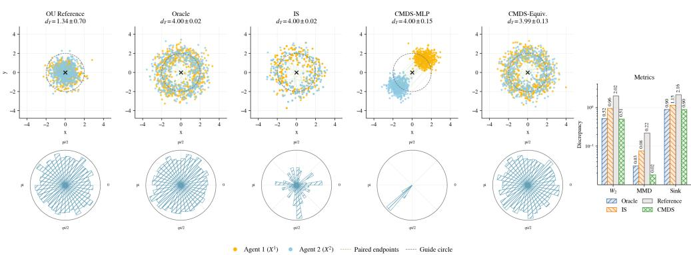  
Figure 8: Two-agent SOC toy: discrete adjoint. Two agents start from an OU reference and are rewarded for reaching terminal configurations with a prescribed separation. We compare the (uncontrolled) OU reference, a value-function oracle, an importance-sampled reference (IS), and the learned control.

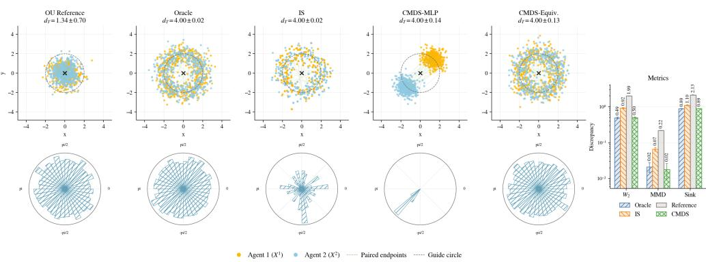  
Figure 9: Two-agent SOC toy: adjoint matching. Two agents start from an OU reference and are rewarded for reaching terminal configurations with a prescribed separation. We compare the (uncontrolled) OU reference, a value-function oracle, an importance-sampled reference (IS), and the learned control.

## D EXPERIMENTS

## D.1 TWO-AGENT OU COORDINATION: A STOCHASTIC-CONTROL SANITY CHECK

Key Takeaways: Least-action coordination recovers the target law. Across figs. 8 and 9, we compare the learned terminal distribution against the stochastic-control oracle using the 2-Wasserstein distance (W<sub>2</sub>), maximum mean discrepancy (MMD), and Sinkhorn transport cost (Sink.). Together with the terminal-separation and angular diagnostics, these metrics show whether the control recovers the full reward-tilted distribution, rather than merely satisfying the prescribed distance constraint. Relational structure matters. A rotation-equivariant control preserves the symmetry of the target law, whereas an unconstrained MLP can satisfy the distance constraint while collapsing onto a preferred direction. Constraint satisfaction alone may not be sufficient. A control may achieve the correct terminal separation while remaining far from the oracle distribution. In particular, the angular histograms expose symmetry collapse that is not visible from the distance constraint alone, while ${ \bar { W } } _ { 2 } .$ , MMD, and Sinkhorn transport cost quantify this distributional mismatch. The experiment isolates the control mechanism. The reference dynamics are known and an exact reduced value-function oracle is available, providing a controlled sanity check that the coordination objective learns the intended low-action path-space perturbation.

To isolate the stochastic-control mechanism underlying our coordination framework, we consider two agents, each evolving in $\mathbb { R } ^ { 2 }$ according to an Ornstein–Uhlenbeck (OU) reference process. This experiment is a low-dimensional sanity check in which the reference dynamics are known and a high-accuracy value-function oracle can be computed in a reduced coordinate. We use ordinary forward control time $t \in [ 0 , 1 ]$ in this experiment, and therefore omit the reverse-time hats used for diffusion sampling elsewhere in the paper. Let $X _ { t } = ( X _ { t } ^ { 1 } , X _ { t } ^ { 2 } ) \in \mathbb { R } ^ { 4 }$ denote the joint state. The controlled dynamics are:

$$
\mathrm { d } X _ { t } ^ { i } = \left[ - X _ { t } ^ { i } + U _ { \theta } ^ { i } ( X _ { t } , t ) \right] \mathrm { d } t + \mathrm { d } W _ { t } ^ { i } , \qquad i \in \{ 1 , 2 \} ,
$$

where $W ^ { 1 }$ and $W ^ { 2 }$ are independent two-dimensional Brownian motions and the uncontrolled drift $- X _ { t } ^ { i }$ pulls each agent toward the origin. The two agents are coupled only through the terminal relational cost,

$$
g ( X _ { 1 } ) = \beta \left( \lVert X _ { 1 } ^ { 2 } - X _ { 1 } ^ { 1 } \rVert - d _ { T } \right) ^ { 2 } ,
$$

which encourages their terminal separation to match a prescribed distance $d _ { T }$ . The corresponding stochastic optimal-control objective is

$$
J ( \theta ) = \mathbb { E } _ { \mathbb { P } ^ { \theta } } \left[ \ g ( X _ { 1 } ) + \frac { \alpha } { 2 } \int _ { 0 } ^ { 1 } \sum _ { i = 1 } ^ { 2 } \left. U _ { \theta } ^ { i } ( X _ { t } , t ) \right. ^ { 2 } \mathrm { d } t \right] ,
$$

where $\mathbb { P } ^ { \theta }$ denotes the path law induced by the controlled dynamics, $\alpha > 0$ controls the path-action penalty, and $\beta > 0$ controls the strength of the terminal constraint. In the uncontrolled process, both agents concentrate near the origin, and their terminal separation is typically substantially smaller than $d _ { T }$ . A successful control should therefore separate the agents sufficiently to satisfy the relational constraint while avoiding unnecessary translation of their centre of mass.

Reduced value-function oracle. Since the two agents have the same component-wise OU dynamics, their common and relative modes can be decoupled. Since the terminal cost only depends on the relative displacement and their quadratic action is minimised with zero common mode control (i.e., $q _ { t } = \frac { u _ { t } ^ { 1 } + \bar { u } _ { t } ^ { 2 } } { 2 } )$ , the control problem can be reduced to the relative coordinate

$$
R _ { t } : = X _ { t } ^ { 2 } - X _ { t } ^ { 1 } \in \mathbb { R } ^ { 2 } .
$$

For controls $u _ { t } ^ { 1 } , u _ { t } ^ { 2 }$ , define the relative control $v _ { t } : = u _ { t } ^ { 2 } - u _ { t } ^ { 1 }$ . For any fixed $v _ { t }$ , the minimum-action decomposition across the two agents is

$$
u _ { t } ^ { 1 } = - \frac 1 2 v _ { t } , \qquad u _ { t } ^ { 2 } = \frac 1 2 v _ { t } ,
$$

and hence

$$
\frac { \alpha } { 2 } \left( \| u _ { t } ^ { 1 } \| ^ { 2 } + \| u _ { t } ^ { 2 } \| ^ { 2 } \right) = \frac { \alpha } { 4 } \| v _ { t } \| ^ { 2 } .
$$

The relative controlled process therefore satisfies

$$
\mathrm { d } R _ { t } = \left( - R _ { t } + v _ { t } \right) \mathrm { d } t + \sqrt { 2 } \mathrm { d } B _ { t } ,
$$

where $B _ { t } = ( W _ { t } ^ { 2 } - W _ { t } ^ { 1 } ) / \sqrt { 2 }$ is a standard two-dimensional Brownian motion. Writing

$$
g _ { R } ( r ) : = \beta \left( \| r \| - d _ { T } \right) ^ { 2 } ,
$$

the reduced value function is

$$
V ( t , r ) : = \operatorname* { i n f } _ { v } \mathbb { E } [ g _ { R } ( R _ { 1 } ) + \frac { \alpha } { 4 } \int _ { t } ^ { 1 } \| v _ { s } \| ^ { 2 } \mathrm { d } s | R _ { t } = r ] .
$$

Its Hamilton–Jacobi–Bellman equation is

$$
\partial _ { t } V - r ^ { \top } \nabla _ { r } V + \Delta _ { r } V - \frac { 1 } { \alpha } \| \nabla _ { r } V \| ^ { 2 } = 0 , \qquad V ( 1 , r ) = g _ { R } ( r ) .
$$

Introducing the desirability function

$$
\psi ( t , r ) : = \exp \left( - \frac { 1 } { \alpha } V ( t , r ) \right) ,
$$

linearises the HJB equation. Equivalently, by the Feynman–Kac representation,

$$
\psi ( t , r ) = \mathbb { E } \left[ \exp \left( - \frac { 1 } { \alpha } g _ { R } ( R _ { 1 } ) \right) \bigg | R _ { t } = r \right] = \mathbb { E } \left[ \exp \left( - \frac { \beta } { \alpha } \left( \left\| R _ { 1 } \right\| - d _ { T } \right) ^ { 2 } \right) \bigg | R _ { t } = r \right] ,
$$

where $\beta / \alpha$ matches the λ in the SOC formulation, and $V ( t , r ) = - \alpha \log \psi ( t , r )$ . Under the uncontrolled OU reference process,

$$
\mathrm { d } R _ { t } = - R _ { t } \mathrm { d } t + \sqrt { 2 } \mathrm { d } B _ { t } ,
$$

so that

$$
R _ { 1 } \mid R _ { t } = r \sim \mathcal { N } \left( e ^ { - ( 1 - t ) } r , \left( 1 - e ^ { - 2 ( 1 - t ) } \right) I _ { 2 } \right) .
$$

Since the terminal cost depends only on $\| R _ { 1 } \|$ , the value function is radial, and the conditional distribution of $\| R _ { 1 } \|$ is Rice distributed. Consequently, $\psi ( t , \boldsymbol { r } )$ can be evaluated accurately by onedimensional quadrature over the terminal radius. Minimising the reduced Hamiltonian gives

$$
\boldsymbol { v } ^ { \star } ( t , \boldsymbol { r } ) = - \frac { 2 } { \alpha } \nabla _ { \boldsymbol { r } } V ( t , \boldsymbol { r } ) = 2 \nabla _ { \boldsymbol { r } } \log \psi ( t , \boldsymbol { r } ) ,
$$

with the corresponding minimum-action split

$$
u _ { t } ^ { 1 , \star } = - \frac { 1 } { 2 } v ^ { \star } ( t , R _ { t } ) , \qquad u _ { t } ^ { 2 , \star } = \frac { 1 } { 2 } v ^ { \star } ( t , R _ { t } ) .
$$

This defines the radial stochastic-control oracle used in figs. 8 and 9. The HJB construction above directly introduces the optimal change of path measure through $\psi ( t , r ) = \exp ( - V ( t , r ) / \alpha )$ , which solves the backward Kolmogorov equation of the uncontrolled relative OU process

$$
\mathrm { d } R _ { t } = - R _ { t } \mathrm { d } t + \sqrt { 2 } \mathrm { d } B _ { t } ,
$$

with terminal condition $\psi ( 1 , r ) = \exp ( - g _ { R } ( r ) / \alpha )$ . Then, by Ito’s formula, under the uncontrolledˆ law,

$$
\begin{array} { r } { \mathrm { d } \log \psi ( t , R _ { t } ) = \sqrt { 2 } \nabla _ { r } \log \psi ( t , R _ { t } ) \cdot \mathrm { d } B _ { t } - \| \nabla _ { r } \log \psi ( t , R _ { t } ) \| ^ { 2 } \mathrm { d } t , } \end{array}
$$

and thus

$$
\frac { \psi ( t , R _ { t } ) } { \psi ( 0 , R _ { 0 } ) } = \exp \left( \int _ { 0 } ^ { t } \frac { v ^ { \star } ( s , R _ { s } ) } { \sqrt { 2 } } \cdot \mathrm { d } B _ { s } - \frac { 1 } { 2 } \int _ { 0 } ^ { t } \bigg \| \frac { v ^ { \star } ( s , R _ { s } ) } { \sqrt { 2 } } \bigg \| ^ { 2 } \mathrm { d } s \right) .
$$

By Girsanov’s theorem, the RHS of the above equation is exactly the Radon-Nikodym derivative of the optimally controlled path measure of $R _ { t }$ with respect to its uncontrolled counterpart up to time t. Evaluating at $t = 1$ , it gives

$$
\frac { \mathrm { d } \mathbb { P } _ { R } ^ { \star } } { \mathrm { d } \mathbb { P } _ { R } } ( R . ) = \frac { \exp ( - g _ { R } ( R _ { 1 } ) / \alpha ) } { \psi ( 0 , R _ { 0 } ) } .
$$

Since our above formulation has shown that controls are only applied to $R _ { t }$ and the common mode is uncontrolled and since $g ( X _ { 1 } ) = g _ { R } ( R _ { 1 } )$ in this OU example, substituting these relations back to the two-agent process gives

$$
\frac { \mathrm { d } \mathbb { P } ^ { \star } } { \mathrm { d } \mathbb { P } } ( X . ) = \frac { \exp ( - g ( X _ { 1 } ) / \alpha ) } { \psi ( 0 , X _ { 0 } ^ { 2 } - X _ { 0 } ^ { 1 } ) } .
$$

The importance-sampling baseline approximates this same change of measure by drawing trajectories from the uncontrolled OU process and weighting each sample proportionally to $\mathrm { e x p } ( - g ( X _ { 1 } ) / \alpha )$

For the oracle samples, we numerically evaluate the Feynman–Kac representation of the reduced HJB solution using radial quadrature, and sample directly from its implied joint terminal marginal. This avoids the time-discretisation error of an Euler rollout of the optimal control.

Learning the control. We train the same feedback-control parameterisation using either direct discrete adjoint (a.k.a., differentiable optimisation of $J ( \theta )$ or differentiable simulations) or an adjointmatching surrogate (Domingo-Enrich, 2024). For the latter, let $\bar { \theta } = \mathrm { s t o p g r a d } ( \theta )$ and sample a trajectory $X ^ { \bar { \theta } } \sim \mathbb { P } ^ { \bar { \theta } }$ without gradient tracking. For this experiment, we train CMDS using the full discrete adjoint of the controlled Euler–Maruyama dynamics. Let $h = 1 / K , t _ { \ell } = \ell h$ , and $X _ { \ell } = X _ { t _ { \ell } } ^ { \bar { \theta } }$ . Define

$$
{ \cal F } _ { \ell } ( x ) = x + h \big [ { - x + U _ { \bar { \theta } } ( x , t _ { \ell } ) } \big ] , \qquad c _ { \ell } ( x ) = \frac { \alpha } { 2 } \left\| { U _ { \bar { \theta } } ( x , t _ { \ell } ) } \right\| ^ { 2 } .
$$

The joint adjoint satisfies

$$
\begin{array} { r } { a _ { K } ^ { \bar { \theta } } = \nabla _ { x } g ( X _ { K } ) , \qquad a _ { \ell } ^ { \bar { \theta } } = D _ { x } F _ { \ell } ( X _ { \ell } ) ^ { \top } a _ { \ell + 1 } ^ { \bar { \theta } } + h \nabla _ { x } c _ { \ell } ( X _ { \ell } ) , \quad \ell = K - 1 , \ldots , 0 . } \end{array}
$$

The parameters $\bar { \theta }$ are held fixed during this backward recursion, while the state derivatives of the feedback control and its quadratic running cost are retained. The adjoint-matching update at step ℓ uses $- a _ { \ell + 1 } ^ { \bar { \theta } } / \alpha$ as its control target, with both the sampled states and the computed adjoints detached during the matching update. The resulting discrete adjoint-matching surrogate is

$$
\mathcal { L } _ { \mathrm { A M } } ^ { \mathrm { O U } } ( \theta ; \bar { \theta } ) = h \mathbb { E } \left[ \sum _ { \ell = 0 } ^ { K - 1 } \sum _ { i = 1 } ^ { 2 } \bigg \| U _ { \theta } ^ { i } ( X _ { \ell } , t _ { \ell } ) + \frac { 1 } { \alpha } a _ { \ell + 1 } ^ { i , \bar { \theta } } \bigg \| ^ { 2 } \right] .
$$

The expectation is over frozen Euler–Maruyama rollouts. Both the sampled states and the computed adjoints are detached during the matching update.

Control parameterisation. We consider two feedback-control parameterisations. The first is an unconstrained multilayer perceptron that receives the complete joint state and time, $U _ { \theta } ^ { i } = U _ { \theta } ^ { i } ( X _ { t } , t )$ The second explicitly encodes the rotational symmetry of the problem,

$$
U _ { \theta } ^ { i } ( X _ { t } , t ) = c _ { \theta _ { i } } \left( \| X _ { t } ^ { j } - X _ { t } ^ { i } \| ^ { 2 } , t \right) ( X _ { t } ^ { j } - X _ { t } ^ { i } ) , \qquad j \neq i .
$$

The two scalar coefficient networks have separate parameters. This equivariant parameterisation is a natural inductive bias because both the reference dynamics and the terminal cost are invariant to a common rotation of the two-agent system. The optimal correction therefore acts along the relative displacement between the agents, pushing them apart when their predicted terminal separation is too small and pulling them together when it is too large. The comparisons in figs. 8 and 9 highlight the importance of this inductive bias. The uncontrolled OU process concentrates both agents near the origin and therefore produces terminal separations substantially below the target. The value-function oracle achieves the prescribed separation while preserving rotational symmetry. The importance-sampling baseline approximates the same terminal tilt but suffers from finite-sample variance. The unconstrained MLP control can substantially reduce the terminal-distance error, but it may select a preferred direction in the plane and thereby collapse the terminal-angle distribution. In contrast, the rotation-equivariant control achieves a terminal separation close to the target while maintaining an approximately uniform angular distribution, substantially closer to the oracle. Thus, terminal-distance accuracy alone is insufficient: a control may satisfy the relational constraint while distorting symmetries and diversity of the target law. This toy problem provides a controlled SOC sanity check in which the component dynamics are known, the global constraint is purely relational, and a reduced value-function oracle is available. The experiment tests whether a learned control can balance satisfaction of a terminal system-level constraint against quadratic path action. It therefore provides a low-dimensional analogue of the least-action principle underlying CMDS: instead of arbitrarily moving samples toward high reward, the control seeks the smallest path-space perturbation required to make independently evolving components satisfy a consistency criterion.

A remark on the IS baseline. Despite using $2 ^ { 2 0 }$ proposals per evaluation seed, conditionally normalised IS achieves a pre-resampling effective sample size (ESS) of only $9 9 . 6 \pm 1 5 . 3$ , approximately 0.0095% of the proposal budget. The 4,096 terminal pairs obtained by multinomial resampling contain only 343.4 ± 20.6 distinct proposals, indicating severe weight concentration. Metrics are evaluated on 1,024 equally weighted terminal pairs per distribution, subsampled without replacement from the endpoint banks, retaining repeated IS endpoints. Against the numerical SOC terminal oracle, IS yields $0 . 9 1 7 \pm 0 . 0 3 5 , 0 . 0 \bar { 6 } 5 6 \overset { \cdot } { \pm } 0 . 0 0 7 5$ , and $1 . 1 0 3 \pm 0 . 0 3 0$ for $W _ { 2 } .$ , MMD, and Sinkhorn transport cost, respectively, versus 0.497 ± 0.022, 0.0180 ± 0.0082, and $0 . 8 8 8 \pm 0 . 0 1 1$ for CMDS. Reported uncertainties are sample standard deviations across five independent evaluation banks, with the trained controller held fixed. Thus, at the reported proposal budget, conditionally normalised IS exhibits severe weight concentration, while CMDS provides a close approximation to the SOC target terminal law, with empirical joint-terminal discrepancies comparable to oracle self-comparisons at the reported sample size.

## D.2 RELATIONAL VISUAL ASSEMBLY

Key Takeaways: Compositionality helps. When the sampler is factorised according to the object structure, coordination is substantially easier than forcing a single process to learn the full constraint through control alone due to positive inductive bias of the decomposition. Rewards are fragile. Reward-based coordination is only as reliable as the system-level signal used to define it. Poorly specified rewards can be over-optimised or hacked. Least-work coordination. The SOC objective favours assemblies that satisfy the global design while requiring the smallest deviation from the independent pretrained dynamics. Thus CMDS is not only searching for valid component combinations; it is learning a low-action path to valid assemblies. CMDS is sampling high-reward assemblies while paying a quadratic control/action cost that penalises deviation from the pretrained reverse diffusion dynamics.

This experiment is not reported in the main paper, but serves as a controlled testbed in which the coordination network can be trained cheaply, allowing us to study the method in detail from both theoretical and computational perspectives. In particular, it lets us isolate the effects of component factorisation, optimisation strategy, and reward design, and examine how different rewards trade off constraint satisfaction, diversity, and the amount of control required to steer the pretrained processes.

Setup. We test two claims central to CMDS: whether a single amortised control can satisfy a family of relational constraints, and whether explicitly factorising the sampler by component simplifies relational steering. We consider onechannel $1 0 \times 1 0$ canvases with a white background and dark $2 \times 2$ squares. The target distribution consists of valid two-square canvases satisfying the prescribed constraints. We pretrain a single diffusion model G on canvases containing one square, and instantiate two independent frozen copies at sampling time. No samples from the valid two-square distribution are provided to CMDS during either pretraining or coordination. Their controlled terminal

<table><tr><td>Method</td><td>Optim. scheme ELBO (↑) log</td><td></td><td> $Z _ { \mathrm { { I S } } }$ </td><td>Valid (↑)</td></tr><tr><td rowspan="2">N = 1 (1-square)</td><td>ADJ. MATCH.</td><td>-1303.1</td><td>-7.2</td><td>0.0%</td></tr><tr><td>DISC. ADJ.</td><td>-1309.5</td><td>-7.2</td><td>0.0%</td></tr><tr><td rowspan="2">N = 1 (2-square)</td><td>ADJ. MATCH.</td><td>-289.1</td><td>-0.7</td><td>18.9%</td></tr><tr><td>DISC. ADJ.</td><td>-173.4</td><td>-0.7</td><td>25.4%</td></tr><tr><td rowspan="2">CMDS</td><td>ADJ. MATCH.</td><td>-74.3</td><td>-1.6</td><td>99.2%</td></tr><tr><td>DISC. ADJ.</td><td>-61.2</td><td>-1.6</td><td>98.5%</td></tr></table>

Table 6: Classifier-only steering diagnostics. We report log $Z _ { \mathrm { { I S } } }$ as an importance-sampling estimate of the log normalising constant of the reward-tilted target, providing a calibration diagnostic for the strength of the induced tilt.

states are combined through the fixed left/right assembly

$$
\hat { Y } _ { 1 } ^ { \theta } = \varphi ( \hat { X } _ { 1 } ^ { \theta , 1 } , \hat { X } _ { 1 } ^ { \theta , 2 } ) = M _ { L } \odot \hat { X } _ { 1 } ^ { \theta , 1 } + M _ { R } \odot \hat { X } _ { 1 } ^ { \theta , 2 } ,
$$

where $M _ { L } , M _ { R } \in \{ 0 , 1 \} ^ { 1 0 \times 1 0 }$ mask the left and right halves and satisfy $M _ { L } + M _ { R } = 1$ . Each component contributes only within its assigned half; its contribution outside that region is masked out. The masks therefore define the components’ regions of influence, but do not ensure that a complete square appears in each visible half or that the two squares satisfy the requested relative separation. Independent sampling can consequently produce plausible single-square components but invalid assemblies.

Left-Right Steering. We first evaluate whether the agents can learn an additional drift on top of the pretrained dynamics that guides each square toward its prescribed region of interest. For this initial experiment, we train a simple multilayer perceptron to classify whether a square lies in the target half of the domain. The classifier-only assembly reward is

$$
r _ { \mathrm { c l f } } ( y ) = \log \sigma ( f _ { \psi } ( M _ { L } \odot y ) ) + \log \sigma ( f _ { \psi } ( M _ { R } \odot y ) ) ,
$$

where $f _ { \psi }$ denotes the trained classifier, $\sigma ( z ) = ( 1 + e ^ { - z } ) ^ { - 1 }$ is the logistic sigmoid, and each term scores square presence in its corresponding masked half. In fig. 11, we show samples of the aggregated canvas, illustrating that fine-tuning produces samples that satisfy the prescribed constraints. In both cases, each component model generates a square in its assigned region, so that the final stitched assembly is valid. The output of the first model is masked on the right half of the canvas, while the output of the second model is masked on the left half. We optimise the controls using both the discrete adjoint method (DISC. ADJ.) and adjoint matching (ADJ. MATCH.), as described in section 2.1. We compare our approach against two single-process baselines: (i) tilting the same onesquare base model used as the component generator in CMDS; and (ii) tilting a generator trained directly to sample two $2 \times 2$ squares within the $1 0 \times 1 0$ canvas.

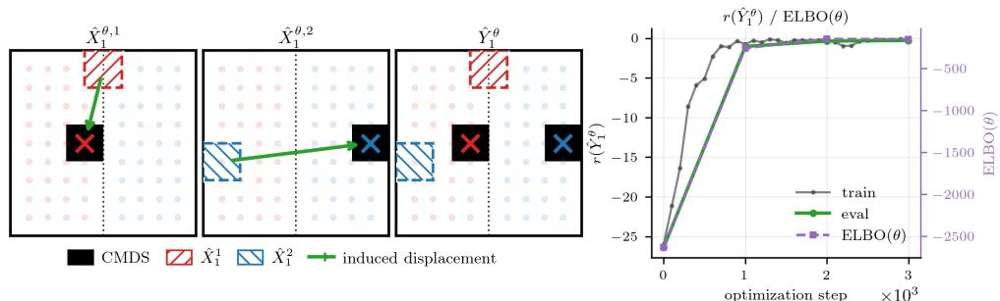

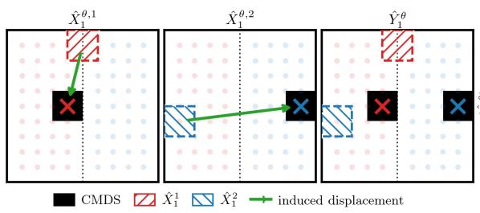

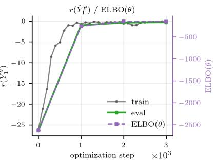  
Figure 10: Left-right steering overview. Two copies of a pretrained single-square diffusion generator are coordinated through a controlled reverse process and assembled by the fixed masking operator $\hat { Y } _ { 1 } ^ { \theta } = \varphi ( \hat { X } _ { 1 } ^ { \theta , 1 } , \hat { X } _ { 1 } ^ { \theta , 2 } )$ . Black filled squares show the controlled terminal assembly $\hat { Y } _ { 1 } ^ { \theta }$ . Red and blue dashed outlines show the paired counterfactual uncontrolled terminal proposals $\hat { X } _ { 1 } ^ { 1 }$ and $\hat { X } _ { 1 } ^ { 2 }$ , obtained from the same initial noise draw but with the learned control removed. Thus, each dashed outline indicates where the corresponding generator copy would have ended up under the reference product law ${ \hat { \mathbb { P } } } ,$ before reward-based steering of the assembled canvas. The training curves report the terminal reward $r ( \hat { Y } _ { 1 } ^ { \theta } )$ and the path-space objective $\begin{array} { r } { \mathrm { E L B O } ( \theta ) = \mathbb { E } _ { \hat { \mathbb { P } } ^ { \theta } } [ \lambda r ( \hat { Y } _ { 1 } ^ { \theta } ) - A _ { \theta } ] } \end{array}$ where $A _ { \theta }$ denotes the accumulated control/action cost. The learned controls steer the two locally valid component generators into their assigned left/right regions while remaining close to the pretrained dynamics. The path-action cost remains low because the uncontrolled generator already places substantial mass near valid square configurations, so the control only needs a moderate pathspace perturbation to steer samples into high-reward assemblies.

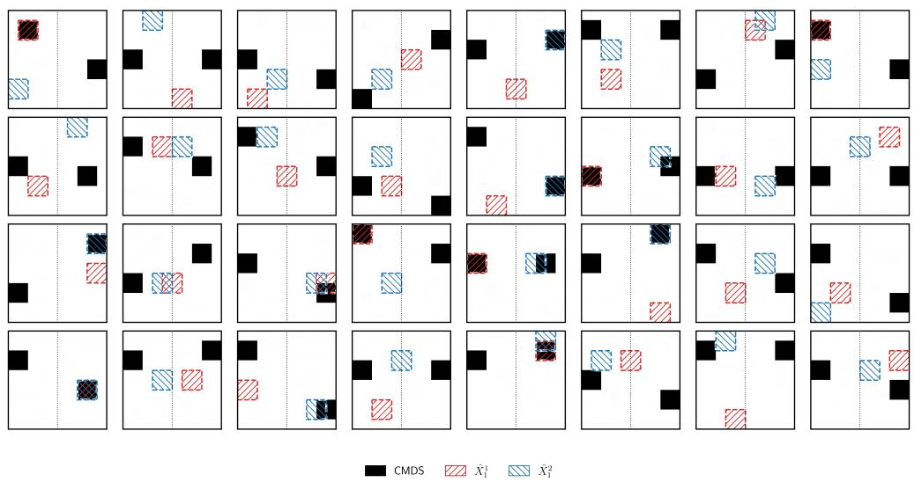  
Figure 11: Left-right steering (Samples). Samples from the aggregated canvas after training. Black filled squares denote the CMDS assembled output. Red and blue dashed outlines denote the paired uncontrolled terminal proposals from the two generator copies, obtained from the same initial/noise draw but with the learned control removed. Thus, for each sample, the outlines show where that instance would have landed without reward-based steering of the assembled canvas. The learned controls steer each square into its assigned half of the canvas, yielding valid stitched assemblies under the fixed left/right masking operator.

One-square baseline. The failure of the one-square baseline is expected as its pretrained support is misaligned with the target object class. Since the base model represents canvases with a single $2 \times 2$ square, producing a valid two-square configuration requires the control to create (or hallucinate) an additional square through tilting alone, rather than merely steering existing component structure.

Two-square baseline. The two-square baseline has the correct object count, but not the right factori sation. It can generate two-square canvases, yet the control must still solve the assignment problem of which square should satisfy which part of the left/right and distance reward (below). This creates an ambiguous credit-assignment problem. The reward gradients act on the whole image rather than on separately addressable components. In contrast, CMDS builds the assignment into the sampler by using one component process per square and applying the reward after assembly, so the same global signal induces more targeted, lower-action coordination.

Metrics. In tables 6 to $^ { 8 , }$ we report the path-space evidence lower bound (ELBO)

$$
\mathrm { E L B O } ( u ) = \mathbb { E } _ { \hat { \mathbb { P } } ^ { u } } \left[ \lambda r \Big ( \varphi ( \hat { X } _ { 1 } ^ { u } ) \Big ) - A _ { u } \right] ,
$$

where ${ \hat { \mathbb { P } } } ^ { u }$ is the controlled path measure and $A _ { u }$ is the accumulated control path-action. The normalizing constant of the reward-tilted target,

$$
Z = \mathbb { E } _ { \hat { \mathbb { P } } } \left[ \exp \Bigl ( \lambda r \Bigl ( \varphi ( \hat { X } _ { 1 } ) \Bigr ) \Bigr ) \right] ,
$$

is estimated independently from uncontrolled samples $\hat { X } _ { 1 } ^ { ( j ) }$ which follow the terminal time marginal of P<sup>ˆ</sup> via

$$
\log Z _ { \mathrm { I S } } = \log \left( \frac { 1 } { M } \sum _ { j = 1 } ^ { M } \exp \Bigl ( \lambda r \Bigl ( \varphi ( \hat { X } _ { 1 } ^ { ( j ) } ) \Bigr ) \Bigr ) \right) .
$$

Thus, log $Z - \mathrm { E L B O } ( u )$ is the path-space KL divergence from the controlled sampler to the reference path distribution re-weighted by the exponential of the scaled terminal reward and normalised by $\bar { Z . }$ This unconditional reward tilt differs from the fixed-initial-law SOC optimum unless the conditional normaliser $Z ( \hat { X } _ { 0 } )$ is constant. In the numerical diagnostic, log Z is replaced by its estimate log $Z _ { \mathrm { I S } }$ . Here $A _ { \theta }$ denotes the quadratic path-action, i.e., the accumulated control cost along a parametrised controlled trajectory. Following Algorithm 1, we write $X _ { \ell }$ for the controlled rollout state, suppressing its parameter superscript, and $\zeta _ { \ell }$ for the native diffusion time-step at transition ℓ.

$$
A _ { \theta } = \frac { 1 } { 2 } \sum _ { \ell = 0 } ^ { K - 1 } \sum _ { i = 1 } ^ { N } \left. \boldsymbol { w } _ { \theta , \ell } ^ { i } ( \boldsymbol { X } _ { \ell } ) \right. _ { 2 } ^ { 2 } ,
$$

where $w _ { \theta , \ell } ^ { i }$ is the normalised discrete control associated with component i at DDIM transition $\ell .$ For multi-component samplers, the norm includes the sum over all controlled processes and pixels. This is the discrete Girsanov control cost appearing in the path-space change of measure from the uncontrolled process $\hat { \mathbb { P } }$ to the controlled process ${ \hat { \mathbb { P } } } ^ { u }$

Coupled Steering. We impose a constraint that can only be satisfied through coordination. Coupled Steering. We impose a co

The assembly-level reward combines square presence with the requested horizontal separation:

$$
r _ { d _ { \Delta x } } ( y ) = r _ { \mathrm { c l f } } ( y ) - \alpha | \Delta _ { x } ( y ) - d _ { \Delta x } | ,
$$

where $d _ { \Delta x }$ is the target separation and α is the distance penalty weight. The achieved separation is

$$
\Delta _ { x } ( y ) = \mu _ { x } ( M _ { R } \odot y ) - \mu _ { x } ( M _ { L } \odot y ) ,
$$

with $\mu _ { x }$ denoting the horizontal foreground barycentre. This introduces coordination through an analytic distance term computed between the barycentres of the two squares. This term makes each agent’s reward depend on the relative configuration of both squares, encouraging the learned drifts

<table><tr><td>Method</td><td>Optim. scheme ELBO (↑) log</td><td></td><td> $Z _ { \mathrm { { I S } } }$ </td><td>Valid  $( \uparrow )$ </td></tr><tr><td rowspan="2">N = 1 (1-square)</td><td>ADJ. MATCH.</td><td>-1706.8</td><td>-22.8</td><td>0.0%</td></tr><tr><td>DISC. ADJ.</td><td>-1565.0</td><td>-22.8</td><td>0.0%</td></tr><tr><td rowspan="2">N = 1 (2-square)</td><td>ADJ. MATCH.</td><td>-1561.7</td><td>-4.5</td><td>8.3%</td></tr><tr><td>DISC. ADJ.</td><td>-381.4</td><td>-4.5</td><td>9.6%</td></tr><tr><td rowspan="2">CMDS</td><td>ADJ. MATCH.</td><td>-156.7</td><td>-5.4</td><td>97.9%</td></tr><tr><td>DISC. ADJ.</td><td>-190.9</td><td>-5.4</td><td>96.8%</td></tr></table>

Table 7: Coupled steering diagnostics. We report log $Z _ { \mathrm { { I S } } }$ as an importance-sampling estimate of the log normalising constant of the reward-tilted target, providing a diagnostic for the strength of the induced tilt. Singleprocess baselines struggle to satisfy the coupled validity constraint, whereas CMDS coordinates two pretrained one-square generators through the assembled canvas and achieves near-perfect validity with improved ELBO.

to coordinate rather than solve two independent localisation tasks. In this setting, we also compare against the two single-process baselines. The failure for the two-square baseline becomes more pronounced for the distance constraint, where validity depends on the relative barycentres of the two squares. A unique control can improve the reward by moving mass in reward-favourable ways, but it does not inherit the component-level separation that makes the desired relation easy to express and control. This failure is therefore an inductive-bias failure, not just a capacity failure. The two-square generator represents valid objects, but its representation does not expose the component assignments needed for least-action steering.

<table><tr><td rowspan="2">Training scheme</td><td rowspan="2"> $\mathrm { E L B O } _ { d _ { \Delta x } = 5 } \ ( \uparrow )$ </td><td rowspan="2">log  $\boldsymbol { Z } _ { \mathrm { I S } } | _ { d _ { \Delta x } = 5 }$ </td><td colspan="5">Valid (↑)</td></tr><tr><td></td><td> $d _ { \Delta x } = 3 d _ { \Delta x } = 4 d _ { \Delta x } = 5 d _ { \Delta x } = 6 \mathrm { A v g . }$ </td><td></td><td></td><td></td></tr><tr><td>ADJ. MATCH.</td><td>-172.2</td><td>-5.4</td><td>95.8%</td><td>95.4%</td><td>97.3%</td><td>97.1%</td><td>96.4%</td></tr><tr><td>DISC. ADJ.</td><td>-158.5</td><td>-5.4</td><td>95.2%</td><td>95.7%</td><td>97.2%</td><td>95.5%</td><td>95.9%</td></tr></table>

Table 8: Amortized steering diagnostics. ELBO and log $Z _ { \mathrm { I S } }$ are evaluated at $d _ { \Delta x } = 5$ . Validity is evaluated at every supported target using 4096 samples per target with matched random seeds across target conditions. Avg. is the macro-average over $d _ { \Delta x } \in \{ 3 , 4 , 5 , 6 \}$  
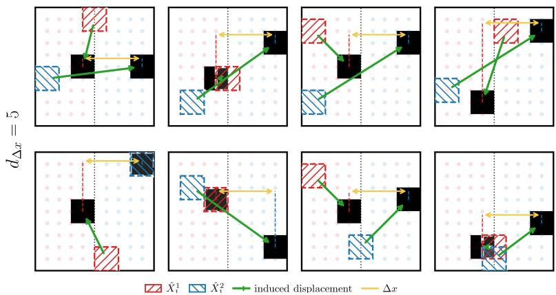  
Figure 12: Fixed-target coupled steering $( d _ { \Delta x } = 5 )$ . Black squares show the controlled assembly, red and blue hatched squares the matched reference terminal proposals, green arrows the induced corrections. Yellow arrows indicate the achieved horizontal separation $\Delta x$

Amortised coordination across design specifications. To test amortisation, we jointly train two agent-specific controllers with separate parameters, one acting on each frozen copy of the onesquare reverse process, over $d _ { \Delta x } \in \{ 3 , 4 , 5 , 6 \}$ . The requested separation is represented by a fourway one-hot vector, broadcast over the spatial grid and concatenated to each controller input at every DDIM transition. Each controller outputs an additive residual to its corresponding frozen denoiser’s noise prediction, thereby steering the two component processes jointly under the shared assembly-level reward. As shown in fig. 14, the amortised control steers the matched reference terminal proposals into valid assemblies, while the achieved separations closely match the requested targets. The discrete adjoint-matching formulation is provided in Appendix C.2.2, and the control implementation is described below.

Control implementation. For the squares experiments, we attach two agent-specific convolutional control heads to two frozen copies of the same pretrained one-square denoiser. At each DDIM transition $\ell ,$ the frozen denoiser provides Tweedie estimates $\hat { X } _ { 1 \vert \ell } ^ { i }$ of the terminal component states, which are assembled as $\hat { Y } _ { 1 \mid \ell } = \varphi ( \hat { X } _ { 1 \mid \ell } ^ { 1 } , \hat { X } _ { 1 \mid \ell } ^ { 2 } )$ . The control head for component i receives the full two-agent configuration,

$$
\mathrm { c a t } _ { c } \Bigl [ X _ { \ell } ^ { i } , \hat { X } _ { 1 \vert \ell } ^ { i } , Y _ { \ell } , \hat { Y } _ { 1 \vert \ell } , X _ { \ell } ^ { j } , \hat { X } _ { 1 \vert \ell } ^ { j } \Bigr ] , \qquad Y _ { \ell } = \varphi ( X _ { \ell } ^ { 1 } , X _ { \ell } ^ { 2 } ) , \qquad j \neq i ,
$$

together with the embedding of the native diffusion timestep $\zeta _ { \ell }$ . Coordination therefore enters through joint conditioning: although the two heads have separate parameters and produce component-specific corrections, each control depends on both reverse processes and on their current and predicted assembly. Each head outputs an unbounded additive epsilon residual $\delta \epsilon _ { \theta , \ell } ^ { i } ,$ which is added to the frozen denoiser prediction and induces the normalised DDIM control $w _ { \theta , \ell } ^ { i } .$ For the amortised variant, both heads are additionally conditioned on the requested separation $d _ { \Delta x }$ . The Tweedie features are recomputed at every transition and remain differentiable with respect to the component states, while the denoiser parameters remain frozen.

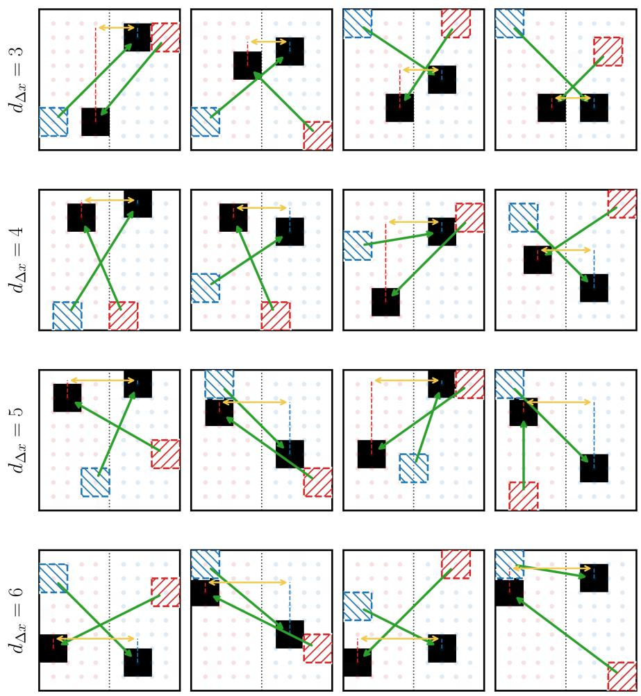  
1  X?  induced displacement  ∆x  
Figure 13: Amortised coupled steering. Samples from a single pair of agent-specific controls trained jointly over $d _ { \Delta x } \in \{ 3 , 4 , 5 , 6 \}$ . Black squares show the controlled assembly, red and blue hatched squares the matched reference terminal proposals, and green arrows the induced corrections. Yellow arrows indicate the achieved horizontal separation $\Delta x .$

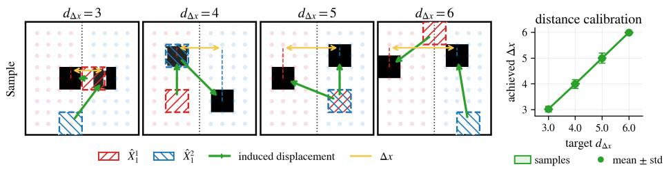  
Figure 14: Amortised assembly from copies of a single-square prior. Two frozen copies of a generator pretrained only on one-square canvases are coordinated by a control and combined through a fixed left/right mask. Left: for each requested separation $d _ { \Delta x } \in \{ 3 , 4 , 5 , 6 \}$ , red and blue dashed outlines show paired uncontrolled terminal proposals obtained from the same noise, black squares show the controlled assembly, and green arrows show the induced corrections. Dots indicate feasible barycentre locations within the two masked halves. Right: the separation closely matches the requested target $d _ { \Delta x } ,$ with points and error bars reporting the sample mean and standard deviation. Yellow arrows indicate the achieved horizontal separation $\Delta x .$

## D.3 SOURCE SEPARATION

Key Takeaways: Joint control improves reconstruction while preserving component structure. In the evaluated circle–square source-separation task, CMDS achieves lower clean-mixture reconstruction error and more accurate labelled source placement than DPS, while retaining the structural coherence of the frozen component priors. DPS has no equivalent control-cost regularisation and tends to enforce the measurement reward more aggressively, often at the expense of the individual components. The control resolves component-specific corrections. For additive mixtures, the measurement-reward gradient is identical with respect to either clean source. Providing this Tweedie-evaluated gradient to the joint controller is important: by combining it with both source states and their denoised estimates, the controller can turn shared measurement feedback into component-specific corrections. Under ambiguity, plausible recovery need not equal ground-truth recovery. For sufficiently ill-posed problems, CMDS can recover a plausible decomposition rather than necessarily the ground-truth one. Under stronger blur, components may preserve valid shapes while swapping their labelled locations and still explain the observation well; DPS tends to exhibit such swaps together with substantially greater component deformation.

Source separation seeks to recover two or more latent signals from a combined observation. In many cases, datasets of individual source types and datasets of mixtures may each be available, while paired examples containing a mixture together with its constituent sources are unavailable or difficult to obtain. We investigate whether CMDS can coordinate samplers trained independently on the individual source distributions to explain an observed mixture without requiring paired source– mixture training data. The objective is to recover components whose assembly matches the observation while each component remains consistent with its respective pretrained distribution.

Task formalization. We consider $N = 2$ frozen pretrained samplers, $G ^ { 1 }$ and $G ^ { 2 }$ , defining circle and square priors $\tilde { \pi } ^ { 1 }$ and $\tilde { \pi } ^ { 2 }$ , respectively. The ground-truth component images are single-channel $1 6 \times 1 6$ images, $X _ { \mathrm { g t } } ^ { 1 } , X _ { \mathrm { g t } } ^ { 2 } \in \{ - 1 , + 1 \} ^ { \bar { 1 } \times 1 6 \times 1 6 }$ , with background value +1 and foreground value −1. Their clean additive assembly is $Y _ { \mathrm { g t } } = \varphi ( X _ { \mathrm { g t } } ) : = X _ { \mathrm { g t } } ^ { 1 } + X _ { \mathrm { g t } } ^ { 2 }$

Observation model. We observe $b = A _ { \tau } ( Y _ { \mathrm { g t } } )$ , where A denotes Gaussian convolution with a 5× 5 kernel and blur standard deviation $\tau \in \{ 0 . 5 , 1 . 0 \}$ . No additional observation noise is applied $( \varepsilon =$ 0). Although the ground-truth sources are binary-valued, the blurred observations and generated sources are continuous-valued. Representative reconstructions under the two blur operators are shown in figs. 16 and 17.

Component priors. The circle and square priors are trained independently using 4096 sampled examples per component and epoch, defining the reference product law $\rho = \mathbf { \tilde { \pi } } ^ { 1 } \otimes \mathbf { \tilde { \pi } } ^ { 2 }$ . Each noiseprediction network projects a 32-dimensional sinusoidal time-step embedding and concatenates it spatially with the noisy image. The resulting tensor is processed by two $3 \times 3$ , 64-channel convolutional layers with SiLU activations, a residual four-head spatial self-attention layer, and two further $3 \times 3$ convolutional layers producing a single-channel epsilon prediction. Both samplers use a linear 100-step diffusion schedule, $\beta _ { 1 } \stackrel {  } { = } 1 0 ^ { - \overline { { 4 } } } , \beta _ { 1 0 0 } = 0 . \dot { 0 } 8$ . They are trained for 1000 epochs using Adam, batch size 128, and a learning rate cosine-annealed from $1 0 ^ { - 3 } ~ \mathrm { t o } ~ 1 0 ^ { - 5 }$ , and are frozen.

Jointly controlled source processes. The reference process samples the circle and square independently. CMDS coordinates their reverse processes using a joint feedback control, producing

$$
\hat { X } _ { 1 } ^ { \theta } = \left( \hat { X } _ { 1 } ^ { \theta , 1 } , \hat { X } _ { 1 } ^ { \theta , 2 } \right) , \qquad \hat { Y } _ { 1 } ^ { \theta } = \varphi ( \hat { X } _ { 1 } ^ { \theta } ) = \hat { X } _ { 1 } ^ { \theta , 1 } + \hat { X } _ { 1 } ^ { \theta , 2 } .
$$

At each reverse step, the control outputs a separate additive epsilon-space control for each component process.

CMDS training. Following Algorithm 1, we use ℓ for rollout indices and $\zeta _ { \ell }$ for the corresponding native diffusion timesteps. At reverse transition $\ell ,$ the control receives the current noisy states $X _ { \ell } ^ { 1 } , X _ { \ell } ^ { 2 }$ , their Tweedie estimates $\hat { X } _ { 1 | \ell } ^ { 1 } , \hat { X } _ { 1 | \ell } ^ { 2 }$ , the observation b, and the predicted observation

$$
\hat { b } _ { \ell } = A _ { \tau } \Big ( \hat { X } _ { 1 | \ell } ^ { 1 } + \hat { X } _ { 1 | \ell } ^ { 2 } \Big ) .
$$

It additionally receives the residual $b - \hat { b } _ { \ell } .$ , the component-wise reward gradients, i.e., $\nabla _ { \hat { X } _ { 1 \mid \ell } ^ { 1 } } r _ { b }$ and $\nabla _ { \hat { X } _ { 1 \mid \ell } ^ { 2 } } r _ { b }$ , and a sinusoidal embedding of $\zeta _ { \ell }$ . It outputs two additive epsilon-space controls, one for each reverse process. The control uses joint multi-scale processing with hidden width 32 and one output head per component. We train the control by adjoint matching for 10,000 optimisation steps. Each iteration samples 512 circle–square pairs, initial diffusion states, and rollout noise. Rollouts use 20 DDIM transitions with $\eta = 1$ , and adjoint matching uses 15 selected matching transitions. We use Adam with cosine learning-rate decay from $1 0 ^ { - 4 } \ \mathrm { {  t o } \ 1 0 ^ { - 6 } }$ , gradient clipping at norm 1.0, and rejection of non-finite updates. An exponential moving average of the control parameters is maintained with decay 0.995.

Reward and control cost. The system-level reward is

$$
r _ { b } ( y ) = - \frac { 1 } { d } \left\| \mathrm { A } _ { \tau } ( y ) - b \right\| _ { 2 } ^ { 2 } , \qquad d = 1 6 ^ { 2 } .
$$

Training uses reward multiplier 1000 and the uniform quadratic control cost from the CMDS objective. The component-wise reward-gradient inputs are computed exactly through the known observation operator $\mathrm { A } _ { \tau }$

Source-separation control implementation. For source separation, we use a centralised joint control with a shared representation and two source-specific output heads, one for each frozen component diffusion model. At each DDIM transition $\ell ,$ the shared control receives the current noisy states $X _ { \ell } ^ { 1 } , X _ { \ell } ^ { 2 }$ , their Tweedie estimates $\hat { X } _ { 1 | \ell } ^ { 1 } , \hat { X } _ { 1 | \ell } ^ { 2 }$ , the observation $b ,$ and the predicted observation

$$
\hat { b } _ { \ell } = \mathrm { A } _ { \tau } \left( \hat { X } _ { 1 | \ell } ^ { 1 } + \hat { X } _ { 1 | \ell } ^ { 2 } \right) .
$$

It is additionally conditioned on the measurement residual $b - \hat { b } _ { \ell }$ , the component-wise reward gradients, and the diffusion-time embedding $\zeta _ { \ell } .$ . Coordination arises through the shared representation as both output heads have access to both reverse processes, their predicted clean sources, and their joint measurement mismatch before producing source-specific corrections. The two heads output additive epsilon residuals $\delta \epsilon _ { \theta , \ell } ^ { 1 }$ and $\delta \dot { \epsilon } _ { \theta , \ell } ^ { 2 } .$ , which modify their respective frozen denoisers and induce the normalised DDIM controls $\boldsymbol { w _ { \theta , \ell } ^ { 1 } }$ and $w _ { \theta , \ell } ^ { 2 }$ . The reward-gradient features are detached, while the Tweedie features remain differentiable.

Baselines. The reference baseline samples the frozen component priors independently,

$$
\hat { X } _ { 1 } ^ { 1 } \sim \tilde { \pi } ^ { 1 } , \qquad \hat { X } _ { 1 } ^ { 2 } \sim \tilde { \pi } ^ { 2 } ,
$$

and returns their assembly

$$
\hat { Y } _ { 1 } = \hat { X } _ { 1 } ^ { 1 } + \hat { X } _ { 1 } ^ { 2 }
$$

without conditioning on b. We additionally adapt diffusion posterior sampling (DPS) (Chung et al., 2023) to the product of the two frozen component priors. At each reverse step, DPS evaluates the observation residual through the Tweedie estimates of both sources and applies the resulting component-wise data-fidelity gradients to their reverse updates. Writing $\hat { X } _ { 1 \vert \ell } ^ { i }$ for the Tweedie estimate of component i at rollout index ℓ, its guidance is computed from

$$
\nabla _ { X _ { \ell } ^ { i } } \left\| \mathrm { A } _ { \tau } \left( \hat { X } _ { 1 | \ell } ^ { 1 } + \hat { X } _ { 1 | \ell } ^ { 2 } \right) - b \right\| _ { 2 } , \qquad i \in \{ 1 , 2 \} .
$$

In this sense, product-DPS provides a non-amortised sampling-time analogue of coordination. The observation-dependent correction is recomputed for every mixture, whereas CMDS amortises this dependence into a learned joint feedback control.

Evaluation protocol. All methods are evaluated on the same 1024 procedurally generated circle– square instances with batch size 128. All methods are evaluated against the same ground-truth components $X _ { \mathrm { g t } } ^ { 1 } , X _ { \mathrm { g t } } ^ { 2 }$ and use matched initial diffusion states; observation-conditioned methods use the same b. The CMDS and matched reference rollouts share identical per-step noise, while DPS uses the same rollout-noise seed under its selected DDIM discretisation.

Evaluation metrics. We report three complementary properties of the recovered components. In the following, $X _ { K } ^ { i }$ denotes the recovered terminal component i, with the method superscript suppressed, while $X _ { \mathrm { g t } } ^ { i }$ denotes the corresponding ground-truth component. We write

$$
Y _ { K } = \varphi ( X _ { K } ) = X _ { K } ^ { 1 } + X _ { K } ^ { 2 } , \qquad Y _ { \mathrm { g t } } = X _ { \mathrm { g t } } ^ { 1 } + X _ { \mathrm { g t } } ^ { 2 } .
$$

Clean-mixture reconstruction RMSE measures whether the recovered assembly matches the unblurred ground-truth mixture:

$$
\mathrm { R M S E } _ { \mathrm { r e c o n } } = \left[ \frac { 1 } { d } \left. Y _ { K } - Y _ { \mathrm { g t } } \right. _ { 2 } ^ { 2 } \right] ^ { 1 / 2 } .
$$

This metric evaluates recovery of the assembled mixture but does not determine whether each recovered structure has been assigned to the correct source. Source IoU compares the foreground mask of each recovered component with that of its corresponding labelled ground-truth component:

$$
\mathrm { I o U _ { s o u r c e } } = \frac { 1 } { 2 } \sum _ { i = 1 } ^ { 2 } \frac { \left| M ( X _ { K } ^ { i } ) \cap M ( X _ { \mathrm { g t } } ^ { i } ) \right| } { \left| M ( X _ { K } ^ { i } ) \cup M ( X _ { \mathrm { g t } } ^ { i } ) \right| } .
$$

The darkness representation and foreground mask are

$$
D ( x ) = { \frac { 1 - \mathrm { c l i p } ( x , - 1 , 1 ) } { 2 } } , \qquad M ( x ) = \{ p : D ( x ) _ { p } \geq 0 . 5 \} .
$$

Equivalently, a pixel is classified as foreground when its clipped model value is non-positive. Source IoU equals 1 when both recovered components occupy exactly the correct pixels, and 0 when neither overlaps its corresponding ground-truth component. Shape distortion measures the difference between each recovered source and the nearest valid instance of its labelled prior shape, independently of location. Let $\mathcal { P } _ { 1 }$ contain all 100 generator-valid circle placements and $\mathcal { P } _ { 2 }$ all 169 generator-valid square placements. For each source, we define

$$
\delta _ { i } = \operatorname* { m i n } _ { T \in \mathcal { P } _ { i } } \frac { \left\| D ( X _ { K } ^ { i } ) - T \right\| _ { 2 } ^ { 2 } } { \left\| T \right\| _ { 2 } ^ { 2 } } , \qquad \mathrm { D i s t } _ { \mathrm { s h a p e } } = \frac { 1 } { 2 } \sum _ { i = 1 } ^ { 2 } \delta _ { i } .
$$

where $T \in { \mathcal { P } } _ { i }$ is a binary foreground template in the darkness representation. Shape distortion is zero when each recovered component is a valid instance of its labelled prior shape at any generatorvalid location. It increases when a component is blurred, deformed, missing, or has the wrong shape. Together, reconstruction RMSE, source IoU, and shape distortion measure assembly recovery, labelled source placement, and source-shape validity, respectively.

Additional evaluations. The aggregate comparisons over 1024 instances at $\tau = 0 . 5$ (low blur) and $\tau = 1 . 0$ (high blur) are shown in fig. 15 and fig. 4, respectively. CMDS achieves the lowest reconstruction RMSE and highest source IoU while retaining the low shape distortion of the frozen component priors. Representative reconstructions for the low-blur setting are shown in fig. 16; corresponding results under the stronger blur $\tau = 1 . 0$ are shown in fig. 17. Under stronger blur, the observation contains less information about the locations of the individual components, and the recovered circle and square can therefore exchange their ground-truth locations, as illustrated in the fourth row of fig. 17. Such decompositions preserve plausible component shapes and can produce a similar blurred assembly. The quadratic cost can consequently favour a nearby prior-consistent decomposition over the larger intervention required to recover the exact ground-truth placement.

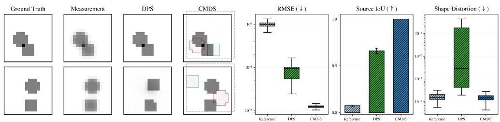  
Figure 15: Source separation from a blurred mixture $( \tau = 0 . 5 )$ . Each task contains a ground-truth circle $X _ { \mathrm { { g t } } } ^ { 1 }$ and square $X _ { \mathrm { g t } } ^ { 2 }$ . We observe the blurred mixture $b = \mathrm { A _ { 0 . 5 } } ( Y _ { \mathrm { g t } } ) = \mathrm { A _ { 0 . 5 } } ( X _ { \mathrm { g t } } ^ { 1 } + X _ { \mathrm { g t } } ^ { 2 } )$ and recover the labelled sources. Left: two representative evaluation mixtures. The red and blue hatched shapes behind the CMDS reconstructions are the matched reference terminal sources. Right: results over 1024 evaluation mixtures for the reference process, DPS, and CMDS. Reconstruction RMSE measures whether the two recovered sources add up to the correct clean mixture. Source IoU measures whether each recovered object occupies the same pixels as its corresponding ground-truth object (↑): it is 1 for an exact match and 0 when neither recovered source overlaps its corresponding ground-truth source. The bars show the evaluation-set mean with 95% bootstrap confidence intervals computed from 10,000 resamples. Shape distortion measures whether source 1 still looks like a circle and source 2 like a square, irrespective of their location (↓). It is zero for an exact valid shape and increases when an object is blurred, deformed, missing, or has the wrong shape.

## D.4 POINTMAZE COLLISION COORDINATION

Key Takeaways: Multi-agent coordination can be amortised. A single control coordinates up to four frozen single-agent trajectory diffusion models, achieving high collision-free joint success and generalising to unseen start–goal regions. Cross-agent communication must scale. Factoring attention into temporal and cross-agent passes preserves the timing of predicted conflicts while reducing complexity from $O ( N ^ { 2 } H ^ { 2 } )$ to $\check { O (} N \hat { H } ( N + ^ { * } H ) ;$ ). Tweedie reward gradients improve control. Adding a learned time-dependent scaling of the reward gradient at the Tweedie estimate improves performance, with Pool 2 joint success ranging from 89.8% to 99.2%. Robust regression stabilises adjoint matching. Squared adjoint matching can be seed-sensitive in harder settings. The self-calibrated pseudo-Huber loss improves mean joint success in six of eight comparisons and reduces variance in the most unstable cases, but does not inherit the gradient identity or critical-point guarantee of squared adjoint matching.

This section provides detail on the protocol for the maze collision coordination experiment.

## D.4.1 TASK, STATE, AND REWARD

We first recall the setup of the task. Agent i generates a length-H trajectory $\tau _ { i } = ( p _ { i } ( 0 ) , \ldots , p _ { i } ( H -$ $1 ) ) \in \mathbb { R } ^ { H \times 2 }$ using the same pretrained single-agent diffusion model G, instantiated independently for each agent. We follow the discrete rollout convention in Algorithm 1. Here, K is the number of reverse diffusion transitions, $\ell \in \{ 0 , \ldots , K \}$ indexes rollout states, and transitions $\ell = 0 , \ldots , K - 1$ use native diffusion time-steps $\zeta _ { \ell } .$ . Thus $X _ { 0 }$ is the initial noise and $X _ { K }$ is the terminal sample; the physical waypoint index $h \in \{ 0 , \ldots , H - 1 \}$ is distinct from ℓ. The assembly operator stacks the N component states,

$$
Y _ { \ell } = \varphi ( X _ { \ell } ) = ( X _ { \ell } ^ { 1 } , \dots , X _ { \ell } ^ { N } ) ,\tag{107}
$$

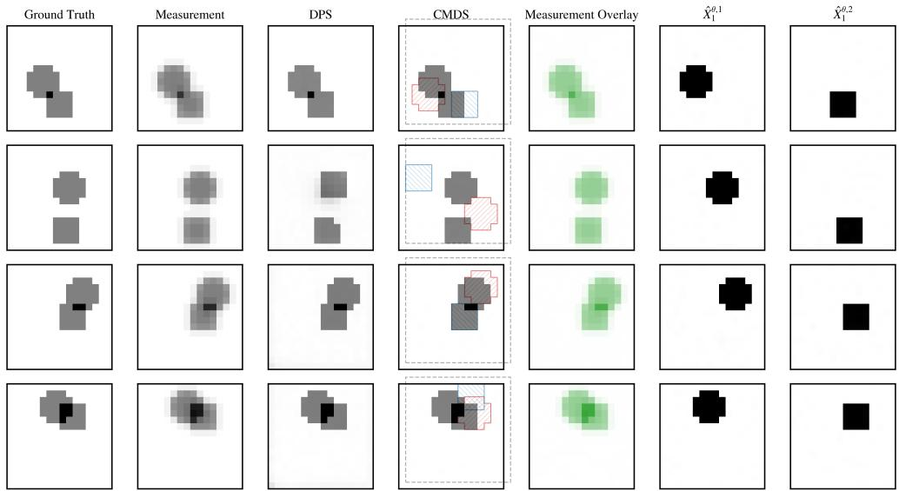  
Figure 16: Representative samples $( \tau = 0 . 5 ) .$ . Each row represents a different instance of the problem. The columns are: (i) the ground-truth mixture; (ii) the observation $b ;$ (iii) the DPS mixture reconstruction; (iv) the CMDS mixture reconstruction, with the matched reference circle and square shown using red and blue hatching, respectively; (v) the blurred CMDS reconstruction overlaid with the observation $b ;$ and (vi–vii) the CMDS estimates of the circle and square sources, respectively. In the measurement overlay, green indicates agreement between the predicted and observed mixtures, red indicates structure present only in the observation, and blue indicates structure present only in the predicted mixture.

where $\varphi$ is the identity on the concatenated state. We write $\hat { X } _ { 1 | \ell }$ for the frozen prior’s terminal-state estimate and $\hat { Y } _ { 1 | \ell } = \varphi ( \hat { X } _ { 1 | \ell } )$ for its assembly. Start and goal positions condition the reconstructed trajectory, which is learned as a residual modification to a straight-line base path interpolating between start and goal (Appendix D.4.4). Let $\boldsymbol { \kappa } = \{ ( s _ { i } , g _ { i } ) \} _ { i = 1 } ^ { N }$ denote these fixed conditions and $\mathcal { R } _ { \kappa }$ the residual-to-world reconstruction, so that

$$
Z _ { \ell } = \mathcal { R } _ { \kappa } ( Y _ { \ell } ) , \qquad \hat { Z } _ { 1 | \ell } = \mathcal { R } _ { \kappa } ( \hat { Y } _ { 1 | \ell } ) .
$$

Coordination is introduced by a shared control conditioned on these reconstructed joint trajectories.   
Goal reach is enforced structurally by the reconstruction and is not part of the reward.

## D.4.2 REWARD

For an assembled state $Y ,$ , let

$$
p _ { i } ( h ; Y ) : = \left[ \mathcal { R } _ { \kappa } ( Y ) \right] _ { i , h } \in \mathbb { R } ^ { 2 }
$$

denote agent i’s reconstructed world-space position at waypoint h. We suppress the dependence on $Y$ below. The reward combines wall avoidance, inter-agent collision avoidance, and penalties on speed, acceleration, and path length. The terminal reward is evaluated at $Y _ { K }$

The path penalties use the waypoint grid $\mathcal { T } = \{ 0 , \ldots , H - 1 \}$ Collision penalties use a denser linearly interpolated grid $\mathcal { T } _ { \mathrm { d e n s e } } .$ , with $| \mathcal { T } _ { \mathrm { d e n s e } } | = \bar { 5 } ( H - 1 )$ evaluation points. Positions at fractional waypoint indices are obtained by linear interpolation. We write $[ a ] _ { + } = \operatorname* { m a x } \{ a , 0 \}$ , so collision penalties vanish once the prescribed clearance is satisfied.

Wall penalty. Wall avoidance is enforced through the signed distance to the maze geometry. We refer to world space as the two-dimensional maze coordinate system in which the start and goal positions, maze geometry, and reconstructed agent trajectories are expressed. For each agent, we penalise only positions whose clearance from the nearest wall is smaller than the agent radius:

$$
r _ { \mathrm { w a l l } } ^ { ( i ) } ( Y ) = - \lambda _ { \mathrm { w a l l } } \sum _ { h \in \mathcal { T } _ { \mathrm { d e n s e } } } \left[ r _ { \mathrm { a g e n t } } - \mathrm { s d f } ( p _ { i } ( h ) ) \right] _ { + } ^ { 2 } .\tag{108}
$$

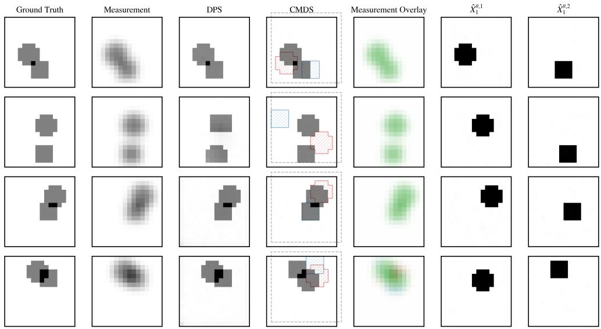  
Figure 17: Representative samples $( \tau = 1 . 0 )$ . Each row represents a different instance of the problem. The columns are: (i) the ground-truth mixture; (ii) the observation b; (iii) the DPS mixture reconstruction; (iv) the CMDS mixture reconstruction, with the matched reference circle and square shown using red and blue hatching, respectively; (v) the blurred CMDS reconstruction overlaid with the observation $b ;$ and (vi–vii) the CMDS estimates of the circle and square sources, respectively. In the measurement overlay, green indicates agreement between the predicted and observed mixtures, red indicates structure present only in the observation, and blue indicates structure present only in the predicted mixture.

For a world-space position $( p \in \mathbb { R } ^ { 2 } )$ , let $( \operatorname { s d f } ( p ) )$ denote its signed Euclidean distance to the boundary of the collision-free maze region, taken to be positive in free space, zero on the boundary, and negative inside an obstacle or outside the maze boundary. The hinge therefore vanishes whenever the trajectory maintains at least one agent radius of wall clearance.

Inter-agent collision penalty. Collisions between agents are handled analogously by penalising insufficient pairwise separation along the densified trajectory. We define

$$
r _ { \mathrm { p a i r } } ( Y ) = - \frac { \lambda _ { \mathrm { p a i r } } } { \binom { N } { 2 } } \sum _ { i < j } \sum _ { h \in \mathcal { T } _ { \mathrm { d e n s e } } } \left[ 2 r _ { \mathrm { a g e n t } } + m - \left. p _ { i } ( h ) - p _ { j } ( h ) \right. \right] _ { + } ^ { 2 } ,\tag{109}
$$

where m is an additional safety margin. The term is zero once two agents are separated by at least $2 r _ { \mathrm { a g e n t } } + m$ , and the factor $\binom { N } { 2 } ^ { - 1 }$ averages the penalty over agent pairs.

Path regularisation. The collision terms constrain feasibility but do not by themselves favour short or smooth trajectories. We therefore include three per-agent regularisers on the raw waypoint grid $\tau { : }$ a one-sided penalty on excessive waypoint displacement, a discrete acceleration penalty, and total path length. These are

$$
r _ { \mathrm { s p e e d } } ^ { ( i ) } ( Y ) = - \lambda _ { \mathrm { s p e e d } } \sum _ { h = 0 } ^ { H - 2 } \left[ \left\| p _ { i } ( h { + } 1 ) - p _ { i } ( h ) \right\| - v _ { \operatorname* { m a x } } \right] _ { + } ^ { 2 } ,\tag{110}
$$

$$
r _ { \mathrm { a c c e l } } ^ { ( i ) } ( Y ) = - \lambda _ { \mathrm { a c c e l } } \sum _ { h = 1 } ^ { H - 2 } \left\| p _ { i } ( h + 1 ) - 2 p _ { i } ( h ) + p _ { i } ( h - 1 ) \right\| ^ { 2 } ,\tag{111}
$$

$$
r _ { \mathrm { l e n g t h } } ^ { ( i ) } ( Y ) = - \lambda _ { \mathrm { l e n g t h } } \sum _ { h = 0 } ^ { H - 2 } \| p _ { i } ( h { + } 1 ) - p _ { i } ( h ) \| .\tag{112}
$$

The speed term is active only above $v _ { \mathrm { m a x } } ,$ whereas acceleration and path length are penalised throughout the trajectory.

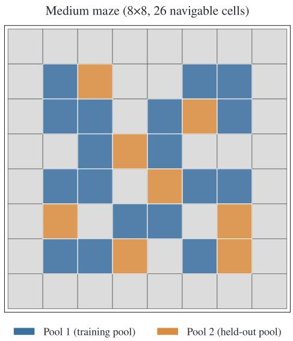  
(a) Medium (8 × 8): 26 navigable cells, comprising 18 training and 8 held-out cells.

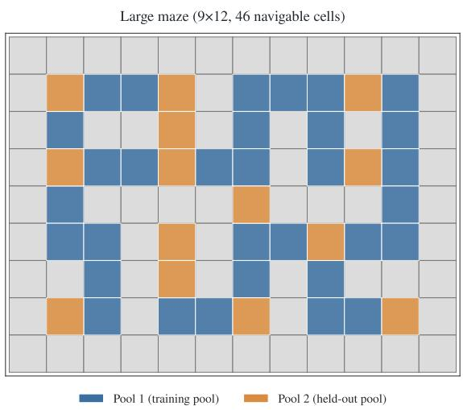  
(b) Large (9 × 12): 46 navigable cells, comprising 32 training and 14 held-out cells.  
Figure 18: Fixed PointMaze cell partitions. Coordinates use zero-based (row, column) matrix indexing. The colours show the exact partition of cells between Pool 1 and Pool 2.

Total reward. Each agent receives its own wall and path penalties together with the shared interagent penalty:

$$
\begin{array} { r l } & { r ^ { ( i ) } ( Y ) = r _ { \mathrm { w a l l } } ^ { ( i ) } ( Y ) + r _ { \mathrm { s p e e d } } ^ { ( i ) } ( Y ) + r _ { \mathrm { a c c e l } } ^ { ( i ) } ( Y ) } \\ & { ~ + r _ { \mathrm { l e n g t h } } ^ { ( i ) } ( Y ) + r _ { \mathrm { p a i r } } ( Y ) . } \end{array}\tag{113}
$$

For a world-space trajectory Z, let $r _ { \kappa } ^ { \mathrm { w o r l d } } ( Z )$ denote this reward evaluated directly at positions $p _ { i } ( h ) = Z _ { i , h } .$ , so that $\dot { r } _ { \kappa } ( Y ) = r _ { \kappa } ^ { \mathrm { w o r l d } } ( \mathcal { R } _ { \kappa } ( \dot { Y } ) )$ ). The subscripted penalty weights are distinct from the outer SOC reward strength λ. We use

$$
\left( \lambda _ { \mathrm { w a l l } } , \lambda _ { \mathrm { p a i r } } , \lambda _ { \mathrm { s p e e d } } , \lambda _ { \mathrm { a c c e l } } , \lambda _ { \mathrm { l e n g t h } } \right) = ( 2 0 0 , 4 0 0 , 0 , 1 , 1 ) ,
$$

with $m = 0 . 0 5$ and $v _ { \mathrm { m a x } } = 0 . 1 5$ . The Tweedie reward-gradient extension (Appendix D.4.5) uses the same reward definition, except that $\lambda _ { \mathrm { w a l l } } = 3 0 0$

## D.4.3 DATA SPLITS.

We use the medium and large PointMaze layouts (Fu et al., 2020). Each maze is mapped by a binary grid with 0 and 1 entries corresponding respectively to corridors and walls. The continuous PointMaze environment is obtained by fixing each grid entry to a physical size of $1 . 0 \times 1 . 0$ . Cells are partitioned once, in advance, into disjoint training and test pools:

<table><tr><td>Layout</td><td>Grid</td><td>Navigable cells</td><td>Pool 1 cells</td><td>Pool 2 cells</td></tr><tr><td>Medium</td><td> $8 \times 8$ </td><td>26</td><td>18</td><td>8</td></tr><tr><td>Large</td><td> $9 \times 1 2$ </td><td>46</td><td>32</td><td>14</td></tr></table>

The Pool 1 and Pool 2 cells are disjoint, spatially interspersed across each maze and fixed across runs. The exact partition of cells is presented in fig. 18.

A training sample is obtained by sampling every start and goal cell independently and uniformly from the selected pool, adding continuous within-cell jitter, and retaining the draw only if:

1. Every agent’s uncontrolled path has a minimum length of 4.

2. The independently planned paths contain collisions.

3. Conflict-Based Search (CBS) (Sharon et al., 2015) finds a joint solution within a specified compute budget.

We report two held-out splits. Pool 1 contains unseen instances sampled from the training-cell pool; Pool 2 contains instances sampled from the disjoint test-cell pool. Every method and hyperparameter setting is evaluated on the same fixed set of 128 instances per pool.

## D.4.4 FROZEN PER-AGENT PRIOR

Each layout uses a single-agent trajectory diffusion model, pretrained once and frozen throughout coordination training. We adopt the Diffusion Veteran configuration (Lu et al., 2025): a DiT-style denoiser with six adaLN-zero blocks, hidden width 256, four attention heads, and ≈ 7.3M parameters. The model is trained as a 100-step discrete-time DDPM with a linear schedule and mean-squared ϵ-prediction loss. This configuration reaches near-perfect (≈ 0.99) wall feasibility on both layouts.

## D.4.5 CONTROL ARCHITECTURE

Base control. The pretrained diffusion model represents each trajectory as a residual correction to the straight-line path between the start and goal. Before passing the trajectory to the control network, we reconstruct the corresponding absolute $( x , y )$ positions in the maze. Cross-agent attention therefore operates on the agents’ predicted physical positions rather than on the residual representation used by the diffusion model. At reverse transition $\ell ,$ it receives the joint trajectory $\bar { Z } _ { \ell } ,$ , the reconstructed Tweedie estimate $\hat { Z } _ { 1 | \ell } .$ , the start–goal conditions $\kappa ,$ and the native diffusion time-step $\zeta _ { \ell } .$ The trajectory and Tweedie estimate are concatenated along the channel axis and projected to width 344, with sinusoidal embeddings of diffusion time and physical waypoint position. An initial temporal self-attention block processes each agent’s trajectory separately. Two axial blocks then al ternate temporal self-attention within each agent, cross-agent attention at each shared waypoint, and a feed-forward layer. Both blocks retain the full waypoint resolution and use four attention heads, a feed-forward multiplier of $^ { 4 , }$ residual connections, and layer normalisation. Cross-agent attention includes a learned geometric bias. For each agent pair, an eight-dimensional feature collects relative position (2), distance (1), forward-differenced relative velocity (2), closing speed (1), and relative goal offset (2). An MLP with dimensions $8  3 2  4$ maps these features to an additive bias for each attention head, applied through a custom scaled-dot-product implementation. Separate output heads read the local and communication representations to produce the epsilon residual $\delta \epsilon _ { \theta , \ell } .$ . Both heads and the final layer of the geometric-bias MLP are zero-initialised, so the base control initially leaves the pretrained sampler unchanged. The network has ∼ 4.3M parameters. Rather than applying attention jointly over all $N \times H$ agent–waypoint tokens, we factor it along the two natural axes of the trajectory tensor (Ho et al., 2019): temporal attention operates over waypoints within each agent, while cross-agent attention operates over agents at each shared waypoint. This reduces the per-block attention complexity from $O ( N ^ { 2 } H ^ { 2 } )$ to ${ \mathsf { O } } ( N H ( N + H ) ) ,$ ). For $H = 5 0$ and $N = 4 .$ , this gives approximately 3.7 times fewer attention-pair evaluations. Temporal attention is batched over agents, and cross-agent attention is batched over waypoints. Shared weights and attention along the agent axis make the control equivariant to a consistent permutation of agents and their conditions (Lee et al., 2019).

Tweedie reward gradient extension. Inspired by Denker et al. (2024); Venkatraman et al. (2024), CMDS+TRG augments the base axial control with the joint reward gradient $\begin{array} { r l } { \hat { g } _ { \ell } ^ { \mathrm { r a w } } } & { { } = } \end{array}$ $\lambda ^ { \star } \nabla _ { Z } r _ { \kappa } ^ { \mathrm { w o r l d } } ( Z ) \big | _ { Z = \hat { Z } _ { 1 | \ell } }$ , evaluated at the reconstructed Tweedie estimate $\hat { Z } _ { 1 | \ell }$ where $\lambda ^ { \star } > 0$ is a fixed scale, distinct from the outer SOC reward strength $\lambda .$ . This is normalised to unit root-meansquare magnitude and clamped element-wise to $[ - 3 , 3 ]$ to give $\hat { g } _ { \ell } \left( \lambda ^ { \star } \right.$ cancels under this normalisation, so its value does not affect $\hat { g } _ { \ell } )$ . This is combined additively with the base network:

$$
\delta \epsilon _ { \theta , \ell } = \mathrm { N N } _ { \theta } \Big ( Z _ { \ell } , \hat { Z } _ { 1 \mid \ell } , \hat { g } _ { \ell } , \kappa , \zeta _ { \ell } \Big ) - s _ { \theta } \big ( \zeta _ { \ell } \big ) \hat { g } _ { \ell } ,\tag{114}
$$

where $\delta \epsilon _ { \theta , \ell }$ is the additive epsilon residual, inducing the normalised control $w _ { \theta , \ell } = ( \gamma _ { \ell } / \varsigma _ { \ell } ) \delta \epsilon _ { \theta , \ell }$ as in eq. (99). Here $\mathrm { N N } _ { \theta }$ is the same control described above, applied to a widened, three-channel input – the reconstructed noisy state, the reconstructed Tweedie estimate, and $\hat { g } _ { \ell }$ , concatenated along the channel axis (so it can condition on the reward gradient rather than only react to its additive contribution) – and $s _ { \theta } ( \zeta _ { \ell } ) = 1 \mathrm { { + t a n h } } ( \mathrm { { M L P } } _ { \theta } ( \zeta _ { \ell } ) )$ is a single learned, time-dependent, agent-shared scalar gate (a function of the diffusion time-step only, not of $\hat { Z } _ { 1 | \ell }$ or $\hat { g } _ { \ell } )$ . The gate MLP is zeroinitialised so that $s _ { \theta } ( \zeta _ { \ell } ) = 1$ at the start of training. This adds only ≈ 1,000 parameters over the base control (approximately 4.3M total). We use this full configuration (both the network conditioning and the gated additive term) throughout; restricting to either component alone, or removing the network’s access to $\hat { Z } _ { 1 | \ell }$ or $\hat { g } _ { \ell } ,$ , trades off differently across cells but does not change the qualitative picture and is left to future ablation work.

## D.4.6 TRAINING OBJECTIVES

We apply the adjoint matching coordination objective introduced in section 2.1 to the stacked $N \mathrm { . }$ agent state. Adjoint matching rolls out the current controlled trajectory along the reverse grid with no gradient tracking. Starting from the terminal cost gradient $a _ { K } = \nabla _ { X _ { K } } [ - \lambda r _ { \kappa } ( Y _ { K } ) ]$ , it propagates an adjoint variable backward one DDIM step at a time. This backward pass replays individual controlled transitions rather than retaining the computational graph of the full multi-step sampler. The control is then trained to match the correction implied by the next-state adjoint $a _ { \ell + 1 }$ . All headline results use the robust regression variant described in Appendix D.4.7. At low signal-tonoise ratios, the DiT prior can also produce excessively large $\hat { X } _ { 1 | \ell }$ estimates; following Janner et al. (2022), we clip $\hat { X } _ { 1 | \ell }$ before converting it back to the equivalent noise prediction used in the controlpenalty decomposition.

The adjoint matching configuration is summarised below.  
Setting Value   
Optimiser steps 15,000   
Initial learning rate $1 0 ^ { - 4 }$ (Medium N=2, Medium $N { = } 4 ,$ Large N=2); $3 \times 1 0 ^ { - 4 }$ (Large   
$N { = } 4 )$   
Learning-rate schedule Cosine decay to $1 0 ^ { - 5 }$   
EMA decay 0.9995   
Clipping Gradient norm $0 . 5 ,$ elementwise $\hat { X } _ { 1 | \ell }$ magnitude 4   
Batch size 256 for $N = 2 ,$ 128 for $N = 4$   
Training instances 4096 joint instances for N = 2; 2048 for $N = 4$

The table above is CMDS’s recipe. CMDS+TRG converges in fewer steps and uses a correspondingly slower schedule: 7,000 optimiser steps, initial learning rate $1 0 ^ { - 5 }$ with cosine decay to $\mathrm { \dot { 1 } 0 ^ { - 6 } }$ and reward wall-weight $\lambda _ { \mathrm { w a l l } } = 3 0 0$ . Batch size, training instances, EMA decay, and gradient $\hat { \langle X _ { 1 | \ell } }$ clipping are shared between both variants.

## D.4.7 ROBUST ADJOINT-MATCHING: PSEUDO-HUBER VERSUS SQUARED $\ell _ { 2 }$

Motivation. Adjoint matching is an on-policy stochastic regression problem whose inputs and targets depend on the current control. Because adjoints are propagated through Jacobians evaluated along stochastic, control-dependent trajectories, finite-batch gradient estimates can have high variance despite being unbiased in expectation (Domingo-Enrich et al., 2025). The squared matching loss can amplify this variability because its gradient grows with the adjoint residual. For collision rewards, early trajectories often contain persistent agent collisions or deep wall penetrations, which can dominate minibatch adjoints and make optimisation unstable and strongly seed-dependent. This motivates a modification of adjoint matching’s regression objective.

Objective. Using the rollout convention of Algorithm 1, with the frozen-rollout superscript suppressed, we write the joint matching residual as

$$
\begin{array} { r } { e _ { \theta , \ell } : = \mathrm { c o l } _ { i = 1 } ^ { N } \left[ w _ { \theta , \ell } ^ { i } ( \mathrm { s t o p g r a d } ( X _ { \ell } ) ) + \varsigma _ { \ell } \mathrm { s t o p g r a d } \big ( a _ { \ell + 1 } ^ { i } \big ) \right] \in \mathbb { R } ^ { D } . } \end{array}
$$

Here D is the dimension of the stacked residual after vectorisation $( D = 2 N H$ for the full $H \times 2$ representation). This is the residual appearing in eq. (106). The normalised control is defined in eq. (99), and the adjoint target is obtained from the terminal condition eq. (102) and recursion eq. (103). To

reduce the influence of rare high-norm residuals induced by these recursively propagated targets, we use a pseudo-Huber, or Charbonnier loss (Huber, 1992; Charbonnier et al., 1994; Barron, 2019). For a residual vector $e \in \mathbb { R } ^ { D }$ , let rm ${ \boldsymbol { \mathbf { \ell } } } ( e ) = \| e \| / { \sqrt { D } }$ be its root-mean-square magnitude and define

$$
\rho _ { \delta _ { \ell } } ( e ) : = D \delta _ { \ell } ^ { 2 } \left( \sqrt { 1 + \frac { \| e \| ^ { 2 } } { D \delta _ { \ell } ^ { 2 } } } - 1 \right) .\tag{115}
$$

The resulting robust matching objective is

$$
\mathcal { L } _ { \mathrm { C M D S - P H } } ( \boldsymbol { \theta } ) : = \mathbb { E } \left[ \sum _ { \ell \in \mathcal { K } } \rho _ { \delta _ { \ell } } ( \boldsymbol { e } _ { \boldsymbol { \theta } , \ell } ) \right] .\tag{116}
$$

For $\| e \| \ll \sqrt { D } \delta _ { \ell }$

$$
\rho _ { \delta _ { \ell } } ( e ) = \frac { 1 } { 2 } \| e \| ^ { 2 } + O \left( \frac { \| e \| ^ { 4 } } { D \delta _ { \ell } ^ { 2 } } \right) ,
$$

so $\nabla _ { e } ^ { 2 } \rho _ { \delta _ { \ell } } ( 0 ) = I$ and the loss retains the local curvature of squared matching. For $\| e \| / ( \sqrt { D } \delta _ { \ell } ) \to$ $\infty ,$ , it instead satisfies $\begin{array} { r } { \rho _ { \delta _ { \ell } } ( e ) = \sqrt { D } \delta _ { \ell } \| e \| + O ( 1 ) } \end{array}$ , and

$$
\nabla _ { e } \rho _ { \delta _ { \ell } } ( e ) = \frac { e } { \sqrt { 1 + \| e \| ^ { 2 } / ( D \delta _ { \ell } ^ { 2 } ) } } , \qquad \| \nabla _ { e } \rho _ { \delta _ { \ell } } ( e ) \| \le \sqrt { D } \delta _ { \ell } .\tag{117}
$$

Because both the rollout and adjoint target are stopped in eq. (106),

$$
\nabla _ { \theta } \rho _ { \delta _ { \ell } } ( e _ { \theta , \ell } ) = D _ { \theta } w _ { \theta , \ell } ^ { \top } \nabla _ { e } \rho _ { \delta _ { \ell } } ( e _ { \theta , \ell } ) .
$$

Thus, pseudo-Huber bounds the influence of an individual target in residual space, although the parameter gradient can still be amplified by the control Jacobian $D _ { \theta } w _ { \theta , \ell }$

Self-calibration of the pseudo-Huber loss. Adjoint residual scales differ substantially across DDIM transitions, so a single global threshold would constrain some steps too aggressively and others too weakly. We first run a short calibration phase with the squared DDIM matching objective eq. (106) and record the per-instance RMS residual rms $( e _ { \theta , \ell } ^ { ( b ) } )$ at each transition ℓ. We then set

$$
\delta _ { \ell } = \operatorname* { m a x } \Bigl \{ \delta _ { \mathrm { m i n } } , Q _ { q } \Bigl ( \{ \mathrm { r m s } ( e _ { \theta , \ell } ^ { ( b ) } ) \} _ { b \in \mathcal { D } _ { \mathrm { c a l } } } \Bigr ) \Bigr \} .\tag{118}
$$

Here, $Q _ { q }$ is a fixed empirical quantile over the calibration set $\mathcal { D } _ { \mathrm { c a l } } ;$ we freeze $\delta _ { \ell }$ for the remainder of training. The calibration hyperparameters are fixed before the multi-seed comparison and shared across mazes and agent counts. The underlying SOC objective remains eq. (74); only the squared regression surrogate eq. (106) is replaced. The gradient identity and critical-point guarantee for the basic squared objective eq. (6), established by Domingo-Enrich et al. (2025), do not automatically extend to eq. (116). This modified regression objective is studied empirically and need not preserve the minimiser of squared adjoint matching; its connection to the original stochastic-control objective remains an open question. Table 9 reports the full squared- $\cdot \ell _ { 2 } -$ versus-pseudo-Huber regression comparison, held-out joint success, mean ± standard deviation across 10 independent training seeds per (maze, N) cell. All runs use identical hyperparameters tuned for $\ell _ { 2 } { \ - } \mathbf { A M }$ , identical control architecture (Appendix D.4.5), and evaluation protocol. The pseudo-Huber matching loss (115) generally improves mean success and substantially reduces variance in challenging settings, such as the Large maze with 4 agents.

<table><tr><td></td><td colspan="2">Medium  $( N = 2 )$ </td><td colspan="2">Medium  $( N = 4 )$ </td><td colspan="2">Large  $( N = 2 )$ </td><td colspan="2">Large  $( N = 4 )$ </td></tr><tr><td>Matching loss</td><td>Pool 1 ↑</td><td>Pool 2 ↑</td><td>Pool 1 ↑</td><td>Pool 2 ↑</td><td>Pool 1 ↑</td><td>Pool 2 ↑</td><td>Pool 1 ↑</td><td>Pool 2 ↑</td></tr><tr><td>Squared  $\ell _ { 2 }$ </td><td>0.940 ±0.020</td><td> $0 . 8 8 4 \pm 0 . 0 4 8$ </td><td>0.806±0.155</td><td>0.667 ±0.151</td><td>0.833 ±0.041</td><td>0.792 ±0.042</td><td> $0 . 7 2 3 \pm 0 . 1 5 7$ </td><td>0.606 ±0.152</td></tr><tr><td>Pseudo-Huber 0.988 ±0.012 0.933 ±0.032</td><td></td><td></td><td>0.805 ±0.098</td><td>0.665 ±0.169</td><td>0.907 ±0.037</td><td>0.833±0.045</td><td>0.873 ±0.027</td><td>0.744±0.036</td></tr><tr><td>Method</td><td>Pool 1 ↑</td><td>Pool 2 ↑</td><td>Pool 1 ↑</td><td>Pool 2 ↑</td><td>Pool 1 ↑</td><td>Pool 2 ↑</td><td>Pool 1 ↑</td><td>Pool 2 ↑</td></tr><tr><td>CMDS+TRG</td><td>0.998±0.003</td><td>0.983±0.015</td><td>0.984±0.005</td><td>0.947±0.006</td><td>0.973±0.009</td><td>0.906±0.015</td><td>0.975±0.006</td><td>0.969±0.005</td></tr></table>

Table 9: Adjoint matching training-seed variance and its mitigation. Held-out joint success, mean ± population standard deviation across 10 independent training seeds per (maze, N) cell.

Table 10: CMDS+TRG training variance. Held-out joint success rate (Pool 1: train-cell instances, Pool 2: instances from entirely held-out maze cells), mean ± population standard deviation across 5 independent training seeds, evaluated on 128 held-out instances per split.

## D.4.8 TRAINING VARIANCE

We report the final CMDS+TRG training variance. We train CMDS+TRG with 5 different seeds for each setting and report the mean and standard deviation of joint success on each pool.

## D.4.9 BASELINE SUITE AND PROTOCOL MATCHING

We compare against independent reference sampling, Best-of-256 reward selection, FK-Steering, and DPS test-time reward guidance. All baselines use the same frozen single-agent prior, trajectory representation, reward, agent radius $r _ { \mathrm { a g e n t } } = 0 . 1 2 , \hat { X } _ { 1 | \ell }$ -clip of 4, and fixed evaluation sets of 128 instances per split. DPS and FK-Steering are tuned for each task.

## D.4.10 QUALITATIVE EXAMPLES

Figures 19I to 19IV give 6 held-out examples per (maze, N) cell, with the highest variation of the trajectory before and after introducing the control.

## D.5 MULTI-ARM KUKA COORDINATION FROM FROZEN SINGLE-ARM PRIORS

Key Takeaways: Frozen energy-based priors can be coordinated. CMDS learns a shared control over independent seven-joint KUKA priors while keeping their pretrained weights fixed. Adjoint training differentiates the reverse dynamics through the learned energy using input Hessian–vector products, evaluated one transition at a time. A two-arm controller generalises without retraining. Trained to coordinate two frozen single-arm priors, CMDS provides zero-shot transfer to shifted or enlarged obstacles, wider robot base spacing, and three to five arms. It achieves higher mean strict success than the evaluated guidance baselines in all these transfer settings.

## D.5.1 TASK, REPRESENTATION, AND DATA

The KUKA task follows Luo et al. (2024) and consists of two robotic arms whose single-arm trajectory priors are independently pretrained for obstacle-avoiding motion planning. Arm i generates joint angles $q ^ { i } = ( q _ { 1 } ^ { i } , \dotsc , q _ { H } ^ { i } ) \ \in \ \mathbb { R } ^ { H \times 7 }$ , with $H = 5 6$ . All arms share a path-progress coordinate, and $q _ { 1 } ^ { i } , q _ { H } ^ { i }$ are fixed to the requested start and goal. The planner generates joint-angle paths without assigning physical times to their waypoints or enforcing joint-velocity limits. Evaluation checks geometric constraints, including joint limits and collisions along trajectories. With the saved prior-normalisation bounds $q _ { \mathrm { l o } } , q _ { \mathrm { h i } }$ , the normalised full path is $x = 2 ( q - q _ { \mathrm { l o } } ) / ( q _ { \mathrm { h i } } - q _ { \mathrm { l o } } ) - 1$ , with component-wise operations and an affine inverse. Only the H − 2 interior knots are sampled; endpoints are reinserted whenever the full trajectory is reconstructed. We denote the joint native state by $\boldsymbol { X } = ( X ^ { 1 } , \ldots , X ^ { N } )$ , where $X ^ { i } \in \mathbb { R } ^ { ( \mathbf { \breve { H } - 2 } ) \times \mathbf { \breve { 7 } } }$ contains arm i’s normalised interior coordinates. For fixed task conditions κ, comprising the endpoints, arm bases, and obstacles, the reconstructed assembly is $Y = \varphi ( X ) = q = ( { \hat { q } } ^ { 1 } , \dots , { \overline { { q } } } ^ { N } )$ ; the dependence of φ on κ is suppressed. The two-arm state has $1 4 ( H - 2 ) \approx 7 5 0$ free coordinates. For N arms, $D = 7 N ( H - 2 ) \colon$ norms on the native state and control are Euclidean after vectorisation, without averaging over arms or coordinates.

The arm bases are positioned at (−0.5, 0, 0) and (0.5, 0, 0) metres, with both bases’ local coordinate axes aligned with the world axes. The scene contains a shared table beneath the arms and five cubic obstacles, each with side length 0.44 m and edges aligned with the world axes.

Single-arm priors receive obstacle centres expressed in each arm’s local base coordinates; the controller and collision reward use world-frame (i.e. shared coordinate system) forward kinematics and the actual obstacle extents. The pretrained conditioning interface remains fixed, while the joint control observes the transformed scene.

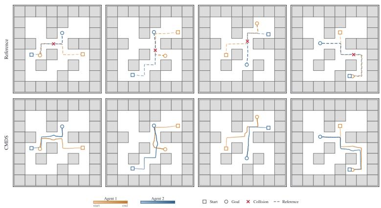  
(I) Medium PointMaze (N = 2).

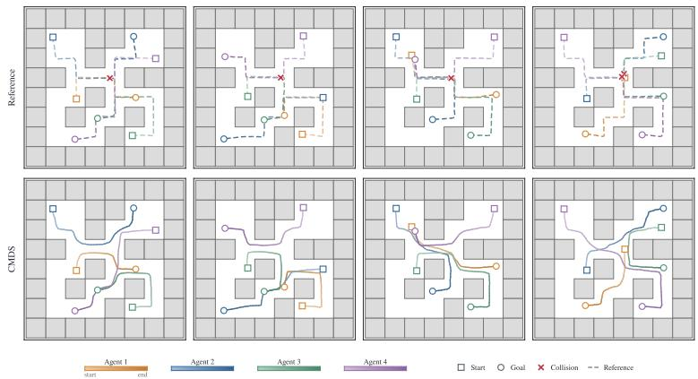

(II) Medium PointMaze (N = 4).  
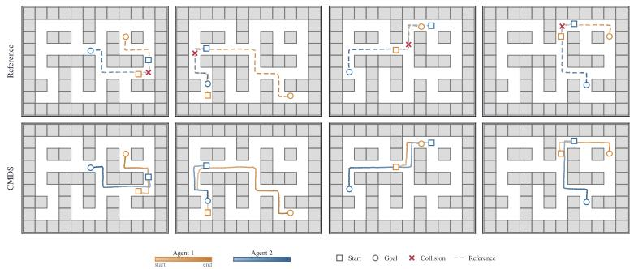  
(III) Large PointMaze (N = 2).

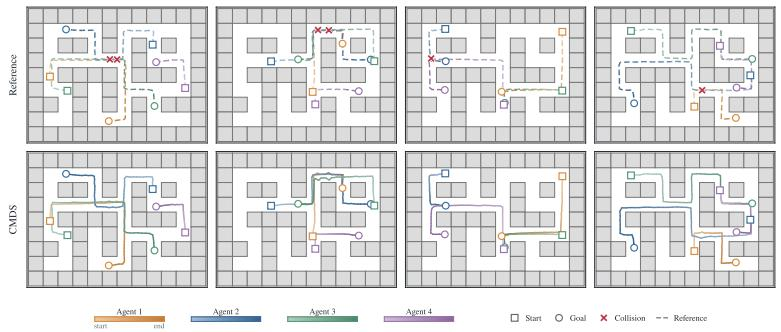  
(IV) Large PointMaze (N = 4).  
Figure 19: Qualitative maze-coordination examples. For each maze and agent count, the top row is the reference process trajectory (dashed) and the bottom row is the trajectory produced with the trained CMDS control (solid), for the same 6 held-out instances and the same initial noise.

<table><tr><td>Population</td><td>Construction</td><td>Evaluation tasks</td></tr><tr><td>In-domain</td><td>Released dual-arm scene and endpoints</td><td>413</td></tr><tr><td>Shifted obstacles</td><td>Horizontal Gaussian shifts, standard deviation 0.10 m</td><td>191</td></tr><tr><td>Larger obstacles</td><td>Each box half-extent multiplied by 1.2</td><td>121</td></tr><tr><td>Wider bases</td><td>Base positions moved to x = ±0.6 m</td><td>208</td></tr><tr><td>Three arms</td><td>Third base at (0, 0.8, 0) m, identity rotation</td><td>172</td></tr></table>

Table 11: KUKA evaluation populations.

Priors. We instantiate the priors from the pretrained checkpoints of Luo et al. (2024). The Dualarm checkpoint is used only for evaluation and comparison with CMDS<sup>†</sup>.

Controller-training and evaluation populations. A layout specifies the obstacle arrangement, while a planning task specifies start and goal configurations for both arms within that layout. The released dataset provides separate training and test layouts. We divide its 2,500 training layouts into 2,250 layouts for learning the controller and 250 layouts reserved for validation. Validation is used to monitor training and select controller settings and guidance strengths. Test layouts are used to report performance. These three groups contain no shared layouts.

For controller training, we extract 32 start–goal pairs from each of the 2,250 training layouts, giving 72,000 tasks. Removing tasks whose start or goal configurations violate joint limits or contain collisions leaves 50 thousand training tasks.

For validation, we select two tasks from each of 100 of the 250 reserved layouts. For testing, we select two tasks from each of 300 released test layouts. Applying the same endpoint checks leaves 134 validation tasks and 413 test tasks, with the latter spanning 264 layouts. All methods use the same retained tasks, selected before planner evaluation. Collision-free start and goal configurations do not guarantee that a collision-free path exists between them.

Zero-shot transfer. Each transformation below is applied to all test configurations. Obstacle perturbations are deterministic per layout and shared across methods. All controller and prior weights and guidance strengths are held fixed. The resulting number of tasks after feasibility filtering is detailed in table 11.

For wider bases, joint-space endpoints and world-frame obstacle positions remain fixed, so worldspace end-effector endpoints change.

Transfer from two to five arms. CMDS is architecturally compatible with an arbitrary number of arms without retraining. For the arm-count comparison in the right-hand block of table 3, we select twenty start–goal tasks from each of the 300 test layouts, giving 6,000 tasks. Selection is fixed before running any planner. We keep the original two arms and obstacles unchanged, then add arms at (0, 0.8, 0), (0, −0.8, 0), and (0.8, 0.8, 0) metres, all with the same base orientation as the original arms. Within each layout, we pair consecutive tasks in the fixed selection order. We assign endpoints to the added arms using other two-arm tasks from the same obstacle layout. We pair the twenty selected tasks in their fixed order: the first with the second, the third with the fourth, and so on. For each task, arm three receives the start and goal joint angles of the paired task’s first arm; arm four receives those of its second arm. Arm five receives the first arm’s start and goal joint angles from a third task. We select this third task from all released tasks in the same layout, sorted by task identifier, taking the first entry other than the current task, its paired task, or either of the two tasks used in the original two-arm benchmark. Only endpoint joint angles are reused; trajectories are generated anew for each arm count.

Checking joint limits and endpoint collisions leaves 4 thousands 1,5 thousand, 500, and 200 tasks for two, three, four, and five arms, respectively. We compare all arm counts on the same 209 tasks whose endpoints pass these checks in every setting. These results are conditional on endpoint feasibility for all four counts; they do not describe the full retained population at each count or certify that a feasible connecting path exists.

## D.5.2 ENERGY-BASED PRIORS AND DISCRETE ADJOINT MATCHING

Energy parameterisation. The released network $f _ { \psi }$ defines the energy parameterisation of Du et al. (2023); Luo et al. (2024). For a normalised full path x, diffusion index ζ, and scene conditioning $c ,$ the noise predictor is

$$
\begin{array} { r } { E _ { \psi } ( \boldsymbol { x } , \zeta , c ) = \frac { 1 } { 2 } \| f _ { \psi } ( \boldsymbol { x } , \zeta , c ) \| _ { 2 } ^ { 2 } , \qquad \epsilon _ { \psi } ( \boldsymbol { x } , \zeta , c ) = \nabla _ { \boldsymbol { x } } E _ { \psi } ( \boldsymbol { x } , \zeta , c ) . } \end{array}\tag{119}
$$

The prior applies classifier-free guidance with weight $\omega _ { \mathrm { c f g } } = 2$ , which gives $\epsilon _ { \psi } ^ { \mathrm { c f g } } = \epsilon _ { \psi } ^ { \mathcal { O } } + \omega _ { \mathrm { c f g } } ( \epsilon _ { \psi } ^ { c } -$ $\epsilon _ { \psi } ^ { \mathcal { D } } )$ . These are learned trajectory energies, distinct from the geometric collision reward defined below.

Reverse transition and control. We use the state and transition-index convention of Algorithm 1, but retain $K = 1 0$ for the number of DDIM transitions in this subsection, since $n _ { \mathrm { c a n d } }$ denotes the number of initial joint trajectory candidates per task in the KUKA experiments. The rollout runs from the initial noise state $X _ { 0 }$ to the terminal sample $X _ { K }$ , with transitions indexed by $\ell = 0 , \ldots , K - 1$ and native diffusion time-steps $\zeta _ { \ell } = 9 0 - 1 0 \ell .$ . Let $\bar { \alpha } _ { \zeta }$ denote the checkpoint’s cumulative noise-schedule coefficient at native time-step ζ, and define

$$
\bar { \alpha } _ { \mathrm { s r c } , \ell } = \bar { \alpha } _ { \zeta \ell } , \qquad \bar { \alpha } _ { \mathrm { d s t } , \ell } = \left\{ { \bar { \alpha } _ { \zeta _ { \ell + 1 } } } , \begin{array} { l l } { 0 \leq \ell < K - 1 , } \\ { 1 , } & { \ell = K - 1 . } \end{array} \right.
$$

The frozen noise prediction is evaluated on each arm’s full normalised path with fixed endpoints, then restricted to its free interior. We write the concatenated prediction as $\dot { \epsilon } _ { \mathrm { b } , \ell } ( X _ { \ell } ) = ( \epsilon _ { \mathrm { b } , \ell } ^ { i } ( X _ { \ell } ^ { \bar { i } } ) ) _ { i = 1 } ^ { N } .$ with evaluation at $\zeta _ { \ell } .$ , scene conditioning, and classifier-free guidance included. The reference transition first clips its clean estimate and recomputes the corresponding epsilon:

$$
\begin{array} { r l } & { \hat { X } _ { 1 | \ell } ^ { \mathrm { c l i p } } = \mathrm { c l i p } _ { [ - 1 , 1 ] } \left( \frac { X _ { \ell } - \sqrt { 1 - \tilde { \alpha } _ { \mathrm { s r c } , \ell } } \epsilon _ { \mathrm { b } , \ell } ( X _ { \ell } ) } { \sqrt { \tilde { \alpha } _ { \mathrm { s r c } , \ell } } } \right) , } \\ & { } \\ & { \tilde { \epsilon } _ { \mathrm { b } , \ell } ( X _ { \ell } ) = \frac { X _ { \ell } - \sqrt { \tilde { \alpha } _ { \mathrm { s r c } , \ell } } \hat { X } _ { 1 | \ell } ^ { \mathrm { c l i p } } } { \sqrt { 1 - \tilde { \alpha } _ { \mathrm { s r c } , \ell } } } , } \\ & { ~ \varsigma _ { \ell } ^ { 2 } = \eta ^ { 2 } \frac { 1 - \tilde { \alpha } _ { \mathrm { d x t } , \ell } } { 1 - \tilde { \alpha } _ { \mathrm { s r c } , \ell } } \left( 1 - \frac { \tilde { \alpha } _ { \mathrm { s r c } , \ell } } { \tilde { \alpha } _ { \mathrm { d x t } , \ell } } \right) , } \\ & { \mu _ { \mathrm { b } , \ell } ( X _ { \ell } ) = \sqrt { \tilde { \alpha } _ { \mathrm { d x t } , \ell } } \hat { X } _ { 1 | \ell } ^ { \mathrm { c l i p } } + \sqrt { 1 - \tilde { \alpha } _ { \mathrm { d x t } , \ell } - \varsigma _ { \ell } ^ { 2 } } \tilde { \epsilon } _ { \mathrm { b } , \ell } ( X _ { \ell } ) . } \end{array}\tag{120}
$$

For the learned-control sampler, $\eta = 1$ , so $\varsigma _ { \ell } > 0$ for $0 \leq \ell < K - 1$ , whereas $\varsigma _ { K - 1 } = 0$ . For an epsilon correction $\delta \epsilon _ { \theta , \ell } ( X _ { \ell } )$ , define on the stochastic transitions $0 \leq \ell < K - 1$

$$
\begin{array} { r l } & { \gamma _ { \ell } = \sqrt { 1 - \bar { \alpha } _ { \mathrm { d s t } , \ell } - \varsigma _ { \ell } ^ { 2 } } - \sqrt { \frac { \bar { \alpha } _ { \mathrm { d s t } , \ell } } { \bar { \alpha } _ { \mathrm { s r c } , \ell } } } \sqrt { 1 - \bar { \alpha } _ { \mathrm { s r c } , \ell } } , } \\ & { w _ { \theta , \ell } ( X _ { \ell } ) = \frac { \gamma _ { \ell } } { \varsigma _ { \ell } } \delta \epsilon _ { \theta , \ell } ( X _ { \ell } ) , } \\ & { \mu _ { \ell } ^ { \theta } ( X _ { \ell } ) = \mu _ { \mathrm { b } , \ell } ( X _ { \ell } ) + \varsigma _ { \ell } w _ { \theta , \ell } ( X _ { \ell } ) , } \\ & { X _ { \ell + 1 } = \mu _ { \ell } ^ { \theta } ( X _ { \ell } ) + \varsigma _ { \ell } \Xi _ { \ell } , ~ \Xi _ { \ell } \sim \mathcal { N } ( 0 , I _ { D } ) . } \end{array}\tag{121}
$$

At the deterministic final transition, no learned correction is applied:

$$
X _ { K } = \mu _ { \mathsf { b } , K - 1 } ( X _ { K - 1 } ) , \qquad w _ { \theta , K - 1 } \equiv 0 .
$$

The final control is set to zero by convention, not computed through division by $\varsigma _ { K - 1 }$ . Unlike the modified endpoint in Appendix C.2.2, KUKA retains the native deterministic endpoint; it contributes neither control energy nor a matching term.

Adjoint matching with energy-based priors. We use the discrete adjoint recursion and matching loss of Appendix C.2.2. The control cost is averaged over arms, and the collision reward has weight $\beta = 4 0$ . Adjoints propagate through all ten denoising transitions, while control costs and matching terms involve only the nine stochastic transitions. Since $\epsilon _ { \psi } = \nabla _ { x } E _ { \psi }$ , the required vector–Jacobian products through the noise predictor are Hessian–vector products through the energy. We compute these by locally recomputing each transition with input differentiation enabled and checkpoint parameters frozen. The clean predictions, reward-gradient directions, and auxiliary geometry supplied to the controller are detached during this differentiation. The calibrated pseudo-Huber matching loss is specified in Appendix D.5.3.

## D.5.3 COLLISION REWARD, CONTROLLER, AND TRAINING

Differentiable collision reward. We divide each trajectory segment into four subsegments by interpolating the joint angles, then use forward kinematics to compute the positions and orientations of the robot links at each sampled configuration. We approximate each link with four spheres to measure distances between arms and to obstacles and the table<sup>‡</sup>. Intended contact between the fixed mounting link and the table is excluded.

For clearances $d ,$ safety margin $m ,$ , and activation width $\delta = 0 . 0 1 \mathrm { m }$ , we define

$$
p ( d ; m ) = \bigg [ \frac { m + \delta - d } { \delta } \bigg ] _ { + } ^ { 2 } , \qquad P ( d ; m ) = \operatorname * { m e a n } p ( d ; m ) + \operatorname * { m a x } p ( d ; m ) ,\tag{122}
$$

where $[ x ] _ { + } = \operatorname* { m a x } ( x , 0 )$ . The mean penalises violations across the sampled points, while the maximum emphasises the worst violation for each arm or arm pair. For an assembled trajectory $Y = \varphi ( X ) = q ,$ the reward combines inter-arm, obstacle, table, and self-collision penalties:

$$
r _ { \kappa } ( Y ) = - \left[ \frac { 1 } { \binom { N } { 2 } } \sum _ { i < j } P ( d _ { \mathrm { a r m } } ^ { i j } ; m ) + \frac { 1 } { N } \sum _ { i } \left( 2 P ( d _ { \mathrm { o b s } } ^ { i } ; 0 ) + \frac { 1 } { 2 } P ( d _ { \mathrm { t a b l e } } ^ { i } ; 0 ) + 2 P ( d _ { \mathrm { s e l f } } ^ { i } ; 0 ) \right) \right] .
$$

The clearances are evaluated on $Y$ in scene $\kappa ;$ these arguments are suppressed on the right-hand side. Penalties activate within 1 cm of contact; the additional inter-arm margin m is zero in these experiments. Start and goal configurations are fixed exactly. We use no endpoint, path-length, or curvature penalty. The reward and control cost do not guarantee collision-free, smooth, or dynami cally feasible motion.

Shared control. The controller follows the same implementation detailed in Appendix D.4.5. Inputs include the noisy state, detached clean prediction, normalised reward gradient, endpoint and base conditions, and local kinematic features. During cross-arm attention, the controller uses the relative positions of each pair of arms, their clearance, goals, base positions, and motion to adjust how much attention they give each other. Consequently, the same controller can process an additional arm without changing parameter dimensions.

The controller is parameterised using the Tweedie reward gradient, CMDS+TRG; see eq. (114), and uses the pseudo-Huber loss in Appendix D.4.7. Detailed parameters are provided in table 12.

## D.5.4 BASELINES AND PBDM REFINEMENT

Independent and joint priors. Single-arm KUKA samples each arm independently using the same frozen prior as CMDS; Dual KUKA uses the released joint prior. Single-arm sampling uses $\eta = 1$ ; Dual KUKA retains its native $\eta = 0$ sampler. We also evaluated single-arm sampling with $\eta = 0$ , but it did not improve performance. Except for PBDM, methods return the first candidate that passes the common collision and endpoint checks.

Direct collision guidance. Guided single-arm and joint priors use the same collision reward as CMDS, with gradient scale 0.6 on the first nine DDIM transitions. The reward gradient is evaluated at the predicted clean path, without backpropagating through the prior. The guidance strength was selected from {0.1, 0.3, 0.6, 1.0, 1.7} by validation success across $n _ { \mathrm { c a n d } } \in \{ 1 , 2 , 3 , 4 \}$ initial noises, then fixed for all tests.

Setting Final configuration   
Trajectory / reverse steps 56 knots / 10 DDIM steps   
Stochasticity / prior conditioning $\eta = 1 / \omega _ { \mathrm { c f g } } = 2$   
Controller Width 344, 4 heads, 2 axial blocks   
Feed-forward / pair-bias hidden width 4× controller width / 32   
Optimiser Adam, $( \beta _ { 1 } , \beta _ { 2 } ) = ( 0 . 9 , 0 . 9 9 9 ) , \epsilon = 1 0 ^ { - 8 }$   
Updates / batch / microbatch 20,000 / 256 joint queries / 128   
Learning rate 400-step warm-up to $1 0 ^ { - 4 }$ , cosine decay to $1 0 ^ { - 5 }$   
EMA / gradient-norm clipping 0.99 / 0.5   
Reward coefficient / active matching steps $\beta = 4 0 /$ all 9 stochastic transitions   
Robust calibration First 500 updates; 95th percentile; floor $1 0 ^ { - 3 }$   
Primary / supplementary training seed $0 / 1 ;$ final-update EMA weights  
Table 12: KUKA controller-training configuration. Values are taken from the final saved training configuration; the priors remain frozen.

PBDM selection and refinement. PBDM uses the released joint prior and planning procedure (Luo et al., 2024). The release defaults to 20 initial candidates with refinement disabled; our main PBDM results enable its optional refinement with the stated candidate budget $n _ { \mathrm { c a n d } }$ equal to 1 or 4, matching the number of initial noise samples drawn by the other methods.

1. Generate $n _ { \mathrm { c a n d } }$ candidates and return the first accepted by PBDM’s own checker.

2. If none passes, try the first $\operatorname* { m i n } ( n _ { \mathrm { c a n d } } , 6 )$ candidates in order, allowing up to $R = 5$ repair attempts each. Repair partially re-noises a path and applies three DDIM steps. Return the first accepted repaired path, or report failure.

3. Evaluate the returned path with our common strict checker. Success requires passing both checks; strict rejection does not trigger another candidate or repair.

The budget $n _ { \mathrm { c a n d } }$ excludes repair attempts, but planning time includes all repair and checking.

Single-arm priors with adapted PBDM. This baseline uses independent single-arm priors. During repair, the released partial denoiser runs separately for each arm. Joint segments are accepted using PBDM’s rules, with three repair attempts and three denoising steps per attempt. The adaptation is applied to three to five arms.

## D.5.5 STRICT EVALUATION, TIMING, AND UNCERTAINTY

Strict success. An independent PyBullet mesh checker tests inter-arm, obstacle, table, and nonadjacent self collisions. Each trajectory segment has at least eight subdivisions, with joint increments no larger than 0.04 radians. Success requires no detected collisions and finite joint angles within joint limits, with no additional inter-arm clearance margin.

Planning time. Each task generates its $n _ { \mathrm { c a n d } }$ candidates as one batch on a GH200 GPU using warm CUDA graphs. Timing includes scene setup, generation, transfer, checking, and any repair through the final decision. It excludes model and asset loading, graph preparation, diagnostics, logging, and clean-up.

## D.6 GOAL-DIRECTED MULTI-PERSON MOTION COORDINATION

Key Takeaways: Frozen single-person priors can be coordinated into multi-person motion. A single shared control coordinates four independently text-conditioned MDM processes to reach prescribed destinations, avoid inter-person collisions, and maintain kinematic validity, without paired interaction data. Amortisation makes coordination efficient. CMDS achieves 90.0% joint success compared with 75.0% for PCD++, while requiring 0.54 s per assembly versus 145.34 s for PCD++.

Reference Single-arm KUKA

Dual KUKA

PBDM

CMDS+TRG

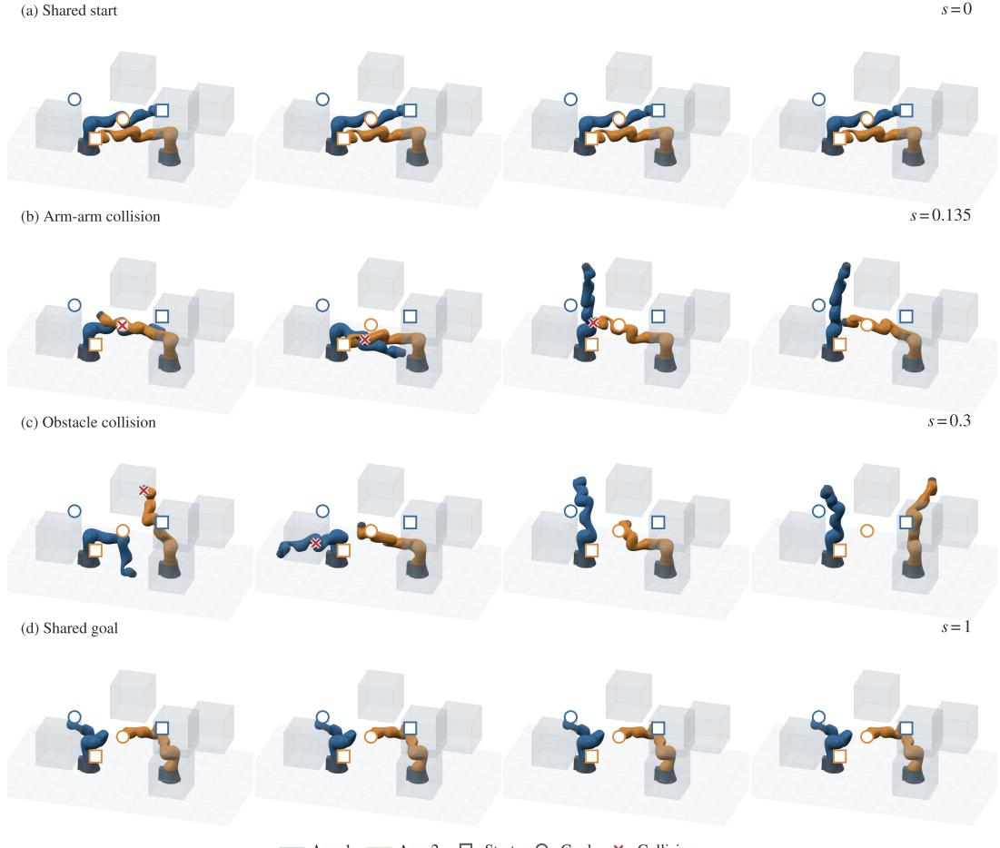  
Arm 1 Arm 2 Start Goal Collision

Figure 20: Synchronized KUKA configurations. Reference (two independent single-arm priors), Dual KUKA, PBDM and CMDS+TRG on the same task at common path progress s ∈ {0, 0.135, 0.3, 1}: shared start, arm-arm collision, obstacle collision, shared goal. Squares mark starts, circles goals, red crosses collisions. Only CMDS+TRG remains collision-free.

Collision  
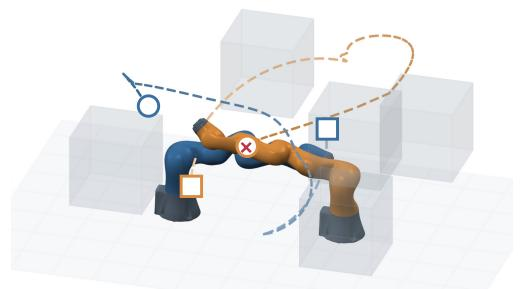

Dual KUKA  
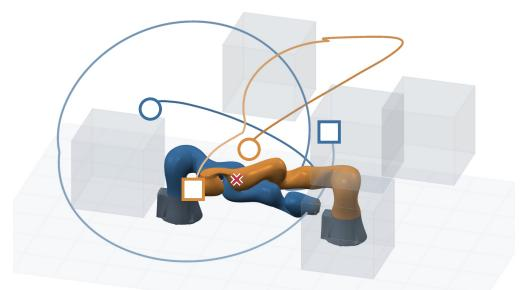

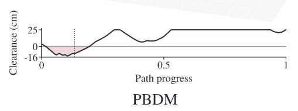  
Collision

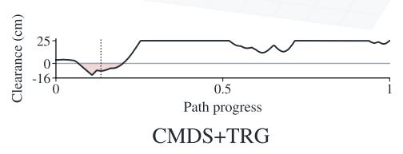  
Collision-free

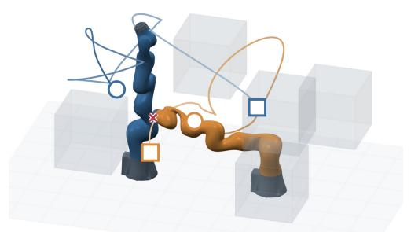

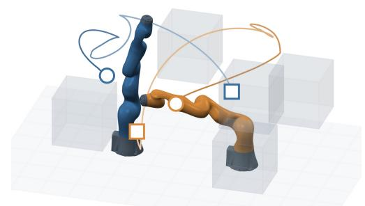

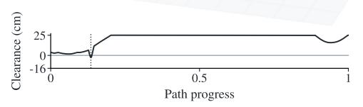

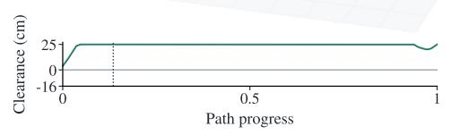  
Figure 21: KUKA poses and inter-arm clearance. Reference (two independent single-arm priors), Dual KUKA, PBDM and CMDS+TRG on the same held-out task at normalized path progress s = 0.135 (dotted line), with the inter-arm clearance along each path below. Wrist paths fade from start to goal; squares mark starts, circles goals, red crosses collisions at the shown pose. Shaded negative clearance indicates collision; only CMDS+TRG stays positive over the full path.

We coordinate four text-conditioned human motions using a shared control and a frozen singleperson prior. People cross a common region towards opposite destinations, requiring collision avoidance and consistent articulated motion.

## D.6.1 TASK, REPRESENTATION, AND FROZEN MDM PRIOR

Each person $i \in \{ 1 , \ldots , N \}$ , with $N = 4$ , receives a caption $c _ { i } ,$ a planar start $s _ { i } \in \mathbb { R } ^ { 2 }$ , an initial yaw $\psi _ { i } ,$ , and a destination $g _ { i } = - s _ { i }$ . Starts are arranged on a randomly rotated ring with nominal radius $2 . 1 4 7 \mathrm { m } .$ radial jitter $\pm 0 . 1 5 \mathrm { m }$ , and angular jitter $\pm 1 0 ^ { \circ }$ . Yaw points towards the destination with an additional $\pm 1 0 ^ { \circ }$ jitter. Scene conditions remain fixed during generation, and waiting and lateral detours are allowed. A motion contains $F = 1 2 0$ frames at $2 { \bar { 0 } } \mathrm { { \bar { H } } z , }$ represented by 263 normalised HumanML features per frame.

Notation and assembly. We retain the discrete state and indexing convention of Algorithm 1: the joint component state is $X _ { \ell } = ( X _ { \ell } ^ { 1 } , \dots , X _ { \ell } ^ { N } ) \in \mathbb { R } ^ { N \times F \times 2 6 3 }$ , the reverse-time grid is $\bar { \zeta _ { \ell } } = K - 1 - \ell ,$ and the generated motion is $X _ { K } ,$ , with $K = 5 0$ . Thus $X _ { 0 }$ denotes Gaussian noise, rather than a clean motion, and ℓ is distinct from the physical frame index $f \in \{ 0 , \ldots , F - 1 \}$ We use $\tau$ for possibly fractional frame indices on the densified collision-checking grid. Each reverse transition updates the entire motion clip; the terminal reward is evaluated after denoising and can inspect all physical frames. The task condition is $\boldsymbol { \kappa } = \{ ( c _ { i } , s _ { i } , g _ { i } , \psi _ { i } ) \} _ { i = 1 } ^ { N }$ , together with the active-person and frame masks. A deterministic geometric decoder $D _ { i } ( \cdot ; s _ { i } , \psi _ { i } )$ denormalises person $i \mathbf { \ ' } _ { \mathbf { S } }$ features, reconstructs 22 joints, and applies the scene transform, enforcing $p _ { i } ( 0 ) = s _ { i }$ by construction. For a fixed task, the assembly retains both the native features and the decoded world geometry:

$$
\varphi ( X ) : = { \bigl ( } X , J _ { \kappa } ( X ) { \bigr ) } , \qquad J _ { \kappa } ( X ) : = { \bigl ( } D _ { i } ( X ^ { i } ; s _ { i } , \psi _ { i } ) { \bigr ) } _ { i = 1 } ^ { N } .\tag{123}
$$

We suppress the fixed scene dependence of $\varphi$ in the notation. Retaining native features is necessary for the rotation, displacement, and contact-consistency costs, which cannot be evaluated from worldspace joint positions alone. State variables, noise, and optimisation are restricted to active people and frames; padded coordinates remain zero throughout. For motion-feature tensors, $\| \cdot \| _ { 2 }$ denotes the Euclidean norm after vectorisation, without averaging over people, frames, or features.

Frozen denoising and reverse transitions. We use the released HumanML MDM checkpoint trained for 50 diffusion steps, together with its frozen CLIP ViT-B/32 text encoder. Each person’s frozen denoiser is conditioned on its own caption, not on the other people or the scene’s starts and goals, with classifier-free guidance scale 2.5. This is a separately trained native 50-step model, not a respaced 1,000-step checkpoint. Sampling retains its cosine schedule, fixed posterior variance, and unclipped clean predictions. Write $\begin{array} { r } { \alpha _ { t } = 1 - \beta _ { t } , \bar { \alpha } _ { t } = \prod _ { j = 0 } ^ { t } \alpha _ { j } } \end{array}$ , and $\bar { \alpha } _ { - 1 } = 1$ for the saved native schedule. For a candidate joint state $Z = ( Z ^ { 1 } , \dots , Z ^ { N } )$ , define

$$
\begin{array} { r l } & { \mathcal { D } _ { \ell } ^ { i } ( Z ^ { i } ) : = \frac { Z ^ { i } - \sqrt { 1 - \bar { \alpha } _ { \zeta \ell } } \epsilon _ { \mathrm { b } } ^ { i } ( Z ^ { i } , \zeta _ { \ell } ) } { \sqrt { \bar { \alpha } _ { \zeta \ell } } } , ~ 0 \le \ell < K , } \\ & { \mathcal { D } _ { \ell } ( Z ) : = \big ( \mathcal { D } _ { \ell } ^ { 1 } ( Z ^ { 1 } ) , \ldots , \mathcal { D } _ { \ell } ^ { N } ( Z ^ { N } ) \big ) , ~ \mathcal { D } _ { K } ( Z ) : = Z . } \end{array}\tag{124}
$$

Thus $\hat { X } _ { 1 \mid \ell } = { \mathcal { D } } _ { \ell } ( X _ { \ell } )$ is the clean-motion estimate, and $\hat { Y } _ { 1 \mid \ell } = \varphi ( \hat { X } _ { 1 \mid \ell } )$ is its assembly. MDM predicts the clean state directly; the expression above is its equivalent epsilon parameterisation, with classifier-free guidance included in $\epsilon _ { \mathrm { b } } ^ { i } .$ . The denoising map $\mathcal { D } _ { \ell }$ is distinct from the geometric decoder $D _ { i }$ . Although Algorithm 1 uses DDIM, the reverse maps here are MDM’s native DDPM transitions:

$$
\begin{array} { r } { F _ { \ell } ^ { \mathrm { b } } ( X _ { \ell } , \Xi _ { \ell } ) : = \mu _ { \mathrm { b } , \ell } ( X _ { \ell } ) + \varsigma _ { \ell } \Xi _ { \ell } , \qquad \left\{ { \varsigma _ { \ell } > 0 } , \qquad 0 \leq \ell < K - 1 , \right. } \\ { \left. \varsigma _ { K - 1 } = 0 . \right. } \end{array}\tag{125}
$$

Here $\mu _ { \mathrm { b } , \ell }$ is the frozen classifier-free-guided DDPM posterior mean, acting component-wise. With $\epsilon _ { \mathrm { b } } ( Z , t ) = ( \epsilon _ { \mathrm { b } } ^ { i } ( Z ^ { i } , t ) ) _ { i = 1 } ^ { N }$ , the native mean and effective variance are

$$
\begin{array} { r l } & { \mu _ { \mathrm { b } , \ell } ( Z ) = \displaystyle \frac { 1 } { \sqrt { \alpha _ { \zeta \ell } } } \left[ Z - \frac { \beta _ { \zeta _ { \ell } } } { \sqrt { 1 - \bar { \alpha } _ { \zeta _ { \ell } } } } \epsilon _ { \mathrm { b } } ( Z , \zeta _ { \ell } ) \right] , } \\ & { \quad \quad \quad \quad \varsigma _ { \ell } ^ { 2 } = \frac { \beta _ { \zeta _ { \ell } } ( 1 - \bar { \alpha } _ { \zeta _ { \ell } - 1 } ) } { 1 - \bar { \alpha } _ { \zeta _ { \ell } } } . } \end{array}\tag{126}
$$

The final transition has $\zeta _ { K - 1 } = 0$ and is deterministic. No denoiser evaluation or additional grid point $\zeta _ { K }$ is needed for $\mathcal { D } _ { K } = \mathrm { I d }$

Controlled transition. We use $w _ { \boldsymbol { \theta } , \ell }$ for the normalised discrete control, consistently with Algorithm 1. For the stochastic transitions, CMDS uses

$$
\begin{array} { r l } & { X _ { \ell + 1 } = F _ { \ell } ^ { \theta } ( X _ { \ell } , \Xi _ { \ell } ) } \\ & { \qquad : = \mu _ { \mathrm { b } , \ell } ( X _ { \ell } ) + \varsigma _ { \ell } w _ { \theta , \ell } ( X _ { \ell } ) + \varsigma _ { \ell } \Xi _ { \ell } , \qquad \Xi _ { \ell } \sim \mathcal { N } ( 0 , I ) , \quad 0 \leq \ell < K - 1 . } \end{array}\tag{127}
$$

Unlike the epsilon-residual parameterisation in Algorithm 1, the motion controller outputs $w _ { \boldsymbol { \theta } , \ell }$ directly, supplying the mean correction $\varsigma _ { \ell } w _ { \theta , \ell } . \ \mathrm { F o r } \ \varsigma _ { \ell } > 0 .$ , this is the same normalisation $w _ { \boldsymbol { \theta } , \boldsymbol { \ell } } =$ $( F _ { \ell } ^ { \theta } - F _ { \ell } ^ { \mathrm { b } } ) / { \varsigma _ { \ell } }$ , with both maps evaluated at the same state and noise. The final update is $X _ { K } =$ $\tilde { \mu _ { \mathrm { b } , K - 1 } } ( \tilde { X _ { K - 1 } } ) = \mathcal { D } _ { K - 1 } ( \tilde { X _ { K - 1 } } )$ , with no learned correction, control-energy term, or matching loss at that transition. In particular, the positive-noise terminal modification used for DDIM in Algorithm 1 is not used here.

DDPM–DDIM control correspondence. Both samplers use the same control normalisation, but different network outputs. In Algorithm 1, an epsilon residual $\delta \epsilon _ { \theta , \ell }$ induces the DDIM mean shift $\gamma _ { \ell } \delta \epsilon _ { \theta , \ell } ,$ , giving $w _ { \theta , \ell } = ( \gamma _ { \ell } / \varsigma _ { \ell } ) \delta \epsilon _ { \theta , \ell }$ for that sampler. For the native DDPM kernel, the corresponding signed epsilon coefficient and equivalent residual are

$$
\begin{array} { r l } & { \gamma _ { \ell } ^ { \mathrm { D D P M } } : = - \frac { \beta _ { \zeta _ { \ell } } } { \sqrt { \alpha _ { \zeta _ { \ell } } } \sqrt { 1 - \bar { \alpha } _ { \zeta _ { \ell } } } } , } \\ & { \delta \epsilon _ { \theta , \ell } ^ { \mathrm { e q u i v } } : = \frac { \varsigma _ { \ell } } { \gamma _ { \ell } ^ { \mathrm { D D P M } } } w _ { \theta , \ell } , \qquad 0 \leq \ell < K - 1 . } \end{array}\tag{128}
$$

The sign is retained: $\gamma _ { \ell } ^ { \mathrm { D D P M } } \delta \epsilon _ { \theta , \ell } ^ { \mathrm { e q u i v } } = \varsigma \ell ^ { w _ { \theta , \ell } . }$ . The motion implementation requires no such conversion because the controller outputs $w _ { \boldsymbol { \theta } , \ell }$ directly. For adjacent native timesteps, the same denoiser and schedule, and no clipping, stochastic DDIM with $\eta = 1$ reproduces the DDPM mean and posterior variance on stochastic transitions. This does not identify the complete rollouts: Algorithm 1 retains noise at its modified DDIM endpoint, whereas MDM uses its original control-free deterministic endpoint. Thus the adaptation changes the sampling kernel, output parameterisation, and endpoint treatment, rather than the underlying stochastic-control formulation.

## D.6.2 COOPERATIVE CONTROL ARCHITECTURE

The controller forms one token per person and physical frame. Its motion input concatenates the current noisy features, the prior’s clean-motion estimate, and the decoded world-space joints:

$$
\begin{array} { r l } & { \hat { J } _ { \ell , i , f } : = D _ { i } \big ( \hat { X } _ { 1 | \ell } ^ { i } ; s _ { i } , \psi _ { i } \big ) _ { f } , } \\ & { z _ { \ell , i , f } : = \big [ ( X _ { \ell } ^ { i } ) _ { f } , ( \hat { X } _ { 1 | \ell } ^ { i } ) _ { f } , \mathrm { v e c } ( \hat { J } _ { \ell , i , f } ) \big ] \in \mathbb { R } ^ { 2 6 3 + 2 6 3 + 6 6 } . } \end{array}\tag{129}
$$

The 66 skeleton coordinates represent the 22 joints in metres.

We project $z _ { \ell , i , f }$ to width 344 and add separate projections of the 512-dimensional CLIP embedding, the static condition $[ s _ { i } , g _ { i } , \sin \psi _ { i } , \cos \psi _ { i } , F / 1 9 6 ] \in \mathbb { R } ^ { 7 }$ , and 32-dimensional sinusoidal embeddings of the physical frame $f$ and native diffusion index $\zeta _ { \ell } ,$ then apply SiLU. A local temporal encoder attends to each person’s entire clip. Two subsequent blocks alternate temporal attention within a person, attention across people at the same frame, and a feed-forward network. Communication is aligned in physical time, with whole-motion context supplied by the temporal passes. Weights are shared across people, making the controller equivariant to a consistent permutation of people and their conditions.

Geometric communication. Person attention receives an additive bias computed from predicted planar root geometry. At a fixed reverse transition and physical frame, suppress these indices and write $\Delta p _ { i j } \stackrel { - } { = } \hat { p } _ { j } - \boldsymbol { \hat { p } } _ { i } , d _ { i j } ^ { \mathrm { r o o t } } = \lVert \Delta p _ { i j } \rVert _ { 2 }$ , and $\Delta v _ { i j } = \hat { v } _ { j } - \hat { v } _ { i }$ , where velocities use $2 0 \mathrm { H z }$ backward differences. The bias is

$$
b _ { i j } = \mathrm { M L P } _ { 8 \to 3 2 \to 4 } \left( \left[ \Delta p _ { i j } , d _ { i j } ^ { \mathrm { r o o t } } , \Delta v _ { i j } , \frac { - \Delta p _ { i j } ^ { \top } \Delta v _ { i j } } { \operatorname* { m a x } ( d _ { i j } ^ { \mathrm { r o o t } } , 1 0 ^ { - 4 } ) } , g _ { j } - g _ { i } \right] \right) .\tag{130}
$$

Its four outputs are added to the corresponding attention-head logits $q _ { i } ^ { \top } k _ { j } / \sqrt { 8 6 }$ . The same bias is used in both interaction blocks. The root distance $d _ { i j } ^ { \mathrm { r o o t } }$ is distinct from the signed body-capsule clearance defined below.

Control output. Separate linear heads read the local encoder output $H _ { \mathrm { l o c a l } }$ and the second interaction block output $H _ { \mathrm { j o i n t } }$ :

$$
\begin{array} { r l } & { w _ { \theta , \ell } = W _ { \mathrm { l o c a l } } H _ { \mathrm { l o c a l } } + b _ { \mathrm { l o c a l } } } \\ & { ~ + W _ { \mathrm { j o i n t } } H _ { \mathrm { j o i n t } } + b _ { \mathrm { j o i n t } } \in \mathbb { R } ^ { N \times F \times 2 6 3 } . } \end{array}\tag{131}
$$

This 4,863,042-parameter control supplies joint awareness to the separate denoising processes. Both output heads and the final layer of the geometric-bias MLP are zero-initialised, so the initial controller leaves the frozen sampling process unchanged.

## D.6.3 ASSEMBLY REWARD

For a completed joint motion X, write $Y = \varphi ( X )$ . The total cost combines collision avoidance, goal attainment, directional progress, and physical consistency:

$$
\begin{array} { r l } & { C _ { \kappa } ( X ) = \lambda _ { \mathrm { c o l } } E _ { \mathrm { c o l } } + \lambda _ { \mathrm { g o a l } } E _ { \mathrm { g o a l } } + \lambda _ { \mathrm { p r o g } } E _ { \mathrm { p r o g } } } \\ & { \phantom { = } + \lambda _ { \mathrm { b o n e } } E _ { \mathrm { b o n e } } + \lambda _ { \mathrm { F K } } E _ { \mathrm { F K } } + \lambda _ { \mathrm { d i s p } } E _ { \mathrm { d i s p } } } \\ & { \phantom { = } + \lambda _ { \mathrm { c o n t a c t } } E _ { \mathrm { c o n t a c t } } + \lambda _ { \mathrm { f l o o r } } E _ { \mathrm { f l o o r } } + \lambda _ { \mathrm { s p e e d } } E _ { \mathrm { s p e e d } } . } \end{array}\tag{132}
$$

All terms are evaluated using X and $\varphi ( X )$ , with dependence on the fixed task suppressed on the right-hand side. We distinguish $C _ { \kappa } ^ { \mathrm { t r a i n } }$ , used to train CMDS, from $C _ { \kappa } ^ { \mathrm { b a s e } }$ , used for baseline selection and guidance. They use identical terms and normalisations, but different goal weights: $\lambda _ { \mathrm { g o a l } } = 5 0$ for control training and $\lambda _ { \mathrm { g o a l } } = 1$ for the baselines. The corresponding assembly-level rewards are

$$
r _ { \kappa } ^ { \mathrm { t r a i n } } ( \varphi ( X ) ) : = - C _ { \kappa } ^ { \mathrm { t r a i n } } ( X ) , \qquad r _ { \kappa } ^ { \mathrm { b a s e } } ( \varphi ( X ) ) : = - C _ { \kappa } ^ { \mathrm { b a s e } } ( X ) .\tag{133}
$$

The subscripted cost weights are distinct from the outer SOC reward multiplier λ, specified in $\mathsf { A p - }$ pendix D.6.4. Their recorded values are reported in table 14. All geometric distances below are in metres.

Body collision. Each person is represented by 15 fixed-radius capsule primitives, including a spherical head primitive. For capsule centreline segment $S _ { i a } ( \tau ; Y )$ and radius $\rho _ { a }$ , the signed surface clearance is

$$
d _ { i j } ^ { a b } ( \tau ; Y ) : = \mathrm { d i s t } \big ( S _ { i a } ( \tau ; Y ) , S _ { j b } ( \tau ; Y ) \big ) - \rho _ { a } - \rho _ { b } .\tag{134}
$$

We divide each native frame interval into five linear subintervals and retain the final endpoint, giving the synchronised grid $\mathcal { T } = \{ n / 5 : n = 0 , \ldots , 5 ( F - 1 ) \}$ }, with $| T | = 5 ( F - 1 ) + 1 { \overset { \cdot } { = } } 5 9 6$ . The collision penalty is

$$
E _ { \mathrm { c o l } } = \frac { 1 } { \binom { N } { 2 } | \mathcal { T } | } \sum _ { i < j } \sum _ { \tau \in \mathcal { T } } \sum _ { a , b = 1 } ^ { 1 5 } \left( \frac { [ 0 . 0 3 - d _ { i j } ^ { a b } ( \tau ; Y ) ] _ { + } } { 0 . 0 5 } \right) ^ { 2 } , \qquad [ z ] _ { + } : = \operatorname* { m a x } ( z , 0 ) .\tag{135}
$$

For $N = 4$ , the denominator is $6 | \mathcal { T } |$ , as in the implemented cost. The penalty averages over person pairs and dense times, sums all 225 capsule pairs, and becomes zero at 3 cm clearance. This softcost margin is distinct from both PCD++’s nonnegative-clearance constraint and evaluation’s 5 mm penetration tolerance. Table 13 specifies the primitive endpoints and radii.

Destination and progress. Let $p _ { i } ( f ; Y )$ be person i’s planar root position, and set the goal tolerance to $\varepsilon _ { \mathrm { g } } = 0 . 5$ m. On the final five frames, $\mathbf { \dot { \boldsymbol { W } } } _ { i } = \boldsymbol { W } \bar { = } \left\{ \boldsymbol { F } - \boldsymbol { 5 } , \ldots , \boldsymbol { F } - 1 \right\} = \left\{ 1 1 5 , \bar { \ldots } , 1 1 9 \right\}$ we use

$$
E _ { \mathrm { g o a l } } = \frac { 1 } { N } \sum _ { i = 1 } ^ { N } \frac { \operatorname* { m i n } _ { f \in \mathcal { W } _ { i } } \| p _ { i } ( f ; Y ) - g _ { i } \| _ { 2 } ^ { 2 } } { \varepsilon _ { \mathrm { g } } ^ { 2 } } ,\tag{136}
$$

$$
\bar { q } _ { i } = \frac { 1 } { | \mathcal { W } _ { i } | } \sum _ { f \in \mathcal { W } _ { i } } \frac { ( p _ { i } ( f ; Y ) - s _ { i } ) ^ { \top } ( g _ { i } - s _ { i } ) } { \| g _ { i } - s _ { i } \| _ { 2 } ^ { 2 } } , \qquad E _ { \mathrm { p r o g } } = \frac { 1 } { N } \sum _ { i = 1 } ^ { N } [ 0 . 9 - \bar { q } _ { i } ] _ { + } ^ { 2 } .\tag{137}
$$

People may arrive at different frames within the window. Progress is the window-mean displacement along the start-to-goal direction; its threshold shapes training but is not an extra success condition.

Table 13: Body-capsule geometry for collision costs and checks. Endpoints are zero-based HumanML joint indices; the repeated head endpoint defines a sphere.
<table><tr><td>Primitive</td><td>Joint endpoints</td><td>Radius (m)</td></tr><tr><td>Pelvis</td><td>(1,2)</td><td>0.120</td></tr><tr><td>Torso</td><td>(0,9)</td><td>0.150</td></tr><tr><td>Shoulder span</td><td>(16, 17)</td><td>0.100</td></tr><tr><td>Upper torso-head</td><td>(9, 15)</td><td>0.100</td></tr><tr><td>Head</td><td>(15, 15)</td><td>0.110</td></tr><tr><td>Upper arms</td><td>(16, 18), (17, 19)</td><td>0.055</td></tr><tr><td>Forearms</td><td>(18, 20), (19, 21)</td><td>0.045</td></tr><tr><td>Thighs</td><td>(1, 4), (2, 5)</td><td>0.085</td></tr><tr><td>Lower legs</td><td>(4, 7), (5, 8)</td><td>0.065</td></tr><tr><td>Feet</td><td>(7, 10), (8, 11)</td><td>0.055</td></tr></table>

Physical consistency. Let $Q _ { i f j } \ \in \ \mathbb { R } ^ { 3 }$ be canonical decoded joints and $J _ { i f j }$ their world-space counterparts. Write $L _ { i f b }$ for the 21 bone lengths, $L _ { b } ^ { \star }$ for fixed audit references, and $Q ^ { \mathrm { F K } }$ for joints reconstructed from the native 6D rotations using those reference lengths. For denormalised displacement channels $V _ { i f j }$ , root-local rotation $A _ { i f }$ , and $\Delta Q _ { i f j } = Q _ { i , f + 1 , j } - Q _ { i f j }$ , the costs are

$$
E _ { \mathrm { b o n e } } = \left. ( L / L ^ { \star } - 1 ) ^ { 2 } \right. , \qquad E _ { \mathrm { F K } } = { \frac { \langle \| Q - Q ^ { \mathrm { F K } } \| _ { 2 } ^ { 2 } \rangle } { 3 ( 0 . 0 5 ) ^ { 2 } } } ,\tag{138}
$$

$$
E _ { \mathrm { d i s p } } = \frac { \langle \| V - A \Delta Q \| _ { 2 } ^ { 2 } \rangle } { 3 ( 0 . 0 5 ) ^ { 2 } } , ~ E _ { \mathrm { c o n t a c t } } = \langle ( H - H ^ { \star } ) ^ { 2 } \rangle ,\tag{139}
$$

$$
E _ { \mathrm { f l o o r } } = \frac { \langle [ - J _ { y } ] _ { + } ^ { 2 } \rangle } { ( 0 . 0 5 ) ^ { 2 } } ,
$$

$$
E _ { \mathrm { s p e e d } } = \left. [ \| 2 0 \Delta Q \| _ { 2 } / v _ { \mathrm { m a x } } - 1 ] _ { + } ^ { 2 } \right. .\tag{140}
$$

Angle brackets average over people, valid native frames or intervals, and the relevant bones or joints. The factors of three make vector errors coordinate-wise means. Encoded displacement is compared per frame, without multiplying it by the frame rate. Here $v _ { \mathrm { m a x } }$ is the speed threshold in the soft cost. For denormalised contact channels H, corresponding to joints 7, 10, 8, 11, the soft reference is $H ^ { \star } = \sigma ( ( 0 . 0 8 - h ) / 0 . 0 2 ) \sigma ( ( 0 . 2 - v ) / 0 . 0 5 )$ , using foot height h, speed v, and logistic sigmoid σ. Root speed and jerk are additional hard evaluation checks.

## D.6.4 TRAINING BY ADJOINT MATCHING

Only controller parameters are updated. Training scenes are generated online, with captions drawn from five families: walking, jogging, high-knee marching, forward jumping, and crouched walking. Each family has three phrasings. A quarter of scenes use one shared action family; the remainder sample family assignments conditioned on having at least two distinct families. Phrasings are sampled per person. Training uses generated trajectories, without paired interaction data.

Control objective and replay. The motion experiment uses reward strength $\lambda = 1 0 0$ and includes all stochastic transitions in the matched set $\kappa = \{ 0 , \ldots , K - 2 \}$ . Its discrete stochastic-control objective is

$$
\mathcal { I } ( \theta ) = \mathbb { E } \left[ \lambda C _ { \kappa } ^ { \mathrm { t r a i n } } ( X _ { K } ) + \frac { 1 } { 2 } \sum _ { \ell = 0 } ^ { K - 2 } \| w _ { \theta , \ell } ( X _ { \ell } ) \| _ { 2 } ^ { 2 } \right] .\tag{141}
$$

The expectation covers task conditions, initial noise, and rollout noise. The norm sums over people, physical frames, and all 263 motion features, without averaging; λ scales only the terminal cost. For a fixed task and state, the controlled and reference stochastic transitions have common covariance $\varsigma _ { \ell } ^ { 2 } I$ and mean difference ${ \varsigma _ { \ell } } w _ { \theta , \ell } ,$ giving conditional KL divergence $\scriptstyle { \frac { 1 } { 2 } } \parallel w _ { \theta , \ell } \parallel _ { 2 } ^ { 2 }$ . With the same initial Gaussian distribution, the expected sum of these energies equals the discrete path-space KL relative to the frozen sampler at classifier-free guidance scale 2.5; the shared deterministic final map adds no conditional KL. This Gaussian mean-shift interpretation does not cover arbitrary nonzero corrections at zero-noise transitions, including deterministic DDIM with $\eta = 0$

Table 14: Reward weights and controller training settings for the reported $N \ = \ 4$ experiment. Baselines share the cost normalisations but use a smaller goal weight.
<table><tr><td>Setting</td><td>Recorded value</td></tr><tr><td> $( \lambda _ { \mathrm { c o l } } , \lambda _ { \mathrm { g o a l } } , \lambda _ { \mathrm { p r o g } } )$  , training</td><td>(100, 50, 1)</td></tr><tr><td> $( \lambda _ { \mathrm { c o l } } , \lambda _ { \mathrm { g o a l } } , \lambda _ { \mathrm { p r o g } } ) .$  , baselines</td><td>(100, 1, 1)</td></tr><tr><td> $( \lambda _ { \mathrm { b o n e } } , \lambda _ { \mathrm { F K } } , \lambda _ { \mathrm { d i s p } } )$ </td><td>(500, 5, 5)</td></tr><tr><td> $( \lambda _ { \mathrm { c o n t a c t } } , \lambda _ { \mathrm { f l o o r } } , \lambda _ { \mathrm { s p e e d } } )$ </td><td>(1, 200, 10)</td></tr><tr><td>Outer SOC reward multiplier λ</td><td>100, control training only</td></tr><tr><td>Optimiser / updates / learning rate</td><td>Adam / 15,000 / constant  $1 0 ^ { - 4 }$ </td></tr><tr><td>Effective batch size</td><td>8 scenes: microbatch 2, accumulation 4</td></tr><tr><td>Gradient-norm clipping / EMA decay</td><td>0.5 / 0.9995</td></tr></table>

As in Algorithm 1, set $\bar { \theta } = \mathrm { s t o p g r a d } ( \theta )$ , generate a controlled rollout without gradient tracking, and replay individual transitions backwards. Suppressing the rollout superscript, the state adjoints satisfy

$$
\begin{array} { r l } & { \quad a _ { K } = \lambda \nabla _ { X _ { K } } C _ { \kappa } ^ { \mathrm { t r a i n } } ( X _ { K } ) , } \\ & { \quad a _ { K - 1 } = \left[ D _ { X } \mu _ { \mathrm { b } , K - 1 } ( X _ { K - 1 } ) \right] ^ { \top } a _ { K } , } \\ & { \quad \quad a _ { \ell } = \left[ D _ { X } \mu _ { \mathrm { b } , \ell } ( X _ { \ell } ) + \varsigma _ { \ell } D _ { X } w _ { \bar { \theta } , \ell } ( X _ { \ell } ) \right] ^ { \top } a _ { \ell + 1 } } \\ & { \quad \quad \quad + \left[ D _ { X } w _ { \bar { \theta } , \ell } ( X _ { \ell } ) \right] ^ { \top } w _ { \bar { \theta } , \ell } ( X _ { \ell } ) , \qquad \ell = K - 2 , \ldots , 0 . } \end{array}\tag{142}
$$

The deterministic final transition remains in adjoint propagation, but contributes neither control energy nor a matching term. Each transition is differentiated using a fresh state variable at the stored value $X _ { \ell } ,$ with <sup>¯</sup>θ fixed and the next-state adjoint detached. The controller’s clean-motion, world-joint, text, and geometry-derived observations are detached and held fixed during this state differentiation, while its explicit noisy-state input and the frozen-prior mean remain differentiable. The recursion follows these observation-detach conventions, rather than differentiating through the recomputation of every controller observation; graphs are released between transitions.

Calibrated robust matching. Training regresses against detached next-state adjoints using

$$
e _ { \theta , \ell } : = w _ { \theta , \ell } \big ( \mathrm { s t o p g r a d } ( X _ { \ell } ) \big ) + \varsigma _ { \ell } \mathrm { s t o p g r a d } ( a _ { \ell + 1 } ) , \qquad \ell \in { \cal K } .\tag{143}
$$

The control is evaluated with the same task and detached observations as in replay. With $D =$ $N F \cdot 2 6 3 = 4 \cdot 1 2 0$ · 263 motion-feature coordinates, the robust matching loss is

$$
\mathcal { L } _ { \mathrm { P H } } ( \theta ) = \mathbb { E } \left[ \sum _ { \ell = 0 } ^ { K - 2 } D \delta _ { \ell } ^ { 2 } \left( \sqrt { 1 + \frac { \| e _ { \theta , \ell } \| _ { 2 } ^ { 2 } } { D \delta _ { \ell } ^ { 2 } } } - 1 \right) \right] .\tag{144}
$$

The first 500 successful updates use squared matching and collect per-instance RMS residuals $\| e _ { \theta , \ell } \| _ { 2 } / \sqrt { D }$ . Each $\delta _ { \ell }$ is then fixed to their 95th percentile, floored at $1 0 ^ { - 3 }$ . With squared matching, current-policy rollouts, and all stochastic transitions included, the matching gradient agrees with direct differentiation of eq. (141) under the same observation-detach conventions. Pseudo-Huber matching downweights large residuals and generally changes that gradient; it leaves the terminal reward, adjoint recursion, and quadratic control energy unchanged.

Raw and EMA checkpoints were validated during training. Selection ranked joint success, then terminal cost plus control energy, preferring earlier steps on ties. Evaluation uses raw step-15,000 weights from one seed-0 run. Inference requires no reward-gradient or projection iterations.

## D.6.5 BASELINES

Baselines share the frozen prior, native DDPM sampler, classifier-free guidance scale, scenes, decoder, and audit. Selection and guidance use $C _ { \kappa } ^ { \mathrm { b a s e } }$ , with weights (100, 1, 1, 500, 5, 5, 1, 200, 10) in the order of eq. (132). These retain exactly the cost normalisations above; in particular, the baseline goal weight is 1, rather than the training value 50.

Best-of-256. Best-of-256 generates 256 independent complete four-person assemblies and returns the one with minimum baseline cost. Reference samples the same frozen MDM component priors independently and is used as a qualitative reference.

DPS guidance. DPS differentiates the joint baseline reward of the clean-motion estimate through the frozen denoiser to the current noisy state:

$$
\begin{array} { r } { \left. v _ { \ell } : = \nabla _ { X _ { \ell } } r _ { \kappa } ^ { \mathrm { b a s e } } ( \varphi ( \mathcal { D } _ { \ell } ( X _ { \ell } ) ) ) , \right. \qquad } \\ { \left. \widetilde { X } _ { \ell + 1 } : = \mathrm { s t o p g r a d } \bigl ( F _ { \ell } ^ { \mathrm { b } } ( X _ { \ell } , \Xi _ { \ell } ) + \eta _ { \mathrm { g } } v _ { \ell } \bigr ) . \right. } \end{array}\tag{145}
$$

DPS sets $X _ { \ell + 1 } = \widetilde { X } _ { \ell + 1 }$ . DPS, PCD, and PCD++ all use $\eta _ { \mathrm { g } } = 0 . 1$ at every transition, including the deterministic final one. This coefficient directly multiplies the reward gradient: there is no $\varsigma _ { \ell } ^ { 2 }$ factor and no separate application of the control-training multiplier $\lambda = 1 0 \bar { 0 }$ . All guidance gradients are with respect to state variables, with denoiser parameters frozen and no gradient propagation across outer diffusion steps. Unlike the learned control in eq. (127), this constant guidance also changes the deterministic endpoint; the subsequent PCD projections are not Gaussian mean shifts either. These baselines therefore do not inherit the learned controller’s quadratic path-KL interpretation.

PCD and PCD++. The PCD baseline combines eq. (145) with a root-goal projector enforcing the final-window destination condition. The projector changes planar root increments and the corresponding stored joint-displacement channels while keeping headings, heights, and poses fixed. It minimises normalised-feature change within this restricted parameterisation, but does not enforce collision clearance or the kinematic-validity audit. PCD++ uses the same guidance update and replaces that projector with a joint optimisation of the proposed state. All 263 normalised feature channels of each active person and frame are free variables in this solve. Feasibility is checked on a freshly recomputed clean estimate at the candidate’s next noise level, rather than on the clean estimate used for the preceding guidance update. At the final transition, the candidate is already a clean motion and $\mathcal { D } _ { K } = \mathrm { I d }$

Joint goal and collision constraints. Using the planar roots and signed capsule clearances defined above, set

$$
\begin{array} { c } { { c _ { \mathsf { g } , i } ( Y ) : = \displaystyle \operatorname* { m i n } _ { f \in \mathcal { W } _ { i } } \| p _ { i } ( f ; Y ) - g _ { i } \| _ { 2 } - \varepsilon _ { \mathsf { g } } , } } \\ { { \mathsf { c } _ { \mathsf { c } , i j a b \tau } ( Y ) : = \delta _ { \mathsf { c } } - d _ { i j } ^ { a b } ( \tau ; Y ) , } } \\ { { V _ { \kappa } ( Y ) : = \displaystyle \operatorname* { m a x } \left\{ 0 , \operatorname* { m a x } _ { i } c _ { \mathsf { g } , i } ( Y ) , \displaystyle \operatorname* { m a x } _ { i < j , a , b \tau } c _ { \mathsf { c } , i j a b \tau } ( Y ) \right\} . } } \\ { { \mathsf { c } \mathsf { F } _ { i } } } \end{array}\tag{146}
$$

Here $\mathcal { T } _ { i j }$ contains the checked times when both people are active; in the reported fixed-length experiment, $\mathcal { T } _ { i j } = \mathcal { T }$ for every pair. We use $\varepsilon _ { \mathrm { g } } = 0 . 5$ m and $\delta _ { \mathrm { c } } = 0$ , so PCD++ requires nonnegative capsule clearance. The feasible set is

$$
{ \mathcal { F } } _ { \kappa } : = \{ Y : V _ { \kappa } ( Y ) = 0 , p _ { i } ( 0 ; Y ) = s _ { i } { \mathrm { f o r } } { \mathrm { a l l } } i \} .\tag{147}
$$

Starts are already enforced by the decoder. For a guided proposal $\widetilde { X } _ { \ell + 1 }$ , the projection targets

$$
\operatorname* { m i n i m i s e } _ { Z } \quad \frac { 1 } { 2 } \| Z - \widetilde { X } _ { \ell + 1 } \| _ { 2 } ^ { 2 } \qquad \mathrm { s u b j e c t ~ t o } \qquad \varphi ( \mathcal { D } _ { \ell + 1 } ( Z ) ) \in \mathcal { F } _ { \kappa } .\tag{148}
$$

The distance is Euclidean in the active normalised motion features, not in decoded joint coordinates. The implemented solver approximates this constrained problem; it does not certify a nearest feasible point.

Penalty and numerical guards. The inner objective uses the squared-hinge penalty

$$
\begin{array} { r l } & { \mathcal { P } _ { \kappa } ( Y ; \omega _ { \mathrm { g } } , \omega _ { \mathrm { c } } ) : = \displaystyle \sum _ { i } [ c _ { \mathrm { g } , i } ( Y ) + \omega _ { \mathrm { g } } ] _ { + } ^ { 2 } } \\ & { \quad \quad \quad + \displaystyle \sum _ { i < j } \displaystyle \sum _ { \tau \in \mathcal { T } _ { i j } } \sum _ { a , b = 1 } ^ { 1 5 } [ c _ { \mathrm { c } , i j a b \tau } ( Y ) + \omega _ { \mathrm { c } } ] _ { + } ^ { 2 } . } \end{array}\tag{149}
$$

Unlike the soft collision cost, this penalty uses unnormalised sums of constraint violations. The small interior guards tighten the penalty only; acceptance uses the original constraints in eq. (146). $\mathbf { A t }$ inner iterate $m ,$ let $J ^ { ( m ) }$ denote the active decoded world joints in $\hat { Y } ^ { ( m ) } = \varphi ( { \cal D } _ { \ell + 1 } ( Z ^ { ( m ) } ) )$ , and let $\epsilon _ { \mathrm { m a c h } }$ be the machine epsilon of their data type. The detached coordinate scale and guards are

$$
\begin{array} { r l } & { \quad S _ { m } : = \mathrm { s t o p g r a d } \Big [ \mathrm { m a x } \Big ( 1 , \| J ^ { ( m ) } \| _ { \infty } , \underset { i } { \mathrm { m a x } } \| g _ { i } \| _ { \infty } \Big ) \Big ] , } \\ & { \quad \omega _ { \mathrm { c } } ^ { ( m ) } : = \mathrm { m a x } ( 1 0 ^ { - 7 } , 6 4 \epsilon _ { \mathrm { m a c h } } S _ { m } ) , } \\ & { \quad \omega _ { \mathrm { g } } ^ { ( m ) } : = \mathrm { m i n } ( 1 0 ^ { - 3 } \varepsilon _ { \mathrm { g } } , \omega _ { \mathrm { c } } ^ { ( m ) } ) . } \end{array}\tag{150}
$$

The infinity norms denote the largest absolute coordinate. These guards are recomputed at every inner iterate and held fixed when differentiating that iterate’s objective:

$$
\begin{array} { r } { \mathcal { L } _ { m } ( Z ) : = \frac 1 2 \| Z - \widetilde { X } _ { \ell + 1 } \| _ { 2 } ^ { 2 } + \rho \mathcal { P } _ { \kappa } \Big ( \varphi ( \mathcal { D } _ { \ell + 1 } ( Z ) ) ; { \omega } _ { \mathrm { g } } ^ { ( m ) } , { \omega } _ { \mathrm { c } } ^ { ( m ) } \Big ) . } \end{array}\tag{151}
$$

Projection settings and failure handling. PCD++ permits at most $M = 1 0 0$ inner Adam updates per outer transition, with step size $\eta _ { \mathrm { p } } ~ = ~ 0 . 0 1$ , initial penalty $\rho _ { 0 } ~ = ~ 1 0 $ , and cap $\rho _ { \mathrm { m a x } } \ : = \ : 1 0 ^ { 7 }$ Adam uses $( \beta _ { 1 } , \beta _ { 2 } ) = ( 0 . 9 , 0 . 9 9 9 ) , \acute { \epsilon } = 1 0 ^ { - 8 }$ , and zero weight decay, with fresh optimiser state at every outer transition. Every five inner updates, the penalty is multiplied by 10, up to its cap, if the maximum violation has not decreased by more than 5% since the previous reference check. The solver checks all $1 5 \times 1 5$ capsule pairs for each pair of people at the 596 dense times, and checks goals in each person’s final five native frames. It accepts the first verified feasible iterate, with at most M updates and $M + 1$ checks per transition. The accepted state is $Z ^ { ( m ) }$ , not its denoised estimate, so it remains at the correct noise level for the next DDPM transition. Non-finite states, objectives, residuals, or gradients terminate the affected assembly with failure. Failure to find a feasible iterate within the budget also terminates that assembly, without an infeasible fallback. Failed assemblie count as failures in all binary success metrics.

Algorithm 2 gives the complete procedure. Each completed outer transition uses one guidance backward pass and at most M inner-optimisation backward passes, giving at most $K ( 1 + M ) \stackrel { - } { = } 5 0 5 0$ backward passes per assembly under the reported settings. Early acceptance or failure reduces this count; feasibility checks additionally require forward computations. This counts joint backward evaluations, not separate passes for each person; at the final transition, inner gradients pass through the decoder but not through a denoiser, since $\mathcal { D } _ { K } = \mathrm { I d }$ . The solver does not certify convergence or global distance optimality. Feasibility covers only the stated goal constraints and capsule proxy at checked times, not continuous-time clearance or the complete kinematic-validity audit.

## D.6.6 ADDITIONAL EXPERIMENTAL EVALUATIONS

Evaluation uses 24 fixed scenes drawn from three training action families: walking, jogging, and crouched walking. Thirteen scenes are homogeneous and eleven mix families. Every method is evaluated with five sampling seeds, giving 120 attempts per method. These seeds measure sampling variability for one controller, not training variability or held-out layout generalisation. Main figures compare uncontrolled MDM, PCD++, and CMDS; the appendix comparison also includes Best-of-256, DPS, and PCD. Matched views use the same sampling seed, identical scene conditions, and a common camera. Capsule poses and footpaths show body clearance and goal progress, with faint intermediate poses and emphasised starts and endpoints. Uncontrolled MDM supplies the visual prior reference; table 15 aggregates the full evaluation. Figure 22 extends the qualitative comparison to all evaluated baselines.

```latex
Algorithm 2 PCD++ with a DDPM rollout and joint Tweedie projection
Require: frozen DDPM maps $\{ F _ { \ell } ^ { \mathrm { b } } \} _ { \ell = 0 } ^ { K - 1 }$ , with $\varsigma _ { K - 1 } = 0 ;$ clean-estimate maps $\{ \mathcal { D } _ { \ell } \} _ { \ell = 0 } ^ { K } ,$ with $\mathcal { D } _ { K } = \mathrm { I d } ;$
assembly $\varphi ,$ task $\kappa ,$ and baseline reward $r _ { \kappa } ^ { \mathrm { b a s e . } } ;$ constraint residual $V _ { \kappa }$ and guarded penalty ${ \mathcal { P } } _ { \kappa } ;$ guidance
strength $\eta _ { \mathrm { g } } ;$ maximum inner updates $M ;$ Adam step size $\eta _ { \mathrm { p } } ;$ penalty parameters $\rho _ { 0 } , \rho _ { \mathrm { m a x } }$
Conventions: optimise only active coordinates; keep padding zero. Any non-finite state, objective, resid
ual, or gradient returns PROJECTIONFAILURE.
1: Sample $X _ { 0 } ^ { i } \sim \mathcal { N } ( 0 , I )$ and independent rollout noise $\Xi _ { \ell } ^ { i } \sim \mathcal { N } ( 0 , I )$ , for all $i , \ell ,$ on active coordinates
2: for $\hat { \ell } = 0 , \dots , K - 1$ do
1. Native DDPM proposal and DPS guidance
3: $\hat { X } _ { 1 | \ell } \gets \mathcal { D } _ { \ell } ( X _ { \ell } ) , \quad \hat { Y } _ { 1 | \ell } \gets \varphi ( \hat { X } _ { 1 | \ell } )$
4: $v _ { \ell } \gets \nabla _ { X _ { \ell } } r _ { \kappa } ^ { \mathrm { b a s e } } ( \hat { Y } _ { 1 | \ell } )$ # Differentiate through the frozen denoiser with respect to its input
5: Xe<sub>ℓ+1</sub> ← stopgrad $\left( F _ { \ell } ^ { \mathrm { b } } ( X _ { \ell } , \Xi _ { \ell } ) + \eta _ { \mathrm { g } } v _ { \ell } \right)$ # Also guide at $\ell = K - 1 ;$ no variance or training-reward multiplier
2. Joint optimisation ofthe proposed state
6: $Z ^ { ( 0 ) } \gets \widetilde { X } _ { \ell + 1 } , \quad \rho \gets \rho _ { 0 } ;$ initialise fresh Adam state
7: for $m = 0 , \ldots , M$ do
8: $\hat { Y } ^ { ( m ) } \gets \varphi \big ( \mathcal { D } _ { \ell + 1 } \big ( Z ^ { ( m ) } \big ) \big )$ # Fresh clean estimate at the candidate’s next noise level; $\mathcal { D } _ { K } = \mathrm { I d }$
9: $q _ { m } \gets V _ { \kappa } ( { \hat { Y } } ^ { ( m ) } )$
10: if $q _ { m } = 0$ then
11: X<sub>ℓ+1</sub> ← stopgrad $( Z ^ { ( m ) } )$ # Keep the corrected state, not its denoised estimate
12: break
13: end if
14: if $m = M$ then
15: return PROJECTIONFAILURE # Terminate this assembly; no infeasible fallback
16: end if
17: if $m = 0$ then
18: q<sub>ref</sub> $\gets q _ { m }$
19: else if m mod $5 = 0$ then
20: $\mathbf { i f } \ q _ { m } \ge 0 . 9 5 q _ { \mathrm { r e f } }$ then
21: $\rho \gets \operatorname* { m i n } ( 1 0 \rho , \rho _ { \operatorname* { m a x } } )$
22: end if
23: $q _ { \mathrm { r e f } }  q _ { m }$
24: end if
25: Compute detached guards $\omega _ { \mathrm { g } } ^ { ( m ) } , \omega _ { \mathrm { c } } ^ { ( m ) }$ from $\hat { Y } ^ { ( m ) }$ using eq. (150)
26: Define $\begin{array} { r } { \mathcal { L } _ { m } ( Z ) : = \frac { 1 } { 2 } \| Z - \widetilde { X } _ { \ell + 1 } \| _ { \mathrm { a c t i v e } } ^ { 2 } + \rho \mathcal { P } _ { \kappa } \Big ( \varphi ( \mathcal { D } _ { \ell + 1 } ( Z ) ) ; \omega _ { \mathrm { g } } ^ { ( m ) } , \omega _ { \mathrm { c } } ^ { ( m ) } \Big ) } \end{array}$
27: $G _ { m } \gets \nabla _ { Z } \mathcal { L } _ { m } ( Z ) | _ { Z = Z ^ { ( m ) } }$ # Hold the guards fixed; one backward pass per inner update
28: Z<sup>(m+1)</sup> ← ADAMSTEP $( Z ^ { ( m ) } , G _ { m } , \eta _ { \mathrm { p } } )$
29: end for
30: end for
31: return $X _ { K } , \varphi ( X _ { K } )$ # At most $K ( 1 + M )$ backward passes; 5050 for the reported settings
```

Table 15: Four-person locomotion coordination. All methods use the same 24 scenes with walking, jogging, and crouched walking, evaluated over five sampling seeds (120 attempts per method). Entries are mean ± sample standard deviation across the five seed summaries. Binary rates weight all 24 attempts per seed equally, including generation failures as zero successes; continuous geometry and time use available generated outputs. Timing excludes failed-attempt costs. Bold denotes the best mean, including ties.
<table><tr><td>Method</td><td>(%)</td><td>(%)</td><td>Joint success ↑ Collision-free ↑ Peak body overlap ↓ All-person goals ↑ (cm)</td><td>(%)</td><td>(m)</td><td>Goal error ↓ Kinematic validity ↑ (%)</td><td>Time ↓ (s/assembly)</td></tr><tr><td>Best-of-256</td><td>0.0±0.0</td><td> $1 6 . 7 \pm 5 . 9$ </td><td> $8 . 8 6 0 \pm 1 . 0 8 6 $ </td><td>0.0 ±0.0</td><td>2.456 ±0.146</td><td> $8 3 . 3 \pm 6 . 6$ </td><td>69.895±0.292</td></tr><tr><td>DPS</td><td> $0 . 0 \pm 0 . 0$ </td><td> $6 1 . 7 \pm 1 0 . 8$ </td><td>3.335 ±1.049</td><td>0.0 ±0.0</td><td>3.751 ±0.284</td><td> $5 7 . 5 \pm 6 . 8$ </td><td> $8 . 5 6 6 \pm 0 . 0 1 8$ </td></tr><tr><td>PCD</td><td> $4 . 2 \pm 2 . 9$ </td><td> $8 . 3 \pm 2 . 9$ </td><td> $1 9 . 0 0 2 \pm 1 . 8 6 5$ </td><td> $\mathbf { 1 0 0 . 0 \mu _ { \pm 0 . 0 } }$ </td><td> $0 . 5 0 0 { \scriptstyle \pm 0 . 0 0 0 }$ </td><td> $2 7 . 5 \pm 4 . 8$ </td><td> $9 . 9 8 5 \pm 0 . 0 6 4$ </td></tr><tr><td>PCD++</td><td> $7 5 . 0 \pm 6 . 6$ </td><td> ${ \bf 9 8 . 3 \pm 2 . 3 }$ </td><td>0.000±0.000</td><td> $9 8 . 3 \pm 2 . 3 $ </td><td> $0 . 4 8 7 \pm 0 . 0 0 1$ </td><td> $7 5 . 0 \pm 6 . 6$ </td><td> $1 4 5 . 3 3 5 \pm 4 . 4 6 0$ </td></tr><tr><td>CMDS</td><td> ${ \bf 9 0 . 0 \pm } 6 . 3$ </td><td> $9 0 . 0 \pm 6 . 3 $ </td><td>0.740 ±0.351</td><td>100.0 ±0.0</td><td>0.158±0.008</td><td>100.0 ±0.0</td><td> $\mathbf { 0 . 5 4 1 \pm 0 . 0 0 2 }$ </td></tr></table>

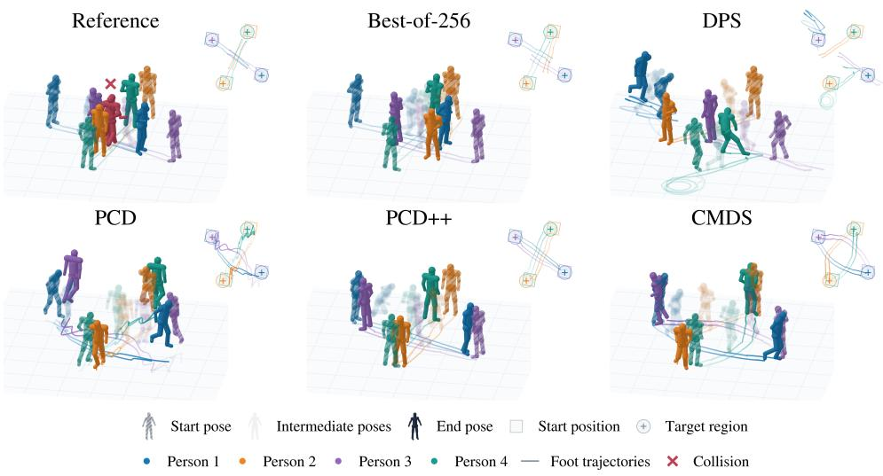  
Figure 22: Extended qualitative comparison of four-person motion generation. We compare uncontrolled diffusion, Best-of-256, DPS, PCD, PCD++, and CMDS on the same four-person task shown in the main paper. The prompts are “A person movesforward at ajogging pace.” for Person 1 (•) and Person 4 (•), and “A person walks forward.” for Person 2 (•) and Person 3 (•). Top-down insets show starts and target regions. Solid curves show foot trajectories; intermediate poses are faded, while start and final poses are opaque. Red crosses mark inter-person collisions. In this example, uncontrolled diffusion, Best-of-256, DPS, and PCD do not satisfy the full joint goal-andcollision constraint, whereas $\mathrm { P C D + + }$ and CMDS reach all goals without inter-person collisions.