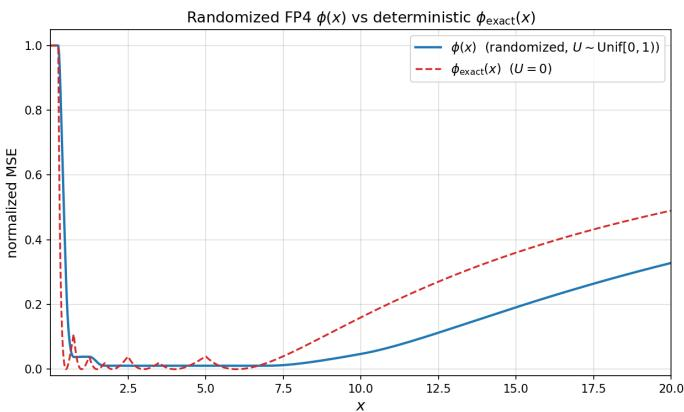
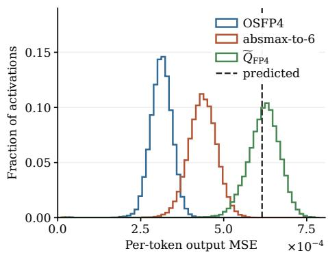
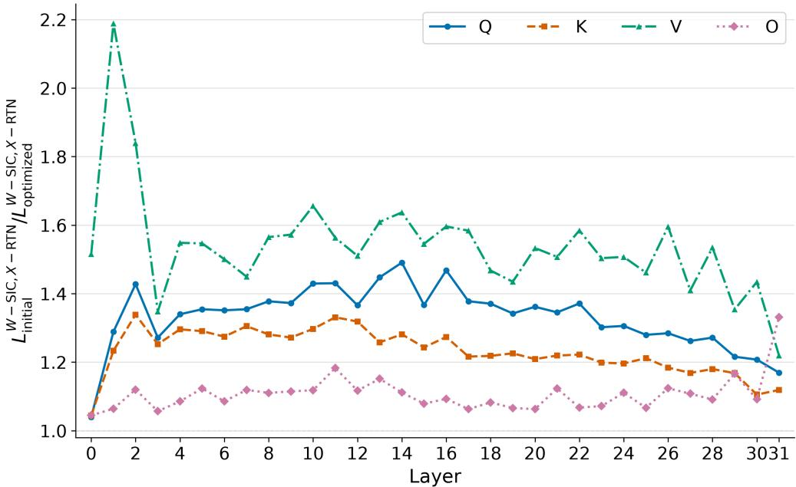
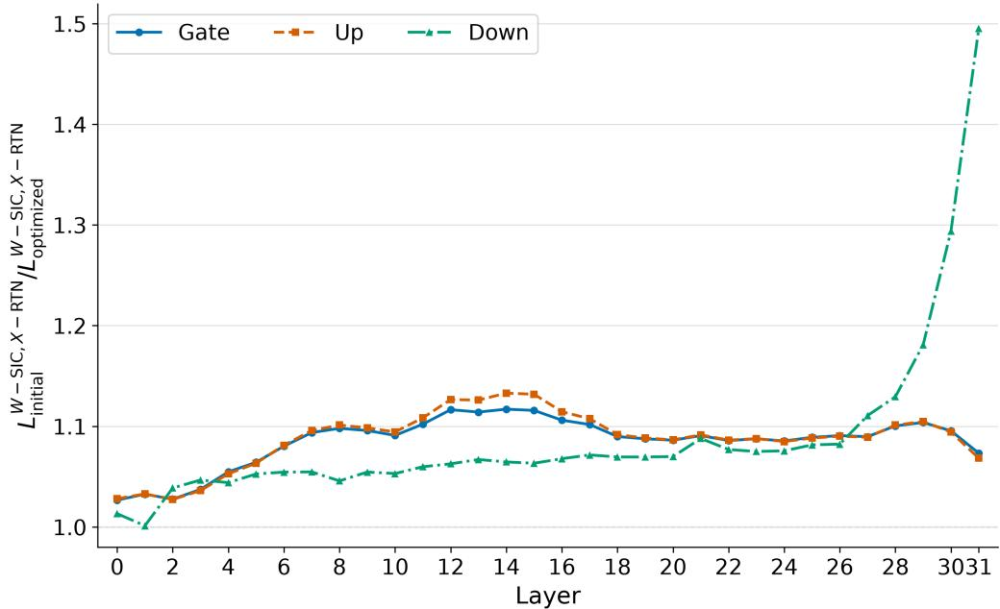
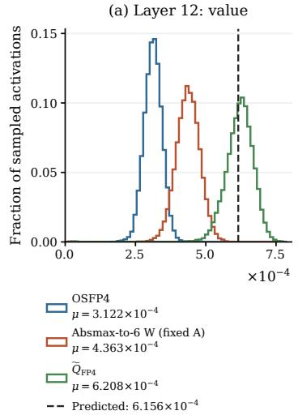
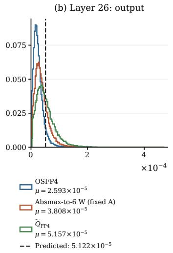
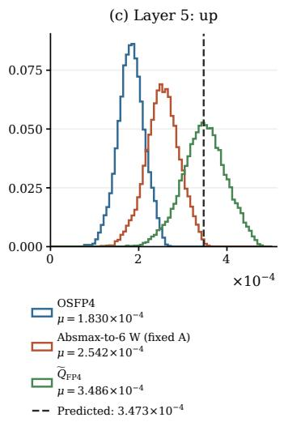
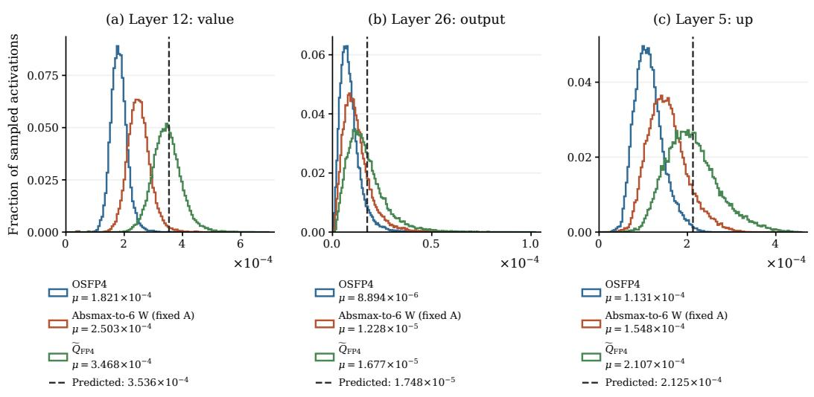
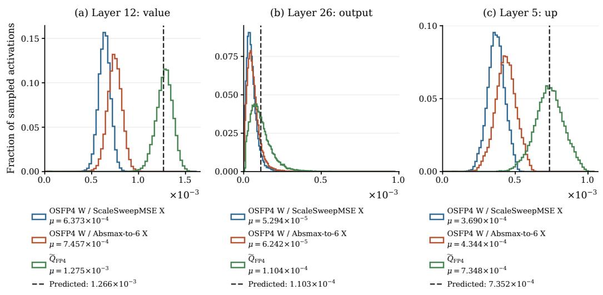
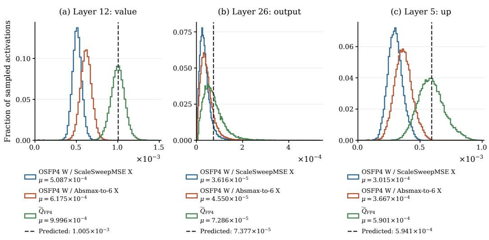

# OSFP4: JOINT OPTIMIZATION OF DIAGONAL SMOOTHING AND BLOCK SCALES FOR NVFP4 QUAN-TIZATION

Neriah Ben David, Ori Meir & Or Ordentlich∗

School of Computer Science and Engineering

Hebrew University of Jerusalem

Jerusalem, Israel

{neriah.bendavid,ori.meir,or.ordentlich}@mail.huji.ac.il

## ABSTRACT

NVFP4 is an attractive datatype for large language model (LLM) inference, offering compact storage and native tensor-core acceleration. However, preserving accuracy using NVFP4 requires careful quantization. In this work we develop a novel quantization scheme called Optimized Smoothing and Scaling for NVFP4 (OSFP4). For each linear projection it uses a diagonal smoothing matrix whose entries are optimized to minimize the squared matrix-product quantization error under NVFP4, taking into account the rounding procedure that is used (either round-to-nearest, or GPTQ-style successive interference cancellation). This requires performing joint optimization on the smoothing entries as well as the block scales, which is facilitated by analyzing a multiplicative-dither FP4 quantizer instead of the fixed deterministic one. Experiments show that OSFP4 achieves the highest average accuracy among the evaluated competitors in the corresponding quantization settings, while retaining approximately 94-97% of vendor NVFP4 prefill throughput on the measured workloads. Our code is available here.

## 1 INTRODUCTION

Low-bit data formats are gaining much popularity for large language models (LLMs) inference, as they require less memory for storing and running the model, decrease the traffic from and to memory, and allow to execute matrix multiplication (MatMul) faster through optimized hardware. The FP4 datatype stands out as a prominent representative of such formats which is heavily used in models running on NVIDIA’s Blackwell series and its subsequent generations. Unfortunately, using FP4 instead of higher resolution formats such as FP8 often comes with the cost of reduced accuracy. The goal of this paper is to develop a quantization scheme for NVFP4 that jointly optimizes a diagonal smoothing transformation, as well as the weight block scales in order to maintain maximal accuracy.

At first thought, it is not at all clear that diagonal smoothing is useful for FP4 quantization. Traditionally, the main differentiator between INT constellations and FP constellations was the dynamic range. An INT-R constellation has fixed spacing between constellation points, and its dynamic range is therefore proportional to $2 ^ { R } .$ . Absmax scaling is often used to make sure the input fits within the dynamic range, and the corresponding per-entry mean-squared error (MSE) in representing $x \in \mathbb { R } ^ { n }$ in INT-R is consequently proportional to $\| \boldsymbol { x } \| _ { \infty } ^ { 2 } \cdot 2 ^ { - 2 R }$ Ordentlich & Polyanskiy (2026a). For this reason, one of the key aspects in INT-based quantization techniques is controlling the infinity norm of the quantizer’s input. Diagonal scaling can help balance the infinity norms of vectors participating in MatMul, and indeed one of the simplest and most efficient techniques for INT-quantized MatMul is SmoothQuant Xiao et al. (2023).

For FP constellations with E exponent bits, the dynamic range is proportional to $2 ^ { 2 ^ { E } }$ , and can be made “essentially unbounded” with as few as $E = 4$ exponent bits, as in the standard E4M3 FP8 datatype. The MSE in representing the ith entry $x _ { i }$ of $x \in \mathbb { R } ^ { n }$ is therefore proportional to $| x _ { i } | ^ { 2 } \cdot 2 ^ { - 2 M }$ , where $M$ is the number of mantissa bits, provided that $x _ { i }$ is inside the constellation’s dynamic range Ordentlich $\&$ Polyanskiy (2026a). For this reason, quantization to FP is typically considered simpler, and requires less pre and post processing than quantization to INT constellations. In particular, whenever $E$ is large enough so that dynamic range is not a limiting factor, SmoothQuant-style diagonal scaling is quite useless, as $\mathbb { E } [ ( \mathsf { \bar { Q } } _ { \mathrm { F P } } ( X _ { i } \cdot \bar { \alpha _ { } } ) Q _ { \mathrm { F P } } ( Y _ { i } / \alpha ) - \bar { X _ { i } } Y _ { i } ) ^ { 2 } ]$ is proportional to $\bf { \check { E } } [ | X _ { i } | ^ { 2 } | Y _ { i } | ^ { 2 } ] 2 ^ { - 2 M }$ for all $\alpha > 0$ provided that the distribution of $( X _ { i } , Y _ { i } )$ is “sufficiently smooth” and $X _ { i } \cdot \alpha$ and $Y _ { i } / \alpha$ are within the quantizer’s dynamic range with high probability.

The picture is different for the FP4 E2M1 format since with $E = 2$ the dynamic range is too small to be ignored. To combat the effect of limited dynamic range, FP4 is usually applied with microscaling as in MXFP4 or NVFP4, where a group of $g$ entries are also given a common scale $\gamma .$ . In MXFP4 $g = 3 2$ and $\gamma$ is represented in E8M0 format, whereas in NVFP4 $g = 1 6$ and $\gamma$ is represented in E4M3 format. Here we focus on NVFP4, which is becoming a common choice for models running on NVIDIA hardware, though some of the techniques we develop may also be useful for MXFP4 as well.

The scale $\gamma$ can be used to ensure that the input to the FP4 quantizer never exceeds $6 ,$ which is the largest value in the FP4 constellation. In particular, for $x \in \mathbb { R } ^ { 1 6 }$ the default absmax-to-6 rule sets $\gamma \ \overset { \cdot } { \approx } \ \lVert x \rVert _ { \infty } / 6$ such that $\| \gamma ^ { - 1 } x \| _ { \infty } \approx 6$ . This rule takes care of the upper limit of the dynamic range: it ensures that no entry of $\gamma ^ { - 1 } x$ is large enough to saturate the quantizer. However, with this rule all entries with magnitude 24 times smaller than $\| { \boldsymbol x } \| _ { \infty }$ will be quantized to 0, so that the total distortion can be quite large when x is largely unbalanced. Furthermore, even for balanced vectors, there are multiple choices of $\gamma$ for which all entries of $\gamma ^ { - 1 } x$ are within the dynamic range of the FP4 constellation, and careful optimization of $\gamma$ may yield significant reduction of MSE over the absmax-to-6 rule.

This work develops an NVFP4 quantization method that utilizes a diagonal matrix $A \in \mathbb { R } ^ { n \times n }$ for “smoothing” the weight matrix $\dot { W } \in \mathbb { R } ^ { m \times n }$ to $W A ^ { - 1 }$ and the activation matrix $X \in \mathbb { R } ^ { n \times k } { \mathrm { ~ t o ~ } } A X .$ as in SmoothQuant. The clear advantage of diagonal A with respect to more general structures for A, e.g. block-rotation Egiazarian et al. (2026), PCA directions aligning Chen et al. (2025), tensor of dense small matrices Sun et al. (2025), is that diagonal pre-processing is cheap and can easily be done in runtime for the activations. In fact, in some layers it can be fused into the LayerNorm or RMSnorm.

In contrast to SmoothQuant where A is used for balancing infinity norms, the role of the matrix A here is more intricate. It should balance the distribution of all entries within the same groups (16 consecutive entries) in the rows of $W$ and in the columns of $X .$ , so that the corresponding E4M3 scales can then be used to minimize the MSE. Developing a mathematical formulation that accurately captures this objective is one of the main challenges addressed in this work. This is achieved by analyzing a randomized multiplicatively dithered FP4 quantizer instead of the deterministic one, which is actually used by our scheme. The distortion incurred by the randomized quantizer admits a relatively simple form using the function $\phi ( \cdot )$ introduced below (See Figure 1), and is closely related to the distortion incurred by the deterministic quantizer (Lemma 1). This in turn enables to jointly optimize the smoothing weight matrix and the block scales.

Using the fixed weights and calibration activations, we optimize the diagonal entries of A and the block scales offline in two stages. In the first stage we jointly optimize the diagonal entries of A and the block scales with respect to a dithered FP4 quantizer, whose corresponding MSE loss is smooth and amenable to optimization. Crucially, the loss takes into account whether round-to-nearest (RTN) or successive-interference-cancellation (SIC) will be used for the actual weight quantization. The resulting A is retained, while the weight scales are finely optimized over the E4M3 grid in the second stage. Activation scales must instead be determined in real time; our default is absmax-to-6.

Our main contributions are:

• We develop an expression that approximates the expected squared Frobenius norm of the matrix-product error under randomized FP4 quantization for diagonally smoothed NVFP4 quantization, as a function of the smoothing parameters and the group scales. This expression takes into account the rounding procedure (RTN/SIC) for ${ \bf { \bar { \cal { W } } } } .$ , and is amenable to efficient joint optimization of all participating parameters.

• Relying on this approximation, we develop a quantization scheme called Optimized Smoothing and Scaling for NVFP4 (OSFP4) quantization. This scheme uses the approximation to perform joint continuous optimization of diagonal smoothing and block scales, followed by discrete E4M3 weight-scale selection. The optimization criterion for the discrete weight-scale depends on the calibration second-moments as well as on the rounding method (RTN/SIC). The activation group scales are set using absmax-to-6.

• Experiments show that OSFP4 achieves the highest average accuracy among the evaluated competitors in the corresponding quantization settings, while retaining approximately 94- 97% of vendor NVFP4 prefill throughput on the measured workloads.

• We provide an add-on package for LLM Compressor AI & vLLM Project (2024) that implements our OSFP4 compression method and exports quantized models as vLLM checkpoints, together with a vLLM plugin that support the additional diagonal smoothing layers.

## 1.1 RELATED WORK

Calibration and error compensation. Post-training quantization uses calibration data to preserve layer outputs without retraining the original model. GPTQ (Frantar et al., 2023) uses second-order information to compensate quantization errors through updates to unquantized weights. This method has demonstrated empirical benefits for various quantization codebooks, including for FP and in particular NVFP4 constellations Egiazarian et al. (2026). Diagonal scaling has proved useful for INT constellations: SmoothQuant (Xiao et al., 2023) balances the quantization difficulty of weights and activations by redistributing their magnitudes, while AWQ (Lin et al., 2024) uses activation statistics to scale and protect important weight channels. OmniQuant (Shao et al., 2024) learns such scalings as part of a broader family of equivalent transformations, jointly with clipping parameters, through reconstruction objectives. These methods establish the value of calibration, scaling, and feedback. WaterSIC (Lifar et al., 2026) combines all three and finds a diagonal smoothing matrix which, when combined with GPTQ/SIC, obtains near-information-theoretic optimal weight-only entropy coded integer quantization. Another recent work (Avisdris et al., 2027) addresses optimal diagonal smoothing for weights and activations INT quantization using GPTQ is. It turns out that NVFP4 requires a markedly different criterion for choosing the diagonal smoothing matrix. OSFP4 jointly adapts smoothing and block scales to the NVFP4 grid and the chosen rounding procedure.

Transforms for low-bit inference. Prior work demonstrated the value of randomized rotations for low-bit quantization (Chee et al., 2023; Ashkboos et al., 2024; Liu et al., 2025). For NVFP4, however, full-dimensional rotations were found less beneficial and can even hurt RTN accuracy, whereas MR-GPTQ (Egiazarian et al., 2026) benefits from rotations within quantization groups together with format-specific GPTQ optimizations. OSFP4 avoids rotations and instead uses cheaper diagonal transformations, jointly optimized (offline) with the block scales. Despite this simpler transformation, our W-SIC/X-RTN configuration achieves higher average W4A4 accuracy than MR-GPTQ under the common evaluation protocol in Table 1.

NVFP4 scale selection. Recent work shows that absmax scaling leaves substantial room for improvement. Four Over Six (4/6) (Cook et al., 2026) adaptively selects between absmax-to-4 and absmax-to-6 scaling for each block. ScaleSearch (Gupta et al., 2026) searches block scales to reduce reconstruction error, and ScaleSweep (Lin & Wan, 2026) derives bounded search ranges for MSE and weighted MSE objectives. SOAR (Bao et al., 2026) combines joint global/block-scale optimization with decoupled encoding and decoding scales. H-Scale (Yu et al., 2026) uses calibration activation second moments to select E4M3 block scales by minimizing a weighted-mean-squared weight reconstruction error. OSFP4 combines accurate scale selection with diagonal smoothing, jointly optimizing both while accounting for the applied rounding procedure (RTN/SIC). Online activation-scale search is complementary to this procedure; our default uses absmax activation scaling.

Quantization-error models. Our analysis builds on high-rate models of floating-point error and covariance-aware quantized matrix multiplication (Ordentlich & Polyanskiy, 2026a;b). We use multiplicative randomization to obtain a smooth FP4 error function that retains finite-range effects, and derive distinct objectives for RTN and SIC, with or without activation quantization. This makes the intended feedback procedure part of the smoothing optimization and connects the randomized loss to the subsequent deterministic scale search.

## 2 LOSS FUNCTIONS

## 2.1 SMOOTHED FP4 QUANTIZATION ERROR

Denote by

$$
\mathcal { C } _ { \mathrm { F P 4 } } = \left\{ 0 , \pm \frac { 1 } { 2 } , \pm 1 , \pm \frac { 3 } { 2 } , \pm 2 , \pm 3 , \pm 4 , \pm 6 \right\}\tag{1}
$$

the points in the FP4 E2M1 constellation, and for $x \in$ R let

$$
Q _ { \mathrm { F P 4 } } ( x ) = \underset { \hat { x } \in \mathcal { C } _ { \mathrm { F P 4 } } } { \mathrm { a r g m i n } } | x - \hat { x } |\tag{2}
$$

be the deterministic nearest-neighbor quantizer of x to FP4. Inspired by the dithered absmax $F P$ quantizer from Ordentlich & Polyanskiy (2026a) we consider the following randomized FP4 quantizer

$$
\tilde { Q } _ { \mathrm { F P 4 } } ( x ) = 2 ^ { U } Q _ { \mathrm { F P 4 } } \left( 2 ^ { - U } x \right) ,\tag{3}
$$

where $U \sim$ Uniform([0, 1)) is statistically independent of x, and its corresponding normalized MSE function is

$$
\phi ( x ) = \frac { 1 } { x ^ { 2 } } \mathbb { E } \left( x - \tilde { Q } _ { \mathrm { F P 4 } } ( x ) \right) ^ { 2 } .\tag{4}
$$

We set $\phi ( 0 ) = 1$ by continuous extension. The following lemma provides two key properties of $\tilde { Q } _ { \mathrm { F P 4 } } ( x )$ and $\phi ( x )$

Lemma 1 1. For any $x \in \mathbb { R } ^ { n }$ there exists a fixed $\beta \in [ 1 , 2 )$ such that

$$
\| x - \beta \cdot Q _ { \mathrm { F P 4 } } ( \beta ^ { - 1 } x ) \| ^ { 2 } \leq \sum _ { i = 1 } ^ { n } x _ { i } ^ { 2 } \phi ( x _ { i } ) .\tag{5}
$$

2. $\phi ( x )$ is an even function. Its minimum is $\phi _ { \operatorname* { m i n } } = \mathbb { E } [ ( 1 - 2 ^ { - ( U + 1 ) } \operatorname { r o u n d } ( 2 ^ { U + 1 } ) ) ^ { 2 } ]$ ≈ 0.010723 and it attains this minimum on the entire interval $\mathcal { T } _ { \mathrm { F P 4 } } = [ 7 / 4 , 7 ]$

A proof is given in Appendix A. Figure 1 plots $\phi ( x )$ as well as the non-smoothed $\phi _ { \mathrm { e x a c t } } ( x ) =$ $\begin{array} { r } { \frac { 1 } { x ^ { 2 } } \mathbb { E } \left( x - Q _ { \mathrm { F P 4 } } ( x ) \right) ^ { 2 } } \end{array}$ . The plateau in $\mathcal { T } _ { \mathrm { F P 4 } }$ is visibly clear.

  
Figure 1: Normalized mean-squared error of randomized FP4 quantization, $\begin{array} { r } { \phi ( x ) = \frac { \mathbb { E } [ ( x - \tilde { Q } _ { \mathrm { F P 4 } } ( x ) ) ^ { 2 } ] } { x ^ { 2 } } } \end{array}$ and its deterministic counterpart, $\begin{array} { r } { \phi _ { \mathrm { e x a c t } } ( x ) = \frac { ( x - Q _ { \mathrm { F P 4 } } ( x ) ) ^ { 2 } } { x ^ { 2 } } } \end{array}$

## 2.2 MATRIX-PRODUCT ERROR UNDER RTN AND SIC

Let $W \in \mathbb { R } ^ { m \times n }$ and $\boldsymbol { X } \in \mathbb { R } ^ { n \times k }$ , where the columns of X are calibration activations, and define $\Sigma _ { X } = X X ^ { \top } / k$ . We partition the inner dimension into $L = n / 1 6$ groups: $W _ { \ell } = W ( : , 1 + 1 6 ( \ell - 1 )$ 16ℓ) and $X _ { \ell } = X ( 1 + 1 6 ( \ell - 1 ) : 1 6 \ell , : )$ , with $A _ { \ell } = \mathrm { d i a g } ( \alpha _ { \ell } ^ { ( 1 ) } , \dots , \alpha _ { \ell } ^ { ( 1 6 ) } )$ . Write $\Gamma _ { W _ { \ell } } = \left\{ \gamma _ { W _ { \ell } } ^ { \left( i \right) } \right\} _ { i = 1 } ^ { m }$ and $\Gamma _ { X _ { \ell } } = \left\{ \gamma _ { X _ { \ell } } ^ { ( j ) } \right\} _ { j = 1 } ^ { k }$ for the row and column scales. The matrices entering the FP4 quantizers are

$$
\begin{array} { r } { W _ { \ell } ^ { \prime } = \mathrm { d i a g } ( \Gamma _ { W _ { \ell } } ) ^ { - 1 } W _ { \ell } A _ { \ell } ^ { - 1 } , \qquad X _ { \ell } ^ { \prime } = A _ { \ell } X _ { \ell } \mathrm { d i a g } ( \Gamma _ { X _ { \ell } } ) ^ { - 1 } . } \end{array}\tag{6}
$$

For either deterministic or randomized quantization, let the dequantized matrices $\hat { W } _ { \ell }$ and $\hat { X } _ { \ell }$ approximate $W _ { \ell } A _ { \ell } ^ { - 1 }$ and $A _ { \ell } X _ { \ell }$ , respectively. Denote their errors by $e _ { W _ { \ell } }$ and $e _ { X _ { \ell } }$ and concatenate them into $e _ { W }$ and $e _ { X }$ . The matrix-product error is

$$
e = \hat { W } \hat { X } - W X = e _ { W } A X + W A ^ { - 1 } e _ { X } + e _ { W } e _ { X } \approx e _ { W } A X + W A ^ { - 1 } e _ { X } .\tag{7}
$$

Here we neglect the second-order term $e _ { W } e _ { X }$

To construct the optimization loss, we now analyze the randomized quantizer $\tilde { Q } _ { \mathrm { F P 4 } }$ from $( 3 ) ;$ the final quantization procedure, however, uses the deterministic quantizer $Q _ { \mathrm { F P 4 } }$ , as described in Section 3. We will optimize $A , \Gamma _ { W } , \Gamma _ { X }$ in order to optimize the distortion of the randomized quantizer, then fix the obtained A, and afterwards refine $\mathrm { { \bar { T } } } _ { W }$ with respect to the deterministic quantizer. Since the randomized quantizer’s relative MSE ϕ is minimized on $\mathcal { T } _ { \mathrm { F P 4 } }$ , the rough goal is to choose $A , \Gamma _ { W } , \Gamma _ { X }$ so that as many entries as possible of the matrices in (6) have magnitudes in this interval.

In accordance with Lemma 1, we model the randomized FP4 errors as

$$
\tilde { Q } _ { \mathrm { F P 4 } } ( y ) = y + \sqrt { y ^ { 2 } \phi ( y ) } Z ,\tag{8}
$$

where $Z$ has zero mean and unit variance, with independent noise across entries and blocks. These are modeling assumptions, rather than exact unbiasedness and independence properties of the quantization errors. The complete derivations are given in Appendix I.

Round to nearest (RTN) quantization: To analyze RTN, we apply the randomized quantizer to the scaled signal without feedback, and multiply the output by the inverse scaling. Specifically, given $A , \Gamma _ { W }$ under RTN quantization the entries of the weight matrix W are quantized to

$$
\hat { W } _ { \ell } ^ { \mathrm { F P 4 } } = \tilde { Q } _ { \mathrm { F P 4 } } \left( \mathrm { d i a g } ( \Gamma _ { W _ { \ell } } ) ^ { - 1 } W _ { \ell } A _ { \ell } ^ { - 1 } \right) , \mathrm { s o ~ t h a t } \hat { W } _ { \ell } = \mathrm { d i a g } ( \Gamma _ { W _ { \ell } } ) \tilde { Q } _ { \mathrm { F P 4 } } \left( \mathrm { d i a g } ( \Gamma _ { W _ { \ell } } ) ^ { - 1 } W _ { \ell } A _ { \ell } ^ { - 1 } \right) .\tag{9}
$$

With the block scales $\left\{ \gamma _ { W _ { \ell } } ^ { ( i ) } \right\} _ { i = 1 } ^ { m }$ and smoothing coefficients $\left\{ \alpha _ { \ell } ^ { ( r ) } \right\} _ { r = 1 } ^ { 1 6 }$ defined above, we obtain

$$
e _ { W _ { \ell } } ( i , r ) = \hat { W } _ { \ell } ( i , r ) - \frac { W _ { \ell } ( i , r ) } { \alpha _ { \ell } ^ { ( r ) } } = \sqrt { \left( \frac { W _ { \ell } ( i , r ) } { \alpha _ { \ell } ^ { ( r ) } } \right) ^ { 2 } \phi \left( \frac { W _ { \ell } ( i , r ) } { \gamma _ { W _ { \ell } } ^ { ( i ) } \alpha _ { \ell } ^ { ( r ) } } \right) } Z _ { \ell } ( i , r ) ,\tag{10}
$$

where $\{ Z _ { \ell } ( i , r ) \}$ are iid zero-mean, unit-variance random variables.

Let

$$
L _ { W _ { \ell } } ^ { \mathrm { R T N } } ( \Gamma _ { W _ { \ell } } , A _ { \ell } ) = \mathbb { E } \| e _ { W _ { \ell } } A _ { \ell } X _ { \ell } \| _ { F } ^ { 2 } ,\tag{11}
$$

where $X _ { \ell } , W _ { \ell } , \Gamma _ { W _ { \ell } } , A _ { \ell }$ are assumed fixed and the expectation is only with respect to the randomization of $\tilde { Q } _ { \mathrm { F P 4 } } ( \cdot )$ , that is, with respect to the iid random variables $\{ Z _ { \ell } ( i , r ) \}$ . It immediately follows that

$$
\begin{array} { r } { L _ { W _ { \ell } } ^ { \mathrm { R T N } } ( \Gamma _ { W _ { \ell } } , A _ { \ell } ) = \displaystyle \sum _ { j = 1 } ^ { k } \sum _ { i = 1 } ^ { m } \sum _ { r = 1 } ^ { 1 6 } W _ { \ell } ^ { 2 } ( i , r ) X _ { \ell } ^ { 2 } ( r , j ) \cdot \phi \left( \frac { W _ { \ell } ( i , r ) } { \gamma _ { W _ { \ell } } ^ { ( i ) } \alpha _ { \ell } ^ { ( r ) } } \right) } \\ { = k \displaystyle \sum _ { r = 1 } ^ { 1 6 } \sigma _ { X _ { \ell } } ^ { 2 } ( r ) \sum _ { i = 1 } ^ { m } W _ { \ell } ^ { 2 } ( i , r ) \cdot \phi \left( \frac { W _ { \ell } ( i , r ) } { \gamma _ { W _ { \ell } } ^ { ( i ) } \alpha _ { \ell } ^ { ( r ) } } \right) , } \end{array}\tag{12}
$$

where $\begin{array} { r } { \sigma _ { X _ { \ell } } ^ { 2 } ( r ) = \frac { 1 } { k } \sum _ { j = 1 } ^ { k } X _ { \ell } ^ { 2 } ( r , j ) } \end{array}$ (we also have $\sigma _ { X _ { \ell } } ^ { 2 } ( r ) = \Sigma _ { X } ( r + 1 6 ( \ell - 1 ) , r + 1 6 ( \ell - 1 ) ) ) .$

We assume that the random variables $\{ Z _ { \ell } ( \cdot , \cdot ) \}$ corresponding to different blocks are also independent. This implies

$$
L _ { W } ^ { \mathrm { R T N } } = \mathbb { E } \| e _ { W } A X \| _ { F } ^ { 2 } = \sum _ { \ell = 1 } ^ { L } L _ { W _ { \ell } } ^ { \mathrm { R T N } } ( \Gamma _ { W _ { \ell } } , A _ { \ell } ) .\tag{13}
$$

If activations are also quantized, applying RTN with the randomized FP4 quantizer gives

$$
\begin{array} { r } { \hat { X } _ { \ell } ^ { \mathrm { F P 4 } } = \tilde { Q } _ { \mathrm { F P 4 } } \left( A _ { \ell } X _ { \ell } \mathrm { d i a g } ( \Gamma _ { X _ { \ell } } ) ^ { - 1 } \right) \mathrm { , ~ \ s o ~ t h a t ~ } \hat { X } _ { \ell } = \tilde { Q } _ { \mathrm { F P 4 } } \left( A _ { \ell } X _ { \ell } \mathrm { d i a g } ( \Gamma _ { X _ { \ell } } ) ^ { - 1 } \right) \mathrm { d i a g } ( \Gamma _ { X _ { \ell } } ) \mathrm { , } } \end{array}\tag{14}
$$

and

$$
e _ { X _ { \ell } } ( r , j ) = \hat { X } _ { \ell } ( r , j ) - \alpha _ { \ell } ^ { ( r ) } X _ { \ell } ( r , j ) = \sqrt { \left( \alpha _ { \ell } ^ { ( r ) } X _ { \ell } ( r , j ) \right) ^ { 2 } \phi \left( \frac { \alpha _ { \ell } ^ { ( r ) } } { \gamma _ { X _ { \ell } } ^ { ( j ) } } X _ { \ell } ( r , j ) \right) } \tilde { Z } _ { \ell } ( r , j ) ,\tag{15}
$$

where $\left\{ \gamma _ { X _ { \ell } } ^ { \left( j \right) } \right\} _ { j = 1 } ^ { k }$ denote the activation block scales, and $\{ \tilde { Z } _ { \ell } ( r , j ) \}$ are iid zero-mean unit-variance random variables statistically independent of everything. Similar to the derivation above, we obtain

$$
L _ { X _ { \ell } } ^ { \mathrm { R T N } } ( \Gamma _ { X _ { \ell } } , A _ { \ell } ) = \mathbb { E } \| W _ { \ell } A _ { \ell } ^ { - 1 } e _ { X _ { \ell } } \| _ { F } ^ { 2 } = m \sum _ { r = 1 } ^ { 1 6 } \sigma _ { W _ { \ell } } ^ { 2 } ( r ) \sum _ { j = 1 } ^ { k } X _ { \ell } ^ { 2 } ( r , j ) \cdot \phi \left( \frac { \alpha _ { \ell } ^ { ( r ) } } { \gamma _ { X _ { \ell } } ^ { ( j ) } } X _ { \ell } ( r , j ) \right) ,\tag{16}
$$

where $\begin{array} { r } { \sigma _ { W _ { \ell } } ^ { 2 } ( r ) = \frac { 1 } { m } \sum _ { i = 1 } ^ { m } W _ { \ell } ^ { 2 } ( i , r ) } \end{array}$ . We also have

$$
L _ { X } ^ { \mathrm { R T N } } = \mathbb { E } \Vert W A ^ { - 1 } e _ { X } \Vert _ { F } ^ { 2 } = \sum _ { \ell = 1 } ^ { L } L _ { X _ { \ell } } ^ { \mathrm { R T N } } ( \Gamma _ { X _ { \ell } } , A _ { \ell } ) .\tag{17}
$$

Successive interference cancellation (SIC): Note that

$$
\| e _ { W } A X \| _ { F } ^ { 2 } = \operatorname { t r } \left( ( e _ { W } A X ) ( e _ { W } A X ) ^ { \top } \right) = k \operatorname { t r } \left( e _ { W } A \Sigma _ { X } A ^ { \top } e _ { W } ^ { \top } \right) .\tag{18}
$$

Let $U \in \mathbb { R } ^ { n \times n }$ be an upper triangular matrix such that $\Sigma _ { X } = U ^ { \top } U$ , and denote

$$
Y = U A ^ { \top } ( W A ^ { - 1 } ) ^ { \top } = U W ^ { \top } \in \mathbb { R } ^ { n \times m } .\tag{19}
$$

We have

$$
\lVert e _ { W } A X \rVert _ { F } ^ { 2 } = k \lVert U A ^ { \top } e _ { W } ^ { \top } \rVert _ { F } ^ { 2 } = k \lVert Y - U A \hat { W } ^ { \top } \rVert _ { F } ^ { 2 } .\tag{20}
$$

Even when A and the E4M3 scaling matrices $\{ \Gamma _ { W _ { \ell } } \} _ { \ell = 1 } ^ { L }$ are fixed, the problem of choosing $\hat { W } ^ { \mathrm { F P 4 } } \in \mathcal { C } _ { \mathrm { F P 4 } } ^ { m \times n }$ such as to minimize (20) is computationally difficult due to the coupling the matrix $U A$ introduces between different columns of Wˆ (equivalently, rows of ${ \hat { W } } ^ { \top } )$ . As common in the literature, instead of attempting an optimal solution, we resort to the SIC/GPTQ approach. Taking into account the structure of the NVFP4 constellation, this boils down to quantizing the weight columns successively, starting from the last, and feeding the error back to the remaining columns, as in Algorithm 2 in Appendix I.

The analysis of $L _ { W } ^ { \mathrm { S I C } } = k \mathbb { E } \Vert Y - U A \hat { W } ^ { \top } \Vert _ { F } ^ { 2 }$ under the SIC algorithm is a bit complicated, even under the randomized FP4 quantization error model (8). The reason is that $Z$ entries from time t affect $Y ^ { ( t ^ { \prime } ) }$ for $t ^ { \prime } < t$ due to the feedback nature of the quantization process. We therefore make a high-resolution quantization assumption and assume the energy of the (filtered) quantization noise is negligible next to the signal (entries of Y) energy. Under this assumption we have that $Y ^ { ( t ) } ( t , : ) \approx \breve { U } ( t , t ) \cdot ( W ( : , t ) ) ^ { \top }$ . Under this additional approximation,

$$
L _ { W _ { \ell } } ^ { \mathrm { S I C } } ( \Gamma _ { W _ { \ell } } , A _ { \ell } ) = k \sum _ { r = 1 } ^ { 1 6 } U _ { \ell } ^ { 2 } ( r ) \sum _ { i = 1 } ^ { m } W _ { \ell } ^ { 2 } ( i , r ) \phi \left( \frac { W _ { \ell } ( i , r ) } { \gamma _ { W _ { \ell } } ^ { ( i ) } \alpha _ { \ell } ^ { ( r ) } } \right) ,\tag{21}
$$

where $U _ { \ell } ( r ) = U ( 1 6 ( \ell - 1 ) + r , 1 6 ( \ell - 1 ) + r )$ . The only difference from $L _ { W _ { \ell } } ^ { \mathrm { R T N } } ( \Gamma _ { W _ { \ell } } , A _ { \ell } )$ is replacing $\sigma _ { X _ { \ell } } ^ { 2 } ( r )$ by $U _ { \ell } ^ { 2 } ( r )$ . The latter is the variance of the optimal prediction error of coordinate $t = 1 6 ( \ell - 1 ) + r$ from coordinates $t + 1 : n$ of a Gaussian vector with covariance $\Sigma _ { X }$ , and hence $U _ { \ell } ^ { 2 } ( r ) \stackrel { \cdot } { \ \leq } \sigma _ { X _ { \ell } } ^ { 2 } ( r )$ . This distinction allows us to optimize A taking into account that SIC will be used for the actual quantization.

Total quadratic Distortion: Using (12) (16) and (21) we obtain the following loss functions for randomized NVFP4 quantization, as a function of A and the E4M3 scales, under the various quantization setups:

$$
L ^ { W \mathrm { - R T N } } = \sum _ { \ell = 1 } ^ { L } L _ { W _ { \ell } } ^ { \mathrm { R T N } } ( \Gamma _ { W _ { \ell } } , A _ { \ell } )\tag{22}
$$

$$
{ \cal L } ^ { W \mathrm { - S I C } } = \sum _ { \ell = 1 } ^ { L } { \cal L } _ { W _ { \ell } } ^ { \mathrm { S I C } } ( \Gamma _ { W _ { \ell } } , A _ { \ell } )\tag{23}
$$

$$
L ^ { W \mathrm { - R T N } , X \mathrm { - R T N } } = \sum _ { \ell = 1 } ^ { L } \big [ L _ { W _ { \ell } } ^ { \mathrm { R T N } } ( \Gamma _ { W _ { \ell } } , A _ { \ell } ) + L _ { X _ { \ell } } ^ { \mathrm { R T N } } ( \Gamma _ { X _ { \ell } } , A _ { \ell } ) \big ]\tag{24}
$$

$$
L ^ { W \mathrm { - S I C } , X - \mathrm { R T N } } = \sum _ { \ell = 1 } ^ { L } \left[ L _ { W _ { \ell } } ^ { \mathrm { S I C } } ( \Gamma _ { W _ { \ell } } , A _ { \ell } ) + L _ { X _ { \ell } } ^ { \mathrm { R T N } } ( \Gamma _ { X _ { \ell } } , A _ { \ell } ) \right] .\tag{25}
$$

Note that in all expressions the dependency on A and the E4M3 scales completely decouples to L different functions, that depend on different parameters. Therefore, the optimization on $\{ A _ { \ell } , \Gamma _ { W _ { \ell } } , \Gamma _ { X _ { \ell } } \}$ decouples to L independent optimization problems.

## 3 THE OSFP4 QUANTIZATION ALGORITHM

We are now ready to describe how the Optimized Smoothing and Scaling for NVFP4 (OSFP4) quantization algorithm works. This algorithm has four different configurations: $W \mathrm { ~ - ~ } \mathrm { R T N } , W \mathrm { ~ - ~ }$ SIC, $W - \mathrm { R T N } / X - \mathrm { R T N }$ or $W - \mathrm { S I } \bar { \mathrm { C } } / X - \mathrm { R T N }$ , corresponding to either W4A16 or W4A4, and to whether W is quantized using RTN or using SIC.

The parameters for each linear projection W X are optimized independently. We describe the procedure for a single projection operation. Our quantization pipeline is as follows.

Calibration set: For all 4 configurations we first collect $k _ { 1 }$ activation vectors $x _ { 1 } , \ldots , x _ { k _ { 1 } }$ and set $\begin{array} { r } { \Sigma _ { X } = \frac { 1 } { k _ { 1 } } \sum _ { j = 1 } ^ { k _ { 1 } } x _ { j } x _ { j } ^ { \top } } \end{array}$ . Since computing $\Sigma _ { X }$ does not require many resources even when $k _ { 1 }$ is large, we typically use large $k _ { 1 }$ , as is standard in calibration based quantization. The terms $L ^ { W - \mathrm { \breve { R } T N } } , L ^ { W - \mathrm { \breve { s } I C } }$ depend on the calibration set only through $\Sigma _ { X }$ , and for weight-only quantization we therefore keep only $\Sigma _ { X }$ and set $k = k _ { 1 }$

In the setups involving activations quantization, the term $L ^ { X - \mathrm { R T N } }$ also participates in the loss function, and the complexity of optimizing this term grows with k. Even though the optimization is performed offline, we will limit k to modest values, such that the quantization procedure will not require too many resources. We therefore take $k < k _ { 1 }$ and select a random subset $\mathcal { I } = \{ j _ { 1 } , \ldots , j _ { k } \}$ of k calibration vectors and set $X = [ x _ { j _ { 1 } } | \cdot \cdot \cdot | x _ { j _ { k } } ] \in \mathbb { R } ^ { n \times k }$

Optimization of A (and initial guess for $\Gamma _ { W } )$ : Depending on the configuration $W - \mathrm { R T N } , W -$ SIC,W − RTN/X − RTN or $\bar { W } - \mathrm { S I C } / X - \mathrm { R T N }$ we construct the relevant loss function from $( 2 2 ) - ( 2 5 )$ (note that the first two depend only on $\Sigma _ { X }$ , whereas the last two also depend on X). Then, for every $\ell = 1 , \ldots , L$ we perform joint optimization on $A _ { \ell } , \Gamma _ { W }$ and also $\Gamma _ { X _ { \ell } }$ whenever relevant. As described above, all loss functions (22)-(25) decouple to $L$ independent terms, so optimizing for each ℓ separately is optimal. The optimization is iterative and is initialized with $A = I _ { n }$ and the $\Gamma _ { W } , \Gamma _ { X }$ corresponding to absmax-to-6 scaling. The precise details of the optimization iterations are given in Appendix B. To illustrate the benefit of this optimization over the standard initialization values, Figure 3 in Appendix B shows how much $L ^ { W - \mathrm { S I C } , X - \mathrm { R T N } }$ improved from its initial value along the different layers of Llama-3.1-8B-Instruct.

The value of A found by optimization is the final value used for quantization. The value found for $\Gamma _ { W }$ will be used to dictate the search space for the next step. Even in the setups $W { \mathrm { - R T N } } / X { \mathrm { - R T N } }$ or $W { \mathrm { - S I C } } / X { \mathrm { - R T N } }$ The value of $\Gamma _ { X }$ is irrelevant for the actual quantization of the activations, and will be determined in real-time based on the values of the actual activations computed in inference.

Optimization of $\Gamma _ { W }$ : The value of $\Gamma _ { W }$ found in the previous step was optimized assuming the randomized quantizer $\tilde { Q } _ { \mathrm { F P 4 } }$ is used, whose output is generally not in $\mathcal { C } _ { \mathrm { F P 4 } }$ . Since in practice we are restricted to output $\hat { W } ^ { \mathrm { F P 4 } } \in \mathcal { C } _ { \mathrm { F P 4 } } ^ { m \times n }$ , the randomized quantizer is not applicable, and we should use $Q _ { \mathrm { F P 4 } } ( \cdot )$ instead. Nevertheless, using part 1 of Lemma 1, for any fixed $y \in \mathbb { R } ^ { 1 6 }$ and $\gamma _ { W _ { \ell } } ^ { ( i ) }$ there must be some $\beta _ { W _ { \ell } } ^ { ( i ) } \in [ 1 , 2 )$ such that the distortion for the deterministic $\begin{array} { r } { \gamma _ { W _ { \ell } } ^ { ( i ) } \beta _ { W _ { \ell } } ^ { ( i ) } Q _ { \mathrm { F P 4 } } \left( \frac { y } { \gamma _ { W _ { \ell } } ^ { ( i ) } \beta _ { W _ { \ell } } ^ { ( i ) } } \right) } \end{array}$ is no larger than the expected distortion of the randomized quantizer $\begin{array} { r } { \gamma _ { W _ { \ell } } ^ { \left( i \right) } \tilde { Q } _ { \mathrm { F P 4 } } \left( \frac { y } { \gamma _ { W _ { \ell } } ^ { \left( i \right) } } \right) } \end{array}$ . In other words, the effective deterministic scale $\gamma ^ { \prime } = \gamma _ { W _ { \ell } } ^ { ( i ) } \beta _ { W _ { \ell } } ^ { ( i ) }$ lies in $[ \gamma _ { W _ { \ell } } ^ { ( i ) } , 2 \gamma _ { W _ { \ell } } ^ { ( i ) } ]$ , and the deterministic quantizer $\gamma ^ { \prime } Q _ { \mathrm { F P 4 } } \left( \frac { y } { \gamma ^ { \prime } } \right)$ attains no larger distortion than the expected distortion of the randomized quantizer $\begin{array} { r } { \gamma _ { W _ { \ell } } ^ { \left( i \right) } \tilde { Q } _ { \mathrm { F P 4 } } \left( \frac { y } { \gamma _ { W _ { \ell } } ^ { \left( i \right) } } \right) } \end{array}$ . In fact, the distortion for the optimal $\gamma ^ { \prime }$ may be substantially smaller than that of the randomized quantizer, as it can always place at least one of the entries of y on a point in $\mathcal { C } _ { \mathrm { F P 4 } }$ cancelling its quantization error completely.

Consequently, for each $\ell = 1 , \ldots , L$ and $i = 1 , \ldots , m$ we determine the final scale by trying all valid scale values in an interval containing $[ \gamma _ { W _ { \ell } } ^ { ( i ) } , 2 \gamma _ { W _ { \ell } } ^ { ( i ) } ]$ . We can only use scales in $\mathcal { C } _ { \mathrm { s c a l e } }$ , the set of positive E4M3 numbers. Consequently, not all values in $[ \gamma _ { W _ { \ell } } ^ { ( i ) } , 2 \gamma _ { W _ { \ell } } ^ { ( i ) } ]$ can be used, and we therefore choose the best scale in $\begin{array} { r } { \mathcal { C } _ { \mathrm { s c a l e } } ^ { + } ( \gamma _ { W _ { \ell } } ^ { ( i ) } ) = \mathcal { C } _ { \mathrm { s c a l e } } \cap \left\lceil \frac { \gamma _ { W _ { \ell } } ^ { ( i ) } } { 1 . 2 } , \frac { \gamma _ { W _ { \ell } } ^ { ( i ) } } { 0 . 3 } \right\rceil } \end{array}$ . The fine-grained scaleselection procedure is described in Appendix C. Projection-level comparisons of the predicted loss, randomized quantization, and final deterministic scale selection for all four configurations are given in Appendix E.

Optimization of $\Gamma _ { X } \mathbf { : }$ We first need to multiply the activation X by the diagonal matrix A. This is handled in the LayerNorm whenever it exists, or via an additional diagonal scaling layer when there is no LayerNorm. Under $W - \mathrm { R T N }$ and $W - { \mathrm { S I C } }$ the activation X is not quantized, whereas under $W { \mathrm { - R T N } } / X { \mathrm { - R T N } }$ and $W { \mathrm { - S I C } } / X { \mathrm { - R T N } }$ the activations also need to be quantized. Unlike the quantization of W which is done offline, the quantization of $X$ is done in inference time and should therefore be sufficiently fast. Our default is to compute a global scale for X based on the calibration set, and then quantize each 16 consecutive entries using absmax-to-6. The fixed global scale allows to perform this quantization online, even before the entire tensor of activations was computed. This is the default choice in our experimental results. We nevertheless mention that recent work Gupta et al. (2026); Lin & Wan (2026) advocates searching a small bank of E4M3 values around the absmax-to-6 value even for the activations, and shows that the overhead this search incurs on the quantization time is quite reasonable (Gupta et al., 2026, Table 6). This optimization is referred to as ScaleSearch/ScaleSweep.

## 4 EXPERIMENTAL RESULTS

We evaluate whether OSFP4 improves NVFP4 accuracy, how its components contribute, and whether these gains retain the efficiency of native FP4 inference. We focus here on Llama-3.1-8B-Instruct; Appendix F contains results for additional models. Locally prepared models share the same source checkpoint and calibration set; all models are evaluated through vLLM on an RTX 5090. We report W4A4 and W4A16 separately and distinguish absmax activation scaling from methods that search activation scales during inference, which typically incur larger overhead. Full task results, calibration settings, and implementation details are given in Appendix D.

Accuracy under a common evaluation protocol. Table 1 summarizes the mean accuracy on MMLU-CoT, GSM8K, HellaSwag, and WinoGrande. With absmax activation scaling, OSFP4 W-SIC/X-RTN achieves 77.03%, compared with 76.34% for FP-Quant GPTQ and 76.18% for MR-

Table 1: Mean accuracy (%) on Llama-3.1-8B-Instruct. Full scores: Table 3.
<table><tr><td>Method</td></tr><tr><td>Avg. BF16 baseline BF16 79.22</td></tr><tr><td>W4A4: absmax activation scaling RTN (FP-Quant) 75.65</td></tr><tr><td>GPTQ (FP-Quant) 76.34</td></tr><tr><td>MR-GPTQ (FP-Quant) 76.18</td></tr><tr><td>SOAR 76.60</td></tr><tr><td>H-Scale (W4A4 extension) 76.67</td></tr><tr><td>NVIDIA released checkpoint† 76.11</td></tr><tr><td>OSFP4 W-RTN / X-RTN 76.36</td></tr><tr><td>OSFP4 W-SIC / X-RTN 77.03</td></tr><tr><td>W4A4: online activation-scale search</td></tr><tr><td>ScaleSweepMSE 76.62 ScaleSweepMSE + GPTQ 76.69</td></tr><tr><td>4over6 76.34</td></tr><tr><td>OSFP4 W-RTN / X-ScaleSweepMSE 76.96</td></tr><tr><td>OSFP4 W-SIC / X-ScaleSweepMSE 77.09</td></tr><tr><td>W4A16: weights only</td></tr><tr><td>RTN 77.67</td></tr><tr><td>H-Scale 78.00</td></tr><tr><td>OSFP4 W-RTN 78.15</td></tr><tr><td>OSFP4 W-SIC 78.42</td></tr></table>

†Separately released checkpoint; preparation is uncontrolled. Bold: best quantized average in each group.

Table 2: WikiText-2 perplexity (↓). W4A4 uses absmax activation scales.
<table><tr><td>Configuration</td><td>W4A16</td><td>W4A4</td></tr><tr><td>BF16 reference</td><td>7.22</td><td>7.22</td></tr><tr><td>Absmax RTN (A = I)</td><td>7.55</td><td>7.88</td></tr><tr><td>MSE scales (A = I)</td><td>7.52</td><td>7.85</td></tr><tr><td>OSFP4 W-RTN</td><td>7.42</td><td>7.77</td></tr><tr><td>SIC (A = I, absmax)</td><td>7.45</td><td>7.77</td></tr><tr><td>OSFP4 W-SIC</td><td>7.39</td><td>7.67</td></tr></table>

  
Figure 2: Layer 12:value, W-RTN/W4A16. Full threeprojection comparison: Figure 4.

GPTQ, and has the highest average among the evaluated methods in this group. The weight-only configuration reaches 78.42%, versus 78.00% for H-Scale and 79.22% for BF16. Thus, the accuracy improvement is present both with and without activation quantization.

Online activation-scale search is complementary to OSFP4, and was evaluated mainly for enabling a fair comparison with ScaleSweep Lin & Wan (2026). Note that even with absmax activation scaling OSFP4 W-SIC/X-RTN scores better than ScaleSweepMSE+GPTQ, whereas the latter does optimize the activation scale online.

Contribution of smoothing, scale selection, and SIC. Table 2 compares the full procedure with simpler configurations. Optimizing only the weight scales by unweighted MSE provides a modest perplexity improvement over absmax. OSFP4 W-RTN optimizes A and selects the weight scales using weighted MSE yielding a more significant improvement. Combining the optimized transformation and scale selection with SIC gives the lowest perplexity among the NVFP4 configurations in both precision settings. In W4A4, perplexity decreases from 7.88 for absmax RTN to 7.67 for OSFP4 W-SIC, compared with 7.77 for SIC using A = I and absmax scales. Appendix H further details an ablation study of the MSE for projection-output error across all seven projections, for all variants. The full method (optimized A, scales and SIC) attains the smallest MSE across all layers and compared schemes. These configurations assess the combined procedure rather than isolating the contribution of A alone. Figure 3 in Appendix B shows the reduction in the joint optimization objective across projections.

From predicted loss to deterministic quantization. Figure 2 examines the two-stage procedure on the value projection in layer 12. For W-RTN/W4A16, the mean error of the randomized quantizer agrees with the predicted loss $L ^ { W - \mathrm { R T N } } ( A ^ { * } , \Gamma _ { W } ^ { * } )$ to within 1%. The final deterministic E4M3 scale search reduces mean error to approximately half the prediction and improves over absmax weight scaling at the same optimized A. This supports using the smoothed loss to guide optimization, followed by fine-grained deterministic scale selection. Appendix E provides details and more extensive results in this line.

Inference efficiency. On an NVIDIA B200, OSFP4 retains approximately 94–97% of the vendor NVFP4 prefill throughput across the measured workloads. This modest gap is primarily attributable to the explicit diagonal smoothing required before the attention output and MLP down projections, where the transformation cannot be absorbed into a preceding LayerNorm. Consistent with this explanation, a control that sets A = I while retaining the same runtime path achieves essentially the same throughput as OSFP4. Appendix G reports the full workload sweep and timing protocol.

## AI USE STATEMENT

In this work, we used generative AI tools for assistance with writing and exposition, for writing code and running experiments, and for assistance in implementation of the scale optimization algorithm, as described in Appendix B. We have not used generative AI tools for any original idea. The conceptualization of this project, the idea to use the dithered quantizer for developing a convenient loss function, and the mathematical development of the loss function are solely due to the human authors. We take responsibility for the final content of this work, including text, claims or artifacts produced with the aid of generative AI.

## REPRODUCIBILITY STATEMENT

We provide a complete reproduction package for the OSFP4 experiments reported in this paper. It contains the experiment scripts, configurations, software dependency versions, GPU specifications, saved measurements, and commands for regenerating the reported tables and figures. The package is available in an OSFP4 reproduction repository.

## REFERENCES

Red Hat AI and vLLM Project. LLM Compressor, 8 2024. URL https://github.com/ vllm-project/llm-compressor.

Saleh Ashkboos, Amirkeivan Mohtashami, Maximilian L. Croci, Bo Li, Pashmina Cameron, Martin Jaggi, Dan Alistarh, Torsten Hoefler, and James Hensman. QuaRot: Outlier-free 4-bit inference in rotated LLMs. In Advances in Neural Information Processing Systems, 2024. URL https: //arxiv.org/abs/2404.00456.

Netanell Avisdris, Erez Badash, Yoray Herzberg, and Or Ordentlich. SmoothGPTQ: Optimizing diagonal scaling for GPTQ weight-activation quantization. Submitted, 2027.

Chengzhu Bao, Xianglong Yan, Zhiteng Li, Guangshuo Qin, Guanghua Yu, and Yulun Zhang. SOAR: Scale optimization for accurate reconstruction in NVFP4 quantization. arXiv preprint arXiv:2605.12245, 2026. URL https://arxiv.org/abs/2605.12245.

Jerry Chee, Yaohui Cai, Volodymyr Kuleshov, and Christopher De Sa. QuIP: 2-bit quantization of large language models with guarantees. In Advances in Neural Information Processing Systems, 2023. URL https://arxiv.org/abs/2307.13304.

Jiale Chen, Vage Egiazarian, Roberto L Castro, Torsten Hoefler, and Dan Alistarh. Wush: Nearoptimal adaptive transforms for llm quantization. arXiv preprint arXiv:2512.00956, 2025.

Jack Cook, Junxian Guo, Guangxuan Xiao, Yujun Lin, Keith Wyss, Mahdi Nazemi, Asit Mishra, Carlo del Mundo, Tijmen Blankevoort, and Song Han. Four over six: More accurate NVFP4 quantization with adaptive block scaling. arXiv preprint arXiv:2512.02010, 2026. URL https: //arxiv.org/abs/2512.02010.

Vage Egiazarian, Roberto Castro, Denis Kuznedelev, Andrei Panferov, Eldar Kurtic, Shubhra Pandit, Alexandre Marques, Mark Kurtz, Saleh Ashkboos, Torsten Hoefler, and Dan Alistarh. Bridging the gap between promise and performance for microscaling fp4 quantization. In International Conference on Learning Representations, volume 2026, pp. 113529–113563, 2026.

Elias Frantar, Saleh Ashkboos, Torsten Hoefler, and Dan Alistarh. GPTQ: Accurate post-training quantization for generative pre-trained transformers. In International Conference on Learning Representations, 2023. URL https://arxiv.org/abs/2210.17323.

Tanmaey Gupta, Hayden Prairie, Xiaoxia Wu, Reyna Abhyankar, Qingyang Wu, Austin Silveria, Pragaash Ponnusamy, Jue Wang, Ben Athiwaratkun, Leon Song, Tri Dao, Daniel Y. Fu, and Chris De Sa. Search your block floating point scales! Proceedings ofMachine Learning and Systems, 8:1383–1398, 2026. URL https://arxiv.org/abs/2605.12464.

Egor Lifar, Semyon Savkin, Or Ordentlich, and Yury Polyanskiy. WaterSIC: Informationtheoretically (near) optimal linear layer quantization. arXiv preprint arXiv:2603.04956, 2026. URL https://arxiv.org/abs/2603.04956.

Ji Lin, Jiaming Tang, Haotian Tang, Shang Yang, Wei-Ming Chen, Wei-Chen Wang, Guangxuan Xiao, Xingyu Dang, Chuang Gan, and Song Han. AWQ: Activation-aware weight quantization for LLM compression and acceleration. In Proceedings of Machine Learning and Systems, 2024. URL https://arxiv.org/abs/2306.00978.

Li Lin and Xiaojun Wan. ScaleSweep: Accurate NVFP4 post-training quantization of LLMs via block scale initialization. arXiv preprint arXiv:2606.07618, 2026. URL https://arxiv. org/abs/2606.07618.

Zechun Liu, Changsheng Zhao, Igor Fedorov, Bilge Soran, Dhruv Choudhary, Raghuraman Krishnamoorthi, Vikas Chandra, Yuandong Tian, and Tijmen Blankevoort. SpinQuant: LLM quantization with learned rotations. In International Conference on Learning Representations, 2025. URL https://arxiv.org/abs/2405.16406.

Or Ordentlich and Yury Polyanskiy. High-rate quantized matrix multiplication i. IEEE BITS the Information Theory Magazine, 2026a.

Or Ordentlich and Yury Polyanskiy. High-rate quantized matrix multiplication II. arXiv preprint arXiv:2605.13768, 2026b. URL https://arxiv.org/abs/2605.13768.

Semyon Savkin, Eitan Porat, Or Ordentlich, and Yury Polyanskiy. Nestquant: Nested lattice quantization for matrix products and llms. arXiv preprint arXiv:2502.09720, 2025.

Wenqi Shao, Mengzhao Chen, Zhaoyang Zhang, Peng Xu, Lirui Zhao, Zhiqian Li, Kaipeng Zhang, Peng Gao, Yu Qiao, and Ping Luo. OmniQuant: Omnidirectionally calibrated quantization for large language models. In International Conference on Learning Representations, 2024. URL https://arxiv.org/abs/2308.13137.

Yuxuan Sun, Ruikang Liu, Haoli Bai, Han Bao, Kang Zhao, Yuening Li, Jiaxin Hu, Xianzhi Yu, Lu Hou, Chun Yuan, Xin Jiang, Wulong Liu, and Jun Yao. FlatQuant: Flatness matters for LLM quantization. In Proceedings of the 42nd International Conference on Machine Learning, 2025. URL https://arxiv.org/abs/2410.09426.

Guangxuan Xiao, Ji Lin, Mickael Seznec, Hao Wu, Julien Demouth, and Song Han. Smoothquant: Accurate and efficient post-training quantization for large language models. In International conference on machine learning, pp. 38087–38099. PMLR, 2023.

Hao Yu, Zheng Li, Dayiheng Liu, and Jianwei Zhang. H-Scale: Hessian-guided scale refinement for NVFP4 sub-byte LLM inference. arXiv preprint arXiv:2608.28113, 2026. URL https: //arxiv.org/abs/2608.28113.

## A PROOF OF LEMMA 1

We first express the smoothed relative error as an integral over a unit interval in logarithmic coordinates.

Proposition 1 (Integral representation of the smoothed relative error) For every $t \in \mathbb { R } ,$

$$
\phi ( 2 ^ { t } ) = \int _ { t - 1 } ^ { t } g ( v ) d v ,
$$

$$
g ( v ) = \left( 1 - 2 ^ { - v } Q _ { \mathrm { F P 4 } } ( 2 ^ { v } ) \right) ^ { 2 } .\tag{26}
$$

Proof. Substituting (3) into the definition of $\phi$ and using $U \sim \mathrm { U n i f o r m } ( [ 0 , 1 ) )$ gives

$$
\begin{array} { r } { \phi ( 2 ^ { t } ) = \mathbb { E } _ { U } \left[ \left( 1 - 2 ^ { U - t } Q _ { \mathrm { F P 4 } } \big ( 2 ^ { t - U } \big ) \right) ^ { 2 } \right] } \\ { = \displaystyle \int _ { 0 } ^ { 1 } \left( 1 - 2 ^ { u - t } Q _ { \mathrm { F P 4 } } \big ( 2 ^ { t - u } \big ) \right) ^ { 2 } d u . } \end{array}\tag{27}
$$

The substitution $v = t - u$ , with $d u = - d v$ , yields (26).

Proof of Lemma 1. The first part follows since the minimum is upper bounded by the expectation, taking $\beta = 2 ^ { U }$ . The fact that $\phi ( - x ) = \phi ( x )$ follows immediately from $Q _ { \mathrm { F P 4 } } ( - x ) \dot { = } - Q _ { \mathrm { F P 4 } } ( x )$ . It remains to show that $\phi ( x ) \geq \phi _ { \mathrm { m i n } }$ and that this minimum is attained for all $x \in \mathbb { Z } _ { \mathrm { F P 4 } }$ . To that end, we first resort to the infinite exponent model of Ordentlich & Polyanskiy (2026a, Section III.B). In particular, define the $^ { * } E { \infty } M 1 ^ { * }$ constellation

$$
C _ { E \infty M 1 } = \left\{ 0 \right\} \cup \left\{ \pm 2 ^ { k } , \pm \frac { 3 } { 2 } 2 ^ { k } : k \in \mathbb { Z } \right\} ,\tag{28}
$$

which is clearly a superset of $\mathcal { C } _ { \mathrm { F P 4 } }$ . Defining

$$
Q _ { \infty } ( x ) = \underset { \hat { x } \in \mathcal { C } _ { E \infty M 1 } } { \mathrm { a r g m i n } } ~ | x - \hat { x } | ,\tag{29}
$$

it therefore follows that

$$
\begin{array} { r l } & { g _ { \infty } ( v ) \triangleq \left( 1 - 2 ^ { - v } Q _ { \infty } ( 2 ^ { v } ) \right) ^ { 2 } = 2 ^ { - 2 v } \left( 2 ^ { v } - Q _ { \infty } ( 2 ^ { v } ) \right) ^ { 2 } } \\ & { \qquad \le 2 ^ { - 2 v } \left( 2 ^ { v } - Q _ { \mathrm { F P 4 } } ( 2 ^ { v } ) \right) ^ { 2 } = g ( v ) , \forall v \in \mathbb { R } . } \end{array}\tag{30}
$$

Consequently

$$
\phi ( 2 ^ { t } ) = \int _ { t - 1 } ^ { t } g ( v ) d v \geq \int _ { t - 1 } ^ { t } g _ { \infty } ( v ) d v \overset { ( a ) } { = } \int _ { 1 } ^ { 2 } g _ { \infty } ( v ) d v \overset { ( b ) } { = } \phi _ { \mathrm { { m i n } } } ,\tag{31}
$$

where in (a) we have used the fact that $2 ^ { - ( v + z ) } Q _ { \infty } ( 2 ^ { ( v + z ) } ) = 2 ^ { - v } Q _ { \infty } ( 2 ^ { v } )$ for all $v \in \mathbb { R }$ and $z \in \mathbb { Z }$ (since $2 ^ { z } \dot { C } _ { E \infty M 1 } = C _ { E \infty M 1 } )$ . We now establish equality (b) above . This follows since for any $x \in [ 2 , 4 )$ we have that $Q _ { \infty } ( x ) = \operatorname { r o u n d } ( x )$ , which implies also that for any $1 \leq v < 2$ it holds that $g _ { \infty } ( v ) = ( 1 - 2 ^ { - v }$ round $. ( 2 ^ { \dot { v } } ) ) ^ { 2 }$ . Consequently

$$
\int _ { 1 } ^ { 2 } g _ { \infty } ( v ) d v = \int _ { 1 } ^ { 2 } ( 1 - 2 ^ { - v } \mathrm { r o u n d } ( 2 ^ { v } ) ) ^ { 2 } d v = \int _ { 0 } ^ { 1 } ( 1 - 2 ^ { - ( u + 1 ) } \mathrm { r o u n d } ( 2 ^ { ( u + 1 ) } ) ) ^ { 2 } d u = \phi _ { \operatorname* { m i n } } .\tag{32}
$$

as required.

The bound (31) holds with equality whenever (30) holds with equality. Equality in (30) in turn holds for all v for which $Q _ { \infty } ( \hat { 2 } ^ { v } ) \stackrel { \cdot } { = } Q _ { \mathrm { F P 4 } } ( 2 ^ { v } )$ . Noting that

$$
C _ { E \infty M 1 } = \{ \ldots , { \frac { 3 } { 4 } } , 1 , { \frac { 3 } { 2 } } , 2 , 3 , 4 , 6 , 8 , \ldots \}\tag{33}
$$

we see that

$$
Q _ { \infty } ( y ) = Q _ { \mathrm { F P 4 } } ( y ) \forall y \in [ 7 / 8 , 7 ] .\tag{34}
$$

In particular, for any $x \in \mathcal { T } _ { \mathrm { F P } } = [ 7 / 4 , 7 ]$ we have that $Q _ { \infty } ( x ) = Q _ { \mathrm { F P 4 } } ( x )$ on the entire interval $[ x / 2 , x ]$ . Consequently, setting $t _ { x } = \log _ { 2 } ( x )$ we see that for any $x \in \mathcal { T } _ { \mathrm { F P } } \overset { \cdot } { = } \left[ 7 / 4 , 7 \right]$ it holds that $g ( v ) = g _ { \infty } ( v )$ for all $v \in [ t _ { x } - 1 , t _ { x } ]$ and therefore (30) holds with equality for all $x \in \mathbb { Z } _ { \mathrm { F P } } =$ $[ 7 / 4 , 7 ]$ , as claimed.

## B IMPLEMENTATION OF THE SCALE OPTIMIZATION

This appendix specifies the continuous optimization of $A , \Gamma _ { W }$ , and, when activations are quantized, $\Gamma _ { X }$ . It also describes how the resulting parameters determine the FP32 tensor scales used for deployment. The continuous optimization and the subsequent selection of E4M3 weight scales are separate steps: the former uses the smoothed loss $\phi ,$ whereas the latter evaluates deterministic FP4 quantization error.

Calibration statistics and parameterization. For a weight matrix $W \in \mathbb { R } ^ { m \times n }$ , let $k _ { 1 }$ be the number of calibration activation vectors used to estimate $\Sigma _ { X }$ . For W4A4, the activation term uses a fixed subset of $k \leq k _ { 1 }$ complete activation vectors, sampled uniformly without replacement. This subset is selected once for the mapping and reused in every optimization iteration. Weight-only optimization requires $\Sigma _ { X }$ but does not retain an activation matrix in its objective. When several projections share one smoothing transformation, their weight matrices are stacked along the output dimension and optimized as one mapping; m then denotes the combined number of output rows.

For each group $\ell ,$ the trainable parameters are the natural logarithms

$$
\begin{array} { r } { a _ { \ell r } = \log \alpha _ { \ell } ^ { ( r ) } , } \\ { b _ { \ell i } = \log \gamma _ { W _ { \ell } } ^ { ( i ) } , } \\ { c _ { \ell j } = \log \gamma _ { X _ { \ell } } ^ { ( j ) } , } \end{array}
$$

$$
\begin{array} { c } { { r = 1 , \ldots , 1 6 , } } \\ { { { } } } \\ { { i = 1 , \ldots , m , } } \\ { { { } } } \\ { { j = 1 , \ldots , k . } } \end{array}\tag{35}
$$

The $c _ { \ell j }$ parameters are omitted for W4A16. Scales are reconstructed by exponentiation, ensuring positivity. We initialize $\alpha _ { \ell } ^ { ( r ) } = 1 , \gamma _ { W _ { \ell } } ^ { ( i ) } = \operatorname* { m a x } _ { r } | W _ { \ell } ( i , r ) | / 6$ , and $\gamma _ { X _ { \ell } } ^ { ( j ) } = \operatorname* { m a x } _ { r } | X _ { \ell } ( r , j ) | / 6$ , with positive numerical floors for zero-valued blocks. The weights, calibration activations, and secondmoment statistics are held fixed throughout this optimization. The loss and trainable log parameters use FP32 arithmetic.

Objective and normalization. Define the fixed weight metric

$$
d _ { \ell r } = \left\{ { \begin{array} { l l } { \Sigma _ { X } ( t , t ) , } & { { \mathrm { f o r ~ w e i g h t ~ R T N } } , } \\ { U ( t , t ) ^ { 2 } , } & { { \mathrm { f o r ~ w e i g h t ~ S I C } } , } \end{array} } \right. \qquad t = 1 6 ( \ell - 1 ) + r .\tag{36}
$$

For robustness, the implementation computes the SIC factor from the damped second moment,

$$
U ^ { \top } U = \Sigma _ { X } + \lambda I _ { n } , \qquad \lambda = 0 . 0 1 \frac { \mathrm { t r } ( \Sigma _ { X } ) } { n } ,\tag{37}
$$

as is common in GPTQ. The per-group losses evaluated in the implementation are

$$
\mathcal { T } _ { W _ { \ell } } = \frac { 1 } { m } \sum _ { r = 1 } ^ { 1 6 } \sum _ { i = 1 } ^ { m } d _ { \ell r } W _ { \ell } ( i , r ) ^ { 2 } \phi \left( \frac { W _ { \ell } ( i , r ) } { \alpha _ { \ell } ^ { ( r ) } \gamma _ { W _ { \ell } } ^ { ( i ) } } \right) ,\tag{38}
$$

$$
\mathcal { I } _ { X _ { \ell } } = \frac { 1 } { m k } \sum _ { r = 1 } ^ { 1 6 } \sum _ { j = 1 } ^ { k } \left( \sum _ { i = 1 } ^ { m } W _ { \ell } ( i , r ) ^ { 2 } \right) X _ { \ell } ( r , j ) ^ { 2 } \phi \left( \frac { \alpha _ { \ell } ^ { ( r ) } X _ { \ell } ( r , j ) } { \gamma _ { X _ { \ell } } ^ { ( j ) } } \right) .\tag{39}
$$

Thus, the scalar objective is $\mathcal { I } = \textstyle \sum _ { \ell } \mathcal { I } _ { W _ { \ell } }$ for W4A16 and $\begin{array} { r } { \mathcal { I } = \sum _ { \ell } ( \mathcal { I } _ { W _ { \ell } } + \mathcal { I } _ { X _ { \ell } } ) } \end{array}$ for W4A4. These are the corresponding losses in Section 2, normalized by $m k ,$ with $\{ d _ { \ell r } \}$ in the weight metric estimated using all $k _ { 1 }$ calibration vectors and the activation term averaged over the selected k vectors. The coefficients $d _ { \ell r } W _ { \ell } ( i , r ) ^ { 2 }$ and $\begin{array} { r } { X _ { \ell } ( r , j ) ^ { 2 } \sum _ { i } W _ { \ell } ( i , r ) ^ { 2 } } \end{array}$ are computed once. All groups are evaluated together in a batched computation; their parameters are disjoint, so summing their objectives introduces no coupling between groups.

Differentiable evaluation of $\phi .$ We evaluate the smoothed relative error through a lookup table indexed by $t = \log _ { 2 } | x |$ . The table has spacing $h = 2 ^ { - 1 2 } \mathbf { o n } \left[ - 4 , 8 \right]$ , with entries $\phi ( \bar { 2 } ^ { t _ { q } } )$ at $t _ { q } = - 4 +$ $q h$ . Each entry is computed using the identity proved in Proposition 1, by analytically integrating

$$
\phi ( 2 ^ { t } ) = \int _ { t - 1 } ^ { t } \left( 1 - 2 ^ { - v } Q _ { \mathrm { F P 4 } } ( 2 ^ { v } ) \right) ^ { 2 } d v ,\tag{40}
$$

splitting the integral at the FP4 decision boundaries. Table construction uses double precision and the cached table used by the optimizer is FP32. Values between adjacent entries are obtained by linear interpolation in t. Recall that the trainable variables are the log-scales $a , b , c$ in (35). For nonzero inputs, t is affine in these variables, so their gradients follow directly from the interpolation slope with respect to t via the chain rule, with a factor of $1 / \ln 2$ converting natural logarithms to base two. Automatic differentiation treats the integer cell index as fixed and differentiates through the interpolation fraction, the logarithm of the magnitude, and the exponential scale parameterization. Consequently, optimization uses the derivative of the interpolated surrogate, without sampling the randomized quantizer or differentiating through deterministic FP4 rounding. The implementation clamps the logarithmic argument to $[ - \bar { 4 } , 8 - h \bar { ] }$ before interpolation; outside this interval the lookup contribution has zero derivative with respect to its argument. $\mathbf { A } \mathbf { t } x = 0$ the lookup is finite and its loss coefficient is zero.

Adam iterations. We jointly update all the log parameters using Adam for 80 iterations with a fixed learning rate $\eta = 0 . 1 2$ , moment coefficients $\mathbf { \bar { ( } } \beta _ { 1 } , \beta _ { 2 } ) = ( 0 . 9 , 0 . 9 9 9 )$ , and $\epsilon = 1 0 ^ { - 8 }$ . Weight decay is zero and AMSGrad is disabled. Let $\theta _ { s }$ collect the log parameters $a , b ,$ c after iteration s, with c omitted for weight-only quantization, and let $g _ { s } = \nabla _ { \boldsymbol { \theta } } \mathcal { I } ( \boldsymbol { \theta } _ { s - 1 } )$ . Adam maintains exponentially weighted moving averages $p _ { s }$ of the gradients and $v _ { s }$ of their elementwise squares. The updates are

$$
\begin{array} { r l r l } & { p _ { s } = \beta _ { 1 } p _ { s - 1 } + ( 1 - \beta _ { 1 } ) g _ { s } , } & & { v _ { s } = \beta _ { 2 } v _ { s - 1 } + ( 1 - \beta _ { 2 } ) g _ { s } ^ { \odot 2 } , } \\ & { \widehat { p _ { s } } = p _ { s } / ( 1 - \beta _ { 1 } ^ { s } ) , ~ } & & { \widehat { v _ { s } } = v _ { s } / ( 1 - \beta _ { 2 } ^ { s } ) , } \\ & { \theta _ { s , j } = \theta _ { s - 1 , j } - \eta \frac { \widehat { p _ { s , j } } } { \sqrt { \widehat { v _ { s , j } } } + \epsilon } , ~ } & & { j = 1 , \dots , \dim ( \theta ) , } \end{array}\tag{41}
$$

where $j$ indexes the trainable log parameters, $p _ { 0 } = v _ { 0 } = 0$ , and all operations are elementwise. The quantities $\widehat { p } _ { s }$ and $\widehat { v } _ { s }$ correct the moving averages for their zero initialization. Each iteration clears the previous gradients, evaluates the entire fixed objective, backpropagates, and updates the parameters simultaneously. There is no alternating minimization, learning-rate schedule, gradient clipping, or early stopping. The final iterate is retained, rather than the iterate with the smallest observed loss. The procedure seeks a low-loss solution of the nonconvex surrogate and does not impose monotonic descent.

Scale normalization and deployment precision. The objective is invariant under a common rescaling within each group. After the last Adam update, we exploit this freedom by setting

$$
\begin{array} { r l r } { \displaystyle s _ { \ell } = \exp \left( \frac { 1 } { m } \sum _ { i = 1 } ^ { m } \log \gamma _ { W _ { \ell } } ^ { ( i ) } \right) , } & { } & \\ { \displaystyle \alpha _ { \ell } ^ { ( r ) } \gets s _ { \ell } \alpha _ { \ell } ^ { ( r ) } , \qquad \gamma _ { W _ { \ell } } ^ { ( i ) } \gets \gamma _ { W _ { \ell } } ^ { ( i ) } / s _ { \ell } , \qquad \gamma _ { X _ { \ell } } ^ { ( j ) } \gets s _ { \ell } \gamma _ { X _ { \ell } } ^ { ( j ) } . } & { } & \end{array}\tag{42}
$$

This sets the geometric mean of the continuous weight scales to one while preserving both $W _ { \ell } ( i , r ) / ( \alpha _ { \ell } ^ { ( r ) } \gamma _ { W _ { \ell } } ^ { ( i ) } )$ and $\alpha _ { \ell } ^ { ( r ) } X _ { \ell } ( r , j ) / \gamma _ { X \rho } ^ { ( j ) }$ . The normalization is applied once, after optimization. We then round the diagonal entries of A to the weight dtype when the transformation is folded into a preceding normalization layer, or to BF16 when explicit runtime smoothing is required. The subsequent deterministic E4M3 weight-scale selection uses this rounded A. Rounding and discrete scale selection are not part of the Adam iterations.

FP32 tensor scales. The global tensor scales are distinct from the block scales optimized above and are not additional Adam parameters. For weights, the saved FP32 global scale is explicitly set to one. After the normalization in (42), the weight-scale search selects E4M3 values directly, with the compensating scale already incorporated into A.

For W4A4 activations, the optimized $\Gamma _ { X }$ is used only to guide the choice of A and is discarded for deployment. After applying the final rounded diagonal transformation $A _ { \star }$ , we recompute the calibration maximum

$$
M _ { X } = \operatorname* { m a x } _ { 1 \leq j \leq k _ { 1 } } \| A _ { \star } x _ { j } \| _ { \infty } .\tag{43}
$$

This uses the full calibration statistics, not only the subset used in the activation loss. The maximum can be recovered exactly from stored per-channel absolute maxima, since the diagonal scaling is fixed. The saved FP32 global quantization multiplier is

$$
g _ { X } = \frac { 4 4 8 \cdot 6 } { M _ { X } } , \qquad s _ { X } = g _ { X } ^ { - 1 } = \frac { M _ { X } } { 4 4 8 \cdot 6 } ,\tag{44}
$$

where 448 and 6 are the maximum positive E4M3 and E2M1 values, respectively, and $s _ { X }$ denotes the corresponding dequantization scale. Numerical safeguards replace nonfinite multipliers by one. This global scale remains fixed during inference. The E4M3 block scales are computed dynamically from each actual group of 16 smoothed activation entries using absmax-to-6 with this global multiplier. Weight-only configurations do not require activation quantization scales.

  
(a) Loss improvement for attention projections.

  
(b) Loss improvement for MLP projections  
Figure 3: Ratio between $L ^ { W - \mathrm { S I C } , X - \mathrm { R T N } }$ with default initialized values, and the optimized value, along the 32 layers of Llama-3.1-8B-instruct. The ratio is plotted for each one of the 7 projections.

## C DETAILED FINE-GRAINED E4M3 SCALE-SELECTION PROCEDURE

After the continuous optimization and scale normalization in Appendix B, we choose the final weight scales from the candidate sets $\mathcal { C } _ { \mathrm { s c a l e } } ^ { + } ( \gamma _ { W _ { \ell } } ^ { ( i ) } )$ defined in the main text. For each normalized continuous scale $\gamma = \gamma _ { W _ { \ell } } ^ { ( i ) }$ , the implementation searches representable E4M3 candidate scales $\gamma ^ { \prime }$ in $[ \gamma / 1 . 2 , \gamma / 0 . 3 ]$ . The rounded smoothing coefficients $\alpha _ { \ell } ^ { ( r ) }$ are held fixed throughout the search.

Denote by $\Gamma _ { W _ { \ell } } ^ { \mathrm { f i n a l } } = \mathrm { d i a g } ( \gamma _ { W _ { \ell } } ^ { \mathrm { f i n a l } , ( 1 ) } , . . . . , \gamma _ { W _ { \ell } } ^ { \mathrm { f i n a l } , ( m ) } )$ the final E4M3 scales used for representing $W _ { \ell }$ in NVFP4 format. For the $W - \mathrm { R T N }$ and $\dot { W } - \mathrm { R T N } / X - \mathrm { R T N }$ setups we set

$$
\gamma _ { W _ { \ell } } ^ { \mathrm { f u a l } , ( i ) } = \operatorname * { a r g m i n } _ { \gamma \in \mathcal { C } _ { \mathrm { s c a l e } } ^ { + } ( \gamma _ { W _ { \ell } } ^ { ( i ) } ) } \sum _ { r = 1 } ^ { 1 6 } \sigma _ { X _ { \ell } } ^ { 2 } ( r ) \left( W _ { \ell } ( i , r ) - \gamma \cdot \alpha _ { \ell } ^ { ( r ) } \cdot Q _ { \mathrm { F P 4 } } \left( \frac { W _ { \ell } ( i , r ) } { \gamma \cdot \alpha _ { \ell } ^ { ( r ) } } \right) \right) ^ { 2 } , ~ \forall i = 1 , \dots , m ,\tag{45}
$$

and then set

$$
\hat { W } _ { \ell } ^ { \mathrm { F P 4 } } ( i , : ) = Q _ { \mathrm { F P 4 } } \left( \frac { W _ { \ell } ( i , : ) A _ { \ell } ^ { - 1 } } { \gamma _ { W _ { \ell } } ^ { \mathrm { f n a l } , ( i ) } } \right) .\tag{46}
$$

In the $W - \mathrm { S I C }$ and $W - \mathrm { S I C } / X - \mathrm { R T N }$ setups the dependence of the MSE on $\Gamma _ { W _ { \ell } } ^ { \mathrm { f i n a l } }$ is more involved because of the feedback nature of the SIC quantization algorithm. Under $\mathrm { R T N } ,$ the choice of $\gamma$ affects the quantization errors corresponding to 16 entries in the corresponding block in an independent manner, and is therefore optimized by (45). On the other hand, under SIC, errors in quantizing earlier coordinates propagate to the quantization of future coordinates by the SIC feedback loop. Consequently, optimizing $\left\{ \Gamma _ { W _ { \ell } } ^ { \mathrm { f i n a l } } \right\} _ { \ell = 1 } ^ { L }$ is less straightforward. We use Algorithm 1 in order to choose $\left\{ \Gamma _ { W _ { \ell } } ^ { \mathrm { f i n a l } } \right\} _ { \ell = 1 } ^ { L } ,$ , and quantize W in the same run. The main challenge in choosing $\gamma$ is that we do not know what will be the input to the quantizer before the feedback quantization procedure was executed. Algorithm 1 chooses the scale γ block by block, and relies on the decisions on $\hat { W }$ that were already committed in the previous blocks. When optimizing the scale for block $\ell ,$ it further estimates the effect of intra-block feedback-filtered quantization by approximating $\hat { W } _ { \ell } = W _ { \ell }$ only for the current block.

Algorithm 1 NVFP4 SIC with Optimized E4M3   
Inputs: $Y ~ \in ~ \mathbb { R } ^ { n \times m }$ , upper triangular $\begin{array} { c c l } { U } & { \in } & { \mathbb { R } ^ { n \times n } } \end{array}$ , diagonal matrices $\{ A _ { \ell } \} _ { \ell = 1 } ^ { L = n / 1 6 }$ with   
$A _ { \ell } = \mathrm { d i a g } \left( \alpha _ { \ell } ^ { ( 1 ) } , \dots , \alpha _ { \ell } ^ { ( 1 6 ) } \right)$ , and initial diagonal scaling matrices $\{ \Gamma _ { W _ { \ell } } \} _ { \ell = 1 } ^ { L = n / 1 6 }$ with $\Gamma _ { W _ { \ell } } =$   
diag $\left( \gamma _ { W _ { \ell } } ^ { ( 1 ) } , \dots , \gamma _ { W _ { \ell } } ^ { ( m ) } \right)$   
Outputs: $W _ { \mathrm { S I C } } \in \mathcal { C } _ { \mathrm { F P 4 } } ^ { n \times m }$ and scale matrices $\{ \Gamma _ { W _ { \ell } } ^ { \mathrm { f i n a l } } \} _ { \ell = 1 } ^ { L = n / 1 6 }$   
$Y ^ { ( n ) } \gets Y$   
for $\ell = L : 1 { \bf d o }$   
$\mathcal { T } _ { \ell } = \{ 1 + 1 6 ( \ell - 1 ) , \dots , 1 6 \ell \}$ ▷ The set of 16 indices participating in ℓth block   
$U _ { \mathrm { b l o c k } } \mathbf { \bar { \Lambda } } = U ( \mathbf { \bar { \Lambda } } , \mathbf { \tilde { \Lambda } } , \mathbf { \tilde { \Lambda } } )$ ▷ The ℓth 16 × 16 block in the diagonal of U   
$U _ { \mathrm { b l o c k } } ^ { \mathrm { c a u s a l } } = \dot { U _ { \mathrm { b l o c k } } } - \mathrm { d i a g } ( U _ { \mathrm { b l o c k } } )$ ▷ Making $U _ { \mathrm { b l o c k } }$ strictly upper triangular   
$Y _ { \mathrm { b l o c k } }  Y ^ { ( 1 6 \ell ) } ( \mathbb { Z } _ { \ell } , : )$   
${ \cal Y } _ { \mathrm { b l o c k } } ^ { \mathrm { a p p r o x } }  { \cal Y } _ { \mathrm { b l o c k } }  U _ { \mathrm { b l o c k } } ^ { \mathrm { c a u s a l } } W _ { \ell } ^ { \top }$ ▷ Approximating input to the quantizer before applying   
feedback iteration   
for $i = 1 ; \dots$ m do   
$\begin{array} { r } { \gamma _ { W _ { \ell } } ^ { \mathrm { f i n a l } , ( i ) }  \mathrm { a r g m i n } _ { \gamma \in \mathcal { C } _ { \mathrm { s c a l e } } ^ { + } ( \gamma _ { W _ { \ell } } ^ { ( i ) } ) } } \end{array}$   
$\begin{array} { r } { \sum _ { a = 1 } ^ { 1 6 } \bigg ( Y _ { \mathrm { b l o c k } } ^ { \mathrm { a p p r o x } } ( a , i ) - \gamma \alpha _ { \ell } ^ { ( a ) } U _ { \mathrm { b l o c k } } ( a , a ) \cdot Q _ { \mathrm { F P 4 } } \left( \frac { Y _ { \mathrm { b l o c k } } ^ { \mathrm { a p p r o x } } ( a , i ) } { \gamma \alpha _ { \ell } ^ { ( a ) } U _ { \mathrm { b l o c k } } ( a , a ) } \right) \bigg ) ^ { 2 } } \end{array}$   
end for   
$\Gamma _ { W _ { \ell } } ^ { \mathrm { f i n a l } } = \mathrm { d i a g } ( \gamma _ { W _ { \ell } } ^ { \mathrm { f i n a l } , ( 1 ) } , . . . . , \gamma _ { W _ { \ell } } ^ { \mathrm { f i n a l } , ( m ) } )$   
for ${ \overset { \cdot } { r } } = 1 6 : 1$ do   
$t  1 6 ( \ell - 1 ) + r$   
$\begin{array} { r } { W _ { \mathrm { S I C } } ( t , : ) \longleftarrow Q _ { \mathrm { F P 4 } } \left( \frac { Y ^ { ( t ) } ( t , : ) \left( \Gamma _ { W _ { \ell } } ^ { \mathrm { f i n a l } } \right) ^ { - 1 } } { \alpha _ { \ell } ^ { ( r ) } U ( t , t ) } \right) } \end{array}$ ▷ For optimization use ${ \tilde { Q } } _ { \mathrm { F P 4 } } ,$ , for actual   
quantization use $Q _ { \mathrm { F P 4 } }$   
$\overset { } { \underset { } { Y } ^ { ( t - 1 ) } } \longleftarrow \overset { } { Y } ^ { ( t ) } - \alpha _ { \ell } ^ { ( r ) } U ( : , t ) \cdot W _ { \mathrm { S I C } } ( t , : ) \Gamma _ { W _ { \ell } } ^ { \mathrm { f i n a l } }$ ▷ $U ( : , t )$ is the tth column of U   
end for   
end for

## D NATIVE NVFP4 COMPARISON: EXPERIMENTAL SETUP

Table 3 gives the full task results underlying Table 1. All 18 rows share one evaluation protocol. We distinguish W4A4 methods using absmax activation scaling, W4A4 methods searching activation scales online, and weight-only W4A16 methods. Bold entries indicate the best score within each group.

Table 3: Native NVFP4 accuracy on Llama-3.1-8B-Instruct under the common protocol in Appendix D. All entries are percentages; recovery is relative to the measured BF16 baseline. Bold indicates the best score within each group. FP-Quant rows use author-provided quantization with our native serving adapter; H-Scale W4A4 is our extension. †NVIDIA’s separately released checkpoint has uncontrolled preparation. The online-search group includes 4over6, which selects activation scales by reconstruction error during inference. OSFP4 activation-ScaleSweep rows retain their corresponding X-RTN weights, A, and tensor scales.
<table><tr><td>Precision Method</td><td></td><td>MMLU-CoT</td><td>GSM8K</td><td>HellaSwag</td><td>WinoGrande</td><td>Avg.</td><td>Recovery %</td></tr><tr><td>Baseline</td><td>BF16</td><td>72.77</td><td>85.97</td><td>80.41</td><td>77.74</td><td>79.22</td><td>100.00</td></tr><tr><td colspan="8">Weights and activations: absmax activation scaling</td></tr><tr><td>W4A4</td><td>RTN (FP-Quant)</td><td>68.61</td><td>80.29</td><td>78.87</td><td>74.82 75.65</td><td></td><td>95.48</td></tr><tr><td>W4A4</td><td>GPTQ (FP-Quant)</td><td>68.86</td><td>80.67</td><td>78.78</td><td>77.0376.34</td><td></td><td>96.35</td></tr><tr><td>W4A4</td><td>MR-GPTQ (FP-Quant)</td><td>69.84</td><td>81.20</td><td>78.16</td><td>75.5376.18</td><td></td><td>96.16</td></tr><tr><td>W4A4</td><td>SOAR</td><td>69.14</td><td>82.11</td><td>78.85</td><td></td><td>76.32 76.60</td><td>96.69</td></tr><tr><td>W4A4</td><td>H-Scale (W4A4 extension)</td><td>69.74</td><td>81.35</td><td>79.03</td><td></td><td>76.5676.67</td><td>96.78</td></tr><tr><td>W4A4</td><td>NVIDIA released checkpoint†</td><td>68.49</td><td>80.89</td><td>78.75</td><td></td><td>76.3276.11</td><td>96.07</td></tr><tr><td>W4A4</td><td>OSFP4 W-RTN / X-RTN</td><td>69.21</td><td>82.03</td><td>78.83</td><td></td><td>75.3776.36</td><td>96.39</td></tr><tr><td>W4A4</td><td>OSFP4 W-SIC / X-RTN</td><td>69.73</td><td>82.34</td><td>79.09</td><td></td><td>76.95 77.03</td><td>97.23</td></tr><tr><td colspan="8">Weights and activations: online activation-scale search</td></tr><tr><td>W4A4</td><td>ScaleSweepMSE</td><td>68.99</td><td>82.18</td><td>78.92</td><td>76.4076.62</td><td></td><td>96.72</td></tr><tr><td>W4A4</td><td>ScaleSweepMSE + GPTQ</td><td>69.53</td><td>82.94</td><td>78.51</td><td>75.7776.69</td><td></td><td>96.80</td></tr><tr><td>W4A4</td><td>4over6</td><td>69.56</td><td>82.11</td><td>78.56</td><td>75.1476.34</td><td></td><td>96.36</td></tr><tr><td>W4A4</td><td>OSFP4 W-RTN / X-ScaleSweepMSE</td><td>69.72</td><td>83.55</td><td>79.36</td><td></td><td>75.2276.96</td><td>97.14</td></tr><tr><td>W4A4</td><td>OSFP4 W-SIC / X-ScaleSweepMSE</td><td>69.56</td><td>83.40</td><td>79.10</td><td></td><td>76.32 77.09</td><td>97.31</td></tr><tr><td colspan="2">Weights only</td><td></td><td></td><td></td><td></td><td></td><td></td></tr><tr><td colspan="2">W4A16 RTN</td><td>70.69</td><td>83.85</td><td>79.36</td><td></td><td>76.8077.67</td><td>98.04</td></tr><tr><td>W4A16</td><td>H-Scale</td><td>71.06</td><td>83.85</td><td>79.88</td><td>77.1978.00</td><td></td><td>98.45</td></tr><tr><td>W4A16</td><td>OSFP4 W-RTN</td><td>71.13</td><td>83.47</td><td>79.77</td><td></td><td>78.22 78.15</td><td>98.64</td></tr><tr><td>W4A16</td><td>OSFP4 W-SIC</td><td>71.53</td><td>84.15</td><td>80.01</td><td></td><td>77.9878.42</td><td>98.98</td></tr></table>

## D.1 MODEL AND CALIBRATION

All locally prepared models start from the same BF16 Llama-3.1-8B-Instruct checkpoint and use the same calibration set: 1024 sequences of 2048 tokens sampled from FineWeb-Edu. All seven linear projections in each decoder layer are quantized. Embeddings, normalization parameters, the language-model head, and KV caches remain in BF16. NVFP4 uses E2M1 values with one E4M3 block scale per 16 input channels and an FP32 tensor scale. W4A4 also quantizes activations in groups of 16, whereas W4A16 retains BF16 activations. No fine-tuning or distillation is performed for the locally prepared models.

## D.2 METHODS AND IMPLEMENTATION PROVENANCE

Author-provided implementations. The rows labeled RTN (FP-Quant), GPTQ (FP-Quant), and MR-GPTQ (FP-Quant) use the authors’ quantization implementation (Egiazarian et al., 2026), run on our common checkpoint and calibration data. We convert the resulting models for native vLLM evaluation, preserving their quantized weights, scales, and transforms. These rows therefore use author-provided quantization with our serving integration, rather than the original paper’s PyTorch evaluation backend. MR-GPTQ includes block Hadamard transforms and activation-based column ordering; GPTQ uses the original column order. All three use absmax activation scaling. SmoothQuant is omitted because the corresponding implementation from the FP-Quant authors was unavailable.

Our implementations of competing methods. The weight-only RTN control, ScaleSweepMSE, ScaleSweepMSE+GPTQ, 4over6, SOAR, and H-Scale rows use our own implementations of the respective procedures. ScaleSweepMSE (Lin & Wan, 2026) searches weight and activation block scales by reconstruction MSE; ScaleSweepMSE+GPTQ selects weight scales before the GPTQ feedback pass and holds them fixed during feedback. 4over6 (Cook et al., 2026) chooses between absmax-to-4 and absmax-to-6 scales for both weights and activations. SOAR (Bao et al., 2026) jointly refines tensor and block scales with separate encoding and decoding scales. H-Scale (Yu et al., 2026) selects weight scales using activation-weighted reconstruction error. SOAR and the H-Scale W4A4 extension use absmax activation scaling. H-Scale is originally a weight-only method; its W4A4 row is our extension, not a result reported by its authors. These independently implemented competitors use no rotations or column reordering.

OSFP4 and activation-scale ablations. The four OSFP4 configurations use the optimization and deterministic scale selection described in Appendices B and C. The diagonal transformation is folded into preceding normalization layers where possible and applied explicitly before the attention output and MLP down projections otherwise. The two activation-ScaleSweepMSE ablations reuse the corresponding OSFP4 W4A4 checkpoints, changing only the online activation block-scale rule. Their weights, diagonal transformations, and tensor scales remain fixed, so these rows isolate the effect of activation-scale selection.

Released NVIDIA checkpoint. We also evaluate the separately released nvidia/Llama-3.1-8B-Instruct-NVFP4 checkpoint under the same task protocol. Its calibration and preparation are outside our controlled procedure, so it serves as a released-model reference rather than an isolated comparison of quantization algorithms.

The publishable code package contains the exact asset identities, calibration sampling procedure, software environments, method settings, conversion and validation procedures, and saved results needed to reproduce the table.

## E PROJECTION-LEVEL DISTORTION AND DETERMINISTIC SCALE SELECTION

We compare the predicted randomized loss with measured projection errors for four configurations: W-RTN, W-SIC, W-RTN/X-RTN, and W-SIC/X-RTN. The first two retain unquantized activations (W4A16); the last two quantize both operands (W4A4). We use three fixed projections of Llama-3.1-8B-Instruct: the value projection in layer 12, the attention output projection in layer 26, and the MLP up-projection in layer 5, with zero-based layer indices. Each configuration and projection is optimized independently. The measurements concern local projection error on inputs captured from the BF16 model, rather than error propagated through an end-to-end quantized model.

Empirical activation distribution. We use the checkpoint and FineWeb-Edu calibration-token cache specified in Appendix D. From the 1024 cached document windows of length 2048, we select 128 distinct windows uniformly without replacement and 256 distinct token positions within each window. Causal BF16 forward passes, without a chat template or generated-token decoding, provide N = 32768 activation vectors xt ∈ Rn for each projection. Here n = 4096 and the output dimensions are m = 1024, 4096, and 14336 for 12v, 26o, and 5up, respectively. The prompt/token pairs are identical across all configurations and projections. We regard x as uniform on this empirical population and use the same population for optimization and measurement; this is a calibration diagnostic, not a held-out generalization test.

Fitted parameters and comparisons. For each projection and configuration, we apply OSFP4 as described in Section 3 to obtain A, Γ and, for W4A4, Γ . We then keep these fitted parameters fixed and compare one predicted-loss reference with three measured error distributions.

Predicted loss (dashed line). For each configuration we plot

$$
\overline { { L } } = \frac { L ( A , \Gamma _ { W } , \Gamma _ { X } ) } { N m } ,\tag{47}
$$

where L is the corresponding loss from (22)–(25), with $\Gamma _ { X }$ omitted for W4A16. This prediction uses the optimized continuous scales, before deterministic E4M3 scale selection, and is the same reference for all curves in a panel.

Deterministic quantization (blue and orange). Writing $\widehat { W }$ for the reconstruction of $W A ^ { - 1 }$ and $\widehat { x } _ { t }$ for that of $A x _ { t }$ , each histogram contains the per-activation output MSE

$$
d _ { t } = \frac { 1 } { m } \| \widehat { W } \widehat { x } _ { t } - W x _ { t } \| _ { 2 } ^ { 2 } .\tag{48}
$$

The two curves test different scale-selection rules:

• W4A16: Blue uses OSFP4’s deterministic weight-scale selection; orange replaces it with absmax-to-6 weight scales. Both retain the same fitted A, tensor scale, and RTN or SIC rounding procedure, with $\widehat { x } _ { t } = A x _ { t }$ . For SIC, both curves use Algorithm 1, with its scaleselection step replaced by absmax-to-6 for the orange curve.

• W4A4: Both deterministic curves use the same OSFP4-quantized weights, including the final E4M3 weight scales selected by the RTN or SIC procedure. Blue uses ScaleSweepMSE activation block scales, whereas orange uses absmax-to-6. The diagonal transformation A and all tensor scales remain fixed, so the comparison isolates activation block-scale selection.

Randomized pseudo-MSE (green). Using the fitted continuous scales, we apply the randomized quantizer to weights and, in W4A4, activations, retaining SIC feedback where applicable. To estimate the expectation over the random dither, we repeat this procedure 32 times with fresh independent dithers, sharing each randomized weight matrix across all activation samples. For each activation, we average the output MSE over these repetitions. The green histogram shows the distribution of these averages across activations.

The full W-RTN/W4A16 comparison is shown in Figure 4; its layer 12 value projection is shown separately in Figure 2 in the main text. The remaining configurations follow. Table 4 shows that the mean randomized pseudo-MSE closely matches the predicted loss across all configurations and projections, with ratios of 0.96–1.01. Deterministic OSFP4 achieves approximately half the predicted loss, with ratios of 0.48–0.53 (using ScaleSweepMSE activation scales in W4A4).

  
Per-token output MSE, $\lVert ( \widehat { W } _ { \mathrm { e f f } } - W ) x \rVert _ { 2 } ^ { 2 } / m$  
Figure 4: W-RTN (W4A16). Blue/orange: OSFP4/absmax-to-6 weight scales at fixed A. Green: randomized pseudo-MSE; dashed: predicted loss.

  
Per-token output MSE, $\lVert ( \widehat { W } _ { \mathrm { e f f } } - W ) x \rVert _ { 2 } ^ { 2 } / m$

Figure 5: W-SIC (W4A16). Blue/orange: OSFP4/absmax-to-6 weight scales at fixed A. Green: randomized pseudo-MSE; dashed: predicted loss.  
  
Per-token output MSE, $\| \widehat { W x } - W x \| _ { 2 } ^ { 2 } / m$

Figure 6: W-RTN/X-RTN (W4A4). Blue/orange: ScaleSweepMSE/absmax-to-6 activation scales with identical OSFP4 weights. Green: randomized pseudo-MSE; dashed: predicted loss.

  
Per-token output MSE, ‖Wx̂− Wx‖2/m

Figure 7: W-SIC/X-RTN (W4A4). Blue/orange: ScaleSweepMSE/absmax-to-6 activation scales with identical OSFP4 weights. Green: randomized pseudo-MSE; dashed: predicted loss.  
Table 4: Mean measured MSE relative to predicted loss. OSFP4 W4A4 uses ScaleSweepMSE activation scales.
<table><tr><td colspan="6">Randomized mean / prediction</td></tr><tr><td>Configuration</td><td>12v</td><td>260</td><td>5up</td><td>12v 260</td><td>OSFP4 mean / prediction 5up</td></tr><tr><td>W-RTN</td><td>1.0085</td><td>1.0068</td><td>1.0038</td><td>0.5072 0.5062</td><td>0.5267</td></tr><tr><td>W-SIC</td><td>0.9807</td><td>0.9595</td><td>0.9913 0.5149</td><td>0.5088</td><td>0.5320</td></tr><tr><td>W-RTN/X-RTN</td><td>1.0075</td><td>1.0008</td><td>0.9994</td><td>0.5035 0.4798</td><td>0.5019</td></tr><tr><td>W-SIC/X-RTN</td><td>0.9950</td><td>0.9876</td><td>0.9932 0.5063</td><td>0.4902</td><td>0.5076</td></tr></table>

## F ADDITIONAL MODELS

This appendix reports additional model results.

## F.1 LLAMA-3-8B PERPLEXITY

Published comparison results are taken from Table 2 of Savkin et al. (2025). The OSFP4, GPTQ and RTN results are added here.

Table 5: WikiText-2 perplexity comparison for Llama-3-8B.
<table><tr><td>Precision</td><td>Method</td><td>Llama-3-8B</td></tr><tr><td>Baseline</td><td>BF16</td><td>6.14</td></tr><tr><td rowspan="6">W4A16</td><td>NestQuant</td><td>6.31</td></tr><tr><td>NestQuantM</td><td>6.35</td></tr><tr><td>RTN</td><td>6.54</td></tr><tr><td>GPTQ</td><td>6.37</td></tr><tr><td>W-RTN</td><td>6.43</td></tr><tr><td>W-SIC</td><td>6.31</td></tr><tr><td rowspan="6">W4A4</td><td>SpinQuant</td><td>7.10</td></tr><tr><td>OstQuant</td><td>7.24</td></tr><tr><td>DuQuant</td><td>8.06</td></tr><tr><td>RTN</td><td>6.88</td></tr><tr><td>GPTQ</td><td>6.68</td></tr><tr><td>W-RTN/X-RTN</td><td>6.74</td></tr><tr><td colspan="2">W-SIC/X-RTN W4A4KV4 NestQuant NestQuantM</td><td>6.59 6.63</td></tr></table>

## F.2 QWEN3-8B ACCURACY

Table 6: Evaluation comparison on Qwen3-8B. All quantized configurations use the NVFP4 format.
<table><tr><td>Precision</td><td>Method</td><td>MMLU-CoT</td><td>GSM8K</td><td>HellaSwag</td><td>WinoGrande</td><td>Avg.</td><td>Recovery %</td></tr><tr><td>Baseline</td><td>BF16</td><td>71.64</td><td>90.98</td><td>76.60</td><td>70.64</td><td>77.46</td><td>100.00</td></tr><tr><td colspan="8">Weights and activations</td></tr><tr><td>W4A4</td><td>RTN (FP-Quant)</td><td>67.72</td><td>89.31</td><td>74.68</td><td>69.46</td><td>75.29</td><td>97.20</td></tr><tr><td>W4A4</td><td>GPTQ (FP-Quant)</td><td>70.94</td><td>89.92</td><td>74.63</td><td>69.61</td><td>76.28</td><td>98.48</td></tr><tr><td>W4A4</td><td>MR-GPTQ (FP-Quant)</td><td>73.60</td><td>89.76</td><td>74.92</td><td>68.43</td><td>76.68</td><td>98.99</td></tr><tr><td>W4A4</td><td>QAT+Had16 (FP-Quant)</td><td>71.29</td><td>89.16</td><td>74.63</td><td>70.32</td><td>76.35</td><td>98.57</td></tr><tr><td>W4A4</td><td>OSFP4 W-RTN / X-RTN</td><td>73.22</td><td>90.14</td><td>74.69</td><td>69.30</td><td>76.84</td><td>99.20</td></tr><tr><td>W4A4</td><td>OSFP4 W-SIC / X-RTN</td><td>70.49</td><td>89.61</td><td>75.24</td><td>70.01</td><td>76.34</td><td>98.55</td></tr><tr><td colspan="8">Weights only</td></tr><tr><td>W4A16</td><td>OSFP4 W-RTN</td><td>72.28</td><td>90.75</td><td>75.76</td><td>70.96</td><td>77.44</td><td>99.97</td></tr><tr><td>W4A16</td><td>OSFP4 W-SIC</td><td>69.87</td><td>90.07</td><td>76.05</td><td>70.09</td><td>76.52</td><td>98.79</td></tr></table>

## F.3 QWEN3-30B-A3B-INSTRUCT ACCURACY

For each MoE layer, we use expert-specific diagonal smoothing matrices rather than sharing a single transformation across experts. During calibration, we preserve the model’s natural MoE routing, so each expert is calibrated only on the tokens routed to it. At runtime, after routing, $A _ { \mathrm { g a t e / u p } }$ is applied to the shared input activations of the selected expert’s gate and up projections, while Adown is applied to the input activations of its down projection.

For OSFP4 W4A4, activation global scales would need to be computed from smoothed calibration activations separately for each expert’s shared gate/up input and down input. Inference would then require a vLLM plugin that selects the appropriate scale after routing. Because this route-aware serving path was not implemented in our experiments, we report only W4A16 results for this model.

For this evaluation, we measure every row once using the same seven-task protocol. We evaluate C-Eval, LiveBench, MMLU-Redux, AIME 2025, ARC-Challenge, BBH, and GPQA Diamond. Generation uses temperature 0.7, top-p 0.8, top-k 20, repetition penalty 1.0, presence penalty 1.5, and at most 32,768 output tokens. AIME 2025 uses 16 independent generations per problem. We report the unweighted mean of the seven task scores.

Table 7: Evaluation comparison on Qwen3-30B-A3B-Instruct.
<table><tr><td>Precision</td><td>Method</td><td>C-Eval</td><td>LiveBench</td><td>MMLU-R</td><td>AIME 2025</td><td>ARC-C</td><td>BBH</td><td>GPQA-D</td><td>Avg.</td><td>Recovery %</td></tr><tr><td>Baseline</td><td>BF16</td><td>86.97</td><td>70.41</td><td>88.19</td><td>63.96</td><td>95.14</td><td>90.77</td><td>55.05</td><td>78.64</td><td>100.00</td></tr><tr><td colspan="9">Weights only</td><td></td><td></td></tr><tr><td>W4A16</td><td>RTN</td><td>86.57</td><td>67.11</td><td>87.63</td><td>57.71</td><td>95.56</td><td>89.42</td><td>61.11</td><td>77.87</td><td>99.02</td></tr><tr><td>W4A16</td><td>RTN + H-Scale</td><td>86.37</td><td>68.22</td><td>87.67</td><td>61.46</td><td>95.56</td><td>89.54</td><td>57.07</td><td>77.98</td><td>99.16</td></tr><tr><td>W4A16</td><td>GPTQ + H-Scale</td><td>86.22</td><td>67.93</td><td>87.72</td><td>59.58</td><td>95.22</td><td>90.06</td><td>55.56</td><td>77.47</td><td>98.51</td></tr><tr><td>W4A16</td><td>MR-GPTQ + H-Scale</td><td>86.51</td><td>67.24</td><td>87.82</td><td>60.42</td><td>95.14</td><td>89.71</td><td>54.04</td><td>77.27</td><td>98.26</td></tr><tr><td>W4A16</td><td>OSFP4 W-RTN</td><td>86.70</td><td>69.44</td><td>87.61</td><td>60.21</td><td>95.14</td><td>90.08</td><td>58.08</td><td>78.18</td><td>99.42</td></tr><tr><td>W4A16</td><td>OSFP4 W-SIC</td><td>86.39</td><td>67.77</td><td>87.77</td><td>57.92</td><td>94.71</td><td>89.96</td><td>57.58</td><td>77.44</td><td>98.47</td></tr></table>

## F.4 GEMMA-4-31B-IT ACCURACY

For this evaluation, we use the no-thinking setting and seed counts described in Red Hat AI’s Gemma-4-31B-IT-NVFP4 model card on Hugging Face as a reference for our local measurements. Every row uses zero-shot, text-only prompts and the Gemma chat template with thinking disabled. We generate responses with vLLM using a 32,768-token context, temperature 1.0, top-p 0.95, and top-k 64. We score GPQA Diamond (GPQA-D), MATH-500, and AIME 2025 with LightEval, and IFEval with lm-eval’s prompt-level strict metric. Scores are averaged over three seeds for GPQA-D, MATH-500, and IFEval, and eight seeds for AIME 2025. The RTN (RedHatAI) row uses Red-HatAI’s publicly released NVFP4 checkpoint. All table entries, including BF16, are our local measurements.

Table 8: Evaluation comparison on Gemma-4-31B-IT.
<table><tr><td>Precision</td><td>Method</td><td>GPQA-D</td><td>MATH-500</td><td>IFEval strict</td><td>AIME 2025</td><td>Avg.</td><td>Recovery %</td></tr><tr><td>Baseline</td><td>BF16</td><td>78.28</td><td>89.20</td><td>90.94</td><td>67.92</td><td>81.59</td><td>100.00</td></tr><tr><td colspan="8">Weights and activations</td></tr><tr><td>W4A4</td><td>RTN (RedHatAI)</td><td>76.60</td><td>88.07</td><td>90.14</td><td>64.17</td><td>79.74</td><td>97.74</td></tr><tr><td>W4A4</td><td>MR-GPTQ (FP-Quant)</td><td>74.58</td><td>88.20</td><td>91.00</td><td>63.75</td><td>79.38</td><td>97.30</td></tr><tr><td>W4A4</td><td>OSFP4 W-RTN / X-RTN</td><td>75.76</td><td>90.40</td><td>90.51</td><td>63.75</td><td>80.11</td><td>98.19</td></tr><tr><td>W4A4</td><td>OSFP4 W-SIC / X-RTN</td><td>78.28</td><td>91.87</td><td>90.76</td><td>62.08</td><td>80.75</td><td>98.97</td></tr></table>

## G INFERENCE EFFICIENCY

Table 9 compares the inference throughput of OSFP4, the vendor NVFP4 RTN baseline, NVFP4 with unit smoothing, and BF16 on Llama-3.1-8B-Instruct (NVIDIA B200, vLLM 0.28.0). Each workload uses a fixed synthetic batch of random-token prompts. Prefill emits one token and measures time to first token. Decode is measured with 256 output tokens and with one output token; subtracting the two durations removes the common prefill contribution. For each method and workload, we perform three independent timing repetitions, each consisting of 30 inference runs. The smoothing transformation A is applied at runtime only on o\_proj and down\_proj.

End-to-end inference includes attention with a BF16 KV cache, activation quantization, output writes, and scheduling overhead in addition to FP4 matrix multiplication. The measured gains therefore depend on the workload. OSFP4 closely matches the unit-smoothing control across the sweep, suggesting that its gap to the vendor NVFP4 path primarily reflects the runtime smoothing implementation rather than the values of A.

Table 9: Inference throughput on Llama-3.1-8B-Instruct (NVIDIA B200).
<table><tr><td colspan="3">Workload</td><td colspan="3">Throughput</td></tr><tr><td>Batch</td><td>Prompt</td><td>Out</td><td>BF16</td><td>NVFP4 NVFP4 A=I</td><td>OSFP4</td></tr><tr><td colspan="6">Prefill: input throughput (thousand tokens/s), measured to first output token</td></tr><tr><td>1</td><td>512</td><td>1</td><td>60.2</td><td>81.0</td><td>78.1</td></tr><tr><td>8</td><td>512</td><td>1</td><td>82.5</td><td>177.0</td><td>165.4</td></tr><tr><td>32</td><td>512</td><td>1</td><td>86.5</td><td>192.4</td><td>180.8 180.6</td></tr><tr><td>1</td><td>2048</td><td>1</td><td>77.0</td><td>153.1</td><td>145.0 144.9 174.0</td></tr><tr><td>8</td><td>2048</td><td>1</td><td>85.0</td><td>183.9</td><td>173.7</td></tr><tr><td>1</td><td>8192</td><td>1</td><td>75.0</td><td>144.6</td><td>137.8</td></tr><tr><td colspan="6">Decode: output throughput across the batch (tokens/s), excluding prefill</td></tr><tr><td>1</td><td>128</td><td>256</td><td>274</td><td>321</td><td>312</td></tr><tr><td>8</td><td>128</td><td>256</td><td>2183</td><td>2627</td><td>2548</td></tr><tr><td>32</td><td>128</td><td>256</td><td>8448</td><td>9936</td><td>9664</td></tr></table>

## H COMPONENT ABLATION

We conduct an ablation study on Llama-3.1-8B-Instruct under W4A16 and W4A4 quantization. All configurations are calibrated on 1,024 FineWeb sequences of 2,048 tokens. Perplexity and projection-output errors are evaluated on the WikiText-2 test set.

For W4A16, we compare AbsMax, optimal E4M3 scale according to unweighted MSE, our W-RTN method, W-SIC with A = I and standard AbsMax weight scales, and our W-SIC method.

For W4A4, we compare AbsMax, optimal E4M3 scale for W, with A = I and standard AbsMax scaling for X, our W-RTN method, W-SIC with A = I and standard AbsMax weight and activation scales, and our W-SIC method.

For each method, we report the relative MatMul MSE for the seven projection types $p \in$ {q, k, v, o, gate, up, down}. Let $Y _ { t , p }$ denote the full-precision output of projection p in Transformer layer t, and let $\hat { Y } _ { t , p } ^ { \mathrm { m e t h o d } }$ and $\hat { Y } _ { t , p } ^ { \mathrm { F P 8 \ R T N } }$ denote the corresponding outputs produced by the evaluated method and the FP8 RTN reference, respectively. We compute the squared Frobenius-error ratio independently in each Transformer layer and report its mean over all 32 layers:

$$
R _ { p } = \frac { 1 } { 3 2 } \sum _ { t = 1 } ^ { 3 2 } \frac { \Big \| \hat { Y } _ { t , p } ^ { \mathrm { m e t h o d } } - Y _ { t , p } \Big \| _ { F } ^ { 2 } } { \Big \| \hat { Y } _ { t , p } ^ { \mathrm { F P S R T N } } - Y _ { t , p } \Big \| _ { F } ^ { 2 } } , \mathrm { f o r } p \in \{ q , k , v , o , \mathrm { g a t e , u p , d o w n } \} .\tag{49}
$$

The W4A16 configurations use a W8A16 FP8 RTN reference, whereas the W4A4 configurations use a W8A8 FP8 RTN reference. The table reports the seven relative MatMul MSE values and WikiText-2 perplexity for each configuration.

Table 10: NVFP4 component ablation on Llama-3.1-8B-Instruct: relative projection MSE and WikiText-2 perplexity.
<table><tr><td>Precision Method</td><td></td><td colspan="7">Relative MMSE  $\downarrow$ </td><td>PPL↓</td></tr><tr><td></td><td></td><td>q</td><td>k</td><td>v</td><td>0</td><td>gate</td><td>up</td><td>down</td><td></td></tr><tr><td>Baseline</td><td>BF16</td><td>0.00</td><td>0.00</td><td>0.00</td><td>0.00</td><td>0.00</td><td>0.00</td><td>0.00</td><td>7.22</td></tr><tr><td colspan="10">Weights only</td></tr><tr><td>W8A16</td><td>RTN</td><td>1.00</td><td>1.00</td><td>1.00</td><td>1.00</td><td>1.00</td><td>1.00</td><td>1.00</td><td>7.24</td></tr><tr><td>W4A16</td><td>RTN</td><td>10.27</td><td>8.68</td><td>14.30</td><td>12.59</td><td>12.22</td><td>12.64</td><td>12.52</td><td>7.55</td></tr><tr><td>W4A16</td><td>MSE</td><td>8.12</td><td>6.93</td><td>12.01</td><td>9.28</td><td>9.08</td><td>9.39</td><td>9.43</td><td>7.52</td></tr><tr><td>W4A16</td><td>W-RTN</td><td>5.29</td><td>4.42</td><td>8.53</td><td>8.16</td><td>8.48</td><td>8.95</td><td>8.10</td><td>7.42</td></tr><tr><td>W4A16</td><td>SIC</td><td>5.88</td><td>4.73</td><td>9.05</td><td>5.82</td><td>9.00</td><td>9.53</td><td>9.19</td><td>7.45</td></tr><tr><td>W4A16</td><td>W-SIC</td><td>3.63</td><td>2.89</td><td>6.08</td><td>4.02</td><td>6.45</td><td>6.86</td><td>6.29</td><td>7.39</td></tr><tr><td colspan="10">Weights and activations</td></tr><tr><td>W8A8</td><td>RTN</td><td>1.00</td><td>1.00</td><td>1.00</td><td>1.00</td><td>1.00</td><td>1.00</td><td>1.00</td><td>7.27</td></tr><tr><td>W4A4</td><td>RTN</td><td>10.86</td><td>8.97</td><td>16.18</td><td>12.67</td><td>12.41</td><td>12.85</td><td>12.45</td><td>7.88</td></tr><tr><td>W4A4</td><td>MSE</td><td>9.76</td><td>8.09</td><td>15.00</td><td>10.96</td><td>10.80</td><td>11.20</td><td>10.81</td><td>7.85</td></tr><tr><td>W4A4</td><td>W-RTN/X-RTN</td><td>7.05</td><td>6.19</td><td>10.12</td><td>10.12</td><td>10.38</td><td>10.75</td><td>9.77</td><td>7.77</td></tr><tr><td>W4A4</td><td>SIC</td><td>8.52</td><td>6.88</td><td>13.54</td><td>9.25</td><td>10.75</td><td>11.28</td><td>10.68</td><td>7.77</td></tr><tr><td>W4A4</td><td>W-SIC/X-RTN</td><td>6.17</td><td>5.38</td><td>8.94</td><td>8.03</td><td>9.33</td><td>9.72</td><td>8.82</td><td>7.67</td></tr></table>

## I DETAILED LOSS DERIVATIONS AND SIC PROCEDURE

Denote by $\mathcal { C } _ { \mathrm { s c a l e } }$ all the positive points in the FP8 E4M3 constellation, and recall the definition of $\mathcal { C } _ { \mathrm { F P 4 } }$ from (1).

Let $W \in \mathbb { R } ^ { m \times n }$ and $\ b { X } \in \mathbb { R } ^ { n \times k }$ . We generally think of X as a random vector with $k = 1$ , but for optimization of the diagonal scaling matrix $A ,$ , we will denote by X the matrix holding k calibration activations in $\mathbb { R } ^ { n }$ , so that $k > 1$ . We also define $\begin{array} { r } { \Sigma _ { X } = \frac { 1 } { k } X X ^ { \top } \mathbf { \Sigma } \mathbf { \bar { \in } } \mathbb { R } ^ { n \times n } } \end{array}$ . Let $L = n / \bar { 1 } 6$ and assume for simplicity that $L$ is an integer. k

We partition W to $L$ matrices of shape $m \times 1 6$ so that

$$
W = [ W _ { 1 } | \cdot \cdot \cdot | W _ { L } ] , W _ { \ell } = W ( : , 1 + 1 6 ( \ell - 1 ) : 1 6 \ell ) \mathrm { f o r } \ell = 1 , \ldots , L .\tag{50}
$$

Under NVFP4 quantization we represent each $W _ { \ell }$ as

$$
\hat { W } _ { \ell } = \mathrm { d i a g } ( \Gamma _ { W _ { \ell } } ) \cdot \hat { W } _ { \ell } ^ { \mathrm { F P 4 } } , \mathrm { w h e r e } \Gamma _ { W _ { \ell } } \in \mathcal { C } _ { \mathrm { s c a l e } } ^ { m } , \hat { W } _ { \ell } ^ { \mathrm { F P 4 } } \in \mathcal { C } _ { \mathrm { F P 4 } } ^ { m \times 1 6 } .\tag{51}
$$

Similarly,

$$
X = \left[ \frac { X _ { 1 } } { \vdots } \right] , X _ { \ell } = X ( 1 + 1 6 ( \ell - 1 ) : 1 6 \ell , : ) \mathrm { f o r } \ell = 1 , \ldots , L .\tag{52}
$$

When activations are also quantized, we represent each $X _ { \ell }$ as

$$
\hat { X } _ { \ell } = \hat { X } _ { \ell } ^ { \mathrm { F P 4 } } \cdot \mathrm { d i a g } ( \Gamma _ { X _ { \ell } } ) , \mathrm { w h e r e } \Gamma _ { X _ { \ell } } \in \mathcal { C } _ { \mathrm { s c a l e } } ^ { k } , \hat { X } _ { \ell } ^ { \mathrm { F P 4 } } \in \mathcal { C } _ { \mathrm { F P 4 } } ^ { 1 6 \times k } .\tag{53}
$$

In this work we use a diagonal smoothing matrix $A \in \mathbb { R } ^ { n \times n }$ so that we actually quantize $W A ^ { - 1 }$ and (possibly) AX. We keep using the notation $\{ \hat { W } _ { \ell } \}$ and $\{ \hat { X } _ { \ell } \}$ for the corresponding NVFP4 representation even when $A \neq I _ { n } .$ in which case $\hat { W } _ { \ell }$ can be very far from $W _ { \ell }$ , and same for X. We also express the matrix A as a block diagonal matrix with blocks of size $1 6 \times 1 6$ so that

$$
A = \left[ { \begin{array} { c c c c } { A _ { 1 } } & { 0 } & { \cdots } & { 0 } \\ { 0 } & { A _ { 2 } } & { \cdots } & { 0 } \\ { \vdots } & { \vdots } & { \ddots } & { \vdots } \\ { 0 } & { 0 } & { \cdots } & { A _ { L } } \end{array} } \right] .\tag{54}
$$

The MatMul Quantization Error: Let

$$
e = \hat { W } \hat { X } - W X = \sum _ { \ell = 1 } ^ { L } \Big ( \hat { W } _ { \ell } \hat { X } _ { \ell } - ( W _ { \ell } A _ { \ell } ^ { - 1 } ) ( A _ { \ell } X _ { \ell } ) \Big )\tag{55}
$$

$$
= \sum _ { \ell = 1 } ^ { L } ( W _ { \ell } A _ { \ell } ^ { - 1 } + e _ { W _ { \ell } } ) ( A _ { \ell } X _ { \ell } + e _ { X _ { \ell } } ) - \left( ( W _ { \ell } A _ { \ell } ^ { - 1 } ) ( A _ { \ell } X _ { \ell } ) \right)\tag{56}
$$

$$
= \sum _ { \ell = 1 } ^ { L } e _ { W _ { \ell } } A _ { \ell } X _ { \ell } + W _ { \ell } A _ { \ell } ^ { - 1 } e _ { X _ { \ell } } + e _ { W _ { \ell } } e _ { X _ { \ell } }\tag{57}
$$

where $e _ { W _ { \ell } } = \hat { W } _ { \ell } - ( W _ { \ell } A _ { \ell } ^ { - 1 } )$ and $e _ { X _ { \ell } } = \hat { X } _ { \ell } - ( A _ { \ell } X _ { \ell } )$ . Setting

$$
e _ { W } = [ e _ { W _ { 1 } } | \cdot \cdot \cdot | e _ { W _ { L } } ] , e _ { X } = \left[ \frac { e _ { X _ { 1 } } } { \vdots } \right] ,\tag{58}
$$

we obtain

$$
e = e _ { W } A X + W A ^ { - 1 } e _ { X } + e _ { W } e _ { X } .\tag{59}
$$

We further neglect the third term which has much smaller energy than the sum of the first two under NVFP4 quantization, and approximate

$$
e \approx e _ { W } A X + W A ^ { - 1 } e _ { X } .\tag{60}
$$

Randomized FP4 quantization error: We assume the randomized quantizer $\tilde { Q } _ { \mathrm { F P 4 } } ( \cdot )$ from (3) is used. We model it as a channel with input $y \in \mathbb { R }$ and output $\tilde { Q } _ { \mathrm { F P 4 } } ( y ) \in \mathbb { R }$ satisfying

$$
\tilde { Q } _ { \mathrm { F P 4 } } ( y ) = y + \sqrt { y ^ { 2 } \phi ( y ) } Z ,\tag{61}
$$

where $Z$ is a random variable with zero mean and unit variance, statistically independent of everything. For a matrix $F \in \mathbb { R } ^ { k _ { 1 } \times k _ { 2 } }$ the notation $\tilde { Q } _ { \mathrm { F P 4 } } ( F )$ corresponds to applying the randomized quantizer $\tilde { Q } _ { \mathrm { F P 4 } } ( \cdot )$ on each component of $F .$

Round to nearest (RTN) quantization: The simplest way to use the randomized quantizer is to feed to it the scaled signal, and multiply the output by the inverse scaling. This is referred to as RTN quantization. Specifically, given $A , \Gamma _ { W }$ under RTN quantization the entries of the weight matrix W are quantized to

$$
\hat { W } _ { \ell } ^ { \mathrm { F P 4 } } = \tilde { Q } _ { \mathrm { F P 4 } } \left( \mathrm { d i a g } ( \Gamma _ { W _ { \ell } } ) ^ { - 1 } W _ { \ell } A _ { \ell } ^ { - 1 } \right) , \mathrm { s o ~ t h a t } \hat { W } _ { \ell } = \mathrm { d i a g } ( \Gamma _ { W _ { \ell } } ) \tilde { Q } _ { \mathrm { F P 4 } } \left( \mathrm { d i a g } ( \Gamma _ { W _ { \ell } } ) ^ { - 1 } W _ { \ell } A _ { \ell } ^ { - 1 } \right) .\tag{62}
$$

Denoting $\{ \gamma _ { W _ { \ell } } ^ { ( i ) } \} _ { i = } ^ { m }$ and $\{ \alpha _ { \ell } ^ { ( r ) } \} _ { r = 1 } ^ { 1 6 }$ for the diagonal entries of $\Gamma _ { W \ell }$ and $A _ { \ell } ,$ respectively, we obtain

$$
e _ { W _ { \ell } } ( i , r ) = \hat { W } _ { \ell } ( i , r ) - \frac { W _ { \ell } ( i , r ) } { \alpha _ { \ell } ^ { ( r ) } } = \sqrt { \left( \frac { W _ { \ell } ( i , r ) } { \alpha _ { \ell } ^ { ( r ) } } \right) ^ { 2 } \phi \left( \frac { W _ { \ell } ( i , r ) } { \gamma _ { W _ { \ell } } ^ { ( i ) } \alpha _ { \ell } ^ { ( r ) } } \right) Z _ { \ell } ( i , r ) } ,\tag{63}
$$

where $\{ Z _ { \ell } ( i , r ) \}$ are iid zero-mean, unit-variance random variables.

Let

$$
L _ { W _ { \ell } } ^ { \mathrm { R T N } } ( \Gamma _ { W _ { \ell } } , A _ { \ell } ) = \mathbb { E } \| e _ { W _ { \ell } } A _ { \ell } X _ { \ell } \| _ { F } ^ { 2 } ,\tag{64}
$$

where $X _ { \ell } , W _ { \ell } , \Gamma _ { W _ { \ell } } , A _ { \ell }$ are assumed fixed and the expectation is only with respect to the randomization of $\tilde { Q } _ { \mathrm { F P 4 } } ( \cdot )$ , that is, with respect to the iid random variables $\{ Z _ { \ell } ( i , r ) \}$ . It immediately follows that

$$
\begin{array} { r } { L _ { W _ { \ell } } ^ { \mathrm { R T N } } ( \Gamma _ { W _ { \ell } } , A _ { \ell } ) = \displaystyle \sum _ { i = 1 } ^ { m } \sum _ { j = 1 } ^ { k } \sum _ { r = 1 } ^ { 1 6 } W _ { \ell } ^ { 2 } ( i , r ) X _ { \ell } ^ { 2 } ( r , j ) \cdot \phi \left( \frac { W _ { \ell } ( i , r ) } { \gamma _ { W _ { \ell } } ^ { ( i ) } \alpha _ { \ell } ^ { ( r ) } } \right) } \\ { = k \displaystyle \sum _ { r = 1 } ^ { 1 6 } \sigma _ { X _ { \ell } } ^ { 2 } ( r ) \sum _ { i = 1 } ^ { m } W _ { \ell } ^ { 2 } ( i , r ) \cdot \phi \left( \frac { W _ { \ell } ( i , r ) } { \gamma _ { W _ { \ell } } ^ { ( i ) } \alpha _ { \ell } ^ { ( r ) } } \right) , } \end{array}\tag{65}
$$

where $\begin{array} { r } { \sigma _ { X _ { \ell } } ^ { 2 } ( r ) = \frac { 1 } { k } \sum _ { j = 1 } ^ { k } X _ { \ell } ^ { 2 } ( r , j ) } \end{array}$ (we also have $\sigma _ { X _ { \ell } } ^ { 2 } ( r ) = \Sigma _ { X } ( r + 1 6 ( \ell - 1 ) , r + 1 6 ( \ell - 1 ) ) ) .$

We assume that the random variables $\{ Z _ { \ell } ( \cdot , \cdot ) \}$ corresponding to different blocks are also independent. This implies

$$
L _ { W } ^ { \mathrm { R T N } } = \mathbb { E } \| e _ { W } A X \| _ { F } ^ { 2 } = \sum _ { \ell = 1 } ^ { L } L _ { W _ { \ell } } ^ { \mathrm { R T N } } ( \Gamma _ { W _ { \ell } } , A _ { \ell } ) .\tag{66}
$$

If activations are also quantized, applying RTN with the randomized FP4 quantizer gives

$$
\begin{array} { r } { \hat { X } _ { \ell } ^ { \mathrm { F P 4 } } = \tilde { Q } _ { \mathrm { F P 4 } } \left( A _ { \ell } X _ { \ell } \mathrm { d i a g } ( \Gamma _ { X _ { \ell } } ) ^ { - 1 } \right) \mathrm { , ~ \ s o ~ t h a t ~ } \hat { X } _ { \ell } = \tilde { Q } _ { \mathrm { F P 4 } } \left( A _ { \ell } X _ { \ell } \mathrm { d i a g } ( \Gamma _ { X _ { \ell } } ) ^ { - 1 } \right) \mathrm { d i a g } ( \Gamma _ { X _ { \ell } } ) \mathrm { , } } \end{array}\tag{67}
$$

and

$$
e _ { X _ { \ell } } ( r , j ) = \hat { X } _ { \ell } ( r , j ) - \alpha _ { \ell } ^ { ( r ) } X _ { \ell } ( r , j ) = \sqrt { \left( \alpha _ { \ell } ^ { ( r ) } X _ { \ell } ( r , j ) \right) ^ { 2 } \phi \left( \frac { \alpha _ { \ell } ^ { ( r ) } } { \gamma _ { X _ { \ell } } ^ { ( j ) } } X _ { \ell } ( r , j ) \right) } \tilde { Z } _ { \ell } ( r , j ) ,\tag{68}
$$

where $\{ \gamma _ { X _ { \ell . } } ^ { ( j ) } \} _ { j = 1 } ^ { k }$ denote the diagonal entries of $\Gamma _ { X _ { \ell } }$ , and $\{ \tilde { Z } _ { \ell } ( r , j ) \}$ are iid zero-mean unit-variance random variables statistically independent of everything. Similar to the derivation above, we obtain

$$
L _ { X _ { \ell } } ^ { \mathrm { R T N } } ( \Gamma _ { X _ { \ell } } , A _ { \ell } ) = \mathbb { E } \| W _ { \ell } A _ { \ell } ^ { - 1 } e _ { X _ { \ell } } \| _ { F } ^ { 2 } = m \sum _ { r = 1 } ^ { 1 6 } \sigma _ { W _ { \ell } } ^ { 2 } ( r ) \sum _ { j = 1 } ^ { k } X _ { \ell } ^ { 2 } ( r , j ) \cdot \phi \left( \frac { \alpha _ { \ell } ^ { ( r ) } } { \gamma _ { X _ { \ell } } ^ { ( j ) } } X _ { \ell } ( r , j ) \right) ,\tag{69}
$$

where $\begin{array} { r } { \sigma _ { W _ { \ell } } ^ { 2 } ( r ) = \frac { 1 } { m } \sum _ { i = 1 } ^ { m } W _ { \ell } ^ { 2 } ( i , r ) } \end{array}$ . We also have

$$
L _ { X } ^ { \mathrm { R T N } } = \mathbb { E } \Vert W A ^ { - 1 } e _ { X } \Vert _ { F } ^ { 2 } = \sum _ { \ell = 1 } ^ { L } L _ { X _ { \ell } } ^ { \mathrm { R T N } } ( \Gamma _ { X _ { \ell } } , A _ { \ell } ) .\tag{70}
$$

Successive interference cancellation (SIC): Note that

$$
\| e _ { W } A X \| _ { F } ^ { 2 } = \mathrm { t r } \left( ( e _ { W } A X ) ( e _ { W } A X ) ^ { \top } \right) = k \mathrm { t r } \left( e _ { W } A \Sigma _ { X } A ^ { \top } e _ { W } ^ { \top } \right) .\tag{71}
$$

Let $U \in \mathbb { R } ^ { n \times n }$ be an upper triangular matrix such that $\Sigma _ { X } = U ^ { \top } U$ , and denote

$$
Y = U A ^ { \top } ( W A ^ { - 1 } ) ^ { \top } = U W ^ { \top } \in \mathbb { R } ^ { n \times m } .\tag{72}
$$

We have

$$
\| e _ { W } A X \| _ { F } ^ { 2 } = k \| U A ^ { \top } e _ { W } ^ { \top } \| _ { F } ^ { 2 } = k \| Y - U A \hat { W } ^ { \top } \| _ { F } ^ { 2 } .\tag{73}
$$

Even when A and the E4M3 scaling matrices $\{ \Gamma _ { W _ { \ell } } \} _ { \ell = 1 } ^ { L }$ are fixed, the problem of choosing $\hat { W } ^ { \mathrm { F P 4 } } \in \mathcal { C } _ { \mathrm { F P 4 } } ^ { m \times n }$ such as to minimize (73) is computationally difficult due to the coupling the matrix $U A$ introduces between different columns of $\hat { W }$ (equivalently, rows of $\hat { W } ^ { \top } )$ . As common in the literature, instead of attempting an optimal solution, we resort to the SIC/GPTQ approach. Taking into account the structure of the NVFP4 constellation, this boils down to choosing $\bar { W } _ { \mathrm { S I C } } \in \mathcal { C } _ { \mathrm { F P 4 } } ^ { n \times \bar { m } }$ as in Algorithm 2, and then setting $\hat { W } ^ { \mathrm { F P 4 } } = W _ { \mathrm { S I C } } ^ { \top }$ and $\hat { W } _ { \ell } = \Gamma _ { W _ { \ell } } \hat { W } _ { \ell } ^ { \mathrm { F P 4 } }$

Algorithm 2 NVFP4 SIC   
Inputs: $Y ~ \in ~ \mathbb { R } ^ { n \times m } .$ , upper triangular $\begin{array} { c c l } { U } & { \in } & { \mathbb { R } ^ { n \times n } } \end{array}$ , diagonal matrices $\{ A _ { \ell } \} _ { \ell = 1 } ^ { L = n / 1 6 }$ with   
$A _ { \ell } =$ diag $\left( \alpha _ { \ell } ^ { ( 1 ) } , \dots , \alpha _ { \ell } ^ { ( 1 6 ) } \right)$ , and E4M3 diagonal scaling matrices $\{ \Gamma _ { W _ { \ell } } \} _ { \ell = 1 } ^ { L = n / 1 6 }$ with $\Gamma _ { W _ { \ell } } =$   
diag $\left( \gamma _ { W _ { \ell } } ^ { ( 1 ) } , \dots , \gamma _ { W _ { \ell } } ^ { ( m ) } \right)$   
Outputs: $W _ { \mathrm { S I C } } \in \mathcal { C } _ { \mathrm { F P 4 } } ^ { \dot { n } \times m }$   
$Y ^ { ( n ) } \gets Y$   
for $\ell = L : 1$ do   
for $r = 1 6 : 1$ do   
$t  1 6 ( \ell - 1 ) + r$   
$\begin{array} { r } { W _ { \mathrm { S I C } } ( t , : ) \longleftarrow Q _ { \mathrm { F P 4 } } \left( \frac { Y ^ { ( t ) } ( t , : ) \Gamma _ { W _ { \ell } } ^ { - 1 } } { \alpha _ { \ell } ^ { ( r ) } U ( t , t ) } \right) } \end{array}$ ▷ For optimization use ${ \tilde { Q } } _ { \mathrm { F P 4 } } .$ , for actual quantization   
use QFP4   
$Y ^ { ( t - 1 ) } \gets Y ^ { ( t ) } - \alpha _ { \ell } ^ { ( r ) } U ( : , t ) \cdot W _ { \mathrm { S I C } } ( t , : ) \Gamma _ { W _ { \ell } }$ ▷ $U ( : , t )$ is the tth column of U   
end for   
end for

The analysis of $L _ { W } ^ { \mathrm { S I C } } = k \mathbb { E } \Vert Y - U A \hat { W } ^ { \top } \Vert _ { F } ^ { 2 }$ under the SIC algorithm is a bit complicated, even under the randomized FP4 quantization error model (61). The reason is that $Z$ entries from time t affect $Y ^ { ( t ^ { \prime } ) }$ for $t ^ { \prime } < t$ due to the feedback nature of the quantization process. We therefore make a high-resolution quantization assumption and assume the energy of the (filtered) quantization noise is negligible next to the signal (entries of Y) energy. Under this assumption we have that

$$
Y ^ { ( t ) } ( t , : ) \approx U ( t , t ) \cdot ( W ( : , t ) ) ^ { \top } .\tag{74}
$$

With this assumption a straightforward calculation gives (under the randomized FP4 quantization error model (61)) for fixed $\{ \bar { A } _ { \ell } \}$ and $\{ \Gamma _ { W _ { \ell } }$ }

$$
L _ { W } ^ { \mathrm { S I C } } = k \sum _ { \ell = 1 } ^ { L } \sum _ { r = 1 } ^ { 1 6 } U _ { \ell } ^ { 2 } ( r ) \sum _ { i = 1 } ^ { m } W _ { \ell } ^ { 2 } ( i , r ) \phi \left( \frac { W _ { \ell } ( i , r ) } { \gamma _ { W _ { \ell } } ^ { ( i ) } \alpha _ { \ell } ^ { ( r ) } } \right) = \sum _ { \ell = 1 } ^ { L } L _ { W } ^ { \mathrm { S I C } } ( \Gamma _ { W _ { \ell } } , { \cal A } _ { \ell } ) ,\tag{75}
$$

where $U _ { \ell } ( r ) = U { \left( 1 6 ( \ell - 1 ) + r , 1 6 ( \ell - 1 ) + r \right) }$ and

$$
L _ { W } ^ { \mathrm { S I C } } ( \Gamma _ { W _ { \ell } } , A _ { \ell } ) = k \sum _ { r = 1 } ^ { 1 6 } U _ { \ell } ^ { 2 } ( r ) \sum _ { i = 1 } ^ { m } W _ { \ell } ^ { 2 } ( i , r ) \phi \left( \frac { W _ { \ell } ( i , r ) } { \gamma _ { W _ { \ell } } ^ { ( i ) } \alpha _ { \ell } ^ { ( r ) } } \right) .\tag{76}
$$

Note that the only difference between $L _ { W } ^ { \mathrm { S I C } } ( \Gamma _ { W _ { \ell } } , A _ { \ell } )$ and $L _ { W } ^ { \mathrm { R T N } } ( \Gamma _ { W _ { \ell } } , A _ { \ell } )$ is replacing $\sigma _ { X _ { \ell } } ^ { 2 } ( r )$ in the latter with $U _ { \ell } ^ { 2 } ( r )$ in the former. Since $U _ { \ell } ^ { 2 } ( r )$ is the variance of the optimal prediction error of $X ( t )$ - the tth coordinate of $X \sim \mathcal { N } ( 0 , \Sigma _ { X } ) , t = 1 6 ( \ell - 1 ) + r$ - from $X ( t + 1 : n )$ and $\sigma _ { X _ { \ell } } ^ { 2 } ( r )$ is the variance of $X ( t )$ , we have $U _ { \ell } ^ { 2 } ( r ) \le \sigma _ { X _ { \ell } } ^ { 2 } ( r )$ for all $\ell , r .$

Total quadratic Distortion: Using (65) (69) and (76) we obtain the following loss functions for randomized NVFP4 quantization, as a function of A and the E4M3 scales, under the various quantization setups:

$$
L ^ { W \mathrm { - R T N } } = \sum _ { \ell = 1 } ^ { L } L _ { W _ { \ell } } ^ { \mathrm { R T N } } ( \Gamma _ { W _ { \ell } } , A _ { \ell } )\tag{77}
$$

$$
{ \cal L } ^ { W \mathrm { - S I C } } = \sum _ { \ell = 1 } ^ { L } { \cal L } _ { W _ { \ell } } ^ { \mathrm { S I C } } ( \Gamma _ { W _ { \ell } } , A _ { \ell } )\tag{78}
$$

$$
L ^ { W \mathrm { - R T N } , X \mathrm { - R T N } } = \sum _ { \ell = 1 } ^ { L } \left[ L _ { W _ { \ell } } ^ { \mathrm { R T N } } ( \Gamma _ { W _ { \ell } } , A _ { \ell } ) + L _ { X _ { \ell } } ^ { \mathrm { R T N } } ( \Gamma _ { X _ { \ell } } , A _ { \ell } ) \right]\tag{79}
$$

$$
L ^ { W \mathrm { - S I C } , X - \mathrm { R T N } } = \sum _ { \ell = 1 } ^ { L } \left[ L _ { W _ { \ell } } ^ { \mathrm { S I C } } ( \Gamma _ { W _ { \ell } } , A _ { \ell } ) + L _ { X _ { \ell } } ^ { \mathrm { R T N } } ( \Gamma _ { X _ { \ell } } , A _ { \ell } ) \right] .\tag{80}
$$

Note that in all expressions the dependency on A and the E4M3 scales completely decouples to L different functions, that depend on different parameters. Therefore, the optimization on $\{ A _ { \ell } , \Gamma _ { W _ { \ell } } , \Gamma _ { X _ { \ell } } \}$ decouples to L independent optimization problems.