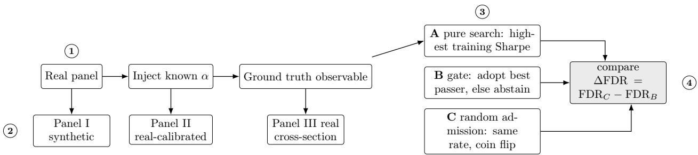
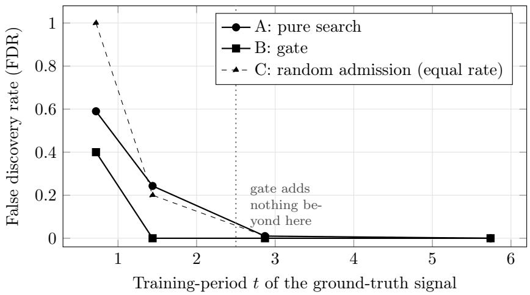
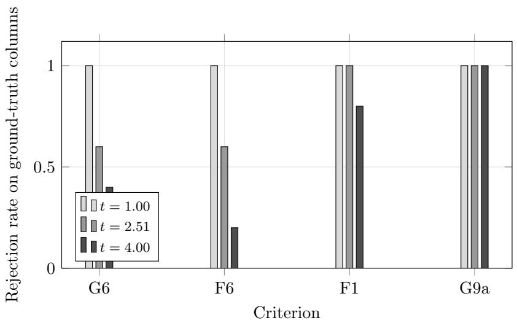

# On the Boundary of Admission Gates: An Injected-Truth Study of Falsification-First Selection in Quantitative Strategy Research

Tianlun Zheng∗

Fudan University

October 2026

## Abstract

Strategy research conflates two problems: finding a profitable rule, and establishing that the finding is not search luck. The latter calls for admission gates—statistical criteria that must be satisfied before a conclusion is adopted—yet whether gates work, and at what cost, remains untested. We introduce an injected-truth protocol with a random-admission control that adopts at the same rate as the gate; only if the gate beats this control does it carry information rather than merely raise a threshold. Across synthetic and real-calibrated panels, gates eliminate false discoveries in the weak-signal regime but cut adoption to 1–7%, and add nothing when signals are strong. Most importantly, criteria computed on absolute rather than excess returns silently reject every candidate, including true signals.

Keywords: multiple testing, backtest overfitting, strategy admission, injected-truth validation, excess returns, false discovery rate

## 1 Introduction

## 1.1 Two kinds of failure

Data-driven strategy research fails in two qualitatively diferent ways. Type I failure is not finding: search is ineficient and genuine signals remain undiscovered. Type II failure is finding something false: after searching many candidates on a finite sample, noise is mistaken for signal. The statistical root of Type II failure is elementary—when one tests N strategies and reports the best, the reported statistic is not any single strategy’s performance but an extreme value—but its consequences are not.

## 1.2 The engineering response, and what it assumes

Practitioners and automated research systems respond by inserting admission gates: a set of criteria that a conclusion must satisfy before it is adopted. Current agentic pipelines instantiate this as multi-stage funnels. Wang et al. (2026) report a 92% elimination rate across information-coeficient (IC) screening, correlation filtering, deduplication, and backtesting; Tang et al. (2025) enforce originality, hypothesis–factor alignment, and complexity control; MinervaScore (2026) compose four established validation statistics into a robustness grade. The idea is natural. It is also largely untested, and two pitfalls follow.

Conservatism is not efectiveness. Gates usually manifest as adopting less. Without a contro one cannot distinguish a gate that carries information from one that simply raised a threshold. A high elimination rate does not settle the question: random elimination at the same rate might do equally well.

A gate can fail without announcing it. MinervaScore (2026) calibrate their score on 359,062 production backtests, yet in their pre-registered real-market test it showed no significant forward relationship (Spearman $\rho _ { s } = 0 . 0 1 3 , p = 0 . 4 0 )$ ; the authors describe it as “an auditable validation and reporting layer, rather than evidence of demonstrated real-market predictability.” Having gates is not the same as gates being efective.

## 1.3 Contributions

We ask when admission gates are useful and at what cost, using an injected-truth protocol in which known signals are embedded so that ground truth is observable. Its essential component is a random-admission control that adopts at the same rate as the gate but by coin flip, separating “carries information” from “is more conservative.” Our contributions:

1. A reproducible evaluation protocol for admission gates, including the equal-adoption-rate control (§3.4).

2. An empirical boundary: gates help for training-period t < 2.5 and are pure overhead beyond it; the cost is quantified in adoption rate and recall (§5).

3. A necessary condition: criteria must be evaluated on excess returns. On absolute returns they systematically and silently reject every candidate, including a ground-truth signal with t = 4.0 (§5.3).

4. Honest negatives: a redundant sample-size criterion, failed control designs, and a task morphology in which gates are unhelpful (§5.4–5.5).

Why it matters. Every automated research pipeline that admits conclusions must decide when to stop believing its own output. Gates are the instrument that decision rests on, yet their efectiveness is typically assumed rather than measured—and the one published calibration of such an instrument reported a null forward result (MinervaScore, 2026). If gates are weaker than assumed, the pipelines that rely on them inherit an unbounded false-discovery risk; if they are merely conservative, those pipelines silently discard real findings. Neither failure is visible from the outside, which is what makes the question worth measuring.

We do not claim that gates increase returns, nor that our implementation improves on prior work.

## 2 Related Work

Our paper sits at the intersection of four literatures, and belongs to none of them. We state the branch explicitly in §2.5.

## 2.1 The replication crisis, quantified in finance

Ioannidis (2005) argued that for most study designs the probability that a claimed finding is true is below one half, driven by small samples, small efects, and the number of relationships probed. Finance supplies unusually clean measurements of the same phenomenon. McLean and Pontif (2016) tracked 97 published cross-sectional predictors and found returns 26% lower out-of-sample and 58% lower post-publication. Harvey et al. (2016) showed that after accounting for the number of factors tried, a newly claimed factor needs $t > 3 . 0$ , not 2.0. Hou et al. (2020) re-ran 452 published anomalies: 65% fail a single $| t | \geq 1 . 9 6$ hurdle, rising to 82% under the multiple-testing hurdle of 2.78. This literature establishes that Type II failure is not hypothetical—it is the modal outcome in this field.

## 2.2 Statistical machinery for data snooping

The corrective tools are also mature. Lo and MacKinlay (1990) documented data-snooping bias in asset-pricing tests; Brock et al. (1992) provided the canonical technical-rule study that later work used to quantify snooping; Sullivan et al. (1999) evaluated trading rules by bootstrap against the full universe they were drawn from. White (2000) formalised the Reality Check and Hansen (2005) refined it into the Superior Predictive Ability test. Bailey and López de Prado (2014) introduced the deflated Sharpe ratio, and Bailey et al. (2016) the probability of backtest overfitting; Harvey and Liu (2015) showed the appropriate Sharpe deflation is non-linear in the strategy’s own statistics. We use the DSR (Bailey and López de Prado, 2014) directly as one of our four criteria.

## 2.3 Robustness scoring and admission in practice

A recent line composes these statistics into deployable instruments: MinervaScore (2026) aggregate DSR, PBO, SPA and minimum track record length into a display score; Sheppert (2026) embeds anti-overfitting terms directly into the optimisation objective. Both operate post hoc on a completed backtest. Our question is diferent in kind: not “how robust is this result?” but “does the rule that decides whether to accept a result actually work, and what does it cost?” The distinction matters because a scoring function’s output is only as useful as the decision rule that consumes it.

## 2.4 Agentic alpha mining and automated research

Automated pipelines attack Type I failure. Xiao et al. (2024) simulate trading-firm organisation with debating analyst agents; Wang et al. (2026) add a memory loop that distils successful and failed mining attempts; Han et al. (2026) evolve whole mining trajectories; Tang et al. (2025) constrain generation by abstract-syntax originality and hypothesis alignment, and have been published at KDD ’25; Kou et al. (2024) combine LLM factor generation with multi-agent evaluation. AlphaSeek (2026) pursue trajectory-level self-iteration. In the broader automated-research literature, Chen et al. (2026) survey 1,250 papers and observe that demonstrated self-improvement tracks a verification hierarchy—formal verifiers > execution feedback > learned judges > intrinsic self-assessment—while Zhao et al. (2026) close the loop on an agent’s own code. Our criteria sit at the execution feedback level of that hierarchy.

## 2.5 Where this paper sits

Table 1 states the positioning. Concretely, the paper belongs to the methodology branch of the replication literature (§2.1–2.2): it takes that branch’s diagnosis as given, and instead of measuring how often findings fail, it tests the instrument practitioners built in response. Relative to robustness scoring (§2.3) we change the object of study from a score to a decision rule, and relative to agentic mining (§2.4) our contribution is orthogonal and composable: gates can serve as the admission layer of those pipelines, and a search-eficiency improvement does not by itself make admission more reliable.

Table 1: Positioning. This paper belongs to the methodology branch of the replication literature, applied at admission time inside an automated research loop.
<table><tr><td></td><td>Replication lit.</td><td>Robustness scoring</td><td>Agentic mining</td><td>alpha This paper</td></tr><tr><td>Question</td><td>Are published find- ings true?</td><td>How robust is this backtest?</td><td>How to find more alpha?</td><td>Are the gates effective, and at what cost?</td></tr><tr><td>Unit of analysis</td><td>Published factor</td><td>One backtest</td><td>completed Candidate factor</td><td>A candidate deci- sion At admission</td></tr><tr><td>When applied</td><td>Post hoc, after pub- lication</td><td>Post hoc, before At search time deployment</td><td></td><td>time, inside the loop</td></tr><tr><td>Output</td><td></td><td></td><td>Failure / FDR rates A robustness grade Factors and weights</td><td>Aneffectiveness boundary</td></tr><tr><td>Typical method</td><td>Surveys, replica- tions</td><td>tics</td><td>Composite statis- LLM agents, evolu- tion</td><td>Injected truth 十 random- admission control</td></tr></table>

## 3 Method

## 3.1 Admission decision

Let round k propose a candidate $c _ { k }$ with evidence $E _ { k }$ . The admission decision is $\mathcal { A } ( c _ { k } , E _ { k } )  v _ { k } \in$ {adopt, pending, reject, invalid}, where pending denotes not detected (insuficient power) and is strictly distinguished from reject (evidence against). Our experiments use three outcomes: adopt, abstain, and false adoption.

## 3.2 Criteria

We use four criteria (Table 2).

## 3.3 A necessary condition: criteria on excess returns

Write strategy j’s return on day t as ${ r _ { j t } } = { w _ { t } } + { \varepsilon } _ { j t }$ , where $w _ { t }$ is the benchmark return and $\varepsilon _ { j t }$ the strategy-specific part. Total volatility is inflated by the market component, $\sigma ( r _ { j } ) \gtrsim \sigma ( w )$ , whereas true discernibility depends on $\alpha / \sigma ( \varepsilon )$ , not on $\alpha / \sigma ( r _ { j } )$

If criteria are evaluated on absolute returns while market volatility dominates—in our panels $\sigma ( w ) = 0 . 0 2 0 8$ versus $\sigma ( \varepsilon ) = 0 . 0 0 7 \cdot$ —then the absolute Sharpe of every candidate, including the ground-truth one, lies inside the noise band and all four criteria fail. The correction is to evaluate every criterion on the excess return $x _ { j t } = r _ { j t } - w _ { t } ; $ for the DSR this is the information ratio. We take $w _ { t }$ to be the equal-weighted panel return.

Table 2: Admission criteria used in this study.
<table><tr><td>Criterion</td><td>Definition</td><td>Analogue</td></tr><tr><td>bility</td><td>G6 sub-period sta- Four sub-periods of the training window; at least three Parameter have positive mean F6 leave-one-trade- After removing the best five trading days, the mean</td><td>plateau Single-event-</td></tr><tr><td>out</td><td>remains positive</td><td>carry check Falsification</td></tr><tr><td>F1 sample size</td><td> $n \geq N ^ { * } , \ N ^ { * } = \lceil ( 2 \sigma / \mu ) ^ { 2 } \rceil$ </td><td>threshold</td></tr><tr><td></td><td>G9a multiple test- Deflated Sharpe ratio ≥ 0.95 given  $N _ { \mathrm { t r i a l s } } = 4 0$ </td><td>Trial-count de-</td></tr><tr><td>ing</td><td></td><td>flation(Bailey and López de</td></tr></table>

## 3.4 Arms and controls

Table 3 lists the four arms. Arm C is the key control: with adoption rates aligned, a criterion carries information if and only if $\Delta \mathrm { F D R } = \mathrm { F D R } _ { C } - \mathrm { F D R } _ { B } > 0$ . If $\Delta \mathrm { F D R } \approx 0$ , the gate is merely a stricter threshold.

Table 3: Experimental arms. Arm C separates information from conservatism.
<table><tr><td>Arm Rule</td><td></td><td>Purpose</td></tr><tr><td>A</td><td>Pure search</td><td>Adopt the candidate with the highest training- period Sharpe (current practice).</td></tr><tr><td>B</td><td>Gate</td><td>Among candidates passing all four criteria, adopt the highest training Sharpe; abstain if none pass (method under evaluation).</td></tr><tr><td>C</td><td></td><td>Random admission Adopt arm A&#x27;s choice with probability p, otherwise abstain; p tuned so that C&#x27;s adoption rate matches B&#x27;s (identifies “effective&quot; vs. “&quot;merely conservative&quot;).</td></tr><tr><td>B′</td><td>Gate without F1</td><td>Arm B with the sample-size criterion removed (ab- lation).</td></tr></table>

Control design iterations. Our first two designs for arm C were invalid. A Sharpe-quantile threshold always leaves the training-period winner inside the passing set, so “take the best passer” is identical to arm A—confirmed empirically, with identical FDR at every α. “Randomly keep k, then take the best” always adopts for $k \geq 1$ , so its adoption rate is identically one and cannot be aligned. A valid control must be able to abstain and have a tunable adoption rate.

## 4 Experimental Setup

Figure 1 summarises the protocol.

## 4.1 Data and power pre-check

We use a panel of 29 A-share ETFs (745 return points, backward-adjusted); Table 4 reports its statistics. Before designing any portfolio-level comparison we compute the smallest detectable efect. A leg with a 30-day minimum holding period yields at most 10–13 trades over the 322-day training window, whereas $N ^ { * }$ is 93 trades for $\mu = 1 . 2 5 \% , \sigma = 6 \%$ and 576 for $\mu = 0 . 5 \%$ . Portfolio-level comparison is therefore undecidable here—resolving it would require roughly 37 years of data— which is precisely why the injected-truth design is needed (Appendix A lists the reproduction commands).

  
Figure 1: The injected-truth protocol, in four numbered steps: (1) inject a known efect so that ground truth becomes observable; (2) instantiate it in one of three panel families; (3) apply three arms to the same candidate set—arm C adopts at the same rate as arm B but by coin flip; (4) compare. Only if $\Delta \mathrm { F D R } > 0$ does the gate carry information rather than merely being more conservative.

Table 4: Real panel statistics and power pre-check.
<table><tr><td>Panel statistic</td><td>Value</td><td>Power item</td></tr><tr><td>Daily standard deviation</td><td>0.02075</td><td>Training window: 322 days</td></tr><tr><td>Kurtosis (normal = 3)</td><td>7.84</td><td>Trades per leg (upper bound): 10–13</td></tr><tr><td>First-order autocorrelation</td><td>+0.021</td><td> $N ^ { * } ~ ( \mu = 1 . 2 5 \% )$  : 93 trades</td></tr><tr><td>Mean cross-sectional correlation</td><td>+0.504</td><td> $N ^ { \ast } ~ ( \mu = 0 . 5 \% ) ;$  576 trades</td></tr></table>

## 4.2 Panels

Panel I (synthetic, independent candidates). T = 750 (training 322), N = 40 candidates of which $K = 5$ are ground truth. Noise $\mathcal { N } ( 0 , \sigma ^ { 2 } ) , \ \sigma \ = \ 0 . 0 1$ ; ground-truth columns receive a constant $\alpha \in \{ 0 . 0 0 0 4 , 0 . 0 0 0 8 , 0 . 0 0 1 6 , 0 . 0 0 3 2 \}$ (annualized 10.1%–80.6%). 400 repetitions per setting; $N \in \{ 2 0 , 4 0 , 8 0 \}$ for sensitivity.

Panel II (real-calibrated strategy family). The benchmark series is the equal-weighted return of the real panel, preserving fat tails and volatility clustering; strategy-specific noise $\sigma _ { \varepsilon } \ \in \ \{ 0 . 0 0 7 , 0 . 0 0 4 \}$ implies inter-strategy correlations of roughly 0.89 and 0.96. Ground-truth columns receive α calibrated relative to $\sigma _ { \varepsilon }$ so that the intended t-statistics are actually attained.

Panel III (real cross-section, counter-example). The 29 real ETFs are themselves treated as candidates, i.e. an asset-selection task (§5.5).

Metrics: FDR = share of false among adopted; hit rate = share of runs adopting a ground-truth signal; abstention rate = 1− adoption rate.

  
Figure 2: Panel I (400 repetitions). Pure search errs on $2 4 \% - 5 9 \%$ of weak-signal adoptions; the gate drives FDR to zero but only below $t \approx 2 . 5$ . To the right of the dotted line the gate is pure overhead: pure search barely errs and gating only lowers the adoption rate (Table 5).

## 5 Results and Analysis

## 5.1 Panel I: help when signals are weak, overhead when they are strong

Table 5: Panel I (synthetic, independent candidates), 400 repetitions.
<table><tr><td>α (ann.)</td><td>train t</td><td>A FDR</td><td>B adopt</td><td>B FDR</td><td>C FDR</td><td>∆FDR</td><td>Verdict</td></tr><tr><td>10.1%</td><td>0.72</td><td>0.590</td><td>0.017</td><td>0.400</td><td>1.000</td><td>+0.600</td><td>effective</td></tr><tr><td>20.2%</td><td>1.44</td><td>0.243</td><td>0.047</td><td>0.000</td><td>0.200</td><td>+0.200</td><td>effective</td></tr><tr><td>40.3%</td><td>2.87</td><td>0.010</td><td>0.603</td><td>0.000</td><td>0.010</td><td>+0.010</td><td>indistinguishable</td></tr><tr><td>80.6%</td><td>5.74</td><td>0.000</td><td>1.000</td><td>0.000</td><td>0.000</td><td>+0.000</td><td>indistinguishable</td></tr></table>

Figure 2 plots the same result as a curve: In the weak regime pure search’s FDR is $2 4 \% - 5 9 \% ;$ gates reduce it to zero at the cost of an adoption rate of $1 . 7 \% { - } 4 . 7 \%$ . For training $t > 2 . 5$ , pure search already errs essentially never $( \mathrm { F D R } \leq 1 \% )$ and gates add no value while lowering the adoption rate.

## 5.2 Panel II: stable across data source and correlation structure

Table 6 reports both correlation levels. The real-calibrated panel reproduces the morphology of the synthetic one: in the weak regime arm A’s FDR is 18%–42% while arm B’s is $\approx 0 .$ with abstention of 93%–99%. The conclusion is therefore not an artifact of the i.i.d. assumption. Holding t = 1.44 fixed, ∆FDR for $N \in \{ 2 0 , 4 0 , 8 0 \}$ is $+ 0 . 2 5 0 , \ + 0 . 2 0 0 , \ + 0 . 3 1 7 - \mathrm { a l l }$ positive, so neither candidate count nor ground-truth share changes the direction of the result.

## 5.3 Diagnostic experiment: the excess-return requirement

Before the correction of Section 3.3, arm B abstained 100% of the time even at $t = 4 . 0$ . Figure 3 and Table 7 give per-criterion rejection rates for ground-truth columns and identifies the cause: under absolute returns the market component dominates total volatility and compresses the efective tstatistic by roughly a factor of three, so the DSR never passes. After the correction, arm B at t = 4.0 attains a hit rate of 98.3% while keeping FDR at zero.

Table 6: Panel II (real-calibrated strategy family), 400 repetitions each.
<table><tr><td>(corr.)  $\sigma _ { \varepsilon }$ </td><td>t</td><td>A FDR</td><td>B adopt</td><td>B FDR</td><td>B hit</td><td>B abstain</td></tr><tr><td>0.007 (≈ 0.89)</td><td>1.00</td><td>0.388</td><td>0.012</td><td>0.000</td><td>0.013</td><td>0.988</td></tr><tr><td>0.007</td><td>1.51</td><td>0.188</td><td>0.073</td><td>0.034</td><td>0.070</td><td>0.927</td></tr><tr><td>0.007</td><td>2.51</td><td>0.020</td><td>0.387</td><td>0.000</td><td>0.388</td><td>0.613</td></tr><tr><td>0.007</td><td>4.00</td><td>0.003</td><td>0.982</td><td>0.000</td><td>0.983</td><td>0.018</td></tr><tr><td>0.004 (≈ 0.96)</td><td>0.99</td><td>0.415</td><td>0.017</td><td>0.000</td><td>0.018</td><td>0.983</td></tr><tr><td>0.004</td><td>1.53</td><td>0.182</td><td>0.068</td><td>0.000</td><td>0.068</td><td>0.932</td></tr><tr><td>0.004</td><td>2.51</td><td>0.018</td><td>0.395</td><td>0.000</td><td>0.395</td><td>0.605</td></tr><tr><td>0.004</td><td>3.99</td><td>0.000</td><td>0.987</td><td>0.000</td><td>0.988</td><td>0.013</td></tr></table>

  
Figure 3: Per-criterion rejection rate on ground-truth columns before the excess-return correction. The DSR rejects a true signal 100% of the time at every strength: under absolute returns the market component inflates volatility and compresses the efective t-statistic by roughly a factor of three.

Finding (central). The failure is silent: it presents as “the framework found nothing,” easily misread as “the candidates are poor.” Any gate framework should define criteria on excess returns and, at deployment, print per-criterion rejection rates for ground-truth versus noise columns.

## 5.4 Ablation: the sample-size criterion is redundant

Across the three Panel I settings, arm $\mathrm { B ^ { \prime } }$ and arm B produce bit-identical results: the $N ^ { * }$ criterion is fully covered by the DSR in this regime. This does not establish that $N ^ { * }$ is useless—when trials are few and single-run sample size binds, it may still be necessary—but it is reported as a negative ablation result.

## 5.5 Task morphology matters

Treating the 29 real ETFs as candidates (Panel III), arm A attains a 100% hit rate and FDR = 0 at every signal strength, while gates only cause missed opportunities. The cause is the 0.504 mean cross-sectional correlation: assets receiving injected α systematically outperform the rest, so

Table 7: Per-criterion rejection rate for ground-truth columns (pre-correction), Panel II.
<table><tr><td>Criterion</td><td> $t = 1 . 0 0$   $t = 2 . 5 1$ </td><td> $t = 4 . 0 0$ </td></tr><tr><td>G6 sub-period stability</td><td>1.00</td><td>0.60 0.40</td></tr><tr><td>F6 leave-one-trade-out</td><td>1.00</td><td>0.60 0.20</td></tr><tr><td>F1 sample size  $( N ^ { * } )$ </td><td>1.00</td><td>1.00 0.80</td></tr><tr><td>G9a DSR</td><td>1.00</td><td>1.00 1.00</td></tr></table>

the training-period winner is necessarily a ground-truth signal. An injected-truth protocol must match the candidate structure of the task under study, or one may wrongly conclude that gates are harmful.

## 6 Discussion

## 6.1 What gates are for

Our results position admission gates as a precision device, not a return device. Use them when the candidate count is large, the training window is limited, and the cost of a wrong adoption exceeds the cost of a miss—for example when capital is at stake. Do not use them when the signal is already strong (training t > 2.5), where they only reduce the adoption rate.

The result resonates with the replication literature. Ioannidis (2005) notes that a finding is less likely to be true when efect sizes are small and many relationships are probed—the regime in which our gates help. Conversely Harvey et al. (2016) and Hou et al. (2020) document that failures concentrate in exactly the marginal cases our gates reject. Gates are therefore best understood as implementing, at decision time, the multiple-testing discipline this literature prescribes after the fact.

## 6.2 Relation to prior work

Section 2 positions this paper; two points bear emphasis here. First, relative to robustness scoring (MinervaScore, 2026; Sheppert, 2026) we change the object of study from a score to a decision rule, and the excess-return requirement (§3.3) applies to those scores as much as to ours. Second, relative to agentic mining (Wang et al., 2026; Han et al., 2026; Tang et al., 2025; Kou et al., 2024; AlphaSeek, 2026) our contribution is composable: gates can serve as their admission layer, and improved search eficiency does not by itself make admission more reliable.

## 6.3 Limitations

1. Synthetic component. Ground truth is injected as a constant efect; real alpha decay and regime dependence are more complex. Panel II uses real return series as the common factor—preserving kurtosis 7.84 and cross-correlation 0.504—and reproduces the synthetic morphology, which mitigates but does not eliminate the concern.

2. Single market, single asset class (A-share ETFs, 29 assets / 745 points).

3. Incomplete criterion set. Diference-trade auditing, selection degree-of-freedom diagnostics, and PBO/SPA are implemented in the framework but not exercised here.

4. Thresholds are not calibrated. The DSR level of 0.95 and the $2 \sigma / \mu$ coeficient follow prior choices; their sensitivity is not scanned.

5. Abstention has no utility model. Abstention is recorded as “not adopted” without an explicit trade-of between the cost of a miss and the cost of a wrong adoption.

## 6.4 Future work

Introduce an explicit utility function to ground thresholds in decision theory; extend the protocol to PBO/SPA and diference-trade auditing to map criterion redundancy; repeat across markets and asset classes; and apply it to audit the admission stages of published methods.

## 7 Conclusion

We tested whether admission gates in quantitative research are efective, using an injected-truth protocol on synthetic independent candidates and on strategy-family panels calibrated to a real ETF panel. Gates carry genuine information—at equal adoption rates their false discovery rate is well below that of random admission (∆FDR 0.10–0.60), so they are not merely a stricter threshold. But the value has a boundary: it materialises only for training t < 2.5, at the cost of an adoption rate of 1%–7%; beyond t ≈ 2.5 pure search sufices and gating is pure overhead. Criteria must be defined on excess returns, or they silently reject all candidates. A sample-size criterion proved redundant here, and in an asset-selection morphology the gates were unhelpful.

In one sentence: admission gates increase decisional precision at a substantial cost in recall. Treating them as return enhancers is a category error; treating them as a conservative decision device under uncertainty—and validating, with the control protocol above, that they beat random admission at the same adoption rate—is their correct role.

## A Reproducibility

Every number in this paper is reproducible from the accompanying artefacts:

python3 exp1\_injected\_gate\_efficacy.py --reps 400   
python3 exp1\_injected\_gate\_efficacy.py --reps 300 \   
--n-cand 20 --k-true 5 --alphas 0.0008   
python3 exp2\_real\_based\_validation.py --reps 400 \   
--panel-kind strategy --sigma-e 0.007 \   
--alphas 0.00039 0.00059 0.00098 0.00156   
python3 exp2\_real\_based\_validation.py --reps 400 \   
--panel-kind strategy --sigma-e 0.004 \   
--alphas 0.00022 0.00034 0.00056 0.00089   
python3 exp2\_real\_based\_validation.py --reps 300 \   
--panel-kind asset \   
--alphas 0.00116 0.00174 0.00289 0.00463

Data anchor: etf\_panel\_ts.frozen-20260930.json (29 ETFs, 746 days, backward-adjusted). Results are written to \*\_results.json.

## References

W. Brock, J. Lakonishok, and B. LeBaron. Simple technical trading rules and the stochastic properties of stock returns. The Journal of Finance, 47(5):1731–1764, 1992.

D. H. Bailey and M. López de Prado. The deflated Sharpe ratio: Correcting for selection bias, backtest overfitting, and non-normality. The Journal of Portfolio Management, 40(5):94–107, 2014. DOI: 10.3905/jpm.2014.40.5.094.

D. H. Bailey, J. M. Borwein, M. López de Prado, and Q. J. Zhu. The probability of backtest overfitting. Journal of Computational Finance, 20(4), 2016.

P. R. Hansen. A test for superior predictive ability. Journal of Business & Economic Statistics, 23(4):365–380, 2005.

C. R. Harvey and Y. Liu. Backtesting. The Journal of Portfolio Management, 42(1), 2015. (Page ranges in secondary sources difer, 12–28 versus 13–28; verify against the publisher record.)

C. R. Harvey, Y. Liu, and H. Zhu. . . . and the cross-section of expected returns. The Review of Financial Studies, 29(1):5–68, 2016. DOI: 10.1093/rfs/hhv059.

K. Hou, C. Xue, and L. Zhang. Replicating anomalies. The Review of Financial Studies, 33(5):2019– 2133, 2020. DOI: 10.1093/rfs/hhy131.

J. P. A. Ioannidis. Why most published research findings are false. PLoS Medicine, 2(8):e124, 2005. DOI: 10.1371/journal.pmed.0020124.

A. W. Lo and A. C. MacKinlay. Data-snooping biases in tests of financial asset pricing models. The Review of Financial Studies, 3(3):431–467, 1990.

R. D. McLean and J. Pontif. Does academic research destroy stock return predictability? The Journal of Finance, 71(1):5–32, 2016. DOI: 10.1111/jofi.12365.

R. Sullivan, A. Timmermann, and H. White. Data-snooping, technical trading rule performance, and the bootstrap. The Journal of Finance, 54(5):1647–1691, 1999. DOI: 10.1111/0022-1082.00163.

H. White. A reality check for data snooping. Econometrica, 68(5):1097–1126, 2000.

Z. Tang, Z. Chen, J. Yang, J. Mai, Y. Zheng, K. Wang, J. Chen, and L. Lin. AlphaAgent: LLM-driven alpha mining with regularized exploration to counteract alpha decay. In Proc. 31st ACM SIGKDD Conf. (KDD ’25), V.2, Toronto, Canada, August 2025. arXiv:2502.16789; DOI: 10.1145/3711896.3736838.

Y. Xiao, E. Sun, D. Luo, and W. Wang. TradingAgents: Multi-agents LLM financial trading framework. arXiv preprint arXiv:2412.20138, 2024.

FactorMiner: A memory-augmented, self-evolving agent for alpha factor mining. arXiv preprint arXiv:2602.14670, 2026.

J. Han, S. Zhang, W. Li, and et al. QuantaAlpha: An evolutionary framework for LLM-driven alpha mining. arXiv preprint arXiv:2602.07085, 2026.

Z. Kou, H. Yu, J. Luo, and et al. Automate strategy finding with LLM in quant investment. arXiv preprint arXiv:2409.06289, 2024.

Equity strategy backtesting: Luck or edge? The MinervaScore as a statistical robustness grade. arXiv preprint arXiv:2608.23808, 2026.

A. P. Sheppert. The GT-Score: A robust objective function for reducing overfitting in data-driven trading strategies. arXiv preprint arXiv:2602.00080, 2026.

M. Chen, L. Wang, and B. Qu. Recursive self-improvement in AI: From bounded self-refinement to autonomous research loops. arXiv preprint arXiv:2607.07663, 2026.

B. Zhao, Z. Jiang, Y. Wu, D. Srikanth, and D. Xu. Recursive self-improvement of AI research agents. arXiv preprint arXiv:2609.26457, 2026.

AlphaSeek: Trajectory-level self-iterative factor mining framework for multi-source financial data. arXiv preprint arXiv:2608.13913, 2026.