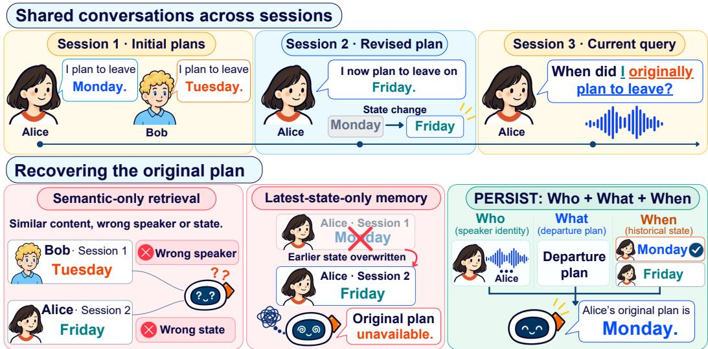
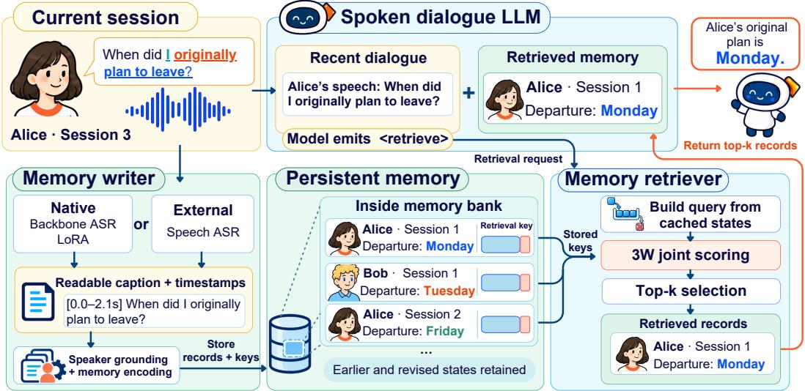
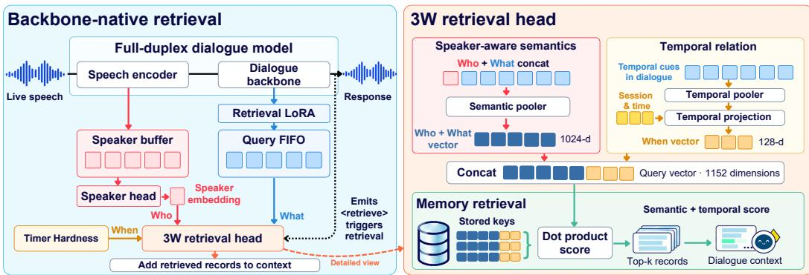

# PERSIST: Who-What-When Memory Across Sessions for Full-Duplex Spoken Dialogue

Achira Lin1,∗ Siyuan Hou1,∗ Wenyi Yu1 Xinnian Zhao1 Haoyu Niu1

Gengwang2 Longshuai Xiao2 Shihai Xiao2 Mangsuo Zhao1 Chao Zhang1,†

1Tsinghua University 2Huawei Technologies Ltd.

∗Equal contribution. †Corresponding author: cz277@tsinghua.edu.cn

## ABSTRACT

Modern voice assistants may be shared by multiple users and should be able to answer questions about earlier conversations such as “When did I originally plan to leave?” or adapt their behavior to individual users based on past interactions. This requires more than retrieving a topically similar passage: the assistant must identify the current speaker, recover the relevant past state, and distinguish it from later revisions. We present PERSIST, a persistent memory system for multisession, multi-speaker spoken dialogue that explicitly models Who, What, and When. PERSIST structures cross-session histories into readable event records and retrieves them with a 3W joint scoring mechanism that combines semantic content, acoustic speaker identity, and temporal state. For real-time full-duplex interaction, PERSIST further reuses intermediate representations from the dialogue backbone, avoiding query-audio re-encoding and reducing retrieval latency from 578.42 ms to 7.03 ms. We also introduce SpokenTrace, a diagnostic benchmark that factorizes evaluation along memory tasks and speaker-query types, exposing failures in recall, speaker attribution, and temporal-state tracking. On SpokenTrace, PERSIST achieves 85.08% end-to-end task accuracy and improves all-support EM@3 from 49.01% with BGE-large to 82.10%.

## 1 INTRODUCTION

Persistent long-term memory is fundamental for conversational agents to maintain continuity, adapt to individual users, and preserve evolving context across multi-session interactions. While textbased long-term memory has been widely explored (Packer et al., 2024; Xu et al., 2025; Chhikara et al., 2025), extending persistent memory to spoken dialogue requires grounding these evolving conversational states in acoustic speaker identities across sessions. In scenarios such as collaborative meetings, family assistance, or group planning, plans and commitments continually evolve as different participants contribute updates, revisions, or counter-proposals over time. Consequently, an effective spoken memory system must retrieve not only what was said, but also who said it and when the relevant state was active.

Existing spoken memory systems commonly rely on semantic retrieval or structured fact updates, both of which face limitations in dynamic multi-speaker scenarios (Figure 1). Semantic retrieval (Zulfikar et al., 2024) can recover topically relevant content but may fail to distinguish between different speakers or temporal states when similar information recurs across participants or sessions. Structured fact-updating mechanisms (Xie et al., 2026), by contrast, often prioritize the latest state and may overwrite earlier states needed for retrospective queries. These limitations motivate memory retrieval that jointly considers Who, What, and When, rather than treating speaker and time merely as filtering metadata.

To bridge this gap, we present PERSIST, a persistent memory system for multi-session, multi-speaker spoken dialogue that explicitly models Who (speaker identity), What (semantic content), and When (temporal state). PERSIST structures cross-session histories into readable event records and retrieves them with a 3W joint scoring mechanism that combines semantic content, acoustic speaker identity, and temporal state. This memory problem becomes particularly demanding in full-duplex spoken dialogue (Défossez et al., 2024). Continuous, simultaneous listening and speaking rapidly exhaust the active context, making persistent memory increasingly important, while natural conversational flow places a tight latency budget on memory retrieval. To meet these dual demands, we instantiate PERSIST’s backbone-native path within SALMONN-omni (Yu et al., 2025). By reusing intermediate acoustic features and hidden states already computed during forward generation, PERSIST avoids re-encoding query audio at retrieval time, reducing memory-retrieval latency to 7.03 ms.

  
Figure 1: Motivation and failure modes of existing speech memory paradigms under dynamic multi-speaker dialogue.

Evaluating persistent, speaker-attributed memory requires benchmarks that jointly assess multisession history, speaker identity, and temporal state evolution. While existing benchmarks explore long-term recall in text (Maharana et al., 2024; Wu et al., 2025), multi-party information updating (Hu et al., 2026; Yang et al., 2026), or spoken dialogue memory (Sun et al., 2026; Xie et al., 2026), none systematically isolate how cross-session acoustic speaker grounding interacts with temporal-state retrieval. To fill this gap, we introduce SPOKENTRACE, which factorizes evaluation along two complementary axes—memory tasks and speaker-query types—to separately and jointly diagnose memory retrieval, speaker attribution, and temporal tracking. On SpokenTrace, PERSIST achieves an end-to-end task accuracy of 85.08% and improves all-support EM@3 from 49.01% with BGE-large to 82.10%.

## Our primary contributions are summarized as follows:

• Problem Characterization: We characterize the joint requirements of semantic-content retrieval, speaker attribution, and temporal-state retrieval in multi-session spoken dialogue.

• The PERSIST Framework: We introduce PERSIST, which writes readable, speaker- and time-grounded event records and retrieves them with 3W joint scoring over Who, What, and When. For real-time full-duplex interaction, PERSIST reuses dialogue-backbone representations to avoid redundant query-audio encoding, reducing retrieval latency to 7.03 ms.

• The SPOKENTRACE Benchmark: We design and release SPOKENTRACE, a multi-session diagnostic benchmark that orthogonally evaluates speaker attribution, temporal state evolution, and memory recall, providing a standardized evaluation testbed for long-term spoken dialogue agents.

## 2 PERSIST: A WHO-WHAT-WHEN MEMORY FRAMEWORK

## 2.1 FRAMEWORK OVERVIEW

A spoken-dialogue assistant equipped with PERSIST uses two complementary forms of memory: a short-term active context for ongoing interaction and a long-term persistent store for conversational history. The active context gives the dialogue model direct access to recent turns, while the persistent store preserves readable conversational records beyond the current context and across sessions. At a high level, PERSIST performs two core operations: writing speaker- and time-grounded conversational events into persistent memory, and retrieving them through Who-What-When matching.

  
Figure 2: PERSIST system overview. The memory writer continuously converts speech spans into readable memory records that persist beyond the active context and across sessions. When the dialogue model emits the special token <retrieve>, the retriever encodes a query and scores it against stored keys using semantic, speaker, and temporal information. The top-k records are then incorporated into the model’s short-term active context for response generation.

The memory interface is independent of how records are produced. In this work, we instantiate PERSIST with two writing paths: a backbone-native path that reuses intermediate representations from the dialogue model, and a plug-and-play external path based on a speaker-attributed speech recognition system. Both paths produce the same readable event-record format and share the same speaker grounding, persistent storage, and 3W retrieval pipeline.

## 2.2 WHO-WHAT-WHEN RETRIEVAL AND FULL-DUPLEX MEMORY ACCESS

Full-duplex models must process incoming speech while generating responses and handling interruptions or corrections, causing interaction history to accumulate continuously and consume the limited active context. At the same time, memory retrieval must remain fast enough not to disrupt real-time interaction. We therefore instantiate PERSIST within SALMONN-omni, using full-duplex speech interaction as a demanding real-time setting while keeping the memory interface independent of the underlying interaction mode. Figure 3 illustrates how the backbone-native implementation writes speaker- and time-aware memory representations and retrieves relevant records from them.

Retrieval trigger. We make retrieval a native action of the dialogue model, just as a full-duplex model determines when to begin speaking. This avoids adding a separate decision model and its inference step to the response path, which could increase latency. Following the model-emitted retrieval-token approach of Self-RAG (Asai et al., 2024), we train the dialogue model to emit <retrieve> when answering requires information beyond the active context. The token triggers memory retrieval, and the retrieved captions are added to the context before generation continues.

Retrieval encoding. To meet the full-duplex latency constraint described above, we use a retrievalspecific LoRA on the shared dialogue backbone to adapt its representations for query–memory matching. Because the retrieval route computes query states incrementally, we cache its most recent 128 hidden states from decoder layer 19 in a FIFO buffer. When retrieval is triggered, the retrieval head constructs the query from these cached states without reprocessing the dialogue history.

  
Figure 3: Backbone-native implementation of PERSIST. During memory writing (lower route), an ASR-specific LoRA first generates a readable caption for each completed speech span, which the backbone then encodes into a semantic representation using retrieval-specific LoRA. A speaker head extracts speaker embeddings from intermediate speech-encoder features cached in the Speaker Buffer. Finally, the Semantic–Temporal Pooler fuses the speaker-aware semantic representation with temporal features to form a 1,152-dimensional memory vector, which is stored alongside its caption in the CPU memory store. During retrieval (upper route), recent speech representations are incrementally cached in a Query FIFO (first-in, first-out) buffer. When the dialogue model emits the retrieval trigger, the Semantic-Temporal Pooler combines the cached representations, the speaker embedding extracted from the Speaker Buffer, and temporal information to form a 1,152-dimensional query vector. Inner-product top-k search ranks the stored memory vectors and returns their corresponding captions to the dialogue context.

Let q denote the current query and i index a candidate memory. We use $\mathbf { H } _ { x }$ for the hidden-state sequence associated with $x \in \{ q , i \} \colon \mathbf { H } _ { q }$ contains the cached query states, while H contains the encoded states of memory caption i. Each sequence has the form $\mathbf { H } _ { x } \in \mathbb { R } ^ { N _ { x } \times 4 0 9 6 }$ , where $N _ { x }$ is its number of states.

To let retrieval jointly account for semantic content, speaker identity, and temporal information, we represent each query and memory as a 1,152-dimensional vector comprising a 1,024-dimensional semantic component and a 128-dimensional temporal component.

In our formulation, Who is incorporated into speaker-conditioned semantic matching, while When contributes an explicit temporal component. For the semantic component, let $\mathbf { e } _ { x } ^ { \mathrm { s p k } }$ denote the speaker embedding for $x \in \{ q , i \}$ . We prepend it to the corresponding content states as an additional token, allowing the pooled representation to encode both what was said and who said it. The concatenated state matrix has shape $\widetilde { \mathbf { H } } _ { x } \in \mathbb { R } ^ { ( N _ { x } + 1 ) \times 4 0 9 6 }$ . We use a shared semantic attention pooler $P _ { \mathrm { s e m } }$ to map the resulting states to 1024-dimensional vectors, which we L2-normalize so that their inner product reflects cosine similarity rather than vector magnitude:

$$
\begin{array} { r l r l } & { \widetilde { \mathbf { H } } _ { x } } & & { = \mathrm { C o n c a t } _ { \mathrm { t o k } } ( \mathbf { e } _ { x } ^ { \mathrm { s p k } } , \mathbf { H } _ { x } ) , \qquad x \in \{ q , i \} , } \\ & { \mathbf { q } _ { \mathrm { s e m } } } & & { = \mathrm { n o r m } ( P _ { \mathrm { s e m } } ( \widetilde { \mathbf { H } } _ { q } ) ) , } \\ & { \mathbf { k } _ { i , \mathrm { s e m } } } & & { = \mathrm { n o r m } ( P _ { \mathrm { s e m } } ( \widetilde { \mathbf { H } } _ { i } ) ) , } \end{array}\tag{1}
$$

where norm $( \mathbf { v } ) = \mathbf { v } / \| \mathbf { v } \| _ { 2 }$ .

For the temporal component, we encode time separately from semantic content, following temporal conditioning in TempRetriever (Abdallah et al., 2025) and temporal subspaces in TMRL (Huynh et al., 2026). The query and memory encodings are asymmetric: a memory’s temporal key represents when the event occurred, while the query’s content indicates the temporal relation being requested. Accordingly, we derive each memory’s temporal key directly from its session and time features. On the query side, a temporal pooler aggregates the states in $\mathbf { H } _ { q }$ to capture the requested temporal relation.

Let $s _ { x }$ and $t _ { x }$ denote the session index and session-relative time of query or memory $x ,$ respectively.   
We map them to fixed six-dimensional features $\mathbf { f } ( s _ { x } , t _ { x } )$ , with $[ \cdot ; \cdot ]$ denoting feature concatenation.

Here, $P _ { \mathrm { t i m e } }$ is a temporal attention pooler, and $W _ { a } ^ { \mathrm { t i m e } }$ and $W _ { k } ^ { \mathrm { t i m e } }$ denote learned query and memory mappings, respectively. We apply $\phi ( \mathbf { x } ) = \mathbf { x } / ( 1 + \| \mathbf { x } \| _ { 2 } )$ to bound the temporal representations before scoring:

$$
\begin{array} { r l r } { \mathbf { q } _ { \mathrm { t i m e } } } & { { } } & { = \phi \big ( W _ { q } ^ { \mathrm { t i m e } } [ P _ { \mathrm { t i m e } } ( \mathbf { H } _ { q } ) ; \mathbf { f } ( s _ { q } , t _ { q } ) ] \big ) , } \end{array}\tag{2}
$$

$$
\begin{array} { r l } { \mathbf { k } _ { i , \mathrm { t i m e } } } & { { } = \phi \bigl ( W _ { k } ^ { \mathrm { t i m e } } \mathbf { f } ( s _ { i } , t _ { i } ) \bigr ) . } \end{array}
$$

Finally, we concatenate the semantic and temporal components without further normalization:

$$
\mathbf { q } = [ \mathbf { q } _ { \mathrm { s e m } } ; \mathbf { q } _ { \mathrm { t i m e } } ] , \qquad \mathbf { k } _ { i } = [ \mathbf { k } _ { i , \mathrm { s e m } } ; \mathbf { k } _ { i , \mathrm { t i m e } } ] .\tag{3}
$$

The retrieval score is therefore

$$
r _ { i } = \mathbf { q } ^ { \top } \mathbf { k } _ { i } = \mathbf { q } _ { \mathrm { s e m } } ^ { \top } \mathbf { k } _ { i , \mathrm { s e m } } + \mathbf { q } _ { \mathrm { t i m e } } ^ { \top } \mathbf { k } _ { i , \mathrm { t i m e } } .\tag{4}
$$

## 3 SPOKENTRACE: A DIAGNOSTIC BENCHMARK FOR MULTI-SESSION WHO-WHAT-WHEN MEMORY

We introduce SpokenTrace, a benchmark that evaluates whether speech agents can recover Who said What and When across multi-session, multi-speaker conversations by resolving speaker references, recalling past information, and tracking how facts evolve over time.

## 3.1 BENCHMARK DESIGN

Each episode contains two historical dialogue sessions followed by a short current session containing a spoken query. The histories contain recurring speakers, revisited topics, and facts that may be introduced, revised, or revisited across sessions. Answering a query can therefore require identifying not only relevant content, but also whose statement it is, when it occurred, and which state of the information is being requested.

To systematically evaluate these abilities and their combinations, we organize queries along two complementary annotation axes. The first dimension, memory task, specifies the operation required by the query. The six history-dependent tasks are direct recall, temporal localization, latest-state retrieval, historical-state retrieval, change comparison, and multi-hop reasoning. The second, speaker-query type, specifies how the query relates to speaker identity: it may be speaker-independent, refer to the current speaker through first-person expressions, refer to another participant by name, or ask the agent to identify a speaker from a fact or action. Together, these two axes disentangle memory reasoning from speaker grounding, while their combination tests whether agents can resolve speaker references correctly across different memory operations. For example, “When did I originally plan to leave?” requires both identifying the current speaker in the dialogue history and recovering the departure plan before it was revised.

We also include current-only queries, which can be answered from the current session, and missingevidence queries, for which neither the historical sessions nor the current session provides supporting evidence. These controls test whether agents can answer using current information and avoid unsupported recall when evidence is absent.

Appendix B describes how the dataset is constructed and reports the number of queries in each task category, along with the sizes of the training, validation, and evaluation splits.

## 3.2 EVALUATION PROTOCOL

We evaluate systems at two levels: evidence retrieval and end-to-end answering. The former measures recovery of annotated supporting evidence, while the latter measures whether the system answers the query correctly.

Evidence retrieval. The 1,200 evaluation episodes are partitioned into scenario-balanced candidate pools, with an average of 4,331 candidate records per pool. Each pool contains all historical records from its constituent episodes. Retrieval is evaluated using annotated memory records on the 1,106 queries that require historical evidence, with annotated supporting utterances treated as positives; current-only and missing-evidence queries are excluded.

We report Recall@1/3/5 and all-support EM@3/5. Recall@k measures the mean fraction of annotated supporting utterances recovered per query among the top-k results, while all-support EM@k measures the proportion of queries for which all annotated supporting utterances appear in the top-k results. Formal metric definitions are provided in Appendix E.2.

End-to-end answering. End-to-end evaluation uses the same candidate-pool partition and historical scope, with memory records produced by each system’s writer as described in Section 4. All 1,200 evaluation queries are included in the end-to-end evaluation. We report strict accuracy using GPT-4.1-mini as an automatic judge (Zheng et al., 2023). Each response is assessed against the query, reference answer, and annotated evidence under task- and speaker-query-specific grading criteria, and is classified as correct, partial, or incorrect. Only correct responses count toward strict accuracy. The complete grading rubric and implementation details are provided in Appendix E.1.

## 4 EXPERIMENTS

We evaluate PERSIST from four perspectives: end-to-end conversational memory, Who-What-When retrieval, memory-writing quality, and full-duplex retrieval efficiency. We first evaluate the complete system on SpokenTrace, then analyze the retrieval and writing components separately.

## 4.1 TRAINING AND IMPLEMENTATION DETAILS

System variants. We evaluate two implementations of PERSIST. PERSIST-NATIVE uses the backbone-native memory transcript branch, the speaker head, and persistent retriever described in Section 2. PERSIST-EXTERNAL replaces only the transcript branch with VibeVoice-ASR, while speaker-grounding, retrieval, and dialogue components remain fixed. This comparison isolates the effect of native versus plug-and-play memory writing on downstream performance.

Native memory transcript branch. The transcript branch is initialized from the dialogue model by splitting after decoder layer 8 and copying the remaining 24 decoder layers into a dedicated memory branch. Only branch-specific LoRA parameters, a lightweight token adapter, and the branch normalization are optimized, while the shared speech encoder and dialogue backbone remain frozen. Training proceeds through timestamped ASR pretraining on GigaSpeech (Chen et al., 2021) and CommonVoice (Ardila et al., 2019), full-duplex conversational SFT on dialogues derived from Natural Questions and TriviaQA (Joshi et al., 2017), and GRPO adaptation on the SPOKENTRACE training set using model-generated streaming history.

Training and inference use the same incremental transcription protocol. Every 30 seconds, the branch receives up to 120 seconds of cached split-layer representations and recent committed transcripts, and generates only newly completed utterances with timestamps, without re-encoding the earlier audio.

Speaker grounding. For each timestamped transcript segment, a lightweight speaker head combines hidden states from layers 5, 7, and 8 of the frozen speech encoder through learned layer mixing and attentive statistics pooling. It produces a normalized, 4096-dimensional speaker embedding. The speaker head is trained on speaker-disjoint CommonVoice segments. These embeddings are matched online against a persistent speaker memory, which is initialized from registered speakers when available and updated as new observations arrive. Detailed speaker-head training and online assignment procedures are provided in Appendix D.2.

Retriever training. Training consists of two stages. Stage 1 learns general audio-to-text retrieval using 196,929 prepared examples from MS MARCO, QReCC, and TopiOCQA. Query speech is synthesized with CosyVoice, with voices sampled from a bank of 2,338 speakers. Stage 2 adapts the retriever to conversational memory using the SpokenTrace training split. Detailed training hyperparameters are provided in Appendix D.

The training pipeline uses a combination of source-provided negatives, BM25 candidates, neighboring conversational evidence, and dense false positives mined during training. For conversational adaptation, each query is contrasted against all historical memories in its episode, together with cross-rank negatives and explicitly selected hard negatives, including memories with similar or identical content but incorrect speakers or temporal states.

## 4.2 END-TO-END CONVERSATIONAL MEMORY

We first evaluate whether persistent Who-What-When memory improves end-to-end performance on SpokenTrace using the strict answer accuracy defined in Section 3.2. We compare two configurations of PERSIST: PERSIST-NATIVE, which uses the backbone-native transcription branch, and PERSIST-EXTERNAL, which replaces this branch with VibeVoice-ASR (Peng et al., 2026). Both configurations share the same speaker-grounding module, retriever, and dialogue model. To compare retrieval methods under the same memory-writing configuration, we additionally replace the PERSIST retriever in the external configuration with BGE-large-en-v1.5 or BM25.

We also evaluate two reference conditions using the same dialogue model. Empty answers using only the current-session context, without retrieved historical records. Gold supplies three chronologically ordered memory records containing the annotated supporting evidence whenever retrieval is triggered. These conditions assess performance without historical memory and with oracle evidence, respectively.

Table 1: Strict answer accuracy (%) by memory task on SpokenTrace. PERSIST-EXTERNAL (External), BGE, and BM25 use VibeVoice-ASR transcripts with the PERSIST, BGE, and BM25 retrievers, respectively. PERSIST-NATIVE (Native) uses the backbone-native transcription branch and PERSIST retriever. Empty and Gold assess performance without historical memory and with oracle evidence, respectively.
<table><tr><td>Memory task</td><td>Queries</td><td>Gold</td><td>Empty</td><td>External</td><td>Native</td><td>BGE</td><td>BM25</td></tr><tr><td>Direct recall</td><td>194</td><td>96.39</td><td>1.55</td><td>85.57</td><td>64.95</td><td>82.99</td><td>80.93</td></tr><tr><td>Historical state</td><td>197</td><td>99.49</td><td>1.02</td><td>87.31</td><td>72.08</td><td>49.75</td><td>58.88</td></tr><tr><td>Latest state</td><td>200</td><td>97.00</td><td>0.00</td><td>82.00</td><td>65.00</td><td>42.00</td><td>47.00</td></tr><tr><td>Change comparison</td><td>203</td><td>94.58</td><td>3.45</td><td>75.86</td><td>56.65</td><td>30.05</td><td>33.50</td></tr><tr><td>Multi-hop composition</td><td>133</td><td>96.99</td><td>0.00</td><td>75.19</td><td>61.65</td><td>25.56</td><td>33.08</td></tr><tr><td>Temporal localization</td><td>179</td><td>98.32</td><td>68.72</td><td>97.21</td><td>96.65</td><td>95.53</td><td>93.85</td></tr><tr><td>Current-only control</td><td>40</td><td>97.50</td><td>97.50</td><td>97.50</td><td>97.50</td><td>97.50</td><td>97.50</td></tr><tr><td>Missing evidence</td><td>54</td><td>100.00</td><td>100.00</td><td>96.30</td><td>100.00</td><td>100.00</td><td>100.00</td></tr><tr><td>Overall</td><td>1200</td><td>97.25</td><td>19.00</td><td>85.08</td><td>71.75</td><td>58.50</td><td>61.67</td></tr></table>

Table 1 shows that PERSIST-EXTERNAL achieves 85.08% accuracy, outperforming BM25 (61.67%) and BGE (58.50%) with the same transcripts. Gains are larger on state retrieval (historical and latest), change comparison, and multi-hop composition than on direct recall, for which content-based retrieval is often sufficient. PERSIST-NATIVE reaches 71.75%, highlighting the impact of memory-writing quality. Although Empty reaches 68.72% on temporal localization, where answers lie in a small session-label space, it achieves only 1.29% across the other five history-dependent tasks, compared with 96.87% for Gold. The external writer yields the highest end-to-end accuracy due to the much larger training corpus used in building VibeVoice-ASR, while the native configuration evaluates the fully backbone-integrated realization used for low-latency full-duplex deployment; both share the same speaker grounding and 3W retrieval formulation.

## 4.3 WHO-WHAT-WHEN MEMORY RETRIEVAL

We follow the scenario-balanced retrieval protocol defined in Section 3.2. We compare BM25 (Robertson & Zaragoza, 2009), BGE-large-en-v1.5 (Xiao et al., 2023), and PERSIST. To assess the contribution of explicit temporal scoring, we also evaluate the same trained PERSIST model with its temporal score disabled at inference.

Table 2 shows that PERSIST outperforms BM25 and BGE across all reported metrics, achieving 82.10% all-support EM@3. Disabling temporal scoring reduces EM@3 to 80.20% and R@1 from 66.14% to 62.84%, indicating that the explicit temporal component further improves retrieval.

Table 2: Memory retrieval results (%) for BM25, BGE, and PERSIST on history-dependent queries in SpokenTrace. PERSIST w/o temporal score disables temporal scoring at inference. R@k denotes recall, and EM@k measures complete recovery of the annotated supporting evidence.
<table><tr><td>Retriever</td><td>R@1</td><td>R@3</td><td>R@5</td><td>EM@3</td><td>EM@5</td></tr><tr><td>BM25</td><td>47.60</td><td>60.90</td><td>64.87</td><td>54.16</td><td>58.50</td></tr><tr><td>BGE-large-en-v1.5</td><td>44.39</td><td>55.97</td><td>59.00</td><td>49.01</td><td>51.81</td></tr><tr><td>PERSIST w/o temporal</td><td>62.84</td><td>85.08</td><td>91.18</td><td>80.20</td><td>87.79</td></tr><tr><td>PERSIST</td><td>66.14</td><td>87.07</td><td>92.95</td><td>82.10</td><td>89.51</td></tr></table>

Table 3: Retrieval results (%) by memory task: (a) Recall@1 on single-evidence tasks; (b) recall and all-support exact match on two-evidence tasks. “No temporal” denotes PERSIST with temporal scoring disabled at inference. Bold indicates the best score for each task and metric.  
(a) Single-evidence tasks: R@1.
<table><tr><td>Task</td><td></td><td>Queries BM25</td><td></td><td>BGE No temporal PERSIST</td><td></td></tr><tr><td>Direct recall</td><td>194</td><td>80.93 79.38</td><td></td><td>83.51</td><td>84.02</td></tr><tr><td>Latest state</td><td>200</td><td>24.5023.00</td><td></td><td>72.50</td><td>74.00</td></tr><tr><td>Historical state</td><td>197</td><td>36.55 28.43</td><td></td><td>73.10</td><td>80.20</td></tr><tr><td>Temporal localization</td><td>179</td><td>86.0388.27</td><td></td><td>78.77</td><td>83.80</td></tr></table>

Results by memory task. For single-evidence tasks, Recall@1 measures whether the supporting record is ranked first. For two-evidence tasks, Recall@3/5 and all-support EM@3/5 measure partial and complete evidence recovery, respectively.

(b) Two-evidence tasks.
<table><tr><td>Retriever</td><td>R@3 R@5 EM@3 EM@5</td></tr><tr><td colspan="2">Change comparison (n = 203) BM25 32.7636.95 24.63 29.06 BGE 27.34 31.53 17.73 21.67 No temporal 78.0888.42 63.55 80.30</td></tr><tr><td colspan="2">PERSIŠT 77.34 88.92 64.04 81.28</td></tr><tr><td colspan="2">Multi-hop composition (n 133) 18.05</td></tr><tr><td colspan="2">BM25 56.3959.02 12.78</td></tr><tr><td colspan="2">BGE 45.4946.99 2.26</td></tr><tr><td colspan="2">2.26 No temporal 53.01 63.91 34.59 48.12</td></tr><tr><td colspan="2">PERSIST 58.6573.31 37.59 56.39</td></tr><tr><td colspan="2"></td></tr></table>

The gains from temporal scoring vary across tasks. Recall@1 improves only slightly on direct recall (83.51% to 84.02%), but more substantially on historical-state retrieval (73.10% to 80.20%). Temporal localization also improves from 78.77% to 83.80%, although BGE remains stronger at 88.27%. This task asks when an event occurred; retrieving the event by its content and then reading its timestamp can be sufficient.

On two-evidence tasks, PERSIST achieves higher all-support EM@3 than BM25 and BGE, reaching 64.04% on change comparison and 37.59% on multi-hop composition. Temporal scoring provides a larger EM@3 improvement on multi-hop composition (34.59% to 37.59%) than on change comparison (63.55% to 64.04%).

## Results by speaker-query type.

PERSIST achieves the highest EM@3 across all four query types, with particularly large gains on self-to-fact queries (Table 4).

To test the contribution of acoustic speaker identity, we construct 397 gold–counterfactual pairs across 290 first-person queries. Each counterfactual replaces only the speaker token with another speaker’s token from the same episode. PERSIST assigns a higher score to the record with the correct speaker in 96.47% of pairs, demonstrating sensitivity to speaker identity with text, names, and timestamps held fixed. Adding these counterfactuals to the candidate pools reduces R@1 by only 1.38 percentage points, from 60.00% to 58.62%.

Table 4: Speaker-aware retrieval (%).  
Top: EM@3 by query type.  
Bottom: PERSIST’s counterfactual results.
<table><tr><td>Query type</td><td>BM25</td><td>BGE</td><td>PERSIST</td></tr><tr><td>Self-to-fact Person-to-fact Fact-to-person</td><td>25.52 68.47 74.34</td><td>17.24 69.15 68.30 41.80</td><td>79.66 88.47 75.85 83.98</td></tr><tr><td colspan="4">Speaker-independent 49.22 Counterfactual test</td></tr><tr><td colspan="4">Gold preferred over counterfactual</td></tr><tr><td colspan="4">R@1: original candidates</td></tr><tr><td colspan="4">R@1: with counterfactuals</td></tr></table>

Together with the temporal-score ablation (Table 3), these results provide complementary evidence for the two components: temporal scoring improves historical-state retrieval, while acoustic speaker identity influences ranking even when textual and temporal cues are held fixed.

## 4.4 MEMORY WRITING

We evaluate memory writing on held-out full-duplex conversational SFT data in the single-speaker setting and on SPOKENTRACE in the multi-speaker setting. We report WER and temporal IoU in both settings, cpWER for multi-speaker transcription, and Spk-W Acc, Pair-F1, and New-Spk F1 for speaker grounding.

Table 5: Memory-writing quality on single- and multi-speaker speech. We evaluate transcription and temporal alignment in both settings, and additionally evaluate speaker attribution and online identity assignment in the multi-speaker setting.
<table><tr><td rowspan="2">Model</td><td colspan="2">Single-speaker</td><td colspan="6">Multi-speaker</td></tr><tr><td>WER↓</td><td>IoU↑</td><td>WER↓ cpWER↓</td><td></td><td>IoU↑</td><td></td><td></td><td>Spk-W Acc↑ Pair-F1↑ New-Spk F1↑</td></tr><tr><td>VibeVoice-ASR</td><td>2.4%</td><td>98.9%</td><td>5.3%</td><td>6.8%</td><td>98.5%</td><td>99.7%</td><td>99.6%</td><td>97.8%</td></tr><tr><td>Native (Pre-trained)</td><td>38.4%</td><td>57.6%</td><td>51.9%</td><td>87.5%</td><td>62.3%</td><td>60.5%</td><td>53.3%</td><td>65.7%</td></tr><tr><td>+ SFT</td><td>11.7%</td><td>81.8%</td><td>35.1%</td><td>63.7%</td><td>71.8%</td><td>73.1%</td><td>73.5%</td><td>75.8%</td></tr><tr><td>+ GRPO</td><td>6.8%</td><td>87.5%</td><td>17.4%</td><td>41.6%</td><td>79.4%</td><td>80.4%</td><td>81.8%</td><td>83.3%</td></tr></table>

Table 5 shows that staged training reduces the native writer’s WER from 38.4% to 6.8% on singlespeaker speech and from 51.9% to 17.4% on multi-speaker speech. Beyond SFT, GRPO further improves multi-speaker cpWER from 63.7% to 41.6% and temporal IoU from 71.8% to 79.4%, benefiting both speaker-attributed transcription and temporal alignment.

Nevertheless, the native writer’s multi-speaker cpWER remains substantially higher than its WER (41.6% versus 17.4%), indicating persistent speaker-attribution errors. VibeVoice-ASR achieves lower cpWER (6.8%) and higher temporal IoU (98.5%) and Spk-W Acc (99.7%). This writing-quality gap is consistent with the end-to-end advantage of PERSIST-EXTERNAL over PERSIST-NATIVE (Table 1).

## 4.5 FULL-DUPLEX RETRIEVAL EFFICIENCY

Finally, we test whether PERSIST can meet the latency requirements of real-time full-duplex interaction. We profile 1,200 SpokenTrace queries on an Ascend 910B3 NPU (32 CPU threads), averaging the middle 1,000 requests. Retrieval is timed through top-3 return, excluding live dialogue; larger memory banks repeat caption vectors. By reusing speech representations, PERSIST reduces retrieval latency at 4,331 candidates from 578.42 ms (waveform recomputation) to 7.03 ms, a 98.8% reduction (Table 6).

Table 6: Mean retrieval latency (ms).
<table><tr><td>Method Latency (ms)</td></tr><tr><td>BM25 (text-ready) 15.26</td></tr><tr><td>BGE-large (text-ready) 27.94</td></tr><tr><td>Recompute from WAV 578.42</td></tr><tr><td>PERSIST (native, buffered) 7.03</td></tr></table>

## 5 CONCLUSION

In this work, we addressed the challenge of Who-What-When memory across sessions for spoken dialogue: retrieving not only what was said, but also who said it and which temporal state the query refers to. We presented PERSIST, a persistent memory architecture that stores readable conversational events and retrieves them with 3W joint scoring over semantic content, acoustic speaker identity, and temporal state. For real-time full-duplex interaction, PERSIST reuses intermediate dialogue-backbone representations to avoid redundant query-audio encoding, reducing retrieval latency from 578.42 ms to 7.03 ms. We also introduced SpokenTrace, a diagnostic benchmark that factorizes evaluation along memory tasks and speaker-query types. On SpokenTrace, PERSIST achieves 85.08% end-to-end task accuracy and improves all-support EM@3 to 82.10%. We hope PERSIST and SpokenTrace provide a foundation for persistent, speaker-aware, and temporally grounded memory in real-time spoken agents.

## AI USE STATEMENT

Generative AI tools were used to help organize the paper’s narrative, edit language, draft LaTeX, and discuss figure layouts. The authors reviewed the generated text against the implementation and primary literature, and will verify all experimental claims, citations, code, and artifacts before submission. The tools were not treated as an authority for scientific results. The authors take responsibility for the final content of this work, including text, claims, and artifacts produced with the aid of generative AI.

## ETHICS STATEMENT

Persistent conversational memory introduces privacy and consent risks beyond those of a session-only assistant. Any release or deployment should make memory collection visible, restrict records to the correct user and application, support inspection and deletion, and avoid interpreting a voice embedding as real-world identity. Dataset licenses, speaker consent, demographic coverage, and access controls will be documented with the final experiments.

## REPRODUCIBILITY STATEMENT

The final paper will specify the streaming schedule, layer indices, parameter accounting, data construction, speaker splits, hard-negative mining, trigger labels, all evaluation prompts, and the serving hardware used for latency and memory measurements. Code and configuration files will be included in anonymous supplementary material where policy permits.

## REFERENCES

Abdelrahman Abdallah, Bhawna Piryani, Jonas Wallat, Avishek Anand, and Adam Jatowt. Tempretriever: Fusion-based temporal dense passage retrieval for time-sensitive questions, 2025. URL https://arxiv.org/abs/2502.21024.

Rosana Ardila, Megan Branson, Kelly Davis, Michael Henretty, Michael Kohler, Josh Meyer, Reuben Morais, Lindsay Saunders, Francis M. Tyers, and Gregor Weber. Common voice: A massively-multilingual speech corpus. ArXiv, abs/1912.06670, 2019. URL https://api. semanticscholar.org/CorpusID:209376338.

Akari Asai, Zeqiu Wu, Yizhong Wang, Avirup Sil, and Hannaneh Hajishirzi. Self-RAG: Learning to retrieve, generate, and critique through self-reflection. In International Conference on Learning Representations, 2024. URL https://openreview.net/forum?id=hSyW5go0v8.

Guoguo Chen, Shuzhou Chai, Guan-Bo Wang, Jiayu Du, Weiqiang Zhang, Chao Weng, Dan Su, Daniel Povey, Jan Trmal, Junbo Zhang, Mingjie Jin, Sanjeev Khudanpur, Shinji Watanabe, Shuaijiang Zhao, Wei Zou, Xiangang Li, Xuchen Yao, Yongqing Wang, Yujun Wang, Zhao You, and Zhi-Yong Yan. Gigaspeech: An evolving, multi-domain asr corpus with 10, 000 hours of transcribed audio. ArXiv, abs/2106.06909, 2021. URL https://api.semanticscholar. org/CorpusID:235422086.

Yifu Chen, Shengpeng Ji, Haoxiao Wang, Ziqing Wang, Siyu Chen, Jinzheng He, Jin Xu, and Zhou Zhao. WavRAG: Audio-integrated retrieval augmented generation for spoken dialogue models. In Proceedings of the 63rd Annual Meeting of the Association for Computational Linguistics (Volume 1: Long Papers), pp. 12505–12523, 2025. doi: 10.18653/v1/2025.acl-long.613. URL https://aclanthology.org/2025.acl-long.613/.

Prateek Chhikara, Dev Khant, Saket Aryan, Taranjeet Singh, and Deshraj Yadav. Mem0: Building production-ready ai agents with scalable long-term memory, 2025. URL https://arxiv. org/abs/2504.19413.

Alexandre Défossez, Laurent Mazaré, Manu Orsini, Amélie Royer, Patrick Pérez, Hervé Jégou, Edouard Grave, and Neil Zeghidour. Moshi: A speech-text foundation model for real-time dialogue. arXiv preprint arXiv:2410.00037, 2024. URL https://arxiv.org/abs/2410.00037.

Zhihao Du, Yuxuan Wang, Qian Chen, Xian Shi, Xiang Lv, Tianyu Zhao, Zhifu Gao, Yexin Yang, Changfeng Gao, Hui Wang, Fan Yu, Huadai Liu, Zhengyan Sheng, Yue Gu, Chong Deng, Wen Wang, Shiliang Zhang, Zhijie Yan, and Jingren Zhou. Cosyvoice 2: Scalable streaming speech synthesis with large language models, 2024. URL https://arxiv.org/abs/2412.10117.

Chuanrui Hu, Tong Li, Xingze Gao, Hongda Chen, Yi Bai, Dannong Xu, Tianwei Lin, Xiaohong Li, Yunyun Han, Jian Pei, and Yafeng Deng. Evaluating long-horizon memory for multi-party collaborative dialogues, 2026. URL https://arxiv.org/abs/2602.01313.

Tuan-Luc Huynh, Weiqing Wang, Trung Le, Thuy-Trang Vu, Dragan Gaševic, Yuan-Fang Li, and´ Thanh-Toan Do. Efficient temporal-aware matryoshka adaptation for temporal information retrieval, 2026. URL https://arxiv.org/abs/2601.05549.

Mandar Joshi, Eunsol Choi, Daniel S. Weld, and Luke Zettlemoyer. Triviaqa: A large scale distantly supervised challenge dataset for reading comprehension. ArXiv, abs/1705.03551, 2017. URL https://api.semanticscholar.org/CorpusID:26501419.

Adyasha Maharana, Dong-Ho Lee, Sergey Tulyakov, Mohit Bansal, Francesco Barbieri, and Yuwei Fang. Evaluating very long-term conversational memory of LLM agents. In Lun-Wei Ku, Andre Martins, and Vivek Srikumar (eds.), Proceedings of the 62nd Annual Meeting of the Association for Computational Linguistics (Volume 1: Long Papers), pp. 13851–13870, Bangkok, Thailand, August 2024. Association for Computational Linguistics. doi: 10.18653/v1/2024.acl-long.747. URL https://aclanthology.org/2024.acl-long.747/.

Charles Packer, Sarah Wooders, Kevin Lin, Vivian Fang, Shishir G. Patil, Ion Stoica, and Joseph E. Gonzalez. Memgpt: Towards llms as operating systems, 2024. URL https://arxiv.org/ abs/2310.08560.

Vassil Panayotov, Guoguo Chen, Daniel Povey, and Sanjeev Khudanpur. Librispeech: An asr corpus based on public domain audio books. In Proc. ICASSP, 2015.

Zhiliang Peng, Jianwei Yu, Yaoyao Chang, Zilong Wang, Li Dong, Yingbo Hao, Yujie Tu, Chenyu Yang, Wenhui Wang, Songchen Xu, Yutao Sun, Hangbo Bao, Weijiang Xu, Yi Zhu, Zehua Wang, Ting Song, Yan Xia, Zewen Chi, Shaohan Huang, Liang Wang, Chuang Ding, Shuai Wang, Xie Chen, and Furu Wei. Vibevoice-asr technical report, 2026. URL https://arxiv.org/abs/ 2601.18184.

Stephen Robertson and Hugo Zaragoza. The probabilistic relevance framework: Bm25 and beyond. Foundations and Trends in Information Retrieval, 4(1-2):1–174, 09 2009. ISSN 1554-0669. doi: 10.1561/1500000019. URL https://doi.org/10.1561/1500000019.

Zhaokai Sun, Shuai Wang, Zhennan Lin, Chengyou Wang, Dehui Gao, Yuang Cao, Chunjiang He, Pan Zhou, and Lei Xie. Msu-bench: Towards speaker-centric understanding in conversational multi-speaker scenarios, 2026. URL https://arxiv.org/abs/2606.22868.

Shinji Watanabe, Michael Mandel, Jon Barker, Emmanuel Vincent, Ashish Arora, Xuankai Chang, Sanjeev Khudanpur, Vimal Manohar, Daniel Povey, Desh Raj, David Snyder, Aswin Shanmugam Subramanian, Jan Trmal, Bar Ben Yair, Christoph Boeddeker, Zhaoheng Ni, Yusuke Fujita, Shota Horiguchi, Naoyuki Kanda, Takuya Yoshioka, and Neville Ryant. Chime-6 challenge:tackling multispeaker speech recognition for unsegmented recordings, 2020. URL https://arxiv. org/abs/2004.09249.

Di Wu, Hongwei Wang, Wenhao Yu, Yuwei Zhang, Kai-Wei Chang, and Dong Yu. Longmemeval: Benchmarking chat assistants on long-term interactive memory, 2025. URL https://arxiv. org/abs/2410.10813.

Guangxuan Xiao, Yuandong Tian, Beidi Chen, Song Han, and Mike Lewis. Efficient streaming language models with attention sinks. In International Conference on Learning Representations, 2024. URL https://openreview.net/forum?id=NG7sS51zVF.

Shitao Xiao, Zheng Liu, Peitian Zhang, and Niklas Muennighoff. C-pack: Packaged resources to advance general chinese embedding, 2023.

Zhifei Xie, Jiaqi Lang, Ze An, Yifan Zhao, Dongchao Yang, Kai Li, Ziyang Ma, Mingbao Lin, Chunyan Miao, and Shuicheng Yan. Voicemem: Streaming dual-brain memory for real-time interaction, 2026. URL https://arxiv.org/abs/2608.26005.

Wujiang Xu, Zujie Liang, Kai Mei, Hang Gao, Juntao Tan, and Yongfeng Zhang. A-mem: Agentic memory for llm agents, 2025. URL https://arxiv.org/abs/2502.12110.

Jingbo Yang, Kwei-Herng Lai, Xiaowen Wang, Shiyu Chang, Yaar Harari, and Evgeniy Gabrilovich. Groupmembench: Benchmarking llm agent memory in multi-party conversations, 2026. URL https://arxiv.org/abs/2605.14498.

Wenyi Yu, Siyin Wang, Xiaoyu Yang, Xianzhao Chen, Xiaohai Tian, Jun Zhang, Guangzhi Sun, Lu Lu, Yuxuan Wang, and Chao Zhang. SALMONN-Omni: A standalone speech LLM without codec injection for full-duplex conversation. In Advances in Neural Information Processing Systems, 2025. URL https://arxiv.org/abs/2505.17060.

Lianmin Zheng, Wei-Lin Chiang, Ying Sheng, Siyuan Zhuang, Zhanghao Wu, Yonghao Zhuang, Zi Lin, Zhuohan Li, Dacheng Li, Eric P. Xing, Hao Zhang, Joseph E. Gonzalez, and Ion Stoica. Judging llm-as-a-judge with mt-bench and chatbot arena, 2023. URL https://arxiv.org/ abs/2306.05685.

Wazeer Deen Zulfikar, Samantha Chan, and Pattie Maes. Memoro: Using large language models to realize a concise interface for real-time memory augmentation. In Proceedings of the CHI Conference on Human Factors in Computing Systems, CHI ’24, pp. 1–18. ACM, May 2024. doi: 10.1145/3613904.3642450. URL http://dx.doi.org/10.1145/3613904.3642450.

## A RELATED WORK

Full-duplex speech models. Full-duplex systems model listening and speaking concurrently. Moshi jointly models user and system streams through audio tokens (Défossez et al., 2024), while SALMONN-Omni connects a streaming speech encoder and synthesizer to one codec-free language backbone (Yu et al., 2025). Our work studies what happens after this interaction model exceeds a finite session: we preserve its duplex path and expose memory-relevant information from the same hidden states.

Streaming context and persistence. StreamingLLM preserves fluency under a bounded sliding KV cache by retaining attention-sink tokens (Xiao et al., 2024). It motivates our treatment of the rapidly growing full-duplex context, but it solves a different problem from persistent memory: bounded streaming state neither restores semantically evicted evidence nor survives a new session. Our explicit caption store complements rather than replaces bounded-cache methods.

Explicit and lifelong memory. Our working KV cache is implicit and short-term, whereas the caption bank is explicit, online-updated, and cross-session. PERSIST studies this distinction through online speech-memory writing and retrieval. Our question is how a spoken agent can write, attribute, retrieve, and use explicit memory while preserving its live interaction behavior.

Retrieval with shared backbones. An explicit non-parametric index provides updatable evidence and provenance. Self-RAG learns reflection tokens that let one model retrieve and critique its generations (Asai et al., 2024), while WavRAG studies native-audio retrieval for external knowledge (Chen et al., 2025). We use these ideas as references for control-token routing and spoken-query encoding, but evaluate a different problem: retrieving attributed events from the agent’s own conversational history while reusing the live audio path.

Benchmarks for conversational memory. Existing speech and retrieval benchmarks typically isolate one capability: transcription, speaker recognition, text retrieval, or answer generation from a completed turn. They therefore do not test whether a system writes memory continuously, retrieves after a session reset, tracks changing facts, composes evidence across events, grounds different kinds of speaker queries, or avoids retrieving when evidence is current or absent. SpokenTrace varies these memory tasks and speaker relations independently over long-horizon event timelines. Its purpose is not to replace specialized metrics, but to expose the end-to-end failures that arise when they are composed in a full-duplex agent.

Table 7: Scenario coverage in SPOKENTRACE. Each domain contains eight subscenarios.
<table><tr><td>Work / Project</td><td>Media / Entertainment</td><td>Shared Living / Social</td></tr><tr><td>Speech/audio model research</td><td>Movie night</td><td>Shared apartment chores</td></tr><tr><td>Dataset collection study</td><td>TV-series club</td><td>Grocery/meal planning</td></tr><tr><td>Software/model release</td><td>Music listening</td><td>Restaurant choice</td></tr><tr><td>Paper/experiment coordination</td><td>Video review</td><td>Weekend activity</td></tr><tr><td>Prototype/demo preparation</td><td>Documentary discussion</td><td>Travel itinerary</td></tr><tr><td>Infrastructure migration</td><td>Podcast/video club</td><td>Household shopping</td></tr><tr><td>User study</td><td>Playlist curation</td><td>Social event</td></tr><tr><td>Benchmark/challenge preparation</td><td>Home screening</td><td>Errand coordination</td></tr></table>

## B SPOKENTRACE CONSTRUCTION AND DATASET DETAILS

## B.1 BENCHMARK CONSTRUCTION PIPELINE

Scenario coverage. SPOKENTRACE covers 24 conversational subscenarios grouped into three broad domains: work and project collaboration, media and entertainment, and shared living and social planning. Each domain contains eight subscenarios spanning different conversational settings and topics, as summarized in Table 7.

Plan-first episode specification. SPOKENTRACE is constructed using a plan-first generation pipeline in which the supervision for each episode is defined before the conversational dialogue is realized. A programmatic scheduler first selects the scenario, subscenario, memory task, semantic relation, and task-specific control variables. The corresponding task contract then defines a structured world state containing the benchmark-critical facts, their temporal and speaker relations, the gold answer, the supporting facts, and the query logic. For tasks involving updates or comparisons, the world state additionally specifies the relation between earlier and later fact states. This separation ensures that answers and supporting evidence are determined from the structured task specification rather than inferred post hoc from generated dialogue. Only benchmark-critical information is fixed at this stage; the dialogue generator is free to introduce noncritical conversational details for naturalness.

Historical dialogue realization. Each episode contains two historical sessions followed by a shorter current session. A programmatic blueprint assigns benchmark-critical facts to their designated historical sessions and distributes them across shorter conversational segments for generation. Each historical segment is generated from only its assigned facts and recent conversational context. Construction-only annotations, such as fact IDs and internal metadata, are not exposed to the dialogue generator and are maintained programmatically instead. Benchmark-critical facts are associated with canonical surface forms that are required to occur in their designated session, enabling unambiguous alignment between structured supporting facts and realized utterances. The remaining turns are generated freely to provide surrounding discussion, clarifications, and distractors. For tasks involving temporal state changes, later-state information is not exposed when the earlier historical session is generated, preventing future information from leaking into the earlier dialogue.

Current-session construction. The current session is generated after the two historical sessions. For history-dependent tasks, the dialogue generator receives only the information needed to produce the pre-query conversation and is not given the historical gold answer or its supporting evidence. After the pre-query dialogue is generated, the final benchmark query is appended programmatically according to the pre-specified task and target speaker. This keeps the query and query speaker fixed while preventing the current dialogue from leaking the historical answer.

Generation model routing. Rather than using a single language model for all stages, we use stage-specific model routing, fixed after pilot comparisons of generation quality for each component of the construction pipeline. GPT-5-mini-2025-08-07 is used to instantiate structured world states and to generate and repair benchmark questions. Conversational dialogue is realized using a mixture of Qwen3-30B-A3B-Instruct-2507 and GPT-5-mini-2025-08-07. For each episode, one dialogue model is selected and used throughout the episode, with sampling probabilities of 0.8 for Qwen3-30B-A3B-Instruct-2507 and 0.2 for GPT-5-mini-2025-08-07. The generated dialogue follows the prescribed session structure and benchmark facts, while the surrounding conversational content remains freely realized by the selected model.

## B.2 MEMORY TASKS AND SPEAKER-QUERY TYPES

Each query in SPOKENTRACE is annotated along two complementary axes: a memory task, which specifies what information must be recovered from the conversation history, and a speaker-query type, which specifies how the query refers to conversational participants. This factorization separates the reasoning required over conversational history from the way speaker identity enters the query. The two axes are defined separately for analysis, although their empirical distributions are not assumed to be statistically independent.

Memory tasks. We group queries into eight memory tasks according to the evidence required to answer them:

Table 8: Definitions of the eight memory tasks in SPOKENTRACE.
<table><tr><td>Task</td><td>Definition</td></tr><tr><td>Direct recall</td><td>Recover a fact stated in the historical conversation.</td></tr><tr><td>Temporal localization</td><td>Identify when, or in which historical session, a referenced fact or discussion occurred.</td></tr><tr><td>Latest state</td><td>Recover the most recent value of a fact after an earlier value has been updated or superseded.</td></tr><tr><td>Historical state</td><td>Recover an earlier value of a fact despite a later update being present in the history.</td></tr><tr><td>Change comparison</td><td>Recover both an earlier and a later state and describe how the fact changed between them.</td></tr><tr><td>Multi-hop</td><td>Combine information from multiple supporting records to derive the answer.</td></tr><tr><td>Current-only</td><td>Answer from information introduced in the current session rather than from persistent history.</td></tr><tr><td>Missing evidence</td><td>Recognize that the requested information is not supported by either the historical or current conversation.</td></tr></table>

These task definitions are enforced during benchmark construction by specifying the required supporting evidence before dialogue generation. Current-only and missing-evidence queries are included as controls: the former should be answered from the current context without relying on historical memory, whereas the latter contains no supporting evidence and requires the system to recognize that the requested information is unavailable.

Speaker-query types. Independently of the memory operation, queries are categorized by how they refer to speakers:

Among these categories, Self-to-Fact queries directly require cross-session acoustic speaker continuity: the system must associate the current speaker with that same participant’s historical speech. Person-to-Fact and Fact-to-Person queries use speaker references expressed in the conversation text, while Speaker-independent queries do not impose a speaker-specific constraint. Together, the two axes allow the benchmark to distinguish failures of conversational memory from failures of speaker grounding.

Table 9: Speaker-query types in SPOKENTRACE.
<table><tr><td>Type</td><td>Definition</td></tr><tr><td>Self-to-Fact</td><td>Speaker-independent The answer does not depend on identifying a particular participant. The current speaker refers to themself, requiring the system to recover</td></tr><tr><td>Person-to-Fact</td><td>that speaker&#x27;s historical information. The query explicitly refers to a person and asks for information associ-</td></tr><tr><td>Fact-to-Person</td><td>ated with that person. The query provides a fact or action and asks which participant it should be attributed to.</td></tr></table>

Table 10: Dataset splits of SPOKENTRACE. Episode counts denote the number of distinct multisession conversational histories represented in each split.
<table><tr><td>Split</td><td>Episodes</td><td>Queries</td></tr><tr><td>Training</td><td>9,119</td><td>27,985</td></tr><tr><td>Validation</td><td>1,013</td><td>3,185</td></tr><tr><td>Evaluation</td><td>1,200</td><td>1,200</td></tr></table>

## B.3 DATASET SPLITS AND STATISTICS

SPOKENTRACE is divided into training, validation, and evaluation splits. The training split contains episodes not used for validation or evaluation. For evaluation, we select one query from each of 1,200 episodes, yielding 1,200 evaluation queries. Table 10 summarizes the dataset sizes.

The evaluation set is constructed to cover the full range of memory demands and speaker references in the benchmark. As shown in Table 11, the four speaker-query types are exactly balanced with 300 queries each. The memory-task distribution covers all six history-dependent task families, with current-only and missing-evidence queries included as smaller control subsets. Overall, the evaluation set contains 1,200 queries across all eight memory tasks and four speaker-query types.

## B.4 SPEECH SYNTHESIS AND VOICE ASSIGNMENT

After constructing the textual episodes, we synthesize all dialogue utterances with CosyVoice2 (Du et al., 2024). Speaker references are drawn from LibriSpeech(Panayotov et al., 2015). For each reference speaker, we use one source utterance together with its transcript as the audio–text prompt for speech synthesis.

For each episode, the conversational participants are assigned distinct reference speakers. The participant–speaker mapping is fixed throughout the episode: the same participant uses the same reference speaker in both historical sessions and in the current session, while different participants use different speakers. This ensures that speaker identity remains acoustically consistent across sessions, allowing speaker-dependent memory queries to be resolved from the speech signal rather than from explicit textual speaker labels.

## B.5 QUALITY CONTROL AND AUDITS

Each generated episode undergoes both deterministic validation and semantic auditing before being included in the benchmark. The deterministic checks verify structural and annotation consistency, including session and query structure, realization of the prescribed benchmark facts, and consistency between each query, its gold answer, and its annotated supporting evidence. They also check for unintended information leakage, such as construction-only metadata appearing in the dialogue, future state information appearing in an earlier session, or the historical gold answer being exposed in the current pre-query context.

We then apply a task-specific semantic audit to the completed dialogue. This audit verifies that the generated conversation actually realizes the intended memory task and that the gold answer is supported by the prescribed evidence. For state-tracking tasks, it checks that earlier and later values have the intended temporal relation; for multi-hop queries, it verifies that the required supporting facts must genuinely be combined rather than allowing either one to answer the query alone. For current-only controls, the answer must be available from the current session while historical context contains only a stale alternative, whereas missing-evidence queries must remain unsupported by both historical and current dialogue. Speaker-dependent queries are also checked to ensure that the answer is uniquely determined only when the relevant cross-session speaker identity is available. Episodes that fail a hard deterministic or semantic check are regenerated or excluded.

Table 11: Task and speaker-query distributions in the SPOKENTRACE evaluation set.
<table><tr><td colspan="2">Memory task</td><td colspan="2">Speaker-query type</td></tr><tr><td>Type</td><td>Queries</td><td>Type</td><td>Queries</td></tr><tr><td>Direct recall</td><td>194</td><td>Speaker-independent</td><td>300</td></tr><tr><td>Temporal localization</td><td>179</td><td>Self-to-Fact</td><td>300</td></tr><tr><td>Latest state</td><td>200</td><td>Person-to-Fact</td><td>300</td></tr><tr><td>Historical state</td><td>197</td><td>Fact-to-Person</td><td>300</td></tr><tr><td>Change comparison</td><td>203</td><td></td><td></td></tr><tr><td>Multi-hop</td><td>133</td><td></td><td></td></tr><tr><td>Current-only</td><td>40</td><td></td><td></td></tr><tr><td>Missing evidence</td><td>54</td><td></td><td></td></tr></table>

## C PERSIST IMPLEMENTATION DETAILS

## C.1 MEMORY WRITER IMPLEMENTATIONS

Backbone-native writer. The backbone-native writer converts the ongoing speech stream into readable memory records without introducing a separate ASR encoder. It reuses intermediate speech representations already computed by SALMONN-Omni during regular full-duplex inference and applies an ASR-specific route with LoRA adapters over the final 24 decoder layers to produce utterance-level transcripts. The writer operates on cached backbone representations and commits only newly completed utterances, avoiding repeated encoding of previously processed audio. Each committed transcript is associated with its session and temporal span and is subsequently passed to the shared speaker-grounding and memory-encoding pipeline.

External writer. For the external configuration, we replace the native transcription route with VibeVoice-ASR (Peng et al., 2026). The resulting utterance transcripts follow the same memoryrecord interface and are processed by the same speaker-grounding, persistent storage, and retrieval components as in the backbone-native configuration. Thus, the two implementations differ only in how conversational speech is transcribed into readable records, while the downstream memory pipeline remains unchanged.

## C.2 SPEAKER GROUNDING AND PERSISTENT IDENTITY

Speaker representation. For each timestamped utterance segment, we reuse hidden states from layers 5, 7, and 8 of the SALMONN-Omni speech encoder rather than introducing a separate speaker encoder. A learned layer mixture followed by attentive statistics pooling produces a 4096-dimensional L2-normalized speaker embedding. Cosine similarity between these embeddings is used for online speaker matching. The same speaker representation is used to associate stored utterances with speaker identities and to provide speaker information for memory retrieval.

Persistent speaker assignment. We maintain a running centroid for each conversation-level speaker identity. For a newly observed utterance, its speaker embedding is compared with all existing centroids; it is assigned to the closest speaker when the maximum cosine similarity exceeds a threshold selected on the validation set, and a new speaker identity is created otherwise. When an existing speaker is selected, its centroid is updated by a duration-weighted mean of the previous centroid and the new embedding, followed by normalization. These identities persist across successive ASR windows and memory records.

## D TRAINING DETAILS

## D.1 NATIVE MEMORY WRITER TRAINING

The native memory writer is trained in three stages while the shared SALMONN-Omni speech encoder and dialogue backbone remain frozen. Timestamped ASR pretraining uses 50,517 GigaSpeech and 50,712 Common Voice examples (101,229 examples; approximately 3,374.3 hours). Conversational SFT then uses 219,628 multi-turn conversations constructed from Natural Questions and TriviaQA, with a 120-s input context. We train this stage for 10,000 steps with a global batch size of 32 and decay the learning rate from $5 \times 1 0 ^ { - 6 } t o 1 \times 1 0 ^ { - 6 }$ . Finally, GRPO is applied to 41,299 windows from the SPOKENTRACE training split (approximately 1,376.6 hours).

For GRPO, we define a transcription reward

$$
r _ { \mathrm { t e x t } } = 1 - { \frac { \mathrm { m i n } ( \mathrm { W E R } _ { \mathrm { s e s s i o n } } , 1 . 5 ) } { 1 . 5 } } ,
$$

Here, $\mathrm { W E R } _ { \mathrm { s e s s i o n } }$ is computed by concatenating the reference and generated transcripts from all windows up to the sampled target boundary. No cross-window deduplication is applied when computing this reward. The format reward $r _ { \mathrm { f o r m a t } }$ evaluates whether the output can be parsed into valid timestamped utterances with non-empty text and without abnormal special-token outputs. The temporal reward $r _ { \mathrm { t i m e } }$ measures timestamp IoU after matching predicted and reference utterances by text, allowing one-to-many and many-to-one matches.

We use a short curriculum for temporal optimization:

$$
r = \left\{ \begin{array} { l l } { 0 . 7 5 r _ { \mathrm { t e x t } } + 0 . 1 0 r _ { \mathrm { f o r m a t } } , } & { k < 1 0 0 , } \\ { 0 . 7 5 r _ { \mathrm { t e x t } } + 0 . 1 0 r _ { \mathrm { f o r m a t } } + 0 . 1 5 r _ { \mathrm { t i m e } } , } & { k \geq 1 0 0 , } \end{array} \right.
$$

where k denotes the GRPO optimization step. The final objective additionally retains supervised reference-token learning,

$$
\begin{array} { r } { \mathcal { L } = \mathcal { L } _ { \mathrm { G R P O } } + 0 . 2 \mathcal { L } _ { \mathrm { C E } } . } \end{array}
$$

For each GRPO target, we sample four responses with temperature 1.0, top- $\cdot p = 0 . 9 5$ , and a maximum generation length of 256 tokens. Training uses a global batch size of 16 for up to 3,000 steps, with the learning rate decayed from $5 \times 1 0 ^ { - 7 } \mathrm { t o } 1 \times \mathrm { \bar { 1 0 } ^ { - 7 } }$ . We use a clipping coefficient of $\epsilon = 0 . 2$ and no additional KL penalty or reference-model regularization. Only the ASR-specific LoRA and memory-writing branch parameters are updated.

## D.2 SPEAKER HEAD TRAINING

The speaker head is trained with the SALMONN-Omni speech encoder frozen. Training uses speakerbalanced batches of speech segments and jointly optimizes an additive angular-margin classification loss and a supervised contrastive loss,

$$
\mathcal { L } _ { \mathrm { s p k } } = \mathcal { L } _ { \mathrm { A A M } } + 0 . 1 \mathcal { L } _ { \mathrm { S u p C o n } } .
$$

Only the learned layer mixture and speaker-head parameters are updated. The operating threshold used for online speaker assignment is selected on the validation set and fixed before downstream evaluation.

## D.3 RETRIEVER TRAINING

## E EVALUATION DETAILS

## E.1 END-TO-END ANSWER EVALUATION

We evaluate end-to-end responses with GPT-4.1-mini-2025-04-14. For each query, the judge receives the question, reference answer, memory-task and speaker-query annotations, gold answer components, annotated supporting utterances, and the model response. The judge assigns one of three labels:

Table 12: Retriever training hyperparameters.
<table><tr><td>Hyperparameter</td><td>Stage 1</td><td>Stage 2</td></tr><tr><td>Optimizer</td><td>AdamW</td><td>AdamW</td></tr><tr><td>Retrieval-head learning rate</td><td> $3 \times 1 0 ^ { - 4 }$ </td><td> $1 0 ^ { - 4 }$ </td></tr><tr><td>Retrieval-LoRA learning rate</td><td> $1 0 ^ { - 4 }$ </td><td> $2 \times 1 0 ^ { - 5 }$ </td></tr><tr><td>Weight decay</td><td> $1 0 ^ { - 4 }$ </td><td> $1 0 ^ { - 4 }$ </td></tr><tr><td>Contrastive temperature</td><td>0.05</td><td>0.05</td></tr><tr><td>Accelerator ranks</td><td>8</td><td>8</td></tr><tr><td>Batch size per rank</td><td>8 queries</td><td>4 episodes</td></tr><tr><td>Global batch size</td><td>64 queries</td><td>32 episodes</td></tr><tr><td>Training epochs</td><td>10</td><td>5</td></tr><tr><td>Checkpoint selection</td><td>Val. R@3</td><td>Val. EM@5</td></tr></table>

correct, partial, or incorrect. A response is marked correct only when it provides all answer slots requested by the question with the correct factual content, speaker attribution, and temporal interpretation. Partial responses contain some correct required information but omit a required slot or mix a correct answer with a distinct incorrect alternative. Responses with an incorrect core fact, speaker, temporal state, or session, as well as unjustified abstention on answerable queries, are marked incorrect.

Grading follows the semantics of each memory task rather than requiring lexical agreement with the reference. In particular, latest-state and historical-state queries require only the requested state, changecomparison queries require both states when the change itself is requested, temporal-localization queries require the correct session or order, and multi-hop queries require all answer slots explicitly requested by the question. For missing-evidence queries, an explicit statement that the requested information is unavailable is considered correct, whereas a specific unsupported guess is incorrect. For speaker-conditioned queries, only the speaker- or fact-specific answer slots requested by the question are required; contextual facts used only to identify the target are not additionally required.

We apply a small set of deterministic safeguards before final scoring. Normalized exact matches to an accepted reference answer and clear abstentions for missing-evidence queries are accepted directly, while malformed concatenations of otherwise distinct required answer slots are marked partial. Exact repetition of the same answer is collapsed before judging. These safeguards are deliberately restricted to unambiguous cases, with all remaining responses evaluated semantically by the judge.

Our primary metric is strict accuracy, for which only correct responses receive credit; partial and incorrect responses both count as zero. A diagnostic soft score assigns 1.0, 0.5, and 0.0 to the three labels, respectively. Judge inference uses temperature 0 with a fixed seed and structured JSON output. API or parsing failures are reported as unjudged rather than silently counted as incorrect.

## E.2 MEMORY-RETRIEVAL EVALUATION

Retrieval metrics are computed over the evaluation queries that require historical evidence. Let $\mathcal { Q } _ { \mathrm { r e t } }$ denote this query set, $G _ { q }$ the set of annotated supporting utterances for query q, and $T _ { q } ^ { k }$ the top-k retrieved records. We compute

$$
\mathrm { R e c a l l @ } k = \frac { 1 } { | \mathcal { Q } _ { \mathrm { r e t } } | } \sum _ { q \in \mathcal { Q } _ { \mathrm { r e t } } } \frac { | T _ { q } ^ { k } \cap G _ { q } | } { | G _ { q } | } ,
$$

and

$$
\mathrm { E M @ } k = \frac { 1 } { | \mathcal { Q } _ { \mathrm { r e t } } | } \sum _ { q \in \mathcal { Q } _ { \mathrm { r e t } } } \mathbf { 1 } \big [ G _ { q } \subseteq T _ { q } ^ { k } \big ] .
$$

We report Recall@1/3/5 and all-support EM@3/5. Recall@k measures the fraction of annotated supporting evidence recovered, whereas EM@k counts a query as correct only when all of its supporting utterances appear in the top-k results. Consequently, for queries requiring two supporting

utterances, Recall@1 has a maximum value of 50%, while EM@k directly measures complete evidence-set recovery. Current-only and missing-evidence queries are excluded from retrieval metrics and retained in the end-to-end evaluation.

## E.3 MEMORY-WRITING EVALUATION

Transcription and temporal alignment. We report word error rate (WER) on the complete transcript and concatenated minimum-permutation WER (cpWER) for multi-speaker transcription (Watanabe et al., 2020). For cpWER, utterances assigned to the same speaker are concatenated in temporal order, and the permutation between predicted and reference speaker streams that minimizes the total WER is used for scoring. Temporal accuracy is measured with utterance-level intersectionover-union (IoU). Predicted and reference utterances are first matched using their textual similarity and temporal overlap, after which IoU is computed between the corresponding time intervals. Thus, WER measures content transcription independently of speaker identity, whereas cpWER additionally penalizes incorrect assignment of recognized speech to speaker streams.

Speaker attribution. Speaker attribution is evaluated in an online setting using the timestamps and transcripts produced by the streaming ASR system. For scoring only, predicted conversationlocal speaker clusters are mapped one-to-one to reference speaker labels independently within each conversation. We construct a cluster–speaker matrix from accumulated temporal overlap and use Hungarian assignment to maximize total matched overlap. Reference labels are not used during online speaker assignment. Time Acc is the fraction of jointly covered reference–prediction speech time assigned to the correct speaker,

$$
\mathrm { T i m e A c c } = \frac { T _ { \mathrm { c o r r e c t } } } { T _ { \mathrm { c o r r e c t } } + T _ { \mathrm { w r o n g } } } .
$$

Text Word Acc aligns predicted and reference utterances using text similarity and temporal overlap and computes speaker-assignment accuracy weighted by the number of aligned words. Pair-F1 evaluates speaker clustering by considering whether pairs of utterances that belong to the same reference speaker are also assigned to the same predicted identity. New-Spk F1 measures online detection of previously unseen speakers, while Known Acc measures assignment accuracy for utterances whose speaker has already been observed. The operating threshold for assigning an utterance to an existing speaker is selected on the validation set and fixed before downstream evaluation.