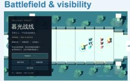
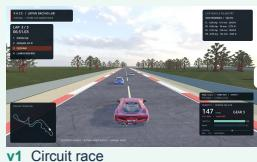
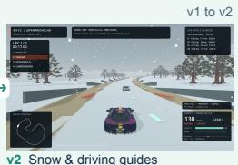
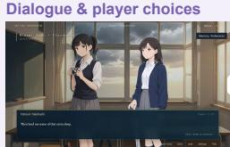
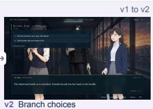
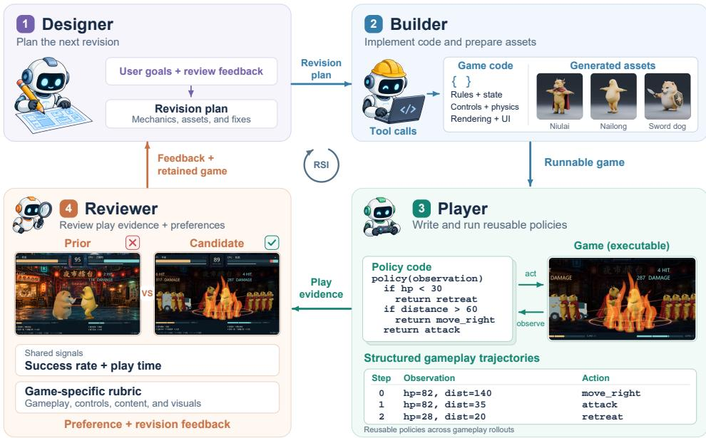
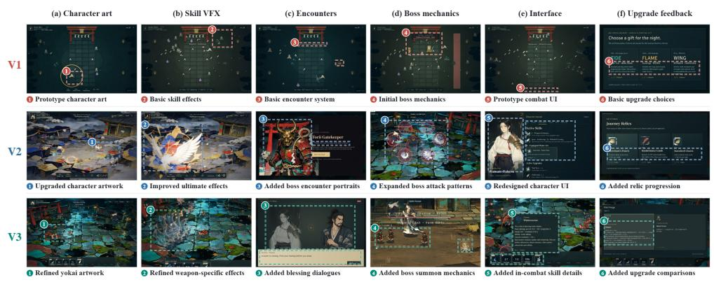
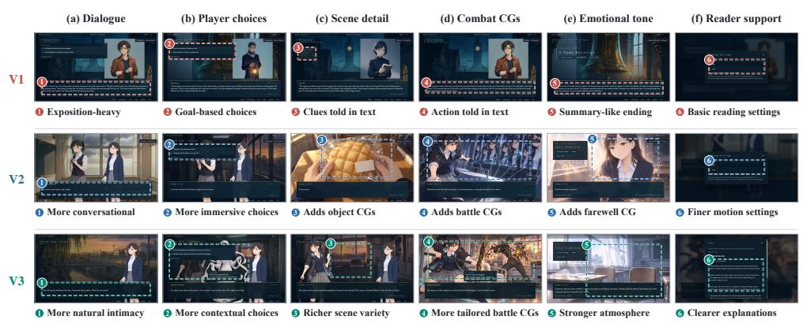
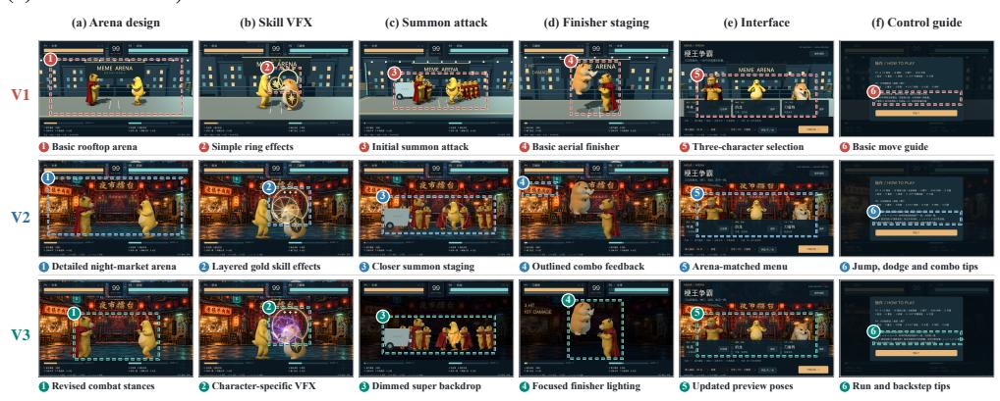
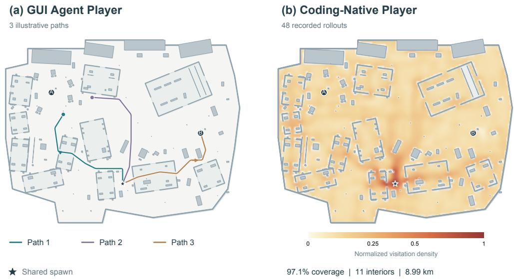

# RECURSIVE GAME CREATOR: AN AGENTIC PRODUCT-LEVEL EXPERIENCE-ORIENTED GAME HARNESS

Jiajun Chen1,2,3,†, Haoyu Wu1,2,†, Mingda Jia1,2,3,†, Xihui Liu1,2,3,∗

1HKU MMLab 2The University of Hong Kong 3Shenzhen Loop Area Institute

## ABSTRACT

Recent game design agents have made substantial progress in generating playable games. However, program correctness does not ensure an enjoyable experience for players. We present Recursive Game Creator, an experience-oriented harness to advance agentic game development from rough game prototypes into entertaining games. Recursive Game Creator organizes recursive development around four components: Designer, Builder, Player, and Reviewer. The Designer translates user instructions and Reviewer’s feedback into detailed plans. The Builder turns these plans into candidate games. The coding-native Player creates and executes reusable policies through programmatic interfaces to efficiently collect diverse gameplay trajectories, mitigating evaluation bias caused by slow GUI-based collection. The Reviewer uses carefully designed trajectory-based metrics to induce player preferences, integrating with visual evidence and explicit textual preferences to evaluate games against game-specific criteria. Finally, the Reviewer accepts the better version and provides improvement reviews for the next round, closing the recursive loop. Our method achieves stateof-the-art overall performance of 77.89 on GameCraft-Bench. On GameASG-Bench, it achieves a strict task success rate of 53.2%, a 34.1% improvement over the same-model baseline, and the highest mean runtime-check pass rate at 93.4% among compared methods. A user study shows longer playtime and higher ratings. Code is coming soon.

a MOBA Twilight Front  
  
v1 Basic lane layout

  
v3 Fog of war

  
v1 Early guardian

  
v3 Three new heroes

b Racing KAZE  
  
v1 Circuit race

  
v2 Red Bull livery

c Visual novel See You Tomorrow  
  
v3 Garage & career

  
v1 Character dialogue

  
Figure 1. Game examples from Recursive Game Creator. Rows show MOBA, racing, and visualnovel games, each with two paired views. Arrows link the paired panels. Version labels identify earlier-to-later examples from V1 to V2 and V3.

  
v3 Classroom setting

## 1 INTRODUCTION

Coding agents can rapidly build runnable games, but successful execution does not establish the quality of play. Engaging mechanics, appropriate difficulty, coherent presentation, and responsive feedback shape player experience. Recent agentic workflows support iterative game development (Yan et al., 2026, Hu et al., 2026), yet translating gameplay into experience-oriented revision remains challenging. Progress toward product-level games requires a harness that connects development with repeated playtesting and adapts the game to its intended players.

We introduce Recursive Game Creator, an experience-oriented recursive harness to iteratively refine games. The harness mirrors a real game studio of four typical roles: Designer, Builder, Player, and Reviewer, as shown in Fig. 2. Starting from a user instruction, the Designer expands into a comprehensive design graph that includes gameplay mechanisms, storylines, feedback systems, and visual asset requirements. The Builder calls proper external tools, implementing the game backend, organizing audiovisual assets, and managing the project. Unlike previous work Huang et al. (2026), Hu et al. (2026) with a GUI agent to test the game, we propose a Coding-Native Player that writes executable policies to collect gameplay trajectories efficiently and effectively. The Experience-Oriented Reviewer leverages diverse gameplay trajectories to conduct a thorough, game-specific diagnosis, including difficulty assessment, corner-bug discovery, and time-in-game recording. The Reviewer also leverages screenshots to evaluate game appearance. Finally, the Reviewer provides feedback to the Designer for next-round refinement.

Although coding agents can interact with games through graphical user interfaces (GUIs) (Huang et al., 2026, Zhang et al., 2026a), screenshot-driven testing may omit structured state, legal actions, events, and progress signals available through programmatic interfaces. Requiring visual interpretation and a model decision for each action adds latency and limits frequent, fine-grained rollouts. Coding agents are primarily optimized for code generation and reasoning, rather than fine-grained visual game-state interpretation. To better align gameplay with these strengths, our Coding-Native Player provides frequent, repeatable, and diverse interaction through programmatic interfaces. Player constructs reusable policies with different strategies and capabilities. We execute policies to collect trajectories. This separates fast gameplay control from policy construction and the Reviewer’s visual assessment. It also preserves directly exposed state and event information for subsequent analysis. The Coding-Native Player offers several distinct advantages, including: highfrequency control, efficient trajectory collection, diverse capability simulation, and reproducible results.

The Reviewer provides comprehensive feedback from collected trajectories. The Experience-Oriented Reviewer combines general standards such as playtime, success rate, and game-specific rubric evaluations to identify problems. Different types of games matter in different aspects. Beyond general evaluation, the Reviewer further analyzes suitable specific features of each game. For example, Responsive steering matters in racing, whereas a meaningful storyline and coherent dialogue matter in a visual novel. The Reviewer actively figures out these specific analysis criteria. The Reviewer expresses inferred preferences as structured text describing the desired experience, supporting observations, and revision priorities. Users can also supply explicit textual preferences during play. These inputs guide the next design plan, allowing refinement to address both game quality and a player’s taste.

The recursive loop connects these stages across versions. Policy execution produces trajectories. Trajectory and visual analysis produce experience and preference feedback. The Designer translates feedback into a plan. The Builder implements a new candidate for further testing. We evaluate the games on GameCraft-Bench (Luo et al., 2026) and GameASG-Bench (Zhang et al., 2026c). In our GameCraft-Bench evaluation, three refinement rounds raise the overall score from 72.70 to 77.89 (+5.19), with improvements in every reported category. On GameASG-Bench, the harness raises the success rate from 9.47 to 25/47 tasks and achieves a highest mean runtime check pass rate of 93.4%.

We make three contributions.

• Product-level game recursive harness. We connect a multi-round closed-loop game design harness, Recursive Game Creator, that supports product-level game evolution and userdirected customization.

• Coding-native and experience-oriented game evolution. We introduce codingnative player collects diverse gameplay trajectories for comprehensive evaluation. The experience-oriented Reviewer combines general and game-specific rubrics to support preference-informed feedback.

• State-of-the-art game design capability. Recursive Game Creator achieves the highest overall score on GameCraft-Bench and GameASG-Bench among all baselines. Our user study further proves the customized game evolution ability guided by preferences inferred from human play.

## 2 RELATED WORK

Applications of coding agents. Code generation allows agents to work beyond software development, including video creation and embodied tasks. For educational videos, Code2Video combines planning, Python code generation, and visual review to improve the rendered layout (Chen et al., 2025b). VideoAgent uses generated code to create animations and combines them with slides and narration for scientific videos (Liang et al., 2026). VideoCoCo uses a coding agent to write Blender programs that produce dynamic scene drafts. A video generation model then turns these drafts into realistic videos (Li et al., 2026). In embodied control, Code as Policies turns language instructions into robot policy code that connects perception with control APIs (Liang et al., 2023). ProgPrompt uses program-like descriptions of available actions and objects to generate robot task plans (Singh et al., 2022). Voyager builds a library of reusable Minecraft skills and revises their code using environment feedback and execution errors (Wang et al., 2023). Eureka extends code generation to reward design, using feedback from policy training to revise reward functions (Ma et al., 2024). Across these applications, code gives agents a way to express, execute, and reuse structured behavior. These works motivate our use of executable policies for gameplay testing. Our focus is on connecting executable play, experience and preference analysis, and continued game evolution within a recursive harness aimed at product-level games.

Game development with coding agents. Coding agents generate and edit game programs within an explicit runtime. General software-agent systems such as MetaGPT and ChatDev organize planning, implementation, and testing (Hong et al., 2024, Qian et al., 2024). GameGPT applies rolebased collaboration to game development (Chen et al., 2025a). AutoUE targets Unreal Engine workflows, while OpenGame combines reusable project templates with debugging knowledge (Yin et al., 2026, Jiang et al., 2026). Beyond initial generation, AVR-Agent iterates JavaScript content using audio-visual recordings and multimodal comparisons, and Harness-of-Harness supports persistent development with independent assessment (Jolicoeur-Martineau, 2025, Yan et al., 2026). Concurrent work RSIGame explores recursive self-improvement for agentic game development, using iterative evaluation feedback to refine generated games (Wu et al., 2026). GameDevBench and GameCraft-Bench evaluate engine-grounded development and interactive artifacts. GameXpert-Bench extends evaluation across generation, repair, and cumulative optimization (Chi et al., 2026, Luo et al., 2026, Chen et al., 2026). However, generating runnable artifacts and repairing functional bugs do not by themselves establish an engaging player experience. We go further by connecting policy generation, trajectory collection, experience and preference analysis, and multi-round game revision, making the quality of play and continued customization explicit refinement targets.

Feedback refinement and preference alignment. Self-Refine and Reflexion use feedback to revise outputs or subsequent attempts (Madaan et al., 2023, Shinn et al., 2023). AFlow, EvoMAC, and the Darwin Gödel Machine instead optimize workflows, collaboration, or agent code (Zhang et al., 2025, Hu et al., 2025, Zhang et al., 2026b). A related line makes the optimization objective sensitive to human preferences. Trajectory comparisons can train reward models, while RLHF and direct preference optimization align language-model behavior with preferred outputs (Christiano et al., 2017, Ouyang et al., 2022, Rafailov et al., 2023). VideoDPO extends preference optimization to video diffusion using automatically scored pairs, which should be distinguished from direct human judgments (Liu et al., 2025). In games, experience-driven procedural content generation connects player modeling to content adaptation, and experience-driven RL generates racetracks toward target affective patterns (Yannakakis & Togelius, 2011, Barthet et al., 2024). These works motivate feedback tied to the intended experience, while differing in what is optimized and who supplies the feedback. Our harness uses structured preference feedback to revise the game artifact while keeping the underlying model parameters fixed. Explicit user requests and preferences inferred from play inform subsequent design and implementation rounds.

  
Figure 2. Recursive Game Creator’s multi-round refinement workflow. The Designer plans revisions and the Builder implements code and assets. The coding-native Player collects gameplay trajectories. The Reviewer combines behavioral and visual evidence with shared and game-specific criteria to produce preference-informed revision feedback. The central circular arrow denotes repeated refinement with a configurable number of rounds. Agentic-player refinement improves game quality across rounds, while human-involved refinement improves the play experience and its alignment with inferred player preferences.

## 3 RECURSIVE GAME CREATOR, EXPERIENCE-ORIENTED GAME REFINEMENT

Recursive Game Creator organizes game development as a closed loop involving the Designer, Builder, Player, and Reviewer. The Designer translates user requirements and evaluation feedback into a structured plan specifying intended experience, concrete changes, acceptance goals, and asset needs. The Builder implements this plan through draft and integrate stages, incorporates required assets, and performs targeted checks to produce a playable candidate.

The Player writes and executes code policies through the game’s programmatic interface, collecting behavioral trajectories and available visual records. These trajectories capture states, actions, events, progress, elapsed time, and termination outcomes, providing inspectable evidence of play. The Reviewer combines Player reports with behavioral and visual evidence to assess the experience against shared and game-specific criteria, and compares anonymized evidence from the candidate and retained versions. These evidence-based judgments inform version retention, while the Reviewer’s findings guide the Designer’s next plan. This loop connects game construction, policy-based play, experience assessment, and iterative refinement.

## 3.1 DESIGNER & BUILDER

The Designer expands the user brief into the core play loop, mechanics, progression and difficulty, visual direction, and production priorities. It combines the available game state and recent feedback with user requirements to form a plan:

$$
P _ { t } = \mathrm { D e s i g n } ( U , G _ { t } , \mathcal { H } _ { t - 1 } ) = ( h _ { t } , \Delta _ { t } , A _ { t } , X _ { t } ) ,
$$

where $U , G _ { t } ,$ and $\mathcal { H } _ { t - 1 }$ denote the user brief, current game, and recent feedback when available. The hypothesis $h _ { t }$ states the intended experiential improvement and its basis; $\Delta _ { t }$ specifies concrete changes and strengths to preserve; $A _ { t }$ defines acceptance goals in terms of scenes, player inputs, and observable outcomes; and $X _ { t }$ lists asset requests. This representation turns experience goals into implementation decisions and testable objectives.

Subsequently, the Builder inherits the implementation plans from the Designer and selects implementation tools according to the game’s mechanics, interaction requirements, visual direction, and asset needs. Implementation proceeds from a playable draft to an integrated candidate:

$$
Z _ { t } = \mathrm { D r a f t } ( G _ { t } , \Delta _ { t } ) , \qquad X _ { t } ^ { * } = \mathrm { G e n e r a t e } ( X _ { t } ; Z _ { t } ) , \qquad C _ { t } = \mathrm { I n t e g r a t e } ( Z _ { t } , X _ { t } ^ { * } ) ,
$$

where $Z _ { t }$ is the draft, $X _ { t }$ denotes requested assets, $X _ { t } ^ { * }$ contains assets actually generated by the framework, and $C _ { t }$ is the integrated candidate.

During drafting, the Builder implements the core loop and planned changes, using placeholders when needed. The framework executes asset requests and makes generated files available for integration. The Builder then checks their presentation in gameplay scenes and their interaction with collision, animation, and interaction regions. Targeted self-checks and configured project checks complement the Player’s broader play evidence. This staged workflow links asset production to its in-game integration and validation; generating an asset alone does not establish an improvement to play.

## 3.2 CODING-NATIVE PLAYER

The Player constructs executable gameplay policies, separating policy generation from repeated interaction. Each policy uses the game’s exposed state to choose valid actions and collect a trajectory. This enables state-based control without requiring a language-model response or visual interpretation at every action. For candidate version $\hat { C } _ { t }$ at round t, policy $\pi _ { t , k }$ produces trajectory $\tau _ { t , k } \colon$

$$
\tau _ { t , k } = { \mathrm { R o l l o u t } } ( C _ { t } , \pi _ { t , k } ) , \qquad \mathscr { E } _ { t } = \{ ( \tau _ { t , k } , V _ { t , k } ) \} _ { k = 1 } ^ { K } .
$$

Here, $C _ { t }$ is the candidate game version, $\pi _ { t , k }$ is an executable policy, $\tau _ { t , k }$ is its trajectory, and $V _ { t , k }$ denotes visual records when available. The evidence set $\mathcal { E } _ { t }$ contains records from $K$ rollouts.

Policy construction and execution. The Player reads the state schema, available actions, and testing objectives, then writes a policy that observes states, chooses actions, and repeats until the task ends or the rollout budget is reached. Policies run through the game’s programmatic or command-line interface. Rollout requests are dispatched as execution jobs, allowing repeated trials and separate game instances. The Player inspects outcomes and execution failures and revises policy code when needed. It does not use a conversational response as a substitute for executing the rollout.

Diverse policies and trajectory records. Policies vary in strategy, skill, exploration, and risk tolerance. For example, one favors fast progress while another explores optional content. Their rollouts record exposed states, actions, events, progress, elapsed time, and termination outcomes. Parallel or repeated execution supplies multiple attempts and failure cases under known policy settings. These records are passed to the Reviewer. Visual capture and presentation assessment belong to the review stage. Policy and observation settings are recorded with each trajectory to support comparisons across game versions.

Behavioral evidence and testing cost. The trajectories support estimates of completion, difficulty, explored content, and points of failure or stagnation. Direct state and event access avoids reconstructing these variables from every rendered frame. Lightweight execution and parallel sampling make repeated trials practical, while policies with different strategies can expose failures that one strategy misses. The resulting records connect gameplay behavior to the Reviewer’s diagnosis and the next design revision. Total testing cost includes policy generation, repair, execution, and review. Proxy strategies provide varied test behavior, but do not establish that they represent the full human player population. Human trajectories and explicit feedback supply additional evidence about individual preferences.

## 3.3 EXPERIENCE-ORIENTED REVIEWER

The Reviewer combines behavioral trajectories, visual observations, and user input into an experience assessment and actionable revision feedback. Its inputs are associated with the evaluated game version and policy or player session. The assessment preserves the distinction between observed behavior, inferred preference, and explicit user requests.

Shared signals, success rate and playtime. The coding-native Player supplies many trajectories from policies with different skills and strategies. The Reviewer uses this evidence to estimate success rates and examine where play ends or gets stuck. Success that comes too easily may offer little challenge, while repeated failure may cause frustration. The goal is therefore a suitable level of difficulty for the intended players, not the highest possible success rate. Comparing outcomes across policies helps assess whether progress is achievable and whether stronger play is rewarded. For version comparisons, policy settings and observation access must remain consistent.

The same trajectories record playtime. The Reviewer examines run times together with progress, explored content, and reasons for stopping. This helps distinguish a long run with varied activity from one spent stuck at the same point. Success rate and playtime therefore support a broader assessment of difficulty and playability. Both remain measures of the tested policies. Proxy playtime alone does not show human interest or enjoyment.

Game-specific rubric. The Reviewer starts from shared assessment dimensions, including control responsiveness, content richness, narrative or progression pacing, visual coherence, and support for exploration or replay. It instantiates these dimensions as criteria suited to the game’s genre and intended experience. For example, a racing game may require clear track guidance, responsive steering, and visible collision feedback, while a visual novel may require coherent dialogue and choices with discernible consequences. The Reviewer checks consistency between rules, visual cues, and observed play, and explains strengths, weaknesses, and tradeoffs rather than averaging unrelated criteria.

Visual evidence and diagnosis. The Reviewer obtains sampled screenshots and available recordings from rendered gameplay, and examines them alongside play reports without seeing source code or version order. Trajectories show where a policy succeeds, fails, or stops progressing. Rendered views show what a player could see at those moments. The Reviewer uses them to assess text readability, visual style, and action feedback. Visual review is separate from the fast control loop, so collecting a trajectory does not require interpreting an image at every step. Brief effects or missing feedback may still require a recording rather than a few frames.

Each observation is tied to its game version, policy, and replay. The Reviewer separates what happened from why it may have happened. A failed turn could reflect poor controls, an unclear cue, or a weak policy. When the cause is uncertain, the feedback specifies what further evidence would help resolve it.

Structured experience and preference feedback. The Reviewer translates trajectory patterns, visual findings, and explicit user input into a textual preference record. The record describes the desired experience, supporting evidence, whether a preference is inferred or user-stated, and the corresponding revision priority. A tendency to explore optional areas, for example, may suggest interest in discovery. A user’s request for less demanding combat supplies an explicit difficulty target. These observations inform design hypotheses rather than establishing preferences from playtime alone. The Designer receives this record alongside concrete changes and follow-up checks for the next revision.

Version comparison and retention. The Reviewer compares a candidate with the retained game using the same shared signals and game-specific criteria. It checks whether the changes address the earlier revision goals and introduce new problems. The output is an A/B preference, a tie, or an unavailable judgment, with reasons and evidence paths. Feedback states the problem, its possible cause, its effect on play, and a revision goal with a follow-up check. The harness maps the Reviewer’s judgment back to the game versions and selects which artifact to retain.

## 4 EXPERIMENTS

We evaluate Recursive Game Creator on GameCraft-Bench and GameASG-Bench. These benchmarks test game quality and whether generated games meet their requirements. We then examine rollout coverage, representative development examples, and expert assessments of experienceoriented refinement.

Table 1. GameCraft-Bench results (0–100, higher is better). @k denotes refinement round k.
<table><tr><td>Method</td><td>Action</td><td>Timing</td><td>Strategy</td><td></td><td>Simulation Adventure Overall</td><td></td></tr><tr><td colspan="7">Codex + GPT-5.5 (high)</td></tr><tr><td>Vanilla</td><td>48.74</td><td>48.80</td><td>44.06</td><td>53.63</td><td>52.68</td><td>49.58</td></tr><tr><td>HoH@1 (Yan et al., 2026)</td><td>59.73</td><td>53.79</td><td>57.01</td><td>66.75</td><td>61.24</td><td>59.71</td></tr><tr><td>HoH@2</td><td>64.34</td><td>62.03</td><td>59.97</td><td>71.77</td><td>66.11</td><td>64.84</td></tr><tr><td>HoH@3</td><td>71.02</td><td>70.26</td><td>66.13</td><td>78.42</td><td>71.76</td><td>71.52</td></tr><tr><td colspan="7">OpenCode + DeepSeek-V4-Pro</td></tr><tr><td>Vanilla</td><td>26.21</td><td>24.05</td><td>21.27</td><td>37.12</td><td>25.84</td><td>26.90</td></tr><tr><td>HoH@1</td><td>27.75</td><td>27.40</td><td>21.73</td><td>43.75</td><td>22.44</td><td>28.61</td></tr><tr><td>HoH@2</td><td>43.22</td><td>36.56</td><td>33.51</td><td>52.26</td><td>36.05</td><td>40.32</td></tr><tr><td>HoH@3</td><td>49.00</td><td>45.05</td><td>43.34</td><td>55.86</td><td>51.64</td><td>48.98</td></tr><tr><td colspan="7">Pi + MiniMax-M3</td></tr><tr><td>Vanilla</td><td>45.64</td><td>38.20</td><td>34.53</td><td>48.19</td><td>44.26</td><td>42.16</td></tr><tr><td>HoH@1</td><td>50.59</td><td>52.23</td><td>38.60</td><td>54.00</td><td>49.89</td><td>49.06</td></tr><tr><td>HoH@2</td><td>54.70</td><td>56.52</td><td>42.33</td><td>63.20</td><td>58.47</td><td>55.04</td></tr><tr><td>HoH@3</td><td>58.24</td><td>62.10</td><td>44.86</td><td>64.25</td><td>64.44</td><td>58.78</td></tr><tr><td colspan="7">GPT-6 Astra (high)</td></tr><tr><td>Baseline</td><td>73.33</td><td>64.26</td><td>71.44</td><td>74.78</td><td>72.49</td><td>71.26</td></tr><tr><td>Recursive Game Creator@1</td><td>67.96</td><td>68.76</td><td>72.10</td><td>77.72</td><td>76.95</td><td>72.70</td></tr><tr><td>Recursive Game Creator@2</td><td>70.33</td><td>73.19</td><td>72.96</td><td>80.57</td><td>79.69</td><td>75.35</td></tr><tr><td>Recursive Game Creator@3</td><td>77.62</td><td>74.41</td><td>74.46</td><td>82.94</td><td>80.00</td><td>77.89</td></tr></table>

## 4.1 MAIN RESULTS

## 4.1.1 GAMECRAFT-BENCH

GameCraft-Bench evaluates complete Godot games through replayed gameplay and game-specific rubrics covering mechanics, content depth, functional visuals, and art (Luo et al., 2026). We run three refinement rounds on 45 selected tasks (Yan et al., 2026) from GameCraft-Bench and report category and overall scores after each round in Table 1.

The GPT-6 Astra baseline scores 71.26 overall. Recursive Game Creator improves overall quality from 72.70 in the first round to 77.89 in the third, a gain of 5.19 points across rounds and 6.63 points over the same-model baseline. The final score exceeds the strongest reported baseline by 6.37 points, and all five categories improve across our three rounds. Action shows the largest increase, from 67.96 to 77.62 (+9.66). Its first two rounds remain below the same-model baseline Action score of 73.33, before reaching 77.62 in the third. One possible explanation is that action-game quality depends on coordinated changes to controls, collision handling, combat feedback, and progression, whose interactions can require several playtest and revision cycles. The larger late-stage gain is consistent with this interpretation, although the category scores alone do not identify its cause.

## 4.1.2 GAMEASG-BENCH

GameASG-Bench tests whether generated browser games meet their source and behavior requirements (Zhang et al., 2026c). L1 checks the source code, while L2 runs the game in a browser. P0 covers startup and the test interface, P1 covers required gameplay, and P2 covers extended features. Task success requires valid delivery, completed evaluation, and passing every L1 check and every applicable L2 P0/P1 check. We report this measure alongside check pass rates in Table 2.

Recursive Game Creator passes 25 of 47 tasks (53.2%), with mean L1 and L2 pass rates of 98.3% and 93.4%, respectively. Its P0, P1, and P2 pass rates are 99.0%, 92.2%, and 93.9%. The mean L2 and extended-feature (P2) scores are the highest among the reported configurations.

(a) Action Game, Combat and Progression  

(b) Visual Novel, Narrative and Choices  

(c) Meme Arena, Action Cues and Presentation  
  
Figure 3. Qualitative analysis of multi-round RSI. The three panels compare development versions, organized as early, intermediate, and later snapshots (V1–V3). (a) Action-game combat, encounters, interfaces, and upgrade feedback. (b) Visual-novel dialogue, choices, illustrated events, and reading support. (c) Meme Arena scenes, skills, finishers, and control guidance.

Table 2. GameASG-Bench results. Baselines are from Zhang et al. (2026c), Table 3. All scores are percentages. Task success also reports the count. Bold marks column maxima. Green parenthesized gains in the final row are percentage-point improvements over GPT-6-Astra high with Codex CLI.
<table><tr><td>Model</td><td>Harness</td><td>Task success</td><td>L1</td><td>L2 Mean</td><td>L2 P0</td><td>L2 P1</td><td>L2 P2</td></tr><tr><td>GPT-6-Astra ultra</td><td>Codex CLI</td><td>26/47 (55.3%)</td><td>98.0</td><td>93.2</td><td>99.0</td><td>92.7</td><td>92.4</td></tr><tr><td>Claude-Opus-5</td><td>Claude Code</td><td>24/47 (51.1%)</td><td>99.6</td><td>90.4</td><td>91.2</td><td>89.9</td><td>91.1</td></tr><tr><td>GPT-5.6-Sol</td><td>Codex CLI</td><td>21/47 (44.7%)</td><td>98.9</td><td>91.3</td><td>100.0</td><td>89.7</td><td>91.9</td></tr><tr><td>DeepSeek-V4-Flash</td><td>Claude Code</td><td>18/47 (38.3%)</td><td>99.4</td><td>89.3</td><td>98.0</td><td>86.7</td><td>90.2</td></tr><tr><td>DeepSeek-V4-Pro</td><td>Claude Code</td><td>15/47 (31.9%)</td><td>99.6</td><td>85.2</td><td>85.3</td><td>83.9</td><td>88.9</td></tr><tr><td>Kimi-K3</td><td>Claude Code</td><td>15/47 (31.9%)</td><td>97.7</td><td>88.5</td><td>98.0</td><td>86.3</td><td>89.7</td></tr><tr><td>GLM-5.2</td><td>Claude Code</td><td>11/47 (23.4%)</td><td>98.8</td><td>84.6</td><td>91.2</td><td>83.3</td><td>83.0</td></tr><tr><td>Hunyuan-3</td><td>Claude Code</td><td>10/47 (21.3%)</td><td>98.3</td><td>81.7</td><td>96.1</td><td>78.2</td><td>82.3</td></tr><tr><td>MiniMax-M3</td><td>Claude Code</td><td>7/47 (14.9%)</td><td>98.3</td><td>70.6</td><td>91.2</td><td>64.5</td><td>75.4</td></tr><tr><td>GPT-6-Astra high</td><td>Codex CLI</td><td>9/47 (19.1%)</td><td>95.6</td><td>86.6</td><td>97.1</td><td>84.1</td><td>88.6</td></tr><tr><td>GPT-6-Astra high</td><td>Recursive Game Creator</td><td>25/47 (53.2%)</td><td>98.3</td><td>93.4 (+6.8)</td><td>99.0 (+1.9)</td><td>92.2</td><td>93.9</td></tr></table>

## 4.2 QUALITATIVE ANALYSIS OF MULTI-ROUND RSI

Fig. 1(a) shows Twilight Front, which adds a fog-of-war display and expands its hero roster. Fig. 1(b) shows KAZE, with changing race conditions, a career garage, and car liveries. Fig. 1(c) shows See You Tomorrow, combining character dialogue, player choices, event art, and a classroom menu. These examples illustrate the range of content and interfaces supported by the recursive harness.

We additionally ask the RSI harness to develop games with several themes and examine how they evolve through repeated revision. Fig. 3 compares an action game in panel (a), a visual novel in panel (b), and Meme Arena in panel (c). Each panel follows early, intermediate, and later versions (V1–V3), comparing corresponding mechanics, content, or presentation features. Together, these examples show how multi-round recursive self-improvement expands playable content and make game state, available actions, and feedback easier to interpret.

Action game, combat and progression feedback. The comparison in Fig. 3(a) tracks changes in character art, skill effects, encounters, boss mechanics, interface elements, and upgrade feedback. Across the displayed versions, encounter portraits and upgrade feedback accompany richer combat effects. These changes address both the available content and the way progression and combat state are communicated. The comparison shows refinement extending beyond execution and bug repair to the readability and presentation of the play loop.

Visual novel, contextual choices and narrative presentation. As shown in Fig. 3(b), the visual novel evolves in dialogue, choices, scene detail, illustrated combat, emotional staging, and reading support. The game moves from prose-heavy exchanges toward separate speaking turns, illustrated events, and choices grounded in the current scene. The resulting revisions affect how readers follow the narrative and understand their available decisions, illustrating experience-oriented refinement in a genre with different demands from action games.

Meme Arena, action cues and combat presentation. The Meme Arena versions shown in Fig. 3(c) retain the same three-character roster while evolving in arena detail, skill-specific effects, summon attacks, finisher emphasis, selection interfaces, and movement guidance. The scripted capture views make these feature-level changes visible across versions. Fig. 2 uses related Meme Arena views to illustrate the Reviewer’s comparison stage. Across all three games, the qualitative evidence concerns concrete revision targets, including communicating game state, presenting content, and clarifying available actions.

  
Figure 4. Spatial exploration in an FPS test scene. The left panel shows three illustrative GUIstyle routes from a shared spawn. The right panel shows visitation from 48 recorded coding-native policy rollouts. Color shows normalized visitation density. The source reports 97.1% grid coverage, including 11 interiors.

## 4.3 PLAYER EXPLORATION ANALYSIS

As shown in Fig. 4, the coding-native Player explores an FPS scene through repeated policy rollouts. The recorded policy rollouts reach areas across the map, including building interiors. A reusable policy collects this evidence without a model call for every action. The GUI routes are illustrative, so the figure shows coverage rather than a measured speedup. A controlled comparison must match budgets and observation access, including the cost of policy construction, repair, execution, and review.

## 4.4 USER STUDY OF EXPERIENCE-ORIENTED CUSTOMIZATION

This assessment examines whether recursive revision moves the game toward the intended player experience, using explicit user preferences or preferences inferred by the Reviewer from gameplay as revision inputs. Table 3 reports controls, playability, depth, and art on a 1–10 scale, together with average playtime. From the first to third round, controls improve from 2 to 8, playability from 1 to 7, depth from 3 to 6, and art from 2 to 8. Average playtime rises from 1.50 to 12.41 minutes. The changes span interaction, content, and presentation, consistent with the harness’s experienceoriented revision targets.

Table 3. Expert scores and average playtime across refinement rounds. Controls, playability, depth, and art are rated on a 1–10 scale. Average playtime is reported in minutes.
<table><tr><td>Round</td><td>Controls</td><td>Playability</td><td>Depth</td><td>Art</td><td>Avg. playtime (min)</td></tr><tr><td>Round 1</td><td>2</td><td>1</td><td>3</td><td>2</td><td>1.50</td></tr><tr><td>Round 2</td><td>5</td><td>4</td><td>4</td><td>6</td><td>4.87</td></tr><tr><td>Round 3</td><td>8</td><td>7</td><td>6</td><td>8</td><td>12.41</td></tr></table>

## 5 CONCLUSION

Recursive Game Creator is an experience-oriented recursive harness that connects design, toolassisted implementation, executable play, and preference-informed review. Its coding-native Player collects reusable gameplay trajectories through programmatic interfaces, while the Reviewer combines behavioral evidence, visual observations, and user input to guide version selection and subse quent revisions. This policy-to-trajectory-to-feedback loop enables continued game evolution with fixed model parameters. Across our evaluations, Recursive Game Creator achieves state-of-the-art overall performance on GameCraft-Bench and the highest mean runtime-check pass rate among compared methods on GameASG-Bench. Development examples and expert assessments characterize improvements in controls, content, and presentation. The harness provides a foundation for advancing functional prototypes toward product-level games and evaluating continued adaptation to individual players.

## REFERENCES

Matthew Barthet, Diogo Branco, Roberto Gallotta, Ahmed Khalifa, and Georgios N. Yannakakis. Closing the Affective Loop via Experience-Driven Reinforcement Learning Designers, 2024. URL https://arxiv.org/abs/2408.06346.

Dake Chen, Haoyang Zhang, Hanbin Wang, Yunhao Huo, Yuzhao Li, and Junjie Wang. GameGPT: Multi-agent Collaborative Framework for Game Development, 2025a. URL https://arxiv. org/abs/2310.08067.

Kun Chen, Haorong Hong, Peizhong Gao, Jianfeng Lin, Tongxu Luo, Yuxuan Xie, Chenxu Liu, Jieling He, Zhongyuan Liu, and Zeno Zeng. GameXpert-Bench: How Far Are Coding Agent from Expert Game Development?, 2026. URL https://arxiv.org/abs/2608.21833.

Yanzhe Chen, Kevin Qinghong Lin, and Mike Zheng Shou. Code2Video: A Code-centric Paradigm for Educational Video Generation, 2025b. URL https://arxiv.org/abs/2510.01174.

Wayne Chi, Yixiong Fang, Arnav Yayavaram, Siddharth Yayavaram, Seth Karten, Qiuhong Anna Wei, Runkun Chen, Alexander Wang, Valerie Chen, Ameet Talwalkar, and Chris Donahue. GameDevBench: Evaluating Agentic Capabilities Through Game Development, 2026. URL https://arxiv.org/abs/2602.11103.

Paul F Christiano, Jan Leike, Tom Brown, Miljan Martic, Shane Legg, and Dario Amodei. Deep reinforcement learning from human preferences. In I. Guyon, U. Von Luxburg, S. Bengio, H. Wallach, R. Fergus, S. Vishwanathan, and R. Garnett (eds.), Advances in Neural Information Processing Systems, volume 30. Curran Associates, Inc., 2017. URL https://proceedings.neurips.cc/paper\_files/paper/2017/ file/d5e2c0adad503c91f91df240d0cd4e49-Paper.pdf.

Sirui Hong, Mingchen Zhuge, Jonathan Chen, Xiawu Zheng, Yuheng Cheng, Jinlin Wang, Ceyao Zhang, zili wang, Steven Yau, Zijuan Lin, Liyang Zhou, Chenyu Ran, Lingfeng Xiao, Chenglin Wu, and Jürgen Schmidhuber. MetaGPT: Meta Programming for A Multi-Agent Collaborative Framework. In B. Kim, Y. Yue, S. Chaudhuri, K. Fragkiadaki, M. Khan, and Y. Sun (eds.), International Conference on Learning Representations, volume 2024, pp. 23247–23275, 2024. URL https://proceedings.iclr.cc/paper\_files/paper/2024/file/ 6507b115562bb0a305f1958ccc87355a-Paper-Conference.pdf.

Wenbo Hu, Ken Li, Jiazhe Wei, Yukang Cao, Weiyi Hong, Jiayi Dai, Chenjun Bai, Jiajun Liang, Yucheng Liao, Ruichuan An, Zeyu Lou, Haofan Wang, Yueming Lyu, Ziwei Liu, and Chenyang Si. VibeGame: Prompt-to-game development with AI-native engine and self-evolving adversarial agent team. Technical report, 2026. URL https://github.com/tettethu/VibeGame blob/main/technical\_report.pdf.

Yue Hu, Yuzhu Cai, Yaxin Du, Xinyu Zhu, Xiangrui Liu, Zijie Yu, Yuchen Hou, Shuo Tang, and Siheng Chen. Self-Evolving Multi-Agent Collaboration Networks for Software Development. In Y. Yue, A. Garg, N. Peng, F. Sha, and R. Yu (eds.), International Conference on Learning Representations, volume 2025, pp. 23007–23039, 2025. URL https://proceedings.iclr.cc/paper\_files/paper/2025/file/ 39af4f2f9399122a14ccf95e2d2e7122-Paper-Conference.pdf.

Yixu Huang, Bo Li, Na Li, Zhe Wang, Kaijie Chen, Haonan Ge, Qingyi Si, Yuanzhe Shen, Ruihan Yang, Guangjing Wang, and Hongcheng Guo. Gui agents for continual game generation, 2026. URL https://arxiv.org/abs/2605.28258.

Yilei Jiang, Jinyuan Hu, Qianyin Xiao, Yaozhi Zheng, Ruize Ma, Kaituo Feng, Jiaming Han, Tianshuo Peng, Kaixuan Fan, Manyuan Zhang, and Xiangyu Yue. OpenGame: Open Agentic Coding for Games, 2026. URL https://arxiv.org/abs/2604.18394.

Alexia Jolicoeur-Martineau. Multi-Agent Game Generation and Evaluation via Audio-Visual Recordings, 2025. URL https://arxiv.org/abs/2508.00632.

Haodong Li, Tianfei Ren, Xiaoxiao Ma, Chunmei Qing, Zhen Fang, Sipeng He, Ziyu Guo, Haoyu Wu, Juanxi Tian, Yihang Zou, Ruichuan An, Dongzhi Jiang, Boxue Yang, Ji Xie, Xu Huang, Wenhao Yan, Jialv Zou, Zhengrong Yue, Yaxin Luo, Xiaotong Li, Yuzhu Wang, Junyan Ye, Jinjing Zhao, Zehui Chen, Lin Chen, Renye Yan, Feng Zhao, and Pheng-Ann Heng. VideoCoCo: Code-as-CoT for Physically-Consistent Video Generation via an Agentic Dual-Engine System, 2026. URL https://arxiv.org/abs/2607.27380.

Jacky Liang, Wenlong Huang, Fei Xia, Peng Xu, Karol Hausman, Brian Ichter, Pete Florence, and Andy Zeng. Code as Policies: Language Model Programs for Embodied Control, 2023. URL https://arxiv.org/abs/2209.07753.

Xiao Liang, Bangxin Li, Zixuan Chen, Hanyue Zheng, Zhi Ma, Di Wang, Cong Tian, and Quan Wang. VideoAgent: Personalized Synthesis of Scientific Videos, 2026. URL https: //arxiv.org/abs/2509.11253.

Runtao Liu, Haoyu Wu, Ziqiang Zheng, Chen Wei, Yingqing He, Renjie Pi, and Qifeng Chen. Videodpo: Omni-preference alignment for video diffusion generation. In Proceedings of the Computer Vision and Pattern Recognition Conference, pp. 8009–8019, 2025.

Tongxu Luo, Rongsheng Wang, Jiaxi Bi, Chenming Xu, Zhengyang Tang, Jianlong Chen, Juhao Liang, Ke Ji, Shuqi Guo, Yuhao Du, Fan Bu, Wenyu Du, Xiaotong Zhang, Kyle Li, Shaobo Wang, Linfeng Zhang, Yuxuan Liu, Xin Lai, Chenxin Li, Yiduo Guo, Zhexin Zhang, Xinyuan Wang, Tianyi Bai, Ziniu Li, and Benyou Wang. GameCraft-Bench: Can Agents Build Playable Games End-to-End in a Real Game Engine?, 2026. URL https://arxiv.org/abs/2606. 17861.

Yecheng Jason Ma, William Liang, Guanzhi Wang, De-An Huang, Osbert Bastani, Dinesh Jayaraman, Yuke Zhu, Linxi Fan, and Anima Anandkumar. Eureka: Human-Level Reward Design via Coding Large Language Models, 2024. URL https://arxiv.org/abs/2310.12931.

Aman Madaan, Niket Tandon, Prakhar Gupta, Skyler Hallinan, Luyu Gao, Sarah Wiegreffe, Uri Alon, Nouha Dziri, Shrimai Prabhumoye, Yiming Yang, Shashank Gupta, Bodhisattwa Prasad Majumder, Katherine Hermann, Sean Welleck, Amir Yazdanbakhsh, and Peter Clark. Self-Refine: Iterative Refinement with Self-Feedback. In A. Oh, T. Naumann, A. Globerson, K. Saenko, M. Hardt, and S. Levine (eds.), Advances in Neural Information Processing Systems, volume 36, pp. 46534–46594. Curran Associates, Inc., 2023. doi: 10.52202/ 075280-2019. URL https://proceedings.neurips.cc/paper\_files/paper/ 2023/file/91edff07232fb1b55a505a9e9f6c0ff3-Paper-Conference.pdf.

Long Ouyang, Jeffrey Wu, Xu Jiang, Diogo Almeida, Carroll Wainwright, Pamela Mishkin, Chong Zhang, Sandhini Agarwal, Katarina Slama, Alex Ray, John Schulman, Jacob Hilton, Fraser Kelton, Luke Miller, Maddie Simens, Amanda Askell, Peter Welinder, Paul F Christiano, Jan Leike, and Ryan Lowe. Training language models to follow instructions with human feedback. In S. Koyejo, S. Mohamed, A. Agarwal, D. Belgrave, K. Cho, and A. Oh (eds.), Advances in Neural Information Processing Systems, volume 35, pp. 27730–27744. Curran Associates, Inc., 2022. doi: 10.52202/ 068431-2011. URL https://proceedings.neurips.cc/paper\_files/paper/ 2022/file/b1efde53be364a73914f58805a001731-Paper-Conference.pdf.

Chen Qian, Wei Liu, Hongzhang Liu, Nuo Chen, Yufan Dang, Jiahao Li, Cheng Yang, Weize Chen, Yusheng Su, Xin Cong, Juyuan Xu, Dahai Li, Zhiyuan Liu, and Maosong Sun. Chat-Dev: Communicative agents for software development. In Lun-Wei Ku, Andre Martins, and Vivek Srikumar (eds.), Proceedings of the 62nd Annual Meeting of the Association for Computational Linguistics (Volume 1: Long Papers), pp. 15174–15186, Bangkok, Thailand, August 2024. Association for Computational Linguistics. doi: 10.18653/v1/2024.acl-long.810. URL https://aclanthology.org/2024.acl-long.810/.

Rafael Rafailov, Archit Sharma, Eric Mitchell, Christopher D Manning, Stefano Ermon, and Chelsea Finn. Direct preference optimization: Your language model is secretly a reward model. In A. Oh, T. Naumann, A. Globerson, K. Saenko, M. Hardt, and S. Levine (eds.), Advances in Neural Information Processing Systems, volume 36, pp. 53728–53741. Curran Associates, Inc., 2023. doi: 10.52202/

075280-2338. URL https://proceedings.neurips.cc/paper\_files/paper/ 2023/file/a85b405ed65c6477a4fe8302b5e06ce7-Paper-Conference.pdf.

Noah Shinn, Federico Cassano, Ashwin Gopinath, Karthik Narasimhan, and Shunyu Yao. Reflexion: language agents with verbal reinforcement learning. In A. Oh, T. Naumann, A. Globerson, K. Saenko, M. Hardt, and S. Levine (eds.), Advances in Neural Information Processing Systems, volume 36, pp. 8634–8652. Curran Associates, Inc., 2023. doi: 10.52202/ 075280-0377. URL https://proceedings.neurips.cc/paper\_files/paper/ 2023/file/1b44b878bb782e6954cd888628510e90-Paper-Conference.pdf.

Ishika Singh, Valts Blukis, Arsalan Mousavian, Ankit Goyal, Danfei Xu, Jonathan Tremblay, Dieter Fox, Jesse Thomason, and Animesh Garg. ProgPrompt: Generating Situated Robot Task Plans using Large Language Models, 2022. URL https://arxiv.org/abs/2209.11302.

Guanzhi Wang, Yuqi Xie, Yunfan Jiang, Ajay Mandlekar, Chaowei Xiao, Yuke Zhu, Linxi Fan, and Anima Anandkumar. Voyager: An Open-Ended Embodied Agent with Large Language Models, 2023. URL https://arxiv.org/abs/2305.16291.

Wenyi Wu, Minghao Fu, Jieyu You, Kun Zhou, Siqi Liu, Aayush Salvi, Yiheng Lin, Ce Zhang, Xiaohan Lan, Jiahui Zhu, Yujie Zhong, Qi She, and Biwei Huang. Rsigame: Autonomous agentic game development with recursive self-improvement, 2026. URL https://arxiv.org/ abs/2609.39045.

Haoyang Yan, Min le Su, Hangfan Zhang, Zhanhao Li, Chen Zhang, Shao Zhang, Yang Chen, Lei Bai, and Shuyue Hu. Harness-of-Harness: Multi-Day Autonomous Software Development with Continual Improvement, 2026. URL https://arxiv.org/abs/2609.01481.

G. N. Yannakakis and J. Togelius. Experience-Driven Procedural Content Generation. IEEE Transactions on Affective Computing, 2(3):147–161, July 2011. ISSN 1949-3045. doi: 10.1109/t-affc. 2011.6. URL http://dx.doi.org/10.1109/T-AFFC.2011.6.

Lei Yin, Wentao Cheng, Zhida Qin, Tianyu Huang, Yidong Li, and Gangyi Ding. AutoUE: Automated Generation of 3D Games in Unreal Engine via Multi-Agent Systems, 2026. URL https://arxiv.org/abs/2603.07106.

Alex L. Zhang, Thomas L. Griffiths, Karthik R. Narasimhan, and Ofir Press. Videogamebench: Can vision-language models complete popular video games?, 2026a. URL https://arxiv.org/ abs/2505.18134.

Jenny Zhang, Shengran Hu, Cong Lu, Robert Lange, and Jeff Clune. Darwin Godel Machine: Open-Ended Evolution of Self-Improving Agents, 2026b. URL https://arxiv.org/abs/ 2505.22954.

Jiayi Zhang, Jinyu Xiang, Zhaoyang Yu, Fengwei Teng, XiongHui Chen, Jiaqi Chen, Mingchen Zhuge, Xin Cheng, Sirui Hong, Jinlin Wang, Bingnan Zheng, Bang Liu, Yuyu Luo, and Chenglin Wu. AFlow: Automating Agentic Workflow Generation. In Y. Yue, A. Garg, N. Peng, F. Sha, and R. Yu (eds.), International Conference on Learning Representations, volume 2025, pp. 34040– 34077, 2025. URL https://proceedings.iclr.cc/paper\_files/paper/2025/ file/5492ecbce4439401798dcd2c90be94cd-Paper-Conference.pdf.

Xiuhui Zhang, Yi Chen, Shusheng Xu, Fan Li, Huan Wang, Tongkai Yang, and Binhang Yuan. GameASG-Bench: Benchmarking autonomous software generation for game development, 2026c. URL https://arxiv.org/abs/2609.21293.