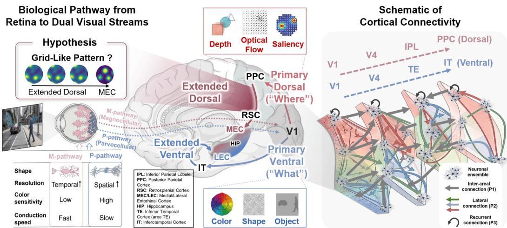
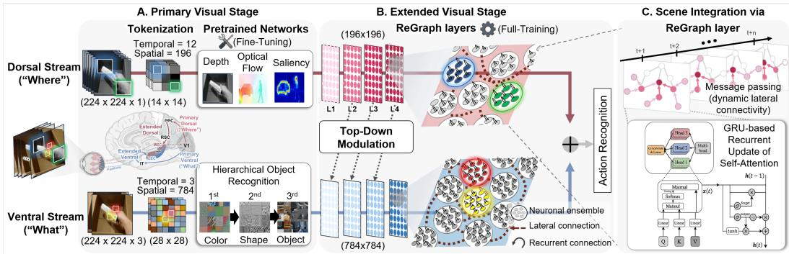
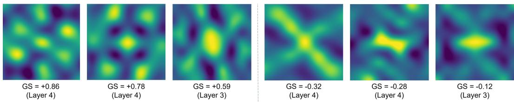
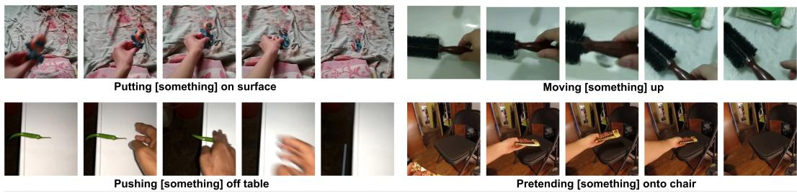
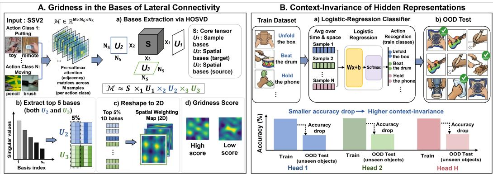
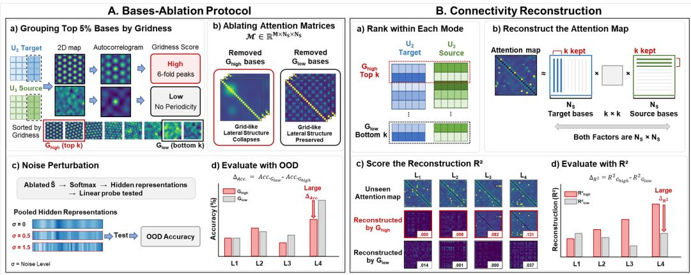

# REGRAPH: A COMPUTATIONAL ACCOUNT OF EMERGENT GENERALIZATION IN THE “WHAT” AND “WHERE” DUAL VISUAL STREAMS

Hyewon Kang1,3, Jungmin Lee2,3, Ilgyu Lee2,3, Seok-Jun Hong1,2,3,∗

1Department of Intelligent Precision Healthcare Convergence, Sungkyunkwan University, Suwon, Republic of Korea

2Department of Biomedical Engineering, Sungkyunkwan University, Suwon, Republic of Korea 3Center for Neuroscience Imaging Research, Institute for Basic Science (IBS), Suwon, Republic of Korea

{hwkang91,jungmin.lee,ilgyu26}@g.skku.edu, hongseokjun@skku.edu

## ABSTRACT

Where generalization capacity—the ability to extract context-invariant relational structures—first emerges remains a central question in AI and neuroscience. In the brain, the foundation for this capacity lies upstream of the hippocampus, within the entorhinal cortex, where parallel pathways dissociate relational structure in the medial entorhinal cortex (MEC) from sensory content in the lateral entorhinal cortex (LEC). However, as Eichenbaum argued, this structure–content factorization likely originates earlier, driven by the segregation of the dorsal (‘where’) and ventral (‘what’) visual streams. Supporting this, grid-like firing patterns—a defining cellular signature of MEC context-invariant representations—also appear in preceding neocortical regions (e.g., retrosplenial cortex) along the dorsal pathway. While these findings suggest that relational structures do not arise de novo in the hippocampal formation, how such representations are computationally formed along upstream pathways remains unknown. To investigate this in silico, we developed ReGraph, a dual visual-stream model implemented on a recurrent graph architecture with several biological inductive biases, including retina-driven stream-specialized encoding, dorsal-to-ventral modulation, and dynamic lateral connectivity. Trained on the action benchmark Something-Something V2, ReGraph revealed a pathway-specific emergence of relational mapping: context-invariant codes and grid-like spatial bases uniquely co-emerged along the extended dorsal stream. In contrast, the absence of these representations in single-stream models, unmodulated dual-stream variants, and standard action-recognition baselines (e.g., VideoMAE, SlowFast) implies that our selected inductive biases are indeed critical prerequisites for the emergence of relational structures. Crucially, the grid-like bases turned out not to be mere byproducts of architectural design, as our post-hoc analyses demonstrated that these bases could serve as reusable routing templates for information processing via lateral connectivity. Together, our findings provide a computational account suggesting that generalization may not be a faculty that emerges abruptly within a dedicated region, but a property that already takes shape as sensory information is parsed into factorized streams of hierarchical visual processing.

## 1 INTRODUCTION

A hallmark of human intelligence is the ability to generalize by extracting and reusing abstract task-relational structures transferable across new environments (Tenenbaum et al., 2011; Behrens et al., 2018). In neuroscience, this ability is often linked to the hippocampal formation, particularly the entorhinal cortex, where a profound functional dissociation emerges: the lateral entorhinal cortex (LEC) encodes sensory-specific content (Knierim et al., 2014), while the medial entorhinal cortex (MEC) extracts generalizable relational structures, represented by grid cells with space-tessellating hexagonal firing patterns (Moser et al., 2008; Behrens et al., 2018).

  
Figure 1: From retina to dual visual streams. Left: The retinal M/P dichotomy drives the dorsal and ventral pathways, each comprising primary and extended stages. Grid-like patterns in the extended dorsal pathway motivate a hypothesis that the precursor of relational structures may emerge along this pathway. The primary dorsal/ventral pathways preferentially encode spatiotemporal dynamics and object details, respectively. Right: Schematics of three connectivity principles defined in §2.2.

This MEC/LEC factorization, however, does not originate within the entorhinal cortex. As Eichenbaum and colleagues have long argued, it inherits a deeper cortical segregation: two long-range streams—the ‘where’ (dorsal) and ‘what’ (ventral) pathways—that provide anatomically segregated inputs to MEC and LEC, respectively (Eichenbaum, 2007). The most prominent instantiation of this dichotomy is the “dual visual streams” (Kravitz et al., 2011; 2013). Indeed, the ventral pathway projects through V4, IT, and perirhinal cortex into LEC, whereas the dorsal pathway projects through MT, PPC, and postrhinal/parahippocampal cortex into MEC (Fig. 1) (Eichenbaum, 2007; Kravitz et al., 2011; 2013). While traditionally the role of the ventral pathway has been extensively studied in terms of hierarchical object recognition, the integrative computation the dorsal pathway performs en route to MEC, particularly along its high-order (parieto-medial) branch, remains poorly understood. This imbalance impedes a unified account of the dual visual streams, and leaves the origin of hippocampal generalization incompletely understood.

Notably, the root of this dichotomy can be traced back even to the retina level, where two functionally distinct ganglion-cell subtypes already establish the divergence: the Magnocellular (M) pathway conveys rapid signals of high temporal but low spatial resolution and feeds the dorsal stream, which specializes in spatiotemporal processing such as optical flow, depth, and saliency detection; conversely, the Parvocellular (P) pathway exhibits the opposite tradeoff (lower temporal but higher spatial resolution) and feeds the ventral stream, dedicated to recognizing sensory details. Given such extensive hierarchical depth of each stream, we hereafter divide this pathway into two segments (Fig. 1): the primary pathway (the retina to low order cortical areas) and the extended pathway (their continuation through higher-order associative cortices toward MEC/LEC).

Despite this anatomical continuity, so far the relational structures expressed in the entorhinal cortex—a core substrate for generalization, encoded by MEC grid cells—have largely been treated as a de-novo product of local hippocampal-entorhinal computation, without larger-scale brain involvement (Dordek et al., 2016; Stachenfeld et al., 2017; Sorscher et al., 2023). Recent findings, however, increasingly refine this view: grid-like firing patterns are observed in the upstream of MEC, including the retrosplenial cortex and posterior cingulate cortex (Doeller et al., 2010; Jacobs et al., 2013; Constantinescu et al., 2016), both along the dorsal (parieto-medial) pathway. This suggests that the relational structure instantiated by grid codes may not arise solely within MEC, but be progressively shaped along the dorsal pathway, with potential roots in the functional dichotomy of the two visual streams. In other words, the two streams may co-emerge as a complementary factorization of visual processing, with the dorsal hierarchy progressively distilling relational structures from spatiotemporally organized M-pathway inputs, and the ventral hierarchy largely focusing on the representation of sensory-specific details from P-pathway inputs.

  
Figure 2: The ReGraph architecture. A. Input is tokenized into M/P-driven asymmetric views (Dorsal: high temporal/low spatial; Ventral: low temporal/high spatial) and processed via specialized pretrained networks for spatiotemporal process (depth, optical flow, saliency) and hierarchical objectoriented processing. B. Stacked layers model cortical hierarchies, with top-down modulation routing the dorsal signals to the ventral layers. C. Self-attention acts as a dynamic graph operator, followed by a GRU-based recurrent update to regulate temporal flow.

Here, we tested this hypothesis in silico with Recurrent Graph (ReGraph), a dual-stream model simulating two visual-processing stages (primary and extended; Fig. 2). The primary stage realizes the M/P-driven functional divergence through spatiotemporally asymmetric inputs, leveraging streamspecific pretrained networks: i) depth, optical flow, and saliency estimation in the dorsal stream, and ii) object-oriented processing in the ventral stream. The extended stage models their downstream pathways (routes to MEC/LEC) using architecturally homogeneous ReGraph layers that integrate representations via lateral and recurrent connectivities. We trained this model on the Something-Something V2 (SSV2) action-recognition dataset (Goyal et al., 2017), a task neither pathway can solve alone, requiring context-invariant spatiotemporal regularities transferable to unseen action samples. To quantify whether relational structures indeed progressively crystallize along the extended stream during this task, we introduced Relational Primitive Analysis (RPA), designed to i) evaluate the two essential primitives, context-invariance and gridness, and ii) calculate both across the extended dorsal and ventral stages layer by layer. Finally, we probed the functional relationship of the two primitives, revealing how grid-like bases mechanistically support context-invariant generalization.

Our contributions are five-fold: i) a dual-stream model jointly implementing the primary and extended visual pathways with parsimonious biological inductive biases, ii) demonstration of top-down dorsalto-ventral feedback effects; iii) the RPA framework for quantifying layer-wise relational primitives; iv) simulation evidence that such biological biases collectively support the progressive emergence of grid-like bases alongside context-invariant codes in the extended dorsal stream; and v) ablation and reconstruction evidence that high-gridness bases in later dorsal layers support robust contextinvariance and may serve as reusable routing templates for lateral connectivity. Together, these findings provide a mechanistic account suggesting that the computational basis for generalization may not be exclusively inherent in the hippocampal-entorhinal cortex, but rather emerge from the factorization of the dual visual streams.

## 2 METHODS

We propose ReGraph, a dual-stream model that implements an integrated computational architecture of the dorsal and ventral pathways with biological details to study the emergence of relational primitives (Fig. 2). In each pathway, we built two sequential stages: First, the Primary Visual Stage (§2.1) simulates two essential biological details, i) spatiotemporally asymmetric visual inputs due to different functional properties of retina’s ganglion-cell subtypes (magnocellular [M] and parvocellular [P] cells), and ii) the known computational principles of dorsal vs. ventral visual pathways (spatiotem poral processing vs. object-oriented processing, respectively). Second, the Extended Visual Stage (§2.2) models the higher-order cortical hierarchy using structurally homogeneous ReGraph layers that consist of lateral and recurrent connectivities. Finally, we also incorporated a Dorsal-to-Ventral Modulation mechanism (§2.2), which integrates the dual streams by routing the signals from higher dorsal layers to lower ventral layers.

## 2.1 PRIMARY VISUAL STAGE: ASYMMETRIC INPUT AND STREAM-SPECIFIC ENCODING

M/P-driven asymmetric input. In the beginning, the sensory input enters the retina and is transmitted through the optical fibers to V1. In our model, this process starts with tokenization of each visual scene $( e . g .$ , video frame) into multiple spatial grid patches, where each corresponds to a localized neuronal ensemble, consistent with topographic organization of V1 (retinotopy; Fig. 2A). Given the input frames $\mathbf { X } \in \mathbb { R } ^ { B \times T \times C \times H \times W }$ (B=Batch size, T=Temporal length, C=Channel, H=Height, W=Width; for SSV2, $H = W = 2 2 4$ , see §2.3 below), we reshaped X into two functionally distinct views, reflecting the biological features of each M/P pathway:

• Magnocellular pathway (M): Built on large cells with fast conduction, processes low spatial / high temporal resolution, achromatic luminance contrast (gray scale), and motion, projecting into the dorsal (”where”) stream.

• Parvocellular pathway (P): Built on small cells with slower conduction, processes high spatial / low temporal resolution, red–green chromatic information (RGB), and fine form and detail, projecting into the ventral $( \bar { ^ { \circ } } \mathrm { w h a t ^ { \circ } } )$ stream.

To reflect these features, we parameterized the number of video frames per batch (T) and spatial tokens per frames (N) according to the M or P pathways: with a scaling factor $\alpha \geq 1$ , we set $T _ { D o r s a l } = \alpha T _ { V e n t r a l }$ and $N _ { D o r s a l } = N _ { V e n t r a l } / \alpha$ . In this way, the ventral stream uses fewer frames with denser RGB tokens, whereas the dorsal stream uses more frames with fewer grayscale tokens, approximating complementary M/P spatiotemporal profiles. In our model $( \alpha = 4 )$ , the dorsal stream samples $T = 1 2$ frames, tokenizing each into a 14 × 14 grayscale grid $( N = 1 9 6 )$ , whereas the ventral stream samples $T = 3$ frames, tokenizing each into a 28 × 28 RGB grid $( N = 7 8 4 )$ ).

Stream-specific pretrained networks. We continued to model the primary stage according to established functionalities of each visual pathway, that is, hierarchical object-oriented processing for the ventral stream, and spatiotemporal dynamics processing for the dorsal stream. For this, we employed existing pretrained models, each trained on one of these functionalities: The dorsal stream fuses intermediate embeddings from the networks pretrained on depth, optical flow, and saliency estimation, whereas the ventral stream takes those from an object-oriented processing network (Fig. 2A, Pretrained networks; App. E). This yields a tokenized representation $\mathbf { E } _ { D o r s a l o r }$ Ventral ∈ $\stackrel { \cdot } { \mathbb { R } } ^ { B \times T \times N \times d }$ per stream, with shared embedding dimension $d = 5 1 2$

## 2.2 EXTENDED VISUAL STAGE: STREAM-GENERIC REGRAPH LAYERS

In the extended stage $( i . e .$ , higher-order visual pathways feeding the entorhinal cortex), we implemented a ‘stream-generic’ ReGraph network to further process and integrate $\mathbf { E } _ { D o r s a l o r }$ Ventral. Importantly, the architecture of this network was built upon the four major biological principles detailed in the following subsections.

1) Intra-areal lateral, input-driven dynamic connectivity. We implemented this first principle— input-driven, dynamically changing intra-areal lateral connectivity—using a Graph Neural Network (GNN) paradigm, which expresses spatially distributed neuronal ensembles as node $( v _ { i } )$ and their links via edge weights ${ \bf e } _ { j i }$ , summarized globally by the adjacency matrix $( \hat { \bf A } )$ . Among GNN variants, Graph Convolutional Networks (GCNs) (Kipf & Welling, 2016) compress GNN message passing into a single matrix product:

$$
\mathbf { H } ^ { \ell + 1 } \ = \ \sigma ( \underbrace { \hat { \mathbf { A } } } _ { \mathrm { \mathrm { a d j a c e n c y } } } \underbrace { \mathbf { H } ^ { \ell } \mathbf { W } } _ { \mathrm { \mathrm { ~ n o d e } } } )\tag{1}
$$

where the (normalized) adjacency matrix $\hat { \bf A }$ dictates how strongly each node’s signal flow to every other node; HℓW is the node signal traveling along this network, obtained by a learnable linear transformation (W) of the current state; σ is the non-linear activation function. In sum, the matrix product $\hat { \mathbf { A } } \mathbf { H } ^ { \ell } \mathbf { W }$ performs lateral aggregation for every node in parallel, making GCN an interpretable, biologically suggestive operator. The only problem in the standard GCN model is that Aˆ is predefined, sparse, and static—none of which is consistent with the local neural circuits. In fact, any two neuronal ensembles can in principle influence one another given the right context or external perturbation (e.g., sensory input). Restricting interactions to a fixed local neighborhood thus discards the very phenomenon we aim to model. Addressing this requires the adjacency to be i) defined over all node pairs (dense and global) and ii) recomputed from the current state at every forward pass (input-driven dynamic). Notably, Multi-Head Self-Attention (MHSA) (Vaswani et al., 2017) naturally fulfills all these requirements as a generalization of the GCN operator.

Table 1: Ablation over design choices. All conditions share a fixed token budget $( T _ { D } N _ { D } + T _ { V } N _ { V }$ ≈ 4,800). Temporal $( T _ { D } > T _ { V } )$ and spatial $( N _ { V } > N _ { D } )$ imbalances realize the proposed dorsal and ventral traits, respectively. ID: In-distribution evaluation.
<table><tr><td>Ablation Type</td><td>Variant</td><td> $\mathrm { \mathbf { T } _ { D } / \mathbf { T } v } ~ \mathrm { \mathbf { N } _ { D } / \mathbf { N } v }$ </td><td></td><td>V-RGB</td><td>D→V</td><td>Tokens</td><td> $\mathbf { \Pi } _ { ( \mathcal { I } _ { \partial } ; \mathbf { I D } ) } ^ { \mathbf { T o p } - 1 }$ </td></tr><tr><td rowspan="2">Single-Stream References</td><td>Dorsal-Only</td><td>12/-</td><td>196/-</td><td>一</td><td>一</td><td>2,352</td><td>71.69</td></tr><tr><td>Ventral-Only</td><td>-13</td><td>-/784</td><td>Yes</td><td>一</td><td>2,352</td><td>60.38</td></tr><tr><td rowspan="4">Dorsal–Ventral Biological Trait Asymmetry</td><td>(a) Trait-Symmetric</td><td>5/5</td><td>484 / 484</td><td>No</td><td>X</td><td>4,840</td><td>69.78</td></tr><tr><td>(b) Dorsal-trait Only</td><td>8/2</td><td>484 / 484</td><td>No</td><td>√</td><td>4,840</td><td>72.42</td></tr><tr><td>(c) Ventral-trait Only</td><td>5/5</td><td>196 /784</td><td>Yes</td><td>X</td><td>4,900</td><td>70.43</td></tr><tr><td>(d) Fully Asymmetric (ReGraph)</td><td>12/3</td><td>196 / 784</td><td>Yes</td><td>√</td><td>4,704</td><td>74.57</td></tr><tr><td>D→V Removal Unmodulated</td><td></td><td>12/3</td><td>196 /784</td><td>Yes</td><td>X</td><td>4,704</td><td>72.25</td></tr></table>

$$
\sigma \bigg ( \underbrace { \hat { \mathbf { A } } } _ { \mathrm { \ s i a t i c } } \underbrace { \mathbf { H } ^ { \ell } \mathbf { W } } _ { \mathrm { \ s i g h a l } } \bigg ) \quad \Longleftrightarrow \quad \underbrace { \mathrm { s o f t m a x } \bigg ( \frac { \mathbf { Q } \mathbf { K } ^ { \top } } { \sqrt { d _ { k } } } \bigg ) } _ { \mathrm { \normalfont ~ a f j a c e n c y ~ m a t i c } } \underbrace  \mathbf { V } \ , \quad \mathbf { Q } = \mathbf { H } ^ { \ell } \mathbf { W } _ { Q } , \ \mathbf { K } = \mathbf { H } ^ { \ell } \mathbf { W } _ { K } , \ \mathbf { V } = \mathbf { H } ^ { \ell } \mathbf { W } _ { V } .\tag{2}
$$

As shown in Eq. 2, MHSA replaces GCN’s static $\hat { \bf A }$ with the row-wise softmax of $\mathbf { Q } \mathbf { K } ^ { \top }$ , yielding a dynamic adjacency matrix that is dense over all $N \times N$ node pairs and computed from the current input $\mathbf { H } ^ { \ell } \gets \mathbf { E } _ { D o r s a l o r } { \cal V } e n t r a l$ (§2.1). These inputs are shaped by the learnable projections ${ \bf W } _ { Q }$ and $\mathbf { W } _ { K }$ , which determine what counts as a connection in thefirst place. The softmax provides row-wise normalization analogous to the degree-based normalization in Aˆ . The value projection $\mathbf { V } = \mathbf { H } ^ { \ell } \mathbf { W } _ { V }$ plays the role of HℓW in GCN, carrying the lateral signal along the dynamically inferred connectivity. The model thus recomputes its message-passing graph each time new sensory patches arrive, realizing input-driven dynamic connectivity.

2) Multi-channel parallel processing. A further advantage of MHSA emerges from its multi-head structure: in our study, with H = 8 heads operating in parallel, a single ReGraph layer instantiates several distinct lateral routing patterns simultaneously. Biologically, this mirrors a hallmark of cortical computation—the recruitment of multiple, partially redundant populations processing the same input in parallel for robustness and richer feature decomposition. This operator yields the laterally aggregated features $\tilde { \mathbf { E } } _ { h } ^ { \ell }$ for each head h and layer ℓ. Together, principles (1) and (2) argue that MHSA is not an ad-hoc import but the minimal modification of graph message-passing that realizes two cortical strategies—dynamically changing information routing and multi-channel parallel processing. A component-by-component reformulation of GCN and Self-Attention within the conventional message-passing framework is provided in App. B.

3) Recurrent connections and cortical hierarchy. To model the third principle—temporal retention via recurrent connections—we pass $\tilde { \mathbf { E } } _ { h } ^ { \ell }$ through a per-head Gated Recurrent Unit (GRU): the recurrence supports temporal integration, while multiplicative gates $( z _ { t } , r _ { t } )$ act as a computational proxy for biological gating, selectively retaining or overwriting prior state at each step. This yields the temporally updated representations $\hat { \mathbf { E } } _ { h } ^ { \ell }$ (App. C). Finally, the concatenated output from all heads undergoes additional intra-layer operations $( e . g .$ ., normalization, dropout, residuals) and is propagated forward via a learned linear projection mapping $N _ { \ell }$ tokens to $N _ { \ell + 1 }$ tokens through inter-areal hierarchical connections.

Table 2: OOD linear probing for context-invariance. OOD [Drop]: OOD accuracy (%) and its train–test gap (pp), averaged over 8 heads (30 samples/class). Bold: superior OOD accuracy in the dorsal streams (avg. >80%) and the L3–L4 surge in the ventral stream of ReGraph (D→V).
<table><tr><td>Model</td><td>Stream</td><td>L1 (OOD [Drop])</td><td>L2 (OOD [Drop])</td><td>L3 (OOD [Drop])</td><td>L4 (OOD [Drop])</td><td>Avg (OOD [Drop])</td></tr><tr><td>Dorsal-Only</td><td>Dorsal</td><td>72.8±3.6 [-25.6]</td><td>69.0±3.7 [-30.7]</td><td>76.7±1.9[−23.2]</td><td>93.6±1.6[−6.4]</td><td>78.0 [-21.5]</td></tr><tr><td rowspan="2">Unmodulated</td><td>Dorsal</td><td>86.8±2.7 [−12.7]</td><td>82.9±2.1 [−17.1]</td><td>81.5±2.1 [−18.5]</td><td> $9 6 . 9 { \pm } 0 . 4 \left[ - 3 . 1 \right]$ </td><td>87.0 [–12.9]</td></tr><tr><td>Ventral</td><td>52.0±3.8 [−44.2]</td><td>56.9±2.7 [-42.1]</td><td>59.2±4.5 [−40.2]</td><td> $6 5 . 4 { \pm } 1 . 7 \ [ - 3 3 . 4 ]$ </td><td>58.4 [-40.0]</td></tr><tr><td rowspan="2">ReGraph</td><td>Dorsal</td><td>82.0±2.7 [−16.9]</td><td> $8 1 . 5 { \pm } 3 . 2 \left[ - 1 8 . 5 \right]$ </td><td> $7 8 . 5 { \pm } 3 . 4 \left[ - 2 1 . 3 \right]$ </td><td> $9 7 . 4 { \pm } 0 . 6 \left[ - 2 . 6 \right]$ </td><td>84.9 [-14.8]</td></tr><tr><td>Ventral</td><td> $5 5 . 0 { \pm } 5 . 7 \ [ - 4 3 . 6 ]$ </td><td> $5 9 . 7 { \pm } 1 . 7 \left[ - 4 0 . 0 \right]$ </td><td> $\mathbf { 9 5 . 9 { \pm } 1 . 1 \ [ - 4 . 0 ] }$ </td><td> $9 5 . 0 { \pm } 2 . 5 \left[ - 4 . 9 \right]$ </td><td>76.4 [-23.1]</td></tr></table>

4) Top-down modulation: the Magnocellular Advantage. To implement the fourth principle, namely the Magnocellular Advantage hypothesis (Laycock et al., 2007)—where rapid dorsal signals project forward to shape slower ventral processing—we introduced a cross-attention top-down modulation step in the ventral stream prior to its inter-areal propagation. The ventral MHSA output $\tilde { \mathbf { E } } _ { h } ^ { \ell }$ acts as queries, while the dorsal representations from the higher layer $\ell + 1$ provide keys and values. This enables the ventral stream to retrieve the most relevant higher-level dorsal context $\tilde { \mathbf { C } } _ { h } ^ { \ell }$ (App. D). The modulated ventral representation is then computed as:

$$
\tilde { \mathbf { E } } _ { h } ^ { \prime \ell } = \tilde { \mathbf { E } } _ { h } ^ { \ell } + \sigma ( \gamma _ { \ell , h } ) \tilde { \mathbf { C } } _ { h } ^ { \ell }\tag{3}
$$

where $\sigma ( \gamma _ { \ell , h } )$ is a learnable per-head gate initialized small (≈ 0.25) to preserve fine ventral details early in training. The modulated $\tilde { \mathbf { E } } _ { h } ^ { \prime \ell }$ then proceeds through the recurrent and inter-layer stages up the hierarchy. After L layers, terminal representations from both streams are spatiotemporally pooled and combined for downstream classification (App. F).

## 2.3 RPA PIPELINE: QUANTIFYING RELATIONAL PRIMITIVES

SSV2 (Goyal et al., 2017) is a benchmark for testing relational primitives: each class is defined by a templated hand–object interaction (e.g., ”pushing [something] from left to $r i g h t ^ { \prime \prime } )$ , and class identity depends on the spatiotemporal hand–object relation (App. Fig. 4). Within-class instances vary in object instantiation, appearance, viewpoint, and speed, requiring models to abstract beyond superficial visual cues. Correct classification thus requires extracting a context-invariant hand–object relation generalizing across these variations—the relational structure central to our analysis. With the dual-stream model trained on this task, we sought to quantify the progressive emergence of relational primitives along each visual pathway, especially in the extended stage. To this end, we developed the Relational Primitive Analysis (RPA) pipeline, which operationally defines the relational primitive as a representation jointly satisfying two criteria: first, the dominant pattern of information flow shaped by dynamic intra-areal lateral connectivity at each layer exhibits a grid-like topology (gridness); second, the hidden representations updated through this connectivity generalize to unseen samples (context-invariance). Building upon these definitions, the pipeline finally probed the functional relationship between these two primitives to understand their computational mechanism, with details described below.

1) Gridness in the bases of lateral connectivity. (App. Fig. 5A). Adapting the analytical framework from (Stachenfeld et al., 2017), we treated the attention matrix (before softmax; ‘pre-softmax’) for each layer as a ‘topographic’ adjacency matrix, where nodes represent spatially anchored tokens and edges denote their connectivity strengths. Crucially, our target was not the connectivity matrix itself but its dominant bases—the principal spatial templates along which lateral interactions are organized. In the entorhinal cortex, grid cells emerge precisely as such dominant eigenmodes of place-to-place transitions (Stachenfeld et al., 2017); here, extracting analogous bases of ReGraph’s attention matrix therefore lets us ask whether comparable spatial primitives arise from its learned lateral connectivity. Given this motivation, we extracted the bases of our dynamic adjacency matrix (§2.2, principle 1) using Higher-Order Singular Value Decomposition (HOSVD) (De Lathauwer et al., 2000). After retaining the top 3, 5, 7% of these bases by their singular values, we reshaped them into 2D layouts to yield spatial weighting maps (analogous to grid cell firing-rate maps in (Stachenfeld et al., 2017); see App. G). We then computed the gridness score (Sargolini et al., 2006) for each map. A basis exhibits a valid grid-like pattern (a grid-like spatial basis) if its score exceeds a significance threshold derived from 100 spatial shuffles per map, following Banino et al. (2018). We reported the global ratio of grid-like spatial bases within the retained pool per layer and stream (App. J).

2) Context-invariance of hidden representations. (App. Fig. 5B). While the grid analysis examines the structural topology of lateral connectivity $( \mathbf { Q K } ^ { \top } )$ , we further evaluated whether the ReGraph’s intermediate representations generalizes to unseen cases. To this end, we pooled updated representations across space and time, yielding a single summary feature vector per sample, layer, and attention head. Following the standard linear probing protocol (Alain & Bengio, 2016), we trained a logistic-regression classifier on these vectors to predict action classes under an out-of-distribution (OOD) split where train and test sets share no object identities. Per-head accuracies are averaged into a layer-wise score per stream, enabling cross-stream comparison. The train-to-OOD accuracy gap serves as an inverse proxy for context-invariance: smaller gaps indicate higher generalization driven by context-invariant spatiotemporal structure rather than object-specific cues.

3) Functional relevance of grid-like bases. (App. Fig. 6). The aforementioned analyses establish how to independently measure gridness and context-invariance. Building on this, we performed two additional analyses to test whether the grid-like bases genuinely support context-invariant generalization, and to uncover the mechanism by which they carry this information. First, isolating the top 5% of attention bases by their singular values as in 1) above, we ablated bases with high $( G _ { \mathrm { h i g h } } )$ and low $( G _ { \mathrm { l o w } } )$ gridness scores (i. Bases Ablation). We then measured the resulting shifts in OOD accuracy, hypothesizing that the ablation of bases carrying more context-invariant information would lead to a larger performance drop. To quantify which basis set induces a more severe degradation, we define the accuracy gap between the two ablation settings as $\Delta _ { A c c . } = \mathrm { A c c . } _ { G _ { \mathrm { l o w } } } - \mathrm { A c c . } _ { G _ { \mathrm { h i g h } } }$ . We also tested whether these results remain consistent under varying levels of noise perturbation to ensure they are not merely coincidental. Second, to uncover the computational mechanism, we tested which basis sets can better reconstruct unseen attention matrices (ii. Connectivity Reconstruction). To quantify this, we defined the reconstruction gap as $\Delta _ { R ^ { 2 } } = R _ { G _ { \mathrm { h i g h } } } ^ { 2 } - R _ { G _ { \mathrm { l o w } } } ^ { 2 }$ , where $R ^ { 2 }$ denotes our defined reconstruction score. Crucially, for both metrics, a larger positive gap $( \Delta _ { \boldsymbol { A } c c . }$ and $\Delta _ { R ^ { 2 } } )$ indicates that the model relies more heavily on $G _ { \mathrm { h i g h } }$ than $G _ { \mathrm { l o w } }$ both for maintaining context-invariant generalization and for capturing the underlying connectivity patterns. The results are summarized in Table 4. Detailed protocols for both analyses are provided in App. L.

## 3 EXPERIMENTS AND RESULTS

## 3.1 REGRAPH VALIDATION AND DESIGN-CHOICE ABLATION

ReGraph validation. Our dual-stream model comprises two stages (Fig. 2): a primary visual stage, initialized from pretrained M-/P-cell pathways and task-specific backbones, and an extended visual stage of fully trainable ReGraph layers. The principal training target was the extended stage: all ReGraph layers are trained from scratch at a learning rate (LR) of $3 \times 1 0 ^ { - 4 }$ . Pretrained backbones in the primary stage are also fine-tuned, but mildly—at a 10× smaller LR $( 3 \times 1 0 ^ { - 5 } )$ —to adapt to SSV2 while preserving overall feature spaces shaped by original pretraining. This reduced LR is a standard method in the field, used when jointly optimizing pretrained and fully trainable modules (Carion et al., 2020). We evaluated ReGraph on a 33-class SSV2 subset (App. H) under an in-distribution setting. Before diving into the RPA, we validated the quality of our learned representations against established baseline algorithms for an action recognition task: SlowFast (Feichtenhofer et al., 2019), TimeSformer (Bertasius et al., 2021), and VideoMAE (Tong et al., 2022). In this evaluation, ReGraph yielded a top-1 accuracy of 74.57%. While VideoMAE set a higher upper bound (80.4%), ReGraph took a strong intermediate position by exceeding both SlowFast (66.1%) and TimeSformer (62.3%). This performance comparison suggests that the learned feature space is robust enough for subsequent RPA (see App. K for further details).

Design-choice ablation. We next examined how each architectural choice contributes to our dual-stream model performance via a controlled ablation across three categories (Table 1): 1) Single-Stream References: We compared two single-stream references—Dorsal-Only and Ventral-Only—retaining only the corresponding pathway. 2) Dorsal–Ventral Biological Trait Asymmetry:

Table 3: Ratio of grid-like bases across layers. We report the fraction of top 5% singular-value bases exceeding a shuffled null threshold (%), formatted as Dorsal / Ventral (App. J). Bold indicates a strictly increasing trend unique to ReGraph’s extended dorsal stream.
<table><tr><td>Model</td><td>L1</td><td>L2</td><td>L3</td><td>L4</td><td>Avg</td></tr><tr><td>Dorsal-Only</td><td>0.0 /-</td><td>5.6/-</td><td>4.0/-</td><td>2.6/-</td><td>3.0/-</td></tr><tr><td>Unmodulated</td><td>0.1 / 0.1</td><td>8.6 / 6.8</td><td>4.0/5.9</td><td>6.3 / 5.9</td><td>4.7 / 4.7</td></tr><tr><td>ReGraph</td><td>0.0 / 0.1</td><td>5.1 / 6.5</td><td>8.8 / 6.0</td><td>15.3 / 7.2</td><td>7.3 / 4.9</td></tr></table>

  
Figure 3: Spatial weighting maps in ReGraph. 2D autocorrelograms of pre-softmax attention bases; GS: gridness score. Dorsal (left three): hexagonal patterns with varied orientation and spacing. Ventral (right three): irregular or cross-like patterns lacking hexagonal structure, with near-zero GS.

We also evaluated configurations selectively activating the asymmetric biological trait of one pathway, both, or neither in the dual-stream architecture. In other words, the Dorsal-trait Only variant preserves only faster temporal sampling and $D \to V$ modulation (no ventral traits), whereas the Ventral-trait Only keeps only higher spatial resolution with RGB encoding (no dorsal traits). This yields four variants: Symmetric (neither trait), Dorsal-Trait Only, Ventral-Trait Only, and ReGraph (both traits, fully asymmetric). 3) D→V (Modulation) Removal: We further isolated the contribution of cross-stream feedback by disabling $D \to V$ modulation in the full ReGraph (Unmodulated). For ‘Single-Stream References’ category, Dorsal-Only (71.69%) and Ventral-Only (60.38%) showed reduced performance compared to the full model jointly processing both dorsal and ventral traits (ReGraph) (74.57%), confirming the benefit of stream coupling (Table 1). For ‘Dorsal–Ventral Biological Trait Asymmetry’ test, disabling both traits (Trait-Symmetric) reduced performance to 69.78%, while activating either alone yielded partial improvements (Ventral-trait Only: 70.43%; Dorsal-trait Only: 72.42%). Eliminating D→V top-down modulation reduced performance to 72.25%, highlighting the contribution of this cross-stream pathway in ReGraph.

## 3.2 LAYER-WISE EMERGENCE OF RELATIONAL PRIMITIVES VIA RPA

In the previous section, since Dorsal-Only and Unmodulated variants emerged as the strongest alternatives, we included these two models alongside the proposed ReGraph for subsequent layerwise RPA of relational primitive emergence along the extended streams (App. Fig. 5- 6).

1) Context-invariance via OOD linear probing. We examined how representations evolve across dorsal $( D _ { k } )$ and ventral $( V _ { k } )$ layers, where k indexes layer depth within each stream. A clear pattern emerged: in both the Unmodulated and ReGraph models, the dorsal streams exhibited strong contextinvariance, showing substantially smaller average drops (−12.9 and −14.8 percentage points, pp) than ventral counterparts (−40.0 and −23.1 pp; Table 2, ‘Avg’ column). Notably, however, this ventral stream in ReGraph exhibited a distinct layer-wise trajectory. While its early layers $\left( V _ { 1 } { - } V _ { 2 } \right)$ indeed showed large drops (≈ −40 pp), the gap sharply diminished in the later layers, reaching −4.0 and −4.9 pp at $( V _ { 3 } { - } V _ { 4 } )$ , with OOD accuracies of 95.9% and 95.0%. This transition coincided with the progressive opening of the $D \to V$ gate $\sigma ( \gamma )$ (Eq. 3, a mechanism that regulates how much dorsal information is injected into the ventral stream), which increased from near initialization (≈ 0.28) to $0 . 4 7 \pm 0 . 0 2$ at $V _ { \mathrm { 3 } } \ ( \mathrm { A p p }$ . Table 11). This gating dynamic reveals the underlying mechanism: context-invariance does not emerge independently in both pathways. Instead, it is computed natively within the dorsal stream, and the ventral stream acquires this property only at later stages by explicitly importing dorsal representations via cross-stream modulation.

Table 4: Functional relevance of grid-like bases. Each cell reports results obtained under $G _ { \mathrm { h i g h } } /$ $G _ { \mathrm { l o w } }$ manipulations [gap $\Delta _ { A c c . / R ^ { 2 } }$ ↑]. A larger ∆ indicates greater reliance on $G _ { \mathrm { h i g h } }$ for both tasks (OOD Acc. under ablation; reconstruction score). Bold $( \Delta >$ row mean) highlights the L3-4 surge.
<table><tr><td>Task</td><td></td><td> $\mathbf { L 1 } ( G _ { \mathbf { h i g h } } / G _ { \mathbf { l o w } } [ \Delta \uparrow ] )$ </td><td> ${ \bf L 2 } ( G _ { \mathrm { h i g h } } / G _ { \mathrm { l o w } } [ \Delta \uparrow ] )$ </td><td> ${ \bf L } 3 ( G _ { \mathrm { h i g h } } / G _ { \mathrm { l o w } } [ \Delta \uparrow ] )$ </td><td> ${ \bf L } \pm ( G _ { \mathrm { h i g h } } / G _ { \mathrm { l o w } } [ \Delta \uparrow ] )$ </td></tr><tr><td rowspan="4">Bases</td><td> $\sigma = 0$ </td><td> $8 2 . 0 / 8 1 . 7 [ - 0 . 3 ]$ </td><td> $8 2 . 6 / 8 2 . 9 [ + 0 . 3 ]$ </td><td> $7 0 . 3 / 7 7 . 3 [ + 7 . \mathbf { 0 } ]$ </td><td> $8 9 . 1 / 9 5 . 1 [ + 6 . \mathbf { 0 } ]$ </td></tr><tr><td> $\sigma = 0 . 5$ </td><td> $7 0 . 3 / 7 0 . 1 [ - 0 . 2 ]$ </td><td> $7 5 . 3 / 7 5 . 4 \bar { [ } + 0 . 2 \bar { ] }$ </td><td> $6 1 . 7 / 7 0 . 2 \ : [ + 8 . 5 ]$ </td><td> $8 5 . 8 \ : / 9 3 . 6 \ : [ + 7 . 7 ]$ </td></tr><tr><td> $\sigma = 1 . 0$ </td><td> $5 4 . 3 / 5 4 . 4 [ + 0 . 1 ]$ </td><td> $6 0 . 9 / 6 0 . 2 [ - 0 . 7 ]$ </td><td> $4 7 . 1 / 5 5 . 8 [ + 8 . 7 ]$ </td><td> $7 5 . 4 / 8 6 . 9 [ + 1 1 . 5 ]$ </td></tr><tr><td> $\sigma = 1 . 5$ </td><td> $4 2 . 0 / 4 2 . 0 [ 0 . 0 ]$ </td><td> $4 7 . 5 / 4 6 . 1 [ - 1 . 4 ]$ </td><td> $3 5 . 9 / 4 3 . 4 [ + 7 . 5 ]$ </td><td> $6 1 . 2 / 7 5 . 2 \ : [ + 1 4 . 0 ]$ </td></tr><tr><td colspan="2">Reconstruction (R2)</td><td> $. 0 0 0 / . 0 1 4 [ - . 0 1 4 ]$ </td><td> $. 0 0 8 / . 0 0 1 [ + . 0 0 7 ]$ </td><td> $. 0 8 2 / \ldots 0 0 0 [ + . 0 8 2 ]$ </td><td> $. 1 3 1 / . 0 3 7 [ + . 0 9 4 ]$ </td></tr></table>

2) Emergence of grid-like spatial weight patterns. We next applied HOSVD (§2.3) to the dynamically changing attention matrices of our dual-stream model. For robustness, matrices were extracted only when processing the action classes with above-median accuracy. Using 30 correctly classified training samples per class, we analyzed each head and layer separately. For each class–head pair, the resulting bases were sorted by singular value magnitude, retaining the top 5% of the total number of bases. We then aggregated significant grid-like base counts across classes and heads within each layer, yielding their proportion in this controlled subset (robustness checks at 3% and 7% retention rates in App. Table 14). This analysis showed a clear divergence across variants: Only the dorsal stream in ReGraph showed a consistent monotonic increase in grid-like bases across layers $( 0 . 0 \%  5 . 1 \%  \dot { 8 . 8 \% }  1 5 . 3 \%$ ; Table 3), whereas the Unmodulated and Dorsal-Only variants showed no such trend. Importantly, the aforementioned standard baselines (VideoMAE, TimeSformer, SlowFast) also failed to exhibit such a trend despite their competitive performance (App. Table 16). This contrast was finally corroborated in a base firing pattern of the models as well (Fig. 3): dorsal bases frequently formed grid-like patterns—a central peak with six neighbors at regular angles—whereas ventral bases showed weaker or irregular responses lacking clear hexagonal organization.

3) Functional role of grid-like bases: Finally, we investigated whether grid-like bases act as the genuine computational substrate for context-invariant generalization. Our Bases-Ablation analysis revealed that while the OOD accuracy difference $\left( \Delta _ { \mathrm { A c c . } } \right)$ between $G _ { \mathrm { h i g h } }$ and $G _ { \mathrm { l o w } }$ is negligible in early layers (Table 4), late layers critically rely on $G _ { \mathrm { h i g h } }$ This reliance becomes even more pronounced under severe input noise, where $\Delta _ { \mathrm { A c c . } }$ surges to +7.5 at L3 and +14.0 at L4 $( \sigma =$ 1.5), highlighting the inherent noise robustness of $G _ { \mathrm { h i g h } ^ { - } } \mathrm { d r i v e n }$ representations. Delving into the mechanism, our Connectivity-Reconstruction analysis (§2.3) demonstrated a matching trend, with $\Delta _ { R ^ { 2 } }$ increasing significantly towards L4. This indicates that these bases function as essential templates to reconstruct dynamically changing lateral connectivity, thereby facilitating generalization. Intriguingly, this escalating functional reliance perfectly mirrors the growing proportion of grid-like bases across layers (Table 3). Such synchronized emergence implies that the layer-wise accumulation of these robust, invariant templates ultimately drives the peak OOD accuracy observed at L4 (Table 2).

Together, our RPA revealed that, among the tested variants, only the full ReGraph combines an increasing trend in grid-like bases with strong context-invariance along its extended dorsal stream. The lack of such a trend in Dorsal-Only highlights the contribution of the primary ventral pathway’s processing of sensory details, while its absence in Unmodulated underscores the importance of crossstream modulation beyond the mere coexistence of the two streams. Complementary comparisons with standard baselines, which show no comparable trend across layers (App. K), further support the hypothesis that our primary- and extended-stage biological inductive biases jointly provide a computational basis for the progressive emergence of grid-like patterns. Finally, our ablation and reconstruction analyses provide a mechanistic account that high-gridness bases indeed functionally support robust context-invariance in the later dorsal layers.

## 4 CONCLUSION AND LIMITATIONS

In this work, we assessed a potential hypothesis of how the relational structure could emerge in the medial temporal lobe, extending beyond the prior functional mapping approaches. Through ReGraph—a dual-visual-stream architecture grounded in neurobiological principles—and the RPA pipeline, we showed that major relational primitives progressively crystallize along the extended dorsal stream. This finding suggests that relational structure may not arise de novo within the entorhinal-hippocampal system, but may instead be rooted in the early sensory divergence of the M and P pathways. Our framework has two main limitations that motivate future research. First, ReGraph operationalizes the Magnocellular Advantage via unidirectional modulation (D → V); since biological cortices feature reciprocal connectivity, future work should integrate bidirectiona communication (D ↔ V) to fully capture inter-stream dynamics. Second, our current evaluation focuses on relational structures derived from spatiotemporal visual stimuli; since generalization and relational structure fundamentally extend to abstract domains, assessing whether this dual-stream paradigm extends to higher-level non-visual reasoning tasks is a critical direction for future work.

## AI USE STATEMENT

In this work, we did not use generative AI tools for any tasks requiring disclosure, including the development of theoretical models or conceptual frameworks, the formulation of hypotheses or mathematical claims, the design of research methodology or experiments, the implementation of methods, data generation or processing, or the interpretation of results. Generative AI tools were used solely to edit the manuscript for grammar, clarity, and readability. All AI-assisted edits were reviewed by the authors to verify that the original meaning, claims, and technical content were preserved. We take responsibility for the final content of this work, including text, claims or artifacts produced with the aid of generative AI.

## ETHICS STATEMENT

This work is foundational research aimed at understanding how relational structures underlying generalization emerge in the brain, using publicly available benchmark data (Something-Something V2) without involving human subjects or personally identifiable information. We nevertheless acknowledge a potential dual-use concern: the ability to recognize actions invariantly to background context or object identity could, in principle, be repurposed for surveillance or invasive monitoring applications. To mitigate this risk, our public release is limited to research-purpose code and checkpoints trained on a constrained 33-class hand–object interaction subset of SSV2, rather than a deployment-ready recognition pipeline. A more detailed discussion is provided in App. N.

## REPRODUCIBILITY STATEMENT

Our source code is available at https://anonymous.4open.science/r/ regraph-351D/README.md, and pretrained model weights at https://doi.org/ 10.5281/zenodo.19917046. Full training details and hyperparameters are provided in App. H, the architectures and selection criteria of the stream-specific pretrained feature extractors in App. E, the complete procedure of the RPA gridness analysis in App. J, the baseline training and analysis protocol in App. K, the bases-ablation and connectivity-reconstruction protocols in App. L, and the computational resources used in App. M.

## REFERENCES

Guillaume Alain and Yoshua Bengio. Understanding intermediate layers using linear classifier probes. arXiv preprint arXiv:1610.01644, 2016.

John Arevalo, Thamar Solorio, Manuel Montes-y Gomez, and Fabio A Gonz´ alez. Gated multimodal´ units for information fusion. arXiv preprint arXiv:1702.01992, 2017.

Shahab Bakhtiari, Patrick Mineault, Timothy Lillicrap, Christopher Pack, and Blake Richards. The functional specialization of visual cortex emerges from training parallel pathways with self-supervised predictive learning. Advances in neural information processing systems, 34: 25164–25178, 2021.

Andrea Banino, Caswell Barry, Benigno Uria, Charles Blundell, Timothy Lillicrap, Piotr Mirowski, Alexander Pritzel, Martin J Chadwick, Thomas Degris, Joseph Modayil, et al. Vector-based navigation using grid-like representations in artificial agents. Nature, 557(7705):429–433, 2018.

Timothy EJ Behrens, Timothy H Muller, James CR Whittington, Shirley Mark, Alon B Baram, Kimberly L Stachenfeld, and Zeb Kurth-Nelson. What is a cognitive map? organizing knowledge for flexible behavior. Neuron, 100(2):490–509, 2018.

Gedas Bertasius, Heng Wang, and Lorenzo Torresani. Is space-time attention all you need for video understanding? arXiv preprint arXiv:2102.05095, 2021.

Nicolas Carion, Francisco Massa, Gabriel Synnaeve, Nicolas Usunier, Alexander Kirillov, and Sergey Zagoruyko. End-to-end object detection with transformers. In European conference on computer vision, pp. 213–229. Springer, 2020.

Mathilde Caron, Hugo Touvron, Ishan Misra, Herve J´ egou, Julien Mairal, Piotr Bojanowski, and´ Armand Joulin. Emerging properties in self-supervised vision transformers. In Proceedings ofthe IEEE/CVF international conference on computer vision, pp. 9650–9660, 2021.

Minkyu Choi, Kuan Han, Xiaokai Wang, Yizhen Zhang, and Zhongming Liu. A dual-stream neural network explains the functional segregation of dorsal and ventral visual pathways in human brains. In NeurIPS, 2023.

Alexandra O Constantinescu, Jill X O’Reilly, and Timothy EJ Behrens. Organizing conceptual knowledge in humans with a gridlike code. Science, 352(6292):1464–1468, 2016.

Lieven De Lathauwer, Bart De Moor, and Joos Vandewalle. A multilinear singular value decomposition. SIAMjournal on Matrix Analysis and Applications, 21(4):1253–1278, 2000.

Christian F Doeller, Caswell Barry, and Neil Burgess. Evidence for grid cells in a human memory network. Nature, 463(7281):657–661, 2010.

Yedidyah Dordek, Daniel Soudry, Ron Meir, and Dori Derdikman. Extracting grid cell characteristics from place cell inputs using non-negative principal component analysis. Elife, 5:e10094, 2016.

Alexey Dosovitskiy, Lucas Beyer, Alexander Kolesnikov, Dirk Weissenborn, Xiaohua Zhai, Thomas Unterthiner, Mostafa Dehghani, Matthias Minderer, Georg Heigold, Sylvain Gelly, et al. An image is worth 16x16 words: Transformers for image recognition at scale. arXiv preprint arXiv:2010.11929, 2020.

Richard Droste, Jianbo Jiao, and J Alison Noble. Unified image and video saliency modeling. In European Conference on Computer Vision, pp. 419–435. Springer, 2020.

Howard Eichenbaum. Comparative cognition, hippocampal function, and recollection. Comparative Cognition & Behavior Reviews, 2:47–66, 2007.

Christoph Feichtenhofer, Haoqi Fan, Jitendra Malik, and Kaiming He. Slowfast networks for video recognition. In Proceedings of the IEEE/CVF international conference on computer vision, pp. 6202–6211, 2019.

Justin Gilmer, Samuel S Schoenholz, Patrick F Riley, Oriol Vinyals, and George E Dahl. Neural message passing for quantum chemistry. In International conference on machine learning, pp. 1263–1272. Pmlr, 2017.

Raghav Goyal, Samira Ebrahimi Kahou, Vincent Michalski, Joanna Materzynska, Susanne Westphal, Heuna Kim, Valentin Haenel, Ingo Fruend, Peter Yianilos, Moritz Mueller-Freitag, et al. The” something something” video database for learning and evaluating visual common sense. In Proceedings ofthe IEEE international conference on computer vision, pp. 5842–5850, 2017.

Zhixian Han and Anne Sereno. Modeling the ventral and dorsal cortical visual pathways using artificial neural networks. Neural Computation, 34(1):138–171, 2022.

Joshua Jacobs, Christoph T Weidemann, Jonathan F Miller, Alec Solway, John F Burke, Xue-Xin Wei, Nanthia Suthana, Michael R Sperling, Ashwini D Sharan, Itzhak Fried, et al. Direct recordings of grid-like neuronal activity in human spatial navigation. Nature neuroscience, 16(9):1188–1190, 2013.

Robert A Jacobs, Michael I Jordan, Steven J Nowlan, and Geoffrey E Hinton. Adaptive mixtures of local experts. Neural computation, 3(1):79–87, 1991.

Thomas N Kipf and Max Welling. Semi-supervised classification with graph convolutional networks. arXiv preprint arXiv:1609.02907, 2016.

James J Knierim, Joshua P Neunuebel, and Sachin S Deshmukh. Functional correlates of the lateral and medial entorhinal cortex: objects, path integration and local–global reference frames. Philosophical Transactions ofthe Royal Society B: Biological Sciences, 369(1635), 2014.

Dwight J Kravitz, Kadharbatcha S Saleem, Chris I Baker, and Mortimer Mishkin. A new neural framework for visuospatial processing. Nature Reviews Neuroscience, 12(4):217–230, 2011.

Dwight J Kravitz, Kadharbatcha S Saleem, Chris I Baker, Leslie G Ungerleider, and Mortimer Mishkin. The ventral visual pathway: an expanded neural framework for the processing of object quality. Trends in cognitive sciences, 17(1):26–49, 2013.

Robin Laycock, SG Crewther, and David P Crewther. A role for the ‘magnocellular advantage’in visual impairments in neurodevelopmental and psychiatric disorders. Neuroscience & Biobehavioral Reviews, 31(3):363–376, 2007.

Edvard I Moser, Emilio Kropff, and May-Britt Moser. Place cells, grid cells, and the brain’s spatial representation system. Annu. Rev. Neurosci., 31(1):69–89, 2008.

Francesca Sargolini, Marianne Fyhn, Torkel Hafting, Bruce L McNaughton, Menno P Witter, May-Britt Moser, and Edvard I Moser. Conjunctive representation of position, direction, and velocity in entorhinal cortex. Science, 312(5774):758–762, 2006.

Karen Simonyan and Andrew Zisserman. Two-stream convolutional networks for action recognition in videos. Advances in neural information processing systems, 27, 2014.

Ben Sorscher, Gabriel C Mel, Samuel A Ocko, Lisa M Giocomo, and Surya Ganguli. A unified theory for the computational and mechanistic origins of grid cells. Neuron, 111(1):121–137, 2023.

Kimberly L Stachenfeld, Matthew M Botvinick, and Samuel J Gershman. The hippocampus as a predictive map. Nature neuroscience, 20(11):1643–1653, 2017.

Christian Szegedy, Wei Liu, Yangqing Jia, Pierre Sermanet, Scott Reed, Dragomir Anguelov, Dumitru Erhan, Vincent Vanhoucke, and Andrew Rabinovich. Going deeper with convolutions. In Proceedings of the IEEE conference on computer vision and pattern recognition, pp. 1–9, 2015.

Joshua B Tenenbaum, Charles Kemp, Thomas L Griffiths, and Noah D Goodman. How to grow a mind: Statistics, structure, and abstraction. science, 331(6022):1279–1285, 2011.

Zhan Tong, Yibing Song, Jue Wang, and Limin Wang. Videomae: Masked autoencoders are dataefficient learners for self-supervised video pre-training. Advances in neural information processing systems, 35:10078–10093, 2022.

Ashish Vaswani, Noam Shazeer, Niki Parmar, Jakob Uszkoreit, Llion Jones, Aidan N Gomez, Łukasz Kaiser, and Illia Polosukhin. Attention is all you need. Advances in neural information processing systems, 30, 2017.

Haofei Xu, Jing Zhang, Jianfei Cai, Hamid Rezatofighi, and Dacheng Tao. Gmflow: Learning optical flow via global matching. In Proceedings ofthe IEEE/CVF conference on computer vision and pattern recognition, pp. 8121–8130, 2022.

Lihe Yang, Bingyi Kang, Zilong Huang, Zhen Zhao, Xiaogang Xu, Jiashi Feng, and Hengshuang Zhao. Depth anything v2. Advances in Neural Information Processing Systems, 37:21875–21911, 2024.

Masoumeh Zareh, Elaheh Toulabinejad, Mohammad Hossein Manshaei, and Sayed Jalal Zahabi. A deep learning model of dorsal and ventral visual streams for dvsd. Scientific Reports, 14(1):27464, 2024.

## APPENDIX

## CONTENT OVERVIEW

• Appendix A reviews related dual-stream models in computer vision and computational neuroscience.

• Appendix B reformulates intra-areal lateral connectivity as graph operators, culminating in Multi-Head Self-Attention as their dynamic instantiation.

• Appendix C describes the temporal dynamics of layer-wise representations via a per-head Gated Recurrent Unit.

• Appendix D describes the alignment of dorsal and ventral representation shapes for crossattention top-down modulation.

• Appendix E specifies the pretrained networks for primary dorsal and ventral streams.

• Appendix F details the classification head: adaptive gated fusion and auxiliary losses.

• Appendix G extends the successor representation framework from hippocampal representations to attention matrices.

• Appendix H details the training protocol, including the selected action classes and hyperparameter settings.

• Appendix I reports the learned per-head D→V gate values σ(γ).

• Appendix J describes gridness analysis pipeline and robustness across retention rates.

• Appendix K compares ReGraph with standard action-recognition baselines (SlowFast, TimeSformer, VideoMAE) in accuracy and in the layer-wise ratio of grid-like bases.

• Appendix L details the bases-ablation and connectivity-reconstruction protocols (Fig. 6), with sensitivity to the number of ablated bases, noise level, and candidate pool size.

• Appendix M reports the computational resources and training time.

• Appendix N discusses broader impacts.

All codes and trained model weights are publicly available at https://anonymous.4open.   
science/r/regraph-351D/README.md.

## A RELATED WORKS

The dual-stream architecture was first adopted in computer vision to process appearance and motion for video recognition (Simonyan & Zisserman, 2014; Feichtenhofer et al., 2019), and later embraced by computational neuroscience as a model of cortical visual processing. Bakhtiari et al. (2021) showed that two structurally similar 3D-convolutional pathways trained under a shared self-supervised predictive objective spontaneously develop ventral- and dorsal-like representations aligned with mouse visual cortex. While this offers insight into how functional segregation can naturally emerge from the two-stream architectural constraint alone, the authors did not impose stream-specific biological inductive biases, leaving the computational role of each stream incompletely characterized. Choi et al. (2023) partly addressed this by implementing retina-inspired M/P input sampling and distinct objectives—spatial attention for the dorsal stream and object recognition for the ventral stream. Although their model clearly demonstrated stream-specific correspondence with human fMRI, thus showing biological validity, most analyses centered on representational alignment rather than the computational principles underlying each stream. To probe the latter, recent work increasingly turns to stream-specific tasks: Han & Sereno (2022) employed spatial relation estimation (e.g., location or orientation prediction), and VeDo-Net (Zareh et al., 2024) used object-distance estimation, both targeting the dorsal pathway. These models, however, capture only static aspects of dorsal function and largely rely on CNN backbones, leaving room to enrich the architecture with more biologically plausible details.

## B MODELING SPATIAL LATERAL CONNECTIVITY

## B.1 FORMALIZING INTRA-AREAL LATERAL CONNECTIVITY AS GRAPH OPERATIONS

Roadmap. We re-express a circuit of intra-areal neuronal ensembles as a graph and describe their neural dynamics through the message-passing paradigm of Graph Neural Networks (GNNs). Among GNN variants, the Graph Convolutional Network (GCN) (Kipf & Welling, 2016) provides the simplest and most widely adopted instantiation of message-passing, making it a natural starting point for our formalization.

1) From cortical connectivities to graphs. The biological principles explained in §2.2 describe spatially distributed neuronal ensembles communicating through complex, stimulus-driven horizontal pathways. This functional architecture maps naturally onto a graph $\bar { \boldsymbol { \mathcal { G } } } = ( \nu , \mathcal { E } )$ , with the following correspondences:

• Nodes $v _ { i } \in \mathcal V :$ local neuronal ensembles, $e . g .$ . cortical columns each tuned to a specific spatial receptive field.

• Edges $( j , i ) \in \mathcal { E } \colon$ lateral synaptic pathways between neuronal ensembles, each carrying an edge feature ${ \bf e } _ { j i }$ that encodes its synaptic efficacy.

• Adjacency matrix A: a circuit coupling matrix in which the non-zero entry ${ \bf A } _ { j i }$ marks a directed synaptic pathway from node j to node i.

2) Message passing as a mathematical mirror of neural dynamics. Modeling continuous representations over such structured data is unified under GNN, whose operations are grounded in the Message Passing paradigm (Gilmer et al., 2017):

$$
\mathbf { h } _ { i } ^ { \ell + 1 } = \phi \left( \mathbf { h } _ { i } ^ { \ell } , \bigoplus _ { j \in \mathcal { N } _ { i } } \psi ( \mathbf { h } _ { i } ^ { \ell } , \mathbf { h } _ { j } ^ { \ell } , \mathbf { e } _ { j i } ) \right) ,\tag{4}
$$

where $\mathbf { h } _ { i } ^ { \ell }$ is the embedding of node i at layer $\ell ,$ and $\mathcal { N } _ { i } = \{ j \ | \ \mathbf { e } _ { j i } \neq \mathbf { 0 } \}$ is its local neighborhood.   
Each component admits a direct biological interpretation, summarized in Table 5.

Table 5: Correspondence between message-passing operations and cortical lateral processing.
<table><tr><td>Symbol</td><td>GNN role</td><td>Biological analog</td></tr><tr><td> $\psi ( \cdot )$ </td><td>Message function</td><td>Axonal/synaptic transmission gated by  ${ \bf e } _ { j i }$ </td></tr><tr><td>⊕</td><td>Permutation-invariant aggregation</td><td>Dendritic integration of postsynaptic potentials</td></tr><tr><td>φ(·)</td><td>Update function</td><td>Non-linear somatic activation producing the next firing state</td></tr></table>

3) GCN: the simplest-form matrix instantiation. Among the many instantiations of message passing, GCNs (Kipf & Welling, 2016) are the most influential, reducing neighborhood aggregation to a single matrix multiplication followed by a shared linear transformation.

Self-loops are first added, $\tilde { \mathbf { A } } = \mathbf { A } + \mathbf { I } ,$ , and the result is symmetrically normalized:

$$
\hat { \mathrm { ~ \bf ~ A ~ } } = \hat { \mathrm { ~ \bf ~ D } } ^ { - 1 / 2 } \tilde { \mathrm { ~ \bf ~ A ~ } } \tilde { \mathrm { ~ \bf ~ D } } ^ { - 1 / 2 } , \quad \quad \tilde { \mathrm { ~ \bf ~ D } } _ { i i } = \sum _ { j } \tilde { \mathrm { ~ \bf ~ A ~ } } _ { i j } .\tag{5}
$$

Table 6: GCN viewed as a specific instance of the general message-passing framework in Eq. equation 4.
<table><tr><td>General MP component General form</td><td></td><td>GCN realization</td></tr><tr><td>Message  $\psi$ </td><td> $\psi ( \mathbf { h } _ { i } ^ { \ell } , \mathbf { h } _ { j } ^ { \ell } , \mathbf { e } _ { j i } )$ </td><td> $\frac { 1 } { \sqrt { \tilde { d } _ { i } \tilde { d } _ { j } } } \mathbf { W } \mathbf { h } _ { j } ^ { \ell }$ </td></tr><tr><td>Aggregation  $\oplus$ </td><td>permutation-invariant op</td><td> $\displaystyle \sum$ </td></tr><tr><td>Update φ</td><td> $\phi ( \mathbf { h } _ { i } ^ { \ell } , \mathrm { a g g } )$ </td><td> $\mathsf { \Pi } _ { j \in \mathcal { N } _ { i } \cup \{ i \} }$   $\sigma ( \mathrm { a g g } )$ </td></tr></table>

The normalization weights each incoming message by the inverse geometric mean of the sender and receiver degrees, preventing feature scales from exploding or vanishing under repeated aggregation. The full layer update is then

$$
\mathbf { H } ^ { \ell + 1 } = \sigma \Bigl ( \hat { \mathbf { A } } \mathbf { H } ^ { \ell } \mathbf { W } \Bigr ) , \qquad \mathbf { H } ^ { \ell } \in \mathbb { R } ^ { N \times d } ,\tag{6}
$$

which decomposes cleanly into three operations:

$\hat { \mathbf { A } } \mathbf { H } ^ { \ell } \colon$ spatial aggregation. Row i of $\hat { \bf A }$ is a vector of normalized connection weights; multiplying it against $\mathbf { H } ^ { \ell }$ yields a weighted sum of node i’s neighbors. The full matrix product performs this aggregation for all nodes in parallel.

• (·)W: learnable feature transformation into a new embedding space.

$\sigma ( \cdot )$ : non-linear activation, the analog of neuronal firing.

Expanding Eq. equation 6 for a single node recovers the node-centric form

$$
\mathbf { h } _ { i } ^ { \ell + 1 } = \sigma \left( \sum _ { j \in \mathcal { N } _ { i } \cup \{ i \} } \frac { 1 } { \sqrt { \tilde { d } _ { i } \tilde { d } _ { j } } } \mathbf { W } \mathbf { h } _ { j } ^ { \ell } \right) ,\tag{7}
$$

which makes the message-passing structure of GCN explicit. The mapping back to Eq. equation 4 is summarized in Table 6.

## B.2 SELF-ATTENTION AS A DYNAMIC GRAPH OPERATOR

Roadmap. GCN provides an interpretable graph picture of lateral processing, but its adjacency matrix is predefined, sparse, and static, incompatible with at least two cortical properties below:

• Hebbian-shaped dense connectivity. Local cortical ensembles are densely interconnected, and these connections are continuously reshaped by Hebbian-like plasticity—incompatible with a predefined, sparse adjacency.

• Stimulus-driven effective connectivity. The instantaneous routing through these connections is modulated by current sensory input—incompatible with a static adjacency.

To reflect these points, we adopted Multi-Head Self-Attention (MHSA) (Vaswani et al., 2017) as the spatial operator and show below that it is precisely the generalization of GCN satisfying the two cortical properties while preserving the graph-based interpretation.

1) Side-by-side comparison. The two operators have a highly parallel matrix form:

$$
\begin{array} { r l r } { \underbrace { \sigma \Big ( \hat { \bf A } \mathbf { H } ^ { \ell } \mathbf { W } \Big ) } _ { \mathrm { G C N l a y e r } } } & { { } \iff } & { \underbrace { \mathrm { s o f t m a x } \Big ( \frac { { \mathbf { Q } } { \mathbf { K } } ^ { \top } } { \sqrt { d _ { k } } } \Big ) { \mathbf { v } } } _ { \mathrm { S e l f - A t t e n t i o n } } } \end{array}\tag{8}
$$

with ${ \bf Q } = { \bf H } ^ { \ell } { \bf W } _ { Q } , { \bf K } = { \bf H } ^ { \ell } { \bf W } _ { K } , { \bf V } = { \bf H } ^ { \ell } { \bf W } _ { V }$ . Reading them in parallel reveals that self-attention has the same two-stage structure as GCN —adjacency × transformed features— with each replaced by a richer, input-dependent counterpart. The role-by-role correspondence is given in Table 7.

## 2) Why self-attention satisfies the biological constraints.

$\mathbf { Q } \mathbf { K } ^ { \top }$ as a dynamic adjacency matrix. In GCN, $\hat { \mathbf { A } } _ { i j }$ is a scalar fixed in advance. In self-attention, this role is played by $[ \mathbf { Q } \mathbf { K } ^ { \top } ] _ { i j } = \mathbf { q } _ { i } ^ { \top } \mathbf { k } _ { j }$ , the inner product between the i-th query and the j-th key. Since $\mathbf { q } _ { i }$ and $\mathbf { k } _ { j }$ are linear projections of the current embeddings, this inner product measures the representational alignment between the two nodes in the projected space—exactly what an adjacency weight should encode: the strength of the directed edge from $j$ to i.

Three properties distinguish this dynamic adjacency from the static $\hat { \bf A }$ of GCN:

Table 7: Component-level equivalence between GCN and self-attention. Self-attention preserves the graph-operator structure of GCN but lifts the adjacency from a static, sparse object to a dynamic, dense one.
<table><tr><td>Functional role</td><td>GCN</td><td>Self-Attention</td></tr><tr><td>Adjacency (who connects to whom)</td><td> $\hat { \bf A } _ { i j } ( \mathrm { s c a l a r } , \mathrm { f i x e d } )$ </td><td> $\frac { \mathbf { q } _ { i } ^ { \top } \mathbf { k } _ { j } } { \sqrt { d _ { k } } }$  (input-dependent)</td></tr><tr><td>Edge-weight normalization</td><td> $1 / \sqrt { \tilde { d } _ { i } \tilde { d } _ { j } }$  (degree-based)</td><td>softmax over j (similarity-based)</td></tr><tr><td>Connectivity scope</td><td> $\operatorname { L o c a l : } j \in \mathcal { N } _ { i } \cup \{ i \}$ </td><td>Global: every pair  $( i , j ) , 1 \subseteq$   $i , j \le N$ </td></tr><tr><td>Source of connectivity</td><td>Predefined graph topology</td><td>Learned via  $\mathbf { W } _ { Q } , \mathbf { W } _ { K }$ </td></tr><tr><td>Temporal behavior</td><td>Fixed across all inputs</td><td>Recomputed for every  $\mathbf { H } ^ { \ell }$ </td></tr><tr><td>Transmitted signal</td><td> $\mathbf { W h } _ { j } ^ { \ell }$ </td><td> $\mathbf { V } _ { j } = \mathbf { W } _ { V } \mathbf { h } _ { j } ^ { \ell }$ </td></tr><tr><td>Non-linearity</td><td>Explicit  $\sigma ( \cdot )$  post-aggregation</td><td>Implicit via softmax + down- stream MLP</td></tr></table>

• Learned notion of connectivity. Because $\mathbf { W } _ { Q } , \mathbf { W } _ { K }$ are trainable, the network learns what kind of similarity defines a connection, rather than inheriting that decision from a fixed graph topology.

• Dense connections. $\mathbf { Q } \mathbf { K } ^ { \top }$ is computed over all $N \times N$ node pairs, yielding a fully connected effective adjacency that resembles more an actual local neural circuit.

• Dynamic across time. Since Q and K are functions of $\mathbf { H } ^ { \ell }$ , which itself changes with each new sensory input, the adjacency is automatically recomputed per stimulus. The same node pair may be strongly connected for one input and weakly connected for another — directly realizing the stimulus-driven effective connectivity.

V as the lateral signal content. In GCN, $\mathbf { H } ^ { \ell } \mathbf { W }$ transforms node features prior to aggregation. In self-attention, the value projection $\mathbf { V } = \mathbf { H } ^ { \ell } \mathbf { W } _ { V }$ plays an identical role, specifying the content of the lateral signal transmitted along the (now dynamic) edges of the graph. Notably, separating the connectivity computation $( \mathbf { Q } , \mathbf { K } )$ from the signal computation $( \mathbf { V } )$ gives the network independent control over which neighbors to listen to and what to broadcast—a flexibility GCN lacks, since both are entangled in the single matrix W.

## C MODELING TEMPORAL RECURRENT CONNECTIVITY

Within each attention head h at layer $\ell ,$ the spatially aggregated signal $\tilde { \mathbf { E } } _ { h } ^ { \ell }$ (or its modulated form $\tilde { \mathbf { E } } _ { h } ^ { \prime \ell }$ for the ventral stream; $\operatorname { E q } . 3 )$ is integrated with the preceding hidden state $\mathbf h _ { h } ^ { \ell }$ via a per-head Gated Recurrent Unit (GRU). The recurrent update unrolls into a gated mixture of the previous hidden state and a newly proposed candidate:

$$
\hat { \mathbf { E } } _ { h } ^ { \ell } = \operatorname { G R U } \left( \tilde { \mathbf { E } } _ { h } ^ { \ell } , \mathbf { h } _ { h } ^ { \ell } \right) = ( \mathbf { 1 } - z ) \odot \mathbf { h } _ { h } ^ { \ell } + z \odot \tilde { \mathbf { c } } _ { h } ^ { \ell } \in \mathbb { R } ^ { B \times N \times d _ { h } } ,\tag{9}
$$

where ⊙ denotes element-wise multiplication, and the gates and candidate are jointly computed from the pair $( \tilde { \mathbf { E } } _ { h } ^ { \ell } , \mathbf { h } _ { h } ^ { \ell } )$ :

• Update gate $z = z \Big ( \tilde { \mathbf { E } } _ { h } ^ { \ell } , \mathbf { h } _ { h } ^ { \ell } \Big ) \in [ 0 , 1 ] ^ { B \times N \times d _ { h } }$ : a sigmoid-bounded gate controlling how strongly the new candidate overwrites the prior hidden state. Values close to 0 preserve past temporal context, while values close to 1 admit the new candidate—providing a learnable proxy for biological gating that selectively retains or refreshes the local state.

• Reset gate $r = r \Big ( \tilde { \mathbf { E } } _ { h } ^ { \ell } , \mathbf { h } _ { h } ^ { \ell } \Big ) \in [ 0 , 1 ] ^ { B \times N \times d _ { h } }$ : a second sigmoid-bounded gate that masks the prior hidden state before it enters the candidate computation, allowing the unit to selectively forget obsolete past context.

• Candidate hidden state $\tilde { \mathbf { c } } _ { h } ^ { \ell } = \tilde { \mathbf { c } } _ { h } ^ { \ell } \Big ( r \odot \mathbf { h } _ { h } ^ { \ell } , ~ \tilde { \mathbf { E } } _ { h } ^ { \ell } \Big ) \in \mathbb { R } ^ { B \times N \times d _ { h } }$ : a non-linear combination (tanh-activated) of the reset-gated past state and the current spatially aggregated input.

Each GRU operates independently per head. This maintains a temporally evolving state for its own functional channel, preserving the multi-channel parallel processing structure (the second biological principle in §2.2) established by MHSA across the temporal dimension.

## D TOP-DOWN MODULATION: DORSAL TO VENTRAL SPATIOTEMPORAL ALIGNMENT

To perform the cross-attention top-down modulation described in Section 2.2, the dimension of the higher dorsal representation must match that of the ventral one to serve as keys and values. However, the two streams operate on complementary spatiotemporal grids:

• Dorsal: $( B , T _ { D } , N _ { D } , d _ { h } ) = ( B , 1 2 , 1 9 6 , d _ { h } )$

• Ventral: $( B , T _ { V } , N _ { V } , d _ { h } ) = ( B , 3 , 7 8 4 , d _ { h } )$

The M/P scaling factor $\alpha = 4$ ensures the dorsal stream has α times more frames $( T _ { D } = \alpha T _ { V }$ i.e., $1 2 = 4 \times \bar { 3 } )$ and α times fewer spatial tokens $( N _ { D } = N _ { V } / \alpha , \mathrm { i . e . , 1 9 6 = 7 8 4 / 4 ) }$ than the ventral stream. As a result, moving the temporal axis into the spatial axis—grouping every $\alpha = 4$ consecutive dorsal frames into a single ventral time step and concatenating their spatial tokens $( 4 \times 1 9 6 = 7 8 4 )$ —reshapes the dorsal stream representation to exactly match the ventral counterpart, enabling cross-attention between the two streams.

We slice the 12 dorsal frames into 3 non-overlapping windows of 4 consecutive frames and align each window with one of the 3 time steps in the ventral frames. To preserve intra-window temporal order, we add a learnable, zero-initialized positional embedding $\mathbf { p } _ { \tau } \in \mathbb { R } ^ { d _ { h } } \left( \tau = 1 , \dots , 4 \right)$ to each frame; the same $\{ \mathbf { p } _ { 1 } , \hdots , \mathbf { p } _ { 4 } \}$ are reused across all 3 time steps in the ventral frames to encode a consistent slot structure. For each time step t in the ventral frames at layer ℓ and head h, the four assigned dorsal frames from $\tilde { \mathbf { E } } _ { h } ^ { \ell + 1 }$ are concatenated along the spatial axis to form the dimension-aligned dorsal representation:

$$
\mathbf { C } _ { h } ^ { \ell } [ t ] = \mathrm { C o n c a t } _ { \mathrm { s p a t i a l } } \Big [ \tilde { \mathbf { E } } _ { h } ^ { \ell + 1 } [ t _ { 1 } ] + \mathbf { p } _ { 1 } , \mathbf { \ldots } , \tilde { \mathbf { E } } _ { h } ^ { \ell + 1 } [ t _ { 4 } ] + \mathbf { p } _ { 4 } \Big ] \in \mathbb { R } ^ { B \times 7 8 4 \times d _ { h } } ,\tag{10}
$$

where $\{ t _ { 1 } , \ldots , t _ { 4 } \}$ are the four dorsal frames aligned to the time step t in the ventral frames. Stacking across all 3 ventral time steps yields $\mathbf { C } _ { h } ^ { \ell } \in \mathbb { R } ^ { B \times 3 \times 7 8 4 \times d _ { h } }$

Cross-attention is then performed using the ventral MHSA output $\tilde { \mathbf { E } } _ { h } ^ { \ell }$ as queries and $\mathbf { C } _ { h } ^ { \ell }$ as both keys and values, yielding the higher-level dorsal context $\tilde { \mathbf { C } } _ { h } ^ { \ell }$ used in Eq. 3:

$$
\begin{array} { r } { \tilde { \bf C } _ { h } ^ { \ell } = \mathrm { C r o s s A t t e n t i o n } ( \tilde { \bf E } _ { h } ^ { \ell } , { \bf C } _ { h } ^ { \ell } , { \bf C } _ { h } ^ { \ell } ) . } \end{array}\tag{11}
$$

## E STREAM-SPECIFIC PRETRAINED NETWORKS

§2.1 outlines how raw video frames are asymmetrically sampled into stream-specific inputs ( hereafter as $\mathbf { X } _ { D }$ and $\mathbf { X } _ { V } )$ . This section details the architectures and selection criteria of the pretrained networks (i.e., Depth Anything V2, GMFlow, and UniSal) used to transform these inputs into the final representations $\mathbf { E } _ { D } , \mathbf { \check { E } } _ { V } \in \mathbb { R } ^ { \vec { B } \times T \times N \times d }$ . We leverage task-specific pretrained models to bypass training from scratch and exploit their established functional capabilities. Our model selection follows these criteria:

1. Stream-specific functional alignment: Models must be pretrained on tasks that inherently elicit the desired biological properties $( e . g .$ , optical flow, depth, and saliency for the M-driven dorsal stream; static object-oriented processing for the P-driven ventral stream).

2. Preservation of 2D spatial layout: Models must adopt architectures—such as Convolutional Neural Networks (CNNs) or Vision Transformers (ViTs)—whose intermediate layers retain a topographic spatial structure recoverable as a 2D feature map $( C ^ { \prime } \times H ^ { \prime } \times \dot { W } ^ { \prime } )$ ensuring spatial information is maintained rather than collapsed early into a single global vector.

3. Established representational quality: To ensure rich, domain-specific feature extraction, we select widely recognized models with strong, competitive performance in their respective visual domains.

Following these criteria, both ventral and dorsal streams share a common processing pipeline. Each frame in the input sequence—a single frame for depth and saliency, or a consecutive frame pair (frames at t and $t + 1 )$ for optical flow—passes through the pretrained network, from which we extract intermediate representations. The resulting spatial and channel dimensions are then aligned to meet the predefined ReGraph requirements, that is, the number of spatial tokens $( N _ { D o r s a l } \ \mathrm { { o r } } \ N _ { V e n t r a l } )$ and the embedding dimension $d = 5 1 2$

## E.1 PRIMARY DORSAL STREAM: MULTI-CUE SPATIOTEMPORAL PRETRAINED NETWORKS

The grayscale sequence ${ \bf X } _ { D o r s a l }$ was processed by three pretrained encoder-decoder networks targeting depth, optical flow, and saliency. Since all three tasks produce dense spatial predictions, we extracted intermediate representations from the decoder block which projects task semantics back into a 2D layout—late enough to carry task-specific semantics, yet early enough to retain a meaningful channel dimension before the network collapses to its final low-dimensional output (e.g., 1-channel depth map).

• Depth (Depth Anything V2 (Yang et al., 2024), License: Apache 2.0): DINOv2-ViT-S/14 encoder + DPT decoder (four fusion blocks: refinenet4 → refinenet1), followed by a head producing a 1-channel scalar depth map. We extracted the representations from refinenet2, where coarse global geometry has been recovered. Output: $6 4 \times 1 6 \times 1 6$

• Opticalflow (GMFlow (Xu et al., 2022), License: Apache 2.0): CNN backbone + Transformer global correlation module + spatial-refinement upsampler $( \mathbf { C o n v }  \mathbf { R e L U }  \mathbf { C o n v } )$ followed by a head producing 2-channel flow. We extracted the representations from the upsampler’s first convolutional layer, where Transformer correlations are first integrated with local spatial features. Output: $2 5 6 \times 2 8 \times 2 8$ . Since flow estimation requires consecutive frame pairs, this yields $T _ { D } - \bar { 1 }$ temporal outputs; we duplicate the first to restore $T _ { D }$

• Saliency (UniSal (Droste et al., 2020), License: Apache 2.0): MobileNetV2 backbone with temporal recurrent layers + spatial decoder with skip connections (upsampling $. 1 $ upsampling 2), followed by a head producing a 1-channel saliency map. We extracted the representations from upsampling 2, where temporal dynamics from the recurrent layers and spatial priors from the skip connections are jointly integrated. Output: $1 2 8 \times 2 8 \times 2 8$

Spatial alignment and integration. The three pretrained outputs differed in spatial size $( 1 6 \times 1 6$ for Depth, 28×28 for Optical flow and Saliency) and channel dimension $( \dot { C } ^ { \prime } = 6 4 , 2 5 6 , 1 2 8 .$ respectively), prompting us to spatially downsample each map to the dorsal grid $( 1 4 \times 1 4 )$ , flatten into $\bar { N _ { D } } ~ \bar { = } ~ 1 9 \bar { 6 }$ tokens, and linearly project to $d \ : = \ : 5 1 2$ This yields three aligned cues fdepth, foptical flow, fsaliency $\in \mathbb { R } ^ { \tilde { B } \times T _ { D } \times N _ { D } \times d } ,$ , all matching the target dimension of the primary dorsal representation $\mathbf { E } _ { D }$ . We then integrated them via $H = \mathrm { \bar { 8 } { - } h e a d }$ cross-attention (matching the downstream ReGraph layers), with distinct roles: saliency acts as a spatial router (queries and keys), while depth and flow carry the routed content (values, concatenated along the channel axis). A residual connection re-injects the saliency feature into the output, following the standard Transformer convention of adding the residual to the query stream. Conceptually, saliency tells the model where to look, while depth and optical flow tell it how to contextualize. The fusion is:

$$
{ \bf E } _ { D } = \mathrm { L N } \Big ( \mathrm { G E L U } \big ( \mathrm { A t t e n t i o n } ( { \bf Q } , { \bf K } , { \bf V } ) { \bf W } _ { O } \big ) + { \bf f } ^ { \mathrm { s a l } } \Big ) ,\tag{12}
$$

with $\mathbf { Q } = \mathbf { f } ^ { \mathrm { s a l } } \mathbf { W } _ { Q } , \mathbf { K } = \mathbf { f } ^ { \mathrm { s a l } } \mathbf { W } _ { K }$ , and $\mathbf { V } = [ \mathbf { f } ^ { \mathrm { d e p t h } } | | \mathbf { f } ^ { \mathrm { f l o w } } ] \mathbf { W } _ { V }$ . Here, ${ \bf W } _ { Q } , { \bf W } _ { K } , { \bf W } _ { O } \in \mathbb { R } ^ { d \times d }$ while $\mathbf { W } _ { V } \in \mathbb { R } ^ { 2 d \times d }$ compresses the concatenated depth+flow channels back to $d = 5 1 2$ . Stacking the frame-wise representations along the temporal axis yields the primary dorsal representation ${ \bf E } _ { D } \in \mathbb { R } ^ { B \times T _ { D } \times N \hat { \cal D } \times d } ( T _ { D } = 1 2 , \tilde { N _ { D } } = 1 9 6 , \hat { d } = 5 1 2 )$

## E.2 PRIMARY VENTRAL STREAM: OBJECT-ORIENTED PRETRAINED NETWORKS

For the ventral stream, the RGB sequence $\mathbf { X } _ { V }$ was processed frame-by-frame. We used ViT-Small (License: Apache 2.0) (Dosovitskiy et al., 2020) pretrained on ImageNet via the DINO self-supervised framework (Caron et al., 2021). Unlike the encoder-decoder architectures used in the dorsal stream, ViT consists of 12 Transformer encoder blocks that preserve spatial token count and channel dimension throughout. We extracted intermediate representations from Block $9 ( \sim 7 5 \%$ depth), late enough to abstract object identities. After discarding the [CLS] token, the output formed $N _ { V } = 7 8 4$ spatial tokens with $\bar { C ^ { \prime } } = 3 8 4$

Table 8: Pretrained network specifications for the primary visual stage. “Extraction Block” denotes the specific layer from which representations are drawn. “Output Dim.” specifies the raw channel and spatial shape $( C ^ { \prime } \times H ^ { \prime } \times W ^ { \prime } )$ per frame, prior to spatial resampling and linear projection that produce the tokenized form $\mathbb { R } ^ { N _ { S } \times d } .$
<table><tr><td>Stream Cue</td><td></td><td>Model</td><td>Extraction Block</td><td></td><td>Output Dim. Post-processing</td></tr><tr><td>Dorsal</td><td>Depth</td><td>Depth Anything V2</td><td>refinenet2</td><td> $6 4 \times 1 6 \times 1 6$ </td><td rowspan="3">Flatten to  $N _ { D } { = } 1 9 6$  project to d=512, fuse via  $\mathrm { c r o s s - a t t e n t i o n \to { \bf E } } _ { D }$ </td></tr><tr><td></td><td>Flow</td><td>GMFlow</td><td>Conv1 (upsampler)</td><td> $2 5 6 \times 2 8 \times 2 8$ </td></tr><tr><td></td><td>Saliency</td><td>UniSal</td><td>upsample_2</td><td> $1 2 8 \times 2 8 \times 2 8$ </td></tr><tr><td></td><td>Ventral Object</td><td>ViT-S/8 (DINO)</td><td>Block 9</td><td> $3 8 4 \times 2 8 \times 2 8$ </td><td>Discard [CLS], project to  $d / { = } 5 1 2 \to { \bf E } _ { V } ( \hat { N } _ { V } \dot { = } 7 8 4 )$ </td></tr></table>

Spatial alignment. Since the extracted resolution already matches the ventral grid $( N _ { V } = 2 8 \times 2 8 =$ 784), no spatial resampling is needed. We linearly projected the 784 patch tokens from $C ^ { \prime } = 3 8 4$ to the shared embedding $\bar { d = 5 1 2 }$ . Stacking the frame-wise representations along the temporal axis yields the primary ventral representation $\tilde { \mathbf { E } _ { V } } \in \mathbb { R } ^ { B \times T _ { V } \times N _ { V } \times \dot { d } } ( T _ { V } = 3 , N _ { V } = \breve { 7 } 8 4 , d = \dot { 5 } 1 2 )$ .

## F CLASSIFICATION HEAD AND TRAINING OBJECTIVE

Spatiotemporal pooling. After L ReGraph layers, the terminal hidden states of each stream, $\hat { \mathbf { E } } _ { D o r s a l } ^ { L }$ and $\hat { \mathbf { E } } _ { V e n t r a l } ^ { L }$ , are spatiotemporally pooled via global average pooling over both the temporal and spatial axes:

$$
\mathbf { g } _ { S } = \frac { 1 } { T _ { S } \cdot N _ { S } } \sum _ { t = 1 } ^ { T _ { S } } \sum _ { n = 1 } ^ { N _ { S } } \hat { \mathbf { E } } _ { S } ^ { L } [ t , n ] \ \in \ \mathbb { R } ^ { B \times d } , S \in \{ D o r s a l , V e n t r a l \} .\tag{13}
$$

This yields stream-level global representations $\mathbf { g } _ { D o r s a l }$ and $\mathbf { g } _ { V e n t r a l }$ for the dorsal and ventral streams, respectively.

Adaptive gated fusion. Classifying fine-grained actions in SSV2 requires a delicate interplay between spatiotemporal motion and detailed object states, but the optimal ratio between the two varies across action classes. For instance, “Opening something” versus “Pretending to open something” share nearly identical hand motion trajectories (dorsal-stream-oriented); only the object’s physical state (ventral-stream-oriented) disambiguates them. Naive concatenation of the two stream representations is therefore sub-optimal.

To address this, we drew inspiration from two paradigms: Mixture of Experts (MoE) (Jacobs et al., 1991), which treats each stream as an independent expert producing its own class predictions, and dynamic multi-modal fusion (Arevalo et al., 2017), which learns instance-specific weights to blend these predictions. The two streams produce independent class logits:

$$
\hat { \mathbf { y } } _ { D o r s a l } = \mathrm { D r o p o u t } ( \mathbf { g } _ { D o r s a l } ) \mathbf { W } _ { D o r s a l } ,\tag{14}
$$

$$
\hat { \mathbf { y } } _ { V e n t r a l } = \mathrm { D r o p o u t } ( \mathbf { g } _ { V e n t r a l } ) \mathbf { W } _ { V e n t r a l } ,\tag{15}
$$

where $\hat { \mathbf { y } } _ { D o r s a l } , \hat { \mathbf { y } } _ { V e n t r a l } \in \mathbb { R } ^ { B \times C }$ (C: number of action classes). A per-sample blending weight is then computed from the concatenated stream representations:

$$
\begin{array} { r } { \pmb { \alpha } = \sigma \Big ( \mathrm { M L P } \big ( \big [ \mathbf { g } _ { D o r s a l } \big \| \mathbf { g } _ { V e n t r a l } \big ] \big ) \Big ) \ \in \ ( 0 , 1 ) ^ { B \times C } , } \end{array}\tag{16}
$$

where the MLP is a two-layer ReLU network and σ is the sigmoid. The final prediction is the dynamically weighted sum of the two experts:

$$
\hat { \bf y } _ { F u s e d } = \pmb { \alpha } \odot \hat { \bf y } _ { D o r s a l } + ( 1 - \pmb { \alpha } ) \odot \hat { \bf y } _ { V e n t r a l } .\tag{17}
$$

During training, α is softly clamped to [0.05, 0.95] to prevent mode collapse, allowing the model to vary the dorsal-to-ventral ratio per sample—favoring dorsal for motion-heavy actions and ventral when fine-grained object details are critical.

Training objective with auxiliary losses. Relying solely on the gating mechanism during training is problematic: since SSV2 consists mostly of motion-heavy actions, the gate quickly learns to rely almost entirely on the dorsal stream, leaving the ventral stream with weak gradients despite its role in capturing object-oriented details for many fine-grained actions.

To address this early imbalance, we adopt the auxiliary loss principle (Szegedy et al., 2015), attaching an independent classification head to each stream so that both receive strong, direct learning signals. The total training loss is:

$$
{ \mathcal { L } } = { \mathcal { L } } _ { \mathrm { C E } } ( \hat { \mathbf { y } } _ { \mathrm { F u s e d } } , y ) \ + \ \lambda _ { D o r s a l } \cdot { \mathcal { L } } _ { \mathrm { C E } } ( \hat { \mathbf { y } } _ { \mathrm { D o r s a l } } , y ) \ + \ \lambda _ { V e n t r a l } \cdot { \mathcal { L } } _ { \mathrm { C E } } ( \hat { \mathbf { y } } _ { \mathrm { V e n t r a l } } , y ) ,\tag{18}
$$

where $\mathcal { L } _ { \mathrm { C E } }$ is standard cross-entropy. We allocate a total auxiliary budget of $0 . 6 ,$ following common practice (Szegedy et al., 2015). Within this budget, a grid search over $( \lambda _ { D o r s a l } , \lambda _ { V e n t r a l } ) \in$ $\{ ( 0 . 5 , 0 . 1 ) , ( 0 . 3 , 0 . 3 ) , ( 0 . 1 , 0 . 5 ) \}$ } identified (0.5, 0.1) as the best configuration, which we adopted as the final hyperparameter setting (Table 1). At inference time, the auxiliary heads are discarded and only the adaptively fused prediction $\hat { \mathbf { y } } _ { \mathrm { F u s e d } }$ (Eq. 17) is used.

## G EXTENDING THE SUCCESSOR REPRESENTATION: FROM HIPPOCAMPAL REPRESENTATIONS TO ATTENTION MATRICES

A body of computational work has shown that grid-like periodic patterns arise naturally from the low-dimensional structure of hippocampal representations (Dordek et al., 2016; Sorscher et al., 2023). Most pertinent to our approach is the foundational work of Stachenfeld et al. (2017) who analyzed a successor representation (SR). The SR admits a natural graph-theoretic reading: it can be regarded as a spatial adjacency matrix where nodes represent discrete locations and edges encode expected future occupancies from one location to another. Stachenfeld et al. (2017) demonstrated that spectrally decomposing the SR yields eigenvectors whose dominant components, by encoding the relative importance of each spatial position (a spatial weighting map), can be interpreted as analogs of grid cell firing-rate maps.

We adopted this analytical framework, which links grid-like patterns to the dominant bases of a spatial adjacency matrix. Crucially, however, Stachenfeld et al. (2017) focused exclusively on the hippocampal-entorhinal system, without examining whether similar mechanisms might operate upstream. Our core hypothesis extends this principle: we posited that such dominant-structure-driven grid patterns do not abruptly arise within the MEC, but rather develop progressively along the sensory-driven dorsal stream preceding the MEC. To test this, we applied a similar decomposition methodology to the spatial adjacency matrices within our dorsal and ventral streams, explicitly quantifying and comparing the proportion of significant grid-like patterns among the dominant bases that emerge layer by layer. Building on this framework, we treated each layer’s pre-softmax attention matrix $\tilde { \mathbf { A } } _ { l , h } \propto \mathbf { Q } \mathbf { K } ^ { \top }$ as a direct SR analog—a spatial adjacency matrix whose nodes are spatial tokens (each corresponding to a fixed spatial patch location) and whose edges are connectivity strengths between nodes—and analyzed it following the same procedure. To extract basis structures stable across samples, we stacked the adjacency matrices across M samples of each action class into a single tensor $\in \mathbb { R } ^ { M \times N _ { s } \times N _ { s } }$ . We then applied Higher-Order Singular Value Decomposition (HOSVD) (De Lathauwer et al., 2000), which jointly factorizes all matrices along a shared spatial mode. Reshaping each resulting basis into its 2D spatial layout yielded a spatial weighting map indicating the relative importance of each spatial position.

## H TRAINING DETAILS

## H.1 SELECTED ACTION CLASSES

To construct a balanced subset of SSV2 (Goyal et al., 2017) (used under the Qualcomm AI Research Data License Agreement, research-use only, non-commercial) in terms of training-test sample size, we retained the 33 classes with at least 1,000 training and 200 test samples, then uniformly subsampled each class to exactly these counts (Table 9). Figure 4 shows representative video examples and their corresponding templated descriptions.

Table 9: The 33 action classes selected from SSV2, sorted by class ID. IDs correspond to the original 174-class indexing of the SSV2 dataset.

ID Action Class   
6 Covering something with something   
12 Dropping something onto something   
15 Hitting something with something   
16 Holding something   
19 Holding something next to something   
36 Moving something and something away from each other   
37 Moving something and something closer to each other   
45 Moving something up   
46 Opening something   
47 Picking something up   
49 Plugging something into something   
56 Poking something so lightly that it doesn’t or almost doesn’t move   
67 Pretending to open something without actually opening it   
93 Pushing something from left to right   
94 Pushing something from right to left   
99 Pushing something so that it falls off the table   
100 Pushing something so that it slightly moves   
109 Putting something on a surface   
114 Putting something similar to other things that are already on the table   
122 Rolling something on a flat surface   
125 Showing something behind something   
129 Showing that something is empty   
134 Something falling like a feather or paper   
135 Something falling like a rock   
140 Spinning something that quickly stops spinning   
143 Squeezing something   
144 Stacking number of something   
145 Stuffing something into something   
148 Taking something out of something   
149 Tearing something into two pieces   
150 Tearing something just a little bit   
164 Turning something upside down   
171 Uncovering something

  
Figure 4: Example videos and corresponding templated descriptions (Goyal et al., 2017).

## H.2 HYPERPARAMETER SETTINGS

All models were trained with AdamW and cosine learning rate scheduling with linear warmup. Early stopping was applied based on validation accuracy with a patience of 8 epochs. Table 10 summarizes the settings.

Single-stream references (Dorsal-Only and Ventral-Only) shared the same training configuration. All dual-stream variants had substantially more parameters than the single-stream references, requiring

stronger regularization: we increased weight decay (0.03 → 0.05) and label smoothing $( 0 . 1  0 . 1 5 )$ and additionally applied Mixup/CutMix augmentation. Gradient accumulation steps were also raised (4 → 6) to yield a larger effective batch size (30 vs. 20).

Table 10: Training hyperparameters. The ”Single-Stream” column applies to both single-stream references (Dorsal-Only and Ventral-Only), and the ”Dual-Stream” column applies to all dual-stream variants.
<table><tr><td>Hyperparameter</td><td>Single-Stream</td><td>Dual-Stream</td></tr><tr><td>Learning rate (ReGraph layers)</td><td>5e-4</td><td>3e-4</td></tr><tr><td>Learning rate (pretrained networks)</td><td>5e-5</td><td>3e-5</td></tr><tr><td>Weight decay</td><td>0.03</td><td>0.05</td></tr><tr><td>Batch size</td><td>5</td><td>5</td></tr><tr><td>Gradient accumulation</td><td>4</td><td>6</td></tr><tr><td>Effective batch size</td><td>20</td><td>30</td></tr><tr><td>Epochs</td><td>100</td><td>100</td></tr><tr><td>Warmup epochs</td><td>3</td><td>5</td></tr><tr><td>Early stopping patience</td><td>8</td><td>8</td></tr><tr><td>Label smoothing</td><td>0.1</td><td>0.15</td></tr><tr><td>Mixup / CutMix α</td><td>-1-</td><td>0.3 / 0.3</td></tr><tr><td>Mix probability</td><td>一</td><td>0.5</td></tr></table>

## I HEAD-WISE D → V GATE VALUES

Table 11 reports the per-head gate values across the extended ventral stream hierarchy $( V _ { k } , k \in$ {1, 2, 3}). The gate value $\sigma ( \gamma )$ stays near initialization at the early ventral layers $( V _ { 1 } , V _ { 2 } )$ but opens sharply at $V _ { 3 }$ across all heads.

Table 11: Learned $D \to V$ gate values $\sigma ( \gamma )$ per head at each ventral layer of ReGraph. $V _ { k }$ $( k \in \{ 1 , 2 , 3 \} )$ denotes the k-th ventral layer; $V _ { 4 }$ is omitted as it receives no $D { \stackrel { . } { \to } } V$ modulation. Bold highlights the sharp opening at $V _ { 3 }$ across all heads.
<table><tr><td>Layer</td><td>H1</td><td>H2</td><td>H3</td><td>H4</td><td>H5</td><td>H6</td><td>H7</td><td>H8</td><td>Mean (± std)</td></tr><tr><td> $V _ { 1 }$ </td><td>0.292</td><td>0.283</td><td>0.249</td><td>0.294</td><td>0.326</td><td>0.262</td><td>0.253</td><td>0.269</td><td>0.279 (±0.024)</td></tr><tr><td>V2</td><td>0.277</td><td>0.287</td><td>0.313</td><td>0.298</td><td>0.277</td><td>0.283</td><td>0.290</td><td>0.283</td><td>0.289 (±0.011)</td></tr><tr><td>V3</td><td>0.444</td><td>0.479</td><td>0.478</td><td>0.491</td><td>0.481</td><td>0.444</td><td>0.482</td><td>0.472</td><td>0.471 (±0.017)</td></tr></table>

## J GRIDNESS ANALYSIS DETAILS

## J.1 COMPUTATIONAL PROCEDURE

To determine whether each layer’s lateral connectivity contains hexagonal grid-like spatial bases, we followed three steps: i) extract dominant spatial bases from the pre-softmax attention matrices via HOSVD, ii) compute the gridness score for each basis, and iii) test each score against a per-basis null distribution.

Adjacency matrix stacking and HOSVD. We restricted the analysis to the 13 qualifying action classes with above-median per-class accuracy, collecting 30 correctly classified training samples per class. At each layer l and head h, the per-sample pre-softmax attention matrix $\tilde { \mathbf { A } } _ { l , h } ^ { ( S ) } \in \mathbb { R } ^ { N _ { S } \times N _ { S } }$ (where $S \in \{ \mathrm { D o r s a l }$ , Ventral}) was extracted with its diagonal zeroed, and stacked across the 30 samples into a tensor $\pmb { \tau } \in \mathbb { R } ^ { 3 0 \times N _ { S } \times N _ { S } }$ with axes (Sample × Target × Source), where the Target and Source modes correspond to the row and column dimensions of the attention matrix—representing the receiving and sending neuronal ensembles of each lateral connection, respectively. We then applied HOSVD (De Lathauwer et al., 2000) only to the two spatial axes (Target, Source)—not to the

Sample axis—so that the extracted bases reflect connectivity structure that is invariant across samples within the class. This produces two orthonormal basis sets:

$\mathbf { u } _ { k } ^ { \mathrm { ( t a r g e t ) } }$ — incoming connectivity bases (Target mode),

${ \bf u } _ { k } ^ { \left( \mathrm { s o u r c e } \right) }$ — outgoing connectivity bases (Source mode),

each indexed $k = 1 , \dots , N _ { S }$ and accompanied by its singular value.

Top-p% basis retention. Within each stream and layer, we sorted the bases of each mode by singular value magnitude in descending order and retain the top p% $( p \in \{ 3 , 5 , 7 \} )$ ). The number of bases retained per class per layer is:

$$
\begin{array} { r } { K _ { p } ^ { ( \mathrm { c l a s s } ) } = \underbrace { H } _ { \mathrm { 8 h e a d s } } \times \underbrace { 2 } _ { \mathrm { t g t + s r c } } \times \underbrace { \lfloor p ^ { \% } \cdot N _ { S } \rfloor } _ { \mathrm { n u m b e r ~ o f ~ t o p - } p ^ { \% } \mathrm { ~ b a s e s ~ p e r ~ m o d e ~ } } , } \end{array}\tag{19}
$$

totaling $K _ { p } = K _ { p } ^ { ( \mathrm { c l a s s } ) } \times 1 3$ when aggregated across the 13 classes. $\mathrm { A t } p = 5 \%$ , the total number of retained bases per layer is:

• Dorsal (N = 196): K = 1,872

$$
\bullet \mathrm { ~ V e n t r a l } ( N = 7 8 4 ) \colon K _ { 5 } = 8 , 1 1 2
$$

Gridness scoring. Each retained spatial basis was reshaped to its 2D spatial layout $( 1 4 \times 1 4$ for dorsal, $2 8 \times 2 8$ for ventral), serving as a spatial weighting map analogous to a grid cell firing-rate map (Appendix G). From this map, a gridness score was computed following the standard procedure of Sargolini et al. (2006): forming the 2D spatial autocorrelogram, identifying the six peaks closest to the center, and quantifying the six-fold rotational symmetry of this hexagonal arrangement.

Per-basis significance test. Following Banino et al. (2018), we constructed a null distribution per basis by computing gridness scores on 100 spatially shuffled copies of that spatial basis map, and set the basis-specific threshold $\theta _ { \mathrm { n u l l } }$ at the 95th percentile. A basis was classified as a significant grid-like spatial basis only if its score exceeds its own $\theta _ { \mathrm { n u l l } }$ . Because the null distribution of gridness scores depends on the grid resolution (14 × 14 vs. 28 × 28), this per-basis shuffling automatically yields resolution-adjusted thresholds, enabling fair comparison across streams.

## J.2 DETAILED GRIDNESS RESULTS (TOP-5% RETENTION RATE)

Tables 12 and 13 provide detailed layer-wise results extending Table 3 in the main text. Following the procedure in Appendix J.1, a basis was classified as a grid-like spatial basis only if its gridness score exceeds its own 95th-percentile null threshold.

Table 12 reports the absolute count of these significant grid-like spatial bases $( n _ { \mathrm { g r i d } } )$ and their proportion relative to the total number of retained bases (K). Table 13 reports the mean significance threshold $( \bar { \theta } _ { \mathrm { n u l l } } )$ and the mean gridness score $( \bar { g } _ { \mathrm { s i g } } )$ . Crucially, note that $\bar { \theta } _ { \mathrm { n u l l } }$ is computed over the full pool of K retained bases, whereas $\bar { g } _ { \mathrm { s i g } }$ is computed exclusively over the subset of $n _ { \mathrm { g r i d } }$ bases that passed the significance threshold. At the top-5% retention rate, the total number of bases per layer is $K = 1 { , } 8 7 2$ for the dorsal stream and $K = 8 { , } 1 1 2$ for ventral self-attention.

Table 12: Counts and ratios of grid-like spatial bases (Top-5% retention rate). Each cell shows n (Ratio%), aggregated across classes and heads. Bold highlights ReGraph’s dorsal stream, exhibiting monotonic emergence of grid-like bases.
<table><tr><td>Model</td><td>Stream</td><td>L1</td><td>L2</td><td>L3</td><td>L4</td><td>Avg</td></tr><tr><td>Dorsal-Only</td><td>Dorsal</td><td>0 (0.0%)</td><td>105 (5.6%)</td><td>75 (4.0%)</td><td>48 (2.6%)</td><td>228 (3.0%)</td></tr><tr><td rowspan="2">Unmodulated</td><td>Dorsal</td><td>1 (0.1%)</td><td>161 (8.6%)</td><td>74 (4.0%)</td><td>118 (6.3%)</td><td>354 (4.7%)</td></tr><tr><td>Ventral</td><td>9 (0.1%)</td><td>553 (6.8%)</td><td>479 (5.9%)</td><td>478 (5.9%)</td><td>1519 (4.7%)</td></tr><tr><td rowspan="2">ReGraph</td><td>Dorsal</td><td>0 (0.0%)</td><td>95 (5.1%)</td><td>164 (8.8%)</td><td>286 (15.3%)</td><td>545 (7.3%)</td></tr><tr><td>Ventral</td><td>9 (0.1%)</td><td>525 (6.5%)</td><td>483 (6.0%)</td><td>588 (7.2%)</td><td>1605 (4.9%)</td></tr></table>

Table 13: Mean significance thresholds and gridness scores (Top-5% retention rate). Each cell shows ${ \bar { \theta } _ { \mathrm { n u l l } } } / { \bar { g } _ { \mathrm { s i g } } } ; - ^ { \dots }$ indicates no grid-like bases were identified. Bold highlights ReGraph’s dorsal stream.
<table><tr><td>Model</td><td>Stream</td><td>L1</td><td>L2</td><td>L3</td><td>L4</td><td>Avg</td></tr><tr><td>Dorsal-Only</td><td>Dorsal</td><td>.244/-</td><td>.240/.272</td><td>.244/.324</td><td>.242/.341</td><td>.243/.312</td></tr><tr><td rowspan="2">Unmodulated</td><td>Dorsal</td><td>.242/.269</td><td>.240/.409</td><td>.242/.390</td><td>.241/.382</td><td>.241/.363</td></tr><tr><td>Ventral</td><td>.216/.274</td><td>.216/.340</td><td>.198/.301</td><td>.186/.294</td><td>.204/.302</td></tr><tr><td rowspan="2">ReGraph</td><td>Dorsal</td><td>.243/-</td><td>.242/.366</td><td>.245/.390</td><td>.244/.351</td><td>.244/.369</td></tr><tr><td>Ventral</td><td>.216/.276</td><td>.216/.340</td><td>.193/.313</td><td>.178/.283</td><td>.201/.303</td></tr></table>

Table 14: Ratio of grid-like bases (%) in the ReGraph dorsal stream across retention rates. The monotonic increase across layers is consistently reproduced at all rates.
<table><tr><td>Layer</td><td>3%</td><td>5%</td><td>7%</td></tr><tr><td>L1</td><td>0.0</td><td>0.0</td><td>0.2</td></tr><tr><td>L2</td><td>1.4</td><td>5.1</td><td>5.6</td></tr><tr><td>L3</td><td>12.1</td><td>8.8</td><td>8.3</td></tr><tr><td>L4</td><td>20.2</td><td>15.3</td><td>12.1</td></tr></table>

## J.3 ROBUSTNESS ACROSS RETENTION RATES

To ensure that the monotonic increase in grid-like spatial bases along the ReGraph dorsal stream is not an artifact of the 5% retention rate, we repeated the analysis at 3% and 7%. Table 14 reports the ratio of grid-like spatial bases in the ReGraph dorsal stream across these rates; the monotonic pattern is consistently reproduced.

## K COMPARISON WITH STANDARD ACTION-RECOGNITION BASELINES

Protocol. All baselines were trained and evaluated under a protocol identical to ReGraph’s: the same 33-class SSV2 subset and train/validation split, the same balanced class sampling (seed 42), the same early-stopping rule, and the same 6-view ensemble evaluation on the test set. Each baseline was initialized from its official public checkpoint and fine-tuned on our SSV2 subset, using the training recipe published in its original paper (optimizer, learning-rate schedule, input length, and normalization statistics). Note that all three baselines entered this comparison as end-to-end models pretrained on a large action-recognition dataset (Kinetics-400), whereas ReGraph’s pretrained frontend was derived from heterogeneous datasets across task-agnostic vision tasks (depth, optical flow, saliency, and object recognition), and its backend (33.6M-parameter) was trained from random initialization on SSV2 alone.

Table 15: Action-recognition comparison on the 33-class SSV2 subset. Top-1 accuracy (%) under the shared 6-view evaluation protocol.
<table><tr><td>Model</td><td>Initialization</td><td>Fine-tuning</td><td>Top-1</td></tr><tr><td>VideoMAE</td><td>K400 (self-supervised)</td><td></td><td>80.4</td></tr><tr><td>ReGraph (ours)</td><td>depth/flow/saliency/object</td><td>SSV2-33 subset</td><td>74.6</td></tr><tr><td>SlowFast</td><td>K400 (supervised)</td><td></td><td>66.1</td></tr><tr><td>TimeSformer</td><td>ImageNet-21K → K400 (supervised)</td><td></td><td>62.3</td></tr></table>

Grid-like representations in the baselines. We further applied the RPA (Appendix J.1) to the three baselines. VideoMAE and TimeSformer both build on a 12-layer ViT encoder backbone whose public checkpoints were pretrained on 224 × 224 inputs with 16 × 16 patches, so each frame is natively tokenized into the same 14 × 14 spatial grid (196 tokens) as ReGraph’s dorsal stream; their per-frame 196 × 196 pre-softmax attention scores therefore entered the RPA exactly as ReGraph’s did. We sampled every third encoder layer (3/6/9/12, denoted $L _ { \mathrm { 1 } } { - } L _ { \mathrm { 4 } } )$ to match ReGraph’s four-layer depth axis. SlowFast is a convolutional network and thus has no attention scores to analyze. Its backbone comprises five convolutional blocks; we took the feature maps of the first four (denoted $L _ { \mathrm { 1 } } { - } L _ { \mathrm { 4 } } )$ and average-pooled each onto a common 14 × 14 grid, matching ReGraph’s spatial resolution (the dorsal side), while the last block was excluded as its $7 \times 7$ feature map was coarser than this grid. The 196 × 196 cosine-similarity matrix among the 196 pooled positions was then used in place of the attention score matrix, separately for the fast and slow pathways. All subsequent steps—per-class HOSVD, gridness scoring, and the 95th-percentile null threshold—were identical to the ReGraph analysis. As shown in Table 16, despite their competitive accuracy, none of the baselines exhibits the progressive layer-wise emergence of grid-like patterns observed in ReGraph’s dorsal stream.

  
Figure 5: RPA pipeline. A. a) SSV2 attention matrices (M) decomposed via HOSVD to isolate spatial bases $( \bar { U _ { 2 } } , \bar { U _ { 3 } } )$ . b-c) Top 3, 5, 7% of bases (ranked by singular value) reshaped into 2D spatial weighting maps. d) Gridness scores computed per map. B. a) Logistic-regression classifier trained on spatiotemporally pooled representations. b) Evaluation on the test set (unseen objects) assesses context-invariance; smaller accuracy drop indicates higher invariance.

Table 16: Ratio of grid-like bases (%) in baseline models.
<table><tr><td>Model</td><td>L1</td><td>L2</td><td>L3</td><td>L4</td></tr><tr><td>ReGraph — dorsal</td><td>0.0</td><td>5.1</td><td>8.8</td><td>15.3</td></tr><tr><td>ReGraph — ventral</td><td>0.1</td><td>6.5</td><td>6.0</td><td>7.2</td></tr><tr><td>VideoMAE</td><td>2.4</td><td>1.6</td><td>1.0</td><td>0.9</td></tr><tr><td>TimeSformer</td><td>1.1</td><td>0.9</td><td>1.0</td><td>1.4</td></tr><tr><td>SlowFast — fast</td><td>1.6</td><td>1.6</td><td>0.0</td><td>0.0</td></tr><tr><td>SlowFast — slow</td><td>1.6</td><td>0.0</td><td>0.0</td><td>0.0</td></tr></table>

## L DETAILED PROTOCOLS FOR BASES-ABLATION AND CONNECTIVITYRECONSTRUCTION ANALYSES

This appendix provides detailed protocols for the Bases-Ablation and Connectivity Reconstruction analyses introduced in the main text (Table 4). Both analyses were conducted on ReGraph’s extended dorsal stream, reusing the same training and OOD test samples as well as the per-class, per-layer, and per-head HOSVD basis extraction procedure described in the RPA protocol (Appendix J.1).

## L.1 BASES-ABLATION ANALYSIS PROTOCOL

The primary goal of this analysis is to causally isolate the specific contribution of grid-like bases to OOD generalization. To achieve this, we selectively removed the connectivity subspace corresponding to either the most grid-like $\left( G _ { \mathrm { h i g h } } \right)$ or the least grid-like $( G _ { \mathrm { l o w } } )$ bases during the inference forward pass. The complete procedure consists of the following steps:

  
Figure 6: Protocols for testing the functional relevance of grid-like bases. A. Bases-ablation Protocol. a) Top 5% spatial bases sorted by gridness into $\bar { G } _ { \mathrm { h i g h } }$ and $G _ { \mathrm { l o w } }$ . b) Attention matrices ablated by projecting out $G _ { \mathrm { h i g h } }$ or $G _ { \mathrm { l o w } }$ subspaces. c) OOD accuracy (Acc.) evaluated under Gaussian noise perturbations. d) OOD Acc. gap, $\Delta _ { \mathrm { A c c . } } = \mathrm { A c c . } ( G _ { \mathrm { l o w } } ) - \mathrm { A c c . } ( G _ { \mathrm { h i g h } } )$ , quantifies reliance on $G _ { \mathrm { h i g h } }$ . B. Connectivity Reconstruction. a) Disjoint top-k $( G _ { \mathrm { h i g h } } )$ and bottom-k $( G _ { \mathrm { l o w } } )$ subsets selected per mode. b) Unseen attention maps reconstructed via bilateral projection. c) Layer-wise attention maps and $R ^ { 2 }$ scores evaluated for each group. d) Reconstruction gap, $\begin{array} { r } { { \Delta R ^ { 2 } = \dot { R } _ { \mathrm { h i g h } } ^ { 2 } - R _ { \mathrm { l o w } } ^ { 2 } } , } \end{array}$ assesses preservation of unseen connectivity.

1. Basis Grouping. We first constructed a joint candidate “base $p o o l ^ { \prime }$ , comprising the top 5% of target-mode and source-mode bases ranked by their singular values. We then sorted this combined pool by gridness in descending order, assigning the top k bases to $G _ { \mathrm { h i g h } }$ and the bottom k bases to $G _ { \mathrm { l o w } }$ While we conducted this ablation across $k \in \{ 1 , 5 , 9 \}$ , we focused primarily on the $k = 9$ setting in the main text, as the diverging functional trends between $G _ { \mathrm { h i g h } }$ and $G _ { \mathrm { l o w } }$ are most realized at this scale (detailed comparisons for all k are provided in Table 17).

2. Projection Operators (P). To isolate the functional footprint of a given group $G _ { g } \ ( g \in$ {high, low}), we define projection operators that capture the spatial communication subspaces spanned by the target and source bases from $G _ { g } \mathbf { . }$

$$
\mathbf { P } _ { \mathrm { t a r g e t } } ^ { ( g ) } = \mathbf { Q } _ { \mathrm { t a r g e t } } ^ { ( g ) } ( \mathbf { Q } _ { \mathrm { t a r g e t } } ^ { ( g ) } ) ^ { \top } , \qquad \mathbf { P } _ { \mathrm { s o u r c e } } ^ { ( g ) } = \mathbf { Q } _ { \mathrm { s o u r c e } } ^ { ( g ) } ( \mathbf { Q } _ { \mathrm { s o u r c e } } ^ { ( g ) } ) ^ { \top } ,\tag{20}
$$

where $\mathbf { Q } _ { \mathrm { t a r g e t } } ^ { ( g ) }$ and $\mathbf { Q } _ { \mathrm { s o u r c e } } ^ { ( g ) }$ are orthonormal column matrices containing the respective basis vectors of $G _ { g } .$ Intuitively, each P acts as a subspace identifier: it extracts the lateral connectivity features that exclusively align with the selected grid-like $\left( G _ { \mathrm { h i g h } } \right)$ or non-grid-like $( G _ { \mathrm { l o w } } )$ patterns.

3. Attention Score Ablation. At every timestep of the inference forward pass, we nullified the selected subspace from the lateral connectivity by applying the orthogonal complement $( \mathbf { I } - \mathbf { P } )$ to the pre-softmax attention score S:

$$
\tilde { \mathbf { S } } = \mathrm { D i a g } ( \mathbf { S } ) + \mathrm { o f f } \left( ( \mathbf { I } - \mathbf { P } _ { \mathrm { t a r g e t } } ^ { ( g ) } ) \mathrm { o f f } ( \mathbf { S } ) \left( \mathbf { I } - \mathbf { P } _ { \mathrm { s o u r c e } } ^ { ( g ) } \right) \right) ,\tag{21}
$$

where of $\mathrm { f } ( \cdot )$ zeroes the diagonal elements and $\mathrm { D i a g ( \cdot ) }$ preserves them. Multiplying (I−P) bilaterally serves as a two-sided structural filter on the routing matrix:

• Right-multiplying by $( \mathbf { I } - \mathbf { P } _ { \mathrm { s o u r c e } } ^ { ( g ) } )$ filters out outgoing signals originating from the selected source subspace.

• Left-multiplying by $( \mathbf { I } - \mathbf { P } _ { \mathrm { t a r g e t } } ^ { ( g ) } )$ strips incoming signals that would otherwise be received into the selected target subspace.

Consequently, this operation completely severs any cross-token interaction channels mediated by the chosen bases.

4. Evaluation. Using the ablated attention score $\tilde { \bf S } ,$ , the model proceeded with the softmax and subsequent updates to produce modified hidden representations. These representations were then used as training and testing samples to fit and evaluate an OOD linear probe. Crucially, because the spatial bases were estimated per class while a test video’s class had to remain strictly unknown at inference, the projection operator derived from one specific class was applied uniformly to all test videos. Repeating this procedure for each of the 13 classes yielded 13 independent runs per condition (i.e., ablating $G _ { \mathrm { h i g h } }$ or $G _ { \mathrm { l o w } } )$ , from which we report the mean OOD performance.

Table 17: OOD performance to the number of ablated bases (k). Cells report OOD accuracy under $G _ { \mathrm { h i g h } } \ : / \ : G _ { \mathrm { l o w } }$ ablation [gap $\Delta _ { A c c . }$ ↑]. A larger positive $\Delta _ { A c c . }$ indicates greater reliance on $G _ { \mathrm { h i g h } }$ Bold highlights the prominent reliance surge at higher layers $( L _ { 3 } – L _ { 4 } )$ , which is most pronounced at $\underline { { k = 9 } }$
<table><tr><td rowspan="2">Layer</td><td colspan="3">Number of Ablated Bases (k)</td></tr><tr><td> $k { = } 1 : G _ { \mathrm { h i g h } } / G _ { \mathrm { l o w } } \ [ \Delta _ { A c c . } \uparrow ]$ </td><td> $k { = } 5 : G _ { \mathrm { h i g h } } / G _ { \mathrm { l o w } } \ [ \Delta _ { A c c . } \uparrow ]$ </td><td> $k { = } 9 : G _ { \mathrm { h i g h } } / G _ { \mathrm { l o w } } \ [ \Delta _ { A c c . } \uparrow ]$ </td></tr><tr><td> $L _ { 1 }$ </td><td> $8 2 . 0 / 8 1 . 9 [ - 0 . 1 ]$ </td><td> $8 1 . 9 / 8 1 . 6 [ - 0 . 3 ]$ </td><td> $8 2 . 0 / 8 1 . 7 [ - 0 . 3 ]$ </td></tr><tr><td> $L _ { 2 }$ </td><td> $8 1 . 3 / 8 1 . 5 [ + 0 . 2 ]$ </td><td> $8 0 . 7 / 8 1 . 9 [ + 1 . 1 ]$ </td><td> $8 2 . 6 / 8 2 . 9 [ + 0 . 3 ]$ </td></tr><tr><td> $L _ { 3 }$ </td><td> $7 6 . 0 / 7 8 . 3 [ + 2 . 4 ]$ </td><td> ${ \bf 6 9 . 7 / 7 7 . 5 [ + 7 . 8 ] }$ </td><td> $7 0 . 3 / 7 7 . 3 [ + 7 . 0 ]$ </td></tr><tr><td> $L _ { 4 }$ </td><td> $9 7 . 2 / 9 7 . 4 [ + 0 . 2 ]$ </td><td> $9 3 . 6 / 9 6 . 6 [ + 3 . 0 ]$ </td><td> ${ \bf 8 9 . 1 / 9 5 . 1 } \left[ + { \bf 6 . 0 } \right]$ </td></tr></table>

Noise perturbation. For the noise-perturbation results reported in the main text (Table 4), we applied Gaussian noise to the updated hidden representations of $R e G r a p h$ after they were processed through the $k = 9$ ablated lateral connectivity. Specifically, independent Gaussian noise was added to every dimension of these representations, with its magnitude scaled to a noise level σ times that dimension’s standard deviation across the training representations. These noise-perturbed final hidden representations were then used as testing samples to evaluate the linear probe.

## L.2 CONNECTIVITY-RECONSTRUCTION ANALYSIS PROTOCOL

To investigate a possible structural mechanism underlying the greater reliance on $G _ { \mathrm { h i g h } }$ to construct lateral connectivity patterns, we tested whether high-gridness bases extracted from training samples also captured more of the attention structure of unseen OOD samples.

Selection of high- and low-gridness bases. Unlike the Bases-Ablation analysis, which evaluates OOD performance using the remaining bases after removing a targeted set $G _ { \mathrm { g } }$ , the reconstruction analysis assesses how accurately $G _ { \mathrm { g } }$ itself can recover the original attention matrix of unseen samples. Because the reconstructed matrix is formed by the outer product of target- and source-mode bases, omitting either mode results in a zero matrix. To prevent such reconstruction failure from a degenerate zero matrix, we therefore ranked candidates by gridness within each mode and extracted subsets of size $k \in \{ 1 , 5 , 9 \}$ for both $G _ { \mathrm { h i g h } }$ and $G _ { \mathrm { l o w } }$ per mode. Because $G _ { \mathrm { h i g h } }$ and $G _ { \mathrm { l o w } }$ must be disjoint, evaluating the maximum subset size $( k = 9 )$ requires 18 distinct candidates per mode. The default 5% pool provides only 9 candidates, falling short of this requirement. To secure sufficient non-overlapping candidates, we expanded the pool to the leading 30%, 40%, and 50% of singular directions in each mode. (Note that results for $k = 1$ are omitted from Table 18 due to negligible reconstruction scores.)

Reconstruction and interpretation of $R ^ { 2 }$ . For each class, layer, and head, let $\mathbf { A } _ { \mathrm { u n s e e n } }$ denote a diagonal-zeroed pre-softmax attention matrix from an unseen OOD video. To evaluate whether the spatial bases extracted from the training samples could generalize to unseen ones, we reconstructed this attention matrix $\mathbf { A } _ { \mathrm { u n s e e n } }$ using the selected bases $\bar { \mathbf { Q } } _ { \mathrm { t a r g e t } } ^ { ( g ) } , \mathbf { Q } _ { \mathrm { s o u r c e } } ^ { ( g ) } \in \mathbb { R } ^ { N \times k }$ extracted from the train samples (where $g \in \{ \mathrm { h i g h } , \mathrm { l o w } \} )$ . The reconstructed matrix $\widehat { \mathbf { A } } ^ { ( g ) }$ was computed as:

$$
\widehat { \mathbf { A } } ^ { ( g ) } = \mathbf { Q } _ { \mathrm { t a r g e t } } ^ { ( g ) } \left[ \left( \mathbf { Q } _ { \mathrm { t a r g e t } } ^ { ( g ) } \right) ^ { \top } \mathbf { A } _ { \mathrm { u n s e e n } } \mathbf { Q } _ { \mathrm { s o u r c e } } ^ { ( g ) } \right] \left( \mathbf { Q } _ { \mathrm { s o u r c e } } ^ { ( g ) } \right) ^ { \top } .\tag{22}
$$

This operation projects the unseen matrix onto the subspaces spanned by the selected training bases $( \mathbf { Q } _ { \mathrm { t a r g e t } } ^ { ( g ) }$ and $\mathbf { Q } _ { \mathrm { s o u r c e } } ^ { ( g ) } )$ . Effectively, it discards all unselected connectivity patterns, preserving only the structural components that can be represented by the chosen subspace. We then normalized the

reconstruction error by $\| \mathbf { A } _ { \mathrm { u n s e e n } } \| _ { F } ^ { 2 }$ to calculate the reconstruction score $R _ { g } ^ { 2 }$ :

$$
R _ { g } ^ { 2 } = \frac { \left\| \left( \mathbf { Q } _ { \mathrm { t a r g e t } } ^ { ( g ) } \right) ^ { \top } \mathbf { A } _ { \mathrm { u n s e e n } } \mathbf { Q } _ { \mathrm { s o u r c e } } ^ { ( g ) } \right\| _ { F } ^ { 2 } } { \left\| \mathbf { A } _ { \mathrm { u n s e e n } } \right\| _ { F } ^ { 2 } } = 1 - \frac { \| \mathbf { A } _ { \mathrm { u n s e e n } } - \widehat { \mathbf { A } } ^ { ( g ) } \| _ { F } ^ { 2 } } { \left\| \mathbf { A } _ { \mathrm { u n s e e n } } \right\| _ { F } ^ { 2 } } .\tag{23}
$$

As intuitively shown in the rightmost term, a smaller discrepancy between the original unseen matrix and its reconstruction yields a higher $R _ { \mathrm { g } } ^ { 2 }$ score. In other words, a higher $R _ { \mathrm { g } } ^ { 2 }$ directly indicates that the selected bases Q extracted from the training data are effectively utilized to represent the core connectivity pattern of unseen OOD samples.

Table 18: Reconstruction $R ^ { 2 }$ across pool sizes and subset sizes. Each cell reports reconstruction scores under $G _ { \mathrm { h i g h } } / G _ { \mathrm { l o w } }$ [gap $\Delta _ { R ^ { 2 } } \doteq \bar { R } _ { G _ { \mathrm { h i g h } } } ^ { 2 } - R _ { G _ { \mathrm { l o w } } } ^ { 2 }$ ↑], averaged over $1 3 \times 8$ (class, head) pairs (k=1 omitted as $R ^ { 2 } < 0 . 0 1 )$ . The bottom row reports the layer-wise mean of the gaps $( \Delta _ { R ^ { 2 } } )$ . Bold highlights the prominent surge at $L _ { 3 }$ and peak at $L _ { 4 }$ on average across configurations.
<table><tr><td>Pool k</td><td></td><td> $L _ { 1 }$ </td><td> $L _ { 2 }$ </td><td> $L _ { 3 }$ </td><td> $L _ { 4 }$ </td></tr><tr><td>30%</td><td>5</td><td>.005 / .000 [+0.005]</td><td>.001 / .003 [-.002]</td><td>.055 / .000 [+.055]</td><td>.105 / .022 [+.084]</td></tr><tr><td>30%</td><td>9</td><td>.025 / .000 [+0.025]</td><td>.003 / .066 [-.062]</td><td>.120 / .001 [+.118]</td><td> $. 1 5 3 / . 0 5 2 [ + . 1 0 1 ]$ </td></tr><tr><td>40%</td><td>5</td><td>.004 / .000 [+0.004]</td><td>.001 / .000 [+0.001]</td><td>.048 / .000 [+.048]</td><td>.084 / .016 [+.068]</td></tr><tr><td>40%</td><td>9</td><td>.014 / .000 [+0.014]</td><td>.001 / .008 [-.007]</td><td>.082 / .000 [+0.082]</td><td>.131 / .037 [+0.094]</td></tr><tr><td>50%</td><td>5</td><td>.004 / .000 [+0.004]</td><td>.000 / .000 [+0.000]</td><td>.044 / .000 [+.044]</td><td>.060 / .009 [+.051]</td></tr><tr><td>50%</td><td>9</td><td>.012 / .000 [+0.012]</td><td>.001 / .000 [+0.001]</td><td>.058 / .000 [+.058]</td><td>.123 / .022 [+.101]</td></tr><tr><td colspan="2">Layer Mean (∆)</td><td>[+0.010]</td><td>[-.000]</td><td>[+0.066]</td><td>[+0.082]</td></tr></table>

Detailed reconstruction results. To maintain consistency with the Bases-Ablation setting, we evaluated the reconstruction performance $( R ^ { 2 } )$ across the same subset sizes $( k \in \{ 1 , 5 , 9 \} )$ ) matching the ablation analysis and varying candidate pools (30%, 40%, and 50%). (Note that results for $k = 1$ are omitted from Table 18 due to near-zero scores across all layers). The results demonstrate a clear and consistent layer-wise trajectory: as shown in the layer-wise means (bottom row of Table 18), the reconstruction gap is negligible in early layers $( L _ { 1 } , L _ { 2 } )$ , sharply surges at $L _ { 3 } ,$ , and peaks at $L _ { 4 }$ on average across configurations. To clearly illustrate this consistent trend in the main text, we report the representative setting where this contrast is most pronounced (40% pool with $k = 9 )$ .

## M COMPUTATIONAL RESOURCES

All experiments were conducted on a single workstation with 2× NVIDIA RTX 5090 GPUs (32 GB each), 256 GB system RAM, and a 2 TB NVMe SSD for dataset and checkpoint storage. All models are trained in PyTorch 2.0+ using DistributedDataParallel across the two GPUs. Table 19 reports the per-variant training time and the total compute for the seven reported ablations.

Storage. The Something-Something V2 dataset (videos plus pre-extracted frames at 224 × 224) requires approximately 500 GB of disk space. Each trained checkpoint is approximately 360 MB (best model ema.pth); the seven released checkpoints total ∼2.0 GB and are hosted on Zenodo (DOI 10.5281/zenodo.19917046).

Computational scalability and limitations. While the full ReGraph model can be trained on our SSV2 subset within approximately 50 hours on a standard workstation (Table 19), the architecture possesses inherent computational limitations regarding scalability. The intra-areal lateral connectivity is implemented via MHSA (§2.2), which scales quadratically $\dot { ( } O ( N ^ { 2 } ) )$ with the number of spatial tokens. Although this cost is carefully bounded in our current design by restricting the spatial grids to $N _ { D } = 1 9 6$ and $N _ { V } = 7 8 4$ , extending this framework to high-resolution videos without heavy downsampling would incur prohibitive memory and compute overhead. Furthermore, expanding the temporal window to reason over long-duration events would linearly increase the recurrent update costs $( O ( T ) )$ . Addressing these bottlenecks—potentially through sparse or linear attention mechanisms—remains a necessary step for scaling this biologically inspired architecture to more complex, unconstrained visual domains.

Table 19: Compute resources and wall-clock training time for each reported ablation. All models trained on 2× NVIDIA RTX 5090 GPUs (32 GB each), with maximum 100 epochs and early stopping at patience=8. Wall-clock includes both training and the final 6-view ensemble evaluation; GPU-hours = wall-clock × 2.
<table><tr><td>Variant</td><td>Top-1 (%)</td><td>Epochs</td><td>h/epoch</td><td>Wall-clock</td><td>GPU-hours</td></tr><tr><td colspan="6">Single-stream references</td></tr><tr><td>Dorsal-Only</td><td>71.69</td><td>24</td><td>1.7</td><td>~43h</td><td>~86</td></tr><tr><td>Ventral-Only</td><td>60.38</td><td>15</td><td>0.2</td><td>~4h</td><td>~8</td></tr><tr><td colspan="6">Dorsal–Ventral biological trait asymmetry</td></tr><tr><td>(a) Trait-Symmetric</td><td>69.78</td><td>22</td><td>0.8</td><td>~19h</td><td>~38</td></tr><tr><td>(b) Dorsal-trait Only</td><td>72.42</td><td>29</td><td>1.3</td><td>~38h</td><td>~76</td></tr><tr><td>(c) Ventral-trait Only</td><td>70.43</td><td>21</td><td>0.8</td><td>~18h</td><td>~36</td></tr><tr><td>(d) Fully Asymmetric (ReGraph)</td><td>74.57</td><td>27</td><td>1.8</td><td>~50h</td><td>~100</td></tr><tr><td colspan="6">D→V modulation removal</td></tr><tr><td>Unmodulated</td><td>72.25</td><td>28</td><td>1.8</td><td>~53h</td><td>~106</td></tr><tr><td colspan="6">Total compute (the seven reported ablations)</td></tr></table>

Additionally, these intensive computational demands constrained the scope of our evaluation. To thoroughly explore the architectural design space—which required training multiple dual-stream variants and single-stream references—we were limited to evaluating each reported configuration with a single random seed. Consequently, while the performance gap is substantial, the statistical variance of the overall Top-1 accuracy could not be fully quantified. Future work utilizing scaled compute resources will conduct multi-seed evaluations to rigorously establish the statistical robustness of these findings.

Preliminary and exploratory experiments. The seven ablations reported above represent the final controlled comparison; the broader research process required additional compute that is not reflected in Table 19. Specifically, exploratory experiments—including hyperparameter sweeps (learning rate, weight decay, gradient accumulation, auxiliary-loss weighting), and early architectural prototypes (alternative fusion modes, lateral wiring schemes, GRU vs. vanilla recurrence)—contributed an additional ∼30–50% wall-clock time on top of the reported total (∼70–100 GPU-hours). These exploratory results were used only for internal validation and are not part of any reported claim.

## N BROADER IMPACTS

The primary motivation of this research is foundational: to elucidate the mechanisms underlying the emergence of relational structures in the brain through artificial intelligence. By modeling the dual visual streams, our ReGraph framework provides a promising computational hypothesis for this phenomenon. Consequently, we anticipate that these findings will offer profound insights into the biological basis of human generalization and catalyze a wide range of subsequent neuroscientific research.

However, because this capability is driven by optimizing action recognition performance—specifically modeling fine-grained hand–object interactions—we must acknowledge the dual-use nature of this technology. The very ability to reliably abstract “what action is being performed” regardless of the background context or specific object instantiation carries inherent privacy risks. If deployed outside of controlled experimental settings, such technologies could be repurposed for pervasive surveillance systems, invasive worker monitoring, or other forms of privacy infringement. To partially mitigate these risks, our public release is limited to research-purpose code and checkpoints trained on a constrained 33-class hand–object interaction subset of SSV2, rather than a deployment-ready surveillance pipeline.