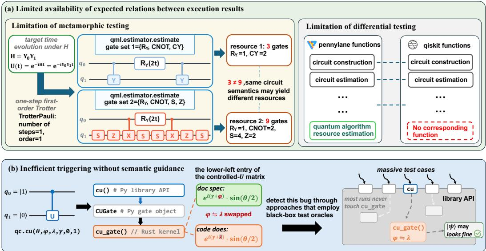
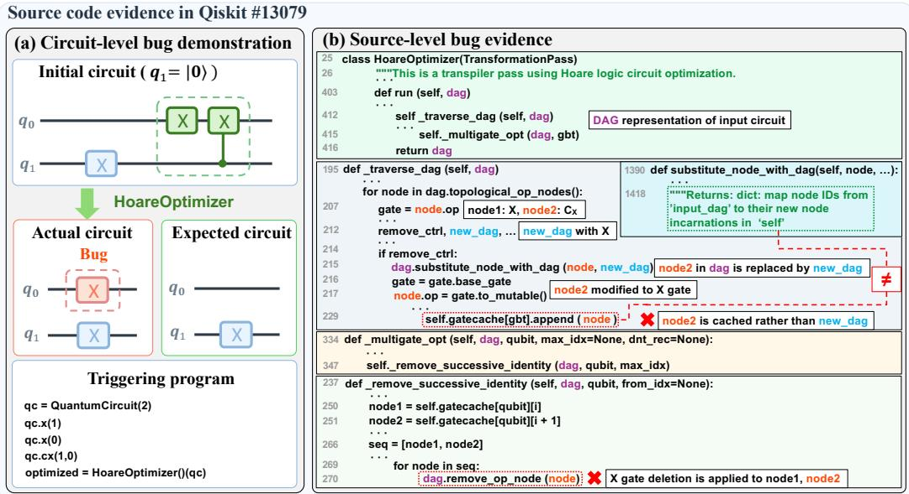
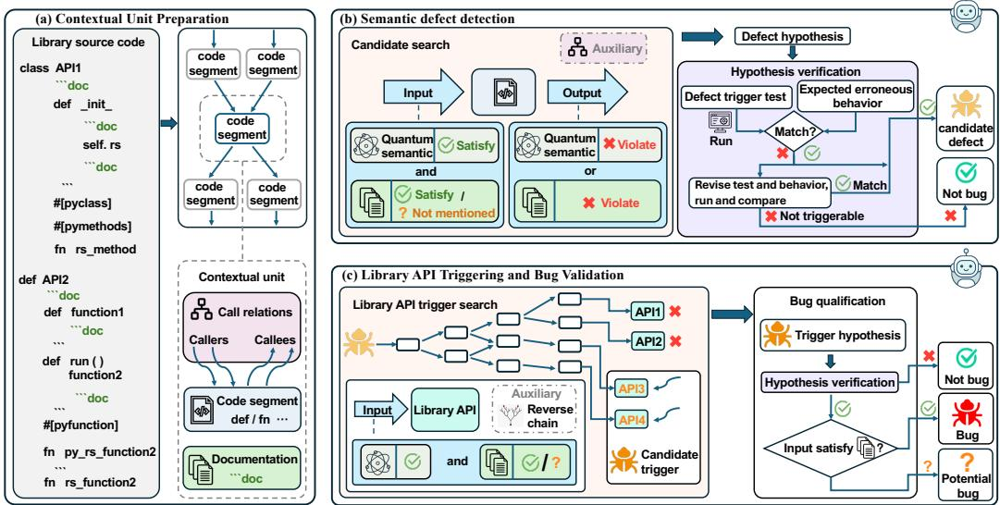
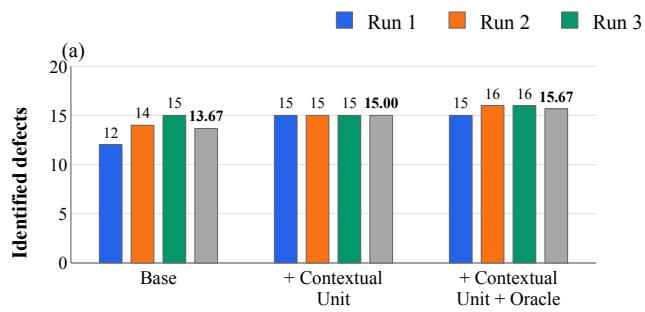
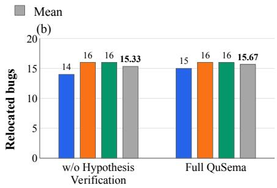

# QuSema: Detecting Silent Bugs in Quantum Libraries via Quantum-knowledge-enhanced Agents

YUJIN SONG, Nanyang Technological University, Singapore

KAINING ZHANG<sup>∗</sup>, Nanyang Technological University, Singapore

QIXIN ZHANG, Nanyang Technological University, Singapore

SHUAI WANG, Hong Kong University of Science and Technology, Hong Kong, China

PINGCHUAN MA<sup>∗</sup>, Zhejiang University of Technology, Hangzhou, China

YUXUAN DU<sup>∗</sup>, Nanyang Technological University, Singapore

Quantum libraries are now critical infrastructure for quantum algorithm development, yet their correctness remains dificult to test. Existing testing techniques mainly rely on failure-based or comparison-based oracles, exposing bugs only when executions fail, violate runtime checks, or disagree with another implementation. Their applicability is limited when suitable execution-based oracles are unavailable, leaving some silent bugs undetected. Such missed bugs can produce incorrect results that propagate into experimental conclusions, simulation studies, and algorithmic designs. Here we present QuSema, an autonomous testing agent for finding silent bugs in quantum libraries. QuSema uses constraints from quantum semantics and documentation as a source-level semantic oracle to assess whether implementation logic can produce invalid outputs from valid inputs. It operates through an agentic loop that repeatedly inspects library API documentation and source code, reasons about the intended behavior of quantum operations, identifies potential semantic deviations, and validates them by generating executable tests through library APIs. Guided by quantum-domain reasoning, QuSema turns high-level behavioral mismatches into concrete, user-triggerable bug reports, enabling it to uncover non-crash defects. We implement QuSema for Qiskit and PennyLane. On a benchmark of 20 historica silent bugs, QuSema achieves higher mean bug relocation counts than Claude Code and Codex, with the DeepSeek configuration costing less than Claude Code. QuSema also discovers 40 previously unknown bugs confirmed by the developers, including 30 silent bugs.

Additional Key Words and Phrases: quantum library testing, quantum computing, silent bugs, coding agents

## 1 Introduction

Quantum computing [1, 2] ofers the potential to tackle computational problems beyond the reach of classical methods, with promising applications in quantum chemistry [3], optimization [4], and machine learning [5]. To facilitate the design and refinement of quantum algorithms, quantum software libraries such as Qiskit [6] and PennyLane [7] have been developed and widely adopted. These libraries provide essential support for building, simulating, and executing quantum algorithms, and have become critical infrastructure in the quantum software ecosystem. However, quantum software is still in its early stage, and these rapidly evolving libraries contain bugs that lead to incorrect or unexpected behaviors [8]. Accordingly, systematic quantum software testing [9] is becoming increasingly essential for building a reliable and robust quantum software ecosystem.

Substantial research efort has been devoted to quantum software testing, particularly automated bug detection for quantum libraries [10]. Existing approaches have shown promising results [11, 12] for crash bugs [13], where exceptions or program termination provide explicit failure signals. Beyond crash bugs, quantum libraries also contain silent bugs [14], which return incorrect results that violate intended behavior or quantum semantics without explicit failures. For example, a quantum library may return an incorrect commutativity judgment for a pair of quantum operators [15] or apply a quantum circuit optimization method that does not preserve semantics of the original circuit [16]. These incorrect but undetected results can propagate through downstream workflows, which in turn mislead algorithm design, lead to erroneous hardware executions, and waste quantum computing resources [17]. To mitigate these risks and improve reliability, quantum software testing should be capable of efectively detecting silent bugs in quantum libraries.

Current approaches to silent bug detection in quantum libraries mainly rely on diferential testing [18–22] and metamorphic testing [23–25]. Diferential testing analyzes the same quantum circuit across diferent quantum software stacks and checks whether equivalent outputs are observed [26]. Metamorphic testing instead applies transformations that should preserve circuit semantics, such as inserting identities or replacing a gate with an equivalent decomposition, and checks the expected relations between execution results from the source and transformed programs [27]. Both approaches use black-box test oracles [28] to validate expected relations between execution results [29]. While these approaches have successfully detected silent bugs in quantum libraries [18–25], their reliance on black-box test oracles introduces two fundamental limitations.

(L1). Limited Availability of Expected Relations Between Execution Results. Some quantum library functionalities lack either semantically corresponding implementations across libraries for diferential testing or circuit transformations with predictable output relations for metamorphic testing. For example, PennyLane supports the resource-estimation functionality [30] for predefined algorithms, while Qiskit has no counterpart [31], and semantics-preserving transformations may still change resource quantities such as gate count or circuit depth. Consequently, approaches that employ black-box test oracles cannot provide complete coverage of quantum library functionality.

(L2). Inefective Triggering Without Semantic Guidance. Many quantum-software functionalities involve complex mathematical semantics [32], and their bugs are triggered only under specific semantic conditions [33]. Such conditions may involve specific parameter values, quantum operations, or circuit layouts [34]. Generic program generation may require extensive exploration to trigger these conditions [35], limiting the efectiveness of black-box testing.

To address these limitations, we develop QuSema, an automated agent for detecting silent bugs in quantum libraries by auditing Quantum Semantics. Its design follows our data-flow analysis, which localizes a silent bug to the library API that first transforms a valid input into an invalid output. Our study of reported bugs in Qiskit and PennyLane provides supporting evidence for this localization. QuSema therefore targets such API-local semantic deviations by directly analyzing the relevant implementation logic. More precisely, QuSema employs large language models (LLMs) [36, 37] to reason about implementation behavior using relevant quantum semantics and documentation. This information serves as a source-level semantic oracle for identifying candidate defects, which are subsequently validated through execution and checked for triggerability through documented library APIs. This design brings quantum semantics into source-level correctness reasoning and extends silent bug detection beyond cases covered by existing execution-based relations.

We systematically evaluate QuSema on Qiskit and PennyLane, two widely used quantum libraries. On a benchmark of 20 historical silent bugs, QuSema substantially outperforms Claude Code and Codex in localizing known defects. When instantiated with DeepSeek as its LLM backend, QuSema achieves this performance at a lower estimated cost than Claude Code and a comparable cost to Codex. Beyond historical benchmarks, applying QuSema to real-world quantum libraries uncovers 40 previously unknown bugs confirmed by developers, including 30 silent bugs. The identified bugs span quantum-program execution, semantic analysis, and library infrastructure. Notably, five of these silent bugs afect functionalities that lack either comparable implementations or suitable circuit transformations with known output relations. Such bugs fall beyond the detection scope of existing diferential and metamorphic testing methods. These results validate the practical value of grounding source code inspection in quantum semantics for systematic silent bug detection across large quantum libraries.

In summary, our main contributions can be summarized in threefold:

• We characterize silent bugs in quantum libraries and show that all examined cases are API-local, leaving semantic evidence in implementation logic and documentation. This defines a well-scoped and prevalent bug class for source-level detection with quantum semantics.

• We propose QuSema, an automated testing agent that uses LLMs to reason about quantum semantics and implementation logic. By inferring semantic constraints from library source code and identifying potential implementation logic deviations from contracts and quantum semantics, it provides a new paradigm for silent bug detection in various quantum software libraries.

• We demonstrate the efectiveness of QuSema on 20 historical silent bugs through comparisons with coding agents and ablation studies. In addition, QuSema discovers 40 previously unknown bugs in Qiskit and PennyLane that are confirmed by developers, including 30 silent bugs, 5 of which afect functionality beyond the coverage of existing diferential and metamorphic testing.

## 2 Background

This section provides the background on quantum computing, quantum-library structure, and existing bug detection approaches. In Sec. 2.1, we review basic concepts in quantum computing. In Sec. 2.2, we describe the functionality and software structure of quantum libraries. Finally, in Sec. 2.3, we review existing approaches to silent bug detection in quantum libraries.

## 2.1 Basic Concepts in Quantum Computing

Qubits and Quantum States. Quantum information is represented by quantum states, with the qubit as the fundamental unit [2]. In the computational basis $\{ | 0 \rangle , | 1 \rangle \}$ , where $| 0 \rangle = ( 1 , 0 ) ^ { T }$ and $| 1 \rangle =$ $( 0 , 1 ) ^ { T }$ , a pure qubit state can be written as $| \psi \rangle = \alpha | 0 \rangle + \beta | 1 \rangle$ , where $\alpha , \beta \in \mathbb { C }$ satisfy $\lvert \alpha \rvert ^ { 2 } + \lvert \beta \rvert ^ { 2 } = 1$ For � qubits, the basis states are formed through tensor products as $| x \rangle = | x _ { 1 } \rangle \otimes \cdot \cdot \cdot \otimes | x _ { n } \rangle$ for each $x _ { i } \in \{ 0 , 1 \}$ , which span a $2 ^ { n }$ -dimensional Hilbert space. An �-qubit pure state can be expressed as $\textstyle | \psi \rangle = \sum _ { x \in \{ 0 , 1 \} ^ { n } } \alpha _ { x } | x \rangle$ , where $\begin{array} { r } { \sum _ { x } | \alpha _ { x } | ^ { 2 } = 1 } \end{array}$

Quantum Gates. Quantum gates act on quantum states through unitary operators. Up to a global phase, a single-qubit unitary can be written as $U ( \theta , \varphi , \lambda ) = \left[ \begin{array} { c c } { { \cos ( \theta / 2 ) } } & { { - e ^ { i \lambda } \sin ( \theta / 2 ) } } \\ { { e ^ { i \varphi } \sin ( \theta / 2 ) \ e ^ { i ( \varphi + \lambda ) } \cos ( \theta / 2 ) } } \end{array} \right]$ . Common single-qubit gates include $\begin{array} { r } { H = \frac { 1 } { \sqrt { 2 } } \left[ \begin{array} { l l } { 1 } & { 1 } \\ { 1 } & { - 1 } \end{array} \right] } \end{array}$ , the Pauli gates $\begin{array} { r } { \dot { X ^ { { } } } = \left[ \begin{array} { l } { 0 } \\ { 1 } \end{array} \right] , Y = \left[ \begin{array} { l l } { 0 } & { - i } \\ { i } & { 0 } \end{array} \right] , \dot { Z } = \left[ \begin{array} { l l } { 1 } & { 0 } \\ { 0 } & { - 1 } \end{array} \right] } \end{array}$ $\begin{array} { r } { S \ = \ \left[ \begin{array} { l } { 1 \ 0 } \\ { 0 \ i } \end{array} \right] } \end{array}$ , and Pauli rotations $R _ { P } ( \theta ) \ = \ e ^ { - i \theta P / 2 } \ = \ \cos ( \theta / 2 ) I - i \sin ( \theta / 2 ) P$ for $P ~ \in ~ \{ X , Y , Z \}$ Controlled gates apply an operation conditionally. For a single-qubit target, $\operatorname { C U } ( \theta , \varphi , \lambda , \gamma ) = | 0 \rangle \langle 0 | \otimes$ $I + e ^ { i Y } | 1 \rangle \langle 1 | \otimes U ( \theta , \varphi , \lambda )$ , which gives CNOT for $U = X$ and $\gamma = 0$

Quantum Circuits. A quantum circuit represents quantum operations on qubit wires. For example, a single-qubit unitary � is represented as , and its controlled version as ${ \frac { \bullet } { - \ m - } } ,$ where the filled dot denotes the control qubit. For input $| \psi \rangle$ and gates $U _ { 1 } , \dots , U _ { k }$ applied left to right, the output is $| \phi \rangle = U _ { k } \cdots U _ { 1 } | \psi \rangle$ . Their arrangement determines circuit depth and gate count. Diferent circuit structures may implement the same computation, enabling semantics-preserving circuit transformation and compilation.

## 2.2 Functionality and Software Structure of Quantum Libraries

Quantum Library Functionality. Quantum libraries provide functionality in three main categories: Quantum programming language, Compilation, and Execution environment [8]. The first provides quantum and classical abstractions, such as gates, circuits, matrices, and tensors, together with domain-specific abstractions for quantum algorithms. Compilation supports intermediate representations, circuit optimization, and code generation. The execution environment provides hardware interfaces, simulators, and quantum state evaluation, including measurement and error mitigation. Auxiliary components support testing, visualization, and software integration. Individual libraries implement diferent parts of this functionality.

Library APIs. Quantum software libraries expose their functionality through APIs in a host programming language [38]. In Qiskit and PennyLane, documented user-facing APIs are primarily Python functions and methods. Their oficial documentation specifies intended usage, accepted inputs, expected outputs, and relevant behavioral constraints. These APIs provide the interface through which users construct quantum programs and access library functionality.

Code Segments. A library API is typically implemented by one or more functions or methods in the source code. Following prior work [39], we refer to each function or method as a code segment. A library API may invoke multiple code segments, while the same code segment may participate in multiple APIs. Code segments may also contain local documentation, such as docstrings or source comments. For segments that do not correspond to documented API entries, this local documentation is not part of the oficial API documentation.

## 2.3 Existing Approaches to Bug Detection in Quantum Libraries

Bugs can manifest as explicit crashes such as exceptions and resource exhaustion, or as silent bugs that produce incorrect behavior without interrupting execution [13]. An empirical study [8] shows that quantum-specific bugs frequently manifest as incorrect outputs rather than crashes. Accordingly, silent bug detection in quantum libraries has received substantial attention. Existing methods in this context primarily fall into two categories.

Diferential Testing. Quantum diferential testing detects inconsistencies by comparing corresponding executions across diferent quantum software stacks [26]. Concretely, QDif [18] and QITE [22] derive comparable programs through program transformations. Blackwell et al. [20] and FuzzQ [19] employ fuzzing to generate test programs, guided respectively by predefined grammars and constraints from a formal model. QSPE [21] systematically enumerates program variants from skeletal programs and compares their final state vectors.

Metamorphic Testing. Quantum metamorphic testing applies transformations that should preserve circuit semantics and checks whether the resulting executions satisfy expected relations [27]. Specifically, MorphQ [23] derives transformed programs using quantum metamorphic relations, while MorphQ++ [24] extends these transformations to additional circuit representations and transpilation settings. QEMI [25] constructs equivalent program variants by eliminating code that does not afect selected inputs in quantum programs with control flow. These methods exercise circuit construction, compilation, and execution, involving functionality from the three categories introduced in Sec. 2.2. Moreover, their applicability to individual functionalities depends on whether corresponding executions or suitable circuit transformations can be constructed.

Diferential and metamorphic testing rely on black-box test oracles that evaluate relations between execution results. Their applicability therefore depends on the availability of comparable executions or suitable metamorphic relations, leaving some quantum library functionalities dificult to test. In contrast, QuSema derives semantic oracles directly from source-level implementation logic, enabling silent bug detection without requiring such predefined relations.

LLM-based Testing. Recent studies have explored large language models (LLMs) for test generation, input construction, fuzzing, and debugging [12, 39–46]. These methods primarily use LLMs to generate test cases and expose failures through program execution, without directly reasoning about semantic defects in library implementations. In contrast, QuSema uses the LLM to analyze implementation logic and identify potential semantic deviations. These candidates are subsequently verified and checked for triggerability through documented library APIs.

  
Fig. 1. Limitations of approaches employing black-box test oracles. (a) Limited availability of expected relations between execution results, where equivalent circuits can have diferent resource counts and some higher-level resource-estimation functionality lacks a cross-library counterpart. (b) Ineficient triggering, where a bug when implementing the CU gate is exposed only under specific semantic conditions.

## 3 Current Limitations and Semantic Evidence for Quantum Silent Bug Detection

In this section, we analyze the limitations of existing silent bug detection methods in quantum libraries and explore source-level semantic evidence as a potential basis for broader and more eficient bug detection. For clarity, we first analyze two limitations of existing approaches employing black-box test oracles in Sec. 3.1, namely (L1) incomplete functionality coverage due to unavailable expected relations between execution results and (L2) ineficient bug triggering without semantic guidance. We then analyze in Sec. 3.2 how data flow can be used to localize semantic deviations to individual library APIs and examine reported bugs to support this analysis. Finally, in Sec. 3.3, we discuss the implications and challenges of using this evidence for reliable silent-bug detection.

## 3.1 Two Limitations of Existing Approaches

Existing approaches for detecting silent bugs in quantum libraries, particularly diferential and metamorphic testing introduced in Sec. 2.3, mainly rely on black-box test oracles [28]. They have shown efectiveness for functionalities such as circuit execution and compilation, yet two limitations defined in Sec. 1 (i.e., (L1) and (L2)) remain. For some quantum library functionalities, the expected relations between execution results cannot be established. This occurs when crosslibrary counterparts are unavailable or circuit-level transformations do not yield predictable output relations. Moreover, many silent bugs are triggered only under specific quantum semantic conditions, making generic program generation ineficient. Below, we elaborate on these two limitations with representative examples in Fig. 1.

(L1) Limited Availability of Expected Relations Between Execution Results. For some functionalities in quantum libraries, the expected relations between execution results needed for diferential or metamorphic testing cannot be established. Here, we use resource estimation as a representative example to illustrate the limitations of both metamorphic and diferential testing. As shown in Fig. 1(a), PennyLane provides the qml.estimator.estimate API to estimate the gate count required to implement a quantum circuit or operator under a specified gate set.

For metamorphic testing, consider Trotterized time evolution under the Hamiltonian $H = Y _ { 0 } Y _ { 1 }$ The same functionality reports 3 and 9 gates for two equivalent circuit representations using the gate sets $\{ R _ { Y } , \mathrm { C N O T } , \mathrm { C Y } \}$ and $\{ R _ { Y } , \mathrm { C N O T } , S , Z \}$ , respectively. Because the gate count is not preserved across semantics-preserving circuit transformations, the expected relation between the two outputs is unavailable as a metamorphic oracle.

For diferential testing, the same resource-estimation functionality presents a diferent limitation. PennyLane supports resource estimation for predefined quantum algorithms such as the illustrated Trotter decomposition, while Qiskit does not provide a corresponding functionality. Consequently, no cross-library output is available to construct a diferential oracle.

(L2) Ineficient Triggering Without Semantic Guidance. Approaches based on black-box test oracles rely on testing generated programs to expose faulty behavior. In practice, many silent bugs in quantum libraries are triggered under specific semantic conditions involving parameter values, quantum states, or circuit structures. Generic testing may require substantial exploration to reach the defective implementation under these conditions.

We use Qiskit #13118 [47] in Fig. 1(b) as a representative case. As shown on the left side of the figure, the Python library API qc.cu is designed to implement the gate CU. Its call path passes through CUGate and reaches the Rust kernel cu\_gate, which incorrectly swaps parameters $\phi$ and �. A test exposes this bug only if it reaches cu\_gate with $\phi \neq \lambda$ and sin $( \theta / 2 ) \neq 0 .$ . Generic testing may require repeated executions to meet these conditions, leading to ineficient bug triggering as shown on the right side of Fig. 1(b).

These examples reflect two key limitations of existing approaches that employ black-box test oracles for quantum libraries. These limitations motivate alternative approaches.

## 3.2 Motivating Study: Source-Level Semantic Evidence

In this section, we analyze how silent bugs arise along the data flow of quantum programs and how their origins can be identified from source-level semantic evidence. Specifically, we first characterize silent bugs as semantic deviations that produce invalid outputs from valid inputs and localize each deviation to the first library API that introduces it. We then use a representative bug to illustrate how inconsistencies between implementation logic and quantum semantics or documentation provide evidence for identifying such defects.

Characterization of Silent Bugs. We consider an input or output valid if it satisfies the relevant quantum semantics and does not violate the documentation, and invalid otherwise. At the codesegment level, validity also includes applicable software semantics, since local implementation logic may manipulate objects not fully constrained by quantum semantics. Under these criteria, a silent bug is characterized by a semantic deviation that produces an invalid output from a valid input without an explicit failure signal.

Localization of Semantic Deviations. A quantum program may invoke multiple library APIs, with the output of one call serving as input to subsequent calls. Within this flow, we treat each library API as a data-transformation unit from its received input to its resulting output. For an execution exhibiting a silent bug, the first library API that transforms a valid input into an invalid output introduces the semantic deviation and is identified as its origin. Earlier calls preserve validity, while later calls may only propagate or expose the resulting incorrect behavior. This data-flow view localizes the semantic deviation to an individual library API. To examine whether reported bugs provide counterexamples to this localization, we screened 3,184 bug reports from Qiskit and PennyLane using Codex with GPT-5.6-Sol (Ultra). We specifically searched for cases in which each API behaves correctly in isolation, but a permitted composition of APIs produces incorrect behavior. The screening surfaced two candidate counterexamples, Qiskit #4369 [48] and PennyLane #534 [49]. In both cases, an output accepted as valid by one component is rejected by a subsequent API, producing an explicit exception instead of a silent incorrect result. Thus, no silent bug counterexample to the API-localization criterion was found among the screened reports. Accordingly, we scope this work to API-local silent bugs, whose semantic deviation can be localized to the first library API that transforms a valid input into an invalid output.

  
Fig. 2. Circuit-level manifestation and source-level semantic evidence of Qiskit #13079 [16] in HoareOptimizer. (a) The triggering program and actual and expected circuits, showing an extra � on �<sub>0</sub>. (b) The implementation caches the original node after replacing it, so subsequent cancellation leaves the replacement � in the circuit. This violates quantum circuit semantics and is inconsistent with the documented node replacement.

Inconsistencies with Quantum Semantics and Documentation. Both forms of semantic evidence are illustrated by Qiskit #13079 [16] as shown in Fig. 2. The bug afects the Qiskit API HoareOptimizer, described in the documentation of hoare\_opt.py [50] for circuit optimization. As shown in Fig. 2(a), when the control qubit is |1⟩, the CX gate can be simplified to an � gate on the target. This � gate should cancel with the adjacent � gate because $X ^ { 2 } = I _ { : }$ , whereas the implementation leaves an extra � gate in the circuit. The incorrect simplification arises from the internal function \_traverse\_dag, as shown in Fig. 2(b). That is, after updating the circuit using substitute\_node\_with\_dag, the subsequent code should process the replacement node but instead continues to process the original node. This behavior violates the quantum circuit semantics that the optimization should preserve and provides direct evidence of the bug. This defect is also exposed by the documentation of substitute\_node\_with\_dag in dagcircuit.py [51], as the function replaces a node and returns a mapping to the newly inserted nodes. Continuing to process the original node after replacement is inconsistent with the documented behavior. Both quantum semantics and documentation provide semantic evidence of the same defect.

The above data-flow analysis motivates API-local defect analysis, and the issue study provides supporting evidence from reported bugs. The Qiskit case in Fig. 2 further illustrates how such deviations can be identified from source-level semantic evidence without relying on expected relations between execution results, addressing (L1). Besides, the associated semantic conditions can guide the construction of triggering inputs, helping mitigate (L2).

## 3.3 Implications and Challenges

The motivating study in Sec. 3.2 suggests that source-level semantic evidence can help address (L1) and (L2) in existing approaches to silent bug detection in quantum libraries. Turning this insight into a practical testing method requires systematically identifying and validating such evidence, which introduces two key challenges.

(C1) Incorporating Quantum Semantics into Source-Level Correctness Reasoning. As discussed in Sec. 3.2, discovering silent bugs requires analyzing source code, interpreting documentation, and reasoning with quantum-domain knowledge. Documentation can encode semantic constraints on API behavior, whose interpretation may itself require such knowledge, as illustrated by the inconsistency between documentation and implementation logic in Fig. 2. Since these constraints often involve mathematical and domain-specific concepts, the first challenge is to integrate relevant quantum semantics into correctness reasoning over library implementation logic.

(C2) Distinguishing Internal Defects from Bugs Exposed Through Valid Library API Use. A source-level semantic defect may be unreachable through documented library APIs because higher-level logic prevents the defective code from being executed. We exclude such unreachable defects and consider only those that can arise during valid API use. The second challenge is therefore to determine whether an identified defect is triggerable through a documented library API.

## 4 QuSema: Semantics-Driven Detection of Silent Bugs in Quantum Libraries

This section presents QuSema, a framework for detecting silent bugs in quantum libraries using semantic evidence from implementations. Inspired by prior work on large language models (LLMs) reasoning about program semantics [36] and quantum programming [37], QuSema leverages the reasoning and coding abilities of LLMs to identify semantic deviations by analyzing implementation logic against quantum semantics and documentation.

There are two critical issues in completing such a reasoning process. First, it is unknown how to assign an appropriate analysis scope. More concretely, excessive context may contain irrelevant information that interferes with LLM reasoning [52], whereas insuficient context may omit information required for correct analysis [53]. Each code segment forms a complete data-flow unit within a library API, allowing a silent bug to be localized to the first segment that introduces a semantic deviation. Subsequent segments may propagate or expose it, as illustrated in Fig. 2. Second, analyzing the target code segment may require implementation logic defined outside its boundaries. To address both issues in quantum software testing, QuSema adopts a structured analysis around each code segment together with relevant documentation and call relations, which collectively constitute a contextual unit. QuSema analyzes each contextual unit for semantic defects and then determines whether the identified defects can be triggered through library APIs. In this way, QuSema keeps a focused analysis scope while incorporating additional context when needed, which supports more efective LLM reasoning.

## 4.1 Overview of QuSema

QuSema follows a three-stage workflow for discovering and validating silent bugs, as illustrated in Fig. 3. Its key principle is to use LLMs to examine implementation logic against quantum semantics and relevant documentation, identify semantic deviations, and determine whether they can be triggered through valid library API use.

The workflow begins with Stage I, Contextual Unit Preparation, which establishes a focused scope for semantic analysis. QuSema uses code segments as the primary analysis units and associates them with documentation that constrains their intended behavior and call relations that provide access to related implementation logic when needed. The resulting contextual units reduce unrelated source context while preserving information required to interpret the behavior of each segment.

Next, in Stage II, Semantic Defect Detection, QuSema interprets the relevant quantum semantics or documented behavior as semantic constraints on each code segment. These constraints form the source-level semantic oracle used to identify conditions under which a valid input may produce an invalid output. Each suspected violation is converted into a testable defect hypothesis with predicted erroneous behavior and validated through execution. Hypotheses supported by the observed results are retained as candidate defects. This stage addresses (C1) by incorporating quantum-specific semantic knowledge into source-level correctness reasoning.

Finally, in Stage III, Library API Triggering and Bug Validation, QuSema determines whether a verified source-level defect can be reproduced through valid use of a documented library API. It searches for API entries that can reach the defective implementation, constructs user-level inputs that may preserve the triggering condition identified in Stage II, and verifies whether the same semantic deviation is exposed at the API level. The reverse chain in Fig. 3(c) provides additional guidance for this search. Reproduced cases are then classified according to input validity and API documentation. This stage addresses (C2) by distinguishing internal implementation defects from user-triggerable library bugs.

Across these stages, QuSema progresses from library source code to focused contextual units, verified semantic defects, and finally user-triggerable bugs. We next detail these stages in Secs. 4.2, 4.3, and 4.4, respectively.

## 4.2 Contextual Unit Preparation

Stage I establishes the scope of semantic analysis. An entire source file may contain substantial logic unrelated to the behavior under examination, while an isolated function may omit dependencies needed to interpret that behavior. Following the localization in Sec. 3.2, QuSema analyzes individual code segments and retrieves related information as needed. Specifically, a contextual unit contains the target code segment, documentation that constrains its intended behavior, and call relations that provide access to relevant implementation logic. This design keeps the initial reasoning scope focused while preserving access to dependencies that may afect the semantic behavior of the segment. For example, the Qiskit 2.4.1 Rust file standard\_gates\_commutations.rs [54] contains 7,778 lines covering gate metadata, commutation tables, and helper logic. Analyzing the complete file introduces substantial unrelated context, whereas analyzing an extracted function alone may omit referenced tables or surrounding logic required to determine whether its commutation behavior is correct. QuSema therefore constructs contextual units through code segment extraction, call relation analysis, and documentation association.

Code Segment Extraction. QuSema extracts individual code segments from the quantum library source code shown on the left side of Fig. 3(a). For Python, QuSema uses source positions from the standard ast module [55] to extract module-level functions and class methods, while nested functions remain within their enclosing function. For Rust, regular expressions identify modulelevel functions and functions or methods in impl blocks, with brace-depth tracking determining their boundaries. Functions exposed through PyO3 are also included [56]. Each segment retains its attached Python decorators or Rust attributes and records its qualified name, signature, source file, and line range. QuSema further partitions the few Rust functions exceeding 1,000 lines while retaining the enclosing function context.

  
Fig. 3. Workflow of QuSema for detecting silent bugs in quantum libraries. (a) Contextual Unit Preparation extracts code segments from library source code and combines them with call relations and documentation to form contextual units. (b) Semantic Defect Detection searches each contextual unit for semantic violations, formulates defect hypotheses and executes tests to produce candidate defects. (c) API Triggering and Bug Validation searches for documented APIs that expose the candidate defects, uses the reverse chain as auxiliary guidance, verifies the triggers, and classifies the results as bugs, potential bugs, or not bugs.

Call-Relation Analysis. A code segment may depend on implementation logic defined elsewhere. QuSema records these dependencies for inspection without expanding the initial scope to the entire source file. The Call relations component in Fig. 3(a) records callers and callees [57], together with class references, variable definitions, and cross-language relations. Source locations are retained for inspecting related code. For Python, call targets are resolved from call expressions and import bindings. For Rust, QuSema uses call sites, enclosing impl types, and qualified names. Referenced constants, class attributes, and tables from the same file are included when available. PyO3 export attributes and module registrations connect Rust implementations to their corresponding Python interfaces [56]. Unresolved calls are retained for later inspection. For partitions of large Rust functions, QuSema also records definitions and updates of local variables outside the partition.

Documentation Association. Semantic analysis also requires evidence of the implementation’s intended behavior. QuSema therefore associates each code segment with relevant documentation, as illustrated in Fig. 3(a). Python docstrings are obtained from syntax-tree nodes, while Rust documentation is collected from documentation comments (/// and //!) and the #[doc = ...] attribute [58]. For Python class methods, class-level documentation is also included when it specifies relevant behavior. Documentation from the constructor, resolvable base classes, and directly related classes is included when available. For Rust segments, QuSema resolves documentation from the corresponding Python interface through exported names and containing types, using related #[pyclass] types as fallback. Partitions of large Rust functions retain the enclosing func tion documentation and relevant gate-class documentation. Documentation sources and missing documentation are explicitly recorded.

The design in Stage I of QuSema organizes library code into compact contextual units with explicit links to supporting information. This structure limits irrelevant context while preserving access to dependencies that may afect code behavior. The subsequent semantic defect detection stage can then begin from a focused scope and retrieve additional context when needed.

## 4.3 Semantic Defect Detection

After contextual unit preparation, Stage II of QuSema performs Semantic Defect Detection, as illustrated in Fig. 3(b). It examines whether the implementation logic of each code segment satisfies the relevant quantum semantics and documented behavior under valid inputs. These semantic constraints form the source-level semantic oracle used to identify conditions under which the implementation may produce an invalid output. QuSema then turns each suspected violation into a testable defect hypothesis and validates it through execution. This process consists of candidate search, defect hypothesis generation, and hypothesis verification.

Candidate Search. As shown on the left of Fig. 3(b), QuSema analyzes each contextual unit against the source-level semantic oracle. The LLM identifies the quantum-semantic and documented constraints relevant to the target code segment and examines whether the implementation can violate these constraints under valid inputs. When additional implementation logic is required, it follows the call relations to inspect referenced definitions and related code segments, and may execute exploratory code to examine suspected inconsistencies. QuSema records plausible semantic violations as candidates. Search ends when the LLM determines that no further candidates can be identified in the contextual unit. Each candidate then proceeds individually through the remaining workflow.

Defect Hypothesis Generation. For each retained candidate, QuSema converts the suspected semantic violation into a testable defect hypothesis, as shown on the upper right of Fig. 3(b). The hypothesis specifies the triggering input, the erroneous behavior predicted from the implementation, and the quantum-semantic or documented constraint expected to be violated. QuSema then constructs executable test code that directly exercises the target code segment under the identified condition. The resulting hypothesis provides a concrete prediction for subsequent verification.

Hypothesis Verification. As shown on the lower right of Fig. 3(b), QuSema executes the generated test, compares the observed behavior with the erroneous behavior predicted by the defect hypothesis, and checks whether the claimed semantic violation is justified. If the two do not match or the claimed violation is unjustified, the LLM revisits the triggering condition, test code, and predicted behavior, revises the hypothesis when needed, and repeats the verification. A candidate is retained as a semantic defect only when the predicted violation is reproduced through execution. Otherwise, it is discarded.

Stage II progresses from semantic constraints on implementation behavior to executable evidence of their violation. This process addresses (C1) by incorporating quantum semantic knowledge into source-level correctness reasoning.

## 4.4 Library API Triggering and Bug Validation

The candidate defects from Stage II may either be exposed through valid use of documented library APIs or remain confined to internal implementation logic. The latter do not constitute silent bugs considered in this work. To distinguish these cases, Stage III of QuSema determines whether a verified source-level defect can be reproduced through a documented library API, thereby addressing (C2), as illustrated in Fig. 3(c). This stage consists of library API trigger search, which identifies an API and valid input that may expose the defect, and bug qualification, which verifies whether the semantic deviation is reproduced at the API level and determines the final classification.

Library API Trigger Search. As shown on the left of Fig. 3(c), QuSema searches for documented library APIs that can reach the verified defect and preserve its triggering condition. The LLM examines candidate APIs and constructs valid inputs that may reproduce the erroneous behavior identified in Stage II, using exploratory execution when needed. QuSema supplements this search with the reverse chain shown in the Auxiliary component of Fig. 3(c). Starting from the smallest code segment containing the defect, the reverse chain performs a bounded search over CodeQLderived caller relations [59] toward documented library APIs. For Qiskit Rust code, PyO3 bindings connect Rust implementations to the corresponding Python classes or methods. These paths identify possible API entries and guide trigger construction. An API and valid input that may reproduce the defect are retained as a trigger candidate. If no valid trigger is found, the candidate receives the workflow status not bug and is not reported.

Bug Qualification. As shown on the right of Fig. 3(c), QuSema determines whether a trigger candidate reproduces the semantic deviation identified in Stage II. For each candidate, QuSema formulates a trigger hypothesis specifying the library API call, input, and expected erroneous behavior, then verifies it using the procedure in Sec. 4.3. A candidate whose predicted behavior cannot be reproduced is classified as not bug. For a reproduced defect, QuSema checks the triggering input against the API documentation. Cases arising from inputs explicitly permitted by the documented API are classified as bug, while cases involving valid inputs whose support is not established by the documentation are retained as potential bug for developer assessment.

This stage determines whether an internal defect can be exposed through valid library API use. The final classification distinguishes true bugs from potential bugs according to whether the triggering input is permitted by the API documentation.

## 5 Experimental Setup

We evaluate the efectiveness and utility of QuSema through the following three research questions:

RQ1: How does QuSema perform compared with general coding agents and across LLM backends?

RQ2: How do individual components ofQuSema contribute to its efectiveness?

RQ3: Can QuSema discover previously unknown bugs in quantum libraries?

Subjects and Benchmark. We evaluate QuSema on Qiskit and PennyLane. For RQ1 and RQ2, we construct a benchmark of 20 maintainer-confirmed historical silent bugs, with 10 from each library, and reproduce each bug on its corresponding buggy version. The benchmark covers 10 functionality types, as summarized in Table 1. In particular, 10 of these bugs, evenly split between Qiskit and PennyLane, lack comparable implementations in the other library and therefore cannot be directly checked by diferential testing. Metamorphic testing is also insuficient for these cases. For PennyLane #9361 [60] and Qiskit #12429 [61], equivalent circuit transformations do not guarantee unchanged resource estimates. For the remaining eight bugs, equivalent circuit variants can be constructed, but their execution results do not expose the defects. For RQ1 and RQ2, each benchmark instance centers on one historical bug. Issue reports, known triggering inputs, fixes, and regression tests are withheld from all methods. RQ1 and RQ2 evaluate defect identification and bug validation under controlled inputs, while RQ3 examines repository-scale discovery. For RQ3, we apply QuSema to the full source code of Qiskit 2.4.1 [31] and PennyLane 0.45.0 [30]. Table 2 reports the size, documented APIs, and extracted code segments of the two library versions.

Table 1. Historical silent bug benchmark covering 20 maintainer-confirmed bugs in Qiskit and PennyLane. Comparable functionality indicates whether cross-library comparison is available.
<table><tr><td>Category</td><td>Functionality type</td><td>Library</td><td></td><td>Version Comparable functionality</td></tr><tr><td rowspan="5">Quantum programming</td><td>Semantic queries</td><td>PennyLane #4842 [62] 0.33.1</td><td></td><td>Unavailable</td></tr><tr><td>Semantic queries</td><td>Qiskit</td><td>#14107 [63] 2.2.0</td><td>Unavailable</td></tr><tr><td>Construction</td><td>PennyLane #6359 [64] 0.38.0</td><td></td><td>Available</td></tr><tr><td>Construction</td><td>Qiskit</td><td>#15465 [65] 2.4.1</td><td>Available</td></tr><tr><td>Specialized quantum algorithms</td><td>PennyLane #9521 [66] 0.45.0</td><td></td><td>Available</td></tr><tr><td rowspan="10"></td><td>Specialized quantum algorithms</td><td>Qiskit</td><td>#12093 [67] 1.0.2</td><td>Available</td></tr><tr><td>Compilation workflow orchestration</td><td>PennyLane #8048 [68] 0.42.3</td><td></td><td>Unavailable</td></tr><tr><td>Compilation workflow orchestration</td><td>Qiskit</td><td>#14329 [69] 2.1.1</td><td>Unavailable</td></tr><tr><td>Structural placement decisions</td><td>PennyLane #9009 [70] 0.42.3</td><td></td><td>Unavailable</td></tr><tr><td>Structural placement decisions</td><td>Qiskit</td><td>#12157 [71] 1.3.2</td><td>Unavailable</td></tr><tr><td>Resource estimation Resource estimation</td><td></td><td>PennyLane #9361 [60] 0.45.0</td><td>Unavailable</td></tr><tr><td></td><td>Qiskit</td><td>#12429 [61] 1.0.2</td><td>Unavailable</td></tr><tr><td>Representation conversion and interoperability Representation conversion and interoperability</td><td>PennyLane #6978 [72] 0.40.0</td><td></td><td>Unavailable</td></tr><tr><td>Transformation and synthesis</td><td>Qiskit</td><td>#10570 [73] 1.0.2</td><td>Unavailable</td></tr><tr><td>Transformation and synthesis</td><td>PennyLane #8746 [74] 0.45.0 Qiskit</td><td>#11974 [75] 1.0.2</td><td>Available Available</td></tr><tr><td rowspan="4">Execution environment</td><td>Execution and device modeling</td><td>PennyLane #8366 [76] 0.42.3</td><td></td><td>Available</td></tr><tr><td>Execution and device modeling</td><td>Qiskit</td><td>#13047 [77] 1.0.2</td><td>Available</td></tr><tr><td>Measurement and result processing</td><td>PennyLane #7344 [78] 0.38.0</td><td></td><td>Available</td></tr><tr><td>Measurement and result processing</td><td>Qiskit</td><td>#11393 [79] 2.4.1</td><td>Available</td></tr></table>

Table 2. Library statistics for RQ3. APIs count entries listed in the oficial documentation. Library LoC excludes comments and blank lines, while segment lengths include them and exclude atached context.
<table><tr><td>Library</td><td>Version</td><td>LoC</td><td>APIs</td><td>Code segments</td><td>Min. lines</td><td>Max. lines</td></tr><tr><td>Qiskit</td><td>2.4.1</td><td>169,750</td><td>899</td><td>8,949</td><td>1</td><td>908</td></tr><tr><td>PennyLane</td><td>0.45.0</td><td>104,172</td><td>1,270</td><td>7,786</td><td>2</td><td>446</td></tr></table>

Configurations. For RQ1, we compare QuSema with Claude Code [80] using Fable 5 (Max) [81] and Codex [82] using GPT-5.6-Sol (Max) [83]. Two QuSema configurations are instantiated with DeepSeek-V4.1-Flash (Max) [84] and Opus 5 (Extra) [85], respectively. Both QuSema configurations use the same workflow, prompts, tools, and execution constraints, while Claude Code and Codex retain their native workflows and tools. Both baselines are instructed to search until they identify no further silent bugs in the target code segment, then report all findings in one final response. All configurations aim to identify silent bugs triggerable through valid library API use. Each QuSema model request permits up to 128,000 generated tokens, with no task-level limit on turns or cumulative token usage. For RQ2, we use QuSema with DeepSeek-V4.1-Flash (Max) in two controlled comparisons. First, we evaluate candidate search under three configurations: a base QuSema configuration that analyzes complete source files without the source-level semantic oracle, a configuration with Contextual Unit Preparation, and one that additionally uses the oracle. This comparison measures their contributions to defect identification. Second, starting from the defects identified by the third configuration, we compare the subsequent workflow with and without hypothesis verification in Stages II and III. This comparison assesses the role of verification in correcting hypotheses and filtering candidates. The benchmark, environment, execution budget, and other settings remain fixed within each comparison. For RQ3, we use the complete QuSema configuration with DeepSeek-V4.1-Flash (Max).

Table 3. Bug relocation and estimated cost on the historical benchmark. Runs 1–3 report manually reviewed counts, Mean is their average, and Cost covers all three runs.
<table><tr><td>Configuration</td><td>Run 1</td><td>Run 2</td><td>Run 3</td><td>Mean</td><td>Costs (USD)</td></tr><tr><td> ${ \mathrm { Q u S e m a } } + { \mathrm { O p u s } } 5$ </td><td>16</td><td>15</td><td>17</td><td>16.00</td><td>1,603.44</td></tr><tr><td> $\mathrm { \tilde { Q } u S e m a + D i \tilde { e } e p S e e k }$ </td><td>15</td><td>16</td><td>16</td><td>15.67</td><td>162.27</td></tr><tr><td> ${ \widetilde { \mathrm { C l a u d e } } } \mathrm { C o d e } + { \mathrm { \overbrace { F a b l e } } } 5$ </td><td>15</td><td>14</td><td>15</td><td>14.67</td><td>425.04</td></tr><tr><td> $\mathrm { C o d e x } + \mathrm { G P T } { - } 5 . 6 { - } \mathrm { S o l }$ </td><td>15</td><td>12</td><td>13</td><td>13.33</td><td>117.29</td></tr></table>

Table 4. Candidate outcomes for all findings produced during historical bug relocation after deduplication.
<table><tr><td>Configuration</td><td></td><td>Run Candidates</td><td>Verified defects API triggers Final reports</td><td></td><td></td></tr><tr><td rowspan="3">QuSema + Opus 5</td><td>1</td><td>65</td><td>64</td><td>64</td><td>64</td></tr><tr><td>2</td><td>56</td><td>55</td><td>54</td><td>54</td></tr><tr><td>3</td><td>66</td><td>66</td><td>66</td><td>66</td></tr><tr><td rowspan="3">QuSema + DeepSeek</td><td>1</td><td>64</td><td>61</td><td>60</td><td>60</td></tr><tr><td>2</td><td>73</td><td>72</td><td>72</td><td>72</td></tr><tr><td>3</td><td>65</td><td>62</td><td>62</td><td>62</td></tr></table>

Procedure and Metrics. For RQ1 and RQ2, we evaluate each configuration in three independent runs on the historical bug benchmark. For each bug, we define the root-cause code segment as the first segment along the call chain that produces an invalid output from a valid input. In RQ1, all methods receive this segment, and Claude Code and Codex may inspect other library code as needed. For QuSema, this corresponds to analyzing a single contextual unit. In RQ2, the base QuSema configuration receives the containing source file, while the remaining configurations receive the root-cause segment. Each bug is counted at most once per run, and we report per-run counts and three-run means. A defect is identified when a candidate matches the ground-truth implementation defect and correctly explains how a valid input produces an output violating the relevant quantum semantics or documented behavior. A bug is relocated when the identified defect is reproduced through valid library API use, with executable evidence and a correct explanation of the invalid output. We check the reported root cause, input validity, and semantic explanation using issue reports, documentation, and executable evidence. RQ1 reports bug relocation counts and total cost across three runs. The two RQ2 comparisons report defect identification and bug relocation counts, respectively. For RQ3, QuSema analyzes code segments from the target library versions until 40 previously unknown bugs are identified. We report each unique finding to library maintainers and record its status as fixed, confirmed, pending, or rejected.

## 6 Evaluation Results

This section answers the three research questions in Sec. 5. We compare QuSema with general coding agents on the historical benchmark, examine the contributions of contextual units and the source-level semantic oracle to defect identification, and assess hypothesis verification in bug qualification. We then report previously unknown bugs found in Qiskit and PennyLane.

## 6.1 RQ1: Historical Bug Relocation

We compare two QuSema configurations with Claude Code and Codex on the historical bug benchmark. As shown in Table 3, QuSema with Opus 5 achieves the highest mean bug relocation count of 16.00, followed by QuSema with DeepSeek-V4.1-Flash at 15.67. Claude Code with Fable 5 and Codex with GPT-5.6-Sol achieve mean counts of 14.67 and 13.33, respectively. Thus, both

QuSema configurations relocate more historical bugs than the evaluated coding agents. In addition, QuSema with DeepSeek retains nearly all of the relocation performance of the Opus configuration while requiring approximately one-tenth of the cost. It achieves a higher mean relocation count than Claude Code at a lower cost, and achieves a higher mean bug relocation count than Codex with only a modest increase in cost. These results indicate that QuSema can achieve a better efectiveness–cost trade-of than the evaluated coding agents by using a less expensive LLM backend.

Beyond relocating the historical target bugs, QuSema also identifies additional defect candidates. As shown in Table 4, each run produces 56–73 candidates, of which 54–72 remain after validation and proceed to final reporting. Defect hypothesis verification and library API trigger search exclude 0–4 candidates per run because the predicted semantic violation cannot be reproduced or the triggering condition cannot arise through valid API use. Among the reports not corresponding to the 20 targets, 15 correspond to independently reported issues. Manual review finds the remaining reports consistent with our silent bug criteria, although they have not yet been submitted for maintainer validation. These results show that QuSema can identify findings beyond the benchmark targets while filtering unsupported or non-triggerable candidates through Stages II and III.

Answer to RQ1. QuSema achieves mean relocation counts of 16.00 with Opus 5 and 15.67 with DeepSeek-V4.1-Flash, compared with 14.67 for Claude Code and 13.33 for Codex. Despite using a less expensive LLM backend, DeepSeek-based QuSema exceeds both coding agents and costs \$162.27 across three runs, about one-tenth of Opus and less than Claude Code.

## 6.2 RQ2: Component Contributions

We conduct two controlled comparisons of QuSema components, as shown in Fig. 4. The first evaluates Contextual Unit Preparation and the Source-level Semantic Oracle for defect identification, while the second evaluates hypothesis verification for bug relocation.

In the first comparison, the base configuration analyzing complete source files identifies 12– 15 defects across three runs, averaging 13.67. Contextual Unit Preparation raises the mean to 15.00, with 15 defects identified in each run, and adding the Source-level Semantic Oracle raises it to 15.67. The larger gain from Contextual Unit Preparation suggests that reducing unrelated context is particularly important for defect identification and improves consistency across runs. The oracle’s additional gain indicates that semantic evidence helps determine correctness when observed behavior alone is insuficient. The two components address complementary sources of failure. Contextual Unit Preparation focuses the analysis on relevant implementation context, while the Source-level Semantic Oracle provides evidence for distinguishing semantic defects from permissible implementation choices.

In the second comparison, the mean bug relocation count increases from 15.33 without hypothesis verification to 15.67 with full QuSema. The increase in mean bug relocation count is modest, but the verification record shows its role in correcting semantic assumptions. For example, in the benchmark case Qiskit #11974 [75], QuSema identifies the unitary-synthesis defect but incorrectly assumes that $[ ^ { \prime } \Gamma z ^ { \prime } , ^ { \prime } \times ^ { \prime } , ^ { \prime } \mathrm { c } \times ^ { \prime } ]$ forms a universal gate set. Hypothesis verification corrects this assumption before evaluating the target gate-set violation, avoiding an incorrect bug qualification.

Answer to RQ2. The mean defect identification count increases from 13.67 to 15.00 with Contextual Unit Preparation and to 15.67 with the Source-level Semantic Oracle. Hypothesis verification further increases mean bug relocation from 15.33 to 15.67 and corrects invalid assumptions during bug qualification, as illustrated by Qiskit #11974 [75].





Fig. 4. Component contributions with DeepSeek-V4.1-Flash (Max). (a) Candidates matching historical defects as Contextual Unit Preparation and the Source-level Semantic Oracle are added. (b) Bugs satisfying the relocation criterion with and without hypothesis verification in Stages II and III. Each group reports the counts from Runs 1–3 and their mean across the three runs.  
(a)   
1 from pennylane import BoseWord   
2   
3 w1 = BoseWord({   
4 (0, 0): '+', (1, 1): '-'})   
5 w2 = BoseWord({   
6 (1, 1): '-', (0, 0): '+'})   
7   
8 print(w1 == w2)   
9 # True   
10 print(w1 \* w2)   
11 # Expected: b⁺(0) b(1) b⁺(0) b(1)   
12 # Actual: b⁺(0) b(1) b(0) b⁺(1)   
13   
14 print(w1 \* w1 == w1 \* w2)   
15 # Expected: True; actual: False (PennyLane 0.45.0)

```python
(b) from qiskit import QuantumCircuit
2 from qiskit.circuit import (
3 AnnotatedOperation as A, ControlModifier as C)
4 from qiskit.circuit.library import XGate
5 from qiskit.quantum_info import Operator
6 from qiskit.transpiler import PassManager, passes
7
8 inner = A(XGate(), C(1, ctrl_state=0))
9 outer = A(inner, C(1, ctrl_state=1))
10 qc = QuantumCircuit(3)
11 qc.append(outer, [0, 1, 2])
12 out = PassManager(
13 passes.OptimizeAnnotated()).run(qc)
14 print(Operator(qc).equiv(Operator(out)))
15 # Expected: True; actual: False (Qiskit 2.4.1)
```  
Fig. 5. Silent bugs discovered by QuSema: (a) incorrect bosonic-operator multiplication in PennyLane #9650 [86] and (b) incorrect control-state composition in Qiskit #16410 [87].

## 6.3 RQ3: Previously Unknown Bugs

QuSema with DeepSeek-V4.1-Flash (Max) is used to analyze the source code of Qiskit 2.4.1 and PennyLane 0.45.0 for previously unknown bugs. It analyzes 68,687 lines and 2,753 code segments in Qiskit, and 72,262 lines and 2,269 code segments in PennyLane. QuSema reports 40 previously unknown bugs, all confirmed by the maintainers. Among them, 30 are silent bugs that return invalid outputs without explicit failure signals, while the other 10 cause crashes or exceptions on valid inputs. Tables 5 and 6 summarize these findings by API location and bug type, where S denotes a silent bug and C a crash or exception.

The confirmed bugs span circuit transformation, symbolic computation, commutativity, measurement, resource estimation, serialization, and execution. Among the 30 silent bugs, 5 afect PennyLane functionalities without directly comparable APIs in the evaluated Qiskit SDK, preventing direct cross-library comparison. These cases also lack applicable circuit-based metamorphic relations. Specifically, Bosonic-operator multiplication, measurement-condition comparison, and download concurrency are not exercised by equivalent-circuit variants, while lost wire-count information and parameter trainability can remain incorrect even when circuit execution is unchanged.

Figure 5 shows two representative silent bugs. In Fig. 5(a), PennyLane’s BoseWord multiplication (#9650 [86]) produces incorrect results for equivalent operands constructed from identical dictionary entries in diferent insertion orders. The implementation pairs sorted dictionary keys with values retained in insertion order, which can exchange creation and annihilation operators during multiplication. This symbolic-operator functionality has no direct counterpart in the evaluated Qiskit

Table 5. Previously unknown bugs in Qiskit.
<table><tr><td># Issue</td><td></td><td>API Location</td><td>Type</td><td>Status</td></tr><tr><td>1 #16271 [89]</td><td></td><td>transpiler.passes</td><td>S</td><td>Confirmed</td></tr><tr><td>2 #16205 [90]</td><td></td><td>transpiler.passes</td><td>S</td><td>Confirmed</td></tr><tr><td>3 #16185 [91]</td><td></td><td>transpiler.passes</td><td>S</td><td>Confirmed</td></tr><tr><td>4 #16166[92]</td><td></td><td>converters</td><td>S</td><td>Confirmed</td></tr><tr><td>5 #16377 [93]</td><td></td><td>transpiler.passes</td><td>S</td><td>Confirmed</td></tr><tr><td>6 #16259 [94]</td><td></td><td>circuit</td><td>S</td><td>Confirmed</td></tr><tr><td>7 #16260 [95]</td><td></td><td>circuit</td><td>S</td><td>Confirmed</td></tr><tr><td>8 #16262 [96]</td><td></td><td>circuit</td><td>S</td><td>Confirmed</td></tr><tr><td>9 #16263 [97]</td><td></td><td>circuit</td><td>S</td><td>Confirmed</td></tr><tr><td>10 #16161 [98]</td><td></td><td>transpiler.passes</td><td>S</td><td>Confirmed</td></tr><tr><td>11 #16164 [15]</td><td></td><td>circuit</td><td>S</td><td>Confirmed</td></tr><tr><td>12 #16410 [87]</td><td></td><td>transpiler.passes</td><td>S</td><td>Confirmed</td></tr><tr><td>13 #16411 [99]</td><td></td><td>transpiler.passes</td><td>S</td><td>Confirmed</td></tr><tr><td></td><td></td><td>14 #16184 [100] circuit.library</td><td>C</td><td>Confirmed</td></tr><tr><td></td><td></td><td>15 #16173 [101] primitives.</td><td>S</td><td>Confirmed</td></tr><tr><td>16 #16168 [102] circuit.library</td><td></td><td>containers</td><td>S</td><td>Confirmed</td></tr><tr><td>17 #16190 [103] result</td><td></td><td></td><td>S</td><td>Confirmed</td></tr><tr><td>18 #16412 [104] circuit</td><td></td><td></td><td>C</td><td>Confirmed</td></tr><tr><td></td><td></td><td>19 #16413 [105] circuit.library</td><td>S</td><td>Confirmed</td></tr><tr><td></td><td></td><td>20 #15841 [106] transpiler.passes</td><td>C</td><td>Confirmed</td></tr></table>

Table 6. Previously unknown bugs in PennyLane.
<table><tr><td># Issue</td><td>API Location</td><td>Type</td><td>Status</td></tr><tr><td></td><td>1 #9612 [107] devices</td><td>C</td><td>Confirmed</td></tr><tr><td></td><td>2 #9613 [108] devices.preprocess</td><td>C</td><td>Confirmed</td></tr><tr><td></td><td>3 #9617 [109] estimator</td><td>C</td><td>Confirmed</td></tr><tr><td></td><td>4 #9633 [110] ops. op_math</td><td>C</td><td>Confirmed</td></tr><tr><td></td><td>5 #9652 [111] debugging</td><td>C</td><td>Confirmed</td></tr><tr><td>6 #9610 [112] devices</td><td></td><td>S</td><td>Confirmed</td></tr><tr><td></td><td>7 #9631 [113] ops.op_math</td><td>S</td><td>Confirmed</td></tr><tr><td></td><td>8 #9632 [114] ops. functions</td><td>S</td><td>Confirmed</td></tr><tr><td>9 #9650 [86] bose</td><td></td><td>S</td><td>Confirmed</td></tr><tr><td>10 #9669 [115] devices</td><td></td><td>S</td><td>Confirmed</td></tr><tr><td></td><td>11 #9622 [116] ops. functions</td><td>S</td><td>Confirmed</td></tr><tr><td></td><td>12 #9623 [117] ops. functions</td><td>S</td><td>Confirmed</td></tr><tr><td>13 #9653 [118] devices</td><td></td><td>S</td><td>Confirmed</td></tr><tr><td></td><td>14 #9670 [119] measurements</td><td>S</td><td>Confirmed</td></tr><tr><td>15 #9616 [120] estimator</td><td></td><td>S</td><td>Confirmed</td></tr><tr><td>16 #9618 [121] estimator</td><td></td><td>C</td><td>Confirmed</td></tr><tr><td>17 #9609 [122] data</td><td></td><td>S</td><td>Confirmed</td></tr><tr><td>18 #9614[123] debugging</td><td></td><td>S</td><td>Confirmed</td></tr><tr><td></td><td>19 #9601 [124] concurrency.</td><td>C</td><td>Confirmed</td></tr><tr><td colspan="2">executors 20 #9606 [125] data</td><td>S</td><td>Confirmed</td></tr></table>

SDK and no applicable circuit-based metamorphic relation. Figure 5(b) shows Qiskit #16410 [87] in the OptimizeAnnotated pass. The implementation combines nested control modifiers in the wrong order. For an inner open control and an outer closed control, it produces control state 2 instead of 1, changing the control condition and thereby violating circuit semantics without raising an error. The maintainer response [87] further highlighted that QuSema pinpointed the underlying root cause:

“I have pushed a fix in #16428 [88], but here is a general question for you: would you be interested in submitting PRs for some of the issues that you are discovering (especially that you already do the work ofpinpointing the exact root cause for each problem)?”

The response indicates that the root-cause information reported by QuSema can provide developers with actionable guidance for subsequent bug diagnosis and repair.

Answer to RQ3. QuSema finds 40 previously unknown bugs confirmed by the maintainers, including 5 silent bugs that existing diferential and metamorphic testing methods cannot detect.

## 7 Discussion and Threats to Validity

Discussion. QuSema localizes semantic deviations to responsible code segments and reproduces them through documented library APIs. The resulting reports provide root-cause information and user-level triggers that support diagnosis and repair, as also reflected in the maintainer feedback in RQ3. Diferential and metamorphic testing rely on comparable implementations or predictable execution relations, whereas QuSema examines implementation logic against quantum semantics and documentation. This allows it to detect confirmed silent bugs in RQ3 for which such relations are unavailable or uninformative.

Construct Validity. QuSema relies on LLM knowledge of quantum computing and software to identify defects. This knowledge may be incomplete, and hallucinations [126] may cause incorrect semantic judgments. Hypothesis verification tests these judgments against execution evidence but cannot guarantee reliable detection. QuSema also uses documentation as semantic evidence of intended behavior without independently establishing whether the documentation itself is correct. Documentation errors [127] may therefore afect bug assessment and require maintainer review.

Internal Validity. LLM outputs vary across runs [128] and model versions. We repeat each configuration three times under the same experimental settings. Candidate reports are reviewed manually, so assessment may involve subjective judgment. The checks described in Sec. 5 help limit this subjectivity. RQ1 compares QuSema with Claude Code and Codex as complete configurations, so performance diferences cannot be attributed to agent design alone. Public benchmark issues and fixes may have appeared in LLM training data despite being withheld from the evaluated methods. RQ3 reduces this threat by evaluating previously unknown bugs, although prior exposure to the underlying library source code cannot be excluded.

External Validity. The historical benchmark contains 20 bugs from Qiskit and PennyLane, and practical discovery uses Qiskit 2.4.1 and PennyLane 0.45.0. The results may not generalize to closed-source or poorly documented libraries, or to diferent implementation languages and binding systems. Applying QuSema may require changes to code segmentation, call-relation analysis, and documentation association. QuSema targets API-local silent bugs and does not directly address bugs arising solely from interactions among individually correct APIs.

## 8 Related Work

Quantum software correctness and testing. Research on quantum-software correctness spans language design, formal verification, static analysis, and testing. At the program level, Silq [129] supports safe automatic uncomputation through its language and type system, while VOQC [130] verifies that circuit optimizations preserve quantum semantics. LintQ [131] uses quantum-specific abstractions to statically detect problems in Qiskit programs. Beyond program-level correctness, quantum software testing addresses library reliability. Diferential and metamorphic testing detect bugs through cross-library comparisons or semantics-preserving transformations, while KQ Fuzz [11] uses codebase knowledge to guide LLM-based test generation. QuSema instead uses quantum semantics and documentation as source-level correctness evidence for auditing library logic, without requiring predefined relations between executions.

LLM-based software analysis and semantic auditing. LLMs support repository-level issue resolution, test and oracle generation, and source auditing. For general software engineering tasks, SWE-agent [132] and RepairAgent [133] use repository tools to resolve software issues. CoverUp [39] uses coverage and execution feedback to generate tests, while Doc2OracLL [134] uses documentation for test-oracle generation. For source-level auditing, RepoAudit [135] validates data-flow and path conditions during repository exploration, whereas RFCAudit [136] checks implementations against RFC specifications and retrieves related source code as needed. QuSema brings source-level auditing to quantum libraries by combining documentation with quantum semantics and validating whether identified defects can be exposed through documented library APIs.

## 9 Conclusion

This paper presents QuSema, an agentic approach for detecting silent bugs in quantum libraries using source-level semantic evidence. QuSema analyzes implementation logic against quantum semantics and documentation to identify candidate defects. Library API triggering establishes whether these defects produce invalid outputs under valid library use. This approach does not depend on cross-library counterparts or predefined metamorphic relations. Applied to Qiskit and PennyLane, QuSema discovers 40 previously unknown bugs.

## References

[1] Alexander M Dalzell, Sam McArdle, Mario Berta, Przemyslaw Bienias, Chi-Fang Chen, András Gilyén, Connor T Hann, Michael J Kastoryano, Emil T Khabiboulline, and Aleksander Kubica. 2025. Quantum algorithms: A survey of applications and end-to-end complexities. Cambridge University Press, Cambridge, UK. doi:10.1017/9781009639651

[2] Michael A Nielsen and Isaac L Chuang. 2001. Quantum computation and quantum information. Vol. 2. Cambridge university press Cambridge.

[3] Sam McArdle, Suguru Endo, Alán Aspuru-Guzik, Simon C Benjamin, and Xiao Yuan. 2020. Quantum computationa chemistry. Reviews of Modern Physics 92, 1 (2020), 015003.

[4] Amira Abbas, Andris Ambainis, Brandon Augustino, Andreas Bärtschi, Harry Buhrman, Carleton Cofrin, Giorgio Cortiana, Vedran Dunjko, Daniel J Egger, Bruce G Elmegreen, et al. 2024. Challenges and opportunities in quantum optimization. Nature Reviews Physics 6, 12 (2024), 718–735.

[5] Marco Cerezo, Guillaume Verdon, Hsin-Yuan Huang, Lukasz Cincio, and Patrick J Coles. 2022. Challenges and opportunities in quantum machine learning. Nature computational science 2, 9 (2022), 567–576.

[6] Ali Javadi-Abhari, Matthew Treinish, Kevin Krsulich, Christopher J Wood, Jake Lishman, Julien Gacon, Simon Martiel, Paul D Nation, Lev S Bishop, Andrew W Cross, et al. 2024. Quantum computing with Qiskit. arXiv preprint arXiv:2405.08810 (2024).

[7] Ville Bergholm, Josh Izaac, Maria Schuld, Christian Gogolin, Shahnawaz Ahmed, Vishnu Ajith, M Sohaib Alam, Guillermo Alonso-Linaje, Bharath AkashNarayanan, Ali Asadi, et al. 2018. Pennylane: Automatic diferentiation of hybrid quantum-classical computations. arXiv preprint arXiv:1811.04968 (2018).

[8] Matteo Paltenghi and Michael Pradel. 2022. Bugs in quantum computing platforms: an empirical study. Proceedings ofthe ACM on Programming Languages 6, OOPSLA1 (2022), 1–27.

[9] Kanishk Dwivedi, Majid Haghparast, and Tommi Mikkonen. 2024. Quantum software engineering and quantum software development lifecycle: a survey. Cluster Computing 27, 6 (2024), 7127–7145.

[10] Matteo Paltenghi and Michael Pradel. 2024. A survey on testing and analysis of quantum software. arXiv preprint arXiv:2410.00650 (2024).

[11] Fuyuan Xia, Qixin Zhang, Chenhao Ying, Haojin Zhu, Shuai Wang, Yuan Luo, Pingchuan Ma, and Yuxuan Du. 2026. KQFuzz: Knowledge-Guided Fuzzing for Quantum Libraries via Large Language Models. arXiv preprint arXiv:2607.25647 (2026).

[12] Chunqiu Steven Xia, Matteo Paltenghi, Jia Le Tian, Michael Pradel, and Lingming Zhang. 2024. Fuzz4all: Universal fuzzing with large language models. In Proceedings of the IEEE/ACM 46th International Conference on Software Engineering. 1–13.

[13] Evandro Rosa and Rafael Santiago. 2026. Schrödinger’s bug: a survey on quantum software debugging. Quantum Information Processing 25, 3 (2026), 96.

[14] Jake Zappin, Trevor Stalnaker, Oscar Chaparro, and Denys Poshyvanyk. 2026. Challenges and practices in quantum software testing and debugging: Insights from practitioners. ACM Transactions on Software Engineering and Methodology (2026).

[15] Qiskit Developers. 2026. CommutationChecker yields false positives for CRZ and SWAP resulting in silent miscompi lation. GitHub issue #16164, Qiskit/qiskit. Retrieved September 6, 2026 from https://github.com/Qiskit/qiskit/ issues/16164

[16] Qiskit Developers. 2024. HoareOptimizer() changes circuit semantics. GitHub issue #13079, Qiskit/qiskit. Retrieved September 6, 2026 from https://github.com/Qiskit/qiskit/issues/13079

[17] Krishna Upadhyay, Moshood Fakorede, and Umar Farooq. 2026. Understanding Bugs in Quantum Simulators: An Empirical Study. arXiv preprint arXiv:2603.22789 (2026).

[18] Jiyuan Wang, Qian Zhang, Guoqing Harry Xu, and Miryung Kim. 2021. QDif: Diferential testing of quantum software stacks. In 2021 36th IEEE/ACM international conference on automated software engineering (ASE). IEEE, 692–704.

[19] Vasileios Klimis, Avner Bensoussan, Elena Chachkarova, Karine Even-Mendoza, Sophie Fortz, and Connor Lenihan. 2025. Shaking up quantum simulators with fuzzing and rigour. Proceedings of the ACM on Programming Languages 9, OOPSLA2 (2025), 1400–1428.

[20] Daniel Blackwell, Justyna Petke, Yazhuo Cao, and Avner Bensoussan. 2024. Fuzzing-based diferential testing for quantum simulators. In International Symposium on Search Based Software Engineering. Springer, 63–69.

[21] Jiaming Ye, Fuyuan Zhang, Shangzhou Xia, Xiaoyu Guo, Xiongfei Wu, Jianjun Zhao, and Yinxing Xue. 2026. QSPE: Enumerating Skeletal Quantum Programs for Quantum Library Testing. arXiv preprint arXiv:2602.00024 (2026).

[22] Matteo Paltenghi and Michael Pradel. 2025. Qite: Assembly-level, cross-platform testing of quantum computing platforms. arXiv preprint arXiv:2503.17322 (2025).

[23] Matteo Paltenghi and Michael Pradel. 2023. MorphQ: Metamorphic testing of the Qiskit quantum computing platform. In 2023 IEEE/ACM 45th International Conference on Software Engineering (ICSE). IEEE, 2413–2424.

[24] Linsey J Kitt and Myra B Cohen. 2024. Morphq++: A reproducibility study of metamorphic testing on quantum compilers. In Proceedings of the 39th IEEE/ACM international conference on automated software engineering workshops. 8–14.

[25] Junjie Luo, Shangzhou Xia, Fuyuan Zhang, and Jianjun Zhao. 2026. QEMI: A Quantum Software Stacks Testing Framework via Equivalence Modulo Inputs. In International Conference on Fundamental Approaches to Software Engineering. Springer, 149–169.

[26] Emma Andrews, Aruna Jayasena, and Prabhat Mishra. 2026. A Survey of Functional Testing and Validation of Quantum Circuits. IEEE Design & Test (2026).

[27] Daniel Fortunato, Luis Jiménez-Navajas, José Campos, and Rui Abreu. 2024. Verification and validation of quantum software. In Quantum Software: Aspects of Theory and System Design. Springer, 93–123.

[28] Manuel Rigger and Zhendong Su. 2022. Intramorphic testing: A new approach to the test oracle problem. In Proceedings of the 2022 ACM SIGPLAN International Symposium on New Ideas, New Paradigms, and Reflections on Programming and Software. 128–136.

[29] Xiyue Gao, Zhuang Liu, Jiangtao Cui, Hui Li, Hui Zhang, Kewei Wei, and Kankan Zhao. 2026. A Comprehensive Survey on Database Management System Fuzzing: Techniques, Taxonomy and Evaluation. Comput. Surveys 58, 10 (2026), 1–36.

[30] PennyLane. 2026. PennyLane Documentation. Retrieved October 3, 2026 from https://github.com/PennyLaneAI pennylane/tree/v0.45.0/doc Documentation source for version 0.45.0.

[31] Qiskit Developers. 2026. Qiskit 2.4.1. GitHub release. Retrieved October 3, 2026 from https://github.com/Qiskit/ qiskit/releases/tag/2.4.1

[32] Masaud Salam and Muhammad Ilyas. 2024. Quantum computing challenges and solutions in software industry—A multivocal literature review. IET Quantum Communication 5, 4 (2024), 462–485.

[33] Neilson Carlos Leite Ramalho, Higor Amario de Souza, and Marcos Lordello Chaim. 2025. Testing and debugging quantum programs: The road to 2030. ACM Transactions on Software Engineering and Methodology 34, 5 (2025), 1–46.

[34] Tianmin Hu, Guixin Ye, Zhanyong Tang, et al. 2024. Upbeat: Test input checks of q# quantum libraries. In Proceedings ofthe 33rd ACM SIGSOFT International Symposium on Software Testing and Analysis. 186–198.

[35] Yuechen Li, Minqi Shao, Jianjun Zhao, and Qichen Wang. 2026. A methodological analysis of empirical studies in quantum software testing. ACM Transactions on Software Engineering and Methodology (2026).

[36] Anjiang Wei, Jiannan Cao, Ran Li, et al. 2025. EquiBench: Benchmarking large language models’ reasoning about program semantics via equivalence checking. In Proceedings of the 2025 Conference on Empirical Methods in Natural Language Processing. 33856–33869.

[37] Taku Mikuriya, Tatsuya Ishigaki, Masayuki Kawarada, et al. 2025. Qcoder benchmark: Bridging language generation and quantum hardware through simulator-based feedback. In Proceedings of the 18th International Natural Language Generation Conference. 743–752.

[38] Krishna Upadhyay, Vinaik Chhetri, AB Siddique, and Umar Farooq. 2025. Analyzing the evolution and maintenance of quantum software repositories. In 2025 IEEE International Conference on Quantum Software (QSW). IEEE, 173–184.

[39] Juan Altmayer Pizzorno and Emery D Berger. 2025. Coverup: Efective high coverage test generation for python. Proceedings ofthe ACM on Software Engineering 2, FSE (2025), 2897–2919.

[40] Yinlin Deng, Chunqiu Steven Xia, Haoran Peng, Chenyuan Yang, and Lingming Zhang. 2023. Large language models are zero-shot fuzzers: Fuzzing deep-learning libraries via large language models. In Proceedings of the 32nd ACM SIGSOFT international symposium on software testing and analysis. 423–435.

[41] Yinlin Deng, Chunqiu Steven Xia, Chenyuan Yang, Shizhuo Dylan Zhang, Shujing Yang, and Lingming Zhang. 2024. Large language models are edge-case generators: Crafting unusual programs for fuzzing deep learning libraries. In Proceedings of the 46th IEEE/ACM international conference on software engineering. 1–13.

[42] Kunpeng Zhang, Shuai Wang, Jitao Han, Xiaogang Zhu, Xian Li, Shaohua Wang, and Sheng Wen. 2025. Your fix is my exploit: Enabling comprehensive DL library API fuzzing with large language models. In 2025 IEEE/ACM 47th International Conference on Software Engineering (ICSE). IEEE, 3110–3122.

[43] Yu Jiang, Jie Liang, Fuchen Ma, Yuanliang Chen, Chijin Zhou, Yuheng Shen, Zhiyong Wu, Jingzhou Fu, Mingzhe Wang, Shanshan Li, et al. 2024. When fuzzing meets llms: Challenges and opportunities. In Companion Proceedings of the 32nd ACM International Conference on the Foundations ofSoftware Engineering. 492–496.

[44] Chenyuan Yang, Yinlin Deng, Runyu Lu, Jiayi Yao, Jiawei Liu, Reyhaneh Jabbarvand, and Lingming Zhang. 2024. Whitefox: White-box compiler fuzzing empowered by large language models. Proceedings ofthe ACM on Programming Languages 8, OOPSLA2 (2024), 709–735.

[45] Cen Zhang, Yaowen Zheng, Mingqiang Bai, Yeting Li, Wei Ma, Xiaofei Xie, Yuekang Li, Limin Sun, and Yang Liu. 2024. How efective are they? exploring large language model based fuzz driver generation. In Proceedings of the 33rd ACM SIGSOFT International Symposium on Software Testing and Analysis. 1223–1235.

[46] An BB Pham, Hoa T Nguyen, and Muhammad Usman. 2026. QBugLM: An Agentic Benchmarking Framework for LLM-based Quantum Software Debugging. arXiv preprint arXiv:2606.07314 (2026).

[47] Qiskit Developers. 2024. Transpiler changes circuit semantics. GitHub issue #13118, Qiskit/qiskit. Retrieved September 6, 2026 from https://github.com/Qiskit/qiskit/issues/13118

[48] Qiskit Developers. 2020. Isometry fails to decompose 16x16 unitary. GitHub issue #4369, Qiskit/qiskit. Retrieved October 3, 2026 from https://github.com/Qiskit/qiskit/issues/4369

[49] PennyLane Developers. 2020. Normalization tolerance checks not consistent between core and Qiskit plugin (np.isclose vs math.isclose). GitHub issue #534, PennyLaneAI/pennylane. Retrieved October 3, 2026 from https: //github.com/PennyLaneAI/pennylane/issues/534

[50] Qiskit Developers. 2024. Qiskit 1.2.0: HoareOptimizer Pass Implementation (hoare\_opt.py). GitHub source code. Retrieved October 3, 2026 from https://github.com/Qiskit/qiskit/blob/1.2.0/qiskit/transpiler/passes/optimization hoare\_opt.py Version 1.2.0.

[51] Qiskit Developers. 2024. Qiskit 1.2.0: DAGCircuit Implementation (dagcircuit.py). GitHub source code. Retrieved October 3, 2026 from https://github.com/Qiskit/qiskit/blob/1.2.0/qiskit/dagcircuit/dagcircuit.py Version 1.2.0.

[52] Andrew Blinn, Xiang Li, June Hyung Kim, and Cyrus Omar. 2024. Statically contextualizing large language models with typed holes. Proceedings ofthe ACM on Programming Languages 8, OOPSLA2 (2024), 468–498.

[53] Ze Sheng, Zhicheng Chen, Qingxiao Xu, Kewen Zhu, and Jef Huang. 2026. FuzzingBrain V2: A Multi-Agent LLM System for Automated Vulnerability Discovery and Reproduction. arXiv preprint arXiv:2605.21779 (2026)

[54] Qiskit Developers. 2026. Qiskit 2.4.1: Standard Gate Commutation Implementation. GitHub source code. Retrieved September 6, 2026 from https://github.com/Qiskit/qiskit/blob/2.4.1/crates/transpiler/src/standard\_gates\_commutations.rs Version 2.4.1.

[55] Python Software Foundation. 2026. ast—Abstract Syntax Trees. Python 3 documentation. Retrieved September 30, 2026 from https://docs.python.org/3/library/ast.html

[56] PyO3 Project. 2026. PyO3: Rust Bindings for Python. Retrieved September 6, 2026 from https://pyo3.rs

[57] Gharib Gharibi, Rashmi Tripathi, and Yugyung Lee. 2018. Code2graph: automatic generation of static call graphs for python source code. In Proceedings of the 33rd ACM/IEEE international conference on automated software engineering. 880–883.

[58] The Rust Project. 2026. The Rust Reference: Comments. Language reference. Retrieved September 30, 2026 from https://doc.rust-lang.org/reference/comments.htm

[59] GitHub. 2026. CodeQL. Retrieved September 6, 2026 from https://codeql.github.com/

[60] PennyLane Developers. 2026. Estimating resources for a symbolic operator does not use updated decompositions from config. GitHub issue #9361, PennyLaneAI/pennylane. Retrieved October 3, 2026 from https://github.com PennyLaneAI/pennylane/issues/9361

[61] Qiskit Developers. 2024. Fix QuantumCircuit.depth with zero-operands and Expr nodes. GitHub pull request #12429, Qiskit/qiskit. Retrieved October 3, 2026 from https://github.com/Qiskit/qiskit/pull/12429

[62] PennyLane Developers. 2023. Equal does not work with symmetry of control wires. GitHub issue #4842 PennyLaneAI/pennylane. Retrieved October 3, 2026 from https://github.com/PennyLaneAI/pennylane/issues/4842

[63] Qiskit Developers. 2025. SparsePauliOp.is\_unitary() doesn’t respect the input tolerance values. GitHub issue #14107, Qiskit/qiskit. Retrieved October 3, 2026 from https://github.com/Qiskit/qiskit/issues/14107

[64] PennyLane Developers. 2024. qml.PhaseAdder adds "None" work\_wire when this is not specified. GitHub issue #6359, PennyLaneAI/pennylane. Retrieved October 3, 2026 from https://github.com/PennyLaneAI/pennylane/issues/6359

[65] Qiskit Developers. 2025. Isometry is phase-incorrect for [-1,0]. GitHub issue #15465, Qiskit/qiskit. Retrieved October 3, 2026 from https://github.com/Qiskit/qiskit/issues/15465

[66] PennyLane Developers. 2026. Wrong index being used for getting number of modes in qchem.vibrational module. GitHub issue #9521, PennyLaneAI/pennylane. Retrieved October 3, 2026 from https://github.com/PennyLaneAI pennylane/issues/9521

[67] Qiskit Developers. 2024. Pauli.evolve(qc, frame=’s’) will ignore contents of qc for certain values of qc.name. GitHub issue #12093, Qiskit/qiskit. Retrieved October 3, 2026 from https://github.com/Qiskit/qiskit/issues/12093

[68] PennyLane Developers. 2025. Transforms are applied repeatedly with qml.specs. GitHub issue #8048, PennyLaneAI/pennylane. Retrieved October 3, 2026 from https://github.com/PennyLaneAI/pennylane/issues/8048

[69] Qiskit Developers. 2025. TimingConstraints in a Target are ignored in generate\_preset\_pass\_manager. GitHub issue #14329, Qiskit/qiskit. Retrieved October 3, 2026 from https://github.com/Qiskit/qiskit/issues/14329

[70] PennyLane Developers. 2026. MultiControlledX does not handle work\_wire\_type properly. GitHub issue #9009, PennyLaneAI/pennylane. Retrieved October 3, 2026 from https://github.com/PennyLaneAI/pennylane/issues/9009

[71] Qiskit Developers. 2024. Incorrect Topological Order when Specifying a Custom-Tiebreaker. GitHub issue #12157, Qiskit/qiskit. Retrieved October 3, 2026 from https://github.com/Qiskit/qiskit/issues/12157

[72] PennyLane Developers. 2025. poly\_to\_angles only works with list and may modify input. GitHub issue #6978, PennyLaneAI/pennylane. Retrieved October 3, 2026 from https://github.com/PennyLaneAI/pennylane/issues/6978

[73] Qiskit Developers. 2023. circuit\_to\_dag doesnt copy metadata. GitHub issue #10570, Qiskit/qiskit. Retrieved October 3, 2026 from https://github.com/Qiskit/qiskit/issues/10570

[74] PennyLane Developers. 2025. simplify unexpectedly removes all wires with the Identity observable. GitHub issue #8746, PennyLaneAI/pennylane. Retrieved October 3, 2026 from https://github.com/PennyLaneAI/pennylane issues/8746

[75] Qiskit Developers. 2024. UnitarySynthesis silently decomposes to invalid bases. GitHub issue #11974, Qiskit/qiskit. Retrieved October 3, 2026 from https://github.com/Qiskit/qiskit/issues/11974

[76] PennyLane Developers. 2025. MCMs postselecting with "fill-shots" breaks correlation between measurements. GitHub issue #8366, PennyLaneAI/pennylane. Retrieved October 3, 2026 from https://github.com/PennyLaneAI/pennylane issues/8366

[77] Qiskit Developers. 2024. StatevectorSampler always samples the same outcomes when seed is an integer. GitHub issue #13047, Qiskit/qiskit. Retrieved October 3, 2026 from https://github.com/Qiskit/qiskit/issues/1304

[78] PennyLane Developers. 2025. CountsMP.process\_counts returns incorrect results with an observable. GitHub issue #7344, PennyLaneAI/pennylane. Retrieved October 3, 2026 from https://github.com/PennyLaneAI/pennylane issues/7344

[79] Qiskit Developers. 2023. sampled\_expectation\_value returning incorrect results for complex coeficients. GitHub issue #11393, Qiskit/qiskit. Retrieved October 3, 2026 from https://github.com/Qiskit/qiskit/issues/11393

[80] Anthropic. 2026. Claude Code Overview. Product documentation. Retrieved September 22, 2026 from https: //docs.anthropic.com/en/docs/claude-code/overview

[81] Anthropic. 2026. Introducing Claude Fable 5 and Claude Mythos 5. Model documentation. Retrieved September 22, 2026 from https://platform.claude.com/docs/en/models/fable-5/introducing-claude-fable-5-and-claude-mythos-5

[82] OpenAI. 2026. Codex: A Lightweight Coding Agent that Runs in Your Terminal. GitHub repository. Retrieved October 3, 2026 from https://github.com/openai/codex

[83] OpenAI. 2026. GPT-5.6 Sol Model Documentation. Model documentation. Retrieved September 22, 2026 from https://developers.openai.com/api/docs/models/gpt-5.6-sol

[84] DeepSeek. 2026. DeepSeek-V4.1-Flash Release. API documentation. Retrieved September 22, 2026 from https://apidocs.deepseek.com/news/news260910/

[85] Anthropic. 2026. Introducing Claude Opus 5. Model announcement. Retrieved October 3, 2026 from https: //www.anthropic.com/news/claude-opus-5

[86] PennyLane Developers. 2026. BoseWord.\_\_mul\_\_ returns the wrong operator when a factor was built from a nonsorted dict. GitHub issue #9650, PennyLaneAI/pennylane. https://github.com/PennyLaneAI/pennylane/issues/9650

[87] Qiskit Developers. 2026. OptimizeAnnotated changes the circuit unitary when combining nested ControlModifiers with diferent ctrl\_state. GitHub issue #16410, Qiskit/qiskit. https://github.com/Qiskit/qiskit/issues/16410

[88] Qiskit Developers. 2026. Correctly combining control modifiers in OptimizeAnnotated. GitHub pull request #16428, Qiskit/qiskit. https://github.com/Qiskit/qiskit/pull/16428

[89] Qiskit Developers. 2026. BasicSwap silently inflates circuit global\_phase. GitHub issue #16271, Qiskit/qiskit. https://github.com/Qiskit/qiskit/issues/16271

[90] Qiskit Developers. 2026. Commuting2qGateRouter silently inflates circuit global\_phase. GitHub issue #16205, Qiskit/qiskit. https://github.com/Qiskit/qiskit/issues/16205

[91] Qiskit Developers. 2026. UnrollForLoops adds loop-body global\_phase one extra time. GitHub issue #16185, Qiskit/qiskit. https://github.com/Qiskit/qiskit/issues/16185

[92] Qiskit Developers. 2026. dagdependency\_to\_circuit() drops DAGDependency.global\_phase. GitHub issue #16166, Qiskit/qiskit. https://github.com/Qiskit/qiskit/issues/16166

[93] Qiskit Developers. 2026. CommutativeCancellation incorrectly adds spurious global phase to P/U1 gates accumulating to 2�. GitHub issue #16377, Qiskit/qiskit. https://github.com/Qiskit/qiskit/issues/16377

[94] Qiskit Developers. 2026. Parameter binding incorrectly evaluates p\*\*n ± q\*\*n as $( \mathrm { p } \pm \mathrm { q } ) ^ { * * } \mathrm { n } .$ . GitHub issue #16259, Qiskit/qiskit. https://github.com/Qiskit/qiskit/issues/16259

[95] Qiskit Developers. 2026. ParameterExpression.gradient() misses chain-rule factors for power expressions with composite base or exponent. GitHub issue #16260, Qiskit/qiskit. https://github.com/Qiskit/qiskit/issues/16260

[96] Qiskit Developers. 2026. ParameterExpression division simplification gives wrong values, observable via Quantum-Circuit.assign\_parameters(). GitHub issue #16262, Qiskit/qiskit. https://github.com/Qiskit/qiskit/issues/16262

[97] Qiskit Developers. 2026. ParameterExpression add/sub simplification treats division as multiplication, observable via assign\_parameters(). GitHub issue #16263, Qiskit/qiskit. https://github.com/Qiskit/qiskit/issues/16263

[116] PennyLane Developers. 2026. qml.equal returns True for opposite MeasurementValue predicates (e.g. m0==0 vs m0==1). GitHub issue #9622, PennyLaneAI/pennylane. https://github.com/PennyLaneAI/pennylane/issues/9622

[98] Qiskit Developers. 2026. CommutativeOptimization silently corrupts direction-sensitive XXPlusYYGate by incorrectly treating it as a symmetric gate. GitHub issue #16161, Qiskit/qiskit. https://github.com/Qiskit/qiskit/issues/16161

[99] Qiskit Developers. 2026. OptimizeAnnotated (\_canonicalize\_modifiers) changes the unitary for a negative fractiona PowerModifier. GitHub issue #16411, Qiskit/qiskit. https://github.com/Qiskit/qiskit/issues/16411

[100] Qiskit Developers. 2026. LinearFunction.inverse() raises CircuitError for valid LinearFunction inputs. GitHub issue #16184, Qiskit/qiskit. https://github.com/Qiskit/qiskit/issues/16184

[101] Qiskit Developers. 2026. BitArray.bitcount() counts packed padding bits after bitwise invert. GitHub issue #16173, Qiskit/qiskit. https://github.com/Qiskit/qiskit/issues/16173

[102] Qiskit Developers. 2026. MultiplierGate(1, 1).decompose() fails because its definition has the wrong number of qubits. GitHub issue #16168, Qiskit/qiskit. https://github.com/Qiskit/qiskit/issues/16168

[103] Qiskit Developers. 2026. marginal\_counts silently fails for Counts constructed from hex keys when optional memory\_slots is omitted. GitHub issue #16190, Qiskit/qiskit. https://github.com/Qiskit/qiskit/issues/16190

[104] Qiskit Developers. 2026. QuantumCircuit.for\_loop raises OverflowError for negative integers in a list indexset. GitHub issue #16412, Qiskit/qiskit. https://github.com/Qiskit/qiskit/issues/16412

[105] Qiskit Developers. 2026. Initialize.gates\_to\_uncompute loses num\_qubits for documented integer-bitmap inputs. GitHub issue #16413, Qiskit/qiskit. https://github.com/Qiskit/qiskit/issues/16413

[106] Qiskit Developers. 2026. pyo3\_runtime.PanicException: index out of bounds in Rust nlayout.rs during Sabre transpilation on disconnected CouplingMap. GitHub issue #15841, Qiskit/qiskit. https://github.com/Qiskit/qiskit/ issues/15841

[107] PennyLane Developers. 2026. default.mixed crashes with TypeError when readout\_prob is set. GitHub issue #9612, PennyLaneAI/pennylane. https://github.com/PennyLaneAI/pennylane/issues/9612

[108] PennyLane Developers. 2026. measurements\_from\_counts crashes on broadcasted partitioned-shot tapes. GitHub issue #9613, PennyLaneAI/pennylane. https://github.com/PennyLaneAI/pennylane/issues/9613

[109] PennyLane Developers. 2026. FirstQuantization accepts eta=1 then crashes with internal NaN conversion. GitHub issue #9617, PennyLaneAI/pennylane. https://github.com/PennyLaneAI/pennylane/issues/9617

[110] PennyLane Developers. 2026. Batched-coeficient qml.s\_prod crashes in label(decimals=...) and qml.draw. GitHub issue #9633, PennyLaneAI/pennylane. https://github.com/PennyLaneAI/pennylane/issues/9633

[111] PennyLane Developers. 2026. qml.debug\_probs(op=<MeasurementValue>) crashes on a documented input via an if op: truthiness check. GitHub issue #9652, PennyLaneAI/pennylane. https://github.com/PennyLaneAI/pennylane issues/9652

[112] PennyLane Developers. 2026. qml.mutual\_info returns incorrect results on default.cliford (missing S(AB) in formula). GitHub issue #9610, PennyLaneAI/pennylane. https://github.com/PennyLaneAI/pennylane/issues/9610

[113] PennyLane Developers. 2026. two\_qubit\_decomposition can return a non-equivalent local circuit for a slightly entangling two-qubit unitary. GitHub issue #9631, PennyLaneAI/pennylane. https://github.com/PennyLaneAI pennylane/issues/9631

[114] PennyLane Developers. 2026. qml.eigvals returns nan for a legal fractional power operator. GitHub issue #9632, PennyLaneAI/pennylane. https://github.com/PennyLaneAI/pennylane/issues/9632

[115] PennyLane Developers. 2026. default.cliford returns an invalid density matrix for states with complex amplitudes. GitHub issue #9669, PennyLaneAI/pennylane. https://github.com/PennyLaneAI/pennylane/issues/9669

[117] PennyLane Developers. 2026. qml.is\_commuting returns False for commuting CZ and SWAP gates. GitHub issue #9623, PennyLaneAI/pennylane. https://github.com/PennyLaneAI/pennylane/issues/9623

[118] PennyLane Developers. 2026. QubitDevice/QutritDevice probability(wires=0) silently returns the full distribution instead ofthe marginal. GitHub issue #9653, PennyLaneAI/pennylane. https://github.com/PennyLaneAI/pennylane issues/9653

[119] PennyLane Developers. 2026. default.cliford(tableau=False) returns a probability vector for qml.expval(qml.Projector(...)). GitHub issue #9670, PennyLaneAI/pennylane. https://github.com/PennyLaneAI/ pennylane/issues/9670

[120] PennyLane Developers. 2026. estimator Identity loses multi-wire arity in resource\_rep\_from\_op. GitHub issue #9616, PennyLaneAI/pennylane. https://github.com/PennyLaneAI/pennylane/issues/9616

[121] PennyLane Developers. 2026. GQSPTimeEvolution default poly\_approx\_precision crashes during resource estimation. GitHub issue #9618, PennyLaneAI/pennylane. https://github.com/PennyLaneAI/pennylane/issues/9618

[122] PennyLane Developers. 2026. Dataset serialization silently strips requires\_grad from PennyLane tensor parameters. GitHub issue #9609, PennyLaneAI/pennylane. https://github.com/PennyLaneAI/pennylane/issues/9609

[123] PennyLane Developers. 2026. qml.snapshots on default.mixed drops shot-vector partitions from snapshot payloads. GitHub issue #9614, PennyLaneAI/pennylane. https://github.com/PennyLaneAI/pennylane/issues/9614

[124] PennyLane Developers. 2026. PyNativeExec.map fails to unpack iterables for single-argument functions, causing Type-Error in concurrency executors. GitHub issue #9601, PennyLaneAI/pennylane. https://github.com/PennyLaneAI/ pennylane/issues/9601

[125] PennyLane Developers. 2026. qml.data.load ignores num\_threads and downloads datasets serially. GitHub issue #9606, PennyLaneAI/pennylane. https://github.com/PennyLaneAI/pennylane/issues/9606

[126] Adam Tauman Kalai, Ofir Nachum, Santosh S Vempala, and Edwin Zhang. 2026. Evaluating large language models for accuracy incentivizes hallucinations. Nature (2026), 1–3.

[127] Xiufeng Xu, Fuman Xie, Chenguang Zhu, et al. 2025. Identifying multi-parameter constraint errors in Python data science library API documentation. Proceedings ofthe ACM on Software Engineering 2, ISSTA (2025), 1536–1558.

[128] Shuyin Ouyang, Jie M Zhang, Mark Harman, and Meng Wang. 2025. An empirical study of the non-determinism of chatgpt in code generation. ACM Transactions on Software Engineering and Methodology 34, 2 (2025), 1–28.

[129] Benjamin Bichsel, Maximilian Baader, Timon Gehr, and Martin Vechev. 2020. Silq: A high-level quantum language with safe uncomputation and intuitive semantics. In Proceedings of the 41st ACM SIGPLAN Conference on Programming Language Design and Implementation. 286–300.

[130] Kesha Hietala, Robert Rand, Shih-Han Hung, Xiaodi Wu, and Michael Hicks. 2021. A verified optimizer for quantum circuits. Proceedings ofthe ACM on Programming Languages 5, POPL (2021), 1–29.

[131] Matteo Paltenghi and Michael Pradel. 2024. Analyzing quantum programs with lintq: A static analysis framework for qiskit. Proceedings ofthe ACM on Software Engineering 1, FSE (2024), 2144–2166.

[132] John Yang, Carlos Jimenez, Alexander Wettig, et al. 2024. Swe-agent: Agent-computer interfaces enable automated software engineering. In Advances in Neural Information Processing Systems, Vol. 37. 50528–50652.

[133] Islem Bouzenia, Premkumar Devanbu, and Michael Pradel. 2025. Repairagent: An autonomous, llm-based agent for program repair. In 2025 IEEE/ACM 47th International Conference on Software Engineering (ICSE). IEEE, 2188–2200.

[134] Soneya Binta Hossain, Raygan Taylor, and Matthew Dwyer. 2025. Doc2oracll: Investigating the impact of documentation on llm-based test oracle generation. Proceedings ofthe ACM on Software Engineering 2, FSE (2025), 1870–1891.

[135] Jinyao Guo, Chengpeng Wang, Xiangzhe Xu, et al. 2025. RepoAudit: An Autonomous LLM-Agent for Repository-Leve Code Auditing. In Proceedings ofthe 42nd International Conference on Machine Learning (Proceedings ofMachine Learning Research, Vol. 267). PMLR, 21083–21100. https://proceedings.mlr.press/v267/guo25n.html

[136] Mingwei Zheng, Chengpeng Wang, Xuwei Liu, et al. 2025. RFCAudit: An LLM Agent for Functional Bug Detection in Network Protocols. arXiv preprint arXiv:2506.00714 (2025). doi:10.48550/arXiv.2506.00714