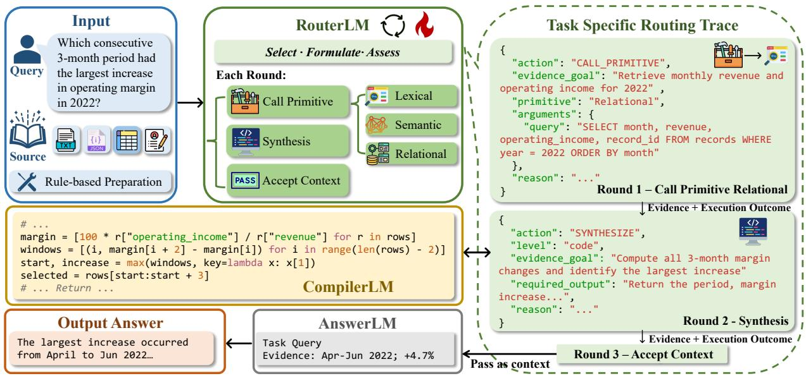
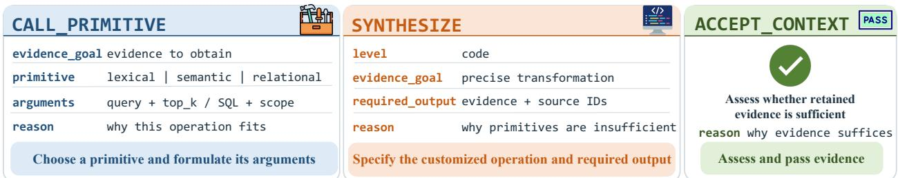

# RECAST: Learning to Compute the Right Context through Adaptive Evidence Routing

Yilun Hao<sup>†1</sup>, Krishna Sayana<sup>∗2</sup>, Isabella Ye<sup>∗2</sup>, James S Ren<sup>2</sup>, Sukhdeep Sodhi<sup>2</sup>, Craig Boutilier<sup>2</sup> and Chuchu Fan<sup>1</sup>

<sup>1</sup>MIT, <sup>2</sup>Google Research

Large language models are increasingly applied to tasks grounded in long, heterogeneous information sources. Conventional Retrieval-Augmented Generation (RAG) relies on fixed similarity-based retrieval, while agentic variants adapt queries and tool use but remain largely retrieval-centric. However, in many tasks, the evidence required for a solution is not explicitly present in any single source item. Instead, it must be derived through filtering, aggregation, or computation across multiple source items. In this work, we introduce RECAST (Routing Evidence through Computation, Access, and Synthesized Tools), a learned framework that formulates evidence construction as a sequential decision process over heterogeneous retrieval and computation operations, allowing evidence to be actively derived rather than merely retrieved. A lightweight RouterLM iteratively selects and formulates primitive operations or specifies customized operations for a frozen CompilerLM to translate into executable code. Once it judges the evidence suficient, RouterLM passes the accepted evidence to a frozen AnswerLM to produce the final solution. We train RouterLM with supervised fine-tuning (SFT) followed by group relative policy optimization (GRPO). Across six heterogeneous benchmark families, RECAST achieves a mean success rate of 75.6%, outperforming the strongest large-model baseline by 15.9%. Moreover, training enables the Qwen3.5-9B RouterLM to outperform a training-free Gemini 3.5 Flash RouterLM by 5.0%. On three held-out benchmarks, RECAST improves over the strongest baseline by 15.0% on average, demonstrating strong zero-shot generalization across tasks and heterogeneous source representations.

## 1. Introduction

Large language models (LLMs) are increasingly applied to diverse tasks, such as question answering, data analysis, and personalized assistance, many of which require reasoning over long contexts drawn from heterogeneous external sources such as document collections, databases, tables, semi-structured records, and user histories (Jiang et al., 2023a; Li et al., 2023; Nakano et al., 2021; Packer et al., 2023; Zhang et al., 2023; Zhong et al., 2024). Although modern LLMs can process increasingly long inputs, supplying the complete source incurs substantial computational and token costs while still ofering no guarantee that the model will identify and correctly use the information required for a particular task (Jiang et al., 2024; Liu et al., 2024). Retrieval-augmented generation (RAG) ofers a practical solution by retrieving a small amount of relevant content and conditioning generation on the retrieved evidence (Guu et al., 2020; Izacard and Grave, 2021; Lewis et al., 2020). Conventional RAG typically performs a single retrieval step before generation, whereas iterative and agentic variants allow LLMs to reformulate queries, invoke retrieval operations over multiple rounds, and assess whether additional evidence is needed (Hui et al., 2026; Trivedi et al., 2023).

These retrieval-based formulations generally assume that useful evidence can be located directly within the source. However, LLM applications increasingly rely on heterogeneous sources, from which the required evidence may need to be derived rather than simply retrieved. For example, suppose the source provides monthly revenue and operating income, while the task asks which three-month period had the largest increase in operating margin. Answering the question requires computing the margins and comparing their changes across periods. More broadly, the required operations vary across tasks, from lexical or semantic retrieval to relational filtering and aggregation, and some tasks require customized computation that must be synthesized for the task at hand.

Context construction must therefore determine not only where relevant information appears, but also how it should be transformed into useful evidence. Although iterative and agentic methods make retrieval more adaptive, they primarily change how the system searches for source content and ofer limited support for constructing such derived evidence. We therefore consider a broader context-construction problem in which retrieval and computation serve as complementary evidence operations, adaptively selected and combined for each task instance.

  
Figure 1 | Overview of RECAST. At each round, RouterLM uses the task, compact source profile, and evidence and feedback from earlier rounds to either select and formulate a primitive or synthesized operation or pass the evidence to AnswerLM when it considers the evidence suficient.

In this work, we introduce RECAST (Routing Evidence through Computation, Access, and Synthesized Tools), illustrated in Figure 1. RECAST formulates evidence construction as a learned sequential decision process over heterogeneous retrieval and computation operations. At each round, a lightweight RouterLM determines what evidence is needed and formulates a task-specific operation for obtaining it. It may invoke a parameterized lexical, semantic, or relational primitive, or request synthesis of a customized operation that a frozen CompilerLM translates into executable code. The resulting evidence and execution outcome inform subsequent decisions, allowing RouterLM to refine the constructed evidence over multiple rounds. Once the evidence is suficient, RouterLM accepts it and passes it as context to a frozen AnswerLM for final solution generation. We train the RouterLM using supervised fine-tuning (SFT) followed by group relative policy optimization (GRPO).

We evaluate RECAST on DataBench, FinQA, HiTab, HotpotQA, LaMP, and MultiHiertt (Chen et al., 2021; Cheng et al., 2022a; Grijalba et al., 2024; Salemi et al., 2024; Yang et al., 2018; Zhao et al., 2022). These six benchmarks span heterogeneous source representations, including dataframes, financial reports, hierarchical tables, Wikipedia passage collections, and user profiles. Across them, RECAST achieves an average success rate of 75.6%, outperforming the strongest large-model baseline at 59.7%. The trained Qwen3.5-9B RouterLM outperforms a large training-free Gemini 3.5 Flash router, which achieves 70.6%. On three held-out benchmarks, 2WikiMultiHopQA, TAT-QA, and WikiTableQuestions (Ho et al., 2020; Pasupat and Liang, 2015; Zhu et al., 2021), RECAST obtains 79.3%, compared with 64.3% for the strongest baseline, demonstrating strong zero-shot generalization across tasks and heterogeneous source representations.

In summary, our key contributions are:

• We broaden evidence construction beyond retrieval by treating retrieval and computation as complementary means of obtaining task-relevant evidence from heterogeneous sources.

• We propose RECAST, a multi-round framework in which a lightweight RouterLM formulates primitive or synthesized evidence operations, assesses their outcomes, and determines when evidence is suficient. We further improve its evidence-construction policy through SFT and GRPO.

• We evaluate RECAST across 6 in-domain and 3 held-out benchmark families. RECAST achieves 75.6% in-domain and 79.3% on held-out benchmarks, outperforming the strongest baselines by 15.9% and 15.0%, respectively. It also surpasses a large training-free RouterLM and transfers efectively across alternative CompilerLMs.

## 2. Related Works

Retrieval-Augmented and Agentic Context Construction. Retrieval-augmented generation (RAG) grounds language-model outputs in external information by retrieving relevant source content and conditioning generation on it (Guu et al., 2020; Izacard and Grave, 2021; Karpukhin et al., 2020; Lewis et al., 2020). Subsequent work develops iterative and hierarchical retrieval strategies for multi-hop and long-context reasoning, such as evidence condensation across retrieval hops, reasoning-guided query formulation, and retrieval over hierarchical document representations (Khattab et al., 2021; Sarthi et al., 2024; Trivedi et al., 2023). More adaptive systems decide when and how to retrieve, assess or correct retrieved results, and use intermediate reasoning to guide subsequent retrieval actions (Asai et al., 2024; Hui et al., 2026; Jeong et al., 2024; Jiang et al., 2023b; Yan et al., 2024; Yao et al., 2022). While these methods move beyond fixed one-pass retrieval, they still construct evidence primarily by selecting or refining information already present in the source. RECAST instead extends adaptive context construction to relational computation and synthesized transformations that derive new evidence from source content.

Tool-Augmented and Programmatic Reasoning. A complementary line of work augments language models with structured operations, tools, and executable programs. Methods for structured sources use specialized table models, symbolic programs, or iterative operations over tables and records (Cheng et al., 2022b; Herzig et al., 2020; Jiang et al., 2023a; Liu et al., 2021; Wang et al., 2024). General tool-use frameworks allow language models to select and invoke predefined tools (Paranjape et al., 2023; Qin et al., 2024; Schick et al., 2023), while program-aided and tool-synthesis approaches generate executable programs or new tools for the task (Cai et al., 2024; Chen et al., 2022; Gao et al., 2023; Gemmell and Dalton, 2023; Qian et al., 2023). These methods broaden the computational capabilities of language models, but generally either generate programs that directly produce task answers or rely on operations designed for a particular source type. RECAST instead learns to construct task-relevant evidence across heterogeneous sources by iteratively selecting, formulating, and evaluating primitive or synthesized operations before final solution generation.

## 3. RECAST

## 3.1. Problem Formulation and Challenges

Given a natural-language task � and an associated external source collection $\boldsymbol { X } = \{ x _ { i } \} _ { i = 1 } ^ { N }$ , our goal is to construct query-specific evidence that enables an LLM to produce the solution $y .$ . We write this process as

$$
E = G _ { \theta } ( q , X ) , \qquad y = F _ { \mathrm { a n s } } ( q , E ) ,\tag{1}
$$

where $G _ { \theta }$ denotes the evidence-construction process parameterized by the learned routing policy and $F _ { \mathsf { a n s } }$ denotes the frozen answer model. A source item $x _ { i }$ may take diverse forms, such as a text passage, structured table, JSON record, hierarchical table, or user-profile entry. Rather than applying $F _ { \mathrm { a n s } }$ directly to the complete source, RECAST constructs compact evidence � by adaptively retrieving, transforming, or computing information from X. This evidence may include both directly retrieved source content and information derived through filtering, aggregation, arithmetic, linking, or other transformations across multiple source items. This setting presents two main challenges:

• Operation Diversity and Formulation. Diferent tasks require fundamentally diferent evidence operations. Finding exact names or identifiers may require lexical matching, locating paraphrased concepts may require semantic retrieval, and combining or calculating over multiple records may require relational or algorithmic computation. When the required transformation falls outside the capabilities of reusable retrieval and computation operations, a task-specific program may be needed. Selecting an operation alone is insuficient. The system must also formulate the task-specific request by specifying the query or computation, the records to use, and the evidence to return.

• Sequential Decisions and Evidence Assessment. Evidence construction may require multiple rounds. An initial operation may identify the subset of the source needed by a later operation, return insuficient evidence, or fail at runtime. The system must assess each outcome, decide whether another operation is needed, and stop only when the retained evidence supports final inference.

## 3.2. RECAST Overview

To address these challenges, we propose RECAST (Figure 1), a multi-round implementation of the evidence-construction mapping $G _ { \theta }$ introduced above. RouterLM, parameterized by �, implements the policy that selects, formulates, and assesses evidence operations. A frozen CompilerLM, denoted $F _ { \mathrm { c o m p } }$ , translates customized operation specifications into executable code, while the frozen AnswerLM implements $F _ { \mathrm { a n s } }$ and maps the constructed evidence to the final solution. Only RouterLM is trained. The framework proceeds in four steps.

Step 1: Source preparation. Because source information may be represented in diferent formats, a deterministic, rule-based preprocessor converts the source context X into a uniformly formatted list of records and constructs a compact source profile $m .$ . The profile summarizes the source scale, structure, formats, and observed fields, providing RouterLM with a high-level view of the source and allowing it to operate across heterogeneous sources without receiving the complete source in its prompt. This rule-based preparation uses no language model and is independent of the task. As an initialization step, both the evidence set and interaction history are empty: $E _ { 0 } = \varnothing$ and $H _ { 0 } = \varnothing$

Step 2: Evidence-operation formulation. At round $t ,$ RouterLM observes the task $q ,$ source profile $m ,$ , retained evidence $E _ { t } ,$ and interaction history $H _ { t } .$ . It selects an action according to

$$
a _ { t } \sim \pi _ { \theta } ( \cdot \mid q , m , E _ { t } , H _ { t } ) .\tag{2}
$$

The action either invokes a primitive operation from {Lexical, Semanti $\mathtt { c , }$ Relational}, requests a synthesized evidence operation, or accepts the current evidence. Section 3.3 describes these operations in detail. This step does not produce the final task solution. Instead, RouterLM must assess what evidence is still needed, select an appropriate operation, and formulate its task-specific request, including the arguments or output requirements that specify how the evidence should be obtained and what should be returned.

Step 3: Operation execution and feedback. For a primitive action, the selected operation is executed using task-specific arguments formulated by RouterLM. A synthesis request is translated by CompilerLM into a Python program and then executed over the source. Either path returns an operation outcome $o _ { t }$ describing execution status, result counts, and any errors. A successful operation may return new evidence $\Delta E _ { t }$ . The evidence and interaction states are updated as

$$
E _ { t + 1 } = E _ { t } \cup \Delta E _ { t } , \qquad H _ { t + 1 } = H _ { t } \parallel [ ( a _ { t } , o _ { t } ) ] ,\tag{3}
$$

where ∥ denotes appending the latest action and outcome to the interaction history.

Step 4: Evidence assessment and solution generation. Steps 2–3 are repeated until RouterLM considers the accumulated evidence suficient. RouterLM then accepts $E _ { t }$ as the final evidence and terminates the evidence-construction loop. Finally, AnswerLM is invoked once with the original task $q$ and the accepted evidence $E _ { t }$ to produce the solution $y$

Figure 2 summarizes the structured action space of RouterLM. At each round, RouterLM selects one of three actions and formulates the task-specific information needed to carry it out. CALL\_PRIMITIVE and SYNTHESIZE construct additional evidence, whereas ACCEPT\_CONTEXT terminates evidence construction and proceeds to final solution generation.

## 3.3. Evidence Operations

## 3.3.1. CALL\_PRIMITIVE

Operation selection and formulation. RouterLM selects an operation from {Lexical, Semantic, Relational}. Lexical ranks source records using BM25 term matching (Robertson and Zaragoza, 2009), while Semantic ranks them by cosine similarity using BGE-M3 embeddings (Chen et al., 2024). Relational executes a read-only Structured Query Language (SQL) query over the normalized records, supporting filtering, joins, grouping, aggregation, sorting, and arithmetic. RouterLM must also formulate the selected operation for the current evidence goal. Lexical and semantic calls specify a search query and the number of records to return, whereas relational calls specify a SQL query. A call may additionally be restricted to source records identified in earlier rounds.

Execution and output. The formulated operation is executed directly over the source records and returns retrieved content or a computed result together with its source identifiers. The executor also reports whether the operation succeeded, how many records matched and were returned, and any execution errors. Successful execution indicates that the requested operation ran correctly, but does not imply that the resulting evidence is suficient for the task.

## 3.3.2. SYNTHESIZE

Operation specification. When the required transformation cannot be expressed through the available primitives, RouterLM requests a synthesized operation. RouterLM specifies the transformation to perform, the evidence and source identifiers to return, and why the primitive operations are insuficient. Because CompilerLM does not receive the original task, the specification must preserve the task-specific constraints required to implement the operation correctly.

  
Figure 2 | RouterLM action space and output structure. Together, the outputs represent action selection, task-specific formulation, and justification.

Compilation and execution. CompilerLM receives the synthesis specification, source profile, source samples, and prior operation outcomes, and translates the specification into a Python program in one call. The program can process the complete source, use previously obtained evidence, and invoke primitive operations when useful. It returns either the requested evidence or an execution error to RouterLM. In Figure 1 example, RouterLM specifies the computation for identifying the three-month period with the largest margin increase, while CompilerLM translates that specification into code.

## 3.3.3. ACCEPT\_CONTEXT

Evidence assessment. After each evidence-producing action, RouterLM receives the returned evidence and structured feedback generated by the operation executor. The feedback reports the execution status, result counts, and any errors. The evidence is deduplicated and added to the current evidence set, while the action and feedback are recorded in the interaction history. RouterLM then assesses whether another operation is needed. If so, it may reformulate the request or select a diferent operation in the next round.

Context acceptance. Once RouterLM determines that the constructed evidence is suficient for final inference, it selects Accept\_Context. This terminates evidence construction and passes the constructed evidence to AnswerLM for solution generation.

## 3.4. RECAST Training

In RECAST, training updates only RouterLM. The primitive operations are deterministic, and the parameters of CompilerLM and AnswerLM remain fixed. Training has two stages. We apply supervised fine-tuning (SFT) to establish valid multi-round evidence-construction behavior, including operation selection, task-specific formulation, and evidence assessment. We apply Group Relative Policy Optimization (GRPO) to improve the routing policy using downstream task outcomes. The complete dataset and training details of SFT and GRPO are provided in Appendix B.1.

Trajectory collection and SFT. Using the pretrained RouterLM, we generate multiple trajectories for each training question. Each trajectory executes its evidence operations and invokes AnswerLM with the constructed evidence. A frozen LLM judge then evaluates the solution against the reference. For each question with at least one correct, executable, and structurally valid trajectory, we select one trajectory as the SFT expert, preferring more accurate and eficient candidates. We apply capped upsampling by repeating examples from underrepresented benchmark families and empirical dificulty levels. The complete expert trajectory is used for SFT, supervising each RouterLM decision conditioned on the evidence and feedback available at that round.

GRPO. We construct the GRPO data from questions that were not consistently solved during SFT trajectory collection. Each selected question must have at least one valid expert trajectory, indicating that it is solvable, and at least one failed trajectory, indicating room for policy improvement. Starting from the SFT checkpoint, we sample a new group of four complete trajectories for each selected question. We then apply mixed-outcome filtering, retaining only groups containing at least one successful and one unsuccessful trajectory. This allows GRPO to compare alternative evidenceconstruction behaviors for the same question and reinforce those that produce better task outcomes.

For a trajectory �, we define the reward as

$$
R ( \tau ) = \lambda _ { C } C ( \tau ) + \lambda _ { F } F ( \tau ) + \lambda _ { V } V ( \tau ) ,\tag{4}
$$

where $C ( \tau )$ denotes final-answer correctness evaluated by the frozen LLM judge, $F ( \tau )$ is token-level F1 between the generated and reference answers, and $V ( \tau )$ indicates whether the trajectory follows the required action structure. We set $\lambda _ { C } = 0 . 9 0 , \lambda _ { F } = 0 . 0 8$ , and $\lambda _ { V } = 0 . 0 2 ,$ prioritizing task correctness while retaining smaller signals for partial answer quality and structural validity.

## 4. Experimental Results

## 4.1. Experimental Setup

Benchmarks. We train and evaluate RECAST on six benchmark families with heterogeneous source representations. DataBench pairs questions with dataframes from diverse domains (Grijalba et al., 2024). FinQA contains financial reports combining prose passages and tables (Chen et al., 2021). HiTab provides tables with hierarchical row and column headers (Cheng et al., 2022a), while MultiHiertt associates questions with multiple hierarchical tables and passages from financial reports (Zhao et al., 2022). HotpotQA presents each question with Wikipedia passages (Yang et al., 2018). LaMP pairs an input with a user profile of historical items for personalization (Salemi et al., 2024). We test on 100 unseen questions per family.

Held-out benchmarks. To evaluate zero-shot generalization, we use three benchmarks excluded from SFT, GRPO, and checkpoint selection. 2WikiMultiHopQA pairs questions with collections of Wikipedia passages (Ho et al., 2020). TAT-QA contains financial reports combining prose passages and tables (Zhu et al., 2021), while WikiTableQuestions pairs natural-language questions with semi-structured Wikipedia tables (Pasupat and Liang, 2015). We evaluate on 100 examples per benchmark. All nine benchmark descriptions and examples appear in Appendices A.1 and A.2.

Baselines. We compare RECAST against five baseline families spanning increasingly expressive forms of context construction: (1) Direct provides only the task to AnswerLM, without accessing the source; (2) Fixed Retrieval uses the task as the query for a single BGE-M3 dense retrieval and returns the top three source chunks; (3) Direct Code generates and executes a single Python program over the source without iterative evidence construction; (4) IRCoT (Trivedi et al., 2023) alternates sentence-level reasoning with BGE-M3 retrieval; and (5) Interact-RAG (Hui et al., 2026) uses a planner–reasoner–executor workflow to formulate retrieval actions and decide when to stop. IRCoT and Interact-RAG are adapted to the per-instance sources and shared model and retrieval components used in our evaluation; further implementation details are provided in Appendix C.1. For Direct Code, IRCoT, and Interact-RAG, we evaluate Qwen3.5-9B and Gemini 3.5 Flash without task-specific fine-tuning as their respective program-generation or retrieval-guidance LMs.

Table 1 | In-domain success rates (%) of RECAST across six benchmark families. The listed LM directly generates the program for Direct Code, guides evidence retrieval for IRCoT and Interact-RAG, and serves as RouterLM for RECAST. Bold denotes the best result in each column.
<table><tr><td></td><td rowspan=1 colspan=3>Method         LM                           DataBench FinQA HiTab HotpotQA LaMP MultiHierttAvg.</td></tr><tr><td></td><td rowspan=2 colspan=3>Retrieval baselinesDirect                                                6.7      1.0  23.0   41.7   69.7     1.0Fixed Retrieval                                     36.0    27.3 72.3   79.3   64.0    55.3</td></tr><tr><td></td><td rowspan=1 colspan=1></td></tr><tr><td></td><td rowspan=1 colspan=3>Direct program generation</td></tr><tr><td></td><td rowspan=1 colspan=2>Direct Code     Qwen3.5-9B                    80.7     1.0  26.0    64.0   54.7     3.3Direct Code     Gemini 3.5 Flash              88.0    5.0 46.0   78.3   48.0    5.0</td><td rowspan=1 colspan=1>38.345.1</td></tr><tr><td></td><td rowspan=1 colspan=3>Iterative and agentic retrieval</td></tr><tr><td rowspan=4 colspan=3>IRCoT           Qwen3.5-9B                   36.0    27.0 64.0   94.0   65.0    56.0IRCoT           Gemini 3.5 Flash              39.3    30.0 63.7   94.7   67.3    58.0Interact-RAG    Qwen3.5-9B                   30.0    45.0 43.0   87.0   63.0    56.0Interact-RAG    Gemini 3.5 Flash              36.7    52.7 72.7   79.7   62.3    54.0</td><td rowspan=1 colspan=1>57.0</td></tr><tr><td rowspan=1 colspan=1>58.8</td></tr><tr><td rowspan=1 colspan=1>54.0</td></tr><tr><td rowspan=1 colspan=1>59.7</td></tr><tr><td rowspan=1 colspan=4>RECAST</td></tr><tr><td rowspan=1 colspan=3>RECAST         Qwen3.5-9B                    86.0    57.0 60.7   83.0   68.3    29.3</td><td rowspan=1 colspan=1>64.1</td></tr><tr><td rowspan=1 colspan=2>RECAST</td><td rowspan=2 colspan=2>Gemini 3.5 Flash              90.0    58.3 67.3   86.0   71.7    50.3RECAST         Qwen3.5-9B (SFT+GRPO)   83.3    68.3 76.3   92.0   68.3    65.3</td></tr><tr><td></td><td></td><td rowspan=1 colspan=1>75.6</td></tr></table>

RECAST variants. We evaluate RECAST along five dimensions: (1) RouterLM configurations compare training-free Qwen3.5-9B and Gemini 3.5 Flash routers with an SFT+GRPO-trained Qwen3.5- 9B router; (2) evidence-operation space restricts training-free RECAST to either primitive operations or synthesized code while retaining full multi-round routing; (3) GRPO reward and data selection replaces the shaped reward with answer correctness alone or removes mixed-outcome filtering; (4) training stages applies SFT and GRPO independently; and (5) compiler transfer replaces CompilerLM with alternative models. Details are in Appendix C.2.

Implementation and Evaluation. Semantic retrieval uses BGE-M3, lexical retrieval uses BM25, and relational operations execute read-only SQLite queries. For RECAST, Gemini 3.5 Flash serves as CompilerLM. Training uses 3,368 SFT trajectories and 608 GRPO instances. We train RouterLM with LoRA (Hu et al., 2021). Qwen3.5-9B has thinking mode disabled.

All methods are evaluated on same test questions and source contexts. Gemini 3.5 Flash serves as the shared AnswerLM for all methods. All outputs are scored by the same frozen Gemini 3.5 Flash judge using an identical prompt. LLM calls use temperature 0, and multi-round methods are limited to six rounds and 4,000 characters of retained evidence. We repeat each in-domain experiment three times and report mean task success rate. Standard deviations, prompt, additional implementation, training, and evaluation details are provided in Appendices B.2, B.1, and F.

## 4.2. RECAST Performance

Table 1 compares success rates of RECAST and baselines across six benchmarks. Appendices B.3, D, and E provide operation-usage, cost, and failure analyses. There are four main takeaways:

First, RECAST achieves the strongest overall performance. The SFT+GRPO-trained system obtains an average success rate of 75.6%, a 15.9% improvement over the strongest large-LLM- controlled baseline, Gemini-based Interact-RAG at 59.7%. This result reflects strong performance across diverse source formats and evidence requirements. Re-evaluating predictions with two alternative LLM judges and token-level F1 preserves the overall performance advantage (Appendix B.4).

Table 2 | Success rates (%) of RECAST ablations across six benchmark families. The variants evaluate the evidence-operation space, training stages, GRPO reward, and GRPO data selection. Bold denotes the best result in each column.
<table><tr><td>Variant</td><td>DataBench FinQA</td><td></td><td>HiTab</td><td>HotpotQA LaMP</td><td></td><td>MultiHiertt</td><td>Avg.</td></tr><tr><td colspan="8">Evidence-operation space</td></tr><tr><td>RECAST Train-Free, Primitive Only</td><td>25.3</td><td>61.0</td><td>63.7</td><td>80.7</td><td>67.7</td><td>42.7</td><td>56.8</td></tr><tr><td>RECAST Train-Free, Synthesis Only</td><td>85.3</td><td>45.0</td><td>54.3</td><td>88.7</td><td>63.0</td><td>23.0</td><td>59.9</td></tr><tr><td>RECAST Train-Free, Full</td><td>86.0</td><td>57.0</td><td>60.7</td><td>83.0</td><td>68.3</td><td>29.3</td><td>64.1</td></tr><tr><td colspan="8">GRPO reward and data selection</td></tr><tr><td>RECAST SFT+GRPO, Accuracy Only</td><td>82.0</td><td>58.0</td><td>65.0</td><td>87.3</td><td>66.0</td><td>55.0</td><td>68.9</td></tr><tr><td>RECAST SFT+GRPO, Unfiltered</td><td>83.7</td><td>62.0</td><td>74.0</td><td>85.3</td><td>69.3</td><td>63.7</td><td>73.0</td></tr><tr><td colspan="8">Training stages</td></tr><tr><td>RECAST SFT</td><td>82.0</td><td>55.7</td><td>68.3</td><td>82.7</td><td>66.3</td><td>49.0</td><td>67.3</td></tr><tr><td>RECAST GRPO</td><td>81.7</td><td>64.0</td><td>75.7</td><td>88.3</td><td>64.0</td><td>61.7</td><td>72.6</td></tr><tr><td>RECAST SFT+GRPO</td><td>83.3</td><td>68.3</td><td>76.3</td><td>92.0</td><td>68.3</td><td>65.3</td><td>75.6</td></tr></table>

Second, the design of RECAST provides substantial gains even without RouterLM training. With Qwen3.5-9B, training-free RECAST achieves 64.1%, compared with 57.0% for the strongest Qwen-based baseline. With Gemini 3.5 Flash, training-free RECAST reaches 70.6%, compared with 59.7% for the strongest Gemini-based baseline. Notably, training-free RECAST with Qwen3.5-9B as RouterLM also outperforms IRCoT and Interact-RAG using Gemini 3.5 Flash as their retrieval controller. By supporting adaptive retrieval, computation, and evidence assessment, RECAST provides gains beyond those obtained by equipping the retrieval baselines with a stronger controller.

Third, training substantially strengthens the evidence-routing capability of the smaller model. SFT and GRPO improve Qwen3.5-9B from 64.1% to 75.6%. The small, trained Qwen router also outperforms the large, training-free Gemini 3.5 Flash router by 5.0% and achieves higher performance on four of the six benchmarks. Thus, SFT and GRPO enable a smaller, trainable model to surpass a larger black-box model by learning specialized evidence-routing behavior.

Fourth, heterogeneous tasks benefit from adaptive evidence construction rather than a single strategy. The strongest program generation and agentic retrieval baselines exhibit diferent strengths across benchmarks. Gemini-based Direct Code excels on DataBench but obtains only 45.1% on average, whereas Gemini-based Interact-RAG obtains 59.7% with a clear advantage on FinQA, HiTab, and MultiHiertt. In comparison, RECAST reaches 75.6% and maintains more balanced performance across the six benchmark families. By adaptively supporting primitive retrieval and computation together with synthesized code, RECAST provides a more flexible evidence-construction process across heterogeneous tasks.

## 4.3. Ablation Studies

We ablate the evidence-operation space, the GRPO reward and data-selection strategy, and the contributions of the two training stages. Table 2 summarizes the results. There are three main takeaways:

First, primitive and synthesized operations provide complementary evidence-construction capabilities. Primitive-only RECAST achieves 56.8%, and synthesis-only 59.9%. Neither operation type is uniformly superior across families, indicating that efectiveness depends on the task’s evidence requirements. Combining both yields the strongest training-free average of 64.1%, outperforming either variant and demonstrating the benefit of a broader evidence-operation space.

Second, reward shaping and selective GRPO data construction contribute to performance. Using answer correctness as the only reward reduces the average from 75.6% to 68.9%, showing that partial answer quality and structural validity provide useful distinctions among trajectories. Removing the mixed-outcome group filter yields 73.0%, indicating that groups containing both successful and unsuccessful trajectories provide a stronger relative learning signal. Because filtering produces a smaller training pool, its higher performance demonstrates improved sample eficiency.

Third, SFT and GRPO provide complementary improvements. Relative to training-free RECAST at 64.1%, SFT increases the average to 67.3%, while GRPO increases it to 72.6%. Combining both yields the strongest result at 75.6%, exceeding either stage and demonstrating their complementary benefits. SFT establishes valid operation selection and formulation from filtered successful trajectories, while GRPO optimizes routing trajectories using downstream outcomes.

## 4.4. Generalization

## 4.4.1. Generalization to unseen benchmarks

Table 3 reports zero-shot performance on three held-out benchmarks: 2WikiMultiHopQA (Ho et al., 2020), TAT-QA (Zhu et al., 2021), and WikiTableQuestions (Pasupat and Liang, 2015). These benchmarks cover multi-hop text question answering, hybrid text-table numerical reasoning, and table question answering, respectively. Here, Direct Code, IRCoT, and Interact-RAG use the pretrained Qwen3.5-9B as their program-generation or retrieval-guidance model, while RECAST uses the SFT+GRPO-trained Qwen3.5-9B RouterLM. There are two main takeaways. First, RECAST generalizes consistently across all three held-out benchmarks. It achieves an average success rate of 79.3%, outperforming the strongest baseline at 64.3% by 15.0%. The improvements over the strongest baseline on each benchmark are 6.0% on 2WikiMultiHopQA, 8.0% on TAT-QA, and 15.0% on WikiTableQuestions. Second, the learned routing policy generalizes across heterogeneous source representations. The improvements span collections of Wikipedia passages, financial reports combining text and tables, and semi-structured Wikipedia tables. These results show that evidencerouting behavior learned from the in-domain benchmarks transfers to new task distributions and source organizations.

## 4.4.2. Transfer across CompilerLMs

We keep the trained RouterLM fixed and replace the default Gemini 3.5 Flash CompilerLM with Gemini 3.5 Flash Lite and Qwen3.5-9B, neither of which is used as a compiler during training. Table 4 reports the results. There are two main takeaways. First, the learned routing policy transfers efectively to a lighter CompilerLM. Gemini 3.5 Flash Lite achieves 73.2% in-domain, a decrease of only 2.4% from the default compiler, while matching its held-out performance at 79.3%. Second, the routing policy also transfers across model families and substantially diferent model scales. With Qwen3.5-9B as CompilerLM, RECAST achieves 67.2% in-domain and 73.3% on the held-out benchmarks, remaining 7.5% and 9.0% above the strongest evaluated baselines, respectively. These results show that the learned RouterLM does not depend on a single compiler model and can retain strong performance with substantially more compact compilers.

Table 3 | Zero-shot success rate (%) of RECAST across three unseen benchmarks.
<table><tr><td>Method</td><td>2Wiki</td><td>TAT-QA WTQ</td><td>Avg.</td></tr><tr><td>Direct</td><td>72.0</td><td>1.0 10.0</td><td>27.7</td></tr><tr><td>Direct Code</td><td>45.0</td><td>38.0 59.0</td><td>47.3</td></tr><tr><td>Fixed Retrieval</td><td>58.0</td><td>66.0 52.0</td><td>58.7</td></tr><tr><td>IRCoT</td><td>69.0</td><td>73.0 51.0</td><td>64.3</td></tr><tr><td>Interact-RAG</td><td>77.0</td><td>57.0 48.0</td><td>60.7</td></tr><tr><td>RECAST SFT+GRPO</td><td>83.0</td><td>81.0 74.0</td><td>79.3</td></tr></table>

Table 4 | RECAST in-domain and held-out success rates (%) with alternative CompilerLMs.
<table><tr><td>CompilerLM</td><td>In-domain avg.</td><td>Held-out avg.</td></tr><tr><td>Qwen3.5-9B</td><td>67.2</td><td>73.3</td></tr><tr><td>Gemini 3.5 Flash Lite</td><td>73.2</td><td>79.3</td></tr><tr><td>Gemini 3.5 Flash</td><td>75.6</td><td>79.3</td></tr></table>

## 5. Conclusion

We introduced RECAST, a learned framework that broadens context construction from retrieving source content to adaptively deriving task-relevant evidence through retrieval and computation. Trained through SFT and GRPO, a lightweight RouterLM iteratively formulates primitive operations or requests customized code, assesses their outcomes, and determines when the evidence is suficient for final inference. Across six in-domain benchmarks, RECAST outperforms retrieval-based, agentic, and direct program-generation approaches on average. It generalizes to three held-out benchmarks and retains strong performance with smaller code-generation models. Our ablations show that primitive and synthesized operations provide complementary capabilities and that learning strengthens the evidence-construction policy. These results demonstrate the efectiveness and generalizability of adaptive evidence construction across heterogeneous tasks and sources.

Limitations. Constructing the training data for RECAST relies on execution-derived outcomes, which introduces additional computational overhead during data collection. At inference time, iterative calls to RouterLM and occasional code synthesis may also increase latency and computational cost relative to single-pass retrieval. Future work could explore more eficient trajectory construction and cost-aware routing policies that jointly optimize task performance and computational eficiency.

## AI use statement

We used generative AI tools in three ways. First, as writing aids: we provided draft text for grammatical correction and structural refinement, and the authors verified and edited all outputs. Second, for retrieval and discovery, such as finding potentially related work. The authors read all cited papers and verified every reference. Third, to assist research execution, including environment setup and experiment code debugging. All AI-assisted code was reviewed and tested by the authors, and we take full responsibility for the content of this paper.

## Ethics statement

This work improves how language models construct evidence from heterogeneous sources. All experiments use publicly available benchmarks, and no new human-subject data was collected.

Because RECAST executes model-generated code, relational queries are read-only and synthesized programs run in an isolated environment. When applied to private or sensitive data, deployments should enforce similar sandboxing along with appropriate access controls and privacy safeguards.

## Reproducibility statement

For reproducibility, we describe the full RECAST framework and training procedure in Section 3. Dataset construction, SFT and GRPO hyperparameters, the GRPO objective, and the reward definition are detailed in Appendix B.1, and standard deviations over three runs are reported in Appendix B.2. Baseline and variant implementations are described in Appendices C.1 and C.2, and all prompts are provided in Appendix F. Our code, data, and trained RouterLM checkpoint will be publicly released under an open-source license upon acceptance.

## References

A. Asai, Z. Wu, Y. Wang, A. Sil, and H. Hajishirzi. Self-rag: Learning to retrieve, generate, and critique through self-reflection. In International conference on learning representations, volume 2024, pages 9112–9141, 2024.

T. Cai, X. Wang, T. Ma, X. Chen, and D. Zhou. Large language models as tool makers. In International Conference on Learning Representations, volume 2024, pages 54067–54089, 2024.

J. Chen, S. Xiao, P. Zhang, K. Luo, D. Lian, and Z. Liu. M3-embedding: Multi-linguality, multifunctionality, multi-granularity text embeddings through self-knowledge distillation. In Findings of the association for computational linguistics: ACL 2024, pages 2318–2335, 2024.

W. Chen, X. Ma, X. Wang, and W. W. Cohen. Program of thoughts prompting: Disentangling computation from reasoning for numerical reasoning tasks. arXiv preprint arXiv:2211.12588, 2022.

Z. Chen, W. Chen, C. Smiley, S. Shah, I. Borova, D. Langdon, R. Moussa, M. Beane, T.-H. Huang, B. R. Routledge, et al. Finqa: A dataset of numerical reasoning over financial data. In Proceedings of the 2021 Conference on Empirical Methods in Natural Language Processing, pages 3697–3711, 2021.

Z. Cheng, H. Dong, Z. Wang, R. Jia, J. Guo, Y. Gao, S. Han, J.-G. Lou, and D. Zhang. Hitab: A hierarchical table dataset for question answering and natural language generation. In Proceedings of the 60th annual meeting of the associationfor computational linguistics (volume 1: long papers), pages 1094–1110, 2022a.

Z. Cheng, T. Xie, P. Shi, C. Li, R. Nadkarni, Y. Hu, C. Xiong, D. Radev, M. Ostendorf, L. Zettlemoyer, et al. Binding language models in symbolic languages. arXiv preprint arXiv:2210.02875, 2022b.

L. Gao, A. Madaan, S. Zhou, U. Alon, P. Liu, Y. Yang, J. Callan, and G. Neubig. Pal: Program-aided language models. In International conference on machine learning, pages 10764–10799. PMLR, 2023.

C. Gemmell and J. Dalton. Toolwriter: Question specific tool synthesis for tabular data. In Proceedings of the 2023 Conference on Empirical Methods in Natural Language Processing, pages 16137–16148, 2023.

J. O. Grijalba, L. A. U. Lopez, E. Martínez-Cámara, and J. Camacho-Collados. Question answering over tabular data with databench: A large-scale empirical evaluation of llms. In Proceedings of the 2024 Joint International Conference on Computational Linguistics, Language Resources and Evaluation (LREC-COLING 2024), pages 13471–13488, 2024.

K. Guu, K. Lee, Z. Tung, P. Pasupat, and M. Chang. Retrieval augmented language model pre-training. In International conference on machine learning, pages 3929–3938. PMLR, 2020.

J. Herzig, P. K. Nowak, T. Müller, F. Piccinno, and J. Eisenschlos. Tapas: Weakly supervised table parsing via pre-training. In Proceedings ofthe 58th annual meeting ofthe associationfor computational linguistics, pages 4320–4333, 2020.

X. Ho, A.-K. D. Nguyen, S. Sugawara, and A. Aizawa. Constructing a multi-hop qa dataset for comprehensive evaluation of reasoning steps. In Proceedings of the 28th International Conference on Computational Linguistics, pages 6609–6625, 2020.

E. J. Hu, Y. Shen, P. Wallis, Z. Allen-Zhu, Y. Li, S. Wang, L. Wang, and W. Chen. Lora: Low-rank adaptation of large language models. arXiv preprint arXiv:2106.09685, 2021.

Y. Hui, C. Chen, Z. Fu, Y. Liu, J. Ye, and H. Zhang. Interact-rag: Reason and interact with the corpus, beyond black-box retrieval. In International Conference on Learning Representations, volume 2026, pages 112154–112174, 2026.

G. Izacard and E. Grave. Leveraging passage retrieval with generative models for open domain question answering. In Proceedings of the 16th conference of the european chapter of the association for computational linguistics: main volume, pages 874–880, 2021.

S. Jeong, J. Baek, S. Cho, S. J. Hwang, and J. C. Park. Adaptive-rag: Learning to adapt retrievalaugmented large language models through question complexity. In Proceedings ofthe 2024 conference of the north american chapter of the association for computational linguistics: Human language technologies (volume 1: Long papers), pages 7036–7050, 2024.

H. Jiang, Q. Wu, X. Luo, D. Li, C.-Y. Lin, Y. Yang, and L. Qiu. Longllmlingua: Accelerating and enhancing llms in long context scenarios via prompt compression. In Proceedings of the 62nd Annual Meeting of the Association for Computational Linguistics (Volume 1: Long Papers), pages 1658–1677, 2024.

J. Jiang, K. Zhou, Z. Dong, K. Ye, X. Zhao, and J.-R. Wen. Structgpt: A general framework for large language model to reason over structured data. In Proceedings of the 2023 conference on empirical methods in natural language processing, pages 9237–9251, 2023a.

Z. Jiang, F. F. Xu, L. Gao, Z. Sun, Q. Liu, J. Dwivedi-Yu, Y. Yang, J. Callan, and G. Neubig. Active retrieval augmented generation. In Proceedings of the 2023 conference on empirical methods in natural language processing, pages 7969–7992, 2023b.

V. Karpukhin, B. Oguz, S. Min, P. Lewis, L. Wu, S. Edunov, D. Chen, and W.-t. Yih. Dense passage retrieval for open-domain question answering. In Proceedings of the 2020 conference on empirical methods in natural language processing (EMNLP), pages 6769–6781, 2020.

O. Khattab, C. Potts, and M. Zaharia. Baleen: Robust multi-hop reasoning at scale via condensed retrieval. Advances in Neural Information Processing Systems, 34:27670–27682, 2021.

P. Lewis, E. Perez, A. Piktus, F. Petroni, V. Karpukhin, N. Goyal, H. Küttler, M. Lewis, W.-t. Yih, T. Rocktäschel, et al. Retrieval-augmented generation for knowledge-intensive nlp tasks. Advances in neural information processing systems, 33:9459–9474, 2020.

H. Li, J. Su, Y. Chen, Q. Li, and Z.-X. Zhang. Sheetcopilot: Bringing software productivity to the next level through large language models. Advances in Neural Information Processing Systems, 36: 4952–4984, 2023.

N. F. Liu, K. Lin, J. Hewitt, A. Paranjape, M. Bevilacqua, F. Petroni, and P. Liang. Lost in the middle: How language models use long contexts. Transactions of the associationfor computational linguistics, 12:157–173, 2024.

Q. Liu, B. Chen, J. Guo, M. Ziyadi, Z. Lin, W. Chen, and J.-G. Lou. Tapex: Table pre-training via learning a neural sql executor. arXiv preprint arXiv:2107.07653, 2021.

R. Nakano, J. Hilton, S. Balaji, J. Wu, L. Ouyang, C. Kim, C. Hesse, S. Jain, V. Kosaraju, W. Saunders, et al. Webgpt: Browser-assisted question-answering with human feedback. arXiv preprint arXiv:2112.09332, 2021.

C. Packer, S. Wooders, K. Lin, V. Fang, S. G. Patil, I. Stoica, and J. E. Gonzalez. Memgpt: Towards llms as operating systems. arXiv preprint arXiv:2310.08560, 2023.

B. Paranjape, S. Lundberg, S. Singh, H. Hajishirzi, L. Zettlemoyer, and M. T. Ribeiro. Art: Automatic multi-step reasoning and tool-use for large language models. arXiv preprint arXiv:2303.09014, 2023.

P. Pasupat and P. Liang. Compositional semantic parsing on semi-structured tables. In Proceedings of the 53rd Annual Meeting of the Association for Computational Linguistics and the 7th International Joint Conference on Natural Language Processing (Volume 1: Long Papers), pages 1470–1480, 2015.

C. Qian, C. Han, Y. Fung, Y. Qin, Z. Liu, and H. Ji. Creator: Tool creation for disentangling abstract and concrete reasoning of large language models. In Findings of the Association for Computational Linguistics: EMNLP 2023, pages 6922–6939, 2023.

Y. Qin, S. Liang, Y. Ye, K. Zhu, L. Yan, Y. Lu, Y. Lin, X. Cong, X. Tang, B. Qian, et al. Toolllm: Facilitating large language models to master 16000+ real-world apis. In International Conference on Learning Representations, volume 2024, pages 9695–9717, 2024.

S. Robertson and H. Zaragoza. The probabilistic relevance framework: Bm25 and beyond. Foundations and trends® in information retrieval, 4(1-2):1–174, 2009.

A. Salemi, S. Mysore, M. Bendersky, and H. Zamani. Lamp: When large language models meet personalization. In Proceedings of the 62nd Annual Meeting of the Association for Computational Linguistics (Volume 1: Long Papers), pages 7370–7392, 2024.

P. Sarthi, S. Abdullah, A. Tuli, S. Khanna, A. Goldie, and C. Manning. Raptor: Recursive abstractive processing for tree-organized retrieval. In International Conference on Learning Representations, volume 2024, pages 32628–32649, 2024.

T. Schick, J. Dwivedi-Yu, R. Dessì, R. Raileanu, M. Lomeli, E. Hambro, L. Zettlemoyer, N. Cancedda, and T. Scialom. Toolformer: Language models can teach themselves to use tools. Advances in neural information processing systems, 36:68539–68551, 2023.

Z. Shao, P. Wang, Q. Zhu, R. Xu, J. Song, X. Bi, H. Zhang, M. Zhang, Y. Li, Y. Wu, et al. Deepseekmath: Pushing the limits of mathematical reasoning in open language models. arXiv preprint arXiv:2402.03300, 2024.

H. Trivedi, N. Balasubramanian, T. Khot, and A. Sabharwal. Interleaving retrieval with chain-ofthought reasoning for knowledge-intensive multi-step questions. In Proceedings of the 61st annual meeting of the association for computational linguistics (volume 1: long papers), pages 10014–10037, 2023.

Z. R. Wang, H. Zhang, C.-L. Li, J. M. Eisenschlos, V. Perot, Z. Wang, L. Miculicich, Y. Fujii, J. Shang, C.-Y. Lee, et al. Chain-of-table: Evolving tables in the reasoning chain for table understanding. In International Conference on Learning Representations, volume 2024, pages 55587–55610, 2024.

S.-Q. Yan, J.-C. Gu, Y. Zhu, and Z.-H. Ling. Corrective retrieval augmented generation. arXiv preprint arXiv:2401.15884, 2024.

Z. Yang, P. Qi, S. Zhang, Y. Bengio, W. Cohen, R. Salakhutdinov, and C. D. Manning. Hotpotqa: A dataset for diverse, explainable multi-hop question answering. In Proceedings of the 2018 conference on empirical methods in natural language processing, pages 2369–2380, 2018.

S. Yao, J. Zhao, D. Yu, N. Du, I. Shafran, K. Narasimhan, and Y. Cao. React: Synergizing reasoning and acting in language models. arXiv preprint arXiv:2210.03629, 2022.

W. Zhang, Y. Shen, Z. Tan, G. Hou, W. Lu, and Y. Zhuang. Data-copilot: Bridging billions of data and humans with autonomous workflow. arXiv preprint arXiv:2306.07209, 2023.

Y. Zhao, Y. Li, C. Li, and R. Zhang. Multihiertt: Numerical reasoning over multi hierarchical tabular and textual data. In Proceedings of the 60th Annual Meeting of the Association for Computational Linguistics (Volume 1: Long Papers), pages 6588–6600, 2022.

W. Zhong, L. Guo, Q. Gao, H. Ye, and Y. Wang. Memorybank: Enhancing large language models with long-term memory. In Proceedings of the AAAI conference on artificial intelligence, volume 38, pages 19724–19731, 2024.

F. Zhu, W. Lei, Y. Huang, C. Wang, S. Zhang, J. Lv, F. Feng, and T.-S. Chua. Tat-qa: A question answering benchmark on a hybrid of tabular and textual content in finance. In Proceedings of the 59th annual meeting of the Association for Computational Linguistics and the 11th international joint conference on natural language processing (volume 1: long papers), pages 3277–3287, 2021.

## Appendix–RECAST: Learning to Compute the Right Context through Adaptive Evidence Routing

A Benchmarks 17   
A.1 Benchmark Descriptions . 17   
A.2 Benchmark Examples . 18   
B RECAST 21   
B.1 RECAST Training Details . . 21   
B.2 RECAST Main-Result Performance with Standard Deviations . 23   
B.3 Evidence-Construction Behavior . 24   
B.4 Robustness to Evaluation Choices 25   
C Baselines and RECAST Variants 27   
C.1 Baselines 27   
C.2 RECAST Variants 28   
D Cost Analysis 30   
E Failure Case Analysis 31   
E.1 Baselines 31   
E.2 RECAST 31   
F Prompts 32   
F.1 RouterLM . 32   
F.2 CompilerLM 33   
F.3 AnswerLM . 34   
F.4 Correctness Judge 35

## A. Benchmarks

## A.1. Benchmark Descriptions

We use six benchmark families for training and in-domain evaluation and three additional benchmarks for zero-shot evaluation.

## Training and in-domain benchmarks:

• DataBench. DataBench evaluates question answering over real-world dataframes from diverse application domains (Grijalba et al., 2024). Questions require analyzing the provided table and returning either a scalar or a list.

• FinQA. FinQA contains numerical reasoning questions grounded in financial reports composed of prose passages and structured tables (Chen et al., 2021). Answering a question may require identifying relevant information from either source and performing arithmetic over the extracted values.

• HiTab. HiTab evaluates question answering over cross-domain tables with hierarchical row and column headers (Cheng et al., 2022a). Its questions cover lookup, comparison, aggregation, and numerical reasoning while requiring the table’s multi-level structure to be correctly interpreted.

• HotpotQA. HotpotQA is a multi-hop question-answering benchmark built from Wikipedia articles (Yang et al., 2018).

• LaMP. LaMP evaluates personalized language modeling using a current input and a profile containing historical items from the same user (Salemi et al., 2024). We combine LaMP-1, 2, 3, 4, 5, and 7 into one benchmark family, covering citation identification, movie tagging, product rating, news headline generation, scholarly title generation, and tweet paraphrasing. We exclude LaMP-6 because it relies on the restricted Avocado email corpus.

• MultiHiertt. MultiHiertt contains numerical reasoning questions grounded in financial reports with multiple hierarchical tables and accompanying text passages (Zhao et al., 2022). Questions may require combining evidence across multiple tables or between tabular and textual content.

## Held-out benchmarks:

• 2WikiMultiHopQA. 2WikiMultiHopQA evaluates multi-hop question answering over collections of Wikipedia passages (Ho et al., 2020). Its questions require reasoning across multiple documents through compositional, comparison, or inference relations.

• TAT-QA. TAT-QA contains questions grounded in financial reports that combine prose passages and tables (Zhu et al., 2021). It includes span-based, counting, and arithmetic questions, with answers expressed using diferent numerical scales.

• WikiTableQuestions. WikiTableQuestions evaluates compositional question answering over semistructured Wikipedia tables (Pasupat and Liang, 2015). Questions may require selecting, comparing, or aggregating values from multiple table entries.

## A.2. Benchmark Examples

The following examples illustrate the task and source format of each benchmark. Because complete sources may contain many records, we show only shortened, representative snippets. The benchmarks span heterogeneous sources, including text passages, flat and hierarchical tables, financial reports, dataframes, and user profiles. Their questions also require diferent forms of evidence, ranging from direct retrieval and multi-hop linking to aggregation, numerical reasoning, and personalized prediction or generation.

DataBench   
Query:   
Which month sees the highest number of complaints?   
Source snippet (CSV):   
complaint\_type,borough,hour,month\_name,agency   
HEAT/HOT WATER,MANHATTAN,18,March,HPD   
[additional dataframe rows omitted]   
Answer:   
January

Query:   
What percentage of the contractual obligations due in 2008 are   
maturities of long-term debt?   
Source snippet (financial report):   
Contractual obligations for future payments at December 31, 2007   
were as follows (in millions):   
2008 2009 2010   
Maturities of long-term debt 267 1,300 1,069   
Debt obligations with right of offset 2,013 2,013 2,013   
Answer:   
11%

```jsonl
Query:
In 2018, which club did Russell sign with Major League Soccer?
Source snippet (hierarchical table row):
{
"row_headers": ["sporting kansas city"],
"values": [
{"column_headers": ["season"], "value": "2018"},
{"column_headers": ["league", "division"],
"value": "major league soccer"},
]
}
```

```toml
Answer:
["sporting kansas city"]
```

HotpotQA   
Query:   
Where is the head office of the airway on whose Board of Directors   
Wanjiku Mugane serves?   
Source snippet (Wikipedia passages):   
Title: Wanjiku Mugane   
"... member of the board of directors of Kenya Airways ..."   
Title: Kenya Airways   
"The carrier’s head office is located in Embakasi, Nairobi,   
with its hub at Jomo Kenyatta International Airport."   
Answer:   
Embakasi, Nairobi

## LaMP-1

Query:   
For the author of "RoboCare: Pervasive Intelligence for the   
Domestic Care of the Elderly," which reference is related?   
[1] Crowd analysis: a survey   
[2] Differential-drive in-pipe robot for moving inside   
urban gas pipelines   
Source snippet (user profile):   
{   
"title": "Temporary maps for robust localization in   
semi-static environments",   
"abstract": "Accurate and robust localization is essential   
for autonomous mobile robots. ..."   
}   
Answer:   
[2]

## MultiHiertt

```html
Query:
What is the average amount of Balance forward of SquareFeet
and 2015 of Mexico UnitCount?
Source snippet (hierarchical HTML table):
<tr>
<td>Balance forward</td>
<td></td>
<td></td>
<td>632</td>
<td>84,382</td>
</tr>
[additional table required by the question omitted]
```

## 2WikiMultiHopQA

Query:   
Does Lizzie Jelfs have the same nationality as Paul S. Devrouax?   
Source snippet (Wikipedia passages):   
Title: Lizzie Jelfs   
"Elizabeth Coulson (nee Jelfs) is a British former   
professional tennis player."   
Title: Paul S. Devrouax   
"Paul S. Devrouax was an American architect."   
Answer:   
no

## TAT-QA

Query:   
What is the percentage change in cash and short-term marketable   
securities from 2018 to 2019?   
Source snippet (financial table row):   
{   
"item": "Cash and short-term marketable securities",   
"2019": "\$454",   
"2018": "\$524",   
"2017": "\$656"   
}   
Answer:   
-13.36%

## WikiTableQuestions

Query:   
Which actor has the most NAACP Image Awards?   
Source snippet (Wikipedia table):   
Year | Supporting Actor | Motion Picture   
1995 | Al Freeman, Jr. | Malcolm X   
1996 | Laurence Fishburne| Higher Learning   
1997 | Samuel L. Jackson | A Time to Kill   
1998 | Morgan Freeman | Amistad   
[additional table rows omitted]   
Answer:   
Morgan Freeman

## B. RECAST

## B.1. RECAST Training Details

Dataset. We begin with 4,660 unique questions from the six training benchmark families. For each question, we collect two initial candidate trajectories. A third trajectory is generated only when both initial attempts fail, and a fourth is generated only when all preceding attempts fail. This adaptive collection procedure produces 11,563 candidate trajectories in total. Trajectory collection uses a pretrained Qwen3.5-9B RouterLM, BGE-M3 for semantic retrieval, and Gemini 3.5 Flash as CompilerLM, AnswerLM, and the correctness judge.

We retain only trajectories that produce a correct final answer, complete without parsing or execution failure, satisfy the action schema, and conform to the final RECAST action space. When several valid candidates are available for the same question, we retain the trajectory with stronger native or exact answer agreement, followed by higher token F1 and lower execution and token cost. This process produces 3,064 questions with expert trajectory. We reserve approximately 10% of these questions (306 questions) for validation, leaving 2,758 unique questions for SFT. We apply capped upsampling by repeating examples from underrepresented benchmark families and empirical dificulty levels, with at most two copies of any example. The resulting SFT corpus contains 3,368 complete trajectories.

For GRPO, we begin with 1,200 questions that are neither consistently solved nor entirely unsolved during initial trajectory collection. Each has at least one valid expert and at least one failed attempt. From the selected SFT checkpoint, we sample four new trajectories per question and apply mixedoutcome filtering, retaining only groups containing at least one successful and one unsuccessful trajectory. After structural validation and benchmark-family balancing through repetition, the GRPO training set contains 608 prompt rows derived from 567 unique questions. A separate set of 300 questions, with 50 from each benchmark family, is used for GRPO validation. Table 5 summarizes the resulting datasets.

Table 5 | Composition of the trajectory collection and the final SFT and GRPO training sets.
<table><tr><td>Family</td><td>Questions</td><td>Raw traj.</td><td>SFT rows</td><td>GRPO rows</td></tr><tr><td>DataBench</td><td>885</td><td>2,080</td><td>665</td><td>97</td></tr><tr><td>FinQA</td><td>410</td><td>1,109</td><td>349</td><td>101</td></tr><tr><td>HiTab</td><td>935</td><td>2,381</td><td>567</td><td>96</td></tr><tr><td>HotpotQA</td><td>785</td><td>1,674</td><td>660</td><td>96</td></tr><tr><td>LaMP</td><td>735</td><td>1,814</td><td>519</td><td>95</td></tr><tr><td>MultiHiertt</td><td>910</td><td>2,505</td><td>608</td><td>123</td></tr><tr><td>Total</td><td>4,660</td><td>11,563</td><td>3,368</td><td>608</td></tr></table>

SFT for RECAST <sub>SFT+GRPO</sub>. We fine-tune Qwen3.5-9B using LoRA (Hu et al., 2021) on eight A100 80GB GPUs. LoRA is applied to all linear layers with rank 32, scaling parameter $\alpha _ { \mathrm { L o R A } } = 6 4 $ , and dropout 0.05. We train for two epochs with a global batch size of 16, a maximum sequence length of 16,384 tokens, and a learning rate of $5 \times 1 0 ^ { - 5 }$ . The loss supervises all RouterLM decisions across each multi-round trajectory, and we select the checkpoint with the best development performance.

GRPO for RECAST <sub>SFT+GRPO</sub>. We continue LoRA fine-tuning from the selected SFT checkpoint using eight A100 80GB GPUs. GRPO uses a learning rate of $2 \times 1 0 ^ { - 6 }$ , a batch size of eight prompts, and four sampled routing trajectories per prompt. Trajectories are sampled with temperature 0.8 and top- $p = 0 . 9 5$ . We train the model for three epochs.

GRPO Objective. For each prompt �, GRPO (Shao et al., 2024) samples a group of $G = 4$ trajectories $\{ y _ { i } \} _ { i = 1 } ^ { G }$ with rewards $\left\{ r _ { i } \right\} _ { i = 1 } ^ { G }$ . The group-relative advantage is

$$
A _ { i } = \frac { r _ { i } - \bar { r } } { \mathsf { s t d } ( r _ { 1 } , \ldots , r _ { G } ) + \delta } , \qquad \bar { r } = \frac { 1 } { G } \sum _ { j = 1 } ^ { G } r _ { j } ,\tag{5}
$$

where $\delta$ is a small constant for numerical stability. Let

$$
\rho _ { i , t } ( \theta ) = { \frac { \pi _ { \theta } ( y _ { i , t } \mid x , y _ { i , < t } ) } { \pi _ { \mathrm { o l d } } ( y _ { i , t } \mid x , y _ { i , < t } ) } }\tag{6}
$$

denote the importance ratio at token �. The optimization objective is

$$
\begin{array} { r l } & { \mathcal { T } _ { \mathrm { G R P O } } ( \theta ) = \mathbb { E } _ { i , t } \bigl [ \operatorname* { m i n } \bigl ( \rho _ { i , t } ( \theta ) A _ { i } , \mathrm { c l i p } \bigl ( \rho _ { i , t } ( \theta ) , 1 - \epsilon , 1 + \epsilon \bigr ) A _ { i } \bigr ) \bigr ] } \\ & { \quad \quad \quad - \beta D _ { \mathrm { K L } } ^ { \mathrm { l o w - v a r } } ( \pi _ { \theta } \parallel \pi _ { \mathrm { r e f } } ) , } \end{array}\tag{7}
$$

where $\pi _ { \mathrm { o l d } }$ is the rollout policy and $\pi _ { \mathrm { r e f } }$ is the fixed reference policy. We use $\epsilon = 0 . 2$ and $\beta = 0 . 0 1$ The terminal trajectory reward is applied to all generated tokens.

GRPO Reward Explanation. The terminal reward for a routing trajectory � is:

$$
R ( \tau ) = 0 . 9 0 C ( \tau ) + 0 . 0 8 F ( \tau ) + 0 . 0 2 V ( \tau ) ,\tag{8}
$$

where $C ( \tau ) \in \{ 0 , 1 \}$ is final-answer correctness determined by the frozen judge, $F ( \tau ) \in [ 0 , 1 ]$ is the token-level F1 between the normalized generated and reference answers, and $V ( \tau ) \in \{ 0 , 1 \}$ indicates that the trajectory follows the required action schema and completes without a pipeline failure. The weights are chosen so that final-answer correctness dominates the reward: every correct trajectory receives a higher reward than any incorrect trajectory. Token-level F1 and structural validity serve only as bounded secondary signals for distinguishing trajectories with the same correctness outcome. Although these secondary terms carry only 10% of the reward weight, they are the only signal that separates trajectories with the same correctness outcome. With $R ( \tau ) = C ( \tau )$ , all correct trajectories in a group receive identical advantages, as do all incorrect ones, so GRPO cannot distinguish a near-miss answer from a malformed or failed trajectory. The accuracy-only ablation uses $R ( \tau ) = C ( \tau )$

## B.2. RECAST Main-Result Performance with Standard Deviations

Table 6 reports the sample standard deviations corresponding to the mean success rates in Table 1. Statistics are computed over three complete evaluations of the same 600-question test set. Although all language-model calls use temperature 0, outputs can still vary across runs due to nondeterminism in hosted model APIs and batched GPU inference. In multi-round methods, such variation can change an intermediate routing or retrieval decision and propagate to later rounds. Across methods, the overall standard deviation ranges from 0.3% to 0.8%, indicating stable aggregate performance across repeated evaluations.

Table 6 | Standard deviations of in-domain success rates (%) across three evaluations. The corresponding mean results are reported in Table 1.
<table><tr><td colspan="12">Method LM DataBench FinQA HiTab HotpotQA LaMP MultiHiertt Avg.</td></tr><tr><td colspan="12">Retrieval baselines</td></tr><tr><td>Direct</td><td></td><td>1.2</td><td>0.0</td><td>1.0</td><td>3.8</td><td></td><td>1.5</td><td>0.0</td><td>0.4</td></tr><tr><td>Fixed Retrieval</td><td></td><td>1.0</td><td>1.2</td><td>0.6</td><td>1.5</td><td></td><td>1.7</td><td>1.5</td><td>0.3</td></tr><tr><td colspan="10"></td></tr><tr><td>Direct program generation Direct Code</td><td>Qwen3.5-9B</td><td>0.6</td><td>1.0</td><td>1.0</td><td>0.0</td><td></td><td>1.5</td><td>0.6</td><td>0.5</td></tr><tr><td>Direct Code</td><td>Gemini 3.5 Flash</td><td>1.7</td><td>2.0</td><td>1.7</td><td>0.6</td><td></td><td>1.0</td><td>0.0</td><td>0.4</td></tr><tr><td colspan="10">Iterative and agentic retrieval</td></tr><tr><td>IRCoT</td><td>Qwen3.5-9B</td><td>2.0</td><td>1.5</td><td>0.6</td><td></td><td>0.0</td><td>1.0</td><td>1.2</td><td>0.8</td></tr><tr><td>IRCoT</td><td>Gemini 3.5 Flash</td><td>0.6</td><td>1.0</td><td>1.2</td><td></td><td>0.6</td><td>1.5</td><td>3.5</td><td>0.8</td></tr><tr><td>Interact-RAG</td><td>Qwen3.5-9B</td><td>1.5</td><td>2.3</td><td>2.5</td><td></td><td>0.6</td><td>1.5</td><td>1.5</td><td>0.7</td></tr><tr><td>Interact-RAG</td><td>Gemini 3.5 Flash</td><td>2.9</td><td>2.1</td><td>2.3</td><td></td><td>2.1</td><td>1.5</td><td>1.7</td><td>0.3</td></tr><tr><td colspan="10">RECAST</td></tr><tr><td>RECAST</td><td>Qwen3.5-9B</td><td>1.0</td><td>1.0</td><td></td><td>2.5</td><td>3.6</td><td>0.6</td><td>1.5</td><td>0.5</td></tr><tr><td>RECAST</td><td>Gemini 3.5 Flash</td><td>1.0</td><td>1.5</td><td>2.3</td><td></td><td>1.0</td><td>2.5</td><td>1.5</td><td>0.5</td></tr><tr><td>RECAST</td><td>Qwen3.5-9B (SFT+GRPO)</td><td>1.5</td><td>3.1</td><td>0.6</td><td></td><td>2.6</td><td>2.3</td><td>2.5</td><td>0.5</td></tr></table>

## B.3. Evidence-Construction Behavior

Table 7 summarizes the trained RECAST policy’s operation usage and routing rounds on the 600- question in-domain test set. We report primitive and synthesis calls per question, the percentage of questions invoking synthesis, and average routing rounds. Routing rounds include evidence-operation requests and context-acceptance decisions.

Table 7 | Operation usage and routing rounds of trained RECAST. Statistics are computed from one evaluation run, with 100 questions per benchmark. Calls and rounds are averaged per question; synthesis usage denotes the percentage of questions with at least one synthesis call.
<table><tr><td>Benchmark</td><td>Primitive calls</td><td>Synthesis calls</td><td>Synthesis usage (%)</td><td>Routing rounds</td></tr><tr><td>DataBench</td><td>0.04</td><td>1.12</td><td>98.0</td><td>2.16</td></tr><tr><td>FinQA</td><td>3.00</td><td>0.22</td><td>21.0</td><td>4.22</td></tr><tr><td>HiTab</td><td>2.60</td><td>0.07</td><td>6.0</td><td>3.67</td></tr><tr><td>HotpotQA</td><td>1.46</td><td>0.00</td><td>0.0</td><td>2.43</td></tr><tr><td>LaMP</td><td>2.89</td><td>0.04</td><td>4.0</td><td>3.93</td></tr><tr><td>MultiHiertt</td><td>2.11</td><td>0.40</td><td>35.0</td><td>3.50</td></tr><tr><td>Overall</td><td>2.02</td><td>0.31</td><td>27.3</td><td>3.32</td></tr></table>

The learned policy exhibits distinct operation-use patterns across benchmarks. DataBench predominantly uses synthesized computation, whereas HotpotQA relies entirely on primitives in this run. FinQA and MultiHiertt combine substantial primitive use with synthesis on a subset of questions, while HiTab and LaMP invoke synthesis less frequently. Overall, synthesis is used on 27.3% of questions, showing that the framework does not universally delegate evidence construction to CompilerLM. Routing length also varies across benchmarks, from 2.16 rounds on DataBench to 4.22 on FinQA. These observations complement the operation-space ablations by showing how the learned policy uses diferent evidence operations and interaction lengths across heterogeneous tasks.

## B.4. Robustness to Evaluation Choices

Because Gemini 3.5 Flash provides correctness judgments during both training and evaluation, we examine whether the reported improvements persist under alternative evaluators. We re-score the saved predictions from one inference replicate per method on the same 600-question in-domain test set, without regenerating answers or retraining models. We use GPT-4.1 (gpt-4.1-2025-04-14) and DeepSeek-V4-Flash (deepseek-ai/DeepSeek-V4-Flash-0731) with the same correctness prompt as the original judge. We additionally compute token-level F1 using SQuAD-style normalization.

Alternative LLM judges. Tables 8 and 9 report the re-evaluated success rates. Trained RECAST achieves 74.8% under GPT-4.1 and 72.8% under DeepSeek-V4-Flash, exceeding the strongest baseline by 15.8% and 15.3%, respectively. Although absolute scores vary across judges, RECAST remains the strongest method overall under both evaluators. These results indicate that its performance advantage is not specific to evaluation by the model used for training-time correctness judgments.

Table 8 | In-domain success rates (%) judged by GPT-4.1. Same runs as Table 1 (one replicate per row), re-judged with gpt-4.1-2025-04-14 using the identical judge prompt. Bold denotes the best result in each column.
<table><tr><td colspan="12">Method LM DataBench FinQA HiTab HotpotQA LaMP MultiHiertt| Avg.</td></tr><tr><td colspan="12">Retrieval baselines</td></tr><tr><td>Direct</td><td></td><td>7.0</td><td>1.0</td><td>21.0</td><td></td><td>39.0</td><td>73.0</td><td>1.0</td><td></td><td>23.7</td></tr><tr><td>Fixed Retrieval</td><td></td><td></td><td>35.0</td><td>26.0</td><td>68.0</td><td>79.0</td><td>68.0</td><td></td><td>57.0</td><td>55.5</td></tr><tr><td colspan="9">Direct program generation</td></tr><tr><td>Direct Code</td><td>Qwen3.5-9B</td><td>70.0</td><td>3.0</td><td></td><td>21.0</td><td>62.0</td><td>57.0</td><td>0.0</td><td></td><td>35.5</td></tr><tr><td>Direct Code</td><td>Gemini 3.5 Flash</td><td></td><td>77.0</td><td>7.0</td><td>41.0</td><td>78.0</td><td>47.0</td><td></td><td>5.0</td><td>42.5</td></tr><tr><td colspan="9"></td></tr><tr><td>Iterative and agentic retrieval IRCoT</td><td>Qwen3.5-9B</td><td>33.0</td><td></td><td>27.0</td><td>61.0</td><td>94.0</td><td>68.0</td><td></td><td>57.0</td><td>56.7</td></tr><tr><td>IRCoT</td><td>Gemini 3.5 Flash</td><td>36.0</td><td></td><td>28.0</td><td>59.0</td><td>96.0</td><td>70.0</td><td></td><td>53.0</td><td>57.0</td></tr><tr><td>Interact-RAG</td><td>Qwen3.5-9B</td><td></td><td>30.0</td><td>44.0</td><td>39.0</td><td>87.0</td><td>65.0</td><td></td><td>55.0</td><td>53.3</td></tr><tr><td>Interact-RAG</td><td>Gemini 3.5 Flash</td><td></td><td>38.0</td><td>53.0</td><td>70.0</td><td>78.0</td><td>62.0</td><td></td><td>53.0</td><td>59.0</td></tr><tr><td colspan="9">RECAST</td></tr><tr><td>RECAST</td><td>Qwen3.5-9B</td><td></td><td>85.0</td><td>54.0</td><td>58.0</td><td>77.0</td><td>69.0</td><td></td><td>29.0</td><td>62.0</td></tr><tr><td>RECAST</td><td>Gemini 3.5 Flash</td><td></td><td>86.0</td><td>59.0</td><td>62.0</td><td>85.0</td><td>69.0</td><td></td><td>51.0</td><td>68.7</td></tr><tr><td>RECAST</td><td>Qwen3.5-9B (SFT+GRPO)</td><td></td><td>84.0</td><td>69.0</td><td>73.0</td><td>88.0</td><td>67.0</td><td></td><td>68.0</td><td>74.8</td></tr></table>

Agreement between judges. Tables 10 and 11 compare the alternative judges with Gemini on identical predictions. We report raw agreement and Cohen’s �, which adjusts agreement for the level expected by chance from each judge’s correct/incorrect labeling rates. Across methods, Gemini– GPT-4.1 agreement ranges from 95.2% to 98.7%, with Cohen’s � between 0.90 and 0.96. Gemini– DeepSeek agreement ranges from 95.3% to 98.8%, with � between 0.88 and 0.98. For trained RECAST, agreement is 96.7% with GPT-4.1 and 95.3% with DeepSeek. Both alternative judges assign equal or lower success rates than Gemini, but preserve the overall performance advantage. The Gemini scores here correspond to the selected replicate rather than the three-run means in Table 1.

Table 9 | In-domain success rates (%) judged by DeepSeek-V4-Flash. Same runs as Table 1 (one replicate per row), re-judged with deepseek-ai/DeepSeek-V4-Flash-0731 using the identical judge prompt and decoding at temperature 0. Bold denotes the best result in each column.
<table><tr><td>Method LM DataBench FinQA HiTab HotpotQA LaMP MultiHiertt</td></tr><tr><td>Avg. Retrieval baselines</td></tr><tr><td>Direct 7.0 1.0 19.0 38.0 68.0 1.0</td></tr><tr><td>Fixed Retrieval 36.0 26.0 66.0 77.0 62.0 56.0</td></tr><tr><td>53.8 Direct program generation</td></tr><tr><td>Direct Code Qwen3.5-9B 79.0 2.0 23.0 64.0 56.0 2.0 37.7</td></tr><tr><td>Direct Code Gemini 3.5 Flash 87.0 6.0 42.0 78.0 45.0 5.0 43.8</td></tr><tr><td>Iterative and agentic retrieval</td></tr><tr><td>IRCoT Qwen3.5-9B 35.0 25.0 59.0 92.0 63.0 55.0 54.8</td></tr><tr><td>IRCoT Gemini 3.5 Flash 37.0 26.0 56.0 94.0 67.0 53.0</td></tr><tr><td>55.5 Interact-RAG Qwen3.5-9B 30.0 42.0 40.0 87.0 60.0 55.0 52.3</td></tr><tr><td>Interact-RAG Gemini 3.5 Flash 38.0 48.0 68.0 77.0 61.0 53.0</td></tr><tr><td>57.5</td></tr><tr><td>RECAST</td></tr><tr><td>RECAST Qwen3.5-9B 86.0 51.0 56.0 78.0 65.0 29.0 60.8</td></tr><tr><td>RECAST Gemini 3.5 Flash 87.0 57.0 60.0 84.0 69.0 50.0 67.8</td></tr><tr><td>RECAST Qwen3.5-9B (SFT+GRPO) 83.0 63.0 70.0 88.0 66.0 67.0 72.8</td></tr></table>

Token-level F1. Table 12 provides a complementary evaluation without an LLM judge. Trained RECAST obtains an average token-level F1 of 57.3%, compared with 45.3% for the strongest baseline. Although token-level F1 contributes to the training reward, its weight is only 0.08, compared with 0.90 for final-answer correctness. The improvement therefore extends beyond the primary training objective. Because token-level F1 measures lexical overlap and can penalize semantically equivalent answers, we report it as a supplementary metric rather than a replacement for correctness evaluation.

Table 10 | Agreement between the Gemini judge and GPT-4.1. Average success rate (%) under each judge on the same 600 predictions per row, raw agreement, and Cohen’s �.
<table><tr><td>Method</td><td>LM</td><td>Gemini</td><td></td><td>GPT-4.1 Agree (%)</td><td>K</td></tr><tr><td>Direct</td><td>一</td><td>23.7</td><td>23.7</td><td>98.7</td><td>0.96</td></tr><tr><td>Fixed Retrieval –</td><td></td><td>56.0</td><td>55.5</td><td>96.8</td><td>0.94</td></tr><tr><td>Direct Code</td><td>Qwen3.5-9B</td><td>37.7</td><td>35.5</td><td>95.2</td><td>0.90</td></tr><tr><td>Direct Code</td><td>Gemini 3.5 Flash</td><td>44.7</td><td>42.5</td><td>96.5</td><td>0.93</td></tr><tr><td>IRCoT</td><td>Qwen3.5-9B</td><td>57.0</td><td>56.7</td><td>97.0</td><td>0.94</td></tr><tr><td>IRCoT</td><td>Gemini 3.5 Flash</td><td>58.2</td><td>57.0</td><td>95.8</td><td>0.91</td></tr><tr><td>Interact-RAG</td><td>Qwen3.5-9B</td><td>54.0</td><td>53.3</td><td>96.7</td><td>0.93</td></tr><tr><td>Interact-RAG</td><td>Gemini 3.5 Flash</td><td>59.5</td><td>59.0</td><td>96.8</td><td>0.93</td></tr><tr><td>RECAST</td><td>Qwen3.5-9B</td><td>63.5</td><td>62.0</td><td>97.2</td><td>0.94</td></tr><tr><td>RECAST</td><td>Gemini 3.5 Flash</td><td>70.5</td><td>68.7</td><td>96.2</td><td>0.91</td></tr><tr><td>RECAST</td><td>Qwen3.5-9B (SFT+GRPO)</td><td>76.2</td><td>74.8</td><td>96.7</td><td>0.91</td></tr></table>

Table 11 | Agreement between the Gemini judge and DeepSeek-V4-Flash. Average success rate (%) under each judge on the same 600 predictions per row, raw agreement, and Cohen’s �.
<table><tr><td>Method</td><td>LM</td><td>Gemini DeepSeek-V4-Flash Agree (%)</td><td></td><td>K</td></tr><tr><td>Direct</td><td></td><td>23.7</td><td>22.3</td><td>98.0 0.94</td></tr><tr><td>Fixed Retrieval</td><td>1 -</td><td>56.0</td><td>53.8</td><td>96.5 0.93</td></tr><tr><td>Direct Code</td><td>Qwen3.5-9B</td><td>37.7</td><td>37.7</td><td>97.0 0.94</td></tr><tr><td>Direct Code</td><td>Gemini 3.5 Flash</td><td>44.7</td><td>43.8</td><td>98.8 0.98</td></tr><tr><td>IRCoT</td><td>Qwen3.5-9B</td><td>57.0</td><td>54.8</td><td>97.2 0.94</td></tr><tr><td>IRCoT</td><td>Gemini 3.5 Flash</td><td>58.2</td><td>55.5</td><td>95.3 0.90</td></tr><tr><td>Interact-RAG</td><td>Qwen3.5-9B</td><td>54.0</td><td>52.3</td><td>97.3 0.95</td></tr><tr><td>Interact-RAG</td><td>Gemini 3.5 Flash</td><td>59.5</td><td>57.5</td><td>96.7 0.93</td></tr><tr><td>RECAST</td><td>Qwen3.5-9B</td><td>63.5</td><td>60.8</td><td>97.0 0.94</td></tr><tr><td>RECAST</td><td>Gemini 3.5 Flash</td><td>70.5</td><td>67.8</td><td>96.0 0.91</td></tr><tr><td>RECAST</td><td>Qwen3.5-9B (SFT+GRPO)</td><td>76.2</td><td>72.8</td><td>95.3 0.88</td></tr></table>

## C. Baselines and RECAST Variants

All baselines and RECAST variants follow the shared experimental settings described in the main text.   
We provide their method-specific implementation details below.

## C.1. Baselines

Direct. AnswerLM receives only the task and produces the final solution without accessing its associated source. This baseline measures performance without context construction.

Fixed Retrieval. The task is used directly as the query for a single BGE-M3 retrieval call. The three highest-ranked text chunks are selected and passed to AnswerLM, subject to the shared evidence limit. The method performs neither query reformulation nor additional retrieval rounds.

Direct Code. The designated LLM generates a Python program for the task in a single call. The program is executed over the complete source, and its output is passed to the shared AnswerLM. Unlike RECAST, Direct Code does not select between evidence operations, assess intermediate evidence, or revise its computation over multiple rounds. We evaluate both Qwen3.5-9B and Gemini 3.5 Flash as the program-generating LLM.

Table 12 | In-domain token-level F1 (%) across six benchmark families. Computed on the same runs as Table 8 with SQuAD-style normalization. Bold denotes the best result in each column.
<table><tr><td colspan="12">Method LM DataBench FinQA HiTab HotpotQA LaMP MultiHiertt| Avg.</td></tr><tr><td colspan="12">Retrieval baselines</td></tr><tr><td colspan="12">Direct</td></tr><tr><td>Fixed Retrieval</td><td></td><td>6.7 38.6</td><td>0.7 11.8</td><td>8.7 47.1</td><td></td><td>37.5 72.6</td><td>53.9 56.8</td><td>0.0 32.9</td><td>17.9 43.3</td></tr><tr><td colspan="10">Direct program generation</td></tr><tr><td colspan="10"></td></tr><tr><td>Direct Code Direct Code</td><td>Qwen3.5-9B Gemini 3.5 Flash</td><td>69.5 60.9</td><td>0.0 1.7</td><td>20.3 31.2</td><td></td><td>61.2 73.3</td><td>40.0 43.0</td><td>0.0 1.7</td><td>31.8 35.3</td></tr><tr><td colspan="10"></td></tr><tr><td colspan="10">Iterative and agentic retrieval</td></tr><tr><td>IRCoT</td><td>Qwen3.5-9B</td><td>41.6</td><td>11.8</td><td>40.0</td><td>86.3</td><td></td><td>57.5</td><td>32.5</td><td>45.0</td></tr><tr><td>IRCoT</td><td>Gemini 3.5 Flash</td><td>39.8</td><td>13.7</td><td>39.7</td><td>88.4</td><td></td><td>58.2</td><td>31.8</td><td>45.3</td></tr><tr><td>Interact-RAG Interact-RAG</td><td>Qwen3.5-9B Gemini 3.5 Flash</td><td>31.7 40.2</td><td>22.4 23.6</td><td>27.6 47.3</td><td>80.8 71.1</td><td></td><td>50.0 50.8</td><td>30.8 28.5</td><td>40.6 43.6</td></tr><tr><td colspan="10">RECAST</td></tr><tr><td colspan="10"></td></tr><tr><td>RECAST RECAST</td><td>Qwen3.5-9B</td><td>78.0 82.8</td><td>27.2 31.6</td><td>38.9 41.1</td><td></td><td>73.0 80.8</td><td>52.6 58.2</td><td>12.9</td><td>47.1</td></tr><tr><td></td><td>Gemini 3.5 Flash</td><td></td><td>33.6</td><td>51.2</td><td>82.3</td><td></td><td></td><td>29.5</td><td>54.0</td></tr><tr><td>RECAST</td><td>Qwen3.5-9B (SFT+GRPO)</td><td>81.2</td><td></td><td></td><td></td><td></td><td>54.2</td><td>41.2</td><td>57.3</td></tr></table>

IRCoT. IRCoT (Trivedi et al., 2023) alternates retrieval with sentence-level reasoning. At each round, it retrieves three BGE-M3 chunks using either the original task or the latest generated factual sentence as the query. Newly retrieved evidence is added to the working context before the next reasoning step. We retain at most 15 evidence items, use the original IRCoT stopping procedure, and allow at most six rounds. The accumulated evidence is passed to the shared AnswerLM for final solution generation.

Interact-RAG. Interact-RAG (Hui et al., 2026) uses a Global Planner, Adaptive Reasoner, and Executor to iteratively construct and refine retrieval requests. The Executor may issue up to two searches per round, combining BGE-M3 semantic retrieval with optional BM25 matching and constraints over entities or source records. Each search returns between three and five results, and the workflow runs for at most six rounds before passing its evidence to the shared AnswerLM.

We adapt IRCoT and Interact-RAG to the per-instance sources, models, and retrieval components used in our evaluation while preserving their central reasoning and control procedures.

## C.2. RECAST Variants

Training-free RECAST. We evaluate the complete RECAST framework with either a pretrained Qwen3.5-9B or Gemini 3.5 Flash RouterLM. Both variants can invoke the lexical, semantic, and relational primitives, request synthesized code, and assess the resulting evidence over multiple rounds. Neither RouterLM receives task-specific training. All remaining framework components are identical to those used by the trained model.

Operation-space ablations. RECAST <sub>Primitive Only</sub> removes the Synthesize action and allows the training-free Qwen3.5-9B RouterLM to use only lexical, semantic, and relational primitives. Conversely, RECAST <sub>Synthesis Only</sub> removes Call\_Primitive, requiring the same router to construct evidence exclusively through synthesized programs. These variants isolate the contributions of the two evidence-operation families.

SFT for RECAST <sub>SFT</sub>. We fine-tune pretrained Qwen3.5-9B for five epochs using the same training data and hyperparameters as the SFT stage of RECAST . We select the checkpoint with the best development performance across the five epochs.

GRPO for RECAST <sub>GRPO</sub>. We apply GRPO directly to pretrained Qwen3.5-9B without SFT initialization. Training uses the same mixed-outcome question pool, shaped reward, LoRA configuration, and optimization settings as the GRPO stage of RECAST <sub>SFT+GRPO</sub>. We use eight A100 80GB GPUs and train for three epochs.

GRPO reward and data ablations. RECAST <sub>Accuracy Only</sub> retains the SFT initialization, mixedoutcome training pool, and GRPO configuration but replaces the shaped reward with binary finalanswer correctness. RECAST <sub>Unfiltered</sub> retains the SFT initialization and shaped reward but trains on all 1,200 GRPO candidate questions without mixed-outcome filtering.

CompilerLM variants. The default RECAST configuration uses Gemini 3.5 Flash as CompilerLM. To evaluate transfer across code-generation models, we replace it with Gemini 3.5 Flash Lite or Qwen3.5- 9B while keeping the trained RouterLM, AnswerLM, primitive operations, and execution environment unchanged. The alternative compiler is invoked only when RouterLM selects Synthesize.

## D. Cost Analysis

Table 13 presents average task success rates alongside mean inference token usage per question. Token counts include input and output tokens across routing, code generation, and final answering, but exclude the correctness judge used for evaluation. We separate Qwen3.5-9B and Gemini 3.5 Flash tokens to distinguish computation performed by the smaller and larger models.

Table 13 | Average task success rates (%) and inference token usage per question, in thousands (k). Token counts include input and output tokens across all inference calls and exclude the evaluation judge. The LM column follows Table 1. Totals are computed before rounding.
<table><tr><td colspan="6">Method LM Success (%) Qwen (k) Gemini (k) Total (k)</td></tr><tr><td colspan="6">Retrieval baselines</td></tr><tr><td colspan="6">Direct</td></tr><tr><td>Fixed Retrieval 1</td><td></td><td>23.8 55.7</td><td>0.0 0.0</td><td>0.6 1.6</td><td>0.6 1.6</td></tr><tr><td colspan="6">Direct program generation</td></tr><tr><td>Direct Code</td><td>Qwen3.5-9B</td><td>38.3</td><td>4.7</td><td>0.0</td><td>4.7</td></tr><tr><td>Direct Code</td><td>Gemini 3.5 Flash</td><td>45.1</td><td>0.0</td><td>4.8</td><td>4.8</td></tr><tr><td colspan="6">Iterative and agentic retrieval</td></tr><tr><td>IRCoT</td><td>Qwen3.5-9B</td><td>57.0</td><td>5.1</td><td>1.7</td><td>6.8</td></tr><tr><td>IRCoT</td><td>Gemini 3.5 Flash</td><td>58.8</td><td>0.0</td><td>10.0</td><td>10.0</td></tr><tr><td>Interact-RAG</td><td>Qwen3.5-9B</td><td>54.0</td><td>14.6</td><td>1.8</td><td>16.5</td></tr><tr><td>Interact-RAG</td><td>Gemini 3.5 Flash</td><td>59.7</td><td>0.0</td><td>26.9</td><td>26.9</td></tr><tr><td colspan="6"></td></tr><tr><td>RECAST RECAST</td><td>Qwen3.5-9B</td><td>64.1</td><td>10.6</td><td>7.1</td><td>17.7</td></tr><tr><td>RECAST</td><td>Gemini 3.5 Flash</td><td>70.6</td><td>0.0</td><td>31.8</td><td>31.8</td></tr><tr><td>RECAST</td><td>Qwen3.5-9B (SFT+GRPO)</td><td>75.6</td><td>13.9</td><td>5.5</td><td>19.4</td></tr></table>

Trained RECAST achieves higher success with lower token usage than Gemini-based Interact-RAG, obtaining 75.6% versus 59.7% success while using 27.9% fewer total tokens and 79.5% fewer Gemini tokens. Compared with training-free RECAST using a Gemini RouterLM, it also improves success from 70.6% to 75.6% while reducing total token usage from 31.8k to 19.4k. These results illustrate the benefit of assigning iterative evidence construction to a trained smaller model, with larger models supporting compilation and final answering.

## E. Failure Case Analysis

We qualitatively inspect unsuccessful trajectories to identify recurring dificulties and limitations in evidence construction. Direct serves as a reference without source access; the analysis below focuses on methods that retrieve or compute information from the supplied sources.

## E.1. Baselines

Fixed Retrieval. Fixed Retrieval selects evidence through a single similarity-based search. The selected content is passed directly to the answer model without subsequent assessment or revision. This limits its ability to address information needs that become apparent only after inspecting the initial results, such as identifying a missing connection between sources or obtaining additional context to interpret a table entry.

IRCoT. In the inspected Qwen-based trajectories, intermediate reasoning frequently repeats earlier statements, while subsequent retrieval returns little new information. An initial interpretation can therefore persist across rounds without being adequately reconsidered. Additional reasoning and retrieval steps do not necessarily translate into progress toward resolving the remaining information need.

Interact-RAG. The inspected Qwen-based trajectories exhibit both early termination and repeated search refinement with limited progress. Early termination and exhaustion of the round budget are more common among unsuccessful trajectories, although neither alone establishes the cause of an error. These patterns highlight the dificulty of determining whether the evidence is suficient and whether further searches are likely to be informative.

Direct Code. Given only the source profile and a few sampled records, many generated programs, particularly from Gemini 3.5 Flash, inspect the source instead of computing an answer: they print records without assigning the required output, so no result is returned. Other failures include invalid Python syntax, mostly from Qwen3.5-9B programs truncated after extended reasoning written as code comments, and runtime errors such as accessing missing record fields. These cases show that direct program generation must satisfy both the task’s computational requirements and the execution interface. The single-call setup does not allow the model to revise an unsuccessful program in response to execution feedback.

## E.2. RECAST

A recurring failure pattern is obtaining relevant evidence that does not fully resolve the question. The router may locate the correct topic or an intermediate entity without obtaining the required relation or constraint. Other cases involve interpreting the requested computation, such as choosing an absolute rather than relative diference, even when the synthesized program executes correctly. These observations suggest that more precise evidence requests and suficiency assessment are promising directions for further improving the learned policy.

## F. Prompts

We present the system prompts and input formats for RouterLM, CompilerLM, AnswerLM, and the correctness judge.

## F.1. RouterLM

The system prompt defines the action space, primitive interfaces, and requirements for formulating evidence operations.

You are a low-cost adaptive evidence router. Prepare compact, source-grounded context for   
a separate large executor. Do not answer the task.   
Choose exactly one action per round and return JSON only.   
Call one primitive:   
{   
"action": "CALL\_PRIMITIVE",   
"evidence\_goal": "evidence or computed result this call must produce",   
"primitive": "relational|lexical|semantic",   
"arguments": {},   
"reason": "brief reason"   
}   
Request one-shot code compilation:   
{   
"action": "SYNTHESIZE",   
"level": "code",   
"evidence\_goal": "the exact deterministic evidence operation",   
"required\_output": "computed or selected evidence with source IDs",   
"reason": "why a single primitive is insufficient"   
}   
Accept context:   
{   
"action": "ACCEPT\_CONTEXT",   
"reason": "why the retained evidence already satisfies the task"   
}   
Primitive engines:   
- relational: Run one read-only SQLite SELECT over normalized records. Use it for exact   
filtering, joins, grouping, aggregation, sorting, arithmetic, and comparison. Use only   
columns in the metadata profile. Return record\_id or source\_record\_ids; aggregates can   
use GROUP\_CONCAT(record\_id) AS source\_record\_ids.   
Arguments: {"query": "SELECT ...", "scope\_record\_ids": [... optional ...]}.   
- lexical: BM25 keyword retrieval over raw record text. Use it for exact names,   
identifiers, dates, error codes, quotations, and distinctive vocabulary.   
Arguments: {"query": "...", "top\_k": N, "scope\_record\_ids": [... optional ...]}.   
semantic: Dense-vector retrieval over record text. Use it for paraphrases, concepts,   
abstract similarity, and high-level relevance. It requires an embedding model and   
reports a failure if none is configured.   
Arguments: {"query": "...", "top\_k": N, "scope\_record\_ids": [... optional ...]}.   
All engines return evidence with source IDs, counts, truncation information, and   
diagnostics. A scope restricts an engine to records selected earlier.   
Only call primitives listed in metadata\_profile.available\_primitives.   
Use relational directly when one SQL query can perform exact filtering, arithmetic,

grouping, aggregation, sorting, comparison, or joins over the normalized source. It   
queries only metadata\_profile.sql.table and its listed columns; it does not open or   
query a database, spreadsheet, or other raw file merely because that file is   
represented by a source record. Use code to query or join data stored inside attached   
files.   
Use code when the requested operation requires parsing or an algorithm that cannot be   
naturally expressed by one available primitive, such as schema normalization, a   
sliding window, graph traversal, regex validation, or processing an irregular raw file.   
If the task asks for an exact computed result, retrieved operands alone are not   
sufficient. Request the calculation before accepting. Conversely, do not request   
synthesis merely to summarize retrieved prose or predict a label. For demonstration or   
personalization tasks, retrieve representative or contrastive examples and let the   
executor perform the final judgment.   
The compiler receives the complete source and accumulated evidence, but sees only your   
synthesis specification rather than the original task. Therefore make evidence\_goal   
and required\_output complete and unambiguous. Repeat every constraint needed for exact   
implementation, including units, grouping keys, ordering, comparison direction, and   
boundary inclusivity or exclusivity. Inspect execution feedback and retry only with a   
materially different operation or implementation level.

## F.2. CompilerLM

CompilerLM receives the router’s synthesis specification rather than the original task. Its input includes the source profile, source samples, accumulated evidence, and recent operation outcomes. The generated program can access the complete source through the execution environment.

Mechanically implement the supplied router specification as one temporary Python evidence   
program. You do not receive the original user task. Do not add new reasoning goals or   
produce a natural-language answer.   
Return JSON only:   
{   
"name": "short\_program\_name",   
"description": "evidence produced",   
"code": "complete Python statements that assign the final value to result"   
}   
The code is unrestricted:   
- Any valid Python statements and installed packages are allowed.   
- You may define functions, parsers, algorithms, or data structures.   
- You may call any available primitive through tools.   
- Raw record contents can be opened through metadata.runtime\_path.   
Runtime variables:   
- task: a JSON serialization of the router’s synthesis specification, not the original   
user task.   
- source\_records: every source record. Each has top-level record\_id, text, and metadata.   
For file-backed records, text is empty at execution time; open metadata.runtime\_path   
for complete contents. For inline records, when text is a JSON object, its parsed   
fields are nested under content.   
- accumulated\_evidence: retained evidence wrappers. Each wrapper has origin, content, and   
source\_record\_ids. The retrieved source row is nested under the wrapper’s content key.   
- profile: the deterministic metadata profile.   
- tools.call(name, \*\*arguments), tools.relational(...), tools.lexical(...), and   
tools.semantic(...).

The installed-library description is in metadata\_profile.code\_runtime. Imports are not restricted, but a package must actually be installed in that runtime. Prefer its listed libraries or the Python standard library.

Use exact paths shown in metadata\_profile and bounded\_source\_samples. Never move a nested field to the top level by assumption: for example, a profile field named content.label is read from row["content"]["label"], while the same retrieved row is read from evidence\_item["content"]["content"]["label"]. Raw CSV, TSV, and text records remain plain strings: do not call json.loads on them. Open metadata.runtime\_path with csv, pandas, or an appropriate parser based on metadata.suffix. Only use json.loads when the content is valid JSON. metadata.absolute\_path identifies the host source but is not readable inside the isolated container. To locate a named file, match metadata.relative\_path, then open that same record’s metadata.runtime\_path. Never attempt to open metadata.absolute\_path. Implement every stated constraint literally, including units, grouping keys, sort direction, and strict versus inclusive comparisons. Do not silently weaken or reinterpret the router specification.

Bounded evidence and samples can be truncated. Process complete source\_records or runtime\_path files whenever completeness matters.

The request can include previous\_code\_attempts selected by the router after a failed execution. Each contains the exact earlier program and its runtime feedback. Repair the smallest relevant defect while preserving any correct parsing, computation, and full-source scope. In particular, a provenance-only failure should be repaired by copying source\_records[i]["record\_id"] into the result, not by replacing complete-source processing with a bounded evidence preview.

Assign compact evidence to result. If required\_output specifies field names, labels, ordering, or an artifact schema, preserve them literally in the evidence. Every output must include non-empty source\_record\_ids copied from the records actually used; a separate variable named source\_record\_ids is not enough. Do not hard-code an expected answer or invent provenance.

## F.3. AnswerLM

AnswerLM receives the original task and the constructed evidence. The source contract describes the source representation and its fields.

Answer the task using the accepted evidence and its source contract. The evidence may contain facts, computed values, or demonstrations whose patterns must be applied to the task. Perform the final reasoning yourself.

Return only the concise final answer without explanation. If the evidence is genuinely insufficient or contradictory, return exactly: I don’t know

The user message has the following structure.

```jsonl
{
"task": "<original task>",
"source_contract": {
"description": "<source description>",
"representation": "<source representation>",
"fields": "<source fields>"
},
"accepted_evidence": ["<constructed evidence items>"]
}
```

## F.4. Correctness Judge

The same correctness-judging prompt is used across methods. The judge compares the candidate answer with the reference answer; it does not participate in evidence construction.

You are a strict answer-correctness evaluator. Determine whether a candidate answer   
correctly answers the question when compared with the reference answer. Accept   
semantically equivalent aliases, harmless formatting differences, and equivalent dates   
or numbers. Reject answers that contradict the reference, identify the wrong entity,   
omit a required part, or add a material false claim.   
Return exactly one JSON object and no surrounding prose: {"correct": true, "reason":   
"brief explanation"}

The user message contains the question, reference answer, and candidate answer.

```twig
{
"question": "<original question>",
"reference_answer": "<reference answer>",
"candidate_answer": "<model prediction>"
}
```