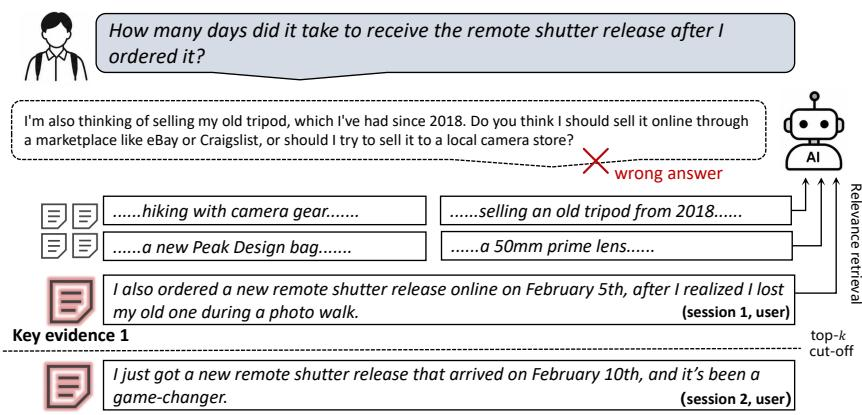
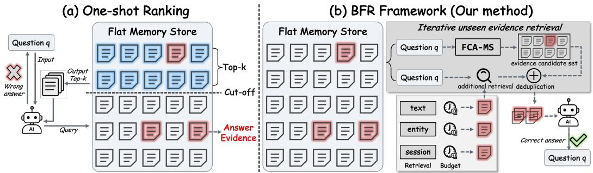
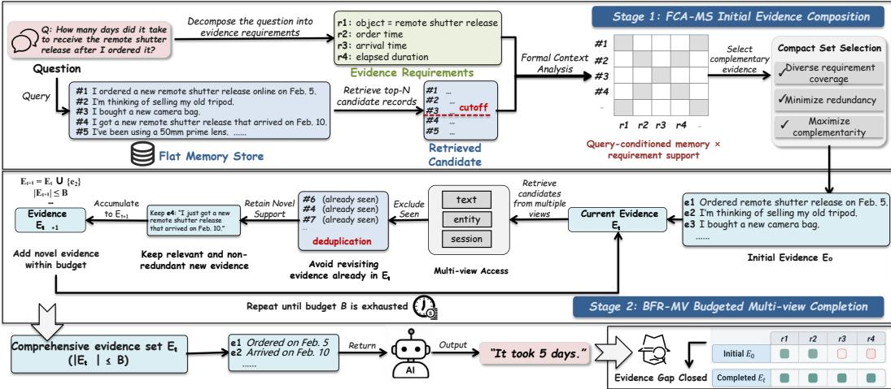
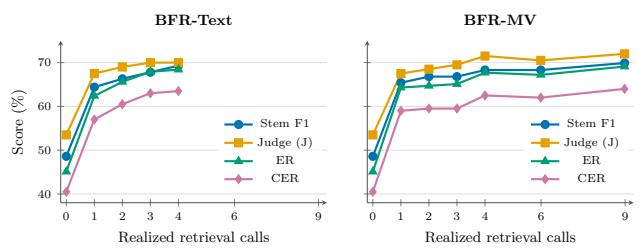
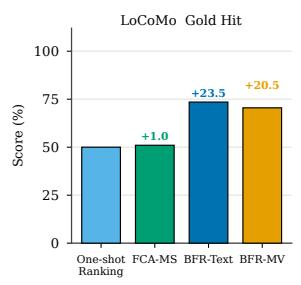
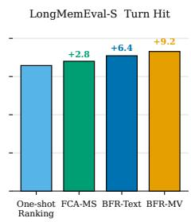
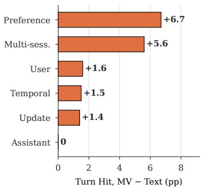

# RELEVANCE IS NOT SUFFICIENCY: WHAT ACTUALLYCLOSES THE EVIDENCE GAP IN LONG-TERM MEM-ORY QA

Yufeng Li<sup>1∗</sup>, Shuxin Li<sup>2∗</sup>, Zhenhua Xu<sup>3</sup>, Junxian Li<sup>4</sup> Peng Zeng<sup>1†</sup>, Sheng Yao<sup>5</sup>, Changting Lin<sup>3</sup>, Gaolei Li<sup>4</sup>, Ran Bi<sup>6</sup>, Meng Han<sup>3</sup>

<sup>1</sup>East China Normal University, Shanghai, China

<sup>2</sup>Nanyang Technological University, Singapore

<sup>3</sup>Zhejiang University, Hangzhou, China

<sup>4</sup>Shanghai Jiao Tong University, Shanghai, China

<sup>5</sup>University of Southern California, Los Angeles, USA

<sup>6</sup>Northeastern University, Shenyang, China

## ABSTRACT

LLM agents that interact with a user across many sessions accumulate histories that exceed their context window, so they store past interactions in an external memory and answer each question from a small set of retrieved records. Existing memory systems rank records by lexical or embedding relevance, yet the topranked memories can each be relevant while jointly omitting a complementary fact that the answer requires, especially for multi-session and temporal questions. Drawing on the distinction between relevance and sufficiency in legal evidence scholarship, we recast memory retrieval as constructing a sufficient memory set. To operationalize this view, we introduce a blinded LLM judgment over the retrieved set, together with Gold Hit and Turn Hit as evidence-coverage proxies. We then propose Budgeted Flat Reconstruction (BFR), which builds sufficient sets over a fixed flat memory store in two stages. Specifically, we first apply Formal Concept Analysisfor Memory Selection (FCA-MS) to decompose the question into information requirements and select a compact candidate subset that jointly covers them. Then, we repeatedly acquire unseen records through deeper text search or complementary entity and session views, stopping when the budget is exhausted. Experiments on LOCOMO and LONGMEMEVAL-S show that BFR outperforms same-store adaptations of recent agent-memory systems in both answer quality and evidence coverage. Specifically, on LONGMEMEVAL-S it raises judged accuracy from 72.4% to 82.2% and Turn Hit to 91.4%. Code is available at: GitHub.

## 1 INTRODUCTION

LLM agents interact with users across many sessions, accumulating preferences, events, and other information that may matter much later (Zhong et al., 2024; Maharana et al., 2024; Wu et al., 2025; Tan et al., 2025). Because the full interaction history is too long to remain in the context window (Packer et al., 2023), these agents commonly rely on external memory to retain and access past information. Agent memory has therefore become an important component for maintaining continuity across conversations and answering questions about earlier interactions. Recent agent-memory systems improve answer quality by designing how memories are represented and retrieved. For example, Mem0 distills conversations into salient facts, consolidates them over time, and retrieves them by embedding similarity (Chhikara et al., 2025). A-Mem instead maintains evolving, inter linked notes retrieved in the same way (Xu et al., 2025). CoM builds coherent memory chains from relevance-ranked candidates (Xu et al., 2026), while MRAgent reasons over a Cue–Tag–Content graph (Ji et al., 2026; Hu et al., 2025; Luo et al., 2026). Despite their different memory structures, these systems typically acquire candidates by relevance, whether through lexical matching, embedding similarity, or guided traversal (Zhang et al., 2025). Yet relevance is a property of each record, not of the set, i.e., a ranking can return several memories about the right topic while the one partner fact the answer requires falls below the cutoff. It means that retrieving relevant memories does not by itself ensure that the resulting set can support the answer. This raises a question: what determines whether the retrieved records made available to an agent support a correct answer?

Key evidence 2  
  
Figure 1: A real error: relevant but insufficient records. The question asks how many days the remote shutter release took to arrive. Relevance ranking returns Key evidence 1 together with other photography memories, while Key evidence 2 falls below the top-k cutoff.

Legal evidence scholarship offers a useful distinction: relevance concerns whether an individual item bears on a claim, whereas sufficiency concerns whether the evidence considered together supports a finding (Lempert, 1986; Pardo, 2023). We apply this distinction to memory QA and ask whether the retrieved memories, taken together, contain enough information to determine the answer. Figure 1 illustrates this failure with a real LONGMEMEVAL-S case. The question asks how many days a remote shutter release took to arrive, which requires two records together: the February 5 order and the February 10 arrival. The top-k retrieved memories include the order alongside other photography-related records, but the arrival, a less similar record from another session, falls below the cutoff. The agent then responds about selling an old tripod instead of the five-day interval. This example shows that individually relevant records do not guarantee a sufficient set.

We therefore recast memory retrieval as the construction of a sufficient memory set, one from which the answer can be determined. Constructing such a set raises two coupled challenges. First, a set must bring together complementaryfacts. A question may depend on several pieces of information, and a limited context budget can be spent on records that repeat one piece while leaving another uncovered. Second, the necessaryfacts must be reachable. Evidence missing from the initial candi date pool cannot be recovered by improving selection within that pool. Both challenges must be met without knowing which records are required. At inference time, no oracle declares a set sufficient, so a method must itself decide how far to search and when to stop.

To address both challenges, we propose Budgeted Flat Reconstruction (BFR), a two-stage, requirement-aware framework that assembles answer-supporting evidence over a flat memory store under a fixed retrieval budget. Specifically, at Stage I, Formal Concept Analysis for Memory Selection (FCA-MS) first decomposes the question into answer requirements, and then applies an FCA-based prefilter followed by LLM selection of a compact, complementary subset. These selected candidates are grounded to source records to form the initial evidence set. At Stage II, we acquire further supporting evidence from the current evidence set, excluding records already obtained and accumulating new support within a fixed retrieval budget. We instantiate this stage with two schedules: Budgeted Flat Reconstruction with Text Access (BFR-Text) extends text retrieval, and Budgeted Flat Reconstruction with Multi-View Access (BFR-MV) combines text, entity, and session views. Stage I thus composes the evidence already present among the candidates, Stage II reaches evidence beyond them, and the fixed budget supplies a stopping rule that does not presume sufficiency can be recognized. Finally, we evaluate BFR on LOCOMO and LONGMEMEVAL-S under protocols that hold the memory store, answerer, and judge fixed within each benchmark. Extensive results show that BFR improves judged answer quality and annotated evidence coverage over same-store baselines. On LONGMEMEVAL-S, it raises judged accuracy from 72.4% to 82.2% and attains a 91.4% Turn Hit. In summary, this paper makes three contributions:

(i) We formulate memory retrieval as the construction of a sufficient memory set and make set-level sufficiency measurable: LLM-Suff@Set judges whether a retrieved set supports the answer, while Gold Hit and Turn Hit track coverage of annotated answer-bearing evidence.

(ii) We propose BFR, a two-stage method for building sufficient sets over a flat memory. Its two stages recover complementary evidence missing within and beyond the initial candidates.

(iii) We conduct extensive experiments on LOCOMO and LONGMEMEVAL-S. These results show that BFR improves answer quality and evidence coverage, and identify where additional evidence is recovered and clarify the distinct roles of evidence composition and acquisition.

## 2 RELATED WORK

Evidence relevance and sufficiency. Evidence scholarship treats relevance as a property of an item’s bearing on a claim and sufficiency as a judgment over the complete evidentiary record (Pardo, 2023). In RAG, sufficient-context evaluation uses this distinction diagnostically, separating failures caused by missing context from failures to use available context (Joren et al., 2025). We bring this distinction to long-term agent memory and make it constructive: rather than diagnosing whether a retrieved set was sufficient, retrieval should assemble and complete the evidence set that supports an answer. Appendix A spells out the mapping from Pardo’s record-level test to our method.

Memory construction and relevance-based access. Memory systems increasingly transform in teraction history before retrieval. Mem0 maintains salient facts through add, update, and delete operations and retrieves semantically similar memories (Chhikara et al., 2025). A-Mem creates evolving linked notes but still answers from a top-k similarity-ranked subset (Xu et al., 2025). Zep represents temporal validity in a bi-temporal graph (Rasmussen et al., 2025); MemoryOS uses hierarchical storage (Kang et al., 2025); and SeCom segments conversations into coherent units (Pan et al., 2025). CoM improves post-retrieval organization by growing chains from top-ranked anchors according to query relevance and contextual consistency (Xu et al., 2026). MRAgent applies active reconstruction on a Cue–Tag–Content memory graph, allowing an LLM to choose retrieval tools from accumulated evidence (Ji et al., 2026). These systems improve what can be retrieved or how relevant candidates are organized. BFR instead asks whether the resulting set covers all answe requirements, then acquires missing support without changing the underlying store.

## 3 WHAT COUNTS AS A SUFFICIENT CANDIDATE MEMORY SET

Motivation. Similarity search can return several memories about the right topic while missing the fact that makes an answer possible. In figure 1, the retrieved records include the shutter-release order and other photography-related memories, but not the arrival date. The records are relevant to the question; together they cannot establish the delivery interval. Legal evidence scholarship makes the same item-versus-set distinction: an item can bear on a claim without the assembled record being sufficient to support a finding (Lempert, 1986; Pardo, 2023) (Appendix A). For memory QA, the practical difficulty is twofold. Relevant candidates may repeat one part of the answer instead of supplying complementary facts, and a necessary fact may fall outside the initial candidate pool even when it remains in the memory store. Figure 2 illustrates why a memory system must address both the composition of the retrieved set and access to evidence beyond the first retrieval boundary.

Quantifying candidate-set sufficiency. Let $q$ be a question, $y ^ { \star } ( q )$ its reference answer, M a fixed memory store, and $E \subseteq { \mathcal { M } }$ the retrieved candidate set. We write text(E) for the evidence text rendered from $E$ and src $: ( E )$ for the set of source-record or source-turn identifiers linked to E. As usual, $\mathbb { H } [ P ]$ equals 1 when proposition $P$ holds and 0 otherwise. The ideal set-level property is

$$
S ( q , E ) = \mathbb { k } [ y ^ { \star } ( q ) \mathrm { i s \ d e t e r m i n a b l e \ f r o m \ } q \mathrm { \ a n d \ t e x t } ( E ) ] .\tag{1}
$$

  
Figure 2: Similarity top-k vs. set-level sufficiency. (a) Prior memory architectures rank records by query similarity and return the top-k slice. (b) BFR returns a sufficient set over the flat store: it first selects complementary records that jointly cover the question’s requirements, then completes missing support under a budget by adding unseen records through text, entity, and session views.

Table 1: Illustrative delivery-time question. Both dates are required to derive the five-day answer.
<table><tr><td>Retrieved evidence</td><td>LLM-Suff@Set</td><td>Gold Hit</td><td>Turn Hit</td></tr><tr><td>Order only (Feb. 5)</td><td>0</td><td>1</td><td>0</td></tr><tr><td>Arrival only (Feb. 10)</td><td>0</td><td>1</td><td>1</td></tr><tr><td>Order + arrival</td><td>1</td><td>1</td><td>1</td></tr></table>

Thus, $S ( q , E )$ concerns what the evidence makes answerable, independently of whether a particular answerer generates the correct response. To assess this property offline, let $a ( q , E )$ be the final decided label from a blinded, reference-conditioned LLM adjudication given $q , y ^ { \star } ( q )$ , and text(E) (Appendix M), with $a ( q , E ) \in$ {suficient, insuficient}. We define LLM-Suff@Set by

$$
\widehat { S } _ { \mathrm { L L M } } ( q , E ) = \mathbb { M } [ a ( q , E ) = \mathrm { s u f f i c i e n t } ] .\tag{2}
$$

Here, $\widehat { S } _ { \mathrm { L L M } } ( q , E )$ is the operational, reference-conditioned assessment of joint answer support. It is undefined when adjudication is uncertain or missing; such cases are excluded from the reported rate rather than counted as insufficient. For questions with annotated supporting records, let $\mathcal G ( q )$ be their nonempty set of source identifiers and $\mathcal { H } ( q )$ be their set of annotated source-turn identifiers, which may be empty. Gold Hit and Turn Hit are defined as follows:

$$
G ( q , E ) = \mathbb { k } [ \operatorname { s r c } ( E ) \cap { \mathcal { G } } ( q ) \neq \emptyset ]\tag{3}
$$

$$
\mathrm { T H } ( q , E ) = \mathcal { k } [ \mathrm { s r c } ( E ) \cap \mathcal { H } ( q ) \neq \emptyset ]\tag{4}
$$

The value $G ( q , E )$ is 1 if E reaches at least one annotated supporting record; it does not require retrieval of every supporting record. Gold Hit is undefined when $\mathcal { G } ( q ) = \emptyset$ and is averaged over questions with nonempty supporting-record annotations. The value $\mathrm { T H } ( q , E )$ is 1 if $E$ reaches at least one annotated answer-bearing turn. Our main LONGMEMEVAL-S results average Turn Hit over all 500 questions. These proxies measure whether annotated evidence was reached, not whether the set suffices. In Table 1, each singleton has Gold Hit 1, and the arrival alone has Turn Hit 1. Neither yields the five-day answer, but together they do. A hit is therefore necessary for sufficiency but does not establish it, which is why we report the proxies alongside, not in place of, the set-level judgment.

## 4 BFR: COMPOSING AND COMPLETING SUFFICIENT EVIDENCE

## 4.1 PROBLEM: CONSTRUCT A SUFFICIENT SET UNDER A RETRIEVAL BUDGET

Let $\mathcal { M } = \{ m _ { 1 } , . . . , m _ { N } \}$ be a fixed memory store, q a question, and $y ^ { \star }$ its reference answer. An access policy constructs $\dot { \boldsymbol { E } } \subseteq { \mathcal { M } }$ , after which the fixed answerer f emits $\hat { y } = f ( q , E )$ . The setlevel sufficiency property $S ( q , E )$ is defined in Section 3. Holding M and $f$ fixed, the construction problem is to maximize expected sufficiency under a retrieval-call budget B:

$$
\operatorname* { m a x } _ { \pi } \mathbb { E } [ S ( q , E _ { T } ) ] \quad { \mathrm { s . t . } } \quad C _ { \mathrm { r e t } } ( \pi , q ) \leq B .\tag{5}
$$

  
Figure 3: The two-stage evidence-construction pipeline in BFR. Stage I (FCA-MS) retrieves a candidate pool larger than the usual top-k, decomposes the query into answer requirements, prefilters candidates with FCA, and has an LLM select a compact subset that jointly covers the requirements. The selected candidates are mapped to source records to form $E _ { 0 }$ . Stage II (shown for BFR-MV instantiation) completes the set under a fixed budget: text, entity, and session access retrieve unseen records. Only new records are accumulated into $E _ { t + 1 }$ until the budget is exhausted. The comprehensive evidence set returns to Agent, and Agent answers the question based on the set.

A one-shot reader returns $E = \mathrm { T o p K } ( \boldsymbol { q } , \mathcal { M } )$ and cannot recover once a required exhibit is missing. Budgeted reconstruction instead starts from an initial set $E _ { 0 }$ and adds only unseen records,

$$
E _ { t + 1 } = E _ { t } \cup K _ { t } , \qquad K _ { t } \subseteq \mathcal { M } \setminus E _ { t } .\tag{6}
$$

Equation 5 is the problem. The two gaps in Section 3 say what a solution must do. Composition chooses $E _ { 0 }$ so that distinct answer requirements are covered rather than redundant relevant items. Completion chooses each $K _ { t }$ so that a missing exhibit can still enter the record after the first page.

BFR assigns one stage to each gap. Let $\widetilde { \mathcal { M } }$ be an agent-memory note representation and ϕ a grounding map into M. Stage I builds $E _ { 0 }$ with FCA-MS and Stage II runs a completion schedule π:

$$
\begin{array} { r l } & { E _ { 0 } = \phi \Big ( \rho _ { \mathrm { F C A } } ( q , \widetilde { \mathcal { M } } ) \Big ) , } \\ & { \quad A _ { t } = \pi ( q , E _ { t } , t ) , } \\ & { E _ { t + 1 } = E _ { t } \cup \kappa _ { \pi } ( q , E _ { t } , C _ { t } ) , \qquad t < T . } \end{array}\tag{7}
$$

A names the retrieval views and cues at round $t , C _ { t }$ is the unseen candidate pool those calls return, and $\kappa _ { \pi }$ retains added records. The answerer reads $E _ { T }$ after the budget is spent. Figure 3 makes this data flow explicit. Stage I asks the agent memory system for an expanded candidate pool beyond its usual top-k, decomposes the query into requirements, filters the pool by requirement-aware FCA, and asks an LLM to select a compact supporting subset. A bounded grounding map then supplies the initial source-record evidence $E _ { 0 }$ . Stage II treats this set as a cumulative evidence state, retrieves through the views specified by $\pi ,$ removes records already in $E _ { t } .$ , and retains novel support until an observable budget is exhausted. The figure instantiates this loop with BFR-MV; BFR-Text uses the same exclusion, retention, accumulation, and stopping operations with text access only. Appendix A records how $S , R , \mathcal { R } _ { q } ,$ and the two stages correspond to Pardo’s item/record distinction.

## 4.2 STAGE I: COMPOSE COMPLEMENTARY EVIDENCE WITH FCA-MS

Expanded retrieval and requirement decomposition. An agent memory system returns an ordered pool $\mathcal { C } _ { q } = \mathrm { T o p N } ( \mathrm { R e t r i e v e } _ { \mathrm { a g e n t } } ( q , \widetilde { \mathcal { M } } ) )$ ), with $N > k$ relative to its usual top-k retrieval cutoff. An LLM decomposes $q$ into answer-oriented requirements $\mathcal { R } _ { q } ~ = ~ \{ r _ { j } \} _ { j = 1 } ^ { J }$ , including distinct facts, bridges, list items, and temporal constraints.

Requirement-aware prefilter. An FCA-based prefilter uses the requirements and retrieved candidates to retain a smaller pool $\mathcal { P } _ { q } = \mathrm { F C A P r e f i l t e r } ( \mathcal { R } _ { q } , \mathcal { C } _ { q } )$ . This step exposes a broader range of potentially complementary notes to the selector while bounding its input.

Minimum-subset selection and grounding. An LLM receives $q$ and $\mathcal { P } _ { q }$ and is instructed to select the smallest memory subset that jointly supplies the required information. Its selected IDs are checked against the prefiltered pool and deduplicated; the implementation uses requirementcoverage output and a fixed fallback if the valid subset is empty (Appendix E). Only the resulting selected notes $S$ are grounded to source turns by ϕ to produce ${ \dot { E } } _ { 0 } \subseteq { \bar { \mathcal { M } } } ;$ the retriever’s initial top-k is a reference cutoff, not a retained base set.

This stage improves requirement coverage within the initial candidate pool but remains bounded by that pool. A required record can therefore be absent from $E _ { 0 }$ even when $E _ { 0 }$ already contains several records related to the question. Stage II treats this remaining gap as an acquisition problem instead of reselecting repeatedly from the same pool. Algorithm 1 in Appendix D summarizes the selection and grounding steps.

## 4.3 STAGE II: COMPLETE MISSING SUPPORT UNDER A BUDGET

Multi-view access to one fixed store. Text, entity, and session indices provide different access paths to the same source-grounded records in M. At round t, each action $a = ( v , c ) \in A _ { i }$ <sub>t</sub> specifies a view v and a cue c. The retrievers exclude all records already contained in $E _ { t }$

$$
C _ { t } = \mathrm { U n i q u e } \left( \bigcup _ { ( v , c ) \in A _ { t } } R _ { v } ( c , { \mathcal { M } } \setminus E _ { t } ) \right) .\tag{8}
$$

The exclusion constraint makes acquisition cumulative and duplicate-free. The retention rule $\kappa _ { \pi }$ ranks the returned records by relevance and by novelty with respect to the current set, keeps at most $k _ { \mathrm { k e e p } }$ of them, and adds them to $E _ { t }$ by set union. Consequently, each round either extends the reachable evidence or leaves the set unchanged.

Budgeted stopping. The budget $B = ( B _ { \mathrm { s t e p } } , B _ { \mathrm { c a l l } } , B _ { \mathrm { n e w } } )$ limits the number of rounds, retrieval calls, and newly retained records. The main configuration allows three rounds, six calls, and 30 new records. We use budget exhaustion as the stopping condition because the offline sufficiency measures in Section 3 require either a reference answer or gold annotations and are therefore unavailable at inference time. Algorithm 2 in Appendix D gives the shared completion loop; the fixed schedules differ only in how they instantiate $A _ { t }$

## 4.4 ACCESS SCHEDULES FOR COMPLETION

The shared completion loop admits two fixed schedules for the two ways required support can remain outside $E _ { 0 }$ . They share FCA-MS, M, the exclusion rule, the budget, and the answerer; only the allocation of retrieval calls changes. We also evaluate state-conditioned completion as a controlled variant of Stage II; its settings and results are reported in Section 5.2 and Appendix I.

BFR-Text: deepen the text ranking. Each round queries the text index with the original question $q ,$ removes ids already in $E _ { t }$ , and keeps the first $k _ { \mathrm { k e e p } } = 8$ unseen hits. Repeating the same query advances beyond the initial page without query rewriting. This schedule targets cases in which the missing evidence is relevant to $q$ but appears below the first cutoff.

BFR-MV: diversify the access path. The multi-view schedule issues text, entity, and session actions in a fixed order. The text action uses $q ;$ the entity action uses the first person named in q when available; the session action uses the latest retained record as an anchor. Entity and session access can recover records that do not rank highly under the full question string.

## 5 EXPERIMENTS

In this section, we conduct controlled experiments to evaluate BFR and answer four research questions: (RQ1) How does BFR compare with same-store memory baselines in answer quality? (RQ2) Do retrieved sets contain sufficient evidence to answer the question, and how does direct sufficiency

Table 2: Performance across different question types on LOCOMO (n=200). Same flat store and extractive answerer; BFR is BFR-MV C6. F1 and LLM-Judge (J) are percentages. Bold denotes the best value in each column.
<table><tr><td rowspan="2">Method</td><td colspan="2">Multi-Hop</td><td colspan="2">Temporal</td><td colspan="2">Open Domain</td><td colspan="2">Single-Hop</td><td colspan="2">Overall</td></tr><tr><td>F1</td><td>J</td><td>F1</td><td>J</td><td>F1</td><td>J</td><td>F1</td><td>J</td><td>F1</td><td>J</td></tr><tr><td>Mem0 (Chhikara et al., 2025)</td><td>29.3</td><td>42.4</td><td>74.1</td><td>78.0</td><td>2.2</td><td>0.0</td><td>58.5</td><td>59.6</td><td>55.3</td><td>59.0</td></tr><tr><td>A-Mem (Xu et al., 2025)</td><td>32.3</td><td>42.4</td><td>70.2</td><td>72.0</td><td>3.8</td><td>0.0</td><td>47.1</td><td>51.4</td><td>48.7</td><td>53.0</td></tr><tr><td>CoM* (Xu et al., 2026)</td><td>29.3</td><td>36.4</td><td>66.2</td><td>70.0</td><td>3.2</td><td>0.0</td><td>52.3</td><td>56.0</td><td>50.0</td><td>54.0</td></tr><tr><td>MRAgent-Flat* (Ji et al., 2026)</td><td>32.8</td><td>45.5</td><td>72.1</td><td>78.0</td><td>2.9</td><td>0.0</td><td>63.2</td><td>68.8</td><td>58.0</td><td>64.5</td></tr><tr><td>BFR (ours)</td><td>44.6</td><td>48.5</td><td>78.1</td><td>80.0 2.7</td><td></td><td>12.5</td><td>75.7</td><td>77.1</td><td>68.3</td><td>70.5</td></tr></table>

compare with annotated-support hits? (RQ3) How do the two stages and access schedules contribute to performance? (RQ4) How do answer quality and evidence coverage change with additional retrieval cost? The appendix reports full operating-point, question-type, and cross-system results.

## 5.1 EXPERIMENTAL SETUP

Datasets. We evaluate on two benchmarks for long-term conversational memory. LOCOMO (Maharana et al., 2024) tests understanding of long, multi-session conversations, including questions that require linking information across turns. LONGMEMEVAL-S (Wu et al., 2025) tests whether a memory system can answer questions about information distributed across extended interaction histories and sessions. Both provide evidence annotations, allowing us to assess retrieval as well as final answers. To keep multi-arm evaluation costs manageable, we use a fixed stratified 200-question LOCOMO development subset; we evaluate all 500 questions of LONGMEMEVAL-S. Dataset prove nance and the construction of every derived evaluation subset are documented in Appendix G.

Baselines. We evaluate BFR against four representative memory-augmented baselines: Mem0 (Chhikara et al., 2025), A-Mem (Xu et al., 2025), CoM<sup>∗</sup> (Xu et al., 2026), and MRAgent Flat<sup>∗</sup> (Ji et al., 2026). Within each benchmark, all arms share the same flat turn store, extractive answerer, and answer judge. The starred methods are controlled same-store adaptations of the published systems. Baseline retrieval and BFR initialization are detailed in Appendix E.

Metrics. Answer quality is measured by Porter stem F1 and LLM-Judge (J) on LOCOMO, and by Judge on LONGMEMEVAL-S. The answer judge is gpt-5.5 at temperature zero with prompt mem0 accuracy v1. On LOCOMO, G(q) is the released set of supporting-record identifiers. We report the sufficiency indicators in Section 3 and two finer measures of annotated-evidence recovery:

$$
\operatorname { E R } ( q , E ) = { \frac { { \big | } \operatorname { s r c } ( E ) \cap { \mathcal { G } } ( q ) { \big | } } { | { \mathcal { G } } ( q ) { \big | } } } , \qquad \operatorname { C E R } ( q , E ) = { \mathcal { k } } [ { \mathcal { G } } ( q ) \subseteq \operatorname { s r c } ( E ) ] .\tag{9}
$$

Evidence Recall (ER) is the fraction of annotated supporting records in G(q) that E recovers, while Complete Evidence Recall (CER) requires every annotated supporting record. On LONG-MEMEVAL-S, H(q) comprises turns marked has answer; Turn Hit measures whether the retrieved set reaches one. These retrieval and set-level measures complement rather than replace end-to-end answer scores. Prompts are listed in Appendix O.

## 5.2 EXPERIMENTAL RESULT

## RQ1: Does BFR improve answer quality under the same memory store?

BFR achieves the best overall answer quality among same-store methods on both benchmarks (Table 2, Table 3). On LOCOMO, it leads in Stem F1 and Judge across Multi-Hop, Temporal, and Single-Hop questions. On LONGMEMEVAL-S, it also leads in overall Judge and Turn Hit, with a particularly strong gain on Temporal questions. The small LOCOMO Open Domain slice is reported without a separate type-level conclusion. These results are consistent with the two-stage design: FCA-MS assembles complementary initial evidence, and budgeted completion retrieves unseen support beyond the initial set. The following analyses test whether this support closes evidence gaps and how stage, access schedule, and budget contribute. Paired same-store comparisons and the separate comparison with CoM and Full-MRAgent are in Appendix H and Appendix C, respectively.

Table 3: Performance across different question types on LONGMEMEVAL-S (n=500). The four question-type columns report Judge accuracy; All values are percentages. All rows share the same turn store, extractive answerer, and judge. Bold and underline denote the best and second-best values in each column. The full six-type Turn Hit breakdown is in Appendix K.
<table><tr><td></td><td colspan="4">Judge by question type</td><td colspan="2">Overall</td></tr><tr><td>Method</td><td>Multi-S</td><td>Single-S</td><td>Temporal</td><td>Preference</td><td>Judge</td><td>Turn Hit</td></tr><tr><td>Mem0 (Chhikara et al., 2025)</td><td>60.9</td><td>87.1</td><td>65.4</td><td>26.7</td><td>72.4</td><td>64.8</td></tr><tr><td>A-Mem (Xu et al., 2025)</td><td>54.1</td><td>87.1</td><td>57.1</td><td>33.3</td><td>68.6</td><td>82.2</td></tr><tr><td>CoM *(Xu et al., 2026)</td><td>54.1</td><td>87.1</td><td>57.1</td><td>33.3</td><td>68.6</td><td>80.6</td></tr><tr><td>MRAgent-Flat* (Ji et al., 2026)</td><td>58.6</td><td>90.0</td><td>63.2</td><td>30.0</td><td>71.4</td><td>78.8</td></tr><tr><td>BFR (ours)</td><td>69.2</td><td>92.9</td><td>84.2</td><td>30.0</td><td>82.2</td><td>91.4</td></tr></table>

Table 4: Set sufficiency and annotated-evidence reach across same-store systems. On LOCOMO (n=200), LLM-Suff@Set is the blinded set-level judgment and Gold Hit measures annotatedevidence access. On LONGMEMEVAL-S, LLM-Suff@Set is the set-level judgment and Turn Hit measures annotated-evidence access over all 500 questions, with unannotated items counted as misses. All values are percentages. BFR-Text uses C3 and BFR-MV uses C6.
<table><tr><td rowspan="2">System</td><td>LoCoMo (n=200)</td><td></td><td colspan="2">LONGMEMEVAL-S (n=500)</td></tr><tr><td>LLM-Suff@Set</td><td>Gold Hit</td><td>LLM-Suff@Set</td><td>Turn Hit</td></tr><tr><td>Mem0 (Chhikara et al., 2025)</td><td>45.5%</td><td>57.0%</td><td>48.0%</td><td>64.8%</td></tr><tr><td>A-Mem (Xu et al., 2025)</td><td>36.5%</td><td>50.0%</td><td>38.0%</td><td>82.2%</td></tr><tr><td>CoM* (Xu et al., 2026)</td><td>44.0%</td><td>49.0%</td><td>49.0%</td><td>80.6%</td></tr><tr><td>MRAgent-Flat* (Ji et al., 2026)</td><td>54.5%</td><td>62.5%</td><td>56.0%</td><td>78.8%</td></tr><tr><td>FCA-MS (Stage I Only)</td><td>42.5%</td><td>51.0%</td><td>48.0%</td><td>85.0%</td></tr><tr><td>BFR-Text</td><td>62.0%</td><td>72.5%</td><td>63.0%</td><td>88.6%</td></tr><tr><td>BFR-MV</td><td>63.5%</td><td>73.5%</td><td>65.0%</td><td>91.4%</td></tr></table>

## RQ2: Do the retrieved sets contain the evidence needed for an answer?

BFR achieves the highest observed LLM-Suff@Set on both benchmarks among the compared same-store systems (Table 4). Under the main budget configuration, both completion schedules exceed FCA-MS alone and all baselines on set-level sufficiency and annotated-evidence coverage, with BFR-MV highest on every measure. Since FCA-MS alone trails both schedules, the gain comes from

Table 6: Stage and access-schedule ablation.
<table><tr><td rowspan="2">Configuration</td><td colspan="2">LoCoMo</td><td colspan="2">LONGMEMEVAL-S</td></tr><tr><td>F1</td><td>J</td><td>J</td><td>TH</td></tr><tr><td>FCA-MS FCA-MS</td><td>48.6</td><td>53.5</td><td>70.4</td><td>85.0</td></tr><tr><td>w/BFR-Text FCA-MS</td><td>67.8</td><td>70.0</td><td>81.6</td><td>88.6</td></tr><tr><td>w/ BFR-MV</td><td>68.3</td><td>70.5</td><td>82.2</td><td>91.4</td></tr></table>

completing the initial set beyond its candidate pool rather than from selection within it.

Table 5 further shows that completion improves complete recovery of annotated evidence on LO-COMO. However, the two measures rank the schedules differently: BFR-Text has higher overall CER, whereas BFR-MV has higher LLM-Suff@Set. On LONGMEMEVAL-S, A-Mem likewise has higher Turn Hit than Mem0 but lower set-level sufficiency. Thus, annotated-evidence access alone does not establish whether the retrieved set jointly supports the answer. Detailed LOCOMO ER, CER, and LLM-Suff@Set results are in Appendix I, and the six-type LONGMEMEVAL-S Turn Hit breakdown is in Appendix K.



Table 5: Where budgeted completion closes the evidence gap on LOCOMO (n=200). CER is Complete Evidence Recall; LLM-Suff@Set is the blinded set-level judgment. Text and MV denote BFR-Text at C3 and BFR-MV at C6, with mean realized calls of 3.00 and 5.99; FCA-MS uses no completion calls. Open Domain contains only eight questions and is interpreted descriptively.
<table><tr><td rowspan="2">Question type</td><td rowspan="2">n</td><td colspan="2">FCA-MS</td><td colspan="2">BFR-Text</td><td colspan="2">BFR-MV</td></tr><tr><td>CER</td><td>LLM-Suff@Set</td><td>CER</td><td>LLM-Suff@Set</td><td>CER</td><td>LLM-Suff@Set</td></tr><tr><td>Multi-Hop</td><td>33</td><td>6.1</td><td>15.2</td><td>18.2</td><td>27.3</td><td>12.1</td><td>30.3</td></tr><tr><td>Temporal</td><td>50</td><td>66.0</td><td>60.0</td><td>82.0</td><td>74.0</td><td>82.0</td><td>74.0</td></tr><tr><td>Open Domain</td><td>8</td><td>12.5</td><td>0.0</td><td>12.5</td><td>0.0</td><td>25.0</td><td>0.0</td></tr><tr><td>Single-Hop</td><td>109</td><td>41.3</td><td>45.9</td><td>71.6</td><td>71.6</td><td>70.6</td><td>73.4</td></tr><tr><td>Overall</td><td>200</td><td>40.5</td><td>42.5</td><td>63.0</td><td>62.0</td><td>62.0</td><td>63.5</td></tr></table>

## RQ3: Which stage and access schedule produce the gains?

FCA-MS improves annotated-evidence reach over one-shot ranking on both benchmarks; budgeted completion from this initializer yields further gains in evidence access and answer quality. In Figure 4, FCA-MS raises LOCOMO Gold Hit from 50.0% to 51.0% and LONG-MEMEVAL-S Turn Hit from 82.2% to 85.0%. Adding either BFR schedule retrieves more annotated support at the reported operating points. Table 6 shows that, relative to FCA-MS alone, both schedules also raise Stem F1 and Judge on LOCOMO and Judge on LONG-



  
One-shot Ranking FCA-MS BFR-Text BFR-MV

Figure 4: Coverage relative to one-shot ranking.

MEMEVAL-S. The schedules favor different reported operating points. At the matched C3 point in figure 4, BFR-Text has higher LOCOMO Gold Hit than BFR-MV. The full BFR-MV C6 configuration has the highest LONGMEMEVAL-S Judge and Turn Hit in Table 6, at a higher call budget than BFR-Text C3. Type-level results are in Table 13 and Appendix K.

## RQ4: What does additional retrieval cost buy?

Figure 5 shows the cost–quality tradeoff. The panels show BFR-Text and BFR-MV starting from the same FCA-MS C0 set. The horizontal axis is the mean realized number of retrieval calls; ER and CER measure partial and complete recovery of annotated evidence, respectively. Lines connect observed operating points only. BFR-Text C4 and C6 coincide at four realized calls. Most of the answer-quality gain over FCA-MS appears after the first completion call. At the matched three-call

Figure 5: Answer quality and annotated-evidence recovery versus retrieval cost on LOCOMO (n=200).

point, BFR-Text exceeds BFR-MV on all four plotted metrics. BFR-MV reaches its highest scores at C9, but requires nearly nine calls, and its curves are not monotonic between budgets. The C6 configuration in the main tables remains the fixed default operating point rather than a sweep-selected maximum. The complete numerical grid, including evidence-set size and LLM-Suff@Set, is in Appendix I; the matched-call RSC comparison is in Appendix L.

## 6 CONCLUSION AND DISCUSSION

In this paper, we proposed BFR, a two-stage method for building sufficient evidence sets that can support answers in long-term memory QA. On LOCOMO and LONGMEMEVAL-S, budgeted completion alone raises annotated-evidence reach over one-shot ranking, and the full two-stage framework further improves evidence coverage and judged answer quality over same-store baselines. Ablations attribute most of the gain to broader evidence access rather than adaptive state control, and human checks show that gold-free sufficiency estimates remain too unreliable to serve as stopping criteria. More broadly, these results motivate a different objective for long-term memory retrieval: not to rank individually relevant memories, but to construct a set whose members collectively satisfy the information requirements of the question. From this view, retrieval involves both composition, assembling complementary support within reach, and completion, continuing beyond the initial retrieval boundary when necessary. This makes set-level sufficiency a natural bridge between memory access and downstream reasoning: retrieval should deliver an answer-supporting evidentiary record, not simply a list of similar items. As agent histories become longer and required evidence is increasingly distributed across sessions, we expect this distinction between relevance and sufficiency to become central to how long-term memory systems are designed and evaluated.

## AI USE STATEMENT

Generative AI systems were used in two roles. As part of the reported method and evaluation, language models perform requirement decomposition, candidate–requirement coverage judgments, answer synthesis, answer judging, and blinded LLM-Suff@Set labeling and adjudication; the corresponding roles, prompts, and evaluation rules are documented in the paper and appendix. Cursor and OpenAI Codex also assisted with experimental planning, code generation and debugging, result organization, literature discovery, and manuscript drafting and language editing. The authors inspected AI-produced code and outputs, reran the reported computations, verified citations and numerical claims against stored experiment artifacts, and made all final methodological and editoria decisions. Public benchmark conversations, questions, and reference answers were not generated or altered by these tools. The authors take responsibility for the complete contents of the submission.

## REFERENCES

Prateek Chhikara, Dev Khant, Saket Aryan, Taranjeet Singh, and Deshraj Yadav. Mem0: Building production-ready AI agents with scalable long-term memory. arXiv preprint arXiv:2504.19413, 2025.

Yuyang Hu, Shichun Liu, Yanwei Yue, Guibin Zhang, Boyang Liu, Fangyi Zhu, Jiahang Lin, Honglin Guo, Shihan Dou, Zhiheng Xi, et al. Memory in the age of ai agents. arXiv preprint arXiv:2512.13564, 2025.

Shuo Ji, Yibo Li, and Bryan Hooi. Memory is reconstructed, not retrieved: Graph memory for LLM agents. In Proceedings of the 43rd International Conference on Machine Learning, 2026.

Hailey Joren, Jianyi Zhang, Chun-Sung Ferng, Da-Cheng Juan, Ankur Taly, and Cyrus Rashtchian. Sufficient context: A new lens on retrieval augmented generation systems. In The Thirteenth International Conference on Learning Representations, 2025.

Jiazheng Kang, Mingming Ji, Zhe Zhao, and Ting Bai. Memory OS of AI agent. arXiv preprint arXiv:2506.06326, 2025.

Richard Lempert. The new evidence scholarship: Analyzing the process of proof. BUL Rev., 66: 439, 1986.

Jinghao Luo, Yuchen Tian, Chuxue Cao, Ziyang Luo, Hongzhan Lin, Kaixin Li, Chuyi Kong, Ruichao Yang, and Jing Ma. From storage to experience: A survey on the evolution of llm agent memory mechanisms. In Findings of the Association for Computational Linguistics: ACL 2026, pp. 41622–41652, 2026.

Adyasha Maharana, Dong-Ho Lee, Sergey Tulyakov, Mohit Bansal, Francesco Barbieri, and Yuwei Fang. Evaluating very long-term conversational memory of LLM agents. In Proceedings of the 62nd Annual Meeting ofthe Associationfor Computational Linguistics (Volume 1: Long Papers), pp. 13851–13870, Bangkok, Thailand, 2024. Association for Computational Linguistics.

Charles Packer, Sarah Wooders, Kevin Lin, Vivian Fang, Shishir G Patil, Ion Stoica, and Joseph E Gonzalez. Memgpt: Towards llms as operating systems. arXiv preprint arXiv:2310.08560, 2023.

Zhuoshi Pan, Qianhui Wu, Huiqiang Jiang, Xufang Luo, Hao Cheng, Dongsheng Li, Yuqing Yang, Chin-Yew Lin, H. Vicky Zhao, Lili Qiu, and Jianfeng Gao. SeCom: On memory construction and retrieval for personalized conversational agents. In The Thirteenth International Conference on Learning Representations, 2025.

Michael S. Pardo. What makes evidence sufficient? Arizona Law Review, 65(2):431–478, 2023.

Preston Rasmussen, Pavlo Paliychuk, Travis Beauvais, Jack Ryan, and Daniel Chalef. Zep: A temporal knowledge graph architecture for agent memory. arXiv preprint arXiv:2501.13956, 2025.

Zhen Tan, Jun Yan, I-Hung Hsu, Rujun Han, Zifeng Wang, Long Le, Yiwen Song, Yanfei Chen, Hamid Palangi, George Lee, et al. In prospect and retrospect: Reflective memory management for long-term personalized dialogue agents. In Proceedings of the 63rd Annual Meeting of the Associationfor Computational Linguistics (Volume 1: Long Papers), pp. 8416–8439, 2025.

Di Wu, Hongwei Wang, Wenhao Yu, Yuwei Zhang, Kai-Wei Chang, and Dong Yu. Longmemeval: Benchmarking chat assistants on long-term interactive memory. In The Thirteenth International Conference on Learning Representations, ICLR 2025, Singapore, April 24-28, 2025. OpenReview.net, 2025. URL https://openreview.net/forum?id=pZiyCaVuti.

Wujiang Xu, Zujie Liang, Kai Mei, Hang Gao, Juntao Tan, and Yongfeng Zhang. A-MEM: Agentic memory for LLM agents. In Advances in Neural Information Processing Systems, 2025.

Xiucheng Xu, Bingbing Xu, Xueyun Tian, Zihe Huang, Rongxin Chen, Yunfan Li, and Huawei Shen. Chain-of-memory: Lightweight memory construction with dynamic evolution for LLM agents. In Proceedings ofthe 64th Annual Meeting ofthe Associationfor Computational Linguistics, 2026.

Zeyu Zhang, Quanyu Dai, Xiaohe Bo, Chen Ma, Rui Li, Xu Chen, Jieming Zhu, Zhenhua Dong, and Ji-Rong Wen. A survey on the memory mechanism of large language model-based agents. ACM Transactions on Information Systems, 43(6):1–47, 2025.

Wanjun Zhong, Lianghong Guo, Qiqi Gao, He Ye, and Yanlin Wang. Memorybank: Enhancing large language models with long-term memory. In Proceedings of the AAAI conference on artificial intelligence, volume 38, pp. 19724–19731, 2024.

## CONTENTS

1 Introduction 1   
2 Related Work 3   
3 WHAT COUNTS AS A SUFFICIENT CANDIDATE MEMORY SET 3   
4 BFR: Composing and Completing Sufficient Evidence 4   
4.1 Problem: construct a sufficient set under a retrieval budget 4   
4.2 Stage I: Compose complementary evidence with FCA-MS 5   
4.3 Stage II: Complete missing support under a budget . 6   
4.4 Access schedules for completion . 6   
5 Experiments 6   
5.1 Experimental setup 7   
5.2 Experimental Result . 7   
6 Conclusion and Discussion 10   
A Evidence-law mapping 15   
B Case trace for figure 1 15   
C Structured memory boundary 15   
D Algorithmic specification 16   
E Implementation details 17   
F Data usage and sealing 18   
G Dataset provenance and derived evaluation sets 18   
H Same-store LOCOMO controls 19   
I Budget sweep 20   
J Development robustness 22   
K Full LongMemEval-S type breakdown 22   
L Comparison with learned residual set completion 22   
M Annotation protocol 23   
N Metric definitions 23   
O Prompts 23   
P Matched three-call comparison of BFR-MV and BFR-Text 25

## A EVIDENCE-LAW MAPPING

Pardo asks what makes evidence sufficient, and answers by separating two judgments that legal fact-finding already treats as distinct (Pardo, 2023). Relevance is a property of an item: an exhibit is relevant when it has a bearing on a fact of consequence. Sufficiency is a property of a record: the body of evidence is sufficient when a reasonable finder of fact could make the finding from that record as assembled. The finder does not score items independently and then threshold the sum. The question is whether the assembled exhibits, taken together, could support one explanation of the disputed fact over its competitors. Pardo therefore emphasizes explanatoryfacts: relations between exhibits and the elements of a finding, rather than a per-item probability that an exhibit is “about” the claim.

Memory QA uses the same two objects. A memory $m \in \mathcal { M }$ is an exhibit, and $R ( q , m )$ denotes its item-wise relevance to question $q \colon$ does this memory have any tendency to matter for $q \mathrm { ? }$ The retrieved set E is the evidentiary record. The ideal property $S ( q , E )$ in equation 1 adapts Pardo’s reasonable-finder test to conversational memory; the blinded LLM label $\widehat { S } _ { \mathrm { L L M } } ( q , E )$ in equation 2 is its reference-conditioned operational measurement. The shutter-release case in figure 1 is exactly this split: the February 5 order is a relevant exhibit, and the photography memories around it are also relevant, but the record cannot support the finding “five days” until the February 10 arrival enters E.

The method in Section 4 implements the two operations that this split requires. Information requirements $\mathcal { R } _ { q } = \{ r _ { j } \}$ are the explanatory elements of the finding: order date and arrival date in the running case; a fact and a bridge in multi-hop questions; the items of a list. The requirementconditioned candidate assessment in Stage I concerns relations between an exhibit and a needed element, rather than a single query–memory score. Stage I composition is the assembly of a record whose exhibits jointly cover those elements. Stage II completion is what a finder does when the current record is insufficient: further exhibits are acquired, from the same store, rather than re-ranking exhibits already known to be relevant. The exclusion $K _ { t } \ \subseteq \mathcal { M } \setminus E _ { t }$ in equation 6 is the legal analogue of not re-admitting the same exhibit. Gold Hit G and Turn Hit ask whether an annotated answer-bearing exhibit has entered the record; they correspond to coverage of at least one marked element, which is why Section 3 treats them as proxies associated with S rather than as the sufficiency test itself.

This mapping is conceptual, not a claim that agent memory should mimic courtroom procedure. It specifies the object we optimize: a record that could support a reasonable finding, constructed by composing complementary exhibits and completing the record when it cannot.

## B CASE TRACE FOR FIGURE 1

Figure 1 uses question b3c15d39 from LONGMEMEVAL-S. The answer requires two user turns: the remote shutter release was ordered on February 5 and arrived on February 10. Both lexical topk and FCA-MS reach the order turn but miss the arrival turn, leaving evidence recall at 50% and producing an incorrect answer. BFR-MV reaches both turns and answers “5 days” under the same extractive answerer and judge.

Table 7: Trace behind the relevance–sufficiency case. Case evidence recall counts the two required turns; the first two sets contain relevant photography memories but miss one required date.
<table><tr><td>Access</td><td>Order date</td><td>Arrival date</td><td>Gold recall</td><td>Judge</td></tr><tr><td>Lexical top-k</td><td>√</td><td></td><td>50%</td><td>Wrong</td></tr><tr><td>FCA-MS (Stage I)</td><td>√</td><td></td><td>50%</td><td>Wrong</td></tr><tr><td>BFR-MV</td><td>√</td><td>√</td><td>100%</td><td>Correct</td></tr></table>

## C STRUCTURED MEMORY BOUNDARY

This appendix reports the cross-system comparison that was removed from the main LOCOMO table. The slice is the conv-30 overlap (n=81) under a unified extractive answerer and judge. BFR-

Table 8: Cross-system boundary on the LOCOMO conv-30 overlap (n=81), unified extractive answerer and judge; † marks rows re-scored under this protocol. Bold / underline: best / second best. Open Domain is absent from the slice.
<table><tr><td rowspan="2">Method</td><td colspan="2">Multi-Hop</td><td colspan="2">Temporal</td><td colspan="2">Single-Hop</td><td colspan="2">Overall</td></tr><tr><td>F1</td><td>J</td><td>F1</td><td>J</td><td>F1</td><td>J</td><td>F1</td><td>J</td></tr><tr><td>BFR-Text†</td><td>41.4</td><td>54.5</td><td>100.0</td><td>100.0</td><td>75.5</td><td>77.3</td><td>78.7</td><td>81.5</td></tr><tr><td>CoM† (Xu et al., 2026)</td><td>41.2</td><td>63.6</td><td>96.2</td><td>96.2</td><td>71.8</td><td>84.1</td><td>75.5</td><td>85.2</td></tr><tr><td>MRAgent-Flat† (Ji et al., 2026)</td><td>12.9</td><td>45.5</td><td>92.3</td><td>92.3</td><td>62.3</td><td>68.2</td><td>65.2</td><td>72.8</td></tr><tr><td>Full-MRAgent† (Ji et al., 2026)</td><td>26.5</td><td>90.9</td><td>92.3</td><td>96.2</td><td>78.8</td><td>95.5</td><td>76.1</td><td>95.1</td></tr></table>

Table 9: Flat acquisition vs. structured memory on the 81-question overlap slice under a shared extractive answerer and judge. Full MRAgent and CoM change the store and are reported as a boundary, not as fair same-substrate baselines.
<table><tr><td>Configuration</td><td>Store</td><td>Gold Hit (%)</td><td>Judge Acc (%)</td></tr><tr><td rowspan="2">MRAgent-Flat BFR-Text</td><td>flat turns</td><td>67.9</td><td>72.8</td></tr><tr><td>flat turns</td><td>77.8</td><td>81.5</td></tr><tr><td>CoM</td><td>organized pool</td><td>80.2</td><td>85.2</td></tr><tr><td>Full MRAgent</td><td>Cue-Tag-Content graph</td><td>88.9</td><td>95.1</td></tr></table>

Text and MRAgent-Flat still read flat turns; CoM uses an organized candidate pool; Full-MRAgent uses a Cue–Tag–Content graph. Open Domain is absent from this slice. The comparison is a boundary, not a fair same-store baseline: the store, derived facts, and tools move together.

Table 9 reports the same slice by store type. Full-MRAgent reaches 88.9% Gold Hit and 95.1% judged accuracy, while MRAgent-Flat reaches 67.9% / 72.8% and BFR-Text reaches 77.8% / 81.5%. CoM reaches 80.2% / 85.2% under the same unified answerer.

Paired against BFR-Text, Full-MRAgent reaches gold on 12 questions that BFR-Text misses; the reverse occurs on 3 questions. Comparing Full-MRAgent with MRAgent-Flat, the full pipeline is judged correct alone on 20 questions, while the flat variant is correct alone on 2. Mean evidence-set sizes are 2.4 (Full), 14.2 (Flat), and 34.0 (BFR-Text), so the graph pipeline reaches gold more often while retaining far less text. This pattern is consistent with associative precision rather than search volume alone, but the store, tools, and derived facts still move together. A causal graph-edge claim would require toggling the graph under identical tools.

## D ALGORITHMIC SPECIFICATION

Algorithm 1 specifies how Stage I constructs the initial evidence set, and algorithm 2 gives the Stage II completion loop shared by the fixed access schedules.

Algorithm 1 Stage I: Formal Concept Analysis for Memory Selection (FCA-MS)   
Require: Question q, agent-memory notes ${ \widetilde { \mathcal { M } } } ,$ , source store $\mathcal { M } ,$ , usual retrieval cutoff k, expanded  
pool size $N > k ,$ prefilter cap ${ \dot { P } } ,$ grounding limit $b ,$ fallback size $f$   
Ensure: Source-grounded initial evidence set $\bar { \boldsymbol { E } } _ { 0 }$   
1: $\mathcal { C } _ { q } \gets \mathrm { T o p N } ( \mathrm { R e t r i e v e } _ { \mathrm { a g e n t } } ( q , \widetilde { \mathcal { M } } ) , N )$ ▷ Search beyond the usual top-k   
2: $\mathcal { \bar { R } } _ { q } \gets \mathrm { D e c o m p o s e } ( q )$ ▷ Identify facts, bridges, list items, and temporal constraints   
3: $\mathcal { P } _ { q } ^ { ' }  \mathrm { F C A P r e f i l t e r } ( \mathcal { R } _ { q } , \mathcal { C } _ { q } , P )$ ▷ Reduce the expanded pool to at most $P$ notes   
4: $( \widehat { S } , \Gamma ) \gets \mathrm { L L M M i n S u b s e t } ( q , \mathcal { P } _ { q } )$ ▷ Request selected IDs and requirement coverage   
5: $S \gets \mathrm { S a n i t i z e } ( \widehat { S } , \Gamma , \mathcal { P } _ { q } )$ ▷ Keep valid IDs once; use coverage order if needed   
6: if S = ∅ then   
7: $S \gets \mathrm { F i r s t } _ { f } ( \mathcal { P } _ { q } )$ ▷ Fall back to the prefilter head   
8: end if   
9: $E _ { 0 } \gets \mathrm { P o s i t i v e O v e r l a p T o p } _ { b } ( S , { \mathcal { M } } )$ ▷ Score turns; keep positive scores in stable order   
10: return $E _ { 0 }$ ▷ Pass the composed evidence set to Stage II

Algorithm 2 Stage II: Budgeted Flat Reconstruction (BFR) Completion   
Require: Question q, initial evidence $E _ { 0 } ,$ , flat store $\mathcal { M } ,$ , schedule $\pi \in$ {BFR-Text, BFR-MV}, bud  
get $B = ( B _ { \mathrm { s t e p } } , \bar { B } _ { \mathrm { c a l l } } , B _ { \mathrm { n e w } } )$ , keep limit k   
Ensure: Completed evidence set $E _ { T }$   
1: $E \gets E _ { 0 } ; \bar { t } \gets 0 ; b _ { \mathrm { c a l l } } \gets 0 ; b _ { \mathrm { n e w } } \gets 0$ ▷ Initialize the cumulative evidence state and counters   
2: while $t < B _ { \mathrm { s t e p } }$ and $b _ { \mathrm { c a l l } } < B _ { \mathrm { c a l l } }$ and $b _ { \mathrm { n e w } } < B _ { \mathrm { n e w } }$ do   
3: if $\pi =$ BFR-Text then   
4: $A _ { t } \gets \{ ( \mathrm { t e x t } , q ) \}$ ▷ Advance beyond the current text-ranking cutoff   
5: else   
6: $A _ { t } \gets \{ ( \mathrm { t e x t } , q )$ , (entity, FirstPerson $( q ) )$ , (session, Latest(E))} ▷ Diversify access   
through text, entity, and session cues   
7: end if   
8: $C _ { t } \gets \emptyset$ ▷ Hold the current evidence fixed throughout this round   
9: for all $( v , c ) \in A _ { t }$ in schedule order do   
10: if $c = \emptyset$ or $b _ { \mathrm { c a l l } } = B _ { \mathrm { c a l l } }$ then   
11: continue ▷ Skip unavailable cues or exhausted call budgets   
12: end if   
13: $C _ { t } \gets C _ { t } \cup R _ { v } ( c , { \mathcal { M } } \setminus E )$   
14: $b _ { \mathrm { c a l l } }  b _ { \mathrm { c a l l } } + 1$ ▷ Collect candidates relative to the same round-start evidence   
15: end for   
16: $C _ { t } \gets \mathrm { U n i q u e } ( C _ { t } )$   
17: $K _ { t } \gets \kappa _ { \pi } ( \bar { C } _ { t } , \dot { q } , \dot { E } , k )$ ▷ Apply the retention rule once to the merged candidates   
18: $K _ { t } \gets \mathrm { C l i p T o B u d g e t } ( K _ { t } , B _ { \mathrm { n e w } } - b _ { \mathrm { n e w } } )$   
19: $E  E \cup K _ { t } ; b _ { \mathrm { n e w } }  b _ { \mathrm { n e w } } + | K _ { t } | \triangleright$ Update evidence after the round’s candidate union   
and retention   
20: t ← t + 1 ▷ Proceed until an observable budget is exhausted   
21: end while   
22: return $E _ { T }  E$ ▷ Supply the completed set to the fixed answerer

## E IMPLEMENTATION DETAILS

Same-store baselines. Within each benchmark, the flat conversational turn pool, extractive answerer, and Mem0-style judge are fixed across arms. Mem0 uses BM25-lite over the turn pool; A-Mem uses dense top-k over the same pool without note evolution. CoM<sup>∗</sup> uses MiniLM candidates with anchor, chain, and blocking. MRAgent-Flat<sup>∗</sup> restricts its tools to flat turns, omitting the Cue–Tag–Content graph and derived facts. The starred methods are controlled same-store adaptations, not the official full systems.

FCA-MS initialization. In the LOCOMO pilot, dense A-Mem note retrieval yields $N = 5 0$ candidates. fca prefilter candidates uses the decomposed requirements to retain at most $P = 2 0$ notes. The setr pool v1 prompt asks an LLM for the smallest subset that jointly answers the question, with no fixed note-count cap. Invalid or duplicate IDs are removed; an empty selection uses requirement-coverage output and then the prefilter head as fallback. The resulting sets contain 1–5 notes (mean 1.86). Only these notes enter map amem ids to turns(..., top n=10), which ranks source turns by positive token overlap with the selected note content and context. All 200 pilot questions yielded 10 mapped turns; these turn IDs form $E _ { 0 }$ for Stage II. A deployment with direct source pointers can replace this approximate alignment with an exact grounding map ϕ.

Budgeted completion. BFR-Text is recorded as IterRAG-Text in experiment logs. It resubmits the original question to the text index, excludes current evidence ids, and retains the first eight unseen results. BFR-MV is recorded as Q-Fixed; it runs the fixed text→entity→session schedule in Section 4.4. The default $B _ { \mathrm { m i d } }$ point allows 3 rounds, 6 retrieval calls, and 30 newly retained records. This repeated, exclusion-aware schedule generalizes one-pass acquisition by continuing to collect unseen support until the observable budget is exhausted.

## F DATA USAGE AND SEALING

All 10 LoCoMo conversations were visible during development, so every LoCoMo number measures stability across conversations rather than generalization to unseen data. LongMemEval-S was not read, scored, or inspected until the LoCoMo protocol, arm definitions, budget grid, and metrics were frozen. After the initial BFR evaluation on LONGMEMEVAL-S, CoM<sup>∗</sup> and MRAgent-Flat<sup>∗</sup> were evaluated under the same flat-store protocol and included in the main comparison.

## G DATASET PROVENANCE AND DERIVED EVALUATION SETS

Public source benchmarks. LOCOMO was introduced by Maharana et al. (2024) as a benchmark for very long-term conversational memory. Its released QA corpus contains ten long, multi-session conversations produced by the authors’ persona- and event-conditioned conversation-generation framework. The release pairs questions and reference answers with category labels and, when available, the dialogue-turn identifiers that support the answer. We use the released conversations and QA annotations; we do not generate new dialogue content or alter the reference answers.

LONGMEMEVAL was introduced by Wu et al. (2025) using an attribute-controlled pipeline that places evidence sessions inside coherent, timestamped conversation histories. We use the official cleaned LONGMEMEVAL-S file, which contains 500 questions covering single-session user and assistant facts, preferences, multi-session reasoning, temporal reasoning, and knowledge updates. The complete 500-question split is evaluated. Turn Hit and turn recall use the official answerbearing-turn fields; 479 questions contain at least one such turn. The main Turn Hit results use all 500 questions and count the 21 questions without an annotated answer turn as misses. The matched-C3 analysis in Appendix P instead reports Turn Hit over the 479 questions with nonempty answer-turn annotations.

Derived LoCoMo evaluation sets. The 200-question pilot is a fixed, stratified subset drawn from the official ten conversations and shared by every same-store arm. The pilot was sampled with seed 20260908 and contains 33 Multi-Hop, 50 Temporal, 8 Open Domain, and 109 Single-Hop questions, using the released manifest labels without reclassification. It is a development subset for controlled method, ablation, annotation, and budget comparisons, not an official held-out split. The 1,536- question gold subset contains all questions in our LoCoMo release with usable supporting dialogueturn identifiers; it is used only for development robustness across conversations. The conv-30 slice contains the 81 question ids with aligned outputs for the cross-system comparison in Appendix C. It is an overlap set rather than an independently sampled benchmark, and Open Domain is absent from this slice.

Evidence-state and budget artifacts. For method-aligned sufficiency analysis, seven arms (Mem0, A-Mem, CoM<sup>∗</sup>, MRAgent-Flat<sup>∗</sup>, FCA-MS, BFR-Text C3, and BFR-MV C6) are evaluated on each of the fixed 200 questions by the same blinded LLM-Suff@Set protocol in Appendix M. These 1,400 method–question evaluations concern retrieval outputs rather than additional conversations. The budget grid applies the fixed BFR access policies and call caps to the same pilot; identical evidence states are deduplicated by question and evidence hash. These artifacts evaluate retrieval behavior over the public benchmark; they are not presented as new datasets.

Table 10: Provenance of the public benchmarks and derived evaluation sets. Only LoCoMo and LongMemEval-S are independently released benchmarks; all other rows are fixed subsets or evidence states constructed from them.
<table><tr><td>Evaluation set</td><td>Parent</td><td>Size</td><td>Construction and role</td></tr><tr><td>LoCoMo release</td><td>Public</td><td>10 conversa- tions</td><td>Official multi-session conversations, QA pairs, categories, and supporting turn ids.</td></tr><tr><td>LoCoMo pilot</td><td>benchmark LoCoMo</td><td>200</td><td>Fixed stratified development subset shared</td></tr><tr><td>LoCoMo gold</td><td>LoCoMo</td><td>questions 1,536</td><td>by all same-store arms. All questions with usable gold turn ids;</td></tr><tr><td>subset conv-30 overlap</td><td>LoCoMo</td><td>questions 81 questions</td><td>used for development robustness. Qid intersection for cross-system scoring;</td></tr><tr><td>LLM-Suff@Set evaluations</td><td>LoCoMo pilot</td><td>1,400 arm– question</td><td>not a held-out split. 200 questions paired with Mem0, A-Mem, CoM*, MRAgent-Flat*, FCA-MS,</td></tr><tr><td>Budget grid</td><td>LoCoMo pilot</td><td>pairs Fixed policy-</td><td>BFR-Text C3, and BFR-MV C6 under blinded method identities. BFR-Text and BFR-MV call budgets evaluated before evidence-hash</td></tr><tr><td>LongMemEval-S</td><td>Public benchmark</td><td>budget runs 500 questions</td><td>deduplication. Official cleaned small split, evaluated in full after protocol freezing.</td></tr></table>

## H SAME-STORE LOCOMO CONTROLS

Table 11: Retrieval cost of the adapted same-store controls on the fixed 200-question pilot. Calls and evidence-set size are realized means.
<table><tr><td>Method</td><td>Gold Hit</td><td>Calls</td><td>Evidence-set size</td></tr><tr><td>CoM*</td><td>49.0</td><td>1.00</td><td>10.0</td></tr><tr><td>MRAgent-Flat*</td><td>62.5</td><td>2.54</td><td>11.8</td></tr></table>

Table 12: Paired LoCoMo comparisons against the adapted controls. ∆ is the first method minus the second. Judge uses two-sided exact McNemar; Stem F1 uses a 10,000-sample questionlevel paired bootstrap (seed 20260908).
<table><tr><td>Comparison</td><td>∆J</td><td>p</td><td>ΔF1</td><td>95% CI</td></tr><tr><td> $\mathrm { B F R - T e x t - C o M ^ { * } }$ </td><td>+16.0</td><td> $1 . 4 \times 1 0 ^ { - 5 }$ </td><td>+17.8</td><td>[11.3, 24.2]</td></tr><tr><td>BFR-MV − CoM*</td><td>+16.5</td><td> $8 . 7 \times 1 0 ^ { - 6 }$ </td><td>+18.2</td><td>[11.8, 24.8]</td></tr><tr><td>BFR-Text – MRAgent-Flat*</td><td>+5.5</td><td>0.071</td><td>+9.8</td><td>[5.0, 14.8]</td></tr><tr><td> $\mathrm { B F R \mathrm { - } M V - M R A g e n t \mathrm { - } F l a t ^ { * } }$ </td><td>+6.0</td><td></td><td> $0 . 0 4 3 \ \mathrm { \Omega + 1 0 . 2 }$ </td><td>[5.5, 15.2]</td></tr></table>

CoM<sup>∗</sup> completes all 200 questions. MRAgent-Flat<sup>∗</sup> completes 199; q 00208 has empty evidence and remains in the denominator as an empty prediction. These rows are distinct from the 81-question full-system comparison in Appendix C.

## I BUDGET SWEEP

Table 13: BFR access schedules by question type on LOCOMO (n=200). F1 and J are percentages; Text and MV use the C3 and C6 operating points, respectively.
<table><tr><td></td><td colspan="2">Multi-Hop</td><td colspan="2">Temporal</td><td colspan="2">Open Domain</td><td colspan="2">Single-Hop</td><td colspan="2">Overall</td></tr><tr><td>Schedule</td><td>F1</td><td>J</td><td>F1</td><td>J</td><td>F1</td><td>J</td><td>F1</td><td>J</td><td>F1</td><td>J</td></tr><tr><td>BFR-Text</td><td>44.7</td><td>54.5</td><td>78.1</td><td>80.0</td><td>1.9</td><td>0.0</td><td>74.9</td><td>75.2</td><td>67.8</td><td>70.0</td></tr><tr><td>BFR-MV</td><td>44.6</td><td>48.5</td><td>78.1</td><td>80.0</td><td>2.7</td><td>12.5</td><td>75.7</td><td>77.1</td><td>68.3</td><td>70.5</td></tr></table>

Table 14: Evidence Recall and Complete Evidence Recall by question type on the LOCOMO pilot. Text and MV use the C3 and C6 operating points, respectively.
<table><tr><td colspan="3"></td><td rowspan="2">FCA-MS</td><td colspan="2">BFR-Text</td><td colspan="2">BFR-MV</td></tr><tr><td>Question type</td><td>n</td><td>ER</td><td>CER</td><td>ER CER</td><td>ER</td><td>CER</td></tr><tr><td>Multi-Hop</td><td>33</td><td>24.8</td><td>6.1</td><td>42.6</td><td>18.2</td><td>41.8 12.1</td></tr><tr><td>Temporal</td><td>50</td><td>68.0</td><td>66.0</td><td>82.0</td><td>82.0</td><td>82.0 82.0</td></tr><tr><td>Open Domain</td><td>8</td><td>18.8</td><td>12.5</td><td>27.1 12.5</td><td>31.2</td><td>25.0</td></tr><tr><td>Single-Hop</td><td>109</td><td>42.7</td><td>41.3</td><td>72.0</td><td>71.6 70.6</td><td>70.6</td></tr><tr><td>Overall</td><td>200</td><td>45.1</td><td>40.5</td><td>67.9</td><td>63.0 67.2</td><td>62.0</td></tr></table>

Table 15: Blinded LLM-Suff@Set by question type on the LOCOMO pilot. Differences use BFR minus FCA-MS. Open Domain contains only eight questions.
<table><tr><td>Type</td><td>n FCA</td><td>Text</td><td>MV</td><td>∆Text</td><td>∆MV</td></tr><tr><td>Multi-Hop</td><td>33</td><td>15.2 27.3</td><td>30.3</td><td>+12.1</td><td>+15.2</td></tr><tr><td>Temporal Open Domain</td><td>50 8</td><td>60.0 0.0</td><td>74.0 74.0 0.0 0.0</td><td>+14.0 0.0</td><td>+14.0 0.0</td></tr><tr><td>Single-Hop</td><td>109</td><td>45.9</td><td>71.6 73.4</td><td>+25.7</td><td>+27.5</td></tr><tr><td></td><td></td><td></td><td></td><td></td><td></td></tr><tr><td>Overall</td><td>200</td><td>42.5</td><td>62.0 63.5</td><td>+19.5</td><td>+21.0</td></tr></table>

Overall, BFR-Text − FCA-MS is +4.0 points $( p = 0 . 3 3 2 )$ , while BFR-MV − FCA-MS is 0.0 points $( p = 1 . 0 0 0 )$ . No type-specific LLM-Suff@Set difference is significant after Holm correction.

Table 16: Matched-budget quality on the LOCOMO pilot (n=200). Calls and set size are realized means; size counts grounded source turns. FCA-MS selects 1–5 notes (mean 1.86) before mapping to 10 turns. J: judged accuracy; CER: Complete Evidence Recall.
<table><tr><td rowspan="2">Method</td><td colspan="4"></td></tr><tr><td>Budget Calls</td><td>Size</td><td>F1</td><td>LLM- J Suff@Set CER</td></tr><tr><td>FCA-MS</td><td>CO 0.00</td><td>10.00</td><td>48.6 53.5</td><td>42.5 40.5</td></tr><tr><td rowspan="6">BFR-MV</td><td>C1</td><td>1.00 21.91</td><td>65.4 67.5</td><td>57.5 59.0</td></tr><tr><td>C2</td><td>2.00 29.05</td><td>66.8 68.5</td><td>58.0 59.5</td></tr><tr><td>C3</td><td>3.00 29.84</td><td>66.8 69.5</td><td>58.0 59.5</td></tr><tr><td>C4</td><td>4.00 39.72</td><td>68.3 71.5</td><td>61.0 62.5</td></tr><tr><td>C6</td><td>5.99 39.88</td><td>68.3 70.5</td><td>63.5 62.0</td></tr><tr><td>C9</td><td>8.98 59.23</td><td>69.9 72.0</td><td>62.5 64.0</td></tr><tr><td rowspan="4">BFR-Text</td><td>C1</td><td>1.00 18.00</td><td>64.4 67.5</td><td>56.0 57.0</td></tr><tr><td>C2</td><td>2.00 26.00</td><td>66.3 69.0</td><td>59.5 60.5</td></tr><tr><td>C3</td><td>34.00</td><td>67.8</td><td></td></tr><tr><td>3.00 C4/C6 4.00</td><td>40.00 69.3</td><td>70.0 70.0</td><td>62.0 63.0 62.5 63.5</td></tr></table>

Table 16 gives the full operating-point grid discussed in Section 5.2. Calls are realized means rather than caps. Across the full grid, BFR-Text occupies the three-call frontier for Judge, F1, LLM-Suff@Set, and Complete Evidence Recall, while BFR-MV reaches the highest Judge score at C9 and contributes non-dominated Judge points at C4 and C9. These operating points make the acquisitioncost frontier explicit. The source-level Pareto classification uses realized calls and evidence-set size and treats higher quality and lower cost as preferred. Table 17 contrasts the Stage-I evidence set with the completed text and multi-view schedules on both benchmarks. Table 18 reports the state-conditioned controllers from Section 4.4; their results motivate the simpler fixed completion schedules used in the main framework.

Table 17: Annotated-evidence reach before and after completion. LoCoMo reports Gold Hit and LongMemEval-S reports Turn Hit. The one-shot LongMemEval-S cell lists FCA-MS / Mem0; parenthesized gains use FCA-MS.
<table><tr><td>Step</td><td>LoCoMo Gold Hit</td><td>LME-S Turn Hit</td></tr><tr><td>One-shot (FCA-MS / Mem0)</td><td>51.0</td><td>85.0 / 64.8</td></tr><tr><td>BFR-MV</td><td>73.5 (+22.5)</td><td>91.4 (+6.4)</td></tr><tr><td>BFR-Text (vs. one-shot)</td><td>72.5 (+21.5)</td><td>88.6 (+3.6)</td></tr></table>

Table 18: Evidence-state ablations on the LOCOMO pilot at $B _ { \mathrm { m i d } }$ . Brackets: clustered 95% CI. Budgeted access drives the gain; state control does not. CI for Text vs. Initial [19.1, 26.7]; State vs. MV [−0.8, 4.5].
<table><tr><td>Factor</td><td>Variant</td><td>G (%)</td><td> $\Delta$ </td></tr><tr><td rowspan="2">Access</td><td>Initial</td><td>51.0</td><td rowspan="2">ref. +21.5</td></tr><tr><td>BFR-Text</td><td>72.5</td></tr><tr><td rowspan="3">State</td><td>BFR-MV</td><td>73.5</td><td>ref.</td></tr><tr><td>BFR-State</td><td>73.0</td><td>-0.5</td></tr><tr><td>BFR-Adaptive</td><td>73.0</td><td>-0.5</td></tr></table>

BFR-State adds a missing-requirement cue and coverage/bridge retention; BFR-Adaptive also selects views and stops early from the evidence state. At $B _ { \mathrm { m i d } }$ on LOCOMO, both reach 73.0%

Gold Hit versus 73.5% for fixed BFR-MV. The clustered 95% CI for BFR-State minus BFR-MV is [−0.8, 4.5] points, so this ablation does not establish a gain over fixed access.

## J DEVELOPMENT ROBUSTNESS

On the broader development-contact LOCOMO set (n=1536), conversation-level five-fold analysis raises Gold Hit from 54.8% for initial retrieval to 78.0% and 78.1% for text and multi-view completion.

Table 19: Development robustness on all LOCOMO questions with gold ids (n=1536). Conversation-level 5-fold; all conversations had development contact.
<table><tr><td>Method</td><td>Gold Hit (%) ↑</td></tr><tr><td>Initial retrieval</td><td>54.8</td></tr><tr><td>BFR-Text</td><td>78.0</td></tr><tr><td>BFR-MV</td><td>78.1</td></tr></table>

## K FULL LONGMEMEVAL-S TYPE BREAKDOWN

The six released types show the multi-session and temporal retrieval-coverage pattern behind the answer-quality results in Table 3.

Table 20: Full type breakdown under the unified flat-store protocol on LONGMEMEVAL-S (all 500 questions; unannotated answer-turn items count as misses). Upd.: knowledge-update; Mul.: multi-session; Tmp.: temporal; Pref.: preference; Asst./User: single-session. The six type columns and G report Turn Hit; J is judged accuracy over all questions.
<table><tr><td>Method</td><td>Upd.</td><td>Mul.</td><td>Tmp.</td><td>Pref.</td><td>Asst.</td><td>User</td><td>G</td><td>J</td></tr><tr><td>Mem0</td><td>78.2</td><td>53.4</td><td>61.7</td><td>16.7</td><td>87.5</td><td>80.0</td><td>64.8</td><td>72.4</td></tr><tr><td>A-Mem</td><td>88.5</td><td>82.0</td><td>75.2</td><td>70.0</td><td>98.2</td><td>81.4</td><td>82.2</td><td>68.6</td></tr><tr><td>CoM</td><td>88.5</td><td>81.2</td><td>72.9</td><td>63.3</td><td>98.2</td><td>78.6</td><td>80.6</td><td>68.6</td></tr><tr><td>MRAgent-Flat</td><td>79.5</td><td>75.9</td><td>78.9</td><td>60.0</td><td>91.1</td><td>81.4</td><td>78.8</td><td>71.4</td></tr><tr><td>FCA-MS</td><td>89.7</td><td>84.2</td><td>80.5</td><td>70.0</td><td>100.0</td><td>84.3</td><td>85.0</td><td>70.4</td></tr><tr><td>BFR-Text</td><td>91.0</td><td>85.7</td><td>88.7</td><td>70.0</td><td>100.0</td><td>90.0</td><td>88.6</td><td>81.6</td></tr><tr><td>BFR-MV</td><td>92.3</td><td>91.0</td><td>91.0</td><td>76.7</td><td>100.0</td><td>91.4</td><td>91.4</td><td>82.2</td></tr></table>

## L COMPARISON WITH LEARNED RESIDUAL SET COMPLETION

Table 21: Learned residual set completion (RSC) comparison on the LOCOMO pilot (n=200). The three completion policies use a matched budget of three retrieval calls; initial retrieval is shown as a zero-call reference.
<table><tr><td>Method</td><td>Gold Hit (%) ↑</td><td>Calls</td></tr><tr><td>Initial retrieval</td><td>51.0</td><td>0.00</td></tr><tr><td>BFR-Text C3</td><td>72.5</td><td>3.00</td></tr><tr><td>BFR-MV C3</td><td>70.5</td><td>3.00</td></tr><tr><td>RSC (dense residual)</td><td>58.0</td><td>3.00</td></tr></table>

Under the same three-call budget, the fixed text and multi-view schedules recover more annotated gold evidence than RSC: Gold Hit is 72.5% for BFR-Text C3, 70.5% for BFR-MV C3, and 58.0%

for RSC. Under the current training signal and flat-store protocol, learning a residual query therefore does not improve over the fixed completion schedules.

## M ANNOTATION PROTOCOL

Suff@Set is labelled on a question–evidence snapshot rather than on the system answer. The blinded input contains the question, reference answer, and anonymized evidence text; it withholds the method, budget, system answer, and gold evidence identifiers. Two independent judges (gpt-5.5 and claude-sonnet-4-6) assign sufficient, insufficient, or uncertain; gpt-6-sol adjudicates disagreements. All calls use temperature zero. Because the protocol includes the reference answer and uses model judges, Suff@Set is an LLM-only, reference-conditioned offline evaluation measure rather than a human annotation or an inference-time stopping signal. An uncertain or missing final label is excluded from the binary-rate denominator; the originally reported FCA-MS, BFR-Text C3, and BFR-MV C6 pilot produced no uncertain labels. No human Suff@Set labels are reported.

## N METRIC DEFINITIONS

The sufficiency-oriented measurements used in the main text are defined here because they answer different questions about the retrieved set.

Set sufficiency S. $S ( q , E ) = 1$ when a careful reader can determine $y ^ { \star } ( q )$ from the question and the retrieved evidence text alone (equation 1). The blinded LLM protocol estimates this property through $\widehat { S } _ { \mathrm { L L M } } ( q , E )$ (equation 2; Appendix M). S is a reference-conditioned record-level test; it is not computed from similarity ranks or gold evidence identifiers.

Gold Hit G. Gold Hit is 1 when the source identifiers in E intersect the annotated supportingrecord identifiers (equation 3). G answers a narrower question than S: did at least one marked support record enter the context? A hit can still leave a compositional question underspecified, so we do not treat G as sufficiency.

Evidence Recall and Complete Evidence Recall. For questions with a nonempty annotated gold set, Evidence Recall is the fraction of gold identifiers in src(E); Complete Evidence Recall requires all gold identifiers to be present (equation 9). The former measures partial recovery; the latter requires all annotated support records. Complete Evidence Recall concerns completeness relative to benchmark annotations and is not identical to semantic Suff@Set.

Turn Hit. Turn Hit is 1 when the source identifiers in E include any annotated answer-bearing turn (equation 4). Main LONGMEMEVAL-S results average over all 500 questions, counting unannotated items as misses; Appendix P separately uses the 479 questions with answer-turn annotations. Like Gold Hit, it measures access to marked evidence rather than support of the complete answer.

Answer scores. Stem F1 follows the LoCoMo / MRAgent normalization with Porter stemming. Judge accuracy is the Mem0-style CORRECT/WRONG decision under gpt-5.5 at temperature 0 (Appendix O). Native free-form scores from other systems are never mixed into same-store rankings without the unified-answerer note.

## O PROMPTS

We list the prompts used in our evaluation pipeline. Formatting follows the prompt-box style common in recent memory-agent papers.

## LLM-Judge Prompt (Mem0-style)

Your task is to label an answer to a question as ’CORRECT’ or ’WRONG’. You will be given the following data:

• a question (posed by one user to another user),

• a ’gold’ (ground truth) answer,

• a generated answer

which you will score as CORRECT/WRONG.

The point of the question is to ask about something one user should know about the other user based on their prior conversations. The gold answer will usually be a concise and short answer that includes the referenced topic. The generated answer might be much longer, but you should be generous with your grading—as long as it touches on the same topic as the gold answer, it should be counted as CORRECT.

For time related questions, the gold answer will be a specific date, month, year, etc. The generated answer might be much longer or use relative time references, but you should be generous with your grading—as long as it refers to the same date or time period as the gold answer, it should be counted as CORRECT. Even if the format differs (e.g., “May 7th” vs “7 May”), consider it CORRECT if it is the same date.

Now it’s time for the real question:

Question: {question}   
Gold answer: {gold\_answer}   
Generated answer: {generated\_answer}

First, provide a short (one sentence) explanation of your reasoning, then finish with CORRECT or WRONG. Do NOT include both CORRECT and WRONG in your response.

Just return the label CORRECT or WRONG in a json format with the key as “label”:

```json
{"label": "CORRECT"}
```

## Suff@Set Judging Inputs and Decision Rule

You will see a question, its reference answer, and an anonymized retained evidence set from a conversational memory store. The method, budget, system answer, and gold memory identifiers are not shown.

Task: Decide whether the evidence text supports the complete reference answer.

• Label sufficient if the complete answer is supported by the provided evidence.

• Label insufficient if a required fact, bridge, or temporal detail is missing.

• Label uncertain only when the evidence does not permit a reliable decision.

• Do not use outside knowledge beyond what is written in the evidence.

Two judges apply this rule independently; a third model adjudicates disagreements.

## Extractive Answerer Cue

Given the question and the ordered evidence snippets, produce a short answer string that is supported by the evidence. Prefer spans that appear in the evidence. If multiple candidates exist, choose the most specific span that answers the question. Do not invent entities that are absent from the evidence set.

## BFR Multi-View Schedule (deterministic)

At each round t, issue up to three retrieval actions in fixed order:

1. text: cue = the original question q.   
2. entity: cue = first person name extracted from q (skip if none).   
3. session: cue = most recently retained evidence record (skip if none).   
Exclude ids already in $E _ { t }$ . Retain policy-selected unseen candidates and union into $E _ { t + 1 }$ . Stop   
when the call / round / retention budget is exhausted.

## P MATCHED THREE-CALL COMPARISON OF BFR-MV AND BFR-TEXT

Both policies start from the same FCA-MS initialization and make 3.00 retrieval calls. Differences are BFR-MV minus BFR-Text.

Table 22 reports selected question-type results at the matched three-call budget. BFR-Text has higher Temporal LLM-Suff@Set; the Open Domain rows report the observed answer scores on eight questions.

Table 22: Selected question-type results at a matched three-call budget. LOCOMO, C3, n=200. Values are percentages; differences are BFR-MV minus BFR-Text in percentage points, computed before rounding. Open Domain has eight questions.
<table><tr><td>Question type</td><td>Metric</td><td>n</td><td>BFR-Text</td><td>BFR-MV</td><td> $\Delta$ </td></tr><tr><td>Open Domain</td><td>Judge</td><td>8</td><td>0.0</td><td>12.5</td><td>+12.5</td></tr><tr><td>Temporal</td><td>LLM-Suff@Set 50</td><td></td><td>74.0</td><td>70.0</td><td>-4.0</td></tr><tr><td>Open Domain</td><td>F1</td><td>8</td><td>1.9</td><td>3.4</td><td>+1.6</td></tr></table>

On LONGMEMEVAL-S the same budget favors BFR-MV on Turn Hit (figure 6). Overall is 95.2 against 92.5 (+2.7 pp) on the 479 items with an answerturn label, whereas the main tables average Turn Hit over all 500 questions. Preference is +6.7 (n=30) and multi-session is +5.6 (n=125); assistant questions are tied at 100%. Paired outcomes are 13 to 0 $( p { = } 2 . 4 \times 1 0 ^ { - 4 } )$ . Multi-session is 7 to 0 (raw p=0.016; Bonferroni over six types $\scriptstyle p = 0 . 0 9 4 )$ . Judge does not separate the two policies.

  
Figure 6: LONGMEMEVAL-S Turn Hit under matched C3 access. BFR-MV minus BFR-Text, on 479 items with an answer-turn label; differences are percentage points.