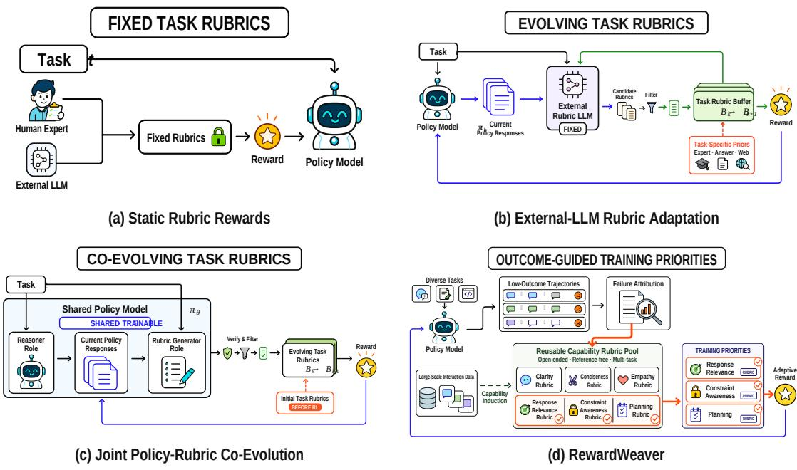
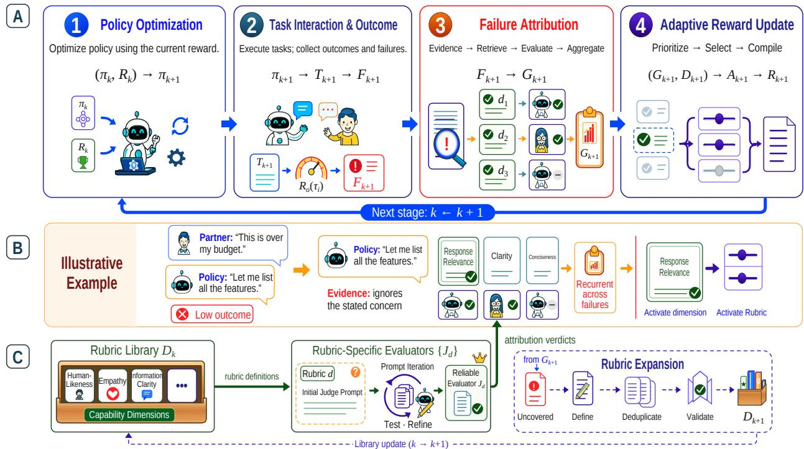
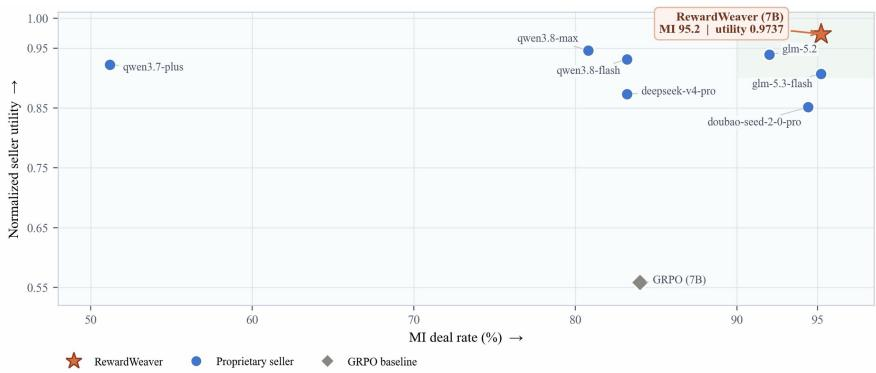
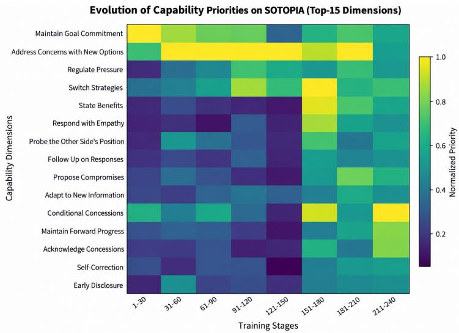

# REWARDWEAVER: LONG-HORIZON INTERACTIVE LEARNING FOR LANGUAGE AGENTS VIA SELF-EVOLVING REWARD ADAPTATION

## A PREPRINT

Hengbo Xiao∗♠ Boyao Zhang∗ Yoolee.ai University of Science and Technology of China

Haoran Yin Tianjin University

Haibo Liu Yoolee.ai

Purui Liu∗ Yuxuan Zheng Peking University Peking University

Fan Zhang† Yoolee.ai

fan.zhang@yoolee.ai

## ABSTRACT

Reinforcement learning with verifiable rewards (RLVR) has driven substantial progress in domains where task outcomes can be reliably evaluated, but long-horizon interaction remains challenging due to sparse terminal feedback and difficult credit assignment. Process rewards provide denser supervision, yet the capabilities most relevant for training can change as the policy evolves: a behavior that is easy to evaluate or frequently deficient need not be the bottleneck currently limiting task success. We introduce RewardWeaver, a self-evolving reward adaptation framework for language agents in long-horizon interaction. RewardWeaver maintains a validated capability space in which the semantics of admitted Rubrics remain fixed, and closes the loop between policy optimization, task evaluation, failure attribution, and reward adaptation. After each training stage, it performs outcome-grounded backward attribution on low-outcome trajectories, aggregates recurrent and policy-controlled capability bottlenecks, and dynamically selects the corresponding process rewards for the next stage. Recurrent failures not covered by the existing capability space trigger a separate, controlled expansion procedure. We evaluate REWARDWEAVER on SOTOPIA, Amazon-HistoryPrice, and a newly constructed Sales Benchmark. Across social interaction, bilateral bargaining, and domain-specific sales, REWARDWEAVER establishes new state-of-the-art (SOTA) results. Ablations further demonstrate the importance of dynamic reward allocation, failure-grounded attribution, and stable semantics for admitted capabilities.

## 1 Introduction

Reinforcement learning with verifiable rewards (RLVR) has enabled substantial progress in mathematics and code, where task outcomes can be reliably checked by rules, tests, or execution (Shao et al., 2024; Le et al., 2022; Guo et al., 2025). Long-horizon interaction, however, poses a fundamentally different optimization problem. In settings such as negotiation, social coordination, and collaborative decision making (Zhou et al., 2024a; Wang et al., 2026; Liu et al., 2025), each action changes the partner’s subsequent behavior and reshapes the interaction trajectory. Final outcomes emerge from sequences of interdependent decisions across many turns, making rewards sparse, delayed, and difficult to assign to specific behaviors (Arjona-Medina et al., 2019; Hung et al., 2019; Meulemans et al., 2023). A terminal score indicates whether an interaction succeeded, but certifies failure without localizing its cause and cannot by itself direct training.

Rubric-based rewards and evaluators provide denser supervision by assessing intermediate behaviors against explicit, fine-grained criteria (Gunjal et al., 2026; Wei et al., 2026; Hashemi et al., 2024; Lee et al., 2025), and rubric construction now scales from instance-specific generation to reusable repositories (He et al., 2025; Li et al., 2026). Recent approaches further revise or evolve these criteria as the policy changes, tracking its current response distribution (Guan et al., 2026). However, tracking the response distribution is not tracking the failure distribution: a behavior may be frequent or easy to discriminate without being a recurrent cause of task failure, while a less frequent capability deficiency may constitute the actual performance bottleneck. The key question is not only how evaluation criteria should adapt, but what evidence should drive that adaptation. We argue that this evidence should be recurrent failures in low-outcome trajectories, rather than response characteristics alone. Figure 1 contrasts these reward-adaptation paradigms.

  
Figure 1: Reward Adaptation under Policy Evolution. (a) Task-specific Rubrics remain fixed throughout training. (b) External-LLM methods revise Rubrics as policy evolves. (c) Co-evolution methods jointly update Rubrics and the policy. (d) RewardWeaver grounds reward adaptation in recurrent task failures and prioritizes capability Rubrics according to current policy bottlenecks.

The central challenge is not merely how to design better process rewards, but how to decide what the current policy should optimize next. This introduces an outer-loop optimization problem complementary to standard RL: the innerloop optimizer determines how to improve the policy under a given reward, while the outer loop must determine which capabilities deserve training credit. Diagnostic evidence must therefore satisfy three conditions: it must be outcome grounded, drawn from trajectories that failed rather than sampled uniformly; recurrent, reappearing across trajectories rather than reflecting incidental variation; and policy-controlled, attributable to the agent’s own behavior (Zhang et al., 2025a) rather than to the partner or the scenario. Isolated low scores satisfy none of these conditions. In this view, the task-level objective should remain stable, while process-level training credit shifts toward the capabilities that currently constrain performance.

We introduce RewardWeaver, a self-evolving reward adaptation framework for language agents in long-horizon interaction. REWARDWEAVER closes the loop between policy training, automatic evaluation, failure attribution, and reward adaptation. At each stage, it identifies recurrent capability bottlenecks from on-policy interaction failures and dynamically selects the corresponding Rubrics to construct the next process reward. Unlike prior self-evolving rubric methods that evolve what is evaluated, REWARDWEAVER evolves what is optimized: it preserves stable semantics for admitted capabilities while dynamically reallocating training credit across them. Recurrent failures that fall outside the existing Rubric space are incorporated only through controlled validation, allowing the reward to evolve without uncontrolled semantic drift.

We evaluate REWARDWEAVER on SOTOPIA (Zhou et al., 2024a) and related social intelligence benchmarks agains outcome-only reinforcement learning, static capability prioritization, and alternative attribution and rubric-design strategies. REWARDWEAVER improves the primary evaluation metrics and achieves new state-of-the-art (SOTA) performance under matched training and evaluation protocols. Further ablation, sensitivity, and qualitative analyse show that failure-grounded attribution, adaptive credit reallocation, and stable semantics for admitted capabilities are key contributors to the gains. Our contributions are summarized as follows: (1) We formulate reward adaptation in long-horizon interaction as an outer-loop optimization problem that determines which process capabilities should be prioritized next. (2) We propose REWARDWEAVER, which dynamically reallocates training credit through failuredriven capability-bottleneck identification while preserving stable task objectives and evaluation semantics. (3) We conduct systematic experiments demonstrating the advantages of self-evolving reward adaptation over outcome-only and static process-reward baselines, and isolate the contributions of REWARDWEAVER’s key components.

  
Figure 2: The Overall Architecture of REWARDWEAVER. (a) The policy is optimized under the current reward; its on-policy low-outcome trajectories reveal recurrent capability bottlenecks that determine the next-stage allocation of training credit. (b) Failure attribution grounds bottleneck identification in concrete behavioral evidence. (c) A validated capability space provides stable semantics for admitted capabilities, while recurrent uncovered failures trigger controlled expansion.

## 2 RewardWeaver Methodology

REWARDWEAVER separates reward semantics from reward relevance: a validated capability space determines what can be rewarded, while a stage-wise outer loop determines what should be rewarded. Training priorities can evolve with the policy without the semantics of admitted capabilities drifting, while the capability library itself expands only through a separate validated procedure.

## 2.1 Task Formulation

At stage $k ,$ policy $\pi _ { k }$ interacts with partner $\pi _ { \mathrm { p a r t n e r } } .$ given interaction history $h _ { t } ,$ the two parties act alternately with $a _ { t } \sim \pi _ { k } ( \cdot \mid h _ { t } )$ and $b _ { t } \sim \pi _ { \mathrm { p a r t n e r } } ( \cdot \mid h _ { t } , a _ { t } )$ . A completed trajectory τ receives a fixed task-level outcome $R _ { o } ( \tau )$ and a stage-dependent process reward,

$$
R _ { k } ( \tau ) = R _ { o } ( \tau ) + \frac { 1 } { \left| A _ { k } \right| } \sum _ { d \in A _ { k } } \bar { J } _ { d } ( \tau ) ,\tag{1}
$$

where $\mathcal { D } _ { k }$ is the capability space available at stage k, $A _ { k } \subseteq { \mathcal { D } } _ { k }$ the active subset, and ${ \bar { J } } _ { d } ( \tau )$ the trajectory-level score of capability evaluator $J _ { d } ;$ all active Rubrics enter with equal weight, so adaptation determines which capabilities receive credit rather than how much each receives. The terminal objective remains fixed; only process-level credit changes: standard RL determines how to optimize under $R _ { k } , { \mathrm { i . e . , ~ } } ( \pi _ { k } , R _ { k } ) \to \pi _ { k + 1 }$ , whereas REWARDWEAVER determines which capabilities should receive training credit next. Throughout, capability denotes the behavioral concept, Rubric its frozen operational definition, and evaluator the scoring function $J _ { d } ;$ the active set is the subset of capabilities currently receiving process-level training credit, and a reward specification couples the active set with how its evaluators are composed.

Algorithm 1 Validated Capability-Space Construction   
Require: Raw interaction corpus $\mathcal { T } _ { \mathrm { r a w } } .$ induction models M, validity criteria V, evaluator configuration κ, repeat count $R ,$ con  
struction budget B   
Ensure: Validated capability space $\mathcal { D } = \{ ( d , J _ { d } ) \}$   
Stage I: Capability Discovery and Consolidation   
1: T ← NORMALIZEANDFILTER $( \tau _ { \mathrm { r a w } } )$   
2: F ← OPENINDUCTIONWITHEVIDENCE $( \mathcal { T } , \mathcal { M } )$   
3: for $r = 1 , \ldots , R$ do   
4: S ← CONSOLIDATE(EMBEDDINGNEIGHBORS $( \mathcal { F } ) )$   
5: Sr ← FILTER(Sr; generality, operationality, distinctiveness)   
6: end for   
8: S ← DEFINECANDIDATES(S, F)   
Stage II: Operationalization and Admission   
9: $\mathcal { D }  \mathcal { D }$   
10: while $s \neq \emptyset$ and budget B remains do   
11: remove candidate d from S   
12: Xd ← RETRIEVERELEVANTCASES $( \tau , d )$   
13: L ← ANNOTATEANDVERIFY $( \mathcal { X } _ { d } , \dot { d } )$   
14: $( \mathcal { L } _ { d } ^ { \mathrm { d e v } } , \mathcal { L } _ { d } ^ { \mathrm { a c c } } )$ ← SOURCEDISJOINTSPLIT(Ld)   
15: $( \mathcal { L } _ { d } ^ { \mathrm { d e v } } , \mathcal { L } _ { d } ^ { \mathrm { a c c } } )$ ← ENSURECOVERAGE $\mathcal { ( L _ { d } ^ { \mathrm { d e v } } , \mathcal { L } _ { d } ^ { \mathrm { a c c } } , d ) }$   
16: p⋆ ← DEVELOPEVALUATOR $( d , \mathcal { L } _ { d } ^ { \mathrm { d e v } } , \kappa )$   
17: J ← FREEZEEVALUATOR $( p _ { d } ^ { \star } , d , \kappa )$   
18: v ← VALIDATECANDIDATE $( d , J _ { d } , \mathcal { L } _ { d } ^ { \mathrm { a c c } } , \mathcal { D } ; \mathcal { V } )$   
19: if v = ACCEPT then   
20: D ← D ∪ {(FREEZEDEFINITION $( d ) , J _ { d } ) \}$   
21: else if $v _ { d } = \ R \mathbf { E } \backslash$ ISE then   
22: d′ ← REVISECANDIDATE $: ( d , v _ { d } )$   
23: S ← S ∪ {d′}   
24: else   
25: discard d   
26: end if   
27: end while   
28: return D

## 2.2 Validated Capability Space

Reward adaptation requires stable semantics for admitted capabilities. REWARDWEAVER operates over a validated space D of observable, policy-controllable behaviors, where each $d \in \mathcal { D }$ couples a frozen Rubric definition with an evaluator $J _ { d } ( x ) = M _ { \mathrm { e v a l } } ( p _ { d } , x )$ , and $p _ { d }$ operationalizes the definition over interaction context $x .$ Construction has two stages: candidates are first induced from interaction evidence, consolidated across runs, and filtered for generality, operationality, and semantic distinctiveness; each is then operationalized by a dedicated evaluator and subjected to source-disjoint acceptance testing (Algorithm 1). Candidates may be revised before admission; only validated pairs are admitted into D, so discovery remains flexible while admitted semantics remain fixed. Admission testing certifies each evaluator on its own source-disjoint acceptance set, so every admitted capability satisfies the same validity criteria. The SOTOPIA capability space, representative entries, and their operationalization into executable criteria are provided in Appendix A.

## 2.3 Outcome-Grounded Failure Attribution

Terminal outcomes identify low-outcome trajectories that warrant diagnosis, but do not by themselves establish an agent-side failure or determine what should receive training credit. After stage $k , \pi _ { k + 1 }$ generates on-policy trajectories $\mathcal { T } _ { k + 1 }$ , from which the low-outcome cohort ${ \mathcal { F } } _ { k + 1 } = \{ \tau _ { i } \in { \mathcal { T } } _ { k + 1 } \ | \ q _ { o } ( R _ { o } ( \tau _ { i } ) , x _ { i } ) = 1 \}$ is selected, where $x _ { i }$ denotes the task instance of trajectory τ . For each $\tau _ { i } \in \mathcal { F } _ { k + 1 }$ , REWARDWEAVER localizes failure-relevant evidence, retrieves candidate capabilities $\dot { C } _ { i } \subseteq { \mathcal { D } } _ { k }$ , and produces attribution records $a _ { i , d } = ( s _ { i , d } , c _ { i , d } , e _ { i , d } )$ for $d \in C _ { i }$ , where $s _ { i , d }$ is the deficit judgment, $c _ { i , d }$ its confidence, and $e _ { i , d }$ the supporting evidence; unsupported assignments are rejected. Trajectory-level records are aggregated into $G _ { k + 1 } = \mathrm { A g g r e g a t e } ( \{ a _ { i , d } \} )$ , which retains recurrent, supported, and policy-controlled failure modes rather than isolated low scores.

Algorithm 2 Failure Attribution and Adaptive Credit Allocation   
Require: On-policy trajectories ${ \mathcal { T } } _ { k + 1 } ,$ capability space $\mathcal { D } _ { k } ,$ current reward specification $P _ { k } ,$ adaptation history $S _ { k } ,$ , task  
performance summary $y _ { k + 1 } ,$ calibration set $\mathcal { H } _ { k + 1 }$ , parameters Θ with active budget K and calibration limit M   
Ensure: Next-stage reward specification $P _ { k + 1 }$ , or calibration failure ⊥   
1: $\mathcal { F } _ { k + 1 }  \mathrm { L o w o u r c o u i g s } ( \mathcal { T } _ { k + 1 } ) ; \quad \mathcal { Z } _ { k + 1 }  \emptyset$   
2: for $\tau \in \mathcal { F } _ { k + 1 }$ do   
3: $e _ { \tau } \gets \mathrm { L o c } \mathrm { A L I Z E E v I D E N C E } ( \tau )$   
4: $\boldsymbol { C } _ { \tau } \gets \mathrm { R E T R I E V E } ( \boldsymbol { e } _ { \tau } , \mathcal { D } _ { k } )$   
5: $\mathcal { Z } _ { \tau } $ ATTRIBUTE $( e _ { \tau } , C _ { \tau } )$ ▷ Abstention allowed   
6: $\mathcal { Z } _ { k + 1 }  \mathcal { Z } _ { k + 1 } \cup \mathcal { Z } _ { \tau }$   
7: end for   
8: $( G _ { k + 1 } , \{ r _ { d } , n _ { d } , c _ { d } , f _ { d } \} ) \gets \mathrm { A G G R E G A T E } ( \mathcal { Z } _ { k + 1 } )$   
9: $\dot { p } _ { d }  \alpha \dot { r } _ { d } + \beta c _ { d } + \gamma ( \dot { 1 } - f _ { d } ) , \quad d \in \mathcal { D } _ { k }$   
10: $( \mathcal { B } ^ { \mathrm { h i g h } } , \mathcal { B } ^ { \mathrm { w e a k } } ) \gets \mathrm { E L I G I B L E } ( G _ { k + 1 } , S _ { k } ; \Theta )$   
11: $A _ { k + 1 }  \mathrm { T O P K } ( \mathcal { B } ^ { \mathrm { h i g h } } , p , K )$   
12: if $| A _ { k + 1 } | < K$ and $\operatorname { A L L O W W E A K } ( \mathcal { B } ^ { \mathrm { { h i g h } } } , S _ { k } ; \Theta )$ then   
13: $A _ { k + 1 }  A _ { k + 1 } \cup \mathrm { T o p K } ( \mathcal { B } ^ { \mathrm { w e a k } } \setminus A _ { k + 1 } , p , K - | A _ { k + 1 } | )$   
14: end if   
15: $( A _ { k + 1 } , S _ { k + 1 } ) \gets \mathrm { S c H E D U L E } ( A _ { k + 1 } , G _ { k + 1 } , S _ { k } , y _ { k + 1 } ; \Theta )$   
16: $\lambda _ { k + 1 , d }  1 / | A _ { k + 1 } | , \quad d \in \dot { A _ { k + 1 } }$ ▷ Equal weight over active Rubrics   
17: $Q _ { k + 1 }  \mathrm { C O M P I L E R U B R I C S } ( A _ { k + 1 } , P _ { k } )$ ▷ Assemble a reward specification   
18: for $m = 1 , \ldots , M$ do   
19: $( s , \delta ) \longleftarrow \mathrm { C A L I B R A T E } ( Q _ { k + 1 } , \mathcal { H } _ { k + 1 } )$   
20: if ACCEPT(s) then ▷ Rubric-set publication gate   
21: $P _ { k + 1 } \longleftarrow \mathrm { C o M P O S E } ( P _ { k } , A _ { k + 1 } , \lambda _ { k + 1 } , Q _ { k + 1 } , s , \delta , S _ { k + 1 } )$   
22: PUBLISH $\left( P _ { k + 1 } \right)$   
23: return $P _ { k + 1 }$   
24: else if $m < M$ then   
25: $Q _ { k + 1 }  \mathrm { R E V I S E } ( Q _ { k + 1 } , s , \delta )$ ▷ Revise composition; keep $( d , J _ { d } )$ frozen   
26: end if   
27: end for   
28: return ⊥ ▷ Calibration failure; no new reward is published

## 2.4 Adaptive Credit Allocation

A capability can be valid yet irrelevant to the current policy; REWARDWEAVER treats training relevance as stagedependent. Given $G _ { k + 1 }$ , it selects a budgeted active set ${ \dot { A } } _ { k + 1 } = \operatorname { S e l e c t } ( G _ { k + 1 } , { \mathcal { D } } _ { k } ) \subseteq { \mathcal { D } } _ { k }$ . All active Rubrics contribute equally to the process reward, yielding $\begin{array} { r } { R _ { k + 1 } ( \tau ) ~ = ~ R _ { o } ( \tau ) + \frac { 1 } { | A _ { k + 1 } | } \sum _ { d \in A _ { k + 1 } } \bar { J } _ { d } ( \tau ) } \end{array}$ . As a bottleneck recedes, its Rubric may leave the active set and capacity is released for newly dominant failures, so the process reward is selective and stage-dependent rather than cumulative. Letting $P _ { k }$ denote the deployed process-reward specification at stage $k , S _ { k }$ its adaptation history, and $y _ { k + 1 }$ the stage-level task-performance summary, Algorithm 2 specifies the complete attribution-to-reward update. Importantly, the update changes which Rubrics are active and how they are composed into the next-stage reward, but never modifies the frozen semantics or evaluators of the capabilities admitted to $\mathcal { D } _ { k }$

## 2.5 Controlled Capability Expansion

Adaptive credit allocation operates only over the capability space already validated at the beginning of the update, so the transition from stage k to $k + 1$ always satisfies $A _ { k + 1 } \subseteq { \mathcal { D } } _ { k }$ . When recurrent failures cannot be represented by $\mathcal { D } _ { k } .$ , REWARDWEAVER invokes the same admission procedure as Algorithm 1: validated additions form the expanded space $\mathcal { D } _ { k + 1 }$ , but newly admitted capabilities do not alter the reward update that triggered their discovery—they become eligible only in the subsequent adaptation step, i.e., $A _ { k + 2 } \subseteq { \mathcal { D } } _ { k + 1 }$ . The fast loop therefore reallocates training credit within fixed semantics,

$$
( \pi _ { k } , R _ { k } ) \to \pi _ { k + 1 } \to \mathcal { T } _ { k + 1 } \to \mathcal { F } _ { k + 1 } \to G _ { k + 1 } \to A _ { k + 1 } \subseteq \mathcal { D } _ { k } \to R _ { k + 1 } ,\tag{2}
$$

while the slower semantic loop updates $( \mathcal { F } _ { k + 1 } , \mathcal { D } _ { k } ) \to \mathcal { D } _ { k + 1 }$ , with any new dimensions becoming available only to later reward updates. This separation defines the methodological boundary of REWARDWEAVER: training priorities evolve rapidly; reward semantics evolve conservatively.

Table 1: Main results on SOTOPIA. The best result in each setting is shown in bold. In the Partner setting, the counterpart is GPT-4o for literature results and Qwen2.5-72B for AMPO and REWARDWEAVER in our experiments.
<table><tr><td rowspan="2">Method</td><td colspan="2">Self-Play</td><td colspan="2">Partner</td></tr><tr><td>SOTOPIA Goal / Overall ↑</td><td>SOTOPIA-Hard Goal / Overall ↑</td><td>SOTOPIA Goal / Overall ↑</td><td>SOTOPIA-Hard Goal / Overall ↑</td></tr><tr><td colspan="5">Proprietary LLMs</td></tr><tr><td>GPT-4o</td><td>8.19 / 3.76</td><td>6.97 / 3.46</td><td>8.19 / 3.76</td><td>6.97 / 3.46</td></tr><tr><td>Claude-3.5-Sonnet</td><td>8.29 / 3.71</td><td>6.33 / 3.09</td><td>8.42 / 3.77</td><td>6.64 / 3.30</td></tr><tr><td>DeepSeek-V3</td><td>8.15 / 3.62</td><td>6.34 / 3.09</td><td>8.14 /3.72</td><td>6.69 / 3.31</td></tr><tr><td colspan="5">Large Reasoning Models</td></tr><tr><td>OpenAI-o1</td><td>7.93 / 3.58</td><td>5.69 / 2.71</td><td>8.09 / 3.69</td><td>6.65 / 3.20</td></tr><tr><td>OpenAI-o3-mini</td><td>7.38 / 3.30</td><td>5.14 / 2.36</td><td>7.96 / 3.61</td><td>6.33 / 2.98</td></tr><tr><td>Gemini-2.5-Pro</td><td>7.85 / 3.43</td><td>5.67 / 2.55</td><td>8.12 / 3.59</td><td>6.70 / 3.09</td></tr><tr><td>DeepSeek-R1</td><td>7.97 / 3.40</td><td>5.86 / 2.73</td><td>7.92 / 3.49</td><td>6.20 / 2.95</td></tr><tr><td>QwQ-32B</td><td>7.70 / 3.30</td><td>5.35 / 2.41</td><td>7.80 / 3.47</td><td>6.19 / 2.91</td></tr><tr><td colspan="5">Post-training on Qwen2.5-7B-Instruct</td></tr><tr><td>Qwen2.5-7B-Instruct</td><td>7.91 / 3.55</td><td>6.21 / 3.01</td><td>6.71 / 3.13</td><td>5.90 / 2.90</td></tr><tr><td>w/ PPDPP (Deng et al., 2024)</td><td>7.97 / 3.65</td><td>6.63 / 3.31</td><td>8.07 / 3.71</td><td>6.76 / 3.35</td></tr><tr><td>w/ EPO (Liu et al., 2025)</td><td>8.09 / 3.51</td><td>6.82 / 3.12</td><td>8.41 / 3.86</td><td>6.81 / 3.51</td></tr><tr><td>w/ DAT (Li et al., 2024)</td><td>7.97 / 3.59</td><td>6.39 / 3.10</td><td>8.11 / 3.70</td><td>6.78 / 3.36</td></tr><tr><td>w/ DSI (Zhang et al., 2025b)</td><td>8.35 / 3.75</td><td>7.31 / 3.51</td><td>8.15 / 3.70</td><td>6.87 / 3.42</td></tr><tr><td>AMPO (Wang et al., 2026)</td><td>8.45 / 4.20</td><td>7.67 / 3.94</td><td>8.30 / 4.09</td><td>7.30 / 3.80</td></tr><tr><td>REWARDWEAVER (ourS)</td><td>8.72 / 4.47</td><td>7.90 / 4.38</td><td>8.49 / 4.47</td><td>7.66 / 4.22</td></tr></table>

## 3 Experiments

## 3.1 Experimental Settings

Benchmarks. We evaluate REWARDWEAVER on three long-horizon benchmarks that together span general social interaction, bilateral bargaining, and domain-specific sales. SOTOPIA (Zhou et al., 2024a) contains 90 social scenarios; we report on the full benchmark and SOTOPIA-Hard. AmazonHistoryPrice (Xia et al., 2024) contains 930 products across 18 categories and evaluates bargaining under asymmetric information, with Mutual Interest (MI) instances admitting feasible agreements and Conflicting Interest (CI) instances admitting none. Following SOTOPIA-π (Wang et al., 2024b), we construct a health-service Sales Benchmark of 400 tasks across 20 scenario families; evaluation uses held-out instances within training families (see Appendix B).

Evaluation. SOTOPIA and the Sales Benchmark use the SOTOPIA-EVAL protocol (Zhou et al., 2024a), reporting Goal Completion and Overall under Self-Play and fixed-Partner settings; SOTOPIA-Hard is the challenging subset, and Sales-Hard the 50 constraint-conflict tasks. For AmazonHistoryPrice, we report MI Deal Rate, CI Correct No-Deal Rate, Task Success Rate, Normalized Seller Utility, and Expected MI Seller Return. Task Success counts a legal MI agreement or correct CI no-deal; Expected MI Seller Return combines agreement probability with the resulting seller utility. For SOTOPIA, REWARDWEAVER uses a validated 40-dimensional capability space (Appendix A), activates at most B = 6 Rubrics per stage, and updates allocation every 30 steps.

## 3.2 Experimental Results and Analysis

RQ1: Does RewardWeaver improve long-horizon interactive learning? Across the three benchmarks, REWARD WEAVER improves most primary metrics, with particularly strong gains in the harder SOTOPIA settings. On SO-TOPIA (Table 1), it outperforms AMPO, the strongest prior method, on every metric under the same partner protocol, most pronounced on SOTOPIA-Hard (Goal/Overall: 7.67/3.94 to 7.90/4.38 Self-Play, 7.30/3.80 to 7.66/4.22 Partner), suggesting adaptive reward allocation remains effective under harder scenarios and external partners. On AmazonHistoryPrice (Figure 3), REWARDWEAVER jointly improves MI Deal Rate and seller-side utility, reaching the upper-right performance frontier; complete numerical results are reported in Appendix Table C1. On the Sales Benchmark (Table C2), it achieves the best result on six of eight metrics.

  
Figure 3: Main results on AmazonHistoryPrice. Under the DeepSeek-V4-Pro buyer, REWARDWEAVER reaches the upper-right frontier, achieving a 95.2% MI Deal Rate and the highest Normalized Seller Utility (0.9737) among all evaluated methods.

RQ2: Does dynamic reward adaptation matter, and does it need to target the correct bottlenecks? Table 2 compares REWARDWEAVER with outcome-only GRPO, Static Top-K, and Random Active Set. Outcome-only GRPO is weaker overall, supporting the usefulness of process-level supervision in this setting, while Static Top-K remains below REWARDWEAVER, suggesting that a fixed capability set becomes insufficient as training proceeds. Random Active Set preserves stage-wise reward changes but breaks the mapping from diagnosed bottlenecks to rewarded ca pabilities, providing a controlled test of bottleneck alignment; it underperforms REWARDWEAVER across all eight metrics. This comparison supports the importance of aligning reward allocation with the diagnosed bottlenecks, beyond the benefit of reward changes alone.

Table 2: Ablation study on SOTOPIA. The counterpart is Qwen2.5-72B. The best result in each column is bold. We isolate the effects of dynamic reward adaptation, failure-grounded bottleneck identification, and stable semantics for admitted capabilities under matched training budgets.
<table><tr><td></td><td colspan="2">Self-Play</td><td colspan="2">Partner</td></tr><tr><td>Method</td><td>SOTOPIA Goal / Overall ↑</td><td>SOTOPIA-Hard Goal / Overall ↑</td><td>SOTOPIA Goal / Overall ↑</td><td>SOTOPIA-Hard Goal / Overall ↑</td></tr><tr><td>REWARDWEAVER (ours)</td><td>8.72 / 4.47</td><td>7.90 / 4.38</td><td>8.49 / 4.47</td><td>7.66 / 4.22</td></tr><tr><td colspan="5">Dynamic Reward Adaptation</td></tr><tr><td>Outcome-only GRPO</td><td>8.43 / 4.31</td><td>7.53 / 4.05</td><td>8.35 / 4.26</td><td>7.71 / 4.12</td></tr><tr><td>Static Top-K Dimensions</td><td>8.44 / 4.31</td><td>7.77 / 4.14</td><td>8.36 / 4.23</td><td>7.49 / 3.83</td></tr><tr><td>Random Active Set</td><td>8.47 / 4.41</td><td>7.56 / 4.18</td><td>8.33 / 4.27</td><td>7.31 / 3.97</td></tr><tr><td colspan="5">Failure-Grounded Bottleneck Identification</td></tr><tr><td>Dynamic Top-K by Failure Frequency</td><td>8.21 / 4.23</td><td>7.36 / 4.03</td><td>8.11 / 3.40</td><td>7.13 / 3.25</td></tr><tr><td>Random-Trajectory Attribution</td><td>8.38 / 4.37</td><td>7.67 / 4.25</td><td>8.24 / 4.31</td><td>7.60 / 4.17</td></tr><tr><td>Success-Failure Trajectory Attribution</td><td>8.55 / 4.52</td><td>7.93 / 4.32</td><td>8.34 / 4.33</td><td>7.60 / 4.14</td></tr><tr><td colspan="5">Stable Semantics for Admitted Capabilities</td></tr><tr><td>Open-Vocabulary Dimensions</td><td>8.50 / 4.37</td><td>7.69 / 4.19</td><td>8.35 / 4.18</td><td>7.44 / 3.95</td></tr><tr><td>Instance-Specific Rubrics</td><td>8.61 / 4.43</td><td>7.90 / 4.29</td><td>8.47 / 4.33</td><td>7.83 / 4.21</td></tr></table>

RQ3: Is failure-grounded attribution necessary for identifying policy bottlenecks? Table 2 separates failure attribution from simpler deficiency-based selection. Dynamic Top-K by Failure Frequency reselects capabilities each stage by deficiency prevalence on low-outcome trajectories, but performs no backward attribution or evidence localization. It underperforms REWARDWEAVER across all eight metrics, suggesting deficiency frequency alone is insufficient to reliably identify failure-relevant capabilities in these settings. Random-Trajectory Attribution degrades performance, suggesting attribution needs to be grounded in outcome-relevant failures rather than generic behavior. Success–Failure

Trajectory Attribution remains competitive but does not consistently improve over REWARDWEAVER. These results suggest training relevance is better identified by evidence-grounded failure attribution than by deficiency prevalence or outcome-agnostic behavioral analysis. Appendix D provides trajectory-level cases of contrastive validation and selective attribution.

  
Figure 4: Evolution of capability priorities on SOTOPIA. Normalized priorities of the 15 most prominent Rubrics across training stages. Reward emphasis shifts as different capability bottlenecks become training-relevant, illustrating stage-dependent reallocation of process-level credit in REWARDWEAVER.

RQ4: Does semantic stability of admitted capabilities matter? As shown in Table 2, relaxing semantic stability also reduces performance. Open-Vocabulary Dimensions is consistently weaker than REWARDWEAVER across all four settings, suggesting an advantage of maintaining stable, validated capability definitions. Instance-Specific Rubrics is competitive, but remains inconsistent across settings despite occasionally matching or exceeding individual metrics.

## 3.3 Reward Adaptation Analysis

Reward Evolution. Figure 4 shows reward emphasis shifting across training stages. Maintain Goal Commitment dominates early but later recedes, while Switch Strategies, State Benefits, and Respond with Empathy become more prominent; other capabilities, such as Conditional Concessions, re-emerge after decline. These patterns show RE-WARDWEAVER reallocates process-level credit as training-relevant bottlenecks change, rather than accumulating reward Rubrics.

Bottleneck Attribution and Subsequent Failure Reduction. Complementing the controlled RQ2 ablations, we examine whether the attribution signal is prospectively associated with bottleneck reduction. We define bottleneck importance $I _ { k , d } = F _ { k , d } ^ { \mathrm { f a i l } } - F _ { k , d } ^ { \mathrm { s u c c } }$ and next-stage failure reduction $\Delta F _ { k , d } = F _ { k , d } ^ { \mathrm { f a i l } } - F _ { k + 1 , d } ^ { \mathrm { f a i l } } .$ Bottleneck importance positively correlates with subsequent reduction (Spearman $\rho = 0 . 2 8 )$ , remains positive after controlling for failure rate (partial $\rho = 0 . 2 2 )$ , and strengthens within stage $( \rho = 0 . 3 1 )$ , while current failure rate alone yields $\rho = 0 . 2 1$ . The attribution ranking carries prospective information about which bottlenecks recede next. This analysis is not a causal identification of capability-level improvement; causal evidence comes from the controlled ablations in RQ2 and RQ3. Full results are reported in Appendix E.

Sensitivity Analysis. We vary both the active Rubric budget B and the adaptation interval. Performance is nonmonotonic in both: $B = 6$ achieves the strongest overall results among the tested budgets, while the 30-step interval provides the most consistently strong performance across Self-Play and Partner evaluation. Effective reward adaptation therefore depends on both selective credit allocation and an appropriate adaptation timescale. Full results are reported in Appendix F.

Capability Retention. We examine whether capabilities regress after leaving the active reward set, tracking semantically aligned capabilities with fixed evaluation criteria across stages. Across the six capabilities deactivated after the initial stage, all 36 post-deactivation observations remain within 0.02 of or above their final active scores, with a mean change of +0.10. Adapt to New Information, deactivated later, remains stable. On the fixed diagnostic set, we observe no systematic regression in the tracked capabilities after deactivation, providing evidence that reward reallocation need not immediately erase previously emphasized behaviors. Full results are reported in Appendix G.

## 4 Related Work

Outcome and Preference-Based Rewards. RLVR grounds rewards in verifiable task outcomes (Shao et al., 2024; Le et al., 2022; Guo et al., 2025), and process verifiers extend it to intermediate solution steps (Wang et al., 2024a; Lightman et al., 2024; Lu et al., 2024; Zeng et al., 2025; Setlur et al., 2025; Zheng et al., 2025). RLHF learns reward models from human preference data (Christiano et al., 2017; Stiennon et al., 2020; Ouyang et al., 2022); subsequent work diversifies feedback types (Wu et al., 2023; Yuan et al., 2024; Wang et al., 2024c), develops ranking objectives that bypass explicit reward modeling (Yuan et al., 2023; Hwang et al., 2023; Rafailov et al., 2023), and automates evaluation with AI feedback and pretrained LLM judges (Lee et al., 2023; Zheng et al., 2023; Liu et al., 2023; Kim et al., 2024a,b; Ke et al., 2024). In many of these approaches, however, the reward specification is fixed or largely determined before policy training; which capabilities the current policy should optimize next remains open.

Rubric-Based Process Rewards. Rubrics structure process quality: instance-specific rubrics are auto-generated (Gunjal et al., 2026; Wei et al., 2026; He et al., 2025), multidimensional evaluators induced (Hashemi et al., 2024), checklist scoring improves reliability (Lee et al., 2025), construction scales into reusable repositories (Li et al., 2026), and EvoRubric adapts criteria to the response distribution (Guan et al., 2026). These methods sharpen responsequality representation, yet discriminability does not determine training priority: a criterion may separate good from bad responses yet bear weakly on success, whereas a rarely violated capability may bind. Which criteria recurrent low-outcome failures implicate is underexplored.

Credit Assignment in Multi-Turn Interaction. Assigning feedback in long-horizon interaction is long-standing: methods decompose delayed returns (Arjona-Medina et al., 2019), transport value across time (Hung et al., 2019), or estimate counterfactuals (Meulemans et al., 2023). For language agents, feedback spans episode-level scoring (Zhou et al., 2024a), utterance-level rewards from episode feedback or Shapley decomposition (Yu et al., 2025; Feng et al., 2026), segment-level preferences (Kong et al., 2025), and process rewards over strategic reasoning (Liu et al., 2025); hierarchical and retrospective agents optimize behavior (Zhou et al., 2024b; Yao et al., 2024), and automated attribution localizes failures (Zhang et al., 2025a). Orthogonally, AMPO (Wang et al., 2026) adapts reasoning depth to interaction modes, WebRL (Qi et al., 2025) evolves curricula, and PPDPP (Deng et al., 2024), DAT (Li et al., 2024), and DSI (Zhang et al., 2025b) steer dialogue through planners or strategy-injected corpora. These methods determine where an objective applies within an interaction; reward adaptation asks what the process reward should contain; REWARDWEAVER selects capability-level objectives from outcome-grounded failures.

## 5 Discussion

The results of REWARDWEAVER suggest that reward relevance is stage-dependent and should be grounded in recurrent failures linked to task outcomes. This casts reward adaptation as an outer-loop problem: standard RL determines how to optimize under a given reward, while the outer loop determines what should receive training credit next. Reward adaptation should therefore track what currently limits performance, not merely what can be evaluated well.

REWARDWEAVER nevertheless depends on LLM-based evaluators and informative terminal outcomes, so errors in either can propagate into reward adaptation. Its active budget and adaptation interval may also require re-tuning across domains.

## AI Use Statement

In this work, we used generative AI tools to support discussions of research methodology and experimental design, qualitative analysis and interpretation of results, and the drafting, restructuring, and language polishing of the manuscript. Generative AI was also used to improve the presentation and organization of selected algorithm descrip tions, tables, figure captions, and appendix materials.

All AI-assisted content was carefully reviewed by the authors. The research methodology, experimental settings, data, and empirical results were verified against the actual implementation and experimental records, and the authors independently determined whether to adopt any AI-generated suggestions. The authors take full responsibility for the final content of this work, including any text, analysis, or other research artifacts generated or modified with the assistance of generative AI.

## References

Jose A. Arjona-Medina, Michael Gillhofer, Michael Widrich, Thomas Unterthiner, Johannes Brandstetter, and Sepp Hochreiter. RUDDER: Return decomposition for delayed rewards. In Advances in Neural Information Processing Systems (NeurIPS), 2019.

Paul F. Christiano, Jan Leike, Tom B. Brown, Miljan Martic, Shane Legg, and Dario Amodei. Deep reinforcement learning from human preferences. In Advances in Neural Information Processing Systems (NeurIPS), 2017.

Yang Deng, Wenxuan Zhang, Wai Lam, See-Kiong Ng, and Tat-Seng Chua. Plug-and-play policy planner for large language model powered dialogue agents. In International Conference on Learning Representations (ICLR), 2024.

Xiachong Feng, Yi Jiang, Xiaocheng Feng, Deyi Yin, Libo Qin, Yangfan Ye, Lei Huang, Weitao Ma, Yuxuan Gu, Chonghan Qin, Bing Qin, and Lingpeng Kong. SAVOIR: Learning social savoir-faire via shapley-based reward attribution. arXiv preprint arXiv:2604.18982, 2026.

Xin Guan, Xiaomeng Hu, Shen Huang, Zhenyi Wang, Bo Zhang, Zijian Li, Pengjun Xie, Bo Liu, and Jiuxin Cao. EvoRubric: Self-evolving rubric-driven RL for open-ended generation. arXiv preprint arXiv:2605.29847, 2026.

Anisha Gunjal, Anthony Wang, Elaine Lau, Vaskar Nath, Yunzhong He, Bing Liu, and Sean M. Hendryx. Rubrics as rewards: Reinforcement learning beyond verifiable domains. In The Fourteenth International Conference on Learning Representations, 2026.

Daya Guo, Dejian Yang, Haowei Zhang, Junxiao Song, Runxin Zhang, Runxin Xu, Qihao Zhu, Shirong Ma, Peiyi Wang, Xiao Bi, et al. DeepSeek-R1 incentivizes reasoning in LLMs through reinforcement learning. Nature, 645: 633–638, 2025.

Helia Hashemi, Jason Eisner, Corby Rosset, Benjamin Van Durme, and Chris Kedzie. LLM-Rubric: A multidimensional, calibrated approach to automated evaluation of natural language texts. In Proceedings ofACL, 2024.

Yun He, Wenzhe Li, Hejia Zhang, Songlin Li, Karishma Mandyam, Sopan Khosla, Yuanhao Xiong, Nanshu Wang, Xiaoliang Peng, Beibin Li, Shengjie Bi, Shishir G. Patil, Qi Qi, Shengyu Feng, Julian Katz-Samuels, Richard Yuanzhe Pang, Sujan Gonugondla, Hunter Lang, Yue Yu, Yundi Qian, Maryam Fazel-Zarandi, Licheng Yu, Amine Benhalloum, Hany Awadalla, and Manaal Faruqui. AdvancedIF: Rubric-based benchmarking and reinforcement learning for advancing LLM instruction following. arXiv preprint arXiv:2511.10507, 2025.

Chia-Chun Hung, Timothy Lillicrap, Josh Abramson, Yan Wu, Mehdi Mirza, Federico Carnevale, Arun Ahuja, and Greg Wayne. Optimizing agent behavior over long time scales by transporting value. Nature Communications, 2019.

Minyoung Hwang, Gunmin Lee, Hogun Kee, Chanwoo Kim, Kyungjae Lee, and Songhwai Oh. Sequential preference ranking for efficient reinforcement learning from human feedback. In Advances in Neural Information Processing Systems (NeurIPS), 2023.

Pei Ke, Bosi Wen, Zhuoer Feng, Xiao Liu, Xuanyu Lei, Jiale Cheng, Shengyuan Wang, Aohan Zeng, Yuxiao Dong, Hongning Wang, Jie Tang, and Minlie Huang. CritiqueLLM: Towards an informative critique generation model for evaluation of large language model generation. In Proceedings ofACL, 2024.

Seungone Kim, Jamin Shin, Yejin Cho, Joel Jang, Shayne Longpre, Hwaran Lee, Sangdoo Yun, Seongjin Shin, Sungdong Kim, James Thorne, and Minjoon Seo. Prometheus: Inducing fine-grained evaluation capability in language models. In International Conference on Learning Representations (ICLR), 2024a.

Seungone Kim, Juyoung Suk, Shayne Longpre, Bill Yuchen Lin, Jamin Shin, Sean Welleck, Graham Neubig, Moontae Lee, Kyungjae Lee, and Minjoon Seo. Prometheus 2: An open source language model specialized in evaluating other language models. In Proceedings ofEMNLP, 2024b.

Aobo Kong, Wentao Ma, Shiwan Zhao, Yongbin Li, Yuchuan Wu, Ke Wang, Xiaoqian Liu, Qicheng Li, Yong Qin, and Fei Huang. SDPO: Segment-level direct preference optimization for social agents. In Proceedings ofACL, pp. 12409–12423, 2025.

Hung Le, Yuheng Wang, Shafiq Gotmare, Silvio Savarese, and Steven Hoi. CodeRL: Mastering code generation through pretrained models and deep reinforcement learning. In Advances in Neural Information Processing Systems (NeurIPS), 2022.

Harrison Lee, Samrat Phatale, Hassan Mansoor, Kellie Lu, Thomas Mesnard, Colton Bishop, Ethan Ferret, and Peter Riedel. RLAIF: Scaling reinforcement learning from human feedback with AI feedback. arXiv preprint arXiv:2309.00267, 2023.

Yukyung Lee, Joonghoon Kim, Jaehee Kim, Hyowon Cho, Pilsung Kang, and Najoung Kim. CheckEval: A reliable LLM-as-a-judge framework for evaluating text generation using checklists. In Proceedings of EMNLP, 2025.

Kenneth Li, Yiming Wang, Fernanda Viegas, and Martin Wattenberg. Dialogue action tokens: Steering language ´ models in goal-directed dialogue with a multi-turn planner. arXiv preprint arXiv:2406.11978, 2024.

Sunzhu Li, Jiale Zhao, Miteto Wei, Huimin Ren, Yang Zhou, Jingwen Yang, Shunyu Liu, Kaike Zhang, and Wei Chen. RubricHub: A comprehensive and highly discriminative rubric dataset via automated coarse-to-fine generation. arXiv preprint arXiv:2601.08430, 2026.

Hunter Lightman, Vineet Kosaraju, Yura Burda, Harri Edwards, Bowen Baker, Teddy Lee, Jan Leike, John Schulman, Ilya Sutskever, and Karl Cobbe. Let’s verify step by step. In International Conference on Learning Representations (ICLR), 2024.

Xiaoqian Liu, Ke Wang, Yongbin Li, Yuchuan Wu, Wentao Ma, Aobo Kong, Fei Huang, Jianbin Jiao, and Junge Zhang. EPO: Explicit policy optimization for strategic reasoning in LLMs via reinforcement learning. In Proceedings ofACL, pp. 15371–15396, 2025.

Yang Liu, Dan Iter, Yichong Xu, Shuohang Wang, Ruochen Xu, and Chenguang Zhu. G-Eval: NLG evaluation using GPT-4 with better human alignment. In Proceedings ofEMNLP, 2023.

Jianqiao Lu, Zhiyang Dou, Hongru Wang, Zeyu Cao, Jianbo Dai, Yingjia Wan, Yunlong Feng, and Zhijiang Guo. AutoPSV: Automated process-supervised verifier. In Advances in Neural Information Processing Systems (NeurIPS), 2024.

Alexander Meulemans, Simon Schug, Seijin Kobayashi, Nathaniel D. Daw, and Gregory Wayne. Would I have gotten that reward? Long-Term credit assignment by counterfactual contribution analysis. In Advances in Neural Information Processing Systems (NeurIPS), 2023.

Long Ouyang, Jeffrey Wu, Xu Jiang, et al. Training language models to follow instructions with human feedback. In Advances in Neural Information Processing Systems (NeurIPS), 2022.

Zehan Qi, Xiao Liu, Iat Long Iong, Hanyu Lai, Xueqiao Sun, Jiadai Sun, Xinyue Yang, Yu Yang, Shuntian Yao, Wei Xu, Jie Tang, and Yuxiao Dong. WebRL: Training LLM web agents via self-evolving online curriculum reinforcement learning. In International Conference on Learning Representations (ICLR), 2025.

Rafael Rafailov, Archit Sharma, Eric Mitchell, Stefano Ermon, Christopher D. Manning, and Chelsea Finn. Direct preference optimization: Your language model is secretly a reward model. In Advances in Neural Information Processing Systems (NeurIPS), 2023.

Amrith Setlur, Chirag Nagpal, Adam Fisch, Xinyang Geng, Jacob Eisenstein, Rishabh Agarwal, Alekh Agarwal, Jonathan Berant, and Aviral Kumar. Rewarding progress: Scaling automated process verifiers for LLM reasoning. In International Conference on Learning Representations (ICLR), 2025.

Zhihong Shao, Peiyi Wang, Qihao Zhu, Runxin Xu, Junxiao Song, Xiao Bi, Haowei Zhang, Mingchuan Zhang, YK Li, Y Wu, et al. DeepSeekMath: Pushing the limits of mathematical reasoning in open language models. arXiv preprint arXiv:2402.03300, 2024.

Nisan Stiennon, Long Ouyang, Jeffrey Wu, Daniel M. Ziegler, Ryan Lowe, Chelsea Voss, Alec Radford, Dario Amodei, and Paul F. Christiano. Learning to summarize from human feedback. In Advances in Neural Information Processing Systems (NeurIPS), 2020.

Minzheng Wang, Yongbin Li, Haobo Wang, Xinghua Zhang, Nan Xu, Bingli Wu, Fei Huang, Haiyang Yu, and Wenji Mao. Adaptive social learning via mode policy optimization for language agents. In International Conference on Learning Representations (ICLR), 2026.

Peiyi Wang, Lei Li, Zhihong Shao, Runxin Xu, Damai Dai, Yifei Li, Deli Chen, Yu Wu, and Zhifang Sui. Math shepherd: Verify and reinforce LLMs step-by-step without human annotations. In Proceedings ofACL, 2024a.

Ruiyi Wang, Haofei Yu, Wenxin Zhang, Zhengyang Qi, Maarten Sap, Graham Neubig, Yonatan Bisk, and Hao Zhu. SOTOPIA-π: Interactive Learning of Socially Intelligent Language Agents. arXiv preprint arXiv:2403.08715, 2024b.

Zhilin Wang, Yi Dong, Olivier Delalleau, Jiaqi Zeng, Gerald Shen, Daniel Egert, Jimmy J. Zhang, Makesh Narsimhan Sreedhar, and Oleksii Kuchaiev. HelpSteer2: Open-source dataset for training top-performing reward models. In Advances in Neural Information Processing Systems (NeurIPS), 2024c.

Xiyu Wei, Qingwei Zong, Xiaoguang Li, Eugene J. Yu, and Sujian Li. QuRL: Rubrics as judge for open-ended question answering. In International Conference on Learning Representations (ICLR), 2026.

Zeqiu Wu, Yushi Hu, Weijia Shi, Nouha Dziri, Alane Suhr, Prithviraj Ammanabrolu, Noah A. Smith, Mari Ostendorf, and Hannaneh Hajishirzi. Fine-grained human feedback gives better rewards for language model training. In Advances in Neural Information Processing Systems (NeurIPS), 2023.

Tian Xia, Zhiwei He, Tong Ren, Yibo Miao, Zhuosheng Zhang, Yang Yang, and Rui Wang. Measuring bargaining abilities of LLMs: A benchmark and a buyer-enhancement method. In Findings of the Association for Computational Linguistics: ACL 2024, 2024.

Weiran Yao, Shelby Heinecke, Juan Carlos Niebles, Zhiwei Liu, Yihao Feng, Le Xue, Rithesh Murthy, Zeyuan Chen, Jianguo Zhang, Devansh Arpit, Ran Xu, Phil Mui, Huan Wang, Caiming Xiong, and Silvio Savarese. Retroformer: Retrospective large language agents with policy gradient optimization. In International Conference on Learning Representations (ICLR), 2024.

Haofei Yu, Zhengyang Qi, Yining Zhao, Kolby Nottingham, Keyang Xuan, Bodhisattwa Prasad Majumder, Hao Zhu, Paul Pu Liang, and Jiaxuan You. SOTOPIA-RL: Reward design for social intelligence. arXiv preprint arXiv:2508.03905, 2025.

Hongyi Yuan, Zheng Yuan, Chuanqi Tan, Wei Wang, Songfang Huang, and Fei Huang. RRHF: Rank responses to align language models with human feedback. In Advances in Neural Information Processing Systems (NeurIPS), 2023.

Yifu Yuan, Jianye Hao, Yi Ma, Zibin Dong, Hebin Liang, Jinyi Liu, Zhixin Feng, Kai Zhao, and Yan Zheng. Uni-RLHF: Universal platform and benchmark suite for reinforcement learning with diverse human feedback. In International Conference on Learning Representations (ICLR), 2024.

Thomas Zeng, Shuibai Zhang, Shutong Wu, Christian Classen, Daewon Chae, Ethan Ewer, Minjae Lee, Heeju Kim, Wonjun Kang, Jackson Kunde, Ying Fan, Jungtaek Kim, Hyung Il Koo, Kannan Ramchandran, Dimitris Papailiopoulos, and Kangwook Lee. VersaPRM: Multi-domain process reward model via synthetic reasoning data. In International Conference on Machine Learning (ICML), 2025.

Shaokun Zhang, Ming Yin, Jieyu Zhang, Jiale Liu, Zhiguang Han, Jingyang Zhang, Beibin Li, Chi Wang, Huazheng Wang, Yiran Chen, and Qingyun Wu. Which agent causes task failures and when? On automated failure attribution of LLM multi-agent systems. In International Conference on Machine Learning (ICML), 2025a.

Wenyuan Zhang, Tianyun Liu, Mengxiao Song, Xiaodong Li, and Tingwen Liu. SOTOPIA-Ω: Dynamic strategy injection learning and social instruction following evaluation for social agents. In Proceedings ofACL, pp. 24669– 24697, 2025b.

Chujie Zheng, Zhenru Zhang, Beichen Zhang, Runji Lin, Keming Lu, Bowen Yu, Dayiheng Liu, Jingren Zhou, and Junyang Lin. ProcessBench: Identifying process errors in mathematical reasoning. In Proceedings ofACL, 2025.

Lianmin Zheng, Wei-Lin Chiang, Ying Sheng, Siyuan Zhuang, Zhanghao Wu, Yonghao Zhuang, Zi Lin, Zhuohan Li, Dacheng Li, Eric Xing, Hao Zhang, Joseph E. Gonzalez, and Ion Stoica. Judging LLM-as-a-judge with MT-Bench and Chatbot Arena. In Advances in Neural Information Processing Systems (NeurIPS), Datasets and Benchmarks Track, 2023.

Xuhui Zhou, Hao Zhu, Leena Mathur, Ruohong Zhang, Zhengyang Qi, Haofei Yu, Louis-Philippe Morency, Yonatan Bisk, Daniel Fried, Graham Neubig, and Maarten Sap. SOTOPIA: Interactive evaluation for social intelligence in language agents. In International Conference on Learning Representations (ICLR), 2024a.

Yifei Zhou, Andrea Zanette, Jiayi Pan, Sergey Levine, and Aviral Kumar. ArCHer: Training language model agents via hierarchical multi-turn RL. In International Conference on Machine Learning (ICML), 2024b.

## A Validated Capability-Space Construction for SOTOPIA in RewardWeaver

The SOTOPIA capability space contains 40 validated Rubrics organized into seven behavioral families. We first summarize the structure of the space (Table A1), then present representative semantic entries (Table A2), and finally show how a frozen Rubric is operationalized into an executable evaluator (Section A.3).

Table A1: Behavioral families in the SOTOPIA capability Rubric library. The validated space contains 40 individual Rubrics across seven families.
<table><tr><td>Family</td><td># Rubrics</td><td>Behavioral Scope</td></tr><tr><td>Goal Expression and Persistence</td><td>5</td><td>Goal articulation and retention</td></tr><tr><td>Information Acquisition</td><td>8</td><td>Information elicitation and clarification</td></tr><tr><td>Information Use</td><td>5</td><td>Evidence use and adaptation</td></tr><tr><td>Concern Handling and Persuasion</td><td>6</td><td>Objection handling and negotiation</td></tr><tr><td>Goal Progression and Closure</td><td>7</td><td>Progress, strategy, and completion</td></tr><tr><td>Relationship Management</td><td>5</td><td>Empathy and interaction quality</td></tr><tr><td>Boundaries and Safety</td><td>4</td><td>Privacy, truthfulness, and social boundaries</td></tr><tr><td>Total</td><td>40</td><td></td></tr></table>

## A.1 Capability-Space Overview

Table A1 summarizes the seven behavioral families spanned by the 40-dimensional SOTOPIA capability space. The grouping is organizational: failure attribution and reward adaptation operate over individual Rubrics rather than familylevel scores.

## A.2 Representative Capability Rubrics

Table A2 presents representative entries covering the major regions of the capability space. Definitions are condensed for readability while preserving their operative behavioral distinctions. Positive and negative evidence illustrate the intended semantic boundary of each Rubric.

## A.3 Rubric-Specific Evaluator Operationalization

We use USE OF KEY INFORMATION, introduced in Table A2, as a concrete example of Rubric-Specific Evaluator construction. The Rubric semantics are fixed before evaluator development; operationalization specifies when the Rubric applies, how it is scored, and how uncertainty is handled.

Table A3 summarizes the resulting decision structure.

Table A3: Operationalization of USE OF KEY INFORMATION. Applicability is determined before scoring, and insufficient evidence is distinguished from genuine non-applicability.
<table><tr><td>Field</td><td>Operationalization</td></tr><tr><td>Rubric ID</td><td>fixed-use-key-information-v1</td></tr><tr><td>Applicability</td><td>The Rubric applies when at least one safe, directly relevant fact, preference, constraint, or con- firmed arrangement is available in the visible context before the target response.</td></tr><tr><td>Score = 1</td><td>The target response accurately uses at least one currently relevant item of known information to explain, request, confirm, adapt, or respond.</td></tr><tr><td>Score = 0</td><td>The Rubric applies, but the target response uses none of the relevant known information, or mis- states a relevant fact, quantity, person, relation, or constraint.</td></tr><tr><td>Non-applicable (N)</td><td>No safe and directly relevant information is available for the current response. Failure to use available information is scored as 0, not N.</td></tr><tr><td>Abstain (U)</td><td>The visible evidence is insufficient to determine applicability or scoring without guessing.</td></tr><tr><td>Boundary / Exclusion</td><td>Generic acknowledgment does not count as information use unless it clearly refers to a specific fact established in context. Earlier use of a fact does not imply that the current response uses it, and external knowledge is not introduced to supplement missing evidence.</td></tr></table>

Table A2: Representative entries from the 40-dimensional SOTOPIA capability Rubric library. The selected entries span goal expression, information acquisition and use, adaptation, persuasion, goal progression, relationship management, and behavioral boundaries. USE OF KEY INFORMATION is further operationalized in Section A.3.
<table><tr><td>ID</td><td>Capability</td><td>Definition</td><td>Positive Evidence</td><td>Negative Evidence</td></tr><tr><td>explicit-goal</td><td>sion</td><td>Explicit Goal Expres- Explicitly state a task-required request, Asks a phone-using companion to Comments on the pleasant gather- position, information, feeling, bound- put the phone away and engage ing without stating the underlying ary, or correction that has not yet been with the group. expressed.</td><td></td><td>request.</td></tr><tr><td>elicit-key-info</td><td>Elicitation</td><td>Targeted Information Directly ask for task-relevant informa- Asks the landlord about the de- Continues discussing property tion that is required but not yet avail- posit policy for early lease termi- maintenance without asking able.</td><td>nation.</td><td>about the needed policy.</td></tr><tr><td>use-key- information</td><td></td><td>Use of Key Information Accurately use at least one known, rel- Explains a fear of enclosed spaces Argues only that the alternative is evant, and safely usable fact to support when declining an escape-room more popular, leaving the relevant the current response.</td><td>proposal.</td><td>constraint unused.</td></tr><tr><td>adapt-to-new-info</td><td>tion</td><td>Adapt to New Informa- Adjust a request or plan when newly Suggests Thursday after learning Repeats the Wednesday request disclosed information changes its feasi- that the partner will be away on despite the disclosed trip bility.</td><td>Wednesday.</td><td></td></tr><tr><td>address-concern</td><td>New Options</td><td>Address Concerns with After the partner raises a specific con- Proposes a small low-sugar cake Repeats that baking is enjoyable cern, propose an actionable adjustment with ventilation after concerns without modifying the proposal. that directly reduces that concern.</td><td>about smell and diet.</td><td></td></tr><tr><td>strategy-pivot</td><td>Switch Strategies</td><td>After repeated rejection or deferral, use Proposes a three-month hybrid- Repeats the same remote-work a new argument, angle, or plan rather work trial after repeated remote- request without changing the ar- than repeating the same request.</td><td>work rejections.</td><td>gument or plan.</td></tr><tr><td>empathic- acknowledgment</td><td></td><td>Respond with Empathy Acknowledge the partner&#x27;s expressed Recognizes a colleague&#x27;s exhaus- Ignores the exhaustion and imme- negative emotion or difficulty before tion before proposing how to di- diately demands additional over- continuing the task interaction.</td><td>vide the remaining report work.time.</td><td></td></tr><tr><td>secret-keeping</td><td>vation</td><td>Confidentiality Preser- Avoid disclosing information explicitly Discusses an investment proposal Explicitly reveals information marked as confidential when the related without revealing confidential fi- marked confidential in the task topic arises.</td><td>nancial circumstances.</td><td>context.</td></tr><tr><td>reject-improper- request</td><td>Requests</td><td>social norms, law, or the agent&#x27;s stated to cover for a roommate. boundaries.</td><td>Rejection of Improper Explicitly reject a request that violates Refuses to make a false statement Agrees to falsely take responsibil-</td><td>ity for the roommate&#x27;s rule viola- tion.</td></tr><tr><td>privacy-boundary</td><td>spect</td><td>Privacy Boundary Re- Avoid probing task-irrelevant sensitive Offers to reschedule a contract Presses for details about the ill- personal information when such infor- discussion after a family hospital- ness, costs, and unrelated finan- mation enters the conversation.</td><td>ization is mentioned.</td><td>cial circumstances.</td></tr></table>

Evaluator Operationalization. Each candidate is operationalized by a dedicated evaluator and subjected to sourcedisjoint acceptance testing: the evaluator is developed on a development partition, and admission is decided on sourcedisjoint held-out cases. Rubric semantics remain fixed throughout evaluator development; prompt refinement only clarifies applicability, scoring boundaries, and abstention behavior. Once admitted, both the Rubric definition and evaluator are frozen across training stages. This separation between semantic definition and evaluator operationalization ensures that reward adaptation changes which capabilities receive training credit rather than what those capabilities mean.

## B Sales Benchmark Construction and Evaluation

We construct the Sales Benchmark to evaluate long-horizon interaction under structured business rules, asymmetric information, and conflicting objectives. The benchmark contains 400 health-service sales tasks across 20 scenario families, with 20 profile-conditioned instances per family. Among them, 350 are standard tasks and 50 are constraint conflict tasks. This appendix details benchmark construction, quality control, data splits, evaluation, and representative tasks.

## B.1 Construction Protocol

Each scenario family is instantiated with 20 buyer profiles. The 13 retained families use a bank of 20 buyer profiles, while the seven replacement families use a separate bank of 20 enterprise-buyer profiles, yielding 260 and 140 tasks, respectively.

Model-assisted authoring. We used GPT-5.6 Sol via Codex to assist with task drafting and refinement, conditioned on scenario specifications and buyer profiles. Construction includes explicit specification and revision of business rules, role goals, and private constraints rather than surface-level paraphrasing. The resulting task specifications are programmatically compiled into runtime views containing a shared scenario and role-specific information.

Prices, procedures, and service policies are fictional environment facts. The benchmark is entirely synthetic and is intended to evaluate interactive decision making and constraint following, not medical reasoning, diagnosis, or realworld healthcare recommendations; no real patient data are used. Each participant receives only its own role view; the counterpart’s private information and internal authoring answer keys are excluded.

## B.2 Authoring Template and Quality Control

The following compact template summarizes the constraints used to specify and revise tasks. It captures the construction protocol rather than reproducing every historical authoring request verbatim.

Construct or revise a health-service sales task from:   
{scenario specification}, {buyer profile}, {business rules},   
and {standard / constraint-conflict designation}.   
Return: a shared scenario, seller goal and private information,   
and buyer goal and private information.   
Specify decision-relevant options, prices, timing, and authority.   
Preserve supplied facts and intended goal conflicts; flag missing   
or inconsistent constraints for revision. Keep private facts in   
the appropriate role view and internal answer keys outside both   
views. Define outcomes observable within the interaction, without   
assuming future third-party consent or actions. Do not prescribe   
an ideal dialogue or make unsupported medical claims.

Quality control and deduplication. Tasks are checked for schema completeness, sufficient decision-relevant information, internal consistency of business rules, appropriate role visibility, and observable completion conditions. Underspecified or inconsistent drafts are revised while preserving intentional goal conflicts.

Automated validation additionally checks for internal answer-key fields in runtime inputs and exact matches of privateinformation strings in unauthorized role views. Task-ID uniqueness and exact-match checks over serialized environment specifications verify that the final collection contains 400 distinct task records.

## B.3 Scenario Families

Table B1 summarizes the 20 scenario families. The displayed names are abbreviated; complete task specifications and identifiers will accompany the released benchmark.

Table B1: Scenario families in the Sales Benchmark.
<table><tr><td>Family</td><td>Scenario</td></tr><tr><td>R01</td><td>Staged corporate procurement</td></tr><tr><td>R02</td><td>Data-use purpose separation</td></tr><tr><td>R03</td><td>Cross-city service-network due diligence</td></tr><tr><td>R04</td><td>Multi-site acceptance and objection terms</td></tr><tr><td>R05</td><td>Corporate lead qualification</td></tr><tr><td>R06</td><td>Sign-language and bilingual support</td></tr><tr><td>R07</td><td>Contract, payment, and invoice entities</td></tr><tr><td>S01</td><td>Budget-constrained add-ons</td></tr><tr><td>S02</td><td>Final price confirmation</td></tr><tr><td>S04</td><td>Retention against a cheaper competitor</td></tr><tr><td>S05</td><td>Package reduction</td></tr><tr><td>S06</td><td>Deposits and slot reservation</td></tr><tr><td>S10</td><td>Time-constrained service selection</td></tr><tr><td>S13</td><td>Paid report interpretation</td></tr><tr><td>S14</td><td>Package-tier selection</td></tr><tr><td>S15</td><td>Renewal timing</td></tr><tr><td>S16</td><td>Referral rewards</td></tr><tr><td>S17</td><td>Gift-package transfer</td></tr><tr><td>S19</td><td>Follow-up examination conversion</td></tr><tr><td>S20</td><td>Refund and replacement purchase</td></tr></table>

## B.4 Split and Evaluation

Split and overlap checks. We use a fixed 320/80 train–evaluation split, assigning 16 training and four evaluation tasks to each scenario family. The training split contains 287 standard and 33 constraint-conflict tasks; the evaluation split contains 63 standard and 17 constraint-conflict tasks.

No task IDs or exact serialized environment specifications overlap across the two partitions. Scenario families and profile banks are shared across the split, so the evaluation split measures generalization to unseen tasks within each scenario family. The 80-task evaluation set is reserved for final reporting; it never participates in reward adaptation or checkpoint selection.

Outcome evaluation. The outcome judge is Qwen2.5-72B. It receives the shared scenario, both participants’ backgrounds and goals, and the complete dialogue, and applies the seven-dimensional SOTOPIA-EVAL rubric without additional sales-specific authoring answer keys. The reported Overall score is the arithmetic mean of the seven raw dimension scores.

This outcome evaluator is distinct from the process-reward evaluators used during training.

Release. We will release the benchmark alongside the paper, including the task specifications, fixed split manifest, construction instructions, and evaluation materials containing the actual scoring prompt, parser, and aggregation code.

## B.5 Representative Tasks

We provide two representative tasks below. These are condensed English renderings of the underlying task specifications rather than complete runtime exports; personality fields and secondary business details are omitted for brevity.

Standard: Refund and replacement purchase. sales-crafted-S20-P01. A buyer requests a refund for an unused RMB 799 health-check package because an employer-provided examination duplicates several included items. The seller may offer fixed RMB 599 alternatives with a RMB 200 difference refund, but must preserve the buyer’s unconditional full-refund option. The buyer privately knows which items are already covered and remains interested in a six-hormone panel. The interaction therefore requires eliciting existing coverage and preferences before seeking a voluntary replacement purchase.

Constraint conflict: Gift-package transfer. sales-crafted-S17-P03. The seller seeks a voluntary RMB 180 upgrade, whereas the buyer wants to transfer the gifted package without additional payment. Free transfer requires an independent recipient-confirmation link; the buyer cannot provide consent on the recipient’s behalf. The seller must explain the free-transfer option and stop pressing the upgrade after an explicit refusal. Initiating a compliant free transfer does not satisfy the seller’s paid-upgrade objective, and issuing the link does not by itself establish a completed transfer.

## C Additional Benchmark Results of RewardWeaver

Table C1 reports the full AmazonHistoryPrice results corresponding to Figure 3 in the main text. Table C2 presents the full results on the Sales Benchmark under Self-Play and Partner evaluation.

Table C1: Main results on AmazonHistoryPrice. All sellers are evaluated with deepseek-v4-pro as the buyer. The best result in each column is shown in bold.
<table><tr><td>Method</td><td>MI Deal Rate ↑</td><td>CI Correct No-Deal Rate ↑</td><td>Task Success Rate ↑</td><td>Normalized Seller Utility ↑</td><td>Expected MI Seller Return ↑</td></tr><tr><td colspan="6">Proprietary LLMs</td></tr><tr><td>doubao-seed-2-0-pro</td><td>94.40</td><td>100.00</td><td>94.50</td><td>0.85</td><td>0.80</td></tr><tr><td>glm-5.3-flash</td><td>95.20</td><td>100.00</td><td>95.30</td><td>0.91</td><td>0.86</td></tr><tr><td>glm-5.2</td><td>92.00</td><td>100.00</td><td>92.20</td><td>0.93</td><td>0.86</td></tr><tr><td>qwen3.8-max</td><td>80.80</td><td>100.00</td><td>81.30</td><td>0.95</td><td>0.76</td></tr><tr><td>qwen3.8-flash</td><td>83.20</td><td>100.00</td><td>83.60</td><td>0.93</td><td>0.77</td></tr><tr><td>qwen3.7-plus</td><td>51.20</td><td>100.00</td><td>52.30</td><td>0.92</td><td>0.47</td></tr><tr><td>deepseek-v4-pro</td><td>83.20</td><td>100.00</td><td>83.60</td><td>0.87</td><td>0.73</td></tr><tr><td colspan="6">Post-training on Qwen2.5-7B-Instruct</td></tr><tr><td>Qwen2.5-7B-Instruct w/ GRPO</td><td>84.00</td><td>66.70</td><td>83.60</td><td>0.56</td><td>0.47</td></tr><tr><td>REWARDWEAVER (ours)</td><td>95.20</td><td>100.00</td><td>95.30</td><td>0.97</td><td>0.93</td></tr></table>

Table C2: Main results on the Sales Benchmark. In the Partner setting, the counterpart is Qwen2.5-72B-Instruct. The best result in each column is shown in bold.
<table><tr><td rowspan="2">Method</td><td colspan="2">Self-Play</td><td colspan="2">Partner</td></tr><tr><td>Sales Goal / Overall ↑</td><td>Sales-Hard Goal / Overall ↑</td><td>Sales Goal / Overall ↑</td><td>Sales-Hard Goal / Overall ↑</td></tr><tr><td colspan="5">Proprietary LLMs</td></tr><tr><td>doubao-seed-2-1-pro</td><td>8.55 / 4.36</td><td>7.29 / 3.99</td><td>8.81 / 4.43</td><td>7.47 / 4.10</td></tr><tr><td>qwen3.8-max</td><td>8.65 / 4.38</td><td>7.76 / 4.09</td><td>8.76 / 4.43</td><td>7.76 /4.17</td></tr><tr><td>gemini-3.1-pro-preview</td><td>8.63 / 4.37</td><td>7.29 / 4.11</td><td>8.83 / 4.48</td><td>7.59 / 4.08</td></tr><tr><td>deepseek-v4-pro</td><td>8.68 / 4.30</td><td>7.24 / 3.97</td><td>8.67 / 4.39</td><td>7.82 / 4.17</td></tr><tr><td>glm-5.2</td><td>8.38 / 4.30</td><td>7.59 /4.12</td><td>8.73 / 4.40</td><td>7.88 / 4.19</td></tr><tr><td colspan="5">Post-training on Qwen2.5-7B-Instruct</td></tr><tr><td>Qwen2.5-7B-Instruct</td><td>8.33 / 4.30</td><td>7.18 / 3.97</td><td>8.41 / 4.33</td><td>7.12 / 3.99</td></tr><tr><td>Qwen2.5-7B-Instruct w/ GRPO</td><td>8.38 / 4.41</td><td>7.71 / 4.28</td><td>8.59 / 4.47</td><td>7.65 / 4.29</td></tr><tr><td>REWARDWEAVER (ours)</td><td>8.73 / 4.43</td><td>7.88 / 4.31</td><td>8.90 / 4.53</td><td>7.71 / 4.24</td></tr></table>

## D Qualitative Case Studies of RewardWeaver

To complement the aggregate experiments, we examine how reward adaptation operates at the trajectory level through three representative cases from a complete SOTOPIA training run. Together, they illustrate three properties of the mechanism: stage-dependent bottleneck transition, contrastive validation of failure-derived Rubrics, and selective attribution under uncertainty.

## D.1 Bottleneck Transition

Multiple low-outcome trajectories exhibit a recurrent pattern of verbose, abstract, and difficult-to-interpret language. In a representative right-of-way negotiation at a four-way stop, the agent receives Goal Completion 2/10, and the task evaluator explicitly attributes the failure to unclear communication. The same pattern recurs across other trajectories in the cohort, indicating a stage-level bottleneck rather than an isolated error.

The subsequent attribution step identifies Clear Expression as a candidate capability. Following rubric generation and calibration, the next reward specification incorporates a criterion targeting the observed communication failures. In the following stage, repeated rollouts of the same scenario exhibit improved behavior, reaching Goal Completion scores of 7 and 9; the previous language degradation was not observed in the sampled follow-up rollouts. The failure distribution then shifts again: the new low-outcome cohort exhibits a different recurrent pattern, and the next adaptation step redirects emphasis toward Concrete Solutions.

The case illustrates the stage dependence of training relevance:

recurrent failure → bottleneck attribution → reward adaptation → new failure distribution.

A capability need not remain a training priority once its associated bottleneck recedes, and a capability that was previously non-limiting may become dominant as the policy and interaction distribution evolve. Thus, REWARDWEAVER allocates process-level credit according to the current bottleneck rather than a fixed capability set.

As scorecards are regenerated between adaptation stages, the qualitative comparison is based on repeated evaluation of the same scenario.

## D.2 Contrastive Validation of Failure-Derived Rubrics

A Rubric proposed from failure-side evidence is not necessarily specific to failure. A candidate evaluator for Empathic Support is calibrated on a matched set containing both high- and low-outcome trajectories. The evaluator is applicable to 23 trajectories, yet all 23 pass, yielding zero observed failures and very low score variation. It is flagged as collapsed and targeted for revision. The candidate rubric set fails the publication gate because its validity rate is below the required threshold. Rubric-set acceptance conditions govern publication, while Rubric-level diagnostics guide local revision.

This distinction is central:

$$
\mathrm { f a i l u r e - d e r i v e d } \ \not \Rightarrow \ \mathrm { f a i l u r e - s p e c i f i c } .
$$

A Rubric may be motivated by failed trajectories yet fail to distinguish failure-relevant behavior on held-out contrastive examples. Such a signal provides little useful discrimination for process supervision. REWARDWEAVER therefore separates bottleneck discovery from reward-rubric calibration: failure evidence proposes candidate capabilities, while calibration determines whether the generated rubric set satisfies publication conditions and uses Rubric-level diagnostics to guide revision.

This mechanism differs from the Success–Failure Trajectory Attribution variant studied in RQ3, which introduces success trajectories during bottleneck attribution. Here, calibration occurs after rubric generation and governs publication of the candidate reward specification. Success trajectories are not required for the failure-attribution step; calibration remains required before publishing an updated reward specification.

## D.3 Selective Attribution under Uncertainty

Failure-grounded attribution does not require every low-outcome trajectory to be mapped to an agent-side capability deficit. In one representative trajectory, the agent fails to achieve its task goal because the partner’s private objective is to decline the interaction. The task evaluator explicitly attributes the outcome to the partner’s preference, and no agent-side capability is activated.

Similar cases occur elsewhere in the run, including trajectories with low terminal outcomes despite all currently active capability checks being satisfied. These observations establish that terminal failure alone is insufficient evidence for capability-level credit assignment.

The attribution pipeline therefore admits three outcomes:

supported capability bottleneck, interaction-driven failure, insufficient evidence.

Capability-level training credit is assigned only when the failure admits an evidence-supported, policy-controlled bottleneck. This selectivity prevents partner behavior, scenario constraints, or ambiguous evidence from being silently converted into agent-side learning objectives.

Accordingly, failure-grounded attribution is not forced attribution: low outcome determines which trajectories warrant diagnosis, whereas capability-level credit is assigned only when the failure is supported by observable, policycontrolled evidence.

Summary. The three cases illustrate complementary aspects of adaptive process rewards. First, training relevance is stage-dependent and should track the current failure bottleneck. Second, failure-derived Rubrics require calibration before publication: rubric-set acceptance checks govern publication, while Rubric-level diagnostics guide revision. Third, attribution remains selective under uncertainty: low outcome is a trigger for diagnosis, not a guarantee of capability-level blame.

Together, the cases show that effective reward adaptation requires current relevance, discriminative criteria, and evidence-supported attribution; REWARDWEAVER therefore combines evidence-grounded candidate selection with rubric-set calibration.

## E Association Between Bottleneck Attribution and Subsequent Failure Reduction

We further analyze whether the bottleneck importance estimated by REWARDWEAVER is informative about subse quent changes in capability-level failure patterns.

## E.1 Analysis Setup

For each capability d at training stage k, we define bottleneck importance as

$$
I _ { k , d } = F _ { k , d } ^ { \mathrm { f a i l } } - F _ { k , d } ^ { \mathrm { s u c c } } ,
$$

where $F _ { k , d } ^ { \mathrm { f a i l } }$ is the fraction of low-outcome trajectories attributed to a deficiency in capability $d ,$ and $F _ { k , d } ^ { \mathrm { s u c c } }$ is the corresponding fraction among high-outcome trajectories. A larger $I _ { k , d }$ therefore indicates that the capability deficiency is more strongly associated with low-outcome trajectories.

This contrast is constructed for analysis: the attribution mechanism itself (Section 2.3) operates on low-outcome trajectories only, and the success-side contrast is introduced here to characterize how informative the attribution ranking is.

We quantify the subsequent reduction of this failure mode as

$$
\Delta F _ { k , d } = F _ { k , d } ^ { \mathrm { f a i l } } - F _ { k + 1 , d } ^ { \mathrm { f a i l } } ,
$$

such that a larger positive value corresponds to a larger decrease in the attributed failure rate in the following stage.

We evaluate this relationship over 240 capability–stage pairs spanning 40 capabilities and six adjacent training-stage transitions. We use Spearman rank correlation because the attribution mechanism primarily operates through relative capability priorities.

## E.2 Results

Table E1 summarizes the results. Bottleneck importance exhibits a positive association with next-stage failure reduction, with Spearman $\rho = 0 . 2 8$ . In comparison, the current failure rate alone shows a weaker association with subsequent reduction $( \rho = 0 . 2 1 )$

To determine whether the attribution signal provides information beyond the prevalence of the current failure mode, we additionally control for $F _ { k , d } ^ { \mathrm { f a i l } }$ . The association remains positive, with partial Spearman $\rho = 0 . 2 2$ . We further compare capabilities within the same training stage, obtaining a stronger association of $\rho = 0 . 3 1$

Table E1: Association between bottleneck attribution and subsequent failure reduction. We measure the association between capability-level signals at stage k and the reduction in attributed failures at stage k + 1.
<table><tr><td>Analysis</td><td>Spearman ρ</td></tr><tr><td>Bottleneck importance  $I _ { k , d } \mathrm { \Delta } \mathbf { v } \mathbf { s } . \Delta F _ { k , d }$ </td><td>0.28</td></tr><tr><td>Current failure rate  $F _ { k , d } ^ { \mathrm { f a i l } } \ \mathrm { v s . } \ \Delta F _ { k , d }$ </td><td>0.21</td></tr><tr><td> $I _ { k , d } \mathrm { \ v s . } \Delta F _ { k , d } ,$  controlling for  $F _ { k , d } ^ { \mathrm { f a i l } }$ </td><td>0.22</td></tr><tr><td>Within-stage association</td><td>0.31</td></tr></table>

The comparison reveals two complementary properties of the attribution signal. First, its association is stronger than that of current failure prevalence alone. Second, the association remains positive after accounting for current failure prevalence and when capabilities are compared within the same training stage. Thus, the attribution signal provides a stage-dependent ranking whose higher values are associated with larger subsequent reductions in capability-level failure rates.

## F Sensitivity Analysis of RewardWeaver

We examine two design choices governing reward adaptation in REWARDWEAVER: the number of capabilities that receive concurrent training credit and the frequency with which this allocation is updated. Unless otherwise specified, the main configuration uses an active Rubric budget of B = 6 and updates reward allocation every 30 optimization steps.

## F.1 Active Rubric Budget

Table F1 varies the number of concurrently active Rubrics under both Self-Play and Partner evaluation. Performance is non-monotonic in B: neither reducing the active set nor activating more Rubrics consistently improves performance. The main setting B = 6 achieves the strongest results across all reported settings, suggesting that effective process supervision depends on concentrating training credit on a selective set of current bottlenecks rather than accumulating additional Rubrics.

Table F1: Sensitivity to the active Rubric budget B. Results are reported as Goal Completion / Overall under both Self-Play and Partner evaluation. The main configuration uses B = 6. Increasing the number of simultaneously active Rubrics does not monotonically improve performance, supporting selective rather than cumulative credit allocation.
<table><tr><td rowspan="2"></td><td colspan="2">Self-Play</td><td colspan="2">Partner</td></tr><tr><td>SOTOPIA</td><td>SOTOPIA-Hard</td><td>SOTOPIA</td><td>SOTOPIA-Hard</td></tr><tr><td>2</td><td>8.46 / 4.32</td><td>7.50 / 3.97</td><td>8.38 / 4.17</td><td>7.46 / 3.92</td></tr><tr><td>4</td><td>8.31 / 4.29</td><td>7.79 / 4.16</td><td>8.21 / 4.19</td><td>7.37 / 4.03</td></tr><tr><td>6</td><td>8.72 / 4.47</td><td>7.90 / 4.38</td><td>8.49 / 4.47</td><td>7.66 / 4.22</td></tr><tr><td>8</td><td>8.49 / 4.44</td><td>7.67 / 4.25</td><td>8.31 / 4.25</td><td>7.59 / 4.15</td></tr><tr><td>10</td><td>8.50 / 4.46</td><td>7.63 / 4.36</td><td>8.34 / 4.37</td><td>7.57 / 4.21</td></tr></table>

## F.2 Adaptation Interval

Table F2 varies the reward-adaptation interval under both Self-Play and Partner evaluation. Performance is again non-monotonic. The 30-step configuration provides the most consistently strong results across interaction modes and difficulty levels: it achieves the strongest Goal Completion scores under Self-Play and the strongest results across all Partner settings, while the 20-step setting is marginally higher on selected Self-Play Overall scores.

These results indicate that reward adaptation is sensitive to its update timescale rather than benefiting monotonically from either faster or slower updates.

Table F2: Sensitivity to the reward-adaptation interval. The main configuration updates reward allocation every 30 optimization steps. Results are reported as Goal Completion / Overall.
<table><tr><td rowspan="2">Interval</td><td colspan="2">Self-Play</td><td colspan="2">Partner</td></tr><tr><td>SOTOPIA</td><td>SOTOPIA-Hard</td><td>SOTOPIA</td><td>SOTOPIA-Hard</td></tr><tr><td>10</td><td>8.28 / 4.41</td><td>7.73 / 4.36</td><td>8.32 / 4.33</td><td>7.59 / 4.20</td></tr><tr><td>20</td><td>8.50 / 4.47</td><td>7.81 / 4.39</td><td>8.27 / 4.19</td><td>7.47 / 4.03</td></tr><tr><td>30</td><td>8.72 / 4.47</td><td>7.90 / 4.38</td><td>8.49 / 4.47</td><td>7.66 / 4.22</td></tr><tr><td>60</td><td>8.21 / 4.26</td><td>7.44 / 3.95</td><td>8.34 / 4.28</td><td>7.49 / 4.04</td></tr></table>

Taken together, the two analyses highlight complementary requirements of adaptive process rewards: credit allocation should remain selective in capability space and operate at an appropriate adaptation timescale.

## G Capability Retention under Reward Reallocation

We further examine whether reallocating process-level credit causes previously emphasized capabilities to deteriorate once they leave the active reward set.

## G.1 Evaluation Protocol

We evaluate the policy at each stage on the same fixed diagnostic scenarios and score each tracked capability using a fixed evaluation criterion across all stages. For capability d at stage k, we denote the resulting diagnostic score by $S _ { k , d } .$ computed as the mean normalized process score over applicable episodes.

Six capabilities receive process-level credit in the initial stage and are subsequently deactivated: Address Concerns with New Options, State Benefits, Conditional Concessions, Maintain Goal Commitment, Regulate Pressure, and Switch Strategies. Adapt to New Information is deactivated at a later stage. We additionally report three continuously active capability families, namely Respond with Empathy, Early Disclosure, and Concrete Next Step, as reference trajectories.

For a capability deactivated after stage k, we measure retention by its subsequent change $\Delta S _ { t , d } = S _ { k + t , d } - S _ { k , d }$ relative to the final active stage.

## G.2 Retention Results

Table G1 reports the capability trajectories. The six capabilities deactivated after the initial stage show no systematic regression: across 36 post-deactivation capability–stage observations, the mean change is +0.10, the median change is +0.06, and the minimum change is −0.01. No observation decreases by more than 0.02 from its final active score. Adapt to New Information, which is deactivated later, remains at 1.00 throughout all subsequent stages.

Table G1: Capability retention across training stages. † denotes capabilities deactivated after the initial stage, ‡ denotes a capability deactivated later, and unmarked dimensions remain active during the evaluated period.
<table><tr><td>Capability</td><td>Stage 1</td><td>Stage 2</td><td>Stage 3</td><td>Stage 4</td><td>Stage 5</td><td>Stage 6</td><td>Stage 7</td></tr><tr><td>Address Concerns with New Options†</td><td>0.80</td><td>0.85</td><td>0.92</td><td>0.95</td><td>0.86</td><td>0.89</td><td>0.90</td></tr><tr><td>State Benefits†</td><td>0.84</td><td>0.88</td><td>0.97</td><td>0.98</td><td>0.95</td><td>0.94</td><td>0.98</td></tr><tr><td>Conditional Concessions†</td><td>0.85</td><td>0.90</td><td>0.98</td><td>0.93</td><td>0.86</td><td>0.90</td><td>0.96</td></tr><tr><td>Maintain Goal Commitment†</td><td>0.96</td><td>0.95</td><td>1.00</td><td>0.98</td><td>0.96</td><td>1.00</td><td>1.00</td></tr><tr><td>Regulate Pressure†</td><td>1.00</td><td>1.00</td><td>1.00</td><td>1.00</td><td>1.00</td><td>1.00</td><td>1.00</td></tr><tr><td>Switch Strategies†</td><td>0.62</td><td>0.91</td><td>1.00</td><td>1.00</td><td>0.88</td><td>1.00</td><td>1.00</td></tr><tr><td>Adapt to New Information</td><td>1.00</td><td>0.99</td><td>1.00</td><td>1.00</td><td>1.00</td><td>1.00</td><td>1.00</td></tr><tr><td>Respond with Empathy</td><td>0.99</td><td>1.00</td><td>1.00</td><td>1.00</td><td>1.00</td><td>1.00</td><td>1.00</td></tr><tr><td>Early Disclosure</td><td>0.92</td><td>0.90</td><td>0.94</td><td>0.94</td><td>0.91</td><td>0.92</td><td>0.99</td></tr><tr><td>Concrete Next Step</td><td>0.99</td><td>1.00</td><td>1.00</td><td>1.00</td><td>0.99</td><td>0.99</td><td>0.99</td></tr></table>

The event-aligned trajectories make the retention pattern particularly clear. Among the six early-deactivated dimensions, every post-deactivation observation remains close to or above its final active score. Several capabilities continue to improve despite receiving no further direct process-level credit: Switch Strategies rises from 0.62 to 1.00, State Benefits from 0.84 to 0.98, and Address Concerns with New Options from 0.80 to 0.90. The later-deactivated Adapt to New Information is similarly stable.

These results show that, on the fixed diagnostic set, shifting reward emphasis toward newly relevant capabilities does not systematically erase capabilities emphasized at earlier stages. The adaptive reward therefore behaves as a reallocation of training credit rather than requiring previously learned capabilities to be continually reinforced.