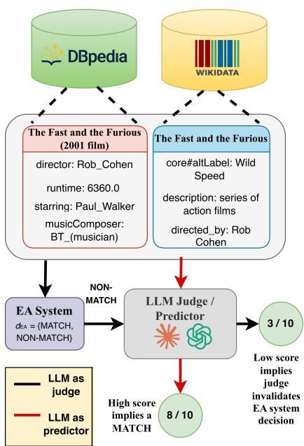
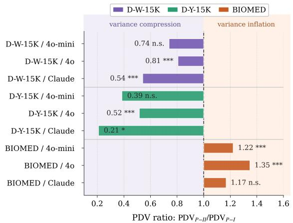
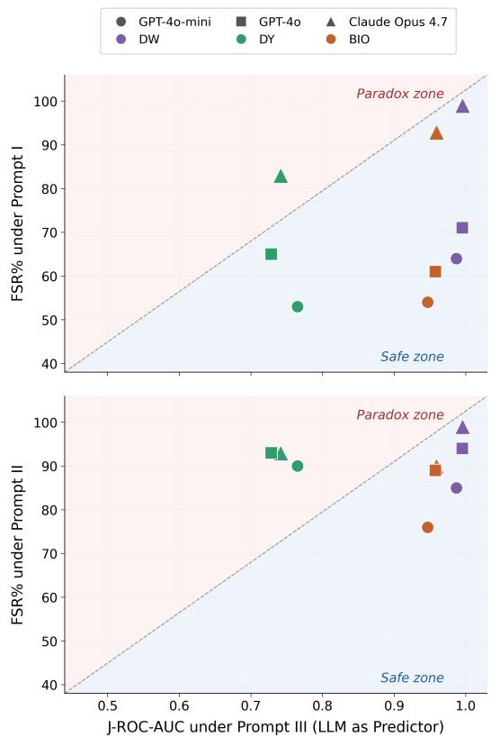

# Reliability of LLM Judges for Evaluating Entity Alignment

Vaibhava Lakshmi Ravideshik<sup>1</sup> and Mayank Kejriwal<sup>2</sup>

<sup>1</sup> University of Michigan, Ann Arbor

<sup>2</sup> Information Sciences Institute, University of Southern California vlds@umich.edu, kejriwal@isi.edu

## Abstract

Entity Alignment (EA) identifies equivalent entities across knowledge graphs and is critical for knowledge base integration and ontology merging. Evaluating EA systems at scale requires expensive expert annotation, making systematic assessment across diverse domains practically infeasible. LLM-as-judge evaluation offers a potentially scalable alternative, yet its reliability for structured prediction tasks like EA remains unstudied. We present the first systematic benchmarking study across three frontier models, three datasets, and four EA systems, using perturbation bias diagnostics, meta-evaluation across all dataset–judge–prompt combinations, and counterfactual label-flip tests. We identify anchor bias, a failure mode in which judges invert discrimination when the system’s decision label is visible. Label exposure causally collapses judge discrimination (J-ROC-AUC 0.12–0.87), while a label-free protocol recovers near-ceiling capability on distinctive-name datasets (0.93–1.00) and significant recovery on biomedical pairs (0.93–0.95). Counterfactual experiments confirm causality (FSR 53–99%) and reveal a frontier model paradox: stronger judges exhibit greater label sensitivity, not less. A blinded two-annotator human evaluation (102 pairs, Cohen’s κ = 0.902) confirms this mechanism directly. We release the first biomedical EA benchmark (MeSH–SNOMED CT, 15K pairs) and a reproducible auditing framework for LLM judge reliability in EA. Code and data are available at https://github. com/vaibhavalakshmiravideshik/ llm-as-a-judge-entity-alignment

## 1 Introduction

Entity alignment determines when entities in different knowledge graphs refer to the same realworld concept and is fundamental for knowledge base integration, ontology merging, and scientific data linking. Existing approaches range from translation-based embedding methods (Bordes et al., 2013; Sun et al., 2017; Wang et al., 2018) to hybrid neural-symbolic systems (Cheng et al., 2025; Chen et al., 2026). Despite advances in EA methodology, a critical bottleneck persists: evaluating whether predictions are correct requires expensive expert annotation, making large-scale benchmarking practically infeasible. LLM-as-judge evaluation can be a promising scalable alternative (Zheng et al., 2023b; Fu et al., 2024), yet a troubling pattern is emerging: LLMs exhibit systematic vulnerabilities when asked to make precise judgments. Recent work shows that a single irrelevant clause causes performance drops of up to 65% (Mirzadeh et al., 2025), suggesting LLMs replicate training patterns rather than reason genuinely.

For EA evaluation, this concern is acute: a judge must understand entity semantics, reason about alignment plausibility independent of system labels, and resist memorized entity names from pretraining. When a system outputs a binary label (MATCH/NON MATCH) visible to the judge, the judge may validate rather than evaluate, rationalizing the system’s decision post-hoc. Figure 1 illustrates this evaluation setting on a D-W-15K example. The judge is not asked to predict alignment directly; rather, it is asked to score whether the displayed EA decision is justified by the evidence. This creates a structural vulnerability: the decision label can become a cue to be rationalized rather than an object to be evaluated. We refer to this failure mode as anchor bias: the judge’s score may track the visible system label even when the evidence should lead it to reject that label. Can we trust the judge?

We present the first systematic benchmarking study of LLM-as-judge reliability for entity alignment, introducing a three-experiment framework of perturbation diagnostics, meta-evaluation across EA systems, and counterfactual label-flip analysis (Kaushik et al., 2019; Gardner et al., 2020).

  
Figure 1: LLM-as-judge evaluation for entity alignment, illustrated using D-W-15K (DBpedia–Wikidata). The two KG entities share the name “The Fast and the Furious” and the same director, but refer to different things: Entity A (DBpedia) is the 2001 film; Entity B (Wikidata) is the entire franchise series. The correct alignment label is NON-MATCH. Black path (LLM as judge): The EA system correctly predicts NON-MATCH; the LLM judge scores this decision 3/10, implying it considers NON-MATCH unjustified—anchoring on the shared name and director rather than reasoning from evidence. Red path (LLM as predictor): When the entity pair is sent directly to the LLM without any system label, it predicts MATCH with 8/10 confidence—again anchored on surface name similarity.

We also release a new biomedical EA benchmark (MeSH × SNOMED-CT, 15K pairs) (Ravideshik and Kejriwal, 2026a,b). Key contributions include:

• We characterize anchor bias, a failure mode in EA evaluation that is structurally distinct from prior anchoring and label-leakage effects observed in generation settings (§2), and introduce a diagnostic suite (PBI, JSR ρ, MRI) that combines perturbation and robustness measurement principles into a framework purposebuilt for auditing structured-prediction LLM judges.

• We demonstrate causally that visible system labels collapse judge discrimination (J-ROC-AUC 0.12–0.87), while an independent alignment-prediction protocol recovers strongly positive alignment discrimination on distinctive-name datasets. Counterfactual label-flip experiments replicate across

EasyEA (Cheng et al., 2025) and NeuSymEA (Chen et al., 2026) (FSR 53–99%), confirming the effect is judge-driven - which we also support with additional metrics. A blinded two-annotator human evaluation study further validates this mechanism directly against gold labels (§4.4).

• We construct and release a new biomedical EA benchmark (MeSH × SNOMED-CT, 15K pairs) with a reproducible auditing framework for EA-centric LLM judge reliability. MeSH and SNOMED CT use fundamentally different schema designs; hierarchical trees versus description-logic concepts, making alignment structurally harder and exposing failure modes that homogeneous benchmarks do not. The benchmark is released under the licensing terms described in §4 and Appendix E.

## 2 Related Work

Entity Alignment. Entity alignment has progressed from translation-based embedding methods (Bordes et al., 2013; Sun et al., 2017; Wang et al., 2018) to LLM-augmented systems (Zhang et al., 2024) and hybrid neural-symbolic approaches such as EasyEA (Cheng et al., 2025) and NeuSymEA (Chen et al., 2026), with systematic benchmarking across these approaches (Sun et al., 2020) driving substantial progress. Closely related variants beyond NLP go by the names of entity resolution and record linkage in databases and information retrieval (Getoor and Machanavajjhala, 2013; Papadakis et al., 2020), and the problem also bears resemblance to coreference resolution (Ng, 2010), though EA assumes entities are structured within a graph or database rather than mentioned in free text. Despite these advances, large-scale evaluation remains a bottleneck: verifying predicted alignments requires expert annotation that is expensive and slow to produce.

LLM-as-Judge Evaluation and Its Failure Modes. LLM judges have been applied to text generation, summarization, and preference evaluation (Zheng et al., 2023b; Fu et al., 2024), offering scalability without gold-standard references. However, documented failure modes position bias (Zheng et al., 2023a), verbosity bias (Dubois et al., 2024), and prompt sensitivity (Webson and Pavlick, 2022) raise systematic reliability concerns, and none address structured prediction tasks where the judge’s input contains a discrete decision label. Anchor bias builds directly on the established anchoringeffects (Kahneman et al., 1982) and confirmationbias (Nickerson, 1998) literatures, and connects to recent evidence that anchoring persists in frontier LLMs: O’Leary (2025) show that ChatGPT, Claude, and Gemini all shift numerical judgments toward provided anchor values. We do not claim anchoring itself as a new phenomenon; our contribution is a structurally distinct instantiation for structured prediction: prior work studies anchoring on open-ended numerical estimates or opinion questions where the anchor is contextual information, whereas here the anchor is a discrete system decision label embedded directly in the evaluation input, creating a rationalization target absent from generation-evaluation settings, a distinction we return to in §5, where we show chain-of-thought prompting does not resolve the bias.

LLM Reasoning Fragility and Shortcut Learning. LLMs are brittle to surface-level input changes even when underlying semantics are preserved. GSM-Symbolic (Mirzadeh et al., 2025) shows that a single irrelevant clause causes performance drops of up to 65% across frontier models, suggesting that models replicate training patterns rather than reason from first principles, connecting directly to shortcut learning (Geirhos et al., 2020): models rely on memorized surface correlations rather than structural evidence, enabling judges to rationalize arbitrary system decisions when entity names are recognizable. We build on this to characterize anchor bias and show that, empirically across the three frontier models we test, it is amplified rather than mitigated by model scale; we term this dissociation thefrontier model paradox (§5.3).

Counterfactual Evaluation. Counterfactual and contrast-set methods establish causal evidence in NLP by holding content fixed while manipulating specific factors (Kaushik et al., 2019; Gardner et al., 2020). We adapt this methodology directly to EA judge evaluation: flipping system decision labels while holding all entity evidence fixed isolates label exposure as the sole causal driver of any observed score shift, providing causal, rather than correlational, evidence of anchor bias.

Knowledge Graph Benchmarking. Existing EA benchmarks (Sun et al., 2020) focus on homogeneous general-domain graph pairs such as DBpedia–Wikidata and DBpedia–YAGO, where source graphs share consistent schemas. Biomedical knowledge graphs present a harder challenge due to schema heterogeneity, sparse expert annotation, and domain-specific terminology; we release MeSH–SNOMED CT (Ravideshik and Kejriwal, 2026a,b) as a large-scale biomedical EA benchmark embedded in its full ontological context, directly addressing this gap (licensing details in §4, Appendix E).

## 3 Methodology

## 3.1 Entity Alignment Formulation

Given two knowledge graphs $G _ { 1 }$ and $G _ { 2 }$ , entity alignment determines which pairs of entities $( e _ { 1 } , e _ { 2 } )$ refer to the same real-world concept. An EA system S produces a decision d ∈ {MATCH, NON MATCH} for each candidate pair. When human annotation is unavailable, an LLM judge J evaluates whether this decision is correct by assigning a score $s \in [ 0 , 1 0 ]$ . The central question is whether s genuinely reflects decision correctness or is confounded by the visible label d itself. If the judge simply rationalizes whatever label it sees, LLM-as-judge evaluation is circular: it reproduces the system’s decisions rather than auditing them.

## 3.2 Anchor Bias: Definition and Formalization

We define anchor bias as the tendency of an LLM judge to rationalize a displayed system decision label rather than independently assess the evidence for entity alignment. When a judge receives the tuple (e<sub>1</sub>, e<sub>2</sub>, context, d), anchor bias occurs when s is driven primarily by d rather than by the entity evidence. This makes judge scores uninformative: a judge that validates system labels appears to perform well on correct predictions and poorly on incorrect ones not because it is reasoning, but because it is echoing. The judge becomes a validator rather than an independent arbiter, defeating the purpose of automated evaluation.

## 3.3 Perturbation Bias Diagnostics

To claim that judges rationalize visible labels rather than reasoning from evidence, we must first establish what judges rely on in the absence of a label. If scores collapse when entity names are anonymized, the judge’s baseline reasoning is driven by memorized name recognition; precisely the surface shortcut that makes it susceptible to label anchoring. We administer controlled modifications to entity names, evidence, and context following the behavioral testing paradigm (Ribeiro et al., 2016), and characterize judge dependence through three complementary metrics:

Perturbation Bias Index (PBI). PBI measures the average score drop after perturbation:

$$
\mathrm { P B I } = \bar { s } _ { \mathrm { o r i g i n a l } } - \bar { s } _ { \mathrm { p e r t u r b e d } }\tag{1}
$$

A value $> 0$ indicates reliance on the perturbed feature rather than structural evidence.

Judge Score Rank Correlation (JSR ρ). JSR is the Spearman rank correlation between original and perturbed scores:

$$
\mathbf { J S R } = \rho \big ( \mathbf { s } _ { \mathrm { o r i g i n a l } } , \mathbf { s } _ { \mathrm { p e r t u r b e d } } \big )\tag{2}
$$

High JSR indicates consistent reliance on the perturbed feature across pairs; low JSR indicates erratic, pair-specific scrambling that PBI alone cannot reveal.

Massive Rank Inversion Rate (MRI). MRI measures the fraction of pairs with score collapse exceeding 2 points:

$$
\mathrm { \ M R I } = \frac { | \{ i : s _ { \mathrm { \ o r i g i n a l } } ^ { i } - s _ { \mathrm { p e r t u r b e d } } ^ { i } > 2 \} | } { n } \times 1 0 0 \%\tag{3}
$$

PBI can stay small even when a minority of pairs collapse catastrophically; MRI isolates these extreme failures. Together, PBI, JSR, and MRI profile name-dependence magnitude, consistency, and catastrophic rate.

## 3.4 EA System Meta-Evaluation

Perturbation diagnostics reveal what the judge relies on, but not whether it can distinguish correct from incorrect EA predictions; the operational question for evaluation. To measure this, and to isolate the role of label exposure, we contrast three prompting conditions that vary the structural relationship between the judge and the system decision: (I) Evidence-locked decision validation 8-step chain-of-thought reasoning instructing the judge to assess the system decision from entity evidence alone; (II) Minimal decision validation no guidance, representing the default practitioner setting; (III) Label-free alignment prediction the system decision is never shown; the LLM independently predicts alignment. Prompts I–II are LLM-as-judge conditions; Prompt III is an LLM-as-predictor capability probe.

We operationalize judge performance through the metrics in Table 1.

Table 1: Metrics for EA system meta-evaluation (Experiment 2). Under Prompts I–II the LLM scores how welljustified the visible system decision is; J-ROC-AUC measures correctness discrimination. Under Prompt III the LLM acts as a predictor; no label is shown and Score Gap is the primary metric.
<table><tr><td>Metric</td><td>Formula</td><td>Interpretation</td></tr><tr><td>Score Gap</td><td> $\Delta = \bar { s } _ { \mathrm { M } } - \bar { s } _ { \mathrm { N M } }$ </td><td>Negative ∆ = in- verted discrimina-</td></tr><tr><td>PDV</td><td>Var(s prompt)</td><td>tion Low PDV = com- pression</td></tr><tr><td>J-ROC- AUC</td><td> $\stackrel { \bullet } { P } ( s _ { + } ) > s _ { - } )$ </td><td>&lt;0.5 = anchor bias (P-I/II, judge); &gt;0.9 = strong alignment prediction (P-III, predictor)</td></tr></table>

## 3.5 Counterfactual Label Sensitivity

Meta-evaluation establishes whether judges discriminate correctly, but a correlation between label and score does not establish causation. Establishing that labels cause score changes requires an intervention: holding all entity evidence fixed and changing only the visible label (Kaushik et al., 2019). Any score change under this intervention is attributable solely to label exposure. We quantify the causal response through three metrics:

Mean Absolute Shift (MAS). MAS measures the average magnitude of score change after label flipping:

$$
\mathrm { M A S } = \frac { 1 } { n } \sum _ { i = 1 } ^ { n } \left| s ^ { ( i ) } - \bar { s } ^ { ( i ) } \right|\tag{4}
$$

High MAS indicates that scoring is strongly driven by the visible label rather than entity evidence.

Flip Sensitivity Rate (FSR). FSR measures the fraction of pairs with score shifts exceeding 2 points after label flipping:

$$
\mathrm { F S R } = \frac { | \{ i : | s ^ { ( i ) } - \bar { s } ^ { ( i ) } | > 2 \} | } { n } \times 1 0 0 \%\tag{5}
$$

While MAS captures average sensitivity, FSR captures the prevalence of large causal effects: high FSR means label anchoring is systematic rather than marginal, affecting the majority of evaluation decisions.

Label Following Rate (LFR). LFR measures the fraction of pairs where the score shifts in the direc-

tion of the flipped label:

$$
\begin{array} { r l r } {  { \mathrm { L F R } = \frac { 1 0 0 } { n } \Big ( \sum _ { i \in \mathcal { M } } \mathcal { H } [ \bar { s } ^ { ( i ) } < s ^ { ( i ) } ] } } \\ & { } & { + \sum _ { i \in \mathcal { N } } \mathcal { H } [ \bar { s } ^ { ( i ) } > s ^ { ( i ) } ] \Big ) \mathcal { V } _ { 0 } } \end{array}\tag{6}
$$

Downward when MATCH flips to NON-MATCH, upward when NON-MATCH flips to MATCH. LFR = 50% indicates chance; LFR > 50% indicates the judge follows the new label rather than an evidencebased assessment. FSR and LFR are distinct: FSR captures whether scores respond causally to a label change at all, while LFR captures whether that response follows the new label’s direction. A judge can show high FSR while LFR stays near chance; we report both to avoid conflating causal sensitivity with directional conformity.

## 3.6 Human Evaluation Protocol

To validate that judge scores reflect genuine EA correctness rather than an artifact of our automated metrics, we conducted a blinded two-annotator human evaluation: both authors independently scored the same pairs across four negative-sampling strategies under all three prompts, without access to each other’s judgments during annotation. Full sampling details, inter-annotator agreement statistics, and gold-label accuracy are reported in §4.4.

## 4 Experimental Setup

Datasets. We evaluate on three datasets spanning distinct alignment challenges. DW (DBpedia × Wikidata) and DY (DBpedia × YAGO) are OpenEA benchmarks (Sun et al., 2020) with distinctive and near-identical entity names respectively, providing a controlled contrast between name-rich and name-ambiguous conditions. BIO (MeSH × SNOMED-CT, 15K pairs, publicly released (Ravideshik and Kejriwal, 2026a,b)) is the first largescale biomedical EA benchmark released with full ontological context and is a key contribution of this work.

BIO Benchmark Construction. Ground-truth alignments were extracted from UMLS crossreferences between MeSH (December 2023) and SNOMED CT (March 2026), yielding 46,823 raw MeSH–SNOMED CT alignment pairs from which 15,000 were stratified-sampled. Knowledge graph triples were extracted directly from source dumps: MeSH contributes 11.4M attribute and 6.9M relation triples; SNOMED CT contributes 1.4M attribute and 1.3M relation triples.

BIO presents three structural challenges absent from general-domain benchmarks: no shared predicate vocabulary between MeSH and SNOMED CT, sparse LLM pre-training signal over biomedical ontology concepts, and genuine many-to-many alignments from SNOMED CT’s finer granularity. Full construction details, dataset statistics, and release information are provided in Appendix E (Ravideshik and Kejriwal, 2026a,b).

Licensing and Access. BIO is derived from two source ontologies with distinct access terms. MeSH is distributed by the U.S. National Library of Medicine (NLM) under its standard terms of use, which permit research and redistribution with attribution. SNOMED CT requires a UMLS Metathesaurus license, free for researchers and institutions in UMLS-affiliate countries, obtained directly from the U.S. National Library of Medicine; redistribution of SNOMED CT-derived content is permitted only to other UMLS license holders. We release BIO’s triples and gold alignment pairs under these same conditions: users must independently hold a valid UMLS license to access the SNOMED CTderived portion of the benchmark, consistent with the original providers’ terms (full details in Appendix E).

EA Systems. We evaluate two EA systems and their ablated variants spanning diverse architectures to test whether observed biases are judge-driven rather than system-specific:

1. EasyEA (Cheng et al., 2025) (Hits@1: 0.806/0.947/0.518 on DW/DY/BIO) combines embedding-based representations with LLM guidance; EasyEA-EmbOnly is its embeddingonly ablation.

2. NeuSymEA (Chen et al., 2026) (Hits@1: ≈0.803/0.973 on DW/DY) integrates neural and symbolic reasoning via variational inference; NeuSymEA-NoRefine is its base variant without symbolic refinement.

EA System Output and Sampling Protocol. EasyEA (Cheng et al., 2025) produces alignments via a three-stage pipeline combining LLMbased summarization, embedding fusion, and hierarchical LLM candidate selection; EasyEA-EmbOnly disables the Stage 3 LLM selection module. NeuSymEA (Chen et al., 2026) integrates symbolic reasoning with a neural embedding model via variational EM; NeuSymEA-NoRefine disables the symbolic refinement component.

For Experiments 2 and 3, pairs were sampled directly from EA system output without consulting ground-truth labels. 250 MATCH pairs were sampled uniformly at random from the EA system’s predicted alignments. 250 NON-MATCH pairs were obtained by randomly sampling entity pairs $( e _ { 1 } , e _ { 2 } )$ with $e _ { 1 } \in G _ { 1 } , e _ { 2 } \in G _ { 2 }$ , rejecting any pair present in the EA system’s predicted alignments. Since EA predictions constitute a negligible fraction of $G _ { 1 } \times G _ { 2 }$ , the rejection rate is negligible. Ground-truth labels are used only when computing evaluation metrics after sampling, not during pair selection. System outputs were fixed before any judge evaluation began. Full details of the sampling procedure for all experiments are in Appendix I. For Experiment 4 (human evaluation), we additionally sample NON-MATCH pairs from three harder negative-mining strategies (lexical-neighbor, TF-IDF nearest-neighbor, and high-confidence false positives), described in §4.4.

LLM Judges. We evaluate three frontier models as judges: GPT-4o-mini, GPT-4o, and Claude Opus 4.7, accessed via OpenRouter with temperature $\qquad = \quad 0$ and max\_completion\_tokens = 1500 across all conditions. All calls were routed directly to each provider’s official endpoint (OpenRouter metadata confirms provider: "Anthropic" for Claude Opus 4.7 calls, resolving consistently to anthropic/claude-opus-4-7, and OpenAI’s official endpoint for GPT-4o and GPT-4o-mini), and all calls within a given experiment were completed within a single continuous session to minimize the risk of snapshot drift. We note that temperature = 0 does not by itself formally guarantee bit-for-bit determinism across arbitrary model snapshots; we are not aware of any snapshot changes for these models during our experimental window, and we release full intermediate logs to support replication (Appendix C). Total API expenditure was \$577.17 across all experiments (153,000 calls, 238.8M tokens); a full cost breakdown is provided in Appendix C.

## 4.1 Experiment 1: Perturbation Bias Diagnostics

We conduct perturbation tests over n=500 pairs per condition across all three datasets and all judge models. Pairs are sampled uniformly at random from ground-truth alignments (MATCH pairs only; no NON-MATCH class in Experiment 1). We use seven perturbation strategies (P1–P7) described in Appendix A: identity anonymization (P1), evidence suppression at 30% and 50% (P2, P3), surface transformation (P4), order randomization (P5), identifier removal (P6), and structured-to-prose conversion (P7). P1 is the most diagnostic, directly ablating the name recognition shortcut; P2, P3, and P6 are reported alongside P1 in Table 14 to capture evidence suppression dose-response and identifier dependence; P4, P5, and P7 are reported in Appendix G (Table 15), with P5 serving as the negative control. For each condition we compute PBI, JSR, and MRI to characterize the judge’s feature dependence profile. Sample size justification (n=500) is provided in Appendix D.0.

## 4.2 Experiment 2: EA System Meta-Evaluation

We evaluate all combinations of datasets (DW, DY, BIO), EA systems (EasyEA and its ablation EasyEA-EmbOnly, NeuSymEA and its ablation NeuSymEA-NoRefine), judges (GPT-4o-mini, GPT-4o, Claude Opus 4.7), and prompts (I, II, III). For each condition we sample n=500 pairs (250 MATCH, 250 NON MATCH) and compute Score Gap, PDV, and J-ROC-AUC.

Under Prompts I–II, J-ROC-AUC measures P(s<sub>correct decision</sub> > s<sub>incorrect decision</sub>); inversion below 0.5 is the operational signature of anchor bias. Under Prompt III, Score Gap is the primary metric; J-ROC-AUC is also reported but measures alignment prediction capability $P ( s _ { \mathrm { M A T C H } } >$ s<sub>NON-MATCH</sub>), not correctness discrimination. Full threshold sweeps are in Appendix B (Tables 3–7).

## 4.3 Experiment 3: Counterfactual Label Sensitivity

We test causal label effects by flipping system decisions while holding entity evidence fixed, sampling n=100 pairs per condition (50 MATCH + 50 NON MATCH) from EasyEA (Cheng et al., 2025) and NeuSymEA (Chen et al., 2026) on DW and DY under Prompts I and II. BIO is excluded as NeuSymEA was not evaluated on that dataset; Prompt III is excluded as it exposes no label. For each pair we obtain scores under the original and flipped decision and compute MAS, FSR, and LFR to quantify the causal effect of label exposure.

## 4.4 Experiment 4: Human Evaluation

To validate that anchor bias reflects genuine judge unreliability rather than an artifact of our automated diagnostics, we conducted a blinded twoannotator human evaluation following standard annotation protocols (§3.6). Both authors independently scored the same 102 pairs (50 MATCH, 52 NON-MATCH spanning all four negative-sampling strategies) under Prompts I, II, and III, for 306 scored instances per annotator, without seeing each other’s scores during annotation.

Inter-annotator agreement. Agreement between the two annotators is strong: Spearman $\rho = 0 . 9 6 7$ Pearson $r = 0 . 9 8 5$ , Cohen’s $\kappa = 0 . 9 0 2$ , and MAE $= 0 . 3 8 .$ , indicating almost perfect agreement (Landis and Koch, 1977). Agreement holds separately for MATCH pairs $( \kappa = 0 . 7 3 1 )$ and NON-MATCH pairs $( \kappa = 0 . 8 9 1 )$ .

Gold-label accuracy. The consensus annotation (mean of the two annotators’ scores) achieves a Score Gap of 7.896 points between MATCH and NON-MATCH pairs (9.800 vs. 1.904), with 100% of MATCH pairs correctly scored high and 82.7% of NON-MATCH pairs correctly scored low, yielding an overall gold-label accuracy of 91.3%. This confirms the human annotations are both internally consistent (via inter-annotator agreement) and externally valid (via agreement with known ground truth).

Human–LLM correlation and the anchor-bias mechanism. Using the consensus annotation as the gold standard, all three LLM judges show strong overall correlation with human judgment: GPT-4omini $( \rho = 0 . 8 6 0 , \kappa = 0 . 7 4 3 )$ , GPT-4o $( \rho = 0 . 8 9 3$ $\kappa = 0 . 8 1 2 )$ , and Claude Opus 4.7 $( \rho = 0 . 9 2 0$ $\kappa ~ = ~ 0 . 8 7 1$ $\mathbf { M A E } = \mathbf { 0 . 2 3 } )$ Claude Opus 4.7 achieves the highest alignment with human consensus, consistent with its status as the strongest of the three frontier judges we evaluate. Critically, the perlabel breakdown confirms the anchor bias mechanism directly rather than only at the aggregate level: under label-exposing prompts, MATCH pairs show low human–LLM correlation $\left( \rho = 0 . 2 2 8 \mathrm { t o } 0 . 4 1 2 \right)$ while NON-MATCH pairs show high correlation $( \rho = 0 . 7 7 9 \mathrm { t o } 0 . 8 6 7 )$ . This asymmetry is precisely what anchor bias predicts: judges track the visible label rather than the evidence, so agreement with human judgment collapses exactly where the visible label most disagrees with careful evidencebased assessment. Table 17 summarizes all of these human evaluation statistics together.

  
Figure 2: PDV ratio $( \mathrm { P D V } _ { P - I I } / \mathrm { P D V } _ { P - I } )$ per dataset– judge condition. Ratios <1 indicate variance compression under minimal prompting; ratios >1 indicate inflation. General-domain judges compress uniformly (0.21–0.81); BIO judges inflate (1.17–1.35), reflecting absent pre-training signal. Significance: $^ { \ast \ast \ast } p { < } 0 . 0 0 1$ ， $^ { * } p { < } 0 . 0 5 , \mathrm { n . s . } p { \geq } 0 . 0 5$

## 5 Results

## 5.1 Perturbation Bias Diagnostics

Identity anonymization is the singular catastrophic perturbation trigger on BIO (MRI 61– 69%), while general-domain judges remain stable across all conditions.

Minimal prompting (Prompt II) elicits systematically higher baseline scores across all nine conditions. As shown in Figure 2 (full statistics in Table 16, Appendix H), for general-domain datasets (DW, DY), PDV ratios fall below 1.0 (range: 0.21– 0.81), indicating that removing prompt guidance compresses score variance: the judge collapses onto memorized entity knowledge and assigns uniformly high scores regardless of pair quality. BIO ratios exceed 1.0 (range: 1.17–1.35), reflecting absent pre-training signal; full analysis in §5.4.

As shown in Table 14, P1 (identity anonymization) induces MRI of 66.4%, 61.9%, 63.0%, and 68.8% on BIO across all judges and prompts. No other perturbation strategy exceeds 7% MRI on BIO, and P5 (order randomization), serving as a negative control, produces MRI below 5% across all conditions, confirming the framework identifies genuine name-dependence rather than noise.

## 5.2 EA System Meta-Evaluation

Anchor bias is endemic: J-ROC-AUC collapses to 0.12–0.53 under label-exposing prompts, while Prompt III (LLM as predictor) recovers

## near-ceiling discrimination.

Score Gaps are predominantly negative under both label-exposing prompts (Appendix F, Table 13), confirming that judges assign systematically higher validation scores to NON-MATCH decisions than to MATCH decisions—the behavioral signature of anchor bias. Structured chain-ofthought reasoning (Prompt I) does not mitigate the bias; in several conditions it amplifies it.

Across DW and DY, 18 of 24 conditions achieve statistically significant positive discrimination under Prompt III (LLM as predictor) (p<0.05, Table 13); the remaining 6 conditions are concentrated in DY, where near-identical entity names limit label-free discrimination. The capability gap is architecture-dependent: EasyEA (Cheng et al., 2025) variants collapse under Prompt III on DY, where near-identical entity names provide no discriminative signal in the absence of a label, while NeuSymEA (Chen et al., 2026) variants achieve J-ROC-AUC 0.981–1.000 and Score Gap +7.9– +9.1 (p<0.001) on both datasets, indicating that structure-aware alignment training confers robustness to predictor-mode evaluation.

Label-free evaluation succeeds on distinctivename datasets and structure-aware systems but fails on near-identical names paired with weak EA systems; full scope analysis in Appendix J.

## 5.3 Counterfactual Label Sensitivity and the Frontier Model Paradox

Visible labels causally drive judge scores in 53– 99% of pairs, and also reveal a frontier model paradox: stronger judges exhibit greater label sensitivity, not less.

As shown in Table 2, FSR exceeds 50% in every condition under Prompt I, and Prompt II amplifies rather than reduces label sensitivity uniformly (Appendix D.3, Table 11): the minimal prompt consistently produces higher MAS and FSR than the structured CoT prompt, indicating that prompt engineering cannot eliminate anchor bias. Label sensitivity scales monotonically with model capability: Claude Opus 4.7 produces the highest MAS and FSR in every condition, reaching FSR = 99% on DW under both EasyEA and NeuSymEA. LFR provides the directional confirmation: values consistently at or above 50% for GPT-4o and Claude Opus 4.7 indicate that score shifts follow the new label rather than the evidence, while GPT-4o-mini shows more resistance (LFR 17–43% on DW under Prompt I), suggesting weaker but present label anchoring. FSR captures the prevalence of large score changes; LFR establishes their direction. Figure 3 visualizes this relationship between label sensitivity (FSR) and label-free discrimination capability (J-ROC-AUC) across judges and datasets.

  
Figure 3: Frontier model paradox: FSR% (label sensitivity under Prompts I and II, LLM as judge) vs. J-ROC-AUC (alignment prediction capability under Prompt III, LLM as predictor). Points in the paradox zone (upperleft and upper-right) combine high label sensitivity with high or low discrimination, confirming that stronger judges are more susceptible to anchor bias yet more capable when labels are withheld. Shape = judge; color = dataset.

A candidate mechanism. We offer a candidate explanation grounded in pre-training signal density, treated as an empirical regularity across the three tested models rather than a settled account; full discussion in Appendix J.

Generalization beyond entity alignment. The same structural property is expected to produce anchor bias in other structured prediction tasks (relation extraction, semantic role labeling, coreference resolution, slot filling); see Appendix J for the full discussion.

Table 2: Counterfactual label-flip results under Prompt I: MAS, FSR%, 95% CI, and LFR% (n=100 per condition, 50 MATCH + 50 NON MATCH). FSR exceeds 50% in every condition. Label sensitivity scales monotonically with model capability; Claude Opus 4.7 reaches FSR = 99% on DW under EasyEA and 95% under NeuSymEA. 95% bootstrap CIs (B=10,000) for FSR confirm that all lower bounds exceed chance (50%) except DY 4o-mini EasyEA ([43, 63]), where label sensitivity is weakest but FSR point estimate still exceeds chance. Compare to Prompt II amplification in Table 11.
<table><tr><td>Dataset-Judge System</td><td></td><td>MAS</td><td>FSR%</td><td>95% CI</td><td>LFR%</td></tr><tr><td>DW 4m</td><td>EasyEA</td><td>3.55</td><td>64</td><td>[55, 73]</td><td>17</td></tr><tr><td>DW 40</td><td>EasyEA</td><td>4.66</td><td>71</td><td>[62, 80]</td><td>29</td></tr><tr><td>DW O4</td><td>EasyEA</td><td>6.07</td><td>99</td><td>[97, 100]</td><td>50</td></tr><tr><td>DW 4m</td><td>NeuSymEA</td><td>4.34</td><td>62</td><td>[52, 71]</td><td>41</td></tr><tr><td>DW 40</td><td>NeuSymEA</td><td>6.39</td><td>81</td><td>[73, 88]</td><td>46</td></tr><tr><td>DW O4</td><td>NeuSymEA</td><td>8.21</td><td>95</td><td>[90, 99]</td><td>47</td></tr><tr><td>DY 4m</td><td>EasyEA</td><td>3.71</td><td>53</td><td>[43,63]</td><td>43</td></tr><tr><td>DY 40</td><td>EasyEA</td><td>4.80</td><td>65</td><td>[56, 74]</td><td>53</td></tr><tr><td>DY 04</td><td>EasyEA</td><td>6.27</td><td>83</td><td>[75, 90]</td><td>65</td></tr><tr><td>DY 4m</td><td>NeuSymEA</td><td>4.34</td><td>57</td><td>[47, 66]</td><td>39</td></tr><tr><td>DY 40</td><td>NeuSymEA</td><td>6.76</td><td>90</td><td>[84, 95]</td><td>48</td></tr><tr><td>DY O4</td><td>NeuSymEA</td><td>7.97</td><td>94</td><td>[89, 98]</td><td>48</td></tr><tr><td></td><td></td><td></td><td></td><td></td><td></td></tr><tr><td>BIO 4m BIO 40</td><td>EasyEA</td><td>3.26</td><td>54 61</td><td>[44, 64]</td><td>32</td></tr><tr><td></td><td>EasyEA</td><td>4.17</td><td></td><td>[51, 70]</td><td>35</td></tr><tr><td>BIO O4</td><td>EasyEA</td><td>5.88</td><td>92</td><td>[86, 97]</td><td>51</td></tr></table>

## 5.4 Biomedical Domain: A Distinct Failure Mode

BIO exhibits a structurally distinct failure mode: perturbation collapse is pre-training-driven, anchor bias is attenuated, and label-free recovery is weaker than on general-domain datasets.

On BIO, P1 identity anonymization collapse is prompt-invariant: JSR turns negative for 4o-mini (−0.076, −0.142) and near-zero for 4o (0.029, −0.026) under both Prompts II and III regardless of label visibility, ruling out label anchoring as the primary driver. Instead, MeSH and SNOMED CT concepts are rarely encountered verbatim in pretraining corpora, leaving judges without recognizable anchors and producing higher-variance, evidence-driven scoring.

Anchor bias nonetheless operates but is attenuated: FSR reaches 54–92% (vs. 62–99% on DW) and LFR is systematically lower (32–51% on BIO vs. 17–65% on DW and DY). Label-free recovery under Prompt III is achievable—EasyEA achieves significant positive discrimination across all three judges (p<0.05, Table 13), with J-ROC-AUC 0.931–0.948—though this falls short of nearceiling recovery on DW (0.981–1.000), reflecting sparse attribute overlap and heterogeneous relation predicates in MeSH–SNOMED CT.

## 6 Conclusion

Judge failure is not a reasoning deficit — it is a structural vulnerability to visible labels and entity name cues. Even under an 8-step evidence-locked chain-of-thought protocol, LLM judges fail to discriminate correct from incorrect EA predictions (J-ROC-AUC 0.12–0.87 overall; 0.12–0.53 on distinctive-name datasets). Stronger models are not automatically the solution: across the three frontier judges we test, greater capability is associated with greater label sensitivity, not less. The fix is structural, not prompt-based. Prompt III, which repurposes the LLM as a predictor rather than a judge, reveals strongly positive alignment discrimination when labels are simply withheld; not suppressed by instruction, but physically absent. Counterfactual label-flip experiments confirm direct causality: score shifts exceeding 2 points in 53–99% of pairs (FSR), with Label Following Rate at or above chance in the majority of conditions, establish that judges shift scores toward visible labels rather than evidence; anchor bias is a property of the judge, not the system. A blinded human evaluation study corroborates this mechanism at the level of individual judgments rather than only in aggregate. Practitioners should withhold system decisions from LLM judges entirely. We release the BIO benchmark and all evaluation code at https://github. com/vaibhavalakshmiravideshik/ llm-as-a-judge-entity-alignment to support this work.

## Ethical Considerations

This work evaluates LLM judge reliability using publicly available entity alignment benchmarks. No new datasets containing personal or sensitive information were collected. Our evaluation focuses on system behavior and does not involve human subjects. The BIO benchmark draws exclusively from public medical ontologies (MeSH and SNOMED-CT) that are freely available for research, subject to the licensing terms described in §4 and Appendix E. We release our evaluation code to promote reproducible auditing of LLM-as-judge approaches. As LLM-based evaluation becomes more prevalent in AI research, systematic analysis of judge reliability in structured tasks is important for ensuring research integrity and preventing propagation of biased judgments in downstream applications.

## Acknowledgments

We use an AI assistant for paraphrasing support during the writing of this manuscript.

## Limitations

We use 50/50 class-balanced evaluation (n=500) to isolate discrimination capability; absolute values should be interpreted relative to this protocol rather than operational class imbalance. We evaluate only three closed-source frontier judges; open-source models and non-English datasets remain untested. Prompt III changes both label exposure and task framing simultaneously; improvements cannot be attributed solely to label removal without a matched control. The frontier model paradox is observed across three frontier models accessed via a single API provider; generalization to open-source models or different model families remains an open question, as does empirical validation of anchor bias on structured prediction tasks beyond entity alignment (§5.3). Our human evaluation (§4.4) uses two author-annotators rather than independent, uninvolved expert raters; while blinding and strong inter-annotator agreement mitigate this concern, an independent expert annotation study would further strengthen the validation.

## References

Antoine Bordes, Nicolas Usunier, Alberto Garcia-Durán, Jason Weston, and Oksana Yakhnenko. 2013. Translating embeddings for modeling multirelational data. In Advances in Neural Information Processing Systems 26, pages 2787–2795.

Shengyuan Chen, Zheng Yuan, Qinggang Zhang, Wen Hua, Jiannong Cao, and Xiao Huang. 2026. NeuSymEA: Neuro-symbolic entity alignment via variational inference. In Advances in Neural Information Processing Systems, volume 38, pages 92542– 92564.

Jingwei Cheng, Chenglong Lu, Linyan Yang, Guoqing Chen, and Fu Zhang. 2025. EasyEA: Large language model is all you need in entity alignment between knowledge graphs. In Findings ofthe Associationfor Computational Linguistics: ACL 2025, pages 20981– 20995.

Yann Dubois, Balázs Galambosi, Percy Liang, and Tatsunori B. Hashimoto. 2024. Length-controlled AlpacaEval: A simple way to debias automatic evaluators. arXiv preprint arXiv:2404.04475.

Jinlan Fu, See-Kiong Ng, Zhengbao Jiang, and Pengfei Liu. 2024. GPTScore: Evaluate as you desire. In Proceedings of the 2024 Conference of the North American Chapter of the Association for Computational Linguistics, pages 6556–6576.

Matt Gardner, Yoav Artzi, Victoria Basmova, Jonathan Berant, Ben Bogin, Sihao Chen, Pradeep Dasigi, Dheeru Dua, Yanai Elazar, Ananth Gottumukkala, Nitish Gupta, Hannaneh Hajishirzi, Gabriel Ilharco, Daniel Khashabi, Kevin Lin, Jiangming Liu, Nelson F. Liu, Phoebe Mulcaire, Qiang Ning, and 7 others. 2020. Evaluating models’ local decision boundaries via contrast sets. In Findings ofthe Association for Computational Linguistics: EMNLP 2020, pages 1307–1323.

Robert Geirhos, Jörn-Henrik Jacobsen, Claudio Michaelis, Richard Zemel, Wieland Brendel, Matthias Bethge, and Felix A. Wichmann. 2020. Shortcut learning in deep neural networks. Nature Machine Intelligence, 2(11):665–673.

Lise Getoor and Ashwin Machanavajjhala. 2013. Entity resolution for big data. In Proceedings of the 19th ACM SIGKDD International Conference on Knowledge Discovery and Data Mining, pages 1527–1527.

Daniel Kahneman, Paul Slovic, and Amos Tversky, editors. 1982. Judgment under Uncertainty: Heuristics and Biases. Cambridge University Press.

Divyansh Kaushik, Eduard Hovy, and Zachary C. Lipton. 2019. Learning the difference that makes a difference with counterfactually-augmented data. arXiv preprint arXiv:1909.12434.

J. Richard Landis and Gary G. Koch. 1977. The measurement of observer agreement for categorical data. Biometrics, 33(1):159–174.

Iman Mirzadeh, Keivan Alizadeh-Vahid, Hooman Shahrokhi, Oncel Tuzel, Samy Bengio, and Mehrdad Farajtabar. 2025. GSM-Symbolic: Understanding the limitations of mathematical reasoning in large language models. In Proceedings of the 13th International Conference on Learning Representations, volume 2025, pages 94743–94765.

Vincent Ng. 2010. Supervised noun phrase coreference research: The first fifteen years. In Proceedings of the 48th Annual Meeting of the Association for Computational Linguistics, pages 1396–1411.

Raymond S. Nickerson. 1998. Confirmation bias: A ubiquitous phenomenon in many guises. Review of General Psychology, 2(2):175–220.

Daniel E. O’Leary. 2025. An anchoring effect in large language models. IEEE Intelligent Systems, 40(2):23– 26.

George Papadakis, Dimitrios Skoutas, Emmanouil Thanos, and Themis Palpanas. 2020. Blocking and filtering techniques for entity resolution: A survey. ACM Computing Surveys, 53(2):1–42.

Vaibhava Lakshmi Ravideshik and Mayank Kejriwal. 2026a. MeSH-SNOMED-15K: A heterogeneous biomedical entity alignment benchmark. In Proceedings of the NILA Workshop, co-located with IJCAI-ECAI 2026, Bremen, Germany.

Vaibhava Lakshmi Ravideshik and Mayank Kejriwal. 2026b. MeSH-SNOMED-15K: Biomedical entity alignment dataset. https://huggingface.co/datasets/ vaibhavalakshmiravideshik/ mesh-snomed-entity-alignment-15k.

Marco Tulio Ribeiro, Sameer Singh, and Carlos Guestrin. 2016. “Why should I trust you?”: Explaining the predictions of any classifier. In Proceedings ofthe 22nd ACM SIGKDD International Conference on Knowledge Discovery and Data Mining, pages 1135–1144.

Zequn Sun, Wei Hu, and Chengkai Li. 2017. Crosslingual entity alignment via joint attribute-preserving embedding. In Proceedings ofthe 16th International Semantic Web Conference (ISWC), pages 628–644.

Zequn Sun, Qingheng Zhang, Wei Hu, Chengming Wang, Muhao Chen, Farahnaz Akrami, and Chengkai Li. 2020. A benchmarking study of embeddingbased entity alignment for knowledge graphs. arXiv preprint arXiv:2003.07743.

Zhichun Wang, Qing Lv, Xiaohan Lan, and Yu Zhang. 2018. Cross-lingual knowledge graph alignment via graph convolutional networks. In Proceedings of the 2018 Conference on Empirical Methods in Natural Language Processing, pages 349–357, Brussels, Belgium.

Albert Webson and Ellie Pavlick. 2022. Do promptbased models really understand the meaning of their prompts? In Proceedings ofthe 2022 Conference of the North American Chapter ofthe Associationfor Computational Linguistics, pages 2300–2344.

Yichi Zhang, Zhuo Chen, Lingbing Guo, Yajing Xu, Wen Zhang, and Huajun Chen. 2024. Making large language models perform better in knowledge graph completion. In Proceedings ofthe 32nd ACM International Conference on Multimedia, pages 233–242.

Chujie Zheng, Hao Zhou, Fandong Meng, Jie Zhou, and Minlie Huang. 2023a. Large language models are not robust multiple choice selectors. arXiv preprint arXiv:2309.03882.

Lianmin Zheng, Wei-Lin Chiang, Ying Sheng, Siyuan Zhuang, Zhanghao Wu, Yonghao Zhuang, Zi Lin, Zhuohan Li, Dacheng Li, Eric P. Xing, Hao Zhang, Joseph E. Gonzalez, and Ion Stoica. 2023b. Judging LLM-as-a-Judge with MT-Bench and Chatbot Arena. In Advances in Neural Information Processing Systems 36, pages 46595–46623.

## Appendix Table of Contents

<table><tr><td>Appendix A A.1</td><td>Judge Prompt Templates Prompt I: Evidence-Locked Evalua-</td></tr><tr><td>A.2</td><td>tion Prompt II: Minimal Evaluation</td></tr><tr><td>A.3</td><td>Prompt III: Independent Alignment</td></tr><tr><td>Appendix B</td><td>Prediction Judge Meta-Evaluation Threshold</td></tr><tr><td>Appendix C Appendix D</td><td>Sweeps Computational Cost and API Usage Robustness and Statistical Valida-</td></tr><tr><td>D.0</td><td>tion Sample Size Justification</td></tr><tr><td>D.1</td><td>MRI Threshold Sensitivity</td></tr><tr><td>D.2</td><td>Bootstrap Confidence Intervals for PBI and MRI</td></tr><tr><td>D.3 Appendix E</td><td>Label-Flip Effects Under Prompt II BIOMED Dataset Construction and</td></tr><tr><td>Appendix F</td><td>Validation Score Gap Analysis and Signifi-</td></tr><tr><td>Appendix G</td><td>cance Full Perturbation Bias Diagnostics</td></tr><tr><td>Appendix H</td><td>PDV Baseline Statistics</td></tr><tr><td>Appendix I</td><td>Sampling Procedures for All Experi- ments</td></tr><tr><td>Appendix J</td><td>Extended Discussion</td></tr></table>

## Appendix A: Judge Prompt Templates

We provide the complete prompt templates used in Experiments 1 and 2. All three prompts share identical input structure (entity IDs, labels, types, properties, relationships, and system decision where applicable) and identical output parsing logic. They differ in task framing, guidance level, and whether the system decision is exposed to the judge.

## A.1 Prompt I: Evidence-Locked Evaluation

Prompt I is the most carefully engineered prompt in our study. It instantiates a decision validation task: the judge receives the system decision and is explicitly instructed to suppress pre-training knowledge and reason exclusively from the provided evidence through an 8-step chain-of-thought protocol.

SYSTEM ROLE   
You are an Evidence-Locked Evaluator.   
Your sole function is to assess   
whether an Entity Alignment system made   
a reasonable decision given   
the evidence provided.   
HARD CONSTRAINTS - READ BEFORE   
PROCEEDING:   
1. EVIDENCE BOUNDARY: You must reason   
EXCLUSIVELY from the evidence   
strings provided below. No   
exceptions.   
2. MEMORY SUPPRESSION: You are   
FORBIDDEN from using any external   
world   
knowledge, memorized entity facts,   
or prior training knowledge about   
these entities. If you recognize an   
entity, DISCARD that recognition.   
Treat every entity as if it were   
fictional and previously unknown   
to you.   
3. REASONING REQUIREMENT: Every   
conclusion you draw must be   
traceable   
to a specific piece of evidence in   
the blocks below. If you cannot   
cite it, you cannot claim it.   
4. VIOLATION CHECK: Before writing each   
conclusion, ask yourself:   
"Am I using only what is written   
below?" If no -- stop and   
rewrite.   
ENTITY A (Knowledge Graph 1)   
ID: [entity\_a\_id]   
Label: [entity\_a\_name]   
Type(s): [entity\_a\_types]   
Properties: [entity\_a\_properties]   
Relationships (1-2 hops):   
[entity\_a\_relationships]   
ENTITY B (Knowledge Graph 2)   
ID: [entity\_b\_id]   
Label: [entity\_b\_name]

Type(s): [entity\_b\_types]   
Properties: [entity\_b\_properties]   
Relationships (1-2 hops):   
[entity\_b\_relationships]   
SYSTEM DECISION: [system\_decision]   
INTERNAL REASONING -- DO NOT INCLUDE IN   
FINAL OUTPUT   
Work through the following steps   
internally. Be exhaustive and   
critical.   
Final output must contain ONLY the   
structured block at the end.   
STEP 1: Structural Profiling   
For each entity, derive its structural   
identity purely from the   
evidence above. Do NOT name, recognize,   
or recall real-world entities.   
Entity A:   
- Functional role: [What does this   
entity do or represent based on   
its properties?]   
- Distinctive structural signals:   
[Which attributes/relations are   
rare or specific?]   
- Relational fingerprint: [What does   
its graph neighborhood look like?]   
- Ambiguities: [What is underspecified   
or missing?]   
Entity B:   
- Functional role: [same]   
- Distinctive structural signals: [same]   
- Relational fingerprint: [same]   
- Ambiguities: [same]   
STEP 2: Evidence Inventory   
List ALL evidence relevant to   
alignment. Cite exact strings from   
above.   
Do not infer or paraphrase beyond what   
is written.   
SUPPORTING ALIGNMENT:   
- [Cite evidence. State why it supports   
alignment.]   
- [Each point must quote or directly   
reference the evidence text.]   
CONTRADICTING ALIGNMENT:   
- [Cite evidence. State why it   
contradicts alignment.]   
- [Each point must quote or directly   
reference the evidence text.]   
NEUTRAL / AMBIGUOUS:   
- [Evidence that is present but   
uninformative for this decision.]   
STEP 3: Evidence Strength Assessment   
Classify each piece of evidence by its   
discriminative power.

STRONG SUPPORT (distinctive, unlikely That last question is your pre-training   
coincidental): bias check. If the answer   
- [Evidence that would rarely appear in is NO -- the s stem (or ud e) relied   
two different entities] on label recognition, not   
reasoning.   
WEAK SUPPORT (generic, coincidental):   
- [Evidence that is broad or common]   
STEP 6: Missed Signals   
STRONG CONTRADICTION (irreconcilable What did the system fail to handle?   
conflict): Choose from:   
- [Evidence that makes co-reference - Failed to follow relational chains   
structurally impossible] present in evidence   
Over-relied on surface label   
WEAK CONTRADICTION (explainable by data similarity   
quality): Ignored type/schema conflicts   
- [Minor inconsistency attributable to - Missed convergent graph neighborhood   
schema difference or missing signals   
data] Over-weighted weak/coincidental   
evidence   
Under-weighted strong/distinctive   
STEP 4: Relational Chain Reasoning evidence   
This step is mandatory. Follow any Failed to notice critical missing   
multi-hop chains present in the evidence on one side   
evidence. Reasoned beyond provided evidence   
(used external knowledge)   
For each relation chain you can Other: [specify]   
traverse:   
- Write out the chain explicitly: A -> Be specific. Reference exact evidence   
rel1 -> X -> rel2 -> Y strings.   
- State what conclusion this chain   
supports or contradicts   
- If both entities share a chain STEP 7: Score Assignment   
endpoint, note it as convergent Score the system’s decision from 0-10.   
evidence   
| Score | Meaning   
Example format:   
"Entity A: part\_of -> [narrative   
universe X] -> features -> -|   
[protagonist type Y] 10 | Evidence overwhelmingly   
Entity B: belongs\_to -> [saga X] -> supports decision. No missed   
centers\_on -> [officer type Y] | signals.   
-> Both chains converge on [X] and [Y]   
-> supports alignment" |   
9 | Evidence strongly supports.   
If no chains are present in the Minor quibbles only.   
evidence, explicitly state: 8 | Evidence clearly supports.   
"No multi-hop chains available Slight ambiguity present but   
decision must rely on direct | irrelevant.   
attribute comparison only."   
7 | Evidence supports but minor   
STEP 5: Decision Analysis missed nuance. Outcome   
The system decided: [system\_decision] | unaffected.   
Evaluate this decision against your   
evidence inventory from Steps 2-4. 6 | Evidence moderately supports.   
- Does the weight of strong evidence Alternate decision also   
support or contradict the | defensible.   
decision?   
- Are there irreconcilable   
contradictions the system ignored? 5 | Evidence mixed. Decision   
- Are there convergent relational plausible but weakly supported.   
chains the system missed? 4 | Evidence weakly supports.   
- Is the decision traceable to the Clear warning signs ignored. |   
evidence, or does it appear 3 | Evidence mostly contradicts.   
arbitrary? Catchable error. |   
Would the decision hold if entity 2 | Evidence strongly   
labels were replaced with contradicts. Significant obvious   
anonymous IDs? error. |

1 | Evidence overwhelmingly   
contradicts. Near-malfunction.   
0 | Decision defies all evidence.   
Completely indefensible.   
Score: \_\_\_ / 10   
Justification: [Cite specific evidence.   
Reference rubric tier   
explicitly.]   
STEP 8: Error Category (ONLY if score   
<= 5)   
Assign ONE primary error category:   
[ ] Over-relied on surface label   
similarity   
[ ] Ignored type/schema conflict   
[ ] Failed to follow relational chains   
in evidence   
[ ] Missed convergent graph   
neighborhood signals   
[ ] Over-weighted weak/coincidental   
evidence   
[ ] Under-weighted strong/distinctive   
evidence   
[ ] Reasoned beyond evidence (external   
knowledge used)   
[ ] Data quality mishandled   
[ ] Other: [specify]   
FINAL OUTPUT -- INCLUDE ONLY THIS BLOCK   
ENTITY A: [entity\_a\_name]   
([entity\_a\_id])   
ENTITY B: [entity\_b\_name]   
([entity\_b\_id])   
SYSTEM DECISION: [system\_decision]   
SCORE: [X]/10   
CRITIQUE: [Direct, specific critique of   
the system decision.   
Format: "You [did X with evidence]. You   
should have [done Y].   
This caused [consequence Z]."   
Every claim must reference specific   
evidence strings.   
No external knowledge. 3-5 sentences   
maximum.]   
ERROR CATEGORY: [From Step 8, only if   
score <= 5. Otherwise: N/A]   
EVIDENCE USED: [Bullet list of the   
exact evidence strings that   
determined your score. Maximum 5   
bullets.]

## A.2 Prompt II: Minimal Evaluation

Prompt II is the zero-guidance baseline. It provides no chain-of-thought instructions, no memory suppression, no evidence boundary, and no rubric. The judge sees the system decision and scores it using whatever default reasoning strategy it applies. This represents the condition most practitioners would use in the absence of prompt engineering, and serves as the baseline against which Prompt I measures the total effect of full prompt design on anchor bias.

You are evaluating whether an entity   
alignment system made a correct   
decision.   
Two entities from different knowledge   
graphs are shown below.   
The system decided whether they refer   
to the same real-world entity.   
Score how well-justified that decision   
is given the available   
information.   
ENTITY A (Knowledge Graph 1)   
ID: [entity\_a\_id]   
Label: [entity\_a\_name]   
Type(s): [entity\_a\_types]   
Properties: [entity\_a\_properties]   
Relationships: [entity\_a\_relationships]   
ENTITY B (Knowledge Graph 2)   
ID: [entity\_b\_id]   
Label: [entity\_b\_name]   
Type(s): [entity\_b\_types]   
Properties: [entity\_b\_properties]   
Relationships: [entity\_b\_relationships]   
SYSTEM DECISION: [system\_decision]   
Score the system’s decision from 0   
(completely wrong) to   
10 (completely correct).   
SCORE: [X]/10   
CRITIQUE: [2-3 sentences explaining   
your score.]   
ERROR CATEGORY: N/A

## A.3 Prompt III: LLM as Predictor

Prompt III instantiates an alignment prediction task rather than a decision validation task. The system decision is never shown to the LLM predictor. Instead, the judge forms its own independent alignment prediction using a 6-step reasoning protocol. Score semantics are inverted relative to Prompts I and II: high scores indicate high confidence in a match, low scores indicate high confidence in a non-match. The key structural difference is the physical absence of a label anchor rather than an instruction to ignore one. This physical absence is what removes the label anchor structurally, making Prompt III an alignment-prediction task rather than a debiased version of decision validation.

SYSTEM ROLE   
You are an Entity Alignment Predictor.   
Your task is to assess whether

```yaml
two entities from different knowledge Relational fingerprint: [same]
graphs refer to the same Ambiguities: [same]
real-world entity. You have no system
decision to evaluate -- ou must
form your own judgment from the STEP 2: Evidence Alignment Inventory
evidence provided. Cite exact strings from above. Do not
infer beyond what is written.
HARD CONSTRAINTS:
1. EVIDENCE BOUNDARY: Reason SUPPORTING MATCH:
EXCLUSIVELY from the evidence [Quote evidence. State why it
provided supports co-reference.]
below.
2. MEMORY SUPPRESSION: Do NOT use CONTRADICTING MATCH:
external world knowledge or prior - [Quote evidence. State why it
training knowledge about these contradicts co-reference.]
entities. If you recognise an
entity, NEUTRAL / AMBIGUOUS:
DISCARD that recognition. Treat [Evidence present but uninformative
every entity as previously for this decision.]
unknown.
3. SCORE SEMANTICS: Higher score =
higher confidence they are the SAME STEP 3: Relational Chain Reasoning
entity. Follow any multi-hop chains present in
10 = near-certain match | 5 = the evidence.
ambiguous | 0 = near-certain
non-match. For each chain: A -> rel1 -> X -> rel2
-> Y
State what conclusion this chain
ENTITY A (Knowledge Graph 1) supports or contradicts.
ID: [entity_a_id]
Label: [entity_a_name] If no chains present: "No multi-hop
Type(s): [entity_a_types] chains available."
Properties: [entity_a_properties]
Relationships (1-2 hops):
[entity_a_relationships] STEP 4: Evidence Strength Assessment
STRONG MATCH SIGNALS (distinctive,
unlikely coincidental):
ENTITY B (Knowledge Graph 2) [Evidence that would rarely appear in
ID: [entity_b_id] two different entities]
Label: [entity_b_name]
Type(s): [entity_b_types] WEAK MATCH SIGNALS (generic,
Properties: [entity_b_properties] coincidental):
Relationships (1-2 hops): [Evidence that is broad or common
[entity_b_relationships] across many entities]
STRONG NON-MATCH SIGNALS
INTERNAL REASONING -- DO NOT INCLUDE IN (irreconcilable conflict):
FINAL OUTPUT [Evidence that makes co-reference
structurally impossible]
STEP 1: Structural Profiling WEAK NON-MATCH SIGNALS (explainable by
Derive the structural identity of each schema difference):
entity purely from the evidence [Minor inconsistency attributable to
above. Do NOT name, recognise, or data quality or schema mismatch]
recall real-world entities.
Entity A: STEP 5: Alignment Score Assignment
- Functional role: [what does it Score 0-10 reflecting your confidence
represent based on its properties?] that A and B refer to the same
- Distinctive signals: [which entity.
attributes/relations are rare or
specific?] | Score | Meaning
- Relational fingerprint: [what does
its graph neighbourhood look like?] |
- Ambiguities: [what is underspecified -| --|
or missing?] 10 | Near-certain match. Evidence
overwhelmingly supports
Entity B: | co-reference.
- Functional role: [same]
- Distinctive signals: [same]
```

```erb
9 | Strong match. Evidence
strongly supports. Minor gaps only.
8 | Likely match. Clear
convergence with slight ambiguity.
7 | Probable match. More
supporting than contradicting
evidence.
6 | Lean match. Weak convergence,
alternate explanation possible. |
5 | Ambiguous. Evidence
insufficient or perfectly balanced.
4 | Lean non-match. More
contradicting than supporting.
3 | Probable non-match.
Structural conflicts present.
2 | Likely non-match. Evidence
strongly diverges.
1 | Strong non-match.
Near-irreconcilable conflict.
| Near-certain non-match.
Evidence overwhelmingly contradicts
| co-reference.
|
Bias check: Would your score change if
entity labels were replaced with
anonymous IDs? If YES -- you are using
name recognition, not evidence.
Adjust your score to reflect evidence
only.
Score: ___ / 10
Justification: [Cite specific evidence
strings. 3-5 sentences maximum.]
STEP 6: Error Category (ONLY if score
is 4 or below)
[ ] Type/schema conflict
[ ] Contradicting relational chains
[ ] Irreconcilable attribute conflict
[ ] Insufficient evidence on one or
both sides
[ ] Other: [specify]
FINAL OUTPUT -- INCLUDE ONLY THIS BLOCK
ENTITY A: [entity_a_name]
([entity_a_id])
ENTITY B: [entity_b_name]
([entity_b_id])
PREDICTION: [MATCH / NON-MATCH /
UNCERTAIN]
SCORE: [X]/10
CRITIQUE: [Direct justification of your
alignment prediction.
Format: "The evidence
[supports/contradicts/is
insufficient for]
alignment because [specific evidence
```

strings]. The strongest signal   
was [X]."   
3-5 sentences. No external knowledge.   
Cite evidence strings only.]   
ERROR CATEGORY: [From Step 6 if score   
<= 4. Otherwise: N/A]   
EVIDENCE USED: [Bullet list of exact   
evidence strings that most   
influenced your score. Maximum 5   
bullets.]

Structural distinction across prompts. Prompts I and II are decision validation tasks: the LLM acts as a judge, receiving a system label (MATCH or NON-MATCH) and scoring how justified that decision is. Prompt III is an alignment prediction task: the LLM acts as a predictor; no label is shown and its score directly encodes its own alignment confidence (high = match, low = non-match). The mechanistic basis for Prompt III’s revelation of underlying capability is a structural difference: the physical absence of the label anchor rather than an instruction to ignore it. This mechanism is empirically demonstrated in the results above, particularly in the perturbation bias analysis.

## Appendix B: Judge Meta-Evaluation Threshold Sweeps

Tables 3, 4, 5, and 6 report J-Precision, J-Recall, J-F1, and J-ROC-AUC at thresholds t ∈ {5, 6, 7, 8, 9} for EasyEA (Cheng et al., 2025) across DW, DY, and BIO respectively. Formally, $c _ { i } = \mathcal { H } [ \hat { y } _ { i } = y _ { i } ]$ is the correctness indicator computed after sampling; J-Precision, J-Recall, J-F1, and J-ROC-AUC are computed between c and the judge’s binary acceptance $y _ { \mathrm { j u d g e } } ^ { ( i ) } ( t ) = \mathcal { H } [ s ^ { ( i ) } \geq t ]$ measuring whether the judge correctly identifies EA system correctness. Table 7 reports the same for NeuSymEA (Chen et al., 2026) and NeuSymEA-NoRefine.

## Appendix C: Computational Cost and API Usage

Table 8 reports the complete API usage and cost breakdown across Experiments 1 and 2. Experiment 1 comprises 108,000 calls covering 3 datasets × 3 prompts × 3 judges × 4,000 pairs per run (original + 7 perturbation strategies × 500 pairs). Experiment 2 comprises 45,000 calls: 36,000 for DW and DY (2 datasets × (2 EA systems + 2 ablations) × 3 prompts × 3 judges × 500 pairs) and 9,000 for BIO (1 EA system with 1 ablation only, since NeuSymEA (Chen et al., 2026) was not evaluated on BIO, × 3 prompts × 3 judges ×

Table 3: EasyEA (Cheng et al., 2025) threshold sweep (DW): J-Prec, J-Rec, J-F1 at $t \in \{ 5 , \ldots , 9 \}$ , J-ROC-AUC, n=500.
<table><tr><td>Judge</td><td></td><td></td><td></td><td>Prompt t J-Prec J-Rec J-F1 J-ROC-AUC</td></tr><tr><td rowspan="2">GPT-4o-mini</td><td>I</td><td>5 0.506 6 0.500 7 0.505 8 0.528 9 0.579</td><td>0.9800.668 0.828 0.623 0.5840.542 0.536 0.532 0.264 0.363</td><td rowspan="2">0.528</td></tr><tr><td>II</td><td>5 6 7 8</td><td>0.491 0.964 0.650 0.490 0.9600.649 0.489 0.9560.647 0.490 0.9560.648</td></tr><tr><td></td><td>III</td><td>5 0.968 6 0.972 7 0.972 8 0.972 9 1.000 0.856 0.922</td><td>0.9760.972 0.9760.974 0.9760.974 0.9680.970</td><td></td></tr><tr><td rowspan="3">GPT-40</td><td>I</td><td>5 0.490 6 0.468 7 0.463 8 0.479</td><td>0.971 0.652 0.8540.604 0.753 0.573 0.711 0.572</td><td rowspan="2">0.464</td></tr><tr><td>II</td><td>56 0.497 0.496 7 0.489 8 0.472 9 0.431</td><td>0.9560.654 0.948 0.651 0.920 0.639 0.848 0.607 0.688 0.530</td></tr><tr><td>III</td><td>5 6 7 8</td><td>0.968 0.972 0.970 0.992 0.9480.969 0.992 0.9480.969 0.991 0.924 0.957 0.780 0.874</td><td></td></tr><tr><td rowspan="2">Claude Opus 4.7 I</td><td></td><td>5 0.492 6 0.479 7 0.469 8 0.460 9 0.399 0.4960.442</td><td>0.9560.649 0.9080.627 0.8440.603 0.8120.588</td><td>0.342</td></tr><tr><td>II</td><td>5 0.497 6 0.497 7 0.497 8 0.497 9 0.499</td><td>0.9680.657 0.968 0.657 0.9640.656 0.9640.656 0.936 0.651</td><td>0.494</td></tr><tr><td>III</td><td></td><td>5 0.946 6 0.968 7 0.984 8 0.983 9 1.000</td><td>0.9880.967 0.972 0.970 0.9600.972 0.948 0.965 0.8590.924</td><td></td></tr></table>

500 pairs). Token counts for GPT-4o-mini and GPT-4o in Experiment 1 are exact; all remaining counts are derived by 50-row sampling extrapolated to the full condition size. API calls were made via OpenRouter with temperature 0 and max\_completion\_tokens=1500 across all conditions. All calls within each experiment were completed within a single continuous period, minimizing the risk of model snapshot changes; moreover, temperature = 0 ensures fully deterministic outputs for any fixed model version, though we note in §4 that this does not by itself formally guarantee determinism across arbitrary snapshots. OpenRouter response metadata confirms direct routing to each provider’s official endpoint throughout (see §4). Pricing as of May 2026: GPT-4o-mini \$0.15/\$0.60, GPT-4o \$2.50/\$10.00, Claude Opus

Table 4: EasyEA-EmbOnly threshold sweep (DW): J-Prec, J-Rec, J-F1 at $t \in \{ 5 , \ldots , 9 \}$ , J-ROC-AUC, n=500.
<table><tr><td>Judge</td><td></td><td></td><td></td><td></td><td>Prompt t J-Prec J-Rec J-F1 J-ROC-AUC</td></tr><tr><td rowspan="3">GPT-4o-mini</td><td>I</td><td>5 0.503 6 0.480 7 0.527 8 0.554 9 0.589</td><td>0.264 0.365</td><td>0.968 0.662 0.7600.588 0.592 0.557 0.536 0.545</td><td rowspan="2">0.533</td></tr><tr><td>Ⅱ</td><td>5 6 7 8</td><td>0.490 0.487 0.481 0.480</td><td>0.9600.649 0.9480.643 0.9280.634 0.924 0.632</td></tr><tr><td>III</td><td>56 7 89</td><td>0.941 0.945 0.945 0.948 0.990</td><td>0.9640.953 0.964 0.954 0.956 0.950 0.956 0.952 0.828 0.902</td><td></td></tr><tr><td rowspan="3">GPT-40</td><td>I</td><td>5 0.487 6 0.467 0.470 7 8 0.465 0.481</td><td>0.860 0.797 0.703</td><td>0.9660.648 0.605 0.591 0.560</td><td>0.445</td></tr><tr><td>Ⅱ</td><td>56 7 8 9</td><td>0.502 0.497 0.491 0.481 0.872 0.453 0.728</td><td>0.9640.660 0.944 0.651 0.920 0.641 0.620</td><td>0.235</td></tr><tr><td>III</td><td>56 7 8</td><td>0.996 0.996 0.996 0.996 1.000 0.788 0.881</td><td>0.964 0.980 0.940 0.967 0.940 0.967 0.908 0.950</td><td></td></tr><tr><td rowspan="3">Claude Opus 4.7 I</td><td></td><td>5 6 7 8 9</td><td>0.501 0.488 0.459 0.457 0.385 0.496</td><td>0.9640.659 0.9160.637 0.812 0.587 0.804 0.583 0.434</td><td>0.292</td></tr><tr><td>Ⅱ</td><td>56 7 8 9</td><td>0.488 0.948 0.488 0.948 0.488 0.948 0.488 0.948 0.489 0.936</td><td>0.644 0.644 0.644 0.644 0.642</td><td>0.439</td></tr><tr><td>ⅢII</td><td>5 6 7 8 9</td><td>1.000 1.000 1.000 1.000 1.000</td><td>0.984 0.992 0.960 0.980 0.960 0.980 0.936 0.967 0.820 0.901</td><td></td></tr></table>

4.7 \$5.00/\$25.00 per million input/output tokens. Total expenditure across Experiments 1 and 2 was \$577.17 over 153,000 calls and 238.8M tokens. The NeuSymEA (Chen et al., 2026) label-flip extension (Experiment 3 replication, 2,400 additional calls on DW and DY) added approximately \$8–12 at the same per-call rates. The human evaluation (Experiment 4) required no additional API calls, as it reused judge scores already collected in Experiments 2–3 alongside newly collected human annotations.

## Appendix D: Robustness and Statistical Validation

## D.0 Sample Size Justification

The choice of n = 500 pairs per condition (rather than all 15K available pairs) is justified by three factors. First, statistical convergence: 95% bootstrap confidence intervals for PBI and MRI (Appendix D.2) show tight non-overlapping bands at $n = 5 0 0 .$ indicating stable point estimates and sufficient precision to detect the observed domain asymmetry. Second, computational feasibility: $n = 5 0 0$ requires approximately 4,000 API calls per Experiment 1 run (8 perturbations per pair) across 3 judges and 3 datasets; using all 15K pairs would exceed available compute and API resources. Third, metric robustness: PBI, JSR, Score Gap, and J-ROC-AUC are either distribution-free (rank-based) or converge quickly to stable values with sample size. The directional findings (label-exposing prompts fail, label-free Prompt III reveals underlying discrimination capability) are therefore robust to the choice of $n = 5 0 0$ and do not depend on

Table 5: EasyEA (Cheng et al., 2025) threshold sweep (DY): J-Prec, J-Rec, J-F1 at $t \in \{ 5 , \ldots , 9 \}$ , J-ROC-$\operatorname { A U C } , n { = } 5 0 0 .$
<table><tr><td>Judge</td><td></td><td></td><td></td><td>Prompt t J-Prec J-Rec J-F1 J-ROC-AUC</td></tr><tr><td rowspan="2">GPT-4o-mini</td><td>I</td><td>5 0.588 6 0.565 7 0.554 8 0.549 9 0.509</td><td>0.9920.738 0.8400.675 0.720 0.626 0.668 0.603 0.4600.483</td><td rowspan="2">0.567</td></tr><tr><td>II</td><td>5 0.678 6 0.678 7 0.676 8 0.669</td><td>0.992 0.805 0.992 0.805 0.9840.801 0.952 0.785</td></tr><tr><td></td><td>III</td><td>5 0.576 6 0.585 7 0.585 8 0.589 9 0.598 0.940</td><td>1.0000.731 1.000 0.739 1.000 0.739 0.996 0.740</td><td>0.527</td></tr><tr><td rowspan="3">GPT-40</td><td>I</td><td>5 0.701 6 0.728 7 0.731 8 0.719</td><td>1.0000.824 0.910 0.809 0.725 0.728 0.5860.646</td><td rowspan="2">0.783</td></tr><tr><td>II</td><td>56 0.714 0.719 78 0.718 0.717 9 0.714</td><td>0.295 0.403 1.0000.833 0.9920.834 0.968 0.825 0.892 0.795 0.660 0.686</td></tr><tr><td>ⅢII</td><td>5 6 7 8</td><td>0.577 1.000 0.732 0.611 0.9920.756 0.611 0.992 0.756 0.611 0.960 0.747</td><td>0.468</td></tr><tr><td rowspan="2">Claude Opus 4.7 I</td><td></td><td>567 0.773 0.776 0.737 8 0.733 9 0.465 0.188</td><td>0.992 0.869 0.968 0.861 0.728 0.732 0.712 0.722</td><td>0.766</td></tr><tr><td>II</td><td>56 0.778 0.778 7 0.778 8 0.777 9 0.786</td><td>0.9960.874 0.996 0.874 0.996 0.874 0.992 0.872 0.9840.874</td><td>0.866</td></tr><tr><td></td><td>ⅢII</td><td>5 0.572 6 0.572 7 0.586 8 0.581 9 0.555</td><td>1.0000.728 1.0000.728 0.9840.734 0.9600.724 0.732 0.631</td><td>0.507</td></tr></table>

Table 6: EasyEA (Cheng et al., 2025) threshold sweep (BIO): J-Prec, J-Rec, J-F1 at $t \in \{ 5 , \ldots , 9 \}$ , J-ROC-$\operatorname { A U C } , n { = } 5 0 0 .$
<table><tr><td>Judge</td><td></td><td></td><td></td><td></td><td>Prompt t J-Prec J-Rec J-F1 J-ROC-AUC</td><td></td></tr><tr><td>GPT-4o-mini</td><td>I</td><td>5 6 7 8</td><td>0.499 0.474 0.474 0.473 0.539</td><td>0.948 0.304 0.389</td><td>0.654 0.756 0.582 0.520 0.496 0.4560.464</td><td>0.477</td></tr><tr><td></td><td>ⅡI</td><td>6 7 8 9</td><td>0.493 0.488 0.470 0.453 0.436</td><td>0.9280.644 0.772 0.600</td><td>0.9120.636 0.8480.605 0.571 0.505</td><td>0.341</td></tr><tr><td></td><td>III</td><td>56 7 8 9</td><td>0.885 0.885 0.887 0.938 0.493</td><td>0.900 0.860 0.860 0.820 0.548 0.9660.653</td><td>0.872 0.872 0.852 0.692</td><td>0.931</td></tr><tr><td></td><td></td><td>7 8 9</td><td>0.468 0.449 0.358 0.501</td><td>0.803 0.600 0.624 0.535 0.9280.651</td><td>0.491 0.469 0.184 0.243</td><td>0.423</td></tr><tr><td></td><td></td><td>7 8 9</td><td>0.492 0.474 0.421 0.865</td><td>0.9120.644 0.8840.632 0.952 0.907</td><td>0.788 0.592 0.5400.473</td><td></td></tr><tr><td></td><td></td><td>7 8 9</td><td>0.887 0.890 0.898 0.930 0.503</td><td>0.908 0.897 0.908 0.899 0.9240.652</td><td>0.848 0.872 0.5880.721</td><td>0.945</td></tr><tr><td>ⅡI</td><td></td><td>8 9 5</td><td>0.447 0.427 0.045 0.514 0.514</td><td>0.6960.545 0.6360.511 0.028 0.964</td><td>0.034 0.964 0.670 0.670</td><td></td></tr><tr><td></td><td></td><td>7 8 9</td><td>0.503 0.501 0.501 0.859</td><td>0.919 0.891 0.802</td><td>0.650 0.641 0.617 0.9480.901</td><td>0.457</td></tr></table>

sample size artifacts.

For Experiment 3 (Counterfactual Label Sensitivity), $n = 1 0 0$ per condition (50 MATCH + 50 NON MATCH) was chosen for computational feasibility given that each pair requires two API calls (original + flipped). $\mathrm { A t } n = 1 0 0$ , binomial 95% confidence intervals for FSR are ± ∼ 10 percentage points, which is sufficient to detect the observed differences (53% vs 99%). The directional findings are robust: FSR exceeds 50% in every single condition without exception.

## D.1 MRI Threshold Sensitivity

The Massive Rank Inversion rate (MRI) is defined at a collapse threshold of t = 2 score points. This threshold was selected to capture collapses that are substantively large relative to the 0–10 scoring scale while remaining robust to minor scoring variance. Table 9 reports MRI% for P1 Identity Anonymization at $t \in \{ 1 , 2 , 3 \}$ across all datasets, judges, and prompts $( n = 5 0 0$ per condition). The domain asymmetry between BIO and the generaldomain datasets is preserved at every threshold tested: BIO MRI under Prompts II and III remains catastrophically high regardless of threshold choice (4o-mini: 72.6% / 66.4% / 60.6%; 4o: 69.4% / 61.6% / 56.6%; Claude Opus 4.7: 54.4% / 48.0% / 45.0% at t = 1, 2, 3 respectively), while generaldomain MRI remains below 30% across all thresholds. The choice of t = 2 is therefore neither uniquely responsible for nor artificially inflating the reported effect.

Table 7: NeuSymEA (Chen et al., 2026) and NeuSymEA-NoRefine best-threshold summary: J-Prec, J-Rec, J-F1, J-ROC-AUC, and Score Gap at t<sup>∗</sup> = arg max J-F1(t) across DW and DY (n=500; BIO excluded, NeuSymEA (Chen et al., 2026) not evaluated on BIO). Discriminates: Yes = J-ROC-AUC > 0.6; Invert = J-ROC-AUC < 0.45; ∼Chance otherwise.
<table><tr><td>Dataset System</td><td>Judge</td><td colspan="5">Prompt t* J-Prec J-Rec J-F1 J-ROC-AUC Score Gap</td></tr><tr><td>DW</td><td>NeuSymEA</td><td>GPT-4o-mini GPT-4o-mini GPT-4o-mini GPT-40 GPT-40 GPT-40 Claude Opus 4.7 I Claude Opus 4.7 II Claude Opus 4.7 III GPT-4o-mini</td><td>I ⅡI III I ⅡI III I</td><td>5 0.5080.972 0.668 5 0.4940.972 0.655 6 0.972 0.988 0.980 5 0.4960.983 0.659 5 0.5030.992 0.668 5 0.976 0.988 0.982 5 0.502 0.984 0.665 7 0.502 0.984 0.665 7 0.992 0.976 0.984</td><td>0.355 0.145 0.981 0.251 0.165 0.995 0.189 0.451 0.995</td><td>-0.900 -1.072 +8.248 -1.207 -1.000 +8.300 -1.252 -0.115 +8.320 -0.725</td></tr><tr><td></td><td>NeuSymEA-NoRefine</td><td>GPT-4o-mini GPT-4o-mini GPT-40 GPT-40 GPT-40 Claude Opus 4.7 I Claude Opus 4.7 II Claude Opus 4.7 III GPT-4o-mini GPT-4o-mini</td><td>ⅡI III I ⅡI III I</td><td>5 0.4940.970 0.654 5 0.499 0.988 0.663 6 0.9690.988 0.978 5 0.4900.983 0.654 5 0.497 0.976 0.659 5 0.980 0.984 0.982 5 0.502 0.988 0.666 5 0.502 0.992 0.667 5 0.9760.996 0.986 5 0.502 0.984 0.665 5 8 5 6 6</td><td></td><td>0.380 0.142 -0.948 0.987 +8.248 0.220 -1.357 0.137 -1.132 0.996 +8.284 0.168 -1.292 0.447 -0.080 0.996 +8.424 0.509 0.197 1.000</td></tr><tr><td>DY</td><td>NeuSymEA</td><td>GPT-4o-mini GPT-40 GPT-40 GPT-40 Claude Opus 4.7 I Claude Opus 4.7 II Claude Opus 4.7 III GPT-4o-mini GPT-4o-mini GPT-4o-mini</td><td>ⅡI III I ⅡI III I ⅡI III I</td><td>0.5001.000 0.667 1.0001.000 1.000 0.502 0.996 0.668 0.501 1.000 0.668 0.9961.000 0.998 5 0.4991.000 0.666 5 0.5011.000 0.668 6 0.996 0.996 0.996 5 0.5001.000 0.667</td><td>0.243 0.123 0.999 0.129 0.477 1.000 0.468 0.212 1.000</td><td>+0.028 -0.748 +9.132 -1.183 -1.092 +8.452 -1.602 -0.016 +7.932 -0.260 -0.724</td></tr><tr><td></td><td>NeuSymEA-NoRefine</td><td>GPT-40 GPT-40 GPT-40 Claude Opus 4.7 I Claude Opus 4.7 II Claude Opus 4.7 III</td><td>5 5 5 ⅡI 5 III 6 5 5 5</td><td>0.498 0.992 0.663 0.996 1.000 0.998 0.4990.992 0.664 0.501 1.000 0.668 0.9961.000 0.998 0.501 1.000 0.668 0.5001.000 0.667 0.992 1.000 0.996</td><td>0.244 0.141 0.999 0.132 0.458 1.000</td><td>+9.135 -1.184 -0.967 +8.412 -1.605 -0.088 +7.944</td></tr></table>

## D.2 Bootstrap Confidence Intervals for PBI and MRI

Table 10 reports 95% bootstrap confidence intervals $( B = 1 0 , 0 0 0$ resamples) for PBI and MRI under P1 Identity Anonymization across all conditions.

The BIO estimates are entirely non-overlapping with general-domain estimates for every judge and every prompt. The single condition showing a PBI confidence interval crossing zero is DY 4o Prompt I (−0.072 [−0.178, +0.036]), consistent with 4o’s robustness on near-identical entity names under the evidence-locked prompt. All BIO MRI lower bounds exceed 15%, while all general-domain MRI upper bounds remain below 9%, confirming that the domain asymmetry reported in Table 14 is statistically robust and not attributable to sampling variance.

## D.3 Label-Flip Effects Under Prompt II

Low LFR with high FSR. When FSR is high but LFR is below 50% (e.g., GPT-4o-mini on DW EasyEA: LFR 17% vs. FSR 64%), the judge is sensitive to label changes in both directions yet resists following the new label directionally. This is consistent with inverted discrimination under the original label: the judge already scores entities wrongly, so flipping the label sometimes moves scores toward the correct direction by accident rather than by label-following. Low LFR combined with high FSR and J-ROC-AUC < 0.5 together indicate a judge that is label-sensitive but not purely labelfollowing—confused by anchoring, not universally directional.

Table 8: API usage and cost by experiment, dataset, prompt, model.
<table><tr><td>Exp.</td><td>Cond.</td><td>Calls In(M) Out(M)</td><td></td><td>Cost</td><td>Avg</td></tr><tr><td>Exp. 1</td><td>DW-P1 12,000 DW-P2 12,000 DW-P3 12,000 DY-P1 12,000 DY-P2 12,000 DY-P3 12,000 BIO-P1 12,000 BIO-P2 12,000 BIO-P3 12,000</td><td>21.4 4.4 17.0 21.8 4.3 16.3 21.9 4.4 16.5</td><td>9.8 4.2 9.7 10.2 3.9 9.4 10.4 4.2 9.8</td><td>$68.47 $0.0057 $21.92 $0.0018 $57.09 $0.0048 $70.70 $0.0059 $20.65 $0.0017 $57.53 $0.0048 $69.22 $0.0058 $22.87 $0.0019</td><td>$52.79 $0.0044</td></tr><tr><td>Exp. 2</td><td>Sub DW-P1 DW-P2 DW-P3 DY-P1 DY-P2</td><td>108k 6,000 6,000 6,000 6,000 6,000</td><td>128.0 3.7 3.7 3.7 3.4 3.4 2.0</td><td>71.6 $441.24 2.3 $20.18 $0.0034 2.0 $15.54 $0.0026 2.3 $19.39 $0.0032 2.3 $19.59 $0.0033</td><td>$0.004 $14.86 $0.0025</td></tr><tr><td></td><td>DY-P3 BIO-P1 BIO-P2 BIO-P3</td><td>6,000 3,000 3,000 3,000</td><td>3.7 0.9 0.9 0.9</td><td>2.3 $18.54 $0.0031 0.6 $10.27 $0.0034 0.5 0.6</td><td>$7.86 $0.0026 $9.70 $0.0032</td></tr><tr><td>Total</td><td>Sub</td><td>45k 153k 152.3</td><td>24.3</td><td>14.9 $135.93 86.5 $577.17</td><td>$0.003</td></tr></table>

Table 9: MRI% for P1 Identity Anonymization at thresholds t ∈ {1, 2, 3} (n = 500 per condition). Bold values correspond to the t = 2 threshold reported in the main paper. The domain asymmetry between BIO and general-domain datasets is preserved across all thresholds.
<table><tr><td colspan="2">Dataset Judge</td><td colspan="4">Prompt MRI@1 MRI@2 MRI@3</td></tr><tr><td rowspan="10">DW</td><td rowspan="3">4o-mini</td><td>I</td><td>21.2</td><td>11.8</td><td>4.8</td></tr><tr><td>II</td><td>4.4</td><td>2.4</td><td>1.8</td></tr><tr><td>ⅢI</td><td>6.2</td><td>4.4</td><td>3.6</td></tr><tr><td rowspan="3"></td><td>I</td><td>5.0</td><td>2.6</td><td>0.4</td></tr><tr><td>ⅡI</td><td>4.6</td><td>2.8</td><td>2.4</td></tr><tr><td>ⅢII</td><td>3.4</td><td>2.0</td><td>1.0</td></tr><tr><td rowspan="3">Claude Opus 4.7</td><td>I</td><td>9.0</td><td>3.4</td><td>1.6</td></tr><tr><td>II</td><td>3.2</td><td>2.6</td><td>2.4</td></tr><tr><td>ⅢI</td><td>4.0</td><td>2.2</td><td>1.0</td></tr><tr><td rowspan="9">DY</td><td rowspan="3">40-mini</td><td>I</td><td>25.0</td><td>15.6</td><td>7.6</td></tr><tr><td>II</td><td>9.4</td><td>6.2</td><td>4.0</td></tr><tr><td>Ⅲ</td><td>4.6</td><td>1.2</td><td>0.6</td></tr><tr><td rowspan="3">40</td><td>I</td><td>9.4</td><td>2.6</td><td>0.0</td></tr><tr><td>II</td><td>2.0</td><td>1.0</td><td>0.2</td></tr><tr><td>Ⅲ</td><td>1.4</td><td>0.6</td><td>0.0</td></tr><tr><td rowspan="3">Claude Opus 4.7</td><td>I</td><td>9.8</td><td>0.6</td><td>0.0</td></tr><tr><td>II</td><td>0.2</td><td>0.0</td><td>0.0</td></tr><tr><td>ⅢI</td><td>0.4</td><td>0.0</td><td>0.0</td></tr><tr><td rowspan="7">BIO</td><td rowspan="3">40-mini</td><td>I</td><td>34.6</td><td>18.4</td><td>5.2</td></tr><tr><td>II</td><td>72.6</td><td>66.4</td><td>60.6</td></tr><tr><td>ⅢII</td><td>70.6</td><td>66.4</td><td>58.0</td></tr><tr><td rowspan="3">40</td><td>I II</td><td>53.4</td><td>34.6</td><td>18.6</td></tr><tr><td></td><td>69.4</td><td>61.6</td><td>56.6</td></tr><tr><td>ⅢII</td><td>68.4</td><td>63.0</td><td>56.4</td></tr><tr><td rowspan="3">Claude Opus 4.7</td><td></td><td>76.6</td><td>68.8</td><td>60.8</td></tr><tr><td></td><td>54.4</td><td>48.0</td><td>45.0</td></tr><tr><td>III</td><td>63.8</td><td>60.6</td><td>47.0</td></tr></table>

Table 10: 95% bootstrap CIs (B=10,000) for PBI and MRI under P1 (n=500). Format: point [lower, upper]. PBI values in this table reflect the full resampling-based point estimates and differ from the raw point estimates in Table 14 due to estimation methodology; this table provides the authoritative PBI and MRI confidence intervals.
<table><tr><td colspan="2">Data Judge</td><td>P</td><td>PBI [CI]</td><td>MRI [CI]</td></tr><tr><td rowspan="6">DW</td><td rowspan="3">4o-mini</td><td>I</td><td>0.368 [0.222, 0.514]</td><td>11.8 [9.0, 14.8]</td></tr><tr><td>II</td><td>0.424 [0.344, 0.512]</td><td>2.4 [1.2, 3.8] 4.4 [2.8, 6.4]</td></tr><tr><td>Ⅲ</td><td>0.580 [0.466, 0.706]</td><td></td></tr><tr><td rowspan="3">40</td><td>I</td><td>-0.050 [-0.138, 0.036]</td><td>2.6 [1.4, 4.0]</td></tr><tr><td>Ⅱ</td><td>0.332 [0.254, 0.416]</td><td>2.8 [1.4, 4.4]</td></tr><tr><td>ⅢII</td><td>0.190 [0.118, 0.266]</td><td>2.0 [1.0, 3.4]</td></tr><tr><td rowspan="3">Claude Opus 4.7 II</td><td rowspan="3"></td><td>I</td><td>0.438 [0.360, 0.516]</td><td>3.4 [1.8, 5.0]</td></tr><tr><td></td><td>0.288 [0.188, 0.404]</td><td>2.6 [1.2, 4.2]</td></tr><tr><td>ⅢII</td><td>0.302 [0.240, 0.366]</td><td>2.2 [1.0, 3.6]</td></tr><tr><td rowspan="9">DY</td><td rowspan="3">4o-mini</td><td>I</td><td>0.184 [—0.006, 0.376] 15.6 [12.6, 18.8]</td><td></td></tr><tr><td>Ⅱ</td><td>0.586 [0.490, 0.684]</td><td>6.2 [4.2, 8.4]</td></tr><tr><td>ⅢII</td><td>0.346 [0.276, 0.420]</td><td>1.2 [0.4, 2.2]</td></tr><tr><td rowspan="3">40</td><td>I</td><td>—0.072 [—0.178, 0.036]</td><td>2.6 [1.2, 4.0]</td></tr><tr><td>Ⅱ</td><td>0.198 [0.144, 0.254]</td><td>1.0 [0.2, 2.0]</td></tr><tr><td>ⅢII</td><td>0.072 [0.014, 0.130]</td><td>0.6 [0.0, 1.4]</td></tr><tr><td rowspan="3">Claude Opus 4.7 II</td><td>I</td><td>0.274 [0.204, 0.344]</td><td>0.6 [0.0, 1.4]</td></tr><tr><td></td><td>0.012 [—0.010, 0.034]</td><td>0.0 [0.0, 0.0]</td></tr><tr><td>III</td><td>-0.054[-0.094, -0.014]</td><td>0.0 [0.0, 0.0]</td></tr><tr><td rowspan="6">BIO 40</td><td rowspan="3">4o-mini</td><td>I</td><td>1.070 [0.944, 1.198] 18.4 [15.0, 21.8]</td><td></td></tr><tr><td>Ⅱ</td><td></td><td>3.970 [3.712, 4.222] 66.4 [62.2, 70.6]</td></tr><tr><td>Ⅲ</td><td>4.356 [4.040, 4.676] 66.4 [62.2, 70.6]</td><td></td></tr><tr><td rowspan="3"></td><td>I</td><td></td><td>1.672 [1.490, 1.854] 34.6 [30.6, 38.8]</td></tr><tr><td>Ⅱ</td><td></td><td>3.702 [3.434, 3.970] 61.6 [57.4, 65.8]</td></tr><tr><td>ⅢⅢ</td><td>3.666 [3.382, 3.946] 63.0 [58.8, 67.2]</td><td></td></tr><tr><td rowspan="3">Claude Opus 4.7 II</td><td>I</td><td></td><td>3.884 [3.644, 4.114] 68.8 [64.8, 72.8]</td></tr><tr><td></td><td></td><td></td></tr><tr><td>ⅢII</td><td>3.470 [3.144, 3.794] 48.0 [43.6, 52.4]</td><td>2.732 [2.504, 2.960] 60.6 [56.2, 64.8]</td></tr></table>

Table 11 reports Mean Absolute Shift (MAS), Flip Sensitivity Rate (FSR%), and Label Following Rate (LFR%) under Prompt II (n=100 per condition, 50 MATCH + 50 NON MATCH), for both EasyEA (Cheng et al., 2025) and NeuSymEA (Chen et al., 2026) on DW and DY (BIO excluded for NeuSymEA). Compared to Prompt I (Table 2 in the main paper), Prompt II produces uniformly higher MAS and FSR across all datasets, judges, and systems, confirming that the minimal prompt amplifies rather than reduces label sensitivity regardless of EA system architecture. Claude Opus 4.7 reaches FSR of 99% on DW under both prompts for both systems.

Table 11: Label-flip effects under Prompt II: MAS, FSR%, LFR% (n=100 per condition). EasyEA (Cheng et al., 2025) on DW, DY, BIO; NeuSymEA (Chen et al., 2026) on DW and DY. Compare to Prompt I results in Table 2.
<table><tr><td colspan="2">Dataset-Judge System MAS FSR LFR</td></tr><tr><td>DW 4m DW 40 DW O4 DW 4m DW 40 DW O4</td><td>EasyEA 6.92 85 45 EasyEA 7.68 94 50 EasyEA 8.75 99 50 NeuSymEA 6.75 82 38 NeuSymEA 7.89 99 51 NeuSymEA 9.64 99 50</td></tr><tr><td>DY 4m DY 40 DY O4 DY 4m DY 40 DY O4</td><td>EasyEA 7.09 90 70 EasyEA 7.35 93 75 EasyEA 8.15 93 80 NeuSymEA 7.53 90 44 NeuSymEA 7.90 100 50 NeuSymEA 9.50 99 49</td></tr><tr><td>BIO 4m BIO 4o BIO O4</td><td>EasyEA 5.52 76 37 EasyEA 6.50 89 47 EasyEA 7.40 90 50</td></tr></table>

## Appendix E: BIOMED Dataset Construction and Validation

This appendix provides full technical construction details and validation results for the BIO benchmark introduced in §4.

Licensing and access (full detail). BIO is derived from MeSH and SNOMED CT. MeSH is released by the U.S. National Library of Medicine (NLM) under its standard terms of use, which permit research use and redistribution with attribution and without requiring a separate license. SNOMED CT is licensed content: access requires a UMLS Metathesaurus license, available at no cost to researchers and institutions based in UMLSaffiliate countries (a list maintained by NLM), obtained by registering directly with NLM. Redistribution of SNOMED CT-derived data, including the SNOMED CT-derived triples and gold alignment pairs in BIO, is permitted only to other current UMLS license holders; it is the responsibility of each user of BIO to hold a valid UMLS license before accessing the SNOMED CT-derived portion of the release. We distribute the MeSH-derived and SNOMED CT-derived components as separate files so that users can determine which license terms apply to which files (Appendix E, Release, below). Users are responsible for compliance with the original providers’ terms and access conditions; this benchmark does not confer any license beyond what is already available directly from NLM and UMLS.

Construction. MeSH triples (11.4M attribute, 6.9M relation) were extracted from RDF dumps. SNOMED CT attribute triples (1.4M) were extracted from description files; relation triples (1.3M) from relationship files. The 15,000 gold alignment pairs were stratified-sampled from 46,823 UMLS cross-references; the full pre-sample set is provided in ent\_links\_uri.

Dataset statistics. Table 12 summarizes the key statistics of the BIO benchmark.  
Table 12: BIO dataset statistics. Gold alignment size reflects the 15K stratified sample; ent\_links\_uri contains the full 46,823 pairs prior to sampling.
<table><tr><td>Property</td><td>KG1 (MeSH) KG2 (SNOMED CT)</td></tr><tr><td>Gold alignment pairs (sample)</td><td colspan="2">15,000</td></tr><tr><td>Full alignment pairs (pre-sample)</td><td colspan="2">46,823</td></tr><tr><td>Gold entities</td><td>13,219</td><td>14,866</td></tr><tr><td>Attribute triples</td><td>11,385,523</td><td>1,391,104</td></tr><tr><td>Relation triples</td><td>6,948,511</td><td>1,331,550</td></tr><tr><td>Entities in relation graph</td><td>2,456,953</td><td>379,282</td></tr><tr><td>Gold entities in rel. grâph</td><td>13,191 (99.8%)</td><td>14,452 (97.2%)</td></tr><tr><td>Gold entities missing</td><td>28 (0.2%)</td><td>414 (2.8%)</td></tr></table>

Validation. Graph validation shows 99.8% of MeSH and 97.2% of SNOMED CT gold entities appear in relation graphs (28 and 414 missing due to source sparsity). In a sample of 500 MeSH entities, 94.5% of observed neighbors are non-gold background entities, confirming the benchmark is not artificially closed. Heterogeneity spans schema (MeSH hierarchical vs. SNOMED CT descriptionlogic), attributes (tree numbers vs. synonyms), density (6.9M vs. 1.3M relation triples), and granularity (SNOMED CT more fine-grained, producing many-to-many alignments).

Release. Six tab-separated files: ent\_links (15K gold pairs), ent\_links\_uri (46,823 presample), and triple files for both KGs (2.58GB total). No fixed train/test split; users should report split construction explicitly. MeSH-derived and SNOMED CT-derived files are distributed separately so the differing license terms above are unambiguous per file.

Limitations. Ground-truth links come from UMLS CUI co-membership rather than newly adjudicated annotation. Not all biomedical concepts are one-to-one alignable across MeSH and SNOMED CT. Both ontologies continue to evolve; future source releases may differ from the versions used here (MeSH December 2023, SNOMED CT March 2026). Users are responsible for compliance with the original providers’ terms and access conditions.

## Appendix F: Score Gap Analysis and Significance

Table 13: Score Gap (∆ = ¯s<sub>MATCH</sub> − s¯<sub>NON MATCH</sub>) across two EA systems with ablations, three datasets, three judges, and three prompts (n=500 per condition). <sup>∗∗∗</sup>p<0.001, <sup>∗∗</sup>p<0.01, <sup>∗</sup>p<0.05, n.s. p≥0.05 (Mann– Whitney U, two-sided). E=EasyEA, Emb=EasyEA-EmbOnly, N=NeuSymEA, NR=NeuSymEA-NoRefine. BIO: N and NR not evaluated ( ).

<table><tr><td>Data Judge</td><td>Sys</td><td></td><td>P-I</td><td>P-II</td><td>P-III</td></tr><tr><td rowspan="7"></td><td rowspan="5">40-mini</td><td>E</td><td></td><td>+0.14 -0.79***</td><td>+8.15***</td></tr><tr><td>Emb N</td><td>+0.23</td><td>3-0.76***</td><td>+7.74***</td></tr><tr><td></td><td>-0.90***</td><td>-1.07***</td><td>+8.25***</td></tr><tr><td>NR</td><td>-0.73***</td><td>-0.95***</td><td>+8.25***</td></tr><tr><td></td><td>-0.32</td><td>-0.92***</td><td>+8.09***</td></tr><tr><td rowspan="4">40</td><td>E Emb</td><td>-0.40*</td><td>-0.80***</td><td>+8.16***</td></tr><tr><td>N</td><td>-1.21***</td><td>-1.00***</td><td>+8.30***</td></tr><tr><td>NR</td><td>-1.36***</td><td>-1.13***</td><td>+8.28***</td></tr><tr><td rowspan="4">Claude</td><td>E</td><td>-0.76***</td><td></td><td>-0.10 +7.80***</td></tr><tr><td>Emb</td><td>-0.89***</td><td>-0.43***</td><td>+8.03***</td></tr><tr><td>N</td><td>-1.25***</td><td>-0.12***</td><td>+8.32***</td></tr><tr><td>NR</td><td>-1.29***</td><td>-0.08***</td><td>+8.42***</td></tr><tr><td rowspan="9">DY</td><td rowspan="9">4o-mini</td><td>E</td><td>+1.80**</td><td>+3.98***</td><td>+2.25</td></tr><tr><td></td><td>Emb +2.45***</td><td>+3.44***</td><td>+0.24</td></tr><tr><td>N</td><td>+0.03</td><td>-0.75***</td><td>+9.13***</td></tr><tr><td>NR</td><td>-0.26</td><td>−0.72***</td><td>+9.14***</td></tr><tr><td rowspan="4">40</td><td>E</td><td>+4.05***</td><td>+4.79***</td><td>+2.01</td></tr><tr><td></td><td>Emb +3.26***</td><td>+6.04***</td><td>-0.18*</td></tr><tr><td>N</td><td>-1.18***</td><td>-1.09***</td><td>+8.45***</td></tr><tr><td>NR</td><td>-1.18***</td><td>-0.97***</td><td>+8.41***</td></tr><tr><td rowspan="4">Claude</td><td>E</td><td>+4.37***</td><td>+6.77***</td><td>+1.69</td></tr><tr><td></td><td>Emb +5.11***</td><td>+9.34***</td><td>-0.09</td></tr><tr><td>N</td><td>-1.60***</td><td></td><td>-0.02 +7.93***</td></tr><tr><td>NR</td><td>-1.61***</td><td>-0.09**</td><td>+7.94***</td></tr><tr><td rowspan="8">BIO</td><td rowspan="4">4o-mini</td><td>E Emb</td><td>-0.11 -0.75***</td><td></td><td>+6.12*** +6.86***</td></tr><tr><td>N</td><td></td><td>-0.20 -0.75***</td><td></td></tr><tr><td>NR</td><td></td><td></td><td></td></tr><tr><td>E</td><td></td><td>-0.70***</td><td>+6.20***</td></tr><tr><td rowspan="3">40</td><td></td><td>-0.42** Emb −0.78***</td><td>-0.91***</td><td>+6.76***</td></tr><tr><td>N</td><td></td><td></td><td></td></tr><tr><td>NR</td><td></td><td></td><td></td></tr><tr><td rowspan="4"></td><td>E</td><td>-1.02***</td><td></td><td>+0.25 +6.00***</td></tr><tr><td>Claude</td><td>Emb -1.32***</td><td>-0.24***</td><td>+6.84***</td></tr><tr><td>N</td><td></td><td></td><td></td></tr><tr><td>NR</td><td></td><td></td><td></td></tr></table>

Table 13 reports Score Gaps across all 36 conditions ((2 EA systems + 2 ablations) × three judges × three prompts, with BIO excluding NeuSymEA and NeuSymEA-NoRefine). The table is organized by dataset and judge, with rows indicating EA systems. Statistical significance is determined via two-sample Mann–Whitney U tests (two-sided) between judge scores assigned to MATCH and NON MATCH subsets for each condition.

Pattern interpretation: Under Prompts I and II, Score Gaps are predominantly negative or nearzero, indicating that the LLM assigns higher justification scores to NON-MATCH decisions than to MATCH decisions—the behavioral signature of anchor bias under label-exposing conditions, consistent with J-ROC-AUC collapsing below 0.5 in the threshold sweep tables. Under Prompt III, 24 of 30 conditions show a statistically significant positive Score Gap (p<0.05), and a further significant condition (DY, EasyEA-EmbOnly, GPT-4o) shows a significant negative gap, for 25 of 30 conditions reaching significance in either direction. The six conditions that do not reach significant positive discrimination are concentrated in DY across both EasyEA and EasyEA-EmbOnly, where nearidentical entity names provide little discriminative signal in the absence of a label. Score Gap and J-ROC-AUC are both reported for Prompt III (LLM as predictor); J-ROC-AUC under Prompt III measures alignment prediction capability rather than correctness discrimination and is not directly comparable to Prompts I–II (LLM as judge) values.

## Appendix G: Full Perturbation Bias Diagnostics

Table 14 reports perturbation bias diagnostics for P1 (Identity Anonymization), P2 (Evidence Suppression 30%), P3 (Evidence Suppression 50%), and P6 (Identifier Removal) across all datasets, judges, and prompts. P1 is the most diagnostic, directly ablating the name recognition shortcut, and induces MRI of 66.4%, 61.9%, 63.0%, and 68.8% on BIO across all judges and prompts (§5), the singular catastrophic perturbation trigger in that domain. No other perturbation strategy exceeds 7% MRI on BIO.

Table 15, below, reports perturbation bias diagnostics for P4 (Surface Transformation), P5 (Order Randomization), and P7 (Structured-to-Prose). P5 serves as the negative control confirming the framework detects genuine name-dependence rather than noise. P4 and P7 show modest effects on generaldomain datasets and near-zero MRI on BIO, consistent with the interpretation that BIO collapse is driven specifically by identity anonymization (P1) rather than generic input perturbation.

## Appendix H: PDV Baseline Statistics

Table 16 reports the full baseline score inflation and scoring variance statistics. The Spearman correlation between prompt sensitivity and perturbation sensitivity on BIO is strongly negative $( \rho = - 0 . 4 7 0 ^ { * * * }$ for 4o-mini, $\rho = - 0 . 3 2 0 ^ { * * }$ for 4o), confirming that name-inflated scores are disproportionately destabilized by identity anonymiza-

Table 14: Perturbation bias diagnostics under P1 (Identity Anonymization), P2 (Evidence Suppression 30%), P3 (Evidence Suppression 50%), and P6 (Identifier Removal) across all datasets, judges, and prompts (n=500 per condition). PBI = mean score drop; JSR = Spearman rank correlation of scores before/after perturbation; MRI% = fraction of pairs with score collapse >2 pts. Bold = BIO conditions showing catastrophic collapse. P2 and P3 together establish a dose-response pattern for evidence suppression; P6 reveals unexpected identifier dependence in the biomedical domain. Full results for P4, P5 (negative control), and P7 are in Appendix G (Table 15).
<table><tr><td colspan="3"></td><td colspan="3">P1 — Identity Anon.</td><td colspan="2">P2 — Supp. 30%</td><td colspan="2">P3 — Supp. 50%</td><td colspan="2">P6 — ID Removal</td></tr><tr><td colspan="2">Dataset Judge Prompt</td><td></td><td>PBI</td><td>JSR MRI%</td><td></td><td>PBI JSR MRI%</td><td></td><td>PBI JSR MRI%</td><td></td><td>PBI JSR MRI%</td><td></td></tr><tr><td rowspan="8">DW</td><td></td><td>I</td><td>+0.369</td><td>0.553</td><td></td><td> $1 1 . 8 + 0 . 4 3 9 0 . 5 1 6$ </td><td></td><td> $1 1 . 2 + 0 . 6 9 1 \ 0 . 4 9 2$ </td><td></td><td> $1 4 . 2 \ : + 0 . 6 7 9 \ : 0 . 5 4 9$ </td><td>13.2</td></tr><tr><td>40-mini II</td><td></td><td>+0.424</td><td>0.606</td><td></td><td> $2 . 4 + 0 . 1 8 0 \ 0 . 6 0 6$ </td><td></td><td> $0 . 2 + 0 . 2 9 0 \ : 0 . 4 9 0$ </td><td></td><td> $1 . 2 + 0 . 2 8 8 0 . 5 6 7$ </td><td>1.2</td></tr><tr><td></td><td>Ⅲ</td><td>+0.580</td><td>0.511</td><td></td><td> $\overline { { 4 } } . 4 + 0 . 1 7 4 \ 0 . 4 5 3$ </td><td></td><td> $0 . 4 + 0 . 2 2 8 \ : 0 . 4 2 8$ </td><td></td><td> $0 . { \overset { \cdot } { 6 } } + 0 . 2 6 6 0 . 4 1 2$ </td><td>0.8</td></tr><tr><td></td><td>I</td><td>-0.059</td><td>0.557</td><td></td><td> $2 . 4 + 0 . 3 1 3 0 . 5 0 2$ </td><td></td><td> $1 . 8 + 0 . 5 2 2 0 . 4 3 3$ </td><td></td><td> $6 . 5 + 0 . 3 9 8 0 . 4 3 4$ </td><td>5.5</td></tr><tr><td>40</td><td>Ⅱ</td><td>+0.332</td><td>0.695</td><td></td><td> $\overline { { 2 . 8 } } + \overline { { 0 . 2 9 8 } } \ \overline { { 0 . 5 3 0 } }$ </td><td></td><td> $1 . 0 \dot { + } 0 . 4 0 9 0 . 4 5 8$ </td><td></td><td> $1 . 2 \dot { + } 0 . 2 6 8 0 . 5 3 6$ </td><td>0.8</td></tr><tr><td></td><td> $\mathrm { I I I }$ </td><td>+0.190</td><td>0.636</td><td></td><td> $2 . 0 \dot { + } 0 . 2 0 8 0 . 5 7 2$ </td><td></td><td> $0 . 8 \dot { + } 0 . 3 5 6 0 . 4 9 8$ </td><td></td><td> $0 . 8 + 0 . 2 8 0 \ : 0 . 4 6 4$ </td><td>0.8</td></tr><tr><td></td><td>I</td><td>+0.438</td><td>0.809</td><td></td><td> $3 . 4 + 0 . 3 0 2 \ 0 . 7 5 4$ </td><td></td><td> $0 . 8 + 0 . 4 7 4 0 . 6 8 9$ </td><td></td><td> $1 . 4 + 0 . 4 7 2 0 . 6 9 9$ </td><td>4.2</td></tr><tr><td>Claude</td><td>Ⅱ</td><td>+0.288</td><td>0.662</td><td></td><td>2.6 +0.034 0.691</td><td></td><td> $0 . { \ddot { 6 } } + 0 . 0 2 0 \ 0 . 6 3 5$ </td><td></td><td>0.4 +0.078 0.605</td><td>0.6</td></tr><tr><td rowspan="8">DY</td><td></td><td>ⅢI</td><td>+0.301</td><td>0.725</td><td></td><td> $2 . 2 + 0 . 1 4 3 \ : 0 . 7 1 4$ </td><td></td><td> $0 . 4 \dot { + } 0 . 2 5 5 0 . 5 9 3$ </td><td> $\ddot { 0 . 6 } + 0 . 3 0 5 0 . 5 8 1$ </td><td></td><td>2.0</td></tr><tr><td></td><td>I</td><td>+0.184</td><td>0.276</td><td></td><td> $1 5 . 6 + 0 . 4 6 2 \ 0 . 5 0 3$ </td><td></td><td> $1 2 . 4 + 0 . 5 5 0 \ 0 . 4 1 8$ </td><td></td><td> $1 7 . 2 + 0 . 0 6 6 \ 0 . 5 6 2$ </td><td>8.6</td></tr><tr><td> $4 0 \mathrm { - m i n i \bar { I I } }$ </td><td></td><td>+0.586</td><td>0.522</td><td></td><td> $6 . 2 \dot { + } 0 . 1 0 6 0 . 5 2 2$ </td><td></td><td> $0 . 0 \dot { + } 0 . 2 0 4 0 . 4 9 3$ </td><td></td><td> $0 . 0 \dot { + } 0 . 0 0 6 0 . 6 1 9$ </td><td>0.0</td></tr><tr><td></td><td> $\mathrm { I I I }$ </td><td></td><td>+0.346</td><td>0.317</td><td> $\bar { 1 . 2 } \dot { + } \bar { 0 . 0 7 } \bar { 6 } \bar { 0 . 3 7 } \bar { 4 }$ </td><td></td><td> $0 . 0 + 0 . 1 0 6 0 . 4 0 0$ </td><td></td><td> $\ddot { 0 . 0 } + \dot { 0 . 0 } \dot { 1 } 4 0 . 4 7 9$ </td><td>0.0</td></tr><tr><td></td><td>I</td><td></td><td>-0.037</td><td>0.714</td><td> $2 . 6 + 0 . 2 4 7 \ : 0 . 6 7 3$ </td><td></td><td> $3 . 6 + 0 . 4 5 5 0 . 6 1 2$ </td><td></td><td> $8 . 3 + 0 . 0 1 5 0 . 7 4 0$ </td><td>2.3</td></tr><tr><td>40</td><td>Ⅱ</td><td>+0.198</td><td></td><td>0.753</td><td> $1 . 0 + 0 . 2 1 2 0 . 7 0 3$ </td><td></td><td> $0 . 2 \dot { + } 0 . 2 8 6 0 . 6 2 8$ </td><td></td><td> $0 . 4 + 0 . 0 2 4 \ 0 . 8 1 7$ </td><td>0.2</td></tr><tr><td></td><td>III</td><td>+0.072</td><td>0.689</td><td></td><td> $0 . { \ddot { 6 } } + 0 . 1 7 6 \ 0 . 6 1 7$ </td><td></td><td> $0 . 6 \dot { + } 0 . 2 4 8 0 . 6 0 \dot { 5 }$ </td><td></td><td> $1 . 2 \stackrel { \cdot } { - } 0 . 0 6 0 0 . 7 3 6$ </td><td>0.0</td></tr><tr><td>Claude</td><td> $\mathbf { \Pi } _ { \mathrm { I I I } } ^ { \mathrm { I } }$ </td><td>+0.274</td><td>0.901</td><td></td><td> $0 . 6 + 0 . 2 3 6 \ 0 . 8 5 9$ </td><td></td><td> $0 . 6 + 0 . 4 0 8 0 . 8 1 2$ </td><td></td><td> $2 . 8 - 0 . 0 0 6 0 . 9 3 7$ </td><td>0.0</td></tr><tr><td rowspan="8">BIO</td><td></td><td></td><td>+0.012 -0.051</td><td>0.712</td><td></td><td> $0 . 0 + 0 . 0 2 4 0 . 7 6 1$ </td><td></td><td> $0 . 0 \dot { + } 0 . 0 2 2 0 . 6 7 1$ </td><td> $\overline { { 0 . 2 } } + \overline { { 0 . 0 1 4 } } \ \overline { { 0 . 8 4 6 } }$ </td><td></td><td>0.0</td></tr><tr><td></td><td></td><td></td><td>0.874</td><td></td><td> $_ { 0 . 0 + 0 . 1 2 8 } ^ { U . \cup } 0 . 8 5 6$ </td><td></td><td> $0 . 0 + 0 . 1 8 2 0 . 8 1 0$ </td><td></td><td> $0 . 2 + 0 . 0 0 4 0 . 9 3 3$ </td><td>0.0</td></tr><tr><td></td><td></td><td>+1.070</td><td>0.078</td><td></td><td> $1 8 . 4 + 0 . 1 2 0 \ 0 . 2 9 5$ </td><td></td><td> $5 . 8 + 0 . 1 3 8 \ 0 . 2 9 1$ </td><td></td><td> $6 . 0 + 0 . 0 8 2 0 . 2 4 4$ </td><td>7.0</td></tr><tr><td> $\begin{array} { c } { { 1 } } \\ { { 4 \mathrm { o - m i n i } \displaystyle \operatorname* { I I } _ { \mathrm { I I } } } } \\ { { \mathrm { I I I } } } \end{array}$ </td><td></td><td></td><td>+3.970 -0.076</td><td></td><td>66.4 +0.372 0.719</td><td></td><td>1.2 +0.478 0.723</td><td></td><td>2.6 +0.470 0.700</td><td>2.6</td></tr><tr><td></td><td></td><td></td><td>+4.356-0.142</td><td></td><td> $6 6 . 4 + 0 . 0 0 2 \ 0 . 7 4 2$ </td><td></td><td> $2 . 6 + 0 . 0 6 0 0 . 7 3 3$ </td><td></td><td> $2 . 6 + 0 . 0 5 2 0 . 7 5 0$ </td><td>4.0</td></tr><tr><td>40</td><td>I</td><td></td><td> $+ 1 . 5 1 5 \quad 0 . 1 8 8$ </td><td></td><td> $3 4 . 3 - 0 . 0 1 0 \ : 0 . 3 5 6$ </td><td></td><td> $4 . 0 + 0 . 0 3 2 0 . 3 0 2$ </td><td></td><td> $6 . 4 + 0 . 1 9 4 0 . 4 2 9$ </td><td>4.2</td></tr><tr><td></td><td> $\operatorname * { I I } _ { \operatorname { I I I } }$ </td><td></td><td> $\dot { + } 3 . 7 1 \dot { 7 } + 0 . 0 2 9$ </td><td></td><td> ${ \bf 6 1 . 9 + 0 . 1 5 0 0 . 6 9 1 }$ </td><td></td><td> $2 . 2 + 0 . 2 3 0 0 . 7 0 5$ </td><td></td><td> $2 . 8 + 0 . 4 0 6 0 . 6 9 3$ </td><td>4.4</td></tr><tr><td></td><td></td><td></td><td>+3.666-0.026</td><td></td><td> ${ \overline { { 6 3 . 0 } } } - 0 . 0 0 8 \ { 0 . 5 6 8 }$ </td><td></td><td> $\overline { { 3 . 0 } } + \overline { { 0 . 0 0 8 } } \ \overline { { 0 . 6 0 6 } }$ </td><td></td><td> $2 . 4 \dot { + } 0 . 2 8 2 0 . 5 8 \dot { 5 }$ </td><td>5.2</td></tr><tr><td></td><td></td><td>I</td><td>+3.884</td><td>0.064</td><td></td><td> $6 8 . 8 + 0 . 5 9 6 \ : 0 . 7 1 0$ </td><td></td><td> $4 . 8 + 0 . 6 4 4 \ : 0 . 7 1 1$ </td><td> $5 . 4 + 0 . 7 8 2 \ 0 . 7 1 5$ </td><td></td><td>6.6</td></tr><tr><td></td><td>Claude II</td><td></td><td>+3.470</td><td>0.162</td><td></td><td> ${ \bf 4 8 . 0 \dot { \mathrm { ~ - ~ } } 0 . 2 2 6 0 . 8 4 2 }$ </td><td></td><td> $1 . 0 \dot { - } 0 . 2 2 6 0 . 8 1 9$ </td><td></td><td> $1 . 4 - 0 . 0 5 2 0 . 8 5 4$ </td><td>1.4</td></tr><tr><td></td><td></td><td> $\stackrel { \triangledown } { \mathrm { I I I } }$ </td><td>+2.732</td><td>0.308</td><td></td><td> ${ \bf 6 0 . 6 + 0 . 0 1 8 0 . 8 0 7 }$ </td><td></td><td> $0 . 2 + 0 . 0 2 6 0 . 8 3 5$ </td><td></td><td> $\ddot { 0 . 6 } + \dot { 0 . 2 } \dot { 8 } \dot { 5 } 0 . 8 2 \dot { 7 }$ </td><td>1.0</td></tr></table>

tion.

## Appendix I: Sampling Procedures for All Experiments

This appendix provides complete sampling details for all experiments.

Experiment 1: Perturbation Bias Diagnostics. n=500 pairs were sampled uniformly at random from the ground-truth alignment set for each dataset. All sampled pairs are true alignment pairs (MATCH only); there is no NON-MATCH class in Experiment 1. Perturbations are applied to these pairs and judge scores are obtained under all three prompts. Since no system decision label is involved in sampling, ground-truth alignments serve directly as the evaluation pairs.

Experiment 2: EA System Meta-Evaluation. For each EA system and dataset, pairs were sampled as follows:

• MATCH pairs (250): Sampled uniformly at random from the set of alignments predicted by the EA system (its Hits@1 predictions).

• NON-MATCH pairs (250): Sampled by repeatedly drawing a random entity pair $( e _ { 1 } , e _ { 2 } )$

with $e _ { 1 } \in G _ { 1 } , e _ { 2 } \in G _ { 2 }$ uniformly at random, and rejecting any pair present in the EA system’s predicted alignments. Since EA predictions constitute a negligible fraction of $G _ { 1 } \times G _ { 2 }$ (at most $| G _ { 1 } |$ pairs out of $| G _ { 1 } | \times | G _ { 2 } | )$ , the expected number of rejections per accepted sample is negligible. We acknowledge that random negatives are easier than hard negatives (nearest-neighbor candidates, same-type pairs). However, this makes our findings conservative: if anchor bias causes J-ROC-AUC to collapse below 0.5 even on easy negatives, the effect on hard negatives can only be equal or worse. Our results therefore establish a lower bound on the severity of anchor bias in realistic deployment settings.

Ground-truth labels are never consulted during sampling. They are used only after sampling to compute the correctness indicator $c _ { i } = \mathcal { V } [ \hat { y } _ { i } = y _ { i } ]$ for each pair, which serves as the reference signal for all judge evaluation metrics. System outputs were fixed before any judge evaluation began.

Experiment 3: Counterfactual Label Sensitivity. The same sampling procedure as Experiment 2 was the original EA system decision label and once with the label flipped, while all entity evidence was held fixed. Ground-truth labels are used only for computing evaluation metrics after scoring.

Table 15: Perturbation bias diagnostics for P4 (Surface Transformation), P5 (Order Randomization, negative control), and P7 (Structured-to-Prose) across all datasets, judges, and prompts (n=500 per condition). PBI = mean score drop; JSR = Spearman rank correlation of scores before/after perturbation; MRI% = fraction of pairs with score collapse >2 pts. P5 MRI% <5% across all conditions confirms the negative control is clean. P4 and P7 show modest general-domain effects and near-zero BIO MRI, confirming that the catastrophic BIO collapse in Table 14 is specific to identity anonymization.
<table><tr><td colspan="3"></td><td colspan="3">P4 — Surface Transform.</td><td colspan="3">P5 — Order Random. (control)</td><td colspan="3">P7 — Struct.-to-Prose</td></tr><tr><td>Dataset Judge</td><td></td><td>Prompt</td><td>PBI</td><td>JSR</td><td>MRI%</td><td>PBI</td><td>JSR</td><td>MRI%</td><td>PBI</td><td></td><td>JSR MRI%</td></tr><tr><td rowspan="8">DW</td><td rowspan="4">4o-mini</td><td>I</td><td>+0.321</td><td>0.606</td><td>6.6</td><td>+0.000</td><td>0.578</td><td>4.8</td><td>-0.140</td><td>0.544</td><td>5.2</td></tr><tr><td>ⅡI</td><td>+0.090</td><td>0.662</td><td>0.4</td><td>-0.044</td><td>0.718</td><td>0.2</td><td>-0.172</td><td>0.609</td><td>0.0</td></tr><tr><td>III</td><td>+0.112</td><td>0.497</td><td>0.4</td><td>+0.066</td><td>0.521</td><td>0.6</td><td>-0.180</td><td>0.509</td><td>0.0</td></tr><tr><td></td><td></td><td>0.487</td><td></td><td>+0.058</td><td>0.540</td><td></td><td>-0.030</td><td>0.515</td><td>0.6</td></tr><tr><td>40</td><td>ⅡI</td><td>+0.225 +0.226</td><td>0.558</td><td>2.8 0.8</td><td>+0.030</td><td>0.660</td><td>0.2 0.6</td><td>-0.174</td><td>0.607</td><td>0.4</td></tr><tr><td></td><td>III</td><td>+0.132</td><td>0.582</td><td>0.4</td><td>-0.014</td><td>0.667</td><td>0.4</td><td>-0.130</td><td>0.649</td><td>0.0</td></tr><tr><td></td><td>I</td><td>+0.264</td><td>0.732</td><td>1.4</td><td>-0.002</td><td>0.869</td><td>0.0</td><td>-0.054</td><td>0.785</td><td>0.2</td></tr><tr><td>Claude</td><td>ⅡI IⅢII</td><td>+0.082</td><td>0.629</td><td>0.4</td><td>+0.008</td><td>0.784</td><td>0.2</td><td>-0.030</td><td>0.679</td><td>0.6</td></tr><tr><td rowspan="8"></td><td></td><td></td><td>+0.070</td><td>0.818</td><td>0.2</td><td>+0.010</td><td>0.895</td><td>0.0</td><td>-0.034</td><td>0.794</td><td>0.0</td></tr><tr><td></td><td>I</td><td>+0.330</td><td>0.469</td><td>11.4</td><td>-0.032</td><td>0.490</td><td>8.0</td><td>-0.162</td><td>0.442</td><td>8.6</td></tr><tr><td>4o-mini</td><td>Ⅱ</td><td>+0.066</td><td>0.549</td><td>0.2</td><td>-0.022</td><td>0.521</td><td>0.0</td><td>-0.036</td><td>0.573</td><td>0.0</td></tr><tr><td></td><td>III</td><td>+0.096</td><td>0.416</td><td>0.0</td><td>-0.034</td><td>0.457</td><td>0.0</td><td>-0.058</td><td>0.358</td><td>0.0</td></tr><tr><td></td><td>I</td><td>+0.294</td><td>0.655</td><td>4.4</td><td>-0.040</td><td>0.693</td><td>1.9</td><td>+0.025</td><td>0.738</td><td>1.5</td></tr><tr><td>40</td><td>Ⅱ</td><td>+0.162</td><td>0.741</td><td>0.4</td><td>+0.022</td><td>0.793</td><td>0.2</td><td>-0.058</td><td>0.760</td><td>0.0</td></tr><tr><td></td><td>III</td><td>+0.150</td><td>0.643</td><td>0.8</td><td>+0.006</td><td>0.721</td><td>0.4</td><td>-0.034</td><td>0.684</td><td>0.2</td></tr><tr><td rowspan="3">Claude</td><td>I</td><td>+0.170</td><td>0.876</td><td></td><td>1.0</td><td>+0.026 0.916</td><td></td><td>0.0</td><td>-0.092</td><td>0.909</td><td>0.0</td></tr><tr><td></td><td>ⅡI III</td><td>+0.034</td><td>0.725</td><td>0.0</td><td>+0.008</td><td>0.775</td><td>0.0</td><td>+0.030</td><td>0.723</td><td>0.0</td></tr><tr><td></td><td></td><td>+0.076</td><td>0.883</td><td>0.0</td><td>+0.020</td><td>0.924</td><td>0.0</td><td>+0.006</td><td>0.907</td><td>0.0</td></tr><tr><td rowspan="8">BIO</td><td>4o-mini</td><td>I</td><td>-0.036</td><td>0.302</td><td>5.8</td><td>-0.126</td><td>0.286</td><td>5.2</td><td>-0.170</td><td>0.239</td><td>6.0</td></tr><tr><td></td><td>ⅡI</td><td>+0.326</td><td>0.755</td><td>1.2</td><td>+0.336</td><td>0.746</td><td>2.0</td><td>+0.170</td><td>0.742</td><td>1.2</td></tr><tr><td></td><td>III</td><td>+0.074</td><td>0.741</td><td>3.2</td><td>+0.044</td><td>0.795</td><td>3.6</td><td>-0.128</td><td>0.759</td><td>2.8</td></tr><tr><td></td><td>I</td><td>-0.094</td><td>0.425</td><td>3.2</td><td>-0.085</td><td>0.471</td><td>2.4</td><td>-0.172</td><td>0.439</td><td>3.6</td></tr><tr><td>40</td><td>ⅡI</td><td>+0.184</td><td>0.710</td><td>2.2</td><td>+0.174</td><td>0.718</td><td>2.4</td><td>-0.042</td><td>0.722</td><td>2.4</td></tr><tr><td></td><td>III</td><td>+0.104</td><td>0.661</td><td>2.8</td><td>+0.038</td><td>0.636</td><td>2.4</td><td>-0.082</td><td>0.610</td><td>2.6</td></tr><tr><td></td><td>I</td><td>+0.560</td><td>0.755</td><td></td><td>3.4 +0.524</td><td>0.743</td><td>2.8</td><td>+0.484</td><td>0.719</td><td>3.2</td></tr><tr><td>Claude</td><td>Ⅱ III</td><td>-0.120 +0.062</td><td>0.862 0.837</td><td>1.0</td><td>-0.122 0.4 +0.096</td><td>0.857 0.844</td><td>1.2 0.2</td><td>-0.250 +0.026</td><td>0.860 0.835</td><td>0.8 0.4</td></tr></table>

Table 16: Baseline score inflation and scoring variance under Prompts I and II (n=500 per condition). $\bar { s } _ { 0 } =$ mean baseline score; PDV = prompt discriminability variance; PDV ratio = PDV<sub>II</sub>/PDV<sub>I</sub>; ρ = Spearman correlation between prompt and perturbation sensitivity. <sup>∗∗∗</sup>p<0.001, $^ { * } p { < } 0 . 0 5 ,$ , n.s. $p { \geq } 0 . 0 5$
<table><tr><td colspan="4">DS Judge  $\overline { { s } } _ { 0 } \mathbf { - I }$   $\overline { { s } } _ { 0 } \mathbf { - I I }$  PDV-I PDV-II Ratio ρ</td></tr><tr><td rowspan="3">DW 40</td><td>4o-mini 7.81 9.23</td><td>1.64 1.21</td><td>0.74 +0.017</td></tr><tr><td>8.68 9.29</td><td>1.26 1.01</td><td>0.81+0.314 *** ***</td></tr><tr><td>Claude 8.88 9.81</td><td>1.32</td><td>0.71 0.54+0.173</td></tr><tr><td rowspan="3">DY</td><td>4o-mini 7.60</td><td>9.21 1.70</td><td>0.66 0.39 +0.004</td></tr><tr><td>40 7.45</td><td>8.94 1.49</td><td>0.77 0.52 +0.232 ***</td></tr><tr><td>Claude 7.59 9.90</td><td>1.54</td><td>0.32 0.21+0.093 *</td></tr><tr><td>BIO 40</td><td>4o-mini 6.09</td><td>8.32 1.28</td><td>1.56 1.22 -0.470 ***</td></tr><tr><td rowspan="3"></td><td>6.65</td><td>7.77 1.44</td><td>1.94 1.35-0.320 ***</td></tr><tr><td>Claude 7.03</td><td>8.32 2.02</td><td>2.36 1.17 +0.013</td></tr><tr><td></td><td></td><td></td></tr></table>

used: 50 MATCH pairs sampled from EA predicted alignments and 50 NON-MATCH pairs sampled from $G _ { 1 } \times G _ { 2 }$ minus EA predictions, for a total of $n { = } 1 0 0$ pairs per condition. For each sampled pair, judge scores were obtained twice: once with

Experiment 4: Human Evaluation. 102 pairs (50 MATCH, 52 NON-MATCH) were sampled across four negative-sampling strategies to ensure coverage of both easy and hard negatives: uniform random, lexical-neighbor (name similarity > 0.45), TF-IDF nearest-neighbor, and highconfidence false positives from EasyEA (Cheng et al., 2025). Both authors scored all 102 pairs under all three prompts (306 instances per annotator) independently and without access to each other’s scores, following the same 0–10 rubric used by the LLM judges. Ground-truth labels were used only to compute gold-label accuracy after scoring was complete.

## Appendix J: Extended Discussion

Human evaluation summary table. Table 17, below, consolidates the inter-annotator agreement, gold-label accuracy, and per-judge human correlation statistics discussed in $\ S 4 . 4 .$

Table 17: Human evaluation summary (Experiment 4; n=102 pairs, 306 scored instances per annotator). Top: blinded inter-annotator agreement, overall and by true label. Bottom: correlation between the human consensus (mean of both annotators) and each LLM judge under Prompt I, overall and by true label. The MATCH/NON-MATCH split shows the anchor-bias signature directly: agreement with humans collapses on MATCH pairs, where the visible label most often disagrees with careful evidence-based judgment, and stays high on NON-MATCH pairs.

<table><tr><td>Inter-annotator agreement</td><td>ρ</td><td>κ</td><td>MAE</td></tr><tr><td>Overall (all prompts, n=306)</td><td>0.967</td><td>0.902</td><td>0.38</td></tr><tr><td>MATCH pairs</td><td></td><td>0.731</td><td></td></tr><tr><td>NON-MATCH pairs</td><td></td><td>0.891</td><td></td></tr><tr><td colspan="4">Gold-label accuracy (Prompt III)</td></tr><tr><td>MATCH scored ≥ 6</td><td></td><td>100.0%</td><td></td></tr><tr><td>NON-MATCH scored &lt; 6</td><td></td><td>82.7%</td><td></td></tr><tr><td>Overall accuracy</td><td></td><td>91.3%</td><td></td></tr><tr><td>Human-LLM correlation (ρ)</td><td>Overall</td><td>Match</td><td>Non-Match</td></tr><tr><td>GPT-4o-mini</td><td>0.860</td><td></td><td></td></tr><tr><td>GPT-4o</td><td>0.893</td><td></td><td>0.228–0.412 0.779–0.867</td></tr><tr><td>Claude Opus 4.7</td><td>0.920</td><td></td><td></td></tr></table>

A candidate mechanism. We offer one explanation, grounded in pre-training signal density: models with denser exposure to entity names may recognize them more automatically and confidently, making a visible system label harder to override. This matches Claude Opus 4.7’s pattern: highest name-dependence stability on DY (JSR 0.901– 0.937, Table 14) yet the largest BIO collapse under anonymization (PBI 3.884, MRI 68.8%), and in the human evaluation (§4.4), the strongest anchor bias under label-exposing prompts alongside the best label-free agreement with human consensus $( \rho = 0 . 9 6 2$ , MAE = 0.12). We treat this as an empirical regularity across the three tested models, not a settled explanation; testing it on open-source models is future work (§6).

Generalization beyond entity alignment. The structural property producing anchor bias is not specific to EA: any structured prediction task where a judge sees a discrete system decision alongside its evidence creates the same rationalization target. We expect this in relation extraction, semantic role labeling, coreference resolution, and slot filling, since each exposes a discrete, visible decision to the judge in the same way EA does. This is a testable prediction, not an established finding; validating it on at least one additional task is the highest-priority direction for follow-up work, and our released auditing framework is designed to support exactly this extension (§6).

Prompt III scope (LLM as predictor). Label-free evaluation succeeds on distinctive-name datasets (DW) and with structure-aware EA systems (NeuSymEA on both DW and DY), but fails on near-identical name datasets paired with weak EA systems (DY EasyEA, J-ROC-AUC 0.468–0.527, Score Gap +1.69–+2.25, non-significant). This failure reflects the absence of lexical discriminative signal when entity names are near-identical—a limitation no prompt design can overcome without structural evidence.