# RoboJEPA: Scaling Robotic Latent World Models

Artem Zholus1,2,3,4,∗, Nicolas Beltran-Velez1, Jianhao Yuan1, Sarath Chandar2,3,4, Tushar Nagarajan1, Daniel Severo1, Koustuv Sinha1, Michal Drozdzal1, Adriana Romero Soriano1, Jeannette Bohg1†, Nicolas Ballas1,†, Mahmoud Assran1,†

1FAIR at Meta, 2Chandar Research Lab, 3Mila - Quebec AI Institute, 4Polytechnique Montréal ∗Work done at Meta, †Joint last author

Latent world models have shown a remarkable ability to predict future states and to plan in the real world. In practice, however, we lack a principled way to estimate how their capabilities scale with model size, data, and compute, an open problem that slows progress in the field. In this work we present RoboJEPA, a world model based on the Joint Embedding Predictive Architecture (JEPA) and trained on a large-scale dataset spanning 12 robotic embodiments. We show that RoboJEPA’s imagination error, the error of its latent rollouts, follows a second-order power law in compute, allowing us to predict model quality well beyond the scale at which the law is fit. We further show that downstream robotic planning performance improves predictably with compute, and that imagination error is strongly correlated with it, making it a reliable proxy for real-robot evaluation. Finally, we demonstrate that latent world models can be deployed zero-shot as robotic agents, planning toward a single goal image to solve tasks requiring long-horizon planning on real hardware. We release all model checkpoints together with our training and robot deployment code. To our knowledge, this is the first work to establish scaling laws for multi-embodiment robotic world models trained on real robot data, and RoboJEPA, at 8B parameters, is the largest JEPA predictor model trained to date.

Date: October 8, 2026

Correspondence: Artem Zholus at artem.zholus@mila.quebec, Jeannette Bohg at jeannettebohg@meta.com Code: https://github.com/facebookresearch/robo\_jepa Website: https://robojepa.github.io ∞Meta

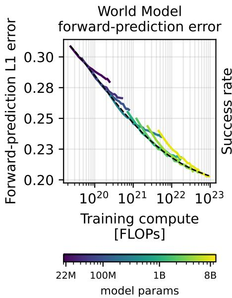

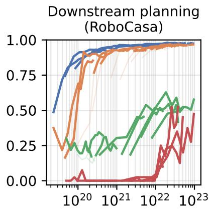  
Training compute RoboCasa tasks Short horizon, no object Short horizon, object interaction Long horizon, no object Long horizon, object interaction

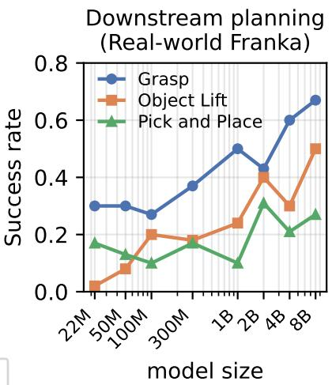  
Figure 1 RoboJEPA scales predictably from offline prediction to real-robot control. Left: the world model’s forward prediction (ℓ ) error, averaged over the DROID and RoboCasa held-out sets, follows a scaling law in training compute. Middle: downstream planning success in RoboCasa improves predictably with compute across tasks of increasing dificulty. Right: on the real Franka robot, the success rate improves with model size across Grasp, Object Lift, and Pick and Place. Actions are sampled from a uniform distribution and prioritized using the World Model during planning.

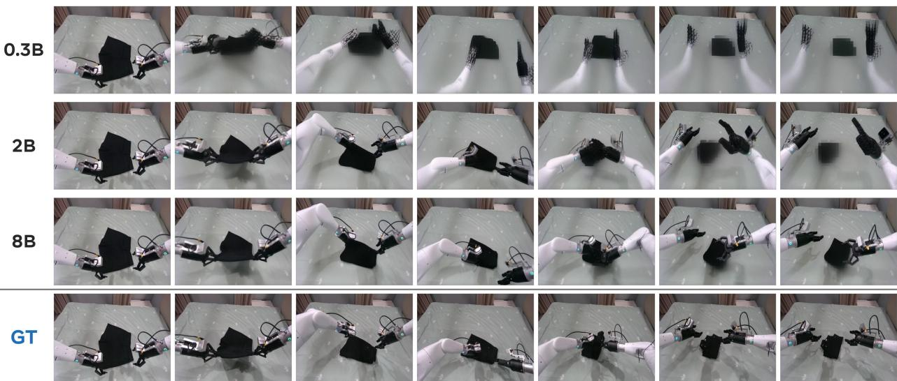  
Figure2 World-modelimaginationimproveswithscale. Decoded imagination rollouts on an AgiBot episode for RoboJEPA at 0.3B, 2B, and 8B parameters, compared against the ground-truth (GT) video (bottom row). Each row shows the same rollout sampled at equal-time steps; larger models track the true dynamics and preserve object and contac detail markedly better . All world models share the same encoder (V-JEPA 2.1-G) and decoder.

## 1 Introduction

Scaling has been one of the primary engines of recent progress in artificial intelligence. What makes scaling particularly actionable is predictability: empirical scaling laws relate a model’s loss to the amount of data, parameters, and compute used to train it, so that the return on an additional order of magnitude of compute can be forecast before it is spent (Kaplan et al., 2020; Hofmann et al., 2022). This predictability turns scaling from a gamble into a science, it tells practitioners how large a model to train for a given budget, how much data to pair it with, and when returns will diminish. Scaling laws of this kind have been established across language models (Kaplan et al., 2020; Hofmann et al., 2022), generative modeling of images, video, and other modalities (Henighan et al., 2020), or semantic classification of images (Zhai et al., 2022). Comparatively little is known about whether, and how, the same scaling predictability holds for models of the physical world.

We study this question for world models in robotics. A world model is a learned model of environment dynamics that an agent can roll out to imagine future states and plan (Ha and Schmidhuber, 2018; Hafner et al., 2023). We focus on latent world models that predict and plan in a latent representation space (Hafner et al., 2020; LeCun, 2022; Assran et al., 2025). Latent world models have shown the ability to plan toward goals specified at test time without the need of a task-specific policy (Assran et al., 2025). Previous latent world models are typically trained at a single scale, and how their quality changes with data, parameters, and compute has not been characterized (Assran et al., 2025; Hafner et al., 2025; Zhang et al., 2026). Other studies, focusing on scaling, either target generative video and interactive-environment models outside of robot control (Bruce et al., 2024; Google DeepMind, 2024; Hu et al., 2023), or scale policies rather than world models (Lin et al., 2025; Sartor and Thompson, 2024; Ai et al., 2025). In contrast, our goal is to establish scaling laws for latent world models. This matters particularly in robotics, where high-quality interaction data is scarce and computationally expensive to collect: knowing which capabilities a world model will have at a given training-compute budget lets practitioners decide whether to invest in a larger model, more demonstrations, or more compute, and reveals when a data budget has been saturated.

To this end, this work introduces RoboJEPA, a family of action-conditioned latent joint-embedding predictive world models. We keep the training recipe deliberatly simple to focus on the scaling behavior. RoboJEPA is a feed-forward transformer that predicts the next latent state deterministically in a single forward pass. It is trained with a plain $\ell _ { 1 }$ regression loss in the frozen encoder’s latent space. RoboJEPA operates in the representation space of a frozen V-JEPA 2.1 encoder (Assran et al., 2025; Mur-Labadia et al., 2026) and is trained on a unified mixture of 23 public manipulation datasets spanning 12 embodiments and 26 diferent action spaces. We study model scaling of the world model, ranging parameter count from 22M up to 8B, while holding the representation encoder fixed, so our laws characterize how a plannable dynamics model scales on top of a shared representation. We build scaling laws estimating the compute-eficient frontier of the forward-prediction evaluation loss as a function of the training compute (Kaplan et al., 2020; Pearce and Song, 2024).

Our central finding is that robotic world-model quality scales predictably with compute. First, the latent forward-prediction loss on out-of-distribution data follows a scaling law $L ( C ) = A C ^ { \alpha - \gamma \ln C } + E$ , where C is the training compute, $E$ is the irreducible loss, and $A , \alpha , \gamma$ are scaling-law parameters that we estimate alongside E. This holds on both real-robot holdout (DROID (Khazatsky et al., 2024)) data and simulated holdout (RoboCasa (Nasiriany et al., 2026)) data. Second, this improvement on the ofline data transfers to downstream planning performance on a robot: on a suite of RoboCasa planning tasks, downstream success improves predictably with training compute, so that a world model’s latent forward-prediction loss is a strong predictor of its online planning performance. For example, only models trained with more than $1 0 ^ { 2 2 }$ FLOPs of training compute (at sizes 2B, 4B, and 8B) can solve object-interaction tasks in RoboCasa via non-greedy planning, while smaller models trained with less compute cannot (see Figure 9).

We deploy RoboJEPA on real and simulated robots, planning toward a single goal image that defines the final state of the environment. Across two robot platforms, we perform planning in over 50,000 evaluation episodes. We keep the planning hyperparameters fixed for each robot, varying only the planning horizon for harder tasks. We perform planning on a set of real world manipulation tasks that include grasping, lifting, and pick-and-place. In simulation, our planning spans tasks of increasing dificulty from reaching to object pushing. We observe an improvement trend in the success rate on the real robot as we increase the model size. Qualitatively, we also observe that the behavior of the planning policies changes as the model grows: for example, in object-manipulation tasks, only models with 2B parameters or more keep the gripper closed after grasping to complete the task, while smaller models often accidentally open ${ \mathrm { i t } } ,$ dropping the object.

Finally, to support open research and reproducibility, we release all model checkpoints together with the training and robot-deployment code. To the best of our knowledge, this is the first work to establish computeoptimal scaling laws for action-conditioned robotic world models trained on large-scale, multi-embodiment real robot data, and the first scaling law for JEPA with verified extrapolation. We also train the largest JEPA predictor to date, at 8B parameters.

## 2 Method and Data

To study the scaling behavior of robotic world models, we require a model family that scales with training compute. To this end we introduce RoboJEPA, a family of action-conditioned latent world models . The goal of RoboJEPA models is to predict how the latent features of a scene will evolve under the robot’s actions. Formally, at timestep t, given a history of past visual features $z _ { \le t }$ (where $z _ { t }$ is the latent encoding of a given visual input $x _ { t } )$ , proprioceptive states $s _ { \leq t }$ , and actions $a _ { \leq t }$ , our models are functions $g _ { \theta }$ that deterministically predict the features of the next frame in one neural network forward pass:

$$
\hat { z } _ { t + 1 } = g _ { \boldsymbol \theta } \left( [ z _ { \le t } ] , a _ { \le t } , s _ { \le t } \right) .\tag{1}
$$

Actions are either state deltas, i.e. $s _ { t + 1 } = s _ { t } + a _ { t } .$ , or absolute robot commands, in which case $s _ { t } = 0$ . Feeding predictions back as inputs lets us roll the model out autoregressively over future actions, e.g.

$$
\hat { z } _ { t + 2 } ~ = ~ g _ { \theta } \bigl ( [ z _ { \le t } , \hat { z } _ { t + 1 } ] , \ a _ { \le t + 1 } , \ s _ { \le t + 1 } \bigr ) , \quad \hat { z } _ { t + 3 } ~ = ~ g _ { \theta } \bigl ( [ z _ { \le t } , \hat { z } _ { t + 1 } , \hat { z } _ { t + 2 } ] , \ a _ { \le t + 2 } , \ s _ { \le t + 2 } \bigr ) , \quad \ldots .\tag{2}
$$

This allows us to autoregressively roll out the world model to predict the efect of a sequence of actions on the latent features of the scene, and consequently to plan.

Planning in RoboJEPA is specified by a goal image encoded once into goal features $z _ { g } ,$ , and at every timestep t we search for the H-step action sequence whose imagined latent rollout comes closest to the goal:

$$
a _ { t : t + H - 1 } ^ { \star } = \arg \operatorname* { m i n } _ { a _ { t : t + H - 1 } } \big \| \widehat { z } _ { t + H } ( a _ { t : t + H - 1 } ) - z _ { g } \big \| _ { 1 } ,\tag{3}
$$

where $\hat { z } _ { t + H }$ is obtained by rolling g forward H steps from the current context under the action sequence $\scriptstyle a _ { t : t + H - 1 }$ . We optimize Equation (3) with the cross-entropy method (a concrete instance is given in Section 2.2 and appendix F).

The rest of this section describes the design and training of this family of world models and how to use them for planning, with the goal of subsequently studying their scaling behavior.

## 2.1 RoboJEPA Architecture

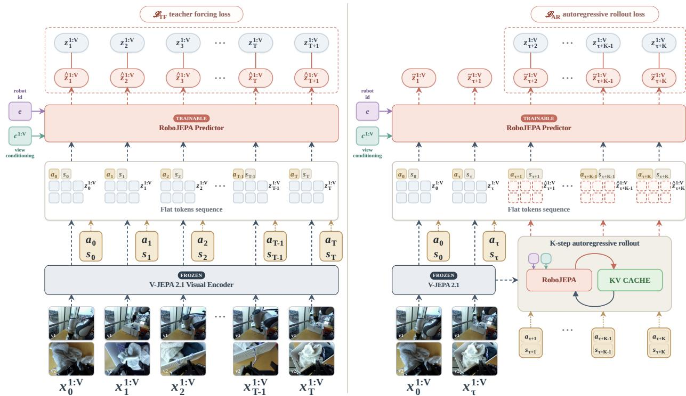  
Figure 3 RoboJEPA training. The frozen V-JEPA 2.1 encoder f (Mur-Labadia et al., 2026) maps the input multiview frames $x _ { t } ^ { ( 1 : V ) }$ to a grid of features. The predictor gθ consumes per-step sequences of multiview visual $( z _ { t } ^ { ( 1 : V ) } )$ , action $\left( \boldsymbol { a } _ { t } \right)$ and proprioceptive state $\left( { { s } _ { t } } \right)$ tokens, conditioned on view and embodiment identifiers, and predicts the next-step features $\hat { z } _ { t + 1 }$ . Training minimises two losses: (left) the teacher-forcing loss, the per-token $\ell _ { 1 }$ distance between predicted features and the next-step features from the encoder (Equation (5)); and (right) the rollout loss, which attempts to predict the same target sequence as the teacher-forcing loss, but given fewer input frames. The model is given the full training sequence of actions but only a prefix of the encoded features, and predicts the remaining features autoregressively, with a KV-cache. This way the model learns to make accurate long term predictions.

The family of RoboJEPA world models builds on the action-conditioned recipe of V-JEPA 2 (Assran et al., 2025) and V-JEPA 2.1 (Mur-Labadia et al., 2026). This subsection introduces the architecture of the Robo-JEPA predictor. The full list of diferences between RoboJEPA and V-JEPA 2-AC is summarised in Table 4 and detailed in Appendix A.

Scaling world models across robot datasets is challenging because each dataset comes with a diferent number of camera views, proprioceptive state size, and controller type and frequency. Therefore, we aim to build a world model architecture that can work with any combination of views, controller type, and proprioceptive information. At each timestep t, a frozen V-JEPA 2.1-G encoder maps up to V simultaneous camera views at resolution $H \times W .$ , each spanning T frames, denoted $\boldsymbol { x } _ { t } ^ { ( 1 : V ) } = \mathsf { \bar { ( } } \boldsymbol { x } _ { t } ^ { ( 1 ) } , \ldots , \boldsymbol { x } _ { t } ^ { ( V ) } )$ ), to the latent features $\boldsymbol { z } _ { t } ^ { ( 1 : V ) } = ( z _ { t } ^ { ( 1 ) } , \ldots , z _ { t } ^ { ( V ) } )$ , where each $\boldsymbol { z } _ { t } ^ { ( v ) }$ is an $H _ { p } \times W _ { p }$ grid of $D _ { e }$ -dimensional patch embeddings with $D _ { e } = 1 6 6 4$ and $H _ { p } = H / 1 6 , W _ { p } = W / 1 6$ . We use V-JEPA 2.1 as the encoder because early in the work we found that it leads to successful and predictable scaling of the world model, whereas V-JEPA 2 does not (we hypothesize why in Appendix K). Alongside these features, each timestep provides the action $a _ { t } \in \mathbb { R } ^ { d _ { a } }$ and proprioceptive state $s _ { t } \in \mathbb { R } ^ { d _ { s } }$ , while each input is associated with a robot type operating in a particular action space, identified by the robot id $e \in { \mathcal { E } }$ , and a per-view camera type $c ^ { ( v ) } \in \mathcal { C }$ . Here, E and C are finite sets of known robot ids and camera types. Next we describe how we tokenize inputs, and the world model architecture.

Table 1 Compressed view of the 23-dataset, 26-action-space mixture. Video hours sum the durations of all recorded videos. Action hours measure the total duration of teleoperation or policy execution, counted once regardless of the number of cameras. The per-dataset breakdown with resolutions and source FPS is in Table $7 ;$ sampling weights are in Table $\mathrm { 8 ; }$ and semantic-camera mappings are in Table 9. We report dataset sizes that we were able to collect and verify, which may be smaller than those reported in the original papers.
<table><tr><td>Dataset group</td><td>Episodes</td><td>Video hours</td><td>Action hours</td><td>Embodiments</td></tr><tr><td>DROID (Khazatsky et al., 2024)</td><td>92k</td><td>414</td><td>138</td><td>Franka</td></tr><tr><td>Roboset (Bharadhwaj et al., 2024)</td><td>73k</td><td>1244</td><td>380</td><td>Franka (Roboset)</td></tr><tr><td>RoboMind (Wu et al., 2024b)</td><td>35.3k</td><td>276</td><td>98</td><td>Franka, AgileX</td></tr><tr><td>LeRobot (Cadene et al., 2024)</td><td>21.5k</td><td>182</td><td>93</td><td>SO-101</td></tr><tr><td>RoboCasa365 (Nasiriany et al., 2026)</td><td>32k</td><td>482</td><td>482</td><td>Franka + Omron (sim)</td></tr><tr><td>1X (1X Technologies, 2024)</td><td>23.5k</td><td>90</td><td>90</td><td>1X humanoid</td></tr><tr><td>AgiBot World (AgiBot-World-Contributors et al., 2025)</td><td>167.5k</td><td>8036</td><td>2734</td><td>AgiBot dual-arm, humanoid</td></tr><tr><td>Open-X Embodiment (Open X-Embodiment Collaboration et al., 2023)1</td><td>2.4265M</td><td>4298</td><td>2677</td><td>8 platforms</td></tr><tr><td>Total</td><td>2.8713M</td><td>15,022</td><td>6,692</td><td>12 platforms /26 ids</td></tr></table>

Tokenization. We encode each modality separately and interleave the results into a single flat sequence. We refer to these encoded multimodal vectors as tokens. The motivation of our tokenization scheme is to let the model learn all temporal dependencies only from a structured sequence of tokens. To tokenize each $z _ { t } ^ { ( v ) }$ we project each patch from $D _ { e }$ to the world-model width D with a single linear layer, giving a visual token tensor of shape $[ T , V , H _ { p } , W _ { p } , D ]$ . Actions and proprioceptive states are mapped to D by linear encoders (specific to robot id) applied to $a _ { t }$ and $s _ { t }$

We interleave these tokens by timestep,

$$
\bigl ( z _ { 1 } ^ { ( 1 : V ) } , a _ { 1 } , s _ { 1 } \bigr ) , \bigl ( z _ { 2 } ^ { ( 1 : V ) } , a _ { 2 } , s _ { 2 } \bigr ) , \ldots , \bigl ( z _ { T } ^ { ( 1 : V ) } , a _ { T } , s _ { T } \bigr ) ,\tag{4}
$$

so that each timestep contributes $V H _ { p } W _ { p }$ visual tokens followed by one action and one state token. Beyond this ordering we impose no structure: the model consumes a flat sequence and recovers spatio-temporal and view structure from the position encodings and external conditioning information, such as the robot id and view type.

World Model Architecture. RoboJEPA performs the next embedding prediction via a deterministic model. RoboJEPA uses the vision transformer (Dosovitskiy et al., 2021) as the backbone and we parameterize the prediction such that each spatial input token of $ { \boldsymbol { z } } _ { t } ^ { ( 1 : V ) }$ predicts the corresponding spatial token of $z _ { t + 1 } ^ { ( 1 : V ) }$ . We use the frame-level causal attention mask so that queries that correspond to timestep t have only access to keys and values at step t or earlier. The model stacks L blocks that form a standard residual stream of ViT. The architecture of each block follows the standard recipe for modern variants of ViTs: we use prenormalization, Rotary Position Encoding (Su et al., 2024), RMSNorm normalization (Zhang and Sennrich, 2019), GELU feed-forward block (Hendrycks and Gimpel, 2016), and QK-normalization (Dehghani et al., 2023). We found QK-normalization to be of particular importance for training stability when scaling the dataset size and the model size.

Factorized RoPE and view conditioning. The spatio-temporal position information is supplied by a multi-axis Rotary Position Embedding (Su et al., 2024) that splits each head’s channels into four equal sub-blocks of width $d _ { h } / 4 ,$ , one for each of the four axes $( t , i , j , v )$ for time, height, width, and view, where $d _ { h }$ is the head dimension. Our version of RoPE rotates each independently by its own per-axis frequency (Appendix A.1). Action and state tokens have a temporal index but no spatial index, i.e. the 4D index of the action $a _ { t }$ would be (t, 0, 0, 0). We combine this 4D RoPE with a per-layer learnable view bias applied after RoPE. The idea is that the 4D RoPE informs the model that tokens belong to diferent views, while the view bias informs the model which content each view holds (e.g. left camera, wrist camera; Appendix A.2). This allows us to randomize the order of views and at the same time provide the information which views the model works with.

Attention pattern. We use joint space-time-view attention and do not factorize it, meaning that each token can have access to potentially all other tokens in the space-time-view sequence, unless restricted by the attention mask. However, using no mask would allow past token activations access future information that they need to predict. For example, token activations of $z _ { t }$ will have access to tokens of $z _ { t + 1 }$ in self-attention. Therefore, we use a timestep-causal mask (Assran et al., 2025; Po et al., 2025; PAN Team et al., 2025). That is, a query associated with timestep t has access to keys only at timestep t or less. This includes attention queries and keys associated with diferent views, actions, and states. In addition to that, we make the attention local by letting queries only access keys that are at most 8 timesteps in the past (Assran et al., 2025; Po et al., 2025; PAN Team et al., 2025). This design helps the model extrapolate to predicting longer sequences of embeddings because no query will ever attend to a history longer than the model was trained on, including during long autoregressive prediction. For implementation details on the attention masking, see Appendix A.3.

Outputs. After feeding the entire sequence of tokens through the backbone, we project tokens that correspond to $\overset { \cdot } { z } _ { 1 : T } ^ { ( 1 : V ) }$ back to the encoder space. We map the output from D dimensions to $D _ { e }$ dimensions and apply layer normalisation. The idea is that since both input and output features are normalized, this strenghtens the learning signal and lowers the gap between the training and the autoregressive generation. We do not use any learnable modules to predict states and we simply compute the proprioceptive state $s _ { t }$ either through integration, i.e. $s _ { t + 1 } = s _ { t } + a _ { t } , \operatorname { o r } s _ { t } = 0$ (for example when working with commanded actions with non-trivial robot dynamics).

Training objective. We train the world model to predict the next embedding and, to minimize exposure bias, we additionally train it on its own outputs over potentially long horizons. Our objective therefore has two loss components. The first component trains the model to predict every next embedding along a sequence of encoded multiview frames. The second component uses the same objective, but the model is given only a prefix of fewer encoded frames (but the entire sequence of actions); it then predicts the missing embeddings autoregressively (Equations (1) and (2)) and is trained on them with the same objective. We use a key-value cache to speed up this autoregressive prediction (Section 2.2 and appendix H). While the first loss component ensures that the model predicts the representations of a fixed encoder, the second makes the world model robust to its own errors and suppresses error accumulation. Both components use the same per-token $\ell _ { 1 }$ objective, and the total loss is their average:

$$
\mathcal { L } _ { \mathrm { T F } } = \sum _ { t , v } \big \Vert \hat { z } _ { t + 1 } ^ { ( v ) } - z _ { t + 1 } ^ { ( v ) } \big \Vert _ { 1 } , \quad \mathcal { L } _ { \mathrm { A R } } = \sum _ { t , v } \big \Vert \tilde { z } _ { t + 1 } ^ { ( v ) } - z _ { t + 1 } ^ { ( v ) } \big \Vert _ { 1 } , \quad \mathcal { L } = \frac { 1 } { 2 } \mathcal { L } _ { \mathrm { T F } } + \frac { 1 } { 2 } \mathcal { L } _ { \mathrm { A R } } ,\tag{5}
$$

where $\hat { \mathcal { z } } _ { t + 1 } ^ { ( v ) }$ is the teacher-forced one-step prediction and $\tilde { z } _ { t + 1 } ^ { ( v ) }$ is the autoregressive prediction rolled out from a shorter prefix, both compared against the encoder feature $z _ { t + 1 } ^ { ( v ) }$ . The full form of the loss (with the perframe mask and patch normalization), the rollout schedule, and the optimizer are described in Section 2.2 and appendix C.

## 2.2 Data, Training and Inference

Data. Training a world model that generalizes across robot embodiments and scenes requires both scale and diversity. We assemble 23 public manipulation datasets spanning 12 robot platforms—single- and dual-arm robots and humanoids—across real and simulated data. The compiled dataset contains 15,022 hours of video, including 6,692 hours synchronized with actions; some demonstrations are recorded from multiple cameras. Some platforms record with only one camera (e.g. most of Open-X Embodiment data), whereas others use two or three cameras (e.g. DROID and RoboSet). In addition, the datasets were collected with diferent robot action spaces, camera poses, sensor resolutions, and frame rates. Therefore, to build a data-scalable world model, we unify our training datasets and formulate the architecture and training recipe to be general enough to work with any robotic dataset. Table 1 summarizes the mixture, and Appendix B provides further details about its action spaces, unification, and sampling.

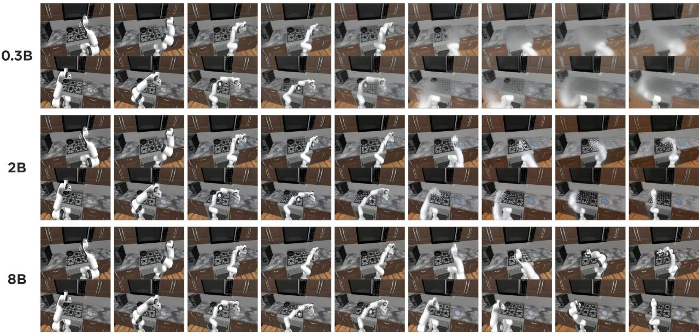  
Figure 4 Two-view imagination scales in simulation. First 60 s of a RoboCasa rollout (two agent-view cameras, stacked within each cell) imagined by RoboJEPA at 0.3B, 2B, and 8B parameters. Larger models keep the two views mutually consistent and preserve manipulation detail markedly deeper into the rollout. All world models share the same encoder (V-JEPA 2.1-G) and decoder.

Training. We train a series of RoboJEPA models that range in size from 22M to 8B parameters and in training compute from $2 \times 1 0 ^ { 1 9 }$ to $9 . 5 \times 1 0 ^ { 2 2 }$ FLOPs. For all models, we use AdamW (Loshchilov and Hutter, 2019) with a weight decay of 0.1 and global gradient-norm clipping at 1.0. We linearly warm up the learning rate, hold it constant at a peak of $5 \times 1 0 ^ { - 5 }$ for most of training, and then linearly decay it to zero over a short cooldown phase at the end (Hu et al., 2024). This allows us to overlap the flat learning-rate stage across models trained with diferent amounts of compute: we run the flat stage only once and perform learningrate annealing from intermediate checkpoints. For the detailed description of the training configuration and hyperparameters, please refer to Appendix C.

The training recipe of RoboJEPA is designed to facilitate scaling the model on as much data as is available, which requires training on many heterogeneous robotic datasets at once. A central issue with such heterogeneous data is that some datasets supply only a single view while others provide multiple views, often at diferent resolutions. We therefore train the model to work with a variable number of views and a variable resolution. To achieve this, we partition the GPUs into groups, where all GPUs within a group work with the same number of views and the same resolution. In practice this often leads to imbalanced step times across groups, which is why we balance these times by using diferent batch sizes for diferent groups. Our initial scaling-law experiments were done at a resolution of 240×320 with only two GPU groups: one working with single-view data and the other with dual-view data. However, eventually we found it beneficial to include high-resolution GPU groups, resulting in four groups: single-view low-resolution (240 × 320), dual-view low-resolution, single-view high-resolution $( 4 8 0 \times 6 4 0 )$ , and dual-view high-resolution. We describe the GPU grouping and batch-size balancing in detail in Appendices C.1 and C.2.

Inference and Planning. RoboJEPA performs planning by predicting the future in the latent space and searching over the action sequence that brings that future to the desired goal. We employ receding-horizon CEM (Rubinstein, 1997; de Boer et al., 2005) as our planning algorithm with image goals; importantly, we use only a single image goal that represents the final state of the task, and we do not use subgoals. Notably, we run all planning with the same set of hyperparameters across embodiments and tasks. This process requires running thousands of forward passes of the world model, which is prohibitively expensive if the full history is recomputed every step. Therefore, we employ a rolling KV-cache that reuses the keys and values of past steps in self-attention. This way, at every step the model only processes a single frame, action, and proprioceptive vector, while the past information is provided by the cache (see Appendix H). Additionally, we employ PyTorch compilation to further speed up inference. However, in the typical planning scenario we need to run compiled inference during planning on the real robot, and since first-time compilation is time-consuming, running planning with compilation can become prohibitively slow in practice. This is why we build a simple inference engine that precompiles the inference computation and saves it to disk, and at planning time simply loads it back (see Appendix I.2). Finally, since CEM planning is heavily parallelizable, we connect the robot directly to the GPU cluster and run the planning on multiple GPUs. This way, we make the planning fast enough to be practical: while it is not real-time, it takes only several seconds to perform a multi-step planning even for an 8B model.

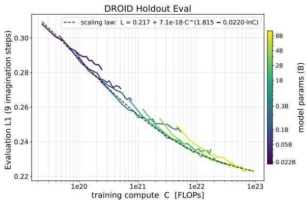  
(a) DROID holdout (real Franka, unseen scenes).

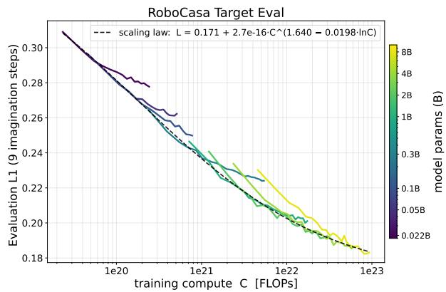  
(b) RoboCasa target scenes (simulation).  
Figure 5 World-model scaling laws. Out-of-distribution forward-prediction $L _ { 1 }$ error versus training compute for Robo-JEPA models from 22M to 8B parameters (color), evaluated on a real-robot DROID holdout and simulated RoboCasa scenes. The compute-optimal frontier (lower envelope) follows the second-order power law $L ( C ) { = } E { + } A C ^ { \alpha - \gamma }$ ln C (dashed).

## 2.3 Diffusion Decoder

To qualitatively understand the capabilities of our world models, we train a difusion decoder that produces pixel outputs from the predicted features; its goal is to visualize the forward predictions of the world model. The decoder is a difusion model (Ho et al., 2020; Song et al., 2021) that denoises the continuous video tokens of the Cosmos tokenizer (NVIDIA, 2025)1 spatially conditioned on the V-JEPA 2.1 features. The purpose of using a generative model here is that the decoder does not merely convert the V-JEPA features into Cosmos tokens, but also imagines unseen motion. During the training of the decoder, we compute V-JEPA features with a frame skip of 4 frames, whereas the Cosmos tokens compress the same frames without any frame skip. As a result, the Cosmos tokens contain more information than the original V-JEPA feature frames, and this extra information — precisely, the 3 RGB frames between consecutive frames encoded by the V-JEPA encoder — must be generated. With such a decoder, we can run forward prediction with the world model at, for example, 5 Hz actions, producing latent features at the same rate, and then use the decoder to expand them into an RGB stream at 20 FPS that covers exactly the same motion. Full architecture, training, and sampling details are in Appendix D.

## 3 Experiments

## 3.1 World Model Scaling Laws

Our goal is to empirically find the concrete functional form of the scaling law that allows us to extrapolate predictions about the performance of the RoboJEPA model trained at larger scales. We consider four candidate functional forms. First, the standard power law $L ( C ) = E + A C ^ { \alpha }$ (Henighan et al., 2020), whose exponent α is constant. Second, a generalization whose exponent itself changes linearly with compute,

Table 2 Variants of parametric curves as scaling-law candidates for the $L _ { 1 }$ rollout error of RoboJEPA world models. Curve fits use models sized 22M–2B parameters; we report held-out extrapolation error at 4B and 8B for DROID and RoboCasa. The BNSL and UNSL functional forms and their fitted parameter values are in Appendix J.
<table><tr><td rowspan="2">Parametric Curve</td><td colspan="2">Curve parameters</td><td colspan="2">Extrapolation Error (4B and  $8 \mathrm { B } ) , \times 1 0 ^ { - 3 }$ </td></tr><tr><td>DROID</td><td>RoboCasa</td><td>DROID</td><td>RoboCasa</td></tr><tr><td> $L ( C ) = E + A C ^ { \alpha }$ </td><td> $E { = } 0 . 1 8 2 , \ A { = } 1 0 8 . 8 , \ \alpha { = } { - } 0 . 1 5 1$ </td><td> $E { = } 0 . 0 7 5 , \ A { = } 2 3 . 2 , \ \alpha { = } { - } 0 . 1 0 3$ </td><td>2.0</td><td>3.7</td></tr><tr><td> $L ( C ) = E + A C ^ { \alpha - \gamma \ln C }$ </td><td> $E { = } 0 . 2 1 8 , \ A { = } 7 . 9 6 { \times } 1 0 ^ { - 1 9 }$   $\alpha { = } 1 . 9 1 , ~ \gamma { = } 0 . 0 2 3 0 8$ </td><td> $E { = } 0 . 1 7 0 9 , \ A { = } 1 . 6 6 { \times } 1 0 ^ { - 1 7 }$   $\alpha { = } 1 . 7 6 1 , ~ \gamma { = } 0 . 0 2 1 0 5$ </td><td>0.6</td><td>1.4</td></tr><tr><td> $\mathrm { B N S L } \ ( \mathrm { C a b a l l e r o \ e t \ a l . } , 2 0 2 2 ) , n { = } 1$ </td><td colspan="2">Appendix J.1</td><td>1.0</td><td>1.8</td></tr><tr><td> $\mathrm { U N S L } \ ( \mathrm { C a b a l l e r o \ e t \ a l . } , 2 0 2 6 ) , n { = } 1$ </td><td colspan="2">Appendix J.2</td><td>1.4</td><td>5.7</td></tr></table>

$L ( C ) = E + A C ^ { \alpha - \gamma \ln C } ;$ we refer to the former as a first-order and to the latter as a second-order power law2. Finally, the Broken (Caballero et al., 2022) and Unified (Caballero et al., 2026) Neural Scaling Laws. Here, C is the total training compute (in FLOPs) and $L ( C )$ is the world model’s forward-prediction error, i.e. the per-token $\ell _ { 1 }$ distance between the predicted and the encoder features, averaged over a 9-step latent rollout on held-out data. Among these four forms, we find that RoboJEPA predictably follows the second-order power law.

Setup. We evaluate each model trained at each compute budget by its forward-prediction $L _ { 1 }$ error, $L ( C )$ on held-out data. Importantly, this is the same per-token $L _ { 1 }$ objective the model is trained on and that the planner minimizes at deployment (Equation (5)). We report $L ( C )$ on two embodiments, a DROID holdout dataset collected on a real robot and a simulated RoboCasa suite. Evaluation is always on scenes unseen during training, always uses two views: one side camera (left or right) and one wrist camera, and predicts nine future steps from an initial observation under the recorded action sequence, giving a ten-step sequence in total. Further evaluation details are provided in Appendix J. For each model at each training duration we compute the total training compute C exactly, by counting the FLOPs of every operation in one training step and multiplying by the number of steps taken across all stages. We plot the prediction error for every model and training duration against its total training compute. At each compute budget, we retain the lowest error across model sizes. These best-achievable errors form the compute-optimal frontier as a function of the training compute. Finally, we fit each candidate curve to the frontier points of the smaller models (22M–2B) and select as our scaling law the one that best extrapolates to the held-out 4B and 8B models.

Results. Table 2 compares the four candidate curves by how well a fit on the smaller models (22M–2B) extrapolates to the held-out 4B and 8B models. The second-order power law extrapolates best, with a heldout error of 0.6 and $1 . 4 \times 1 0 ^ { - 3 }$ on DROID and RoboCasa respectively, roughly 2–3× lower than the standard power law (2.0 and $3 . 7 \times 1 0 ^ { - 3 } )$ and below both BNSL and UNSL. We therefore adopt it as our scaling law. Figure 5 plots the forward-prediction error against training compute for all models. The lower envelope across model sizes forms the compute-optimal frontier, and no model size lies on the frontier entirely. In addition, Figure 5 plots the scaling law computed on all models as the dashed line. Interestingly, the two best candidates, the second-order law and BNSL, estimate nearly the same irreducible error, ≈ 0.2 on DROID and ≈ 0.17 on RoboCasa, indicating that RoboJEPA is close to saturation on both evaluations under its current training and data budget.

## 3.2 Downstream Planning Scaling

Having identified an improvement trend in ofline performance of world models, we hypothesize that this improvement translates to the world model’s physical understanding of the new environment in which it operates. For example, is the action conditioning accurately mapped to the correct movements of the robot in the representation space? Are the grasping and object interaction actions correctly represented by the world model in response to incoming action? We test this hypothesis via online planning with image goals. Section 3.1 introduced the predictable improvement in ofline forward-prediction, and we verify that this

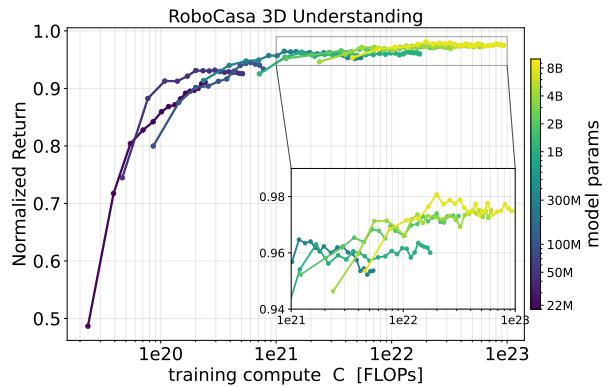  
(a) The normalized return for the pose reach task in Robo-Casa environment evaluated in unseen kitchens.

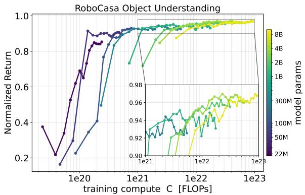  
(b) The normalized return for the task of pose reach while holding an object.  
Figure 6 Downstream planning success scales with training compute. Median success rate on the reach task versus total training compute, following a power-law fit.

improvement translates into a better success rate.

To test this hypothesis, we build a set of interactive environments on top of RoboCasa 365 (Nasiriany et al., 2026), each isolating one basic capability, and test whether more training compute improves it. In this section we focus on greedy tasks, which can be solved by one-step planning where simply moving toward the goal at every step is enough. (i) 3D understanding (pose reaching): reach a target end-efector pose in as few steps as possible. (ii) Object understanding (pose reaching while holding an object): reach a target pose while holding a grasped object, so the planner must additionally search over gripper actions to avoid dropping it. Harder tasks that require non-greedy, longer-horizon planning — such as moving around an obstacle or pushing an object to a target — are studied in Section 3.3. Full environment and reward details are in Appendix G.4.

We use the same range of RoboJEPA checkpoints as in Section 3.1 and run each of them in our RoboCasa environments with closed-loop planning (Mayne et al., 2000), where the model re-plans toward the goal image after every executed action (full protocol in Appendix G.4). Figure 6 shows the evaluation results, measured by the simulator’s normalized cumulative reward on the performed trajectory (Appendix G.4). Just like with the ofline performance, we see a clear improvement trend of the downstream performance as we scale the training compute. For both tasks, models form a clear performance frontier, with larger models surpassing smaller ones as the training compute grows. For example, the simplest end-efector 3D movement capabilities emerge after around $1 0 ^ { 2 0 ^ { \circ } }$ FLOPs while the basic capability of moving while holding an object emerges at around $3 \times 1 0 ^ { 2 0 }$ FLOPs of training, both of which correspond to training 50M–100M-parameter models on the full multi-embodiment dataset. Due to the simplicity of these tasks, performance saturates early. Therefore, for building robotic world models, we recommend first building downstream evaluations that reflect the desired capabilities, then estimating the minimal training compute required to achieve them.

## 3.3 Better Scaling for Long Horizon Planning

With the established transfer from ofline performance to online greedy performance in Sections 3.1 and 3.2, we now ask whether the same ofline-to-online connection holds for non-greedy, longer-horizon tasks that cannot be solved in one step. We design two such tasks in RoboCasa. The first is an obstacle-reach task: the goal is again to reach a target end-efector position, but we place a large object (a kitchen appliance) as an obstacle so that a direct straight-line motion cannot reach the goal. The second is an object-push task, where an object is placed on the table in front of the robot and the goal is to move it toward a target position, which requires the arm to descend to the object, push it, and ascend back. Full task definitions are in Appendix G.4.

We first deploy the models trained with the recipe of Section 3.1 on the obstacle-reach task. Figure 7 shows that the final reward correlates with training compute, but the correlation is weak and no clean compute

frontier emerges: smaller models often beat larger ones (for example, the 300M planner reaches a higher final reward than the 1B one). Unlike the greedy tasks of Section 3.2, predictable scaling does not emerge for longer-horizon tasks, which we attribute to a mismatch between training and deployment. Planning on these tasks relies on accurate long-horizon prediction, yet the models were trained with only a short autoregressive rollout $( K = 2 { \mathrm { ~ s t e p s } } )$ We therefore align training with how the model is used at test time and increase the training rollout to $K = 1 0$ steps during the cooldown, together with higher-resolution inputs. We refer to the two cooldown recipes as shorthorizon prediction training $( K = 2 , 2 4 0 \times 3 2 0 )$ and long-horizon prediction training $( K = 1 0 ,$ a mix of $2 4 0 \times 3 2 0 ~ \mathrm { a n d } ~ 4 8 0 \times 6 4 0 )$ . Retraining every model from scratch this way would be prohibitively computationally expensive, so we run the long-horizon

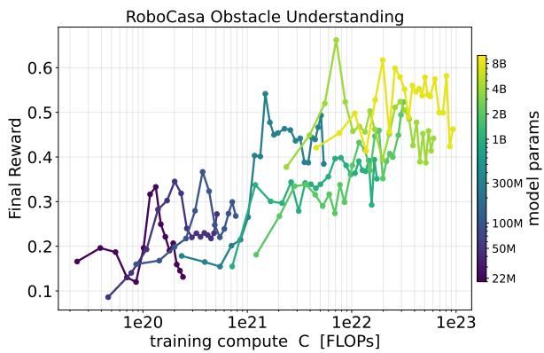  
Figure 7 Short-horizon prediction training on obstacle-reach. Final reward versus training compute. The reward correlates with compute, but no clean frontier emerges and smaller models often beat larger ones.

cooldown only from the flat-learning-rate pretraining checkpoints (Section 2.2): the long flat-learning-rate stage only needs to learn the coarse dynamics cheaply, and the computationally expensive long-rollout, highresolution signal is spent where it matters, in the final annealing phase.

Figure 8a compares the two recipes by their scaling laws on DROID and RoboCasa. Long-horizon prediction training is more computationally expensive per step, but it becomes more compute-eficient beyond about $1 0 ^ { 2 1 }$ FLOPs of total training compute (around 300M–1B parameters at the compute-optimal frontier) and reaches a substantially lower forward-prediction error. It also lowers the irreducible error of the fit, indicating a genuine reduction in error accumulation.

Deploying the non-greedy planning models on the obstacle-reach task (Figure 8b) significantly improves the trend: the final reward now strongly follows the predictable scaling pattern. Small models (below 300M parameters) cap at around 0.3, which corresponds to the end-efector remaining stuck on the wrong side of the obstacle. The obstacle-avoidance capability then takes of around $1 0 ^ { 2 1 }$ FLOPs and saturates around $1 0 ^ { 2 2 }$ FLOPs. This is much later than the end-efector capabilities of Section 3.2, which emerged around $1 0 ^ { 2 0 } -$ $3 \times 1 0 ^ { 2 0 }$ FLOPs, indicating that modeling interaction with the static scene geometry requires considerably

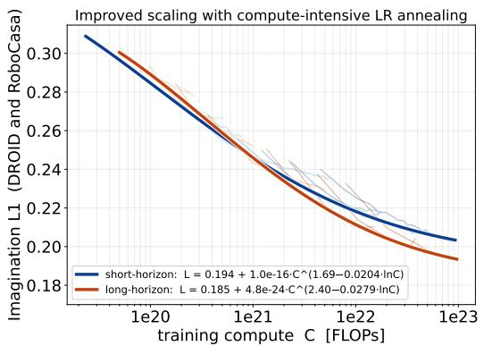  
(a) Imagination error scaling for short- vs. long-horizon prediction training.

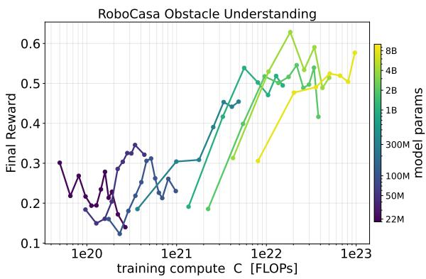  
(b) Obstacle-reach final reward, long-horizon prediction training.  
Figure 8 Longer-horizon prediction training improves scaling and downstream long-horizon planning. (a) Second-order scaling laws of the imagination error on DROID and RoboCasa for the two cooldown recipes. (b) Obstacle-reach final reward versus total training compute for the long-horizon $( K = 1 0 )$ models.

more training.

Finally, the object-push task assesses the object interaction understanding (through non-greedy planning) by the world model: because the robot’s start and goal poses are identical (so the side and wrist views change only through the object’s position), the model must understand that pushing the object is what changes the scene. Figure 9 shows the success rate, defined simply as whether the object moved toward its target position (Appendix G.4). Interestingly, no model achieves a positive success rate until around $1 0 ^ { 2 2 }$ FLOPs, after which all models begin to succeed, suggesting that fine-grained understanding of surrounding objects emerges after certain training computation regardless of the model size. In summary, these results align in a natural order in which capabilities appear with more compute: first the 3D control of the end-efector, then manipulating a grasped object, then the geometry of the static scene, and finally the dynamics of objects in the scene.

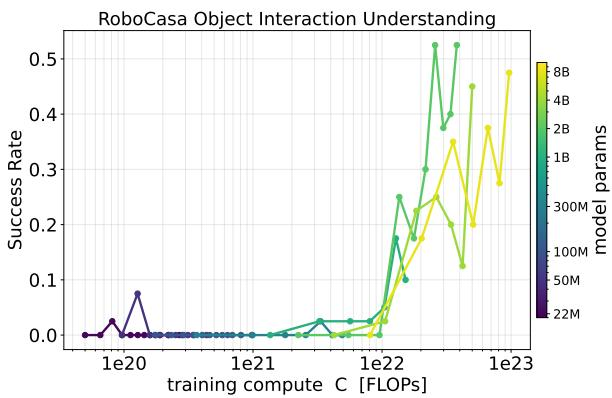  
Figure 9 Downstream success rate on the RoboCasa push task versus training compute, for the long-horizon $( K = 1 0 )$ models.

## 3.4 Real World Robotic Capabilities

Our ultimate goal is to showcase the capabilities of RoboJEPA in real-world settings. As a step towards this goal, we deploy RoboJEPA models ranging from 22M to 8B parameters on the DROID (Khazatsky et al., 2024) platform with a single-arm Franka robot and two cameras: an external camera mounted to the left of the arm and a wrist camera using the standard DROID mount. To deploy RoboJEPA via planning, we record an image goal on the robot by executing a predefined robot motion and manually placing the object in the grasping position so the robot can interact with it. We provide only a single final image goal, requiring longer-horizon, non-greedy planning. We evaluate three tasks: Grasp, Object Lift, and Pick and Place. We use the same planning hyperparameters across tasks and model sizes, evaluating the highest-compute checkpoint at each size. Setup, task definitions, episode counts, scor-

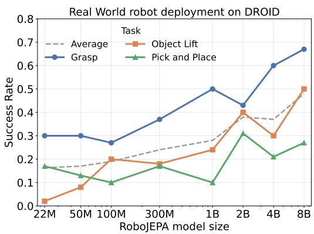  
Figure 10 Real-world deployment on DROID. Success rates across model sizes for three manipulation tasks; the dashed line shows their average.

ing criteria, and planning hyperparameters are detailed in Appendices G.1 to G.3.

To contextualize the RoboJEPA results, we also evaluate the Vision-Language-Action (VLA) models $\pi _ { 0 } -$ FAST (Pertsch et al., 2025) and $\pi _ { 0 . 5 }$ (Black et al., 2025). However, their deployment difers in goal specification (text instructions versus a single goal image) and training (DROID fine-tuning for the VLA baselines versus pretraining on a mixture that includes DROID for RoboJEPA). Neither RoboJEPA nor the VLA baselines receive task-specific fine-tuning. These diferences make the VLA results contextual references rather than directly comparable baselines. Figure 10 shows the scaling trend. For each task, all RoboJEPA models, including very small models, demonstrate non-zero success rates. Overall, success rates show a clear trend of improving with model size and generally decreasing with task complexity. This picture does not hold for the reference models, which work best on Pick and Place, the hardest task, but degrade significantly on the others. For example, $\pi _ { 0 . 5 }$ achieves a 53% success rate on Pick and Place but 0% on Object Lift. We hypothesize that this diference may be an artifact of training, as verbs such as “lift” are heavily underrepresented in the DROID dataset, which focuses mostly on pick-and-place tasks. Due to the planning nature of the agent and the task specification as an image goal, RoboJEPA models are not susceptible to this type of degradation. Qualitatively, behavior transitioned gradually from smooth but less adaptive execution in smaller models to more reliable recovery from mistakes in larger models (Appendix G.7). Table 3 reports task progress and success rates for the largest RoboJEPA models and VLA references.

Table 3 Real-robot task progress and success rates (%). Full results are in Table 12.
<table><tr><td rowspan="2">Model</td><td rowspan="2">Goal</td><td colspan="2">Grasp</td><td colspan="2">Object Lift</td><td colspan="2">Pick and Place</td></tr><tr><td>Progress</td><td>Success</td><td>Progress</td><td>Success</td><td>Progress</td><td>Success</td></tr><tr><td>π0-FAST</td><td rowspan="2">Text</td><td>35</td><td>22</td><td>20</td><td>12</td><td>55</td><td>40</td></tr><tr><td>π0.5</td><td>25</td><td>5</td><td>12</td><td>0</td><td>69</td><td>53</td></tr><tr><td>RoboJEPA-4B</td><td rowspan="2">Image</td><td>60</td><td>60</td><td>54</td><td>30</td><td>49</td><td>21</td></tr><tr><td>RoboJEPA-8B</td><td>67</td><td>67</td><td>65</td><td>50</td><td>42</td><td>27</td></tr></table>

## 3.5 Qualitative Analysis

So far we have quantified the world model through its prediction loss and downstream planning success; we now inspect how the prediction improves qualitatively by decoding its latent rollouts back to pixels. To do that, we use the difusion decoder introduced in Section 2.3. The decoder serves purely as a visualization tool and is trained only on the frozen V-JEPA 2.1-G encoder features (see Appendix D). Note that all visualizations use the same encoder and decoder and vary only the RoboJEPA world model size. We perform forward prediction given a single frame (or a pair of frames) and a sequence of robot actions, and each sequence of predicted embeddings is decoded back to pixels. We run the prediction across a range of settings low- and high-resolution, single- and dual-view — and report them separately (Figures 2 and 4; full set in Appendix E); the decoder itself is trained at a single 240×320 resolution. These visualizations show that the forward-prediction improves with model scale in several concrete ways: larger models track the true dynamics more accurately over the rollout, preserve object identity and fine manipulation detail, and keep multiple camera views mutually consistent. Several behaviors are efectively emergent with scale — gripper–object contact and structured deformation such as folding appear only once the predictor is large enough, whereas smaller models blur these interactions away. Finally, we finetune the 8B version of RoboJEPA on DROID to imagine all three camera views simultaneously at high (720p) resolution (Appendix C.4; Figure 11). These rollouts demonstrate that RoboJEPA performs accurate object manipulation even at very high resolution, and they exhibit strong cross-view information transfer, with content from the side (exterior) cameras propagating into the wrist-camera imagination.

## 4 Related Work

Joint-Embedding Predictive Architectures. Joint-Embedding Predictive Architectures (JEPAs) were proposed as a path towards self-supervised models that learn abstract representations of the world by predicting in a latent space rather than at the pixel level (LeCun, 2022). I-JEPA (Assran et al., 2023) instantiated this recipe for images by predicting the representations of masked image regions from visible context, avoiding pixel-level reconstruction and the resulting collapse to low-level texture. V-JEPA extended the framework to video by predicting masked spatio-temporal feature regions and showed that the resulting features capture motion and temporal structure (Bardes et al., 2024). Assran et al. (2025) scaled feature prediction to over a million hours of internet video and, crucially for our setting, post-trained an action-conditioned predictor (V-JEPA 2-AC) on a small amount of unlabeled robot interaction data, enabling zero-shot Franka manipulation by latent planning against image goals. Our work, RoboJEPA, is similar to V-JEPA 2-AC in terms of the approach. We keep the V-JEPA encoder frozen and focus on the action-conditioned predictor as a world model. However, compared to V-JEPA 2 AC, we replace the small post-training corpus with a unified, large-scale mixture of robot demonstrations, therefore, the methods are not apples-to-apples comparable. To our knowledge, we provide the first systematic recipe for scaling V-JEPA-style action-conditioned predictors on large-scale, multi-embodiment robot data, and we characterize how predictor performance scales with parameters and demonstration tokens.

World Models for Robotics. World models compress experience into a learned simulator of the environment that an agent can train and plan in (Ha and Schmidhuber, 2018). The Dreamer family pioneered this paradigm at scale: PlaNet learned latent dynamics for planning from pixels (Hafner et al., 2019), Dreamer used latent imagination to learn behaviors (Hafner et al., 2020), DreamerV2 introduced discrete latents to master Atari (Hafner et al., 2021), and DreamerV3 demonstrated a single set of hyperparameters that succeeds across a wide range of domains including 3D control (Hafner et al., 2023). DayDreamer applied Dreamer directly to physical robots and learned locomotion and manipulation in the real world (Wu et al., 2023), while Masked World Models showed that decoupling visual representation learning from dynamics modeling improves sample eficiency (Seo et al., 2023). More recent work has scaled video-based world models with transformer and difusion backbones: IRIS (Micheli et al., 2023) and iVideoGPT (Wu et al., 2024a) treat world modeling as autoregressive token prediction; UniSim (Yang et al., 2024), Genie (Bruce et al., 2024), and GAIA-1 (Hu et al., 2023) train large generative simulators of interactive scenes; and the Cosmos platform releases physical-AI world foundation models at industrial scale (NVIDIA, 2025). In contrast to these pixelspace generators, RoboJEPA predicts in the representation space of a frozen V-JEPA encoder, which is what allows us to scale the predictor to billions of parameters on robot data without paying the computational cost of pixel-level reconstruction at every step.

Planning with Learned World Models. A central use of a world model is test-time planning. Classical modelbased control methods such as PETS (Chua et al., 2018), model-based RL with neural network dynamics (Nagabandi et al., 2018), and visual foresight (Finn and Levine, 2017) optimize action sequences against a learned dynamics model. Sampling-based shooting methods, in particular the Cross-Entropy Method (Rubinstein, 1997; de Boer et al., 2005) and Model Predictive Path Integral control (Williams et al., 2017), remain the workhorses for high-dimensional action search. TD-MPC and TD-MPC2 combine latent dynamics, value learning, and CEM-style trajectory optimization for robust continuous control (Hansen et al., 2022, 2024). DINO-WM (Zhou et al., 2025) learns task-agnostic dynamics in DINOv2 feature space from ofline trajectories using an approximately 20M-parameter predictor, and uses CEM to plan toward image goals without additional task-specific training. RoboJEPA follows this line: at deployment, we use CEM in the latent space of the world model to score action sequences by how close their predicted features land to a goal image’s features, and execute the first action of the best plan in receding-horizon fashion.

Closely related to our work, Terver et al. (2026) investigate how architectural, training, and planning choices afect latent world-model performance, including model and data scaling, albeit at smaller scales. Their proposed DROID predictor has approximately 229M parameters and is trained on an 8,000-trajectory dataset. We extend this investigation both by scaling to substantially larger world models (up to 8B parameters) and datasets (a mixture of approximately 2.87M trajectories across 12 robot platforms) and by explicitly studying their scaling behavior through scaling laws.

Robotic Foundation Models from Demonstrations. A complementary line of work scales policies directly on robot demonstrations rather than scaling world models. RT-1 (Brohan et al., 2023) and RT-2 (Zitkovich et al., 2023) train large transformer- and vision-language-action policies on broad manipulation data. Open X-Embodiment Collaboration et al. (2023) aggregate demonstrations across many embodiments to enable cross-embodiment generalist policies, and a wave of recent generalist models such as Octo (Ghosh et al., 2024), OpenVLA (Kim et al., 2024), and π (Black et al., 2024) push this behavior-cloning recipe further. RoboJEPA shares the same data substrate (in particular Open X-Embodiment, DROID (Khazatsky et al., 2024), RoboMIND (Wu et al., 2024b), BridgeData V2 (Walke et al., 2023), LeRobot (Cadene et al., 2024), and AgiBot World (AgiBot-World-Contributors et al., 2025)), but trains a goal-agnostic, action-conditioned predictive model instead of a task-conditioned policy. The same world model can then be used to evaluate or improve any policy, and to plan zero-shot for new goals at test time.

Scaling Laws. Power-law scaling of model loss with parameters, data, and compute has been documented extensively for language models (Kaplan et al., 2020), generative modeling more broadly (Henighan et al., 2020), and vision transformers (Zhai et al., 2022), with compute-optimal allocations of model and data established by Chinchilla (Hofmann et al., 2022). In robotics, however, scaling laws are largely an open question because high-quality interaction data is scarce. We provide, to our knowledge, the first systematic scaling study for action-conditioned world models trained on large-scale, multi-embodiment real robot demonstrations, characterizing how forward-prediction loss scales with predictor parameters and demonstration tokens, and showing that this scaling behavior transfers to downstream planning performance.

Scaling world models. A growing body of work reports that world models improve with scale. In autonomous driving, the GAIA line of latent-difusion world models has been scaled to billions of parameters for controllable simulation and ofline evaluation (Russell et al., 2025; Wayve, 2025, 2026), though technical details beyond GAIA-2 are not publicly available. Pearce et al. (2024) fit power laws for pre-trained agents and world models and, in their appendix, report scaling laws for a robotic world model, but their study is oth erwise centered on game and simulated environments rather than large-scale real-world multi-embodiment robot data. Sato et al. (2023) study how world-model quality varies with model size; IRASim (Zhu et al., 2025) reports empirical scaling trends for a fine-grained video world model for manipulation; PointWorld (Huang et al., 2026) shows that a 3D point-flow world model improves with more data and parameters; and DINO-world (Baldassarre et al., 2025) scales video prediction in the feature space of a frozen DINOv2 encoder using predictors with up to 1.1B parameters. Closest in spirit, τ -VLA (Cai et al., 2026) scales test-time computation of a hierarchical policy using a world model to score candidate subtasks, and Dyna-2 (Dyna Robotics, 2026) scales a world-action model over a million hours of human and robot video and measures action-prediction quality. RoboJEPA difers from these along two axes: we scale training compute of a pure world model and measure its future-embedding (imagination) accuracy, and we fit an explicit scaling law rather than an empirical trend. This is a very important distinction, as an empirical scaling trend only establishes that a metric improves as one adds parameters, data, or compute, but says nothing about how much it will improve, whether returns have begun to saturate, or whether the next unit of budget is better spent on model size or on data. A scaling law, by contrast, is predictive: it extrapolates performance well beyond the scale at which it was fit, turning these decisions into quantitative forecasts. Establishing such predictive laws for action-conditioned robotic world models—and connecting them to downstream planning—is, to our knowledge, what sets this work apart.

## 5 Conclusion

We introduced RoboJEPA, a family of action-conditioned latent world models trained on a large-scale, multiembodiment robotic data collection in the latent space of V-JEPA 2.1. RoboJEPA predicts the next embedding in a single forward pass, and we train it to predict the future conditioned on past embeddings and future actions. We presented a recipe for scaling the predictor that works from 22M to 8B parameters, the latter being the largest JEPA predictor model trained to date. We then established scaling laws that predict the world-modeling error as we scale training compute. These take the form of a second-order power law $L ( C ) = E + A C ^ { \alpha - \gamma \ln C }$ . We established these laws for both a real-world (DROID) and a simulated (Robo-Casa) embodiment. Finally, we demonstrated that ofline prediction scaling laws correlate with the online downstream performance of world models, evaluated via planning toward a single image goal, which makes the ofline imagination error a reliable proxy for real-robot evaluation and spares much of its computational cost. We also found that distinct manipulation capabilities emerge at their own compute thresholds, in a natural order from end-efector control, to manipulating a grasped object, to reasoning about static scene geometry, and finally to the dynamics of objects in the scene. On a real robot, we showed that the policy induced by world-model planning improves in success rate and in qualitative behavior as the world model scales. We also built a difusion decoder to visualize the predicted action-conditioned future in pixel space, and used it to show that qualitatively better robotic predictions emerge with scale. We release all model checkpoints together with our training and robot-deployment code.

Our study also has limitations that mark natural next steps. We scaled the predictor while keeping the V-JEPA 2.1 encoder frozen, so our laws describe a dynamics model on top of a fixed representation rather than the encoder and predictor jointly. Because we train for multiple epochs over a fixed corpus, our fits already sit close to data saturation, so pushing the frontier further will likely require more and more diverse interaction data rather than parameters alone. RoboJEPA also makes no use of text, planning instead toward a single image goal, and it makes no use of a learned policy proposal during planning, sampling actions from a uniform distribution and prioritizing them with the world model.

## References

1X Technologies. 1X world model dataset. https://huggingface.co/datasets/1x-technologies/world\_model\_raw\_ data, 2024.

AgiBot-World-Contributors, Qingwen Bu, Jisong Cai, Li Chen, Xiuqi Cui, Yan Ding, Siyuan Feng, Shenyuan Gao, Xindong He, Xuan Hu, Xu Huang, et al. AgiBot World Colosseo: A large-scale manipulation platform for scalable and intelligent embodied systems. arXiv preprint arXiv:2503.06669, 2025.

Bo Ai, Liu Dai, et al. Towards embodiment scaling laws in robot locomotion. In Conference on Robot Learning (CoRL), 2025.

Joshua Ainslie, James Lee-Thorp, Michiel de Jong, Yury Zemlyanskiy, Federico Lebrón, and Sumit Sanghai. GQA: Training generalized multi-query transformer models from multi-head checkpoints. In Empirical Methods in Natural Language Processing (EMNLP), 2023.

Jason Ansel, Edward Yang, Horace He, Natalia Gimelshein, Animesh Jain, Michael Voznesensky, Bin Bao, Peter Bell, David Berard, Evgeni Burovski, Geeta Chauhan, Anjali Chourdia, Will Constable, Alban Desmaison, Zachary De-Vito, Elias Ellison, Will Feng, Jiong Gong, Michael Gschwind, Brian Hirsh, Sherlock Huang, Kshiteej Kalambarkar, Laurent Kirsch, Michael Lazos, Mario Lezcano, Yanbo Liang, Jason Liang, Yinghai Lu, C. K. Luk, Bert Maher, Yunjie Pan, Christian Puhrsch, Matthias Reso, Mark Saroufim, Marcos Yukio Siraichi, Helen Suk, Michael Suo, Phil Tillet, Eikan Wang, Xiaodong Wang, William Wen, Shunting Zhang, Xu Zhao, Keren Zhou, Richard Zou, Ajit Mathews, Gregory Chanan, Peng Wu, and Soumith Chintala. PyTorch 2: Faster machine learning through dynamic Python bytecode transformation and graph compilation. In Proceedings of the 29th ACM International Conference on Architectural Support for Programming Languages and Operating Systems (ASPLOS), 2024. doi: 10.1145/3620665.3640366.

Mahmoud Assran, Quentin Duval, Ishan Misra, Piotr Bojanowski, Pascal Vincent, Michael Rabbat, Yann LeCun, and Nicolas Ballas. Self-supervised learning from images with a joint-embedding predictive architecture. In IEEE/CVF Conference on Computer Vision and Pattern Recognition (CVPR), 2023.

Mahmoud Assran, Adrien Bardes, David Fan, Quentin Garrido, Russell Howes, Mojtaba Komeili, Matthew Muckley, Ammar Rizvi, Claire Roberts, Koustuv Sinha, Artem Zholus, Sergio Arnaud, Abha Gejji, Ada Martin, Francois Robert Hogan, Daniel Dugas, Piotr Bojanowski, Vasil Khalidov, Patrick Labatut, Francisco Massa, Marc Szafraniec, Kapil Krishnakumar, Yong Li, Xiaodong Ma, Sarath Chandar, Franziska Meier, Yann LeCun, Michael Rabbat, and Nicolas Ballas. V-JEPA 2: Self-supervised video models enable understanding, prediction and planning. arXiv preprint arXiv:2506.09985, 2025.

Federico Baldassarre, Marc Szafraniec, Basile Terver, Vasil Khalidov, Francisco Massa, Yann LeCun, Patrick Labatut, Maximilian Seitzer, and Piotr Bojanowski. Back to the features: DINO as a foundation for video world models. arXiv preprint arXiv:2507.19468, 2025. https://arxiv.org/abs/2507.19468.

Adrien Bardes, Quentin Garrido, Jean Ponce, Xinlei Chen, Michael Rabbat, Yann LeCun, Mahmoud Assran, and Nicolas Ballas. Revisiting feature prediction for learning visual representations from video. In Transactions on Machine Learning Research (TMLR), 2024.

Homanga Bharadhwaj, Jay Vakil, Mohit Sharma, Abhinav Gupta, Shubham Tulsiani, and Vikash Kumar. RoboAgent: Generalization and eficiency in robot manipulation via semantic augmentations and action chunking. In IEEE International Conference on Robotics and Automation (ICRA), 2024.

Kevin Black, Noah Brown, Danny Driess, Adnan Esmail, Michael Equi, Chelsea Finn, Niccolo Fusai, Lachy Groom, Karol Hausman, Brian Ichter, Szymon Jakubczak, Tim Jones, Liyiming Ke, Sergey Levine, Adrian Li-Bell, Mohith Mothukuri, Suraj Nair, Karl Pertsch, Lucy Xiaoyang Shi, James Tanner, Quan Vuong, Anna Walling, Haohuan Wang, and Ury Zhilinsky. π0: A vision-language-action flow model for general robot control. arXiv preprint arXiv:2410.24164, 2024.

Kevin Black, Noah Brown, James Darpinian, Karan Dhabalia, Danny Driess, Adnan Esmail, Michael Equi, Chelsea Finn, Niccolo Fusai, Manuel Y. Galliker, Dibya Ghosh, Lachy Groom, Karol Hausman, Brian Ichter, Szymon Jakubczak, Tim Jones, Liyiming Ke, Devin LeBlanc, Sergey Levine, Adrian Li-Bell, Mohith Mothukuri, Sura Nair, Karl Pertsch, Allen Z. Ren, Lucy Xiaoyang Shi, Laura Smith, Jost Tobias Springenberg, Kyle Stachowicz, James Tanner, Quan Vuong, Homer Walke, Anna Walling, Haohuan Wang, Lili Yu, and Ury Zhilinsky. π0.5: a vision-language-action model with open-world generalization. arXiv preprint arXiv:2504.16054, 2025.

Florian Bordes, Quentin Garrido, Justine T Kao, Adina Williams, Michael Rabbat, and Emmanuel Dupoux. IntPhys 2:

Benchmarking intuitive physics understanding in complex synthetic environments. arXiv preprint arXiv:2506.09849, 2025.

Anthony Brohan, Noah Brown, Justice Carbajal, Yevgen Chebotar, Joseph Dabis, Chelsea Finn, Keerthana Gopalakrishnan, Karol Hausman, Alex Herzog, Jasmine Hsu, et al. RT-1: Robotics transformer for real-world control at scale. In Robotics: Science and Systems (RSS), 2023.

Jake Bruce, Michael Dennis, Ashley Edwards, Jack Parker-Holder, Yuge Shi, Edward Hughes, Matthew Lai, Aditi Mavalankar, Richie Steigerwald, Chris Apps, Yusuf Aytar, Sarah Bechtle, Feryal Behbahani, Stephanie Chan, Nicolas Heess, Lucy Gonzalez, Simon Osindero, Sherjil Ozair, Scott Reed, Jingwei Zhang, Konrad Zolna, Jef Clune, Nando de Freitas, Satinder Singh, and Tim Rocktäschel. Genie: Generative interactive environments. In International Conference on Machine Learning (ICML), 2024.

Ethan Caballero, Kshitij Gupta, Irina Rish, and David Krueger. Broken neural scaling laws. arXiv preprint arXiv:2210.14891, 2022.

Ethan Caballero, Priyank Jaini, David Krueger, and Irina Rish. Unified neural scaling laws. arXiv preprint arXiv:2605.26248, 2026.

Remi Cadene, Simon Alibert, Alexander Soare, Quentin Gallouedec, Adil Zouitine, Steven Palma, Pepijn Kooijmans, Michel Aractingi, Mustafa Shukor, Dana Aubakirova, Martino Russi, Francesco Capuano, Caroline Pascal, Jade Choghari, Khalil Meftah, Maxime Ellerbach, Jess Moss, and Thomas Wolf. LeRobot: State-of-the-art machine learning for real-world robotics in PyTorch. https://github.com/huggingface/lerobot, 2024.

Xiaowei Cai, Yunuo Cai, Bingao Chen, Jingxiao Chen, Zhi Chen, Siyuan Feng, et al. τ0-VLA: a hierarchical robot foundation model with world-model-guided test-time computation. arXiv preprint arXiv:2608.16885, 2026.

Boyuan Chen, Diego Martí Monsó, Yilun Du, Max Simchowitz, Russ Tedrake, and Vincent Sitzmann. Difusion forcing: Next-token prediction meets full-sequence difusion. In Advances in Neural Information Processing Systems (NeurIPS), volume 37, pages 24081–24125, 2024a. doi: 10.52202/079017-0759. https://proceedings.neurips.cc/ paper\_files/paper/2024/hash/2aee1c4159e48407d68fe16ae8e6e49e-Abstract-Conference.html.

Junsong Chen, Jincheng Yu, Chongjian Ge, Lewei Yao, Enze Xie, Yue Wu, Zhongdao Wang, James Kwok, Ping Luo, Huchuan Lu, and Zhenguo Li. PixArt-α: Fast training of difusion transformer for photorealistic text-to-image synthesis. In International Conference on Learning Representations (ICLR), 2024b.

Kurtland Chua, Roberto Calandra, Rowan McAllister, and Sergey Levine. Deep reinforcement learning in a handful of trials using probabilistic dynamics models. In Advances in Neural Information Processing Systems (NeurIPS), 2018.

Tri Dao. FlashAttention-2: Faster attention with better parallelism and work partitioning. In International Conference on Learning Representations (ICLR), 2024.

Tri Dao, Daniel Y. Fu, Stefano Ermon, Atri Rudra, and Christopher Ré. FlashAttention: Fast and memory-eficient exact attention with IO-awareness. In Advances in Neural Information Processing Systems (NeurIPS), 2022.

Sudeep Dasari, Frederik Ebert, Stephen Tian, Suraj Nair, Bernadette Bucher, Karl Schmeckpeper, Siddharth Singh, Sergey Levine, and Chelsea Finn. RoboNet: Large-scale multi-robot learning. In Conference on Robot Learning (CoRL), 2019.

Pieter-Tjerk de Boer, Dirk P. Kroese, Shie Mannor, and Reuven Y. Rubinstein. A tutorial on the cross-entropy method. Annals of Operations Research, 134(1):19–67, 2005.

Mostafa Dehghani, Josip Djolonga, Basil Mustafa, Piotr Padlewski, Jonathan Heek, Justin Gilmer, Andreas Steiner, Mathilde Caron, Robert Geirhos, Ibrahim Alabdulmohsin, Rodolphe Jenatton, Lucas Beyer, Michael Tschannen, Anurag Arnab, Xiao Wang, Carlos Riquelme, Matthias Minderer, Joan Puigcerver, Utku Evci, Manoj Kumar, Sjoerd van Steenkiste, Gamaleldin F. Elsayed, Aravindh Mahendran, Fisher Yu, Avital Oliver, Fantine Huot, Jasmijn Bastings, Mark Patrick Collier, Alexey Gritsenko, Vighnesh Birodkar, Cristina Vasconcelos, Yi Tay, Thomas Mensink, Alexander Kolesnikov, Filip Pavetić, Dustin Tran, Thomas Kipf, Mario Lučić, Xiaohua Zhai, Danie Keysers, Jeremiah Harmsen, and Neil Houlsby. Scaling vision transformers to 22 billion parameters. In International Conference on Machine Learning (ICML), 2023.

Jia Deng, Wei Dong, Richard Socher, Li-Jia Li, Kai Li, and Li Fei-Fei. ImageNet: A large-scale hierarchical image database. In IEEE Conference on Computer Vision and Pattern Recognition (CVPR), 2009.

Alexey Dosovitskiy, Lucas Beyer, Alexander Kolesnikov, Dirk Weissenborn, Xiaohua Zhai, Thomas Unterthiner, Mostafa Dehghani, Matthias Minderer, Georg Heigold, Sylvain Gelly, Jakob Uszkoreit, and Neil Houlsby. An

image is worth 16x16 words: Transformers for image recognition at scale. In International Conference on Learning Representations (ICLR), 2021.

Dyna Robotics. Dyna-2: A 1-million-hour scaling law for world-action models. https://www.dyna.co/dyna-2, 2026. Accessed: 2026-09-04.

Frederik Ebert, Yanlai Yang, Karl Schmeckpeper, Bernadette Bucher, Georgios Georgakis, Kostas Daniilidis, Chelsea Finn, and Sergey Levine. Bridge data: Boosting generalization of robotic skills with cross-domain datasets. In Robotics: Science and Systems (RSS), 2022.

Chelsea Finn and Sergey Levine. Deep visual foresight for planning robot motion. In IEEE International Conference on Robotics and Automation (ICRA), 2017.

Dibya Ghosh, Homer Rich Walke, Karl Pertsch, Kevin Black, Oier Mees, Sudeep Dasari, Joey Hejna, Tobias Kreiman, Charles Xu, Jianlan Luo, You Liang Tan, Lawrence Yunliang Chen, Quan Vuong, Ted Xiao, Pannag R Sanketi, Dorsa Sadigh, Chelsea Finn, and Sergey Levine. Octo: An open-source generalist robot policy. In Proceedings of Robotics: Science and Systems, 2024. doi: 10.15607/RSS.2024.XX.090. https://www.roboticsproceedings.org/ rss20/p090.html

Google DeepMind. Genie 2: A large-scale foundation world model. https://deepmind.google/blog/ genie-2-a-large-scale-foundation-world-model/, 2024. Technical report / blog post.

David Ha and Jürgen Schmidhuber. Recurrent world models facilitate policy evolution. In Advances in Neural Information Processing Systems (NeurIPS), 2018.

Danijar Hafner, Timothy Lillicrap, Ian Fischer, Ruben Villegas, David Ha, Honglak Lee, and James Davidson. Learning latent dynamics for planning from pixels. In International Conference on Machine Learning (ICML), 2019.

Danijar Hafner, Timothy Lillicrap, Jimmy Ba, and Mohammad Norouzi. Dream to control: Learning behaviors by latent imagination. In International Conference on Learning Representations (ICLR), 2020.

Danijar Hafner, Timothy Lillicrap, Mohammad Norouzi, and Jimmy Ba. Mastering Atari with discrete world models. In International Conference on Learning Representations (ICLR), 2021.

Danijar Hafner, Jurgis Pasukonis, Jimmy Ba, and Timothy Lillicrap. Mastering diverse domains through world models. arXiv preprint arXiv:2301.04104, 2023.

Danijar Hafner, Wilson Yan, and Timothy Lillicrap. Training agents inside of scalable world models. arXiv preprint arXiv:2509.24527, 2025.

Nicklas Hansen, Xiaolong Wang, and Hao Su. Temporal diference learning for model predictive control. In International Conference on Machine Learning (ICML), 2022.

Nicklas Hansen, Hao Su, and Xiaolong Wang. TD-MPC2: Scalable, robust world models for continuous control. In International Conference on Learning Representations (ICLR), 2024.

Dan Hendrycks and Kevin Gimpel. Gaussian error linear units (gelus). arXiv preprint arXiv:1606.08415, 2016.

Tom Henighan, Jared Kaplan, Mor Katz, Mark Chen, Christopher Hesse, Jacob Jackson, Heewoo Jun, Tom B. Brown, Prafulla Dhariwal, Scott Gray, Chris Hallacy, Benjamin Mann, Alec Radford, Aditya Ramesh, Nick Ryder, Daniel M. Ziegler, John Schulman, Dario Amodei, and Sam McCandlish. Scaling laws for autoregressive generative modeling. arXiv preprint arXiv:2010.14701, 2020.

Jonathan Ho and Tim Salimans. Classifier-free difusion guidance. arXiv preprint arXiv:2207.12598, 2022. https: //arxiv.org/abs/2207.12598.

Jonathan Ho, Ajay Jain, and Pieter Abbeel. Denoising difusion probabilistic models. In Advances in Neural Information Processing Systems (NeurIPS), 2020.

Jordan Hofmann, Sebastian Borgeaud, Arthur Mensch, Elena Buchatskaya, Trevor Cai, Eliza Rutherford, Diego de Las Casas, Lisa Anne Hendricks, Johannes Welbl, Aidan Clark, Thomas Hennigan, Eric Noland, Katherine Millican, George van den Driessche, Bogdan Damoc, Aurelia Guy, Simon Osindero, Karén Simonyan, Erich Elsen, Oriol Vinyals, Jack Rae, and Laurent Sifre. An empirical analysis of compute-optimal large language model training. In Advances in Neural Information Processing Systems (NeurIPS), volume 35, pages 30016–30030, 2022. doi: 10.52202/068431-2176. https://proceedings.neurips.cc/paper\_files/paper/2022/hash/ c1e2faf6f588870935f114ebe04a3e5-Abstract.html.

Emiel Hoogeboom, Jonathan Heek, and Tim Salimans. simple difusion: End-to-end difusion for high resolution images. In International Conference on Machine Learning (ICML), 2023.

Anthony Hu, Lloyd Russell, Hudson Yeo, Zak Murez, George Fedoseev, Alex Kendall, Jamie Shotton, and Gianluca Corrado. GAIA-1: A generative world model for autonomous driving. arXiv preprint arXiv:2309.17080, 2023.

Shengding Hu, Yuge Tu, Xu Han, Chaoqun He, Ganqu Cui, Xiang Long, Zhi Zheng, Yewei Fang, Yuxiang Huang, Weilin Zhao, Xinrong Zhang, Zheng Leng Thai, Kaihuo Zhang, Chongyi Wang, Yuan Yao, Chenyang Zhao, Jie Zhou, Jie Cai, Zhongwu Zhai, Ning Ding, Chao Jia, Guoyang Zeng, Dahai Li, Zhiyuan Liu, and Maosong Sun. Minicpm: Unveiling the potential of small language models with scalable training strategies. arXiv preprint arXiv:2404.06395, 2024.

Wenlong Huang, Yu-Wei Chao, Arsalan Mousavian, Ming-Yu Liu, Dieter Fox, Kaichun Mo, et al. PointWorld: Scaling 3d world models for in-the-wild robotic manipulation. arXiv preprint arXiv:2601.03782, 2026.

Eric Jang, Alex Irpan, Mohi Khansari, Daniel Kappler, Frederik Ebert, Corey Lynch, Sergey Levine, and Chelsea Finn. BC-Z: Zero-shot task generalization with robotic imitation learning. In Conference on Robot Learning (CoRL), 2022.

Dmitry Kalashnikov, Alex Irpan, Peter Pastor, Julian Ibarz, Alexander Herzog, Eric Jang, Deirdre Quillen, Ethan Holly, Mrinal Kalakrishnan, Vincent Vanhoucke, and Sergey Levine. Scalable deep reinforcement learning for visionbased robotic manipulation. In Proceedings of The 2nd Conference on Robot Learning, volume 87 of Proceedings of Machine Learning Research, pages 651–673, 2018. https://proceedings.mlr.press/v87/kalashnikov18a.html.

Dmitry Kalashnikov, Jacob Varley, Yevgen Chebotar, Benjamin Swanson, Rico Jonschkowski, Chelsea Finn, Sergey Levine, and Karol Hausman. MT-Opt: Continuous multi-task robotic reinforcement learning at scale. arXiv preprint arXiv:2104.08212, 2021.

Jared Kaplan, Sam McCandlish, Tom Henighan, Tom B. Brown, Benjamin Chess, Rewon Child, Scott Gray, Alec Radford, Jefrey Wu, and Dario Amodei. Scaling laws for neural language models. arXiv preprint arXiv:2001.08361, 2020.

Alexander Khazatsky, Karl Pertsch, Suraj Nair, Ashwin Balakrishna, Sudeep Dasari, Siddharth Karamcheti, Soroush Nasiriany, Mohan Kumar Srirama, Lawrence Yunliang Chen, Kirsty Ellis, Peter David Fagan, Joey Hejna, Masha Itkina, Marion Lepert, Yecheng Jason Ma, Patrick Tree Miller, Jimmy Wu, Suneel Belkhale, Shivin Dass, Huy Ha, Arhan Jain, Abraham Lee, Youngwoon Lee, Marius Memmel, Sungjae Park, Ilija Radosavovic, Kaiyuan Wang, Albert Zhan, Kevin Black, Cheng Chi, Kyle Beltran Hatch, Shan Lin, Jingpei Lu, Jean Mercat, Abdul Rehman, Pannag R Sanketi, Archit Sharma, Cody Simpson, Quan Vuong, Homer Rich Walke, Blake Wulfe, Ted Xiao, Jonathan Heewon Yang, Arefeh Yavary, Tony Z. Zhao, Christopher Agia, Rohan Baijal, Mateo Guaman Cas tro, Daphne Chen, Qiuyu Chen, Trinity Chung, Jaimyn Drake, Ethan Paul Foster, Jensen Gao, Vitor Guizilini, David Antonio Herrera, Minho Heo, Kyle Hsu, Jiaheng Hu, Muhammad Zubair Irshad, Donovon Jackson, Charlotte Le, Yunshuang Li, Kevin Lin, Roy Lin, Zehan Ma, Abhiram Maddukuri, Suvir Mirchandani, Daniel Morton, Tony Nguyen, Abigail O’Neill, Rosario Scalise, Derick Seale, Victor Son, Stephen Tian, Emi Tran, Andrew E. Wang, Yilin Wu, Annie Xie, Jingyun Yang, Patrick Yin, Yunchu Zhang, Osbert Bastani, Glen Berseth, Jeannette Bohg, Ken Goldberg, Abhinav Gupta, Abhishek Gupta, Dinesh Jayaraman, Joseph J Lim, Jitendra Malik, Roberto Martín-Martín, Subramanian Ramamoorthy, Dorsa Sadigh, Shuran Song, Jiajun Wu, Michael C. Yip, Yuke Zhu, Thomas Kollar, Sergey Levine, and Chelsea Finn. DROID: A large-scale in-the-wild robot manipulation dataset. arXiv preprint arXiv:2403.12945, 2024.

Moo Jin Kim, Karl Pertsch, Siddharth Karamcheti, Ted Xiao, Ashwin Balakrishna, Suraj Nair, Rafael Rafailov, Ethan Foster, Grace Lam, Pannag Sanketi, Quan Vuong, Thomas Kollar, Benjamin Burchfiel, Russ Tedrake, Dorsa Sadigh, Sergey Levine, Percy Liang, and Chelsea Finn. OpenVLA: An open-source vision-language-action model. In Conference on Robot Learning (CoRL), 2024.

Yann LeCun. A path towards autonomous machine intelligence. Open Review, 2022. https://openreview.net/forum? id=BZ5a1r-kVsf.

Fanqi Lin, Yingdong Hu, Pingyue Sheng, Chuan Wen, Jiacheng You, and Yang Gao. Data scaling laws in imitation learning for robotic manipulation. In International Conference on Learning Representations (ICLR), 2025.

Shanchuan Lin, Bingchen Liu, Jiashi Li, and Xiao Yang. Common difusion noise schedules and sample steps are flawed. In IEEE/CVF Winter Conference on Applications of Computer Vision (WACV), 2024.

Ilya Loshchilov and Frank Hutter. Decoupled weight decay regularization. In International Conference on Learning Representations (ICLR), 2019.

Jianlan Luo, Charles Xu, Fangchen Liu, Liam Tan, Zipeng Lin, Jefrey Wu, Pieter Abbeel, and Sergey Levine. FMB: A functional manipulation benchmark for generalizable robotic learning. The International Journal of Robotics Research, 2024.

Corey Lynch, Ayzaan Wahid, Jonathan Tompson, Tianli Ding, James Betker, Robert Baruch, Travis Armstrong, and Pete Florence. Interactive language: Talking to robots in real time. In IEEE Robotics and Automation Letters (RA-L), 2023.

D. Q. Mayne, J. B. Rawlings, C. V. Rao, and P. O. M. Scokaert. Constrained model predictive control: Stability and optimality. Automatica, 36(6):789–814, 2000. doi: 10.1016/S0005-1098(99)00214-9.

Vincent Micheli, Eloi Alonso, and François Fleuret. Transformers are sample-eficient world models. In International Conference on Learning Representations (ICLR), 2023.

Lorenzo Mur-Labadia, Matthew Muckley, Amir Bar, Mido Assran, Koustuv Sinha, Mike Rabbat, Yann LeCun, Nicolas Ballas, and Adrien Bardes. V-JEPA 2.1: Unlocking dense features in video self-supervised learning. arXiv preprint arXiv:2603.14482, 2026.

Anusha Nagabandi, Gregory Kahn, Ronald S. Fearing, and Sergey Levine. Neural network dynamics for modelbased deep reinforcement learning with model-free fine-tuning. In IEEE International Conference on Robotics and Automation (ICRA), 2018.

Soroush Nasiriany, Abhiram Maddukuri, Lance Zhang, Adeet Parikh, Aaron Lo, Abhishek Joshi, Ajay Mandlekar, and Yuke Zhu. RoboCasa: Large-scale simulation of everyday tasks for generalist robots. In Robotics: Science and Systems (RSS), 2024.

Soroush Nasiriany, Sepehr Nasiriany, Abhiram Maddukuri, and Yuke Zhu. RoboCasa365: A large-scale simulation framework for training and benchmarking generalist robots. arXiv preprint arXiv:2603.04356, 2026.

Alexander Quinn Nichol and Prafulla Dhariwal. Improved denoising difusion probabilistic models. In International Conference on Machine Learning (ICML), 2021.

Nilaksh, Saurav Jha, Artem Zholus, and Sarath Chandar. Reconstruction or semantics? what makes a latent space useful for robotic world models. arXiv preprint arXiv:2605.06388, 2026. https://arxiv.org/abs/2605.06388.

NVIDIA. Cosmos world foundation model platform for physical AI. arXiv preprint arXiv:2501.03575, 2025.

Open X-Embodiment Collaboration, Abby O’Neill, Abdul Rehman, Abhinav Gupta, Abhiram Maddukuri, Abhishek Gupta, Abhishek Padalkar, Abraham Lee, Acorn Pooley, Agrim Gupta, Ajay Mandlekar, Ajinkya Jain, et al. Open X-embodiment: Robotic learning datasets and RT-X models. arXiv preprint arXiv:2310.08864, 2023.

PAN Team, Jiannan Xiang, Yi Gu, Zihan Liu, Zeyu Feng, Qiyue Gao, Yiyan Hu, Benhao Huang, Guangyi Liu, Yichi Yang, Kun Zhou, et al. PAN: A world model for general, interactable, and long-horizon world simulation. arXiv preprint arXiv:2511.09057, 2025. https://arxiv.org/abs/2511.09057v1.

Tim Pearce and Jinyeop Song. Reconciling kaplan and chinchilla scaling laws. arXiv preprint arXiv:2406.12907, 2024.

Tim Pearce, Tabish Rashid, Dave Bignell, Raluca Georgescu, Sam Devlin, and Katja Hofmann. Scaling laws for pre-training agents and world models. arXiv preprint arXiv:2411.04434, 2024.

William Peebles and Saining Xie. Scalable difusion models with transformers. In IEEE/CVF International Conference on Computer Vision (ICCV), 2023.

Karl Pertsch, Kyle Stachowicz, Brian Ichter, Danny Driess, Suraj Nair, Quan Vuong, Oier Mees, Chelsea Finn, and Sergey Levine. FAST: Eficient action tokenization for vision-language-action models. arXiv preprint arXiv:2501.09747, 2025.

Ryan Po, Yotam Nitzan, Richard Zhang, Berlin Chen, Tri Dao, Eli Shechtman, Gordon Wetzstein, and Xun Huang. Long-context state-space video world models. arXiv preprint arXiv:2505.20171, 2025.

Samuele Punzo, Niccolò Caselli, Ippokratis Pantelidis, Francesco Massafra, Salvatore Lo Sardo, and Mohammadreza Salehi. How do video foundation models encode intuitive physics? probing across pretraining paradigms. arXiv preprint arXiv:2606.09646, 2026.

Reuven Y. Rubinstein. Optimization of computer simulation models with rare events. European Journal of Operational Research, 99(1):89–112, 1997.

Lloyd Russell, Anthony Hu, Lorenzo Bertoni, George Fedoseev, Jamie Shotton, Elahe Arani, and Gianluca Corrado. GAIA-2: A controllable multi-view generative world model for autonomous driving. arXiv preprint arXiv:2503.20523, 2025.

Sebastian Sartor and Neil C. Thompson. Neural scaling laws in robotics. arXiv preprint arXiv:2405.14005, 2024.

Makoto Sato, Ryosuke Unno, Masahiro Negishi, Koudai Tabata, Taiju Watanabe, Junnosuke Kamohara, Taiga Kume, Ryo Okada, Yusuke Iwasawa, and Yutaka Matsuo. Scaling laws of model size for world models. In Proceedings of the Annual Conference of the Japanese Society for Artificial Intelligence (JSAI), 2023. doi: 10.11517/pjsai.JSAI2023. 0\_2G5OS21e02. In Japanese.

Younggyo Seo, Danijar Hafner, Hao Liu, Fangchen Liu, Stephen James, Kimin Lee, and Pieter Abbeel. Masked world models for visual control. In Conference on Robot Learning (CoRL), 2023.

Jiaming Song, Chenlin Meng, and Stefano Ermon. Denoising difusion implicit models. In International Conference on Learning Representations (ICLR), 2021.

Jianlin Su, Murtadha Ahmed, Yu Lu, Shengfeng Pan, Wen Bo, and Yunfeng Liu. RoFormer: Enhanced transformer with rotary position embedding. Neurocomputing, 568:127063, 2024.

Basile Terver, Tsung-Yen Yang, Jean Ponce, Adrien Bardes, and Yann LeCun. What drives success in physical planning with joint-embedding predictive world models? Transactions on Machine Learning Research, 2026. https: //openreview.net/forum?id=cHZn5Gdh8e.

Homer Walke, Kevin Black, Abraham Lee, Moo Jin Kim, Max Du, Chongyi Zheng, Tony Zhao, Philippe Hansen-Estruch, Quan Vuong, Andre He, Vivek Myers, Kuan Fang, Chelsea Finn, and Sergey Levine. BridgeData V2: A dataset for robot learning at scale. In Conference on Robot Learning (CoRL), 2023.

Wayve. GAIA-3: Scaling world models to power safety and evaluation. https://wayve.ai/thinking/gaia-3/, 2025. Accessed: 2026-09-04.

Wayve. GAIA-4: Multimodal world models powering closed-loop simulation for safe and scalable autonomy. https: //wayve.ai/thinking/gaia-4/, 2026. Accessed: 2026-09-04.

Grady Williams, Nolan Wagener, Brian Goldfain, Paul Drews, James M. Rehg, Byron Boots, and Evangelos A. Theodorou. Information theoretic MPC for model-based reinforcement learning. In IEEE International Conference on Robotics and Automation (ICRA), 2017. doi: 10.1109/ICRA.2017.7989202.

Jialong Wu, Shaofeng Yin, Ningya Feng, Xu He, Dong Li, Jianye Hao, and Mingsheng Long. iVideoGPT: Interactive VideoGPTs are scalable world models. In Advances in Neural Information Processing Systems (NeurIPS), 2024a.

Kun Wu, Chengkai Hou, Jiaming Liu, Zhengping Che, Xiaozhu Ju, Zhuqin Yang, Meng Li, Yinuo Zhao, Zhiyuan Xu, Guang Yang, Zhen Zhao, Guangyu Li, Zhao Jin, Lecheng Wang, Jilei Mao, Xinhua Wang, Shichao Fan, Ning Liu, Pei Ren, Qiang Zhang, Yaoxu Lyu, Mengzhen Liu, Jingyang He, Yulin Luo, Zeyu Gao, Chenxuan Li, Chenyang Gu, Yankai Fu, Di Wu, Xingyu Wang, Sixiang Chen, Zhenyu Wang, Pengju An, Siyuan Qian, Shanghang Zhang, and Jian Tang. RoboMIND: Benchmark on multi-embodiment intelligence normative data for robot manipulation. arXiv preprint arXiv:2412.13877, 2024b. https://arxiv.org/abs/2412.13877v1.

Philipp Wu, Alejandro Escontrela, Danijar Hafner, Ken Goldberg, and Pieter Abbeel. DayDreamer: World models for physical robot learning. In Conference on Robot Learning (CoRL), 2023.

Sherry Yang, Yilun Du, Seyed Ghasemipour, Jonathan Tompson, Leslie Kaelbling, Dale Schuurmans, and Pieter Abbeel. Learning interactive real-world simulators. In International Conference on Learning Representations (ICLR), pages 45210–45234, 2024. https://proceedings.iclr.cc/paper\_files/paper/2024/hash/ c4d66eae503694424123b93ac0fbaf17-Abstract-Conference.html.

Xiaohua Zhai, Alexander Kolesnikov, Neil Houlsby, and Lucas Beyer. Scaling vision transformers. In IEEE/CVF Conference on Computer Vision and Pattern Recognition (CVPR), 2022.

Biao Zhang and Rico Sennrich. Root mean square layer normalization. Advances in Neural Information Processing Systems (NeurIPS), 2019.

Wancong Zhang, Basile Terver, Artem Zholus, Soham Chitnis, Harsh Sutaria, Mido Assran, Randall Balestriero, Amir Bar, Adrien Bardes, Yann LeCun, et al. Hierarchical planning with latent world models. arXiv preprint arXiv:2604.03208, 2026.

Gaoyue Zhou, Hengkai Pan, Yann LeCun, and Lerrel Pinto. DINO-WM: World models on pre-trained visual features enable zero-shot planning. In Proceedings of the 42nd International Conference on Machine Learning, volume 267

of Proceedings of Machine Learning Research, pages 79115–79135. PMLR, 2025. https://proceedings.mlr.press/ v267/zhou25t.html.

Fangqi Zhu, Hongtao Wu, Song Guo, Yuxiao Liu, Chilam Cheang, and Tao Kong. IRASim: A fine-grained world model for robot manipulation. In Proceedings of the IEEE/CVF International Conference on Computer Vision (ICCV), 2025.

Brianna Zitkovich, Tianhe Yu, Sichun Xu, Peng Xu, Ted Xiao, Fei Xia, Jialin Wu, Paul Wohlhart, Stefan Welker, Ayzaan Wahid, Quan Vuong, Vincent Vanhoucke, Huong Tran, Radu Soricut, Anikait Singh, Jaspiar Singh, Pierre Sermanet, Pannag R. Sanketi, Grecia Salazar, Michael S. Ryoo, Krista Reymann, Kanishka Rao, Karl Pertsch, Igor Mordatch, Henryk Michalewski, Yao Lu, Sergey Levine, Lisa Lee, Tsang-Wei Edward Lee, Isabel Leal, Yuheng Kuang, Dmitry Kalashnikov, Ryan Julian, Nikhil J. Joshi, Alex Irpan, Brian Ichter, Jasmine Hsu, Alexander Herzog, Karol Hausman, Keerthana Gopalakrishnan, Chuyuan Fu, Pete Florence, Chelsea Finn, Kumar Avinava Dubey, Danny Driess, Tianli Ding, Krzysztof Marcin Choromanski, Xi Chen, Yevgen Chebotar, Justice Carbajal, Noah Brown, Anthony Brohan, Montserrat Gonzalez Arenas, and Kehang Han. RT-2: Vision-language-action models transfer web knowledge to robotic control. In Jie Tan, Marc Toussaint, and Kourosh Darvish, editors, Proceedings of The 7th Conference on Robot Learning, volume 229 of Proceedings of Machine Learning Research, pages 2165–2183. PMLR, 06–09 Nov 2023. https://proceedings.mlr.press/v229/zitkovich23a.html.

## Appendix

A Model Architecture: Additional Details 24   
A.1 Factorised multi-axis RoPE 25   
A.2 Per-block view bias under grouped-query attention 26   
A.3 Attention masking 27   
A.4 Per-embodiment input projection 27   
A.5 Robot-id breakdown 27   
A.6 Predictor scaling sweep 28   
B Data: Additional Details 29   
B.1 Dataset mixture and unification . 29   
B.2 Per-dataset breakdown 30   
B.3 Standardised on-disk format . 30   
B.4 Per-dataset postprocessing . 31   
B.5 View-mixed-rank training: mixture composition . 32   
B.6 Frame rate, decimation and the per-frame mask . 33   
B.7 Action conditioning details . 34   
B.8 Image preprocessing 34   
B.9 Per-camera enumeration 35   
C Training: Additional Details 35   
C.1 Per-rank batch decomposition and view groups 35   
C.2 Cooldown phase 36   
C.3 Training hyperparameters 36   
C.4 DROID 3-view Finetuning at 720×1280 37   
D Difusion Decoder: Additional Details 37   
E Qualitative World-Model Imagination Examples 42   
E.1 Large resolution (480×640) 42   
E.2 Small resolution (240×320) 46   
F Planning: Additional Details 51   
F.1 Full CEM algorithm 51   
F.2 Distributed elite selection 51   
F.3 Spherical translation sampling 52   
F.4 Translation ℓ -ball projection 52   
F.5 Multi-view goal handling . 52   
G Robotic Setup 52   
G.1 Franka: DROID Platform 52   
G.2 Real-robot tasks and evaluation protocol . 54   
G.3 Real robot planning hyperparameters . 54   
G.4 RoboCasa Custom Environments 55   
G.5 RoboCasa planning hyperparameters 59   
G.6 Real-Robot Task Examples 60   
G.7 Real World Robotic Capabilities 60   
H Key-Value Cache: Additional Details 64   
I Inference Engine: Additional Details 64   
I.1 Where the time goes (why the model is not matmul-bound) 64   
I.2 AOT Inductor compilation: from dispatch to deployment 65   
I.3 Static FP8 path: the last small lever 65   
I.4 Optimisations that did not work 66   
J Scaling Laws: Additional Parametric Forms 66   
J.1 Broken Neural Scaling Law (BNSL) 67   
J.2 Unified Neural Scaling Law (UNSL) 67   
J.3 Scaling Laws for Short- and Long-Horizon Prediction Training 68   
J.4 Per-Step Training Compute across Stages 68   
J.5 Stochastic upper-envelope selection . 70   
K Encoder Choice and World-Model Scaling 73

## A Model Architecture: Additional Details

Expands Section 2.1. We collect here the implementation-level details of the predictor block: the channel-pair derivation behind factorised RoPE (Appendix A.1); the per-block view bias under grouped-query attention (Appendix A.2); the per-embodiment input projection (Appendix A.4); the embodiment-id breakdown that yields |E|=26 (Appendix A.5); and the predictor scaling sweep across all eight scales used in the scaling law of Section 3 (Appendix A.6). All notation is shared with Section 2.1; in particular, ℓ is reserved for the predictor layer index and τ for autoregressive rollout steps.

Table 4 summarises how the RoboJEPA predictor difers from the action-conditioned V-JEPA 2 predictor (V-JEPA 2-AC) (Assran et al., 2025) it builds on. The two share the same backbone family and the same next-frame prediction parameterisation; RoboJEPA changes the normalisation, position encoding, and the conditioning that supports cross-view, cross-embodiment world modeling.

Table 4 Architectural comparison between the action-conditioned V-JEPA 2 predictor (V-JEPA 2-AC) (Assran et al., 2025) and the RoboJEPA predictor. Both share the V-JEPA 2 backbone and the next-frame latent-prediction parameterisation; RoboJEPA adds RMSNorm and QK-norm for training stability at scale, a fourth (view) RoPE axis, and explicit per-embodiment and per-view conditioning for cross-embodiment, multi-view world modeling.
<table><tr><td colspan="2">V-JEPA 2-AC (Assran et al., 2025)</td><td>RoboJEPA (ours)</td></tr><tr><td colspan="3">Architecture</td></tr><tr><td>Base ViT architecture</td><td colspan="2">V-JEPA 2 Feed-forward next-embedding (frame) prediction with frame-causal</td></tr><tr><td>Training parameterisation</td><td colspan="2">mask; trained with an l1 latent loss.</td></tr><tr><td>Normalisation</td><td>LayerNorm</td><td>RMSNorm</td></tr><tr><td>QK-norm</td><td>No</td><td>Yes</td></tr><tr><td>Position embedding Multi-view world modeling</td><td>3-D spatio-temporal RoPE No, single view</td><td>4-D RoPE (space-time + views) Yes, single or multi-view without</td></tr><tr><td></td><td></td><td>adaptation</td></tr><tr><td>Multi-embodiment conditioning Multi-view conditioning</td><td>None None</td><td>Learnable per-embodiment bias Post-RoPE per-block per-view bias</td></tr><tr><td>Attention variant</td><td>ViT self-attention</td><td>GQA</td></tr><tr><td>Action conditioning</td><td>Linear action embedding as token</td><td>per-embodiment multi-linear action</td></tr><tr><td></td><td></td><td>embedding as token 128</td></tr><tr><td colspan="3">64</td></tr><tr><td>Training loss</td><td>Training Teacher-forced L1 + One AR step</td><td>Teacher-forced L1 + K-step AR rollout loss with KV-cache (K = 2</td></tr><tr><td>Learning Rate Schedule</td><td>Linear warmup → cosine LR</td><td>during pretrain and K = 10 in cooldown) Linear warmup → flat LR → LR cooldown with more per-train-step</td></tr><tr><td>Number of context steps for AR</td><td>1</td><td>compute Random</td></tr><tr><td>rollout loss LR warmup steps</td><td>4500</td><td>2000</td></tr><tr><td>Peak LR</td><td> $4 . 2 5 \times 1 0 ^ { - 4 }$ </td><td>5 × 10−5</td></tr><tr><td>Weight Decay</td><td>0.04</td><td>0.1</td></tr><tr><td>AdamW β1</td><td>0.9</td><td>0.9</td></tr><tr><td>AdamW β2</td><td>0.999</td><td>0.95</td></tr><tr><td>Gradient clipping</td><td>None</td><td>1.0, by global l2 norm</td></tr><tr><td>Training resolution</td><td>256 × 256</td><td>240 × 320 (in pretrain) and</td></tr><tr><td colspan="3">Data</td></tr><tr><td colspan="3"></td></tr><tr><td>Training dataset Training episodes</td><td>DROID</td><td>RoboJEPA train mixture 2,871,300</td></tr><tr><td></td><td>≤ 73000</td><td>15,022 video; 6,692 action</td></tr><tr><td>Training hours Training cameras</td><td>approximately 26 left only</td><td>any (external and wrist)</td></tr><tr><td>Training framerate</td><td>4 FPS</td><td>varies per dataset</td></tr></table>

## A.1 Factorised multi-axis RoPE

Each per-head channel space $\{ 0 , \ldots , d _ { h } - 1 \}$ partitions into four contiguous, equal-size sub-blocks of width $d _ { \mathrm { a x } } { = } d _ { h } / 4$ , one per spatio-temporal axis. Fix the enumeration $\mathcal { A } _ { \mathrm { m a x } } = \{ t , i , j , v \}$ for the time, height, width,

and view axes, and let $j _ { \alpha }$ denote the starting channel $\mathrm { o f }$ axis $\alpha ,$ so

$$
\begin{array} { c } { { \{ 0 , \ldots , d _ { h } - 1 \} \ = \displaystyle \bigcup _ { \alpha \in A _ { \operatorname* { m a x } } } \{ o _ { \alpha } , o _ { \alpha } + 1 , \ldots , o _ { \alpha } + d _ { \operatorname { a x } } - 1 \} , } } \\ { { \ } } \\ { { o _ { t } = 0 , o _ { i } = d _ { \operatorname { a x } } , o _ { j } = 2 d _ { \operatorname { a x } } , o _ { v } = 3 d _ { \operatorname { a x } } . } } \end{array}\tag{6}
$$

Within axis $\alpha _ { \mathrm { { : } } }$ , the sub-block is partitioned in turn into $d _ { \mathrm { a x } } / 2$ channel pairs $\left( o _ { \alpha } + 2 m , o _ { \alpha } + 2 m + 1 \right)$ for $m \in \{ 0 , \ldots , d _ { \mathrm { a x } } / 2 - 1 \}$ . We use the channel-pair index m rather than the conventional k to avoid collision with the key tensor k. Each pair is rotated as a 2-D vector by the per-pair angle

$$
\theta _ { \alpha } ^ { ( m ) } ( p ) \ = \ p \cdot 1 0 0 0 0 ^ { - 2 m / d _ { \mathrm { a x } } } , \qquad p \ = \ \mathrm { p o s } _ { \alpha } \ \in \ \mathbb { N }\tag{7}
$$

evaluated at the integer coordinate of the token along axis α (time index for $\alpha { = } t .$ row for $\alpha = i ,$ column for $\alpha =$ $j ,$ view slot for $\alpha { = } v )$ ; this matches the lang frequency convention used by the predictor’s RotaryEmbedding module (Su et al., 2024). Concretely, for a query channel pair $\left( q _ { o _ { \alpha } + 2 m } , q _ { o _ { \alpha } + 2 m + 1 } \right)$ at axis position $p { = } \mathrm { p o s } _ { \alpha } ,$

$$
\left( { q _ { o _ { \alpha } + 2 m } ^ { \prime } } \atop { q _ { o _ { \alpha } + 2 m + 1 } ^ { \prime } } \right) \ = \ \left( \cos \theta _ { \alpha } ^ { ( m ) } ( p ) \mathrm { } - \sin \theta _ { \alpha } ^ { ( m ) } ( p ) \right) \left( { q _ { o _ { \alpha } + 2 m } } \atop { \sin \theta _ { \alpha } ^ { ( m ) } ( p ) } \right) ,\tag{8}
$$

and identically for the key channels. Pairs in diferent axis sub-blocks rotate independently and at independent frequencies, so the inner product $\langle q ^ { \prime } , k ^ { \prime } \rangle$ telescopes into a sum of per-axis, per-pair terms whose diferences depend only on relative positions $\Delta \mathrm { p o s } _ { \alpha } = \mathrm { p o s } _ { \alpha } - \mathrm { p o s } _ { \alpha } ^ { \prime }$ . This relative-position property lets the predictor generalize across $V \in \{ 1 , 2 \}$ views and across the training and deployment patch grids of Section 2.2 without re-learning positional codes.

Under multi-view training $\left( V _ { \mathrm { m a x } } { = } 2 \right)$ we use the full 4-axis partition $\boldsymbol { \mathcal { A } } = \{ t , i , j , v \}$ : the v-axis sub-block contributes its own rotation, and viewpoint identity is additionally supplied by the per-block additive bias of Appendix $\mathrm { A . 2 }$ (the two are complementary). For purely single-view runs $( V { = } 1 )$ the v-axis sub-block carries no rotation and is left as the identity. Action and state tokens are detached from the visual slab before the RoPE rotation is applied: only the time component of RoPE rotates them (indexed by their step id), so that a single proprioceptive token per step does not spuriously inherit a spatial position.

## A.2 Per-block view bias under grouped-query attention

The view information is encoded into the model in two ways. First, the view position encoding disambiguates diferent views of tokens with the same spatio-temporal position. This is achieved by rotating the view-axis sub-block $( d _ { h } / 4$ channels per head). However, the view position only informs the model that two diferent views are distinct without any encoding of the type of the content (e.g. the model has to know which view represents the side camera looking from the left and which one is mounted on the wrist). One way of dealing with it is to just let the model learn this end-to-end; however, we decided to directly inject the view information as a learnable bias added across the full head width of visual-token queries and keys after the four-axis RoPE rotation:

$$
q _ { \ell } ^ { ( v ) }  q _ { \ell } ^ { ( v ) } + U _ { \ell } \big [ c ^ { ( v ) } \big ] , \qquad k _ { \ell } ^ { ( v ) }  k _ { \ell } ^ { ( v ) } + U _ { \ell } \big [ c ^ { ( v ) } \big ] ,\tag{9}
$$

with $U _ { \ell } \in \mathbb { R } ^ { | \mathcal { V } | \times d _ { h } } \mathrm { ~ a ~ }$ learnable view embedding (zero-initialised), broadcast across all query and KV heads. This bias supplements, rather than replaces, the view-axis rotation. A learned global embodiment vector $E _ { \mathrm { e m b } } [ e ]$ and a per-view embedding $E _ { \mathrm { v i e w } } [ c ^ { ( v ) } ]$ are added once at the predictor input.

The strong-view conditioning of Equation (9) is a zero-initialised, layer-wise additive bias indexed by the semantic camera id $c ^ { ( v ) } \in \mathcal { V }$ (left, right, wrist, front, back, head, top), implemented as $U _ { \ell } \in \mathbb { R } ^ { | \mathcal { V } | \times d _ { h } }$ for each $\ell \in \{ 1 , \ldots , N _ { \mathrm { l a y e r s } } \}$ and added to all $d _ { h }$ channels of every visual token’s queries and keys after the RoPE rotation of Equation (8). Concretely, let $Q _ { \ell } \in \mathbb { R } ^ { N \times h _ { q } \times d _ { h } }$ and $K _ { \ell } \in \mathbb { R } ^ { N \times h _ { k v } \times d _ { h } }$ be the post-RoPE query and key tensors of layer ℓ for a per-step token bag of length N, and let $b _ { \ell } ^ { ( v ) } : = U _ { \ell } [ c ^ { ( v ) } ] \in \mathbb { R } ^ { d _ { h } }$ be the bias gathered for view v. Under grouped-query attention (Ainslie et al., 2023) with $h _ { q }$ query heads and $h _ { k v }$ KV heads sharing the same head dimension $d _ { h }$ , the bias is added by the broadcast rule

$$
Q _ { \ell } [ n , r , : ] \ + = \ b _ { \ell } ^ { ( v ( n ) ) } \quad \forall r \in \{ 1 , \ldots , h _ { q } \} , \qquad K _ { \ell } [ n , r , : ] \ + = \ b _ { \ell } ^ { ( v ( n ) ) } \quad \forall r \in \{ 1 , \ldots , h _ { k v } \} ,\tag{10}
$$

for every visual token index n with view assignment $v ( n ) ;$ that is, the same $d _ { h }$ -vector $b _ { \ell } ^ { ( v ) }$ is broadcast across all query heads and all KV heads of layer ℓ, so the table $U _ { \ell }$ has no head dimension and the parameter count is $| \nu | d _ { h }$ per layer (for the 1B model: $7 \cdot 1 2 8 = 8 9 6$ parameters per layer, $4 0 \cdot 8 9 6 = 3 5 , 8 4 0$ in total). The bias is not added to action or state tokens, since these have no view assignment; their post-RoPE queries and keys propagate through the attention block unchanged.

This per-layer additive bias supplements the v-axis RoPE rotation of Equation (6): under our default strongview configuration both signals are active, the rotation contributes a relative-view phase to attention scores, and the bias contributes a $d _ { h } \mathrm { - w i d e }$ per-layer per-camera ofset on top of it. The combination gives a stable handle on viewpoint identity for multi-view planning (Section 2.2); zero initialisation of $U _ { \ell }$ makes loading a checkpoint trained without strong view conditioning a no-op at step 0.

## A.3 Attention masking

We use a similar attention mask to V-JEPA 2-AC (Assran et al., 2025) but extend it to multiple views: attention is timestep-level causal and restricted to a local temporal window of 8 timesteps, while within a step all $V H _ { p } W _ { p }$ visual tokens (plus the action and state tokens) attend omnidirectionally (any-to-any). More precisely, the rasterized sequence of tokens has $T \times N _ { \mathrm { t o k } }$ tokens in total and the token at index k can attend to tokens with indices $j$ such that $\begin{array} { r } { \lfloor \frac { k } { N _ { \mathrm { t o k } } } \rfloor - 7 \leqslant \lfloor \frac { j } { N _ { \mathrm { t o k } } } \rfloor \leqslant \lfloor \frac { k } { N _ { \mathrm { t o k } } } \rfloor } \end{array}$ . Schematically, this means that packing the sequence as $T$ frame-blocks of size $N _ { \mathrm { t o k } }$ given by Equation (20), the attention mask between blocks is banded lower-triangular: each block of size $N _ { \mathrm { t o k } } { \times } N _ { \mathrm { t o k } }$ is fully attended within the diagonal band of width $W _ { t }$ and zero outside it. This trick makes the computational cost of attention grow linearly as a function of the step number and it alleviates the problem of the position extrapolation – the predicted content quality depends only on the accumulated error, not the ability of the model to extrapolate, because it never observes a sequence longer than the window size. This is a classical trick for language models and world models (Assran et al., 2025; Po et al., 2025; PAN Team et al., 2025). The bounded window keeps the per-step computational cost of attention constant and makes the predictor KV-cacheable in $\mathcal { O } ( W _ { t } \cdot V \cdot H _ { p } \cdot W _ { p } )$ keys per layer; Section 2.2 uses this at deployment.

## A.4 Per-embodiment input projection

Every embodiment e owns its own input weight matrix $W _ { a } ^ { ( e ) }$ in a single multi-embodiment linear projection. The raw action vector $a _ { t } \in \mathbb { R } ^ { d _ { a } }$ is zero-padded to a common width $d _ { a } ^ { \operatorname* { m a x } }$ jointly large enough to absorb the widest action convention in our mixture (Section 2.2; for the 1B run $d _ { a } ^ { \operatorname* { m a x } } = d _ { s } ^ { \operatorname* { m a x } } = 6 4$ , set by the chunked DROID joint\_vel action-key variant which produces an $8 { \cdot } 8 { = } 6 4 { \cdot } \mathrm { D }$ mega-action) before projection,

$$
\begin{array} { r } { \widetilde { { a } } _ { t } \ = \ \left[ \ a _ { t } ; \ \mathbf { 0 } _ { d _ { a } ^ { \mathrm { m a x } } - d _ { a } } ^ { d } \ \right] \ \in \ \mathbb { R } ^ { d _ { a } ^ { \operatorname* { m a x } } } , \qquad \mathrm { A c t T o k } ( a _ { t } , e ) \ = \ ( W _ { a } ^ { ( e ) } ) ^ { \top } \widetilde { a } _ { t } \ + b _ { a } ^ { ( e ) } + \ \mathrm { P E } _ { t } ^ { a } , } \end{array}\tag{11}
$$

with $W _ { a } ^ { ( e ) } \in \mathbb { R } ^ { d _ { a } ^ { \operatorname* { m a x } } \times D }$ , and an analogous projection ${ \mathrm { S t T o k } } ( s _ { t } , e )$ for $\mathrm { s t a t e } ; \mathrm { P E } _ { t } ^ { \{ a , s \} }$ are 1-D sin–cos positional embeddings over time. This lets a single predictor consume the heterogeneous action / state conventions of Section 2.2 (chunked DROID controller commands, multi-D AgiBot World dual-arm states, planar Language-Table poses, etc.) without per-embodiment branching at the transformer level: the embodiment identity afects only the input projection.

The action token participates in self-attention as a regular token: the projected vector ActTok $( a _ { t } , e )$ is concatenated to the per-step token bag and attends to (and is attended by) all visual and state tokens of the same step, and all visual / action / state tokens within the local temporal window $W _ { t }$ . The state token participates symmetrically. Token-style conditioning, in contrast to additive action embedding, lets the predictor express step-dependent gating of action efects (e.g., the gripper acting diferently early vs. late in a grasp) without inflating the per-step input dimensionality.

## A.5 Robot-id breakdown

The training mixture spans 12 physical robotic platforms (the Total row of Table 1). We treat each (platform, action-source) pair as a distinct robot id, which yields $| \mathcal { E } | = 2 6$ ids, split into 12 default state-delta ids (one per platform) plus 14 extra splits for those datasets that ship more than one synchronized controller stream

or distinct state convention not collapsed by the action-key pipeline of Appendix B.7. Table 5 lists the visible breakdown (# / Platform / Notes); the internal embodiment\_name strings used by the training config are collected in the table footnote.

Table 5 Robot-id breakdown used in this work. The first 12 rows are default state-delta ids, one per physical platform. The next 14 rows are extra (platform, action-source) or (platform, state-convention) splits. Total robot ids: $\left| \mathcal { E } \right| = 1 2 + 1 4 = 2 6$
<table><tr><td>#</td><td>Platform</td><td>Notes</td></tr><tr><td colspan="3">12 default state-delta ids (one per physical platform)</td></tr><tr><td>1</td><td>Franka</td><td>DROID, RoboMind-Franka, Roboset, OXE-FMB (default)</td></tr><tr><td>2</td><td>Franka + Omron</td><td>RoboCasa (action-key)</td></tr><tr><td>3</td><td>SO-101</td><td>LeRobot</td></tr><tr><td>4</td><td>AgiBot dual-arm (Robotiq)</td><td>AgiBot World</td></tr><tr><td>5</td><td>AgiBot humanoid</td><td>AgiBot World</td></tr><tr><td>6</td><td>AgileX (dual-arm)</td><td>RoboMind AgileX</td></tr><tr><td>7</td><td>WidowX (Bridge)</td><td>OXE Bridge, OXE Bridge V2</td></tr><tr><td>8</td><td>Google robot</td><td>OXE RT-1, OXE BC-Z</td></tr><tr><td>9</td><td>Kuka</td><td>OXE QT-Opt, OXE MT-Opt</td></tr><tr><td>10</td><td>Planar arm</td><td>OXE Language-Table (sim, real)</td></tr><tr><td>11</td><td>1X humanoid</td><td>1X</td></tr><tr><td>12</td><td>Baxter</td><td>OXE RoboNet (Baxter)</td></tr><tr><td colspan="3">14 extra (platform, action-source state-convention) splits</td></tr><tr><td>13</td><td>Franka</td><td>DROID, joint-state convention</td></tr><tr><td>14</td><td>Franka</td><td>DROID, cartesian controller actions</td></tr><tr><td>15</td><td>Franka</td><td>DROID, joint controller actions</td></tr><tr><td>16</td><td>Franka</td><td>DROID, cartesian-velocity controller actions</td></tr><tr><td>17</td><td>Franka</td><td>DROID, joint-velocity controller actions</td></tr><tr><td>18</td><td>SO-101</td><td>LeRobot, joint-state convention</td></tr><tr><td>19</td><td>Franka + Omron</td><td>RoboCasa, state-delta convention</td></tr><tr><td>20</td><td>Franka</td><td>RoboMind-Franka, separate id from generic Franka</td></tr><tr><td>21</td><td>Franka</td><td>Roboset, separate id from generic Franka</td></tr><tr><td>22</td><td>Franka</td><td>OXE RoboNet (Franka split)</td></tr><tr><td>23</td><td>Franka</td><td>OXE FMB, separate id from generic Franka</td></tr><tr><td>24</td><td>Sawyer</td><td>OXE RoboNet (Sawyer)</td></tr><tr><td>25</td><td>WidowX</td><td>OXE RoboNet (WidowX)</td></tr><tr><td>26</td><td>Kuka</td><td>OXE RoboNet (Kuka)</td></tr></table>

## A.6 Predictor scaling sweep

For the scaling study of Section 3, we train 22M, 50M, 100M, 300M, 1B, 2B, 4B, and 8B variants with the same block recipe (pre-norm GQA + GELU MLP, factorised 4-axis RoPE on $( t , i , j , v )$ supplemented by the per-block view bias of Equation (9), encoder, padded action / state widths, local temporal window, optimizer schedule). The eight variants difer only in $N _ { \mathrm { l a y e r s } } , D ,$ and the GQA head counts $\left( h _ { q } , h _ { k v } \right)$ (Table 6); the head dimension $d _ { h } = 1 2 8$ and the MLP hidden ratio 4D are held constant. The KV head count matches the query head count at the smallest scales and approaches $h _ { k v } = h _ { q } / 2$ as model size increases.

Table 6 Hyperparameters of the RoboJEPA predictor at eight scales (zero-init view bias). Only depth $N _ { \mathrm { l a y e r s } } ,$ width D, and head counts $\left( h _ { q } , h _ { k v } \right)$ change across scales; everything else (encoder, factorised RoPE on $( t , i , j , v )$ , post-RoPE fullhead-width view bias, padded action $/$ state widths, local temporal window $W _ { t } ,$ attention kernel, output projection, training loss) is held fixed. Predictor parameter counts are approximate $D ^ { 2 } N _ { \mathrm { l a y e r s } }$ -dominated estimates.
<table><tr><td>Hyperparameter</td><td>22M</td><td>50M</td><td>100M</td><td>300M</td><td>1B</td><td>2B</td><td>4B</td><td>8B</td><td>Notation</td></tr><tr><td>Predictor depth</td><td>7</td><td>10</td><td>14</td><td>24</td><td>40</td><td>40</td><td>52</td><td>72</td><td> $N _ { \mathrm { l a y e r s } }$ </td></tr><tr><td>Predictor width</td><td>512</td><td>640</td><td>768</td><td>1024</td><td>1536</td><td>2048</td><td>2560</td><td>3072</td><td> $D$ </td></tr><tr><td>Query heads</td><td>4</td><td>5</td><td>6</td><td>8</td><td>12</td><td>16</td><td>20</td><td>24</td><td> $h _ { q }$ </td></tr><tr><td>KV heads (GQA)</td><td>4</td><td>5</td><td>6</td><td>8</td><td>4</td><td>8</td><td>10</td><td>12</td><td> $h _ { k v }$ </td></tr><tr><td>Head dim</td><td>128</td><td>128</td><td>128</td><td>128</td><td>128</td><td>128</td><td>128</td><td>128</td><td> $d _ { h }$ </td></tr><tr><td>MLP hidden ratio</td><td>4</td><td>4</td><td>4</td><td>4</td><td>4</td><td>4</td><td>4</td><td>4</td><td> $r _ { \mathrm { { f f n } } }$ </td></tr><tr><td>Predictor parameters</td><td>0.02 B</td><td>0.05 B</td><td>0.1 B</td><td>0.3B</td><td>1.0 B</td><td>2.4B</td><td>4.4B</td><td>8.4B</td><td></td></tr><tr><td colspan="10">Shared across all scales</td></tr><tr><td>Encoder (frozen)</td><td colspan="10">V-JEPA 2.1 ViT-G (Mur-Labadia et al., 2026)</td></tr><tr><td>Encoder embed dim</td><td colspan="10">1664</td></tr><tr><td>Encoder patch / tubelet Frames per clip</td><td colspan="10"> $\stackrel { 1 6 \times 1 6 } { 1 6 } / \stackrel { 1 } { 1 }$ </td></tr><tr><td>Spatial grid (per view)</td><td colspan="10"></td></tr><tr><td>Views per clip</td><td colspan="10"> $1 5 { \times } 2 0 ~ \mathrm { a t } ~ 2 4 0 { \times } 3 2 0$ </td></tr><tr><td>Action / state width (padded)</td><td colspan="10"> $_ \textrm { 1 o r 2 }$ </td></tr><tr><td>Action / state tokens per step</td><td colspan="10">64</td></tr><tr><td>Embodiment / camera ids</td><td colspan="10"> $1 ~ / ~ 1$ </td></tr><tr><td>Position encoding</td><td colspan="10"> $2 6 ~ / ~ 7$   $| \mathcal { E } | , | \nu |$ </td></tr><tr><td>Per-block view conditioning</td><td colspan="10">factorised 4-axis RoPE  $\mathrm { o n } \ ( t , i , j , v )$  (Su et al., 2024)</td></tr><tr><td>Local temporal window</td><td colspan="10">additive  $U _ { \ell } [ c ^ { ( v ) } ]$  on q, k  $U _ { \ell }$   $W _ { t }$ </td></tr><tr><td></td><td colspan="10">8 frames (causal); spatial  $H _ { p } \times W _ { p }$  and view V unrestricted</td></tr><tr><td>Output projection</td><td colspan="10"> $\mathrm { L i n e a r } ( D \to D _ { e } ) + \mathrm { L a y e r N o r m }$ </td></tr><tr><td>Loss</td><td colspan="10">on encoder features (Equation (5))</td></tr><tr><td>Rollout steps (training)</td><td colspan="7">per-token  $\ell _ { 1 }$ </td><td> $\mathcal { L } _ { \mathrm { T F } }$   $K _ { \mathrm { a r } }$ </td></tr></table>

## B Data: Additional Details

Expands Section 2.2. Heterogeneous robot data become a single token stream by being normalized onto a common temporal grid (Appendix B.6), a common padded action $/$ state width (Appendix B.7), and a common semantic camera vocabulary (Appendix B.9). The on-disk format (Appendix B.3) and the non-trivial per-dataset conversions needed to reach it (Appendix B.4) make this routing reproducible, the view-mixedrank mixture (Appendix B.5) fixes the sampling, and the full per-dataset breakdown lives in Appendix B.2.

## B.1 Dataset mixture and unification

Actions. For most datasets, the per-step action is the diference between consecutive states (which we refer to as the state-delta action): whether it is an end-efector (EEF) absolute pose, absolute joint angles, a commanded motion, or any combination of those for multiarm or wheeled robots. The same demonstration can often be described through several such parameterisations at once (for example joint angle control or EEF pose control), and each one shows the world model the same behavior from a diferent control perspective, acting as an action-level augmentation. We exploit this: we found it beneficial to train on diferent action parameterisations of the same embodiment whenever they are available. For example, with the DROID dataset arm we cannot only train on state-delta of the end-efector but also on the velocities of the endefector or joint angles. Early in the work, we found that this improves the world model at a fixed training compute budget.

In addition to that, diferent embodiments provide a much richer potential learning signal for world models since they expose manipulation through diferent action spaces, each following its own unique dynamics and a set of constraints. Therefore, the world model has more potential to learn the underlying physics and dynamics of the world than with one embodiment. We treat each (platform, action-space) pair as a distinct

embodiment id, giving |E|=26 over the 12 physical platforms (26 = 12 default state-delta ids +14 extra splits;   
full enumeration in Table 5).

We use a lean per-embodiment linear projection of actions to facilitate learning a shared latent action tokenization within the world model. The dimensionality of the actions also varies. For the single-arm end-efector delta poses, we use seven dimensions that represent a 6D translation+rotation and gripper closure. For dual arm platforms (e.g. AgileX in RoboMind or AgiBot World), this gets doubled since we have to control two arms independently. For wheeled platforms, the action space is extended by the commanded actions for the wheeled navigation - for example the RoboCasa platform reserves four actions for navigation atop the standard 7D EEF control and 1X reserves 2D for navigation (see more details in Table 7 and appendix B.7).

Unification and sampling. To facilitate eficient training, we convert all datasets into the unified data format. Since datasets are collected with diferent sensor frequencies, loading continuous chunks of data would often lead to an overly short horizon for prediction. Additionally, diferent datasets have diferent motion velocities due to diferences in data collection mechnisms – often diferent teleoperated platforms scale human motion to a faster or slower motion of the robot. Therefore, we employ diferent frame sampling frequencies for diferent datasets which we report in Table 7 (see Appendix B.6 for details). Each frame is processed via the image embedding of the V-JEPA 2.1 recipe (Mur-Labadia et al., 2026), whose features performed strongly in policy-based evaluations of latent difusion world models (Nilaksh et al., 2026) on Bridge V2 (Walke et al., 2023). To correctly represent the total action between sampled frames, we either use the total measured state delta action or the concatenated chunk of commanded actions between sampled frames when working with commanded actions. The world model does not have a well-defined notion of modeling frequency. Instead, we simply let the world model integrate the total motion represented by the action into the next predicted latent state.

## B.2 Per-dataset breakdown

Table 1 collapses the OXE, AgiBot World, and RoboMind sub-corpora into single rows. Table 7 gives the full per-dataset breakdown with resolutions and source FPS.

Table 7 Full per-dataset breakdown of the 23-dataset, 26-embodiment mixture. “Act. hrs” counts only frames with synchronized proprioception. The compressed main-text view is Table 1; per-rank sampling weights are in Table 8.

<table><tr><td>Dataset</td><td colspan="6">Traj. Vid. hrs Act. hrs Resolution</td></tr><tr><td>DROID (Khazatsky et al., 2024)</td><td>92k</td><td>414</td><td>138</td><td>720×1280</td><td>60 Franka</td><td></td></tr><tr><td>Roboset (Bharadhwaj et al., 2024)</td><td>73k</td><td>1244</td><td>380</td><td>240×424</td><td></td><td>5 Franka (Roboset)</td></tr><tr><td>RoboMind Franka (Wu et al., 2024b)</td><td>25k</td><td>92</td><td>37</td><td>480×640</td><td>30 Franka</td><td></td></tr><tr><td>RoboMind AgileX (Wu et al., 2024b)</td><td>10.3k</td><td>184</td><td>61</td><td>480×640</td><td>30 AgileX</td><td></td></tr><tr><td>LeRobot (Cadene et al., 2024)</td><td>21.5k</td><td>182</td><td>93</td><td>480×640</td><td>30 SO-101</td><td></td></tr><tr><td>RoboCasa365 (Nasiriany et al., 2026)</td><td>32k</td><td>482</td><td>482</td><td>720×1280</td><td></td><td>20 Franka + Omron (sim)</td></tr><tr><td>1X (1X Technologies, 2024)</td><td>23.5k</td><td>90</td><td>90</td><td>512×512</td><td></td><td>30 1X humanoid</td></tr><tr><td>AgiBot World Robotiq (AgiBot-World-Contributors et al., 2025)</td><td>160k</td><td>7951</td><td>2649</td><td>480×640</td><td></td><td>30 AgiBot dual-arm</td></tr><tr><td>AgiBot World Humanoid (AgiBot-World-Contributors et al., 2025)</td><td>7.5k</td><td>85</td><td>85</td><td>480×640</td><td></td><td>30 AgiBot humanoid</td></tr><tr><td>OXE RT-1 (Brohan et al., 2023; Open X-Embodiment Collaboration et al., 2023)</td><td>87k</td><td>105</td><td>105</td><td>256×320</td><td></td><td>10 Google robot</td></tr><tr><td>OXE Bridge (Ebert et al., 2022; Open X-Embodiment Collaboration et al., 2023)</td><td>25k</td><td>48</td><td>48</td><td>480×640</td><td>5 WidowX</td><td></td></tr><tr><td>OXE Bridge V2 (Walke et al., 2023; Open X-Embodiment Collaboration et al., 2023)</td><td>60k</td><td>244</td><td>121</td><td>256×256</td><td>5 WidowX</td><td></td></tr><tr><td>OXE QT-Opt (Kalashnikov et al., 2018; Open X-Embodiment Collaboration et al., 2023)</td><td>580k</td><td>238</td><td>238</td><td>512×640</td><td>10 Kuka</td><td></td></tr><tr><td>OXE MT-Opt (Kalashnikov et al., 2021; Open X-Embodiment Collaboration et al., 2023)</td><td>920k</td><td>654</td><td>654</td><td>512×640</td><td>5 Kuka</td><td></td></tr><tr><td>OXE RoboNet Franka (Dasari et al., 2019; Open X-Embodiment Collaboration et al., 2023)</td><td>7.8k</td><td>196</td><td>63</td><td>240×320</td><td>1 Franka</td><td></td></tr><tr><td>OXE RoboNet Baxter (Dasari et al., 2019; Open X-Embodiment Collaboration et al., 2023)</td><td>18k</td><td>451</td><td>145</td><td>240×320</td><td>1 Baxter</td><td></td></tr><tr><td>OXE RoboNet Sawyer (Dasari et al., 2019; Open X-Embodiment Collaboration et al., 2023)</td><td>50k</td><td>1254</td><td>404</td><td>240×320</td><td>1 Sawyer</td><td></td></tr><tr><td>OXE RoboNet WidowX (Dasari et al., 2019; Open X-Embodiment Collaboration et al., 2023)</td><td>5k</td><td>126</td><td>40</td><td>240×320</td><td>1 WidowX</td><td></td></tr><tr><td>OXE RoboNet Kuka (Dasari et al., 2019; Open X-Embodiment Collaboration et al., 2023)</td><td>1.6k</td><td>40</td><td>12</td><td>240×320</td><td>1 Kuka</td><td></td></tr><tr><td>OXE Language-Table sim (Lynch et al., 2023; Open X-Embodiment Collaboration et al., 2023)</td><td>180k</td><td>259</td><td>259</td><td>360×640</td><td></td><td>5 Planar arm</td></tr><tr><td>OXE Language-Table real (Lynch et al., 2023; Open X-Embodiment Collaboration et al., 2023)</td><td>440k</td><td>392</td><td>392</td><td>360×640</td><td></td><td>5 Planar arm</td></tr><tr><td>OXE BC-Z (Jang et al., 2022; Open X-Embodiment Collaboration et al., 2023)</td><td>43.5k</td><td>165</td><td>165</td><td>171×213</td><td></td><td>10 Google robot</td></tr><tr><td>OXE FMB (Luo et al., 2024; Open X-Embodiment Collaboration et al., 2023)</td><td>8.6k</td><td>126</td><td>31</td><td>171×213</td><td>10 Franka</td><td></td></tr><tr><td>Total</td><td>2.8713M</td><td>15,022</td><td>6,692</td><td></td><td></td><td>12 platforms</td></tr></table>

## B.3 Standardised on-disk format

Every source dataset is re-packaged into a single object-storage layout so that the dataloader does not need per-source branching beyond a thin adapter that emits the standard tuple consumed by the predictor.

Each trajectory exposes three groups: an MP4-encoded camera stream per view (cameras/), HDF5 datasets holding the native proprioceptive vector (trajectory/observation/robot\_state/), and, when the source ships a controller stream, raw controller commands (trajectory/action/). Episode-level metadata (e.g. DROID building/labs fields used by the negative filter that drops setup-room recordings) is recorded in a per-dataset aggregated\_metadata.json; a per-dataset index maps episode ids to S3 paths, episode lengths, and percamera availability so the sampler operates on this index without touching object storage. Per-clip sampling reads T=16 frames at the world-model rate (Appendix B.6) and V cameras (Appendix B.9); intrinsics, extrinsics, and uncalibrated metadata are loaded as NaN-filled placeholders and discarded by the predictor in this configuration.

## B.4 Per-dataset postprocessing

Beyond the common repackaging of Appendix B.3, several datasets require non-trivial numerical, geometric, or video conversions before they can enter the shared token stream. We describe these here grouped by the kind of transformation; the trivial relabelling of fields onto the common schema is omitted.

Video decoding and re-encoding. Every source is emitted as one MP4 per view at its native frame rate (Table 7). Most OXE (Open X-Embodiment Collaboration et al., 2023) sources ship RLDS/TFDS records with per-step RGB arrays, which we re-encode to MP4 (e.g. 1 fps for RoboNet (Dasari et al., 2019), 5 fps for Bridge (Ebert et al., 2022)/MT-Opt (Kalashnikov et al., 2021)/Language-Table (Lynch et al., 2023), 10 fps for RT-1 (Brohan et al., 2023)/QT-Opt (Kalashnikov et al., 2018)/BC-Z (Jang et al., 2022)/FMB (Luo et al., 2024)). RoboMind (Wu et al., 2024b) stores each frame as a JPEG byte-string inside HDF5: we decode every frame individually, falling back to a raw-bufer reshape (720×1280 or 480×640) when the JPEG header is missing, and correct the channel order from BGR to RGB for the real Franka streams (the simulated streams are already RGB). For DROID (Khazatsky et al., 2024) we discard the stereo/SVO recordings and keep the rectified monocular left, right, and wrist MP4 streams. For sources with multiple nominal cameras we detect and drop all-zero (absent) camera streams so they are not written as empty views (e.g. the unused auxiliary cameras in Bridge V2 (Walke et al., 2023)).

Forward kinematics for joint-only sources. Roboset (Bharadhwaj et al., 2024) and LeRobot (Cadene et al., 2024) record only joint encoders, with no end-efector pose. We reconstruct the end-efector Cartesian pose with a diferentiable forward-kinematics model of the corresponding arm (a Franka Panda for Roboset, the SO-101 URDF for LeRobot), applied to both the state trajectory and, for Roboset, the commanded-joint trajectory to recover a Cartesian action. LeRobot joint encoders are first converted from degrees to radians. For Roboset we additionally apply constant per-joint ofsets (a +π/2 shift on the wrist joints of both state and action, and $\mathrm { a } - \pi / 2$ shift on one action joint) so that the joint zero convention matches the URDF used by the kinematics model.

Orientation representation. Sources that store the end-efector orientation as a quaternion (RT-1, QT-Opt, MT-Opt, FMB, the simulated RoboMind Franka split) and the forward-kinematics outputs above are all converted to an xyz Euler parameterisation, so that the entire mixture shares a single 3-D translation + 3-D Euler orientation convention for end-efector poses.

Gripper normalisation. Gripper signals are placed on a common [0, 1] closedness scale. Roboset state grippers are divided by their observed open width (0.8305) and clipped to [0, 1], and its command grippers are afinely mapped from [−1, 1] to [0, 1]. WidowX sources (Bridge and Bridge V2) invert and clip the raw gripper signal, $g \gets 1 - \mathrm { c l i p } ( g , 0 , 1 )$ , so that larger values consistently denote a more closed gripper.

Multi-arm and humanoid assembly. Bimanual and humanoid embodiments are assembled into a single perstep vector. For the RoboMind AgileX dual-arm platform we concatenate the left and right end-efector poses and the left and right arm joints, taking each arm’s last joint as its gripper. Bridge (v1) actions, which are stored as separate translation and rotation-delta fields, are concatenated into a single delta-pose action vector, and BC-Z end-efector poses are assembled from separately stored translation and axis-angle observations.

## B.5 View-mixed-rank training: mixture composition

The 1B run uses $W _ { \mathrm { d d p } } { = } 2 5 6$ data-parallel ranks (32 nodes $\times \mathrm { ~ 8 ~ H 1 0 0 s ) }$ , partitioned into two equally sized view-groups:

• Two-view group (ranks 0. . .127): each rank loads $V _ { g } \mathrm { = } 2$ camera views per clip with $B _ { g } { = } 2$ clips per microbatch and gradient accumulation $K _ { g } { = } 1$ , contributing 4 view-clips per rank per step, i.e. 512 view-clips group-wide.

• One-view group (ranks 128. . .255): each rank loads $V _ { g } { = } 1$ view per clip with $B _ { g } { = } 2 , K _ { g } { = } 1$ , contributing 2 view-clips per rank per step, i.e. 256 view-clips group-wide.

This yields the efective per-step batch of 768 view-clips (512 clips) derived in Appendix C.1 (Equation (13)).   
The two groups share predictor parameters and step the optimizer in lockstep.

Table 8 lists the per-(dataset, action-source) sampling weights for both groups in a single table, together with the per-row total. The top block lists datasets that ship two reliably informative external cameras and feed both groups; the lower block lists single-camera sources that feed only the 1-view group. For datasets appearing in both groups, the 1-view rank uses a contracted camera regex selected so that the rank still sees a representative external view (e.g. left/right exterior for DROID excludes the wrist; AgiBot World Robotiq is restricted to its head-mounted RGB stream).

Table 8 Sampling weights for the 1-view and 2-view groups of the 1B run. The top block lists datasets that ship two reliably informative external cameras and feed both groups; the lower block lists single-camera sources that feed only the 1-view group. DROID and RoboCasa appear under multiple (platform, action-source) pairs — each one is a distinct embodiment id with its own per-embodiment input projection (Appendix B.7) — but all variants share the same underlying source episodes.
<table><tr><td>Dataset (action-source)</td><td>1-view weight</td><td>2-view weight</td><td>Total</td><td>Marginal dataset weight</td></tr><tr><td>DROID (state-delta cartesian)</td><td>0.0233</td><td>0.0306</td><td>0.0282</td><td></td></tr><tr><td>DROID (state-delta joints)</td><td>0.0233</td><td>0.0306</td><td>0.0282</td><td></td></tr><tr><td>DROID (action-key cartesian)</td><td>0.0233</td><td>0.0306</td><td>0.0282</td><td>0.1692</td></tr><tr><td>DROID (action-key joints)</td><td>0.0233</td><td>0.0306</td><td>0.0282</td><td></td></tr><tr><td>DROID (action-key cartesian-vel)</td><td>0.0233</td><td>0.0306</td><td>0.0282</td><td></td></tr><tr><td>DROID (action-key joint-vel)</td><td>0.0233</td><td>0.0306</td><td>0.0282</td><td></td></tr><tr><td>LeRobot (cartesian)</td><td>0.0103</td><td>0.0135</td><td>0.0124</td><td></td></tr><tr><td>LeRobot (joints)</td><td>0.0103</td><td>0.0135</td><td>0.0124</td><td>0.0248</td></tr><tr><td>AgiBot World Robotiq</td><td>0.4478</td><td>0.5878</td><td>0.5411</td><td></td></tr><tr><td>RoboMind AgileX</td><td>0.0104</td><td>0.0136</td><td>0.0125</td><td></td></tr><tr><td>RoboCasa (action-key)</td><td>0.0271</td><td>0.0356</td><td>0.0328</td><td>0.0656</td></tr><tr><td>RoboCasa (state-delta)</td><td>0.0271</td><td>0.0356</td><td>0.0328</td><td></td></tr><tr><td>Roboset</td><td>0.0701</td><td>0.0920</td><td>0.0847</td><td></td></tr><tr><td>OXE Bridge V2</td><td>0.0137</td><td>0.0180</td><td>0.0166</td><td></td></tr><tr><td>RoboMind Franka</td><td>0.0052</td><td>0.0068</td><td>0.0063</td><td></td></tr><tr><td>OXE RT-1</td><td>0.0059</td><td></td><td>0.0020</td><td></td></tr><tr><td>OXE Bridge</td><td>0.0027</td><td></td><td>0.0009</td><td></td></tr><tr><td>OXE QT-Opt</td><td>0.0134</td><td></td><td>0.0045</td><td></td></tr><tr><td>OXE MT-Opt</td><td>0.0368</td><td></td><td>0.0123</td><td></td></tr><tr><td>OXE RoboNet Franka</td><td>0.0110</td><td></td><td>0.0037</td><td></td></tr><tr><td>OXE RoboNet Baxter</td><td>0.0254</td><td></td><td>0.0085</td><td></td></tr><tr><td>OXE RoboNet Sawyer</td><td>0.0706</td><td></td><td>0.0235</td><td></td></tr><tr><td>OXE RoboNet WidowX</td><td>0.0071</td><td></td><td>0.0024</td><td></td></tr><tr><td>OXE RoboNet Kuka</td><td>0.0023</td><td></td><td>0.0008</td><td></td></tr><tr><td>OXE Language-Table sim</td><td>0.0146</td><td></td><td>0.0049</td><td></td></tr><tr><td>OXE Language-Table real</td><td>0.0221</td><td></td><td>0.0074</td><td></td></tr><tr><td>OXE BC-Z</td><td>0.0093</td><td></td><td>0.0031</td><td></td></tr><tr><td>OXE FMB</td><td>0.0071</td><td></td><td>0.0024</td><td></td></tr><tr><td>1X</td><td>0.0051</td><td></td><td>0.0017</td><td></td></tr><tr><td>AgiBot World Humanoid</td><td>0.0048</td><td></td><td>0.0016</td><td></td></tr><tr><td>Group total</td><td>1.0000</td><td>1.0000</td><td></td><td></td></tr></table>

Efective per-step mixture. At the clip level the split is $5 0 / 5 0 ;$ at the token-with-loss level the run sees $\frac { 2 } { 3 }$ of the signal at $V { = } 2$ (the V =2 clips contribute two view-clips each). Both view counts therefore appear in every optimizer step, so the per-block view conditioning (Equation (9)) and the factorised RoPE of Section 2.1 are jointly exposed to both regimes rather than separated by curriculum.

## B.6 Frame rate, decimation and the per-frame mask

Every dataset is normalized to a target world-model rate $f _ { \mathrm { w m } }$ that determines the temporal stride between consecutive frames in a clip. Source FPS varies by two orders of magnitude across the mixture (Table 7): 1 Hz for OXE RoboNet, 5–10 Hz for most OXE sources, 20–30 Hz for RoboCasa / RoboMind / AgiBot / LeRobot, 60 Hz for DROID. The loader decimates by the integer factor $\begin{array} { r c l } { c } & { = } & { \lceil f _ { \mathrm { r a w } } / f _ { \mathrm { w m } } \rceil } \end{array}$ and indexes frames as np.arange(start\_frame, end\_frame, c), so one predictor step always corresponds to a fixed $1 / f _ { \mathrm { w m } }$ of robot wall-clock regardless of source FPS. Trajectories whose efective length falls below T=16 are right-padded with zero frames, and a per-frame mask

$$
m _ { t , v } \ = \ k [ \mathrm { f r a m e } \ ( t , v ) \ \mathrm { i s \ a \ r e a l , \ n o n { - } p a d d e d \ s a m p l e } ] \ \in \ \{ 0 , 1 \}\tag{12}
$$

is propagated to the loss — the same $m _ { t , v }$ that gates the masked $\ell _ { 1 }$ in Equation (5) and the rollout objective in Section 2.2. Within a single clip the mask is the same across views, $m _ { t , v } \equiv m _ { t } .$ , because clip-level padding is applied symmetrically to all V streams; we keep the per-view subscript in Equation (5) for notational consistency with the $V { = } 1$ vs $V { = } 2$ rank groups.

Rate bridge $f _ { w m }  f _ { c t r l }$ at deployment. At deployment the Franka controller of Section 2.2 runs at $f _ { \mathrm { c t r l } } { = } 1 0$ Hz while the world model operates at $f _ { \mathrm { w m } } { = } 5 \mathrm { H z }$ . The planner replans on every other controller tick and the 7-D end-efector delta returned by the planner is split into $f _ { \mathrm { c t r l } } / f _ { \mathrm { w m } } { = } 2$ equal sub-steps emitted back-to-back; this keeps training and deployment aligned on the same 200 ms predictor stride and isolates the controller from the world-model rate.

## B.7 Action conditioning details

The mixture exposes two complementary action-vector pipelines per (dataset, action-source) pair. Each pair is a distinct embodiment id from the $| \mathcal { E } | = 2 6$ registry consumed by the predictor’s per-embodiment input projection (Section 2.1); duplicates of the same physical platform under diferent action sources $( \mathrm { e . g . }$ . the six DROID embodiments listed in Table 8) share encoder inputs but learn distinct $W _ { a } ^ { ( e ) } , W _ { s } ^ { ( e ) }$ slices.

State-delta pipeline (default). For most datasets the per-step action is computed as a finite diference of the synchronized state trajectory: $\Delta x _ { t } \in \mathbb { R } ^ { 3 }$ for the end-efector position, $\Delta R _ { t } \in { \mathfrak { s o } } ( 3 )$ for orientation (computed in the Lie algebra so that the magnitude is independent of the rotation representation used by the source), and a scalar $\Delta g _ { t }$ for the gripper. The vector concatenates these into a per-platform native width: 7-D for the standard Franka / Bridge / Kuka end-efector, 14-D for AgileX (two end-efectors), 23-D for AgiBot dual-arm, 25-D for the 1X humanoid, and so on across the mixture.

Action-key pipeline (high-rate sources). For datasets that ship a high-rate controller stream — DROID (four cartesian / joint, position $/$ velocity variants) and RoboCasa (cartesian-position) — the loader instead reads the raw controller stream at $f _ { \mathrm { r a w } }$ and concatenates the $f _ { \mathrm { r a w } } / f _ { \mathrm { w m } }$ sub-step commands within one world-model step into a single per-step vector. For DROID at $6 0 \to 7 . 5$ Hz this yields a chunk of 8 controller commands per predictor step (up to $8 \times 8 { = } 6 4$ dimensions); for RoboCasa at $2 0  5 \mathrm { H z }$ it yields a chunk of 4 commands. This recovers the high-frequency controller signal (which the world model must match if its rollout is to drive a downstream planner — Section 2.2) without changing the $f _ { \mathrm { w m } }$ stride at which video features are produced.

Padding to $d _ { a } ^ { \operatorname* { m a x } }$ =64 and per-embodiment projection. To batch heterogeneous embodiments together within a single rank’s microbatch, every per-step action vector — whether a single state-delta or an action-key chunk — is right-zero-padded to the fixed width $d _ { a } ^ { \operatorname* { m a x } } ;$ =64 used by the predictor’s per-embodiment input projection. The width 64 is chosen jointly to absorb the widest native state-delta (the 25-D 1X humanoid) and the largest action-key chunk emitted by the pipeline above. The per-embodiment projection $W _ { a } ^ { ( e ) } \in \mathbb { R } ^ { D \times d _ { a } ^ { \operatorname* { m a x } } }$ is a multi-embodiment linear (a single $| { \mathcal { E } } | \times D \times d _ { a } ^ { \mathrm { { m a x } } }$ weight tensor indexed by embodiment id) that recovers the native action space from the padded slot. The same construction is mirrored on the proprioceptive side $( d _ { s } ^ { \operatorname* { m a x } } , W _ { s } ^ { ( e ) } )$ ; the action and state tokens enter the predictor as $n _ { a } = n _ { s } = 1$ tokens per step in Equation (20).

At deployment the planner of Section 2.2 targets a single Franka-style 7-D end-efector delta convention, so the action dimensionality the user sees on a real robot is fixed regardless of which subset of the mixture trained the model. The deployment pipeline mirrors the training-time padding and embodiment-id lookup exactly, so the projection $\bar { W } _ { a } ^ { ( e ) }$ used at planning time is the same one trained against the corresponding state-delta variant.

## B.8 Image preprocessing

The video tensor returned by the loader has shape $[ C , V , T , H _ { \mathrm { i m g } } , W _ { \mathrm { i m g } } ]$ with $C { = } 3 , ~ V \in \{ 1 , 2 \}$ and $T { = } 1 6$ frames at $f _ { \mathrm { w m } } .$ Spatial cropping follows the V-JEPA 2.1 input recipe (Mur-Labadia et al., 2026): at training time each clip is randomly resized with aspect ratio sampled from [1.333, 1.777] and area scale sampled from [0.5, 1.0], then center-cropped to $2 4 0 \times 3 2 0$ , while at evaluation we use a deterministic 1.0/1.0-scale crop of the same size. Random horizontal flips, auto-augmentation, motion shift and random erasing are disabled to avoid distorting end-efector geometry. Frames are normalized with the standard ImageNet statistics (Deng et al., 2009) expected by the V-JEPA 2.1 encoder (Mur-Labadia et al., 2026), and the resulting $2 4 0 \times 3 2 0$ tensor is fed to the frozen encoder which produces an $H _ { p } { \times } W _ { p } { = } 1 5 { \times } 2 0$ patch grid with $D _ { e } { = } 1 6 6 4$ channels per patch.

## B.9 Per-camera enumeration

Every physical camera in the mixture is mapped at load time to one of $| \nu | { = } 7$ semantic camera ids by a per-dataset regex map. Cameras with the same semantic role $( \mathrm { e . g . }$ all left-exterior cameras across DROID, Roboset, RoboMind, RoboCasa, OXE FMB) are mapped to the same id and therefore share the learned per-block view bias of Equation (9) regardless of which dataset they come from or whether the rank is $V { = } 1$ or $V { = } 2$ . Table 9 reports the mapping in transposed form (semantic ids run across columns, datasets down rows).

Table 9 Mapping from raw per-dataset camera names to the $| \nu | { = } 7$ semantic camera ids consumed by the predictor’s per-block view conditioning (Equation (9)). Rows are datasets; columns are semantic ids; each cell shows the raw camera name(s) routed to that id by the per-dataset regex. After regex matching, only the semantic id $c \in \{ 0 , \ldots , 6 \}$ is consumed by the predictor’s per-block view bias $U _ { \ell } [ c ^ { ( v ) } ]$ ; the original camera names are not seen by the model. The Default / unmapped bucket (id 4) collects sources that emit a single generic camera (LeRobot, OXE RoboNet) or a non-canonical camera label (OXE Bridge V2 camera{1,2}) for which no semantic role is reliably consistent across the corpus.
<table><tr><td>Semantic id c Role</td><td>0 Left exterior</td><td>1 Right exterior</td><td>2 Wrist / eye-in-hand</td><td>3 Head / front-facing</td><td>4 Default / unmapped</td><td>5 Top-down</td><td>6 Planar-arm overhead</td></tr><tr><td>DROID</td><td>left</td><td>right</td><td>wrist</td><td></td><td></td><td></td><td></td></tr><tr><td>Roboset</td><td>left</td><td>right</td><td>wrist</td><td></td><td></td><td>top</td><td></td></tr><tr><td>RoboMind</td><td>camera_left</td><td>camera_right</td><td></td><td>camera_front</td><td></td><td>camera_top</td><td></td></tr><tr><td>RoboMind AgileX</td><td></td><td></td><td>camera_{left,right}_wrist</td><td>camera_front</td><td></td><td></td><td></td></tr><tr><td>RoboCasa</td><td>robot0_agentview_left robot0_agentview_right</td><td></td><td>robot0_eye_in_hand</td><td></td><td></td><td></td><td></td></tr><tr><td>OXE FMB</td><td>left</td><td>right</td><td></td><td></td><td></td><td></td><td></td></tr><tr><td>OXE Bridge</td><td></td><td>right</td><td></td><td></td><td></td><td></td><td></td></tr><tr><td>OXE Bridge V2</td><td></td><td>right_back</td><td></td><td></td><td>camera{1,2}</td><td></td><td></td></tr><tr><td>OXE RT-1</td><td></td><td></td><td></td><td>back</td><td></td><td></td><td></td></tr><tr><td>OXE BC-Z</td><td></td><td></td><td></td><td>back</td><td></td><td></td><td></td></tr><tr><td>OXE RoboNet</td><td></td><td></td><td></td><td></td><td></td><td></td><td></td></tr><tr><td>OXE Language-Table</td><td></td><td></td><td></td><td></td><td></td><td></td><td>front</td></tr><tr><td>LeRobot</td><td></td><td></td><td></td><td></td><td></td><td></td><td></td></tr><tr><td>AgiBot World</td><td></td><td></td><td>hand_{left,right}_color</td><td>head_color</td><td></td><td></td><td></td></tr><tr><td>1X</td><td></td><td></td><td></td><td>front</td><td></td><td></td><td></td></tr></table>

## C Training: Additional Details

Expands Section 2.2. We document the per-rank batch decomposition across view-groups (Appendix C.1).   
The loss is defined once in Equation (5).

We use data parallelism for models up to 2B parameters and FSDP2 for the 4B and 8B models during pretraining and short-horizon prediction training. For long-horizon prediction finetuning, we instead use data parallelism combined with tensor parallelism $\mathrm { ( t p { = } 2 ) }$ for the 4B and 8B models. Sharing each sequence across two tensor-parallel GPUs allows an efective per-GPU batch size below one sequence in the most memory-intensive group (two-view, high-resolution), accommodating the $K { = } 1 0$ autoregressive rollout used during this cooldown.

## C.1 Per-rank batch decomposition and view groups

The dataloader of Section 2.2 partitions the $W _ { \mathrm { d d p } } { = } 2 5 6 ~ \mathrm { D D P }$ ranks into $G _ { v } = 2$ view-groups, indexed by $g \in \{ 1 , 2 \}$ . Group g owns $R _ { g } = 1 2 8$ ranks, processes clips with $V _ { g }$ cameras $( V _ { 1 } { = } 1 , ~ V _ { 2 } { = } 2 )$ , and runs $K _ { g }$ gradient-accumulation microbatches per optimizer step $\scriptstyle ( K _ { 1 } = K _ { 2 } = 1$ for the 1B run, but the same code path supports $K _ { g } > 1$ on memory-constrained configurations). Each microbatch on a rank in group g contains $B _ { g }$ clips $( B _ { 2 } { = } 2$ for g=2, B =2 for g=1). The efective number of clip-views consumed per optimizer step is therefore

$$
N _ { \mathrm { c v } } ^ { \mathrm { e f f } } \ = \ \sum _ { g = 1 } ^ { G _ { v } } { \cal R } _ { g } \cdot { \cal K } _ { g } \cdot { \cal B } _ { g } \cdot { \cal V } _ { g } \ = \ 1 2 8 \cdot 1 \cdot 2 \cdot 1 \ + \ 1 2 8 \cdot 1 \cdot 2 \cdot 2 \ = \ 7 6 8 ,\tag{13}
$$

i.e. 256 single-view clips and 256 two-view clips (512 clips, 768 clip-views) per optimizer step. Because the encoder is run per-view independently, the encoder forward sees the full 768 clip-views; the predictor processes each clip as a single sequence of $T \cdot ( V _ { g } H _ { p } W _ { p } + n _ { a } + n _ { s } )$ tokens (concretely 16 · 302 for g=1 and 16 · 602 for $g { = } 2$ with the geometry of Table 6).

## C.2 Cooldown phase

The schedule of Section 2.2 is warmup–stable–decay (WSD) (Hu et al., 2024): warmup linear $0  \eta ,$ then a long stable phase held flat at $\eta { = } 5 { \times } 1 0 ^ { - 5 }$ , then a cooldown (decay) phase. We do not run cooldown inline; instead we resume the final stable-phase checkpoint as a fresh job that (i) swaps the optimizer schedulers to a linear LR cooldown paired with a constant weight-decay schedule, (ii) raises the autoregressive rollout horizon from $K _ { \mathrm { a r } } { = } 2$ to $K _ { \mathrm { a r } } { = } 1 0$ , and (iii) re-partitions the ranks into four view×resolution groups. The LR decays as $\eta _ { t } = \eta \left( 1 - \operatorname* { m i n } ( t , N _ { \mathrm { c o o l } } ) / N _ { \mathrm { c o o l } } \right)$ with $N _ { \mathrm { c o o l } } { = } 5 0 0 0$ optimizer steps, reaching 0 at the end; weight decay stays at 0.1 throughout (the cooldown is a pure LR sweep), and the per-group $\mu \mathrm { P }$ lr\_scale factors are preserved.

Four view×resolution groups. During cooldown the two view-groups of Appendix C.1 are each split by input resolution, giving four groups that evenly partition the world (25% of ranks each on the 128-rank 1B cooldown): two-view 240×320, two-view 480×640, one-view 240×320, and one-view 480×640. The predictor and the frozen V-JEPA 2.1 encoder are unchanged: at 480×640 the encoder’s 16×16 patching yields a 30×40 grid, i.e. $H _ { p } W _ { p } { = } 1 2 0 0$ tokens per view per frame versus 300 at 240×320 (a 4× increase), and the predictor’s factorised RoPE (Appendix A.1) interpolates to the larger grid with no new parameters. High-resolution groups use a smaller per-rank batch and matched gradient accumulation to keep per-GPU memory within budget; the gradient-synchronization machinery is unchanged, now aggregating four groups instead of two in the single per-step all-reduce.

## C.3 Training hyperparameters

Table 10 lists the loss, optimizer, and cooldown settings for the 1B predictor, complementing the model configurations in Table 6.

Table 10 Additional training hyperparameters for the 1B-predictor RoboJEPA run, covering the loss, optimizer, and cooldown configuration. Settings already listed in Table 6, including the loss type and pretraining rollout horizon, are omitted here. The loss is defined in Equation (5), and AdamW follows Loshchilov and Hutter (2019).
<table><tr><td>Hyperparameter</td><td>Symbol</td><td>Value</td></tr><tr><td colspan="3">Loss (defined once in Equation (5))</td></tr><tr><td>Pre-loss normalization Rollout step index</td><td> $\mathrm { L N } _ { 0 }$   $\tau \in \{ 0 , \ldots , K _ { \mathrm { a r } } \}$ </td><td>parameter-free LayerNorm on  $D _ { e }$ </td></tr><tr><td>Rollout prefix sampling Recurrent rollout input</td><td>T0</td><td>uniform on  $\{ 0 , \dots , T { - } K _ { \mathrm { a r } } \}$  detached from autograd graph</td></tr><tr><td>Rollout / TF mixing</td><td></td><td> ${ \frac { 1 } { 2 } } : { \frac { 1 } { 2 } }$ </td></tr><tr><td colspan="3">Optimiser (AdamW (Loshchilov and Hutter, 2019))  $( \beta _ { 1 } , \beta _ { 2 } )$ </td></tr><tr><td>Numerical floor</td><td>ε</td><td>(0.9, 0.95)  $\mathrm { i } 0 ^ { - 8 }$ </td></tr><tr><td>Learning rate (peak, held flat)</td><td>η</td><td> $5 \times 1 0 ^ { - 5 }$ </td></tr><tr><td>Schedule</td><td></td><td>warmup → flat (stable) → linear cooldown (WSD (Hu et al., 2024))</td></tr><tr><td>Warm-up (epochs)</td><td> $W _ { \mathrm { w a r m } }$ </td><td>10</td></tr><tr><td>Weight decay (constant)</td><td></td><td>0.1 all  $\geq 2 – \mathrm { D }$ </td></tr><tr><td>Decay-group scope No-decay scope</td><td></td><td>parameter tensors biases, 1-D LayerNorm, view-bias table</td></tr><tr><td></td><td></td><td> $U _ { \ell } ,$  per-embodiment input projections, RoPE buffers 1.0</td></tr><tr><td colspan="3">Gradient clipping (global  $\ell _ { 2 } )$ </td></tr><tr><td>Cooldown phase (Appendix C.2), resumed from stable-phase checkpoint</td><td></td><td></td></tr><tr><td>Cooldown steps</td><td> $N _ { \mathrm { c o o l } }$ </td><td>5000 linear  $\eta \to 0$  over  $N _ { \mathrm { c o o l } }$ </td></tr><tr><td>LR schedule (cooldown) Weight decay (cooldown)</td><td></td><td>held constant at 0.1</td></tr><tr><td>Rollout horizon (cooldown)</td><td> $K _ { \mathrm { a r } }$ </td><td>10</td></tr><tr><td>View×resolution groups</td><td></td><td> $4 \colon \{ 1 , 2 \} \mathrm { - v i e w } \times \{ 2 4 0 \times 3 2 0 , 4 8 0 \times 6 4 0 \}$ </td></tr><tr><td>High-res grid / tokens per</td><td> $H _ { p } \times W _ { p }$ </td><td> $3 0 \times 4 0 = 1 2 0 0$ </td></tr><tr><td>view-frame</td><td></td><td>(4× base 15×20)</td></tr></table>

## C.4 DROID 3-view Finetuning at 720×1280

We additionally finetune a high-resolution DROID world model. It initializes from the 8B long-horizon predic tion training checkpoint at 300,000 pretraining steps (Appendix J.3), and the only things we change relative to the scaling runs are the input resolution and the number of views. Training uses DROID (Khazatsky et al., 2024) only, with three fixed views at 720×1280 resolution over 16 timesteps. The three views are the exteriorleft, exterior-right, and wrist cameras, selected in this fixed order; this is unlike pretraining, where the views are sampled in a random order. With patch size 16, each 720×1280 view becomes a 45×80=3,600-token grid, so a full sequence is about 170,000 input tokens. At this resolution the model would also generate more than 10,000 tokens per forward pass, which highlights the utility of a feedforward world model that predicts all next-frame tokens in one pass.

We keep the same world-model objective as in pretraining but with a K=10-step autoregressive rollout. We train for 2,000 optimizer steps on 256 GPUs (tensor-parallel tp=4, giving 64 data-parallel replicas and a global batch of 64 sequences) with AdamW (weight decay 0.1, gradient clipping), warming the learning rate up to $5 \times 1 0 ^ { - 5 }$ over 140 optimization steps and then decaying it with a cosine schedule over the remaining steps. The per-step compute of this stage is the finetune row of Table 20.

## D Diffusion Decoder: Additional Details

Expands Section 2.3.

Role and rate hierarchy. The world model produces dense V-JEPA features at $f _ { \mathrm { w m } } { = } 5 \mathrm { H z }$ , i.e. one feature frame for every fourth RGB frame; the Cosmos tokenizer compresses the raw video time axis by $4 \times ,$ so each Cosmos latent frame aligns with exactly one V-JEPA frame. The decoder therefore does two jobs at once — reconstruct the appearance the V-JEPA features already encode, and imagine the three RGB frames of motion between consecutive V-JEPA frames. Because $f _ { \mathrm { w m } }$ is low, the inter-frame motion the decoder needs to fabricate is small, which is why a relatively small DiT (∼800M parameters) sufices for 240×320 video.

Visualisation-only. The decoder $D _ { \phi }$ is used only for visualization: it is never invoked inside CEM, and no gradient flows between it and the world model. Its training data is exclusively frozen V-JEPA 2.1 encoder features (Mur-Labadia et al., 2026); the encoder, the predictor of Section 2.1, and both halves of the Cosmos-0.1-Tokenizer-CV4x8x8 (NVIDIA, 2025) are all frozen, and the only trainable parameters are those of $D _ { \phi }$ itself.

Frame alignment between V-JEPA and Cosmos. Throughout this appendix a decoder clip spans $T _ { \mathrm { d e c } } \ \mathrm { ~ V - }$ JEPA steps $\scriptstyle ( T _ { \mathrm { d e c } } = 8$ in our experiments) and $\nu \in \{ 0 , \ldots , T _ { \mathrm { d e c } } \}$ indexes its frames (we reserve the symbol $f$ for the frozen V-JEPA encoder). To keep the two grids exactly aligned, the dataloader loads video at two frame rates simultaneously: a high-fps stream of $4 T _ { \mathrm { d e c } } { + 1 }$ RGB frames that the Cosmos encoder compresses into the latents to be denoised, and a low-fps stream of every fourth frame, i.e. the $T _ { \mathrm { d e c } } + 1$ RGB frames $0 , 4 , \dots , 4 T _ { \mathrm { d e c } }$ , that the V-JEPA encoder turns into conditioning features. Because the Cosmos tokenizer downsamples space by $8 \times$ and time by 4×, encoding the first frame on its own, the $4 T _ { \mathrm { d e c } } { + 1 }$ RGB frames yield $T _ { \mathrm { d e c } } { + 1 }$ Cosmos latent frames of shape $H _ { p } \times W _ { p }$ with 16 latent channels. The frame-rate multiplier equals the tokenizer’s 4× temporal compression, so each Cosmos latent frame ν corresponds to exactly one V-JEPA frame $z _ { \nu } ;$ for $T _ { \mathrm { d e c } } { = } 8$ the clip has 9 V-JEPA frames (RGB frames $0 , 4 , \ldots , 3 2 )$ , 33 RGB frames and 9 Cosmos latent frames. Operating in this 8×8×4-compressed latent space, rather than on pixels, is what makes training a transformer denoiser on $2 4 0 \times 3 2 0$ video tractable on a single node.

DiT denoiser architecture. $D _ { \phi }$ is a PixArt-style difusion transformer (Peebles and Xie, 2023; Chen et al., 2024b) with $L { = } 3 2$ blocks of hidden dimension d=1280. Each block uses grouped-query attention (Ainslie et al., 2023) with 20 query heads and 10 KV heads, an MLP ratio of 4.0, and rotary position embeddings (Su et al., 2024) on the attention queries and keys. Self-attention is restricted to a local temporal window of $W _ { \tau } { = } 4$ Cosmos frames (full attention across the spatial $H _ { p } { \times } W _ { p } \ \mathrm { g r i d } )$ ), which keeps the computational cost per token linear in the clip length and admits an eficient block-sparse mask while encouraging local temporal coherence. This $W _ { \tau } { = } 4$ window acts on Cosmos latents (themselves 4× temporally compressed) and is distinct from the predictor’s $W _ { t } { = } 8 – \mathrm { V - J E P A }$ -frame window of Section 2.1.

Conditioning. The V-JEPA features $z _ { \mathrm { 0 : } T _ { \mathrm { d e c } } }$ enter $D _ { \phi }$ through dense spatial concat conditioning. The features are upsampled with nearest-neighbour interpolation to the Cosmos grid (in space; in time the two grids already match one-to-one) and concatenated, along the channel axis, with the patchified noisy Cosmos input; a learned linear Linear $( d \substack { + } 1 6 6 4 )  d$ then mixes the two streams into the input token embeddings of the first DiT block. The adaLN modulation (Peebles and Xie, 2023) of every DiT block is conditioned only on the difusion noise level: for each Cosmos frame $\nu ,$ the embedding of its timestep $t _ { \nu }$ produces six per-block parameters $( \mathrm { s h i f t _ { a t t n } , s c a l e _ { a t t n } , g a t e _ { a t t n } } ;$ , shift , scale , gate ) that modulate both the attention and FFN sub-layers for that frame. Concretely, with input tokens $h \in \mathbb { R } ^ { B \times T \times N \times d }$

$$
h ^ { \prime } \ = \ \mathrm { g a t e } \odot \ \mathrm { S u b l a y e r } \big ( \mathrm { L N } ( h ) \odot ( \mathrm { 1 + s c a l e } ) + \mathrm { s h i f t } \big ) \ + \ h ,\tag{14}
$$

applied per Cosmos frame before flattening back to the joint $( T \cdot N )$ )-token sequence consumed by attention.

Training objective. We train $D _ { \phi }$ with a standard DDPM (Ho et al., 2020) forward process applied to the Cosmos latents. Let $t _ { \nu } { \sim } \mathcal { U } \{ 0 , \dots , K { - } 1 \}$ denote the difusion timestep sampled independently for each frame $\nu ,$ following difusion forcing (Chen et al., 2024a). With a noise schedule $\bar { \alpha } _ { t } .$ , the per-frame forward corruption is

$$
x _ { t _ { \nu } } ^ { ( \nu ) } = \sqrt { \bar { \alpha } _ { t _ { \nu } } } x _ { 0 } ^ { ( \nu ) } + \sqrt { 1 - \bar { \alpha } _ { t _ { \nu } } } \epsilon ^ { ( \nu ) } , \epsilon ^ { ( \nu ) } \sim \mathcal { N } ( 0 , I ) .\tag{15}
$$

Unlike the original ϵ-parameterisation of Ho et al. (2020), the network directly predicts the clean signal $\hat { x } _ { 0 } ^ { ( \nu ) } = D _ { \phi } ( x _ { t _ { \nu } } ^ { ( \nu ) } , t _ { \nu } , z )$ . The training loss sums per-frame $x _ { 0 } { - } \mathrm { M S E }$ terms, with $t _ { \nu }$ promoted to a per-frame random variable inside the expectation:

$$
\mathcal { L } _ { \mathrm { d e c } } ( \phi ) = \mathbb { E } _ { \boldsymbol { x } _ { 0 } , \{ t _ { \nu } ^ { \mathrm { i i d } } \cup \{ 0 , \dots , K - 1 \} \} _ { \nu } , \boldsymbol { \epsilon } , \boldsymbol { z } } \left[ \sum _ { \nu } \left\| D _ { \phi } ( x _ { t _ { \nu } } ^ { ( \nu ) } , t _ { \nu } , z ) - x _ { 0 } ^ { ( \nu ) } \right\| _ { 2 } ^ { 2 } \right] .\tag{16}
$$

We use unweighted $x _ { 0 } { - } \mathrm { M S E }$ , with no additional timestep-dependent weighting. For equivalent $x _ { 0 }$ and ϵ predictions at $0 < \bar { \alpha } _ { t } < 1$ , the squared errors satisfy $\begin{array} { r } { \| \hat { x } _ { 0 } - \bar { x } _ { 0 } \| ^ { 2 } = \frac { 1 - \bar { \alpha } _ { t } } { \bar { \alpha } _ { \star } } \| \hat { \epsilon } - \bar { \epsilon } \| ^ { 2 } } \end{array}$ . Thus, expressed as an ϵ-prediction loss, this corresponds to inverse-SNR weighting, emphasizing high-noise rather than low-noise timesteps. The condition z is dropped to the zero vector independently per sample with probability $p _ { \mathrm { d r o p } } { = } 0 . 1$ during training to support classifier-free guidance (Ho and Salimans, 2022), although in practice we use a guidance scale of $w { = } 1 . 0$ (no guidance) by default since this is the most faithful for visualization. We use the log-SNR-parameterised cosine schedule of Simple Difusion (Hoogeboom et al., 2023) in preference to the cosine schedule of IDDPM (Nichol and Dhariwal, 2021): parameterising in log-SNR gives finer control over the signal-to-noise trajectory and avoids the degenerate near-zero-SNR behavior at $t \to K - 1$ that the IDDPM schedule exhibits. We use K=1000 training timesteps and enforce zero terminal SNR following Lin et al. (2024); the per-frame independent t -sampling above is what makes the trained denoiser robust to mixed noise levels and, in turn, what enables prefix-conditioned generation at inference time.

Sampling. Despite training with K=1000 DDPM steps, at inference we run only 2 DDIM steps (Song et al., 2021) from $x _ { K - 1 } \sim \mathcal { N } ( 0 , I )$ per Cosmos frame and pipe the result through the frozen Cosmos decoder to pixels. We attribute this to the strength of the V-JEPA conditioning: dense V-JEPA 2.1 features already pin down most of the appearance, so the denoiser’s efective conditional distribution is nearly unimodal and its sampling path nearly straight. For streaming generation we keep the same local-window KV cache as the predictor (Appendix H) and write each new frame’s keys/values only on the last DDIM step so the cache never holds noisy activations; the streaming sampler runs at 4 DDIM steps per new frame, the small overhead buying robustness to the cache turnover. AOT compilation of $D _ { \phi }$ for ofline visualization is described alongside the predictor’s compilation pipeline in Appendix I; all decoder hyperparameters are collected in Table 11.

Table 11 Difusion-decoder hyperparameters. The decoder is trained on frozen V-JEPA 2.1 encoder features only; the world model, V-JEPA encoder, and Cosmos tokenizer (NVIDIA, 2025) are frozen, with no gradient flow between the decoder and the world model. The local temporal window $W _ { \tau } { = } 4$ acts on Cosmos latents (themselves 4× temporally compressed) and is distinct from the predictor’s $W _ { t } { = } 8 – \mathrm { f r a m e }$ window over V-JEPA features (Section 2.1).
<table><tr><td>Hyperparameter</td><td>Symbol</td><td>Value</td></tr><tr><td>Architecture</td><td></td><td></td></tr><tr><td>DiT depth</td><td>L</td><td>32</td></tr><tr><td>Hidden dim</td><td>d</td><td>1280</td></tr><tr><td>Query / KV heads</td><td></td><td>20 / 10 (GQA, (Ainslie et al., 2023))</td></tr><tr><td>MLP ratio</td><td></td><td>4.0</td></tr><tr><td>Cosmos latent channels</td><td></td><td>16</td></tr><tr><td>V-JEPA 2.1 condition dim</td><td> $D _ { e }$ </td><td>1664</td></tr><tr><td>Local temporal attention window</td><td> $W _ { \tau }$ </td><td>4 Cosmos frames</td></tr><tr><td>Position encoding</td><td></td><td>RoPE (Su et al., 2024)</td></tr><tr><td>Total trainable parameters</td><td></td><td>~800M</td></tr><tr><td>Diffusion training</td><td></td><td></td></tr><tr><td>V-JEPA steps per decoder clip</td><td> $T _ { \mathrm { d e c } }$ </td><td>8 (9 V-JEPA / 9 Cosmos frames)</td></tr><tr><td>Diffusion steps (training)</td><td>K</td><td>1000</td></tr><tr><td>Noise schedule</td><td></td><td>cosine simple-diffusion (Hoogeboom et al., 2023)</td></tr><tr><td>Terminal SNR</td><td></td><td>enforced to 0 (Lin et al., 2024)</td></tr><tr><td>Per-frame timesteps</td><td></td><td>diffusion forcing (Chen et al., 2024a)</td></tr><tr><td>Parameterisation</td><td></td><td>xo-prediction</td></tr><tr><td>Condition dropout (CFG training)</td><td>pdrop</td><td>0.1</td></tr><tr><td>Optimisation</td><td></td><td></td></tr><tr><td>Optimiser</td><td></td><td>AdamW, β=(0.9, 0.95)</td></tr><tr><td>Learning rate</td><td>η</td><td> $1 0 ^ { - 4 } \ : \mathrm { \ : ( c o n s t a n t ) }$ </td></tr><tr><td>Grad clip</td><td></td><td>1.0</td></tr><tr><td>Precision</td><td></td><td>bfloat16 mixed</td></tr><tr><td>Sampling</td><td></td><td></td></tr><tr><td>DDIM steps (inference, default / streaming</td><td></td><td>2/4</td></tr><tr><td>KV-cached)</td><td></td><td></td></tr><tr><td>Temporal upsampling (V-JEPA → RGB)</td><td></td><td>4×</td></tr><tr><td>Guidance scale</td><td>w</td><td>1.0 (default)</td></tr></table>

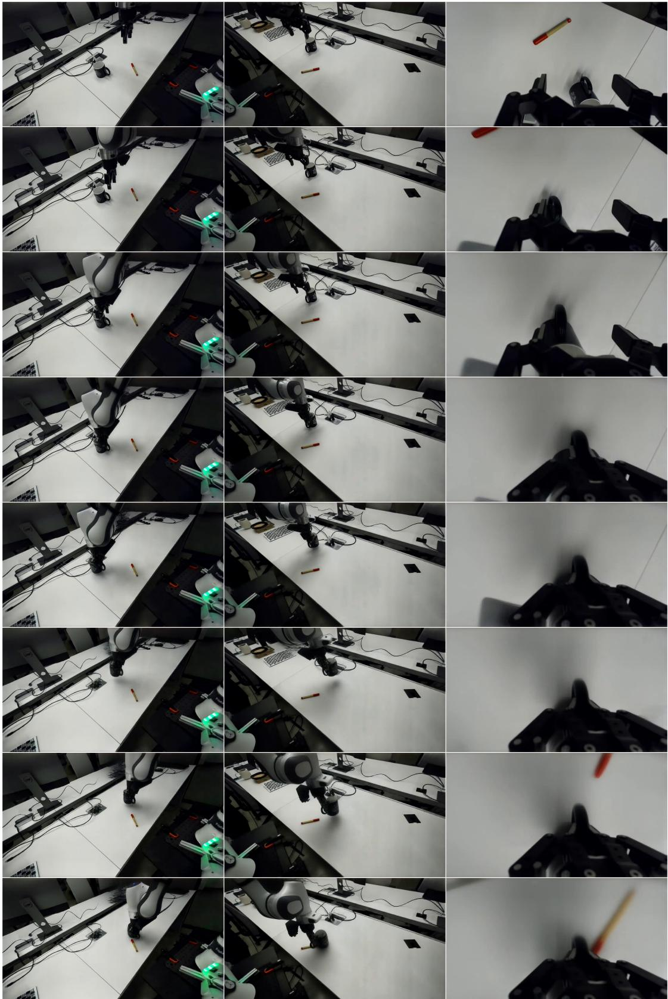  
Figure 11 High Resolution 720p World Model Imagination Rollout.

## E Qualitative World-Model Imagination Examples

Model-size comparison filmstrips. Each figure seeds RoboJEPA with the initial frame(s) of a held-out episode, replays the recorded actions, and shows the decoded imagination for every model size (22M–8B) alongside the ground-truth (GT) video. Rows are ordered smallest-to-largest with GT at the bottom, directly beneath the 8B model for the most direct comparison; each row is sampled at k=5 equal-time columns spanning the first 20 s of the rollout. Big figures are decoded at the 480×640 encoder resolution and small at 240×320; the number of camera views is fixed per embodiment.

## E.1 Large resolution (480×640)

Figures 12 to 15 show high-resolution rollouts on AgiBot, Bridge, and RoboCasa with one or two camera views.

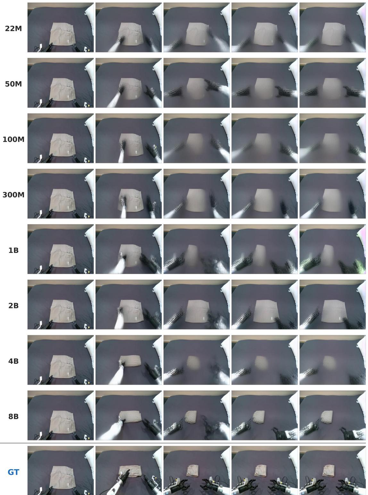  
Figure 12 AgiBot (single view), 480×640. Model-size comparison of world-model imaginations against ground truth; folding structure emerges only at larger scales.

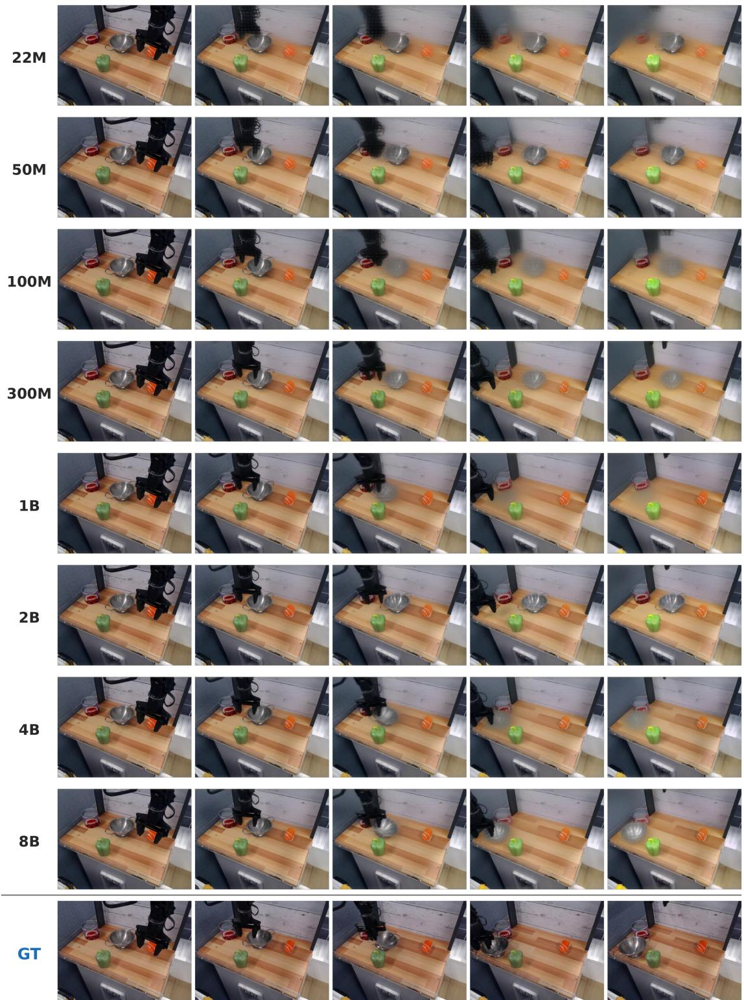  
Figure 13 Open X-Embodiment Bridge (single view), 480×640. Physical contact between the gripper and the object develops only for the larger models.

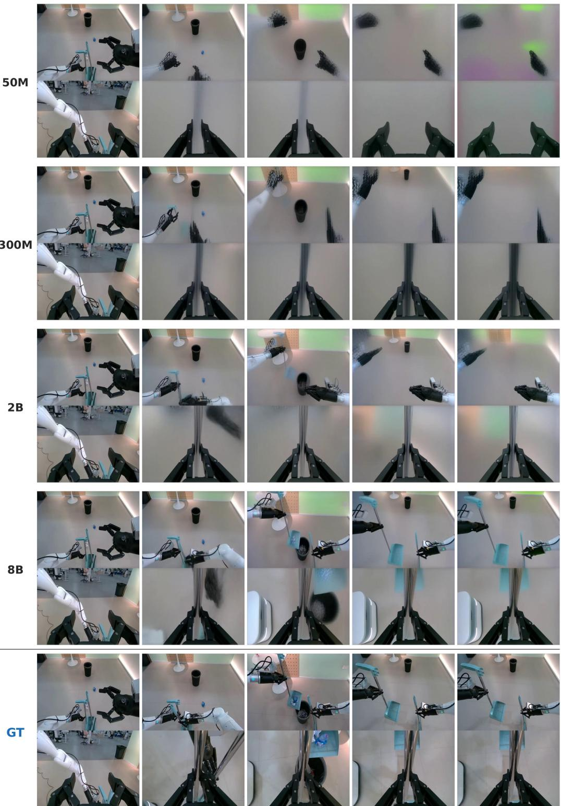  
Figure 14 AgiBot (two views), 480×640. Bimanual manipulation rollout across model sizes; finer details are preserved as scale increases.

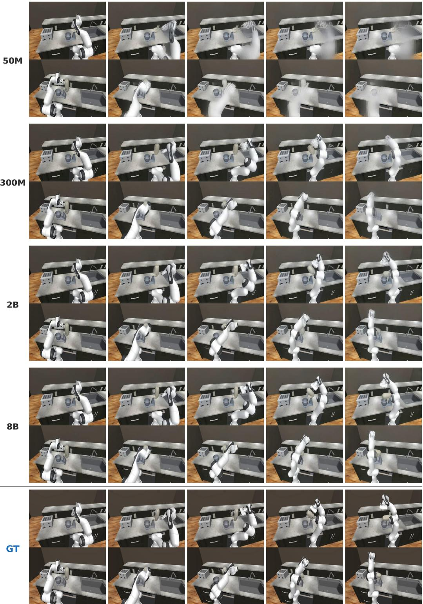  
Figure 15 RoboCasa (two views), 480×640. Simulated kitchen manipulation rollout across model sizes.

## E.2 Small resolution (240×320)

Figures 16 to 19 show low-resolution rollouts on Bridge, Bridge V2, LeRobot, and DROID.

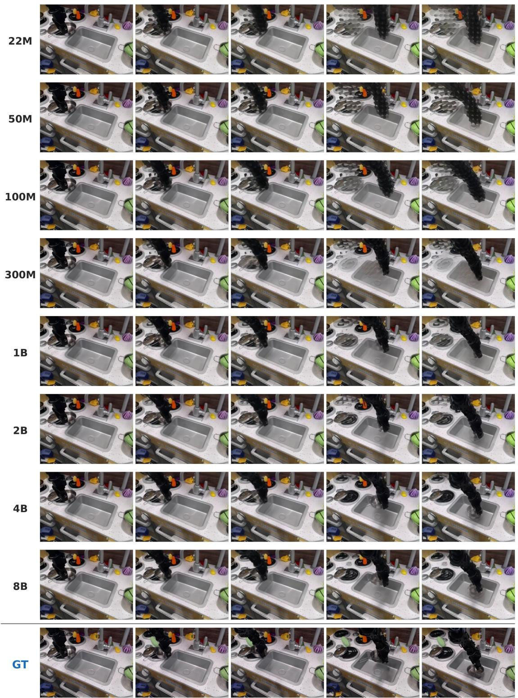  
Figure 16 Open X-Embodiment Bridge (single view), 240×320. Contact with the manipulated object develops only in the larger models.

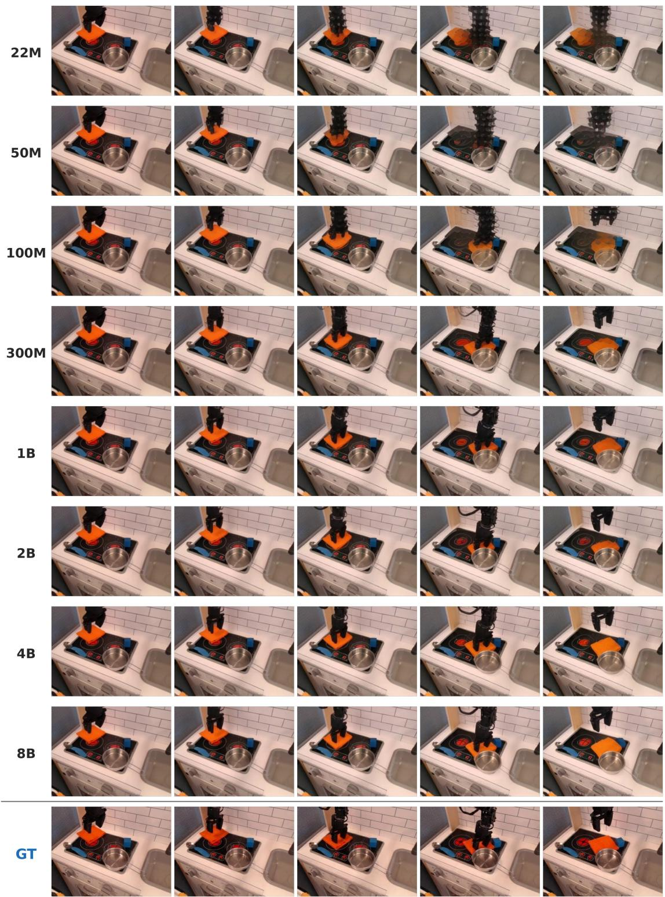  
Figure 17 Bridge-V2 (single view), 240×320. Clear progression of imagination quality with model scale.

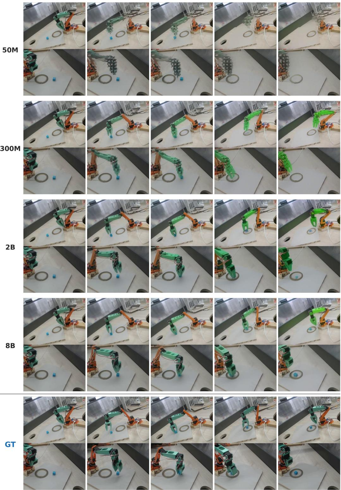  
Figure 18 LeRobot (two views), 240×320. Two-view manipulation rollout across model sizes.

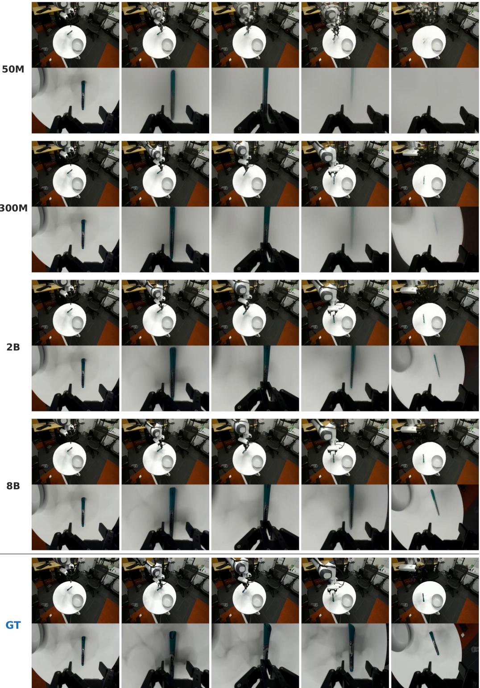  
Figure 19 Franka / DROID (two views), 240×320, joint-space actions. Two-view manipulation rollout across model sizes.

Algorithm 1 Receding-horizon CEM planning in V-JEPA feature space (full version).   
Require: predictor $g _ { \boldsymbol { \theta } } ,$ , goal features $\{ z _ { g } ^ { ( v ) } \}$ , current context $z _ { t - L _ { \mathrm { c t x } } + 1 : t }$ , horizon $H ,$ samples per iteration per   
GPU $N _ { \mathrm { s a m p } } ,$ micro-batches $M ,$ iterations $I ,$ elite count $k ,$ momenta $( \beta _ { \mu } , \beta _ { \sigma } )$ , init std $\sigma _ { 0 } .$ , displacement   
bound $\rho _ { \mathrm { m a x } } ,$ distance $d ( \cdot , \cdot )$ , world size $G ,$ per-view weights $\{ w _ { v } \}$   
1: $\mu _ { 0 : H - 1 } $ warm start (shift previous plan by $L _ { \mathrm { e x e c } } ) ; \sigma _ { 0 : H - 1 }  \sigma _ { 0 }$   
2: for $i = 1 , \dots , I$ do   
3: $s  \emptyset$   
4: for $m = 1 , \ldots , M$ do ▷ micro-batches per GPU; sharded across world   
5: Draw $N _ { \mathrm { s a m p } } / M$ translation samples $u _ { h } ^ { ( n ) } \in \mathbb { R } ^ { 3 }$ via the spherical parameterisation of Appendix F.3   
6: Draw rotation/gripper coords $\sim \mathcal { N } ( 0 , I )$ when active; concatenate into $\tilde { a } _ { h } ^ { ( n ) } \in \mathbb { R } ^ { d _ { a } }$   
7: $a _ { h } ^ { ( n ) } \gets \mu _ { h } + \sigma _ { h } \odot \tilde { a } _ { h } ^ { ( n ) } ;$ ; project translation block onto $\ell _ { 2 } \cdot$ -ball of radius $\rho _ { \mathrm { m a x } }$ (Appendix F.4)   
8: state ← repea $\mathrm { t } ( z _ { t - L _ { \mathrm { c t x } } + 1 : t } , N _ { \mathrm { s a m p } } / M )$ ▷ share KV cache   
9: for $h = 0 , \ldots , H - 1$ do   
10: $\hat { z } _ { t + h + 1 } ^ { ( n ) } , \mathrm { s t a t e } \gets g _ { \theta } ( \mathrm { s t a t e } , a _ { h } ^ { ( n ) } )$ for all n   
11: end for   
12: $\begin{array} { r } { R ^ { ( n ) } \gets - \sum _ { v } w _ { v } d \big ( \hat { z } _ { t + H } ^ { ( v , n ) } , z _ { g } ^ { ( v ) } \big ) } \end{array}$ ▷ final-step goal distance, Equation (3)   
13: ${ \mathcal { S } } \gets { \mathcal { S } } \cup \{ ( a ^ { ( n ) } , R ^ { ( n ) } ) \}$   
14: end for   
15: if $G > 1$ then   
16: $\mathrm { A L L G }$ ather(S) across $G$ ranks, yielding pool of size $N _ { \mathrm { s a m p } } \times G$   
17: end if   
18: Select elites $\mathcal { E } \subset S \mathrm { : }$ top-k by R   
19: $\hat { \mu } _ { h } , \hat { \sigma } _ { h } \gets$ mean, std of $\mathcal { E }$ at step h   
20: $\mu _ { h }  ( 1 - \beta _ { \mu } ) \hat { \mu } _ { h } + \beta _ { \mu } \mu _ { h } ; \sigma _ { h }  ( 1 - \beta _ { \sigma } ) \hat { \sigma } _ { h } + \beta _ { \sigma } \sigma _ { h }$   
21: end for   
22: return $a _ { 0 : H - 1 } ^ { \star }  \mu _ { 0 : H - 1 }$

## F Planning: Additional Details

Expands Section 2.2. We give the full algorithm box (Appendix F.1), the data-parallel elite selection $( { \mathrm { A p } } \cdot$ pendix F.2), the spherical translation-sampling distribution (Appendix F.3), the $\ell _ { 2 } \cdot$ -ball projection $( { \mathrm { A p } } \cdot$ pendix F.4), and multi-view goal handling (Appendix F.5). The computational cost of Equation (3) matches the per-token training loss (Section 2.2, Equation (5)) and the controller-rate bridge (Appendix B.6) is what carries the planner output to the robot.

## F.1 Full CEM algorithm

Algorithm 1 restates one call to CEM with all loop details the main text suppressed. It exposes the periteration micro-batch loop (M micro-batches per GPU), the cross-rank AllGather, the explicit per-step return accumulation $\begin{array} { r } { R ^ { ( n ) } \ = \ \sum _ { h } r _ { h } ^ { ( n ) } } \end{array}$ , and the momentum-smoothed Gaussian refit. Across consecutive environment steps the planner is warm-started by shifting the previous mean by $L _ { \mathrm { e x e c } }$ steps and re-using it tail, so it converges in only $I _ { \mathrm { s t e p } }$ refinement iterations after the cold-start computational cost of $I _ { 0 }$

## F.2 Distributed elite selection

The planner is sharded data-parallel across G GPUs: every rank draws its own $N _ { \mathrm { s a m p } }$ samples per refinement iteration and rolls them through its replica of $g _ { \theta }$ , using the same shared KV cache trick along the sample axis as on a single GPU. The per-rank rewards and the matching action tensors are then AllGather-ed (line 17 of Algorithm 1) so that every rank sees the same global pool of size $N _ { \mathrm { s a m p } } \times G$ and can pick the top-k elites independently and consistently. Because this elite set is selected from the global pool, the elite count k is decoupled from the per-GPU sample count: in our DROID configuration we use $N _ { \mathrm { s a m p } } { = } 1 6$ samples per GPU but k=20 elites, which would be ill-defined on a single rank but is in fact a $k { = } 2 0$ out of a pool of $N _ { \mathrm { s a m p } } \cdot G$

(≥ 256 in our deployments).

## F.3 Spherical translation sampling

Within each refinement iteration the proposal mean and standard deviation are per-step Gaussian, but we deviate from a vanilla isotropic Gaussian for the 3-D translation block. Following V-JEPA 2-AC (Assran et al., 2025), we draw the unit translation sample $\tilde { u } \in \mathbb { R } ^ { 3 }$ from the joint density

$$
r \sim \mathrm { U n i f } [ 0 , 1 ] , \quad \theta _ { 1 } \sim \mathrm { U n i f } [ 0 , 2 \pi ) , \quad \theta _ { 2 } \sim \mathrm { U n i f } [ 0 , 2 \pi ) ,\tag{17}
$$

$$
\tilde { u } _ { x } = r \cos { \theta _ { 1 } } \cos { \theta _ { 2 } } , \tilde { u } _ { y } = r \cos { \theta _ { 1 } } \sin { \theta _ { 2 } } , \tilde { u } _ { z } = r \sin { \theta _ { 1 } } ,\tag{18}
$$

which is then scaled by the per-axis std and shifted by the per-step mean before the $\ell _ { 2 } \cdot$ -ball projection of Appendix F.4. The motivation is twofold. First, with r uniform on [0, 1] and angles uniform on [0, 2π), the distribution puts noticeable mass at small ∥u˜∥ (because the radial coordinate is uniform rather than thricefolded), which corresponds to “stay close to the warm-started mean” and stabilizes CEM in regimes where the previous plan is already near-optimal. Second, decoupling radius from angles makes the proposal density easy to clip in norm without distorting the angular distribution: the subsequent projection onto an $\ell _ { 2 } { \mathrm { - b a l l } }$ only renormalizes samples whose radius exceeds $\rho _ { \mathrm { m a x } } .$ , leaving the angular content untouched. Rotation and gripper dimensions, when active, are drawn from a standard isotropic Gaussian and treated identically in the subsequent afine warp by $\left( \mu _ { h } , \sigma _ { h } \right)$

## F.4 Translation ℓ -ball projection

After the afine warp $a _ { h } ^ { ( n ) } = \mu _ { h } + \sigma _ { h } \odot \tilde { a } _ { h } ^ { ( n ) }$ , the translation block is projected onto an $\ell _ { 2 } .$ -ball of radius $\rho _ { \mathrm { m a x } }$ that bounds the per-step end-efector displacement:

$$
a _ { h } ^ { ( n ) } { : 3 } ~  ~ \{ \begin{array} { l l } { a _ { h } ^ { ( n ) } { : 3 } } & { \mathrm { i f } ~ \| a _ { h } ^ { ( n ) } { : 3 } \| _ { 2 } \leq \rho _ { \operatorname* { m a x } } , } \\ { \rho _ { \operatorname* { m a x } } \frac { a _ { h } ^ { ( n ) } { : 3 } } { \| a _ { h } ^ { ( n ) } { : 3 } \| _ { 2 } } } & { \mathrm { o t h e r w i s e } . } \end{array}\tag{19}
$$

The projection enforces a per-step end-efector displacement bound that respects the robot’s velocity limits, regardless of how aggressively an unlucky elite refit inflated the CEM covariance. We use $\rho _ { \mathrm { m a x } } { = } 0 . 0 5 .$ m on DROID and $\rho _ { \mathrm { m a x } } { = } 0 . 1 0$ m on RoboCasa, matching the per-step delta scales of the corresponding demonstration corpora. Because the projection only fires outside the ball, it leaves the (warm-started) mean direction unbiased and, combined with Equation (17), keeps the angular content close to uniform after clipping. The gripper dimension, when active, is element-wise clipped to $[ - \rho _ { \mathrm { g r i p p e r } } , \rho _ { \mathrm { g r i p p e r } } ]$ rather than projected, since it is a scalar with a diferent physical meaning.

## F.5 Multi-view goal handling

When the world model is conditioned on multiple cameras, the computational cost in Equation (3) is summed across views with configurable per-view weights $w _ { v } ,$ , re-using the per-block view conditioning of Appendix A.2 so that goal patches are compared at the correct viewpoint. Goal images that are unavailable for some views are handled by zeroing the corresponding $w _ { v }$ at runtime, which lets us re-use the same multi-view checkpoint for single-camera DROID episodes without any retraining.

## G Robotic Setup

## G.1 Franka: DROID Platform

Our real-robot experiments run on a Franka Panda arm with a parallel-jaw gripper, controlled through the original DROID software stack (Khazatsky et al., 2024). Deployment is split across two machines. A robot-control server runs on the robot PC and exposes the arm and cameras through a simple TCP/ZMQ request–reply interface; the planner client runs on a GPU cluster and connects to this server remotely. This separation lets the planner marshal a large number of GPUs for parallel world-model inference — the CEM optimizer samples and scores thousands of candidate rollouts per step across the cluster — while a single client process is the only one that exchanges observations and actions with the physical robot (Appendix G.3).

The scene is observed by two cameras: one ZED camera mounted on the wrist and one Intel RealSense camera placed externally to the left of the workspace (unlike the multi-ZED upstream DROID rig, we do not use a third camera). The wrist ZED records at 720×1280 and the external RealSense at 480×640; both streams are converted to RGB and resized to each agent’s native input resolution (240×320 for the RoboJEPA models) before encoding. At deployment RoboJEPA uses the resulting two views — external (left) and wrist.

For RoboJEPA we drive the robot with blocking end-efector control rather than a fixed-rate stream: each environment step commands an end-efector delta pose and then waits until the arm and gripper reach the commanded target before the next observation is returned, so the loop is paced by motion completion rather than a fixed control frequency. Although the underlying environment supports the full DROID action interface (7-DoF Cartesian and 8-DoF joint spaces, in velocity or position mode), our planner acts in a reduced space: it plans only 3D end-efector translation together with a 1D gripper command, holding the end-efector orientation fixed. The proprioceptive state we read back is the end-efector pose and gripper opening (with joint angles also available). At each step the planner encodes the current views and state into the world-model latent space, chooses an action by imagining short rollouts and scoring them against a goal image (Section 2.2), executes it, and repeats; each episode begins by homing the arm and recording the goal observation that defines the task. The full planning configuration is given in Appendix G.3.

For baseline policies such as $\pi _ { 0 . 5 }$ (Black et al., 2025) we instead use the standard DROID setup: non-blocking control at 15 Hz in the joint-velocity action space, matching the interface these models were trained for.

Goal  
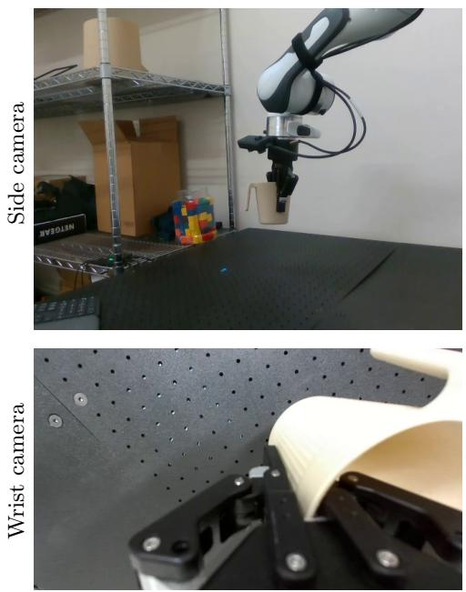

Start (initial)  
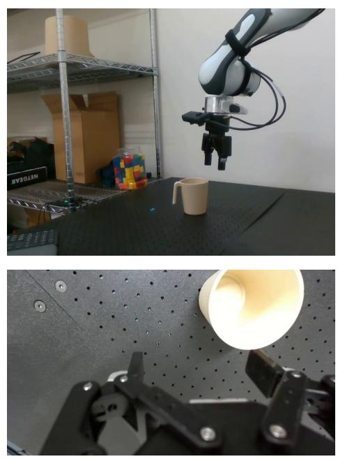  
Figure 20 Real-world Franka lift the cup task. A goal image (left) and the initial observation (right) for one episode on the DROID/Franka platform, shown from both cameras: the external side camera (top) and the wrist-mounted camera (bottom). The task is specified purely by the goal image, in which the cup has been lifted of the table; from the start state the planner drives the world model toward these goal features. The two camera views are the inputs the world model is conditioned on at deployment.

## G.2 Real-robot tasks and evaluation protocol

Tasks and success criteria. We evaluate three tasks on the Franka/DROID platform: Grasp, Object Lift, and Pick and Place. Grasp requires the robot to grasp the object. Object Lift requires the robot to hold the object lifted in the air until the end of the episode. Pick and Place requires the object to end up at the target position, regardless of how many times it was dropped during the episode. These completion criteria do not imply one another: success on Pick and Place does not require satisfying the Object Lift criterion. Goal and initial observations for all three tasks are shown in Appendix G.6.

Evaluation protocol. For each model–task combination, we run 30 episodes for RoboJEPA and 50 episodes for each VLA baseline. We evaluate RoboJEPA models ranging from 22M to 8B parameters, using the checkpoint trained with the most compute at each size. All RoboJEPA models use the same planning hyperparameters across tasks, including the planning horizon. Hardware and controller details are provided in Appendix G.1, and the planning configuration is given in Appendix G.3.

For RoboJEPA, we generate a goal image by executing a predefined robot motion and manually placing the object in the grasping position so the robot can interact with it. Only the final image is provided as the goal for closed-loop planning; no intermediate image subgoals are used. The VLA baselines receive text instructions. Neither RoboJEPA nor the baselines receive task-specific fine-tuning.

Scoring and reported metrics. We manually score each episode according to the task-specific completion criteria. For each model–task combination, we report task progress as the mean episode score and success rate as the fraction of episodes with 100% progress. The per-model values are reported in Table 12.

Table 12 Real-world robotic capabilities on the Franka/DROID platform. Task progress and success rate on the grasp, object-lift, and pick-and-place tasks. VLA baselines $( \pi _ { 0 } { - } \mathrm { F A S T }$ and $\pi _ { 0 . 5 } )$ are conditioned on a text instruction, whereas all RoboJEPA models are conditioned on a single image goal.
<table><tr><td rowspan="2">Model</td><td rowspan="2">Goal specification</td><td colspan="2">Grasp</td><td colspan="2">Object Lift</td><td colspan="2">Pick and Place</td></tr><tr><td>Task Progress</td><td>Success Rate</td><td>Task Progress</td><td>Success Rate</td><td>Task Progress</td><td>Success Rate</td></tr><tr><td colspan="8">Model finetuned on DROID, no in-domain finetuning</td></tr><tr><td>π0-FAST</td><td>text instruction</td><td>35%</td><td>22%</td><td>20%</td><td>12%</td><td>55%</td><td>40%</td></tr><tr><td>π0.5</td><td></td><td>25%</td><td>5%</td><td>12%</td><td>0%</td><td>69%</td><td>53%</td></tr><tr><td colspan="8">Pretrained models, no DROID finetuning, no in-domain finetuning, a unified planner for all tasks</td></tr><tr><td>RoboJEPA-22M</td><td rowspan="7"></td><td>30%</td><td>30%</td><td>34%</td><td>2%</td><td>30%</td><td>17%</td></tr><tr><td>RoboJEPA-50M</td><td>30%</td><td>30%</td><td>51%</td><td>8%</td><td>27%</td><td>13%</td></tr><tr><td>RoboJEPA-100M</td><td>27%</td><td>27%</td><td>72%</td><td>20%</td><td>20%</td><td>10%</td></tr><tr><td>RoboJEPA-300M</td><td>37%</td><td>37%</td><td>52%</td><td>18%</td><td>43%</td><td>17%</td></tr><tr><td>RoboJEPA-1B</td><td>50%</td><td>50%</td><td>53%</td><td>24%</td><td>38%</td><td>10%</td></tr><tr><td>RoboJEPA-2B</td><td>43%</td><td>43%</td><td>60%</td><td>40%</td><td>47%</td><td>31%</td></tr><tr><td>RoboJEPA-4B</td><td>60%</td><td>60%</td><td>54%</td><td>30%</td><td>49%</td><td>21%</td></tr><tr><td>RoboJEPA-8B</td><td>67%</td><td>67%</td><td>65%</td><td>50%</td><td>42%</td><td>27%</td></tr></table>

## G.3 Real robot planning hyperparameters

On the DROID/Franka platform the world model is deployed with the closed-loop CEM planner of Section 2.2 (full algorithm in Algorithm 1). The planner searches only over 3D end-efector translation and a 1D gripper command (rotation frozen), scores imagined rollouts by per-token $\ell _ { 1 }$ distance to the goal features in LN0 space, and applies $L _ { \mathrm { e x e c } }$ actions per replan before re-observing. Table 13 lists the configuration used for all real-robot experiments.

Table 13 Closed-loop CEM planning hyperparameters for the DROID/Franka real-robot deployment (Section 2.2, Algorithm 1). Elites are selected from the pooled $N _ { \mathrm { s a m p } } \cdot G$ samples gathered across the G planner ${ \mathrm { G P U s } } ,$ so k may exceed the per-GPU sample count. The planner acts in a 3D-translation + 1D-gripper space with the end-efector orientation held fixed.
<table><tr><td>Hyperparameter</td><td>Symbol</td><td>Value</td></tr><tr><td>Horizon and closed loop</td><td></td><td></td></tr><tr><td>Planning horizon (predictor steps)</td><td>H</td><td>5</td></tr><tr><td>Context length (encoder steps)</td><td> $L _ { \mathrm { c t x } }$ </td><td>2</td></tr><tr><td>Execution prefix (actions per replan)</td><td> $L _ { \mathrm { e x e c } }$ </td><td>2</td></tr><tr><td>Environment steps per episode</td><td></td><td>20</td></tr><tr><td>CEM search</td><td></td><td></td></tr><tr><td>CEM iterations (cold / warm)</td><td> $I _ { 0 } / I _ { \mathrm { s t e p } }$ </td><td>15 / 10</td></tr><tr><td>Samples per iteration (global)</td><td> $N _ { \mathrm { s a m p } } \cdot M \cdot G$ </td><td>4096</td></tr><tr><td>Elite count, top-k (post-AllGather)</td><td>k</td><td>20 (pool  $N _ { \mathrm { s a m p } } \cdot G )$ </td></tr><tr><td>Computational cost</td><td> $d ( \cdot , \cdot )$ </td><td>per-token  $\ell _ { 1 }$  in  $\mathrm { L N } _ { 0 }$  space</td></tr><tr><td>Translation search (3D)</td><td></td><td></td></tr><tr><td>Init std</td><td> $\sigma _ { 0 }$ </td><td>0.15</td></tr><tr><td>Max-norm (l2-ball radius)</td><td> $\rho _ { \mathrm { m a x } }$ </td><td>0.15</td></tr><tr><td>Mean / std momentum</td><td> $\beta _ { \mu } / \beta _ { \sigma }$ </td><td>0.15 / 0.70</td></tr><tr><td>Gripper search (1D)</td><td></td><td></td></tr><tr><td>Init std</td><td></td><td>0.80</td></tr><tr><td>Max magnitude</td><td>ρgripper</td><td>0.99</td></tr><tr><td>Mean / std momentum</td><td></td><td>0.15 / 0.45</td></tr><tr><td>Observations and execution</td><td></td><td></td></tr><tr><td>Views fed to the world model</td><td></td><td>left (0), wrist (2)</td></tr><tr><td>Per-view reward weights</td><td> $\{ w _ { v } \}$ </td><td>{1.0, 0.0} (goal scored on the left view)</td></tr><tr><td>Input resolution</td><td></td><td>240×320</td></tr><tr><td>Action substeps</td><td></td><td>1</td></tr><tr><td>Predictor precision</td><td></td><td>AOT-compiled bf16</td></tr></table>

## G.4 RoboCasa Custom Environments

Our simulated evaluations use four custom tasks built on top of RoboCasa kitchen scenes (Nasiriany et al., 2024, 2026) with the mobile-base PandaOmron (Franka Panda) robot. The four tasks share the same common controller. We drive the robot with a blocking controller that we implement on top of the simulator: each planner action specifies a target end-efector ofset, which the environment servos toward with operationalspace control until it converges (or a step cap is reached) before returning the next observation. We further extend the controller to drive the commanded end-efector rotation to convergence: rather than the default operational-space controller, which does not guarantee the orientation reaches its target, our controller feeds back the world-frame rotation error at every sub-step and only terminates once both the position and rotation errors fall below tolerance. We found this rotation convergence to be important for correctly matching the wrist-camera view during planning, since the planner scores candidates by a distance induced by both the side-view and the wrist-view predictions and the wrist camera is rigidly mounted to the end-efector, so any residual orientation drift would misalign the wrist view. RoboCasa exposes a large collection of kitchens split into training and evaluation scenes; the world model is trained on the training kitchens and all four tasks are run in the held-out evaluation kitchens. Because the environment is fully simulated, we can define both the goal image and the reward directly inside it. Every episode is instantiated from up to ten held-out target kitchens (one per layout/style pair), with non-structural countertop appliances near the workspace hidden to reduce clutter. Observations are rendered at 480×640 from the agent-view and, when enabled, wrist cameras. In every task the reward is the normalized progress toward the goal, $r _ { t } = \operatorname* { m a x } \bigl ( 0 , 1 - \| x _ { t } - x _ { \mathrm { g o a l } } \| / d _ { 0 } \bigr )$ , where $d _ { 0 }$ is the initial goal distance.

Reach. The robot must move its end-efector from a randomly sampled start pose to a randomly sampled goal pose in the kitchen. We remove all objects from the scene so that nothing occludes the path from the start to the goal. Start and goal are drawn uniformly within a small ball around the robot’s home pose and rejection-sampled so that they lie a fixed distance apart (0.25–0.35 m) and are reachable without a large reorientation of the end-efector. This task isolates the world model’s ability to predict free-space end-efector motion across kitchens. Figure 21 shows example goal and initial observations.

Goal  
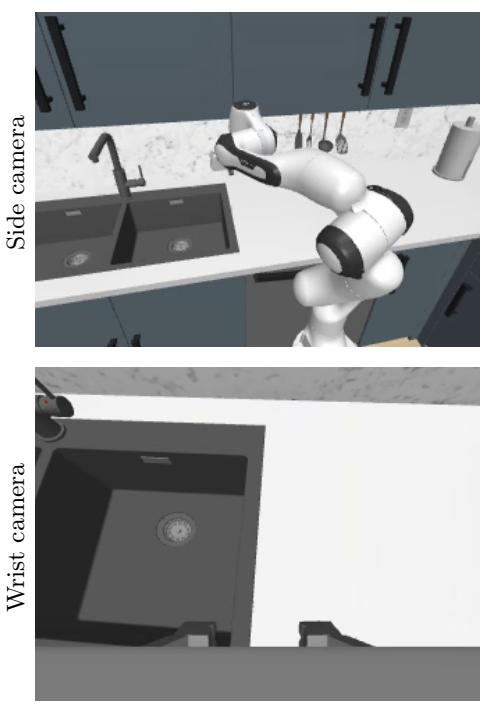

Start (initial)  
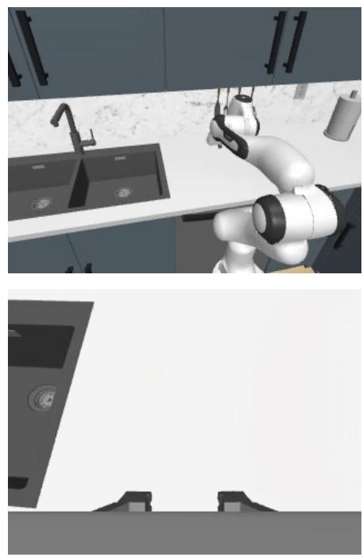  
Figure 21 RoboCasa Reach. Goal and initial observations for one Reach episode, from the external side camera (top) and the wrist camera (bottom). The goal image (left) specifies the target end-efector pose in an emptied kitchen; the planner drives the arm from the start (right) toward the goal.

ObstacleReach. A harder variant of Reach: one appliance (by default a cofee machine) is kept in the scene and repositioned directly in front of the robot, and the start and goal are constrained to lie on opposite sides of it. The end-efector must therefore arc around the obstacle rather than travel in a straight line, and the reachable distance band is widened (0.25–0.50 m). It tests whether the planner can find collision-free trajectories through the world model. Figure 22 shows an example episode.

ObjectReach. Here the robot must perform a reach while holding an object. To set this up, we first grasp the object with a heuristic scripted agent: a small Python controller that executes a top-down grasp (approach, descend, close, and lift) inside the simulator. Running the grasp in simulation ensures the object is held in a physically correct way before planning begins. The world model then has to move the held object to a randomly sampled goal position, and the reward is the normalized progress of the object toward its goal rather than of the end-efector. The object is one of a banana, a can, or a mug, which difer in shape and physical properties (friction and grasp ofsets are tuned per object). Figures 23 to 25 show examples for the three objects.

ObjectPush. The robot must push the object across the counter by contact from a randomly sampled start position to a randomly sampled goal position. The gripper is held closed so that it acts as a solid pusher, and the arm is driven by translation deltas, so the object moves only through contact rather than being grasped. Start and goal are sampled a fixed distance apart (0.10–0.15 m) within a small disk on the counter; because forward pushes (along the robot’s reach direction) are far more reliable than lateral ones, the push direction is restricted to a $6 0 ^ { \circ }$ cone around the forward axis. As in ObjectReach, the reward is the normalized progress of the object toward its goal. This task probes whether the world model captures non-prehensile, contact-rich dynamics. Figure 26 shows example goal and initial observations.

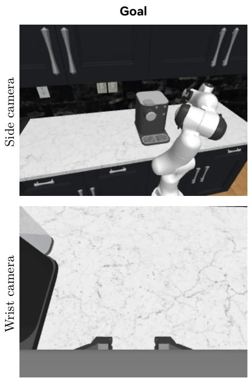

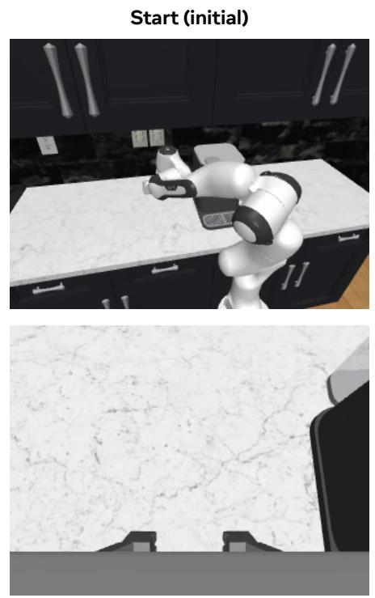  
Figure 22 RoboCasa ObstacleReach. Goal and initial observations for one ObstacleReach episode. An appliance placed directly in front of the robot forces the end-efector to arc around it, so the straight-line path from the start (right) to the goal (left) is blocked.

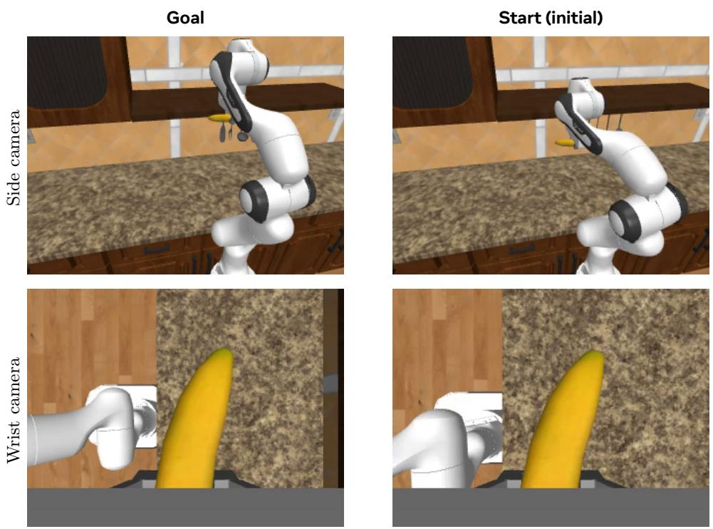  
Figure 23 RoboCasa ObjectReach (banana). Goal and initial observations after the scripted grasp: from the start (right) the robot must carry the held banana to the goal pose (left), shown from the side (top) and wrist (bottom) cameras.

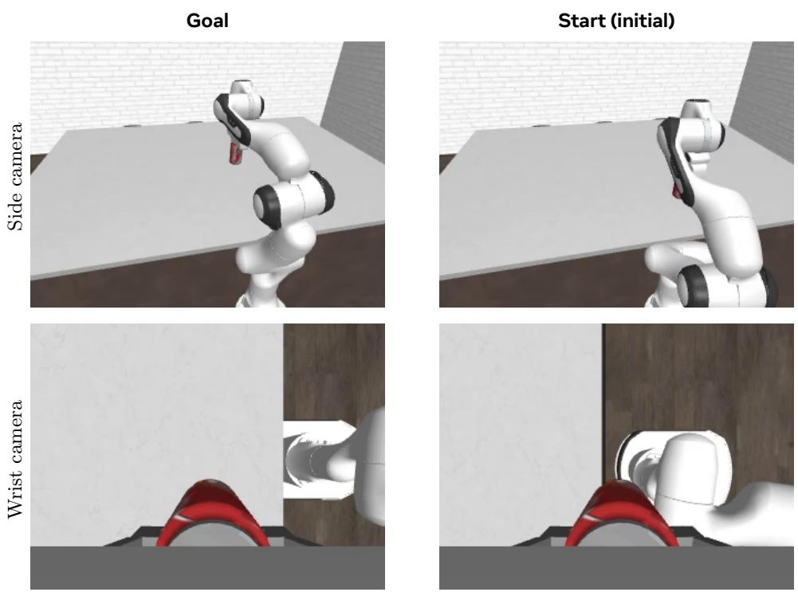  
Figure 24 RoboCasa ObjectReach (can). As in Figure 23 for the can object.

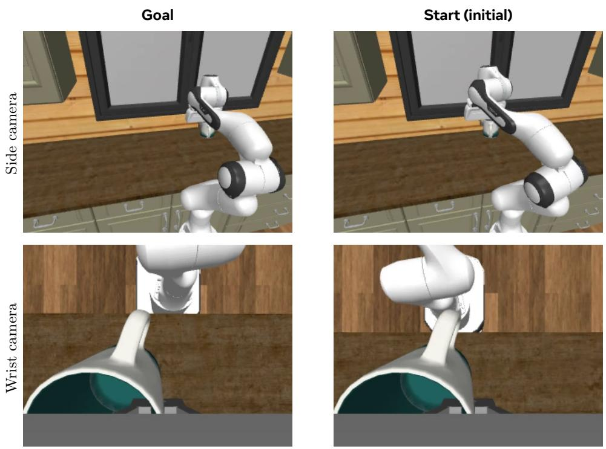  
Figure 25 RoboCasa ObjectReach (mug). As in Figure 23 for the mug object.

Goal  
Start (initial)  
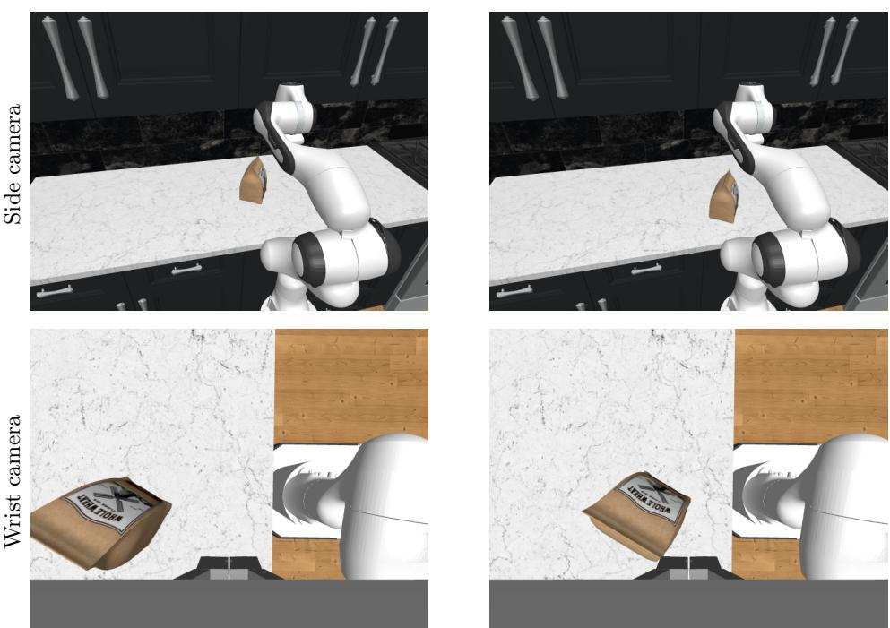  
Figure 26 RoboCasa Push. Goal and initial observations for one object-push episode, shown from the side (top) and wrist (bottom) cameras. The robot must push the object across the counter from its initial position (right) to the goal position (left). Note that the goal pose and the initial pose of the robot are the same, the only thing that changes is the object position.

## G.5 RoboCasa planning hyperparameters

All four RoboCasa tasks are solved with the same closed-loop CEM planner (Section 2.2, Algorithm 1). Across the four tasks the only CEM hyperparameter we vary is the predictor horizon $H ;$ every other CEM setting is shared (Table 14, top). Push uses the same planning configuration as ObstacleReach. As in the DROID configuration (Table 13) the planner scores rollouts by per-token $\ell _ { 1 }$ distance to the goal features and re-plans after every executed action. Reach and ObstacleReach and Push search over 3D end-efector translation, while ObjectReach first grasps an object with a scripted agent and then additionally searches the gripper. The tasks otherwise difer in their environment configuration (Table 14, bottom).

Table 14 Planning and environment configuration for the four RoboCasa tasks (Appendix G.4). The table is split into the planning hyperparameters (top) and the environment parameters (bottom). Among the planning hyperparameters, only the predictor horizon H varies across tasks; the rest are shared. The efective CEM sample budget is 1024 candidates per iteration for every task (distributed across the planner GPUs), from which the top-k elites are selected.
<table><tr><td></td><td>Symbol</td><td>Reach</td><td>ObstacleReach</td><td>ObjectReach</td><td>Push</td></tr><tr><td>Planning hyperparameters</td><td></td><td></td><td></td><td></td><td></td></tr><tr><td>Predictor horizon</td><td></td><td></td><td>5</td><td>1</td><td>5</td></tr><tr><td>CEM samples per iteration (total)</td><td></td><td></td><td></td><td></td><td></td></tr><tr><td>CEM iterations (cold / warm)</td><td> $I _ { 0 } / I _ { \mathrm { s t e p } }$ </td><td></td><td>15 / 10</td><td></td><td></td></tr><tr><td>Elite count, top-k</td><td> $k$ </td><td></td><td>20</td><td></td><td></td></tr><tr><td>Computational cost</td><td> $d ( \cdot , \cdot )$ </td><td></td><td>per-token l1 in LN0 space</td><td></td><td></td></tr><tr><td>Context length (encoder steps)</td><td> $L _ { \mathrm { c t x } }$ </td><td></td><td></td><td></td><td></td></tr><tr><td>Execution prefix (actions per replan)</td><td> $L _ { \mathrm { e x e c } }$ </td><td></td><td></td><td></td><td></td></tr><tr><td>Action substeps</td><td></td><td></td><td></td><td></td><td></td></tr><tr><td>Translation init std</td><td>σ0</td><td></td><td></td><td>0.30</td><td></td></tr><tr><td>Translation max-norm (l2-ball radius)</td><td> $\rho _ { \mathrm { m a x } }$ </td><td></td><td>0.30</td><td></td><td></td></tr><tr><td>Mean / std momentum</td><td> $\beta _ { \mu } / \beta _ { \sigma }$ </td><td></td><td></td><td>0.15 / 0.70</td><td></td></tr><tr><td>Views fed to the world model</td><td></td><td></td><td></td><td>left (0), wrist (2)</td><td></td></tr><tr><td>Per-view reward weights</td><td> $\{ w _ { v } \}$ </td><td></td><td></td><td>{0.5, 0.5}</td><td></td></tr><tr><td>Input resolution</td><td></td><td></td><td></td><td>240×320</td><td></td></tr><tr><td>Gripper init std</td><td></td><td></td><td></td><td></td><td></td></tr><tr><td>Gripper max magnitude</td><td>ρgripper</td><td></td><td></td><td>0.25</td><td></td></tr><tr><td>Predictor precision</td><td></td><td>bf16 (compiled)</td><td>bf16 (eager)</td><td>bf16 (compiled)</td><td>bf16 (eager)</td></tr><tr><td>Environment parameters</td><td></td><td></td><td></td><td></td><td></td></tr><tr><td>Environment steps per episode</td><td></td><td>5</td><td>18</td><td>5</td><td>18</td></tr><tr><td>Start-goal distance</td><td></td><td>0.25–0.35 m</td><td>0.25–0.50 m</td><td>0.11–0.26 m</td><td>0.10–0.15 m</td></tr><tr><td>Manipulated object</td><td></td><td></td><td></td><td>banana / can / mug</td><td>flour bag</td></tr></table>

## G.6 Real-Robot Task Examples

Figures 27 to 29 show goal and initial observations for Grasp, Object Lift, and Pick and Place, respectively. We show goal and initial observations for the three real-robot deployment tasks (grasp, lift, and pick-andplace), ten episodes each, from both the external side camera and the wrist camera. The goal is provided to the planner as a single image; recall that the goal and the initial robot pose coincide, so the visible diference between the goal and initial columns is the configuration of the manipulated object.

## G.7 Real World Robotic Capabilities

We observe qualitative diferences in the behavior induced by planning with small and large world models. Small models’ main weakness is poor gripper control, yet their successful episodes exhibit smooth end-efector trajectories and accurate approaches to objects. They struggle to recover after approaching an object from an unsuitable grasping position, whereas larger models can adapt and recover from such mistakes. As model size increases, behavior gradually shifts from smooth execution relying on a single grasping attempt toward more adaptive and robust execution. Intermediate models, such as the 300M and 1B variants, appear to lie between these behavioral regimes, combining some of the limitations of smaller models with emerging recovery capabilities.

When comparing RoboJEPA with the VLA reference models, we cannot fully disentangle the contribution of image-goal specification from that of world-model scaling. The diferences in training data and controller interfaces described in Appendix G.1 also limit this comparison. Nevertheless, all RoboJEPA model sizes use the same goal specification and planning configuration, and the observed improvement across sizes suggests that model scaling contributes to the capabilities of the resulting planner. These qualitative observations complement the task progress and success rates reported in Table 12.

Goal (side)  
Goal (wrist)  
Start (side)  
Start (wrist)  
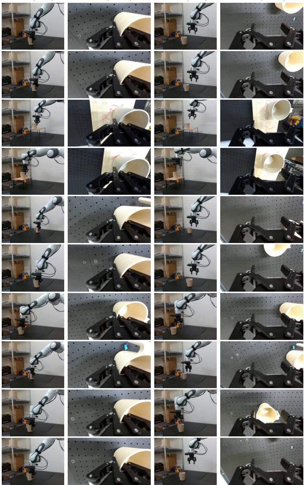  
Figure27 Real-robotGrasptask: goalandinitialobservations. Ten episodes (rows) of the Grasp task on the DROID/Franka platform. For each episode we show the goal image (left pair) and the initial state (right pair), each from the external side camera and the wrist camera. The goal is specified purely by these images; the planner drives the robot from the initial state toward the goal.

Goal (side)  
Goal (wrist)  
Start (side)  
Start (wrist)  
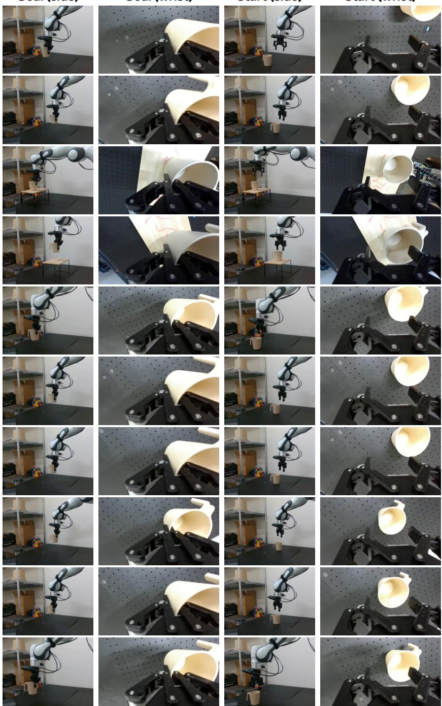  
Figure 28 Real-robot Lift task: goal and initial observations. Ten episodes (rows) of the Lift task on the DROID/Franka platform. For each episode we show the goal image (left pair) and the initial state (right pair), each from the external side camera and the wrist camera. The goal is specified purely by these images; the planner drives the robot from the initial state toward the goal.

Goal (side)  
Goal (wrist)  
Start (side)  
Start (wrist)  
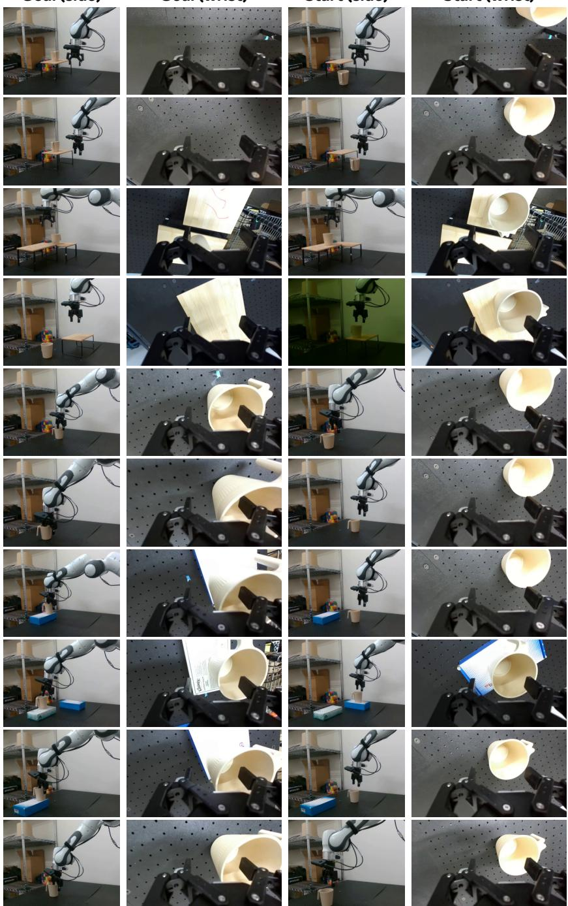  
Figure 29 Real-robot Pick-and-Place task: goal and initial observations. Ten episodes (rows) of the Pick-and-Place task on the DROID/Franka platform. For each episode we show the goal image (left pair) and the initial state (right pair), each from the external side camera and the wrist camera. The goal is specified purely by these images; the planner drives the robot from the initial state toward the goal.

## H Key-Value Cache: Additional Details

For each predictor layer, we cache the keys and values of past timesteps so that autoregressive prediction processes only the new frame, action, and state tokens. Each timestep contains

$$
N _ { \mathrm { t o k } } = V H _ { p } W _ { p } + n _ { a } + n _ { s } , \qquad n _ { a } = n _ { s } = 1 ,\tag{20}
$$

where $V H _ { p } W _ { p }$ is the number of visual tokens across views. The per-layer cache tensors have shape

$$
K ^ { ( \ell ) } , V ^ { ( \ell ) } \in \mathbb { R } ^ { B \times h _ { k v } \times L _ { \mathrm { c a c h e } } \times N _ { \mathrm { t o k } } \times d _ { h } } ,\tag{21}
$$

where B is the batch size, $h _ { k v }$ is the number of key/value heads, and $d _ { h }$ is the head dimension. We store tokens in frame-sized slots and bound the cache by the predictor’s local temporal attention window.

As prediction advances, the rolling cache replaces the oldest frame with the new one. RoPE uses absolute timestep indices, so cached positions do not need to be renumbered when the bufer wraps. Each new frame attends only to the retained window, keeping the amount of cached history bounded even for long rollouts.

At the start of each planning call, we process the observation context once and share its cached keys and values across the CEM candidates. Subsequent predictions maintain candidate-specific caches because their action sequences difer. This avoids repeatedly processing the same observation history, while each prediction step processes only the new tokens and attends to a fixed-size window of cached tokens. The compilation pipeline is described in Appendix I.

## I Inference Engine: Additional Details

Expands Section 2.2. The story of the inference engine is one long descent: start from the V-JEPA 2- AC (Assran et al., 2025) eager BF16 baseline, identify what binds it (host-side dispatch, not arithmetic; Appendix I.1), unbind it with PyTorch Inductor lowering and ahead-of-time compilation that also makes cold start usable on a robot (Appendix I.2), then squeeze the remaining matmul time with a static FP8 path on top (Appendix I.3). Appendix I.4 records the roads we abandoned because the workload simply was not where they help. All numbers are wall-clock measurements on a single NVIDIA H200 (140 GB HBM3) running PyTorch 2.9, on the 1 B predictor at 240p with grouped-query attention (12 query heads, 4 KV heads, 40 layers, 1536 hidden dim), and the rolling KV cache of $L _ { \mathrm { c a c h e } } { = } 8$ frames.

## I.1 Where the time goes (why the model is not matmul-bound)

Naive BF16 inference is bound by host-side dispatch, not by matrix multiplication. At steady state (B=16, full KV cache, 2-view) GEMMs take only ∼26% of GPU time, attention ∼41%, and fused pointwise ops (RoPE, GELU, normalizations, cache management) the remaining ∼33%; on top of that, eager mode burns ∼31% of wall time in dispatch overhead. Doubling GEMM throughput would buy at most a 1.21× end-toend factor; removing dispatch and fusing the long pointwise tail are the first-order wins. At B=1 the same decomposition is even more dispatch-dominated (∼47% of wall time), which is why the headline speedups in Section 2.2 are largest at small batch. Per-step kernel share within a single rollout is dominated by attention growing with cache occupancy: at step 0 attention is ∼14% of step time; at step 4 ∼32%; at full cache (step 7+) ∼41%. GEMM time stays roughly constant at ∼25 ms per step regardless of cache depth. This is the computational-cost picture that the rest of the engine targets.

Table 15 Per-step decomposition into GPU kernel time and host-side dispatch overhead at B=16 on H200. AOT Inductor removes essentially all dispatch (−65 ms) and additionally speeds up GPU compute by ∼1.8× through kernel fusion (8,975 → 1,291 kernels for the 1-view model). 1-view rows are retained here because dispatch behavior is qualitatively diferent at small sequence length, even though the deployed CEM planner runs the 2-view path.
<table><tr><td>Configuration</td><td>Wall (ms)</td><td>GPU kernel (ms)</td><td>Dispatch (ms)</td><td>Dispatch %</td></tr><tr><td>1-view eager</td><td>145.6</td><td>76.7</td><td>68.9</td><td>47.3%</td></tr><tr><td>1-view AOT</td><td>45.0</td><td>41.9</td><td>3.1</td><td>6.8%</td></tr><tr><td>2-view eager</td><td>217.1</td><td>148.7</td><td>68.4</td><td>31.5%</td></tr><tr><td>2-view AOT</td><td>96.7</td><td>93.7</td><td>3.0</td><td>3.1%</td></tr></table>

## I.2 AOT Inductor compilation: from dispatch to deployment

The natural answer to dispatch overhead is to lower the per-step graph into fused Triton kernels with PyTorch Inductor (Ansel et al., 2024). A JIT torch.compile path does this, but it specializes into many shape variants on the first call; we measure 15–20 minutes of warm-up at robot start per autoregressive step pattern, which is incompatible with closed-loop deployment where the operator turns the robot on and expects it to plan in seconds.

Autoregressive predictor inference, however, has a small predictable shape set. At step k with batch size B, every tensor shape is fully determined; the rolling cache has only 9 distinct configurations (steps 0–7 grow the cache; step 8 overwrites the oldest entry and repeats forever). With six compiled batch sizes B ∈ {1, 2, 4, 8, 16, 32} this produces 54 static programs for the predictor; the difusion decoder of Section 2.3 compiles to an analogous family of programs through the same pipeline. Each program is exported with torch.export under static shapes and packaged via torch.\_inductor.aoti\_compile\_and\_package into a 30–50 MB compiled C++ artefact.

The static-shape lowering has two prerequisites that drive engineering choices upstream. First, a mutationfree cache: torch.export’s functionalisation rewrites in-place slices into hundreds of aten.copy ops, which inflated GPU bufer count by ∼5× in our first pass. We thread a functional cache through every block (each block reads the input cache tensors and returns fresh ones, the per-layer outputs are stacked, and a wrapper module bakes cache\_size and input\_position as compile-time constants). The functional path produces bitwise-identical outputs to the in-place version across all cache regimes (empty, mid, full). Second, shared weight tensors across programs: because the ∼2 GB BF16 weight set is held once rather than once per program, this drops resident memory from ∼108 GB to ∼14 GB — the diference between fitting and not fitting on the deployment box. Non-compiled batch sizes are padded up to the nearest compiled value (e.g. B=3 → 4) and sliced back on output, so the worst-case waste from bucketing is ∼50% when the requested B is just above a compiled size.

End-to-end the AOT pipeline yields a 7× reduction in launched kernels (8,975→1,291 for the 1-view predictor), a 1.8× GPU compute speedup from better fusion, and a 23× reduction in dispatch overhead (Table 15). Crucially, cold start collapses from 15–20 minutes (JIT) to 1.2–1.5 seconds: the time to load the 54 .pt2 files and inject the shared weights. The computational cost of ofline compilation (40–60 minutes total, parallelised across multiple H200s by an ofline compiler) is paid once per checkpoint; thereafter the runtime dispatcher loads the compiled archives and routes each step() call to the matching program. Inside the AOT pipeline we keep one positive low-level result that the failed-attempts ledger would otherwise hide: native GQA dispatched to FlashAttention (Dao et al., 2022; Dao, 2024) avoids the implicit repeat\_interleave expansion that the cuDNN attention path uses, contributing the ∼3% on top that survives in the headline recipe.

## I.3 Static FP8 path: the last small lever

After AOT removes dispatch, what remains is steady-state GEMM and attention time. We can shave a final factor by running the predictor’s linear layers in FP8. Because the workload is not matmul-bound, this is genuinely a small lever — which is itself the data point that justifies the engineering: order wins, not low-precision arithmetic. The FP8 path (Table 16) runs through torch.compile(fullgraph=True) rather than the AOTI path because the AOTI loader currently mishandles many co-resident FP8 programs; the

JIT path with the Inductor disk cache is instant after the first compile. Activation scales are calibrated once on a small held-out set and stored as fixed bufers; weights are kept as float8\_e4m3fn with fast-accumulate FP8 GEMMs. Outputs match the BF16 reference to within the spatial-sensitivity benchmark’s noise floor (Section 3.2). Table 16 reports per-cache-step latency at B=16 on the 2-view model: the FP8 advantage is largest at low cache occupancy where the GEMM share is relatively higher; once attention dominates at full cache it shrinks to ∼5%.

Table 16 Static FP8 vs. BF16 AOTI on the 2-view 1B predictor at B=16, averaged across the rolling-cache trajectory.
<table><tr><td>Cache step</td><td>BF16 AOTI (ms)</td><td>FP8 torch.compile (ms)</td><td>Speedup</td></tr><tr><td>0</td><td>61.5</td><td>54.8</td><td>1.12×</td></tr><tr><td>4</td><td>94.2</td><td>82.4</td><td>1.14×</td></tr><tr><td>7-9</td><td>~108</td><td>~103</td><td>1.05×</td></tr><tr><td>average</td><td>93.1</td><td>84.1</td><td>1.11×</td></tr></table>

## I.4 Optimisations that did not work

We document the negative results because they sharpen the picture of what the dominant computational cost actually is.

Dynamic FP8. A first FP8 attempt with per-call activation amax computation was slower than BF16 (177 ms vs. ∼100 ms): the three extra ops per linear (cast to FP32, amax reduction, quantise) have a higher computational cost than the FP8 GEMM saves on a model that is not matmul-bound. Static, pre-calibrated scales (Appendix I.3) eliminate this overhead.

Weight-only INT8 and W8A8 / F8A8 variants. The torchao implementations were either incompatible with the dispatcher’s requirement that linear outputs match the BF16 KV-cache dtype required by FlashAttention, or produced ∼2× slower forwards because dequantisation overhead dominates on a compute-bound (not bandwidth-bound) model.

CUDA graphs. Reduce-overhead capture segfaults inside the captured graph because the KV cache slice assignment mutates a GPU tensor whose target ofset changes between replays. A clone-based workaround runs but is slower (96 ms vs. 91 ms) than the non-graph path: once AOT has reduced dispatch overhead to ∼3 ms there is essentially nothing left for graph capture to amortise.

TensorRT. Both whole-model and per-block TensorRT wrappers were slower (0.5–0.7×) and produced incorrect outputs, tripping a known multi-output-export bug. AOT Inductor already produces near-optimal fused Triton kernels for this architecture, so TensorRT did not add value.

RoPE pre-computation. Pre-computing cos/sin tables as registered bufers gave 0% speedup under AOT, because Inductor already fuses RoPE inline into its surrounding Triton kernels.

cuDNN attention in AOT. sdpa\_cudnn is 2.4× faster than xformers\_fmha in isolation but only ∼3% faster in the AOT pipeline: torch.export captures all SDPA variants as the same ATen op and AOT Inductor lowers to flash-attention regardless of context-manager hint. The native-GQA-without-repeat\_interleave factor that survives is reported as part of the AOT pipeline (Appendix I.2).

## J Scaling Laws: Additional Parametric Forms

Expands Section 3.1 and Table 2. In addition to the saturating power law and the second-order power law of Section 3.1, we fit two published functional forms as extrapolation baselines: the Broken Neural Scaling Law (BNSL) (Caballero et al., 2022) and the Unified Neural Scaling Law (UNSL) (Caballero et al., 2026).

Here we give their full functional forms and the fitted parameter values for the single-break (n=1) instances whose extrapolation errors are reported in Table 2.

Fitting protocol. For each episode we pick a random starting timestep, encode its initial observation, and roll the predictor forward for nine steps under the recorded action sequence, giving a ten-step sequence including the initial observation. We then encode the corresponding ground truth future frames and average the $L _ { 1 }$ distance between predicted and encoder features at each token over the rollout. We average this over roughly 1,024 episodes with randomized starting timesteps.

For both laws the prediction target is the loss L, defined as the mean rollout-ℓ over horizons 1–9. We fit each law on the 47 checkpoints of the small models (22M–2B; a fixed set of cooldown steps per size) and report held-out extrapolation error as the mean absolute error over the 33 large-model checkpoints (21 at 4B and 12 at 8B). We deliberately avoid the $C { \approx } 6 N D$ approximation: compute is taken from the empirical per-size accounting, $C = P _ { N } \cdot s .$ , where s is the number of optimization steps and $P _ { N }$ the measured FLOPs per step for each size $( 2 2 \mathrm { M } = 1 . 5 6 \times 1 0 ^ { 1 5 } , \phantom { . . . } . . , 3 0 0 \mathrm { M } = 1 . 5 7 \times 1 0 ^ { 1 6 } , \phantom { . . . } . . , 8 \mathrm { B } = 3 . 0 5 \times 1 0 ^ { 1 7 } )$ . Training data is $D = s \cdot T _ { \mathrm { t o k } }$ with $T _ { \mathrm { t o k } } = B ( V _ { 1 } { + } V _ { 2 } ) ( 2 T { - } 1 ) ( H W { + } A { + } S ) = 7 { , } 1 9 0 { , } 0 1 6$ tokens per optimization step, and model size N is the nominal parameter count. All curves are fit by minimizing the root-mean-squared log error between predicted and observed $L ,$ with light $\ell _ { 2 }$ regularization $( \lambda { = } 3 { \times } 1 0 ^ { - 6 } )$ on the parameters, log-transformed and standardized inputs, and multiple random restarts to mitigate local optima.

## J.1 Broken Neural Scaling Law (BNSL)

The general BNSL functional form with n breaks is (Caballero et al., 2022)

$$
L = a + \left( b x ^ { - c _ { 0 } } \right) \prod _ { i = 1 } ^ { n } \left( 1 + \left( \frac { x } { d _ { i } } \right) ^ { 1 / f _ { i } } \right) ^ { - c _ { i } f _ { i } } .\tag{22}
$$

The instance in Table 2 is univariate in compute (x=C) with a single break (n=1),

$$
L ( C ) = E + A C ^ { - \alpha } \left( 1 + ( C / d ) ^ { 1 / f } \right) ^ { - \beta f } ,\tag{23}
$$

with an irreducible floor $E ,$ a first-segment scale/exponent $( A , \alpha )$ , and one smooth transition of sharpness f at compute scale d that changes the log–log slope of $L - E$ from −α to −(α + β). It assumes the loss depends on N and $D$ only through total compute C.

Table 17 Fitted BNSL (n=1, Equation (23)) parameters for the DROID and RoboCasa holdouts.
<table><tr><td>Dataset</td><td>E</td><td>A</td><td>α</td><td>d</td><td> $f$ </td><td> $\beta f$ </td></tr><tr><td>DROID</td><td>0.201</td><td>0.115</td><td>≈0</td><td> $3 . 1 5 \times 1 0 ^ { 1 9 }$ </td><td>0.651</td><td> $0 . 1 4$ </td></tr><tr><td>RoboCasa</td><td>0.184</td><td>3.17</td><td>0.067</td><td> $2 . 6 0 \times 1 0 ^ { 3 6 }$ </td><td>3.11</td><td> $7 . 9 \times 1 0 ^ { 4 }$ </td></tr></table>

## J.2 Unified Neural Scaling Law (UNSL)

The UNSL functional form (Caballero et al., 2026) generalises BNSL to the multivariate setting in which several quantities are scaled simultaneously. Its core building block is the Multivariate Broken Neural Scaling Law (MBNSL) kernel

$$
K = b \prod _ { i } x _ { i } ^ { - c _ { i 0 } } \left( 1 + \left( \frac { \prod _ { i } x _ { i } ^ { c _ { i 1 } } } { d } \right) ^ { 1 / f } \right) ^ { - f } .\tag{24}
$$

The instance in Table 2 is the multivariate form in (N, D),

$$
L ( N , D ) = a _ { 0 } + \big ( R ^ { - 1 } + A _ { 3 } ^ { - 1 } \big ) ^ { - 1 } , \qquad R = K _ { N D } + K _ { N } + K _ { D } ,\tag{25}
$$

where each component K is a broken power law with one break $( n { = } 1 )$ . Because our runs are single-epoch, we specialize the general UNSL by (i) collapsing dataset size and training steps into a single data axis D and dropping the overfitting component, (ii) omitting the hyperparameter (“oppositional-force”) terms since no hyperparameters are swept, and (iii) taking the evaluation metric to be unbounded above (no a2 term). Unlike the other three candidates, the UNSL is a surface in $( N , D )$ rather than a curve in $C { : }$ it does not admit a closed-form $L ( C )$ (the compute-optimal envelope $\begin{array} { r } { L ^ { * } ( C ) = \operatorname* { m i n } _ { N } L ( N , D ( N , C ) ) } \end{array}$ has no analytic solution for this form), so its extrapolation error is evaluated per checkpoint at each large model’s actual (N, D).

Table 18 Fitted UNSL (n=1, Equation (25)) parameters for the DROID and RoboCasa holdouts. Each K component is an MBNSL kernel (Equation (24)); for $K _ { N D }$ the exponents $c _ { 0 } , c _ { 1 }$ are vectors over (N, D).
<table><tr><td>Dataset</td><td>Fitted parameters</td></tr><tr><td></td><td> $a _ { 0 } { = } 0 . 0 9 8 , \ A _ { 3 } { = } 3 . 7 1$   $K _ { N D } \colon \ b = 1 . 2 3 \times 1 0 ^ { 1 1 } , \ c _ { 0 } = ( - 0 . 3 8 , 1 . 3 1 ) , \ f = 1 . 8 1 , \ d = 2 . 1 8 \times 1 0 ^ { 9 } , \ c _ { 1 } = ( 2 . 0 9 , - 0 . 6 8 )$ </td></tr><tr><td>DROID</td><td> $K _ { N } \colon \ b = 3 1 7 4 , \ c _ { 0 } = 0 . 5 0 , \ f = 0 . 6 5 , \ d = 2 . 7 6 , \ c _ { 1 } = 0 . 0 6$   $K _ { D } \colon ~ b = 1 . 3 6 , ~ c _ { 0 } = 0 . 0 6 4 , ~ f = - 0 . 1 9 , ~ d = 1 1 1 4 , ~ c _ { 1 } = 0 . 2 7$ </td></tr><tr><td></td><td> $a _ { 0 } = 0 . 0 4 6 , \ A _ { 3 } = 1 . 5 4$ </td></tr><tr><td></td><td> $K _ { N D } \colon \ b = 3 5 0 5 , \ c _ { 0 } = ( - 0 . 1 2 , 0 . 4 8 ) , \ f = 0 . 6 7 , \ d = 1 . 2 3 \times 1 0 ^ { 1 5 } , \ c _ { 1 } = ( - 0 . 7 5 , 1 . 8 1 )$ </td></tr><tr><td></td><td> $K _ { N } \colon ~ b = 5 . 0 3 \times 1 0 ^ { 5 } , ~ c _ { 0 } = 0 . 7 6 , ~ f = 0 . 5 5 , ~ d = 1 . 8 5 \times 1 0 ^ { - 5 } , ~ c _ { 1 } = - 0 . 5 5$ </td></tr><tr><td>RoboCasa</td><td> $K _ { D } \colon ~ b = 2 . 6 2 \times 1 0 ^ { - 1 2 } , ~ c _ { 0 } = - 0 . 9 2 , ~ f = 0 . 6 5 , ~ d = 2 . 5 2 \times 1 0 ^ { 8 } , ~ c _ { 1 } = 0 . 7 3$ </td></tr></table>

## J.3 Scaling Laws for Short- and Long-Horizon Prediction Training

Expands the “Towards better scaling” discussion of Section 3.3. There we show that spending extra compute only in the final learning-rate annealing (cooldown) phase — resumed from the same flat-LR pretraining checkpoints — improves the world model’s scaling without any new data. We compare two cooldown recipes, both fit with the second-order power law $L ( C ) { = } \bar { E } { + } A C ^ { \alpha - \gamma \operatorname { l n } C }$ on the compute-optimal frontier:

• short-horizon prediction training — the standard cooldown: a short autoregressive rollout (K=2) at a single 240×320 resolution;

• long-horizon prediction training — a cooldown with a K=10 autoregressive rollout computed with a KV cache, with mixed 240×320 and 480×640 resolutions, which has several times the computational cost per optimizer step.

The main-text Figure 8a plots the combined (DROID+RoboCasa) metric; Figures 30 and 31 break the same comparison down per evaluation suite, and Figures 32 and 33 show the long-horizon training law on its own. On both suites the long-horizon training frontier crosses below the short-horizon training one at ${ \sim } 5 { \times } 1 0 ^ { 2 0 }$ FLOPs and continues to a lower floor, i.e. long-horizon prediction training scales strictly better at large compute budgets, confirming that the imagination scaling law can be improved with compute alone.

## J.4 Per-Step Training Compute across Stages

Underpins the compute axis of Sections 3.1 and 3.3. The training-compute value C on every scaling-law plot is accumulated as C = (per-step FLOPs)×(optimizer steps), so the per-step computational cost of each stage sets the horizontal scale. We compute it for each run from its real configuration (view-group layout, per-cell batch size, resolution grid, view count, rollout steps, and node/GPU count), counting both the forward and backward pass. A single “per step” figure is the total the whole job performs for one optimizer update, and therefore already includes all gradient-accumulation microbatches, all data-parallel replicas, and — for rollout recipes — the autoregressive rollout unrolled over its configured steps. We report compute in PF $( 1 \mathrm { { P F } = 1 0 ^ { 1 5 } \ F L O P s ) }$

RoboJEPA training has three stages with very diferent per-step computational costs. The long pretraining (flat learning-rate) phase and the short-horizon prediction training cooldown share the same cheap recipe (a short K=2 rollout at a single 240×320 resolution). The long-horizon prediction training cooldown of Section 3.3 instead uses a K=10 rollout with a KV cache and mixed 240×320 and 480×640 resolutions, and the DROID 720×1280 finetune (Appendix G.1) adds three high-resolution views on top of the KV-cached K=10 rollout. Table 19 gives the per-step computational cost of the two cooldown/pretraining recipes at every model size, and Table 20 compares all three stages at 8B.

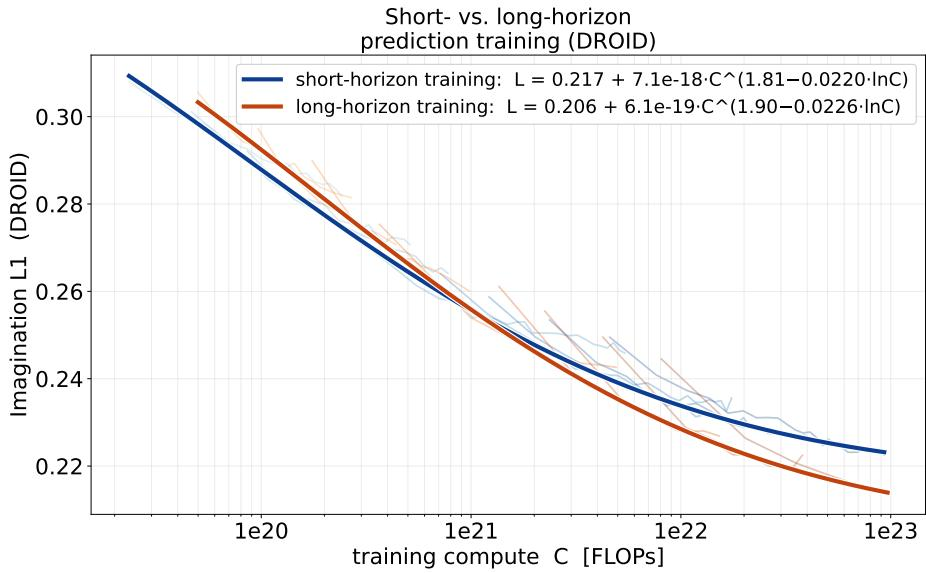  
Figure 30 Short- vs. long-horizon prediction training on DROID. Out-of-distribution imagination L1 on the DROID holdout versus training compute. Faded curves are per-size checkpoints (blue: short-horizon training, orange: long-horizon training; shade encodes model size); the bold curves are the two second-order power laws fit on each recipe’s frontier. The long-horizon training law overtakes the short-horizon training one at high compute and reaches a lower irreducible floor.

Table 19 Per-optimizer-step training compute (in PF, i.e. ${ 1 0 } ^ { 1 5 }$ FLOPs) for each model size. All values report total FLOPs per optimizer step across the full training job and are used for the compute axis of the scaling-law plots. The short-horizon training column also applies to pretraining. The short-horizon recipe is exact; the long-horizon recipe runs its rollout with a KV cache and is the estimate without the cache scaled by the measured KV-cache factor 0.36.
<table><tr><td>Model size</td><td>Short-horizon training  $( K { = } 2 , 2 4 0 { \times } 3 2 0 )$ </td><td>Long-horizon training  $( K { = } 1 0 , 2 4 0 { \times } 3 2 0 + 4 8 0 { \times } 6 4 0 )$ </td></tr><tr><td>22M</td><td>1.56</td><td>6.86</td></tr><tr><td>50M</td><td>3.10</td><td>13.11</td></tr><tr><td>100M</td><td>5.74</td><td>23.53</td></tr><tr><td>300M</td><td>15.66</td><td>41.9</td></tr><tr><td>1B</td><td>47.77</td><td>176.15</td></tr><tr><td>2B</td><td>81.17</td><td>286.4</td></tr><tr><td>4B</td><td>157.84</td><td>534.45</td></tr><tr><td>8B</td><td>305.36</td><td>1002.75</td></tr></table>

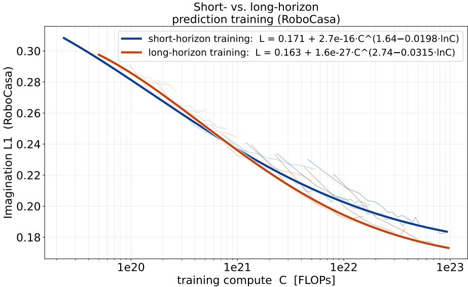  
Figure 31 Short- vs. long-horizon prediction training on RoboCasa. As Figure 30, for the RoboCasa target evaluation. The same crossover and lower floor for long-horizon training hold on the simulated suite.

Table 20 Per-step training compute at 8B for the three stages. All values report total FLOPs per optimizer step across the full training job. One finetune step is ∼19× a long-horizon training step and ∼62× a short-horizon training step. The finetune uses a longer sequence: a 720×1280 image is a 45×80=3,600-token grid per view (×3 views = 10,800 tokens, versus ∼300 tokens/view at 240×320), and self-attention is $O ( n ^ { 2 } )$ in tokens.
<table><tr><td>Stage</td><td>Recipe</td><td>Total per-step PFLOPs</td></tr><tr><td>Pretraining /</td><td></td><td></td></tr><tr><td>short-horizon training</td><td> $K { = } 2 , 2 4 0 { \times } 3 2 0 \ \mathrm { ( t p { = } 1 ) }$ </td><td>305 PF</td></tr><tr><td>Long-horizon training</td><td>K=10 with KV cache, multi-res  $\left( \mathrm { { t p } = 2 } \right)$ </td><td>1,003 PF</td></tr><tr><td>DROID 720×1280 finetune</td><td>3-view 720×1280, K=10 with KV cache  $\left( \mathrm { t p { = } 4 } \right)$ </td><td>~18,900PF</td></tr></table>

## J.5 Stochastic upper-envelope selection

Extracts the compute-optimal frontier of the downstream planning success-rate (reward) curves reported in the visual abstract (Figure 1). This procedure applies to the RoboCasa downstream planning tasks, where higher success rate is better. Every model size contributes many checkpoints, so at a fixed size the (compute, success-rate) pairs are stochastic rather than a single clean curve: evaluation noise and training instabilities give a scatter of points at nearby compute values. Fitting a scaling law requires the compute-optimal upper envelope — the best achievable success rate at each compute — rather than the raw scatter, but the obvious envelope estimators are both unsatisfying. A running maximum over compute is not robust: a single lucky, high-variance checkpoint pulls the envelope up prematurely and the estimate never recovers. Fitting the law to all points instead is dragged toward the mean of the scatter, since many dominated, lower checkpoints outnumber the few near the ceiling.

We instead select frontier points with a stochastic upper-envelope procedure that tracks a running estimate of the achievable ceiling and admits only points consistent with it, rejecting downward outliers before they can corrupt the running estimate. Concretely, we pool all (compute, success-rate) pairs $( C _ { i } , y _ { i } )$ across model sizes (higher y is better) and sort them by ascending compute. The running mean m and variance v are initialized from the first three points, which are always kept. Each subsequent point is compared against the current upper trend $m - k s$ , where $s = \sqrt { v }$ and $k \geq 0$ is a rejection threshold in standard-deviation units: a point is accepted onto the frontier only if it does not fall more than k standard deviations below the running mean. Accepted points update m and v with an exponentially-weighted (West) moving-average and moving-variance update governed by a retention factor $\alpha \in ( 0 , 1 )$ , so recent frontier points dominate the running estimate while stale ones decay away; rejected points leave m and v untouched, so a single downward outlier can neither join the frontier nor bias the trend used to judge later points. The scaling law is then fit only on the resulting frontier set. We use $\alpha = 0 . 9$ throughout, with a per-task rejection threshold matched to the four RoboCasa downstream planning tasks of the visual abstract: $k \approx 0 . 5$ for the two shorter-horizon, greedy tasks, a larger $k \approx 2$ for the noisier long-horizon obstacle task, and no rejection $( k \to \infty ,$ , all points kept) for the object-push task, reflecting the difering success-rate evaluation noise of each task (short-horizon vs. long-horizon, and whether object interaction is involved).

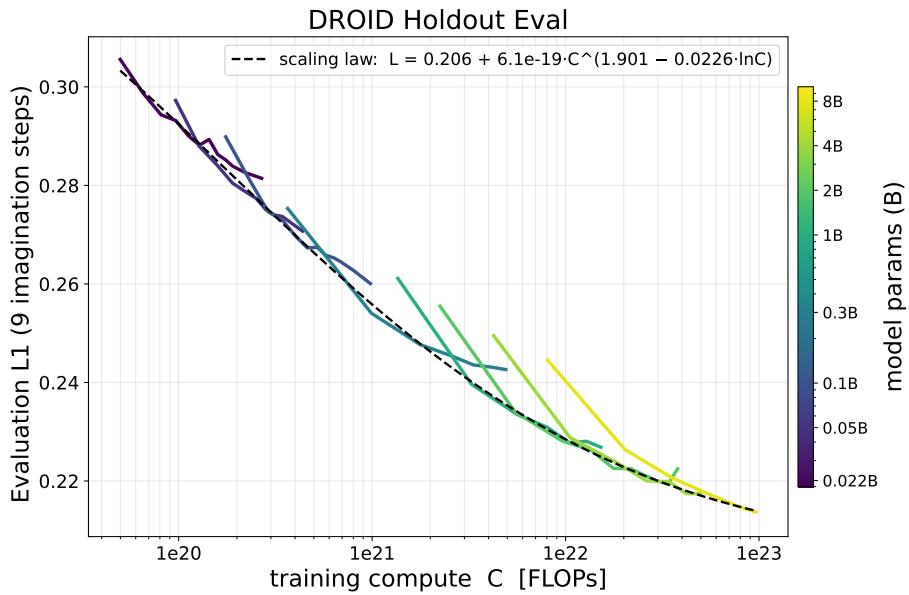  
Figure 32 Long-horizon training scaling law on DROID. Long-horizon prediction training alone: per-size checkpoint curves colored by parameter count, with the fitted second-order power law (dashed) on the compute-optimal frontier of the DROID holdout evaluation.

Algorithm 2 Stochastic upper-envelope (frontier) selection   
Require: points $\{ ( C _ { i } , y _ { i } ) \}$ pooled across model sizes (higher y is better); retention factor $\alpha \in ( 0 , 1 )$ ; rejection   
threshold $k \geq 0$   
Ensure: frontier index set S   
1: Sort points by ascending compute C   
2: Initialize running mean m and variance v from the first three points   
3: $S \gets \{ 1 , 2 , 3 \}$   
4: for each subsequent point $( C _ { i } , y _ { i } )$ do   
5: $s \gets \sqrt { v }$   
6: if $y _ { i } > m - k s$ then ▷ accept: not an anomalous downward dip   
7: $S  S \cup \{ i \}$   
8: $d \gets y _ { i } - m$   
9: $m  m + ( 1 - \alpha ) d$   
10: $v  \alpha \big ( v + ( 1 - \alpha ) d ^ { 2 } \big )$   
11: else   
12: reject i ▷ m, v left unchanged   
13: end if   
14: end for   
15: return $\{ ( C _ { i } , y _ { i } ) : i \in S \}$

The new-point weight (1 − α) controls how quickly the running estimate adapts: α close to 1 retains a long memory of past frontier points and adapts slowly, while smaller α tracks recent points more aggressively. Because m and v are updated only on accepted points, the procedure is robust to an arbitrary number of downward outliers at any compute scale, unlike a plain running maximum. A reference implementation is provided in make\_plot.py as the function stochastic\_envelope.

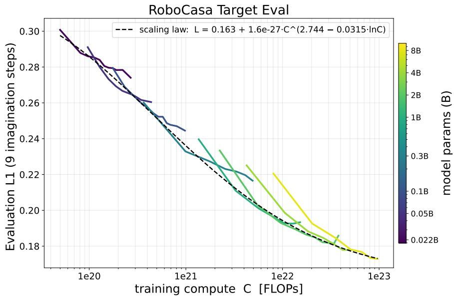  
Figure 33 Long-horizon training scaling law on RoboCasa. As Figure 32, for the RoboCasa target evaluation.

## K Encoder Choice and World-Model Scaling

Initially, we started the project by scaling the predictor on top of the V-JEPA 2 encoder. However, we faced numerous issues and instabilities during training. The predictor often collapsed beyond a certain model size, despite the frozen encoder, and increasing the dataset size often led to training instabilities or sometimes divergence. For both encoders, we worked with image features only. We hypothesize that this behavior can be attributed to the type of features the encoder computes.

Table 21 restates published evaluations of V-JEPA 2 (Assran et al., 2025) and V-JEPA 2.1 (Mur-Labadia et al., 2026) on the classification, semantic segmentation, and depth estimation benchmarks shown in Figure 2 of the latter paper, together with IntPhys2 (Bordes et al., 2025) results reported by Punzo et al. (2026). These are results from the cited papers, not evaluations conducted in this work.

Table 21 shows that the V-JEPA 2 and V-JEPA 2.1 encoders perform on par on image and video understanding tasks, measured through image and video classification, and V-JEPA 2.1 even obtains a lower reported score on the IntPhys2 intuitive physics task than V-JEPA 2. On the other hand, V-JEPA 2.1 substantially outperforms V-JEPA 2 on dense tasks such as depth estimation and semantic segmentation. Given this large gap, we hypothesize that high-quality dense features are the most important features for scaling robotic world models, even more important than features associated with physical understanding.

Table 21 Restated results from Mur-Labadia et al. (2026) (Tables 8–9) and Punzo et al. (2026) (Table 1, IntPhys2); V-JEPA 2 classification results are also reported by Assran et al. (2025) (Table 4). We distinguish global tasks (action recognition, image classification, and intuitive physics) from dense tasks (semantic segmentation and depth estimation), following the grouping in Figure 2 of Mur-Labadia et al. (2026). Classification uses attentive probes; segmentation and depth use linear probes, with frozen encoders. IntPhys2 reports mean violation-of-expectation (VOE) accuracy over three seeds with a temporal attentive probe at each model’s best reported layer. Higher accuracy and mIoU, and lower RMSE, are better. Model sizes and pretraining recipes difer, so this is not a controlled ablation.
<table><tr><td>Type</td><td>Benchmark</td><td>Metric</td><td>V-JEPA 2 ViT-g (1B)</td><td>V-JEPA 2.1 ViT-G (2B)</td></tr><tr><td>Global</td><td>SSv2 action recognition</td><td>Top-1 (%) ↑</td><td>77.3</td><td>77.7</td></tr><tr><td>Global</td><td>K400 action recognition</td><td>Top-1 (%) ↑</td><td>87.3</td><td>87.7</td></tr><tr><td>Global</td><td>IN1K image classification</td><td>Top-1 (%) ↑</td><td>85.1</td><td>85.5</td></tr><tr><td>Global</td><td>IntPhys2 (Bordes et al., 2025)</td><td>VOE (%) ↑</td><td>66.0</td><td>58.8</td></tr><tr><td>Dense</td><td>ADE20K semantic segmentation</td><td>mIoU (%) ↑</td><td>24.4</td><td>47.9</td></tr><tr><td>Dense</td><td>NYUv2 depth estimation</td><td>RMSE↓</td><td>0.642</td><td>0.307</td></tr></table>