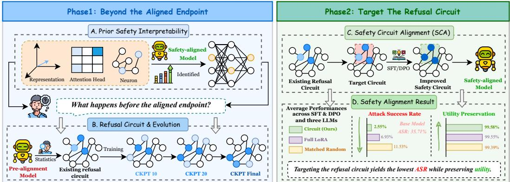
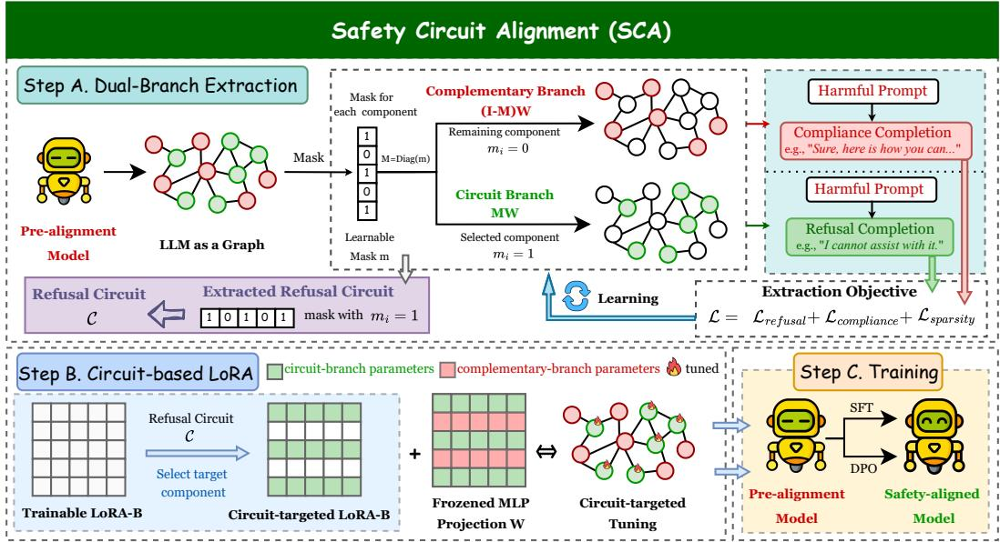
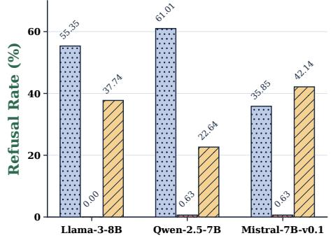
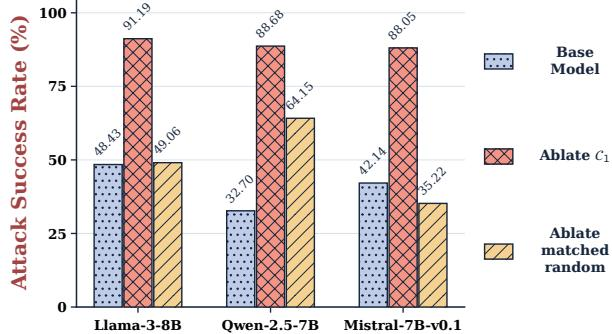
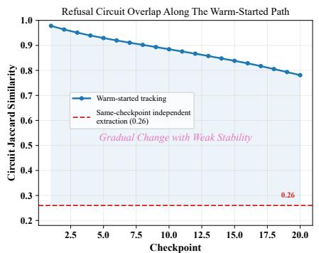
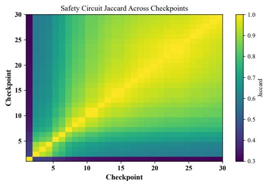
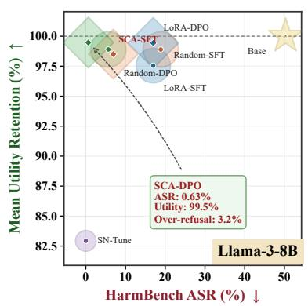
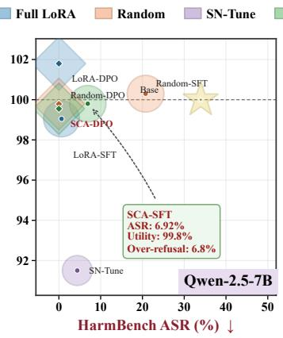
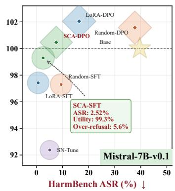

# SAFEEVO: DECIPHERING THE SAFETY ALIGNMENT MECHANISM AND EVOLUTION IN LANGUAGE MODELS

Miao Yu1,∗, Hao Huang2,∗, Lu Yuan3, Yunpeng Li2, Kun Wang4, Zuming Jiang1,† 1The University of Hong Kong (HKU)

2Chinese Academy of Sciences (CAS)

3Information Engineering University (IEU)

4Nanyang Technological University (NTU)

## ABSTRACT

Safety interpretability advances the study of Large Language Model (LLM) alignment from behavioral constraints driven by data or algorithms towards a deeper understanding of internal mechanisms. However, existing works have focused primarily on safety-related representations, attention heads, or neurons after alignment, while largely overlooking the safety mechanisms in pretrained-only models and their evolution across alignment checkpoints. To address this, we propose SafeEvo, an interpretability framework from the circuit (sparse subgraphs of an LLM) perspective. SafeEvo first applies an optimization-based extraction algorithm to identify weak refusal circuits in pretrained base LLMs that can independently express refusal behavior. Causally ablating these circuits completely eliminates the base model’s refusal of harmful inputs. SafeEvo then traces the evolution of refusal circuits across successive alignment checkpoints and finds that their structures change progressively, suggesting that the alignment tax may result from refusal-circuit updates affecting utility-related parameters. To validate this, SafeEvo introduces Safety Circuit Alignment (SCA), which confines safety updates to the refusal circuits. Experiments across three LLMs and two alignment algorithms show that, on average, SCA outperforms vanilla alignment in three aspects: (1) stronger alignment, lowering harmfulness score by 63.21%; (2) less over-refusal, yielding a 58.44% decrease in refusal rates for benign queries; and (3) better utility, retaining 99.58% of the original model capabilities. Our code is available at: https://github.com/a727990982/SafeEvo.

## 1 INTRODUCTION

As large language models (LLMs) evolve from conversational models (Team et al., 2026; Xu et al., 2026) into complex agentic systems (Ferrag et al., 2026; Lee & Kim, 2026), their capabilities and applications expand substantially. This transition amplifies the risks of harmful behavior, which can propagate through tool use to cause direct real-world harm (Luo et al., 2026a; Yu et al., 2025; Wang et al., 2025). Reliable safety alignment is therefore essential. At its core, alignment seeks to steer model behavior toward safety requirements while preserving useful capabilities (Ji et al., 2026b; Li et al., 2026; Zhou et al., 2025a). Existing methods pursue this goal via supervised demonstrations, preference feedback, or reward design (Ouyang et al., 2022; Ji et al., 2023b; Kim et al., 2026; Cao et al., 2026). Nevertheless, the research in this line focuses on surface-level and behavioral patterns, with limited investigation into the underlying safety mechanisms, despite the corresponding insights for better alignment algorithms and more trustworthy models (Bereska & Gavves, 2024).

In fact, another line of works on safety interpretability (Lee et al., 2025) have attempted to explain the internal mechanisms of alignment (Elhage et al., 2021). By designing heuristic metrics and search algorithms, they identify attention heads (Zheng et al., 2026; Zhou et al., 2025b; Zheng et al., 2025), neurons (Zhao et al., 2025c; Yi et al., 2025), layers (Li et al., 2025b), and representation (Jiao et al., 2026; Luo et al., 2026c; Zhou et al., 2024) (e.g., refusal direction but we establish the more interpretable and fundamental refusal circuits) associated with safety concepts. However, these interpretability studies and the related alignment methods (Yang et al., 2026; Zhao et al., 2025b; Li et al., 2025a) focus on the already safety-aligned models only at a fixed endpoint. They lack both attention and methodologies to delve into the safety mechanisms in pretrained base LLMs and their evolution dynamics during safety post-training, which may contribute to alignment improvement.

  
Figure 1: From circuit discovery to circuit-targeted alignment. We move beyond endpoint interpretability by tracing refusal circuits from pretrained-only models and their subsequent evolution (Phase 1). We then develop alignment methods that directly target the identified circuits for better safety-utility trade-off (Phase 2).

To this end, we introduce SafeEvo, an interpretability framework that attributes LLM alignment to sparse circuits capable of independently eliciting refusal, identifies these refusal circuits in pretrained only LLMs, and traces their evolution throughout alignment. SafeEvo first casts circuit extraction as an optimization problem rather than relying on heuristic attribution (Behrouzi et al., 2026a; Zhou et al., 2025b). Specifically, it learns differentiable masks for each LLM units that automatically isolate a sparse circuit with full safety ability. Applying this technique, we find that pretrained-only Llama-3-8B, Qwen-2.5-7B, and Mistral-7B models are not entirely devoid of safety-related components. Across these models, ablating the identified refusal circuit increases attack success rate (ASR) on HarmBench by 42.76%, 55.98%, and 45.91%, respectively. SafeEvo therefore advances and empirically validates the hypothesis that refusal circuits are already present in base LLMs, albeit in a weak (reflected by ASR ranging from 32.7% ∼ 48.43 %) form and effective only for a subset of harmful queries. This finding corroborates and advances prior representation-level evidence (Zhou et al., 2024) that base LLMs already encode harmfulness and harmlessness from circuit perspective.

We further use SafeEvo to track refusal circuits across alignment checkpoints and quantify their evolution. Warm-starting each extraction from the circuit identified at the preceding checkpoint reveals a gradual structural drift: the overlap between adjacent circuits decreases from 98% at the onset of alignment to 78% after 20 checkpoints. Moreover, independent extraction runs recover multiple circuits that fully and independently reproduce the refusal behavior but share only 26% overlap. Together, these findings demonstrate that refusal circuits are both non-unique and structurally unstable during alignment. This observation offers a possible mechanistic explanation for the “alignment tax”—the degradation of utility after alignment: the underconstrained updates ofrefusal circuits may spill over into utility-relevant parameters, thereby compromising general performance.

Inspired by these insights and to empirically support them, we introduce Safety Circuit Alignment (SCA), which confines safety-related updates to only one identified refusal circuit and only optimizes its associated parameters. This design mitigates the observed non-uniqueness and instability of refusal circuit evolution and can be readily combined with existing alignment algorithms. Across three LLMs on HarmBench (Mazeika et al., 2024) and AdvBench (Zou et al., 2023), comparing SCA with vanilla alignment via supervised fine-tuning (SFT) (Zhao et al., 2025a) and direct preference optimization (DPO) (Hu et al., 2026) reduces average ASR by 2.29% points (43.81% ↓) and 6.47% points (74.94% ↓), respectively, while retaining more utility on GSM8k, MMLU, and HellaSwag. Besides, SCA outperforms a safety-neuron-based baseline and matched-sparsity ablation on random circuits, validating SafeEvo’s mechanistic insights as useful foundations for more effective alignment.

In summary, our main contributions can be listed as follows:

• Cross-Stage Framework. We propose SafeEvo, an interpretability framework for attributing LLM alignment to refusal circuits and tracking their evolution throughout safety post-training.

• Novel Insights. We provide causal and experimental evidence that weak refusal circuits already exist in pretrained-only LLMs and reveal their non-uniqueness and instability in vanilla alignment.

• Circuit-Guided Alignment. We introduce SCA, which localizes safety updates to pre-alignment refusal circuits, achieving a favorable balance among safety, utility preservation, and over-refusal.

## 2 RELATED WORK

LLM Alignment. To prevent LLMs from enabling dangerous behavior (Liu et al., 2023; Luo et al., 2026b; Zhang et al., 2024), prevailing alignment works steer model responses to harmful queries toward refusal, either via SFT (Yang et al., 2026; Fan et al., 2026) on synthetic refusal data or via DPO on preference pairs (Ji et al., 2026a; Deng et al., 2026). Optimizing for refusal alone, however, tends to induce over-refusal and erode general capability (Jalan et al., 2026; Niu et al., 2026). A subsequent line of work mitigates this tension by synthesizing data that is jointly helpful and harmless (Wang et al., 2024; Huang et al., 2026), and by shaping rewards with explicit utility constraints (Ji et al., 2026b). Orthogonally, mechanistic-interpretability approaches localize neurons causally implicated in the safety boundary (Wang et al., 2026; Zhao et al., 2025b; Behrouzi et al., 2026b). SafeEvo departs from this last line in the granularity and sufficiency of the located structure: we identify a subgraph within LLMs (circuit) that independently realizes safety-refusal behavior — a sufficiency property individual causal neurons do not exhibit. As a more intrinsic locus of the model’s safety capability, this circuit reasonably affords a better alignment–utility trade-off under targeted tuning.

Safety Interpretability. Applying perspectives and techniques from mechanistic interpretability (Naseem, 2026) to safety, studies in this direction asks how safety behaviors are computed inside the LLM and why they fail (Lad, 2024; Lee et al., 2025). Prior efforts differ mainly in the granularity at which they localize safety. Representation-level analyses decode intermediate activations and find that refusal versus jailbreak tracks the polarity encoded in hidden states (He et al., 2025; Jiao et al., 2026). Component-level studies use activation patching and causal attribution to show that a sparse set of attention heads carries refusal (Zheng et al., 2026; Zhou et al., 2025b), and that ablating them suffices to remove it. Neuron-level work identifies safety neurons and repurposes them for jailbreak analysis (Zhao et al., 2026) and alignment strengthening (Zhao et al., 2025b). These efforts, however, largely examine post-alignment LLMs. SafeEvo instead adopts a circuit-level view (Yu et al., 2026) and traces the evolution of safety-related circuits across alignment checkpoints from pretrained-only base LLMs, yielding deeper understanding and insights for designing better alignment algorithms.

## 3 REFUSAL CIRCUIT DISCOVERY AND EVOLUTION

Our investigation begins with a simple yet subtle phenomenon: pretrained-only base LLMs refuse a small fraction of harmful queries, as also shown in prior work (Kissane et al., 2024). Building on this observation, we hypothesize that pre-alignment LLMs may contain certain separable components responsible for refusal, or more specifically, a sparse and functionally complete refusal circuit.

We first formulate how to identify safety-related refusal circuits (Section 3.1). Then, we test the causal contribution and ability of these circuits via ablation and isolation, respectively (Section 3.2). Finally, we track refusal circuits during early safety alignment, examining changes across checkpoints and variation across independent extractions (Section 3.3). Figure 2 demonstrates the overview of SafeEvo and its application for better alignment via localized refusal circuit tuning.

## 3.1 REFUSAL CIRCUIT EXTRACTION

We refer to a sparse subset of model components, together with the computational subgraph they induce, that can express refusal behavior in isolation as a refusal circuit. Extracting such a circuit amounts to a selection over a combinatorially large space. A common approach in previous works guides this using heuristic component-level scores based on activations, attributions, or weights (Zhao et al., 2025b; Chen et al., 2024; Yi et al., 2024), but they only capture circuit for only one token generation. We instead cast refusal circuit discovery as an optimization problem: each candidate component is associated with a learnable binary selection variable (a mask), and with the LLM weights frozen, the masks are optimized jointly such that the selected express refusal on their own, their complement generates harmful-compliance completions, and the selection remains sparse.

  
Figure 2: Overview of our Safety Circuit Alignment algorithm. It first extracts a refusal circuit before LLM alignment (Step A) and only fine-tunes the identified parameters in that circuit for precise alignment (Step B).

Circuit Components. We take MLP neurons as the unit of refusal circuits for selection, since Multi-layer Perceptron (MLP) modules in LLMs are widely regarded as the primary locus of stored knowledge and behaviors. The gated MLP (common in today’s LLMs) at layer ℓ can be defined as:

$$
\mathrm { M L P } _ { \ell } ( h _ { \ell } ) = W _ { \ell , \mathrm { d o w n } } \left[ \phi ( W _ { \ell , \mathrm { g a t e } } h _ { \ell } ) \odot ( W _ { \ell , \mathrm { u p } } h _ { \ell } ) \right] ,\tag{1}
$$

where $h _ { \ell } \in \mathbb { R } ^ { d _ { \mathrm { m o d e l } } }$ is the MLP input, ϕ is the gating function, and ⊙ is element-wise multiplication. $W _ { \ell , \mathrm { g a t e } } , \mathbf { \bar { \mathit { W } } } _ { \ell , \mathrm { u p } } \in \mathbb { R } ^ { d _ { \mathrm { f f } } \times d _ { \mathrm { m o d e l } } }$ map to the intermediate MLP space, while $W _ { \ell , \mathrm { d o w n } } \in \mathbb { R } ^ { \dot { d } _ { \mathrm { m o d e l } } \times d _ { \mathrm { f f } } }$ maps back to the model space. Each projection is a linear map whose i-th output coordinate is computed exclusively by the i-th row of its weight matrix. We regard each such row–output pair as one MLP neuron. For each projection $p \in \mathcal { P } = \{ \mathrm { g a t e } , \mathrm { u p }$ , down}, we denote its frozen weight, binary neuron mask, and diagonal mask by the following, respectively:

$$
W _ { \ell , p } \in \mathbb { R } ^ { d _ { \mathrm { o u t } , p } \times d _ { \mathrm { i n } , p } } , \qquad m _ { \ell , p } \in \{ 0 , 1 \} ^ { d _ { \mathrm { o u t } , p } } , \qquad M _ { \ell , p } = \mathrm { D i a g } ( m _ { \ell , p } ) ,\tag{2}
$$

and collect all candidates into the universal neuron set $\mathcal { U } = \{ ( \ell , p , i ) ~ | ~ \ell \in [ L ] , p \in \mathcal { P } , i \in [ d _ { \mathrm { o u t } , p } ] \}$ Since the projections are row-separable, any neuron can be switched off by zeroing its row without altering other neurons, making U a natural basis for defining refusal circuits.

Refusal Circuit. Let $\mathcal { M } = \{ m _ { \ell , p } \} _ { \ell , p }$ collect all neuron masks and $\overline { { \mathcal { M } } } = \{ \mathbf { 1 } - m _ { \ell , p } \} _ { \ell , p }$ denote its complement. For input $h _ { \ell , p } ,$ the original, circuit, and complementary outputs of each projection are:

$$
\begin{array} { r l r l } & { z _ { \ell , p } = W _ { \ell , p } h _ { \ell , p } , } & & { \underbrace { z _ { \ell , p } ^ { C } = M _ { \ell , p } W _ { \ell , p } h _ { \ell , p } } _ { \mathrm { c i r c u i t ~ f o r ~ r e f u s a l } } , \qquad \underbrace { z _ { \ell , p } ^ { C } = ( I - M _ { \ell , p } ) W _ { \ell , p } h _ { \ell , p } } _ { \mathrm { c o m p l e m e n t ~ f o r ~ c o m p l i a n c e } } . } \end{array}\tag{3}
$$

Since $M _ { \ell , p } + ( I - M _ { \ell , p } ) = I$ , we have $z _ { \ell , p } = z _ { \ell , p } ^ { C } + z _ { \ell , p } ^ { \bar { C } } ,$ , i.e., the masks induce an exact partition of U into a circuit part (sparse refusal circuit) and a complement part (the remaining dense graph):

$$
C = \{ ( \ell , p , i ) \mid m _ { \ell , p , i } = 1 \} , \qquad { \bar { C } } = \mathcal { U } \setminus C , \qquad | C | = \sum _ { \ell , p } \| m _ { \ell , p } \| _ { 0 } ,\tag{4}
$$

where |C| counts the selected neurons. The circuit model $p _ { \theta , { \mathcal { M } } }$ replaces every projection output in Eq. 1 by $z _ { \ell , p } ^ { C } .$ zero-ablating all neurons in $\bar { C } ;$ symmetrically, the complementary model $p _ { \theta , \overline { { { \mathcal { M } } } } }$ uses $z _ { \ell , p } ^ { \bar { C } }$ and zero-ablates C. Masking a gate or up neuron removes its intermediate coordinate from the input of $W _ { \ell , \mathrm { d o w n } } ,$ , and masking a down neuron removes the ${ \bf M L P } ^ { \prime } { \bf s }$ contribution to one residual-stream coordinate, so C specifies a sparse computational subgraph rather than a bag of isolated neurons.

Table 1: Refusal rate of the base model, the refusal circuit and its complement branch for harmful queries in the BeaverTails dataset. Marker ↑ and ↓ show the increase and decrease compared with the base models.
<table><tr><td>Models / Refusal Rate (%) Base Model Refusal Circuit (C1) Density (C1) Complement Branch</td><td></td><td></td><td></td><td></td></tr><tr><td>Llama-3-8B</td><td>48.04</td><td> $\mathbf { 1 0 0 . 0 0 } \uparrow 5 1 . 9 6$ </td><td>0.74%</td><td> $\mathbf { 0 . 0 0 } \downarrow 4 8 . 0 4$ </td></tr><tr><td> $\mathbf { Q } \mathrm { w e n } { - 2 . 5 { - 7 } \mathbf { B } }$ </td><td>35.15</td><td> $\mathbf { 1 0 0 . 0 0 } \uparrow 6 4 . 8 5$ </td><td>0.80%</td><td> $\mathbf { 0 . 0 0 } \downarrow 3 5 . 1 5$ </td></tr><tr><td> $\mathrm { M i s t r a l - 7 B - v 0 . 1 }$ </td><td>15.63</td><td> $\mathbf { 1 0 0 . 0 0 } \uparrow 8 4 . 3 7$ </td><td>0.75%</td><td> $\mathbf { 0 . 0 0 } \downarrow 1 5 . 6 3$ </td></tr></table>

Refusal Rate and ASR on HarmBench for Refusal Circuit Ablation

  
Figure 3: Refusal rate and ASR on HarmBench for base LLMs and the same models with the identified refusal circuits $C _ { 1 }$ ablated, compared to the density-matched random ablation models.

Differentiable Mask Optimization. The binary masks in Eq. 2 are not differentiable. We therefore parameterize each mask by a latent vector $q _ { \ell , p } \in \mathbf { \bar { \mathbb { R } } } ^ { d _ { \mathrm { o u t } , p } }$ with soft mask $\widetilde { m } _ { \ell , p } = \sigma ( q _ { \ell , p } ) \in ( 0 , 1 ) ^ { d _ { \mathrm { o u t } , p } }$ A purely continuous relaxation, however, lets the circuit rely on fractionally scaled neurons that vanish once thresholded, causing a train–test inconsistency. To keep the forward pass strictly binary and differentiable, we binarize the soft masks with threshold η via a straight-through estimator (STE):

$$
m _ { \ell , p } = k ^ { \ell } [ \widetilde { m } _ { \ell , p } > \eta ] , \qquad M _ { \ell , p } = \mathrm { D i a g } \big ( \widetilde { m } _ { \ell , p } + \mathrm { s g } \big ( m _ { \ell , p } - \widetilde { m } _ { \ell , p } \big ) \big ) ,\tag{5}
$$

where $\operatorname { s g } ( \cdot )$ is the stop-gradient operator. In the forward pass $M _ { \ell , p }$ equals the binary $\mathrm { D i a g } ( m _ { \ell , p } )$ , so Eq. 3 always evaluates a discrete partition; in the backward pass, $\nabla \mathrm { s g } ( \cdot ) \equiv 0$ routes the gradient of $M _ { \ell , p }$ to $\widetilde { m } _ { \ell , p }$ and hence to $q _ { \ell , p }$ . We initialize $q _ { \ell , p }$ with large positive values so that $M _ { \ell , p } = I ,$ i.e., extraction starts from the intact LLM and progressively prunes neurons out of the circuit.

Dual-branch Extraction Objective. We learn the masks with two completion-supervision branches: the refusal branch trains the circuit on refusal completions ${ \mathcal { D } } _ { \mathrm { r e f } }$ , whereas the compliance branch trains the complementary model on harmful-compliance completions $\mathcal { D } _ { \mathrm { c m p } }$ . The total loss is:

$$
\mathcal { L } _ { \mathrm { e x t } } ( \mathcal { M } ) = \underbrace { \alpha \mathcal { L } _ { \mathrm { S F T } } ( \mathcal { M } ; \mathcal { D } _ { \mathrm { r e f } } ) } _ { \mathrm { c i r c u i t / r e f u s a l } } + \underbrace { \beta \mathcal { L } _ { \mathrm { S F T } } ( \overline { { \mathcal { M } } } ; \mathcal { D } _ { \mathrm { c m p } } ) } _ { \mathrm { c o m p l e m e n t / c o m p l i a n c e } } + \lambda _ { \mathrm { m l p } } \sum _ { \ell , p } \frac { \Vert \widetilde { m } _ { \ell , p } \Vert _ { 1 } } { d _ { \mathrm { o u t } , p } } ,\tag{6}
$$

where $\mathcal { L } _ { \mathrm { S F T } } ( \mathcal { M } ; \mathcal { D } )$ is the token-level negative log-likelihood of completions y given prompts x in D under the masked model $p _ { \theta , { \mathcal { M } } }$ , and only $\{ q _ { \ell , p } \}$ are optimized while θ remains frozen. The two branches assign complementary roles to the partition: the refusal term requires C to be sufficient for refusal, while the compliance term requires $\bar { C }$ to retain harmful compliance, ruling out the trivial solution $M _ { \ell , p } = I$ and implying that removing C suppresses refusal. The normalized $L _ { 1 }$ penalty on the soft masks prunes uninformative neurons, yielding a compact circuit; $\alpha , \beta ,$ and $\lambda _ { \mathrm { m l p } }$ balance the three terms. Upon convergence, the refusal circuit is read out from the binary masks via Eq. 4.

## 3.2 REFUSAL CIRCUITS IN PRETRAINED-ONLY LLMS

We apply the techniques in Section 3.1 and LLM-LAT (Sheshadri et al., 2025) as the dataset to extract a candidate refusal circuit $C _ { 1 }$ from Llama-3-8B, Qwen-2.5-7B, and $\mathtt { M i s t r a l - 7 B - v 0 . 1 }$ , all containing only $< 1 \%$ of the model parameters. Then we investigate the properties of the base LLMs, the circuits, and their complement branches via two behavioral metrics: ASR, which measures positive compliance for harmful queries, and refusal rate, which measures explicit refusal behaviors.

Takeaway 1: Our extracted candidates are sparse, functionally complete refusal circuits that can express refusal in isolation. We evaluate the refusal rates on BeaverTails (Ji et al., 2023b), a harmful-query dataset that is out-of-distribution (OOD) relative to the data for circuit search. As shown in Table 1, pretrained-only base LLMs occasionally refuse harmful queries (with refusal rates of $1 5 \% \sim 4 8 \% )$ , whereas every extracted circuit achieves a 100% OOD refusal rate while containing only $< 1 \%$ parameters. These results indicate that our extraction method successfully identifies a refusal circuit that generalizes to unseen harmful queries. Moreover, ablating the circuit eliminates refusal in the complete branch with all refusal rates drops to 0%. Together, these findings suggest that a sparse circuit plays the core and fundamental role in LLM refusal of harmful requests.

  
Figure 4: Evolution of refusal circuits across alignment, traced and quantified by Jaccard similarity.

Takeaway 2: Ablating refusal circuits substantially increases model harmfulness. To further test the causal relationship between refusal circuits and safety alignment, we zero ablate the outputs of components in each refusal circuit and compare the results with a random zero-ablation baseline at the same density. As shown in Figure 3, circuit ablation severely impairs refusal, yielding refusal rates of 0.00% ∼ 0.63%. Meanwhile, ASR rises from 48.43%, 32.70%, and 42.14% to 91.19%, 88.68%, and 88.05%, respectively (relative increases of 88.3%, 171.2%, and 109.0%). The increases under random ablation are much smaller. These causal ablation results show that safety alignment is causally linked to refusal circuits, suggesting that LLMs’ safety capabilities may originatefrom them.

## 3.3 REFUSAL CIRCUIT EVOLUTION DURING SAFETY ALIGNMENT

Section 3.2 provides experimental evidence for functional refusal circuits in base LLMs, but does not investigate their evolution (whether the same circuits still support refusal as alignment proceeds). We therefore track the composition of extracted refusal circuits across safety-alignment checkpoints.

Tracking protocol. We apply SFT-based safety alignment to the Llama-3-8B base model and track the evolution of its refusal circuit over the first several aligned checkpoints. To capture incremental changes, we warm-start each extraction from the circuit found at the preceding checkpoint. Then we measure refusal circuit continuity using the Jaccard overlap between consecutive checkpoints. Besides, we also perform multiple independent extractions at a single checkpoint to further quantify run-to-run variability, providing a reference for assessing cross-checkpoint similarity.

Takeaway 3: Refusal circuits are not unique within a given LLM or checkpoint. As shown in the left panel of Figure 4, independently extracted refusal circuits at the same checkpoint exhibit only 0.26 average component overlap, far below the $0 . 7 8 \sim 0 . 9 8$ similarity for warm-started extractions. This indicates that refusal functionality is implemented redundantly in LLMs, with multiple valid refusal circuits sharing only certain components (maybe relate to basic language capabilities).

Takeaway 4: Refusal circuits undergo gradual structural drift during alignment. As shown by the warm-started extractions in Figure 4, component similarity between consecutive checkpoints declines smoothly from $1 . 0 0  0 . 7 8 .$ indicating that the circuits progressively acquire and discard components rather than remaining fixed. Cross-checkpoint comparisons (the right similarity heatmap of Figure 4) further reveal a larger shift between the base model’s (pre-alignment) circuit and those after several alignment steps (similarity $\sim 0 . 6 0 )$ . These results consistently support the gradual evolution and weak stability of refusal circuits during LLM safety post-training.

Together, these two findings establish a simple picture of refusal circuits: refusal originates in and can be attributed to different circuits whose composition evolves gradually during alignment. This view may offers a potential account of the “alignment $\tan ^ { \gamma }$ incurred during safety post-training: safety alignment alters the refusal circuits that underlie $L L M s ^ { \prime }$ refusal capabilities, and unconstrained parameter updates may inadvertently affect parameters associated with utility, including general capabilities. Motivated by this hypothesis and seeking to test it empirically to some extent, we propose restricting safety-alignment updates entirely to the refusal circuit in the base LLMs, which is already present and does not interfere with the knowledge and capabilities acquired during pretraining.

## 4 SAFETY CIRCUIT ALIGNMENT

To test the above hypothesis and develop a more effective alignment algorithm, we introduce Safety Circuit Alignment (SCA), which restricts safety updates to the pre-alignment refusal circuits in base LLMs, inspired by our interpretability insights in Section 3. We first formulate the core principle of SCA in Section 4.1 and introduce the experiment setups for subsequent safety alignment in Section 4.2. Then we present and analyze the experiment results of our methods with other baselines’ in Section 4.3. The overview of our SCA technique is illustrated in Figure 2.

## 4.1 ALIGNMENT ALGORITHM (SCA)

SCA confines all safety-alignment updates to the refusal circuit C extracted from the pre-alignment LLM. Concretely, we parameterize the update of each MLP projection with LoRA and reuse the binary neuron mask $M _ { \ell , p } = \mathrm { D i a g } ( m _ { \ell , p } )$ obtained by Eq. 6 to restrict the rank-r update to the circuit:

$$
\begin{array} { r } { W _ { \ell , p } ^ { \prime } = W _ { \ell , p } + M _ { \ell , p } B _ { \ell , p } A _ { \ell , p } , } \end{array}\tag{7}
$$

where $A _ { \ell , p } \in \mathbb { R } ^ { r \times d _ { \mathrm { i n } , p } }$ and $B _ { \ell , p } \in \mathbb { R } ^ { d _ { \mathrm { o u t } , p } \times r }$ . Since $M _ { \ell , p }$ is diagonal and binary, $M _ { \ell , p } B _ { \ell , p } A _ { \ell , p }$ has non-zero rows exactly at the neurons in $C \ ( { \mathrm { E q . 4 } } )$ , so $\bar { W } _ { \ell , p } ^ { \prime }$ differs from $W _ { \ell , p }$ only on the rows of circuit neurons, while the weights of $\bar { C }$ and all attention modules remain identical to the base model. During alignment, $M _ { \ell , p }$ stays fixed and $W _ { \ell , p }$ is frozen; only $A _ { \ell , p }$ and $B _ { \ell , p }$ are optimized.

SCA changes the update support rather than the alignment loss. Let $o \in \{ \mathrm { S F T } , \mathrm { D P O } \}$ index the objective and $\theta _ { M } ^ { ( k ) }$ denote the policy parameterized by Eq. 7 at step k. SCA’s update is formulated as:

$$
B _ { \ell , p } ^ { ( k + 1 , o ) } = B _ { \ell , p } ^ { ( k ) } - \gamma M _ { \ell , p } \nabla _ { B _ { \ell , p } } \mathcal { L } _ { o } ( \theta _ { M } ^ { ( k ) } ) ,\tag{8}
$$

where $\gamma$ is the learning rate; the input factor $A _ { \ell , p }$ follows the ordinary optimizer update. $M _ { \ell , p }$ gates the rows of the gradient so that neurons outside C never receive an update, mirroring how Eq. 3 gates their outputs during extraction. We instantiate $\mathcal { L } _ { o }$ with two prevailing alignment objectives. For SFT, we adopt the $\mathcal { L } _ { \mathrm { S F T } }$ used in Section 3.1, now applied to $\pi _ { \boldsymbol { \theta } _ { M } }$ on refusal completions. For DPO, given a prompt x with a safe completion $y _ { w }$ and a harmful completion $y _ { l } ,$ we optimize:

$$
\mathscr { L } _ { \mathrm { D P O } } ( \theta _ { M } ) = - \mathbb { E } _ { ( x , y _ { w } , y _ { l } ) } \log \sigma \left( \tau \left[ \log \frac { \pi _ { \theta _ { M } } ( y _ { w } \mid x ) } { \pi _ { \mathrm { r e f } } ( y _ { w } \mid x ) } - \log \frac { \pi _ { \theta _ { M } } ( y _ { l } \mid x ) } { \pi _ { \mathrm { r e f } } ( y _ { l } \mid x ) } \right] \right) ,\tag{9}
$$

where $\pi _ { \mathrm { r e f } }$ is the frozen pre-alignment model and τ controls the deviation from it. Both losses are computed through the full forward pass of the LLM, but its gradient only alters the refusal circuits.

## 4.2 EXPERIMENTAL SETTINGS

Models. We select three LLMs: Llama-3-8B (Llama Team, 2024), Qwen-2.5-7B (Qwen Team, 2024), and Mistral-7B-Instruct-v0.1 (Jiang et al., 2023). Notably, we use the Mistral’s instruction-tuned version because its base model does not reliably follow the instruction format.

Alignment Objectives & Datasets. We utilize two prevailing and most important losses in safety aligment: SFT and DPO. Specifially, SFT uses the refusal completions from LLM-LAT (Sheshadri et al., 2025), while DPO adopts safety preference pairs in PKU-SafeRLHF (Ji et al., 2023b).

Evaluation Metrics & Datasets. For the safety evaluation, we calculate attack success rate (ASR) via the Llama-Guard-3-8B (Meta AI, 2024) model on HarmBench (Mazeika et al., 2024) and AdvBench (Zou et al., 2023). LLMs’ general utility after safety alignment is measured by the accuracies on GSM8K (Cobbe et al., 2021), MMLU (Hendrycks et al., 2021), and HellaSwag (Zellers et al., 2019), while over-refusal evaluation adopts the benign input prompts in XSTest (Röttger et al., 2024) and BeaverTails (Ji et al., 2023a). Notably, all evaluation datasets are held out from SFT and DPO training, preventing direct fitting and enabling a rigorous assessment of OOD generalization.

Baselines. All alignment methods in our experiments use either the SFT or DPO loss and differ only in how parameters are updated. As the basic baseline, we use vanilla fine-tuning via LoRA, where all model parameters are subject to updating. To isolate the effect of sparse updates in SCA, we compare it with a randomly selected update method at the same sparsity level, which does not specifically target refusal circuits. To demonstrate SCA’s deeper interpretability insights, we also include SN-Tune (Zhao et al., 2025b), an update method based on the interpretability of safety neurons as an additional baseline. Implementation details are provided in Appendix A.1.

Table 2: Safety, utility, and over-refusal for different baselines under SFT and DPO. Colored marker ↓ and ↑ indicate changes compared to base models, while those following dataset names denote whether lower or higher values are better. Bold and underline mark the best and second-best within each model–objective block.
<table><tr><td>Method</td><td>Objective</td><td colspan="3">Safety</td><td colspan="3">Utility</td></tr><tr><td></td><td></td><td>HarmB. (↓)</td><td>AdvB.(↓)</td><td>GSM8K (↑)</td><td>MMLU ((↑)</td><td>HSwag (↑)</td><td>XSTest (↓)</td></tr><tr><td colspan="8">LLAMA-3-8B</td></tr><tr><td>Base Model</td><td></td><td>50.31</td><td>52.88</td><td>50.34</td><td>65.36</td><td>53.05</td><td>0.8</td></tr><tr><td>LoRA</td><td>SFT</td><td>16.98↓33.33</td><td>12.50↓40.38</td><td>45.79↓4.55</td><td>63.75↓1.61</td><td>55.25↑2.20</td><td>18.8↑18.0</td></tr><tr><td>Random</td><td>SFT</td><td>18.87↓31.44</td><td> $3 . 2 7 \downarrow 4 9 . 6 1$ </td><td>49.05↓1.29</td><td>64.49↓0.87</td><td>53.35↑0.30</td><td>2.8↑2.0</td></tr><tr><td>SN-Tune</td><td>SFT</td><td>0.00↓50.31</td><td>0.00↓52.88</td><td> $3 1 . 5 4 \downarrow 1 8 . 8 0$ </td><td>57.78↓7.58</td><td>51.85↓1.20</td><td>86.4↑85.6</td></tr><tr><td>SCA (Ours)</td><td>SFT</td><td>5.66↓44.65</td><td>1.54↓51.34</td><td>48.90↓1.44</td><td>64.88↓0.48</td><td>53.20↑0.15</td><td>1.6↑ 0.8</td></tr><tr><td>LoRA</td><td>DPO</td><td>16.98↓33.33</td><td> $1 2 . 6 9 \downarrow 4 0 . 1 9$ </td><td> $\mathbf { 4 9 . 5 1 \downarrow 0 . 8 3 }$ </td><td>65.46↑0.10</td><td>52.95↓0.10</td><td>2.8↑2.0</td></tr><tr><td>Random</td><td>DPO</td><td>6.92↓43.39</td><td> $5 . 0 0 \downarrow 4 7 . 8 8 $ </td><td>47.99↓2.35</td><td>65.11↓0.25</td><td>53.35↑0.30</td><td>3.6↑2.8</td></tr><tr><td>SCA (Ours)</td><td>DPO</td><td>0.63↓49.68</td><td>0.38↓52.50</td><td>48.98↓1.36</td><td>65.60↑ 0.24</td><td>53.45↑0.40</td><td>3.2↑2.4</td></tr><tr><td colspan="8">QWEN-2.5-7B</td></tr><tr><td>Base Model</td><td></td><td>33.96</td><td>7.50</td><td>83.09</td><td>74.21</td><td>52.45</td><td>5.2</td></tr><tr><td>LoRA</td><td>SFT</td><td>0.63↓33.33</td><td>0.00↓7.50</td><td>80.52↓2.57</td><td>71.91↓2.30</td><td>54.20↑1.75</td><td>28.4↑23.2</td></tr><tr><td>Random</td><td>SFT</td><td>20.75↓13.21</td><td>2.50↓5.00</td><td>84.08↑0.99</td><td>74.20↓0.01</td><td>52.30↓0.15</td><td>5.6↑ 0.4</td></tr><tr><td>SN-Tune SCA (Ours)</td><td>SFT</td><td>4.40↓29.56</td><td>0.19↓7.31</td><td>70.36↓12.73</td><td>68.01↓6.20</td><td>51.50↓0.95</td><td>42.0↑36.8</td></tr><tr><td></td><td>SFT</td><td>6.92↓27.04</td><td>0.38↓7.12</td><td>83.17↑0.08</td><td>74.05↓0.16</td><td>52.20↓0.25</td><td>6.8↑1.6</td></tr><tr><td>LoRA</td><td>DPO</td><td>0.00↓33.96</td><td>0.19↓7.31</td><td>86.81↑3.72</td><td>73.97↓0.24</td><td>53.10↑0.65</td><td>34.8↑29.6</td></tr><tr><td>Random</td><td>DPO</td><td>0.00↓33.96</td><td>0.19↓7.31</td><td>82.87↓0.22</td><td>74.28↑0.07</td><td>52.20↓0.25</td><td>8.0↑ 2.8</td></tr><tr><td>SCA (Ours)</td><td>DPO</td><td>0.00↓33.96</td><td>0.19↓7.31</td><td>81.73↓1.36</td><td>74.21 → 0.00</td><td>52.60↑0.15</td><td>17.6↑12.4</td></tr><tr><td colspan="8">MISTRAL-7B-V0.1</td></tr><tr><td>Base Model</td><td>1</td><td>39.62</td><td>30.00</td><td>33.43</td><td>53.74</td><td>50.15</td><td>0.8</td></tr><tr><td>LoRA</td><td>SFT</td><td>0.63↓38.99</td><td>0.58↓29.42</td><td>30.63↓2.80</td><td>53.28↓0.46</td><td>50.90↑0.75</td><td>7.6↑6.8</td></tr><tr><td>Random</td><td>SFT</td><td>9.43↓30.19</td><td> ${ \underline { { 5 . 1 9 } } } \downarrow 2 4 . 8 1$ </td><td> $\underline { { 3 1 . 0 1 } } \downarrow 2 . 4 2$ </td><td> $5 2 . 9 5 \downarrow 0 . 7 9$ </td><td>50.45↑0.30</td><td>5.2↑ 4.4</td></tr><tr><td>SN-Tune</td><td>SFT</td><td>5.03↓34.59</td><td> $5 . 7 7 \downarrow 2 4 . 2 3$ </td><td> $2 8 . 8 1 \downarrow 4 . 6 2$ </td><td>49.95↓3.79</td><td>49.15↓1.00</td><td>25.6↑24.8</td></tr><tr><td>SCA (Ours)</td><td>SFT</td><td>2.52↓37.10</td><td>0.58↓29.42</td><td>32.68↓0.75</td><td>53.75↑0.01</td><td>50.20↑0.05</td><td>5.6↑4.8</td></tr><tr><td>LoRA</td><td>DPO</td><td>16.35↓23.27</td><td>5.58↓24.42</td><td>34.80↑1.37</td><td>53.60↓0.14</td><td>51.30↑1.15</td><td>4.8↑4.0</td></tr><tr><td>Random</td><td>DPO</td><td>37.74↓1.88</td><td>28.46↓1.54</td><td> ${ \underline { { 3 4 . 1 2 } } } \uparrow 0 . 6 9$ </td><td>54.30↑0.56</td><td>50.95↑0.80</td><td>2.0↑1.2</td></tr><tr><td>SCA (Ours)</td><td>DPO</td><td>7.55↓32.07</td><td> $\mathbf { 4 . 2 3 \downarrow 2 5 . 7 7 }$ </td><td> $3 3 . 5 1 \uparrow 0 . 0 8$ </td><td> $5 3 . 8 2 \uparrow 0 . 0 8$ </td><td>50.65↑0.50</td><td>5.6↑4.8</td></tr></table>

## 4.3 MAIN SAFETY–UTILITY RESULTS

To validate SCA, developed based on our interpretability insights, we evaluate aligned LLMs on safety and utility datasets that are OOD to training, with results in Table 2 and 3. On average, SCA outperforms baselines in alignment efficacy, capability preservation, and avoiding over-refusal.

Better Alignment. As shown in Table 2, SCA provides strong safety improvements under both SFT and DPO. Across all six model–objective blocks, its HarmBench and AdvBench attack success rates rank either first or second among full-LoRA, random-support, and SCA. Under DPO, SCA reduces the Llama-3-8B ASR → 0.63% on HarmBench and 0.38% on AdvBench, compared with 16.98% and 12.69% for full-LoRA. It also achieves 7.55% on HarmBench and 4.23% on AdvBench for Mistral-7B-Instruct-v0.1, substantially below full-LoRA’s 16.35% and 5.58%. Under Qwen-2.5-7B SFT, SCA keeps the two ASRs at 6.92% and 0.38%, while random-support reaches 20.75% and 2.50%. These results suggest that SCA effectively maintains robust refusal behavior on held-out harmful queries, supporting our interpretability insights in safety alignment and refusal circuits.

Utility Preservation. At the same time, SCA preserves the models’ general capabilities across GSM8K, MMLU, and HellaSwag. Across the six model–objective blocks, the largest utility decrease is only 1.44% points, while several benchmarks improve over the starting model. For instance, under

Table 3: Over-refusal and ASR trade-off on XSTest datasets. Marker meanings are the same as above.
<table><tr><td>Method</td><td>Objective</td><td colspan="2">Llama-3-8B</td><td colspan="2">Qwen-2.5-7B</td><td colspan="2">Mistral-7B-v0.1</td></tr><tr><td></td><td></td><td>ASR (↓)</td><td>Over Refusal (↓)</td><td>ASR (↓)</td><td>Over Refusal (↓)</td><td>ASR (↓)</td><td>Over Refusal (↓)</td></tr><tr><td>Base Model LoRA</td><td></td><td>64.5</td><td>0.8</td><td>61.5</td><td>5.2</td><td>66.0</td><td>0.8</td></tr><tr><td></td><td>SFT</td><td> $\mathbf { 5 0 . 5 } _ { \downarrow \downarrow 4 . 0 }$ </td><td> $\underline { { 1 8 . 8 } } \uparrow 1 8 . 0$ </td><td> $\mathbf { 3 0 . 5 _ { \perp } } _ { \perp 1 . 0 }$ </td><td> $2 8 . 4 \uparrow 2 3 . 2$ </td><td> $\mathbf { 4 0 . 0 } _ { \perp 2 6 . 0 }$ </td><td> $7 . 6 \ t \ t \ t \ t . 8 $ </td></tr><tr><td>SCA (Ours)</td><td>SFT</td><td> $6 2 . 0 \downarrow 2 . 5$ </td><td> $\mathbf { 1 . 6 \approx 0 . 8 }$ </td><td> $4 7 . 5 \downarrow 1 4 . 0$ </td><td> ${ \bf 6 . 8 \mathrm { : 1 . 6 } }$ </td><td> $5 1 . 0 _ { \downarrow } { } _ { 1 5 . 0 }$ </td><td> ${ \pmb 5 . 6 } \uparrow 4 . 8$ </td></tr><tr><td>LoRA</td><td>DPO</td><td> ${ \underline { { 5 3 . 0 } } } \downarrow 1 . 5$ </td><td> $2 . 8 \uparrow 2 . 0$ </td><td> $\mathbf { 1 . 0 } _ { \downarrow } ~ 6 0 . 5$ </td><td> ${ \underline { { 3 4 . 8 } } } \uparrow 2 9 . 6 $ </td><td> $2 6 . 5 \downarrow 3 9 . 5$ </td><td> ${ \bf 4 . 8 \mathrm { \ : _ { \cdot 4 . 0 } } }$ </td></tr><tr><td>SCA (Ours)</td><td>DPO</td><td> $4 8 . 5 _ { \perp 1 6 . 0 }$ </td><td> $3 . 2 \uparrow 2 . 4$ </td><td> $3 6 . 0 \downarrow 2 5 . 5$ </td><td> $1 7 . 6 \cdot 1 2 . 4$ </td><td> $2 1 . 5 _ { \textrm { \perp 4 4 . 5 } }$ </td><td> $5 . 6 \uparrow 4 . 8$ </td></tr></table>

Table 4: HarmBench ASR of multiple runs of SCA and the random baseline. ASR is reported as mean±std over four training seeds. The ∆ column denotes the decrease of SCA ASR (relative to the random baseline), with brackets reporting the paired prompt-level 95% bootstrap confidence interval (CI).
<table><tr><td>Models</td><td>SCA ASR (Ours)↓</td><td>Random Baseline ASR↓</td><td>∆ (95% CI)</td></tr><tr><td>Llama-3-8B</td><td> ${ \bf 5 . 4 8 \pm 3 . 2 7 }$ </td><td> $2 0 . 2 8 \pm 6 . 0 0$ </td><td>14.80 [11.48, 18.55]</td></tr><tr><td>Qwen-2.5-7B</td><td> ${ \bf 1 1 . 3 2 \pm 5 . 5 1 }$ </td><td> $1 9 . 8 1 \pm 3 . 4 3$ </td><td>8.49 [4.72, 12.42]</td></tr><tr><td> $\mathrm { M i s t r a l - 7 B - v 0 . 1 }$ </td><td> ${ \bf 5 . 3 5 \pm 2 . 4 4 }$ </td><td> $1 2 . 5 8 \pm 7 . 0 0$ </td><td>7.23 [3.77, 10.85]</td></tr></table>

  
Figure 5: Safety–utility trade-offs across different LLM families and alignment methods.

SFT, Mistral-7B-Instruct-v0.1 changes only from 33.43 → 32.68 on GSM8K, from 53.74 → 53.75 on MMLU, and from $5 0 . 1 5  5 0 . 2 0$ on HellaSwag. Likewise, Qwen-2.5-7B under SFT improves on GSM8K from $8 3 . 0 9  8 3 . 1 7 .$ , while its MMLU score decreases by only 0.16 points. Under DPO, Llama-3-8B even improves from $6 5 . 3 6 \to 6 5 . 6 0$ on MMLU and from 53.05 → 53.45 on HellaSwag. This stable utility profile indicates that SCA strengthens safety while largely preserving broad abilities, validating our explanation for alignment tax in Section 3.3 to some extend.

Less Over-refusal. For benign prompts, SCA also substantially reduces over-refusal on XSTest compared with full-LoRA. On Llama-3-8B under SFT, the over-refusal rate increases only from the base value of 0.8% to 1.6%, whereas full-LoRA reaches 18.8%. The corresponding rates for Qwen-2.5-7B are 6.8% for SCA and 28.4% for full-LoRA under SFT, and 17.6% for SCA and 34.8% for full-LoRA under DPO. For Mistral-7B-Instruct-v0.1 under SFT, SCA limits over-refusal to 5.6%, compared with 7.6% for full-LoRA. These results show that SCA preserves responsiveness to benign requests while avoiding the excessive refusal behavior introduced by dense parameter updates.

## 4.4 SCA VERSUS RANDOM BASELINE

We next test whether SCA’s advantage in safety alignment persists across training seeds and stems from targeting the extracted refusal circuit instead of sparse updates. Random baseline updates the same amount (as SCA) of but random-selected parameters. Results are displayed in Table 4.

Consistent and Robust Performances. SCA achieves lower HarmBench ASR than the random baseline for all three models: 5.48 ± 3.27% versus $2 0 . 2 8 \pm 6 . 0 0 \%$ for Llama-3-8B, 11.32 ± 5.51% versus $1 9 . 8 1 \pm 3 . 4 3 \%$ for Qwen-2.5-7B, and 5.35 ± 2.44% versus $1 2 . 5 8 \pm 7 . 0 0 \%$ for Mistral-7B-Instruct-v0.1. The corresponding ASR reductions are 14.80, 8.49, and 7.23 percentage points, with all paired prompt-level 95% bootstrap CIs excluding zero. Because the two conditions use the same update parameterization and sparsity budget, these results indicate that SCA’s stronger safety alignment is not explained by restricting the update space alone. Instead, the consistent advantage of SCA supports the relevance of the previously identified refusal circuit and shows that its circuit-targeted updates provide a more effective and interpretable support for safety alignment.

## 5 CONCLUSION

In this work, we introduce SafeEvo, an interpretability framework that leverages differentiable mask optimization to attribute LLM refusal to sparse, functionally complete circuits and to trace their evolution across alignment checkpoints, moving beyond endpoint analyses of already-aligned models. Through extensive experiments on three LLMs, we reveal that weak refusal circuits already exist in pretrained-only models, causally govern their refusal of harmful queries, and are neither unique nor stable during safety post-training. We further bridge interpretability with alignment via SCA, showing that confining safety updates to pre-alignment refusal circuits yields stronger safety, less over-refusal, and better utility preservation. We believe SafeEvo offers a mechanistic account of how alignment reshapes LLMs, paving the way for more precise and interpretable alignment algorithms.

## AI USE STATEMENT

We used a general-purpose language model as a writing aid, limited to polishing grammar and phrasing in prose the authors had drafted and tightening captions such as those of Figure 1 and Tables 2–4 to fit the page budget. We also used an AI coding assistant for routine chores: plotting boilerplate for the safety–utility trade-off curves in Figure 5 and the overlap heatmap in Figure 4, and formatting result dictionaries into the LaTeX of Tables 2, 3, and 9. AI tools played no role in generating research ideas, designing the extraction objective or the alignment method, running or interpreting experiments, or producing any reported number. All AI-assisted text and scripts were verified by the authors, who checked every rendered table and figure against the raw experiment logs.

## ETHICS STATEMENT

This work studies the internal mechanisms of safety refusal in order to make alignment more effective and less costly to utility. All harmful prompts and completions come from established public safety benchmarks and alignment datasets used under their original licenses; we created no new harmful content, collected no data from human subjects, scored outputs automatically rather than exposing annotators to them, and release no harmful generations or attack artifacts. We acknowledge that our ablation experiments suppress refusal and are in principle an uncensoring recipe, but the intervention needs white-box weight access. More importantly, our work aims to understand the safety mechanisms in LLMs for better alignment methods.

## REPRODUCIBILITY STATEMENT

We release anonymized code at the URL in the abstract; all models, datasets, and judges are public. The methods, baselines, and metrics are fully specified in the main text. The appendices then supply the settings and protocols behind the reported runs: Appendix A gives the circuit budgets, mask provenance, full extraction configuration, and our reimplementation of the external baseline; Appendix B the exact ablation values together with the intervention and refusal-scoring protocol and its controls; Appendix C the multi-seed and paired bootstrap procedure, so readers can tell which claims carry seed-level variance; Appendix D the XSTest scoring protocol; and Appendix E all training, generation, and evaluation hyperparameters.

## REFERENCES

Sasha Behrouzi, Lichao Wu, Mohamadreza Rostami, and Ahmad-Reza Sadeghi. Nest: Neuron selective tuning for llm safety. arXiv preprint arXiv:2602.16835, 2026a.

Sasha Behrouzi, Lichao Wu, Mohamadreza Rostami, and Ahmad-Reza Sadeghi. Nest: Neuron selective tuning for LLM safety. arXiv preprint arXiv:2602.16835, 2026b. URL https:// arxiv.org/abs/2602.16835.

Leonard Bereska and Efstratios Gavves. Mechanistic interpretability for ai safety–a review. arXiv preprint arXiv:2404.14082, 2024.

Chentao Cao, Xiaojun Xu, Bo Han, and Hang Li. Reasoned safety alignment: Ensuring jailbreak defense via answer-then-check. In International Conference on Learning Representations, volume 2026, pp. 47828–47869, 2026.

Jianhui Chen, Xiaozhi Wang, Zijun Yao, Yushi Bai, Lei Hou, and Juanzi Li. Towards understanding safety alignment: A mechanistic perspective from safety neurons. arXiv preprint arXiv:2406.14144, 2024. URL https://arxiv.org/abs/2406.14144.

Karl Cobbe, Vineet Kosaraju, Mohammad Bavarian, Mark Chen, Heewoo Jun, Lukasz Kaiser, Matthias Plappert, Jerry Tworek, Jacob Hilton, Reiichiro Nakano, Christopher Hesse, and John Schulman. Training verifiers to solve math word problems. CoRR, abs/2110.14168, 2021. URL https://arxiv.org/abs/2110.14168.

Xun Deng, Han Zhong, Rui Ai, Fuli Feng, Zheng Wang, and Xiangnan He. Less is more: Improving llm alignment via preference data selection. Advances in Neural Information Processing Systems, 38:161259–161285, 2026.

Nelson Elhage, Neel Nanda, Catherine Olsson, Tom Henighan, Nicholas Joseph, Ben Mann, Amanda Askell, Yuntao Bai, Anna Chen, Tom Conerly, et al. A mathematical framework for transformer circuits. Transformer Circuits Thread, 1(1):12, 2021.

Jialiang Fan, Weizhe Xu, Mengyu Liu, Oleg Sokolsky, Insup Lee, and Fanxin Kong. Safegenllm: Enhancing safety generalization in task planning for robotic systems. arXiv preprint arXiv:2602.24235, 2026.

Mohamed Amine Ferrag, Norbert Tihanyi, and Merouane Debbah. From llm reasoning to autonomous ai agents: A comprehensive review. IEEE Access, 2026.

Zeqing He, Zhibo Wang, Huiyu Xu, Hejun Lin, Wenhui Zhang, and Zhixuan Chu. Interpretable llm guardrails via sparse representation steering. arXiv preprint arXiv:2503.16851, 2025.

Dan Hendrycks, Collin Burns, Steven Basart, Andy Zou, Mantas Mazeika, Dawn Song, and Jacob Steinhardt. Measuring massive multitask language understanding. In 9th International Conference on Learning Representations, ICLR 2021, Virtual Event, Austria, May 3-7, 2021. OpenReview.net, 2021. URL https://openreview.net/forum?id=d7KBjmI3GmQ.

Mengxuan Hu, Vivek Datla, Anoop Kumar, Zihan Guan, Sheng Li, Alfy Samuel, and Daben Liu. Alignment-weighted dpo: A principled reasoning approach to improve safety alignment. In International Conference on Learning Representations, volume 2026, pp. 63876–63899, 2026.

ShiYing Huang, Liang Lin, Yuer Li, Kaiwen Luo, Zhenhong Zhou, An Zhang, Junhao Dong, Kun Wang, and Zhigang Zeng. Explaining and breaking the safety-helpfulness ceiling via preference dimensional expansion. arXiv preprint arXiv:2605.11679, 2026.

Pratik Jalan, Vadivel Abishethvarman, Bhavik Chandna, and Usman Naseem. Survey on llm safety: Attacks, defenses, alignment, metrics, and guardrails. Machine Learning, 115(6):130, 2026.

Jiaming Ji, Mickel Liu, Josef Dai, Xuehai Pan, Chi Zhang, Ce Bian, Boyuan Chen, Ruiyang Sun, Yizhou Wang, and Yaodong Yang. Beavertails: Towards improved safety alignment of llm via a human-preference dataset. Advances in Neural Information Processing Systems, 36:24678–24704, 2023a.

Jiaming Ji, Mickel Liu, Juntao Dai, Xuehai Pan, Chi Zhang, Ce Bian, Boyuan Chen, Ruiyang Sun, Yizhou Wang, and Yaodong Yang. BeaverTails: Towards improved safety alignment of LLM via a human-preference dataset. Advances in Neural Information Processing Systems, 2023b.

Jiaming Ji, Xinyu Chen, Rui Pan, Han Zhu, Jiahao Li, Donghai Hong, Boyuan Chen, Jiayi Zhou, Kaile Wang, Juntao Dai, et al. Safe rlhf-v: Safe reinforcement learning from multi-modal human feedback. Advances in Neural Information Processing Systems, 38:46146–46182, 2026a.

Miaomiao Ji, Yanqiu Wu, Zhibin Wu, Shoujin Wang, Jian Yang, Mark Dras, and Usman Naseem. A survey of progress in llm alignment from the perspective of reward design. IEEE Transactions on Artificial Intelligence, 2026b.

Albert Q. Jiang, Alexandre Sablayrolles, Arthur Mensch, Chris Bamford, Devendra Singh Chaplot, Diego de Las Casas, Florian Bressand, Gianna Lengyel, Guillaume Lample, Lucile Saulnier, Lélio Renard Lavaud, Marie-Anne Lachaux, Pierre Stock, Teven Le Scao, Thibaut Lavril, Thomas Wang, Timothée Lacroix, and William El Sayed. Mistral 7b. CoRR, abs/2310.06825, 2023. doi: 10. 48550/ARXIV.2310.06825. URL https://doi.org/10.48550/arXiv.2310.06825.

Difan Jiao, Yilun Liu, Ye Yuan, Zhenwei Tang, Linfeng Du, Haolun Wu, and Ashton Anderson. Llm safety from within: Detecting harmful content with internal representations. In Proceedings ofthe 64th Annual Meeting ofthe Associationfor Computational Linguistics (Volume 1: Long Papers), pp. 39711–39727, 2026.

Taeyoun Kim, Fahim Tajwar, Aditi Raghunathan, and Aviral Kumar. Reasoning as an adaptive defense for safety. Advances in Neural Information Processing Systems, 38:77024–77073, 2026.

Connor Kissane, robertzk, Arthur Conmy, and Neel Nanda. Base LLMs refuse too. AI Alignment Forum, September 2024. URL https://www.alignmentforum.org/posts/ YWo2cKJgL7Lg8xWjj/base-llms-refuse-too. September 29, 2024. Online research report.

Vedang K Lad. Mechanistic Interpretability for Progress Towards Quantitative AI Safety. PhD thesis, Massachusetts Institute of Technology, 2024.

Donghun Lee and Hyosu Kim. A survey on llm agents: Architecture, applications, and challenges. In 2026 40th International Conference on Information Networking (ICOIN), pp. 979–982. IEEE, 2026.

Seongmin Lee, Aeree Cho, Grace C Kim, ShengYun Peng, Mansi Phute, and Duen Horng Chau. Interpretation meets safety: A survey on interpretation methods and tools for improving llm safety. In Proceedings of the 2025 Conference on Empirical Methods in Natural Language Processing, pp. 21514–21545, 2025.

Mingjie Li, Wai Man Si, Michael Backes, Yang Zhang, and Yisen Wang. SaLoRA: Safety-alignment preserved low-rank adaptation. In The Thirteenth International Conference on Learning Representations, 2025a. URL https://proceedings.iclr.cc/paper\_files/paper/2025/ hash/e24d9d028e3c7f6f13e6032919ee021e-Abstract-Conference.html.

Shen Li, Liuyi Yao, Lan Zhang, and Yaliang Li. Safety layers in aligned large language models: The key to LLM security. In The Thirteenth International Conference on Learning Representations, 2025b. URL https://openreview.net/forum?id=kUH1yPMAn7.

Xing Li, Hui-Ling Zhen, Lihao Yin, Xianzhi Yu, Zhenhua Dong, and Mingxuan Yuan. What matters for safety alignment? arXiv preprint arXiv:2601.03868, 2026.

Yang Liu, Yuanshun Yao, Jean-Francois Ton, Xiaoying Zhang, Ruocheng Guo, Hao Cheng, Yegor Klochkov, Muhammad Faaiz Taufiq, and Hang Li. Trustworthy llms: a survey and guideline for evaluating large language models’ alignment. arXiv preprint arXiv:2308.05374, 2023.

Llama Team. The llama 3 herd of models. CoRR, abs/2407.21783, 2024. doi: 10.48550/ARXIV. 2407.21783. URL https://doi.org/10.48550/arXiv.2407.21783.

Hanjun Luo, Shenyu Dai, Chiming Ni, Xinfeng Li, Guibin Zhang, Kun Wang, Tongliang Liu, and Hanan Salam. Agentauditor: Human-level safety and security evaluation for llm agents. Advances in Neural Information Processing Systems, 38:43241–43298, 2026a.

Kaiwen Luo, Zhenhong Zhou, Leyan Wang, Liang Lin, Tianyu Shao, Yuanhe Zhang, Yang Xiao, Yuxuan Li, Miao Yu, Kailin Lyu, et al. A survey of large audio language models: Generalization, trustworthiness, and outlook. arXiv preprint arXiv:2605.20266, 2026b.

Xiaohao Luo, Ying Wei, and Rui Zhao. Detecting what queries seek: Steering llm safety with ffn output activation monitoring. In Proceedings of the 64th Annual Meeting of the Association for Computational Linguistics (Volume 1: Long Papers), pp. 29500–29514, 2026c.

Mantas Mazeika, Long Phan, Xuwang Yin, Andy Zou, Zifan Wang, Norman Mu, Elham Sakhaee, Nathaniel Li, Steven Basart, Bo Li, David A. Forsyth, and Dan Hendrycks. Harmbench: A standardized evaluation framework for automated red teaming and robust refusal. In Ruslan Salakhutdinov, Zico Kolter, Katherine A. Heller, Adrian Weller, Nuria Oliver, Jonathan Scarlett, and Felix Berkenkamp (eds.), Forty-first International Conference on Machine Learning, ICML 2024, Vienna, Austria, July 21-27, 2024, Proceedings of Machine Learning Research, pp. 35181– 35224. PMLR / OpenReview.net, 2024. URL https://proceedings.mlr.press/v235/ mazeika24a.html.

Meta AI. Llama guard 3: Content safety classifier. Technical report, Meta AI, 2024. Model release accompanying the Llama 3 herd.

Usman Naseem. Mechanistic interpretability for large language model alignment: Progress, challenges, and future directions. arXiv preprint arXiv:2602.11180, 2026.

Yifan Niu, Han Xiao, Dongyi Liu, Nuo Chen, and Jia Li. Mitigating the safety alignment tax with nullspace constrained policy optimization. In International Conference on Learning Representations, volume 2026, pp. 142434–142465, 2026.

Long Ouyang, Jeff Wu, Xu Jiang, Diogo Almeida, Carroll L. Wainwright, et al. Training language models to follow instructions with human feedback. Advances in Neural Information Processing Systems, 2022.

Qwen Team. Qwen2.5 technical report. arXiv preprint arXiv:2412.15115, 2024.

Paul Röttger, Hannah Kirk, Bertie Vidgen, Giuseppe Attanasio, Federico Bianchi, and Dirk Hovy. Xstest: A test suite for identifying exaggerated safety behaviours in large language models. In Kevin Duh, Helena Gómez-Adorno, and Steven Bethard (eds.), Proceedings of the 2024 Conference of the North American Chapter of the Association for Computational Linguistics: Human Language Technologies (Volume 1: Long Papers), NAACL 2024, Mexico City, Mexico, June 16-21, 2024, pp. 5377– 5400. Association for Computational Linguistics, 2024. doi: 10.18653/V1/2024.NAACL-LONG. 301. URL https://doi.org/10.18653/v1/2024.naacl-long.301.

Abhay Sheshadri, Aidan Ewart, Phillip Guo, Aengus Lynch, Cindy Wu, Vivek Hebbar, Henry Sleight, Asa Cooper Stickland, Ethan Perez, Dylan Hadfield-Menell, and Stephen Casper. Latent adversarial training improves robustness to persistent harmful behaviors in llms. Trans. Mach. Learn. Res., 2025, 2025. URL https://openreview.net/forum?id=6LxMeRlkWl.

Kimi Team, Tongtong Bai, Yifan Bai, Yiping Bao, Jianfeng Cai, Xinyuan Cai, Peizhou Cao, Yuxuan Cao, Ziwei Chai, Y Charles, et al. Kimi k3: Open frontier intelligence. arXiv preprint arXiv:2607.24653, 2026.

Kun Wang, Guibin Zhang, Zhenhong Zhou, Jiahao Wu, Miao Yu, Shiqian Zhao, Chenlong Yin, Jinhu Fu, Yibo Yan, Hanjun Luo, et al. A comprehensive survey in llm (-agent) full stack safety: Data, training and deployment. arXiv preprint arXiv:2504.15585, 2025.

Zhaoxin Wang, Jiaming Liang, Fengbin Zhu, Weixiang Zhao, Junfeng Fang, Jiayi Ji, Handing Wang, and Tat-Seng Chua. SafeNeuron: Neuron-level safety alignment for large language models. arXiv preprint arXiv:2602.12158, 2026. URL https://arxiv.org/abs/2602.12158.

Zhilin Wang, Yi Dong, Olivier Delalleau, Jiaqi Zeng, Gerald Shen, Daniel Egert, Jimmy J Zhang, Makesh N Sreedhar, and Oleksii Kuchaiev. Helpsteer 2: Open-source dataset for training topperforming reward models. Advances in Neural Information Processing Systems, 37:1474–1501, 2024.

Anyi Xu, Bangcai Lin, Bing Xue, Bingxuan Wang, Bingzheng Xu, Bochao Wu, Bowei Zhang, Chaofan Lin, Chen Dong, Chenchen Ling, et al. Deepseek-v4: Towards highly efficient milliontoken context intelligence. arXiv preprint arXiv:2606.19348, 2026.

Shuo Yang, Qihui Zhang, Yuyang Liu, Yue Huang, Xiaojun Jia, Kun-Peng Ning, Jia-Yu Yao, Jigang Wang, Dai Hailiang, Yibing Song, et al. Asft: Anchoring safety during llm fine-tuning within narrow safety basin. In Proceedings ofthe AAAI Conference on Artificial Intelligence, volume 40, pp. 34322–34330, 2026.

Xin Yi, Shunfan Zheng, Linlin Wang, Gerard de Melo, Xiaoling Wang, and Liang He. NLSR: Neuron-level safety realignment of large language models against harmful fine-tuning. arXiv preprint arXiv:2412.12497, 2024. URL https://arxiv.org/abs/2412.12497.

Xin Yi, Shunfan Zheng, Linlin Wang, Gerard de Melo, Xiaoling Wang, and Liang He. Nlsr: Neuronlevel safety realignment of large language models against harmful fine-tuning. In Proceedings of the AAAI Conference on Artificial Intelligence, volume 39, pp. 25706–25714, 2025.

Miao Yu, Fanci Meng, Xinyun Zhou, Shilong Wang, Junyuan Mao, Linsey Pan, Tianlong Chen, Kun Wang, Xinfeng Li, Yongfeng Zhang, et al. A survey on trustworthy llm agents: Threats and countermeasures. In Proceedings of the 31st ACM SIGKDD Conference on Knowledge Discovery and Data Mining V. 2, pp. 6216–6226, 2025.

Miao Yu, Siyuan Fu, Moayad Aloqaily, Zhenhong Zhou, Safa Otoum, Xing Fan, Kun Wang, Yufei Guo, and Qingsong Wen. Safeseek: Universal attribution of safety circuits in language models. arXiv preprint arXiv:2603.23268, 2026. URL https://arxiv.org/abs/2603.23268.

Rowan Zellers, Ari Holtzman, Yonatan Bisk, Ali Farhadi, and Yejin Choi. Hellaswag: Can a machine really finish your sentence? In Anna Korhonen, David R. Traum, and Lluís Màrquez (eds.), Proceedings of the 57th Conference of the Association for Computational Linguistics, ACL 2019, Florence, Italy, July 28- August 2, 2019, Volume 1: Long Papers, pp. 4791–4800. Association for Computational Linguistics, 2019. doi: 10.18653/V1/P19-1472. URL https: //doi.org/10.18653/v1/p19-1472.

Zhexin Zhang, Shiyao Cui, Yida Lu, Jingzhuo Zhou, Junxiao Yang, Hongning Wang, and Minlie Huang. Agent-safetybench: Evaluating the safety of llm agents. arXiv preprint arXiv:2412.14470, 2024.

Chongwen Zhao, Yutong Ke, and Kaizhu Huang. Unraveling llm jailbreaks through safety knowledge neurons. In Proceedings of the 19th Conference of the European Chapter of the Association for Computational Linguistics (Volume 1: Long Papers), pp. 1889–1906, 2026.

Xuandong Zhao, Will Cai, Tianneng Shi, David Huang, Licong Lin, Song Mei, and Dawn Song. Improving llm safety alignment with dual-objective optimization. arXiv preprint arXiv:2503.03710, 2025a.

Yiran Zhao, Wenxuan Zhang, Yuxi Xie, Anirudh Goyal, Kenji Kawaguchi, and Michael Qizhe Shieh. Understanding and enhancing safety mechanisms of LLMs via safety-specific neuron. In The Thirteenth International Conference on Learning Representations, 2025b.

Yiran Zhao, Wenxuan Zhang, Yuxi Xie, Anirudh Goyal, Kenji Kawaguchi, and Michael Qizhe Shieh. Understanding and enhancing safety mechanisms of llms via safety-specific neuron. In International Conference on Learning Representations, volume 2025, pp. 44113–44127, 2025c.

Ziwei Zheng, Junyao Zhao, Le Yang, Lijun He, and Fan Li. Spot risks before speaking! unraveling safety attention heads in large vision-language models. arXiv preprint arXiv:2501.02029, 2025.

Ziwei Zheng, Lijun He, Junyao Zhao, Le Yang, and Fan Li. Sahs: Unraveling safety attention heads in large vision-language models. IEEE Transactions on Circuits and Systems for Video Technology, 2026.

Duo Zhou, Junyu Zhang, Tao Feng, and Yifan Sun. A survey on alignment for large language model agents. In UIUC Spring 2025 CS598 LLM Agent Workshop, 2025a.

Zhenhong Zhou, Haiyang Yu, Xinghua Zhang, Rongwu Xu, Fei Huang, and Yongbin Li. How alignment and jailbreak work: Explain llm safety through intermediate hidden states. In Findings ofthe Associationfor Computational Linguistics: EMNLP 2024, pp. 2461–2488, 2024.

Zhenhong Zhou, Haiyang Yu, Xinghua Zhang, Rongwu Xu, Fei Huang, Kun Wang, Yang Liu, Junfeng Fang, and Yongbin Li. On the role of attention heads in large language model safety. In International Conference on Learning Representations, volume 2025, pp. 84042–84071, 2025b.

Andy Zou, Zifan Wang, J. Zico Kolter, and Matt Fredrikson. Universal and transferable adversarial attacks on aligned language models. CoRR, abs/2307.15043, 2023. doi: 10.48550/ARXIV.2307. 15043. URL https://doi.org/10.48550/arXiv.2307.15043.

## A PER-MODEL SPARSITY AND MASK PROVENANCE

Table 5 reports authoritative trainable-parameter and realized-circuit statistics from each circuit run’s metadata. The trainable fraction is tight across families (0.35–0.40%), while the realized activeneuron counts are model-specific. Table 7 identifies the masks used for ablation and SCA tuning; these masks are extracted on the untuned weights of the corresponding models.

Table 5: Per-model circuit budget (seed-1 representative; other seeds identical recipe). Trainable params are fixed by LoRA rank × patched-Linear dimensions, independent of mask size.
<table><tr><td>Family</td><td>active circuit neurons</td><td>patched Linears</td><td>trainable params</td><td>trainable %</td></tr><tr><td>Llama-3-8B</td><td>10,376</td><td>96</td><td>28.31M</td><td>0.3513</td></tr><tr><td>Qwen-2.5-7B</td><td>3,594</td><td>84</td><td>30.28M</td><td>0.3960</td></tr><tr><td>Mistral-Inst-v0.1</td><td>5,724</td><td>96</td><td>28.31M</td><td>0.3894</td></tr></table>

## A.1 EXTERNAL SN-TUNE SELECTOR BASELINE

We reimplement the released PLND semantics of SN-Tune (Zhao et al., 2025b). On the official 200-prompt English harmful corpus, for each prompt and layer we retain the top-1000 attention and top-2000 MLP coordinates and intersect the prompt-level selections, capped at 100 per layer and component. The resulting mask gates LoRA updates to $\mathrm { { q } / \mathrm { { k } } / }$ v output rows, MLP up output rows, and matching down input columns. The selected and unselected gradients were audited to be respectively nonzero and exactly zero.

Table 6: SN-Tune selector sizes used in the external baseline. MLP coordinates gate both up and down, so tuned projection slices equal $q + k + v + 2 \mathrm { M L P }$
<table><tr><td>Family</td><td>q</td><td>k</td><td>v</td><td>MLP</td><td>tuned slices</td></tr><tr><td>Llama-3-8B</td><td>3,200</td><td>3,200</td><td>1,461</td><td>1,679</td><td>11,219</td></tr><tr><td>Qwen-2.5-7B</td><td>2,781</td><td>2,771</td><td>1,270</td><td>1,650</td><td>10,122</td></tr><tr><td>Mistral-Inst-v0.1</td><td>3,200</td><td>3,200</td><td>1,107</td><td>1,548</td><td>10,603</td></tr></table>

Table 7: Mask provenance for ablation and SCA tuning. Each row reports the circuit object, neuron count, and extraction checkpoint used by that experiment.
<table><tr><td>Experiment</td><td>Mask object</td><td>Neurons (Llama/Qwen/Mistral)</td><td>Extracted on</td></tr><tr><td>Ablation (Section 3.2)</td><td>C1</td><td>10,376 / 9,972 / 7,677</td><td>base weights</td></tr><tr><td>SCA tuning (Section 4.3, Table 2)</td><td>C</td><td>10,376 / 3,594 / 5,724</td><td>base weights</td></tr></table>

## A.2 RECORDED EXTRACTION CONFIGURATION

Table 8 records the final three starting-model extractions used by the ablation in Section 3.2. These settings instantiate Equation $\begin{array} { r } { 6 ; } \end{array}$ Table 7 separately identifies the distinct mask object used by every experiment.

Table 8: Recorded circuit-extraction configuration. Circuit-extraction configuration for the ablation experiments in Section 3.2.
<table><tr><td>Setting</td><td>Recorded value</td></tr><tr><td>Data and split</td><td>LLM-LAT harmful-prompt records, each paired with a refusal and harmful-compliance completion (4,948 available); first 100 for training and the next 50 for validation; model-native chat template; maximum length 256.</td></tr><tr><td>Search space</td><td>One logit per output row of MLP gat e/up/down; model weights frozen; mask logits only are optimized in bf16.</td></tr><tr><td>Loss coefficients</td><td> $\alpha = 1 , \beta = 1 ,$  and  $\lambda _ { \mathrm { m l p } } = 0 . 0 5$  , applied to the sum of per-module mean soft masks in Equation 6.</td></tr><tr><td>Mask relaxation</td><td>Logit initialization  $q _ { 0 } = 0 . 2 ;$  temperature 1; hard forward gate  $\mathbf { 1 } [ \sigma ( q ) > 0 . 5 ]$  with a straight-through estimator.</td></tr><tr><td>Optimization</td><td>Fused AdamW, learning rate  $1 0 ^ { - 2 }$  , batch size 4, no gradient accumulation, linear schedule, zero warmup, zero weight decay.</td></tr><tr><td>Horizon and selection</td><td>100-epoch schedule horizon; validation after each epoch; checkpoint comparison uses the final validation minibatch&#x27;s two completion losses (sparsity excluded); stop after epoch 2 (50 optimizer updates), which was the selected mask for all three families.</td></tr><tr><td>Extraction seeds</td><td>Llama-3-8B: 1; Qwen-2.5-7B: 2; Mistral-7B-Instruct-v0.1: 2.</td></tr><tr><td>Deployed  $C _ { 1 }$  readout</td><td>Globally highest raw MLP logits retained with  $k = 1 0 , 3 7 6 / 9 , 9 7 2 / 7 , 6 7 7$  for Llama/Qwen/Mistral. The minimum selected logits were 0.496/0.471/0.496, respectively.</td></tr><tr><td>Matched-random control</td><td>Prespecified seed 42; uniform without replacement within each Linear, matching that Linear&#x27;s deployed  $C _ { 1 }$  width. </td></tr></table>

## B ABLATION: EXTRACTED CIRCUIT VERSUS A FIXED MATCHED-RANDOM MASK

Table 9 reports the exact zero-ablation values behind Figure 3.

Table 9: Starting-model circuit ablation. Explicit-refusal rate and raw LlamaGuard-3 ASR for the intact model, $\mathcal { C } _ { 1 }$ ablation, and a prespecified seed-42 width-matched random ablation.
<table><tr><td>Family</td><td>Metric</td><td>base</td><td>ablate  $\mathcal { C } _ { 1 }$ </td><td>ablate matched random</td></tr><tr><td rowspan="2">Llama-3-8B</td><td>refusal (%)</td><td>55.35</td><td>0.00</td><td>37.74</td></tr><tr><td>ASR (%)</td><td>48.43</td><td>91.19</td><td>49.06</td></tr><tr><td>Qwen-2.5-7B</td><td>refusal (%)</td><td>61.01</td><td>0.63</td><td>22.64</td></tr><tr><td rowspan="2">Mistral-Inst-v0.1</td><td>ASR (%)</td><td>32.70</td><td>88.68</td><td>64.15</td></tr><tr><td>refusal (%)</td><td>35.85</td><td>0.63</td><td>42.14</td></tr><tr><td></td><td>ASR (%)</td><td>42.14</td><td>88.05</td><td>35.22</td></tr></table>

Refusal rate uses the classifier of Röttger et al. (2024) applied to the first 150 characters of each generation after truncation at the first conversational boundary and removal of any leading verbatim prompt echo; ASR is raw LlamaGuard-3 on those same outputs. For each family, $\mathsf { \bar { c } } _ { 1 }$ is read from one extraction by retaining the globally highest-scoring 10,376/9,972/7,677 MLP entries for Llama/Qwen/Mistral. The paired random control is a prespecified seed-42 draw that matches the active count of $\mathcal { C } _ { 1 }$ in every Linear. A null (empty-mask) ablation reproduces the base generation exactly, confirming that the intervention hook is transparent. We use zero-ablation for both selected and random identities so that intervention type and lesion width are held fixed.

For the 50-prompt sufficiency diagnostic in Table 1, explicit refusals include both standard refusal phrases and direct negative formulations that decline the harmful request. Under this criterion, the intact Mistral model refuses 8 of 50 prompts (16.00%).

## C MULTI-SEED ROBUSTNESS AND PAIRED BOOTSTRAP

Table 4 in the main text aggregates HarmBench raw ASR over n=4 training seeds per condition (identical recipe, differing only in training seed); The same table reports the paired prompt-level bootstrap: for each family we resample the 159 HarmBench prompts with replacement and recompute the ASR difference (width-matched random − circuit) on each resample; all three 95% intervals exclude zero. The $n { = } 1 8$ random ensemble on Llama (Section 4.3) is disjoint from the circuit seeds (worst circuit seed 8.81 vs. best random 11.32).

## D XSTEST COVERAGE–OVER-REFUSAL PROTOCOL

Table 3 in the main text jointly reports the two XSTest subsets (Röttger et al., 2024). The first value in each cell is raw Llama-Guard-3 ASR on the 200 unsafe-contrast prompts: harmful requests phrased to superficially resemble the benign safe set. The second is the explicit-refusal rate on the 250 benign prompts, computed with the same truncated, de-echoed classifier used for Table 2. Full-SFT obtains broader unsafe-contrast coverage than circuit-SFT but over-refuses more; under DPO, circuit tuning reaches lower unsafe-contrast ASR on Llama and Mistral, while Qwen full-DPO’s near-total reduction coincides with 34.8% benign-prompt over-refusal.

## E HYPERPARAMETERS

Circuit and width-matched-random runs use LoRA rank 16, α=16, dropout 0, and bf16 on the MLP gate/up/down projections with frozen attention; full-LoRA also patches all attention Linears. SFT uses learning rate $1 \bar { 0 } ^ { - 4 }$ , 16 epochs, maximum length 512, and effective batch 4; the Llama circuit-SFT run uses batch 16 for 4960 steps and a post-plateau checkpoint. DPO uses $\beta { = } 0 . 1$ , 3 epochs, effective batch 8, and learning rate $1 \dot { 0 } ^ { - 4 }$ for Llama/Qwen or $5 \times 1 0 ^ { - 5 }$ for Mistral. Generation uses batch 16, and Llama-Guard-3-8B judging uses greedy decoding. The SN-Tune baseline matches the SFT data, rank, learning rate, epochs, and maximum length, with batch 16 for Llama and 4 for Qwen/Mistral. Utility uses the 5-shot harness capped at 2000 examples per task.