# SKILLFORGE: Co-Evolving Skills and Agents via Dynamic Skill Lifecycles

Yuyao Ge♣ Yiwei Wang♢ Yuchen He♣ Baolong Bi♣ Lingrui Mei♣ Jiayu Yao♣ Lizhe Chen¶ Shenghua Liu♣∗

♣Institute of Computing Technology, Chinese Academy of Sciences ♢University of California, Merced ¶Tsinghua University {geyuyao24z, liushenghua}@ict.ac.cn

## Abstract

Memory-augmented reinforcement learning strengthens LLM agents’ ability to solve complex long-horizon tasks. Skills are one such form of memory, pairing instructions with an applicability condition over task types. However, retaining every skill indiscriminately as the policy improves lets obsolete or harmful entries accumulate and mislead the agent. We propose SKILLFORGE, an agentic RL method that compiles and evolves the skill library through a fitness-driven skill lifecycle of trial, active, stable, and retired states, so that the skills and the model co-evolve throughout training. A pre-RL evaluation phase first uses the base model’s own rollouts to pre-retire low-fitness skills, yielding a filtered library that then seeds supervised fine-tuning. Reinforcement learning takes over from this checkpoint, and at each iteration selective retirement, stabilization, and LLM-guided mutation continue to forge the skill library alongside policy optimization. Across multiple interactive agent benchmarks, SKILLFORGE achieves the highest aggregate success rate, delivering up to 7.8% relative improvement over the strongest baseline while keeping the skill library compact throughout training. We introduce SKILLFURNACE, a dataset of 5k+ annotated records bundling retirement-filtered SFT trajectories, evolved skill libraries with fitness annotations, and retirement events with human-annotated failure categories to support research on skill quality and lifecycle management.

## 1 Introduction

Generalist agents such as Claude Code [Anthropic, 2025] and OpenClaw [OpenClaw, 2026] derive much of their capability from modular, reusable abstractions provided at inference time. Even frontier large language models (LLMs) sit behind a fixed knowledge cutoff, so they cannot absorb personalized workflows [Chhikara et al., 2025] or adapt to post-deployment tooling conventions [Liu et al., 2025]. To close this gap at inference time, recent work centers on the skill: a bundle of instructions, examples, and applicability conditions retrieved into the agent’s context on demand. Skill libraries are assembled from procedural memory combining step-level and script-level abstractions [Fang et al., 2025], or through autonomous skill-discovery loops [Yang et al., 2025]. As libraries grow, however, retrievalbased augmentation degrades: top-k retrieval returns noisier context, outdated skills crowd out high-quality ones, and many entries no longer match the agent’s current capability. Li et al. [2026a] confirm these risks empirically: curated libraries contain skills that hurt performance, and larger libraries yield diminishing returns.

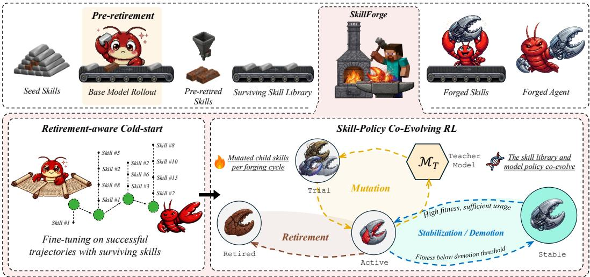  
Figure 1: Overview of SKILLFORGE. Top: seed skills are pre-retired under the base model’s own rollouts; surviving fitness-verified skills seed retirement-aware cold-start and skill-policy co-evolving RL, yielding a trained agent with an adapted skill library. Bottom-left: cold-start fine-tunes on successful trajectories with surviving skills. Bottom-right: skills and model co-evolve through the fitness-driven lifecycle across trial, active, stable, and retired via selective retirement, stabilization, demotion, and LLM-guided mutation.

A complementary line of work trains the policy via agentic reinforcement learning (Agentic RL) against environment reward. Pairing skills or other accumulated memory with RL is a natural combi nation: skills focus exploration with behavioral priors, while RL shapes the policy through interaction. Recent skill-augmented RL injects retrieved skills into the agent’s context each rollout [Xia et al., 2026]; related threads close an offline-to-online distillation loop [Wu et al., 2025] or run policy updates directly over episodic memory [Zhang et al., 2026]. Yet these methods all treat the library as append-only, leaving the agent’s context polluted by low-quality skills, bloated by unbounded accumulation, and misled by once-useful skills that turn counterproductive as the policy improves, a failure mode we call delayed obsolescence: a skill whose fitness once reached the stable state but later drops below the retirement threshold as the policy matures.

We propose SKILLFORGE, which treats skill library management as an activeforging process rather than passive accumulation. Starting from a seed skill library distilled from trajectories, as illustrated in Figure 1, SKILLFORGE runs in three stages: (i) pre-retire seed skills that fail under the base model’s own rollouts, (ii) cold-start fine-tuning on the surviving fitness-verified skills, and (iii) switch to RL training where skills and model co-evolve each iteration. Each cycle reads runtime fitness and moves every skill along the skill lifecycle trial, active, stable, retired, with borderline-fitness skills rewritten by an LLM-guided mutation operator. Skills and model co-evolve, keeping the active set compact and aligned with the agent’s capability. We contribute the following:

• SKILLFORGE and the skill lifecycle: We propose SKILLFORGE, a fitness-driven skill lifecycle augmented with LLM-guided mutation that moves each skill through trial, active, stable, and retired states so that skills and model co-evolve, replacing the append-only accumulation of prior skill-augmented RL.

• SKILLFURNACE dataset: We release SKILLFURNACE, a three-part bundle of 5k+ annotated records spanning retirement-filtered SFT trajectories, evolved skill libraries with fitness annotations, and retirement events with human-annotated failure categories.

• Empirical validation: Across three interactive agent benchmarks spanning embodied control, web navigation, and Search-Augmented QA, SKILLFORGE surpasses the strongest baseline on every environment while keeping the library compact, delivering up to 7.8% relative improvement in aggregate success rate.

## 2 Related Work

Experience accumulation for LLM agents. Early work took the form of in-context reflection: self-critiquing the current output [Shinn et al., 2023, Madaan et al., 2023], and subsequently mining cross-trajectory insights [Majumder et al., 2023, Zhao et al., 2024]. In parallel, skill-library methods emerged: Wang et al. [2023] introduced an executable-code library for open-ended exploration, followed by reusable task workflows [Wang et al., 2024], and more recently procedural memory mixing step-level instructions with script-level abstractions [Fang et al., 2025]. A related thread autonomously discovers new skills for the agent to practice [Zhou et al., 2024, Yang et al., 2025]. On the RL side, memory-augmented methods couple such repositories to the training loop: earlier work used external memory to support tool-assisted planning [Putta et al., 2024, Bai et al., 2024], and later closed an offline-to-online loop between distillation and retrieval [Wu et al., 2025]. Most recently, Xia et al. [2026] combined skill libraries with RL training, injecting retrieved skills into the context during each rollout. In all of them the repository is monotone: entries persist once added and cannot be corrected as the policy evolves. SKILLFORGE instead treats the library as a dynamic population under fitness-driven selection, retiring low-fitness skills and reshaping borderline ones via LLM-guided mutation in step with the online RL optimizer.

LLM-guided evolutionary optimization. Jaderberg et al. [2017] introduced population-based training, applying fitness-based selection and mutation over the hyperparameter schedules of concurrent workers. The same evaluate-select-mutate template has since been instantiated with LLMs: LLM-as-optimizer rewrites evolve a population of natural-language instructions against a fixed heldout metric [Yang et al., 2023, Guo et al., 2025], self-referential variants let instructions evolve each other [Fernando et al., 2023], and quality-diversity searches pair a pretrained LLM with an evaluator to discover diverse high-performing programs [Bradley et al., 2023, Romera-Paredes et al., 2023]. These methods all optimize static text artifacts against a stationary held-out metric in an offline loop. SKILLFORGE brings fitness-driven selection and mutation into LLM agentic reinforcement learning, where the evolving entities are skills that augment the agent’s context during interactive rollouts. Joint online training makes skill fitness inherently non-stationary, requiring a lifecycle that retires and reshapes skills as the policy evolves.

## 3 Preliminaries

## 3.1 Group Relative Policy Optimization

GRPO [Shao et al., 2024] estimates advantages from grouped samples without a separate value function. Given task description d drawn from a training task distribution $\mathcal { D } _ { \mathrm { t a s k } }$ , a uniform distribution over the training tasks of each environment, the old policy $\pi _ { \theta _ { \mathrm { o l d } } }$ samples G episodes $\{ \tau _ { n } \} _ { n = 1 } ^ { G }$ with binary rewards $r _ { n } = R ( \tau _ { n } ) \in \{ 0 , 1 \}$ , and computes group-normalized advantages $\dot { A } _ { n } = ( r _ { n } - \mu _ { G } ) / \sigma _ { G }$ Let $\pmb { y } _ { n } = ( y _ { n , 1 } , \dots , y _ { n , | \pmb { y } _ { n } | } )$ denote the concatenation of action tokens produced autoregressively by the policy during episode $\tau _ { n } ;$ agent contexts and observations serve as conditioning inputs rather than generation targets, and ${ \pmb y } _ { n }$ aligns with the step-level actions $\left\{ { { a } _ { t } } \right\}$ of Section 3.2. Token-level importance ratios are $\rho _ { n , l } = \pi _ { \boldsymbol { \theta } } ( y _ { n , l } \mid c _ { n , l } ) / \pi _ { \boldsymbol { \theta } _ { \mathrm { o l d } } } ( y _ { n , l } \mid c _ { n , l } )$ , where $c _ { n , l }$ denotes the left context of token $y _ { n , l }$ , comprising all prior agent contexts, observations, and earlier action tokens of the episode. The index n indexes episodes within a GRPO group and is distinct from the skill index i used in Section 4. The policy is updated by maximizing:

$$
\begin{array} { l } { \displaystyle \mathcal { I } _ { \mathrm { G R P O } } ( \theta ) = \mathbb { E } _ { d \sim \mathcal { D } _ { \mathrm { t a k } } , \{ \tau _ { n } \} } \left[ \frac { 1 } { G } \sum _ { n = 1 } ^ { G } \frac { 1 } { | y _ { n } | } \sum _ { l = 1 } ^ { | y _ { n } | } \mathrm { m i n } \big ( \rho _ { n , l } \hat { A } _ { n } , \mathrm { c l i p } ( \rho _ { n , l } , 1 - \epsilon , 1 + \epsilon ) \hat { A } _ { n } \big ) \right] } \\ { \displaystyle - \beta D _ { \mathrm { K L } } ( \pi _ { \theta } | | \pi _ { \mathrm { r e f } } ) , } \end{array}\tag{1}
$$

with token-level clipping and a trajectory-level KL penalty against the reference policy.

## 3.2 Skill-Augmented RL

SkillRL [Xia et al., 2026] augments GRPO with a textual skill library $s ,$ where each skill $\boldsymbol { s } = ( v , b , \omega )$ comprises a name v, a behavioral principle $b ,$ and an applicability condition ω. Given task description

d from Eq. (1), a retrieval function $\phi ( d , S )$ selects the top-K skills whose condition ω matches the task-type label of d and concatenates them into the agent’s context:

$$
p _ { t } = d \oplus \phi ( d , S ) \oplus h _ { t } \oplus o _ { t } ,\tag{2}
$$

where $h _ { t }$ is a sliding window of the last W observation–action pairs, $o _ { t }$ is the current observation, and $\oplus$ denotes string concatenation. At each step $t ,$ an action $a _ { t } \sim \pi _ { \theta } ( \cdot \mid p _ { t } )$ is sampled, and the trajectory $\tau = ( p _ { 1 } , a _ { 1 } , o _ { 2 } , \dots , p _ { T } , a _ { T } )$ decomposes into context–action pairs $\{ ( p _ { t } , a _ { t } ) \} _ { t = 1 } ^ { T }$ used as SFT supervision units. Each episode receives a binary reward $R ( \tau ) \in \mathbf { \bar { \{ 0 , 1 \} } }$ . Initially, skills are distilled from trajectories via OpenAI o3 [OpenAI, 2025], and a cold-start fine-tuning checkpoint $\pi _ { \theta _ { \mathrm { s f t } } }$ serves as both RL initialization and reference policy $\pi _ { \mathrm { r e f } } .$

## 4 SKILLFORGE

As illustrated in Figure 1, SKILLFORGE runs in three stages: (i) pre-retirement evaluation filters lowfitness seed skills, (ii) retirement-aware cold-start fine-tuning on the surviving library, and (iii) agentic RL with a fitness-driven skill lifecycle where skills and policy co-evolve each iteration. This design addresses the non-stationarity of skill fitness under online RL: as the policy matures, once-usefu skills may slip below the retirement threshold, delayed obsolescence formalized in Eq. (11).

## 4.1 SKILLFURNACE Initialization

We evaluate the initial skill library $S _ { 0 }$ released by SkillRL [Xia et al., 2026] with base model $\pi _ { \theta _ { 0 } }$ which performs M rollout episodes with skills injected. For each $s _ { i } \in S _ { 0 }$ we accumulate usage $U _ { i } ^ { ( 0 ) }$ and success $C _ { i } ^ { ( 0 ) }$ . Skills whose proto-fitness falls below a conservative threshold $\delta _ { \mathrm { p r e } }$ and that have been used at least $N _ { \mathrm { m i n } }$ times are pre-retired:

$$
\hat { f } _ { i } = \frac { C _ { i } ^ { ( 0 ) } } { U _ { i } ^ { ( 0 ) } } , \qquad S _ { \mathrm { r e t i r e } } ^ { ( 0 ) } = \{ s _ { i } \in \mathcal { S } _ { 0 } \mid \hat { f } _ { i } < \delta _ { \mathrm { p r e } } \wedge U _ { i } ^ { ( 0 ) } \geq N _ { \operatorname* { m i n } } \} .\tag{3}
$$

The surviving library ${ S ^ { ( 0 ) } = S _ { 0 } \setminus S _ { \mathrm { r e t i r e } } ^ { ( 0 ) } }$ seeds both the cold-start fine-tuning data and the RL phase described in Section 4.4. Let $\mathcal { T } _ { \mathrm { e v a l } }$ denote the trajectories from this evaluation, and $\phi _ { \mathrm { e v a l } } ( d , S _ { 0 } )$ the retrieval ϕ from Eq. (2) on the full library $ { \boldsymbol { S } } _ { 0 }$ before pre-retirement. We construct the SFT dataset from successful trajectories:

$$
\mathcal { D } _ { \mathrm { S F T } } = \{ ( p _ { t } , a _ { t } ) ~ | ~ \tau \in \mathcal { T } _ { \mathrm { e v a l } } , ~ ( p _ { t } , a _ { t } ) \in \tau , ~ R ( \tau ) = 1 , ~ \phi _ { \mathrm { e v a l } } ( d _ { \tau } , S _ { 0 } ) \cap \mathcal { S } _ { \mathrm { r e t i r e } } ^ { ( 0 ) } = \emptyset \} ,\tag{4}
$$

where $d _ { \tau }$ is the task description of $\tau ;$ the filter excludes trajectories that relied on subsequently retired skills. Fine-tuning the base model on $\mathcal { D } _ { \mathrm { S F T } }$ via standard cross-entropy

$$
\begin{array} { r } { \mathcal { L } _ { \mathrm { S F T } } ( \theta ) = - \mathbb { E } _ { ( p _ { t } , a _ { t } ) \sim \mathcal { D } _ { \mathrm { S F T } } } \left[ \log \pi _ { \theta } ( a _ { t } \mid p _ { t } ) \right] , } \end{array}\tag{5}
$$

produces $\pi _ { \theta _ { \mathrm { s f t } } }$ , which serves as both the RL initialization and the reference policy $\pi _ { \mathrm { r e f } }$

The filtered ${ \mathcal { D } } _ { \mathrm { S F T } } .$ the surviving library ${ \mathcal S } ^ { ( 0 ) }$ , and human-annotated retirement events from previously recorded training runs together form SKILLFURNACE, our released dataset. As summarized in Table 1, retired skills peak at an average fitness of 0.67, close to the stabilization threshold $\delta _ { \mathrm { s t a b l e } }$ of 0.7, before dropping by 0.28 at retirement, and 57.2% first reach the stable state before this decay: a direct empirical signature of delayed obsolescence. Appendix C gives per-component details.

## 4.2 Skill Fitness Tracking

For each skill $s _ { i }$ , we maintain a usage count $U _ { i }$ (episodes in which $s _ { i }$ was retrieved) and a success count $C _ { i }$ (episodes that succeeded). At the start of RL, the counters are initialized from the preliminary evaluation phase: $C _ { i } \gets C _ { i } ^ { ( 0 ) }$ and $U _ { i } \gets U _ { i } ^ { ( 0 ) }$ for each surviving skill $s _ { i } \in { S ^ { ( 0 ) } }$ , so proto-fitness information from Section 4.1 is preserved rather than discarded. The fitness is:

$$
f _ { i } = { \left\{ \begin{array} { l l } { C _ { i } / U _ { i } } & { { \mathrm { i f } } U _ { i } \geq N _ { \mathrm { w a r m } } } \\ { f _ { \mathrm { d e f a u l t } } } & { { \mathrm { o t h e r w i s e } } } \end{array} \right. }\tag{6}
$$

Table 1: SKILLFURNACE dataset statistics. The top block reports per-component record counts across SFT trajectories, library snapshots, and retirement events; the bottom block reports detailed retirement-event metrics. Total records (#) is summed across components within each environment.
<table><tr><td>Statistic</td><td>ALFWorld</td><td>WebShop</td><td>Search-Aug. QA</td><td>Total</td></tr><tr><td>Dataset scale</td><td></td><td></td><td></td><td></td></tr><tr><td>SFT trajectories (#)</td><td>412</td><td>348</td><td>253</td><td>1,013</td></tr><tr><td>Library snapshot records (#)</td><td>1,512</td><td>1,683</td><td>1,326</td><td>4,521</td></tr><tr><td>Retirement events (#)</td><td>138</td><td>121</td><td>59</td><td>318</td></tr><tr><td>Total records (#)</td><td>2,062</td><td>2,152</td><td>1,638</td><td>5,852</td></tr><tr><td>Retirement event statistics</td><td></td><td></td><td></td><td></td></tr><tr><td>Avg. peak fitness</td><td>0.696</td><td>0.709</td><td>0.515</td><td>0.667</td></tr><tr><td>Avg. fitness drop from peak</td><td>0.294</td><td>0.279</td><td>0.239</td><td>0.278</td></tr><tr><td> $\operatorname { A v g } .$  lifespan (steps)</td><td>38.8</td><td>31.7</td><td>49.4</td><td>38.0</td></tr><tr><td>Stable before retirement (%)</td><td>60.1</td><td>58.7</td><td>47.5</td><td>57.2</td></tr></table>

where $N _ { \mathrm { w a r m } }$ is a minimum usage count before trusting the empirical success rate and $f _ { \mathrm { d e f a u l t } }$ is a neutral prior for new skills. We use $f _ { i } ^ { ( k ) }$ for the running estimate at training step k when dependence on k matters, as formalized in Section 4.4; for any skill with $U _ { i } ^ { ( 0 ) } \geq N _ { \mathrm { w a r m } }$ we have $f _ { i } ^ { ( 0 ) } = \hat { f } _ { i }$ , so the proto-fitness from Eq. (3) is the runtime fitness at step 0, reused rather than recomputed.

Credit is assigned at the episode level: for each episode with trajectory τ and retrieved skill set $S _ { \tau } = \phi ( d , S )$ , all K retrieved skills receive the binary reward signal:

$$
U _ { i }  U _ { i } + \mathbb { k } ^ { 2 } [ s _ { i } \in \mathcal { S } _ { \tau } ] , \quad C _ { i }  C _ { i } + \mathbb { k } ^ { 2 } [ s _ { i } \in \mathcal { S } _ { \tau } ] \cdot R ( \tau ) ,\tag{7}
$$

where $\nVdash [ \cdot ]$ denotes the indicator function.

## 4.3 Skill Lifecycle Management

Based on accumulated fitness, we define a lifecycle update rule ℓ that assigns each skill one of four states {trial, active, stable, retired}; the active library S retains only non-retired skills. Transitions depend on fitness thresholds $\delta _ { \mathrm { r e t i r e } } \stackrel { \cdot } { < } \delta _ { \mathrm { d e m o t e } } < \delta _ { \mathrm { s t a b l e } }$ , where $\delta _ { \mathrm { d e m o t e } }$ lies strictly between the retirement and stabilization thresholds to provide hysteresis so that a stable skill whose fitness slips must first be demoted to active before becoming eligible for retirement. Transitions also depend on a mutation range $[ \delta _ { \mathrm { l o w } } , \delta _ { \mathrm { h i g h } } ]$ , minimum usage counts $N _ { \mathrm { p r o m o t e } }$ and $N _ { \mathrm { s t a b l e } }$ , and a generation-aware retirement threshold:

$$
N _ { \mathrm { r e t i r e } } ^ { ( g _ { i } ) } = { \left\{ \begin{array} { l l } { N _ { \mathrm { p r o t e c t } } } & { { \mathrm { i f ~ } } g _ { i } = 0 } \\ { N _ { \mathrm { r e t i r e } } } & { { \mathrm { o t h e r w i s e } } } \end{array} \right. }\tag{8}
$$

where $g _ { i }$ is the mutation generation; distilled $( g _ { i } = 0 )$ skills require a higher usage bar $N _ { \mathrm { p r o t e c t } } >$ $N _ { \mathrm { r e t i r e } }$ before they can be retired. The lifecycle update rule is then:

$$
\ell ( s _ { i } ) \gets \left\{ \begin{array} { l l } { \mathrm { a c t i v e ~ } } & { \mathrm { i f } \ \ell ( s _ { i } ) = \mathrm { t r i a l } \wedge U _ { i } \geq N _ { \mathrm { p r o m o t e } } } \\ { \mathrm { s t a b l e ~ } } & { \mathrm { i f } \ \ell ( s _ { i } ) = \mathrm { a c t i v e } \wedge f _ { i } \geq \delta _ { \mathrm { s t a b l e } } \wedge U _ { i } \geq N _ { \mathrm { s t a b l e } } } \\ { \mathrm { a c t i v e ~ } } & { \mathrm { i f } \ \ell ( s _ { i } ) = \mathrm { s t a b l e } \wedge f _ { i } < \delta _ { \mathrm { d e m o t e } } } \\ { \mathrm { r e t i r e d ~ } } & { \mathrm { i f } \ \ell ( s _ { i } ) = \mathrm { a c t i v e } \wedge f _ { i } < \delta _ { \mathrm { r e t i r e } } \wedge U _ { i } \geq N _ { \mathrm { r e t i r e } } ^ { ( g _ { i } ) } } \end{array} \right.\tag{9}
$$

If none applies, for example an active skill with $\delta _ { \mathrm { r e t i r e } } ~ \leq ~ f _ { i } ~ < ~ \delta _ { \mathrm { s t a b l e } } , ~ \ell ( s _ { i } )$ is left unchanged; Appendix B states the well-definedness and per-cycle ordering used by Algorithm 1. Only active skills are eligible for retirement; trial skills must first accumulate $\bar { N } _ { \mathrm { p r o m o t e } }$ usages and promote to active, and stable skills must first be demoted. This two-gate design prevents premature retirement of newly created skills and shields proven skills from transient fitness dips. The mutation generation $g _ { i }$ is 0 for skills distilled into $ { \boldsymbol { S } } _ { 0 }$ and is incremented by 1 at each mutation.

Initial skills surviving pre-retirement enter as stable if $\hat { f } _ { i } \ge \delta _ { \mathrm { s t a b l e } }$ , or as active otherwise; newly generated skills enter as trial. The lifecycle operates through promotion, demotion, retirement, stabilization, and mutation, per Algorithm 1. Because demotion precedes retirement, a skill can be demoted and retired in one cycle, so once-stable skills can be retired as the policy evolves.

Mutation reshapes active skills whose fitness lies in a moderate range $[ \delta _ { \mathrm { l o w } } , \delta _ { \mathrm { h i g h } } ]$ and which have been used at least $N _ { \mathrm { m u t a t e } }$ times, so that the fitness estimate used to select mutation parents is informative. From the resulting candidate pool $\mathcal { M } _ { \mathrm { c a n d } }$ , we select up to $K _ { \mathrm { m u t a t e } }$ parents via inversefitness-weighted sampling $( \bar { P } ( \bar { s } _ { i } ) \propto 1 - \bar { f _ { i } } )$ , collect their recent failure trajectories $\mathcal { T } _ { \mathrm { f a i l } }$ , and query our teacher model $( \boldsymbol { \mathcal { M } } _ { T } )$ to generate improved variants:

Algorithm 1 SKILLFORGE Forging Cycle   
Require: Skill library $s ,$ fitness scores $\{ f _ { i } \}$ , usage counts $\{ U _ { i } \}$ , failed trajectories $\mathcal { T } _ { \mathrm { f a i l } }$   
Ensure: Updated skill library $s$   
1: for $s _ { i } \in \mathcal S$ where ℓ(si) = trial $\land U _ { i } \ge N _ { \mathrm { p r o m o t e } }$ do   
2: $\ell ( s _ { i } ) \gets \mathsf { a c t i v e }$ ▷ Promote: trial → active   
3: end for   
4: for $s _ { i } \in S$ where $\ell ( s _ { i } ) = { \tt s t a b l e } \wedge f _ { i } < \delta _ { \mathrm { d e m o t e } }$ do   
5: $\ell ( s _ { i } ) \gets \mathsf { a c t i v e }$ ▷ Demote: stable → active   
6: end for   
7: $\begin{array} { r } { \mathcal { R }  \{ s _ { i } \in \mathcal { S } \mid \ell ( s _ { i } ) = \tt a c t i v e \wedge f _ { i } < \delta _ { \mathrm { r e t i r e } } \wedge U _ { i } \geq N _ { \mathrm { r e t i r e } } ^ { ( g _ { i } ) } \} } \end{array}$ ▷ Retirement candidates   
8: $\mathcal { S }  \mathcal { \bar { S } } \backslash$ bottom-m(R), m = min $K _ { \mathrm { r e t i r e } } , | \mathcal { R } | )$ ▷ bottom- ${ \ddot { \mathbf { \nabla } } } { m } ( \mathcal { R } ) ;$ : m skills in R with lowest $f _ { i }$   
9: for $s _ { i } \in { \dot { S } }$ where $\dot { \ell } ( \boldsymbol { s } _ { i } ) = \mathsf { a }$ ctive $\wedge f _ { i } \geq \delta _ { \mathrm { s } }$ table $\land U _ { i } \ge N _ { \mathrm { s t a b l e } }$ do   
10: $\ell ( s _ { i } ) \gets \mathsf { s t a b l e }$ ▷ Stabilize: active → stable   
11: end for   
12: ${ \mathcal { M } } _ { \mathrm { c a n d } } \gets \{ s _ { i } \in { \mathcal { S } } \mid \ell ( s _ { i } ) = \tt a c t i v e \land \delta _ { l o w } \leq f _ { \mathit { i } } \leq \delta _ { h i g h } \land U _ { \mathit { i } } \geq N _ { \mathrm { m u t a t e } } \}$ ▷ Mutation pool   
13: Select Kmutate parents from $\mathcal { M } _ { \mathrm { c a n d } } ; P ( s _ { i } ) \propto 1 - f _ { i }$ ▷ Lower fitness → higher chance   
14: for each selected $s _ { \mathrm { p a r e n t } }$ do   
15: schild $ \mathcal { M } _ { T } ( \mathcal { P } _ { \mu } ^ { ' } ( s _ { \mathrm { p a r e n t } } , f _ { \mathrm { p a r e n t } } , T _ { \mathrm { f a i l } } ) )$ ▷ LLM-guided mutation   
16: $\mathcal { S }  \mathcal { S } \cup \{ s _ { \mathrm { c h i l d } } \} ; \hat { \ell } ( s _ { \mathrm { c h i l d } } ) ^ { \cdot }  \mathrm { t r i a l } ; g _ { \mathrm { c h i l d } }  g _ { \mathrm { p a r e n t } } + 1$ ▷ Child enters as trial   
17: end for   
18: while $| S | > S _ { \operatorname* { m a x } }$ and $\exists s _ { i } \in S$ with $\ell ( s _ { i } ) = \tt a c t i v e$ do   
19: $\mathcal { S }  \dot { \mathcal { S } } \setminus$ {arg min $\scriptstyle \cdot _ { s _ { i } : \ell ( s _ { i } ) = \arctan } f _ { i } \}$ ▷ Enforce size bound   
20: end while   
21: return S

$$
\begin{array} { r l } & { \mathcal { M } _ { \mathrm { c a n d } } = \big \{ s _ { i } \in \mathcal { S } \mid \ell ( s _ { i } ) = \tt a c t i v e \wedge \delta _ { \mathrm { l o w } } \leq f _ { i } \leq \delta _ { \mathrm { h i g h } } \wedge U _ { i } \geq N _ { \mathrm { m u t a t e } } \big \} , } \\ & { \quad s _ { \mathrm { c h i l d } } = \mathcal { M } _ { T } \big ( \mathcal { P } _ { \mu } ( s _ { \mathrm { p a r e n t } } , \ f _ { \mathrm { p a r e n t } } , \mathcal { T } _ { \mathrm { f a i l } } ) \big ) , } \end{array}\tag{10}
$$

where ${ \mathcal P } _ { \mu }$ assembles the parent skill’s content, fitness statistics, and failure examples into a structured template. Each child enters with $\ell ( s _ { \mathrm { c h i l d } } ) = \mathtt { t r i a l }$ and generation $g _ { \mathrm { c h i l d } } = g _ { \mathrm { p a r e n t } } + 1$ . The inversefitness weighting $P ( s _ { i } ) \propto 1 - f _ { i }$ biases selection toward skills with more room to improve without concentrating mutation on a single outlier. We instantiate $\mathcal { M } _ { T }$ from a different model family than the trained policy, since Li et al. [2026a] report that self-generated skills provide negligible or negative benefit compared with externally authored ones.

## 4.4 Training Integration

As given in Algorithm 1, a forging cycle runs every E validation epochs, with per-cycle budgets $K _ { \mathrm { r e t i r e } }$ and $K _ { \mathrm { m u t a t e } }$ and a total skill cap $S _ { \mathrm { m a x } }$ bounding computational cost.

Making the non-stationarity introduced at the start of Section 4 explicit, the fitness estimate at training step k depends on the policy trajectory:

$$
f _ { i } ^ { ( k ) } = \frac { \sum _ { j \le k } \mathcal { k } ^ { \prime } \big [ s _ { i } \in \pmb { S } _ { \tau ^ { ( j ) } } \big ] \cdot { \cal R } ( \tau ^ { ( j ) } ) } { \sum _ { j \le k } \mathcal { k } ^ { \prime } \big [ s _ { i } \in \pmb { S } _ { \tau ^ { ( j ) } } \big ] } , \quad \tau ^ { ( j ) } \sim \pi _ { \theta _ { j } } ( \cdot \mid p ^ { ( j ) } ) ,\tag{11}
$$

where $p ^ { ( j ) }$ denotes the agent’s context at step $j ,$ , constructed via Eq. (2) with the library $\mathcal { S } ^ { ( j ) }$ . The $j = 0$ term covers the pre-retirement rollouts under $\pi _ { \theta _ { 0 } }$ , consistent with the counter initialization in Section 4.2 and yielding $f _ { i } ^ { ( 0 ) } = \hat { f } _ { i }$ . As Li et al. [2026b] report, on-policy formulations avoid the exposure bias of off-policy alternatives, justifying the non-stationarity above. At each step k, the policy is updated via Eq. (1) conditioned on the current library, and the forging cycle updates the library based on accumulated fitness:

$$
\theta _ { k + 1 } = \arg \operatorname* { m a x } _ { \theta } \mathcal { I } _ { \mathrm { G R P O } } ( \theta ; \mathcal { S } ^ { ( k ) } ) , \qquad \mathcal { S } ^ { ( k + 1 ) } = \mathrm { F o r g e } \left( \mathcal { S } ^ { ( k ) } , \{ f _ { i } ^ { ( k ) } \} \right) ,\tag{12}
$$

Table 2: Performance on ALFWorld and WebShop (%). WebShop Score is the partial-credit reward; Succ. is binary task success. Bold: best; underline: second best.
<table><tr><td rowspan="2">Method</td><td colspan="7">ALFWorld</td><td colspan="2">WebShop</td></tr><tr><td>Pick</td><td>Look</td><td>Clean</td><td>Heat</td><td>Cool</td><td>Pick2</td><td>All</td><td>Score</td><td>Succ.</td></tr><tr><td colspan="10">Closed-source LLMs</td></tr><tr><td>GPT-40</td><td>75.3</td><td>60.8</td><td>31.2</td><td>56.7</td><td>21.6</td><td>49.8</td><td>48.0</td><td>31.8</td><td>23.7</td></tr><tr><td>Gemini-2.5-Pro</td><td>92.8</td><td>63.3</td><td>62.1</td><td>69.0</td><td>26.6</td><td>58.7</td><td>60.3</td><td>42.5</td><td>35.9</td></tr><tr><td colspan="10">Base Model</td></tr><tr><td>Vanilla</td><td>33.4</td><td>21.6</td><td>19.3</td><td>6.9</td><td>2.8</td><td>3.2</td><td>14.8</td><td>26.4</td><td>7.8</td></tr><tr><td colspan="10">Context / Memory Methods</td></tr><tr><td>ReAct</td><td> $4 8 . 5 _ { \bullet 1 5 . \cdot }$  1</td><td> $3 5 . 4 _ { \pm 1 3 . 8 }$ </td><td> $3 4 . 3 _ { \pm 1 5 . 0 }$ </td><td> $1 3 . 2 _ { \bullet 6 . 3 }$ </td><td> $1 8 . 2 _ { \bullet 1 5 . 4 }$ </td><td> $1 7 . 6 _ { \bullet 1 4 . 4 }$ </td><td> $3 1 . 2 _ { \bullet 1 6 . 4 }$ </td><td> $4 6 . 2 _ { \bullet 1 9 . 8 }$ </td><td> $1 9 . 5 _ { \bullet 1 1 . 7 }$ </td></tr><tr><td>Reflexion</td><td> $6 2 . 0 _ { \bullet 2 8 . 6 }$ </td><td> $4 1 . 6 _ { \bullet 2 0 . 0 }$ </td><td> $4 4 . 9 _ { \bullet 2 5 . 6 }$ </td><td> $3 0 . 9 _ { \bullet 2 4 . 0 }$ </td><td> $3 6 . 3 _ { \pm 3 3 . 5 }$ </td><td> $2 3 . 8 _ { \bullet 2 0 . 6 }$ </td><td> $4 2 . 7 _ { \bullet 2 7 . 9 }$ </td><td> $5 8 . 1 _ { \bullet 3 1 . 7 }$ </td><td> $2 8 . 8 _ { \bullet 2 1 . 0 }$ </td></tr><tr><td>Mem0</td><td> $5 4 . 0 _ { \bullet 2 0 . 6 }$ </td><td> $5 5 . 0 _ { \mathbf { \delta \mathbf { \mu } _ { \mathbf { \pm 3 3 . 4 } } } }$ </td><td> $2 6 . 9 _ { \bullet 7 . 6 }$ </td><td> $3 6 . 4 _ { \bullet 2 9 . 5 }$ </td><td> $2 0 . 8 _ { \bullet 1 8 . 0 }$ </td><td> $7 . 7 _ { \bullet 4 . 5 }$ </td><td> $3 3 . 6 _ { \bullet 1 8 . 8 }$ </td><td> $2 3 . 9 _ { \mathbf { v } 2 . 5 }$ </td><td> $2 . 0 _ { \mathbf { \overline { { \nu } } } \mathbf { \varepsilon } _ { \mathbf { \overline { { \nu } } } , 8 } }$ </td></tr><tr><td>ExpeL</td><td> $2 1 . 0 _ { \bullet 1 2 . 4 }$ </td><td> $6 7 . 0 _ { \bullet 4 5 . 4 }$ </td><td> $5 5 . 0 _ { \pm 3 5 . 7 }$ </td><td> $5 2 . 0 _ { \pm 4 5 . 1 }$ </td><td> $7 1 . 0 _ { \bullet 6 8 . 2 }$ </td><td> $6 . 0 _ { \pm 2 . 8 }$ </td><td> $4 6 . 3 _ { \bullet 3 1 . 5 }$ </td><td> $3 0 . 9 _ { \bullet 4 . 5 }$ </td><td> $1 1 . 2 _ { \bullet 3 . 4 }$ </td></tr><tr><td>MemP</td><td> $5 4 . 3 _ { \bullet 2 0 . 9 }$ </td><td> $3 8 . 5 _ { \bullet 1 6 . 9 }$ </td><td> $4 8 . 1 _ { \bullet 2 8 . 8 }$ </td><td> $5 6 . 2 _ { \bullet 4 9 . 3 }$ </td><td> $3 2 . 0 _ { \pm 2 9 . 2 }$ </td><td> $1 6 . 7 _ { \bullet 1 3 . 5 }$ </td><td> $4 1 . 4 _ { \bullet 2 6 . 6 }$ </td><td> $2 5 . 3 _ { \bullet 1 . 1 }$ </td><td> $6 . 4 _ { \bullet _ { 1 . 4 } }$ </td></tr><tr><td>SimpleMem</td><td> $6 4 . 5 _ { \bullet 3 1 . 1 }$ </td><td> $3 3 . 3 _ { \bullet 1 1 . 7 }$ </td><td> $2 0 . 0 _ { \bullet 0 . 7 }$ </td><td> $1 2 . 5 _ { \bullet 5 . 6 }$ </td><td> $3 3 . 3 _ { \bullet 3 0 . 5 }$ </td><td> $3 . 8 _ { \pm 0 . 6 }$ </td><td> $2 9 . 7 _ { \bullet 1 4 . 9 }$ </td><td> $3 3 . 2 _ { \bullet 6 . 8 }$ </td><td> $8 . 6 _ { \bullet 0 . 8 }$ </td></tr><tr><td colspan="10">RL-based Methods</td></tr><tr><td>RLOO</td><td> $8 7 . 6 _ { \bullet 5 4 . 2 }$ </td><td> $\underline { { 7 8 . 2 } } _ { \bullet 5 6 . 6 }$ </td><td> $8 7 . 3 _ { \bullet 6 8 . 0 }$ </td><td> $8 1 . 3 _ { \bullet 7 4 . 4 }$ </td><td> $7 1 . 9 _ { \pm 6 9 . 1 }$ </td><td> $4 8 . 9 _ { \bullet 4 5 . 7 }$ </td><td> $7 5 . 5 _ { \bullet 6 0 . 7 }$ </td><td> $8 0 . 3 _ { \bullet 5 3 . 9 }$ </td><td> $6 5 . 7 _ { \bullet 5 7 . 9 }$ </td></tr><tr><td>GRPO</td><td> $9 0 . 8 _ { \pm 5 7 . 4 }$ </td><td> $6 6 . 1 _ { \bullet 4 4 . 5 }$ </td><td> $8 9 . 3 _ { \bullet 7 0 . 0 }$ </td><td> $7 4 . 7 _ { \bullet 6 7 . 8 }$ </td><td> $7 2 . 5 _ { \bullet 6 9 . 7 }$ </td><td> $6 4 . 7 _ { \bullet 6 1 . 5 }$ </td><td> $7 7 . 6 _ { \bullet 6 2 . 8 }$ </td><td> $7 9 . 3 _ { \bullet 5 2 . 9 }$ </td><td> $6 6 . 1 _ { \bullet 5 8 . 3 }$ </td></tr><tr><td colspan="10">Memory-Augmented RL</td></tr><tr><td>MemRL</td><td> $6 2 . 8 _ { \bullet 2 9 . 4 }$ </td><td> $3 8 . 5 _ { \bullet 1 6 . 9 }$ </td><td> $2 2 . 2 _ { \bullet 2 . 9 }$ </td><td> $1 2 . 5 _ { \bullet 5 . 6 }$ </td><td> $8 . 0 _ { \pm 5 . 2 }$ </td><td> $0 . 0 _ { \mathbf { \check { \tau } } _ { \mathbf { 7 } 3 . 2 } }$ </td><td> $2 1 . 4 _ { \bullet 6 . 6 }$ </td><td> $2 9 . 5 _ { \bullet 3 . 1 }$ </td><td> $9 . 2 _ { \bullet 1 . 4 }$ </td></tr><tr><td>EvolveR</td><td> $6 4 . 9 _ { \bullet 3 1 . 5 }$ </td><td> $3 3 . 3 _ { \bullet 1 1 . 7 }$ </td><td> $4 6 . 4 _ { \bullet 2 7 . 1 }$ </td><td> $1 3 . 3 _ { \bullet 6 . 4 }$ </td><td> $3 3 . 3 _ { \bullet 3 0 . 5 }$ </td><td> $3 3 . 3 _ { \bullet 3 0 . 1 }$ </td><td> $4 3 . 8 _ { \bullet 2 9 . 0 }$ </td><td> $4 2 . 5 _ { \bullet 1 6 . 1 }$ </td><td> $1 7 . 6 _ { \pm 9 . 8 }$ </td></tr><tr><td>Mem0+GRPO</td><td> $7 8 . 1 _ { \bullet 4 4 . 7 }$ </td><td> $5 4 . 8 _ { \pm 3 3 . 2 }$ </td><td> $5 6 . 1 _ { \pm 3 6 . 8 }$ </td><td> $3 1 . 0 _ { \bullet 2 4 . 1 }$ </td><td> $6 5 . 0 _ { \bullet 6 2 . 2 }$ </td><td> $2 6 . 9 _ { \pm 2 3 . 7 }$ </td><td> $5 4 . 7 _ { \bullet 3 9 . 9 }$ </td><td> $5 8 . 1 _ { \bullet 3 1 . 7 }$ </td><td> $3 7 . 5 _ { \bullet 2 9 . 7 }$ </td></tr><tr><td>SimpleMem+GRPO</td><td> $8 9 . 5 _ { \bullet 5 6 . 1 }$ </td><td> $3 6 . 3 _ { \bullet 1 4 . 7 }$ </td><td> $6 0 . 0 _ { \bullet 4 0 . 7 }$ </td><td> $5 0 . 0 _ { \bullet 4 3 . 1 }$ </td><td> $6 4 . 9 _ { \bullet 6 2 . 1 }$ </td><td> $2 6 . 3 _ { \bullet 2 3 . 1 }$ </td><td> $6 2 . 5 _ { \bullet 4 7 . 7 }$ </td><td> $6 7 . 8 _ { \bullet 4 1 . 4 }$ </td><td> $4 6 . 9 _ { \pm 3 9 . 1 }$ </td></tr><tr><td>SkiliRL</td><td> $\underline { { 9 7 . 9 } } _ { \bullet 6 4 . 5 }$ </td><td> $7 1 . 4 _ { \bullet 4 9 . 8 }$ </td><td> $9 0 . 0 _ { \pm 7 0 . 7 }$ </td><td> $\underline { { 9 0 . 0 } } _ { \bullet 8 3 . 1 }$ </td><td> $9 5 . 5 _ { \bullet 9 2 . 7 }$ </td><td> $8 7 . 5 _ { \bullet 8 4 . 3 }$ </td><td> $\underline { { 8 9 . 9 } } _ { \bullet 7 5 . 1 }$ </td><td> $8 5 . 2 _ { \bullet 5 8 . 8 }$ </td><td> $7 2 . 7 _ { \bullet 6 4 . 9 }$ </td></tr><tr><td>SKILLFORGE</td><td> $9 8 . 2 _ { \bullet 6 4 . 8 }$  </td><td> $8 6 . 6 _ { \pm 6 5 . 0 }$ </td><td> $\underline { { 8 9 . 8 } } _ { \bullet 7 0 . 5 }$ </td><td> $9 3 . 7 _ { \bullet 8 6 . 8 }$ </td><td> $9 5 . 6 _ { \pm 9 2 . 8 }$ </td><td> $\mathbf { 8 8 . 4 _ { \pm 8 5 . 2 } }$ </td><td> $9 2 . 4 _ { \pm 7 7 . 6 }$ </td><td> $\mathbf { 8 7 . 8 _ { \bullet 6 1 . } }$  4</td><td> $7 8 . 4 _ { \bullet 7 0 . 6 }$ </td></tr></table>

## 5 Experiments

where Forge denotes a full forging cycle. Skills and policy thus co-evolve: as θ improves, fitness estimates shift, and the forging cycle retires skills whose utility has diminished. Delayed obsolescence is then the formal event $\exists k _ { 1 } < k _ { 2 } : { f _ { i } ^ { ( k _ { 1 } ) } \geq \delta _ { \mathrm { s t a b l e } } \land f _ { i } ^ { ( k _ { 2 } ) } < \delta _ { \mathrm { r e t i r e } } }$

## 5.1 Experimental Setup

Environments. Three interactive agent benchmarks are used: ALFWorld [Shridhar et al., 2020], WebShop [Yao et al., 2022a], and Search-Augmented QA [Jin et al., 2025], with the Search-Augmented QA setting spanning NQ [Kwiatkowski et al., 2019], TriviaQA [Joshi et al., 2017], PopQA [Mallen et al., 2023], HotpotQA [Yang et al., 2018], 2WikiMultiHopQA [Ho et al., 2020], MuSiQue [Trivedi et al., 2022], and Bamboogle [Press et al., 2023].

Baselines. Baselines fall into three categories. Context and memory methods rely on in-context reasoning or external experience without updating the policy: ReAct [Yao et al., 2022b], Reflexion [Shinn et al., 2023], Mem0 [Chhikara et al., 2025], ExpeL [Zhao et al., 2024], MemP [Fang et al., 2025], and SimpleMem [Liu et al., 2025]. RL-based methods optimize the policy via group-relative advantage estimation: RLOO [Ahmadian et al., 2024] and GRPO [Shao et al., 2024]. Memoryaugmented RL methods couple persistent memory with policy optimization and form the most direct comparison: MemRL [Zhang et al., 2026], EvolveR [Wu et al., 2025], SkillRL [Xia et al., 2026], and two additional combinations, Mem0+GRPO and SimpleMem+GRPO, implemented by adding GRPO optimization to the respective memory mechanisms. For Search-Augmented QA the comparison additionally includes Search-o1 [Li et al., 2025], R1-Instruct [Team, 2025a], Search-R1 [Jin et al., 2025], ZeroSearch [Sun et al., 2025], and StepSearch [Zheng et al., 2025]. GPT-4o [OpenAI, 2024] and Gemini-2.5-Pro [Team, 2025b] are reported as frontier reference points.

Implementation. All experiments are built on the verl [Sheng et al., 2025] framework with GRPO as the policy optimizer. The base model is Qwen2.5-7B-Instruct [Team, 2023], first fine-tuned via the retirement-aware SFT described in Section 4.1 to produce environment-specific initializations. Training runs for 200 steps with a learning rate of $1 \times 1 \bar { 0 } ^ { - 6 }$ , clipping range $\epsilon = 0 . 2$ , and a KL penalty coefficient $\beta = 0 . 0 0 1$ . Rollout generation uses temperature 1.0 with a group size of $G = 8$ . The forging cycle executes every 10 training steps, with up to $K _ { \mathrm { m u t a t e } } = 5$ mutations and $K _ { \mathrm { r e t i r e } } = 3$ retirements per cycle; the teacher model for mutation is Kimi-K2.5 [Team et al., 2026]. Full hyperparameters, hardware details, and forging thresholds are listed in Appendix B.

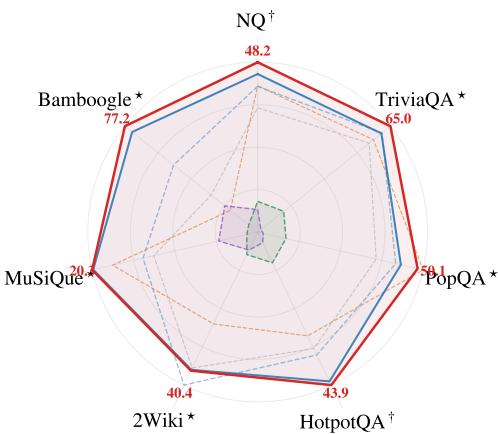  
(a) Search-Augmented QA comparison (%).

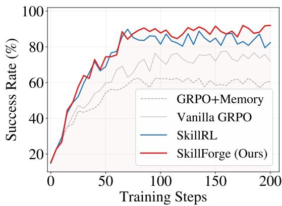  
(b) ALFWorld validation success rate across training.  
Figure 2: Main-results diagnostics. (a) Per-dataset accuracy on Search-Augmented QA; per-axis numbers in bold red report SKILLFORGE accuracy on each dataset. —: SKILLFORGE (Ours); —: SkillRL; - -: EvolveR; - -: ZeroSearch; - -: Search-R1; - -: Search-o1; - -: R1-Instruct. †In-domain; ⋆out-of-domain. (b) SKILLFORGE achieves faster convergence and higher success rates than vanilla GRPO and memory-augmented RL.

Table 3: Ablation study of SKILLFORGE across three environments. “Library” reports the final non-retired skill count (coinciding with |S0| for −forging/−mutation). Each row disables one forging stage: w/o forging removes the entire SKILLFORGE lifecycle, w/o pre-retirement keeps runtime stages but skips the pre-RL fitness filter, w/o retirement disables skill removal and size capping, and w/o mutation disables LLM-guided refinement. Bold: best.
<table><tr><td rowspan="2">Configuration</td><td colspan="2">ALFWorld</td><td colspan="2">WebShop</td><td colspan="2">Search-Aug. QA</td></tr><tr><td>Library</td><td>Succ. (%)</td><td>Library</td><td>Succ. (%)</td><td>Library</td><td>Succ. (%)</td></tr><tr><td>SKILLFORGE</td><td>100</td><td>92.4</td><td>95</td><td>78.4</td><td>85</td><td>48.7</td></tr><tr><td>w/o forging</td><td>44</td><td> $8 9 . 8 _ { \bullet 2 . 6 }$ </td><td>66</td><td> $7 2 . 6 _ { \bullet 5 . 8 }$ </td><td>41</td><td> $4 6 . 3 _ { \bullet 2 . 4 }$ </td></tr><tr><td>w/o pre-retirement</td><td>100</td><td> $9 0 . 7 _ { \mathbf { v } 1 . 7 }$ </td><td>95</td><td> $^ { 7 4 . 9 } { \cdot } _ { 3 . 5 }$ </td><td>85</td><td> $4 7 . 5 _ { \bullet 1 . 2 }$ </td></tr><tr><td>w/o retirement</td><td>132</td><td> $9 1 . 4 _ { \bullet 1 . 0 }$ </td><td>121</td><td> $7 5 . 9 _ { \mathbf { \overline { { \mathbf { \nu } } } } ^ { 2 . 5 } }$ </td><td>111</td><td> $4 7 . 9 _ { \bullet \mathrm { 0 . 8 } }$ </td></tr><tr><td>w/o mutation</td><td>44</td><td> $9 1 . 8 _ { \overline { { \mathbf { 7 0 . 6 } } } }$ </td><td>66</td><td> $7 6 . 8 _ { \cdot 1 . 6 }$ </td><td>41</td><td> $4 8 . 2 _ { \mathbf { v } 0 . 5 }$ </td></tr></table>

## 5.2 Main Results

As shown in Table 2, SKILLFORGE achieves 92.4% on ALFWorld and 78.4% on WebShop, outperforming the closed-source GPT-4o and Gemini-2.5-Pro baselines by a wide margin and improving over SkillRL by 2.8% relative on ALFWorld and 7.8% relative on WebShop. The largest per-subtask relative improvement over SkillRL is on ALFWorld’s Look at 21.3%; the Clean subtask remains within 0.2% of SkillRL, within sampling noise. On Search-Augmented QA, as illustrated in Figure 2a, SKILLFORGE reaches 48. $. 7 \pm 0 . 3 \%$ micro-averaged accuracy on the full test set, the highest overall among all methods; per-dataset results are in Appendix D.

As illustrated in Figure 2b, SKILLFORGE and SkillRL both climb from ∼60% to ∼70% between steps 50 and 65, but SKILLFORGE separates beyond step 75 as the forging lifecycle takes effect, reaching ∼90% while SkillRL oscillates in the ∼80–88% range over the rest of the training budget.

## 5.3 Ablation Study

As shown in Table 3, removing the entire SKILLFORGE lifecycle produces the largest relative drops on every environment, peaking at 7.4% on WebShop. Pre-retirement is the single most impactful component, with per-stage relative drops of 1.8%, 4.5%, and 2.5% on ALFWorld, WebShop, and

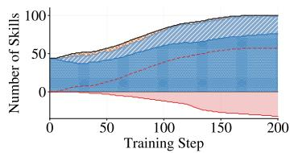  
(a) ALFWorld

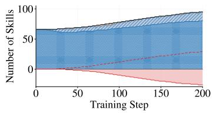  
(b) WebShop

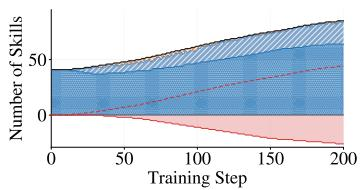  
(c) Search-Augmented QA

Figure 3: Skill library dynamics across three environments. Stable , Active Trial : lifecycle states (stacked areas). Retired : cumulative retired (below zero). —: total non-retired; - -: mutated (gen≥1).  
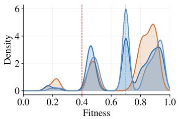  
(a) ALFWorld

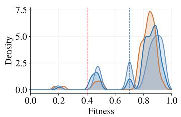  
(b) WebShop

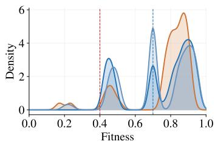  
(c) Search-Augmented QA  
Figure 4: Fitness distribution at three training stages. Step 40 Step 120 Step 195 : KDE at each stage. $- \div \delta _ { \mathrm { r e t i r e } } = 0 . 4 ; - - \div \delta _ { \mathrm { s t a b l e } } = 0 . 7$ . Retirement depletes the left tail, mutation populates the middle band via newly born skills, and stabilization maintains the high-fitness regime.

Search-Augmented QA respectively. The single-component drops consistently sum to more than the joint w/o forging drop, consistent with sub-additive interactions among the three components.

Larger libraries do not imply better performance. Without retirement the library grows to over 130 skills on ALFWorld, yet SKILLFORGE outperforms it with a compact set of 100. On WebShop, enabling pre-retirement and mutation lifts the static 72.6% baseline to 75.9%; adding retirement trims the library from 121 skills to 95 and closes the remaining 3.2% relative gap to the full 78.4%, confirming that quality control, not scale, drives the gain.

## 5.4 Forging Dynamics

As shown in Figure 3, the skill library evolves similarly across the three environments. On ALFWorld, 200 training steps grow the library to 100 non-retired skills, with 132 created and 32 retired; the cap binds near step 170, after which mutations and retirements balance into dynamic equilibrium. At the final checkpoint 76 skills are stable and 24 active or trial.

As illustrated in Figure 4, the distribution evolves through two opposing flows rather than a monotone rightward shift. Retirement depletes the left tail: on ALFWorld the sub $- \delta _ { \mathrm { r e t i r e } }$ fraction shrinks from 7.5% to 2.0% across training, while mutation expands the middle band $[ \delta _ { \mathrm { r e t i r e } } , \delta _ { \mathrm { s t a b l e } } )$ from 18.9% to 22.0% as children enter with a neutral prior at 0.5. The stable regime retains most of the library throughout and mean fitness stays near 0.73, an equilibrium in which pruning and churn rebalance. Appendix E provides concrete mutation examples and the deepest forging lineages.

## 6 Conclusion

SKILLFORGE treats skill-library management as a fitness-driven forging process in which skills and the model co-evolve under online RL through retirement, stabilization, and LLM-guided mutation, delivering up to 7.8% relative improvement over the strongest memory-augmented RL baseline across ALFWorld, WebShop, and Search-Augmented QA while keeping the active library compact. We release SKILLFURNACE, a 5k+ annotated record bundle of retirement-filtered SFT trajectories, evolved skill libraries with fitness annotations, and retirement events with human-annotated failure categories, in which procedural rigidity emerges as the dominant mode by which once-useful skills turn into active interference, the empirical signature of delayed obsolescence.

## References

Anthropic. Claude Code. https://claude.ai/, 2025.

OpenClaw. OpenClaw. https://github.com/openclaw/openclaw, 2026.

Prateek Chhikara, Dev Khant, Saket Aryan, Taranjeet Singh, and Deshraj Yadav. Mem0: Building production-ready ai agents with scalable long-term memory. arXiv preprint arXiv:2504.19413, 2025.

Jiaqi Liu, Yaofeng Su, Peng Xia, Yiyang Zhou, Siwei Han, Zeyu Zheng, Cihang Xie, Mingyu Ding, and Huaxiu Yao. Simplemem: Efficient lifelong memory for llm agents. arXiv preprint arXiv:2601.02553, 2025. URL https://github.com/aiming-lab/SimpleMem.

Runnan Fang, Yuan Liang, Xiaobin Wang, Jialong Wu, Shuofei Qiao, Pengjun Xie, Fei Huang, Huajun Chen, and Ningyu Zhang. Memp: Exploring agent procedural memory. ArXiv, abs/2508.06433, 2025.

Yongjin Yang, Sinjae Kang, Juyong Lee, Dongjun Lee, Se young Yun, and Kimin Lee. Automated skill discovery for language agents through exploration and iterative feedback. ArXiv, abs/2506.04287, 2025.

Xiangyi Li, Wenbo Chen, Yimin Liu, Shenghan Zheng, Xiaokun Chen, Yifeng He, Yubo Li, Bingran You, Haotian Shen, Jiankai Sun, et al. Skillsbench: Benchmarking how well agent skills work across diverse tasks, 2026a. URL https://arxiv.org/abs/2602.12670.

Peng Xia, Jianwen Chen, Hanyang Wang, Jiaqi Liu, Kaide Zeng, Yu Wang, Siwei Han, Yiyang Zhou, Xujiang Zhao, Haifeng Chen, et al. Skillrl: Evolving agents via recursive skill-augmented reinforcement learning. arXiv preprint arXiv:2602.08234, 2026.

Rong Wu, Xiaoman Wang, Jianbiao Mei, Pinlong Cai, Daocheng Fu, Cheng Yang, Licheng Wen, Xuemeng Yang, Yufan Shen, Yuxin Wang, et al. Evolver: Self-evolving llm agents through an experience-driven lifecycle. arXiv preprint arXiv:2510.16079, 2025.

Shengtao Zhang, Jiaqian Wang, Ruiwen Zhou, Junwei Liao, Yuchen Feng, Weinan Zhang, Ying Wen, Zhiyu Li, Feiyu Xiong, Yutao Qi, et al. Memrl: Self-evolving agents via runtime reinforcement learning on episodic memory. ArXiv, abs/2601.03192, 2026.

Noah Shinn, Federico Cassano, Ashwin Gopinath, Karthik Narasimhan, and Shunyu Yao. Reflexion: Language agents with verbal reinforcement learning. Advances in neural information processing systems, 36:8634–8652, 2023.

Aman Madaan, Niket Tandon, Prakhar Gupta, Skyler Hallinan, Luyu Gao, Sarah Wiegreffe, Uri Alon, Nouha Dziri, Shrimai Prabhumoye, Yiming Yang, et al. Self-refine: Iterative refinement with self-feedback. ArXiv, abs/2303.17651, 2023.

Bodhisattwa Prasad Majumder, Bhavana Dalvi Mishra, Peter Jansen, Oyvind Tafjord, Niket Tandon, Li Zhang, Chris Callison-Burch, and Peter Clark. Clin: A continually learning language agent for rapid task adaptation and generalization. arXiv preprint arXiv:2310.10134, 2023.

Andrew Zhao, Daniel Huang, Quentin Xu, Matthieu Lin, Yong-Jin Liu, and Gao Huang. Expel: Llm agents are experiential learners. In Proceedings ofthe AAAI Conference on Artificial Intelligence, volume 38, pages 19632–19642, 2024.

Guanzhi Wang, Yuqi Xie, Yunfan Jiang, Ajay Mandlekar, Chaowei Xiao, Yuke Zhu, Linxi Fan, and Anima Anandkumar. Voyager: An open-ended embodied agent with large language models. arXiv preprint arXiv:2305.16291, 2023.

Zhiruo Wang, Jiayuan Mao, Daniel Fried, and Graham Neubig. Agent workflow memory. 2024.

Yifei Zhou, Qianlan Yang, Kaixiang Lin, Min Bai, Xiong Zhou, Yu-Xiong Wang, Sergey Levine, and Erran L. Li. Proposer-agent-evaluator(pae): Autonomous skill discovery for foundation model internet agents. ArXiv, abs/2412.13194, 2024.

Pranav Putta, Edmund Mills, Naman Garg, Sumeet Motwani, Chelsea Finn, Divyansh Garg, and Rafael Rafailov. Agent q: Advanced reasoning and learning for autonomous ai agents. arXiv preprint arXiv:2408.07199, 2024.

Hao Bai, Yifei Zhou, Mert Cemri, Jiayi Pan, Alane Suhr, Sergey Levine, and Aviral Kumar. Digirl: Training in-the-wild device-control agents with autonomous reinforcement learning. Advances in Neural Information Processing Systems, 37:12461–12495, 2024.

Max Jaderberg, Valentin Dalibard, Simon Osindero, Wojciech M Czarnecki, Jeff Donahue, Ali Razavi, Oriol Vinyals, Tim Green, Iain Dunning, Karen Simonyan, et al. Population based training of neural networks. arXiv preprint arXiv:1711.09846, 2017.

Chengrun Yang, Xuezhi Wang, Yifeng Lu, Hanxiao Liu, Quoc V Le, Denny Zhou, and Xinyun Chen. Large language models as optimizers. In The Twelfth International Conference on Learning Representations, 2023.

Qingyan Guo, Rui Wang, Junliang Guo, Bei Li, Kaitao Song, Xu Tan, Guoqing Liu, Jiang Bian, and Yujiu Yang. Evoprompt: Connecting llms with evolutionary algorithms yields powerful prompt optimizers, 2025. URL https://arxiv.org/abs/2309.08532.

Chrisantha Fernando, Dylan Banarse, Henryk Michalewski, Simon Osindero, and Tim Rocktäschel. Promptbreeder: Self-referential self-improvement via prompt evolution. arXiv preprint arXiv:2309.16797, 2023.

Herbie Bradley, Andrew Dai, Hannah Teufel, Jenny Zhang, Koen Oostermeijer, Marco Bellagente, Jeff Clune, Kenneth Stanley, Grégory Schott, and Joel Lehman. Quality-diversity through ai feedback. arXiv preprint arXiv:2310.13032, 2023.

Bernardino Romera-Paredes, Mohammadamin Barekatain, Alexander Novikov, Matej Balog, M. Pawan Kumar, Emilien Dupont, Francisco J. R. Ruiz, Jordan S. Ellenberg, Pengming Wang, Omar Fawzi, et al. Mathematical discoveries from program search with large language models. Nature, 625:468 – 475, 2023.

Zhihong Shao, Peiyi Wang, Qihao Zhu, Runxin Xu, Junxiao Song, Xiao Bi, Haowei Zhang, Mingchuan Zhang, YK Li, Yang Wu, et al. Deepseekmath: Pushing the limits of mathematical reasoning in open language models. arXiv preprint arXiv:2402.03300, 2024.

OpenAI. Introducing o3 and o4-mini. https://openai.com/index/ introducing-o3-and-o4-mini/, 2025.

Yaxuan Li, Yuxin Zuo, Bingxiang He, Jinqian Zhang, Chaojun Xiao, Cheng Qian, Tianyu Yu, Huanang Gao, Wenkai Yang, Zhiyuan Liu, et al. Rethinking on-policy distillation of large language models: Phenomenology, mechanism, and recipe. arXiv preprint arXiv:2604.13016, 2026b.

Mohit Shridhar, Xingdi Yuan, Marc-Alexandre Côté, Yonatan Bisk, Adam Trischler, and Matthew Hausknecht. Alfworld: Aligning text and embodied environments for interactive learning. arXiv preprint arXiv:2010.03768, 2020.

Shunyu Yao, Howard Chen, John Yang, and Karthik Narasimhan. Webshop: Towards scalable real-world web interaction with grounded language agents. Advances in Neural Information Processing Systems, 35:20744–20757, 2022a.

Bowen Jin, Hansi Zeng, Zhenrui Yue, Jinsung Yoon, Sercan Arik, Dong Wang, Hamed Zamani, and Jiawei Han. Search-r1: Training llms to reason and leverage search engines with reinforcement learning. arXiv preprint arXiv:2503.09516, 2025.

Tom Kwiatkowski, Jennimaria Palomaki, Olivia Redfield, Michael Collins, Ankur Parikh, Chris Alberti, Danielle Epstein, Illia Polosukhin, Jacob Devlin, Kenton Lee, et al. Natural questions: a benchmark for question answering research. Transactions ofthe Associationfor Computational Linguistics, 7:453–466, 2019.

Mandar Joshi, Eunsol Choi, Daniel S Weld, and Luke Zettlemoyer. Triviaqa: A large scale distantly supervised challenge dataset for reading comprehension. In Proceedings of the 55th Annual Meeting of the Association for Computational Linguistics (Volume 1: Long Papers), pages 1601– 1611, 2017.

Alex Mallen, Akari Asai, Victor Zhong, Rajarshi Das, Daniel Khashabi, and Hannaneh Hajishirzi. When not to trust language models: Investigating effectiveness of parametric and non-parametric memories. In Proceedings of the 61st annual meeting of the association for computational linguistics (volume 1: Long papers), pages 9802–9822, 2023.

Zhilin Yang, Peng Qi, Saizheng Zhang, Yoshua Bengio, William Cohen, Ruslan Salakhutdinov, and Christopher D Manning. Hotpotqa: A dataset for diverse, explainable multi-hop question answering. In Proceedings of the 2018 conference on empirical methods in natural language processing, pages 2369–2380, 2018.

Xanh Ho, Anh-Khoa Duong Nguyen, Saku Sugawara, and Akiko Aizawa. Constructing a multihop QA dataset for comprehensive evaluation of reasoning steps. In Donia Scott, Nuria Bel, and Chengqing Zong, editors, Proceedings of the 28th International Conference on Computational Linguistics, pages 6609–6625, Barcelona, Spain (Online), December 2020. International Committee on Computational Linguistics. doi: 10.18653/v1/2020.coling-main.580. URL https://aclanthology.org/2020.coling-main.580/.

Harsh Trivedi, Niranjan Balasubramanian, Tushar Khot, and Ashish Sabharwal. Musique: Multihop questions via single-hop question composition. Transactions ofthe Associationfor Computational Linguistics, 10:539–554, 2022.

Ofir Press, Muru Zhang, Sewon Min, Ludwig Schmidt, Noah Smith, and Mike Lewis. Measuring and narrowing the compositionality gap in language models. In Houda Bouamor, Juan Pino, and Kalika Bali, editors, Findings ofthe Associationfor Computational Linguistics: EMNLP 2023, pages 5687– 5711, Singapore, December 2023. Association for Computational Linguistics. doi: 10.18653/v1/ 2023.findings-emnlp.378. URL https://aclanthology.org/2023.findings-emnlp.378/.

Shunyu Yao, Jeffrey Zhao, Dian Yu, Nan Du, Izhak Shafran, Karthik R Narasimhan, and Yuan Cao. React: Synergizing reasoning and acting in language models. In The eleventh international conference on learning representations, 2022b.

Arash Ahmadian, Chris Cremer, Matthias Gallé, Marzieh Fadaee, Julia Kreutzer, Olivier Pietquin, Ahmet Üstün, and Sara Hooker. Back to basics: Revisiting REINFORCE-style optimization for learning from human feedback in LLMs. In Lun-Wei Ku, Andre Martins, and Vivek Srikumar, editors, Proceedings ofthe 62nd Annual Meeting ofthe Associationfor Computational Linguistics (Volume 1: Long Papers), pages 12248–12267, Bangkok, Thailand, August 2024. Association for Computational Linguistics. doi: 10.18653/v1/2024.acl-long.662. URL https://aclanthology. org/2024.acl-long.662/.

Xiaoxi Li, Guanting Dong, Jiajie Jin, Yuyao Zhang, Yujia Zhou, Yutao Zhu, Peitian Zhang, and Zhicheng Dou. Search-o1: Agentic search-enhanced large reasoning models. In Proceedings ofthe 2025 Conference on Empirical Methods in Natural Language Processing, pages 5420–5438, 2025.

DeepSeek Team. Deepseek-r1: Incentivizing reasoning capability in llms via reinforcement learning. ArXiv, abs/2501.12948, 2025a.

Hao Sun, Zile Qiao, Jiayan Guo, Xuanbo Fan, Yingyan Hou, Yong Jiang, Pengjun Xie, Yan Zhang, Fei Huang, and Jingren Zhou. Zerosearch: Incentivize the search capability of llms without searching. arXiv preprint arXiv:2505.04588, 2025.

Xuhui Zheng, Kang An, Ziliang Wang, Yuhang Wang, and Yichao Wu. StepSearch: Igniting LLMs search ability via step-wise proximal policy optimization. In Christos Christodoulopoulos, Tanmoy Chakraborty, Carolyn Rose, and Violet Peng, editors, Proceedings of the 2025 Conference on Empirical Methods in Natural Language Processing, pages 21805–21830, Suzhou, China, November 2025. Association for Computational Linguistics. ISBN 979-8-89176-332-6. doi: 10.18653/v1/2025.emnlp-main.1106. URL https://aclanthology.org/2025.emnlp-main. 1106/.

OpenAI. Gpt-4o system card, 2024. https://openai.com/index/gpt-4o-system-card/.

Gemini Team. Gemini 2.5: Pushing the frontier with advanced reasoning, multimodality, long context, and next generation agentic capabilities. ArXiv, abs/2507.06261, 2025b.

Guangming Sheng, Chi Zhang, Zilingfeng Ye, Xibin Wu, Wang Zhang, Ru Zhang, Yanghua Peng, Haibin Lin, and Chuan Wu. Hybridflow: A flexible and efficient rlhf framework. In Proceedings of the Twentieth European Conference on Computer Systems, EuroSys ’25, page 1279–1297. ACM, March 2025. doi: 10.1145/3689031.3696075. URL http://dx.doi.org/10.1145/3689031. 3696075.

Kimi Team, Tongtong Bai, Yifan Bai, Yiping Bao, S. H. Cai, Yuan Cao, Y. Charles, H. S. Che, Cheng Chen, Guanduo Chen, et al. Kimi k2.5: Visual agentic intelligence, 2026. URL https: //arxiv.org/abs/2602.02276.

Qwen Team. Qwen technical report. ArXiv, abs/2309.16609, 2023.

## A Notation

Table 4 summarizes the symbols used throughout the paper, grouped by domain.

Table 4: Notation used throughout the paper.
<table><tr><td>Symbol</td><td>Definition</td><td>Description</td></tr><tr><td colspan="3">Environment and Agent</td></tr><tr><td> $d$ </td><td>Task description</td><td>Ouery input to the agent: dπ denotes the instance tied to trajectory τ</td></tr><tr><td> $\mathcal { D } _ { \mathrm { t a s k } }$ </td><td>Training task distribution</td><td>Uniform over per-environment training tasks</td></tr><tr><td> $R$ </td><td>Reward function</td><td> $\boldsymbol { R } ( \tau ) \in \{ 0 , 1 \}$  , binary task success</td></tr><tr><td> $\pi _ { \theta }$ </td><td>Agent policy</td><td>Parameterized by θ</td></tr><tr><td> $\pi _ { \theta _ { 0 } }$ </td><td>Base model policy</td><td>Before any fine-tuning</td></tr><tr><td> $\pi _ { \theta _ { \mathrm { o l d } } }$ </td><td>Old policy (GRPÓ)</td><td>Generates rollouts; updated each training step</td></tr><tr><td> $\pi _ { \theta _ { \mathrm { s f t } } }$ </td><td>SFT checkpoint policy</td><td>RL initialization and reference policy πref</td></tr><tr><td> $\tau \stackrel {  } { = } ( p _ { 1 } , a _ { 1 } , o _ { 2 } , . . . )$ </td><td>Episode trajectory</td><td>Contexts, actions, observations over one episode</td></tr><tr><td> $a _ { t }$ </td><td>Agent action at step t</td><td>Sampled as  $a _ { t } \sim \pi _ { \theta } ( \cdot \mid p _ { t } )$ </td></tr><tr><td> $o _ { t }$ </td><td>Observation at step t</td><td>Current environment observation</td></tr><tr><td> $p _ { t }$ </td><td>Agent context at step t</td><td>Built via Eq.  $( 2 ) ; p ^ { ( j ) }$  uses library  $\boldsymbol { \mathcal { S } } ^ { ( j ) }$  at training step j</td></tr><tr><td> $h _ { t }$ </td><td>Interaction history</td><td>Sliding window of the last  $W { = } \dot { 5 } \left( o , a \right)$  pairs</td></tr><tr><td colspan="3">Skill Library</td></tr><tr><td></td><td></td><td></td></tr><tr><td> $\mathbf { \boldsymbol { \mathsf { \Sigma } } } _ { \boldsymbol { \mathsf { S } } } ^ { s _ { i } } = ( \boldsymbol { \mathsf { v } } , \boldsymbol { b } , \omega )$ </td><td>Skill</td><td>Name, behavioral principle, applicability condition</td></tr><tr><td></td><td>Skill library</td><td>Set of all non-retired skills</td></tr><tr><td> $S _ { 0 }$ </td><td>Initial skill library</td><td>Input to  $\mathrm { E q . } ( 3 ) ; { \mathcal S } _ { \mathrm { r e t i r e } } ^ { ( 0 ) }$  is the pre-retired subset</td></tr><tr><td> $S ^ { ( k ) }$ </td><td>Library at step  $k$ </td><td>After k forging updates;  $S ^ { ( 0 ) } = S _ { 0 } \setminus S _ { \mathrm { r e t i r e } } ^ { ( 0 ) }$ </td></tr><tr><td></td><td>Retrieval count</td><td>Number of skills retrieved per episode</td></tr><tr><td> $K$ </td><td>Retrieval function</td><td>Selects top-K skills for task  $d ; \bar { \phi } _ { \mathrm { e v a l } }$  is the pre-retirement variant</td></tr><tr><td> $\phi ( d , S )$ </td><td>Retrieved skill set</td><td> $\phi ( d , S )$  for trajectory τ</td></tr><tr><td> $s _ { \tau }$   $U _ { i }$ </td><td>Usage count</td><td>Cumulative retrievals of  $s _ { i } ;$  superscript (0) marks pre-retirement value</td></tr><tr><td> $C _ { i }$ </td><td>Success count</td><td>Cumulative episodes in which si was retrieved and succeeded</td></tr><tr><td> $f _ { i }$ </td><td>Skill fitness</td><td> $C _ { i } / U _ { i }$  when  $\dot { U } _ { i } \geq N _ { \mathrm { w a r m } } ,$  else  $f _ { \mathrm { d e f a u l t } }$ </td></tr><tr><td> $f _ { \mathrm { d e f a u l t } }$ </td><td>Default fitness</td><td>Neutral prior for skills with  $U _ { i } < N _ { \mathrm { w a r m } }$ </td></tr><tr><td></td><td>Proto-fitness</td><td> $C _ { i } ^ { ( 0 ) } / { U _ { i } ^ { \{ 0 \} } }$  from pre-retirement rollouts; equals  $f _ { i } ^ { ( 0 ) }$ </td></tr><tr><td> $f _ { i }$   $\smash { f _ { - } ^ { ( k ) } }$ </td><td></td><td></td></tr><tr><td></td><td>Fitness at step k</td><td>Non-stationary estimate  $( \mathrm { E q . } ( 1 1 ) )$ </td></tr><tr><td> $ { \ell } ( s _ { i } )$ </td><td>Lifecycle state</td><td> $\in \{ \mathtt { t r i a l }$  , active, stable, retired}</td></tr><tr><td>gi</td><td>Generation</td><td>Mutation depth;  $g _ { i } = 0$  for distilled skílls</td></tr><tr><td> $\mathcal { M } _ { \mathrm { c a n d } }$ </td><td>Mutation candidate pool</td><td>Active skills with moderate fitness  $( \mathrm { E q . ( 1 0 ) } )$ </td></tr><tr><td> $\mathcal { M } _ { T }$   ${ \mathcal { P } } _ { \mu }$ </td><td>Teacher model</td><td>Generates mutations via  ${ \mathcal { P } } _ { \mu }$ </td></tr><tr><td> $\underline { { \mathcal { T } } } _ { \mathrm { f a i l } }$ </td><td>Mutation template</td><td>Assembles parent skill, fitness, and failures Recent failed episodes used as mutation context</td></tr><tr><td> $\mathcal { D } _ { \mathrm { S F T } }$ </td><td>Failure trajectories SFT dataset</td><td>Successful trajêctories filtered by retirement  $\left( \mathrm { E q . } \left( 4 \right) \right)$ </td></tr><tr><td> $\mathrm { F o r g e ( \cdot ) }$ </td><td>Forging operator</td><td>Full forging cycle (Algorithm 1)</td></tr><tr><td>Hyperparameters</td><td></td><td></td></tr><tr><td colspan="3"></td></tr><tr><td> $M$ </td><td>Preliminary eval episodes</td><td>Rollout count for pre-retirement</td></tr><tr><td> $\delta _ { \mathrm { p r e } }$ </td><td>Pre-retirement thrèshold</td><td>Proto-fitness below which initial skills are discarded</td></tr><tr><td> $\delta _ { \mathrm { r e t i r e } }$ </td><td>Retirement threshold</td><td>Fitness boundary below which active skills are retired</td></tr><tr><td> $\delta _ { \mathrm { s t a b l e } }$ </td><td>Stabilization threshold</td><td>Fitness boundary for active → stable</td></tr><tr><td> $\delta _ { \mathrm { d e m o t e } }$ </td><td>Demotion threshold</td><td>Fitness boundary for stable → active</td></tr><tr><td></td><td>Mutation fitness range</td><td>Bounds for mutation eligibility</td></tr><tr><td> $[ \delta _ { \mathrm { l o w } } , \delta _ { \mathrm { h i g h } } ]$ </td><td>Proto-fitness min usage</td><td>Min usage before proto-fitness is evaluated</td></tr><tr><td> $N _ { \mathrm { m i n } }$   $N _ { \mathrm { w a r m } }$ </td><td>Fitness warm-up</td><td>Min usage before fitness replaces fdefault</td></tr><tr><td></td><td>Promotion min usage</td><td>Min usage for trial → active</td></tr><tr><td> $\Gamma _ { \mathrm { { p r o m o t e } } }$ </td><td>Stabilization min usage</td><td>Min usage for active → stable</td></tr><tr><td> $N _ { \mathrm { s t a b l e } }$ </td><td>Mutation min usage</td><td>Min usage for mutation eligibility</td></tr><tr><td> $N _ { \mathrm { m u t a t e } }$ </td><td>Retirement min usage</td><td>Min usage before an active skill can be retired</td></tr><tr><td> $N _ { \mathrm { r e t i r e } }$ </td><td></td><td>Nprotect if  $g _ { i } = 0 ,$  else  $N _ { \mathrm { r e t i r e } }$ </td></tr><tr><td> $N ^ { \left( g _ { i } \right) }$   $^ { I \mathrm { { V } } _ { \mathrm { { r e t i r e } } } }$ </td><td>Generation-aware retirement</td><td>Higher usage bar for generation-0 skills</td></tr><tr><td> $N _ { \mathrm { p r o t e c t } }$ </td><td>Protection threshold</td><td>Max retirements per forging cycle</td></tr><tr><td> $K _ { \mathrm { r e t i r e } }$ </td><td>Retirement budget</td><td></td></tr><tr><td> $K _ { \mathrm { m u t a t e } }$ </td><td>Mutation budget</td><td>Max mutations per forging  $_ \mathrm { c y c l e }$ </td></tr><tr><td> $\varsigma _ { \mathrm { m a x } }$ </td><td>Skill cap</td><td>Maximum library size</td></tr><tr><td>E</td><td>Forging period</td><td>Validation epochs between forging cycles</td></tr><tr><td> $W$  GRPO Training</td><td>History window size</td><td>Recent (o, a) pairs kept in  $h _ { t } ; \breve { W } { \overline { { = } } } 5 \breve { }$ </td></tr><tr><td colspan="3"></td></tr><tr><td> $\underset { C } { \mathcal { L } } _ { \mathrm { S F T } }$ </td><td>SFT loss</td><td>Cross-entropy on retirement-filtered trajectories (Eq. (5))</td></tr><tr><td>G</td><td>Group size</td><td>Trajectories sampled per task</td></tr><tr><td></td><td></td><td></td></tr><tr><td> $\hat { A } _ { n }$ </td><td>Group-normalized advantage</td><td> $( r _ { n _ { - } } - \mu _ { G } ) / \sigma _ { G }$ </td></tr><tr><td> $\epsilon$ </td><td>Clipping range</td><td>PPO-style surrogate clipping</td></tr><tr><td> $\beta$ </td><td>KL coefficient</td><td>Regularization against reference policy</td></tr><tr><td></td><td>Episode n in a GRPO group</td><td>Used for  $\hat { A } _ { n }$  and reward  $r _ { n } = R ( \tau _ { n } )$ </td></tr><tr><td> $\tau _ { n }$   ${ \pmb y } _ { n }$ </td><td>Token sequence of  $\overline { { \tau } } _ { n }$ </td><td>Action tokens produced autoregressively by πθ</td></tr><tr><td> $\tau ^ { ( j ) }$ </td><td>Trajectory at step j</td><td>Rollout from  $\pi _ { \theta _ { j } }$  for the non-stationary fitness (Eq. (11))</td></tr><tr><td> $y _ { n , l }$ </td><td>Token at position i</td><td>l-th action token in yn</td></tr><tr><td> $c _ { n , l }$ </td><td>Left context of  $y _ { n , l }$ </td><td>Environment-step context plus earlier tokens</td></tr><tr><td> $\rho _ { n , l }$ </td><td>Importance ratio</td><td> $\pi _ { \boldsymbol { \theta } } ( y _ { n , l } \mid c _ { n , l } ) / \bar { \pi _ { \boldsymbol { \theta } _ { \mathrm { o l d } } } } ( y _ { n , l } \mid \bar { c } _ { n , l } )$ </td></tr></table>

## B Implementation Details

Training configuration. Table 5 lists the training hyperparameters and hardware setup. The base model is Qwen2.5-7B-Instruct [Team, 2023], fine-tuned with GRPO on 64× NVIDIA H200 GPUs using the verl framework. The initial skill library is environment-specific: ALFWorld uses 44 skills (12 general, 21 task-specific, 11 common-mistake), WebShop uses 66 skills (15 general, 39 task-specific, 12 common-mistake), and Search-Augmented QA uses 41 skills (10 general, 20 query-type, 11 common-mistake), all inherited from the SkillRL release [Xia et al., 2026]. General skills encode cross-task heuristics (e.g., “always verify inventory after pickup”), task-specific skills target individual task types, and common-mistake skills capture frequently observed failure patterns from initial rollouts (e.g., “do not leave an object behind after finding it”).

Evaluation sample sizes. ALFWorld reports per-sub-task accuracy on the 130-task unseen-test set, partitioned as Pick (24), Look (15), Clean (27), Heat (26), Cool (21), and Pick2 (17); the All column in Table 2 is the sample-weighted micro-average across these. WebShop uses the standard 500-task held-out test set for both Score and Succ. Search-Augmented QA per-sub-dataset sample sizes appear in Table 10.

Table 5: Training configuration for SKILLFORGE. All three environments share the GRPO optimizer, group size, and training budget; hardware is identical across runs.
<table><tr><td>Hyperparameter</td><td>Value</td></tr><tr><td>Base model</td><td>Qwen2.5-7B-Instruct</td></tr><tr><td>GRPO learning rate</td><td> $1 \times 1 0 ^ { - 6 }$ </td></tr><tr><td>Batch size</td><td>16</td></tr><tr><td>Group size  $G$ </td><td>8</td></tr><tr><td>Clipping range €</td><td>0.2</td></tr><tr><td>KL coefficient  $\beta$ </td><td>0.001</td></tr><tr><td>Training steps</td><td>200</td></tr><tr><td>History window size W</td><td>5</td></tr><tr><td>Sampling temperature (train &amp; eval)</td><td>1.0</td></tr><tr><td>Validation epoch</td><td>5 steps</td></tr><tr><td>Hardware</td><td>64× NVIDIA H200</td></tr><tr><td>Framework</td><td>verl</td></tr></table>

Forging hyperparameters. Table 6 lists all forging-specific hyperparameters. The pre-retirement threshold $\delta _ { \mathrm { p r e } } = 0 . 3$ is looser than the runtime $\delta _ { \mathrm { r e t i r e } } = 0 . 4$ because the pre-retirement phase uses the unadapted base policy $\pi _ { \theta _ { 0 } }$ , whose success rates are systematically lower than those observed during RL; a lower bar avoids discarding borderline-but-potentially-useful skills before RL has had a chance to re-evaluate them. Two usage-count thresholds also deserve clarification. The protofitness minimum $N _ { \mathrm { m i n } } = 3 ( \mathrm { E q . ~ } ( 3 ) )$ is smaller than the runtime warm-up $N _ { \mathrm { w a r m } } = 5 \left( \mathrm { E q . ~ } ( 6 ) \right)$ because proto-fitness is estimated under the fixed base policy over M dedicated rollouts, so three observations already yield a low-variance estimate for the binary filter $\hat { f } _ { i } < \delta _ { \mathrm { p r e } }$ . Runtime fitness, in contrast, is estimated under a moving policy and feeds into continuous lifecycle transitions (promotion, stabilization, demotion, retirement), which justifies a slightly more conservative warmup. Correspondingly, Eq. (3) is a hardfilter: skills without $U _ { i } ^ { ( 0 ) } \geq N _ { \operatorname* { m i n } }$ are simply not candidates for removal and remain in ${ \mathcal S } ^ { ( 0 ) }$ . In contrast, Eq. (6) must emit a numeric score for retrieval and ranking, so it falls back to the neutral prior $f _ { \mathrm { d e f a u l t } } = 0 . 5$ when the usage count is too low to trust the empirical rate. A second boundary case arises because $\delta _ { \mathrm { l o w } } = \delta _ { \mathrm { r e t i r e } } = \mathrm { \bar { 0 } . 4 }$ : a skill with $f _ { i }$ exactly equal to this value satisfies both the retirement condition (strict inequality $f _ { i } < \delta _ { \mathrm { r e t i r e } }$ is false, so retirement does not fire) and the mutation range (closed interval $[ \delta _ { \mathrm { l o w } } , \bar { \delta _ { \mathrm { h i g h } } } ]$ includes the endpoint), so such a skill is eligible for mutation but not retirement and behaves identically to skills with $f _ { i }$ slightly above 0.4.

Lifecycle well-definedness. The four branches of Eq. (9) have pairwise disjoint guards: they require $\ell ( s _ { i } ) \in \{ \mathtt { t r i a l } $ , active, stable, active} respectively, and the two active branches trigger on disjoint fitness ranges, one requiring $f _ { i } \geq \delta _ { \mathrm { s t a b l e } }$ and the other $f _ { i } < \delta _ { \mathrm { r e t i r e } } ,$ so at most one branch fires per skill per cycle. Eq. (9) is declarative; Algorithm 1 specifies the per-cycle ordering, with promotion and demotion preceding retirement and stabilization preceding mutation.

Table 6: Forging hyperparameters for SKILLFORGE. Slash-separated values apply to ALFWorld, WebShop, and Search-Augmented QA respectively; $S _ { \mathrm { m a x } }$ and M scale with the initial library size of each environment.
<table><tr><td>Hyperparameter</td><td>Symbol</td><td>Value</td></tr><tr><td>Proto-fitness min usage</td><td> $N _ { \mathrm { m i n } }$ </td><td>3</td></tr><tr><td>Pre-retirement threshold</td><td> $\delta _ { \mathrm { p r e } }$ </td><td>0.3</td></tr><tr><td>Preliminary eval episodes</td><td> $M$ </td><td>500 / 450 / 400</td></tr><tr><td>Fitness warm-up threshold</td><td> $N _ { \mathrm { w a r m } }$ </td><td>5</td></tr><tr><td>Default fitness (new skills)</td><td> $f _ { \mathrm { d e f a u l t } }$ </td><td>0.5</td></tr><tr><td>Promotion min usage</td><td> $N _ { \mathrm { p r o m o t e } }$ </td><td>10</td></tr><tr><td>Retirement fitness threshold</td><td> $\delta _ { \mathrm { r e t i r e } }$ </td><td>0.4</td></tr><tr><td>Retirement min usage</td><td> $N _ { \mathrm { r e t i r e } }$ </td><td>20</td></tr><tr><td>Stabilization fitness threshold</td><td> $\delta _ { \mathrm { s t a b l e } }$ </td><td>0.7</td></tr><tr><td>Stabilization min usage</td><td> $N _ { \mathrm { s t a b l e } }$ </td><td>30</td></tr><tr><td>Demotion fitness threshold</td><td> $\delta _ { \mathrm { d e m o t e } }$ </td><td>0.5</td></tr><tr><td>Mutation fitness range</td><td> $[ \delta _ { \mathrm { l o w } } , \delta _ { \mathrm { h i g h } } ]$ </td><td>[0.4, 0.7]</td></tr><tr><td>Mutation min usage</td><td> $N _ { \mathrm { m u t a t e } }$ </td><td>5</td></tr><tr><td>Max mutations per cycle</td><td> $K _ { \mathrm { m u t a t e } }$ </td><td>5</td></tr><tr><td>Max retirements per cycle</td><td> $K _ { \mathrm { r e t i r e } }$ </td><td>3</td></tr><tr><td>Total skill cap</td><td> $S _ { \mathrm { m a x } }$ </td><td>100 / 95 / 85</td></tr><tr><td>Original skill protection</td><td> $N _ { \mathrm { p r o t e c t } }$ </td><td>50</td></tr><tr><td>Forging frequency</td><td>E</td><td>2 (every 10 training steps)</td></tr><tr><td>Teacher model</td><td> $\mathcal { M } _ { T }$ </td><td>Kimi-K2.5 [Team et al., 2026]</td></tr><tr><td>Skill retrieval</td><td> $\mathrm { t o p } { - } K$ </td><td>6 (task-type matching)</td></tr></table>

Mutation weighting. We use the simplest monotone-decreasing weighting, $P ( s _ { i } ) \propto 1 - f _ { i } ,$ rather than sharper alternatives such as $1 / f _ { i }$ or $\exp ( - \lambda f _ { i } )$ . Because mutation candidates already satisfy $\delta _ { \mathrm { l o w } } \leq f _ { i } \leq \delta _ { \mathrm { h i g h } }$ (default [0.4, 0.7]), the weights $1 - f _ { i }$ lie in [0.3, 0.6], giving at most a 2× preference for lower-fitness parents. This is enough to bias selection toward skills with more room to improve without concentrating mutation on a single outlier.

Threshold sensitivity. Table 7 sweeps the two most load-bearing thresholds, the retirement threshold $\delta _ { \mathrm { r e t i r e } }$ and the library cap $S _ { \mathrm { m a x } }$ , around their default values on ALFWorld. The overall success rate varies within $\pm 1 . 4 \%$ across the swept range, showing robustness to threshold choices. We observe a mild concavity: overly aggressive retirement $( \delta _ { \mathrm { r e t i r e } } = 0 . 5 )$ removes borderline-but-useful skills before they stabilize, while overly permissive retirement $( \delta _ { \mathrm { r e t i r e } } = 0 . 3 )$ retains low-fitness skills that dilute the retrieved context. The default $\delta _ { \mathrm { r e t i r e } } = 0 . 4$ sits near the peak of this trade-off.

Table 7: Sensitivity of overall ALFWorld success (%) to the two most load-bearing thresholds, sweeping one parameter while fixing all others at their default values. Default values are boxed.
<table><tr><td colspan="4">Retirement threshold  $\delta _ { r e t i r e }$  (default 0.4)</td><td rowspan="2">0.6 91.0</td></tr><tr><td> $\delta _ { \mathrm { r e t i r e } }$  Success (%)</td><td>0.3 91.3</td><td>0.4 92.4</td><td>0.5 91.8</td></tr><tr><td></td><td></td><td></td><td></td><td></td></tr><tr><td>Library cap  $S _ { m a x }$ </td><td>(default 100)</td><td></td><td>100</td><td>130</td></tr><tr><td> $S _ { \mathrm { m a x } }$ </td><td>70</td><td>85</td><td>92.4</td><td>91.6</td></tr><tr><td>Success (%)</td><td>91.0</td><td>91.9</td><td></td><td></td></tr></table>

Compute resources. All RL runs use 64× NVIDIA H200 GPUs under the verl framework. Estimated wall-clock per 200-step training run is ≈24 hours for ALFWorld, ≈18 hours for WebShop, and ≈72 hours for Search-Augmented QA (retrieval-dominated), for a total of ≈114 wall-clock hours × 64 GPUs = 7,296 GPU-hours across the three environments per full training run. The pre-retirement evaluation phase (Section 4.1) adds ≈6 hours per environment on the same hardware. Evaluation is run five times per reported number (sampling seeds {30, 40, 42, 50, 62}) and adds ≈1.5–4.5 hours per environment per seed. Teacher model overhead is negligible relative to RL: a forging cycle runs every E = 2 validation epochs (every 10 training steps) and issues up to $K _ { \mathrm { m u t a t e } } = \bar { 5 }$ mutation calls per cycle, for at most ⌈200/10⌉ × 5 = 100 mutation calls per training run, all dispatched asynchronously during validation so they do not block GPU training. The teacher $\mathcal { M } _ { T }$ is treated as a frozen black-box LLM: any sufficiently capable instruction-tuned model (proprietary or open-weight) can serve in this role, since the interface is only a structured template ${ \mathcal { P } } _ { \mu }$ and a single-shot text response. We use Kimi-K2.5 here for mutation quality, but the framework imposes no dependence on a specific teacher.

Mutation template. The mutation operator (Section 4.3, Eq. (10)) assembles the parent skill’s metadata, fitness statistics, and recent failure examples into the following structured template ${ \mathcal { P } } _ { \mu } ,$ which is sent to the teacher model $\mathcal { M } _ { T }$

Mutation Template Pµ   
You are improving a skill for an embodied AI agent in {environment}.   
The following skill has moderate performance (fitness={fi}, used {Ui} times,   
succeeded {C } times):   
Original skill:   
- ID: {skill\_id}   
- Title: {title}   
- Principle: {principle}   
- When to apply: {when\_to\_apply}   
[If recent failures exist:]   
This skill was involved in the following failed episodes:   
- Task: {task description}   
Agent action: {failed action}   
Please analyze these failure patterns and generate an improved skill that   
specifically addresses them.   
Generate ONE improved variant that addresses the weakness shown by its   
moderate success rate. The improved skill should be more specific,   
actionable, or correct than the original.   
Return ONLY a JSON object with these fields:   
{"skill\_id": "{new\_id}", "title": "...", "principle": "...",   
"when\_to\_apply": "..."}

The template includes up to 8 recent failure examples (task description and agent action, each truncated to 200 characters) from episodes where the parent skill was retrieved but the episode failed. Failure examples are omitted when no failures are recorded. The teacher model returns a single JSON object, which is parsed and assigned a new skill identifier.

## C SKILLFURNACE Dataset Details

SKILLFURNACE is a three-part dataset released alongside SKILLFORGE. Each part draws from a distinct data source within our experimental pipeline: (i) SFT trajectories come from rollouts of the Qwen2.5-7B-Instruct base model during the preliminary evaluation phase, before any RL training has begun; (ii) evolved skill libraries are initialized from the seed library released by SkillRL [Xia et al., 2026] and then logged at every forging cycle as one record per skill per snapshot; (iii) retirement events are lifecycle-gate decisions aggregated across the primary training run and additional previously recorded training runs (ablation variants and replicate seeds), so that the released event count is not limited to a single seed. Every mined event is labelled and quality-controlled under the same criteria as the primary run. In total, SKILLFURNACE contains 5,852 annotated records across the three environments: 1,013 SFT trajectories, 4,521 library snapshot records, and 318 retirement events, summarized in Table 1. Table 8 summarizes the library component across environments, Table 1 reports dataset scale and retirement-event statistics, and Table 9 break retirement events down by failure category per environment.

SFT trajectories. The preliminary evaluation phase executes M rollout episodes with the Qwen2.5- 7B-Instruct base model $\pi _ { \theta _ { 0 } }$ and retrieved skills injected via Eq. (2). Per-environment M values are 500 (ALFWorld), 450 (WebShop), and 400 (Search-Augmented QA); see Table 6 for all forgingrelated hyperparameters. We retain every successful trajectory whose retrieved-skill set is disjoint from the pre-retired set $S _ { \mathrm { r e t i r e } } ^ { ( 0 ) } ,$ yielding the SFT corpus $\mathcal { D } _ { \mathrm { S F T } }$ defined in Eq. (4): 412 trajectories in ALFWorld, 348 in WebShop, and 253 in Search-Augmented $\mathrm { Q A } ,$ for a total of 1,013 released SFT trajectories. Each trajectory is stored as an ordered sequence of context–action pairs with the retrieved-skill ids attached to each context, so downstream practitioners can reconstruct the base corpus and re-filter it under alternative retention rules without rerunning rollouts. All trajectories in this component come exclusively from the base Qwen2.5 model, making them a clean cold-start fine-tuning resource decoupled from any specific RL setup.

Table 8: SKILLFURNACE evolved-library composition per environment. Initial $\vert S _ { 0 } \vert$ is the seed library released by SkillRL [Xia et al., 2026]; total ever created counts every skill ever introduced, including all mutation children; retired during training counts skills that reached retired; final non-retired is the active library size at the last training step. The final row shows what fraction of the surviving library originated from LLM-guided mutation.
<table><tr><td>Statistic</td><td>ALFWorld</td><td>WebShop</td><td>Search-Aug. QA</td><td>Total</td></tr><tr><td>Initial  $\vert S _ { 0 } \vert$ </td><td>44</td><td>66</td><td>41</td><td>151</td></tr><tr><td>Total ever created</td><td>132</td><td>121</td><td>111</td><td>364</td></tr><tr><td>Retired during training</td><td>32</td><td>26</td><td>26</td><td>84</td></tr><tr><td>Final non-retired</td><td>100</td><td>95</td><td>85</td><td>280</td></tr><tr><td>of which stable</td><td>76</td><td>80</td><td>64</td><td>220</td></tr><tr><td>of which mutated  $( g _ { i } \geq 1 )$ </td><td>57</td><td>29</td><td>44</td><td>130</td></tr></table>

Evolved skill libraries. Every forging cycle emits a library snapshot recording, for each skill, the id, name, behavioral principle $\bar { b } ,$ applicability condition $\omega ,$ cumulative usage count $U _ { i } ,$ , cumulative success count $C _ { i } .$ , current fitness $f _ { i } ,$ lifecycle state $\ell ( s _ { i } ) \in \{ \mathtt { t r i a l } $ , active, stable, retired}, generation depth $g _ { i }$ , and parent id for mutated skills. The initial library $ { \boldsymbol { S } } _ { 0 }$ logged at snapshot 0 is the seed library released by SkillRL [Xia et al., 2026]; subsequent snapshots track how this seed evolves under RL. Forging runs every 10 training steps over the 200-step budget, producing 21 snapshots per run. Each snapshot emits one record per skill tracked at that step, yielding 1,512 records in ALFWorld, 1,683 in WebShop, and 1,326 in Search-Augmented $\mathrm { Q A } .$ , for a total of 4,521 library snapshot records. Table 8 reports the composition at the last training step. Across the three environments, the library grows from 44, 66, and 41 seed skills to a final non-retired size of 100, 95, and 85 at the cap $S _ { \mathrm { m a x } } ,$ with 132, 121, and 111 skills created cumulatively. Of the final non-retired skills, 76, 80, and 64 reach the stable state, and 57, 29, and 44 originate from LLM-guided mutation $( g _ { i } \geq 1 )$ , making 46.4% of final skills across the three environments children rather than seed skills. Snapshots are released together with per-cycle forging logs, so any fitness trajectory or lifecycle transition can be reconstructed offline.

Retirement events. Each retirement event records the full autopsy of a retired skill: the skill content, the complete fitness history leading up to retirement, the lifecycle-transition log, parent and sibling skills from the mutation tree, a human-annotated failure category drawn from the 8-way taxonomy described in Appendix E.2, and a free-text key flaw field describing the retired skill’s failure mode. To make the released sample size independent of any single seed or ablation setup, events are aggregated from the primary training run and additional previously recorded training runs; the per-environment totals in Table 1 therefore exceed the primary-run retirement counts reported in Section 5.4 by design. Retirement events exhibit an average peak fitness of 0.67 and an average lifespan of 38.0 training steps, with fitness dropping by 0.28 on average at retirement; 57.2% first reached the stable state before this decay, the defining pattern of delayed obsolescence that motivates the forging lifecycle. Figure 5 shows the lifespan distribution: retirements spread across the full training horizon rather than clustering at any single stage, so the retirement gate fires throughout RL rather than only at initialization or endgame. Table 9 reports the per-environment breakdown across the eight categories. Overly rigid ordering is the dominant mode in every environment (74.6% / 77.7% / 67.8%), confirming that procedural rigidity rather than content omission is the principal failure mode of LLM-distilled skills. Environment-specific patterns also emerge: hallucinated action accounts for 10.7% of WebShop events, corresponding to skills that reference UI elements absent from the WebShop environment, and contradicts environment is exclusive to Search-Augmented QA, corresponding to skills that invoke search operations the environment does not expose.

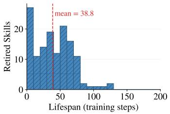  
(a) ALFWorld

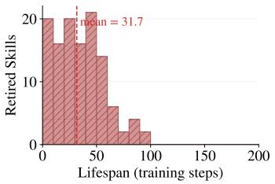  
(b) WebShop

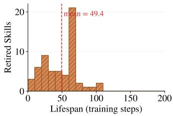  
(c) Search-Augmented QA  
Figure 5: Lifespan distribution of retirement events in SKILLFURNACE, measured as retired\_step − born\_step. Retirements spread across the full training horizon rather than clustering at any single stage; the red dashed line marks the per-environment mean.

Table 9: SKILLFURNACE retirement events by failure category (8-way human-annotated taxonomy). Percentages are within environment. Overly rigid ordering dominates in every environment, confirming that procedural rigidity, not content omission, is the principal failure mode of LLM-distilled skills. Environment-specific patterns also emerge: hallucinated action appears mostly in WebShop (UI elements absent from the environment) and contradicts environment appears only in Search-Augmented QA (search operations absent from the environment).
<table><tr><td>Failure category</td><td>ALFWorld</td><td>WebShop</td><td>Search-Aug. QA</td><td>Total</td></tr><tr><td>Overly rigid ordering</td><td>103 (74.6%)</td><td>94 (77.7%)</td><td>40 (67.8%)</td><td>237 (74.5%)</td></tr><tr><td>Overly specific</td><td>26 (18.8%)</td><td>2 (1.7%)</td><td>2 (3.4%)</td><td>30 (9.4%)</td></tr><tr><td>Premature specialization</td><td>6 (4.3%)</td><td>10 (8.3%)</td><td>0 (0.0%)</td><td>16 (5.0%)</td></tr><tr><td>Hallucinated action</td><td>0 (0.0%)</td><td>13 (10.7%)</td><td>0 (0.0%)</td><td>13 (4.1%)</td></tr><tr><td>Redundant with policy</td><td>2 (1.4%)</td><td>1 (0.8%)</td><td>7 (11.9%)</td><td>10 (3.1%)</td></tr><tr><td>Contradicts environment</td><td>0 (0.0%)</td><td>0 (0.0%)</td><td>7 (11.9%)</td><td>7 (2.2%)</td></tr><tr><td>Scope mismatch</td><td>0 (0.0%)</td><td>0 (0.0%)</td><td>3 (5.1%)</td><td>3 (0.9%)</td></tr><tr><td>Vague or tautological</td><td>1 (0.7%)</td><td>1 (0.8%)</td><td>0 (0.0%)</td><td>2 (0.6%)</td></tr><tr><td>Total</td><td>138</td><td>121</td><td>59</td><td>318</td></tr></table>

Release format. SKILLFURNACE is released as three top-level JSON files (sft\_trajectories.json, library\_snapshots.json, retirement\_events.json) with a schema document. All records are keyed by a global skill\_id so the three components can be joined: every skill id appearing in retirement\_events.json is also present in the matching run’s library\_snapshots.json for every step between birth and retirement, and every skill retrieved in sft\_trajectories.json is resolvable in the step-0 library snapshot. The dataset is released under CC-BY-4.0.

## D Search-Augmented QA Full Per-Dataset Results

Table 10 reports accuracy on each of the seven Search-Augmented QA sub-datasets that are summarised by the radar chart in Figure 2a. Both in-domain datasets (†: NQ, HotpotQA) and out-ofdomain datasets (⋆: TriviaQA, PopQA, 2WikiMultiHopQA, MuSiQue, Bamboogle) are included. The 48.7% aggregate number reported in the main text corresponds to micro-averaged accuracy over the 51,713-sample concatenation of these seven test sets.

SKILLFORGE obtains the best or second-best accuracy on every sub-dataset, with the largest absolute improvements on the multi-hop benchmarks Bamboogle (+3.4 over the strongest baseline) and HotpotQA (+0.7). Gains are consistent on both in-domain and out-of-domain splits, indicating that the forging lifecycle does not overfit to the training distribution.

Table 10: Per-dataset accuracy on Search-Augmented QA (%). †: in-domain; ⋆: out-of-domain. Per-dataset cells for non-SKILLFORGE rows are taken from their respective source papers. The Overall column is recomputed as the sample-weighted micro-average over the 51,713-sample union shown in Test samples, so that all methods are compared on an identical test set; these values may differ from source-paper totals that used different evaluation configurations. Bold: best; underline: second best. “–”: not reported.
<table><tr><td>Method Test samples</td><td>NQ† 3,610</td><td>TriviaQA* 11,313</td><td>PopQA* 14,267</td><td>HotpotQA† 7,405</td><td>2Wiki* 12,576</td><td>MuSiQue* 2,417</td><td>Bamboogle* 125</td><td>Overall 51,713</td></tr><tr><td>In-context / retrieval baselines</td><td></td><td></td><td></td><td></td><td></td><td></td><td></td><td></td></tr><tr><td>Vanilla [Team, 2023]</td><td>11.6</td><td>35.6</td><td>1.2</td><td>16.4</td><td>22.2</td><td>4.8</td><td>14.4</td><td>16.9</td></tr><tr><td>CoT</td><td>12.8</td><td>35.6</td><td>3.8</td><td>16.2</td><td>22.6</td><td>6.6</td><td>24.0</td><td>17.9</td></tr><tr><td>RAG</td><td>27.4</td><td>58.2</td><td>17.8</td><td>25.8</td><td>23.2</td><td>9.4</td><td>16.8</td><td>29.4</td></tr><tr><td>Search-o1 [Li et al., 2025]</td><td>19.4</td><td>40.6</td><td>11.4</td><td>17.0</td><td>27.0</td><td>8.6</td><td>30.4</td><td>22.9</td></tr><tr><td>R1-Instruct [Team, 2025a]</td><td>21.0</td><td>44.9</td><td>17.1</td><td>20.8</td><td>27.5</td><td>6.0</td><td>19.2</td><td>26.0</td></tr><tr><td>RL-based search methods</td><td></td><td></td><td></td><td></td><td></td><td></td><td></td><td></td></tr><tr><td>Search-R1 [Jin et al., 2025]</td><td>39.3</td><td>61.0</td><td>39.7</td><td>37.0</td><td>40.1</td><td>14.6</td><td>36.8</td><td>42.9</td></tr><tr><td>ZeroSearch [Sun et al., 2025]</td><td>43.6</td><td>61.8</td><td>51.5</td><td>34.6</td><td>35.2</td><td>18.4</td><td>27.8</td><td>45.2</td></tr><tr><td>StepSearch [Zheng et al., 2025]</td><td></td><td></td><td></td><td>38.6</td><td>36.6</td><td>22.6</td><td>40.0</td><td></td></tr><tr><td>EvolveR [Wu et al., 2025]</td><td>43.5</td><td>63.4</td><td>44.6</td><td>38.2</td><td>42.0</td><td>15.6</td><td>54.4</td><td>45.8</td></tr><tr><td>SkillRL [Xia et al., 2026]</td><td>45.9</td><td>63.3</td><td>45.9</td><td>43.2</td><td>40.3</td><td>20.2</td><td>73.8</td><td>46.8</td></tr><tr><td>SKILLFORGE (Ours)</td><td>48.2</td><td>65.0</td><td>50.1</td><td>43.9</td><td>40.4</td><td>20.3</td><td>77.2</td><td>48.7</td></tr></table>

## E Case Studies

## E.1 Deepest Forging Lineages

As shown in Figure 6, mutation lineages exhibit a heavy-tailed depth distribution: most refinements converge to a stable variant within one or two generations, while a tail extends up to nine generations when niches remain. Useful variants stabilize and stop mutating, so only lineages with room to specialize keep branching.

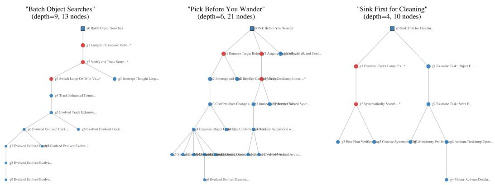  
Figure 6: Deepest forging lineages on ALFWorld. Each subplot shows a root skill (gen=0, square) and its multi-generation descendants (circles). Red = retired, blue = stable. Early variants are often retired while later, more refined variants survive.

## E.2 Failure Taxonomy Details

As shown in Figure 7, the 318 retirement events were labelled into one of eight failure categories. Two annotators labelled the events under this 8-way taxonomy; an initial pass reached Cohen’s $\kappa = 0 . 5$ inter-annotator agreement, and remaining disagreements were resolved by discussion. The dominant failure mode is overly rigid ordering at 74.5%, where the skill imposes a fixed procedural sequence that fails for edge cases; the second most common is overly specific at 9.4%, where skills work for narrow task subsets but fail broadly. Only 10 of the 318 retirement events (3.1%) are labeled redundant with policy; the remaining 96.9% contain prescriptions inconsistent with successful rollouts—rigid ordering, hallucinated operations, overfit specializations, self-contradictions—so delayed obsolescence reflects once-stable skills becoming concretely misleading, not the policy outgrowing harmless crutches. Environment-specific patterns also emerge: contradicts environment failures appear exclusively in Search-Augmented QA, where LLM-guided mutation hallucinates search operations absent from the environment.

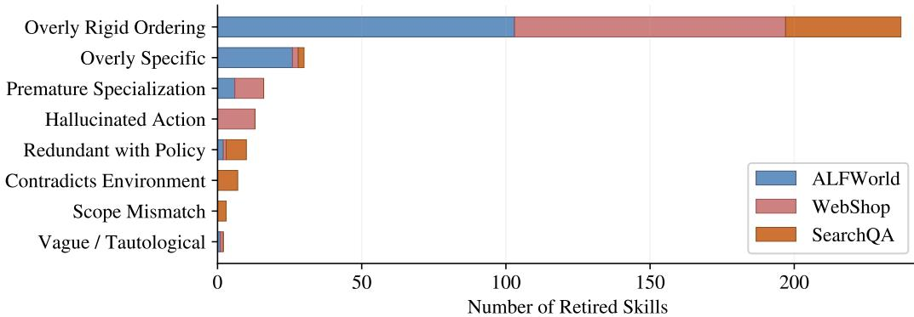  
Figure 7: Failure taxonomy of 318 retirement events across three environments. Blue: ALFWorld; red: WebShop; orange: Search-Augmented QA. Overly rigid ordering dominates across all environments; environment-specific failure modes emerge in Search-Augmented QA.

## E.3 WebShop: Hidden-Constraint Verification

Parent skill (“Confirm Hidden Specs”, fitness=0.84, gen=0):

Principle: Scroll to bullet points/description to verify non-title attributes (material, care, fit, design features); reject items that satisfy title keywords but fail hidden constraints.

When to apply: When evaluating candidate products against multi-attribute instructions.

Successful child (“Systematically Verify All Hidden Constraints”, fitness=0.70, gen=1, stable):

Principle: After selecting a candidate product, explicitly open the product description/features section and verify every constraint from the instruction that is not visible in the title or options.

When to apply: When a candidate product matches title keywords but contains hidden attribute constraints.

Failed child (“Systematically Verify Every Non-Visible Constraint”, fitness=0.21, gen=1, retired at step 78):

Principle: After selecting a product, scroll down and click on the ‘Description’ or ‘Features tab/section to read every specification.

When to apply: Whenever a product page is opened.

The successful child reaches stable status by maintaining high accuracy within its target niche; its aggregate fitness of 0.70 is below the parent’s 0.84 because the child targets a narrower set of tasks, but within-niche accuracy is what matters for the lifecycle, not aggregate fitness. The failed variant referenced interface elements such as “click on the Description tab,” which is absent from WebShop; its fitness decayed rapidly and the retirement gate filtered it out at step 78. The trial gate filters the hallucinated-interface variant before it affects the active library.

## E.4 ALFWorld: Mutation Outcomes

The initial skill “Pick Before You Wander” produced two mutations with opposite outcomes:

Parent (“Pick Before You Wander”, gen=0, fitness=0.84):

If the target object is visible or discovered, take it immediately; never leave it behind to explore other places.

Successful child (“Verify, Grab, and Confirm Pickup”, gen=1, fitness=0.70, stable): When a needed object is visible, move directly to it, take it immediately, and then verify it is now in your inventory before proceeding.

→ Adds a verification step that catches pickup failures.

<table><tr><td>Gen-0: &quot;Disambiguation Add-Ons&quot; (fitness=0.88) If the name is ambiguous, append clarifiers (birth year, nationality, known work) to the query.</td></tr><tr><td>↓ mutation</td></tr><tr><td>Gen-1: “Structured Query Escalation with Fallback&quot; (fitness=0.21, retired at step 83)</td></tr><tr><td>Systematically escalate through three reformulation strategies when initial results lack</td></tr><tr><td>evidence. → Too rigid; forced 3-step escalation even for simple queries.</td></tr><tr><td>↓ later mutation from same lineage</td></tr><tr><td>Gen-1: &quot;Verify Before Acting&quot; (fitness=0.70, stable) Before performing any action on an entity, first confirm its identity by searching with</td></tr></table>

Forging explores multiple directions from the same parent: the overly complex variant is retired while the simpler, more robust variant survives.

Failed child (“Retrieve Target Before Locating Desklamp”, gen=1, fitness=0.24, retired   
at step 65):   
First locate and pick up the target object specified in the goal before navigating to any   
furniture.   
→ Introduces a rigid ordering that fails for tasks where the lamp must be found first.

From the same parent, mutation produced both a beneficial specialization (adding a verification step) and a harmful over-specification (imposing a rigid task ordering). The retirement mechanism correctly identified and removed the harmful variant.

## E.5 Search-Augmented QA: Query Reformulation Lineage

A multi-generation forging chain on Search-Augmented QA:

## F KL Regularization under a Library-Conditioned Context

This appendix elaborates on how the KL penalty in Eq. (1) composes with the evolving skill library, complementing the non-stationarity of the fitness estimator formalized in Eq. (11).

Under our formulation (Eq. (2)), the library ${ \mathcal { S } } ^ { ( k ) }$ enters the policy through the context $p _ { t }$ rather than through the policy parameters θ. The parameterization of πθ is therefore invariant across forging cycles; what varies over training is the prompt distribution fed to the fixed network. The KL term $\dot { D } _ { \mathrm { K L } } ( \pi _ { \theta } \| \pi _ { \mathrm { r e f } } )$ is always evaluated at the same context $c _ { n , l }$ seen by both $\pi _ { \theta }$ and $\pi _ { \mathrm { r e f } } ,$ so the divergence is well-defined at every training step, regardless of how far $\mathcal { S } ^ { ( k ) }$ has drifted from ${ \mathcal S } ^ { ( 0 ) }$

Two structural properties align the fixed anchor $\pi _ { \mathrm { r e f } }$ with the library-conditioned inputs it encounters during RL. First, mutated skills are teacher-model rewrites of surviving parents that preserve the $( v , b , \omega )$ schema of Section 3.2, so new prompts differ from SFT-time prompts mainly in skill content rather than in structural form, on which $\pi _ { \mathrm { r e f } }$ remains a calibrated next-token predictor. Second, we use $\beta = 1 0 ^ { - 3 }$ (Table 5), so the KL term acts as a soft regularizer against large single-step deviations rather than a tight anchor to the SFT policy’s full conditional distribution. An alternative design is to re-anchor $\pi _ { \mathrm { r e f } }$ at each forging cycle, trading the clean separation between SFT initialization and RL optimization for tighter alignment between the reference policy and the current library; this variant is compatible with the rest of our framework, and the fixed-anchor choice is the simpler default we adopt here.

## G Limitations

Fitness is defined at the episode level: the K retrieved skills share a single binary reward $\left( \operatorname { E q . } \left( 6 \right) \right)$ This is an approximation—in episodes where multiple skills are co-retrieved, the signal cannot distinguish individual skill contributions. We mitigate this via applicability-conditioned retrieval, which spreads skills across task types; the top co-retrieval frequency across all skill pairs remains under 15% of episodes in each environment, so in practice each skill’s fitness estimate is dominated by episodes where it was retrieved alone. Nevertheless, the shared-credit assumption may slow convergence on tasks where skill co-retrieval is structurally unavoidable.

All experiments use a 7B base model; lifecycle dynamics under larger models may differ, and we leave scalability to future work. LLM-guided mutation relies on an external teacher model $\mathcal { M } _ { T } \mathbf { : }$ performance is contingent on the teacher’s instruction-following ability. Any sufficiently capable instruction-tuned model can serve this role (Appendix B uses Kimi-K2.5 but imposes no dependence on a specific provider), but a weak teacher will produce low-quality mutations that the trial gate must filter.

## H Discussion

Design choices. Fitness is tracked as a cumulative running average (Eq. (6)), which integrates evidence over the full lifecycle of each skill. This is the natural estimator for our detection target, skills whose accumulated success record needs to be distinguished from skills that were never effective; it is what makes “once stable, now failing” a well-defined pattern to catch. A faster estimator such as an exponential moving average would respond more quickly to fitness changes, but this sensitivity cuts both ways: a skill that encounters a transiently hard batch of tasks would be flagged before the policy has stabilized, producing false retirements. The cumulative average’s inertia is intentional—the lifecycle’s usage-count gates $( \bar { N } _ { \mathrm { r e t i r e } } , N _ { \mathrm { s t a b l e } } )$ already guard against premature decisions; within that framework, the cumulative estimate reliably separates skills with a strong historical record from those that have consistently underperformed. Table 1 reports an average retirement-event lifespan of 38.0 training steps, showing that retirement occurs promptly relative to the 200-step training budget despite the conservative estimator.

Mutation survival. Across the three environments, 213 mutant skills were generated: 88 in ALFWorld, 55 in WebShop, and 70 in Search-Augmented QA. The majority survive the lifecycle: the mutant survival rate is 64.8%, 52.7%, and 62.9% respectively, so LLM-guided mutation produces viable skills more often than not. Each forging cycle requires up to $K _ { \mathrm { m u t a t e } }$ teacher model calls for mutation plus lightweight fitness bookkeeping.

Ablation library dynamics. In Table 3 the −mutation and −forging variants both retain the initial library size (44 on ALFWorld, 66 on WebShop, 41 on Search-Augmented QA). These numbers refer to $\vert { \cal S } _ { 0 } \vert$ , the distilled library before pre-retirement, to make cross-variant comparison direct. For −forging the entire forging method, including pre-retirement, runtime retirement, and mutation, is disabled, so the SFT data is unfiltered and no skills are added or removed after initialization. For −mutation, pre-retirement and runtime retirement both run, but the two mechanisms remove very few skills on these environments in practice: pre-retirement at $\delta _ { \mathrm { p r e } } = 0 . 3$ with $N _ { \mathrm { m i n } } = 3$ discards only initial skills that demonstrably hurt the base-model policy, and on the three environments this is a small fraction of $ { \boldsymbol { S } } _ { 0 }$ (typically 0–3 skills); the remaining skills then accumulate enough usage during RL to stay above $\delta _ { \mathrm { r e t i r e } } .$ , so runtime retirement triggers rarely when mutation is off and no low-fitness children are being introduced. Size changes driven by the lifecycle therefore manifest primarily once mutation is re-enabled, which is consistent with the joint role of mutation and retirement reported in Section 5.3. The −pre-retirement variant confirms this picture from the opposite direction: with runtime retirement and mutation intact, the final library still settles at the cap (100, 95, 85) because the cap is the binding constraint once mutation is active. The 1.2–3.5% success drop therefore arises not from library size but from SFT data quality: pre-retirement is an integral first stage of the lifecycle that shapes the initial policy $\pi _ { \theta _ { \mathrm { s f t } } }$ on which the subsequent retirement and mutation operate.

The −retirement column in Table 3 reaches 132, 121, and 111 skills on the three environments, matching the total-ever-created count of the full method. This follows from the forging schedule: the number of forging cycles and the per-cycle budget $K _ { \mathrm { m u t a t e } }$ are fixed, so the cumulative number of child skills generated is largely invariant to whether low-fitness parents are subsequently removed. Retirement determines which skills remain in the active library at any point, not how many are produced during training; correspondingly the full method’s active library settles at a much smaller size (100, 95, 85) while −retirement accumulates every generated skill.

Evaluation protocol. All reported numbers use stochastic decoding at temperature 1.0 for both training-time rollouts and test-time evaluation, so that evaluation noise reflects the policy’s deployed behavior rather than a degenerate argmax. Each reported score is averaged over five evaluation runs of the best validation checkpoint with sampling seeds {30, 40, 42, 50, 62}. The mean ± standard deviation of the overall success rate is $9 2 . 4 \pm 0 . 5 \%$ on ALFWorld, 78.4 ± 0.4% on WebShop, and $4 8 . 7 \pm 0 . 3 \%$ on Search-Augmented QA, with the low variance confirming that reported results are stable under resampling.

Statistical significance. We test whether SKILLFORGE’s overall success rate exceeds the strongest memory-augmented RL baseline, SkillRL, using a one-sample t-test against the SkillRL point estimate under the null $H _ { 0 } : \mu _ { \mathrm { S K I L L F O R G E } } = \mu _ { \mathrm { S k i l l R L } }$ with our five-seed evaluation sample $( n = 5$ df = 4). On ALFWorld $( t = 1 1 . 1 8 , p = 1 . 8 \times 1 0 ^ { - 4 } )$ , WebShop $( t = 3 1 . 8 6 , p = 2 . 9 \times \mathrm { \bar { 1 0 } ^ { - 6 } } )$ , and Search-Augmented QA $( t = 1 4 . 1 6 , \bar { p } = 7 . 2 \times 1 0 ^ { - 5 } )$ , the improvement is significant at $p < 1 0 ^ { - 3 }$ on all three environments. The corresponding two-sided 95% confidence intervals, [91.78, 93.02], [77.90, 78.90], and [48.33, 49.07], do not overlap the SkillRL baseline values of 89.9, 72.7, and 46.8, so the 1.9–5.7% absolute gains are unlikely to be explained by sampling noise. Under the conservative assumption that SkillRL’s per-seed variance matches our observed per-environment standard deviations of 0.5%, 0.4%, and 0.3% respectively, a pooled Welch’s t-test yields t = 7.91 (ALFWorld), t = 22.51 (WebShop), and t = 10.03 (Search-Augmented QA), with $p < 1 0 ^ { - 4 }$ on all three environments, preserving the conclusion.

Broader impact. Treating experience accumulation as a quality-control problem improves agent performance and yields interpretable artifacts: the SKILLFURNACE dataset enables follow-up research on skill quality prediction and failure-aware generation. The contributed collection contains only SFT trajectories, evolved skill libraries with fitness annotations, and retirement events with failure annotations, and introduces no risks beyond those inherent to LLM agents that act in interactive environments.