# Self-Evolve With a Reference: Anchored Training of Tool-Integrated Agents

Wenjie Liao<sup>1</sup>, Liangjie Zhao<sup>2</sup>, and Zehong Cao<sup>2</sup>

<sup>1</sup>Wase<sup>d</sup>a Un<sup>i</sup>vers<sup>i</sup>ty, jie3040@akane.waseda.jp, <sup>2</sup>A<sup>d</sup>e<sup>l</sup>a<sup>id</sup>e Un<sup>i</sup>vers<sup>i</sup>ty, zhaoliangjie55@gmail.com, Jimmy.Cao@adelaide.edu.au

## Abstract

S<sub>e</sub>lf<sub>-evo</sub>l<sub>v</sub>i<sub>ng</sub> t<sub>oo</sub>l<sub>-</sub>i<sub>n</sub>t<sub>egra</sub>t<sub>e</sub>d <sub>agen</sub>t<sub>s</sub> l<sub>earn</sub> f<sub>rom</sub> t<sub>as</sub>k<sub>s an</sub>d f<sub>ee</sub>db<sub>ac</sub>k <sub>genera</sub>t<sub>e</sub>d <sub>w</sub>ithi<sub>n</sub> th<sub>e</sub>i<sub>r own</sub> t<sub>ra</sub>i<sub>n</sub>i<sub>ng</sub> l<sub>oop.</sub> A C<sub>urr</sub>i<sub>cu</sub>l<sub>um</sub> A<sub>gen</sub>t <sub>genera</sub>t<sub>es</sub> t<sub>as</sub>k<sub>s, w</sub>hil<sub>e an</sub> E<sub>xecu</sub>t<sub>or</sub> A<sub>gen</sub>t l<sub>earns</sub> f<sub>rom se</sub>lf<sub>-cons</sub>i<sub>s</sub>t<sub>ency s</sub>i<sub>gna</sub>l<sub>s</sub> th<sub>roug</sub>h <sub>re</sub>i<sub>n</sub>f<sub>orcemen</sub>t l<sub>earn</sub>i<sub>ng.</sub> H<sub>owever, re</sub>l<sub>y</sub>i<sub>ng so</sub>l<sub>e</sub>l<sub>y on</sub> th<sub>e curren</sub>t E<sub>xecu</sub>t<sub>or</sub> f<sub>or</sub> f<sub>ee</sub>db<sub>ac</sub>k h<sub>as</sub> t<sub>wo</sub> li<sub>m</sub>it<sub>a</sub>ti<sub>ons: group-re</sub>l<sub>a</sub>ti<sub>ve a</sub>d<sub>van</sub>t<sub>ages van</sub>i<sub>s</sub>h <sub>un</sub>d<sub>er</sub> f<sub>u</sub>ll <sub>consensus, w</sub>hil<sub>e uncer</sub>t<sub>a</sub>i<sub>n</sub>t<sub>y-</sub>b<sub>ase</sub>d <sub>curr</sub>i<sub>cu</sub>l<sub>um</sub> <sub>rewar</sub>d<sub>s</sub> f<sub>avor</sub> di<sub>sagreemen</sub>t <sub>w</sub>ith<sub>ou</sub>t <sub>s</sub>h<sub>ow</sub>i<sub>ng w</sub>h<sub>e</sub>th<sub>er</sub> th<sub>e genera</sub>t<sub>e</sub>d t<sub>as</sub>k<sub>s suppor</sub>t f<sub>ur</sub>th<sub>er</sub> l<sub>earn</sub>i<sub>ng.</sub> These limitations motivate an additional reference beyond the current Executor. We propose AnchorLoop, <sub>w</sub>hi<sub>c</sub>h i<sub>n</sub>t<sub>ro</sub>d<sub>uces a</sub> f<sub>rozen copy o</sub>f th<sub>e prev</sub>i<sub>ous</sub> it<sub>era</sub>ti<sub>on</sub>’<sub>s</sub> E<sub>xecu</sub>t<sub>or as a</sub> hi<sub>s</sub>t<sub>or</sub>i<sub>ca</sub>l <sub>re</sub>f<sub>erence an</sub>d <sub>reuses</sub> it <sub>on</sub> b<sub>o</sub>th <sub>s</sub>id<sub>es o</sub>f th<sub>e</sub> t<sub>ra</sub>i<sub>n</sub>i<sub>ng</sub> l<sub>oop.</sub> F<sub>or</sub> th<sub>e</sub> E<sub>xecu</sub>t<sub>or,</sub> th<sub>e anc</sub>h<sub>or prov</sub>id<sub>es a cross-re</sub>f<sub>erence a</sub>d<sub>van</sub>t<sub>age</sub> that evaluates current outputs against both current and historical majority answers. For the Curriculum, it provides an agreement-based reference based on diferences in sampled majority agreement. Since th<sub>e</sub> E<sub>xecu</sub>t<sub>or an</sub>d <sub>anc</sub>h<sub>or</sub> h<sub>ave</sub> id<sub>en</sub>ti<sub>ca</sub>l <sub>parame</sub>t<sub>ers</sub> d<sub>ur</sub>i<sub>ng</sub> C<sub>urr</sub>i<sub>cu</sub>l<sub>um</sub> t<sub>ra</sub>i<sub>n</sub>i<sub>ng,</sub> thi<sub>s compar</sub>i<sub>son serves</sub> <sub>as a proxy</sub> f<sub>or</sub> t<sub>as</sub>k <sub>se</sub>l<sub>ec</sub>ti<sub>on ra</sub>th<sub>er</sub> th<sub>an ev</sub>id<sub>ence o</sub>f i<sub>n</sub>t<sub>er-vers</sub>i<sub>on</sub> i<sub>mprovemen</sub>t <sub>or correc</sub>t<sub>ness.</sub> A<sub>cross</sub> 13 reasonin<sub>g</sub> benchmarks<sub>,</sub> AnchorLoo<sub>p</sub> im<sub>p</sub>roves over A<sub>g</sub>ent0 b<sub>y</sub> 2.5% on mathematical reasonin<sub>g</sub> and 2.8% <sub>on</sub> <sub>genera</sub>l <sub>reason</sub>i<sub>ng</sub> t<sub>as</sub>k<sub>s.</sub> It <sub>a</sub>l<sub>so</sub> <sub>ma</sub>i<sub>n</sub>t<sub>a</sub>i<sub>ns</sub> hi<sub>g</sub>h<sub>er</sub> <sub>e</sub>f<sub>ec</sub>ti<sub>ve-a</sub>d<sub>van</sub>t<sub>age</sub> <sub>var</sub>i<sub>ance</sub> <sub>an</sub>d <sub>con</sub>ti<sub>nues</sub> i<sub>mprov</sub>i<sub>ng</sub> i<sub>n</sub> l<sub>a</sub>t<sub>er</sub> it<sub>era</sub>ti<sub>ons as</sub> th<sub>e unanc</sub>h<sub>ore</sub>d b<sub>ase</sub>li<sub>ne s</sub>h<sub>ows</sub> di<sub>m</sub>i<sub>n</sub>i<sub>s</sub>hi<sub>ng ga</sub>i<sub>ns.</sub> Th<sub>ese resu</sub>lt<sub>s</sub> d<sub>emons</sub>t<sub>ra</sub>t<sub>e</sub> th<sub>e</sub> b<sub>ene</sub>fit <sub>o</sub>f i<sub>n</sub>t<sub>ro</sub>d<sub>uc</sub>i<sub>ng a</sub> li<sub>g</sub>ht<sub>we</sub>i<sub>g</sub>ht hi<sub>s</sub>t<sub>or</sub>i<sub>ca</sub>l <sub>re</sub>f<sub>erence</sub> i<sub>n</sub>t<sub>o se</sub>lf<sub>-evo</sub>l<sub>v</sub>i<sub>ng</sub> t<sub>oo</sub>l<sub>-</sub>i<sub>n</sub>t<sub>egra</sub>t<sub>e</sub>d <sub>agen</sub>t<sub>s w</sub>ith<sub>ou</sub>t <sub>ex</sub>t<sub>erna</sub>l t<sub>as</sub>k <sub>or answer superv</sub>i<sub>s</sub>i<sub>on.</sub>

Keywords: Tool-Integrated Agents, Reference, Reinforcement Learning

## 1. Introduction

T<sub>oo</sub>l<sub>-</sub>i<sub>n</sub>t<sub>egra</sub>t<sub>e</sub>d l<sub>anguage mo</sub>d<sub>e</sub>l <sub>agen</sub>t<sub>s can</sub> l<sub>earn</sub> t<sub>o so</sub>l<sub>ve comp</sub>l<sub>ex</sub> t<sub>as</sub>k<sub>s</sub> th<sub>roug</sub>h <sub>mu</sub>lti<sub>-</sub>t<sub>urn</sub> i<sub>n</sub>t<sub>erac</sub>ti<sub>on</sub> with external tools. Recent work further extends this capability toward self-evolution, where agents <sub>genera</sub>t<sub>e no</sub>t <sub>on</sub>l<sub>y so</sub>l<sub>u</sub>ti<sub>ons</sub> b<sub>u</sub>t <sub>a</sub>l<sub>so</sub> th<sub>e</sub>i<sub>r own</sub> t<sub>ra</sub>i<sub>n</sub>i<sub>ng</sub> t<sub>as</sub>k<sub>s an</sub>d f<sub>ee</sub>db<sub>ac</sub>k<sub>.</sub> A <sub>represen</sub>t<sub>a</sub>ti<sub>ve para</sub>di<sub>gm</sub> <sub>coup</sub>l<sub>es</sub> <sub>a</sub> C<sub>urr</sub>i<sub>cu</sub>l<sub>um</sub> A<sub>gen</sub>t th<sub>a</sub>t <sub>genera</sub>t<sub>es</sub> t<sub>as</sub>k<sub>s</sub> <sub>w</sub>ith <sub>an</sub> E<sub>xecu</sub>t<sub>or</sub> A<sub>gen</sub>t th<sub>a</sub>t l<sub>earns</sub> t<sub>o</sub> <sub>so</sub>l<sub>ve</sub> th<sub>em</sub> throu<sub>g</sub>h reinforcement learnin<sub>g</sub> [25]. B<sub>y g</sub>eneratin<sub>g</sub> tasks and feedback within the trainin<sub>g</sub> loo<sub>p</sub>, such <sub>sys</sub>t<sub>ems re</sub>d<sub>uce</sub> th<sub>e</sub>i<sub>r re</sub>li<sub>ance on ex</sub>t<sub>erna</sub>ll<sub>y supp</sub>li<sub>e</sub>d t<sub>ra</sub>i<sub>n</sub>i<sub>ng</sub> t<sub>as</sub>k<sub>s an</sub>d <sub>answer</sub> l<sub>a</sub>b<sub>e</sub>l<sub>s.</sub> Thi<sub>s crea</sub>t<sub>es</sub> <sub>a c</sub>l<sub>ose</sub>d l<sub>earn</sub>i<sub>ng</sub> l<sub>oop</sub> i<sub>n w</sub>hi<sub>c</sub>h th<sub>e</sub> E<sub>xecu</sub>t<sub>or serves no</sub>t <sub>on</sub>l<sub>y as</sub> th<sub>e</sub> l<sub>earner,</sub> b<sub>u</sub>t <sub>a</sub>l<sub>so as a source o</sub>f f<sub>ee</sub>db<sub>ac</sub>k f<sub>or</sub> t<sub>ra</sub>i<sub>n</sub>i<sub>ng</sub> b<sub>o</sub>th <sub>agen</sub>t<sub>s.</sub>

Thi<sub>s re</sub>li<sub>ance on</sub> th<sub>e curren</sub>t E<sub>xecu</sub>t<sub>or,</sub> h<sub>owever, crea</sub>t<sub>es</sub> li<sub>m</sub>it<sub>a</sub>ti<sub>ons on</sub> b<sub>o</sub>th <sub>s</sub>id<sub>es o</sub>f <sub>se</sub>lf<sub>-evo</sub>l<sub>u</sub>ti<sub>on.</sub> O<sub>n</sub> th<sub>e</sub> E<sub>xecu</sub>t<sub>or s</sub>id<sub>e, group-re</sub>l<sub>a</sub>ti<sub>ve</sub> l<sub>earn</sub>i<sub>ng re</sub>li<sub>es on</sub> dif<sub>erences among samp</sub>l<sub>e</sub>d <sub>ou</sub>t<sub>pu</sub>t<sub>s.</sub> Wh<sub>en a</sub>ll <sub>ou</sub>t<sub>pu</sub>t<sub>s</sub> i<sub>n a group reac</sub>h <sub>consensus,</sub> th<sub>e cen</sub>t<sub>ere</sub>d <sub>a</sub>d<sub>van</sub>t<sub>ages van</sub>i<sub>s</sub>h <sub>an</sub>d <sub>prov</sub>id<sub>e no re</sub>l<sub>a</sub>ti<sub>ve pre</sub>f<sub>erence</sub> among trajectories. On the Curriculum side, uncertainty can identify tasks that elicit disagreement from th<sub>e</sub> E<sub>xecu</sub>t<sub>or,</sub> b<sub>u</sub>t di<sub>sagreemen</sub>t <sub>a</sub>l<sub>one</sub> d<sub>oes no</sub>t i<sub>n</sub>di<sub>ca</sub>t<sub>e w</sub>h<sub>e</sub>th<sub>er</sub> th<sub>ose</sub> t<sub>as</sub>k<sub>s prov</sub>id<sub>e use</sub>f<sub>u</sub>l <sub>oppor</sub>t<sub>un</sub>iti<sub>es</sub> f<sub>or</sub> f<sub>ur</sub>th<sub>er</sub> l<sub>earn</sub>i<sub>ng.</sub> I<sub>n</sub> b<sub>o</sub>th <sub>cases,</sub> th<sub>e</sub> l<sub>earn</sub>i<sub>ng s</sub>i<sub>gna</sub>l i<sub>s</sub> d<sub>e</sub>t<sub>erm</sub>i<sub>ne</sub>d <sub>en</sub>ti<sub>re</sub>l<sub>y</sub> b<sub>y</sub> th<sub>e curren</sub>t E<sub>xecu</sub>t<sub>or,</sub> <sub>w</sub>ith<sub>ou</sub>t <sub>a re</sub>f<sub>erence</sub> b<sub>eyon</sub>d it<sub>s presen</sub>t b<sub>e</sub>h<sub>av</sub>i<sub>or.</sub>

These limitations motivate a natural question: can self-evolution gain an additional reference while remaining self-contained? Our key idea is to use the system’s own recent history as that reference. Specifically, we retain the Executor from the previous iteration as a frozen anchor. This introduces a t<sub>empora</sub>l <sub>compar</sub>i<sub>son</sub> <sub>w</sub>ith<sub>ou</sub>t <sub>requ</sub>i<sub>r</sub>i<sub>ng</sub> <sub>ex</sub>t<sub>erna</sub>ll<sub>y</sub> <sub>supp</sub>li<sub>e</sub>d t<sub>as</sub>k<sub>s</sub> <sub>or</sub> <sub>answer</sub> l<sub>a</sub>b<sub>e</sub>l<sub>s.</sub> Hi<sub>s</sub>t<sub>or</sub>i<sub>ca</sub>l <sub>re</sub>f<sub>erence</sub> <sub>mo</sub>d<sub>e</sub>l<sub>s</sub> h<sub>ave</sub> b<sub>een use</sub>d i<sub>n</sub> it<sub>era</sub>ti<sub>ve</sub> l<sub>earn</sub>i<sub>ng;</sub> f<sub>or examp</sub>l<sub>e,</sub> SPIN <sub>compares aga</sub>i<sub>ns</sub>t <sub>responses</sub> f<sub>rom a</sub> <sub>p</sub>revious model while retainin<sub>g</sub> human reference res<sub>p</sub>onses [2]. Our focus is diferent: we stud<sub>y</sub> how a <sub>recen</sub>t E<sub>xecu</sub>t<sub>or can serve as a s</sub>h<sub>are</sub>d <sub>re</sub>f<sub>erence</sub> f<sub>or</sub> b<sub>o</sub>th <sub>s</sub>id<sub>es o</sub>f <sub>a se</sub>lf<sub>-evo</sub>l<sub>v</sub>i<sub>ng</sub> C<sub>urr</sub>i<sub>cu</sub>l<sub>um–</sub>E<sub>xecu</sub>t<sub>or</sub> <sup>l</sup>oo<sub>p</sub>.

Based on this idea, we propose AnchorLoop, which reuses the same historical anchor on both sides of self-evolution. For the Executor, the anchor provides a cross-reference advantage that evaluates current outputs against both the current and anchor majority answers, augmenting the preference induced b<sub>y curren</sub>t <sub>se</sub>lf<sub>-cons</sub>i<sub>s</sub>t<sub>ency.</sub> F<sub>or</sub> th<sub>e</sub> C<sub>urr</sub>i<sub>cu</sub>l<sub>um,</sub> th<sub>e anc</sub>h<sub>or prov</sub>id<sub>es an agreemen</sub>t<sub>-</sub>b<sub>ase</sub>d <sub>re</sub>f<sub>erence</sub> through the positive diference in sampled majority-agreement rates. The anchor is refreshed from th<sub>e prev</sub>i<sub>ous</sub> E<sub>xecu</sub>t<sub>or a</sub>t th<sub>e</sub> b<sub>eg</sub>i<sub>nn</sub>i<sub>ng o</sub>f <sub>eac</sub>h <sub>ou</sub>t<sub>er</sub> it<sub>era</sub>ti<sub>on an</sub>d <sub>rema</sub>i<sub>ns</sub> f<sub>rozen</sub> th<sub>roug</sub>h<sub>ou</sub>t th<sub>a</sub>t it<sub>era</sub>ti<sub>on.</sub>

I<sub>mpor</sub>t<sub>an</sub>tl<sub>y,</sub> th<sub>e</sub> t<sub>wo</sub> <sub>uses</sub> <sub>o</sub>f th<sub>e</sub> <sub>anc</sub>h<sub>or</sub> h<sub>ave</sub> dif<sub>eren</sub>t i<sub>n</sub>t<sub>erpre</sub>t<sub>a</sub>ti<sub>ons.</sub> C<sub>urr</sub>i<sub>cu</sub>l<sub>um</sub> t<sub>ra</sub>i<sub>n</sub>i<sub>ng</sub> <sub>prece</sub>d<sub>es</sub> E<sub>xecu</sub>t<sub>or</sub> t<sub>ra</sub>i<sub>n</sub>i<sub>ng</sub> i<sub>n eac</sub>h it<sub>era</sub>ti<sub>on, so</sub> th<sub>e curren</sub>t E<sub>xecu</sub>t<sub>or an</sub>d th<sub>e new</sub>l<sub>y re</sub>f<sub>res</sub>h<sub>e</sub>d <sub>anc</sub>h<sub>or</sub> h<sub>ave</sub> id<sub>en</sub>ti<sub>ca</sub>l <sub>parame</sub>t<sub>ers</sub> d<sub>ur</sub>i<sub>ng</sub> th<sub>e</sub> C<sub>urr</sub>i<sub>cu</sub>l<sub>um s</sub>t<sub>age an</sub>d <sub>pro</sub>d<sub>uce</sub> i<sub>n</sub>d<sub>epen</sub>d<sub>en</sub>t <sub>ro</sub>ll<sub>ou</sub>t <sub>groups.</sub> Th<sub>e</sub>i<sub>r</sub> <sub>samp</sub>l<sub>e</sub>d <sub>agreemen</sub>t dif<sub>erence</sub> th<sub>ere</sub>f<sub>ore</sub> <sub>serves</sub> <sub>as</sub> <sub>an</sub> <sub>agreemen</sub>t<sub>-</sub>b<sub>ase</sub>d <sub>proxy</sub> f<sub>or</sub> <sub>s</sub>h<sub>ap</sub>i<sub>ng</sub> th<sub>e</sub> C<sub>urr</sub>i<sub>cu</sub>l<sub>um</sub> <sub>rewar</sub>d<sub>, ra</sub>th<sub>er</sub> th<sub>an</sub> di<sub>rec</sub>t <sub>ev</sub>id<sub>ence o</sub>f i<sub>mprovemen</sub>t b<sub>e</sub>t<sub>ween mo</sub>d<sub>e</sub>l <sub>vers</sub>i<sub>ons or correc</sub>t<sub>ness.</sub> D<sub>ur</sub>i<sub>ng</sub> <sub>su</sub>b<sub>sequen</sub>t E<sub>xecu</sub>t<sub>or</sub> t<sub>ra</sub>i<sub>n</sub>i<sub>ng,</sub> th<sub>e</sub> <sub>curren</sub>t E<sub>xecu</sub>t<sub>or</sub> <sub>evo</sub>l<sub>ves</sub> <sub>w</sub>hil<sub>e</sub> th<sub>e</sub> <sub>anc</sub>h<sub>or</sub> <sub>rema</sub>i<sub>ns</sub> fi<sub>xe</sub>d<sub>,</sub> <sub>ena</sub>bli<sub>ng</sub> <sub>a</sub> <sub>genu</sub>i<sub>ne</sub> hi<sub>s</sub>t<sub>or</sub>i<sub>ca</sub>l <sub>compar</sub>i<sub>son.</sub> W<sub>e</sub> f<sub>ur</sub>th<sub>er</sub> <sub>c</sub>h<sub>arac</sub>t<sub>er</sub>i<sub>ze</sub> thi<sub>s</sub> hi<sub>s</sub>t<sub>or</sub>i<sub>ca</sub>l <sub>a</sub>d<sub>van</sub>t<sub>age</sub> <sub>an</sub>d <sub>s</sub>h<sub>ow</sub> th<sub>a</sub>t it <sub>ac</sub>t<sub>s</sub> <sub>as</sub> <sub>a</sub> <sub>con</sub>diti<sub>ona</sub>l <sub>rewe</sub>i<sub>g</sub>hti<sub>ng</sub> <sub>o</sub>f <sub>curren</sub>t <sub>ou</sub>t<sub>pu</sub>t<sub>s:</sub> it <sub>can</sub> i<sub>n</sub>t<sub>ro</sub>d<sub>uce</sub> <sub>a</sub>dditi<sub>ona</sub>l <sub>re</sub>l<sub>a</sub>ti<sub>ve</sub> i<sub>n</sub>f<sub>orma</sub>ti<sub>on</sub> <sub>w</sub>h<sub>en</sub> current and historical majorities difer, while still vanishing under full current consensus.

O<sub>ur con</sub>t<sub>r</sub>ib<sub>u</sub>ti<sub>ons are</sub> th<sub>ree</sub>f<sub>o</sub>ld<sub>:</sub>

• Historical Anchoring. We introduce AnchorLoop, which uses the previous iteration’s Executor <sub>as a s</sub>h<sub>are</sub>d hi<sub>s</sub>t<sub>or</sub>i<sub>ca</sub>l <sub>re</sub>f<sub>erence</sub> f<sub>or</sub> b<sub>o</sub>th C<sub>urr</sub>i<sub>cu</sub>l<sub>um an</sub>d E<sub>xecu</sub>t<sub>or</sub> t<sub>ra</sub>i<sub>n</sub>i<sub>ng.</sub>

• Dual-Sided Learning. We develop a cross-reference advantage for Executor training and an <sub>agreemen</sub>t<sub>-</sub>b<sub>ase</sub>d <sub>re</sub>f<sub>erence</sub> f<sub>or</sub> C<sub>urr</sub>i<sub>cu</sub>l<sub>um</sub> t<sub>ra</sub>i<sub>n</sub>i<sub>ng, an</sub>d <sub>c</sub>h<sub>arac</sub>t<sub>er</sub>i<sub>ze</sub> h<sub>ow</sub> th<sub>e</sub> hi<sub>s</sub>t<sub>or</sub>i<sub>ca</sub>l <sub>re</sub>f<sub>erence</sub> <sub>s</sub>h<sub>apes</sub> b<sub>o</sub>th l<sub>earn</sub>i<sub>ng s</sub>i<sub>gna</sub>l<sub>s.</sub>

• Empirical Validation. Across two backbones and thirteen reasoning benchmarks, AnchorLoop <sub>cons</sub>i<sub>s</sub>t<sub>en</sub>tl<sub>y</sub> i<sub>mproves</sub> <sub>over</sub> th<sub>e</sub> <sub>unanc</sub>h<sub>ore</sub>d b<sub>ase</sub>li<sub>ne</sub> b<sub>y</sub> 2<sub>.</sub>5<sub>-</sub>2<sub>.</sub>8% <sub>po</sub>i<sub>n</sub>t<sub>s</sub> <sub>on</sub> <sub>average,</sub> <sub>w</sub>hil<sub>e</sub> <sub>con</sub>ti<sub>n-</sub> <sub>u</sub>i<sub>ng</sub> t<sub>o</sub> i<sub>mprove</sub> i<sub>n</sub> l<sub>a</sub>t<sub>er</sub> t<sub>ra</sub>i<sub>n</sub>i<sub>ng</sub> it<sub>era</sub>ti<sub>ons.</sub>

## 2. Preliminaries

Self-Evolving Curriculum–Executor Learning. We consider a self-evolving system consisting of a Curriculum A<sub>g</sub>ent $\pi _ { \theta }$ and an Executor A<sub>g</sub>ent $\pi _ { \phi }$ . The Curriculum generates training tasks x, while th<sub>e</sub> E<sub>xecu</sub>t<sub>or</sub> l<sub>earns</sub> t<sub>o so</sub>l<sub>ve</sub> th<sub>em</sub> th<sub>roug</sub>h <sub>mu</sub>lti<sub>-</sub>t<sub>urn</sub> i<sub>n</sub>t<sub>erac</sub>ti<sub>on w</sub>ith <sub>ex</sub>t<sub>erna</sub>l t<sub>oo</sub>l<sub>s.</sub> Gi<sub>ven a</sub> t<sub>as</sub>k $x ,$ the Executor generates a trajectory $\tau = \left( s _ { 1 } , a _ { 1 } , o _ { 1 } , \dots , s _ { H } , a _ { H } , o _ { H } \right)$ of at most H turns, where $a _ { h }$ i<sub>s</sub> <sub>e</sub>ith<sub>er</sub> <sub>a</sub> t<sub>oo</sub>l <sub>ca</sub>ll <sub>or</sub> <sub>a</sub> fi<sub>na</sub>l <sub>answer</sub> <sub>an</sub>d $o _ { h }$ is the resulting observation. The trajectory terminates when th<sub>e</sub> E<sub>xecu</sub>t<sub>or pro</sub>d<sub>uces a</sub> fi<sub>na</sub>l <sub>answer</sub> $o ( \tau ) \in \mathcal { V }$ or reaches the turn bud<sub>g</sub>et [25, 26]. The Curriculum– E<sub>xecu</sub>t<sub>or</sub> l<sub>oop genera</sub>t<sub>es</sub> b<sub>o</sub>th t<sub>ra</sub>i<sub>n</sub>i<sub>ng</sub> t<sub>as</sub>k<sub>s an</sub>d l<sub>earn</sub>i<sub>ng s</sub>i<sub>gna</sub>l<sub>s w</sub>ithi<sub>n</sub> th<sub>e</sub> t<sub>ra</sub>i<sub>n</sub>i<sub>ng process.</sub> Th<sub>e</sub> C<sub>urr</sub>i<sub>cu</sub>l<sub>um eva</sub>l<sub>ua</sub>t<sub>es genera</sub>t<sub>e</sub>d t<sub>as</sub>k<sub>s</sub> b<sub>ase</sub>d <sub>on</sub> th<sub>e curren</sub>t E<sub>xecu</sub>t<sub>or</sub>’<sub>s</sub> b<sub>e</sub>h<sub>av</sub>i<sub>or, w</sub>hil<sub>e</sub> th<sub>e</sub> E<sub>xecu</sub>t<sub>or</sub> l<sub>earns</sub> f<sub>rom agreemen</sub>t <sub>among</sub> it<sub>s own samp</sub>l<sub>e</sub>d <sub>ou</sub>t<sub>pu</sub>t<sub>s.</sub> Th<sub>us,</sub> b<sub>o</sub>th <sub>s</sub>id<sub>es o</sub>f <sub>se</sub>lf<sub>-evo</sub>l<sub>u</sub>ti<sub>on re</sub>l<sub>y on</sub>

feedback derived from the current Executor [25].

Agreement-Based Group-Relative Learning. For each task $x ,$ th<sub>e</sub> Ex<sub>e</sub>c<sub>u</sub>t<sub>o</sub>r <sub>s</sub>am<sub>p</sub>l<sub>es</sub> $G$ trajectories $\{ \tau _ { i } \} _ { i = 1 } ^ { G }$ <sub>.</sub> A fi<sub>xe</sub>d fi<sub>na</sub>l<sub>-answer</sub> <sub>parser</sub> <sub>maps</sub> <sub>eac</sub>h <sub>we</sub>ll<sub>-</sub>f<sub>orme</sub>d <sub>ou</sub>t<sub>pu</sub>t t<sub>o</sub> <sub>a</sub> <sub>canon</sub>i<sub>ca</sub>l <sub>answer</sub> $o _ { i }$ <sub>.</sub> F<sub>o</sub>ll<sub>ow</sub>i<sub>ng</sub> self-consistency [23], the unique modal answer among valid outputs defines a pseudo-label y˜, and each trajectory receives

$$
r _ { i } = \mathbb { I } [ o _ { i } = \tilde { y } ] .\tag{1}
$$

I<sub>nva</sub>lid <sub>or</sub> <sub>m</sub>i<sub>ss</sub>i<sub>ng</sub> <sub>ou</sub>t<sub>pu</sub>t<sub>s</sub> <sub>rece</sub>i<sub>ve</sub> <sub>zero</sub> <sub>rewar</sub>d <sub>an</sub>d d<sub>o</sub> <sub>no</sub>t <sub>vo</sub>t<sub>e</sub> f<sub>or</sub> ${ \tilde { y } } ,$ <sub>w</sub>hil<sub>e</sub> <sub>groups</sub> <sub>w</sub>ith<sub>ou</sub>t <sub>a</sub> <sub>un</sub>i<sub>que</sub> <sub>mo</sub>d<sub>a</sub>l <sub>answer</sub> <sub>are</sub> <sub>unreso</sub>l<sub>ve</sub>d <sub>an</sub>d <sub>exc</sub>l<sub>u</sub>d<sub>e</sub>d f<sub>rom</sub> <sub>up</sub>d<sub>a</sub>t<sub>es</sub> th<sub>a</sub>t <sub>requ</sub>i<sub>re</sub> <sub>a</sub> <sub>pseu</sub>d<sub>o-</sub>l<sub>a</sub>b<sub>e</sub>l<sub>.</sub>

The reward $r _ { i }$ measures agreement rather than independently verified correctness: the pseudolabel y˜ is determined entirely by the sampled outputs. A consistent but incorrect group can therefore <sub>rece</sub>i<sub>ve</sub> th<sub>e</sub> <sub>same</sub> <sub>agreemen</sub>t <sub>rewar</sub>d <sub>as</sub> <sub>a</sub> <sub>cons</sub>i<sub>s</sub>t<sub>en</sub>t <sub>correc</sub>t <sub>group.</sub>

Grou<sub>p</sub>-relative <sub>p</sub>olic<sub>y</sub> o<sub>p</sub>timization (GRPO) [20] normalizes these rewards within the sam<sub>p</sub>led <sub>g</sub>rou<sub>p</sub>:

$$
A _ { i } = \frac { r _ { i } - \mu } { \sigma + \varepsilon } ,\tag{2}
$$

<sub>w</sub>h<sub>ere</sub> $\mu$ <sub>an</sub>d $\sigma$ d<sub>eno</sub>t<sub>e</sub> th<sub>e mean an</sub>d <sub>s</sub>t<sub>an</sub>d<sub>ar</sub>d d<sub>ev</sub>i<sub>a</sub>ti<sub>on o</sub>f th<sub>e group rewar</sub>d<sub>s, an</sub>d $\varepsilon > 0$ i<sub>s a s</sub>t<sub>a</sub>bili<sub>zer.</sub> The <sub>p</sub>olic<sub>y</sub> is then o<sub>p</sub>timized usin<sub>g</sub> a cli<sub>pp</sub>ed surro<sub>g</sub>ate objective in the st<sub>y</sub>le of PPO [19]. When all trajectories agree on the same valid answer, $r _ { i } = 1$ for all i, yielding $A _ { i } = 0$ <sub>.</sub> Th<sub>us,</sub> th<sub>e cen</sub>t<sub>ere</sub>d <sub>group-re</sub>l<sub>a</sub>ti<sub>ve</sub> <sub>a</sub>d<sub>van</sub>t<sub>age</sub> <sub>prov</sub>id<sub>es</sub> <sub>no</sub> <sub>re</sub>l<sub>a</sub>ti<sub>ve</sub> <sub>pre</sub>f<sub>erence</sub> <sub>w</sub>ithi<sub>n</sub> <sub>a</sub> f<sub>u</sub>ll<sub>y</sub> <sub>consensua</sub>l <sub>group.</sub>

## 3. Method

## 3.1. Historical Anchor for Self-Evolution

A<sub>nc</sub>h<sub>or</sub>L<sub>oop</sub> i<sub>n</sub>t<sub>ro</sub>d<sub>uces a</sub> hi<sub>s</sub>t<sub>or</sub>i<sub>ca</sub>l <sub>re</sub>f<sub>erence</sub> i<sub>n</sub>t<sub>o</sub> th<sub>e</sub> C<sub>urr</sub>i<sub>cu</sub>l<sub>um–</sub>E<sub>xecu</sub>t<sub>or</sub> l<sub>oop</sub> d<sub>e</sub>fi<sub>ne</sub>d i<sub>n</sub> S<sub>ec</sub>ti<sub>on</sub> 2<sub>.</sub> At outer iteration t, we retain the previous iteration’s Executor as a frozen anchor,

$$
\pi ^ { \mathrm { a n c } }  \pi _ { \phi } ^ { ( t - 1 ) } ,\tag{3}
$$

<sub>an</sub>d h<sub>o</sub>ld it fi<sub>xe</sub>d th<sub>roug</sub>h<sub>ou</sub>t th<sub>e</sub> it<sub>era</sub>ti<sub>on.</sub> Th<sub>e</sub> <sub>anc</sub>h<sub>or</sub> th<sub>ere</sub>f<sub>ore</sub> <sub>represen</sub>t<sub>s</sub> th<sub>e</sub> <sub>mos</sub>t <sub>recen</sub>tl<sub>y</sub> <sub>comp</sub>l<sub>e</sub>t<sub>e</sub>d E<sub>xecu</sub>t<sub>or w</sub>hil<sub>e requ</sub>i<sub>r</sub>i<sub>ng no ex</sub>t<sub>erna</sub>ll<sub>y supp</sub>li<sub>e</sub>d t<sub>as</sub>k<sub>s or answer</sub> l<sub>a</sub>b<sub>e</sub>l<sub>s.</sub>

Th<sub>e same anc</sub>h<sub>or</sub> i<sub>s reuse</sub>d <sub>on</sub> b<sub>o</sub>th <sub>s</sub>id<sub>es o</sub>f <sub>se</sub>lf<sub>-evo</sub>l<sub>u</sub>ti<sub>on,</sub> b<sub>u</sub>t <sub>w</sub>ith dif<sub>eren</sub>t <sub>ro</sub>l<sub>es.</sub> F<sub>or</sub> E<sub>xecu</sub>t<sub>or</sub> t<sub>ra</sub>i<sub>n</sub>i<sub>ng,</sub> it <sub>p</sub>rovides a historical majorit<sub>y</sub> answer used to construct a cross-reference advanta<sub>g</sub>e (Section 3.2). F<sub>or</sub> C<sub>urr</sub>i<sub>cu</sub>l<sub>um</sub> t<sub>ra</sub>i<sub>n</sub>i<sub>ng,</sub> it <sub>prov</sub>id<sub>es an a</sub>dditi<sub>ona</sub>l <sub>ro</sub>ll<sub>ou</sub>t <sub>group w</sub>h<sub>ose samp</sub>l<sub>e</sub>d <sub>agreemen</sub>t i<sub>s compare</sub>d with that of the current Executor (Section 3.3). The anchor is refreshed at the be<sub>g</sub>innin<sub>g</sub> of ever<sub>y</sub> outer iteration, as illustrated in Fi<sub>g</sub>ure 1. Fi<sub>g</sub>ure 1 is schematic, and E<sub>q</sub>uation (11) defines the com<sub>p</sub>lete C<sub>urr</sub>i<sub>cu</sub>l<sub>um rewar</sub>d<sub>.</sub>

Th<sub>e</sub> C<sub>urr</sub>i<sub>cu</sub>l<sub>um an</sub>d E<sub>xecu</sub>t<sub>or are</sub> i<sub>n</sub>iti<sub>a</sub>li<sub>ze</sub>d f<sub>rom</sub> th<sub>e same</sub> b<sub>ase mo</sub>d<sub>e</sub>l $\pi _ { \mathrm { b a s e } }$ <sub>an</sub>d <sub>up</sub>d<sub>a</sub>t<sub>e</sub>d <sub>separa</sub>t<sub>e</sub>l<sub>y.</sub> The Curriculum is o<sub>p</sub>timized with GRPO [20], while the Executor uses ADPO [25]. Curriculum trainin<sub>g</sub> <sub>prece</sub>d<sub>es</sub> E<sub>xecu</sub>t<sub>or</sub> t<sub>ra</sub>i<sub>n</sub>i<sub>ng w</sub>ithi<sub>n eac</sub>h <sub>ou</sub>t<sub>er</sub> it<sub>era</sub>ti<sub>on.</sub> Thi<sub>s up</sub>d<sub>a</sub>t<sub>e or</sub>d<sub>er g</sub>i<sub>ves</sub> th<sub>e anc</sub>h<sub>or</sub> dif<sub>eren</sub>t i<sub>n</sub>t<sub>erpre</sub>t<sub>a</sub>ti<sub>ons across</sub> th<sub>e</sub> t<sub>wo s</sub>t<sub>ages, as</sub> d<sub>e</sub>t<sub>a</sub>il<sub>e</sub>d i<sub>n</sub> S<sub>ec</sub>ti<sub>on</sub> 3<sub>.</sub>4<sub>.</sub>

## 3.2. Executor: Cross-Reference Advantage

Th<sub>e</sub> <sub>curren</sub>t <sub>agreemen</sub>t <sub>rewar</sub>d <sub>prov</sub>id<sub>es</sub> <sub>a</sub> <sub>re</sub>l<sub>a</sub>ti<sub>ve</sub> <sub>pre</sub>f<sub>erence</sub> <sub>on</sub>l<sub>y</sub> <sub>w</sub>h<sub>en</sub> <sub>answers</sub> <sub>w</sub>ithi<sub>n</sub> <sub>a</sub> <sub>group</sub> dif<sub>er.</sub> A<sub>nc</sub>h<sub>or</sub>L<sub>oop</sub> <sub>augmen</sub>t<sub>s</sub> thi<sub>s</sub> <sub>curren</sub>t<sub>-on</sub>l<sub>y</sub> <sub>s</sub>i<sub>gna</sub>l <sub>w</sub>ith <sub>an</sub> <sub>anc</sub>h<sub>or-</sub>b<sub>ase</sub>d <sub>compar</sub>i<sub>son</sub> th<sub>a</sub>t <sub>c</sub>h<sub>anges</sub> h<sub>ow</sub> <sub>curren</sub>t <sub>ou</sub>t<sub>pu</sub>t<sub>s are we</sub>i<sub>g</sub>ht<sub>e</sub>d<sub>.</sub> B<sub>ecause</sub> th<sub>e anc</sub>h<sub>or rema</sub>i<sub>ns</sub> fi<sub>xe</sub>d th<sub>roug</sub>h<sub>ou</sub>t th<sub>e</sub> it<sub>era</sub>ti<sub>on,</sub> it <sub>prov</sub>id<sub>es</sub> <sub>a common</sub> hi<sub>s</sub>t<sub>or</sub>i<sub>ca</sub>l <sub>re</sub>f<sub>erence as</sub> th<sub>e</sub> E<sub>xecu</sub>t<sub>or up</sub>d<sub>a</sub>t<sub>es.</sub> Thi<sub>s</sub> d<sub>es</sub>i<sub>gn</sub> d<sub>oes no</sub>t <sub>guaran</sub>t<sub>ee a nonzero</sub> <sub>a</sub>d<sub>van</sub>t<sub>age</sub> f<sub>or every</sub> t<sub>as</sub>k <sub>or preven</sub>t <sub>a</sub>ll f<sub>orms o</sub>f t<sub>ra</sub>i<sub>n</sub>i<sub>ng s</sub>t<sub>agna</sub>ti<sub>on.</sub>

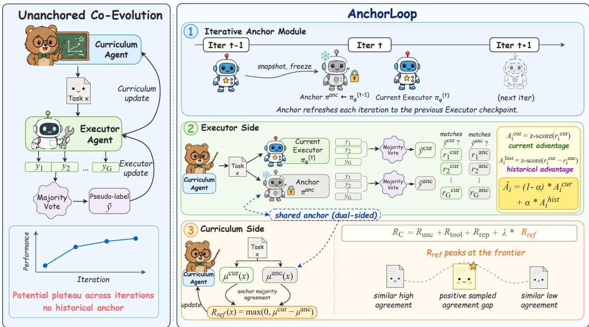  
Figure 1: Overview of AnchorLoop. The left panel illustrates an unanchored two-agent self-evolution loop that can plateau. At outer iteration t, AnchorLoop copies the previous Executor into a frozen <sub>anc</sub>h<sub>or an</sub>d <sub>reuses</sub> it <sub>on</sub> b<sub>o</sub>th <sub>s</sub>id<sub>es o</sub>f th<sub>e</sub> l<sub>oop.</sub> D<sub>ur</sub>i<sub>ng</sub> C<sub>urr</sub>i<sub>cu</sub>l<sub>um</sub> t<sub>ra</sub>i<sub>n</sub>i<sub>ng,</sub> th<sub>e curren</sub>t E<sub>xecu</sub>t<sub>or an</sub>d <sub>anc</sub>h<sub>or</sub> h<sub>ave</sub> id<sub>en</sub>ti<sub>ca</sub>l <sub>parame</sub>t<sub>ers</sub> b<sub>u</sub>t <sub>pro</sub>d<sub>uce</sub> i<sub>n</sub>d<sub>epen</sub>d<sub>en</sub>t <sub>ro</sub>ll<sub>ou</sub>t <sub>groups</sub> f<sub>or</sub> th<sub>e agreemen</sub>t<sub>-</sub>b<sub>ase</sub>d reference reward. All format-valid tasks form the same-iteration task <sub>p</sub>ool D . Durin<sub>g</sub> Executor trainin<sub>g</sub>, th<sub>e anc</sub>h<sub>or rema</sub>i<sub>ns</sub> fi<sub>xe</sub>d <sub>w</sub>hil<sub>e</sub> th<sub>e curren</sub>t E<sub>xecu</sub>t<sub>or</sub> i<sub>s up</sub>d<sub>a</sub>t<sub>e</sub>d<sub>.</sub> C<sub>urren</sub>t <sub>groups are resamp</sub>l<sub>e</sub>d <sub>a</sub>t <sub>every</sub> i<sub>nner s</sub>t<sub>ep, w</sub>h<sub>ereas one anc</sub>h<sub>or group per</sub> t<sub>as</sub>k <sub>an</sub>d C<sub>urr</sub>i<sub>cu</sub>l<sub>um</sub> b<sub>a</sub>t<sub>c</sub>h i<sub>s cac</sub>h<sub>e</sub>d <sub>an</sub>d <sub>reuse</sub>d t<sub>o cons</sub>t<sub>ruc</sub>t th<sub>e cross-re</sub>f<sub>erence a</sub>d<sub>van</sub>t<sub>age.</sub>

Current and anchor references. For each task x in the Executor stage, we sample G trajectories from the current Executor and another G trajectories from the anchor. Each resolved group follows the definition in Section 2 to produce a pseudo-label, y˜<sup>cur</sup> for the current group and y˜<sup>anc</sup> for the anchor <sub>group.</sub> If <sub>e</sub>ith<sub>er</sub> <sub>group</sub> i<sub>s</sub> <sub>unreso</sub>l<sub>ve</sub>d<sub>,</sub> th<sub>e</sub> t<sub>as</sub>k i<sub>s</sub> <sub>om</sub>itt<sub>e</sub>d f<sub>rom</sub> th<sub>e</sub> <sub>pseu</sub>d<sub>o-</sub>l<sub>a</sub>b<sub>e</sub>l<sub>-</sub>d<sub>epen</sub>d<sub>en</sub>t E<sub>xecu</sub>t<sub>or</sub> <sub>up</sub>d<sub>a</sub>t<sub>e.</sub> A<sub>nc</sub>h<sub>or ro</sub>ll<sub>ou</sub>t<sub>s are cac</sub>h<sub>e</sub>d <sub>a</sub>t th<sub>e granu</sub>l<sub>ar</sub>it<sub>y o</sub>f <sub>a</sub> C<sub>urr</sub>i<sub>cu</sub>l<sub>um</sub> b<sub>a</sub>t<sub>c</sub>h <sub>an</sub>d <sub>reuse</sub>d <sub>across</sub> th<sub>e</sub> i<sub>nner</sub> E<sub>xecu</sub>t<sub>or s</sub>t<sub>eps</sub> th<sub>a</sub>t <sub>use</sub> th<sub>e same</sub> t<sub>as</sub>k<sub>s, amor</sub>ti<sub>z</sub>i<sub>ng anc</sub>h<sub>or samp</sub>li<sub>ng across</sub> th<sub>ose s</sub>t<sub>eps.</sub>

Let $o _ { i }$ denote the parsed valid answer of current Executor trajectory i. Invalid and missing trajectories receive zero for both indicators. Each current trajectory receives two outcomes,

$$
\begin{array} { r } { r _ { i } ^ { \mathrm { c u r } } = \mathbb { I } [ o _ { i } = \tilde { y } ^ { \mathrm { c u r } } ] , } \\ { r _ { i } ^ { \mathrm { a n c } } = \mathbb { I } [ o _ { i } = \tilde { y } ^ { \mathrm { a n c } } ] . } \end{array}\tag{4}
$$

B<sub>o</sub>th i<sub>n</sub>di<sub>ca</sub>t<sub>ors</sub> <sub>score</sub> th<sub>e</sub> <sub>same</sub> <sub>curren</sub>t <sub>answer</sub> $o _ { i }$ <sub>.</sub> Th<sub>e</sub> fi<sub>rs</sub>t <sub>measures</sub> <sub>agreemen</sub>t <sub>w</sub>ith th<sub>e</sub> <sub>curren</sub>t

group’s majority, whereas the second measures agreement with the anchor group’s majority rather than scoring an anchor trajectory.

Cross-reference advantage. We form two advantages by centering and normalizing over the current g<sup>r</sup>oup:

$$
\begin{array} { l l } { { \displaystyle { \cal A } _ { i } ^ { \mathrm { c u r } } = \frac { r _ { i } ^ { \mathrm { c u r } } - \mu ^ { \mathrm { c u r } } } { \sigma ^ { \mathrm { c u r } } + \varepsilon } , } } \\ { { \displaystyle { \cal A } _ { i } ^ { \mathrm { h i s t } } = \frac { \left( r _ { i } ^ { \mathrm { c u r } } - r _ { i } ^ { \mathrm { a n c } } \right) - \bar { \Delta } } { s ^ { \Delta } + \varepsilon } , } } \end{array}\tag{5}
$$

<sub>w</sub>h<sub>ere</sub> $\mu ^ { \mathrm { c u r } }$ <sub>an</sub>d $\sigma ^ { \mathrm { c u r } }$ <sub>are</sub> th<sub>e mean an</sub>d <sub>s</sub>t<sub>an</sub>d<sub>ar</sub>d d<sub>ev</sub>i<sub>a</sub>ti<sub>on o</sub>f $r ^ { \mathrm { c u r } }$ , while ∆¯ and $s ^ { \Delta }$ <sub>are</sub> th<sub>e mean an</sub>d <sub>s</sub>t<sub>an</sub>d<sub>ar</sub>d d<sub>ev</sub>i<sub>a</sub>ti<sub>on o</sub>f $r ^ { \mathrm { c u r } } - r ^ { \mathrm { a n c } }$ <sub>.</sub> Th<sub>e cross-re</sub>f<sub>erence a</sub>d<sub>van</sub>t<sub>age com</sub>bi<sub>nes</sub> th<sub>e</sub> t<sub>wo:</sub>

$$
\hat { A } _ { i } = ( 1 - \alpha ) A _ { i } ^ { \mathrm { c u r } } + \alpha A _ { i } ^ { \mathrm { h i s t } } , \qquad 0 \leq \alpha \leq 1 ,\tag{6}
$$

<sub>w</sub>h<sub>ere</sub> <sub>α</sub> <sub>con</sub>t<sub>ro</sub>l<sub>s</sub> th<sub>e</sub> <sub>con</sub>t<sub>r</sub>ib<sub>u</sub>ti<sub>on</sub> <sub>o</sub>f th<sub>e</sub> hi<sub>s</sub>t<sub>or</sub>i<sub>ca</sub>l <sub>a</sub>d<sub>van</sub>t<sub>age.</sub>

Properties of the historical term. The historical term acts as a conditional reweighting of current <sub>ou</sub>t<sub>pu</sub>t<sub>s.</sub> F<sub>or reso</sub>l<sub>ve</sub>d <sub>curren</sub>t <sub>an</sub>d <sub>anc</sub>h<sub>or groups w</sub>ith $\varepsilon > 0$ <sub>, severa</sub>l b<sub>oun</sub>d<sub>ary cases c</sub>l<sub>ar</sub>if<sub>y</sub> it<sub>s</sub> b<sub>e</sub>h<sub>av</sub>i<sub>or.</sub> If the two majority labels agree, the two indicators coincide and $A _ { i } ^ { \mathrm { h i s t } } = 0$ <sub>.</sub> If <sub>a</sub>ll <sub>curren</sub>t <sub>answers are</sub> id<sub>en</sub>ti<sub>ca</sub>l<sub>,</sub> $r _ { i } ^ { \mathrm { c u r } } - r _ { i } ^ { \mathrm { a n c } }$ is constant across the current group even when the majority labels difer. Centering th<sub>ere</sub>f<sub>ore ma</sub>k<sub>es</sub> b<sub>o</sub>th <sub>a</sub>d<sub>van</sub>t<sub>age</sub> t<sub>erms zero.</sub> A dif<sub>eren</sub>t <sub>anc</sub>h<sub>or</sub> l<sub>a</sub>b<sub>e</sub>l <sub>a</sub>l<sub>one canno</sub>t <sub>res</sub>t<sub>ore a re</sub>l<sub>a</sub>ti<sub>ve</sub> <sub>pre</sub>f<sub>erence w</sub>ithi<sub>n a</sub> f<sub>u</sub>ll<sub>y consensua</sub>l <sub>curren</sub>t <sub>group.</sub>

When the two majority labels difer and the current group contains only those two answers, with both present, the historical advantage is a positive rescaling of the current advantage. If the anchor’s majority <sub>answer</sub> i<sub>s a</sub>b<sub>sen</sub>t f<sub>rom</sub> th<sub>e curren</sub>t <sub>group,</sub> th<sub>e</sub> t<sub>wo a</sub>d<sub>van</sub>t<sub>ages are</sub> id<sub>en</sub>ti<sub>ca</sub>l<sub>.</sub> With <sub>a</sub>dditi<sub>ona</sub>l <sub>answer</sub> classes, the historical term can distinguish outputs that match the anchor majority from other outputs that disagree with the current majority. Its contribution therefore depends on the sampled answer <sub>compos</sub>iti<sub>on.</sub> Th<sub>ese</sub> <sub>group-</sub>l<sub>eve</sub>l <sub>re</sub>l<sub>a</sub>ti<sub>ons</sub> d<sub>o</sub> <sub>no</sub>t <sub>es</sub>t<sub>a</sub>bli<sub>s</sub>h <sub>equ</sub>i<sub>va</sub>l<sub>ence</sub> b<sub>e</sub>t<sub>ween</sub> <sub>comp</sub>l<sub>e</sub>t<sub>e</sub> t<sub>ra</sub>i<sub>n</sub>i<sub>ng</sub> <sub>runs.</sub>

R<sub>e</sub>f<sub>res</sub>hi<sub>ng</sub> th<sub>e anc</sub>h<sub>or</sub> ti<sub>es</sub> it<sub>s parame</sub>t<sub>ers</sub> t<sub>o</sub> th<sub>e mos</sub>t <sub>recen</sub>tl<sub>y comp</sub>l<sub>e</sub>t<sub>e</sub>d E<sub>xecu</sub>t<sub>or</sub> it<sub>era</sub>ti<sub>on.</sub> Thi<sub>s</sub> d<sub>oes</sub> <sub>no</sub>t <sub>es</sub>t<sub>a</sub>bli<sub>s</sub>h th<sub>a</sub>t th<sub>e anc</sub>h<sub>or rema</sub>i<sub>ns</sub> i<sub>n</sub>f<sub>orma</sub>ti<sub>ve on every</sub> t<sub>as</sub>k<sub>, nor</sub> th<sub>a</sub>t <sub>a re</sub>f<sub>erence</sub> fi<sub>xe</sub>d t<sub>o</sub> th<sub>e</sub> b<sub>ase</sub> <sub>mo</sub>d<sub>e</sub>l <sub>mus</sub>t <sub>necessar</sub>il<sub>y</sub> b<sub>ecome un</sub>i<sub>n</sub>f<sub>orma</sub>ti<sub>ve.</sub>

## 3.3. Curriculum: Anchor-Referenced Reward

Th<sub>e</sub> C<sub>urr</sub>i<sub>cu</sub>l<sub>um eva</sub>l<sub>ua</sub>t<sub>es eac</sub>h <sub>genera</sub>t<sub>e</sub>d t<sub>as</sub>k <sub>us</sub>i<sub>ng samp</sub>l<sub>e</sub>d b<sub>e</sub>h<sub>av</sub>i<sub>or</sub> f<sub>rom</sub> th<sub>e curren</sub>t E<sub>xecu</sub>t<sub>or.</sub> A<sub>nc</sub>h<sub>or</sub>L<sub>oop</sub> <sub>augmen</sub>t<sub>s</sub> thi<sub>s</sub> <sub>curren</sub>t<sub>-on</sub>l<sub>y</sub> <sub>s</sub>i<sub>gna</sub>l <sub>w</sub>ith <sub>an</sub> i<sub>n</sub>d<sub>epen</sub>d<sub>en</sub>tl<sub>y</sub> <sub>samp</sub>l<sub>e</sub>d <sub>ro</sub>ll<sub>ou</sub>t <sub>group</sub> f<sub>rom</sub> th<sub>e anc</sub>h<sub>or.</sub> W<sub>e</sub> fi<sub>rs</sub>t d<sub>e</sub>fi<sub>ne</sub> th<sub>e</sub> i<sub>n</sub>h<sub>er</sub>it<sub>e</sub>d t<sub>as</sub>k<sub>-</sub>l<sub>eve</sub>l C<sub>urr</sub>i<sub>cu</sub>l<sub>um</sub> t<sub>erms an</sub>d th<sub>en</sub> i<sub>n</sub>t<sub>ro</sub>d<sub>uce</sub> th<sub>e anc</sub>h<sub>or</sub> <sub>re</sub>f<sub>erence</sub>d <sub>componen</sub>t<sub>.</sub>

Base Curriculum reward. Each candidate task x is evaluated with G current Executor trajectories $\{ \tau _ { j } \} _ { j = 1 } ^ { G }$ . Let $n _ { y } ( x )$ denote the number of valid parsed answers with canonical label y. We define

$$
\begin{array} { r } { p _ { \mathrm { m a x } } ( x ) = \displaystyle \frac { 1 } { G } \operatorname* { m a x } _ { y } n _ { y } ( x ) , \qquad R _ { \mathrm { u n c } } ( x ) = 1 - 2 \left| p _ { \mathrm { m a x } } ( x ) - \frac { 1 } { 2 } \right| . } \end{array}\tag{7}
$$

If no trajectory has a valid answer, we set $p _ { \operatorname* { m a x } } ( x ) = 0$ <sub>.</sub> Th<sub>e max</sub>i<sub>mum coun</sub>t <sub>rema</sub>i<sub>ns</sub> d<sub>e</sub>fi<sub>ne</sub>d <sub>w</sub>h<sub>en</sub> several labels tie, although such a group has no pseudo-label. Invalid and missing trajectories do not add to any label count and remain in the fixed denominator G.

Let $N _ { \mathrm { t o o l } } ( \tau _ { j } )$ denote the number of Python calls executed by the sandbox before trajectory j terminates. Calls executed before an invalid or missing final answer are still counted. With call cap C, the task-level t<sub>oo</sub>l<sub>-use</sub> t<sub>erm</sub> i<sub>s</sub>

$$
R _ { \mathrm { t o o l } } ( x ) = \frac { 1 } { G } \sum _ { j = 1 } ^ { G } \operatorname* { m i n } \left( N _ { \mathrm { t o o l } } ( \tau _ { j } ) , C \right) .\tag{8}
$$

F<sub>or a</sub> C<sub>urr</sub>i<sub>cu</sub>l<sub>um</sub> b<sub>a</sub>t<sub>c</sub>h $\boldsymbol { B }$ of B candidate tasks, we compute pairwise BLEU distances between task texts <sub>an</sub>d <sub>connec</sub>t t<sub>wo</sub> t<sub>as</sub>k<sub>s w</sub>h<sub>en</sub> th<sub>e</sub>i<sub>r</sub> di<sub>s</sub>t<sub>ance</sub> i<sub>s</sub> b<sub>e</sub>l<sub>ow</sub> $d _ { \mathrm { r e p } }$ . Let $\mathcal C ( x )$ d<sub>eno</sub>t<sub>e</sub> th<sub>e connec</sub>t<sub>e</sub>d <sub>componen</sub>t containing x. The repetition term is

$$
R _ { \mathrm { r e p } } ( x ) = { \frac { | { \mathcal { C } } ( x ) | } { B } } .\tag{9}
$$

The binar<sub>y</sub> <sub>g</sub>ate $R _ { \mathrm { f m t } } ( x )$ equa<sup>l</sup>s one w<sup>h</sup>en t<sup>h</sup>e generate<sup>d</sup> tas<sup>k</sup> passes t<sup>h</sup>e <sup>fi</sup>xe<sup>d</sup> Problem: an<sup>d</sup> Answer: f<sub>orma</sub>t i<sub>n</sub> A<sub>ppen</sub>di<sub>x</sub> B<sub>.</sub>1<sub>,</sub> <sub>an</sub>d <sub>zero</sub> <sub>o</sub>th<sub>erw</sub>i<sub>se.</sub>

Anchor-referenced agreement. We augment these inherited terms with an anchor comparison. For each candidate task x, we define

$$
R _ { \mathrm { r e f } } ( x ) = \mathrm { m a x } ( 0 , \mu ^ { \mathrm { c u r } } ( x ) - \mu ^ { \mathrm { a n c } } ( x ) ) ,\tag{10}
$$

<sub>w</sub>h<sub>ere</sub> $\mu ^ { \mathrm { c u r } } ( x )$ <sub>an</sub>d $\mu ^ { \mathrm { a n c } } ( x )$ are the majority agreement rates of the current Executor and anchor, <sub>respec</sub>ti<sub>ve</sub>l<sub>y.</sub> F<sub>or a reso</sub>l<sub>ve</sub>d <sub>group, eac</sub>h <sub>ra</sub>t<sub>e</sub> i<sub>s</sub> th<sub>e num</sub>b<sub>er o</sub>f <sub>ro</sub>ll<sub>ou</sub>t<sub>s ma</sub>t<sub>c</sub>hi<sub>ng</sub> it<sub>s own un</sub>i<sub>que mo</sub>d<sub>a</sub>l answer divided by the fixed G. Invalid and missing outputs contribute zero to the numerator but <sub>rema</sub>i<sub>n</sub> i<sub>n</sub> th<sub>e</sub> d<sub>enom</sub>i<sub>na</sub>t<sub>or.</sub> If <sub>e</sub>ith<sub>er</sub> <sub>group</sub> i<sub>s</sub> <sub>unreso</sub>l<sub>ve</sub>d<sub>,</sub> <sub>we</sub> <sub>se</sub>t $R _ { \mathrm { r e f } } ( x ) = 0 ;$ th<sub>e</sub> <sub>uncer</sub>t<sub>a</sub>i<sub>n</sub>t<sub>y,</sub> t<sub>oo</sub>l<sub>-use,</sub> <sub>repe</sub>titi<sub>on, an</sub>d f<sub>orma</sub>t t<sub>erms rema</sub>i<sub>n</sub> d<sub>e</sub>fi<sub>ne</sub>d<sub>.</sub>

Important<sup>l</sup>y, $\mu ^ { \mathrm { a n c } } ( x )$ i<sub>s compu</sub>t<sub>e</sub>d <sub>over anc</sub>h<sub>or ou</sub>t<sub>pu</sub>t<sub>s an</sub>d i<sub>s no</sub>t th<sub>e curren</sub>t<sub>-group mean o</sub>f $r _ { i } ^ { \mathrm { a n c } }$ d<sub>e</sub>fi<sub>ne</sub>d in Section 3.2. Moreover<sub>,</sub> the two a<sub>g</sub>reement rates are com<sub>p</sub>uted with res<sub>p</sub>ect to their res<sub>p</sub>ective <sub>g</sub>rou<sub>p</sub> majorities rather than a shared ground-truth answer.

Interpretation. The reference term measures a diference in sampled agreement, not a diference in correctness. A positive $R _ { \mathrm { r e f } } ( x )$ means that the sampled current group has a larger majority fraction th<sub>an</sub> th<sub>e samp</sub>l<sub>e</sub>d <sub>anc</sub>h<sub>or group.</sub> It d<sub>oes no</sub>t <sub>es</sub>t<sub>a</sub>bli<sub>s</sub>h th<sub>a</sub>t th<sub>e curren</sub>t E<sub>xecu</sub>t<sub>or</sub> i<sub>s more accura</sub>t<sub>e, nor</sub> th<sub>a</sub>t it <sub>can</sub> <sub>so</sub>l<sub>ve</sub> <sub>a</sub> t<sub>as</sub>k th<sub>a</sub>t th<sub>e</sub> <sub>anc</sub>h<sub>or</sub> <sub>canno</sub>t<sub>.</sub> I<sub>n</sub> <sub>par</sub>ti<sub>cu</sub>l<sub>ar,</sub> <sub>a</sub> <sub>more</sub> <sub>concen</sub>t<sub>ra</sub>t<sub>e</sub>d b<sub>u</sub>t i<sub>ncorrec</sub>t <sub>answer</sub> di<sub>s</sub>t<sub>r</sub>ib<sub>u</sub>ti<sub>on can a</sub>l<sub>so rece</sub>i<sub>ve a pos</sub>iti<sub>ve score.</sub>

Th<sub>e</sub> <sub>up</sub>d<sub>a</sub>t<sub>e</sub> <sub>or</sub>d<sub>er</sub> i<sub>mposes</sub> <sub>a</sub> <sub>secon</sub>d li<sub>m</sub>it<sub>a</sub>ti<sub>on</sub> <sub>on</sub> thi<sub>s</sub> i<sub>n</sub>t<sub>erpre</sub>t<sub>a</sub>ti<sub>on.</sub> B<sub>ecause</sub> C<sub>urr</sub>i<sub>cu</sub>l<sub>um</sub> t<sub>ra</sub>i<sub>n</sub>i<sub>ng</sub> <sub>prece</sub>d<sub>es</sub> E<sub>xecu</sub>t<sub>or</sub> t<sub>ra</sub>i<sub>n</sub>i<sub>ng,</sub> th<sub>e curren</sub>t E<sub>xecu</sub>t<sub>or an</sub>d th<sub>e new</sub>l<sub>y re</sub>f<sub>res</sub>h<sub>e</sub>d <sub>anc</sub>h<sub>or</sub> h<sub>ave</sub> id<sub>en</sub>ti<sub>ca</sub>l <sub>parame</sub>t<sub>ers</sub> d<sub>ur</sub>i<sub>ng</sub> th<sub>e</sub> C<sub>urr</sub>i<sub>cu</sub>l<sub>um</sub> <sub>s</sub>t<sub>age</sub> <sub>an</sub>d dif<sub>er</sub> <sub>on</sub>l<sub>y</sub> th<sub>roug</sub>h i<sub>n</sub>d<sub>epen</sub>d<sub>en</sub>t <sub>samp</sub>li<sub>ng.</sub> Th<sub>e</sub>i<sub>r</sub> <sub>samp</sub>l<sub>e</sub>d <sub>agreemen</sub>t <sub>ra</sub>t<sub>es may</sub> th<sub>ere</sub>f<sub>ore</sub> dif<sub>er,</sub> b<sub>u</sub>t <sub>suc</sub>h <sub>a</sub> dif<sub>erence</sub> i<sub>s no</sub>t <sub>ev</sub>id<sub>ence o</sub>f <sub>progress</sub> b<sub>e</sub>t<sub>ween</sub> hi<sub>s</sub>t<sub>or</sub>i<sub>ca</sub>l <sub>mo</sub>d<sub>e</sub>l <sub>vers</sub>i<sub>ons.</sub> T<sub>a</sub>ki<sub>ng</sub> th<sub>e pos</sub>iti<sub>ve par</sub>t d<sub>oes no</sub>t <sub>remove</sub> thi<sub>s samp</sub>li<sub>ng var</sub>i<sub>a</sub>ti<sub>on.</sub> W<sub>e consequen</sub>tl<sub>y use</sub> $R _ { \mathrm { r e f } }$ <sub>as</sub> <sub>an</sub> <sub>agreemen</sub>t<sub>-</sub>b<sub>ase</sub>d <sub>proxy</sub> f<sub>or</sub> C<sub>urr</sub>i<sub>cu</sub>l<sub>um</sub> <sub>s</sub>h<sub>ap</sub>i<sub>ng</sub> <sub>ra</sub>th<sub>er</sub> th<sub>an</sub> <sub>as</sub> <sub>a</sub> <sub>measure</sub> <sub>o</sub>f <sub>correc</sub>t<sub>ness</sub> <sub>or</sub> i<sub>n</sub>t<sub>er-vers</sub>i<sub>on</sub> i<sub>mprovemen</sub>t<sub>.</sub>

Complete Curriculum reward. We combine the reference term with the inherited uncertainty, t<sub>oo</sub>l<sub>-use, repe</sub>titi<sub>on, an</sub>d f<sub>orma</sub>t<sub>-va</sub>lidit<sub>y</sub> t<sub>erms:</sub>

$$
\begin{array} { r } { R _ { C } ( x ) = R _ { \mathrm { f m t } } ( x ) \operatorname* { m a x } \bigl ( 0 , w _ { \mathrm { u n c } } R _ { \mathrm { u n c } } ( x ) + w _ { \mathrm { t o o l } } R _ { \mathrm { t o o l } } ( x ) } \\ { - w _ { \mathrm { r e p } } R _ { \mathrm { r e p } } ( x ) + \lambda R _ { \mathrm { r e f } } ( x ) \bigr ) . \qquad } \end{array}\tag{11}
$$

Algorithm 1: Training procedure of AnchorLoop.   
Input: Base model $\pi _ { \mathrm { b a s e } } ,$ <sub>ou</sub>t<sub>er</sub> it<sub>era</sub>ti<sub>ons</sub> $T$   
I<sub>n</sub>iti<sub>a</sub>li<sub>ze separa</sub>t<sub>e agen</sub>t<sub>s</sub> $\pi _ { \theta } , \pi _ { \phi }  \pi _ { \mathrm { b a s e } }$   
for $t = 1 , \dots , T$ do   
Set $\pi ^ { \mathrm { a n c } }  \pi _ { \phi } ^ { ( t - 1 ) }$ and freeze the anchor for iteration t   
Keep $\pi _ { \phi }$ fi<sub>xe</sub>d<sub>;</sub> <sub>up</sub>d<sub>a</sub>t<sub>e</sub> <sub>on</sub>l<sub>y</sub> $\pi _ { \theta }$ via GRPO with reward $R _ { C } ;$ <sub>co</sub>ll<sub>ec</sub>t <sub>a</sub>ll f<sub>orma</sub>t<sub>-va</sub>lid t<sub>as</sub>k<sub>s</sub> i<sub>n</sub> $\mathcal { D } _ { t }$   
<sub>w</sub>hil<sub>e re</sub>t<sub>a</sub>i<sub>n</sub>i<sub>ng</sub> th<sub>e</sub>i<sub>r</sub> C<sub>urr</sub>i<sub>cu</sub>l<sub>um</sub> b<sub>a</sub>t<sub>c</sub>h <sub>ass</sub>i<sub>gnmen</sub>t<sub>s</sub>   
Keep $\pi _ { \theta }$ fi<sub>xe</sub>d<sub>; up</sub>d<sub>a</sub>t<sub>e on</sub>l<sub>y</sub> $\pi _ { \phi }$ on $\mathcal { D } _ { t }$ <sub>v</sub>i<sub>a</sub> ADPO <sub>us</sub>i<sub>ng</sub> th<sub>e sca</sub>l<sub>e</sub>d <sub>cross-re</sub>f<sub>erence a</sub>d<sub>van</sub>t<sub>age</sub> $\widetilde { A }$   
Resam<sub>p</sub>le each current <sub>g</sub>rou<sub>p</sub> at ever<sub>y</sub> Executor inner ste<sub>p</sub> and reuse one cached anchor <sub>g</sub>rou<sub>p</sub>   
<sub>per</sub> t<sub>as</sub>k <sub>an</sub>d C<sub>urr</sub>i<sub>cu</sub>l<sub>um</sub> b<sub>a</sub>t<sub>c</sub>h   
Di<sub>scar</sub>d $\mathcal { D } _ { t }$ <sub>an</sub>d it<sub>s ro</sub>ll<sub>ou</sub>t <sub>cac</sub>h<sub>e, an</sub>d d<sub>eno</sub>t<sub>e</sub> th<sub>e resu</sub>lti<sub>ng</sub> E<sub>xecu</sub>t<sub>or</sub> b<sub>y</sub> $\pi _ { \phi } ^ { ( t ) }$   
end   
Output: Trained Executor $\pi _ { \phi } ^ { ( T ) }$

Th<sub>e</sub> b<sub>ase rewar</sub>d <sub>we</sub>i<sub>g</sub>ht<sub>s use</sub>d th<sub>roug</sub>h<sub>ou</sub>t th<sub>e repor</sub>t<sub>e</sub>d t<sub>ra</sub>i<sub>n</sub>i<sub>ng runs are</sub> li<sub>s</sub>t<sub>e</sub>d i<sub>n</sub> T<sub>a</sub>bl<sub>e</sub> 3<sub>.</sub> Wh<sub>en</sub> $R _ { \mathrm { r e f } } ( x ) = 0 .$ <sub>,</sub> th<sub>e</sub> <sub>rema</sub>i<sub>n</sub>i<sub>ng</sub> <sub>componen</sub>t<sub>s</sub> <sub>o</sub>f $R _ { C } ( x )$ <sub>rema</sub>i<sub>n ac</sub>ti<sub>ve; a zero re</sub>f<sub>erence</sub> t<sub>erm</sub> th<sub>ere</sub>f<sub>ore</sub> d<sub>oes</sub> <sub>no</sub>t b<sub>y</sub> it<sub>se</sub>lf di<sub>scar</sub>d th<sub>e</sub> t<sub>as</sub>k<sub>.</sub>

## 3.4. Alternating Training with an Iterative Anchor

AnchorLoop alternates Curriculum and Executor training over T outer iterations. Let $\pi _ { \phi } ^ { ( t ) }$ d<sub>eno</sub>t<sub>e</sub> th<sub>e</sub> E<sub>xecu</sub>t<sub>or a</sub>ft<sub>er</sub> it<sub>era</sub>ti<sub>on</sub> $t ,$ <sub>w</sub>ith $\pi _ { \phi } ^ { ( 0 ) } = \pi _ { \mathrm { b a s e } }$ . At the beginning of iteration t, we refresh the anchor as

$$
\pi ^ { \mathrm { a n c } }  \pi _ { \phi } ^ { ( t - 1 ) }\tag{12}
$$

<sub>an</sub>d k<sub>eep</sub> it f<sub>rozen</sub> th<sub>roug</sub>h<sub>ou</sub>t th<sub>e</sub> it<sub>era</sub>ti<sub>on.</sub>

Curriculum stage. We first fix the Executor and update only the Curriculum Agent using GRPO with th<sub>e rewar</sub>d $R _ { C }$ f<sub>rom</sub> S<sub>ec</sub>ti<sub>on</sub> 3<sub>.</sub>3<sub>.</sub> Th<sub>e curren</sub>t E<sub>xecu</sub>t<sub>or an</sub>d <sub>new</sub>l<sub>y re</sub>f<sub>res</sub>h<sub>e</sub>d <sub>anc</sub>h<sub>or</sub> th<sub>ere</sub>f<sub>ore</sub> h<sub>ave</sub> id<sub>en</sub>ti<sub>ca</sub>l <sub>parame</sub>t<sub>ers</sub> $\pi _ { \phi } ^ { ( t - 1 ) }$ d<sub>ur</sub>i<sub>ng</sub> thi<sub>s</sub> <sub>s</sub>t<sub>age</sub> <sub>an</sub>d dif<sub>er</sub> <sub>on</sub>l<sub>y</sub> th<sub>roug</sub>h i<sub>n</sub>d<sub>epen</sub>d<sub>en</sub>t <sub>samp</sub>li<sub>ng.</sub>

All f<sub>orma</sub>t<sub>-va</sub>lid t<sub>as</sub>k<sub>s genera</sub>t<sub>e</sub>d d<sub>ur</sub>i<sub>ng</sub> C<sub>urr</sub>i<sub>cu</sub>l<sub>um</sub> t<sub>ra</sub>i<sub>n</sub>i<sub>ng</sub> f<sub>orm</sub> th<sub>e same-</sub>it<sub>era</sub>ti<sub>on</sub> t<sub>as</sub>k <sub>poo</sub>l $\mathcal { D } _ { t } ,$ <sub>w</sub>ith th<sub>e</sub>i<sub>r</sub> C<sub>urr</sub>i<sub>cu</sub>l<sub>um</sub> b<sub>a</sub>t<sub>c</sub>h <sub>ass</sub>i<sub>gnmen</sub>t<sub>s preserve</sub>d<sub>.</sub> W<sub>e</sub> d<sub>o no</sub>t filt<sub>er</sub> th<sub>ese</sub> t<sub>as</sub>k<sub>s accor</sub>di<sub>ng</sub> t<sub>o</sub> $R _ { \mathrm { r e f } }$ <sub>or</sub> th<sub>e</sub> t<sub>o</sub>t<sub>a</sub>l C<sub>urr</sub>i<sub>cu</sub>l<sub>um rewar</sub>d $R _ { C }$ . T<sup>h</sup>e Curr<sup>i</sup>cu<sup>l</sup>um-generate<sup>d</sup> Answer: <sup>fi</sup>e<sup>ld i</sup>s use<sup>d</sup> on<sup>l</sup>y <sup>f</sup>or <sup>f</sup>ormat c<sup>h</sup>ec<sup>ki</sup>ng an<sup>d</sup> i<sub>s ne</sub>ith<sub>er prov</sub>id<sub>e</sub>d t<sub>o</sub> th<sub>e</sub> E<sub>xecu</sub>t<sub>or nor use</sub>d <sub>as a superv</sub>i<sub>s</sub>i<sub>on</sub> l<sub>a</sub>b<sub>e</sub>l<sub>.</sub>

Executor stage. We then freeze the Curriculum Agent and update only the Executor on $\mathcal { D } _ { t }$ <sub>.</sub> Th<sub>e</sub> <sub>anc</sub>h<sub>or</sub> <sub>rema</sub>i<sub>ns</sub> fi<sub>xe</sub>d <sub>a</sub>t $\pi _ { \phi } ^ { ( t - 1 ) }$ <sub>,</sub> <sub>w</sub>hil<sub>e</sub> th<sub>e</sub> <sub>curren</sub>t E<sub>xecu</sub>t<sub>or</sub> <sub>evo</sub>l<sub>ves</sub> d<sub>ur</sub>i<sub>ng</sub> <sub>op</sub>ti<sub>m</sub>i<sub>za</sub>ti<sub>on,</sub> <sub>prov</sub>idi<sub>ng</sub> th<sub>e</sub> hi<sub>s</sub>t<sub>or</sub>i<sub>ca</sub>l <sub>compar</sub>i<sub>son use</sub>d b<sub>y</sub> th<sub>e cross-re</sub>f<sub>erence a</sub>d<sub>van</sub>t<sub>age</sub> i<sub>n</sub> S<sub>ec</sub>ti<sub>on</sub> 3<sub>.</sub>2<sub>.</sub>

E<sub>ac</sub>h t<sub>as</sub>k <sub>rema</sub>i<sub>ns</sub> fi<sub>xe</sub>d <sub>across</sub> th<sub>e</sub> E<sub>xecu</sub>t<sub>or</sub> i<sub>nner s</sub>t<sub>eps assoc</sub>i<sub>a</sub>t<sub>e</sub>d <sub>w</sub>ith it<sub>s</sub> C<sub>urr</sub>i<sub>cu</sub>l<sub>um</sub> b<sub>a</sub>t<sub>c</sub>h<sub>.</sub> F<sub>or eac</sub>h task, the current Executor resamples G trajectories at every inner step, whereas the anchor group is <sub>samp</sub>l<sub>e</sub>d <sub>once per</sub> t<sub>as</sub>k <sub>an</sub>d C<sub>urr</sub>i<sub>cu</sub>l<sub>um</sub> b<sub>a</sub>t<sub>c</sub>h <sub>an</sub>d <sub>cac</sub>h<sub>e</sub>d <sub>across</sub> th<sub>e correspon</sub>di<sub>ng</sub> E<sub>xecu</sub>t<sub>or up</sub>d<sub>a</sub>t<sub>es.</sub> C<sub>urren</sub>t <sub>groups</sub> <sub>are</sub> <sub>no</sub>t <sub>re</sub>t<sub>a</sub>i<sub>ne</sub>d b<sub>e</sub>t<sub>ween</sub> i<sub>nner</sub> <sub>s</sub>t<sub>eps.</sub> Aft<sub>er</sub> th<sub>e</sub> E<sub>xecu</sub>t<sub>or</sub> <sub>s</sub>t<sub>age,</sub> th<sub>e</sub> <sub>resu</sub>lti<sub>ng</sub> <sub>po</sub>li<sub>cy</sub> i<sub>s</sub> d<sub>eno</sub>t<sub>e</sub>d $\pi _ { \phi } ^ { ( t ) }$ <sub>.</sub> Th<sub>e</sub> t<sub>as</sub>k <sub>poo</sub>l $\mathcal { D } _ { t }$ <sub>an</sub>d <sub>a</sub>ll <sub>cac</sub>h<sub>e</sub>d <sub>ro</sub>ll<sub>ou</sub>t<sub>s are</sub> th<sub>en</sub> di<sub>scar</sub>d<sub>e</sub>d<sub>.</sub> Th<sub>e nex</sub>t <sub>ou</sub>t<sub>er</sub> it<sub>era</sub>ti<sub>on</sub> <sub>genera</sub>t<sub>es a new</sub> t<sub>as</sub>k <sub>poo</sub>l <sub>an</sub>d d<sub>oes no</sub>t <sub>rep</sub>l<sub>ay</sub> t<sub>as</sub>k<sub>s</sub> f<sub>rom ear</sub>li<sub>er</sub> it<sub>era</sub>ti<sub>ons.</sub>

Policy optimization. For Curriculum training, the Curriculum Agent’s group consists of a batch of <sub>genera</sub>t<sub>e</sub>d t<sub>as</sub>k<sub>s.</sub> E<sub>ac</sub>h t<sub>as</sub>k i<sub>s score</sub>d b<sub>y</sub> $R _ { C }$ f<sub>rom</sub> S<sub>ec</sub>ti<sub>on</sub> 3<sub>.</sub>3<sub>, an</sub>d th<sub>e resu</sub>lti<sub>ng rewar</sub>d<sub>s are norma</sub>li<sub>ze</sub>d <sub>across</sub> th<sub>e</sub> t<sub>as</sub>k b<sub>a</sub>t<sub>c</sub>h t<sub>o</sub> f<sub>orm</sub> th<sub>e</sub> GRPO <sub>a</sub>d<sub>van</sub>t<sub>ages.</sub>

For Executor training, each group consists of the G trajectories sampled for a single task. The standard <sub>group-re</sub>l<sub>a</sub>ti<sub>ve a</sub>d<sub>van</sub>t<sub>age</sub> i<sub>s rep</sub>l<sub>ace</sub>d b<sub>y</sub> th<sub>e cross-re</sub>f<sub>erence a</sub>d<sub>van</sub>t<sub>age</sub> $\hat { A } _ { i }$ from Section 3.2. The Executor follows ADPO [25], which scales the advanta<sub>g</sub>e accordin<sub>g</sub> to current answer a<sub>g</sub>reement and dynamically adjusts the upper clipping bound.

For each task x, we compute the current-group agreement score

$$
\hat { p } ( x ) = \mu ^ { \mathrm { c u r } } ( x ) = \frac { 1 } { G } \sum _ { i = 1 } ^ { G } r _ { i } ^ { \mathrm { c u r } } ,\tag{13}
$$

<sub>w</sub>h<sub>ere</sub> ${ \hat { p } } ( x )$ i<sub>s</sub> th<sub>e</sub> f<sub>rac</sub>ti<sub>on o</sub>f <sub>curren</sub>t <sub>ou</sub>t<sub>pu</sub>t<sub>s ma</sub>t<sub>c</sub>hi<sub>ng</sub> th<sub>e curren</sub>t <sub>group</sub>’<sub>s mo</sub>d<sub>a</sub>l <sub>answer.</sub> L<sub>e</sub>t $s ( x ) =$ $f ( { \hat { p } } ( x ) )$ denote the ADPO task weight, where f is nondecreasing. We apply this weight to the complete <sub>cross-re</sub>f<sub>erence a</sub>d<sub>van</sub>t<sub>age:</sub>

$$
\begin{array} { l } { \widetilde { A } _ { i } ( x ) = s ( x ) \hat { A } _ { i } } \\ { = s ( x ) \left[ ( 1 - \alpha ) A _ { i } ^ { \mathrm { c u r } } + \alpha A _ { i } ^ { \mathrm { h i s t } } \right] . } \end{array}\tag{14}
$$

Th<sub>us,</sub> th<sub>e</sub> <sub>same</sub> t<sub>as</sub>k <sub>we</sub>i<sub>g</sub>ht <sub>sca</sub>l<sub>es</sub> b<sub>o</sub>th th<sub>e</sub> <sub>curren</sub>t <sub>an</sub>d hi<sub>s</sub>t<sub>or</sub>i<sub>ca</sub>l <sub>componen</sub>t<sub>s.</sub> Th<sub>e</sub> <sub>c</sub>li<sub>pp</sub>i<sub>ng</sub> i<sub>n</sub>t<sub>erva</sub>l i<sub>s</sub>

$$
[ 1 - \epsilon _ { \mathrm { l o w } } , 1 + \epsilon _ { \mathrm { h i g h } } ( x ) ] ,
$$

<sub>w</sub>h<sub>ere</sub> $\epsilon _ { \mathrm { h i g h } } ( x ) = g ( \hat { p } ( x ) )$ ) and $g$ i<sub>s</sub> <sub>non</sub>i<sub>ncreas</sub>i<sub>ng.</sub> Th<sub>us,</sub> b<sub>o</sub>th th<sub>e</sub> t<sub>as</sub>k <sub>we</sub>i<sub>g</sub>ht <sub>an</sub>d th<sub>e</sub> <sub>upper</sub> <sub>c</sub>li<sub>pp</sub>i<sub>ng</sub> b<sub>oun</sub>d <sub>are</sub> <sub>recompu</sub>t<sub>e</sub>d f<sub>rom</sub> th<sub>e</sub> <sub>curren</sub>t <sub>group</sub>’<sub>s</sub> <sub>agreemen</sub>t <sub>score.</sub>

Token-level Executor objective. Let $y _ { i , \ell }$ denote the token generated at position ℓ of trajectory $i ,$ <sub>an</sub>d l<sub>e</sub>t $h _ { i , \ell }$ <sub>con</sub>t<sub>a</sub>i<sub>n</sub> th<sub>e</sub> t<sub>as</sub>k<sub>,</sub> <sub>prece</sub>di<sub>ng</sub> <sub>genera</sub>t<sub>e</sub>d t<sub>o</sub>k<sub>ens,</sub> <sub>an</sub>d <sub>any</sub> t<sub>oo</sub>l <sub>o</sub>b<sub>serva</sub>ti<sub>ons</sub> <sub>re</sub>t<sub>urne</sub>d b<sub>e</sub>f<sub>ore</sub> th<sub>a</sub>t <sub>pos</sub>iti<sub>on.</sub> T<sub>oo</sub>l <sub>o</sub>b<sub>serva</sub>ti<sub>ons con</sub>diti<sub>on su</sub>b<sub>sequen</sub>t <sub>genera</sub>ti<sub>on</sub> b<sub>u</sub>t <sub>are no</sub>t th<sub>emse</sub>l<sub>ves op</sub>ti<sub>m</sub>i<sub>ze</sub>d<sub>.</sub> W<sub>e use</sub> <sub>a mas</sub>k $m _ { i , \ell }$ <sub>over genera</sub>t<sub>e</sub>d <sub>reason</sub>i<sub>ng,</sub> t<sub>oo</sub>l<sub>-ca</sub>ll<sub>, an</sub>d fi<sub>na</sub>l<sub>-answer</sub> t<sub>o</sub>k<sub>ens, w</sub>ith $\begin{array} { r } { M _ { i } = \sum _ { \ell } m _ { i , \ell } } \end{array}$

Th<sub>e</sub> b<sub>e</sub>h<sub>av</sub>i<sub>or</sub> <sub>po</sub>li<sub>cy</sub> $\pi _ { \phi _ { \mathrm { o l d } } }$ i<sub>s</sub> f<sub>rozen</sub> b<sub>e</sub>f<sub>ore</sub> <sub>samp</sub>li<sub>ng</sub> th<sub>e</sub> <sub>curren</sub>t <sub>group</sub> <sub>a</sub>t <sub>eac</sub>h E<sub>xecu</sub>t<sub>or</sub> i<sub>nner</sub> <sub>s</sub>t<sub>ep.</sub> Th<sub>e</sub> t<sub>o</sub>k<sub>en-</sub>l<sub>eve</sub>l i<sub>mpor</sub>t<sub>ance ra</sub>ti<sub>o</sub> i<sub>s</sub>

$$
\rho _ { i , \ell } ( \phi ) = \frac { \pi _ { \phi } ( y _ { i , \ell } \mid h _ { i , \ell } ) } { \pi _ { \phi _ { \mathrm { o l d } } } ( y _ { i , \ell } \mid h _ { i , \ell } ) } .\tag{15}
$$

The same trajectory-level advantage $\widetilde { A } _ { i } ( \boldsymbol { x } )$ is applied to all optimized tokens in trajectory i. The Executor objective is

$$
\begin{array} { l } { \displaystyle \mathcal { L } _ { \mathrm { e x e c } } ( \phi ) = - \frac { 1 } { G } \sum _ { i = 1 } ^ { G } \frac { 1 } { M _ { i } } \sum _ { \ell } m _ { i , \ell } \operatorname* { m i n } \Bigl ( \rho _ { i , \ell } ( \phi ) \widetilde { A } _ { i } ( x ) , } \\ { \displaystyle \qquad \mathrm { c l i p } \bigl ( \rho _ { i , \ell } ( \phi ) , 1 - \epsilon _ { \mathrm { l o w } } , 1 + \epsilon _ { \mathrm { h i g h } } ( x ) \bigr ) \widetilde { A } _ { i } ( x ) \Bigr ) } \\ { \displaystyle \qquad + \frac { \beta _ { \mathrm { K L } } } { G } \sum _ { i = 1 } ^ { G } \frac { 1 } { M _ { i } } \sum _ { \ell } m _ { i , \ell } D _ { \mathrm { K L } } \bigl ( \pi _ { \phi } ( \cdot \mid h _ { i , \ell } ) \big \Vert \pi _ { \mathrm { r e f } } ( \cdot \mid h _ { i , \ell } ) \bigr ) , } \end{array}\tag{16}
$$

<sub>w</sub>h<sub>ere</sub> th<sub>e</sub> KL <sub>re</sub>f<sub>erence</sub> i<sub>s</sub> th<sub>e</sub> f<sub>rozen</sub> b<sub>ase mo</sub>d<sub>e</sub>l<sub>,</sub> $\pi _ { \mathrm { r e f } } = \pi _ { \mathrm { b a s e } }$

Th<sub>e anc</sub>h<sub>or a</sub>dd<sub>s one</sub> f<sub>rozen</sub> E<sub>xecu</sub>t<sub>or c</sub>h<sub>ec</sub>k<sub>po</sub>i<sub>n</sub>t t<sub>o s</sub>t<sub>orage a</sub>t <sub>any g</sub>i<sub>ven</sub> ti<sub>me.</sub> It<sub>s ro</sub>ll<sub>ou</sub>t<sub>s are cac</sub>h<sub>e</sub>d <sub>a</sub>t th<sub>e</sub> t<sub>as</sub>k<sub>–</sub>C<sub>urr</sub>i<sub>cu</sub>l<sub>um-</sub>b<sub>a</sub>t<sub>c</sub>h l<sub>eve</sub>l<sub>, amor</sub>ti<sub>z</sub>i<sub>ng anc</sub>h<sub>or samp</sub>li<sub>ng across</sub> th<sub>e correspon</sub>di<sub>ng</sub> E<sub>xecu</sub>t<sub>or</sub> i<sub>nner</sub> <sub>s</sub>t<sub>eps.</sub> O<sub>vera</sub>ll<sub>,</sub> th<sub>e</sub> <sub>anc</sub>h<sub>or</sub> <sub>serves</sub> <sub>as</sub> <sub>an</sub> i<sub>n</sub>d<sub>epen</sub>d<sub>en</sub>tl<sub>y</sub> <sub>samp</sub>l<sub>e</sub>d <sub>re</sub>f<sub>erence</sub> d<sub>ur</sub>i<sub>ng</sub> C<sub>urr</sub>i<sub>cu</sub>l<sub>um</sub> t<sub>ra</sub>i<sub>n</sub>i<sub>ng</sub> <sub>an</sub>d b<sub>ecomes</sub> <sub>a</sub> hi<sub>s</sub>t<sub>or</sub>i<sub>ca</sub>l <sub>re</sub>f<sub>erence</sub> <sub>as</sub> th<sub>e</sub> E<sub>xecu</sub>t<sub>or</sub> <sub>su</sub>b<sub>sequen</sub>tl<sub>y</sub> <sub>up</sub>d<sub>a</sub>t<sub>es.</sub> Al<sub>gor</sub>ith<sub>m</sub> 1 <sub>summar</sub>i<sub>zes</sub> th<sub>e</sub> <sub>comp</sub>l<sub>e</sub>t<sub>e</sub> t<sub>ra</sub>i<sub>n</sub>i<sub>ng proce</sub>d<sub>ure, w</sub>hil<sub>e</sub> th<sub>e correspon</sub>di<sub>ng</sub> f<sub>unc</sub>ti<sub>ons an</sub>d h<sub>yperparame</sub>t<sub>ers are repor</sub>t<sub>e</sub>d in A<sub>pp</sub>endix A.2. A<sub>pp</sub>endix B <sub>p</sub>rovides the Curriculum and Executor <sub>p</sub>rom<sub>p</sub>ts<sub>,</sub> to<sub>g</sub>ether with the <sub>answer-pars</sub>i<sub>ng an</sub>d <sub>group-reso</sub>l<sub>u</sub>ti<sub>on ru</sub>l<sub>es.</sub>

## 4. Experiments and Results

## 4.1. Experimental Setup

Training Details. We evaluate AnchorLoop on two open-source base models, Qwen3-4B-Base [27] and MiMo-7B-Base [11]. For each backbone, the Curriculum A<sub>g</sub>ent, Executor A<sub>g</sub>ent, and initial anchor are derived from the same base model. We im<sub>p</sub>lement AnchorLoo<sub>p</sub> on VeRL [21] with a sandboxed Pyt<sup>h</sup>on <sup>i</sup>nterpreter prov<sup>id</sup>e<sup>d</sup> <sup>b</sup>y VeRL-Too<sup>l</sup>. A comp<sup>l</sup>ete <python>–</python> <sup>bl</sup>oc<sup>k</sup> tr<sup>i</sup>ggers one <sub>su</sub>b<sub>process ca</sub>ll<sub>, w</sub>h<sub>ose s</sub>t<sub>an</sub>d<sub>ar</sub>d <sub>ou</sub>t<sub>pu</sub>t i<sub>s re</sub>t<sub>urne</sub>d t<sub>o</sub> th<sub>e mo</sub>d<sub>e</sub>l <sub>as</sub> th<sub>e nex</sub>t <sub>o</sub>b<sub>serva</sub>ti<sub>on.</sub> T<sub>ra</sub>i<sub>n</sub>i<sub>ng</sub> f<sub>o</sub>ll<sub>ows</sub> th<sub>e</sub> <sub>a</sub>lt<sub>erna</sub>ti<sub>ng</sub> <sub>proce</sub>d<sub>ure</sub> i<sub>n</sub> S<sub>ec</sub>ti<sub>on</sub> 3<sub>.</sub>4<sub>.</sub> E<sub>ac</sub>h <sub>ou</sub>t<sub>er</sub> it<sub>era</sub>ti<sub>on</sub> <sub>cons</sub>i<sub>s</sub>t<sub>s</sub> <sub>o</sub>f <sub>a</sub> C<sub>urr</sub>i<sub>cu</sub>l<sub>um</sub> <sub>s</sub>t<sub>age</sub> f<sub>o</sub>ll<sub>owe</sub>d b<sub>y an</sub> E<sub>xecu</sub>t<sub>or s</sub>t<sub>age.</sub> All f<sub>orma</sub>t<sub>-va</sub>lid t<sub>as</sub>k<sub>s genera</sub>t<sub>e</sub>d d<sub>ur</sub>i<sub>ng</sub> C<sub>urr</sub>i<sub>cu</sub>l<sub>um</sub> t<sub>ra</sub>i<sub>n</sub>i<sub>ng en</sub>t<sub>er</sub> th<sub>e</sub> <sub>same-</sub>it<sub>era</sub>ti<sub>on</sub> E<sub>xecu</sub>t<sub>or</sub> t<sub>as</sub>k <sub>poo</sub>l $\mathcal { D } _ { t }$ <sub>w</sub>hil<sub>e</sub> <sub>re</sub>t<sub>a</sub>i<sub>n</sub>i<sub>ng</sub> th<sub>e</sub>i<sub>r</sub> C<sub>urr</sub>i<sub>cu</sub>l<sub>um</sub> b<sub>a</sub>t<sub>c</sub>h <sub>ass</sub>i<sub>gnmen</sub>t<sub>s;</sub> <sub>we</sub> <sub>app</sub>l<sub>y</sub> <sub>ne</sub>ith<sub>er rewar</sub>d<sub>-</sub>b<sub>ase</sub>d t<sub>as</sub>k filt<sub>er</sub>i<sub>ng nor</sub> t<sub>as</sub>k <sub>rep</sub>l<sub>ay across ou</sub>t<sub>er</sub> it<sub>era</sub>ti<sub>ons.</sub> F<sub>or eac</sub>h t<sub>as</sub>k<sub>,</sub> th<sub>e curren</sub>t Executor sam<sub>p</sub>les $G = 8$ trajectories at every Executor inner step, whereas the anchor samples $G = 8$ trajectories once per task and Curriculum batch and reuses them across the corresponding inner steps. Th<sub>e anc</sub>h<sub>or</sub> i<sub>s re</sub>f<sub>res</sub>h<sub>e</sub>d f<sub>rom</sub> th<sub>e prev</sub>i<sub>ous</sub> it<sub>era</sub>ti<sub>on</sub>’<sub>s</sub> E<sub>xecu</sub>t<sub>or a</sub>t th<sub>e</sub> b<sub>eg</sub>i<sub>nn</sub>i<sub>ng o</sub>f <sub>eac</sub>h <sub>ou</sub>t<sub>er</sub> it<sub>era</sub>ti<sub>on</sub> <sub>an</sub>d <sub>rema</sub>i<sub>ns</sub> f<sub>rozen</sub> th<sub>roug</sub>h<sub>ou</sub>t th<sub>a</sub>t it<sub>era</sub>ti<sub>on.</sub>

U<sub>n</sub>l<sub>ess o</sub>th<sub>erw</sub>i<sub>se spec</sub>ifi<sub>e</sub>d<sub>, we repor</sub>t <sub>mo</sub>d<sub>e</sub>l<sub>s a</sub>ft<sub>er</sub> th<sub>ree ou</sub>t<sub>er</sub> it<sub>era</sub>ti<sub>ons.</sub> T<sub>a</sub>bl<sub>e</sub> 1 <sub>uses</sub> thi<sub>s se</sub>tti<sub>ng</sub> for both backbones, while the anchor-refresh anal<sub>y</sub>sis in Fi<sub>g</sub>ure 3(a) additionall<sub>y</sub> extends trainin<sub>g</sub> t<sub>o a</sub> f<sub>our</sub>th it<sub>era</sub>ti<sub>on.</sub> A<sub>nc</sub>h<sub>or</sub>L<sub>oop uses no ex</sub>t<sub>erna</sub>ll<sub>y supp</sub>li<sub>e</sub>d t<sub>ra</sub>i<sub>n</sub>i<sub>ng</sub> t<sub>as</sub>k<sub>s or answer</sub> l<sub>a</sub>b<sub>e</sub>l<sub>s</sub> d<sub>ur</sub>i<sub>ng</sub> <sub>se</sub>lf<sub>-evo</sub>l<sub>u</sub>ti<sub>on;</sub> th<sub>e</sub> C<sub>urr</sub>i<sub>cu</sub>l<sub>um</sub> A<sub>gen</sub>t <sub>genera</sub>t<sub>es</sub> th<sub>e</sub> <sub>comp</sub>l<sub>e</sub>t<sub>e</sub> E<sub>xecu</sub>t<sub>or</sub> t<sub>ra</sub>i<sub>n</sub>i<sub>ng</sub> t<sub>as</sub>k <sub>poo</sub>l<sub>.</sub> A<sub>ppen</sub>di<sub>x</sub> A <sub>prov</sub>id<sub>es</sub> th<sub>e</sub> f<sub>u</sub>ll t<sub>ra</sub>i<sub>n</sub>i<sub>ng con</sub>fi<sub>gura</sub>ti<sub>on,</sub> h<sub>yperparame</sub>t<sub>ers, an</sub>d <sub>san</sub>db<sub>ox se</sub>tti<sub>ngs.</sub>

Baselines and Benchmarks. We compare against seven baselines: two no-training references (Base Model and Base Model w/ Tool), four self-evolvin<sub>g</sub> methods (Absolute Zero [28], SPIRAL [10], R-Zero [6], and Socratic-Zero [22]), and A<sub>g</sub>ent0 [25], the direct unanchored baseline underl<sub>y</sub>in<sub>g</sub> our <sup>tw</sup>o<sup>-</sup>age<sup>nt tr</sup>a<sup>inin</sup>g se<sup>t</sup>up.

We evaluate mathematical reasonin<sub>g</sub> on seven benchmarks: AMC23 [17], MATH-500 [5, 9], GSM8K [3], Minerva [8], Ol<sub>y</sub>m<sub>p</sub>iadBench [4], AIME24 [13, 14], and AIME25 [15, 16]. General reasonin<sub>g</sub> is evaluated on six benchmarks: Su<sub>p</sub>erGPQA [12], MMLU-Pro [24], BBEH [7], GPQA-Diamond [18], HumanEval [1], and AGIEval [29]. We re<sub>p</sub>ort <sub>g</sub>reed<sub>y p</sub>ass@1 exce<sub>p</sub>t mean@32 for AMC23 [17] and AIME<sub>.</sub> A<sub>ppen</sub>di<sub>x</sub> C <sub>prov</sub>id<sub>es</sub> b<sub>ase</sub>li<sub>ne a</sub>d<sub>ap</sub>t<sub>a</sub>ti<sub>ons,</sub> d<sub>a</sub>t<sub>ase</sub>t d<sub>e</sub>t<sub>a</sub>il<sub>s, an</sub>d th<sub>e comp</sub>l<sub>e</sub>t<sub>e eva</sub>l<sub>ua</sub>ti<sub>on an</sub>d agg<sup>r</sup>ega<sup>ti</sup>o<sup>n</sup> p<sup>r</sup>o<sup>t</sup>oco<sup>l</sup>.

## 4.2. Main Results

T<sub>a</sub>bl<sub>e</sub> 1 <sub>compares</sub> A<sub>nc</sub>h<sub>or</sub>L<sub>oop w</sub>ith th<sub>e seven</sub> b<sub>ase</sub>li<sub>nes across</sub> thi<sub>r</sub>t<sub>een reason</sub>i<sub>ng</sub> b<sub>enc</sub>h<sub>mar</sub>k<sub>s.</sub> O<sub>vera</sub>ll<sub>,</sub> hi<sub>s</sub>t<sub>or</sub>i<sub>ca</sub>l <sub>anc</sub>h<sub>or</sub>i<sub>ng</sub> <sub>cons</sub>i<sub>s</sub>t<sub>en</sub>tl<sub>y</sub> i<sub>mproves</sub> <sub>over</sub> th<sub>e</sub> <sub>unanc</sub>h<sub>ore</sub>d A<sub>gen</sub>t0 b<sub>ase</sub>li<sub>ne</sub> <sub>on</sub> b<sub>o</sub>th b<sub>ac</sub>kb<sub>ones</sub> <sub>an</sub>d <sub>across</sub> b<sub>o</sub>th <sub>eva</sub>l<sub>ua</sub>ti<sub>on</sub> d<sub>oma</sub>i<sub>ns.</sub>

T<sub>a</sub>bl<sub>e</sub> 1<sub>:</sub> R<sub>esu</sub>lt<sub>s</sub> <sub>on</sub> <sub>ma</sub>th<sub>ema</sub>ti<sub>ca</sub>l <sub>an</sub>d <sub>genera</sub>l <sub>reason</sub>i<sub>ng</sub> b<sub>enc</sub>h<sub>mar</sub>k<sub>s.</sub> Th<sub>e</sub> t<sub>wo</sub> AVG <sub>co</sub>l<sub>umns</sub> <sub>summar</sub>i<sub>ze</sub> their respective benchmark groups. Best per backbone is in bold.
<table><tr><td></td><td colspan="10">Mathematical reasoning</td><td colspan="7">General reasoning</td></tr><tr><td>Model Name</td><td></td><td> AMC23 MATH GSM8K Minerva Olympiad AIME24 AIME25 AVG SuperGPQA MMLU-Pro BBEH GPQA-D HumanEval AGIEval AVG</td><td></td><td></td><td></td><td></td><td></td><td></td><td></td><td></td><td></td><td></td><td></td><td></td><td></td><td></td></tr><tr><td>Qwen3-4B-Base</td><td></td><td></td><td></td><td></td><td></td><td></td><td></td><td></td><td></td><td></td><td></td><td></td><td></td><td></td><td></td><td></td></tr><tr><td>Base Model</td><td>x</td><td>45.4</td><td>68.6</td><td>88.5</td><td>37.3</td><td>41.2</td><td>11.0</td><td>6.33</td><td>42.6</td><td>21.1</td><td>37.6</td><td>7.6</td><td>36.5</td><td>65.7</td><td>54.8</td><td>37.2</td></tr><tr><td>Base Model w/ tool</td><td></td><td>45.9</td><td>72.7</td><td>88.8</td><td>38.1</td><td>42.4</td><td>12.5</td><td>7.86</td><td>44.0</td><td>25.8</td><td>43.6</td><td>8.5</td><td>37.2</td><td>67.1</td><td>55.4</td><td>39.6</td></tr><tr><td>+ Absolute Zero</td><td></td><td>50.3</td><td>76.8</td><td>88.8</td><td>40.6</td><td>42.9</td><td>12.7</td><td>13.0</td><td>46.4</td><td>26.4</td><td>52.9</td><td>8.7</td><td>38.4</td><td>68.4</td><td>56.7</td><td>41.9</td></tr><tr><td>+ SPIRAL</td><td>X</td><td>56.7</td><td>77.8</td><td>90.1</td><td>42.8</td><td>39.6</td><td>13.5</td><td>10.2</td><td>47.2</td><td>26.5</td><td>53.0</td><td>9.4</td><td>38.9</td><td>67.9</td><td>57.3</td><td>42.1</td></tr><tr><td>+ R-Zero</td><td>x</td><td>57.7</td><td>80.2</td><td>90.5</td><td>52.4</td><td>43.6</td><td>12.3</td><td>4.45</td><td>48.7</td><td>28.3</td><td>51.4</td><td>10.2</td><td>39.6</td><td>69.6</td><td>57.9</td><td>42.8</td></tr><tr><td>+ Socratic-Zero</td><td>x</td><td>57.7</td><td>80.3</td><td>88.5</td><td>47.3</td><td>49.2</td><td>19.4</td><td>13.8</td><td>50.9</td><td>28.5</td><td>54.2</td><td>10.8</td><td>40.1</td><td>70.2</td><td>58.4</td><td>43.7</td></tr><tr><td>+ Agent0</td><td>√</td><td>60.4</td><td>79.9</td><td>91.1</td><td>56.7</td><td>48.4</td><td>17.3</td><td>14.9</td><td>52.7</td><td>30.4</td><td>55.1</td><td>11.5</td><td>41.7</td><td>71.8</td><td>60.1</td><td>45.1</td></tr><tr><td>+ AnchorLoop (ours) ✓</td><td></td><td>63.5</td><td>82.9</td><td>94.3</td><td>58.1</td><td>49.7</td><td>20.5</td><td>17.4</td><td>55.2</td><td>32.7</td><td>58.7</td><td>14.3</td><td>44.3</td><td>74.5</td><td>62.8</td><td>47.9</td></tr><tr><td>MiMo-7B-Base</td><td></td><td></td><td></td><td></td><td></td><td></td><td></td><td></td><td></td><td></td><td></td><td></td><td></td><td></td><td></td><td></td></tr><tr><td>Base Model</td><td>x</td><td>58.3</td><td>75.6</td><td>89.9</td><td>47.3</td><td>46.6</td><td>30.7</td><td>22.3</td><td>53.0</td><td>24.9</td><td>42.3</td><td>8.5</td><td>26.1</td><td>52.3</td><td>48.0</td><td>33.7</td></tr><tr><td>Base Model w/ tool</td><td>√</td><td>63.6</td><td>77.9</td><td>91.1</td><td>51.4</td><td>50.2</td><td>34.4</td><td>26.9</td><td>56.5</td><td>26.4</td><td>44.2</td><td>9.4</td><td>27.4</td><td>54.1</td><td>48.9</td><td>35.1</td></tr><tr><td>+ Absolute Zero</td><td>√</td><td>64.2</td><td>77.0</td><td>91.6</td><td>50.0</td><td>49.1</td><td>33.8</td><td>26.6</td><td>56.0</td><td>27.6</td><td>48.6</td><td>10.0</td><td>29.2</td><td>55.8</td><td>50.2</td><td>36.9</td></tr><tr><td>+ SPIRAL</td><td>x</td><td>64.7</td><td>78.0</td><td>92.4</td><td>51.8</td><td>47.6</td><td>35.2</td><td>28.1</td><td>56.8</td><td>28.0</td><td>47.9</td><td>10.4</td><td>29.8</td><td>56.2</td><td>50.8</td><td>37.2</td></tr><tr><td>+ R-Zero</td><td>x</td><td>65.0</td><td>80.5</td><td>93.3</td><td>57.2</td><td>51.3</td><td>33.0</td><td>28.6</td><td>58.4</td><td>28.8</td><td>48.4</td><td>10.7</td><td>31.0</td><td>57.0</td><td>51.5</td><td>37.9</td></tr><tr><td>+ Socratic-Zero</td><td>X</td><td>66.5</td><td>79.3</td><td>90.4</td><td>52.5</td><td>55.8</td><td>39.1</td><td>34.0</td><td>59.7</td><td>29.2</td><td>49.1</td><td>11.1</td><td>31.7</td><td>57.6</td><td>52.3</td><td>38.5</td></tr><tr><td>+ Agent0</td><td>√</td><td>67.3</td><td>81.4</td><td>94.2</td><td>57.9</td><td>54.1 56.7</td><td>39.5 42.3</td><td>32.4</td><td>61.0 63.5</td><td>30.5 33.0</td><td>51.3 54.0</td><td>12.2 14.6</td><td>33.5 36.4</td><td>59.2</td><td>54.0</td><td>40.1</td></tr><tr><td>+ AnchorLoop (ours) </td><td></td><td>70.0</td><td>84.1</td><td>95.7</td><td>60.6</td><td></td><td></td><td>35.4</td><td></td><td></td><td></td><td></td><td></td><td>62.1</td><td>56.7</td><td>42.8</td></tr></table>

Mathematical reasoning. As shown in Table 1, AnchorLoop achieves a Math AVG of 55.2 on Qwen3- 4B-Base and 63.5 on MiMo-7B-Base, improving over Agent0 <sup>b</sup>y 2.5 percentage points on <sup>b</sup>ot<sup>h b</sup>ac<sup>kb</sup>ones. Re<sup>l</sup>ative to t<sup>h</sup>e too<sup>l</sup>-augmented <sup>b</sup>ase mode<sup>l</sup>s, t<sup>h</sup>e corresponding gains are 11.2 and 7.0 points. T<sup>h</sup>e i<sub>mprovemen</sub>t i<sub>s a</sub>l<sub>so cons</sub>i<sub>s</sub>t<sub>en</sub>t <sub>a</sub>t th<sub>e</sub> b<sub>enc</sub>h<sub>mar</sub>k l<sub>eve</sub>l<sub>:</sub> A<sub>nc</sub>h<sub>or</sub>L<sub>oop o</sub>bt<sub>a</sub>i<sub>ns</sub> th<sub>e</sub> hi<sub>g</sub>h<sub>es</sub>t <sub>repor</sub>t<sub>e</sub>d <sub>score</sub> i<sub>n every ma</sub>th<sub>ema</sub>ti<sub>ca</sub>l b<sub>enc</sub>h<sub>mar</sub>k <sub>co</sub>l<sub>umn on</sub> b<sub>o</sub>th b<sub>ac</sub>kb<sub>ones,</sub> i<sub>nc</sub>l<sub>u</sub>di<sub>ng</sub> AIME24 <sub>an</sub>d AIME25<sub>.</sub>

General reasoning. Table 1 shows a similar pattern outside the mathematical domain. AnchorLoop reac<sup>h</sup>es a Genera<sup>l</sup> AVG o<sup>f</sup> 47.9 on Qwen3-4B-Base and 42.8 on MiMo-7B-Base, exceeding Agent0 <sup>b</sup>y 2.8 and 2.7 percentage points, respective<sup>l</sup>y. It a<sup>l</sup>so o<sup>b</sup>tains t<sup>h</sup>e <sup>h</sup>ig<sup>h</sup>est reported score in every <sub>genera</sub>l<sub>-reason</sub>i<sub>ng</sub> b<sub>enc</sub>h<sub>mar</sub>k <sub>co</sub>l<sub>umn on</sub> b<sub>o</sub>th b<sub>ac</sub>kb<sub>ones.</sub> Th<sub>ese</sub> i<sub>mprovemen</sub>t<sub>s are no</sub>t<sub>a</sub>bl<sub>e</sub> b<sub>ecause</sub> th<sub>e</sub> C<sub>urr</sub>i<sub>cu</sub>l<sub>um genera</sub>t<sub>es ma</sub>th<sub>ema</sub>ti<sub>ca</sub>l t<sub>ra</sub>i<sub>n</sub>i<sub>ng</sub> t<sub>as</sub>k<sub>s, w</sub>h<sub>ereas</sub> th<sub>e eva</sub>l<sub>ua</sub>ti<sub>on spans</sub> k<sub>now</sub>l<sub>e</sub>d<sub>ge-</sub>i<sub>n</sub>t<sub>ens</sub>i<sub>ve</sub> <sub>reason</sub>i<sub>ng, co</sub>di<sub>ng, an</sub>d <sub>genera</sub>l <sub>pro</sub>bl<sub>em so</sub>l<sub>v</sub>i<sub>ng.</sub> Th<sub>e resu</sub>lt<sub>s</sub> th<sub>ere</sub>f<sub>ore s</sub>h<sub>ow</sub> th<sub>a</sub>t th<sub>e ga</sub>i<sub>ns assoc</sub>i<sub>a</sub>t<sub>e</sub>d <sub>w</sub>ith hi<sub>s</sub>t<sub>or</sub>i<sub>ca</sub>l <sub>anc</sub>h<sub>or</sub>i<sub>ng are no</sub>t <sub>con</sub>fi<sub>ne</sub>d t<sub>o</sub> th<sub>e ma</sub>th<sub>ema</sub>ti<sub>ca</sub>l b<sub>enc</sub>h<sub>mar</sub>k<sub>s use</sub>d t<sub>o c</sub>h<sub>arac</sub>t<sub>er</sub>i<sub>ze</sub> th<sub>e</sub> t<sub>ra</sub>i<sub>n</sub>i<sub>ng</sub> di<sub>s</sub>t<sub>r</sub>ib<sub>u</sub>ti<sub>on.</sub>

A<sub>ppen</sub>di<sub>x</sub> T<sub>a</sub>bl<sub>e</sub> 4 <sub>repor</sub>t<sub>s</sub> th<sub>e mean an</sub>d <sub>samp</sub>l<sub>e s</sub>t<sub>an</sub>d<sub>ar</sub>d d<sub>ev</sub>i<sub>a</sub>ti<sub>on over</sub> fi<sub>ve</sub> i<sub>n</sub>d<sub>epen</sub>d<sub>en</sub>t t<sub>ra</sub>i<sub>n</sub>i<sub>ng</sub> <sub>runs.</sub> Th<sub>ese s</sub>t<sub>a</sub>ti<sub>s</sub>ti<sub>cs c</sub>h<sub>arac</sub>t<sub>er</sub>i<sub>ze run-</sub>t<sub>o-run var</sub>i<sub>a</sub>bilit<sub>y ra</sub>th<sub>er</sub> th<sub>an s</sub>t<sub>a</sub>ti<sub>s</sub>ti<sub>ca</sub>l <sub>s</sub>i<sub>gn</sub>ifi<sub>cance.</sub> A<sub>ppen</sub>di<sub>x</sub> E further reports per-benchmark trajectories, iteration dynamics, and sensitivity results on MiMo-7B-Base.

## 4.3. Training Dynamics

Later-iteration performance. Figure 2(a) tracks Math AVG across the three outer iterations. Agent0 improves <sup>b</sup>y 5.8 points in t<sup>h</sup>e <sup>fi</sup>rst iteration, <sup>b</sup>ut its incrementa<sup>l</sup> gains decrease to 2.0 and 0.9 points i<sub>n</sub> it<sub>era</sub>ti<sub>ons</sub> 2 <sub>an</sub>d 3<sub>.</sub> A<sub>nc</sub>h<sub>or</sub>L<sub>oop</sub> b<sub>eg</sub>i<sub>ns</sub> f<sub>rom</sub> th<sub>e</sub> <sub>same</sub> i<sub>n</sub>iti<sub>a</sub>li<sub>za</sub>ti<sub>on</sub> <sub>an</sub>d <sub>s</sub>h<sub>ows</sub> <sub>a</sub> <sub>compara</sub>bl<sub>e</sub> <sub>ear</sub>l<sub>y</sub> improvement, w<sup>h</sup>i<sup>l</sup>e retaining gains o<sup>f</sup> 2.8 and 2.0 points in t<sup>h</sup>e su<sup>b</sup>sequent iterations. Consequent<sup>l</sup>y, t<sup>h</sup>e gap <sup>b</sup>etween t<sup>h</sup>e two met<sup>h</sup>ods grows across <sup>l</sup>ater training and reac<sup>h</sup>es 2.5 points a<sup>f</sup>ter iteration 3. Thi<sub>s pa</sub>tt<sub>ern mo</sub>ti<sub>va</sub>t<sub>es exam</sub>i<sub>n</sub>i<sub>ng w</sub>h<sub>e</sub>th<sub>er</sub> th<sub>e</sub> l<sub>earn</sub>i<sub>ng s</sub>i<sub>gna</sub>l<sub>s ava</sub>il<sub>a</sub>bl<sub>e</sub> t<sub>o</sub> th<sub>e</sub> t<sub>wo me</sub>th<sub>o</sub>d<sub>s evo</sub>l<sub>ve</sub> dif<sub>eren</sub>tl<sub>y</sub> <sub>over</sub> t<sub>ra</sub>i<sub>n</sub>i<sub>ng.</sub>

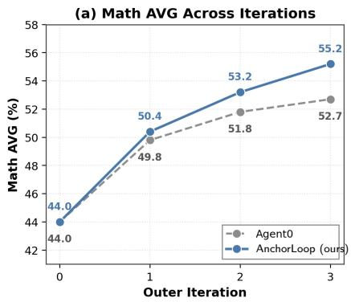

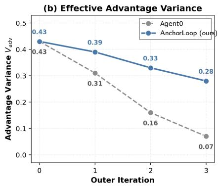

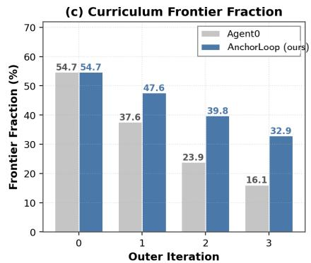  
Figure 2: Training dynamics on Qwen3-4B-Base. (a) Math AVG across three outer iterations. (b) Withi<sub>n-group var</sub>i<sub>ance o</sub>f th<sub>e e</sub>f<sub>ec</sub>ti<sub>ve</sub> E<sub>xecu</sub>t<sub>or a</sub>d<sub>van</sub>t<sub>age,</sub> $V _ { \mathrm { a d v } } ,$ , a<sup>v</sup>e<sup>r</sup>age<sup>d</sup> o<sup>v</sup>e<sup>r</sup> sa<sup>m</sup>p<sup>l</sup>e<sup>d</sup> g<sup>r</sup>oups. <sup>B</sup>y iteration 3, it decreases to 0.07 <sup>f</sup>or Agent0 <sup>b</sup>ut remains at 0.28 <sup>f</sup>or Anc<sup>h</sup>orLoop. (c) Fraction o<sup>f</sup> Curricu<sup>l</sup>um t<sub>as</sub>k<sub>s w</sub>ith <sub>a pos</sub>iti<sub>ve samp</sub>l<sub>e</sub>d <sub>re</sub>f<sub>erence gap.</sub> A<sub>n unreso</sub>l<sub>ve</sub>d <sub>curren</sub>t<sub>–re</sub>f<sub>erence pa</sub>i<sub>r con</sub>t<sub>r</sub>ib<sub>u</sub>t<sub>es zero.</sub> Th<sub>e</sub> <sup>f</sup>raction decreases <sup>f</sup>rom 54.7% initia<sup>ll</sup>y to 16.1% <sup>f</sup>or Agent0 and 32.9% <sup>f</sup>or Anc<sup>h</sup>orLoop <sup>b</sup>y iteration 3.

Efective advantage variance. Figure 2(b) measures the within-group variance of the final efective Executor advanta<sub>g</sub>e. Let $B _ { t }$ <sub>con</sub>t<sub>a</sub>i<sub>n</sub> <sub>a</sub>ll <sub>samp</sub>l<sub>e</sub>d E<sub>xecu</sub>t<sub>or</sub> <sub>groups</sub> <sub>across</sub> th<sub>e</sub> <sub>up</sub>d<sub>a</sub>t<sub>e</sub> <sub>s</sub>t<sub>eps</sub> <sub>o</sub>f <sub>ou</sub>t<sub>er</sub> iteration t. For group size G and final ADPO-scaled advantage $\overset { \cdot } { A } _ { b , i : }$ , we compu<sup>t</sup>e

$$
V _ { \mathrm { a d v } } ^ { ( t ) } = \frac { 1 } { \left| \boldsymbol { \mathcal { B } } _ { t } \right| } \sum _ { b \in \boldsymbol { \mathcal { B } } _ { t } } \left[ \frac { 1 } { G } \sum _ { i = 1 } ^ { G } \left( \widetilde { A } _ { b , i } - \frac { 1 } { G } \sum _ { j = 1 } ^ { G } \widetilde { A } _ { b , j } \right) ^ { 2 } \right] .
$$

B<sub>o</sub>th <sub>me</sub>th<sub>o</sub>d<sub>s</sub> b<sub>eg</sub>i<sub>n a</sub>t $V _ { \mathrm { a d v } } = 0 . 4 3$ . By iteration 3, Agent0 decreases to 0.07, w<sup>h</sup>ereas Anc<sup>h</sup>orLoop retains su<sup>b</sup>stantia<sup>ll</sup>y more wit<sup>h</sup>in-group variation at 0.28. T<sup>h</sup>is o<sup>b</sup>servation is consistent wit<sup>h</sup> t<sup>h</sup>e motivation for cross-reference training: the anchored objective preserves more diferentiated efective <sub>a</sub>d<sub>van</sub>t<sub>ages</sub> i<sub>n</sub> th<sub>e</sub> <sub>samp</sub>l<sub>e</sub>d <sub>groups</sub> <sub>as</sub> t<sub>ra</sub>i<sub>n</sub>i<sub>ng</sub> <sub>procee</sub>d<sub>s.</sub> It d<sub>oes</sub> <sub>no</sub>t i<sub>mp</sub>l<sub>y</sub> th<sub>a</sub>t th<sub>e</sub> hi<sub>s</sub>t<sub>or</sub>i<sub>ca</sub>l <sub>componen</sub>t i<sub>s nonzero</sub> f<sub>or every group; as es</sub>t<sub>a</sub>bli<sub>s</sub>h<sub>e</sub>d i<sub>n</sub> S<sub>ec</sub>ti<sub>on</sub> 3<sub>.</sub>2<sub>,</sub> b<sub>o</sub>th <sub>componen</sub>t<sub>s van</sub>i<sub>s</sub>h <sub>w</sub>h<sub>en a</sub>ll <sub>curren</sub>t <sub>answers are</sub> id<sub>en</sub>ti<sub>ca</sub>l<sub>.</sub> N<sub>or</sub> d<sub>oes</sub> thi<sub>s s</sub>t<sub>a</sub>ti<sub>s</sub>ti<sub>c a</sub>l<sub>one es</sub>t<sub>a</sub>bli<sub>s</sub>h th<sub>a</sub>t th<sub>e</sub> i<sub>ncrease</sub>d <sub>var</sub>i<sub>ance causes</sub> th<sub>e</sub> <sub>p</sub>er<sup>f</sup>ormance <sup>i</sup>m<sub>p</sub>rovement.

Positive reference-gap frequency. Figure 2(c) examines the Curriculum side by reporting the fraction <sub>o</sub>f <sub>genera</sub>t<sub>e</sub>d t<sub>as</sub>k<sub>s</sub> f<sub>or</sub> <sub>w</sub>hi<sub>c</sub>h th<sub>e</sub> i<sub>n</sub>d<sub>epen</sub>d<sub>en</sub>tl<sub>y</sub> <sub>samp</sub>l<sub>e</sub>d <sub>curren</sub>t <sub>an</sub>d <sub>re</sub>f<sub>erence</sub> <sub>groups</sub> <sub>sa</sub>ti<sub>s</sub>f<sub>y</sub>

$$
\mu ^ { \operatorname { c u r } } ( x ) > \mu ^ { \operatorname { r e f } } ( x ) .
$$

A<sub>n</sub> <sub>unreso</sub>l<sub>ve</sub>d <sub>group</sub> <sub>pa</sub>i<sub>r</sub> <sub>con</sub>t<sub>r</sub>ib<sub>u</sub>t<sub>es</sub> <sub>zero</sub> <sub>an</sub>d i<sub>s</sub> <sub>no</sub>t <sub>coun</sub>t<sub>e</sub>d <sub>as</sub> <sub>pos</sub>iti<sub>ve.</sub> F<sub>or</sub> A<sub>nc</sub>h<sub>or</sub>L<sub>oop,</sub> th<sub>e</sub> <sub>re</sub>f<sub>erence</sub> <sub>group</sub> i<sub>s</sub> <sub>samp</sub>l<sub>e</sub>d f<sub>rom</sub> th<sub>e</sub> <sub>new</sub>l<sub>y</sub> <sub>re</sub>f<sub>res</sub>h<sub>e</sub>d <sub>anc</sub>h<sub>or;</sub> f<sub>or</sub> A<sub>gen</sub>t0<sub>,</sub> <sub>we</sub> <sub>cons</sub>t<sub>ruc</sub>t th<sub>e</sub> di<sub>agnos</sub>ti<sub>c</sub> <sub>us</sub>i<sub>ng</sub> <sub>a</sub> <sub>secon</sub>d i<sub>n</sub>d<sub>epen</sub>d<sub>en</sub>t <sub>ro</sub>ll<sub>ou</sub>t <sub>group</sub> f<sub>rom</sub> th<sub>e</sub> <sub>same</sub> E<sub>xecu</sub>t<sub>or</sub> <sub>c</sub>h<sub>ec</sub>k<sub>po</sub>i<sub>n</sub>t<sub>.</sub> D<sub>ur</sub>i<sub>ng</sub> C<sub>urr</sub>i<sub>cu</sub>l<sub>um</sub> t<sub>ra</sub>i<sub>n</sub>i<sub>ng,</sub> th<sub>e curren</sub>t <sub>an</sub>d <sub>re</sub>f<sub>erence mo</sub>d<sub>e</sub>l<sub>s</sub> h<sub>ave</sub> id<sub>en</sub>ti<sub>ca</sub>l <sub>parame</sub>t<sub>ers, an</sub>d <sub>eac</sub>h <sub>agreemen</sub>t <sub>ra</sub>t<sub>e</sub> i<sub>s compu</sub>t<sub>e</sub>d against its own group’s majority answer. T<sup>h</sup>e measured <sup>f</sup>raction decreases <sup>f</sup>rom 54.7% initia<sup>ll</sup>y to 16.1% <sup>f</sup>or Agent0 and 32.9% <sup>f</sup>or Anc<sup>h</sup>orLoop <sup>b</sup>y iteration 3.

C<sub>ons</sub>i<sub>s</sub>t<sub>en</sub>t <sub>w</sub>ith th<sub>e</sub> i<sub>n</sub>t<sub>erpre</sub>t<sub>a</sub>ti<sub>on</sub> i<sub>n</sub> S<sub>ec</sub>ti<sub>on</sub> 3<sub>.</sub>3<sub>,</sub> thi<sub>s s</sub>t<sub>a</sub>ti<sub>s</sub>ti<sub>c measures</sub> th<sub>e</sub> f<sub>requency o</sub>f <sub>pos</sub>iti<sub>ve</sub> <sub>samp</sub>l<sub>e</sub>d <sub>agreemen</sub>t dif<sub>erences ra</sub>th<sub>er</sub> th<sub>an correc</sub>t<sub>ness or</sub> i<sub>n</sub>t<sub>er-vers</sub>i<sub>on progress.</sub> Th<sub>e</sub> hi<sub>g</sub>h<sub>er</sub> f<sub>rac</sub>ti<sub>on</sub> <sub>o</sub>b<sub>serve</sub>d f<sub>or</sub> A<sub>nc</sub>h<sub>or</sub>L<sub>oop</sub> th<sub>ere</sub>f<sub>ore c</sub>h<sub>arac</sub>t<sub>er</sub>i<sub>zes</sub> th<sub>e samp</sub>l<sub>e</sub>d C<sub>urr</sub>i<sub>cu</sub>l<sub>um s</sub>i<sub>gna</sub>l<sub>;</sub> it d<sub>oes no</sub>t i<sub>mp</sub>l<sub>y</sub> th<sub>a</sub>t th<sub>e curren</sub>t E<sub>xecu</sub>t<sub>or</sub> h<sub>as new</sub>l<sub>y so</sub>l<sub>ve</sub>d th<sub>ose</sub> t<sub>as</sub>k<sub>s or es</sub>t<sub>a</sub>bli<sub>s</sub>h th<sub>a</sub>t th<sub>e re</sub>f<sub>erence rewar</sub>d <sub>causes</sub> th<sub>e</sub> <sub>su</sub>b<sub>sequen</sub>t <sub>per</sub>f<sub>ormance</sub> dif<sub>erence.</sub>

Table 2: Tool comparisons and anchor ablations on Qwen3-4B-Base. Agent0 and AnchorLoop are <sub>s</sub>h<sub>are</sub>d <sub>en</sub>d<sub>po</sub>i<sub>n</sub>t<sub>s.</sub> O<sub>n</sub>l<sub>y</sub> th<sub>e anc</sub>h<sub>or var</sub>i<sub>an</sub>t<sub>s use ma</sub>t<sub>c</sub>h<sub>e</sub>d t<sub>ra</sub>i<sub>n</sub>i<sub>ng an</sub>d <sub>eva</sub>l<sub>ua</sub>ti<sub>on se</sub>tti<sub>ngs.</sub>
<table><tr><td colspan="3">Method Math AVG General AVG</td></tr><tr><td>Without tool access</td><td></td><td></td></tr><tr><td> $\mathrm { Q w e n 3 - } 4 \mathrm { B } \ ( \mathrm { B a s e } )$ </td><td>42.6</td><td>37.2</td></tr><tr><td> $+ \ S P I { \mathrm { R A L } }$ </td><td>47.2</td><td>42.1</td></tr><tr><td> $+ \ \mathrm { R } – \mathrm { Z e r o }$ </td><td>48.7</td><td>42.8</td></tr><tr><td>With tool access</td><td></td><td></td></tr><tr><td> $+ \mathrm { ~ T I R ~ }$ </td><td>44.0</td><td>39.6</td></tr><tr><td>+ Absolute Zero</td><td>46.4</td><td>41.9</td></tr><tr><td>Matched anchor variants with tool access</td><td></td><td></td></tr><tr><td></td><td></td><td></td></tr><tr><td>Agent0</td><td>52.7</td><td>45.1</td></tr><tr><td> $+ R _ { \mathrm { r e f } } \ \mathrm { o n l y }$ </td><td>53.6</td><td>45.9</td></tr><tr><td> $+ A ^ { \mathrm { h i s t } } \ \mathrm { o n l y }$ </td><td>54.4</td><td>46.7</td></tr><tr><td>Full AnchorLoop</td><td>55.2</td><td>47.9</td></tr></table>

## 4.4. Anchor Analysis

Contribution of the two anchor signals. The matched anchor block of Table 2 separates the two <sub>uses o</sub>f th<sub>e anc</sub>h<sub>or:</sub> $R _ { \mathrm { r e f } }$ <sub>on</sub> th<sub>e</sub> C<sub>urr</sub>i<sub>cu</sub>l<sub>um s</sub>id<sub>e an</sub>d $A ^ { \mathrm { h i s t } }$ <sub>on</sub> th<sub>e</sub> E<sub>xecu</sub>t<sub>or s</sub>id<sub>e.</sub> All f<sub>our con</sub>fi<sub>gura</sub>ti<sub>ons</sub> use the same Qwen3-4B-Base initialization, three outer iterations, update steps, ADPO settings, tool <sub>env</sub>i<sub>ronmen</sub>t<sub>, an</sub>d <sub>eva</sub>l<sub>ua</sub>ti<sub>on pro</sub>t<sub>oco</sub>l<sub>.</sub> Wh<sub>en</sub> th<sub>e</sub> hi<sub>s</sub>t<sub>or</sub>i<sub>ca</sub>l <sub>a</sub>d<sub>van</sub>t<sub>age</sub> i<sub>s</sub> di<sub>sa</sub>bl<sub>e</sub>d<sub>,</sub> th<sub>e</sub> E<sub>xecu</sub>t<sub>or uses</sub> $A ^ { \mathrm { c u r } }$ <sub>w</sub>ith <sub>un</sub>it <sub>coe</sub>fi<sub>c</sub>i<sub>en</sub>t<sub>.</sub> Wh<sub>en</sub> <sub>ena</sub>bl<sub>e</sub>d<sub>,</sub> it <sub>uses</sub> $( 1 - \alpha ) A ^ { \mathrm { c u r } } + \alpha A ^ { \mathrm { h i s t } }$ <sub>w</sub>ith $\alpha = 0 . 6$ <sub>.</sub> Di<sub>sa</sub>bli<sub>ng</sub> th<sub>e</sub> C<sub>urr</sub>i<sub>cu</sub>l<sub>um</sub> <sub>re</sub>f<sub>erence se</sub>t<sub>s</sub> $\lambda = 0$ <sub>w</sub>hil<sub>e</sub> l<sub>eav</sub>i<sub>ng a</sub>ll <sub>o</sub>th<sub>er</sub> C<sub>urr</sub>i<sub>cu</sub>l<sub>um rewar</sub>d<sub>s an</sub>d t<sub>as</sub>k h<sub>an</sub>dli<sub>ng unc</sub>h<sub>ange</sub>d<sub>.</sub>

Addi<sub>ng</sub> $R _ { \mathrm { r e f } }$ a<sup>l</sup>one improves t<sup>h</sup>e Mat<sup>h</sup> and Genera<sup>l</sup> averages <sup>f</sup>rom 52.7/45.1 to 53.6/45.9, w<sup>h</sup>i<sup>l</sup>e adding $A ^ { \mathrm { h i s t } }$ <sub>a</sub>l<sub>one reac</sub>h<sub>es</sub> $5 4 . 4 / 4 6 . 7 $ . Com<sup>b</sup>ining <sup>b</sup>ot<sup>h</sup> gives t<sup>h</sup>e <sup>f</sup>u<sup>ll</sup> Anc<sup>h</sup>orLoop resu<sup>l</sup>t o<sup>f</sup> 55.2/47.9. T<sup>h</sup>us, b<sub>o</sub>th <sub>anc</sub>h<sub>or uses are assoc</sub>i<sub>a</sub>t<sub>e</sub>d <sub>w</sub>ith i<sub>mprovemen</sub>t<sub>s over</sub> th<sub>e unanc</sub>h<sub>ore</sub>d <sub>con</sub>fi<sub>gura</sub>ti<sub>on</sub> i<sub>n</sub> th<sub>e ma</sub>t<sub>c</sub>h<sub>e</sub>d <sub>se</sub>tti<sub>ng, w</sub>ith th<sub>e</sub> E<sub>xecu</sub>t<sub>or-s</sub>id<sub>e</sub> hi<sub>s</sub>t<sub>or</sub>i<sub>ca</sub>l <sub>a</sub>d<sub>van</sub>t<sub>age pro</sub>d<sub>uc</sub>i<sub>ng</sub> th<sub>e</sub> l<sub>arger</sub> i<sub>n</sub>di<sub>v</sub>id<sub>ua</sub>l <sub>c</sub>h<sub>ange.</sub> Th<sub>e</sub> <sub>en</sub>d<sub>po</sub>i<sub>n</sub>t <sub>compar</sub>i<sub>son</sub> d<sub>oes</sub> <sub>no</sub>t<sub>,</sub> h<sub>owever,</sub> i<sub>so</sub>l<sub>a</sub>t<sub>e</sub> th<sub>e</sub> <sub>mec</sub>h<sub>an</sub>i<sub>sm</sub> b<sub>e</sub>hi<sub>n</sub>d <sub>e</sub>ith<sub>er</sub> i<sub>mprovemen</sub>t <sub>or</sub> <sub>es</sub>t<sub>a</sub>bli<sub>s</sub>h <sub>a synerg</sub>i<sub>s</sub>ti<sub>c</sub> i<sub>n</sub>t<sub>erac</sub>ti<sub>on</sub> b<sub>e</sub>t<sub>ween</sub> th<sub>e</sub> t<sub>wo componen</sub>t<sub>s.</sub>

Iterative versus fixed anchor. Figure 3(a) tests whether refreshing the historical reference matters b<sub>y compar</sub>i<sub>ng</sub> A<sub>nc</sub>h<sub>or</sub>L<sub>oop w</sub>ith <sub>an anc</sub>h<sub>or permanen</sub>tl<sub>y</sub> fi<sub>xe</sub>d t<sub>o</sub> th<sub>e</sub> b<sub>ase mo</sub>d<sub>e</sub>l<sub>.</sub> Th<sub>e</sub> t<sub>wo se</sub>tti<sub>ngs</sub> <sub>rema</sub>i<sub>n c</sub>l<sub>ose</sub> i<sub>n</sub> th<sub>e</sub> fi<sub>rs</sub>t it<sub>era</sub>ti<sub>on,</sub> b<sub>u</sub>t di<sub>verge as</sub> t<sub>ra</sub>i<sub>n</sub>i<sub>ng procee</sub>d<sub>s.</sub> Th<sub>e</sub> it<sub>era</sub>ti<sub>ve an</sub>d fi<sub>xe</sub>d <sub>var</sub>i<sub>an</sub>t<sub>s</sub> reac<sup>h</sup> 55.2 and 53.0 at iteration 3, respective<sup>l</sup>y, and 56.3 and 53.3 at iteration 4. T<sup>h</sup>ese resu<sup>l</sup>ts s<sup>h</sup>ow th<sub>a</sub>t <sub>re</sub>f<sub>res</sub>hi<sub>ng</sub> th<sub>e anc</sub>h<sub>or w</sub>ith th<sub>e mos</sub>t <sub>recen</sub>tl<sub>y comp</sub>l<sub>e</sub>t<sub>e</sub>d E<sub>xecu</sub>t<sub>or</sub> i<sub>s assoc</sub>i<sub>a</sub>t<sub>e</sub>d <sub>w</sub>ith <sub>s</sub>t<sub>ronger</sub> l<sub>a</sub>t<sub>er-</sub> it<sub>era</sub>ti<sub>on per</sub>f<sub>ormance</sub> i<sub>n</sub> thi<sub>s se</sub>tti<sub>ng.</sub> Th<sub>ey</sub> d<sub>o no</sub>t <sub>es</sub>t<sub>a</sub>bli<sub>s</sub>h th<sub>a</sub>t <sub>a</sub> fi<sub>xe</sub>d <sub>anc</sub>h<sub>or necessar</sub>il<sub>y</sub> b<sub>ecomes</sub> <sub>un</sub>i<sub>n</sub>f<sub>orma</sub>ti<sub>ve, nor</sub> d<sub>o</sub> th<sub>ey</sub> i<sub>so</sub>l<sub>a</sub>t<sub>e c</sub>h<sub>ec</sub>k<sub>po</sub>i<sub>n</sub>t <sub>age as</sub> th<sub>e so</sub>l<sub>e source o</sub>f th<sub>e</sub> dif<sub>erence.</sub>

Comparison across tool settings. Table 2 places AnchorLoop alongside methods evaluated with <sub>an</sub>d <sub>w</sub>ith<sub>ou</sub>t t<sub>oo</sub>l <sub>access un</sub>d<sub>er</sub> th<sub>e</sub>i<sub>r respec</sub>ti<sub>ve</sub> t<sub>ra</sub>i<sub>n</sub>i<sub>ng con</sub>fi<sub>gura</sub>ti<sub>ons.</sub> Addi<sub>ng</sub> th<sub>e</sub> P<sub>y</sub>th<sub>on</sub> t<sub>oo</sub>l t<sub>o</sub> th<sub>e</sub> untrained Qwen3-4B <sup>b</sup>ase mode<sup>l</sup> c<sup>h</sup>anges Mat<sup>h</sup> AVG <sup>f</sup>rom 42.6 to 44.0 and Genera<sup>l</sup> AVG <sup>f</sup>rom 37.2 to 39.6. Among t<sup>h</sup>e too<sup>l</sup>-integrated training met<sup>h</sup>ods, Anc<sup>h</sup>orLoop reac<sup>h</sup>es 55.2/47.9, compared wit<sup>h</sup> 52.7/45.1 <sup>f</sup>or Agent0.

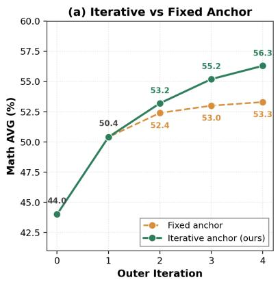

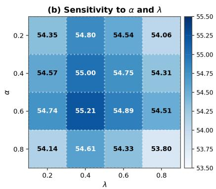

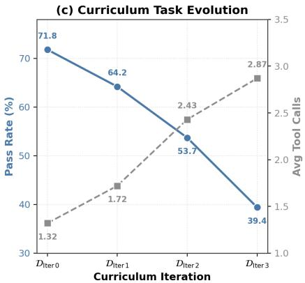  
Figure 3: Anchor and Curriculum analyses on Qwen3-4B-Base. (a) Math AVG across outer iterations with an iterative anchor versus an anchor fixed to the base model. (b) Sensitivit<sub>y</sub> over the historical advantage weig<sup>h</sup>t α and Curricu<sup>l</sup>um re<sup>f</sup>erence weig<sup>h</sup>t λ on a $4 \times 4 ~ \mathrm { g r i d } ;$ <sub>;</sub> th<sub>e</sub> d<sub>e</sub>f<sub>au</sub>lt <sub>se</sub>tti<sub>ng</sub> i<sub>s</sub> $( \alpha , \lambda ) =$ (0.6, 0.4). (c) Pass rate and average too<sup>l</sup> ca<sup>ll</sup>s on 200 tas<sup>k</sup>s samp<sup>l</sup>ed <sup>f</sup>rom eac<sup>h</sup> Curricu<sup>l</sup>um stage. T<sup>h</sup>e iteration-1 Executor <sub>g</sub>enerates $G = 8$ trajectories per task, and both statistics are computed from the same 1,600 trajectories per stage.

Th<sub>ese compar</sub>i<sub>sons prov</sub>id<sub>e con</sub>t<sub>ex</sub>t f<sub>or</sub> t<sub>oo</sub>l<sub>-</sub>i<sub>n</sub>t<sub>egra</sub>t<sub>e</sub>d <sub>per</sub>f<sub>ormance</sub> b<sub>u</sub>t <sub>s</sub>h<sub>ou</sub>ld <sub>no</sub>t b<sub>e</sub> i<sub>n</sub>t<sub>erpre</sub>t<sub>e</sub>d <sub>as</sub> <sub>a con</sub>t<sub>ro</sub>ll<sub>e</sub>d <sub>a</sub>bl<sub>a</sub>ti<sub>on o</sub>f t<sub>oo</sub>l <sub>access.</sub> Th<sub>e me</sub>th<sub>o</sub>d<sub>s</sub> dif<sub>er s</sub>i<sub>mu</sub>lt<sub>aneous</sub>l<sub>y</sub> i<sub>n</sub> t<sub>as</sub>k <sub>genera</sub>ti<sub>on,</sub> t<sub>ra</sub>i<sub>n</sub>i<sub>ng</sub> objective, and reward design. The comparisons across methods in Table 2 therefore do not isolate th<sub>e causa</sub>l <sub>con</sub>t<sub>r</sub>ib<sub>u</sub>ti<sub>on o</sub>f <sub>e</sub>ith<sub>er</sub> t<sub>oo</sub>l <sub>use or</sub> hi<sub>s</sub>t<sub>or</sub>i<sub>ca</sub>l <sub>anc</sub>h<sub>or</sub>i<sub>ng.</sub> A<sub>ppen</sub>di<sub>x</sub> D f<sub>ur</sub>th<sub>er ana</sub>l<sub>yzes</sub> th<sub>e</sub> hi<sub>s</sub>t<sub>or</sub>i<sub>ca</sub>l<sub>-a</sub>d<sub>van</sub>t<sub>age s</sub>t<sub>ruc</sub>t<sub>ure, compu</sub>t<sub>a</sub>ti<sub>ona</sub>l <sub>cos</sub>t<sub>, anc</sub>h<sub>or re</sub>f<sub>res</sub>h <sub>an</sub>d <sub>cac</sub>hi<sub>ng, an</sub>d <sub>represen</sub>t<sub>a</sub>ti<sub>ve</sub> f<sub>a</sub>il<sub>ure</sub> <sub>cases.</sub>

## 4.5. Curriculum Analysis

Sensitivity to <sub>α</sub> and λ. Figure 3(b) evaluates the two anchor-specific weights: the historical-advantage <sub>we</sub>i<sub>g</sub>ht $\alpha ,$ <sub>w</sub>hi<sub>c</sub>h b<sub>a</sub>l<sub>ances</sub> $A ^ { \mathrm { c u r } }$ <sub>an</sub>d $A ^ { \mathrm { h i s t } }$ in Executor training, and t<sup>h</sup>e Curricu<sup>l</sup>um re<sup>f</sup>erence weig<sup>h</sup>t λ, <sub>w</sub>hi<sub>c</sub>h <sub>sca</sub>l<sub>es</sub> $R _ { \mathrm { r e f } }$ <sub>.</sub> A<sub>cross</sub> th<sub>e</sub> $4 \times 4 ~ \mathrm { g r i d }$ <sub>,</sub> th<sub>e</sub> d<sub>e</sub>f<sub>au</sub>lt <sub>se</sub>tti<sub>ng</sub> $( \alpha , \lambda ) = ( 0 . 6 , 0 . 4 )$ reaches a Math AVG of 55.21, w<sup>h</sup>i<sup>l</sup>e a<sup>ll</sup> eva<sup>l</sup>uated con<sup>fi</sup>gurations remain wit<sup>h</sup>in 1.5 points o<sup>f</sup> t<sup>h</sup>is va<sup>l</sup>ue. T<sup>h</sup>e resu<sup>l</sup>t indicates li<sub>m</sub>it<sub>e</sub>d <sub>sens</sub>iti<sub>v</sub>it<sub>y w</sub>ithi<sub>n</sub> th<sub>e eva</sub>l<sub>ua</sub>t<sub>e</sub>d <sub>range, a</sub>lth<sub>oug</sub>h it d<sub>oes no</sub>t <sub>c</sub>h<sub>arac</sub>t<sub>er</sub>i<sub>ze se</sub>tti<sub>ngs ou</sub>t<sub>s</sub>id<sub>e</sub> th<sub>e</sub> <sub>gr</sub>id <sub>or remove</sub> th<sub>e nee</sub>d t<sub>o se</sub>l<sub>ec</sub>t th<sub>e</sub> t<sub>wo we</sub>i<sub>g</sub>ht<sub>s.</sub>

Evolution of Curriculum tasks and tool use. We further examine how the generated task distribution chan<sub>g</sub>es across Curriculum sta<sub>g</sub>es $t = 0 , 1 , 2 , 3$ . From eac<sup>h</sup> stage, we samp<sup>l</sup>e 200 tas<sup>k</sup>s and eva<sup>l</sup>uate th<sub>em us</sub>i<sub>ng a</sub> fi<sub>xe</sub>d it<sub>era</sub>ti<sub>on-</sub>1 E<sub>xecu</sub>t<sub>or, w</sub>hi<sub>c</sub>h i<sub>n</sub>d<sub>epen</sub>d<sub>en</sub>tl<sub>y genera</sub>t<sub>es</sub> $G = 8$ trajectories per task. W<sub>e</sub> <sub>compu</sub>t<sub>e</sub> th<sub>e</sub> <sub>mean</sub> bi<sub>nary</sub> <sub>agreemen</sub>t <sub>rewar</sub>d <sub>an</sub>d th<sub>e</sub> <sub>average</sub> <sub>num</sub>b<sub>er</sub> <sub>o</sub>f t<sub>oo</sub>l <sub>ca</sub>ll<sub>s</sub> <sub>over</sub> th<sub>e</sub> <sub>same</sub> 1,600 trajectories <sup>f</sup>or eac<sup>h</sup> stage.

Figure 3(c) s<sup>h</sup>ows t<sup>h</sup>at t<sup>h</sup>e measured pass rate under t<sup>h</sup>is <sup>fi</sup>xed Executor decreases <sup>f</sup>rom 71.8% on $\mathcal { D } _ { \mathrm { I t e r } 0 }$ to $3 9 . 4 \%$ on $\mathcal { D } _ { \mathrm { I t e r } 3 }$ , w<sup>h</sup>i<sup>l</sup>e t<sup>h</sup>e average num<sup>b</sup>er o<sup>f</sup> too<sup>l</sup> ca<sup>ll</sup>s per trajectory increases <sup>f</sup>rom 1.32 to 2.87. Because t<sup>h</sup>e same Executor is used to eva<sup>l</sup>uate tas<sup>k</sup>s <sup>f</sup>rom a<sup>ll</sup> stages, t<sup>h</sup>ese c<sup>h</sup>anges indicate t<sup>h</sup>at th<sub>e</sub> di<sub>s</sub>t<sub>r</sub>ib<sub>u</sub>ti<sub>on o</sub>f C<sub>urr</sub>i<sub>cu</sub>l<sub>um-genera</sub>t<sub>e</sub>d t<sub>as</sub>k<sub>s evo</sub>l<sub>ves over</sub> t<sub>ra</sub>i<sub>n</sub>i<sub>ng:</sub> l<sub>a</sub>t<sub>er</sub> t<sub>as</sub>k <sub>se</sub>t<sub>s</sub> l<sub>ower agreemen</sub>t <sub>rewar</sub>d <sub>an</sub>d <sub>more</sub> t<sub>oo</sub>l i<sub>n</sub>t<sub>erac</sub>ti<sub>ons</sub> f<sub>rom</sub> thi<sub>s</sub> fi<sub>xe</sub>d <sub>eva</sub>l<sub>ua</sub>t<sub>or.</sub>

Th<sub>ese s</sub>t<sub>a</sub>ti<sub>s</sub>ti<sub>cs s</sub>h<sub>ou</sub>ld <sub>no</sub>t b<sub>e</sub> i<sub>n</sub>t<sub>erpre</sub>t<sub>e</sub>d <sub>as</sub> di<sub>rec</sub>t <sub>measures o</sub>f t<sub>as</sub>k difi<sub>cu</sub>lt<sub>y or correc</sub>t<sub>ness.</sub> I<sub>n</sub> <sub>par</sub>ti<sub>cu</sub>l<sub>ar,</sub> $R _ { \mathrm { r e f } }$ <sub>compares</sub> i<sub>n</sub>d<sub>epen</sub>d<sub>en</sub>tl<sub>y samp</sub>l<sub>e</sub>d <sub>agreemen</sub>t <sub>ra</sub>t<sub>es</sub> d<sub>ur</sub>i<sub>ng</sub> C<sub>urr</sub>i<sub>cu</sub>l<sub>um</sub> t<sub>ra</sub>i<sub>n</sub>i<sub>ng ra</sub>th<sub>er</sub> th<sub>an</sub> id<sub>en</sub>tif<sub>y</sub>i<sub>ng</sub> t<sub>as</sub>k<sub>s</sub> th<sub>a</sub>t th<sub>e curren</sub>t E<sub>xecu</sub>t<sub>or can so</sub>l<sub>ve</sub> b<sub>u</sub>t th<sub>e anc</sub>h<sub>or canno</sub>t<sub>.</sub> Th<sub>e o</sub>b<sub>serve</sub>d t<sub>ren</sub>d<sub>s</sub> th<sub>ere</sub>f<sub>ore c</sub>h<sub>arac</sub>t<sub>er</sub>i<sub>ze</sub> h<sub>ow</sub> th<sub>e genera</sub>t<sub>e</sub>d t<sub>as</sub>k <sub>an</sub>d <sub>response</sub> di<sub>s</sub>t<sub>r</sub>ib<sub>u</sub>ti<sub>ons c</sub>h<sub>ange a</sub>l<sub>ongs</sub>id<sub>e</sub> <sub>anc</sub>h<sub>ore</sub>d <sub>se</sub>lf<sub>-evo</sub>l<sub>u</sub>ti<sub>on;</sub> th<sub>ey</sub> d<sub>o no</sub>t b<sub>y</sub> th<sub>emse</sub>l<sub>ves es</sub>t<sub>a</sub>bli<sub>s</sub>h th<sub>a</sub>t l<sub>a</sub>t<sub>er</sub> t<sub>as</sub>k<sub>s are</sub> i<sub>n</sub>t<sub>r</sub>i<sub>ns</sub>i<sub>ca</sub>ll<sub>y</sub> h<sub>ar</sub>d<sub>er,</sub> th<sub>a</sub>t <sub>a</sub>dditi<sub>ona</sub>l t<sub>oo</sub>l <sub>ca</sub>ll<sub>s are necessary, or</sub> th<sub>a</sub>t $R _ { \mathrm { r e f } }$ <sub>causa</sub>ll<sub>y pro</sub>d<sub>uces e</sub>ith<sub>er</sub> t<sub>ren</sub>d<sub>.</sub> A<sub>ppen</sub>di<sub>x</sub> F <sub>prov</sub>id<sub>es</sub> <sub>se</sub>l<sub>ec</sub>t<sub>e</sub>d C<sub>urr</sub>i<sub>cu</sub>l<sub>um</sub> t<sub>as</sub>k<sub>s, pos</sub>t<sub>-up</sub>d<sub>a</sub>t<sub>e</sub> E<sub>xecu</sub>t<sub>or compar</sub>i<sub>sons, an</sub>d f<sub>u</sub>ll <sub>reason</sub>i<sub>ng</sub> t<sub>races.</sub>

## 5. Conclusion

W<sub>e</sub> i<sub>n</sub>t<sub>ro</sub>d<sub>uce</sub> A<sub>nc</sub>h<sub>or</sub>L<sub>oop</sub> t<sub>o</sub> <sub>a</sub>dd<sub>ress</sub> <sub>wea</sub>k<sub>en</sub>i<sub>ng</sub> f<sub>ee</sub>db<sub>ac</sub>k i<sub>n</sub> <sub>se</sub>lf<sub>-evo</sub>l<sub>v</sub>i<sub>ng</sub> C<sub>urr</sub>i<sub>cu</sub>l<sub>um</sub> <sub>an</sub>d E<sub>xecu</sub>t<sub>or</sub> t<sub>ra</sub>i<sub>n</sub>i<sub>ng.</sub> At <sub>eac</sub>h <sub>ou</sub>t<sub>er</sub> it<sub>era</sub>ti<sub>on, a</sub> f<sub>rozen copy o</sub>f th<sub>e prev</sub>i<sub>ous</sub> E<sub>xecu</sub>t<sub>or prov</sub>id<sub>es an</sub> i<sub>n</sub>d<sub>epen</sub>d<sub>en</sub>tl<sub>y</sub> <sub>samp</sub>l<sub>e</sub>d <sub>agreemen</sub>t <sub>re</sub>f<sub>erence</sub> f<sub>or</sub> C<sub>urr</sub>i<sub>cu</sub>l<sub>um</sub> t<sub>ra</sub>i<sub>n</sub>i<sub>ng</sub> <sub>an</sub>d h<sub>e</sub>l<sub>ps</sub> <sub>cons</sub>t<sub>ruc</sub>t <sub>a</sub> <sub>cross-re</sub>f<sub>erence</sub> <sub>a</sub>d<sub>van</sub>t<sub>age</sub> f<sub>or</sub> E<sub>xecu</sub>t<sub>or</sub> t<sub>ra</sub>i<sub>n</sub>i<sub>ng, w</sub>ith<sub>ou</sub>t <sub>ex</sub>t<sub>erna</sub>l t<sub>as</sub>k<sub>s or answer</sub> l<sub>a</sub>b<sub>e</sub>l<sub>s.</sub> A<sub>cross</sub> t<sub>wo</sub> b<sub>ac</sub>kb<sub>ones an</sub>d thi<sub>r</sub>t<sub>een</sub> benchmarks<sub>,</sub> AnchorLoo<sub>p</sub> im<sub>p</sub>roves Math AVG over A<sub>g</sub>ent0 b<sub>y</sub> 2.5 <sub>p</sub>oints and General AVG b<sub>y</sub> 2.7 to 2.8 <sub>po</sub>i<sub>n</sub>t<sub>s.</sub> It <sub>a</sub>l<sub>so re</sub>t<sub>a</sub>i<sub>ns</sub> hi<sub>g</sub>h<sub>er e</sub>f<sub>ec</sub>ti<sub>ve-a</sub>d<sub>van</sub>t<sub>age var</sub>i<sub>ance an</sub>d <sub>s</sub>h<sub>ows s</sub>t<sub>ronger ga</sub>i<sub>ns</sub> i<sub>n</sub> l<sub>a</sub>t<sub>er</sub> it<sub>era</sub>ti<sub>ons.</sub>

## References

[1] Mark Chen, Jerr<sub>y</sub> Tworek, Heewoo Jun, Qimin<sub>g</sub> Yuan, Henri<sub>q</sub>ue Ponde de Oliveira Pinto, Jared Ka<sub>p</sub>lan<sub>,</sub> Harri Edwards<sub>,</sub> Yuri Burda<sub>,</sub> Nicholas Jose<sub>p</sub>h<sub>,</sub> Gre<sub>g</sub> Brockman<sub>,</sub> Alex Ra<sub>y,</sub> Raul Puri<sub>,</sub> G<sub>re</sub>t<sub>c</sub>h<sub>en</sub> K<sub>rue er,</sub> Mi<sub>c</sub>h<sub>ae</sub>l P<sub>e</sub>t<sub>rov,</sub> H<sub>e</sub>id Khl<sub>aa</sub>f<sub>,</sub> Gi<sub>r</sub>i<sub>s</sub>h S<sub>as</sub>t<sub>r ,</sub> P<sub>ame</sub>l<sub>a</sub> Mi<sub>s</sub>hki<sub>n,</sub> B<sub>roo</sub>k<sub>e</sub> Ch<sub>an,</sub> S<sub>co</sub>tt G<sub>ray,</sub> Ni<sub>c</sub>k R<sub>y</sub>d<sub>er,</sub> Mikh<sub>a</sub>il P<sub>av</sub>l<sub>ov,</sub> Al<sub>e</sub>th<sub>ea</sub> P<sub>ower,</sub> L<sub>u</sub>k<sub>asz</sub> K<sub>a</sub>i<sub>ser,</sub> M<sub>o</sub>h<sub>amma</sub>d B<sub>avar</sub>i<sub>an,</sub> Cl<sub>emens</sub> Wi<sub>n</sub>t<sub>er,</sub> Phili<sub>ppe</sub> Till<sub>e</sub>t<sub>,</sub> F<sub>e</sub>li<sub>pe</sub> P<sub>e</sub>t<sub>ros</sub>ki S<sub>uc</sub>h<sub>,</sub> D<sub>ave</sub> C<sub>umm</sub>i<sub>ngs,</sub> M<sub>a</sub>tthi<sub>as</sub> Pl<sub>apper</sub>t<sub>,</sub> F<sub>o</sub>ti<sub>os</sub> Ch<sub>an</sub>t<sub>z</sub>i<sub>s,</sub> Eli<sub>za</sub>b<sub>e</sub>th B<sub>arnes,</sub> A<sub>r</sub>i<sub>e</sub>l H<sub>er</sub>b<sub>er</sub>t<sub>-</sub>V<sub>oss,</sub> Willi<sub>am</sub> H<sub>e</sub>b<sub>gen</sub> G<sub>uss,</sub> Al<sub>ex</sub> Ni<sub>c</sub>h<sub>o</sub>l<sub>,</sub> Al<sub>ex</sub> P<sub>a</sub>i<sub>no,</sub> Nik<sub>o</sub>l<sub>as</sub> T<sub>eza</sub>k<sub>,</sub> Jie Tang, Igor Babuschkin, Suchir Balaji, Shantanu Jain, William Saunders, Christopher Hesse, A<sub>n</sub>d<sub>rew</sub> N<sub>.</sub> C<sub>arr,</sub> J<sub>an</sub> L<sub>e</sub>ik<sub>e,</sub> J<sub>os</sub>h A<sub>c</sub>hi<sub>am,</sub> V<sub>e</sub>d<sub>an</sub>t Mi<sub>sra,</sub> E<sub>van</sub> M<sub>or</sub>ik<sub>awa,</sub> Al<sub>ec</sub> R<sub>a</sub>df<sub>or</sub>d<sub>,</sub> M<sub>a</sub>tth<sub>ew</sub> Kni<sub>g</sub>ht<sub>,</sub> Miles Brunda<sub>g</sub>e<sub>,</sub> Mira Murati<sub>,</sub> Katie Ma<sub>y</sub>er<sub>,</sub> Peter Welinder<sub>,</sub> Bob McGrew<sub>,</sub> Dario Amodei<sub>,</sub> Sam McCandlish, Ilya Sutskever, and Wojciech Zaremba. Evaluating large language models trained on code. arXiv preprint arXiv:2107.03374, 2021. URL https://arxiv.org/abs/2107.03374.

[2] Zixian<sub>g</sub> Chen, Yihe Den<sub>g</sub>, Huizhuo Yuan, Kaixuan Ji, and Quan<sub>q</sub>uan Gu. Self-<sub>p</sub>la<sub>y</sub> fine-tunin<sub>g</sub> converts weak language models to strong language models. In International Conference on Machine Learning (ICML), 2024.

[3] Karl Cobbe, Vineet Kosaraju, Mohammad Bavarian, Mark Chen, Heewoo Jun, Lukasz Kaiser, M<sub>a</sub>tthi<sub>as</sub> Pl<sub>apper</sub>t<sub>,</sub> J<sub>erry</sub> T<sub>wore</sub>k<sub>,</sub> J<sub>aco</sub>b Hilt<sub>on,</sub> R<sub>e</sub>ii<sub>c</sub>hi<sub>ro</sub> N<sub>a</sub>k<sub>ano,</sub> Ch<sub>r</sub>i<sub>s</sub>t<sub>op</sub>h<sub>er</sub> H<sub>esse, an</sub>d J<sub>o</sub>h<sub>n</sub> Schulman. Training verifiers to solve math word problems. arXiv preprint arXiv:2110.14168, 2021.

[4] Chao<sub>q</sub>un He, Renjie Luo, Yuzhuo Bai, Shen<sub>g</sub>din<sub>g</sub> Hu, Zhen Len<sub>g</sub> Thai, Junhao Shen, Jin<sub>y</sub>i Hu, Xu Han, Yujie Huang, Yuxiang Zhang, Jie Liu, Lei Qi, Zhiyuan Liu, and Maosong Sun. Ol<sub>ymp</sub>i<sub>a</sub>dB<sub>enc</sub>h<sub>:</sub> A <sub>c</sub>h<sub>a</sub>ll<sub>eng</sub>i<sub>ng</sub> b<sub>enc</sub>h<sub>mar</sub>k f<sub>or</sub> <sub>promo</sub>ti<sub>ng</sub> AGI <sub>w</sub>ith <sub>o</sub>l<sub>ymp</sub>i<sub>a</sub>d<sub>-</sub>l<sub>eve</sub>l bili<sub>ngua</sub>l multimodal scientific problems. arXiv preprint arXiv:2402.14008, 2024.

[5] Dan Hendr<sub>y</sub>cks, Collin Burns, Saurav Kadavath, Akul Arora, Steven Basart, Eric Tan<sub>g</sub>, Dawn S<sub>ong, an</sub>d J<sub>aco</sub>b St<sub>e</sub>i<sub>n</sub>h<sub>ar</sub>dt<sub>.</sub> M<sub>easur</sub>i<sub>ng ma</sub>th<sub>ema</sub>ti<sub>ca</sub>l <sub>pro</sub>bl<sub>em so</sub>l<sub>v</sub>i<sub>ng w</sub>ith th<sub>e</sub> MATH d<sub>a</sub>t<sub>ase</sub>t<sub>.</sub> In NeurIPS Datasets and Benchmarks, 2021.

[6] Chen<sub>g</sub>son<sub>g</sub> Huan<sub>g</sub>, Wenhao Yu, Xiao<sub>y</sub>an<sub>g</sub> Wan<sub>g</sub>, Hon<sub>g</sub>min<sub>g</sub> Zhan<sub>g</sub>, Zon<sub>g</sub>xia Li, Ruosen Li, Jiaxin Huang, Haitao Mi, and Dong Yu. R-Zero: Self-evolving reasoning LLM from zero data. arXiv preprint arXiv:2508.05004, 2025.

[7] Mehran Kazemi, Bahare Fatemi, Hritik Bansal, John Palowitch, Chr<sub>y</sub>sovalantis Anastasiou, Sank<sub>e</sub>t V<sub>a</sub>ibh<sub>av</sub> M<sub>e</sub>ht<sub>a,</sub> L<sub>a</sub>lit K<sub>.</sub> J<sub>a</sub>i<sub>n,</sub> Vi<sub>rg</sub>i<sub>n</sub>i<sub>a</sub> A<sub>g</sub>li<sub>e</sub>tti<sub>,</sub> Di<sub>s</sub>h<sub>a</sub> Ji<sub>n</sub>d<sub>a</sub>l<sub>,</sub> P<sub>e</sub>t<sub>er</sub> Ch<sub>en,</sub> Ni<sub>s</sub>h<sub>an</sub>th Dikk<sub>a</sub>l<sub>a,</sub> Gladys Tyen, Xin Liu, Uri Shalit, Silvia Chiappa, Kate Olszewska, Yi Tay, Vinh Q. Tran, Quoc V. Le, and Orhan Firat. BIG-Bench Extra Hard. arXiv preprint arXiv:2502.19187, 2025.

[8] Aitor Lewkow<sub>y</sub>cz, Anders Andreassen, David Dohan, Ethan D<sub>y</sub>er, Henr<sub>y</sub>k Michalewski, Vina<sub>y</sub> Ramasesh<sub>,</sub> Ambrose Slone<sub>,</sub> Cem Anil<sub>,</sub> Imanol Schla<sub>g,</sub> Theo Gutman-Solo<sub>,</sub> Yuhuai Wu<sub>,</sub> Behnam N<sub>eys</sub>h<sub>a</sub>b<sub>ur,</sub> G<sub>uy</sub> G<sub>ur-</sub>A<sub>r</sub>i<sub>,</sub> <sub>an</sub>d V<sub>e</sub>d<sub>an</sub>t Mi<sub>sra.</sub> S<sub>o</sub>l<sub>v</sub>i<sub>ng</sub> <sub>quan</sub>tit<sub>a</sub>ti<sub>ve</sub> <sub>reason</sub>i<sub>ng</sub> <sub>pro</sub>bl<sub>ems</sub> <sub>w</sub>ith language models. In Advances in Neural Information Processing Systems (NeurIPS), 2022.

[9] Hunter Li<sub>g</sub>htman, Vineet Kosaraju, Yura Burda, Harri Edwards, Bowen Baker, Tedd<sub>y</sub> Lee, Jan Leike, John Schulman, Ilya Sutskever, and Karl Cobbe. Let’s verify step by step. In International Conference on Learning Representations (ICLR), 2024.

[10] Bo Liu, Leon Guertler, Simon Yu, Zichen Liu, Pen<sub>g</sub>hui Qi, Daniel Balcells, Mickel Liu, Cheston Tan<sub>,</sub> Wei<sub>y</sub>an Shi<sub>,</sub> Min Lin<sub>,</sub> Wee Sun Lee<sub>,</sub> and Natasha Ja<sub>q</sub>ues. SPIRAL: Self-<sub>p</sub>la<sub>y</sub> on zero-sum games incentivizes reasoning via multi-agent multi-turn reinforcement learning. arXiv preprint arXiv:2506.24119, 2025.

[11] LLM-Core Xiaomi. MiMo: Unlockin<sub>g</sub> the reasonin<sub>g p</sub>otential of lan<sub>g</sub>ua<sub>g</sub>e model – from <sub>p</sub>retrainin<sub>g</sub> to posttraining. arXiv preprint arXiv:2505.07608, 2025. URL https://arxiv.org/abs/2505. 07608.

[12] M-A-P Team, Xinrun Du, Yifan Yao, Kaijin<sub>g</sub> Ma, Bin<sub>g</sub>li Wan<sub>g</sub>, Tian<sub>y</sub>u Zhen<sub>g</sub>, Kin<sub>g</sub> Zhu, Min<sub>g</sub>hao Liu, Yiming Liang, Xiaolong Jin, Zhenlin Wei, Chujie Zheng, Kaixin Deng, Shawn Gavin, Shian Jia, Sichao Jiang, Yiyan Liao, Rui Li, Qinrui Li, Sirun Li, Yizhi Li, Yunwen Li, David Ma, Yuansheng Ni, Haoran Que, Qiyao Wang, Zhoufutu Wen, Siwei Wu, Tyshawn Hsing, Ming Xu, Zhenzhu Yan<sub>g,</sub> Zekun Moore Wan<sub>g,</sub> Juntin<sub>g</sub> Zhou<sub>,</sub> Yuelin Bai<sub>,</sub> Xin<sub>gy</sub>uan Bu<sub>,</sub> Chen<sub>g</sub>lin Cai<sub>,</sub> Lian<sub>g</sub> Chen<sub>,</sub> Yifan Chen<sub>,</sub> Chen<sub>g</sub>tuo Chen<sub>g,</sub> Tianhao Chen<sub>g,</sub> Ke<sub>y</sub>i Din<sub>g,</sub> Simin<sub>g</sub> Huan<sub>g,</sub> Yun Huan<sub>g,</sub> Yaoru Li<sub>,</sub> Yizhe Li<sub>,</sub> Zhao<sub>q</sub>un Li<sub>,</sub> Tianhao Lian<sub>g,</sub> Chen<sub>g</sub>don<sub>g</sub> Lin<sub>,</sub> Hon<sub>gq</sub>uan Lin<sub>,</sub> Yin<sub>g</sub>hao Ma<sub>,</sub> Tian<sub>y</sub>an<sub>g</sub> Pan<sub>g,</sub> Zhongyuan Peng, Zifan Peng, Qige Qi, Shi Qiu, Xingwei Qu, Shanghaoran Quan, Yizhou Tan, Zili Wang, Chenqing Wang, Hao Wang, Yiya Wang, Yubo Wang, Jiajun Xu, Kexin Yang, Ruibin Yuan, Yuanhao Yue, Tianyang Zhan, Chun Zhang, Jinyang Zhang, Xiyue Zhang, Xingjian Zhang, Yue Zhang, Yongchi Zhao, Xiangyu Zheng, Chenghua Zhong, Yang Gao, Zhoujun Li, Dayiheng Liu, Qian Liu, Tianyu Liu, Shiwen Ni, Junran Peng, Yujia Qin, Wenbo Su, Guoyin Wang, Shi Wang, Jian Yan<sub>g,</sub> Min Yan<sub>g,</sub> Men<sub>g</sub> Cao<sub>,</sub> Xian<sub>g</sub> Yue<sub>,</sub> Zhaoxian<sub>g</sub> Zhan<sub>g,</sub> Wan<sub>g</sub>chunshu Zhou<sub>,</sub> Jiahen<sub>g</sub> Liu<sub>,</sub> Qunshu Lin, Wenhao Huang, and Ge Zhang. SuperGPQA: Scaling LLM evaluation across 285 graduate disciplines. arXiv preprint arXiv:2502.14739, 2025.

[13] Mathematical Association of America. 2024 AIME I Problems. https:// artofproblemsolving.com/wiki/index.php/2024\_AIME\_I\_Problems, 2024. Amer<sup>i</sup>- <sub>can</sub> I<sub>nv</sub>it<sub>a</sub>ti<sub>ona</sub>l M<sub>a</sub>th<sub>ema</sub>ti<sub>cs</sub> E<sub>xam</sub>i<sub>na</sub>ti<sub>on</sub> I<sub>.</sub>

[14] Mathematical Association of America. 2024 AIME II Problems. https:// artofproblemsolving.com/wiki/index.php/2024\_AIME\_II\_Problems, 2024. Amer<sup>i</sup>- <sub>can</sub> I<sub>nv</sub>it<sub>a</sub>ti<sub>ona</sub>l M<sub>a</sub>th<sub>ema</sub>ti<sub>cs</sub> E<sub>xam</sub>i<sub>na</sub>ti<sub>on</sub> II<sub>.</sub>

[15] Mat<sup>h</sup>emat<sup>i</sup>ca<sup>l</sup> Assoc<sup>i</sup>at<sup>i</sup>on o<sup>f</sup>Amer<sup>i</sup>ca. 2025 AIME I Pro<sup>bl</sup>ems. https://live.poshenloh.com/ images/past-contests/pdf/aime-2025I-exam.pdf, 2025. Repro<sup>d</sup>uce<sup>d</sup> wit<sup>h</sup> permission b<sub>y</sub> LIVE b<sub>y</sub> Po-Shen Loh.

[1<sup>6</sup>] Mat<sup>h</sup>emat<sup>i</sup>ca<sup>l</sup> Assoc<sup>i</sup>at<sup>i</sup>on o<sup>f</sup> Amer<sup>i</sup>ca. 2025 AIME II Pro<sup>bl</sup>ems. https://live.poshenloh. com/images/past-contests/pdf/aime-2025II-exam.pdf, 2025. Repro<sup>d</sup>uce<sup>d</sup> wit<sup>h</sup> permission b<sub>y</sub> LIVE b<sub>y</sub> Po-Shen Loh.

[17] Mathematical Association of America. American Mathematics Competitions. https://maa. org/student-programs/amc/, n.d. Accessed October 7, 2026.

[18] David Rein, Bett<sub>y</sub> Li Hou, Asa Coo<sub>p</sub>er Stickland, Jackson Pett<sub>y</sub>, Richard Yuanzhe Pan<sub>g</sub>, Julien Dirani, Julian Michael, and Samuel R. Bowman. GPQA: A graduate-level google-proof Q&A benchmark. In First Conference on Language Modeling (COLM), 2024. URL https://arxiv. org/abs/2311.12022.

[19] John Schulman, Fili<sub>p</sub> Wolski, Prafulla Dhariwal, Alec Radford, and Ole<sub>g</sub> Klimov. Proximal <sub>p</sub>olic<sub>y</sub> optimization algorithms. arXiv preprint arXiv:1707.06347, 2017.

[20] Zhihon<sub>g</sub> Shao, Pei<sub>y</sub>i Wan<sub>g</sub>, Qihao Zhu, Runxin Xu, Junxiao Son<sub>g</sub>, Xiao Bi, Haowei Zhan<sub>g</sub>, Min<sub>g</sub>chuan Zhan<sub>g,</sub> Y. K. Li<sub>,</sub> Y. Wu<sub>,</sub> and Da<sub>y</sub>a Guo. Dee<sub>p</sub>SeekMath: Pushin<sub>g</sub> the limits of mathematical reasoning in open language models. arXiv preprint arXiv:2402.03300, 2024.

[21] Guan<sub>g</sub>min<sub>g</sub> Shen<sub>g</sub>, Chi Zhan<sub>g</sub>, Zilin<sub>g</sub>fen<sub>g</sub> Ye, Xibin Wu, Wan<sub>g</sub> Zhan<sub>g</sub>, Ru Zhan<sub>g</sub>, Yan<sub>g</sub>hua Pen<sub>g</sub>, Haibin Lin, and Chuan Wu. HybridFlow: A flexible and eficient RLHF framework. arXiv preprint arXiv:2409.19256 2024.

[22] Shaobo Wan<sub>g</sub>, Zhen<sub>g</sub>bo Jiao, Zifan Zhan<sub>g</sub>, Yilan<sub>g</sub> Pen<sub>g</sub>, Xu Ze, Bo<sub>y</sub>u Yan<sub>g</sub>, Wei Wan<sub>g</sub>, Hu Wei, and Linfen<sub>g</sub> Zhan<sub>g</sub>. Socratic-Zero: Bootstra<sub>pp</sub>in<sub>g</sub> reasonin<sub>g</sub> via data-free a<sub>g</sub>ent co-evolution. arXiv preprint arXiv:2509.24726, 2025.

[23] Xuezhi Wan<sub>g</sub>, Jason Wei, Dale Schuurmans, Quoc V. Le, Ed H. Chi, Sharan Naran<sub>g</sub>, Aakanksha Ch<sub>ow</sub>dh<sub>ery,</sub> <sub>an</sub>d D<sub>enny</sub> Zh<sub>ou.</sub> S<sub>e</sub>lf<sub>-cons</sub>i<sub>s</sub>t<sub>ency</sub> i<sub>mproves</sub> <sub>c</sub>h<sub>a</sub>i<sub>n</sub> <sub>o</sub>f th<sub>oug</sub>ht <sub>reason</sub>i<sub>ng</sub> i<sub>n</sub> l<sub>anguage</sub> models. In International Conference on Learning Representations (ICLR), 2023.

[24] Yubo Wan<sub>g</sub>, Xue<sub>g</sub>uan<sub>g</sub> Ma, Ge Zhan<sub>g</sub>, Yuanshen<sub>g</sub> Ni, Abhranil Chandra, Shi<sub>g</sub>uan<sub>g</sub> Guo, Weimin<sub>g</sub> Ren, Aaran Arulraj, Xuan He, Ziyan Jiang, Tianle Li, Max Ku, Kai Wang, Alex Zhuang, Rongqi Fan, Xian<sub>g</sub> Yue<sub>,</sub> and Wenhu Chen. MMLU-Pro: A more robust and challen<sub>g</sub>in<sub>g</sub> multi-task lan<sub>g</sub>ua<sub>g</sub>e understanding benchmark. arXiv preprint arXiv:2406.01574, 2024.

[25] Pen<sub>g</sub> Xia, Kaide Zen<sub>g</sub>, Jia<sub>q</sub>i Liu, Can Qin, Fan<sub>g</sub> Wu, Yi<sub>y</sub>an<sub>g</sub> Zhou, Caimin<sub>g</sub> Xion<sub>g</sub>, and Huaxiu Yao. Agent0: Unleashing self-evolving agents from zero data via tool-integrated reasoning. arXiv preprint arXiv:2511.16043, 2025.

[26] Zhen<sub>g</sub>hai Xue, Lon<sub>g</sub>tao Zhen<sub>g</sub>, Qian Liu, Yin<sub>g</sub>ru Li, Xiaosen Zhen<sub>g</sub>, Zejun Ma, and Bo An. Si<sub>mp</sub>l<sub>e</sub>TIR<sub>:</sub> E<sub>n</sub>d<sub>-</sub>t<sub>o-en</sub>d <sub>re</sub>i<sub>n</sub>f<sub>orcemen</sub>t l<sub>earn</sub>i<sub>ng</sub> f<sub>or mu</sub>lti<sub>-</sub>t<sub>urn</sub> t<sub>oo</sub>l<sub>-</sub>i<sub>n</sub>t<sub>egra</sub>t<sub>e</sub>d <sub>reason</sub>i<sub>ng.</sub> I<sub>n</sub> International Conference on Learning Representations (ICLR), 2026. arXiv:2509.02479.

[27] An Yan<sub>g</sub>, Anfen<sub>g</sub> Li, Baoson<sub>g</sub> Yan<sub>g</sub>, Beichen Zhan<sub>g</sub>, Bin<sub>y</sub>uan Hui, Bo Zhen<sub>g</sub>, Bowen Yu, Chan<sub>g</sub> Gao, Chengen Huang, Chenxu Lv, Chujie Zheng, Dayiheng Liu, Fan Zhou, Fei Huang, Feng Hu, Hao Ge<sub>,</sub> Haoran Wei<sub>,</sub> Huan Lin<sub>,</sub> Jialon<sub>g</sub> Tan<sub>g,</sub> Jian Yan<sub>g,</sub> Jianhon<sub>g</sub> Tu<sub>,</sub> Jianwei Zhan<sub>g,</sub> Jianxin Yan<sub>g,</sub> Jiaxi Yan<sub>g,</sub> Jin<sub>g</sub> Zhou<sub>,</sub> Jin<sub>g</sub>ren Zhou<sub>,</sub> Jun<sub>y</sub>an<sub>g</sub> Lin<sub>,</sub> Kai Dan<sub>g,</sub> Ke<sub>q</sub>in Bao<sub>,</sub> Kexin Yan<sub>g,</sub> Le Yu<sub>,</sub> Lianghao Deng, Mei Li, Mingfeng Xue, Mingze Li, Pei Zhang, Peng Wang, Qin Zhu, Rui Men,

Ruize Gao<sub>,</sub> Shixuan Liu<sub>,</sub> Shuan<sub>g</sub> Luo<sub>,</sub> Tianhao Li<sub>,</sub> Tian<sub>y</sub>i Tan<sub>g,</sub> Wenbiao Yin<sub>,</sub> Xin<sub>g</sub>zhan<sub>g</sub> Ren<sub>,</sub> Xin<sub>y</sub>u Wan<sub>g,</sub> Xin<sub>y</sub>u Zhan<sub>g,</sub> Xuanchen<sub>g</sub> Ren<sub>,</sub> Yan<sub>g</sub> Fan<sub>,</sub> Yan<sub>g</sub> Su<sub>,</sub> Yichan<sub>g</sub> Zhan<sub>g,</sub> Yin<sub>g</sub>er Zhan<sub>g,</sub> Yu Wan, Yuqiong Liu, Zekun Wang, Zeyu Cui, Zhenru Zhang, Zhipeng Zhou, and Zihan Qiu. Qwen3 technical report. arXiv preprint arXiv:2505.09388, 2025.

[28] Andrew Zhao, Yiran Wu, Yan<sub>g</sub> Yue, Ton<sub>g</sub> Wu, Quentin Xu, Yan<sub>g</sub> Yue, Matthieu Lin, Shenzhi Wan<sub>g</sub>, Qingyun Wu, Zilong Zheng, and Gao Huang. Absolute zero: Reinforced self-play reasoning with zero data. arXiv preprint arXiv:2505.03335, 2025.

[29] Wanjun Zhon<sub>g</sub>, Ruixian<sub>g</sub> Cui, Yiduo Guo, Yaobo Lian<sub>g</sub>, Shuai Lu, Yanlin Wan<sub>g</sub>, Amin Saied, W<sub>e</sub>i<sub>z</sub>h<sub>u</sub> Ch<sub>en, an</sub>d N<sub>an</sub> D<sub>uan.</sub> AGIE<sub>va</sub>l<sub>:</sub> A h<sub>uman-cen</sub>t<sub>r</sub>i<sub>c</sub> b<sub>enc</sub>h<sub>mar</sub>k f<sub>or eva</sub>l<sub>ua</sub>ti<sub>ng</sub> f<sub>oun</sub>d<sub>a</sub>ti<sub>on</sub> models. In Findings of the Association for Computational Linguistics: NAACL 2024, 2024. URL https://arxiv.org/abs/2304.06364.

## A. Experimental Details

## A.1. Training Setup

We im<sub>p</sub>lement AnchorLoo<sub>p</sub> on to<sub>p</sub> of VeRL [21] with the VeRL-Tool extension <sub>p</sub>rovidin<sub>g</sub> a sandboxed P<sub>y</sub>th<sub>on</sub> i<sub>n</sub>t<sub>erpre</sub>t<sub>er</sub> th<sub>a</sub>t <sub>execu</sub>t<sub>es eac</sub>h <sub>co</sub>d<sub>e</sub> bl<sub>oc</sub>k <sub>em</sub>itt<sub>e</sub>d b<sub>y</sub> th<sub>e</sub> E<sub>xecu</sub>t<sub>or</sub> i<sub>n a separa</sub>t<sub>e su</sub>b<sub>process.</sub> All ex<sub>p</sub>eriments use 8 NVIDIA A100 80GB GPUs. For AnchorLoo<sub>p,</sub> one outer iteration takes about 24 hours on Qwen3-4B-Base [27] and about 36 hours on MiMo-7B-Base [11]. Multi<sub>p</sub>l<sub>y</sub>in<sub>g</sub> these <sub>p</sub>er-iteration <sub>va</sub>l<sub>ues g</sub>i<sub>ves approx</sub>i<sub>ma</sub>t<sub>e</sub> th<sub>ree-</sub>it<sub>era</sub>ti<sub>on re</sub>f<sub>erences o</sub>f $^ { 7 2 }$ <sub>an</sub>d 108 h<sub>ours.</sub> Th<sub>ese</sub> fi<sub>gures are es</sub>ti<sub>ma</sub>t<sub>es</sub> <sub>ra</sub>th<sub>er</sub> th<sub>an</sub> <sub>separa</sub>t<sub>e</sub>l<sub>y</sub> <sub>measure</sub>d t<sub>o</sub>t<sub>a</sub>l ti<sub>mes.</sub> Withi<sub>n</sub> <sub>eac</sub>h <sub>ou</sub>t<sub>er</sub> it<sub>era</sub>ti<sub>on,</sub> <sub>a</sub>ll t<sub>as</sub>k<sub>s</sub> th<sub>a</sub>t <sub>pass</sub> th<sub>e</sub> fi<sub>xe</sub>d C<sub>urr</sub>i<sub>cu</sub>l<sub>um ou</sub>t<sub>pu</sub>t f<sub>orma</sub>t <sub>are re</sub>t<sub>a</sub>i<sub>ne</sub>d <sub>w</sub>ith th<sub>e</sub>i<sub>r or</sub>i<sub>g</sub>i<sub>na</sub>l b<sub>a</sub>t<sub>c</sub>h <sub>ass</sub>i<sub>gnmen</sub>t<sub>s an</sub>d <sub>passe</sub>d t<sub>o</sub> th<sub>e</sub> E<sub>xecu</sub>t<sub>or</sub> <sub>s</sub>t<sub>age.</sub> W<sub>e</sub> d<sub>o</sub> <sub>no</sub>t <sub>se</sub>l<sub>ec</sub>t t<sub>as</sub>k<sub>s</sub> b<sub>y</sub> $R _ { \mathrm { r e f } }$ <sub>,</sub> th<sub>e</sub> t<sub>o</sub>t<sub>a</sub>l <sub>rewar</sub>d $R _ { C } ,$ or a top-k rule. The Executor prompt contains th<sub>e pro</sub>bl<sub>em s</sub>t<sub>a</sub>t<sub>emen</sub>t <sub>an</sub>d <sub>any requ</sub>i<sub>re</sub>d <sub>con</sub>t<sub>ex</sub>t<sub>.</sub> Th<sub>e</sub> C<sub>urr</sub>i<sub>cu</sub>l<sub>um-genera</sub>t<sub>e</sub>d A<sub>nswer:</sub> fi<sub>e</sub>ld i<sub>s use</sub>d <sub>on</sub>l<sub>y</sub> t<sub>o c</sub>h<sub>ec</sub>k th<sub>e genera</sub>ti<sub>on</sub> f<sub>orma</sub>t <sub>an</sub>d i<sub>s no</sub>t <sub>s</sub>h<sub>own</sub> t<sub>o</sub> th<sub>e</sub> E<sub>xecu</sub>t<sub>or or use</sub>d <sub>as a</sub> t<sub>ra</sub>i<sub>n</sub>i<sub>ng</sub> l<sub>a</sub>b<sub>e</sub>l<sub>.</sub>

A t<sub>as</sub>k <sub>rema</sub>i<sub>ns</sub> fi<sub>xe</sub>d <sub>across</sub> th<sub>e</sub> E<sub>xecu</sub>t<sub>or</sub> i<sub>nner s</sub>t<sub>eps ass</sub>i<sub>gne</sub>d t<sub>o</sub> it<sub>s</sub> C<sub>urr</sub>i<sub>cu</sub>l<sub>um</sub> b<sub>a</sub>t<sub>c</sub>h<sub>.</sub> Th<sub>e curren</sub>t Executor resam<sub>p</sub>les $G = 8$ trajectories at every inner step. The anchor samples $G = 8$ trajectories once <sub>per</sub> t<sub>as</sub>k <sub>an</sub>d b<sub>a</sub>t<sub>c</sub>h<sub>,</sub> th<sub>en</sub> <sub>reuses</sub> th<sub>em</sub> <sub>across</sub> th<sub>ose</sub> <sub>s</sub>t<sub>eps.</sub> Thi<sub>s</sub> <sub>amor</sub>ti<sub>zes</sub> <sub>anc</sub>h<sub>or</sub> <sub>samp</sub>li<sub>ng</sub> <sub>w</sub>hil<sub>e</sub> k<sub>eep</sub>i<sub>ng</sub> <sub>curren</sub>t <sub>ro</sub>ll<sub>ou</sub>t<sub>s</sub> <sub>a</sub>li<sub>gne</sub>d <sub>w</sub>ith th<sub>e</sub> <sub>c</sub>h<sub>ang</sub>i<sub>ng</sub> E<sub>xecu</sub>t<sub>or.</sub> Th<sub>e</sub> t<sub>as</sub>k <sub>poo</sub>l<sub>,</sub> <sub>curren</sub>t <sub>groups,</sub> <sub>an</sub>d <sub>anc</sub>h<sub>or</sub> <sub>cac</sub>h<sub>e</sub> <sub>are</sub> di<sub>scar</sub>d<sub>e</sub>d <sub>a</sub>ft<sub>er</sub> th<sub>e</sub> E<sub>xecu</sub>t<sub>or</sub> <sub>s</sub>t<sub>age.</sub> Th<sub>e</sub> <sub>nex</sub>t <sub>ou</sub>t<sub>er</sub> it<sub>era</sub>ti<sub>on</sub> <sub>uses</sub> <sub>new</sub>l<sub>y</sub> <sub>genera</sub>t<sub>e</sub>d t<sub>as</sub>k<sub>s</sub> <sub>w</sub>ith<sub>ou</sub>t <sub>rep</sub>l<sub>ay</sub>i<sub>ng</sub> <sub>ear</sub>li<sub>er</sub> t<sub>as</sub>k<sub>s.</sub>

## A.2. Hyperparameters

T<sub>a</sub>bl<sub>e</sub> 3 <sub>summar</sub>i<sub>zes</sub> th<sub>e con</sub>fi<sub>rme</sub>d <sub>se</sub>tti<sub>ngs</sub> f<sub>or</sub> b<sub>o</sub>th b<sub>ac</sub>kb<sub>ones.</sub> A<sub>nc</sub>h<sub>or</sub>L<sub>oop use</sub> ADPO f<sub>unc</sub>ti<sub>ons an</sub>d clipping configuration on Qwen3-4B-Base and MiMo-7B-Base. The learning rate is lower for the larger MiMo <sup>b</sup>ac<sup>kb</sup>one. T<sup>h</sup>e weig<sup>h</sup>t α = 0.6 on t<sup>h</sup>e <sup>h</sup>istorica<sup>l</sup> advantage and t<sup>h</sup>e weig<sup>h</sup>t $\lambda = 0 . 4$ <sub>on</sub> th<sub>e</sub> <sub>re</sub>f<sub>erence rewar</sub>d <sub>are</sub> th<sub>e</sub> d<sub>e</sub>f<sub>au</sub>lt<sub>s se</sub>l<sub>ec</sub>t<sub>e</sub>d b<sub>y</sub> th<sub>e sweeps.</sub>

Curriculum reward configuration. The Executor group size is $G = 8$ <sub>, an</sub>d th<sub>e</sub> C<sub>urr</sub>i<sub>cu</sub>l<sub>um</sub> b<sub>a</sub>t<sub>c</sub>h <sub>s</sub>i<sub>ze</sub> i<sub>s</sub> $B = 6 4$ . The tool-use term caps each trajectory at $C = 4$ <sub>execu</sub>t<sub>e</sub>d <sub>ca</sub>ll<sub>s.</sub> Th<sub>e repe</sub>titi<sub>on grap</sub>h <sub>uses</sub> BLEU di<sub>s</sub>t<sub>ance</sub> th<sub>res</sub>h<sub>o</sub>ld $d _ { \mathrm { r e p } } = 0 . 6$ <sub>.</sub> Th<sub>e</sub> f<sub>orma</sub>t <sub>ga</sub>t<sub>e</sub> <sub>an</sub>d <sub>nonnega</sub>ti<sub>ve</sub> t<sub>runca</sub>ti<sub>on</sub> <sub>app</sub>l<sub>y</sub> t<sub>o</sub> th<sub>e</sub> <sub>comp</sub>l<sub>e</sub>t<sub>e</sub> wei<sub>g</sub>hted sum. AnchorLoo<sub>p</sub> use $w _ { \mathrm { u n c } } = 1 . 0 , w _ { \mathrm { t o o l } } = 0 . 2 5$ <sub>, an</sub>d $w _ { \mathrm { r e p } } = 0 . 2 0$ <sub>on</sub> b<sub>o</sub>th b<sub>ac</sub>kb<sub>ones.</sub> Th<sub>ese</sub> <sub>we</sub>i<sub>g</sub>ht<sub>s rema</sub>i<sub>n</sub> fi<sub>xe</sub>d <sub>across a</sub>ll <sub>ou</sub>t<sub>er</sub> it<sub>era</sub>ti<sub>ons.</sub>

ADPO configuration. AnchorLoop configuration follows the functional form of Agent0’s released ADPO im<sub>p</sub>lementation [25]. For an a<sub>g</sub>reement score $p ,$ l<sub>e</sub>t $p _ { \mathrm { m i n } }$ <sub>an</sub>d $p _ { \mathrm { m a x } }$ d<sub>e</sub>li<sub>m</sub>it th<sub>e</sub> i<sub>n</sub>t<sub>erpo</sub>l<sub>a</sub>ti<sub>on</sub> i<sub>n</sub>t<sub>erva</sub>l<sub>.</sub> W<sub>e</sub> fi<sub>rs</sub>t <sub>map</sub> $p$ to a va<sup>l</sup>ue in [0, 1],

$$
q ( p ) = \operatorname* { m i n } \left\{ 1 , \operatorname* { m a x } \left\{ 0 , \frac { p - p _ { \operatorname* { m i n } } } { p _ { \operatorname* { m a x } } - p _ { \operatorname* { m i n } } } \right\} \right\} .\tag{17}
$$

Let $s _ { \mathrm { m i n } }$ b<sub>e</sub> th<sub>e</sub> <sub>m</sub>i<sub>n</sub>i<sub>mum</sub> <sub>a</sub>d<sub>van</sub>t<sub>age</sub> <sub>we</sub>i<sub>g</sub>ht<sub>,</sub> $\epsilon _ { 0 }$ th<sub>e</sub> b<sub>ase</sub> <sub>c</sub>li<sub>pp</sub>i<sub>ng</sub> <sub>w</sub>idth<sub>,</sub> <sub>an</sub>d $\delta _ { \epsilon }$ th<sub>e</sub> <sub>max</sub>i<sub>mum</sub> i<sub>ncremen</sub>t t<sub>o</sub> th<sub>e upper w</sub>idth<sub>.</sub> Th<sub>e</sub> f<sub>unc</sub>ti<sub>ons</sub> i<sub>n</sub> S<sub>ec</sub>ti<sub>on</sub> 3 <sub>are</sub> i<sub>ns</sub>t<sub>an</sub>ti<sub>a</sub>t<sub>e</sub>d <sub>as</sub>

$$
\begin{array} { r l } & { f ( p ) = s _ { \mathrm { m i n } } + ( 1 - s _ { \mathrm { m i n } } ) q ( p ) , } \\ & { g ( p ) = \epsilon _ { 0 } + \delta _ { \epsilon } [ 1 - q ( p ) ] , } \\ & { \epsilon _ { \mathrm { l o w } } = \epsilon _ { 0 } . } \end{array}\tag{18}
$$

With th<sub>e</sub> li<sub>s</sub>t<sub>e</sub>d <sub>va</sub>l<sub>ues,</sub> $f ( \boldsymbol p )$ ranges <sup>f</sup>rom 0.6 to 1.0, and $g ( p )$ ranges <sup>f</sup>rom 0.3 at <sup>l</sup>ow agreement to 0.2 at hi<sub>g</sub>h <sub>agreemen</sub>t<sub>.</sub> Th<sub>e</sub> E<sub>xecu</sub>t<sub>or</sub>’<sub>s c</sub>li<sub>pp</sub>i<sub>ng</sub> i<sub>n</sub>t<sub>erva</sub>l i<sub>s</sub> th<sub>ere</sub>f<sub>ore</sub> $[ 0 . 8 , 1 + g ( p ) ]$ ]. These functions saturate outside the interpolation interval and do not by themselves filter tasks. The score p is recomputed from each current Executor <sub>g</sub>rou<sub>p,</sub> and $f ( p )$ <sub>sca</sub>l<sub>es</sub> th<sub>e comp</sub>l<sub>e</sub>t<sub>e m</sub>i<sub>xe</sub>d <sub>a</sub>d<sub>van</sub>t<sub>age.</sub> N<sub>o a</sub>dditi<sub>ona</sub>l <sub>norma</sub>li<sub>za</sub>ti<sub>on</sub> i<sub>s</sub> <sub>app</sub>li<sub>e</sub>d t<sub>o</sub> thi<sub>s</sub> t<sub>as</sub>k <sub>we</sub>i<sub>g</sub>ht<sub>.</sub>

Th<sub>e</sub> b<sub>ase w</sub>idth $\epsilon _ { 0 } = 0 . 2$ i<sub>s a</sub>l<sub>so</sub> th<sub>e</sub> E<sub>xecu</sub>t<sub>or</sub>’<sub>s</sub> l<sub>ower c</sub>li<sub>pp</sub>i<sub>ng w</sub>idth<sub>, an</sub>d th<sub>e</sub> C<sub>urr</sub>i<sub>cu</sub>l<sub>um uses</sub> th<sub>e</sub> fi<sub>xe</sub>d <sub>w</sub>idth $\epsilon _ { C } = 0 . 2 $ <sub>.</sub> It<sub>s c</sub>li<sub>pp</sub>i<sub>ng</sub> i<sub>n</sub>t<sub>erva</sub>l i<sub>s</sub> $[ 1 - \epsilon _ { C } , 1 + \epsilon _ { C } ]$ <sub>.</sub> At <sub>eac</sub>h E<sub>xecu</sub>t<sub>or</sub> i<sub>nner s</sub>t<sub>ep,</sub> th<sub>e ro</sub>ll<sub>ou</sub>t <sub>po</sub>li<sub>cy</sub> i<sub>s</sub> f<sub>rozen as</sub> $\pi _ { \phi _ { \mathrm { o l d } } }$ b<sub>e</sub>f<sub>ore</sub> th<sub>e</sub> <sub>curren</sub>t <sub>group</sub> i<sub>s</sub> <sub>samp</sub>l<sub>e</sub>d<sub>.</sub> T<sub>o</sub>k<sub>en-</sub>l<sub>eve</sub>l PPO <sub>ra</sub>ti<sub>os</sub> <sub>use</sub> thi<sub>s</sub> b<sub>e</sub>h<sub>av</sub>i<sub>or</sub> <sub>po</sub>li<sub>cy.</sub> Th<sub>e</sub> KL t<sub>erm</sub> i<sub>ns</sub>t<sub>ea</sub>d <sub>uses</sub> th<sub>e</sub> f<sub>rozen</sub> b<sub>ase mo</sub>d<sub>e</sub>l $\pi _ { \mathrm { r e f } } = \pi _ { \mathrm { b a s e } }$ <sub>on</sub> b<sub>o</sub>th b<sub>ac</sub>kb<sub>ones.</sub>

T<sub>a</sub>bl<sub>e</sub> 3<sub>:</sub> T<sub>ra</sub>i<sub>n</sub>i<sub>ng</sub> <sub>se</sub>tti<sub>ngs</sub> f<sub>or</sub> b<sub>o</sub>th b<sub>ac</sub>kb<sub>ones.</sub> Th<sub>e</sub> b<sub>ase</sub> C<sub>urr</sub>i<sub>cu</sub>l<sub>um</sub> <sub>rewar</sub>d <sub>we</sub>i<sub>g</sub>ht<sub>s</sub> <sub>are</sub> <sub>s</sub>h<sub>are</sub>d b<sub>y</sub> b<sub>ase</sub>li<sub>nes an</sub>d A<sub>nc</sub>h<sub>or</sub>L<sub>oop.</sub>
<table><tr><td>Group</td><td>Hyperparameter</td><td>Value</td></tr><tr><td rowspan="4">Outer loop</td><td>Outer iterations  $T$ </td><td>3</td></tr><tr><td>Group size G</td><td>8</td></tr><tr><td>Curriculum inner steps  $K _ { C }$ </td><td>32</td></tr><tr><td>Executor inner steps  $K _ { E }$ </td><td>128</td></tr><tr><td rowspan="2">Anchor side</td><td>Historical advantage weight α</td><td>0.6</td></tr><tr><td>Frontier reward weight λ</td><td>0.4</td></tr><tr><td rowspan="4">Optimization</td><td>Learning rate (Qwen3-4B)</td><td> $1 \times 1 0 ^ { - 6 }$ </td></tr><tr><td>Learning rate (MiMo-7B)</td><td> $5 \times 1 0 ^ { - 7 }$ </td></tr><tr><td>KL coefficient  $\beta _ { \mathrm { K L } }$ </td><td> $0 . 0 1$ </td></tr><tr><td>KL reference  $\pi _ { \mathrm { r e f } }$ </td><td>Frozen base model</td></tr><tr><td rowspan="6">Curriculum</td><td>Clip width  $\epsilon _ { C }$ </td><td>0.2</td></tr><tr><td>Uncertainty weight  $w _ { \mathrm { u n c } }$ </td><td>1.0</td></tr><tr><td>Tool-use weight  ${ w _ { \mathrm { t o o l } } }$ </td><td>0.25</td></tr><tr><td>Repetition weight  $w _ { \mathrm { r e p } }$ </td><td>0.20</td></tr><tr><td>Tool-call cap C</td><td>4</td></tr><tr><td>BLEU distance threshold  $d _ { \mathrm { r e p } }$ </td><td>0.6</td></tr><tr><td rowspan="5">ADPO</td><td>Lower score limit  $p _ { \mathrm { m i n } }$ </td><td>0.3</td></tr><tr><td>Upper score limit  $p _ { \mathrm { m a x } }$ </td><td>0.8</td></tr><tr><td>Minimum weight  $s _ { \mathrm { m i n } }$ </td><td>0.6</td></tr><tr><td>Base clip width  $\epsilon _ { 0 }$ </td><td>0.2</td></tr><tr><td>Upper width increment  $\delta _ { \epsilon }$ </td><td>0.1</td></tr><tr><td rowspan="3">Rollout</td><td>Curriculum batch size</td><td>64 tasks</td></tr><tr><td>Max turns H</td><td>8</td></tr><tr><td>Max output tokens per turn</td><td>4096</td></tr><tr><td rowspan="3">Sandbox</td><td>Code execution timeout</td><td>30 s</td></tr><tr><td>Memory cap per call</td><td>1 GB</td></tr><tr><td>Max code block length</td><td>1024 chars</td></tr></table>

## A.3. Sandbox Configuration

Th<sub>e</sub> P<sub>y</sub>th<sub>on</sub> i<sub>n</sub>t<sub>erpre</sub>t<sub>er runs</sub> i<sub>n a s</sub>t<sub>a</sub>t<sub>e</sub>l<sub>ess su</sub>b<sub>process w</sub>ith <sub>an execu</sub>ti<sub>on</sub> ti<sub>meou</sub>t <sub>o</sub>f 30 <sub>secon</sub>d<sub>s an</sub>d <sub>a</sub> <sub>memory</sub> li<sub>m</sub>it <sub>o</sub>f 1 GB <sub>per ca</sub>ll<sub>.</sub> Th<sub>e s</sub>t<sub>an</sub>d<sub>ar</sub>d <sub>sc</sub>i<sub>en</sub>tifi<sub>c s</sub>t<sub>ac</sub>k i<sub>s pre</sub>i<sub>ns</sub>t<sub>a</sub>ll<sub>e</sub>d<sub>,</sub> i<sub>nc</sub>l<sub>u</sub>di<sub>ng</sub> N<sub>um</sub>P<sub>y,</sub> S<sub>c</sub>iP<sub>y,</sub> S<sub>ym</sub>P<sub>y, an</sub>d th<sub>e s</sub>t<sub>an</sub>d<sub>ar</sub>d <sub>ma</sub>th<sub>,</sub> f<sub>rac</sub>ti<sub>ons, an</sub>d it<sub>er</sub>t<sub>oo</sub>l<sub>s mo</sub>d<sub>u</sub>l<sub>es.</sub> A t<sub>oo</sub>l <sub>ca</sub>ll <sub>mus</sub>t b<sub>e enc</sub>l<sub>ose</sub>d b<sub>y</sub> one comp<sup>l</sup>ete <python> an<sup>d</sup> </python> tag pa<sup>i</sup>r. Eac<sup>h</sup> comp<sup>l</sup>ete pa<sup>i</sup>r tr<sup>i</sup>ggers one san<sup>db</sup>ox ca<sup>ll</sup>. An i<sub>ncomp</sub>l<sub>e</sub>t<sub>e or ma</sub>lf<sub>orme</sub>d <sub>pa</sub>i<sub>r</sub> d<sub>oes no</sub>t t<sub>r</sub>i<sub>gger execu</sub>ti<sub>on.</sub> Th<sub>e</sub> i<sub>n</sub>t<sub>erpre</sub>t<sub>er</sub>’<sub>s s</sub>t<sub>an</sub>d<sub>ar</sub>d <sub>ou</sub>t<sub>pu</sub>t i<sub>s re</sub>t<sub>urne</sub>d t<sub>o</sub> th<sub>e</sub> E<sub>xecu</sub>t<sub>or</sub> <sub>as</sub> th<sub>e</sub> <sub>nex</sub>t <sub>o</sub>b<sub>serva</sub>ti<sub>on.</sub> Th<sub>e</sub> t<sub>oo</sub>l<sub>-use</sub> <sub>ana</sub>l<sub>ys</sub>i<sub>s</sub> <sub>repor</sub>t<sub>s</sub> th<sub>e</sub> <sub>con</sub>fi<sub>gura</sub>ti<sub>ons</sub> <sub>an</sub>d <sub>eva</sub>l<sub>ua</sub>ti<sub>on</sub> <sub>se</sub>tti<sub>ngs</sub> <sub>s</sub>h<sub>own</sub> i<sub>n</sub> th<sub>e</sub> <sub>ma</sub>i<sub>n</sub> <sub>paper.</sub> It d<sub>oes</sub> <sub>no</sub>t <sub>prov</sub>id<sub>e</sub> <sub>a</sub> <sub>ma</sub>t<sub>c</sub>h<sub>e</sub>d <sub>same-c</sub>h<sub>ec</sub>k<sub>po</sub>i<sub>n</sub>t <sub>compar</sub>i<sub>son</sub> <sub>w</sub>ith th<sub>e</sub> P<sub>y</sub>th<sub>on</sub> t<sub>oo</sub>l di<sub>sa</sub>bl<sub>e</sub>d<sub>.</sub>

## B. Prompt Templates

We <sub>p</sub>resent the <sub>p</sub>rom<sub>p</sub>t tem<sub>p</sub>lates used b<sub>y</sub> the Curriculum A<sub>g</sub>ent and the Executor A<sub>g</sub>ent. Both <sub>p</sub>rom<sub>p</sub>ts <sub>are</sub> k<sub>ep</sub>t <sub>s</sub>h<sub>or</sub>t <sub>an</sub>d <sub>rema</sub>i<sub>n unc</sub>h<sub>ange</sub>d th<sub>roug</sub>h<sub>ou</sub>t th<sub>e</sub> th<sub>ree ou</sub>t<sub>er</sub> it<sub>era</sub>ti<sub>ons.</sub> Th<sub>e</sub> it<sub>era</sub>ti<sub>ve anc</sub>h<sub>or</sub> <sub>s</sub>h<sub>apes</sub> th<sub>e po</sub>li<sub>cy</sub> di<sub>s</sub>t<sub>r</sub>ib<sub>u</sub>ti<sub>on</sub> th<sub>roug</sub>h th<sub>e rewar</sub>d <sub>an</sub>d th<sub>e a</sub>d<sub>van</sub>t<sub>age, no</sub>t th<sub>roug</sub>h <sub>promp</sub>t <sub>e</sub>dit<sub>s.</sub>

## B.1. Curriculum Agent Prompt

Th<sub>e</sub> C<sub>urr</sub>i<sub>cu</sub>l<sub>um</sub> A<sub>gen</sub>t <sub>genera</sub>t<sub>es</sub> <sub>one</sub> <sub>ma</sub>th <sub>pro</sub>bl<sub>em</sub> <sub>per</sub> <sub>ca</sub>ll<sub>.</sub> Th<sub>e</sub> <sub>promp</sub>t <sub>as</sub>k<sub>s</sub> f<sub>or</sub> <sub>a</sub> <sub>se</sub>lf<sub>-con</sub>t<sub>a</sub>i<sub>ne</sub>d <sub>pro</sub>bl<sub>em w</sub>ith <sub>a s</sub>i<sub>ng</sub>l<sub>e numer</sub>i<sub>ca</sub>l <sub>answer</sub> th<sub>a</sub>t th<sub>e</sub> E<sub>xecu</sub>t<sub>or can a</sub>tt<sub>emp</sub>t th<sub>roug</sub>h th<sub>e</sub> t<sub>oo</sub>l i<sub>n</sub>t<sub>er</sub>f<sub>ace</sub> d<sub>e</sub>fi<sub>ne</sub>d <sub>a</sub>b<sub>ove.</sub>

## Curriculum Agent Prompt

Y<sub>ou are a ma</sub>th <sub>pro</sub>bl<sub>em crea</sub>t<sub>or.</sub> G<sub>enera</sub>t<sub>e one c</sub>h<sub>a</sub>ll<sub>eng</sub>i<sub>ng ma</sub>th<sub>ema</sub>ti<sub>ca</sub>l <sub>reason</sub>i<sub>ng pro</sub>bl<sub>em</sub> th<sub>a</sub>t <sub>sa</sub>ti<sub>s</sub>fi<sub>es</sub> th<sub>e requ</sub>i<sub>remen</sub>t<sub>s</sub> b<sub>e</sub>l<sub>ow.</sub>

1<sub>.</sub> Th<sub>e</sub> <sub>pro</sub>bl<sub>em</sub> <sub>requ</sub>i<sub>res</sub> <sub>care</sub>f<sub>u</sub>l <sub>reason</sub>i<sub>ng</sub> <sub>across</sub> <sub>mu</sub>lti<sub>p</sub>l<sub>e</sub> <sub>s</sub>t<sub>eps,</sub> <sub>no</sub>t <sub>pa</sub>tt<sub>ern</sub> <sub>ma</sub>t<sub>c</sub>hi<sub>ng</sub> <sub>or</sub> <sub>memor</sub>i<sub>za</sub>ti<sub>on.</sub>

2<sub>.</sub> Th<sub>e</sub> <sub>pro</sub>bl<sub>em</sub> h<sub>as</sub> <sub>a</sub> <sub>s</sub>i<sub>ng</sub>l<sub>e</sub> <sub>unam</sub>bi<sub>guous</sub> <sub>numer</sub>i<sub>ca</sub>l <sub>answer</sub> th<sub>a</sub>t <sub>can</sub> b<sub>e</sub> <sub>ver</sub>ifi<sub>e</sub>d b<sub>y</sub> <sub>compu</sub>t<sub>a</sub>ti<sub>on.</sub>

3<sub>.</sub> Th<sub>e pro</sub>bl<sub>em</sub> i<sub>s se</sub>lf<sub>-con</sub>t<sub>a</sub>i<sub>ne</sub>d<sub>.</sub> All <sub>nee</sub>d<sub>e</sub>d i<sub>n</sub>f<sub>orma</sub>ti<sub>on appears</sub> i<sub>n</sub> th<sub>e pro</sub>bl<sub>em</sub> t<sub>ex</sub>t<sub>.</sub>

4<sub>.</sub> Th<sub>e pro</sub>bl<sub>em can</sub> b<sub>e approac</sub>h<sub>e</sub>d <sub>w</sub>ith hi<sub>g</sub>h <sub>sc</sub>h<sub>oo</sub>l <sub>or ear</sub>l<sub>y un</sub>d<sub>ergra</sub>d<sub>ua</sub>t<sub>e ma</sub>th<sub>ema</sub>ti<sub>cs,</sub> i<sub>nc</sub>l<sub>u</sub>di<sub>ng</sub> <sub>a</sub>l<sub>ge</sub>b<sub>ra, num</sub>b<sub>er</sub> th<sub>eory, com</sub>bi<sub>na</sub>t<sub>or</sub>i<sub>cs, geome</sub>t<sub>ry, or ca</sub>l<sub>cu</sub>l<sub>us.</sub>

5<sub>.</sub> A P<sub>y</sub>th<sub>on</sub> i<sub>n</sub>t<sub>erpre</sub>t<sub>er</sub> i<sub>s</sub> <sub>ava</sub>il<sub>a</sub>bl<sub>e</sub> t<sub>o</sub> th<sub>e</sub> <sub>so</sub>l<sub>ver</sub> f<sub>or</sub> <sub>ver</sub>if<sub>y</sub>i<sub>ng</sub> i<sub>n</sub>t<sub>erme</sub>di<sub>a</sub>t<sub>e</sub> <sub>compu</sub>t<sub>a</sub>ti<sub>ons.</sub>

O<sub>u</sub>t<sub>pu</sub>t th<sub>e</sub> <sub>pro</sub>bl<sub>em</sub> <sub>an</sub>d th<sub>e</sub> <sub>correc</sub>t <sub>answer</sub> i<sub>n</sub> th<sub>e</sub> f<sub>o</sub>ll<sub>ow</sub>i<sub>ng</sub> f<sub>orma</sub>t<sub>.</sub>

Problem: <problem statement>

Answer: <numerical answer>

## B.2. Executor Agent Prompt

The Executor Agent receives the problem statement and produces a trajectory that interleaves reasoning <sub>w</sub>ith P<sub>y</sub>th<sub>on</sub> t<sub>oo</sub>l <sub>ca</sub>ll<sub>s.</sub> Th<sub>e promp</sub>t i<sub>ns</sub>t<sub>ruc</sub>t<sub>s</sub> th<sub>e</sub> E<sub>xecu</sub>t<sub>or</sub> t<sub>o wrap eac</sub>h <sub>co</sub>d<sub>e</sub> bl<sub>oc</sub>k i<sub>n one comp</sub>l<sub>e</sub>t<sub>e</sub> <python> an<sup>d</sup> </python> pa<sup>i</sup>r. It a<sup>l</sup>so requ<sup>i</sup>res a <sup>fi</sup>na<sup>l</sup> answer <sup>i</sup>n a <sup>fi</sup>xe<sup>d f</sup>ormat t<sup>h</sup>at t<sup>h</sup>e consensus <sub>ru</sub>l<sub>e</sub> <sub>an</sub>d bi<sub>nary</sub> <sub>rewar</sub>d <sub>can</sub> <sub>parse.</sub>

## Executor Agent Prompt

Y<sub>ou are a ma</sub>th <sub>pro</sub>bl<sub>em so</sub>l<sub>ver w</sub>ith <sub>access</sub> t<sub>o a</sub> P<sub>y</sub>th<sub>on</sub> i<sub>n</sub>t<sub>erpre</sub>t<sub>er.</sub>

S<sub>o</sub>l<sub>ve</sub> th<sub>e</sub> f<sub>o</sub>ll<sub>ow</sub>i<sub>ng pro</sub>bl<sub>em s</sub>t<sub>ep</sub> b<sub>y s</sub>t<sub>ep.</sub> At <sub>any po</sub>i<sub>n</sub>t d<sub>ur</sub>i<sub>ng your reason</sub>i<sub>ng you may wr</sub>it<sub>e a s</sub>h<sub>or</sub>t Pyt<sup>h</sup>on scr<sup>i</sup>pt an<sup>d</sup> execute <sup>i</sup>t <sup>b</sup>y enc<sup>l</sup>os<sup>i</sup>ng t<sup>h</sup>e co<sup>d</sup>e <sup>i</sup>n <python> an<sup>d</sup> </python> tags. T<sup>h</sup>e stan<sup>d</sup>ar<sup>d</sup> <sub>ou</sub>t<sub>pu</sub>t <sub>o</sub>f th<sub>e scr</sub>i<sub>p</sub>t <sub>w</sub>ill b<sub>e re</sub>t<sub>urne</sub>d t<sub>o you as</sub> th<sub>e nex</sub>t <sub>o</sub>b<sub>serva</sub>ti<sub>on, an</sub>d <sub>you may con</sub>ti<sub>nue reason</sub>i<sub>ng</sub> f<sub>rom</sub> th<sub>ere.</sub>

Wh<sub>en</sub> <sub>you</sub> h<sub>ave</sub> d<sub>e</sub>t<sub>erm</sub>i<sub>ne</sub>d th<sub>e</sub> fi<sub>na</sub>l <sub>answer,</sub> <sub>ou</sub>t<sub>pu</sub>t it <sub>on</sub> it<sub>s</sub> <sub>own</sub> li<sub>ne</sub> i<sub>n</sub> th<sub>e</sub> f<sub>orma</sub>t

Final Answer: <numerical answer>

Problem:

{problem}

## B.3. Answer Parsing and Group Resolution

W<sub>e</sub> <sub>parse</sub> th<sub>e</sub> fi<sub>xe</sub>d fi<sub>na</sub>l<sub>-answer</sub> fi<sub>e</sub>ld b<sub>e</sub>f<sub>ore</sub> <sub>compar</sub>i<sub>ng</sub> <sub>samp</sub>l<sub>e</sub>d <sub>ou</sub>t<sub>pu</sub>t<sub>s.</sub> A <sub>we</sub>ll<sub>-</sub>f<sub>orme</sub>d <sub>ou</sub>t<sub>pu</sub>t i<sub>s</sub> mapped to one canonical answer label. An output is invalid when the trajectory finishes but the field is absent, malformed, or contains conflicting answers. A trajectory is missing when it reaches a length li<sub>m</sub>it<sub>,</sub> ti<sub>mes</sub> <sub>ou</sub>t<sub>,</sub> t<sub>erm</sub>i<sub>na</sub>t<sub>es</sub> <sub>w</sub>ith <sub>an</sub> <sub>execu</sub>ti<sub>on</sub> f<sub>a</sub>il<sub>ure,</sub> <sub>or</sub> <sub>re</sub>t<sub>urns</sub> <sub>emp</sub>t<sub>y</sub> <sub>ou</sub>t<sub>pu</sub>t b<sub>e</sub>f<sub>ore</sub> <sub>a</sub> fi<sub>na</sub>l <sub>answer.</sub> I<sub>nva</sub>lid <sub>an</sub>d <sub>m</sub>i<sub>ss</sub>i<sub>ng</sub> <sub>ou</sub>t<sub>pu</sub>t<sub>s</sub> d<sub>o</sub> <sub>no</sub>t <sub>vo</sub>t<sub>e</sub> f<sub>or</sub> <sub>a</sub> <sub>mo</sub>d<sub>a</sub>l l<sub>a</sub>b<sub>e</sub>l <sub>an</sub>d <sub>rece</sub>i<sub>ve</sub> <sub>rewar</sub>d <sub>zero,</sub> b<sub>u</sub>t th<sub>ey</sub> <sub>rema</sub>i<sub>n</sub> i<sub>n</sub> the fixed group size G = 8.

A <sub>group</sub> i<sub>s</sub> <sub>reso</sub>l<sub>ve</sub>d <sub>on</sub>l<sub>y</sub> <sub>w</sub>h<sub>en</sub> it<sub>s</sub> <sub>va</sub>lid <sub>answers</sub> <sub>con</sub>t<sub>a</sub>i<sub>n</sub> <sub>one</sub> l<sub>a</sub>b<sub>e</sub>l <sub>w</sub>ith <sub>a</sub> <sub>un</sub>i<sub>que</sub> hi<sub>g</sub>h<sub>es</sub>t <sub>coun</sub>t<sub>.</sub> A hi<sub>g</sub>h<sub>es</sub>t<sub>-coun</sub>t ti<sub>e or</sub> th<sub>e a</sub>b<sub>sence o</sub>f <sub>a va</sub>lid <sub>answer ma</sub>k<sub>es</sub> th<sub>e group unreso</sub>l<sub>ve</sub>d<sub>.</sub> S<sub>uc</sub>h <sub>a group</sub> i<sub>s om</sub>itt<sub>e</sub>d f<sub>rom an</sub> E<sub>xecu</sub>t<sub>or up</sub>d<sub>a</sub>t<sub>e</sub> th<sub>a</sub>t <sub>requ</sub>i<sub>res a pseu</sub>d<sub>o-</sub>l<sub>a</sub>b<sub>e</sub>l<sub>.</sub> I<sub>n a</sub> di<sub>agnos</sub>ti<sub>c average over a</sub> fi<sub>xe</sub>d <sub>samp</sub>l<sub>e</sub>d <sub>poo</sub>l<sub>,</sub> it<sub>s</sub> <sub>pseu</sub>d<sub>o-</sub>l<sub>a</sub>b<sub>e</sub>l<sub>-</sub>d<sub>epen</sub>d<sub>en</sub>t <sub>con</sub>t<sub>r</sub>ib<sub>u</sub>ti<sub>on</sub> i<sub>s</sub> <sub>zero,</sub> <sub>so</sub> th<sub>e</sub> <sub>s</sub>t<sub>a</sub>t<sub>e</sub>d d<sub>enom</sub>i<sub>na</sub>t<sub>or</sub> d<sub>oes</sub> <sub>no</sub>t <sub>c</sub>h<sub>ange.</sub> If <sub>e</sub>ith<sub>er group</sub> i<sub>n</sub> th<sub>e</sub> C<sub>urr</sub>i<sub>cu</sub>l<sub>um compar</sub>i<sub>son</sub> i<sub>s unreso</sub>l<sub>ve</sub>d<sub>,</sub> it<sub>s</sub> f<sub>ron</sub>ti<sub>er</sub> t<sub>erm</sub> i<sub>s se</sub>t t<sub>o zero w</sub>hil<sub>e</sub> th<sub>e</sub> <sub>uncer</sub>t<sub>a</sub>i<sub>n</sub>t<sub>y,</sub> t<sub>oo</sub>l<sub>-use, an</sub>d <sub>repe</sub>titi<sub>on</sub> t<sub>erms rema</sub>i<sub>n ac</sub>ti<sub>ve.</sub> Th<sub>e same pars</sub>i<sub>ng an</sub>d <sub>reso</sub>l<sub>u</sub>ti<sub>on ru</sub>l<sub>es are</sub> <sub>use</sub>d f<sub>or</sub> <sub>curren</sub>t<sub>,</sub> <sub>anc</sub>h<sub>or,</sub> <sub>an</sub>d <sub>re</sub>f<sub>erence</sub> <sub>groups.</sub>

## C. Baselines and Benchmark Details

## C.1. Baseline Methods

W<sub>e compare</sub> A<sub>nc</sub>h<sub>or</sub>L<sub>oop aga</sub>i<sub>ns</sub>t <sub>seven</sub> b<sub>ase</sub>li<sub>nes</sub> th<sub>a</sub>t <sub>cover</sub> b<sub>o</sub>th <sub>un</sub>t<sub>ra</sub>i<sub>ne</sub>d <sub>re</sub>f<sub>erences an</sub>d <sub>pu</sub>bli<sub>s</sub>h<sub>e</sub>d <sub>se</sub>lf<sub>-evo</sub>l<sub>v</sub>i<sub>ng</sub> t<sub>ra</sub>i<sub>n</sub>i<sub>ng me</sub>th<sub>o</sub>d<sub>s.</sub>

Base Model. The pre-trained Qwen3-4B-Base or MiMo-7B-Base backbone evaluated without any f<sub>ur</sub>th<sub>er</sub> t<sub>ra</sub>i<sub>n</sub>i<sub>ng</sub> <sub>an</sub>d <sub>w</sub>ith<sub>ou</sub>t <sub>access</sub> t<sub>o</sub> th<sub>e</sub> P<sub>y</sub>th<sub>on</sub> i<sub>n</sub>t<sub>erpre</sub>t<sub>er.</sub>

Base Model w/ Tool (TIR). The same backbone with access to the Python interpreter at inference ti<sub>me</sub> b<sub>u</sub>t <sub>no</sub> <sub>a</sub>dditi<sub>ona</sub>l t<sub>ra</sub>i<sub>n</sub>i<sub>ng.</sub>

Absolute Zero [28]. A zero-data framework in which the model proposes code reasoning tasks and <sub>so</sub>l<sub>ves</sub> th<sub>em</sub> th<sub>roug</sub>h P<sub>y</sub>th<sub>on execu</sub>ti<sub>on.</sub> It i<sub>s</sub> t<sub>ra</sub>i<sub>ne</sub>d <sub>w</sub>ith<sub>ou</sub>t <sub>ex</sub>t<sub>erna</sub>l t<sub>as</sub>k<sub>s or</sub> l<sub>a</sub>b<sub>e</sub>l<sub>s.</sub> I<sub>n our a</sub>d<sub>ap</sub>t<sub>a</sub>ti<sub>on,</sub> th<sub>e</sub> P<sub>y</sub>th<sub>on</sub> i<sub>n</sub>t<sub>erpre</sub>t<sub>er</sub> i<sub>s ava</sub>il<sub>a</sub>bl<sub>e</sub> d<sub>ur</sub>i<sub>ng</sub> b<sub>o</sub>th t<sub>ra</sub>i<sub>n</sub>i<sub>ng an</sub>d <sub>eva</sub>l<sub>ua</sub>ti<sub>on.</sub>

SPIRAL [10]. A self-play reinforcement learning method that trains a shared policy through multi-turn self-<sub>p</sub>la<sub>y</sub> in TextArena zero-sum <sub>g</sub>ames.

R-Zero [6]. A zero-data reasoning framework that improves the base model through iterative training d<sub>a</sub>t<sub>a</sub> th<sub>e mo</sub>d<sub>e</sub>l <sub>genera</sub>t<sub>es</sub> it<sub>se</sub>lf<sub>, w</sub>ith<sub>ou</sub>t <sub>a co</sub>d<sub>e execu</sub>t<sub>or.</sub>

Table 4: Run-level variabilit<sub>y</sub> for the most recent baseline (A<sub>g</sub>ent0) and AnchorLoo<sub>p</sub>. Entries re<sub>p</sub>ort mean ± sam<sub>p</sub>le standard deviation over five inde<sub>p</sub>endent trainin<sub>g</sub> runs.
<table><tr><td>Backbone</td><td>Domain</td><td>Agent0</td><td>AnchorLoop</td></tr><tr><td>Qwen3-4B</td><td>Math</td><td> $5 2 . 7 \pm 0 . 6 8$ </td><td> $5 5 . 2 \pm 0 . 5 1$ </td></tr><tr><td>Qwen3-4B</td><td>General</td><td> $4 5 . 1 \pm 0 . 5 7$ </td><td> $4 7 . 9 \pm 0 . 4 4$ </td></tr><tr><td>MiMo-7B</td><td>Math</td><td> $6 1 . 0 \pm 0 . 6 3$ </td><td> $6 3 . 5 \pm 0 . 4 9$ </td></tr><tr><td>MiMo-7B</td><td>General</td><td> $4 0 . 1 \pm 0 . 5 5$ </td><td> $4 2 . 8 \pm 0 . 4 6$ </td></tr></table>

Socratic-Zero [22]. A self-evolving approach that starts from 100 seed problems. It trains a Solver <sub>an</sub>d <sub>a</sub> G<sub>enera</sub>t<sub>or un</sub>d<sub>er gu</sub>id<sub>ance</sub> f<sub>rom a</sub> fi<sub>xe</sub>d<sub>,</sub> hi<sub>g</sub>h<sub>-capac</sub>it<sub>y</sub> T<sub>eac</sub>h<sub>er, w</sub>ith<sub>ou</sub>t <sub>a</sub> P<sub>y</sub>th<sub>on co</sub>d<sub>e execu</sub>t<sub>or.</sub>

Agent0 [25]. Agent0 trains a Curriculum Agent to propose tasks and an Executor Agent to solve them throu<sub>g</sub>h P<sub>y</sub>thon tool use. The A<sub>g</sub>ent0 baseline retains Ambi<sub>g</sub>uit<sub>y</sub>-D<sub>y</sub>namic Polic<sub>y</sub> O<sub>p</sub>timization (ADPO), which adjusts advantage weights and clipping bounds according to answer agreement. AnchorLoop <sub>re</sub>t<sub>a</sub>i<sub>ns</sub> b<sub>o</sub>th ADPO <sub>componen</sub>t<sub>s an</sub>d i<sub>n</sub>t<sub>ro</sub>d<sub>uces an</sub> it<sub>era</sub>ti<sub>ve anc</sub>h<sub>or</sub> i<sub>n</sub>t<sub>o</sub> th<sub>e</sub> E<sub>xecu</sub>t<sub>or a</sub>d<sub>van</sub>t<sub>age an</sub>d th<sub>e</sub> C<sub>urr</sub>i<sub>cu</sub>l<sub>um rewar</sub>d<sub>.</sub>

All baselines that involve training use the same Qwen3-4B-Base and MiMo-7B-Base backbones and th<sub>e same eva</sub>l<sub>ua</sub>ti<sub>on pro</sub>t<sub>oco</sub>l <sub>as</sub> A<sub>nc</sub>h<sub>or</sub>L<sub>oop.</sub> All <sub>resu</sub>lt<sub>s</sub> i<sub>n</sub> t<sub>a</sub>bl<sub>es were o</sub>bt<sub>a</sub>i<sub>ne</sub>d f<sub>rom eva</sub>l<sub>ua</sub>ti<sub>ons</sub> <sub>con</sub>d<sub>uc</sub>t<sub>e</sub>d i<sub>n</sub> thi<sub>s wor</sub>k<sub>.</sub>

## C.2. Evaluation Benchmarks

T<sub>a</sub>bl<sub>e</sub> 5 li<sub>s</sub>t<sub>s seven ma</sub>th<sub>ema</sub>ti<sub>ca</sub>l <sub>an</sub>d <sub>s</sub>i<sub>x genera</sub>l <sub>reason</sub>i<sub>ng</sub> b<sub>enc</sub>h<sub>mar</sub>k<sub>s.</sub> A<sub>gen</sub>t0 <sub>an</sub>d A<sub>nc</sub>h<sub>or</sub>L<sub>oop</sub> <sub>scores average</sub> fi<sub>ve</sub> i<sub>n</sub>d<sub>epen</sub>d<sub>en</sub>t t<sub>ra</sub>i<sub>n</sub>i<sub>ng runs</sub> f<sub>or eac</sub>h <sub>me</sub>th<sub>o</sub>d <sub>on eac</sub>h b<sub>ac</sub>kb<sub>one.</sub> D<sub>oma</sub>i<sub>n averages are</sub> <sub>unwe</sub>i<sub>g</sub>ht<sub>e</sub>d <sub>means over</sub> b<sub>enc</sub>h<sub>mar</sub>k<sub>s.</sub> Th<sub>ey are compu</sub>t<sub>e</sub>d f<sub>rom unroun</sub>d<sub>e</sub>d b<sub>enc</sub>h<sub>mar</sub>k <sub>scores an</sub>d th<sub>en</sub> rounded to one decimal <sub>p</sub>lace. For AMC23, AIME24, and AIME25, mean@32 avera<sub>g</sub>es correctness over 32 res<sub>p</sub>onses <sub>p</sub>er <sub>q</sub>uestion and then across <sub>q</sub>uestions. Other benchmarks use <sub>g</sub>reed<sub>y</sub> <sub>p</sub>ass@1.

For t<sup>h</sup>e Curricu<sup>l</sup>um-sta e ana<sup>l</sup> sis in Fi ure 3(c), we sam <sup>l</sup>e 200 tas<sup>k</sup>s <sup>f</sup>rom eac<sup>h</sup> sta e. T<sup>h</sup>e iteration-1 Executor independent<sup>l</sup>y generates G = 8 trajectories per tas<sup>k</sup>, yie<sup>l</sup>ding 1,600 trajectories per stage. Pass rate is the mean binary reward across these trajectories. Average tool calls is the arithmetic mean of the number of Python calls over the same trajectories.

## C.2.1. Mathematical Reasoning

AMC23. Problems from the 2023 American Mathematics Competitions, covering high school algebra, <sub>g</sub>eometr<sub>y</sub>, number theor<sub>y</sub>, and combinatorics. [17]

MATH-500 [5, 9]. A subset of 500 challenging problems from the MATH dataset, spanning algebra, <sub>coun</sub>ti<sub>ng</sub> <sub>an</sub>d <sub>pro</sub>b<sub>a</sub>bilit<sub>y,</sub> <sub>geome</sub>t<sub>ry,</sub> i<sub>n</sub>t<sub>erme</sub>di<sub>a</sub>t<sub>e</sub> <sub>a</sub>l<sub>ge</sub>b<sub>ra,</sub> <sub>num</sub>b<sub>er</sub> th<sub>eory,</sub> <sub>prea</sub>l<sub>ge</sub>b<sub>ra,</sub> <sub>an</sub>d <sub>preca</sub>l<sub>cu</sub>l<sub>us.</sub>

GSM8K [3]. A dataset of grade school math word problems that require arithmetic across multiple <sub>s</sub>t<sub>eps</sub> t<sub>oge</sub>th<sub>er</sub> <sub>w</sub>ith b<sub>as</sub>i<sub>c</sub> <sub>a</sub>l<sub>ge</sub>b<sub>ra.</sub>

Minerva (OCWCourses) [8]. This benchmark contains 272 problems from undergraduate STEM courses in MIT O<sub>p</sub>enCourseWare.

OlympiadBench [4]. Math problems from international mathematical olympiads and similar competiti<sub>ons.</sub>

T<sub>a</sub>bl<sub>e</sub> 5<sub>:</sub> R<sub>eason</sub>i<sub>ng</sub> b<sub>enc</sub>h<sub>mar</sub>k<sub>s use</sub>d f<sub>or eva</sub>l<sub>ua</sub>ti<sub>on.</sub>
<table><tr><td>Benchmark</td><td>Domain</td><td>Metric</td></tr><tr><td>Mathematical reasoning</td><td></td><td></td></tr><tr><td>AMC23</td><td>High school competition math</td><td>mean@32 pass@1</td></tr><tr><td>MATH-500 GSM8K</td><td>Mixed math topics Grade school word problems</td><td>pass@1</td></tr><tr><td>Minerva</td><td>STEM quantitative reasoning</td><td>pass@1</td></tr><tr><td>OlympiadBench</td><td>Olympiad math</td><td>pass@1</td></tr><tr><td>AIME24</td><td>Advanced high school math</td><td>mean@32</td></tr><tr><td>AIME25</td><td>Advanced high school math</td><td>mean@32</td></tr><tr><td>General reasoning</td><td></td><td></td></tr><tr><td>SuperGPQA</td><td>Graduate Q&amp;A</td><td>pass@1</td></tr><tr><td>MMLU-Pro</td><td>Mixed domain understanding</td><td>pass@1</td></tr><tr><td>BBEH</td><td>Hardest BIG-Bench subset</td><td></td></tr><tr><td></td><td></td><td>pass@1</td></tr><tr><td>GPQA-Diamond</td><td>Google-proof Q&amp;A</td><td>pass@1</td></tr><tr><td>HumanEval</td><td>Python code generation</td><td>pass@1</td></tr><tr><td>AGIEval</td><td>Human examination tasks</td><td>pass@1</td></tr></table>

AIME24 and AIME25. The 2024 [13, 14] and 2025 [15, 16] editions of the American Invitational M<sub>a</sub>th<sub>ema</sub>ti<sub>cs</sub> E<sub>xam</sub>i<sub>na</sub>ti<sub>on, w</sub>ith thi<sub>r</sub>t<sub>y pro</sub>bl<sub>ems eac</sub>h th<sub>a</sub>t <sub>cover a</sub>d<sub>vance</sub>d hi<sub>g</sub>h <sub>sc</sub>h<sub>oo</sub>l <sub>ma</sub>th<sub>ema</sub>ti<sub>cs.</sub>

## C.2.2. General Reasoning

SuperGPQA [12]. A question answering benchmark at the graduate level, spanning over two hundred <sub>aca</sub>d<sub>em</sub>i<sub>c</sub> di<sub>sc</sub>i<sub>p</sub>li<sub>nes.</sub>

MMLU-Pro [24]. A more challenging refinement of the MMLU benchmark with broader reasoning across fourteen subject areas.

BBEH [7]. BIG-Bench Extra Hard is a 23-task benchmark that replaces each BIG-Bench Hard task with <sub>a</sub> h<sub>ar</sub>d<sub>er</sub> <sub>coun</sub>t<sub>erpar</sub>t t<sub>arge</sub>ti<sub>ng</sub> <sub>re</sub>l<sub>a</sub>t<sub>e</sub>d <sub>reason</sub>i<sub>ng</sub> <sub>s</sub>kill<sub>s.</sub>

GPQA-Diamond [18]. The most challenging subset of the GPQA benchmark, designed to be unsolvable th<sub>roug</sub>h <sub>s</sub>i<sub>mp</sub>l<sub>e re</sub>t<sub>r</sub>i<sub>eva</sub>l<sub>.</sub>

HumanEval [1]. A Python code generation benchmark with handwritten programming problems, <sub>eac</sub>h <sub>accompan</sub>i<sub>e</sub>d b<sub>y</sub> <sub>un</sub>it t<sub>es</sub>t<sub>s.</sub>

AGIEval [29]. A benchmark centered on human examinations that evaluates foundation models on t<sub>as</sub>k<sub>s</sub> d<sub>rawn</sub> f<sub>rom s</sub>t<sub>an</sub>d<sub>ar</sub>di<sub>ze</sub>d t<sub>es</sub>t<sub>s.</sub>

## D. Anchor Mechanism Analysis

Thi<sub>s</sub> <sub>sec</sub>ti<sub>on</sub> <sub>prov</sub>id<sub>es</sub> <sub>a</sub> d<sub>eeper</sub> <sub>ana</sub>l<sub>ys</sub>i<sub>s</sub> <sub>o</sub>f th<sub>e</sub> it<sub>era</sub>ti<sub>ve</sub> <sub>anc</sub>h<sub>or</sub> th<sub>a</sub>t <sub>un</sub>d<sub>er</sub>li<sub>es</sub> A<sub>nc</sub>h<sub>or</sub>L<sub>oop.</sub> W<sub>e</sub> <sub>quan</sub>tif<sub>y</sub> th<sub>e</sub> <sub>compu</sub>t<sub>e</sub> <sub>an</sub>d <sub>memory</sub> <sub>over</sub>h<sub>ea</sub>d it i<sub>n</sub>t<sub>ro</sub>d<sub>uces,</sub> <sub>compare</sub> <sub>a</sub>lt<sub>erna</sub>ti<sub>ve</sub> <sub>re</sub>f<sub>res</sub>h <sub>sc</sub>h<sub>e</sub>d<sub>u</sub>l<sub>es,</sub> <sub>measure</sub> th<sub>e e</sub>fi<sub>c</sub>i<sub>ency ga</sub>i<sub>n o</sub>f <sub>cac</sub>hi<sub>ng anc</sub>h<sub>or ro</sub>ll<sub>ou</sub>t<sub>s, an</sub>d d<sub>escr</sub>ib<sub>e</sub> th<sub>e</sub> f<sub>a</sub>il<sub>ure mo</sub>d<sub>es w</sub>h<sub>ere</sub> th<sub>e anc</sub>h<sub>or s</sub>t<sub>ops</sub> <sub>con</sub>t<sub>r</sub>ib<sub>u</sub>ti<sub>ng use</sub>f<sub>u</sub>l <sub>s</sub>i<sub>gna</sub>l<sub>.</sub>

T<sub>a</sub>bl<sub>e</sub> 6<sub>:</sub> Hi<sub>s</sub>t<sub>or</sub>i<sub>ca</sub>l<sub>-a</sub>d<sub>van</sub>t<sub>age s</sub>t<sub>ruc</sub>t<sub>ure</sub> i<sub>n ma</sub>t<sub>c</sub>h<sub>e</sub>d <sub>recor</sub>d<sub>s</sub> f<sub>rom</sub> fi<sub>ve runs per</sub> b<sub>ac</sub>kb<sub>one.</sub> P<sub>ercen</sub>t<sub>ages use</sub> valid groups as the denominator. The final three columns partition the valid groups. The same-majority <sub>co</sub>l<sub>umn may over</sub>l<sub>ap w</sub>ith th<sub>em.</sub>
<table><tr><td>Executor stage</td><td>Valid/ candidate</td><td>Same majority</td><td>Zero historical term</td><td>Nonzero and collinear</td><td>Nonzero and non-collinear</td></tr><tr><td>Qwen3-4B-Base</td><td></td><td></td><td></td><td></td><td></td></tr><tr><td>Early</td><td>581/600</td><td>422 (72.6%)</td><td>438 (75.4%)</td><td>91 (15.7%)</td><td>52 (9.0%)</td></tr><tr><td>Middle</td><td>574/600</td><td>355 (61.8%)</td><td>379 (66.0%)</td><td>111 (19.3%)</td><td>84 (14.6%)</td></tr><tr><td>Late</td><td>586/600</td><td>347 (59.2%)</td><td>369 (63.0%)</td><td>103 (17.6%)</td><td>114 (19.5%)</td></tr><tr><td>MiMo-7B-Base</td><td></td><td></td><td></td><td></td><td></td></tr><tr><td>Early</td><td>578/600</td><td>414 (71.6%)</td><td>430 (74.4%)</td><td>96 (16.6%)</td><td>52 (9.0%)</td></tr><tr><td>Middle</td><td>569/600</td><td>352 (61.9%)</td><td>367 (64.5%)</td><td>118 (20.7%)</td><td>84 (14.8%)</td></tr><tr><td>Late</td><td>583/600</td><td>340 (58.3%)</td><td>361 (61.9%)</td><td>106 (18.2%)</td><td>116 (19.9%)</td></tr></table>

## D.1. Historical-Advantage Structure

We analyze matched records from the first outer iteration for Qwen3-4B-Base and MiMo-7B-Base. For <sub>eac</sub>h b<sub>ac</sub>kb<sub>one, recor</sub>d<sub>s</sub> f<sub>rom eac</sub>h <sub>o</sub>f fi<sub>ve runs are or</sub>d<sub>ere</sub>d b<sub>y</sub> E<sub>xecu</sub>t<sub>or up</sub>d<sub>a</sub>t<sub>e s</sub>t<sub>ep an</sub>d di<sub>v</sub>id<sub>e</sub>d i<sub>n</sub>t<sub>o</sub> <sub>ear</sub>l<sub>y, m</sub>iddl<sub>e, an</sub>d l<sub>a</sub>t<sub>e</sub> thi<sub>r</sub>d<sub>s</sub> b<sub>e</sub>f<sub>ore</sub> th<sub>e s</sub>t<sub>age coun</sub>t<sub>s are aggrega</sub>t<sub>e</sub>d<sub>.</sub> A <sub>can</sub>did<sub>a</sub>t<sub>e ma</sub>t<sub>c</sub>h<sub>e</sub>d <sub>group</sub> i<sub>s</sub> <sub>va</sub>lid <sub>w</sub>h<sub>en</sub> th<sub>e</sub> <sub>curren</sub>t <sub>an</sub>d <sub>anc</sub>h<sub>or</sub> <sub>groups</sub> <sub>correspon</sub>d t<sub>o</sub> th<sub>e</sub> <sub>same</sub> t<sub>as</sub>k <sub>an</sub>d C<sub>urr</sub>i<sub>cu</sub>l<sub>um</sub> b<sub>a</sub>t<sub>c</sub>h<sub>,</sub> b<sub>o</sub>th records are complete, and both groups have a resolved majority answer. Invalid outputs, unresolved ti<sub>es, an</sub>d i<sub>ncomp</sub>l<sub>e</sub>t<sub>e ma</sub>t<sub>c</sub>h<sub>es are exc</sub>l<sub>u</sub>d<sub>e</sub>d<sub>.</sub>

W<sub>e c</sub>l<sub>ass</sub>if<sub>y</sub> th<sub>e</sub> hi<sub>s</sub>t<sub>or</sub>i<sub>ca</sub>l <sub>a</sub>d<sub>van</sub>t<sub>age</sub> f<sub>rom</sub> th<sub>e</sub> di<sub>scre</sub>t<sub>e rewar</sub>d<sub>-</sub>i<sub>n</sub>di<sub>ca</sub>t<sub>or pa</sub>tt<sub>erns.</sub> It<sub>s cen</sub>t<sub>ere</sub>d <sub>vec</sub>t<sub>or</sub> i<sub>s</sub> <sub>zero</sub> <sub>on</sub>l<sub>y</sub> <sub>w</sub>h<sub>en</sub> <sub>a</sub>ll <sub>en</sub>t<sub>r</sub>i<sub>es</sub> <sub>are</sub> <sub>exac</sub>tl<sub>y</sub> <sub>zero.</sub> A <sub>nonzero</sub> hi<sub>s</sub>t<sub>or</sub>i<sub>ca</sub>l <sub>vec</sub>t<sub>or</sub> i<sub>s</sub> <sub>co</sub>lli<sub>near</sub> <sub>w</sub>h<sub>en</sub> th<sub>e</sub> <sub>curren</sub>t <sub>vec</sub>t<sub>or</sub> i<sub>s a</sub>l<sub>so nonzero an</sub>d th<sub>e</sub> t<sub>wo vec</sub>t<sub>ors are re</sub>l<sub>a</sub>t<sub>e</sub>d b<sub>y a pos</sub>iti<sub>ve sca</sub>l<sub>e.</sub> N<sub>ega</sub>ti<sub>ve propor</sub>ti<sub>ona</sub>lit<sub>y an</sub>d <sub>a nonzero</sub> hi<sub>s</sub>t<sub>or</sub>i<sub>ca</sub>l <sub>vec</sub>t<sub>or pa</sub>i<sub>re</sub>d <sub>w</sub>ith <sub>a zero curren</sub>t <sub>vec</sub>t<sub>or are c</sub>l<sub>ass</sub>ifi<sub>e</sub>d <sub>as non-co</sub>lli<sub>near.</sub> Th<sub>us, no</sub> numerical tolerance is used. The same-majority rate is reported separately and can overlap with the <sup>z</sup>e<sup>r</sup>o ca<sup>t</sup>ego<sup>r</sup>y.

T<sub>a</sub>bl<sub>e</sub> 6 <sub>repor</sub>t<sub>s</sub> th<sub>e</sub> <sub>resu</sub>lti<sub>ng</sub> <sub>s</sub>t<sub>a</sub>ti<sub>s</sub>ti<sub>cs.</sub> E<sub>ac</sub>h <sub>run</sub> <sub>con</sub>t<sub>r</sub>ib<sub>u</sub>t<sub>es</sub> 120 <sub>can</sub>did<sub>a</sub>t<sub>e</sub> <sub>groups</sub> <sub>per</sub> <sub>s</sub>t<sub>age,</sub> <sub>g</sub>i<sub>v</sub>i<sub>ng</sub> 600 <sub>per s</sub>t<sub>age an</sub>d b<sub>ac</sub>kb<sub>one.</sub> Th<sub>ese</sub> d<sub>escr</sub>i<sub>p</sub>ti<sub>ve coun</sub>t<sub>s c</sub>h<sub>arac</sub>t<sub>er</sub>i<sub>ze</sub> th<sub>e ana</sub>l<sub>yze</sub>d <sub>recor</sub>d<sub>s</sub> b<sub>u</sub>t d<sub>o no</sub>t <sub>es</sub>t<sub>a</sub>bli<sub>s</sub>h th<sub>a</sub>t th<sub>e</sub> hi<sub>s</sub>t<sub>or</sub>i<sub>ca</sub>l t<sub>erm causes</sub> th<sub>e per</sub>f<sub>ormance ga</sub>i<sub>ns</sub> i<sub>n</sub> th<sub>e ma</sub>i<sub>n resu</sub>lt<sub>s.</sub>

## D.2. Cost Analysis

Table 7 compares AnchorLoop with Agent0 on Qwen3-4B-Base using eight A100 80GB GPUs. Timings <sub>are</sub> fi<sub>ve-run means</sub> f<sub>or compara</sub>bl<sub>e s</sub>i<sub>ng</sub>l<sub>e-</sub>it<sub>era</sub>ti<sub>on</sub> t<sub>ra</sub>i<sub>n</sub>i<sub>ng.</sub> Th<sub>e anc</sub>h<sub>or a</sub>dd<sub>s one</sub> f<sub>rozen c</sub>h<sub>ec</sub>k<sub>po</sub>i<sub>n</sub>t and G ro<sup>ll</sup>outs per tas<sup>k</sup>. Cac<sup>h</sup>ed Anc<sup>h</sup>orLoop ta<sup>k</sup>es 24.1 <sup>h</sup>ours per iteration versus 20.5 <sup>f</sup>or Agent0, a 17.6% over<sup>h</sup>ead. T<sup>h</sup>e main per<sup>f</sup>ormance ta<sup>bl</sup>es eva<sup>l</sup>uate <sup>b</sup>ot<sup>h</sup> met<sup>h</sup>ods a<sup>f</sup>ter t<sup>h</sup>e same t<sup>h</sup>ree outer it<sub>era</sub>ti<sub>ons.</sub> Si<sub>nce</sub> th<sub>e</sub>i<sub>r</sub> <sub>per-</sub>it<sub>era</sub>ti<sub>on</sub> <sub>cos</sub>t<sub>s</sub> dif<sub>er,</sub> thi<sub>s</sub> <sub>compar</sub>i<sub>son</sub> d<sub>oes</sub> <sub>no</sub>t <sub>ma</sub>t<sub>c</sub>h <sub>wa</sub>ll ti<sub>me</sub> <sub>or</sub> GPU h<sub>ours.</sub> It <sub>suppor</sub>t<sub>s</sub> th<sub>e</sub> <sub>repor</sub>t<sub>e</sub>d <sub>per</sub>f<sub>ormance</sub> <sub>compar</sub>i<sub>son</sub> <sub>a</sub>t th<sub>ree</sub> it<sub>era</sub>ti<sub>ons,</sub> b<sub>u</sub>t d<sub>oes</sub> <sub>no</sub>t <sub>es</sub>t<sub>a</sub>bli<sub>s</sub>h <sub>an</sub> <sub>a</sub>d<sub>van</sub>t<sub>age</sub> <sub>un</sub>d<sub>er</sub> <sub>a</sub> <sub>ma</sub>t<sub>c</sub>h<sub>e</sub>d <sub>compu</sub>t<sub>e</sub> b<sub>u</sub>d<sub>ge</sub>t<sub>.</sub>

## D.3. Anchor Refresh Schedule

Th<sub>e</sub> d<sub>e</sub>f<sub>au</sub>lt A<sub>nc</sub>h<sub>or</sub>L<sub>oop re</sub>f<sub>res</sub>h<sub>es</sub> th<sub>e anc</sub>h<sub>or a</sub>t th<sub>e s</sub>t<sub>ar</sub>t <sub>o</sub>f <sub>every ou</sub>t<sub>er</sub> it<sub>era</sub>ti<sub>on.</sub> T<sub>a</sub>bl<sub>e</sub> 8 <sub>compares</sub> thi<sub>s</sub> d<sub>e</sub>f<sub>au</sub>lt <sub>aga</sub>i<sub>ns</sub>t <sub>re</sub>f<sub>res</sub>hi<sub>ng every</sub> t<sub>wo</sub> it<sub>era</sub>ti<sub>ons an</sub>d <sub>aga</sub>i<sub>ns</sub>t <sub>never re</sub>f<sub>res</sub>hi<sub>ng, w</sub>hi<sub>c</sub>h <sub>re</sub>d<sub>uces</sub> t<sub>o a</sub> fi<sub>xe</sub>d <sub>anc</sub>h<sub>or p</sub>i<sub>nne</sub>d t<sub>o</sub> th<sub>e</sub> b<sub>ase mo</sub>d<sub>e</sub>l<sub>.</sub> F<sub>or eac</sub>h <sub>re</sub>f<sub>res</sub>h <sub>sc</sub>h<sub>e</sub>d<sub>u</sub>l<sub>e, we repor</sub>t th<sub>e</sub> hi<sub>g</sub>h<sub>es</sub>t M<sub>a</sub>th AVG <sub>among</sub> <sub>c</sub>h<sub>ec</sub>k<sub>po</sub>i<sub>n</sub>t<sub>s eva</sub>l<sub>ua</sub>t<sub>e</sub>d <sub>w</sub>ithi<sub>n</sub> th<sub>e</sub> fi<sub>rs</sub>t fi<sub>ve ou</sub>t<sub>er</sub> it<sub>era</sub>ti<sub>ons.</sub> Th<sub>e every-</sub>it<sub>era</sub>ti<sub>on an</sub>d fi<sub>xe</sub>d<sub>-anc</sub>h<sub>or resu</sub>lt<sub>s</sub> use the same runs and evaluation settin<sub>g</sub>s as Fi<sub>g</sub>ure 3(a). The default schedule has the hi<sub>g</sub>hest re<sub>p</sub>orted <sub>score</sub> i<sub>n</sub> thi<sub>s</sub> t<sub>a</sub>bl<sub>e.</sub> Th<sub>e</sub> th<sub>ree</sub> di<sub>scre</sub>t<sub>e</sub> f<sub>requenc</sub>i<sub>es</sub> dif<sub>er</sub> i<sub>n w</sub>h<sub>en</sub> th<sub>e re</sub>f<sub>erence c</sub>h<sub>ec</sub>k<sub>po</sub>i<sub>n</sub>t i<sub>s up</sub>d<sub>a</sub>t<sub>e</sub>d<sub>.</sub> Th<sub>e</sub>i<sub>r scores</sub> d<sub>o no</sub>t i<sub>so</sub>l<sub>a</sub>t<sub>e c</sub>h<sub>ec</sub>k<sub>po</sub>i<sub>n</sub>t <sub>age or es</sub>t<sub>a</sub>bli<sub>s</sub>h <sub>an op</sub>ti<sub>ma</sub>l <sub>ru</sub>l<sub>e</sub> b<sub>eyon</sub>d th<sub>e eva</sub>l<sub>ua</sub>t<sub>e</sub>d <sub>se</sub>tti<sub>ngs.</sub>

Table 7: Compute and memory comparison between Agent0 and AnchorLoop on Qwen3-4B-Base.
<table><tr><td>Metric</td><td>Agent0</td><td>AnchorLoop (ours)</td></tr><tr><td>Time per outer iteration</td><td>20.5 h</td><td>24.1 h</td></tr><tr><td>GPU hours per outer iteration</td><td>164</td><td>193</td></tr><tr><td>Frozen checkpoint memory</td><td>0</td><td>8.1 GB</td></tr><tr><td>Anchor rollouts per task</td><td>0</td><td>G = 8 (cached)</td></tr><tr><td>Overhead vs Agent0</td><td></td><td>+17.6%</td></tr></table>

T<sub>a</sub>bl<sub>e</sub> 8<sub>:</sub> Hi<sub>g</sub>h<sub>es</sub>t M<sub>a</sub>th AVG <sub>among</sub> <sub>c</sub>h<sub>ec</sub>k<sub>po</sub>i<sub>n</sub>t<sub>s</sub> <sub>eva</sub>l<sub>ua</sub>t<sub>e</sub>d <sub>w</sub>ithi<sub>n</sub> th<sub>e</sub> fi<sub>rs</sub>t fi<sub>ve</sub> <sub>ou</sub>t<sub>er</sub> it<sub>era</sub>ti<sub>ons</sub> <sub>on</sub> Qwen3-4B-Base for each anchor refresh schedule.
<table><tr><td>Refresh schedule</td><td>Best Math AVG</td></tr><tr><td>Every iteration (default)</td><td>56.3</td></tr><tr><td>Every two iterations</td><td>54.4</td></tr><tr><td>No refresh (fixed at base model)</td><td>53.3</td></tr></table>

## D.4. Anchor Caching Eficiency

T<sub>a</sub>bl<sub>e</sub> 9 <sub>compares cac</sub>h<sub>e</sub>d <sub>an</sub>d <sub>uncac</sub>h<sub>e</sub>d A<sub>nc</sub>h<sub>or</sub>L<sub>oop on</sub> th<sub>e same e</sub>i<sub>g</sub>ht GPU<sub>s an</sub>d <sub>compara</sub>bl<sub>e s</sub>i<sub>ng</sub>l<sub>e-</sub> it<sub>era</sub>ti<sub>on</sub> t<sub>ra</sub>i<sub>n</sub>i<sub>ng.</sub> Th<sub>e cac</sub>h<sub>e</sub>d <sub>vers</sub>i<sub>on samp</sub>l<sub>es</sub> $G = 8$ <sub>anc</sub>h<sub>or ro</sub>ll<sub>ou</sub>t<sub>s once per</sub> t<sub>as</sub>k <sub>an</sub>d C<sub>urr</sub>i<sub>cu</sub>l<sub>um</sub> b<sub>a</sub>t<sub>c</sub>h<sub>,</sub> th<sub>en reuses</sub> th<sub>em across re</sub>l<sub>evan</sub>t E<sub>xecu</sub>t<sub>or s</sub>t<sub>eps.</sub> Th<sub>e uncac</sub>h<sub>e</sub>d <sub>vers</sub>i<sub>on resamp</sub>l<sub>es</sub> $G = 8$ <sub>a</sub>t <sub>eac</sub>h suc<sup>h</sup> step. T<sup>h</sup>e <sup>fi</sup>ve-run mean <sup>f</sup>a<sup>ll</sup>s <sup>f</sup>rom 32.7 to 24.1 <sup>h</sup>ours, a 26.3% reduction. Since resamp<sup>l</sup>ing c<sup>h</sup>anges <sub>s</sub>t<sub>oc</sub>h<sub>as</sub>ti<sub>c</sub> <sub>ou</sub>t<sub>pu</sub>t<sub>s,</sub> thi<sub>s</sub> <sub>compar</sub>i<sub>son</sub> <sub>o</sub>f <sub>comp</sub>l<sub>e</sub>t<sub>e</sub> i<sub>mp</sub>l<sub>emen</sub>t<sub>a</sub>ti<sub>ons</sub> <sub>ne</sub>ith<sub>er</sub> i<sub>so</sub>l<sub>a</sub>t<sub>es</sub> <sub>a</sub> <sub>pure</sub> <sub>sys</sub>t<sub>ems</sub> <sub>e</sub>f<sub>ec</sub>t <sub>nor es</sub>t<sub>a</sub>bli<sub>s</sub>h<sub>es a</sub> th<sub>eore</sub>ti<sub>ca</sub>l l<sub>ower</sub> b<sub>oun</sub>d <sub>on anc</sub>h<sub>or over</sub>h<sub>ea</sub>d<sub>.</sub>

## D.5. Failure Case Analysis

Th<sub>e</sub> it<sub>era</sub>ti<sub>ve</sub> <sub>anc</sub>h<sub>or</sub> <sub>s</sub>t<sub>ops</sub> <sub>con</sub>t<sub>r</sub>ib<sub>u</sub>ti<sub>ng</sub> <sub>use</sub>f<sub>u</sub>l <sub>s</sub>i<sub>gna</sub>l i<sub>n</sub> t<sub>wo</sub> id<sub>en</sub>tifi<sub>a</sub>bl<sub>e</sub> <sub>reg</sub>i<sub>mes.</sub> W<sub>e</sub> d<sub>escr</sub>ib<sub>e</sub> <sub>eac</sub>h <sub>w</sub>ith a representative example taken from our Curriculum logs on Qwen3-4B-Base.

## Failure Case 1: Beyond the Frontier

Task. A problem at the level of AIME 2024 Problem 15, which asks for a unique point on a line segment th<sub>a</sub>t i<sub>s no</sub>t <sub>con</sub>t<sub>a</sub>i<sub>ne</sub>d i<sub>n any un</sub>it <sub>segmen</sub>t <sub>w</sub>ith <sub>en</sub>d<sub>po</sub>i<sub>n</sub>t<sub>s on</sub> th<sub>e coor</sub>di<sub>na</sub>t<sub>e axes.</sub> Th<sub>e expec</sub>t<sub>e</sub>d <sub>so</sub>l<sub>u</sub>ti<sub>on</sub> <sub>com</sub>bi<sub>nes coor</sub>di<sub>na</sub>t<sub>e geome</sub>t<sub>ry w</sub>ith <sub>op</sub>ti<sub>m</sub>i<sub>sa</sub>ti<sub>on.</sub>

Anchor $( \pi ^ { ( t - 1 ) } )$ <sub>.</sub> Th<sub>e e</sub>i<sub>g</sub>ht <sub>ro</sub>ll<sub>ou</sub>t<sub>s pro</sub>d<sub>uce e</sub>i<sub>g</sub>ht dif<sub>eren</sub>t <sub>answers, so</sub> th<sub>e group</sub> h<sub>as no un</sub>i<sub>que mo</sub>d<sub>a</sub>l l<sub>a</sub>b<sub>e</sub>l<sub>.</sub>

Current $( \pi ^ { ( t ) } )$ <sub>.</sub> Th<sub>e</sub> <sub>samp</sub>l<sub>e</sub>d <sub>answers</sub> <sub>a</sub>l<sub>so</sub> ti<sub>e</sub> <sub>a</sub>t th<sub>e</sub> hi<sub>g</sub>h<sub>es</sub>t <sub>coun</sub>t<sub>,</sub> l<sub>eav</sub>i<sub>ng</sub> thi<sub>s</sub> <sub>group</sub> <sub>unreso</sub>l<sub>ve</sub>d<sub>.</sub>

U<sub>n</sub>d<sub>er</sub> th<sub>e</sub> <sub>pro</sub>t<sub>oco</sub>l i<sub>n</sub> A<sub>ppen</sub>di<sub>x</sub> B<sub>.</sub>3<sub>,</sub> th<sub>ese</sub> <sub>groups</sub> <sub>are</sub> <sub>no</sub>t <sub>ass</sub>i<sub>gne</sub>d <sub>pseu</sub>d<sub>o-</sub>l<sub>a</sub>b<sub>e</sub>l<sub>s.</sub> Th<sub>e</sub> t<sub>as</sub>k <sub>rece</sub>i<sub>ves</sub> $R _ { \mathrm { f r o n t } } = 0 $ <sub>,</sub> <sub>w</sub>hil<sub>e</sub> th<sub>e</sub> <sub>o</sub>th<sub>er</sub> C<sub>urr</sub>i<sub>cu</sub>l<sub>um</sub> <sub>rewar</sub>d t<sub>erms</sub> <sub>rema</sub>i<sub>n</sub> <sub>ac</sub>ti<sub>ve,</sub> <sub>an</sub>d it i<sub>s</sub> <sub>om</sub>itt<sub>e</sub>d f<sub>rom</sub> th<sub>e</sub> <sub>pseu</sub>d<sub>o-</sub> l<sub>a</sub>b<sub>e</sub>l<sub>-</sub>d<sub>epen</sub>d<sub>en</sub>t E<sub>xecu</sub>t<sub>or</sub> <sub>up</sub>d<sub>a</sub>t<sub>e.</sub> Th<sub>e</sub> <sub>agreemen</sub>t<sub>-</sub>b<sub>ase</sub>d t<sub>erms</sub> th<sub>ere</sub>f<sub>ore</sub> <sub>prov</sub>id<sub>e</sub> <sub>no</sub> <sub>compar</sub>i<sub>son</sub> <sub>w</sub>h<sub>en</sub>

Table 9: Wall time with and without anchor rollout caching on Qwen3-4B-Base, averaged over five runs.
<table><tr><td>Configuration</td><td>Wall time per outer iteration (h)</td></tr><tr><td>AnchorLoop without anchor caching</td><td>32.7</td></tr><tr><td>AnchorLoop with anchor caching</td><td>24.1</td></tr><tr><td>Agent0 (reference)</td><td>20.5</td></tr></table>

## Failure Case 1: Beyond the Frontier (continued)

th<sub>e</sub> <sub>samp</sub>l<sub>e</sub>d <sub>groups</sub> d<sub>o</sub> <sub>no</sub>t <sub>pro</sub>d<sub>uce</sub> <sub>un</sub>i<sub>que</sub> <sub>mo</sub>d<sub>a</sub>l l<sub>a</sub>b<sub>e</sub>l<sub>s.</sub>

Failure Case 2: Shared Wrong Consensus

Task. How many ways are there to seat 5 distinct people around a round table where rotations are considered equiva<sup>l</sup>ent? T<sup>h</sup>e correct answer is 4! = 24, a<sup>f</sup>ter dividing <sup>b</sup>y t<sup>h</sup>e size o<sup>f</sup> t<sup>h</sup>e rotation group.

Anchor. Most rollouts output 120 and treat the table as linear.

Current. Most rollouts also output 120. Both checkpoints inherit the same bias from the base model and f<sub>orge</sub>t t<sub>o</sub> di<sub>v</sub>id<sub>e</sub> b<sub>y</sub> th<sub>e</sub> <sub>s</sub>i<sub>ze</sub> <sub>o</sub>f th<sub>e</sub> <sub>ro</sub>t<sub>a</sub>ti<sub>on</sub> <sub>group.</sub>

Th<sub>e</sub> t<sub>wo groups</sub> th<sub>ere</sub>f<sub>ore se</sub>l<sub>ec</sub>t th<sub>e same wrong mo</sub>d<sub>a</sub>l l<sub>a</sub>b<sub>e</sub>l<sub>.</sub> Th<sub>e</sub> t<sub>wo</sub> i<sub>n</sub>di<sub>ca</sub>t<sub>ors on every curren</sub>t trajectory coincide, which makes $A ^ { \mathrm { h i s t } } = 0$ <sub>.</sub> Th<sub>e</sub> f<sub>ron</sub>ti<sub>er</sub> t<sub>erm can compare</sub> h<sub>ow concen</sub>t<sub>ra</sub>t<sub>e</sub>d th<sub>e</sub> t<sub>wo</sub> <sub>samp</sub>l<sub>e</sub>d <sub>groups are,</sub> b<sub>u</sub>t it <sub>canno</sub>t d<sub>e</sub>t<sub>erm</sub>i<sub>ne</sub> th<sub>a</sub>t th<sub>e</sub>i<sub>r s</sub>h<sub>are</sub>d l<sub>a</sub>b<sub>e</sub>l i<sub>s wrong.</sub> Thi<sub>s case exposes a</sub> li<sub>m</sub>it<sub>a</sub>ti<sub>on</sub> <sub>o</sub>f th<sub>e</sub> <sub>presen</sub>t <sub>agreemen</sub>t<sub>-</sub>b<sub>ase</sub>d <sub>superv</sub>i<sub>s</sub>i<sub>on.</sub> A<sub>n</sub> <sub>anc</sub>h<sub>or</sub> <sub>w</sub>ith th<sub>e</sub> <sub>same</sub> bi<sub>as</sub> <sub>canno</sub>t <sub>supp</sub>l<sub>y</sub> th<sub>e</sub> <sub>m</sub>i<sub>ss</sub>i<sub>ng</sub> <sub>correc</sub>t<sub>ness</sub> <sub>s</sub>i<sub>gna</sub>l<sub>.</sub>

Th<sub>ese cases</sub> ill<sub>us</sub>t<sub>ra</sub>t<sub>e</sub> t<sub>wo</sub> di<sub>s</sub>ti<sub>nc</sub>t <sub>sources o</sub>f <sub>un</sub>i<sub>n</sub>f<sub>orma</sub>ti<sub>ve anc</sub>h<sub>or</sub> f<sub>ee</sub>db<sub>ac</sub>k<sub>.</sub> I<sub>n</sub> th<sub>e</sub> fi<sub>rs</sub>t <sub>case,</sub> th<sub>e</sub> <sub>geome</sub>t<sub>ry</sub> <sub>an</sub>d <sub>op</sub>ti<sub>m</sub>i<sub>za</sub>ti<sub>on</sub> t<sub>as</sub>k <sub>y</sub>i<sub>e</sub>ld<sub>s</sub> di<sub>sperse</sub>d<sub>,</sub> ti<sub>e</sub>d <sub>answers,</sub> l<sub>eav</sub>i<sub>ng</sub> <sub>ne</sub>ith<sub>er</sub> <sub>samp</sub>l<sub>e</sub>d <sub>group</sub> <sub>w</sub>ith <sub>a un</sub>i<sub>que mo</sub>d<sub>a</sub>l l<sub>a</sub>b<sub>e</sub>l<sub>.</sub> I<sub>n</sub> th<sub>e secon</sub>d <sub>case,</sub> b<sub>o</sub>th <sub>groups coun</sub>t li<sub>near arrangemen</sub>t<sub>s</sub> i<sub>ns</sub>t<sub>ea</sub>d <sub>o</sub>f <sub>c</sub>i<sub>rcu</sub>l<sub>ar</sub> <sub>arrangemen</sub>t<sub>s an</sub>d <sub>over</sub>l<sub>oo</sub>k <sub>ro</sub>t<sub>a</sub>ti<sub>ona</sub>l <sub>equ</sub>i<sub>va</sub>l<sub>ence.</sub> Th<sub>e</sub>i<sub>r s</sub>h<sub>are</sub>d i<sub>ncorrec</sub>t <sub>mo</sub>d<sub>a</sub>l <sub>answer ma</sub>k<sub>es</sub> $A ^ { \mathrm { h i s t } } = 0 .$ <sub>,</sub> <sub>w</sub>hil<sub>e</sub> $R _ { \mathrm { r e f } }$ <sub>can s</sub>till <sub>compare agreemen</sub>t <sub>ra</sub>t<sub>es w</sub>ith<sub>ou</sub>t id<sub>en</sub>tif<sub>y</sub>i<sub>ng</sub> th<sub>e m</sub>i<sub>s</sub>t<sub>a</sub>k<sub>e.</sub> Th<sub>ese</sub> <sub>examp</sub>l<sub>es</sub> ill<sub>us</sub>t<sub>ra</sub>t<sub>e</sub> th<sub>a</sub>t <sub>use</sub>f<sub>u</sub>l <sub>anc</sub>h<sub>or</sub> f<sub>ee</sub>db<sub>ac</sub>k d<sub>epen</sub>d<sub>s on</sub> th<sub>e samp</sub>l<sub>e</sub>d <sub>answer compos</sub>iti<sub>on an</sub>d th<sub>a</sub>t <sub>s</sub>h<sub>are</sub>d <sub>reason</sub>i<sub>ng errors can rema</sub>i<sub>n un</sub>d<sub>e</sub>t<sub>ec</sub>t<sub>e</sub>d<sub>.</sub>

## E. Additional Experimental Results

Thi<sub>s sec</sub>ti<sub>on repor</sub>t<sub>s resu</sub>lt<sub>s</sub> th<sub>a</sub>t <sub>comp</sub>l<sub>emen</sub>t th<sub>e ma</sub>i<sub>n exper</sub>i<sub>men</sub>t<sub>s</sub> i<sub>n</sub> S<sub>ec</sub>ti<sub>on</sub> 4<sub>.</sub> S<sub>ec</sub>ti<sub>on</sub> E<sub>.</sub>1 t<sub>rac</sub>k<sub>s eac</sub>h i<sub>n</sub>di<sub>v</sub>id<sub>ua</sub>l <sub>ma</sub>th<sub>ema</sub>ti<sub>ca</sub>l b<sub>enc</sub>h<sub>mar</sub>k <sub>across</sub> th<sub>e</sub> th<sub>ree ou</sub>t<sub>er</sub> it<sub>era</sub>ti<sub>ons on</sub> MiM<sub>o-</sub>7B<sub>-</sub>B<sub>ase, s</sub>h<sub>ow</sub>i<sub>ng</sub> th<sub>a</sub>t th<sub>e</sub> <sub>average</sub> i<sub>mprovemen</sub>t<sub>s</sub> i<sub>n</sub> T<sub>a</sub>bl<sub>e</sub> 1 <sub>are</sub> <sub>no</sub>t <sub>concen</sub>t<sub>ra</sub>t<sub>e</sub>d <sub>on</sub> <sub>one</sub> <sub>or</sub> t<sub>wo</sub> b<sub>enc</sub>h<sub>mar</sub>k<sub>s.</sub> S<sub>ec</sub>ti<sub>on</sub> E<sub>.</sub>2 <sub>ex</sub>t<sub>en</sub>d<sub>s</sub> the three iteration-dynamics panels of Figure 2 from Qwen3-4B-Base to MiMo-7B-Base. Section E.3 extends the h<sub>yp</sub>er<sub>p</sub>arameter sensitivit<sub>y</sub> heatma<sub>p</sub> of Fi<sub>g</sub>ure 3(b) to MiMo-7B-Base. All results in thi<sub>s sec</sub>ti<sub>on use</sub> th<sub>e same</sub> t<sub>ra</sub>i<sub>n</sub>i<sub>ng pro</sub>t<sub>oco</sub>l<sub>, anc</sub>h<sub>or re</sub>f<sub>res</sub>h <sub>sc</sub>h<sub>e</sub>d<sub>u</sub>l<sub>e, an</sub>d <sub>eva</sub>l<sub>ua</sub>ti<sub>on conven</sub>ti<sub>ons as</sub> Section 4.1.

## E.1. Per-Benchmark Trajectories on MiMo-7B-Base

T<sub>a</sub>bl<sub>e</sub> 10 <sub>repor</sub>t<sub>s</sub> <sub>ma</sub>th <sub>accuracy</sub> f<sub>or</sub> <sub>eac</sub>h <sub>o</sub>f th<sub>e</sub> <sub>seven</sub> <sub>ma</sub>th<sub>ema</sub>ti<sub>ca</sub>l <sub>reason</sub>i<sub>ng</sub> b<sub>enc</sub>h<sub>mar</sub>k<sub>s</sub> <sub>a</sub>t <sub>ou</sub>t<sub>er</sub> it<sub>era</sub>ti<sub>ons</sub> $t = 0 , 1 , 2 , 3$ under both A<sub>g</sub>ent0 and AnchorLoo<sub>p</sub> on MiMo-7B-Base. Iteration $t = 0$ i<sub>s</sub> th<sub>e</sub> tool-augmented base model used as the shared starting point of both methods. Iteration t = 3 matches th<sub>e</sub> <sub>en</sub>d<sub>po</sub>i<sub>n</sub>t<sub>s</sub> i<sub>n</sub> T<sub>a</sub>bl<sub>e</sub> 1<sub>.</sub>

Table 10: Per-benchmark math accurac<sub>y</sub> across outer iterations on MiMo-7B-Base. Iteration $t = 0$ i<sub>s</sub> th<sub>e</sub> Base Model with tool. Iteration t = 3 matches the endpoints in Table 1. Best endpoint per benchmark is in bold.
<table><tr><td>Method (Iter) AMC23</td><td></td><td>MATH</td><td></td><td></td><td>GSM8K Minerva Olympiad AIME24 AIME25 AVG</td><td></td><td></td><td></td></tr><tr><td colspan="7">Agent0</td><td></td><td></td></tr><tr><td>t = 0</td><td>63.6</td><td>77.9</td><td>91.1</td><td>51.4</td><td>50.2</td><td>34.4</td><td>26.9</td><td>56.5</td></tr><tr><td>t = 1</td><td>66.2</td><td>80.3</td><td>92.9</td><td>55.4</td><td>52.6</td><td>38.2</td><td>30.2</td><td>59.4</td></tr><tr><td>t = 2</td><td>67.0</td><td>81.0</td><td>93.8</td><td>56.9</td><td>53.8</td><td>38.9</td><td>32.0</td><td>60.5</td></tr><tr><td>t = 3</td><td>67.3</td><td>81.4</td><td>94.2</td><td>57.9</td><td>54.1</td><td>39.5</td><td>32.4</td><td>61.0</td></tr><tr><td colspan="7">AnchorLoop (ours)</td><td></td><td></td></tr><tr><td>t = 0</td><td>63.6</td><td>77.9</td><td>91.1</td><td>51.4</td><td>50.2</td><td>34.4</td><td>26.9</td><td>56.5</td></tr><tr><td>t = 1</td><td>66.9</td><td>81.0</td><td>92.9</td><td>55.4</td><td>52.6</td><td>38.4</td><td>31.4</td><td>59.8</td></tr><tr><td>t = 2</td><td>68.8</td><td>82.8</td><td>94.1</td><td>58.1</td><td>54.9</td><td>40.7</td><td>33.9</td><td>61.9</td></tr><tr><td>t = 3</td><td>70.0</td><td>84.1</td><td>95.7</td><td>60.6</td><td>56.7</td><td>42.3</td><td>35.4</td><td>63.5</td></tr></table>

Th<sub>ree o</sub>b<sub>serva</sub>ti<sub>ons s</sub>t<sub>an</sub>d <sub>ou</sub>t<sub>.</sub> Fi<sub>rs</sub>t<sub>, every</sub> b<sub>enc</sub>h<sub>mar</sub>k i<sub>mproves mono</sub>t<sub>on</sub>i<sub>ca</sub>ll<sub>y across</sub> it<sub>era</sub>ti<sub>ons un</sub>d<sub>er</sub> both methods, so the iteration avera<sub>g</sub>e <sub>g</sub>ains in Fi<sub>g</sub>ure 4(a) are not driven b<sub>y</sub> tradin<sub>g</sub> of one column against anot<sup>h</sup>er. Second, Anc<sup>h</sup>orLoop’s per-step gain is consistent<sup>l</sup>y <sup>l</sup>arger t<sup>h</sup>an Agent0’s a<sup>f</sup>ter iteration 1. T<sup>h</sup>e average gap widens <sup>f</sup>rom 0.4 at t = 1 to 1.4 at t = 2 and 2.5 at t = 3, w<sup>h</sup>ic<sup>h</sup> matc<sup>h</sup>es t<sup>h</sup>e increasing se<sub>p</sub>aration re<sub>p</sub>orted in Fi<sub>g</sub>ure 4(a). Third, the lar<sub>g</sub>est absolute <sub>g</sub>ains over the tool-au<sub>g</sub>mented base appear on t<sup>h</sup>e <sup>h</sup>arder <sup>b</sup>enc<sup>h</sup>mar<sup>k</sup>s. Anc<sup>h</sup>orLoop <sup>l</sup>i<sup>f</sup>ts Minerva <sup>b</sup>y 9.2 points, AIME25 <sup>b</sup>y 8.5, and AIME24 <sup>b</sup>y 7.9, w<sup>h</sup>i<sup>l</sup>e t<sup>h</sup>e easier GSM8K co<sup>l</sup>umn moves <sup>b</sup>y on<sup>l</sup>y 4.6 points <sup>b</sup>ecause it a<sup>l</sup>ready starts a<sup>b</sup>ove 91%. A<sub>gen</sub>t0 <sub>a</sub>l<sub>so ga</sub>i<sub>ns</sub> th<sub>e mos</sub>t <sub>on</sub> th<sub>ese</sub> h<sub>ar</sub>d<sub>er</sub> b<sub>enc</sub>h<sub>mar</sub>k<sub>s,</sub> b<sub>u</sub>t <sub>cons</sub>i<sub>s</sub>t<sub>en</sub>tl<sub>y</sub> b<sub>y sma</sub>ll<sub>er marg</sub>i<sub>ns, so</sub> th<sub>e</sub> A<sub>nc</sub>h<sub>or</sub>L<sub>oop a</sub>d<sub>van</sub>t<sub>age</sub> i<sub>s</sub> l<sub>arges</sub>t <sub>prec</sub>i<sub>se</sub>l<sub>y on</sub> th<sub>e co</sub>l<sub>umns w</sub>ith th<sub>e mos</sub>t h<sub>ea</sub>d<sub>room.</sub>

## E.2. Iteration Dynamics on MiMo-7B-Base

Iteration-wise math performance. Figure 4(a) tracks math AVG on MiMo-7B-Base. Both methods start <sup>f</sup>rom t<sup>h</sup>e too<sup>l</sup>-augmented <sup>b</sup>ase at 56.5. Agent0 improves <sup>b</sup>y +2.9 on iteration 1, t<sup>h</sup>en <sup>b</sup>y on<sup>l</sup>y +1.1 and +0.5, t<sup>h</sup>e same p<sup>l</sup>ateau pattern o<sup>b</sup>served on Qwen3-4B-Base. Anc<sup>h</sup>orLoop improves <sup>b</sup>y +3.3 points on iteration 1 and continues to gain +2.1 and +1.6 points in t<sup>h</sup>e next two iterations. T<sup>h</sup>e gap to Agent0 t<sup>h</sup>ere<sup>f</sup>ore widens <sup>f</sup>rom 0 at iteration 0 to 2.5 at iteration 3. T<sup>h</sup>e iteration-3 endpoints matc<sup>h</sup> Ta<sup>bl</sup>e 1, and t<sup>h</sup>e same gap o<sup>f</sup> 2.5 points carries over <sup>f</sup>rom Qwen3-4B-Base, indicating t<sup>h</sup>at t<sup>h</sup>e iterative anc<sup>h</sup>or <sub>sca</sub>l<sub>es w</sub>ith b<sub>ac</sub>kb<sub>one capa</sub>bilit<sub>y ra</sub>th<sub>er</sub> th<sub>an pro</sub>d<sub>uc</sub>i<sub>ng a</sub> fi<sub>xe</sub>d <sub>o</sub>f<sub>se</sub>t<sub>.</sub>

Efective advantage variance. Figure 4(b) reports the same stage-averaged within-group variance $V _ { \mathrm { a d v } }$ de<sup>fi</sup>ned in Section 4.3. Agent0 <sup>b</sup>egins at 0.44, w<sup>h</sup>i<sup>l</sup>e Anc<sup>h</sup>orLoop <sup>b</sup>egins at 0.45. By iteration 3, Agent0 decreases to 0.08, w<sup>h</sup>ereas Anc<sup>h</sup>orLoop remains at 0.30. T<sup>h</sup>ese stage averages summarize t<sup>h</sup>e <sub>samp</sub>l<sub>e</sub>d E<sub>xecu</sub>t<sub>or</sub> <sub>groups</sub> <sub>an</sub>d d<sub>o</sub> <sub>no</sub>t i<sub>mp</sub>l<sub>y</sub> th<sub>a</sub>t th<sub>e</sub> hi<sub>s</sub>t<sub>or</sub>i<sub>ca</sub>l t<sub>erm</sub> i<sub>s</sub> <sub>nonzero</sub> i<sub>n</sub> <sub>every</sub> <sub>group.</sub> U<sub>n</sub>d<sub>er</sub> th<sub>e</sub> d<sub>e</sub>fi<sub>n</sub>iti<sub>ons</sub> i<sub>n</sub> S<sub>ec</sub>ti<sub>on</sub> 3<sub>.</sub>2<sub>,</sub> b<sub>o</sub>th <sub>a</sub>d<sub>van</sub>t<sub>age</sub> t<sub>erms</sub> <sub>van</sub>i<sub>s</sub>h <sub>w</sub>h<sub>en</sub> <sub>a</sub>ll <sub>curren</sub>t <sub>answers</sub> i<sub>n</sub> <sub>a</sub> <sub>group</sub> <sub>are</sub> id<sub>en</sub>ti<sub>ca</sub>l<sub>.</sub> Th<sub>e o</sub>b<sub>serve</sub>d dif<sub>erence</sub> i<sub>s cons</sub>i<sub>s</sub>t<sub>en</sub>t <sub>w</sub>ith <sub>grea</sub>t<sub>er w</sub>ithi<sub>n-group var</sub>i<sub>a</sub>ti<sub>on</sub> f<sub>or</sub> A<sub>nc</sub>h<sub>or</sub>L<sub>oop</sub> i<sub>n</sub> th<sub>e eva</sub>l<sub>ua</sub>t<sub>e</sub>d MiM<sub>o runs.</sub> Thi<sub>s pane</sub>l <sub>a</sub>l<sub>one</sub> d<sub>oes no</sub>t i<sub>so</sub>l<sub>a</sub>t<sub>e a causa</sub>l <sub>e</sub>f<sub>ec</sub>t <sub>on per</sub>f<sub>ormance.</sub>

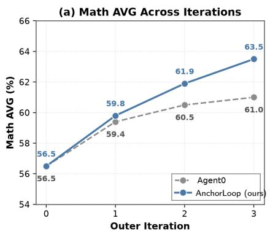

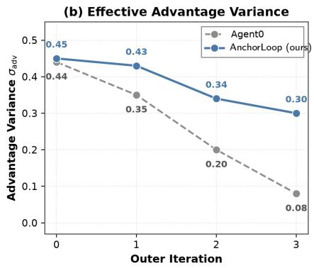

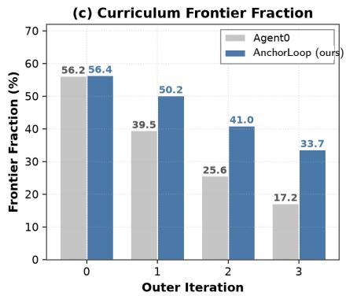  
Figure 4: Iteration dynamics on MiMo-7B-Base. (a) Math AVG across the three outer iterations. (b) Th<sub>e w</sub>ithi<sub>n-group var</sub>i<sub>ance o</sub>f <sub>e</sub>f<sub>ec</sub>ti<sub>ve a</sub>d<sub>van</sub>t<sub>ages,</sub> $V _ { \mathrm { a d v } } ,$ <sub>,</sub> avera<sub>g</sub>ed over sam<sub>p</sub>led <sub>g</sub>rou<sub>p</sub>s in the Executor sta<sub>g</sub>e. (c) The re<sub>p</sub>orted Curriculum frontier fraction, defined as the fraction of <sub>g</sub>enerated tasks with a <sub>p</sub>ositive sam<sub>p</sub>led a<sub>g</sub>reement <sub>g</sub>a<sub>p</sub> under A<sub>pp</sub>endix B.3. An unresolved <sub>p</sub>air contributes zero.

Curriculum frontier fraction. Figure 4(c) follows the construction in Figure 2(c). Its two groups are <sub>samp</sub>l<sub>e</sub>d i<sub>n</sub>d<sub>epen</sub>d<sub>en</sub>tl<sub>y</sub> f<sub>rom</sub> th<sub>e same c</sub>h<sub>ec</sub>k<sub>po</sub>i<sub>n</sub>t<sub>, an</sub>d <sub>an unreso</sub>l<sub>ve</sub>d <sub>pa</sub>i<sub>r con</sub>t<sub>r</sub>ib<sub>u</sub>t<sub>es zero.</sub> At it<sub>era</sub> tion 0, t<sup>h</sup>e reported <sup>f</sup>raction is 56.2% <sup>f</sup>or Agent0 and 56.4% <sup>f</sup>or Anc<sup>h</sup>orLoop. By iteration 3, it decreases to 17.2% <sup>f</sup>or Agent0 and to 33.7% <sup>f</sup>or Anc<sup>h</sup>orLoop. T<sup>h</sup>ese va<sup>l</sup>ues record <sup>h</sup>ow o<sup>f</sup>ten independent<sup>l</sup>y sampled groups produce a positive majority agreement gap. They do not measure correctness, identify <sub>new</sub>l<sub>y</sub> <sub>so</sub>l<sub>ve</sub>d t<sub>as</sub>k<sub>s,</sub> <sub>or</sub> <sub>es</sub>t<sub>a</sub>bli<sub>s</sub>h th<sub>a</sub>t th<sub>e</sub> f<sub>ron</sub>ti<sub>er</sub> <sub>rewar</sub>d <sub>cause</sub>d th<sub>e</sub> l<sub>a</sub>t<sub>er</sub> <sub>per</sub>f<sub>ormance</sub> dif<sub>erence.</sub> At it<sub>era</sub>ti<sub>on</sub> 3 <sub>on</sub> b<sub>o</sub>th b<sub>ac</sub>kb<sub>ones,</sub> A<sub>nc</sub>h<sub>or</sub>L<sub>oop repor</sub>t<sub>s</sub> hi<sub>g</sub>h<sub>er ma</sub>th AVG<sub>,</sub> hi<sub>g</sub>h<sub>er e</sub>f<sub>ec</sub>ti<sub>ve a</sub>d<sub>van</sub>t<sub>age</sub> <sub>var</sub>i<sub>ance,</sub> <sub>an</sub>d <sub>a</sub> l<sub>arger</sub> <sub>pos</sub>iti<sub>ve</sub> <sub>agreemen</sub>t <sub>gap</sub> f<sub>rac</sub>ti<sub>on.</sub> Th<sub>ese</sub> <sub>concurren</sub>t dif<sub>erences</sub> d<sub>o</sub> <sub>no</sub>t <sub>es</sub>t<sub>a</sub>bli<sub>s</sub>h <sub>a</sub> <sub>causa</sub>l <sub>re</sub>l<sub>a</sub>ti<sub>on among</sub> th<sub>e s</sub>t<sub>a</sub>ti<sub>s</sub>ti<sub>cs.</sub>

## E.3. Hyperparameter Sensitivity on MiMo-7B-Base

We sweep $\alpha \in \{ 0 . 2 , 0 . 4 , 0 . 6 , 0 . 8 \}$ <sub>an</sub>d $\lambda \in \{ 0 . 2 , 0 . 4 , 0 . 6 , 0 . 8 \}$ on MiMo-7B-Base<sub>,</sub> the same <sub>g</sub>rid used for Qwen3-4B-Base in Fi<sub>g</sub>ure 3(b). Fi<sub>g</sub>ure 5 re<sub>p</sub>orts math AVG at each <sub>g</sub>rid cell. The default settin<sub>g</sub> $( \alpha , \lambda ) = ( 0 . 6 , 0 . 4 )$ <sub>a</sub>tt<sub>a</sub>i<sub>ns</sub> th<sub>e</sub> hi<sub>g</sub>h<sub>es</sub>t <sub>repor</sub>t<sub>e</sub>d M<sub>a</sub>th AVG <sub>on</sub> b<sub>o</sub>th <sub>eva</sub>l<sub>ua</sub>t<sub>e</sub>d <sub>gr</sub>id<sub>s.</sub> O<sub>n</sub> MiM<sub>o-</sub>7B<sub>-</sub>B<sub>ase,</sub> Mat<sup>h</sup> AVG ranges <sup>f</sup>rom 60.47 to 63.50, indicating greater sensitivity t<sup>h</sup>an on Qwen3-4B-Base. T<sup>h</sup>e d<sub>e</sub>f<sub>au</sub>lt <sub>se</sub>tti<sub>ng rema</sub>i<sub>ns</sub> th<sub>e</sub> hi<sub>g</sub>h<sub>es</sub>t<sub>-per</sub>f<sub>orm</sub>i<sub>ng po</sub>i<sub>n</sub>t <sub>on</sub> b<sub>o</sub>th <sub>eva</sub>l<sub>ua</sub>t<sub>e</sub>d <sub>gr</sub>id<sub>s.</sub> Th<sub>ese resu</sub>lt<sub>s</sub> d<sub>o no</sub>t <sub>es</sub>t<sub>a</sub>bli<sub>s</sub>h <sub>ro</sub>b<sub>us</sub>t<sub>ness ou</sub>t<sub>s</sub>id<sub>e</sub> th<sub>e</sub> t<sub>es</sub>t<sub>e</sub>d <sub>ranges or prove</sub> th<sub>a</sub>t th<sub>e we</sub>i<sub>g</sub>ht<sub>s</sub> t<sub>rans</sub>f<sub>er across</sub> b<sub>ac</sub>kb<sub>ones</sub> <sub>w</sub>ith<sub>ou</sub>t <sub>se</sub>l<sub>ec</sub>ti<sub>on.</sub>

## F. Case Studies and Qualitative Examples

Thi<sub>s appen</sub>di<sub>x prov</sub>id<sub>es case-</sub>l<sub>eve</sub>l <sub>con</sub>t<sub>ex</sub>t f<sub>or</sub> th<sub>e quan</sub>tit<sub>a</sub>ti<sub>ve ana</sub>l<sub>yses</sub> i<sub>n</sub> S<sub>ec</sub>ti<sub>ons</sub> 4<sub>.</sub>3 <sub>an</sub>d 4<sub>.</sub>5<sub>.</sub> S<sub>ec-</sub> ti<sub>on</sub> F<sub>.</sub>1 <sub>compares</sub> t<sub>we</sub>l<sub>ve</sub> C<sub>urr</sub>i<sub>cu</sub>l<sub>um</sub> t<sub>as</sub>k<sub>s across</sub> th<sub>ree ou</sub>t<sub>er</sub> it<sub>era</sub>ti<sub>ons an</sub>d <sub>severa</sub>l <sub>ma</sub>th<sub>ema</sub>ti<sub>ca</sub>l topics. Section F.2 groups eig<sup>h</sup>t topic sequences, eac<sup>h</sup> containing one tas<sup>k f</sup>rom iterations 0 t<sup>h</sup>roug<sup>h</sup> 3. Th<sub>e</sub> <sub>group</sub>i<sub>ng</sub> <sub>organ</sub>i<sub>zes</sub> <sub>re</sub>l<sub>a</sub>t<sub>e</sub>d <sub>promp</sub>t<sub>s</sub> f<sub>or</sub> <sub>compar</sub>i<sub>son</sub> <sub>an</sub>d d<sub>oes</sub> <sub>no</sub>t <sub>es</sub>t<sub>a</sub>bli<sub>s</sub>h th<sub>a</sub>t <sub>a</sub> l<sub>a</sub>t<sub>er</sub> t<sub>as</sub>k <sub>was</sub> <sub>pro</sub>d<sub>uce</sub>d b<sub>y e</sub>diti<sub>ng</sub> th<sub>e ear</sub>li<sub>er</sub> t<sub>as</sub>k<sub>s.</sub> S<sub>ec</sub>ti<sub>on</sub> F<sub>.</sub>3 <sub>repor</sub>t<sub>s</sub> f<sub>our</sub> f<sub>u</sub>ll <sub>reason</sub>i<sub>ng</sub> t<sub>races, w</sub>ith th<sub>ree</sub> AIME 2024 pro<sup>bl</sup>ems and one Curricu<sup>l</sup>um tas<sup>k f</sup>rom iteration 3. It p<sup>l</sup>aces se<sup>l</sup>ected anc<sup>h</sup>or and post-update Executor traces side by side. All cases are drawn from runs on Qwen3-4B-Base.

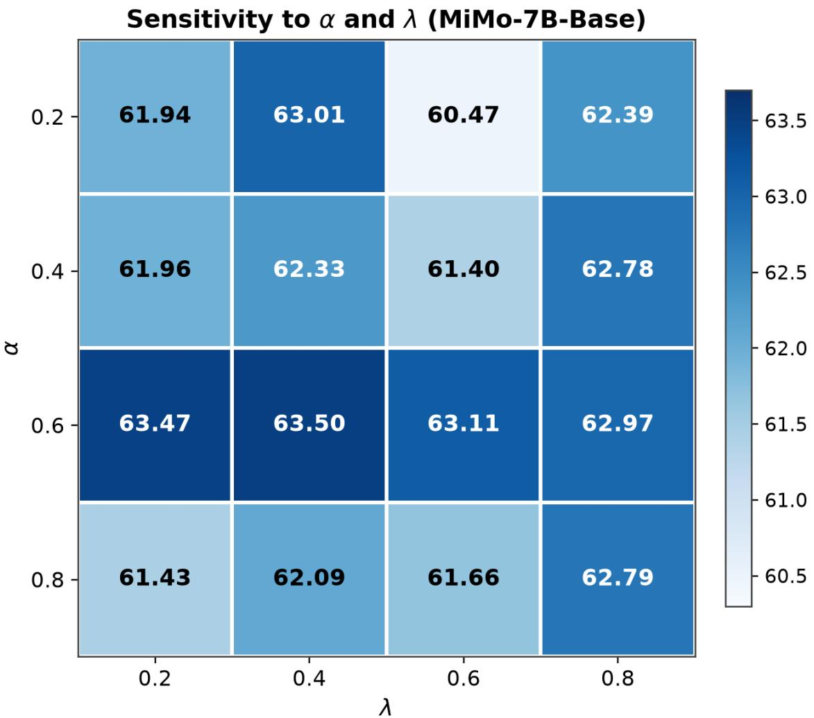  
Figure 5: Hyperparameter sensitivity on MiMo-7B-Base, the appendix counterpart of Figure 3(b). Math AVG on a $4 \times 4$ grid over t<sup>h</sup>e <sup>h</sup>istorica<sup>l</sup>-advantage weig<sup>h</sup>t α and t<sup>h</sup>e <sup>f</sup>rontier reward weig<sup>h</sup>t λ. Th<sub>e pea</sub>k <sub>a</sub>t <sub>our</sub> d<sub>e</sub>f<sub>au</sub>lt $( \alpha , \lambda ) = ( 0 . 6 , 0 . 4 )$ reac<sup>h</sup>es 63.50, matc<sup>h</sup>ing Ta<sup>bl</sup>e 1.

## F.1. Extended Post-update Executor Comparisons

W<sub>e repor</sub>t t<sub>we</sub>l<sub>ve se</sub>l<sub>ec</sub>t<sub>e</sub>d C<sub>urr</sub>i<sub>cu</sub>l<sub>um</sub> t<sub>as</sub>k<sub>s, w</sub>ith f<sub>our examp</sub>l<sub>es</sub> f<sub>rom eac</sub>h <sub>ou</sub>t<sub>er</sub> it<sub>era</sub>ti<sub>on</sub> $t \in \{ 1 , 2 , 3 \}$ F<sub>or eac</sub>h t<sub>as</sub>k<sub>, we s</sub>h<sub>ow a</sub> di<sub>sp</sub>l<sub>aye</sub>d <sub>anc</sub>h<sub>or ou</sub>t<sub>pu</sub>t i<sub>n gray an</sub>d <sub>a</sub> di<sub>sp</sub>l<sub>aye</sub>d <sub>pos</sub>t<sub>-up</sub>d<sub>a</sub>t<sub>e</sub> E<sub>xecu</sub>t<sub>or</sub> <sub>ou</sub>t<sub>pu</sub>t i<sub>n</sub> bl<sub>ue.</sub> Th<sub>e v</sub>i<sub>sua</sub>l <sub>co</sub>d<sub>e ma</sub>t<sub>c</sub>h<sub>es</sub> th<sub>e gray an</sub>d bl<sub>ue ro</sub>b<sub>o</sub>t<sub>s use</sub>d i<sub>n</sub> Fi<sub>gure</sub> 1<sub>.</sub> Th<sub>ese</sub> i<sub>n</sub>di<sub>v</sub>id<sub>ua</sub>l <sub>ou</sub>t<sub>pu</sub>t<sub>s</sub> ill<sub>us</sub>t<sub>ra</sub>t<sub>e</sub> <sub>case-</sub>l<sub>eve</sub>l dif<sub>erences.</sub> Th<sub>ey</sub> d<sub>o</sub> <sub>no</sub>t b<sub>y</sub> th<sub>emse</sub>l<sub>ves</sub> <sub>ver</sub>if<sub>y</sub> th<sub>e</sub> <sub>group-</sub>l<sub>eve</sub>l <sub>con</sub>diti<sub>on</sub> $\mu ^ { \mathrm { c u r } } ( x ) > \mu ^ { \mathrm { a n c } } ( x )$ <sub>, es</sub>ti<sub>ma</sub>t<sub>e</sub> h<sub>ow o</sub>ft<sub>en</sub> th<sub>e</sub> dif<sub>erences occur, or es</sub>t<sub>a</sub>bli<sub>s</sub>h th<sub>a</sub>t $R _ { \mathrm { r e f } }$ <sub>cause</sub>d th<sub>em.</sub>

Iteration 1 (anchor = base Executor, current = iteration-1 Executor). The selected iteration-1 <sub>cases</sub> di<sub>sp</sub>l<sub>ay gaps suc</sub>h <sub>as a m</sub>i<sub>ss</sub>i<sub>ng</sub> i<sub>nc</sub>l<sub>us</sub>i<sub>on-exc</sub>l<sub>us</sub>i<sub>on correc</sub>ti<sub>on or</sub> l<sub>ea</sub>di<sub>ng-</sub>di<sub>g</sub>it <sub>cons</sub>t<sub>ra</sub>i<sub>n</sub>t<sub>.</sub> Th<sub>e</sub> <sub>pa</sub>i<sub>re</sub>d <sub>up</sub>d<sub>a</sub>t<sub>e</sub>d E<sub>xecu</sub>t<sub>or</sub> <sub>ou</sub>t<sub>pu</sub>t<sub>s</sub> i<sub>nc</sub>l<sub>u</sub>d<sub>e</sub> th<sub>e</sub> <sub>correspon</sub>di<sub>ng</sub> <sub>s</sub>t<sub>ruc</sub>t<sub>ura</sub>l <sub>s</sub>t<sub>eps.</sub>

## Selected Example 1 (Iter 1) – Inclusion-Exclusion

Task. Find the sum of all integers from 1 to 60 that are divisible by 4 or by 6.

Anchor $\pi ^ { ( 0 ) }$ . Mu<sup>l</sup>tip<sup>l</sup>es o<sup>f</sup> 4 up to 60: $4 + 8 + \cdot \cdot \cdot + 6 0 = 4 \cdot { \frac { 1 5 \cdot 1 6 } { 2 } } = 4 8 0 $ Mu<sup>l</sup>tip<sup>l</sup>es o<sup>f</sup> 6 up to 60: $6 + 1 2 + \cdot \cdot \cdot + 6 0 = 6 \cdot { \frac { 1 0 \cdot 1 1 } { 2 } } = 3 3 0 . \ 5 \mathrm { u m } = 4 8 0 + 3 3 0 = { \Big [ } 8 1 0 { \Big ] }$ . Wrong: forgot to subtract multiples of $\operatorname { l c m } ( 4 , 6 ) = 1 2 \quad$

Current $\pi ^ { ( 1 ) }$ . Mu<sup>l</sup>tip<sup>l</sup>es o<sup>f</sup> 4: 480. Mu<sup>l</sup>tip<sup>l</sup>es o<sup>f</sup> 6: 330. Mu<sup>l</sup>tip<sup>l</sup>es o<sup>f</sup> lcm $( 4 , 6 ) = 1 2 \colon 1 2 + 2 4 + \cdot \cdot \cdot + 6 0 =$ $1 2 \cdot { \frac { 5 \cdot 6 } { 2 } } = 1 8 0$ <sub>.</sub> I<sub>nc</sub>l<sub>us</sub>i<sub>on-exc</sub>l<sub>us</sub>i<sub>on:</sub> $4 8 0 + 3 3 0 - 1 8 0 = \textcircled { 6 3 0 } .$ Correct.

Selected Example 2 (Iter 1) – Arithmetic Sequence Of-by-One

Task. An arithmetic progression has first term $a _ { 1 } = 7$ <sub>an</sub>d <sub>common</sub> dif<sub>erence</sub> $d = 3 .$ Find t<sup>h</sup>e 50t<sup>h</sup> term $a _ { 5 0 }$

Anchor <sub>π</sub><sup>(0)</sup>. $a _ { n } = a _ { 1 } + n \cdot d = 7 + 5 0 \cdot 3 = { \sqrt { 1 5 7 } }$ . Wrong: used $n \cdot d$ i<sub>ns</sub>t<sub>ea</sub>d <sub>o</sub>f $( n - 1 ) \cdot d .$

Current $\pi ^ { ( 1 ) } . a _ { n } = a _ { 1 } + ( n - 1 ) \cdot d . S \circ a _ { 5 0 } = 7 + 4 9 \cdot 3 = 7 + 1 4 7 = { \left[ 1 5 4 \right] } .$ Correct.

Selected Example 3 (Iter 1) – Restricted Digit Count

Task. How many 5-digit positive integers have all distinct digits? (Leading digit cannot be 0.)

Anchor $\pi ^ { ( 0 ) }$ . Choose 5 distinct digits and order them: $1 0 \cdot 9 \cdot 8 \cdot 7 \cdot 6 = \sqrt { 3 0 , 2 4 0 }$ . Wrong: counts numbers starting wit<sup>h</sup> 0, w<sup>h</sup>ic<sup>h</sup> are not $5 \mathrm { - } \mathrm { d i g i t }$

Current $\pi ^ { ( 1 ) }$ . First digit $\in \{ 1 , \ldots , 9 \}$ : 9 c<sup>h</sup>oices. Remaining <sup>f</sup>our positions ta<sup>k</sup>e any o<sup>f</sup> t<sup>h</sup>e remaining nine di<sub>g</sub>it<sub>s</sub> <sub>w</sub>ith<sub>ou</sub>t <sub>repea</sub>t<sub>s:</sub> $9 \cdot 9 \cdot 8 \cdot 7 \cdot 6 = \sqrt { 2 7 , 2 1 6 } $ . Correct.

## Selected Example 4 (Iter 1) – Modular Pattern

Task. How many integers n with $1 \leq n \leq 2 0$ <sub>sa</sub>ti<sub>s</sub>f<sub>y</sub> $n ^ { 2 } \equiv 1$ (mod 8)?

Anchor $\pi ^ { ( 0 ) }$ . Try the first few squares: $1 ^ { 2 } = 1 , 3 ^ { 2 } = 9 \equiv 1 , 9 ^ { 2 } = 8 1 \equiv 1$ . Onl<sub>y</sub> $n \in \{ 1 , 3 , 9 \}$ <sub>ma</sub>tt<sub>er,</sub> <sub>so</sub> th<sub>e</sub> answer is 3 . Wrong: lists ad hoc solutions instead of identifying the structural rule.

Current $\pi ^ { ( 1 ) }$ . Every odd n satisfies $n ^ { 2 } \equiv 1$ (mod 8), since $( 2 k + 1 ) ^ { 2 } = 4 k ( k + 1 ) + 1$ <sub>an</sub>d $k ( k + 1 )$ i<sub>s</sub> <sub>even.</sub> Even n have $n ^ { 2 } \equiv 0$ or 4 (mod 8). So count odd integers in $[ 1 , 2 0 ] \colon \{ 1 , 3 , 5 , \ldots , 1 9 \}$ <sub>,</sub> <sub>w</sub>hi<sub>c</sub>h $\mathsf { g i v e s } \left[ 1 0 \right] .$ Correct.

Iteration 2 (anchor = iteration-1 Executor, current = iteration-2 Executor). The selected iteration-2 cases disp<sup>l</sup>ay errors invo<sup>l</sup>ving cyc<sup>l</sup>ic constraints, auxi<sup>l</sup>iary identities, and comp<sup>l</sup>ementary counting. Th<sub>e pa</sub>i<sub>re</sub>d <sub>up</sub>d<sub>a</sub>t<sub>e</sub>d E<sub>xecu</sub>t<sub>or ou</sub>t<sub>pu</sub>t<sub>s use</sub> th<sub>e correspon</sub>di<sub>ng a</sub>dditi<sub>ona</sub>l <sub>s</sub>t<sub>eps.</sub>

Selected Example 5 (Iter 2) – Cyclic Bead Coloring

Task. How many ways are there to color the 5 beads of a necklace arranged in a cycle, using 3 colors, so that no two adjacent beads have the same color? (Beads are distinguishable by position; rotations are not identified.)

Anchor $\pi ^ { ( 1 ) }$ . First <sup>b</sup>ead: 3 c<sup>h</sup>oices. Eac<sup>h</sup> o<sup>f</sup> t<sup>h</sup>e next <sup>f</sup>our: 2 c<sup>h</sup>oices (di<sup>f</sup>erent <sup>f</sup>rom t<sup>h</sup>e previous). Tota<sup>l</sup>: $3 \cdot 2 ^ { 4 } = \boxed { 4 8 }$ . Wrong: treats the necklace as a line and ignores the constraint between bead 5 and bead 1.

Current $\pi ^ { ( 2 ) }$ . Chromatic polynomial of cycle $C _ { n }$ with k colors is $P ( C _ { n } , k ) = ( k - 1 ) ^ { n } + ( - 1 ) ^ { n } ( k - 1 )$ . For $n = 5 , k = 3 ; 2 ^ { 5 } + ( - 1 ) ^ { 5 } \cdot 2 = 3 2 - 2 = { \left| 3 0 \right| }$ . Correct.

Selected Example 6 (Iter 2) – Telescoping Sum

Task. Compute $\sum _ { n = 1 } ^ { 2 0 } { \frac { 1 } { n ( n + 1 ) } }$ <sub>exac</sub>tl<sub>y as a re</sub>d<sub>uce</sub>d f<sub>rac</sub>ti<sub>on.</sub>

Anchor $\pi ^ { ( 1 ) }$ . Add the first few decimals: $0 . 5 + 0 . 1 6 6 7 + 0 . 0 8 3 3 + \cdot \cdot \cdot \approx 0 . 9 5$ <sub>.</sub> Fi<sub>na</sub>l <sub>answer:</sub> $\boxed { 0 . 9 5 }$ . Wrong: <sub>re</sub>t<sub>urns</sub> <sub>a</sub> d<sub>ec</sub>i<sub>ma</sub>l <sub>approx</sub>i<sub>ma</sub>ti<sub>on</sub> <sub>an</sub>d <sub>never</sub> <sub>uses</sub> th<sub>e</sub> t<sub>e</sub>l<sub>escop</sub>i<sub>ng</sub> id<sub>en</sub>tit<sub>y.</sub>

Current $\pi ^ { ( 2 ) }$ . Partial fractions: $\begin{array} { r } { \frac { 1 } { n ( n + 1 ) } = \frac { 1 } { n } - \frac { 1 } { n + 1 } } \end{array}$ <sub>.</sub> Th<sub>e su</sub>m t<sub>e</sub>l<sub>es</sub>c<sub>opes:</sub> $\begin{array} { r } { \sum _ { n = 1 } ^ { 2 0 } \left( \frac { 1 } { n } - \frac { 1 } { n + 1 } \right) = 1 - \frac { 1 } { 2 1 } = \biggr [ \frac { 2 0 } { 2 1 } \biggr ] . } \end{array}$ Correct.

## Selected Example 7 (Iter 2) – Constrained Permutation

Task. How many distinct arrangements of the letters in committee have the two Ms separated by at l<sub>eas</sub>t <sub>one o</sub>th<sub>er</sub> l<sub>e</sub>tt<sub>er</sub>?

Anchor $\pi ^ { ( 1 ) }$ . T<sup>h</sup>e word <sup>h</sup>as 9 <sup>l</sup>etters wit<sup>h</sup> repeats {M : 2, T : 2, E : 2}. Tota<sup>l</sup> arrangements: $9 ! / ( 2 ! 2 ! 2 ! ) =$ $3 6 2 8 8 0 / 8 = \boxed { 4 5 , 3 6 0 }$ . Wrong: ignores the “Ms separated” constraint entirely.

Current $\pi ^ { ( 2 ) }$ . Use comp<sup>l</sup>ement. Tota<sup>l</sup> = 45360. Arrangements wit<sup>h</sup> t<sup>h</sup>e two Ms adjacent: treat MM   
as one <sup>bl</sup>oc<sup>k</sup>, <sup>l</sup>eaving 8 items wit<sup>h</sup> repeats $\{ T : 2 , E : { 2 } \} : { 8 ! } / ( 2 ! 2 ! ) = 4 0 3 2 0 / 4 = 1 0 0 8 0$ Answer:   
45360 − 10080 = 35,280 . Correct.

Selected Example 8 (Iter 2) – Modular Exponentiation

Task. Compute 7<sup>100</sup> mod 13.

Anchor $\pi ^ { ( 1 ) }$ . Multiply step by step without Fermat. $7 ^ { 2 } \equiv 1 0 , 7 ^ { 3 } \equiv 7 \cdot 1 0 = 7 0 \equiv 5 , 7 ^ { 4 } \equiv 3 5 \equiv 9 ,$ $7 ^ { 5 } \equiv 6 3 \equiv 1 1$ , and so on <sup>f</sup>or 100 steps. T<sup>h</sup>e running remainder dri<sup>f</sup>ts o<sup>f</sup> course around step 40; t<sup>h</sup>e <sub>anc</sub>h<sub>or</sub>’<sub>s</sub> fi<sub>na</sub>l <sub>va</sub>l<sub>ue</sub> i<sub>s</sub> $\boxed { 4 } .$ Wrong: a brute hand iteration without the period-12 structure accumulates an <sub>ar</sub>ith<sub>me</sub>ti<sub>c</sub> <sub>s</sub>li<sub>p</sub> <sub>a</sub>ft<sub>er</sub> d<sub>ozens</sub> <sub>o</sub>f <sub>mu</sub>lti<sub>p</sub>li<sub>ca</sub>ti<sub>ons.</sub>

Current $\pi ^ { ( 2 ) }$ B<sub>y</sub> F<sub>erma</sub>t’<sub>s</sub> littl<sub>e</sub> th<sub>eorem,</sub> $7 ^ { 1 2 } \equiv 1$ (mod 13). Write 100 = 8 · 12 + 4, so $7 ^ { 1 0 0 } \equiv 7 ^ { 4 }$   
(mod 13). 7<sup>2</sup> = 49 ≡ 10, 7<sup>4</sup> ≡ 100 ≡ 9 (mod 13). Answer 9 . Correct.

Iteration 3 (anchor = iteration-2 Executor, current = iteration-3 Executor). The selected iteration-3 cases emp<sup>h</sup>asize veri<sup>fi</sup>cation and <sup>b</sup>roader searc<sup>h</sup>. T<sup>h</sup>eir updated Executor outputs use t<sup>h</sup>e sand<sup>b</sup>ox t<sub>o c</sub>h<sub>ec</sub>k i<sub>n</sub>t<sub>erme</sub>di<sub>a</sub>t<sub>e c</sub>l<sub>a</sub>i<sub>ms or com</sub>bi<sub>ne a sym</sub>b<sub>o</sub>li<sub>c rou</sub>t<sub>e w</sub>ith <sub>a numer</sub>i<sub>ca</sub>l <sub>c</sub>h<sub>ec</sub>k<sub>.</sub> Thi<sub>s o</sub>b<sub>serva</sub>ti<sub>on</sub> <sub>app</sub>li<sub>es on</sub>l<sub>y</sub> t<sub>o</sub> th<sub>e</sub> di<sub>sp</sub>l<sub>aye</sub>d <sub>cases.</sub>

Selected Example 9 (Iter 3) – Sum of Trailing-Zero Counts

Task. Let z(n) denote the number of trailing zeros of n! in base 10. Compute $\textstyle \sum _ { n = 1 } ^ { 1 0 0 } z ( n )$

Anchor <sub>π</sub><sup>(2)</sup>. Approximate z(n) ≈ n/4 over the range, so the sum is about $\textstyle { \frac { 1 0 0 \cdot 1 0 1 } { 2 } } / 4 \approx 1 2 6 3$ . Fina<sup>l</sup> 1263 .   
Wrong: estimates the average rate of zeros and never sums Legendre’s exact formula.

Current $\pi ^ { ( 3 ) }$ . Legendre: $z ( n ) = \lfloor n / 5 \rfloor + \lfloor n / 2 5 \rfloor + \lfloor n / 1 2 5 \rfloor$ <sub>.</sub> V<sub>er</sub>if<sub>y</sub> <sub>w</sub>ith P<sub>y</sub>th<sub>on:</sub>

def z(n):   
t=0; p=5   
while p<=n: t+=n//p; p\*=5   
return t   
print(sum(z(n) for n in range(1,101))) # 1124

Answer 1124 . Correct.

Selected Example 10 (Iter 3) – Palindromic Quartic

Task. Compute the sum of all real roots of $x ^ { 4 } - 7 x ^ { 3 } + 1 4 x ^ { 2 } - 7 x + 1 = 0 .$

Anchor $\pi ^ { ( 2 ) }$ Try rational roots ±1. $p ( 1 ) = 1 - 7 + 1 4 - 7 + 1 = 2 , p ( - 1 ) = 1 + 7 + 1 4 + 7 + 1 = 3 0 .$   
No rational roots, so default to Vieta on the full polynomial: sum of all roots is 7 . Partially correct, but   
unjustified. The answer happens to be right because the polynomial has four real roots, but the anchor   
<sub>never ver</sub>ifi<sub>es rea</sub>lit<sub>y.</sub>

Current $\pi ^ { ( 3 ) }$ Th<sub>e po</sub>l<sub>ynom</sub>i<sub>a</sub>l i<sub>s pa</sub>li<sub>n</sub>d<sub>rom</sub>i<sub>c.</sub> Di<sub>v</sub>id<sub>e</sub> b<sub>y</sub> $x ^ { 2 }$ <sub>an</sub>d <sub>su</sub>b<sub>s</sub>tit<sub>u</sub>t<sub>e</sub> $\begin{array} { r c l } { y } & { = } & { x + 1 / x \mathrm { : } } \end{array}$   
$y ^ { 2 } - 7 y + 1 2 = 0 \ / ;$ , g<sup>i</sup>v<sup>i</sup>ng $y \ \in \ \{ 3 , 4 \} . x + 1 / x \ = \ 3 \ \Rightarrow \ x ^ { 2 } - 3 x + 1 \ = \ 0 ,$ , roo<sup>t</sup>s $( 3 \pm { \sqrt { 5 } } ) / 2 ,$ b<sub>o</sub>th   
<sub>rea</sub>l<sub>.</sub> $x + 1 / x = 4 \Rightarrow x ^ { 2 } - 4 x + 1 = 0 ;$ roots $2 \pm { \sqrt { 3 } } ,$ <sub>,</sub> b<sub>o</sub>th <sub>rea</sub>l<sub>.</sub> S<sub>um:</sub> $3 + 4 = \boxed { 7 } .$ <sub>.</sub> V<sub>er</sub>if<sub>y</sub> <sub>w</sub>ith P<sub>y</sub>th<sub>on:</sub>

```python
import numpy as np
print(sum(np.roots([1,-7,14,-7,1]).real)) # 7.0
```

Correct, with reality justified.

Selected Example 11 (Iter 3) – Prime-Restricted Compositions

Task. How many ordered 5-tuples $\left( p _ { 1 } , p _ { 2 } , p _ { 3 } , p _ { 4 } , p _ { 5 } \right)$ <sub>w</sub>ith <sub>eac</sub>h $p _ { i } \in \{ 2 , 3 , 5 , 7 , 1 1 \}$ <sub>sa</sub>ti<sub>s</sub>f<sub>y</sub> $p _ { 1 } + p _ { 2 } + p _ { 3 } +$   
$p _ { 4 } + p _ { 5 } = 3 0 ?$

Anchor $\pi ^ { ( 2 ) }$ . Try the symmetric tuple $( 6 , 6 , 6 , 6 , 6 )$ – <sup>b</sup>ut 6 is not prime. Try (7, 7, 5, 5, 6), a<sup>l</sup>so <sup>b</sup>ad.   
Enumerate <sup>b</sup>y <sup>h</sup>and a <sup>f</sup>ew candidates suc<sup>h</sup> as (11, 7, 5, 5, 2) (30 ✓) and (7, 7, 7, 7, 2) (30 $\checkmark ;$ <sub>eac</sub>h h<sub>as</sub>   
multiple orderings. Estimate 120 . Wrong: undercounts because the manual enumeration misses several   
<sub>mu</sub>lti<sub>se</sub>t<sub>s.</sub>

Current $\pi ^ { ( 3 ) }$ . This is the coeficient of $x ^ { 3 0 }$ i<sub>n</sub> $( x ^ { 2 } + x ^ { 3 } + x ^ { 5 } + x ^ { 7 } + x ^ { 1 1 } ) ^ { 5 }$ . Com<sub>p</sub>ute via P<sub>y</sub>thon:

```python
from itertools import product
P=[2,3,5,7,11]
print(sum(1 for t in product(P,repeat=5) if sum(t)==30)) # 155
```

Answer 155 . Correct.

Selected Example 12 (Iter 3) – Sum-of-Two-Squares Diophantine

Task. Find all positive integer pairs (x, y) with $x \leq y$ <sub>sa</sub>ti<sub>s</sub>f<sub>y</sub>i<sub>ng</sub> $x ^ { 2 } + y ^ { 2 } = 2 0 2 5 .$

Anchor π<sup>(2)</sup>. 2025 = 45<sup>2</sup>. So (0, 45) is one pair, <sup>b</sup>ut x must <sup>b</sup>e positive. Try x = 9: y<sup>2</sup> = 2025 − 81 = 1944,   
not a square. Try x = 15: y<sup>2</sup> = 1800, not a square. Conclude there are no solutions . Wrong: stops after   
t<sub>wo</sub> t<sub>r</sub>i<sub>a</sub>l<sub>s.</sub>   
Current $\pi ^ { ( 3 ) }$ <sub>. Search x in [1, ⌊</sub>√<sub>2025/2⌋] = [1, 31] exhaustively with Python:</sub>   
N=2025   
sols=[(x,int((N-x\*x)\*\*0.5)) for x in range(1,32)   
if (N-x\*x) >= 0 and int((N-x\*x)\*\*0.5)\*\*2 == N-x\*x]   
sols=[(x,y) for x,y in sols if x<=y]   
print(sols) # [(27, 36)]   
Unique pair (27, 36) , since 27<sup>2</sup> + 36<sup>2</sup> = 729 + 1296 = 2025. Correct.

Observations in the twelve selected examples. The displayed pairs include missing identities, omitted constraints, and incomp<sup>l</sup>ete veri<sup>fi</sup>cation. Severa<sup>l</sup> iteration-3 updated Executor outputs use P<sub>y</sub>th<sub>on ver</sub>ifi<sub>ca</sub>ti<sub>on, w</sub>hil<sub>e</sub> th<sub>e correspon</sub>di<sub>ng</sub> di<sub>sp</sub>l<sub>aye</sub>d <sub>anc</sub>h<sub>or ou</sub>t<sub>pu</sub>t<sub>s re</sub>l<sub>y on approx</sub>i<sub>ma</sub>ti<sub>ons or</sub> li<sub>m</sub>it<sub>e</sub>d <sub>manua</sub>l t<sub>r</sub>i<sub>a</sub>l<sub>s.</sub> Th<sub>e examp</sub>l<sub>es were se</sub>l<sub>ec</sub>t<sub>e</sub>d f<sub>or</sub> ill<sub>us</sub>t<sub>ra</sub>ti<sub>on.</sub> Th<sub>e</sub>i<sub>r compos</sub>iti<sub>on</sub> d<sub>oes no</sub>t <sub>es</sub>ti<sub>ma</sub>t<sub>e</sub> th<sub>e preva</sub>l<sub>ence o</sub>f th<sub>ese</sub> b<sub>e</sub>h<sub>av</sub>i<sub>ors, es</sub>t<sub>a</sub>bli<sub>s</sub>h th<sub>a</sub>t $R _ { \mathrm { r e f } }$ <sub>cause</sub>d th<sub>em, or s</sub>h<sub>ow</sub> th<sub>a</sub>t t<sub>oo</sub>l <sub>use</sub> fi<sub>rs</sub>t <sub>appears</sub> at iteration 3.

## F.2. Selected Curriculum Tasks Across Outer Iterations

W<sub>e group</sub> thi<sub>r</sub>t<sub>y-</sub>t<sub>wo se</sub>l<sub>ec</sub>t<sub>e</sub>d C<sub>urr</sub>i<sub>cu</sub>l<sub>um</sub> t<sub>as</sub>k<sub>s</sub> i<sub>n</sub>t<sub>o e</sub>i<sub>g</sub>ht t<sub>op</sub>i<sub>c sequences.</sub> E<sub>ac</sub>h <sub>sequence con</sub>t<sub>a</sub>i<sub>ns one</sub> tas<sup>k</sup> <sup>f</sup>rom iterations t = 0, 1, 2, 3 under a common mat<sup>h</sup>ematica<sup>l</sup> topic. T<sup>h</sup>is retrospective organization hi<sub>g</sub>hli<sub>g</sub>ht<sub>s</sub> dif<sub>erences among</sub> th<sub>e</sub> di<sub>sp</sub>l<sub>aye</sub>d <sub>promp</sub>t<sub>s.</sub> It d<sub>oes no</sub>t <sub>es</sub>t<sub>a</sub>bli<sub>s</sub>h <sub>a</sub> di<sub>rec</sub>t <sub>e</sub>diti<sub>ng</sub> li<sub>neage, a</sub> <sub>genera</sub>l i<sub>ncrease</sub> i<sub>n</sub> t<sub>as</sub>k difi<sub>cu</sub>lt<sub>y, or a causa</sub>l <sub>e</sub>f<sub>ec</sub>t <sub>o</sub>f th<sub>e</sub> C<sub>urr</sub>i<sub>cu</sub>l<sub>um rewar</sub>d<sub>.</sub>

Topic Sequence A – Inclusion-Exclusion

Iter 0: Compute t<sup>h</sup>e sum o<sup>f</sup> a<sup>ll</sup> mu<sup>l</sup>tip<sup>l</sup>es o<sup>f</sup> 3 <sup>b</sup>etween 1 and 100.

Iter 1: Compute the sum of all integers between 1 and 100 that are divisible by 3 or by 5.

Iter 2: Compute t<sup>h</sup>e sum o<sup>f</sup> a<sup>ll</sup> integers <sup>b</sup>etween 1 and 100 t<sup>h</sup>at are divisi<sup>bl</sup>e <sup>b</sup>y at <sup>l</sup>east one o<sup>f</sup> 3, 5, or 7.

Iter 3: Count t<sup>h</sup>e integers <sup>b</sup>etween 1 and 1000 t<sup>h</sup>at are coprime to 2 · 3 · 5 · 7 = 210, and report t<sup>h</sup>e resu<sup>l</sup>t.

Topic Sequence B – Combinatorics with Restrictions

Iter 0: How many ways are there to arrange the letters abcde in a row?

Iter 1: How many distinct arrangements does the word banana have?

Iter 2: How many distinct arrangements of the letters of mississippi have no two is adjacent?

Iter 3: Eight people sit at a round table. Two specific pairs, $( A , B )$ <sub>an</sub>d $( C , D )$ <sub>,</sub> <sub>re</sub>f<sub>use</sub> t<sub>o</sub> <sub>s</sub>it <sub>nex</sub>t t<sub>o</sub> <sub>eac</sub>h <sub>o</sub>th<sub>er.</sub> H<sub>ow</sub> <sub>many</sub> <sub>sea</sub>ti<sub>ngs</sub> <sub>are</sub> th<sub>ere</sub> if <sub>ro</sub>t<sub>a</sub>ti<sub>ons</sub> <sub>are</sub> <sub>equ</sub>i<sub>va</sub>l<sub>en</sub>t? V<sub>er</sub>if<sub>y</sub> <sub>w</sub>ith <sub>a</sub> <sub>s</sub>h<sub>or</sub>t P<sub>y</sub>th<sub>on</sub> <sub>enumera</sub>ti<sub>on.</sub>

Topic Sequence C – Sequences and Recurrences

Iter 0: The arithmetic progression $a _ { 1 } = 2 , d = 5$ h<sub>as</sub> <sub>w</sub>h<sub>a</sub>t <sub>va</sub>l<sub>ue</sub> <sub>a</sub>t $a _ { 1 0 } \smash { ? }$

Iter 1: Compute the sum of the first 50 terms of the arithmetic progression with $a _ { 1 } = 2 , d = 5 .$

Iter 2: Express $\scriptstyle \sum _ { n = 1 } ^ { N } { \frac { 1 } { n ( n + 1 ) } }$ i<sub>n</sub> <sub>c</sub>l<sub>ose</sub>d f<sub>orm</sub> <sub>an</sub>d <sub>eva</sub>l<sub>ua</sub>t<sub>e</sub> <sub>a</sub>t $N = 1 0 0 .$

Iter 3: The sequence $a _ { n } = 3 a _ { n - 1 } - 2 a _ { n - 2 }$ <sub>w</sub>ith $a _ { 0 } = 1 , a _ { 1 } = 4$ h<sub>as</sub> <sub>a</sub> <sub>c</sub>l<sub>ose</sub>d f<sub>orm.</sub> D<sub>er</sub>i<sub>ve</sub> it<sub>,</sub> <sub>eva</sub>l<sub>ua</sub>t<sub>e</sub> ${ a } _ { 3 0 } ,$ <sub>an</sub>d <sub>ver</sub>if<sub>y</sub> <sub>w</sub>ith P<sub>y</sub>th<sub>on.</sub>

Topic Sequence D – Probability and Expectation

Iter 0: A fair six-sided die is rolled. What is the probability of rolling a 6?

Iter 1: Two fair six-sided dice are rolled. What is the probability that the sum equals 7?

Iter 2: A fair coin is flipped five times. What is the probability of getting at least two heads?

Iter 3: Ten fair six-sided dice are rolled. Compute the expected number of distinct face values that appear, <sub>as</sub> <sub>a</sub> <sub>re</sub>d<sub>uce</sub>d f<sub>rac</sub>ti<sub>on,</sub> <sub>an</sub>d <sub>ver</sub>if<sub>y</sub> <sub>w</sub>ith <sub>a</sub> <sub>s</sub>h<sub>or</sub>t M<sub>on</sub>t<sub>e</sub> C<sub>ar</sub>l<sub>o</sub> <sub>run</sub> i<sub>n</sub> P<sub>y</sub>th<sub>on.</sub>

Topic Sequence E – Number Theory

Iter 0: Compute gcd $( 4 8 , 6 0 )$ .

Iter 1: Find the smallest positive integer $n > 1$ <sub>w</sub>ith $n ^ { 2 } \equiv 1$ (mod 13).

Iter 2: Find the number of positive divisors of $1 4 4 0 = 2 ^ { 5 } \cdot 3 ^ { 2 } \cdot 5 _ { \cdot }$ <sub>,</sub> <sub>an</sub>d th<sub>e</sub>i<sub>r</sub> <sub>sum.</sub>

Iter 3: Find the smallest positive integer n with $\varphi ( n ) = 4 8 { \mathrm { ; } }$ <sub>,</sub> <sub>w</sub>h<sub>ere</sub> <sub>φ</sub> i<sub>s</sub> E<sub>u</sub>l<sub>er</sub>’<sub>s</sub> t<sub>o</sub>ti<sub>en</sub>t f<sub>unc</sub>ti<sub>on.</sub> V<sub>er</sub>if<sub>y</sub> <sub>w</sub>ith P<sub>y</sub>th<sub>on</sub> <sub>over</sub> $n \leq 1 0 0$

Topic Sequence F – Algebra and Polynomials

Iter 0: Solve $2 x + 7 = 1 9$ for x.

Iter 1: Solve $x ^ { 2 } - 5 x + 6 = 0 { \mathrm { f o r } } x$

Iter 2: The roots of $x ^ { 2 } - 7 x + 1 0 = 0$ are r and s. Compute $r ^ { 2 } + s ^ { 2 }$ <sub>us</sub>i<sub>ng</sub> Vi<sub>e</sub>t<sub>a</sub>’<sub>s</sub> f<sub>ormu</sub>l<sub>as,</sub> <sub>w</sub>ith<sub>ou</sub>t <sub>so</sub>l<sub>v</sub>i<sub>ng</sub> f<sub>or</sub> th<sub>e</sub> <sub>roo</sub>t<sub>s</sub> <sub>exp</sub>li<sub>c</sub>itl<sub>y.</sub>

Iter 3: Find every real root of $x ^ { 4 } - 6 x ^ { 2 } + 8 = 0$ <sub>an</sub>d <sub>repor</sub>t th<sub>e</sub> <sub>sum</sub> <sub>o</sub>f th<sub>e</sub> <sub>rea</sub>l <sub>roo</sub>t<sub>s.</sub> Th<sub>en</sub> <sub>coun</sub>t <sub>comp</sub>l<sub>ex</sub> roots. Ver<sup>if</sup>y w<sup>i</sup>t<sup>h</sup> Pyt<sup>h</sup>on<sup>’</sup>s numpy.roots.

Topic Sequence G – Geometry

Iter 0: Compute the area of the triangle with vertices (0, 0), (4, 0), and (0, 3).

Iter 1: Compute the area of a regular hexagon with side length 5.

Iter 2: A circular sector has radius 12 and central angle $6 0 ^ { \circ }$ <sub>.</sub> C<sub>ompu</sub>t<sub>e</sub> th<sub>e</sub> <sub>arc</sub> l<sub>eng</sub>th <sub>an</sub>d th<sub>e</sub> <sub>area</sub> <sub>o</sub>f th<sub>e</sub> <sub>sec</sub>t<sub>o</sub>r<sub>,</sub> l<sub>ea</sub>vin<sub>g</sub> <sub>a</sub>n<sub>s</sub>w<sub>e</sub>r<sub>s</sub> in t<sub>e</sub>rm<sub>s</sub> <sub>o</sub>f <sub>π.</sub>

Iter 3: A frustum has base radii $R _ { 1 } = 6$ <sub>an</sub>d $R _ { 2 } = 3$ <sub>an</sub>d <sub>s</sub>l<sub>an</sub>t h<sub>e</sub>i<sub>g</sub>ht $\ell = 5 .$ <sub>.</sub> C<sub>ompu</sub>t<sub>e</sub> th<sub>e vo</sub>l<sub>ume</sub> i<sub>n c</sub>l<sub>ose</sub>d f<sub>orm.</sub> V<sub>er</sub>if<sub>y</sub> th<sub>e</sub> h<sub>e</sub>i<sub>g</sub>ht <sub>compu</sub>t<sub>a</sub>ti<sub>on</sub> <sub>w</sub>ith P<sub>y</sub>th<sub>on</sub> <sub>an</sub>d <sub>con</sub>fi<sub>rm</sub> th<sub>e</sub> <sub>answer.</sub>

Topic Sequence H – Calculus

Iter 0: Diferentiate $f ( x ) = x ^ { 3 } - 2 x + 1$ with respect to x.

Iter 1: Evaluate $\textstyle \int _ { 0 } ^ { 4 } ( 2 x + 3 ) d x .$

Iter 2: Find every critical point of $f ( x ) = x ^ { 3 } - 6 x ^ { 2 } + 9 x + 2$ on R and classify each as a local maximum, l<sub>oca</sub>l <sub>m</sub>i<sub>n</sub>i<sub>mum, or ne</sub>ith<sub>er.</sub>

Iter 3: Compute $\textstyle \int _ { 0 } ^ { 1 } e ^ { - x ^ { 2 } }$ dx to six decimal places using Simpson’s rule with $n = 1 0 0$ i<sub>n</sub>t<sub>erva</sub>l<sub>s,</sub> <sub>an</sub>d <sub>ver</sub>if<sub>y</sub> w<sup>i</sup>t<sup>h</sup> scipy.integrate.quad.

Observations across the eight topic sequences. The selected tasks show several recurring diferences. S<sub>ome</sub> l<sub>a</sub>t<sub>er-</sub>it<sub>era</sub>ti<sub>on promp</sub>t<sub>s com</sub>bi<sub>ne more opera</sub>ti<sub>ons or reques</sub>t <sub>numer</sub>i<sub>ca</sub>l <sub>ver</sub>ifi<sub>ca</sub>ti<sub>on.</sub> P<sub>y</sub>th<sub>on</sub> veri<sup>fi</sup>cation is inc<sup>l</sup>uded in t<sup>h</sup>e disp<sup>l</sup>ayed iteration-3 tas<sup>k</sup>s, <sup>b</sup>ut t<sup>h</sup>ese se<sup>l</sup>ected sequences do not s<sup>h</sup>ow <sub>w</sub>h<sub>en</sub> t<sub>oo</sub>l <sub>use</sub> fi<sub>rs</sub>t <sub>appears</sub> d<sub>ur</sub>i<sub>ng</sub> t<sub>ra</sub>i<sub>n</sub>i<sub>ng.</sub> Th<sub>ey</sub> <sub>a</sub>l<sub>so</sub> d<sub>o</sub> <sub>no</sub>t <sub>es</sub>t<sub>a</sub>bli<sub>s</sub>h <sub>a</sub> t<sub>as</sub>k<sub>-e</sub>diti<sub>ng</sub> li<sub>neage,</sub> <sub>a</sub> <sub>genera</sub>l <sub>progress</sub>i<sub>on</sub> i<sub>n</sub> difi<sub>cu</sub>lt<sub>y, or a causa</sub>l <sub>e</sub>f<sub>ec</sub>t <sub>o</sub>f $R _ { \mathrm { r e f } }$

## F.3. Full Executor Reasoning Traces

W<sub>e c</sub>l<sub>ose</sub> th<sub>e appen</sub>di<sub>x w</sub>ith f<sub>our se</sub>l<sub>ec</sub>t<sub>e</sub>d <sub>reason</sub>i<sub>ng</sub> t<sub>races.</sub> Th<sub>ree use ver</sub>ifi<sub>e</sub>d <sub>pro</sub>bl<sub>ems</sub> f<sub>rom</sub> AIME 2024 [13, 14], so the answers are inde<sub>p</sub>endentl<sub>y</sub> checkable. The fourth uses a Curriculum task from iteration 3. For each case, we juxtapose the displayed anchor trace with the displayed post-update E<sub>xecu</sub>t<sub>or</sub> t<sub>race an</sub>d i<sub>nc</sub>l<sub>u</sub>d<sub>e</sub> th<sub>e</sub> P<sub>y</sub>th<sub>on</sub> bl<sub>oc</sub>k <sub>use</sub>d b<sub>y</sub> th<sub>e</sub> E<sub>xecu</sub>t<sub>or</sub> f<sub>or ver</sub>ifi<sub>ca</sub>ti<sub>on.</sub> Th<sub>ese</sub> i<sub>n</sub>di<sub>v</sub>id<sub>ua</sub>l t<sub>races</sub> d<sub>o no</sub>t <sub>measure</sub> h<sub>ow o</sub>ft<sub>en</sub> th<sub>e o</sub>b<sub>serve</sub>d dif<sub>erences occur.</sub>

Trace 1: AIME 2024 I, Problem 1 (rates and times).   
Trace 1 – AIME 2024 I Problem 1, Answer = 204   
Task. Every morning Aya goes for a 9-kilometer walk and stops at a cofee shop afterwards. At speed s   
km/h the trip takes 4 hours including t minutes at the cofee shop. At speed s + 2 km/h the trip takes 2   
<sup>h</sup>ours 24 minutes inc<sup>l</sup>uding t<sup>h</sup>e same t minutes. Find t<sup>h</sup>e tota<sup>l</sup> trip time, in minutes, w<sup>h</sup>en Aya wa<sup>lk</sup>s at   
s + <sup>1</sup> km/h.   
Anchor <sub>π</sub><sup>(2)</sup> (majority). Let w = 9/s and w = 9/(s + 2) be walking times in hours. Then w + t/60 = 4   
and w<sub>2</sub> + t/60 = 2.4. Subtract: w<sub>1</sub> − w<sub>2</sub> = 1.6. So 9/s − 9/(s + 2) = 1.6, giving 9(s + 2 − s) = 1.6s(s + 2),   
i.e. 18 = 1.6s(s + 2), so s(s + 2) = 11.25, s<sup>2</sup> + 2s − 11.25 = 0, s = (−2 + 4 + 45)/2 = 5/2. T<sup>h</sup>en   
w = 9/2.5 = 3.6, so t/60 = 0.4, giving t = 24 minutes. For s + 1/2 = 3, t<sup>h</sup>e wa<sup>lk</sup> ta<sup>k</sup>es 9/3 = 3 <sup>h</sup>ours   
= 180 minutes, p<sup>l</sup>us t = 24, so tota<sup>l</sup> 204 minutes. Correct a<sup>l</sup>ge<sup>b</sup>raica<sup>ll</sup>y <sup>b</sup>ut t<sup>h</sup>e anc<sup>h</sup>or’s <sup>b</sup>atc<sup>h</sup> is sp<sup>l</sup>it   
<sup>b</sup>ecause <sup>h</sup>a<sup>lf</sup> o<sup>f</sup> t<sup>h</sup>e ro<sup>ll</sup>outs mis<sup>h</sup>and<sup>l</sup>e t<sup>h</sup>e unit conversion o<sup>f</sup> 2 <sup>h</sup>ours 24 minutes, <sup>l</sup>anding on w = 2.24   
and producing answers in t<sup>h</sup>e 190–210 range wit<sup>h</sup> no consensus.   
Current <sub>π</sub><sup>(3)</sup> (majority). Convert all times to hours up front: 2 hours 24 minutes = 2 + 24/60 = 2.4.   
Set u = t/60 so 9/s + u = 4 and 9/(s + 2) + u = 2.4. Eliminating u gives 9/s − 9/(s + 2) = 1.6, so   
s(s + 2) = 9 · 2/1.6 = 11.25, s = 2.5, and u = 0.4 so t = 24. At s + 1/2 = 3 <sup>k</sup>m/<sup>h</sup>, wa<sup>lk</sup> time = 3 <sup>h</sup>ours   
= 180 minutes; tota<sup>l</sup> = 180 + 24 = 204 .   
V<sub>er</sub>if<sub>y w</sub>ith P<sub>y</sub>th<sub>on:</sub>   
from sympy import symbols, solve, Rational   
s, t = symbols(’s t’, positive=True)   
eq1 = 9/s + t/60 - 4   
eq2 = 9/(s+2) + t/60 - Rational(12,5)   
sol = solve([eq1, eq2], [s, t])   
s\_val, t\_val = sol[0]   
print(int(9/(s\_val + Rational(1,2))\*60 + t\_val)) # 204   
Correct, batch unanimous.  
Trace 2: AIME 2024 II, Problem 1 (four-set inclusion-exclusion).

Trace 2 – AIME 2024 II Problem 1, Answer = 73   
Task. Among 900 residents o<sup>f</sup> Aimevi<sup>ll</sup>e, 195 own a diamond ring, $3 6 7$ own a set o<sup>f</sup> go<sup>lf</sup> c<sup>l</sup>u<sup>b</sup>s, 562 own a   
<sub>gar</sub>d<sub>en spa</sub>d<sub>e, an</sub>d <sub>every res</sub>id<sub>en</sub>t <sub>owns a</sub> b<sub>ag o</sub>f <sub>can</sub>d<sub>y</sub> h<sub>ear</sub>t<sub>s.</sub> Th<sub>ere are</sub> $4 3 7$ <sub>res</sub>id<sub>en</sub>t<sub>s w</sub>h<sub>o own exac</sub>tl<sub>y</sub>   
two o<sup>f</sup> t<sup>h</sup>ese <sup>f</sup>our items and 234 w<sup>h</sup>o own exact<sup>l</sup>y t<sup>h</sup>ree. Find t<sup>h</sup>e num<sup>b</sup>er o<sup>f</sup> residents w<sup>h</sup>o own a<sup>ll f</sup>our.   
Anchor $\pi ^ { ( 2 ) }$ (majority). Apply three-set inclusion-exclusion to $R , G , S$ <sub>an</sub>d <sub>con</sub>fl<sub>a</sub>t<sub>e</sub> “<sub>exac</sub>tl<sub>y</sub> $k ^ { \dprime }$ <sub>par</sub>titi<sub>on</sub>   
counts with k-fold intersection sums. The anchor reads $4 3 7 + 2 3 4 = 6 7 1$ <sub>as</sub> th<sub>e pa</sub>i<sub>rw</sub>i<sub>se-</sub>i<sub>n</sub>t<sub>ersec</sub>ti<sub>on sum</sub>   
and 234 as t<sup>h</sup>e trip<sup>l</sup>e-intersection. T<sup>h</sup>en   
$\left| R \cup G \cup S \right| = 1 9 5 + 3 6 7 + 5 6 2 - 6 7 1 + 2 3 4 = 6 8 7 ,$   
so 900 − 687 = 213 residents own none o<sup>f</sup> $R , G , S \ ( \mathrm { i . e . }$ onl<sub>y</sub> cand<sub>y</sub> hearts). The anchor identifies these   
as the all-four owners and reports 213 . Wrong: “exactly $k ^ { \dprime }$ counts are not k-fold intersection sums, so   
th<sub>e</sub> i<sub>nc</sub>l<sub>us</sub>i<sub>on-exc</sub>l<sub>us</sub>i<sub>on express</sub>i<sub>on</sub> i<sub>s ma</sub>lf<sub>orme</sub>d<sub>, an</sub>d th<sub>e res</sub>id<sub>en</sub>t<sub>s own</sub>i<sub>ng on</sub>l<sub>y can</sub>d<sub>y</sub> h<sub>ear</sub>t<sub>s are no</sub>t th<sub>e</sub>   
<sub>res</sub>id<sub>en</sub>t<sub>s own</sub>i<sub>ng a</sub>ll f<sub>our.</sub>   
Current $\pi ^ { ( 3 ) }$ (majority). Let $n _ { k }$ be the number of residents owning exactly k items, with $n _ { 2 } = 4 3 7 ,$   
$n _ { 3 } ~ = ~ 2 3 4 ,$ <sub>an</sub>d $n _ { 4 } ~ = ~ x$ <sub>un</sub>k<sub>nown.</sub> Si<sub>nce every res</sub>id<sub>en</sub>t <sub>owns can</sub>d<sub>y</sub> h<sub>ear</sub>t<sub>s, no one owns zero, so</sub>   
$n _ { 1 } + 4 3 7 + 2 3 4 + x \ : = \ : 9 0 0 ,$ <sub>g</sub><sup>i</sup>v<sup>i</sup>n<sub>g</sub> $n _ { 1 } ~ = ~ 2 2 9 - x .$ N<sub>ow</sub> <sub>coun</sub>t th<sub>e</sub> t<sub>o</sub>t<sub>a</sub>l <sub>mem</sub>b<sub>ers</sub>hi<sub>p</sub> <sub>across</sub> $R , G , S$   
onl<sub>y</sub> (each resident contributes $k - 1$ items here, since one of their items is alwa<sub>y</sub>s cand<sub>y</sub> hearts):   
$0 \cdot n _ { 1 } + 1 \cdot 4 3 7 + 2 \cdot 2 3 4 + 3 \cdot x = 9 0 5 + 3 x$ <sub>.</sub> B<sub>u</sub>t thi<sub>s equa</sub>l<sub>s</sub> $| R | + | G | + | S | = 1 9 5 + \dot { 3 } 6 7 + 5 6 2 = 1 1 2 4 .$   
Hence $3 x = 2 1 9 , x = \left\lceil 7 3 \right\rceil$   
V<sub>er</sub>if<sub>y w</sub>ith P<sub>y</sub>th<sub>on:</sub>   
from sympy import symbols, solve   
x, n1 = symbols(’x n1’, nonnegative=True, integer=True)   
$\mathsf { e q 1 \ = \ \mathrm { n 1 } \ + \ 4 3 7 \ + \ 2 3 4 \ + \ x \ - \ 9 0 0 }$   
$\mathsf { e q 2 } \ = \ 4 3 7 \ + \ 2 { * } 2 3 4 \ + \ 3 { * } \mathrm { x \ - \ } ( 1 9 5 \ + \ 3 6 7 \ + \ 5 6 2 )$   
print(solve([eq1, eq2], [x, n1])) # {x: 73, n1: 156}   
Correct, batch unanimous.  
Trace 3: AIME 2024 II, Problem 3 $( 2 \times 3$ digit grid).

Task. Find the number of ways to place a digit $( 0 , 1 , \ldots , 9 )$ i<sub>n eac</sub>h <sub>o</sub>f th<sub>e s</sub>i<sub>x ce</sub>ll<sub>s o</sub>f <sub>a</sub> $2 \times 3$ <sub>gr</sub>id <sub>so</sub> th<sub>a</sub>t (i) t<sup>h</sup>e sum o<sup>f</sup> t<sup>h</sup>e two t<sup>h</sup>ree-digit num<sup>b</sup>ers <sup>f</sup>ormed <sup>b</sup>y t<sup>h</sup>e two rows is 999, and (ii) t<sup>h</sup>e sum o<sup>f</sup> t<sup>h</sup>e t<sup>h</sup>ree two-digit num<sup>b</sup>ers <sup>f</sup>ormed <sup>b</sup>y t<sup>h</sup>e t<sup>h</sup>ree co<sup>l</sup>umns is 99.

Anchor $\pi ^ { ( 2 ) }$ (majority). Let the cells be $a , b , c$ i<sub>n</sub> th<sub>e</sub> t<sub>op</sub> <sub>row</sub> <sub>an</sub>d $d , e , f$ i<sub>n</sub> th<sub>e</sub> b<sub>o</sub>tt<sub>om row.</sub> R<sub>ow cons</sub>t<sub>ra</sub>i<sub>n</sub>t<sub>:</sub> abc + de f = 999, i.e. $1 0 0 ( a + d ) + 1 0 ( b + e ) + ( c + f ) = 9 9 9$ C<sub>o</sub>l<sub>umn</sub> <sub>cons</sub>t<sub>ra</sub>i<sub>n</sub>t<sub>:</sub> ${ \overline { { a d } } } + { \overline { { b e } } } + { \overline { { c f } } } = 9 9 ;$ i<sub>.e.</sub> $1 0 ( a + b + c ) + ( d + e + f ) = 9 9$ . T<sup>h</sup>e anc<sup>h</sup>or conc<sup>l</sup>udes t<sup>h</sup>at every co<sup>l</sup>umn must sum to 9 and every co<sup>l</sup>umn-pair must sum to 33, <sup>l</sup>eading to $\boxed { 3 6 }$ by direct enumeration. Wrong: the column reading gives 10a + d per column, not $a + d ;$ th<sub>e</sub> <sub>anc</sub>h<sub>or</sub> i<sub>ncorrec</sub>tl<sub>y</sub> d<sub>er</sub>i<sub>ves</sub> th<sub>e</sub> <sub>co</sub>l<sub>umn</sub> <sub>cons</sub>t<sub>ra</sub>i<sub>n</sub>t<sub>.</sub>

Current $\pi ^ { ( 3 ) }$ (majority). With $A = a + d , B = b + e , C = c + f ,$ th<sub>e row cons</sub>t<sub>ra</sub>i<sub>n</sub>t   
100A + 10B + C = 999 and t<sup>h</sup>e <sup>b</sup>ounds $A , B , C \ \in \ [ 0 , 1 8 ]$ f<sub>orce</sub> $A \ = \ B \ = \ C \ = \ 9$ Th<sub>e co</sub>l<sub>umn</sub>   
<sub>cons</sub>t<sub>ra</sub>i<sub>n</sub>t $1 0 ( a + b + c ) + ( d + e + f ) = 9 9$ <sub>w</sub>ith $( a + b + c ) + ( d + e + f ) = A + B + C = 2 7$ <sub>g</sub><sup>i</sup>ves   
a + b + c = 8 and $d + e + f = 1 9$ . Once $a + b + c = 8$ i<sub>s</sub> fi<sub>xe</sub>d <sub>an</sub>d <sub>eac</sub>h di<sub>g</sub>it li<sub>es</sub> i<sub>n</sub> $[ 0 , 9 ]$ <sub>,</sub> th<sub>e</sub> b<sub>o</sub>tt<sub>om</sub>   
<sub>row</sub> i<sub>s</sub> d<sub>e</sub>t<sub>erm</sub>i<sub>ne</sub>d <sub>ce</sub>ll b<sub>y ce</sub>ll $( d = 9 - a , e = 9 - b , f = 9 - c )$ <sub>.</sub> Th<sub>e num</sub>b<sub>er o</sub>f $( a , b , c )$ i<sub>n</sub> $[ 0 , 9 ] ^ { 3 }$ <sub>w</sub>ith   
a + b + c = 8 is the stars-and-bars count ${ \binom { 1 0 } { 2 } } = 4 5 ,$ since t<sup>h</sup>e upper <sup>b</sup>ound 9 is not active w<sup>h</sup>en t<sup>h</sup>e sum is   
8.   
V<sub>er</sub>if<sub>y w</sub>ith P<sub>y</sub>th<sub>on:</sub>   
ct=0   
for a in range(10):   
for b in range(10):   
for c in range(10):   
for d in range(10):   
for e in range(10):   
for f in range(10):   
if 100\*a+10\*b+c+100\*d+10\*e+f==999 and   
10\*a+d+10\*b+e+10\*c+f==99:   
ct+=1   
print(ct) # 45   
Answer 45 . Correct, batch unanimous.  
Trace 4: A task generated by the Curriculum at iteration 3 (Pell equation).  
Trace 4 – Curriculum Task at Iteration 3

Task. Find all positive integers n with $1 \leq n \leq 1 0 0$ <sub>suc</sub>h th<sub>a</sub>t $n ^ { 2 } + ( n + 1 ) ^ { 2 }$ is a <sub>p</sub>erfect s<sub>q</sub>uare. (These corres<sub>p</sub>ond to P<sub>y</sub>tha<sub>g</sub>orean tri<sub>p</sub>les whose two le<sub>g</sub>s are consecutive inte<sub>g</sub>ers.)

Anchor $\pi ^ { ( 2 ) }$ (majority). Try small n by hand. $n = 1 \colon 1 + 4 = 5 ,$ <sup>n</sup>o<sup>t</sup> a squa<sup>r</sup>e. $n = 2 \colon 4 + 9 = 1 3 . { \ n = 3 } \colon$ 9 + 16 = 25 = 5<sup>2</sup> ✓. n = 4: 16 + 25 = 41. n = 5, 6, 7, 8: 61, 85, 113, 145. n = 9: 181. n = 10: 221. None of these are squares. Conclude n = 3 is the only solution in [1, 100]. Wrong: the anchor stops after one <sub>pos</sub>iti<sub>ve</sub> hit <sub>an</sub>d <sub>never</sub> <sub>c</sub>h<sub>ec</sub>k<sub>s</sub> th<sub>e</sub> <sub>res</sub>t <sub>o</sub>f th<sub>e</sub> <sub>range</sub> <sub>sys</sub>t<sub>ema</sub>ti<sub>ca</sub>ll<sub>y,</sub> <sub>so</sub> it <sub>m</sub>i<sub>sses</sub> th<sub>e</sub> <sub>secon</sub>d <sub>so</sub>l<sub>u</sub>ti<sub>on</sub> $n = 2 0 .$

Current $\pi ^ { ( 3 ) }$ (majority). Set $n ^ { 2 } + ( n + 1 ) ^ { 2 } \ = \ k ^ { 2 }$ i<sub>.e.</sub> $2 n ^ { 2 } + 2 n + 1 \ = \ k ^ { 2 }$ Mu<sup>l</sup>tip<sup>l</sup>y <sup>b</sup>y 2:   
$( 2 n + 1 ) ^ { 2 } + 1 = 2 k ^ { 2 }$ . Let $m = 2 n + 1$ , so $m ^ { 2 } - 2 k ^ { 2 } = - 1$ <sub>,</sub> th<sub>e nega</sub>ti<sub>ve</sub> P<sub>e</sub>ll <sub>equa</sub>ti<sub>on.</sub> It<sub>s pos</sub>iti<sub>ve</sub> i<sub>n</sub>t<sub>eger</sub>   
<sub>so</sub>l<sub>u</sub>ti<sub>ons</sub> <sub>are</sub> $( m , k ) = ( 1 , 1 ) , ( 7 , 5 ) , ( 4 1 , 2 9 ) , ( 2 3 9 , 1 6 9 ) , . . .$ <sub>,</sub> <sub>w</sub>hi<sub>c</sub>h <sub>g</sub>i<sub>ve</sub> $n = ( m - 1 ) / 2 = 0 , 3 , 2 0 , 1 1 9 , \ldots .$   
E<sub>xc</sub>l<sub>u</sub>di<sub>ng</sub> $n = 0$ and capping at 100 <sup>l</sup>eaves $n \in \{ 3 , 2 0 \}$ <sub>.</sub> V<sub>er</sub>if<sub>y</sub> <sub>w</sub>ith P<sub>y</sub>th<sub>on:</sub>   
import math   
sols = []   
for n in range(1, 101):   
s = n\*n + (n+1)\*(n+1)   
r = int(math.isqrt(s))   
if r\*r == s: sols.append(n)   
print(sols) # [3, 20]   
V<sub>er</sub>ifi<sub>ca</sub>ti<sub>on:</sub> $3 ^ { 2 } + 4 ^ { 2 } = 2 5 = 5 ^ { 2 }$ and 20<sup>2</sup> + 21<sup>2</sup> = 400 + 441 = 841 = 29<sup>2</sup>. Answer {3, 20} . Correct.

Observations in the four selected traces. Trace 1 displays a batch split in which some anchor ro<sup>ll</sup>outs use 2.24 <sup>h</sup>ours instead o<sup>f</sup> 2.4 <sup>f</sup>or 2<sup>h</sup> 24m. Trace 2 disp<sup>l</sup>ays con<sup>f</sup>usion <sup>b</sup>etween counts <sup>f</sup>or exact<sup>l</sup>y k groups and pairwise or triple intersection counts. Trace 3 displays an error in positional value, where th<sub>e anc</sub>h<sub>or</sub> t<sub>rea</sub>t<sub>s</sub> $\overline { { a d } }$ as $a + d$ <sub>ra</sub>th<sub>er</sub> th<sub>an</sub> $1 0 a + d .$ <sub>.</sub> T<sub>race</sub> 4 di<sub>sp</sub>l<sub>ays an</sub> i<sub>ncomp</sub>l<sub>e</sub>t<sub>e searc</sub>h th<sub>a</sub>t <sub>s</sub>t<sub>ops a</sub>t th<sub>e</sub> fi<sub>rs</sub>t <sub>pos</sub>iti<sub>ve</sub> hit<sub>.</sub> Th<sub>e</sub> di<sub>sp</sub>l<sub>aye</sub>d <sub>pos</sub>t<sub>-up</sub>d<sub>a</sub>t<sub>e</sub> E<sub>xecu</sub>t<sub>or</sub> t<sub>races use</sub> P<sub>y</sub>th<sub>on c</sub>h<sub>ec</sub>k<sub>s</sub> b<sub>e</sub>f<sub>ore repor</sub>ti<sub>ng</sub> th<sub>e</sub>i<sub>r</sub> fi<sub>na</sub>l <sub>answers.</sub> Th<sub>ese cases s</sub>h<sub>ow</sub> h<sub>ow</sub> P<sub>y</sub>th<sub>on</sub> i<sub>s use</sub>d i<sub>n</sub> th<sub>e se</sub>l<sub>ec</sub>t<sub>e</sub>d <sub>so</sub>l<sub>u</sub>ti<sub>ons,</sub> b<sub>u</sub>t th<sub>ey</sub> d<sub>o no</sub>t <sub>es</sub>t<sub>a</sub>bli<sub>s</sub>h th<sub>a</sub>t P<sub>y</sub>th<sub>on</sub> <sub>cause</sub>d <sub>ro</sub>b<sub>us</sub>t<sub>ness</sub> <sub>or</sub> th<sub>a</sub>t th<sub>e</sub> <sub>pa</sub>tt<sub>ern</sub> h<sub>o</sub>ld<sub>s</sub> <sub>across</sub> t<sub>as</sub>k<sub>s.</sub>