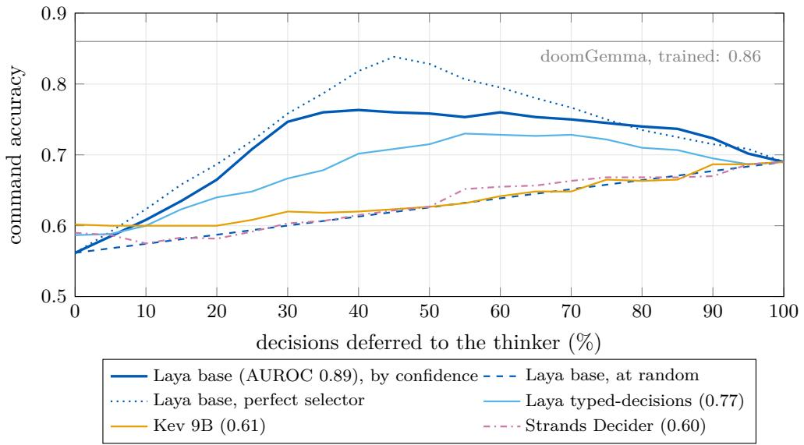

# System Switch: When Should a Fast Decision Model Stop and Think?

A closed-loop study with typed-decision models and a vision reasoner in Doom

Gianluca Bailo Independent Researcher, Recco (Genoa), Italy dexmac@libero.it

October 2026

## Abstract

Dual-process agents pair a fast policy with a slow deliberative model. In real-time settings the slow model usually runs continuously; in turn-based agents and in robot planners it is invoked on events such as uncertainty or a detected failure. We study a fast learned actor that takes every decision and hands control to a reasoning vision-language model only when a gate opens, while the game keeps running in real time. We use closed-loop Doom and the new open “System One” typed-decision models, served through a common llama.cpp interface. On 900 held-out questions, (i) zero-shot decision models from 0.15B to 9B parameters over-choose collecting items, 1.6–1.8 times more often than chance among their errors, whatever the order of the options, which does change some models’ accuracy; (ii) accuracy, calibration and sensitivity (how well confidence separates right from wrong answers) are distinct: models of similar accuracy difer widely in AUROC, and the confidence of the most sensitive one tracks which kinds of situation it fails rather than which of its answers are wrong; (iii) ofline, deferring the least confident 30% of decisions to a reasoning model gains over deferring at random in proportion to the actor’s AUROC (rank correlation 0.87 over 18 actor–option-order pairs); with the actor and the rate chosen on held-out games the gain is +0.13 [0.08, 0.18] with doomLaya’s option order and +0.08 [0.02, 0.14] with shufled options, and reasoning carries about half of it. (iv) In closed loop (33 games on three seeds), no variant reaches the exit. Committing to plans, the reasoner’s or a fixed explore rule’s behind the same gate, covers more of the map, opens more doors and even makes an actor that stands still on its own play; with the rule, the agent dies more often. The thoughts show where the chain breaks: told that some doors need keys, the reasoner takes ordinary doors for locked ones, which the state cannot tell apart, and without that knowledge it goes back to collecting. We release code, prompts and logs.

## 1 Introduction

The “System 1 / System 2” picture [18] has become a design template for agents: a fast reactive component and a slow deliberative one. Turn-based agents switch to the slow component on events, such as lack of reward, invalid actions or repeated failures [20, 21], choose between fast and slow solvers with a metacognitive module [3], or route each step to a chosen reasoning depth [5, 7, 32, 36]. Robot planners replan when execution feedback or a detector signals a failure [15, 16]. Real-time agents, where the environment does not wait, keep the slow component running continuously, either asynchronously [35, 37] or at a fixed rate as in robot policies [24].

The starting point of this work is a first-person observation by the author, a long-time player: when the action works, the brain “switches of” and just acts, without inner speech; when shooting no longer helps (a door that does not open, an enemy that keeps coming back), one stops to think, and it is the thinking that gets one moving again. This is event-gated thinking in real time: the game goes on while one thinks. It echoes cognitive accounts in which control is recruited by conflict or lack of progress [4] when its expected value exceeds its cost [29], and the older AI principle of rational metareasoning: compute only when the computation is worth its cost [28].

Three developments make the question timely and cheap to study. First, a family of open “System One” typed-decision models appeared in September 2026 (Laya, Kev, Lev, Julia, Clef, OpenJev, Strands Decider, CLM; [8–10, 17, 25, 26, 30, 33]). They answer typed questions (choice, score, yes/no) in a single forward pass, with probabilities that look calibrated. Second, llama.cpp added a common /v1/systemone endpoint for them [13], so one bridge serves every model on the same hardware. Third, independent benchmarks of these models [23, 31] already locate their weak spot: the items they fail “need multi-step inference, arithmetic, or weighing competing considerations”, while “a System One model does one forward pass and a linear readout”, and the top of the leaderboard is held by reasoning models [31]. This suggests a switch rather than a replacement. Those benchmarks, however, score single decisions. We put the models in a closed loop with doomLaya [1], which turns ViZDoom [19] into a typed-decision task with a rule-based expert (an “oracle”) that labels game states.

## Contributions.

1. A fast learned actor that asks a reasoner only when a gate opens, in real time. Prior real-time agents keep the slow component running continuously [35, 37]; most event-gated agents are turn-based [3, 20, 21]; robot planners that replan on detected failures [15, 16] take every high-level decision with the language model. Here a fast typed-decision actor takes every decision, and a vision reasoner is consulted, asynchronously, only when uncertainty or progress triggers open a gate; we compare the two kinds of trigger in closed loop (§4, §5.4).

2. What the confidence of typed actors tracks, and what deferral buys. We evaluate the System One family zero-shot through one interface and show that accuracy, calibration and sensitivity (the AUROC of confidence for right vs. wrong answers) are distinct properties, that the confidence of the most sensitive actor tracks which kinds of situation it fails rather than which answers, and what confidence-gated deferral to a reasoner buys ofline, with the actor and the deferral rate chosen on held-out games (§5.1–§5.3).

3. A closed-loop study with a rule control and a reading of the thoughts. The same gate with a fixed command instead of thinking, ablations of the image and of the game knowledge given to the reasoner, and a reading of every verbalised thought (§5.4).

## 2 Related work

Fast and slow agents. SwiftSage [20] pairs a small imitation-learned actor with an LLM planner and switches on heuristic triggers, including lack of reward and invalid actions; CogniWeb [21] uses similar stuck and invalid-state triggers for web agents. FAST [32], Talker–Reasoner [7], CogRouter [36] and Pangu Embedded [5] select or adapt reasoning depth per step. SOFAI [3] has a metacognitive module that chooses, problem by problem, between a fast solver and a slow one using the fast solver’s confidence and the expected cost of thinking, which is the ofline question of our §5.3. All of these operate turn by turn. In robotics, Inner Monologue [16] feeds execution feedback (success detection, scene descriptions) back to a language planner, and DoReMi [15] has a vision-language model watch the execution for violated constraints and triggers replanning as soon as one is detected: event gating in a continuous environment, with the language model as the planner of every step. Real-time settings have been addressed by DPT-Agent [37], which runs an asynchronous reflective System 2 alongside a finite-state System 1 in simultaneous human–AI collaboration, and by AgileThinker [35], which runs a reactive and a planning thread in parallel, the reactive one reading the partial reasoning traces of the other, in environments that evolve regardless of the agent’s computation. In both, the slow component runs continuously. Dual-system robot policies such as GR00T N1 [24] run it at a fixed rate. Our setting difers from all of these in where the decisions come from: a fast learned actor takes every decision, the reasoner is invoked only when a gate opens, and the game keeps running while it thinks.

Deferral, selective prediction and cascades. Abstaining when uncertain is the subject of selective classification [12]; learning when to pass a decision to another decision maker is learning to defer [22]; routing queries through models of increasing cost is the idea of LLM cascades [6]. Closest in the agent domain, ReDAct [27] lets a small LLM act and defer to a large one when its uncertainty exceeds a calibrated threshold; deferring about 15% of the decisions matches the large model on ALFWorld and MiniGrid. We difer in that our actors are non-generative typed-decision models whose confidence must first be shown to be informative, and in that we gate on progress as well as on uncertainty, in real time.

System One models and their benchmarks. The Jev Decision Index [23] compares open reproductions of the TypeSafe Jev model on dozens of decision tasks; JevBench [31] is an independent benchmark on which reasoning models lead. Both score single decisions; we add a closed loop.

Doom. ViZDoom [19] is the standard platform; recent work shows that a 1.3M-parameter specialized model outplays general LLMs in real-time control [14]. We use doomLaya [1], which exposes Doom as typed questions over a symbolic state, with an executor that turns the chosen command into movement.

## 3 Setup

Environment and questions. Freedoom 2 [34] in ViZDoom 1.3.1 through doomLaya (commit b25edd3). Every 0.5 s of game time the agent receives a text state (health, armour, inventory, visible enemies, items, doors) and two choice questions: command (attack a visible enemy, collect an item, open a door, go to the exit, retreat, explore, wait) and weapon. The options come in a fixed order (enemies, items, door, exit, retreat, explore, wait). An executor turns the command into button presses and reports whether it is executing, arrived, blocked or unavailable. The state reports a closed door but not whether it is locked, and a key only once it has been seen within 12 m.

Clock. ViZDoom runs in synchronous mode, paced by doomLaya to real time: 35 tics per second, and the measured wall-clock duration of every game equals its game time. A decision is requested every 0.5 s of game time, asynchronously: while an answer is pending, the game goes on with the previous command. The switch answers the actor at once and thinks in a background thread, so a thought that takes 12 s takes 12 s of play.

Labels. doomLaya’s oracle (the rule-based labeller) labels states with rules (fight visible threats, collect only what is needed, open blocking doors, otherwise exit). It never labels explore, retreat or wait: they are ofered but never correct, so the ofline metric cannot reward exploring, which is what the thinker often prescribes in the loop. Ofline accuracy and closed-loop behaviour therefore measure diferent things. Its validation split has 130 questions (80 command, 50 weapon). We build a held-out test set of 900 questions with the same pipeline and the same oracle on 42 MAP01 games played with seeds never used for training (45–53), capped at 150 per (question, category) group (build\_testset.py). Confidence intervals on this set resample games, not questions, because states from the same game are correlated. “Accuracy” means agreement with the oracle; we come back to what this hides in §6.

Actors. Zero-shot System One models through llama.cpp’s /v1/systemone (commit cb7934c): Julia-1 (0.15B), Laya (0.4B), Kev (0.8B, 4B, 9B), Lev (4B), Clef-Flash (9B); Strands Decider 2B through its own server with the same API. Laya is evaluated in two released revisions, the typed-decisions model and the English base, through doomLaya’s PyTorch server (the base also through llama.cpp). Task-trained references: Laya-v3 (doomLaya’s fine-tune) and doomGemma, a Gemma-4-E2B LoRA trained on the same 979 examples [2].

Thinkers. Two vision LLMs with oficial weights, served by llama.cpp with their vision projectors, each with and without reasoning: Qwen3.6-35B-A3B (4-bit GGUF with its multitoken-prediction head) and Gemma 4 26B-A4B-it (quantization-aware 4-bit). Ofline, the thinkers see the same text state as the actors, without the frame; in the closed loop, which uses Qwen3.6, the thinker also receives the current frame. Answers are constrained to the option keys by a JSON schema; reasoning is capped at 4,000 tokens, and an answer that does not arrive within the cap counts as wrong.

Hardware. Home PCs on gigabit Ethernet: the game and the actors on an RTX 4070 / RTX 3060 machine, Qwen3.6 on 2×RTX 5060 Ti, Gemma 4 on the RTX 4070 / RTX 3060; System One baselines on a Ryzen 9 CPU or 2×RTX 2070 SUPER (accuracy does not depend on the device); the rule control with the base Laya was played on the 2×RTX 2070 SUPER machine.

## 4 The System Switch

switch.py sits between doomLaya’s agent and the actor, with the same interface. The actor answers every request. A gate decides whether to think, from five signals on the recent history: unsure (top probability below a threshold for three decisions in a row, the ReDAct-style trigger; 0.3 for the typed-decisions Laya and 0.65 for the base, the same percentile of their confidence on the test set), stuck (the player moved less than 48 map units in 5 s with no enemy in sight), blocked (three of the last six commands could not be executed), loop (the same command in ≥80% of the decisions of the last 15 s), novelty (no new 128-unit cell reached in 15 s). The last four are progress triggers in the sense of [20, 21]. When the gate opens, the thinker receives the game frame, the state, the available commands, the recent history and its own previous thoughts, writes one first-person thought and picks a command, which then overrides the actor (a plan). The game keeps running while it thinks. Variants: rule (same gate, a fixed command instead of thinking: the control), advise (the thought is appended to the actor’s state instead of overriding it), basics (a few sentences of Doom knowledge in the thinker’s prompt), forbid-repeats (the commands the actor kept repeating are removed from the thinker’s options), commit (a plan lasts until the executor reports it done or impossible, a damage burst, or 45 s).

## 5 Results

## 5.1 Zero-shot decision models over-choose collecting

Every zero-shot model but one over-chooses collecting (Table 1). On average a command question has 7.5 options, 3.6 of them items to collect, so many errors would land on an item by chance; yet the zero-shot models choose one 1.6–1.8 times more often than a uniformly random wrong answer would. The exception is Kev 0.8B (1.1), whose probabilities are near-uniform. The thinkers share the bias without reasoning (1.8) and less with it (1.4 for Qwen3.6). By category, every zero-shot model rarely leaves when the oracle leaves (0.00–0.35) and rarely picks the item the oracle picks (0.15–0.55); the models difer on fighting (0.13–0.98) and on doors.

<table><tr><td></td><td colspan="6">command</td></tr><tr><td>model</td><td>params</td><td>fixed order</td><td></td><td>shuffled</td><td>weapon</td><td>→collect (×chance)</td></tr><tr><td>Kev</td><td>9B</td><td>0.60</td><td>[0.49, 0.69]</td><td>0.50</td><td>1.00</td><td>92% (1.7)</td></tr><tr><td>Strands Decider</td><td>2B</td><td>0.59</td><td>[0.49, 0.68]</td><td>0.38</td><td>1.00</td><td>97% (1.8)</td></tr><tr><td>Laya, typed-decisions</td><td>0.4B</td><td>0.59</td><td>[0.48, 0.68]</td><td>0.56</td><td>0.42</td><td>91% (1.6)</td></tr><tr><td>Laya, base</td><td>0.4B</td><td>0.56</td><td>[0.45, 0.66]</td><td>0.49</td><td>0.38</td><td>83% (1.7)</td></tr><tr><td>Clef-Flash</td><td>9B</td><td>0.54</td><td>[0.43, 0.63]</td><td>0.54</td><td>0.60</td><td>92% (1.7)</td></tr><tr><td>Lev</td><td>4B</td><td>0.43</td><td>[0.31, 0.55]</td><td>0.44</td><td>0.49</td><td>98% (1.8)</td></tr><tr><td>Kev</td><td>4B</td><td>0.40</td><td>[0.31, 0.52]</td><td>0.39</td><td>0.97</td><td>98% (1.8)</td></tr><tr><td>Kev</td><td>0.8B</td><td>0.29</td><td>[0.22, 0.39]</td><td>0.39</td><td>0.05</td><td>56% (1.1)</td></tr><tr><td>Julia-1</td><td>0.15B</td><td></td><td>0.14 [0.07, 0.24]</td><td>0.09</td><td>0.74</td><td>91% (1.8)</td></tr><tr><td>Qwen3.6-35B-A3B, no reasoning</td><td>35B (3B act.)</td><td></td><td>0.58 [0.48, 0.67]</td><td></td><td></td><td>97% (1.8)</td></tr><tr><td>Qwen3.6-35B-A3B, reasoning</td><td>35B (3B act.)</td><td></td><td>0.69 [0.60, 0.76]</td><td></td><td></td><td>73% (1.4)†</td></tr><tr><td>Gemma 4 26B-A4B, no reasoning</td><td>26B (4B act.)</td><td></td><td>0.57 [0.47, 0.65]</td><td></td><td></td><td>90% (1.7)</td></tr><tr><td>Gemma 4 26B-A4B, reasoning</td><td>26B (4B act.)</td><td></td><td>0.50 [0.39, 0.60]</td><td></td><td></td><td>94% (1.6)†</td></tr><tr><td>Laya-v3 (trained)</td><td>0.4B</td><td>0.59 </td><td>[0.47, 0.70]</td><td>0.59</td><td>0.97</td><td>61% (1.2)</td></tr><tr><td>doomGemma (trained)</td><td>2B</td><td></td><td>0.86 [0.81, 0.90]</td><td>0.85</td><td>1.00</td><td>43% (0.8)</td></tr></table>

Table 1: Accuracy against the oracle on the 900 held-out questions (600 command, balanced over attack, collect, open door and exit; 300 weapon), with 95% intervals that resample games. Fixed order: doomLaya’s order of the options, the one the agent sees in play; shufled: options in a random order per question. →collect: share of the command errors that choose an item to collect, and in brackets its ratio to the share expected if the wrong answer were uniform over the wrong options. The thinkers were asked the command questions in the fixed order only; with reasoning, an answer not given within 4,000 tokens counts as wrong (Qwen3.6: 13 of 600; Gemma 4: 199). †Among the errors with an answer.

The order of the options matters for some models. doomLaya lists them in a fixed order, and the correct answer is the first option in 41% of the command questions. With the options shufled per question, Strands drops from 0.59 to 0.38 (it chooses the first option in 65% of the questions in the fixed order and still in 36% when shufled, where the correct one is first in 14%), Kev 9B from 0.60 to 0.50 and the Laya base from 0.56 to 0.49, while Clef-Flash is unafected and Kev 0.8B improves. On weapons, Kev 4B drops from 0.97 to 0.62. The over-choice of collecting is not an efect of position: with shufled options it stays at 1.6–1.8 times chance for all the models above, and only Julia-1’s disappears (0.9). Kev 0.8B answers melee to 95% of the weapon questions whatever their position, which explains its weapon score. The thinkers saw the fixed order only.

On the balanced set, accuracy grows with size within the Kev family (0.29, 0.40, 0.60). On the 130-question validation split, which has only 5 door states among its 80 command questions, the order was reversed: Kev 0.8B and 4B never answer open door correctly (0 of 150 each). Task training transfers less than the validation split suggests. doomGemma drops from 0.963 on the validation split, on which its epoch was selected, to 0.860 on questions from unseen seeds, consistent with its failure to generalise to an unseen map [2]. doomLaya’s own fine-tune, Laya-v3, drops from 0.725 to 0.585, no better than zero-shot Laya, mainly because it collects items at doors (0.39 on open door). The trained models are insensitive to the order of the options (0.85 and 0.59 shufled). The llama.cpp conversion is faithful: the Laya base through /v1/systemone scores as the PyTorch original, on the 130 questions (0.41/0.58) and on the 900 (0.562 on commands, AUROC 0.888 vs. 0.891; shufled, 0.495 vs. 0.492).

## 5.2 Calibration, sensitivity, and what the confidence tracks

System One models ship temperature-scaled probabilities: the temperatures are stored in the model file and applied by the server, which warns that the result is not guaranteed to be calibrated for one’s data [13]; Strands Decider stores one temperature per question type [30]. A confidence-gated switch needs something else than calibration: that confidence separates right from wrong answers, i.e. metacognitive sensitivity [11]. We measure calibration as the expected calibration error (ECE, 15 bins) of the top probability, and sensitivity as the AUROC of the top probability for right vs. wrong answers, overall and within each gold category (only right/wrong pairs of the same category count). Accuracy, calibration and sensitivity are distinct

<table><tr><td></td><td colspan="7">AUROC, fixed order</td></tr><tr><td>actor</td><td>accuracy</td><td>ECE</td><td></td><td>overall</td><td>within category</td><td></td><td>shuffled</td></tr><tr><td>Laya, base</td><td>0.56</td><td>0.16</td><td></td><td>0.89 [0.85, 0.92]</td><td></td><td>0.52 [0.40, 0.63]</td><td>0.72</td></tr><tr><td>Kev 0.8B</td><td>0.29</td><td>0.14</td><td></td><td>0.83 [0.76, 0.88]</td><td></td><td>0.75 [0.63, 0.85]</td><td>0.77</td></tr><tr><td>Laya, typed-decisions</td><td>0.59</td><td>0.29</td><td></td><td>0.77 [0.70, 0.83]</td><td></td><td>0.65 [0.42, 0.81]</td><td>0.69</td></tr><tr><td>Kev 4B</td><td>0.40</td><td>0.10</td><td></td><td>0.70 [0.58, 0.80]</td><td></td><td>0.80 [0.68, 0.89]</td><td>0.66</td></tr><tr><td>Clef-Flash 9B</td><td>0.54</td><td>0.10</td><td></td><td>0.68 [0.59, 0.76]</td><td></td><td>0.68 [0.58, 0.78]</td><td>0.68</td></tr><tr><td>Lev 4B</td><td>0.43</td><td>0.24</td><td></td><td>0.61 [0.51, 0.70]</td><td></td><td>0.61 [0.46, 0.75]</td><td>0.63</td></tr><tr><td>Kev 9B</td><td>0.60</td><td>0.28</td><td></td><td>0.61 [0.48, 0.71]</td><td></td><td>0.74 [0.64, 0.81]</td><td>0.70</td></tr><tr><td>Strands Decider 2B</td><td>0.59</td><td>0.21</td><td></td><td>0.60 [0.47, 0.71]</td><td></td><td>0.77 [0.67, 0.85]</td><td>0.52</td></tr><tr><td>Julia-1</td><td>0.14</td><td>0.57</td><td></td><td>0.45 [0.34, 0.57]</td><td></td><td>0.58 [0.39, 0.75]</td><td>0.44</td></tr><tr><td>Laya-v3 (trained)</td><td>0.59</td><td>0.14</td><td></td><td>0.87 [0.83, 0.91]</td><td></td><td>0.78 [0.57, 0.89]</td><td>0.79</td></tr><tr><td>doomGemma (trained)</td><td>0.86</td><td>0.05</td><td></td><td>0.86 [0.80, 0.90]</td><td></td><td>0.77 [0.68, 0.84]</td><td>0.84</td></tr></table>

Table 2: Calibration and sensitivity on the 600 command questions of the held-out set: ECE of the top probability, and AUROC of the top probability for right vs. wrong answers (0.5 = chance), overall and within gold categories, with 95% intervals that resample games; last column: overall AUROC with the options shufled. Zero-shot models above the line, sorted by AUROC.

properties (Table 2). Five zero-shot models lie within 0.54–0.60 command accuracy, and their AUROC ranges from 0.60 to 0.89; the two most accurate, Kev 9B and Strands, have the least informative confidence of the five, with intervals that include chance. The two Laya revisions, equally accurate, difer (0.77 vs. 0.89, non-overlapping intervals). Calibration does not predict sensitivity: the best-calibrated zero-shot models, Clef-Flash and Kev 4B (ECE 0.10), rank in the middle by AUROC, and the typed-decisions Laya, Strands and Kev 9B are under-confident (mean top probability 0.31–0.42 for accuracies of 0.59–0.60).

Sensitivity itself comes in two kinds. The base Laya, the most sensitive overall, is at chance within categories (0.52 [0.40, 0.63]): its confidence is high on fights and doors, which it gets right, and low on exits and collects, which it gets wrong, but within a category it does not track which of its answers are wrong. Strands and Kev 9B show the opposite profile (0.77 and 0.74 within categories, 0.60 and 0.61 overall). What pays in the deferral of §5.3 is the first kind, because accuracy difers so much between categories (from 0.00 on exits to 0.98 on fights for the base Laya): a confidence that tracks which situations the actor handles badly, rather than which answers are wrong. “Knowing when one does not know” is therefore more than the overall AUROC shows. An actor for a confidence-based switch should be chosen by the AUROC that matters for the deferral, not by accuracy. Type-2 AUROC also depends on type-1 performance [11]: comparisons among the five models of similar accuracy are fair, comparisons across the Kev family (0.29 to 0.60) are not, and we draw none. These estimates replace those of our 130-question pilot, which were too noisy to rank models: there the two Laya revisions were ordered the other way (0.87 vs. 0.82, overlapping intervals) and Strands looked worse than chance (0.41 [0.29, 0.54]), with an interval that includes it.

Part of the sensitivity measured with the fixed order comes from the order itself. With shufled options the spread narrows (0.52–0.77 among the zero-shot models): the Laya base falls to 0.72, Kev 9B rises to 0.70, and Strands stays at chance (0.52). The dissociation from accuracy holds (Clef-Flash, the most accurate with shufled options, ranks in the middle), but “the two most accurate are the least sensitive” is a property of the fixed order.

## 5.3 Ofline: confidence-gated deferral to a reasoner

We defer the actor’s least confident decisions to the thinker and measure the accuracy of the combination for each deferral rate, against deferring at random. This is the selective-prediction / cascade setting [6, 12, 22, 27], measured ofline on the labelled questions, i.e. with all the time the thinker needs. Deferral pays where the actor’s confidence is informative (Table 3, Figure 1).

<table><tr><td>actor (AUROC)</td><td>alone</td><td>10% 30%</td><td>50%</td><td>deferred to the thinker confidence – random at 30%</td></tr><tr><td colspan="5">thinker: Qwen3.6 with reasoning (alone: 0.69 [0.60, 0.76])</td></tr><tr><td>Laya, base (0.89)</td><td>0.56 0.61</td><td>0.75</td><td>0.76</td><td>+0.15 [0.11, 0.19]</td></tr><tr><td>Laya-v3, trained (0.87)</td><td>0.59</td><td>0.62 0.72</td><td>0.82</td><td>+0.11 [0.06, 0.18]</td></tr><tr><td>Laya, typed-decisions (0.77)</td><td>0.59</td><td>0.60 0.67</td><td>0.72</td><td>+0.05 [0.02, 0.08]</td></tr><tr><td>Kev 9B (0.61)</td><td>0.60</td><td>0.60 0.62</td><td>0.63</td><td>-0.01 [−0.04, 0.01]</td></tr><tr><td>Strands Decider (0.60)</td><td>0.59 0.58</td><td>0.60</td><td>0.63</td><td>-0.02 [−0.06, 0.02]</td></tr><tr><td>doomGemma, trained (0.86)</td><td>0.86 0.86</td><td>0.84</td><td>0.83</td><td>+0.03 [0.01, 0.06]</td></tr><tr><td colspan="5">thinker: Qwen3.6 without reasoning (alone: 0.58 [0.48, 0.67])</td></tr><tr><td>Laya, base (0.89) thinker: Gemma 4 with reasoning (alone: 0.50 [0.39, 0.60]) Laya, base (0.89)</td><td>0.56 0.57 0.64</td><td></td><td>0.63</td><td>+0.07 [0.03, 0.12]</td></tr></table>

Table 3: Ofline deferral on the 600 command questions of the held-out set, in doomLaya’s option order: the actor’s least confident decisions are answered by the thinker. Last column: accuracy gained by deferring by confidence rather than at random, with a 95% interval that resamples games. For reference, a perfect selector that defers exactly the Laya base’s mistakes reaches 0.76 at 30%.

  
Figure 1: Accuracy of actor + Qwen3.6 with reasoning on the 600 command questions (doomLaya’s option order), for every deferral rate (the thinker alone is the right end, 0.69). Deferring by confidence beats deferring at random only for the actors whose confidence is informative.

With the reasoning thinker, deferring the 30% least confident decisions of the Laya base raises command accuracy from 0.56 to 0.75 [0.63, 0.82], close to a perfect selector that defers exactly the actor’s mistakes (0.76), without any training. This matches the thinker alone (0.69; diference +0.06 [−0.02, 0.11]) while calling it on 30% of the decisions. The gain over random deferral follows the actors’ AUROC: +0.15 for the Laya base (0.89), +0.11 for Laya-v3 (0.87), +0.05 for the typed-decisions Laya (0.77), and none for Kev 9B and Strands (0.61, 0.60). With those two, deferring by confidence is deferring at random, although they are the most accurate zero-shot actors. Laya-v3, trained on the task but no better than zero-shot Laya on this set, reaches 0.82 when half of its decisions are deferred, close to doomGemma (0.86): its confidence is informative (AUROC 0.87) even though its answers are not better.

The Laya base and the 30% rate are chosen here on the same 600 questions on which the gain is measured, out of nine candidate actors (the zero-shot actors of Table 2; the trained ones are excluded) and several rates. To check how much this flatters the result, we split the 42 games into two halves 500 times at random, choose the actor (by AUROC) and the rate (10–50%) on one half and measure on the other. The Laya base is chosen in 489 of the 500 splits; on the held-out half the gain over random deferral is +0.13 [0.08, 0.18], while the advantage over the better of actor and thinker alone is +0.05 [−0.12, 0.11]. The robust result is therefore the gain over random deferral, and the thinker’s accuracy at a fraction of its calls, not a combination that beats both components.

The size of the gain also depends on the order of the options. With the actors’ answers to shufled options (the thinker’s answers are those to the fixed order), the Laya base gains +0.07 [0.04, 0.09] over random at 30% instead of +0.15, and Strands still nothing. Choosing actor and rate on held-out games as above (the choice now falls mostly on Kev 0.8B), the gain over random is +0.08 [0.02, 0.14], and the combination stays below the thinker alone (−0.05 [−0.13, 0.02]). What holds in both orders is the link with sensitivity: over the same nine zero-shot actors in the two orders (18 actor–order pairs, not independent), the rank correlation between an actor’s AUROC and its gain over random deferral at 30% is 0.87.

Reasoning carries about half of the gain: without it the thinker (0.58) shares the actors bias, with 97% of its errors choosing an item to collect, and the gain over random falls from +0.15 to +0.07. The result holds with the second thinker: Gemma 4 is weaker alone (0.50; it gives no answer within the reasoning budget on a third of the questions), yet deferring 30% of the Laya base’s decisions to it gives 0.67, +0.13 [0.08, 0.17] over random. For the trained doomGemma, deferral to a weaker thinker never raises accuracy above the actor alone, although it beats deferring at random. These are ofline numbers: the reasoning thinker writes a median of 1,300 tokens per decision, and with one decision every 0.5 s deferring 30% of them is not possible in real time. This is what motivates gating on events and letting a thought guide several decisions (§5.4).

## 5.4 Closed loop: a cascade of bottlenecks (case study)

We played MAP01 on seeds 48–50 with Qwen3.6 with reasoning as thinker and two actors on a GPU (a median of 29 ms per decision, 350 decisions per 180-s game). The main actor is the typed-decisions Laya, chosen on the 130-question pilot, where it ranked first by AUROC; on the held-out set the base ranks first (§5.2), so we add it as a second actor. The variants are: of ; a bare thinker (all five triggers, no basics, no commitment); three variants with basics, forbid-repeats, plans of at least 5 s and commitment, which difer only in the gate (uncertainty only, progress only, or all five triggers); the last of these without the frame (no image) and without the basics (no basics); and the rule control, with the same gate and the same commitment but a fixed explore instead of a thought. Thirty games in all, plus the rule control with the base Laya, played later on the 2×RTX 2070 SUPER machine. Since no game reached the exit, Table 4 also reports how much of the map was covered (distinct 128-unit cells, the grid of the novelty trigger), the doors opened and the closest straight-line approach to the exit.

No variant reaches the exit (Table 4); the route passes through ordinary doors, and only one game (all triggers, seed 49) came within 4 m of it. Committing to the thinker’s plans covers more of the map than the bare thinker (64–83 cells against 61) and opens more doors (8–9 against 5). The rule control does as well on both (83 cells, 9.7 doors) and dies twice as often (2.7 deaths per game against 1.3). With three games per variant each diference in deaths could be noise, but it goes the same way with the base Laya (3.7 against 0.7). On coverage and doors, then, most of the benefit of the committed variants comes from committing to explore, not from what the thinker says. With the typed-decisions actor, deaths also rise from the uncommitted variants (0.7) to the committed ones (1.3–2.0): a plan keeps the agent moving into areas where enemies are; we did not test this further. The gate changes when the thinker is called (the uncertainty gate opens mostly on low confidence, the progress gate on failed plans), not these outcomes. The base Laya, which on its own stays still for the whole game in all three seeds (one cell), plays when the gate is added: 66 cells, 8.7 doors, 10.7 kills, with the gate opened mostly by its low confidence (17 of 28 thoughts). It plays with the rule control too, and covers even more ground (81 cells, 9 doors): what unblocks it is committing to explore, not the thinker, whose contribution here is to survival (0.7 deaths per game against 3.7).

<table><tr><td>variant</td><td></td><td></td><td></td><td></td><td></td><td></td><td></td><td>kills deaths cells doors closest thoughts guided thinker&#x27;s top choice</td></tr><tr><td>actor: Laya, typed-decisions</td><td></td><td></td><td></td><td></td><td></td><td></td><td></td><td></td></tr><tr><td>off</td><td>11.0</td><td>0.7</td><td>77</td><td>5.3</td><td>12.6 m</td><td></td><td></td><td></td></tr><tr><td>bare thinker</td><td>9.3</td><td>0.7</td><td>61</td><td>5.0</td><td>12.8m</td><td>14.3</td><td>7%</td><td>collect (49%)</td></tr><tr><td>commitment, gate: unsure</td><td>12.0</td><td>2.0</td><td>66</td><td>8.0</td><td>12.9m</td><td>7.0</td><td>28%</td><td>explore (52%)</td></tr><tr><td>commitment, gate: progress</td><td>14.3</td><td>1.7</td><td>83</td><td>8.7</td><td>12.6m</td><td>4.0</td><td>18%</td><td>explore (67%)</td></tr><tr><td>commitment, gate: all</td><td>14.3</td><td>1.3</td><td>83</td><td>8.0</td><td>9.5m</td><td>7.0</td><td>26%</td><td>explore (57%)</td></tr><tr><td>no image</td><td>9.7</td><td>1.3</td><td>64</td><td>8.7</td><td>12.7m</td><td>5.3</td><td>18%</td><td>explore (56%)</td></tr><tr><td>no basics</td><td>15.3</td><td>1.7</td><td>69</td><td>8.3</td><td>10.8m</td><td>9.7</td><td>11%</td><td>collect (45%)</td></tr><tr><td>rule control (fixed explore) actor: Laya, base</td><td>10.7</td><td>2.7</td><td>83</td><td>9.7</td><td>12.9m</td><td>(14.0)</td><td>77%</td><td>(explore)</td></tr><tr><td>off</td><td>0.0</td><td>0.0</td><td>1</td><td>0.0</td><td>18.8m</td><td></td><td></td><td></td></tr><tr><td>commitment, gate: all</td><td>10.7</td><td>0.7</td><td>66</td><td>8.7</td><td>13.0m</td><td>9.3</td><td>32%</td><td>explore (75%)</td></tr><tr><td>rule control (fixed explore)*</td><td>9.7</td><td>3.7</td><td>81</td><td>9.0</td><td>13.0m</td><td>(15.7)</td><td>79%</td><td>(explore)</td></tr></table>

Table 4: Closed loop on MAP01, three seeds per variant, means per 180-s game. No game reached the exit. Cells: distinct 128-unit cells visited; closest: closest straight-line distance to the exit (the start is 18.8 m away); thoughts: thoughts per game (rule: rule activations); guided: share of decisions taken by a plan. ∗Played on the 2×RTX 2070 SUPER machine (24 ms per decision); a check game of the base Laya alone there was identical to the one on the first machine.

The thoughts show where the chain breaks. The bare thinker prescribes collecting the nearest item in half of its thoughts, and its plans last about a second. With the basics it prescribes exploring, but its plans then fail at doors: all 25 plan failures of the three gate variants were a closed door stopping the executor, whose report explicitly suggested open\_door. The thinker chose to open it once; in 17 of the 25 thoughts it concluded that the door needed a key it did not have (“Blocked by a closed door. No key. I need to find one. I’ll explore the unexplored room to the left.”). Without the basics, none of the thoughts after a door failure mentions a key, but the thinker goes back to collecting (45% of its thoughts). The basics, which we had added to fix MAP02, where a door does need the yellow key, trade one wrong prescription for another, and the state cannot settle it: it reports a closed door, not whether it is locked. Without the frame the thinker reasons longer (a median of 29 s per thought; 9 of 16 thoughts exceeded the 4,000-token budget and were answered without reasoning) and covers less (64 cells).

Thinking is expensive in game time. With basics and commitment the thinker is busy for 38–70% of the game, and a plan starts on a frame that is a median of 9–29 s old by the time it applies (4 s for the bare thinker, 6 s without the basics).

A single-seed pilot on MAP01 (Laya) and MAP02 (doomGemma), with the abliterated thinker, had shown the same progression; at each of its steps we changed several settings at once, so it cannot attribute an efect to a single one:

• Bare thinker (5–6% of decisions guided): the diagnosis is often right (“I’m stuck in a shooting loop”, “the RedCard is unreachable”, “I’ve been trying to open the door for 5 seconds, but it needs a key I don’t have”) but the prescription is not: 22 of 24 thoughts end in “collect the nearest item to break the loop”; explore is never chosen.

• + basics, forbid-repeats, plans ≥5 s (9–25%): the prescription becomes right on MAP02 (“the door needs a yellow key, which I don’t have; I need to explore to find it”, 12 of 13 thoughts).

• + commitment (12–32%): plans last 26–30 s and chain (exit → blocked by a door → open\_door); they end on damage bursts, when reflexes take over.

• Advise instead of override: the trained actor ignores the advice.

Each fix moved the bottleneck: when to think → what to prescribe → how long to commit. In the thirty games the chain then loops back to what: a prescription made under partial observability, with game knowledge that is right on one map and wrong on another. We had read the pilot as pointing next to how the agent moves (doomLaya’s explore did not find the key on MAP02 within 180 s); these data do not support that reading.

## 6 Discussion and limitations

One system, two speeds. We designed the switch as a single system: fast by default, slow on demand. Our data do not test whether a single model running in two modes (deciding without reasoning, thinking only when the gate opens) does better than two models. With two models, the ofline evidence supports choosing the fast part for the sensitivity that matters to the deferral and the slow part for its ability to reason. That sensitivity can be coarse: the confidence of the actor that pays most tracks which kinds of situation it fails, which is enough when accuracy varies so much between kinds.

What the closed loop says. Ofline accuracy and closed-loop behaviour measure diferent things here: the oracle never labels exploring, and in play the useful prescription was mostly to explore. In the loop, committing to a plan mattered more than its content (with both actors the rule control covers as much ground; the thinker’s plans die less), knowledge given to the reasoner was over-applied where the state could not contradict it, and thinking occupied up to 70% of the game, on frames 9–29 s old. A reasoner in the loop needs an action vocabulary and an executor that can carry out its plans, plans that last as long as their goals, and a state that tells it what it needs to know.

## Limitations.

• Accuracy is agreement with a rule-based oracle that encodes one policy (e.g. collect only what is needed) and never labels exploring, retreating or waiting; a reasonable player can disagree.

• doomLaya presents the options in a fixed order, and part of several models’ accuracy and sensitivity depends on it (§5.1, §5.2); the thinkers were evaluated in the fixed order only.

• The actor and the deferral rate of the headline numbers are chosen on the test set; the held-out selection of §5.3 gives smaller and more honest figures.

• Ofline, the thinkers see the text state only; in play, Qwen3.6 also sees the frame. Without the frame it reasons longer and covers less ground, but we did not measure ofline what the frame adds.

• The closed loop is small: 33 games on one map, three seeds per variant, no exit, so we report behaviour, not success rates; diferences in deaths may be noise. The single-seed pilot on two maps changed several settings per step and was run with an abliterated (refusal-removed) variant of Qwen3.6-35B-A3B; everything else uses oficial weights.

• We did not measure systematically whether the thoughts are faithful to the game state; we only checked individual cases (one apparent mismatch was an item id reused by the game).

• Latency of reasoning: with basics and commitment a median of 9–29 s per thought and up to 32 s, during which the actor plays on; between 3 of 43 (bare thinker) and 9 of 16 (no image) thoughts exceeded the 4,000-token budget and were answered without reasoning. Ofline, Qwen3.6 left 13 of 600 questions unanswered within the budget and Gemma 4 199; answering those without reasoning, as the switch does, raises Qwen3.6 from 0.69 to 0.71 and Gemma 4 from 0.50 to 0.61, and the gains of Table 3 barely change (0.75 and 0.69 at 30% for the Laya base).

## 7 Conclusion

A fast decision model whose confidence tracks which situations it fails, a reasoner asked only then, and plans that last as long as their goals: this is the System Switch. Ofline, deferring the least confident decisions to a reasoning model gains over deferring at random in proportion to the actor’s sensitivity, without any training; the most accurate zero-shot actors are not the ones to use. In real time, the games turn a vague “the agent fails” into a precise list of what fails, down to a door that the reasoner believes locked because we told it that doors can be. They also set the bar for what follows: a fixed rule behind the same gate covers as much ground, so in this loop the thoughts have so far bought fewer deaths, not progress towards the exit.

## Acknowledgements and use of AI

The experiments were designed by the author. Code, data analysis and a first draft of the text were produced with the help of an AI assistant (Claude, Anthropic), under the author’s direction and review; all numbers come from the released data.

## Reproducibility

Code, prompts and data are available at

## https://github.com/dexmac221/system-switch

The repository contains the switch (switch.py), the bridge to /v1/systemone (serve\_systemone.py), the test set builder (build\_testset.py), the evaluation scripts, and the scripts that produce every table and figure from the per-question records (paper\_tables.py, review\_analyses.py, loop\_metrics.py), the patches to doomLaya, and in data/ the test set (in both option orders), the per-question records of every actor and thinker, and the switch logs, summaries and per-tic positions of every game. The game videos are available from the author.

## References

[1] azalio. doomlaya: a reproducible doom comparison and laya training workflow. https: //github.com/azalio/doomLaya, 2026. commit b25edd3.

[2] Gianluca Bailo. doomgemma: tests of laya and small llms on doom. https://github.com/ dexmac221/doomgemma, 2026.

[3] Grady Booch, Francesco Fabiano, Lior Horesh, Kiran Kate, Jon Lenchner, Nick Linck, Andrea Loreggia, Keerthiram Murugesan, Nicholas Mattei, Francesca Rossi, and Biplav Srivastava. Thinking fast and slow in AI. In Proceedings of the AAAI Conference on Artificial Intelligence, volume 35, pages 15042–15046, 2021. arXiv:2010.06002.

[4] Matthew M. Botvinick, Todd S. Braver, Deanna M. Barch, Cameron S. Carter, and Jonathan D. Cohen. Conflict monitoring and cognitive control. Psychological Review, 108 (3):624–652, 2001.

[5] Hanting Chen, Yasheng Wang, Kai Han, Dong Li, Lin Li, Zhenni Bi, Jinpeng Li, Haoyu Wang, Fei Mi, Mingjian Zhu, Bin Wang, Kaikai Song, Yifei Fu, Xu He, Yu Luo, Chong Zhu, Quan He, Xueyu Wu, Wei He, Hailin Hu, Yehui Tang, Dacheng Tao, Xinghao Chen, and Yunhe Wang. Pangu Embedded: An Eficient Dual-system LLM Reasoner with Metacognition, 2025. arXiv:2505.22375.

[6] Lingjiao Chen, Matei Zaharia, and James Zou. FrugalGPT: How to Use Large Language Models While Reducing Cost and Improving Performance, 2023. arXiv:2305.05176.

[7] Konstantina Christakopoulou, Shibl Mourad, and Maja Matarić. Agents Thinking Fast and Slow: A Talker-Reasoner Architecture, 2024. arXiv:2410.08328.

[8] Cloudflare. Clef and clef-flash. https://huggingface.co/Cloudflare/clef, 2026.

[9] Contrastive-LM. Clm-v0.1-8b: a contrastive language model for agent decisions. https: //huggingface.co/Contrastive-LM/CLM-v0.1-8B, 2026.

[10] Convai Innovations. Laya: a non-autoregressive system 1 decision engine. https://github. com/NandhaKishorM/laya, 2026.

[11] Stephen M. Fleming and Hakwan C. Lau. How to measure metacognition. Frontiers in Human Neuroscience, 8:443, 2014.

[12] Yonatan Geifman and Ran El-Yaniv. Selective classification for deep neural networks. In Advances in Neural Information Processing Systems (NeurIPS), 2017. arXiv:1705.08500.

[13] Georgi Gerganov and contributors. llama.cpp. https://github.com/ggml-org/llama.cpp, 2026. commit cb7934c; the /v1/systemone API: PR #29818, Clef: PR #29831.

[14] David Golchinfar, Daryoush Vaziri, and Alexander Marquardt. Playing DOOM with 1.3M Parameters: Specialized Small Models vs Large Language Models for Real-Time Game Control, 2026. arXiv:2604.07385.

[15] Yanjiang Guo, Yen-Jen Wang, Lihan Zha, and Jianyu Chen. DoReMi: Grounding language model by detecting and recovering from plan-execution misalignment. In IEEE/RSJ International Conference on Intelligent Robots and Systems (IROS), 2024. arXiv:2307.00329.

[16] Wenlong Huang, Fei Xia, Ted Xiao, Harris Chan, Jacky Liang, Pete Florence, Andy Zeng, Jonathan Tompson, Igor Mordatch, Yevgen Chebotar, Pierre Sermanet, Noah Brown, Tomas Jackson, Linda Luu, Sergey Levine, Karol Hausman, and Brian Ichter. Inner monologue: Embodied reasoning through planning with language models. In Proceedings of the 6th Conference on Robot Learning (CoRL), volume 205 of PMLR, pages 1769–1782, 2022. arXiv:2207.05608.

[17] interfaze-ai. Lev. https://huggingface.co/interfaze-ai/lev, 2026.

[18] Daniel Kahneman. Thinking, Fast and Slow. Farrar, Straus and Giroux, 2011.

[19] Michał Kempka, Marek Wydmuch, Grzegorz Runc, Jakub Toczek, and Wojciech Jaśkowski. ViZDoom: A Doom-based AI Research Platform for Visual Reinforcement Learning, 2016. arXiv:1605.02097.

[20] Bill Yuchen Lin, Yicheng Fu, Karina Yang, Faeze Brahman, Shiyu Huang, Chandra Bhagavatula, Prithviraj Ammanabrolu, Yejin Choi, and Xiang Ren. SwiftSage: A Generative Agent with Fast and Slow Thinking for Complex Interactive Tasks. In Advances in Neural Information Processing Systems (NeurIPS), 2023. arXiv:2305.17390.

[21] Jiarun Liu, Chunhong Zhang, and Zheng Hu. Cognitive Duality for Adaptive Web Agents, 2025. arXiv:2508.05081.

[22] David Madras, Toniann Pitassi, and Richard Zemel. Predict responsibly: Improving fairness and accuracy by learning to defer. In Advances in Neural Information Processing Systems (NeurIPS), 2018. arXiv:1711.06664.

[23] multimodalart. Jev decision index. https://huggingface.co/spaces/multimodalart/ jev-decision-index, 2026. accessed October 2026.

[24] NVIDIA, Johan Bjorck, Fernando Castañeda, Nikita Cherniadev, Xingye Da, Runyu Ding, Linxi "Jim" Fan, Yu Fang, Dieter Fox, Fengyuan Hu, Spencer Huang, Joel Jang, Zhenyu Jiang, Jan Kautz, Kaushil Kundalia, Lawrence Lao, Zhiqi Li, Zongyu Lin, Kevin Lin, Guilin Liu, Edith Llontop, Loic Magne, Ajay Mandlekar, Avnish Narayan, Soroush Nasiriany, Scott Reed, You Liang Tan, Guanzhi Wang, Zu Wang, Jing Wang, Qi Wang, Jiannan Xiang, Yuqi Xie, Yinzhen Xu, Zhenjia Xu, Seonghyeon Ye, Zhiding Yu, Ao Zhang, Hao Zhang, Yizhou Zhao, Ruijie Zheng, and Yuke Zhu. GR00T N1: An Open Foundation Model for Generalist Humanoid Robots, 2025. arXiv:2503.14734.

[25] openjev. Openjev. https://huggingface.co/openjev/openjev, 2026.

[26] Jared Palmer. Kev decision models (0.8b, 4b, 9b). https://huggingface.co/jaredpalmer/ kev-4b, 2026.

[27] Dzianis Piatrashyn, Nikita Kotelevskii, Kirill Grishchenkov, Nikita Glazkov, Ivan Nasonov, Ilya Makarov, Timothy Baldwin, Preslav Nakov, Roman Vashurin, and Maxim Panov. ReDAct: Uncertainty-Aware Deferral for LLM Agents, 2026. arXiv:2604.07036.

[28] Stuart Russell and Eric Wefald. Principles of metareasoning. Artificial Intelligence, 49(1–3): 361–395, 1991.

[29] Amitai Shenhav, Matthew M. Botvinick, and Jonathan D. Cohen. The expected value of control: an integrative theory of anterior cingulate cortex function. Neuron, 79(2):217–240, 2013.

[30] Strands Agents. Strands decider 2b. https://huggingface.co/StrandsAgents/ strands-decider-2B-hobson-v19, 2026.

[31] Strands Labs. JevBench results for strands decider. https://github.com/strands-labs/ strands-decider/blob/main/evaluation/jevbench.md, 2026. accessed October 2026.

[32] Guangyan Sun, Mingyu Jin, Zhenting Wang, Cheng-Long Wang, Siqi Ma, Qifan Wang, Tong Geng, Ying Nian Wu, Yongfeng Zhang, and Dongfang Liu. Visual Agents as Fast and Slow Thinkers, 2024. arXiv:2408.08862.

[33] SupersonicLabs. Julia-1. https://huggingface.co/SupersonicLabs/Julia-1, 2026.

[34] The Freedoom project. Freedoom. https://freedoom.github.io, 2026.

[35] Yule Wen, Yixin Ye, Yanzhe Zhang, Diyi Yang, and Hao Zhu. Real-Time Reasoning Agents in Evolving Environments. In International Conference on Learning Representations (ICLR), 2026. arXiv:2511.04898.

[36] Ruihan Yang, Fanghua Ye, Xiang Wei, Ruoqing Zhao, Kang Luo, Xinbo Xu, Bo Zhao, Ruotian Ma, Shanyi Wang, Zhaopeng Tu, Xiaolong Li, Deqing Yang, and Linus. Think Fast and Slow: Step-Level Cognitive Depth Adaptation for LLM Agents, 2026. arXiv:2602.12662.

[37] Shao Zhang, Xihuai Wang, Wenhao Zhang, Chaoran Li, Junru Song, Tingyu Li, Lin Qiu, Xuezhi Cao, Xunliang Cai, Wen Yao, Weinan Zhang, Xinbing Wang, and Ying Wen. Leveraging Dual Process Theory in Language Agent Framework for Real-time Simultaneous Human-AI Collaboration. In Proceedings of the 63rd Annual Meeting of the Association for Computational Linguistics (ACL), 2025. arXiv:2502.11882.