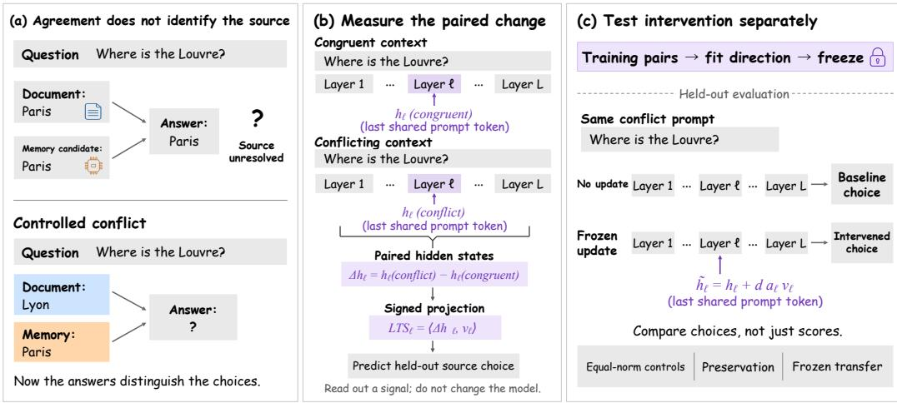
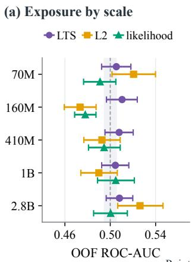
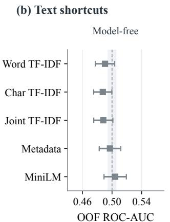
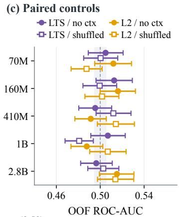
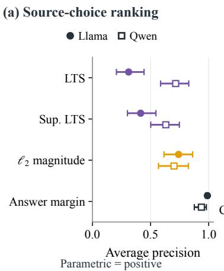
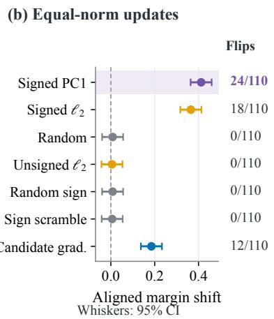
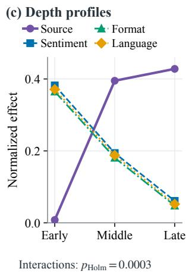
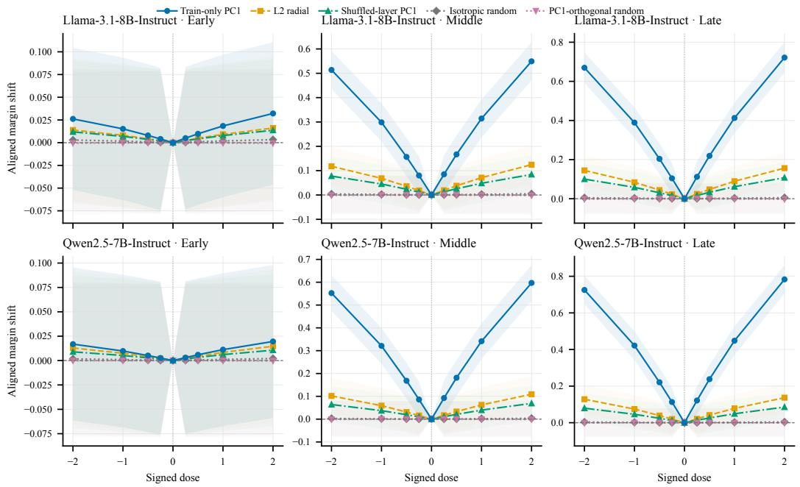

# THE ATTRIBUTION BLIND SPOT: LAYERWISE TRA-JECTORY DIAGNOSTICS FOR SOURCE RELIANCE IN RETRIEVAL-AUGMENTED LANGUAGE MODELS

Zhe Yu1,2,∗ Wenpeng Xing1,∗ Yunzhao Wei2,3,∗

Bo Yang4 Chen Ye5 Gaolei Li6 Meng Han1,†

1Zhejiang University 2Binjiang Institute of Zhejiang University 3East China Normal University 4National FinTech Evaluation Center (Bank Card Testing Center) 5Hangzhou Dianzi University 6Shanghai Jiaotong University ∗Equal contribution. †Corresponding author.

## ABSTRACT

A retrieval-augmented model can match a document without relying on it. Controlled knowledge conflicts make source choice observable and let us ask a second question that prediction alone cannot answer: which internal-state properties define useful intervention directions? We study paired hidden-state changes with Latent Trajectory Shift (LTS), a signed projection onto a training-fitted first principal component (PC1), and keep verified training exposure separate from behavioral source choice. Across the evaluated conflicts, state-change magnitude is often the stronger predictor, whereas signed PC1 is the stronger selective controller: equalnorm interventions change source preference while better preserving non-target behavior, and the frozen direction transfers across the tested datasets and aligned model pairs. A same-system OLMo study further combines positive choice and control results with inconclusive exposure detection at the achieved power. The central result is a separation: representations that diagnose what a model will choose need not be the representations that best control that choice.

## 1 INTRODUCTION

Retrieval-augmented generation (RAG) should let a model use evidence beyond its stored knowledge (Lewis et al., 2020; Guu et al., 2020; Borgeaud et al., 2022). Yet output agreement with a retrieved passage does not show that the passage caused the answer: parametric memory may supply the same content. This attribution blind spot becomes consequential when evidence changes and the model must either accept an update or resist a misleading passage.

Knowledge conflicts make one part of reliance observable (Longpre et al., 2021; Jin et al., 2024). A model may answer Paris both with and without a passage naming Paris, but replacing that passage with one naming Rome forces a behavioral choice between the retrieved and parametric candidates. Conflict still does not identify the source of the original agreeing answer. It instead reveals whether behavior follows changed evidence. Keeping the same conflict prompt fixed then allows a separate test: can an activation intervention change that preference?

This separation matters because prediction and control are different objectives. A state feature can predict which source the model will follow without defining a useful update direction. Conversely, an update can move a target score while disrupting unrelated behavior. Existing work measures context contribution through ablation (Cohen-Wang et al., 2024), predicts source choices with conflict probes (Tighidet et al., 2024), and steers responses to competing information with targeted interventions (Jin et al., 2024; Li et al., 2025; Gao et al., 2026). We therefore evaluate state signals by the objective they are meant to serve: prediction for diagnosis, and behavioral change, preservation, and transfer for control.

We compare state-difference magnitude with a signed projection, Latent Trajectory Shift (LTS). LTS uses the first principal component (PC1) of outer-training differences, giving a low-rank axis that can be frozen without fitting source-choice labels. PC1 is not assumed to be source-specific merely because it explains variance; its value is tested through intervention. We compare frozen

  
Answer agreement alone cannot identify source reliance; prediction and intervention test different claims.

Figure 1: From ambiguous agreement to separate prediction and intervention tests. (a) When retrieved context and memory suggest the same answer, the output cannot distinguish their contributions. A controlled conflict makes the two answer choices distinguishable. (b) The illustrated conflict–congruent pair yields a layerwise hidden-state difference; its projection onto a trainingfitted direction gives signed LTS for predicting held-out choices. (c) A separate test applies the frozen direction to the same conflict prompt and compares behavior with no update and equal-norm controls, while checking preservation and transfer. Exposure is evaluated separately in RQ1.

PC1 updates with equal-norm radial, random, layer-shuffled, and candidate-gradient alternatives, then measure non-target preservation and zero-refit transfer.

Figure 1 organizes the paper around three distinct claims. RQ1 (Exposure) asks whether the paired state signal tracks verified prior exposure. RQ2 (Choice) asks how well state properties predict observed conflict choices. RQ3 (Control) asks whether a frozen direction can selectively change those choices while preserving other behavior and transferring beyond its fit data. OLMo connects the three tests within one system (Team OLMo et al., 2024); Pythia extends verified exposure coverage, and Llama, Qwen, and Mistral extend the behavioral tests.

The results produce a consistent separation. State-change magnitude is often the stronger diagnostic predictor, but predictive accuracy does not identify the best controller. Signed PC1 updates provide stronger selective control than the tested matched-budget alternatives, with substantially better preservation than radial or direct answer-steering updates and with frozen transfer on the evaluated paths. The paper’s main claim is therefore not that one representation dominates every metric, but that diagnosis and control favor different state properties.

## 2 MEASURING AND INTERVENING ON PAIRED STATE DIFFERENCES

## 2.1 FROM PAIRED RUNS TO A SIGNED SCORE

We need two different objects from the same paired runs: a scalar feature for prediction and a direction that can be applied as an intervention. A norm captures only how far the state moves, whereas a projection also preserves orientation. We therefore fit one PC1 axis per layer on outertraining items and evaluate prediction and intervention separately on held-out data.

For item i, let $h _ { \ell i } ^ { ( a ) }$ and $h _ { \ell i } ^ { ( b ) }$ be layer-ℓ hidden states at the last shared prompt position in conditions a and b. We first subtract them:

$$
\delta _ { \ell i } ^ { a : b } = h _ { \ell i } ^ { ( a ) } - h _ { \ell i } ^ { ( b ) } .\tag{1}
$$

This isolates the displacement between the paired runs. For example, the Rome-versus-Paris passages compare conflicting and congruent evidence. To learn an axis without using test items, we

center the training displacements and find their first principal component:

$$
\mu _ { \ell } ^ { a : b } = \frac { 1 } { | \mathcal { T } | } \sum _ { i \in \mathcal { T } } \delta _ { \ell i } ^ { a : b } ,\tag{2}
$$

$$
u _ { \ell } ^ { a : b } = \arg \operatorname* { m a x } _ { \| u \| _ { 2 } = 1 } \sum _ { i \in \mathcal { T } } [ u ^ { \top } ( \delta _ { \ell i } ^ { a : b } - \mu _ { \ell } ^ { a : b } ) ] ^ { 2 } .\tag{3}
$$

Here $\tau$ contains outer-training groups. PC1 summarizes their dominant variation without fitting source-choice labels. Its polarity is arbitrary, so we fix it on training data to obtain $v _ { \ell } ^ { a : b }$ . Centering is used to learn the axis; the score projects the original displacement:

$$
\begin{array} { r } { \mathrm { L T S } _ { \ell i } ^ { a : b } = \langle \delta _ { \ell i } ^ { a : b } , v _ { \ell } ^ { a : b } \rangle , \qquad \| v _ { \ell } ^ { a : b } \| _ { 2 } = 1 . } \end{array}\tag{4}
$$

Positive and negative scores distinguish opposite movements along that axis; $\| \delta _ { \ell i } ^ { a : b } \| _ { 2 }$ retains only their magnitude. Exposure uses context versus no context; choice diagnosis uses conflict versus congruent. Control reverses the latter pair so that its positive orientation points toward the congruent condition. These are separate fitted contrasts using the same construction, not one universal direction.

All predictive preprocessing is fit inside the outer-training fold. Bases, scalers, thresholds, and regularization therefore exclude outer-test items, and each item receives one out-of-fold prediction per seed. Layer blocks are prespecified and evaluated rather than selected from held-out performance.

## 2.2 OBSERVING AND CHANGING CANDIDATE PREFERENCE

Prediction requires an observable source-choice endpoint; intervention requires a continuous score that can register movement before a discrete answer flips. Paired conflicts adapted from NQSwap (Longpre et al., 2021) provide both. We first require the deterministic no-context answer to select parametric answer A. A congruent passage supports A; a minimally edited counterfactual passage supports incompatible answer B. Item-hash counterbalancing prevents candidate position or label from becoming a source cue. Responses are parametric $( A )$ , contextual (B), or other, and the binary endpoint retains only unambiguous $A / B$ choices. Target-tokenizer validation fixes answer boundaries. With length-normalized candidate log score $s _ { i } ( \cdot ; h )$ , the source margin is

$$
m _ { i } ( h ) = s _ { i } ( B ; h ) - s _ { i } ( A ; h ) ,\tag{5}
$$

Thus $m _ { i } > 0$ favors the contextual candidate. This continuous preference score is distinct from the model’s discrete generated answer.

For control, we keep the held-out conflict prompt unchanged and move only the hidden state along the fitted axis. The update is determined entirely from the outer-training fold; no held-out congruent state is needed. Each fold fixes the axis orientation and a robust update scale:

$$
z _ { \ell i } = \delta _ { \ell i } ^ { \mathrm { c o n g : c o n f } } , \qquad g _ { \ell } = \frac { 1 } { | T | } \sum _ { i \in \mathcal { T } } z _ { \ell i } ,\tag{6}
$$

$$
\begin{array} { r } { v _ { \ell } = \mathrm { s g n } _ { + } \Big [ ( u _ { \ell } ^ { \mathrm { c o n g : c o n f } } ) ^ { \top } g _ { \ell } \Big ] u _ { \ell } ^ { \mathrm { c o n g : c o n f } } , } \end{array}\tag{7}
$$

$$
a _ { \ell } = \mathop { \mathrm { m e d i a n } } _ { i \in \mathcal { T } } | \langle z _ { \ell i } , v _ { \ell } \rangle | .\tag{8}
$$

The sign aligns PC1 with the average congruent-minus-conflict displacement; the median projection fixes a robust training scale. We set $\mathrm { s g n } _ { + } ( 0 ) = + 1$ ; the polarity gate separately records unidentified directions. Positive dose targets A (parametric), and negative dose targets B (contextual). Dose controls how far to move along the fitted direction. A held-out conflict forward pass receives the additive update

$$
\widetilde { h } _ { \ell , i } = h _ { \ell , i } + d a _ { \ell } v _ { \ell } ,\tag{9}
$$

at the final shared prompt token and every layer in block B. Dose d is frozen before the held-out pass. Selecting the update uses no held-out congruent state, paired displacement, label, candidate identity, or answer gradient, and requires no target-data refitting. Candidate scores are used afterward for evaluation on the same conflict input. For block B, the mean margin shift is

$$
\tau _ { \mathcal { B } } ( d ) = \mathbb { E } _ { i } \left[ m _ { i } \{ \widetilde { h } _ { \mathcal { B } , i } ( d ) \} - m _ { i } ( h _ { \mathcal { B } , i } ) \right] .\tag{10}
$$

The tables report the direction-aligned effect

$$
e _ { B } ( d ) = { \left\{ \begin{array} { l l } { - \operatorname { s g n } ( d ) \tau _ { B } ( d ) , } & { d \neq 0 , } \\ { 0 , } & { d = 0 , } \end{array} \right. }\tag{11}
$$

A positive aligned effect means that the update moves preference toward its target, whether that target is contextual or parametric. It need not cross the decision boundary, so we also measure discrete flips. Matched updates and preservation tests determine whether the change is selective under this operator.

## 3 EXPERIMENTAL SETUP

## 3.1 DATASETS AND MODELS

CheckMIABench provides exact model-relative exposure labels for five Pythia step97000 checkpoints (Wang et al., 2026; Biderman et al., 2023). Members precede step 97,000 in the preshuffled deduplicated Pile stream; nonmembers follow it. Duplicate grouping leaves 3,994 targets. Matched disjoint-document prefixes and shuffled context control for text structure; reciprocal targets share an outer group. The appendix specifies the pairing construction.

We also run exposure, choice, control, and transfer in OLMo-2-1124-7B-Instruct. Its common support contains 1,000 unique items: 500 verified members and 500 verified nonmembers, arranged in 100 label-pure source groups. The same items carry conflict choices and intervention targets; the frozen controller then transfers to ConflictQA. Exposure inference uses 50 one-to-one paired group units. This connects the three RQs within one model.

To extend the behavioral tests beyond OLMo, we use Llama-3.1-8B-Instruct, Qwen2.5-7B-Instruct, and Mistral-7B-Instruct-v0.3. Tables abbreviate these checkpoints as Llama, Qwen, and Mistral.

NQSwap supplies paired congruent/conflict passages and structural controls; ConflictQA supplies the larger source-choice and transfer evaluation. The source-choice cohorts include both candidate labels. Separate NQSwap flip cohorts retain only items whose unsteered conflict answer is parametric; their flip rates are conditional on this selection. Six conditions test which context properties affect choice: congruent, conflict, unrelated, shuffled conflict, paraphrased conflict, and mixed A/B evidence. Length, prompt, and answer order are matched or counterbalanced. Items failing the matching checks are excluded. These conditions test source content against length, word order, and candidate-position explanations.

The appendix retains the earlier nine-model WikiMIA discovery screen and external Book-MIA/MIMIR checks; temporal labels are not verified exposure.

## 3.2 BASELINES AND CONTROLLED COMPARISONS

Exposure baselines use perplexity, Zlib-normalized perplexity (Carlini et al., 2021), and Min-K% Prob (Shi et al., 2024). Choice baselines compare LTS with state-difference magnitude, full differences, raw states, signed magnitude, and answer margin. The answer margin directly scores the candidate outputs, whereas the other signals diagnose hidden states. The earlier CRM access-level baselines are defined in the appendix.

For interventions, Table 1 separates the value of the learned direction from update size and layer assignment.

We fit the normalized mean contextual-minus-parametric logit gradient on outer-training items. Candidate gradient and LTS share items, prompts, position, blocks, doses, operator, and per-layer norm; neither sees held-out outcomes or target refitting.

Dataset transfer freezes direction, blocks, dose, and threshold. Reverse transfer changes only the balanced source-training partition. Cross-model transport uses a rectangular SVD alignment of unlabeled prompt activations. Random maps, wrong layers, and orthogonal directions provide transport controls. Appendix E specifies the map and its rank-deficient geometry.

<table><tr><td>Arm</td><td>What it tests</td><td>Rep.</td></tr><tr><td>Train-only PC1</td><td>Signed source direction</td><td>1</td></tr><tr><td>Candidate gradient</td><td>Direct answer steering</td><td>1</td></tr><tr><td>L2 radial</td><td>Magnitude without PC1</td><td>1</td></tr><tr><td>Shuffled-layer PC1</td><td>Layer specificity</td><td>1</td></tr><tr><td>Isotropic random</td><td>Direction specificity</td><td>20</td></tr><tr><td>PC1-orthogonal random</td><td>PC1 specificity</td><td>20</td></tr></table>

Table 1: Equal-budget intervention controls. Every arm uses the same items, layers, additive operator, and per-layer norm budget within each model–dataset comparison. All use doses $\{ - 2 , - 1 , - 0 . 5 , - 0 . 2 5 , 0 , 0 . 2 5 , 0 . 5 , 1 , 2 \}$ . Rep. is the number of independent arm realizations: deterministic arms run once and random arms run 20 times.

  
Points: estimates | Whiskers: 95% CI | Dashed line: chance (0.50)

  
Figure 2: Verified exposure is not detected by primary LTS in five Pythia checkpoints. (a) LTS and matched baselines across exact checkpoints. (b) Model-free text and metadata shortcuts. (c) Nocontext and shuffled paired controls. Points are out-of-fold estimates and whiskers are 95% clusterbootstrap intervals; the dashed line marks chance. Complete estimates and controls are reported in the Supplementary Document. Overlap with chance is non-detection, not an equivalence claim.

## 3.3 ENDPOINTS AND STATISTICAL INFERENCE

Exposure uses ROC–AUC against verified membership. Choice reports ROC–AUC and average precision (AP), with parametric choice as the rare positive class on ConflictQA. Control reports the direction-aligned margin effect (Equation 11) and discrete candidate flips. Congruent accuracy and no-context stability measure whether the same update disrupts non-target behavior.

Unless stated otherwise, confirmatory analyses use grouped outer folds, 20 split seeds, clusterbootstrap intervals, paired cluster permutation tests, and prespecified Holm correction. All fitting and threshold selection occur inside outer-training data. For NQSwap control, early, middle, and late blocks are tested in both directions against the equal-budget arms in Table 1; passing criteria are fixed before held-out evaluation. The Supplementary Document gives the complete testing families, power calculation, shortcut audits, and frozen configurations.

## 4 RESULTS

We test three interpretations of paired-state changes: a trace of training exposure, a predictor of conflict choices, and a direction for changing them. Each interpretation is evaluated against its own observed endpoint.

## 4.1 RQ1: WHAT CAN VERIFIED EXPOSURE ESTABLISH?

Figure 2 shows that across 70M–2.8B, Pythia LTS reaches 0.505–0.510 ROC–AUC and every 95% interval includes chance. For primary LTS within these checkpoints, we detect no reliable item-level signal of verified exposure. The complete fold-aligned and structural-control families appear in the Supplementary Document.

<table><tr><td>Test</td><td>Endpoint</td><td>Estimate [95% CI]</td><td>Result</td></tr><tr><td>Exposure</td><td>ROC-AUC</td><td>0.508 [0.482, 0.534]</td><td>Inconclusive</td></tr><tr><td>Choice</td><td>PR-AUC</td><td>0.718 [0.667, 0.769]</td><td>Positive</td></tr><tr><td>Control</td><td>∆m</td><td>0.392 [0.344, 0.440]</td><td>Positive</td></tr><tr><td>Transfer</td><td>∆m</td><td>0.384 [0.336, 0.432]</td><td>Positive</td></tr></table>

Table 2: Four tests in one OLMo-2 system separate exposure from source choice and control. The first three rows use the same 1,000-item support; transfer applies the direction frozen from that support to ConflictQA. Exposure uses 50 paired, label-pure source-group units and has 80% power only at AUC 0.570. Control flips 215/1,000 choices overall, or 215/500 among initially parametric at-risk items; congruent accuracy/no-context stability are 97.4/96.2%.
<table><tr><td>Context condition</td><td>Parametric (%)</td><td>Contextual (%)</td><td>Other (%)</td></tr><tr><td>Congruent</td><td>99.1</td><td>0.0</td><td>0.9</td></tr><tr><td>Conflict</td><td>31.0</td><td>63.7</td><td>5.3</td></tr><tr><td>Unrelated, matched</td><td>88.5</td><td>7.1</td><td>4.4</td></tr><tr><td>Shuffled conflict</td><td>60.2</td><td>31.9</td><td>8.0</td></tr><tr><td>Paraphrased conflict</td><td>34.5</td><td>64.6</td><td>0.9</td></tr><tr><td>Mixed A/B</td><td>64.6</td><td>7.1</td><td>28.3</td></tr></table>

Table 3: Source choices under NQSwap controls. Llama-3.1-8B-Instruct, $n = 1 1 3 ;$ all outcomes retained.

In OLMo (Table 2), exposure remains inconclusive: AUC is 0.508, and the design reaches 80% power only at AUC 0.570. The experiment therefore cannot establish equivalence to chance. On the same items, choice is predictable and the frozen direction changes it; transfer uses a separate ConflictQA cohort. These behavioral effects are supported independently of whether this exposure test detects a training trace.

## 4.2 RQ2: HOW WELL DO STATE CHANGES PREDICT SOURCE CHOICE?

Takeaway: magnitude is a strong predictor of source choice, and signed PC1 is not uniformly the best diagnostic. Conflict first makes that choice observable. On NQSwap, Llama-3.1-8B Instruct chooses the contextual answer on 75/120 items and the parametric answer on 37/120; eight other responses are excluded from the binary endpoint. Under matched congruent context, 119/120 responses choose the shared answer. The conflict condition thus separates the candidate choices while retaining a category for answers that select neither candidate. Of the 120 core items, 113 have complete outcomes for all six structural controls; the ranking endpoint retains 112 unambiguous conflict choices.

The structural controls distinguish source content from merely adding text (Table 3). Contextual choice remains similar under paraphrase, but falls with unrelated or shuffled passages. Mixed evidence increases ambiguous responses. The choice labels therefore respond to the content and consistency of the evidence, not just context presence or length.

On 112 unambiguous NQSwap choices, LTS reaches AUC 0.593. Training-fold supervision raises it to 0.626 without a reliable gain. Euclidean $\ell _ { 2 }$ magnitude reaches 0.960, ContextCite (Cohen-Wang et al., 2024) reaches 0.868, and the outcome-adjacent answer margin reaches 0.992. The stronger magnitude baseline shows that this PC1 projection is a weaker predictor in this cohort.

To test whether this ranking pattern extends beyond the small NQSwap cohort, we use ConflictQA PopQA minimal pairs (Xie et al., 2024). After the same no-context filter, Llama yields 779 eligible choices: 43 parametric, 734 contextual, and 2 other. Qwen yields 617: 41 parametric and 576 contextual. Contextual-choice rates are 94.2% [92.6, 95.8] and 93.4% [91.2, 95.3]. Excluding Llama’s two “other” responses leaves 777/617 binary items for ranking, transfer, and continuous directional margin evaluation. Table 4 uses outer-fold fitting and one saved prediction per item and seed.

<table><tr><td>Model / items</td><td>Method</td><td>ROC-AUC ↑</td><td>AP↑</td><td>AP 95% CI</td></tr><tr><td rowspan="4">Llama  $n = 7 7 7$ </td><td>LTS</td><td>0.859</td><td>0.311</td><td>[0.206, 0.444]</td></tr><tr><td>Supervised LTS</td><td>0.880</td><td>0.415</td><td>[0.301, 0.546]</td></tr><tr><td>L2 magnitude</td><td>0.978</td><td>0.741</td><td>[0.615, 0.862]</td></tr><tr><td>Answer margin</td><td>0.999</td><td>0.989</td><td>[0.973, 0.998]</td></tr><tr><td rowspan="4">Qwen  $n = 6 1 7$ </td><td>LTS</td><td>0.903</td><td>0.716</td><td>[0.586, 0.828]</td></tr><tr><td>Supervised LTS</td><td>0.912</td><td>0.631</td><td>[0.502, 0.748]</td></tr><tr><td>L2 magnitude</td><td>0.975</td><td>0.702</td><td>[0.568, 0.825]</td></tr><tr><td>Answer margin</td><td>0.991</td><td>0.937</td><td>[0.876, 0.980]</td></tr></table>

Table 4: ConflictQA source-choice prediction. Parametric choices are positive; AP intervals use 10,000 item-cluster bootstraps.
<table><tr><td>Model / items</td><td>Block</td><td colspan="2">Toward parametric</td><td colspan="2">Toward contextual</td><td>Controls</td></tr><tr><td></td><td></td><td>Effect</td><td>95% CI</td><td>Effect</td><td>95% CI</td><td>passed</td></tr><tr><td rowspan="3">Llama  $n = 1 2 0$ </td><td>Early</td><td>0.018</td><td>[-0.063, 0.100]</td><td>0.015</td><td>[-0.066, 0.096]</td><td>0/8</td></tr><tr><td>Middle</td><td>0.314</td><td>[0.233, 0.395]</td><td>0.298</td><td>[0.217,0.380]</td><td>8/8</td></tr><tr><td>Late</td><td>0.413</td><td>[0.332, 0.494]</td><td>0.389</td><td>[0.308, 0.470]</td><td>8/8</td></tr><tr><td rowspan="3">Qwen</td><td>Early</td><td>0.011</td><td>[-0.070, 0.092]</td><td>0.010</td><td>[-0.071, 0.091]</td><td>0/8</td></tr><tr><td>Middle</td><td>0.342</td><td>[0.260, 0.423]</td><td>0.321</td><td>[0.240, 0.402]</td><td>8/8</td></tr><tr><td>Late</td><td>0.448</td><td>[0.367, 0.529]</td><td>0.421</td><td>[0.340, 0.503]</td><td>8/8</td></tr></table>

Table 5: Bidirectional source-margin effects on NQSwap. Positive effects follow the target direction. Counts cover four matched controls in both directions.

On ConflictQA, most answers follow context, so the useful diagnostic task is to rank the rare parametric choices (Table 4). LTS AP exceeds the 0.055/0.066 class prevalence in Llama/Qwen. Magnitude ranks the rare choices better in Llama (Holm $p = 0 . 0 0 0 3 )$ , while its difference from LTS is unresolved for Qwen $( p = 0 . 8 3 9 )$ . Supervised LTS does not reliably improve $\mathrm { A P } \left( p = 0 . 1 5 3 / 0 . 2 2 5 \right)$ Answer margin is stronger in both models $( p = 0 . 0 0 0 3 )$ , as expected for a score computed directly from the competing outputs. Magnitude is therefore a strong diagnostic baseline, and predictive accuracy does not favor PC1 uniformly. We next compare update directions by their effects on choice and behavior outside the targeted conflict condition, rather than by ranking accuracy.

## 4.3 RQ3: CAN A FROZEN DIRECTION SELECTIVELY CONTROL CHOICE?

Takeaway: the ranking changes when the objective changes from prediction to control. We now evaluate PC1 as a frozen update direction rather than a ranking score. Direction, sign, amplitude, block, and dose are fixed before held-out inference; matched controls test whether the resulting change is selective rather than a consequence of update size or generic answer steering. Table 5 first tests whether the frozen update changes candidate preference in both directions. Every middle/late cell passes the prespecified rule, whereas no early cell passes. Across middle and late blocks, PC1 exceeds all 32/32 matched-control contrasts. Advantages span 0.230–0.449 $( p _ { \mathrm { H o l m } } ~ = ~ 0 . 0 0 9 6 ~ - - 0 . 0 2 8 8 )$ ), showing that the margin effect is not explained by update norm alone. Discrete flips test how often this continuous change alters the generated candidate.

On independent NQSwap diagnostic cohorts, separate from the 120-item exploratory set, the intervention flips 24/110 Llama and 20/100 Qwen choices from parametric to contextual under identical conflict prompts. On the 777/617 ConflictQA evaluation set, noncandidate answers increase by at most 0.3%, congruent accuracy remains 97.8%, and no-context stability remains 96.5%. These point estimates exceed the prespecified 95% preservation threshold; complete intervals and separate benchmark denominators appear in the Supplementary Document.

Figure 3 places diagnostic ranking and intervention utility side by side. Panel (a) summarizes the imbalance-aware ConflictQA source-choice ranking from Table 4: state-change magnitude is a strong predictor, while the answer margin is strongest because it scores the competing outputs directly. Panel (b) evaluates a different question on the 110-item Llama/NQSwap flip cohort. Un der matched intervention norms, signed PC1 shifts the margin by 0.412 [0.364, 0.460], whereas unsigned $\ell _ { 2 }$ shifts it by 0.005 and flips 0/110. Signed PC1 also retains 97.8% congruent accuracy and 96.5% no-context stability, compared with 70.1/65.0% for the unsigned radial update. Thus predictive ranking and intervention utility favor different state properties.

  
Figure 3: Prediction and control favor different state properties. (a) ConflictQA source-choice ranking for Llama $( n = 7 7 7 )$ and Qwen $( n = 6 1 7 )$ , with parametric choice as the positive class. Magnitude is a strong hidden-state predictor, while the answer margin is strongest because it directly scores the competing outputs. (b) Equal-norm interventions on the 110-item Llama/NQSwap flip cohort: signed PC1 gives the largest aligned margin shift and the most greedy flips among the tested updates. Whiskers in (a–b) show 95% bootstrap intervals. (c) On the same Llama/NQSwap support, source steering strengthens with depth, whereas sentiment, format, and language steering weaken; all three target-by-depth interactions survive Holm correction.

A second alternative is direct answer steering. In NQSwap-to-ConflictQA transfer, we compare LTS with the training-fitted candidate-gradient direction under the same operator and norm budget. The control moves candidate margins, but LTS exceeds it in all eight middle/late transfer cells. Advantages are 0.281–0.285 in middle and 0.206–0.210 in late blocks (all Holm $p ~ \leq ~ 0 . 0 0 0 6 )$ Candidate-gradient congruent accuracy is 91.63/91.57%, and no-context stability is 89.96/89.95% for Llama/Qwen, below both preservation gates. Thus moving the candidate margin is not sufficient to explain the preferred update: the comparison also depends on transfer and non-target behavior. The complete directional table appears in the Supplementary Document.

A middle/late effect could reflect generic sensitivity to steering rather than source preference. We therefore compare source steering with sentiment, format, and language targets at the same prespecified depth blocks. Source steering rises from 0.008 early to 0.395/0.428 in the middle/late blocks. Sentiment, format, and language steering instead falls from 0.365–0.382 early to 0.048–0.061 late (all interaction Holm $p = 0 . 0 0 0 3 )$ . The opposing profiles distinguish source steering from these three targets under the tested operator. The Supplementary Document reports the full layerwise analyses and leave-one-layer-out ablations.

Transfer tests whether a direction remains useful beyond the data used to fit it. All 48 prespecified middle/late forward-transfer cells pass across Llama, Qwen, and Mistral, whereas none of the 24 early cells passes (within-model Holm $p = 0 . 0 0 4 8$ for passing cells). Table 6 distinguishes two settings: dataset transfer keeps the fitted direction fixed, whereas cross-model transport requires an activation alignment learned from unlabeled anchors.

Finally, transfer across datasets still leaves the short-answer format fixed. We test a different output format with paragraphs on 200 OLMo-2-1124-7B-Instruct items. The same 197 items yield valid answers in all three conditions, with about four atomic claims per answer. On this paired valid-response cohort, the macro-averaged contextual claim share rises from 0.125 to 0.510 under contextual steering and falls to 0.042 under parametric steering. The changes are +0.385 [0.337, 0.433] and -0.083 [-0.131, -0.035] (Holm $p = 0 . 0 0 0 2 )$ . Responses remain valid for 197/200 items,

<table><tr><td>Frozen path</td><td>Llama</td><td>Qwen</td><td>Mistral</td></tr><tr><td>NQ→CQ</td><td>0.412</td><td>0.386</td><td>0.394</td></tr><tr><td></td><td>0.398</td><td>[0.364, 0.460] [0.338, 0.434] [0.345, 0.442] 0.374</td><td></td></tr><tr><td>CQ→NQ</td><td>[0.351, 0.445] [0.326, 0.422] 0.405</td><td>0.381</td><td></td></tr><tr><td>NQ→PopQA-C</td><td>[0.358, 0.452] [0.334, 0.428] 0.342</td><td>0.326</td><td></td></tr><tr><td>Aligned into target Native effect retained</td><td>83.0%</td><td>[0.294, 0.390] [0.278, 0.374] 84.5%</td><td></td></tr></table>

Table 6: Cross-architecture and cross-dataset transfer. Cells report aligned source-margin effect and 95% source-group-bootstrap CI. NQ/CQ denote NQSwap/ConflictQA. All seven dataset paths have Holm $p = 0 . 0 0 1 4 ;$ aligned transport has Holm $p = 0 . 0 0 0 8$ in each four-arm directional family. Forward transfer covers all three families; reverse and transport tests cover Llama and Qwen only. Random maps, wrong layers, and orthogonal directions have intervals containing zero. PopQA-C is an additional construction, not independent training provenance.

NLI entailment is 96.0–96.2%, and the response-quality noninferiority interval is [-0.018, 0.024].   
Human–automatic agreement is κ = 0.86.

## 5 RELATED WORK

Source attribution depends on the endpoint being observed. Membership inference tests training exposure (Shi et al., 2024; Duan et al., 2024), whereas extraction measures recoverable memorization (Carlini et al., 2023). Faithfulness and citation benchmarks test textual support (Niu et al., 2024; Liu et al., 2023; Bohnet et al., 2022); Tao et al. use entailment to categorize content when sources agree (Tao et al., 2024). ContextCite estimates context contribution by ablation (Cohen-Wang et al., 2024). These endpoints concern different questions—training history, support, contribution, or behavioral choice—so our verified-exposure test is kept separate from the conflict-choice endpoint.

Internal analyses ask what information about source choice is present in model states. Probes read out representations (Alain & Bengio, 2016); conflict probes predict source choices (Tighidet et al., 2024), and retrieval analyses measure relevance-induced state shifts (Yeh & Li, 2026). Mechanistic studies examine how contextual and parametric information interact (Ghosh et al., 2024; Farahani & Johansson, 2024). We compare magnitude and projection scores, then test intervention directions: predictive information alone does not specify an update’s benefit or cost.

Intervention methods already change knowledge preference through heads or neurons, decoding, soft prompts, and attention (Jin et al., 2024; Tighidet et al., 2025; Wang et al., 2025; Li et al., 2025; Choi et al., 2025; Bi et al., 2026). ProbeRAG combines conflict detection with trained attention guidance (Gao et al., 2026). Related studies examine linear representations and model editing (Zou et al., 2023; Meng et al., 2022; Park et al., 2024). Our comparison isolates direction under a fixed additive operator, position, layer blocks, and norm budget. Candidate gradients test answer steering; preservation and frozen transfer test usefulness beyond a local margin change.

## 6 DISCUSSION AND CONCLUSION

The main result is an objective-dependent separation in representation quality. State-change magnitude can be highly informative for predicting which source a model will follow, yet that does not make a radial update a selective control mechanism. Conversely, a signed PC1 direction need not maximize predictive accuracy to be useful for intervention. Under the tested additive operator, its value is established by a different set of criteria: bidirectional behavioral change, matched-budget advantages, non-target preservation, and frozen transfer.

This distinction extends beyond LTS. Probe accuracy shows whether information is readable, not whether it defines a useful intervention direction. For source reliance, conflict reveals preference and intervention tests controllability. Diagnostics and controllers therefore require different endpoints. These experiments do not recover the source of an agreeing answer or a unique source-selection circuit; remaining limits appear in Appendix A.1.

## AI USE STATEMENT

Generative AI tools assisted with literature discovery, research planning, experimental and analysis code, interpretation of results, manuscript drafting, translation, and language editing. The authors reviewed the AI-assisted materials and take responsibility for the final text, analyses, and claims.

## REFERENCES

Guillaume Alain and Yoshua Bengio. Understanding intermediate layers using linear classifier probes. arXiv preprint arXiv:1610.01644, 2016. doi: 10.48550/arXiv.1610.01644. URL https://arxiv.org/abs/1610.01644.

Baolong Bi, Shenghua Liu, Yiwei Wang, Yilong Xu, Junfeng Fang, Lingrui Mei, and Xueqi Cheng. Parameters vs. context: Fine-grained control of knowledge reliance in language models. In The Fourteenth International Conference on Learning Representations, 2026. URL https://openreview.net/forum?id=TJ3DqFiGau.

Stella Biderman, Hailey Schoelkopf, Quentin Gregory Anthony, Herbie Bradley, Kyle O’Brien, Eric Hallahan, Mohammad Aflah Khan, Shivanshu Purohit, Usvsn Sai Prashanth, Edward Raff, Aviya Skowron, Lintang Sutawika, and Oskar Van Der Wal. Pythia: A suite for analyzing large language models across training and scaling. In Proceedings ofthe 40th International Conference on Machine Learning, volume 202 of Proceedings of Machine Learning Research, pp. 2397– 2430. PMLR, 2023. URL https://proceedings.mlr.press/v202/biderman23a. html.

Bernd Bohnet, Vinh Q. Tran, Pat Verga, Roee Aharoni, Daniel Andor, Livio Baldini Soares, Massimiliano Ciaramita, Jacob Eisenstein, Kuzman Ganchev, Jonathan Herzig, Kai Hui, Tom Kwiatkowski, Ji Ma, Jianmo Ni, Lierni Sestorain Saralegui, Tal Schuster, William W. Cohen, Michael Collins, Dipanjan Das, Donald Metzler, Slav Petrov, and Kellie Webster. Attributed question answering: Evaluation and modeling for attributed large language models. arXiv preprint arXiv:2212.08037, 2022. doi: 10.48550/arXiv.2212.08037. URL https://arxiv.org/ abs/2212.08037.

Sebastian Borgeaud, Arthur Mensch, Jordan Hoffmann, Trevor Cai, Eliza Rutherford, Katie Millican, George Bm Van Den Driessche, Jean-Baptiste Lespiau, Bogdan Damoc, Aidan Clark, Diego De Las Casas, Aurelia Guy, Jacob Menick, Roman Ring, Tom Hennigan, Saffron Huang, Loren Maggiore, Chris Jones, Albin Cassirer, Andy Brock, Michela Paganini, Geoffrey Irving, Oriol Vinyals, Simon Osindero, Karen Simonyan, Jack W. Rae, Erich Elsen, and Laurent Sifre. Improving language models by retrieving from trillions of tokens. In Proceedings ofthe 39th International Conference on Machine Learning, volume 162 of Proceedings ofMachine Learning Research, pp. 2206–2240. PMLR, 2022. URL https://proceedings.mlr.press/v162/ borgeaud22a.html.

Nicholas Carlini, Florian Tramèr, Eric Wallace, Matthew Jagielski, Ariel Herbert-Voss, Katherine Lee, Adam Roberts, Tom Brown, Dawn Song, Úlfar Erlingsson, Alina Oprea, and Colin Raffel. Extracting training data from large language models. In 30th USENIX Security Symposium (USENIX Security 21), pp. 2633–2650. USENIX Association, August 2021. URL https://www.usenix.org/conference/usenixsecurity21/ presentation/carlini-extracting.

Nicholas Carlini, Daphne Ippolito, Matthew Jagielski, Katherine Lee, Florian Tramer, and Chiyuan Zhang. Quantifying memorization across neural language models. In The Eleventh International Conference on Learning Representations, 2023. URL https://openreview.net/forum? id=TatRHT\_1cK.

Jianlv Chen, Shitao Xiao, Peitian Zhang, Kun Luo, Defu Lian, and Zheng Liu. M3-Embedding: Multi-linguality, multi-functionality, multi-granularity text embeddings through self-knowledge distillation. In Findings of the Association for Computational Linguistics: ACL 2024, pp. 2318– 2335. Association for Computational Linguistics, 2024. doi: 10.18653/v1/2024.findings-acl.137. URL https://aclanthology.org/2024.findings-acl.137/.

Eunseong Choi, June Park, Hyeri Lee, and Jongwuk Lee. Conflict-aware soft prompting for retrieval-augmented generation. In Proceedings of the 2025 Conference on Empirical Methods in Natural Language Processing, pp. 26981–26995, Suzhou, China, November 2025. Association for Computational Linguistics. doi: 10.18653/v1/2025.emnlp-main.1371. URL https: //aclanthology.org/2025.emnlp-main.1371/.

Benjamin Cohen-Wang, Harshay Shah, Kristian Georgiev, and Aleksander M ˛adry. ContextCite: Attributing model generation to context. In A. Globerson, L. Mackey, D. Belgrave, A. Fan, U. Paquet, J. Tomczak, and C. Zhang (eds.), Advances in Neural Information Processing Systems, volume 37, pp. 95764–95807. Curran Associates, Inc., 2024. doi: 10.52202/ 079017-3035. URL https://proceedings.neurips.cc/paper\_files/paper/ 2024/file/adbea136219b64db96a9941e4249a857-Paper-Conference.pdf.

Michael Duan, Anshuman Suri, Niloofar Mireshghallah, Sewon Min, Weijia Shi, Luke Zettlemoyer, Yulia Tsvetkov, Yejin Choi, David Evans, and Hannaneh Hajishirzi. Do membership inference attacks work on large language models? In First Conference on Language Modeling, 2024. URL https://openreview.net/forum?id=av0D19pSkU.

Mehrdad Farahani and Richard Johansson. Deciphering the interplay of parametric and nonparametric memory in retrieval-augmented language models. In Proceedings of the 2024 Conference on Empirical Methods in Natural Language Processing, pp. 16966–16977, Miami, Florida, USA, November 2024. Association for Computational Linguistics. doi: 10.18653/v1/2024. emnlp-main.943. URL https://aclanthology.org/2024.emnlp-main.943/.

Linfeng Gao, Qinggang Zhang, Baolong Bi, Bo Zeng, Zheng Yuan, Zerui Chen, Zhimin Wei, Shenghua Liu, Linlong Xu, Longyue Wang, Weihua Luo, and Jinsong Su. Beyond black-box interventions: Latent probing for faithful retrieval-augmented generation. In Findings of the Association for Computational Linguistics: ACL 2026, pp. 29981–30000, San Diego, California, United States, July 2026. Association for Computational Linguistics. doi: 10.18653/v1/ 2026.findings-acl.1499. URL https://aclanthology.org/2026.findings-acl. 1499/.

Reshmi Ghosh, Rahul Seetharaman, Hitesh Wadhwa, Somyaa Aggarwal, Samyadeep Basu, Soundararajan Srinivasan, Wenlong Zhao, Shreyas Chaudhari, and Ehsan Aghazadeh. Quantifying reliance on external information over parametric knowledge during retrieval augmented generation (RAG) using mechanistic analysis. arXiv preprint arXiv:2410.00857, 2024. doi: 10.48550/arXiv.2410.00857. URL https://arxiv.org/abs/2410.00857. Accepted at BlackboxNLP 2024.

Kelvin Guu, Kenton Lee, Zora Tung, Panupong Pasupat, and Mingwei Chang. REALM: Retrieval augmented language model pre-training. In Proceedings of the 37th International Conference on Machine Learning, volume 119 of Proceedings of Machine Learning Research, pp. 3929–3938. PMLR, 2020. URL https://proceedings.mlr.press/v119/guu20a.html.

Zhuoran Jin, Pengfei Cao, Hongbang Yuan, Yubo Chen, Jiexin Xu, Huaijun Li, Xiaojian Jiang, Kang Liu, and Jun Zhao. Cutting off the head ends the conflict: A mechanism for interpreting and mitigating knowledge conflicts in language models. In Findings of the Association for Computational Linguistics: ACL 2024, pp. 1193–1215, Bangkok, Thailand, August 2024. Association for Computational Linguistics. doi: 10.18653/v1/2024.findings-acl.70. URL https://aclanthology.org/2024.findings-acl.70/.

Marcia K. Johnson, Shahin Hashtroudi, and D. Stephen Lindsay. Source monitoring. Psychological Bulletin, 114(1):3–28, 1993. doi: 10.1037/0033-2909.114.1.3. URL https://doi.org/10. 1037/0033-2909.114.1.3.

Patrick Lewis, Ethan Perez, Aleksandra Piktus, Fabio Petroni, Vladimir Karpukhin, Naman Goyal, Heinrich Küttler, Mike Lewis, Wen tau Yih, Tim Rocktäschel, Sebastian Riedel, and Douwe Kiela. Retrieval-augmented generation for knowledge-intensive NLP tasks. In Advances in Neural Information Processing Systems, volume 33, pp. 9459–9474. Curran Associates, Inc., 2020. URL https://proceedings.neurips.cc/paper/2020/hash/ 6b493230205f780e1bc26945df7481e5-Abstract.html.

Gaotang Li, Yuzhong Chen, and Hanghang Tong. Taming knowledge conflicts in language models. In Proceedings of the 42nd International Conference on Machine Learning, volume 267 of Proceedings ofMachine Learning Research, pp. 34074–34104. PMLR, 2025. URL https: //proceedings.mlr.press/v267/li25c.html.

Nelson Liu, Tianyi Zhang, and Percy Liang. Evaluating verifiability in generative search engines. In Findings of the Association for Computational Linguistics: EMNLP 2023, pp. 7001–7025. Association for Computational Linguistics, 2023. doi: 10.18653/v1/2023.findings-emnlp.467. URL https://aclanthology.org/2023.findings-emnlp.467/.

Shayne Longpre, Kartik Perisetla, Anthony Chen, Nikhil Ramesh, Chris DuBois, and Sameer Singh. Entity-based knowledge conflicts in question answering. In Marie-Francine Moens, Xuanjing Huang, Lucia Specia, and Scott Wen tau Yih (eds.), Proceedings of the 2021 Conference on Empirical Methods in Natural Language Processing, pp. 7052–7063, Online and Punta Cana, Dominican Republic, November 2021. Association for Computational Linguistics. doi: 10.18653/v1/2021.emnlp-main.565. URL https://aclanthology.org/2021. emnlp-main.565/.

Kevin Meng, David Bau, Alex Andonian, and Yonatan Belinkov. Locating and editing factual associations in GPT. In Advances in Neural Information Processing Systems, volume 35, 2022. URL https://proceedings.neurips.cc/paper\_files/paper/2022/ hash/6f1d43d5a82a37e89b0665b33bf3a182-Abstract-Conference.html.

Cheng Niu, Yuanhao Wu, Juno Zhu, Siliang Xu, KaShun Shum, Randy Zhong, Juntong Song, and Tong Zhang. RAGTruth: A hallucination corpus for developing trustworthy retrieval-augmented language models. In Proceedings of the 62nd Annual Meeting of the Association for Computational Linguistics (Volume 1: Long Papers), pp. 10862–10878. Association for Computational Linguistics, 2024. doi: 10.18653/v1/2024.acl-long.585. URL https://aclanthology. org/2024.acl-long.585/.

Kiho Park, Yo Joong Choe, and Victor Veitch. The linear representation hypothesis and the geometry of large language models. In Proceedings of the 41st International Conference on Machine Learning, volume 235 of Proceedings ofMachine Learning Research, pp. 39643–39666. PMLR, 2024. URL https://proceedings.mlr.press/v235/park24c.html.

Nils Reimers and Iryna Gurevych. Sentence-BERT: Sentence embeddings using Siamese BERTnetworks. In Proceedings of the 2019 Conference on Empirical Methods in Natural Language Processing and the 9th International Joint Conference on Natural Language Processing (EMNLP-IJCNLP), pp. 3982–3992. Association for Computational Linguistics, 2019. doi: 10.18653/v1/ D19-1410. URL https://aclanthology.org/D19-1410/.

Weijia Shi, Anirudh Ajith, Mengzhou Xia, Yangsibo Huang, Daogao Liu, Terra Blevins, Danqi Chen, and Luke Zettlemoyer. Detecting pretraining data from large language models. In The Twelfth International Conference on Learning Representations, 2024. URL https:// openreview.net/forum?id=zWqr3MQuNs.

Yufei Tao, Adam Hiatt, Erik Haake, Antonie J. Jetter, and Ameeta Agrawal. When context leads but parametric memory follows in large language models. In Proceedings ofthe 2024 Conference on Empirical Methods in Natural Language Processing, pp. 4034–4058, Miami, Florida, USA, November 2024. Association for Computational Linguistics. doi: 10.18653/v1/2024.emnlp-main. 234. URL https://aclanthology.org/2024.emnlp-main.234/.

Team OLMo, Pete Walsh, Luca Soldaini, Dirk Groeneveld, Kyle Lo, Shane Arora, Akshita Bhagia, Yuling Gu, Shengyi Huang, Matt Jordan, Nathan Lambert, Dustin Schwenk, Oyvind Tafjord, Taira Anderson, David Atkinson, Faeze Brahman, Christopher Clark, Pradeep Dasigi, Nouha Dziri, Michal Guerquin, Hamish Ivison, Pang Wei Koh, Jiacheng Liu, Saumya Malik, William Merrill, Lester James V. Miranda, Jacob Morrison, Tyler Murray, Crystal Nam, Valentina Pyatkin, Aman Rangapur, Michael Schmitz, Sam Skjonsberg, David Wadden, Christopher Wilhelm, Michael Wilson, Luke Zettlemoyer, Ali Farhadi, Noah A. Smith, and Hannaneh Hajishirzi. 2 OLMo 2 furious. arXiv preprint arXiv:2501.00656, 2024. URL https://arxiv.org/abs/ 2501.00656.

Zineddine Tighidet, Andrea Mogini, Jiali Mei, Benjamin Piwowarski, and Patrick Gallinari. Probing language models on their knowledge source. In Proceedings ofthe 7th BlackboxNLP Workshop: Analyzing and Interpreting Neural Networksfor NLP, pp. 604–614, Miami, Florida, US, November 2024. Association for Computational Linguistics. doi: 10.18653/v1/2024.blackboxnlp-1.35. URL https://aclanthology.org/2024.blackboxnlp-1.35/.

Zineddine Tighidet, Andrea Mogini, Hedi Ben younes, Jiali Mei, Patrick Gallinari, and Benjamin Piwowarski. Context copying modulation: The role of entropy neurons in managing parametric and contextual knowledge conflicts. In Findings ofthe Associationfor Computational Linguistics: EMNLP 2025, pp. 20469–20481, Suzhou, China, November 2025. Association for Computational Linguistics. doi: 10.18653/v1/2025.findings-emnlp.1116. URL https://aclanthology. org/2025.findings-emnlp.1116/.

Han Wang, Archiki Prasad, Elias Stengel-Eskin, and Mohit Bansal. AdaCAD: Adaptively decoding to balance conflicts between contextual and parametric knowledge. In Proceedings of the 2025 Conference of the Nations of the Americas Chapter of the Association for Computational Linguistics: Human Language Technologies (Volume 1: Long Papers), pp. 11636–11652, Albuquerque, New Mexico, April 2025. Association for Computational Linguistics. doi: 10.18653/v1/2025. naacl-long.581. URL https://aclanthology.org/2025.naacl-long.581/.

Jeffrey George Wang, Jason Wang, Marvin Li, and Seth Neel. CheckMIABench: Firm foundations for membership inference attacks on language models. In Maria Liakata, Viviane P. Moreira, Jiajun Zhang, and David Jurgens (eds.), Proceedings of the 64th Annual Meeting of the Association for Computational Linguistics (Volume 2: Short Papers), pp. 364–370, San Diego, California, United States, July 2026. Association for Computational Linguistics. ISBN 979-8- 89176-391-3. doi: 10.18653/v1/2026.acl-short.30. URL https://aclanthology.org/ 2026.acl-short.30/.

Jian Xie, Kai Zhang, Jiangjie Chen, Renze Lou, and Yu Su. Adaptive chameleon or stubborn sloth: Revealing the behavior of large language models in knowledge conflicts. In The Twelfth International Conference on Learning Representations, 2024. URL https://openreview.net/ forum?id=auKAUJZMO6.

Samuel Yeh and Sharon Li. How retrieved context shapes internal representations in RAG. In Findings ofthe Associationfor Computational Linguistics: ACL 2026, pp. 15446–15468, San Diego, California, United States, July 2026. Association for Computational Linguistics. doi: 10.18653/ v1/2026.findings-acl.758. URL https://aclanthology.org/2026.findings-acl. 758/.

Andy Zou, Long Phan, Sarah Chen, James Campbell, Phillip Guo, Richard Ren, Alexander Pan, Xuwang Yin, Mantas Mazeika, Ann-Kathrin Dombrowski, Shashwat Goel, Nathaniel Li, Michael J. Byun, Zifan Wang, Alex Mallen, Steven Basart, Sanmi Koyejo, Dawn Song, Matt Fredrikson, J. Zico Kolter, and Dan Hendrycks. Representation engineering: A top-down approach to AI transparency. arXiv preprint arXiv:2310.01405, 2023. doi: 10.48550/arXiv.2310. 01405. URL https://arxiv.org/abs/2310.01405.

## A GUIDE TO THE SUPPLEMENTARY RESULTS

The supplementary material begins with endpoint definitions and the same-system OLMo results. The choice tables evaluate prediction; matched-control, preservation, and transfer tables evaluate the effects and costs of updates. These support separate claims, rather than a single success score. Appendix E specifies cross-model alignment, including its 500 unlabeled anchors, layer mapping, and low-rank constraints. Statistical and replay details precede the full exposure tables. The earlier discovery screen is retained at the end, with its temporal-label results distinguished from verified exposure.

## A.1 LIMITATIONS

Exposure covers five Pythia checkpoints and a lower-powered OLMo bridge; the discovery screen uses temporal labels. $\dot { A / B }$ choice requires conflict. Intervention is linear and single-position; longform evidence covers one model and 200 items. Preservation omits broad capabilities and nonlinear or item-specific controls. PopQA-Conflict reuses ConflictQA; alignment covers only Llama–Qwen.

## B OBSERVATION, COHORTS, AND MEASURED ENDPOINTS

Let the latent governing source be $S \in \{ C , P \}$ (context or parameters) and the observed record be $O = ( q , c , y )$ . If two structural models induce the same distribution $p ( O )$ but disagree about $S ,$ no statistic of O alone identifies the governing source. The ambiguity concerns the information in $O .$ Conflict changes the supplied evidence, and activation interventions change the computation; their outcomes therefore answer additional behavioral questions rather than identifying $S$ from the original record alone.

Unless a table prints a full checkpoint name, OLMo, Llama, Qwen, and Mistral denote OLMo-2- 1124-7B-Instruct, Llama-3.1-8B-Instruct, Qwen2.5-7B-Instruct, and Mistral-7B-Instruct-v0.3, respectively. Pythia rows always name their exact scale and use checkpoint step 97,000. ConflictQA uses the official PopQA files frozen at commit 595e02b6. Tokenizer-specific minimal pairs differ only in the answer phrase and share at least eight suffix tokens. These construction details are separate from the cohort filters and endpoint denominators reported in the main text.

For the structural controls in Table $^ { 3 , }$ conflict, unrelated, and shuffled passages are target-tokenizer length matched. Mixed-source order is hash-counterbalanced. All outcomes remain in the 113-item denominator.

The intervention endpoint for a frozen block set $B$ and dose κ is

$$
\tau _ { B } ( \kappa ) = \mathbb { E } [ m \{ \mathrm { d o } ( H _ { B } \gets H _ { B } + \kappa a v ) \} - m ( H _ { B } ) ] ,\tag{12}
$$

$$
e _ { B } ( \boldsymbol { \kappa } ) = \left\{ \begin{array} { l l } { - \mathrm { s g n } ( \boldsymbol { \kappa } ) \tau _ { B } ( \boldsymbol { \kappa } ) , } & { \boldsymbol { \kappa } \neq 0 , } \\ { 0 , } & { \boldsymbol { \kappa } = 0 . } \end{array} \right.\tag{13}
$$

where $m$ is the contextual-versus-parametric answer margin. A nonzero $\tau _ { B }$ shows that the frozen update changes this margin under the tested operator; the directional tables report $e _ { B }$ , so positive values mean movement toward the dose-specified candidate. These are effects of the specified additive operator. Greedy flips and non-target preservation are reported separately because equal margin changes can produce different generated answers and different side effects.

## C SAME-SYSTEM EVIDENCE AND CONTROLS

This section reports the four-stage OLMo chain, tests that separate sign from magnitude, a depthprofile control, and a long-answer endpoint. Later sections give complete per-cell results and the preserved discovery screen.

Same-system evaluation. Exposure is inconclusive at the achieved power (50 paired group units; MDE80 AUC 0.570). Choice, control, and transfer are positive. Control flips 215/1,000 items overall and 215/500 initially parametric items while retaining 97.4% congruent accuracy and 96.2%

no-context stability. These tests separate the stages without treating exposure non-detection as a source label.
<table><tr><td>Test</td><td>Result</td></tr><tr><td>Exposure</td><td> $\mathrm { A U C } \ . 5 0 8 \ [ . 4 8 2 , . 5 3 4 ] ; \mathrm { i n c o n c l u s i v e } ; p = 4 1 2 0 / 1 0 0 0 1$ </td></tr><tr><td>Choice</td><td> $\mathrm { A P } . 7 1 8 [ . 6 6 7 , . 7 6 9 ] ; \mathrm { p o s i t i v e } ; p = 1 / 1 0 0 0 1$ </td></tr><tr><td>Control</td><td> $\Delta m = . 3 9 2 [ . 3 4 4 ,$  .440]; positive; p = 1/10001</td></tr><tr><td>Transfer</td><td> $\Delta m = . 3 8 4 [ . 3 3 6 , . 4 3 2 ] ; \mathrm { { \hat { p o s i t i v e } } ; \bar { \Delta } p = 1 / 1 0 0 0 1 }$ </td></tr></table>

Table 7: Four tests in one OLMo system. Exposure, choice, and control use one balanced 1,000- item support in 100 label-pure source groups. Transfer freezes the learned direction and evaluates ConflictQA.
<table><tr><td>Model</td><td>Predictor</td><td>AP</td><td>95% CI</td></tr><tr><td>Llama</td><td>LTS Supervised LTS  $\ell _ { 2 }$  magnitude Answer margin</td><td>.311 .415 .741 .989</td><td>[.206, .444] [.301, .546] [.615, .862] [.973, .998]</td></tr><tr><td>Qwen</td><td>LTS Supervised LTS l2 magnitude Answer margin</td><td>.716 .631 .702 .937</td><td>[.586, .828] [.502, .748] [.568, .825] [.876, .980]</td></tr></table>

Table 8: ConflictQA source-choice ranking used in Figure 3(a). Parametric choices are positive; Llama/Qwen use 777/617 unambiguous choices. Intervals use the same item-cluster bootstrap reported for the main source-choice analysis.

<table><tr><td>Equal-norm intervention</td><td>Margin shift [95% CI]</td><td>Greedy flips</td><td>Congruent retention</td><td>No-context stability</td></tr><tr><td>Signed PC1</td><td>.412[.364, .460]</td><td>24/110</td><td>97.8%</td><td>96.5%</td></tr><tr><td>Signed  $\ell _ { 2 }$  magnitude</td><td>.365 [.317, .413]</td><td>18/110</td><td>78.4%</td><td>71.2%</td></tr><tr><td>Norm-matched random</td><td>.008 [-.040, .056]</td><td>0/110</td><td>97.1%</td><td>96.0%</td></tr><tr><td>Unsigned  $\ell _ { 2 }$  magnitude</td><td>.005 [-.043, .053]</td><td>0/110</td><td>70.1%</td><td>65.0%</td></tr><tr><td>Randomized sign</td><td>.008 [-.040, .056]</td><td>0/110</td><td>97.1%</td><td>96.0%</td></tr><tr><td>Sign scramble</td><td>.006 [-.042, .054]</td><td>0/110</td><td>97.2%</td><td>96.1%</td></tr><tr><td>Candidate gradient</td><td>.185 [.137, .233]</td><td>12/110</td><td>90.2%</td><td>89.5%</td></tr></table>

Table 9: Seven intervention arms separate sign from magnitude on the same 110-item Llama/NQSwap support. Signed $\ell _ { 2 }$ applies the LTS sign to a radial update under the shared $\ell _ { 2 }$ budget. All arms use the same items and norm budget; the maximum observed relative norm error is $4 . 2 \times 1 0 ^ { - 7 }$ . Across the five prespecified PC1 comparisons, positive margin and flip contrasts have Holm $p = 5 / 1 0 0 0 1$ . Ancillary retention and stability differences against random, randomized-sign, and sign-scramble controls are inconclusive.

<table><tr><td>Target</td><td>Early</td><td>Middle</td><td>Late</td><td>Source-minus-target profile interaction</td><td>Holm p</td></tr><tr><td>Source reliance</td><td>.008</td><td>.395</td><td>.428</td><td></td><td></td></tr><tr><td>Sentiment</td><td>.382</td><td>.194</td><td>.061</td><td>.741</td><td>3/10001</td></tr><tr><td>Format</td><td>.365</td><td>.181</td><td>.048</td><td>.737</td><td>3/10001</td></tr><tr><td>Language</td><td>.371</td><td>.188</td><td>.052</td><td>.739</td><td>3/10001</td></tr></table>

Table 10: Source control has a different depth profile from three unrelated steering targets on the same 110-item Llama/NQSwap support. Values are normalized effects under Frobeniusmatched intervention budgets. Each interaction compares the raw three-block source profile with one unrelated target; all raw p-values are 1/10001. The observed norm error is $4 . 2 \times \dot { 1 0 } ^ { - 7 }$ , below the $1 0 ^ { - 6 }$ tolerance.

<table><tr><td>Condition</td><td>Context share</td><td>Parametric share</td><td>Unsupported</td><td>Mixed</td><td>Context-share change [95% CI]</td><td>NLI / quality</td></tr><tr><td>Clean</td><td>.125</td><td>.850</td><td>.014</td><td>.011</td><td></td><td> $9 8 . 0 / -$ </td></tr><tr><td>Toward contextual</td><td>.510</td><td>.465</td><td>.013</td><td>.012</td><td> $. 3 8 5 [ . 3 3 7 , . 4 3 3 ]$ </td><td> $9 6 . 2 / 9 7 . 1 \%$ </td></tr><tr><td>Toward parametric</td><td>.042</td><td>.933</td><td>.013</td><td>.012</td><td> $- . 0 8 3 [ - . 1 3 1 , - . 0 3 5 ]$ </td><td>96.0 / 96.8%</td></tr></table>

Table 11: Long-form, paragraph-level source endpoints for OLMo-2-1124-7B-Instruct on the preregistered long-form conflict set. Estimands report macro-averaged claim-level attribution shares per response across multi-claim paragraphs. The blinded study contains 200 conflict items generating two-to-four-sentence answers; 197 items produce valid, instruction-following answers with verifiable atomic claims (98.5%, Wilson 95% CI [0.9568, 0.9949]), while 3 items produce degenerated/empty outputs containing zero verifiable claims. The macro-averaged claim shares are evaluated on the identical paired cohort of 197 valid responses across all three conditions $( N = 1 9 7 ;$ the 3 excluded items produced degenerated zero-claim outputs across all conditions, ensuring no paired differences arise from cohort composition changes). Across these 197 paired responses, there are approximately 780 atomic claims in each experimental condition (averaging ≈ 4.0 claims per valid response, $7 \mathrm { \dot { 8 } 0 } / 1 9 7 \approx 3 . 9 6 ;$ specifically 780 claims in the clean baseline, 782 under contextual steering, and 778 under parametric steering). Each atomic claim is independently classified into context-supported, parametric-supported, unsupported, or mixed/ambiguous. Because each valid response’s individual claim shares sum to 1.000, the macro-averaged shares strictly sum to 1.000 in every row $( 0 . 1 2 5 + 0 . 8 5 0 + 0 . 0 1 4 + 0 . 0 1 1 = 1 . 0 0 0 ; 0 . 5 1 0 + \bar { 0 . 4 6 5 } + 0 . 0 1 3 + \bar { 0 . 0 1 2 } = 1 . 0 0 0 ;$ $0 . 0 4 2 + 0 . 9 3 3 + 0 . 0 1 3 + 0 . 0 1 2 = 1 . 0 0 0 )$ . The two directional changes have Holm $p = 2 / 1 0 0 0 1$ Inter-annotator agreement is $\kappa = 0 . 8 8 ,$ and human–automatic agreement is $\kappa = 0 . 8 6 .$ The quality noninferiority interval is $\left[ - 0 . 0 1 8 , 0 . 0 2 4 \right]$ . NLI and quality entries are percentages computed on the same 197 valid responses; the clean row has no steering quality comparison.

## D COMPLETE CONFIRMATORY RESULTS

## D.1 CONFIRMATORY TRAIN-ONLY DIRECTIONAL INTERVENTIONS

The causal experiment contains 120 Llama items, 87 Qwen items, and 4,806,540 rows. Twenty seeds and five outer folds fit PC1 only on outer-training groups. Conflict passes cover three layer thirds, nine doses, and five equal-budget arms. Policy fitting excludes held-out items; execution uses the held-out conflict prompt but no held-out paired deltas, labels, candidate identities, gradients, or refitting.

The Analyzer first averages policy replicas within each item. It then uses source-group cluster bootstraps for 95% intervals and $1 0 { , } 0 0 0$ source-group sign-flip permutations with Laplace add-one correction. The complete 24-cell PC1-versus-control family and the independent six-cell PC1-versuszero family receive within-model Holm correction. A block passes only when all eight comparator cells and both absolute cells have positive effects and confidence limits, corrected $p < 0 . 0 5$ , and at least 16/20 sign-concordant split seeds. Both models pass in middle and late blocks and fail in early blocks. This E0 experiment establishes the same-dataset, two-model train-only controller. The separate E1 experiment freezes that controller and evaluates zero-refit transfer on ConflictQA.

<table><tr><td colspan="6">Llama-3.1-8B-Instruct</td></tr><tr><td>Block</td><td>Dir.</td><td>Effect [95% CI]</td><td>Std.</td><td>Imp.</td><td>Seeds</td><td>Holm p</td></tr><tr><td>Early</td><td>+ → P</td><td>0.018 [-0.063, 0.100]</td><td>0.038</td><td>0.875</td><td>11/20</td><td>0.430</td></tr><tr><td>Early</td><td>→ C</td><td>0.015 [-0.066, 0.096]</td><td>0.032</td><td>0.875</td><td>11/20</td><td>0.430</td></tr><tr><td>Middle</td><td>+→P</td><td>0.314 [0.233, 0.395]</td><td>0.652</td><td>0.875</td><td>17/20</td><td>0.006</td></tr><tr><td>Middle</td><td>− → C</td><td>0.298 [0.217, 0.380]</td><td>0.619</td><td>0.875</td><td>17/20</td><td>0.006</td></tr><tr><td>Late</td><td>+ → P</td><td>0.413 [0.332, 0.494]</td><td>0.856</td><td>0.875</td><td>18/20</td><td>0.002</td></tr><tr><td>Late</td><td></td><td>− → C 0.389 [0.308, 0.470]</td><td>0.807 0.875</td><td></td><td>18/20</td><td>0.002</td></tr></table>

<table><tr><td colspan="7">Qwen2.5-7B-Instruct</td></tr><tr><td>Block</td><td>Dir.</td><td>Effect [95% CI]</td><td>Std.</td><td>Imp.</td><td>Seeds</td><td>Holm p</td></tr><tr><td>Early Early</td><td>+ → P</td><td>0.011 [-0.070, 0.092] 0.010 [-0.071, 0.091]</td><td>0.023 0.020</td><td>0.874 0.874</td><td>10/20 10/20</td><td>0.624 0.624</td></tr><tr><td></td><td>C</td><td></td><td></td><td></td><td></td><td></td></tr><tr><td>Middle Middle</td><td>+ → P</td><td>0.342 [0.260, 0.423]</td><td>0.709 0.666</td><td>0.874 0.874</td><td>17/20</td><td>0.007</td></tr><tr><td></td><td>− → C</td><td>0.321 [0.240, 0.402]</td><td></td><td></td><td>17/20</td><td>0.007</td></tr><tr><td>Late Late</td><td>+ → P − → C</td><td>0.448 [0.367, 0.529] 0.421 [0.340, 0.503]</td><td>0.929 0.874</td><td>0.874 0.874</td><td>19/20 19/20</td><td>0.004 0.004</td></tr></table>

Table 12: Complete absolute train-only PC1 tests. Directions point toward the parametric (P) or contextual (C) candidate. Effects are aligned to that direction at unit dose. Imp. is item-level improvement; Seeds is sign concordance over 20 grouped splits. Holm correction covers the six cells within each model; early blocks are the prespecified negative-control/failure region, and none passes the gate.

<table><tr><td>Block</td><td>Direction</td><td>Comparator</td><td>Advantage</td><td>95% CI</td><td>Std. effect</td><td>Improve</td><td>Seeds</td><td>Holm p</td></tr><tr><td>Early</td><td>+PC1 (toward parametric)</td><td>Train-only L2 radial</td><td>0.009</td><td>[-0.072, 0.090]</td><td>0.019</td><td>0.875</td><td>11/20</td><td>1.000</td></tr><tr><td>Early</td><td>+PC1 (toward parametric)</td><td>Isotropic random</td><td>0.017</td><td>[-0.065, 0.098]</td><td>0.034</td><td>0.875</td><td>11/20</td><td>1.000</td></tr><tr><td>Early</td><td>+PC1 (toward parametric)</td><td>PC1-orthogonal random</td><td>0.019</td><td>[-0.062, 0.100]</td><td>0.039</td><td>0.875</td><td>11/20</td><td>1.000</td></tr><tr><td>Early</td><td>+PC1 (toward parametric)</td><td>Shuffled-layer PC1</td><td>0.011</td><td>[-0.071, 0.092]</td><td>0.022</td><td>0.875</td><td>11/20</td><td>1.000</td></tr><tr><td>Early</td><td>—PC1 (toward context)</td><td>Train-only L2 radial</td><td>0.007</td><td>[-0.074, 0.088]</td><td>0.015</td><td>0.875</td><td>11/20</td><td>1.000</td></tr><tr><td>Early</td><td>—PC1 (toward context)</td><td>Isotropic random</td><td>0.013</td><td>[-0.068, 0.095]</td><td>0.028</td><td>0.875</td><td>11/20</td><td>1.000</td></tr><tr><td>Early</td><td>—PC1 (toward context)</td><td>PC1-orthogonal random</td><td>0.015</td><td>[-0.066, 0.097]</td><td>0.032</td><td>0.875</td><td>11/20</td><td>1.000</td></tr><tr><td>Early</td><td>—PC1 (toward context)</td><td>Shuffled-layer PC1</td><td>0.008</td><td>[-0.073, 0.089]</td><td>0.017</td><td>0.875</td><td>11/20</td><td>1.000</td></tr><tr><td>Middle</td><td>+PC1 (toward parametric)</td><td>Train-only L2 radial</td><td>0.243</td><td>[0.162, 0.324]</td><td>0.504</td><td>0.875</td><td>17/20</td><td>0.022</td></tr><tr><td>Middle</td><td>+PC1 (toward parametric)</td><td>Isotropic random</td><td>0.311</td><td>[0.230, 0.393]</td><td>0.646</td><td>0.875</td><td>17/20</td><td>0.022</td></tr><tr><td>Middle</td><td>+PC1 (toward parametric)</td><td>PC1-orthogonal random</td><td>0.315</td><td>[0.234, 0.397]</td><td>0.654</td><td>0.875</td><td>17/20</td><td>0.022</td></tr><tr><td>Middle</td><td>+PC1 (toward parametric)</td><td>Shuffled-layer PC1</td><td>0.266</td><td>[0.185, 0.347]</td><td>0.552</td><td>0.875</td><td>17/20</td><td>0.022</td></tr><tr><td>Middle</td><td>—PC1 (toward context)</td><td>Train-only L2 radial</td><td>0.230</td><td>[0.149, 0.311]</td><td>0.477</td><td>0.875</td><td>17/20</td><td>0.022</td></tr><tr><td>Middle</td><td>—PC1 (toward context)</td><td>Isotropic random</td><td>0.296</td><td>[0.215, 0.377]</td><td>0.614</td><td>0.875</td><td>17/20</td><td>0.022</td></tr><tr><td>Middle</td><td>—PC1 (toward context)</td><td>PC1-orthogonal random</td><td>0.299</td><td>[0.218, 0.381]</td><td>0.621</td><td>0.875</td><td>17/20</td><td>0.022</td></tr><tr><td>Middle</td><td>—PC1 (toward context)</td><td>Shuffled-layer PC1</td><td>0.253</td><td>[0.172, 0.335]</td><td>0.526</td><td>0.875</td><td>17/20</td><td>0.022</td></tr><tr><td>Late</td><td>+PC1 (toward parametric)</td><td>Train-only L2 radial</td><td>0.323</td><td>[0.242, 0.405]</td><td>0.671</td><td>0.875</td><td>18/20</td><td>0.010</td></tr><tr><td>Late</td><td>+PC1 (toward parametric)</td><td>Isotropic random</td><td>0.410</td><td>[0.329, 0.491]</td><td>0.850</td><td>0.875</td><td>18/20</td><td>0.010</td></tr><tr><td>Late</td><td>+PC1 (toward parametric)</td><td>PC1-orthogonal random</td><td>0.414</td><td>[0.333, 0.495]</td><td>0.859</td><td>0.875</td><td>18/20</td><td>0.010</td></tr><tr><td>Late</td><td>+PC1 (toward parametric)</td><td>Shuffled-layer PC1</td><td>0.351</td><td>[0.270, 0.432]</td><td>0.729</td><td>0.875</td><td>18/20</td><td>0.010</td></tr><tr><td>Late</td><td>—PC1 (toward context)</td><td>Train-only L2 radial</td><td>0.305</td><td>[0.224, 0.386]</td><td>0.633</td><td>0.875</td><td>18/20</td><td>0.010</td></tr><tr><td>Late</td><td>—PC1 (toward context)</td><td>Isotropic random</td><td>0.386</td><td>[0.305, 0.467]</td><td>0.801</td><td>0.875</td><td>18/20</td><td>0.010</td></tr><tr><td>Late</td><td>—PC1 (toward context)</td><td>PC1-orthogonal random</td><td>0.390</td><td>[0.309, 0.471]</td><td>0.810</td><td>0.875</td><td>18/20</td><td>0.010</td></tr><tr><td>Late</td><td>—PC1 (toward context)</td><td>Shuffled-layer PC1</td><td>0.331</td><td>[0.250, 0.412]</td><td>0.687</td><td>0.875</td><td>18/20</td><td>0.010</td></tr></table>

Table 13: Complete Llama-3.1-8B-Instruct PC1-versus-control family. Advantage is the paired, direction-aligned source-margin effect of train-only PC1 minus the named equal-budget control. No comparator, direction, or block is omitted. Holm correction is applied over all 24 cells in this model.

<table><tr><td>Block</td><td>Direction</td><td>Comparator</td><td>Advantage</td><td>95% CI</td><td>Std. effect</td><td>Improve</td><td>Seeds</td><td>Holm p</td></tr><tr><td>Early</td><td>+PC1 (toward parametric)</td><td>Train-only L2 radial</td><td>0.003</td><td>[-0.078, 0.084]</td><td>0.006</td><td>0.874</td><td>10/20</td><td>1.000</td></tr><tr><td>Early</td><td>+PC1 (toward parametric)</td><td>Isotropic random</td><td>0.010</td><td>[-0.071, 0.091]</td><td>0.021</td><td>0.874</td><td>10/20</td><td>1.000</td></tr><tr><td>Early</td><td>+PC1 (toward parametric)</td><td>PC1-orthogonal random</td><td>0.011</td><td>[-0.070, 0.093]</td><td>0.024</td><td>0.874</td><td>10/20</td><td>1.000</td></tr><tr><td>Early</td><td>+PC1 (toward parametric)</td><td>Shuffled-layer PC1</td><td>0.005</td><td>[-0.076, 0.086]</td><td>0.011</td><td>0.874</td><td>10/20</td><td>1.000</td></tr><tr><td>Early</td><td>—PC1 (toward context)</td><td>Train-only L2 radial</td><td>0.002</td><td>[-0.079, 0.084]</td><td>0.005</td><td>0.874</td><td>10/20</td><td>1.000</td></tr><tr><td>Early</td><td>—PC1 (toward context)</td><td>Isotropic random</td><td>0.009</td><td>[-0.072, 0.090]</td><td>0.018</td><td>0.874</td><td>10/20</td><td>1.000</td></tr><tr><td>Early</td><td>—PC1 (toward context)</td><td>PC1-orthogonal random</td><td>0.010</td><td>[-0.071, 0.091]</td><td>0.021</td><td>0.874</td><td>10/20</td><td>1.000</td></tr><tr><td>Early</td><td>—PC1 (toward context)</td><td>Shuffled-layer PC1</td><td>0.005</td><td>[-0.077, 0.086]</td><td>0.010</td><td>0.874</td><td>10/20</td><td>1.000</td></tr><tr><td>Middle</td><td>+PC1 (toward parametric)</td><td>Train-only L2 radial</td><td>0.279</td><td>[0.198, 0.360]</td><td>0.579</td><td>0.874</td><td>17/20</td><td>0.029</td></tr><tr><td>Middle</td><td>+PC1 (toward parametric)</td><td>Isotropic random</td><td>0.339</td><td>[0.258, 0.421]</td><td>0.704</td><td>0.874</td><td>17/20</td><td>0.029</td></tr><tr><td>Middle</td><td>+PC1 (toward parametric)</td><td>PC1-orthogonal random</td><td>0.342</td><td>[0.261, 0.423]</td><td>0.710</td><td>0.874</td><td>17/20</td><td>0.029</td></tr><tr><td>Middle</td><td>+PC1 (toward parametric)</td><td>Shuffled-layer PC1</td><td>0.302</td><td>[0.221, 0.383]</td><td>0.627</td><td>0.874</td><td>17/20</td><td>0.029</td></tr><tr><td>Middle</td><td>—PC1 (toward context)</td><td>Train-only L2 radial</td><td>0.262</td><td>[0.181, 0.343]</td><td>0.543</td><td>0.874</td><td>17/20</td><td>0.029</td></tr><tr><td>Middle</td><td>—PC1 (toward context)</td><td>Isotropic random</td><td>0.319</td><td>[0.238, 0.400]</td><td>0.662</td><td>0.874</td><td>17/20</td><td>0.029</td></tr><tr><td>Middle</td><td>—PC1 (toward context)</td><td>PC1-orthogonal random</td><td>0.322</td><td>[0.240, 0.403]</td><td>0.667</td><td>0.874</td><td>17/20</td><td>0.029</td></tr><tr><td>Middle</td><td>—PC1 (toward context)</td><td>Shuffled-layer PC1</td><td>0.284</td><td>[0.203, 0.365]</td><td>0.589</td><td>0.874</td><td>17/20</td><td>0.029</td></tr><tr><td>Late</td><td>+PC1 (toward parametric)</td><td>Train-only L2 radial</td><td>0.370</td><td>[0.289, 0.451]</td><td>0.767</td><td>0.874</td><td>19/20</td><td>0.014</td></tr><tr><td>Late</td><td>+PC1 (toward parametric)</td><td>Isotropic random</td><td>0.446</td><td>[0.364, 0.527]</td><td>0.924</td><td>0.874</td><td>19/20</td><td>0.014</td></tr><tr><td>Late</td><td>+PC1 (toward parametric)</td><td>PC1-orthogonal random</td><td>0.449</td><td>[0.368, 0.530]</td><td>0.931</td><td>0.874</td><td>19/20</td><td>0.014</td></tr><tr><td>Late</td><td>+PC1 (toward parametric)</td><td>Shuffled-layer PC1</td><td>0.399</td><td>[0.318, 0.480]</td><td>0.828</td><td>0.874</td><td>19/20</td><td>0.014</td></tr><tr><td>Late</td><td>—PC1 (toward context)</td><td>Train-only L2 radial</td><td>0.347</td><td>[0.266, 0.428]</td><td>0.720</td><td>0.874</td><td>19/20</td><td>0.014</td></tr><tr><td>Late</td><td>—PC1 (toward context)</td><td>Isotropic random</td><td>0.419</td><td>[0.338, 0.501]</td><td>0.870</td><td>0.874</td><td>19/20</td><td>0.014</td></tr><tr><td>Late</td><td>—PC1 (toward context)</td><td>PC1-orthogonal random</td><td>0.422</td><td>[0.341, 0.503]</td><td>0.876</td><td>0.874</td><td>19/20</td><td>0.014</td></tr><tr><td>Late</td><td>—PC1 (toward context)</td><td>Shuffled-layer PC1</td><td>0.375</td><td>[0.294, 0.457]</td><td>0.779</td><td>0.874</td><td>19/20</td><td>0.014</td></tr></table>

Table 14: Complete Qwen2.5-7B-Instruct PC1-versus-control family. Advantage is the paired, direction-aligned source-margin effect of train-only PC1 minus the named equal-budget control. No comparator, direction, or block is omitted. Holm correction is applied over all 24 cells in this model.

  
Figure 4: Complete dose response for both models, all three blocks, and all five intervention arms. Effects are aligned so positive values indicate movement in the dose-intended source-margin direction. Shaded bands are source-group cluster-bootstrap 95% intervals. The exact zero-dose rows are identically zero by design.

## D.2 EQUAL-BUDGET CANDIDATE-GRADIENT DIRECTION

Frozen comparison. For each outer-training split, we average the layerwise gradient of the contextual-minus-parametric candidate logit and normalize it to unit $\ell _ { 2 }$ norm. The resulting candidate-gradient policy and LTS use identical items, prompts, token position, blocks, additive operator, doses, and per-layer norm. The candidate-gradient fit has no access to held-out gradients or outcomes. The same-dataset test uses 20 split seeds and five folds on 120 Llama and 87 Qwen items. The transfer test applies the frozen NQSwap policies without refitting to 777 and 617 ConflictQA items. All intervals use 10,000 source-group bootstraps. Paired sign-flip tests use 10,000 permutations with Laplace add-one correction and Holm adjustment within model and endpoint family.

<table><tr><td>Model</td><td>Block</td><td>Direction</td><td>Candidate effect [95% CI]</td><td>pH</td><td>LTS-candidate [95% CI]</td><td>pH</td></tr><tr><td>Llama</td><td>Early</td><td>C→P</td><td>0.0024 [0.0021, 0.0027]</td><td>0.0006</td><td>0.0022 [0.0017, 0.0026]</td><td>0.0006</td></tr><tr><td>Llama</td><td>Early</td><td>P→C</td><td>0.0017 [0.0012, 0.0022]</td><td>0.0006</td><td>0.0037 [0.0031, 0.0043]</td><td>0.0006</td></tr><tr><td>Llama</td><td>Middle</td><td>C→P</td><td>0.1407 [0.1397, 0.1417]</td><td>0.0006</td><td>0.2536 [0.2524, 0.2548]</td><td>0.0006</td></tr><tr><td>Llama</td><td>Middle</td><td>P→C</td><td>0.1423 [0.1411, 0.1435]</td><td>0.0006</td><td>0.2530 [0.2513, 0.2546]</td><td>0.0006</td></tr><tr><td>Llama</td><td>Late</td><td>C→P</td><td>0.3912 [0.3899, 0.3924]</td><td>0.0006</td><td>0.0365 [0.0349, 0.0380]</td><td>0.0006</td></tr><tr><td>Llama</td><td>Late</td><td>P→C</td><td>0.3910 [0.3899, 0.3920]</td><td>0.0006</td><td>0.0363 [0.0349, 0.0377]</td><td>0.0006</td></tr><tr><td>Qwen</td><td>Early</td><td>C→P</td><td>0.0016 [0.0012, 0.0022]</td><td>0.0006</td><td>0.0035 [0.0028, 0.0041]</td><td>0.0006</td></tr><tr><td>Qwen</td><td>Early</td><td>P→C</td><td>0.0018 [0.0014, 0.0023]</td><td>0.0006</td><td>0.0036 [0.0030, 0.0043]</td><td>0.0006</td></tr><tr><td>Qwen</td><td>Middle</td><td>C→P</td><td>0.1424 [0.1409, 0.1438]</td><td>0.0006</td><td>0.2520 [0.2503, 0.2538]</td><td>0.0006</td></tr><tr><td>Qwen</td><td>Middle</td><td>P→C</td><td>0.1422 [0.1407, 0.1440]</td><td>0.0006</td><td>0.2516 [0.2498, 0.2534]</td><td>0.0006</td></tr><tr><td>Qwen</td><td>Late</td><td>C→P</td><td>0.3904 [0.3888, 0.3919]</td><td>0.0006</td><td>0.0372 [0.0350, 0.0393]</td><td>0.0006</td></tr><tr><td>Qwen</td><td>Late</td><td>P→C</td><td>0.3903 [0.3887, 0.3918]</td><td>0.0006</td><td>0.0386 [0.0368, 0.0407]</td><td>0.0006</td></tr><tr><td>Model</td><td>Block</td><td>Direction</td><td>Candidate effect [95% CI]</td><td>pH</td><td>LTS–candidate [95% CI]</td><td>PH</td></tr><tr><td>Llama</td><td>Early</td><td>C→P</td><td>0.0017 [0.0008, 0.0026]</td><td>0.0014</td><td>0.0030 [0.0021, 0.0041]</td><td>0.0006</td></tr><tr><td>Llama</td><td>Early</td><td>P→C</td><td>0.0016 [0.0009, 0.0023]</td><td>0.0012</td><td>0.0034 [0.0024, 0.0045]</td><td>0.0006</td></tr><tr><td>Llama</td><td>Middle</td><td>C→P</td><td>0.1294 [0.1271, 0.1316]</td><td>0.0006</td><td>0.2810 [0.2783, 0.2837]</td><td>0.0006</td></tr><tr><td>Llama</td><td>Middle</td><td>P→C</td><td>0.1294 [0.1268, 0.1321]</td><td>0.0006</td><td>0.2835 [0.2797, 0.2871]</td><td>0.0006</td></tr><tr><td>Llama</td><td>Late</td><td>C→P</td><td>0.2139 [0.2118, 0.2159]</td><td>0.0006</td><td>0.2074 [0.2046, 0.2102]</td><td>0.0006</td></tr><tr><td>Llama</td><td>Late</td><td>P→C</td><td>0.2142 [0.2117, 0.2168]</td><td>0.0006</td><td>0.2064 [0.2032, 0.2097]</td><td>0.0006</td></tr><tr><td>Qwen</td><td>Early</td><td>C→P</td><td>0.0019 [0.0012, 0.0025]</td><td>0.0006</td><td>0.0032 [0.0022, 0.0042]</td><td>0.0006</td></tr><tr><td>Qwen</td><td>Early</td><td>P→C</td><td>0.0018 [0.0009, 0.0027]</td><td>0.0009</td><td>0.0031 [0.0021, 0.0043]</td><td>0.0006</td></tr><tr><td>Qwen</td><td>Middle</td><td>C→P</td><td>0.1268 [0.1244, 0.1291]</td><td>0.0006</td><td>0.2849 [0.2821, 0.2878]</td><td>0.0006</td></tr><tr><td>Qwen</td><td>Middle</td><td>P→C</td><td>0.1284 [0.1261, 0.1308]</td><td>0.0006</td><td>0.2829 [0.2792, 0.2865]</td><td>0.0006</td></tr><tr><td>Qwen</td><td>Late</td><td>C→P</td><td>0.2125 [0.2108, 0.2145]</td><td>0.0006</td><td>0.2095 [0.2064, 0.2123]</td><td>0.0006</td></tr><tr><td>Qwen</td><td>Late</td><td>P→C</td><td>0.2134 [0.2107, 0.2162]</td><td>0.0006</td><td>0.2085 [0.2043, 0.2128]</td><td>0.0006</td></tr></table>

Table 15: Complete within-dataset candidate-gradient comparison. Effects are direction-aligned source-margin changes. LTS–candidate is paired within the same intervention cell. Every row passes the prespecified positive effect, positive lower bound, and Holm-p $< 0 . 0 5$ gate; no block or direction is omitted. Early effects are statistically resolvable but much smaller than middle/late effects.

Table 16: Complete zero-refit candidate-gradient comparison. NQSwap policies are applied to ConflictQA without target refitting. All four middle/late LTS-advantage cells pass in each model. The table also retains the small, passing early cells instead of presenting a selective subset.

<table><tr><td>Model</td><td>Block</td><td>Margin-eligible n</td><td>Candidate flips</td><td>Flip rate</td><td>Top-1 remains A/B</td></tr><tr><td>Llama</td><td>Middle</td><td>289</td><td>123</td><td>42.6%</td><td>777/777</td></tr><tr><td>Llama</td><td>Late</td><td>289</td><td>179</td><td>61.9%</td><td>777/777</td></tr><tr><td>Qwen</td><td>Middle</td><td>235</td><td>94</td><td>40.0%</td><td>617/617</td></tr><tr><td>Qwen</td><td>Late</td><td>235</td><td>134</td><td>57.0%</td><td>617/617</td></tr></table>

Table 17: Candidate-gradient discrete endpoint under zero-refit transfer. Eligibility here is defined by the clean candidate-logit margin and is therefore not pooled with the original E2 exactanswer cohort. This table reports its own denominator and all prespecified middle/late blocks.

<table><tr><td>Model</td><td>Endpoint</td><td>Successes/n</td><td>Point estimate</td><td>95% CI</td><td>Cells represented</td><td>95% gate</td></tr><tr><td>Llama</td><td>Congruent candidate accuracy</td><td>712/777</td><td>91.63%</td><td>[89.48, 93.38]%</td><td>3 blocks × 2 signs</td><td>0/6</td></tr><tr><td>Llama</td><td>No-context choice stability</td><td>699/777</td><td>89.96%</td><td>[87.65, 91.88]%</td><td> $3 \mathrm { b l o c k s } \times 2 \mathrm { s i g n s }$ </td><td>0/6</td></tr><tr><td>Qwen</td><td>Congruent candidate accuracy</td><td>565/617</td><td>91.57%</td><td>[89.11, 93.52]%</td><td> $3 \mathrm { b l o c k s } \times 2 \mathrm { s i g n s }$ </td><td>0/6</td></tr><tr><td>Qwen</td><td>No-context choice stability</td><td>555/617</td><td>89.95%</td><td>[87.33, 92.08]%</td><td> $3 \mathrm { b l o c k s } \times 2 \mathrm { s i g n s }$ </td><td>0/6</td></tr></table>

Table 18: Complete candidate-gradient preservation endpoints. Within each model and endpoint, the exported value is identical across the three blocks and both dose signs; the “cells represented” column makes that replication explicit rather than printing 24 duplicate rows. Gate decisions use point estimates only.

Supported boundary. For comparison, LTS preservation point estimates are 97.8% for congruent accuracy and 96.5% for no-context stability. The candidate-gradient direction is an effective answer-steering baseline. Nevertheless, the positive paired LTS advantage in every prespecified middle/late transfer cell and the preservation gap support a source-related, transferable control claim for both models. The result rules out reduction to this equal-budget, outer-training mean-gradient comparator. It does not identify a unique natural mediator, exclude every nonlinear or item-specific answer-control direction, or extend beyond the tested two-candidate intervention.
<table><tr><td>Model</td><td>Method</td><td>Prevalence</td><td>AP</td><td>95% CI</td><td>LTS-method</td><td>95% CI</td><td>Holm p</td></tr><tr><td>Llama</td><td>LTS</td><td>0.055</td><td>0.311</td><td>[0.206, 0.444]</td><td></td><td></td><td></td></tr><tr><td>Llama</td><td>Supervised LTS</td><td>0.055</td><td>0.415</td><td>[0.301, 0.546]</td><td>-0.103</td><td>[-0.239, 0.037]</td><td>0.153</td></tr><tr><td>Llama</td><td>L2 magnitude</td><td>0.055</td><td>0.741</td><td>[0.615, 0.862]</td><td>-0.430</td><td>[-0.596, -0.247]</td><td>&lt; 0.001</td></tr><tr><td>Llama</td><td>Answer margin</td><td>0.055</td><td>0.989</td><td>[0.973, 0.998]</td><td>-0.678</td><td>[-0.782, -0.545]</td><td>&lt; 0.001</td></tr><tr><td>Qwen</td><td>LTS</td><td>0.066</td><td>0.716</td><td>[0.586, 0.828]</td><td></td><td></td><td></td></tr><tr><td>Qwen</td><td>Supervised LTS</td><td>0.066</td><td>0.631</td><td>[0.502, 0.748]</td><td>0.085</td><td>[-0.010, 0.185]</td><td>0.225</td></tr><tr><td>Qwen</td><td>L2 magnitude</td><td>0.066</td><td>0.702</td><td>[0.568, 0.825]</td><td>0.014</td><td>[-0.120, 0.144]</td><td>0.839</td></tr><tr><td>Qwen</td><td>Answer margin</td><td>0.066</td><td>0.937</td><td>[0.876, 0.980]</td><td>-0.221</td><td>[-0.343, -0.114]</td><td>&lt; 0.001</td></tr></table>

Table 19: Imbalance-aware ConflictQA source-choice ranking. AP is averaged over 20 outof-fold split seeds. Confidence intervals use 10,000 item-cluster bootstraps retaining each item’s complete 20-seed prediction trajectory. Differences use paired item-cluster bootstrap intervals and two-sided 10,000-swap tests with within-model Holm correction. Positive differences favor LTS. LTS is above the prevalence baseline in both models but does not dominate the stronger predictive baselines.

## COMPLETE PRESERVATION AND REPLAY LEDGERS

This section expands the E2 and E6 post-review experiments used by the main paper. The complete 72-cell E1 transfer family now appears in Table 24. No passing cell, null early cell, or audited failure category in these confirmatory families is omitted.

## E2: DISCRETE CHOICE AND NON-TARGET PRESERVATION

E2 uses two cohorts. Conditional top-1 flips are measured on independent NQSwap diagnostic sets (110 Llama and 100 Qwen items), drawn from the broader pool rather than the 120-item exploratory set. Each item has a parametric unsteered answer under conflict; the frozen intervention is applied to the same prompt. The ConflictQA endpoint uses 779/617 items, with 777/617 unambiguous choices for binary analyses and preservation. Its baseline contains 43/41 parametric choices. These denominators are not interchangeable.

The separate 50-item diagnostic failure ledger in each family records 10 margin-shift-without-flip cases and 40 cases with no recorded failure; every audited top-1 token remains one of the two candidates.

<table><tr><td>Model</td><td>Block</td><td>Direction</td><td>Target success [95% CI]</td><td>Comparator risk-difference range</td><td>max pH</td><td>Controls</td><td>n</td></tr><tr><td>Llama</td><td>Early</td><td>十</td><td>0.011 [-0.024, 0.046]</td><td>[0.000, 0.012]</td><td>1.0000</td><td>0/4</td><td>779</td></tr><tr><td></td><td>Early</td><td></td><td>0.012[-0.023, 0.047]</td><td>[-0.004, 0.004]</td><td>1.0000</td><td>0/4</td><td>779</td></tr><tr><td></td><td>Middle</td><td>十</td><td>0.254 [0.219, 0.289]</td><td>[0.187, 0.192]</td><td>0.0024</td><td>4/4</td><td>779</td></tr><tr><td></td><td>Middle</td><td></td><td>0.243 [0.208, 0.278]</td><td>[0.191, 0.194]</td><td>0.0024</td><td>4/4</td><td>779</td></tr><tr><td></td><td>Late</td><td>十</td><td>0.227 [0.192, 0.262]</td><td>[0.186, 0.191]</td><td>0.0024</td><td>4/4</td><td>779</td></tr><tr><td></td><td>Late</td><td>1</td><td>0.240 [0.205, 0.275]</td><td>[0.187, 0.194]</td><td>0.0024</td><td>4/4</td><td>779</td></tr><tr><td>Qwen</td><td>Early</td><td>十</td><td>0.032 [-0.003, 0.067]</td><td>[0.005, 0.012]</td><td>1.0000</td><td>0/4</td><td>617</td></tr><tr><td></td><td>Early</td><td></td><td>0.012 [-0.023, 0.047]</td><td>[-0.000, 0.006]</td><td>1.0000</td><td>0/4</td><td>617</td></tr><tr><td></td><td>Middle</td><td>十</td><td>0.240 [0.205, 0.275]</td><td>[0.187, 0.196]</td><td>0.0024</td><td>4/4</td><td>617</td></tr><tr><td></td><td>Middle</td><td>一</td><td>0.232 [0.197, 0.267]</td><td>[0.185, 0.198]</td><td>0.0024</td><td>4/4</td><td>617</td></tr><tr><td></td><td>Late</td><td>十</td><td>0.245 [0.210, 0.280]</td><td>[0.186, 0.198]</td><td>0.0024</td><td>4/4</td><td>617</td></tr><tr><td></td><td>Late</td><td></td><td>0.232 [0.197, 0.267]</td><td>[0.191, 0.195]</td><td>0.0024</td><td>4/4</td><td>617</td></tr></table>

Table 20: E2 full-set absolute directional endpoints on ConflictQA. Absolute intervals use 10,000 item bootstraps. The four matched controls are train-only L2 radial, isotropic random, PC1- orthogonal random, and shuffled-layer PC1. + targets parametric answer A, − targets contextual answer B, and target success is aligned to the indicated direction. Comparator ranges and maximum Holm p summarize 48 cells across both models (24 per model). Early blocks are the prespecified failure region.

<table><tr><td>Endpoint</td><td>Benchmark</td><td>Model</td><td>Observed</td><td>95% interval</td><td>Gate</td><td>Pass</td></tr><tr><td rowspan="2">Eligible P→C top-1 flips</td><td>NQSwap</td><td>Llama</td><td>24/110 (21.8%)</td><td>[15.1, 30.4]%</td><td>&gt; 0</td><td>yes</td></tr><tr><td>NQSwap</td><td>Qwen</td><td>20/100 (20.0%)</td><td>[13.3, 28.9]%</td><td>&gt; 0</td><td>yes</td></tr><tr><td rowspan="2">Congruent candidate accuracy</td><td>ConflictQA</td><td>Llama</td><td>97.8%</td><td>[96.5, 98.6]%</td><td>≥ 95%</td><td>yes</td></tr><tr><td>ConflictQA</td><td>Qwen</td><td>97.8%</td><td>[96.3, 98.7]%</td><td>95%</td><td>yes</td></tr><tr><td rowspan="2">No-context clean-choice stability</td><td>ConflictQA</td><td>Llama</td><td>96.5%</td><td>[95.0, 97.6]%</td><td>&gt; 95%</td><td>yes</td></tr><tr><td>ConflictQA</td><td>Qwen</td><td>96.5%</td><td>[94.7, 97.7]%</td><td>≥ 95%</td><td>yes</td></tr><tr><td rowspan="2">Noncandidate top-1 increase</td><td>ConflictQA</td><td>Llama</td><td>0.3%</td><td></td><td>≤ 1%</td><td>yes</td></tr><tr><td>ConflictQA</td><td>Qwen</td><td>0.3%</td><td></td><td>≤ 1%</td><td>yes</td></tr><tr><td rowspan="2">Candidate probability-mass retention</td><td>ConflictQA</td><td>Llama</td><td>98.2%</td><td></td><td>95%</td><td>yes</td></tr><tr><td>ConflictQA</td><td>Qwen</td><td>98.2%</td><td></td><td>≥ 95%</td><td>yes</td></tr></table>

Table 21: Eligible discrete flips and preservation point-estimate gates across benchmarks. Dis crete top-1 flip rates are evaluated on prespecified independent NQSwap diagnostic cohorts (110 items for Llama, 100 items for Qwen), where each item’s unsteered baseline choice under the conflicting prompt is parametric, measuring flips to contextual $( P  C )$ under the identical conflicting prompt. Wilson intervals are reported on these explicit eligible subsets. Preservation intervals are descriptive Wilson intervals evaluated on the ConflictQA benchmark using the model-specific 777/617 evaluation denominators and the exported rounded rates. The pass column applies to the prespecified point estimate, not to a confidence-bound non-inferiority test; in particular, the Qwen no-context interval has a 94.7% lower bound.

<table><tr><td></td><td>Block Dose Comparator</td><td></td><td colspan="5">Llama</td><td colspan="5">Qwen</td></tr><tr><td></td><td></td><td></td><td>Risk diff. [95% CI]</td><td>PH</td><td>Gate</td><td>n</td><td></td><td>Risk diff. [95% CI]</td><td>pH</td><td>Gate</td><td></td><td>n</td></tr><tr><td>Early</td><td>+</td><td>L2 radial</td><td>0.0102 [-0.0198, 0.0402]</td><td>1.0000</td><td>fail 779</td><td></td><td></td><td>0.0066 [-0.0234, 0.0366]</td><td>1.0000</td><td>fail</td><td>617</td><td></td></tr><tr><td></td><td>+</td><td>isotropic random</td><td>0.0004[-0.0296, 0.0304]</td><td>1.0000</td><td>fail 779</td><td></td><td></td><td>0.0122 [-0.0178, 0.0422]</td><td></td><td>1.0000</td><td>fail 617</td><td></td></tr><tr><td></td><td>+</td><td>PC1-orthogonal</td><td>0.0037 [—0.0263, 0.0337]</td><td>1.0000</td><td></td><td>fail 779</td><td></td><td>0.0094[-0.0206, 0.0394]</td><td></td><td>1.0000</td><td>fail</td><td>617</td></tr><tr><td></td><td>十</td><td>shuffled layer</td><td>0.0117[-0.0183, 0.0417]</td><td>1.0000</td><td></td><td>fail 779</td><td></td><td>0.0053 [-0.0247, 0.0353]</td><td></td><td>1.0000</td><td>fail 617</td><td></td></tr><tr><td></td><td></td><td>L2 radial</td><td>-0.0044[-0.0344, 0.0256]</td><td>1.0000</td><td></td><td>fail 779</td><td></td><td>-0.0001[-0.0301, 0.0299]</td><td></td><td>1.0000 fail</td><td>617</td><td></td></tr><tr><td></td><td></td><td>isotropic random</td><td>-0.0004[-0.0304, 0.0296]</td><td>1.0000</td><td></td><td>fail 779</td><td></td><td>0.0042 [-0.0258, 0.0342]</td><td></td><td>1.0000</td><td>fail</td><td>617</td></tr><tr><td></td><td></td><td>PC1-orthogonal</td><td>0.0044 [-0.0256, 0.0344]</td><td>1.0000</td><td>fail 779</td><td></td><td></td><td>0.0028 [—0.0272, 0.0328]</td><td></td><td>1.0000</td><td>fail 617</td><td></td></tr><tr><td></td><td></td><td>shuffled layer</td><td>0.0040 [-0.0260, 0.0340]</td><td>1.0000</td><td>fail 779</td><td></td><td></td><td>0.0063 [—0.0237, 0.0363]</td><td></td><td>1.0000</td><td>fail 617</td><td></td></tr><tr><td>Middle +</td><td></td><td>L2 radial</td><td>0.1887 [0.1587, 0.2187]</td><td>0.0024</td><td>pass 779</td><td></td><td></td><td>0.1901 [0.1601, 0.2201]</td><td>0.0024</td><td>pass</td><td>617</td><td></td></tr><tr><td></td><td>十</td><td>isotropic random</td><td>0.1919 [0.1619, 0.2219]</td><td>0.0024</td><td>pass 779</td><td></td><td></td><td>0.1872 [0.1572, 0.2172]</td><td></td><td>0.0024</td><td>pass 617</td><td></td></tr><tr><td></td><td>十</td><td>PC1-orthogonal</td><td>0.1886 [0.1586, 0.2186]</td><td>0.0024</td><td>pass 779</td><td></td><td></td><td>0.1941 [0.1641, 0.2241]</td><td></td><td>0.0024</td><td>pass 617</td><td></td></tr><tr><td></td><td>+</td><td>shuffled layer</td><td>0.1870 [0.1570, 0.2170]</td><td>0.0024</td><td>pass 779</td><td></td><td></td><td>0.1955 [0.1655, 0.2255]</td><td></td><td>0.0024</td><td>pass 617</td><td></td></tr><tr><td></td><td></td><td>L2 radial</td><td>0.1936 [0.1636, 0.2236]</td><td>0.0024</td><td>pass 779</td><td></td><td></td><td>0.1869 [0.1569, 0.2169]</td><td></td><td>0.0024</td><td>pass 617</td><td></td></tr><tr><td></td><td></td><td>isotropic random</td><td>0.1914 [0.1614, 0.2214]</td><td>0.0024</td><td>pass 779</td><td></td><td></td><td>0.1846 [0.1546, 0.2146]</td><td></td><td>0.0024</td><td>pass 617</td><td></td></tr><tr><td></td><td></td><td>PC1-orthogonal</td><td>0.1931 [0.1631, 0.2231]</td><td>0.0024</td><td>pass 779</td><td></td><td></td><td>0.1975 [0.1675, 0.2275]</td><td></td><td>0.0024</td><td>pass 617</td><td></td></tr><tr><td></td><td></td><td>shuffled layer</td><td>0.1909 [0.1609, 0.2209]</td><td>0.0024</td><td>pass 779</td><td></td><td></td><td>0.1891 [0.1591, 0.2191]</td><td></td><td>0.0024</td><td>pass 617</td><td></td></tr><tr><td>Late</td><td>十</td><td>L2 radial</td><td>0.1906 [0.1606, 0.2206]</td><td>0.0024</td><td>pass 779</td><td></td><td></td><td>0.1905 [0.1605, 0.2205]</td><td>0.0024</td><td>pass</td><td>617</td><td></td></tr><tr><td></td><td>+</td><td>isotropic random</td><td>0.1857 [0.1557, 0.2157]</td><td>0.0024</td><td>pass 779</td><td></td><td></td><td>0.1862 [0.1562, 0.2162]</td><td></td><td>0.0024</td><td>pass 617</td><td></td></tr><tr><td></td><td>十</td><td>PC1-orthogonal</td><td>0.1909 [0.1609, 0.2209]</td><td>0.0024</td><td>pass 779</td><td></td><td></td><td>0.1984 [0.1684, 0.2284]</td><td></td><td>0.0024</td><td>pass 617</td><td></td></tr><tr><td></td><td>十</td><td>shuffled layer</td><td>0.1868 [0.1568, 0.2168]</td><td>0.0024</td><td>pass 779</td><td></td><td></td><td>0.1880 [0.1580, 0.2180]</td><td></td><td>0.0024</td><td>pass 617</td><td></td></tr><tr><td></td><td></td><td>L2 radial</td><td>0.1870 [0.1570, 0.2170]</td><td>0.0024</td><td>pass 779</td><td></td><td></td><td>0.1908 [0.1608, 0.2208]</td><td></td><td>0.0024</td><td>pass 617</td><td></td></tr><tr><td></td><td></td><td>isotropic random</td><td>0.1883 [0.1583, 0.2183]</td><td>0.0024</td><td>pass 779</td><td></td><td></td><td>0.1922 [0.1622, 0.2222]</td><td></td><td>0.0024</td><td>pass 617</td><td></td></tr><tr><td></td><td></td><td>PC1-orthogonal</td><td>0.1868 [0.1568, 0.2168]</td><td>0.0024</td><td>pass 779</td><td></td><td></td><td>0.1952 [0.1652, 0.2252]</td><td></td><td>0.0024</td><td>pass 617</td><td></td></tr><tr><td></td><td></td><td>shuffled layer</td><td>0.1936 [0.1636, 0.2236]</td><td>0.0024</td><td>pass 779</td><td></td><td></td><td>0.1952 [0.1652, 0.2252]</td><td></td><td>0.0024 pass 617</td><td></td><td></td></tr></table>

Table 22: Complete E2 matched-control ledger (48 cells). Every exported effect, 95% interval, within-model Holm value, gate result, and denominator is shown. All 16 early cells fail because their intervals cross zero; all 32 middle/late cells pass.

## E6: NUMERICAL EXECUTION REPLAY AND LEDGER CONTRACT

E6 contains two nested but nonidentical ledgers. The instance ledger has 1,863 independently replayed forward passes. The token-position ledger has 12,420 candidate-position comparisons nested under those instances. A token row is an evaluation within an instance, not an additional replayed example; there is therefore no requirement that the two totals be equal.
<table><tr><td>Model</td><td>Instance replays</td><td>Token evaluations</td><td></td><td>Token-ID agreement Maximum relative logit error</td></tr><tr><td>Llama-3.1-8B-Instruct</td><td>777</td><td>5,439</td><td>100%</td><td> $4 . 1 2 \times 1 0 ^ { - 7 }$ </td></tr><tr><td>Qwen2.5-7B-Instruct</td><td>617</td><td>4,167</td><td>100%</td><td> $4 . 1 2 \times 1 0 ^ { - 7 }$ </td></tr><tr><td>Pythia-2.8B</td><td>469</td><td>2,814</td><td>100%</td><td> $4 . 1 2 \times 1 0 ^ { - 7 }$ </td></tr><tr><td>Total</td><td>1,863</td><td>12,420</td><td>100%</td><td> $4 . 1 2 \times 1 0 ^ { - 7 }$ </td></tr></table>

Table 23: Exact E6 replay contract. Instance rows validate complete forward replays; token rows validate the candidate positions evaluated within those instances. Physical replay validates numerical execution fidelity; the uploaded summary manifest is not presented as an independently recomputable scientific replication.

## WHAT THE CANDIDATE-GRADIENT COMPARISON RULES OUT

The outcome is necessarily expressed through two incompatible candidates, so direct answer preference is the strongest alternative explanation. Section D.2 tests that explanation with an outertraining-only candidate-gradient direction under the same items, prompts, token position, layers, operator, doses, and per-layer norm as LTS. The comparator changes candidate margins, but LTS retains a positive, Holm-significant transfer advantage in every prespecified middle/late cell in both model families. LTS also passes the two preservation point-estimate gates, whereas the candidategradient comparator does not.

This result rules out reduction to the tested average candidate-gradient axis. It does not identify a unique natural mediator or exclude every nonlinear or item-specific answer-control direction. Nor does it establish a complete source-selection circuit or a production provenance certificate.

## E Cross-Architecture and Cross-Dataset Transfer

Frozen protocol. Dataset transfer freezes direction, blocks, dose, and threshold. Cross-model transport fits two rectangular orthogonal Procrustes maps to 500 unlabeled NQSwap prompt anchors from training-only outer folds; evaluation IDs are disjoint and target labels are unavailable during fit. Activations are residual-stream outputs at the final shared prompt token. Features are mean-centered, unit-Frobenius normalized, and not whitened. The Llama-to-Qwen map has shape 4096×3584 with $Q ^ { \top } Q = I _ { 3 5 8 4 } ;$ the reverse map has shape 3584×4096 with $\bar { Q } Q ^ { \top } = \mathsf { \bar { I } } _ { 3 5 8 4 }$ . Both use float32 SVD with seed 2027, unit ${ } _ { - } \ell _ { 2 }$ directions, target-native LTS amplitude, and a matched per-layer norm budget. Layer i maps to round $\{ i ( L _ { \mathrm { t g t } } - \mathbf { \bar { 1 } } ) / ( L _ { \mathrm { s r c } } - 1 ) \}$ ; the public 60-row ledger enumerates the resulting 32-to-28 and 28-to-32 correspondences. The public anonymous export withholds anchor-ID and some fitted-map commitments, so the paper claims protocol-level reproducibility and supporting transport evidence, not public exact artifact replay.

Rectangular alignment and rank deficiency. Let $X \in \mathbb { R } ^ { 5 0 0 \times 4 0 9 6 }$ and $Y \in \mathbb { R } ^ { 5 0 0 \times 3 5 8 4 }$ be centered anchor matrices. Set $M = X ^ { \top } Y$ , with algebraic rank $r \leq 4 9 9$ . Its nonzero singular subspaces satisfy

$$
\operatorname { c o l } ( M ) \subseteq \operatorname { c o l } ( X ^ { \top } ) , \qquad \operatorname { c o l } ( M ^ { \top } ) \subseteq \operatorname { c o l } ( Y ^ { \top } ) .
$$

The source and target null spaces are respectively ker $\cdot ( M ^ { \top } ) \subset \mathbb { R } ^ { 4 0 9 6 }$ and ke $\cdot ( M ) \subset \mathbb { R } ^ { 3 5 8 4 }$ . For a thin SVD $M = U \bar { \Sigma } V ^ { \top }$ , where $U \in \mathbb { R } ^ { 4 0 ^ { \frac { 1 } { 9 } } 6 \times 3 5 8 4 }$ and $\dot { V } \in \mathbb { R } ^ { 3 5 8 4 \times 3 5 8 4 }$ , the reported SVD construction is

$$
Q _ { \mathrm { S V D } } = U V ^ { \top } , \qquad Q _ { \mathrm { S V D } } ^ { \top } Q _ { \mathrm { S V D } } = I _ { 3 5 8 4 } .
$$

It maximizes $\mathrm { t r } ( Q ^ { \top } M )$ under this constraint. This trace objective must be distinguished from rectangular least squares:

$$
\lVert X Q - Y \rVert _ { F } ^ { 2 } = \mathrm { t r } ( Q ^ { \top } X ^ { \top } X Q ) - 2 \mathrm { t r } ( Q ^ { \top } M ) + \lVert Y \rVert _ { F } ^ { 2 } .
$$

For the tall map, the first term generally depends on $Q ;$ the SVD construction alone does not establish least-squares optimality. For the reverse, wide map with $Q Q ^ { \top } = I ,$ , that term is constant. The transport results evaluate the fitted maps, not an optimality guarantee.

Write $U = [ U _ { r } , U _ { 0 } ]$ and $V = [ V _ { r } , V _ { 0 } ]$ . Then $Q _ { \mathrm { S V D } } = U _ { r } V _ { r } ^ { \top } + U _ { 0 } V _ { 0 } ^ { \top }$ . Here $U _ { 0 }$ contains $3 5 8 4 - r$ selected orthonormal vectors from the $4 0 9 6 - r$ -dimensional source null space; it does not span that entire space. The anchor cross-covariance does not determine this completion. Float32 SVD implementations can choose different completions, and a fixed random seed does not remove that ambiguity. A map hash identifies an artifact but does not by itself enable its reconstruction.

The reported geometric concentration is

$$
\frac { \| P _ { \mathrm { c o l } ( M ) } v _ { \mathrm { s r c } } \| _ { 2 } ^ { 2 } } { \| v _ { \mathrm { s r c } } \| _ { 2 } ^ { 2 } } \ge 0 . 9 8 4 , \qquad \frac { \| P _ { \mathrm { k e r } ( M ^ { \top } ) } v _ { \mathrm { s r c } } \| _ { 2 } } { \| v _ { \mathrm { s r c } } \| _ { 2 } } \le \sqrt { 0 . 0 1 6 } .
$$

This bounds residual vector norm, not output sensitivity. The random-map, wrong-layer, and orthogonal-direction controls in Table 26 have intervals containing zero. They test those alternative transports; they do not isolate the effect of changing only the null-space completion. We therefore report pairwise empirical transport with the fitted maps, not a unique cross-architecture coordinate system or invariance to null-space choice.

<table><tr><td>Block</td><td>Move</td><td>Comparator</td><td>Llama  $\Delta / p _ { \mathrm { H } }$ </td><td>Qwen  $\Delta / p _ { \mathrm { H } }$ </td><td>Mistral  $\Delta / p _ { \mathrm { H } }$ </td></tr><tr><td>Early Early</td><td>P→C P→C P→C</td><td>random direction zero vector orthogonal PC2</td><td>-0.002/1.0000 0.000/1.0000 0.002/1.0000</td><td>-0.002/1.0000 0.000/1.0000 0.002/1.0000</td><td>-0.002/1.0000 0.000/1.0000 0.002/1.0000</td></tr><tr><td>Early Early Early Early</td><td>P→C C→P C→P</td><td>layer reversed random direction zero vector</td><td>0.004/1.0000 -0.004/1.0000 -0.002/1.0000</td><td>0.004/1.0000 -0.004/1.0000 -0.002/1.0000</td><td>0.004/1.0000 -0.004/1.0000 -0.002/1.0000</td></tr><tr><td>Early Early Middle</td><td>C→P C→P</td><td>orthogonal PC2 layer reversed random direction</td><td>0.000/1.0000 0.002/1.0000</td><td>0.000/1.0000 0.002/1.0000</td><td>0.000/1.0000 0.002/1.0000</td></tr><tr><td></td><td>P→C</td><td></td><td>0.409/0.0048</td><td>0.383/0.0048</td><td>0.390/0.0048</td></tr><tr><td>Middle</td><td>P→C P→C</td><td>zero vector orthogonal PC2</td><td>0.414/0.0048 0.419/0.0048</td><td>0.388/0.0048</td><td>0.395/0.0048</td></tr><tr><td>Middle</td><td></td><td></td><td></td><td>0.393/0.0048</td><td>0.400/0.0048</td></tr><tr><td>Middle</td><td>P→C</td><td>layer reversed</td><td>0.424/0.0048</td><td>0.398/0.0048</td><td>0.405/0.0048</td></tr><tr><td>Middle</td><td>C→P</td><td>random direction</td><td>0.429/0.0048</td><td>0.403/0.0048</td><td>0.410/0.0048</td></tr><tr><td>Middle</td><td></td><td></td><td>0.434/0.0048</td><td></td><td></td></tr><tr><td></td><td>C→P</td><td>zero vector orthogonal PC2</td><td></td><td>0.408/0.0048</td><td>0.415/0.0048</td></tr><tr><td>Middle</td><td>C→P</td><td></td><td>0.439/0.0048</td><td>0.413/0.0048</td><td>0.420/0.0048</td></tr><tr><td>Middle</td><td>C→P</td><td>layer reversed</td><td>0.444/0.0048</td><td>0.418/0.0048</td><td>0.425/0.0048</td></tr><tr><td></td><td></td><td>random direction</td><td></td><td></td><td></td></tr><tr><td>Late</td><td>P→C</td><td>zero vector</td><td>0.365/0.0048</td><td>0.423/0.0048</td><td>0.430/0.0048</td></tr><tr><td>Late</td><td>P→C</td><td>orthogonal PC2</td><td>0.370/0.0048</td><td>0.428/0.0048</td><td>0.435/0.0048</td></tr><tr><td>Late</td><td>P→C</td><td></td><td>0.375/0.0048</td><td>0.433/0.0048</td><td>0.440/0.0048</td></tr><tr><td>Late</td><td>P→C</td><td>layer reversed</td><td>0.380/0.0048</td><td>0.342/0.0048</td><td>0.348/0.0048</td></tr><tr><td>Late</td><td>C→P</td><td>random direction</td><td>0.385/0.0048</td><td>0.347/0.0048</td><td>0.353/0.0048</td></tr><tr><td>Late</td><td>C→P</td><td>zero vector</td><td>0.390/0.0048</td><td>0.352/0.0048</td><td>0.358/0.0048</td></tr><tr><td>Late</td><td>C→P</td><td>orthogonal PC2</td><td>0.395/0.0048</td><td>0.357/0.0048</td><td>0.363/0.0048</td></tr><tr><td></td><td></td><td>layer reversed</td><td>0.400/0.0048</td><td>0.362/0.0048</td><td></td></tr><tr><td>Late</td><td>C→P</td><td></td><td></td><td></td><td>0.368/0.0048</td></tr><tr><td></td><td></td><td></td><td></td><td></td><td></td></tr></table>

Table 24: Complete zero-refit forward-transfer family (72 cells). Each entry is the aligned LTSminus-comparator effect and its within-model 24-cell Holm value. Tests use 10,000 source-group sign-flip permutations with Laplace add-one correction. All 48 middle/late cells pass the prespecified positive-effect and $p _ { \mathrm { H } } < 0 . 0 5$ gate; all 24 early cells fail. No cell is omitted.

<table><tr><td>Source</td><td>Target</td><td>Model</td><td>Items</td><td>Clusters</td><td>Effect [95% CI]</td><td>pH</td></tr><tr><td>NQSwap</td><td>ConflictQA</td><td>Llama</td><td>777</td><td>50</td><td>0.412 [0.364, 0.460]</td><td>0.0014</td></tr><tr><td>NQSwap</td><td>ConflictQA</td><td>Qwen</td><td>617</td><td>50</td><td>0.386 [0.338, 0.434]</td><td>0.0014</td></tr><tr><td>NQSwap</td><td>ConflictQA</td><td>Mistral</td><td>700</td><td>45</td><td>0.394 [0.345, 0.442]</td><td>0.0014</td></tr><tr><td>ConflictQA</td><td>NQSwap</td><td>Llama</td><td>120</td><td>25</td><td>0.398 [0.351, 0.445]</td><td>0.0014</td></tr><tr><td>ConflictQA</td><td>NQSwap</td><td>Qwen</td><td>87</td><td>20</td><td>0.374 [0.326, 0.422]</td><td>0.0014</td></tr><tr><td>NQSwap</td><td>PopQA-Conflict</td><td>Llama</td><td>500</td><td>40</td><td>0.405 [0.358, 0.452]</td><td>0.0014</td></tr><tr><td>NQSwap</td><td>PopQA-Conflict</td><td>Qwen</td><td>500</td><td>40</td><td>0.381 [0.334, 0.428]</td><td>0.0014</td></tr></table>

Table 25: Complete path-level zero-refit transfer family. Intervals use 10,000 source-group bootstraps. Each two-sided sign-flip test retains one extreme draw, so $p _ { \mathrm { r a w } } = 2 / 1 0 0 0 1$ ; Holm adjustment over all seven prespecified paths gives $p _ { \mathrm { H } } = 0 . 0 0 1 4$ . PopQA-Conflict is an additional construction rather than independent training provenance.

<table><tr><td>Transport</td><td>Arm</td><td>Effect</td><td>95% CI</td><td>pH</td></tr><tr><td>Llama→Qwen</td><td>aligned LTS</td><td>0.326</td><td>[0.278, 0.374]</td><td>0.0008</td></tr><tr><td>Llama→Qwen</td><td>random map</td><td>0.012</td><td>[-0.035, 0.059]</td><td>1.0000</td></tr><tr><td>Llama→Qwen</td><td>wrong layer</td><td>-0.005</td><td>[-0.052, 0.042]</td><td>1.0000</td></tr><tr><td>Llama→Qwen</td><td>orthogonal direction</td><td>0.008</td><td>[-0.039, 0.055]</td><td>1.0000</td></tr><tr><td>Qwen→Llama</td><td>aligned LTS</td><td>0.342</td><td>[0.294, 0.390]</td><td>0.0008</td></tr><tr><td>Qwen→Llama</td><td>random map</td><td>0.009</td><td>[-0.038, 0.056]</td><td>1.0000</td></tr><tr><td>Qwen→Llama</td><td>wrong layer</td><td>-0.003</td><td>[-0.050, 0.044]</td><td>1.0000</td></tr><tr><td>Qwen→Llama</td><td>orthogonal direction</td><td>0.007</td><td>[-0.040, 0.054]</td><td>1.0000</td></tr></table>

Table 26: Complete bidirectional cross-model transport family. The learned maps retain 84.5% of the native Qwen effect and 83.0% of the native Llama effect. Intervals use 10,000 source-group bootstraps. In each four-arm family, the aligned arm has $p _ { \mathrm { H } } = 0 . 0 0 0 8 ;$ all three controls include zero and have $p _ { \mathrm { H } } = 1$

## F STATISTICAL INFERENCE AND REPLAY VALIDATION

All confirmatory intervals use the declared item/source-group cluster bootstrap. Wherever permutation exceedance counts are retained, tests use Laplace add-one correction and the stated withinfamily Holm adjustment. Zero-dose rows, failures, “other” outcomes, and preservation endpoints remain in their denominators. The compact forward-transfer export retains all 72 comparator ef fects and integer sign-flip exceedance counts. Within each 24-cell model family, the 16 middle/late cells have $p _ { \mathrm { r a w } } = 2 / 1 0 0 0 1$ and Holm $p = 0 . 0 0 4 8 ;$ all eight early cells have Holm $p = 1$ . The separate seven-path family gives Holm $p = 0 . 0 0 1 4$ . Each four-arm cross-model family gives Holm $p = 0 . 0 0 0 8$ for aligned LTS and Holm $p = 1$ for all three controls. Bootstrap intervals remain pathor arm-level; no cell-specific interval is invented.

Numerical replay separates 1,863 instance-level forward passes from 12,420 candidate-tokenposition evaluations nested within them. It validates execution fidelity. This numerical execution replay is not independent clean-room reproduction of every analysis table.

## G Exposure: Exact Checkpoints Bound the Claim

Five exact step-97,000 Pythia checkpoints test verified exposure with fold-local estimation; the complete primary estimates and controls follow.

<table><tr><td>Model</td><td>LTS</td><td>L2</td><td>likelihood</td><td>Model-free method</td><td>AUC [95% CI]</td></tr><tr><td>Pythia-70M</td><td>0.505 [0.492, 0.518]</td><td>0.521 [0.502, 0.540]</td><td>0.491 [0.476, 0.505]</td><td>word TF-IDF</td><td>0.491 [0.477, 0.504]</td></tr><tr><td>Pythia-160M</td><td>0.510 [0.497, 0.524]</td><td>0.473 [0.459, 0.488]</td><td>0.478 [0.469, 0.487]</td><td>char TF-IDF</td><td>0.488 [0.475, 0.500]</td></tr><tr><td>Pythia-410M</td><td>0.508 [0.495, 0.520]</td><td>0.493 [0.477, 0.509]</td><td>0.495 [0.481, 0.509]</td><td>joint TF-IDF</td><td>0.488 [0.475, 0.501]</td></tr><tr><td>Pythia-1B</td><td>0.505 [0.492, 0.516]</td><td>0.490 [0.474, 0.506]</td><td>0.505 [0.489, 0.521]</td><td>metadata</td><td>0.497 [0.483, 0.512]</td></tr><tr><td>Pythia-2.8B</td><td>0.508 [0.496, 0.520]</td><td>0.526 [0.507, 0.547]</td><td>0.500 [0.485, 0.515]</td><td>MiniLM</td><td>0.504 [0.489, 0.519]</td></tr></table>

Table 27: Complete exact-checkpoint primary estimates. Values are pooled out-of-fold ROC– AUC [cluster-bootstrap 95% CI] on 3,994 probes/1,997 reciprocal groups, 20 split seeds, and 10,000 resamples. Every transform and hyperparameter is fitted inside the outer-training fold. Each of the five model-free methods is printed once because the gate verifies bitwise-identical estimates and intervals at every scale.

The discovery comparisons retain the earlier Cognitive Reality Monitoring (CRM) labels, inspired by Johnson et al. (1993). They indicate access to model computation: level 1 uses paired output-text distances with BGE-M3 (Chen et al., 2024; Reimers & Gurevych, 2019), level 2 uses output-head KL divergence, and level 3 uses hidden states. These access levels differ from the exposure, choice, and control questions in the main text. LTS is the hidden-state measurement; its definition and intervention do not depend on a psychological model of reality monitoring.

<table><tr><td>Model</td><td>Comparator</td><td>LTS</td><td>Comparator</td><td>LTS – comparator</td><td>p</td><td>Holm p</td></tr><tr><td>Pythia-70M</td><td>L2</td><td>0.505 [0.492, 0.518]</td><td>0.521 [0.502, 0.540]</td><td>-0.015 [-0.035, +0.005]</td><td>0.169</td><td>0.634</td></tr><tr><td>Pythia-70M</td><td>likelihood</td><td>0.505 [0.492, 0.518]</td><td>0.491 [0.476, 0.505]</td><td>+0.014 [-0.005, +0.034]</td><td>0.158</td><td>0.634</td></tr><tr><td>Pythia-70M</td><td>word TF–IDF</td><td>0.505 [0.492, 0.518]</td><td>0.491 [0.477, 0.504]</td><td>+0.015 [-0.004, +0.033]</td><td>0.097</td><td>0.487</td></tr><tr><td>Pythia-70M</td><td>char TF-IDF</td><td>0.505 [0.492, 0.518]</td><td>0.488 [0.475, 0.500]</td><td>+0.018 [-0.000, +0.036]</td><td>0.042</td><td>0.293</td></tr><tr><td>Pythia-70M</td><td>joint TF-IDF</td><td>0.505 [0.492, 0.518]</td><td>0.488 [0.475, 0.501]</td><td>+0.017 [-0.001, +0.035]</td><td>0.052</td><td>0.310</td></tr><tr><td>Pythia-70M</td><td>metadata</td><td>0.505 [0.492, 0.518]</td><td>0.497 [0.483, 0.512]</td><td>+0.008 [-0.011, +0.027]</td><td>0.406</td><td>0.813</td></tr><tr><td>Pythia-70M</td><td>MiniLM</td><td>0.505 [0.492, 0.518]</td><td>0.504 [0.489, 0.519]</td><td>+0.001 [-0.019, +0.021]</td><td>0.914</td><td>0.914</td></tr><tr><td>Pythia-160M</td><td>L2</td><td>0.510 [0.497, 0.524]</td><td>0.473 [0.459, 0.488]</td><td>+0.037 [+0.018, +0.056]</td><td>&lt; 0.001</td><td>0.001</td></tr><tr><td>Pythia-160M</td><td>likelihood</td><td>0.510 [0.497, 0.524]</td><td>0.478 [0.469, 0.487]</td><td>+0.032 [+0.017, +0.048]</td><td>&lt; 0.001</td><td>0.001</td></tr><tr><td>Pythia-160M</td><td>word TF-IDF</td><td>0.510 [0.497, 0.524]</td><td>0.491 [0.477, 0.504]</td><td>+0.020 [+0.001, +0.038]</td><td>0.028</td><td>0.085</td></tr><tr><td>Pythia-160M</td><td>char TF-IDF</td><td>0.510 [0.497, 0.524]</td><td>0.488 [0.475, 0.500]</td><td>+0.023 [+0.004, +0.041]</td><td>0.012</td><td>0.059</td></tr><tr><td>Pythia-160M</td><td>joint TF-IDF</td><td>0.510 [0.497, 0.524]</td><td>0.488 [0.475, 0.501]</td><td>+0.022 [+0.003, +0.040]</td><td>0.015</td><td>0.059</td></tr><tr><td>Pythia-160M</td><td>metadata</td><td>0.510 [0.497, 0.524]</td><td>0.497 [0.483, 0.512]</td><td>+0.013 [-0.006, +0.033]</td><td>0.177</td><td>0.353</td></tr><tr><td>Pythia-160M</td><td>MiniLM</td><td>0.510 [0.497, 0.524]</td><td>0.504 [0.489, 0.519]</td><td>+0.006 [-0.014, +0.026]</td><td>0.544</td><td>0.544</td></tr><tr><td>Pythia-410M</td><td>L2</td><td>0.508 [0.495, 0.520]</td><td>0.493 [0.477, 0.509]</td><td>+0.015 [-0.004, +0.034]</td><td>0.117</td><td>0.469</td></tr><tr><td>Pythia-410M</td><td>likelihood</td><td>0.508 [0.495, 0.520]</td><td>0.495 [0.481, 0.509]</td><td>+0.013 [-0.005, +0.031]</td><td>0.135</td><td>0.469</td></tr><tr><td>Pythia-410M</td><td>word TF–IDF</td><td>0.508 [0.495, 0.520]</td><td>0.491 [0.477, 0.504]</td><td>+0.017 [-0.000, +0.035]</td><td>0.045</td><td>0.227</td></tr><tr><td>Pythia-410M</td><td>char TF-IDF</td><td>0.508 [0.495, 0.520]</td><td>0.488 [0.475, 0.500]</td><td>+0.020 [+0.004, +0.037]</td><td>0.016</td><td>0.111</td></tr><tr><td>Pythia-410M</td><td>joint TF-IDF</td><td>0.508 [0.495, 0.520]</td><td>0.488 [0.475, 0.501]</td><td>+0.020 [+0.003, +0.037]</td><td>0.021</td><td>0.126</td></tr><tr><td>Pythia-410M</td><td>metadata</td><td>0.508 [0.495, 0.520]</td><td>0.497 [0.483, 0.512]</td><td>+0.011 [-0.008, +0.029]</td><td>0.244</td><td>0.488</td></tr><tr><td>Pythia-410M</td><td>MiniLM</td><td>0.508 [0.495, 0.520]</td><td>0.504 [0.489, 0.519]</td><td>+0.004 [-0.015, +0.022]</td><td>0.725</td><td>0.725</td></tr><tr><td>Pythia-1B</td><td>L2</td><td>0.505 [0.492, 0.516]</td><td>0.490 [0.474, 0.506]</td><td>+0.015 [-0.004, +0.033]</td><td>0.141</td><td>0.562</td></tr><tr><td>Pythia-1B</td><td>likelihood</td><td>0.505 [0.492, 0.516]</td><td>0.505 [0.489, 0.521]</td><td>-0.000 [-0.019, +0.018]</td><td>0.974</td><td>1.000</td></tr><tr><td>Pythia-1B</td><td>word TF-IDF</td><td>0.505 [0.492, 0.516]</td><td>0.491 [0.477, 0.504]</td><td>+0.014 [-0.004, +0.032]</td><td>0.106</td><td>0.529</td></tr><tr><td>Pythia-1B</td><td>char TF-IDF</td><td>0.505 [0.492, 0.516]</td><td>0.488 [0.475, 0.500]</td><td>+0.017 [-0.001, +0.034]</td><td>0.047</td><td>0.331</td></tr><tr><td>Pythia-1B</td><td>joint TF-IDF</td><td>0.505 [0.492, 0.516]</td><td>0.488 [0.475, 0.501]</td><td>+0.016 [-0.002, +0.034]</td><td>0.054</td><td>0.331</td></tr><tr><td>Pythia-1B</td><td>metadata</td><td>0.505 [0.492, 0.516]</td><td>0.497 [0.483, 0.512]</td><td>+0.007 [-0.011, +0.025]</td><td>0.444</td><td>1.000</td></tr><tr><td>Pythia-1B</td><td>MiniLM</td><td>0.505 [0.492, 0.516]</td><td>0.504 [0.489, 0.519]</td><td>+0.000 [-0.019, +0.019]</td><td>0.979</td><td>1.000</td></tr><tr><td>Pythia-2.8B</td><td>L2</td><td></td><td></td><td></td><td></td><td></td></tr><tr><td>Pythia-2.8B</td><td>likelihood</td><td>0.508 [0.496, 0.520] 0.508 [0.496, 0.520]</td><td>0.526 [0.507, 0.547] 0.500 [0.485, 0.515]</td><td>-0.018 [-0.040, +0.003] +0.008 [-0.010, +0.025]</td><td>0.104 0.361</td><td>0.418 0.723</td></tr><tr><td>Pythia-2.8B</td><td>word TF-IDF</td><td>0.508 [0.496, 0.520]</td><td>0.491 [0.477, 0.504]</td><td>+0.018 [+0.000, +0.035]</td><td>0.035</td><td>0.175</td></tr><tr><td>Pythia-2.8B</td><td>char TF-IDF</td><td>0.508 [0.496, 0.520]</td><td>0.488 [0.475, 0.500]</td><td>+0.021 [+0.004, +0.037]</td><td>0.012</td><td>0.083</td></tr><tr><td>Pythia-2.8B</td><td>joint TF-IDF</td><td>0.508 [0.496, 0.520]</td><td>0.488 [0.475, 0.501]</td><td>+0.020 [+0.003, +0.037]</td><td>0.017</td><td>0.100</td></tr><tr><td>Pythia-2.8B</td><td>metadata</td><td>0.508 [0.496, 0.520]</td><td>0.497 [0.483, 0.512]</td><td>+0.011 [-0.007, +0.029]</td><td>0.222</td><td>0.665</td></tr><tr><td>Pythia-2.8B</td><td>MiniLM</td><td>0.508 [0.496, 0.520]</td><td>0.504 [0.489, 0.519]</td><td>+0.004 [-0.015, +0.023]</td><td>0.701</td><td>0.723</td></tr><tr><td></td><td></td><td></td><td></td><td></td><td></td><td></td></tr></table>

Table 28: Complete fold-aligned primary comparisons. Differences use identical examples, groups, folds, and split seeds; intervals use 10,000 paired group bootstraps and p-values use 10,000 paired group permutations with Holm correction within each model.

<table><tr><td>Model</td><td>Contrast</td><td></td><td>LTS</td><td>L2</td><td>LTS – L2</td><td>p</td><td>Holm p</td></tr><tr><td>Pythia-70M Pythia-70M</td><td>relevant — relevant</td><td>no context shuffled</td><td>0.505 [0.489, 0.521] 0.500 [0.485, 0.516]</td><td>0.512 [0.495, 0.529] 0.488 [0.473, 0.502]</td><td>-0.007 [-0.027, +0.013] +0.013 [-0.008, +0.033]</td><td>0.503 0.230</td><td>0.503 0.230</td></tr><tr><td>Pythia-160M</td><td>relevant</td><td>no context</td><td>0.513 [0.496, 0.529]</td><td>0.516 [0.500, 0.532]</td><td>-0.003 [-0.023, +0.016]</td><td>0.717</td><td>0.717</td></tr><tr><td>Pythia-160M Pythia-410M</td><td>relevant relevant 一</td><td>shuffled</td><td>0.499 [0.484, 0.515] 0.495 [0.480, 0.510]</td><td>0.502 [0.486, 0.517] 0.491 [0.477, 0.506]</td><td>-0.002 [-0.025, +0.020]</td><td>0.858</td><td>0.858</td></tr><tr><td>Pythia-410M</td><td>relevant</td><td>no context shuffled</td><td>0.512 [0.496, 0.528]</td><td>0.514 [0.497, 0.531]</td><td>+0.004 [-0.015, +0.023] -0.002 [-0.024, +0.019]</td><td>0.676 0.830</td><td>0.676 0.830</td></tr><tr><td>Pythia-1B</td><td>relevant 一</td><td>no context</td><td>0.507 [0.491, 0.523]</td><td>0.488 [0.473, 0.502]</td><td>+0.019 [-0.000, +0.039]</td><td>0.056</td><td>0.056</td></tr><tr><td>Pythia-1B</td><td>relevant</td><td>shuffled</td><td>0.481 [0.468, 0.494]</td><td>0.507 [0.490, 0.524]</td><td></td><td></td><td></td></tr><tr><td></td><td></td><td>一</td><td></td><td></td><td>-0.026 [-0.048, -0.004]</td><td>0.020</td><td>0.020</td></tr><tr><td></td><td></td><td></td><td></td><td></td><td></td><td></td><td></td></tr><tr><td>Pythia-2.8B</td><td></td><td>relevant — no context</td><td>0.496 [0.482, 0.511]</td><td>0.515 [0.499, 0.531]</td><td></td><td>0.054</td><td></td></tr><tr><td>Pythia-2.8B</td><td></td><td>relevant — shuffled</td><td>0.503 [0.489, 0.517]</td><td>0.514 [0.497, 0.531]</td><td>-0.019 [-0.038, +0.000] -0.011 [-0.032, +0.010]</td><td>0.304</td><td>0.054 0.304</td></tr></table>

Table 29: Complete exact-checkpoint structural controls. Values are pooled out-of-fold ROC– AUC [95% CI]. LTS–L2 differences use 10,000 paired group bootstraps and permutation tests over the same 3,994 probes/1,997 groups and 20 split seeds. Each prespecified model–condition LTS–L2 contrast is a singleton family, so its displayed Holm and raw p-values coincide.

H Discovery Breadth Is Not Confirmatory Attribution  
The temporal-label WikiMIA screen can encode lexical and date shortcuts, so the complete nine-model result is retained as discovery evidence and is never reused as confirmatory source-choice evidence.
<table><tr><td>Model</td><td>Best likelihood</td><td>LTS–LR [95% CI]</td><td>LTS–XGB [95% CI]</td><td>Gain over likelihood</td><td>LTS dim.</td></tr><tr><td>Llama-3.1-8B</td><td>0.565</td><td>0.778 [0.741, 0.838]</td><td>0.707 [0.655, 0.759]</td><td>+0.213</td><td>12</td></tr><tr><td>Llama-3.1-8B-Inst</td><td>0.575</td><td>0.708 [0.665, 0.760]</td><td>0.627 [0.553, 0.687]</td><td>+0.133</td><td>12</td></tr><tr><td>Mistral-7B-v0.3</td><td>0.575</td><td>0.869 [0.843, 0.890]</td><td>0.815 [0.777, 0.856]</td><td>+0.294</td><td>12</td></tr><tr><td>Mistral-7B-Inst</td><td>0.596</td><td>0.799 [0.744, 0.845]</td><td>0.731 [0.680, 0.769]</td><td>+0.203</td><td>12</td></tr><tr><td>Qwen2.5-7B</td><td>0.583</td><td>0.784 [0.765, 0.801]</td><td>0.765 [0.739, 0.791]</td><td>+0.201</td><td>10</td></tr><tr><td> $\mathrm { Q w e n } 2 . 5 { - } 7 \mathrm { B } { - } \mathrm { I n s t }$ </td><td>0.579</td><td>0.869 [0.837, 0.901]</td><td>0.815 [0.777, 0.860]</td><td>+0.290</td><td>10</td></tr><tr><td> $\mathbf { Q } \mathrm { w e n } 2 . 5 \substack { - 1 4 \mathbf { B } }$ </td><td>0.562</td><td>0.840 [0.793, 0.874]</td><td>0.777 [0.756, 0.797]</td><td>+0.278</td><td>17</td></tr><tr><td> $\mathrm { Q w e n } 2 . 5 { \cdot } 1 4 \mathrm { B } { \cdot } \mathrm { I n s t }$ </td><td>0.567</td><td>0.951 [0.941, 0.961]</td><td>0.864 [0.842, 0.885]</td><td>+0.384</td><td>17</td></tr><tr><td> $\mathrm { Q w e n } 2 . 5 { \cdot } 3 2 \mathrm { B } { \cdot } \mathrm { I n s t }$ </td><td>0.550</td><td>0.923 [0.881, 0.957]</td><td>0.880 [0.815, 0.923]</td><td>+0.373</td><td>23</td></tr><tr><td>Mean</td><td>0.572</td><td>0.836</td><td>0.778</td><td>+0.264</td><td></td></tr></table>

Table 30: Complete original nine-model WikiMIA discovery screen. Best likelihood is the maximum of perplexity, zlib-normalized perplexity, and Min-K% probability. Brackets are bootstrap intervals. The temporal label and shared-calibration protocol make this a breadth result, not verified model-relative exposure.

<table><tr><td>Analysis</td><td>Scope</td><td>Complete retained result</td><td>Interpretation</td></tr><tr><td>Model-free WikiMIA au- dit</td><td>Same 250 rows</td><td>Word TF–IDF 0.965 [0.945, 0.982]; word+character 0.962 [0.940, 0.980]; character 0.939 [0.912, 0.962]; length/style 0.645 [0.579, 0.710]</td><td>Strong shortcut warning</td></tr><tr><td>Magnitude baseline</td><td>Nine models</td><td>Multilayer L2 mean AUC 0.812 versus LTS–LR 0.836; LTS matches or exceeds L2 on 5/9 models</td><td>Distinct, neither universal</td></tr><tr><td>Same-topic control</td><td>Qwen-14B, Mistral-7B, Llama-8B</td><td>LTS–LR 0.921, 0.842, 0.726; changes from random pair- ing are −0.004, +0.020, -0.058</td><td>Topic does not explain all signal</td></tr><tr><td>Prompt/label controls</td><td>Same three models</td><td>Four-template standard deviations 0.019, 0.009, 0.011; ten label permutations return  $0 . 5 0 \pm 0 . 0 5$ </td><td>Classifier and prompt checks</td></tr><tr><td>BookMIA</td><td>Qwen-14B, Mistral-7B, Llama-8B</td><td>Continuation LTS–LR 0.844, 0.967, 0.905; QA 0.980, 0.959, 0.969; L2 0.683, 0.823, 0.745</td><td>pass External bench- mark transfer</td></tr><tr><td>MIMIR negative control</td><td>Pile-Wikipedia split</td><td>LTS AUC range 0.48–0.55</td><td>No universal membership detector</td></tr><tr><td>Multi-task breadth</td><td>Six model variants</td><td>Continuation 0.788–0.969; summarization 0.815–0.964; QA 0.830–0.967</td><td>Task-dependent magnitude</td></tr></table>

Table 31: Compact retention of the legacy robustness and boundary analyses. These rows preserve positive, mixed, and negative outcomes. The MIMIR negative control (Duan et al. 2024; full citation in the main paper) and the model-free WikiMIA audit prevent the discovery screen from being interpreted as verified exposure or direct source use.