# TaoD2C-Bench: Benchmarking MLLMs for Industrial UI Code Generation Beyond Visual Fidelity

Chengwei Shi1,† Yunnong Chen2,1,∗ Tingting Zhou2 Qiang Lu2 Shiyu Yue2 Xinyuan Hu2 Jianfang Ru2 Liuqing Chen1,∗ 1Zhejiang University 2Taobao & Tmall Group of Alibaba chen yn@zju.edu.cn chenlq@zju.edu.cn

## Abstract

A key challenge for multimodal large language models (MLLMs) is moving beyond visual recognition to constraint-aware cross-modal reasoning. This involves combining visual cues with information from other modalities to understand elements’ relationships under domain-specific rules. This challenge is acutely evident in industrial design-to-code (D2C), which converts user interface (UI) designs into code and requires MLLMs to connect design images with disorganized layer metadata, infer component and layout implementation requirements, and realize them in code under target-library constraints. However, these capabilities remain insufficiently evaluated in realistic industrial settings. To fill this gap, we present TaoD2C-Bench, a benchmark for evaluating MLLMs’ ability to generate UI code that satisfies implementation requirements in industrial applications. The TaoD2C dataset consists of 2,861 production designs from 17 commercial platforms with 97,652 expert annotations across four categories: Component, Group, Alignment, and Position. These annotations distinguish required constraints from permitted implementation choices. TaoD2C-Bench defines three tasks: end-to-end UI code generation, requirement inference, and requirement realization. Evaluating eight MLLMs reveals substantial gaps in generating UI code that satisfies implementation requirements, alongside distinct performance profiles in inference and realization. We further show that MLLMs’ visual reconstruction ability does not necessarily imply an ability to generate code that meets these requirements. We release TaoD2C to support research on industrial UI code generation (https://taod2c-bench.github.io/).

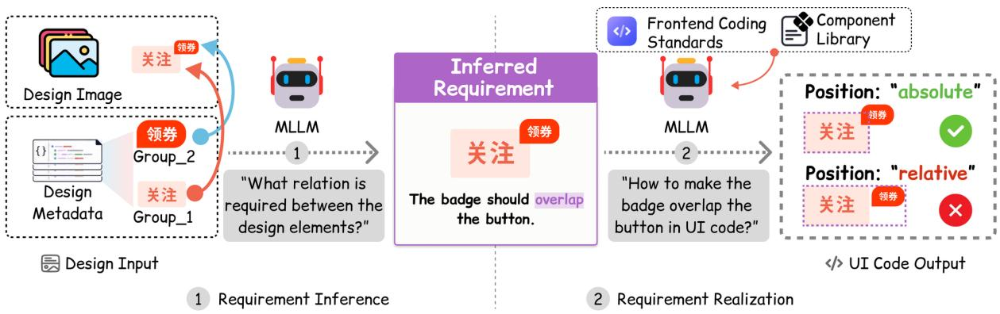  
Figure 1: Two capabilities in UI code generation: (1) inferring positioning requirements and (2) realizing them in code.

## 1 Introduction

Industrial design-to-code (D2C) aims to automate frontend development by translating UI designs into executable code (Xu et al., 2025; Xiao et al., 2025a). Although multimodal large language models (MLLMs) have improved the visual fidelity of generated interfaces (Si et al., 2025), visually similar outputs can still fail to meet the implementation requirements of the specific design, such as which components and properties to use and how elements should be grouped, aligned, and positioned, or to follow frontend coding standards (React, n.d.; Google, n.d.; Airbnb, n.d.). Such generated code can degrade user experience and require manual rework before deployment (Moran et al., 2018; Walsh et al., 2017; Mahajan & Halfond, 2015).

As illustrated in Figure 1, generating code that meets these implementation requirements depends on two MLLM capabilities: inferring them from designs and realizing them in code. Inference requires cross-modal reasoning to associate disorganized layer metadata with UI images despite visual complexity and limited semantic cues (Chen et al., 2024). Realization requires generating code under complex constraints imposed by these requirements and frontend coding standards. Generated code alone cannot reveal which of these two capabilities limits MLLM performance in UI code generation. Evaluating them requires datasets that pair UI designs with their implementation requirements.

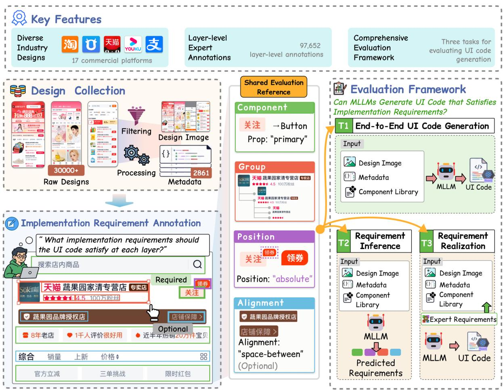  
Figure 2: Overview of TaoD2C-Bench. We collect 2,861 production UI designs in TaoD2C and annotate their implementation requirements across Component, Group, Alignment, and Position. These annotations provide a shared evaluation reference for UI code generation (T1), requirement inference (T2), and realization with expert requirements supplied (T3).

However, datasets pairing industrial UI designs with implementation requirements remain scarce. Existing evaluations also have three limitations. (a) Visual evaluation compares rendered appearance but does not verify whether the code uses the intended components and layout structure (Xu et al., 2026). (b) Heuristic evaluation favors coding practices that may conflict with a design’s implementation requirements. For example, Figma2Code favors a lower absolute-positioning ratio, even when absolute positioning is appropriate for overlapping elements (Gui et al., 2026). (c) Single-reference structural comparison may penalize valid code that differs from the reference, overlooking multiple implementations that satisfy the same requirements (Guo et al., 2025).

To fill this gap, we introduce TaoD2C-Bench (Figure 2), a benchmark for evaluating MLLMs’ ability to generate UI code that satisfies implementation requirements in industrial applications. We collect 2,861 production UI designs from 17 commercial platforms, spanning diverse consumer-facing and business-facing scenarios. Each design includes an image, layer metadata, and its target component library. To associate designs with implementation requirements, we collaborated with frontend engineering experts to produce 97,652 layer-level annotations across four key categories: Component, Group, Alignment, and Position. Required annotations specify requirements for the generated code, while optional annotations describe implementation choices that are allowed but not required. These annotations provide a shared evaluation reference for three tasks. End-to-End UI Code Generation (T1) evaluates MLLMs’ overall ability to generate code that satisfies implementation requirements. Requirement Inference (T2) and Requirement Realization (T3) separately assess MLLMs’ abilities to infer implementation requirements and realize them in code, helping distinguish limitations in these two capabilities.

Our experiments with eight MLLMs reveal notable limitations in their ability to generate UI code that satisfies implementation requirements, alongside distinct performance profiles in requirement inference and realization. We further show that MLLMs’ visual reconstruction ability does not necessarily imply an ability to generate code that meets these requirements. Our analysis highlights the need for design-specific evaluation: implementation requirements vary across designs, and a single design can admit multiple valid implementations. These insights provide a foundation for future research on improving MLLMs’ ability to generate UI code.

Our main contributions are as follows:

• Expert-Annotated Industrial Dataset. We introduce TaoD2C, a large-scale, high-quality industrial UI dataset comprising 2,861 designs. It pairs production designs from 17 commercial platforms across consumer-facing and business-facing applications with expert annotations of layer-level implementation requirements, ensuring industrial realism, application diversity, and access to expert knowledge.

• Implementation-Requirement Evaluation Framework. We develop TaoD2C-Bench, an evaluation framework based on expert-annotated implementation requirements across four key categories. Its three tasks evaluate MLLMs’ abilities to generate UI code that satisfies these requirements, infer them from designs, and realize them in code when supplied.

• Empirical Findings. Through extensive experiments on eight MLLMs, we reveal critical failures in generating UI code that satisfies implementation requirements, while characterizing MLLM performance profiles in requirement inference and realization. We further show that MLLMs’ visual reconstruction ability does not necessarily imply an ability to generate code that meets these requirements.

## 2 Related Work

UI-to-Code Generation. Early UI-to-code systems reconstructed interfaces from screenshots (Nguyen & Csallner, 2015; Beltramelli, 2018; Chen et al., 2018; Moran et al., 2020). Recent MLLM-based methods employ synthetic data and feedback-based finetuning (Laurenc¸on et al., 2024; Ge et al., 2025; Wu et al., 2024; Zheng et al., 2026). Decomposition and layout reasoning organize complex interfaces into manageable regions (Wan et al., 2025; Wu et al., 2025; Gui et al., 2025b; Jiang et al., 2026; Zhou et al., 2025). Hierarchical generation (Gui et al., 2025c; Chen et al., 2026) and iterative visual refinement (Yue et al., 2025; Sansford et al., 2026; Yang et al., 2025; Deng et al., 2026; Xiong et al., 2026) further improve reconstruction. Beyond image-only generation, recent work leverages multimodal design inputs, including images, metadata, and assets, to support higher-quality UI code generation (Xiao et al., 2024). Overall, despite these advances, generating production-ready UI code for industrial applications remains challenging (Xiao et al., 2026b).

UI Code Generation Evaluation. UI code generation evaluation considers appearance, coding practices, and structure. Visual evaluation compares rendered outputs with target images through image and layout similarity (Xiao et al., 2025b; Lai et al., 2025; Li et al., 2025; Zhang et al., 2026), using metrics such as SSIM, CLIP, and LPIPS (Wang et al., 2004; Radford et al., 2021; Zhang et al., 2018). WebUIBench extends evaluation to element attributes and spatial layouts (Lin et al., 2025). Heuristic evaluation, exemplified by Figma2Code, summarizes practices such as relative-unit and absolute-positioning usage as proxies for code quality (Gui et al., 2026). Single-reference structural comparison assesses agreement with a reference implementation (Sun et al., 2025; Xiao et al., 2026a). However, visual similarity does not establish requirement satisfaction. Aggregate coding statistics cannot determine whether a practice suits a specific design, while differences from one reference can reflect valid implementations. Overall, evaluation has expanded beyond appearance to code quality, but assessing implementation requirement satisfaction while accommodating multiple valid implementations remains an open challenge.

## 3 TaoD2C-Bench

## 3.1 Dataset Construction

We constructed TaoD2C through four stages: design collection, filtering and normalization, expert annotation, and evaluation subset selection. Figure 3 summarizes the dataset composition, Figure 4 reports the per-design complexity and annotation counts, and Appendix A provides the full construction procedure.

Design collection. To capture the complexity of real-world industrial UIs, we collected MasterGo design files from multiple product teams within a large-scale e-commerce ecosystem. With authorization from the owning teams, we assembled an initial pool of approximately 30,000 design pages from 17 commercial platforms. These designs span consumer-facing (C-end) interfaces for shopping, marketing, membership, content, and transaction flows, as well as business-facing (B-end) interfaces for merchant operations, data analytics, logistics management, and complex business workflows. For each design, we extracted its rendered image and layer metadata and retained a reference to its target component library. We then filtered, normalized, and quality-checked the extracted data to ensure data quality and remove duplicates. This collection captures diverse interface structures and business workflows encountered in industrial production.

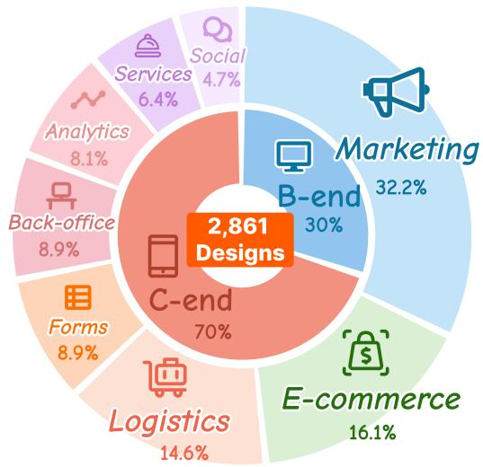

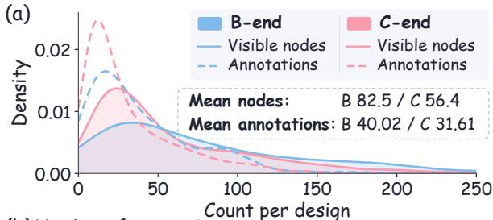

(b) Number of annotations  
Figure 3: TaoD2C dataset composition by endpoint type and application scenario.  
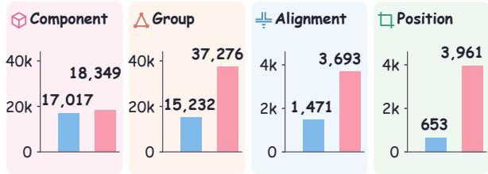  
Figure 4: Per-design node and annotation distributions (a) and annotation counts by category (b).

Implementation Requirement Annotation. To annotate the collected designs, we developed a platform that integrates their rendered images and parsed layer trees, allowing experts to select individual layers and annotate their requirements. Two senior frontend engineers with seven and five years of experience, respectively, annotated the designs. They inspected the source design, rendered image, layer metadata, and target component library documentation to specify component types and properties, container hierarchies, alignment relations, and positioning schemes. The annotations were based on W3C CSS layout and positioning specifications (W3C, 2025a;b), targetlibrary definitions and APIs, and the annotators’ understanding of each design and frontend implementation experience. Each annotation is marked as required or optional. Required annotations specify constraints that an implementation must satisfy, while optional annotations record permitted implementation choices. A third expert iteratively reviewed all annotations, with identified errors corrected by the frontend experts and rechecked. The annotation and verification process spanned 18 months. We denote the four requirement categories as Component, Group, Alignment, and Position throughout the tables and analysis:

1. Component: component implementation, defined by the target-library component type and property configuration. For a set of layers that realizes a reusable component, annotators identify its type in the target library and configure the properties defined by its API, such as a switch state, button size, input placeholder, or a select’s options and selected value.

2. Group: container nesting relations. Annotators mark the container regions, and member nodes are deterministically compiled from those regions and the layer tree.

3. Alignment: layout relations. For containers with specific alignment requirements, annotators identify the rule arranging their children along the main axis, such as space-between, center, flex-start, flex-end, and other justify-content values.

4. Position: positioning schemes. Annotators specify positioning schemes for individual elements, such as absolute positioning relative to a containing block.

## 3.2 Dataset Characteristics

1 Industrial realism and complexity. TaoD2C captures the complexity of industrial UI development through 2,861 production designs from 17 commercial platforms spanning eight application scenarios (Figure 3). These designs encompass complex business forms and tables alongside image-rich consumer interfaces, averaging 64.2 visible layers per design. This structural and application diversity provides a challenging testbed for evaluating MLLMs under the heterogeneous component and layout requirements encountered in production.

2 Dense expert annotations. TaoD2C combines design images, layer metadata, and target component libraries with expert annotations of implementation requirements for layers and their relations, a combination unique among the compared benchmarks (Table 1). Its 97,652 annotations span Component, Group, Alignment, and Position, distinguishing required choices from optional alternatives. Building this resource involved 18 months of expert annotation and iterative verification. Drawing on human frontend expertise, these annotations specify design-specific component and layout requirements for code implementation. They provide a shared reference for evaluating MLLMs’ abilities to infer these requirements and generate UI code that satisfies them.

Table 1: Comparison with existing design-to-code benchmarks. Implementation requirements are annotated by experts.
<table><tr><td rowspan="2">Benchmark</td><td rowspan="2">Data source</td><td rowspan="2">Scale Metadata</td><td rowspan="2"></td><td rowspan="2">Implementation requirements</td><td rowspan="2">Granularity</td></tr><tr><td></td></tr><tr><td>Design2Code (Si et al., 2025)</td><td>Web pages</td><td>484</td><td>x</td><td>x</td><td>Page</td></tr><tr><td>Web2Code (Yun et al., 2024)</td><td>Synthetic+web</td><td>884.7K</td><td>x</td><td>x</td><td>Page/QA</td></tr><tr><td>WebUIBench (Lin et al., 2025)</td><td>Websites</td><td>21.8K QA</td><td>X</td><td>X</td><td>QA/element</td></tr><tr><td>IW-Bench (Guo et al., 2025)</td><td>Generated+web</td><td>1,200</td><td>x</td><td>x</td><td>DOM/layout</td></tr><tr><td>WebCode2M (Gui et al., 2025a)</td><td>Common Crawl</td><td>2.56M</td><td>x</td><td>x</td><td>Element/layout</td></tr><tr><td>Figma2Code (Gui et al., 2026)</td><td>Figma Comm.</td><td>3,055 (213 eval)</td><td>√</td><td>X</td><td>Page</td></tr><tr><td>1D-Bench (Xu et al., 2026)</td><td>Industrial</td><td>984 (204 eval)</td><td>√</td><td>x</td><td>Instance</td></tr><tr><td>TaoD2C-Bench (ours)</td><td>Industrial</td><td>2,861</td><td>√</td><td>√</td><td>Layer/relation</td></tr></table>

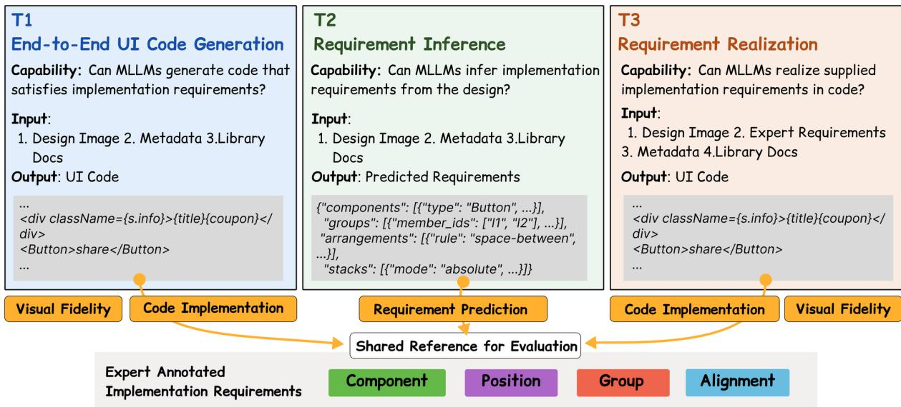  
Figure 5: Three tasks and their evaluation. Expert annotations provide a shared reference for requirement prediction (T2) and code implementation (T1/T3); visual fidelity compares rendered pages with design images.

## 4 Tasks and Metrics

## 4.1 Tasks

We define three tasks to evaluate end-to-end UI code generation, requirement inference, and requirement realization (Figure 5). All three tasks use the same designs and expert annotations as a shared evaluation reference.

## T1: End-to-End UI Code Generation.

Capability: Generating UI code that satisfies implementation requirements while reproducing the design’s appearance.

Given a design image, layer metadata, and target-library documentation, the MLLM generates executable UI code.   
We assess requirement satisfaction through source-code and runtime analysis, and evaluate visual fidelity separately.

## T2: Requirement Inference.

Capability: Inferring implementation requirements from a design image, layer metadata, and target-library documentation.

Given the same inputs as T1, the MLLM predicts structured requirements across Component, Group, Alignment, and Position without generating code. We compare these predictions with expert annotations to evaluate requirement inference separately from code implementation.

## T3: Requirement Realization.

Capability: Realizing supplied implementation requirements in UI code under complex constraints imposed by these requirements and frontend coding standards.

To evaluate MLLMs’ requirement realization ability, we supply the T1 inputs together with the expert annotations for the input design. The MLLM generates executable UI code from these inputs. We assess whether the generated code realizes the supplied requirements and evaluate visual fidelity using the same metrics as T1.

## 4.2 Metrics

We evaluate the predicted requirements from T2 and the generated code from T1/T3 against shared expert annotations. We assess visual fidelity by comparing pages rendered from T1/T3 code with the design images (Figure 5). We account for required and optional annotations when computing the scores, with details provided in Appendix C.

Requirement Prediction. For T2, we compare predicted requirements $\hat { R }$ with expert annotations $R ^ { * }$ through layer-level correspondences, checking both the associated design elements and category-specific attributes. This evaluates requirement inference separately from code implementation. We report micro-F1 for Component, Group, Alignment, and Position.

$$
\mathrm { S c o r e } _ { \mathrm { p r e d } } = \mathcal { E } _ { \mathrm { p r e d } } ( \hat { R } , R ^ { * } ) .\tag{1}
$$

Code Implementation. For T1 and T3, we bridge design-side annotations $R ^ { * }$ and runtime implementations by establishing requirement-specific correspondences using source-code, structural, and geometric evidence. This enables requirement-level evaluation of generated code C without reference code. We report micro-F1 for Type, Props, Group, Alignment, and Position; Props is evaluated only on type-matched components.

$$
\mathrm { S c o r e } _ { \mathrm { i m p l } } = \mathcal { E } _ { \mathrm { i m p l } } ( \Phi ( C ) , R ^ { * } ) .\tag{2}
$$

Here, $\Phi ( C )$ extracts source-code, structural, and geometric evidence, which $\mathcal { E } _ { \mathrm { i m p l } }$ matches against $R ^ { * }$ to compute per-dimension scores.

Visual Fidelity. For T1 and T3, we compare Render(C) with the design image I (Si et al., 2025; Xu et al., 2026). We report 1D-Bench’s composite visual score (CV), visual element similarity (VES) using DINOv2 features (Oquab et al., 2023), and normalized RGB mean absolute error (MAE). Higher CV/VES and lower MAE indicate better visual fidelity. Appendix C.3 provides computation details.

$$
\begin{array} { r } { \mathrm { S c o r e } _ { \mathrm { v i s } } = \mathcal { E } _ { \mathrm { v i s } } ( \mathrm { R e n d e r } ( C ) , I ) . } \end{array}\tag{3}
$$

## 5 Experiments

## 5.1 Setup

We evaluate eight MLLMs on a curated test set of 421 TaoD2C designs, comprising 152 B-end and 269 C-end designs, with all selected designs undergoing annotation review and deduplication. All MLLMs receive the same design context and task prompts. The evaluated MLLMs are GPT-5.6 Terra, GPT-5.4, Claude Sonnet 5, Qwen3.8-Max, Qwen3-VL-235B-A22B-Thinking, Gemini 3.5 Flash, Kimi K3, and Gemini 3.1 Pro Preview. Further experimental details are provided in the appendix.

## 5.2 Results

Table 2 reports Code Implementation and Visual Fidelity scores for T1 and Requirement Prediction scores for T2 on TaoD2C-Bench, including per-MLLM results and averages across MLLMs. Table 3 reports Code Implementation and Visual Fidelity scores for Requirement Realization (T3). Values below each score show the change from T1.

Table 2: Main results for T1 and T2 on 421 designs. Code Implementation and Requirement Prediction scores are micro F1 (%). Higher CV/VES and lower MAE indicate better visual fidelity. Bold denotes the best result; shading indicates within-column rank.
<table><tr><td rowspan="2">Model</td><td colspan="8">End-to-End UI Code Generation (T1)</td><td rowspan="2">Inference (T2)</td><td rowspan="2">Requirement</td><td rowspan="2"></td></tr><tr><td>Code Implementation</td><td colspan="3"></td><td colspan="3">Visual Fidelity</td></tr><tr><td></td><td>Type</td><td>Props</td><td>Group</td><td>Align.</td><td>Pos.</td><td>CV↑</td><td>VES ↑</td><td>MAE↓</td><td>Comp.</td><td>Group Align.</td><td>Pos.</td></tr><tr><td>GPT-5.6 Terra</td><td>62.47</td><td>44.25</td><td>56.84</td><td>30.53</td><td>36.43</td><td>85.78</td><td>0.9174 0.1163</td><td>59.15</td><td>60.92</td><td>37.11</td><td>47.68</td></tr><tr><td>GPT-5.4</td><td>60.19</td><td>40.29</td><td>56.48</td><td>27.48</td><td>33.44</td><td>85.09 0.9183</td><td>0.1078</td><td>57.32</td><td>60.93</td><td>31.88</td><td>48.85</td></tr><tr><td>Claude Sonnet 5</td><td>59.89</td><td>40.37</td><td>54.82</td><td>23.54</td><td>27.93</td><td>78.82</td><td>0.8946 0.1350</td><td>58.36</td><td>50.48</td><td>34.84</td><td>47.62</td></tr><tr><td>Qwen3.8-Max</td><td>61.77</td><td>38.83</td><td>59.46</td><td>26.42</td><td>45.35</td><td>85.53</td><td>0.9192</td><td>0.1134</td><td>58.86 71.40</td><td>29.45</td><td>49.15</td></tr><tr><td>Qwen3-VL-235B</td><td>31.60</td><td>17.34</td><td>30.53</td><td>6.72</td><td>7.61</td><td>58.37</td><td>0.7919</td><td>0.1808</td><td>53.25 21.31</td><td>17.68</td><td>26.75</td></tr><tr><td>Gemini 3.5 Flash</td><td>62.07</td><td>38.03</td><td>51.28</td><td>20.10</td><td>29.49</td><td>80.50</td><td>0.9112</td><td>0.1195</td><td>58.80 51.42</td><td>34.61</td><td>47.55</td></tr><tr><td>Kimi K3</td><td>63.25</td><td>41.56</td><td>59.41</td><td>27.04</td><td>43.68</td><td>84.40</td><td>0.9151</td><td>0.1178</td><td>59.67 70.84</td><td>33.31</td><td>51.93</td></tr><tr><td>Gemini 3.1 Pro</td><td>57.74</td><td>36.87</td><td>55.52</td><td>24.59</td><td>33.81</td><td>83.00</td><td>0.9155</td><td>0.1166</td><td>58.67 67.96</td><td>20.64</td><td>48.28</td></tr><tr><td>Mean</td><td>57.37</td><td>37.19</td><td>53.04</td><td>23.30</td><td>32.22</td><td>80.19</td><td>0.8979</td><td>0.1259</td><td>58.01</td><td>56.91 29.94</td><td>45.98</td></tr></table>

Table 3: Results for Requirement Realization (T3) on 421 designs. Values below each score show ∆ = T3 − T1. Purple and yellow denote gains and losses, respectively; bold marks the largest gain per column.
<table><tr><td rowspan="2">Model</td><td colspan="5">Code Implementation</td><td colspan="3">Visual Fidelity</td></tr><tr><td>Type</td><td>Props</td><td>Group</td><td>Align.</td><td>Pos.</td><td>CV↑</td><td>VES ↑</td><td>MAE↓</td></tr><tr><td rowspan="2">GPT-5.6 Terra</td><td>81.72</td><td>66.19</td><td>61.11</td><td>47.22</td><td>51.03</td><td>86.52</td><td>0.9263</td><td>0.1016</td></tr><tr><td>+19.25</td><td>+21.94</td><td>+4.27</td><td>+16.69</td><td>+14.60</td><td>+0.74</td><td>+0.0089</td><td>-0.0147</td></tr><tr><td rowspan="2">GPT-5.4</td><td>75.75</td><td>61.44</td><td>64.54</td><td>49.44</td><td>58.43</td><td>84.95</td><td>0.9118</td><td>0.1088</td></tr><tr><td>+15.56</td><td>+21.15</td><td>+8.06</td><td>+21.96</td><td>+24.99</td><td>-0.14</td><td>-0.0065</td><td>+0.0010</td></tr><tr><td rowspan="2">Claude Sonnet 5</td><td>78.08</td><td>63.99</td><td>61.05</td><td>35.16</td><td>49.35</td><td>79.40</td><td>0.9003</td><td>0.1344</td></tr><tr><td>+18.19</td><td>+23.62</td><td>+6.23</td><td>+11.62</td><td>+21.42</td><td>+0.58</td><td>+0.0057</td><td>-0.0006</td></tr><tr><td rowspan="2">Qwen3.8-Max</td><td>79.99</td><td>63.08</td><td>64.79</td><td>45.79</td><td>64.82</td><td>84.73</td><td>0.9126</td><td>0.1139</td></tr><tr><td>+18.22</td><td>+24.25</td><td>+5.33</td><td>+19.37</td><td>+19.47</td><td>-0.80</td><td>-0.0066</td><td>+0.0005</td></tr><tr><td rowspan="2">Qwen3-VL-235B</td><td>42.83</td><td>29.48</td><td>30.73</td><td>9.81</td><td>13.45</td><td>58.69</td><td>0.7784</td><td>0.1782</td></tr><tr><td>+11.23</td><td>+12.14</td><td>+0.20</td><td>+3.09</td><td>+5.84</td><td>+0.32</td><td>-0.0135</td><td>-0.0026</td></tr><tr><td rowspan="2">Gemini 3.5 Flash</td><td>82.08</td><td>67.49</td><td>59.03</td><td>37.00</td><td>54.32</td><td>80.58</td><td>0.8944</td><td>0.1145</td></tr><tr><td>+20.01</td><td>+29.46</td><td>+7.75</td><td>+16.90</td><td>+24.83</td><td>+0.08</td><td>-0.0168</td><td>-0.0050</td></tr><tr><td rowspan="2">Kimi K3</td><td>79.42</td><td>64.64</td><td>66.29</td><td>46.81</td><td>62.13</td><td>83.54</td><td>0.9131</td><td>0.1149</td></tr><tr><td>+16.17</td><td>+23.08</td><td>+6.88</td><td>+19.77</td><td>+18.45</td><td>-0.86</td><td>-0.0020</td><td>-0.0029</td></tr><tr><td rowspan="2">Gemini 3.1 Pro</td><td>85.80 +28.06</td><td>75.11</td><td>71.34</td><td>57.82</td><td>77.11</td><td>84.53</td><td>0.9154</td><td>0.1147</td></tr><tr><td></td><td>+38.24</td><td>+15.82</td><td>+33.23</td><td>+43.30</td><td>+1.53</td><td>-0.0001</td><td>-0.0019</td></tr><tr><td rowspan="2">Mean</td><td>75.71</td><td>61.43</td><td>59.86</td><td>41.13</td><td>53.83</td><td>80.37</td><td>0.8940</td><td>0.1226</td></tr><tr><td>+18.34</td><td>+24.24</td><td>+6.82</td><td>+17.83</td><td>+21.61</td><td>+0.18</td><td>-0.0039</td><td>-0.0033</td></tr></table>

Finding 1. Current MLLMs exhibit limited capabilities in generating UI code that satisfies implementation requirements. Even the best end-to-end results in Table 2 reach only 63.25 F1 on component type (Kimi K3), 44.25 on properties (GPT-5.6 Terra), and 59.46 on grouping (Qwen3.8-Max). In the overall T1 results, Alignment scores lowest for all eight MLLMs, averaging 23.30 F1 and a best score of 30.53 (GPT-5.6 Terra). Positioning also remains challenging, with a mean F1 of 32.22 and a best score of 45.35 (Qwen3.8-Max). Taken together, these results indicate persistent gaps in component selection, property configuration, and layout relationships in generated code, highlighting barriers to generating production-ready UI code.

Finding 2. MLLM performance varies across requirement categories, with alignment and positioning remaining key weaknesses. In T2, Alignment and Position average 29.94 and 45.98 F1, below Component (58.01) and Group (56.91) (Table 2). Alignment also has the lowest overall mean in T3 with supplied requirements (41.13 F1; Table 3). These results suggest that MLLMs struggle to reason about how elements relate to their containers and positioning references, and to translate spatial constraints into layout code.

Finding 3. MLLMs exhibit distinct performance profiles in requirement inference and realization. GPT-5.6 Terra leads alignment inference at 37.11 F1, while Gemini 3.1 Pro ranks seventh at 20.64 (Table 2). When expert requirements are supplied in T3, Gemini 3.1 Pro leads alignment realization at 57.82, exceeding GPT-5.6 Terra’s 47.22 (Table 3). Grouping shows a similar contrast: Qwen3.8-Max leads inference at 71.40 F1, whereas Gemini 3.1 Pro leads realization at 71.34. These contrasting profiles suggest that MLLM improvement should target

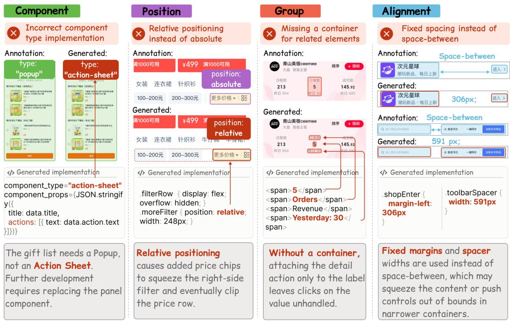  
Figure 6: Visually similar interfaces can violate implementation requirements. From left to right: incorrect component type, incorrect positioning, missing grouping container, and fixed spacing instead of space-between alignment. Code excerpts reveal these errors; bottom panels explain their potential impact on component integration, interaction handling, and layout adaptation.

MLLM-specific weaknesses: strengthening cross-modal reasoning over design images and layer metadata for requirement inference, and the ability to translate component and layout constraints into code for requirement realization.

Finding 4. MLLMs’ visual reconstruction ability does not necessarily imply an ability to generate UI code that satisfies implementation requirements. In T1, Kimi K3 ranks among the top three on all five code dimensions, but fourth on CV and fifth on VES/MAE (Table 2). From T1 to T3, all MLLMs improve on every code dimension (mean gains: 6.82–24.24 F1 points), while mean visual scores change little (CV: +0.18; VES: −0.0039; MAE: −0.0033; Table 3). Figure 6 further shows that generated code can contain errors even when the rendered interfaces closely resemble the designs. These results suggest limitations in relational abstraction and compositional reasoning when translating visual designs into code.

Finding 5. Requirements depend on the specific design context, and a single design can allow multiple valid implementations. Absolute positioning is required for the filter in Figure 6 but violates normal-flow requirements for cards in another design, illustrating why heuristics favoring less absolute positioning cannot determine its appropriateness. The evaluation subset also contains 350 optional positioning, 170 optional alignment, and 49 optional grouping annotations, recording permitted implementation choices. For example, the same design may allow either justify-content: space-between or margin-left: auto to achieve the required spacing. A single-reference comparison may penalize this difference even when both implementations satisfy the implementation requirements.

## 6 Conclusion

TaoD2C-Bench pairs industrial UI designs with layer-level expert requirements to evaluate generated code. Its three tasks reveal limited capabilities in both inferring implementation requirements and implementing them in code, alongside distinct strengths across MLLMs and tasks. These findings provide insights for future research on UI code generation.

## References

Airbnb. Airbnb React/JSX style guide, n.d. URL https://github.com/airbnb/javascript/tree/master/ react. Accessed September 25, 2026.

Tony Beltramelli. pix2code: Generating code from a graphical user interface screenshot. In Proceedings of the ACM SIGCHI Symposium on Engineering Interactive Computing Systems (EICS), 2018. doi: 10.1145/3220134. 3220135.

Chunyang Chen, Ting Su, Guozhu Meng, Zhenchang Xing, and Yang Liu. From UI design image to GUI skeleton: A neural machine translator to bootstrap mobile GUI implementation. In Proceedings ofthe 40th International Conference on Software Engineering (ICSE), 2018. doi: 10.1145/3180155.3180240.

Liuqing Chen, Yunnong Chen, Shuhong Xiao, Yaxuan Song, Lingyun Sun, Yankun Zhen, Tingting Zhou, and Yanfang Chang. EGFE: End-to-end grouping of fragmented elements in UI designs with multimodal learning. In Proceedings of the IEEE/ACM 46th International Conference on Software Engineering, pp. 1–12. ACM, 2024. doi: 10.1145/3597503.3623313.

Yunnong Chen, Xinyu Yu, Shixian Ding, Yingying Zhang, Chengwei Shi, Jingzhou Du, and Liuqing Chen. DesignCoder: Hierarchy-aware and self-correcting UI code generation with large language models. Information and Software Technology, 198:108214, 2026. doi: 10.1016/j.infsof.2026.108214. URL https://doi.org/10. 1016/j.infsof.2026.108214.

Jie Deng, Kaichun Yao, and Libo Zhang. VisRefiner: Learning from Visual Differences for Screenshot-to-Code Generation. arXiv preprint, 2026. URL https://arxiv.org/abs/2602.05998.

Tong Ge, Yashu Liu, Jieping Ye, Tianyi Li, and Chao Wang. Advancing vision-language models in front-end development via data synthesis, 2025. URL https://arxiv.org/abs/2503.01619.

Google. Google HTML/CSS style guide, n.d. URL https://google.github.io/styleguide/ htmlcssguide.html. Accessed September 25, 2026.

Yi Gui, Zhen Li, Yao Wan, Yemin Shi, Hongyu Zhang, Yi Su, Bohua Chen, Dongping Chen, Siyuan Wu, Xing Zhou, Wenbin Jiang, Hai Jin, and Xiangliang Zhang. WebCode2M: A real-world dataset for code generation from webpage designs. In Proceedings ofthe ACM Web Conference (WWW), 2025a. doi: 10.1145/3696410.3714889.

Yi Gui, Zhen Li, Zhongyi Zhang, Guohao Wang, Tianpeng Lv, Gaoyang Jiang, Yi Liu, Dongping Chen, Yao Wan, Hongyu Zhang, Wenbin Jiang, Xuanhua Shi, and Hai Jin. LaTCoder: Converting webpage design to code with layout-as-thought. In Proceedings ofthe 31st ACM SIGKDD Conference on Knowledge Discovery and Data Mining, pp. 721–732, 2025b. doi: 10.1145/3711896.3737016.

Yi Gui, Yao Wan, Zhen Li, Zhongyi Zhang, Dongping Chen, Hongyu Zhang, Yi Su, Bohua Chen, Xing Zhou, Wenbin Jiang, and Xiangliang Zhang. UICopilot: Automating UI synthesis via hierarchical code generation from webpage designs. In Proceedings ofthe ACM Web Conference, pp. 1846–1855, 2025c. doi: 10.1145/3696410.3714891.

Yi Gui, Jiawan Zhang, Yina Wang, Tianran Ma, Yao Wan, Shilin He, Dongping Chen, Zhou Zhao, Wenbin Jiang, Xuanhua Shi, Hai Jin, and Philip S. Yu. Figma2Code: Automating multimodal design to code in the wild. In International Conference on Learning Representations (ICLR), 2026.

Hongcheng Guo, Wei Zhang, Junhao Chen, Yaonan Gu, Jian Yang, Junjia Du, Shaosheng Cao, Binyuan Hui, Tianyu Liu, Jianxin Ma, Chang Zhou, and Zhoujun Li. IW-Bench: Evaluating large multimodal models for converting Image-to-Web. In Findings ofthe Associationfor Computational Linguistics: ACL 2025, 2025.

Yilei Jiang, Yaozhi Zheng, Yuxuan Wan, Jiaming Han, Qunzhong Wang, Michael R. Lyu, and Xiangyu Yue. Screencoder: Advancing visual-to-code generation for front-end automation via modular multimodal agents. Accepted to the Conference on Empirical Methods in Natural Language Processing (EMNLP), 2026. URL https://github.com/leigest519/ScreenCoder.

Peichao Lai, Jinhui Zhuang, Kexuan Zhang, Ningchang Xiong, Shengjie Wang, Yanwei Xu, Chong Chen, Yilei Wang, and Bin Cui. WebRenderBench: Enhancing Web Interface Generation through Layout-Style Consistency and Reinforcement Learning. arXiv preprint, 2025. URL https://arxiv.org/abs/2510.04097.

Hugo Laurenc¸on, Leo Tronchon, and Victor Sanh. Unlocking the conversion of web screenshots into html code´ with the websight dataset, 2024. URL https://arxiv.org/abs/2403.09029.

Ryan Li, Yanzhe Zhang, and Diyi Yang. Sketch2code: Evaluating vision-language models for interactive web design prototyping. In Proceedings of the 2025 Conference of the Nations of the Americas Chapter of the Association for Computational Linguistics: Human Language Technologies (Volume 1: Long Papers), pp. 3921–3955. Association for Computational Linguistics, 2025. doi: 10.18653/v1/2025.naacl-long.198. URL https://doi.org/10.18653/v1/2025.naacl-long.198.

Zhiyu Lin, Zhengda Zhou, Zhiyuan Zhao, Tianrui Wan, Yilun Ma, Junyu Gao, and Xuelong Li. WebUIBench: A comprehensive benchmark for evaluating multimodal large language models in WebUI-to-Code. In Findings of the Associationfor Computational Linguistics: ACL 2025, 2025.

Sonal Mahajan and William G. J. Halfond. WebSee: A tool for debugging HTML presentation failures. In 2015 IEEE 8th International Conference on Software Testing, Verification and Validation, 2015. URL https: //viterbi-web.usc.edu/ halfond/papers/mahajan15icst-tool.pdf.

Kevin Moran, Boyang Li, Carlos Bernal-Cardenas, Dan Jelf, and Denys Poshyvanyk. Automated reporting of GUI´ design violations for mobile apps. In Proceedings ofthe 40th International Conference on Software Engineering, 2018. doi: 10.1145/3180155.3180246. URL https://arxiv.org/abs/1802.04732.

Kevin Moran, Carlos Bernal-Cardenas, Michael Curcio, Richard Bonett, and Denys Poshyvanyk. Machine´ Learning-Based Prototyping of Graphical User Interfaces for Mobile Apps. IEEE Transactions on Software Engineering, 46(2):196–221, 2020. doi: 10.1109/TSE.2018.2844788. URL https://doi.org/10.1109/TSE. 2018.2844788.

Tuan Anh Nguyen and Christoph Csallner. Reverse engineering mobile application user interfaces with REMAUI. In Proceedings of the 30th IEEE/ACM International Conference on Automated Software Engineering (ASE), 2015. doi: 10.1109/ASE.2015.32.

Maxime Oquab, Timothee Darcet, Theo Moutakanni, Huy V. Vo, Marc Szafraniec, Vasil Khalidov, Pierre Fernandez,´ Daniel Haziza, Francisco Massa, Alaaeldin El-Nouby, Russell Howes, Po-Yao Huang, Hu Xu, Vasu Sharma, Shang-Wen Li, Wojciech Galuba, Mike Rabbat, Mido Assran, Nicolas Ballas, Gabriel Synnaeve, Ishan Misra, Herve Jegou, Julien Mairal, Patrick Labatut, Armand Joulin, and Piotr Bojanowski. DINOv2: Learning robust visual features without supervision. arXiv preprint arXiv:2304.07193, 2023. URL https://arxiv.org/abs/ 2304.07193.

Alec Radford, Jong Wook Kim, Chris Hallacy, Aditya Ramesh, Gabriel Goh, Sandhini Agarwal, Girish Sastry, Amanda Askell, Pamela Mishkin, Jack Clark, Gretchen Krueger, and Ilya Sutskever. Learning transferable visual models from natural language supervision. In International Conference on Machine Learning (ICML), 2021.

React. Rules of React, n.d. URL https://react.dev/reference/rules. Accessed September 25, 2026.

Hannah Sansford, Derek H. C. Law, Wei Liu, Abhishek Tripathi, Niresh Agarwal, and Gerrit J. J. van den Burg. Vision-guided iterative refinement for frontend code generation, 2026. URL https://arxiv.org/abs/2604. 05839.

Chenglei Si, Yanzhe Zhang, Ryan Li, Zhengyuan Yang, Ruibo Liu, and Diyi Yang. Design2Code: Benchmarking multimodal code generation for automated front-end engineering. In Proceedings of the 2025 Conference of the Nations of the Americas Chapter of the Association for Computational Linguistics: Human Language Technologies (Volume 1: Long Papers), 2025.

Haoyu Sun, Huichen Will Wang, Jiawei Gu, Linjie Li, and Yu Cheng. FullFront: Benchmarking MLLMs Across the Full Front-End Engineering Workflow. arXiv preprint arXiv:2505.17399, 2025. URL https: //arxiv.org/abs/2505.17399.

W3C. CSS Flexible Box Layout Module Level 1. W3C specification, 2025a. URL https://www.w3.org/TR/ css-flexbox-1/. Accessed September 25, 2026.

W3C. CSS Positioned Layout Module Level 3. W3C specification, 2025b. URL https://www.w3.org/TR/ css-position-3/. Accessed September 25, 2026.

Thomas A. Walsh, Gregory M. Kapfhammer, and Phil McMinn. Automated layout failure detection for responsive web pages without an explicit oracle. In Proceedings of the 26th ACM SIGSOFT International Symposium on Software Testing and Analysis, 2017. doi: 10.1145/3092703.3092712. URL https: //www.gregorykapfhammer.com/research/papers/walsh2017/.

Yuxuan Wan, Chaozheng Wang, Yi Dong, Wenxuan Wang, Shuqing Li, Yintong Huo, and Michael R. Lyu. Automatically generating UI code from screenshot: A divide-and-conquer-based approach. In Proceedings ofthe ACM on Software Engineering (FSE), 2025. doi: 10.1145/3729364.

Zhou Wang, Alan C. Bovik, Hamid R. Sheikh, and Eero P. Simoncelli. Image quality assessment: From error visibility to structural similarity. IEEE Transactions on Image Processing, 13(4):600–612, 2004. doi: 10.1109/ TIP.2003.819861.

Fan Wu, Cuiyun Gao, Shuqing Li, Xin-Cheng Wen, and Qing Liao. MLLM-based UI2Code automation guided by UI layout information. In Proceedings of the 34th ACM SIGSOFT International Symposium on Software Testing and Analysis (ISSTA), 2025. doi: 10.1145/3728925.

Jason Wu, Eldon Schoop, Alan Leung, Titus Barik, Jeffrey Bigham, and Jeffrey Nichols. Uicoder: Finetuning large language models to generate user interface code through automated feedback. In Proceedings ofthe 2024 Conference of the North American Chapter of the Association for Computational Linguistics: Human Language Technologies (Volume 1: Long Papers), pp. 7511–7525. Association for Computational Linguistics, 2024. doi: 10.18653/v1/2024.naacl-long.417. URL https://arxiv.org/abs/2406.07739.

Jingyu Xiao, Yuxuan Wan, Yintong Huo, Zixin Wang, Xinyi Xu, Wenxuan Wang, Zhiyao Xu, Yuhang Wang, and Michael R. Lyu. Interaction2Code: Benchmarking MLLM-based Interactive Webpage Code Generation from Interactive Prototyping. In 2025 40th IEEE/ACM International Conference on Automated Software Engineering (ASE), pp. 241–253, 2025a. doi: 10.1109/ASE63991.2025.00028. URL https://doi.org/10. 1109/ASE63991.2025.00028.

Jingyu Xiao, Ming Wang, Man Ho Lam, Yuxuan Wan, Junliang Liu, Yintong Huo, and Michael R. Lyu. DesignBench: A Comprehensive Benchmark for MLLM-based Front-end Code Generation. arXiv preprint arXiv:2506.06251, 2025b. URL https://arxiv.org/abs/2506.06251.

Jingyu Xiao, Jiantong Qin, Shuoqi Li, Man Ho Lam, Yuxuan Wan, Jen-tse Huang, Yintong Huo, and Michael R. Lyu. Component-based Reusable UI Code Generation for Complex Websites via Semantic Segmentation and Fine-grained Feedback. In Proceedings of the 32nd ACM SIGKDD Conference on Knowledge Discovery and Data Mining V.2, pp. 5638–5649, 2026a. doi: 10.1145/3770855.3817689. URL https://doi.org/10.1145/ 3770855.3817689.

Jingyu Xiao, Zhongyi Zhang, Yuxuan Wan, Yintong Huo, Yang Liu, and Michael R. Lyu. EfficientUICoder: A Bidirectional Token Compression Framework for Efficient MLLM-Based UI Code Generation. Proceedings of the ACM on Software Engineering, 3(FSE):2396–2418, 2026b. doi: 10.1145/3808114. URL https: //doi.org/10.1145/3808114.

Shuhong Xiao, Yunnong Chen, Jiazhi Li, Liuqing Chen, Lingyun Sun, and Tingting Zhou. Prototype2Code: End-to-end front-end code generation from UI design prototypes. In Volume 2B: 44th Computers and Information in Engineering Conference (CIE), IDETC-CIE2024. American Society of Mechanical Engineers, 2024. doi: 10.1115/DETC2024-143139.

Tianyi Xiong, Zhengyuan Yang, Xiaofei Wang, Chung-Ching Lin, Ruichun Ma, Kevin Lin, Zhendong Wang, Linjie Li, Chenxi Liu, Ruibo Chen, Ramani Duraiswami, Heng Huang, and Lijuan Wang. Rubrics as Visual-Repair Context for Self-Evolving UI-to-Code Generation. arXiv preprint, 2026. URL https://arxiv.org/abs/ 2608.24138.

Mingde Xu, Zhen Yang, Wenyi Hong, Lihang Pan, Xinyue Fan, Yan Wang, Xiaotao Gu, Bin Xu, and Jie Tang. Web-VIA: A Web-based Vision-Language Agentic Framework for Interactive and Verifiable UI-to-Code Generation. arXiv preprint, 2025. URL https://arxiv.org/abs/2511.06251.

Qiao Xu, Yipeng Yu, Chengxiao Feng, and Xu Liu. 1D-Bench: A benchmark for iterative UI code generation with visual feedback in real-world. arXiv preprint arXiv:2602.18548, 2026.

Zhen Yang, Wenyi Hong, Mingde Xu, Xinyue Fan, Weihan Wang, Jiale Cheng, Xiaotao Gu, and Jie Tang. UI2CodeN: Ui-to-code generation as interactive visual optimization, 2025. URL https://arxiv.org/abs/2511.08195.

Chuhuai Yue, Jiajun Chai, Yufei Zhang, Zixiang Ding, Xihao Liang, Peixin Wang, Shihai Chen, Wang Yixuan, Wangyanping, Guojun Yin, and Wei Lin. UIOrchestra: Generating high-fidelity code from UI designs with a multi-agent system. In Findings ofthe Associationfor Computational Linguistics: EMNLP 2025, pp. 2769–2782, 2025. doi: 10.18653/v1/2025.findings-emnlp.150.

Sukmin Yun, Haokun Lin, Rusiru Thushara, Mohammad Qazim Bhat, Yongxin Wang, Zutao Jiang, Mingkai Deng, Jinhong Wang, Tianhua Tao, Junbo Li, Haonan Li, Preslav Nakov, Timothy Baldwin, Zhengzhong Liu, Eric P. Xing, Xiaodan Liang, and Zhiqiang Shen. Web2Code: A large-scale Webpage-to-Code dataset and evaluation framework for multimodal LLMs. In Advances in Neural Information Processing Systems (NeurIPS) Datasets and Benchmarks Track, 2024.

Houston H. Zhang, Tao Zhang, Baoze Lin, Yuanqi Xue, Yincheng Zhu, Huan Liu, Li Gu, Linfeng Ye, Ziqiang Wang, Xinxin Zuo, Yang Wang, Yuanhao Yu, and Zhixiang Chi. Widget2Code: From visual widgets to UI code via multimodal LLMs. In Proceedings of the IEEE/CVF Conference on Computer Vision and Pattern Recognition (CVPR), pp. 20293–20302, 2026. URL https://openaccess.thecvf.com/content/CVPR2026/html/Zhang\_Widget2Code\_ From\_Visual\_Widgets\_to\_UI\_Code\_via\_Multimodal\_LLMs\_CVPR\_2026\_paper.html.

Richard Zhang, Phillip Isola, Alexei A. Efros, Eli Shechtman, and Oliver Wang. The unreasonable effectiveness of deep features as a perceptual metric. In Proceedings of the IEEE Conference on Computer Vision and Pattern Recognition, pp. 586–595, 2018. URL https://arxiv.org/abs/1801.03924.

Yaozhi Zheng, Yilei Jiang, Manyuan Zhang, Yuxuan Wan, Kaituo Feng, Tianshuo Peng, Bo Zhang, and Xiangyu Yue. Unicoder: Unified visual-to-code generation via symbolic rewards and reference-guided code optimization, 2026. URL https://arxiv.org/abs/2606.31732.

Ting Zhou, Yanjie Zhao, Xinyi Hou, Xiaoyu Sun, Kai Chen, and Haoyu Wang. Declarui: Bridging design and development with automated declarative ui code generation. Proceedings ofthe ACM on Software Engineering, 2 (FSE), 2025. doi: 10.1145/3715726. URL https://arxiv.org/abs/2409.11667.

## Appendix Contents

Section Page   
A Dataset and Annotation 14   
Industrial diversity and complexity   
Annotation platform, preprocessing, and quality control   
Evaluation subset and scoring references   
B Task Prompts 17   
Shared inputs, task instructions, and output formats   
C Evaluation Details 21   
Requirement prediction and implementation, visual fidelity   
Aggregation and failure handling   
D Experimental Settings 22   
Models, generation settings, and output validation   
E Domain-wise Results 24   
F License 26

## A Dataset and Annotation

## A.1 Industrial Realism and Application Diversity

TaoD2C brings together production designs from 17 commercial platforms, pairing the diversity of real industrial interfaces with expert knowledge of their implementation requirements. The following statistics cover all 2,861 final designs, rather than only the evaluation subset. Table 4 summarizes the scale of this resource.

Table 4: Overall scale of TaoD2C.
<table><tr><td>Statistic</td><td>Count</td></tr><tr><td>Commercial platforms</td><td>17</td></tr><tr><td>Designs</td><td>2,861</td></tr><tr><td>Visible layers</td><td>183,697</td></tr><tr><td>Expert annotation records</td><td>97,652</td></tr></table>

Figure 7 summarizes eight application scenarios, including marketing, transactions, logistics, merchant operations, and analytics. These scenarios provide varied contexts for evaluating implementation requirement inference and realization.

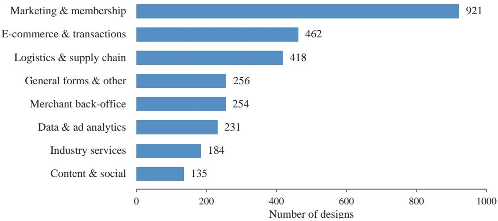  
Figure 7: Application scenarios across all 2,861 designs. Each design is counted once in its primary scenario.

## A.2 Structural Complexity and Annotation Coverage

Table 5 summarizes visible layers and annotation records per design. The median design contains 43 visible layers and 23 annotations; the corresponding 90th percentiles are 146 and 81. These statistics describe the full dataset, rather than the compiled scoring references for the evaluation subset.

Table 5: Per-design statistics across all 2,861 designs. P90 denotes the 90th percentile.
<table><tr><td>Quantity</td><td>Mean</td><td>Median</td><td>P90</td><td>Minimum</td><td>Maximum</td></tr><tr><td>Visible layers</td><td>64.21</td><td>43</td><td>146</td><td>1</td><td>776</td></tr><tr><td>Expert annotation records</td><td>34.13</td><td>23</td><td>81</td><td>0</td><td>270</td></tr></table>

## A.3 Annotation Platform

Experts annotate the original design alongside its rendered image and parsed layer tree (Figure 8). The platform links annotations to design layers and supports Component, Group, Alignment, and Position requirements. Each entry is marked as required or optional; acceptable alternative component types can also be recorded.

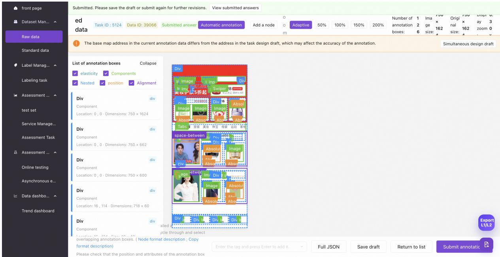  
Figure 8: The annotation platform. Experts inspect the design and its layers, overlay the four requirement categories, and review individual annotations in the adjacent panel.

## A.4 Layer Parsing and Normalization

Each design is parsed into a layer tree containing node identifiers, geometry, names, component references, text, typography, visual styles, and image assets. Non-public links and redundant artboard images are removed. Nodes with non-positive area remain in the metadata but are excluded from member derivation and scoring. Each design is associated with the target-library documentation used for annotation and evaluation. The annotated pool is deduplicated by design URL, retaining the latest version of each design. This reduces 2,882 annotated design records to 2,861 final designs.

## A.5 Quality Control

Annotations were produced by two senior frontend engineers with seven and five years of experience, respectively. A third expert reviewed every annotated sample over multiple rounds against the original design file, rendered image, and layer structure. The review covered component types and properties, grouping, arrangement, and positioning, and also checked for missing elements, position drift, and abnormal asset parsing. Samples with errors were returned to the frontend experts for revision and rechecked before inclusion in the final curated set. The annotation and verification process spanned 18 months.

## A.6 The Evaluation Subset

The evaluation subset comprises 421 designs from five annotation collections designated for evaluation, including 152 B-end and 269 C-end designs. After removing six duplicate designs and seven designs withdrawn during data preparation, the subset was frozen before MLLM inference. Selection was performed at the collection level, without filtering individual designs by content, complexity, or MLLM performance.

## A.7 Scoring Reference Construction

We convert expert annotations into a structured scoring reference R∗, linking each annotation to its design region and corresponding layers. Each annotation has a field indicating whether it is required or optional. Some optional annotations additionally specify alternative implementations in an associated field. The resulting reference covers Component, Group, Alignment, and Position and is shared across the three tasks: T1 and T3 evaluate generated code against it, while T2 evaluates predicted requirements. T3 additionally receives the expert annotations for each input design. Table 6 summarizes the required and optional reference entries in the evaluation subset.

<table><tr><td>Category</td><td>Required</td><td>Optional</td><td>Total</td></tr><tr><td>Component</td><td>7,976</td><td>21</td><td>7,997</td></tr><tr><td>Group</td><td>12,658</td><td>49</td><td>12,707</td></tr><tr><td>Alignment</td><td>747</td><td>170</td><td>917</td></tr><tr><td>Position</td><td>711</td><td>350</td><td>1,061</td></tr></table>

Table 6: Required and optional reference entries in the 421-design evaluation subset.

## B Task Prompts

Figures 9–11 present prompt summaries for the three tasks. Figure 12 presents their output formats.

## B.1 Shared Inputs and Prompt Design

All three tasks receive design images, layer metadata, and target-library documentation, which provide visual appearance, layer structure and attributes, and available components and properties, respectively. T3 additionally receives the expert annotations for each input design. Within each task, all MLLMs use the same prompt template.

## B.2 T1: End-to-End UI Code Generation

T1 generates a React page using TypeScript and CSS Modules from the shared design inputs. Figure 9 summarizes the generation instructions, and Figure 12 specifies the three-file output format.

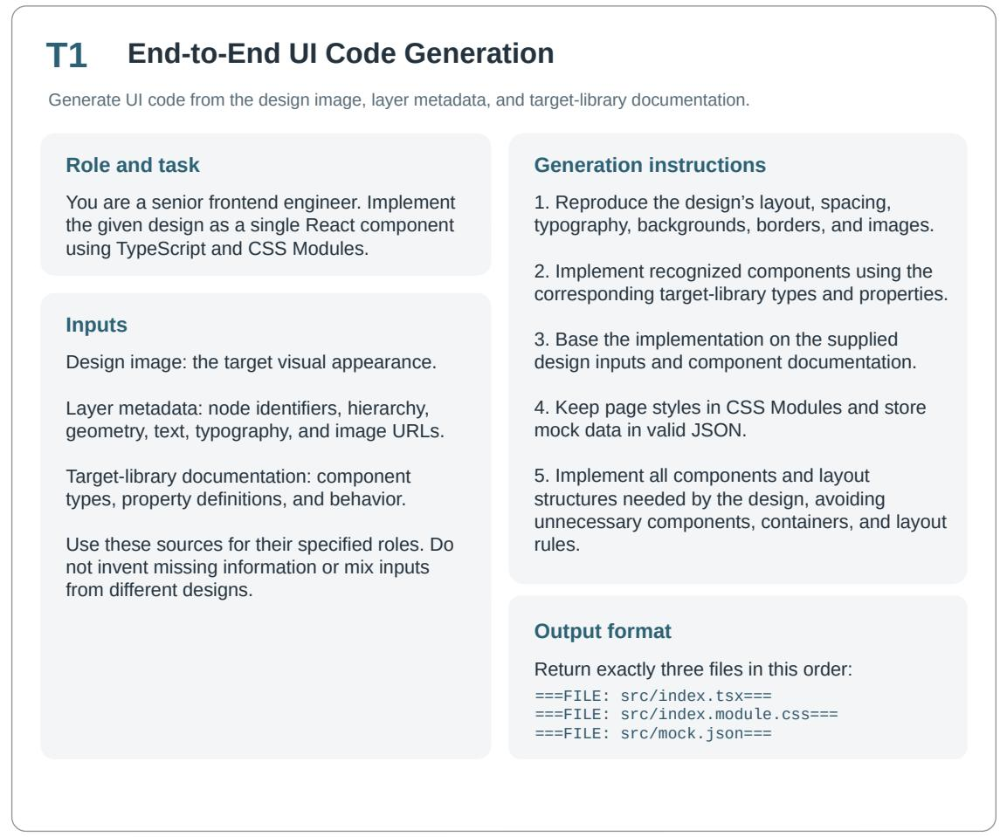  
Figure 9: End-to-End UI Code Generation (T1) prompt summary, including the shared inputs, code output format, and generation constraints.

## B.3 T2: Requirement Inference

T2 infers structured implementation requirements from the shared design inputs without generating code. Figure 10 summarizes the task instructions, and Figure 12 specifies the output schema.

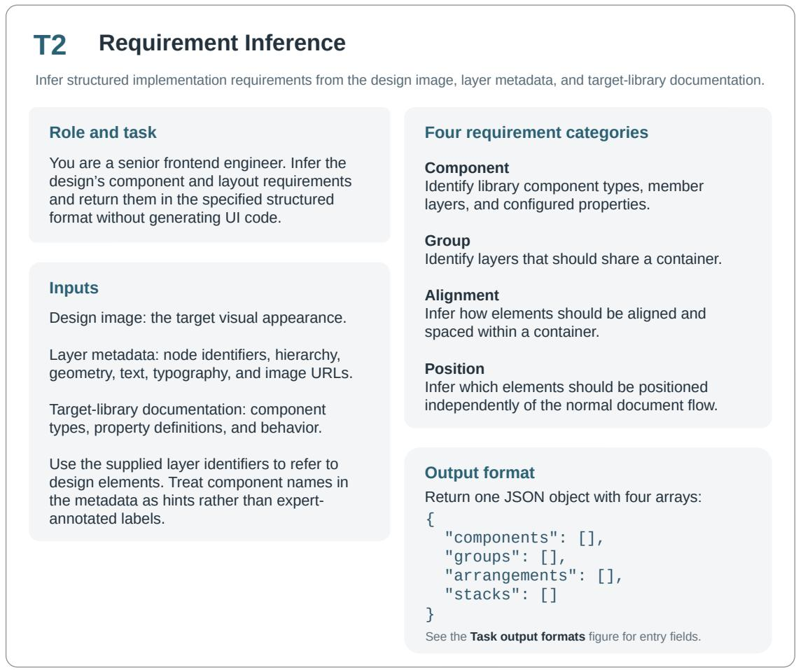  
Figure 10: Requirement Inference (T2) prompt summary. The four requirement categories correspond to the components, groups, arrangements, and stacks arrays.

## B.4 T3: Requirement Realization

T3 extends T1 with the expert annotations for each input design (Figure 11). The MLLM implements the supplied requirements while using the original design inputs for text, images, geometry, and visual styles. Code output, rendering, and evaluation remain the same as in T1.

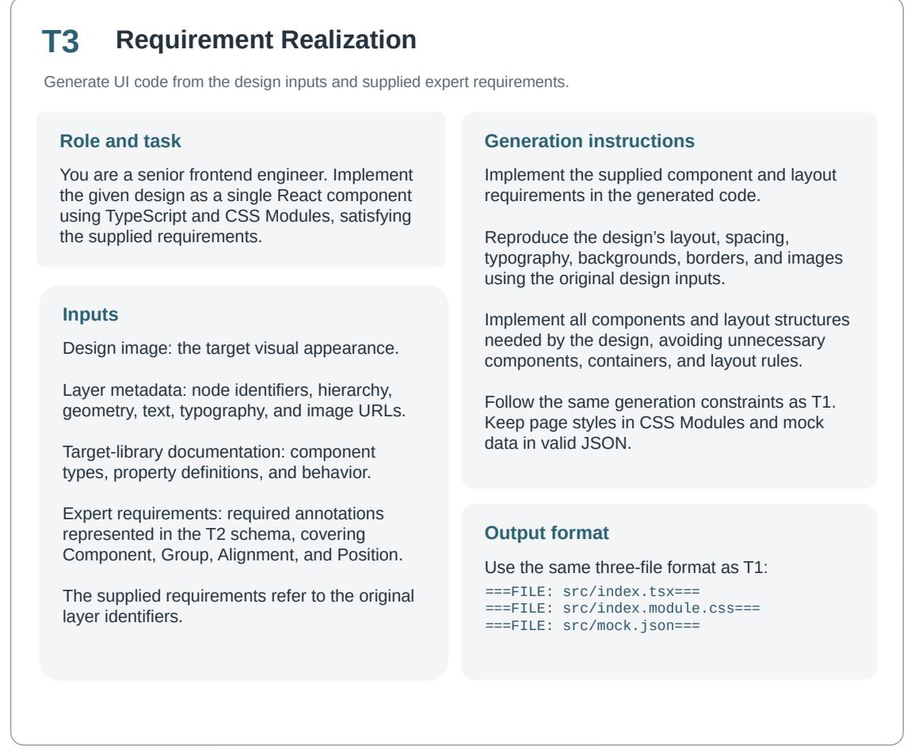  
Figure 11: Requirement Realization (T3) prompt summary. T3 supplements the T1 inputs with the expert annotations for the input design while retaining the same code generation instructions and output format.

## B.5 Output Formats

Figure 12 summarizes the output contracts. T1 and T3 return three source files delimited by fixed file markers, whereas T2 returns one JSON object containing four arrays. The figure uses placeholders for generated file contents and schematic notation for JSON entry fields. Actual T2 responses contain valid JSON values and follow the output schema in Figure 12. The expert requirements supplied to T3 follow the same public schema as the T2 output.

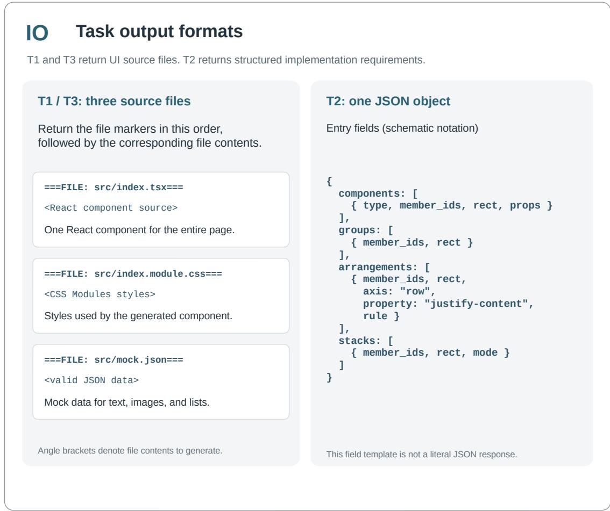  
Figure 12: Output formats for the three TaoD2C-Bench tasks. Left: ordered file blocks for T1 and T3. Right: the four arrays and their entry fields for T2. File contents and field notation are schematic, not an executable response or a complete JSON example.

## C Evaluation Details

Requirement Prediction and Code Implementation use the same four requirement categories but evaluate different outputs. The former evaluates T2’s structured requirements; the latter evaluates their implementation in T1/T3 code and its runtime DOM and CSS. Code Implementation reports component Type and Props separately, giving five F1 scores rather than four. Both use micro-averaged precision, recall, and F1, with F1 reported in the tables.

For a dimension, let $\mathcal { P } _ { s }$ be the candidate predictions of sample s, $\mathcal { R } _ { s } ^ { \mathrm { r e q } }$ its required reference entries, $M _ { s }$ the number of matched candidates, and $M _ { s } ^ { \mathrm { r e q } }$ the number of matched required entries. Counts are pooled across all samples before division:

$$
\mathrm { P } = \frac { \sum _ { s } M _ { s } } { \sum _ { s } \left| \mathcal { P } _ { s } \right| } , \qquad \mathrm { R } = \frac { \sum _ { s } M _ { s } ^ { \mathrm { r e q } } } { \sum _ { s } \left| \mathcal { R } _ { s } ^ { \mathrm { r e q } } \right| } , \qquad \mathrm { F 1 } = \frac { 2 \mathrm { P R } } { \mathrm { P } + \mathrm { R } } .\tag{4}
$$

## C.1 Requirement Prediction Scorer

The scorer deterministically matches T2 predictions to expert annotations in each category. A match requires identical, non-empty derived member sets and agreement on the relevant attributes: component type for Component; axis, property, and rule for Alignment; and positioning mode for Position. Group requires member-set agreement only.

Matching and optional entries. One-to-one maximum matching is performed first against required entries and then against optional entries using the remaining predictions. Thus, $M = M ^ { \mathrm { { r e q } } } + \breve { M } ^ { \mathrm { { o p t } } }$ in $\mathrm { E } \bar { \bf q } . 4$ . Unmatched predictions count as false positives; unmatched required entries count as false negatives. Optional matches contribute to precision but not recall, and omitting an optional entry incurs no penalty.

Member sets and evaluation scope. Predicted component member sets are expanded to include descendants in the layer tree. For Group, Alignment, and Position, members are derived from predicted rectangles using the same procedure as the reference (Appendix A.7). The component evaluation excludes image, icon, and avatar from both predictions and references.

## C.2 Code Implementation Scorer

The scorer matches expert annotations to evidence from generated code and the rendered DOM. Generated pages are bundled with esbuild and rendered in Playwright. Runtime evidence includes bounding boxes, parent–child relations, computed styles, and component types and properties associated with visual component roots. For two axis-aligned boxes a and b with areas |a| and |b|, the geometric tests use intersection-over-union and area ratio,

$$
\operatorname { I o U } ( a , b ) = { \frac { \left| a \cap b \right| } { \left| a \cup b \right| } } , \qquad \operatorname { A R } ( a , b ) = { \frac { \operatorname* { m i n } ( \left| a \right| , \left| b \right| ) } { \operatorname* { m a x } ( \left| a \right| , \left| b \right| ) } } .\tag{5}
$$

Type and Props. Component types and properties are associated with their visual roots to define the runtime boundaries used for matching. A runtime component implementation u and a reference component c form a legal edge when their component types agree under the target-library alias relation ≡ and both their IoU and area similarity are at least 0.7,

$$
( u , c ) \in E _ { \mathrm { c o m p } } \iff { \mathrm { t y p e } } ( u ) \equiv { \mathrm { t y p e } } ( c ) \ \wedge \ \mathrm { I o U } ( u , c ) \geq 0 . 7 \ \wedge \ \mathrm { A R } ( u , c ) \geq 0 . 7 .\tag{6}
$$

Matching is one-to-one and maximizes the number of legal pairs. Component names are normalized using targetlibrary-specific aliases. Plain containers and image types are excluded from component evaluation. Props are checked only on the component implementations whose type is already correct, and the two are reported as separate Type and Props columns.

Group, Alignment, and Position. Group candidates are containers with at least two visible children, or singlechild containers with a data-grounding-group marker or geometric agreement with a single-member reference. In the latter case, the matched member node must be a descendant of the container when available. All candidates enter the precision denominator and must satisfy the same geometric matching criteria. Matching between a reference group g and a candidate container c requires both intersection-over-union and area similarity to be at least 0.7. Area similarity is measured by $\operatorname { A R } ( g , c )$ as defined above. A group with an empty member set has no structural identity and is excluded from the shared required denominator, with excluded counts recorded. Alignment requires both container IoU ≥ 0.7 and the same alignment type as the annotation. Position pairs at IoU $\geq \overline { { 0 . 7 } }$ and checks the positioning mode. These dimensions use one-to-one matching that maximizes the number of matches, with geometric scores used to resolve ties. Runtime bounding boxes are calibrated by the median anchor offset before the geometric tests, removing a global page shift without changing relative geometry.

## C.3 Visual Fidelity

Let I be the design image and $I _ { C } = \mathrm { R e n d e r } ( C )$ the rendered image. We report CV, VES, and MAE separately from Code Implementation and do not combine the three into an overall score.

Composite visual score (CV). We adopt the visual similarity metric in Section 3.3 and Appendix B of 1D-Bench (Xu et al., 2026). It combines perceptual image similarity $S _ { \mathrm { i m g } } ,$ element completeness $S _ { \mathrm { c o m p } } .$ , and layout similarity $S _ { \mathrm { l a y o u t } }$ , each on [0, 1]. We report CV on a 0–100 scale:

$$
\mathrm { C V } ( I , I _ { C } ) = 1 0 0 \big ( 0 . 5 { \cal S } _ { \mathrm { i m g } } + 0 . 3 { \cal S } _ { \mathrm { c o m p } } + 0 . 2 { \cal S } _ { \mathrm { l a y o u t } } \big ) .\tag{7}
$$

The CV preprocessing handles transparency and aligns both images to width $w = \mathrm { m i n } ( w _ { I } , w _ { I _ { C } } )$ and height $h = \operatorname* { m i n } ( h _ { I } , h _ { I _ { C } } )$ before detection and comparison.

We follow its text and non-text matching procedures. Unavailable signals are omitted and the remaining weights are renormalized; when neither text nor non-text blocks are detected, CV reduces to $1 0 0 S _ { \mathrm { i m g } }$ . The pixel-difference term within CV is distinct from the separately reported MAE below.

Visual element similarity (VES). VES compares the CLS-token embeddings produced by a DINOv2-base encoder ϕ (Oquab et al., 2023):

$$
\mathrm { V E S } ( I , I _ { C } ) = \frac { \phi ( I ) ^ { \mathsf { T } } \phi ( I _ { C } ) } { \| \phi ( I ) \| _ { 2 } \| \phi ( I _ { C } ) \| _ { 2 } } .\tag{8}
$$

Higher CV and VES indicate better visual fidelity.

Mean absolute error (MAE). For MAE, we crop the near-white borders of both images at threshold 250, resize the render proportionally to the reference, and center-pad it with white. Let $\tilde { I } , \tilde { I _ { C } } \in \ \bar { [ 0 , 2 5 5 ] } ^ { H \times W \times 3 }$ denote the resulting RGB images. The normalized error is

$$
\mathbf { M A E } ( I , I _ { C } ) = \frac { 1 } { 2 5 5 \cdot 3 H W } \sum _ { i = 1 } ^ { H } \sum _ { j = 1 } ^ { W } \sum _ { k = 1 } ^ { 3 } \left| \widetilde { I } _ { i j k } - ( \widetilde { I _ { C } } ) _ { i j k } \right| .\tag{9}
$$

Lower MAE indicates better visual fidelity. All three metrics are reported as case means using one final output per design; failure handling and aggregation follow Appendix C.4.

## C.4 Aggregation and Failure Handling

All eight models are evaluated on the same 421 designs for all three tasks, yielding 10,104 task outcomes. Results use the final output after the retries and repairs described in Appendix D.2, rather than first-attempt performance. A successful repair replaces the failed attempt.

There are 10,101 successful outcomes and three failures: all three tasks for Qwen3-VL-235B on B-end design 629 exceed the provider’s 126,976-token input limit. Failures receive F1, CV, and VES of zero and MAE of one, where applicable. Required reference entries remain in the micro-recall denominator with zero matches; dimensions without reference entries receive no artificial reference count.

Requirement scores pool counts across designs as defined in Eq. 4. CV, VES, and MAE are averaged across designs. Table Mean rows average model scores; they do not pool counts across models. Model means and T3–T1 differences use the reported precision: two decimals for F1 and CV, and four for VES and MAE.

## D Experimental Settings

## D.1 Models and Generation Settings

Table 7 lists model-specific inference settings. GPT-5.6 Terra and GPT-5.4 use Codex CLI; the other models use an OpenAI-compatible gateway. The same 421 designs and task templates are used across all models.

The task runner initially requests 32,000 output tokens. A response truncated at the length limit is retried once with a 48,000-token budget when the model’s ceiling permits. These budgets are subject to the transport limits in Table 7; the Codex CLI transport does not pass an output-token cap. Qwen3.8-Max uses two gateway entries, Qwen3.8-Max and Qwen0902, for the same model; results are reported under its canonical name.

## D.2 Execution and Output Validation

Requests contain the shared design inputs followed by the task instructions. T3 inserts its expert requirements after the layer tree. Supported models use prompt caching; cache controls do not change the task content. Experiment manifests record the input samples, component documentation, prompts, and references used for each run.

Table 7: Model-specific inference settings. A dash indicates that no setting is specified. HTTP caps are transport limits, not task-level budgets.
<table><tr><td>Model</td><td>Reasoning setting</td><td>HTTP output cap</td></tr><tr><td>GPT-5.6 Terra</td><td>Medium</td><td></td></tr><tr><td>GPT-5.4</td><td>Medium</td><td></td></tr><tr><td>Claude Sonnet 5</td><td>Adaptive, medium effort</td><td>60,000</td></tr><tr><td>Qwen3.8-Max</td><td></td><td>60,000</td></tr><tr><td>Qwen3-VL-235B-A22B-Thinking</td><td></td><td>32,768</td></tr><tr><td>Gemini 3.5 Flash</td><td>Medium</td><td>60,000</td></tr><tr><td>Kimi K3</td><td>Low</td><td>60,000</td></tr><tr><td>Gemini 3.1 Pro Preview</td><td></td><td>60,000</td></tr></table>

Retries and repair. Transient request failures allow at most five retries after the initial attempt. Deterministic request errors fail immediately. A timeout can trigger an identical request using streaming. Separately, invalid output triggers one repair request containing the original prompt and validation error. For T2, validation checks JSON parsing and schema compliance; a surrounding code fence is accepted. For T1/T3, repair is triggered by absent file blocks or a missing required file. Predictions are not manually edited, and retry outputs are not selected by their evaluation scores.

Rendering and evaluation. Generated pages are built and rendered at the design’s root width. Failed renders retain an error record. T2 predictions are evaluated against the compiled reference; T3 uses the same rendering and evaluation as T1. The annotations supplied to T3 are recorded for each input design. Failure scoring and aggregation are specified in Appendix C.4.

## E Domain-wise Results

Tables 8–13 give all three tasks separately for the 152 B-end and 269 C-end designs. Each domain uses the same cases across all eight models, with terminal failures retained. F1 is micro-aggregated within each domain; the B+C F1 is pooled from counts and is not an average of the B-end and C-end F1 values. CV, VES, and MAE are case means. Model abbreviations follow Table 2.

Table 8: B-end results for End-to-End UI Code Generation (T1) on the same 152 designs for all eight models. F1 is in percent. Bold marks the best value per column; Mean averages models. CV and VES are higher-better; MAE is lower-better.
<table><tr><td>Model</td><td>Type</td><td>Props</td><td>Group</td><td>Align.</td><td>Pos.</td><td>CV↑</td><td>VES ↑</td><td>MAE↓</td></tr><tr><td>GPT-5.6 Terra</td><td>67.74</td><td>47.21</td><td>41.87</td><td>39.95</td><td>23.63</td><td>82.23</td><td>0.9225</td><td>0.1221</td></tr><tr><td>GPT-5.4</td><td>66.75</td><td>43.45</td><td>39.78</td><td>37.90</td><td>12.56</td><td>83.12</td><td>0.9408</td><td>0.0991</td></tr><tr><td>Claude Sonnet 5</td><td>65.04</td><td>41.73</td><td>39.19</td><td>29.63</td><td>16.70</td><td>76.03</td><td>0.9022</td><td>0.1462</td></tr><tr><td>Qwen3.8-Max</td><td>69.11</td><td>40.57</td><td>39.03</td><td>31.47</td><td>16.97</td><td>79.68</td><td>0.9240</td><td>0.1352</td></tr><tr><td>Qwen3-VL-235B</td><td>30.67</td><td>13.95</td><td>26.53</td><td>9.65</td><td>11.38</td><td>61.40</td><td>0.8706</td><td>0.1824</td></tr><tr><td>Gemini 3.5 Flash</td><td>66.47</td><td>38.51</td><td>33.08</td><td>25.98</td><td>24.70</td><td>77.82</td><td>0.9278</td><td>0.1130</td></tr><tr><td>Kimi K3</td><td>68.51</td><td>43.70</td><td>40.10</td><td>36.58</td><td>28.00</td><td>81.06</td><td>0.9258</td><td>0.1231</td></tr><tr><td>Gemini 3.1 Pro</td><td>68.04</td><td>41.56</td><td>37.77</td><td>32.21</td><td>25.39</td><td>80.14</td><td>0.9285</td><td>0.1177</td></tr><tr><td>Mean</td><td>62.79</td><td>38.84</td><td>37.17</td><td>30.42</td><td>19.92</td><td>77.69</td><td>0.9178</td><td>0.1299</td></tr></table>

Table 9: B-end results for Requirement Inference (T2) on the same 152 designs for all eight models. F1 is in percent. Bold marks the best value per column; Mean averages models.
<table><tr><td>Model</td><td>Comp.</td><td>Group</td><td>Align. Pos.</td></tr><tr><td>GPT-5.6 Terra</td><td>59.70</td><td>56.94 38.17</td><td>25.19</td></tr><tr><td>GPT-5.4</td><td>59.60</td><td>57.59</td><td>29.88 26.48</td></tr><tr><td>Claude Sonnet 5</td><td>58.68</td><td>56.51</td><td>35.56 23.87</td></tr><tr><td>Qwen3.8-Max</td><td>59.97</td><td>61.16</td><td>21.57</td></tr><tr><td>Qwen3-VL-235B</td><td>53.54</td><td>37.00</td><td>16.05</td></tr><tr><td>Gemini 3.5 Flash</td><td>59.68</td><td>52.51</td><td>25.59</td></tr><tr><td>Kimi K3</td><td>60.02</td><td>62.82</td><td>17.31</td></tr><tr><td>Gemini 3.1 Pro</td><td>59.47</td><td>60.37</td><td>16.39</td></tr><tr><td>Mean</td><td>58.83</td><td>55.61</td><td>21.56</td></tr></table>

Table 10: B-end results for Requirement Realization (T3) on the same 152 designs for all eight models. F1 is in percent. Bold marks the best value per column; Mean averages models. CV and VES are higher-better; MAE is lower-better.
<table><tr><td>Model</td><td>Type</td><td>Props</td><td>Group</td><td>Align.</td><td>Pos.</td><td>CV↑</td><td>VES ↑</td><td>MAE↓</td></tr><tr><td>GPT-5.6 Terra</td><td>85.05</td><td>67.94</td><td>48.32</td><td>75.44</td><td>60.36</td><td>85.36</td><td>0.9447</td><td>0.0897</td></tr><tr><td>GPT-5.4</td><td>80.78</td><td>66.72</td><td>43.69</td><td>66.27</td><td>62.90</td><td>84.26</td><td>0.9383</td><td>0.1013</td></tr><tr><td>Claude Sonnet 5</td><td>83.04</td><td>66.09</td><td>42.30</td><td>55.25</td><td>70.23</td><td>78.47</td><td>0.9189</td><td>0.1400</td></tr><tr><td>Qwen3.8-Max</td><td>81.32</td><td>60.91</td><td>39.18</td><td>34.47</td><td>36.69</td><td>78.87</td><td>0.9226</td><td>0.1294</td></tr><tr><td>Qwen3-VL-235B</td><td>39.43</td><td>23.97</td><td>29.23</td><td>8.24</td><td>12.33</td><td>61.83</td><td>0.8545</td><td>0.1787</td></tr><tr><td>Gemini 3.5 Flash</td><td>85.81</td><td>70.53</td><td>39.54</td><td>56.72</td><td>65.62</td><td>78.34</td><td>0.9333</td><td>0.0981</td></tr><tr><td>Kimi K3</td><td>83.08</td><td>67.95</td><td>46.13</td><td>67.36</td><td>68.91</td><td>81.28</td><td>0.9315</td><td>0.1182</td></tr><tr><td>Gemini 3.1 Pro</td><td>89.30</td><td>78.53</td><td>47.66</td><td>77.01</td><td>90.16</td><td>81.87</td><td>0.9315</td><td>0.1071</td></tr><tr><td>Mean</td><td>78.48</td><td>62.83</td><td>42.01</td><td>55.10</td><td>58.40</td><td>78.79</td><td>0.9219</td><td>0.1203</td></tr></table>

Table 11: C-end results for End-to-End UI Code Generation (T1) on the same 269 designs for all eight models. F1 is in percent. Bold marks the best value per column; Mean averages models. CV and VES are higher-better; MAE is lower-better.
<table><tr><td>Model</td><td>Type</td><td>Props</td><td>Group</td><td>Align.</td><td>Pos.</td><td>CV↑</td><td>VES ↑</td><td>MAE↓</td></tr><tr><td>GPT-5.6 Terra</td><td>53.45</td><td>39.19</td><td>62.44</td><td>28.08</td><td>38.34</td><td>87.78</td><td>0.9145</td><td>0.1129</td></tr><tr><td>GPT-5.4</td><td>48.93</td><td>34.88</td><td>63.52</td><td>25.24</td><td>38.41</td><td>86.20</td><td>0.9056</td><td>0.1127</td></tr><tr><td>Claude Sonnet 5</td><td>51.67</td><td>38.20</td><td>60.99</td><td>22.10</td><td>29.55</td><td>80.40</td><td>0.8903</td><td>0.1287</td></tr><tr><td>Qwen3.8-Max</td><td>49.85</td><td>36.01</td><td>67.89</td><td>25.19</td><td>48.66</td><td>88.83</td><td>0.9165</td><td>0.1010</td></tr><tr><td>Qwen3-VL-235B</td><td>33.10</td><td>22.81</td><td>32.11</td><td>6.24</td><td>6.73</td><td>56.66</td><td>0.7475</td><td>0.1799</td></tr><tr><td>Gemini 3.5 Flash</td><td>54.51</td><td>37.21</td><td>58.91</td><td>18.71</td><td>30.03</td><td>82.02</td><td>0.9019</td><td>0.1232</td></tr><tr><td>Kimi K3</td><td>54.25</td><td>37.90</td><td>67.28</td><td>24.63</td><td>45.04</td><td>86.29</td><td>0.9090</td><td>0.1148</td></tr><tr><td>Gemini 3.1 Pro</td><td>43.45</td><td>30.36</td><td>62.80</td><td>22.64</td><td>34.60</td><td>84.61</td><td>0.9081</td><td>0.1161</td></tr><tr><td>Mean</td><td>48.65</td><td>34.57</td><td>59.49</td><td>21.60</td><td>33.92</td><td>81.60</td><td>0.8867</td><td>0.1237</td></tr></table>

Table 12: C-end results for Requirement Inference (T2) on the same 269 designs for all eight models. F1 is in percent. Bold marks the best value per column; Mean averages models.
<table><tr><td>Model</td><td>Comp.</td><td>Group</td><td>Align.</td></tr><tr><td>GPT-5.6 Terra</td><td>58.23</td><td>61.98</td><td>50.87</td></tr><tr><td>GPT-5.4</td><td>53.47</td><td>61.87</td><td>52.32</td></tr><tr><td>Claude Sonnet 5</td><td>57.81</td><td>48.90</td><td>50.59</td></tr><tr><td>Qwen3.8-Max</td><td>57.02</td><td>73.90</td><td>53.28</td></tr><tr><td>Qwen3-VL-235B</td><td>52.86</td><td>17.23</td><td>28.14</td></tr><tr><td>Gemini 3.5 Flash</td><td>57.27</td><td>51.18</td><td>50.11</td></tr><tr><td>Kimi K3</td><td>59.09</td><td>72.83</td><td>56.01</td></tr><tr><td>Gemini 3.1 Pro</td><td>57.27</td><td>69.90</td><td>53.12</td></tr><tr><td>Mean</td><td>56.63</td><td>57.22</td><td>49.31</td></tr></table>

Table 13: C-end results for Requirement Realization (T3) on the same 269 designs for all eight models. F1 is in percent. Bold marks the best value per column; Mean averages models. CV and VES are higher-better; MAE is lower-better.
<table><tr><td>Model</td><td>Type</td><td>Props</td><td>Group</td><td>Align.</td><td>Pos.</td><td>CV↑</td><td>VES ↑</td><td>MAE↓</td></tr><tr><td>GPT-5.6 Terra</td><td>75.56</td><td>62.95</td><td>65.81</td><td>41.47</td><td>50.17</td><td>87.17</td><td>0.9158</td><td>0.1083</td></tr><tr><td>GPT-5.4</td><td>66.89</td><td>52.14</td><td>72.85</td><td>46.68</td><td>58.05</td><td>85.34</td><td>0.8968</td><td>0.1130</td></tr><tr><td>Claude Sonnet 5</td><td>69.56</td><td>60.39</td><td>68.06</td><td>31.94</td><td>47.48</td><td>79.93</td><td>0.8898</td><td>0.1312</td></tr><tr><td>Qwen3.8-Max</td><td>77.56</td><td>67.01</td><td>74.90</td><td>50.00</td><td>68.02</td><td>88.04</td><td>0.9070</td><td>0.1050</td></tr><tr><td>Qwen3-VL-235B</td><td>49.53</td><td>40.37</td><td>31.32</td><td>10.08</td><td>13.57</td><td>56.92</td><td>0.7354</td><td>0.1779</td></tr><tr><td>Gemini 3.5 Flash</td><td>75.18</td><td>61.89</td><td>66.70</td><td>33.90</td><td>53.38</td><td>81.84</td><td>0.8724</td><td>0.1238</td></tr><tr><td>Kimi K3</td><td>72.64</td><td>58.53</td><td>74.13</td><td>43.53</td><td>61.61</td><td>84.81</td><td>0.9027</td><td>0.1130</td></tr><tr><td>Gemini 3.1 Pro</td><td>79.66</td><td>69.08</td><td>80.37</td><td>54.88</td><td>75.95</td><td>86.03</td><td>0.9063</td><td>0.1189</td></tr><tr><td>Mean</td><td>70.82</td><td>59.05</td><td>66.77</td><td>39.06</td><td>53.53</td><td>81.26</td><td>0.8783</td><td>0.1239</td></tr></table>

## F License

All designs in TaoD2C originate from the production archives of 17 commercial platforms, which retain copyright over the original design assets. The publicly available evaluation subset is released for non-commercial research use under the two sets of terms below.

Benchmark-created materials. The expert annotations and compiled implementation requirements included in the public evaluation subset are distributed under the Creative Commons Attribution-NonCommercial 4.0 International (CC BY-NC 4.0) license. This license permits sharing and adaptation for non-commercial purposes, provided that appropriate credit is given and changes are indicated.

Platform-owned design assets. The original design files, rendered design images, extracted assets, and layer metadata remain the property of the originating platforms. Materials included in the public evaluation subset are provided under the accompanying non-commercial research data-use terms and may not be redistributed or sublicensed separately. Commercial use of these platform-owned assets requires prior permission from the originating platforms.