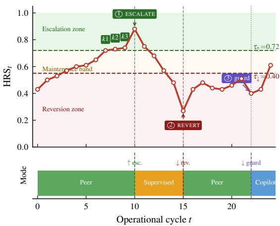
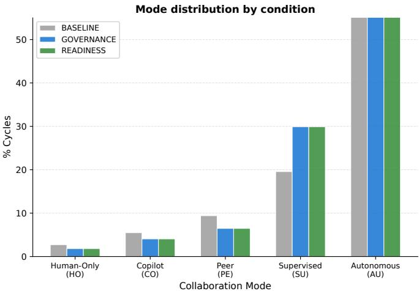
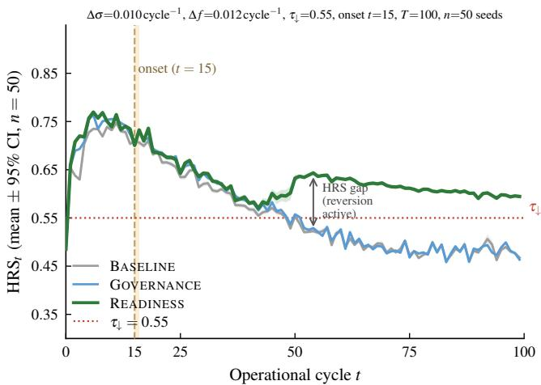
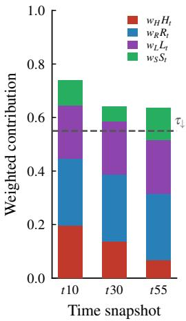
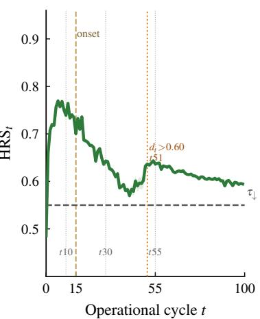
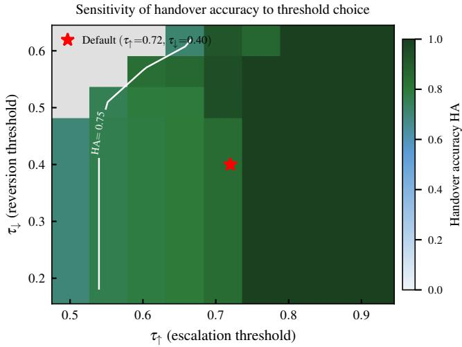

# The Handover Problem: Governing Autonomy Transitions in Human–AI Collaboration

Vicente Pelechano, Antoni Mestre, Manoli Albert, and Miriam Gil

Abstract—Human-machine systems rarely operate at a fixed level of AI autonomy. As operators and AI systems collaborate over time, control must shift: the AI can take on more responsibility when collaboration is stable, maintain its current role when evidence is ambiguous, or return control to the human when conditions deteriorate. Existing work on adaptive automation, supervisory control, trust in automation, and deskilling explains parts of this problem, but provides no auditable, multi-signal criterion for governing when autonomy should change across multi-cycle workflows.

We formalise this challenge as the Handover Problem: deciding, at each operational cycle, whether to escalate, maintain, or revert AI autonomy while keeping the process reversible, recoverable, and auditable. We introduce the Handover Readiness Score (HRS), a transparent composite measure that integrates four signal dimensions — operator readiness, human–AI trust, learning stability, and operational performance — together with a hysteresis-based transition policy that requires sustained positive evidence before increasing autonomy but reverts promptly when conditions worsen.

Across software engineering and manufacturing domains, the HRS and hard safety guards address complementary failure regimes: guards enforce immediate corrective action when a single indicator breaches a critical threshold; the HRS detects the slow, multi-signal erosion of operator readiness that no individual guard can observe. The framework establishes autonomy handover as a governance problem requiring explicit, composite, and auditable criteria — a conceptual and formal foundation that adaptive automation research has not previously provided.

Index Terms—Adaptive automation; autonomy management; human-machine systems; supervisory control; trust in automation; deskilling; readiness-based control; governance; simulation

## I. INTRODUCTION

Autonomy is not a destination. In operational human–AI systems, the central challenge is rarely whether to delegate tasks to an artificial agent, but rather when to escalate delegation, how far, and — equally important — when to take control back. A process-plant operator who has supervised an increasingly autonomous control system for six months may show stable metrics while quietly losing hands-on competence: no single threshold was crossed, yet the operator’s fallback capability has eroded. A composite criterion sensitive to the joint trajectory of readiness, trust, learning stability, and operational performance would have detected this drift and temporarily reverted to a more operator-led mode, buying time to rebuild readiness before the skill gap became consequential. Fixed-threshold guards alone cannot act here.

Several research traditions bear directly on this problem — shared autonomy, adaptive automation, trust in automation, and deskilling — yet none integrates these dynamics into a single temporal criterion for governing escalation and reversion across multi-cycle workflows. This paper proposes such a criterion and evaluates it via controlled simulation as a governance mechanism for auditable, reversible, and recoverable autonomy transitions.

We make four contributions:

C1. The Handover Problem: a formal definition of governing transitions between collaboration modes, characterizing the tension between immediate performance and deferred deskilling costs, and specifying reversibility, recoverability, and auditability as requirements.

C2. The Handover Readiness Score (HRS): a composite index aggregating human readiness, relational trust, learning stability, and operational performance into a single interpretable scalar. We additionally analyse a calibrated trust extension that penalises trust–performance mismatch, addressing overtrust-driven false escalations in controlled experiments.

C3. A reversible hysteresis policy that encodes asymmetric caution: moving to higher autonomy requires sustained evidence of readiness across consecutive cycles, while reverting to a safer mode is never delayed. The design reflects the principle that granting autonomy too early is a harder mistake to recover from than temporarily withholding it.

C4. Complementarity of guards and HRS: guards and the HRS address structurally distinct failure regimes — guards respond to abrupt threshold crossings; the HRS detects slow, multi-signal erosion that no individual guard observes. This separation is confirmed across software engineering and manufacturing domains.

The primary contribution is a formally specified governance criterion: each component is individually motivated, and the framework is shown to produce effects distinguishable from simpler guard-based alternatives. The framework establishes autonomy handover as a governance problem requiring explicit, composite, and auditable criteria — a conceptual and formal foundation that adaptive automation research has not previously provided.

## II. RELATED WORK

Shared autonomy and adjustable automation. Sheridan and Verplank [1] proposed a 10-level taxonomy from fully manual to fully automated operation; Parasuraman et al. [2] extended this into a two-dimensional model distinguishing automation types from levels of human involvement. Sarter et al. [3] documented automation surprises — transitions without adequate human awareness — as a primary source of operational risk. Inagaki [4] distinguished sharing (concurrent execution) from trading (sequential handoff), a contrast central to the governance problem studied here; Flemisch et al. [5] placed sharing and trading on a common cooperative-control spectrum. Automation level and adaptive automation further shape performance, situation awareness, and workload [6]. The HRS most closely resembles a hybrid trigger in Parasuraman and Riley [7]’s taxonomy — one combining multiple signal types — but extends it to govern both escalation and reversion with explicit hysteresis and component-level auditability.

Trust in automation and human oversight. Lee and See [8] distinguish appropriate reliance from overtrust (automation bias) and undertrust (disuse); trust evolves dynamically through experience [9, 10] and is more brittle than interpersonal trust after failure [11]. Miscalibrated trust has documented consequences: humans preferentially accept automated recommendations even when contradicted by evidence [12, 13]. Shneiderman [14] and Cummings [15] argue that accountable oversight mechanisms — not merely capable AI — are the operative model for consequential deployments; Christoffersen and Woods [16] show that making joint cognitive work visible to both operators and designers is a prerequisite for effective oversight. These findings motivate treating reliance as a state to be actively governed.

Human capital erosion and deskilling. Bainbridge’s [17] foundational analysis identified the central paradox: reliable automation removes practice opportunities for the skills most needed when automation fails. Endsley and Kiris [18] documented empirically that reduced control involvement leads to lower situation awareness and slower reversion responses; Endsley [19] concluded that full autonomy systematically undermines skill retention and meaningful oversight. Aviation offers the most extensively documented domain [20, 21], and the concern has migrated to knowledge work with generative AI assistants [22, 23].

Autonomy governance in agentic AI systems. The rise of LLM-based agents reframes handover as an active engineering concern: AI systems now pursue multi-step goals with partial autonomy, requiring humans to intervene selectively [14, 15]. Recent work on human-in-the-loop oversight [24] and on the cognitive costs of interruption-based control [2] shows that neither “always ask” nor “always act” is satisfactory. The EU AI Act increases the need for risk management, human oversight, and traceability in high-risk AI settings, creating a regulatory demand for auditable governance criteria [25]. The Handover Problem addresses this demand by formalising escalation and reversion as first-class governance actions with explicit, component-traceable criteria rather than ad hoc human overrides.

The intersection gap. Shared autonomy provides the mode spectrum, trust a key dynamic signal, and deskilling the forwardlooking risk that should govern reversion. What is absent is a framework using all three together as a temporal governance criterion across multi-cycle workflows. Wickens [26]’s multipleresources framework grounds this: readiness can erode along independent dimensions — high skill does not compensate deteriorating trust, nor does a stable operational period offset deskilling accumulation. The Handover Problem formalises this gap.

## III. THE HANDOVER READINESS MODEL

## A. Mode Spectrum and Handover Problem

An operational cycle $t \in \{ 1 , \ldots , T \}$ is a bounded collaboration period. The collaboration mode spectrum is:

$$
\begin{array} { r l } & { \mathcal { M } = \{ \mathrm { H U M A N - O N L Y } \prec \mathrm { C O P I L O T } \prec \mathrm { P E E R } } \\ & { \qquad \prec \mathrm { S U P E R V I S E D } \prec \mathrm { A U T O N O M O U S } \} . } \end{array}\tag{1}
$$

where  denotes increasing AI autonomy. Table I summarises the five modes. In COPILOT the human leads while the AI assists; in PEER both agents execute independently; in SUPERVISED the AI leads while the human validates.

TABLE I  
THE FIVE COLLABORATION MODES ORDERED BY INCREASING AI AUTONOMY. INTERMEDIATE MODES (COPILOT, PEER, SUPERVISED) ARE shared: BOTH AGENTS EXECUTE PORTIONS OF EACH TASK.
<table><tr><td>Mode</td><td>Human role</td><td>AI role</td></tr><tr><td>HUMAN-ONLY Full execution</td><td></td><td>None</td></tr><tr><td>COPILOT</td><td>Leads, decides</td><td>Assists</td></tr><tr><td>PEER</td><td>Executes autonomously</td><td>Executes autonomously</td></tr><tr><td>SUPERVISED</td><td>Validates outputs</td><td>Leads, executes</td></tr><tr><td>AUTONOMOUS None</td><td></td><td>Full execution</td></tr></table>

The Two-Horizon Tension: Escalating AI autonomy confers immediate benefits: faster execution, lower cost, consistent output quality. The deferred cost is more complex. Operating at high autonomy for many consecutive cycles accumulates a deskilling liability — the human’s fallback capability erodes through disuse [17, 18]. Trust may also miscalibrate: extended AI success produces overtrust that impairs detection of AI failures [13]. A policy that maximises immediate performance escalates aggressively, accumulating fragility; a policy that minimises deskilling risk under-utilises AI capability. The Handover Problem arises because these forces pull in opposite directions, and resolving the tension requires a principled composite criterion — not a single threshold.

The Handover Problem is: design a policy $\pi : S $ ESCALATE, MAINTAIN, REVERT satisfying: (i) completeness (a decision at every cycle); (ii) reversibility (reversion is a first-class action, not reserved for failure); (iii) auditability (every decision traces to observable signals with explicit weights); (iv) balance (neither maximising performance at deskilling cost nor sacrificing AI capability entirely); and (v) recoverability (the policy preserves the operator’s capacity to absorb reverted control — reversibility guarantees control is returnable; recoverability ensures returning it remains useful). These requirements distinguish the framework from reactive threshold rules, which satisfy (i) but fail (ii)–(v).

## B. The Handover Readiness Score

The Handover Readiness Score at cycle t is:

$$
\mathrm { H R S } _ { t } = w _ { H } \cdot H _ { t } + w _ { R } \cdot R _ { t } + w _ { L } \cdot L _ { t } + w _ { S } \cdot S _ { t } ,\tag{2}
$$

where $w _ { H } + w _ { R } + w _ { L } + w _ { S } = 1$ and $\mathrm { H R S } _ { t } \in [ 0 , 1 ]$ . The four components correspond to four distinct reasons the answer to “is the system ready to escalate $\therefore ? ^ { \ast }$ may be “not yet”: the human may be unable to function as an effective fallback $( H _ { t } )$ , the relational basis for delegation may be weak $( R _ { t } )$ , the learning trajectory may be unstable $( L _ { t } )$ , or the current mode may lack demonstrated equilibrium $( S _ { t } )$

Human readiness $H _ { t } .$

$$
H _ { t } = ( 1 - f _ { t } ) \cdot \sigma _ { t } \cdot ( 1 - d _ { t } ) ,\tag{3}
$$

combining fatigue $( f _ { t } )$ , skill level $( \sigma _ { t } )$ , and deskilling exposure $( d _ { t } )$ . The multiplicative form is deliberate: any severely degraded factor collapses the product regardless of the others — readiness is the coexistence of prerequisites, not an average. $H _ { t }$ is the formal carrier of recoverability: it is the quantity through which the policy observes whether returned control would still be usable. Weight $w _ { H } = 0 . 3 5$ is highest.

Relational trust $R _ { t } \colon \ R _ { t } \ = \ \tau _ { t }$ , the normalised learned trust signal. Trust builds gradually through consistent AI performance and degrades abruptly after failures [9]. A hard guard at $\tau _ { t } < 0 . 2 5$ provides a safety floor. Note: setting $R _ { t } = \tau _ { t }$ means higher trust always raises the composite, which can reward escalation under overtrust — a substantive limitation discussed in Section VI.

Learning stability $\boldsymbol { L } _ { t } \dot { \boldsymbol { \mathbf { \cdot } } }$

$$
L _ { t } = \operatorname* { m a x } \ ( 0 , 1 - \frac { \mathrm { V a r } ( \sigma _ { t - k : t } ) } { \sigma _ { \operatorname* { m a x } } ^ { 2 } } \ ) ,\tag{4}
$$

asking whether the skill trajectory has settled, not just whether the current level is adequate. Window $k = 5$ cycles; $\sigma _ { \mathrm { m a x } } ^ { 2 } =$ $0 . 0 4 ~ ( \mathrm { i . e . } ~ \sigma _ { \mathrm { m a x } } = 0 . 2 $ , held constant per domain to prevent baseline drift). Weight $w _ { L } = 0 . 2 0$

Operational stability $S _ { t }$

$$
S _ { t } = \mathrm { c l i p } \bigg ( \frac { \kappa _ { t } } { \kappa _ { 0 } } , 0 , 1 \bigg ) \cdot \frac { \ln ( 1 + \operatorname* { m i n } ( c _ { t } , k _ { \operatorname* { m a x } } ) ) } { \ln ( 1 + k _ { \operatorname* { m a x } } ) } ,\tag{5}
$$

combining current KPI relative to mode baseline $\kappa _ { 0 } = 0 . 0 1 5$ with logarithmic tenure $c _ { t }$ in the current mode (cap $k _ { \operatorname* { m a x } } = 1 0 )$ Weight $w _ { S } = 0 . 2 0$ . Note: immediately after any mode transition $c _ { t } = 0 .$ , so ln $\iota ( 1 + 0 ) = 0$ collapses $S _ { t }$ to zero regardless of KPI. This is deliberate — the new mode has no demonstrated tenure and should not contribute stability evidence — but the resulting transient $\mathrm { H R S } _ { t }$ dip is bounded: it cannot drive reversion unless $\mathrm { H R S } _ { t }$ without the $S _ { t }$ contribution already sits near $\tau _ { \downarrow }$ , i.e. unless the other three components are also weak. Guard conditions are unaffected by $S _ { t }$

$D e f a u l t w e i g h t s : w _ { H } = 0 . 3 5 , w _ { R } = 0 . 2 5 , w _ { L } = 0 . 2 0 ,$ $w _ { S } = 0 . 2 0 \colon$ These are design parameters encoding organisational priorities, not fitted coefficients, making each transition decision auditable by component. Table II lists the observable proxies used to instantiate each component in the simulation and in candidate deployments.

TABLE II  
OBSERVABLE PROXIES FOR EACH HRS COMPONENT AND ACQUISITIONMETHOD FOR REAL DEPLOYMENTS. ALL SIGNALS ARE DERIVABLE FROMTELEMETRY ALREADY PRESENT IN MOST OPERATIONAL HUMAN–AISYSTEMS.
<table><tr><td>Component</td><td>Field proxy</td><td>Acquisition source</td></tr><tr><td> $H _ { t } \mathrm { - } \mathrm { f a t i g u e } \ f _ { t }$ </td><td>Session length, input latency, error clustering</td><td>System telemetry; interaction logs</td></tr><tr><td> $H _ { t } \mathrm { ~ - ~ } \mathrm { s k i l l ~ } \sigma _ { t }$ </td><td>Task-type suc- cess rate, com- petency assess- ments</td><td>QA/audit logs; HR system</td></tr><tr><td> $H _ { t } \mathrm { - } \mathrm { d e s k i l l i n g ~ } d _ { t }$ </td><td>Time since last unaided execu- tion of task type</td><td>Mode-history ledger</td></tr><tr><td> $R _ { t } - \mathrm { { t r u s t } } \ \tau _ { t }$ </td><td>Override frequency, confirmation delay, AI-</td><td>Interaction audit trail</td></tr><tr><td>Lt — learning stab.</td><td>accept rate Rolling variance of task-quality over k-cycle</td><td>QA logs (com- puted)</td></tr><tr><td> $S _ { t } - \mathbf { o p } .$  stability</td><td>window KPI vs. mode baseline; cycles in current mode</td><td>Operational dash- board; scheduler</td></tr><tr><td>Guards  $( f _ { t } , d _ { t } , \tau _ { t } )$ </td><td>Same proxies as above; hard- threshold check</td><td>Real-time policy engine</td></tr></table>

## C. Hysteresis Policy and Hard Guards

The policy translates the HRS scalar into a transition decision escalate, maintain, or revert — at each cycle. A single threshold would cause oscillation near the boundary, as small HRS fluctuations trigger repeated mode changes. Instead, two thresholds $\tau _ { \uparrow } > \tau _ { \downarrow }$ define three zones: escalation $( \mathrm { H R S } _ { t } \ge \tau _ { \uparrow } )$ maintenance band $( \tau _ { \downarrow } < \mathrm { H R S } _ { t } < \tau _ { \uparrow } )$ , and reversion $( \mathrm { H R S } _ { t } \leq$ $\tau _ { \downarrow } )$ . Let $n _ { t } ^ { + }$ count consecutive cycles with $\mathrm { H R S } _ { s } \ge \tau _ { \uparrow }$ , resetting on any dip. The policy is:

$$
D _ { t } = \left\{ \begin{array} { l l } { \mathrm { R E V E R T } } & { \mathrm { i f ~ g u a r d } ( s _ { t } ) = \top } \\ { \mathrm { E S C A L A T E } } & { \mathrm { e l s e ~ i f ~ } n _ { t } ^ { + } \geq k _ { \uparrow } } \\ { \mathrm { R E V E R T } } & { \mathrm { e l s e ~ i f ~ H R S } _ { t } \leq \tau _ { \downarrow } } \\ { \mathrm { M A I N T A I N } } & { \mathrm { o t h e r w i s e . } } \end{array} \right.\tag{6}
$$

Default parameters: $\tau _ { \uparrow } = 0 . 7 2 , \tau _ { \downarrow } = 0 . 4 0 , k _ { \uparrow } = 3$ . These defaults were derived from empirical calibration on the evaluation platform and validated across experimental conditions in Section ${ \mathrm { V } } ;$ deployment requires domain-specific recalibration. All transitions are single-step. The asymmetry is deliberate: escalation is a commitment that exposes the system to deskilling risk; reversion is a correction. Sustained evidence is required to reduce human involvement; reversion is never delayed.

Hard guards override the HRS and force immediate reversion:

$$
\begin{array} { r } { \begin{array} { l } { \mathrm { g u a r d } ( s _ { t } ) = \top \iff ( f _ { t } > 0 . 8 5 ) \lor ( \tau _ { t } < 0 . 2 5 ) } \\ { \qquad \lor ( d _ { t } > 0 . 6 0 ) \lor ( \mathrm { f a i l \_ s t r e a k } _ { t } \ge \theta _ { f } ) . } \end{array} } \end{array}\tag{7}
$$

The default $\theta _ { f } = 3$ (three consecutive task failures) is domainconfigurable. Each condition marks a qualitatively distinct failure mode that the composite must not obscure. Fatigue $( f _ { t } > 0 . 8 5 )$ signals acute incapacity: at this level the operator cannot reliably execute fallback tasks regardless of skill level or trust [26]. Trust $( \tau _ { t } < 0 . 2 5 )$ signals relational breakdown: below this floor the operator has effectively disengaged from AI outputs, making delegation unsafe irrespective of AI capability [8]. Deskilling $( d _ { t } > 0 . 6 0 )$ signals a point of uncertain recoverability: sustained exposure beyond this threshold approaches the irreversible skill-gap regime documented in automationheavy operations [17, 18]. Fail streak (fail\_streak $\geq \theta _ { f } )$ signals sustained output failure: three consecutive task failures indicate a systemic collaboration breakdown, not random noise [7]. Guards mark states the governance policy refuses to “average away”: these are stop conditions, not trade-offs. Two guard conditions $( f _ { t } , \ d _ { t } )$ act directly on erosion factors of $H _ { t }$ , functioning as backstops for recoverability before fallback capability degrades irrecoverably.

Illustrative mechanism: Suppose, with $\tau _ { \downarrow } ~ = ~ 0 . 5 5$ (as calibrated for the H3 scenario in Section V-B), skill erodes from 0.74 to 0.57 and deskilling exposure grows from 0.26 to 0.43 under sustained high-autonomy operation. Each shift is modest in isolation, yet their product inside $H _ { t } \ ( \mathrm { w i t h } \ f = 0 . 0 1 )$ collapses human readiness to $H = 0 . 3 2 2$ , giving HRS = $0 . 3 5 ( 0 . 3 2 2 ) + 0 . 2 5 ( 0 . 9 3 ) + 0 . 2 0 ( 0 . 9 9 ) + 0 . 2 0 ( 0 . 0 0 ) = 0 . 5 4 4 \leq$ $\tau _ { \downarrow }$ . The composite thus crosses the reversion threshold that no individual guard can observe.

Figure 1 traces a hypothetical 25-cycle episode illustrating the three key policy behaviours: 1 escalation fires after $k _ { \mathord { \uparrow } } = 3$ consecutive cycles above $\tau _ { \uparrow }$ (cycle 10); 2 an AI error collapses HRSt into the reversion zone and the policy acts immediately (cycle 15); 3 a fatigue spike triggers the hard guard, overriding HRS (cycle 22). Cycles 1–6 and 16–21 illustrate the maintenance band: the system holds the current mode while HRSt is neither low enough to revert nor high enough (for long enough) to escalate.

Empirical validation of the full model — ablations, severity sweeps, sensitivity maps, and healthcare boundary results — appears in the companion technical report [27], Sections S1–S5.

## IV. METHODOLOGY

Experimental platform. HAAS Studio is a computational simulation platform for human–AI collaboration research, built on the HAAS policy-aware task-allocation framework [28, 29]. Each model component is a formal instantiation of an established construct: fatigue follows workload-capacity dynamics [26]; trust evolves through gradual reinforcement and abrupt failure-degradation [8, 9]; deskilling accrues proportionally to AI-exposure share [17, 18]. Parameters $( \kappa _ { 0 } ~ = ~ 0 . 0 1 5$ $\sigma _ { \mathrm { m a x } } ^ { 2 } = 0 . 0 4 , \theta _ { f } = 3 )$ are calibrated to qualitative benchmarks in the literature, not fitted to the outcomes reported here. The evaluation therefore tests whether the HRS behaves coherently given that the underlying dynamics follow the theoretically assumed patterns — the necessary computational precondition before field deployment.

  
Fig. 1. HRS-governed transition policy on a hypothetical 25-cycle episode. Top: HRSt trajectory with zone bands (escalation, maintenance, reversion) and escalation counter $( k { = } 1 , 2 , 3$ at cycles $_ { 7 - 9 ) }$ . Bottom: resulting collaboration mode strip. Events: ⃝1 escalation after $k _ { \mathord { \uparrow } } = 3$ consecutive cycles above $\tau _ { \uparrow }$ (cycle 10); ⃝2 HRS-triggered reversion when HRSt drops below $\tau _ { \downarrow }$ on a trust shock (cycle 15); ⃝3 hard-guard reversion on a fatigue spike (cycle 22), overriding the composite score.

Each episode of T=100 cycles generates domain-specific subtasks; a LINUCB contextual bandit [30] proposes a human– AI collaboration mode, which the policy engine may override via caps, guards, or the HRS. The human-agent model maintains state variables for fatigue, skill level, deskilling exposure, and trust; the AI-agent model updates its capability based on the learning trajectory. Outcomes are recorded and fed back as input for the next cycle. LINUCB is chosen because it conditions on the same state signals the HRS observes, creating a demanding baseline: any risk the HRS corrects cannot be attributed to allocator ignorance. Three domains are modelled: software engineering (moderate deskilling decay, no regulatory ceiling), manufacturing (faster physical-skill decay), and healthcare (fastest judgment-skill decay, hard regulatory ceiling at SUPERVISED).

Three experimental conditions isolate the contribution of each governance layer (Table III): BASELINE (LinUCB allocator, no governance), GOVERNANCE (cap/guard architecture, no HRS), and READINESS (cap/guard architecture plus the HRS policy). GOVERNANCE is reactive: it acts only when a single-signal threshold is violated. READINESS adds a proactive, four-component readiness trajectory and governs escalation, maintenance, and reversion through the same auditable criterion. The key contrast is READINESS vs. GOVERNANCE: both share the same cap/guard architecture, so any difference isolates the HRS’s specific contribution.

The primary domain is software engineering $( T ~ = ~ 1 0 0$ cycles, 50 random seeds). Manufacturing serves as a replication domain. Healthcare (radiology screening, regulatory ceiling at SUPERVISED) maps the governance boundary.

TABLE III  
ARCHITECTURAL DIFFERENCES BETWEEN EXPERIMENTAL CONDITIONS.
<table><tr><td>Dimension</td><td>BASELINE</td><td>GOVERNANCE</td><td>READINESS</td></tr><tr><td>Governance</td><td>None</td><td>Caps + guards</td><td>Caps + guards + HRS</td></tr><tr><td>Direction</td><td></td><td>Reactive</td><td>Proactive</td></tr><tr><td>Signals</td><td></td><td>Single-signal</td><td>Composite (4 dim.)</td></tr><tr><td>Reversibility</td><td></td><td>Guard-fire only</td><td>Escalate/maint./revert</td></tr><tr><td>Hysteresis</td><td></td><td>None</td><td> $k _ { \uparrow }$  cycles; immediate revert</td></tr></table>

Hypotheses. The four hypotheses follow a progressive logic. H1 and H2 characterise the governance layer in steady-state operation, where the cap/guard architecture alone is expected to be sufficient. H3 identifies the HRS’s distinctive contribution: detecting slow, multi-signal deterioration that no single guard can observe. H4 confirms that the governance system is robust across a meaningful region of the parameter space.

H1 (Mode redistribution): Governed conditions reduce highautonomy concentration relative to BASELINE; the HRS adds no separate mode signature in steady state, since both governed conditions share the same cap/guard layer.

H2 (Sustainability): The cap/guard layer reduces deskilling risk relative to BASELINE; the HRS adds no further steady-state gain, as its contribution operates through deterioration detection rather than mode redistribution.

H3 (Complementarity): READINESS achieves higher reversion coverage under gradual sub-threshold deterioration than GOVERNANCE/BASELINE, which structurally cannot act in the guard-silent regime.

H4 (Stability): A broad stable region Ω (handover accuracy $\geq 0 . 7 5 )$ spans a wide range of threshold settings, with the default configuration interior to it.

Deterioration protocol. Protocol parameters are calibrated relative to the simulation’s domain-specific dynamics. Under normal operation, software-domain skill decays at 0.002–0.004 per cycle per dimension, representing gradual attrition under routine AI exposure [17, 18]. Starting at cycle $t _ { 0 } = 1 5$ , the H3 protocol sets $\Delta \sigma = 0 . 0 1 0 / \mathrm { c y c }$ le (floor 0.42) — roughly 2.5–5 baseline, a period of heightened degradation consistent with more rapid skill erosion documented in aviation and knowledge work [19, 31]. Fatigue accrues at $\Delta f = 0 . 0 1 2 / \mathrm { c y c l e }$ (cap 0.80) [26]. The floor and cap keep the scenario in a recoverable, nonemergency range, deliberately below guard thresholds $( f > 0 . 8 5$ $d > 0 . 6 0 )$ , so that HRS is the only mechanism capable of detecting the drift over 40 cycles.

The reversion threshold is recalibrated to $\tau _ { \downarrow } ~ = ~ 0 . 5 5$ matching the lower boundary of the observed HRS operating range in the software domain. This value exceeds the default $\tau _ { \downarrow } ~ = ~ 0 . 4 0$ , making reversion more conservative: the HRS triggers a return to human-led modes at a higher readiness floor. It remains within the stable region Ω (Section V-D); it is a deliberate stress-test choice, not an operational default. The primary estimand is reversion coverage: the fraction of seeds achieving majority human-led allocation (COPILOT or HUMAN-ONLY) during the erosion window.

Primary metrics. Three metric classes operationalise the four hypotheses:

Sustainability (H1, H2) deskilling\_ $r i s k = ( \sigma _ { 0 } - \sigma _ { T } ) / \sigma _ { 0 }$ quantifies relative skill loss from episode start $\left( \sigma _ { 0 } \right)$ to end $( \sigma _ { T } )$ responsible\_score (RS, Eq. 8) combines performance balance $( P B )$ , shared-mode fraction (SM), human retention (HR), and autonomy restraint $( A R = 1 { - } \Delta \mathrm { U } \% )$ — design weights, not fitted coefficients:

$$
R S = 0 . 4 0 P B + 0 . 2 0 S M + 0 . 2 5 H R + 0 . 1 5 A R .\tag{8}
$$

Deterioration (H3) Reversion coverage (fraction of 50 seeds reverting) and median reversal latency among reverting seeds.

Sensitivity (H4) Handover accuracy: the fraction of governance decisions confirmed by subsequent quality and skill trajectories.

Extended severity sweeps appear in [27], Section S2.

## V. RESULTS

All results are from computational simulation on HAAS Studio; no human participants were involved. Values are means across 50 seeds unless stated. Reversion rates include Wilson 95% CIs.

The results fall into two parts. First, in normal operation, the cap/guard layer protects human sustainability at no cost to performance — READINESS performs comparably to GOVER-NANCE in steady state, consistent with H1 and H2. Second, the HRS makes its distinctive contribution under gradual deterioration: READINESS covers the guard-silent regime where GOVERNANCE and BASELINE structurally cannot act. Table IV summarises outcomes for all four hypotheses.

TABLE IV  
HYPOTHESIS OUTCOMES SUMMARY. ALL EVIDENCE FROM  
COMPUTATIONAL SIMULATION. “DIRECTIONAL” DENOTES SMALL ABSOLUTE DIFFERENCES FROM WHICH NO STATISTICAL CLAIM IS DRAWN.
<table><tr><td></td><td>Prediction</td><td>Outcome</td></tr><tr><td>H1</td><td>Governed conditions cut AU- TONOMOUS share; GOVER- NANCE/READINESS coincide</td><td>Supported</td></tr><tr><td>H2</td><td>in steady state. Cap/guard layer reduces deskilling; HRS adds no further steady-state gain.</td><td>Consistent (directional)</td></tr><tr><td>H3</td><td>READINESS reverts under gradual deterioration where GOVERNANCE/BASELINE</td><td>Supported (50/50 vs. 0/50)</td></tr><tr><td>H4</td><td>cannot. A broad stable region Ω ex- Supported (91% of grid) ists; defaults sit inside it.</td><td></td></tr></table>

## A. Steady-State Performance and Sustainability (H1, H2)

Table V reports steady-state metrics. Both governed conditions reduce AUTONOMOUS share from 63% (BASELINE) to 42%, redirecting freed cycles into SUPERVISED (19% 29%), where the AI leads but the human validates. GOVERNANCE and READINESS produce identical mode distributions, exactly as H1 predicts (Fig. 2): they share the same guard architecture, so the HRS adds no separate steady-state footprint.

  
Fig. 2. Mode distribution across conditions (software domain, 50 seeds; computational simulation). Both governed conditions shift allocation from AUTONOMOUS into SUPERVISED relative to BASELINE. GOVERNANCE and READINESS are nearly indistinguishable in steady state (H1 confirmed): the cap/guard layer, not the HRS, drives the redistribution.

Average task quality is identical across all conditions (0.533– 0.534), confirming governance does not impair throughput. Deskilling risk becomes measurable at $T = 1 0 0 \colon$ BASELINE accumulates 6.0% skill degradation; GOVERNANCE reduces this to 5.8%, consistent with H2 (the guard layer reduces deskilling; the HRS adds no further steady-state gain). The mean AUTONOMOUS run under READINESS (7.90 cycles) is shorter than GOVERNANCE (8.07) and BASELINE (8.09), reflecting the HRS reversion gate cutting runs short when HRS falls below $\tau _ { \downarrow }$ mid-run — but the effect is too small to change $T ~ = ~ 1 0 0$ deskilling accumulation meaningfully. Manufacturing replicates the pattern with larger absolute deskilling improvements (Table V, lower block), reflecting that domain’s faster physical-skill decay.

TABLE V  
STEADY-STATE METRICS, T = 100 CYCLES, MEANS OVER 50 SEEDS. DESKILLING $\mathrm { R I S K } = ( \sigma _ { 0 } - \sigma _ { T } ) / \sigma _ { 0 }$
<table><tr><td>Metric</td><td>Base</td><td>Gov</td><td>Read</td></tr><tr><td>Software engineering (primary)</td><td></td><td></td><td></td></tr><tr><td>AUTONOMOUS share (%)</td><td>63</td><td>42</td><td>42</td></tr><tr><td>SUPERVISED share (%)</td><td>19</td><td>29</td><td>29</td></tr><tr><td>avg_quality</td><td>0.533</td><td>0.533</td><td>0.534</td></tr><tr><td>deskilling_risk</td><td>0.060</td><td>0.058</td><td>0.061</td></tr><tr><td>responsible_score</td><td>0.315</td><td>0.326</td><td>0.324</td></tr><tr><td>mean AUTONOMOUS run (cyc.)</td><td>8.09</td><td>8.07</td><td>7.90</td></tr><tr><td>Manufacturing (replication)</td><td></td><td></td><td></td></tr><tr><td>deskilling_risk</td><td>0.065</td><td>0.051</td><td>0.052</td></tr><tr><td>responsible_score</td><td>0.330</td><td>0.372</td><td>0.372</td></tr></table>

## B. Gradual Deterioration Detection (H3)

This is where the HRS makes its distinctive contribution. Table VI reports deterioration-response metrics. In the software domain, BASELINE and GOVERNANCE revert in 0/50 seeds:

  
Fig. 3. HRS trajectory under gradual sub-threshold deterioration (mean ± 95% CI, n = 50 seeds, software domain). All three conditions decline together until the first composite crossing: READINESS crosses $\tau _ { \downarrow } = 0 . 5 5$ at cycle $\sim 3 3$ (≈ 18.5 cycles after onset at $t _ { 0 } = 1 5 )$ , no individual guard fires because no single threshold is crossed, and the policy activates reversion. The HRS recovers to ≈ 0.63; the separation gap between READINESS and the other conditions is visible from cycle ${ \sim } 3 \bar { 3 }$ onward. BASELINE and GOVERNANCE continue falling below $\tau _ { \downarrow }$ and remain there: neither has a mechanism to respond to the composite crossing. This explains the 50/50 vs. 0/50 reversion contrast (computational simulation).

with no threshold crossed, neither has a signal to act on. READINESS reverts in all 50/50 seeds (median latency 18.5 cycles; Wilson CI [0.93,1.00] vs. [0.00,0.07] for the others). The contrast is structural: the HRS fills the coverage gap that guards leave, demonstrating complementarity. The mechanism is direct: as skill erodes, $H _ { t }$ declines $( 0 . 5 6  0 . 2 2 )$ , pulling $\mathrm { H R S } _ { t }$ below $\tau _ { \downarrow } = 0 . 5 5$ around cycle 33 ( 18.5 cycles after onset; Fig. 3), applying a binding COPILOT cap without any single guard firing. The result replicates in manufacturing (50/50, median latency 22.0 cycles). These figures hold for the gradual sub-threshold protocol specifically; secondary stress tests in [27], Sections S1–S3 extend the analysis to direct signal-injection shocks.

TABLE VI  
DETERIORATION-RESPONSE METRICS, GRADUAL SUB-THRESHOLD EROSION OVER CYCLES [15,55], T = 100, 50 SEEDS. ‡MEDIAN LATENCY (CYCLES FROM EROSION ONSET) AMONG REVERTING SEEDS; “—” WHEN NONE REVERTED. WILSON 95% CI IN BRACKETS.
<table><tr><td>Metric</td><td>Base</td><td>Gov</td><td>Read</td></tr><tr><td>Software engineering (primary) reversion rate latency‡ (cyc.)</td><td>0/50 [0.00,0.07]</td><td>0/50 [0.00,0.07]</td><td>50/50 [0.93,1.00] 18.5</td></tr><tr><td>Manufacturing (replication)</td><td></td><td></td><td></td></tr><tr><td>reversion rate</td><td>0/50 [0.00,0.07]</td><td>0/50 [0.00,0.07]</td><td>50/50 [0.93,1.00]</td></tr></table>

Non-trivial comparators. A natural objection is that the 0/50 vs. 50/50 contrast is tautological: READINESS has a composite-linked reverting cap; the other conditions do not. Table VII isolates which element drives the advantage with two cap-equipped comparators: (i) Ht-only, a cap driven by the human-condition component alone, and (ii) no-hysteresis, the full composite with a single threshold $( \tau _ { \uparrow } = \tau _ { \downarrow } , k _ { \uparrow } = 1 )$ . Each variant runs under both deterioration and a no-deterioration control; reversion in the control counts as a false positive.

  
Fig. 4. HRS component breakdown under gradual sub-threshold erosion $( \bar { \Delta \sigma } = 0 . 0 1 0 \mathrm { c y c l e } ^ { - 1 }$ , READINESS condition, $n = 5 0$ seeds; computational simulation). $L e f t { \mathrm { : } }$ weighted component contributions $( w _ { H } H _ { t } ,$ wR $R _ { t }$ , wL $L _ { t } ,$ w St) at three snapshots. $H _ { t }$ is the primary driver of composite decline; $R _ { t }$ and $L _ { t }$ remain near ceiling because trust and learning stability are not directly disrupted by the gradual fatigue–skill shock. After reversion (t ≈ 33), $S _ { t }$ grows as the system accumulates tenure in the lower mode, partially compensating the $\dot { \boldsymbol { H } } _ { t }$ loss and stabilising the composite above $\tau _ { \downarrow } . \ R i g h t `$ READINESS HRS trajectory with $\tau _ { \downarrow }$ and the cycle at which the individual deskilling guard $( d _ { t } > 0 . 6 0 )$ would fire $( t \approx 5 1 ) -$ well after the composite crosses $\tau _ { \downarrow }$ at $t \approx 3 3 .$ confirming the composite acts before any single guard.

All three cap-equipped variants detect deterioration (50/50): the cap enables reversion. The point of separation is false positives. $H _ { t ^ { - } } { \mathrm { o n l y } }$ reverts in 50/50 control runs — a single fatigue signal cannot distinguish genuine multi-signal erosion from ordinary fluctuation. Both composite variants (no-hysteresis and READINESS full) produce 0/50 false positives: $R _ { t } , L _ { t } , S _ { t }$ keep $\mathrm { H R S } _ { t }$ above $\tau _ { \downarrow }$ during healthy operation, so the composite does not fire spuriously. The advantage is the composite sensor, not the cap alone. Figure 4 decomposes the corresponding HRS trajectory.

TABLE VII  
NON-TRIVIAL COMPARATORS FOR THE GRADUAL-DETERIORATION REGIME (SOFTWARE, n = 50 SEEDS). ALL CAP-EQUIPPED VARIANTS DETECT DETERIORATION; ONLY THE COMPOSITE ELIMINATES FALSE POSITIVES.
<table><tr><td>Variant</td><td>Detection (rev./deterioration)</td><td>False positives (rev./control)</td></tr><tr><td>BASELINE (no cap)</td><td>0/50</td><td>0/50</td></tr><tr><td>GoVERNANCE (guards, no HRS)</td><td>0/50</td><td>0/50</td></tr><tr><td>Ht-only (cap)</td><td>50/50</td><td>50/50</td></tr><tr><td>No-hysteresis (cap)</td><td>50/50</td><td>0/50</td></tr><tr><td>READINESS full (cap)</td><td>50/50</td><td>0/50</td></tr></table>

## C. Component Ablation and Robustness

Component ablation. The headline benchmark tests one perturbation model: gradual sub-threshold erosion. To identify which HRS components drive detection when shocks are abrupt rather than gradual, we apply three direct signal-injection shocks (full data in [27], Section S1): TRUST-DROP, FATIGUE-SPIKE, and SUSTAINED-DEGRADATION. READINESS retains high coverage across all three (50/50, 48/50, 50/50); GOVER-NANCE stays near zero (1/50, 0/50, 0/50). Two findings clarify which design elements are responsible.

Hysteresis: removing the gap between $\tau _ { \uparrow }$ and $\tau _ { \downarrow }$ leaves reversion coverage unchanged. Hysteresis controls escalation stability — preventing repeated mode changes near the boundary — not reversion triggering.

Composite vs. single signal: replacing the full HRS with $H _ { t }$ alone preserves most coverage on these shocks, because all three directly perturb the human-readiness channel. This contrasts with the gradual-deterioration regime (Section V-B), where $H _ { t ^ { - } } \mathrm { o n l y }$ produced 50/50 false positives under the nodeterioration control: slow multi-signal erosion cannot be distinguished from ordinary fatigue fluctuation without the trust, stability, and performance components. Component necessity is therefore perturbation-type dependent: $H _ { t }$ suffices for acute human-state shocks; the full composite is required when erosion accumulates across channels.

Mode-change frequency. A concern with composite governance is that richer sensing could trigger more frequent mode changes, adding operational churn. The HRS and hysteresis layer add zero overhead: mean mode-change frequency per episode was identical under GOVERNANCE and READINESS. The hysteresis gap $( k _ { \uparrow } = 3$ consecutive qualifying cycles before escalation) prevents oscillation without suppressing necessary reversion.

## D. Sensitivity and Stability (H4)

H4 asks two questions. First: are the HRS’s governance decisions correct? Second: is that correctness robust, or does it depend on a single precisely tuned configuration?

Handover accuracy (HA) measures the proportion of nontrivial governance decisions — escalations and reversions — that are retrospectively confirmed as warranted by subsequent trajectory outcomes: an escalation is confirmed if mean task quality over cycles t+1 to t+3 does not fall below quality 0.02; a reversion is confirmed if skill at cycle t+3 satisfies ${ \mathrm { s k i l l } } _ { t + 3 } \geq { \mathrm { s k i l l } } _ { t } - 0 . 0 2$ (i.e., the reversion successfully arrested decline). HA is evaluated under the standard gradualerosion protocol $( \delta \sigma ~ = ~ 0 . 0 1 0 / \mathrm { c y c l e }$ $\delta f ~ = ~ 0 . 0 1 2 / \mathrm { c y c l e } ,$ $t ~ \in ~ [ 1 5 , 5 5 ] )$ , which provides the realistic signal-to-noise conditions needed to assess decision quality. A value of 1.00 indicates every governance decision was confirmed by the subsequent trajectory.

We swept $\tau _ { \uparrow } \in [ 0 . 5 0 , 0 . 9 2 ]$ and $\tau _ { \downarrow } \in [ 0 . 1 8 , 0 . 6 2 ]$ across a $9 \times 9$ grid (15 seeds per point, gradual-erosion protocol) to map where governance remains reliable. The stable region Ω — defined by H $\mathrm { ~ A ~ } \geq 0 . 7 5$ — spans the vast majority of the searched space (91% of valid threshold pairs; Fig. 5). The main boundary lies at $\tau _ { \uparrow } \leq 0 . 5 0$ , where over-aggressive escalation reduces accuracy $( \mathrm { H A } = 0 . 7 0 )$ ; all tested values of $\tau _ { \uparrow } \geq 0 . 5 5$ achieve $\mathrm { H A } \geq 0 . 7 5$ across the full valid range of $\tau _ { \downarrow }$ . Within $\Omega ,$ mean $\mathrm { H A } = 0 . 9 1 \pm 0 . 1 0$

  
Fig. 5. Threshold sensitivity sweep: handover accuracy (colour) over the $( \tau _ { \uparrow } , \tau _ { \downarrow } )$ parameter grid (9×9, 15 seeds per point, gradual-erosion protocol). Grey cells denote invalid pairs $( \tau _ { \downarrow } \geq \tau _ { \uparrow } )$ . The stable region $\Omega \ \mathrm { ( H A \bar { A } \geq 0 . 7 5 ) }$ covers 91% of valid pairs; its main boundary is at $\tau _ { \uparrow } \leq 0 . 5 0$ . The default $( \tau _ { \uparrow } = 0 . 7 2 , \tau _ { \downarrow } = 0 . 4 0$ , starred) achieves $\mathrm { H A } = 0 . 8 5 ,$ well inside Ω.

The default parameters $( \tau _ { \uparrow } = 0 . 7 2 , \tau _ { \downarrow } = 0 . 4 0 )$ sit well inside Ω, achieving $\mathrm { H A } = 0 . 8 5$ at the nearest evaluated grid point. The system is not tuned to a single sweet spot but operates reliably across a wide range of configurations.

Component weights are similarly robust: 0.10 perturbations to wH, wR, wL leave $\mathrm { H A } = 1 . 0 0$ . The exception is wS (operational performance): reducing it from 0.20 to 0.10 drops HA to 0.703. This indicates that $w _ { S }$ shapes the timing and confidence of mode transitions — when the system acts, not whether it detects the need to act. Full threshold and weight maps appear in [27], Section S4.

## VI. DISCUSSION

Core claim: complementarity. The results establish that hard safety guards and the HRS are not interchangeable — they address different failure types across different time scales. Guards operate on events: a single signal crossing a hard threshold at cycle t triggers immediate reversion, independent of history. The HRS operates on trajectories: it integrates signals across cycles, requiring no individual threshold to be crossed but acting when the composite accumulation of fatigue, eroded trust, skill instability, and deskilling jointly crosses the governance boundary. This temporal asymmetry reflects a fundamental distinction in failure types: abrupt events (acute fatigue spike, trust collapse, output failure streak) demand immediate response, whereas gradual erosion demands accumulated evidence before action, or the governance layer would produce excessive false positives (as the $H _ { t } { \mathrm { - o n l y } }$ comparator demonstrates: 50/50 false positives under no-deterioration conditions). A complete governance architecture requires both layers. Guard thresholds should be calibrated to the HRSgoverned trajectory, not to an unregulated baseline, since the HRS changes the signal environment that guards operate in. In domains where structural constraints (regulatory ceilings, professional floors) already enforce conservative mode use, the

HRS’s marginal detection contribution diminishes; its value then shifts to auditability and pre-positioning — keeping the collaboration trajectory documented and recoverable (confirmed in a radiology screening boundary analysis, [27], Section S5).

Relation to existing frameworks. The HRS extends Parasuraman and Riley’s [7] hybrid trigger concept — which combines multiple signal types to adapt automation level — in three directions: it governs both escalation and reversion (not only reversion on failure); it requires sustained evidence for escalation but reverts immediately, encoding the asymmetric cost structure of the problem; and it exposes per-component weights to make each decision auditable. Sheridan’s 10-level LOA taxonomy [1] describes what modes exist; the HRS addresses the orthogonal question of when to move between them over time — the two are complementary, not competing.

Non-compensatory properties of the HRS. The linear additive form of Eq. 2 raises a legitimate concern: a dangerously low $H _ { t }$ could in principle be offset by high $R _ { t } / L _ { t } / S _ { t }$ . Two design features limit this risk. First, $H _ { t }$ itself is multiplicative (Eq. 3): any severely degraded factor collapses the product regardless of the others. Second, the hard guards (Eq. 7) impose non-compensatory backstops at extreme conditions $( f _ { t } \ > \ 0 . 8 5 , \ \tau _ { t } \ < \ 0 . 2 5 , \ d _ { t } \ > \ 0 . 6 0 , \ \theta _ { f } \ = \ 3 )$ . In the subguard range, compensation remains a limitation; a geometricmean or min-based composite would eliminate it at the cost of auditability. The hard guards are the practical defence for worst-case scenarios, which is precisely why the two layers are designed to coexist rather than substitute.

Operator monitoring and ethical deployment. The signal proxies in Table II — session length, input latency, override frequency, confirmation delay — constitute continuous operator monitoring, creating ethical obligations a production deployment must address. Operators should be informed of which signals are collected and how they feed the decision (transparency); autonomous demotion must be contestable, with a visible account of why a reversion fired and a channel to dispute it (contestability); and monitoring override frequency may introduce Goodhart-law effects, as operators who know overrides are penalised may suppress legitimate corrections. These are design constraints, not secondary concerns, shaping which signals are collected, how they are used, and who can access the records.

The overtrust limitation and calibrated trust. Setting $R _ { t } = \tau _ { t }$ treats higher learned trust as higher readiness. The trust in automation literature [8, 12] shows that overtrust is as dangerous as undertrust. To evaluate this risk, we ran a controlled silent AI degradation experiment: at cycle 20 the AI quality drops to 50% of baseline without any guard-triggering failure (degraded quality $\approx 0 . 3 7$ , without producing a fail streak of length $\theta _ { f } = 3 )$ , so trust decays only through natural dynamics. We compare the original $R _ { t } = \tau _ { t }$ against a calibrated form that penalises trust–performance mismatch:

$$
R _ { t } = \tau _ { t } \cdot \big ( 1 - \mathrm { c l i p } ( | \tau _ { t } - A _ { t } | , 0 , 1 ) \big ) ,\tag{9}
$$

where $A _ { t }$ is the mean observed AI quality contribution at cycle t (computable from per-task quality attribution already present in Table II). The outcomes are summarised in Table VIII.

TABLE VIII  
SILENT AI DEGRADATION EXPERIMENT (n = 50 SEEDS, SOFTWARE DOMAIN). AI QUALITY DROPS TO 50% AT CYCLE 20 FOR 40 CYCLES WITHOUT TRIGGERING GUARDS. FALSE ESCALATIONS = ESCALATIONS DURING THE DEGRADATION WINDOW.
<table><tr><td>Variant</td><td>False esc. (window)</td><td>Reversion coverage</td><td>Latency (med. cyc</td></tr><tr><td>READINESS original  $\left( R _ { t } \mathrm { = } \tau _ { t } \right)$ </td><td>17/50</td><td>50/50</td><td>3.0</td></tr><tr><td>READINESS calibrated  $\left( \operatorname { E q . 9 } \right)$ </td><td>0/50</td><td>50/50</td><td>3.0</td></tr></table>

With the original $R _ { t } ,$ the mean HRS rises from 0.72 to 0.79 during the degradation window (trust remains elevated while $H _ { t } , L _ { t } , S _ { t }$ fluctuate), causing 17/50 seeds to escalate autonomy precisely when AI performance has collapsed. The calibrated formula eliminates all 17 false escalations while preserving reversion coverage (50/50) and latency (3.0 cycles). We therefore recommend the calibrated form for deployment. Until it is validated against real operator data, $R _ { t } = \tau _ { t }$ should be used with caution in contexts where AI overconfidence is plausible.

## Threats to Validity

Internal validity. All evidence is computational and codesigned with HAAS Studio: the evaluation cannot fully distinguish “the HRS is effective” from “the HRS is adapted to HAAS Studio’s mechanics.” Mitigation: three-domain evaluation and comparator analysis (Table VII) rule out structuralcap artefacts; full resolution requires independent platform replication.

External validity. Trust, fatigue, and skill are modelled parameters, not human measurements; quantitative calibration to field data remains open. The LinUCB allocator is a demanding baseline but does not replicate human decisionmaking under uncertainty.

Construct validity. Observable signals operationalise latent constructs; mapping to field instruments (NASA-TLX [32], SAGAT [33]) is a prerequisite for deployment. The responsible\_score is a design-coherence check, not an independent criterion — non-circular validation requires human studies.

Future directions. Human-participant validation is the necessary next step, alongside adaptive weight learning, closed loop stability analysis, and multi-operator handovers.

## Toward Deployment

The HRS deployment pathway follows three domain-agnostic steps. Signal proxying: each component maps to constructs with established measurement traditions (workload  fatigue; reliability logs  trust; performance  skill; tenure  stability). Shadow calibration: the HRS runs read-only before activation while domain experts validate weights and thresholds and the observed signal distribution informs a one-time hard guard calibration. Governed go-live: activate with conservative settings — biasing toward MAINTAIN and REVERT — with explicit weights a compliance committee can inspect [25]. Each step treats deployment as a governance process, not a technical rollout.

## VII. CONCLUSION

We formalise autonomy handover as a governance problem and show, in controlled simulation, that a composite readiness gate covers gradual multi-signal deterioration that threshold guards miss, while preserving auditability. Hard guards enforce binary threshold conditions; the HRS adds coverage in the complementary regime where operator readiness erodes slowly and no individual guard fires. The hysteresis structure ensures escalation requires sustained evidence while reversion is never delayed. Three design choices carry transferable lessons: a composite index integrating signals existing frameworks treat separately; an asymmetric hysteresis structure mirroring the asymmetric cost structure of the problem; and explicit design-parameter weights making each transition decision auditable by component. As human–AI collaboration spreads across safety-critical and skill-intensive domains, handovergovernance quality will increasingly determine whether these systems are trustworthy.

## DATA AVAILABILITY STATEMENT

The data supporting the results reported in this paper are openly available on Zenodo at https://doi.org/10.5281/ zenodo.20798977. The deposit contains the supplementary document (PDF, Sections S1–S5), all raw simulation outputs as CSV files covering every analysis block (steady-state metrics, deterioration-response coverage, component ablation, threshold and weight sensitivity, mode-change frequency, and the overtrust experiment), and the Python scripts that generate all figures. Variable definitions are provided in CODEBOOK.md.

## ACKNOWLEDGMENT

This work was developed with the support of the Spanish Ministry of Science and Innovation under Project PRODI GIOUS PID2023-146224OB-I00. The authors used Claude Code (Anthropic) for language editing, clarity improvements, consistency checks on selected sections, and generating the HAAS Studio tool’s code. Generative AI was not used to produce scientific claims or conclusions; all AI-assisted content was reviewed and approved by the authors.

## REFERENCES

[1] T. B. Sheridan and W. L. Verplank, “Human and computer control of undersea teleoperators,” MIT Man-Machine Systems Laboratory, Tech. Rep., 1978.

[2] R. Parasuraman, T. B. Sheridan, and C. D. Wickens, “A model for types and levels of human interaction with automation,” IEEE Transactions on Systems, Man, and Cybernetics—Part A: Systems and Humans, vol. 30, no. 3, pp. 286–297, 2000.

[3] N. B. Sarter, D. D. Woods, and C. E. Billings, “Automation surprises,” in Handbook of Human Factors and Ergonomics, 2nd ed., G. Salvendy, Ed. Wiley, 1997, pp. 1926–1943.

[4] T. Inagaki, “Adaptive automation: Sharing and trading of control,” in Handbook of Cognitive Task Design, E. Hollnagel, Ed. Lawrence Erlbaum, 2003, pp. 147–169.

[5] F. O. Flemisch, C. A. Adams, S. R. Conway, K. H. Goodrich, M. T. Palmer, and P. C. Schutte, “The H-Metaphor as a guideline for vehicle automation and interaction,” NASA, Tech. Rep. NASA/TM-2003-212672, 2003.

[6] D. B. Kaber and M. R. Endsley, “The effects of level of automation and adaptive automation on human perfor mance, situation awareness and workload in a dynamic control task,” Theoretical Issues in Ergonomics Science, vol. 5, no. 2, pp. 113–153, 2004.

[7] R. Parasuraman and V. Riley, “Humans and automation: Use, misuse, disuse, abuse,” Human Factors, vol. 39, no. 2, pp. 230–253, 1997.

[8] J. D. Lee and K. A. See, “Trust in automation: Designing for appropriate reliance,” Human Factors, vol. 46, no. 1, pp. 50–80, 2004.

[9] B. M. Muir, “Trust in automation: Part I. Theoretical issues in the study of trust and human intervention in automated systems,” Ergonomics, vol. 37, no. 11, pp. 1905–1922, 1994.

[10] K. A. Hoff and M. Bashir, “Trust in automation: Integrating empirical evidence on factors that influence trust,” Human Factors, vol. 57, no. 3, pp. 407–434, 2015.

[11] P. A. Hancock, D. R. Billings, K. E. Schaefer, J. Y. C. Chen, E. J. De Visser, and R. Parasuraman, “A metaanalysis of factors affecting trust in human-robot interaction,” Human Factors, vol. 53, no. 5, pp. 517–527, 2011.

[12] L. J. Skitka, K. L. Mosier, and M. Burdick, “Does automation bias decision-making?” International Journal of Human-Computer Studies, vol. 51, no. 5, pp. 991–1006, 1999.

[13] K. Goddard, A. Roudsari, and J. C. Wyatt, “Automation bias: A systematic review of frequency, effect mediators, and mitigators,” Journal of the American Medical Infor matics Association, vol. 19, no. 1, pp. 121–127, 2012.

[14] B. Shneiderman, “Human-centered artificial intelligence: Reliable, safe & trustworthy,” International Journal of Human-Computer Interaction, vol. 36, no. 6, pp. 495–504, 2020.

[15] M. L. Cummings, “Man versus machine or man + machine?” IEEE Intelligent Systems, vol. 29, no. 5, pp. 62–69, 2014.

[16] K. Christoffersen and D. D. Woods, “How to make automated systems team players,” Advances in Human Performance and Cognitive Engineering Research, vol. 2, pp. 1–12, 2002.

[17] L. Bainbridge, “Ironies of automation,” Automatica, vol. 19, no. 6, pp. 775–779, 1983.

[18] M. R. Endsley and E. O. Kiris, “The out-of-the-loop performance problem and level of control in automation,” Human Factors, vol. 37, no. 2, pp. 381–394, 1995.

[19] M. R. Endsley, “From here to autonomy: Lessons learned from human–automation research,” Human Factors, vol. 59, no. 1, pp. 5–27, 2017.

[20] N. B. Sarter and D. D. Woods, “Pilot interaction with cockpit automation II: An experimental study of pilots model and awareness of the Flight Management System,”

International Journal of Aviation Psychology, vol. 4, no. 1, pp. 1–28, 1994.

[21] R. Parasuraman, R. Molloy, and I. L. Singh, “Performance consequences of automation-induced “complacency”,” International Journal of Aviation Psychology, vol. 3, no. 1, pp. 1–23, 1993.

[22] S. Barke, M. B. James, and N. Polikarpova, “Grounded Copilot: How programmers interact with code-generating models,” Proceedings of the ACM on Programming Languages (OOPSLA), vol. 7, 2023.

[23] P. E. Heudel, H. Crochet, Q. Filori, T. Bachelot, and J. Y. Blay, “Artificial intelligence in medicine: A scoping review of the risk of deskilling and loss of expertise among physicians,” ESMO Real World Data and Digital Oncology, vol. 12, p. 100693, 2026.

[24] S. Amershi, D. Weld, M. Vorvoreanu, A. Fourney, B. Nushi, P. Collisson, J. Suh, S. T. Iqbal, P. N. Bennett, K. Inkpen, J. Teevan, R. Kikin-Gil, and E. Horvitz, “Guidelines for human-AI interaction,” in Proceedings of the CHI Conference on Human Factors in Computing Systems. ACM, 2019, pp. 1–13.

[25] European Parliament and Council of the European Union, “Regulation (EU) 2024/1689 laying down harmonised rules on artificial intelligence (artificial intelligence act),” Official Journal of the European Union, L series, 2024.

[26] C. D. Wickens, “Multiple resources and performance prediction,” Theoretical Issues in Ergonomics Science, vol. 3, no. 2, pp. 159–177, 2002.

[27] V. Pelechano, A. Mestre, M. Albert, and M. Gil, “Supplementary material and reproducibility package: The Handover Problem — Governing Autonomy Transitions in Human–AI Collaboration,” Zenodo, 2026.

[28] V. Pelechano, “HAAS: A policy-aware framework for adaptive task allocation between humans and artificial intelligence systems,” arXiv preprint arXiv:2605.02832, 2026.

[29] V. Pelechano, “HAAS Studio: A tool for simulating, benchmarking, and governing human–AI work allocation,” arXiv preprint arXiv:2606.20596, 2026.

[30] L. Li, W. Chu, J. Langford, and R. E. Schapire, “A contextual-bandit approach to personalized news article recommendation,” in Proceedings of the 19th International Conference on World Wide Web. ACM, 2010, pp. 661–670.

[31] S. M. Casner, R. W. Geven, and K. T. Williams, “The effectiveness of airline pilot training for abnormal events,” Human Factors, vol. 55, no. 3, pp. 477–485, 2013.

[32] S. G. Hart and L. E. Staveland, “Development of NASA-TLX (Task Load Index): Results of empirical and theoretical research,” in Human Mental Workload, P. A. Hancock and N. Meshkati, Eds. North-Holland, 1988, pp. 139– 183.

[33] M. R. Endsley, “Measurement of situation awareness in dynamic systems,” Human Factors, vol. 37, no. 1, pp. 65–84, 1995.