# The Winner’s Curse in LLM Self-Improvement Loops: Selection Noise, Lock-in, and Acceptance Rules

Litao Hu Meta

Yutong Tang Microsoft

## Abstract

Self-improving LLM systems propose changes to themselves and keep those that score better on a small evaluation set. We treat this keep-if-better step as selection under measurement noise, model the correlated errors of the candidates in a single decision, and study empirically what happens when the evaluation set is reused. In runs where Qwen models rewrite their own instructions and every candidate is also scored on 600 held-out items, most proposals after the first are harmful, and the model gives the size of the winner’s curse of a generation’s best candidate. With a prior from a separate pilot, it matches the average overstatement of firstgeneration commits in native loops, though not setting by setting. In a pre-registered study, the final selection-set score of greedy loops exceeded held-out accuracy by 13 to 20 points with 16 selection items and by 1 to 5 points with 256. Held-out gains grew with the selection set on TREC but not on GSM8K, and the tested acceptance rules did not beat greedy acceptance over whole runs. Gains measured on the selection set also exceeded held-out gains when a current model refined a competent instruction, and in the validation scores of GEPA and MIPROv2. Scoring the starting and the current instruction on 64 items never used for selection removes the average bias of a loop’s reported gain, but single estimates remain of by about 6 points. Self-improvement studies should report held-out gains with their uncertainty.

## 1 Introduction

A growing class of LLM systems improves itself by editing its own artifacts. Prompt optimizers rewrite the instructions of a pipeline (Zhou et al., 2023; Yang et al., 2024; Agrawal et al., 2025), agents revise their memories, tools and scafolds (Hu et al., 2025; Zhang et al., 2026), and LLMguided search rewrites programs (Novikov et al., 2025). These systems share one step. They propose a change, score it on a finite set of tasks, and keep it if it scores better than what it would replace. The score that decides what is kept is also what a loop’s logs and an optimizer’s validation output show as progress. Careful studies report separate test sets as well, but several recent audits suggest that the selection score should not be taken at face value. Evolved agent harnesses do not consistently beat test-time scaling at matched budget (Wang et al., 2026), greedy acceptance commits many edits that are false or harmful (Shawn, 2026), measured self-training gains can be artifacts of the evaluation (Xu et al., 2026a), and a 41-paper methods audit found commonly omitted validity controls (Arce, 2026).

Statistics predicts these findings. When the best of several noisy estimates is selected, its estimate is biased upward. The breeder’s equation, the optimizer’s curse and the winner’s curse of launched $\mathrm { A } / \mathrm { B }$ tests are instances of this efect (Falconer and Mackay, 1996; Smith and Winkler, 2006; Lee and Shen, 2018), and a decision-theoretic remedy is an adoption threshold informed by a prior over efects (Berman and Van den Bulte, 2022). LLM self-improvement difers from the classical settings: the proposer is often the system being improved, the candidates are correlated rewrites of one artifact, one small evaluation set is reused for many generations, and paired held-out efects can be estimated.

We model the keep-if-better step as selection under measurement noise, with a random-efects structure in which the candidates of a generation share the incumbent’s error (Section 3). We distinguish two quantities throughout. The inflation of a program is its score on the selection set minus its held-out accuracy, and the overstatement of a gain is the gain measured on the selection set minus the held-out gain, that is, the final program’s inflation minus the starting program’s. We study the decision inside the loop: how correlated candidate errors distort the gain of the selected candidate, how reused items change the incumbent against which later candidates are judged, and whether corrections that help isolated decisions improve complete runs. The first is derived under a fresh-set model; the other two are empirical. In oracle-instrumented runs, in which Qwen models rewrite their own instructions and every candidate is also scored on a 600-item held-out set, most proposals after the first rewrite of the seed are harmful and the winner’s curse has the size the model predicts. In native loops, the model with a prior from a separate pilot matches the average overstatement of first-generation commits, with errors of several points in individual settings. A pre-registered study confirms that the inflation of a loop’s final program falls as the selection set grows, from 13 to 20 points with a reused 16-item set to 1 to 5 with 256 items. Its other hypotheses were supported only in part or not at all: held-out gains grew with the selection set on TREC but not on GSM8K, and neither a calibrated Bayes gate nor select-then-confirm beat greedy acceptance in whole runs. The overstatement persists when Qwen3.5-4B refines a competent instruction, and in the validation scores of GEPA and MIPROv2 it reaches 26 and 7 points with 16 validation items.

Item-level logs support within-generation shrinkage estimates; acceptance-conditioned predictions also need a prior, and accumulated inflation requires held-out evaluation. In our reused-set experiments, the tested rules did not reliably improve final held-out gains.

## 2 Related work

Self-improving LLM systems. Prompt and program optimizers search over instructions and demonstrations with an LLM as the mutation operator (Zhou et al., 2023; Yang et al., 2024; Pryzant et al., 2023; Guo et al., 2024; Fernando et al., 2024; Khattab et al., 2024; Opsahl-Ong et al., 2024; Yuksekgonul et al., 2024; Agrawal et al., 2025). Self-referential systems apply the same idea to the code that performs the improvement (Zelikman et al., 2024; Yin et al., 2024), agent-design and selfmodification loops to scafolds and tools (Hu et al., 2025; Zhang et al., 2026; Wang et al., 2025), and LLM-guided evolutionary search to programs (Romera-Paredes et al., 2024; Novikov et al., 2025). All of these systems decide which changes to keep on the basis of a finite evaluation, and some already guard against its noise. GEPA scores proposals on a minibatch before a full validation pass, ProTeGi and TRIPLE treat candidate selection as a bandit problem (Pryzant et al., 2023; Shi et al., 2024), and DGM and HGM evaluate on progressively larger task subsets. We study GEPA and MIPROv2 directly in Section 5.4.

Reliability of self-improvement. Two recent papers are closest. PACE (Shawn, 2026) runs prompt self-evolution with small Qwen2.5 models, counts the false and harmful edits that greedy acceptance commits, and replaces greedy acceptance by an anytime-valid test that controls the false-commit probability of each decision. SIREN (Xu et al., 2026b) studies reporting after budgeted adaptive search over prompts or programs that reuses benchmark items. It quantifies the resulting optimism and gives inference for the tune-then-deploy procedure under its fixed-shortlist and stabilized-selection assumptions, using held-out splits. Our target is the decision inside the loop instead. We model how correlated candidate errors distort the gain of the selected candidate, measure how reused items change the incumbent against which later candidates are judged, and ask whether corrections that help isolated decisions improve complete runs, in our own loops and in GEPA and MIPROv2. The degradation that PACE reports without real improvements appeared in our exploratory runs but did not replicate in our pre-registered ones. Other work audits selftraining against a measured null (Xu et al., 2026a) and documents fragile or unreplicated gains of self-improving agents (Wang et al., 2026; Ye et al., 2026). A methods audit identifies omitted validity controls in published studies (Arce, 2026).

Selection under noise. Our model adapts standard results, including the breeder’s equation (Lush, 1937; Falconer and Mackay, 1996), regression to the mean and the optimizer’s curse (Harrison and March, 1984; Smith and Winkler, 2006), selection-adjusted Bayesian inference (Dawid, 1994; Efron, 2011) and inference on winners (Andrews et al., 2024). Online experimentation faces the same launch decision, with many candidate changes, finite trafic, a winner’s curse, and priors that set the adoption threshold (Lee and Shen, 2018; Azevedo et al., 2020; Berman and Van den Bulte, 2022). Noisy evolution strategies (Hammel and Bäck, 1994; Beyer, 2000; Arnold, 2002; Arnold and Beyer, 2006) and the drift barrier (Ohta, 1973; Sung et al., 2012) are relatives. In machine learning, algorithm configuration handles over-tuning and incumbent re-evaluation (Hutter et al., 2009; López-Ibáñez et al., 2016), model selection has its own selection bias (Cawley and Talbot, 2010), adaptive data analysis bounds the overfitting caused by holdout reuse (Dwork et al., 2015; Blum and Hardt, 2015), and reward-model over-optimization is the corresponding phenomenon in RLHF (Gao et al., 2023).

## 3 A selection model of keep-if-better loops

The loop. An artifact c (an instruction, program, memory, or scafold) conditions a fixed solver with performance $f ( c ) = \mathbb { E } _ { x \sim P } [ r ( c , x ) ] , r \in \{ 0 , 1 \}$ . At generation t a proposer draws K candidates from the incumbent $c _ { t } ;$ each is scored on a selection set $D = ( x _ { 1 } , \ldots , x _ { n } ) \stackrel { i i d } { \sim } P$ , paired with the incumbent:

$$
\hat { \Delta } _ { k } = \frac { 1 } { n } \sum _ { i = 1 } ^ { n } \big [ r ( c _ { k } ^ { \prime } , x _ { i } ) - r ( c _ { t } , x _ { i } ) \big ] ,\tag{1}
$$

an estimate of $\Delta _ { k } = f ( c _ { k } ^ { \prime } ) - f ( c _ { t } )$ . An acceptance rule commits one candidate or none; greedy keep-if-better commits ˆk = arg max ∆ˆ if $\hat { \Delta } _ { \hat { k } } > 0$ . We study single-incumbent loops and apply the model to the program that population-based search returns in Section 5.4.

Measurement noise. Only discordant items contribute: with $q _ { k } = \mathrm { P r } [ r ( c _ { k } ^ { \prime } , x ) \neq r ( c _ { t } , x ) ] , \hat { \Delta } _ { k }$ is unbiased on a fresh D with variance $v _ { k } / n , v _ { k } = q _ { k } - \Delta _ { k } ^ { 2 }$ . Rewrites of one instruction change many answers $( v \approx 0 . 0 3 – 0 . 2$ per item in our runs), so n items resolve diferences of order $\sqrt { v / n }$ only.

Assumption 1 (Gaussian selection model). Given the history and a fresh selection set, $\Delta _ { k } \stackrel { i i d } { \sim }$ $N ( \mu , s ^ { 2 } )$ and $\hat { \Delta } _ { k } = \Delta _ { k } + c + \eta _ { k }$ with a shared error $c \sim N ( 0 , e _ { c } ^ { 2 } )$ (all candidates face the same incumbent and items) and idiosyncratic errors $\eta _ { k } \overset { i i d } { \sim } N ( 0 , e _ { \eta } ^ { 2 } )$ , with $^ { c , }$ all $\eta _ { k }$ and all $\Delta _ { k }$ mutually independent.

$\mu$ is the proposal bias (mean true efect of a proposed change) and s the proposal spread. The noise terms are identified from item vectors: $e ^ { \bar { 2 } } = \bar { e } _ { c } ^ { 2 } + e _ { \eta } ^ { 2 } = \bar { v } / n$ and $e _ { \eta } ^ { 2 } = v _ { c c } / n$ , where $v _ { c c } =$ $\begin{array} { r l } { \frac { 1 } { 2 } \mathbb { E } \operatorname { V a r } _ { x } [ r ( c _ { j } ^ { \prime } , x ) - r ( c _ { k } ^ { \prime } , x ) ] } \end{array}$ is half the per-item variance of the diference between two candidates.

Write $\sigma _ { w } ^ { 2 } = s ^ { 2 } + e _ { \eta } ^ { 2 } , h _ { w } ^ { 2 } = s ^ { 2 } / \sigma _ { w } ^ { 2 } , h ^ { 2 } = s ^ { 2 } / ( s ^ { 2 } + e ^ { 2 } )$ , and $\kappa _ { K } = \mathbb { E } \operatorname* { m a x } _ { k \leq K } Z _ { k }$ for i.i.d. standard normals $( \kappa _ { 4 } \approx 1 . 0 3 , \kappa _ { 1 6 } \approx 1 . 7 7$ ; the approximation $\sqrt { 2 \ln K }$ , which gives 1.67 for $K = 4$ , holds only for large K). The posterior formulas assume $\sigma _ { w } ^ { 2 } > 0$

## 3.1 The winner’s curse

Proposition 1 (Selection diferential and overstatement). Under Assumption 1, let $\bar { m }$ and $\bar { \Delta }$ be the generation means of measured and true efects and $\hat { k } = \arg \operatorname* { m a x } _ { k } \hat { \Delta } _ { k }$ . Then $\mathbb { E } [ \Delta _ { \hat { k } } - { \bar { \Delta } } \mid { \hat { \Delta } } ] =$ $h _ { w } ^ { 2 } ( { \hat { \Delta } } _ { \hat { k } } - { \bar { m } } )$ and $\mathbb { E } [ \hat { \Delta } _ { \hat { k } } - \bar { m } ] = \sigma _ { w } \kappa _ { K }$ , so the true selection diferential is $h _ { w } ^ { 2 } \sigma _ { w } \kappa _ { K }$ (the breeder’s equation $R = h ^ { 2 } S$ when $e _ { c } = 0 )$ . The measured gain of $\hat { k }$ over the incumbent overstates its true gain by

$$
\mathbb { E } [ \hat { \Delta } _ { \hat { k } } - \Delta _ { \hat { k } } ] = \left( 1 - h _ { w } ^ { 2 } \right) \sigma _ { w } \kappa _ { K } + \mathbb { E } [ c ] .\tag{2}
$$

The first part is regression to the mean of the selected candidate; Equation (2) is the optimizer’s curse (Smith and Winkler, 2006; Harrison and March, 1984), with $\mathbb { E } [ c ] = 0$ on a fresh selection set. The proposition describes the best-measured candidate before any acceptance filter. A greedy commit is that candidate given $\hat { \Delta } _ { \hat { k } } > 0$ , and conditioning on acceptance raises the bias when most proposals are harmful. For a single candidate with true efect −e and noise $N ( 0 , e ^ { 2 } )$ , the unconditional error is zero, but the mean error of an accepted candidate is $e \phi ( 1 ) / ( 1 - \Phi ( 1 ) ) \approx 1 . 5 3 e$ Section 5.2 uses the acceptance-conditioned value.

## 3.2 The Bayes rule and calibrated thresholds

Proposition 2 (Myopic Bayes commit). Under Assumption 1 with $( \mu , s ^ { 2 } , e _ { c } ^ { 2 } , e _ { \eta } ^ { 2 } )$ known, the rule that maximizes the expected true improvement of one generation commits the candidate with the largest posterior mean

$$
\mathbb { E } [ \Delta _ { k } \mid \hat { \Delta } ] = \mu + h _ { w } ^ { 2 } ( \hat { \Delta } _ { k } - \bar { m } ) + \frac { h _ { w } ^ { 2 } \sigma _ { w } ^ { 2 } } { \sigma _ { w } ^ { 2 } + K e _ { c } ^ { 2 } } ( \bar { m } - \mu )\tag{3}
$$

$i f f$ that posterior mean is positive. With independent noise $( e _ { c } = 0 )$ and $s > 0$ this is a threshold on the measured gain, $\hat { \Delta } _ { \hat { k } } > \tau ^ { \star } = - \mu e ^ { 2 } / s ^ { 2 }$

This is the standard Bayes adoption rule (Dawid, 1994; Berman and Van den Bulte, 2022). It is optimal only myopically (ignoring a commit’s efect on later generations) and with known hyperparameters, and the gates we run (Section 4) add a safeguard that it lacks, a positive measured gain. With independent noise and $s , e > 0$ , greedy acceptance $( \tau = 0 )$ is optimal only if $\mu = 0 ;$ a fixed-level test uses $\tau = z _ { \alpha } \epsilon$ regardless of $\mu$ and s. When most proposals are harmful and candidates barely difer $( s \ll e )$ , the right threshold is large; Equation (3) says how to calibrate it.

## 3.3 Goodhart regime and lock-in

Proposition 3 (Unresolvable regime, fresh selection sets). Let $s = 0$ and $\mu < 0 ,$ with proposal and noise distributions that do not change across generations, and draw a fresh selection set each generation. Greedy commits with probability $p = \operatorname* { P r } [ c + e _ { \eta } \operatorname* { m a x } _ { k } Z _ { k } > | \mu | ]$ per generation, which increases with K and decreases with n; held-out performance drifts down by $| \mu | p$ per generation while every commit reports a positive gain.

This is regressional Goodhart (Manheim and Garrabrant, 2018), the analogue of nearly-neutral substitutions in population genetics (Ohta, 1973). Reused selection sets, which are the common practice, change the dynamics, and the propositions above no longer describe them. A measured gain’s error equals the candidate’s score error minus the incumbent’s. The incumbent’s positive selection error therefore enters every measured gain with a negative sign. If later candidates do not inherit an equally large error, this acts as an implicit threshold. We call this possible mechanism lock-in; the fresh-set model does not identify its net size on reused items. It may make greedy more conservative, possibly at the price of keeping an incumbent chosen partly by luck. Section 5.2 measures incumbent inflation and subsequent commit errors, without isolating the mechanism causally. Appendix A adds a heuristic, local resolution scale for a given n.

## 4 Acceptance rules

All rules choose the best-measured candidate (or, for the Bayes gates, the largest posterior mean) and difer in when they commit it. Greedy: $\hat { \Delta } _ { \hat { k } } > 0$ . McNemar: a one-sided exact test against the incumbent at level α. PACE: the anytime-valid test of Shawn (2026) as published, which bets half its wealth on each discordant item and commits when the wealth reaches $1 / \alpha$ . Select-then-confirm: choose on one half of D and commit if the winner also beats the incumbent on the other. Tuned baselines: McNemar’s $\alpha ,$ or a threshold on $\hat { \Delta } _ { \hat { k } } ,$ , chosen to maximize value on pilot runs. Bayes gates apply Equation (3) with regularized noise terms from the current generation’s item vectors, $\hat { e } _ { \eta } ^ { 2 } = \hat { v } _ { c c } / n$ and $\hat { e } _ { c } ^ { 2 } = ( \hat { v } - \hat { v } _ { c c } ) / n$ , and commit if the largest posterior mean and its measured gain are both positive. The pilot-calibrated gate takes $( \mu , s ^ { 2 } )$ from a pilot run in which candidates were also scored on a large evaluation set, separately for the first generation and later ones; the online gate estimates them from the loop’s own history. Appendix B gives the details. The level of a McNemar or PACE test holds for one fixed candidate on fresh items. Choosing the best of K candidates before testing and reusing the items across generations both void that guarantee, so we compare rules by the held-out value of their decisions rather than by their nominal error rates.

## 5 Experiments

We report an exploratory study, a pre-registered confirmatory study, and studies with a current model, competent starting points and two prompt optimizers.

Setup. Unless stated otherwise, solver and proposer are the same model, Qwen2.5-1.5B- or 7B-Instruct (Qwen Team, 2024); current-generation models (Yang et al., 2025; Qwen Team, 2026) appear in Section 5.4. All models are served with vLLM (Kwon et al., 2023). In each generation the proposer sees the current instruction, a task description and four failures, and writes K = 4 rewrites (Appendix B). The tasks are TREC-50 (Li and Roth, 2002), Banking77 (Casanueva et al., 2020) and GSM8K (Cobbe et al., 2021), and the seed instructions are one sentence long. Each task has a 600-item gold set excluded from selection and feedback by item ID (the TREC text-overlap audit is in Appendix B), and the selection set of n items is reused across generations, as in most systems. We call gold accuracy held-out and the loop’s own selection-set score the proxy; the proxy minus held-out accuracy is the inflation of Section 1. A candidate’s held-out efect, its paired gain on the gold set, estimates its true efect $\Delta _ { k }$ with a standard error of 1.5 to 2 points. The exploratory runs use T = 20 generations and three seeds per configuration, and are replicated with a second inference stack in Appendix D; in its oracle-instrumented runs every candidate is also scored on the gold set.

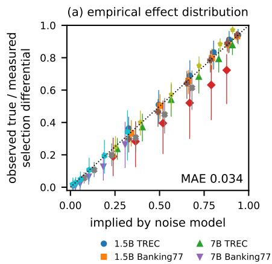

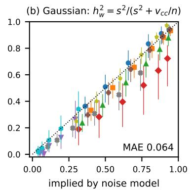

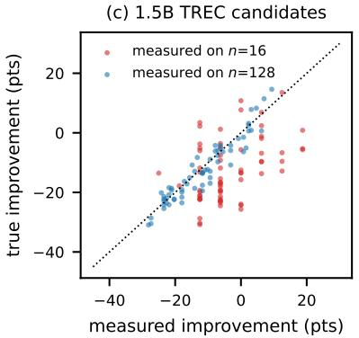  
Figure 1: The winner’s curse has the size implied by the noise model. Observed ratio of the true to the measured selection diferential of the best-of-K rewrite (true: on the held-out part of the split; 95% cluster-bootstrap intervals over generations, which omit run-to-run variation) against the ratio implied by (a) the empirical distribution of held-out efects (K = 4 approximation) and (b) the Gaussian model, for nine settings and $n \in \{ 8 , \ldots , 2 5 6 \}$ . (c) Measured versus held-out efects of the 1.5B TREC candidates on 16 and on 128 items.

## 5.1 Proposals are mostly harmful, and the winner’s curse has the implied size

The oracle runs yield 55 to 152 candidates per setting with measured and held-out efects. The first rewrite of a one-sentence seed often improves on it (on TREC, 75 to 100% of first-generation candidates do). After that, only 4 to 39% of rewrites improve on their incumbent, mean held-out efects lie between −0.2 and −13.5 points, and occasional catastrophic rewrites make efects leftskewed (excess kurtosis up to 7.6). Stronger proposers (Qwen2.5-14B, Qwen3.5-4B) change these figures little (Appendix Table 2). Candidates resemble one another more than the incumbent, with $v _ { c c } \approx 0 . 4 4 - 0 . 6 0 v$

To check the noise model we split the gold set into a pseudo selection set of n items and a truth set, select the best candidate of each generation on the former, and compare its selection diferential on both parts (200 splits; Figure 1). With inputs from the same oracle data, the ratio of held-out to measured selection diferential implied by the model matches the observed ratio across nine settings (three models, two Qwen generations, two inference stacks) and n = 8 to 256, with a mean absolute error of 0.034 using the empirical distribution of held-out efects and 0.064 using the Gaussian $h _ { w } ^ { 2 } ,$ which overstates reliability where efects are heavy-tailed. $\mathrm { A t } ~ n = 1 6$ the winner’s held-out selection diferential is only 1 to 51% of its measured one. A loop can estimate $h _ { w } ^ { 2 }$ itself, with $\hat { v } _ { c c }$ from the candidates’ item vectors and $\hat { s } ^ { 2 }$ from the within-generation spread of measured efects minus $\hat { v } _ { c c } / n$ . Computed causally from generations 1 to t of one oracle run on a fixed n-item subset of its selection set, this estimate predicts the ratio with a mean absolute error of 0.10 and a bias of +0.02, and shrinking the winners’ measured advantages by it brings their mean within 0.6 points of the held-out mean (5.0 points unshrunk at $n = 1 6 )$ . A single run’s estimate is imprecise (standard deviation 0.12 to 0.21 at n = 16; Appendix C). Both checks use trajectories that loops with 256 items generated; Section 5.2 turns to native small-set loops.

## 5.2 Commits on a reused selection set

We compared the model with native loops in a post hoc analysis of the greedy runs of the confirmatory study below (four settings, eight seeds, $n = 1 6 , 6 4 , 2 5 6 )$ . For each commit we computed the overstatement that Assumption 1 implies given acceptance, using the prior $( \mu , s ^ { 2 } )$ of a separate oracle-instrumented pilot, frozen before those runs, and the noise terms of that generation’s candidates on the loop’s own selection set (Appendix Tables 5 and 6). The model describes only commits made in generation 1, when the incumbent is the seed and no earlier decision has used the selection set. For these 72 commits the observed and model averages are 9.1 and 9.0 points at $n = 1 6$ , 3.2 and 3.8 at $n = 6 4$ , and 0.1 and 1.3 at $n = 2 5 6$ . The averages hide errors of several points in single settings (at $n = 1 6$ , 1.9 against 5.9 on 1.5B TREC and 12.9 against 7.0 on Banking77, with four to six commits each), so we read this as agreement on average, not as calibration. For other commits the model value is only a fresh-set reference. First commits that follow earlier rejections (22 of 94) overstate less than it at $n = 1 6$ (6.3 against 9.6 points), and commits against a selected incumbent overstate less at every n (5.2 against 9.7, 1.9 against 3.7 and 0.5 against 1.1). This pattern is consistent with lock-in: a commit’s overstatement is exactly the change in incumbent inflation, but the net efect depends on how much error later candidates share with the incumbent.

The inflation, relative to the seed’s own ofset, rises over the first generations and shrinks with $n . { \mathrm { ~ A f t e r } }$ 11 to 20 generations it is $1 3 . 6 \pm 1 . 7$ points at $n = 1 6$ $7 . 2 \pm 1 . 1$ at $n = 6 4$ and $1 . 7 \pm 0 . 6$ at $n = 2 5 6$ (confirmatory greedy runs, a secondary analysis; Appendix Table 4). Whether incumbent inflation acts as a threshold that costs real improvements is less clear. Of the late candidates, 14% have held-out efects between 0 and 1.8 points, within one gold-set standard error of zero, and almost none clears the incumbent. Re-drawing the selection set every generation avoids carrying the incumbent’s earlier selection error into the next comparison but, in the one setting where we tried it (three seeds, exploratory design), did not raise the final gain (Appendix C).

## 5.3 Pre-registered confirmatory study

The exploratory runs had three seeds, and the proposer’s failure examples came from the selection set itself, so that n changed both the evaluation and the information given to the proposer. We therefore pre-registered a confirmatory study. The design, five hypotheses and an amendment adding select-then-confirm, a phase-indexed pilot prior and a stronger proposer were fixed in a dated written plan before the first run started. The analysis script was written and archived ten minutes into the runs, when 16 of 336 had finished. Deviations from the plan are listed in Appendix B. The gold set is a fresh 600-item sample disjoint from the exploratory one, the seeds are new, and the proposer’s failure examples come from a separate pool of 256 items, so that n changes only the evaluation. Four settings (1.5B TREC, 1.5B Banking77, 7B TREC, 1.5B GSM8K) each have nine arms with eight seeds, namely greedy acceptance at $n = 1 6$ , 64, 256 and McNemar at $\alpha = 0 . 0 5$ , the pilot-calibrated Bayes gate and select-then-confirm at $n = 1 6$ and 64. The pilot prior was frozen before launch from the exploratory oracle runs of the same model and task. Tests are paired by seed, two-sided, and Holm-corrected within each family. Table 1 and Figure 2 report the results, and Appendix C lists all arms.

The clearest result concerns the loops’ reports about themselves (H2). With 16 items, the final proxy exceeded held-out accuracy by 13 to 20 points, and with 256 items by 1 to 5 points. The paired reduction was about 15 points (14.7 to 15.9) in three settings (Holm-adjusted $p \leq 0 . 0 4 )$ and 10.5 points on Banking77, where it fell short of significance $( p = 0 . 0 5 8 )$ . Held-out gains rose with n on TREC (H1), from $1 3 . 7 \pm 2 . 9$ to $2 4 . 2 \pm 0 . 7$ points for the 1.5B model (seven of eight seeds) and from $1 4 . 0 \pm 0 . 7$ to $2 0 . 4 \pm 0 . 6$ for the 7B model (eight of eight). They did not rise on GSM8K, where no arm gained more than 3.1 points. The Goodhart loss that the exploratory runs showed on Banking77 did not replicate (H3). Greedy loops at $n = 1 6$ ended $0 . 6 \pm 0 . 7$ points below the seed, with four of eight seeds losing, while their selection-set scores rose by 12.5 points. The exploratory loss was itself not significant $( p = 0 . 2 0$ , three seeds).

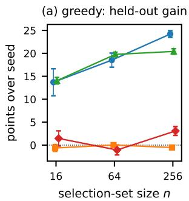

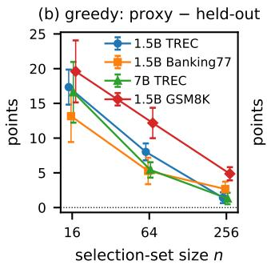

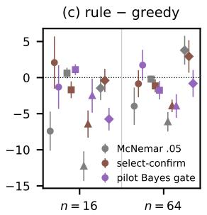

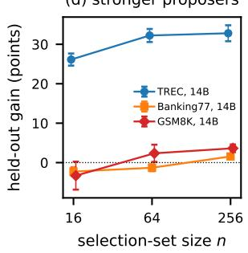  
Figure 2: Pre-registered confirmatory runs (fresh gold set, eight fresh seeds in (a)–(c) and five in (d), proposer feedback independent of n; mean ± s.e.). (a) Final held-out gain of greedy loops over the seed instruction and (b) their final proxy–held-out gap, against n. (c) Held-out gain of McNemar $( \alpha = 0 . 0 5 )$ , select-then-confirm and the pilot-calibrated Bayes gate minus that of greedy, per setting (paired by seed; settings marked as in (a), legend in (b); colors denote rules). (d) Greedy loops in which a stronger model proposes for the 1.5B solver.

The tested acceptance rules did not improve whole runs (H4, H5). At $n ~ = ~ 1 6$ the pilotcalibrated gate ended $2 . 1 \pm 1 . 1$ points below greedy, pooled over 32 seed pairs $( p = 0 . 0 6 ;$ 95% t-interval $[ - 4 . 3 , 0 . 1 ] )$ ), and it was significantly worse on GSM8K, whose pilot prior rests on a single oracle run. Select-then-confirm ended $1 . 6 \pm 1 . 2$ points below greedy. Fixed-level McNemar tests gave up most of the available gain on TREC (−7.4 and −12.3 points for the 1.5B and 7B models). When Qwen2.5-14B proposes for the 1.5B solver, TREC gains rise to 26 to 33 points, and the self-reported gap still shrinks significantly with n on all three tasks (Figure 2d).

## 5.4 Current models, strong starts and two prompt optimizers

We first repeated the loop with Qwen3.5-4B as its own proposer and solver (four seeds; Appendix B). From the one-sentence seed it gained 37 to 39 points on TREC and 13 to 15 on Banking77 at every n, and the gap again shrank with n (Banking77: 15.7 to 3.4 points, $p = 0 . 0 0 7 )$ . These loops amount to a single rewrite: the first generation delivers 90 to 112% of the final gain, and only 7 and 20% of later rewrites improve on their incumbent. We therefore restarted the loop from a competent instruction, the final instruction of one of its own earlier runs, chosen before any run. From there only 5% of TREC rewrites improve (mean efect −14 points), and 45% of Banking77 rewrites do, but only 5% by more than 2 points (Appendix Table 8). With the four planned seeds, loops with 16 items reported gains of 12.5 and 14.1 points on TREC and Banking77 while held-out accuracy changed by −2.2 and 0.0; with 256 items they reported 5.4 and 3.3 and gained 4.3 and 1.8. The planned proxy–held-out gap fell by 9.4 and 2.8 points (two-sided $p = 0 . 1 2$ and 0.69). Four seeds added after seeing these results gave gap reductions of 7.2 and 12.9 points $( p = 0 . 0 8$ and 0.03) and held-out advantages of the larger set of 5.6 and 1.9 $( p = 0 . 1 5$ and 0.16). Over eight seeds the overstatement, a measure we added because the start’s ofset varies across 16-item sets, fell from 16.3 to 1.4 and from 11.5 to 1.5 points. We decided on the extension after seeing the first stage and chose the one-sided direction and equal stage weights after both stages had run, so the combined inverse-normal p-values (0.010 and 0.033 for the gap, 0.04 for the held-out advantage, 0.004 and $< 0 . 0 0 1$ for the overstatement) are exploratory.

Table 1: Pre-registered tests (points; mean $\pm \ \mathrm { s . e } .$ . of seed-paired diferences; p Holm-adjusted within each family, unadjusted for the pooled rows).
<table><tr><td>Setting</td><td>difference (pts) wins / pairs</td><td></td><td>p</td></tr><tr><td>H1: gain(n=256) −</td><td colspan="3"> $g a i n ( n { = } 1 6 ) ,$  greedy</td></tr><tr><td>1.5B TREC</td><td> $+ 1 0 . 5 { \pm } 2 . 6 $ </td><td> $7 / 8$ </td><td>0.010</td></tr><tr><td>7B TREC</td><td> $+ 6 . 4 { \pm } 0 . 7 $ </td><td> $8 ~ / ~ 8$ </td><td>&lt;0.001</td></tr><tr><td>1.5B GSM8K</td><td> $+ 1 . 6 { \pm } 2 . 2$ </td><td> $4 \div 8$ </td><td>0.483</td></tr><tr><td>H2: gap(n=16) − 1.5B TREC</td><td> $g a p ( n { = } 2 5 6 ) ,$   $+ 1 5 . 9 { \pm } 2 . 7 $ </td><td>greedy  $8 ~ / ~ 8$ </td><td>0.002</td></tr><tr><td>1.5B Banking77 7B TREC</td><td> $+ 1 0 . 5 { \pm } 4 . 6 $   $+ 1 5 . 3 { \pm } 4 . 7 $ </td><td> $7 / 8$   $7 / 8$ </td><td>0.058 0.037</td></tr><tr><td>1.5B GSM8K H3: greedy gain at n=16 (t-test; sign test)</td><td> $+ 1 4 . 7 { \pm } 4 . 4$ </td><td> $8 ~ / ~ 8$ </td><td>0.037</td></tr><tr><td>1.5B Banking77 H4: pilot gate − greedy at</td><td> $- 0 . 6 { \pm } 0 . 7 $ </td><td>4 lose / 8</td><td>0.425; 1.000</td></tr><tr><td></td><td> $n { = } 1 6$ </td><td></td><td></td></tr><tr><td>pooled, 32 pairs</td><td> $- 2 . 1 { \pm } 1 . 1$ </td><td>10 / 32</td><td>0.062</td></tr><tr><td>1.5B TREC</td><td> $- 1 . 3 { \pm } 3 . 0 \ $ </td><td> $3 \ / \ 8$ </td><td>0.677</td></tr><tr><td>1.5B Banking77</td><td></td><td></td><td></td></tr><tr><td>7B TREC</td><td> $+ 1 . 1 { \pm } 0 . 7 $ </td><td>4/8</td><td>0.552</td></tr><tr><td></td><td> $- 2 . 5 { \pm } 2 . 4 $ </td><td>2/8</td><td>0.650</td></tr><tr><td>1.5B GSM8K</td><td> $- 5 . 7 { \pm } 1 . 6 $ </td><td>1/8</td><td>0.032</td></tr><tr><td>H5: select-confirm – greedy at</td><td></td><td></td><td></td></tr><tr><td>pooled, 32 pairs</td><td></td><td> $n { = } 1 6$ </td><td></td></tr><tr><td>1.5B TREC</td><td> $- 1 . 6 { \pm } 1 . 2 $ </td><td> $9 ~ / ~ 3 2$ </td><td>0.194</td></tr><tr><td></td><td> $+ 2 . 1 { \pm } 3 . 6 $ </td><td> $5 ~ / ~ 8$ </td><td>1.000</td></tr><tr><td>1.5B Banking77</td><td> $- 1 . 7 { \pm } 1 . 2 $ </td><td>1 /8</td><td>0.566</td></tr><tr><td>7B TREC</td><td> $- 6 . 4 { \pm } 1 . 9$ </td><td>0 /8</td><td>0.045</td></tr><tr><td></td><td></td><td></td><td></td></tr><tr><td>1.5B GSM8K</td><td> $- 0 . 4 { \pm } 1 . 6 $ </td><td>3/8</td><td>1.000</td></tr></table>

We also instrumented two prompt optimizers in DSPy (Khattab et al., 2024) with the same held-out set. GEPA (Agrawal et al., 2025) evolves a program’s instruction by reflecting on failures in training minibatches and returns the candidate with the best score on a validation set that it reuses throughout the run. MIPROv2 (Opsahl-Ong et al., 2024) proposes a fixed set of candidate instructions and searches among them by Bayesian optimization on the validation set. The GEPA paper reports accuracy on separate test sets, so what we measure is the optimism of the validation scores on which the optimizers select, not of GEPA’s published gains. The task model is Qwen3.5- 4B and the proposer Qwen3.8-27B, both without thinking, with a 256-item training pool, $n _ { \mathrm { v a l } }$ validation items and five seeds (Appendix B). Because a candidate’s validation scores are fixed when GEPA finds it, the program returned after any number of metric calls can be reconstructed exactly from a run’s saved state or log; we checked every reconstruction against the logs. Appendix B lists the changes to the recorded plan, including the reported-gain measure, added after eight runs with $n _ { \mathrm { v a l } } = 2 5 6$ but none with fewer items had been seen.

Figure 3 collects the results. At 1000 metric calls GEPA’s returned program gained about 19 points of held-out accuracy on TREC, 1 to 2 on Banking77 and nothing on GSM8K, where the task model already scores 95%, whatever $n _ { \mathrm { v a l } }$ was. The validation score on which GEPA selects gave a diferent picture. With 16 items it put the improvement at 38.8 points on TREC for a real 19.2, at 18.8 on Banking77 for a real $1 . 2 \pm 1 . 7 $ , and at 6.2 on GSM8K for a program 0.9 points worse. With 256 items the two difered by at most 3 points (Appendix Table 10). At that budget, however, the 256-item arm had found three candidates and made a tenth of the reflections of the 16-item arm. Run to 2250 calls, where its pool holds 9 programs and that of the 16-item arm 91, GEPA’s held-out gain still did not grow with $n _ { \mathrm { v a l } }$ (TREC: 18.5, 20.4 and 19.0 points with 16, 64 and 256 items; Banking77: 3.7, 1.3 and 0.8). The overstatement relative to the starting program remained large with 16 items, 26.5 points against −1.9 on TREC $( p = 0 . 0 0 7 )$ and 18.8 against 3.7 on Banking77 $( p = 0 . 0 0 2 )$ . Started from its own best program, GEPA with 16 validation items reported improvements of 25.0 points on both tasks, and the real ones were 1.6 and 4.1 (256 items: 3.0 and 3.7 reported, 0.8 and 1.9 real). MIPROv2 largely holds the proposed instruction pool fixed across its two arms. With 256 items its returned program gained 11.4 held-out points on TREC against 5.8 with 16 (paired diference $5 . 6 \pm 0 . 7 , p = 0 . 0 0 1$ , all five seeds). On Banking77 its 16-item arm returned programs that were 1.6 points worse than the seed, although their validation scores implied a 5-point gain (overstatement 6.6 against 2.4 points with 256 items, $p = 0 . 2 7 ;$ Appendix C). Proposition 1, with K the pool size and noise terms from the validation item vectors that each optimizer records, tracks how the overstatement varies with $n _ { \mathrm { v a l } }$ and budget but is not calibrated. Where GEPA’s overstatement is large, the observed value is 1.1 to 1.9 times the prediction (GEPA’s pool is itself selected on the validation set), and the model overpredicts MIPROv2’s 16-item TREC cell (9.0 against 5.5 points; Appendix C).

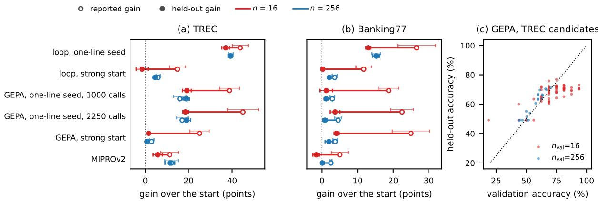  
Figure 3: What loops and optimizers report, and what they gain. (a, b) Gain of the final incumbent or returned program over the starting instruction or program, as measured on the selection (validation) set (open markers) and on 600 held-out items (filled), with 16 (red) or 256 (blue) selection items; the segment is the overstatement. Loops: Qwen3.5-4B improving its own instruction from the one-sentence seed or from a competent start (20 generations). GEPA: from the seed program at 1000 and 2250 metric calls, and from a strong program at 2750 (TREC) and 2000 (Banking77) calls. MIPROv2: 24 trials. Means over four to eight seeds, with ±1 s.e. (held-out on the segment, reported above it). (c) Validation and held-out accuracy of the held-out-scored TREC candidates of GEPA at 1000 calls.

## 6 Discussion and limitations

What to log and report. Our most robust finding is that a loop’s own estimate of its progress is too optimistic, in the Qwen loops and in the validation scores of GEPA and MIPROv2 alike. The loop’s item-level logs support an estimate of how much a candidate’s advantage over its generation’s mean should shrink (Section 5.1). Predicting how much an accepted gain is overstated also uses a prior over efects, which our native-loop analysis took from a separate pilot (Section 5.2), and neither identifies the inflation that accumulates on a reused selection set. Shrinking each commit by the loop’s own $\hat { h } _ { w } ^ { 2 }$ largely removes the average overstatement of the reported gain across our 151 confirmatory and current-model runs with n = 16, but leaves −8.5 to +5.8 points within a setting, because that error is shared by all candidates. A small audit set does estimate it. Scoring the seed and the incumbent after 19 generations on 64 items never used for selection costs 128 evaluations, a tenth of the nominal budget of 1,280 candidate evaluations of a loop with n = 16. It removes the bias of the reported gain and reduces its root-mean-square error from 15.5 to 5.7 points. That error is still as large as a typical gain, and at the disagreement rates of our tasks, resolving gains of a few points would take a few hundred items (Appendix C). We recommend that self-improvement studies report a held-out score and its standard error alongside the score used for selection.

What acceptance rules can and cannot do. In our experiments, calibrated thresholds improved isolated decisions on fresh evaluations, mainly by committing less often (Appendix C), but the tested rules did not improve complete runs on reused selection sets. Incumbent inflation may make greedy more conservative when later candidates do not share equally large errors. A larger selection set raised held-out gains on TREC in the Qwen2.5 runs and in MIPROv2 at sixteen times the evaluation cost, but not detectably in GEPA, where the small set allowed ten times more search. We therefore do not recommend the tested rules as a general remedy for adaptive reuse.

Limitations. Our artifacts are instructions, our tasks use deterministic scoring rules (though model outputs are not bitwise reproducible; Appendix B), our largest proposer has 27B parameters, and we have not examined agentic or code tasks. Stochastic rollouts introduce additional measurement noise; to the extent that it is candidate-specific, Proposition 1 predicts a larger winner’s curse, holding the efect distribution fixed. The confirmatory study uses Qwen2.5 models, as pre-registered. Both checks in Figure 1 use oracle quantities, the native-loop check of Section 5.2 covers four Qwen2.5 settings and is post hoc, the Bayes gates need a pilot with a large evaluation set, and PACE ran with its published fixed bet and n items. We do not model the dynamics of lock-in or make claims about recursive self-improvement.

## Code and data availability

The code, saved run records, and reproduction instructions are provided in the ancillary files accompanying this preprint. Appendix B describes the experimental designs and provenance.

## References

Agrawal, L. A., Tan, S., Soylu, D., Ziems, N., Khare, R., Opsahl-Ong, K., Singhvi, A., Shandilya, H., Ryan, M. J., Jiang, M., Potts, C., Sen, K., Dimakis, A. G., Stoica, I., Klein, D., Zaharia, M., and Khattab, O. (2025). GEPA: Reflective prompt evolution can outperform reinforcement learning. arXiv preprint arXiv:2507.19457.

Andrews, I., Kitagawa, T., and McCloskey, A. (2024). Inference on winners. The Quarterly Journal of Economics, 139(1):305–358.

Arce, L. (2026). Most self-improving LLM-agent papers fail two or more evaluation traps: A methods audit of forty-one papers. alphaXiv preprint, https://www.alphaxiv.org/abs/2609. self-improving-llm-agent-evaluation-audits.

Arnold, D. V. (2002). Noisy Optimization with Evolution Strategies. Genetic Algorithms and Evolutionary Computation. Springer.

Arnold, D. V. and Beyer, H.-G. (2006). A general noise model and its efects on evolution strategy performance. IEEE Transactions on Evolutionary Computation, 10(4):380–391.

Azevedo, E. M., Deng, A., Montiel Olea, J. L., Rao, J., and Weyl, E. G. (2020). A/b testing with fat tails. Journal of Political Economy, 128(12):4614–4672.

Berman, R. and Van den Bulte, C. (2022). False discovery in A/B testing. Management Science, 68(9):6762–6782.

Beyer, H.-G. (2000). Evolutionary algorithms in noisy environments: Theoretical issues and guidelines for practice. Computer Methods in Applied Mechanics and Engineering, 186(2–4):239–267.

Blum, A. and Hardt, M. (2015). The ladder: A reliable leaderboard for machine learning competitions. In International Conference on Machine Learning (ICML), pages 1006–1014.

Casanueva, I., Temčinas, T., Gerz, D., Henderson, M., and Vulić, I. (2020). Eficient intent detection with dual sentence encoders. In Proceedings of the 2nd Workshop on Natural Language Processing for Conversational AI, pages 38–45.

Cawley, G. C. and Talbot, N. L. C. (2010). On over-fitting in model selection and subsequent selection bias in performance evaluation. Journal of Machine Learning Research, 11:2079–2107.

Cobbe, K., Kosaraju, V., Bavarian, M., Chen, M., Jun, H., Kaiser, L., Plappert, M., Tworek, J., Hilton, J., Nakano, R., Hesse, C., and Schulman, J. (2021). Training verifiers to solve math word problems. arXiv preprint arXiv:2110.14168.

Dawid, A. P. (1994). Selection paradoxes of Bayesian inference. In Multivariate Analysis and Its Applications, volume 24 of IMS Lecture Notes–Monograph Series, pages 211–220.

Dwork, C., Feldman, V., Hardt, M., Pitassi, T., Reingold, O., and Roth, A. (2015). The reusable holdout: Preserving validity in adaptive data analysis. Science, 349(6248):636–638.

Efron, B. (2011). Tweedie’s formula and selection bias. Journal of the American Statistical Association, 106(496):1602–1614.

Falconer, D. S. and Mackay, T. F. C. (1996). Introduction to Quantitative Genetics. Longman, 4th edition.

Fernando, C., Banarse, D., Michalewski, H., Osindero, S., and Rocktäschel, T. (2024). Promptbreeder: Self-referential self-improvement via prompt evolution. In International Conference on Machine Learning (ICML).

Gao, L., Schulman, J., and Hilton, J. (2023). Scaling laws for reward model overoptimization. In International Conference on Machine Learning (ICML), pages 10835–10866.

Guo, Q., Wang, R., Guo, J., Li, B., Song, K., Tan, X., Liu, G., Bian, J., and Yang, Y. (2024). Connecting large language models with evolutionary algorithms yields powerful prompt optimizers. In International Conference on Learning Representations (ICLR).

Hammel, U. and Bäck, T. (1994). Evolution strategies on noisy functions: How to improve convergence properties. In Parallel Problem Solving from Nature – PPSN III, pages 159–168.

Harrison, J. R. and March, J. G. (1984). Decision making and postdecision surprises. Administrative Science Quarterly, 29(1):26–42.

Hu, S., Lu, C., and Clune, J. (2025). Automated design of agentic systems. In International Conference on Learning Representations (ICLR).

Hutter, F., Hoos, H. H., Leyton-Brown, K., and Stützle, T. (2009). ParamILS: An automatic algorithm configuration framework. Journal of Artificial Intelligence Research, 36:267–306.

Khattab, O., Singhvi, A., Maheshwari, P., Zhang, Z., Santhanam, K., Vardhamanan, S., Haq, S., Sharma, A., Joshi, T. T., Moazam, H., Miller, H., Zaharia, M., and Potts, C. (2024). DSPy: Compiling declarative language model calls into self-improving pipelines. In International Conference on Learning Representations (ICLR).

Kwon, W., Li, Z., Zhuang, S., Sheng, Y., Zheng, L., Yu, C. H., Gonzalez, J. E., Zhang, H., and Stoica, I. (2023). Eficient memory management for large language model serving with PagedAttention. In Proceedings of the ACM Symposium on Operating Systems Principles (SOSP).

Lee, M. R. and Shen, M. (2018). Winner’s curse: Bias estimation for total efects of features in online controlled experiments. In Proceedings of the 24th ACM SIGKDD International Conference on Knowledge Discovery & Data Mining, pages 491–499.

Li, X. and Roth, D. (2002). Learning question classifiers. In International Conference on Computational Linguistics (COLING).

López-Ibáñez, M., Dubois-Lacoste, J., Pérez Cáceres, L., Birattari, M., and Stützle, T. (2016). The irace package: Iterated racing for automatic algorithm configuration. Operations Research Perspectives, 3:43–58.

Lush, J. L. (1937). Animal Breeding Plans. Collegiate Press, Ames, Iowa.

Manheim, D. and Garrabrant, S. (2018). Categorizing variants of Goodhart’s law. arXiv preprint arXiv:1803.04585.

Novikov, A., V˜u, N., Eisenberger, M., Dupont, E., Huang, P.-S., Wagner, A. Z., Shirobokov, S., Kozlovskii, B., Ruiz, F. J. R., Mehrabian, A., Kumar, M. P., See, A., Chaudhuri, S., Holland, G., Davies, A., Nowozin, S., Kohli, P., and Balog, M. (2025). AlphaEvolve: A coding agent for scientific and algorithmic discovery. arXiv preprint arXiv:2506.13131.

Ohta, T. (1973). Slightly deleterious mutant substitutions in evolution. Nature, 246:96–98.

Opsahl-Ong, K., Ryan, M. J., Purtell, J., Broman, D., Potts, C., Zaharia, M., and Khattab, O. (2024). Optimizing instructions and demonstrations for multi-stage language model programs. In Proceedings of the Conference on Empirical Methods in Natural Language Processing (EMNLP).

Pryzant, R., Iter, D., Li, J., Lee, Y. T., Zhu, C., and Zeng, M. (2023). Automatic prompt optimization with “gradient descent” and beam search. In Proceedings of the 2023 Conference on Empirical Methods in Natural Language Processing.

Qwen Team (2024). Qwen2.5 technical report. arXiv preprint arXiv:2412.15115.

Qwen Team (2026). Qwen3.5-4B and Qwen3.8-27B model cards. https://huggingface.co/Qwen/ Qwen3.5-4B, https://huggingface.co/Qwen/Qwen3.8-27B.

Romera-Paredes, B., Barekatain, M., Novikov, A., Balog, M., Kumar, M. P., Dupont, E., Ruiz, F. J. R., Ellenberg, J. S., Wang, P., Fawzi, O., Kohli, P., and Fawzi, A. (2024). Mathematical discoveries from program search with large language models. Nature, 625:468–475.

Shawn, Z. (2026). PACE: Anytime-valid acceptance tests for self-evolving agents. arXiv preprint arXiv:2606.08106.

Shi, C., Yang, K., Chen, Z., Li, J., Yang, J., and Shen, C. (2024). Eficient prompt optimization through the lens of best arm identification. In Advances in Neural Information Processing Systems.

Smith, J. E. and Winkler, R. L. (2006). The optimizer’s curse: Skepticism and postdecision surprise in decision analysis. Management Science, 52(3):311–322.

Sung, W., Ackerman, M. S., Miller, S. F., Doak, T. G., and Lynch, M. (2012). Drift-barrier hypothesis and mutation-rate evolution. Proceedings of the National Academy of Sciences, 109(45):18488– 18492.

Wang, W., Piękos, P., Nanbo, L., Laakom, F., Chen, Y., Ostaszewski, M., Zhuge, M., and Schmidhuber, J. (2025). Huxley-Gödel machine: Human-level coding agent development by an approximation of the optimal self-improving machine. arXiv preprint arXiv:2510.21614.

Wang, Y., Zhu, H., Hu, Z., Yuan, Y., Chen, Z., Senthil, S., Hajishirzi, H., Tsvetkov, Y., Dasigi, P., and Xiao, T. (2026). Rethinking the evaluation of harness evolution for agents. arXiv preprint arXiv:2607.12227.

Xu, C., Yan, N., Chen, L., and Kechadi, M.-T. (2026a). Phantom gains: Auditing self-improvement against a measured null. arXiv preprint arXiv:2608.20290.

Xu, Y., Zhang, J., Sun, H., Zhou, Z., Cao, T., and Aggarwal, V. (2026b). Towards reliable LLM evaluation: Correcting the winner’s curse in adaptive benchmarking. arXiv preprint arXiv:2605.05973.

Yang, A. et al. (2025). Qwen3 technical report. arXiv preprint arXiv:2505.09388.

Yang, C., Wang, X., Lu, Y., Liu, H., Le, Q. V., Zhou, D., and Chen, X. (2024). Large language models as optimizers. In International Conference on Learning Representations (ICLR).

Ye, Q., Li, Y., Pruksachatkun, Y., Zhang, J., and Wu, C.-S. (2026). On the fragility of selfimproving agents: Variance, task order, and underspecification. arXiv preprint arXiv:2608.18066.

Yin, X., Wang, X., Pan, L., Lin, L., Wan, X., and Wang, W. Y. (2024). Gödel agent: A selfreferential agent framework for recursive self-improvement. arXiv preprint arXiv:2410.04444.

Yuksekgonul, M., Bianchi, F., Boen, J., Liu, S., Huang, Z., Guestrin, C., and Zou, J. (2024). TextGrad: Automatic “diferentiation” via text. arXiv preprint arXiv:2406.07496.

Zelikman, E., Lorch, E., Mackey, L., and Kalai, A. T. (2024). Self-taught optimizer (STOP): Recursively self-improving code generation. In Conference on Language Modeling (COLM).

Zhang, J., Hu, S., Lu, C., Lange, R., and Clune, J. (2026). Darwin Gödel machine: Open-ended evolution of self-improving agents. In International Conference on Learning Representations (ICLR).

Zhou, Y., Muresanu, A. I., Han, Z., Paster, K., Pitis, S., Chan, H., and Ba, J. (2023). Large language models are human-level prompt engineers. In International Conference on Learning Representations (ICLR).

## A Proofs

Throughout, $\phi , \Phi$ are the standard normal density and CDF, and $Z _ { ( K ) } = \operatorname* { m a x } _ { k \le K } Z _ { k }$ for i.i.d.   
standard normals.

Lemma A.1 (posterior under the random-efects model). Let $\hat { \Delta } = \Delta + c { \bf 1 } + \eta$ with $\Delta _ { k } \stackrel { i i d } { \sim } N ( \mu , s ^ { 2 } ) , c \sim N ( 0 , e _ { c } ^ { 2 } )$ and $\eta _ { k } \overset { i i d } { \sim } N ( 0 , e _ { \eta } ^ { 2 } )$ independent. Then $\mathrm { C o v } ( \Delta _ { k } , \hat { \Delta } ) = s ^ { 2 } e _ { k }$ and $\Sigma =$ $\mathrm { V a r } ( \hat { \Delta } ) = a I + e _ { c } ^ { 2 } \mathbf { 1 1 } ^ { \top }$ with $a = \sigma _ { w } ^ { 2 } = s ^ { 2 } + e _ { \eta } ^ { 2 } .$ By Sherman–Morrison, $\begin{array} { r } { \Sigma ^ { - 1 } = a ^ { - 1 } ( I - \frac { e _ { c } ^ { 2 } } { a + K e _ { c } ^ { 2 } } \mathbf { 1 1 } ^ { \top } ) } \end{array}$ so

$$
\mathbb { E } [ \Delta _ { k } \mid \hat { \Delta } ] = \mu + s ^ { 2 } e _ { k } ^ { \top } \Sigma ^ { - 1 } ( \hat { \Delta } - \mu { \bf 1 } ) = \mu + h _ { w } ^ { 2 } ( \hat { \Delta } _ { k } - \bar { m } ) + \frac { h _ { w } ^ { 2 } a } { a + K e _ { c } ^ { 2 } } ( \bar { m } - \mu ) ,
$$

which is Equation (3). Averaging over k gives $\begin{array} { r } { \mathbb E [ \bar { \Delta } \mid \hat { \Delta } ] = \mu + \frac { h _ { w } ^ { 2 } a } { a + K e _ { c } ^ { 2 } } ( \bar { m } - \mu ) } \end{array}$ , hence $\mathbb { E } [ \Delta _ { k } - { \bar { \Delta } } \ |$ $\hat { \Delta } ] = h _ { w } ^ { 2 } ( \hat { \Delta } _ { k } - \bar { m } )$ . □

Proof of Proposition 1. $\hat { k }$ is a function of $\hat { \Delta }$ , so Lemma A.1 and the tower property give $\mathbb { E } [ \Delta _ { \hat { k } } - \bar { \Delta } \mid \hat { \Delta } ] = h _ { w } ^ { 2 } ( \hat { \Delta } _ { \hat { k } } - \bar { m } )$ . The within-generation deviations $X _ { k } = \hat { \Delta } _ { k } - c = \Delta _ { k } + \eta _ { k }$ are i.i.d. $N ( \mu , \sigma _ { w } ^ { 2 } ) \mathrm { a n d } \hat { \Delta } _ { k } - \bar { m } = X _ { k } - \bar { X }$ , so $\mathbb { E } [ \hat { \Delta } _ { \hat { k } } - \bar { m } ] = \mathbb { E } \operatorname* { m a x } _ { k } X _ { k } - \mathbb { E } \bar { X } = \sigma _ { w } \kappa _ { K }$ . For the overstatement, $\hat { \Delta } _ { \hat { k } } - \Delta _ { \hat { k } } = ( \hat { \Delta } _ { \hat { k } } - \bar { m } ) - ( \Delta _ { \hat { k } } - \bar { \Delta } ) + ( \bar { m } - \bar { \Delta } )$ and $\bar { m } - \bar { \Delta } = c + \bar { \eta } ;$ taking expectations gives $( 1 - h _ { w } ^ { 2 } ) \sigma _ { w } \kappa _ { K } + \mathbb { E } [ c ]$ . With $\ddot { e _ { c } } = 0 , h _ { w } ^ { 2 } = h ^ { 2 }$ and the first statement is the breeder’s equation. □

Proof of Proposition 2. For any rule $A ( \hat { \Delta } ) \in \{ 1 , \dots , K , \emptyset \}$ with $\begin{array} { r } { \Delta _ { \emptyset } = 0 , \mathbb { E } \Delta _ { A } = \mathbb { E } \big [ \sum _ { k } 1 \{ A = }  \end{array}$ $k \} { \mathbb { E } } [ \Delta _ { k } \ | \ \hat { \Delta } ] ]$ , maximized pointwise by choosing the largest posterior mean if positive and $\emptyset$ otherwise. The posterior mean is increasing in $\hat { \Delta } _ { k }$ (the other terms are common to all k), so the largest belongs to $\hat { k } .$ . With $e _ { c } = 0 , \mathbb { E } [ \Delta _ { k } \mid \hat { \Delta } _ { k } ] = \mu + h ^ { 2 } ( \hat { \Delta } _ { k } - \mu ) > 0 \mathrm { ~ i f f ~ } \hat { \Delta } _ { k } > \mu - \mu / h ^ { 2 } = - \mu e ^ { 2 } / s ^ { 2 }$ when $s > 0$ . When $s = 0$ , every true efect equals the known $\mu ,$ so commit if $\mu > 0$ , independently of the observations. □

Proof of Proposition 3. With $s = 0 , \hat { \Delta } _ { k } = \mu + c + e _ { \eta } Z _ { k }$ and greedy commits if $c + e _ { \eta } \operatorname* { m a x } _ { k } Z _ { k } >$ $| \mu |$ . This probability increases with K (the maximum increases) and decreases with n $( e _ { c } ^ { 2 }$ and $e _ { \eta } ^ { 2 }$ scale as $1 / n )$ . Each commit changes $f$ by exactly $\mu ,$ and commits require $\hat { \Delta } _ { \hat { k } } > 0$ . With fresh selection sets and proposal and noise distributions that stay fixed, the events are independent and identically distributed across generations, giving expected drift $\mu p$ per generation. The statement is local to such a stationary regime. □

A heuristic resolution scale (Section 3). Let the proposal distribution depend on the incumbent’s performance $f ,$ with $b ( f ) = - \mu / s > 0$ (harmful proposals on average). With independent noise and the rule of Proposition 2, the expected one-step gain at a state with parameters $( s , b , e )$ is $G ^ { \star } = s \psi _ { K , b } ( s / e )$ with $\psi _ { K , b } ( r ) = \mathbb { E } [ ( \rho Z _ { ( K ) } - b ) ^ { + } ]$ and $\rho = r / \sqrt { 1 + r ^ { 2 } }$ . This gain is negligible at states where the standardized threshold $\lambda = b / \rho = - \mu \sqrt { s ^ { 2 } + e ^ { 2 } } / s ^ { 2 }$ exceeds $\sqrt { 2 \ln ( K T ) }$ : even $T$ such steps add less than a small multiple of s. We use the level at which λ reaches that value only as a qualitative, local resolution scale. When λ increases with performance near the crossing, this level rises with n in the noise-dominated regime $( v / n \gtrsim s ^ { 2 } )$ . It depends on K and $T$ only through $\sqrt { 2 \ln ( K T ) }$ and as $n \to \infty$ is set by the proposal distribution alone, in analogy to the drift barrier (Sung et al., 2012) and to progress limits of noisy evolution strategies (Arnold and Beyer, 2006). It is not a bound on the level a loop attains over $T$ generations. Such a bound would need uniform control over all reachable states, since s, b and ρ change with the incumbent and accuracy can fall as well as rise. The derivation of the one-step statement follows. With $e _ { c } = 0 , \mu = -$ bs and the rule of Proposition 2, the gain of one generation is $\mathbb { E } [ ( \mu + h ^ { 2 } ( \hat { \Delta } _ { \hat { k } } - \mu ) ) ^ { + } ]$ . With $\hat { \Delta } _ { \hat { k } } = \mu + \sigma Z _ { ( K ) }$ and $h ^ { 2 } \sigma = s \rho _ { ; }$ $\rho = s / \sigma = r / \sqrt { 1 + r ^ { 2 } }$ , this is $s \mathbb { E } [ ( \rho Z _ { ( K ) } - b ) ^ { + } ] = s \psi _ { K , b } ( r )$ . Since $\begin{array} { r } { ( \rho Z _ { ( K ) } - b ) ^ { + } \leq \sum _ { k } ( \rho Z _ { k } - b ) ^ { + } } \end{array}$ with $t = b / \rho , \psi _ { K , b } \leq K \rho [ \phi ( t ) - t ( 1 - \dot { \Phi } ( \dot { t } ) ) ] \leq K \rho \phi ( t ) / t ^ { 2 } = K \rho ^ { 3 } \phi ( b / \rho ) / b ^ { 2 }$ by the Mills-ratio bound $1 - \Phi ( t ) \geq \phi ( t ) ( 1 / t - 1 / t ^ { 3 } )$ , valid for $t > 0$ . At a state with $b / \rho \geq \lambda _ { 0 }$ the expected one-step gain is therefore at most $K s \rho ^ { 3 } e ^ { - \lambda _ { 0 } ^ { 2 } / 2 } / ( \sqrt { 2 \pi } b ^ { 2 } )$ , and T gains of this size sum to less than $s \rho ^ { 3 } / ( \sqrt { 2 \pi } b ^ { 2 } )$ once $\lambda _ { 0 } \geq \sqrt { 2 \ln ( K T ) }$ . Special cases: if b is constant and $s = a ( f _ { \infty } ^ { \star } - f ) ^ { \beta }$ with $a , \beta > 0$ , the level at which λ reaches $\sqrt { 2 \ln ( K T ) }$ satisfies $f _ { \infty } ^ { \star } - f _ { n } ^ { \star } \approx \big ( b ^ { 2 } v / ( 2 a ^ { 2 } n \ln ( K T ) ) \big ) ^ { 1 / ( 2 \beta ) }$ in the noise-dominated regime; if s is constant, $b ( f _ { \infty } ^ { \star } ) = \sqrt { 2 \ln ( K T ) }$ , and b is diferentiable near $f _ { \infty } ^ { \star }$ with $0 < b ^ { \prime } ( f _ { \infty } ^ { \star } ) < \infty$ local inversion gives $f _ { \infty } ^ { \star } - f _ { n } ^ { \star } \propto ( 1 - \rho ( n ) ) \approx v / ( 2 n s ^ { 2 } )$

Remark (what the model leaves out). (i) Candidate noise is heteroscedastic $( v _ { k }$ depends on both the efect and the candidate–incumbent disagreement rate) and true efects can be heavytailed; the distribution-aware prediction of Section 5 replaces the Gaussian prior by the empirical one. (ii) On a reused selection set the shared error may have non-zero mean, and proposals informed by failures on D can adapt to D itself. Incumbent inflation alone does not identify the net gain error; Section 5.2 reports patterns consistent with lock-in. (iii) Stochastic per-item rewards (agentic tasks) add a within-item variance term to v.

## B Experimental details

## B.1 Loop, prompts and rules

Solver prompt. The artifact is the system message; the user message is fixed:

Possible labels: ABBR:abb, ABBR:exp, ... (all labels)   
Question: {question}   
Label:

(Banking77: “Possible intents” / “Customer message” / “Intent”; GSM8K: “Question: {question}”.) Decoding is greedy (48 new tokens for classification, 320 for GSM8K). A classification prediction is the first line if it matches a label, otherwise the last label string in the output; a GSM8K prediction is the last number following “####”, then the last number following “answer is” if no such marker is present, otherwise the last number.

Proposer prompt. The proposer (the solver itself unless stated otherwise) receives

A small language model is given the following INSTRUCTION as its system prompt and then solves one task input. TASK: {task description}. CURRENT INSTRUCTION: «<{artifact}»>. Here are inputs where the model made mistakes with the current instruction: {4 failures: input, model output, correct answer}. Write an improved INSTRUCTION that will make the model more accurate on this task in general (not only on these examples). You may add strategies, rules, definitions, or output-format requirements. Keep it under 120 words. Return only the new instruction between «< and »>.

with system message “You are an expert prompt engineer who improves instructions for a smaller language model”, temperature 0.9, top-p 0.95, at most 400 new tokens. A proposal is valid if it contains a complete block opened by «< and closed by »> (or a second «<) of at most 180 words;

invalid proposals and duplicates are replaced by fresh samples (3 rounds in the exploratory runs, 5 in the confirmatory runs). Even so, some generations have fewer than the intended K valid candidates: 26.0% (1.5B, vLLM), 25.8% (GSM8K), 0.0% (7B) and 39.3% (1.5B, llama.cpp) in the exploratory runs, 6.6% in the confirmatory runs, and almost none with the 14B and Qwen3.5-4B proposers (per arm in Table 3). In the exploratory runs failures are sampled from the selection set; in the confirmatory runs from a separate feedback pool of 256 items (independent of n).

Seed instructions and task descriptions. The seed instructions are “Classify the question.” (TREC), “Classify the customer message.” (Banking77) and “Answer the question.” (GSM8K). The task descriptions shown to the proposer are: TREC, “Classify a question by the type of answer it seeks into one of 50 fine-grained TREC labels of the form COARSE:fine (the label list is given in the input). The first line of the response is matched against the label set; otherwise the last labe mentioned is used.”; Banking77, “Classify an online-banking customer message into one of 77 intent labels (the label list is given in the input). The first line of the response is matched against the label set; otherwise the last label mentioned anywhere in the response is used.”; GSM8K, “Grade-school math word problems. The final numeric answer is extracted from the response (a number after ‘####’ if present, otherwise the last number in the response) and compared to the reference.” The strong-start loops of Section 5.4 start from the following instructions, verbatim (line breaks as in the original).

TREC: Classify question intent using TREC COARSE:FINE labels. Strictly match the fine-grained label to the question type:

1. Entities: COARSE:ENTY (words, names, objects). If asking for a specific \*instance\* (e.g., "which novel?", "what nickname?"), use ENTY:cremat. If

2. People: HUM:ind for specific individuals/nicknames; HUM:gr for groups/organizations.

3. Attributes: DESC:def for abstract meanings; DESC:desc for general facts/origin; NUM:date for specific timepoints.

4. Rules: Prioritize the question’s target entity over descriptive content.   
Output ONLY the label.

Banking77: You are an intent classifier. Map the input to exactly one label from the provided list. Prioritize the MOST SPECIFIC label describing the exact transaction event or specific charge (e.g., ’topping\_up\_by\_card’ for card top-up failures, ’wrong\_exchange\_rate\_for\_cash\_withdrawal’ for exchange errors). Avoid broad categories like ’fee charged’ if a specific event label exists. Match the core user issue precisely, ignoring filler. If no exact match, choose the most semantically similar. Output ONLY the label name on the first line. Do not use explanations, quotes, or markdown.

The strong-start GEPA programs (755 and 2151 words) are in the supplementary package.

Pools and splits. A task’s pool concatenates the public train and test splits in their published order; item i of split s has identifier task-s-i (with prefix b77 for Banking77; TREC: CogComp/trec, fine labels; Banking77: PolyAI/banking77; GSM8K: openai/gsm8k, configuration main; the first two from the refs/convert/parquet revision). With Python’s random module, the exploratory gold set comprises the first 600 items after shufling the pool with Random(1234). Keeping the remaining items in that shufled order, we reshufle them with Random(2027) and take the first 600 as the confirmatory gold set. The selection pool is the pool without the exploratory gold set in the exploratory runs and without both gold sets otherwise. In a loop with seed r,

Random(r) first samples the 256-item feedback pool (confirmatory design) and then a fixed ordering of the remaining items, whose first n items are the selection set, so selection sets are nested across n. GEPA and MIPROv2 shufle the confirmatory selection pool with Random(1000+r) and take the first 256 items as the training pool and the next $n _ { \mathrm { v a l } }$ as the validation set. The supplementary package lists the item pool order and recorded split identifiers; optimizer splits whose identifiers were not saved can be reconstructed from the manifests, task and run seed using the procedure above. Model weights are the Hugging Face releases named in the text (Qwen/Qwen2.5-{1.5B,7B,14B}-Instruct, Qwen/Qwen3.5-4B, Qwen/Qwen3.8-27B-FP8); we did not pin their revisions.

Duplicate-question audit. Disjoint item identifiers do not ensure distinct question text. A post hoc audit found 12 exact TREC question texts shared by the confirmatory gold set and its remaining pool; 58 of the 144 TREC confirmatory runs include a matching question in their selection or feedback set, afecting at most two of the 600 gold items per run. Removing all 12 matching gold items leaves 588 items and preserves the primary conclusions: the TREC larger-set advantages are 10.44 and 6.21 points (Holm-adjusted $p = 0 . 0 1 0$ and $< 0 . 0 0 1 $ ), and the pooled pilot-versus-greedy comparison is −2.10 ± 1.08 points $( p = 0 . 0 6 1 )$ . The supplementary package contains the duplicate identifiers and a reproducible sensitivity analysis. No original run record or primary estimate was replaced. Banking77 has one gold–remaining-pool text duplicate after trimming surrounding whitespace, which appears in none of its confirmatory selection or feedback sets; GSM8K has none. Thus held-out refers to item-ID separation, with the documented TREC exception to content separation. One final item vector missing from the run records was reconstructed from retained cached model outputs; its aggregate score matches the recorded score, which does not establish itemwise identity under nondeterministic inference. The sensitivity conclusion also holds for all 13 possible numbers of correct answers among the 12 excluded items for that run, without relying on the reconstruction.

Rule details. McNemar: one-sided exact test of the best candidate, not corrected for the choice among K. PACE (decision-level analysis): the published test, a fixed bet $\lambda = 1 / 2$ on each discordant item (ties skipped), commit as soon as the wealth reaches $1 / \alpha \left( \alpha = 0 . 0 5 \right)$ within n items, reject if the items run out first; it needs at least eight more wins than losses, which a 16-item set rarely provides. Bayes gates use $\hat { v } = \operatorname* { m a x } \{ \hat { q } _ { k } - \hat { \Delta } _ { k } ^ { 2 } , 1 / n \}$ and $\begin{array} { r } { \hat { v } _ { c c } = \operatorname* { m i n } \{ \hat { v } , \frac { 1 } { 2 } \operatorname* { m a x } \{ \hat { q } _ { j k } - ( \hat { \Delta } _ { j } - \hat { \Delta } _ { k } ) ^ { 2 } , 1 / n \} \} } \end{array}$ averaging over candidates and candidate pairs, respectively. With one candidate the implementation uses $\hat { v } _ { c c } = 0 . 6 \hat { v }$ These numerical floors and the cap precede the noise decomposition in Section 4; the native-commit analysis uses unfloored moments instead. The prior is phase-indexed because rewriting a one-line seed is often beneficial while later rewrites mostly are not. The requirement that the measured gain also be positive was added after the online gate committed measured regressions on our development seed when its estimate of $s ^ { 2 }$ collapsed (Appendix C). E-process in the exploratory whole runs: a predictable GRAPA-style bet $\lambda _ { j } = \operatorname* { m i n } \{ 1 / 2 , \operatorname* { m a x } ( 0 , \bar { d } _ { j } / ( \hat { \sigma } _ { j } ^ { 2 } + \bar { d } _ { j } ^ { 2 } ) ) \}$ computed from the preceding items, commit if the running maximum of the wealth reaches $1 / \alpha$ Online EB gate: window of 8 generations; McNemar fallback in the first generation; for $K = 1$ $s ^ { 2 }$ from the across-generation variance minus the total noise. Pilot-calibrated gate: phase-indexed prior (generation 1 vs. later) from the held-out efects of oracle runs of the same model and task, measured on the exploratory gold set (disjoint from the confirmatory gold set). In points, $( \mu , s )$ for generation 1 and for later generations is (5.6, 8.6) and (−9.4, 7.1) for 1.5B TREC, (−6.8, 6.1) and (−4.6, 5.1) for 1.5B Banking77, (4.9, 4.8) and (−7.2, 7.2) for 7B TREC, and (−7.7, 5.1) and (−2.8, 7.6) for 1.5B GSM8K. One of the three 1.5B TREC source runs (llama.cpp, 20 generations)

was still running when the priors were frozen, so its prior uses that run’s first 17 generations; with all 20, the later-generation values would be (−8.9, 7.0). Harmful commit: a commit whose held-out efect on the gold set is negative; the gold set resolves paired diferences to about 1.5–2 points, so we also report commits worse than −1.8 points.

The frozen pilot estimator subtracted total candidate–incumbent sampling variance from the within-generation spread. Under Assumption 1, the shared incumbent error cancels when centering candidates, so this historical approximation subtracts too much noise. We retain those frozen values because they governed the completed experiments and the pilot-based commit references. The post hoc noise-model analysis in Figure 1 and the proposal spreads in Table 2 instead subtract candidate–candidate noise, with weights matching the pooled within-generation variance. The empirical-distribution predictor resamples four efect deviations per simulated generation, a fixed-K approximation when an observed generation has fewer valid candidates. Figure 1’s observation intervals bootstrap generations from the same 200 splits used for the plotted observations.

## B.2 Designs

Exploratory runs (v1). Gold set: 600 items per task (fixed random subset, seed 1234). Selection sets reused across generations and nested across n for a given seed. Main stack: vLLM 0.30.0 (bf16) on one rented A100-SXM4-80GB, T = 20 generations, 3 seeds. Oracle-instrumented runs (every candidate scored on the gold set) used greedy acceptance with n = 256, $K = 4 \colon$ one run each for 1.5B-TREC, 1.5B-Banking77 and GSM8K (T = 20, T = 20, T = 15) and two each for 7B-TREC and 7B-Banking77 (T = 15). Replication stack: llama.cpp (build b11211, 8-bit GGUF) on a shared RTX 3080 Ti, $T = 2 5$ (two oracle runs per task, T = 20).

Confirmatory runs (v2). Pre-registered in a dated written plan before launch: a fresh gold set of 600 items per task disjoint from the v1 gold set; seeds 11–18; feedback pool of 256 items disjoint from selection sets and gold; arms greedy $( n ~ = ~ 1 6 , 6 4 , 2 5 6 )$ , McNemar, pilot-calibrated Bayes gate and select-then-confirm $( n = 1 6 , 6 4 )$ ; settings 1.5B-TREC, 1.5B-Banking77, 7B-TREC, 1.5B-GSM8K; stronger proposer: Qwen2.5-14B proposing for the 1.5B solver (greedy, n = 16, 64, 256, seeds 11–15, one oracle run per task). vLLM on one A100 as above.

Deviations from the pre-registration. (i) The pre-registration file, including its amendment, and the pilot priors were last modified at 15:54; the first run started at 16:07. The amendment’s own header gives a wrong time $\left( ^ { 6 6 } 1 6 { : } 1 5 ^ { 3 3 } \right)$ . (ii) The analysis script, which implements the pre-registered tests, was written ten minutes after launch (file created 16:17:46, when 16 of 336 runs had finished), archived at 16:17:50, and run on those 16 runs at 16:17:52. That run printed the per-arm summary and failed at the output step because of a serialization error; fixing that error is the only change made to the script. (iii) The pooled tests of H4 and H5 were implemented as one-sample t-tests on the 32 seed-paired diferences rather than with setting fixed efects; with setting fixed efects $p = 0 . 0 5 4$ (H4) and 0.17 (H5), and no conclusion changes. (iv) A memory failure on the machine that drove the runs stalled one run (1.5B GSM8K, greedy, $n = 2 5 6$ , seed 13) at generation 6; it was rerun from scratch, and the remaining runs were moved to drivers on the GPU server itself (same code and model servers). (v) The share of generations with fewer than K = 4 valid candidates, which the plan asked us to report, is given per arm in Table 3. (vi) Secondary analyses promised in the plan: the Spearman correlation between n and held-out gain of greedy loops is 0.62 $( p = 0 . 0 0 1 )$ on 1.5B TREC, 0.74 $( p < 0 . 0 0 1 )$ on 7B TREC and 0.17 $( p = 0 . 4 2 )$ on GSM8K; 95% intervals for the pilot gate minus McNemar at n = 16 are [−5.1, 17.3], [−0.7, 1.7], [3.8, 15.8] and [−8.5, 0.0] points for 1.5B TREC, Banking77, 7B TREC and GSM8K, and at n = 64 [−1.6, 13.0], [−4.2, 1.1], [−0.2, 4.6] and [−10.9, 1.7]. (vii) Sensitivity figures, computed after the study from the observed variances: the pooled H4 test could have detected an improvement of 3.2 points with 80% power (per setting 2.4 to 9.9 points; H1 2.3 to 8.5; H2 8.9 to 15.4).

Current models and GEPA. GEPA runs use DSPy 3.4.0 (dspy.GEPA, gepa 0.1.4) with default settings except the budget (4000 metric calls), reflection\_minibatch\_size=3 and track\_stats. The program is a single Predict module (TREC, Banking77; the label list is a fixed input field) or a ChainOfThought module (GSM8K), whose instruction starts as the one-sentence seed. The task model Qwen3.5-4B decodes greedily; the reflection model Qwen3.8-27B (FP8 weights) samples at temperature 1; thinking is disabled for both. The training pool (256 items) and the validation set are drawn from the task pool excluding both gold sets, the validation set nested across $n _ { \mathrm { v a l } }$ for a seed. Two problems were found and fixed before any GEPA result was analyzed, and all runs were restarted from scratch after each fix. The default limit of 1024 open files made language-mode calls fail mid-run (DSPy scores a failed call as a wrong answer), and an 8192-token context window made reflections fail once evolved instructions grew long. The final runs use a 32768-token window for the reflection model and contain no infrastructure errors. Runs with $n _ { \mathrm { v a l } } = 1 6$ progress slowly (every iteration waits for a reflection), so the primary comparison uses a common budget of 1000 metric calls, reconstructed exactly from each run’s saved state; runs with $n _ { \mathrm { v a l } } = 1 6$ were stopped after 1030 calls, and five GSM8K runs with $n _ { \mathrm { v a l } } = 6 4$ after 2100 to 2900. The held-out set is scored for the starting program, the returned program, the five other best candidates by validation score and five drawn at random; regret is therefore a lower bound. Answers that cannot be parsed count as wrong, as in GEPA’s own metric. The plan recorded in our dated research log before the runs (17:57) specified the full budget and held-out scores for all candidates; the budget and the scoring sample were changed for runtime reasons before any run with $n _ { \mathrm { v a l } } ~ \leq$ 64 had finished. GEPA’s reported gain (validation score of the returned program minus that of the starting program) was added as a measure after the first eight runs, all with $n _ { \mathrm { v a l } } = 2 5 6$ and the full budget, had finished and their results had been displayed (19:37–19:38; the session transcript shows that the analysis script already computed the reported gain for them), and one of these runs had been reconstructed at 1000 calls to test the reconstruction script (20:09) before the budget change (20:15). No result with ${ n _ { \mathrm { v a l } } \leq 6 4 }$ had been seen at any of these points. The pre-planned inflation measure carries the same finding as the reported gain. GEPA checks its budget only when it starts an iteration and records a candidate’s discovery count before its full validation pass, so a run stopped at 1000 calls could also contain a candidate with a count of 1001 to 1006. In the 21 runs with complete records two such candidates exist and neither changes the returned program. For the runs with $n _ { \mathrm { v a l } } = 1 6$ the saved states were lost when the servers were released, but the run logs record every evaluation and every accepted candidate’s validation score. Rebuilding each pool from the log alone reproduces the pool, the discovery counts, the validation scores and the returned program of all 45 reconstructions at 1000 calls, including these 15. The same logs give the reflection calls made within 1000 metric calls, on average 38 to 45 per run (by task) with 16 validation items, 14 to 16 with 64 and 3 to 5 with 256, so the comparison is matched in metric calls, not in reflection compute. Outputs of runs completed before each restart, including four that had been scored on the held-out set, were kept but not analyzed. The Qwen3.5-4B self-improvement runs use the loop of Section 5 unchanged (same prompts, feedback pool and confirmatory gold set) with Qwen3.5-4B as solver and proposer: greedy at n = 16, 64, 256 with seeds 11–14 on TREC and Banking77, and one oracle-instrumented run per task (n = 256, T = 15). Budget constraints led us to drop a planned arm in which Qwen3.8-27B proposes for the 1.5B solver.

Follow-up studies. Four studies were added in response to reviews, each planned in the log before its first run; all used the software of the GEPA study (vLLM 0.30.0, DSPy 3.4.0, gepa 0.1.4) on two H100 instances. (i) Strong starts for the loop and for GEPA (Appendix C). (ii) GEPA with 16 validation items from the original seed, seeds 1–5, run towards 3000 calls on TREC and Banking77, and compared with the full-budget runs with 64 and 256 items truncated at the same budget. Truncating a completed run from its candidate records is exact for the same reason as the reconstruction from saved state, and it reproduces all 17 state-based reconstructions at 1000 calls whose selected candidate had been held-out-scored, including the held-out vectors; selected candidates without a held-out score were scored with the same evaluator. (iii) MIPROv2 (dspy.MIPROv2, optuna 5.0.0), instruction-only, with 16 proposed instructions and 24 Bayesian-optimization trials, each scored on the full validation set, the same models, training pool and validation sets as GEPA, TREC and Banking77, $n _ { \mathrm { v a l } } \in \{ 1 6 , 2 5 6 \}$ and seeds 1–5; the held-out set scores the seed program, the returned program and four other evaluated candidates. (iv) Four more seeds of the strong-start loop, decided after the first four seeds’ results had been seen and reported separately. GEPA runs still running at 04:30 were stopped and reconstructed at the largest multiple of 250 calls that every run of their group had reached. This rule was fixed before any held-out score of these runs was seen, although interim validation scores from iteration 2 of one run had been visible.

Inference nondeterminism. Batched decoding is not bitwise reproducible. Within a run, every (instruction, item) pair is scored once and cached, so an artifact has one score vector. Across runs, the seed instruction’s gold vector difers as follows (largest pairwise share of flipped items). In the exploratory runs: 0% for llama.cpp and for vLLM on Banking77, at most 1% for vLLM on TREC, 9.3% on GSM8K. In the confirmatory runs, which ran under heavier and more varied server load: 0.7% (1.5B TREC), 1.2% (Banking77), 1.5% (7B TREC) and 9.8% on GSM8K, where the seed’s held-out accuracy ranges from 61.0 to 64.3% across runs. Diferent GEPA servers likewise give slightly diferent scores. Long generations are the most sensitive to batch composition. For GSM8K this item-level noise is a substantial part of v and of the “true” efects, and it is the likely reason GSM8K is among the least consistent settings in Figure 1. The pre-registered GSM8K comparisons are insensitive to it. Measuring every run against the mean seed accuracy instead of its own changes the pilot-versus-greedy diference from −5.75 to −5.71 points $( p = 0 . 0 0 8$ either way). We also re-scored the seed and all 59 distinct final instructions of the 72 GSM8K runs three times, each time in one batch and bypassing the response cache, on an H100 rather than the study’s A100; the seed scored 62.3, 63.7 and 63.3%, a final instruction’s score varied by 0.7 points across repetitions, and a run’s gain moved by 0.7 points on average. With the averaged re-scored gains, H1 on GSM8K is $+ 1 . 8 \pm 2 . 0$ points $( p = 0 . 4 0$ ; originally +1.6, p = 0.48) and the pilot-versus-greedy diference (H4) is −5.6 ± 1.7 (p = 0.013; originally −5.75, p = 0.008).

Data and licenses. TREC (Li and Roth, 2002) (5,952 items, 50 fine labels; CogComp/trec), Banking77 (Casanueva et al., 2020) (13,069 items; CC-BY-4.0; PolyAI/banking77), GSM8K (Cobbe et al., 2021) (8,792 items; MIT). The Qwen2.5, Qwen3.5 and Qwen3.8 models are released under the Qwen or Apache-2.0 licenses. Compute: one consumer RTX 3080 Ti (llama.cpp replication) and about 28 rented GPU-hours (two A100-80GB and four H100-80GB instances, vLLM 0.30), of which about 11 for the follow-up studies.

## C Additional results

Proposal distributions. Table 2 summarizes the held-out efects of all candidates of the oracleinstrumented runs, including those of the 14B proposer (confirmatory study; efects on the confirmatory gold set).

Table 2: Proposal distributions of oracle-instrumented runs: number of candidates; share with a positive held-out efect over their incumbent and mean held-out efect $\mu$ (points), for the first rewrite of the seed and for later generations; within-generation spread s (corrected for gold-set noise); $v _ { c c } / v ;$ and excess kurtosis of within-generation deviations.
<table><tr><td colspan="2"></td><td colspan="3">generation 11</td><td colspan="5">later generations</td></tr><tr><td>Proposer</td><td>Solver, task</td><td>cand.</td><td>better</td><td>μ</td><td>better</td><td>μ</td><td>S</td><td> $v _ { c c } / v$ </td><td>exc. kurt.</td></tr><tr><td>1.5B</td><td>1.5B TREC</td><td>64</td><td>100%</td><td>+6.8</td><td>8%</td><td>-13.5</td><td>7.1</td><td>0.44</td><td>-0.4</td></tr><tr><td>1.5B</td><td>1.5B Banking77</td><td>77</td><td>0%</td><td>-11.5</td><td>4%</td><td>-10.0</td><td>8.2</td><td>0.60</td><td>-0.2</td></tr><tr><td>1.5B</td><td>1.5B GSM8K</td><td>55</td><td>0%</td><td>-7.7</td><td>39%</td><td>-2.3</td><td>7.5</td><td>0.52</td><td>3.4</td></tr><tr><td>7B</td><td>7B TREC</td><td>120</td><td>100%</td><td>+4.9</td><td>15%</td><td>-7.2</td><td>7.1</td><td>0.58</td><td>2.7</td></tr><tr><td>7B</td><td>7B Banking77</td><td>120</td><td>25%</td><td>-0.3</td><td>38%</td><td>-0.2</td><td>0.6</td><td>0.57</td><td>2.5</td></tr><tr><td>1.5B</td><td>1.5B TREČ (llama.cpp)</td><td>133</td><td>75%</td><td>+5.0</td><td>20%</td><td>-6.5</td><td>7.2</td><td>0.55</td><td>0.2</td></tr><tr><td>1.5B</td><td>1.5B Banking77 (llama.cpp)</td><td>152</td><td>25%</td><td>-4.5</td><td>26%</td><td>-1.9</td><td>2.7</td><td>0.56</td><td>3.2</td></tr><tr><td>14B</td><td>1.5B TREC</td><td>60</td><td>75%</td><td>+10.0</td><td>9%</td><td>-11.0</td><td>9.5</td><td>0.57</td><td>-0.1</td></tr><tr><td>14B</td><td>1.5B Banking77</td><td>60</td><td>25%</td><td>-6.7</td><td>20%</td><td>-1.4</td><td>2.5</td><td>0.55</td><td>7.6</td></tr><tr><td>14B</td><td>1.5B GSM8K</td><td>60</td><td>50%</td><td>-4.1</td><td>20%</td><td>-4.0</td><td>5.6</td><td>0.52</td><td>0.6</td></tr><tr><td>Qwen3.5-4B</td><td>Qwen3.5-4B TREC</td><td>60</td><td>100%</td><td>+25.9</td><td>7%</td><td>-9.8</td><td>7.0</td><td>0.44</td><td>0.5</td></tr><tr><td>Qwen3.5-4B</td><td>Qwen3.5-4B Banking77</td><td>60</td><td>100%</td><td>+14.0</td><td>20%</td><td>-1.0</td><td>0.9</td><td>0.48</td><td>0.1</td></tr></table>

Where the gains come from. With a one-sentence seed, much of a loop’s final gain arrives with its first commit. For greedy loops, the gain after generation 1 as a share of the final gain is 38 to 54% for the Qwen2.5 models on TREC (so later generations still doubled the gain), 70 to 78% on TREC when Qwen2.5-14B proposes, and 90 to 112% for Qwen3.5-4B, whose later commits added nothing on average (Banking77 and GSM8K with Qwen2.5 have final gains too small for a ratio). The strong-start runs of Section 5.4 remove the first-rewrite phase by construction.

Confirmatory runs, all arms. Table 3 lists every arm of the pre-registered study: final heldout gain over the seed instruction and final proxy–held-out gap (mean ± s.e. over seeds), harmful commits (held-out efect < 0, and ≤ −1.8 points, one gold-set standard error) out of all commits, summed over seeds, and the share of generations with fewer than K = 4 valid candidates.

Incumbent inflation by generation and selection-set size. Table 4 gives the incumbent inflation of Section 5.2. In the vLLM oracle runs, the share of candidates whose measured efect on the reused selection set is positive falls from 61% in the first generation to 1.7% in generations 11 to 20. Whether this decline is genuine depends on the threshold. The share with a positive held-out efect falls only from 50% to 16%, while the share that improves by more than one gold-set standard error (1.8 points) falls from 32% to 2.3%, about as fast as the measured share. The 14% of late candidates with held-out efects between 0 and 1.8 points lie within one gold-set standard error of zero. If they are real gains, greedy acceptance misses them, consistently with lock-in, but they are also consistent with no gain. 42% of all commits occur in the first three generations.

Table 3: Confirmatory (v2) runs: all arms.
<table><tr><td>Setting</td><td>Rule (n)</td><td>runs</td><td>held-out gain</td><td>proxy-held-out</td><td>harmful / commits</td><td>≤ −1.8 pts</td><td>&lt; K cand.</td></tr><tr><td rowspan="9">1.5B TREC</td><td>Greedy (16)</td><td>8</td><td>+13.7±2.9</td><td>+17.3±2.5</td><td>4  /  22</td><td>3</td><td>19%</td></tr><tr><td>Greedy (64)</td><td>8</td><td>+18.5±1.5</td><td>+8.0±1.2</td><td>8 / 35</td><td>5</td><td>20%</td></tr><tr><td>Greedy (256)</td><td>8</td><td>+24.2±0.7</td><td>+1.4±0.8</td><td>8 /  46</td><td>4</td><td>12%</td></tr><tr><td>McNemar (16)</td><td>8</td><td>+6.3±4.1</td><td>+5.9±2.4</td><td>0/2</td><td>0</td><td>2%</td></tr><tr><td>McNemar (64)</td><td>8</td><td>+14.6±2.7</td><td>+6.2±2.5</td><td>2 / 12</td><td>1</td><td>9%</td></tr><tr><td>Select-confirm (16)</td><td>8</td><td>+15.8±3.2</td><td>+11.3±4.8</td><td>0 / 10</td><td>0</td><td>13%</td></tr><tr><td>Select-confirm (64)</td><td>8</td><td>+17.7±1.9</td><td>+7.0±1.3</td><td>3 / 23</td><td>2</td><td>13%</td></tr><tr><td>Pilot gate (16)</td><td>8</td><td>+12.4±2.9</td><td>+13.9±3.1</td><td>1 / 12</td><td>1 2</td><td>11% 9%</td></tr><tr><td>Pilot gate (64)</td><td>8</td><td>+20.2±1.0</td><td>+5.5±1.9</td><td>4 /22</td><td></td><td></td></tr><tr><td rowspan="9">1.5B Banking77</td><td>Greedy (16)</td><td>8</td><td>-0.6±0.7</td><td>+13.2±3.7</td><td>5 / 12</td><td>4</td><td>20%</td></tr><tr><td>Greedy (64)</td><td>8</td><td>+0.0±0.5</td><td>+5.3±1.9</td><td>6 / 15</td><td>2</td><td>10%</td></tr><tr><td>Greedy (256)</td><td>8</td><td>-0.5±0.5</td><td>+2.7±1.1</td><td>12 / 21</td><td>2</td><td>4%</td></tr><tr><td>McNemar (16)</td><td>8</td><td>+0.0±0.0</td><td>+0.0±4.8</td><td>0 /0</td><td>0</td><td>1%</td></tr><tr><td>McNemar (64)</td><td>8</td><td>-0.2±0.2</td><td>+1.4±2.0</td><td>1 /1</td><td>0</td><td>4%</td></tr><tr><td>Select-confirm (16)</td><td>8</td><td>-2.3±1.7</td><td>+10.2±4.8</td><td>3/5</td><td>3</td><td>2%</td></tr><tr><td>Select-confirm (64)</td><td>8</td><td>-1.1±0.9</td><td>+3.9±2.3</td><td>4/4</td><td>1</td><td>4%</td></tr><tr><td>Pilot gate (16)</td><td>8</td><td>+0.5±0.5</td><td>+10.5±4.7</td><td>2/8</td><td>2</td><td>4%</td></tr><tr><td>Pilot gate (64)</td><td>8</td><td>-1.7±1.1</td><td>+7.2±2.0</td><td>7 / 10</td><td>2</td><td>8%</td></tr><tr><td rowspan="9">7B TREC</td><td>Greedy (16)</td><td>8</td><td>+14.0±0.7</td><td>+16.6±4.4</td><td>3 / 19</td><td>1</td><td>0%</td></tr><tr><td>Greedy (64)</td><td>8</td><td>+19.8±0.5</td><td>+5.4±1.1</td><td>5 / 34</td><td>0</td><td>0%</td></tr><tr><td>Greedy (256)</td><td>8</td><td>+20.4±0.6</td><td>+1.3±0.8</td><td>16 / 54</td><td>3</td><td>0%</td></tr><tr><td>McNemar (16)</td><td>8 8</td><td>+1.8±1.8</td><td>+8.6±4.5</td><td>0 / 1</td><td>0</td><td>0%</td></tr><tr><td>McNemar (64)</td><td></td><td>+13.6±1.3</td><td>+1.9±1.4</td><td>0/8</td><td>0</td><td>0%</td></tr><tr><td>Select-confirm (16)</td><td>8</td><td>+7.6±1.9</td><td>+17.5±3.7</td><td>1 / 10</td><td>0</td><td>0%</td></tr><tr><td>Select-confirm (64)</td><td>8</td><td>+15.9±0.9</td><td>+4.0±1.2</td><td>3 / 21</td><td>0</td><td>0%</td></tr><tr><td>Pilot gate (16)</td><td>8</td><td>+11.5±2.4</td><td>+16.8±3.5</td><td>3 / 15</td><td>3</td><td>0%</td></tr><tr><td>Pilot gate (64)</td><td>8</td><td>+15.8±1.7</td><td>+5.8±0.9</td><td>1 / 23</td><td>1</td><td>0%</td></tr><tr><td rowspan="9">1.5B GSM8K</td><td>Greedy (16)</td><td>8</td><td>+1.5±1.7</td><td>+19.6±4.5</td><td>7 /  16</td><td>5</td><td>8%</td></tr><tr><td>Greedy (64)</td><td>8</td><td>-1.1±1.1</td><td>+12.2±2.2</td><td>15 / 27</td><td>12</td><td>9%</td></tr><tr><td>Greedy (256)</td><td>8</td><td>+3.1±1.0</td><td>+4.9±1.0</td><td>13 / 29</td><td>8</td><td>12%</td></tr><tr><td>McNemar (16)</td><td>8</td><td>+0.0±0.0</td><td>+1.7±3.5</td><td>0 /0</td><td>0</td><td>1%</td></tr><tr><td>McNemar (64)</td><td>8</td><td>+2.7±1.8</td><td>+7.7±2.9</td><td>2 /7</td><td>1</td><td>8%</td></tr><tr><td>Select-confirm (16)</td><td>8</td><td>+1.1±1.3</td><td>+13.2±5.1</td><td>1/6</td><td>1</td><td>5%</td></tr><tr><td>Select-confirm (64)</td><td>8</td><td>+1.9±2.0</td><td>+8.8±2.9</td><td>6 / 12</td><td>3</td><td>6%</td></tr><tr><td>Pilot gate (16)</td><td>8</td><td>-4.3±1.8</td><td>+22.2±4.9</td><td>9 / 15</td><td>8</td><td>6%</td></tr><tr><td>Pilot gate (64)</td><td>8</td><td>-1.9±1.3</td><td>+12.6±2.8</td><td>13 / 27</td><td>12</td><td>15%</td></tr><tr><td rowspan="3">14B→1.5B TREC</td><td>Greedy (16)</td><td>5</td><td>+26.1±1.5</td><td>+22.3±6.5</td><td>4 / 15</td><td>3</td><td>0%</td></tr><tr><td>Greedy (64)</td><td>5</td><td>+32.2±1.7</td><td>+8.1±2.4</td><td>5 / 24</td><td>4</td><td>0%</td></tr><tr><td>Greedy (256)</td><td>5</td><td>+32.8±2.0</td><td>-0.8±1.5</td><td>5 / 24</td><td>1</td><td>0%</td></tr><tr><td rowspan="3">14B→1.5B Banking77</td><td>Greedy (16)</td><td>5</td><td>-2.3±1.1</td><td>+13.7±1.3</td><td>6 /9</td><td>4</td><td>0%</td></tr><tr><td>Greedy (64)</td><td>5</td><td>-1.3±0.9</td><td>+9.0±1.0</td><td>9 / 14</td><td>3</td><td>0%</td></tr><tr><td>Greedy (256)</td><td>5</td><td>+1.6±0.5</td><td>+3.2±1.0</td><td>5 / 16</td><td>2</td><td>0%</td></tr><tr><td rowspan="3">14B→1.5B GSM8K</td><td>Greedy (16)</td><td>5</td><td>-3.3±3.5</td><td>+21.0±5.1</td><td>5 /8</td><td></td><td>0%</td></tr><tr><td>Greedy (64)</td><td>5</td><td>+2.4±2.2</td><td>+10.6±2.7</td><td>3/9</td><td>2</td><td>0%</td></tr><tr><td>Greedy (256)</td><td>5</td><td>+3.6±1.0</td><td>+4.3±0.6</td><td>2 / 13</td><td>1</td><td>0%</td></tr></table>

Table 4: Incumbent inflation. Incumbent’s selection-set minus held-out score, relative to the seed’s ofset (points; greedy runs, all tasks and models; exploratory vLLM runs and pre-registered confirmatory runs; generations 11 to 20: mean ± s.e. over runs). The exploratory rows for $n = 3 2$ and 128 contain fewer settings (no 7B Banking77).
<table><tr><td>Study</td><td>n</td><td>gens 1-3</td><td>gens 4–10</td><td>gens 11–20</td></tr><tr><td rowspan="5">exploratory</td><td>16</td><td>9.4</td><td>13.3</td><td> $1 6 . 5 { \pm } 2 . 6 $ </td></tr><tr><td>32</td><td>6.2</td><td>8.6</td><td> $1 0 . 2 { \pm } 2 . 8 $ </td></tr><tr><td>64</td><td>3.7</td><td>5.3</td><td> $7 . 3 { \pm } 1 . 7 $ </td></tr><tr><td>128</td><td>2.3</td><td>3.0</td><td> $4 . 2 { \pm } 1 . 4 $ </td></tr><tr><td>256</td><td>1.6</td><td>2.1</td><td> $2 . 5 { \pm } 0 . 7 $ </td></tr><tr><td rowspan="3">confirmatory</td><td>16</td><td>7.6</td><td>11.8</td><td> $1 3 . 6 { \pm } 1 . 7 $ </td></tr><tr><td>64</td><td>3.6</td><td>5.9</td><td> $7 . 2 { \pm } 1 . 1 $ </td></tr><tr><td>256</td><td>0.0</td><td>0.7</td><td> $1 . 7 { \pm } 0 . 6 $ </td></tr></table>

Commits in native loops. Tables 5 and 6 give the comparison of Section 5.2, a post hoc, descriptive analysis of every commit of the 96 greedy runs of the confirmatory study. For a commit in generation t, the prior $( \mu , s ^ { 2 } )$ is the frozen phase-indexed pilot prior of the same model and task (generation 1 or later; Appendix B), fitted to held-out efects of the separate exploratory oracle runs before these runs started. The noise terms are $\hat { e } _ { \eta } ^ { 2 } = \hat { v } _ { c c } / n$ and $\hat { e } _ { c } ^ { 2 } = \operatorname* { m a x } ( \hat { v } - \hat { v } _ { c c } , 0 ) / n$ , computed from the item vectors of that generation’s candidates on the loop’s selection set (for a generation with a single valid candidate, $\hat { v } _ { c c } = \hat { v } / 2 )$ . We simulate Assumption 1 with the generation’s number of valid candidates (40,000 draws) and average the overstatement of the best-measured candidate over the draws in which its measured gain is positive. The observed overstatement is the commit’s measured gain minus the change in the incumbent’s held-out accuracy. Since the same quantity for the incumbent’s selection-set score gives its inflation, a commit’s observed overstatement is exactly the change in the incumbent’s inflation. Commits fall into three groups. Generation-1 commits are the only ones Assumption 1 describes. Delayed first commits also have the seed as incumbent, but they follow one or more rejections on the same items: if the incumbent’s shared error C persists, first acceptance at generation t reweights its distribution by $( 1 - p ( C ) ) ^ { t - 1 } p ( C )$ rather than $p ( C )$ where $p ( C )$ is the acceptance probability given C. These commits also receive the later-generation prior, although their incumbent is still the seed. Later commits are made against an incumbent selected on the same items. For the last two groups the model value is a fresh-set reference, not a prediction. The analysis uses no prior fitted to held-out efects from these runs; its noise estimates come from the current generation’s selection-set scores. Intervals bootstrap runs (4,000 resamples) and are conditional on the pilot prior and on the fixed 600 gold items, so they do not reflect uncertainty about a new pilot or a new population of evaluation items. An interval that contains zero shows that the average residual is compatible with zero, not that the model is calibrated.

Estimating the winner’s curse and the gain within a loop. The causal estimate of Section 5.1 uses, for each oracle run, a random subset A of n items of the run’s own selection set D (on which its incumbents were chosen), held fixed for the whole run. At generation t it computes $\hat { v } _ { c c }$ and the within-generation spread of the measured efects on A from generations 1 to t of that run only, weighting both by $K _ { t } - 1$ for each generation with $K _ { t } \ \geq \ 2$ valid candidates. It sets $\hat { s } ^ { 2 } = \mathrm { m a x } ( \mathrm { s p r e a d } - \hat { v } _ { c c } / n , 0 )$ and $\hat { h } _ { t } = \hat { s } ^ { 2 } / ( \hat { s } ^ { 2 } + \hat { v } _ { c c } / n )$ , and predicts the true advantage of the generation’s winner over the generation mean as $\hat { h } _ { t }$ times its measured advantage. The truth is the advantage on the 600 gold items (100 draws of A per run). All errors are of averages over a setting’s generations, runs and draws of A; the prediction for a single winner is much less precise. Over nine settings and $n \in \{ 1 6 , 3 2 , 6 4 , 1 2 8 \}$ the predicted ratio of true to measured advantage has a mean absolute error of 0.10 (0.08 at $n = 1 6 )$ and a bias of +0.02; restricted to the first three generations, when the loop has almost no history, the error is 0.13 and the bias −0.01. The estimate is too high where candidates barely difer (7B and Qwen3.5-4B on Banking77, where the floor at zero keeps $\hat { s } ^ { 2 }$ positive) and on GSM8K, and too low at n = 128 on the 1.5B vLLM settings, where A is half of the reused set. Because the oracle runs select on 256 items, A is a subset of a larger reused set and the trajectory is not that of a loop with n items; Table 5 is the check on native loops.

Table 5: Overstatement of commits in native greedy loops (points; confirmatory runs, four settings, eight seeds, pooled over settings). Observed: measured gain on the selection set minus held-out efect, averaged over commits. Model: Assumption 1 with the frozen pilot prior and the generation’s own noise terms, conditioned on acceptance or not. Generation 1: commits in the first generation; delayed first: a run’s first commit made after one or more rejections; later: commits made against an incumbent selected on the same items. Runs: runs contributing commits. 95% intervals bootstrap runs and are conditional on the pilot and the gold items.
<table><tr><td>n</td><td>commits</td><td>number</td><td>runs</td><td>observed</td><td>model, accepted</td><td>model, unconditional</td><td></td><td>obs. − model (95% CI)</td></tr><tr><td>16</td><td>generation 1</td><td>21</td><td>21</td><td>9.1</td><td>9.0</td><td>6.0</td><td></td><td>+0.0 [-3.4, +4.0]</td></tr><tr><td></td><td>delayed first</td><td>10</td><td>10</td><td>6.3</td><td>9.6</td><td>6.2</td><td></td><td>-3.3 [-8.0, +1.8]</td></tr><tr><td></td><td>later</td><td>38</td><td>22</td><td>5.2</td><td>9.7</td><td>5.7</td><td></td><td>-4.5 [-6.1, -2.6]</td></tr><tr><td>64</td><td>generation 1</td><td>27</td><td>27</td><td>3.2</td><td>3.8</td><td>2.2</td><td></td><td>-0.5 [-2.5, +1.5]</td></tr><tr><td></td><td>delayed first</td><td>4</td><td>4</td><td>3.5</td><td>3.8</td><td>2.1</td><td></td><td>-0.2 [-1.9, +1.3]</td></tr><tr><td></td><td>later</td><td>80</td><td>28</td><td>1.9</td><td>3.7</td><td>1.9</td><td></td><td>-1.8 [-2.5, -1.1]</td></tr><tr><td>256</td><td>generation 1</td><td>24</td><td>24</td><td>0.1</td><td>1.3</td><td>0.7</td><td></td><td>-1.2 [-2.7, +0.4]</td></tr><tr><td></td><td>delayed first</td><td>8</td><td>8</td><td>0.6</td><td>1.3</td><td>0.7</td><td></td><td>-0.6 [-3.1, +1.3]</td></tr><tr><td></td><td>later</td><td>118</td><td>31</td><td>0.5</td><td>1.1</td><td>0.5</td><td></td><td>-0.6 [-1.0, -0.2]</td></tr></table>

Table 6: Commits in native greedy loops by setting (points; observed / model value conditioned on acceptance, with the number of commits in parentheses; groups as in Table 5).
<table><tr><td>Setting</td><td>n</td><td>generation 1</td><td>delayed first</td><td>later</td></tr><tr><td rowspan="3">1.5B TREC</td><td>16</td><td>1.9 / 5.9 (6)</td><td>9.3 / 10.3 (2)</td><td rowspan="3">5.7 / 11.8 (14) 1.9 / 4.4 (27)</td></tr><tr><td>64</td><td>-0.4 / 1.5 (7)</td><td>1.1 / 3.6 (1)</td></tr><tr><td>256</td><td>-0.5 / 0.5 (8)</td><td>-0.0 / 1.4 (38)</td></tr><tr><td rowspan="3">1.5B Banking77</td><td>16</td><td>12.9 / 7.0 (4)</td><td>11.1 / 9.6 (3)</td><td>4.1 / 7.5 (5)</td></tr><tr><td>64</td><td>6.6 / 3.2 (5)</td><td>3.4 / 3.6 (2)</td><td>1.2 / 2.5 (8)</td></tr><tr><td>256</td><td>0.4 / 1.0 (3)</td><td>1.0 / 1.3 (5)</td><td>1.4 / 1.0 (13)</td></tr><tr><td rowspan="3">7B TREC</td><td>16</td><td>9.6 / 7.6 (6)</td><td>-0.9 / 9.1 (2)</td><td>3.4 / 7.9 (11)</td></tr><tr><td>64</td><td>1.1 / 2.7 (8)</td><td></td><td>1.0 / 3.5 (26)</td></tr><tr><td>256</td><td>-2.1 / 0.8 (7)</td><td>-7.1 / 1.3 (1)</td><td>0.5 / 1.0 (46)</td></tr><tr><td rowspan="3">1.5B GSM8K</td><td>16</td><td>13.9 / 16.1 (5)</td><td>4.4 / 9.5 (3)</td><td>7.7 / 10.1 (8)</td></tr><tr><td>64</td><td>6.8 / 7.7 (7)</td><td>6.2 / 4.4 (1)</td><td>3.4 / 3.6 (19)</td></tr><tr><td>256</td><td>3.3 / 3.2 (6)</td><td>3.6 / 1.2 (2)</td><td>0.9 / 1.0 (21)</td></tr></table>

Table 7 asks how a loop should report its gain. For every non-oracle run of the confirmatory study, the 14B-proposer runs and the Qwen3.5-4B runs, we take the incumbent entering the last generation and compare three estimates of its gain over the seed with the gain on a random half of the gold set: the loop’s self-report on its selection set; the same sum over commits with each committed candidate’s measured advantage over its generation mean shrunk by $\hat { h } _ { t }$ (no extra evaluations); and the gain on m audit items from the other half of the gold set, which are scored only for the seed and the incumbent after 19 generations and never used for selection (50 random halvings). Shrinkage largely removes the average bias but not the setting-level bias (−8.5 to +5.8 points at $n = 1 6$ with greedy acceptance). On TREC, where the first commits are large real gains, it removes too much, and on Banking77 and GSM8K it removes too little, because the shared error that the incumbent accumulates on a reused set moves the measured efects of all candidates together. The audit is unbiased by construction, and 64 items scored for these two instructions (128 evaluations) already bring the error of the reported gain at $n = 1 6$ below that of a self-report with $n = 6 4$

Table 7: Reporting the gain of a loop. Bias / root-mean-square error (points) of three estimates of the incumbent’s gain over the seed after 19 generations, against the gain on 300 held-out gold items, by selection-set size n (all rules). Extra evals are additional to the nominal candidateselection budget $K n T = 8 0 n ,$ , which excludes seed and feedback scoring; candidate shortfalls reduce the actual count.
<table><tr><td>Estimate of the gain</td><td>extra evals n = 16</td></tr><tr><td>n = 64 self-report (selection set) 0</td><td>+10.8 / 15.5 +6.1 / 9.0 +1.8 / 4.7</td></tr><tr><td>shrinkage by the loop&#x27;s own  $\hat { h } _ { w } ^ { 2 }$ </td><td>0 +0.7 / 10.7 -0.7 / 7.6</td></tr><tr><td>audit, 16 items</td><td>-1.4 / 5.3 32 -0.0 / 10.7 -0.3 / 11.9 +0.1 / 12.3</td></tr><tr><td>audit, 32 items 64</td><td>-0.1 / 7.7 -0.0 / 9.0</td></tr><tr><td>audit, 64 items 128</td><td>-0.2 / 8.7 -0.0 / 5.7 -0.1 / 6.3</td></tr><tr><td>audit, 128 items</td><td>-0.0 / 6.7 256 -0.1 / 4.4 -0.1 / 4.9 +0.0 / 5.1</td></tr><tr><td></td><td></td></tr><tr><td>runs mean true gain 6.2</td><td>151 151 55</td></tr></table>

Strong starts. Both follow-up studies were planned in our dated research log before their first run (23:38–23:39). The loop starts from the final instruction of the Qwen3.5-4B greedy run with $n = 2 5 6$ and seed 11, fixed a priori rather than chosen by held-out accuracy, which would bias later gains downward by regression to the mean (held-out accuracy 63.5% on TREC and 65.0% on Banking77). The a-priori choice happened to be the weakest of the four candidate runs on TREC (the others reached 66.0 to 68.5%) and the second weakest on Banking77 (64.5 to 68.8%), so the absolute gains of both arms may partly reflect regression to the mean in the other direction; the comparison between arms is unafected. It runs greedy acceptance with $K = 4 , T = 2 0$ $n \in \{ 1 6 , 2 5 6 \}$ and seeds 21–24, plus one oracle-instrumented run per task $( n = 2 5 6 , T = 1 0 )$ . Four further seeds (25–28) were added after the results of the first four had been seen. The planned seeds alone gave held-out diferences (256 minus 16 items) of $6 . 5 \pm 5 . 3$ points on TREC and $1 . 8 \pm 1 . 4$ on Banking77 (p = 0.31 each) and falls in the ofset-corrected overstatement of 13.6 and 12.5 points $( p = 0 . 0 9 5 \ \mathrm { a n d } < 0 . 0 0 1 )$ ; the planned proxy–held-out gap, which carries the start’s ofset on each 16-item set, fell by 9.4 and 2.8 points $( p = 0 . 1 2$ and 0.69). The four added seeds gave similar results, with held-out diferences of 5.6 and 1.9 points $( p = 0 . 1 5$ and 0.16), gap reductions of 7.2 and 12.9 points $( p = 0 . 0 8$ and 0.03) and overstatement falls of 16.2 and 7.5 points $( p = 0 . 0 4$ and 0.09). Section 5.4 also reports an inverse-normal combination of the two stages with equal weights (one-sided stage-wise p-values). The decision to run the second stage was made after the first had been seen, and the weights and the one-sided direction were chosen after both stages had run, so the combined p-values are exploratory. The table pools all eight seeds. GEPA starts from the program returned by its full-budget run with 256 validation items and seed 1 (held-out accuracy 69.5% on TREC and 64.0% on Banking77; instructions of 755 and 2151 words), with seeds 6–10, $n _ { \mathrm { v a l } } \in \{ 1 6 , 2 5 6 \}$ and a budget of 3000 calls, cut by the time rule of Appendix B to 2750 calls on TREC and 2000 on Banking77. With 16 validation items GEPA’s pool held 114 and 80 programs, with 256 items 11 and 8; the returned program’s validation score implied gains of 25.0 points on both tasks with 16 items, against real gains of $1 . 6 \pm 0 . 6$ and $4 . 1 \pm 0 . 7$ , and 3.0 and 3.7 points with 256 items, against $0 . 8 \pm 0 . 8$ and $1 . 9 \pm 1 . 1$ . The ofset-corrected overstatement fell by 21.2 and 19.2 points $( p = 0 . 0 0 3 \mathrm { a n d } 0 . 0 3 )$ , while the held-out gains did not difer significantly $( p = 0 . 5 1$ and 0.13). Reconstructing with the six-call window of GEPA’s stopping rule changes no conclusion (no run’s measures move by more than 0.2 points; for the matched-budget runs of Table 9 nothing changes). Table 8 gives all measures.

Table 8: Strong starts (points; mean ± s.e.; eight seeds for the loops, five for GEPA). Reported: gain over the start on the selection (validation) set; held-out: gain on the 600 gold items; gap / inflation: final selection-set minus held-out accuracy.
<table><tr><td colspan="2"></td><td colspan="3">GEPA,  $B ^ { \star }$  metric calls</td><td colspan="3">greedy loop, 20 generations</td></tr><tr><td>Task</td><td>n</td><td>reported</td><td>held-out</td><td>inflation</td><td>reported</td><td>held-out</td><td>gap</td></tr><tr><td rowspan="2">TREC</td><td>16</td><td>+25.0±4.4</td><td>+1.6±0.6</td><td>+16.4±3.1</td><td>+14.8±3.7</td><td>-1.5±2.7</td><td>+9.1±2.5</td></tr><tr><td>256</td><td>+3.0±1.1</td><td>+0.8±0.8</td><td>-0.9±0.8</td><td>+6.0±1.0</td><td>+4.6±0.9</td><td>+0.7±1.0</td></tr><tr><td rowspan="2">Banking77</td><td>16</td><td>+25.0±5.2</td><td>+4.1±0.7</td><td> $+ 2 2 . 1 { \pm } 2 . 1 $ </td><td>+11.7±2.2</td><td>+0.2±0.4</td><td>+9.0±3.6</td></tr><tr><td>256</td><td>+3.7±0.6</td><td>+1.9±1.1</td><td>+3.1±1.3</td><td>+3.6±0.7</td><td>+2.0±0.5</td><td>+1.2±0.6</td></tr></table>

GEPA, all conditions. Table 10 gives the GEPA results at the common budget of 1000 metric calls, and Table 11 those of the runs that completed the full budget of 4000 calls. The full budget shows the same pattern. The returned program’s inflation is larger with 64 than with 256 validation items (TREC 4.5 against 0.0 points, Banking77 12.7 against 5.2), and so is the overstatement of its gain (7.2 against 1.4 and 10.5 against 4.6 points), while its held-out gain is not smaller. Table 9 adds the follow-up runs. With 16 validation items run to 2250 calls from the one-line seed (seeds 1–5, compared with the full-budget 64- and 256-item runs truncated at 2250 calls), the pool held 91 programs against 32 and 9, and the 16-item arm made on average 107 reflection calls against 10 or fewer with 256 items. Held-out gains did not grow with $n _ { \mathrm { v a l } }$ (256 minus 16 items: $+ 0 . 5 \pm 2 . 5$ on TREC, $- 2 . 8 \pm 1 . 6$ on Banking77; $p = 0 . 8 6$ and 0.15), while the ofset-corrected overstatement fell by 28.4 and 15.1 points (p = 0.007 and 0.002). Reconstructed at 1000 calls, the new 16-item runs replicate the original arm (inflation 19.8 against 14.1 points on TREC, 23.1 against 24.6 on Banking77; held-out gain 17.5 against 19.2 and 2.9 against 1.2). Every reconstruction of the follow-up runs agrees with the run’s log in pool, discovery counts, validation scores and returned program. The 16-item arm at 2250 calls consists of new runs on diferent servers from those of the truncated 64- and 256-item runs (same seeds, training pools and nested validation sets); the diference between servers moves held-out scores by about a point (Appendix B). Proposition 1’s prediction (last column) now takes $v _ { c c }$ from the per-item validation scores that GEPA logs for each accepted candidate, so that it uses only what the optimizer records. Where the overstatement is large, the observed value is 1.1 to 1.9 times the prediction across all GEPA conditions (median 1.4; at 1000 calls 1.1 to 1.4, for the 16-item arms at the larger budgets 1.5 to 1.9); with 256 items both are small (observed −3.0 to +3.7 points, predicted 0.5 to 1.9). The model thus captures how the overstatement depends on the validation-set size, the pool size and the budget, but not its level for

GEPA, whose pool is itself selected on the validation set.

Table 9: GEPA follow-up runs (points; mean $\pm \ : \mathrm { s . e . }$ . over five seeds). B: metric calls at which al runs of a group are compared. Cand.: programs in GEPA’s pool. Overstatement: reported minus held-out gain. Prop. 1: predicted overstatement.
<table><tr><td>Start</td><td>Task</td><td> $n _ { \mathrm { v a l } }$ </td><td>B</td><td>cand.</td><td>reported gain</td><td>held-out gain</td><td>overstatement</td><td>Prop. 1</td></tr><tr><td>one-line seed</td><td>TREC</td><td>16</td><td>2250</td><td>91</td><td> $+ 4 5 . 0 { \pm } 7 . 2 $ </td><td> $+ 1 8 . 5 { \pm } 1 . 2 $ </td><td> $+ 2 6 . 5 { \pm } 6 . 9 $ </td><td>14.1</td></tr><tr><td></td><td></td><td>64</td><td></td><td>32</td><td> $+ 2 6 . 6 { \pm } 4 . 0 $ </td><td> $+ 2 0 . 4 { \pm } 1 . 6 $ </td><td> $+ 6 . 2 { \pm } 3 . 9 $ </td><td>5.4</td></tr><tr><td></td><td></td><td>256</td><td></td><td>9</td><td> $+ 1 7 . 0 { \pm } 2 . 6 $ </td><td> $+ 1 9 . 0 { \pm } 1 . 9$ </td><td> $- 1 . 9 { \pm 2 . 2 }$ </td><td>0.8</td></tr><tr><td></td><td>Banking77</td><td>16</td><td>2250</td><td>91</td><td>+22.5±3.2</td><td> $+ 3 . 7 { \pm } 1 . 4 $ </td><td>+18.8±2.5</td><td>12.6</td></tr><tr><td></td><td></td><td>64</td><td></td><td>32</td><td>+11.2±2.3</td><td> $+ 1 . 3 { \pm } 1 . 1$ </td><td>+10.0±2.1</td><td>5.5</td></tr><tr><td></td><td></td><td>256</td><td></td><td>9</td><td>+4.5±1.0</td><td>+0.8±0.6</td><td>+3.7±0.7</td><td>1.8</td></tr><tr><td>strong start</td><td>TREC</td><td>16</td><td>2750</td><td>114</td><td>+25.0±4.4</td><td>+1.6±0.6</td><td>+23.4±4.1</td><td>15.2</td></tr><tr><td></td><td></td><td>256</td><td></td><td>11</td><td>+3.0±1.1</td><td>+0.8±0.8</td><td> $+ 2 . 2 { \pm } 1 . 2 $ </td><td>1.8</td></tr><tr><td></td><td>Banking77</td><td>16</td><td>2000</td><td>80</td><td>+25.0±5.2</td><td>+4.1±0.7</td><td>+20.9±5.1</td><td>12.2</td></tr><tr><td></td><td></td><td>256</td><td></td><td>8</td><td>+3.7±0.6</td><td>+1.9±1.1</td><td>+1.7±1.6</td><td>1.7</td></tr></table>

Table 10: GEPA at a common budget of 1000 metric calls (points; mean ± s.e. over seeds). Inflation: validation minus held-out accuracy of the returned program. Regret: best heldout accuracy among scored candidates minus that of the returned program; it is a lower bound computed over the seed, the returned program and ten others (5 best, 5 random), which is the whole pool at $\underline { { n _ { \mathrm { v a l } } } } = 2 5 6$ but a quarter of it at $n _ { \mathrm { v a l } } = 1 6 ,$ so it is not comparable across $n _ { \mathrm { v a l } }$
<table><tr><td>Task</td><td> $n _ { \mathrm { v a l } }$ </td><td>runs</td><td>inflation</td><td>reported gain held-out gain</td><td></td><td>regret</td></tr><tr><td>TREC</td><td>16</td><td>5</td><td> $+ 1 4 . 1 { \pm } 2 . 7 $ </td><td> $+ 3 8 . 8 { \pm } 4 . 6 $ </td><td> $+ 1 9 . 2 { \pm } 2 . 0 $ </td><td> $+ 4 . 9 { \pm } 1 . 9 $ </td></tr><tr><td></td><td>64</td><td>5</td><td>+2.4±2.6</td><td>+24.4±4.3</td><td>+19.3±1.7</td><td> $+ 2 . 1 { \pm } 0 . 6 $ </td></tr><tr><td></td><td>256</td><td>5</td><td>-4.5±1.3</td><td>+15.9±2.9</td><td>+18.9±1.5</td><td>+0.2±0.1</td></tr><tr><td>Banking77 16</td><td></td><td>5</td><td>+24.6±5.0</td><td>+18.8±2.8</td><td>+1.2±1.7</td><td>+1.8±0.6</td></tr><tr><td></td><td>64</td><td>5</td><td>+7.3±2.9</td><td>+7.5±2.2</td><td>+2.4±1.0</td><td>+0.3±0.3</td></tr><tr><td></td><td>256</td><td>5</td><td>+2.4±0.6</td><td>+2.9±0.7</td><td>+1.2±0.6</td><td>+0.1±0.1</td></tr><tr><td>GSM8K</td><td>16</td><td>5</td><td>+3.6±1.3</td><td>+6.2±2.0</td><td>-0.9±0.3</td><td> $+ 0 . 9 { \pm } 0 . 3 $ </td></tr><tr><td></td><td>64</td><td>5</td><td>+0.6±1.2</td><td> $+ 3 . 4 { \pm } 1 . 2 $ </td><td> $- 0 . 8 { \pm } 0 . 5 $ </td><td> $+ 0 . 8 { \pm } 0 . 5 $ </td></tr><tr><td></td><td>256</td><td>5</td><td>-0.5±0.6</td><td> $+ 1 . 0 { \pm } 0 . 5 $ </td><td> $- 0 . 4 \pm 0 . 2$ </td><td> $+ 0 . 4 { \pm } 0 . 2 $ </td></tr></table>

MIPROv2. Table 12 gives the MIPROv2 results. In every seed the two validation-set sizes drew the same proposed instructions from the language-model cache (15 of 16 in one Banking77 seed), so they difer mainly in the validation set on which MIPROv2 evaluates and selects (and therefore in the sequence of Bayesian-optimization trials). On TREC the larger set doubled the held-out gain of the returned program (11.4 against 5.8 points; paired diference $5 . 6 \pm 0 . 7 , p = 0 . 0 0 1$ , all five seeds) and removed its overstatement relative to the seed (0.7 against 5.5 points, $p = 0 . 0 5 )$ The raw inflation is uninformative there, because the seed program’s own validation ofset ranges from −30 to +7 points across the 16-item sets. On Banking77, where candidates barely difer, the 16-item arm returned programs that were 1.6±0.9 points worse than the seed while their validation scores implied a 5-point gain; the overstatement relative to the seed was 6.6 points with 16 items and 2.4 with 256 $( p = 0 . 2 7 )$ . The raw inflation (13.8 against 3.0 points, $p = 0 . 0 2 )$ mostly reflects the seed program’s own validation ofsets on the 16-item sets, which range from −8 to +17 points.

Table 11: GEPA runs that completed the full budget of 4000 metric calls (same format as Table 10; regret over the 12 best and 12 random candidates scored at the full budget).
<table><tr><td>Task</td><td> $n _ { \mathrm { v a l } }$ </td><td>runs</td><td></td><td>inflation reported gain held-out gain regret</td><td></td><td></td></tr><tr><td>TREC</td><td>64</td><td>5</td><td> $+ 4 . 5 { \pm } 3 . 0 $ </td><td> $+ 2 8 . 8 { \pm } 2 . 8 $ </td><td> $+ 2 1 . 6 { \pm } 1 . 0 $ </td><td> $+ 1 . 4 { \pm } 0 . 6 $ </td></tr><tr><td></td><td>256</td><td>5</td><td> $- 0 . 0 { \pm } 1 . 1 $ </td><td> $+ 1 9 . 5 { \pm 2 . 4 }$ </td><td> $+ 1 8 . 1 { \pm } 1 . 8 $ </td><td> $+ 2 . 0 { \pm } 0 . 8 $ </td></tr><tr><td>Banking77 64</td><td></td><td>5</td><td> $+ 1 2 . 7 { \pm } 1 . 6 $ </td><td> $+ 1 3 . 4 { \pm } 2 . 8 $ </td><td> $+ 2 . 9 { \pm } 1 . 3 $ </td><td> $+ 2 . 3 { \pm } 0 . 7 $ </td></tr><tr><td></td><td>256</td><td>5</td><td> $+ 5 . 2 { \pm } 0 . 5 $ </td><td> $+ 5 . 1 { \pm } 1 . 0 $ </td><td> $+ 0 . 5 { \pm } 0 . 7 $ </td><td> $+ 1 . 8 { \pm } 0 . 3 $ </td></tr></table>

Three of the ten 16-item runs returned the seed program. In these runs six to nine candidates tied for the best validation score on 16 items, and $\mathrm { { M I P R O v 2 } }$ kept the first. Proposition 1, with $v _ { c c }$ from the candidates’ validation item vectors, predicts 9.0, 0.9, 7.7 and 1.9 points for the four cells against observed 5.5, 0.7, 6.6 and 2.4; it overpredicts the 16-item TREC cell, whose ties the Gaussian model does not describe.

Table 12: MIPROv2 (points; mean ± s.e. over five seeds). Cand.: distinct evaluated instructions. Overstatement: reported minus held-out gain. Prop. 1: predicted overstatement.
<table><tr><td>Task</td><td> $n _ { \mathrm { v a l } }$ </td><td></td><td></td><td>cand. inflation reported gain held-out gain overstatement Prop. 1</td><td></td><td></td><td></td></tr><tr><td rowspan="2">TREC</td><td>16</td><td>15.8</td><td> $+ 0 . 2 { \pm } 6 . 5$ </td><td> $+ 1 1 . 2 { \pm } 4 . 1$ </td><td> $+ 5 . 8 { \pm } 2 . 1 $ </td><td> $+ 5 . 5 { \pm 2 . 6 }$ </td><td>9.0</td></tr><tr><td>256</td><td>14.4</td><td> $- 0 . 8 { \pm } 0 . 6 $ </td><td> $+ 1 2 . 1 { \pm } 3 . 1 $ </td><td> $+ 1 1 . 4 { \pm } 2 . 3 $ </td><td> $+ 0 . 7 { \pm } 1 . 3 $ </td><td>0.9</td></tr><tr><td rowspan="2">Banking77 16</td><td></td><td></td><td>15.8 +13.8±2.9</td><td> $+ 5 . 0 { \pm } 2 . 3 $ </td><td> $- 1 . 6 { \pm } 0 . 9$ </td><td> $+ 6 . 6 { \pm } 3 . 3 $ </td><td>7.7</td></tr><tr><td></td><td>256 15.4</td><td> $+ 3 . 0 { \pm } 0 . 4 $ </td><td> $+ 2 . 5 { \pm } 0 . 3 $ </td><td> $+ 0 . 1 { \pm } 0 . 5$ </td><td> $+ 2 . 4 { \pm } 0 . 4 $ </td><td>1.9</td></tr></table>

Exploratory greedy loops. Figure 4 shows the exploratory (v1) greedy loops summarized in Section 5.  
(a) 1.5B, TREC  
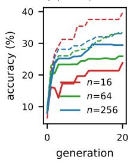

(b) 7B, TREC  
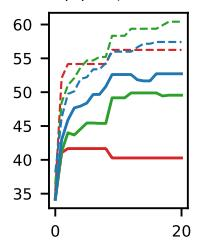

(c) 1.5B, GSM8K  
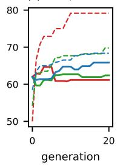

(d) 1.5B, Banking77  
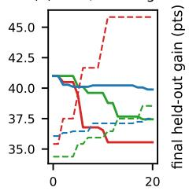  
generation

(e) final held-out gain  
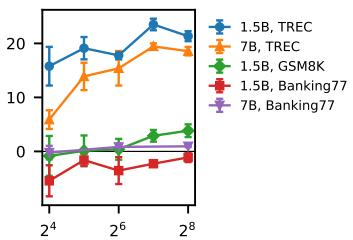  
selection-set size n  
Figure 4: Exploratory greedy loops (v1, vLLM). (a–d) Held-out accuracy (solid) and the loop’s own selection-set score (dashed) for $n = 1 6 , 6 4 , 2 5 6$ , mean of 3 seeds. (e) Final held-out gain over the seed instruction versus n $( \mathrm { m e a n } \pm \mathrm { s . e . } )$ .

A hand-written reference instruction. To calibrate the size of the TREC gains, we wrote an instruction that defines all 50 labels of the TREC taxonomy (141 words). On the confirmatory gold set it raises accuracy from 10.5% to 11.3% for the 1.5B model and from 37.2% to 54.5% for the 7B model. For 7B the label glossary is worth about as much as the greedy loops’ gain at large n; the 1.5B loops gain far more than the glossary (their best final instructions describe the coarse categories, give worked examples and constrain the output format).

Acceptance decisions in isolation. Proposition 2 concerns a single decision on a fresh selection set, whereas whole runs also involve adaptive reuse, so we also evaluate the rules one decision at a time (exploratory). At n = 16 the average greedy decision lowers held-out accuracy by 0.47 points (95% interval $[ - 0 . 8 2 , - 0 . 0 3 ] )$ ), consistent with Proposition 3 for $\mu < 0$ , and every rule with a calibrated threshold avoids the loss. The pilot-calibrated Bayes gate gains 0.77 points over greedy [0.60, 0.93] and a McNemar test with pilot-tuned α gains 0.68 [0.43, 0.91], and the two are indistinguishable at every n. Both avoid the loss mainly by committing less often, and about half of their commits are still harmful. At $n = 1 6$ greedy commits in 44% of decisions, the pilot gate in 8% and the tuned McNemar test in 6%, and 58%, 59% and 46% of their commits are harmful (40%, 35% and 40% by more than 1.8 points). At $n = 1 2 8$ the harmful share is 34 to 39% for all three. In whole runs on a reused selection set the same rules brought no gain (Section 5.3); the replay draws a fresh selection set for every decision, so it contains no lock-in, and its candidates come from high-resolution trajectories. Table 13 gives the full comparison. The gold set of each oracle setting is split once into halves $G _ { 1 }$ and $G _ { 2 }$ . Priors, tuned significance levels and tuned thresholds are estimated on $G _ { 1 }$ from other runs only (leave-one-run-out; across inference stacks for the 1.5B model; GSM8K has a single oracle run and therefore no pilot). Each decision is made on n items drawn from $G _ { 2 }$ and credited with its held-out efect on the remaining items of $G _ { 2 } ;$ intervals are cluster bootstraps over generations. Since each setting has only one or two oracle runs, whose generations share a trajectory, the intervals are conditional on those trajectories and understate run-to-run variation. The nonparametric variant of the gate replaces the Gaussian prior by the pilot’s empirical efects but treats the candidates’ measurement errors as independent, ignoring the incumbent’s shared error. The Gaussian priors in this replay subtract a fixed approximate variance $0 . 1 5 / | G _ { 1 } |$ from the within-generation efect variance and floor the result at $1 0 ^ { - 4 } ;$ this approximation difers from the native-loop pilot fitting. The in-sample reference prior uses the evaluated runs own held-out efects on $G _ { 1 } ;$ in settings with a single oracle run its phase-1 prior therefore contains the evaluated generation’s own efects. The tuned α is 0.2 to 0.5 on TREC and 0.01 on Banking77. The tuned McNemar test improves on $\alpha = 0 . 0 5$ by 0.07 to 0.21 points per decision (significantly for $n \geq 3 2 )$ , and the Bayes gate by 0.09 to 0.20 (no interval excludes zero).

Does a pilot transfer? A pilot on the same model and task with a large evaluation set is a strong requirement. Table 14 repeats the decision-level analysis above with the prior, the tuned α and the tuned threshold taken from runs of the other model on the same task (1.5B↔7B) or of the other task with the same model (TREC↔Banking77; GSM8K from 1.5B TREC). Across models, the Bayes gate still avoids greedy’s losses at small n and is at least as good as McNemar at α = 0.05 (significantly so at $n = 1 2 8 )$ , while the tuned test transfers less well at $n = 1 6 .$ . Across tasks, only the protection against greedy’s losses transfers, and the gate is no better than McNemar at $\alpha = 0 . 0 5$ . A pilot is therefore useful when it matches the task, and a conservative default is the safer choice when it does not.

Whole-run results of all acceptance rules (exploratory). Tables 15–16 report, for every rule and setting of the exploratory vLLM experiments, the final held-out gain over the seed instruction (mean ± s.e. over 3 seeds), the final gap between the loop’s selection-set score and its held-out accuracy, and the number of harmful commits out of all commits (summed over seeds). Whole-run diferences between rules are mostly small relative to seed variation, and many gains arise in the first few decisions, consistently with lock-in. Fixed-level tests rarely commit at n = 16 and therefore stay near the seed, which is optimal on Banking77 (where few proposals help) and costly on TREC; greedy’s harmful commits and self-reported gaps are largest at small n. The online EB gate did not improve on greedy in whole runs. On 1.5B-TREC at $n = 6 4$ it ended 6.2 points below greedy $( + 1 1 . 6 \pm 0 . 9 \ \mathrm { v s . \ } + 1 7 . 8 \pm 0 . 7 $ ; lower in all three seeds, paired t-test $p = 0 . 0 1 6 )$ , which we attribute to its within-run estimate of $s ^ { 2 }$ from a handful of candidates, which is unreliable; we therefore evaluate only the pilot-calibrated gate in the confirmatory study.

Table 13: Value of one acceptance decision (held-out improvement in points per decision; mean over the seven oracle settings, six for pilot-based rules since GSM8K has a single oracle run; diferences over common settings; 95% cluster-bootstrap intervals over generations, conditional on the oracle trajectories). †This row only: prior estimated in-sample from the evaluated runs, so the rule is not deployable.
<table><tr><td>Rule</td><td>n=16</td><td>n=32</td><td>n=64</td><td>n=128</td></tr><tr><td>Greedy keep-if-better</td><td>-0.47 [-0.82, -0.03]</td><td>-0.08 [-0.46, +0.37]</td><td>+0.24 [-0.15, +0.71]</td><td>+0.50 [+0.11, +0.96]</td></tr><tr><td>McNemar, α=.05</td><td>+0.06 [+0.00, +0.14] +0.20 [+0.04, +0.43] +0.34 [+0.09, +0.67] +0.49 [+0.18, +0.88]</td><td></td><td></td><td></td></tr><tr><td>McNemar, α=.20</td><td>+0.12 [-0.05, +0.34]</td><td></td><td>+0.31 [+0.04, +0.63] +0.43 [+0.12, +0.82] +0.58 [+0.25, +0.99]</td><td></td></tr><tr><td>PACE e-process</td><td>+0.02 [+0.00, +0.04]</td><td></td><td>+0.09 [+0.01, +0.23] +0.25 [+0.04, +0.52] +0.43 [+0.13, +0.79]</td><td></td></tr><tr><td>Select-then-confirm</td><td>+0.06 [-0.09, +0.26]</td><td></td><td>+0.21 [-0.03, +0.52] +0.35 [+0.07, +0.71] +0.55 [+0.21, +0.95]</td><td></td></tr><tr><td>McNemar, pilot-tuned α</td><td>+0.19 [-0.02, +0.43]</td><td></td><td>+0.44 [+0.12, +0.82] +0.56 [+0.17, +1.02] +0.64 [+0.25, +1.10]</td><td></td></tr><tr><td>Threshold on , pilot-tuned</td><td>+0.15 [-0.07, +0.40]</td><td></td><td>+0.35 [-0.02, +0.78] +0.49 [+0.09, +0.95] +0.60 [+0.20, +1.03]</td><td></td></tr><tr><td>Pilot-calibrated Bayes gate</td><td>+0.28 [-0.03, +0.63]</td><td></td><td>+0.40 [+0.06, +0.82] +0.52 [+0.14, +0.97] +0.66 [+0.25, +1.12]</td><td></td></tr><tr><td>nonparametric prior</td><td>+0.20 [-0.09, +0.52]</td><td></td><td>+0.31 [-0.02, +0.70] +0.51 [+0.13, +0.95] +0.64 [+0.25, +1.08]</td><td></td></tr><tr><td>Bayes gate, in-sample prior†</td><td>+0.21 [-0.04, +0.52]</td><td></td><td>+0.31 [-0.01, +0.68] +0.47 [+0.10, +0.90] +0.64 [+0.25, +1.08]</td><td></td></tr><tr><td>Best candidate (oracle)</td><td>+1.40 [+1.00, +1.87]</td><td></td><td>+1.42 [+1.02, +1.89] +1.48 [+1.08, +1.96]</td><td>+1.61 [+1.21, +2.07]</td></tr><tr><td>Pilot gate – greedy</td><td>+0.77 [+0.60, +0.93]</td><td></td><td>+0.43 [+0.30, +0.56] +0.21 [+0.10, +0.30]</td><td>+0.08 [-0.00, +0.15]</td></tr><tr><td>Tuned McNemar – greedy</td><td>+0.68 [+0.43, +0.91]</td><td>+0.47 [+0.31, +0.62]</td><td> +0.25 [+0.16, +0.34]</td><td>+0.06 [-0.04, +0.16]</td></tr><tr><td>Pilot gate – McNemar .05</td><td>+0.20 [-0.04, +0.48]</td><td>+0.17 [-0.03, +0.40]</td><td>+0.12 [-0.01, +0.27]</td><td>+0.09 [-0.01, +0.19]</td></tr><tr><td>Tuned McNemar - McNemar .05</td><td>+0.11 [-0.03, +0.28]</td><td></td><td>+0.21 [+0.06, +0.40] +0.16 [+0.02, +0.32]</td><td>+0.07 [+0.01, +0.14]</td></tr><tr><td>Pilot gate - tuned McNemar</td><td>+0.09 [-0.04, +0.24]</td><td>-0.04 [-0.13, +0.05]</td><td>-0.04 [-0.10, +0.01]</td><td>+0.02 [-0.05, +0.09]</td></tr></table>

Table 14: Prior transfer (exploratory; value per decision in points, 95% cluster-bootstrap intervals over generations, conditional on the oracle trajectories).
<table><tr><td>Rule</td><td>n=16</td><td>n=32</td><td></td><td>n=64</td><td>n=128</td></tr><tr><td colspan="6">Pilot from the other model (same task; 4 settings)</td></tr><tr><td>Greedy</td><td>-0.62 [-1.08, -0.08]</td><td>-0.10 [-0.57, +0.47]</td><td></td><td></td><td>+0.24 [-0.26, +0.83] +0.48 [+0.01, +1.06]</td></tr><tr><td>McNemar .05</td><td></td><td>+0.06 [+0.01, +0.15] +0.16 [+0.01, +0.34]</td><td></td><td></td><td>+0.33 [+0.03, +0.75] +0.51 [+0.09, +1.06]</td></tr><tr><td>McNemar, tuned α</td><td>-0.05 [-0.19, +0.14]</td><td>+0.28 [-0.08, +0.74]</td><td>+0.45 [+0.01, +1.00]</td><td></td><td>] +0.56 [+0.12, +1.13]</td></tr><tr><td>Threshold, tuned</td><td>+0.00 [-0.20, +0.28]</td><td>+0.16 [-0.15, +0.56]</td><td>+0.46 [+0.02, +1.03]</td><td></td><td>] +0.51 [+0.07, +1.08]</td></tr><tr><td>Pilot Bayes gate</td><td>+0.25 [-0.08, +0.66]</td><td>+0.39 [-0.00, +0.90]</td><td>+0.50 [+0.05, +1.06]</td><td></td><td>+0.62 [+0.18, +1.19]</td></tr><tr><td>Pilot gate – greedy</td><td>+0.88 [+0.63, +1.08]</td><td>+0.49 [+0.30, +0.67]</td><td>+0.27 [+0.14, +0.38]</td><td></td><td>+0.14 [+0.06, +0.22]</td></tr><tr><td>Pilot gate − McNemar .05 +0.19 [-0.09, +0.56]</td><td></td><td>+0.23 [-0.02, +0.57]</td><td>+0.17 [-0.00, +0.39]</td><td></td><td>+0.11 [+0.01, +0.22]</td></tr><tr><td colspan="4">Pilot from the other task (same model; 5 settings)</td><td></td><td></td></tr><tr><td>Greedy</td><td>-0.56 [-0.97, -0.05]</td><td>-0.16 [-0.56, +0.36]</td><td>+0.15 [-0.28, +0.70]</td><td></td><td>+0.39 [-0.01, +0.94]</td></tr><tr><td>McNemar .05</td><td>+0.04 [-0.00, +0.12]</td><td>+0.13 [+0.02, +0.29]</td><td>+0.26 [+0.03, +0.62] +0.41 [+0.08, +0.88]</td><td></td><td></td></tr><tr><td>McNemar, tuned α</td><td>-0.05 [-0.18, +0.11]</td><td>+0.02 [-0.13, +0.21]</td><td>+0.18 [-0.03, +0.45]</td><td></td><td>+0.46 [+0.14, +0.92]</td></tr><tr><td>Threshold, tuned</td><td>+0.04 [-0.15, +0.31]</td><td>+0.18 [-0.09, +0.54]</td><td></td><td>+0.35 [+0.02, +0.80] +0.52 [+0.18, +0.99]</td><td></td></tr><tr><td>Pilot Bayes gate</td><td>+0.04 [-0.16, +0.31]</td><td>+0.22 [-0.04, +0.59]</td><td></td><td>+0.31 [+0.01, +0.76] +0.43 [+0.08, +0.92]</td><td></td></tr><tr><td>Pilot gate – greedy</td><td>+0.60 [+0.26, +0.89]</td><td>+0.38 [+0.12, +0.63]</td><td>+0.16 [-0.07, +0.38]</td><td></td><td>+0.04 [-0.13, +0.21]</td></tr><tr><td>Pilot gate – McNemar .05</td><td>-0.01 [-0.18, +0.19]</td><td>+0.09 [-0.07, +0.30]</td><td></td><td>+0.05 [-0.06, +0.17] +0.03 [-0.09, +0.15]</td><td></td></tr></table>

Table 15: Whole runs, 1.5B, vLLM: held-out gain over the seed (points; mean $\pm \ \mathrm { s . e . }$ . over seeds), final selection-set minus held-out gap (points), and harmful commits out of all commits, summed over seeds. RM runs use a per-generation budget B = 256 and are listed under n = 64.
<table><tr><td>Setting</td><td>Rule</td><td>runs</td><td>held-out gain</td><td>proxy-held-out</td><td></td><td>harmful / commits</td></tr><tr><td rowspan="4">1.5B TREC, n=16</td><td>Greedy</td><td>3</td><td>+15.8±3.6</td><td>15.8</td><td>2 / 10</td><td></td></tr><tr><td>McNemar</td><td>3</td><td>+11.3±5.8</td><td>7.7</td><td>0/2</td><td></td></tr><tr><td>E-process</td><td>3</td><td>+0.0±0.0</td><td>-1.8</td><td>0/0</td><td></td></tr><tr><td>EB gate</td><td>3</td><td>+5.6±1.5</td><td>17.6</td><td>0/3</td><td></td></tr><tr><td rowspan="5">1.5B TREC, n=64</td><td>Greedy</td><td>3</td><td>+17.8±0.7</td><td>7.4</td><td>2 /  13</td><td></td></tr><tr><td>McNemar</td><td>3</td><td>+12.6±2.4</td><td>1.6</td><td>0/3</td><td></td></tr><tr><td>E-process</td><td>3</td><td>+16.0±1.4</td><td>0.3</td><td>0/3</td><td></td></tr><tr><td>EB gate</td><td>3</td><td>+11.6±0.9</td><td>4.5</td><td>1/4</td><td></td></tr><tr><td>EB + RM</td><td>3</td><td>+16.2±1.9</td><td>5.3</td><td>0/6</td><td></td></tr><tr><td rowspan="4">1.5B Banking77, n=16</td><td>Greedy</td><td>3</td><td>-5.4±2.9</td><td>10.3</td><td>5/5</td><td></td></tr><tr><td>McNemar</td><td>3</td><td>+0.0±0.0</td><td>-5.6</td><td>0/0</td><td></td></tr><tr><td>E-process</td><td>3</td><td>+0.0±0.0</td><td>-5.6</td><td>0 /0</td><td></td></tr><tr><td>EB gate</td><td>3</td><td>-0.5±0.5</td><td>-3.0</td><td>1/1</td><td></td></tr><tr><td rowspan="5">1.5B Banking77, n=64</td><td>Greedy</td><td>3</td><td>-3.6±2.5</td><td>1.1</td><td>5/5</td><td></td></tr><tr><td>McNemar</td><td>3</td><td>+0.0±0.0</td><td>-6.6</td><td>0/0</td><td></td></tr><tr><td>E-process</td><td>3</td><td>+0.0±0.0</td><td>-6.6</td><td>0/0</td><td></td></tr><tr><td>EB gate</td><td>3</td><td>-1.9±1.2</td><td>0.5</td><td>2/2</td><td></td></tr><tr><td>EB + RM</td><td>3</td><td>-0.6±0.3</td><td>0.4</td><td>2/3</td><td></td></tr><tr><td rowspan="2">1.5B GSM8K, n=16</td><td>Greedy</td><td>3</td><td>-0.8±3.7</td><td>18.0</td><td>4/9</td><td></td></tr><tr><td>EB gate</td><td>3</td><td>+2.4±1.0</td><td>14.9</td><td>2/5</td><td></td></tr><tr><td rowspan="4">1.5B GSM8K, n=64</td><td>Greedy</td><td>3</td><td>+0.4±1.9</td><td>7.4</td><td>4/9</td><td></td></tr><tr><td>McNemar</td><td>3</td><td>+4.3±1.6</td><td>6.8</td><td>1/4</td><td></td></tr><tr><td>EB gate</td><td>3</td><td>+1.8±2.5</td><td>6.8</td><td>3/7</td><td></td></tr><tr><td>EB + RM</td><td>3</td><td>-0.7±1.9</td><td>8.6</td><td>3/5</td><td></td></tr></table>

Fresh versus reused selection sets. Re-drawing the selection set every generation (“greedy, fresh D”, llama.cpp replication, TREC n = 64) avoids carrying the incumbent’s earlier selection error into the next comparison. The loop commits twice as often (33 vs. 16 commits over three seeds), 39% of its commits are harmful (vs. 25% with reuse; 30% vs. 12.5% at the −1.8-point threshold), and its final held-out gain is lower $( + 1 4 . 4 \pm 1 . 1$ vs. +21.3 ± 1.4 points), consistent with Proposition 3 when most proposals are harmful and each comparison is fresh noise. This is one exploratory setting with three seeds and the feedback confound of the exploratory design; the diference in harmful shares is not significant (Fisher $p = 0 . 3 6 )$ , and the fresh-set runs had fewer valid candidates per generation (2.3 against 3.1).

Table 16: Whole runs, 7B, vLLM (same format as Table 15).
<table><tr><td>Setting</td><td>Rule</td><td></td><td>runs held-out gain proxy-held-out harmful / commits</td><td></td><td></td></tr><tr><td rowspan="3">7B TREC, n=16</td><td>Greedy</td><td>3</td><td>+5.9±1.7</td><td>16.0</td><td>1/5</td></tr><tr><td>McNemar</td><td>3</td><td>+1.0±1.0</td><td>10.7</td><td>0 /1</td></tr><tr><td>EB gate</td><td>3</td><td>+8.9±4.2</td><td>25.7</td><td>3/7</td></tr><tr><td rowspan="5">7B TREC, n=64</td><td>Greedy</td><td>3</td><td>+15.4±3.2</td><td>10.9</td><td>4 / 14</td></tr><tr><td>McNemar</td><td>3</td><td>+8.9±3.0</td><td>6.9</td><td>0/3</td></tr><tr><td>E-process</td><td>3</td><td>+5.9±5.9</td><td>2.6</td><td>0 /1</td></tr><tr><td>EB gate</td><td>3</td><td>+13.9±4.2</td><td>10.2</td><td>3 / 10</td></tr><tr><td>EB + RM</td><td>3</td><td>+14.1±2.8</td><td>4.7</td><td>2 / 10</td></tr><tr><td rowspan="3">7B Banking77, n=16 Greedy</td><td></td><td>3</td><td>-0.2±1.3</td><td>3.1</td><td>1/3</td></tr><tr><td>McNemar</td><td>3</td><td>+0.0±0.0</td><td>-3.4</td><td>0/0</td></tr><tr><td>EB gate</td><td>3</td><td>+0.0±0.6</td><td>2.8</td><td>1/2</td></tr><tr><td rowspan="5">7B Banking77, n=64 Greedy</td><td></td><td>3</td><td>+0.8±0.3</td><td>-0.5</td><td>2 /6</td></tr><tr><td>McNemar</td><td>3</td><td>+0.5±0.5</td><td>-1.3</td><td>0 /1</td></tr><tr><td>E-process</td><td>3</td><td>+0.0±0.0</td><td>-3.9</td><td>0/0</td></tr><tr><td>EB gate</td><td>3</td><td>+1.2±0.4</td><td>-2.0</td><td>0/3</td></tr><tr><td>EB + RM</td><td>3</td><td>+0.9±0.2</td><td>-4.7</td><td>0/3</td></tr></table>

Development-seed failure of the unsafeguarded EB gate. On the development seed (TREC, llama.cpp), the first version of the online EB gate, combined with resolution matching (increasing n across generations to hold the estimated $h _ { w } ^ { 2 }$ fixed), peaked at +18.4 and ended at +5.8 points with 3 harmful commits out of 8: after two generations its estimate of $s ^ { 2 }$ collapsed to zero, the posterior reduced to a stale positive $\hat { \mu } ,$ and the gate committed candidates that measured as regressions. We added the safeguard of Section 4 (never commit a measured regression) and capped the growth of $n ,$ and ran the safeguarded gate on all seeds and tasks; this change was post hoc, and the EB-gate entries of the exploratory whole-run tables average over all seeds, including the development seed. The unsafeguarded runs are listed in Table 18 as an ablation.

Allocation sweeps. Table 17 splits a fixed per-generation budget of B = 256 evaluations into K candidates of n items (online EB gate). Diferences are within seed variation; for 7B the extremes (K = 1 and K = 16) do worst, consistent with an interior optimum, but the sweep is too small to be conclusive. An earlier sweep on the llama.cpp stack (1.5B TREC, two seeds, T = 25) gave held-out gains of 16.7, 13.9, 24.2 and 14.6 points for (K, n) = (1, 256), (2, 128), (8, 32) and (16, 16), again within seed variation.

Table 17: Held-out gain (pts, mean ± s.e., number of seeds) for splits of B = 256 evaluations per generation.
<table><tr><td>Model</td><td> $K \times n = 1 6 \times 1 6$ </td><td>8×32</td><td>4×64</td><td>2×128</td></tr><tr><td>1.5B TREC</td><td>+16.3±1.9 (3)</td><td> +13.6±2.0 (3) +11.6±0.9 (3) +14.8±1.3 (3) +13.7±2.2 (3)</td><td></td><td></td></tr><tr><td>7B TREC</td><td>+8.8±4.2 (2)</td><td></td><td></td><td> +11.5±7.3 (2) +13.9±4.2 (3) +12.6±5.3 (2) +6.6±3.8 (2)</td></tr></table>

## D Replication with a second inference stack

We repeated the 1.5B classification experiments with an independent inference stack: 8-bit GGUF weights served by llama.cpp on a consumer GPU (RTX 3080 Ti), $T = 2 5$ generations, otherwise identical code. Two oracle settings are included in Figure 1 (“llama.cpp”); the distribution-aware prediction has mean absolute error 0.014 (TREC) and 0.048 (Banking77). Greedy loops again gain more held-out accuracy with larger n on TREC (+9.1 at $n = 1 6$ vs. +25.7 at $n = 2 5 6 )$ while their self-reported gap shrinks (14.4 vs. 5.4 points), and on Banking77 they again lose held-out accuracy (−3.8 at $n = 1 6$ and $n = 6 4 , - 1 . 4$ at $n = 2 5 6 )$ . Whole-run results of the acceptance rules are in Table 18; on this stack the safeguarded EB gate matches greedy at $n = 6 4$ and is within seed variation of it at $n = 1 6$ on TREC $( + 1 0 . 8 \pm 4 . 0 ~ \mathrm { v s }$ $+ 9 . 1 \pm 2 . 5 )$ , and EB with resolution matching attains the highest TREC gain among rules with 256 evaluations per generation $( + 2 4 . 8 \pm 0 . 3 ;$ greedy at $n = 2 5 6$ , with 1024 per generation, reaches +25.7).

Table 18: Whole runs, 1.5B, llama.cpp replication $( T = 2 5 ;$ same format as Table 15).
<table><tr><td>Setting</td><td>Rule</td><td></td><td>runs held-out gain proxy-held-out harmful / commits</td><td></td><td></td><td></td></tr><tr><td rowspan="5">1.5B TREC, n=16</td><td>Greedy</td><td>3</td><td>+9.1±2.5</td><td>14.4</td><td>1/9</td><td></td></tr><tr><td>McNemar</td><td>3</td><td>+0.0±0.0</td><td>-3.6</td><td>0 /0</td><td></td></tr><tr><td>E-process</td><td>3</td><td>+0.0±0.0</td><td>-3.6</td><td></td><td>0/0</td></tr><tr><td>EB gate</td><td>3</td><td>+10.8±4.0</td><td>4.3</td><td></td><td>0/5</td></tr><tr><td>EB, no safeguard</td><td>2</td><td>+12.8±7.4</td><td>8.7</td><td></td><td>0/5</td></tr><tr><td rowspan="8">1.5B TREC, n=64</td><td>Greedy</td><td>3</td><td>+21.3±1.4</td><td>6.9</td><td></td><td>4 /16</td></tr><tr><td>Greedy, fresh D</td><td>3</td><td>+14.4±1.1</td><td>6.0</td><td></td><td>13 / 33</td></tr><tr><td>McNemar</td><td>3</td><td>+17.6±2.8</td><td>6.5</td><td></td><td>2/6</td></tr><tr><td>E-process</td><td>3</td><td>+18.8±3.0</td><td>7.8</td><td></td><td>0/4</td></tr><tr><td>EB gate</td><td>3</td><td>+21.2±1.2</td><td>7.0</td><td></td><td>3 / 15</td></tr><tr><td>EB + RM</td><td>3</td><td>+24.8±0.3</td><td>4.1</td><td></td><td>2 / 11</td></tr><tr><td>EB, no safeguard</td><td>1</td><td>+21.7±0.0</td><td>-0.3</td><td></td><td>0/6</td></tr><tr><td>EB + RM, no safeguard</td><td>1</td><td>+5.8±0.0</td><td>5.8</td><td></td><td>3/8</td></tr><tr><td rowspan="4">1.5B Banking77, n=16 Greedy</td><td></td><td>3</td><td>-3.8±3.5</td><td>12.0</td><td></td><td>3 /4</td></tr><tr><td>McNemar</td><td>3</td><td>+0.0±0.0</td><td>-2.3</td><td></td><td>0/0</td></tr><tr><td>E-process</td><td>3</td><td>+0.0±0.0</td><td>-2.3</td><td></td><td>0/0</td></tr><tr><td>EB gate</td><td>3</td><td>-2.6±2.6</td><td>6.6</td><td></td><td>2/2</td></tr><tr><td rowspan="5">1.5B Banking77, n=64 Greedy</td><td></td><td>3</td><td>-3.8±2.7</td><td>4.1</td><td>5/8</td><td></td></tr><tr><td>McNemar</td><td>3</td><td>+0.0±0.0</td><td>-6.9</td><td></td><td>0/0</td></tr><tr><td>E-process</td><td>3</td><td>+0.0±0.0</td><td>-6.9</td><td></td><td>0 /0</td></tr><tr><td>EB gate</td><td>3</td><td>-3.1±2.4</td><td>2.4</td><td></td><td>3/5</td></tr><tr><td>EB + RM</td><td>3</td><td>-1.7±0.8</td><td>-3.8</td><td></td><td>3/4</td></tr></table>