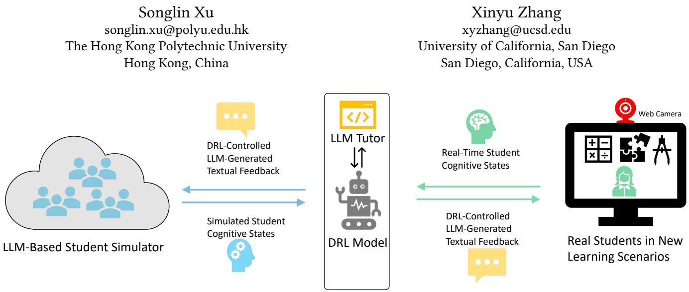
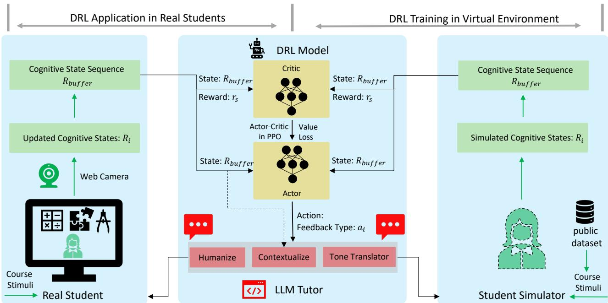
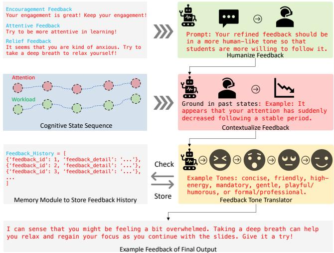
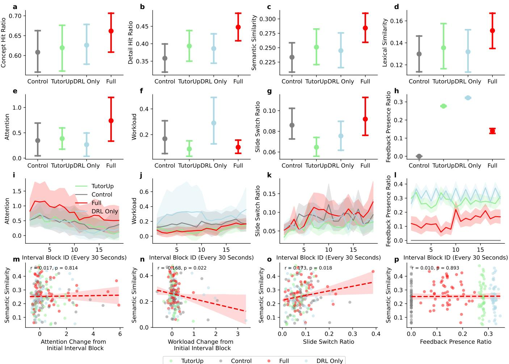

# TutorLoop: Regulating Student Learning Behaviors via Sensor-in-the-Loop Generative Feedback

  
Figure 1: Our framework. TutorLoop leverages students’ real-time cognitive states, captured via webcams, to regulate learning behaviors and enhance outcomes. A DRL model controls an LLM tutor to generate adaptive feedback. The DRL model is first trained with the student simulator and then directly applied to real students in new learning tasks without model updates.

## Abstract

We present TutorLoop, a sensor-in-the-loop system that regulates student learning behaviors by delivering adaptive feedback based on real-time cognitive states. Unlike prior large language model (LLM) tutors that directly depend on scenario-specific content, TutorLoop operates on sensor-derived signals captured via webcams. Moreover, unlike direct cognitive-to-feedback mappings that are short-sighted, the system employs a deep reinforcement learning (DRL) agent to optimize the feedback type across the entire learning process. Finally, another LLM tutor refines feedback into human like, context-aware messages. We evaluate TutorLoop in a largescale user study (N=187), where a model trained ofline is directly applied to a new learning task without retraining. Results show that TutorLoop provides less frequent yet more efective interventions, improving attention, reducing workload, increasing engagement, and ultimately enhancing learning outcomes. These findings highlight the potential of closed-loop, sensor-driven feedback for scalable human-AI integrated systems to support learning.

## CCS Concepts

• Human-centered computing → Interaction techniques; Interaction design; Ubiquitous and mobile computing systems and tools.

## Keywords

Online Learning, Generative AI, Intelligent Tutoring System

## ACM Reference Format:

Songlin Xu and Xinyu Zhang. 2023. TutorLoop: Regulating Student Learning Behaviors via Sensor-in-the-Loop Generative Feedback. In Proceedings. ACM, New York, NY, USA, 14 pages. https://doi.org/xx.xxx/xxx.xxx

## 1 Introduction

Online education plays a crucial role not only as a strategic response to disruptions such as natural disasters and public health emergencies [60], but also as a universally accessible platform [38] for students who face barriers to attending traditional in-person classes. However, online education sufers from intrinsic limitations. In particular, online platforms often lack mechanisms to sustain student engagement, as learners naturally lose attention in the absence of in-person instructors [46]. Recent advances in large language models (LLMs) show promise in addressing this gap. LLMs have been applied to train tutors or serve directly as tutors. It can deliver textual feedback to enhance engagement [5, 42], augment problem solving [73], generate questions [22, 33], and support personalized learning [16, 19, 41, 47]. However, most prior work grounds AI tutors in specific courses or task contexts [68], which limits their ability to transfer across new learning scenarios.

We propose a general sensor-in-the-loop system that leverages student cognitive states (attention and workload), captured through ubiquitous sensors (e.g., web cameras), as the observation space for generating LLM-based feedback. Unlike prior approaches, our system does not require course content as input, allowing it to generalize across diverse learning settings and task domains. However, directly mapping cognitive states to feedback tends to be short-sighted. For instance, intervening whenever attention drops may inadvertently increase workload and ultimately impair perfor mance, based on the Yerkes–Dodson law [70]. An efective strategy must therefore balance attention and workload while considering long-term learning outcomes, which are shaped by the cumulative learning process rather than isolated moments.

In this paper, we introduce TutorLoop, a tutoring framework in which a deep reinforcement learning (DRL) model controls the LLM tutor to provide far-sighted feedback. TutorLoop optimizes cumulative learning rewards by modeling cognitive states over the entire learning process. However, two key challenges remain.

The first major challenge is how to generate persuasive and efective feedback that students are willing to follow. The design space of LLM-generated feedback is vast. It could involve open-ended reflective prompts that encourage self-exploration [77], concrete suggestions that direct attention to specific course content [66], and emotionally framed cues that influence motivation or confidence [27], etc. Each feedback form can further vary in structure, intensity, and timing. Directly fine-tuning LLMs to explore this space is computationally expensive and requires massive interaction data with real students, making it impractical.

To address this, we narrow the feedback space by grounding it in cognitive science principles. The Yerkes–Dodson law [70] posits that performance improves with arousal up to an optimal point but deteriorates when excessive workload induces over-arousal. We use attention signals captured by sensing data as a proxy for arousal. Following this law, our design includes two core feedback types: (a) attentive feedback, which reminds students to increase attention when it drops, and (b) relief feedback, which suggests relaxation when workload is high. In addition, inspired by findings that praise reinforces engagement [44], we add (c) encouragement feedback to acknowledge desirable behaviors such as sustained attention. Combined with no feedback when intervention is unnecessary, these yield four discrete feedback types.

We employ a DRL model to adaptively select which type of feedback to deliver based on real-time cognitive states and the longterm trajectory of the learning process. We further employ an LLM tutor to refine how the selected action is conveyed (w.r.t. wording, tone, contextualization, etc.), so as to maximize persuasiveness and responsiveness. The LLM tutor is designed to counteract the habituation efect [15], i.e., reduction of attention and responsiveness against repeated exposure to the same type of feedback stimuli. In addition, to enhance student compliance, the LLM tutor is tailored to generate contextualized feedback based on a student’s past behaviors [59], as students who perceive that their actions are being monitored are more likely to follow the feedback [7].

The second major challenge lies in training the DRL model. Ideally, the training would require massive amounts of interactive online training data, which is dificult to collect in real time with human learners. We overcome this challenge through an LLM-based student simulator using an architecture similar with EduAgent [69], which generates cognitive states in response to course materials, based on few-shot demonstration from public datasets. With this simulator, we train the TutorLoop model on public datasets in virtual environments and then directly apply it without retraining to a new self-learning task in a large-scale study (� = 187). This demonstrates the transferability of our sensor-integrated system. Specifically, while simulators may draw on course materials to generate contextual behaviors, the DRL model relies solely on cognitive states as input, independent of course materials.

Results show that TutorLoop significantly improves attention, reduces workload, increases active engagement (e.g., slide switching), and ultimately enhances learning outcomes compared to three baseline groups. Interestingly, our study reveals that while attention alone is weakly correlated with learning outcomes, workload is strongly negatively correlated. This suggests that feedback strategies narrowly focused on increasing visual attention may not substantially improve learning and may even introduce cognitive overload. Instead, feedback should account for the tradeof between attention and workload, consistent with the Yerkes-Dodson law [70]. Furthermore, our study shows that directly using LLMs to generate feedback based on each updated cognitive state yields only limited improvements in learning outcomes compared to our approach. A likely reason is that although LLMs can condition on the entire history of cognitive states, they are not explicitly optimized with a reward function as in deep reinforcement learning. As a result, the generated feedback may be suboptimal. Finally, our TutorLoop system achieves superior outcomes with fewer feedback interventions, underscoring the efectiveness of adaptive, judiciously timed feedback over frequent, intrusive prompts.

In summary, our key contributions are as follows:

• We propose a general sensor-in-the-loop framework where a DRL model controls an LLM tutor to regulate students’ online cognitive states and augment learning performance. By relying solely on sensor-derived information rather than course-specific materials, TutorLoop can be directly applied in a new task after pre-training in a public dataset.

• We show that student simulators can be directly used to train AI models to address the data scarcity bottleneck for human-in-the-loop training.

• Our between-subject experiment with N=187 participants not only demonstrates the unique advantage of TutorLoop in regulating student behaviors and augmenting learning outcomes, but also reveals insights about limitations in directly applying LLMs in regulating students’ behaviors.

## 2 Related Work

Our work mainly draws inspirations from and advances the knowledge in the following three categories of research.

## 2.1 LLMs in Education

LLMs have been widely explored in education, serving as tutors or support tools to enhance engagement (TutorUp [42], [5]), augment problem solving (Mentigo [73]), generate practice questions (TutorCraftEase [22]), and support personalized learning [16, 41, 47, 56, 78]. They have also been used with simulated students to evaluate tutors or generate feedback (TeachTune [19], Generative Students [33], [39]). Beyond tutoring, LLM-powered agents [48] have supported tasks (Mathemyths [74], DevCoach [65], [18], [30]) such as recommending concepts [28], providing instructions [61], delivering feedback [37], or assisting instructors in content design (ReadingQizMaker [31]).

## 2.2 LLMs for Student Simulation

Researchers have explored various ways of leveraging LLMs for student simulation. Prior work has largely focused on knowledge tracing to predict learning skills from historical data [13, 21, 25, 26, 29, 71, 75], or on generative agents that simulate classroom interactions [8, 20, 35, 72, 76]. These eforts have supported adaptive practice generation [10], interactive TA training [36], and personalized tutoring [52], and have also been extended to domains such as self-reflection [24], and growth mindset development [23].

Recent work has moved toward more contextual behavioral simulation in online education. For example, Classroom Simulacra [67] builds contextual student agents, while EduAgent [69] is most closely related to our work in simulating cognitive states. Since student simulation is not the core contribution of this work, we adopted the similar architecture as EduAgent to build the student simulator, serving as the virtual environment to train our deep reinforcement learning model in the TutorLoop framework.

## 2.3 LLMs to Enhance Student Learning

Recent HCI research has explored a wide range of LLM-powered systems to support and enhance student learning. Several works focus on domain-specific applications, where LLMs generate ex planations, exercises, or feedback tailored to particular subjects. For instance, CodeTailor provides personalized Parsons puzzles to support programming engagement [16], Rubikon leverages AR and LLMs for Rubik’s Cube tutoring [50], and eXplainMR generates realtime textual and visual explanations to facilitate ultrasound training [64]. Similarly, Surgment supports surgery learning through segmentation-enabled semantic feedback [63], and explainable coding systems such as PaTAT enable interactive rule synthesis in programming education [14].

Other research investigates more general applications of LLMgenerated feedback. Lu et al. studied how teaching assistants evaluate LLM feedback for economics essays [32], while Doherty et al. designed an LLM-based educational jigsaw agent to support teamwork learning [12]. Co-design approaches have also been employed to explore multimodal generative AI in educational settings [48]. Most relevant to our work are systems that directly investigate adaptive feedback for regulating student behaviors. Shochcho et al. examined how LLM-based tutors can improve engagement and outcomes in Python learning [57], and Bassen et al. applied reinforcement learning to optimize the scheduling of educational activities [4]. TutorUp [42] further explored the use of simulated students to train tutors for addressing engagement challenges in online learning.

Despite these advances, most prior work grounds AI tutors in specific courses or task contexts [68], limiting their transferability across diverse learning scenarios, since reliance on course materials does not guarantee successful application to new courses or tasks.

In contrast, we propose a general sensor-in-the-loop framework that generates adaptive feedback solely from cognitive states, without course-specific inputs, thereby enabling generalization across tasks and domains. Our user study corroborates this advantage, demonstrating that a model trained on simulated students from public datasets can be directly applied to support learning for new real students in a novel task context.

## 3 TutorLoop: System Design

As illustrated in Fig. 1, the system comprises two components: Tutor-Loop and the student simulator. TutorLoop is a closed-loop feedback framework that receives students’ cognitive states (attention and workload, measured via webcam) and generates textual feedback. The feedback is controlled by a deep reinforcement learning (DRL) model and refined by a large language model (LLM) tutor, with the objective of regulating learning behaviors and improving outcomes. The student simulator serves as a digital twin, simulating student behaviors in response to course materials and instructional feedback. TutorLoop is first trained in this virtual environment through interaction with the student simulator, after which the trained DRL agent is deployed to engage with real students on novel tasks without relying on course materials or further model adaptation.

## 3.1 Multi-Modal Sensing

We employ web cameras as sensors to capture students’ cognitive states, as they are widely accessible, embedded in personal computers, and thus suitable for scalable deployment. Specifically, we adopt the open-source JavaScript library WebGazer [43] for eye tracking and face detection. WebGazer operates directly on the client side, thereby preserving user privacy. The collected gaze data are represented as (�, �, �, ℎ, �), where � and � denote the screen coordinates of each gaze point, � and ℎ denote screen width and height, and � is the timestamp. Gaze points are normalized according to the user’s screen size.

As noted in Section 1, our framework accounts for the trade-of between attention and workload, grounded in the Yerkes–Dodson law [70]. To estimate both measures, we partition gaze data into one-second interval and compute attention and workload within each window. These cognitive states are updated on a per-second basis.

Attention. Attention captures the extent to which students focus on course materials during learning. Following prior work [66], we compute the percentage of gaze points falling within the primary content area (e.g., slides or videos) rather than peripheral or blank regions of the screen, within each one-second interval.

Workload. Workload reflects students’ cognitive load during learning. Consistent with existing practice [66], we measure workload using gaze entropy within each one-second interval, as the dispersion ofgaze points has been shown to correlate with cognitive load during task performance [11].

Active Engagement. In our learning task scenario (Section 4.1), students advance through course materials by clicking buttons to switch slides. We therefore capture this modality as an indicator of active engagement, quantified by the frequency of slide switching during self-learning.

  
Figure 2: The TutorLoop framework details. Note that course stimuli are only used to stimulate real/simulated students to generate cognitive states, but the DRL model does not need course stimuli as input.

While attention and workload serve as the primary cognitive state inputs for our feedback generation model, active engagement is only recorded for later evaluation. We exclude it from model input, as not all learning tasks provide comparable data like button clicking behaviors, which would limit the system generalizability.

## 3.2 Feedback Design

Designing feedback that students not only receive but also act upon remains a non-trivial challenge. While LLMs can in principle generate diverse forms of feedback, including reflective prompts that foster self-exploration [77], concrete task-oriented suggestions [66], and emotionally expressive cues that influence motivation [27], the breadth of this design space makes it dificult to determine which types meaningfully improve learning. Feedback may vary in content, tone, and timing, yet the relationships between these variations and learning outcomes remain poorly understood. Exhaustively fine-tuning LLMs to explore this space would be prohibitively expensive and demand extensive real-world student data.

To address this challenge, we draw on the Yerkes-Dodson law [70], which posits that performance improves with arousal only up to an optimal point, after which overload diminishes efectiveness. We use attention signals captured by sensing data as a proxy for arousal. Following this law, our design includes two core feedback types: (a) attentive feedback, which reminds students to increase attention when it drops, and (b) relief feedback, which suggests relaxation when workload is high. In addition, inspired by findings that explicit recognition and praise can reinforce engagement [44], we add (c) encouragement feedback to acknowledge desirable be haviors such as sustained attention. Combined with no feedback when intervention is unnecessary, these yield four discrete feedback types. By grounding feedback types in measurable cognitive states rather than course content, this design facilitates generalization across learning environments and task domains.

More specifically, we initiate the feedback types based on the following prompts: (a) attentive feedback: “Try to be more attentive in learning!”; (b) relieffeedback: “It seems that you are kind of anxious. Try to take a deep breath to relax yourself!”; and (c) encouragement feedback: “Your engagement is great! Keep your engagement!” Once the DRL model selects a feedback type, the chosen message is refined by the LLM tutor before being delivered to the student.

## 3.3 Deep Reinforcement Learning (DRL) Model

3.3.1 Action and Observation Spaces. As described in Section 1, the DRL model adaptively selects feedback types (Section 3.2) to regulate student learning behaviors based on real-time cognitive states. Real or simulated students constitute the environment with which the DRL agent interacts. Each interaction occurs within a fixed time interval �, during which the most recent cognitive states form a sequence of five units that define the observation space. Each unit comprises a pair of normalized values for attention and workload (ranging from 0 to 1). Based on this sequence, the DRL agent selects one of the four feedback types in order to maximize attention while minimizing workload across the learning process. The action space is therefore defined as a discrete set of four feedback types.

3.3.2 Terminal State. A terminal state is reached when the DRL agent completes the maximum number of steps in an episode. To mirror real user studies, we set this maximum step number � to correspond to the study duration. Upon reaching a terminal state, a new episode begins, analogous to initiating a new study session with another participant. Each episode can thus be interpreted as representing one participant’s study session.

  
Figure 3: Details of our LLM tutor to refine the feedback, selected by the DRL model.

3.3.3 Reward Function. To account for individual diferences in learning behaviors [53], the reward at each step $r _ { s }$ is defined in terms of relative changes in attention $( \Delta _ { R a } )$ and workload $( \Delta _ { R w } ) ,$ compared against a student’s initial baseline values (��ˆ and ��ˆ ). The reward encourages the agent to increase attention while reduc ing workload, as expressed in Equation 1:

$$
r _ { s } = \Delta _ { R a } / \hat { R a } - \Delta _ { R w } / \hat { R w }\tag{1}
$$

3.3.4 Model Training. We employ Proximal Policy Optimization (PPO) [54] with a multilayer perceptron (MLP) policy for model training. The DRL model is implemented using PyTorch [45], Stable Baselines3 [49], and Gym [6].

As outlined in Section 1, training is conducted through interactions with the student simulator, powered by the EduAgent dataset [69], until convergence at approximately 10,000 steps. Notably, the DRL model is trained only with simulated students, whose cognitive states are simulated from example behaviors and course materials in the EduAgent dataset. When applied to new real students in novel tasks, the DRL model is not retrained. The rationale is that the model learns from general sensory behavioral patterns such as cognitive state changes without relying on specific course materials. Because simulators can generate large amounts of virtual data comprising a wide and diverse set of cognitive trajectories, this training corpus captures most possible patterns of cognitive state change, including those likely to occur in future students. As a result, the DRL model acquires prior knowledge that enables it to handle cognitive state dynamics even for unseen learners. A user study demonstrating the efectiveness of the DRL model, along with detailed descriptions of baseline groups, is presented in Section 4.

## 3.3.5 Student Simulation Environment. As depicted...

## 3.4 LLM Tutor for Feedback Refinement

As discussed in Section 1, delivering predefined feedback alone may lead to diminished efectiveness due to the habituation efect [15], whereby repeated exposure to identical messages reduces responsiveness. The role of the LLM tutor is therefore not to select the feedback type, but rather to refine how the action prescribed by the DRL model is communicated to students, thereby improving responsiveness and adherence. For example, if the DRL agent prescribes relief feedback, the LLM tutor generates varied phrasings of the same message while preserving the core action (e.g., “relax”) to maximize persuasiveness.

The design of the LLM tutor is grounded in three strands of prior evidence. First, the dishabituation efect [58] suggests that introducing variation, such as changes in tone, can restore attention and responsiveness. Second, contextualizing feedback based on a student’s prior cognitive states increases compliance [59], as students are more likely to follow feedback when they perceive that their behaviors are being monitored [7]. Third, humanizing feedback, rather than presenting it in a purely directive style, has been shown to increase willingness to comply [40].

Building on these findings, the LLM tutor implements a multistep refinement framework to humanize, contextualize, and diversify feedback tone. As illustrated in Fig. 3, LLMs are first prompted to humanize the initial version of feedback from Section 3.2 using the instruction: “Your refined feedback should be in a more humanlike tone so that students are more willing to follow it.” Second, the student’s personalized cognitive state trajectory and the humanized feedback are jointly input, and the LLM contextualizes the message by incorporating recent cognitive state trends. Third, the contextualized feedback is processed by a Feedback Tone Translator module, which prompts the LLM to diversify tone while distinguishing it from previously delivered messages. Example tones include concise, friendly, high-energy, mandatory, gentle, playful/humorous, or formal/professional.

A key constraint in refinement is that the LLM tutor must preserve the intended action (e.g., “relax” in relief feedback) and not alter its core directive. Importantly, the refinement process does not rely on course-related information, ensuring generalizability across tasks. Instead, it draws exclusively on sensing data from students’ past cognitive state histories to contextualize feedback.

## 4 Evaluation

We evaluate TutorLoop in a user study examining its impact on learning behaviors and outcomes.

## 4.1 Task

Our student simulator is based on the publicly available EduAgent dataset [69], where the task involves students watching online course videos independently. To demonstrate the transferability of our approach beyond this dataset, we design a new self-learning task in which students study a set of ten slides unrelated to the original EduAgent materials. Students actively navigate the slides by clicking left and right buttons (Fig. 5), rather than passively viewing automatically played videos.

The slides, inspired by MinuteEarth [1], present ten unique concepts about the Earth (Fig. 4). Each slide introduces one core concept accompanied by three supporting details. This design allows us to quantitatively assess learning outcomes by measuring both the number of concepts recalled out of ten and the number of details remembered per concept.

  
Figure 4: Ten slides in our learning task in the user study.

To develop the slides, we use GPT-4 to generate both textual and visual content. GPT-4 is prompted to produce ten slides, each with a unique concept and three supporting details, tailored to a teenage and young adult audience (ages 15–24) to ensure accessibility and comprehension. The final slide set is shown in Fig. 4.

The task comprises two sessions. In the learning session, participants study the slides within a fixed duration. In the subsequent testing session, participants are asked to write down, within a time limit, as many concepts and details as they can recall (Fig. 5). Learning outcomes are then evaluated by comparing participants’ responses against the original slide content. Throughout sessions, the webcam remains active to capture cognitive states for analyzing learning behaviors.

## 4.2 Study Design

We adopted a between-subjects design with four groups: Control, TutorUp, DRL Only, and Full. All participants completed the task described in Section 4.1. Groups difered only in the feedback received during the learning session; no feedback was provided during the testing session. Participants were randomly assigned to one of the four groups. In the Control group, no feedback was delivered. In the Full group, participants received feedback generated by Tutor-Loop, which integrates both the DRL model and LLM tutor. The DRL model was pre-trained in the virtual environment (the student simulator) with public EduAgent dataset, which provides cognitive states analogous to our setting, and was then directly applied to real participants without further updates. The other two groups serve as baselines, following prior work [4, 42].

Specifically, the TutorUp group adapts the approach from Pan et al. [42], which originally trained human tutors by interacting with simulated students to iteratively refine feedback to increase student engagement. In our adaptation, the LLM tutor directly refined its feedback with simulated students. For comparability with TutorLoop, we instantiate the simulated students using EduAgent dataset as well. Specifically, for each real participant, the LLM tutor retrieves similar virtual students from EduAgent via retrieval-augmented generation (RAG) and iterates its feedback generation before delivering it. Feedback generation follows the strategies in the original TutorUp framework, including either immediate feedback (contextual and personalized) or asynchronous feedback (longer and reflective), with the choice made adaptively by the LLM tutor based on real-time cognitive states. The tutor may also opt to deliver no feedback, mirroring our “no feedback” type. Additional implementation details follow the original TutorUp paper [42].

The DRL Only group isolates the efect of the DRL model by removing the LLM tutor of TutorLoop. In this setting, only the unrefined versions of the four feedback types (Section 3.2) are delivered. This baseline serves two purposes. First, it functions as an ablation study to assess the added value of the LLM tutor by comparison with the Full group. Second, it aligns with the work of Bassen et al. [4], who employed DRL to adaptively schedule educational activities. While our task difers, we adopt the same PPO architecture and adapt it to our feedback types, thereby providing a comparison to this prior line of research.

## 4.3 Apparatus, Participants, and Procedures

Apparatus: We developed a custom web-based learning platform for this study. During the learning session, the interface displayed one course slide at a time (Fig. 5). Participants navigated the ten slides using left and right buttons; each slide contained one key concept about the Earth and three supporting details (Section 4.1). A timer at the bottom of the screen indicated the remaining session time. Feedback messages, when provided, appeared above the slide for 10 seconds (Fig. 5) before disappearing to minimize distraction. In the testing session, participants recalled and typed everything they had learned into a text box, with the remaining time again shown at the bottom of the screen.

  
Figure 5: Task settings (learning session: top, testing session: bottom) in the user study.

Participants: Sample size was determined via a priori power analysis to achieve 80% power to detect a medium efect size (0.25) at $\alpha = 0 . 0 5$ in a four-group between-subjects design, yielding a target of $N = 4 5$ per group. Participants were randomly assigned to groups until the minimum threshold was reached. Totally, we recruited 192 participants from Prolific.com, excluding five due to technical issues that caused the website to freeze, resulting in a final sample of 187 (Control: � = 48, TutorUp: � = 46, DRL Only: � = 46, Full: � = 47). The study was approved by our institutional IRB, and all participants provided informed consent and received compensation.

Procedures: The study began with an introduction and consent form, followed by task instructions. Prior to the learning session, participants completed the standard WebGazer calibration proce dure1 to account for individual diferences and head movement. Specifically, they fixated and clicked nine calibration points across the screen five times. Participants proceeded only if eye-tracking ac curacy exceeded 75%. The learning session lasted 10 minutes, during which participants self-studied the slides. The subsequent testing session lasted 5 minutes, during which they recalled and wrote down as many concepts and details as possible. The total study duration was approximately 30 minutes. The 15-minute cap on the combined learning and testing sessions ensured high eye-tracking accuracy, as prior work [66] has shown WebGazer performance remains reliable for top 15 minutes post-calibration before drifting.

The 10-minute learning duration is also consistent with prior studies employing short video-based materials such as MinuteEarth [1] and MinutePhysics [2] to assess student learning outcomes [34, 66].

## 4.4 Evaluation Metrics and Measurements

Attention and workload are recorded every second to capture finegrained changes in cognitive states. Feedback, however, is generated once every 30 seconds (an interval block) and displayed for 10 seconds to minimize interruptions to learning. Below, we describe the evaluation metrics.

4.4.1 Atention and Workload. Following DRL reward design principles that account for individual diferences [53], we compute relative changes in attention and workload compared to each participant’s initial baseline in the first 30-second block (before feedback). For interval block �, relative attention is defined as $U a _ { i } ^ { r } =$ $( U a _ { i } - \hat { U } a ) / \hat { U } a$ and relative workload as $U w _ { i } ^ { r } = ( U w _ { i } - \hat { U w } ) / \hat { U w } ,$ where ��ˆ and ��ˆ denote the initial baseline of attention and workload, respectively.

4.4.2 Active Engagement. As described in Section 4.1, participants could switch slides using on-screen buttons. We measure active engagement through the slide switch ratio, calculated as $S _ { r } = m / 6 0 0$ where � is the number of button clicks during the 10-minute (600- second) learning session.

4.4.3 Feedback Presence Ratio. Since feedback strategies difer across groups, the duration of displayed feedback varies. We define the feedback presence ratio as $F _ { r } = t / 6 0 0$ , where � is the total number of seconds feedback appeared in a 10-minute learning session. This metric can measure feedback generation eficiency to regulate student learning.

4.4.4 Concept Hit Ratio. To assess learning outcomes, we compare participants’ written responses with the 10 key concepts in the course slides. If � concepts are mentioned, the concept hit ratio is $C _ { r } = k / 1 0 .$

4.4.5 Detail Hit Ratio. As described in Section 4.1, each slide includes three details (30 in total). If � details are recalled in a participant’s written response, the detail hit ratio is $D _ { r } = k / 3 0$

4.4.6 Semantic Similarity. We capture fine-grained alignment by embedding both written responses and course content using the OpenAI text-embedding-small model [3] and then computing the cosine similarity between them.

4.4.7 Lexical Similarity. At the lexical level, we tokenize both written responses and course content into words and compute the overlap ratio as $L _ { r } = \mathrm { { o v e r l a p p e d } }$ words/total words in course content, reflecting how much course content is reproduced at the word level.

## 4.5 Results and Analysis

We conduct statistical analyses using a linear mixed-efects model, which accounts for both group-level diferences and individuallevel variability across participants. This approach is appropriate as it is robust to non-normal data distributions.

  
Figure 6: Results in our user study.

4.5.1 Learning Behavioral Regulation. We analyze how feedback modulates learning behaviors across four dimensions: attention, workload, active engagement, and feedback presence.

Atention. Table 1 reports results using the Full group as the reference (� = 0.739), with pairwise comparisons in Table 2. The Control group exhibited significantly lower attention than Full $\ l ( \ l { p } \ = \ . 0 1 3 )$ , whereas diferences between Control and either TutorUp or DRL Only were not significant. Moreover, the Full group significantly outperformed both TutorUp $( p = . 0 4 4 )$ and DRL Only $(  p = . 0 0 2 )$ , highlighting the benefit of integrating DRL with LLMbased refinement. Figure 6(i) further shows that attention in the Full group remains consistently higher across most time blocks, indicating robust and sustained improvements.

Workload. Table 3 (with pairwise comparisons in Table 4) shows that the Full group significantly reduced workload relative to DRL $O n l y \left( p < . 0 0 1 \right)$ . The TutorUp group also achieved lower workload than DRL Only $( p = . 0 1 7 )$ , and was comparable to Full. Although neither Full nor TutorUp significantly difered from Control, both exhibit consistently lower workload trends over time (Fig. 6(j)). These results suggest that LLM-based feedback refinement plays a key role in mitigating workload, while purely DRL-driven strategies may introduce unnecessary cognitive burden.

Active Engagement. Table 5 (pairwise results in Table 6) reports active engagement (slide switch ratio) with Full as the reference $\left( M = 0 . 0 9 2 \right)$ . Unlike attention, both TutorUp and DRL Only groups showed reduced engagement relative to Control, with a significant decrease for TutorUp $( p = . 0 4 0 )$ . In contrast, the Full group maintained slightly higher engagement than Control (n.s.) and significantly outperformed both TutorUp and DRL Only $( p \leq . 0 0 2 )$ This pattern suggests that improvements in attention do not necessarily translate into active engagement. Baseline approaches may increase focus at the expense of interaction, whereas the integrated Full approach better balances both. Figure 6(k) corroborates this trend, showing consistently higher engagement in the Full group.

Feedback Presence Ratio. Table 7 (pairwise results in Table 8) shows that all treatment groups delivered more feedback than Control, as expected. Notably, DRL Only produced significantly more feedback than TutorUp (� < .001), indicating ineficient overgeneration. In contrast, the Full group significantly reduced feedback frequency compared to both DRL Only and TutorUp (both $ { p } < \ . 0 0 1 )$ , suggesting more selective and eficient intervention. Temporal analysis (Fig. 6(l)) reveals that the Full group delivers less feedback early and more later in the session, in contrast to the near-constant patterns in baseline conditions. This adaptive strategy aligns with observed behavioral dynamics: attention decreases and workload increases over time (Fig. 6(i,j)).

Importantly, although both Full and DRL Only employ DRL (PPO), the Full model incorporates LLM-refined feedback during training, whereas DRL Only relies solely on a student simulator. This integration enables the policy to more efectively select “no feedback” when appropriate, reducing unnecessary interventions while maintaining learning efectiveness.

Overall, these results demonstrate that our integrated approach not only improves attention, but also better regulates workload, sustains engagement, and adaptively controls feedback delivery in response to students’ evolving cognitive states.

4.5.2 Learning Outcome Improvement. We analyze how feedback modulates learning outcomes across groups using four complementary metrics: concept hit ratio, detail hit ratio, semantic similarity, and lexical similarity (Tables 9–15). Across all metrics, the Full group consistently achieved the highest performance (con cept: $M = 0 . 6 6 2 \mathrm { : }$ ; detail: $M = 0 . 4 4 8 ;$ semantic: $M = 0 . 2 8 4$ ; lexical: $M = 0 . 1 5 1 )$

Compared to the Control group, all three treatment groups showed improved learning outcomes. However, only the Full condition yielded statistically significant gains across all four metrics (concept: $ { p } = . 0 3 1$ ; detail: $\textstyle p < . 0 0 1$ ; semantic: $p < . 0 0 1$ ; lexical: $\mathbf { \nabla } p = . 0 2 9 )$ highlighting the advantage of the integrated approach.

When comparing among treatment conditions, a more nuanced pattern emerges. For higher-level understanding (concept hit ratio), the Full group showed improvements over both DRL Only and TutorUp, though these diferences were not statistically significant. In contrast, for more fine-grained measures (detail hit ratio and semantic similarity), the Full group significantly outperformed both alternatives $\left( \rlap / p < . 0 1 \right)$ , suggesting stronger support for retaining detailed information and capturing meaning. For lexical similarity, the Full group significantly outperformed DRL Only $( p \ : = \ : . 0 4 9 )$ but not TutorUp, likely due to variation in phrasing despite similar underlying semantics.

Taken together, these results suggest that while all feedback mechanisms improve learning outcomes, the integrated Full approach is particularly efective for promoting deeper and more detailed learning, beyond high-level concept acquisition.

4.5.3 Correlation between Learning Behaviors and Learning Outcomes. Using semantic similarity to represent learning outcomes provides additional insights for the correlation with learning behaviors, as shown in Fig. $6 ( \mathrm { m } , \mathrm { n } , \mathrm { o } , \mathrm { p } )$

Beyond attention regulation. Although attention was only weakly correlated with learning outcomes $( r = 0 . 0 1 7 , p = 0 . 8 1 4 )$ workload showed a strong negative correlation $( r = - 0 . 1 6 8 , p =$ 0.022). This suggests that simply delivering feedback to increase students’ visual attention may not substantially improve learning outcomes, and that naïvely using LLM feedback to raise attention could inadvertently introduce cognitive overload. These findings underscore the importance of our accumulated reward optimization, which balances attention and workload in the design of feedback.

Active engagement. It is also notable that feedback content in all groups focused only on either increasing attention or encouraging rest to reduce workload, and did not include explicit prompts to increase engagement through slide switching. Nevertheless, the significant improvement in active engagement (slide switching) in our Full group, combined with the positive correlation between active engagement and learning outcomes $( r = 0 . 1 7 3 , p = 0 . 0 1 8 )$ , suggests that our system can enhance learning by fostering active engagement implicitly, since students were never directly instructed to do so.

Feedback frequency. Finally, we observed a near-zero correlation between feedback presence ratio and learning outcomes $( r = 0 . 0 1 0 , p = 0 . 8 9 3 )$ . This indicates that more frequent feedback does not necessarily lead to better outcomes. Taken together with earlier results showing that less frequent feedback in our model yielded stronger learning outcomes, these findings demonstrate the efectiveness of adaptive feedback. Rather than providing constant feedback, which can increase workload during learning, adaptive and targeted feedback appears to be more beneficial than frequent and intrusive interventions.

## 5 Discussion

## 5.1 Implications for Designing Feedback Systems to Augment Student Learning

A key implication for HCI researchers lies in how simulators and hybrid AI models can be integrated to design feedback systems at scale. The student simulator allowed us to pre-train reinforcement learning policies on simulated cognitive trajectories, making it possible to optimize long-term strategies without costly human-inthe-loop data collection. At the same time, our results show that a pure DRL model tends to over-deliver feedback and raise workload, while the combined $\mathrm { D R L + L L M }$ design achieved greater eficiency and efectiveness. This points toward a productive division of labor: simulators and DRL agents should be tasked with long-horizon optimization, such as deciding whether and when feedback should be delivered, while LLMs should focus on near-term communicative goals, such as phrasing, tone, and personalization. For HCI research, this hybrid approach ofers both scalability and humancenteredness: simulators enable generalizable optimization across tasks, while LLMs ensure that interventions remain contextually sensitive and socially acceptable when deployed in real-world learning environments.

Our findings reveal that attention alone is not a reliable predictor of learning success, whereas workload shows a strong negative correlation with outcomes. This suggests that designs narrowly focused on maximizing attention may backfire by increasing workload and diminishing performance. For HCI researchers, this highlights the importance of treating attention and workload as two sides of a cognitive tradeof rather than independent targets. Feedback systems should therefore be designed to regulate the balance between attention and workload, guided by the Yerkes–Dodson law. Practically, this requires building interfaces that detect both over-engagement (when learners are pushing beyond their optimal workload) and under-engagement (when attention drifts) and adapt feedback accordingly. Designing for equilibrium, rather than maximization, ensures that feedback is not just stimulating but also sustainable across longer learning sessions.

The superior performance of our TutorLoop system, which delivered fewer yet more strategically timed interventions, demonstrates that the timing of feedback matters more than its frequency. Over-delivery of prompts, as seen in the DRL Only group, elevated workload and impaired learning outcomes. For HCI researchers, this underscores the need to move away from rigid or high-frequency feedback schedules. Instead, adaptive timing strategies that align with learners’ trajectories should be prioritized, for instance, intervening during moments of declining attention or rising workload rather than at fixed intervals. This principle also resonates with broader HCI concerns around notification design [51], where poorly timed interventions can be disruptive and counterproductive [62]. By integrating models that learn to detect and anticipate cognitive shifts, HCI systems can deliver fewer but more impactful interventions, reducing cognitive intrusiveness while maximizing benefit.

Finally, our framework demonstrates that grounding feedback in generalizable signals, such as attention and workload derived from sensors, enables direct transfer across learning contexts without retraining. This portability contrasts with many prior systems that rely on course-specific content or domain-specific knowledge, which limits scalability. For HCI researchers, the implication is that feedback systems should increasingly leverage domain-agnostic behavioral signals (e.g., gaze, facial micro-movements, physiological workload indicators) to design interventions that are flexible across subjects, platforms, and learner populations. Portability not only reduces deployment costs but also raises important design opportunities: feedback systems could be embedded across diverse online learning environments, from short-form microlearning apps to longer MOOCs, without extensive customization. Such portability expands the potential reach of HCI-designed interventions, while also posing challenges around privacy, ethical sensing, and cross-context calibration that future work should address.

## 5.2 Limitations and Future Work

One limitation lies in the duration of our learning task (10 minutes). While this design choice is consistent with prior studies that use short educational videos such as Minute Earth [1] and Minute Physics [2] to assess learning performance [34, 66], it restricts our ability to observe longer-term dynamics. Extending the task duration in future work may reveal new insights into how adaptive feedback influences learning over extended periods.

A second limitation concerns our operationalization of arousal in the Yerkes–Dodson law [70]. We used visual attention as a proxy for arousal due to its strong empirical correlation [17], yet the two constructs are not identical. More direct measures such as EEG could provide richer information about arousal, though their limited scalability makes them impractical for remote online learning platforms. In contrast, web cameras ofer a more feasible compromise between accuracy and accessibility.

Third, our evaluation of learning outcomes relied primarily on working memory, as measured by recall in the self-learning task. While working memory is a critical component of cognition and learning [9], it does not capture the full spectrum of learning performance [55]. Broader indicators, such as comprehension assessed through post-tests [66], could provide complementary evidence. Future research should therefore examine a wider range of cognitive functions to build a more comprehensive picture of learning outcomes.

## 6 Conclusion

This work introduces TutorLoop, a sensor-in-the-loop framework that integrates reinforcement learning and large language models to deliver adaptive feedback grounded in cognitive states. Across a large-scale study with 187 participants, TutorLoop significantly improved attention, reduced workload, fostered active engagement, and enhanced learning outcomes compared to both prior approaches and ablated baselines. Our findings highlight that efective feedback design requires balancing attention and workload, delivering interventions adaptively rather than frequently. By grounding feedback in sensor-derived states rather than course-specific content, TutorLoop demonstrates promising transferability across tasks and contexts, ofering a path toward scalable, domain-agnostic learning support. More broadly, this work suggests that HCI researchers should reconceptualize feedback not as static prompts but as adaptive, theory-guided interactions that integrate algorithmic optimization with human-centered communication to augment student learning.

## References

[1] 2024. Minute Earth. https://www.minuteearth.com/. Accessed: 2024-9-9.

[2] 2024. Minute Physics. https://www.minutephysics.com/. Accessed: 2024-9-9.

[3] 2024. OpenAI. https://platform.openai.com/docs/models. Accessed: January 24, 2024.

[4] Jonathan Bassen, Bharathan Balaji, Michael Schaarschmidt, Candace Thille, Jay Painter, Dawn Zimmaro, Alex Games, Ethan Fast, and John C Mitchell. 2020. Reinforcement learning for the adaptive scheduling of educational activities. In Proceedings of the 2020 CHI Conference on Human Factors in Computing Systems. 1–12.

[5] Anna Bodonhelyi, Enkeleda Thaqi, Süleyman Özdel, Efe Bozkir, and Enkelejda Kasneci. 2025. From passive watching to active learning: Empowering proactive participation in digital classrooms with ai video assistant. In Proceedings ofthe 2025 CHI Conference on Human Factors in Computing Systems. 1–21.

[6] Greg Brockman, Vicki Cheung, Ludwig Pettersson, Jonas Schneider, John Schulman, Jie Tang, and Wojciech Zaremba. 2016. Openai gym. arXiv preprint arXiv:1606.01540 (2016).

[7] Deborah L Butler and Philip H Winne. 1995. Feedback and self-regulated learning: A theoretical synthesis. Review ofeducational research 65, 3 (1995), 245–281.

[8] Weize Chen, Yusheng Su, Jingwei Zuo, Cheng Yang, Chenfei Yuan, Chen Qian, Chi-Min Chan, Yujia Qin, Yaxi Lu, Ruobing Xie, et al. 2023. Agentverse: Facilitating multi-agent collaboration and exploring emergent behaviors in agents. arXiv preprint arXiv:2308.10848 2, 4 (2023), 6.

[9] Nelson Cowan. 2014. Working memory underpins cognitive development, learning, and education. Educational psychology review 26, 2 (2014), 197–223.

[10] Peng Cui and Mrinmaya Sachan. 2023. Adaptive and personalized exercise generation for online language learning. arXiv preprint arXiv:2306.02457 (2023).

[11] Leandro L Di Stasi, Carolina Diaz-Piedra, Héctor Rieiro, Jose M Sanchez Carrion, Mercedes Martin Berrido, Gonzalo Olivares, and Andrés Catena. 2016. Gaze entropy reflects surgical task load. Surgical endoscopy 30, 11 (2016), 5034–5043.

[12] Emily Doherty, E Margaret Perkof, Sean von Bayern, Rui Zhang, Indrani Dey, Michal Bodzianowski, Sadhana Puntambekar, and Leanne Hirshfield. 2025. Piecing together teamwork: A responsible approach to an LLM-based educational jigsaw agent. In Proceedings of the 2025 CHI Conference on Human Factors in Computing Systems. 1–17.

[13] Lingyue Fu, Hao Guan, Kounianhua Du, Jianghao Lin, Wei Xia, Weinan Zhang, Ruiming Tang, Yasheng Wang, and Yong Yu. 2024. SINKT: A Structure-Aware Inductive Knowledge Tracing Model with Large Language Model. arXiv:2407.01245 [cs.AI] https://arxiv.org/abs/2407.01245

[14] Simret Araya Gebreegziabher, Zheng Zhang, Xiaohang Tang, Yihao Meng, Elena L Glassman, and Toby Jia-Jun Li. 2023. Patat: Human-ai collaborative qualitative coding with explainable interactive rule synthesis. In Proceedings ofthe 2023 CHI Conference on Human Factors in Computing Systems. 1–19.

[15] Nicola Grissom and Seema Bhatnagar. 2009. Habituation to repeated stress: get used to it. Neurobiology oflearning and memory 92, 2 (2009), 215–224.

[16] Xinying Hou, Zihan Wu, Xu Wang, and Barbara J Ericson. 2024. Codetailor: Llm-powered personalized parsons puzzles for engaging support while learning programming. In Proceedings of the Eleventh ACM Conference on Learning@ Scale. 51–62.

[17] Christopher M Janelle. 2002. Anxiety, arousal and visual attention: A mechanistic account ofperformance variability. Journal ofsports sciences 20, 3 (2002), 237–251.

[18] Hyoungwook Jin, Seonghee Lee, Hyungyu Shin, and Juho Kim. 2024. Teach AI How to Code: Using Large Language Models as Teachable Agents for Programming Education. In Proceedings of the CHI Conference on Human Factors in Computing Systems. 1–28.

[19] Hyoungwook Jin, Minju Yoo, Jeongeon Park, Yokyung Lee, Xu Wang, and Juho Kim. 2025. Teachtune: Reviewing pedagogical agents against diverse student profiles with simulated students. In Proceedings of the 2025 CHI Conference on Human Factors in Computing Systems. 1–28.

[20] Shi Jinxin, Zhao Jiabao, Wang Yilei, Wu Xingjiao, Li Jiawen, and He Liang. 2023. Cgmi: Configurable general multi-agent interaction framework. arXiv preprint arXiv:2308.12503 (2023).

[21] Heeseok Jung, Jaesang Yoo, Yohaan Yoon, and Yeonju Jang. 2024. CLST: Cold-Start Mitigation in Knowledge Tracing by Aligning a Generative Language Mode as a Students’ Knowledge Tracer. arXiv preprint arXiv:2406.10296 (2024).

[22] Wenhui Kang, Lin Zhang, Xiaolan Peng, Hao Zhang, Anchi Li, Mengyao Wang, Jin Huang, Feng Tian, and Guozhong Dai. 2025. TutorCraftEase: Enhancing Pedagogical Question Creation with Large Language Models. In Proceedings of the 2025 CHI Conference on Human Factors in Computing Systems. 1–22.

[23] Minsol Kim, Aliea L Nallbani, and Abby Rayne Stovall. 2024. Exploring LLMbased Chatbot for Language Learning and Cultivation of Growth Mindset. In Extended Abstracts ofthe CHIConference on Human Factors in Computing Systems. 1–5.

[24] Harsh Kumar, Ruiwei Xiao, Benjamin Lawson, Ilya Musabirov, Jiakai Shi, Xinyuan Wang, Huayin Luo, Joseph Jay Williams, Anna N Raferty, John Stamper, et al. 2024. Supporting Self-Reflection at Scale with Large Language Models: Insights from Randomized Field Experiments in Classrooms. In Proceedings of the Eleventh ACM Conference on Learning@ Scale. 86–97.

[25] Unggi Lee, Jiyeong Bae, Dohee Kim, Sookbun Lee, Jaekwon Park, Taekyung Ahn, Gunho Lee, Damji Stratton, and Hyeoncheol Kim. 2024. Language Model Can Do Knowledge Tracing: Simple but Efective Method to Integrate Language Model and Knowledge Tracing Task. arXiv preprint arXiv:2406.02893 (2024).

[26] Unggi Lee, Yonghyun Park, Yujin Kim, Seongyune Choi, and Hyeoncheol Kim. 2024. Monacobert: Monotonic attention based convbert for knowledge tracing. In International Conference on Intelligent Tutoring Systems. Springer, 107–123.

[27] Joanne Leong, Pat Pataranutaporn, Valdemar Danry, Florian Perteneder, Yaoli Mao, and Pattie Maes. 2024. Putting things into context: Generative AI-enabled context personalization for vocabulary learning improves learning motivation. In Proceedings of the 2024 CHI Conference on Human Factors in Computing Systems. 1–15.

[28] Qingyao Li, Wei Xia, Kounianhua Du, Qiji Zhang, Weinan Zhang, Ruiming Tang, and Yong Yu. 2024. Learning Structure and Knowledge Aware Representation with Large Language Models for Concept Recommendation. arXiv preprint arXiv:2405.12442 (2024).

[29] Zhaoxing Li, Jujie Yang, Jindi Wang, Lei Shi, and Sebastian Stein. 2024. Integrating lstm and bert for long-sequence data analysis in intelligent tutoring systems. arXiv preprint arXiv:2405.05136 (2024).

[30] Zhenwen Liang, Wenhao Yu, Tanmay Rajpurohit, Peter Clark, Xiangliang Zhang, and Ashwin Kaylan. 2023. Let gpt be a math tutor: Teaching math word problem solvers with customized exercise generation. arXiv preprint arXiv:2305.14386 (2023).

[31] Xinyi Lu, Simin Fan, Jessica Houghton, Lu Wang, and Xu Wang. 2023. ReadingQuizMaker: a human-NLP collaborative system that supports instructors to design high-quality reading quiz questions. In Proceedings ofthe 2023 CHI Conference on Human Factors in Computing Systems. 1–18.

[32] Xinyi Lu, Aditya Mahesh, Zejia Shen, Mitchell Dudley, Larissa Sano, and Xu Wang. 2025. Exploring LLM-Generated Feedback for Economics Essays: How Teaching Assistants Evaluate and Envision Its Use. In International Conference on Artificial Intelligence in Education. Springer, 392–406.

[33] Xinyi Lu and Xu Wang. 2024. Generative students: Using llm-simulated student profiles to support question item evaluation. In Proceedings of the Eleventh ACM Conference on Learning@ Scale. 16–27.

[34] Jens Madsen, Sara U Júlio, Pawel J Gucik, Richard Steinberg, and Lucas C Parra. 2021. Synchronized eye movements predict test scores in online video education. Proceedings ofthe National Academy ofSciences 118, 5 (2021), e2016980118

[35] Amogh Mannekote, Adam Davies, Jina Kang, and Kristy Elizabeth Boyer. 2024. Can LLMs Reliably Simulate Human Learner Actions? A Simulation Authoring Framework for Open-Ended Learning Environments. arXiv preprint arXiv:2410.02110 (2024).

[36] Julia M Markel, Steven G Opferman, James A Landay, and Chris Piech. 2023. Gpteach: Interactive ta training with gpt-based students. In Proceedings of the

tenth acm conference on learning@ scale. 226–236.

[37] Jordan K Matelsky, Felipe Parodi, Tony Liu, Richard D Lange, and Konrad P Kording. 2023. A large language model-assisted education tool to provide feedback on open-ended responses. arXiv preprint arXiv:2308.02439 (2023).

[38] Catherine McLoughlin. 2001. Inclusivity and alignment: Principles of pedagogy, task and assessment design for efective cross-cultural online learning. Distance Education 22, 1 (2001), 7–29.

[39] Inderjeet Nair, Jiaye Tan, Xiaotian Su, Anne Gere, Xu Wang, and Lu Wang. 2024. Closing the Loop: Learning to Generate Writing Feedback via Language Model Simulated Student Revisions. arXiv preprint arXiv:2410.08058 (2024).

[40] Michelle Pacansky-Brock, Michael Smedshammer, and Kim Vincent-Layton. 2020. Humanizing online teaching to equitize higher education. Current Issues in Education 21, 2 (Sp Iss) (2020).

[41] Sankalan Pal Chowdhury, Vilém Zouhar, and Mrinmaya Sachan. 2024. Autotutor meets large language models: A language model tutor with rich pedagogy and guardrails. In Proceedings ofthe Eleventh ACM Conference on Learning@ Scale. 5–15.

[42] Sitong Pan, Robin Schmucker, Bernardo Garcia Bulle Bueno, Salome Aguilar Llanes, Fernanda Albo Alarcón, Hangxiao Zhu, Adam Teo, and Meng Xia. 2025. Tutorup: What if your students were simulated? training tutors to address engagement challenges in online learning. In Proceedings ofthe 2025 CHI Conference on Human Factors in Computing Systems. 1–18.

[43] Alexandra Papoutsaki, Patsorn Sangkloy, James Laskey, Nediyana Daskalova, Jef Huang, and James Hays. 2016. WebGazer: Scalable Webcam Eye Tracking Using User Interactions. In Proceedings ofthe 25th International Joint Conference on Artificial Intelligence (IJCAI). AAAI, 3839–3845.

[44] Tara C Moore Partin, Rachel E Robertson, Daniel M Maggin, Regina M Oliver, and Joseph H Wehby. 2009. Using teacher praise and opportunities to respond to promote appropriate student behavior. Preventing School Failure: Alternative education for children and youth 54, 3 (2009), 172–178.

[45] Adam Paszke, Sam Gross, Francisco Massa, Adam Lerer, James Bradbury, Gregory Chanan, Trevor Killeen, Zeming Lin, Natalia Gimelshein, Luca Antiga, Alban Desmaison, Andreas Kopf, Edward Yang, Zachary DeVito, Martin Raison, Alykhan Tejani, Sasank Chilamkurthy, Benoit Steiner, Lu Fang, Junjie Bai, and Soumith Chintala. 2019. PyTorch: An Imperative Style, High-Performance Deep Learn ing Library. In Advances in Neural Information Processing Systems 32. Curran Associates, Inc., 8024–8035. http://papers.neurips.cc/paper/9015-pytorch-animperative-style-high-performance-deep-learning-library.pdf

[46] Erik Peper, Vietta Wilson, Marc Martin, Erik Rosegard, and Richard Harvey. 2021. Avoid Zoom fatigue, be present and learn. NeuroRegulation 8, 1 (2021), 47–47.

[47] Tung Phung, Victor-Alexandru Pădurean, Anjali Singh, Christopher Brooks, José Cambronero, Sumit Gulwani, Adish Singla, and Gustavo Soares. 2024. Automating human tutor-style programming feedback: Leveraging gpt-4 tutor model for hint generation and gpt-3.5 student model for hint validation. In Proceedings ofthe 14th learning analytics and knowledge conference. 12–23.

[48] Prajish Prasad, Rishabh Balse, and Dhwani Balchandani. 2025. Exploring Multimodal Generative AI for Education through Co-design Workshops with Students. In Proceedings of the 2025 CHI Conference on Human Factors in Computing Systems. 1–17.

[49] Antonin Rafin, Ashley Hill, Adam Gleave, Anssi Kanervisto, Maximilian Ernestus, and Noah Dormann. 2021. Stable-Baselines3: Reliable Reinforcement Learning Implementations. Journal of Machine Learning Research 22, 268 (2021), 1–8. http://jmlr.org/papers/v22/20-1364.html

[50] Haocheng Ren, Muzhe Wu, Gregory Thomas Croisdale, Anhong Guo, and Xu Wang. 2025. Rubikon: Intelligent Tutoring for Rubik’s Cube Learning Through AR-enabled Physical Task Reconfiguration. In Proceedings ofthe 2025 ACM Designing Interactive Systems Conference. 3549–3562.

[51] Mohi Reza, Angela Zavaleta Bernuy, Emmy Liu, Tong Li, Zhongyuan Liang, Calista K Barber, and Joseph Jay Williams. 2023. Exam eustress: Designing brief online interventions for helping students identify positive aspects of stress. In Proceedings ofthe 2023 CHI Conference on Human Factors in Computing Systems. 1–13.

[52] Fatemeh Sarshartehrani, Elham Mohammadrezaei, Majid Behravan, and Denis Gracanin. 2024. Enhancing E-Learning Experience Through Embodied AI Tutors in Immersive Virtual Environments: A Multifaceted Approach for Personalized Educational Adaptation. In International Conference on Human-Computer Interaction. Springer, 272–287.

[53] Ronald R Schmeck. 1988. Individual diferences and learning strategies. In Learning and study strategies. Elsevier, 171–191.

[54] John Schulman, Filip Wolski, Prafulla Dhariwal, Alec Radford, and Oleg Klimov. 2017. Proximal Policy Optimization Algorithms. ArXiv abs/1707.06347 (2017).

[55] Anna Sfard and Carolyn Kieran. 2001. Cognition as communication: Rethinking learning-by-talking through multi-faceted analysis of students’ mathematical interactions. Mind, Culture, and activity 8, 1 (2001), 42–76.

[56] Zekai Shao, Siyu Yuan, Lin Gao, Yixuan He, Deqing Yang, and Siming Chen. 2025. Unlocking Scientific Concepts: How Efective Are LLM-Generated Analogies for Student Understanding and Classroom Practice?. In Proceedings ofthe 2025 CHI Conference on Human Factors in Computing Systems. 1–19.

[57] Muhtasim Ibteda Shochcho, Mohammad Ashfaq Ur Rahman, Shadman Rohan, Ashraful Islam, Hasnain Heickal, AKM Mahbubur Rahman, M Ashraful Amin, and Amin Ahsan Ali. 2025. Improving User Engagement and Learning Outcomes in LLM-Based Python Tutor: A Study of PACE. In Proceedings of the Extended Abstracts of the CHI Conference on Human Factors in Computing Systems. 1–12.

[58] Genevieve Z Steiner and Robert J Barry. 2014. The mechanism of dishabituation. Frontiers in Integrative Neuroscience 8 (2014), 14.

[59] George Sugai, Breda V O’Keefe, and Lindsay M Fallon. 2012. A contextual consideration of culture and school-wide positive behavior support. Journal of Positive Behavior Interventions 14, 4 (2012), 197–208.

[60] Lori Uscher-Pines, Heather L Schwartz, Faruque Ahmed, Yenlik Zheteyeva, Erika Meza, Garrett Baker, and Amra Uzicanin. 2018. School practices to promote social distancing in K-12 schools: review of influenza pandemic policies and practices. BMC public health 18, 1 (2018), 1–13.

[61] Annapurna Vadaparty, Daniel Zingaro, David H Smith IV, Mounika Padala, Christine Alvarado, Jamie Gorson Benario, and Leo Porter. 2024. CS1-LLM: Integrating LLMs into CS1 Instruction. In Proceedings ofthe 2024 on Innovation and Technology in Computer Science Education V. 1. 297–303.

[62] Hill M Walker, Elizabeth Ramsey, and Frank M Gresham. 2003. Heading of disruptive behavior: How early intervention can reduce defiant behavior—and win back teaching time. American Educator 26, 4 (2003), 6–45.

[63] Jingying Wang, Haoran Tang, Taylor Kantor, Tandis Soltani, Vitaliy Popov, and Xu Wang. 2024. Surgment: Segmentation-enabled Semantic Search and Creation of Visual Question and Feedback to Support Video-Based Surgery Learning. In Proceedings ofthe CHI Conference on Human Factors in Computing Systems. 1–18.

[64] Jingying Wang, Jingjing Zhang, Juana Nicoll Capizzano, Matthew Sigakis, Xu Wang, and Vitaliy Popov. 2025. eXplainMR: Generating Real-time Textual and Visual eXplanations to Facilitate UltraSonography Learning in MR. In Proceedings ofthe 2025 CHI Conference on Human Factors in Computing Systems. 1–18.

[65] Tianjia Wang, Ramaraja Ramanujan, Yi Lu, Chenyu Mao, Yan Chen, and Chris Brown. 2024. DevCoach: Supporting Students in Learning the Software Develop ment Life Cycle at Scale with Generative Agents. In Proceedings of the Eleventh ACM Conference on Learning@ Scale. 351–355.

[66] Songlin Xu, Dongyin Hu, Ru Wang, and Xinyu Zhang. 2025. PeerEdu: Bootstrapping Online Learning Behaviors via Asynchronous Area of Interest Sharing from Peer Gaze. In Proceedings of the 2025 CHI Conference on Human Factors in Computing Systems. 1–14.

[67] Songlin Xu, Hao-Ning Wen, Hongyi Pan, Dallas Dominguez, Dongyin Hu, and Xinyu Zhang. 2025. Classroom Simulacra: Building Contextual Student Generative Agents in Online Education for Learning Behavioral Simulation. In Proceedings of the 2025 CHI Conference on Human Factors in Computing Systems. 1–26.

[68] Songlin Xu and Xinyu Zhang. 2023. Augmenting human cognition with an ai-mediated intelligent visual feedback. In Proceedings of the 2023 CHI Conference on Human Factors in Computing Systems. 1–16.

[69] Songlin Xu, Xinyu Zhang, and Lianhui Qin. 2024. EduAgent: Generative Student Agents in Learning. arXiv preprint arXiv:2404.07963 (2024).

[70] Robert Mearns Yerkes, John D Dodson, et al. 1908. The relation of strength of stimulus to rapidity of habit-formation. (1908).

[71] Yang Yu, Yingbo Zhou, Yaokang Zhu, Yutong Ye, Liangyu Chen, and Mingsong Chen. 2024. ECKT: Enhancing Code Knowledge Tracing via Large Language Models. In Proceedings of the Annual Meeting of the Cognitive Science Society, Vol. 46.

[72] Murong Yue, Wijdane Mifdal, Yixuan Zhang, Jennifer Suh, and Ziyu Yao. 2024. MathVC: An LLM-Simulated Multi-Character Virtual Classroom for Mathematics Education. arXiv:2404.06711 [cs.CL] https://arxiv.org/abs/2404.06711

[73] Siyu Zha, Yujia Liu, Chengbo Zheng, Jiaqi Xu, Fuze Yu, Jiangtao Gong, and Yingqing Xu. 2025. Mentigo: An Intelligent Agent for Mentoring Students in the Creative Problem Solving Process. In Proceedings ofthe 2025 CHI Conference on Human Factors in Computing Systems. 1–22.

[74] Chao Zhang, Xuechen Liu, Katherine Ziska, Soobin Jeon, Chi-Lin Yu, and Ying Xu. 2024. Mathemyths: leveraging large language models to teach mathematical language through Child-AI co-creative storytelling. In Proceedings ofthe CHI Conference on Human Factors in Computing Systems. 1–23.

[75] Liang Zhang, Jionghao Lin, Conrad Borchers, John Sabatini, John Hollander, Meng Cao, and Xiangen Hu. 2024. Predicting Learning Performance with Large Language Models: A Study in Adult Literacy. In International Conference on Human-Computer Interaction. Springer, 333–353.

[76] Zheyuan Zhang, Daniel Zhang-Li, Jifan Yu, Linlu Gong, Jinchang Zhou, Zhiyuan Liu, Lei Hou, and Juanzi Li. 2024. Simulating classroom education with llmempowered agents. arXiv preprint arXiv:2406.19226 (2024).

[77] Chengbo Zheng, Kangyu Yuan, Bingcan Guo, Reza Hadi Mogavi, Zhenhui Peng, Shuai Ma, and Xiaojuan Ma. 2024. Charting the future of AI in project-based learning: a Co-design exploration with students. In Proceedings ofthe 2024 CHI Conference on Human Factors in Computing Systems. 1–19.

[78] Zihao Zhu, Ao Yu, Xin Tong, and Pan Hui. 2025. Exploring LLM-Powered Role and Action-Switching Pedagogical Agents for History Education in Virtual Reality. In Proceedings ofthe 2025 CHI Conference on Human Factors in Computing Systems.

## A Appendix: details in experimental results

Table 1: Statistical Results (Attention)
<table><tr><td>Group</td><td>Coef.</td><td>Std.Err.</td><td>Z</td><td>P&gt;|z|</td><td>[0.025</td><td>0.975]</td></tr><tr><td>Intercept</td><td>0.739</td><td>0.015</td><td>50.036</td><td>0.000</td><td>0.710</td><td>0.768</td></tr><tr><td>TutorUp</td><td>-0.353</td><td>0.175</td><td>-2.010</td><td>0.044</td><td>-0.697</td><td>-0.009</td></tr><tr><td>Control</td><td>-0.392</td><td>0.159</td><td>-2.471</td><td>0.013</td><td>-0.703</td><td>-0.081</td></tr><tr><td>DRL Only</td><td>-0.472</td><td>0.156</td><td>-3.037</td><td>0.002</td><td>-0.777</td><td>-0.168</td></tr></table>

Table 2: Pairwise Comparisons (Attention)
<table><tr><td>Comparison</td><td></td><td>Coef. Std.Err.</td><td>Z</td><td>P&gt;|z|</td><td>[0.025</td><td>0.975]</td></tr><tr><td>Control vs DRL Only</td><td>0.081</td><td>0.229</td><td>0.352</td><td>0.725</td><td>-0.369</td><td>0.530</td></tr><tr><td>Control vs Full</td><td>-0.392</td><td>0.159</td><td>-2.471</td><td>0.013</td><td>-0.703</td><td>-0.081</td></tr><tr><td>Control vs TutorUp</td><td>-0.039</td><td>0.229</td><td>-0.171</td><td>0.864</td><td>-0.488</td><td>0.410</td></tr><tr><td>DRL Only vs Full</td><td>-0.473</td><td>0.156</td><td>-3.037</td><td>0.002</td><td>-0.777</td><td>-0.168</td></tr><tr><td>DRL Only vs TutorUp</td><td>-0.120</td><td>0.231</td><td>-0.519</td><td>0.604</td><td>-0.572</td><td>0.333</td></tr><tr><td>Full vs TutorUp</td><td>0.353</td><td>0.175</td><td>2.010</td><td>0.044</td><td>0.009</td><td>0.697</td></tr></table>

Table 3: Statistical Results (Workload)
<table><tr><td>Group</td><td>Coef.</td><td>Std.Err.</td><td>Z</td><td>P&gt;|z|</td><td>[0.025</td><td>0.975]</td></tr><tr><td>Intercept</td><td>0.102</td><td>0.028</td><td>3.627</td><td>0.000</td><td>0.047</td><td>0.158</td></tr><tr><td>TutorUp</td><td>-0.014</td><td>0.059</td><td>-0.232</td><td>0.817</td><td>-0.130</td><td>0.102</td></tr><tr><td>Control</td><td>0.066</td><td>0.039</td><td>1.674</td><td>0.094</td><td>-0.011</td><td>0.143</td></tr><tr><td>DRL Only</td><td>0.188</td><td>0.049</td><td>3.801</td><td>0.000</td><td>0.091</td><td>0.285</td></tr></table>

Table 4: Pairwise Comparisons (Workload)
<table><tr><td>Comparison</td><td></td><td>Coef. Std.Err.</td><td>Z</td><td> $\mathbf { P } { > } | \mathbf { z } |$ </td><td>[0.025</td><td>0.975]</td></tr><tr><td>Control vs DRL Only</td><td>-0.122</td><td>0.084</td><td>-1.454</td><td>0.146</td><td>-0.287</td><td>0.043</td></tr><tr><td>Control vs Full</td><td>0.066</td><td>0.039</td><td>1.674</td><td>0.094</td><td>-0.011</td><td>0.143</td></tr><tr><td>Control vs TutorUp</td><td>0.080</td><td>0.083</td><td>0.957</td><td>0.339</td><td>-0.083</td><td>0.242</td></tr><tr><td>DRL Only vs Full</td><td>0.188</td><td>0.049</td><td>3.801</td><td>0.000</td><td>0.091</td><td>0.285</td></tr><tr><td>DRL Only vs TutorUp</td><td>0.202</td><td>0.085</td><td>2.381</td><td>0.017</td><td>0.036</td><td>0.368</td></tr><tr><td>Full vs TutorUp</td><td>0.014</td><td>0.059</td><td>0.232</td><td>0.817</td><td>-0.102</td><td>0.130</td></tr></table>

Table 5: Statistical Results (Slide Switch Ratio)
<table><tr><td>Group</td><td>Coef.</td><td>Std.Err.</td><td>Z</td><td>P&gt;|z|</td><td>[0.025</td><td>0.975]</td></tr><tr><td>Intercept</td><td>0.092</td><td>0.002</td><td>43.045</td><td>0.000</td><td>0.088</td><td>0.096</td></tr><tr><td>TutorUp</td><td>-0.027</td><td>0.008</td><td>-3.434</td><td>0.001</td><td>-0.043</td><td>-0.012</td></tr><tr><td>Control</td><td>-0.006</td><td>0.008</td><td>-0.714</td><td>0.475</td><td>-0.022</td><td>0.010</td></tr><tr><td>DRL Only</td><td>-0.016</td><td>0.005</td><td>-3.072</td><td>0.002</td><td>-0.027</td><td>-0.006</td></tr></table>

Table 6: Pairwise Comparisons (Slide Switch Ratio)
<table><tr><td>Comparison</td><td></td><td>Coef. Std.Err.</td><td>Z</td><td> $\mathbf { P } { > } | \mathbf { z } |$ </td><td>[0.025</td><td>0.975]</td></tr><tr><td>Control vs DRL Only</td><td>0.010</td><td>0.010</td><td>1.031</td><td>0.303</td><td>-0.009</td><td>0.030</td></tr><tr><td>Control vs Full</td><td>-0.006</td><td>0.008</td><td>-0.714</td><td>0.475</td><td>-0.022</td><td>0.010</td></tr><tr><td>Control vs TutorUp</td><td>0.021</td><td>0.010</td><td>2.049</td><td>0.040</td><td>0.001</td><td>0.042</td></tr><tr><td>DRL Only vs Full</td><td>-0.016</td><td>0.005</td><td>-3.072</td><td>0.002</td><td>-0.027</td><td>-0.006</td></tr><tr><td>DRL Only vs TutorUp</td><td>0.011</td><td>0.010</td><td>1.065</td><td>0.287</td><td>-0.009</td><td>0.031</td></tr><tr><td>Full vs TutorUp</td><td>0.027</td><td>0.008</td><td>3.434</td><td>0.001</td><td>0.012</td><td>0.043</td></tr></table>

Table 7: Statistical Results (Feedback Presence Ratio)
<table><tr><td>Group</td><td>Coef.</td><td>Std.Err.</td><td>Z</td><td> $\scriptstyle { \overline { { \mathbf { P } { > } | \mathbf { z } | } } }$ </td><td>[0.025</td><td>0.975]</td></tr><tr><td>Intercept</td><td>0.140</td><td>0.001</td><td>152.196</td><td>0.000</td><td>0.138</td><td>0.142</td></tr><tr><td>TutorUp</td><td>0.137</td><td>0.004</td><td>32.302</td><td>0.000</td><td>0.129</td><td>0.145</td></tr><tr><td>Control</td><td>-0.140</td><td>0.004</td><td>-37.283</td><td>0.000</td><td>-0.147</td><td>-0.132</td></tr><tr><td>DRL Only</td><td>0.183</td><td>0.003</td><td>62.697</td><td>0.000</td><td>0.177</td><td>0.188</td></tr></table>

Table 8: Pairwise Comparisons (Feedback Presence Ratio)
<table><tr><td>Comparison</td><td></td><td>Coef. Std.Err.</td><td>Z</td><td> $\mathbf { P } { > } \vert \mathbf { z } \vert$ </td><td>[0.025</td><td>0.975]</td></tr><tr><td>Control vs DRL Only</td><td>-0.322</td><td>0.005</td><td>-62.763</td><td>0.000</td><td>-0.332</td><td>-0.312</td></tr><tr><td>Control vs Full</td><td>-0.140</td><td>0.004</td><td>-37.283</td><td>0.000</td><td>-0.147</td><td>-0.132</td></tr><tr><td>Control vs TutorUp</td><td>-0.277</td><td>0.005</td><td>-53.511</td><td>0.000</td><td>-0.287</td><td>-0.267</td></tr><tr><td>DRL Only vs Full</td><td>0.183</td><td>0.003</td><td>62.697</td><td>0.000</td><td>0.177</td><td>0.188</td></tr><tr><td>DRL Only vs TutorUp</td><td>0.046</td><td>0.005</td><td>8.978</td><td>0.000</td><td>0.036</td><td>0.056</td></tr><tr><td>Full vs TutorUp</td><td>-0.137</td><td>0.004</td><td>-32.302</td><td>0.000</td><td>-0.145</td><td>-0.129</td></tr></table>

Table 9: Statistical Results (Concept Hit Ratio)
<table><tr><td>Group</td><td>Coef.</td><td>Std.Err.</td><td>Z</td><td> $\scriptstyle { \overline { { \mathbf { P } { > } | \mathbf { z } | } } }$ </td><td>[0.025</td><td>0.975]</td></tr><tr><td>Intercept</td><td>0.662</td><td>0.006</td><td>111.460</td><td>0.000</td><td>0.650</td><td>0.673</td></tr><tr><td>TutorUp</td><td>-0.042</td><td>0.028</td><td>-1.494</td><td>0.135</td><td>-0.097</td><td>0.013</td></tr><tr><td>Control</td><td>-0.053</td><td>0.025</td><td>-2.153</td><td>0.031</td><td>-0.102</td><td>-0.005</td></tr><tr><td>DRL Only</td><td>-0.036</td><td>0.021</td><td>-1.697</td><td>0.090</td><td>-0.077</td><td>0.006</td></tr></table>

Table 10: Pairwise Comparisons (Concept Hit Ratio)
<table><tr><td>Comparison</td><td></td><td>Coef. Std.Err.</td><td>Z</td><td> $\mathbf { P } { > } | \mathbf { z } |$ </td><td>[0.025</td><td>0.975]</td></tr><tr><td>Control vs DRL Only</td><td>-0.018</td><td>0.038</td><td>-0.473</td><td>0.636</td><td>-0.091</td><td>0.056</td></tr><tr><td>Control vs Full</td><td>-0.053</td><td>0.025</td><td>-2.153</td><td>0.031</td><td>-0.102</td><td>-0.005</td></tr><tr><td>Control vs TutorUp</td><td>-0.011</td><td>0.038</td><td>-0.299</td><td>0.765</td><td>-0.085</td><td>0.062</td></tr><tr><td>DRL Only vs Full</td><td>-0.036</td><td>0.021</td><td>-1.697</td><td>0.090</td><td>-0.077</td><td>0.006</td></tr><tr><td>DRL Only vs TutorUp</td><td>0.007</td><td>0.038</td><td>0.174</td><td>0.862</td><td>-0.067</td><td>0.080</td></tr><tr><td>Full vs TutorUp</td><td>0.042</td><td>0.028</td><td>1.494</td><td>0.135</td><td>-0.013</td><td>0.097</td></tr></table>

Table 11: Statistical Results (Detail Hit Ratio)
<table><tr><td>Group</td><td>Coef.</td><td>Std.Err.</td><td>Z</td><td> $\mathbf { P } { > } | \mathbf { z } |$ </td><td>[0.025</td><td>0.975]</td></tr><tr><td>Intercept</td><td>0.448</td><td>0.001</td><td>356.892</td><td>0.000</td><td>0.445</td><td>0.450</td></tr><tr><td>TutorUp</td><td>-0.054</td><td>0.021</td><td>-2.634</td><td>0.008</td><td>-0.094</td><td>-0.014</td></tr><tr><td>Control</td><td>-0.089</td><td>0.020</td><td>-4.416</td><td>0.000</td><td>-0.129</td><td>-0.050</td></tr><tr><td>DRL Only</td><td>-0.061</td><td>0.020</td><td>-3.069</td><td>0.002</td><td>-0.100</td><td>-0.022</td></tr></table>

Table 12: Pairwise Comparisons (Detail Hit Ratio)
<table><tr><td>Comparison</td><td></td><td>Coef. Std.Err.</td><td>Z</td><td>P&gt;|z|</td><td>[0.025</td><td>0.975]</td></tr><tr><td>Control vs DRL Only</td><td>-0.028</td><td>0.029</td><td>-0.948</td><td>0.343</td><td>-0.086</td><td>0.030</td></tr><tr><td>Control vs Full</td><td>-0.089</td><td>0.020</td><td>-4.416</td><td>0.000</td><td>-0.129</td><td>-0.050</td></tr><tr><td>Control vs TutorUp</td><td>-0.035</td><td>0.029</td><td>-1.194</td><td>0.232</td><td>-0.093</td><td>0.023</td></tr><tr><td>DRL Only vs Full</td><td>-0.061</td><td>0.020</td><td>-3.069</td><td>0.002</td><td>-0.100</td><td>-0.022</td></tr><tr><td>DRL Only vs TutorUp</td><td>-0.007</td><td>0.030</td><td>-0.244</td><td>0.808</td><td>-0.066</td><td>0.051</td></tr><tr><td>Full vs TutorUp</td><td>0.054</td><td>0.021</td><td>2.634</td><td>0.008</td><td>0.014</td><td>0.094</td></tr></table>

<table><tr><td>Group</td><td>Coef.</td><td>Std.Err.</td><td>Z</td><td> $\mathbf { P } { \scriptstyle > } | \mathbf { z } |$ </td><td>[0.025</td><td>0.975]</td></tr><tr><td>Intercept</td><td>0.284</td><td>0.003</td><td>94.678</td><td>0.000</td><td>0.278</td><td>0.290</td></tr><tr><td>TutorUp</td><td>-0.033</td><td>0.012</td><td>-2.769</td><td>0.006</td><td>-0.057</td><td>-0.010</td></tr><tr><td>Control</td><td>-0.051</td><td>0.013</td><td>-4.052</td><td>0.000</td><td>-0.075</td><td>-0.026</td></tr><tr><td>DRL Only</td><td>-0.039</td><td>0.014</td><td>-2.768</td><td>0.006</td><td>-0.067</td><td>-0.011</td></tr></table>

Table 13: Statistical Results (Semantic Similarity)

Table 14: Pairwise Comparisons (Semantic Similarity)
<table><tr><td>Comparison</td><td></td><td>Coef. Std.Err.</td><td>Z</td><td> $\mathbf { P } { > } | \mathbf { z } |$ </td><td>[0.025</td><td>0.975]</td></tr><tr><td>Control vs DRL Only</td><td>-0.011</td><td>0.020</td><td>-0.568</td><td>0.570</td><td>-0.051</td><td>0.028</td></tr><tr><td>Control vs Full</td><td>-0.051</td><td>0.013</td><td>-4.052</td><td>0.000</td><td>-0.075</td><td>-0.026</td></tr><tr><td>Control vs TutorUp</td><td>-0.018</td><td>0.020</td><td>-0.867</td><td>0.386</td><td>-0.057</td><td>0.022</td></tr><tr><td>DRL Only vs Full</td><td>-0.039</td><td>0.014</td><td>-2.768</td><td>0.006</td><td>-0.067</td><td>-0.011</td></tr><tr><td>DRL Only vs TutorUp</td><td>-0.006</td><td>0.020</td><td>-0.298</td><td>0.766</td><td>-0.046</td><td>0.034</td></tr><tr><td>Full vs TutorUp</td><td>0.033</td><td>0.012</td><td>2.769</td><td>0.006</td><td>0.010</td><td>0.057</td></tr></table>

Table 15: Statistical Results (Lexical Similarity)

Table 16: Pairwise Comparisons (Lexical Similarity)
<table><tr><td>Comparison</td><td>Coef.</td><td>Std.Err.</td><td>Z</td><td> $\mathbf { P } { > } | \mathbf { z } |$ </td><td>[0.025</td><td>0.975]</td></tr><tr><td>Control vs DRL Only</td><td>-0.002</td><td>0.014</td><td>-0.147</td><td>0.883</td><td>-0.029</td><td>0.025</td></tr><tr><td>Control vs Full</td><td>-0.021</td><td>0.010</td><td>-2.186</td><td>0.029</td><td>-0.040</td><td>-0.002</td></tr><tr><td>Control vs TutorUp</td><td>-0.006</td><td>0.014</td><td>-0.411</td><td>0.681</td><td>-0.033</td><td>0.021</td></tr><tr><td>DRL Only vs Full</td><td>-0.019</td><td>0.010</td><td>-1.967</td><td>0.049</td><td>-0.038</td><td>0.000</td></tr><tr><td>DRL Only vs TutorUp</td><td>-0.004</td><td>0.014</td><td></td><td>-0.2610.794</td><td>-0.031</td><td>0.024</td></tr><tr><td>Full vs TutorUp</td><td>0.016</td><td>0.010</td><td>1.527</td><td>0.127</td><td>-0.004</td><td>0.036</td></tr></table>

<table><tr><td>Group</td><td>Coef.</td><td>Std.Err.</td><td>Z</td><td> $\mathbf { P } { > } | \mathbf { z } |$ </td><td>[0.025</td><td>0.975]</td></tr><tr><td>Intercept</td><td>0.151</td><td>0.000</td><td>340.990</td><td>0.000</td><td>0.150</td><td>0.152</td></tr><tr><td>TutorUp</td><td>-0.016</td><td>0.010</td><td>-1.527</td><td>0.127</td><td>-0.036</td><td>0.004</td></tr><tr><td>Control</td><td>-0.021</td><td>0.010</td><td>-2.186</td><td>0.029</td><td>-0.040</td><td>-0.002</td></tr><tr><td>DRL Only</td><td>-0.019</td><td>0.010</td><td>-1.967</td><td>0.049</td><td>-0.038</td><td>-0.000</td></tr></table>